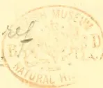
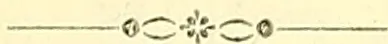
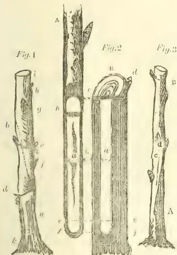
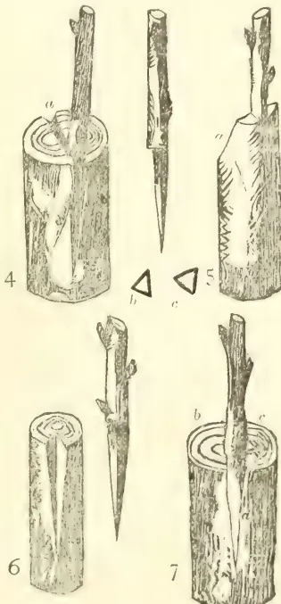

THE  
TROPICAL  
AGRICULTURIST.

1------------------------------------------------

ES.2,016

*Economic Sciences*

A circular purple ink stamp. The outer ring contains the text "BRITISH MUSEUM (NAT. H.)" at the top and "ENTOMOLOGY" at the bottom, separated by two stars. In the center, there is a crest featuring two figures, and below it, the words "DEPARTMENT OF" are printed.

2------------------------------------------------

This image shows a blank, aged, cream-colored page, likely an endpaper or flyleaf from an old book. The paper has a slightly textured appearance with some minor discoloration and faint smudges, characteristic of old paper. There is no text or other markings on the page.

3------------------------------------------------

This image shows a blank, aged, light beige page, likely an endpaper or flyleaf from an old book. The paper has a slightly textured appearance with some minor discoloration and faint smudges, particularly along the right edge. There is no text or other markings on the page.

4------------------------------------------------

[Vol. I containing Numbers I to XIII.]

THE *K*  
**TROPICAL AGRICULTURIST:**

A

MONTHLY RECORD OF INFORMATION

FOR

PLANTERS

OF

COFFEE, TEA, COCOA, CINCHONA, INDIA-RUBBER, SUGAR,  
TOBACCO, CARDAMOMS, PALMS, RICE,

AND OTHER PRODUCTS

SUITED FOR CULTIVATION IN THE TROPICS.

[ISSUED ON OR ABOUT THE 1ST OF EACH MONTH.]

COMPILED BY

A. M. & J. FERGUSON.

of the "Ceylon Observer."

"It is both the duty and interest of every Owner and Cultivator of the Soil to study the best means of rendering that soil subservient to his own and the general wants of the community; and he who introduces, beneficially, a new and useful Seed, Plant, or Shrub into his district, is a blessing and an honour to his country."—SIR J. SINCLAIR.

A. M. & J. FERGUSON : COLOMBO, CEYLON.

AND SOLD BY :—LONDON : J. HADDON & Co., 3, BOUVERIE STREET ; NEWTON & ESKELL, HIGH HOLBORN. ABERDEEN : W. WESTLAND. MADRAS : HIGGINBOTHAM & Co. CALCUTTA : TRACKER, SPINK & Co. BOMBAY : TRACKER & Co. (LIMITED). SINGAPORE : J. LITTLE & Co. PENANG : D. BLAZE' & Co. JAVA : JOHN PRYCE & Co., BATAVIA. MAURITIUS : C. W. HALL, PORT LOUIS. NATAL : ROBINSON & VAUN. DURBAN. AUSTRALIA : GORDON & GOTCH. JAMAICA : JAMES GALL. TRINIDAD : "CHRONICLE" OFFICE. BRITISH GUIANA : "ROYAL GAZETTE" OFFICE.

1882.

5------------------------------------------------

<!-- stage4: ACCEPT r2J/J_001:5 -->

THE FIRST VOLUME, 1881-82, includ-  
ing 13 Monthly Numbers, making 1088 pages,  
is now ready, with an exhaustive index, title,  
&c., handsomely bound in cloth, gold lettered.  
Price £1 2s. or R13.50 credit ; and £1 or  
R12 cash. Carriage extra. Too heavy for post.

---

PRINTED AT THE "CEYLON OBSERVER" PRESS : COLOMBO, CEYLON : 1882.

---

ADVERTISEMENTS (received in Colombo or by  
Agents) in the Monthly Numbers £2 per page—  
10 per cent off for cash with order.

ADVERTISEMENTS in Yearly Volume £4 per  
page—with 10 per cent off.

6------------------------------------------------

<!-- stage4: ACCEPT r2J/J_001:7 -->

## NOTE.

A decorative horizontal line with a central floral or star-like motif, flanked by small circles on either side.

THE object held in view in commencing the "TROPICAL AGRICULTURIST" as a monthly periodical is sufficiently explained in the Introductory Note to the first Number. We have merely now, on the completion of the first annual volume, to express our thanks to the large number of readers and contributors throughout tropical planting lands—East and West—as well as in Ceylon and Southern India, for the support rendered, and to express the hope that the second volume and succeeding volumes of this publication may be found even more generally useful than the one now closed.

A. M. & J. FERGUSON.

COLOMBO, 5th June 1882.

7------------------------------------------------

<!-- stage4: FAINT old-images-only -->

[Faint page: no legible print of its own could be verified; text withheld (stage 4 review list)]

8------------------------------------------------

# INDEX.

<table border="0">
<thead>
<tr>
<th style="text-align: left;">A.</th>
<th style="text-align: right;">PAGE.</th>
<th></th>
<th style="text-align: right;">PAGE.</th>
</tr>
</thead>
<tbody>
<tr>
<td>Abandoned Land</td>
<td style="text-align: right;">388</td>
<td>Alfa or Esparto</td>
<td style="text-align: right;">468</td>
</tr>
<tr>
<td>Aberdeen. Analysis of Food in</td>
<td style="text-align: right;">116</td>
<td>Algeria, Horticulture in</td>
<td style="text-align: right;">533</td>
</tr>
<tr>
<td>Abronia Cultivation</td>
<td style="text-align: right;">656</td>
<td>Alkaloid, New</td>
<td style="text-align: right;">447, 729, 774, 823, 943-5, 1022-3</td>
</tr>
<tr>
<td>Absorptive Power of the Soil</td>
<td style="text-align: right;">862</td>
<td>Alkaloids, Cinchona</td>
<td style="text-align: right;">(See Cinchona Alkaloids)</td>
</tr>
<tr>
<td>Acacia</td>
<td style="text-align: right;">251</td>
<td>Allspice</td>
<td style="text-align: right;">686, 687</td>
</tr>
<tr>
<td>Achin, Coffee Silk, &amp;c., in...</td>
<td style="text-align: right;">111, 122</td>
<td>Almonds, Import of, to Britain</td>
<td style="text-align: right;">707</td>
</tr>
<tr>
<td>Acroclinium Cultivation</td>
<td style="text-align: right;">656</td>
<td>Aloe Cultivation</td>
<td style="text-align: right;">49, 132, 174, 239, 305, 310, 329, 343, 364, 684</td>
</tr>
<tr>
<td>Adam's Peak to Minnesota</td>
<td style="text-align: right;">486, 598</td>
<td>— Fibre</td>
<td style="text-align: right;">174, 239, 310, 329, 343, 364, 684</td>
</tr>
<tr>
<td>Aden Cattle</td>
<td style="text-align: right;">150</td>
<td>Aloes, Price of</td>
<td style="text-align: right;">2</td>
</tr>
<tr>
<td>Adulteration in the United States</td>
<td style="text-align: right;">1076</td>
<td>Alonsoa Cultivation</td>
<td style="text-align: right;">656</td>
</tr>
<tr>
<td>— of Cocoa</td>
<td style="text-align: right;">948</td>
<td>Alum as a Cure for White Ants</td>
<td style="text-align: right;">494</td>
</tr>
<tr>
<td>— of Coffee</td>
<td style="text-align: right;">(See Coffee Adulteration)</td>
<td>Alyssum Cultivation</td>
<td style="text-align: right;">656</td>
</tr>
<tr>
<td>— of Food</td>
<td style="text-align: right;">83, 116, 428</td>
<td>Amaranthus Cultivation</td>
<td style="text-align: right;">656</td>
</tr>
<tr>
<td>— of Manure</td>
<td style="text-align: right;">988</td>
<td>America, Bees in</td>
<td style="text-align: right;">427</td>
</tr>
<tr>
<td>— of Tea</td>
<td style="text-align: right;">(See Tea Adulteration)</td>
<td>— Cotton in</td>
<td style="text-align: right;">405, 757</td>
</tr>
<tr>
<td>Africa, English Fruit Trees in</td>
<td style="text-align: right;">219</td>
<td>— Date Coffee in</td>
<td style="text-align: right;">108</td>
</tr>
<tr>
<td>— South, Grants of Lands in</td>
<td style="text-align: right;">863</td>
<td>— Demand for Liberian Coffee in</td>
<td style="text-align: right;">113, 320, 354, 591</td>
</tr>
<tr>
<td>— Indian Tea in</td>
<td style="text-align: right;">889</td>
<td>— Indian Tea in</td>
<td style="text-align: right;">340, 690</td>
</tr>
<tr>
<td>— Ostrich Farming in</td>
<td style="text-align: right;">794, 797</td>
<td>— Jute Cultivation in</td>
<td style="text-align: right;">392</td>
</tr>
<tr>
<td>— West, Cinchona in...</td>
<td style="text-align: right;">316</td>
<td>— Potato Cultivation in</td>
<td style="text-align: right;">346</td>
</tr>
<tr>
<td>African Rubber...</td>
<td style="text-align: right;">40, 356</td>
<td>— Schools of Agriculture in</td>
<td style="text-align: right;">451</td>
</tr>
<tr>
<td>Agave</td>
<td style="text-align: right;">(See Aloe)</td>
<td>— Silk in</td>
<td style="text-align: right;">414</td>
</tr>
<tr>
<td>Ageratum Cultivation</td>
<td style="text-align: right;">656</td>
<td>— Tea Cultivation in</td>
<td style="text-align: right;">219, 339, 448, 500</td>
</tr>
<tr>
<td>Agricultural College near Adelaide</td>
<td style="text-align: right;">950</td>
<td>— Tea Trade of</td>
<td style="text-align: right;">30</td>
</tr>
<tr>
<td>— Company in Travancore</td>
<td style="text-align: right;">983</td>
<td>— Tobacco in</td>
<td style="text-align: right;">329, 415</td>
</tr>
<tr>
<td>— of Mauritius</td>
<td style="text-align: right;">244</td>
<td>— Agricultural Productiveness of</td>
<td style="text-align: right;">856</td>
</tr>
<tr>
<td>— Department in America</td>
<td style="text-align: right;">1015</td>
<td>American Aloe</td>
<td style="text-align: right;">(See Aloe)</td>
</tr>
<tr>
<td>— Education in Scotland</td>
<td style="text-align: right;">304</td>
<td>— Blight, Cure for...</td>
<td style="text-align: right;">302</td>
</tr>
<tr>
<td>— in Sweden</td>
<td style="text-align: right;">689</td>
<td>— Cress</td>
<td style="text-align: right;">442</td>
</tr>
<tr>
<td>— Exhibitions</td>
<td style="text-align: right;">1016</td>
<td>— Cultural Hints</td>
<td style="text-align: right;">867</td>
</tr>
<tr>
<td>— Experiment in Bellary</td>
<td style="text-align: right;">909</td>
<td>— Maize in India</td>
<td style="text-align: right;">544</td>
</tr>
<tr>
<td>— Experiments at Woburn</td>
<td style="text-align: right;">345</td>
<td>— Peaches</td>
<td style="text-align: right;">1024</td>
</tr>
<tr>
<td>— Industry in Brazil</td>
<td style="text-align: right;">978</td>
<td>— Trade with Liberia</td>
<td style="text-align: right;">575</td>
</tr>
<tr>
<td>— Interest of the United Kingdom</td>
<td style="text-align: right;">573</td>
<td>Amorphous Quinine</td>
<td style="text-align: right;">3</td>
</tr>
<tr>
<td>— Items</td>
<td style="text-align: right;">774, 1033</td>
<td>Analyses of Cinchona Bark</td>
<td style="text-align: right;">(See Cinchona Bark)</td>
</tr>
<tr>
<td>— Returns for 1881</td>
<td style="text-align: right;">448</td>
<td>— of Tea</td>
<td style="text-align: right;">62, 202-6, 209, 312</td>
</tr>
<tr>
<td>— Scholarships for Indian Students</td>
<td style="text-align: right;">855, 972</td>
<td>Analysis of Coffee Pulp</td>
<td style="text-align: right;">144</td>
</tr>
<tr>
<td>— Schools in Ceylon</td>
<td style="text-align: right;">916</td>
<td>— of Food in Aberdeen</td>
<td style="text-align: right;">116</td>
</tr>
<tr>
<td>— Soil, Phosphoric Acid in</td>
<td style="text-align: right;">863</td>
<td>Analyst Government, for Ceylon</td>
<td style="text-align: right;">837</td>
</tr>
<tr>
<td>— Substances Potash in</td>
<td style="text-align: right;">864</td>
<td>Analytical Chemists in Ceylon</td>
<td style="text-align: right;">487</td>
</tr>
<tr>
<td>Agriculture and Agricultural Education</td>
<td style="text-align: right;">407, 427, 429, 451, 1027</td>
<td>— Standard for Ledgerianas</td>
<td style="text-align: right;">583</td>
</tr>
<tr>
<td>— at the British Association</td>
<td style="text-align: right;">475</td>
<td>Anda-Assu, Oil of</td>
<td style="text-align: right;">785</td>
</tr>
<tr>
<td>— for Educated Ceylonese</td>
<td style="text-align: right;">320</td>
<td>Andamans, Agriculture in...</td>
<td style="text-align: right;">760, 773, 984</td>
</tr>
<tr>
<td>— in Burma</td>
<td style="text-align: right;">954</td>
<td>Animi Gum, Price of</td>
<td style="text-align: right;">2</td>
</tr>
<tr>
<td>— in Ceylon</td>
<td style="text-align: right;">13, 29, 35, 52</td>
<td>Aniseed Oil, Price of</td>
<td style="text-align: right;">71</td>
</tr>
<tr>
<td>— in Cyprus</td>
<td style="text-align: right;">34</td>
<td>Aniseeds, Star, Price of</td>
<td style="text-align: right;">71</td>
</tr>
<tr>
<td>— in Egypt</td>
<td style="text-align: right;">961</td>
<td>Annatto at Peradeniya Gardens</td>
<td style="text-align: right;">1056</td>
</tr>
<tr>
<td>— in India</td>
<td style="text-align: right;">713, 743, 762, 1016, 1027</td>
<td>Antirrhinum Cultivation</td>
<td style="text-align: right;">656</td>
</tr>
<tr>
<td>— in Scotland</td>
<td style="text-align: right;">280, 1010</td>
<td>Ants as Enemies of Cacao</td>
<td style="text-align: right;">25</td>
</tr>
<tr>
<td>— of the World</td>
<td style="text-align: right;">707</td>
<td>— as Grub Destroyers in China</td>
<td style="text-align: right;">1067</td>
</tr>
<tr>
<td>— on the Continent of Europe</td>
<td style="text-align: right;">466, 575, 621, 678, 882, 952, 961, 1014</td>
<td>— as Insecticides</td>
<td style="text-align: right;">1064-6</td>
</tr>
<tr>
<td>— Schools of, in Brazil and the United States</td>
<td style="text-align: right;">451</td>
<td>— Useful</td>
<td style="text-align: right;">864</td>
</tr>
<tr>
<td>— Science of</td>
<td style="text-align: right;">465</td>
<td>Aphis Blight on Peach Trees</td>
<td style="text-align: right;">301</td>
</tr>
<tr>
<td>Agriculturist's Tour in Bellary</td>
<td style="text-align: right;">294</td>
<td>Apicots, Barren</td>
<td style="text-align: right;">308</td>
</tr>
<tr>
<td>Agri-Horticultural Society of India</td>
<td style="text-align: right;">152, 233, 773, 869</td>
<td>Apples, Australian, in Ceylon and India</td>
<td style="text-align: right;">153, 229</td>
</tr>
<tr>
<td>Agri-Horticulture on the Skevaroys</td>
<td style="text-align: right;">1038</td>
<td>— Value of, as Food</td>
<td style="text-align: right;">880</td>
</tr>
<tr>
<td></td>
<td></td>
<td>Arabian Coffee at Low Elevations</td>
<td style="text-align: right;">666</td>
</tr>
<tr>
<td></td>
<td></td>
<td>— Prospects of</td>
<td style="text-align: right;">193, 252, 712, 760</td>
</tr>
<tr>
<td></td>
<td></td>
<td>Arable Soils, Passage of Rain-Water through</td>
<td style="text-align: right;">862</td>
</tr>
<tr>
<td></td>
<td></td>
<td>Arboriculture</td>
<td style="text-align: right;">580-3, 706</td>
</tr>
</tbody>
</table>

9------------------------------------------------

INDEX.

<table border="0">
<thead>
<tr>
<th></th>
<th style="text-align: right;">PAGE.</th>
<th></th>
<th style="text-align: right;">PAGE.</th>
</tr>
</thead>
<tbody>
<tr>
<td>Arboriculture in India ... ..</td>
<td style="text-align: right;">860</td>
<td>Bartonia Cultivation ... ..</td>
<td style="text-align: right;">736</td>
</tr>
<tr>
<td>Argol, Price of... ..</td>
<td style="text-align: right;">71</td>
<td>Baskets for Cacao Plants ... ..</td>
<td style="text-align: right;">25</td>
</tr>
<tr>
<td>Arrowroot in Victoria ... ..</td>
<td style="text-align: right;">343</td>
<td>Bats Eating Beetles ... ..</td>
<td style="text-align: right;">263</td>
</tr>
<tr>
<td>Arsenic as an Insecticide ... ..</td>
<td style="text-align: right;">602</td>
<td>Beans Cultivation of ... ..</td>
<td style="text-align: right;">371-2, 379</td>
</tr>
<tr>
<td>Artesian Wells ... ..</td>
<td style="text-align: right;">578, 735</td>
<td>Bêche-de-Mer ... ..</td>
<td style="text-align: right;">856</td>
</tr>
<tr>
<td>Artichoke Cultivation ... ..</td>
<td style="text-align: right;">370, 379, 442</td>
<td>Beddome, Col., in Ceylon ... ..</td>
<td style="text-align: right;">365</td>
</tr>
<tr>
<td>Artificial Drying of Coffee ... ..</td>
<td style="text-align: right;">141, 145, 409, 856</td>
<td>    on Cinchona in Ceylon ... ..</td>
<td style="text-align: right;">553, 593-7, 711</td>
</tr>
<tr>
<td>    Fertilizers, Sales of, in America ... ..</td>
<td style="text-align: right;">72</td>
<td>    on the Nilgiri Cinchona Plantations ... ..</td>
<td style="text-align: right;">635-40, 691-700</td>
</tr>
<tr>
<td>    Indiarubber ... ..</td>
<td style="text-align: right;">982</td>
<td>Beer, Nilgiri ... ..</td>
<td style="text-align: right;">758</td>
</tr>
<tr>
<td>    Indigo ... ..</td>
<td style="text-align: right;">160, 874</td>
<td>Bee Cultivation in California ... ..</td>
<td style="text-align: right;">90</td>
</tr>
<tr>
<td>    Manures for Farms ... ..</td>
<td style="text-align: right;">614</td>
<td>    Culture ... ..</td>
<td style="text-align: right;">464, 776, 875</td>
</tr>
<tr>
<td>    Poultry Raising ... ..</td>
<td style="text-align: right;">24</td>
<td>Bees and Coffee Blossoms ... ..</td>
<td style="text-align: right;">497, 533, 559, 590, 603, 763</td>
</tr>
<tr>
<td>Asbestos Paint ... ..</td>
<td style="text-align: right;">920</td>
<td>    and Colors ... ..</td>
<td style="text-align: right;">824</td>
</tr>
<tr>
<td>Asparagus Cultivation ... ..</td>
<td style="text-align: right;">370, 379</td>
<td>    as Flower Fertilizers ... ..</td>
<td style="text-align: right;">950</td>
</tr>
<tr>
<td>Asphalte, Compressed ... ..</td>
<td style="text-align: right;">356</td>
<td>    Cyrian ... ..</td>
<td style="text-align: right;">42</td>
</tr>
<tr>
<td>    Walks ... ..</td>
<td style="text-align: right;">130</td>
<td>    Humbie, Introduction of, into New Zealand ... ..</td>
<td style="text-align: right;">1028</td>
</tr>
<tr>
<td>Assafoetida, Price of ... ..</td>
<td style="text-align: right;">2</td>
<td>    in America ... ..</td>
<td style="text-align: right;">423</td>
</tr>
<tr>
<td>Assam, Government Plantations in ... ..</td>
<td style="text-align: right;">1075</td>
<td>    in Ceylon ... ..</td>
<td style="text-align: right;">13, 29, 33, 52, 438</td>
</tr>
<tr>
<td>    Tea Planting in, Cost of ... ..</td>
<td style="text-align: right;">19</td>
<td>    Mr. F. Benton on ... ..</td>
<td style="text-align: right;">30, 42, 52, 351</td>
</tr>
<tr>
<td>Aster Cultivation ... ..</td>
<td style="text-align: right;">656</td>
<td>Bees' Wax, Price of ... ..</td>
<td style="text-align: right;">2</td>
</tr>
<tr>
<td>Atmospheric Electricity, Effects of, on Vine ... ..</td>
<td style="text-align: right;">861</td>
<td>Beet Cultivation ... ..</td>
<td style="text-align: right;">371, 379, 864</td>
</tr>
<tr>
<td>Australasia, Tea and Coffee for ... ..</td>
<td style="text-align: right;">745</td>
<td>    Manuring of ... ..</td>
<td style="text-align: right;">862</td>
</tr>
<tr>
<td>Australia, Adulteration of Tea in ... ..</td>
<td style="text-align: right;">(See Tea)</td>
<td>Beetles as Enemies of Cacao ... ..</td>
<td style="text-align: right;">25</td>
</tr>
<tr>
<td>    and the East, Commerce between ... ..</td>
<td style="text-align: right;">843</td>
<td>    Bats Eating ... ..</td>
<td style="text-align: right;">263</td>
</tr>
<tr>
<td>    Ceylon Tea and Coffee, &amp;c., in 6-12, 28, 34, 83, 151, 197-214, 230, 251, 258, 263, 311, 402, 452, 453, 500, 553, 558, 743, 889 ... ..</td>
<td style="text-align: right;">26</td>
<td>    Eating Cinchonas ... ..</td>
<td style="text-align: right;">1001</td>
</tr>
<tr>
<td>    Coffee Cultivation in ... ..</td>
<td style="text-align: right;">192</td>
<td>Bellary, Agriculturist's Tour in ... ..</td>
<td style="text-align: right;">294</td>
</tr>
<tr>
<td>    Food Consumption in ... ..</td>
<td style="text-align: right;">1040</td>
<td>Bencoolen, Spice Cultivation in ... ..</td>
<td style="text-align: right;">737-40</td>
</tr>
<tr>
<td>    Gold in ... ..</td>
<td style="text-align: right;">20</td>
<td>Bengal Cinchona Plantations ... ..</td>
<td style="text-align: right;">261, 265-70, 770</td>
</tr>
<tr>
<td>    Indian Tea in 148, 173, 232, 250, 263, 392, 428, 500, 571, 583, 681-3, 689, 888, 889, 916, 1026, 1037, 1078 ... ..</td>
<td style="text-align: right;">20</td>
<td>    Horticulture in ... ..</td>
<td style="text-align: right;">798</td>
</tr>
<tr>
<td>    Lantana in ... ..</td>
<td style="text-align: right;">191</td>
<td>    Indiarubber Cultivation in ... ..</td>
<td style="text-align: right;">356</td>
</tr>
<tr>
<td>    Liberian Coffee Cultivation in ... ..</td>
<td style="text-align: right;">161</td>
<td>    Tea and Coffee Cultivation in ... ..</td>
<td style="text-align: right;">331</td>
</tr>
<tr>
<td>    Northern, Cooly Labour for ... ..</td>
<td style="text-align: right;">664</td>
<td>Benton, Mr. F., on Bee Culture ... ..</td>
<td style="text-align: right;">30, 42, 52</td>
</tr>
<tr>
<td>    Ostrich Farming in ... ..</td>
<td style="text-align: right;">990</td>
<td>    Berberry, Disease of ... ..</td>
<td style="text-align: right;">353</td>
</tr>
<tr>
<td>    Sheep in ... ..</td>
<td style="text-align: right;">423</td>
<td>    Betel-nut and Fever ... ..</td>
<td style="text-align: right;">957</td>
</tr>
<tr>
<td>    South, Northern Territory of ... ..</td>
<td style="text-align: right;">950, 1059</td>
<td>    Beverage, New... ..</td>
<td style="text-align: right;">447</td>
</tr>
<tr>
<td>    Tea Cultivation in ... ..</td>
<td style="text-align: right;">474, 628, 670</td>
<td>    Bifacial Oranges ... ..</td>
<td style="text-align: right;">952</td>
</tr>
<tr>
<td>    Tropical Produce in ... ..</td>
<td style="text-align: right;">898</td>
<td>    Bird-catching Sedge ... ..</td>
<td style="text-align: right;">857</td>
</tr>
<tr>
<td>Australian Fruit for Ceylon, India, and England ... ..</td>
<td style="text-align: right;">120, 140, 142, 146, 152, 153, 190, 211, 229, 493</td>
<td>    Birds as Insectivores ... ..</td>
<td style="text-align: right;">121, 438, 614</td>
</tr>
<tr>
<td>    Magpies ... ..</td>
<td style="text-align: right;">121</td>
<td>    Bleeding, To Stop ... ..</td>
<td style="text-align: right;">314</td>
</tr>
<tr>
<td>    Meat and Flour Biscuits ... ..</td>
<td style="text-align: right;">150, 229</td>
<td>    Blight, American, Cure for ... ..</td>
<td style="text-align: right;">302</td>
</tr>
<tr>
<td>    Tea Season 1880-81 ... ..</td>
<td style="text-align: right;">244</td>
<td>    on Fruit Trees, Preventive or Cure for ... ..</td>
<td style="text-align: right;">473</td>
</tr>
<tr>
<td>    Wattle ... ..</td>
<td style="text-align: right;">251</td>
<td>    Blossom, Setting of, and Manure ... ..</td>
<td style="text-align: right;">126</td>
</tr>
<tr>
<td>Awards to Ceylon Exhibitors at the Melbourne Exhibition ... ..</td>
<td style="text-align: right;">(See Melbourne Exhibition)</td>
<td>    Blue Gum, Champion ... ..</td>
<td style="text-align: right;">354, 366</td>
</tr>
<tr>
<td>Awisawella, New Products at ... ..</td>
<td style="text-align: right;">864</td>
<td>    Rapid Growth of ... ..</td>
<td style="text-align: right;">670</td>
</tr>
<tr>
<td></td>
<td></td>
<td>    Bohemian Tea ... ..</td>
<td style="text-align: right;">132</td>
</tr>
<tr>
<td></td>
<td></td>
<td>    Bolivia, Cinchona Cultivation in ... ..</td>
<td style="text-align: right;">385, 590, 1002, 1024</td>
</tr>
<tr>
<td></td>
<td></td>
<td>    Indiarubber Cultivation in ... ..</td>
<td style="text-align: right;">590</td>
</tr>
<tr>
<td></td>
<td></td>
<td>    Bombay Agricultural and Manufacturing Co. ... ..</td>
<td style="text-align: right;">224</td>
</tr>
<tr>
<td></td>
<td></td>
<td>    Bonedust Manure ... ..</td>
<td style="text-align: right;">258</td>
</tr>
<tr>
<td></td>
<td></td>
<td>    Bone-meal ... ..</td>
<td style="text-align: right;">243</td>
</tr>
<tr>
<td></td>
<td></td>
<td>    Bones, To Dissolve ... ..</td>
<td style="text-align: right;">130</td>
</tr>
<tr>
<td></td>
<td></td>
<td>    Value of, as a Fertilizer ... ..</td>
<td style="text-align: right;">300</td>
</tr>
<tr>
<td></td>
<td></td>
<td>    Boots, Waterproofing ... ..</td>
<td style="text-align: right;">315</td>
</tr>
<tr>
<td></td>
<td></td>
<td>    Wet ... ..</td>
<td style="text-align: right;">314</td>
</tr>
<tr>
<td></td>
<td></td>
<td>    Borecole Cultivation ... ..</td>
<td style="text-align: right;">371, 379</td>
</tr>
<tr>
<td></td>
<td></td>
<td>    Borer in coconut Palms ... ..</td>
<td style="text-align: right;">665, 925</td>
</tr>
<tr>
<td></td>
<td></td>
<td>    Borneo, North ... ..</td>
<td style="text-align: right;">223, 859, 981, 987, 1005</td>
</tr>
<tr>
<td></td>
<td></td>
<td>    Co. ... ..</td>
<td style="text-align: right;">741</td>
</tr>
<tr>
<td></td>
<td></td>
<td>    Planting in ... ..</td>
<td style="text-align: right;">177, 438, 456, 603</td>
</tr>
<tr>
<td></td>
<td></td>
<td>    Trade among the Dyaks of ... ..</td>
<td style="text-align: right;">942</td>
</tr>
<tr>
<td></td>
<td></td>
<td>    Botanical Enterprise in the Colonies ... ..</td>
<td style="text-align: right;">759</td>
</tr>
<tr>
<td></td>
<td></td>
<td>    Botanic Gardens, Calcutta ... ..</td>
<td style="text-align: right;">379, 385</td>
</tr>
<tr>
<td></td>
<td></td>
<td>    Ceylon Royal ... ..</td>
<td style="text-align: right;">73-82, 396-9, 1041-56</td>
</tr>
<tr>
<td></td>
<td></td>
<td>    in India... ..</td>
<td style="text-align: right;">600</td>
</tr>
<tr>
<td></td>
<td></td>
<td>    in New Zealand ... ..</td>
<td style="text-align: right;">785</td>
</tr>
<tr>
<td></td>
<td></td>
<td>    Trinidad ... ..</td>
<td style="text-align: right;">858</td>
</tr>
<tr>
<td></td>
<td></td>
<td>    Boxes, Tea, Lacquered Tin ... ..</td>
<td style="text-align: right;">38, 63, 145</td>
</tr>
<tr>
<td></td>
<td></td>
<td>    Brachycome Cultivation ... ..</td>
<td style="text-align: right;">736</td>
</tr>
<tr>
<td></td>
<td></td>
<td>    Bran Feed for Cows ... ..</td>
<td style="text-align: right;">384, 428</td>
</tr>
<tr>
<td></td>
<td></td>
<td>    Brazil, Agriculture in ... ..</td>
<td style="text-align: right;">376</td>
</tr>
<tr>
<td></td>
<td></td>
<td>    Agricultural Industry in ... ..</td>
<td style="text-align: right;">978</td>
</tr>
<tr>
<td></td>
<td></td>
<td>    as a Field for Indian Immigrants ... ..</td>
<td style="text-align: right;">742</td>
</tr>
<tr>
<td></td>
<td></td>
<td>    Chinese Question in ... ..</td>
<td style="text-align: right;">539</td>
</tr>
<tr>
<td></td>
<td></td>
<td>    Coffee Crop ... ..</td>
<td style="text-align: right;">590, 591, 982</td>
</tr>
</tbody>
</table>

B.

<table border="0">
<tbody>
<tr>
<td>Baker, Sir Samuel, on Bees in Ceylon... ..</td>
<td style="text-align: right;">29</td>
</tr>
<tr>
<td>Bambarabotuwa, Gems in ... ..</td>
<td style="text-align: right;">841</td>
</tr>
<tr>
<td>Bamboo Cultivation ... ..</td>
<td style="text-align: right;">306</td>
</tr>
<tr>
<td>    Fences... ..</td>
<td style="text-align: right;">108</td>
</tr>
<tr>
<td>    Giant, in Ceylon ... ..</td>
<td style="text-align: right;">245, 375</td>
</tr>
<tr>
<td>Bamboos and Mangoes ... ..</td>
<td style="text-align: right;">248</td>
</tr>
<tr>
<td>    for Cacao Plants ... ..</td>
<td style="text-align: right;">25</td>
</tr>
<tr>
<td>Banana Cultivation in Colombia ... ..</td>
<td style="text-align: right;">533</td>
</tr>
<tr>
<td>Banana Cultivation in Jamaica ... ..</td>
<td style="text-align: right;">869</td>
</tr>
<tr>
<td>    Trade ... ..</td>
<td style="text-align: right;">858</td>
</tr>
<tr>
<td>Bananas, Dried, from Jamaica ... ..</td>
<td style="text-align: right;">634</td>
</tr>
<tr>
<td>Bangalore, Coffee Cultivation at, in 1828 ... ..</td>
<td style="text-align: right;">278</td>
</tr>
<tr>
<td>Barbados ... ..</td>
<td style="text-align: right;">560</td>
</tr>
<tr>
<td>    Tar for Mange ... ..</td>
<td style="text-align: right;">689</td>
</tr>
<tr>
<td>Bark, Cinchona ... ..</td>
<td style="text-align: right;">(See Cinchona)</td>
</tr>
<tr>
<td>Barley, Effect of Saltpetre on ... ..</td>
<td style="text-align: right;">862</td>
</tr>
<tr>
<td>Barneyard Manure, Analysis of ... ..</td>
<td style="text-align: right;">72</td>
</tr>
<tr>
<td>Barrels, Wood Pulp for ... ..</td>
<td style="text-align: right;">478</td>
</tr>
<tr>
<td>Barren Apricots ... ..</td>
<td style="text-align: right;">308</td>
</tr>
</tbody>
</table>

10------------------------------------------------

# INDEX.

<table border="0">
<thead>
<tr>
<th></th>
<th style="text-align: right;">PAGE.</th>
</tr>
</thead>
<tbody>
<tr>
<td>Brazil, Coffee Disease in ...</td>
<td style="text-align: right;">844</td>
</tr>
<tr>
<td>    Exports ...</td>
<td style="text-align: right;">4, 253, 327, 332, 753, 549, 881, 895, 980</td>
</tr>
<tr>
<td>        Exposition ...</td>
<td style="text-align: right;">538, 750</td>
</tr>
<tr>
<td>        Cultivation in ...</td>
<td style="text-align: right;">361, 714</td>
</tr>
<tr>
<td>        Propaganda in ...</td>
<td style="text-align: right;">538, 556, 615</td>
</tr>
<tr>
<td>        Immigrant Laborers in ...</td>
<td style="text-align: right;">585</td>
</tr>
<tr>
<td>        in 1881 ...</td>
<td style="text-align: right;">982</td>
</tr>
<tr>
<td>        Indiarubber and Cacao Cultivation in ...</td>
<td style="text-align: right;">247</td>
</tr>
<tr>
<td>        Industrial Conference in ...</td>
<td style="text-align: right;">632-4</td>
</tr>
<tr>
<td>        Labor and Coffee Prospects in ...</td>
<td style="text-align: right;">83, 396-9, 714, 745-50, 759, 767, 921-5</td>
</tr>
<tr>
<td>        Nut ...</td>
<td style="text-align: right;">950</td>
</tr>
<tr>
<td>    Schools of Agriculture in ...</td>
<td style="text-align: right;">451</td>
</tr>
<tr>
<td>    Slavery in ...</td>
<td style="text-align: right;">592, 661, 714, 745-50, 759, 761, 763, 767, 906, 920, 921-5</td>
</tr>
<tr>
<td>        Sugar Cultivation in ...</td>
<td style="text-align: right;">980</td>
</tr>
<tr>
<td>        Tea Cultivation in ...</td>
<td style="text-align: right;">618</td>
</tr>
<tr>
<td>        Timber in ...</td>
<td style="text-align: right;">876</td>
</tr>
<tr>
<td>        Wax Palm ...</td>
<td style="text-align: right;">752, 814</td>
</tr>
<tr>
<td>    Brazilian Productions ...</td>
<td style="text-align: right;">578</td>
</tr>
<tr>
<td>    Breakwind, Sapu as ...</td>
<td style="text-align: right;">194</td>
</tr>
<tr>
<td>    Brewing in Ceylon ...</td>
<td style="text-align: right;">690, 718</td>
</tr>
<tr>
<td>        in India and Ceylon ...</td>
<td style="text-align: right;">690</td>
</tr>
<tr>
<td>        in the East ...</td>
<td style="text-align: right;">690</td>
</tr>
<tr>
<td>    Britain, Forestry in ...</td>
<td style="text-align: right;">629</td>
</tr>
<tr>
<td>    British Association, Agriculture at ...</td>
<td style="text-align: right;">475</td>
</tr>
<tr>
<td>        Columbia, Agriculture in ...</td>
<td style="text-align: right;">553</td>
</tr>
<tr>
<td>        Timber in ...</td>
<td style="text-align: right;">543</td>
</tr>
<tr>
<td>    Broccoli Cultivation ...</td>
<td style="text-align: right;">371, 379</td>
</tr>
<tr>
<td>    Broom Corn in America ...</td>
<td style="text-align: right;">708</td>
</tr>
<tr>
<td>    Broughton, Mr., and Cinchona ...</td>
<td style="text-align: right;">8</td>
</tr>
<tr>
<td>    Broussonetia Papyrifera as Paper Material ...</td>
<td style="text-align: right;">302, 448</td>
</tr>
<tr>
<td>    Browallia Cultivation ...</td>
<td style="text-align: right;">736</td>
</tr>
<tr>
<td>    Brussels Sprouts, Cultivation of ...</td>
<td style="text-align: right;">379</td>
</tr>
<tr>
<td>    Bucha Leaves, Price of ...</td>
<td style="text-align: right;">71</td>
</tr>
<tr>
<td>    Bug-Sucked Coffee Beans ...</td>
<td style="text-align: right;">1077</td>
</tr>
<tr>
<td>    Burma, Agriculture in ...</td>
<td style="text-align: right;">984</td>
</tr>
<tr>
<td>        Experimental Gardens in ...</td>
<td style="text-align: right;">688</td>
</tr>
<tr>
<td>        Tea and Coffee Cultivation in ...</td>
<td style="text-align: right;">150, 295, 669</td>
</tr>
<tr>
<td>        Tobacco Cultivation in ...</td>
<td style="text-align: right;">1031</td>
</tr>
<tr>
<td>    Butter, To Keep ...</td>
<td style="text-align: right;">684</td>
</tr>
</tbody>
</table>

## C.

<table border="0">
<tbody>
<tr>
<td>Cabbage Cultivation ...</td>
<td style="text-align: right;">371, 471</td>
</tr>
<tr>
<td>    Tree, New Zealand ...</td>
<td style="text-align: right;">228</td>
</tr>
<tr>
<td>Cabinet Woods ...</td>
<td style="text-align: right;">892</td>
</tr>
<tr>
<td>Cacalia Cultivation ...</td>
<td style="text-align: right;">736</td>
</tr>
<tr>
<td>Cacao or Cocoa at Peradeniya Gardens ...</td>
<td style="text-align: right;">78, 397, 1046</td>
</tr>
<tr>
<td>    Cultivation 25, 39, 159 107 146 154, 220, 236, 387, 404, 459, 576, 726, 953, 959, 1000, 1001 in Brazil ...</td>
<td style="text-align: right;">247</td>
</tr>
<tr>
<td>        in Dolosbage ...</td>
<td style="text-align: right;">1018, 1026</td>
</tr>
<tr>
<td>        in Ecuador ...</td>
<td style="text-align: right;">229</td>
</tr>
<tr>
<td>        in Guayaquil ...</td>
<td style="text-align: right;">334</td>
</tr>
<tr>
<td>        in Guiana ...</td>
<td style="text-align: right;">164</td>
</tr>
<tr>
<td>        in Trinidad ...</td>
<td style="text-align: right;">164, 1019, 1078-80</td>
</tr>
<tr>
<td>        on Patana ...</td>
<td style="text-align: right;">39</td>
</tr>
<tr>
<td>    Pods, Large ...</td>
<td style="text-align: right;">620, 626, 996</td>
</tr>
<tr>
<td>    Transmission of ...</td>
<td style="text-align: right;">629</td>
</tr>
<tr>
<td>    Preparation of ...</td>
<td style="text-align: right;">810, 907, 1000</td>
</tr>
<tr>
<td>    Seed, Packing of, for Export ...</td>
<td style="text-align: right;">666, 687</td>
</tr>
<tr>
<td>    White Ants Eating ...</td>
<td style="text-align: right;">494</td>
</tr>
<tr>
<td>Cactus, Use of ...</td>
<td style="text-align: right;">176</td>
</tr>
<tr>
<td>Caju Wine ...</td>
<td style="text-align: right;">905</td>
</tr>
<tr>
<td>Calandrinia Cultivation ...</td>
<td style="text-align: right;">736</td>
</tr>
<tr>
<td>Calceolaria Cultivation ...</td>
<td style="text-align: right;">736</td>
</tr>
<tr>
<td>Calcutta Tea Syndicate ...</td>
<td style="text-align: right;">158, 434, 454, 856, 889, 890</td>
</tr>
<tr>
<td>California, Grape Culture in ...</td>
<td style="text-align: right;">533</td>
</tr>
<tr>
<td>California Bee Cultivation ...</td>
<td style="text-align: right;">90</td>
</tr>
<tr>
<td>Calisaya ...</td>
<td style="text-align: right;">(See Cinchona)</td>
</tr>
<tr>
<td>Callirhoe Cultivation ...</td>
<td style="text-align: right;">736</td>
</tr>
</tbody>
</table>

<table border="0">
<thead>
<tr>
<th></th>
<th style="text-align: right;">PAGE.</th>
</tr>
</thead>
<tbody>
<tr>
<td>Calumba Root ...</td>
<td style="text-align: right;">2, 71, 1024</td>
</tr>
<tr>
<td>Camphor, Price of ...</td>
<td style="text-align: right;">71</td>
</tr>
<tr>
<td>    Production of ...</td>
<td style="text-align: right;">309</td>
</tr>
<tr>
<td>Canada, Indian Tea in ...</td>
<td style="text-align: right;">889, 913-6</td>
</tr>
<tr>
<td>    New Fruits from ...</td>
<td style="text-align: right;">863</td>
</tr>
<tr>
<td>Candle Tree ...</td>
<td style="text-align: right;">928</td>
</tr>
<tr>
<td>    yielding Creeper ...</td>
<td style="text-align: right;">92</td>
</tr>
<tr>
<td>Candytuft Cultivation ...</td>
<td style="text-align: right;">736</td>
</tr>
<tr>
<td>Caoutchouc ...</td>
<td style="text-align: right;">(See Indiarubber)</td>
</tr>
<tr>
<td>Cape Colony, Tree Planting in ...</td>
<td style="text-align: right;">491</td>
</tr>
<tr>
<td>Capsicum Cultivation ...</td>
<td style="text-align: right;">471, 707, 857</td>
</tr>
<tr>
<td>Carbolic Acid in Foot and Mouth Disease ...</td>
<td style="text-align: right;">1019</td>
</tr>
<tr>
<td>    Perfumed ...</td>
<td style="text-align: right;">669</td>
</tr>
<tr>
<td>    Treatment of Leaf Disease ...</td>
<td style="text-align: right;">70, 91, 133-8, 164, 545-51, 556, 602, 628, 651-5, 719, 729, 750, 766, 806, 817, 818, 837, 838, 846, 857 910-2, 927, 956-9, 969, 971, 999, 1018</td>
</tr>
<tr>
<td>    Powder, New ...</td>
<td style="text-align: right;">1016</td>
</tr>
<tr>
<td>Cardamom Cultivation ...</td>
<td style="text-align: right;">154, 162, 234, 388, 432, 488, 589, 591, 625, 726, 999</td>
</tr>
<tr>
<td>    in India ...</td>
<td style="text-align: right;">412</td>
</tr>
<tr>
<td>Cardamoms at Peradeniya Gardens ...</td>
<td style="text-align: right;">80, 398, 1047</td>
</tr>
<tr>
<td>    Price of ...</td>
<td style="text-align: right;">2</td>
</tr>
<tr>
<td>Cardoon Cultivation ...</td>
<td style="text-align: right;">441</td>
</tr>
<tr>
<td>Carnauba or Wax Palm ...</td>
<td style="text-align: right;">752, 814</td>
</tr>
<tr>
<td>Carolina Paddy ...</td>
<td style="text-align: right;">334</td>
</tr>
<tr>
<td>Carrot Cultivation ...</td>
<td style="text-align: right;">441, 471</td>
</tr>
<tr>
<td>Cashmere, Grapes in ...</td>
<td style="text-align: right;">772</td>
</tr>
<tr>
<td>Cassava Cultivation in Ceylon ...</td>
<td style="text-align: right;">853</td>
</tr>
<tr>
<td>    in Sumatra ...</td>
<td style="text-align: right;">304</td>
</tr>
<tr>
<td>    Glucose from ...</td>
<td style="text-align: right;">1023</td>
</tr>
<tr>
<td>Cassia Bark, Experiments with ...</td>
<td style="text-align: right;">777</td>
</tr>
<tr>
<td>    Lignea, Price of ...</td>
<td style="text-align: right;">71</td>
</tr>
<tr>
<td>    Oil, Price of ...</td>
<td style="text-align: right;">71</td>
</tr>
<tr>
<td>Castor Oil a Remedy for Flies ...</td>
<td style="text-align: right;">824, 908</td>
</tr>
<tr>
<td>    Cultivation ...</td>
<td style="text-align: right;">364</td>
</tr>
<tr>
<td>    Gas Works at Jeypore ...</td>
<td style="text-align: right;">317, 1088</td>
</tr>
<tr>
<td>    Price of ...</td>
<td style="text-align: right;">2</td>
</tr>
<tr>
<td>    Tasteless ...</td>
<td style="text-align: right;">973</td>
</tr>
<tr>
<td>Casuarina Cultivation ...</td>
<td style="text-align: right;">246, 264, 289, 293, 296, 413, 464, 795</td>
</tr>
<tr>
<td>Catalpa, Western ...</td>
<td style="text-align: right;">1040</td>
</tr>
<tr>
<td>Catarrh, Quinine as a Cure for ...</td>
<td style="text-align: right;">1020</td>
</tr>
<tr>
<td>Caterpillars as Enemies of Cacao ...</td>
<td style="text-align: right;">25</td>
</tr>
<tr>
<td>    Remedy for ...</td>
<td style="text-align: right;">300</td>
</tr>
<tr>
<td>Cat-proof Garden Fence ...</td>
<td style="text-align: right;">537</td>
</tr>
<tr>
<td>Cattle, Aden ...</td>
<td style="text-align: right;">150</td>
</tr>
<tr>
<td>    Breeding at Saidapet Farm ...</td>
<td style="text-align: right;">320</td>
</tr>
<tr>
<td>    Cure for Foot-and-Mouth Disease in ...</td>
<td style="text-align: right;">288, 324</td>
</tr>
<tr>
<td>    Food, Cotton Seed as ...</td>
<td style="text-align: right;">344</td>
</tr>
<tr>
<td>    Indian, Degeneracy of ...</td>
<td style="text-align: right;">92</td>
</tr>
<tr>
<td>    on Coffee Estates, Llamas instead of ...</td>
<td style="text-align: right;">1000</td>
</tr>
<tr>
<td>Cauliflower Cultivation ...</td>
<td style="text-align: right;">372, 472</td>
</tr>
<tr>
<td>Cawnpore Experimental Farm ...</td>
<td style="text-align: right;">263, 792, 1027</td>
</tr>
<tr>
<td>Ceará, Indiarubber Cultivation in ...</td>
<td style="text-align: right;">361</td>
</tr>
<tr>
<td>    Rubber Cultivation in Ceylon 51, 60, 401, 576, 908     Seed, Enemies of ...</td>
<td style="text-align: right;">553, 567</td>
</tr>
<tr>
<td>    Scarcity of ...</td>
<td style="text-align: right;">37, 437</td>
</tr>
<tr>
<td>    Seeds, Number of, to an Ounce 233, 234</td>
<td style="text-align: right;">500, 769</td>
</tr>
<tr>
<td>Cedars of Lebanon ...</td>
<td style="text-align: right;">658, 666, 671</td>
</tr>
<tr>
<td>Cedrela Toona ...</td>
<td style="text-align: right;">441, 472</td>
</tr>
<tr>
<td>Celery Cultivation ...</td>
<td style="text-align: right;">736</td>
</tr>
<tr>
<td>Centuaarea Cultivation ...</td>
<td style="text-align: right;">852</td>
</tr>
<tr>
<td>Ceylon and England, Agriculture in ...</td>
<td style="text-align: right;">93</td>
</tr>
<tr>
<td>    and India, Coffee Planting in ...</td>
<td style="text-align: right;">826</td>
</tr>
<tr>
<td>    and Java Compared ...</td>
<td style="text-align: right;">119, 128, 144</td>
</tr>
<tr>
<td>    Ledgerianas in ...</td>
<td style="text-align: right;">60</td>
</tr>
<tr>
<td>    Area of Cinchona and Tea in ...</td>
<td style="text-align: right;">13, 29, 33, 438</td>
</tr>
<tr>
<td>    Bees in ...</td>
<td style="text-align: right;">664</td>
</tr>
<tr>
<td>    Botany of ...</td>
<td style="text-align: right;">(See Cinchona)</td>
</tr>
<tr>
<td>    Cinchona ...</td>
<td style="text-align: right;">663</td>
</tr>
<tr>
<td>    Climate of ...</td>
<td style="text-align: right;">36, 42, 121, 385, 387</td>
</tr>
<tr>
<td>    Cocoa, Sales of ...</td>
<td style="text-align: right;">(See Coffee)</td>
</tr>
<tr>
<td>    Coffee ...</td>
<td style="text-align: right;">254, 486, 598</td>
</tr>
<tr>
<td>    Colony in Minnesota ...</td>
<td></td>
</tr>
</tbody>
</table>

11------------------------------------------------

## INDEX.

<table border="0">
<thead>
<tr>
<th></th>
<th style="text-align: right;">PAGE.</th>
<th></th>
<th style="text-align: right;">PAGE.</th>
</tr>
</thead>
<tbody>
<tr>
<td>Ceylon Company, Limited ...</td>
<td style="text-align: right;">709</td>
<td>"Cinchona" and "Chinchona" ...</td>
<td style="text-align: right;">14, 15, 23, 405</td>
</tr>
<tr>
<td>Direct Supply Agency ...</td>
<td style="text-align: right;">439</td>
<td>and Coffee Culture, Value of Weeds in</td>
<td style="text-align: right;">15, 139</td>
</tr>
<tr>
<td>Exhibits at the Melbourne Exhibition</td>
<td style="text-align: right;">6-12, 34, 40, 141, 197-214, 675</td>
<td>and Deer ...</td>
<td style="text-align: right;">259</td>
</tr>
<tr>
<td>Exports of Coffee, Tea and Cinchona</td>
<td style="text-align: right;">4, 252, 253</td>
<td>Area of, in Ceylon ...</td>
<td style="text-align: right;">60</td>
</tr>
<tr>
<td>Fisheries ...</td>
<td style="text-align: right;">293</td>
<td>at a High Elevation ...</td>
<td style="text-align: right;">366</td>
</tr>
<tr>
<td>Flora ...</td>
<td style="text-align: right;">334</td>
<td>at a Low Elevation ...</td>
<td style="text-align: right;">387</td>
</tr>
<tr>
<td>Forestry in ...</td>
<td style="text-align: right;">993</td>
<td>at Peradeniya Gardens ...</td>
<td style="text-align: right;">77, 397, 1045</td>
</tr>
<tr>
<td>Fruit from Australia for</td>
<td style="text-align: right;">120, 140, 142, 146, 153, 214</td>
<td>Bark Analyses 318, 358-9, 461, 608, 630, 885,</td>
<td style="text-align: right;">993 1081, 1086</td>
</tr>
<tr>
<td>Gems in ...</td>
<td style="text-align: right;">35, 36, 437, 662, 841</td>
<td>Analyst for Ceylon</td>
<td style="text-align: right;">837</td>
</tr>
<tr>
<td>Geology and Mineralogy of ...</td>
<td style="text-align: right;">663</td>
<td>as an Article of the Official Materia Medica...</td>
<td style="text-align: right;">117</td>
</tr>
<tr>
<td>Gold in 15, 19, 21, 31, 35, 116, 215, 226, 437, 643-5, 662, 770, 900-5, 926</td>
<td style="text-align: right;">663</td>
<td>Ceylon, at the Melbourne Exhibition ...</td>
<td style="text-align: right;">7, 10, 141</td>
</tr>
<tr>
<td>Government Gardens and Native Cultivators</td>
<td style="text-align: right;">555</td>
<td>Charges for Curing ...</td>
<td style="text-align: right;">355</td>
</tr>
<tr>
<td>Handbook and Directory for 1880-81 ...</td>
<td style="text-align: right;">103</td>
<td>Exports by Madras Government 3, 37, 49, 70, 131, 159, 645, 752, 837,</td>
<td style="text-align: right;">916, 1016</td>
</tr>
<tr>
<td>Hemp ...</td>
<td style="text-align: right;">217</td>
<td>Gathering of 622, 665, 668, 677, 762, 799, 800, 818, 880, 905, 1075</td>
<td style="text-align: right;">1075</td>
</tr>
<tr>
<td>in 1881 ...</td>
<td style="text-align: right;">709</td>
<td>in Pharmacy ...</td>
<td style="text-align: right;">782-5</td>
</tr>
<tr>
<td>Indiarubber Cultivation in (See Indiarubber)</td>
<td style="text-align: right;">710, 729</td>
<td>Jamaica ...</td>
<td style="text-align: right;">30</td>
</tr>
<tr>
<td>Investment Association, Limited (See Liberian Coffee)</td>
<td style="text-align: right;">36</td>
<td>Java, Sales of ...</td>
<td style="text-align: right;">93, 131, 432</td>
</tr>
<tr>
<td>Liberian Coffee ...</td>
<td style="text-align: right;">663</td>
<td>Market for ...</td>
<td style="text-align: right;">677, 681</td>
</tr>
<tr>
<td>Limestone in ...</td>
<td style="text-align: right;">663</td>
<td>on Coppiced Trees ...</td>
<td style="text-align: right;">669</td>
</tr>
<tr>
<td>Meteorology of ...</td>
<td style="text-align: right;">(See New Products)</td>
<td>Production of 21, 296, 405, 669, 806, 941, 1008, 1040</td>
<td style="text-align: right;">1040</td>
</tr>
<tr>
<td>New Products in ...</td>
<td style="text-align: right;">103</td>
<td>Renewing of ...</td>
<td style="text-align: right;">16</td>
</tr>
<tr>
<td>Old and New Products in ...</td>
<td style="text-align: right;">150</td>
<td>Sales 37, 46, 115, 153, 333, 431, 449, 723, 814, 918, 1014, 1020</td>
<td style="text-align: right;">1020</td>
</tr>
<tr>
<td>Planters and English Farmers ...</td>
<td style="text-align: right;">558, 572</td>
<td>in Madras ...</td>
<td style="text-align: right;">972</td>
</tr>
<tr>
<td>Planters and Manitoba ...</td>
<td style="text-align: right;">456</td>
<td>in Colombo 16, 145, 164, 185, 491, 572, 919</td>
<td style="text-align: right;">919</td>
</tr>
<tr>
<td>Planting in ...</td>
<td style="text-align: right;">221</td>
<td>Speculation ...</td>
<td style="text-align: right;">982</td>
</tr>
<tr>
<td>Planting Industry ...</td>
<td style="text-align: right;">190</td>
<td>Thefts of ...</td>
<td style="text-align: right;">176</td>
</tr>
<tr>
<td>Position of Coffee Planting in ...</td>
<td style="text-align: right;">367, 675, 678, 728, 839, 925</td>
<td>Trade in S. America ...</td>
<td style="text-align: right;">162</td>
</tr>
<tr>
<td>Produce in London ...</td>
<td style="text-align: right;">116, 925</td>
<td>Calisaya at Low Elevations ...</td>
<td style="text-align: right;">139</td>
</tr>
<tr>
<td>Produce Market ...</td>
<td style="text-align: right;">960</td>
<td>Production of ...</td>
<td style="text-align: right;">983</td>
</tr>
<tr>
<td>Products, Exhibition of ...</td>
<td style="text-align: right;">90, 480, 912, 1084</td>
<td>Seed ...</td>
<td style="text-align: right;">813</td>
</tr>
<tr>
<td>Prospects of ...</td>
<td style="text-align: right;">73-82, 396-9, 1041-56</td>
<td>Verde ...</td>
<td style="text-align: right;">966-7, 972</td>
</tr>
<tr>
<td>Royal Botanic Gardens ...</td>
<td style="text-align: right;">663</td>
<td>Coccinea ...</td>
<td style="text-align: right;">627, 926</td>
</tr>
<tr>
<td>Silk in ...</td>
<td style="text-align: right;">(See Sericulture)</td>
<td>Condaminea ...</td>
<td style="text-align: right;">289</td>
</tr>
<tr>
<td>Tea ...</td>
<td style="text-align: right;">(See Tea)</td>
<td>Cultivation ... 22, 117, 153, 186, 257, 357, 487, 620, 622, 729, 745, 765</td>
<td style="text-align: right;">765</td>
</tr>
<tr>
<td>Terra Incognita in ...</td>
<td style="text-align: right;">94</td>
<td>in Bolivia ...</td>
<td style="text-align: right;">335, 590, 1002</td>
</tr>
<tr>
<td>Zoology of ...</td>
<td style="text-align: right;">664</td>
<td>in Borneo ...</td>
<td style="text-align: right;">486</td>
</tr>
<tr>
<td>Ceylonese, Educated, Agriculture for...</td>
<td style="text-align: right;">320</td>
<td>in Ceylon, Col. Beddome on ...</td>
<td style="text-align: right;">583, 593-7</td>
</tr>
<tr>
<td>Change of Crop ...</td>
<td style="text-align: right;">708</td>
<td>in Coorg ...</td>
<td style="text-align: right;">342, 374</td>
</tr>
<tr>
<td>Charcoal, Eucalyptus ...</td>
<td style="text-align: right;">876</td>
<td>in Darjeeling ...</td>
<td style="text-align: right;">590</td>
</tr>
<tr>
<td>vs. Tea-Drying Machinery ...</td>
<td style="text-align: right;">936</td>
<td>in Dikoya ...</td>
<td style="text-align: right;">852</td>
</tr>
<tr>
<td>Chasericulture ...</td>
<td style="text-align: right;">972</td>
<td>in Dimbula ...</td>
<td style="text-align: right;">367, 450</td>
</tr>
<tr>
<td>Chemicals and Coffee Leaf Disease ...</td>
<td style="text-align: right;">602</td>
<td>in Haputale ...</td>
<td style="text-align: right;">380</td>
</tr>
<tr>
<td>Cherry vs. Parchment Coffee ...</td>
<td style="text-align: right;">621</td>
<td>in Hewa Eliya ...</td>
<td style="text-align: right;">489</td>
</tr>
<tr>
<td>Chestnut in Darjeeling ...</td>
<td style="text-align: right;">424</td>
<td>in Jamaica 96, 455, 504, 541, 610-3, 721, 790</td>
<td style="text-align: right;">790</td>
</tr>
<tr>
<td>Chick Coffee ...</td>
<td style="text-align: right;">287</td>
<td>in Java 96-102, 357, 455, 963</td>
<td style="text-align: right;">963</td>
</tr>
<tr>
<td>Chickens, Artificial Hatching of ...</td>
<td style="text-align: right;">24</td>
<td>in Madulasima ...</td>
<td style="text-align: right;">489, 673</td>
</tr>
<tr>
<td>Chicory, adulteration of Coffee with 27, 144, 176, 177, 180, 212, 427, 499, 669, 847, 909, 917</td>
<td style="text-align: right;">625</td>
<td>in Mauritius ...</td>
<td style="text-align: right;">251, 1004</td>
</tr>
<tr>
<td>Chilaw, Ploughs and Harrows for ...</td>
<td style="text-align: right;">625</td>
<td>in Ramboda ...</td>
<td style="text-align: right;">605, 608</td>
</tr>
<tr>
<td>Chillies. Price of ...</td>
<td style="text-align: right;">2</td>
<td>in the United States ...</td>
<td style="text-align: right;">222</td>
</tr>
<tr>
<td>Chilly Cultivation ...</td>
<td style="text-align: right;">471, 672</td>
<td>in West Africa ...</td>
<td style="text-align: right;">316</td>
</tr>
<tr>
<td>China, Ants as Grub Destroyers in ...</td>
<td style="text-align: right;">1066</td>
<td>in Wynaad ...</td>
<td style="text-align: right;">427</td>
</tr>
<tr>
<td>Edible Fungus in ...</td>
<td style="text-align: right;">620</td>
<td>on the Kannandevan Mountains ...</td>
<td style="text-align: right;">496</td>
</tr>
<tr>
<td>Grass Dressing Machines ...</td>
<td style="text-align: right;">551</td>
<td>on the Mahaweliganga ...</td>
<td style="text-align: right;">963</td>
</tr>
<tr>
<td>Mastic ...</td>
<td style="text-align: right;">271</td>
<td>on the Nilgiris 3, 105, 186, 318, 356, 426, 427, 500, 562, 602, 630, 635-40, 713, 723, 773</td>
<td style="text-align: right;">773</td>
</tr>
<tr>
<td>Matting ...</td>
<td style="text-align: right;">277</td>
<td>on the Pulneys ...</td>
<td style="text-align: right;">282</td>
</tr>
<tr>
<td>Silk in ...</td>
<td style="text-align: right;">364, 563</td>
<td>on the Shevaroys ...</td>
<td style="text-align: right;">560</td>
</tr>
<tr>
<td>Quinine in ...</td>
<td style="text-align: right;">668</td>
<td>Cuprea 132, 138, 386, 411, 544, 681, 690, 729, 742, 743, 770, 774, 823, 824, 876, 943-5, 1022-3, 1024</td>
<td style="text-align: right;">1024</td>
</tr>
<tr>
<td>Tea ... 121, 206-8, 250, 602, 969, 1000, 1037</td>
<td style="text-align: right;">1037</td>
<td>Dr. Trimen and Mr. Howard on ...</td>
<td style="text-align: right;">114</td>
</tr>
<tr>
<td>Turpentine ...</td>
<td style="text-align: right;">271</td>
<td></td>
<td></td>
</tr>
<tr>
<td>Vegetation in ...</td>
<td style="text-align: right;">707</td>
<td></td>
<td></td>
</tr>
<tr>
<td>Chinese Exports ...</td>
<td style="text-align: right;">933</td>
<td></td>
<td></td>
</tr>
<tr>
<td>Immigration to North Borneo 1005-7</td>
<td style="text-align: right;">1005-7</td>
<td></td>
<td></td>
</tr>
<tr>
<td>Labor ...</td>
<td style="text-align: right;">1039</td>
<td></td>
<td></td>
</tr>
<tr>
<td>Question in Brazil ...</td>
<td style="text-align: right;">539</td>
<td></td>
<td></td>
</tr>
<tr>
<td>Chlorate of Potash ...</td>
<td style="text-align: right;">105</td>
<td></td>
<td></td>
</tr>
<tr>
<td>Chrysanthemum Cultivation ...</td>
<td style="text-align: right;">736</td>
<td></td>
<td></td>
</tr>
<tr>
<td>Cinchona Alkaloids ...</td>
<td style="text-align: right;">117, 153</td>
<td></td>
<td></td>
</tr>
<tr>
<td>Preparation of, in India 3, 502, 532</td>
<td style="text-align: right;">3, 502, 532</td>
<td></td>
<td></td>
</tr>
<tr>
<td>Synthesis of ...</td>
<td style="text-align: right;">845</td>
<td></td>
<td></td>
</tr>
<tr>
<td>and Blue Gums in Place of Natural Forest 718</td>
<td style="text-align: right;">718</td>
<td></td>
<td></td>
</tr>
</tbody>
</table>

12------------------------------------------------

INDEX.

<table border="0">
<thead>
<tr>
<th></th>
<th style="text-align: right;">PAGE.</th>
<th></th>
<th style="text-align: right;">PAGE.</th>
</tr>
</thead>
<tbody>
<tr>
<td><b>Cinchona, Duties on</b> ... ..</td>
<td style="text-align: right;">1019</td>
<td><b>Cocoa, Cultivation of</b> ... ..</td>
<td style="text-align: right;">(See Cacao)</td>
</tr>
<tr>
<td>    Dying out of ... ..</td>
<td style="text-align: right;">1000</td>
<td>    in Australia ... ..</td>
<td style="text-align: right;">213</td>
</tr>
<tr>
<td>    Enterprise in Ceylon ... ..</td>
<td style="text-align: right;">357</td>
<td><b>Coconut Cultivation</b> 129, 195, 234, 465, 791, 986</td>
<td></td>
</tr>
<tr>
<td>        and Government ... ..</td>
<td style="text-align: right;">410, 493</td>
<td>    Cultivation in the Andamans ... ..</td>
<td style="text-align: right;">984</td>
</tr>
<tr>
<td>    Exports from Ceylon ... ..</td>
<td style="text-align: right;">252</td>
<td>    Estates in Jaffna... ..</td>
<td style="text-align: right;">128</td>
</tr>
<tr>
<td>    Febrifuge ... ..</td>
<td style="text-align: right;">3, 502, 532</td>
<td>    Cultivation in Fiji ... ..</td>
<td style="text-align: right;">208, 451, 630</td>
</tr>
<tr>
<td>    Growing Twice on Same Land ... ..</td>
<td style="text-align: right;">12</td>
<td>    Oil Market ... ..</td>
<td style="text-align: right;">801</td>
</tr>
<tr>
<td>    Hybrids 439, 701, 773, 883, 907, 909, 959, 967,</td>
<td></td>
<td>    Palms, Borer in ... ..</td>
<td style="text-align: right;">665, 925</td>
</tr>
<tr>
<td>    1057-9, 1061, 1071-3, 1081, 1085, 1087</td>
<td></td>
<td><b>Coconuts in Northern Queensland</b> ... ..</td>
<td style="text-align: right;">25</td>
</tr>
<tr>
<td>    Ledgeriana, Analytical Standard for ... ..</td>
<td style="text-align: right;">583</td>
<td>    White Ants Eating ... ..</td>
<td style="text-align: right;">494</td>
</tr>
<tr>
<td>    Grafting of 751, 1057-9, 1071-3</td>
<td></td>
<td><b>Coculus Indicus, Price of</b> ... ..</td>
<td style="text-align: right;">2</td>
</tr>
<tr>
<td>    in Ceylon 116, 193, 233, 252, 437,</td>
<td></td>
<td><b>Cod Liver Oil Jelly</b> ... ..</td>
<td style="text-align: right;">708</td>
</tr>
<tr>
<td>    492, 537, 667, 687, 974</td>
<td></td>
<td><b>Coffee Adulteration</b> 12, 15, 26, 27, 30, 33, 50, 109, 123,</td>
<td></td>
</tr>
<tr>
<td>    Seed, Genuine... ..</td>
<td style="text-align: right;">1070</td>
<td>    138, 141, 144, 176, 177, 180, 285, 320, 427,</td>
<td></td>
</tr>
<tr>
<td>    Germinating ... ..</td>
<td style="text-align: right;">608, 966</td>
<td>    440, 669, 658, 837, 847, 851, 854, 856, 909,</td>
<td></td>
</tr>
<tr>
<td>    Sales of 487, 560, 591, 609,</td>
<td></td>
<td>    917, 929, 955, 969, 973, 974-8, 995, 999, 1063</td>
<td></td>
</tr>
<tr>
<td>    Value of... ..</td>
<td style="text-align: right;">153, 405</td>
<td>    Agency, Ceylon ... ..</td>
<td style="text-align: right;">359</td>
</tr>
<tr>
<td>    Manuring of ... ..</td>
<td style="text-align: right;">174, 327, 824</td>
<td>    and New Products ... ..</td>
<td style="text-align: right;">499</td>
</tr>
<tr>
<td>    Mr. Markham on ... ..</td>
<td style="text-align: right;">3, 22, 38, 45, 405</td>
<td>    and Pepper in Western India ... ..</td>
<td style="text-align: right;">625</td>
</tr>
<tr>
<td>    Neem Tree as a Substitute for ... ..</td>
<td style="text-align: right;">223</td>
<td>    and Silverskin ... ..</td>
<td style="text-align: right;">743</td>
</tr>
<tr>
<td>    Officialis, Early Flowering of ... ..</td>
<td style="text-align: right;">963</td>
<td>    and Sugar Producing Countries ... ..</td>
<td></td>
</tr>
<tr>
<td>    Plantations, Bengal ... ..</td>
<td style="text-align: right;">261, 265-70, 808</td>
<td>        534, 537, 629, 931, 936</td>
<td></td>
</tr>
<tr>
<td>    New, in India ... ..</td>
<td style="text-align: right;">572</td>
<td>    and Tea for Australasia ... ..</td>
<td style="text-align: right;">745</td>
</tr>
<tr>
<td>    Prospects of ... ..</td>
<td style="text-align: right;">138</td>
<td>    and Tea in Southern India ... ..</td>
<td style="text-align: right;">868</td>
</tr>
<tr>
<td>    Planters' Manual ... ..</td>
<td style="text-align: right;">258, 259, 279, 405, 411, 591, 810</td>
<td>    Arabian, New Field for ... ..</td>
<td style="text-align: right;">437</td>
</tr>
<tr>
<td>    Plants vs. Stumps ... ..</td>
<td style="text-align: right;">259, 290, 310, 311, 427</td>
<td>    Artificial Drying of ... ..</td>
<td style="text-align: right;">141, 145, 409, 856</td>
</tr>
<tr>
<td>    Pubescens ... ..</td>
<td style="text-align: right;">114, 486, 494, 496, 907</td>
<td>    at Low Elevations ... ..</td>
<td style="text-align: right;">666</td>
</tr>
<tr>
<td>    Red Barks 193, 219, 229, 236, 536, 778-82, 926</td>
<td></td>
<td>    at Peradeniya Gardens ... ..</td>
<td style="text-align: right;">76, 396, 1044</td>
</tr>
<tr>
<td>    Robusta 600, 605, 608, 625, 755-7, 967</td>
<td></td>
<td>    Beans, Bug-Sucked... ..</td>
<td style="text-align: right;">1077</td>
</tr>
<tr>
<td>    Seed, Importation of ... ..</td>
<td style="text-align: right;">154, 395, 721, 1003</td>
<td>    Berries and Spike ... ..</td>
<td style="text-align: right;">774</td>
</tr>
<tr>
<td>    Shaving of ... ..</td>
<td style="text-align: right;">327</td>
<td>    Blossoms and Bees ... ..</td>
<td style="text-align: right;">497, 553, 559, 590, 603, 763</td>
</tr>
<tr>
<td>    Stumps ... ..</td>
<td style="text-align: right;">355</td>
<td>    Ceylon, in the London Market... ..</td>
<td style="text-align: right;">38, 83, 690, 742,</td>
</tr>
<tr>
<td>    Succirubra, Champion ... ..</td>
<td style="text-align: right;">926, 969</td>
<td>        744, 753, 769, 926</td>
<td></td>
</tr>
<tr>
<td>    Dr. Trimen on ... ..</td>
<td style="text-align: right;">114, 117</td>
<td>        at the Melbourne Exhibition 6, 9, 42,</td>
<td></td>
</tr>
<tr>
<td>    tapping Beetles ... ..</td>
<td style="text-align: right;">1001</td>
<td>        Companies in Java ... ..</td>
<td style="text-align: right;">211, 212</td>
</tr>
<tr>
<td>    Treatment of, like Larch ... ..</td>
<td style="text-align: right;">139, 151</td>
<td>    Consumption of ... ..</td>
<td style="text-align: right;">27, 770, 982</td>
</tr>
<tr>
<td>    Tree, Enemies of 360, 410, 463, 591, 963, 1001</td>
<td></td>
<td>    Countries of the World, Three Great ... ..</td>
<td style="text-align: right;">723</td>
</tr>
<tr>
<td>    Trees, Bark of Dead or Dying ... ..</td>
<td style="text-align: right;">428</td>
<td>    Crop, Ceylon ... ..</td>
<td style="text-align: right;">709</td>
</tr>
<tr>
<td>    Selection of, by the Eye ... ..</td>
<td style="text-align: right;">367</td>
<td>    Crops and Seasons ... ..</td>
<td style="text-align: right;">1017</td>
</tr>
<tr>
<td>    Uritusinga ... ..</td>
<td style="text-align: right;">264, 289</td>
<td>    Cultivation and Manuring ... ..</td>
<td style="text-align: right;">554, 558</td>
</tr>
<tr>
<td>    Varieties of ... ..</td>
<td style="text-align: right;">259</td>
<td>        at Bangalore in 1828 ... ..</td>
<td style="text-align: right;">278</td>
</tr>
<tr>
<td>    White Bug on ... ..</td>
<td style="text-align: right;">982</td>
<td>        in Achin ... ..</td>
<td style="text-align: right;">111, 123</td>
</tr>
<tr>
<td><b>Cinchonas, Botany and Classification of</b> ... ..</td>
<td style="text-align: right;">1009</td>
<td>        in Australia ... ..</td>
<td style="text-align: right;">192</td>
</tr>
<tr>
<td><b>Cinchonidine</b> ... ..</td>
<td style="text-align: right;">447</td>
<td>        in Bengal ... ..</td>
<td style="text-align: right;">331</td>
</tr>
<tr>
<td>    Value of ... ..</td>
<td style="text-align: right;">153</td>
<td>        in Brazil ... ..</td>
<td style="text-align: right;">361, 745-50</td>
</tr>
<tr>
<td><b>Cineraria Cultivation</b> ... ..</td>
<td style="text-align: right;">736</td>
<td>        in Burma ... ..</td>
<td style="text-align: right;">150, 669</td>
</tr>
<tr>
<td><b>Cinnamon Bark, Experiments with</b> ... ..</td>
<td style="text-align: right;">777</td>
<td>        in Dominica ... ..</td>
<td style="text-align: right;">427</td>
</tr>
<tr>
<td>    Peeling ... ..</td>
<td style="text-align: right;">818</td>
<td>        in Fiji ... ..</td>
<td style="text-align: right;">208, 319, 669</td>
</tr>
<tr>
<td>    Ceylon, at the Melbourne Exhibition 11, 212</td>
<td></td>
<td>        in Guatemala ... ..</td>
<td style="text-align: right;">1025</td>
</tr>
<tr>
<td>    Cultivation ... ..</td>
<td style="text-align: right;">39, 791</td>
<td>        in Jamaica ... ..</td>
<td style="text-align: right;">273</td>
</tr>
<tr>
<td>    Oil, Price of ... ..</td>
<td style="text-align: right;">71</td>
<td>        in Java ... ..</td>
<td style="text-align: right;">216, 228, 432</td>
</tr>
<tr>
<td>    Sales in London ... ..</td>
<td style="text-align: right;">678</td>
<td>        in Johore ... ..</td>
<td style="text-align: right;">491</td>
</tr>
<tr>
<td>    Trade ... ..</td>
<td style="text-align: right;">1086, 1087</td>
<td>        in Kelebokka ... ..</td>
<td style="text-align: right;">258</td>
</tr>
<tr>
<td><b>Citronella Oil, Price of</b> ... ..</td>
<td style="text-align: right;">71</td>
<td>        in Manila ... ..</td>
<td style="text-align: right;">479</td>
</tr>
<tr>
<td><b>Clerihew Process of Drying</b> ... ..</td>
<td style="text-align: right;">973</td>
<td>        in Natal ... ..</td>
<td style="text-align: right;">17, 164</td>
</tr>
<tr>
<td><b>Clerkia Cultivation</b> ... ..</td>
<td style="text-align: right;">736</td>
<td>        in Northern Queensland ... ..</td>
<td style="text-align: right;">26</td>
</tr>
<tr>
<td><b>Climate, Influence of Forests on</b> ... ..</td>
<td style="text-align: right;">1082</td>
<td>        in Panwila ... ..</td>
<td style="text-align: right;">589</td>
</tr>
<tr>
<td><b>Clintonia Cultivation</b> ... ..</td>
<td style="text-align: right;">736</td>
<td>        in Samoa ... ..</td>
<td style="text-align: right;">665</td>
</tr>
<tr>
<td><b>Cloves at Peradeniya Gardens</b> ... ..</td>
<td style="text-align: right;">398</td>
<td>        in Sandwich Islands ... ..</td>
<td style="text-align: right;">928</td>
</tr>
<tr>
<td>    Ceylon, Sales of ... ..</td>
<td style="text-align: right;">912, 927, 969</td>
<td>        in Southern India 623, 687, 715, 773</td>
<td></td>
</tr>
<tr>
<td>    Price of ... ..</td>
<td style="text-align: right;">2, 71</td>
<td>        in the Philippines... ..</td>
<td style="text-align: right;">229, 559, 570</td>
</tr>
<tr>
<td>    Zanzibar ... ..</td>
<td style="text-align: right;">983</td>
<td>        in Travancore ... ..</td>
<td style="text-align: right;">768</td>
</tr>
<tr>
<td><b>Coca</b> ... ..</td>
<td style="text-align: right;">50, 344, 405, 773, 1034</td>
<td>        in Trinidad ... ..</td>
<td style="text-align: right;">164, 334</td>
</tr>
<tr>
<td><b>Cochin China, Agriculture in</b> ... ..</td>
<td style="text-align: right;">215</td>
<td>        in Wynad ... ..</td>
<td style="text-align: right;">1015</td>
</tr>
<tr>
<td><b>Cockchafer Cultivation</b> ... ..</td>
<td style="text-align: right;">15</td>
<td>        near Mauritius ... ..</td>
<td style="text-align: right;">628</td>
</tr>
<tr>
<td>    Maskeliya ... ..</td>
<td style="text-align: right;">840</td>
<td>        on the Nilgris ... ..</td>
<td style="text-align: right;">592</td>
</tr>
<tr>
<td><b>Cockchafer, Destruction of</b> ... ..</td>
<td style="text-align: right;">14, 30, 121</td>
<td>        on the Shevaroys ... ..</td>
<td style="text-align: right;">83, 112, 144, 150</td>
</tr>
<tr>
<td>    vs. Coffee ... ..</td>
<td style="text-align: right;">840</td>
<td>    Pruning, Manuring, and Weed-</td>
<td></td>
</tr>
<tr>
<td>    How to Exterminate ... ..</td>
<td style="text-align: right;">543, 634, 635</td>
<td>        ing in... ..</td>
<td style="text-align: right;">329, 667</td>
</tr>
<tr>
<td><b>Cockscomb Cultivation</b> ... ..</td>
<td style="text-align: right;">736</td>
<td>    Culture ... ..</td>
<td style="text-align: right;">600</td>
</tr>
<tr>
<td><b>Cocoa, Adulteration of</b> ... ..</td>
<td style="text-align: right;">948</td>
<td>    Disease in Brazil ... ..</td>
<td style="text-align: right;">844</td>
</tr>
<tr>
<td>    Ceylon, Sales of ... ..</td>
<td style="text-align: right;">36, 42, 121, 385</td>
<td>    Diseases ... ..</td>
<td style="text-align: right;">224</td>
</tr>
<tr>
<td></td>
<td></td>
<td>    Duties on... ..</td>
<td style="text-align: right;">905, 984, 1002, 1019</td>
</tr>
<tr>
<td></td>
<td></td>
<td>    Enemies ... ..</td>
<td style="text-align: right;">690, 1075</td>
</tr>
</tbody>
</table>

13------------------------------------------------

INDEX.

<table border="0">
<thead>
<tr>
<th></th>
<th style="text-align: right;">PAGE.</th>
<th></th>
<th style="text-align: right;">PAGE.</th>
</tr>
</thead>
<tbody>
<tr>
<td>Coffee Estate Economy</td>
<td style="text-align: right;">233</td>
<td>Colonial Possessions, Desire for</td>
<td style="text-align: right;">863</td>
</tr>
<tr>
<td>Estates, High Cultivation of</td>
<td style="text-align: right;">996-7</td>
<td>Colonies: and England. Free Trade Union for</td>
<td style="text-align: right;">123</td>
</tr>
<tr>
<td>Exchange</td>
<td style="text-align: right;">955</td>
<td>    Botanical Enterprise in</td>
<td style="text-align: right;">739</td>
</tr>
<tr>
<td>Exhibitions</td>
<td style="text-align: right;">453, 538, 750</td>
<td>    Land in</td>
<td style="text-align: right;">388</td>
</tr>
<tr>
<td>Exports from Ceylon</td>
<td style="text-align: right;">4, 253</td>
<td>Colonization in Ceylon</td>
<td style="text-align: right;">729</td>
</tr>
<tr>
<td>    from Travancore</td>
<td style="text-align: right;">734, 851</td>
<td>Colors and Bees</td>
<td style="text-align: right;">824</td>
</tr>
<tr>
<td>    from Venezuela</td>
<td style="text-align: right;">973</td>
<td>Columbia, British, Agriculture in</td>
<td style="text-align: right;">583</td>
</tr>
<tr>
<td>Exposition in Brazil</td>
<td style="text-align: right;">538</td>
<td>    Timber in</td>
<td style="text-align: right;">543</td>
</tr>
<tr>
<td>Flowers, Self-Fertilized</td>
<td style="text-align: right;">15, 310</td>
<td>Commercial Plants, New</td>
<td style="text-align: right;">161, 252</td>
</tr>
<tr>
<td>Fungus-proof</td>
<td style="text-align: right;">956</td>
<td>Concrete Sugar, Conversion of, in Natal</td>
<td style="text-align: right;">535</td>
</tr>
<tr>
<td>Grub</td>
<td style="text-align: right;">14, 58, 91, 105, 606, 628, 668, 680, 720, 840, 1067, 9</td>
<td>Conifers. Pruning of</td>
<td style="text-align: right;">469</td>
</tr>
<tr>
<td>    Jak Trees as Shade for</td>
<td style="text-align: right;">971</td>
<td>    Convolvulus Cultivation</td>
<td style="text-align: right;">786</td>
</tr>
<tr>
<td>Lands in Mysore</td>
<td style="text-align: right;">299</td>
<td>Coorg, Planting in</td>
<td style="text-align: right;">132, 287, 288, 295, 342, 374, 439, 452, 673, 742, 764, 1069</td>
</tr>
<tr>
<td>Leaf Disease 12, 14, 17, 22, 23, 31, 47, 58, 59, 70, 85</td>
<td style="text-align: right;">87, 91, 125, 126, 127, 128, 131, 133-8, 139, 164, 181, 193, 217, 233, 240, 284, 329, 333, 349, 352, 403, 426, 460, 463, 497, 505-530, 543, 545-551, 552, 554, 556-8, 570, 587, 589, 592, 602, 621, 622, 625, 626, 628, 645-53, 678, 683, 686, 689, 717, 719, 726, 729, 730-3, 750, 764, 765, 766, 769, 806, 817, 818, 837, 838, 846, 855, 878, 887, 910-2, 927, 928, 956-9, 964-6, 969, 971, 999, 1001, 1018, 1088</td>
<td>Copal</td>
<td style="text-align: right;">270</td>
</tr>
<tr>
<td>    Leaf Fungus on Other Trees</td>
<td style="text-align: right;">603</td>
<td>Copal, Price of</td>
<td style="text-align: right;">71</td>
</tr>
<tr>
<td>Liberian</td>
<td style="text-align: right;">(See Liberian Coffee)</td>
<td>    Opismicia Cerifera</td>
<td style="text-align: right;">752, 814</td>
</tr>
<tr>
<td>Malt</td>
<td style="text-align: right;">973</td>
<td>Copper in Ceylon</td>
<td style="text-align: right;">670, 676, 733</td>
</tr>
<tr>
<td>Manures and Manuring</td>
<td style="text-align: right;">33, 56, 84, 86, 117, 126, 604, 768, 877, 926</td>
<td>    in India</td>
<td style="text-align: right;">1063</td>
</tr>
<tr>
<td>Market Reports</td>
<td style="text-align: right;">4, 811, 854</td>
<td>Coppicing</td>
<td style="text-align: right;">1024</td>
</tr>
<tr>
<td>Medical Properties of</td>
<td style="text-align: right;">276, 341</td>
<td>Copra-bearing Palm</td>
<td style="text-align: right;">412</td>
</tr>
<tr>
<td>Mexican</td>
<td style="text-align: right;">936</td>
<td>Copra Exports from Fiji, Falling-off in</td>
<td style="text-align: right;">451</td>
</tr>
<tr>
<td>Mill, Burning of</td>
<td style="text-align: right;">543</td>
<td>    from Jaffna</td>
<td style="text-align: right;">672</td>
</tr>
<tr>
<td>Mixtures</td>
<td style="text-align: right;">30, 138, 144, 882, 897, 975, 995</td>
<td>Coral and Shells, Ceylon, at the Melbourne Exhibition</td>
<td style="text-align: right;">6, 11, 142</td>
</tr>
<tr>
<td>Nalkanaad</td>
<td style="text-align: right;">329, 956, 966, 1069</td>
<td>Corea</td>
<td style="text-align: right;">311</td>
</tr>
<tr>
<td>Oil</td>
<td style="text-align: right;">114</td>
<td>Coreopsis Cultivation</td>
<td style="text-align: right;">736</td>
</tr>
<tr>
<td>Parchment</td>
<td style="text-align: right;">553, 621</td>
<td>Costa Rica, Agriculture in</td>
<td style="text-align: right;">400, 800</td>
</tr>
<tr>
<td>Planters and their Critics</td>
<td style="text-align: right;">599</td>
<td>Cotton at Peradeniya Gardens</td>
<td style="text-align: right;">393</td>
</tr>
<tr>
<td>Planting in Ceylon, Position of</td>
<td style="text-align: right;">190</td>
<td>    Cake as Cattle Food</td>
<td style="text-align: right;">790</td>
</tr>
<tr>
<td>    in Southern India and Ceylon</td>
<td style="text-align: right;">93, 384</td>
<td>    Cotton Tree, &amp;c.</td>
<td style="text-align: right;">818</td>
</tr>
<tr>
<td>    Life</td>
<td style="text-align: right;">689</td>
<td>    Cultivation and Manufacture</td>
<td style="text-align: right;">496</td>
</tr>
<tr>
<td>    Preparation of</td>
<td style="text-align: right;">647</td>
<td>        in America</td>
<td style="text-align: right;">405, 757</td>
</tr>
<tr>
<td>Production and Consumption</td>
<td style="text-align: right;">184, 920</td>
<td>        in Fiji</td>
<td style="text-align: right;">208</td>
</tr>
<tr>
<td>    and Trade of the World</td>
<td style="text-align: right;">726, 804-6</td>
<td>        in India</td>
<td style="text-align: right;">772, 891, 916</td>
</tr>
<tr>
<td>Propaganda in Brazil</td>
<td style="text-align: right;">538, 556, 615</td>
<td>        in the Southern Province</td>
<td style="text-align: right;">669</td>
</tr>
<tr>
<td>Prospects</td>
<td style="text-align: right;">193, 252, 712, 729, 760</td>
<td>Oil</td>
<td style="text-align: right;">112</td>
</tr>
<tr>
<td>Pulp, Analysis of</td>
<td style="text-align: right;">144</td>
<td>    Picker, Combination</td>
<td style="text-align: right;">602</td>
</tr>
<tr>
<td>    as Manure</td>
<td style="text-align: right;">764</td>
<td>    Seed</td>
<td style="text-align: right;">626</td>
</tr>
<tr>
<td>Rest for</td>
<td style="text-align: right;">605</td>
<td>    Analysis of</td>
<td style="text-align: right;">72</td>
</tr>
<tr>
<td>Sacks</td>
<td style="text-align: right;">602</td>
<td>    and Sulphuric Acid</td>
<td style="text-align: right;">423</td>
</tr>
<tr>
<td>Soils</td>
<td style="text-align: right;">539</td>
<td>    as a Fertilizer and as Cattle Food</td>
<td style="text-align: right;">344</td>
</tr>
<tr>
<td>Statistics</td>
<td style="text-align: right;">4, 253, 255, 817, 878-80</td>
<td>Couve Tronchida or Portugal Cabbage</td>
<td style="text-align: right;">471</td>
</tr>
<tr>
<td>Still King in Ceylon</td>
<td style="text-align: right;">498</td>
<td>Covered vs. Bare Ground</td>
<td style="text-align: right;">343</td>
</tr>
<tr>
<td>Substitutes for</td>
<td style="text-align: right;">105, 435, 772, 855</td>
<td>Cress Cultivation</td>
<td style="text-align: right;">441, 442, 472</td>
</tr>
<tr>
<td>Tea, and Cinchona in Ceylon</td>
<td style="text-align: right;">711</td>
<td>Cricket as Enemies of Liberian Coffee and Cacao</td>
<td style="text-align: right;">24, 107, 146, 220, 284, 459</td>
</tr>
<tr>
<td>Trade</td>
<td style="text-align: right;">758</td>
<td>    Cure for</td>
<td style="text-align: right;">175, 844</td>
</tr>
<tr>
<td>    and Customs Reforms</td>
<td style="text-align: right;">919</td>
<td>Crop, Change of</td>
<td style="text-align: right;">708</td>
</tr>
<tr>
<td>Tree, Education of</td>
<td style="text-align: right;">289</td>
<td>Crops, Effects of Manures on</td>
<td style="text-align: right;">774, 788</td>
</tr>
<tr>
<td>Trees and Moths</td>
<td style="text-align: right;">1070, 1075, 1085</td>
<td>    Short Due to Poor Cultivation</td>
<td style="text-align: right;">264</td>
</tr>
<tr>
<td>Uses of</td>
<td style="text-align: right;">341</td>
<td>Cross-Fertilization of Cinchonas</td>
<td style="text-align: right;">1085</td>
</tr>
<tr>
<td>Varieties of</td>
<td style="text-align: right;">131</td>
<td>    of Wheat</td>
<td style="text-align: right;">499</td>
</tr>
<tr>
<td>White Bug on</td>
<td style="text-align: right;">304</td>
<td>Cross, Mr., on the Nilgiri Cinchona Plantations</td>
<td style="text-align: right;">635-40, 691-700, 743, 772, 1007</td>
</tr>
<tr>
<td>Yield of</td>
<td style="text-align: right;">84</td>
<td>Croton Oil Tree</td>
<td style="text-align: right;">181</td>
</tr>
<tr>
<td>Coir Rope, Edibility of</td>
<td style="text-align: right;">963</td>
<td>    Seeds, Price of</td>
<td style="text-align: right;">71</td>
</tr>
<tr>
<td>Cola Nut</td>
<td style="text-align: right;">854, 1020, 1050</td>
<td>Cubeb, Price of</td>
<td style="text-align: right;">71</td>
</tr>
<tr>
<td>Cold in the Head, Cure for</td>
<td style="text-align: right;">33</td>
<td>Cucumber Cultivation</td>
<td style="text-align: right;">442, 472</td>
</tr>
<tr>
<td>Collinsia Cultivation</td>
<td style="text-align: right;">736</td>
<td>Cuddapah, Ploughing Exhibition at</td>
<td style="text-align: right;">793</td>
</tr>
<tr>
<td>Colombia, Banana Cultivation in</td>
<td style="text-align: right;">533</td>
<td>Cuprea Cinchona</td>
<td style="text-align: right;">(See Cinchona Cuprea)</td>
</tr>
<tr>
<td>Indiarubber Gathering in</td>
<td style="text-align: right;">499, 703</td>
<td>Customs Reforms and Tea and Coffee Trade</td>
<td style="text-align: right;">919</td>
</tr>
<tr>
<td>Colombo, Fruit in</td>
<td style="text-align: right;">800</td>
<td>Cutch, Price of</td>
<td style="text-align: right;">2, 71</td>
</tr>
<tr>
<td>    Grapes in</td>
<td style="text-align: right;">16, 26</td>
<td>Cyprian Bees</td>
<td style="text-align: right;">42</td>
</tr>
<tr>
<td>    Hot Season in</td>
<td style="text-align: right;">33</td>
<td>Cyprus, Agriculture in</td>
<td style="text-align: right;">34</td>
</tr>
<tr>
<td>    People's Park for</td>
<td style="text-align: right;">825</td>
<td></td>
<td></td>
</tr>
<tr>
<td>    Root</td>
<td style="text-align: right;">(See Calumba Root)</td>
<td></td>
<td></td>
</tr>
<tr>
<td>    Weather</td>
<td style="text-align: right;">158</td>
<td></td>
<td></td>
</tr>
<tr>
<td>Colonial Fisheries</td>
<td style="text-align: right;">426</td>
<td></td>
<td></td>
</tr>
<tr>
<td></td>
<td></td>
<td style="text-align: center;">D.</td>
<td></td>
</tr>
<tr>
<td></td>
<td></td>
<td>Dairy Maxim</td>
<td style="text-align: right;">774</td>
</tr>
<tr>
<td></td>
<td></td>
<td>Daisy, Swan River, Cultivation</td>
<td style="text-align: right;">736</td>
</tr>
<tr>
<td></td>
<td></td>
<td>Dakota, Farming in</td>
<td style="text-align: right;">801-4</td>
</tr>
<tr>
<td></td>
<td></td>
<td>Damar, Price of</td>
<td style="text-align: right;">71</td>
</tr>
<tr>
<td></td>
<td></td>
<td>Darjeeling, Cinchona Cultivation in</td>
<td style="text-align: right;">590</td>
</tr>
</tbody>
</table>

14------------------------------------------------

INDEX.

<table border="0">
<thead>
<tr>
<th></th>
<th style="text-align: right;">PAGE.</th>
</tr>
</thead>
<tbody>
<tr>
<td>Darjeeling Tea and Cinchona Association</td>
<td style="text-align: right;">49, 430</td>
</tr>
<tr>
<td>—, Tea Cultivation in</td>
<td style="text-align: right;">120, 173, 584, 1076</td>
</tr>
<tr>
<td>Dandelion Cultivation</td>
<td style="text-align: right;">472</td>
</tr>
<tr>
<td>Darwin on Earthworms</td>
<td style="text-align: right;">577</td>
</tr>
<tr>
<td>Date Coffee 12, 15, 26, 27, 33, 50, 109, 123, 141</td>
<td style="text-align: right;">141</td>
</tr>
<tr>
<td>—, Planting in</td>
<td style="text-align: right;">285, 320, 440, 688, 854, 929</td>
</tr>
<tr>
<td>Datura Cultivation</td>
<td style="text-align: right;">736</td>
</tr>
<tr>
<td>De Caen's Cinchona Barking Machine...</td>
<td style="text-align: right;">880, 905</td>
</tr>
<tr>
<td>Deer and Cinchona</td>
<td style="text-align: right;">257</td>
</tr>
<tr>
<td>Degeneracy of Indian Cattle</td>
<td style="text-align: right;">92</td>
</tr>
<tr>
<td>Dehra Dun Forest School</td>
<td style="text-align: right;">1032</td>
</tr>
<tr>
<td>—, Tea Planting in</td>
<td style="text-align: right;">945-7</td>
</tr>
<tr>
<td>—, Vegetation in</td>
<td style="text-align: right;">772</td>
</tr>
<tr>
<td>Deli, Sumatra, Planting in</td>
<td style="text-align: right;">256, 586</td>
</tr>
<tr>
<td>Desiccation of the Soil</td>
<td style="text-align: right;">863</td>
</tr>
<tr>
<td>Dianthus Cultivation</td>
<td style="text-align: right;">736</td>
</tr>
<tr>
<td>Digging by Steam</td>
<td style="text-align: right;">953</td>
</tr>
<tr>
<td>Dikoya, Planting in</td>
<td style="text-align: right;">327, 744</td>
</tr>
<tr>
<td>Dimbula, Cinchona in</td>
<td style="text-align: right;">367, 450</td>
</tr>
<tr>
<td>—, Planting in</td>
<td style="text-align: right;">329, 425</td>
</tr>
<tr>
<td>Disafforestation in Sikkim...</td>
<td style="text-align: right;">509</td>
</tr>
<tr>
<td>Dissolving of Bones</td>
<td style="text-align: right;">130</td>
</tr>
<tr>
<td>Divi-divi</td>
<td style="text-align: right;">253, 567, 952, 1016</td>
</tr>
<tr>
<td>Dolosbage, Cacao in</td>
<td style="text-align: right;">1018, 1026</td>
</tr>
<tr>
<td>Domestic Industries in India</td>
<td style="text-align: right;">811</td>
</tr>
<tr>
<td>Dominica. Coffee Cultivation in</td>
<td style="text-align: right;">427</td>
</tr>
<tr>
<td>Dragon's Blood, Price of</td>
<td style="text-align: right;">71</td>
</tr>
<tr>
<td>Drainage Water</td>
<td style="text-align: right;">790</td>
</tr>
<tr>
<td>Drain, Subsoil</td>
<td style="text-align: right;">300</td>
</tr>
<tr>
<td>Drugs, New</td>
<td style="text-align: right;">161, 252</td>
</tr>
<tr>
<td>Drying of Coffee, Artificial</td>
<td style="text-align: right;">141, 145, 409, 856</td>
</tr>
<tr>
<td>Dual Sap</td>
<td style="text-align: right;">301</td>
</tr>
<tr>
<td>Ducks, Artificial Hatching of</td>
<td style="text-align: right;">24</td>
</tr>
<tr>
<td>Dumbara. Rain and Leaf Disease in</td>
<td style="text-align: right;">625</td>
</tr>
<tr>
<td>Dunedin Tea</td>
<td style="text-align: right;">228</td>
</tr>
<tr>
<td>Duties on Coffee, Tea and Cinchona</td>
<td style="text-align: right;">1019</td>
</tr>
<tr>
<td>Dyaks of Borneo, Trade among</td>
<td style="text-align: right;">942</td>
</tr>
<tr>
<td>Dye Plants at Peradeniya Gardens</td>
<td style="text-align: right;">398</td>
</tr>
<tr>
<td>Dyes, Indian</td>
<td style="text-align: right;">564</td>
</tr>
<tr>
<td>Dynamite, Fishing with</td>
<td style="text-align: right;">333</td>
</tr>
</tbody>
</table>

E.

<table border="0">
<tbody>
<tr>
<td>Earthworms, Darwin on</td>
<td style="text-align: right;">577, 1040</td>
</tr>
<tr>
<td>Eastern World and Australia, Commerce between</td>
<td style="text-align: right;">843</td>
</tr>
<tr>
<td>Ebony, Price of</td>
<td style="text-align: right;">2, 71</td>
</tr>
<tr>
<td>Economic Plants at Peradeniya</td>
<td style="text-align: right;">1044</td>
</tr>
<tr>
<td>—, Products in India</td>
<td style="text-align: right;">905</td>
</tr>
<tr>
<td>Economy, Coffee Estate</td>
<td style="text-align: right;">233</td>
</tr>
<tr>
<td>Ecuador, Cacao in</td>
<td style="text-align: right;">229</td>
</tr>
<tr>
<td>Edible Fungus</td>
<td style="text-align: right;">620</td>
</tr>
<tr>
<td>Egg-plant Cultivation</td>
<td style="text-align: right;">471</td>
</tr>
<tr>
<td>Eggs, To Preserve</td>
<td style="text-align: right;">120, 314, 774</td>
</tr>
<tr>
<td>Egypt, Agriculture in</td>
<td style="text-align: right;">961</td>
</tr>
<tr>
<td>—, Jute Cultivation in</td>
<td style="text-align: right;">291</td>
</tr>
<tr>
<td>Electricity and Vegetation...</td>
<td style="text-align: right;">684, 862, 1084</td>
</tr>
<tr>
<td>Electro-Horticulture</td>
<td style="text-align: right;">860</td>
</tr>
<tr>
<td>Elemi</td>
<td style="text-align: right;">270</td>
</tr>
<tr>
<td>Elephant Grass, Paper from</td>
<td style="text-align: right;">973</td>
</tr>
<tr>
<td>Endive Cultivation</td>
<td style="text-align: right;">442, 472</td>
</tr>
<tr>
<td>England, Agricultural Depression in...</td>
<td style="text-align: right;">854</td>
</tr>
<tr>
<td>—, and Colonies. Free Trade Union for</td>
<td style="text-align: right;">123</td>
</tr>
<tr>
<td>—, Australian Fruit for</td>
<td style="text-align: right;">190, 493</td>
</tr>
<tr>
<td>English Flowers, Cultivation of</td>
<td style="text-align: right;">656</td>
</tr>
<tr>
<td>—, Fruit Trees in Africa</td>
<td style="text-align: right;">219</td>
</tr>
<tr>
<td>Erysimum Cultivation</td>
<td style="text-align: right;">736</td>
</tr>
<tr>
<td>Erythroxylon Coca</td>
<td style="text-align: right;">(See Coca)</td>
</tr>
<tr>
<td>Eschscholtzia Cultivation</td>
<td style="text-align: right;">736</td>
</tr>
<tr>
<td>Esparto</td>
<td style="text-align: right;">468</td>
</tr>
<tr>
<td>Espiritu Santo Plant</td>
<td style="text-align: right;">991</td>
</tr>
<tr>
<td>Estates Purchasing and Prospecting Co.</td>
<td style="text-align: right;">762</td>
</tr>
<tr>
<td>Eucalypti, Decay of</td>
<td style="text-align: right;">415</td>
</tr>
<tr>
<td>—, Rapid Growth of</td>
<td style="text-align: right;">670</td>
</tr>
</tbody>
</table>

<table border="0">
<thead>
<tr>
<th></th>
<th style="text-align: right;">PAGE.</th>
</tr>
</thead>
<tbody>
<tr>
<td>Eucalyptus Charcoal</td>
<td style="text-align: right;">876</td>
</tr>
<tr>
<td>—, Citroidia</td>
<td style="text-align: right;">400</td>
</tr>
<tr>
<td>—, in Mauritius</td>
<td style="text-align: right;">1040</td>
</tr>
<tr>
<td>—, Leaves and Insects</td>
<td style="text-align: right;">983</td>
</tr>
<tr>
<td>—, as Cure for Cold in the Head...</td>
<td style="text-align: right;">33</td>
</tr>
<tr>
<td>Euphorbium Gum</td>
<td style="text-align: right;">273</td>
</tr>
<tr>
<td>Europe, Agriculture in</td>
<td style="text-align: right;">466, 575, 621, 679, 882, 954, 961, 1014</td>
</tr>
<tr>
<td>Eutoea Cultivation</td>
<td style="text-align: right;">736</td>
</tr>
<tr>
<td>Evaporation of Water</td>
<td style="text-align: right;">863</td>
</tr>
<tr>
<td>Experimental Stations and Manuring...</td>
<td style="text-align: right;">148, 356</td>
</tr>
<tr>
<td>Experiments. Planting and Scientific</td>
<td style="text-align: right;">113</td>
</tr>
<tr>
<td>Eye, Diseases of, Quinine in</td>
<td style="text-align: right;">735</td>
</tr>
</tbody>
</table>

F.

<table border="0">
<tbody>
<tr>
<td>Falling-off in Prices of Ceylon Produce</td>
<td style="text-align: right;">116</td>
</tr>
<tr>
<td>Fallow Field System</td>
<td style="text-align: right;">607</td>
</tr>
<tr>
<td>Farm Memoranda</td>
<td style="text-align: right;">345</td>
</tr>
<tr>
<td>—, Productiveness and Manures</td>
<td style="text-align: right;">614</td>
</tr>
<tr>
<td>Farming at Madras</td>
<td style="text-align: right;">973</td>
</tr>
<tr>
<td>—, in Dakota</td>
<td style="text-align: right;">801-4</td>
</tr>
<tr>
<td>—, in New Zealand</td>
<td style="text-align: right;">705</td>
</tr>
<tr>
<td>—, in Scotland</td>
<td style="text-align: right;">124</td>
</tr>
<tr>
<td>—, Native, Wastefulness of</td>
<td style="text-align: right;">335</td>
</tr>
<tr>
<td>Farmyard Manure, Changes in</td>
<td style="text-align: right;">562</td>
</tr>
<tr>
<td>Febrifuge, Manufacture of, in India</td>
<td style="text-align: right;">3, 502, 532, 684, 685</td>
</tr>
<tr>
<td>Feeding Stuff, New</td>
<td style="text-align: right;">567</td>
</tr>
<tr>
<td>Feet, Use of, in Sowing and Planting...</td>
<td style="text-align: right;">242</td>
</tr>
<tr>
<td>Felling Trees</td>
<td style="text-align: right;">300</td>
</tr>
<tr>
<td>Fence, Garden, Cat-proof</td>
<td style="text-align: right;">537</td>
</tr>
<tr>
<td>Fences for Cinchona</td>
<td style="text-align: right;">259</td>
</tr>
<tr>
<td>Fertility</td>
<td style="text-align: right;">342</td>
</tr>
<tr>
<td>—, Mr. Lawes on</td>
<td style="text-align: right;">992</td>
</tr>
<tr>
<td>—, of New Zealand</td>
<td style="text-align: right;">112</td>
</tr>
<tr>
<td>Fertilization, Artificial</td>
<td style="text-align: right;">300</td>
</tr>
<tr>
<td>—, by Insects</td>
<td style="text-align: right;">497, 553, 559, 590, 603, 763, 950</td>
</tr>
<tr>
<td>Fertilizer, Bones as</td>
<td style="text-align: right;">300</td>
</tr>
<tr>
<td>—, Cheap</td>
<td style="text-align: right;">300, 469</td>
</tr>
<tr>
<td>—, Cotton Seed as</td>
<td style="text-align: right;">341</td>
</tr>
<tr>
<td>Fertilizers. Manufacture of, and Farmers</td>
<td style="text-align: right;">473</td>
</tr>
<tr>
<td>Fever, Betel Nut as Remedy for</td>
<td style="text-align: right;">951</td>
</tr>
<tr>
<td>—, Remedy for</td>
<td style="text-align: right;">1080</td>
</tr>
<tr>
<td>—, Willow Leaves as Remedy for</td>
<td style="text-align: right;">744</td>
</tr>
<tr>
<td>Fibre-yielding Plants 129, 238, 411, 456, 493, 618, 905, 949</td>
<td style="text-align: right;">61, 165</td>
</tr>
<tr>
<td>Fig, Cultivation of, in Turkey</td>
<td style="text-align: right;">32, 88, 122, 208, 282, 470</td>
</tr>
<tr>
<td>Fiji, Agriculture in</td>
<td style="text-align: right;">208, 451, 630-2</td>
</tr>
<tr>
<td>—, Coconut Cultivation in</td>
<td style="text-align: right;">208, 319, 669</td>
</tr>
<tr>
<td>—, Coffee Cultivation in</td>
<td style="text-align: right;">126, 333</td>
</tr>
<tr>
<td>—, Leaf Disease in</td>
<td style="text-align: right;">208</td>
</tr>
<tr>
<td>—, Cotton Cultivation in</td>
<td style="text-align: right;">88</td>
</tr>
<tr>
<td>—, From Ceylon to</td>
<td style="text-align: right;">317, 504, 741</td>
</tr>
<tr>
<td>—, Labor Difficulty in</td>
<td style="text-align: right;">319, 334</td>
</tr>
<tr>
<td>—, Liberian Coffee Cultivation in</td>
<td style="text-align: right;">208, 323, 1029</td>
</tr>
<tr>
<td>—, Sugar Cultivation in</td>
<td style="text-align: right;">166, 334</td>
</tr>
<tr>
<td>—, Tea Cultivation in</td>
<td style="text-align: right;">1024</td>
</tr>
<tr>
<td>Flax, Silver</td>
<td style="text-align: right;">1076</td>
</tr>
<tr>
<td>Fish Culture in Madras</td>
<td style="text-align: right;">224</td>
</tr>
<tr>
<td>—, Manure</td>
<td style="text-align: right;">426</td>
</tr>
<tr>
<td>Fisheries, Colonial</td>
<td style="text-align: right;">293</td>
</tr>
<tr>
<td>—, in Ceylon</td>
<td style="text-align: right;">333</td>
</tr>
<tr>
<td>Fishing with Dynamite</td>
<td style="text-align: right;">174, 181, 226, 234, 346, 419, 759</td>
</tr>
<tr>
<td>Flax Cultivation</td>
<td style="text-align: right;">174, 181, 226, 234</td>
</tr>
<tr>
<td>—, New Zealand</td>
<td style="text-align: right;">314, 345</td>
</tr>
<tr>
<td>Flies and Horses</td>
<td style="text-align: right;">905, 909</td>
</tr>
<tr>
<td>Florida, Agriculture in</td>
<td style="text-align: right;">173</td>
</tr>
<tr>
<td>—, Land Reclamation in</td>
<td style="text-align: right;">656</td>
</tr>
<tr>
<td>Flowers, English, Cultivation of</td>
<td style="text-align: right;">656, 736, 821</td>
</tr>
<tr>
<td>—, for the Tropics</td>
<td style="text-align: right;">472</td>
</tr>
<tr>
<td>—, Garden, Need of Special Culture for</td>
<td style="text-align: right;">932</td>
</tr>
<tr>
<td>—, or Shoots</td>
<td style="text-align: right;">963</td>
</tr>
<tr>
<td>Flying-foxes in Queensland</td>
<td style="text-align: right;">287</td>
</tr>
<tr>
<td>Foliage, Effects of Manures upon</td>
<td style="text-align: right;"></td>
</tr>
</tbody>
</table>

15------------------------------------------------

INDEX.

<table border="0">
<thead>
<tr>
<th></th>
<th style="text-align: right;">PAGE.</th>
<th></th>
<th style="text-align: right;">PAGE.</th>
</tr>
</thead>
<tbody>
<tr>
<td>Foochow Tea ...</td>
<td style="text-align: right;">... 295</td>
<td>Gold in Australia ...</td>
<td style="text-align: right;">... 962</td>
</tr>
<tr>
<td>Food Adulteration ...</td>
<td style="text-align: right;">... 83, 116</td>
<td>— in Ceylon 15, 19, 21, 31, 35, 116, 215, 226, 437,</td>
<td style="text-align: right;">...</td>
</tr>
<tr>
<td>— Consumption in Australia ...</td>
<td style="text-align: right;">... 1040</td>
<td>— in India ... 20, 92, 132, 215, 317, 375, 426, 432,</td>
<td style="text-align: right;">...</td>
</tr>
<tr>
<td>— Utilization of, in Digestion ...</td>
<td style="text-align: right;">... 863</td>
<td>438, 440, 643-5, 771, 800, 973</td>
<td style="text-align: right;">...</td>
</tr>
<tr>
<td>Foot-and-Mouth Disease in Cattle ...</td>
<td style="text-align: right;">288, 324, 1019</td>
<td>— Production ...</td>
<td style="text-align: right;">... 468, 485</td>
</tr>
<tr>
<td>Forestry and Timber at the Straits ...</td>
<td style="text-align: right;">... 253</td>
<td>—, Prospecting for ...</td>
<td style="text-align: right;">... 262</td>
</tr>
<tr>
<td>— in Britain ...</td>
<td style="text-align: right;">... 530, 629</td>
<td>—, Test for ...</td>
<td style="text-align: right;">... 116</td>
</tr>
<tr>
<td>— in India and Ceylon ...</td>
<td style="text-align: right;">... 993-5</td>
<td>Goosberry Fungus ...</td>
<td style="text-align: right;">... 400</td>
</tr>
<tr>
<td>— in Mountain Districts ...</td>
<td style="text-align: right;">... 775</td>
<td>Gorse as Food for Stock ...</td>
<td style="text-align: right;">... 929</td>
</tr>
<tr>
<td>Forests and Climate ...</td>
<td style="text-align: right;">... 1082</td>
<td>Gourd Cultivation ...</td>
<td style="text-align: right;">... 540</td>
</tr>
<tr>
<td>— and Rainfall ...</td>
<td style="text-align: right;">... 932</td>
<td>Government and Native Cultivators ...</td>
<td style="text-align: right;">... 555</td>
</tr>
<tr>
<td>—, State of ...</td>
<td style="text-align: right;">... 340</td>
<td>— Competition with Private Cinchona Planters ...</td>
<td style="text-align: right;">3, 37, 48, 131, 159</td>
</tr>
<tr>
<td>Forget-me-not Cultivation ...</td>
<td style="text-align: right;">... 822</td>
<td>— Gardens in Ceylon ...</td>
<td style="text-align: right;">... 73-82, 396-9, 555,</td>
</tr>
<tr>
<td>Fossil Gum Mines ...</td>
<td style="text-align: right;">... 191</td>
<td>825, 837, 1041-56</td>
<td style="text-align: right;">...</td>
</tr>
<tr>
<td>Fowls, Lice in ...</td>
<td style="text-align: right;">... 774</td>
<td>— vs. Private Analytical Chemists ...</td>
<td style="text-align: right;">487, 493</td>
</tr>
<tr>
<td>—, Liver as Food for ...</td>
<td style="text-align: right;">... 345</td>
<td>Grafting ...</td>
<td style="text-align: right;">... 480, 791</td>
</tr>
<tr>
<td>France, Phylloxera in ...</td>
<td style="text-align: right;">... (See Phylloxera)</td>
<td>— Cinchona ...</td>
<td style="text-align: right;">... (See Cinchona)</td>
</tr>
<tr>
<td>Free Trade Union between England and Colonies ...</td>
<td style="text-align: right;">... 123</td>
<td>— Deciduous Fruit Trees ...</td>
<td style="text-align: right;">... 315, 389</td>
</tr>
<tr>
<td>Fruit Cultivation ...</td>
<td style="text-align: right;">... 539</td>
<td>— Wax ...</td>
<td style="text-align: right;">... 130</td>
</tr>
<tr>
<td>— at Singapore ...</td>
<td style="text-align: right;">... 619</td>
<td>Grains of Paradise ...</td>
<td style="text-align: right;">... 569</td>
</tr>
<tr>
<td>— Evaporation ...</td>
<td style="text-align: right;">... 345</td>
<td>Grape Cultivation in California ...</td>
<td style="text-align: right;">... 533</td>
</tr>
<tr>
<td>— from Australia to Ceylon, India, and England ...</td>
<td style="text-align: right;">120, 140, 142, 146, 152, 158, 190, 214, 229</td>
<td>— in Cashmere ...</td>
<td style="text-align: right;">... 772</td>
</tr>
<tr>
<td>— in Colombo ...</td>
<td style="text-align: right;">... 800</td>
<td>Grapes, Australian, for India and Ceylon ...</td>
<td style="text-align: right;">... 146</td>
</tr>
<tr>
<td>—, Packing of ...</td>
<td style="text-align: right;">... 400</td>
<td>— in Colombo ...</td>
<td style="text-align: right;">... 16, 26</td>
</tr>
<tr>
<td>—, To Preserve ...</td>
<td style="text-align: right;">... 951</td>
<td>—, To Keep ...</td>
<td style="text-align: right;">... 1024</td>
</tr>
<tr>
<td>— Trade in British Honduras ...</td>
<td style="text-align: right;">... 773</td>
<td>Graphite or Plumbago ...</td>
<td style="text-align: right;">... 1061</td>
</tr>
<tr>
<td>— Trees, English, in Africa ...</td>
<td style="text-align: right;">... 219</td>
<td>Grass, China, Dressing Machines ...</td>
<td style="text-align: right;">... 551</td>
</tr>
<tr>
<td>—, Experiments on ...</td>
<td style="text-align: right;">... 862</td>
<td>Grasses, Dried ...</td>
<td style="text-align: right;">... 400</td>
</tr>
<tr>
<td>—, Grafting ...</td>
<td style="text-align: right;">... 315, 389</td>
<td>— for Paper ...</td>
<td style="text-align: right;">... 729</td>
</tr>
<tr>
<td>—, Manuring ...</td>
<td style="text-align: right;">... 470</td>
<td>Ground, Heat of ...</td>
<td style="text-align: right;">... 862</td>
</tr>
<tr>
<td>—, Preventive or Cure for Blight on ...</td>
<td style="text-align: right;">... 473</td>
<td>Grub... ...</td>
<td style="text-align: right;">... (See Coffee Grub)</td>
</tr>
<tr>
<td>—, To Clean Moss from ...</td>
<td style="text-align: right;">... 303</td>
<td>— Destroyers, Ants as ...</td>
<td style="text-align: right;">... 1064-7</td>
</tr>
<tr>
<td>—, Transplanting ...</td>
<td style="text-align: right;">... 610</td>
<td>Guano in Netherlands India ...</td>
<td style="text-align: right;">... 556</td>
</tr>
<tr>
<td>Fruits from Canada ...</td>
<td style="text-align: right;">... 863</td>
<td>Guatemala, Coffee and Sugar Cultivation in ...</td>
<td style="text-align: right;">... 1025</td>
</tr>
<tr>
<td>— Tropical ...</td>
<td style="text-align: right;">786, 796, 985</td>
<td>— Indigo ...</td>
<td style="text-align: right;">... 533</td>
</tr>
<tr>
<td>Fuel from Mangrove ...</td>
<td style="text-align: right;">... 377</td>
<td>Guava and Beetles ...</td>
<td style="text-align: right;">... 304</td>
</tr>
<tr>
<td>Fungus, Edible ...</td>
<td style="text-align: right;">... 620</td>
<td>Guiana, Cacao in ...</td>
<td style="text-align: right;">... 614</td>
</tr>
<tr>
<td>— Hunting ...</td>
<td style="text-align: right;">... 537</td>
<td>Guinea Grass in Jamaica ...</td>
<td style="text-align: right;">... 735</td>
</tr>
<tr>
<td>— Pests ...</td>
<td style="text-align: right;">544, 891</td>
<td>Gum Ammoniacum, Moroccan ...</td>
<td style="text-align: right;">... 273</td>
</tr>
<tr>
<td>— Trade ...</td>
<td style="text-align: right;">... 864</td>
<td>—, Price of ...</td>
<td style="text-align: right;">... 2</td>
</tr>
<tr>
<td></td>
<td></td>
<td>— Animi, Price of ...</td>
<td style="text-align: right;">... 2</td>
</tr>
<tr>
<td></td>
<td></td>
<td>— Arabic ...</td>
<td style="text-align: right;">... 270</td>
</tr>
<tr>
<td></td>
<td></td>
<td>—, Price of ...</td>
<td style="text-align: right;">... 2</td>
</tr>
<tr>
<td></td>
<td></td>
<td>— Assafoetida, Price of ...</td>
<td style="text-align: right;">... 2</td>
</tr>
<tr>
<td></td>
<td></td>
<td>— Benjamin, Price of ...</td>
<td style="text-align: right;">... 71</td>
</tr>
<tr>
<td></td>
<td></td>
<td>— Euphorbium ...</td>
<td style="text-align: right;">... 273</td>
</tr>
<tr>
<td></td>
<td></td>
<td>— for Labels, Cheap ...</td>
<td style="text-align: right;">... 320</td>
</tr>
<tr>
<td></td>
<td></td>
<td>— for Tea Packets ...</td>
<td style="text-align: right;">... 234</td>
</tr>
<tr>
<td></td>
<td></td>
<td>— Kino, Price of ...</td>
<td style="text-align: right;">... 2</td>
</tr>
<tr>
<td></td>
<td></td>
<td>— Mines, Fossil ...</td>
<td style="text-align: right;">... 192</td>
</tr>
<tr>
<td></td>
<td></td>
<td>— Myrrh, Price of ...</td>
<td style="text-align: right;">... 1</td>
</tr>
<tr>
<td></td>
<td></td>
<td>— Olibanum, Price of ...</td>
<td style="text-align: right;">... 2</td>
</tr>
<tr>
<td></td>
<td></td>
<td>— Sandarach ...</td>
<td style="text-align: right;">... 273</td>
</tr>
<tr>
<td></td>
<td></td>
<td>— Trade of Somaliland ...</td>
<td style="text-align: right;">... 273</td>
</tr>
<tr>
<td></td>
<td></td>
<td>— Tree Leaf Disease ...</td>
<td style="text-align: right;">462, 463</td>
</tr>
<tr>
<td></td>
<td></td>
<td>— Leaves, Curative Properties of ...</td>
<td style="text-align: right;">... 176</td>
</tr>
<tr>
<td></td>
<td></td>
<td>— Trees, Champion ...</td>
<td style="text-align: right;">354, 360, 366</td>
</tr>
<tr>
<td></td>
<td></td>
<td>— on the Nilgiris... ..</td>
<td style="text-align: right;">... 427</td>
</tr>
<tr>
<td></td>
<td></td>
<td>Gums, Resins, and Waxes... ..</td>
<td style="text-align: right;">128, 270</td>
</tr>
<tr>
<td></td>
<td></td>
<td>Guttapercha Cultivation in Borneo ...</td>
<td style="text-align: right;">987</td>
</tr>
<tr>
<td></td>
<td></td>
<td>— in Peradeniya Gardens ...</td>
<td style="text-align: right;">79, 399, 1049</td>
</tr>
<tr>
<td></td>
<td></td>
<td>—, Price of ...</td>
<td style="text-align: right;">... 71</td>
</tr>
<tr>
<td></td>
<td></td>
<td>Gypsophila Cultivation ...</td>
<td style="text-align: right;">... 736</td>
</tr>
<tr>
<td></td>
<td></td>
<td>Gypsun as Manure ...</td>
<td style="text-align: right;">154, 862</td>
</tr>
<tr>
<td></td>
<td></td>
<td></td>
<td></td>
</tr>
<tr>
<td></td>
<td></td>
<td style="text-align: center;">H.</td>
<td></td>
</tr>
<tr>
<td></td>
<td></td>
<td>Hakgala Garden ...</td>
<td style="text-align: right;">76, 837, 1042</td>
</tr>
<tr>
<td></td>
<td></td>
<td>Haputale Cinchona in ...</td>
<td style="text-align: right;">... 367</td>
</tr>
<tr>
<td></td>
<td></td>
<td>—, Climate of ...</td>
<td style="text-align: right;">... 425</td>
</tr>
<tr>
<td></td>
<td></td>
<td>—, Coffee in ...</td>
<td style="text-align: right;">... 365</td>
</tr>
</tbody>
</table>

G.

<table border="0">
<tbody>
<tr>
<td>Galangal Root, Price of ...</td>
<td style="text-align: right;">... 71</td>
</tr>
<tr>
<td>Galls, Price of ...</td>
<td style="text-align: right;">... 2</td>
</tr>
<tr>
<td>Gambier, Price of ...</td>
<td style="text-align: right;">... 71</td>
</tr>
<tr>
<td>Gamboge, Price of ...</td>
<td style="text-align: right;">... 71</td>
</tr>
<tr>
<td>Gammie, Mr., and Cinchona ...</td>
<td style="text-align: right;">192, 684, 685, 808</td>
</tr>
<tr>
<td>Gammie's Sulphate of Quinine ...</td>
<td style="text-align: right;">296, 368</td>
</tr>
<tr>
<td>Garden Fence, Cat-proof ...</td>
<td style="text-align: right;">... 537</td>
</tr>
<tr>
<td>— Pests ...</td>
<td style="text-align: right;">... 766</td>
</tr>
<tr>
<td>— Tools, Rust Preventive for ...</td>
<td style="text-align: right;">... 130</td>
</tr>
<tr>
<td>—, Useful Receipts for ...</td>
<td style="text-align: right;">130, 302, 314</td>
</tr>
<tr>
<td>Gardening, Sub-Tropical ...</td>
<td style="text-align: right;">... 477</td>
</tr>
<tr>
<td>Gas Tar ...</td>
<td style="text-align: right;">... 423</td>
</tr>
<tr>
<td>Gasworks, Castor Oil, at Jeypore ...</td>
<td style="text-align: right;">317, 1088</td>
</tr>
<tr>
<td>Gems in Ceylon ...</td>
<td style="text-align: right;">35, 36, 437, 626, 662, 841</td>
</tr>
<tr>
<td>General Produce Syndicate for Ceylon ...</td>
<td style="text-align: right;">... 511</td>
</tr>
<tr>
<td>Geological Survey of India ...</td>
<td style="text-align: right;">... 998</td>
</tr>
<tr>
<td>Geology of Ceylon ...</td>
<td style="text-align: right;">... 663</td>
</tr>
<tr>
<td>Geranium Cultivation ...</td>
<td style="text-align: right;">... 736</td>
</tr>
<tr>
<td>Germany, Vine Cultivation in ...</td>
<td style="text-align: right;">... 984</td>
</tr>
<tr>
<td>Germination of Seeds ...</td>
<td style="text-align: right;">309, 930, 1040</td>
</tr>
<tr>
<td>Germs and Disease in Plants ...</td>
<td style="text-align: right;">... 655</td>
</tr>
<tr>
<td>Gilbert, Dr., Conferring of Honor on ...</td>
<td style="text-align: right;">... 493</td>
</tr>
<tr>
<td>Gilia Cultivation ...</td>
<td style="text-align: right;">... 736</td>
</tr>
<tr>
<td>Ginger, Price of ...</td>
<td style="text-align: right;">... 2, 71</td>
</tr>
<tr>
<td>Ginseng ...</td>
<td style="text-align: right;">411, 788</td>
</tr>
<tr>
<td>Gloxinia Cultivation ...</td>
<td style="text-align: right;">... 736</td>
</tr>
<tr>
<td>Glycerine ...</td>
<td style="text-align: right;">... 296</td>
</tr>
<tr>
<td>Goletia Cultivation ...</td>
<td style="text-align: right;">... 726</td>
</tr>
<tr>
<td>Gold and Silver of the World ...</td>
<td style="text-align: right;">... 32</td>
</tr>
</tbody>
</table>

16------------------------------------------------

## INDEX.

<table border="0" style="width: 100%; border-collapse: collapse;">
<thead>
<tr>
<th style="text-align: left;"></th>
<th style="text-align: right;">PAGE.</th>
<th style="text-align: left;"></th>
<th style="text-align: right;">PAGE.</th>
</tr>
</thead>
<tbody>
<tr>
<td>Haputale, Liberian Coffee in</td>
<td style="text-align: right;">499</td>
<td>Indian Dyes</td>
<td style="text-align: right;">564-6</td>
</tr>
<tr>
<td>    Limestone</td>
<td style="text-align: right;">245</td>
<td>    Emigrants in Brazil</td>
<td style="text-align: right;">742</td>
</tr>
<tr>
<td>    Planting in</td>
<td style="text-align: right;">814</td>
<td>    Exports</td>
<td style="text-align: right;">1009</td>
</tr>
<tr>
<td>    Railway Extension</td>
<td style="text-align: right;">773</td>
<td>    Government and Cinchona Cultivation</td>
<td style="text-align: right;"></td>
</tr>
<tr>
<td>    Storm in</td>
<td style="text-align: right;">352</td>
<td>        3, 37, 48, 70, 131, 159, 502, 562</td>
<td style="text-align: right;"></td>
</tr>
<tr>
<td>Hawk-moths on Coffee</td>
<td style="text-align: right;">1070, 1075, 1085</td>
<td>    Immigration to the Straits</td>
<td style="text-align: right;">568</td>
</tr>
<tr>
<td>Hawkweed Cultivation</td>
<td style="text-align: right;">736</td>
<td>    Kaolins</td>
<td style="text-align: right;">1030</td>
</tr>
<tr>
<td>Hay, Clerihew Process for</td>
<td style="text-align: right;">973</td>
<td>    Labor for Fiji</td>
<td style="text-align: right;">504</td>
</tr>
<tr>
<td>Hayti, Agriculture in</td>
<td style="text-align: right;">931, 1023</td>
<td>    Local Industries</td>
<td style="text-align: right;">109, 295, 811</td>
</tr>
<tr>
<td>Heat, Absorption and Scattering of, by Leaves</td>
<td style="text-align: right;">252</td>
<td>    Pink Cultivation</td>
<td style="text-align: right;">736</td>
</tr>
<tr>
<td>    Effects of, on Vegetation</td>
<td style="text-align: right;">938</td>
<td>    Students, Agricultural Scholarships for</td>
<td style="text-align: right;">855, 972</td>
</tr>
<tr>
<td>    Escape of</td>
<td style="text-align: right;">863</td>
<td>    Tea</td>
<td style="text-align: right;">(See Tea)</td>
</tr>
<tr>
<td>    of the Ground</td>
<td style="text-align: right;">862</td>
<td>    Tea Districts Association</td>
<td style="text-align: right;">979</td>
</tr>
<tr>
<td>Hedge Plants</td>
<td style="text-align: right;">258</td>
<td>    Tea Syndicate</td>
<td style="text-align: right;">158, 434, 454, 670, 856, 889, 890</td>
</tr>
<tr>
<td>Height of Trees, To Estimate</td>
<td style="text-align: right;">400</td>
<td>    Wheat</td>
<td style="text-align: right;">145, 196</td>
</tr>
<tr>
<td>Helichrysum Cultivation</td>
<td style="text-align: right;">736</td>
<td>    White Wax</td>
<td style="text-align: right;">272</td>
</tr>
<tr>
<td>Hemileia Vastatrix</td>
<td style="text-align: right;">(See Coffee Leaf Disease)</td>
<td>Indiarubber, African</td>
<td style="text-align: right;">40, 356</td>
</tr>
<tr>
<td>Hemp in Ceylon</td>
<td style="text-align: right;">217</td>
<td>    and Gutta-percha</td>
<td style="text-align: right;">139, 271</td>
</tr>
<tr>
<td>    Manila</td>
<td style="text-align: right;">16, 949</td>
<td>    Artificial</td>
<td style="text-align: right;">982</td>
</tr>
<tr>
<td>    Sunn</td>
<td style="text-align: right;">217, 240, 949</td>
<td>    at Peradeniya Gardens</td>
<td style="text-align: right;">79, 399, 920, 1047</td>
</tr>
<tr>
<td>Henaratgoda Garden</td>
<td style="text-align: right;">76, 555, 825, 1043</td>
<td>    Cultivation</td>
<td style="text-align: right;">28, 291, 380, 393, 401, 576,</td>
</tr>
<tr>
<td>Herb Cultivation</td>
<td style="text-align: right;">540</td>
<td>        665, 726, 953</td>
<td style="text-align: right;"></td>
</tr>
<tr>
<td>Hewa Eliya, Cinchona Cultivation in</td>
<td style="text-align: right;">489</td>
<td>        in Bengal</td>
<td style="text-align: right;">356</td>
</tr>
<tr>
<td>Hibiscus Cultivation</td>
<td style="text-align: right;">736</td>
<td>        in Bolivia</td>
<td style="text-align: right;">590</td>
</tr>
<tr>
<td>Hollyhock Cultivation</td>
<td style="text-align: right;">736</td>
<td>        in Brazil</td>
<td style="text-align: right;">247, 665</td>
</tr>
<tr>
<td>Honduras, Fruit Trade in</td>
<td style="text-align: right;">773</td>
<td>        in Cearà</td>
<td style="text-align: right;">361</td>
</tr>
<tr>
<td>    Indiarubber in</td>
<td style="text-align: right;">323</td>
<td>        in Colombia</td>
<td style="text-align: right;">499, 703</td>
</tr>
<tr>
<td>Honey, Artificial</td>
<td style="text-align: right;">412</td>
<td>        in Honduras</td>
<td style="text-align: right;">323</td>
</tr>
<tr>
<td>Hop Cultivation on the Nilgiris</td>
<td style="text-align: right;">1021</td>
<td>        in India</td>
<td style="text-align: right;">356, 380</td>
</tr>
<tr>
<td>    Manures</td>
<td style="text-align: right;">862</td>
<td>        in Mozambique</td>
<td style="text-align: right;">440</td>
</tr>
<tr>
<td>Horse Hortulanæ</td>
<td style="text-align: right;">476, 561, 616, 700</td>
<td>    Enemies of</td>
<td style="text-align: right;">553, 567</td>
</tr>
<tr>
<td>Horse-breeding in Western India</td>
<td style="text-align: right;">420</td>
<td>    from Ceylon Indigenous Trees</td>
<td style="text-align: right;">121</td>
</tr>
<tr>
<td>Horses, To Keep Flies from</td>
<td style="text-align: right;">314, 345</td>
<td>    Introduction of, to Ceylon and India</td>
<td style="text-align: right;">394, 399</td>
</tr>
<tr>
<td>Horticulture in Algeria</td>
<td style="text-align: right;">533</td>
<td>        in Uva</td>
<td style="text-align: right;">687</td>
</tr>
<tr>
<td>    in India</td>
<td style="text-align: right;">369, 441, 798</td>
<td>    New Variety of</td>
<td style="text-align: right;">85, 192</td>
</tr>
<tr>
<td>Hot Season in Colombo</td>
<td style="text-align: right;">33</td>
<td>    Plants</td>
<td style="text-align: right;">119</td>
</tr>
<tr>
<td>Howard, Col., in Ceylon</td>
<td style="text-align: right;">920</td>
<td>    Price of</td>
<td style="text-align: right;">2, 71</td>
</tr>
<tr>
<td>    Mr. J. E., on Cinchona</td>
<td style="text-align: right;">116, 587, 685</td>
<td>    Seed, Scarcity of</td>
<td style="text-align: right;">37, 393, 437, 851, 952, 1076</td>
</tr>
<tr>
<td>Hughes, Mr. John, on Coffee Manures</td>
<td style="text-align: right;">56, 877</td>
<td>    Trees, Tapping of</td>
<td style="text-align: right;">60, 126</td>
</tr>
<tr>
<td>Humble Bee in New Zealand</td>
<td style="text-align: right;">1028</td>
<td>        Yield of</td>
<td style="text-align: right;">92</td>
</tr>
<tr>
<td>Hybrids, Cinchona</td>
<td style="text-align: right;">(See Cinchona)</td>
<td>        yielding Trees</td>
<td style="text-align: right;">329</td>
</tr>
<tr>
<td>Hydrophobia, Cure for</td>
<td style="text-align: right;">334</td>
<td>Indigo, Artificial</td>
<td style="text-align: right;">160, 874</td>
</tr>
<tr>
<td></td>
<td></td>
<td>    Cultivation in Ceylon</td>
<td style="text-align: right;">626, 666</td>
</tr>
<tr>
<td style="text-align: center;">I.</td>
<td></td>
<td>        in India</td>
<td style="text-align: right;">857</td>
</tr>
<tr>
<td></td>
<td></td>
<td>        in Paraguay</td>
<td style="text-align: right;">320</td>
</tr>
<tr>
<td></td>
<td></td>
<td>    Manufacture, Mr. Skrotsky's Patent for</td>
<td style="text-align: right;">770</td>
</tr>
<tr>
<td></td>
<td></td>
<td>    Price of</td>
<td style="text-align: right;">2</td>
</tr>
<tr>
<td>Ilang-ilang</td>
<td style="text-align: right;">290</td>
<td>Indjoek</td>
<td style="text-align: right;">131</td>
</tr>
<tr>
<td>India, Agriculture in</td>
<td style="text-align: right;">762</td>
<td>Industrial Conference in Brazil</td>
<td style="text-align: right;">632-4</td>
</tr>
<tr>
<td>    American Maize in</td>
<td style="text-align: right;">544</td>
<td>    Promotion</td>
<td style="text-align: right;">1033</td>
</tr>
<tr>
<td>    Arboriculture in</td>
<td style="text-align: right;">860</td>
<td>Inoculation Treatment of Leaf Disease</td>
<td style="text-align: right;">136</td>
</tr>
<tr>
<td>    Botanical Gardens in</td>
<td style="text-align: right;">600</td>
<td>Inoxydized Iron</td>
<td style="text-align: right;">185</td>
</tr>
<tr>
<td>    Brewing in</td>
<td style="text-align: right;">758</td>
<td>    Insect Bites, Cure for</td>
<td style="text-align: right;">314</td>
</tr>
<tr>
<td>    Coffee Cultivation in</td>
<td style="text-align: right;">93, 623, 773, 868</td>
<td>    Destroyers</td>
<td style="text-align: right;">952, 1017, 1064-7</td>
</tr>
<tr>
<td>    Copper in</td>
<td style="text-align: right;">1063</td>
<td>    Enemies of Cacao</td>
<td style="text-align: right;">25</td>
</tr>
<tr>
<td>    Crops and Weather in</td>
<td style="text-align: right;">48, 622, 642, 729, 910, 998</td>
<td>    Pest on Coco Palms in Fiji</td>
<td style="text-align: right;">630-2</td>
</tr>
<tr>
<td>    Economic Products in</td>
<td style="text-align: right;">905</td>
<td>    Pests and Science</td>
<td style="text-align: right;">544</td>
</tr>
<tr>
<td>    Febrifuge Manufacture in</td>
<td style="text-align: right;">3, 502, 532, 684, 685</td>
<td>        in Burma</td>
<td style="text-align: right;">669</td>
</tr>
<tr>
<td>    Fruit from Australia to 140</td>
<td style="text-align: right;">142, 146, 152, 214, 229</td>
<td>        in Ceylon</td>
<td style="text-align: right;">831, 905</td>
</tr>
<tr>
<td>    Geological Survey of</td>
<td style="text-align: right;">998</td>
<td>Insecticides</td>
<td style="text-align: right;">374, 1064-7</td>
</tr>
<tr>
<td>    Gold in</td>
<td style="text-align: right;">(See Gold)</td>
<td>Insectivorous Birds</td>
<td style="text-align: right;">121, 438, 614, 1073, 1075</td>
</tr>
<tr>
<td>    Mining in</td>
<td style="text-align: right;">92</td>
<td>Insects and Eucalyptus Leaves</td>
<td style="text-align: right;">983</td>
</tr>
<tr>
<td>    Planting in</td>
<td style="text-align: right;">375</td>
<td>    and Fertilization</td>
<td style="text-align: right;">497, 553, 559, 590, 603, 763</td>
</tr>
<tr>
<td>    Ploughing Exhibitions in</td>
<td style="text-align: right;">793</td>
<td>        Habits of</td>
<td style="text-align: right;">927</td>
</tr>
<tr>
<td>    Progress of</td>
<td style="text-align: right;">20</td>
<td>        on Plants, To Discover</td>
<td style="text-align: right;">300</td>
</tr>
<tr>
<td>    Sorghum Cultivation in</td>
<td style="text-align: right;">283</td>
<td>        Strength of</td>
<td style="text-align: right;">38</td>
</tr>
<tr>
<td>    Southern, Coffee and Pepper</td>
<td style="text-align: right;">Exports from</td>
<td>Insoluble vs. Soluble Phosphates</td>
<td style="text-align: right;">147</td>
</tr>
<tr>
<td>        625, 687, 715, 734</td>
<td style="text-align: right;"></td>
<td>Iowa, Farming in</td>
<td style="text-align: right;">387, 412</td>
</tr>
<tr>
<td>    Sugar in</td>
<td style="text-align: right;">665</td>
<td>Ipecacuanha at Peradeniya Gardens</td>
<td style="text-align: right;">80, 397</td>
</tr>
<tr>
<td>    Tapioca Cultivation in</td>
<td style="text-align: right;">110</td>
<td>    Sales of</td>
<td style="text-align: right;">544</td>
</tr>
<tr>
<td>    Tasar Silk in</td>
<td style="text-align: right;">110</td>
<td>Ipomea Cultivation</td>
<td style="text-align: right;">736</td>
</tr>
<tr>
<td>    Tobacco Cultivation in</td>
<td style="text-align: right;">22, 814, 865, 982, 983</td>
<td>Ireland Tobacco Cultivation in</td>
<td style="text-align: right;">417</td>
</tr>
<tr>
<td>    Water-power in</td>
<td style="text-align: right;">365</td>
<td>Iron Garden Tools, Rust Preventive for</td>
<td style="text-align: right;">130</td>
</tr>
<tr>
<td>Indian Cattle, Degeneracy of</td>
<td style="text-align: right;">92</td>
<td>    Inoxydized</td>
<td style="text-align: right;">185</td>
</tr>
<tr>
<td>    Cinchona Bark, Prices for</td>
<td style="text-align: right;">115</td>
<td></td>
<td></td>
</tr>
<tr>
<td>    Corn Cultivation</td>
<td style="text-align: right;">442</td>
<td></td>
<td></td>
</tr>
</tbody>
</table>

17------------------------------------------------

INDEX.

<table border="0">
<thead>
<tr>
<th></th>
<th style="text-align: right;">PAGE.</th>
</tr>
</thead>
<tbody>
<tr>
<td>Iron, Native-made, in India and Ceylon</td>
<td style="text-align: right;">... 330</td>
</tr>
<tr>
<td>— Sand, Magnetic Separation of ...</td>
<td style="text-align: right;">... 689</td>
</tr>
<tr>
<td>— Solution, Watering with ...</td>
<td style="text-align: right;">... 423</td>
</tr>
<tr>
<td>Irrigation in Jaffna ...</td>
<td style="text-align: right;">... 590</td>
</tr>
<tr>
<td>— in Mauritius ...</td>
<td style="text-align: right;">... 670</td>
</tr>
<tr>
<td>Italy, Olive Cultivation in ...</td>
<td style="text-align: right;">... 787</td>
</tr>
<tr>
<td>Ivory, Flexible... ..</td>
<td style="text-align: right;">... 972</td>
</tr>
</tbody>
</table>

J.

<table border="0">
<tbody>
<tr>
<td>Jackson's Tea Drier ...</td>
<td style="text-align: right;">230, 865</td>
</tr>
<tr>
<td>Jaffna, Coconut Estates in...</td>
<td style="text-align: right;">... 128</td>
</tr>
<tr>
<td>—, Colonization at ...</td>
<td style="text-align: right;">... 729</td>
</tr>
<tr>
<td>—, Grain Market ...</td>
<td style="text-align: right;">... 672</td>
</tr>
<tr>
<td>—, Irrigation in ...</td>
<td style="text-align: right;">... 590</td>
</tr>
<tr>
<td>—, Tobacco Trade ...</td>
<td style="text-align: right;">47, 220, 672, 905</td>
</tr>
<tr>
<td>Jak Trees as Shade for Coffee</td>
<td style="text-align: right;">... 971</td>
</tr>
<tr>
<td>Jalap at Peradeniya Gardens</td>
<td style="text-align: right;">... 1049</td>
</tr>
<tr>
<td>—, Cultivation ...</td>
<td style="text-align: right;">258, 500, 543</td>
</tr>
<tr>
<td>Jamaica, Agriculture in ...</td>
<td style="text-align: right;">... 107, 436, 793</td>
</tr>
<tr>
<td>—, Banana Cultivation in ...</td>
<td style="text-align: right;">... 634, 869</td>
</tr>
<tr>
<td>—, Cinchona Bark Sales ...</td>
<td style="text-align: right;">... 30</td>
</tr>
<tr>
<td>—, —, Cultivation in ...</td>
<td style="text-align: right;">504, 541, 610-3, 721, 885-7</td>
</tr>
<tr>
<td>—, Commerce of ...</td>
<td style="text-align: right;">... 12</td>
</tr>
<tr>
<td>—, Coolies in ...</td>
<td style="text-align: right;">... 440, 800</td>
</tr>
<tr>
<td>—, Guinea Grass in ...</td>
<td style="text-align: right;">... 735</td>
</tr>
<tr>
<td>—, Liberian Coffee in ...</td>
<td style="text-align: right;">... 43</td>
</tr>
<tr>
<td>—, Life and Work in ...</td>
<td style="text-align: right;">... 294</td>
</tr>
<tr>
<td>—, Medicinal Plants in ...</td>
<td style="text-align: right;">... 412</td>
</tr>
<tr>
<td>—, Pimento Cultivation in ...</td>
<td style="text-align: right;">552, 880, 929</td>
</tr>
<tr>
<td>—, Palmetto Palm in ...</td>
<td style="text-align: right;">... 871</td>
</tr>
<tr>
<td>—, Planting and Coffee Prospects in ...</td>
<td style="text-align: right;">264, 273</td>
</tr>
<tr>
<td>—, Progress of ...</td>
<td style="text-align: right;">436, 560</td>
</tr>
<tr>
<td>—, Public Gardens and Plantations ...</td>
<td style="text-align: right;">... 65</td>
</tr>
<tr>
<td>—, Railways in ...</td>
<td style="text-align: right;">... 120</td>
</tr>
<tr>
<td>—, Sugar Cultivation in ...</td>
<td style="text-align: right;">... 933-5</td>
</tr>
<tr>
<td>—, Tobacco Plantations Co. ...</td>
<td style="text-align: right;">... 368</td>
</tr>
<tr>
<td>—, Walking-stick Export from ...</td>
<td style="text-align: right;">552, 758, 880, 929</td>
</tr>
<tr>
<td>Jaman Tree ...</td>
<td style="text-align: right;">... 1025</td>
</tr>
<tr>
<td>Japan, Agricultural Department in ...</td>
<td style="text-align: right;">... 440</td>
</tr>
<tr>
<td>—, Orange Cultivation in ...</td>
<td style="text-align: right;">... 876</td>
</tr>
<tr>
<td>—, Pea ...</td>
<td style="text-align: right;">244, 869</td>
</tr>
<tr>
<td>—, Silk Waste in ...</td>
<td style="text-align: right;">... 876</td>
</tr>
<tr>
<td>—, Tea ...</td>
<td style="text-align: right;">131, 240, 1034</td>
</tr>
<tr>
<td>Java and Ceylon Compared ...</td>
<td style="text-align: right;">... 826-8</td>
</tr>
<tr>
<td>—, Ledgerianas ...</td>
<td style="text-align: right;">119, 128, 144, 499</td>
</tr>
<tr>
<td>—, Cinchona Bark Sales... ..</td>
<td style="text-align: right;">93, 131, 432</td>
</tr>
<tr>
<td>—, —, Cultivation in ...</td>
<td style="text-align: right;">96-102, 357, 455, 624, 790, 963</td>
</tr>
<tr>
<td>—, —, Seed Sales ...</td>
<td style="text-align: right;">560, 609</td>
</tr>
<tr>
<td>—, Coffee Cultivation in ...</td>
<td style="text-align: right;">216, 228, 253, 432, 583, 836</td>
</tr>
<tr>
<td>—, —, Exports ...</td>
<td style="text-align: right;">4, 723, 1020</td>
</tr>
<tr>
<td>—, —, Leaf Disease in ...</td>
<td style="text-align: right;">... 543</td>
</tr>
<tr>
<td>—, Government and Coffee Leaf Disease ...</td>
<td style="text-align: right;">85, 91</td>
</tr>
<tr>
<td>—, Kapok Cultivation in ...</td>
<td style="text-align: right;">132, 208, 210</td>
</tr>
<tr>
<td>—, Liberian Coffee Cultivation in ...</td>
<td style="text-align: right;">... 159</td>
</tr>
<tr>
<td>—, Sugar Cultivation in ...</td>
<td style="text-align: right;">... 542</td>
</tr>
<tr>
<td>—, Tea Cultivation in ...</td>
<td style="text-align: right;">159, 591, 920</td>
</tr>
<tr>
<td>—, Tobacco Cultivation in ...</td>
<td style="text-align: right;">... 542</td>
</tr>
<tr>
<td>Jerusalem Artichoke Cultivation ...</td>
<td style="text-align: right;">... 442</td>
</tr>
<tr>
<td>Jeypore, Castor Oil Gas Works at ...</td>
<td style="text-align: right;">317, 1088</td>
</tr>
<tr>
<td>Johore, Coffee Cultivation in ...</td>
<td style="text-align: right;">... 735</td>
</tr>
<tr>
<td>—, Planting in ...</td>
<td style="text-align: right;">177, 438, 491, 501, 771, 963, 1085</td>
</tr>
<tr>
<td>—, Tea Cultivation in ...</td>
<td style="text-align: right;">... 251, 388, 411</td>
</tr>
<tr>
<td>Jones, Mr. Oliver, and Coffee Leaf Disease ...</td>
<td style="text-align: right;">125, 127, 131, 578</td>
</tr>
<tr>
<td>Jutahy-seed ...</td>
<td style="text-align: right;">... 270</td>
</tr>
<tr>
<td>Jute, American, Cultivation of ...</td>
<td style="text-align: right;">... 392</td>
</tr>
<tr>
<td>—, Cultivation in Ceylon ...</td>
<td style="text-align: right;">182, 183, 215, 217, 230, 233, 427</td>
</tr>
<tr>
<td>—, —, in Egypt... ..</td>
<td style="text-align: right;">221, 771</td>
</tr>
<tr>
<td>—, —, Indian ...</td>
<td style="text-align: right;">184, 949</td>
</tr>
<tr>
<td>—, —, Treatment of ...</td>
<td style="text-align: right;">... 984</td>
</tr>
</tbody>
</table>

K.

<table border="0">
<thead>
<tr>
<th></th>
<th style="text-align: right;">PAGE.</th>
</tr>
</thead>
<tbody>
<tr>
<td>Kaffraria Tobacco Cultivation in ...</td>
<td style="text-align: right;">... 916</td>
</tr>
<tr>
<td>Kale Cultivation ...</td>
<td style="text-align: right;">... 371</td>
</tr>
<tr>
<td>Kalutara, Liberian Coffee at ...</td>
<td style="text-align: right;">111, 426</td>
</tr>
<tr>
<td>—, —, Tea at ...</td>
<td style="text-align: right;">... 145</td>
</tr>
<tr>
<td>Kannandevan Mountains, Cinchona Cultivation on ...</td>
<td style="text-align: right;">... 496</td>
</tr>
<tr>
<td>Kaolins, Indian ...</td>
<td style="text-align: right;">... 1030</td>
</tr>
<tr>
<td>Kapok Cultivation ...</td>
<td style="text-align: right;">132, 208, 210, 818</td>
</tr>
<tr>
<td>Kaulfussia Cultivation ...</td>
<td style="text-align: right;">... 736</td>
</tr>
<tr>
<td>Kegalla, Agriculture in ...</td>
<td style="text-align: right;">... 428</td>
</tr>
<tr>
<td>Kew Royal Botanic Gardens ...</td>
<td style="text-align: right;">... 706</td>
</tr>
<tr>
<td>Kigelia Pinnata ...</td>
<td style="text-align: right;">576, 657, 666</td>
</tr>
<tr>
<td>Kimmond's Tea Drier ...</td>
<td style="text-align: right;">... 16</td>
</tr>
<tr>
<td>Kino, Price of ...</td>
<td style="text-align: right;">... 2</td>
</tr>
<tr>
<td>Knol-khol Cultivation ...</td>
<td style="text-align: right;">443, 540</td>
</tr>
<tr>
<td>Kohl Rabi Cultivation ...</td>
<td style="text-align: right;">... 443</td>
</tr>
<tr>
<td>Kunbuk Tree Line from ...</td>
<td style="text-align: right;">336, 463</td>
</tr>
<tr>
<td>Kurunegala, Planting in ...</td>
<td style="text-align: right;">828-37</td>
</tr>
<tr>
<td>Ku-uk ...</td>
<td style="text-align: right;">... 485</td>
</tr>
</tbody>
</table>

L.

<table border="0">
<tbody>
<tr>
<td>Labels, Gum for ...</td>
<td style="text-align: right;">... 320</td>
</tr>
<tr>
<td>Labor in Brazil ...</td>
<td style="text-align: right;">... 585</td>
</tr>
<tr>
<td>—, —, in Ceylon ...</td>
<td style="text-align: right;">... 773</td>
</tr>
<tr>
<td>—, —, in Fiji ...</td>
<td style="text-align: right;">317, 504</td>
</tr>
<tr>
<td>Lac ...</td>
<td style="text-align: right;">... 272</td>
</tr>
<tr>
<td>—, —, Dye, Price of ...</td>
<td style="text-align: right;">... 2</td>
</tr>
<tr>
<td>Lahore, Agriculture at ...</td>
<td style="text-align: right;">... 640</td>
</tr>
<tr>
<td>Land Out of Cultivation ...</td>
<td style="text-align: right;">... 493</td>
</tr>
<tr>
<td>—, —, Reclamation in Florida ...</td>
<td style="text-align: right;">... 173</td>
</tr>
<tr>
<td>—, —, Sale and Transfer ...</td>
<td style="text-align: right;">... 181</td>
</tr>
<tr>
<td>Landolphia Rubber ...</td>
<td style="text-align: right;">... 291</td>
</tr>
<tr>
<td>Lanka Plantations Co. ...</td>
<td style="text-align: right;">180, 598, 642</td>
</tr>
<tr>
<td>Lantana Cultivation ...</td>
<td style="text-align: right;">... 799</td>
</tr>
<tr>
<td>—, —, in Australia ...</td>
<td style="text-align: right;">... 191</td>
</tr>
<tr>
<td>—, —, Land, Clearing ...</td>
<td style="text-align: right;">626, 628, 668</td>
</tr>
<tr>
<td>Larch, Treatment of Cinchona like ...</td>
<td style="text-align: right;">139, 151</td>
</tr>
<tr>
<td>Larkspur Cultivation ...</td>
<td style="text-align: right;">... 736</td>
</tr>
<tr>
<td>Lawes, Mr., Conferring of Honor on ...</td>
<td style="text-align: right;">... 493</td>
</tr>
<tr>
<td>—, —, on Fertility ...</td>
<td style="text-align: right;">... 299</td>
</tr>
<tr>
<td>Lawns, To Remove Worms from ...</td>
<td style="text-align: right;">... 303</td>
</tr>
<tr>
<td>Lawn, To Remove Weeds from ...</td>
<td style="text-align: right;">... 130</td>
</tr>
<tr>
<td>Leaf Disease, Coffee ...</td>
<td style="text-align: right;">(See Coffee Leaf Disease)</td>
</tr>
<tr>
<td>—, —, (Not Coffee) ...</td>
<td style="text-align: right;">603, 690, 779</td>
</tr>
<tr>
<td>—, —, Gathering and Destroying ...</td>
<td style="text-align: right;">... 126</td>
</tr>
<tr>
<td>Leather, To Waterproof ...</td>
<td style="text-align: right;">... 315</td>
</tr>
<tr>
<td>Leaves, Absorption and Scattering of Heat by ...</td>
<td style="text-align: right;">... 232</td>
</tr>
<tr>
<td>Lebanon, Cedars of ...</td>
<td style="text-align: right;">500, 769</td>
</tr>
<tr>
<td>Ledgeriana ...</td>
<td style="text-align: right;">... (See Cinchona)</td>
</tr>
<tr>
<td>Leech, New ...</td>
<td style="text-align: right;">... 480</td>
</tr>
<tr>
<td>Leek Cultivation ...</td>
<td style="text-align: right;">443, 540</td>
</tr>
<tr>
<td>Lemongrass Oil, Price of ...</td>
<td style="text-align: right;">... 71</td>
</tr>
<tr>
<td>Lemons, Import of, in Britain ...</td>
<td style="text-align: right;">... 707</td>
</tr>
<tr>
<td>Leptosiphon Cultivation ...</td>
<td style="text-align: right;">... 736</td>
</tr>
<tr>
<td>Lettuce Cultivation ...</td>
<td style="text-align: right;">443, 540</td>
</tr>
<tr>
<td>Liberia, American Trade with ...</td>
<td style="text-align: right;">... 575</td>
</tr>
<tr>
<td>Liberian Coffee at Peradeniya Gardens ...</td>
<td style="text-align: right;">77, 396, 1045</td>
</tr>
<tr>
<td>—, —, —, Cultivation 24, 31, 39, 43, 103, 107, 111, 146, 220, 243, 284, 355, 387, 404, 426, 460, 461, 498, 499, 576, 590, 722, 726, 828-37, 891, 898, 907, 919, 953, 1040, 1071, 1073</td>
<td style="text-align: right;">... 161</td>
</tr>
<tr>
<td>—, —, —, in Australia ...</td>
<td style="text-align: right;">... 319, 334</td>
</tr>
<tr>
<td>—, —, —, in Fiji ...</td>
<td style="text-align: right;">... 159</td>
</tr>
<tr>
<td>—, —, —, in Java ...</td>
<td style="text-align: right;">... 449</td>
</tr>
<tr>
<td>—, —, —, in Sumatra ...</td>
<td style="text-align: right;">... 400</td>
</tr>
<tr>
<td>—, —, —, in the Seychelles ...</td>
<td style="text-align: right;">... 403</td>
</tr>
<tr>
<td>—, —, —, in the West Indies ...</td>
<td style="text-align: right;">... 228</td>
</tr>
<tr>
<td>—, —, —, in Wynaad ...</td>
<td style="text-align: right;">113, 320, 354, 591, 1000</td>
</tr>
<tr>
<td>—, —, —, Demand for, in America ...</td>
<td style="text-align: right;">... 555</td>
</tr>
<tr>
<td>—, —, —, Distribution of, to Native Cultivators ...</td>
<td style="text-align: right;">... 555</td>
</tr>
</tbody>
</table>

18------------------------------------------------

INDEX.

<table border="0">
<thead>
<tr>
<th></th>
<th style="text-align: right;">PAGE.</th>
<th></th>
<th style="text-align: right;">PAGE.</th>
</tr>
</thead>
<tbody>
<tr>
<td>Liberian Coffee, Enemies of</td>
<td style="text-align: right;">24, 25, 439, 671</td>
<td>Maize Cultivation</td>
<td style="text-align: right;">382, 540, 544</td>
</tr>
<tr>
<td>    Flavor of</td>
<td style="text-align: right;">589</td>
<td>Malabar Coast, Coconut Cultivation on</td>
<td style="text-align: right;">956</td>
</tr>
<tr>
<td>    in Jamaica</td>
<td style="text-align: right;">43</td>
<td>Malay Peninsula, Tea Planting in</td>
<td style="text-align: right;">416</td>
</tr>
<tr>
<td>    in Wynaad</td>
<td style="text-align: right;">425</td>
<td>Malayan Peninsula, Sugar Cultivation in</td>
<td style="text-align: right;">786</td>
</tr>
<tr>
<td>    Pulper</td>
<td style="text-align: right;">229, 560</td>
<td>Maligold Cultivation</td>
<td style="text-align: right;">521</td>
</tr>
<tr>
<td>    Sales</td>
<td style="text-align: right;">143</td>
<td>Mallow, Tree</td>
<td style="text-align: right;">230</td>
</tr>
<tr>
<td>    Seed, Bad...</td>
<td style="text-align: right;">194</td>
<td>Malope Cultivation</td>
<td style="text-align: right;">821</td>
</tr>
<tr>
<td>    Varieties of</td>
<td style="text-align: right;">333, 403</td>
<td>Malta, Agriculture in</td>
<td style="text-align: right;">742, 854</td>
</tr>
<tr>
<td>Libi-dibi or Libi-divi</td>
<td style="text-align: right;">256</td>
<td>    Melons</td>
<td style="text-align: right;">485</td>
</tr>
<tr>
<td>Lice in Fowls</td>
<td style="text-align: right;">774</td>
<td>Malt Coffee</td>
<td style="text-align: right;">973</td>
</tr>
<tr>
<td>Light, Effects of, on Vegetation</td>
<td style="text-align: right;">634, 684, 799, 938</td>
<td>Mango Cultivation in Queensland</td>
<td style="text-align: right;">963</td>
</tr>
<tr>
<td>Lime and its Compounds</td>
<td style="text-align: right;">155</td>
<td>Mangoes and Bamboos</td>
<td style="text-align: right;">243</td>
</tr>
<tr>
<td>    and Sulphur for Leaf Disease</td>
<td style="text-align: right;">58, 59</td>
<td>Mangosteen Shells for Tanning</td>
<td style="text-align: right;">146</td>
</tr>
<tr>
<td>    Application of to Tropical Plantations</td>
<td style="text-align: right;">366</td>
<td>Mangosteens in Colombo</td>
<td style="text-align: right;">800</td>
</tr>
<tr>
<td>    as a Manure</td>
<td style="text-align: right;">63, 154, 321, 702, 866</td>
<td>Mangrove as a Fuel Producer</td>
<td style="text-align: right;">377</td>
</tr>
<tr>
<td>    as a Remedy for Grub</td>
<td style="text-align: right;">499</td>
<td>Manila, Agriculture in</td>
<td style="text-align: right;">221, 478, 586</td>
</tr>
<tr>
<td>    for Coffee...</td>
<td style="text-align: right;">60</td>
<td>    Hemp</td>
<td style="text-align: right;">16, 949</td>
</tr>
<tr>
<td>    for Soils</td>
<td style="text-align: right;">702</td>
<td>    at Peradeniya Gardens...</td>
<td style="text-align: right;">1049</td>
</tr>
<tr>
<td>    from the Kumbuk Tree</td>
<td style="text-align: right;">336, 463</td>
<td>Manioc Cultivation in Ceylon</td>
<td style="text-align: right;">853</td>
</tr>
<tr>
<td>    in Soils, Test for</td>
<td style="text-align: right;">735</td>
<td>Manitoba, Farming in</td>
<td style="text-align: right;">558, 572, 585, 661, 852, 835, 863, 893-5, 916, 620, 947-9</td>
</tr>
<tr>
<td>    Phosphate of</td>
<td style="text-align: right;">591, 604</td>
<td>Mantis, Leaf Disease on</td>
<td style="text-align: right;">769</td>
</tr>
<tr>
<td>Limestone, Haputale</td>
<td style="text-align: right;">245</td>
<td>Manure Adulteration</td>
<td style="text-align: right;">958</td>
</tr>
<tr>
<td>    in Ceylon</td>
<td style="text-align: right;">36, 626, 852</td>
<td>    and the Setting of Blossom</td>
<td style="text-align: right;">126</td>
</tr>
<tr>
<td>Linaria Cultivation</td>
<td style="text-align: right;">736</td>
<td>    Sawdust as</td>
<td style="text-align: right;">634</td>
</tr>
<tr>
<td>Linden, Deadly</td>
<td style="text-align: right;">494</td>
<td>Manures and Manuring</td>
<td style="text-align: right;">147, 150, 154, 176, 240, 257, 614, 774, 788, 862, 928, 951, 954, 1083</td>
</tr>
<tr>
<td>Linseed Cake as Cattle Food</td>
<td style="text-align: right;">790</td>
<td>    Import of, in Britain</td>
<td style="text-align: right;">707</td>
</tr>
<tr>
<td>Linum Grandiflorum Cultivation</td>
<td style="text-align: right;">821</td>
<td>Manuring and Experimental Stations</td>
<td style="text-align: right;">148</td>
</tr>
<tr>
<td>Liquid Grafting Wax</td>
<td style="text-align: right;">130</td>
<td>    Cinchona</td>
<td style="text-align: right;">174, 240, 824</td>
</tr>
<tr>
<td>Liquorice Root</td>
<td style="text-align: right;">469</td>
<td>    Coffee</td>
<td style="text-align: right;">33, 56, 84, 86, 117, 554, 558, 604, 667, 731, 733, 768, 855, 877, 926, 1057</td>
</tr>
<tr>
<td>Liver Disease</td>
<td style="text-align: right;">333</td>
<td>Marigold Cultivation</td>
<td style="text-align: right;">821</td>
</tr>
<tr>
<td>    for Fowls</td>
<td style="text-align: right;">345</td>
<td>Markham, Mr. Clements, and Cinchona</td>
<td style="text-align: right;">3, 22, 38, 45, 405</td>
</tr>
<tr>
<td>Lizards as Enemies of Cacao</td>
<td style="text-align: right;">25</td>
<td>Martynia Cultivation</td>
<td style="text-align: right;">822</td>
</tr>
<tr>
<td>    of Indiarubber</td>
<td style="text-align: right;">567</td>
<td>Maskeliya, Cinchona in</td>
<td style="text-align: right;">116, 119, 193, 463, 667, 687</td>
</tr>
<tr>
<td>Llamas in Ceylon</td>
<td style="text-align: right;">1000</td>
<td>    Cockchafer</td>
<td style="text-align: right;">840</td>
</tr>
<tr>
<td>Lobelia Cultivation</td>
<td style="text-align: right;">821</td>
<td>    Planting in</td>
<td style="text-align: right;">368, 963</td>
</tr>
<tr>
<td>Locusts in Queensland</td>
<td style="text-align: right;">1019</td>
<td>    Tea in</td>
<td style="text-align: right;">356, 405</td>
</tr>
<tr>
<td>    in South America</td>
<td style="text-align: right;">423</td>
<td>Mastic, China</td>
<td style="text-align: right;">271</td>
</tr>
<tr>
<td>Loasa Cultivation</td>
<td style="text-align: right;">821</td>
<td>Matale, Copper in</td>
<td style="text-align: right;">733</td>
</tr>
<tr>
<td>Louisiana, Oranges in</td>
<td style="text-align: right;">328</td>
<td>Maté</td>
<td style="text-align: right;">938, 939</td>
</tr>
<tr>
<td>Lucerne, Effect of Gypsum on</td>
<td style="text-align: right;">862</td>
<td>Matheine</td>
<td style="text-align: right;">419</td>
</tr>
<tr>
<td>Lupinus Cultivation</td>
<td style="text-align: right;">821</td>
<td>Mauritius, Agricultural Company of</td>
<td style="text-align: right;">244</td>
</tr>
<tr>
<td></td>
<td></td>
<td>    Agriculture in</td>
<td style="text-align: right;">451, 910</td>
</tr>
<tr>
<td style="text-align: center;">M.</td>
<td></td>
<td>    Aloe Cultivation in</td>
<td style="text-align: right;">684</td>
</tr>
<tr>
<td>Mace, Bombay...</td>
<td style="text-align: right;">1024</td>
<td>    Cinchona Cultivation in</td>
<td style="text-align: right;">251</td>
</tr>
<tr>
<td>    Price of...</td>
<td style="text-align: right;">71</td>
<td>    Coffee Cultivation near</td>
<td style="text-align: right;">628</td>
</tr>
<tr>
<td>Machinery, To Keep, from Rust</td>
<td style="text-align: right;">983</td>
<td>    Eucalyptus in</td>
<td style="text-align: right;">1040</td>
</tr>
<tr>
<td>McIvor, Mr., and Cinchona</td>
<td style="text-align: right;">3, 500</td>
<td>    Forest and Stream Conserveation in</td>
<td style="text-align: right;">1028</td>
</tr>
<tr>
<td>Mackay, N. Queensland, Planting in</td>
<td></td>
<td>    Irrigation in</td>
<td style="text-align: right;">670</td>
</tr>
<tr>
<td>    26, 481, 795, 872, 1019</td>
<td></td>
<td>    Ostrich Farming in</td>
<td style="text-align: right;">744</td>
</tr>
<tr>
<td>    Sugar Cultivation in</td>
<td style="text-align: right;">481</td>
<td>    Sugar Cultivation in</td>
<td style="text-align: right;">981</td>
</tr>
<tr>
<td>Madagascar, Agriculture in</td>
<td style="text-align: right;">451</td>
<td>Mealy Bug on Coffee</td>
<td style="text-align: right;">304</td>
</tr>
<tr>
<td>    Islands near</td>
<td style="text-align: right;">659</td>
<td>Meat and Flour Biscuits</td>
<td style="text-align: right;">150, 229</td>
</tr>
<tr>
<td>    Paddy</td>
<td style="text-align: right;">105</td>
<td>Medicinal Barks, Ceylon, at the Melbourne Exhibition</td>
<td style="text-align: right;">7, 40, 141</td>
</tr>
<tr>
<td>    Planting in</td>
<td style="text-align: right;">280</td>
<td>    in the United States</td>
<td style="text-align: right;">1020</td>
</tr>
<tr>
<td>    Plants</td>
<td style="text-align: right;">400</td>
<td>    Oils, Ceylon, at the Melbourne Exhibition</td>
<td style="text-align: right;">7, 10, 141</td>
</tr>
<tr>
<td>    Rice</td>
<td style="text-align: right;">671</td>
<td>Melbourne Exhibition, Ceylon at</td>
<td></td>
</tr>
<tr>
<td>Madras, Commerce of</td>
<td style="text-align: right;">753</td>
<td>    6-12, 34, 40, 141, 197-214, 675</td>
<td></td>
</tr>
<tr>
<td>    Farming at</td>
<td style="text-align: right;">973</td>
<td>Melon Cultivation</td>
<td style="text-align: right;">443, 540</td>
</tr>
<tr>
<td>    Fish Culture at</td>
<td style="text-align: right;">1076</td>
<td>    Melons, Malta</td>
<td style="text-align: right;">485</td>
</tr>
<tr>
<td>    Government Cinchona Plantations</td>
<td style="text-align: right;">186, 500</td>
<td>Mesembryanthemum Cultivation</td>
<td style="text-align: right;">821</td>
</tr>
<tr>
<td>    Government, Exports of Cinchona Bark by</td>
<td></td>
<td>Meteorological Observatories at High Elevations...</td>
<td style="text-align: right;">687</td>
</tr>
<tr>
<td>        (See Cinchona Bark)</td>
<td></td>
<td>    Meteorology and Vegetation</td>
<td style="text-align: right;">875</td>
</tr>
<tr>
<td>    Ploughing Matches at</td>
<td style="text-align: right;">1081</td>
<td>        of Ceylon</td>
<td style="text-align: right;">663</td>
</tr>
<tr>
<td>    Presidency, Cotton Cultivation in</td>
<td style="text-align: right;">891</td>
<td>Mexico, Coffee Cultivation in</td>
<td style="text-align: right;">936, 937</td>
</tr>
<tr>
<td>        Tea Cultivation in</td>
<td style="text-align: right;">543</td>
<td>Mica, Uses for</td>
<td style="text-align: right;">688</td>
</tr>
<tr>
<td>    Tanning in</td>
<td style="text-align: right;">1060, 1088</td>
<td>Mice, To Kill</td>
<td style="text-align: right;">315</td>
</tr>
<tr>
<td>    Tea Trade</td>
<td style="text-align: right;">625</td>
<td>Mignonette Cultivation</td>
<td style="text-align: right;">822</td>
</tr>
<tr>
<td>Madulsiina Cinchona in</td>
<td style="text-align: right;">489, 673</td>
<td>Mildew, To Remove</td>
<td style="text-align: right;">315</td>
</tr>
<tr>
<td>Magnesia, Sulphate of</td>
<td style="text-align: right;">58</td>
<td>Milk a Solvent of Quinine...</td>
<td style="text-align: right;">176</td>
</tr>
<tr>
<td>Magpies, Australian</td>
<td style="text-align: right;">121</td>
<td>Minulus Cultivation</td>
<td style="text-align: right;">822</td>
</tr>
<tr>
<td>Mahaweliganga, Cinchona Cultivrtion on</td>
<td style="text-align: right;">963</td>
<td></td>
<td></td>
</tr>
<tr>
<td>Maize as Cattle Food</td>
<td style="text-align: right;">423, 790</td>
<td></td>
<td></td>
</tr>
</tbody>
</table>

19------------------------------------------------

## INDEX.

<table border="0" style="width: 100%; border-collapse: collapse;">
<thead>
<tr>
<th style="text-align: left;"></th>
<th style="text-align: right;">PAGE.</th>
<th style="text-align: left;"></th>
<th style="text-align: right;">PAGE.</th>
</tr>
</thead>
<tbody>
<tr>
<td>Mineralogy of Ceylon</td>
<td style="text-align: right;">663</td>
<td>New Zealand, Fertility of</td>
<td style="text-align: right;">112</td>
</tr>
<tr>
<td>Minerals, Rocks and Fossils, Ceylon, at the Melbourne Exhibition</td>
<td style="text-align: right;">7, 10, 142</td>
<td>Flax</td>
<td style="text-align: right;">174, 181, 226, 234</td>
</tr>
<tr>
<td>Mining in India</td>
<td style="text-align: right;">92</td>
<td>Humble Bee in</td>
<td style="text-align: right;">1028</td>
</tr>
<tr>
<td>Minnesota, Ceylon Colony in</td>
<td style="text-align: right;">254, 486, 598, 1040</td>
<td>Pioneer Farming in</td>
<td style="text-align: right;">705</td>
</tr>
<tr>
<td>Early Amber Cane</td>
<td style="text-align: right;">669</td>
<td>Tea and Silk Farming in</td>
<td style="text-align: right;">305, 344, 413, 435, 972</td>
</tr>
<tr>
<td>Mixtures, Coffee</td>
<td style="text-align: right;">30, 138, 144</td>
<td>Tea Cultivation in</td>
<td style="text-align: right;">705</td>
</tr>
<tr>
<td>Mocte</td>
<td style="text-align: right;">447</td>
<td>Tobacco Cultivation in</td>
<td style="text-align: right;">863</td>
</tr>
<tr>
<td>Moens, Mr., and Cinchona</td>
<td style="text-align: right;">4</td>
<td>Trees</td>
<td style="text-align: right;">530, 2</td>
</tr>
<tr>
<td>Mole as an Insectivore</td>
<td style="text-align: right;">423</td>
<td>Niagara, Water Power of</td>
<td style="text-align: right;">412, 744</td>
</tr>
<tr>
<td>Moroccan Gum Ammoniacum</td>
<td style="text-align: right;">273</td>
<td>Nicobar Islands</td>
<td style="text-align: right;">1070</td>
</tr>
<tr>
<td>Morris, Mr. D., and Cinchona Cultivation</td>
<td style="text-align: right;">610-3</td>
<td>Nicotiana Cultivation</td>
<td style="text-align: right;">822</td>
</tr>
<tr>
<td>Moss, To Clean Fruit Trees from</td>
<td style="text-align: right;">303</td>
<td>Nigella Cultivation</td>
<td style="text-align: right;">822</td>
</tr>
<tr>
<td>To Destroy, in Pavements and Walks</td>
<td style="text-align: right;">303</td>
<td>Nijni Novgorod, Tea at</td>
<td style="text-align: right;">543</td>
</tr>
<tr>
<td>Moth Theory of Coffee Leaf Disease</td>
<td style="text-align: right;">125, 127, 131, 878</td>
<td>Nilgiri Beer</td>
<td style="text-align: right;">758</td>
</tr>
<tr>
<td>Moths on Coffee Trees</td>
<td style="text-align: right;">1070, 1075, 1085</td>
<td>Nilgiris, Cinchona on</td>
<td style="text-align: right;">(See Cinchona)</td>
</tr>
<tr>
<td>Mountain Districts, Forestry in</td>
<td style="text-align: right;">775</td>
<td>Hop Cultivation on</td>
<td style="text-align: right;">1021</td>
</tr>
<tr>
<td>Moyar Coffee Co.</td>
<td style="text-align: right;">771</td>
<td>Planting on</td>
<td style="text-align: right;">70, 188, 295, 312, 592, 684</td>
</tr>
<tr>
<td>Mozambique, Indiarubber in</td>
<td style="text-align: right;">440</td>
<td>Nipa Palm, Salt from</td>
<td style="text-align: right;">553</td>
</tr>
<tr>
<td>Mpafu</td>
<td style="text-align: right;">270</td>
<td>Nolana Cultivation</td>
<td style="text-align: right;">822</td>
</tr>
<tr>
<td>Mucilage, Pocket</td>
<td style="text-align: right;">314</td>
<td>Northern Territory of South Australia</td>
<td style="text-align: right;">178</td>
</tr>
<tr>
<td>Mulberry Cultivation on the Nilgiris</td>
<td style="text-align: right;">625</td>
<td>Nutgets, Large</td>
<td style="text-align: right;">32</td>
</tr>
<tr>
<td>Mushroom Cultivation</td>
<td style="text-align: right;">443</td>
<td>Nutmeg Cultivation</td>
<td style="text-align: right;">344, 722, 734, 737-41, 762, 937</td>
</tr>
<tr>
<td>Mushrooms</td>
<td style="text-align: right;">258</td>
<td>Nutmegs in Peradeniya Gardens</td>
<td style="text-align: right;">398</td>
</tr>
<tr>
<td>Musk, Price of</td>
<td style="text-align: right;">71</td>
<td>Price of</td>
<td style="text-align: right;">71</td>
</tr>
<tr>
<td>Muskrat Tails</td>
<td style="text-align: right;">480</td>
<td>Nuwara Eliya, Shade and Shelter Trees for</td>
<td style="text-align: right;">724</td>
</tr>
<tr>
<td>Mustard as a Cure for Coffee Grub</td>
<td style="text-align: right;">668</td>
<td>Nux Vomica, Price of</td>
<td style="text-align: right;">2, 17</td>
</tr>
<tr>
<td>Cultivation</td>
<td style="text-align: right;">540, 668</td>
<td></td>
<td></td>
</tr>
<tr>
<td>Poultime</td>
<td style="text-align: right;">314</td>
<td style="text-align: center;">0.</td>
<td></td>
</tr>
<tr>
<td>Myosotis Cultivation</td>
<td style="text-align: right;">822</td>
<td>Oats, Effect of Saltpetre on</td>
<td style="text-align: right;">862</td>
</tr>
<tr>
<td>Myrabolans, Price of</td>
<td style="text-align: right;">2, 71</td>
<td>Oenothera Cultivation</td>
<td style="text-align: right;">822</td>
</tr>
<tr>
<td>Myrrh, Price of</td>
<td style="text-align: right;">2</td>
<td>Olibanum, Price of</td>
<td style="text-align: right;">2</td>
</tr>
<tr>
<td>Mysore, Coffee Lands in</td>
<td style="text-align: right;">299</td>
<td>Oil Plants at Peradeniya Gardens</td>
<td style="text-align: right;">398</td>
</tr>
<tr>
<td>Sandalwood Cultivation in</td>
<td style="text-align: right;">380</td>
<td>Oils, Essential, Prices of</td>
<td style="text-align: right;">71</td>
</tr>
<tr>
<td>Mystery of the Tea Trade</td>
<td style="text-align: right;">175</td>
<td>Medicinal, Ceylon, at the Melbourne Exhibition</td>
<td style="text-align: right;">7 10, 141</td>
</tr>
<tr>
<td style="text-align: center;">N.</td>
<td></td>
<td>Old and New Products in Ceylon</td>
<td style="text-align: right;">103</td>
</tr>
<tr>
<td>Nalkanaad Coffee</td>
<td style="text-align: right;">329, 956, 966, 1069</td>
<td>Oleander Poison</td>
<td style="text-align: right;">292</td>
</tr>
<tr>
<td>Narrow-Gauge Railway for Plantations</td>
<td style="text-align: right;">790</td>
<td>Olive Cultivation</td>
<td style="text-align: right;">361, 407, 544, 787</td>
</tr>
<tr>
<td>Nasal Catarrh, Quinine in</td>
<td style="text-align: right;">1020</td>
<td>Olives, Ceylon, Indian, and European</td>
<td style="text-align: right;">409</td>
</tr>
<tr>
<td>Nasturtium Cultivation</td>
<td style="text-align: right;">822</td>
<td>Onion Cultivation</td>
<td style="text-align: right;">444, 540</td>
</tr>
<tr>
<td>Natal, Ostrich Farming in</td>
<td style="text-align: right;">866</td>
<td>Orange Cultivation</td>
<td style="text-align: right;">320, 328, 466, 473, 543,</td>
</tr>
<tr>
<td>Planting in</td>
<td style="text-align: right;">17, 164, 178, 368, 427, 499, 889</td>
<td></td>
<td style="text-align: right;">950, 986, 1027, 1030</td>
</tr>
<tr>
<td>Native Cultivators and Government</td>
<td style="text-align: right;">555</td>
<td>in Japan</td>
<td style="text-align: right;">876</td>
</tr>
<tr>
<td>Farming, Wastefulness of</td>
<td style="text-align: right;">335</td>
<td>in New South Wales</td>
<td style="text-align: right;">865</td>
</tr>
<tr>
<td>Neem Tree as a Substitute for Cinchona</td>
<td style="text-align: right;">223</td>
<td>Oranges and Insects</td>
<td style="text-align: right;">856</td>
</tr>
<tr>
<td>Nemesia Cultivation</td>
<td style="text-align: right;">822</td>
<td>Bifacial</td>
<td style="text-align: right;">952</td>
</tr>
<tr>
<td>Nemophila Cultivation</td>
<td style="text-align: right;">822</td>
<td>Import of, in Britain</td>
<td style="text-align: right;">707</td>
</tr>
<tr>
<td>Netherlands India, Agriculture &amp;c., in</td>
<td style="text-align: right;">111, 141, 146, 583, 624</td>
<td>Orchard Planting and Culture</td>
<td style="text-align: right;">708, 949, 1021</td>
</tr>
<tr>
<td>Nevada, Soda Deposits in</td>
<td style="text-align: right;">1010</td>
<td>Orchella Weed, Price of</td>
<td style="text-align: right;">2, 71</td>
</tr>
<tr>
<td>New Branches of Industry in India</td>
<td style="text-align: right;">109</td>
<td>Orchids for Amateurs</td>
<td style="text-align: right;">303</td>
</tr>
<tr>
<td>Caledonia</td>
<td style="text-align: right;">960</td>
<td>Ornamental Trees</td>
<td style="text-align: right;">947</td>
</tr>
<tr>
<td>Agriculture in</td>
<td style="text-align: right;">32</td>
<td>Ostrich Farming</td>
<td style="text-align: right;">236, 241, 304, 320, 428, 572,</td>
</tr>
<tr>
<td>Commercial Plants and Drugs</td>
<td style="text-align: right;">161, 252</td>
<td></td>
<td style="text-align: right;">744, 794, 797, 866, 990</td>
</tr>
<tr>
<td>Fields for Enterprise</td>
<td style="text-align: right;">815-7, 818, 893</td>
<td>Ostrich Feathers, Price of</td>
<td style="text-align: right;">71, 798</td>
</tr>
<tr>
<td>Galway, Tea in</td>
<td style="text-align: right;">5</td>
<td>Ostriches, Enemies of</td>
<td style="text-align: right;">242</td>
</tr>
<tr>
<td>Products</td>
<td style="text-align: right;">59, 387, 403, 427, 459, 463, 499</td>
<td>Overgrowth</td>
<td style="text-align: right;">480</td>
</tr>
<tr>
<td>Commission in Ceylon</td>
<td style="text-align: right;">393-9, 1044</td>
<td>Oxalis Cultivation</td>
<td style="text-align: right;">822</td>
</tr>
<tr>
<td>in Ceylon</td>
<td style="text-align: right;">107, 393-9, 576, 604, 657,</td>
<td></td>
<td></td>
</tr>
<tr>
<td></td>
<td style="text-align: right;">673, 680, 684, 687, 725, 743,</td>
<td style="text-align: center;">P.</td>
<td></td>
</tr>
<tr>
<td></td>
<td style="text-align: right;">752, 771, 825-37, 850, 853,</td>
<td>Packing of Indian Tea for the Australian Market</td>
<td style="text-align: right;">232</td>
</tr>
<tr>
<td></td>
<td style="text-align: right;">854, 864, 925, 927, 969,</td>
<td>Paddy, Carolina</td>
<td style="text-align: right;">334</td>
</tr>
<tr>
<td></td>
<td style="text-align: right;">992, 1001, 1004, 1077, 1087</td>
<td>Madagascar</td>
<td style="text-align: right;">105</td>
</tr>
<tr>
<td>Rubber</td>
<td style="text-align: right;">85</td>
<td>Palmetto Palm</td>
<td style="text-align: right;">871</td>
</tr>
<tr>
<td>South Wales, Orange Cultivation in</td>
<td style="text-align: right;">865</td>
<td>Palm Sugar</td>
<td style="text-align: right;">440, 743</td>
</tr>
<tr>
<td>Tea in</td>
<td style="text-align: right;">173</td>
<td>Palms</td>
<td style="text-align: right;">928</td>
</tr>
<tr>
<td>Zealand, Beet Cultivation in</td>
<td style="text-align: right;">864</td>
<td>Palmyra Timber</td>
<td style="text-align: right;">334</td>
</tr>
<tr>
<td>Botanic Gardens</td>
<td style="text-align: right;">785</td>
<td>Pandanus</td>
<td style="text-align: right;">1032</td>
</tr>
<tr>
<td>Cabbage Tree</td>
<td style="text-align: right;">228</td>
<td>Pansy Cultivation</td>
<td style="text-align: right;">82</td>
</tr>
<tr>
<td>Climate of</td>
<td style="text-align: right;">875</td>
<td></td>
<td></td>
</tr>
<tr>
<td>Edible Fungus of</td>
<td style="text-align: right;">620</td>
<td></td>
<td></td>
</tr>
</tbody>
</table>

20------------------------------------------------

# INDEX

<table border="0">
<thead>
<tr>
<th colspan="2" style="text-align: center;">PAGE.</th>
<th colspan="2" style="text-align: center;">PAGE.</th>
</tr>
</thead>
<tbody>
<tr>
<td>Panwila, Planting in</td>
<td>494, 497, 589, 626, 999</td>
<td>Planting Industry of Ceylon</td>
<td>221</td>
</tr>
<tr>
<td>Papaw Cultivation</td>
<td>855, 880, 997</td>
<td>    in Ceylon. Prospects of</td>
<td>90</td>
</tr>
<tr>
<td>Paper Fibre</td>
<td>335</td>
<td>    in Singapore</td>
<td>149</td>
</tr>
<tr>
<td>    for Covering Shaved Cinchonas...</td>
<td>1075</td>
<td>    Notes...</td>
<td>259, 912, 959</td>
</tr>
<tr>
<td>    from Broussonetia Papyrifera</td>
<td>302</td>
<td>Plant Life and Petroleum...</td>
<td>341</td>
</tr>
<tr>
<td>    Materials</td>
<td>316, 380, 863, 973</td>
<td>Plants, Growth of, Effects of</td>
<td>699</td>
</tr>
<tr>
<td>    Mills in India</td>
<td>38</td>
<td>    Ripening of</td>
<td>938</td>
</tr>
<tr>
<td>    Mulberry</td>
<td>302, 448</td>
<td>    Transport of</td>
<td>706</td>
</tr>
<tr>
<td>    Plates</td>
<td>485</td>
<td>Plates, Paper</td>
<td>485</td>
</tr>
<tr>
<td>Paraffin in New Zealand</td>
<td>478</td>
<td>Playtystemon Cultivation</td>
<td>822</td>
</tr>
<tr>
<td>Paraguay, Indigo in</td>
<td>320</td>
<td>Ploughing Exhibitions in India</td>
<td>793</td>
</tr>
<tr>
<td>Pará Nut</td>
<td>950</td>
<td>    Matches at Madras</td>
<td>1081</td>
</tr>
<tr>
<td>    Rubber Seed</td>
<td>437</td>
<td>Ploughs and Harrows for Chilaw</td>
<td>625</td>
</tr>
<tr>
<td>Parchment Coffee</td>
<td>553, 621</td>
<td>    Steam</td>
<td>159, 962</td>
</tr>
<tr>
<td>Parsley Cultivation</td>
<td>444, 541</td>
<td>Plumbago</td>
<td>1074</td>
</tr>
<tr>
<td>    Effect of, on Milk Secretion</td>
<td>824</td>
<td>    and Carbon</td>
<td>689</td>
</tr>
<tr>
<td>Parsnip Cultivation</td>
<td>445</td>
<td>    Ceylon, at the Melbourne Exhibition</td>
<td>7, 10</td>
</tr>
<tr>
<td>Parthenium Integrifolium</td>
<td>799</td>
<td>    in Ceylon</td>
<td>437</td>
</tr>
<tr>
<td>Pasture, White Grub on</td>
<td>931</td>
<td>Poison, Snake</td>
<td>707</td>
</tr>
<tr>
<td>Pâté de Gallinazo</td>
<td>439</td>
<td>Polgahawela, Cultivation near</td>
<td>826</td>
</tr>
<tr>
<td>Patana, Cacao and Liberian Coffee on...</td>
<td>39</td>
<td>Poor Cultivation and Short Crops</td>
<td>264</td>
</tr>
<tr>
<td>Patchouli</td>
<td>970, 983</td>
<td>Poppy, Double, Cultivation</td>
<td>822</td>
</tr>
<tr>
<td>Pavements, To Destroy Grass and Moss in</td>
<td>303</td>
<td>Portugal Cabbage Cultivation</td>
<td>471</td>
</tr>
<tr>
<td>Peach Cultivation in China</td>
<td>1087</td>
<td>Portulaca Cultivation</td>
<td>822</td>
</tr>
<tr>
<td>    Pruning</td>
<td>309</td>
<td>Potash Chlorate</td>
<td>105</td>
</tr>
<tr>
<td>    Tree Cultivation</td>
<td>400</td>
<td>    in Agricultural Substances</td>
<td>864</td>
</tr>
<tr>
<td>    Trees, Aphis Blight on</td>
<td>301</td>
<td>    in Coffee Manures</td>
<td>85, 604</td>
</tr>
<tr>
<td>Peaches, American</td>
<td>1024</td>
<td>Potato Cultivation</td>
<td>541, 939</td>
</tr>
<tr>
<td>Peacock Copper Ore in Ceylon</td>
<td>676</td>
<td>    in America</td>
<td>346</td>
</tr>
<tr>
<td>Pea Cultivation</td>
<td>541, 798</td>
<td>    Disease</td>
<td>340, 785, 1040</td>
</tr>
<tr>
<td>    Sweet, Cultivation</td>
<td>822</td>
<td>Potatoes, Dearth of, in Colombo</td>
<td>296</td>
</tr>
<tr>
<td>Pearl Fisheries in Queensland</td>
<td>412</td>
<td>    for Export to Tropical Countries</td>
<td>386</td>
</tr>
<tr>
<td>    Oysters and Shells in Barbados</td>
<td>927</td>
<td>    Import of, in Britain</td>
<td>707</td>
</tr>
<tr>
<td>Pelargonium Cultivation</td>
<td>736</td>
<td>Pots, To Remove Worms from</td>
<td>303</td>
</tr>
<tr>
<td>People's Park for Colombo</td>
<td>825</td>
<td>Pottery Tree</td>
<td>462</td>
</tr>
<tr>
<td>Pepper Exports from South India</td>
<td>625, 715</td>
<td>Poultry, Artificial Raising of</td>
<td>24</td>
</tr>
<tr>
<td>    Price of</td>
<td>71</td>
<td>    Fleas on</td>
<td>1060</td>
</tr>
<tr>
<td>Peppermint, Oil of</td>
<td>703</td>
<td>    Houses</td>
<td>774</td>
</tr>
<tr>
<td>Peradeniya Gardens, Reports on</td>
<td>73-82, 396-9, 1041-56</td>
<td>Prickly-pear, Extirpation of</td>
<td>439</td>
</tr>
<tr>
<td>Perak, Progress and Agriculture in</td>
<td>356, 414, 568-70, 819</td>
<td>Primrose, Evening, Cultivation</td>
<td>822</td>
</tr>
<tr>
<td>    Survey of</td>
<td>215</td>
<td>Produce Market Ceylon</td>
<td>116</td>
</tr>
<tr>
<td>Perilla Cultivation</td>
<td>822</td>
<td>Prospects of Planting in Ceylon</td>
<td>90</td>
</tr>
<tr>
<td>Periodicity of Rainy and Dry Years</td>
<td>566</td>
<td>Pruning Coffee</td>
<td>259, 329, 667, 733</td>
</tr>
<tr>
<td>Periambuco, Wax Palm in</td>
<td>91, 173</td>
<td>Pubescens Cinchona</td>
<td>(See Cinchona Pubescens)</td>
</tr>
<tr>
<td>Peruvian Bark</td>
<td>(See Cinchona)</td>
<td>Pulneys, Cinchona Planting on</td>
<td>282</td>
</tr>
<tr>
<td>Petroleum and Plant Life</td>
<td>341</td>
<td>Pulper for Liberian Coffee</td>
<td>229, 560</td>
</tr>
<tr>
<td>    Electricity from</td>
<td>950</td>
<td>Pumpkin Cultivation</td>
<td>540</td>
</tr>
<tr>
<td>    vs. American Blight</td>
<td>302</td>
<td>Punjab Agri-Horticultural Society</td>
<td>640</td>
</tr>
<tr>
<td>Petunia Cultivation</td>
<td>822</td>
<td>Putty, To Soften</td>
<td>875</td>
</tr>
<tr>
<td>Pharmaceutical Conference, British</td>
<td>777-85</td>
<td></td>
<td></td>
</tr>
<tr>
<td>Pharmacy, Cinchona Bark in</td>
<td>782-5</td>
<td style="text-align: center;">Q</td>
<td></td>
</tr>
<tr>
<td>Phaskomylia Tea</td>
<td>478</td>
<td>Quantity with Quality in Tea</td>
<td>308</td>
</tr>
<tr>
<td>Philippines, Coffee Cultivation in</td>
<td>229, 559, 570</td>
<td>Quebracho Wood</td>
<td>148</td>
</tr>
<tr>
<td>    Tobacco Cultivation in</td>
<td>354</td>
<td>Queensland, Agriculture in</td>
<td>424</td>
</tr>
<tr>
<td>Phlox Drummondi Cultivation</td>
<td>822</td>
<td>    Mango Cultivation in</td>
<td>963</td>
</tr>
<tr>
<td>Phosphoric Acid in Manures</td>
<td>862</td>
<td>    Northern, Coffee and Coconuts in</td>
<td>26</td>
</tr>
<tr>
<td>    in Soil</td>
<td>863</td>
<td>    Pearl Fisheries</td>
<td>412</td>
</tr>
<tr>
<td>Phosphorus, Hygienic and Agricultural Value of</td>
<td>560</td>
<td>    Pine</td>
<td>500</td>
</tr>
<tr>
<td>Phylloxera</td>
<td>44, 126, 573, 586, 625, 640, 791, 794, 992</td>
<td>    Sheep Farming in</td>
<td>842</td>
</tr>
<tr>
<td>Pimento Cultivation</td>
<td>666, 686, 687, 707, 726</td>
<td>    Sugar Cultivation in</td>
<td>228, 323, 421, 481, 795, 872, 1019</td>
</tr>
<tr>
<td>    in Jamaica</td>
<td>552, 758, 880</td>
<td>    Timber in</td>
<td>909</td>
</tr>
<tr>
<td>Pinang Palm, Red</td>
<td>634</td>
<td>Quillai Tree</td>
<td>1002</td>
</tr>
<tr>
<td>Pineapple Cultivation</td>
<td>667</td>
<td>Quininetum Manufacture in Sikkim</td>
<td>684, 685</td>
</tr>
<tr>
<td>Pineapples, West Indian</td>
<td>258</td>
<td>Quinine, Amorphous</td>
<td>3</td>
</tr>
<tr>
<td>Pine, Queensland</td>
<td>500</td>
<td>    and Quinidine, Compound of</td>
<td>943</td>
</tr>
<tr>
<td>Pink, Indian, Cultivation</td>
<td>736</td>
<td>    Artificial Increase of</td>
<td>905</td>
</tr>
<tr>
<td>Plantain Fibre</td>
<td>295, 297, 425, 445</td>
<td>    Cheap</td>
<td>192</td>
</tr>
<tr>
<td>Plantations, Receipts Useful for</td>
<td>130, 302, 314</td>
<td>    Consumption and Manufacture of</td>
<td>234, 235, 712</td>
</tr>
<tr>
<td>Planter, Plea of</td>
<td>1063</td>
<td>    Factory in Colombo</td>
<td>685, 730, 751, 769</td>
</tr>
<tr>
<td>Planters' Association, Ceylon</td>
<td>837</td>
<td>    Future of</td>
<td>597</td>
</tr>
<tr>
<td>Planters, Useful Wrinkles and Recipes for</td>
<td>300, 314</td>
<td>    in China</td>
<td>668</td>
</tr>
<tr>
<td>Plant Food in Town Refuse</td>
<td>863</td>
<td></td>
<td></td>
</tr>
<tr>
<td>Planting and Scientific Experiments</td>
<td>113</td>
<td></td>
<td></td>
</tr>
<tr>
<td>    and Sowing, Use of the Feet in</td>
<td>242</td>
<td></td>
<td></td>
</tr>
<tr>
<td>    Enterprise in Manila</td>
<td>221</td>
<td></td>
<td></td>
</tr>
</tbody>
</table>

21------------------------------------------------

## INDEX.

<table border="0" style="width: 100%; border-collapse: collapse;">
<thead>
<tr>
<th style="text-align: left;"></th>
<th style="text-align: right;">PAGE.</th>
<th style="text-align: left;"></th>
<th style="text-align: right;">PAGE.</th>
</tr>
</thead>
<tbody>
<tr>
<td>Quinine in Diseases of the Eye ...</td>
<td style="text-align: right;">735</td>
<td>Saidapet Farm, Cattle Breeding at ...</td>
<td style="text-align: right;">320</td>
</tr>
<tr>
<td>    in Nasal Catarrh ...</td>
<td style="text-align: right;">1020</td>
<td>Saigon, Agriculture in ...</td>
<td style="text-align: right;">215</td>
</tr>
<tr>
<td>    in the United States ...</td>
<td style="text-align: right;">240, 743, 1016</td>
<td>Sale of Land ...</td>
<td style="text-align: right;">181</td>
</tr>
<tr>
<td>    Milk a Solvent of ...</td>
<td style="text-align: right;">176</td>
<td>Salpiglossis Cultivation ...</td>
<td style="text-align: right;">822</td>
</tr>
<tr>
<td>    Sulphate, Price of ...</td>
<td style="text-align: right;">625, 771, 810, 908</td>
<td>Salsify Cultivation ...</td>
<td style="text-align: right;">798</td>
</tr>
<tr>
<td>    Tonic ...</td>
<td style="text-align: right;">854</td>
<td>Salt and Vermin ...</td>
<td style="text-align: right;">58</td>
</tr>
<tr>
<td>    Trees Rich in, Selection of, by the Eye ...</td>
<td style="text-align: right;">367</td>
<td>    as a Cure for Grub ...</td>
<td style="text-align: right;">58</td>
</tr>
<tr>
<td></td>
<td></td>
<td>    as a Fertilizer ...</td>
<td style="text-align: right;">50</td>
</tr>
<tr>
<td></td>
<td></td>
<td>    Deposits ...</td>
<td style="text-align: right;">312</td>
</tr>
<tr>
<td style="text-align: center;">R.</td>
<td></td>
<td>    from the Nipa Palm ...</td>
<td style="text-align: right;">553</td>
</tr>
<tr>
<td></td>
<td></td>
<td>    in Agriculture ...</td>
<td style="text-align: right;">152</td>
</tr>
<tr>
<td>Radish Cultivation ...</td>
<td style="text-align: right;">541, 798</td>
<td>Saltpetre as a Manure ...</td>
<td style="text-align: right;">862</td>
</tr>
<tr>
<td>Railway Embankments, Planting ...</td>
<td style="text-align: right;">1024, 1025</td>
<td>Salvia Cultivation ...</td>
<td style="text-align: right;">822</td>
</tr>
<tr>
<td>    Extension in Ceylon ...</td>
<td style="text-align: right;">773</td>
<td>Saman Tree in Trinidad ...</td>
<td style="text-align: right;">937</td>
</tr>
<tr>
<td>Railways in Jamaica ...</td>
<td style="text-align: right;">120</td>
<td>Samoas, Coffee Cultivation in ...</td>
<td style="text-align: right;">660</td>
</tr>
<tr>
<td>Rainfall and Forests ...</td>
<td style="text-align: right;">952</td>
<td>Sandalwood at the Peradeniya Gardens ...</td>
<td style="text-align: right;">1050</td>
</tr>
<tr>
<td>    Influence of, on Wells and Rivers ...</td>
<td style="text-align: right;">704</td>
<td>    Cultivation in Mysore ...</td>
<td style="text-align: right;">330</td>
</tr>
<tr>
<td>Rain Matter Removed from Soil by ...</td>
<td style="text-align: right;">699</td>
<td>    New ...</td>
<td style="text-align: right;">800</td>
</tr>
<tr>
<td>    Tree ...</td>
<td style="text-align: right;">426, 1025</td>
<td>    Price of ...</td>
<td style="text-align: right;">2, 17</td>
</tr>
<tr>
<td>    Water, Passage of, through Arable Soils ...</td>
<td style="text-align: right;">862</td>
<td>Sandarach, Gum ...</td>
<td style="text-align: right;">273</td>
</tr>
<tr>
<td>Rainy and Dry Years, Periodicity of ...</td>
<td style="text-align: right;">566</td>
<td>Sandwich Islands Coffee ...</td>
<td style="text-align: right;">928</td>
</tr>
<tr>
<td>Rakwana, Limestone and Gems in ...</td>
<td style="text-align: right;">626</td>
<td>San Francisco Trade with Tahiti ...</td>
<td style="text-align: right;">566</td>
</tr>
<tr>
<td>    Tea Factory ...</td>
<td style="text-align: right;">877</td>
<td>Sanvitalia Cultivation ...</td>
<td style="text-align: right;">822</td>
</tr>
<tr>
<td>    to Bentota, Trip from ...</td>
<td style="text-align: right;">94</td>
<td>Sap, Dual ...</td>
<td style="text-align: right;">301</td>
</tr>
<tr>
<td>Rambutans in Colombo ...</td>
<td style="text-align: right;">800</td>
<td>Sapanwood, Price of ...</td>
<td style="text-align: right;">2, 71</td>
</tr>
<tr>
<td>Rangala, Planting in ...</td>
<td style="text-align: right;">742</td>
<td>Saponaria Cultivation ...</td>
<td style="text-align: right;">822</td>
</tr>
<tr>
<td>Raspberries in Trenches ...</td>
<td style="text-align: right;">990</td>
<td>Sapu as a Breakwind ...</td>
<td style="text-align: right;">193</td>
</tr>
<tr>
<td>Raspberry-jam Wood ...</td>
<td style="text-align: right;">463</td>
<td>Sarracenia Purpurea, Flies in ...</td>
<td style="text-align: right;">448</td>
</tr>
<tr>
<td>Ratans for Matting ...</td>
<td style="text-align: right;">289</td>
<td>Sarawak, Agriculture in ...</td>
<td style="text-align: right;">312, 559</td>
</tr>
<tr>
<td>Rats, To Catch ...</td>
<td style="text-align: right;">315</td>
<td>Savoy Cabbage Cultivation ...</td>
<td style="text-align: right;">478, 799</td>
</tr>
<tr>
<td>Reana Luxurians ...</td>
<td style="text-align: right;">793</td>
<td>Sawdust as Manure ...</td>
<td style="text-align: right;">195, 634</td>
</tr>
<tr>
<td>Recipes and Wrinkles for Planters ...</td>
<td style="text-align: right;">300, 314</td>
<td>    Uses for ...</td>
<td style="text-align: right;">50</td>
</tr>
<tr>
<td>Receipts, Useful for Garden and Plantation ...</td>
<td style="text-align: right;">130, 302</td>
<td>Saws, Hints concerning ...</td>
<td style="text-align: right;">300</td>
</tr>
<tr>
<td>Red Ants, Remedy for ...</td>
<td style="text-align: right;">1019, 1073</td>
<td>Scabious Cultivation ...</td>
<td style="text-align: right;">822</td>
</tr>
<tr>
<td>    Bark ...</td>
<td style="text-align: right;">(See Cinchona)</td>
<td>Scizanthus Cultivation ...</td>
<td style="text-align: right;">822</td>
</tr>
<tr>
<td>    Spider and Tea Pruning ...</td>
<td style="text-align: right;">316</td>
<td>Schrottky, Mr., and Coffee Leaf Disease ...</td>
<td style="text-align: right;">31, 70, 91, 133-8, 164, 545 51, 552,</td>
</tr>
<tr>
<td>    Redwood, Price of ...</td>
<td style="text-align: right;">71</td>
<td>    556, 602, 628, 651, 678, 717,</td>
<td></td>
</tr>
<tr>
<td>Reports of the Director of the Peradeniya Gardens ...</td>
<td style="text-align: right;">73-82, 396-9, 1041-56</td>
<td>    719, 729, 750, 766, 806, 838,</td>
<td></td>
</tr>
<tr>
<td>Resins, Gums, and Waxes ...</td>
<td style="text-align: right;">128, 270</td>
<td>    846, 910-2, 927, 956, 969, 971,</td>
<td></td>
</tr>
<tr>
<td>Réunion, Coffee Cultivation in ...</td>
<td style="text-align: right;">1088</td>
<td>Science and Insect and Fungus Pests ...</td>
<td style="text-align: right;">544</td>
</tr>
<tr>
<td>Rhea Cultivation ...</td>
<td style="text-align: right;">70, 379, 493, 916</td>
<td>    in Ceylon ...</td>
<td style="text-align: right;">663</td>
</tr>
<tr>
<td>    Fibre, Preparation of ...</td>
<td style="text-align: right;">169, 671, 982</td>
<td>Scientific Manuring ...</td>
<td style="text-align: right;">147</td>
</tr>
<tr>
<td>Rhodanthe Cultivation ...</td>
<td style="text-align: right;">822</td>
<td>Scorpion Sting ...</td>
<td style="text-align: right;">773, 972</td>
</tr>
<tr>
<td>Rhubarb, Price of ...</td>
<td style="text-align: right;">71</td>
<td>Scorzonera Cultivation ...</td>
<td style="text-align: right;">798</td>
</tr>
<tr>
<td>Rice Corn at Peradeniya Gardens ...</td>
<td style="text-align: right;">1049</td>
<td>Scotland, Agricultural Education in ...</td>
<td style="text-align: right;">304</td>
</tr>
<tr>
<td>    Cultivation in Bengal ...</td>
<td style="text-align: right;">973</td>
<td>    Agriculture in ...</td>
<td style="text-align: right;">280, 1010</td>
</tr>
<tr>
<td>    Madagascar ...</td>
<td style="text-align: right;">671</td>
<td>    Manure Adulteration in ...</td>
<td style="text-align: right;">988</td>
</tr>
<tr>
<td>Ripening of Plants ...</td>
<td style="text-align: right;">938</td>
<td>Screw Palm ...</td>
<td style="text-align: right;">1032</td>
</tr>
<tr>
<td>Rivers, Influence of Rainfall on ...</td>
<td style="text-align: right;">704</td>
<td>Seasoning of Timber, Artificial ...</td>
<td style="text-align: right;">244</td>
</tr>
<tr>
<td>Robertson's Typhoon Tea Drier ...</td>
<td style="text-align: right;">865</td>
<td>Seaweed Manure ...</td>
<td style="text-align: right;">333</td>
</tr>
<tr>
<td>Robust Cinchona ...</td>
<td style="text-align: right;">(See Cinchona Robusta)</td>
<td>Seed Burying itself in the Ground, Mode of ...</td>
<td style="text-align: right;">474</td>
</tr>
<tr>
<td>Root Crops ...</td>
<td style="text-align: right;">87</td>
<td>Sedge, Bird-catching ...</td>
<td style="text-align: right;">857</td>
</tr>
<tr>
<td>    Pruning ...</td>
<td style="text-align: right;">478</td>
<td>Seeds and Weeds ...</td>
<td style="text-align: right;">876</td>
</tr>
<tr>
<td>Rose Cultivation ...</td>
<td style="text-align: right;">558, 950, 1021</td>
<td>    Germination of ...</td>
<td style="text-align: right;">309, 423, 930, 1040</td>
</tr>
<tr>
<td>Royal Botanic Gardens, Ceylon ...</td>
<td style="text-align: right;">73-82, 396-9, 1041-56</td>
<td>Seedlings, To Raise ...</td>
<td style="text-align: right;">936</td>
</tr>
<tr>
<td>Rugby in Tennessee ...</td>
<td style="text-align: right;">248</td>
<td>Senegal Gum ...</td>
<td style="text-align: right;">270</td>
</tr>
<tr>
<td>Rust in Wheat ...</td>
<td style="text-align: right;">353, 771</td>
<td>Senna, Price of ...</td>
<td style="text-align: right;">71</td>
</tr>
<tr>
<td>    Preventive ...</td>
<td style="text-align: right;">130, 983</td>
<td>Sericulture ...</td>
<td style="text-align: right;">89, 111, 123, 140, 160, 162, 305, 307,</td>
</tr>
<tr>
<td>    proof Wheat ...</td>
<td style="text-align: right;">308</td>
<td>    313, 344, 364, 384, 410, 413, 415, 435,</td>
<td></td>
</tr>
<tr>
<td>Rubber ...</td>
<td style="text-align: right;">(See Indiarubber)</td>
<td>    495, 496, 563, 799, 859, 918, 972</td>
<td></td>
</tr>
<tr>
<td>Russia, Indian Tea in ...</td>
<td style="text-align: right;">771</td>
<td>Seychelles, Agriculture in ...</td>
<td style="text-align: right;">457</td>
</tr>
<tr>
<td>Russian Tea Trade in Central Asia ...</td>
<td style="text-align: right;">504, 543</td>
<td>    Liberian Coffee Cultivation in ...</td>
<td style="text-align: right;">400</td>
</tr>
<tr>
<td></td>
<td></td>
<td>    Vanilla Cultivation in ...</td>
<td style="text-align: right;">706</td>
</tr>
<tr>
<td></td>
<td></td>
<td>Shade, Effect of, on Plants ...</td>
<td style="text-align: right;">1075</td>
</tr>
<tr>
<td></td>
<td></td>
<td>    for Cacao ...</td>
<td style="text-align: right;">25</td>
</tr>
<tr>
<td></td>
<td></td>
<td>    Trees for Coffee ...</td>
<td style="text-align: right;">971</td>
</tr>
<tr>
<td></td>
<td></td>
<td>Sheep Farming in Queensland ...</td>
<td style="text-align: right;">842</td>
</tr>
<tr>
<td></td>
<td></td>
<td>    in Australia ...</td>
<td style="text-align: right;">423</td>
</tr>
<tr>
<td></td>
<td></td>
<td>Shellac, Price of ...</td>
<td style="text-align: right;">71</td>
</tr>
<tr>
<td></td>
<td></td>
<td>Shevaroys, Planting on ...</td>
<td style="text-align: right;">83, 112, 144, 150,</td>
</tr>
<tr>
<td></td>
<td></td>
<td></td>
<td style="text-align: right;">560, 773, 1038</td>
</tr>
<tr>
<td></td>
<td></td>
<td>Short Crops Due to Poor Cultivation ...</td>
<td style="text-align: right;">244</td>
</tr>
<tr>
<td></td>
<td></td>
<td>Shrikes, Australian ...</td>
<td style="text-align: right;">121</td>
</tr>
<tr>
<td></td>
<td></td>
<td>Siam, Royal Gardens in ...</td>
<td style="text-align: right;">617</td>
</tr>
<tr>
<td></td>
<td></td>
<td></td>
<td></td>
</tr>
<tr>
<td style="text-align: center;">S.</td>
<td></td>
<td></td>
<td></td>
</tr>
<tr>
<td>Sack Cure for Coffee Grub ...</td>
<td style="text-align: right;">606, 628, 668, 680</td>
<td></td>
<td></td>
</tr>
<tr>
<td>Sacks, Coffee ...</td>
<td style="text-align: right;">602</td>
<td></td>
<td></td>
</tr>
<tr>
<td>Safflower, Price of ...</td>
<td style="text-align: right;">2, 71</td>
<td></td>
<td></td>
</tr>
<tr>
<td>Sago Palm at Peradeniya Gardens ...</td>
<td style="text-align: right;">1049</td>
<td></td>
<td></td>
</tr>
<tr>
<td>    Price of ...</td>
<td style="text-align: right;">71</td>
<td></td>
<td></td>
</tr>
<tr>
<td>Saharunpore Government Gardens ...</td>
<td style="text-align: right;">729, 940, 951</td>
<td></td>
<td></td>
</tr>
</tbody>
</table>

22------------------------------------------------

# INDEX.

<table border="0" style="width: 100%; border-collapse: collapse;">
<thead>
<tr>
<th style="text-align: left;"></th>
<th style="text-align: right;">PAGE.</th>
<th style="text-align: left;"></th>
<th style="text-align: right;">PAGE.</th>
</tr>
</thead>
<tbody>
<tr>
<td>Sikkim Cinchona Plantations</td>
<td style="text-align: right;">261, 265-70, 808</td>
<td>Sugar Cultivation in Jamaica</td>
<td style="text-align: right;">933-5</td>
</tr>
<tr>
<td>—, Disafforestation in</td>
<td style="text-align: right;">809</td>
<td>— in Java</td>
<td style="text-align: right;">542</td>
</tr>
<tr>
<td>—, Febrifuge Manufacture at</td>
<td style="text-align: right;">3, 502, 532, 684, 685</td>
<td>— in Manila</td>
<td style="text-align: right;">479</td>
</tr>
<tr>
<td>Silene Cultivation</td>
<td style="text-align: right;">822</td>
<td>— in Mauritius</td>
<td style="text-align: right;">984</td>
</tr>
<tr>
<td>Silk Farming in New Zealand</td>
<td style="text-align: right;">305, 361, 413, 435</td>
<td>— in Natal</td>
<td style="text-align: right;">535</td>
</tr>
<tr>
<td>— in Achin</td>
<td style="text-align: right;">111, 123</td>
<td>— in Queensland</td>
<td style="text-align: right;">228, 323, 421, 481,</td>
</tr>
<tr>
<td>— in America</td>
<td style="text-align: right;">415</td>
<td>— in the Malayan Peninsula</td>
<td style="text-align: right;">795, 872</td>
</tr>
<tr>
<td>— in China</td>
<td style="text-align: right;">563</td>
<td>— in Trinidad</td>
<td style="text-align: right;">786</td>
</tr>
<tr>
<td>— in the Punjab</td>
<td style="text-align: right;">413</td>
<td>— Palm</td>
<td style="text-align: right;">164</td>
</tr>
<tr>
<td>— Production</td>
<td style="text-align: right;">(See Sericulture)</td>
<td>— Preparation</td>
<td style="text-align: right;">440</td>
</tr>
<tr>
<td>— Waste in Japan</td>
<td style="text-align: right;">876</td>
<td>— Producing Countries</td>
<td style="text-align: right;">349</td>
</tr>
<tr>
<td>Silver and Gold of the World</td>
<td style="text-align: right;">32</td>
<td>Sulphate of Magnesia</td>
<td style="text-align: right;">534, 931</td>
</tr>
<tr>
<td>Silverskin on Coffee</td>
<td style="text-align: right;">743</td>
<td>— of Quinine, Gammie's</td>
<td style="text-align: right;">58</td>
</tr>
<tr>
<td>Singapore, Fruit Cultivation at</td>
<td style="text-align: right;">619</td>
<td>— Price of</td>
<td style="text-align: right;">296</td>
</tr>
<tr>
<td>—, Planting in</td>
<td style="text-align: right;">149</td>
<td>— 625, 771, 810, 908</td>
<td></td>
</tr>
<tr>
<td>Sirocco Tea Drying Apparatus</td>
<td style="text-align: right;">193</td>
<td>Sulphur and Linc for Coffee Leaf Disease</td>
<td style="text-align: right;">58, 59</td>
</tr>
<tr>
<td>Slavery in Brazil</td>
<td style="text-align: right;">(See Brazil)</td>
<td>— for Potato Disease</td>
<td style="text-align: right;">1040</td>
</tr>
<tr>
<td>Sleeplessness, Cure for</td>
<td style="text-align: right;">314</td>
<td>Sulphuric Acid as Cure for Coffee Leaf Disease...</td>
<td style="text-align: right;">426</td>
</tr>
<tr>
<td>Snail Enemy of Cinchona</td>
<td style="text-align: right;">963</td>
<td>— in Germinating Seeds</td>
<td style="text-align: right;">423, 930</td>
</tr>
<tr>
<td>Snake Poison</td>
<td style="text-align: right;">707</td>
<td>Sulphuring Vines</td>
<td style="text-align: right;">990</td>
</tr>
<tr>
<td>Socotra</td>
<td style="text-align: right;">258</td>
<td>Sumatra. Agriculture in</td>
<td style="text-align: right;">192, 256, 304, 449, 479, 586</td>
</tr>
<tr>
<td>Soda Deposits in Nevada</td>
<td style="text-align: right;">1010</td>
<td>Sunflower Cultivation</td>
<td style="text-align: right;">248, 822, 854</td>
</tr>
<tr>
<td>Soil, Absorptive Power of</td>
<td style="text-align: right;">862</td>
<td>Sunn Hemp</td>
<td style="text-align: right;">217, 240, 949</td>
</tr>
<tr>
<td>—, Desiccation of</td>
<td style="text-align: right;">863</td>
<td>Sunstroke and Diet</td>
<td style="text-align: right;">92</td>
</tr>
<tr>
<td>—, Exhaustion</td>
<td style="text-align: right;">274</td>
<td>Sweden, Agricultural Education in</td>
<td style="text-align: right;">689</td>
</tr>
<tr>
<td>—, Matter Removed from, by Rain</td>
<td style="text-align: right;">699</td>
<td>Sweet Pea Cultivation</td>
<td style="text-align: right;">822</td>
</tr>
<tr>
<td>—, Phosphoric Acid in</td>
<td style="text-align: right;">863</td>
<td>— Potato, American</td>
<td style="text-align: right;">800</td>
</tr>
<tr>
<td>Soils, Coffee</td>
<td style="text-align: right;">559</td>
<td>Syria, Orange Cultivation in</td>
<td style="text-align: right;">466</td>
</tr>
<tr>
<td>—, Lime for</td>
<td style="text-align: right;">702</td>
<td></td>
<td></td>
</tr>
<tr>
<td>—, in, Test for</td>
<td style="text-align: right;">735</td>
<td></td>
<td></td>
</tr>
<tr>
<td>—, Qualities of</td>
<td style="text-align: right;">348, 476, 561, 616, 700</td>
<td></td>
<td></td>
</tr>
<tr>
<td>Solar Physics, Future of</td>
<td style="text-align: right;">951</td>
<td style="text-align: center;">T.</td>
<td></td>
</tr>
<tr>
<td>Soluble vs. Insoluble Phosphates</td>
<td style="text-align: right;">147</td>
<td>Tabernæmontana Crassa</td>
<td style="text-align: right;">85, 119, 192</td>
</tr>
<tr>
<td>Solvent of Quinine, Milk as</td>
<td style="text-align: right;">176</td>
<td>Tahiti and San Francisco Trade</td>
<td style="text-align: right;">566</td>
</tr>
<tr>
<td>Somaliland, Gum Trade of</td>
<td style="text-align: right;">273</td>
<td>Talipots, Flowering of</td>
<td style="text-align: right;">576</td>
</tr>
<tr>
<td>Sorghum at Peradeniya Gardens</td>
<td style="text-align: right;">1049</td>
<td>Tallow Tree</td>
<td style="text-align: right;">259</td>
</tr>
<tr>
<td>— Cultivation</td>
<td style="text-align: right;">283, 909</td>
<td>Tamarinds, Price of</td>
<td style="text-align: right;">71</td>
</tr>
<tr>
<td>South Australia, Northern Territory of</td>
<td style="text-align: right;">178</td>
<td>Tambracherry Estates and Wynnaad Gold Mining Co.</td>
<td style="text-align: right;">438</td>
</tr>
<tr>
<td>— Seas, Planting in</td>
<td style="text-align: right;">815-7</td>
<td>Tanks for Manure</td>
<td style="text-align: right;">928</td>
</tr>
<tr>
<td>Soy Bean</td>
<td style="text-align: right;">567, 708</td>
<td>Tannin, Extraction of, by Dialysis</td>
<td style="text-align: right;">703</td>
</tr>
<tr>
<td>—, Price of</td>
<td style="text-align: right;">71</td>
<td>Tanning, Barks, Ceylon, at the Melbourne Exhibition</td>
<td style="text-align: right;">7, 141</td>
</tr>
<tr>
<td>Sparrows as Insectivores</td>
<td style="text-align: right;">1073, 1075</td>
<td>— in Madras</td>
<td style="text-align: right;">1060, 1088</td>
</tr>
<tr>
<td>Sphenogyne Cultivation</td>
<td style="text-align: right;">822</td>
<td>— Leather, New Method of</td>
<td style="text-align: right;">604</td>
</tr>
<tr>
<td>Spice Cultivation in Bencoolen</td>
<td style="text-align: right;">737-41</td>
<td>— Mangosteen Shells for</td>
<td style="text-align: right;">146</td>
</tr>
<tr>
<td>Spike, Coffee, and Berries</td>
<td style="text-align: right;">774</td>
<td>— Materials, New</td>
<td style="text-align: right;">937</td>
</tr>
<tr>
<td>Spinach Cultivation</td>
<td style="text-align: right;">541, 798</td>
<td>—, Substitute for Wattle Bark in</td>
<td style="text-align: right;">347</td>
</tr>
<tr>
<td>Sponge Culture...</td>
<td style="text-align: right;">196, 259, 670, 707</td>
<td>—, Wattles for</td>
<td style="text-align: right;">348, 973</td>
</tr>
<tr>
<td>Sponges</td>
<td style="text-align: right;">192, 196</td>
<td>Tapeworm, Cure for</td>
<td style="text-align: right;">330</td>
</tr>
<tr>
<td>Spores</td>
<td style="text-align: right;">769</td>
<td>Tapioca Cultivation</td>
<td style="text-align: right;">853, 875</td>
</tr>
<tr>
<td>Spring Valley Coffee Co.</td>
<td style="text-align: right;">260</td>
<td>—, Price of</td>
<td style="text-align: right;">71</td>
</tr>
<tr>
<td>Stable, To Remove Rank Smell of</td>
<td style="text-align: right;">314</td>
<td>Tar, Barbados</td>
<td style="text-align: right;">689</td>
</tr>
<tr>
<td>Star Aniseeds, Price of</td>
<td style="text-align: right;">71</td>
<td>—, Gas</td>
<td style="text-align: right;">423</td>
</tr>
<tr>
<td>Steam Digger</td>
<td style="text-align: right;">983</td>
<td>Taraxacum in India</td>
<td style="text-align: right;">349, 951</td>
</tr>
<tr>
<td>— Ploughs</td>
<td style="text-align: right;">159, 962</td>
<td>Tasar Silk in India</td>
<td style="text-align: right;">140, 160</td>
</tr>
<tr>
<td>Sticklac, Price of</td>
<td style="text-align: right;">71</td>
<td>Tea</td>
<td style="text-align: right;">292</td>
</tr>
<tr>
<td>Stock Cultivation</td>
<td style="text-align: right;">822</td>
<td>— Adulteration</td>
<td style="text-align: right;">61, 202-5, 207, 209, 234,</td>
</tr>
<tr>
<td>Stocks of Coffee</td>
<td style="text-align: right;">4</td>
<td>— 236, 237, 281, 628</td>
<td></td>
</tr>
<tr>
<td>Storck, Mr. J. P., and Coffee Leaf Disease</td>
<td style="text-align: right;">126, 240, 329, 550-1, 592, 651-5, 742,</td>
<td>— Agency for Ceylon</td>
<td style="text-align: right;">105, 119, 193, 225,</td>
</tr>
<tr>
<td>— 817, 818, 910-2, 927, 958, 999, 1018</td>
<td></td>
<td>— 229, 237, 359</td>
<td></td>
</tr>
<tr>
<td>Straits Settlements at the Melbourne Exhibition...</td>
<td style="text-align: right;">112</td>
<td>— Analyses of</td>
<td style="text-align: right;">62, 202-6, 209, 312</td>
</tr>
<tr>
<td>—, Forestry and Timber in</td>
<td style="text-align: right;">253</td>
<td>— and Cinchona Plantation Co.</td>
<td style="text-align: right;">42, 60, 84, 117</td>
</tr>
<tr>
<td>—, Progress in</td>
<td style="text-align: right;">568-70, 962</td>
<td>— and Silk Farming in New Zealand</td>
<td style="text-align: right;">305, 344, 413,</td>
</tr>
<tr>
<td>—, Timber Trees of</td>
<td style="text-align: right;">170</td>
<td>— and Tea</td>
<td style="text-align: right;">435, 972</td>
</tr>
<tr>
<td>Straw, (Ierihew Process for Drying)</td>
<td style="text-align: right;">973</td>
<td>— as it Ought to be Drunk</td>
<td style="text-align: right;">92</td>
</tr>
<tr>
<td>Strawberries in Chicago</td>
<td style="text-align: right;">984</td>
<td>— Association</td>
<td style="text-align: right;">139, 454, 920, 979</td>
</tr>
<tr>
<td>Stream Conservation in Mauritius</td>
<td style="text-align: right;">1028</td>
<td>— at Kalutara</td>
<td style="text-align: right;">149</td>
</tr>
<tr>
<td>Stumps, Clearing off</td>
<td style="text-align: right;">300</td>
<td>— at Peradeniya Gardens</td>
<td style="text-align: right;">77, 397</td>
</tr>
<tr>
<td>Styptic Paper</td>
<td style="text-align: right;">314</td>
<td>—, Blending of, for Export</td>
<td style="text-align: right;">461</td>
</tr>
<tr>
<td>Subsoil Drain</td>
<td style="text-align: right;">300</td>
<td>— Bohemian...</td>
<td style="text-align: right;">132</td>
</tr>
<tr>
<td>Substitute for Tea or Coffee</td>
<td style="text-align: right;">105</td>
<td>— Boxes, Lacquered Tin</td>
<td style="text-align: right;">38, 63, 591, 852, 1062</td>
</tr>
<tr>
<td>Sub-Tropical Gardening</td>
<td style="text-align: right;">477</td>
<td>—, Ceylon, at the Melbourne Exhibition</td>
<td style="text-align: right;">6-12, 34, 60,</td>
</tr>
<tr>
<td>Sugar Cultivation in Brazil</td>
<td style="text-align: right;">980</td>
<td></td>
<td style="text-align: right;">142, 197-214</td>
</tr>
<tr>
<td>— in Fiji</td>
<td style="text-align: right;">208, 323, 1029</td>
<td></td>
<td></td>
</tr>
<tr>
<td>— in India</td>
<td style="text-align: right;">669</td>
<td></td>
<td></td>
</tr>
</tbody>
</table>

23------------------------------------------------

# INDEX.

<table border="0" style="width: 100%; border-collapse: collapse;">
<thead>
<tr>
<th style="text-align: left; width: 50%;"></th>
<th style="text-align: right; width: 10%;">PAGE.</th>
<th style="text-align: left; width: 50%;"></th>
<th style="text-align: right; width: 10%;">PAGE.</th>
</tr>
</thead>
<tbody>
<tr>
<td>Tea, Ceylon, in Australia</td>
<td style="text-align: right;">29, 60, 83, 143, 144, 151, 197-</td>
<td>Tea Syndicate, Indian</td>
<td style="text-align: right;">158, 434, 454, 670,</td>
</tr>
<tr>
<td>    214, 216, 230, 250, 258, 281, 311, 402,</td>
<td style="text-align: right;"></td>
<td>    Tasting</td>
<td style="text-align: right;">856, 889, 890, 914</td>
</tr>
<tr>
<td>    452, 453, 500, 583, 588, 743, 888</td>
<td style="text-align: right;"></td>
<td>    Trade</td>
<td style="text-align: right;">129</td>
</tr>
<tr>
<td>    in London</td>
<td style="text-align: right;">461, 587, 624</td>
<td>    in Central Asia</td>
<td style="text-align: right;">175, 919, 956</td>
</tr>
<tr>
<td>    in Scotland</td>
<td style="text-align: right;">428, 757</td>
<td>    of America</td>
<td style="text-align: right;">504, 543</td>
</tr>
<tr>
<td>    Local Market for</td>
<td style="text-align: right;">817</td>
<td>    Unwholesome, To Detect</td>
<td style="text-align: right;">31</td>
</tr>
<tr>
<td>    Sales of</td>
<td style="text-align: right;">30, 197, 199, 210-11, 216, 402, 452,</td>
<td>    Yield of</td>
<td style="text-align: right;">439</td>
</tr>
<tr>
<td>        624, 678, 733, 744, 761, 854, 856,</td>
<td style="text-align: right;"></td>
<td>Teak in Ceylon</td>
<td style="text-align: right;">350, 355</td>
</tr>
<tr>
<td>        888, 895, 971, 1003</td>
<td style="text-align: right;"></td>
<td>    Wood, Color of</td>
<td style="text-align: right;">245</td>
</tr>
<tr>
<td>    Chests</td>
<td style="text-align: right;">559, 657, 1062, 1076</td>
<td>Teako</td>
<td style="text-align: right;">628</td>
</tr>
<tr>
<td>    China</td>
<td style="text-align: right;">121, 206-8, 250, 602, 628, 671, 745,</td>
<td>Terra Incognita in Ceylon</td>
<td style="text-align: right;">105</td>
</tr>
<tr>
<td>        754, 918, 969, 983, 1000, 1037</td>
<td style="text-align: right;"></td>
<td>Test for Gold</td>
<td style="text-align: right;">94</td>
</tr>
<tr>
<td>    Consumption of, in United Kingdom</td>
<td style="text-align: right;">27</td>
<td>Thames, Manurial Products in</td>
<td style="text-align: right;">116</td>
</tr>
<tr>
<td>    Cost of Manufacturing</td>
<td style="text-align: right;">301, 313, 378, 688</td>
<td>Thinning Fruit Trees</td>
<td style="text-align: right;">72</td>
</tr>
<tr>
<td>    Cultivation</td>
<td style="text-align: right;">19, 163, 246, 264, 299, 355, 378,</td>
<td>Thunbergia Cultivation</td>
<td style="text-align: right;">539</td>
</tr>
<tr>
<td>        425, 741, 819-21, 935, 945-7</td>
<td style="text-align: right;"></td>
<td>Thymol as a Cure for Coffee Leaf Disease</td>
<td style="text-align: right;">822</td>
</tr>
<tr>
<td>    at Messina</td>
<td style="text-align: right;">427</td>
<td>Timber and Forestry in the Straits</td>
<td style="text-align: right;">14</td>
</tr>
<tr>
<td>    in America</td>
<td style="text-align: right;">219, 339, 448, 500,</td>
<td>    Artificial Seasoning of</td>
<td style="text-align: right;">253</td>
</tr>
<tr>
<td>        552, 602, 658</td>
<td style="text-align: right;"></td>
<td>    in Brazil</td>
<td style="text-align: right;">244</td>
</tr>
<tr>
<td>    in Australia</td>
<td style="text-align: right;">474, 628, 670</td>
<td>    in British Columbia</td>
<td style="text-align: right;">876</td>
</tr>
<tr>
<td>    in Bengal</td>
<td style="text-align: right;">331, 690, 913</td>
<td>    in Queensland</td>
<td style="text-align: right;">543</td>
</tr>
<tr>
<td>    in Brazil</td>
<td style="text-align: right;">618</td>
<td>    Trees at Peradeniya Gardens</td>
<td style="text-align: right;">909</td>
</tr>
<tr>
<td>    in Burma</td>
<td style="text-align: right;">180, 669</td>
<td>        of the Straits</td>
<td style="text-align: right;">80, 398, 1050</td>
</tr>
<tr>
<td>    in Ceylon</td>
<td style="text-align: right;">34, 46, 60, 92, 117, 221,</td>
<td>Timor Guano Company</td>
<td style="text-align: right;">170</td>
</tr>
<tr>
<td>        387, 450, 498, 499, 711,</td>
<td style="text-align: right;"></td>
<td>Tin Tea Boxes</td>
<td style="text-align: right;">856</td>
</tr>
<tr>
<td>        716, 728, 807, 854, 877</td>
<td style="text-align: right;"></td>
<td>Toad as an Insectivore</td>
<td style="text-align: right;">38, 63, 145, 591, 852, 1062</td>
</tr>
<tr>
<td>    in Darjeeling</td>
<td style="text-align: right;">120, 173, 584</td>
<td>Tobacco at Peradeniya Gardens</td>
<td style="text-align: right;">425</td>
</tr>
<tr>
<td>    in Fiji</td>
<td style="text-align: right;">166</td>
<td>    Cultivation</td>
<td style="text-align: right;">398</td>
</tr>
<tr>
<td>    in Java</td>
<td style="text-align: right;">159, 591, 920</td>
<td>        in Burma</td>
<td style="text-align: right;">59, 72, 220, 388, 414, 423</td>
</tr>
<tr>
<td>    in Johore</td>
<td style="text-align: right;">251, 388, 491, 611</td>
<td>        in India</td>
<td style="text-align: right;">1031</td>
</tr>
<tr>
<td>    in Madras Presidency</td>
<td style="text-align: right;">543, 868</td>
<td>        in Ireland</td>
<td style="text-align: right;">22, 424, 741, 814, 865,</td>
</tr>
<tr>
<td>    in Natal</td>
<td style="text-align: right;">427, 499</td>
<td>        in Jamaica</td>
<td style="text-align: right;">982, 983, 1035</td>
</tr>
<tr>
<td>    in New Zealand</td>
<td style="text-align: right;">705</td>
<td>        in Kaffaria</td>
<td style="text-align: right;">427</td>
</tr>
<tr>
<td>    in the Andamans</td>
<td style="text-align: right;">773</td>
<td>        in New Zealand</td>
<td style="text-align: right;">368</td>
</tr>
<tr>
<td>    in the Malay Peninsula</td>
<td style="text-align: right;">416</td>
<td>        in Sumatra</td>
<td style="text-align: right;">916</td>
</tr>
<tr>
<td>    on the Nilgiris</td>
<td style="text-align: right;">70, 312</td>
<td>        in the Philippines</td>
<td style="text-align: right;">863</td>
</tr>
<tr>
<td>Cyclopædia</td>
<td style="text-align: right;">46</td>
<td>        in the United States</td>
<td style="text-align: right;">586</td>
</tr>
<tr>
<td>Drying Apparatus</td>
<td style="text-align: right;">193, 230, 865, 936</td>
<td>    Effects of</td>
<td style="text-align: right;">229, 414, 566</td>
</tr>
<tr>
<td>Duties on</td>
<td style="text-align: right;">973, 1002, 1020</td>
<td>        in Java</td>
<td style="text-align: right;">951</td>
</tr>
<tr>
<td>Enemies of</td>
<td style="text-align: right;">193, 316, 377, 669</td>
<td>    Trade of Jaffna</td>
<td style="text-align: right;">542</td>
</tr>
<tr>
<td>Export of, from Ceylon</td>
<td style="text-align: right;">252</td>
<td>Tobaccos</td>
<td style="text-align: right;">47, 220, 672, 905</td>
</tr>
<tr>
<td>Fermentation</td>
<td style="text-align: right;">316, 335</td>
<td>Tomato Cultivation</td>
<td style="text-align: right;">316</td>
</tr>
<tr>
<td>Hints on</td>
<td style="text-align: right;">301</td>
<td>Tomatos as Food</td>
<td style="text-align: right;">165, 303, 656, 799, 930</td>
</tr>
<tr>
<td>Imports in England</td>
<td style="text-align: right;">344</td>
<td>Tonga</td>
<td style="text-align: right;">326</td>
</tr>
<tr>
<td>in Ceylon, Area of</td>
<td style="text-align: right;">60, 221</td>
<td>Tonic, Quinine</td>
<td style="text-align: right;">985</td>
</tr>
<tr>
<td>Indian</td>
<td style="text-align: right;">106, 124, 140, 167, 173, 196, 197, 202-5,</td>
<td>    Vegetable</td>
<td style="text-align: right;">854</td>
</tr>
<tr>
<td>    209, 214, 311, 323, 368, 438, 452, 487,</td>
<td style="text-align: right;"></td>
<td>Tools, Garden, Rust Preventive for</td>
<td style="text-align: right;">799</td>
</tr>
<tr>
<td>    571, 583, 602, 628, 641, 660, 670, 671,</td>
<td style="text-align: right;"></td>
<td>Toon Tree</td>
<td style="text-align: right;">130</td>
</tr>
<tr>
<td>    672, 674, 742, 744, 745, 754, 770, 771,</td>
<td style="text-align: right;"></td>
<td>    657, 666, 675</td>
<td style="text-align: right;"></td>
</tr>
<tr>
<td>    870, 910, 916, 920, 1011-4, 1076</td>
<td style="text-align: right;"></td>
<td>Toothache</td>
<td style="text-align: right;">314</td>
</tr>
<tr>
<td>    at the Melbourne Exhibition</td>
<td style="text-align: right;">34, 90, 197, 202-6, 209, 214</td>
<td>Torres Strates, Remarkable Tree at</td>
<td style="text-align: right;">684</td>
</tr>
<tr>
<td>    in America</td>
<td style="text-align: right;">340, 690, 913</td>
<td>Transfer of Land</td>
<td style="text-align: right;">181</td>
</tr>
<tr>
<td>    in Australia</td>
<td style="text-align: right;">148, 173, 232, 250, 311, 392,</td>
<td>Transplanter, Thomas's</td>
<td style="text-align: right;">405, 591</td>
</tr>
<tr>
<td>        428, 452, 571, 583, 681, 683, 689,</td>
<td style="text-align: right;"></td>
<td>Transplanting Fruit Trees</td>
<td style="text-align: right;">610</td>
</tr>
<tr>
<td>        839, 888, 889, 916, 1011-4, 1026,</td>
<td style="text-align: right;"></td>
<td>Travancore, Agricultural Company for</td>
<td style="text-align: right;">983</td>
</tr>
<tr>
<td>    Japan</td>
<td style="text-align: right;">1037, 1078</td>
<td>    Coffee Cultivation in</td>
<td style="text-align: right;">734, 768, 851, 887</td>
</tr>
<tr>
<td>    Lands, Cultivation of Rhea on</td>
<td style="text-align: right;">131, 240, 1034</td>
<td>    Planters' Association</td>
<td style="text-align: right;">887</td>
</tr>
<tr>
<td>    Manuring</td>
<td style="text-align: right;">325, 983, 1016</td>
<td>    Planting in</td>
<td style="text-align: right;">327, 417</td>
</tr>
<tr>
<td>    Packets, Gum for</td>
<td style="text-align: right;">234</td>
<td>Tree Cultivation in Cape Colony</td>
<td style="text-align: right;">491</td>
</tr>
<tr>
<td>    Planters, Wrinkles for</td>
<td style="text-align: right;">323</td>
<td>    Mallow</td>
<td style="text-align: right;">230</td>
</tr>
<tr>
<td>    Plucking</td>
<td style="text-align: right;">300, 935, 952</td>
<td>    Planting</td>
<td style="text-align: right;">931</td>
</tr>
<tr>
<td>    Preparation</td>
<td style="text-align: right;">16, 32, 124, 246, 251,</td>
<td>    Pruning</td>
<td style="text-align: right;">1021</td>
</tr>
<tr>
<td>        379, 384, 1018, 1026</td>
<td style="text-align: right;"></td>
<td>Trees as a Protection from Wind</td>
<td style="text-align: right;">390</td>
</tr>
<tr>
<td>    Properties of</td>
<td style="text-align: right;">438</td>
<td>    Felling of</td>
<td style="text-align: right;">300</td>
</tr>
<tr>
<td>    Pruning</td>
<td style="text-align: right;">251, 316, 325, 335, 983</td>
<td>    Height of, How to Estimate</td>
<td style="text-align: right;">400</td>
</tr>
<tr>
<td>    Quantity with Quality in</td>
<td style="text-align: right;">308</td>
<td>    Ornamental</td>
<td style="text-align: right;">947</td>
</tr>
<tr>
<td>    Real</td>
<td style="text-align: right;">671</td>
<td>    Room for</td>
<td style="text-align: right;">909</td>
</tr>
<tr>
<td>    Season</td>
<td style="text-align: right;">255</td>
<td>Trimen, Dr., and Cinchona</td>
<td style="text-align: right;">114, 117, 755-7</td>
</tr>
<tr>
<td>    Australian</td>
<td style="text-align: right;">249, 251</td>
<td>Trinidad Botanic Gardens</td>
<td style="text-align: right;">858, 937</td>
</tr>
<tr>
<td>    Seed</td>
<td style="text-align: right;">20</td>
<td>    Cacao Cultivation in</td>
<td style="text-align: right;">164, 1019, 1078-80</td>
</tr>
<tr>
<td>    Demand for</td>
<td style="text-align: right;">1076</td>
<td>    Candle Tree in</td>
<td style="text-align: right;">928</td>
</tr>
<tr>
<td>    Substitute for</td>
<td style="text-align: right;">105</td>
<td>    Coffee Cultivation in</td>
<td style="text-align: right;">164</td>
</tr>
<tr>
<td>    Syndicate for Ceylon</td>
<td style="text-align: right;">115</td>
<td>    Nutmeg Cultivation in</td>
<td style="text-align: right;">937</td>
</tr>
<tr>
<td></td>
<td></td>
<td>    Railways in</td>
<td style="text-align: right;">439</td>
</tr>
</tbody>
</table>

24------------------------------------------------

INDEX.

<table border="0">
<thead>
<tr>
<th></th>
<th style="text-align: right;">PAGE.</th>
<th></th>
<th style="text-align: right;">PAGE.</th>
</tr>
</thead>
<tbody>
<tr>
<td>Trinidad, Saman Tree in ...</td>
<td style="text-align: right;">937</td>
<td>Victoria, Vine Cultivation in ...</td>
<td style="text-align: right;">856</td>
</tr>
<tr>
<td>    Sugar Cultivation in ...</td>
<td style="text-align: right;">164</td>
<td>Vine Cultivation in Germany ...</td>
<td style="text-align: right;">984</td>
</tr>
<tr>
<td>Tropæolum Cultivation ...</td>
<td style="text-align: right;">823</td>
<td>    — in Victoria ...</td>
<td style="text-align: right;">856</td>
</tr>
<tr>
<td><i>Tropical Agriculturist</i> ... 261, 288, 570, 574, 628, 664.</td>
<td></td>
<td>    Effect of Electricity on ...</td>
<td style="text-align: right;">862</td>
</tr>
<tr>
<td>    680, 762, 814, 837, 892, 1076</td>
<td></td>
<td>    Grape, in Colombo ...</td>
<td style="text-align: right;">16, 26</td>
</tr>
<tr>
<td>Tropical Agriculture in Ceylon ...</td>
<td style="text-align: right;">825-37</td>
<td>    Plant to Replace ...</td>
<td style="text-align: right;">929</td>
</tr>
<tr>
<td>    Fruits ...</td>
<td style="text-align: right;">786, 796, 857, 985</td>
<td>Vines in Australia ...</td>
<td style="text-align: right;">791</td>
</tr>
<tr>
<td>    Produce in Australia ...</td>
<td style="text-align: right;">898</td>
<td>    Sulphuring ...</td>
<td style="text-align: right;">990</td>
</tr>
<tr>
<td>    Products and their Uses ...</td>
<td style="text-align: right;">824</td>
<td>Viola Cultivation ...</td>
<td style="text-align: right;">823</td>
</tr>
<tr>
<td>    Reading Books ...</td>
<td style="text-align: right;">735</td>
<td>Virginian Stock Cultivation ...</td>
<td style="text-align: right;">823</td>
</tr>
<tr>
<td>Tropics, Flowers for ...</td>
<td style="text-align: right;">756, 736, 821</td>
<td>Viscari Cultivation ...</td>
<td style="text-align: right;">823</td>
</tr>
<tr>
<td>    Vegetables for ...</td>
<td style="text-align: right;">379, 471, 540, 656</td>
<td></td>
<td></td>
</tr>
<tr>
<td>Turkey, Cultivation of the Fig in ...</td>
<td style="text-align: right;">61, 165</td>
<td></td>
<td></td>
</tr>
<tr>
<td>Turkeys, Artificial Hatching of ...</td>
<td style="text-align: right;">24</td>
<td></td>
<td></td>
</tr>
<tr>
<td>Turmeric, Price of ...</td>
<td style="text-align: right;">2, 71</td>
<td></td>
<td></td>
</tr>
<tr>
<td>Turnip Cultivation ...</td>
<td style="text-align: right;">656, 799</td>
<td></td>
<td></td>
</tr>
<tr>
<td>    rooted Cabbage ...</td>
<td style="text-align: right;">443</td>
<td></td>
<td></td>
</tr>
<tr>
<td>Turpentine, Chian ...</td>
<td style="text-align: right;">271</td>
<td></td>
<td></td>
</tr>
<tr>
<td>Typhoid Fever and Water... ..</td>
<td style="text-align: right;">707</td>
<td></td>
<td></td>
</tr>
<tr>
<td>Typhoon Tea Drier ...</td>
<td style="text-align: right;">865</td>
<td></td>
<td></td>
</tr>
<tr>
<td></td>
<td></td>
<td></td>
<td></td>
</tr>
<tr>
<td style="text-align: center;">U.</td>
<td></td>
<td></td>
<td></td>
</tr>
<tr>
<td>Udagama, New Products at ...</td>
<td style="text-align: right;">493, 1004-5, 1050, 1087</td>
<td></td>
<td></td>
</tr>
<tr>
<td>Udapolla Estate, New Products on ...</td>
<td style="text-align: right;">828-37, 919</td>
<td></td>
<td></td>
</tr>
<tr>
<td>Umbrella Trade in Jamaica ...</td>
<td style="text-align: right;">880, 919</td>
<td></td>
<td></td>
</tr>
<tr>
<td>United Kingdom, Agricultural Interest of ...</td>
<td style="text-align: right;">573</td>
<td></td>
<td></td>
</tr>
<tr>
<td>    Consumption of Coffee and Tea in ...</td>
<td style="text-align: right;">27</td>
<td></td>
<td></td>
</tr>
<tr>
<td>United States, Adulteration in ...</td>
<td style="text-align: right;">1076</td>
<td></td>
<td></td>
</tr>
<tr>
<td>    Agriculture in ...</td>
<td style="text-align: right;">451, 1015</td>
<td></td>
<td></td>
</tr>
<tr>
<td>    Cinchona in ...</td>
<td style="text-align: right;">222</td>
<td></td>
<td></td>
</tr>
<tr>
<td>    Duty on Coffee in ...</td>
<td style="text-align: right;">905</td>
<td></td>
<td></td>
</tr>
<tr>
<td>    Indian Tea in ...</td>
<td style="text-align: right;">340, 690, 913</td>
<td></td>
<td></td>
</tr>
<tr>
<td>    Medicinal Barks in ...</td>
<td style="text-align: right;">1020</td>
<td></td>
<td></td>
</tr>
<tr>
<td>    Quinine in ...</td>
<td style="text-align: right;">240, 743</td>
<td></td>
<td></td>
</tr>
<tr>
<td>    Tea Cultivation in ...</td>
<td style="text-align: right;">219, 339, 448, 500,</td>
<td></td>
<td></td>
</tr>
<tr>
<td>        552, 602, 658</td>
<td></td>
<td></td>
<td></td>
</tr>
<tr>
<td>        Tobacco Cultivation in ...</td>
<td style="text-align: right;">229, 414, 566</td>
<td></td>
<td></td>
</tr>
<tr>
<td>    Water Areas of ...</td>
<td style="text-align: right;">951</td>
<td></td>
<td></td>
</tr>
<tr>
<td>    Wheat Crop ...</td>
<td style="text-align: right;">296</td>
<td></td>
<td></td>
</tr>
<tr>
<td>Useful Garden and Plantation Receipts ...</td>
<td style="text-align: right;">130, 302, 314</td>
<td></td>
<td></td>
</tr>
<tr>
<td>    Wrinkles and Recipes for Planters ...</td>
<td style="text-align: right;">300, 314</td>
<td></td>
<td></td>
</tr>
<tr>
<td>Uva Coffee Company ...</td>
<td style="text-align: right;">260</td>
<td></td>
<td></td>
</tr>
<tr>
<td>    Indiarubber in ...</td>
<td style="text-align: right;">687</td>
<td></td>
<td></td>
</tr>
<tr>
<td>    Tea in ...</td>
<td style="text-align: right;">5</td>
<td></td>
<td></td>
</tr>
<tr>
<td></td>
<td></td>
<td></td>
<td></td>
</tr>
<tr>
<td style="text-align: center;">V.</td>
<td></td>
<td></td>
<td></td>
</tr>
<tr>
<td>Vanilla at Peradeniya Gardens ..</td>
<td style="text-align: right;">398</td>
<td></td>
<td></td>
</tr>
<tr>
<td>    Cultivation ...</td>
<td style="text-align: right;">64, 313</td>
<td></td>
<td></td>
</tr>
<tr>
<td>    — in Seychelles ...</td>
<td style="text-align: right;">706</td>
<td></td>
<td></td>
</tr>
<tr>
<td>    Price of ...</td>
<td style="text-align: right;">71</td>
<td></td>
<td></td>
</tr>
<tr>
<td>    Wild ...</td>
<td style="text-align: right;">765</td>
<td></td>
<td></td>
</tr>
<tr>
<td>Van Maanen Process of Drying Coffee ...</td>
<td style="text-align: right;">141, 145, 409, 836</td>
<td></td>
<td></td>
</tr>
<tr>
<td>Vaporization Treatment of Leaf Disease ...</td>
<td style="text-align: right;">31, 137, 164</td>
<td></td>
<td></td>
</tr>
<tr>
<td>Varieties of Coffee ...</td>
<td style="text-align: right;">131</td>
<td></td>
<td></td>
</tr>
<tr>
<td>Varnish Black ...</td>
<td style="text-align: right;">243</td>
<td></td>
<td></td>
</tr>
<tr>
<td>Vegetable Garden in India ...</td>
<td style="text-align: right;">369</td>
<td></td>
<td></td>
</tr>
<tr>
<td>    Marrow Cultivation ...</td>
<td style="text-align: right;">656</td>
<td></td>
<td></td>
</tr>
<tr>
<td>    Physiology ..</td>
<td style="text-align: right;">446</td>
<td></td>
<td></td>
</tr>
<tr>
<td>Vegetables for the Tropics ...</td>
<td style="text-align: right;">370, 471, 540, 656</td>
<td></td>
<td></td>
</tr>
<tr>
<td>Vegetation and Meteorology ...</td>
<td style="text-align: right;">875</td>
<td></td>
<td></td>
</tr>
<tr>
<td>    Effects of Light on ...</td>
<td style="text-align: right;">634, 634, 938</td>
<td></td>
<td></td>
</tr>
<tr>
<td>Venezuela, Agriculture &amp;c. in ...</td>
<td style="text-align: right;">629</td>
<td></td>
<td></td>
</tr>
<tr>
<td>    Coffee Exports from ...</td>
<td style="text-align: right;">973</td>
<td></td>
<td></td>
</tr>
<tr>
<td>Venus's Looking-glass Cultivation ...</td>
<td style="text-align: right;">823</td>
<td></td>
<td></td>
</tr>
<tr>
<td>Verbena Cultivation ...</td>
<td style="text-align: right;">823</td>
<td></td>
<td></td>
</tr>
<tr>
<td>Vermin Salt as a Cure for ...</td>
<td style="text-align: right;">58</td>
<td></td>
<td></td>
</tr>
<tr>
<td>Victoria, Arrowroot Cultivation in ...</td>
<td style="text-align: right;">343</td>
<td></td>
<td></td>
</tr>
<tr>
<td>Victorian Apples in Ceylon ...</td>
<td style="text-align: right;">153</td>
<td></td>
<td></td>
</tr>
<tr>
<td></td>
<td></td>
<td></td>
<td></td>
</tr>
<tr>
<td></td>
<td></td>
<td style="text-align: center;">W.</td>
<td></td>
</tr>
<tr>
<td></td>
<td></td>
<td>Walking-stick Trade of Jamaica ...</td>
<td style="text-align: right;">552, 758, 929</td>
</tr>
<tr>
<td></td>
<td></td>
<td>Walks, Asphalt ...</td>
<td style="text-align: right;">130</td>
</tr>
<tr>
<td></td>
<td></td>
<td>    To Destroy Grass and Moss in ...</td>
<td style="text-align: right;">303</td>
</tr>
<tr>
<td></td>
<td></td>
<td>Walnut Wood Famine ...</td>
<td style="text-align: right;">326</td>
</tr>
<tr>
<td></td>
<td></td>
<td>Ward, Mr. H. Marshall, and Coffee Leaf Disease.</td>
<td></td>
</tr>
<tr>
<td></td>
<td></td>
<td>    505-3, 555, 556, 557, 558, 570, 589, 622,</td>
<td></td>
</tr>
<tr>
<td></td>
<td></td>
<td>    626, 645-51, 667, 686, 689, 717, 726,</td>
<td></td>
</tr>
<tr>
<td></td>
<td></td>
<td>    730-1, 733, 742, 846, 888, 928, 957, 958</td>
<td></td>
</tr>
<tr>
<td></td>
<td></td>
<td>Water and Typhoid Fever ...</td>
<td style="text-align: right;">707</td>
</tr>
<tr>
<td></td>
<td></td>
<td>    Areas of the United States ...</td>
<td style="text-align: right;">951</td>
</tr>
<tr>
<td></td>
<td></td>
<td>    Cress Cultivation ...</td>
<td style="text-align: right;">442, 472</td>
</tr>
<tr>
<td></td>
<td></td>
<td>    Destruction of Organisms in ...</td>
<td style="text-align: right;">982</td>
</tr>
<tr>
<td></td>
<td></td>
<td>    Power in India ...</td>
<td style="text-align: right;">365</td>
</tr>
<tr>
<td></td>
<td></td>
<td>        of Niagara ...</td>
<td style="text-align: right;">412, 744</td>
</tr>
<tr>
<td></td>
<td></td>
<td>Watering Young Trees ...</td>
<td style="text-align: right;">741</td>
</tr>
<tr>
<td></td>
<td></td>
<td>Waterproofing Boots and Leather ...</td>
<td style="text-align: right;">315</td>
</tr>
<tr>
<td></td>
<td></td>
<td>Wattle, Australian ...</td>
<td style="text-align: right;">251, 347</td>
</tr>
<tr>
<td></td>
<td></td>
<td>    Bark, Insects in ...</td>
<td style="text-align: right;">347</td>
</tr>
<tr>
<td></td>
<td></td>
<td>    — in Tanning, Substitute for ...</td>
<td style="text-align: right;">347</td>
</tr>
<tr>
<td></td>
<td></td>
<td>Wattles for Tanning ...</td>
<td style="text-align: right;">348, 973</td>
</tr>
<tr>
<td></td>
<td></td>
<td>Wax, Bees', Price of ...</td>
<td style="text-align: right;">2</td>
</tr>
<tr>
<td></td>
<td></td>
<td>    Grafting ...</td>
<td style="text-align: right;">130</td>
</tr>
<tr>
<td></td>
<td></td>
<td>    Indian White ...</td>
<td style="text-align: right;">272</td>
</tr>
<tr>
<td></td>
<td></td>
<td>    Palm ...</td>
<td style="text-align: right;">91, 173, 752, 814</td>
</tr>
<tr>
<td></td>
<td></td>
<td>Waxes, Gums and Resins ...</td>
<td style="text-align: right;">128, 270</td>
</tr>
<tr>
<td></td>
<td></td>
<td>Wax-yielding Creeper ...</td>
<td style="text-align: right;">92</td>
</tr>
<tr>
<td></td>
<td></td>
<td>Weather in Colombo ...</td>
<td style="text-align: right;">158</td>
</tr>
<tr>
<td></td>
<td></td>
<td>Weeds and Seeds ...</td>
<td style="text-align: right;">876</td>
</tr>
<tr>
<td></td>
<td></td>
<td>Weeds, To Remove, from Lawns ...</td>
<td style="text-align: right;">130</td>
</tr>
<tr>
<td></td>
<td></td>
<td>    Value of, in Cinchona and Coffee Cultivation</td>
<td></td>
</tr>
<tr>
<td></td>
<td></td>
<td>        15, 139, 329, 667</td>
<td></td>
</tr>
<tr>
<td></td>
<td></td>
<td>Wells, Artesian ...</td>
<td style="text-align: right;">579, 735</td>
</tr>
<tr>
<td></td>
<td></td>
<td>    Influence of Rainfall on ...</td>
<td style="text-align: right;">704</td>
</tr>
<tr>
<td></td>
<td></td>
<td>Weralus ...</td>
<td style="text-align: right;">409</td>
</tr>
<tr>
<td></td>
<td></td>
<td>West Indian Pineapples ...</td>
<td style="text-align: right;">258</td>
</tr>
<tr>
<td></td>
<td></td>
<td>    Indies, Agriculture, &amp;c., in ...</td>
<td style="text-align: right;">354</td>
</tr>
<tr>
<td></td>
<td></td>
<td>    — Liberian Coffee Cultivation in ...</td>
<td style="text-align: right;">403</td>
</tr>
<tr>
<td></td>
<td></td>
<td>Wheat Crop, United States ...</td>
<td style="text-align: right;">296</td>
</tr>
<tr>
<td></td>
<td></td>
<td>    Cross-Fertilization of ...</td>
<td style="text-align: right;">499</td>
</tr>
<tr>
<td></td>
<td></td>
<td>    Effect of Saltpetre on ...</td>
<td style="text-align: right;">862</td>
</tr>
<tr>
<td></td>
<td></td>
<td>    Indian ...</td>
<td style="text-align: right;">145, 196</td>
</tr>
<tr>
<td></td>
<td></td>
<td>    Rust in ...</td>
<td style="text-align: right;">353, 771</td>
</tr>
<tr>
<td></td>
<td></td>
<td>    Rust-proof ...</td>
<td style="text-align: right;">305</td>
</tr>
<tr>
<td></td>
<td></td>
<td>White Ants and Living Trees ...</td>
<td style="text-align: right;">773</td>
</tr>
<tr>
<td></td>
<td></td>
<td>    — as Enemies of Cacao ...</td>
<td style="text-align: right;">25, 154, 220, 460, 494</td>
</tr>
<tr>
<td></td>
<td></td>
<td>    Remedies for ...</td>
<td style="text-align: right;">50, 220, 460, 494,</td>
</tr>
<tr>
<td></td>
<td></td>
<td>        843, 1019, 1086</td>
<td></td>
</tr>
<tr>
<td></td>
<td></td>
<td>White Bug on Coffee ...</td>
<td style="text-align: right;">304</td>
</tr>
<tr>
<td></td>
<td></td>
<td>Whitlavi Cultivation ...</td>
<td style="text-align: right;">823</td>
</tr>
<tr>
<td></td>
<td></td>
<td>Willow Leaves as a Cure for Fever ...</td>
<td style="text-align: right;">744</td>
</tr>
<tr>
<td></td>
<td></td>
<td>Wilson, Mr. A. Stephen, on Coffee Leaf Disease</td>
<td></td>
</tr>
<tr>
<td></td>
<td></td>
<td>        678, 683, 717, 731</td>
<td></td>
</tr>
<tr>
<td></td>
<td></td>
<td>Wind Belts and Leaf Disease ...</td>
<td style="text-align: right;">971</td>
</tr>
<tr>
<td></td>
<td></td>
<td>    Trees as a Protection from ...</td>
<td style="text-align: right;">380</td>
</tr>
<tr>
<td></td>
<td></td>
<td>Winged Seed ...</td>
<td style="text-align: right;">252</td>
</tr>
<tr>
<td></td>
<td></td>
<td>Winter, To Preserve Fruit for ...</td>
<td style="text-align: right;">951</td>
</tr>
<tr>
<td></td>
<td></td>
<td>Woodapple ...</td>
<td style="text-align: right;">244</td>
</tr>
<tr>
<td></td>
<td></td>
<td>    ...</td>
<td style="text-align: right;">311</td>
</tr>
<tr>
<td></td>
<td></td>
<td>Wood Pulp for Barrels ...</td>
<td style="text-align: right;">478, 569</td>
</tr>
</tbody>
</table>

25------------------------------------------------

## INDEX.

<table style="width: 100%; border-collapse: collapse;">
<thead>
<tr style="border-top: 1px solid black; border-bottom: 1px solid black;">
<th style="width: 40%;"></th>
<th style="width: 10%; text-align: center;">PAGE.</th>
<th style="width: 40%;"></th>
<th style="width: 10%; text-align: center;">PAGE.</th>
</tr>
</thead>
<tbody>
<tr>
<td>Woods, Cabinet and Hard</td>
<td style="text-align: center;">... 892</td>
<td>Yatiyantota, Tea in</td>
<td style="text-align: center;">... 365</td>
</tr>
<tr>
<td>World, Gold and Silver of the</td>
<td style="text-align: center;">... 32</td>
<td>Yield of Coffee</td>
<td style="text-align: center;">... 84</td>
</tr>
<tr>
<td>Worms and Soil</td>
<td style="text-align: center;">... 1040</td>
<td>——— Indianrubber Trees</td>
<td style="text-align: center;">... 92</td>
</tr>
<tr>
<td>———, To Remove, from Lawns and Pots</td>
<td style="text-align: center;">... 303</td>
<td>——— Liberian Coffee</td>
<td style="text-align: center;">... 24</td>
</tr>
<tr>
<td>Wrinkles and Recipes for Planters</td>
<td style="text-align: center;">300, 314</td>
<td>Younger Sons, What to Do With</td>
<td style="text-align: center;">... 757</td>
</tr>
<tr>
<td>Wynaad, ' inchona Cultivation in</td>
<td style="text-align: center;">... 609</td>
<td></td>
<td></td>
</tr>
<tr>
<td>———, Coffee Cultivation in</td>
<td style="text-align: center;">. 1015</td>
<td></td>
<td></td>
</tr>
<tr>
<td>———, Gold in</td>
<td style="text-align: center;">. 800</td>
<td style="text-align: center;">Z.</td>
<td></td>
</tr>
<tr>
<td>———, Liberian Coffee Cultivation in</td>
<td style="text-align: center;">... 228</td>
<td>Zanzibar Cloves</td>
<td style="text-align: center;">... 983</td>
</tr>
<tr>
<td>———, Planting and Mining Association</td>
<td style="text-align: center;">440, 591</td>
<td>———, Islands near</td>
<td style="text-align: center;">... 659</td>
</tr>
<tr>
<td>———, Planting in</td>
<td style="text-align: center;">669, 800</td>
<td>Zinnia Cultivation</td>
<td style="text-align: center;">... 863</td>
</tr>
<tr>
<td style="text-align: center;">Y.</td>
<td></td>
<td>Zoological Society's Gardens</td>
<td style="text-align: center;">... 920</td>
</tr>
<tr>
<td></td>
<td></td>
<td>Zoology of Ceylon</td>
<td style="text-align: center;">... 664</td>
</tr>
<tr>
<td>Yakdessa, Tea in</td>
<td style="text-align: center;">... 602</td>
<td></td>
<td></td>
</tr>
</tbody>
</table>

[N.B.—On account of the Index having been stereotyped, perfect agreement between the different parts has not been possible; and for the same reason some errors in figures have had to remain uncorrected. Readers using the Index are therefore recommended to refer to the different catchwords of the subject sought for: *e.g.*, if information is required on Indian Tea in the United States, reference should be made to the words "America," "Tea," and "United States."]

26------------------------------------------------

[JUNE 1, 1881.]THE TROPICAL AGRICULTURIST.1INTRODUCTION.

We have already announced that our "HANDBOOK OF INFORMATION FOR CEYLON" published this year is the last bulky volume of the kind that will be issued from our press.

In future, we trust to present annually a compact DIRECTORY volume with every-day information which is needful to the planter, merchant, civil servant, &c. This will necessitate the exclusion of papers bearing on planting subjects such as have occupied a prominent place in successive Handbooks during the last twenty years. The difficulty has always been to find space for the information which we would fain publish for the benefit of our readers. Almost every issue of the Daily and Weekly *Observer* contains information which the planter would be glad to preserve in a convenient form for reference, and we have been frequently pressed to supply this want by an issue separate from the Directory. There is also a great deal of information bearing on the cultivation of new and old products to be found in Home and Colonial periodicals which we should like to make generally known, but for which it is impossible to find space in the pages of an ordinary newspaper.

It is to provide a fitting medium for all such literature that we have determined to publish "THE TROPICAL AGRICULTURIST." This will be issued monthly, and, as may be observed, in a form suitable for easy reference, and for binding in either half-yearly or yearly volumes as may be desired.

Prefixed to each issue a table of "Contents" is given which is of little more than nominal value,

but at the end of every half-year a thoroughly useful and complete Index will be appended, so as to make the information under each topic, or respecting each product, readily available.

The publication will be made as soon after the first of each month as possible. Our present preliminary issue, which we distribute gratis to the number of 2,000 copies, cannot be taken as a fair specimen of what will follow either in respect of contents or punctuality; indeed the second issue is, at this date, almost ready for publication. It will be our endeavour to find a place in these pages for everything bearing on the practical work of a tropical planter, our space being no more restricted than our will to serve our constituents. It will be observed that our contents on the present occasion include papers and much useful practical information on the following among other subjects:—

The Cultivation of Cinchona, Tea, Cacao, Liberian Coffee, India-rubber, Tobacco, Vanilla, Fig, Aloe, &c.; on the Preparation of Tea; Adulteration of Tea and Coffee; Manuring of Plantations; the use of Lime; the Coffee Leaf Disease; on Apiculture and Ceylon Bees; Tea and other Products at the Melbourne Exhibition; Planting in Natal, Jamaica, &c.

In our second and third numbers we shall endeavour to find space for the portions of the past letters of the Commissioner at Melbourne for Ceylon, which Tea planters and merchants would wish to keep by them. We shall be glad to receive suggestions from any of our readers for the benefit of our new venture. We have endeavoured to make the subscription as low as possible to *Observer* subscribers, an average issue of from 70 to 80 pages being guaranteed monthly.

"OBSERVER" OFFICE, 24th June 1881.

.....

## "THE TROPICAL AGRICULTURIST."

### FORM OF ORDER.

TO THE PUBLISHERS,

"Ceylon Observer" Office, COLOMBO, CEYLON.

1881.

DEAR SIRS,—Please enter my name as a subscriber for "THE TROPICAL AGRICULTURIST" (monthly) at eight rupees per annum (being a subscriber to the Daily or Weekly *Observer*), or at twelve rupees per annum (not being a subscriber to the Daily or Weekly *Observer*).

Yours truly,

27------------------------------------------------

2THE TROPICAL AGRICULTURIST.[JUNE 1, 1881]NEW AND OLD TROPICAL PRODUCTS.

From a recent Price Current of Messrs. Lewis & Peat of London, we transcribe a list of products from India, Africa and China, with the quality and quotations specified, in order to indicate the wide field offered in the requirements of the home market for the operations of the Tropical Planter. A considerable number of the articles named is not the subject of proper, systematic cultivation at all, and yet their quality and value could not fail to be improved by receiving the attention of the trained Agriculturist. The following table may therefore afford useful hints to planters on the look-out for new and profitable products to cultivate in their forest-land or open fields:—

<table border="1">
<thead>
<tr>
<th>IMPORTED FROM BOMBAY AND ZANZIBAR.</th>
<th>QUALITY.</th>
<th>QUOTATIONS. 1881.</th>
</tr>
</thead>
<tbody>
<tr>
<td>ALOES, Socotrine and Hepatic</td>
<td>Good and fine dry... Common and middling part oft...</td>
<td>£6 to £12 £3 10s to £6 10</td>
</tr>
<tr>
<td>BEES' WAX, white yellow</td>
<td>Good to fine " " "</td>
<td>£6 10s to £7 10 £4 5s to £5 5s</td>
</tr>
<tr>
<td>CARDAMOMS— Alleppe Mangalore</td>
<td>Fair to fine clipped Bold, bright, fair to fine</td>
<td>5s 3d to 5s 9d 7s to 8s</td>
</tr>
<tr>
<td>Malabar</td>
<td>Good to fine plump, clipped</td>
<td>6s 9d to 8s</td>
</tr>
<tr>
<td>CHILLIES, Zanzibar</td>
<td>Middling &amp; stalky Good to fine bright Ordinary and mid.</td>
<td>4s 6d to 6s 6d 10s to 10s</td>
</tr>
<tr>
<td>CLOVES, Zanzibar and Pemba</td>
<td>Good &amp; fine bright Ord. and mid. dull</td>
<td>1s 0½d to 1s 1d 11d to 1s</td>
</tr>
<tr>
<td>Mother</td>
<td>Fair, usual dry</td>
<td>2d to 2½d</td>
</tr>
<tr>
<td>STEMS</td>
<td>" fresh</td>
<td>3½d to 3½d</td>
</tr>
<tr>
<td>COCOLUS INDICUS</td>
<td>Fair... good to fine</td>
<td>7s 6d to 8s 6d 40s to 45s</td>
</tr>
<tr>
<td>COLOMBO ROOT</td>
<td>Ord. &amp; mid. wormy Fair to fine</td>
<td>3s to 3s £4 to £9</td>
</tr>
<tr>
<td>EBONY WOOD</td>
<td>Fair to fine dark</td>
<td>55s to 70s</td>
</tr>
<tr>
<td>GALLS, Bussorah } blue &amp; Turkey } green... white... " "</td>
<td>Fair to fine dark Good " "</td>
<td>45s to 50s 40s to 45s</td>
</tr>
<tr>
<td>GUM AMMONIACUM— drop... block...</td>
<td>Small, to fine clean dark to good</td>
<td>30s to 45s 20s to 30s</td>
</tr>
<tr>
<td>ANIMI, washed...</td>
<td>Picked fine pale in sorts... part yellow &amp; mixed Bean &amp; Pea size do. amber &amp; dark bold scraped...</td>
<td>£17 to £21 £14 to £ 17 £8 to £13 £11 to £15 £7 to £10 10s</td>
</tr>
</tbody>
</table>

<table border="1">
<thead>
<tr>
<th>IMPORTED FROM BOMBAY AND ZANZIBAR. (Continued.)</th>
<th>QUALITY.</th>
<th>QUOTATIONS.</th>
</tr>
</thead>
<tbody>
<tr>
<td>GUM ARABIC, picked...</td>
<td>Pale bold clean Yellowish &amp; mixed sorts... Fair to fine</td>
<td>50s to 62s 6d 40s to 15s 40s to 50s</td>
</tr>
<tr>
<td>ASSAFETIDA</td>
<td>Clean fair to fine... Slightly stony &amp; foul 15s to 35s</td>
<td>50s to 80s</td>
</tr>
<tr>
<td>KINO</td>
<td>Fair to fine bright</td>
<td>£4 10s to £6</td>
</tr>
<tr>
<td>MYRRH, picked... Aden sorts</td>
<td>Fair to fine pale Middling to good...</td>
<td>£6 to £9 £4 to £6</td>
</tr>
<tr>
<td>OLIBANUM, drop pickings... siftings...</td>
<td>Fair to fine white Mid. to goodreddish Slightly foul to fine</td>
<td>57s to 68s 50s to 55s 27s to 32s 20s to 24s</td>
</tr>
<tr>
<td>INDIA RUBBER</td>
<td>Mozambique, fair to fine sausage " " Ball</td>
<td>2s 2d to 2s 4d</td>
</tr>
<tr>
<td>MYRABOLANES</td>
<td>Good to fine pale</td>
<td>10s to 12s</td>
</tr>
<tr>
<td>NUX VOMICA</td>
<td>Ord. to fair pt. burnt Thin to fine plump</td>
<td>6s to 9s 8s to 13s</td>
</tr>
<tr>
<td>ORCHELLA WEEB</td>
<td>Picked clean flat leaf " wiry Mozambique</td>
<td>30s to 45s 55s to 70s</td>
</tr>
<tr>
<td>SAFFLOWER, Persian...</td>
<td>Ordinary to good</td>
<td>5s to 30s</td>
</tr>
<tr>
<td>SAPAN WOOD</td>
<td>Clean to good bold</td>
<td>47 to £10</td>
</tr>
<tr>
<td>SANDAL WOOD</td>
<td>Fair to fine flavour " " "</td>
<td>£40 to £65 £20 to £30</td>
</tr>
<tr>
<td>TURMERIC</td>
<td>Split bulbs</td>
<td>7s 6d to 9s</td>
</tr>
<tr>
<td>IMPORTED FROM CALCUTTA, CAPE GOOD HOPE.</td>
<td></td>
<td></td>
</tr>
<tr>
<td>CASTOR OIL, 1sts</td>
<td>Nearly water white</td>
<td>3½d to 3½d</td>
</tr>
<tr>
<td></td>
<td>Fair and good pale</td>
<td>3½d to 3½d</td>
</tr>
<tr>
<td></td>
<td>2nds</td>
<td>3½d to 3½d</td>
</tr>
<tr>
<td></td>
<td>Brown &amp; brownish</td>
<td>20s to 34s</td>
</tr>
<tr>
<td>CUTCH</td>
<td>Good dark clean...</td>
<td>19s to 20s</td>
</tr>
<tr>
<td>GINGER, Bengal, rough</td>
<td>Fair to good</td>
<td>22s to 25s</td>
</tr>
<tr>
<td>INDIARUBBER, Calcutta</td>
<td>Good to fine</td>
<td>1s 8d to 2s</td>
</tr>
<tr>
<td></td>
<td>Com. foul &amp; mixed.</td>
<td>6d to 1s 6d</td>
</tr>
<tr>
<td></td>
<td>Fair to good clean...</td>
<td>1s 6d to 2s</td>
</tr>
<tr>
<td></td>
<td>Madagascar</td>
<td>2s 3d to 2s 4½d</td>
</tr>
<tr>
<td></td>
<td>Good to fine pinky and white</td>
<td>1s 11d to 2s 1d</td>
</tr>
<tr>
<td>INDIGO, E.I.</td>
<td>Fair to good black Ord. to good shipping Bengal</td>
<td>5s 6d to 7s</td>
</tr>
<tr>
<td></td>
<td>Ord. to good Oude</td>
<td>3s 6d to 7s</td>
</tr>
<tr>
<td>LAC DYE, superior, DT, T, AB, &amp;c.</td>
<td>Superior</td>
<td>6d to 10d</td>
</tr>
<tr>
<td></td>
<td>Native and inferior rejections</td>
<td>1d to 2d</td>
</tr>
</tbody>
</table>

(Continued on page 71.)

28------------------------------------------------

JUNE 1, 1881.]THE TROPICAL AGRICULTURIST.3

(From April 1 to April 9.)

### THE MADRAS GOVERNMENT AND THE CINCHONA BARK MARKET.

The Managing Director of the Scottish Trust and Loan Company of Ceylon deserves the thanks of our cinchona planters for coming forward in so timely and practical a manner to endeavour to stop what has become a serious and undoubtedly an improper interference on the part of the British Government with private enterprise:—

#### CINCHONA BARK FROM INDIA.

Scottish Trust Loan Company of Ceylon, Limited,  
123 Bishopsgate St. Within,  
London, March 2, 1881.

SIR,—As a matter of great interest to the planters of India and Ceylon, I beg to draw your attention to the following remarks:

The circumstances under which the Government of India commenced the cultivation of the cinchona plant are well known to all, and their success in obtaining a febrifuge for their army as well as for the population of India, is in the highest degree commendable.

They are now, however, far beyond this point, and whilst the planters of Ceylon, struggling against adverse seasons and a dire pest, which has seized their plantations, added to the competition of overwhelming slave-grown crops from Brazil, and adulterated concoctions here, are looking to the future of their cinchona plantations to aid them in their troubles, they find the Government of India, unfettered by want of capital, and the wide difference that lies between private parties and a mighty Government, sending such ever-increasing quantities of cinchona bark into the London market as fill them with anxiety for the future.

The steamer “Eldorado” just arrived has 196,000 lb. of Government bark on board as one shipment or 20,000 lb. in excess of the aggregate shipments from Ceylon for the current season.

If the Government of India is to compete in the English market with private enterprise, an unpleasant outlook for the Englishmen whose welfare depends upon their labour in the torrid zone—let both sides be equal—the Government of India paying a high price for their lands and labour, eight to ten per cent for their money, no assistance from Government Chemists and collectors and the multitudes of advantages which they can indirectly obtain from being the paramount power, and we shall then not feel ourselves over-matched.—Yours truly,

THOMAS DICKSON,  
Managing Director.

Mr. Dickson intends to send a copy of the letter to the London papers, and he is anxious to follow up this protest by a memorial and deputation to the Secretary of State for India and the Colonies, provided the Ceylon planting and mercantile community take the necessary action. There can be no doubt that the case against the Madras Government—by far the worst offenders—is a very strong one, and we may expect in any movement of this time to find allies in unexpected quarters. It is not generally known that the Madras authorities, in shipping their bark to London, have entirely departed from the understanding which prevailed at the time the cinchona enterprise was commenced in the Nilgiris. The full intention of the Home Government was to produce bark in order to manufacture on the spot a febrifuge which would be available for the mass of the population. So soon as Mr. McIvor proved the

cultivation to be a success, an analytical and manufacturing chemist, Mr. Broughton, was sent to Madras, just as Mr. Wood was detached on a similar mission to Sikkim. Mr. Wood was encouraged in every possible way by the Bengal authorities, and the consequence was that he established a successful local manufacture, which continues under his successors, to absorb all but an insignificant proportion of the bark cut; while, in consequence of the bad treatment received by Mr. Broughton and his consequent disappearance, the Nilgiri bark has been regularly shipped to the London market to compete with the produce of private enterprise. At Sikkim they now manufacture 200 lb. of febrifuge weekly, absorbing nearly 300,000 lb. of bark per annum, while the Nilgiri crop of bark may be said to be all exported. Mr. Clements Markham has most consistently and urgently protested against the mistaken policy of the Madras Government, and Ceylon memorialists would find in him a strong supporter of their petition. From Mr. Markham's “Chinchona” book lately published we quote sufficiently to shew how strong a case he makes out against the practice which Mr. Dickson attacks:—

“No correct judgment could be formed of the financial result of the Nilgiris enterprise until the factory [Mr. Broughton's] was in full work, and turning out 800 pounds annually, or more. The ingredients, except acid and caustic soda, were obtained in the country, and their cost was small in comparison to the work done. But the outlay, as regards labor and many other items, is the same whether the out-turn is large or small, so that no reliable calculation could be made as to the real cost, until the factory was working up to its full power. Moreover, experience would have suggested improvements in the arrangements for pressing the bark, for preventing loss of alkaloids, and other details. Unfortunately this hopeful experiment, so fraught with benefit to the people of the Madras Presidency, was cut short prematurely, and before a fair trial had been made.

“A Committee was appointed by the Madras Government to report upon the financial result of the manufacture before any correct conclusion could be formed. In their report, dated November 28th, 1874, they submitted a calculation by which it was made to appear that the ‘amorphous quinine’ was produced at a loss. In the years 1872 and 1873, the quantity produced was 445 pounds. By arbitrarily charging the factory with £2,500 for the bark, and £583 for the cost of working, and interest on plant and buildings, they made out that the 445 lb. cost £3,083, and they placed its value at £1,500. By these figures they made out a loss of £1,583. Their calculations are misleading. It was quite premature to attempt any calculations at so early a stage. The legitimate profit from the sale of bark to pay off the capital charge would, in a few years, have secured a net result obviating all pretext for charging anything for the value of the bark against the factory, while the actual charges would have been lowered by improved arrangements, the results of experience. The capital charge, with interest, has now actually been paid off, and the only legitimate charge against a factory, is, therefore, the cost of cultivating the bark. The cost to the Government of producing one pound of bark, as proved by experience in Sikkim, ought not to be more than 5d; and the factory would as soon as it was in full work, have turned out one pound of the febrifuge at a cost of six shillings, as in Sikkim. So that the febrifuge could have been sold, at a profit, for less than 1 rupee per ounce. But the whole system of manufacture would eventually have

29------------------------------------------------

4THE TROPICAL AGRICULTURIST.[JUNE 1, 1881.

become more economical in proportion to the increased production; and Mr. Broughton had certainly made a most promising beginning of a useful work.

"The Committee's Report had a most disastrous effect. Mr. Broughton resigned his appointment, and left India in December 1874. His place has not been filled up. All attempts at producing a cheap febrifuge for the use of the people were at once put a stop to. The great objects of the enterprise were abandoned. The Nilgiri plantations have, especially since Mr. McIvor's death, been sadly mismanaged. The only object has been to obtain harvests of bark to sell at a profit in the London market, without regard to the renewal of gaps, and to keeping the plantations up to a proper standard. There has been undue destruction of valuable trees. I have reason to fear that there has been miserable waste and havoc, to secure large present results, without regard for the future.

"Yet the trees remain, though in diminished numbers, and flourish. The work can be taken up where it was unwisely dropped, at any time, when a future Government is better advised. The good work cannot be altogether undone. A scientific superintendent of the plantations, combining chemical knowledge, like Mr. Moens in Java, is urgently needed. There have been checks and disheartening delays. But the plantations are still safe. Sooner or later the broken continuity will be restored, work in the right direction will be resumed, and the great object of the enterprise will be finally secured here, as elsewhere.

"Meanwhile the whole interest of the experimental manufacture centres in the Sikkim plantations, where more enlightened views have prevailed during recent years, and where the true object of cinchona cultivation is understood and appreciated.

"After this, it only remains that those concerned—and particularly Ceylon planters—should begin an agitation in order to see a stop put to the present shipments of bark from the Government cinchona plantations on the Nilgiris at an early date.

The above was written on the receipt of Mr. Dickson's letter. Strange to say before it appears in print we receive information which almost supersedes the necessity for the complaint and protest. The *Madras Mail* of the 30th March, contains the following important intimation:—

"CINCHONA.—As a great deal of Cinchona is now being raised by private enterprise, the attention of Government has recently been directed as to what would be the best means of dealing with their own plantations, so that they may not compete with private enterprise. It has been decided to send the bark to England; not to be sold in the market, but for the manufacture of alkaloids for use in India. The work has been undertaken by a London chemist, who has had the good fortune of coming across, in the process of extraction of alkaloids, two other alkaloids which are cheaper, and just as efficient febrifuges as the quinine now used."

We cannot understand why, if all the bark is to be utilized (as it ought to be) for the medical department of the Indian Government, it should be thought necessary to get the febrifuge manufactured at home. Probably the Madras authorities are determined not to follow the example set in Bengal, and will plead that better manufacture with complete extraction of all the alkaloids will more than compensate for the cost of freight of bark. That is their look-out, however. We have no doubt eventually that local manufacture will be established on the Nilgiris as at Sikkim. Meantime all that our correspondent and the Ceylon

planters require is the assurance that no more bark from the Indian Government plantations will be sold in the open market.

#### COFFEE MARKET REPORTS.

The market reports received from London seem, in some respects, to read conflictingly. But between the estimates of Messrs. Rouse & Co. and Messrs. Rucker & Bencraft in respect of the coming Brazil crop, there is not much discrepancy. The difference in their estimates is not more than 100,000 bags. Although the next Rio crop is expected to be less by 900,000 cwt., yet it must be noted that in Santos coffee, the kind which is chiefly sent to Europe and competes with plantation, there is an anticipated increase of 600,000 cwt. The statistical return of Messrs. Rouse and Co. for the three chief coffee-producing countries is as follows:—

#### BRAZIL.

<table>
<thead>
<tr>
<th colspan="2">Exported 1st July to 28th February.</th>
</tr>
<tr>
<th>1880-81.</th>
<th>1879-80.</th>
</tr>
<tr>
<th>Tons.</th>
<th>Tons.</th>
</tr>
</thead>
<tbody>
<tr>
<td>Rio to Europe .....</td>
<td>71,500 .....</td>
<td>41,000</td>
</tr>
<tr>
<td>" the States, &amp;c. 98,500 .....</td>
<td>90,500</td>
<td></td>
</tr>
<tr>
<td>Total.....</td>
<td>170,000 .....</td>
<td>131,500</td>
</tr>
<tr>
<td>Santos to Europe.....</td>
<td>38,200 .....</td>
<td>33,200</td>
</tr>
<tr>
<td>" the States .....</td>
<td>10,000 .....</td>
<td>8,300</td>
</tr>
<tr>
<td>Total from Santos .....</td>
<td>48,200 .....</td>
<td>41,500</td>
</tr>
</tbody>
</table>

The Rio crop now coming forward is estimated at about 4 million bags (=237,000 tons), and Santos 1½ million bags (=74,000 tons). The Rio crop of 1881-2 is expected to be about 3½ million bags (=193,000 tons), and Santos 1¼ million bags (=104,000 tons).

#### CEYLON.

<table>
<thead>
<tr>
<th colspan="2">Exported 1st October to 6th March.</th>
</tr>
<tr>
<th>1880-81.</th>
<th>1879-80.</th>
</tr>
<tr>
<th>Tons.</th>
<th>Tons.</th>
</tr>
</thead>
<tbody>
<tr>
<td>Plantation .....</td>
<td>11,200 .....</td>
<td>16,100</td>
</tr>
<tr>
<td>Native.....</td>
<td>1,000 .....</td>
<td>1,000</td>
</tr>
<tr>
<td>Total.....</td>
<td>12,200 .....</td>
<td>17,100</td>
</tr>
</tbody>
</table>

The present crop will, it is stated, be only about 20,000 tons, or 13,000 tons less than the small crop of last season. Of Plantation East India the advices continue equally unfavourable.

#### JAVA.

<table>
<thead>
<tr>
<th colspan="2">THE GOVERNMENT CROP.</th>
</tr>
<tr>
<th>1880.</th>
<th>1879.</th>
</tr>
</thead>
<tbody>
<tr>
<td>618,000 bags*</td>
<td>1,260,000 bags</td>
</tr>
<tr>
<td>or .....</td>
<td>823,300 bags</td>
</tr>
<tr>
<td>36,700 tons .....</td>
<td>74,800 tons</td>
</tr>
<tr>
<td>or .....</td>
<td>49,000 tons</td>
</tr>
</tbody>
</table>

\* Latest official estimate.

Messrs. Rucker & Bencraft report under the same date, 10th March:—

"COFFEE.—Our surplus European stock on the 1st instant was 17,500 tons against 25,300 tons on the 1st of February. The stock itself has rather increased during the month, but in nothing like the same proportion that it did in February last year, hence the great improvement visible when the past and present year's stocks are compared together. Our readers will remember that last year the European stock ran from 84,700 tons on the 1st of March to 116,660 on the 1st of May, and that then for some months it remained about steady. It is hoped and believed that the improvement made in the relative position will be increased, and the more sanguine

30------------------------------------------------

JUNE 1, 1881.]THE TROPICAL AGRICULTURIST.5

ones affirm that before very long our surplus stock will disappear altogether. To put Coffee in Europe on a better foundation, it is necessary that not only should the surplus disappear, but that a very decided deficiency should be apparent, as it must ever be remembered, when comparing this year's statistical position with that of a year ago, that the stocks in May, June, July, and August last year were unhealthily large. As regards the current Ceylon crop many of our friends advise us that the total will be even less than is expected. There can be little doubt but that the smallest crop known for many years is now being shipped. It is therefore with great satisfaction that we note that the crop for next season promises to be a good one. The last Dutch sale was, say  $\frac{1}{2}$  to 1 cent below valuations. Good ordinary fetched say 35 $\frac{1}{2}$  to 36 $\frac{1}{2}$  cents, or say 1 $\frac{1}{2}$  to 2 cents under the prices paid at the last sale. Such a low price has not been known for ten years. Stocks in Rio and Santos are fairly heavy, and the daily receipts in the former port are for the time of year unusually large. The estimates for the 1881-82 crops are about 3,200,000 bags from Rio, 1,500,000 bags from Santos, 200,000 bags from Nord, giving a total of 4,900,000 bags. The market on the spot is very quiet, and the auctions daily are in favour of buyers. Privately business recently has been of quite a retail character."

As of still greater interest to our planters, we give prominence to the monthly coffee report of Messrs. Robert von Glehn & Sons. This firm makes the probable deficiency in the coming, as compared with the last, Brazil crop equal to 1,200,000 cwt., and shews altogether a total deficiency of coffee crops in 1881-82 of 2,270,000 cwt. :-

"LONDON, March 7th, 1881.

Since the date of our last circular, prices of coffee have declined as follows :-

<table>
<tbody>
<tr>
<td>Middling Plantation in London from</td>
<td>92/6 to 90/</td>
<td>say 3 per cent.</td>
</tr>
<tr>
<td>Good ordinary Jamaica in London</td>
<td>from 56/ to 53/</td>
<td>6 per cent.</td>
</tr>
<tr>
<td>Rio Coffee in New York</td>
<td>13 cents to 12 cts.</td>
<td>8 "</td>
</tr>
<tr>
<td>Good ordinary Santos Coffee in Havre</td>
<td>70 cents to 65 cts.</td>
<td>7 "</td>
</tr>
<tr>
<td>Haiti Coffee in Havre</td>
<td>67 "</td>
<td>62 "</td>
</tr>
<tr>
<td>Santos Coffee in Hamburg</td>
<td>60 "</td>
<td>57 "</td>
</tr>
<tr>
<td>Java Coffee in Holland</td>
<td>38 "</td>
<td>36 "</td>
</tr>
</tbody>
</table>

The causes of this decline are not far to seek. Hopes had been confidently entertained that during the present half year the receipts of coffee at Rio and Santos would fall off, and that under the influence of small stocks in New York and reviving trade, the bulk of these reduced receipt would be taken for the United States Markets. These expectations have not been realized and during the last five week receipts of coffee have amounted at Rio to 14,950 bags per day, against 5,223 bags per day in February last year and against 13,650 bags per day during the last 6 months of 1880; at Santos to 4,450 bags per day against 800 bags per day in February and against 3,327 bags per day during the last 6 months of 1880; and moreover so far from the United States taking more, they have taken less than their usual share of the supplies of Brazil coffee, in consequence no doubt of the stringency of the New York money market, and the shipments to Europe have therefore increased in proportion, causing a temporary glut of this kind of coffee in the European markets. There have not been wanting, besides, the usual exaggerated reports of the future supplies which always accompany times of depression. Take as an example the letter signed "Common Sense" in the *Shipping and Commercial List of New York*, in which the writer predicts that "we shall enter upon the crop of 1882 with a surplus of over 3 million bags of Brazil coffee," and

states it as his opinion that the price of fair Rio in New York should fall to 10 $\frac{1}{2}$  cents before 1st July. We will not class with exaggerations such as this the opinion expressed by some of the Rio firms, that receipts will continue up to 30th June at an average of 15,000 bags per day, and we advance with some hesitation an opinion contrary to such authorities, but we do not believe the Rio receipts will continue on so large a scale, and we know that our opinion is shared by the most competent authority on this side of the Atlantic.

As regards the future of the Coffee market, we think there are unmistakable signs that we are approaching the turning point. In the first place, present low prices are evidently everywhere stimulating consumption; witness the increase in the deliveries for the month of February.

From London 902 tons Plantation Coffee, against 504 tons in February, 1880.

From Holland 87,000 bags coffee against 64,000 bags in February 1880.

From Havre 85,799 bags coffee against 56,535 bags in February, 1880.

From Trieste 11,130 quintals against 9,150 in February 1880.

Secondly the large crops of 1880-81 are rapidly coming to an end, and our stocks in Europe show it is true an excess over last year of 20,000 tons, but the crops of 1881-82 do not promise to be anything like so abundant as those just coming to a close.

The following statement shews the difference between some of the principal crops of coffee just coming to a close, and the new crops :-

<table>
<thead>
<tr>
<th>Crop 1880-81.</th>
<th>Estimated crop 1881-82.</th>
<th>Deficiency.</th>
</tr>
</thead>
<tbody>
<tr>
<td>Rio ... 4,570,000 bags</td>
<td>3,200,000 bags</td>
<td>—</td>
</tr>
<tr>
<td>Santos 1,356,000 "</td>
<td>1,700,000 "</td>
<td>—</td>
</tr>
<tr>
<td>Brazil... 5,926,000 bags</td>
<td>4,900,000 bags</td>
<td>60,000 tons</td>
</tr>
<tr>
<td>Java ... 1,259,960 piculs</td>
<td>618,000 piculs</td>
<td>38,000 "</td>
</tr>
<tr>
<td>Ceylon ... 31,000 tons</td>
<td>25,000 tons</td>
<td>6,000 "</td>
</tr>
<tr>
<td>Manila 90,000 piculs</td>
<td>70,000 piculs</td>
<td>1,250 "</td>
</tr>
<tr>
<td colspan="3">East India—</td>
</tr>
<tr>
<td>Plantation 10,000 tons</td>
<td>4,000 tons</td>
<td>6,000 "</td>
</tr>
<tr>
<td>Native 7,000 "</td>
<td>5,000 "</td>
<td>2,000 "</td>
</tr>
</tbody>
</table>

Total 113,500 tons

Allowing for exaggerations and increase of production of coffee in some of the other countries of growth, from which returns are not so easily obtained, we contend that we have enough before us to show conclusively that the production of coffee has not out stripped the consumption of the world.

NEW GALWAY.—Some days ago I saw a note of yours in re "Tea from Uva," in which you said you thought the tea referred to would be the first shipment from Uva. The first shipment from Uva, I believe, was from this (New Galway) district. In the beginning of 1880 or late in 1879 New Cornwall sent some. Early in 1880 Warwick sent some to England. I also sent a packet to Ireland, and this year Warwick has sent some more. We have had a fine blossom out for the last few days, and some nice showers to set it. Cinchona same as last. Tea, a few trees dying out. No other new products. Can you suggest any that would pay at this elevation? Elk fearfully destructive to cinchona and grass. Elephants, a few seen now and again. There are some cheetahs in the neighbourhood. Occasionally we hear of a bullock or cow being killed. I caught a cheetah a short time ago, 7 feet 6 inches from tip of nose to tip of tail. Bug is gone on the hills and will nae come back again (I hope). Leaf disease, none to speak of. Grub, catch 'em if you can. Railway, a long time coming. General prospects, fair.

31------------------------------------------------

6THE TROPICAL AGRICULTURIST.[JUNE 1, 1881]

## CEYLON AT THE MELBOURNE EXHIBITION.

### COFFEE AND TEA AWARDS.

#### PROSPECTS OF CEYLON TEA IN THE MELBOURNE MARKETS.

Melbourne: March 14th, 1881.

DEAR MR. BRUCE.—When I telegraphed and then wrote to you the result of the jury awards respecting Ceylon coffee, as communicated to me, I could not doubt that ere the departure of the mail for which I am writing the full details would have been published, so that we might see how we compared with India, Fiji, &c. As yet, however, there is nothing made public regarding coffee or cinnamon. You in Colombo, therefore, will have known the awards for Ceylon coffee some three weeks before those awards are made public in Melbourne. I have heard the delay in publication attributed to the loss by a juryman of some papers, but I am assured that no alteration is likely to be made in the awards as communicated to you. It is possible that in to-morrow's paper the coffee and cinnamon awards may appear, or at any rate in the *Argus* of the 16th, so as to enable me to see what the comparative position of Ceylon is as regards coffee.\*

The proof of the tea awards having been brought to me for correction I was able to telegraph to you "Tea 36 awards, 11 being Firsts." I now forward a copy of the *Argus* of March 10th, in which the thirty-six awards are underscored. Enclosed you will find separate list of Ceylon awards and synopsis:

#### MELBOURNE INTERNATIONAL EXHIBITION, 1880-81.

##### TEA AWARDS.

Jury.—Messrs. D. Gibson, J. Everard, W. J. Cowderoy, A. Harvey, W. Pitt Brown, and E. S. Harley.

##### ORANGE AND FLOWERY PEKOE.

First Order of Merit, Ceylon.—Keir, Dundas & Co., Loocondera Estate, Upper Hewaheta:

<table>
<tr>
<td>Do</td>
<td>do</td>
<td>do</td>
</tr>
<tr>
<td>Do</td>
<td>do</td>
<td>do</td>
</tr>
<tr>
<td>Do</td>
<td>do</td>
<td>do</td>
</tr>
</table>

The Ceylon Company (Limited), Kolenedia Estate, Third Order of Merit, Ceylon.—Keir, Dundas & Co., Loocondera Estate, Upper Hewaheta; G. H. D. Elphinstone, Windsor Forest Estate; Mackwood & Co., Galbodde Estate; Keir, Dundas & Co., Loocondera Estate, Upper Hewaheta.

##### PEKOE.

First Order of Merit, Ceylon.—Haldane and Anton, Calsay Estate, Dimbula; A. J. Stork, Blackstone Estate.

Third Order of Merit, Ceylon.—A. J. Stork, Blackstone Estate; P. R. Shand, Dunedin Estate; Mackwood & Co., Galbodde Estate.

##### PEKOE SOUCHONG.

First Order of Merit, Ceylon.—Keir, Dundas & Co., Loocondera Estate.

Second Order of Merit, Ceylon.—P. R. Shand, Dunedin Estate.

Third Order of Merit, Ceylon.—Mackwood & Co., Galbodde Estate; G. & W. Leechman, Agrawatte Estate; Ceylon Company, Hope Estate; Ceylon Company, Sogama Estate; G. H. D. Elphinstone, Windsor Forest Estate.

##### SOUCHONG.

Second Order of Merit, Ceylon.—Keir, Dundas & Co., Loocondera Estate, Upper Hewaheta.

\* 15th March. The coffee awards are in to-day's *Argus*.

Third Order of Merit, Ceylon.—Mackwood & Co., Galbodde Estate; G. & W. Leechman, Agrawatte Estate; G. H. D. Elphinstone, Windsor Forest Estate; Ceylon Company, Kolenedia Estate.

##### BROKEN PEKOE.

First Order of Merit, Ceylon.—Keir, Dundas & Co., Loocondera Estate; Ceylon Company, Sogama Estate.

Third Order of Merit, Ceylon.—Mackwoods & Co., Galbodde Estate; C. S. Armstrong, Rookwood Estate, Deltota; Mackwood & Co., Galbodde Estate.

##### CONGOU.

Third Order of Merit, Ceylon.—J. A. Smith, Lomay Estate; Keir, Dundas & Co., Loocondera Estate.

##### MIXED TEAS.

Third Order of Merit, Ceylon.—T. C. Owen, Oonoonagala Estate.

##### BLENDING AND PACKING.

Second Order of Merit, Melbourne.—Ceylon and Foochow Company.

##### COLLECTIVE EXHIBITS.

First Order of Merit, Ceylon.—Keir, Dundas & Co., Loocondera Estate, Upper Hewaheta.

Second Order of Merit, Ceylon.—Mackwood & Co., Galbodde Estate.

India takes 35 First Orders of Merit, Ceylon 11, Japan 1, Melbourne 1 (blending and packing).

India takes 77 Second Order of Merit, Ceylon 3, Japan 2, Melbourne 1 (blending and packing).

India takes 104 Third Order of Merit, Ceylon 22, Japan 14.

India exhibits 339 samples, 216 awards; Ceylon 78 samples, 36 awards; Straits Settlements 1 sample; Japan 35 samples, 16 awards; Melbourne and China 54 samples, 2 awards.

##### COFFEE.

Jury.—E. S. Harley, W. P. Brown, M. Benies, J. Hutchens, R. W. Wilson.

FIRST ORDER OF MERIT.—Ellembellary Estate, Madras; Cootamundra Estate, Madras; Hillgrove Estate, Madras; Nedembally Estate, Madras; Seaforth Estate, Madras; Glenvan's Estate, Madras; Inglewood Estate, Madras; Stanes and Co. Estate, Madras; Balmadies Estate, Madras; J. T. Baker, Yakkabendakelle Estate, Ceylon; Lee, Hedges, & Co., Ceylon; Colombo Commercial Company, Ceylon; Whittall & Co., Ceylon; Mackwood & Co., Ceylon; Loocondera Estate, Ceylon; Courthope, Bosanquet & Co., Ceylon.

SECOND ORDER OF MERIT.—Waverley Estate, Madras; Hallacarey Estate, Madras; Chowdikadu Estate, Madras; Eliza Estate, Madras.

THIRD ORDER OF MERIT.—Sussex Estate, Madras; Goatfel Estate, Madras; Thottullgalla Estate, Ceylon; Delmege, Reid, & Co., Ceylon; Langdale Estate, Ceylon; Kintyre Estate, Ceylon; Tillicountry Estate, Ceylon; Armitage Bros., Ceylon.

##### PURE PLANTATION GROUND COFFEE.

FIRST ORDER OF MERIT.—R. Harper, Melbourne; Parson Bros, Melbourne; J. F. McKenzie and Co., Gregg and Co., New Zealand.

##### ESSENCE OF COFFEE.

FIRST ORDER OF MERIT.—Dunn and Hewett, London; A. Elder, Edinburgh; E. Delacre, Brussels.

##### ROASTED COFFEE.

FIRST ORDER OF MERIT.—Parsons Bros., Melbourne (Ceylon Plantation, Peaberry, Jamaica, and Java).

SECOND ORDER OF MERIT.—J. F. McKenzie and Co., Melbourne (Ceylon plantation); R. Harper, Melbourne (plantation and peaberry).

##### CORAL AND SHELLS.

HON. MENTION.—Ceylon Government, coral and shells.

32------------------------------------------------

JUNE 1, 1881.]THE TROPICAL AGRICULTURIST.7MINERALS, ROCKS, AND FOSSILS.

Jury.—O. R. Rule (chairman), George Foord, H. Y. L. Brown, Jas. G. A. Stitt, and R. H. Bland; Norman Taylor, expert.

Second Order of Merit.—W. A. Fernando, Ceylon, plumbugo.

Third Order of Merit.—Delmege, Reid and Co., Ceylon, plumbugo; Armitage Brothers, Ceylon, plumbugo; A. C. Dixon, B. Sc., F.C.S., Ceylon, collection of rocks, minerals, gems, &c.

Fourth Order of Merit.—A. M. & J. Ferguson, Ceylon, plumbugo, enclosing quartz, showing what care must be taken to separate foreign matter.

CHEMICAL AND PHARMACEUTICAL PREPARATIONS.

Jury.—C. R. Blackett (chairman), M. Galloy, H. Brind, P. R. Challen, Sydney Gibbons, W. Johnson, J. Kruse, J. Robertson, S. H. Roberts, J. G. A. Stitt, R. G. Wilson, Dr. Renzio, and Baron von Mueller; expert, Geo. Manley Hopwood.

MEDICINAL OILS.

Third Order of Merit.—D. A. T. Dessanaika, Ceylon, medicinal oils.

MEDICINAL BARKS, &c.

First Order of Merit.—Botanic Gardens, Calcutta, collection of cinchona barks; Government of Madras, Madras, cinchona bark, jalap, &c.

Second Order of Merit.—E. H. Cameron, Ceylon, cinchona barks; Lee, Hedges and Co., Ceylon, cinchona bark; Mackwood and Co., Ceylon, cinchona bark; T. C. Owen, cinchona barks.

Third Order of Merit.—Botanic Gardens, Brisbane, collection of medicinal and other barks.

VEGETABLE SUBSTANCES USED IN TANNING AND DYEING.

Honourable Mention.—Dissanaika, Ceylon, tanning barks.

SYNOPSIS OF CEYLON TEA AWARDS.

<table border="0">
<tbody>
<tr>
<td>T. C. Owen...</td>
<td>1</td>
<td>3rd</td>
<td>award</td>
<td></td>
</tr>
<tr>
<td>G. H. D. Elphinstone...</td>
<td>3</td>
<td>3rd</td>
<td>"</td>
<td></td>
</tr>
<tr>
<td>C. S. Armstrong...</td>
<td>1</td>
<td>3rd</td>
<td>"</td>
<td></td>
</tr>
<tr>
<td>Keir, Dundas &amp; Co.</td>
<td>6</td>
<td>1st</td>
<td rowspan="3">} And 1st award for collective ex- hibits.</td>
<td></td>
</tr>
<tr>
<td>do</td>
<td>1</td>
<td>2nd</td>
<td></td>
</tr>
<tr>
<td>do</td>
<td>3</td>
<td>3rd</td>
<td></td>
</tr>
<tr>
<td>Haldane and Anton</td>
<td>1</td>
<td>1st</td>
<td>"</td>
<td></td>
</tr>
<tr>
<td>Ceylon Co., Koladenia</td>
<td>1</td>
<td>1st</td>
<td>"</td>
<td></td>
</tr>
<tr>
<td>do</td>
<td>1</td>
<td>3rd</td>
<td>"</td>
<td></td>
</tr>
<tr>
<td>do</td>
<td>1</td>
<td>3rd</td>
<td>"</td>
<td></td>
</tr>
<tr>
<td>ORANGE do</td>
<td>1</td>
<td>1st</td>
<td>"</td>
<td></td>
</tr>
<tr>
<td>do</td>
<td>1</td>
<td>3rd</td>
<td>"</td>
<td></td>
</tr>
<tr>
<td>Mackwood &amp; Co.</td>
<td>6</td>
<td>3rd</td>
<td>"</td>
<td></td>
</tr>
<tr>
<td>A. J. Stork</td>
<td>1</td>
<td>1st</td>
<td rowspan="2">} And 2nd award for collective ex- hibits.</td>
<td></td>
</tr>
<tr>
<td>do</td>
<td>1</td>
<td>3rd</td>
<td></td>
</tr>
<tr>
<td>P. R. Shand...</td>
<td>1</td>
<td>2nd</td>
<td>"</td>
<td></td>
</tr>
<tr>
<td>do</td>
<td>1</td>
<td>3rd</td>
<td>"</td>
<td></td>
</tr>
<tr>
<td>G. &amp; W. Leechman</td>
<td>23</td>
<td>rd</td>
<td>"</td>
<td></td>
</tr>
<tr>
<td>J. A. Smith...</td>
<td>1</td>
<td>3rd</td>
<td>"</td>
<td></td>
</tr>
</tbody>
</table>

SUMMARY.

<table border="0">
<tbody>
<tr>
<td>10</td>
<td>1st awards.</td>
<td></td>
</tr>
<tr>
<td>2</td>
<td>2nd</td>
<td>"</td>
</tr>
<tr>
<td>22</td>
<td>3rd</td>
<td>"</td>
</tr>
<tr>
<td>1</td>
<td>1st</td>
<td>for general collection.</td>
</tr>
<tr>
<td>1</td>
<td>2nd</td>
<td>do</td>
</tr>
</tbody>
</table>

In all 36 awards.

From the latter it will be observed that, out of the 36 awards, the teas exhibited by Messrs. Keir, Dundas & Co. obtained 11 (including the collective award) or very nearly one-third of the whole. Of the 6 First Class awards gained by this firm, 4 were for special teas classed as "orange and flowery pekoes." They also, of all the exhibitors from Ceylon, obtained the only First Class award for what I suppose I am

right in regarding as our staple tea:—pekoe-souchong. For suchong they obtained a Second Class award, and, for broken pekoe a First. Besides their four First Class awards for the special or fancy teas, orange and flowery pekoe, Messrs. Keir, Dundas & Co. obtained two Third class awards for the same class of teas. A Third Class award for congou makes up 10 direct awards, to which must be added an additional or collective award for general excellence. With 11 awards in all, of which 7 are First Class, Messrs. Keir, Dundas & Co. take first rank not only amongst Ceylon exhibitors but also in comparison with India and all comers. This must be gratifying to those immediately interested, especially to him who may be regarded as almost the pioneer of tea growing and tea manufacture in Ceylon,—Mr. James Taylor.

Next in order to Messrs. Keir, Dundas & Co., tested by number of awards, come Messrs. Mackwood & Co., who received 6 Third Class awards and a collective award for general excellence, or 7 in all. One of the awards for orange and flowery pekoe, one for pekoe-souchong, one for suchong, and two for broken pekoe. To these 6 Third Class awards is added a Second Class award for general excellence. If any person is inclined to undervalue Third Class awards, I may say that one of the jurymen told me that the standard of marks set up was so high that admittance to the Third Class involved a very severe ordeal. Following Messrs. Keir, Dundas & Co. and Messrs. Mackwood & Co. in number of awards comes the Ceylon Company (Limited) with five awards. Of these two are First Class: one for orange and flowery pekoe and one for broken pekoe. Two Third Class are for pekoe-souchong, and one Third Class for suchong.

Fourth on the list as regards number of awards comes Mr. G. H. D. Elphinstone with three Third Class awards. One was for orange and flowery pekoe, one for pekoe-souchong, and one for suchong. I hope this result will not be disappointing to Mr. Elphinstone and to the practised Indian planter who superintends the manufacture of his teas. With reference to the whole of the awards the composition of the jury must be kept in view and the tendency in Melbourne to judge teas largely by outward appearance. One jurymen said to me, not with reference to Mr. Elphinstone's teas, but as accounting for the number and class of awards for Ceylon teas generally, that some of the teas were "out of condition." As the teas were in good order when tested by Messrs. Moody and Sibthorpe, any change for the worse, if it has occurred, must be attributed to delay and exposure, the result of Mr. Everard's pig-headed obstinacy in so long resisting the presence of Mr. Brown. Had I known at the first all I know now, I should have protested against the appointment of Mr. Everard as juror and especially against the samples being taken to his office and lying there during the long delay which his obstructive action involved. Mr. Sibthorpe, in the official letter in which he requested the executive to add Mr. Brown to the jury on tea (of which Mr. Everard was really chairman, Mr. Gibson being chairman of the general jury which took in tea, coffee, &c.) stated distinctly that Mr. Everard could be objected to as agent for Japan tea, and that the objection would only be waived if Mr. Brown's presence was allowed. Mr. Brown was then allowed to act. I have nothing to say against Messrs. Cowderoy, Harvey, and Hurley, except that they are naturally swayed by the traditions of the Melbourne tea market. This person wasted the time of the jury at one sitting for an hour by personal abuse of me, and he has favoured me with a characteristic letter, because of my efforts to get justice done to Ceylon. I have not replied to Mr. Everard, and I only mention him and his animus now, to say that, considering all the circumstances of the case, we have only reason for surprise that the jury

33------------------------------------------------

8THE TROPICAL AGRICULTURIST.[JUNE 1, 1881.

awards for Ceylon tea are so favourable as they stand. Of course the previous verdicts of tea-tasters and analysts will not be forgotten.

Next to Mr. Elphinstone comes Mr. A. J. Stork with two awards, one of which is First Class for pekoe and one Third Class for the same kind of tea. They evidently know how to prepare fine tea on Blackstone estate.

Messrs. Leechman & Co. are the recipients of two Third class awards, one for pekoe-souchong, and one for souchong, regarding which my remarks already made as to the standard insisted on should be noted.

Windsor Forest, Gallebodde, Agrawate, and Blackstone, are all situated in the old and rainy districts of Dolosbage and Ambagamuwa.

Mr. P. R. Shand received two awards, one of which was Second Class for pekoe-souchong, and one Third for pekoe.

The other Ceylon exhibitors on the list obtained each one award, that against the name of Calsay estate in Dimbula (Messrs. Haldane and Anton) being First Class for pekoe.

Mr. C. S. Armstrong obtained a Third order of merit for broken pekoe. This gentleman must have learned the secret of having made the kind of tea which pleases the eye of the typical Melbourne broker, for I heard but one chorus of admiration of the appearance and especially the *packing* of a consignment of Rookwood tea sold on the 8th of this month by Greig & Murray. The verdict was that the packing was greatly superior to Indian. Whether the prices will satisfy Mr. Armstrong's expectations, I do not know, but they are considered good with reference to the present state of the market. I believe the bulk was purchased by Mr. Walker a dealer who has laid himself out to sell Indian and Ceylon tea. He most strongly believes in the superior quality of the latter. He has asked permission to distribute specimens in the Ceylon Court, permission which of course, I shall be only too happy to grant. I enclose the leaf of the catalogue in which the Rookwood teas are described and the prices at which they sold are noted.

#### SALE OF CEYLON TEA.

Under instructions from the Importers. Ex R M. Steamer, from Ceylon, Season 1880-81.—Rookwood :

44 quarter-chests Ceylon pekoe souchong 20 lb., blackish well made wiry leaf, very brisk strong rich malty flavor 1/1½.

40 quarter-chests Ceylon pekoe souchong 20 lb., even twisted blackish even leaf, strong ripe rich malty pekoe flavor 1/1½.

20 half-chests Ceylon broken pekoe 44 lb., handsome small very even leaf pekoe tips, rich and full ripe brisk pekoe flavor 1/3½.

7 quarter-chests Ceylon broken pekoe 25 lb., small even handsome wiry leaf pekoe tips, rich full strong and pungent pekoe flavor 1/5.

6 half-chests Ceylon broken tea 21 lb., fairly twisted brownish black leaf, strong brisk full flavor 1/2.

44 quarter-chests Ceylon pekoe 21 lb., wiry small handsome pekoe leaf, choice full ripe strong malty pekoe 1/6.

12 half-chests Ceylon fannings 44 lb., small even reddish brown open broken leaf, pungent strong brisk flavor 9/8.

On the 1st of this month occurred a sale of Ceylon tea by no means so encouraging:—

61 half-chests of pekoe-souchong sold at 1s 1d per lb.

19 ,, souchong 11d ,,

1 ,, congou 7d ,,

Mr. Moody showed me a specimen of the tea which realized only 7d and he predicted a low price. The leaves resembled beans with loose tissue. I said : ' It is very hard : that tea is made from good Assam hybrid, the flush of which is large. The liquor is probably good.' The reply was: ' No matter : tea of

this appearance will not suit this market.' I have little doubt the tea will be sold at a large profit by the cutters and mixers.

Mr. J. A. Smith of Lonmay estate, it will be seen, obtained a Third award for congou.

Mr. T. C. Owen obtained a similar award for what the jurors have classed as "mixed teas." Whether Mr. Owen's tea was really a mixture of different teas, or merely a "one kind" tea, I do not know, but one day it was remarked to me:—"The more teas are mixed the better. If several teas, each of which may have an objectionable flavour, are blended, the result is a tea which takes greatly with consumers." It has, therefore, been recommended that persons or firms in Ceylon should lay themselves out to purchase and mix high and low grown teas and teas of different flavours and qualities. One of the brokers controverted this view and said the mixing could be much better done here. But the motive for this opinion is obvious and I agree with Mr. Moody. I have no doubt some of our merchants will soon try the experiment of buying and blending teas. Brokers and dealers in London and Melbourne may offer objections, but the taste of the consumers must rule in the end. As tea grows in Ceylon from sea-level to 7,000 feet, there must be large scope for a judicious mixing of the delicate mountain teas with the ranker produce of lower levels.

The general result is that for 78 exhibits of tea Ceylon has received 36 awards, or not far short of 50 per cent. Of the awards 11 were First Class, including 1 collective award; 3 were Second Class, including 1 collective award; while 22 were Third Class. Of course the fact will be noticed that the majority of the awards are Third Class, but that still means, according to a member of the jury, a high order of merit in the tea. Considering that tea manufacture has been carried on in India for well nigh half a century, while our enterprise, as a serious matter, does not date back more than a fifth of that period, and considering also that on this occasion India from the Brahmaputra to Cape Comorin, sent the best specimens of her produce, I think we ought to be if not contented yet encouraged by our "good second" position.

India sent no fewer than 339 samples of her best teas to the Exhibition and the awards were 216, in the proportions of First Order of Merit 35

Second ,, 77

Third ,, 104

For First Class awards in proportion to total samples, Ceylon is considerably ahead for India:—one-seventh against less than one-tenth. In Second Class awards India scores victor. In the proportion of Third Class awards to total exhibits, the two countries are about equal. Ceylon, therefore, considering her comparative youth, has come in a very good second to India.

The total exhibits of tea you will see, was 507, China not being directly represented at this Exhibition. Japan is and very efficiently by my good friend Mr. Tokio. Japan tea ("Oolongs") seems to be as much appreciated in Melbourne as in the United States, judging by the awards, which are in the proportion of 16 to 35 exhibits. But of the awards only one was First Class and one Second, while 13 were Third Class.

The China teas were, I believe, shewn by Mr. Gladstone of the Oriental Tea Company, which Company obtained First and Second Class awards for "blending and packing." The unmixed China teas ("pure and simple") seem to have been shut out because not exhibited by any one directly connected with China. Mr. Gladstone is to protest, and I do not see why his protest should not be successful. If so, according to his information, five of the China teas will be classed for first awards. \* You will see that Melbourne blended

\*15th March: See remarks in to-day's *Argus*.

34------------------------------------------------

JUNE 1, 1881.]THE TROPICAL AGRICULTURIST.9

teas and China teas numbered together 54 samples. The Straits sent one sample which does not seem to have obtained an award. Java did not shew. At the next World's Show all the world's teas and especially those of the mother country of tea, China, ought to be exhibited. The Straits, Fiji, and the tropical regions of Australia, are sure to compete, but what with soil, climate and labour supply (this above and beyond all, it will go hard if India and Ceylon do not hold to the high rank they have attained).

A considerable proportion of the Ceylon teas which have received awards are high-grown, in Upper Hewaheta, Dimbula, Pussellawa, &c. In looking over the Indian list of awards the proportion of high-grown teas, in Darjeeling, the Nilgiris, Kangra Valley, Kumaon, &c., is still more striking. Of the eight teas from India which obtained First Class awards for orange and flowery pekoe, four were Darjeeling teas and one a Nilgiri tea. Of the collective First Class orders of merit, only one was given for low-grown Assam and Sylhet teas, while high-grown tea obtained three: two Darjeeling and one Ceylon.

While, therefore, plenty of good tea can be produced at low elevations, the result of these Melbourne Exhibition awards ought to afford encouragement to those who possess tea estates at such high elevations as those around Darjeeling and Ootacamund in India, and Nuwara Eliya in Ceylon. The Cal-say pekoe which gained a first order of merit was grown at an elevation of about 7,000 feet. Mr. Elphinstone, with tea culture extending from sea level to nearly 7,000 feet on Olliphant, ought to be able to send perfect mixed and blended teas into the markets of the world. And so with others in Ceylon, for whose tea enterprise there is I believe, a great future.

But tea from the same estate and prepared under the same superintendence is far more capricious than coffee. Climatic changes have much to do with this, as tea is specially sensitive to atmospheric influences. But, following the case of Java with its rich volcanic soil, the question arises whether the sudden fall in value of tea from the Terai and Dooras estates in India may not be owing to the same cause: a deficiency of iron in the soil? Iron is not a fertilizing substance, but the ferruginous clays of Dimbula &c., which are fatal to cinchonas, seem to suit tea well: better than soils which are apparently richer, finer and deeper. I suspect Col. Money's preference for rich-soiled low insalubrious places for tea cultivation is liable to large qualification. I hope the Ceylon press will publish the whole of the Indian awards, so that tea growers may be able to test the correctness or otherwise of the inferences I have drawn, as well as to learn lessons which do not present themselves to me at present. Through the courtesy of Mr. Moody, of Messrs. James Henty & Co., I am able to forward several copies of the pamphlet in which he has embodied in a clear and convenient form the whole of the tea awards. [Distributed as far as possible to Tea exhibitors.]

The "Ceylon and Foochow Company, Melbourne," which figures for second order of merit under "Blending and Packing," is, I understand, Messrs. Mackenzie & Co. under another title. That title clearly indicates that our fine Ceylon teas are used to improve those obtained from China, and the compliment ought to be appreciated by Ceylon tea growers. In truth, the result of the Exhibition awards but faintly indicates the growing favour with which Ceylon tea is now regarded. Of course there are dissentient voices,—some interested and prejudiced and others of honest people whose tastes require to be educated in a right direction. Most sincerely do I trust that this Melbourne International Exhibition and my own efforts in connection with it may result in securing a ready and profitable market for Ceylon teas amongst the specially tea-drinking colonists of these great and advancing lands of the South. Com-

merce is progressive, but some of its branches are stringently conservative. Of this we have had strong proof in the recent refusal of brokers and dealers to bid for the Syndicate Indian teas at Sydney and Adelaide. But this kind of passive resistance to change for the better will ultimately give way before the efforts of men like Mr. Moody of the firm of Messrs. James Henty & Co., of Melbourne. I have before me as I write a catalogue of a sale which Messrs. Greig & Murray are to hold on the 18th, "under instructions from Messrs. James Henty & Co., Agents for the Calcutta Tea Syndicate in connection with the Government of India, and R. A. Sibthorpe, Esq., Commissioner." This catalogue includes 3,026 half-chests of the teas of Season 1880-81, "from the celebrated districts of Assam, Cachar, Darjeeling, Chittagong and Kangra Valley." The collection is so large and so well assorted with reference to this market, that I feel confident the teas will go off with good competition. There are lots to suit small as well as large dealers. For instance 5 quarter chests Assam pekoe of 20 lb. each; 5 similar packages of pekoe souchong; 20 half chests of Cachar orange pekoe of 50 lb. each; 39 chests of Cachar broken pekoe of 96 lb. each; 15 half chests Cachar pekoe of 45 lb. each; but the great bulk of the teas are in those 38 lb. packages which Mr. Moody so strongly recommended as the most suitable for this market. The lots of such half-chests run from 20 to 60. This sale of exclusively Indian teas will rival in quantity the great sale of Foochow teas which took place a few days ago. Much of that tea was of very low quality, while the Indian teas, presented in quantity never before paralleled in Australia, are all pure and good. At twice the cost of the low quality Foochows they will be comparatively cheap, looking at the quantity and nature of the extract they yield. That good teas can be obtained from China, I have repeatedly admitted; but there can be no doubt that the bulk of the Foochow teas (especially this season) are inferior and rubbishy. In buying Indian and Ceylon teas, the Australians will have guarantees involved in the fact that the producers and manufacturers are their own countrymen, honest and reliable. Even if slowly at first, therefore, yet none the less surely will the rapidly increasing population of Australia take the bulk of their teas as they now do their coffees from India and Ceylon. In this and in other directions, the bonds of union will be drawn closer between the great colonies of the south and Britain's widespread eastern possessions.

15th March.—Coffee having been mentioned above, I may now say that the coffee awards have, at length, appeared in this morning's *Argus*. Considering the efforts made by the planters of Southern India to send numerous and carefully prepared specimens of their very best produce to this Exhibition, I am not surprised to see "Madras" leading, with 9 First Orders of Merit against 7 awarded to Ceylon. Madras estates get, in addition, 4 Second Class awards, against none of that class for Ceylon. Madras figures for two Third Class awards, and Ceylon for 6. I take it for granted the Ceylon press will republish the whole of the coffee awards from the *Argus*, including those given to Melbourne dealers for Ceylon plantation coffee, which, when counted, tend to more nearly equalize the positions of Ceylon and India. On what principle the coffees exhibited by Messrs. Delmege, Reid & Co. and Messrs. Armitage & Co. were ranked Third Class, I cannot say. I only know that in a letter addressed to me by Messrs. Delmege, Reid & Co. they stated that the produce of Langdale, Kintyre and Tiltcountry estates, which they got ordered out from London for the purpose of this Exhibition, sold in Mincing Lane at 112s per cwt. Taking the awards as I find them, it appears that Southern Indian coffees obtained of

35------------------------------------------------

10THE TROPICAL AGRICULTURIST.[JUNE 1, 1881.

<table>
<tr>
<td>First Class awards</td>
<td>9</td>
</tr>
<tr>
<td>Second " "</td>
<td>4</td>
</tr>
<tr>
<td>Third " "</td>
<td>2</td>
</tr>
<tr>
<td>Total</td>
<td>15</td>
</tr>
</table>

This was out of a much larger number of total exhibits than Ceylon sent. For her more limited number of exhibits, Ceylon obtained

<table>
<tr>
<td>First Class awards</td>
<td>7</td>
</tr>
<tr>
<td>Third " "</td>
<td>6</td>
</tr>
<tr>
<td>Total</td>
<td>13</td>
</tr>
</table>

Over and above this number of awards, Ceylon can claim the principal credit for the coffees which obtained awards as follows:—

"PURE PLANTATION GROUND COFFEE.

FIRST ORDER OF MERIT.—R. Harper, Melbourne; Parsons Brothers, Melbourne; J. F. Mackenzie & Co., Melbourne; and Gregg & Co., New Zealand."

Largely, if not exclusively, the coffee for which the above awards was given was plantation Ceylon,

Then we get:—

"ROASTED COFFEE.

FIRST ORDER OF MERIT.—Parsons Brothers, Melbourne (Ceylon plantation, peaberry, Jamaica and Java).

SECOND ORDER OF MERIT.—J. F. Mackenzie & Co., Melbourne (Ceylon plantation) R. Harper, Melbourne; (Plantation and peaberry.)"

Ceylon ought to get credit for the vast majority of the above awards given to the leading Melbourne importers of and dealers in coffee; and it is more than probable that from Ceylon coffee was obtained the

"ESSENCE OF COFFEE,"

for which awards were given, thus:—

FIRST ORDER OF MERIT.—Dunn & Hewett, London; A. Elder, Edinburgh; and E. Delacre, Brussels."

As Fiji is not mentioned in the list of awards in the *Argus*, I cannot help thinking the list is incomplete, I certainly understood that at least one First Class award was given for Fiji coffee. Before the 22nd, the day on which the Marques of Normanby is formally to deliver the awards, complete lists will, no doubt, be available. Meantime, I copy the Ceylon awards as they appear in to-day's *Argus*:—

FIRST ORDER OF MERIT.—John F. Baker, Polwatte mills (coffee of Yakkabendekelle estate); Lee, Hedges & Co.; Colombo Commercial Company; Whittall & Co. Mackwood & Co.; Loolcondera; and Courthope, Bosanquet & Co.

There are thus seven First Class awards, instead of six as I was led to telegraph. Loolcondera estate does not seem to have been included in the list furnished to me originally. It is well to have a correction to make on the favourable side. To continue copying the Ceylon awards:—

THIRD ORDER OF MERIT.—Thotulagala estate; Delmege, Reid & Co.; Langdale estate; Kintyre estate; Tillicoultry estate; and Armitage Brothers.

As Mr. Harley, who, in effect, judged the coffee, was also judge of the cinnamon, I expected the awards for each to be published simultaneously. But as nothing is said of our old staple bark, I turn to our new. I told Mr. Blackett\* that I was disappointed to get only Second Class awards for our Ceylon cinchona barks, but he assured me that the quantity as well as the quality of the Indian Larks left no other result possible. The awards for Medical Barks appeared in the *Argus* of the 8th, with the result that India obtained two FIRST ORDERS OF MERIT, thus:—

Botanic Gardens, Calcutta, collection of cinchona barks.

Govt. of Madras, Madras, cinchona bark, jalap, &c.

SECOND ORDER OF MERIT:—

E. H. Cameron, Ceylon, cinchona bark.  
Lee, Hedges & Co., do.  
Mackwood & Co., do.  
T. C. Owen, do.

You will thus see that all the cinchona barks exhibited in the Ceylon Court obtained Second Class awards, being ranked second only to the fine and extensive exhibits from British Sikkim and the Nilgiris.

In the same paper you will see the awards for minerals, rocks and fossils. I regret that a First Class award was not given to Mr. Fernando, and I have written to this effect, attracting special attention to the enormous block of pure plumboag exhibited by him. As matters stand the awards to Ceylon exhibits in this class are:

SECOND ORDER OF MERIT:—

W. A. Fernando, Ceylon plumboag.

THIRD ORDER OF MERIT:—

Delmege, Reid & Co., plumboag.

Armitage Brothers, do.

A. C. Dixon, B. Sc., F. C. S., collection of rocks, minerals, gems, &c.

FOURTH ORDER OF MERIT:—

A. M. & J. Ferguson, plumboag enclosing quartz, shewing what care must be taken to separate foreign matter.

I am sorry to see exhibits in the Third Class which I hoped to see higher up, but I suppose our Ceylon plumboag was compared not with any exhibits of the same mineral but with the large, complete and valuable collections of more precious minerals in the Exhibition. I need scarcely say that I did not expect any award for the piece of plumboag enclosing quartz. Mrs. Guille used the language, when shewing the specimen, which the jury adopted. I feel that Mr. Dixon's collection of Ceylon rocks and minerals deserved recognition in a higher class, but we cannot get all as we could wish. For medicinal oils you will see that Dassenaiké Mudaiyar obtained Third Order of Merit, and also "honourable mention" for tanning barks. The Government of Ceylon also received "honourable mention" for an exhibit of hal resin.

In the *Argus* of the 10th, in addition to the tea awards, you will find a Fourth Order of Merit awarded to the Ceylon Government for printing; while "special collections of books" are "commended" thus:—

Government Agent, Kandy, Ceylon, styles and books.

A. M. & J. Ferguson, printed books.

Rev. C. Alwis, printed book.

For walking-sticks there seems to have been no First Class award. Wijeynarayane, of Ceylon, therefore comes first with Second Order of Merit.

In the Melbourne *Argus* of the 12th are the Fine Arts awards, with reference to which I may say that I could not obtain recognition of the plumboag elephants sent by Messrs. Fernando, Delmege, Reid & Co., and Armitage Brothers, as sculptures. As a yellow primrose was nothing more than a yellow primrose in the eyes of Peter Bell, so the model of an elephant in our Ceylon carboniferous mineral was merely "black lead" to the Melbourne jurors. And the Melbourne exhibits from Ceylon did not include any pictures except the Kandian specimens of scenes from Hindu mythology. Our photographs stoned for all. In that branch of the Fine Arts, however, represented by "general furniture" you will see under SECOND ORDER OF MERIT:—

D. F. de Silva, Ceylon, carved ebony stand and brackets.

A mistake has been made here, which I have brought to the notice of Mr. Newberry with the repeated expression of my hope that the elaborately carved ebony couches may receive the recognition they deserve. The carved ebony chairs exhibited by

\* Chairman of the Pharmaceutical Jury.

36------------------------------------------------

JUNE 1, 1881.]THE TROPICAL AGRICULTURIST.II

Don Andris of Galle have secured a Third Order of Merit, while Mr. Sumps' rattan lounging chair and tea-poy are awarded the Fourth Order of Merit.

In the *Argus* of the 14th you will see that Mr. Kyle's exhibit of Breakwater concrete receives honourable mention. I drew special attention to his plan of and report on the breakwater, which, as I wrote long ago, I submitted to Sir Wm. Jervois, &c.

Under "Building Stones," honourable mention is made of "Graves, Cotton & Co., Ceylon." This is a mistake which I must get adjusted. I suppose that really honourable mention has been awarded to the breccia or cabock, or both, sent from Ceylon.

In the *Argus* of to-day (15th) you will find in addition to the coffee awards "honourable mention" made of the Ceylon Government for an exhibit of "coral and shells." The Fiji Court opposite us has, in addition to lovely shells, a most exquisite collection of corals. But the only exhibit in the nature of coral which stands in the Ceylon Court is the so-called "black coral" sent by an Italian who believes that the true red coral exists in deep water off Ceylon! I must see whether a mistake has not again been made.

I see that "honourable mention" has been made of the collection of African elephants' tusks made by Mr. Chirnside and Mr. Adams. The latter I met at their really grand exhibit case a few days ago and had a long talk with him about the African elephants and their wealth of ivory. He told me that the mounting of the truly magnificent tusks cost many hundreds of pounds, and I can well believe it. The beautifully white ivory is rich with gold carving, and two tusks form the frame of a unique mirror. There is one tusk which a powerful man would soon tire of carrying. Our poor yellow tusks compare unavourably with this superb trophy of ivory, but I think "honourable mention" ought to be awarded to Mr. Templer's elephants' skulls. I have written to that effect.

I have spent the best part of two days going over, copying and commenting on the numerous and on the whole gratifying awards received by exhibits in the Ceylon Court and published during the fortnight, since last mail left. To-morrow morning, it is probable, the cinnamon awards will be published, so as to enable me to indicate their nature, and then little more can be expected. As matters stand, our comparatively limited collection in the Ceylon Court has received, I believe, not less than 120 awards, and a very fair proportion of these are First Class. I have considered it only honest to put up *all* the awards, low as well as high, and Sir Herbert Sandford said he wished others acted on the same principle. With the array of award cards, of a good size and printed in colours, the effect of the Court is quite striking, and before we commence to dismantle I may, perhaps, decide on having one more photograph taken. I feel pretty certain that no Court of its size in the Exhibition has secured so many awards, and few Courts of any size. Mr. Dawson has been always ready to give information to visitors and jurors, and Mrs. Guille since she joined the Court as caretaker has done excellent service, not only in arranging and keeping everything nice but also in giving information to visitors and jurors, her knowledge of French and German being particularly acceptable to the numerous foreigners at the Exhibition. I have felt that very frequently I could be of more use to Ceylon out of the Court than in it, and it is only just that I should acknowledge my obligations to the Assistant Commissioner and to Mrs. Guille.

Through some mistake on the part of Mr. Caire I have not yet received the additional sets of photographs you asked for, but I hope to send all by next steamer.

Trusting that the intelligence respecting awards, &c., will be acceptable to the Committee, as well as to the Government and people of Ceylon, believe me, yours truly,

A. M. FERGUSON

AWARDS FOR COFFEE, TEA, AND CINNAMON.

Melbourne, 16th March 1881.

DEAR MR. BRUCE.—In this morning's *Age* appears the report of the sub-jury on tea which I enclose. As regards sample 528 the probability is that it was lost by the breakage of the bottle in transit from Mr. Newberry's office to Mr. Everard's. The fact that special attention was drawn to this sample—Mr. Taylor's underfermented tea—shews that it was dispatched from the Ceylon Court and its disappearance probably deprives Mr. Taylor, Messrs. Keir, Dundas & Co., and Ceylon, of an additional First Class award. I have consulted Mr. Moody about sending in a further sample of what remains of this tea, but he thinks it better, in view of all circumstances, not to move further in the matter. You will see what the jury say about teas getting out of condition, and no doubt the tea exhibits have suffered materially by delay, first in the appointment of a jury and then in the conduct of the major part of the sub-jury under the influence of one of their members. You will see that the number of samples of teas submitted to the jury was really 823, the largest number. I suppose, ever shewn at any Exhibition. Notwithstanding delay, exposure and their consequences, I think the position attained by Ceylon is most encouraging. Of the fine quality of our teas there can be no doubt. The great point is *care in preparation*.

With reference to the shifting of the coffees exhibited by Messrs. Delmege, Reid & Co. and Messrs. Armitage Brothers from the second to the third class since the original memorandum was furnished to me, enquiry will be made. I have reason to believe, however, that class was decided by size of bean. The coffees in question were good in colour and bloom, but smaller in the bean than others.

As I anticipated, this morning's *Argus* contains the awards for cinnamon, and, as I expected, Ceylon here stands beyond competition. As regards Ceylon exhibitors, this is the order in which they appear:—

CINNAMON.

FIRST ORDER OF MERIT.—S. Rajepakse, Mudaliyar; J. F. Driemberg, Ekelle Estate.

SECOND ORDER OF MERIT.—H. D. Silva; Lee, Hedges & Co.

I suspect it was the smallness of the exhibit sent by Messrs. Lee, Hedges & Co., which shut it out of the First Class. Mudaliyar S. Rajepakse's cinnamon was in full bales of all sorts, from Third to Very Superior.

I am sorry that Mudaliyar Jayatileke's vanilla did not obtain recognition (Mr. Vollar's was spoiled). But the Mauritius samples were large as well as fine. Succulent vegetable matters are so apt to get "out of condition." Mr. Bawa's preparation of coffee and milk was sour when opened.

You will see that the Government Agent of Kandy gets a second order of merit for seeds, and that Messrs. G. & W. Leechman receive honourable mention for their enterprise in sending a living coconut palm.

This, I suppose, about exhausts the list for Ceylon, unless my representations about the collections of Dr. Trimen; the Government Agent, Jaffna (palmia palm products); and Messrs. G. & W. Leechman (coconut palm products), are attended to. By next mail I may probably be able to send you a copy of the corrected and complete list (a long one) of awards to Ceylon.—Yours very truly,

A. M. FERGUSON.

37------------------------------------------------

12THE TROPICAL AGRICULTURIST.[JUNE 1, 1881.

The following is the report of the Sub-Jury No. 2 on Tea, consisting of Messrs. Everard (chairman), Cowderoy, Harvey, Brown and Harley:—

“The sub-jury appointed by sectional jury 31 to report on tea have concluded their labors, and have now to say that sample bottles of all teas on Exhibition, numbered from 1 to 823, were sent to the tea salesroom of Messrs. Everard and Co. the country and exhibitors of the teas not being disclosed until the whole of the samples had been tasted, and the awards made. We had some difficulty in deciding how we should give the awards, but we ultimately concluded to judge of each description of tea internationally, giving an award to the best of the various kinds of tea, and if we found afterwards any special exhibitors well up in all classes of tea, to give such collective exhibit a first award, &c. In going through the various exhibits we found several samples of China teas, but as we afterwards found they were exhibited by the Oriental Tea Company and the Ceylon and Foo Chow Company, but not being the manufacturers or producers, we were unable to give them any awards but it is only right to say that if such exhibits had been eligible we should have given first awards for Souchong, Congou, Pouchong, Oolong, yellow Pekoe. Tea consumed by natives and scented orange Pekoe, very fine. It is much to be regretted that official exhibits from China and Java were not made, as we could then have demonstrated the relative positions of all the tea-growing countries. We much regret that many of the samples had gone off in qualities and lost much of the aroma which would have remained in fresh drawn samples, and this probably causes some of them to be placed in a lower position in the awards than would otherwise have been the case. Where possible we have made allowance for this but many of the samples were out of condition from improper curing and other causes. One sample, No. 528, exhibited by Keir Dundas (Ceylon [court], and to which special attention was drawn, never reached us.—For the jury, J. EVERARD, chairman. Melbourne, 4th March, 1881.”

CINCHONA.—We are informed that probably the experience gained on Summerhill estate, Nuwara Eliya district, will afford a satisfactory answer to the question, “Will cinchona grow successfully on the same land for the second time?” On this estate some 16,000 trees were cut down and rooted out last year and the land planted over again, the result being a growth so far which is very satisfactory.

COFFEE LEAF DISEASE.—We call attention to the opinions quoted by our London correspondent at first hand from Mr. Cooke, one of the great English authorities on Fungi. Mr. Cooke is much interested in Mr. Marshall Ward’s work, more particularly as he is himself engaged in investigating a disease which has attacked the coffee in Venezuela and Porto Rico. We shall take care that Mr. Cooke is furnished with copies of Mr. Ward’s further reports as they are published. Our Scottish correspondent has also some interesting remarks on the subject which will shortly appear.

DATE COFFEE.—In a paper received this morning from London, there is an account of a lecture by Dr. Richardson, in which he speaks in highly favourable terms of what is known as ‘date coffee’:—“The lecturer also briefly alluded to the date coffee, which has recently been thrown upon the market, and observed that it was undoubtedly a highly nutritive article of diet, and largely flesh-forming.”—Cor. [The Company advertise the opinions of several analysts and medical men, but one question is what kind of samples were laid before these gentlemen, and another why be allowed to apply the term coffee to a mixture chiefly formed of dates?]

## THE COMMERCE OF JAMAICA.

A Supplement to the *Jamaica Gazette* of Jan. 20 has been sent to us by Mr. Morris, containing the annual report of the Collector General, with accompanying statements of customs revenue, imports and exports, &c. for this West Indian Colony. With regard to import duties we learn that the amount collected in 1879-80 was £25,000 in excess of the previous year, the collection being the largest made since 1875-6: this result was partly due to the drought experienced at the end of 1879 and beginning of 1880, causing a large demand for foodstuffs. The severe storm of August 1880 occurred too late in the financial year to materially affect the collections for that year, but the current year will show a large increase in the importation of flour, meal, rice, saltish, &c. The amount of export duties was in excess of the previous year by only £43, a decrease having taken place in rum, coffee, and dyewoods, as against an increase in sugar. The aggregate value of the exports was over 1½ million pounds, being an increase of £155,000 over the previous year and £170,000 over the average of the three previous years. Of the total amount £1,512,978 19s 3d the island is credited with £1,427,000 19s 11d, or an increase of 13 per cent, and foreign produce and manufacture with £85,834 19s 4d, or a decrease of 9.36 per cent. The principal articles in which increases have taken place are as follows:—

<table border="1">
<thead>
<tr>
<th>Articles.</th>
<th>Quantities.</th>
<th>Values. £. s. d.</th>
</tr>
</thead>
<tbody>
<tr>
<td>Beeswax ...</td>
<td>476 cwt.</td>
<td>462 2 9</td>
</tr>
<tr>
<td>Cocoa ...</td>
<td>1,151 "</td>
<td>4,286 13 6</td>
</tr>
<tr>
<td>Ginger ...</td>
<td>1,073 "</td>
<td>4,036 1 3</td>
</tr>
<tr>
<td>Honey ...</td>
<td>1,070 "</td>
<td>1,070 11 9</td>
</tr>
<tr>
<td>Pimento ...</td>
<td>38,699 "</td>
<td>66,174 14 9</td>
</tr>
<tr>
<td>Sugar ...</td>
<td>2,966 hhd.</td>
<td>82,420 3 7</td>
</tr>
<tr>
<td>Cigars ...</td>
<td>6,030 lbs.</td>
<td>3,489 10 0</td>
</tr>
<tr>
<td>Hides ...</td>
<td>230,272 "</td>
<td>2,356 6 10</td>
</tr>
<tr>
<td>Bananas ...</td>
<td>111,689 bunches.</td>
<td>5 660 17 6</td>
</tr>
<tr>
<td>Cocoanuts ...</td>
<td>2,384,607 no.</td>
<td>7,553 8 5</td>
</tr>
<tr>
<td>Oranges ...</td>
<td>5,184,732 "</td>
<td>5,090 10 3</td>
</tr>
<tr>
<td>Coffee ...</td>
<td>Decrease in quantity.</td>
<td>5,583 9 11</td>
</tr>
<tr>
<td>Rum ...</td>
<td>" "</td>
<td>11,767 0 0</td>
</tr>
</tbody>
</table>

Among the articles which shew a decrease is lime juice 37,641 gallons of the value of £1,525 1s 7d. It will be noticed that coffee and rum show a decrease in quantity though an increase in value, the latter due to better prices. The decrease in coffee was equal to 574 cwt. A new item of export was cinchona, the total quantity shipped in 1879-80 being 23,981 lb of the value of £7,302 14s. It seems that the trade in cattle and horses with Cuba, which promised at one time to become an important item in the export trade of the colony, has been checked to some extent by a rise of 12 per cent and upwards in the market value of stock, and also by the enforcement of strict quarantine rules. The distribution of the export trade was as follows:—67.3 per cent to the United Kingdom, 20.1 p. c. to the United States, 5.2 p. c. to Canada, and 7.4 p. c. to other countries, the first and last showing a decrease, and the other two an increase, the latter being due to direct or additional steam communication. The fruit trade with America increases annually, and promises to form in a few years a large proportion of the export value of the colony. 74.5 per cent of the value of the total exports is made up by the four great staples, viz. sugar 32.9, rum 13.8, coffee 16.8, and dyewoods 11 per cent. Pimento amounts to 9.6, and fruits including cocoanuts 4.3 per cent, while all the other items together amount to 11.1 per cent of the total production. The export of annatto has risen from 22,435 lb. in 1876 valued at £560 17s 6d to 91,890 in 1880 valued at £1,531 10s. The export of beeswax has not varied much, 1876 showing 1,017 cwt. 3 q. 5 lb. of the value

38------------------------------------------------

JUNE 1, 1881.]THE TROPICAL AGRICULTURIST.13

of £6,042 11s 11d, and 1880 1,540 cwt. 0 q. 9 lb. valued at £6,468 6s 9d. The quantity of cocoa exported in 1876 was 469 cwt. 1 q. 27 lb. of the value of £1,286 11s 6d, while last year the amounts were 3,304 cwt. 2 q. 9 lb. and £10,918 6s 7d. We hope the export of this article from Ceylon (121 cwt. last year) will increase equally rapidly. Coconuts also show a considerable increase, the figure for 1876 being 1,840,315 valued at £5,520 18s 10d and for 1880 6,315,475 valued at £20,525 5s 8d. The export of coffee last year was 90,972 cwt. valued at £254,722 against 96,715 cwt. in 1879 valued at £249,138, there thus being as we have said an increase in value though a decrease in amount. The export of cinchona we have already mentioned : it remains to be seen whether this article will have such a rapid increase in Jamaica as has been the case with us. The fruit exported comprised bananas, limes, mangoes, oranges, pineapples, plantains and shaddocks. Of the bananas the number of bunches exported in 1879 was 132,832 and in 1880 440,612, the values being £13,283 4s and £38,556 3s 6d respectively. The export of limes is very variable, last year showing 1,210 barrels valued at £484, being a decrease as compared with 1878 but an increase of 100 per cent over 1877 and 1879. Mangoes also show fluctuations, though there has been a steady increase the last three years : the export for 1880 was 37,360 valued at £28 0s. 6d. The export of oranges also varied somewhat, though last year showed a large increase or any of the previous four years, the amount being 14,609,489 valued at £11,687 16s 10d. (In this connection we may mention a case reported in the *Trinidad Chronicle* at the end of last year where the captain of a small American vessel engaged in carrying fruit from the West Indies to the United States made an offer for 100,000 to 120,000 oranges to be delivered in ten days. The *Chronicle* commenting on this showed that the price to be paid for the quantity would only amount to a few hundred dollars, but hoped that as in the case of Jamaica a large trade would spring up.) Pimento shows a rapid increase during the 5 years, viz. from 391,952 cwt. in 1876 of the value of £39,973 12s 10d to 91,209 cwt. in 1880 valued at £145,570 12s. 3d. The value of walkingsticks exported was £652 8s, being an increase over any of the previous four years, though the number of bundles was considerably less. Tamarinds show a marked decrease in value, the 4,550 lb. exported in 1880 being valued at only £56 17s 6d, whereas 3,479 lb. in 1876 were valued £173 19s. The value of the cigars exported has increased greatly during the five years, the 2,633 lb. of 1876 valued at £282 15s having grown to 9,826 lb. in 1880 valued at £4,913. Of manufactured tobacco there was a very large decrease in quantity and value in 1880 as compared with 1879, from 135,051 lb. valued at £8,440 13s 9d to 35,271 lb. valued at £1,322 13s 3d. The woods exported comprise brazilletto, candlewood, (ebony, fusticwood, lignumvitae, logwood, and mahogany. The export of brazilletto has risen from 3 tons valued at £4 10s in 1876 to 197 tons valued at £394 in 1880. Of candlewood there was no export in 1877, 1878, or 1880, but there was a decrease in 1879 as compared with 1876 from 75 5-20ths tons valued at £124 10s to 19½ tons valued at £19 10s. Ebony shows an increase over 1879, but a considerable decrease as compared with the previous three years : in 1876 the amount was 498 1-20ths tons valued at £1,494 3s, whereas last year only 230 tons valued at £644 were exported. The amount of fustic wood exported in 1880, viz. 1,699 tons valued at £5,097, was only half that of sent out in 1879, the value having diminished in the same ratio. Lignumvitae which in 1876-9 showed pretty nearly the same figure, 71-85 tons, last year took a sudden bound to 953 tons valued at £632 10s. The figures for logwood in 1880, 46,325

tons and £159,821 5s, are almost identical with those for 1877, the amounts being greater in the other three years of the series. The value of the mahogany exported in 1880 was £277 5s, against £30 only in 1879 : in fact there appears to be a regular increase and decrease each alternate year. The last article mentioned in the export table is yams, and these show a steady decrease in quantity from 1,014 cwt. 29. 26 lb. in 1876 to 269 cwt. in 1880, the value having decreased from £331 11s 11d to £80 14s. As the value of this article seems to have increased, however, this year may show an improvement in the figures.

The last statement appended to the Collector's report contains a précis of reports of the collectors of taxes on the condition of the trade and agriculture in the several parishes of the island during 1879-80. In the parish of St. Thomas, we learn the cultivation of chocolate for export has been commenced, and also an acre of Liberian coffee as an experiment. In St. Catherine also a commencement has been made in chocolate, oranges and Liberian coffee for export. Of the parish of St. Ann we read :-

"The result of Agriculture has been this year considerably checked by severe drought. It is remarkable that with seasons so detrimental to other cultivation the coffee crop now being gathered promises to be one of the largest known for years past. The Pens are in good cultivation and steadily maintain their value and breed of stock. An exportation of 133 head of cattle to Cuba has taken place during the year. The supply of fruit was plentiful until the Cyclone of the 18th August which destroyed many valuable trees and several Chapels, School Houses Wharf Stores and other buildings—this, together with the drought, has caused unusual scarcity in ground Provisions. The fruit trade with America is thriving.

"The regular trading of Steamers to the several Ports of the Parish has been of great advantage, although the Merchants complain of dull times and stagnation of trade. The lake near "Moneague" shows no signs of abating, although it does not continue rising it monopolizes a considerable quantity of grazing land." In the parish of Clarendon there was an increase in the export of coffee owing to heavy crops, but the prospects for the coming year were very discouraging.

#### CEYLON BEES :

COLONIES OF "APIS DORSATA," THE MOST WONDERFUL BEE IN THE WORLD, TAKEN BY MR. BENTON IN THE KURUNEGALA JUNGLE,

We are glad to say that Mr. Benton has at length been successful in capturing the "Apis dorsata" (Sinhalese "*Bambara*"), which he describes as "the most wonderful bee in the world." Mudaliyar Jayetilleke secured a party of Sinhalese bee-hunters who guided Mr. Benton to the Bambaragala, a mountain rock some 30 miles from Kurunegala in the jungle, and there, after a very interesting and exciting experience, which Mr. Benton will probably relate for the benefit of our readers, two colonies of the "*dorsata*" were secured. So much importance does Mr. Benton attach to his work here, now that he has seen this bee, a splendid honeymaker, that he is to postpone his departure to Cyprus for another fortnight, returning to Kurunegala to morrow morning. He has left specimens of the new bee in spirits which can be seen at our office. The Sinhalese were much astonished to see the way in which Mr. Benton handled bees which, wrongly used or blown upon, are so savage that they will pursue the offenders for miles, and Mr. Jayetilleke declares that he has got more practical information about bees from Mr. Benton in a week than he had from all other sources in many years.

39------------------------------------------------

14THE TROPICAL AGRICULTURIST.[JUNE 1, 1881.Correspondence.

To the Editor of the Ceylon Observer.

"EMPTY IRON TIN, PRESSED DOWN CRAMMED FULL WITH COCKCHAVERS."

DEAR SIR,—"Just a line" to request your correspondent "Cockchafer" from Dolosbage to kindly inform us what his *empty iron tin crammed full of cockchaifers* was composed of? When I was at Dimbula two years ago we never knew a man (even an Irishman) who paid at the rate of sixpence for such an article. In this manner we cannot conceive how your correspondent (vide *Observer* 31st) was able to secure 600 beetles for the amount. As for the "boiling water ready at 4 o'clock in an asphaltic boiler," we are ready to believe anything after the *empty iron tin &c.*—Yours faithfully,  
NO COCKCHAFER.

WILD THYME AND COFFEE LEAF DISEASE.

Penryn, Cornwall, 4th March 1881.

DEAR SIR,—Enclosed are two slips about wild thyme. May not some use be made of it in connexion with coffee leaf disease, growing it amongst the coffee, or otherwise?—Yours faithfully, F. CUMMINS.

THYMOL, THE NEW ANTISEPTIC AND DISINFECTANT.

Thymol, a newly discovered Crystal prepared from wild thyme, is pronounced by Chemists and Physicians to be far superior to, and stronger than Carbolic Acid, coal tar, or any other of the antiseptics and disinfectants hitherto known. It has been shown by Lewin & Bucholtz, to be about eight times as powerful as carbolic acid.

It has the very great advantage of being quite harmless, and possesses the delicious and fragrant odour of wild thyme.

Cornwall is certainly at its best in May. In autumn the light granite-sand soil is apt to be parched; and there is but little heather in the mining parts, so industriously is the surface soil "skimmied" for fuel. The furze mostly blooms twice a year; but its autumn blossoms are few indeed compared with the abundant glory with which it clothes all wild places in spring-time. Then, again, the hedges in autumn are dry and brown; while in spring a Cornish hedge—a stone wall generally with a good core of earth—is not only a botanical study, but is something for a painter to pore over. In some of those hedges you may count a score of different kinds of wild flowers. Sometimes for miles they are covered not only on the sides but along the tops with primroses, set so thickly that the leaves are scarcely seen. Sometimes they are ablaze with foxgloves and red campion. The flowers are not of rare kinds. You look in vain for any orchis except the commonest, or for the large vetch and purple flag which now and then light up the gloom of a deep Devonshire lane. But what with patches of lichen, and three or four varieties of hawk-weeds and ferns small and big, and flesh-coloured stonecrop, and wild thyme so abundant as to colour the whole face of the stone for many yards, a Cornish hedge in the spring is something not to be seen elsewhere. And all this, combined with a sense of freshness unattainable at any other season, you lose if you put off your Cornish trip till the usual time. You don't even have the compensation of better weather; for mostly—though last year was an exception—May in Cornwall is often drier than July. After the long wet of winter there comes a month or more of steady sunshine, when you may be sure of smiling seas and warm seaside nooks day after day. And if you miss the great catches of pilchards, you come in for mackerel whiffing, work in which you may take a personal share instead of only looking on.—*Chambers' Journal*.

"CINCHONA" AND "CHINCHONA."

28th March 1881.

DEAR SIR,—In his book on the Peruvian bark tree the author has exercised his right and spelt the Spanish-Latin name as he thinks it should be spelt, and surely no other English writer can be supposed to know better, for none have given so much time and study to the subject of cinchona in all its bearings. Nevertheless he must be aware, as those are who have been like himself among Spanish Americans, that the word is by them written and printed "cinchona," and this not out of mere whim, but on the recommendation of the Madrid Academy, than which there is no higher authority in all Spanish-speaking countries.

With regard to the pronunciation, I wish to point out that here in Ceylon you are at fault. As is almost invariably the case in adopting a word from another language, the English have again used a little license and given the word a sound to suit themselves, as when on the introduction into England of the Portuguese and Spanish wines Oporto and Xeres they made so free with the names as to call them respectively, Port and Sherry. The correct pronunciation in this case is "cinchona,"—ch being the same as in chick, chip, chum. This is a more important matter than the spelling, because if pronounced "cinchona" for instance the word would be as completely disguised to the ear of a Spaniard as the word chaff would be to that of an Englishman if pronounced kaff (to a North Briton perhaps there would be no difficulty), and would certainly not be recognized by a

CASCARILLERO BOLÍVIERO.

COFFEE AND GRUB.

Lindula, 31st March 1881.

DEAR SIR,—I must thank "A. L. C." for answering my queries respecting grub, but surely he has made a mistake in mentioning 6c. as a fair sum to be given per 100 beetles! Until I learnt the experience of others I had settled to give 12c. per bottle containing on an average 2,000 of the small speckled beetle or the small brown cockchafer, or 12c. per 100 of the large patana cockchafer (*Leucopelis pinguis*), or the stag-beetle. Perhaps it is to the latter "A. L. C." refers? I am glad to say that I am not yet much troubled with beetles or grub, but as they increase (as I fear they will) the pay will decrease in proportion.

And with regard to the enemies of this insect pest: the problem seems to be to discover what birds or animals (besides Sinhalese) take a delight in *chewing beetle*. so, as every little helps, I give my unqualified support to the green lizard (erroneously dubbed 'bloodsucker'), which at present swarms in thousands, and which is called in Tamil *onān*, *paachōthi*, *karattōnān*, or more commonly *karattān*. It is perfectly true that in the low-country a little speckled lizard plays havoc with the young shoots of cacao and Liberian coffee, and richly deserves, therefore, to be hunted to the death; but he is herbivorous, while, as far as my careful observation has gone, our green friend is purely carnivorous. I have often watched the latter creep up a petania, or verbenac plant and quietly gobble down a small beetle that had alighted to eat the flowers, but only last week had I the pleasure of seeing one with a beetle an inch and a half long in its mouth. And here I may draw Mr. Haldane's attention to the fact that the victim was one of the squeaking beetles, which I think he has not described. A friend (not a planter) hearing the other day that a blue-gum was black with beetles feeding on the resinous exudations, asked if there was any connection between the increase of grub and the introduction of eucalypti. I suppose I was correct in denying the soft impeachment?

KAROLY FURDO.

[There are no Eucalypti in the part of Maskeliya affected with grub, we believe?—ED.]

40------------------------------------------------

JUNE 1, 1881.]THE TROPICAL AGRICULTURIST.15CINCHONA AND COFFEE CULTURE:—WEEDS.

Holmwood, Agra Patana, March 31, 1881.

DEAR SIR,—I have been much interested by Mr. McCall's letter on not weeding cinchona, as that has been my principle for about three years: except where the self-sown seedlings are so thick as to deserve care, I only pull out or cut down the largest weeds. Where the seedlings are thick they answer the purpose of weeds in covering the ground. Whether this is the cause or not, I lose very few trees by canker, and damping out, or whatever it may be called, and many experienced planters who have seen my clearings say they have seldom seen healthier or better cinchona.

I would go even further than Mr. McCall, and not only allow weeds to grow but also sow such grasses as are adapted for mowing or covering. If a clearing is kept fairly clean for two or three years this grass would be ready when the trees were fit to strip. It would certainly prevent the very free growth of self-sown plants, but considering the millions now obtainable this would not involve the loss it might have a year or two ago.

I notice Mr. McCall writes: "Weeds are doubtless one of the greatest enemies on coffee estates," but I have been and always shall be of the opinion that if on the estates that have suffered so much from the grub those grubs had had some weed roots to eat there would have been fewer coffee rootlets devoured.—Yours faithfully, REGINALD W. WICKHAM.

SELF-FERTILIZED COFFEE FLOWERS AND THE RESULT?

Maskeliya, 31st March 1881.

DEAR SIR,—In event of the failure of the fine blossoms we are having this year, can it not be ascribed to the fact that our coffee is "self-fertilized" year after year, as well as to the weakening effects of leaf disease &c. &c.? The following is an extract from a lecture delivered in Manchester in 1873:—

"A number of experiments, conducted with a patience and a philosophical power of observation which cannot be too highly praised, led Darwin to the conclusion that when a flower is "self-fertilised"—i. e., when the ovules are fertilised by pollen from a stamen belonging to the same flower—the number of seeds produced is smaller, or their vigour is less, than if it is "cross-fertilised"—i. e., impregnated by the pollen conveyed from a stamen belonging to some other flower of the same species; and that if this process of self-fertilisation is continued through several generations, the plant at length becomes altogether sterile. This fact, when fully established experimentally, Darwin crystallised into the aphorism now so often quoted, that "Nature abhors perpetual self-fertilisation."

From this, one may infer, that if at any rate the flowers intended to produce seed for nurseries, had been "cross-fertilised," we should have had stronger and healthier plants in our clearings, and therefore less likely to be affected with the different diseases that coffee suffers so much from now.—Faithfully yours, SWADDY.

[In other words, we ought years ago to have tried experiments with new seed:—from Coorg (chick coffee), Liberia, Mocha and why not from the heart of Abyssinia, the home of the coffee plant?—Ed. C. O.]

GOLD IN CEYLON.

Kurunegala, 1st April 1881.

DEAR SIR,—Just at this time when you receive information from different quarters concerning the existence of gold in Ceylon, may I be allowed to give you the following descriptive names of villages in

Seven Korales, which signify that at one time or other they were connected with gold in some shape or other, such as Randeniya—two villages by that name—meaning gold meadowland village.

Ranawagedara—Gold mine, or pit, house.

Ranawana—Gold forest.

Rangama—Gold village.

Ranmutugala—Rock of gold pearl.

Rangalepola—Place of gold rock.

Ridigama—Silver village.

It is a well known fact that in ancient times a certain king did actually make copper, silver, and gold coins, at the city called Dambadeni Nuwara, and some of the specimens of these coins are to be found in Seven Korales. It is by taking the name of this city that the present Government Agent of the Province recently named a Hatpattu called Dambadeniya Hatpattu. I write this in order to attract your attention to the existence of these descriptive and significant names given to villages from time immemorial, so that in case, as you suggest, experiments are to be tried in search of gold, one or two of these villages may be selected as the scenes of such experiments, for by their situation and nearness to the town of Kurunegala and Polgahawela railway station they can be conveniently and easily reached.—I remain, yours truly, A KANDYAN.

COCKCHAFER CULTIVATION :  
BEETLE POWDER vs. DATE COFFEE.

6th April 1881.

DEAR SIR,—As many eminent English doctors agree that ground dates make excellent coffee, and as it seems clear that the British public will consume anything not absolutely dirt, that is sufficiently adulterated to suit their palates, there seems to be no reason why we should not turn the cockchafer plague into a lucrative business. The beetles are known to contain a large amount of phosphates, and as we cannot always get crops from the branches of the coffee why not take them in another form from the roots? I think "Melolonthine" would be a good name for the beetle powder. We ought, perhaps, to mix a little real coffee with it at first until the public taste is educated to the required standard.

I have not time myself to take out the patents, but shall be glad to give hints on feeding, collecting, pulping, &c., to any man of genius whose relatives have nothing to do, on condition I receive a certain number of "Finder's" shares.

To ensure the supply of a pure article, it would be best to do the entire manufacture out in Ceylon or the dishonest middlemen in London would tamper with it.—Yours faithfully, NO FRAUD.

[Mr. Benton found the Sinhalese of the North-western province, only less fond of eating the young broods of bees in the combs, than of the honey itself!—Ed.]

CINCHONA.

April 7th, 1881.

DEAR SIR,—Your correspondent "Cascarillero Bolivero," writing in your impression of April 5th, lays justly stress on the general mispronunciation of one part of the above title word in the island; but he should remember that the language in Bolivia, as indeed he confesses, is not up to the perfect Castilian standard of the Madrid Academy.

It is only in the Spanish-speaking parts of South America and in the North of Spain that the *c* before *i* is pronounced like *ss*, in Castile, according to my information, the *c* before *i* has the sound of *th* in the English word *pith*; therefore the word cinchona enough to be pronounced "thinchona."—Yours truly.

VANTOSKY RENTON

\* Of what age now?—Ed. C. O.

41------------------------------------------------

16THE TROPICAL AGRICULTURIST.[JUNE 1, 1881.TEA PREPARATION.

Bunyan Estate, Maskeliya.

DEAR SIR,—The enclosed circular you may like to read over. It refers to "Kinmond's improved patent tea drying and green leaf withering machine"—and was sent to me on the subject of manufacturing tea, without the aid of charcoal. A machine like this has been in use for the last ten years (I believe) in Assam.—Yours faithfully,  
TOM GRAY.

From the *Indian Tea Gazette* we quote as follows on this subject:—Years ago, when I first mooted the idea that Tea could be fired without charcoal, it was scouted. It was said "The fumes of charcoal had some chemical and necessary effect." "The Chinese would not have used it from time immemorial had a substitute, and a cheaper one, been practicable." Such were the objections. It is now no longer a question. A great part, perhaps the greater part, of the Indian produce, is to-day worked with other fuel, and it is only a question of time when all of it will be so. It is generally admitted that tea prepared in Dryers, is more valuable than that fired over charcoal; and begging the question that the fumes of charcoal are not necessary (the old idea is very nearly exploded), it is reasonable that it should be so; for, if there is one thing certain in tea manufacture, it is that speed is necessary. Charcoal drying took on an average 45 minutes.—Tea is fired in the best dryers in 8 minutes. In respect of speed, Kinmond's dryer (which is the one I advocate) is certainly unequalled. When, as in large factories, 30 to 40 maunds of tea have to be made daily, it is evident that, *cateris paribus*, the machine which will do most in a given time and given space must be the best. The great feature in Kinmond's Dryer is the fact that a separate blast of hot air is forced through the tea on each tray. In all other dryers I have heard of, the same hot air passes through each tray successively, and moisture is consequently more or less carried upwards through each. It is principally in this respect, and in the large quantity of work it executes, that I consider the excellence of Kinmond's dryer to consist. It remains only to give shortly the results of a long series of experiments with Kinmond's dryer. The valuations were made by more than one Calcutta broker:—

<table border="1">
<thead>
<tr>
<th>Class.</th>
<th>Charcoal dried.</th>
<th>Machine dried.</th>
</tr>
</thead>
<tbody>
<tr>
<td>Pekoe.....</td>
<td>R0 11 0</td>
<td>R0 14 0</td>
</tr>
<tr>
<td>Broken Pekoe</td>
<td>R0 10 0</td>
<td>R1 1 6</td>
</tr>
<tr>
<td>Pekoe.....</td>
<td>£0 1 6</td>
<td>£0 1 10</td>
</tr>
<tr>
<td>Broken Pekoe</td>
<td>£0 1 5</td>
<td>£0 2 7</td>
</tr>
</tbody>
</table>

These were made from the same leaf, at the same time, with every care. In one of my gardens, after Kinmond's dryer was obtained, the teas averaged upwards of 2 annas per lb. more all round. The dryer can also be used for withering leaf, which it does effectually, but in my opinion no tea dryer is fit for that work, inasmuch as to do a large quantity takes far too much time. Artificial withering is only necessary when the weather is wet and cold, and the machine, to do it, should do a large quantity at a time. No tea dryer can do this. A machine fitted for that work has yet to be invented, unless Baker's wet leaf dryer, of which I have heard good accounts, but have not seen, would answer.

THE GRAPE VINE OF COLOMBO.—Those who are of opinion that the grape vine does not thrive in Colombo would do well to pay a visit to the residence of Mr. P. T. Sleyma Leppe at the junction of *New Moor* and *Messenger's Streets*. The very sight of the bower will lead one to believe that Colombo is the natural home of the grape vine; but this belief turns to wonder and amazement when he looks at the hundreds of bunches of luxurious fruits to be seen all over.—*Jaffna Patriot*.

MANILLA HEMP.

At the monthly general meeting of the Agri-Horticultural Society of India held on Thursday, the 17th February, the following circular from Surgeon-General Edward Balfour on the subject of the Manilla Hemp plant was submitted:—

Mr. Liotard, of the Agricultural Department of the Government of India, has this year (1880) reported on the materials in India, suitable for the manufacture of paper. Several of the fibre-yielding plants are mentioned by him and, amongst others, various species of the genus *Musa*, of the plantain or banana tribe, many of which have been grown in the East Indies from the most remote times. At pages 54 to 58 he describes the introduction, in February 1858, of the Manilla hemp plant, direct from the Philippines, into the Madras districts, by Colonel (now Sir

<table border="1">
<thead>
<tr>
<th>Year.</th>
<th>Cwt.</th>
<th>£</th>
<th>George Balfour. Nevertheless, the import trade</th>
</tr>
</thead>
<tbody>
<tr>
<td>1877 .....</td>
<td>332,304</td>
<td>..488,069</td>
<td>return of the United</td>
</tr>
<tr>
<td>1878 .....</td>
<td>421,160</td>
<td>..551,856</td>
<td>Kingdom show a large</td>
</tr>
<tr>
<td>1879 .....</td>
<td>337,687</td>
<td>..434,037</td>
<td>and continually-increasing delivery of hemp</td>
</tr>
</tbody>
</table>

from the Philippine Island, now averaging yearly about 20,000 tons, valued about half a million sterling. I have ascertained from the London Produce Brokers, through Dr. Birdwood of the India office, that this important article is the true Manilla hemp from the *Musa textilis*, that the bulk of it is delivered in London, where it is made up into cordage and ropes for ships, especially for yachts' running rigging, being very light, strong, and clean, and also for clothes lines. But there is no doubt that the Manilla hemp plant, *Musa textilis*, grows as well in British India as other species of the plantain or banana genus, and that British India could, in a couple of years, supply the London market with all that it could take of Manilla hemp fibre. The prospects of benefiting British India by creating an export trade from it of the extent and value above indicated might well incite to considerable efforts to attain success. In 1861 to 1863 the Madras Revenue Board made continuous efforts\* to secure the naturalization of the plants which Colonel Balfour had introduced, but their efforts seem to have been effectual only in the Wynnaad, from which, by 1877, the Conservator of Forests replied that the Philippine variety had been introduced on several of the

<table border="1">
<tbody>
<tr>
<td>* 1861, 24th April,</td>
<td>No. 2,128</td>
</tr>
<tr>
<td>" 31st May,</td>
<td>" 2,785</td>
</tr>
<tr>
<td>" 1st June,</td>
<td>" 2,847</td>
</tr>
<tr>
<td>" 21st "</td>
<td>" 3,226</td>
</tr>
<tr>
<td>" 25th "</td>
<td>" 3,301</td>
</tr>
<tr>
<td>" 5th August "</td>
<td>" 4,212</td>
</tr>
<tr>
<td>" 5th "</td>
<td>" 4,219</td>
</tr>
<tr>
<td>1862, 13th Feb.</td>
<td>" 894</td>
</tr>
<tr>
<td>" 16th "</td>
<td>" 983</td>
</tr>
<tr>
<td>" 24th Sept.,</td>
<td>" 6,096</td>
</tr>
</tbody>
</table>

coffee estates, where it grows remarkably well, and no doubt is felt there as to the value of its fibre. Revenue and of the Agri-Horticultural Societies might The attention of the Boards and Commissioners of be re-directed to this plant.

The Secretary stated that *Musa textilis* was grown for several years in the old garden of the Society, but it did not progress satisfactorily, and the cultivation was eventually abandoned.

CINCHONA CULTURE.—We are glad to learn that Mr. Karslake, who recently returned to Ceylon, is taking out a patent for what he hopes will be a very simple and cheap method for renewing the bark of cinchona trees.

SALES OF CINCHONA BARK.—Cinchona bark is selling locally, at wonderfully good prices, the Oliphant bark, chips of officinalis trees (1/43 of quinine) realized R1 per lb. on Saturday, the probable London valuation being, 2s 3d or so per lb. Gallamudena bark (succirubra quill) fetched R1 12½.

42------------------------------------------------

JUNE 1, 1881.]THE TROPICAL AGRICULTURIST.17COFFEE LEAF DISEASE.

I told you in my last letter that I hoped to receive through the kindness of a friend Dr. Cooke's opinion upon Mr. Marshall Ward's last report on his investigation into *Hemileia vastatrix*, and I have this week been favoured with a letter written by that gentleman upon the subject which I am permitted to extract from. Dr. Cooke's high reputation as a botanist will give weight to the opinion he expresses, and its favourable character will no doubt be satisfactory to Mr. Ward, who, I hope, will give us the opportunity of reply on the points as to which Dr. Cooke is anxious to obtain further information. The following is the substance of Dr. Cooke's letter to my friend:—“I have read Mr. Ward's second report, as I read also his first one, with considerable pleasure and interest. I consider that the work he has done is, thus far, satisfactory, and I follow it with the more interest, because it seems in a fair way of proving, what I at the first strongly believed, but had to suspend on account of conflicting evidence, viz.—that the *Hemileia* was related to the *Uredinea*, a belief in which I have never completely lost faith—even when the evidence seemed the strongest in favour of its belonging to the *Mucosini*. I do not know Mr. Marshall Ward personally, but I should be glad to learn from him, how he interprets certain of the phenomena recorded by Abbey and Morris, especially as to spores being contained within the large papillate spores of the *Hemileia*. I find another species of *Hemileia* at the Cape of Good Hope, with the smooth spores as well as the rough ones, which I have figured in *Grevillea* and called *cysts*. I should like to know if any of the brown spots, with black pin points on them—bear any resemblance to a *Septoria*—and what is the nature of the black pin spots. I should always be glad to hear from him as he proceeds, as well as see his reports—as I have also been investigating, as well as I can at such a distance from the coffee disease of Venezuela and Porto Rico—which is, apparently, a different thing altogether.” I trust that this opinion of Dr. Cooke, and the queries he has started, may assist in the correctness of conclusions at which Mr. Ward may arrive.—*Our London Cor.*

COFFEE PLANTING &c., IN NATAL.

The following extracts from letters from a former Ceylon planter to a friend in the Island have been placed at our disposal. In one letter the writer says:—

“My chief object in going to the low-country was to see the coffee and sugar estates, and to see how they cultivated them. Sugar is, as of course you know, the chief export from Durban, and this flourishes, but the present season has been so dry that it is feared that the crop will not be a paying one. The estates, as a rule, are not large, varying from 150 to 300 acres in extent (some are as large as 600) with a large reserve of bush. Mills are not erected on all estates, but only on a few, so that the planters only have to look after their canes, which they send when ripe to the mill nearest them to be crushed, the crusher taking a portion of the sugar in payment for crushing. I went over one of the largest mills and was very much interested in what I saw, but it is fearfully hard work on Europeans to have to stand for hours in the heat of the day in the boiling-house. Nearly all the labour on the estates I visited is cooly, who have an awfully easy time of it and are perfect rajahs in their way. The men commence work at sun-rise and knock off in the middle of the day for food (which appears to me absurd) and return to work until sunset. The women very seldom work, and seem to be quite agreeable to

remain idle, as the absurd Government regulations for coolies compel superintendents to supply the wives of the men with rations whether they work or not. The rations which Government requires to be given to coolies consist of 10 lb. rice a week and in addition to this the estate has to supply them with ghee, 1 lb. per month, and also fish when obtainable. If you stop any of these rations they go to court and the poor cooly gets all his own way. I saw very little coffee, but what I did see seemed to me to be doing very well, but this was partially abandoned although it had a very fair crop upon it. The bean is much smaller and very irregular. The curing is done very badly and the light and everything mixed up together. I went to the mills at Amgeni, where most of the coffee is cured, but even there I was surprised at the slovenly way in which everything was done. I saw some coffee on a barbecue before it was milled, and donkeys were promenading about on it, so you may judge for yourself how things are done. For all this and in spite of the grub which I hear kills the trees, I firmly believe from what I have seen that with care and occasional manuring that coffee might be made to pay here. Dry seasons are against it certainly, and that is all, I fancy. I am leaving this for the coast again as soon as I can get a transport wagon to take my things down, as I am convinced that this is not the place for me; I mean *up here*. Cattle, horses and sheep are dying in this district from cold and poverty, and as instances of this, one farmer lost 100 calves from lung sickness and another about 500 sheep from cold; this is not very encouraging.”

A second letter is written from Durban, Natal, on 22nd November 1880. The writer says:—

“This mail I forward a paper to you, in which it shews that although coffee has to a certain extent been abandoned here, yet there is a chance of its being revived again. People here know next to nothing about it and do not seem to take any trouble, and yet expect the tree to do well without going in for cultivation. Their great idea seems to be to get large crops without any outlay, and if they do not get this in about four or five years time, they abandon the estates. Another drawback they say they have is the borer. As yet I have not seen any trees so affected, but surely there must be some remedy for this; and they also complain of high winds, but up to the present time I have not felt any wind nearly equal in force to that I experienced on — when the young clearing was blown on its broadside, trees, stakes, and every thing else. They know nothing of the numerous pests and drawbacks which you have to contend with in Ceylon or they would not cry out as they do. Natal, I fancy, is a very good place for coffee, as crop ripens during the dry season, and the way I propose to go in for it here is to plant up in small acreages at a time, and that in connection with other things which give a good and quick return, such as maize, potatoes, and vegetables generally. They tell me that the only way to render the cultivation of coffee profitable in Natal is to renew stem, branch, and occasionally the tree, after it has borne its fourth crop. This to Ceylon planters would seem an extraordinary proceeding and I cannot understand it at all. However, as your humble servant hopes to be one of the commission spoken of in the paper I shall endeavour to find out during the tour which I suppose will be taken through the country, something more definite on this subject. The other day I visited a farm near Pietermaritzburg, for the purpose of looking at some coffee, and although the trees are looking like abandoned coffee, yet they looked wonderfully healthy as far as the foliage was concerned; and this after they had borne a very good crop, but a large proportion of this was light. This I have often seen

43------------------------------------------------

18THE TROPICAL AGRICULTURIST.[JUNE 1, 1881.

myself on neglected coffee in Ceylon. I was reading a report yesterday on coffee in Natal by a sugar planter who had gone in for it on a small scale, and in three years time from putting the plants in he got  $\frac{1}{4}$  cwt. an acre and the following year 9 cwts., then a short crop and abandonment following, although manure was easily obtainable, transport cheap, and labor moderately so. Then coffee is called a failure; it is a disgrace when one sees fine trees abandoned for want of a little attention and experience. I pruned one of the abandoned trees at the farm near Pietermaritzburg which I spoke of, and although it was only roughly done, yet when finished it looked nearly as well as some of the young trees in the best part of ———— clearing. I am in communication now with the M. L. C. for this county, and although my Ceylon experience was short, still I hope I shall be able to turn it to good account out here. I have only been down a few days and expect to be running about from place to place for some time to come. By the time this reaches you your crop will be all in, which I trust has been a favorable one and that you have plenty of good wood for a *bumper* next year 1881. How is your cacao getting on?"

A third letter, dated 19th January 1881, from Verulam, County Victoria, Natal, speaks of the war, and the consequent rise of provisions. The writer then proceeds:—

"What will be the outcome of all this it is impossible to say, but added to all this there has been a regular plague of caterpillars along the coast, which has destroyed hundred of acres of sugar-cane and mealies. Cheerful state of things for a young colony!"

"As far as regards coffee, I took the tour I mentioned in my last letter and will now give you an account of what I saw and heard. I started from this on the 20th December and the following day I came to the first under cultivation. It was only a small place of about 25 acres, and the proprietor was a man of a peculiar temper and was not altogether anxious to give me any information. However, I learnt from him that he was merely experimenting with coffee; although he had several failures, he intended to try and find out some remedy. Amongst some of the fieldsj (which I may tell you were all in blocks of from three to five acres with wind belts of bamboo and mulberry) I saw trees from five to six years old bearing an average crop of from 8 to 10 cwt. an acre, but these trees were not pruned or topped. He informed me that these trees at three years old gave a crop of 4 cwt. an acre, and every year up to the present had given a good return, and that he could not grumble and that is something to hear from a man out here, where nine out of ten men are in a perpetual state of discontent. Before leaving this field he said he expected to see it all die out next year, as it always did, from what cause he could not say, but in my own humble opinion it was simple overbearing and inattention and lack of manure that killed the trees. However, I was silent on the subject. The next field this interesting individual took me to was one he was experimenting on. It was about 7 years old, and the trees he informed me were fast dying out, so he thought that by saving off every primary and applying a little manure in the shape of some bog soil and shells from the beach it might have the desired effect; and really I was surprised to see the effects on the bare poles, which had shot out new primaries, &c., in all directions and looked very much like coming into bearing again, but it is impossible to say whether the experiment will repay him for his trouble. The aspect of the plantation was N. W., about five miles from the sea, and the soil a loose loam. If the proprietor had been a decent sort of a man he would no doubt have given me further particulars and encouragement. How-

ever, he finished up by saying he would not advise anyone to go in for coffee, so we parted. The next estate I visited was ————, the superintendent of which was ————, formerly the possessor of an estate in ————, and who knew ———— and all ———— districts well. Possibly you may have heard his name, but it is 39 years since he first went to Ceylon and has left it now some 20 years. Poor fellow, he is getting on in years and is somewhat reduced in circumstances. He is not fond of Natal and holds a very poor opinion of coffee planting in general here, and there he is right, I fancy. He has no coffee under cultivation, but goes in for mealies and arrow-root. The next estate I visited was, belonging to the Natal Land and Cultivation Company, which holds much the same position here as the Ceylon Company, Ltd., used to do with you. I was very much pleased with what I saw here, but the system of cultivation carried on was somewhat different to Ceylon. They have 700 acres altogether in cultivation: coffee, tobacco, and mealies. Coffee is planted here in fields of from 5 to 10 acre blocks, with wind belts of bananas (bamboos are not approved of). Mealies and tobacco are planted between the rows of coffee. The plants and trees which I saw looked very healthy and those fields in bearing were looking A 1. The superintendent expects to get an average crop of 8 to 10 cwt. all over. Here they only allow the trees to grow to 8 years, after which they root them up and put in fresh plants. On my enquiry what the cost of cultivation was per acre, the superintendent said he could not tell me, as money was no object and as it was the Company's show estate, when money was wanted it came. This does not give a private individual much idea of what his outlay will be before he gets a return. After leaving ————, I went to ———— estate near ————. This place belongs to the same Company and the same system of cultivation is carried on, and in all cases the superintendent have gained what experience they have in this colony, and don't seem to care to listen to what others have to say on the subject. However, I am quite satisfied that coffee can be grown in Natal and be remunerative for a certain period, but as to cost of cultivation I cannot say anything."

The following is the paper referred to in the second letter:—

THE FAILURE OF COFFEE PLANTING IN NATAL.—Mr. Crowder, M. L. C., having brought before the House his notice requesting a commission to inquire into the above, and as I have informed the hon. members, that I am quite willing to give evidence thereon, I think the general public will not be displeased if one of the oldest planters lays before them briefly, through the medium of your valuable columns, his experiences in coffee planting, leaving your readers to judge for themselves whether the experiment is worth repeating.

In the year 1860, on the Red Hill estate, I produced half-a-ton of marketable coffee; in '61 two, in '62 four, and in '63 thirteen tons. Mr. Middleton, on the Snaresbrook estate, was in advance of me as regards quantity, until 1863 when my crop exceeded his. By this time, Mr. M. and myself were favored with many visitors and intending planters anxious for information on the culture of coffee, and preparation of the berry for market.

Our principal guide was "Old Laborie's coffee Planter of St. Domingo." By following his instructions the foregoing large crops were obtained from a very small acreage, and coffee planting in Natal proved the most lucrative branch of coast enterprise. To be as brief as possible, a few years after the success of the enterprise was though to be almost beyond doubts. A disease appeared amongst the trees, causing the branches to die off at the joints; this disease seemed to encourage the borer, and so destructive did this

44------------------------------------------------

JUNE 1, 1881.]THE TROPICAL AGRICULTURIST.19

grub become that out of about 180,000 trees on my own and Mr. Gooch's estates scarcely one tree escaped.

The way the scourge works is by insinuating itself under the crown of the root and boring up the stem of the tree, emerging from the stem after slowly killing the tree, near the topmost branches in the form of a beetle. While in the grub or dangerous form, the creature is about an inch long, of a pale yellow or whitish color, armed with a pair of strong hard forceps or pincers, which he seems to bore with in the most scientific manner.

Unfortunately I stuck to the plantation much too long, having learnt at school that perseverance was a marvellous virtue. My friends advised pruning: I pruned. Not pruning. I didn't prune. Manuring: I manured. No manure: I abstained from manuring. Bone dust: I boned. Lime: I limed. Guano: I emptied on a certain plot of land the contents of a bag warranted as imported from Jéhaboe. Delving: I delved and dug. Weeding: I weeded. Let the weeds grow: and I speedily obtained a luxuriant growth. Catch crops: I let go my hold. I shunned tobacco and mealies. I drained. Irrigate: I could not.

What to attribute the failure to I know not, but conclude by adding four words:—"The acts of God."

#### GOLD AND PEARLS IN CEYLON.

Our Kandy correspondent sends us the following interesting extract from a local publication dated March 1854:—

In connection with the discovery of Gold in Ceylon, and the alleged existence of a Pearl Bank off Mount Lévinia, the following information may perhaps be of interest.

Gold is found only in the native or metallic state, but is generally more or less alloyed with silver, in proportions varying from a fraction to 72 per cent. When pure, its specific gravity is 19.25.

It is found sometimes in brilliant crystallized grains, but more generally in small irregular lumps or grains in veins of quartz or calcaspar. It is also obtained from beds of micaceous specular iron, in the form of spangles; in decomposing blende, and amongst iron pyrites. It is, however, far more abundant in the sand of rivers, and in the alluvial deposits of loose gravel, sand, and mud, which in many regions are spread over all other strata.

In the East, Borneo, Sumatra, and many other islands of the Indian Archipelago, as well as Cochinchina and Siam, are known to possess productive gold mines. Of the productiveness of the Ceylon Gold washings little can as yet be stated; but it has long been known to the natives that Gold was procurable; and by the kindness of L. de Soysa, Esq., Modliar in the Translator's department of the Colonial Secretary's Office, the subjoined extracts from two ancient Sinhalese works on the geography and products of the Island are made public.

From these works, entitled Kadayimpotta, it appears that formerly the whole Island was divided into three great Provinces, called Mayā Ratta,\* Pihitty Ratta,† and Ruhunu Ratta‡. These were sub-divided, Mayā

\* Mayā Ratta, bounded on the north by the Dedro Oya; on the east by the Mahawelliganga and the mountains; on the south by the Kaluganga; and on the west by the sea.

† Pihitty Ratta, bounded on the west, north, and east by the sea; on the south by the Mahawelliganga and Dedro Oya rivers; it was also sometimes called Raja Ratta, as the ancient Capitals were situated in it.

‡ Ruhunu Ratta, bounded on the west and north by the Mahawelliganga, and Kaluganga (or Kaltura) rivers; and on the east and south by the sea. The mountainous portion of it was called Malayaa Ratta.

Ratta into 28, Pihitty Ratta into 14, and Ruhunu Ratta into 14 Rattas, or smaller Provinces.

In describing the various Rattas in the Province of Mayā Ratta, one writer mentions, among others—*Siduruwana*, of which he says, "This country is so called from the number of streamlets, lakes, and rivers which abound in it. There are lands in it sufficient for the maintenance of the four constituent parts of an army. There are also in it rice villages, Gem vilages," &c. &c. The Buddhist Temple Lankatilleka Vihare is situated in this District.

From the same author the following notices are extracted:

*Kururatta* (Allootcoor Corle?). A Pearl bank is spoken of about 6 miles from the Coast.

*Pehetigalle* (Pittigal Corle?). In this division there is a mine of precious stones called *Sudeya*, also a Sea-port called Mahadampe.

*Belligalle* (Belligal Corle?) Gold, precious stones and pearls are found here.

*Dewameratta* (situated between two oyas, or rivers, in the Kornegalle District). Silver is here found in a cave.

*Merisaru* and *Mahavelliganga*. Several mines of precious stones.

The second author, writing in a more summary manner, declares that there were known to exist in Ceylon, at the time he wrote "64 silver and 16 gold mines, one thousand (i.e. a very great number) of Pearl banks, and 100 mines of precious stones."

#### HOW TO START A TEA GARDEN AND MAKE IT PAY.

##### ROUGH ESTIMATE.

Cost of opening out, in the Debrooghur District, Upper Assam, a new tea garden of 200 acres—clearing and planting 50 acres annually, and probable profit therefrom in the eighth year:—

##### FIRST YEAR.

<table border="0">
<tbody>
<tr>
<td>Cost of 500 acre grant under 30 years' lease rules, value of timber, &amp;c. (first instalment)</td>
<td>Rs.</td>
<td>1,000</td>
</tr>
<tr>
<td>Clearing 25 acres by Teklas for buildings, and sowing at stake, at R16 per acre</td>
<td>400</td>
<td></td>
</tr>
<tr>
<td>Preliminary buildings. Temporary bungalow, out-houses, godowns and cooly lines...</td>
<td>600</td>
<td></td>
</tr>
<tr>
<td>Tea seed, for germinating beds, and for planting out at stake, 25 maunds, at R70 per maund</td>
<td>1,750</td>
<td></td>
</tr>
<tr>
<td>Importation of 55 coolies, at R100 per head landed on the garden...</td>
<td>5,500</td>
<td></td>
</tr>
<tr>
<td>Engagement of 10 local labourers under a two years' agreement, at say R25 per head...</td>
<td>250</td>
<td></td>
</tr>
<tr>
<td>Wages of 62 labourers at an average of say R4 each per mensem</td>
<td>2,976</td>
<td></td>
</tr>
<tr>
<td>
<table border="0">
<tbody>
<tr>
<td>Manager, at R200 per mensem.</td>
<td></td>
<td></td>
</tr>
<tr>
<td>Mohri, "</td>
<td>10</td>
<td></td>
</tr>
<tr>
<td>Native Doctor, "</td>
<td>25</td>
<td></td>
</tr>
<tr>
<td>Chowkidar, "</td>
<td>6</td>
<td>3,072</td>
</tr>
<tr>
<td>Syce, "</td>
<td>5</td>
<td></td>
</tr>
<tr>
<td>Waterman, "</td>
<td>5</td>
<td></td>
</tr>
<tr>
<td>Dākwallah, "</td>
<td>5</td>
<td></td>
</tr>
</tbody>
</table>
</td>
<td></td>
<td></td>
</tr>
<tr>
<td>Loss on say 300 maunds rice, at R2 per maund</td>
<td>600</td>
<td></td>
</tr>
<tr>
<td>Garden stores, implements, &amp;c., say</td>
<td>1,000</td>
<td></td>
</tr>
<tr>
<td>Cart bullocks and pony</td>
<td>500</td>
<td></td>
</tr>
<tr>
<td>Government fees, law expenses, &amp;c., say</td>
<td>300</td>
<td></td>
</tr>
<tr>
<td>Station or steamer agent's salary at R15 per mensem</td>
<td>180</td>
<td></td>
</tr>
<tr>
<td>Calcutta agent's charges, say</td>
<td>500</td>
<td></td>
</tr>
<tr>
<td>Discount, feed of live stock, stationery, postage, and other contingencies, say</td>
<td>1,372</td>
<td></td>
</tr>
<tr>
<td><b>Total</b></td>
<td><b>Rs. 20,000</b></td>
<td></td>
</tr>
</tbody>
</table>

45------------------------------------------------

20THE TROPICAL AGRICULTURIST.[JUNE 1, 1881.RESULTS AT END FIRST YEAR.

Receipts ... Nil.  
Debit balance ... R20,000.

It is a good plan to give all buildings to Assamese to execute, as they build far better and stronger houses than imported coolies can, on first arrival in the country.

The following are the details of the buildings estimated for :-

<table>
<tbody>
<tr>
<td>Temporary Bungalow for Managers</td>
<td>R</td>
<td>50</td>
<td>0</td>
<td>0</td>
</tr>
<tr>
<td>Cook-house ... ..</td>
<td>"</td>
<td>7</td>
<td>0</td>
<td>0</td>
</tr>
<tr>
<td>House for servants ... ..</td>
<td>"</td>
<td>10</td>
<td>0</td>
<td>0</td>
</tr>
<tr>
<td>Stables ... ..</td>
<td>"</td>
<td>8</td>
<td>0</td>
<td>0</td>
</tr>
<tr>
<td>Small out-house ... ..</td>
<td>"</td>
<td>5</td>
<td>0</td>
<td>0</td>
</tr>
<tr>
<td>20 coolie huts ... ..</td>
<td>"</td>
<td>140</td>
<td>0</td>
<td>0</td>
</tr>
<tr>
<td>House for Mohri and Assamese...</td>
<td>"</td>
<td>14</td>
<td>0</td>
<td>0</td>
</tr>
<tr>
<td>House for Native Doctor...</td>
<td>"</td>
<td>7</td>
<td>0</td>
<td>0</td>
</tr>
<tr>
<td>Hospital ... ..</td>
<td>"</td>
<td>10</td>
<td>0</td>
<td>0</td>
</tr>
<tr>
<td>Rice godown (strong and substantial)</td>
<td>"</td>
<td>25</td>
<td>0</td>
<td>0</td>
</tr>
<tr>
<td>Stores godown ... ..</td>
<td>"</td>
<td>10</td>
<td>0</td>
<td>0</td>
</tr>
<tr>
<td>Charcoal godown ... ..</td>
<td>"</td>
<td>10</td>
<td>0</td>
<td>0</td>
</tr>
</tbody>
</table>

R 296 0 0

This leaves a balance of R304 for thatch, and other contingencies.

*Tea seed.*—About 22,000 seeds go to the maund, and if the seed is at all good, about 18,000 will be found to germinate in the beds. We will assume that the garden is to be planted 4 × 4'. The number of stakes in an acre thus staked in an acre thus staked out, will be 2,722. As three seeds as a rule are planted at each stake, 8,166 seeds will be required per acre. But to make sure of such a number, at least 9,000 should be laid in the germinating beds. We would thus require for the 50 acres no less than 450,000 seeds, and calculating that only 18,000 will turn out good in the maund, 25 maunds of seed will be required. We have allowed R70 as the price of seed per maund. For this amount very good hybrid *jat* can be obtained from trustworthy sources. Excellent tea seed can sometimes be obtained from natives at a very much lower figure, but as they cannot be relied on or trusted in any way, it is better to obtain tea seed from some well known garden direct. We have made no mention of nurseries, as there would in all probability be a sufficient supply of seed over in the germinating beds, which, growing up into seedlings, would suffice for the few vacancies which might occur. If the 50 acres is carefully sown and well looked after, there will be no vacancies to speak of. If the Manager, however, wishes to transplant out seedlings the next season, in lieu of sowing seed at stake, nurseries would of course have to be made. This would add to the cost, and the price of the extra amount of tea seed purchased would have to be added to the estimate.

*Labour Force.*—It will be seen that we have estimated for 55 imported coolies and 10 local labourers, making thus a total of 65 labourers on an estate of only 50 acres. This will perhaps be found fault with, but we maintain that this amount of labour is by no means in excess of actual requirements. Moreover, that instead of the estate suffering a loss thereby it will eventually prove a positive gain. We all know the heavy losses sustained by gardens owing to insufficiency of labour. The 62 working souls employed on actual garden work, it must be remembered, includes men, women and children. There would most probably be about 37 men, 18 women, and 7 children (boys and girls). Taking into calculation the number likely to be daily on the sick-list amongst freshly-imported coolies, and the number of deaths likely to occur during the year, 65 souls are by no means an unreasonable number to start operations with. For such a number a good native doctor should certainly be engaged.—*Indian Tea Gazette.*

THE PROGRESS OF INDIA.

What, for instance, can be more significant than the extraordinary development of foreign trade which India has witnessed during the last fifty years, involving as it does a rise from 18½ millions sterling in 1834 to more than 122 millions in 1880? This advance—due, of course, mainly to the introduction of railways—is more rapid even than that extraordinary commercial development which has been experienced in recent years in the United Kingdom. The average foreign trade of the United Kingdom for the period 1816–20 was 84 millions sterling; this had increased in the period 1871–78 to an average of 646 millions. Thus, while British trade increased between seven and eight-fold in the sixty-four years between 1816 and 1880, the Indian trade has increased nearly as much in the forty years from 1840 to 1880; and the figures of the present year, as is well-known, already indicate that its commercial progress will be even more marked than that of its predecessors. Great, however, as this progress has been, it is really insignificant when contrasted with the possibilities which the country affords. The 250 or 300 millions of people who at present inhabit India, are hardly yet touched by the great tide of industrial enterprise which is setting in towards its shores. The 7,000 miles of railway, which at present traverse the country, have, indeed, infused a new life into the commerce of these parts where their influence extends; but vast areas are still untouched, and the great majority of the people still live the primitive life of isolated agriculturists, tilling with pain their native glebe, aspiring to nothing beyond the satisfaction of their humble daily wants, and unconscious of the innumerable opportunities of wealth which lie unused around them. The average agricultural outturn, for instance, 11 bushels per acre, is as nearly as possible identical with that to which Mr. Lawes, the great agricultural experimentalist of England, has succeeded in reducing a portion of his land by incessantly cropping it with wheat, without any manure, for a period of thirty years. It is, in fact, about the lowest, which a soil, exhausted by continuous, reckless and unscientific cropping, can be made to yield. Supposing a more generous and rational method of culture to be introduced and the average yield raised—as it unquestionably might be—to the English average of 27 bushels, we should have an addition to the world's supply of agricultural produce of three millions of bushels, available either for fresh population in India, or for the wants of foreign countries.—

*Pioneer.*

GOLD IN INDIA AND AUSTRALIA.

The Government of India in analysing Mr. Brough Smyth's famous report remarked: "If we omit the altogether exceptional sample from Wright's Level which gave 24½ oz. per ton, and the picked specimens from the same workings which gave 25½ oz. per ton, we get 88 samples, yielding an average of 1 oz. 8 dwts. 22 grs. of gold per ton." That was the result of Mr. Brough Smyth's explorations in the Wynnaad over a period of eighteen months. Let us compare these figures with actual mining results in Australia. The actual yield from quartz-mines in Queensland was about equal to Mr. Brough Smyth's average specimens in the Wynnaad. The average yield in New South Wales for the same year was 1 oz. 5 dwts. 7 grains per ton. There is no lack of rich "specimens" in Australia as in the Wynnaad, but experience has taught the Australian miners not to attach too much importance to specimens. The average yield of a mine over a period of time, is a far more certain indication of the value of land in the neighbourhood for mining purposes. With the

46------------------------------------------------

JUNE 1, 1881.]THE TROPICAL AGRICULTURIST.21

above figures before us, we may well ask ourselves what there is to justify the high prices that have been paid for mining lands in Southern India? This is a matter, however, that chiefly concerns speculators in England; if they are satisfied it is not for Indian landholders to complain.

The reports before us contain some useful hints for the managers of the companies that are commencing operations in our midst. The importance of having improved machinery is strongly insisted on. Though the gold-saving appliances in Queensland are acknowledged to be "the most modern and approved obtainable in Australia," yet, we are told, it has been demonstrated by practical assay that as yet, "only about 50 per cent. of the gold contained in quartz is obtainable by our appliances. In some few reefs, where the mundic is largely impregnated with sulphides, especially zinc and lead, and nothing like 50 per cent. of the gold can be obtained, even when the reverberating furnace is used." Indeed the importance of the proper treatment of tailings, and matter which has passed through the quartz-crushing mills, is becoming universally recognised. The Queensland report avers that one-seventh of the yield of gold in one district had come from the "pyrites works," the owners of which are supposed to have made large profits. It is worthy of remark that the total value of quartz-crushing machinery in Queensland, is put down at £270,000 only, a small sum in comparison with the capital that has already been raised for mining in India. But with this machinery, the yield of quartz-gold in the colony in 1879 was about 190,000 ozs., worth at £3-10s. per oz., about £650,000. The yield from alluvial mines (chiefly worked by Chinese) in the same year, was 98,815 ozs. The total yield of gold for the year was 288,556 ozs., valued at £1,009,946, the number of miners being 3,191 Europeans, and 5,621 Chinese; and the average earnings of each individual miner was £114. For the year 1878, the earnings were as low as £74.

From the same official documents, we gather the interesting fact, that the total Australian gold supply from 1851 to 1878 was £240,000,000. And yet gold-mining flags in Australia, though any quantity of auriferous land may be had for £1 an acre. "The want of means to carry on prospecting operations for the discovery of the new gold-fields, and the gradual exhaustion of those easily-worked deposits of our known gold-fields, have been the main causes of the decrease in the number of our gold-miners, and until new fields be opened, or the necessary capital and skill for working the deeper or more difficult deposits of our older gold-fields be forthcoming an increase of our gold-yield can scarcely be expected." Such is the opinion of Mr. Harrie Wood, the experienced Under Secretary for Mines at Sydney. It is some consolation to reflect that gold-mining in India will not languish for want of capital.—*Madras Mail* 28th, March.

#### CINCHONA BARK.

The local agent of the New Zealand Loan and Mercantile Agency Company has forwarded us the following interesting extracts on Cinchona, received from its London Manager, and which will doubtless prove of interest to our readers.

"The cultivation of cinchona bark in various parts of the world has of late attracted considerable attention here, and in view of the possibility of its being exported from Fiji, we have endeavoured to procure some information on the subject for your guidance. You will find it embodied in the enclosed copy of letter addressed to us by Messrs. White, Binnie and Co., produce brokers, of this city, and the results of an auction held here on 30th ult., and set forth in the accompanying copy of the *Public Ledger* of

yesterday. We believe that the best variety of the "Quill" bark grown in Jamaica (under the direct auspices of the Government) is most successfully treated at an altitude of about 5,000 feet above the level of the sea, and that the first essential towards its healthy development is a dry well drained soil of good rich quality."

Extract from White, Binnie and Co.'s Circular:—"There are no statistics to show the increase in the production of Bark in the East Indies (commonly called Cinchona Bark), the statistics in London comprising about South America and East Indies. The increase has however, during the last five years, been very great, and has been largely stimulated by the unexpectedly high prices realised in the London market, where three years since as much as 15s 6d was obtained for good Government grown quills. The market here has fluctuated considerably from time to time, but the consumption of sulphate of quinine is now so large that notwithstanding the large supplies of Bark, price of sulphate, which used to vary between 5s 6d and 7s per oz., has, during the last three years, averaged double that money, and is even to-day 11s per oz.

"Of the South American Bark lately imported, a large proportion is of very inferior quality, with a low percentage of quinine, whilst the East India is generally of superior quality and is greatly in favor with makers of sulphate.

"The unit is percentage of crystallised quinine sulphate which the bark contains, e. g., 1 lb. (7000 grains) contains 93 $\frac{1}{2}$  grains or 1 $\frac{1}{41}$  per cent., at 1s 6d per unit = 2s 1d per lb.

"A large admixture of alkaloid (Cinchonine) will depreciate the value and vary the price."

London, December 2, 1880.

[*Fiji Times*.

#### GOLD IN CEYLON.

The following is Sir Samuel Baker's reference to the first discovery of gold in Ceylon:—

It has hitherto been the opinion of most writers on Ceylon that the precious metals do not exist in the island; and Dr. Davy in his work makes an unqualified assertion to that effect. But from the discoveries recently made, I am of opinion that it exists in very large quantities in the mountainous districts of the island. It is amusing to see the positive assertions of a clever man upset by a few uneducated sailors. A few men of the latter class, who had been at the gold-diggings both in California and Australia, happened to engage in a ship bound for Colombo. Upon arrival, they obtained leave from the captain for a stroll on shore, and they took the road towards Kandy, and when about half-way, it struck them, from the appearance of the rocks in the uneven bed of a river, called the Maha Oya, 'that gold must exist in its sands.' They had no geological reason for this opinion; but the river happened to be very like those in California, in which they had been accustomed to find gold. They accordingly set to work with a tin pan to wash the sand, and to the astonishment of everyone in Ceylon, and to the utter confusion of Dr. Davy's opinions, they actually discovered gold! The quantity was small; but the men were very sanguine of success, and were making their preparations for working on a more extensive scale, when they were all prostrated by jungle fever; a guardian-spirit of the gold at Ambepussé, which will ever effectually protect it from Europeans.

They all returned to Colombo, and, when convalescent, they proceeded to Nuwara Eliya, naturally concluding that the gold which existed in dust in the rivers below must be washed down from the richer stores of the mountains.

Their first discovery of gold at Nuwara Eliya was

47------------------------------------------------

22THE TROPICAL AGRICULTURIST.[JUNE 1, 1881.

on the 14th of June, 1854, on the second day of their search in that locality. This was found in the 'Vale of Rubies.' I had advised them to make their first search in that spot for this reason; that, as the precious stones had there settled in the largest numbers, from their superior gravity, it was natural to conclude that, if gold should exist, it would, from its gravity, be somewhere below the precious stones, or in their vicinity.

From the facility with which it has been discovered, it is impossible to form an opinion as to the quantity or the extent to which it will eventually be developed. It is equally impossible to predict the future discoveries which may be made of other minerals. It is well known that quicksilver was found at Cotta, six miles from Colombo, in the year 1797. It was in small quantities, and was neglected by the Government, and no extended search was prosecuted. The present search for gold may bring to light mineral resources of Ceylon which have hitherto lain hidden.

The minerals proved to exist up to the present time are gold, quicksilver, plumbug, and iron. The two latter are of the finest quality, and in immense abundance. The rocks of Ceylon are primitive, consisting of granite, gneiss, and quartz. Of these the two latter predominate. Dolomite also exists in large quantities up to an elevation of 5,000 feet, but not beyond this height.

#### CULTIVATION OF TOBACCO IN INDIA.

A report of the tobacco operations at Ghazipur and Pusa during the year 1879-80, by the Officiating Director of the Department of Agriculture and Commerce, N. W. P. and Oudh, had just been published, which shows that the enterprise of Messrs. Begg, Dunlop and Co. bids fair to command success. The firm have farms and machinery both at Ghazipur and at Pusa; but the most important part of their operations is carried on at the latter station, in the district of Darbhanga. Of the 1877-78 crop 29,993 lb. were exported; 25,247 lb. to England and 4,746 lb. to Australia. This was an experiment, and one which, so far as Australia is concerned, is not likely to be repeated, it being found that there was no market there for the cured leaf, as sufficient tobacco of the class is grown in the Colonies, and sells at the low price of 4d per lb. In England, however, the Indian tobacco met with a more promising reception. The market was very dull, and the average price of the tobacco sold was not higher than 3½d. per lb.; but some of the best leaf fetched as high as 5½d. per lb. The result is regarded as decidedly hopeful in this way, that American tobacco of average quality was being sold at the same time at similar rates; and the Indian tobacco was the result of the first year's curing, and was not so good as it might have been. The firm is now able to turn out a far better class of tobacco; so the question of the Indian competing successfully with the American article may be regarded as practically solved. The extension of the trade with England is not being pushed at present, however; the promoters of the industry contenting themselves with first developing a local trade in the manufactured article—smoking mixtures, cavendish, cigars, &c. The whole of last year's output, amounting to 163,000 lb. of cured tobacco, has been kept for manufacture at the company's works at Pusa. Cavendish, golden leaf, bright smoking mixture, dark smoking mixture, honey-dew, cigars, and cigarettes are all made under the superintendence of the skilled European curers and manufacturers employed by the company. The tobaccos are sold at prices varying from R. 1-8 per lb. for golden leaf to 7 annas per lb. for black cavendish. The increasing demand for the Pusa tobacco is shown by a statement of monthly sales commencing April, 1879, and ending

November, 1880. In the first month named the total quantity sold was only 223 lb., and in the last 7,620 lb. were disposed of. The description for which there is the greatest demand is black cavendish, large quantities of which are used by soldiers. The cigar trade, which was developed only in the year 1850-51, is increasing daily; and in the four months from August to November last upwards of 200,000 cigars and cigarettes were sold, valued at R3,000. As soon as the Indian market is satisfied, the present operations sufficiently consolidated, the establishment properly trained, and cultivation extended, the firm hope to be able to produce enough tobacco of good quality both to meet the Indian demand and to make regular and large shipments of leaf to England.—*Bombay Gazette*.

#### COFFEE LEAF DISEASE.

(From our Correspondent.)

Aberdeen, 10th March 1881.

A paper on coffee leaf disease by Mr W. Bidie was read at the last meeting of the Linnean Society. Plants grown from Ceylon seed suffer most, while those trees of Coorg origin and growth are least affected. A system of "renovation pitting" has been successfully tried: pits being dug at short intervals, wherein after judicious pruning all the affected leaves are buried, and this precaution seems to check the spread of the disease, particularly among the Coorg coffee trees." In reference to the suspicion of Ceylon seed being affected, I may tell you, a friend of mine, who is an authority as a cryptogamist, has been devoting a good deal of time lately to microscopic examination of cereals, in view of embodying all evidence obtainable respecting the probability of fungi being carried and propagated from the embryo of the plant. He has found the embryos of cereals to be infested with the mycelium of fungi (of some kind or other), and extending his examinations to other seeds he found a like condition in the embryo of dates, and in that of Ceylon coffee. This fact, as far as I am aware, has escaped the observation of Ceylon scientists.

I had a call the other day from the Professor of Botany at the Aberdeen University, and had some talk with him about Mr. Schrottky's experiments. He has no faith of good resulting from that gentleman's work in Ceylon, as foreign matter introduced into the circulation of the tree of strength sufficient to kill fungi will certainly damage the tree. There is no single instance of fungi being cured by a like mode of treatment.

#### CHINCHONA CULTIVATION.\*

Like all the books written by Mr. Clements Markham, this volume is a piece of excellent workmanship in every particular, full and accurate in detail and arrangement, lively and perspicuous in statement and narrative. For all general purposes it exhausts the subject and enables any person of ordinary intelligence to understand the steps which gradually led up to the beneficent results which have already flowed from the successful introduction on a large scale into India, and the cultivation there, of trees producing the Peruvian, or Jesuit's, bark, famous as the best and speediest cure for tropical and other fevers. It was in March, 1852, that the Indian Government first proposed officially to introduce, if possible, into India the most valuable species of the large family of trees

\* "Peruvian Bark: A Popular Account of the Introduction of chinchona cultivation into British India, 1860-80." By Clements R. Markham, C.B., F.R.S., with Maps and Illustrations and Index. (London: John Murray. 1880.)

48------------------------------------------------

JUNE 1, 1881.]THE TROPICAL AGRICULTURIST.23

growing wild on the slopes of the Andes, in Peru, Ecuador, and Colombia; and the late Dr. Royle, the reporter on Indian products, did all in his power to further the design; but no real progress was made. Early in 1859 the subject was brought before Mr. Markham by Mr. Henry Deedes, of the Indian Office. For other scientific purposes Mr. Markham had already visited the chinchona regions of South America, and had become familiar with the people, and master of their languages. In March, 1859, Mr. Markham proposed a plan of operations and laid it, with an offer of his services, before the present Lord Derby, then the first Secretary of State for India under the system of government which the year before had superseded the old Court of Directors. On the 8th of April (1859) Mr. Markham's proposals were accepted, and he was duly commissioned to carry them into effect. Mr. Markham left England in December, 1859, for South America, taking with him Mrs. Markham, who, it was arranged, should remain at a point near the coast to conduct correspondence, &c., while her husband and his party explored the forests east of the Andes. The "fellow labourers" of Mr. Markham, as he calls them, were:—In the capacity of codjutors, Dr. Spruce and Mr. Pritchett;—and as assistants, practical gardeners, Mr. Weir and Mr. Cross. Dr. Spruce was a Yorkshireman, born not far from the pleasant village of Stillingfleet, which has the honour to claim Mr. Markham himself as a native. Richard Spruce is from Welburn, near Castle Howard, and very early in youth distinguished himself by his knowledge of the botany of the romantic neighbourhood of that village. He had, like his leader, already visited South America. In collecting the grey bark trees of Huanuco the services were secured of Mr. Pritchett, who had been for some time agent of the Ecuador Land Company. John Weir was a practical gardener obtained from Mr. Veitch; and Robert Cross was an able and painstaking Scotchman from Kew. Mr. Ledger was also associated with the expedition. Of all these fellow-workers Mr. Markham speaks in terms of the highest praise; and we are ashamed to say that as regards each of them he has to utter bitter complaints of the shabby and unjust treatment they received at the hands of the Indian and the Home Governments. The details given by Mr. Markham leave no doubt that the recompense awarded to these men for all their perils, their attainments, and their success was emphatically paltry, and very far below the justice of their claims. Will the time ever come in this country when scientific labours, even the most distinguished, will not be estimated by the officials of the Government on a scale suitable only to a mechanic or a footman? There are titles, pay, and pensions in profusion for military and diplomatic services more frequently pernicious than useful; but the scientific discoverer or explorer is more likely to meet with contempt than recompense by the "department" he serves.

In the course of 1861, after encountering great hardships and no small peril in the South American forests, considerable supplies of the desired specimens were landed in England and India. For the interesting narrative of these hardships and perils the volume must be consulted. The region selected for the first chinchona plantations in India was that of the Nilgiris hills—the highest mountain range south of the Himalayas—situated in latitude 11 deg. 10 m. and 11 deg. 32 m. N., and longitude 76 to 78 deg. E., and affording conditions of climate suitable for the new cultivation. Outside India the cultivation has become successful and is assuming large dimensions in Java, Jamaica, and Mexico. During the eight years 1867-75 the Government of India imported a total of 46,000 lb. of Peruvian bark, at a cost of £160,000, or, say, an average of 70s. per lb. Besides the Government imports there was a private annual import

into India of 5,000 lb. of bark, making the total annual imports about 10,000 lb. weight, at an annual cost of about £40,000, or, say, 80s. per lb. The success of the Indian cultivation has already to a large extent put an end to this great outlay. The private cultivators of bark in Ceylon and India are already looking forward to the creation of a large market in China; in which country, by reason of cheapness and the superior quality of the article, it is expected gradually to supersede opium as a medicine in those vast areas of delta and swamp where rice is principally grown and from which fever is never absent. It is among the possibilities of a future not distant, that India may make some atonement to China for the evils of the opium trade, by substituting for the exports of that pernicious drug exports still more extensive of the bark and alkaloids of the Peruvian tree, which has the property of curing and preventing the most constant and fatal maladies of tropical countries.

Mr. Markham says with equal eloquence and truth that among the greatest of the benefits which this country can confer upon India is, by the aid of science and enterprise, to enlarge the field of useful products of which the diversified climates of the Peninsula are suitable. "By this means we shall leave behind us the most durable memorials of the benefits conferred by our rule. The canals and other works of the Moguls were in ruins before the English occupied the country; but the melons which the Emperor Akbar, the founder of the Mogul dynasty, introduced into India still flourish round Delhi and Agra." And Mr. Markham adds—but we trust with too small an appreciation of the stability of the Ganges Canal and the Vehar Reservoir—that, centuries after these mighty works have become, the one, a river and the other a dry valley, the people of India will have cause to bless the healing effects of the fever-dispelling chinchona trees still covering the southern mountains with their luxuriant forests. We will complete the forecast by adding that in this distant time the hundred native castes and tribes of India will remember with reverence and gratitude the names of the two valiant Yorkshiremen, Markham and Spruce, and their fellow-labourers, as the men who accomplished their great work in the short space of twenty years 1859-1879. Mr. Markham gives reasons for spelling the word "chinchona" and not "cinchona," or "cinhona," as it was spelt by Linnæus, and the altered spelling has raised a botanical dispute. The title "chinchona" is given to the bark tree as a memorial of the cure of fever by its means in 1638 of the Countess Chinchon, wife of the Governor of Peru.—*Pall Mall Budget*.

LEAF DISEASE IN COFFEE.—A correspondent, writing on Leaf Disease in Coffee, says:—"Something might be found out of the manner the Arabs treat the coffee plant. Mocha is the king of coffees—either by climate or treatment—perhaps it is that arid climates grow the best. There remains no doubt of the plant being perfection. Doctors and botanists may advise a good deal to counteract influences, yet Arabia is the starting point, because it gives the best. Dent's Concession in Borneo in its most arid parts should give next to Mocha. English coffee growers must beware that the Spaniards in Manila do not take to and surpass them in coffee growing. Anyone finding out the mode to dispense with fungus, I think must do so from Arabia. If anyone cannot be found here who has been in Mocha, by bringing one plant with fungus upon it, and taking it to Mocha in a week, perhaps he might find out the Arabs' secret, and from that add to his fortune in a treatise on the plant, and thus surpass those who cannot dispense with fungus. Of all the people who have gone to plant coffee, has one of them asked at Aden anything about it?"—*L. & C. Express*.

7

49------------------------------------------------

24THE TROPICAL AGRICULTURIST.[JUNE 1, 1881.]ARTIFICIAL POULTRY RAISING.

A prominent dealer in poultry, Mr. H. W. Knapp, of Washington Market, New York, gives a discouraging opinion of the probable success of chicken-raising by artificial means. He said recently when questioned on the subject:—

I went to France to study the matter, for if it can be made to succeed it will make an immense fortune, as it has already done in Paris. I was delighted at what I saw there, and the matter at first sight seemed to be so fascinating that I do not wonder that new men here are always ready to take hold of it. Even clergymen and actors are bitten with the desire to transform so many pounds of corn into so many pounds of spring chicken. The now successful manager, Mackaye, spent about a thousand dollars in constructing hatching machines and artificial mothers in Connecticut, but he found that the stage paid better, and his expensive devices may now be bought for the value of old tin. Enthusiasts will tell you that by the new discovery chickens may be made out of corn with absolute certainty. In Paris this has been done; but the conditions are entirely different here. There the land is valuable, and they cannot devote large fields to a few hundred chickens; the French climate is so uniform that the markets of Paris cannot be supplied from the South with produce which ripens or matures before that of the neighbourhood of Paris; the price of chickens is so high and labour so cheap that more care can be given with profit to one spring chicken than one of our poultry raisers could give to a dozen. Here we have plenty of land; the climate south of us is so far advanced in warmth, that even with steam we cannot raise poultry ahead of the South, and the margin of profit is so small that one failure with a large batch of chickens sweeps away the profits from several successful experiments. When persons wanted me to go into the project I declined, and was called an 'old fogey.' One man spent a fortune on the enterprise in New Jersey, and at first was hailed as a public benefactor. What was the result of all his outlay and work? He managed to hatch quantities of our chickens every February; but although he could fatten them by placing them in boxes and forcing a fattening mixture down their throats, he could not make them grow; they had no exercise; they remained puny little things, and another defect soon appeared—though fat, they were tough and stringy. The breeder sent lots of them to me, and they looked fat and tender; but my customers complained that they could not be young, for they were tough and tasteless, and that I must have sold them aged dwarfs under the name of spring chickens. It was found absolutely necessary to let them run out of doors as soon as the weather allowed it; and by the time that they were ready for market, the southern chickens were here and could be sold for less than these. The upshot of the business is that this breeder has sold out, and another man has now taken hold of a small part of his old establishment to try other methods of making it a success. As to raising turkeys in that manner, it will fail more disastrously than the chicken business. Size and weight are wanted in turkeys; and that reminds me, continued Mr. Knapp, that the newspapers ought to impress the country people with the necessity of improving their poultry stock; breeding in-and-in is ruining poultry; every year the stock we receive is deteriorating, and this is the cause. I could give you some striking examples from my experience of forty years in the business. Some years ago we poultrymen thought that ducks were going to disappear from bills of fare altogether; they were tasteless, worthless birds, which people avoided. On Long Island a farmer made experiments in breeding with an old Muscovy drake, tough as an alligator, and the common

duck. The result was superb, and has changed the whole duck industry. If the farmers of Northern New Jersey, the sandy country best suited to turkeys, would bring from the west a few hundred wild turkeys, we should have an immediate improvement. I see no such turkey now as we had twenty years ago. The breast is narrow and the body runs to length; it is all neck and legs, and can be bought by the yard. Rhode Island sends us the best turkeys, but they are not what they used to be. If, instead of attempting to beat Nature at her own game, the rich men who have money to spend would devote it to better breeding, there would be an improvement. I do not yet despair of seeing immense farms wholly devoted to raising better poultry than we yet have.—*Home and Colonial Mail.*

NEW AND OLD PRODUCTS:

CEYLON LOW-COUNTRY REPORT.

LIBERIAN COFFEE; CACAO.

Western Province, 5th April 1881.

My last, in which I took a tone of dread for the life of the Liberian coffee plants in the field, was written on the day on which rain fell, and it was just in time, for a few days more would have settled a large percentage of them; as it is, a few have been scorched. 21 days is the measure plants of this size can stand, even when carefully protected from the fierce sun. Since the rain came the plants have been making rapid progress, but a fresh *clecking* of crickets have appeared. They have cut a few plants here and there, over the field, but they have settled most seriously to work on steep stony hillsides, of which there are several in the clearing, on which they have cut fully one-half within the last few days. The most of the plants so cut would grow again if not further interfered with, but they are always cut anew, when they develop a bud.

Nearly all the seed from Theobroma is up, and that from L. & Co. has three-fourths up in five weeks; that from C., S. & Co., that was sown a few days later, is just showing one here and there. I was much alarmed about the crickets in the sheds, when I found one morning twenty cut seedlings, within a few feet, but for a week past they have of their own accord entirely desisted from this work.

When the plants began to suffer from the drought I set all hands to improve the shade. The rain came just as the work was finished, and I set all hands to undo what they had been doing, and this is the third time the same thing has happened since Christmas. After a fortnight of dry weather the sun scorches the leaves, wherever exposed; after one heavy shower, the shade must be removed at once, else the leaves rot, and are riddled by minute insects, so that he who hopes to get up Liberian coffee in this climate needs to be ever on the alert. If, however, he once gets it up to 18 inches, his cares are over: in twelve months more he will have a tree six feet high with twelve pairs of branches, regularly graduated from two feet to two inches, and having several hundreds of fruits at various stages of development. As the best bunches of fruit are up to, and even over, 30, and 140 has been counted on 8 joints of a two feet branch, I begin to think the assertion that a single mature tree has given 30 lb. not such an awful cram after all. The author who gave currency to this statement, nearly 40 years ago, did not condescend to say whether the 30 lb. was in cherry, parchment, or marketable coffee—he left a wide enough margin for choice, so that with 600 trees per acre, and the crop reduced to 3 lb. of cured coffee, we have still 16 cwt. per acre. If some of the trees under my care make good their present promise four years hence, this

50------------------------------------------------

JUNE 1, 1881.]THE TROPICAL AGRICULTURIST.25

is by no means a wild estimate; with good soil to start with, and skilful treatment in the mean time.

#### CACAO.

I have heard of such wonderful estimates of the profits of cacao cultivation, framed by those who are just beginning in the low-lands of the Western Province, that I think a slight sketch of my own three years' experience may be of service to them. I may introduce myself as a planter of over forty years standing, with a wide and varied experience; but when I began cacao I knew no more of the habits of the plant than I had casually picked up from newspapers, and other publications, to which I had given no particular study: I had, therefore, almost a clean sheet to take my notes on.

It is just three years since I sowed my first seed, in bamboo cylinders, filled with the best soil I could command. Most of them grew, and they were planted out, on land that had been trenched, rooted, and prepared for Liberian coffee nurseries, with the larger trees left as shade. Here they grew till the best plants were four feet high, and were getting their branches, when a belt that separated them from the clearing was cut down, and within a few days not a leaf remained on any of them. Some of them still live, and struggle to send out shoots from the stem, but the wind always defeats their efforts. The next batch of plants were put out, alternately with Liberian coffee, on land with a very easy incline to the west, the soil being a loose gravel, with much organic matter. This lot got on tolerably till the south-west monsoon opened, when they went the way of their elders. Those that remain alive are making a strong effort, but will no doubt be finished off by the wind, when it comes round to the S.W. Of course I have given up all attempts to establish a cacao field on that land.

On this place, I introduced 500 well-grown plants, in bambus, in July 1879, and before the end of that year not one in ten was left alive. They encountered three months of dry weather; they were cut by lizards and crickets; insects riddled the leaves; white ants cut the taproots, just below the surface; the wind stripped them; and now at the end of 21 months I have not 25 of the 500 odd remaining. In November 1879 I sowed the whole field at stake, and surrounded each plant with a basketwork cylinder from 15 to 18 inches high. On the portion of the clearing that faces the S.W. the whole of them died out within four months, and three-fourths of those on the eastern side followed. At the end of May, last year, I put down seed at all the failures, but dry weather set in immediately afterwards, and they never even germinated. Finally I put down nearly 10,000 seeds in baskets in September and October, one-fourth of which were cut by lizards and crickets, almost as soon as they came up, and above 1,000 were cut the very first night after planting in the field. At the end of November last year the whole clearing was fully planted. Now, in April, one half of the spaces are vacancies. The number of plants for the place is about 8,000. I have, first and last, used 25,000 seeds, and I have still upwards of 4,000 vacancies. My conclusion is, that, of all the plants I ever have had to deal with, the cacao is the most delicate, and has in this climate the most enemies. I by no means say that the evils to be encountered in getting up a field of cacao, in this climate, are insurmountable, for I have one field of ten acres, in which I have not at the end of five months absolutely lost ten per cent of my plants. I do not know whether cacao will, when more advanced, be able to resist the prevailing wind, on situations exposed to it, but, so far as my experience goes, it inclines me to the negative side of the question. In every situation that I have had to deal with, the young plant needs temporary shelter, but, so far as I have been enabled to observe, it is not

benefited by overhead shade, except when very young. I certainly have seen benefit from placing a jungle branch with the leaves on, over the basket shield in hot weather. This plant does not take kindly to a soil where sand or gravel are the prevailing ingredients; an alluvial flat, or a deep clayey loam, seems to suit it best.

White ants, I had always believed, touched no living plant, and it was only after obtaining the clearest evidence I admitted that the young cacao plant was an exception to the rule. It is over true a tale that they have destroyed tens of thousands in the low-country, and will destroy hundreds of thousands more before all the projected plantations are complete. I do not know whether the gentleman who recommended steeped aloe leaves was in earnest. The aloe is by no means a common plant in Ceylon, and is a very slow grower, and nothing can be clearer than the utter impracticability of the plan where there is not an aloe plant within ten miles, or a drop of water to be found on the surface of 100 acres. As to the other enemies of this plant, the lizards and crickets breed most freely in a loose dry soil, and do not much affect clays, gravels, heavy loams, &c. There is no doubt that allowing the weeds to take and keep possession of the soil would moderate the ravages of both crickets and lizards on the cultivated plants, by affording them a wider field of choice, but it is an unsettled question, whether the gain in one direction might not be balanced by a loss in another; so far as coffee is concerned, there is no question about the action of weeds. For myself, as the father of monthly hand-weeding on coffee estates, I will not be the man to make the experiment of burying young cacao plants in dirt, in the hope of benefiting them thereby. Seed must now come rapidly down in price, with so many trees coming into bearing at so many points of the country, and there will be little difficulty in maintaining nurseries at a moderate cost, to supply vacancies as they occur.

As to the minor insect enemies, I have observed about half-a-dozen species of caterpillar feed on the leaves, and several species of minute beetles; then a small species of black ants bring the spawn of the white bug and establish it on the tender shoots of a thriving plant, but it generally succeeds in dismissing its unwelcome guest in a few days. Besides all those reptiles and insect foes, there is a large percentage of failure, for which I am still unable to account; a plant of eight or ten inches suddenly ceases to grow, and sometimes remains for months, not dead, but sickly, and then suddenly dies off. On examination, there is no sign of insect action, either on root or stem. If this is an effect of dry weather, then why are other less advanced plants not affected in the same way? I have had an ample opportunity this season of studying the effects of drought on the young coffee plants: all that were planted in the same kind of soil, and had grown equally, showed the same day the same signal of distress on the same day, but cacao shows no such uniformity of constitution; a plant that has been cut when very small will fight to establish a fresh stem, through the whole dry season, and probably with success; while its next neighbour, that has met with no check, has been growing freely till it is above a foot high, suddenly drops its leaves; sometimes renewing its growth when rain falls, but more frequently going off altogether, even after the advent of rain. I would be glad to learn whether this is common in the experience of other cacao planters, or if it is a special dispensation, affecting the soil and climate which I have to deal with only. The largest plant I have found the white ants dispose of was three feet high, but I have had cases of sudden death, of plants quite as advanced, for which there was no apparent cause. One plant that some time ago I remarked as a specially thriving one I found this morning with

51------------------------------------------------

26THE TROPICAL AGRICULTURIST.[JUNE 1, 1881.

all its leaves withered. Finding it was quite dead, I tried to pull it up for further investigation, but it retained too firm a hold of the ground for my strength. In February every plant drooped on the 21st dry day except the very smallest; in March it was the 25th day on which they began to complain. If therefore what I have stated of the *cacao* be the effect of drought it would appear that every cacao plant has its own constitution, and that while one gives up in a week another of the same age and treated precisely the same holds out three or four weeks and rapidly responds to the first shower. Mr. Fraser tells us that in Trinidad it is only the larger seeds in the middle of the pod that are used for reproduction. There may be something in that, but we who have been paying a cent each for our seeds naturally grudge doubling the cost by rejecting any.

## NORTHERN QUEENSLAND.

(From the "Mackay Standard.")  
COFFEE.

We could not perhaps do better than reproduce a few extracts from an article which appeared in a former issue of the *Standard* on this subject:—"Milli-cent, the property of Mr. Costello, is situated at about twelve miles distance from town. At the back of a compact homestead the cultivation begins, and here are found 25 acres of coffee, two or three years old in vigorous growth. It is growing on a spur running north from the mountain. Half the coffee is on the east side, the other on the west side of this spur. The land is the usual basaltic scrub, and we noticed that if possible the coffee looked more flourishing where the stones were most plentiful. William Sabonadiere in his well-known work "The Coffee Planter of Ceylon" sums up the characteristics of the soil most suitable for coffee culture as follows:—"A dark chocolate colored soil mixed with small stones under ledges of rock and bestrewn with boulders of granite." On Mr. Costello's selection these characteristics are found to perfection. The three-year-old trees have a fair crop of young coffee on them, and the two-year-old trees have already a very promising maiden crop. The trees are planted 6 × 8 feet apart, and the older ones are already topped to four feet in height. Although the entire crop is in a most flourishing condition those situated on the west side of the range are in a more vigorous condition than those on the east, being more sheltered from the force of the E. S. gales that the district is occasionally liable to. From the summit of the hill among the coffee one of those magnificent views for which the north side is so justly celebrated spreads out before us. To the east, like a panorama, the waters of the South Pacific glistening in the sunshine, and dotted with innumerable islands of verdant green, to the west and south the dense masses of the coast range and scrub land slopes of Blackfellow Mountain tower high above us. We visited Mr. Costello's coffee nursery where we found many hundreds of healthy young coffee plants ready for planting out when the proper season arrives. Highly gratified with our visit we started on our return after congratulating Mr. Costello upon the pluck displayed by him in his endeavor to introduce a new industry into the district. While on this subject we desire to draw the attention of farmers to the advisability of following Mr. Costello's example. The growth of coffee at Mackay is no longer experimental. The machinery required is inexpensive. The families of many of our farmers could do most of the crop gathering and the demand for coffee in the colonies will absorb all that can be produced for many years to come, while the duty of 4d. per lb. on imported coffee will offer that amount of protection to our producers until the Queensland

market is supplied with Queensland grown coffee. That Mr. Costello may be considered the pioneer of coffee growing in Mackay does not admit of a doubt, and we trust he may reap the reward which he so justly deserves for his enterprise."

### COCOA NUTS.

Whether it would be profitable to grow these on account of the copra we are doubtful, but there is a steady demand for the nuts in the South which will for some years render their growth a paying speculation. In this connection we may with propriety take the following extract from the columns of the *Australasian*. It forms, part of a special report upon this district which appears in that journal. "Barnes' garden is the sight of Mackay, and a very interesting example of the power of industry and perseverance, it is. Many years ago Mr. Barnes took up a selection on a tract of land that was little better than a salt swamp. Twenty acres of this have gradually been formed into the finest fruit, vegetable, and flower garden in Australia. Mr. Barnes supplies the whole of Mackay. He has reared 1,200 cocoa-nut trees, besides great numbers of apple, peach, and other English fruit trees, and bananas and date palms. He is famous for the enormous size of his pine-apples. Vegetables of every description are produced. A profusion of splendid flowers completes the beauty of a very remarkable spectacle. Bearing with us substantial proofs of the excellence of Barnes' garden, we rejoined the steamer which proceeded on her way through the most charming of Queensland waters."

### DATE COFFEE. (Smith to Jones.)

I hope 'twill ne'er be my fate, Jones,  
To drink that stuff composed of date stones,  
I never heard that juice of dates  
Consolcs, cheers or invigorates.  
You might as well scrape mud from gutter,  
And dub it "best prime English butter,"  
As call *this* coffee: oh, 'tis awful  
That such a swindle should be lawful.  
Some say 'tis is made of rotten figs, sir,  
If that's the case then "dash my wig," sir,  
Your system 'twill completely flummock  
When you convey it to your stomach.  
Others declare 'tis is made of raisin,  
Which statement seems to me amazin';  
For if you'll list to me a minute,  
I'll shew there is no *raison* in it.  
If made of rotten dates or figs, sir,  
'Tis only fit for feeding pigs, sir,  
Then throw it to your swine and boars, or  
Cocks and hens, but don't buy more, "sorr."  
We planters of this spicy island,  
Whose business 'tis to till and buy land,  
We cultivate the coffee berries  
Somewhat resembling English cherries.  
True coffee can't be imitated,  
'Twere well to call ours "anti-dated,"  
To shew that difference there be, sir,  
'Twixt tweedle-dum and tweedle-dee, sir.

SMITH.

COLOMBO GRAPES.—Mr. P. T. Slemm Lebbe has been good enough to send us a bunch of grapes the produce of his cultivation which was referred to in a paragraph in the *Jaffna Patriot*, copied into our issue of last evening. He informs us that the bower yielded over 120 lb. Having tasted the grapes we can testify that in the present hot weather they are very refreshing. The bunch sent us is 6 inches long and weighs 7 oz.

"The latter (Jones) has purchased a packet of "Date Coffee;" hence Smith's remarks.

52------------------------------------------------

JUNE 1, 1881.]THE TROPICAL AGRICULTURIST.27

(From April 10 to April 16.)

### COFFEE MIXTURES AND ADULTERATIONS.

A planting correspondent in the low-country writes:—

“There appear to me two things that the Planters’ Association ought to do about the Date Coffee:—

“1st.—Obtain a legal opinion, as to whether an injunction could not be got to prevent the Company from using the word ‘coffee,’ in describing their preparation of date stones. If they produce a beverage, that is cheap, palatable, wholesome, and nourishing, it is quite able to stand on its own bottom, and make a name for itself, but, whatever it may be, it is not coffee, and has no right to usurp a name which belongs to an article costing much more in production, and the value of which rests on qualities, which no cheaper produce can lay claim to. The English Parliament has legalized the sale of a mixture of chicory, because the grocers of Great Britain are a more important factor in elections than coffee planters, but the same privilege is certainly not extended to date stones, and the grocer interest is not likely to avail the Company, as it will naturally prefer the preparation it can mix at its own discretion.

“2nd.—A memorial to Mr. Gladstone, shewing that this new commodity avowedly comes into competition with a whole group of duty-bearing products, and praying that date stones may be placed on the same footing at the custom house as the tea, coffee, cacao, and chicory, it proposes to displace.” For once in a way, the coffee and chicory planters are in the same boat: a common foe should lead them to the same platform to fight for a common interest. The tea and cacao planters are less directly interested, but if this Company succeed in creating a taste for their trash, it will more or less affect the whole group, especially when the genuine commodities are loaded with a customs duty, and the spurious imitation enters free. The Company seem to be moving heaven and earth to push their wares on the markets; while the planters sit idly by, to watch but never act. We can have no hope of checking to any appreciable extent the fraudulent practices of British trading, which a high authority has declared to be the legitimate outcome of free trade, but when those practices touch our own interests at a vital point, nothing should be left undone that may possibly tend to our protection.”

Our correspondent, and many more of our readers, will be glad to learn that the Chairman of the Planters’ Association has taken up the question of memorializing the home Government on the subject of coffee adulteration and the sale of coffee mixtures, and that a result long pressed for in these columns will now be attained. We take it for granted that the draft memorial submitted by Mr. Wall to a Sub-Committee of the Planters’ Association, after any needful amendment, will be unanimously supported throughout the country. We trust the Chamber of Commerce will either make it their own or take independent action to endeavour to secure the same end, namely, the restriction which the most ordinary fair play calls for in the case of the retail sale of coffee mixtures in the United Kingdom. We want both the local bodies to send home a petition annually until the present grievance is redressed. Coffee alone among colonial produce is placed at the serious disadvantage of having all kinds of legalized, but

“It was expressly stated that duty is paid on the date stones.—ED.

8

abominable, mixtures sold under its name in the United Kingdom. We do not see why the prohibition of all such mixtures should not be asked for. True, chicory and the trash of “dates” which is to be used for coffee pay the same customs duty (14s per cwt.) as the fragrant berry, but that is no safeguard against the most rascally deception which is openly and almost avowedly practised on the mass of the consumers. The working and even the lower middle classes are unable to protect themselves in buying the cheap and attractive coffee mixtures, so neatly and conveniently assorted. Then by degrees their taste becomes vitiated, until real coffee would positively be a strange and unpleasant drink to them. Chicory or some other powder they must have, and it becomes possible to palm off upon them 90 per cent of some wretched stuff to 10 of ground coffee. How is it to be wondered that the consumption of coffee in the United Kingdom should have gone back steadily, while tea has so marvellously increased, under these circumstances? Our Handbook shews that the consumption of coffee in the United Kingdom was 16,730 tons in 1847 against only 14,540 tons in 1880; while the consumption of tea in the same period has quintupled, the increase alone being equal to 72,500 tons. Forty years ago, in fact, coffee was drunk in the mother-country to the amount of fully 1½rd lb. per head of population, while now the ratio is .09 lb. Tea, on the other hand, from 1¾rd lb. has gone up to nearly 6 lb. per head of population! Can any stronger evidence be required by Mr. Gladstone and his colleagues of the injurious effect of the iniquitous “Order of Council” which sanctions the sale of coffee mixtures? If it be the wish of the British Chancellor of the Exchequer and his Lords of the Treasury to suppress the consumption of coffee altogether in the United Kingdom, let them say so; but surely the present system of depraving the public taste ought to be stopped in the interest of everybody concerned.

Whether, however, the Home Government will consent to stop the sale of chicory and date mixtures of coffee or not, there is one reform which, if put as an alternative in the Ceylon Memorial, it seems to us, cannot possibly be refused at this time of day. We refer to the declaration on the label required on such mixtures of the proportions of each substance which they purport to contain. If this is done, it will open the eyes of the consumers to the small quantity of coffee they are really receiving in their mixtures, and, moreover, it will enable a check to be put on coffee, as on other, adulterations; for, should the proportion of coffee be found less on analysis than is declared, the retailer can, of course, be punished. Most heartily do we commend this movement to the support of planters and merchants. We have always thought it a reproach that the agitation commenced by Mr. Leake was not continued by his successors in the Association. Surely public men in Ceylon do not require to be told that here, as in the old country, if a grievance of long-standing is to be redressed, the efficacious mode of action is that which has been made memorable in Anti-Slavery, Reform, Free Trade, and so many more legislative victories, namely Agitate. AGITATE. AGITATE!

53------------------------------------------------

28THE TROPICAL AGRICULTURIST.[JUNE 1, 1881.]THE INDIA-RUBBER ENTERPRISE.

Very great confidence is expressed in the future of the Ceylon Rubber enterprise. Not only does the growth of plants exceed all expectation, but the resulting produce is almost certain to be valuable if one may judge by what is said of rubber taken from other trees either indigenous or introduced years ago into Ceylon. We learn that a sample of rubber taken from a "Ficus" in the Matale district and sent to a London broker has been reported on most favourably as very suitable for commercial purposes, and worth 2s 3d per lb. All reports seem to agree that the demand is practically inexhaustible, provided rubber could be supplied a little more cheaply than at present, so many are the new as well as existing uses to which this product can be applied in British art, manufacturing and scientific departments.

On the other hand, the profitable nature of the cultivation of rubber trees to the Ceylon planters has been challenged for the following reason. It has been said that Ceraá rubber trees to do them justice ought to be planted about 20 feet apart. That would give no more than a hundred trees to the acre; but it is felt that at least 175 trees can safely be planted. The yield of rubber per tree has been calculated at four ounces of marketable produce per tree per annum. This would amount to say 44 lb. of rubber per acre, which, at present prices, might be considered the equivalent of £5 gross. No great fortune to be made out of this amount certainly, even though, as is pointed out, the cost of cultivation and collection must be very small, a mere trifle. No new product, it may be said, leaves so small a margin as this one, if the yield of four ounces per tree is a fair estimate. It is on this point, however, that we require further information.

CEYLON TEA IN AUSTRALIA.

Our morning contemporary and a correspondent of his are rather sanguine in estimating the profit on the sale of Ceylon tea reported from Melbourne by last mail. Fault is found with us for speaking of it as "a poor sale." Of course we were contrasting the minimum 7d per lb. with the minimum of previous ales. Nevertheless, the average for nearly 4,400 lb. being 1s 2½d per lb., we are free to confess the sale was not so poor as we supposed. But it is a mistake to consider that all is profit between the rate at which the tea is delivered in Melbourne and the sale price. What about Melbourne charges? We have heard complaints that the charges on tea by agents "down South" are a caution and enough to run away with most of the profit on sales realizing no more than the one under notice. The rate of commission alone in Australian ports seems to be 7½ per cent against 2½ in London.

We most fully believe in the future of the Tea enterprise in Ceylon. We have said already, and we repeat the statement with the utmost confidence, that we can beat both Northern and Southern India in cheapness of production, while the average quality after further experience in preparation ought to be fully as good. Mr. Hay, of Dolosbage, an old Darjeeling planter, looks on a steady return of 400 lb. per acre per annum of tea as almost certain, and he is confident of placing the produce "f. o. b." in Colombo harbour at a rate nearer to 40 than to 50 cents per lb. There can be no doubt, therefore, that if care is taken to prepare tea suited to the Australian market, Ceylon should secure a full share of the business, and realize an average price for its tea nearer 1s 6d than 1s 2d per lb. The former rate after the deduction of all charges would leave a very handsome profit.

SIR SAMUEL BAKER ON BEES IN CEYLON.

If he has not already seen the book—and we think not—Mr. Benton will be interested in what the great hunter and keen observer, Sir Samuel Baker, has to say, in his "Eight Years in Ceylon," on bees:—

These people (in the eastern jungles,) lived upon sago cakes, pumpkins, wild fruits, and berries, river fish, and wild honey. The latter is very plentiful throughout Ceylon, and the natives are very expert in finding out the nests, by watching the bees in their flight, and following them up. A bee-hunter must be a most keen-sighted fellow, although there is not so much difficulty in the pursuit as may at first appear. No one can mistake the flight of a bee *en route* home, if he has once observed him. He is no longer wandering from flower to flower, in an uncertain course, but he rushes through the air in a straight line for the nest. If the bee-hunter sees one bee thus speeding homewards, he watches the vacant spot in the air, until assured of the direction by the successive appearance of these insects, one following the other nearly every second in their hurried race to the comb. Keeping his eye upon the passing bees, he follows them, until he reaches the tree in which the nest is found.

There are five varieties of bees in Ceylon; these are all honey-makers, except the carpenter bee. This species is entirely unlike a bee in all its habits. It is a bright tinsel-green colour, and the size of a large walnut, but shaped like the humble bees of England. The mouth is armed with a very powerful pair of mandibles, and the tail with a sting even larger and more venomous than that of the hornet. These carpenter bees are exceedingly destructive, as they bore holes in beams and posts, in which they lay their eggs, the larvæ of which, when hatched, feed upon the timber.

The honey bees are of four very distinct varieties, each of which forms its nest on a different principle. The largest and most extensive honey-maker is the 'Bambera.' This is nearly as large as a hornet, and it forms its nest upon the bough of a tree, from which the comb hangs like a Cheshire cheese, being about the same thickness, but five or six inches greater in diameter. The honey of this bee is not so much esteemed as that from the smaller varieties, as the flavour partakes too strongly of the particular flower which the bee has frequented; thus in different seasons the honey varies in flavour, and is sometimes so highly aperient that it must be used with much caution. The wax of the comb is the purest and whitest of any kind produced in Ceylon. So partial are these bees to particular blossoms, that they migrate from place to place at different periods, in quest of flowers which are then in bloom.

This is a very wonderful and inexplicable arrangement of Nature, when it is considered that some flowers, which particularly attract these migrations, only blossom once in 'seven years.' This is the case at Nuwara Eliya, where the nilloho induces such a general rush of this particular bee to the district, that the jungles are swarming with them in every direction, although during the six preceding years hardly a bee of the kind is to be met with.

There are many varieties of the nilloho. These vary from a tender dwarf plant to the tall and heavy stem of the common nilloho, which is nearly as thick as a man's arm, and about twenty feet high.

The next honey maker is very similar in size and appearance to our hive-bee in England. This variety forms its nest in hollow trees, and in holes in rocks. Another bee, similar in appearance, but not more than half the size, suspends a most delicate comb to the twigs of a tree. This nest is no larger than an orange, but the honey of the two latter varieties is of the finest quality, and quite equal in flavour to the famed 'Miel vert' of the Isle de Bourbon, although it has not the delicate green tint which is so much esteemed in the latter.

54------------------------------------------------

JUNE 1, 1881.]THE TROPICAL AGRICULTURIST.29

The last of the Ceylon bees is the most tiny, although an equally industrious workman. He is a little smaller than our common house-fly, and he builds his diminutive nest in the hollow of a tree, where the entrance to his mansion is a hole no larger than would be made by a lady's stileto.

It would be a natural supposition, that so delicate an insect would produce a honey of corresponding purity, but instead of the expected treasure, we find a thick, black, and rather pungent, but highly aromatic, molasses. The natives having naturally coarse tastes and strong stomachs, admire this honey beyond any other. Many persons are surprised at the trifling exports of wax from Ceylon. In 1853, these amounted to no more than one ton.

Cingalese are curious people and do not trouble themselves about exports; they waste or consume all the bees' wax. While we are contented with the honey, and carefully reject the comb, the native (in some districts) crams his mouth with a large section, and giving it one or two bites, he bolts the luscious morsel and begins another. In this manner immense quantities of this valuable article are annually wasted. Some few of the natives in the poorest villages save a small quantity, to exchange with the travelling Moormen for cotton cloths, &c., and in this manner the trifling amount exported is collected.

During the honey year at Nuwara Eliya, I gave a native permission to hunt bees in my forests, on condition that he should bring me the wax. Of course he stole the greater portion but nevertheless, in a few weeks, he brought me seventy-two pounds' weight of well-cleaned and perfectly white wax, which he had made up into balls, about the size of an eighteen pound shot. Thus in so short a time one man had collected about the thirtieth part of the annual export from Ceylon; or allowing that he stole at least one half, this would amount to the fifteenth.

#### MR. BENTON ON BEE-CULTURE.

Of the importance of Bee culture, Mr. Benton has given us a new idea by the fact he learned in Java that wax is imported into Netherlands India, chiefly from Holland, to the annual value of two millions of rupees. The wax is chiefly used in dyeing the sarongs and other cloths of the people.

We call attention to the following interesting paper by Mr. Benton entitled

##### A PEEP INTO A BEEHIVE.

Light a piece of rotten wood or a roll of cotton rags and blow a few whiffs of smoke among the bees, then rap several times on the outside of the hive with a light stick and wait a few minutes for the bees to fill themselves with honey. A very little smoke will alarm the bees and with the drumming cause them to fill their sacs with honey. *When gorged with honey or liquid sweets, bees will not sting unless forced to do so.* Some poor chap may have failed in getting sweetened up, so, on opening the hive, the cluster may be sprinkled with sweetened water. This they consider a great treat and by the time they have disposed of it are as harmless as so many flies. The buzzing which they make shows that they are as good natured as a company of fat aldermen just after dispatching a roast turkey at some friend's house. The combs may be taken out and handled just as you please, and the bees brushed and scooped about with little danger.

Three classes will be found to constitute a prosperous colony of bees during the summer season: A fertile queen, a few hundred drones and about twenty for thirty thousand workers.

The queen is the only fully developed female in the hive. The supervision of the hive and the laying of eggs is her office. She lays during the summer season from two to three thousand eggs each day.

A fertile queen is about three-fourths of an inch long, has short wings, a slim, finely tapered body, and in the common bees, is a deeper black in color than the workers. The Italian queen has no yellow bands crossing the body, but is of a golden yellow color. The cells in which queens are produced are conical in shape and resemble a peanut in appearance. They usually project downward from the edges of the combs. About sixteen days elapse from the time the egg is laid until it comes forth a perfect queen. Five days after hatching, if pleasant, the queen flies out to meet a drone and pair. After pairing she returns to the hive and rarely leaves it during her life unless she is accompanied by a "first swarm." She lives four or five years but is not usually very valuable after her third year. If the queen be taken from a colony during the working season, the bees are thrown into great confusion, but they soon construct queen cells, place an egg or a larva in each, supply it with royal jelly, (the food for the queen larvæ) and thus cause it to be developed into a queen. Upon this one natural principle depend all of the various methods of increasing colonies by dividing them into parts and allowing each part to form a separate colony.

The drone bee is stouter and larger than either the queen or worker and similar to the queen in color. They appear in April or May and usually disappear during August. They have no sac within their bodies for carrying honey, no pollen-baskets on their legs and are provided with a sting, consequently they are unable to assist in the labors of the hive.

The drones are the male bees and appear in the hives about the time young queens are being reared in order to impregnate them. When they have fulfilled this office they are then destroyed by the workers. But one drone is needed to impregnate each queen, but as bees (and nearly all winged insects) pair while on the wing and colonies in a state of nature are isolated, many males are produced that impregnation may be accomplished before the queen, in roaming about, meets with any accident.

Drones are produced in twenty-five days from unimpregnated eggs placed in large sized cells.

The Worker Bees, well known to every one, are undeveloped females having a sac within the body for carrying honey to the hive and baskets on the hinder pair of legs for carrying pollen—the yellow dust of flowers—which they feed to the young. Wax from which comb is built, is secreted by them under the scales of their bodies. It is secreted from honey the same as animals secrete fat from the food they eat. Eighteen or twenty pounds of honey are required to produce one pound of wax, hence, if honey be taken out and the combs returned to the bees a great saving is made. Propolis or "bee glue" is a substance gathered by the bees from the trunks of trees, and is used in stopping all crevices in the hive and in varnishing the inside surface. About twenty-one days is the time required to produce workers from the eggs. The worker cells are small and when capped do not extend beyond the surface of the comb as do the capped drone cells. During the first two weeks of their existence they work inside of the hive taking care of the brood, etc. The workers live about two or three months during the honey season and from six to nine months at other times. As they drop off during summer their places are supplied by others, so that a whole colony, with the exception of the queen, is changed several times in a season. This is shown by substituting for a black queen a fertile Italian queen. The young bees produced will have the yellow bands and in a short time the whole colony will be entirely changed.

A whole volume might be written about these wonderful little workers.

Ovid, Michigan.  
—American Paper.

F. B.

55------------------------------------------------

30THE TROPICAL AGRICULTURIST.[JUNE 1, 1881.JAMAICA CINCHONA BARK.

Mr. Morris sends us sheets of the *Jamaica Gazette* containing the account sales of 180 bags of bark from Jamaica sold in London on 30th November 1880, together with a memorandum by himself on the results of the sale. These are summarized as follows:—

<table border="1">
<thead>
<tr>
<th>Species.</th>
<th>Gross Weight Shipped.</th>
<th>Deductions for Sample Dust, &amp;c.</th>
<th>Net Weight sold.</th>
<th>Average Prices on all qualities.</th>
<th>Total amount realized.</th>
</tr>
<tr>
<th></th>
<th>lb.</th>
<th>lb.</th>
<th>lb.</th>
<th>£ s. d.</th>
<th>£ s. d.</th>
</tr>
</thead>
<tbody>
<tr>
<td>Crown bark, <i>C. Officialis</i></td>
<td>7,791</td>
<td>930<math>\frac{1}{2}</math></td>
<td>6,860<math>\frac{1}{2}</math></td>
<td>0 5 6</td>
<td>1,889 17 7</td>
</tr>
<tr>
<td>Red bark, <i>C. Succirubra</i></td>
<td>6,314</td>
<td>801<math>\frac{1}{2}</math></td>
<td>5,512<math>\frac{1}{2}</math></td>
<td>0 3 1<math>\frac{1}{2}</math></td>
<td>886 13 2</td>
</tr>
<tr>
<td>Yellow bark, <i>C. Calisaya</i>?</td>
<td>292</td>
<td>46</td>
<td>246</td>
<td>0 3 3</td>
<td>40 1 5</td>
</tr>
</tbody>
</table>

Total...14,397 1,778 $\frac{1}{2}$  12,618 $\frac{1}{2}$  0 4 5 2,796 12 2

In explanation of the difference in price of this consignment as compared with the former one, the brokers write:—

“The reduction in price upon some of the marks as compared with previous consignments arises from the market having fallen 1s. to 1s. 2d. per pound; and also quinine is now offering at 10s. 6d. to 11s. per ounce, whereas in August last, (when the last consignment was sold,) the price of quinine was from 12s. 8d. to 13s. per ounce.”

This bark was all from trees blown down or damaged by the hurricane of August last, and prepared so expeditiously that the whole was ready for shipment within six weeks from that occurrence. Sun heat alone was used for drying, Mr. Morris remarking on the superiority of this to drying in sheds. The qualities and prices of the shipment are shown in detail in the following table:—

<table border="1">
<thead>
<tr>
<th>Marks and Kinds.</th>
<th>Weight.</th>
<th>Rate per lb.</th>
<th>Amount.</th>
<th>Total Weight.</th>
<th>Total Amount.</th>
</tr>
<tr>
<th></th>
<th>lb.</th>
<th>s. d.</th>
<th>£ s. d.</th>
<th>lb.</th>
<th>£ s. d.</th>
</tr>
</thead>
<tbody>
<tr>
<td>Crown Bark, <i>C. Officialis.</i></td>
<td>lb.</td>
<td>s. d.</td>
<td>£ s. d.</td>
<td>lb.</td>
<td>£ s. d.</td>
</tr>
<tr>
<td>No. 2 Root bark</td>
<td>662</td>
<td>7 8</td>
<td>238 8 8</td>
<td></td>
<td></td>
</tr>
<tr>
<td>“ 1 ” ”</td>
<td>52<math>\frac{1}{2}</math></td>
<td>7 0</td>
<td>18 5 9</td>
<td></td>
<td></td>
</tr>
<tr>
<td>“ 1 Trunk ”</td>
<td>790</td>
<td>7 2</td>
<td>283 7 1</td>
<td></td>
<td></td>
</tr>
<tr>
<td>“ 2 ” ”</td>
<td>888</td>
<td>5 6</td>
<td>106 14 0</td>
<td></td>
<td></td>
</tr>
<tr>
<td>“ 3 ” ”</td>
<td>3,902<math>\frac{1}{2}</math></td>
<td>5 5</td>
<td>1,056 19 10</td>
<td></td>
<td></td>
</tr>
<tr>
<td>“ 4 ” ”</td>
<td>399<math>\frac{1}{2}</math></td>
<td>5 4</td>
<td>106 9 4</td>
<td></td>
<td></td>
</tr>
<tr>
<td>Twig, ” ”</td>
<td>542<math>\frac{1}{2}</math></td>
<td>2 4</td>
<td>63 6 5</td>
<td></td>
<td></td>
</tr>
<tr>
<td>Garblings</td>
<td>163<math>\frac{1}{2}</math></td>
<td>2 0</td>
<td>16 6 6</td>
<td>6,860<math>\frac{1}{2}</math></td>
<td>1,889 17 7</td>
</tr>
<tr>
<td>Red Bark, <i>C. Succirubra.</i></td>
<td></td>
<td></td>
<td></td>
<td></td>
<td></td>
</tr>
<tr>
<td>No. 1 Root bark</td>
<td>188<math>\frac{1}{2}</math></td>
<td>3 8</td>
<td>34 11 2</td>
<td></td>
<td></td>
</tr>
<tr>
<td>“ 2 ” ”</td>
<td>360</td>
<td>3 2</td>
<td>57 0 0</td>
<td></td>
<td></td>
</tr>
<tr>
<td>“ 3 ” ”</td>
<td>873</td>
<td>3 1</td>
<td>134 11 9</td>
<td></td>
<td></td>
</tr>
<tr>
<td>“ 1 Trunk ”</td>
<td>320</td>
<td>4 0</td>
<td>64 0 0</td>
<td></td>
<td></td>
</tr>
<tr>
<td>“ 1 ” ”</td>
<td>1,620<math>\frac{1}{2}</math></td>
<td>3 11</td>
<td>317 6 0</td>
<td></td>
<td></td>
</tr>
<tr>
<td>“ 2 ” ”</td>
<td>617<math>\frac{1}{2}</math></td>
<td>3 2</td>
<td>97 15 5</td>
<td></td>
<td></td>
</tr>
<tr>
<td>“ 3 ” ”</td>
<td>350<math>\frac{1}{2}</math></td>
<td>3 0</td>
<td>52 12 3</td>
<td></td>
<td></td>
</tr>
<tr>
<td>Twig, ” ”</td>
<td>684<math>\frac{1}{2}</math></td>
<td>1 1</td>
<td>37 1 7</td>
<td></td>
<td></td>
</tr>
<tr>
<td>Garblings</td>
<td>258<math>\frac{1}{2}</math></td>
<td>2 11</td>
<td>42 0 9</td>
<td>5,512<math>\frac{1}{2}</math></td>
<td>866 13 2</td>
</tr>
<tr>
<td>Yellow bark, <i>C. Calisaya</i>?</td>
<td></td>
<td></td>
<td></td>
<td></td>
<td></td>
</tr>
<tr>
<td>No. 1 Root bark</td>
<td>22<math>\frac{1}{2}</math></td>
<td>4 2</td>
<td>4 12 9</td>
<td></td>
<td></td>
</tr>
<tr>
<td>“ 2 ” ”</td>
<td>58<math>\frac{1}{2}</math></td>
<td>3 4</td>
<td>9 15 10</td>
<td></td>
<td></td>
</tr>
<tr>
<td>“ 1 Trunk ”</td>
<td>58<math>\frac{1}{2}</math></td>
<td>4 5</td>
<td>12 19 6</td>
<td></td>
<td></td>
</tr>
<tr>
<td>“ 2 ” ”</td>
<td>35<math>\frac{1}{2}</math></td>
<td>4 2</td>
<td>7 6 10</td>
<td></td>
<td></td>
</tr>
<tr>
<td>“ Twig ”</td>
<td>71</td>
<td>1 6</td>
<td>5 6 6</td>
<td>246</td>
<td>40 1 5</td>
</tr>
<tr>
<td></td>
<td></td>
<td></td>
<td></td>
<td></td>
<td></td>
</tr>
<tr>
<td></td>
<td></td>
<td></td>
<td></td>
<td>12,618<math>\frac{1}{2}</math></td>
<td>2,796 12 2</td>
</tr>
</tbody>
</table>

The average price for officialis was 5/6 per lb. and of red bark 3/1 $\frac{1}{2}$ , against 6/7 and 3/11 $\frac{1}{2}$  for the previous consignment, but, if the fall in the market be taken into account, it will be seen that the relative prices have been maintained. The average price of the whole consignment was 4/5, being a fall of only

3d on the previous one. Mr. Morris quotes from *Colonies and India* a statement showing that the Jamaica red and crown barks went higher than the Ceylon and Indian, but whereas all the former bark was sold a good proportion of the Ceylon was withdrawn. At the end of his memorandum Mr. Morris states that the bark sent as *C. Calisaya*, but which Mr. Morris always considered as a hybrid has now been proved to be so, and will in future be sent on its own merits as the produce of the “hybrid variety.” It realizes a better price than the red bark, and if it will grow at lower elevations than the crown its cultivation will be extended.

COFFEE MIXTURES AND ADULTERATION.

We cannot believe that the Committee of the Chamber of Commerce will persist in refusing to join the Planters' Association in memorializing the home Government on this subject. The question is one which excites a great amount of interest throughout the country and estate proprietors will certainly feel that their Colombo Agents care little about their affairs if they decline to meddle in this matter. A correspondent writes:—

“I cannot but feel that we owe it as a duty, alike to the Government and to the coffee planters, to show how the prevalent practice of adulteration and admixture has affected the consumption! We had no such facts to show when previous representations were made. We could then plead the *unfairness* of the practice, and express a belief that the event of an increase of consumption might be due to this cause. But now, the further development of the evil, and of its formal though qualified legalization, prove clearly to have caused a declension of serious amount when increase ought surely to have taken place. If, then, it be granted that it is proper to point out the injurious effects produced by the practice, how could we consistently avoid asking for its prohibition? It seems to me that after pointing out the unfairness of a practice and its injurious consequences, we should simply stultify ourselves if we were not to ask for this manifest righting of a wrong! I believe that since the exposure of so much sophistication of tea from China the public mind has been much stirred, and the evil of adulterations generally has become much more fully recognized at home. Apart from the bug-bear of *date coffee*, I think this time is opportune for such a representation as that contemplated by the draft memorial. I think we might well hope to get the order in Council amended in so far as necessitating a statement of the proportions of such mixtures as bears the title of “coffee mixtures.”

CEYLON TEA.

2 Great Tower Street, London, 12th March 1881.

DEAR SIR,—We had a sample submitted to us recently of Ceylon tea the produce of the Sembawattie Estate, Yakkessa, and we are glad to notice a marked improvement in leaf and liquor.

The leaf is desirable, being blackish, fairly twisted and mixed with gold tip; the liquor, although lacking the fulness of some of the fine Darjeeling marks, is brisk and pungent. With care in the manufacture we believe this could be obtained, and the result would be a really valuable tea.—Yours faithfully,

Geo. White & Co.

THE WAY TO CATCH COCKCHAVERS at night, according to Mr. H. Wright, is to hang a common estate lantern in a good-sized tin, at the bottom of which is a sufficient quantity of kerosine oil to kill the beetles, which, attracted by the light reflected from the tin, will precipitate themselves into the trap.

56------------------------------------------------

JUNE 1, 1881.]THE TROPICAL AGRICULTURIST.31Correspondence.

To the Editor of the Ceylon Observer.  
LIBERIAN COFFEE PLANTS.

7th April 1881.

DEAR SIR,—A very interesting article appeared in one of your issues regarding the use of seed from trees the flowers of which have been *self-fertilized*. It is pretty evident that leaf disease does not arise from any peculiar weakness of the coffee tree, but in independent of the injury and loss from the effects of leaf disease, the coffee tree has been allowed to degenerate, and this is probably one cause for young estates, in even choice virgin soils, yielding so poorly as compared with young clearings of olden times. It was a very common practice as soon as one estate was opened to plant out the next estate or clearing with plants grown from seed gathered from the maiden crop! It will be as well for those growing Liberian coffee to see that their plants are from trees a few years old—or still better grown from imported seed. In the face of all known rules and principles of planting and for the sake perhaps of a few rupees saved, a very bad practice is at the outset carried on and evil results must follow.

The rapidity with which plants from seed picked ripe and put into nurseries a few days after, is no proof that they are first chop. If the seeds are allowed to get partially dry and then put out, they will come up not "like beans," a thing most undesirable, but gently and with a firm appearance. Imported seed, when carefully packed, give a sufficiently fair result, and as plants from seed picked from trees grown on a foreign soil should be treasured.

AN OLD COVE

GOLD-PROSPECTING IN CEYLON.—TESTS, AND LOCAL EXPERIENCE.

Nuwara Eliya, April 11th, 1881.

DEAR SIR,—If your correspondent "Sore Fingers" will digest the "black sand" in dilute *nitro-muriatic acid*, decant it carefully and add a few drops of a solution of *pro-ta-sulphate of iron*, he will readily ascertain the existence of gold by its being precipitated in a metallic form.

The dilute *nitro-muriatic acid* may be composed of 1 part *muriatic acid*, 2 parts *nitric acid*, 2 parts water.

The vessel containing the subject of the experiment should be placed in warm water.

The simplest way, however, is to wash the sand in a small pan with sloping sides and a flat bottom, passing it off gradually with the water, when, if the operation is conducted skilfully, whatever gold there may be will remain in the angle of the pan.

With regard to the "black sand" in question, it is very abundant in this neighbourhood, being found in streams and on and below the surface in every direction. I have hitherto found no gold with it, but this is not a thing to be surprised at, for gold is four or five times heavier than the sand and would naturally seek a much lower depth. If found together it would be owing entirely to some local circumstance, such as a light soil resting on a bed of clay or rock, or in watercourses where some rock or boulder has arrested the course of the stream forming a pool where heavy substances would sink and collect. This sand is—as far as I have been able to determine in the absence of some necessary tests and re-agents which I am awaiting—an oxide of manganese, probably the mineral *Psilomelane*, and may prove to be valuable.

I tested a piece of the supposed gold-bearing quartz from the Hog's Back tunnel the other day, but found no trace of the precious metal. The pyrites seemed only too pure. I may, however, have had a poor specimen to deal with, and I intend trying others which I have by me.—Yours faithfully

W. FREDK. MAYES.

COFFEE LEAF DISEASE: THE RESULTS OF "VAPORIZATION" IN THE DUMBARA VALLEY.

(Communicated.)

The enclosed report will probably interest some of your readers as it introduces an entirely new feature into the results of my experiments.

Leaf disease was at its height in the beginning of January on the field that is here spoken of as well as on the surrounding coffee.

The treatment resulted at the time in a decided check of the spread of the disease, but in my opinion it had gone already too far and the treatment could have scarcely, constitutionally, benefited the trees much. For two months little or no leaf disease was observed but during the last eight days, it has again made its appearance in considerable vigour in that part of Pallekelly Estate; but the treated field is singularly free from it, of which I have satisfied myself personally. I can account for this difference in no other way than by concluding that the treatment did not only check the disease at the time being, but that it was also instrumental in preventing ultimately on the area operated upon, the growth of the various forms of this fungus which has resulted now in a fresh attack on the untreated coffee surrounding.

It will of course be necessary to corroborate the above by results elsewhere before we can fully accept this conclusion. Uredo-spores are now freely produced in the surrounding untreated coffee, and it will be interesting to note whether and in what space of time they will spread and germinate on the treated field.

EUGENE C. SCHROTTKY.

Mr. Vollar, writing to Mr. Schrottky, reports:—"Pallekelly, 9th April: I have much pleasure in stating that on close examination of the field that was treated by your process of 'vaporization,' some three months ago, I find that it compares very favorably with the adjoining untreated coffee. On the latter leaf disease is again showing up, while on the treated area it was difficult to find a leaf diseased."

THE TEA TRADE OF AMERICA.

The following remarks as to the tea trade of America, taken from a San Francisco commercial paper, may be interesting: The tea business of late years, and more particularly in 1880, has been sadly cut up and scattered, as almost every jobbing grocery now imports more or less for their own trade sales. During 1880 the steamers of the Pacific Mail Steamship Company brought us from China and Japan six cargoes, and the O. and O. Steamship Company eight cargoes, and the two combined brought us upwards of 120,000 packages, in addition to a much larger quantity in transit for Eastern cities. The O. and O. Steamship Company also chartered two sailing ships to bring tea for reshipment East by the Central Pacific Railroad. During the summer and fall the retailers formed a co-operative society for the purpose of importing for their own use an uniform brand and standard of teas for their retail city trade; how it will work is yet to be proven.

Although the bulk of the tea consumed in the United States is imported through the port of New York, the facilities offered by the steamers crossing the Pacific to San Francisco have diverted a portion of the traffic in that direction and a considerable part of the direct importations by interior importers have been received by that route. These direct importations naturally diminish the distribution from New York, while they supply a very important part of the consumption of the country, and this fact should not be lost sight of in estimating the trade of the year.—*Home and Colonial Mail*.

9

57------------------------------------------------

32THE TROPICAL AGRICULTURIST.[JUNE 1, 1881.THE MANUFACTURE OF INDIAN TEA.

The following memorandum of instructions relative to the operations for season 1881, which, we understand, has been issued by a gentleman of experience for use on some large gardens in India may be useful to some of our readers:—

1. The hoe to be continually used throughout the manufacturing season in scarifying the surface of the land.

2. The spring shoots to be allowed to grow out about nine inches before commencing to pluck the leaves.

3. Plucking to be limited to the leading shoot or bud and only two leaves (this must be strictly adhered to), and the leaves or flush should not be allowed more than eight days to mature.

4. Withering to be done rather slowly, and avoid exposing the leaves to artificial heat.

5. Rolling to be done in the machine without much pressure, as the leaves will be all young and succulent.

6. Under ordinary conditions it will be unnecessary to allow the leaves to ferment, and they may be spread thinly upon the drying trays at once direct from the rolling machine.

7. The charcoal fires must be strong and brisk, so as to arrest the action of fermentation in the leaf.

8. The colour of the leaves after they have been infused for testing should be similar to that of a new bronze penny piece; this may generally be regulated by increasing or decreasing the fermentation of the leaves after the rolling operation. It is, however, impossible to get the proper bright colour on the infused leaf, unless the plants themselves are in a vigorous condition, and unless the leaves are plucked in a succulent state, say on the eighth day.

9. If the labour force is insufficient to cultivate the whole area under plant, and to remove each flush after it has been allowed eight days to mature, then special "nirricks" in hoeing and plucking must be made, and liberal extra payment for the performance of extra work must be made. And if this arrangement should prove to be insufficient, then the worst parts of the plantation had better be abandoned for the time being, so as to enable the labour force to work the remainder in a proper manner.

It is utterly hopeless to expect to realise a profit by making nothing but "common teas," which, no doubt, are produced by want of cultivation, and by taking 12 to 14 days to remove each flush.—*Home & Colonial Mail.*

THE GOLD AND SILVER OF THE WORLD.

A lecture was delivered on Monday night at the London Institute by Mr. G. Phillips Bevan, F.G.S., F.S.S., the subject being the "Gold and Silver Mines of the World." It was replete with interesting facts and figures. Speaking of the early discoveries in the colony of Victoria, he cited Mr. Brough Smyth for the facts that three diggers at Forest Creek obtained in 19 days 360oz. of gold; a party of five cleared 24lb. in a single day; another of four got 11oz. from sunrise till 3 p.m.; while another of three obtained £1,000 in 14 days. The same authority mentioned that at Ballarat, the head-quarters of the deep mining district in that colony, a party of six got 1,344oz. of gold for ten weeks' work, while in four months another gang earned £24,000. The winnings of 42 Ballarat companies up to the date of Mr. Smyth's writing were no less than £4,305,463, one of them—the Band of Hope—having washed 14,975oz. in 44 working days. Of colossal nuggets the lecturer mentioned the Welcome Stranger, weighing 2,280oz., 21in. long and 10in. thick, a lump of solid gold found by the merest chance, yet worth £9,534; the Welcome Nugget, which weighed 2,217oz., and was sold for £10,000; the Blanche Barkley, 1,743oz.

in weight, and sold for £6,905; the Heron, weighing 1,008oz., which fetched £4,080. The Victoria goldfields now covered an area of 1,241 square miles, which in 1879 yielded 715,000oz., valued at £3,000,000. Queensland was traversed by a chain of gold rocks from north to south, and at least 4,000 square miles were being worked with all the experience gained from the failures of the sister colony. The yield for 1879 was over a million sterling. South Australia was more a copper than a gold country, but the goldfields of Port Darwin were being industriously worked by the Chinese. After mentioning South Australia and New Zealand, the present rage for speculation in Indian gold mines was touched on, with a due caution to perplexed investors. The Russian mines in the Ural range were interesting, both as having been probably referred to by Herodotus and as having enabled Murchison to forecast the success of gold mining at the Antipodes. Passing over to the American continent, the lecturer spoke of the gold fields of North Carolina and Virginia, the Californian discoveries and the rich silver mines of Nevada and New Mexico. He gave an elaborate description of the Great Comstock lode, the two mines of which had yielded in 90 years 363,671,605 dols. He spoke further of the immense wealth of the Arizona and Colorado silver mines, as well as of the Bolivian mine long known by the name Potosi, and of those worked in Peru, Chili, and Mexico. The European mines were the last to pass in review. It had been computed, Mr. Bevan said, that the grand total amount of gold produced during the historic ages was £3,517,093,500 and that of silver £2,826,250,000, making for both the precious metals together no less than £6,343,343,500.—*Home and Colonial Mail.*

MR. ANDERSON'S NEW BOOK.

Of coffee in New Caledonia Mr. Anderson thus writes:—"Sugar cane, rice, and coffee plantations are to be met with in various parts of the island. While in Fiji the notion is that the high land, 1,000 and 2,000 feet above sea level, offers the most suitable elevation for coffee planting, it is worth while to bear in mind that in New Caledonia, only a couple of degrees of latitude distant, the bushes are to be noticed on the flat land, and to all appearance thriving." Of coconuts in that island, he states that they are very abundant, but that from lack of a market for copperah, or intelligence, they are left to rot, and are chiefly used as food for pigs. He states the island to be rich in metals, especially nickel. Of the products of Fiji he writes that they are mainly *bêche de mer*, pearl and turtle shell. There is also sandal wood, but good quality of this is now scarce. Of your staple growth in Fiji, Mr. Anderson remarks:—"Coffee has been grown on sundry islands and seems from all accounts to have thriven at an altitude of 200 feet in a certain locality. It is supposed that on the high ground, 1,000 feet or 2,000 feet above the sea level, it ought to succeed well. After the doleful history of cotton, it would be a pleasure to hear of Fiji becoming a good coffee producing country. To start on a new speculation in a new colony like Fiji needs the pushing determination of men who can meet disappointment or success with a certain amount of equanimity. Before the coffee bushes produce, they are exposed to the vicissitudes of two or three years weather, and they are liable to be considerably damaged by heavy blasts of wind. In New Caledonia there are several coffee plantations on the low-lying land which to all appearances look thriving, but looking well and paying well are not necessarily inseparable conditions. The following is what our author writes relative to coconut planting:—"Many ex-planters and others are planting nuts with the hope of raising coconut palm estates. The trees take four or five years to produce properly. So

58------------------------------------------------

JUNE 1, 1881.]THE TROPICAL AGRICULTURIST.33

that patience is required. After they are in bearing order, there is no reason, should the demand for coconut oil be so great as at present, why the speculation should do otherwise than pay. The nuts ought to be planted at least fourteen feet apart. Roughly speaking 100 trees per acre can be relied upon. Reckoning upon 60 nuts for each tree, per annum, this gives 6,000 nuts per acre: that is about 1 ton of copperah. Many people might say this is below the mark: on the average it is not much so. The price given for copperah by the principal merchants in Levuka varies from £9 to £12 per ton." The estimate of the time for the trees bearing profitably—4 to 5 years—seems to me a mistaken sanguine one. I believe the pioneers of coconut planting in the Jaffna peninsula entertained the same delusive hope, and estimated their profits accordingly; but they were painfully deceived, for it was rare to find a tree attain a paying development under about twenty years, and it was no wonder, therefore, that the original planters of coconut estates in Jaffna lost their all before they derived paying returns from them. Mr. Anderson closes his remarks on the productions of Fiji as follows, and I would recommend his opinion to the authorities of Ceylon as an example:—"Were the future Government of the island to consider that the planters are the mainstay of prosperity—for if not they, who?—and if throwing aside all private hobbies and unbiased opinions, they were to regard the interest of the planters as the interest of the country, time would not be long in deciding whether or not the isles of Fiji are to be considered as pearls of goodly value." These few extracts will convince your readers how much of interest to them they will find in Mr. Anderson's book which has special relation to their own experience; but, apart from that, the writer's remarks on the ethnology of the South Sea islands would alone fully repay its perusal.—*Our London Cor.*

REMEDY FOR RECENT COLD IN THE HEAD.—Rodolfo Rodolfi recommends, from personal experience, the chewing of two to three dried leaves of *Eucalyptus globulus*, as a sovereign remedy for cold in the head and coryza, provided they are recent and not chronic. The effect is said to make itself felt decidedly in about half an hour.—*Pharm. Zeit.*

SOMETHING FOR MR. BENTON.—To-day (Saturday) a swarm of bees took up their abode in an old gin case at No. 4, Park Street. The gin case had been converted into a pigeon house; the pigeons, however, politely retired, and left the bees in undisputed possession. They are of the ordinary size, somewhat smaller, and darker than the ordinary hive bee at home. Whether they will remain and occupy the dove-cot has yet to be seen. At present they are all in and seem contented.—*Cor.*

DATE COFFEE.—There appears to be no end to the inventive genus of some people, and many of them seem to have made a 'dead set' upon coffee. We have had the celebrated pelatos coffee, which was simply baked acorns; more recently date stones have made their appearance in the London market under the title of *date coffee*. Yet another instance comes before us in the shape of "a preparation of fruit," under which name a foreign gentleman has obtained a patent for a preparation "closely resembling Mocha coffee." The fruit of the *Ceratonia Sitiqua*, commonly known as carob beans or locust-pods, and vulgarly as Russian figs, is roasted and ground into powder, and is then mixed with a certain proportion of the roasted and ground seeds of *Vicia Sativa*, i. e., tares. An infusion of this mixture may be used as a beverage, and if it is taken with a large quantity of imagination, it will closely resemble Mocha coffee.—*Planters' Gazette.*

(From April 18 to April 23.)

#### MANURES FOR COFFEE PLANTATIONS.

An important correction has to be made in our remarks on Mr. A. Ross's experiments with specially prepared artificial manures. Instead of R70 per ton being the cost, it should be, as most of our readers will have guessed, R70 per acre; but this is calculating on an application of not less than 1 lb. per tree, or fully half-a-ton per acre. This special manure, therefore, including cost of carriage and of application, is equal to R140 per ton; but, if it adds from 3 to 4 cwt. per acre to the crop ensuring a steady return of 5 and 6 cwt. per acre, Mr. Ross is right in saying that it will pay him well. It is a significant fact that more than one planter and visitor to the young districts have lately remarked to us that wherever coffee has been manured there the blossom has set satisfactorily. On one well-known Dikoya property, we believe, the experienced superintendent shews the difference between manured and unmanured coffee in this respect, on the same field. Nevertheless the proprietors who, at this time of day—after two most trying seasons—can face an expenditure of R70 per acre for manure are few and far between. In many cases within our knowledge, the total expenditure on estates which have been kept clean, has been reduced to R50 per acre. In other cases, where similar rigid economy might be expected, the outlay has risen to R80, simply because, as the managers say, money so supplied so irregularly, that the labour force became comparatively disorganized, and it became impossible to get work done so exactly and steadily as would otherwise have been the case. This should be a warning to over-zealous agents and bankers: if the funds are to be supplied at all, far better to do so every three or four months, than delay for six, and even eight months, and so add twenty to thirty rupees to the cost of upkeep per acre. As regards manuring, it is evident that everything depends on the fitness of the particular application for the soil operated on. Until careful analyses and experimental stations in every district are established, a great deal of money must be wasted by planters, for it is not everyone who can arrange for analyses and the preparation of special manures on their own account, like the proprietors of Venture and Aluwihari.

#### THE HOT SEASON IN COLOMBO.

The correspondent who addressed us the other day, and his colleague who challenged the accuracy of our article, will be interested in the following return which has been courteously furnished to us from the office of the Surveyor-General:—

Maximum temperature of the air registered from January 1870 to April 23rd 1881.

<table>
<thead>
<tr>
<th>In 1870</th>
<th>91.0</th>
<th>30th March.</th>
</tr>
</thead>
<tbody>
<tr>
<td>1871</td>
<td>90.0</td>
<td>21st April and 9th May.</td>
</tr>
<tr>
<td>1872</td>
<td>90.0</td>
<td>13th and 14th May.</td>
</tr>
<tr>
<td>1873</td>
<td>91.0</td>
<td>1st May.</td>
</tr>
<tr>
<td>1874</td>
<td>91.5</td>
<td>19th April.</td>
</tr>
<tr>
<td>1875</td>
<td>95.0</td>
<td>3rd February.</td>
</tr>
<tr>
<td>1876</td>
<td>90.6</td>
<td>22nd April.</td>
</tr>
<tr>
<td>1877</td>
<td>94.6</td>
<td>16th February.</td>
</tr>
<tr>
<td>1878</td>
<td>93.7</td>
<td>13th April.</td>
</tr>
<tr>
<td>1879</td>
<td>90.5</td>
<td>26th January.</td>
</tr>
<tr>
<td>1880</td>
<td>90.8</td>
<td>26th and 26th April.</td>
</tr>
<tr>
<td>1881</td>
<td>91.2</td>
<td>7th February, 14 and 16th March, and on the 12th.</td>
</tr>
<tr>
<td>12</td>
<td>[1099.9</td>
<td>14th and 16th April.</td>
</tr>
</tbody>
</table>

Average—91.66

59------------------------------------------------

34THE TROPICAL AGRICULTURIST.[JUNE 1, 1881.

So that the average maximum temperature at Colombo in the shade is under 92 degrees. This will not seem very much to residents in India, or even Australia; but let them remember that the temperature with us never falls below summer heat, that in fact, the average of maximum and minimum is up to 81°—the highest so far recorded for any station on the world's surface (outside Ceylon); and yet Colombo is an exceptionally healthy city for European residents.

#### TEA PLANTING IN CEYLON.

We have received a letter from a gentleman on his way to manage a tea estate in Assam, in which he says:—

“I was much struck (in my rapid journeying through Ceylon by rail and short residence on a tea estate) with the capabilities of the island to produce tea, and with the lack of experienced tea planters.”

He goes on to say that since seeing Ceylon his views have considerably modified, and he is desirous of procuring a berth at R700 or R800 a month, as a preliminary to investing on his own account. We have advised him to stick to India if he can get such a salary as this: not half that sum being at present procurable in Ceylon, although the prospect before tea planters investing on their own account is, we believe, exceptionally good. It is most satisfactory to learn on all sides how favourably impressed our Indian visitors are with the prospects of Ceylon as a tea-growing country. We travelled down by the Gampola coach this week with a young Assam tea planter, and he fully realized all our advantages in ready means of transport, full supply of labour, healthful climate, as well as suitableness of soil and climate in so many districts. The severe fever and epidemic cholera which carry off so many Assam labourers—each costing the planter a heavy bounty—have no parallels here. A beautifully regular and vigorous field of young tea (from 15 to 20 months old) on Helbode estate, Pussellawa, attracted the attention of the travellers by coach and justly received commendation; a good deal of the land planted was patana.—The following extracts from the Tea Circular of Messrs. Layton & Co., dated London, 10th March, are deserving the attention of Ceylon as well as Indian tea planters:—

#### “INDIAN TEA.

“The chief feature is the large increase in the deliveries, it being remarkable that those of China Tea in the same period have fallen off very materially; buyers do not, however, appear to have been influenced in consequence, for while the public sales have continued moderate, and comparatively small, prices of common grades—perhaps in sympathy with China—show a slight decline; the only qualities for which the demand continues unabated are good and fine, these bringing fully former rates.

“Managers of gardens in India will do well to remember in the manufacture and preparation of Tea for the coming season, that although the article has hitherto deservedly—as compared with China leaf—taken root in the trade of this country, it is nevertheless patent that unless the inferior character and “wasy” liquors are replaced, by hard pungent flavour, the result and average prices of next season must be again disastrous.”

AGRICULTURE IN CYPRUS.—The *Homeward Mail* reports that an agricultural show will be held at Nicosia on Wednesday, Thursday, and Friday, April 27, 28, and 29. Prizes will be given for horses, mules, donkeys, camels, cattle, sheep and goats, pigs, turkeys, geese, ducks, and pigeons. The committee will also award prizes for wheat, barley, carous, potatoes, best samples of each vegetables (best basket of these in season), silk (best skeins), cotton (best sample), cheese (best sample), butter (best sample). An exhibition of agricultural machinery is invited, and merit will be awarded according as the funds will allow.

#### CEYLON AND INDIAN TEA AT THE MELBOURNE EXHIBITION.

By last mail I wrote you about the great sale of Indian tea—the greatest by far ever held in the Australian Colonies, including as it did 200,000 lb. weight—which was to be held at the instance of Messrs. James Henty & Co., on their own account and that of the Calcutta Syndicate. The sale has been held, and although the prices realized were somewhat lower than those obtained at the earlier sales the results are deemed very satisfactory and very favourable for the future of Indian (let us add Ceylon) tea in the Australian markets. Every “line” was sold, although some of the lots included large numbers of heavy packages, and as there were at least fifty purchasers of the teas they are sure to be well distributed. There is one dealer, Mr. Walker of Swanston Street, who sells only Indian and Ceylon teas, and who states that he has a large demand for the latter. Measures are being taken to establish another dealer in Indian teas exclusively in Collins Street, and in due time by such means as these prejudice will be overcome and a taste formed for pure first-class teas which must be gratified. Of course existing tastes have to be consulted, and many of the Darjeeling teas and those from Cachar, Kangra Valley, &c., are, equally with the Ceylon teas, fit for going into consumption on their own merits. Others must be mixed and blended. One of the great difficulties is about price. It is so difficult to get people to understand that a tea which yields 42 to 52 per cent of extract (Mr. Dunn has got the latter result from a Ceylon tea), soluble salts in proportion, is worth much more than a tea which cannot be made to give more than 30 per cent of extract, if so much. Preparatory to the sale, Mr. Moody diffused information as to the merits of Indian teas, including the following testimony from a source which even the most conservative of Melbourne dealers must admit to be valuable because beyond doubt spontaneous and disinterested:—

#### “THE TEA OF THE FUTURE.

“Under this head the *Anglo-American Grocer* gives the following interesting comments, which bear out, from a trade point of view, nearly all we have said on this subject:—

“Of all the articles of produce which claim the attention of our readers, we believe there are none that have shown the same remarkable expansion in their production, during the last score of years, as Indian tea.

“It will seem but as yesterday, to many of our country friends, when the London tea traveller first showed them a sample of Assam Pekoe. What excitement it produced! How speedily the kettle was boiled, and the new silver-tipped product submitted to the test. And how well it stood that test! Nothing approaching to it in strength had been seen before; little wonder, therefore that fancy prices were asked and easily obtained for it. With the enormous increase in the production—the present season being expected to turn out 45,000,000 lb.—prices have obtained a very reasonable level, and it is now the standing complaint of all Indian tea growers that their teas bring actually less than their relative value when compared with China tea of similar quality.

“It was in 1842 that the attention of the Indian Government was first drawn to the subject of tea cultivation in Assam; and seeing the immense benefit that would naturally result from the encouragement of the industry, they imported experienced cultivators and manipulators of leaf from China, who superintended the early efforts of the Indian tea growers.

“The tea plant grows naturally on the slopes of the Himalayas, and thrives best on a rich soil of decayed vegetation, with a humid atmosphere, and considerable heat. The first ten or fifteen years of Indian

60------------------------------------------------

JUNE 1, 1881.]THE TROPICAL AGRICULTURIST.35

tea-growing produced scarcely a sufficient quantity to bring it commercially into use. But after 1860 it began to be used by appreciative consumers for the purpose of adding strength and flavour to China tea. The prices of the finer sorts ranged them from 4s to 4s 6d per pound, and there seemed to be such a future before tea of such excellence, that tea-growing became the speculation of the time. The next few years showed wretched results. The tea was badly made, and nearly half the crop had become sour when it reached this country. Prices fell to a very low point. Planters saw that they must improve the quality if they were to keep their position; and a steady improvement may be dated from 1870. Several grocers introduced Indian teas into their blends with excellent results; in many instances as much as one-half being Indian tea. We do not propose to offer any advice on the use of Indian teas; our object is rather to mark the steady development of the trade, and let our readers draw their own conclusions. A reference to the stock returns for the present year shows an increase in the consumption of this tea of nearly six million pounds over last year, which fact alone is sufficient to establish the correctness of the heading of this article. We are informed that in many towns in the north of England and throughout Ireland, Indian tea is retailed alone, without any mixture of China tea whatever. This, no doubt, would be a bold experiment in some places, but if care be taken in the selection of the right sort, no doubt it would succeed.

We venture to think that the best results may be obtained from Cachar and Darjeeling teas mixed together. The Assam growths are almost too strong to drink alone; but every grocer finds, by experience, what suits his customers best, and acts wisely in giving them just what they like, and always alike. *A good plan, we should think, would be to mix three or four sorts of Indian tea together, say one heavy, strong, thick tea, another a brisk, pungent tea, a third of a juicy, full, soft, character, and the fourth, perhaps, a fine, flavoury, Darjeeling or Kangra Valley tea to give a distinctive tone to the blend.* These, of course, are mere suggestions on our part. We do not presume to lay down fixed ideas for carrying out what must in all cases depend on individual tastes; our object is to point out the wonderful popularity of Indian teas, and to suggest to all our readers the advisability of studying their character closely. We feel sure it is bound to be as our heading puts it—"The tea of the future," and the wisest course, therefore, will be for every tea-dealer to join the winning side, and realize in his own trade the truth in the old saying that "Nothing succeeds like success."

The writer in the *American Grocer* has gone wrong only in the statement that it was in 1842 that the attention of the Indian Government was first directed to tea cultivation. It is now certain that long before the era of the "discovery" of the indigenous tea in the jungles of Assam, by the brothers Bruce in 1826, the existence of an Indian tea was known to Indian civilians and others. The utilization of the plant was long hindered by Dr. Wallich's persistent opinion that the true tea was merely *camellia*. But its true nature was placed beyond doubt and the attention of Government and individuals devoted to the enterprise much prior to 1842. The details I need not enter on. I may say, however, that he would be reckoned wild who in 1842 had ventured to predict that in less than forty years India would be successfully competing with China in the supply of tea to a great and advancing population in Australia, Ceylon also giving promise of taking her place in the same field.

10

(From April 25 to April 30.)

#### GOLD AND GEMS IN CEYLON.

We have received from Mr. Auwardt specimens of quartz from his property, Mount Pleasant, near Galle. In these there is no appearance of gold, but a good deal of black mica. In some samples previously furnished, Mr. A. C. Dixon discovered traces of gold. The professional reports of this gentleman have also been laid before us, and we may extract a few passages to shew his opinion of the prospects of gold reef being found in the Southern Province near Galle. On the 15th December last, Mr. Dixon wrote:—

"I have examined the specimens of gold, gems and bag of sand which I received from you on the 9th instant with the following result:—

a. The small nugget was pure gold and weighed over 6 grains.

b. The stones in the paper parcel were fragments of gems such as corundum, sapphire, garnets, tourmaline, zircon, &c.

c. The bag of sand contained fragments of the same mineral as b, abounding especially in garnet, I did not find any gold in the sample sent in bag."

On the 27th December after a personal visit, Mr. Dixon was able to say:—

"I saw the man who found the gold and examined the place from which he took it. I requested him to dig more and wash it in my presence, after which I examined the residue. I found no trace of gold in it, but numerous fragments of gems and quartz. I then followed up the ravine to its source with the expectation of finding a quartz reef from which the gold might have come. I found two small reefs crossing the ravine and took specimens from them. These I have examined and find only a sligh trace of gold not in quantity to warrant its working. There is evidence of the occurrence of gems in the vicinity. I saw several which had been taken from the opposite side of the hill, and judging from these they appear to be of as good a quality as the gems at Ratnapura but not so large in size. They were chiefly ruby, sapphire, tourmaline and cat's-eye. I have no doubt larger ones will be found. I spoke to your kangani respecting the quartz reefs and have no doubt that if they were broken into, it would set the matter at rest as to whether gold is to be found there in quantity worth working. From what I saw it did not appear to be so."

Again:—

"I have examined the specimens of quartz sent on the 17th March and find in it slight traces of gold at the rate of a few grains per ton. There is other metallic matter in the quartz, viz: iron as a sulphide. I have no doubt from what I saw when there that better samples will be sent you."

So far therefore search at Galle has been unsuccessful, although Mr. Dixon holds out encouragement of persevere in blasting for a reef. We trust Mr. Auwardt's further efforts may be crowned with success.

We learn that the result of Mr. Harvey's hurried visit to the Dolosbage, Matale and Ambagamuwa districts has been to leave matters very much as they were, save that certain out-crops of quartz were pronounced non-auriferous and that of other places an opinion was expressed favorable to investigation. Mr. Harvey is a very high authority in the gold-mining world and is naturally, therefore, correspondingly cautious in the expression of his opinion. He was the first, it seems, to inspect and report favourably on the auriferous land belonging to the late firm of Messrs. William Nicol & Co. of Bombay, and his report led to the establishment of the Glenrock and other Gold mining Companies. His inspection of our hill region

61------------------------------------------------

36THE TROPICAL AGRICULTURIST.[JUNE 1, 1881.

was far too hurried to lead to definite practical results. It may, in one sense, be said to be premature, for Mr. Harvey would be the man to call in after some progress was made in the investigation, to give a decisive opinion on the value of quartz, and the nature of a reef. Planters will act quite rightly to make available representative specimens of the quartz which they have reason to suppose to be auriferous; but, as Mr. Harvey pointed out, the proper course in the case of Ceylon where gold has been found in the river beds and nowhere else (to speak of) as yet, would be to pan and wash in the river and follow up so long as gold was found, until at last it disappeared from the washings, and then to look right and left and all round for the matrix reef from which the gold had gradually been denuded. Now this is work appertaining to the Government of the country. It is impossible that private individuals can undertake this duty, and we think, therefore, there is good reason for calling on the Lieut-Governor to devote some portion of the surplus revenue from the Pearl Fishery to an investigation which may be fraught with important consequences to the revenue and prosperity of the Colony. It will be remembered that in 1854 an attempt to follow up the Mahaoya and Hingula in the manner described above, was frustrated by the advent of the south-west monsoon. Unfortunately this same rainy season is again close at hand. Mr. Harvey was greatly struck with the advantages presented to the miner in Ceylon in railway and road communication, water power, good climate, &c. He also expressed an interest in the gem-digging operations in the country and hazarded the opinion that much deeper mining both for gems and gold in suitable localities (as recommended by Sir Samuel Baker in the case of Nuwara Eliya), ought to lead to successful results. The bed of an ancient river, or the old bed of an existing river which has shifted its course, would probably be a favourite spot in which to operate for gold.

It must be remembered that Ceylon is one of the oldest geological formations. Geologists speculate on this island having been connected with Madagascar and the Malay Peninsula by land long since submerged. They still regard a belt commencing on the east coast of Africa and across Madagascar, Ceylon, Malay Peninsula and Borueo as the most likely division in which to find the remains of the earliest human beings or of the most advanced apes, on the earth's surface. Denudation of the rocks and reefs has therefore been going on in Ceylon far longer than in most countries, and the fact that very valuable gems and evidences of gold have been found so near the surface affords good reason for anticipating greater success from deeper mining.

Since writing the above we have seen Mr. A. C. Dixon on his return from the Rakwana district. The Rangelwetteen limestone with its supposed 90 per cent of lime is a delusion. The limestone Mr. Dixon saw is poor. Gem pits exist on Everton estate to the depth of forty yards, and Mr. Dixon saw finer stones—sapphires chiefly—than any he had previously seen in the island. Two or three were valued by the Chetty owner at over £200 a piece; but Mr. Dixon fully agrees that the proper localities have probably not yet been explored for the best gems, and he is likely to recommend a trial shaft in an old river bed.

#### CEYLON COCOA.

Our London political and commercial correspondents call attention to the fact of parcels of cocoa from Ceylon selling for 100s per cwt., an exceptionally high price, considering the state of the market at present. Mr. Tytler is to be congratulated on this result, since this cocoa came from his Dunbara properties. It is evident that Ceylon will beat the West Indies in the

quality of its cocoa, provided care is exercised in the preparation. Since writing the above we have been favoured with the following letter from Messrs. Sabonadiere & Co., who are agents for Ambecotta plantation, proprietors Messrs. Tytler and Heirs of T. C. Morton, while Pallekelly belong to Mr. Tytler alone (Messrs. J. M. Robertson & Co., Agents) realized the same price for its cocoa:—

*To the Editor of the Ceylon Observer.*

DEAR SIR,—We have much pleasure in handing you copy of sale prices and Broker's report on *Amba* cocoa per S. S. "Duke of Buckingham," shipped on this occasion by us in January last—details of *Palli* cocoa per S. S. "Almora," (shipped by Messrs. J. M. Robertson & Co.) belonging to same proprietors are also given. In forwarding us the report and result of sale, our London friends remark that, "The rates "obtained surprised the market—the highest valuations before the sale being 80s. to 85s."

Yours faithfully,  
p. p. SABONADIERE & Co.,  
FREDK. NOONE.

*Valuations and Prices of Cocoa*  
PER S. S. "DUKE OF BUCKINGHAM."

<table border="1">
<thead>
<tr>
<th colspan="4"></th>
<th colspan="2">in bond</th>
</tr>
</thead>
<tbody>
<tr>
<td>Amba</td>
<td>A</td>
<td>15 Bags</td>
<td>valued @ 80/ to 85/</td>
<td>sold @</td>
<td>100/6</td>
</tr>
<tr>
<td>Do.</td>
<td>B</td>
<td>5 "</td>
<td>" 70 —</td>
<td>" "</td>
<td>80/</td>
</tr>
<tr>
<td>Do.</td>
<td>T</td>
<td>1 "</td>
<td>Chips and Triage</td>
<td>" "</td>
<td>25/</td>
</tr>
<tr>
<td colspan="6">
</td>
</tr>
<tr>
<td colspan="6">21 Bags Cocoa.</td>
</tr>
</tbody>
</table>

PER "ALMORA."

<table border="1">
<tbody>
<tr>
<td>Palli</td>
<td>1</td>
<td>32 Bags</td>
<td>valued @ 80/ 85/</td>
<td>20 Bgs. sld.</td>
<td>@ 100/</td>
</tr>
<tr>
<td></td>
<td></td>
<td></td>
<td></td>
<td>12 "</td>
<td>" 100/6</td>
</tr>
<tr>
<td>Do.</td>
<td>2</td>
<td>15 "</td>
<td>" @ 70 75</td>
<td>sold @</td>
<td>" 100/</td>
</tr>
<tr>
<td>T</td>
<td>3</td>
<td>1 "</td>
<td>Triage</td>
<td>" "</td>
<td>60/</td>
</tr>
<tr>
<td>T</td>
<td>1</td>
<td>1 "</td>
<td>and chips</td>
<td>" "</td>
<td>25/</td>
</tr>
</tbody>
</table>

51 Bags Cocoa.

*Report on the above.*—The sale of your cocoa per steamers "Almora," and "Duke of Buckingham" must be considered most satisfactory. The price of 100/ 100/6 for the bulk is quite a fancy one, and we must again remind you that if this cocoa comes in quantity, it is highly improbable that such sales can be maintained. There is little fault to be found with the cocoa itself; we think it rather better than last year's shipments: there being fewer unripe or pale berries.

The rose color of the bean itself is considered very good, whilst the light, fragile husk is much liked.

The price is the best proof how much the cocoa is liked. True copy. p. p. S. & Co.,  
F. N.

#### GEMS AND LIMESTONE IN THE RAKWANA DISTRICT.

We learn from Mr. Shand, senior, that the Rangelwetteen limestone so well reported on by Mr. Hughes was found in the shape of boulders in the river, and that Mr. Dixon could not find any of similar quality for the good reason that all the best boulders had been collected and used up for estate purposes. There exists, however, a small bed of limestone not far away which runs through native property, and which, had the Superintendent of Rangelwetteen (Mr. G. D. Brabazon) not been absent from the district, he could readily have pointed out to Mr. Dixon. Altogether it is a pity that the geologist's visit to the district was not made known to proprietors generally beforehand. His attention

62------------------------------------------------

JUNE 1, 1881.]THE TROPICAL AGRICULTURIST.37

could have been directed to what is supposed to be the richest gemming land in the district, near the Everton ridge, and also on Batakande from which, last year, it is said, £9,000 of precious stones were sold, all taken from an area not exceeding 2½ acres! The old Everton pits which were sunk to a depth of 120 feet had to be abandoned by C. M. Hassana Marikar, because he had no means of pumping out an accumulation of water. It is very evident that there is room with modern appliances and adequate capital for a Limited Company to develop a very profitable Gem-digging industry in the Sabaragamuwa district.

#### CEARA RUBBER:—NO SEED TO BE GOT FROM SOUTH AMERICA.

A Colombo merchant writes:—"The following in reply to enquiries for Ceara rubber seed may be of interest:—"The last mail from South America brought news to the effect that drought had killed the plants for 150 miles, and that they have now to push many miles up the river to secure seed. None is expected in London for some time."

#### CINCHONA BARK SALES.

The sales of Indian bark reported by last mail, being the large quantities shipped by the S.S. "El-dorado" and "Kaiser-i-Kind," are regarded as most satisfactory, and a happy omen of what the future has in store for Ceylon and Indian planters. For the first time, the brokers report that the quantity of bark offered from the East was large enough to test the market, and the result was that nearly all the 2,400 packages were sold readily for prices reaching up to 10s 3d per lb. for "renewed crown"; while, out of 3,250 packages of South American offered simultaneously, only 600 found purchasers. The sale of the parcel by the "Kaiser-i-Hind" more especially calls for remark: it was as follows:—

<table>
<thead>
<tr>
<th></th>
<th>Bales.</th>
<th>Prices.</th>
</tr>
</thead>
<tbody>
<tr>
<td>NCC natural crown</td>
<td>20</td>
<td>5s 0d</td>
</tr>
<tr>
<td>Branch crown</td>
<td>13</td>
<td>1s 1½d</td>
</tr>
<tr>
<td>Mossed crown</td>
<td>6</td>
<td>7s 0d</td>
</tr>
<tr>
<td>Renewed crown</td>
<td>22</td>
<td>10s 3d</td>
</tr>
<tr>
<td>Natural succirubra</td>
<td>41</td>
<td>4s 0d</td>
</tr>
<tr>
<td>Branch succirubra</td>
<td>13</td>
<td>2s 6d</td>
</tr>
<tr>
<td>Mossed succirubra</td>
<td>8</td>
<td>5s 0d</td>
</tr>
<tr>
<td>Renewed succirubra</td>
<td>46</td>
<td>7s 0d to 7s 2d.</td>
</tr>
</tbody>
</table>

Upon this Messrs. Rucker & Bencaft remark:—

We particularly attract the attention of our friends to the sale of this latter parcel. Here we have not single packages, but important piles of natural crown at 5s, renewed crown at 10s 3d, natural succirubra at 4s and renewed succirubra at 7s to 7s 2d.

Prices, in face of the heavy supplies, were lower. It has undoubtedly been to the advantage so far of East Indian importers to sell practically to the highest bidder without reserve. But when such a heavy amount is put forward as at this sale, it becomes questionable whether the market is always capable of absorbing the whole quantity at full market rates, and it will be for the future to prove whether it is possible to continue the policy of immediate sale to highest bidder, when our East Indian friends are contributing no longer a few hundred packages per month, but instead as many thousands. We do not know anything about the analyses of this large shipment of bark, but it is generally questioned whether better prices would not have been obtained if it had been distributed over several sales, or at least had more firmness been shown in holding it

We trust, however, that as regards the Government Gardens' bark, this is the very last consignment which will be sold to private manufacturers. We have the assurance from Madras that henceforth the bark is to be entirely used for manufacture on account of the Government as in the case of the Sikhim bark, with this difference: that Ootacamund bark is to be sent home to be manufactured in place of being used up on the spot. Our London Correspondent, in correcting the *Economist's* deliverance on the question raised by Mr. Thomas Dickson, is wrong himself in supposing that the Ceylon Government is as great a sinner as the Indian in this matter. The Hakgala Gardens are of too insignificant proportions to be considered in any sense a rival to the planters, and all the bark harvested there, so far, has been exceedingly trifling. The answers to the questions in the following letter which appears in *Colonies and India* in reply to Mr. Dickson will be readily found in our Handbook:—

#### THE INDIAN GOVERNMENT EXPORTS OF CINCHONA BARK.

TO THE EDITOR OF "THE COLONIES AND INDIA."

SIR,—With regard to Mr. Dickson's letter I should wish to ask a few questions:

First. The Indian Government having created their plantations and supplied their wants, what objection can be made to their selling the surplus instead of allowing it to be wasted? [It is not the surplus, but *all* the Nilgiris bark that is sold.—Ed. C. O.]

Second. Until the cost of introducing chincha cultivation into India is recouped by the Government, have they not a right to reimburse themselves by the sales complained of? [The outlay has already been recouped.—Ed. C. O.]

Third. In case of any emergency, such as an outbreak of fever in any district or the wants of an army in the field, should not the Government continue to extend their plantations, and meanwhile sell their surplus harvest as they are now doing?—I am &c., London, March 24.

INDIOUS.

Mr. Dickson is determined not to let the matter sleep, and it is well to make assurance doubly sure in the case of India, while most certainly the tendency of the Jamaica authorities (under the very energetic auspices of our friend, Mr. D. Morris) to develop a regular Government Chincha Trading Company should be nipped in the bud. Experimental Gardens by all means; but, when it comes to planting hundreds of acres and to publishing special *Gazettes* with the detailed results of the sales of the Jamaica Government bark in Mincing Lane, it is time the home authorities were questioned on the subject. Mr. Dickson writes to us as follows:—

The Scottish Trust and Loan Company of Ceylon, Limited,

123 Bishopsgate Street, Within, London,

March 25th, 1881.

DEAR MR. FERGUSON,—I have sent you a copy of the *Colonies and India* in which my letter regarding cinchona appears, and also the *Jamaica Government Gazette*, to show you how eager the Colonial Governments, led on by specialists, are to become planters and traders and to copy the Indian Government.

If in cinchona, why not in sugar, tea, or any other produce? Every one interested in Ceylon and India who will give the matter a little consideration, will see the injustice, and one of the highest authorities, Mr. Clements R. Markham, writing to a friend says:—

"I saw the letter about Government cinchona sales,

63------------------------------------------------

38THE TROPICAL AGRICULTURIST.[JUNE 1, 1881.

and quite concur. Government very properly sold barks to repay expenses, and that being done, it has no right to trade; moreover that was not the object in introducing cinchona cultivation into India and Ceylon."

It is simply renewing the old East India Company's trading powers which were taken from them 50 years ago, and on a parallel with our old Government Cinnamon Garden affairs.

Unquestionably we can confine them to the limits I have mentioned, and restrict their trading powers, and I shall use my best endeavours to organize a deputation to some member of Parliament who will espouse our cause, and you and our friends in Ceylon must back us up. No time is to be lost unless we wish to be swamped.—Yours truly,

THOMAS DICKSON, Managing Director.

P.S.—I have stirred up many of the Ceylon houses here, who all agree something should be tried. I have brought the matter before Messrs. Matheson & Co. in hopes of securing the influence of Mr. Hugh Matheson, M. P., and also Sir Jas. Elphinstone.

I asked Sir David Wedderburn, but am sorry I did not succeed. I have just seen Mr. Magniac, M.P., of Messrs. Matheson & Co., who has kindly promised to interest himself in the matter, and is clearly of opinion the India Government have no pretext so long as we can show the plantations are self-supporting.

The statistics he requires are as follows:—

(1) What may be the annual production of the Government Gardens? [360,000 lb. at Sikhim, all manufactured; 250,000 lb. Nilgiris, all shipped and sold.—Ed. C. O.]

(2) What may be the estimated requirements? [Of bark by Government to make a refubuge for the population, it is impossible to say.—Ed. C. O.]

(3) Are they extending their plantations?—[Very little.—Ed. C. O.]

(4) Are their gardens still in debt?—

[No: a source of profit.—Ed. C. O.]

Can you procure these, and we will then have it brought before Parliament, if not sooner? [Refer to our Ceylon Handbook and Markham's new book for the latest and most authentic information.—Ed. C. O.]

#### Copy of Letter from Mr. Markham.

"The object of introducing cinchona cultivation into India was to bring the febrifuge within reach of the masses of the people. It was right to sell the bark until all the capital outlay, with interest, had been recovered. This has been done, and the whole of the Government bark ought now to be worked up in India for the use of the people. I consider it a breach of trust, and an act of doubtful legality for the Government to continue to sell bark for profit in London Market.

"The Government cinchona plantations were not established for any such purpose. Their objects are to discover the best methods of cultivation and of harvesting to establish the best species to supply plants and seeds, and distribute them widely so as to extend the area of cultivation, and to manufacture very largely, the cheapest form of the febrifuge for the use of the people of India.

"Successive Secretaries of State, Sir Charles Wood, Lord Ripon, and the Duke of Argyll have adopted my views on this subject and impressed them on the Government of India and Madras.

"Certainly any one is entitled to quote my opinion: it is published, and is public property."

Mr. Dickson would do well to ask our late Governor, Sir Wm. Gregory, to interest himself on this question, and, perhaps, to call Lord Kimberley's attention to it. As we have already stated, Mr. Clements Mark-

ham is entirely with the planters in their claim. Sir Wm. Gregory's policy in Ceylon was based on the principles Mr. Markham laid down, namely,—Government gardens to supply seed and cuttings and to try experiments, while the cultivation for commercial purposes was left solely in the hands of planters. We feel sure that the House of Commons, if appealed to, would at once decide against the policy of the Madras and Jamaica Governments in growing bark to sell in the Mincing Lane market.

CEYLON COFFEE IN THE HOME MARKET.—An ex-Ceylon colonist writes:—"Your readers will be happy to hear that Ceylon coffee is the only one keeping up its price—some fine bold fetching 114s the other day, while some Jamaica *dito* my broker shewed me only fetched 53s, which was worth 75s two months ago. In Brazil also there has been a heavy drop."

STRENGTH OF INSECTS.—At a meeting of the Maryland Academy of Sciences recently, Dr. Theobald showed a species of a beetle and gave the following figures:—Weight of beetle, 2 grains; weight moved by it, 5½ ounces—2,640 grains, or 1,320 times the weight of beetle. A man weighing 150 pounds, endowed with the strength of his insect, should therefore be able to move 198,000 pounds, or nearly 100 tons.—*Madras Mail*.

LACQUERED TIN TEA BOXES.—Mr. C. P. Jones, of Baillie Street, Colombo, has sent for our examination a couple of Harvey Brothers & Tyler's patent portable lacquered tin boxes which have been used to a great extent by shippers of Indian tea. The boxes are imported to Ceylon in pieces, and are then hooked and soldered together. They are made in convenient sizes. The largest of those sent to us will contain 20 lb of tea, and costs Rs1.65. The smaller tin will contain 12 lb. Suitable representations of tea estates, and the processes of curing and packing tea, are portrayed upon them, giving them a very attractive appearance. We feel sure these will be well received if sent (filled with Ceylon tea) to Australia, as they will be handy for carriage away from the centres of trade. The difference in cost of these over ordinary packages is equal to 3d. per lb. of tea; but the produce sold in these handy boxes sells for a better price and in fact the price of the box is more than repaid. Further particulars will be found in our advertising columns.

SCINDIA'S Paper Mill has at last been completed under the supervision of Mr. Cowasjee Wookerjee, who selected and brought out from Europe the machinery with all the latest improvements. The mill turned out really excellent paper several hundred yards in length, on the occasion of its first trial, which took place on the 9th instant. Yesterday (Thursday) Scindia, who had not previously been near the mill, held a special durbar in order to inspect the sample rolls of paper, which is here manufactured from karbi and rags and is pronounced to be of a superior texture. His Highness was much pleased to ascertain that the first European industry established in his territory had so far proved a complete success. The mill is to be visited by Scindia in State probably next week. Great praise is due to Mr. Wookerjee for the untiring zeal and energy he has shown in connection with this scheme, from which considerable results may be expected. The mill, indeed, promises to be a great success, especially as skilled European engineers and workmen have been employed to carry on the work.—*Indian Agriculturist*.—[When is a wealthy native like Mr. C. H. De Sozza, or Mr. Sampson Rajapakse, to establish a cotton or paper mill in Ceylon?—Natives carry on both successfully in India.—Ed. C. O.]

64------------------------------------------------

JUNE 1, 1881.]THE TROPICAL AGRICULTURIST.39Correspondence.

*To the Editor of the Ceylon Observer.*

NEW PRODUCTS IN UVA: CACAO AND LIBERIAN COFFEE ON PATANA-LAND.

Deyenewette, Passara, April 22.

DEAR SIR,—As you have done much to promote the success of new products, and always urged the necessity of railway extension to Uva, you will doubtless be pleased to receive by this post specimens of Liberian coffee and cacao grown on patana soil in Badulla district: the former raised from Polgahawella plants, and the latter from Pallakelly seed, and both three years old.

On some of the Liberian trees are hundreds of berries, and some of the cacao trees gave over forty pods. From some 200 pods gathered all about the size of the sample, an average of twenty-eight seeds was the result, all of which are growing in bambu pots except 300 seeds used by me in the manufacture of chocolate paste. After grinding the seed on a curry-stone and mixing cinnamon, cream, and sugar, it was very good, and only required vanilla to complete both flavour and colour to make the real thing. It is about time you received another report on the progress of new products in Uva.

Trusting you will receive the twenty-five berries of Liberian and cacao pod in separate packets by this post, I remain, dear sir, yours faithfully,

HENRY COTTAM.

[The cacao pod is a good average specimen weighing 10½ oz., while the Liberian coffee cherries are splendidly healthy and full-sized. It is Mr. Cottam, hard-working persevering planter as he is who ought to have got a free grant of land, and not a capitalist so well able to buy for himself as Mr. M. H. Thomas. Indeed, we shall have a good deal more to say on the subject of this Uva grant, if Mr. Thomas does not voluntarily forego his claim to all but the first 100 acres. The House of Commons should hear of this matter otherwise. Meantime we wish every success to Mr. Cottam as a pioneer with new products.—ED. C. O.]

CACAO CULTIVATION.

Gang Warily Estate, Western Dolosbage.

23rd April 1881.

DEAR SIR,—Some time ago (9th inst.) "New Products" asked a few questions relative to cacao, and as no one has come forward—better late than never—I'll endeavour to answer them.

(1.) Where does it thrive best, in or out of shade? That will a good deal depend upon elevation. Over 2,000 feet I don't think shade necessary; but under that, I certainly think a light shade desirable; and, the lower the elevation, the more shade will probably be required. I find the jak tree answers capitally, and, for a light permanent shade might be planted about a chain (66 feet) apart, which would give ten trees to the acre.

Cacao under shade may take a longer time to arrive at maturity, and bear less fruit; but I believe that under shade the trees will be more lasting, and the pods larger and the seeds of a better quality, at the same time yielding enough to pay well. I believe in cacao a good deal as a mixed cultivation; and I find it thrives well, both as plant and tree, under the combined influence of the shade of coffee (ten years old) and jak trees of about the same age. It does no harm to the coffee.

(2.) How many pods per tree are required to the cwt. per acre?

(3.) How many pods per tree, or cwts per acre will pay?

Fifty pods per tree is, I think, a low average and should give 1½ lb. of merchantable cacao. Taking 435 trees to the acre that is nearly 6 cwts. per acre; and this, at prices already obtained for Ceylon cacao, would pay handsomely. Planting and estate cultivation would be less; and merchants, charges &c. would be much the same as coffee. The 3rd and 4th years there would be a small crop, and the 5th and 6th years should more than pay working expenses. The 7th year the estate will be in full bearing. Twenty-five pods per tree should pay its way, one may calculate on crop lasting six months, a consideration, as less coolies would be required, and there would not be the same rush as with coffee.

(4.) What distance apart is considered most suitable?

In decent soil, I say, 10 by 10 feet if cacao is grown by itself. This gives 435 trees to the acre.

Your low-country, Western Province, correspondent seems to be in the "dumps" about the cacao, and, I don't wonder very much, if he has planted in an exposed situation and in poorish soil, as I gather from his letter. Cacao requires for its wellbeing (1) good, freeish soil; (2) shelter from steady or gusty winds; (3) suitable elevation, with forcing climate, and good rainfall; (4) shade. To those (like above) who can't grow cacao as an even field I say plant the sheltered good nooks and corners (along with other products) with cacao. One or two hundred trees thus to the acre will always help to keep the pot boiling—the expenses against which will be only curing on the estate, and merchant's charges.

Your Western Province correspondent and others who are much troubled with whiteants should try cacao stumps, prepared the same as coffee stumps, but with more care. If the taproot is too long cut off a small bit with a sharp knife, but do not do so if it can be avoided. It is a good plan to dip the tap root in any solution which is deemed likely to keep away whiteants, and encourage the growth of fresh rootlets. I have tried stumps myself successfully. They take upwards of a month to bud. They should be over six months old, but the proper time can be judged by the ripeness of the bark and thickness of the stem of the plant: the size of an ordinary pencil and thicker.

For plants to put out I recommend that the nursery should be made on poorish land, by which means the roots do not grow beyond control. Shade during weather which requires it with a temporary roof, or thatch, and remove the shade before planting in order to harden the plants, as is the case with cinchona. I find these tough little 'gentry' take to the ground and resist whiteants better than their more handsome and delicate brethren. Remove the plants as carefully as possible with a digging fork, and plant in continuous showery weather—not in a puddle of rain. Alternate sunshine and shower is the desideratum—shade with ferns, or branches which retain their leaves for a long time.

'Lastly, and in conclusion' (the part of the sermon, or lecture, we used to enjoy most) take care of the husks after you remove the seeds, as I note my pigs eat them readily, so they are likely to prove a not-to-be-despised addition to the pig food.

Mr. Tytler was to give us some hints about the curing of this interesting new product. I hope he will do so.—Yours truly,

JOHN DRUMMOND.

CINNAMON CULTIVATION IN THE HILL AND LOW DISTRICTS.

Veyagoda, 24th April.

DEAR SIR,—During the last few years planters, owing to the shortness of coffee crops, have given their attention to what is called new products. Amongst other things attention has been turned to cinnamon cultivation. A very great error has

11

65------------------------------------------------

40THE TROPICAL AGRICULTURIST.[JUNE 1, 1881.

been made in cultivating this product. Plants have been put out singly on one estate in the hill country on which I was resident. The visiting agent, on one of his inspecting visits, suggested a field on which the coffee had gone out, to be planted with cinnamon. I was asked to make enquiries in the low-country as to cost of plants. Clumps of plants were then selling at R30 per thousand; that was considered too high, and my P. D., who was resident on the adjoining estate, during one of his frequent visits to Ambagamuwa, purchased plants at R10 the thousand and planted them out singly, one in each hole. When next I met him, I pointed out to him the great mistake he had made. The plants would, I said, be fit for cutting in about three years. Each stock would then put out a couple or so of suckers which in their turn will be fit for cutting in a couple of years. The clumps or bushes will thus be gradually pruned, and it would take ten or twelve years before the cinnamon will pay more than the cost of monthly weeding. My P. D. looked surprised and asked me why I hadn't told him so before. For the simple reason, I answered, that he had not consulted me. I have written so much, as I see from time to time advertisements of cinnamon plants for sale, and as a warning to planters not to put out plants singly. It will never pay, especially as the quality of the cinnamon grown on the hills is inferior and is known as Corle cinnamon. The best use to which such cinnamon can be put is to have it scraped into chips and sold for the extraction of oil. Cinnamon seeds are generally sown in the low country, in beds in which drills are made with the hand, and into which from 10 or 12 to a handful of seed is dropped. The more the seed the larger the clump, the sooner it will pay and the chances of the plants growing, as the outer ones protect the inner ones. It has been said in an old number of your Directory, in an article written evidently by that very able planter who now writes from the "Western Province," that it is next to impossible to make supplies good on our old estates. If the writer of the article in question were to visit the estate under Mr. Drieberg's charge at Ekelle, he would no doubt be agreeably surprised to see acres and acres of supplies flourishing, by Mr. Drieberg sowing his seed in handfuls in drills. Finally it will be impossible for planters up-country to put out plants in clumps, unless from nurseries on the estate, as the cost of carriage of so much soil with the clump will be ruinous.—Truly yours,

B.

**INDIA-RUBBER SEED.**—The Zanzibar correspondent of the *Times of India* writing on the 5th instant reports:—

On a recent visit to the mainland, Dr. Kirk, who is well-known as an enthusiastic botanist, has obtained specimens and seeds of the true India-rubber plant of the district, which will enable the botanical authorities in England to describe and fix the species. The seeds have been sent to the Indian Government at Calcutta, where the East African plant will be cultivated along with the plants already obtained from Brazil and Central America. As the East African India-rubber grows wild over upwards of 1,000 miles of longitude and extends far inland, no doubt many parts of India will be found suitable for its growth. The India-rubber plant has already been introduced at Madras by Dr. Kirk, who has also supplied the seeds from which plants are now being distributed to our tropical colonies from the Royal Gardens, Kew. We have received several interesting communications on the subject of Rubber cultivation in Ceylon which will appear in an early issue.

#### CEYLON AT THE MELBOURNE EXHIBITION.

I have alluded to the vote of thanks accorded by the Pharmaceutical Society for specimens of Dr. Trimen's drugs. A copy of the local organ of this Society has been sent to me, in which you will find the following:—

*Donations.*—A special vote of thanks was carried to A. M. Ferguson, Esq., the executive commissioner for Ceylon at the International Exhibition; for a valuable collection of drugs, seeds &c., from the Ceylon Court for the society's museum. And also to Mrs. Guille, for the care she took in packing the specimens. Again, the President, in his address, stated:—

"The president of the Board of Pharmacy and himself, as president of the society, had issued a joint circular to the executive commissioners of all the courts at the Melbourne International Exhibition, asking for specimens of chemicals, drugs, &c., for the museum. Already they had received the most courteous responses, and from Mr. A. M. Ferguson, the commissioner for Ceylon, and editor of the *Colombo Observer*, they had received a numerous and valuable collection of dried specimens, arranged by Dr. Trimen, the eminent botanist, which it was intended to carefully preserve, as well as all other specimens with which they might be favoured."

Of course only portions of the specimens were given: the rest will go to Mr. Guillefoyle for his museum, or to other institutions.

Besides Mr. Blackett, Mr. Bosisto, M.P., is a leading member of the Pharmaceutical Society, and in the number of the periodical sent to me I find notices of the interesting exhibits of products of the eucalypti and other native plants which Mr. Bosisto shews in the Exhibition. While some of the eucalypti are of dwarf habit and useless for timber, the blossoms give food to bees so useful in this country. Hives are abundant everywhere, and so is honey. I rather wish than hope for the success of apiculture in Ceylon. We have enough of neither summer nor winter, I fear.\* An extreme contrast to the dwarf eucalypti are the great trees, the tallest by far in the world, of Fern-shaw and Gippsland, *E amygdalina*. The leaves of *Amygdalina odorata* yield large quantities of essential oil which Mr. Bosisto was the first to introduce both in Australia and Europe, in the hospitals of which it is recognized

"As an antiseptic of great power. A few drops sprinkled on a cloth and suspended in a sick room renders the air refreshing; and for disinfecting and deodorising, a tablespoonful of the Oil added to two or three pounds' weight of sawdust, well mixed and distributed will speedily produce a purifying effect. It is also employed as a valuable Rubefacient in all Rheumatic Affections, as a Basic Odour in aromatising Soaps, and as a Solvent of Resins difficult of solution." Then there is "Syrupus Rostrati":

"Prepared from the Insipissated Juice of the Red Gum Tree. A delicate mucilaginous astringent, employed in all affections of the mucous membrane, particularly in Diarrhoea and Chronic Dysentery." But the great source of Bosisto's preparations is *E globulus*, "the blue gum," which is so great a success in South India and Ceylon, as well as in other parts of the world. To Mr. Bosisto it yields an essential oil, the effects of which are thus described:—

"Tonic, Stimulant, and Antiseptic. A small dose promotes appetite; a large one destroys it. In stronger doses of 10 to 20 minims it first accelerates the pulse, produces pleasant general excitement (shown by ir-

\* Mr. Bentou assures us that the alternate rainy and dry seasons here operate much as winter and summer do in temperate regions.—Ed. C. O.

66------------------------------------------------

JUNE 1, 1881.]THE TROPICAL AGRICULTURIST.41

resistible desire for moving about) and a feeling of buoyancy and strength. Intoxicating in very large doses, but, unlike alcohol or opium, the effects are not followed by torpor, but produce a general calmness and soothing sleep. A strong cup of Coffee will at once remove any unpleasantness arising from an over-dose."

Then, from the same tree is obtained "Eucalyptol," thus described:—

"For Inhalation in Bronchial Affection. Quantity employed—From half to one teaspoonful with half a pint of hot water in the Inhaler."

Next comes the "Tincture," tonic, antiperiodic and antiseptic, "Eucalyptene":—

"The Tonic or bitter principle in an amorphous condition; employed in Low fevers in doses of one to three grains."

The "Liquor" is described as

"The Fever and Ague Remedy. Dose—For Ague and Dengue Fever 30 to 60 minims in half a wineglassful of mucilage and water, or glycerine and water, with the occasional addition of two minims of Eucalyptol every two or three hours during the paroxysms of Ague."

This would seem to be a fair substitute for quinine, which, however, it is not likely to supersede. Here, happily, fever of a malarious origin is rare. Next we have an antiseptic, emollient preparation, and then

"Cigarettes of Eucalyptus Globulus. Recommended for Bronchial and Asthmatic Affections, and also for the Disinfecting and Antiseptic Properties. Note,—The Cigarettes are numbered 1 and 2, No. 1 are without Tobacco; No. 2 contain a small quantity, and are recommended for general smokers."

There are two further preparations, thus described:—

"Ol.—*Atherosperma mochatess*. The physiological effects of this Oil, in small doses, are Diaphoretic, diuretic and Sedative, and it appears to exert a specific lowering influence upon the heart's action. As a medicine it has been introduced into the Colonial Hospitals, and employed successfully in cases of Heart Disease. Administered in one or two drop doses at intervals of six or eight hours."

"Liquor *Atherosperma mosch*. Employed in Asthma and all affections of the respiratory organs."

"Dwellers in Ceylon will, therefore, see that the Australian gum trees are valuable for other properties than as quick-growing yielders of good timber."

From the Government of New South Wales I have received copy of an enlarged edition of Baron von Mueller's "Select Extra-Tropical Plants Readily Eligible for Industrial Culture or Naturalization; with Indications of their Native Countries and Some of their Uses." I anticipate reading this volume with the same interest and profit with which I have perused the published "Decades" of the Baron's great work on the Eucalypti. The book just received I can now only glance at, with reference to a few products in which we are specially interested and which can no doubt be grown in the tropical and even the subtropical portions of this wide-spread island-continent, if only cheap labour becomes available. Friends in Ceylon when they take into account the fact that the mean temperature of Melbourne is the same as that of Nuwara Eliya, 75°, will not be surprised to learn that at Berwick, close by, cinchona calisaya had not only grown but flowered "a-ready five years ago." We need not fear the competition of this colony, however, and Queensland and Southern and Western Australia which have the proper climate lack the labour. The Baron states of *C. succirubra* that "It has been found hardly in Lower Gippsland and the Westernport district." The Baron adds:—"The best temperature for cinchonas is from 53° to 66° F.; but they mostly will endure in open places a minimum of 32° F.; in the brush seades of the Botanic Gardens

of Melbourne, where years ago cinchonas were already raised by the thousand, they have even resisted uninjured a temperature of a few degrees less, wherever the wind had no access, while under such very slight cover the cinchonas withstood also a heat of a few degrees over 100° F."

With cinnamon the Baron seems to have tried no experiment, although he notes that Dr. Hooker found plants at 6,000 feet on the Khasya Hills, while Dr. Thwaites found the true *C. Zeilani* *var.* BREYN, "even up to 3,000 feet in Ceylon." Coffee, the Baron states, "has been admitted into this list, not without great hesitation, merely not to be passed. The cultivation within extra-tropical boundaries can only with any prospect of success be tried in the warmest and simultaneously moistest regions, frost being detrimental to the coffee plant." With reference to this I may add that coffee plants from Queensland shewn in the Exhibition looked very much "shuck," while specimens of tea plants were generally far more healthy. Queensland shewed even mangoes on several occasions and with "bananas" and pineapples she keeps Melbourne regularly supplied.\* In Dunn & Hewett's case in the Exhibition cacao is shewn in every possible shape, and the attempt to represent a tree with blossom and fruit is fairly successful. But what is called a coffee tree is a miserable caricature of what, when healthy and free from fungus and grub, and covered with snow-white blossoms or ruby-red fruits, is a very beautiful object. May we yet see it in its pristine glory in Ceylon. The Baron notices the Liberian species of coffee, but, strange to say, takes no notice of the fairly successful experiment to naturalize this plant in Queensland. That will yet be a great and rich colony, with its vast resources of soil and climate. I met Mr. Lukin Gresswell here a few days ago, and was much interested to hear his account of the great transcontinental railway he is engaged in furthering. The idea now is that the Queensland section should reach the ocean at Port Parker, about 90 miles short of Port Darwin. But all these colonies are doing wonders in railway construction, lines of which will speedily connect the coldest regions of Australia with others where tropic heat ever reigns.

Mr. Lukin Gresswell holds that even in tropical Australia white men can labour and live, but this I doubt. The solution of the problem would seem to be Lieut.-Governors with paternally despotic "crown-colony" rule in the tropical latitudes, the lands being cultivated by Indian immigrants. This, and Sir Wm. Jervois's idea of Tasmania as the centre of the great Australian confederation, may yet be realized. But to return to the botanic Baron's book. Of the ubiquitous tea plant, which is said to grow in Japan so far north as 39° (or 32° farther from the equator than Ceylon), where a temperature of 16° F. sometimes exists, it is remarked:—"This evergreen and ornamental bush has proved quite hardy in the low-lands at Melbourne where in exposed positions it endures without any attention our night frosts as well as the free access of scorching summer winds." Again:—"The plant comes into plentiful bearing of its product as early as the Vine and earlier than the Olive. Its culture is surrounded with no difficulties, and it is singularly exempt from disease, if planted in proper localities." The Indian planters believe that they have chosen proper localities, and yet their bushes suffer not only from what the Baron himself calls "the very troublesome tea-bug of Asia, *Hetopeltis theivora*," but from red spider and mosquito blight, while in Ceylon small moths do much mischief. The Baron, at the conclusion of his notice of "*Camellia* *Thca*," states:—"Seeds of the tea bush are now in many parts of Australia locally to be gathered from plants distributed by the writer, and for years to come the cultivation

67------------------------------------------------

42THE TROPICAL AGRICULTURIST.[JUNE 1, 1881.

of the tea bush, merely to secure local supplies of fresh seeds, ready to germinate, will in all likelihood prove highly lucrative." This may be true, and the plant may be widely cultivated in gardens and hedges, but we need have no fear of the Australians for generations to come growing the tea they drink. Conditions of soil and climate exist here as well as in America, but cheap and plentiful labour is a *sine quod non*. Cacao the Baron does not include in his book any more than cardamoms. On the whole, we, in Ceylon, are more likely to be successful in cultivating the eucalypts and acacias of Australia, about which this book gives much valuable information, than our Australian friends are to compete with us in the growth of purely tropical products.

#### CEYLON COCOA IN MINCING LANE.

Messrs. Rucker & Benecraft report as follows in their Price Current on the parcels of Ceylon cocoa referred to by us yesterday, and which it seems they sold:—

COCOA.—The statistical position is weak; stocks are increasing, and arrivals are heavy. At sale 7,200 bags went flatly, and prices were easier.

Our little parcel of Ceylon marks, Amba and Palli, fetched the fancy prices of 100s to 100s 6d. This cocoa is much liked, it has the true rose colour, and the husks are light and fragile. Stocks are:

1881. 1880. 1879. 1878. 1877.  
59,471 26,941 17,737 25,614 26,539 packages.

Rather different are the remarks of Messrs. Wilson Smithett & Co., who are said to be leading authorities on cocoa:—

COCOA.—The auctions this week were again heavy, and importers shewing a disposition to sell a further decline of 1s to 2s was established. A parcel of 72 bags Ceylon realized an extreme price, and one that may prove very misleading to growers, as the quantity required for the special use (these went for coloring chocolate) is very small, and large importations could only rank with other growths, and sell at relative prices, say 70s to 75s per cwt.

But we notice that the same firm acknowledge to an increasing consumption of cocoa in France amounting for the first two months of 1881 to 1,910,028 kilos. against 1,562,523 in 1880 and 1,392,011 in the same period of 1879.

#### THE (CEYLON) TEA AND CINCHONA PLANTATION COMPANY (LIMITED).

We take the following from the *Home and Colonial Mail*:—

We have received a prospectus of the above project, the capital of which is £100,000 in £1 shares. The purpose for which the Company is formed is stated to be the "purchasing of estates and developing therein the cultivation of tea and cinchona." "It is also proposed to cultivate other valuable articles such as cardamoms, india rubber, cocoa, nutmeg, and vanilla, the soil and climate of the Southern Province of Ceylon being especially suitable for the growth of such products." "To inaugurate the business of the Company, the directors have arranged to purchase and take over certain properties, of about 2,335 acres in extent, in the Southern Province of Ceylon, locally known as Anningkanda and Panilkanda, at an average cost of about £6 5s. per acre." The estates are, the prospectus states, already partly planted with tea, cinchona, and cardamoms, the extension of which will be proceeded with vigorously.

The following contracts have been entered into: 1st. One dated the 25th of March, 1881, between Alexander Brooke, as vendor of the Anningkanda estate, with all the buildings, plants, trees, tools, machinery, and crops growing thereon, and David Baird Lindsay,

as purchaser of the same on behalf of the company, and—2nd. One dated the 24th of March, 1881, between Edward Morton Rositer, Richard Wade Jenkins, and William Charles McEntee, as vendors of the Panilkanda estate, with all the buildings, plants, trees, tools, and machinery, and crops growing thereon, and David Baird Lindsay as purchaser of the same on behalf of the Company.

The purchase money to be paid under these two contracts amounts to the sum of £15,000, of which £9,000 is to be paid in cash and £6,000 in fully paid up shares of the Company.

The directors express their belief that handsome profits will be realised by this venture for the reasons that they do not depend upon any one article of produce alone, and that labour is cheap and abundant in the district in which the Company propose to commence operations.

#### CYPRIAN BEES.

At the 10th annual convention of the North American Bee-keepers' Society the Rev. O. Clute read, for the author (Mr. F. Benton) a paper on "The Next Progressive Step," from which we take the following as of special interest to the gentlemen in Ceylon who purchased colonies of Cyprian bees from Mr. Benton as well as to others:—

I propose to try to accomplish a portion of the committee's work by presenting for your consideration a statement of the views entertained, after some years of experience with Cyprian bees, by prominent bee-culturists of Europe, so far as the latter have expressed themselves in the apianian journals of the continent. The authorities I shall quote are such as are known to have had experience in cultivating this race of bees, and whose reputation is too well assured for any to doubt their having used care and having made great efforts to arrive at the truth. In 1868 the first colony of Cyprian bees were received just at the beginning of winter and did not survive until the next season. Another colony was obtained in 1872, and two more in 1874, since when other importations have been made. Apiaries of hundreds of colonies of Cyprians are now in existence in Austria; in Germany there are also large Cyprian apiaries, and the race is attracting much attention in adjoining lands as well as on this side of the water. The opinions expressed by foreign journals are, in the main, very strongly in their favour, and I am fully persuaded that our next progressive step is to introduce their cultivation extensively into this country.

A brief description of the Cyprians may not be amiss to many. The bodies of the bees are strong, slim, and wasp-like, the abdomen being quite pointed. They are to be classed, decidedly, among the yellow races; their whole bodies have generally a more golden or orange color than those of the Italians.

The Cyprian queens are perceptibly smaller than other queen-bees, their bodies being slender, in fact delicate appearing, very tapering, but long. The drones of the Cyprian race are strong, and have long, apparently stretched-out bodies.

In regard to the qualities of the Cyprians, Herr Cori says:—"This race exceeds all those thus far described. The bees commence brood-rearing earlier, have an active disposition, fly when the weather is cool, are extraordinarily prolific, and are diligent in honey-gathering. As regards their disposition to sting it may be said that it is not greater nor less than that of the Italians or of other races." The testimony of this man is well worth considering, for, holding a high position under the Bohemian government, he has for many years devoted a great deal of his time to the elevation of his favorite pursuit—bee-culture, in his native land, and has become re-

68------------------------------------------------

JUNE 1, 1881.]THE TROPICAL AGRICULTURIST.43

cognized in his locality as an authority in such matters. In 1875 he wrote as follows:—

“The Cyprians appear to be no particular friends to drones. At the second revision of my colonies in the spring during the latter part of May. I found in sixty-two colonies no ripe drone brood, and in only a few was any drone brood to be found, while from hives containing bees of other races drones had been flying for eight days. How long it was before my original imported Cyprian queen placed eggs in a drone comb, hung in the middle of the brood-nest! Rather than comply with my earnest wish she allowed empty combs, usually so odious to the bees, to be placed between the sheets of brood, and yet this colony was very strong, the weather quite favourable, and I fed it more diligently than any of the others. Such a similar occurrence in all of my Cyprian stocks indicate that it is a peculiarity of this race to commence drone-rearing much later than others do. On the other hand, the killing of the drones takes place from two to three weeks later than with our other bees, but the making away with the drones then goes on rapidly. Indeed, we met with individual drones in February in colonies in good order and even those possessing good young queens. I believe, therefore, that I am not mistaken in assuming that a further peculiarity of this race is the wintering of individual drones. I found in none of my Cyprian stocks too great a multitude of drones; on the contrary, in comparison with other races, there were rather less, than more. In the collecting of honey the Cyprians are very diligent; they appear to be discreet in the occupation of the ready combs with brood and honey, and only after that to devote themselves with full zeal to the building of new combs. They begin the sealing of honey earlier than do other races of bees.”

The best proof that can be adduced to show that the Cyprians have sustained the good reputation early given them by the Count, is found in the fact that from time to time, since the above was written, he has imported more from Cyprus.

One of the well-known and often-quoted bee-raisers of Northern Germany is Herr C. J. H. Gravenhorst, of Brunswick, not a breeder of queens for sale, but an extensive honey-producer, whose sensible articles in the old numbers of the *American Bee Journal*, form quite a fund of information. He says himself, in an article which I translated for the *American Bee Journal*, September 1877: “After trying various races and concluding that the Italian was the best, I felt not the least inclination to procure and cultivate still another race.” However, on the recommendation of some of his apiarian friends, he procured, in 1874, two Cyprian queens, and after three years’ experience with the breed reported as follows:—

“The colony with the imported queen was especially diligent, gave a large return, and with the remainder of the stocks, was in good condition for winter. The wintering and development during the next spring left nothing more to be wished for.

“After having carefully observed the Cyprian bee—pure as well as hybrid—I have come to the following conclusions regarding the same:—

“1. The diligence of the Cyprian is at least equal to the Italians; indeed, as regards economy within the hive, the former have the preference, because they are less inclined to build drone-combs. The same peculiarity is noticeable also with the hybrids.

“2. In their purity they are certainly more beautiful than the handsome Italians. Those who visited my apiary were always much surprised as strong stocks filled with these beautiful bees were opened, and masses of the insects rolled out so peacefully.

“3. When rightly handled, they are neither more nor less inclined to sting than the Italians.”

In another place the same writer remarks:—

12

“It is a well-known fact that the most of the Italian colonies do not winter as well as black bees, and very often suffer by spring dwindling. This is not the case with the Cyprian bee. I have reared in three years many a Cyprian queen (not to sell with a few bees, but for my own use, and to sell in full Cyprian colonies in the spring), and every such colony wintered well, coming out strong in the spring.

“The Cyprian bee will not swarm as much as the Italian, and does not build as much drone-combs as the latter.

“I will not say the Cyprians work better than Italians, but it is certain my Cyprian colonies yielded me every year the greatest honey harvest. As to stings, it may be stated, they used them neither more nor less than the Italians.”

Herr Dathe, the author of the very practical *Lehrbuch*, says: “The Cyprians are more inclined to gather honey than to swarm; however, they are not as gentle as the Italians and are often so cross that they cannot be controlled by means of tobacco-smoke, resembling in this respect the Egyptians.”

There seems to be two parties as regards the temperament of the Cyprians. Some say they are quite gentle bees, others that they are very ugly2—being almost unmanageable. This of itself would lead us to think that through some mishap the latter had been handling hybrid bees, which are well known as great hands to sting, and indeed, we find a large number of bee-keepers testifying that it is only when hybridizing has taken place that bees of Cyprian blood are cross.

Herr Guenther, of Gispersleben, Thuringia, is another noted and extensive breeder of Italian bees, who says the Cyprians are very diligent and prolific, but says they are exceedingly cross.

Herr Anton Lorenz writes:—“The Cyprian bee is diligent—where there is a chance to rob; this proves its diligence, which we do not wish to disparage in the least, but its crossness exceeds all bounds. As some praise its good disposition, while others bring forward its inclination to sting, are we not to conclude that the race is not pure or not of the same sort, whether this be, as Herr Hilbert thinks, because some have Smyrnian blood in them, or because there are two kinds of bees on the Island of Cyprus, one of which is decidedly ugly.”

I fully believe our next progressive step is to introduce and commence the dissemination of the beautiful, valuable bees of Cyprus. I have presented you with the views of the prominent apiculturists who have tested these bees on a large scale and for a number of years—some as many as seven years, and you see they are very generally agreed on all points but one, and that the majority report favourably regarding that point, while from our own experience with Italians we can easily understand how such a diversity of opinion might exist when in reality there existed no serious objection to the race of bees.

Perhaps we cannot, as that enthusiastic German, Herr von Natzmer, suggested to his countrymen, “annex Cyprus,” yet I think when American bee-culturists fully realize how great is the benefit likely to result from the introduction of this race of bees, they will not be slow in turning to account all practical means at hand to aid in the work.

Lansing, Mich.

FRANK BENTON.

#### NOTES ON LIBERIAN COFFEE: ITS HISTORY AND CULTIVATION (IN JAMAICA).

This is the title of a pamphlet by Mr. D. Morris, published by the Jamaica Government. Its purpose is to give the Jamaica planters the leading information on the subject. Mr. Morris acknowledges his indebtedness to the book published by us in 1878, and, in fact, the whole pamphlet is largely composed

69------------------------------------------------

44THE TROPICAL AGRICULTURIST.[JUNE 1, 1881.]

of information from that work and from our columns. We quote the following regarding Liberian coffee in Jamaica:—

In 1879, Mr. Jenman reported as follows respecting the Liberian coffee at the Castleton Gardens:—"There is a great demand for this coffee, which the garden is quite unable to meet at present. All attempts which have to my knowledge on the part of private parties to import either plants or seed have proved failures. Another small parcel of seed received some months ago from Kew Gardens, produced between four and five dozen plants. I shall still further extend the plots now in cultivation, that the Gardens may in time be in the position to supply plants in thousands yearly. I am glad to be able to report that the first few trees received have, this year, borne a small crop of fruit, which has recently been gathered and sown. Several applications for the seed have been made, all of which I have felt it my duty not to comply with. Ample means exist here for raising it successfully, such as private persons do not possess; and, without question, it is to the interest of the colony that precautions should be taken to ensure a minimum of loss with the seed produced for the first few years. From the quantity given the first season it would be impossible to form even an approximate estimate of the ultimate yield of the tree; nor, as its character under cultivation is as yet unknown to us by actual experience, could its merits compare with the common species be judged thereby. However, taking the circumstances connected with these particular trees into consideration, the yield appeared quite satisfactory. No record was obtained of the quantity produced by any or all the trees, as the berries were picked one by one as they ripened, to avoid the risk of loss by rats. Taking equal numbers of average fruit of the two species grown side by side on the same ground, the relative weight of the Liberian was as eight to three of the Arabian." The further progress of the Liberian coffee plants, at Castleton, is given in the following interesting remarks by Mr. Syme in his report for 1879-80:—

"LIBERIAN COFFEE.—Thirty plants of this species growing on the rather steep slope of the ravine above the aquatic tank are now from 4 to 10 feet in height, and bore this year a large crop of cherries. Over 7,000 plants have been raised from them. The parent plants were in flower when the hurricane swept over them thus blasting all hopes of a crop of cherries in 1880-81. Of the 31 plants put out in the old cane-field by Mr. Jenman in April, 1879, five were uprooted by the storm. The others are now—say at twenty months old—from 3 to 5 feet in height with stout stems and fine bushy heads and in the best of health. Two or three produced a few flowers last August. This plantation has been extended during the year by an additional 86 plants, and the ground carefully cultivated—all have done well. No nurseries were planted with them, and they have had no protection from the sun or wind other than what was afforded by the adjacent hills and the bamboos growing by the river side. By thus planting in the open we may expect to have fruit from them at a comparatively early age. But for those who would plant this species extensively for profit it is advisable that the plants have both shelter and partial shade. Nevertheless, I am of opinion that on suitable soil with an annual rainfall of not less than ninety inches this species may be successfully cultivated without any special shelter from cutting winds of shade from the sun; and that it will be equally well or perhaps better, the soil being suitable, if provided with shelter and partial shade in localities with an annual rainfall of not less than seventy inches. Thus there are large tracts of coast land in the Island that are well suited for the successful cultivation of this tree-coffee."

Hitherto, the number of plants placed under favourable conditions in Jamaica, have been too few to allow of an estimate being formed of the approximate

yield per acre. The plants now at the Castleton Gardens were kept for two seasons in the uncongenial temperature of the Cinchona Plantation (5,000 feet,) but after removal to Castleton (600 feet,) they have made satisfactory and rapid progress. Recently they were described as "beautiful and much admired objects in their dress of stately dark green foliage, laden with the pure white bloom among which appeared the ruddy fruit from the previous year." During the year 1879-80 some seven thousand seedlings were raised from the produce of these trees, and the cultivation is being rapidly extended, both at Castleton and at the old Botanic garden at Bath. Another peculiarity of Liberian Coffee is dwelt upon which if found generally applicable to it, will greatly increase its value. The tree is mentioned as possessing the habit of sending its "strong tap-root far into the ground" and this characteristic is believed "will enable the Liberian Coffee to live and bear fruit in seasons of protracted drought, which prevent the setting of blossom on the ordinary coffee at low elevations."

We may naturally look forward to the quality of Liberian Coffee being greatly improved under cultivation both in the East and the West Indies; but taking the opinion expressed above and assuming that Liberian Coffee will sell generally at 90s. per cwt., this does not, necessarily, involve a lower return for the capital and attention devoted to it. From its adaptability to cultivation in the plains, from its more robust and prolific character, and from the generally more economic treatment to which it is amenable, it is quite possible that its cultivation will prove even more remunerative than the high-priced varieties of Arabian Coffee.

#### THE EVIL WROUGHT BY THE PHYLLOXERA IN FRANCE AND THE REMEDY.

(*Pall Mall Gazette.*)

While nations during the last few years have been occupied in flying at each other's throats and doing their utmost to decimate their neighbours, a silent enemy has been making terrible havoc in France and other countries, causing to the former State nearly as great a money loss as that entailed by a tolerably long war. The name of this enemy, all the more deadly because it is so small as to be nearly invisible, is the phylloxera, and the mischief that has been inflicted by it on French interests may be estimated by the fact that in 1880 alone 92,000 acres of vineyards were utterly destroyed, and that the yield of wine and brandy, which was 83,836,000 hectolitres in 1875, was last year only 29,677,000. If we take one of the most productive wine departments in France—namely, that of Gard—we find that in 1865 there were 261,027 acres of vineyards, but that of these the phylloxera has absolutely destroyed 244,485, so that Gard now only possesses of her staple crop but 16,542 acres. The yield of wine has fallen away from 2,445,000 hectolitres to 139,640 in 1879, although a slight improvement was manifested last year. This means simple ruin to a large portion of the department, and a most serious loss to the whole State; while the numerous drinkers of claret, champagne, and brandy in this country are feeling their share of the loss not only in the scarcity of the articles, and the consequent rise in price, but also in the deterioration of the liquors, which is very marked in the case of the spirits. Nor is France the only victim, for wherever vineyards exist, as in Germany, Italy, Spain, Austria, Hungary, and even in Australia, we hear of this destructive little pest, defying all attempts at extermination, and driving the vineyard proprietors to the verge of insanity.

The magnitude of the evil may be measured by the magnitude of the reward offered by the French Go-

70------------------------------------------------

JUNE 1, 1881.]THE TROPICAL AGRICULTURIST.45

vernment—300,000 francs—to any person who shall discover a radical remedy. Chemists and savants have been active enough in devising nostrums, but the reward has not yet been claimed, although, collectively, several of the experiments have afforded partial relief in certain districts. The mischief of the phylloxera is that it seems to be wholly unaffected by changes of temperature: no summer, however hot, no winter, however cold, appearing to have any effect upon it. Indeed, one experimenter has gone so far as to enclose specimens in glass tubes and plunge them for a lengthened period into freezing mixtures, and yet the phylloxera has emerged triumphant and unharmed. Another of its peculiarities is, that it is preserved from the attacks of birds and insect-feeders by being able to burrow deeply into the roots of the vines, so that practically it has very few natural enemies to contend with. The treatment to which it has the most decided objection is that of immersion in water, and the flooding of vineyards has in consequence been in some districts the most efficacious remedy yet discovered. It is an easy one, when the character of the ground and the proximity of a river allow of its being applied; but so many vineyards are situated on the steep slopes of hills, to which the water could not be brought except by a costly system of pumping and canals, that it would be practically useless in the great majority of cases. Of artificial remedies, the most efficacious appears to be the sulphur carbons, which kill the phylloxera more speedily than anything else. But, whether from the trouble or the expense, vineyard proprietors have been rather backward in using it, although every facility has been offered by the Paris and Lyons Railway Company to supply it at 45f. per 100 kilograms, together with an injector, specially made for the purpose, at 40f. M. Dejardin, secretary to the Gard Phylloxera Commission, states that according to his experience the sulphur carbons do not answer alike in all soils, but only in those which, being very light, allow the vapour to thoroughly permeate every grain. The most radical treatment is, doubtless, the entire destruction of the vine and its replacement by American stocks. This seems rather paradoxical as it is from America that the phylloxera has been imported; but notwithstanding this fact, the American vines are not injured by it. This is due probably to their comparatively new and robust growth, while the French vines, owing to their being a good deal worn out, or perhaps to some peculiar internal weakness, have fallen an easy prey. The latter supposition is the more likely, seeing that the phylloxera has been very destructive at Geelong in Australia, where the vines have not attained any great age. M. Girard, formerly president of the Entomological Society of France, does not share M. Dejardin's enthusiasm over the introduction of American vines, on the ground that enough is not yet known about their "idiosyncrasies," and that in all probability an entire change in culture will be necessitated, with a possible change in the quality of the wine. As a considerable acreage in Gard has been replanted with American stocks, whatever may be the ultimate result, a comparatively short period will enable the vine-growers to see how far the scourge will be kept at arm's length.

#### PERUVIAN BARK.

A popular account of the introduction of chinchona cultivation into British India. By Clements R. Markham, C.B., F.R.S. London: John Murray.

In this volume Commander [sic] Markham has supplemented the narrative previously published of the travels undertaken by him in connection with the enterprise of introducing the cultivation of Peruvian bark trees into British India and Ceylon, and has presented in a concise form a complete

history of the undertaking, from its commencement in 1860 down to the present year. Although specially interesting to medical men and botanists, the author, writing in a popular style has rendered the work attractive to the general reader, and has placed before the public an amount of information in regard to the cultivation of the chinchona trees of South America, and of the manufacture of the inestimable alkaloid drug extracted from them, which will be recognised as being of a most valuable kind. The use of quinine and the relative alkaloids extracted from the chinchona tree has now become so indispensable, and has proved of such incalculable value in warm countries where fever abounds, that on this account alone a history of the enterprise by which its benefits have been secured ought to prove of great interest. We are informed that there are now 847 acres under chinchona cultivation in the Government plantations on the Nilgiri Hills, besides 4,000 acres of private plantations on the Nilgiris in Wynad, Coorg, and other hill districts of Southern India. In British Sikkim the Government chinchona plantations now cover an area of 224 acres. The annual bark crop from Government plantations of Southern India alone is 490,000 lb. In Ceylon 5,578 acres were under chinchona cultivation in 1877. In 1879-80 the quantity of bark sold in the London market from British India and Ceylon was 1,172,000 lb. The East India source of bark supply is now the most important, but one as regards quantity, and by far the most important as regards quality. On the Nilgiris the whole expenditure has been repaid with interest by the sale of bark in the London market, and the Government is now deriving large profits of many thousands a year from the bark harvests. In Sikkim the true object of the undertaking has been better understood, and the plantations are utilised for the supply of a cheap and efficacious febrifuge to the people of India. In 1879 there were 7,007 lb. of this cheap febrifuge manufactured. Having given these general facts, the author proceeds to relate the history of the discovery of the virtues of Peruvian bark, of its first introduction into Europe, and of the opposition to its use. He then gives some account of the first botanical investigations connected with the chinchona genus, of the early trade and destruction of trees, and of the region of the Andes, where the trees flourish. His next object is to convey to his readers a correct general idea of the characteristics of a true chinchona, of the number of valuable species, and of the nature of the bark and of the febrifuge alkaloids which are extracted from it. Having also described each region of the Andes separately—where the valuable species are found, with some account of their discovery, and related the circumstances connected with the introduction of chinchona trees into Java by the Dutch. Commander Markham concludes with a lengthy description of the arrangements which he set on foot for the accomplishment of a similar object in India. In the course of his narrative the author directs special attention to the inadequate remuneration which his fellow-labourers, Dr. Spence, Mr. Pritchett, Mr. Cross, Mr. Weir, and Mr. Ledger received for their difficult and perilous tasks. He writes:—"They have laboured zealously and most successfully, and their task was one which called for special qualifications. Some have lost health, all have risked life and limb in the service of their country. They have nobly earned the gratitude of the Government and people of India. Chinchona cultivation is now not only self-supporting but remunerative. Recompense would not be paid from revenue provided by the tax-payers of India, but from the profits of work actually done by the very men who are now deprived of their due reward. It is unnecessary that I should give further expression to the indignation I feel at the injustice with which those have been treated who have done an

71------------------------------------------------

46

THE TROPICAL AGRICULTURIST.

[JUNE 1, 1881.

inestimable service to mankind. If the people of England, and still more the people of India, are contented that this should be the requital for such service, there is nothing more to be said." The volume, it may be stated, is plentifully illustrated with maps and diagrams.—*Scotsman*.

CINCHONA.

(From our London Correspondent.)

The auction this week went off very irregularly, and the prices realized were moderate. There was great interest felt in this sale, because of the large quantity of Indian Government bark arrived by the "Eldorado" and "Kaiser-i-Hind," I give you the result of the sale of this importation, which was principally grown in the Government gardens at Ootacamund:—

"RED."

<table border="1">
<thead>
<tr>
<th colspan="2">NATURAL.</th>
<th colspan="2">BRANCH.</th>
</tr>
<tr>
<th>1880</th>
<th>1881</th>
<th>1880</th>
<th>1881</th>
</tr>
<tr>
<th>Bales.</th>
<th>Price.</th>
<th>Bales.</th>
<th>Price.</th>
</tr>
</thead>
<tbody>
<tr>
<td>2</td>
<td>7</td>
<td>5</td>
<td>2</td>
</tr>
<tr>
<td>35</td>
<td>2 9</td>
<td>4</td>
<td>1 3</td>
</tr>
<tr>
<td>75</td>
<td>2 10</td>
<td>4</td>
<td>1 4</td>
</tr>
<tr>
<td>39</td>
<td>2 11</td>
<td>4</td>
<td>1 5</td>
</tr>
<tr>
<td>42</td>
<td>3</td>
<td>21</td>
<td>1 8</td>
</tr>
<tr>
<td>37</td>
<td>3 2</td>
<td>22</td>
<td>2 7</td>
</tr>
<tr>
<td>54</td>
<td>3 8</td>
<td>35</td>
<td>3</td>
</tr>
<tr>
<td>14</td>
<td>3 10</td>
<td>5</td>
<td>3 1</td>
</tr>
<tr>
<td>65</td>
<td>4</td>
<td>—</td>
<td>—</td>
</tr>
<tr>
<td>5</td>
<td>4 1</td>
<td>110 bales</td>
<td>44 bales</td>
</tr>
<tr>
<td>2</td>
<td>5</td>
<td></td>
<td></td>
</tr>
<tr>
<td>370 bales</td>
<td>325</td>
<td></td>
<td></td>
</tr>
</tbody>
</table>

SCRAPED.

<table border="1">
<tr>
<td>none</td>
<td>none</td>
<td>43</td>
<td>2 9</td>
</tr>
</table>

RENEWED.

<table border="1">
<thead>
<tr>
<th colspan="2">1880.</th>
<th colspan="2">1881.</th>
<th colspan="2">1880.</th>
<th colspan="2">1881.</th>
</tr>
<tr>
<th>Bales.</th>
<th>Price.</th>
<th>Bales.</th>
<th>Price.</th>
<th>Bales.</th>
<th>Price.</th>
<th>Bales.</th>
<th>Price.</th>
</tr>
</thead>
<tbody>
<tr>
<td>9</td>
<td>5 4</td>
<td>15</td>
<td>4 2</td>
<td>16</td>
<td>4 5</td>
<td>15</td>
<td>2 1</td>
</tr>
<tr>
<td>1</td>
<td>5 6</td>
<td>35</td>
<td>4 4</td>
<td>35</td>
<td>4 6</td>
<td>2</td>
<td>3</td>
</tr>
<tr>
<td>3</td>
<td>5 8</td>
<td>30</td>
<td>4 5</td>
<td>48</td>
<td>4 7</td>
<td>18</td>
<td>3 1</td>
</tr>
<tr>
<td>3</td>
<td>5 9</td>
<td>33</td>
<td>4 7</td>
<td></td>
<td></td>
<td>85</td>
<td>3 7</td>
</tr>
<tr>
<td>102</td>
<td>6 3</td>
<td>15</td>
<td>4 9</td>
<td></td>
<td></td>
<td>5</td>
<td>3 8</td>
</tr>
<tr>
<td>15</td>
<td>6 4</td>
<td>18</td>
<td>4 11</td>
<td></td>
<td></td>
<td>140</td>
<td>3 10</td>
</tr>
<tr>
<td>75</td>
<td>6 5</td>
<td>160</td>
<td>5</td>
<td></td>
<td></td>
<td>8</td>
<td>5</td>
</tr>
<tr>
<td>5</td>
<td>6 6</td>
<td>5</td>
<td>5 1</td>
<td></td>
<td></td>
<td></td>
<td></td>
</tr>
<tr>
<td>43</td>
<td>6 10</td>
<td>60</td>
<td>5 2</td>
<td>99 bales</td>
<td></td>
<td>273 bales</td>
<td></td>
</tr>
<tr>
<td>1</td>
<td>6 11</td>
<td>1</td>
<td>5 3</td>
<td></td>
<td></td>
<td></td>
<td></td>
</tr>
<tr>
<td></td>
<td></td>
<td>6</td>
<td>5 6</td>
<td></td>
<td></td>
<td></td>
<td></td>
</tr>
<tr>
<td></td>
<td></td>
<td>3</td>
<td>5 7</td>
<td></td>
<td></td>
<td></td>
<td></td>
</tr>
<tr>
<td></td>
<td></td>
<td>6</td>
<td>6</td>
<td>5</td>
<td>2 5</td>
<td>4</td>
<td>1 6</td>
</tr>
<tr>
<td></td>
<td></td>
<td>5</td>
<td>6 1</td>
<td>33</td>
<td>2 7</td>
<td>10</td>
<td>2 5</td>
</tr>
<tr>
<td></td>
<td></td>
<td>10</td>
<td>7</td>
<td>5</td>
<td>2 9</td>
<td>9</td>
<td>2 8</td>
</tr>
<tr>
<td></td>
<td></td>
<td>26</td>
<td>7 2</td>
<td></td>
<td></td>
<td>4</td>
<td>2 11</td>
</tr>
<tr>
<td></td>
<td></td>
<td></td>
<td></td>
<td></td>
<td></td>
<td></td>
<td>2 3</td>
</tr>
<tr>
<td>267 bales</td>
<td></td>
<td>428 bales</td>
<td></td>
<td>43 bales</td>
<td></td>
<td>29 bales</td>
<td></td>
</tr>
</tbody>
</table>

"CROWN."

<table border="1">
<thead>
<tr>
<th colspan="2">NATURAL.</th>
<th colspan="2">MOSSED.</th>
</tr>
<tr>
<th>1880.</th>
<th>1881.</th>
<th>1880.</th>
<th>1881.</th>
</tr>
<tr>
<th>Bales.</th>
<th>Price.</th>
<th>Bales.</th>
<th>Price.</th>
</tr>
</thead>
<tbody>
<tr>
<td>2</td>
<td>4 0</td>
<td>1</td>
<td>6 2</td>
</tr>
<tr>
<td>1</td>
<td>4 3</td>
<td>1</td>
<td>6 7</td>
</tr>
<tr>
<td>1</td>
<td>4 4</td>
<td>1</td>
<td>6 8</td>
</tr>
<tr>
<td>5</td>
<td>4 8</td>
<td>3</td>
<td>6 9</td>
</tr>
<tr>
<td>5</td>
<td>4 9</td>
<td>3</td>
<td>6 10</td>
</tr>
<tr>
<td>14</td>
<td>5</td>
<td>6</td>
<td>6 11</td>
</tr>
<tr>
<td>11</td>
<td>5 5</td>
<td>20</td>
<td>7</td>
</tr>
<tr>
<td>9</td>
<td>5 11</td>
<td>7</td>
<td>6 1</td>
</tr>
<tr>
<td>20</td>
<td>6</td>
<td>5</td>
<td>7 3</td>
</tr>
<tr>
<td>13</td>
<td>6 1</td>
<td>4</td>
<td>7 4</td>
</tr>
<tr>
<td>23</td>
<td>6 4</td>
<td>14</td>
<td>7 10</td>
</tr>
<tr>
<td>5</td>
<td>7 1</td>
<td>5</td>
<td>8</td>
</tr>
<tr>
<td>106 bales</td>
<td></td>
<td>78 bales</td>
<td></td>
</tr>
<tr>
<td>48 bales</td>
<td></td>
<td>36 bales</td>
<td></td>
</tr>
</tbody>
</table>

<table border="1">
<thead>
<tr>
<th colspan="4">RENEWED.</th>
<th colspan="4">BRANCH.</th>
</tr>
<tr>
<th>1880</th>
<th>1881</th>
<th>1880</th>
<th>1881</th>
<th>1880</th>
<th>1881</th>
<th>1880</th>
<th>1881</th>
</tr>
<tr>
<th>Bales.</th>
<th>Price.</th>
<th>Bales.</th>
<th>Price.</th>
<th>Bales.</th>
<th>Price.</th>
<th>Bales.</th>
<th>Price.</th>
</tr>
</thead>
<tbody>
<tr>
<td>7</td>
<td>8 4</td>
<td>5</td>
<td>7 7</td>
<td>1</td>
<td>2 4</td>
<td>8</td>
<td>1 10</td>
</tr>
<tr>
<td>5</td>
<td>8 6</td>
<td>9</td>
<td>7 9</td>
<td>12</td>
<td>2 7</td>
<td>5</td>
<td>1 11</td>
</tr>
<tr>
<td>10</td>
<td>8 7</td>
<td>50</td>
<td>8 11</td>
<td></td>
<td></td>
<td>3</td>
<td>2</td>
</tr>
<tr>
<td>3</td>
<td>8 10</td>
<td>25</td>
<td>9</td>
<td></td>
<td></td>
<td>9</td>
<td>3 4</td>
</tr>
<tr>
<td>4</td>
<td>9</td>
<td>5</td>
<td>9 1</td>
<td></td>
<td></td>
<td></td>
<td></td>
</tr>
<tr>
<td>30</td>
<td>10 1</td>
<td>22</td>
<td>10 3</td>
<td>13 bales</td>
<td></td>
<td>28 bales</td>
<td></td>
</tr>
<tr>
<td>13</td>
<td>10 2</td>
<td></td>
<td></td>
<td></td>
<td></td>
<td></td>
<td></td>
</tr>
<tr>
<td>72 bales</td>
<td></td>
<td>116 bales</td>
<td></td>
<td></td>
<td></td>
<td></td>
<td></td>
</tr>
</tbody>
</table>

TEA IN CEYLON.

A certain tea estate in Ceylon enjoys a reputation among Ceylon folks at home for splendid tea. I am in a position to tell that estate to exercise yet a little more watchfulness while tea is being put up for shipment. This estate has sent to England tea put up in bulk and in 2 lb. tins. The former—of which I have seen several cases—is uniform in appearance, excellent in quality and free from dust. The same cannot be said of the 2 lb. tins, for, about a third of the number contained in one box are very much different from the remaining two-thirds. The third is a fine leaf, broken into  $\frac{1}{4}$ th to  $\frac{1}{2}$ th inch, very superior in quality, and although the appearance of the leaf is pleasing to the eyes of those skilled in tea it is too small to command its value from the general consumer. The two-thirds fall short of that estate's handsome clean leaf bulk cases, by being poorer in extract, flavour, and very dusty. The fault lies in packing tins of very different qualities into the same box. The retailer selling a sample tin cannot guarantee the others to be the same.—*Aberdeen Cor., April 1st*.

THE "TEA CYCLOPEDIA."

This, according to the somewhat lengthy title, is "a volume of selections from leading and original articles, correspondence, and papers, regarding matters of permanent interest and value concerning tea and tea science, tea blights, soils, and manures, tea cultivation, buildings and manufacture, miscellaneous tea topics, tea statistics, &c., &c., &c., collected from the last eight volumes of the *Indian Tea Gazette*, and from several other valuable sources, and classified according to subjects, by the editor of the *Indian Tea Gazette*. Illustrated with colored plates on 'blights,' from drawings by S. E. Peal." The synopsis at the beginning states that

This Volume has, for greater convenience to readers, been divided into Parts, with separating half-titles. The first section treats of Tea Science, and the botany and chemical properties of Tea, as well as of the early history of the industry. The second section is devoted to a reproduction of the most valuable papers on, and correspondence and opinions regarding, "Tea Blights and Tea Pests," which have appeared in the pages of the *Tea Gazette* during the last four years, as well as in those of contemporaneous journals. The Third part is devoted to an exhaustive consideration of every point bearing upon Tea Cultivation and Manufacture for the past four years, arranged as nearly as possible under distinctive sub-heads. Part IV contains special reference to the principal Tea Districts of India, with incidental notes on the less important districts, while statistical tables of Indian Tea Cultivation, as far as published to date, are appended. Part V shows the countries, other than China and India, in which Tea Cultivation is now being carried on, or has at any time been attempted. Part VI refers to the discussions which have taken place regarding the opening up of new markets for Indian Tea, and of operations as far

72------------------------------------------------

JUNE 1, 1881.]THE TROPICAL AGRICULTURIST.47

as they have gone at present, or have been projected. Part VII is devoted to miscellaneous subjects of interest connected with Tea and the Tea Industry. Part VIII, the concluding part, contains Tea Reviews, for the past year, and valuable Tea Statistics for the past ten years.

The more important parts are printed in large type, and each column on each page has the subject set forth in capitals, so that the reader has little difficulty in turning up what he wants. A full index at the end completes the usefulness of this volume, which should be in every tea planter's bungalow, in Ceylon as well as in India.

### THE JAFFNA TOBACCO TRADE,

Is the trade of Jaffna, whether we consider the extent of a land under tobacco cultivation or the amount of capital employed in it. As a matter of fact tobacco is more largely cultivated in the Northern Province than any other product. Extensive tracts of land are devoted to tobacco cultivation in all parts of the Province. To many in Pachellapallai, Wadamarachey, Poonaryn and Illeppakadavai it furnishes the only means of livelihood. It is much to be regretted that there is no record of the area under cultivation nor of the quantity gathered in at each season. The Customs reports furnish us only with the quantity that is exported to India, the tobacco, which is converted into cigar or which is sent to the towns in the Island, being not noticed. There is however not the least doubt that the quantity of tobacco which meets the demands of the Island is very large.

In tobacco there is a greater variety than in any other article: but one feature common to the tobacco of the Province and which has been more than once noticed is that it possesses a flavour and strength seldom met with in tobacco cultivated in other parts of the Island. We cannot at present mention the names of all the species known here. The chief of them are *Illeppakadavai*, *Netheavaddai* and *Pokkan*, and these are considered very rich and form a large proportion in the tobacco that is used in the manufacture of cigars. *Pokkan* is also used for chewing purposes—but from its high price its use in this manner is limited only to the well-to-do classes.

Another circumstance connected with the tobacco trade and not generally known is that the tobacco exported to India is far inferior to that which is utilized for cigars. The tobacco for export is tied into sheaves containing 500 and upwards, rolled into bundles or chippams and sent off. The tobacco exported during 1880 is as follows:

<table>
<thead>
<tr>
<th></th>
<th>January</th>
<th>...</th>
<th>...</th>
<th>cwt.</th>
<th>4,064</th>
</tr>
</thead>
<tbody>
<tr>
<td>February</td>
<td>...</td>
<td>...</td>
<td>...</td>
<td>...</td>
<td>4,820</td>
</tr>
<tr>
<td>March</td>
<td>...</td>
<td>...</td>
<td>...</td>
<td>...</td>
<td>4,569</td>
</tr>
<tr>
<td>April</td>
<td>...</td>
<td>...</td>
<td>...</td>
<td>...</td>
<td>585</td>
</tr>
<tr>
<td>October</td>
<td>...</td>
<td>...</td>
<td>...</td>
<td>...</td>
<td>6,478</td>
</tr>
<tr>
<td>November</td>
<td>...</td>
<td>...</td>
<td>...</td>
<td>...</td>
<td>8,426</td>
</tr>
<tr>
<td>December</td>
<td>...</td>
<td>...</td>
<td>...</td>
<td>...</td>
<td>4,232</td>
</tr>
</tbody>
</table>

The total is cwt 33,174. We have no figures for the quantity drawn to meet the demands in the Island. It is a well known fact that a large supply is generally sent to Colombo, Galle, Kegalla, Gampola, and other places.

An impression exists in certain quarters that the tobacco trade has declined and that it is not so remunerative as it was a few years back. In our inquiries we have not met with a single circumstance to confirm it: and all that we have been able to ascertain shews it to be a wrong and unfounded presumption. There are more men engaged in the trade and the cultivation of the leaf is more extended now than in any period within our recollection.

In this connection it would be unfair not to mention the name of the gentleman who rendered material service towards the extension and

development of this trade. We refer to Mr. Charles Morrison now Agent, O. B. C. Kandy. His energy and ability apart, during the time he presided over the affairs of the local Branch of the O. B. C. he gave active encouragement to the trade, extended the business of the institution entrusted to him and relieved the traders from the necessity of borrowing money from the unrelenting Chetty who was the only capitalist then known in the land.

It is the opinion of experienced traders that the out-turn for this year will be very small compared with that of last year, the rain in January and February having prevented transplantation. The plants are still young and the crop will not be ready for market for a short time to come. A great disadvantage the tobacco traders suffer from is the stoppage of steam communication. This is a source of loss and inconvenience. The mode now adopted is to send it in sailing vessels to Negapatam and thence to Galle or Colombo by means of steamers.—*Com. Ceylon Patriot*.

### COFFEE LEAF DISEASE.

LONDON, April 8, 1881.

I read with much interest Mr. Ward's last public reference to coffee leaf disease, and, I told you, I sent the lecture he read on the subject before the Planters' Association through the medium of a friend to Dr. Cooke. That friend has obligingly forwarded to me Dr. Cooke's remarks upon it, which I am kindly permitted to communicate to you. He writes:—"I have read over the account of Mr. Ward's lecture, but, as there is nothing new in it, nothing additional to his report, it hardly calls for special comment. All I can say is, that I think he is on the right track—that is—practical experiment, and I fancy that I go along with him in what he has said. Of course we must not force his analysis too hard. Most cordially do I endorse his last sentiment, viz.,—destroy every vestige of dead leaf from the surface of the ground, by burning them, and restoring in the ash the mineral constituents to the soil, but if all the leaves are carefully taken away, and so much potash &c., abstracted from the soil and not replaced, gradually the soil will grow so poor in the essential mineral constituents of the leaves that vigorous growth will become impossible. If the leaves are studiously picked up and carted away, without compensation to the soil for what is abstracted, the remedy will scarcely be better than the disease." I regret to say that Dr. Cooke's lecture on this subject read before the Linnean Society has not yet been published and I understand that even the author himself has not received a copy of it, so I am not in a position, as yet to send you one. The delay by the Linnean Society in issuing copies of important papers like this is one that is strongly and adversely commented upon by all its members. I have not yet heard Dr. Cooke's opinion upon the note published by you relative to the appearance of a fungoid disease upon the coffee estates in New Granada. I am unwilling to tax Dr. Cooke's kindness too far, but I have asked my friend, if he should meet the former, to verbally ask his opinion as to the presumed similarity between it and the *hemileia vastatrix*. I have forwarded copies of your notice of this subject to several friends whose opinion on such a matter may have weight. The professor of botany to the Royal Veterinary college tells me that although there is doubtless an affinity between the two diseases, they appear to him to possess distinctly marked features of divergence. He also told me that he had not seen any future reference to the outbreak since the notice appeared in *Nature* that you quoted. He has also written me

13

73------------------------------------------------

48THE TROPICAL AGRICULTURIST.[JUNE 1, 1881.

with respect to Mr. Marshall Ward's lecture :—"I myself regarded the final remarks of Mr. Ward as *entirely to the point*. Practical men always look for miracles in remedies, which even scientists cannot produce." Mr. Leake writes me in reply to my query addressed to him on the New Granada subject :—"I know nothing of the new disease, never heard of it before. A green yellow *Hemileia* with a phosphoric smell must come straight from the old gentleman himself, I should think." Mr. John Brown, of the Uva Coffee Company, writes me : "I can give you no information about leaf disease in New Granada, but am anxious to know how it is progressing. I met a gentleman the other day who had been in conversation with a Brazilian planter, and got from him the assurance that there was no leaf disease in that large opposition shop. If I should hear anything you will be informed." Another gentleman connected largely with coffee, and who has travelled much, tells me in a letter in reply to one I addressed to him : "The disease is doubtless the *Hemileia vastatrix*, and consequently, as they don't manure in those parts, it must, as I have all along maintained, be owing to bad seasons." This is all the information I have as yet been able to collect on this interesting topic. If I should receive Dr. Cooke's opinion respecting it, I shall of course communicate it to you.—*Our London Cor.*

#### THE INDIAN GOVERNMENT EXPORTS OF CINCHONA BARK.

TO THE EDITOR OF "THE COLONIES AND INDIA."

SIR,—In reply to "Indicus" letter of the 24th ult. I would state—

First.—The Indian Government created their plantations for the benefit of the masses of the people, and to bring a cheap febrifuge within their reach and the whole of the bark ought now to be worked up in India for the benefit of the people, and, not shipped for sale here for the purpose of showing flourishing accounts. To talk of a surplus of bark with millions of fevered wretches in India too poor to buy it is bitter irony, as the native press will doubtless show. The shipments are wrong morally and are wrong legally, for by everlasting laws the inhabitants of a country have the first claim upon the produce of the soil, and in the present case the produce is raised from their own taxes.

Secondly.—I have it from the highest authority that all the capital outlay with interest has been recovered.

Thirdly.—If the Government wish to be prepared for the emergency mentioned, selling their bark in London is in direct opposition. Better let the trees grow and improve until they are wanted or store their febrifuge until required, if they will not distribute it to the poor ryots; but they need not now fear any emergency, as there cannot be much under fifty thousand acres, containing many millions of Cinchona trees, planted by private enterprise in India and Ceylon.

I am, yours &c.,

THOMAS DICKSON.

123 Bishopsgate Street Within, London. April 2.

#### THE INDIAN GOVERNMENT EXPORTS OF CINCHONA BARK.

TO THE EDITOR OF "THE COLONIES AND INDIA."

SIR,—The question whether or not the Government of India should extend their cinchona plantations and offer the surplus bark in the best market, to the supposed detriment of planters in Ceylon, &c., might perhaps be put in another light than that presented by Mr. Dickson. In the case he puts forward, the planters are said to suffer from competition. But even if the Indian Government withheld from the European market the surplus bark they produce, is

it to be supposed that private planters would not suffer from competition elsewhere? Would the Java planters who now produce the finest and most valuable bark in the world cease to extend their plantations? Would the Bolivians who are now cultivating the best cinchona trees, and who last year sent into the London market bark which sold at 14s. 6d. per lb., cease to compete against Ceylon? Ceylon can never hope, owing to the nature of its climate, &c., to compete with other districts in the most valuable kind of bark—viz. *Cinchona Ledgeriana*.

The plea of unfair competition is, therefore, childish. Planters must expect competition and be prepared to meet it by cultivating only the most valuable varieties that the climate and soil will permit of.

Secondly.—Any profit accruing to Government from the sale of cinchona by increasing the revenue should decrease the taxation. It therefore becomes a matter of whether a comparatively small number of planters shall make large profits, or whether thousands shall experience a decrease of taxation (other things being equal.)

Thirdly.—Quinine is still sufficiently expensive in this country to prevent the poorest from purchasing it for themselves in case of fever and disease. Competition will tend to remove this evil, and bring quinine more within the reach of the poor both in India and in this country.

Your correspondent "T. D." will find his sixth question answered in Mr. Markham's book on *Peruvian Bark* (1880), p. 440, where it is said :—

"It is true, therefore of the cinchona enterprise that, as a mere commercial speculation, it has paid off the whole outlay, including introduction of the plants, cultivation, and interest, and has become a complete financial success."

And again, "In 1880 the whole capital account had been paid of with interest, and the plantations began to yield a clear annual profit."

Those who complain of competition will do well to seek another market, and bear in mind the suggestion made by a writer in the *Pall Mall Gazette* of September 18, 1880 (quoted by Mr. Markham in his work), that "China will probably be hereafter among the largest and most constant customers for cheap febrifuge alkaloids from British India. From vast tracts of country in China where rice is cultivated fever is never absent. Opium is now employed as the medicine easiest to be had and cheapest. If cinchona alkaloids could come into competition with opium and obtain the preference by their lower price, the immense superiority of cinchona over opium as a febrifuge would produce a revolution in the Chinese consumption of the two drugs. By this process a solution would be found for the dangers and uncertainties of the large opium revenue of India and for the perplexing moral questions connected with it." To the above it might be added, although somewhat apart from the question at issue, that it probably only needs a different mode of preparation for the market to increase the percentage of morphia and decrease that of narcotine in Indian opium, and to thus bring it into competition with the Turkish and Persian opiums, with which the European and American drug market is almost entirely supplied, Indian opium being an almost unknown article on the Continent or in America.

London, April 5.

I am, &c.,  
CHEMICUS.

[Of course the chemists and home manufacturers will prefer the Nilgiris bark to be sent to the Mincing Lane Market to be utilized on the spot.—ED. C. O.]

#### INDIA, CROP AND WEATHER REPORT.

For the Week ending 12th April : General Remarks.—The reports disclose no material change since last week. The general health is fair, though small-pox still continues in parts of Northern and Central India

74------------------------------------------------

JUNE 1, 1881.]THE TROPICAL AGRICULTURIST.49

and British Burma, and is also more or less prevalent in places in Bengal and Assam. In the Cachar district of the last-named province cattle disease has again increased. There was more or less rain in parts of British Burma, in Assam, and in many districts of Western and Southern India. Elsewhere the dry weather prevailed for the most part, though there were a few showers here and there. In Bengal and the Central Provinces the harvest has been good, and in other parts of the country, with few exceptions, an average, or in some cases a full, yield has been obtained, or is expected.

Madras.—No rain in Kistna, Chingleput, Tanjore, and Coimbatore; general prospects good.—*Pioneer*.

### CULTIVATION OF THE AMERICAN ALOE (AGAVE AMERICANA).

In our last issue we referred to the subject of the cultivation of the Rhea Plant on tea lands as a subsidiary to the tea plant. We mentioned how the fibres obtained from the plant *Boehmeria nivea* possessed qualities unlike those of any other material employed in textile work; the only difficulty that stood in the way of the extensive cultivation of the plant being, that no efficient process nor machine had been discovered suitable for separating, cleaning, and dressing its fibres. This difficulty, however, does not stand in the way of the American Aloe, so information anent the plant and the value of its fibre as an article of commerce will no doubt prove of interest to the readers of this journal.

The species *Agave Americana*, belongs to the genus *Agave*, of the natural order *Amaryllidaceæ*—the *Amaryllis* family. This plant is really not an *Aloe* at all (the African genus *Aloe* belonging to the Lily family), though very similar in habit to some species of that genus. Although it grows freely all over Northern India, and is now introduced generally throughout the country, it is a Mexican plant. The centre scape rises to the height of 18 or 20 feet, flowers in the rains, while the seed germinates in the capsules before they drop off. It grows in almost any soil, and requires very little care. It is supposed not to arrive at full maturity under one hundred years; but this opinion is an error, as the age at which it arrives at maturity varies, according to circumstances, from 10 to 50 or even 70 years. When it has acquired its full growth, it produces its gigantic flower stem and then perishes. The plant is useful in many ways. By making incisions in its stem a fermented liquor and favourite beverage called by the Mexicans "Pulque" is obtained, from which again an agreeable ardent spirit called "Vino Mercial" is distilled. "Pulque" is said to be a most wholesome drink, and remarkably agreeable when one has overcome the first shock of its rancid odour; it is said, moreover, to be an excellent application for gout and rheumatism. The dried flowering stems are an almost impenetrable thatch; an extract of the leaves is made into balls which will lather water like soap; the fresh leaves themselves, cut into slices, are occasionally given to cattle; the centre of the flowering stem, split longitudinally, is by no means a bad substitute for a razor-strop, owing to minute particles of silica forming one of its constituents; but the most useful part of the plant is the leaf, the fibres of which form a coarse kind of thread, which are called in England "Pita Flax." The natives make very good common cordage or rope with these fibres. Some samples of the fibre were sent to the Agricultural and Horticultural Society for "an opinion as to whether it could obtain any value as an article of commerce in the Indian or Home markets." Messrs. Cogswell and Robinson report on the samples as follows:—"With reference to the samples herewith alluded to in the foregoing memorandum, I beg to observe that

the washed and heckled fibre prepared from the "Agave Americana" or common aloe, is about the best I have seen, being beautifully clean and well freed from the bark or outer skin of the plant, of good colour, there being but a very slight tinge of greenish, which it is impossible to thoroughly eradicate without extra steeping, or the addition of chemicals, to the injury of the fibre; it is of very great length and strength, and a really good commercial commodity, its value to-day (November, 1880) being about eight rupees a bazar maund. The sample unheckled I would value at about one rupee a maund less. The sample of combings, generally known as tow, could be used in this country for paper-making only, its value as such being about three rupees a maund; but in England, where spinning machinery can be applied to it, a good yarn might be produced. As a product of shipment thereto it is of greater value than being consumed locally for paper making; for the latter, I am of opinion, it is too good and costly, as jute tow, and such like fibres, are so cheap and plentiful in this market.—*Indian Tea Gazette*.

### A PROFITABLE PLANTATION COMPANY

is the Darjeeling Tea and Cinchona Association, Limited, for which we have the report of the Managing Agents (Messrs. Schoene, Kilburn & Co. of Calcutta) to be presented at the fifth Ordinary half-yearly general meeting of the Company, convened for the 20th April 1881. We quote as follows:—

We have the pleasure to lay before you our annual report on the Company's affairs, and audited accounts to the 31st December 1880, shewing a profit on the past year's working of R187,892-13-4.

The estimated crop of bark, has, as we led you to expect in our report for the first half-year, been greatly exceeded, the total shipments of dry bark having reached 353,608 lb.; and although the results obtained cannot but be considered satisfactory, there is to us an element of disappointment in the excessive loss in weight in the drying process, during the past season nearly 4½ lb. of green bark having been required to produce 1 lb. dry. It must, however, not be lost sight of that this loss in 1879 was below the rate usually expected. The gross average price realized in London for 290,192 lb. was 1s 10½d per lb. and 63,416 lb. still remain unsold.

The outturn of tea amounted to 1,251 lb. which fetched an average price of Re. 1 and ½ anna per lb.; and the expenditure, under all heads, including the new cultivation and substantial buildings, R114,413-15-4 against an estimate of R97,000. The excess is accounted for by the large outturn of bark.

The result stands as follows:—

<table>
<tbody>
<tr>
<td>Proceeds of bark actually received ...</td>
<td>194,178 lb.</td>
<td>R1,82,273</td>
<td>13 11</td>
</tr>
<tr>
<td>Bark sold but account sales not yet to hand...</td>
<td>96,014 ,,</td>
<td>71,221</td>
<td>6 0</td>
</tr>
<tr>
<td>Estimated value of bark still unsold ...</td>
<td>63,416 ,,</td>
<td>47,559</td>
<td>0 0</td>
</tr>
<tr>
<td>Excess realized over valuation of previous season's stock ...</td>
<td></td>
<td>12,584</td>
<td>4 5</td>
</tr>
<tr>
<td>Tea and other receipts ...</td>
<td></td>
<td>1,252</td>
<td>8 9</td>
</tr>
<tr>
<td>Balance from 1879 ...</td>
<td></td>
<td>1,699</td>
<td>4 7</td>
</tr>
<tr>
<td><b>Total</b> ...</td>
<td><b>R3,169,590</b></td>
<td><b>5 8</b></td>
<td></td>
</tr>
<tr>
<td>Deducting the outlay of ...</td>
<td><b>1,14,413</b></td>
<td><b>15 4</b></td>
<td></td>
</tr>
</tbody>
</table>

The amount at credit of the past year remains as... **R2,02,176** 6 4

Out of this sum you have already received R1,20,000 in ad-interim dividends to the extent of 60 per cent; and we now suggest that a final dividend of 40 per

75------------------------------------------------

50THE TROPICAL AGRICULTURIST.[JUNE 1, 1881.

cent on the paid up capital should be declared, making in all 100 per cent for the year.

The surplus balance of R2,176-6-4, we would propose be carried forward.

For further information we beg to refer you to the Manager's report annexed; and, we may mention, that with the continued large consumption of bark, we think you may look forward to further satisfactory results.

The estimates for the current season are—

<table>
<tr>
<td>Expenditure</td>
<td>...</td>
<td>R106,000</td>
</tr>
<tr>
<td>Outturn of bark</td>
<td>...</td>
<td>300,000 lb.</td>
</tr>
<tr>
<td>do tea</td>
<td>...</td>
<td>8,000 ,,</td>
</tr>
</table>

From the Manager's Report we have:—

*Cinchona Plantation.*—From the 30th June, 301,611 lb. of bark have been packed and despatched, which, with 51,051 lb. cut during the first-half of the year, gives a total of 352,662 lb., and shews an increase of 2,662 lb. over the revised estimate. At Nauring the new clearances of calisaya and hybrid plants are looking exceedingly well, and will, I have no doubt, turn out a success. In nurseries, there are 134,000 plants, of which 50,000 are calisaya; these will be ready to be planted out at the beginning of the next rains, and as they are at present looking very healthy, I think there is every chance of their doing well. In addition to these, 2½ seers of succirubra seed have been placed in frames: this should, under ordinary circumstances, yield a very large number of plants, which in time will be put out 4' × 4' on the land immediately under the Gielle tea estate.

*Tea Plantation.*—The quantity of tea made during the past season did not turn out so much as could have been desired. After the second flush, the bushes were badly blighted by green-fly, which very seriously affected the outturn: only 1,415 lb. of tea were manufactured, which however fetched good prices. About 60 to 70 acres of extensions will be made this year, to the West and South-west of last year's clearances, which will thus give a continuous block of 120 acres of new tea joining on to the 200 acres of tea that was planted three and four years ago. The seed is good hybrid, taken from well-known gardens in the Terai.

*Labor.*—From the end of October, coolies began to come in, in large numbers from the hills. The two factories of Boomong and Nauring, mustered between 800 and 1,100 coolies daily, during December and January, which is about 250 more than we were able to obtain at this time last year. Many of these are however only cold-weather coolies, who begin leaving about the end of February or beginning of March; I hope to be able to retain between 500 and 600 coolies during the rains: this will still leave me rather short-handed, as the new clearances will require a very large amount of labor to keep them in anything like proper cultivation, in addition to which, barking has to be carried on during the whole of the rains. I shall do my utmost to keep as many coolies as possible.

*SALT AS A FERTILIZER.*—My experience in the use of salt leads me to the following conclusions:—It keeps the land cool and moist. It neutralises drought. It exterminates all soil vermin. It prevents potato rot. It glazes and stiffens straw, preventing clinking and rust. It keeps the ground in such condition that the berry of all kinds of grain fills plumply, however long-continued the hot and dry weather may be.—*Country Paper.* [In a circular, issued in 1871, and also one in September, 1879, we clearly shewed by most conclusive experiments that salt prevented the potato disease. Why is it not used more extensively? The Land laws, which empires in the press, and wordy declaimers in chambers of agriculture denounce—do not clash with it. The true reason is—the cultivators are too lazy—indifferent. S. Downes & Co.]

*SAWDUST.*—The *Building and Engineering Times* point out that in America a very important use has been found for sawdust. By compression it is found to become sufficiently dense and compact to serve all the purposes for which the strongest wood is now required. It would seem impossible to obtain, even with the highest pressure, such cohesion as this; but it is stated that the blocks of pressed sawdust are capable of standing a pressure of twenty-three tons to the square inch. This opens up quite a new market for sawdust, which has hitherto been a comparatively waste product. A more startling substitute still for planking has been manufactured from straw. It is asserted that the inventor can manufacture timber in any desired length from 12 feet and upward, and to 32 inches in width, at a cost competing with the better grades of pine.—*Overland Mail*, April 1.

*WHITE ANT PEST.*—Various remedies have been suggested and tried from time to time to check the ravages caused by white ants on tea estates, but none have proved effectual. Constant hoeing, kerosine oil, lime, charcoal have all been tried without avail; mustard cake is recommended in the *Journal of the Agricultural and Horticultural Society of India* as a remedy. We are told that,—"Many years ago these insects caused much depredation on plots of sugarcane of foreign kinds in the Society's garden. Various supposed remedies were ineffectually tried, but only one had any real effect, and that was mustard cake. This was applied in the first instance simply as a manure for the cane; but it had quite unexpectedly the effect of introducing the red ant largely into the plantation, and these completely destroyed their white brethren, so much so indeed that we were not troubled again by the latter."—*Indian Tea Gazette*.

*COCA.*—At a meeting of the Royal Botanic Society, Regent's Park, held last Saturday, Mr. G. J. Symons, F.R.S., in the chair, the candidates were balloted for and duly elected Fellows of the Society, and the names of nine others read for ballot at the next meeting. Upon the table was exhibited a fine flowering specimen of *Erythroxylon coca*, the "Coca" of South America, grown in the society's greenhouse. Professor Bentley said that, although in this country little was known of it, in South America its consumption was calculated at 40,000,000 lb. per annum, and the natives considered it as much a necessity of life as tobacco in other countries. Marvellous tales were told of the power of the coca leaf in allaying hunger and stimulating and supporting the body in extraordinary exertions, more especially in that of climbing heights and travelling over mountainous districts.—*Home and Colonial Mail*.

*DATE COFFEE.*—A valued and reliable authority, who is always a long way in advance of the rest of the world, informs me that, as a set off to the Date Coffee Company, a firm of preserved fruit manufacturers intend to astonish us with something more delightful. Naturally, at the great marra-lade works of this firm in Spain there are cartloads innumerable of orange-pips, which have hitherto been a source of loss and vexation. It has, however, been suggested to these astute traders, by an equally astute Yankee, that they would make excellent "coffee!" The process is extremely simple. The pips are first thoroughly washed in running water, they are then dried for several days beneath the rays of a Spanish sun, and then very carefully roasted. The great difficulty is in the washing, which must on no account be over done; but if it be properly accomplished, my friend says, the result is a beverage of the most delightful aromatic flavour, rivaling even the best Assam tea. Out of compliment to the inventor, who very appropriately is a vehement advocate of temperance, it will be called after him "Blank's Nectar."—*Home and Colonial Mail*.

76------------------------------------------------

JUNE 1, 1881.]THE TROPICAL AGRICULTURIST.51

(From May 2 to May 7.)

CEARA RUBBER CULTIVATION IN CEYLON.

We give prominence to several interesting and thoroughly practical communications addressed to us on this subject in answer to our remark on the uncertainty of the yield of produce from the fast-growing Ceara rubber in Ceylon. In the first place we have a sceptical planter asking; 'Will the planting of rubber pay?' and he gives an estimate which, if correct, looks very much like a decision in the negative:—

CEARA RUBBER, WILL IT PAY?

To the Editor "Ceylon Observer,"

Western Province, 22nd April 1881.

DEAR SIR,—I should very much like to ask a question through the medium of your valuable columns, and if you will permit me the space I will put it, and a few calculations besides. The question is, that with which I head this letter, viz., Ceara Rubber, Will it pay?

I am quite open to believe that it will, if anybody will be able or good enough to prove statistically that it has, will, and does. I of course mean, as a product by itself. I have taken some little trouble to go into figures in the matter, and the conclusion I arrive at is far from satisfactory to my mind, and unless some other calculation can be shewn with a better result, I greatly fear Ceara rubber is not to be the Eldorado that some may fondly anticipate.

We frequently see writers in the "Planting" column, speak of what a wonderful growth has been attained by Ceara, but what we want to see is an equally wonderful production of caoutchouc, but for this particular subject nobody will give us so much as a hint, even Dr. Trimen in his "Notes on Some Trees Yielding India-rubber" only goes so far as to say that "in Ceylon it may be confidently expected that they [Ceara, &c.] will become a valuable source of revenue," but there is not one word to shew how this confident expectation will be realized. No doubt, if we had thousands of acres of Ceara growing wild, and had only to pay an occasional visit with a gang of coolies, armed with Mr. Wm. Smith's cinchona scraper, then Ceara would "become a valuable source of revenue," but otherwise I don't quite see it. I estimate as follows for one acre based on the following facts:—

<table>
<tbody>
<tr>
<td>109 trees planted 20 feet × 20 feet = one acre.</td>
<td></td>
</tr>
<tr>
<td>Each tree we may expect to give <math>\frac{1}{2}</math> a lb.</td>
<td></td>
</tr>
<tr>
<td>Vide Dr. Trimen's figures each lb is worth R1.25 in England.</td>
<td></td>
</tr>
<tr>
<td>Cost for the first three years will be as follows:—</td>
<td></td>
</tr>
<tr>
<td>Estimate for one acre of Ceara Rubber.</td>
<td></td>
</tr>
<tr>
<td>Purchase of one acre at upset price plus</td>
<td></td>
</tr>
<tr>
<td>stamps, &amp;c. ....</td>
<td>12.00</td>
</tr>
<tr>
<td>Felling and burning one acre of chena ....</td>
<td>12.00</td>
</tr>
<tr>
<td>Lining and holing ....</td>
<td>3.75</td>
</tr>
<tr>
<td>Weeding 1 acre for 12 months at 3s per</td>
<td></td>
</tr>
<tr>
<td>month ....</td>
<td>18.00</td>
</tr>
<tr>
<td>Management ....</td>
<td>10.00</td>
</tr>
<tr>
<td>Purchase of seed and filling the same, 2</td>
<td></td>
</tr>
<tr>
<td>cents per seed ....</td>
<td>2.18</td>
</tr>
<tr>
<td>Contingencies 20 % on the above ....</td>
<td>5.78</td>
</tr>
</tbody>
</table>

Total for the 1st year ... 63.71

2nd year's expenditure:

<table>
<tbody>
<tr>
<td>Weeding at 2s per acre per month ....</td>
<td>12.00</td>
</tr>
<tr>
<td>Management ....</td>
<td>10.00</td>
</tr>
<tr>
<td>Contingencies 10 % on above ....</td>
<td>2.20</td>
</tr>
<tr>
<td>.....</td>
<td>24.20</td>
</tr>
</tbody>
</table>

3rd year's expenditure:

<table>
<tbody>
<tr>
<td>The same as 2nd year ...</td>
<td>24.20</td>
</tr>
<tr>
<td>Dr. Account</td>
<td>Current Cr.</td>
</tr>
<tr>
<td>To 1st year's expenditure</td>
<td>By 1st crop <math>\frac{1}{2}</math> lb per tree = 54 <math>\frac{1}{2}</math> lb at R1.25 per lb = 68.13</td>
</tr>
<tr>
<td>To 2nd year's expenditure</td>
<td>Balance to Dr. of 4th year 43.98</td>
</tr>
<tr>
<td>To 3rd year's expenditure</td>
<td>112.11</td>
</tr>
<tr>
<td>.....</td>
<td>112.11</td>
</tr>
</tbody>
</table>

To balance due 43.98

The above estimate gives nothing for cost of curing, roading, assessment, transport home, duty (if any) and interest on outlay, so not considering this the estimate must be considered as a very low one. As to the yield per tree I don't think we can well expect much more, till the tree is very much older, and allowing for the contingencies above, I think the estimate I have given as to quantity reasonable.

With regard to curing, Dr. Trimen speaks in his "Notes" of the purity of the prepared rubber being a matter of first importance, and goes on to say, that the milk should be passed thorough sieves, so that we may "confidently expect" that the preparation for the market will cost us something considerable. I then last, but not least, we have a vastly superior market to contend against.

If anybody "who knows" will be so good as to make his views public as to the paying question he will be granting a boon to them and also to yours faithfully, SEPTIC.

Very much to the point also is the series of propositions laid before us by Mr. Borron who has given considerable attention to this new product:—

To the Editor, "Ceylon Observer."

DEAR SIR,—In its avidity for new products, it is evident that the public would like to do a big thing in Ceara India rubber, but that its aspirations are checked by a scarcity of seed. It would be well, however, if our knowledge of the article was a little more complete, and your late leading article was well timed in preparing would-be cultivators for a possible trifling yield per tree and very low returns per acre. There are several other points, however, deserving of careful consideration:

1. We have been told that the demand for rubber is general and almost unlimited. If so, it is remarkable that while the total supply is comparatively not by any means large, yet the price seems to keep pretty steady at very moderate limits, so that it is strange the supposed large demand does not either increase supplies or raise prices. Perhaps some explanation may be found in the indestructibility of the substance enabling old used-up material to be again worked into new.

2. It is most desirable that our Botanical Garden Department should as soon as possible, by actual experiment, ascertain not merely the best planting distance for the trees, but also the probable average yield that may be reasonably expected, and the best mode of extraction. I note you adopt the distance suggested by Dr. Trimen, but I think general experience inclines to much closer planting. You mention 4 oz. per tree as the possible yield, but give no reason for saying so. The mode of extraction mentioned by Mr. Cross, the collector, as adopted by the natives, viz., that "the outer surface of the bark of the trunk is pared or sliced off to a height of 4 or 5 feet," would, if it does not lead to the death of the tree, probably preclude the securing of a crop oftener than every second year.

3. The facility of propagation and successful growth in poor hard soils has evidently been much

14

77------------------------------------------------

52THE TROPICAL AGRICULTURIST.[JUNE 1, 1881.]

exaggerated, and it would be well if the public were disabused on this point.

At an elevation of some 1,200 feet, with a high temperature and an annual rainfall of some 70 inches, I planted a seedling in good soil slightly manured. The plant grew most rapidly and well, attaining a height of some 25 feet in about 9 months. I planted another seedling in superior but unmanured soil, and in 4 months it was over 6 feet in height and blossoming. In poorer soil I planted 3 which in about 8 months had branched freely and were over 10 feet high. In poor hard soil I planted 2 which, though healthy looking are now, at about 9 months old, only some 5 feet in height, while in very poor hard gravelly soil a plant of the same age was only a little over 3 feet in height and was sickly looking besides. Mr. Cross says:—"Dry hard gravelly wastes, if found to support any kind of bush, are also suitable sites." Again:—"On bare (!) or thinly covered portions of rock the cuttings might be laid down flat and a little heap of stones or any kind of debris about the size of a mole hill piled over each." I was foolish enough to sacrifice a tree to try this. Need I say, that after over a month's hot weather with some occasional good rains there are no signs whatever of a shoot, and the cutting seems to be perfectly dried up and lifeless. The ill success of this experiment did not encourage me to try the further recommendation of Mr. Cross, viz., that "holes might be made in stony land with an iron jumper, and a stout cutting put into each, and filled with pebbles." Such wild advice is almost enough to throw discredit upon Mr. Cross's other statements. As Mr. Cross, however, was only portions of two days in the Ceará rubber-growing district, the advice he tenders must be at second-hand, only, as by his own accounts the natives generally seemed very ignorant, one would have expected more caution from a scientific man.

4. In the future cultivation of this tree, one great difficulty and loss will arise from the ravages of wild pigs, which will grub up even fair-sized trees to devour the tubers on the roots. Of the few trees I have growing on an estate not specially subject to their attacks I have already lost two in different portions of the estate by their means, and one of the plants was over 10 feet high; while the other trees have only been secured by building walls round them. On a large scale I have had to fence in a cardamom clearing of about 140 acres to protect it from wild pigs, but India rubber hardly promises such returns as would justify so great an expenditure. Trusting that other rubber experimentalists will favor the public with their experiences,—I remain yours truly,

A. G. K. BORRON.

In answer to Mr. Borron's first remark, we may say that the consumption of rubber in the United Kingdom and Europe and North America has certainly increased very largely of recent years, but a still further reduction in price was the condition mentioned to us as preliminary to an almost unlimited demand. In 1874 the quantity imported into the United Kingdom was 129,163 cwt. worth £1,326,605, and in 1878 the import was equal to 149,724 cwt. valued at only £1,313,209. Moderate as the rate now is in the planter's opinion, the raw material is still too high it seems to admit of rubber being used so universally as it would be if large quantities could be got at a price nearer 1s than 2s per lb. This fact of lower prices being looked for, of course, strengthens the case of our correspondents in reference to the doubt cast on the question 'Will the cultivation pay?' On the second of Mr. Borron's points

we most fully agree in the special need of the Director of the Botanical Gardens following up his useful paper of practical instructions with further notes, the result of experience which, at present, he alone has within his reach. Four ounces per annum were mentioned to us by a merchant, on the authority of Mr. Forbes Laurie, we believe, as a probable yield in Ceylon; but this point has yet to be practically settled, and that there are very diverse opinions abroad among men who have given attention to the subject, may be judged from the following from one who has consulted home as well as local authorities:—

"I think 4 ounces of caoutchouc per tree is far too little to reckon on, but Dr. Trimen will settle this point very shortly. In the meantime I may mention that the '*Chavannesia esculenta*' (a creeper in Burmah) gives 3½ lb. of rubber the 7th year, and can be tapped annually afterwards with the same result. The creeper is, I believe, a quick-growing one, but cannot surely equal the Ceará the growth of which 'passeth all understanding.' The trees at Peradeniya are planted close together and in very poor soil. If therefore the yield is less than some expect, the facts must be taken into consideration. Given a good soil, proper elevation, and so on, I believe the Ceará tree will yield from 1 lb. to 1½ lb. caoutchouc per annum after the 3rd year, but this is of course mere conjecture; the result has yet to be proved."

We trust Dr. Trimen will lose no time in determining, so far as he can, the yield from the Ceará rubber trees. According to Cross, the trees need be only five inches in diameter to be ready to tap, and, surely, those in Peradeniya must now be much larger. If the yield is only equal to four ounces per annum, most people will consider that Ceará rubber is not worthy of attention from the Ceylon planter, more especially in view of the large additional area covered with indigenous trees reported from the East coast of Africa. When Dr. Trimen does fix a day to tap, he ought to invite representative planters to be present.

#### THE AMERICAN APICULTURIST AND HIS HUNT AFTER CEYLON BEES.

Mr. F. Benton, our enterprising American visitor, carried away with him from the jungles of the Kurunegala district such a dose of malarial poison, as, we fear, must serve to remind him for a long time to come of the dangers attendant on tropical bee-hunting. Ignorant or sceptical of the risk of jungle fever, Mr. Benton walked long distances in out-of-the-way forests and villages; he climbed trees after the "Bambara" bee nests, and exposed himself to heavy rain in his eagerness to secure colonies and specimens of bees, of combs, &c., during the few days at his disposal. It was no wonder, therefore, that he was at length prostrated with a severe attack of malarial fever. We wished Mr. Benton to visit Nuwara Eliya to recruit, and, if possible, to see somewhat of the bees in that elevated region referred to by Sir Samuel Baker. To give an idea of the enthusiasm of this Western visitor in the pursuit of his object, we may quote as follows:—

"Kurunegala, April 16.

"I did not think it advisable to join you on your way to Nuwara Eliya. My thanks are, however,

78------------------------------------------------

JUNE 1, 1881.]THE TROPICAL AGRICULTURIST.53

equally due to you. I intended sending a little review of Sir Samuel Baker's account of bees, there being, it seems to me, several important errors in it, but this morning one of our bee-hunters came in with the report that he had found *bambara* upon *bambara*, and I am off for his village, about seven miles away.

"Thus far I have obtained no additional colonies, although I have made very great exertions. I have seen many, but they were with one exception, in very inaccessible places on high rocks or trees. The single exception was a colony located within five feet of the ground and which I went after, but found that some one had smoked and burned away the bees and cut the comb for the sake of the honey, but a few hours before my arrival. The *bambara* I have in the frame-hives are doing well! working, &c.!"

Later on Mr. Benton was a little more successful and he returned to Colombo on Saturday, the 23rd instant, with some colonies of the "*Bambara*" (*Apis dorsata*) as well as of the small *Apis Indica*, and with a full collection of specimens of the combs, nests, bees of all kinds, &c.; but also, as we have said, with an alarming attack of jungle fever. All through Saturday night our American friend had what he called "a bad time," the most terrible experience in his life, and something to remind him of the dangers of a tropical jungle. Dr. White prescribed, and thanks to a vigorous constitution and the marvellous effect of repeated heroic doses of quinine, the fever was so far subdued by Monday morning as to enable Mr. Benton to fulfil his intention of starting back for Cyprus by the French mail-steamer. We hope to hear of his safe arrival there and complete recovery, and also of the safe arrival of his interesting charge, which will then probably be the first introduction of the *Apis dorsata* and *Apis Indica* to Europe. In any case Mr. Benton's expedition to Ceylon and Java will be fruitful in information of surpassing interest to apiculturists. Nor is it likely to be less fruitful of useful results to the East. The Cyprian bees introduced by him are flourishing well; we learn, with Mr. W. H. Wright (at The Aviary) and Mudaliyar Jayetilleke (Kurunegala). Both these gentlemen have acquired a great amount of practical information on bees generally, and as Mr. Benton said there is no valid reason why Ceylon should not develop an industry of considerable importance (especially to the natives) in Apiculture. As already mentioned Mr. Benton considers the rainy and dry seasons afford a parallel distinction to winter and summer seasons in temperate lands.

Mr. Benton is a capital example of the self-made, self-reliant, energetic American. It was very amusing to hear his quaintly original remarks on the dullness and unhandiness of the people about him in the jungle villages. When prostrated with fever he said he did not believe there was in all the N. W. Province anybody equal to tying a parcel properly;—he challenged a few to try but the rope came off almost as soon as the parcel was handled. "Now," he added, "I could tie that parcel so that it would travel a thousand miles without giving trouble!" A Western man and his health failing in the profession chosen for him by his father, Mr. Benton set to work, as an adult, to study and qualify himself as a school master, passing in succession as teacher in a Village, District and County School to the State Agricultural College (Michigan) where his position, curiously enough, is that of Professor of German, he having acquired a native's proficiency in that language, although his parents are of English descent. Apiculture he has taken up as a leisure study and employment. One brother he lost in the Civil War, while another is the well-known American artist, Mr. Dwight Benton, who resides in Rome.

Mr. Benton was very sorry to have to leave without completing certain work he had sketched out for himself in regard to our bees, and he intended writing a paper for the local Asiatic Society (which he had to take away unfinished), as also making some further contributions to our columns. One of these contributions—a preliminary sketch—which reached us from Kurunegala may be given as it stands, as follows:—

### FROM FAR-OFF INDIA:

THE BEES OF CEYLON—*APIS DORSATA*, THE GREAT EAST INDIAN BEE.

From this, the bottom side of the world, I send greeting to all the bee-friends in dear old America. I shall present you here some very "big bee-yarns," yet all that I have not seen myself has been drawn from very trustworthy sources. [Two paragraphs headed respectively, "Off to the Jungles," and "*Apis Indica* (Mee Meso)," are omitted, their substance having been given in a previous article in the *Observer*.—ED.]

#### "DANDUAL MESO."

I did not see the bee which the natives call by this name, and which is smaller than that just mentioned, but a piece of its brood-comb which I secured is one-half an inch thick and shows hexagonal wax-cells, eighty-one to the square inch of worker-comb, while the drone-comb has twenty-five. The workers, then, must be about the length of those of *Apis Indica* but much more slender, being, in fact, quite wasp-like in shape, although the drones are no doubt quite as large, if not slightly larger, than those of *Apis Indica*. This bee is said to build a single comb which it attaches to the branch of some tree or to a horizontal timber of a building. I think, under favourable circumstances, it will, like other species of the same genus, build additional combs parallel to the first. Very likely it is *Apis florea*, said to be a native of Ceylon, India, China, and Borneo. It must have about the size attributed to that species; moreover, I found indications of but four sorts of real honey-gatherers in Ceylon, three of which I can identify as other species, and the native language recognizes four bees only. I would like to secure some of these bees, though I do not believe they are worth spending much time for. There is "bigger game in the bush."

#### THE TOM THUMBS AMONG BEES!

I have with me a small box containing a colony of very curious little bees with their equally curious queen and combs. These bees, called by the natives, *kana mee messo*, though belonging to the numerous family *Apidae*, are only distant cousins of our honey-bees, not being in the genus *Apis*, but that known as *Trigona*. The worker of this bee is but three-sixteenths of an inch long, has a large head and a small, blunt abdomen, the wings being longer than the latter. They are black, with one light colored ring on the abdomen, which is also light-colored underneath, stingless, very active, and gather pollen and honey. It is really amusing to see them come in laden with pollen, the pellets being larger in proportion to the leg of the bee, or even to its body. The strength of the individual workers is very great. The queen is dark yellow, and has an immense abdomen, her wings not being strong enough to lift her body into the air, when the ovaries are filled with eggs. The worker-cells of this bee are about half the size, and of the shape of short, plump, grains of wheat, and are placed in irregular bunches with passages between; the pollen-cells and the honey-cells are fully as large as good-sized peas, and each forms a group of its own. I found these bees in a small hollow tree in the jungle near Kalutara. They had built down from the hole of the tree a tube about a foot long, a half inch to three-fourths in some places in diameter, and composed of particles

79------------------------------------------------

54THE TROPICAL AGRICULTURIST.[JUNE 1, 1881.

of wood glued together with some resinous gum. Through this tube the bees entered, and it evidently served as a protection against some of their enemies. A nest of ants was located farther down in the same tree, but I noticed that these insects, so ravenous in tropical countries, avoided this tube. Another colony, which I found lodged in one of the hollow iron pillars in front of the village-inn in Kalutara, had built no such tube, the entrance hole being just large enough to admit one bee at a time.

But are these 'big bee-stories'? some one asks. Well, "from one extreme to the other," for now I will tell you what I know about the

#### GIANT BEES !

It was, unfortunately, only just before I was to re-embark (with the Cyprian and Holy Land bees I had brought with me), to continue my journey to Java, that I gained any satisfactory information about these bees. I had sought them in the forests and made inquiries among the natives everywhere I had gone, but had not found a single specimen. Then I visited the Colombo Museum, and though none were to be seen there, one of the gentlemen connected with it, Mr. R. Van Cuylenburg, very kindly introduced me to Mr. W. H. Wright, a retired planter and a lover of flowers, birds and insects, who had often seen *bambera*, the largest bee of Ceylon, which I fully believe is *Apis dorsata*, found also in India, Malacca, and many of the Dutch East Indian possessions. He told me they were not often found near the coast, but generally built their combs upon rocks or attached them to the branches of forest-trees. He had, however, been called upon to remove from the upper part of a hotel-window in Colombo, the principal seaport of Ceylon, a large nest of these bees. I remember to have read that a swarm once took up quarters in a coal-shed in Point-de-Galle, another seaport town. Thus, they do live in an inclosed space sometimes. "Why," said my informant, who is a highly esteemed citizen of Ceylon, "I have seen combs of *bambera* hanging down fully five feet from the branches of the trees. The natives climb into the trees and cut off the combs and let them down with ropes, smoking away the bees; and I have seen them load thirty men with the honey and wax taken from one *bambera* tree." Again he remarked, "When they swarm the air is black with them, and I have seen a stream of them as long as from here to the Museum." The distance indicated was nearly half a mile!

In Sir James E. Tennent's work entitled "Ceylon" is the following note: "A gentleman connected with the department of the Surveyor-General writes to me that he measured a honey-comb which he found fastened to the overhanging branch of a small tree in the forest near Adam's Peak and found it nine links of his chain, or about six feet in length, and a foot in breadth where it was attached to the branch, but tapering towards the other extremity. It was a single comb with a layer of cells on either side, but so weighty that the branch broke by the strain." I called on Mr. Wm. Ferguson, the gentleman here referred to, and found him a person of no slight scientific attainments, being a fellow of the Linnean Society, and the author of several works on the botany of Ceylon. He confirmed the statements made in this note and added also that the swarm was close to the ground. Tennent also says: "I have never heard of an instance of persons being attacked by the bees of Ceylon and hence the native assert, that those most productive of honey are destitute of stings." I did not hear any such statement as is made above, but found that the natives had little dread of the ordinary bees, which do not often sting severely, and that the *bambera* was not feared as the various kinds of wasps. Tennent remarks: "Wasps are greatly

dreaded by the natives." This is as I found it, and there is good reason for the dread, for some of these insects as well as the carpenter-bees, are immense fellows. The natives say that "seven *deboreh* stings will kill a man;" but I got eight, therefore—!\* Then there is *cooroomineah*, "three stings from which are sure death." One more quotation, and then I will show you the point of these wasp yarns. Tennent says in a note: "At the Jan. (1839) meeting of the Entomological Society, Mr. Whitehouse exhibited portions of a wasp's nest from Ceylon, between seven and eight feet long and two feet in diameter, and showed that the construction of the cells was perfectly analogous to those of the hive bee." Now, the native words, *bambera* (the large bee) and *deboreh* (one of the large wasps) are used interchangeably by many who do not know the proper application of each; besides, many do not know the difference between these two insects, a fact not to be wondered at, especially as one species of the wasp so resembles the large bee as to deceive many who have often seen the latter. I was often shown nests of wasps when my interpreter, himself a native, had asked for *bambera* (the large bee). Of course although some wasps suspend their nests to the branches of trees and make hexagonal cells, "analogous to those of bees," their combs are built in a horizontal position, made of paper, and have cells only upon one side—the under surface, and it is needless to add that these insects are so fierce as to be untamable. Thus without further remarks the reader can see how natural it was that, through some travellers who did not take pains to ferret out the real facts of the matter, an error should creep into print and then into our bee publications. Such is, I believe, the origin of the story that the combs of *Apis dorsata* were built in a horizontal manner, and that the fierceness of these bees made them unmanageable. The description Mr. Wright gave me of the manner in which the natives secure the honey of these bees shows that no great fear of the insects under discussion can exist; moreover, there is in Mr. A. R. Wallace's valuable scientific works "The Malay Archipelago," a very similar account of the method employed by the bee-hunters in Timor. He says the nest of *Apis dorsata* was "on a horizontal branch seventy or eighty feet from the ground," to which the bee-hunter ascended "with his face, arms and legs completely bare," and after holding smoke under the combs "coolly brushed away the bees that settled on his arms and legs." "Several bees," says Mr. Wallace, "followed me at least half a mile and stung me severely." This is not at all strange, for Mr. Wallace says he remained under the tree until stung once, whereupon he "ran away beating off the pursuing bees with an insect-net and capturing them for specimens." He further states that he "is inclined to think that the best way is to make no attempt at escape, but only slow and deliberate motions;" and he "thinks a bee settling on a passive native makes no effort to sting." The italics are my own, and help to bring out the idea, which every bee-master will perceive at once, that Mr. Wallace surely knew nothing of practical work with living specimens of the genus *Apis*, however well able he might be to crack hard scientific names over dead ones. I not only believe *Apis dorsata* can be domesticated, but I also believe that, intelligently managed, that is in some manner which accords with its peculiar traits, it will be found to be little or no more dangerous than the other species of the

\* Mudaliyar Samuel Jayatilake, when he saw Mr. Benton, bare-handed and bare-headed, manipulating a colony of *bamberas* which had been placed in a frame bee-hive, and not receiving a single sting, said that 'he could scarce believe him an ordinary mortal'—Ed.

80------------------------------------------------

JUNE 1, 1881.]THE TROPICAL AGRICULTURIST.55

same genus which we are accustomed to fear no more than we do our horned and hoofed servants.\*

Now let us see if that horizontal yarn will shoot off in a perpendicular manner :

1st.—It is known that the combs are often five or six feet across, but being, as is also known, of ordinary bees-wax they would, especially in the heat of the tropics, break down through their own weight even if there were no brood, pollen or honey in them, and no weight of adhering bees to sustain. It is not reasonable, then, to suppose they are built in a horizontal manner, although the wasps' combs, being made of paper, withstand the heat and remain in their horizontal position.

2nd.—I have the assurance of Mr. Wm. Ferguson, F.L.S., that the comb he measured was built in a perpendicular manner.

3rd.—I have seen two preserved combs of *Apis dorsata*, and know that they could never have been built in a horizontal manner, nor could they remain long unbroken if their place of attachment were brought into such a position as to leave the sheets of comb horizontal.

4th.—Mr. W. H. Wright, who has seen many nests of *bambara* (*Apis dorsata*), says: "They never build their combs' horizontally, but always perpendicularly."

For my own part I have always believed that every species of the genus *Apis* built its combs perpendicularly. When, therefore, I heard this story about the combs of the great bee of East India, I concluded that, either the bee did not belong to the genus *Apis* and had been misnamed, or else that a mistake had been made in applying that story to this insect. I am now satisfied that the latter of these suppositions is correct; indeed, there is no doubt in my mind but that all these horizontal inclinations are exclusively attributes of our interesting, though none too distant, friends, the paper-making wasps.\*

All the way from Ceylon to Singapore I pondered over the stories about these wonderful bees, and when our steamer entered that beautiful harbour, I at once sought eagerly for bee-trees in the surrounding country. The Malayans knew the large bees under the name *lebah besar*, but said that I must go to the adjacent mainland—the Malay Peninsula, because when these bees came upon Singapore island, the people drove them away with torches. But our steamer was to sail as soon as the China mail arrived, and it was not safe to venture far, so I did not find them. But upon visiting the Singapore Museum I was delighted to find there two combs of *Apis dorsata*. These were from Quedah, in the Southern part of Siam, just across the line from Malaya, and still in the Malay Peninsula. I had no rule with me, but with a stick I got the length and the breadth and with a strip of paper the thickness of one of the combs, also the length occupied by a certain number of cells, and these were measured when I reached the steamer. The length was three and one-half feet and the depth a little over two feet. The thickness of the brood-comb was one and one-half inches, and as near as my measurement will permit, I make out four and one-half cells to an inch, or twenty to the square inch. I shall make an accurate measurement of combs and cells of *Apis dorsata* as soon as possible and give the figures, for I cannot place great reliance upon the last two dimensions given here. Yet they agree with the estimate I made when viewing the combs; that is, I knew its cells had a greater diameter than the worker-cells of *Apis mellifica*, but thought them not as large as drone cells of the species just named, although deeper, since I saw

at once that the brood-comb was much thicker than even the drone-comb of *Apis mellifica*.

With the measurements I have taken as a basis (and they cannot be far from correct), let us make a calculation. First assume that the worker *Apis dorsata* bears the same proportion to its cell, as regards length of body, that the worker *Apis mellifica* does to its cell, then we can say: the length of *Apis mellifica* is to the length of its cell as the length of *Apis dorsata* is to the length of its cell; or, transposing these terms and substituting the known dimensions (given, for convenience, in eighths of an inch), we have the following proportion: 7-8th in. : 4-8th in. : 12-8th in. :  $x$ , the unknown term,  $x$ , representing the length of the body of the worker *Apis dorsata*. Working out the proportion, we find *Apis dorsata* to be very nearly seven-eighths of an inch long! Comparing in this manner the combs of the *Apis Indica* with the known dimensions of the worker *Apis mellifica* and its combs, a result is obtained so nearly in accordance with the careful measurement I made of the worker *Apis Indica*, that I believe this method can be applied in obtaining the size of other members of the genus *Apis*, and that the figures I have given above as the probable length of *Apis dorsata* will prove not far from correct. It is very reasonable to suppose that the tongue of *Apis dorsata* bears a similar proportion to its body, as regards length, that the tongue of *Apis mellifica* does to the body of this bee. Upon this supposition and with twenty-six hundredths of an inch as the average length of the tongue of *Apis mellifica* if our figure seven-eighths of an inch represents very nearly the actual length of *Apis dorsata*, its tongue is forty-five hundredths of an inch long—over one-half longer than that of our common bees!

"What will these Great East Indian Bees do?" I don't know. Wait until I get them and see!

FRANK BENTON.

China Sea, off Banca Island,  
February 10th, 1881.

Mr. Benton much regretted his inability to see or write to several friends before leaving, but the state of his health must be his excuse with all these including Mr. Jayetilleke, whose letter we quote from as follows:—

"Kurunegala, 1st May 1881.—I have just returned from the interior having had to attend the paddy rent sales, and was very much concerned and felt sorry to learn that Mr. Benton left this with an attack of fever during my absence, and more so not having had a single line from him, or any other person, as to how he is, and whether he has left Ceylon with his bambara bees. I thought you would be the best authority to write to and ascertain the fact. I am sorry Mr. Benton came too early in the season to secure the bambara bees, as this is only the commencement of the swarming season, and in a fortnight or so, there will be hundreds of bambara hives settled. He has gone to great risks in securing only one box of these, and I trust that he will succeed with them. The *Apis mellifica*, or the Holy Land bees, are doing very well, and they are doubtless more industrious and fast workers and are more tractable than our common Ceylon bees. I have made one discovery which, if it results to my satisfaction, I shall communicate to you, which is that the Ceylon bees do not seem to approach vanilla flowers when in bloom, whilst the Cyprians are found continually amongst them, and I have an idea that, if they take to them, they might turn out to be good fertilizers, and save much trouble and labour in fertilizing them as is done at present. I am watching them carefully and have ceased operating on the flowers to discover if these bees will prove successful in carrying on this troublesome operation."

\* Mr Benton proved this to be the case at Kurunegala.—Ed.

15

81------------------------------------------------

56THE TROPICAL AGRICULTURIST.[JUNE 1, 1881.]

### COFFEE MANURING AND COFFEE PROSPECTS.

Mr. John Hughes is not inclined to let Mr. Tolpudden have the last word in the prolonged controversy over the question of the best manure for coffee, whether it be one in which potash or nitrogenous elements chiefly prevail. The following communication arrives at an opportune time when the minds of many planters are specially set on the consideration of the best available manure to apply to their trees:—

79 Mark Lane, London, E. C., March 18.

John Ferguson, Esq., *Ceylon Observer*.

DEAR SIR,—I notice you have published some long letters from Mr. Tolpudden.

If Mr. Tolpudden will refer to my report (page 18), he will see that I by no means undervalue the importance of potash, but I maintain that 4 % potash equal to 8 % sulphate of potash will be found practically sufficient in a complete coffee manure, and that on soils already rich in potash a smaller quantity will do. I feel sure that planters will find it more permanently economical to make nitrogen in the form of organic matter, the dominant element of their manures. Thus, cake, fish manure (free from sand), and dried blood, aided by small quantities of steamed bone meal, or superphosphate, will be found to be the most economical manure for a shrub like coffee. It is no business of mine to convince Mr. Tolpudden, and if that gentleman thinks proper to make potash the principal element in coffee manures and to waste money in expensive fertilizers of an exceedingly soluble nature, he can of course do so, but I shall continue to recommend planters to apply those manures which, from personal experience, I believe to be most profitable, and most suitable to the special requirements of their soils, climate and situation. I am glad to notice that the Ceylon Government has removed the duty from ground coral when used as a manure, for I believe it will be a most convenient method of applying lime to the estates.

If ground coprolites have been found to give good results in Aberdeen, it is not surprising that ground bones and ground coral (carbonate of lime), if applied in a stimulating climate like that of Ceylon, will certainly prove economical as a permanent fertilizer. In connection with this question of carbonate of lime as a manure applied either separately or in union with cattle dung, you may remember that at page 36 of my report I gave an analysis of some sea sand taken from Bude in Cornwall, and which I stated was used in large quantities every year, being mixed with cattle dung in the form of a compost. I send you a cutting taken from this week's *Farmer*, in which public attention is again directed to this use of carbonate of lime in the form of calcareous sand:—

Bude sea sand is becoming a popular article for land fertilization; its lasting effects are greater than those of other manures. By the analysis made by Dr. Voelcker, this material contains no less than 78.24 of carbonate of lime for every 100.00.

I am very pleased to hear you are likely to have a good blossom, and hope it may mature into a good crop.—Yours very truly, JOHN HUGHES.

But what is the use of manuring at all? will be the cry of planters after perusing the following very gloomy statements from an up-country report. This contributor begins by asking "What about the 'bumper' crop?" a remark at once unfair and unworthy of the writer, for he knows, or ought to know, that we opened the year by expressly discarding the word "bumper" from our columns, and neither by our-

selves nor by a single correspondent has it since been applied to our prospects. These prospects were said to be better than any anticipated at the same period for either of the past two seasons, but we suppose our critic would almost deny this proposition now? He writes:—

"The splendid season we have had forced out very large blossoms everywhere up to about 4,000 feet, and even on considerably higher elevations in Dimbula. Bogawantalawa blossoms were poor. But the general cry is that they have not set. Is it the 'seasons' and 'weather' again? Too dry after the February blossom, too wet after the March one? Or must it be admitted that 'W. McK.' was right in seeing its wood in quite another light, from the roseate hue which so dazzled the eyes of 'Z'? Seventeen out of over a score blossoming seasons I have seen, were blamed for the difference between crops and hopes. Surely it is time now we admitted the Ceylon climate to be unsuited for coffee.

"You have surely been misled about that wonderful 'Venture' manure. You are advertising either the manure, Venture, or Mr. Ross; or some one seeks by your aid to shew mortgages that we have only to follow in his footsteps to get paying crops for an indefinite time. I hear, however, that Aluwihare has actually fallen off in crops as much as any estate in Matale, certainly more than any estate which has received similar care and outlay. This too, in the last four years, while manures have been made from analysis, although perhaps not much of the Aberdeen manure went to Aluwihare. Venture gave much better crops per acre in 1876-77 and 1878, than it did or will do in 1879-80 and 1881. During 1879-80, seasons were perhaps against it, but this manure had not been used previous to that time, or, at all events, did not affect the crops of 1876-77, nor perhaps of 1878. You say Mr. Ross finds that by manuring with this stuff (chiefly bones and poonac) he raises his crops from 2 or 3 cwts. to 5 or 6. But he did not get 5 cwts. in 1879 or 1880, and it is doubtful whether throwing in this crop the three years will average 5 cwts. Now, surely 'Venture,' naturally the finest estate in Dikoya, would have given at least four cwt. without manure during these three years. It is in its prime, being all under ten years of age, and most of it between four and eight years. The adjoining old estate of Lawrance, has averaged over three, during those years, without manure, or with only such stuff as pulp, &c. Norwood and Venture lie on either side of Lawrance. The first two estates were manured yearly up to last year, yet it was proved two years ago, that Lawrance, without manure, averaged much the same as Norwood, and within a cwt. or 1½ of Venture for the previous four years. Norwood and Venture had the advantage of youth. The difference in crops in favour of Venture did not more than cover the difference in expenditure.

"If coffee cannot set a crop in a good season, unless manured at a heavy loss during bad seasons, it is worse than worthless. All analysis of the tables of manures which you published lately from the Customs accounts shews that during the five years 1865 to '69, we used, on an average, £30,000 of manure yearly; from 1870 to 1874 £50,000 worth, and from 1875 to 1879 £140,000! Cattle manures too were made to a much larger extent during the last five years (1875-1879 than ever before. Yet, with this enormous increase of expenditure, and 80,000 acres of young coffee which has come into bearing since 1870, our exports go down to about three-fifths in the ten years, 1870 to 1880. Leaf disease has beaten us. We have spent more than we could afford from the crop returns in cultivation, without apparently arresting for a moment the backward tendency of exports. This too with a railway, with the export tax taken off, without the heavy loss

82------------------------------------------------

JUNE 1, 1881.]THE TROPICAL AGRICULTURIST.57

on rice which was a regular item in accounts 15 years ago, and with an increase of 40 per cent in prices for six years.

"When, oh! when, is the tide to turn? Can 'Z.' tell us?

"A great deal of manure was applied in 1879, and together with that put out in 1880 all of which should be still unexhausted in the soil (since 1880 gave neither crop nor wood as of yore), the trees must be sitting in it. The quantity sent by rail in 1879, 225,000 cwts, is greater than that of any year previous to 1875, and in 1880 as much as 128,960 cwts, were sent up."

It is proving too much when the unwisdom of applying manure is attempted to be shewn. At this time of day it is surely unwise to condemn scientific cultivation; but no doubt the cause of comparative failure in a majority of cases in Ceylon, is found in the application of the manure not being guided by science. Our coffee planters have as much need as their neighbours who grow sugar in the West Indian Islands to lay to heart the lesson contained in the following article from the *Barbados Agricultural Gazette* :—

"It is somewhere recorded of an ancient planter that on being asked, by a younger member of the profession, what were the chief essentials in good farming, he replied, that there were three things which constituted good agriculture: the first was manure, the second was manure, and the third was manure. In fact, it is quite evident that this old gentleman, judging probably by the light of his past experience, had fully settled in his own mind, that the great and essential feature of successful farming was comprehended in that highly pregnant word *manure*. And who is there amongst us of a younger generation, that has given this all-important matter the most ordinary consideration, but must of necessity have come to the same conclusion—a conclusion irresistibly borne in upon the mind as the reaping of each crop discloses results, which, it must be confessed by candid persons, fall very far short (at least in most cases) of the expectations which had been formed, but which alas! were doomed to failure and disappointment. To the observant this repetition of failure, year after year, can scarcely be cause for wonder, when has been seen, perhaps with impatience, the composure (we had almost said obstinacy) with which men shut their eyes to what ought to be patent to the most indifferent and careless; and as long as this condition of affairs is allowed to exist, so surely will our planters make short crops, and become more and more heavily in debt to the merchants. English and Continental farmers have years ago discovered that they were unable to manufacture a sufficient quantity of so-called farm-yard manure to enable them to farm successfully, and had the good sense to largely supplement their own efforts in this direction by liberal applications of natural manures, like Peruvian guano and nitrate of soda, and artificial manures, as sulphate of ammonia, super phosphate of lime, and many others which we need not specify. But whilst our brother agriculturists have so promptly recognised the one thing necessary to ensure satisfactory results, we in this island are only now, as it were, opening our eyes to the advantages to be derived by a more liberal treatment of the soil with manures suitable for restoring the elements of fertility to our much-abused and, at the same time, long-suffering servant. We say without hesitation that dame Nature, ever bountiful, and almost prodigal in her liberality, has bestowed upon men no greater gift than the soil which he cultivates with such niggard hand. Because man knows by experience its enormously recuperative power, he argues, if he give this

matter any consideration, that little help is needed from him, and that little he gives with grudging hand. Ought it to be possible for these things to be wrtten,—and in our own organ too? Truly it is not a gratifying task which we have undertaken, but the disease is a serious one, and requires a drastic remedy and though, by some, our criticism may be considered harsh, we would assure our readers that we write in no unfriendly spirit, only intent on bringing before them, with as much force and clearness as we can, the most easily attained means of producing the largest and most remunerative sugar crops, thus enabling us to compete, with some hope of success, with that ever-increasing production of sugar which is being carried on all over the world, and which, aided as it is by all the appliances which modern science and skill can devise, threaten us with great disaster, if not extinction. It is the opinion of some we know, that the great panacea for all our ills is improved manufacture of sugar, but whilst fully sensible of the advantages and greater profit, which have been proved to accrue from the introduction of improved processes of manufacture, there is no denying the fact that such alteration in our present system of manufacture, involves a greater outlay than most owners of Sugar Estates in this country are able, however willing, to undertake.

We believe it has been admitted by out-siders that our cultivation, (by which we mean the stirring of the soil, whether by means of plough, hoe, or fork; surface drainage, and the strengthening of the thinner portions of our fields by the addition of mould taken from deeper places)—leaves little to be desired, but we challenge any one to say that the beautifully prepared fields, almost garden-like in their appearance, have a proper proportion of the great farmer's manure.

Doubtless everything in this world is more or less relative, and to such as are content with a return of 1 hogshead or 1½ hogshead sugar per acre, we have only to say, 'Go on, and prosper in your misdirected efforts.' But to those, on the other hand, who are desirous of securing better returns than they have hitherto done from their fields, we say, 'do not be satisfied with less than 3 hogsheads of sugar per acre with its accompanying molasses'—always remembering that although we in this country consider such to be a very heavy return, half as much again is ordinarily produced from an acre of land in countries where the soil has not become impoverished by constant cropping. Now although recent low prices seem insufficient to keep up Estates that are heavily in debt, it by no means follows that sugar cannot be produced to a profit in this island, as the following figures will shew:—It is thought that there are 80,000 acres of arable land, moiety of which (40,000 acres) grows cane for each year's crop, and produces about 40,000 tons (*nett*) of sugar, and 32,000 puncheons of molasses. Then it is generally admitted that the first ton of sugar can be produced at a cost of £14, and taking this ton of sugar, with its molasses, as worth £20 even at recent prices (say 21s. per cwt.) there is left £6 profit, or 42 per cent on the cost of production.

From these figures it follows that each arable acre, yielding a ½ ton of sugar annually, gives only £3 nett, and that at £100 per acre land yields an interest of only 3 per cent. Thus, while sugar in Barbados can be grown at 42 per cent. profit, a great many estates are only paying three per cent. To natives of this island fields of sugar-cane form so natural a feature of the country that probably few of us ever give more than a passing thought, as to whether the canes are high or low, good or bad; but the writer well remembers the comparison which he formed in his own mind, on his return from his first visit to England, between fields of wheat, oats, and barley, on which his eye had been resting for many months, and our cane-fields. Positively

83------------------------------------------------

58THE TROPICAL AGRICULTURIST.[JUNE 1, 1881.

the canes (the crop had but just begun) looked like a forest. By parity of reasoning it must become abundantly evident that high manuring is absolutely necessary to enable us to hold our own. We must not be deceived by illusory hopes of the English Government imposing countervailing duties on bountiful sugars. No—our strength lies within ourselves, and do not let us imagine that others will fight our battles whilst we look on with folded arms. Surely, it is in the power of each individual Manager or Conductor of a Sugar Estate, if he strive with might and main, to compound a fair quantity of really good pen-manure. We fear that many, by adding heavy and oft-repeated layers of mould to their manure heaps, flatter themselves that they are “making up” a fine lot of manure; but can there, we would ask, be anything more self-deceptive? Mould is not manure, and it is only by the judicious admixture of various materials, such as vegetable matter (whether in the form of sweepings, bush, or other litter) along with the dung and urine of well-fed animals, and a sufficiency (only) of mould to fix the ammonia and other gases which are liable to be given off in the process of decomposition, that a compound which will answer our expectations can be obtained. In the last leading article of this Journal the treatment of Stock was well and ably commented upon, and we heartily agree with the view expressed by the writer. When saying that Stock should be sheltered from the rays of the sun by day, and the chilling effects of the night dew, we only need to substitute the word “manure” for “stock,” and the remarks, well apply with equal force. We confidently assert that all yard-pens should be wholly covered, and there can no doubt that field pens should, in part at least, if not entirely, be sheltered from atmospheric influences. It is curious to observe the inconsistency of men, who, while making a great point of almost instantaneously covering with a jealous care, guano and other artificial fertilizers, yet seem utterly unconscious of the great loss they sustain by undue action of weather on what they ought to guard with the most vigilant, and anxious care.

Having done all that can reasonably be expected in the making up of the best and largest quantity of farm-yard manure, there remains much yet to be done by having recourse to our chemists, with whose assistance great things can now be accomplished in the way of growing heavier crops than of yore. Time was when the application of artificial manures demanded the serious consideration of the Barbados Planter, for knowing little or nothing of their composition there was more or less of risk involved in the undertaking; but now that there are amongst us two Chemists of repute, why should we not, when any doubt exists as to the suitability of any manure for our soils, make sure of what we are doing by having our soils analysed. We believe there should be, in most cases, three applications of Manure—i.e., a priming in November in the cane-hole—the application from the farmyard, from October to December, in the banks—and the final touch in June, when the rainy season sets in.

Let us have improved machinery (Steam Mills if we can) but let us, even if to the neglect of other points, never fail to supply our fields with liberal applications of manure, and then, and only then, can we rest satisfied that we have achieved the highest aim in agriculture.”

Mr. Ross's example in having his soils and manures analysed is, in our opinion, worthy of more general adoption. But, inasmuch as it is impossible for each individual proprietor to have this done systematically, we consider that the Planters' Associations and each District Committee, worthy of the name, ought

to arrange for the establishment of experimental stations, through which so many conflicting theories and so much of contradictory evidence could be brought to the proof of practical demonstration.

#### COFFEE LEAF DISEASE.

Mr. Borron sends us a very outspoken, if a not very encouraging, letter on this subject. He finds fault with Mr. Marshall Ward for bringing forward his sulphur and lime experiment without giving all the facts of the case, apparently hinting that it was no more successful than those conducted according to Mr. Morris's directions; and he expresses once for all an opinion decidedly adverse to the repeated proposals of Abbay, Morris and Ward that planters should collect and destroy fallen diseased leaves. We believe that Mr. Borron has the majority of the planters with him in this decision, and that henceforward the thorough collection and destruction of the leaves must be put on one side as an impracticable operation.

**SALT AND VERMIN.**—A planter writes:—“I see it said salt is an unfailing remedy for vermin in the soil. If it be so, surely, in the face of the ruin wrought in many parts of the country by grub, the Government might relax somewhat their strict rules with regard to its sale. In one of the vermicide powders advertised in your paper, *pooches* seem to revel: ‘They enjoy a day tied up in a packet’ of it.”

**SULPHATE OF MAGNESIA.**—The following correspondence has been handed to us for publication:—3rd December, 1880.—L. Nurse Bowen, Esq. Dear Sir,—We beg to forward you the following extract from a letter of Messrs. Cooper McCarine and Co., as it refers to the report of the Analysis Committee of the Agricultural Society, to which your name was attached as chairman.—“We remain, sir, yours truly, (signed) Louis, Son and Co.” “We thank you for a copy of *Planters' Journal*, and read with surprise the rough calculations of value of “Ammonia Fertilizer.” It is certainly new to us to be told that Sulphate of Magnesia is not a Fertilizer! Why, we have had orders for it, and it alone, from planters in the West Indies.”—Broad Street, 7th December, 1880.—Messrs. Louis, Son and Co. Gentlemen,—I have to acknowledge receipt of your note of 3rd instant, forwarding extract of a letter received from the shippers of the “Sulphate of Ammonia Fertilizer” to which reference was made in the report of the Analysis Committee of the Agricultural Society of this Island. On behalf of the Committee, I beg to state in reply, that “rough” as may be the calculations of the value of the Sulphate of Ammonia existing in this Fertilizer, it amounts to £25 per ton—exactly the price at which your firm, and many others, here, sell the guaranteed pure article. This is near enough for the Committee. With respect to the fertilizing properties of Sulphate of Magnesia, I admit profound ignorance on the subject, but would observe that when the Committee undertook this duty on behalf of the Agricultural Society, they adopted as a standard a tabulated form of comparative values of the fertilizing constituents of artificial manures by Anderson, Nisbet, Way, Hooges, the North British Agriculturist, and Dr. Voelker published in Richardson and Watt's Chemical Technology, and among these constituents Sulphate of Magnesia found no place. Nor do we find it in any fertilizers specially prepared for the sugar cane. Clearly then the planters here who have purchased this fertilizer have paid very nearly £6 per ton for an article, the existence of which they were ignorant of, and which they would never have purchased had they been aware of it.—I remain, gentlemen, very respectfully yours, L. NURSE BOWEN.  
—Barbados Agricultural Gazette.

84------------------------------------------------

JUNE 1, 1881.]THE TROPICAL AGRICULTURIST.59Correspondence.

To the Editor of the Ceylon Observer.

COFFEE LEAF DISEASE AND MR. WARD'S  
SULPHUR AND LIME EXPERIMENT: THE  
FINANCIAL IMPOSSIBILITY OF GATHER-  
ING AND DESTROYING DISEASED LEAVES.

DEAR SIR,—In Mr. Ward's lecture delivered before the Planters' Association, special reference is made to a certain sulphur and lime experiment, details being given of several highly satisfactory results. No mention, however, is made of any unsatisfactory consequences, of the possible existence of which even there is neither hint nor warning. And yet there *were* several adverse circumstances, apparently as resultant as the more favorable. If the birth of a new idea is hard to bear, if the revival of an exploded notion is yet more painful,—the suppression of some of the particulars of an important experiment is more unendurable still. Mr. Ward ought to know the danger of a half truth and to have realized that such a garbled narrative as his was only calculated to mislead the planters, and place himself in a false position. The community can afford patiently to await any theory or explanation that may be forthcoming, but meanwhile I think it is entitled to demand full details of this particular experiment with *all* its supposed results. I complain of no ideal danger. A proprietor has found fault with me for prematurely disposing of his stock of sulphur, and with a superintendent for the ill-success of his S. and L. application, though probably it was neither better nor worse than hundreds of others, while it will be more through good luck than good guidance if many estate owners have not been again seduced into further sulphur and lime expenditure.

Putting the sulphur and lime treatment aside, the most general urgent recommendation of science has been the collection and destruction of our diseased coffee leaves gathered as they fall. Mr. Ward says: "You will never get rid of leaf disease as long as you allow the diseased leaves to remain on the ground as they are now. No specific can be successful so long as you leave the leaves there." I am afraid that on this point also the teaching of science and the experience of practice will be found incompatible. I have neither the means nor inclination to try this further recommendation, and must leave its trials to others who have; but so far, I think, I but express the opinion of many old and experienced planters, when I say that the risk of fire, and impoverishment of soil, the expense, the labor, and the time required for this treatment, if adequately carried out would be such that, if coffee badly affected cannot be made to pay without it, it certainly never will with it, and that it would be better to at once submit to the inevitable, than to be allured on by false hopes into a heavy and profitless expenditure. But further, if I understand Mr. Ward aright, the spores on fallen leaves on rocks or ground, anywhere, but under the living leaf, if left to themselves must die. They shoot their little tubes, which grow and fill and burst, and there's an end of it. But if disturbed, as in the process of collection they must be, myriads will be diffused through the air, only to attach themselves to the living foliage of the surrounding trees, and run their full course once more. I do not say that the thorough and careful collection and destruction of the diseased leaves would not lead to a mitigation of the pest, but I feel no certainty that it would pay, which is the grand end and aim of the practical coffee planter.—I remain, yours truly,

A. G. K. BORRON.

TOBACCO CULTIVATION.

Veyangoda, 4th May.

DEAR SIR,—In an article on the cultivation of tobacco in the Negombo district, in your Directory of 1876-8, it is said that by means of movable cattle pens the ground intended to be planted with tobacco ought to have an inch of cattle manure. I take it that this mode of treating the ground is necessary only in poor sandy soils. I have a piece of land to be planted with tobacco, the soil of which is fairly rich and approaches a sandy loam. I have n't sufficient time before me to go over the ground with movable pens. In the absence of cattle manure, will any of your correspondents who cultivate tobacco kindly inform me what is the next best manure to be used. Will lime or ashes do? The cultivators in Dunbara or the pioneers in Trincomalee will be able to enlighten

A GREENHORN.

[Try bones and poonac.—Ed. C. O.]

NEW PRODUCTS IN THE COFFEE DISTRICTS.

Dikoya, May 4th, 1881.

SIR,—In view of the already many fatal reverses sustained in coffee property since leaf disease and bad seasons combined have made themselves felt, and though granted that much has been done in the right direction, is it not the case that—owing in some measure, possibly, to a loyal prejudice in favor of the "old horse," but largely too to restricted expenditure on the planting through the coffee of suitable new products has very generally been done in only a *half-handled* and not *thorough* manner?

It is the case, I think, that working proprietors and V. A.'s now very generally recognise the expediency of doing so, and have acted and are acting accordingly, as far as means at their disposal permit. But, as to absent proprietors and mortgagees, as a rule, realizing this as keenly as they ought, it is only necessary to look around at the large areas of *only* coffee still to be seen, to doubt it. If good crops rule again—well and good—but suppose they do! What tremendous outlay need have been, or need be incurred, in planting out other things, or what loss can arise from the doing so? If coffee is to hold its own again generally before other things, as a paying investment, it will have to be known within the next three years; and cannot anyhow, as far as cinchona is concerned, enough be realized from the latter, if dug out, to more than cover its expenses? You and all others experienced will emphatically answer Yes! to this. I feel sure; provided of course the land &c. is suitable: and where in the new districts it is not? In the case of *officinalis* and *Calisaya* varieties, anyhow, little or no damage will have been done the coffee, even though it be planted, as I consider it ought, tree for tree: and I think it will be conceded that those who took this view, and earliest and to the fullest extent acted on it, have proved themselves the knowing ones. On the other hand, in the case of coffee prospects not improving in the future, in what position stand those severally interested in an unprofitable estate with nothing but coffee on it, and other products not instituted to a sufficient extent?—Can it pay proprietor, mortgagee or agent, to continue working it? And if not, I need hardly ask what that estate has absolutely done for them all! With a fine show of cinchona coming up, or a few hundred thousand cinchonas, there is a fair prospect of its paying all parties to struggle on and wait. And is a suggestion now out of place to mortgagees and agents, and more particularly, perhaps, to the large capitalists at home, whose support, I take it, may at present be considered the mainstay of the planting enterprise generally for their own interests' sake, as to helping their clients with their approval and funds, to fully fortify their properties

16

85------------------------------------------------

60THE TROPICAL AGRICULTURIST.[JUNE 1, 1881.

with whatever new product may be judged most suitable! But a few hundred pounds, and where plants are, less will suffice on each estate. As far as private mortgages are concerned, if the agents do not care to come forward with the extra advance, those who arrange for this somehow, will, depend on it, prove their wisdom. Where done, and claims treated with consideration and not pressed against proprietors, till good times come again, it will probably avert loss and bring good cheer to all again. In the case of cinchona, the comparatively miserable sprinkling of trees put in, in past years, more by way of experiment than otherwise, have been and are meeting much of the whole expenditure on many estates, and as soon as ever trees now planted can be profitably cut—quantity per acre as making up for size and age—depend on it, they will very generally bear. With this in view, and looking at the immense market in Africa and Asia all but untapped as yet, and where quinine ought to be a household word in many districts, I hardly think there is much fear of Ceylon and India combined prejudicing present prices appreciably for many years to come. As against these suggestions, in many cases proprietors have been forced by their backers, or by personal need to dispose of these plants to meet current extremities. Is this not a suicidal policy truly?

That owing to a partial failure in coffee crops Ceylon is on a troubled sea at present, is, I think, openly admitted now by all, but it is not owing to a want of innate capability, and is it not in the power of those most interested in the Island, by taking proper precautions at once, to render their prospects sure again, and yet reap full returns?—I am, sir, yours faithfully,

BREAKERS AHEAD.

LIME—LIME—TONS TO THE ACRE WANTED.—A planter writes:—"If we could get plenty of good caustic lime cheap, a Schrottky or a Ward would be unnecessary. With a railway, we might apply 3 tons an acre in the new districts."

THE CEARA TREES (writes Dr. Trimen in a note received to-day) are yet full young to tap, but the impatience of the planters may force me to premature action in the matter. But I scarcely think this tentative experiment is likely to settle the question as to yield, as we have yet to find out the best method of procedure, time for operation, and subsequent preparation of the milk. I will consider the desirability of asking any planters to the milking.

COFFEE AND CINCHONA.—According to statistics published in the *Ceylon Observer*, there are now 35,000 acres in the island planted with cinchona, the total number of plants being nearly one hundred million, valued at two millions sterling. About 10,000 acres are planted with tea, giving an annual yield of 500,000 pounds. The relative importance of coffee in Ceylon is not what it was; but yet it is gratifying to hear that the prospects for the forthcoming crop are very good.—*Academy*.

CEYLON TEA IN AUSTRALIA.—A Ceylon Colonist lately arrived in Melbourne, writes:—"I have been busy on the Ceylon Tea question and will give you the result. Several dealers, grocers, and private persons agree in this. Large merchants cannot push Ceylon tea on the market, in opposition to China and Indian tea. But if an agent or person interested in C-ylon tea takes the trouble to go with samples to the large inland towns, and amongst the country people, he can dispose of large quantities of Ceylon tea in small parcels. The retail price of tea is from 2s. to 3s. 6d. a lb., and if an agent was to offer Ceylon tea in 2, 4, 6, 8, or 10 lb. packets at prices slightly below the quoted rates, he could sell freely; and, as soon as the tea was made known, the dealers would have to buy in large quantities."

## "THE TEA AND CINCHONA PLANTATIONS CO., LIMITED."

The full prospectus of this Company referred to by our London correspondent in his last letter has reached us. It states that

Morowa, the district in which these Estates are situated, with its heat and ample rainfall is particularly well adapted for the production of Tea. There is at present a good local demand, besides large and increasing markets in the Australian Colonies as well as in Europe. Taking the average value at 1s. per lb., and the yield at 400 lb. per acre, it is estimated that Tea, when in full yield, will give a net minimum profit of £6 10s. per acre per annum. The Cinchona trees (from which Quinine is extracted) of which there are 11,400 from one to two years old, will cost very little for up-keep, being planted amongst the Tea, and when ready for barking may be reasonably expected to yield a profit of about 8s. per tree—say £4,560, being nearly one-third of the entire purchase-money of the whole property. From the Cardamoms now planted (the indigenous variety grows wild in the Forest lands of these properties) a maiden crop will be gathered this year. It is stated on good authority (see Appendix) that from one acre of the Malabar variety as much as £40 has been recently cleared, that a field of one year old plants has been valued at £60 to £70 per acre, and four year old plants, in full bearing, at £200 per acre. Tea, Cinchona, and Cardamoms are perennial. Labour is cheap and abundant in the district in which the Company propose to commence operations. There is a large reserve of land on these Estates very suitable for all the above-named products, the cultivation of which may be extended to the following, viz. :-

<table>
<tbody>
<tr>
<td>Tea</td>
<td>...</td>
<td>1200 acres,</td>
<td>yielding when in full bearing,</td>
<td></td>
<td></td>
</tr>
<tr>
<td></td>
<td></td>
<td>a yearly profit at £6 10s. per acre</td>
<td>£7,800</td>
<td></td>
<td></td>
</tr>
<tr>
<td>Cinchona</td>
<td>...</td>
<td>250 acres,</td>
<td>do £40</td>
<td>do</td>
<td>£10,000</td>
</tr>
<tr>
<td>Cardamoms</td>
<td>...</td>
<td>250 do</td>
<td>do £10</td>
<td>do</td>
<td>£2,500</td>
</tr>
</tbody>
</table>

1,700 acres, giving an estimated yearly revenue of ... £20,300

It is estimated that an outlay of £40,000 on extension and up-keep will amply suffice to obtain this result being, with the purchase-money, a total of £55,000, the profits on which, when the Estates come into full yield, will give a proximate yearly dividend of 37 per cent.; but by raising money on the issue of debentures the dividends may be increased up to 50 per cent. on the aggregate of calls on Shares. There still remain a reserve of about 635 acres available for other purposes, and on the Forest Trees, which must be left to shade the Cardamom plants, there is reason to believe that Vanilla, which is a most profitable article, may be extensively and successfully grown. The permanent buildings on the property comprise Store-houses sufficient for present requirements, an excellent bungalow for the Superintendent, and the usual lines for labourers. The leading features of the scheme of this Company are:—*Firstly*, that it should not depend on any one article of produce alone. *Secondly*, that, from the present cultivation, it should pay the Shareholders a fair rate of interest from date of payments on calls, until such time as the proposed extended cultivation shall yield sufficient to pay the larger dividends anticipated.

### Valuation of the Company's Estates.

The following estimate of the value of the "Anningkanda" Estate, was made by Mr. Richard A. Bosanquet, of the firm of Messrs. Courthope, Bosanquet & Co., Colombo, on the 24th December, 1879, viz. :-

"Tea 1½ year old, at £40 per acre: Tea, planted in 1879, at £20 per acre; Forest land, at "£5 per acre; Chena land, at £2 per acre."

Based on this valuation, with the addition of only £10 per acre as increased value of the Tea for the 15 months'

86------------------------------------------------

JUNE 1, 1881.]THE TROPICAL AGRICULTURIST.61

additional growth, the following moderate value at the present time is arrived at, viz. :-

<table>
<tbody>
<tr>
<td>47 Acres of 2½ year old Tea, at</td>
<td>... £50 =</td>
<td>£2,350</td>
</tr>
<tr>
<td>123 do 1½ do</td>
<td>... .. 30 "</td>
<td>3,690</td>
</tr>
<tr>
<td>12 do Cardamoms</td>
<td>... .. 20 "</td>
<td>240</td>
</tr>
<tr>
<td>5,400 Cinchona Trees over 1 year old</td>
<td>4s "</td>
<td>1,080</td>
</tr>
<tr>
<td>6,000 do do recently planted</td>
<td>1s "</td>
<td>300</td>
</tr>
<tr>
<td>333,876 Tea Plants in Nursery, at</td>
<td>10s. per mile</td>
<td>166</td>
</tr>
<tr>
<td>952 acres of Forest Land, at £5 per acre</td>
<td>£5 "</td>
<td>4,760</td>
</tr>
<tr>
<td>1,207 do Chena Land, at £2 per acre</td>
<td>£2 "</td>
<td>2,414</td>
</tr>
</tbody>
</table>

2,335 acres, of the aggregate value of ... , £15,000  
 [The valuations of tea and cinchona seem to us high: above the rates recommended in our Handbook. The appendix to the prospectus consists of extracts, chiefly from the *Observer*, on the subject of tea, cinchona, cardamoms and vanilla in Ceylon.—ED.]

#### CULTIVATION OF THE FIG IN TURKEY.

The United States' Consul at Smyrna states that the Aidin district is the only one which produces figs for exportation. The fruit will grow anywhere in the neighbourhood of Smyrna, of a good quality for consumption, in a green state; but the Aidin plain is unique in its climate and soil as being favourable for the proper curing of the fig. The thermometer seldom falls below three or four degrees under freezing point, and in the summer seldom rises above 130 degrees Fahrenheit in the sun. In Aidin, the winters are generally wet, the dry weather commencing in May and continuing till the end of October. Any rain at the end of July, or during the month of August and September, when the fruit is under the process of drying, injures the quality by causing it to burst, hardens the skin, gives the fig a dark colour, and spoils its keeping quality. Heavy dews will cause the same evils.

The fig tree will grow in almost any soil; a rich heavy soil is, however, preferable; but to produce figs that will dry well and please the merchant, the soil ought to be of a good depth, and of a rich, light, sandy nature; this, if the weather be favourable, will produce large figs, of a white thin skin, and of the finest quality. Before planting, the ground is well ploughed two or three times, to a good depth, well fertilised, and freed from all weeds and extraneous roots. The fig is propagated from slips, selected with as many fruitful buds as possible. To form a tree, two slips are planted, one foot apart, and then joined at the top. The trees, if planted in rich soil, should be placed about 30 feet apart, and for poor soil, about 25 feet distant from each other. The cuttings are planted in the month of March, two in each hole, at about 9 inches or a foot apart at the root end, and during the growth of the trees, the ground is ploughed up two or three times during the winter or spring, and the space between them is used to cultivate cotton, sesame, or Indian corn.—*Indian Agriculturist*.

#### THE ADULTERATION OF TEA IN AUSTRALIA.

A few months ago we gave the results of a series of analyses of milk sold in Melbourne, made at the laboratory attached to the Industrial and Technological Museum by Mr. Frederic Dunn, under the supervision of Mr. J. Cosmo Newbery. From the same source we have now obtained some particulars of the analysis of many specimens of tea purchased in Melbourne. Great reliance is naturally and deservedly placed by the public on the reports on various articles of food occasionally emanating from this laboratory. Such reports usually refer to analyses spontaneously undertaken, and the particular sources whence the articles experimented upon are obtained are not divulged. Consequently,

they cannot be considered as advertisements either of the merits or defects of any individual product. Moreover, they are not usually paid for by any private person. The laboratory, too, is a branch of the public service, and the gentlemen employed therein are not directly under the control of any Minister of the Crown. Very much work has been done at this laboratory in the direction of exposing food adulterations; and if this work has not resulted in as great a diminution of the sophistication of the articles we habitually eat and drink as could be wished, it is not the fault of the scientists who make the analyses, but of public authorities who neglect to utilise or pay due heed to the information contained in their reports. With regard to the experiments on teas now under consideration there is much of disquieting character in the information supplied by Mr. Dunn, as it shows that a large proportion of the tea that goes into consumption in Melbourne is shamefully debased. But it also shows that the white and yellow rogues who derive a profit from the systematic corruption of this article of food could, under a proper law efficiently administered, be punished or, at all events, checkmated. In England, grocers are frequently fined for selling adulterated tea; but here adulterations of all descriptions are allowed to go unpunished.

However opinions may vary as to the effects of tea on the animal economy, there can be no doubt that injury is done to health by using adulterated tea. At any rate, if any persons do entertain doubts on that point, they had better refer to recent proceedings in the Medical Society of Victoria, when the subject of tea-drinking was before that body. Nor is it necessary to describe the process by which analysts detect the sophistication of tea. The various methods of adulteration of tea may be defined as the addition of "leaves other than those of tea, except those used for scenting; exhausted tea leaves and damaged tea; an undue proportion of stalks or vegetable matter foreign to tea of any kind whatever; foreign mineral matter, especially sand, quartz, soapstone, China clay, magnetic oxide of iron, &c. Lastly, the substances used for artificially colouring or painting the teas, as ferrocyanide of iron, or Prussian blue, indigo, turmeric, &c."

Probably most of the sophistication to which tea consumed here is subjected, is done in China. In that direction the Celestials have acquired a degree of skill far and away beyond that to which Europeans have attained. In Melbourne, very many families buy their teas from Chinese hawkers, whose ways are "quite too winning," the lollies which Chinky Chinky Chopsticks gives to the young ones at the door being a very successful bait to induce the housewife to deal with him. Their teas are highly scented with a good "grip" on the palate; in fact they are such teas as the Canton short-leaf mixtures, which will be referred to further on. The use of such teas is gradually depraving the public taste. Housekeepers request their grocer to supply them with a similar article, and he asks the wholesale merchant to enable him to meet the demand, and thus the evil increases.

The quality of tea is judged, not only by its aroma and by the flavour and colour of the infusion, but by the amount of soluble matter or "extract," as it is called, which it yields. But, generally speaking, tea is classified according to the proportion of extract, mineral ash, soluble salts, and theine obtained. This rule, however, is subject to modification, inasmuch as chemical analysis sometimes reveals that the leaves have been mixed with some foreign matter, evidently added to give extract. Genuine tea contains between 4 and 6 per cent of mineral matter, 3 per cent of which consists of soluble salts, and yields in its ordinary air-dried condition extract ranging from 32 to over 50 per cent.

87------------------------------------------------

62THE TROPICAL AGRICULTURIST.[JUNE 1, 1881.

As a rule, the younger and better the tea, the higher the percentage of extract. The following table gives an analysis of genuine teas:—

<table border="1">
<thead>
<tr>
<th>Name.</th>
<th>Locality.</th>
<th>Percentage of Mineral Ash</th>
<th>Percentage of Extract.</th>
<th>Percentage of Soluble Salts.</th>
<th>Percentage of Theine.</th>
<th>No. of Samples Averaged for the Analysis.</th>
</tr>
</thead>
<tbody>
<tr>
<td>Pekoe</td>
<td>... China</td>
<td>5.90</td>
<td>38.40</td>
<td>3.75</td>
<td>*</td>
<td>1</td>
</tr>
<tr>
<td>Do</td>
<td>... Ceylon</td>
<td>4.71</td>
<td>45.60</td>
<td>3.16</td>
<td>1.81</td>
<td>26</td>
</tr>
<tr>
<td>Do</td>
<td>... Indian</td>
<td>5.19</td>
<td>41.41</td>
<td>3.19</td>
<td>1.77</td>
<td>2</td>
</tr>
<tr>
<td>Do</td>
<td>Souchong</td>
<td>6.00</td>
<td>36.40</td>
<td>4.14</td>
<td>*</td>
<td>1</td>
</tr>
<tr>
<td>Do</td>
<td>do</td>
<td>4.78</td>
<td>45.11</td>
<td>3.06</td>
<td>1.81</td>
<td>13</td>
</tr>
<tr>
<td>Do</td>
<td>do</td>
<td>5.42</td>
<td>39.66</td>
<td>3.19</td>
<td>2.05</td>
<td>7</td>
</tr>
<tr>
<td>Souchong</td>
<td>... China</td>
<td>5.80</td>
<td>40.80</td>
<td>4.24</td>
<td>*</td>
<td>1</td>
</tr>
<tr>
<td>Do</td>
<td>... Ceylon</td>
<td>4.72</td>
<td>43.68</td>
<td>3.10</td>
<td>1.79</td>
<td>13</td>
</tr>
<tr>
<td>Do</td>
<td>... Indian</td>
<td>5.26</td>
<td>38.85</td>
<td>3.04</td>
<td>1.62</td>
<td>3</td>
</tr>
</tbody>
</table>

\* Not determined.  
With regard to this table, it would not be fair to use it for the purpose of making a comparison between different tea-growing countries inasmuch as the Ceylon teas were Exhibition teas, while the Indian and Chinese were obtained from bulk samples which had been sold in Melbourne.

The next table gives the results of an analysis of Chinese teas obtained from the importers, and taken from bulk samples:—

<table border="1">
<thead>
<tr>
<th rowspan="2">Name.</th>
<th colspan="2">Price per lb. in bond.</th>
<th rowspan="2">Percentage of Mineral Ash.</th>
<th rowspan="2">Percentage of Extract.</th>
<th rowspan="2">Percentage of Soluble Salts.</th>
</tr>
<tr>
<th>s.</th>
<th>d.</th>
</tr>
</thead>
<tbody>
<tr>
<td>Congou</td>
<td>... 1</td>
<td>0</td>
<td>5.26</td>
<td>27.52</td>
<td>2.90</td>
</tr>
<tr>
<td>do</td>
<td>... 2</td>
<td>3</td>
<td>5.74</td>
<td>32.24</td>
<td>2.83</td>
</tr>
<tr>
<td>do</td>
<td>... 1</td>
<td>0</td>
<td>5.40</td>
<td>33.00</td>
<td>3.56</td>
</tr>
<tr>
<td>do</td>
<td>... 0</td>
<td>10</td>
<td>5.72</td>
<td>25.36</td>
<td>2.66</td>
</tr>
<tr>
<td>do</td>
<td>... 0</td>
<td>10</td>
<td>5.50</td>
<td>24.20</td>
<td>2.09</td>
</tr>
<tr>
<td>do</td>
<td>... 1</td>
<td>5<math>\frac{1}{2}</math></td>
<td>5.50</td>
<td>22.84</td>
<td>2.13</td>
</tr>
<tr>
<td>do</td>
<td>... 1</td>
<td>5</td>
<td>5.84</td>
<td>21.04</td>
<td>2.64</td>
</tr>
<tr>
<td>do</td>
<td>... 1</td>
<td>4</td>
<td>5.40</td>
<td>26.66</td>
<td>2.74</td>
</tr>
<tr>
<td>do</td>
<td>... 1</td>
<td>5</td>
<td>5.90</td>
<td>25.04</td>
<td>3.23</td>
</tr>
<tr>
<td>do</td>
<td>... 1</td>
<td>3</td>
<td>7.70</td>
<td>29.04</td>
<td>4.77</td>
</tr>
<tr>
<td>do</td>
<td>... 1</td>
<td>2</td>
<td>5.40</td>
<td>27.68</td>
<td>2.60</td>
</tr>
<tr>
<td>do</td>
<td>... 1</td>
<td>3</td>
<td>5.20</td>
<td>31.92</td>
<td>3.02</td>
</tr>
<tr>
<td>do</td>
<td>... 1</td>
<td>9<math>\frac{1}{2}</math></td>
<td>5.38</td>
<td>31.12</td>
<td>3.38</td>
</tr>
<tr>
<td>do</td>
<td>... 1</td>
<td>6</td>
<td>5.60</td>
<td>29.44</td>
<td>3.09</td>
</tr>
<tr>
<td>do</td>
<td>... 1</td>
<td>5</td>
<td>5.40</td>
<td>28.24</td>
<td>2.87</td>
</tr>
<tr>
<td>do</td>
<td>... 1</td>
<td>7</td>
<td>5.66</td>
<td>31.60</td>
<td>2.77</td>
</tr>
<tr>
<td>do</td>
<td>... 1</td>
<td>7</td>
<td>5.90</td>
<td>29.04</td>
<td>2.89</td>
</tr>
<tr>
<td>do</td>
<td>... 1</td>
<td>7</td>
<td>5.60</td>
<td>31.44</td>
<td>2.94</td>
</tr>
<tr>
<td>do</td>
<td>... 1</td>
<td>9</td>
<td>5.46</td>
<td>29.44</td>
<td>2.62</td>
</tr>
<tr>
<td>do</td>
<td>... 2</td>
<td>3</td>
<td>5.74</td>
<td>32.24</td>
<td>2.83</td>
</tr>
<tr>
<td>do</td>
<td>... 2</td>
<td>1</td>
<td>5.72</td>
<td>31.44</td>
<td>3.26</td>
</tr>
<tr>
<td>do</td>
<td>... 2</td>
<td>3</td>
<td>5.60</td>
<td>32.24</td>
<td>3.11</td>
</tr>
<tr>
<td>Souchong</td>
<td>... 3</td>
<td>6</td>
<td>5.40</td>
<td>31.44</td>
<td>3.21</td>
</tr>
<tr>
<td>Congou</td>
<td>... 2</td>
<td>9</td>
<td>5.80</td>
<td>33.84</td>
<td>3.25</td>
</tr>
<tr>
<td>do</td>
<td>... 3</td>
<td>3</td>
<td>5.60</td>
<td>32.24</td>
<td>3.20</td>
</tr>
<tr>
<td>do</td>
<td>... 1</td>
<td>9</td>
<td>5.74</td>
<td>31.04</td>
<td>3.34</td>
</tr>
<tr>
<td>Scented orange pekoe</td>
<td>1</td>
<td>9</td>
<td>6.10</td>
<td>34.64</td>
<td>3.27</td>
</tr>
</tbody>
</table>

There are very few teas in this lot that would pass the standard for a low class genuine tea, and this, too, notwithstanding the high price paid for a number of them. The majority of the samples must be classed as made-up teas, and consisted principally of exhausted tea-leaves re-fired, tea dust, and withered leaves. In many of the samples an excess of stalks and foreign leaves were detected. In some, especially those mentioned in the table as being sold at 10d. to 1s. per lb. in bond, chemical analysis distinctly showed that, besides the adulterants already named, the leaves had been mixed with some foreign matter evidently added to give extract and colour. One or two samples had been very strongly faced, or artificially coloured, with plumbago. Starch paste was likewise found. Had it not been for these foreign matters, which are soluble in water, the percentage of extract would have been much lower. As it was to be seen that in the great majority of cases the percentage of extract was below the minimum for the lowest-classed genuine teas.

With regard to Canton short-leaf, it may be mentioned, in the first place, that Canton is the centre of tea adulteration. An analysis of a sample of this description of tea showed that, in 100 parts, it contained:—

<table border="1">
<tbody>
<tr>
<td>Percentage of stalks</td>
<td>... ..</td>
<td>28.71</td>
</tr>
<tr>
<td>Percentage of green tea</td>
<td>... ..</td>
<td>15.74</td>
</tr>
<tr>
<td>Percentage of black tea</td>
<td>... ..</td>
<td>55.55</td>
</tr>
<tr>
<td></td>
<td></td>
<td>100.00</td>
</tr>
</tbody>
</table>

Many stalks were found foreign to the tea plant, and were ascertained to be cut-grass stems. The percentage mentioned as black tea was, in reality, a green tea which had been faced, probably with plumbago. Foreign and withered leaves were also detected, as were likewise a large number of small nodular particles, which proved, on analysis, to be tea-sweepings or lie, tea, held together by starch paste. An analysis of the whole sample of Canton short-leaf gave the following results:—

<table border="1">
<tbody>
<tr>
<td>Percentage of mineral ash</td>
<td>... ..</td>
<td>6.70</td>
</tr>
<tr>
<td>Percentage of extract</td>
<td>... ..</td>
<td>37.69</td>
</tr>
<tr>
<td>Percentage of soluble salts</td>
<td>... ..</td>
<td>3.17</td>
</tr>
<tr>
<td>Percentage of theine</td>
<td>... ..</td>
<td>0.72</td>
</tr>
</tbody>
</table>

This percentage of theine, which is one of the chief constituent parts of tea, is very low. At the same laboratory, about 70 samples of Foo-chow congou yielded 1.67 per cent. of theine, the lowest percentage being 1.50. In 71 samples of Ceylon (exhibition) teas, the average percentage was 1.89, and the lowest 1.32; and in about 60 samples of Indian tea, the average percentage was 1.77, and the lowest 1.44. It may be added, with regard to Canton short-leaf, that it has a very large sale, and is used by grocers to give the pronounced flavour which is so appreciated by the public. Jasminum sambac, evidently used for scenting purposes, was likewise detected in the samples.

As a rule, Indian and Ceylon green teas, which have been analysed at the laboratory, have proved to be perfectly free from adulteration, and the opposite may be said, with a few exceptions, of Chinese green teas. Some 60 samples of Chinese black tea, obtained from the most respectable grocers in Melbourne and suburbs, and sold at a retail price of 2s. to 2s. 6d. per lb., were a short time since analysed. The following is a summary of the analysis:—

<table border="1">
<thead>
<tr>
<th rowspan="2">Name.</th>
<th colspan="2">Price per lb.</th>
<th rowspan="2">Percentage of Mineral Ash.</th>
<th rowspan="2">Percentage of Extract.</th>
<th rowspan="2">Percentage of Soluble Salts.</th>
<th rowspan="2">Remarks.</th>
</tr>
<tr>
<th>s.</th>
<th>d.</th>
</tr>
</thead>
<tbody>
<tr>
<td>Congou</td>
<td>... 2</td>
<td>6.5.40</td>
<td>35.20</td>
<td>3.50</td>
<td></td>
<td>Highest percentage obtained from 30 samples.</td>
</tr>
<tr>
<td>Congou</td>
<td>... 2</td>
<td>6.5.47</td>
<td>26.78</td>
<td>3.56</td>
<td></td>
<td>Lowest do.</td>
</tr>
<tr>
<td>Congou</td>
<td>... 2</td>
<td>6.5.63</td>
<td>31.92</td>
<td>3.26</td>
<td></td>
<td>Average of 30 different analyses.</td>
</tr>
<tr>
<td>Congou</td>
<td>... 2</td>
<td>0.5.52</td>
<td>34.80</td>
<td>3.13</td>
<td></td>
<td>Highest percentage obtained from 28 samples.</td>
</tr>
<tr>
<td>Congou</td>
<td>... 2</td>
<td>0.5.60</td>
<td>19.57</td>
<td>2.49</td>
<td></td>
<td>Lowest do.</td>
</tr>
<tr>
<td>Congou</td>
<td>... 2</td>
<td>0.5.55</td>
<td>30.08</td>
<td>3.06</td>
<td></td>
<td>Average of 28 different analyses.</td>
</tr>
</tbody>
</table>

We will conclude with a few general remarks. The sales by public auction of China teas for the six months ending 31st December, 1880, is stated to have been 3,391,000lb. Of this, 2,005,000lb. were sold at and under 1s. per lb. in bond. The remaining 1,386,000lb. were sold at 1s. 0 $\frac{1}{2}$ d. to 1s. 10d. per lb. in bond. The duty on tea is 3d. per lb. There can be no doubt that grocers make a great profit out of tea. Some articles they sell at a very low price to get custom, but they make up for that on tea. Pure tea will go much further than the ordinary teas, and consequently less need be used. It is well to bear that in mind because when pure tea is used, too much may be put into the pot, and its very goodness may create a pre-

88------------------------------------------------

JUNE 1, 1881.]THE TROPICAL AGRICULTURIST.63

judice against it. Many persons condemn a large leaf tea as being of little strength. Such an opinion is erroneous. Some of these teas have been proved by Mr. Dunn to be very rich in extract, soluble salts, and theine. Of course these remarks do not apply to an excessively large leaf.—*Melbourne Argus*.

#### TIN TEA BOXES.

The following reference to these new boxes is from the pen of Colonel Money, the well-known authority on tea:—The boxes measure  $15\frac{3}{4} \times 10\frac{1}{2} \times 10\frac{1}{2}$ . They are handsomely illustrated with Indian Tea Plantation subjects.2 Each piece runs into a groove in the adjoining one, so that one minute will put a box together and a touch of solder here and there completes it: they are then perfectly air-tight. The boxes are very slightly. Price is now 2s. 5d. per box. Boxes sent to Calcutta up to this have been charged 2s. 7d. The price is dependent on the fluctuating price of tin, which is somewhat lower now. Of course they are sent out in pieces. Cases holding pieces for 100 boxes weigh 4 cwt. The firm tell me that Messrs. Schene, Kilburn and Co., and Messrs. Begg, Dunlop and Co., in Calcutta have consignments of the boxes, so any of your readers can see them. In my opinion there are several advantages to be derived from their use. They will help to open up new markets. The ungainly, unwieldy packages we have used hitherto, are certainly detrimental—at least where Indian teas are not known. By the use of these tin boxes the sale of our teas, would, I am sure, be extended at home, and they would also give great facilities for successfully introducing Indian Tea into Australia Canada, the United States, the Cape, &c. It seems some Indian Tea has already been sent home in these tins, and I am told it met with a ready sale, quite to 8d. per lb. over what it would have brought in chests. This is, of course, too good to last, but less than one penny a lb. increase would pay for their use. The tares of these boxes is, and must be exact, viz., 3 lb.  $15\frac{1}{2}$  oz., so only a few would be opened at the Custom House, and the great loss by the deterioration of tea being exposed (few know how great it is) would be avoided. There is no doubt tea will keep better in transit in these boxes than in our old packages. How are they to be packed? Chests holding four tin boxes were recommended. I think crates of strong light battens would answer perfectly, and 6 or perhaps 8 boxes might then be placed in each. The rule of the Custom House is to discard fractions of a pound both in the gross and the tare. But in the gross the number *below* is written, in the tare the number *above*. In the case of our ordinary Indian packages, if we could regulate our tares exactly, so as to make the gross weight only one ounce *above* the whole number, and the tare one ounce *below* the whole number, the loss would necessarily be much decreased. This, however, is impossible, for, as a rule, the tares are one or two pounds less when they arrive in England than when they left the garden, owing to the wood drying in transit; and thus it is quite a chance what the real tares come out here. But, with the tin boxes in question the tares, that is their weight, being fixed and equal, and not liable to change, we can so arrange the weights that the loss will be very trifling, thus:—

<table>
<tr>
<td>The box weighs</td>
<td>...</td>
<td>1b.</td>
<td>oz.</td>
</tr>
<tr>
<td></td>
<td>...</td>
<td>3</td>
<td><math>15\frac{1}{2}</math></td>
</tr>
<tr>
<td>We put in tea</td>
<td>...</td>
<td>20</td>
<td>2</td>
</tr>
</table>

<table>
<tr>
<td>Gross weight</td>
<td>...</td>
<td>24</td>
<td><math>1\frac{1}{2}</math></td>
</tr>
<tr>
<td>In the Customs the gross is written</td>
<td>...</td>
<td>24</td>
<td>||</td>
</tr>
<tr>
<td>And the tare is written</td>
<td>...</td>
<td>4</td>
<td>,</td>
</tr>
</table>

The Tea paid for will be ... 20 lb.

"Top, is 'the tea garden.' Front, 'weighing leaf.' Back, 'packing.' Ends, 'elephants with howdah,' or, if desired, the Plantation mark.

17

that is a loss of only 2 ounces, or not much above half per cent., instead of 3 per cent., as shown in the old packages. Roughly, the cost of using these tin boxes would be all told, from  $1\frac{1}{2}$  to  $1\frac{3}{4}$  per lb. and with our lead-lined boxes it averages perhaps one penny. The difference of a half penny, or even three farthings per pound would not be much for the advantages detailed.

#### LIME AS A MANURE.

The very abundant and highly important substance popularly called lime, but dignified by chemists with the name of *protoxide of calcium*, has long been used by agricultural nations as a manure. It has been in use for nearly 2,000 years, for, according to Pliny, the Gauls successfully raised heavy crops of corn with it; while the Romans found an application of lime very beneficial to their vines and olives. It was, however, about the middle of last century before liming was introduced into this country.

The reason why lime acts so powerfully on vegetation is that combined with decayed animal and vegetable matter, it forms into a compound soluble, which, melting by the action of rain, supplies the plants with the chief elements of vegetable life—oxygen, hydrogen, and carbon; while it at the same time attracts carbonic acid from the atmosphere and forces the plant to absorb those gases more rapidly than usual.

Lime is found to be more efficacious upon—1. Land that has been habitually lightly manured than upon land that has been habitually heavily manured. 2. Land that in its composition contains no alkali than upon land which does contain alkali. 3. Land containing lime in its composition which has been habitually ploughed deeply than upon land in a similar state habitually ploughed lightly. 4. Newly broken up old grass land than upon land which has been previously continually cropped.

Lime ought not to be applied at all to lands which, according to their nature, already contain any of it in their composition; neither ought it to be applied to soil, no matter how rich that soil may be in other manures as long as the remains of any previous application continue to exist therein. It is well known that lime from its nature, always seeks down into the ground; and it is also well known that some soils retain its influence longer than others. According to one authority, twenty years is supposed to be the limit of its beneficial action over a great part of the south of Scotland; while another, a farmer in one of the Border counties, after laying down and liming a field of grass, found its influence extended to nearly thirty years.

Lime greatly accelerates both the dissipation of manure and the chemical decomposition of the soil; and in the very degree in which it increases fertility by this species of action, the land on which it operates must, in order to maintain the fertility, be supplied with proportionally large doses of manure, and perhaps with occasional doses of such mineral constituents as combine chemically and nutritively with the lime. Grass lands which have been allowed to run to seed, and which have become overrun with rushes and coarse vegetation, may be greatly improved by a dose of quick-lime; for, according to Dr. Hunter, "Quick-lime is an instrument of death to the coarse herbage of meadows." The same authority says that it is also known to change the taste of certain kinds of grasses altogether. "If a handful of lime be thrown on a tuft of rank sour grass, which has in former years been invariably refused by cattle, they will afterwards eat it close down." Fine pasture lands have likewise been found to be materially benefited by a top-dressing of the mineral in a solid form.

89------------------------------------------------

64THE TROPICAL AGRICULTURIST.[JUNE 1, 1881.]

Now, when the old days of farming are passing away, in which, according to a seventeenth century writer, 'rains and dews cold and dry winters, with stores of snow, I reckon to be the best kinds of manures, impregnated as they are with celestial nities,' I cannot conclude better than in the words of Liebig:—'A time will come when plants growing in a field, will be supplied with their appropriate manures prepared in chemical factories, and when plants will receive only such substances as actually serve them as food.'—*David Swan*, in *N. B. Agriculturist*.

#### CULTIVATION OF VANILLA.

The high price of vanilla should encourage the cultivation of this plant in many of our Colonies, which are well adapted to its growth—e.g. Ceylon, Queensland, New South Wales, the West Indies, British Guiana and Honduras, Fiji, and parts of New Zealand. Some portions of South Africa and many districts in India would no doubt also prove capable of yielding an abundant supply of excellent vanilla. Mauritius is at present our only Colony where the culture of this plant is systematically carried on, though small experiments have been made, with encouraging results, in Jamaica.

As it requires special treatment, a few remarks upon its cultivation may be of interest to those who may be tempted to make the experiment.

In Mexico, vanilla is planted either in a forest or in a field. In the former case the underbrush, climbers, and large trees are cut down and removed, and young saplings only preserved to serve as supports to the vanilla plant, preference being given to trees having a milky sap; near each tree two cuttings of the vanilla plant are placed side by side in a shallow trench  $\frac{1}{2}$  inch deep, and sixteen inches long, three knots of the stem being laid in this trench and covered with dead leaves, brush, &c. The rest of the cutting to the extent of three or four feet is placed against the tree and tied to it. The supporting trees should not be nearer than twelve or fifteen feet apart, to give sufficient room for the development of the plant. After a month the cutting will have taken root and must be carefully kept free from weeds and briars of all kinds. In the third year the plant begins to bear fruit which it continues to yield for many years.

When the vanilla is cultivated in a field the Mexicans first plough the ground thoroughly and raise on it a crop of maize. In the protection afforded by this plant a number of young milk-bearing trees of the fig family grow, which in a cut twelve or eighteen months are large enough to answer the purpose of supports to the vanilla plants which are then placed as above described. In Mexico and Guiana the plant is allowed to climb up the trees, the fertilisation of the flowers is left to nature, and a large number of flowers consequently remain unfertilised and the yield of vanilla is small. In a few days after fecundation the flower falls off and the fruit continues to grow till the end of the first month: it takes, however, another five months before it is completely ripe. Each pod must be gathered separately, and not the whole cluster at once, the time to gather them being indicated by the pod cracking when pressed with the fingers. If too ripe the pods split in drying, changing in colour from yellow to brown and black. If not ripe enough the fruit will lack fragrance and proper colour. The ripe fruit has no odour at first, the agreeable odour of vanilla being developed by a process of curing. While the fruit is drying, an unctuous dark red liquid, called balsam of vanilla, exudes.

In Mexico the pods are collected and placed in heaps in a shed to protect them from rain and sunshine, and left there for a few days; they are then, if the weather is warm and clear, spread early in the morning on a woollen blanket and exposed to the direct rays of the sun; at about midday the blanket is folded round the beans, and the bundle left in the sun for the remainder of the day. In the evening it is enclosed in tight boxes to "sweat" all the night. The next day the same treatment is adopted, and the beans, after exposure to the sun, acquire a dark coffee colour, the shade being deeper in proportion to the success of the "sweating" operation.

If the weather is cloudy, the vanilla is collected into bundles, a number of which are packed together into a small bale, which is first wrapped with a woollen cloth, then with banana leaves, and finally with a stout matting, which is firmly bound and sprinkled with water. An oven is then heated to  $140^{\circ}$  F. ( $60^{\circ}$  C.), and the bales containing the larger beans are placed in it. When the temperature has fallen to  $113^{\circ}$  F. ( $45^{\circ}$  C.) the smaller beans are introduced and the oven closed tightly. Twenty-four hours afterwards the smaller beans are taken out, and twelve hours later the larger ones. The vanilla has then acquired a fine maroon colour.

The drying operation then commences. The beans are spread on matting and exposed to the sun every day for about two months. When the drying is nearly complete it is finished in the shade in a dry place, and the pods are then tied up in small bundles for sale.

In the Island of Reunion a different method is adopted.

In the first place the vanilla plant is never allowed to grow out of human reach, the different trees on which it is supported being connected by pieces of bamboo or other wood, placed horizontally, so as to form a kind of lattice, on which the vanilla can spread freely. As the vanilla loves a moist soil, and will not bear a burning sun the trees are never cut down. If grown in a field the support chosen is usually the physic nut *Jatropha bureas*, on account of its rapid growth and abundant milky juice.\*

When the trees are of sufficient size to shelter the plant, the cuttings are set between the trees in a trench, eight inches deep, and covered with dry leaves, straw and a little soil. This is generally done in the rainy season, as the cutting requires frequent watering while it is taking root. The shoots are trained on the lattices when they have begun to grow freely, and in two years are in full bearing. A length of stem of twelve to twenty-six inches in a state of nature, although it may produce more than forty flowers, rarely yields more than one pod—the flowers being only capable of fertilisation by the aid of insects.

A man named Edmund Albins, a former slave in Reunion, discovered that if the pollen of one flower was made by artificial means to fertilise the stigma of another flower, it was possible to obtain more than 3,500 pods from a single plant, although this would cause the death of the plant before they could ripen. The method adopted, therefore, is to choose on each cluster the finest flowers, and only fertilise those presenting a large and fleshy peduncle. These are known to be successfully fecundated, if the flower, instead of dropping off, remains and dries on the top of the fruit. When this is observed the rest of the flowers are cut off.

When ripe the pods are sorted according to length and scalded. The long ones are dipped into water at  $194^{\circ}$  F. ( $90^{\circ}$  C.) during ten seconds, the medium ones fifteen seconds, and the shorter ones, one minute, or longer. They are then exposed to the sun between woollen blankets until they acquire the characteristic maroon colour, which occurs in about six or eight days. The pods are then spread on hurdles, and placed in garrets to dry gradually. As in this Colony the roofs are flat, and covered with tin, the garrets are in reality drying closets with a stream of warm air continually circulating through them. When the drying has proceeded so far as to allow the pod to be twisted easily round the finger, the operation called "smoothing" begins; and this requires great care, as every bean must be passed through the fingers from time to time, so as to spread the oil which exudes on the whole length of the bean, as the fermentation proceeds, for the lustre and suppleness of the vanilla depend upon this treatment. The beans are also turned frequently, so as to ensure their drying equally on both sides. In a month the pods are dry, and are then sorted according to their length, and into the three following varieties: 1st. Fine vanilla, from eight to eleven inches long, glossy, dark brown, and unctuous, and soon covered with minute, frost-like crystals, technically known as *givre*. 2nd. Woody vanilla, from six to eight inches long, lighter in colour, not glossy, presenting grey spots

\* How far the irritating property of vanilla, which is sometimes manifested in vanilla ices, &c., may be due to the growth of vanilla on an acid euphorbiaceous plant may be worthy of enquiry. The use of fig-trees, as in Mexico, would seem at all events to be safer and more judicious.

90------------------------------------------------

JUNE 1, 1881.]THE TROPICAL AGRICULTURIST.65

on their surface and having very little *givre*. These generally come from pods not quite ripe. 3rd, Vanillon, consisting of two varieties, both of which are short. The best are obtained from ripe fruit and are covered with white crystalline efflorescence; the inferior are obtained from abortive or unripe fruits, and owe any odour they possess to having been in contact with those of better quality.

A slightly different method of drying is adopted in other vanilla-growing countries. In Guiana the pods are placed in ashes and left there till they begin to shrivel. They are then wiped, rubbed with olive oil, tied at their lower end, and hung up to dry in the open air. In Peru the vanilla is dipped into boiling water tied at the end, and hung in the open air; after twenty days the pods are rubbed over with castor oil, and a few days later are pressed into bunches.—*Colonies and Ind. a.*

#### JAMAICA PUBLIC GARDENS AND PLANTATIONS.

CINCHONA—LIBERIAN COFFEE—COCOA—TOBACCO—VANILLA—RUBBER—JALAP—COCONUTS.

We have received the annual report on these gardens for the year ending 30th September 1880. With regard to the distribution of plants, Mr. Morris says:—

In the distribution of Economic Plants from the Public Gardens, in addition to several thousand Cinchona seedlings and plants distributed from the Cinchona plantations, new Sugar Canes, Fruit trees, Banana and Pine-apples from the Hope, and Coconut plants from the Pahsadoes plantation, some 26,937 plants, including Trinidad Cacao, Nutmeg, Clove, Cinnamon, Liberian Coffee and Vanilla, have been distributed from the Botanic Gardens at Castleton. The total distribution during the past year is estimated at an aggregate of nearly one-hundred-thousand plants of economic value.

There have also been exchanges of plants and seeds with private persons and public gardens, the latter including ours at Feradeniya. It is stated that

In exchanges maintained with Botanical Institutions and Gardens abroad, 753 packages and 8 boxes of seed, 9 wardian cases, and 1 box of plants have been received; the latter containing 356 plants of economic value. In return, this Department has forwarded 10 Wardian cases of Plants, 6 boxes and 3 casks of Seed, and an aggregate of 874 packets of Seed weighing 376 pounds. Six Wardian cases, containing nearly 500 Plants, were forwarded to the new Botanic Gardens, Demerara. Several cases of Mahogany and Guano Seed were despatched to India and Java; and numerous packages of Cinchona Seed were forwarded to applicants in India and Ceylon.

A scientific catalogue of all the plants in the public gardens is in course of preparation, and meanwhile Mr. Morris gives in an appendix to his report a list of the most interesting trees, shrubs, fruit trees, economic and medicinal plants, with their English and botanical names. Mr. Morris says:—

The public are kept well informed, by periodical notices in the local papers, what plants are available for distribution, at any particular season, and I am glad to find that, by these means, a considerable impulse has been given to the distribution of valuable economic plants, which cannot fail to be permanently beneficial. The year was in many respects unfavorable for planting operations, the unusual rains of October 1879 being followed by a comparative drought. At the cinchona plantations the rainfall was 50 inches less than in the previous year—128.15 against 177.46. Before the country had had time to recover from the conditions brought about by these circumstances came the hurricane of August, which did great damage to coffee properties, to bananas and fruit-trees, and to agricultural produce generally. Notwithstanding this, however, Mr. Morris says,

After the lapse of only a few months there are indications of a return to the normal conditions of agricultural pursuits; the Coffee crop, now being gathered, is expected, in many districts, to be a good average; the fruit trade is rapidly recovering and with the great activity generally displayed by the peasantry in opening up and replanting their banana and provision grounds, it may, naturally, be hoped that with a few sea-onable showers in the earlier months of the year there will be a renewal of favourable conditions among all agricultural interests.

He then relates how the cinchonas damaged by the hurricane were utilized, and adds:—

The successful harvesting and utilization of Cinchona Bark appears, therefore, to be in a great measure independent of times and seasons, and this experience may well commend itself to all Coffee planters in the Island; suggesting the advisability, if not the absolute need, of combining Cinchona with Coffee cultivation, wherever they can be successfully pursued; thus utilizing the stability and certainty of the one, as compensating for any unfavourable conditions that may arise in the other.

Each garden is then reported on separately, first coming the Castleton gardens, of which we read:—

It is satisfactory to learn that although the loss to the gardens in valuable Economic trees &c. destroyed by the late hurricane was very great, particularly, in Clove, Cinnamon, Nutmeg, Trinidad Cacao, &c., very few species have been entirely lost, and the damage will, it is hoped, be remedied in a few favourable seasons. The *debris* resulting from the storm, was cleared away by means of the ordinary labour of the Garden and without additional grants and Mr. Syme reports "that although the grounds present a somewhat open and ventilated appearance they probably look as well as they have ever done before." During the past year, the principle of charging certain fixed, but reasonable, prices for the valuable Economic plants distributed from these gardens, has been attended with such success, as to fully justify its adoption. Not only has a larger number of plants been actually distributed, but they have been taken up by persons thoroughly in earnest about their cultivation, and likely to give them every care and attention. The total number of plants distributed during the year from this Garden amounts to 26,937, as against, 24,141, distributed in the year 1878-79; the different kinds were represented as follows:—

<table>
<tbody>
<tr>
<td>Trinidad Cacao</td>
<td>7,180</td>
<td>Liberian Coffee</td>
<td>953</td>
</tr>
<tr>
<td>Nutmeg</td>
<td>800</td>
<td>Sweet Orange</td>
<td>9,074</td>
</tr>
<tr>
<td>Clove</td>
<td>436</td>
<td>Vanilla</td>
<td>239</td>
</tr>
<tr>
<td>Cinnamon</td>
<td>145</td>
<td>Palms, Orchids, &amp;c.</td>
<td>8,110</td>
</tr>
</tbody>
</table>

Rainfall—104 inches.

Next comes a long report on the cinchona plantations, of which Mr. Nock says:—

"During the year 1879-80 about 50,000 Cinchona plants have been set out in their permanent places. Of these about 43,000 were *C. officinalis*; 6,000 of *C. Calisaya*? and 1,000 *C. succirubra*.

A summary is given of the various sub-divisions of the cinchona plantations, as follows:—

1. *Lower Latimer*.—4,800 feet to 5,500 feet; about 30 acres, originally planted in 1868, with Red bark (*C. succirubra*) at distances of from 10 to 12ft. apart. The majority of these trees were uprooted for the bark crops of 1878-79 and 1879-80. A few trees only are left, and these are preserved for seed. It is proposed to replant this area, with good kinds at distances of 4ft. by 4ft.

2. *Upper Latimer*.—5,330 feet to 5,900 feet; an irregular patch of about 25 acres, very widely planted with the Crown bark (*C. officinalis*), the Red bark (*C. succirubra*), and a few of the hybrid variety. These trees are from 4 to 10 years old and number, in all, about 10,000 healthy trees.

3. *Monkey Hill*.—5,900 feet to 6,300 feet. This is

91------------------------------------------------

66THE TROPICAL AGRICULTURIST.[JUNE 1, 1881.]

the highest of the Plantations occupying almost the crest of the main ridge of the Blue mountains: about 15 acres: planted entirely with Crown bark (*C. officinalis*), about 11 year ago. This plantaion has yielded the greater proportion of the Crown bark, shipped during the last 2 years.

4. *New Haven*:- 5,500 feet to 5,700 feet. A small patch of about 6 acres planted with Crown bark, (*C. officinalis*), of nearly the same age and character as last. About 2,000 trees have already been taken and the remainder are doing well.

On both the New Haven and the Monkey Hill Plantations, the original planting has been completely masked by the abundant growth of self sown seedlings some of which are now large enough to be cropped. These plantations are, in this respect, are the most successful of any, and they will probably yield a succession of valuable crops for several years. Root bark from these trees has realized 10s. 1d. per pound, and trunk bark 7s. 11d. per pound.

5. *White's Piece*:- 4,900 feet to 5,400 feet; containing about 8 acres. All the trees, consisting of Red bark and the hybrid variety, between 10 and 11 years old, were "coppied" on this piece last year and the stumps left to throw up fresh roots. After making a start, many of them died off, and it was ultimately decided to uproot all, but about 200, which are now growing well. After being cleared, this piece is in course of being replanted by the hybrid variety at distances of 4 feet by 4 feet.

6. *Belle Vue*:- 4,800 feet to 5,500 feet; containing about 30 acres, very sparsely planted about 4 to 5 years ago with *C. succirubra*. Owing, however, to "dying off" and the severe effects of the late hurricane, the number of trees on this Plantation is now reduced to about 2,000. Under these circumstances, it is proposed to re-line, and re-plant the whole area, at 4 feet by 3 feet, and establish the large leaved Crown bark, *C. officinalis*, var. *condaminea*.

7. *Upper Buzza*:- 4,800 feet to 5,400 feet; containing about 40 acres; of which 4 acres are planted in Jalap. This plantation was opened and planted during the years 1879 and 1880 with the Crown bark (*C. officinalis*) at the top; the Red bark (*C. succirubra*) at the bottom, and some plants of the hybrid variety between. All these are placed at distances of 6 feet by 6 feet, (giving 1,210 trees to the acre) and appear to be well established.

8. *Lower Buzza*:- 4,500 feet to 5,000 feet; about 30 acres in extent; planted with Red bark, (*C. succirubra*) from 6 to 9 years old; containing about 5,000 healthy trees.

Three nurseries were established during the year containing about a million plants, but these were so damaged by the hurricane that only about a third were saved, which have been chiefly used in planting up the plantations. The principal kinds of cincho a hitherto cultivated in Jamaica were the crown and red barks and the hybrid variety. With regard to the plant of hard Carthagena, brought by Mr. Cross to England and entrusted to Mr. Morris by Dr. Hooker in 1879, we read:-

I am glad to be able to report that the plant, so kindly presented to the Government of Jamaica at the request of Sir Joseph Hooker, has been the means of thoroughly establishing this species in the Island. Early in 1880, a number of good plants were successfully raised by Mr. Nock, from cuttings, and five are already planted out in their permanent places; some at 5,000 feet, and others at 5,500 feet, and all are apparently doing well. To those probably several others will be added during the course of the present year.

Of other kinds we read:-

*Yellow Bark*:- As it was found that the true Yellow barks were not in the Island, efforts were made to procure seeds of the best kinds from India and Java. Through the kindness of Dr. King, a packet of the

seeds *C. Calisaya vera* was obtained from the Sikkim Plantations, which has produced about eight thousand strong healthy seedlings. As Calisaya is the source of the Yellow bark of commerce and the most valuable of all the medicinal sorts, this addition to our collections will duly appreciated.

*Ledgeriana Bark*:- Towards the close of the year the Plantations were enriched by the arrival of three plants of the celebrated *C. calisaya* var. *Ledgeriana*, a variety which has hitherto, been almost entirely in the hand of the Dutch Government at Java. These plants were raised at Kew by cuttings from a plant presented by Mr. John Elliot Howard, F.R.S., the eminent Quinologist, and Sir Joseph Hooker very generously placed them at the service of the Government of Jamaica. The plants have already been planted out near the Director's residence, and are in a most satisfactory condition. They measure, (December 1880) respectively, 12, 16 and 18 inches in height. Mr. Howard remarks that "*Ledgeriana* is the prince of all Cinchonas." Quite recently bark of *Ledgeriana* has been sold in the London market at the high price of 14s. 8d. per pound, and bark from *Ledgeriana* trees grown in Java, has been sold in Amsterdam at 17s. per pound. These remarkable prices show the great importance which should be attached to the due selection and propagation of the best kinds of Cinchona; and though the successful cultivation of the Red and Crown barks, in view of the very satisfactory prices lately obtained, will continue to be remunerative in Jamaica for many years to come, it is obviously prudent to introduce the more valuable kinds, whenever, they can be obtained, for the purpose of giving the enterprise a thoroughly permanent and remunerative character.

*Large leaved Crown bark*:- Through the kindness of a planter in Ceylon a quantity of seed has also been received as *C. officinalis*, var. *Condaminea*, harvested at the Government Plantations, Dodabetta, Southern India. This is regarded as a robust large-leaved variety of the true Crown bark, and it is intended to plant about ten acres with it at the Belle-Vue Plantation, in order to test its merits in Jamaica.

Regarding the bark harvested during the year, of which the account sales are given in an appendix, Mr. Morris says:-

On reference to appendix A, attached to this report, it will noticed that four consignments were made within the year, containing in the aggregate 27,299 pounds. The gross return on this quantity was £5,380; leaving after deducting shipping-charges, insurance, brokerage and expenses in England, a nett return of £5,145-19s. The bark, above mentioned, was produced by 8,246 trees, of all kinds, from 8 to 10, and 12 years old; giving an average return of 3½ pounds of dry bark, per tree, and an average nett value of 12s. 5½d. per tree. Of the 8,246 trees, 210 were of the hybrid variety, which according to returns contained in appendix A, yielded an average of 4½ pounds of dry bark per tree, or a value for each tree of £1 4s. 2d. Of the remainder, 3,945 trees, were the Crown bark, *C. officinalis* yielding an average of 1½ pounds of dry bark per tree, and a value of 9s. 3½d. Again, 4,091 were Red bark trees, *C. succirubra* yielding an average of 4½ pounds of dry bark per tree, with an average value of 16s. 1d. per tree. Taking the above average values, it would appear that, tree by tree, the hybrid variety was the most valuable of all; but taking into consideration the small number of trees barked, 210, and the fact that they were exceptionally fine specimens, the comparison of these with the 3,945 trees of the Crown bark of all sizes, is not quite a fair test—also with the Red bark, the average value of these trees at 16s. 1d. compare most favourable with the Crown bark trees at 9s. 3½d. Here, again, it must be remembered that the Red bark trees cannot be planted, so closely, as the Crown Bark and they take several years longer

92------------------------------------------------

JUNE 1, 1881.]THE TROPICAL AGRICULTURIST.67

—probably twice as long—in arriving at maturity; and on our highest ridges where the Crown Bark is, completely, naturalized, it attains maturity in 5 to 7 years, whereas, the Red bark, suitable only for lower elevations would require from 10 to 12 years. This comparison is made on the supposition that the Red and Crown Barks are equally in demand. But as the Red bark is not a good quinine-yielding bark, it is not bought by the quinine manufacturers but the drugists. Hence, if there should be a fall in the prices of Cinchona Bark, from its more abundant supply, and the purposes for which it is used, the Red bark would suffer first; whereas good Crown Bark from its more abundant per centage of quinine, and larger demand, would always meet with ready sales. Taking the actual returns of the Crown Bark as mentioned above, and assuming that they were planted at elevations, 5,500 to 6,500 feet, and at distances of 6 feet by 6 feet, or at the rate of 1,210 per acre, an acre of this species would give a gross return of £563. From the working expenses of the Government Cinchona Plantations it may be safely assumed that an acre of Cinchona trees could be established, including purchase of land and all expenses up to the third year, for £30, or up to the sixth or seventh year, when the bark would probably be ripe, about £40 per acre. The cost of barking, curing, shipping and brokerage has hitherto averaged about 8d. per pound. This would make a total cost of about £100 to grow and put in the market 1,815 pounds—the produce of an acre—of dry bark realizing £563. As the yield of an exceptional tree, Mr. Nock records the following:—One of the largest trees on the plantations was uprooted and barked on the 7th of April last. It yielded 40 pounds of trunk bark, 5 pounds of twig bark, and 9 pounds of root bark, equal in all to 54 pounds of green bark. This when thoroughly dried was reduced to a total of 16 pounds. At the average price obtained for this kind—the hybrid variety—viz.—6s 1½d. per pound, the produce of this one tree was worth £4 18s 4d. It may be added that this tree was growing in a sheltered situation in good soil, and was nearly twelve years old. It measured 40 feet in height and a circumference at the base of about 30 inches. The spontaneous growth of cinchonas, especially officinalis, by self-sown seedlings on the Blue Mountains had been already noticed. Mr. Morris adds another fact of the same tendency:—

It appears that in 1867-68, before the sites of the present Government Plantations had been fixed, Mr. Robert Thomson, the late Superintendent, planted out with the consent of the owners, several seedlings in nurseries on Hibernia, Whitfield Hall, Farm Hill, and other estates for experimental purposes. When the Latimer plantation was finally opened in 1868, most of these seedlings were removed—a few only, of the smaller and weaker plants being left behind. The patch planted at Whitfield Hall, occupied a small area at an elevation of 4,800 feet, surrounded by forests about two miles from Whitfield Hall Great House. After the removal of the plants, in course of time, the road to the nursery became overgrown; and the locality and its associations had apparently passed out of notice. While in the neighbourhood last year, meeting with a man who had assisted in removing the plants from Whitfield Hall to Latimer in 1868, and hearing that a few Cinchonas were still left, I was led to visit the spot in order to examine the trees and their condition after the lapse of so many years. It was evident that, since 1868, nothing, whatever, had been done to the spot. The road was quite overgrown and the surrounding forest was thick and almost impenetrable. The condition of the Cinchona trees occupying an area of about 120 square yards, was, however, very remarkable. By carefully counting them, I found that there were 379 trees on this small area; some of which were only 9 inches apart. Most of the trees consisted of the Crown bark

(*C. officinalis*); they were about 20 feet high, with tall clean stems; the largest measuring 15 inches in circumference at the base, and the smallest 8 inches. Being the remains of a nursery, it was, naturally, expected that some of the trees would be very close and others considerably isolated. They appear, however, to have grown up and completely shaded the ground; for underneath, the soil was clear of weeds, and covered with a thick covering of fallen leaves. The condition of the trees and the locality in which they were found showed clearly that Cinchona trees thrive best when they are planted closely, together, and when the ground is well shaded and kept cool and moist. Moreover, these trees indicated that when a Cinchona Plantation has been thoroughly established and the trees completely cover the ground, (say in the 3rd year from planting), no further attention is necessary till they have arrived at maturity and are fit for barking. As indicating the value of Cinchona planting in the Blue Mountains—taking these 379 trees, which occupied an area of less than 120 square yards.—it was estimated that if they yielded on the average one pound of dry bark per tree, (younger trees, at the Government Plantations yielded 1½ pounds per tree), each tree would be worth at least 5s.; this would give £94 15s 6d. as the value of 379 trees on an area of 120 square yards—one-fortieth of an acre. Under ordinary conditions it would not, however, be advisable to plant the trees so closely as this, but the value of an acre of land planted with trees even at one-half, the above rate would amount to more than £1,890. Large as this sum may seem, it appears that with the precious Ledgeriana Bark, grown by the Dutch in Java, (a few plants of which have just been introduced to Jamaica), the yield per acre, as quoted by Mr. John Elliot Howard, F.R.S., (*Pharmaceutical Journal*, No. 534 p. 244) is estimated, from actual sales, at £2,000, per acre. The natural inference from these remarks will be,—If Cinchona is so productive a cultivation and these large sums are obtainable with so much ease and facility, will not such large areas be ultimately planted with Cinchona as to lower the prices and render the culture unremunerative? Commercially, of course, cheapness means small profits, and, as with all other products, so with Cinchona, the supply should not exceed the demand. But to examine these points in detail. The demand for quinine is so extensive, and the terrible death roll amongst all nations of the world from fevers, for which quinine is the sole remedy, is so vast that, there is no prospect, whatever, at present, of the price of quinine being seriously reduced. On the other hand, the prices of good quinine-yielding barks have been steadily rising. Again, when we consider the comparatively small areas in which all the conditions necessary to the production of the best qualities of Cinchona Bark obtain, we shall find that very few tropical countries can enter, successfully, upon the cultivation; and of these, possibly, only two or three will possess in so eminent a degree all the favourable conditions enjoyed by Jamaica. What is, absolutely, necessary is to select suitable sites where the plants will enjoy the requisite climate, shelter, and soil; to cultivate only the more valuable and quick-growing species, and to establish plantations on systematic and scientific principles, whereby, the utmost value is obtained for the outlay and the conditions of growth carefully studied.

Mr. Morris evidently realizes the duty of the Government with regard to the cinchona plantations, as may be seen from the following remarks:—

The demands of the market for the best bark are so extensive that for many years to come the quantity likely to be sent from Jamaica will be very small compared with the extensive shipments from South America, and the East Indies; but if chief attention is devoted to the kinds which

18

93------------------------------------------------

68THE TROPICAL AGRICULTURIST.[JUNE 7, 1881.]

are rich in quinine and of quick growth, Cinchona cultivation in Jamaica, as already proved by the quality of the produce cannot fail to be a remunerative industry. The objects of the Government in maintaining the Cinchona plantations for so many years, were, I apprehend, not of a pecuniary character—merely for the return they were likely to yield—but, in order, to prove that Cinchona bark of good quality could be successfully grown in the Island. In addition to this, the plantations had an important work in the successful introduction and cultivation of new or richer kinds; and, in such necessary pioneering and experimental work which private enterprise could not, or would, not undertake. The first of the above objects having been attained, the plantations may not unnaturally now devote special attention to the propagation and distribution of Cinchona plants for the purpose of establishing the cultivation on a large scale in private hands. Much remains to be done in this respect, and while the plantations are thus engaged, such valuable species as are the result of discoveries or improved methods of cultivation may be introduced, from time to time, and such careful and systematic experiments prosecuted, and made generally known, as will place the Island in a position to compete successfully with other countries.

The lands now proved to be so valuable for cinchona culture, have hitherto, been considered of little use. Being too high for coffee they have been almost given away and deemed fit, only, for negro provision grounds. They are tracts of extensive forests clothing the higher slopes of the Blue Mountains. On the Southern slopes it is estimated that, above the line suitable for coffee, there are some 120,000 acres of land on the greater portion of which cinchona may be very remuneratively grown. On the Northern slopes very little coffee has hitherto, been grown,—although that produced is of superior quality; and an extensive zone, quite unopened, about 12 miles long, and four to six miles wide rising from 2,500 feet, to 4,000 feet is still avail able for this profitable culture. Above 4,000 feet, and up to 6,500 feet, this extensive tract would be most suitable for cinchona cultivation.\* I am glad to find that, in one or two instances in which application has been made, the Government has encouraged the experimental cultivation of Cinchona by favourable concessions of portions of these lands and, I have no doubt that, if the circumstances attending cinchona cultivation in this island were more generally known, English capital and energy would soon develop on these hitherto uncleared lands, and in one of the most salubrious climates in the world, a most successful and flourishing enterprise.

With regard to cinchona febrifuge Mr. Morris says:—

It appears that by a simple and inexpensive process, a preparation known as cinchona Febrifuge, possessing the properties of true quinine, can be obtained from cinchona bark at so low a cost as 2s 6d per ounce. At the request of His Excellency, the Governor, I prepared, in September last, a Memorandum on the subject, and I hope to obtain such detailed information from India as will place the matter in a practical form. Should the demand for cinchona Febrifuge, in the West Indies, justify its manufacture being undertaken here, there would be a considerable saving effected at the plantations by the utilization of "prunings and thinnings" which often, at present, do not cover the expenses of curing and shipping; while, at the same time, an effective and valuable Febrifuge would be placed within reach of the poorest. It is satisfactory to learn that the Febrifuge is now being tried, in Jamaica, under the

direction of Deputy Surgeon-General C.B. Mosse, C.B., Superintendent Medical Officer, with the view of carefully testing its merits.

Regarding the cultivation of jalap we read:—

As mentioned in the last Annual Report, the Jalap plants, hitherto, under cultivation here, have been planted among the cinchona trees, but as the tubers were found to exhaust the soil and the vines to injure the young plants, it was decided to remove the Jalap tubers as completely as possible and establish a separate plantation where the comparative results of the cultivation might be more carefully watched. The Jalap plantation, between 4 and 5 acres in extent, occupies the South Eastern portion of the Upper-Buzzard plantation; the ground is laid out in a succession of terraces, about 4 feet wide with drains on the inner side; the tubers are planted about 8 or 10 inches apart, and covered with soil to a depth of about 4 inches. Last year, owing to the soil being fresh and newly cleared, the growing shoots soon after making their appearance were eaten off by "grub," but after the May rains, they started again, and their subsequent growth has been most satisfactory.

It may be added, that, the Jalap has become quite naturalized on many parts of the plantations and when once established, in a congenial soil, it is almost impossible to eradicate it. Indeed, in many places, it threatens to become a troublesome weed and like the strawberry, (*Fragaria vesca*), to cover the ground (where it cannot find anything to climb upon), with a thick matted carpet of green leaves. The chief difficulties which have been, hitherto, experienced in the utilization of the Jalap crop have been the proper drying and curing of the tubers. In the moist, cool, climate of the cinchona plantations, it was found impossible to dry them thoroughly, by exposure to the sun, and, it was proposed to import a fruit-drying machine from America for experimental purposes. The success which has attended the curing of the cinchona bark at the Parade Garden, Kingston, has however, suggested the possibility of a similar treatment for the Jalap tubers, and it is intended to send the coming crop to the plains to be cured. The Palisadoes plantation is chiefly an experimental coconut plantation. We read:—

Nearly three thousand more plants have been put out, bringing up the total number of trees of all sizes to twenty-three thousand. The trees, in bearing, have been carefully counted by numbers marked upon them (as they come into bearing), in red paint. During the year, the bearing trees have increased from one thousand five hundred, to three thousand three hundred. The yield of the plantation for twelve months has been forty-nine thousand nuts, of which four thousand have been utilized in the nurseries. The remainder are being sold locally, at rates varying from 65s to 70s per thousand. Supplies of young growing plants have been distributed, free of charge, for planting on the Pedro and neighbouring Cays, at Port Royal, and other places along the coast, where they might be useful as land marks, or, as affording shade and ornament. A case containing coco-nut leaves, carefully dried, has also been forwarded to Kew, for the purpose of enabling Dr. Hugo Müller to carry on his researches on the occurrence of quercite in members of the palm family. We may expect to have Jamaica as a rival in the manufacture of coconut products, if Mr. Morris's suggestions are carried out:—

Now that the trees are coming into bearing, it has naturally been suggested whether some means might not be adopted for utilizing its resources for the manufacture of coconut oil and coir. As a first step in this direction, it is proposed to prepare a quantity of copra, (the kernel thoroughly dried in the sun), and send it to the English or American market in order to test its value. For this no machinery is required, and as it is a wellknown and lucrative article of ex-

\* For the information of those contemplating taking up Cinchona cultivation in Jamaica it should be understood that these lands are, for the most part, quite unopened by roads and from 30 to 40 miles from Kingston.

94------------------------------------------------

JUNE 1, 1881.]THE TROPICAL AGRICULTURIST.69

port in other countries, there is no reason to doubt that it will prove, equally so, in Jamaica. In view, however, of the numerous advantages to be derived from the local manufacture of coconut oil and ponac, (the residual cake) and of the many purposes to which coconut fibre, properly prepared, may be applied, the desirability of establishing coconut mills, with suitable machinery, is a question which must yearly suggest itself in view of the increasing returns from the coconut plantations in this island. It is true, that the English and American markets are capable of utilizing, at fairly remunerative prices, all the nuts that may be sent them, but the advantages to the island in the sale of nuts are not at all comparable to those which would arise if the local manufacture of coconut oil and coconut fibre were undertaken, and carried on in an efficient manner.

At Hope plantation, we read,

The Sappan, an East Indian dyewood, of great value, appears to grow with great vigour, and plants have been largely propagated.

Of the Bath garden Mr. Morris writes:—

This interesting remains, of what was the only Botanic Garden, of the Colony, for more than eighty years, is still maintained for the sake of its valuable trees and palms. I regret to record that, during the late hurricane the fine Pinus in the centre of the garden was blown down and that two valuable nutmeg trees were lost. During the past year, I have endeavoured to increase the usefulness of this garden by establishing nurseries of Liberian coffee, cacao, nutmeg, cinnamon, &c., &c., in order to render it available for the distribution of these plants in the Eastern portions of the Island. As already mentioned in a report, published after my first visit to the Bath Garden, this district appears to be eminently adapted for the successful cultivation of most tropical plants requiring a rich soil, and a warm, humid climate. The plants of Liberian coffee, already growing in this and the Plantain Garden River district, are among the most promising in the Island, and if cacao and nutmeg were added, these would constitute sources of industry particularly suitable to the wants of the people, and likely to be most productive and successful.

Mr. Morris's remarks on Liberian coffee are substantially the same as those quoted by us from his separate pamphlet on the subject. Of cacao we read:—

In the propagation and distribution of this valuable product attention has been almost entirely confined to the best kinds of Trinidad Cacao. From trees of these varieties imported in 1873-74, a large supply of pods have been gathered and about 12,000 seedlings established in bambu pots. Several cases of pods have also been obtained direct from Trinidad, which had been carefully selected and packed under Mr. Prestoe, the Government Botanist's personal supervision. As the ultimate success of cacao cultivation, in Jamaica, will depend on the nature and value of the produce, the first consideration of every planter will naturally be the selection of the best varieties as seed trees. From these, when established, he will be able to extend the cultivation, selecting again those varieties which appear to be most suitable to the particular circumstances of the soil and climate. This must naturally be a slow process, but I would at the outset of what possesses all the elements of a sound and successful enterprise, recommend that, only the best varieties of Trinidad cacao be planted at first, and that the cultivation be kept carefully free from such deteriorated and worthless varieties, as will only lead ultimately to disappointment and loss. Efforts are being made through Dr. Ernst, to introduce some of the best varieties of Caracas cacao. About fifty plants of Trinidad Cacao have been lately planted at the Hope, in the neighbourhood of the land irrigated by the water courses, and they have hitherto done, well.

Owing to the effects of the hurricane no pods are expected to be produced on the trees at Castleton for some time, but the stock of plants already established, will, it is believed, be sufficient for present requirements. The collection at Castleton has been increased by planting out 54 plants during the past year, in the old cane-field, where they are doing well. On the general distribution of Trinidad cacao from the Castleton Gardens, Mr. Syme makes the following report:—

"Plants of this variety are in great demand, but, strange to say, it is by the well-to-do of the community. It is to be regretted that the peasantry, settled on some of the best cacao-growing lands of the colony, do not cultivate more of this plant. One reason for this is that they are disheartened by the raids made on the pods and their contents by the rats. It would well repay them for the trouble and expense of systematically poisoning and otherwise preventing the rats from getting to the pods; or by simply training the young trees to a single stem for a height of from 4 to 5 feet, and then fixing a piece of sheet tin around each stem." Although Cacao cultivation was an important industry in Jamaica about a hundred and fifty years ago it had so declined that twenty years ago the only trees in the Island were a few inferior kinds scattered here and there in settlers' gardens. Owing, however, to the encouragement given to the industry by Government, by introducing the best varieties of Trinidad Cacao and disseminating information on the cultivation and curing of this important product, a decided improvement has, lately, taken place, both in the quantity and quality of the exports.

Tabacco and vanilla are also favourably reported on. Of indiarubber it is said:—

A Wardian case, containing a number of Landolphias or African rubber plants was lately received from Kew, and they are a valuable addition to the India rubber plants already in the Island. Mr. Syme reports that they are doing well, and are readily propagated by cuttings from twigs. Of the India rubbers, already introduced the most promising is the Ceara rubber tree, (*Manihot Glaziovii*), a native of Ceara, a coast town and district of Brazil in lat. 4° 5', possessing "a very dry arid climate for a considerable part of the year." This plant is, evidently, of a very hardy character and adapts itself readily to the exigencies of culture. Plan's at Castleton, (600 feet), and at the Farade Garden, Kingston, (50 feet), are doing well. At the former gardens young trees when about 9 to 12 feet high were beginning to flower, but the hurricane deprived us of the hope of procuring seed this year. Some four or five hundred seeds, received from Ceylon, will, however, afford good opportunities for further extending the cultivation. Judging by reports received from S. America it is possible that extensive tracts of dry, and stony almost worthless lands, in the plains, may be turned to good account by means of this cultivation.

Of the Pará rubber there are only two plants in Jamaica, and of the *Castillon elastica* none. Mangoes are doing well, the area grows and fruits freely, and the kitul quickly attains to maturity and an immense size. Another staple of ours is reported on thus:—

A plant of the best variety of Ceylon Cinnamon was brought out from Kew early in the year. It has been planted out at Castleton and under Mr. Syme's care is growing freely. From what has come under my observation, it appears that there are two kinds of Cinnamon in the Island. One is undoubtedly a form or variety of the Ceylon Cinnamon, *C. Zeylanicum*, but, whether, owing to the nature of the soil and climate or to deterioration from other causes, it does not appear to possess the delicate aroma, taste and colour, of the true Ceylon Cinnamon. The Cinnamon tree, even, in Ceylon, varies in a peculiar manner ac-

95------------------------------------------------

70THE TROPICAL AGRICULTURIST.[JUNE 1, 1881.]

cording to the character of the soil and rainfall. The natives of Ceylon reckon the variety known as, *Rase Corundu*, as the only genuine kind; six others, almost indistinguishable botanically, are considered spurious. As a plant of the true kind is now, in the Island, it will soon be possible to test the influences of the soil and climate of Jamaica upon it. The demand for nutmeg plants is great, but this is not the case with cloves. The report closes with remarks on fibre-yielding plants, fodder plants, and vines.

#### CULTIVATION OF THE RHEEA PLANT ON TEA LANDS.

The species *Urtica* (*Boehmeria nivea*, belongs to the genus *Urtica* [Stinging Nettles], which form the type of the Natural Order *Urticaceæ*—the Nettle and Fig Family. The species *Boehmeria nivea* is the Rhea of Bengal, and is also known by the name of the “China Grass” and “Grass-cloth” Plant, as the investigations of Dr. Falconer have proved it identical with the plant that yields the celebrated grass-cloth of China. It is “an erect shrub, with alternate, cordate leaves hoary beneath, and small, dioecious, greenish yellow flowers, in axillary, peduncled, globose heads.”\* It bears no sting. The plant is remarkable for the tenacity of the fiber of its bark, which yields a remarkably fine fibre, and from which the so-called “grass cloth,” a most delicate fabric, is prepared.

Textile manufacturers are endeavouring to bring it into use as a substitute for, or at least an addition to, cotton, wool, flax, hemp, and jute. In 1803 some specimens of the *Urtica tenacissima* from the Malayan Islands and Peninsula were placed in the Botanical Gardens. This led to the cultivation of the plant in other parts of India. In 1814 a quantity of the fibre was sent to England, and favourable reports were received of its probable usefulness. But a difficulty has stood in the way of the development of regular industry in the fibre of the Rhea plant. There is no process, nor machine, that will properly and efficiently separate the bark and fibre from the stem, and the fibre from the bark. This is a problem yet to be solved. In 1870 the Government of India offered two prizes to the inventors of the best machine or process for its manufacture: the offer was renewed in 1877, but up to date no satisfactory results have been achieved. The Government therefore do not deem it advisable to renew the offer of rewards until—

“Private enterprise has shown that the cultivation of the plant can be undertaken with profit in these or other parts of the country, and that real need has arisen for an improved method of preparing the fibre in order to stimulate its production.”

We are told however that:—

“Rhea is naturally an equatorial plant, and it requires a moist air, a rich soil, and plenty of water, while extremes of temperature are unfavourable to it. Such conditions may be found in parts of Burmah, in Upper Assam, and in some districts of Eastern and Northern Bengal; and if Rhea can be grown in such places, with only so much care as is required in an ordinary well-farmed field for a rather superior crop, it is possible that it may succeed commercially.”

Although the Government have withdrawn their offer of rewards, they have not withdrawn their aid *in toto*. For in their report we read:—

“But in order to aid persons who are anxious to try the cultivation of the plant in localities which are *prima facie* suitable, the Government will be willing to place roots at their disposal. A plot of about 2 or 3 acres will, therefore, continue to be

kept under Rhea in the Botanical Gardens at Howrah for the supply of roots to intending growers.”

Now that Tea is giving such poor returns, any thing that may pay to grow, in addition to the tea plant, will no doubt be welcomed by all Tea Proprietors and Tea Planters. Why not try the Rhea Plant? Although no efficient process nor machine has yet been discovered suitable for separating, cleaning, and dressing the fibres, if the industry is taken up on a large scale, machinists will no doubt soon invent machines that will answer the purpose. If Planters will turn their attention to its growth, and to the process of manufacture of the fibre into a suitable form for the spinning and weaving factories, we feel sure that the requisite discovery would soon be made, and the problem solved. It would then go well hand in hand with the cultivation of the tea plant, and the two industries combined would no doubt yield as handsome returns as any other in the world.

The strong fibres obtained from the plant by simple maceration, are used by the natives for many useful purposes, but the working of them up for textile goods is the difficulty which has to be overcome. The natives simply scrape the fibres to fit them for making twine, thread, fishing nets, &c. One of the necessary conditions essential to success, is that the fibre should be rendered saleable in India at a price not exceeding £15 per ton. The subject has attracted very great attention of late in England and France, and even in America to some extent. Renewed attempts are being made to introduce the fibre into European factories. The Chambers of Commerce of Liverpool, Leeds, Bradford, and Belfast, have taken up the matter, and the spinners of Yorkshire are experimenting on various mixtures of the fibre with wool and cotton, and trying the suitability of the mixtures for making fancy trimmings, ladies' dresses, and upholsterers' textiles; the fibre possessing qualities unlike those of any other material employed in textile work.—*Indian Tea Gazette*.

CINCHONA BARK.—Large supplies of cinchona bark continue to be sent to England by the P. and O. canal steamers. About four hundred bales of bark were put on board the steamer “Ancona” last Thursday.—*Madras Standard*, 15th April.

COFFEE LEAF DISEASE.—Mr. Schrottky is quietly but steadily going on with his treatment. He has operated on 250 acres in the Dumbara valley, and will begin on a similar extent in the Dumbala district in a few days. Mr. Schrottky has also been making experiments of great importance in reference to cinchona cultivation, but we are not at liberty for the present to refer more particularly to these.

NILGIRIS, March, 1881.—A great deal of the tea produced in the Nilgiris is sold in the Presidency I am told, and, most likely, much more would find a local market if planters would be content with a moderate price. I judge they ask exorbitant figures, from the quotations of retail merchants in the advertisements. This may not be so; but anyway the shops should be able to sell Pekoe Souchong at 0-12 instead of R1-8! Tea is generally cured here by means of a furnace and iron plate, with drawers on top. There seems to be a degree of laxity in tea-making, sorting, and packing, in this district, which requires thorough reform; but this is a subject for a letter in itself. But Tea planters must not pose as the onlyfortunates. The local paper has the following:—“The coffee crop of 1880-81 has been a most unfortunate one. Estates estimated to yield 60 to 70 tons gave only 4 and 5, while others have absolutely no crop at all. It is a mystery what became of the fine show of blossom early in the year.”—*Indian Tea Gazette*.

\* Oliver's First Book of Indian Botany.

96------------------------------------------------

JUNE 1, 1881.]THE TROPICAL AGRICULTURIST.71

(Continued from page 2.)

<table border="1">
<thead>
<tr>
<th colspan="2">IMPORTED FROM CALCUTTA CAPE GOOD HOPE. (Continued.)</th>
<th colspan="2">IMPORTED FROM CHINA JAPAN AND THE EASTERN ISLANDS.</th>
<th>QUALITY.</th>
<th>QUOTATIONS.</th>
</tr>
<tr>
<th></th>
<th>QUALITY.</th>
<th></th>
<th></th>
<th></th>
<th></th>
</tr>
</thead>
<tbody>
<tr>
<td>MUSK, Pol ...</td>
<td>Gen. good. Nepaul</td>
<td>CAMPHOR, China ...</td>
<td>Good, pure, &amp; dry</td>
<td rowspan="2">} 85s to 87s 6d</td>
<td></td>
</tr>
<tr>
<td>Grain ...</td>
<td>Assam...</td>
<td>Japan ...</td>
<td>white</td>
<td></td>
</tr>
<tr>
<td>NUX VOMICA ...</td>
<td>Ordinary to good</td>
<td>CASSIA LIGNEA, unsorted</td>
<td>Fair to good bright</td>
<td rowspan="2">} 35s to 35s 6d</td>
<td></td>
</tr>
<tr>
<td>SAFFLOWER ...</td>
<td>Good to fine pinky</td>
<td>BUDS ...</td>
<td>35s to 50s</td>
<td></td>
</tr>
<tr>
<td></td>
<td>Middling to fair</td>
<td>CLOVES Penang ...</td>
<td>Fair to fine bright</td>
<td rowspan="2">} 2s to 2s 1d</td>
<td></td>
</tr>
<tr>
<td></td>
<td>Inferior &amp; pickings</td>
<td></td>
<td>bold</td>
<td></td>
</tr>
<tr>
<td>SHELLAC, genuine</td>
<td></td>
<td>CUBEBS Amboyana ...</td>
<td>Middling to good do</td>
<td rowspan="2">} 1s 4d to 1s 6d</td>
<td></td>
</tr>
<tr>
<td>Orange ...</td>
<td rowspan="2">Fine pale lemony</td>
<td>CUBEBS ...</td>
<td>Ord. stalky to fine</td>
<td></td>
</tr>
<tr>
<td>European ...</td>
<td></td>
<td></td>
<td>clean</td>
<td>5s 10s to 6s</td>
</tr>
<tr>
<td>Button-Blood ...</td>
<td>Fine pale</td>
<td>DRAGONS' BLOOD DREDS</td>
<td>Good to fine</td>
<td rowspan="2">} £11 to £15 10s</td>
<td></td>
</tr>
<tr>
<td>2nd ...</td>
<td>Good to fine</td>
<td>lumps</td>
<td>Ord. to fine bright</td>
<td>£11 10s to £11 10s</td>
</tr>
<tr>
<td>3rd ...</td>
<td>Dark to fair</td>
<td>GALANGAL ROOT ...</td>
<td>Lean to fair bright</td>
<td rowspan="2">} 20s to 22s</td>
<td></td>
</tr>
<tr>
<td>TAMARINDS ...</td>
<td>Middling to fine, not</td>
<td></td>
<td>bold</td>
<td></td>
</tr>
<tr>
<td></td>
<td>stony</td>
<td>GALLS, China ...</td>
<td>Fair to fine bold pale</td>
<td>61s to 64s</td>
<td></td>
</tr>
<tr>
<td></td>
<td>Stony and inferior</td>
<td>GUAI BENJAMIN—</td>
<td></td>
<td></td>
<td></td>
</tr>
<tr>
<td colspan="2">[IMPORTED FROM CAPE OF GOOD HOPE.]</td>
<td>Sumatra, 2nd qual.</td>
<td>Muddled, fair to fine</td>
<td>£12 to £16</td>
<td></td>
</tr>
<tr>
<td>ARGOL, White ...</td>
<td>Fair to good</td>
<td>do. Palumbang &amp; 3rd ql.</td>
<td>fair, part</td>
<td>£6 10s to £10</td>
<td></td>
</tr>
<tr>
<td>Pinky ...</td>
<td>Middling to fine</td>
<td>Siam, 1st &amp; 2nd</td>
<td>Fair black to fine</td>
<td>£5 5s to £6 10s</td>
<td></td>
</tr>
<tr>
<td>ARROWROOT (Natal).</td>
<td>Fine long narrow</td>
<td>do. COPAL, Manila, Hard</td>
<td>Fair to good scrapd.</td>
<td>40s to 65s</td>
<td></td>
</tr>
<tr>
<td>BUCHA L'AVES, spiral</td>
<td>Yellow to good green</td>
<td>do. DROSSY (hard) Borneo</td>
<td>20s to 30s</td>
<td></td>
<td></td>
</tr>
<tr>
<td>OSTRICH FEATHERS.</td>
<td>1sts blood &amp; primes</td>
<td>do. SOFT BLOCKY to chn.</td>
<td>yellow 2s to 4s</td>
<td></td>
<td></td>
</tr>
<tr>
<td>1st &amp; 2nd ...</td>
<td>Fair to fine picked</td>
<td>do. BATAVIA, good to fine</td>
<td>£5 to £5 2s 6d</td>
<td></td>
<td></td>
</tr>
<tr>
<td>3rd &amp; Femina</td>
<td>good</td>
<td>do. DAMAR</td>
<td>Singapore</td>
<td>fair</td>
<td></td>
</tr>
<tr>
<td>Boos or Tail</td>
<td>Long fair to good</td>
<td>do. GAMBOGE</td>
<td>Fair to fine chn. pipe</td>
<td>£16 to £18</td>
<td></td>
</tr>
<tr>
<td>Black ...</td>
<td>Short med.</td>
<td>do. GUTTAPERCHA</td>
<td>Ord. blocky &amp; coarse</td>
<td>£13 to £15</td>
<td></td>
</tr>
<tr>
<td>Drab ...</td>
<td>Common to fine</td>
<td>Genuine</td>
<td>Macassar, 2s</td>
<td>2d to 3s 8d</td>
<td></td>
</tr>
<tr>
<td>COLOMBO ROOT, sifted</td>
<td>Mid. wormy to fine</td>
<td>Sumatra ...</td>
<td>Barky to fair</td>
<td>9d to 2s</td>
<td></td>
</tr>
<tr>
<td>CROTON SEEDS, sifted</td>
<td>Fair to fine fresh</td>
<td>Reboiled ...</td>
<td>Common to fine chn.</td>
<td>6d to 1s 6d</td>
<td></td>
</tr>
<tr>
<td>EBONY WOOD ...</td>
<td>Middling to fine</td>
<td>White Borneo ...</td>
<td>Good to fine clean</td>
<td>1d to 1s 3d</td>
<td></td>
</tr>
<tr>
<td>GINGER, Cochin, Cut.</td>
<td>Good to fine bold</td>
<td></td>
<td>Inferior and barky</td>
<td>4d to 10d</td>
<td></td>
</tr>
<tr>
<td>do. Rough</td>
<td>Small and medium</td>
<td>INDIA RUBBER, Borneo</td>
<td>Damp &amp; p-rous to</td>
<td></td>
<td></td>
</tr>
<tr>
<td>do. Fine</td>
<td>Fair to good bold</td>
<td></td>
<td>fine dry</td>
<td>1s 8d to 1s 10d</td>
<td></td>
</tr>
<tr>
<td>NUX VOMICA ...</td>
<td>Small ...</td>
<td>Java, Singapore &amp; Penang</td>
<td>Slightly foul to good</td>
<td>2s 3d to 2s 8d</td>
<td></td>
</tr>
<tr>
<td>MYRABOLANES, pale ...</td>
<td>Good to fine picked</td>
<td>MUSK—</td>
<td>Tonquin, 1st qual., Pod</td>
<td>Genuine mid. to fine</td>
<td></td>
</tr>
<tr>
<td></td>
<td>Common to mid.</td>
<td></td>
<td>pickings, rough</td>
<td>Horny &amp; false packed</td>
<td>10s to 30s</td>
</tr>
<tr>
<td></td>
<td>Fair Coast</td>
<td>Yunan ...</td>
<td>Fair to find pods</td>
<td>32s to 42s</td>
<td></td>
</tr>
<tr>
<td>Oil, Cinnamon ...</td>
<td>Burnt and defective</td>
<td>NUTMEGS, large ...</td>
<td>64s to 80s garbled</td>
<td>2s 10d to 3s 7d</td>
<td></td>
</tr>
<tr>
<td>CITRONELLE ...</td>
<td>Good to fine heavy</td>
<td>Medium ...</td>
<td>55s to 90s</td>
<td>2s 8d to 2s 9d</td>
<td></td>
</tr>
<tr>
<td>LEMON GRASS ...</td>
<td>Bright &amp; good flavor</td>
<td>Small ...</td>
<td>100s to 125s</td>
<td>1s 10d to 2s 7d</td>
<td></td>
</tr>
<tr>
<td>ORCHELLA WEED ...</td>
<td>Mid. to fine, not</td>
<td></td>
<td>Pale reddish to pale</td>
<td>1s 6d to 1s 10d</td>
<td></td>
</tr>
<tr>
<td>PEPPER—</td>
<td>woody</td>
<td></td>
<td>Ordinary to red</td>
<td>1s 4d to 1s 5d</td>
<td></td>
</tr>
<tr>
<td>Malabar, Black sifted</td>
<td>Fair to bold heavy</td>
<td></td>
<td>Chips ...</td>
<td>1s to 1s 2d</td>
<td></td>
</tr>
<tr>
<td>Alleppe and Cochin</td>
<td>Good</td>
<td></td>
<td>Oil OF ANNISEED ...</td>
<td>Good sweet crystal</td>
<td></td>
</tr>
<tr>
<td>Tellicherry, White ...</td>
<td>Good</td>
<td>do. CASSIA ...</td>
<td>Good</td>
<td>iseld... 8s 6d to 9s</td>
<td></td>
</tr>
<tr>
<td>RED WOOD ...</td>
<td>Fair and fine bold</td>
<td>RIHUBARB, Sun dried</td>
<td>Dark ord. and mid.</td>
<td>10d to 1s 8d</td>
<td></td>
</tr>
<tr>
<td>SAPAN WOOD ...</td>
<td>Mid. coated to good</td>
<td>High dried</td>
<td>Good to fine</td>
<td>1s 2d to 1s 6d</td>
<td></td>
</tr>
<tr>
<td>SANDAL WOODS, logs</td>
<td>Fair to good flavour</td>
<td>do. SAGO, Pearl, large</td>
<td>Dark, rough &amp; mid.</td>
<td>10 to 1s 2d</td>
<td></td>
</tr>
<tr>
<td>do. chips</td>
<td>Good</td>
<td>medium ...</td>
<td>Fair to fine</td>
<td>1s 6d to 17s</td>
<td></td>
</tr>
<tr>
<td>SENNA, Tinnevelly</td>
<td>Good to fine bold</td>
<td>small ...</td>
<td>Good</td>
<td>15s 6d to 16s 6d</td>
<td></td>
</tr>
<tr>
<td></td>
<td>green</td>
<td>Flour ...</td>
<td>Good pinky to white</td>
<td>1s 4d to 16s</td>
<td></td>
</tr>
<tr>
<td></td>
<td>Fair middling bold</td>
<td>SOY ...</td>
<td>Good</td>
<td>1s 10d</td>
<td></td>
</tr>
<tr>
<td></td>
<td>Com. dark &amp; small</td>
<td>STAR ANNISEEDS ...</td>
<td>Ord. to fine b</td>
<td>80s to 90s</td>
<td></td>
</tr>
<tr>
<td>TURMERIC, Madras ...</td>
<td>Finger fair to fine</td>
<td>STICKLAC, Siam ...</td>
<td>Fair woody to fine</td>
<td>free...</td>
<td>82s to 85s</td>
</tr>
<tr>
<td>Do. ...</td>
<td>Mixed middling</td>
<td>TAPIOCA, Penang</td>
<td>Flake Fair to fine</td>
<td>2d to 3d</td>
<td></td>
</tr>
<tr>
<td>Do. ...</td>
<td>Bulbs whole</td>
<td>Singapore</td>
<td>do. ...</td>
<td>1s 3d to 2d</td>
<td></td>
</tr>
<tr>
<td>Cochin ...</td>
<td>Do. split</td>
<td>Flour ...</td>
<td>do. ...</td>
<td>1s 3d to 1d</td>
<td></td>
</tr>
<tr>
<td>VANILLIODES, Mauritius</td>
<td>do. split</td>
<td>Pearl ...</td>
<td>Bullets ...</td>
<td>17s to 18s</td>
<td></td>
</tr>
<tr>
<td>&amp; Bourbon, 1st</td>
<td>Fine crystallised</td>
<td>Medium ...</td>
<td>Medium ...</td>
<td>16s to 17s</td>
<td></td>
</tr>
<tr>
<td></td>
<td>to 9 inch...</td>
<td>Small ...</td>
<td>Small ...</td>
<td>10s 6d to 17s</td>
<td></td>
</tr>
<tr>
<td>2nds Foxy &amp; reddish</td>
<td>to 9 inch...</td>
<td>do. CUTCH, Pegue ...</td>
<td>do. Good to fine</td>
<td>25s to 35s</td>
<td></td>
</tr>
<tr>
<td>3rds</td>
<td>do. Lean &amp; dry to</td>
<td>do. GAMBIER, Cubes ...</td>
<td>Ord. to fine free</td>
<td>20s to 26s</td>
<td></td>
</tr>
<tr>
<td></td>
<td>do. mid. under 6 inch</td>
<td>do. Block</td>
<td>Pressed ...</td>
<td>20s to 23s</td>
<td></td>
</tr>
<tr>
<td></td>
<td>do. Low, foxy, inferior</td>
<td></td>
<td>Good ...</td>
<td>17s 6d to 17s 9d</td>
<td></td>
</tr>
<tr>
<td></td>
<td>do. and pickings</td>
<td></td>
<td></td>
<td></td>
<td></td>
</tr>
</tbody>
</table>

97------------------------------------------------

72THE TROPICAL AGRICULTURIST.[JUNE 1, 1881.]TOBACCO CULTIVATION IN INDIA AND CEYLON.

There is hardly any part of this vast country, from Peshawar to Cape Comorin (or Dondra Head), in which tobacco of some sort or another cannot be grown, and is grown for native consumption. Naturally, as with any other plant, some soils and climates suit it better than others, and at present Madras and Burma claim the reputation of producing the best leaf. There appears to us, however, no reason why, with proper care and attention in the cultivation and curing, as good tobacco should not be produced in Bengal, or elsewhere, as in the two parts of the country which have already acquired a name for it. Nay, as a fact, it is already produced, and consumers of Madras and Burma cheroots may be surprised to hear that a good deal of the tobacco of which those favorite brands are made is first exported from Bengal, and then returned here in the shape of genuine Madras or Burma cheroots. Some of it also, perhaps, re-appears in the disguise of the genuine Havannah, for there is a large quantity of tobacco exported annually from this country to Germany, and a good many of the cigars sold here as Havannahs are manufactured in the neighbourhood of Berlin. The consumption of tobacco throughout the world increases annually in a larger ratio than the population, and it has long been a matter of surprise to us that greater efforts have not been made to increase the cultivation and improve the manufacture of tobacco in this country. An experiment on a moderate scale has certainly been tried by Messrs. Begg, Dunlop & Co. at Ghazipur and Pusa, during the last few years, and the results, the report of which for the year 1879-80 is now before us, are, we consider, quite sufficient to justify not only those gentlemen in extending their manufacture, but to induce others to follow their example.

The chief operations of this firm are at Pusa, in the Durbhanga district of Behar, carried on under the supervision of European and American managers and curers, and employing about four hundred natives. In 1877-78 the quality of cured leaf exported was 29,983 lb., which sold at an average of about 3½d. per pound, an excellent average for the first year's curing, as it was the same average rate as that at which American tobacco was then selling in England. The French Government were also so favourably impressed with the samples they examined that they at once gave an order for forty maunds, and enquired to what extent the supply might be relied on. This seemed to promise a good opening, but the present proprietors do not appear inclined to extend their operations. In the next year they only increased the area of cultivation by 75 acres, and the season turned out very wet and therefore unfavourable to the proper curing of the leaf. Other causes also operated to prevent an extension of the export of the produce, though we should have thought that these would have conduced to a more extended cultivation. We are told that the demand for the tobacco in the Indian market developed so rapidly that it was soon found that, with the present establishment and the present extent of cultivation, the firm would have for a time to give up any idea of competing in the European field; for the enterprise has not yet become sufficiently strong to carry on the struggle in both places. The insufficient quantity of the outturn during the last two years, the initial expenditure incurred in importing machinery and training up hands in the manufacturing processes, the greater certainty of success, the immediate and higher profit expected in this branch of the industry for the capital (R 1,00,000) which the firm have sunk—all decided them in favour of confining themselves to manufacturing to meet the demand for local consumption. How long a time will elapse before the firm again finds itself in a position to export, it is difficult to say; year by year the extent of operations is increasing, but large supplies of tobacco cannot be available for export until the Indian market is thoroughly satisfied.

Here then is a fine opportunity for others to compete, for the Indian demand is not adequately satisfied, and the foreign markets may be said to be untouched. For the benefit of any one who may feel inclined to engage in the enterprise we add a few lines as to the system of cultivation adopted, which is as follows:—For tobacco some rotation of crops is practised and cultivators seldom sow it on the same land for three years together. The crop generally preferred to precede it is the root crop, *Batatas edulis* (shakar-kand), extensively used as food by the poorer classes for some months in the year, which is sown in the rains and dug up in the cold weather. After this, or some other rabi crop has been taken off the field, the land is well dug with a hoe, and then ploughed twice every month. The manure used is chiefly cowdung, which is thrown on the land, or cattle are penned on the ground. Land being thus well-ploughed and well-manured, is fit for planting with tobacco on the cessation of the rains in the month of September. The seed is first sown on a seed-bed from which the young seedlings are transplanted to the field. After this, it requires very little care, except a little weeding and picking off the superfluous shoots, leaving ten or twelve leaves on the plant. No irrigation is necessary; a little water is only allowed for two days at the time of transplantation. The crop is ready for cutting in February or March. The yield of an acre is from twelve to twenty maunds, which is generally sold at R5 to R8 per maund. It must be remembered that the coarse thick leaf produced by natives on their field, by the excessive use of nitrogenous constituents, does not answer the purposes of the factory. Finer leaf, with considerably less acrid taste, is only fit for curing purposes. The outturn per acre of leaf for the factory is therefore estimated at 800 lb. instead of 1,600 lb. (20 maunds), as in the native-cultivated land. Indeed, the outturn at Pusa during the last two years did not exceed 600 lb. per acre, owing to the finer texture of leaf grown, and to the land not being so heavily manured with animal matter as the native lands. But all the leaf produced in a tobacco field does not give prime tobacco. An acre generally produces about 10,000 plants, of which one-fourth gives first class tobacco; one-fourth, second class; and the remaining half, third-class tobacco. All these classes will give a total weight of about 600 lb. of marketable article.

As to the cost we learn that the price paid for an acre of tobacco (600 lb.) is about R40, or 15 lb. per rupee, or a little above one anna per lb. The cost of curing is very small, probably not exceeding more than a rupee for 100 lb. The cost of growing and curing tobacco has thus been reduced from what was estimated by Mr. Buck, in his report of the 18th October 1876, viz., 5d. per lb. delivered in England, and it is now considered possible to deliver cured tobacco in England at 3d. per lb. with even a small profit. We think that we have now said quite enough, backed up as we are by official reports, to show that tobacco manufacture in India ought to prove a most profitable investment, if properly managed.—*Astian*.

The largest sale for artificial fertilizers is in the South Atlantic States, the lands in which have become impoverished by cotton and tobacco culture.

It is estimated that the manurial products annually emptied into the river Thames by the sewage of London, if applied to a barren soil, would impart to it a productive power capable of feeding 150,000 people.

A ton of cotton-seed meal contains 33 pounds of potash, 56 pounds of phosphoric acid, and 78 pounds nitrogen. A ton of average barnyard manure contains 12 pounds of nitrogen, 6 pounds of phosphoric acid and 13 pounds of potash.

98------------------------------------------------

JULY 1, 1881.]THE TROPICAL AGRICULTURIST.73

## ROYAL BOTANIC GARDENS, CEYLON.

### REPORT OF THE DIRECTOR FOR THE YEAR 1880.

I TOOK over the charge of the Gardens on 20th February, a few days after Dr. Thwaites's retirement. During the remainder of the year the ordinary routine duties of management and maintenance have been carried on, and require no further mention here. Since, however, some new departures have been made and changes introduced, it may be well to put on record the character and condition of the Gardens, and the directions in which I am desirous to further develop them and have already commenced to do so.

#### I.—PÉRÁDENIYA GARDEN.

The principles of management consistently carried out in these gardens for many years past aimed at the preservation, to as great an extent as possible, of their natural character. The result has been all that could be desired in that respect, and their luxuriant and tropical wild beauty has been a characteristic feature of the gardens. Trees were rarely felled but allowed to decay, new ones were planted without regard to their surroundings, crowded together and never pruned, and the struggle for existence permitted to go on almost unchecked.

The result of this was naturally the predominance of some plants and the more or less complete destruction of others. Few were able to exhibit their full proportions and complete development; even the flower-beds, never weeded, formed dense thickets under the shade of large trees, where it not unfrequently happened that rare and interesting species were choked and barely alive from the inordinate luxuriance of some dominant but worthless weed. The same principles forbade any arrangement or systematic classification of the plants in accordance with their affinities, or the attachment to them of any explanatory labels. In short, many portions presented more the appearance of a beautiful wild jungle, where plants from the tropics of all latitudes strove for the mastery, than of a scientific garden for the public utility.

My first duty seemed to be to ascertain the contents of the garden, but in the absence of labels, of any fairly complete or properly arranged catalogue, and of available detailed records referring to the past, this work will be one of some duration, and is only partially carried through. During the explorations necessary for this purpose, several successive portions of the garden have been opened out and greatly improved. The accumulated débris has been taken away, numerous dead, dying, and unsightly trees and shrubs have been removed, and those harmful from shade felled. The greatest care has however been taken to conserve every specimen of interest, and of course all unique specimens; some have been re-planted in more favourable positions, and thus others have had the opportunity afforded them of attaining their true development and taking their natural form. By the sacrifice of common and often-repeated sorts room has been also gained for planting additional species. Much more similar work has yet to be done.

The grand scenic character of the gardens is due largely to the magnificent trees—palms, bamboos, and figs especially—which they contain. Effective objects of this kind it has been my endeavour to isolate and enhance in value in the landscape; and I have not hesitated to take off unsightly or superfluous portions, and to clear away native wild vegetation and inferior specimens which destroyed their symmetry or hid the proper display of their beauties.

*Roads.*—These are numerous and remarkably well planned and constructed. By far the greater part are adapted for carriages, a point of some importance in a tropical garden. It is worth putting on record that the total length now open extends to nearly four miles of carriage drives and one and a-half mile of foot-paths. All are in excellent repair, but require constant attention, especially after heavy rain. In places a better system of drainage will have to be employed.

*Buildings.*—An addition to these is the house lately vacated by a clerk in the employ of the Public Works Department, which has been put into thorough repair, and is now occupied

19

99------------------------------------------------

74THE TROPICAL AGRICULTURIST.[JULY 1, 1881.]

by the draftsman of this establishment. A small grant has enabled this and other pressing repairs to be carried out. The clerk's and gardener's offices, the store, and the entrance lodge have all been put into good order, and a new and substantial carpenters' shed and a new plant-shed erected. Repairs have also been made in the houses of the head gardener (lately in occupation of the draftsman) and the plant-collector, and the more pressing wants of the "Assistant Director's" bungalow (occupied by the Cryptogamist) have been supplied. The roof of this house is however in a very unsubstantial condition, and requires thorough renewal. The roof of the herbarium building is also in a leaky state, and needs further attention.

The young plants and cuttings in the plant-sheds suffering from want of light, windows or sky-lights of glass, so far as it could be obtained, have been inserted in the roofs, and shelves and trestles erected.

*Improvements at Entrance.*—The approach to the gardens from the high-road was (as remarked in the Report for 1870) inconvenient and unsightly. It afforded access only from the Kandy direction, and turned into the gate at a dangerously sharp angle. In the Pêrádeniya direction was a foot-path only, made four years ago. Both these have been enclosed, dug up, and grassed over, and two short carriage roads of easy gradient and symmetrical curves have been formed from the high-road to the gate. The triangular space thus enclosed has been levelled and turfed, and the hedge replaced by an iron fence sixty yards long. In thus forming an entrance more worthy of the garden it was necessary to sacrifice two of the trees of *Ficus elastica* on the right hand of the gate; the effect has been greatly to enhance the striking appearance of the grand avenue of the same species on the left hand side, so much admired and now much better seen. The fine mahogany and star-apple trees remain as before, and some fresh ornamental trees have been planted. The steep bank which here forms so good a protection and screen to the gardens has been draped with large ferns and foliage plants.

The well-known palm-grove just within the entrance (as well as the newer one in the circular road) has been carefully gone over. Its beauty had become somewhat impaired from the great height many of the trees have attained. The bare dead stem of one of the talipot palms which flowered in 1877 has been felled and its base converted into a seat; it measured sixty-eight feet in length and twelve feet in circumference. A few other specimens have been taken out, and brushwood and undergrowth removed; and two young talipots and several specimens of other and fresh species planted. The ground under the trees has been carpeted with small ferns and selaginellas.

*Ornamental Lake.*—A principal want here has been a piece of water suitable for the growth of aquatics and as an ornamental feature. The new water supply, completed last year, has now allowed the transformation of a small muddy pond in the southern part of the garden into some approach to an ornamental lake. It has been cleaned out and enlarged, the banks sloped and turfed, many trees and bamboos surrounding it cleared away, and an unsightly piece of jungle and a rubbish heap in the neighbourhood removed. A constant supply of water, brought by an open channel 650 ft. long, falls into this little lake which is about 30 ft. above the river, from which it is only separated by a steep wide bank probably permitting some soakage. Several of our more ornamental native water plants are now growing here, and it is hoped that some more striking exotic species will soon be added. But unless the water can be emptied out, and the bottom, which is very foul, be properly puddled to an uniform depth, little success can be hoped for.

*Grass.*—The fine stretches of grass which give such a park-like aspect to the garden are a source of heavy and constant expense. More than one-third of the whole expenditure on labour is absorbed by grass-cutting, which is nearly always going on. It is wholly effected by the primitive method of reaping with heavy grass-knives and never succeeds in producing anything like a turf, as it is impossible to do it with sufficient frequency. Nothing would more tend to improve the grounds than greater attention to the grass: were this once properly levelled, cleared of stones and weeds, and the coarse grasses and other plants kept short and never permitted to become rank or to seed, the wild untidy portions could be readily and quickly replaced by fine dry lawns of short tuft. I therefore urgently request to be provided with means to purchase a large mowing machine for bullocks, and I feel confident that the large first cost will be quickly repaid by the saving of labour, which

100------------------------------------------------

JULY 1, 1881.]THE TROPICAL AGRICULTURIST.75

will also then become available for attending to other parts of the garden which now too often suffer from the imperative need of the grass-cutting.

*New South Garden.*—About sixteen acres of land at the south of the course of the old Colombo road, and extending to the satin-wood bridge have hitherto not been brought into cultivation, but have for many years lain in an unfenced and neglected condition, a tangled scrub of coarse weeds traversed only by a few cattle on their path to the river bank. A preliminary clearance of this adventive vegetation revealed the ground to be much undulated and picturesque, and the soil in parts appears to be superior to that in most portions of the garden.

I propose to lay out this area mainly as a systematically arranged scientific garden, as represented by a classified collection of trees and shrubs and of herbaceous plants. But space will also be afforded for new nurseries and for growing a larger stock of plants of commercial value for the benefit of the planters and others and for experimental purposes.

Another feature of this new portion of the garden will be a fine drive, connected (at the lake) with those already existing, and passing near the river bank almost to the satin-wood bridge, commanding pretty views. This road has been commenced and will be pushed on to completion as rapidly as possible.

I venture to urge the necessity of a sufficient protection to this addition to the garden, along the high-road. A hedge of dwarf bamboo has been planted, but this is not sufficient to keep out cattle and other marauders. The only effectual protection is an iron wire fence, and this I consider to be very necessary. The length required is 305 yards.

*Labelling.*—The utility of a public Botanic Garden is greatly increased by a judicious system of labelling. Indeed without it little more than a feeling of admiration can be experienced by even intelligent visitors, and this is often mixed with a sense of confused dissatisfaction. It has been customary here to accompany visitors over the grounds and attempt to supply by word what could be far better conveyed by the eye, but the objections to this as a regular practice are obvious.

A really good permanent label for a moist tropical climate is still a desideratum, nor is a single sort possible for universal adoption. I am also limited as to cost. For interesting, valuable and striking species I intend to employ printed labels cemented by resin between two plates of thick glass, and the whole enclosed in a painted zinc frame. A few of such labels have been set up and found to answer very well. The ordinary labels will be of white metal with black letters.

Each label gives, besides the scientific name, the English and Sinhalese ones (where such exist), the natural family to which the plant belongs, and its native country.

The new systematic garden will also be carefully labelled, and in connection with this I hope to complete a full systematic catalogue of the contents of the garden to supersede the preliminary list printed last year. How eager the public are to acquire any help towards a knowledge of the contents of the garden is seen by the comparatively large sale of that catalogue; but a small guide pointing out the chief plants of interest would probably be of more general utility to visitors.

*Propagation.*—As may be seen by the amounts given below (§ vi.), the sale of plants and seeds has now reached a considerable magnitude. The sum thus accruing and returned to the Treasury has been more than double as much during the year 1880 as during the previous one, a result partly due to a system of quarterly advertisements in the principal newspapers, initiated in June. It is certainly not in my opinion an object to be aimed at by a State Botanic Garden to bring in a revenue. In the absence however of any professional florists or nurserymen in the colony, the garden must continue to do their work, however more satisfactorily the time and labour thus spent might be employed. But it may be hoped that this will gradually cease.

A great assistance and relief to the staff has been effected by the appointment of a head gardener. Mr. Clark, who was selected by the Director of Kew Gardens for the post, arrived towards the close of the year. He at once initiated changes and additions to his department. A temporary hot-bed has been erected, and a potting-house and other conveniences made; an open orchid house or shed has been commenced, and the work properly distributed. I have every reason to expect that a greater measure of success in the raising and propagation of foreign plants will result from this appointment.

101------------------------------------------------

76THE TROPICAL AGRICULTURIST.[JULY 1, 1881.

The soil of the present nurseries, which have been in use for over half-a-century and are much exposed to the N.E. wind, being greatly impoverished, I propose to make fresh ones in the recently cleared south garden.

The principal want in this department is *glass*. A few glass frames are required for raising grafts and cuttings and protecting young plants from drip, draughts of wind and rapid changes of temperature, whilst yet affording light. Hitherto old Wardian cases have been generally employed.

A still more pressing need is glass roofing for the plant sheds (or one of them), and the orchid-house, which is at present thinly thatched with grass in the manner so successfully practised at Calcutta, but not suited to a purely tropical and very moist climate like Péradeniya. This glass should be obtained from England, and its cost would not be large, though beyond the ordinary means at my disposal.

A well-shaded rockery has been formed near the office and store, and planted up with (chiefly) native ferns, ground orchids, sonerilas, balsams, acrotrems, &c.

#### II.—HAKGALA GARDEN.

The Superintendent has been engaged during the year in the formation of a new Plantation of *Cinchona Ledgeriana*, in barking and preparing for the market some trees of *C. officinalis*, var. *crispa*, in digging out and barking stumps of old *C. officinalis* and *C. succirubra*, and in re-planting a portion of the ground with var. *crispa*. He has also succeeded in raising some Himalayan and other conifers from seed.

The water-course in this garden still requires some attention from the Department of Public Works, the masonry work having been left in an unfinished state.

There is room in Hakgala for very great improvement in almost every respect, and in accordance with the desire of His Excellency the Governor I have lately submitted a plan for its more efficient management. As the details of this are still under consideration, it is not at present possible to say more than that they are framed with the object of rendering Hakgala garden of greater and more varied usefulness to the Colony.

#### III.—HENARATGODA GARDEN.

Each year appears further to demonstrate the utility of this branch, the management of which is very satisfactory. The trees and plants are well cared for and in good health; a new nursery for the propagation of Para India-rubber has been formed, as well as fresh plantations of Liberian and Jamaica coffees and of cacao. The various new economic plants suitable for hot-country cultivation sent from Péradeniya to a more congenial climate have been carefully planted out, and are well attended to and flourishing.

Several large trees of *Ficus modesta* have been felled, being found to injure the young plants beneath; the walks have been partially remade, and a bamboo fence has been erected round such parts of the boundary as were specially liable to the trespass of cattle.

The bridge at the entrance to the garden which had become dangerously insecure has been repaired.

#### IV.—ECONOMIC AND USEFUL PLANTS.

*Coffee*.—In spite of the great impulse lately given to the cultivation of other plants, which is still gaining strength, coffee remains unquestionably the staple product of the Island. In view of the continued prevalence of leaf-disease, one of the earliest hopes of the planters was the introduction of new varieties, it being, not unreasonably, thought that in some of these there might be found to reside a greater power of resistance to the growth of *Hemileia*. With this view His Excellency the Governor obtained from the Jamaica Government a considerable supply of seed of the best Blue Mountain coffee there cultivated. This, as stated in last year's report, germinated well; and by desire of His Excellency, young plants to the number of over 26,000 have been distributed free of charge to such planters as cared to possess them. I regret to say that the hope expressed by my predecessor in the report just referred to has by no means been realized. The disease attacked the seedlings with remarkable intensity, and not a few actually succumbed under it. It is worth remarking that a small plantation of this variety made at Henaratgoda is in a very healthy condition, the plants, now one year old, three or four feet high, and commencing to flower. It will be interesting to watch the further development of these at so low an elevation.

102------------------------------------------------

JULY 1, 1881.]THE TROPICAL AGRICULTURIST.77

By the kindness of Messrs. Leechman I have had the opportunity also of growing seed of a coffee from Nakunaad, Coorg, which had a reputation as "disease-resisting." It is however now suffering from a bad attack.

Mr. S. M. Kay-Shuttleworth brought from Java seed of nine varieties of coffee there grown, all of which we have raised at Pêrádeniya. One of these is a remarkable plant, with very narrow leaves, and perhaps may be distinct species. All have been attacked by *Hemileia*.

There is indeed very little reason to suppose that any variety of *C. arabica* is "disease-proof." Even other species are the hosts of the *Hemileia* parasite; our native wild species, *C. travancorensis*, and the African *C. liberica*, are both susceptible; yet it by no means follows that all suffer equally in health. It is fortunately not necessary for me to attempt to go further into this matter, as the whole subject of "leaf-disease" is undergoing an exhaustive examination by Mr. Marshall Ward, specially appointed for the purpose and attached to this Department. During the year Mr. Ward has published two able and original papers embodying the results of his investigations into the character and structure of the fungus itself, the mode of its life in the coffee leaf, and the precise nature of the damage it works. A true knowledge of the disease is thus being steadily completed, and the progress already made appears to me to be highly encouraging for the future.

Liberian coffee has now taken its position as a valuable crop in the lower districts. The beautiful naturally-grown trees in Pêrádeniya continue to bear well. It is to be regretted that the efforts made to induce the natives of the low-countries to take up this culture, so eminently adapted for them, have had such slight results. A box of seeds has been sent to the Maharajah of Travancore at his Highness's request.

*Tea*.—Hopes are entertained that a market may be found for this product in the Australian Colonies, samples of Ceylon-grown tea sent to the Melbourne Exhibition having met with much appreciation. This has given a great impulse to the cultivation in our planting districts. A box of seeds has, at the request of the Director of the Botanic Garden at Manila, been transmitted to that place.

*Cinchona*.—An impulse has been given to this cultivation during 1880 unparalleled in any previous period, and indeed it may be said to have become general, to a greater or less extent, on all estates in suitable situations. It is principally *C. officinalis* and *C. succirubra* that are being so extensively grown; of these, many planters have now very extensive nurseries, and little or no seed has been purchased from Hakgala. Nor is it necessary for the Government to continue any further large propagation of those species.

The remarkable suitability of the climate of our higher elevations for *C. officinalis* is very evident, but at heights below 4,500 feet it appears more desirable to grow other sorts. This species shews considerable variation in the form of leaf, ranging from a narrow lanceolate up to a broad oval. A large-leafed form much in favour from its quick growth (often but incorrectly termed *C. condaminea* in Ceylon) may not improbably be the result of crossing with *C. succirubra*. The narrowest-leaved variety (*C. crispa*) has been grown at the Hakgala plantations since their establishment, and thence spread over the estates. As it appears admirably fitted for the highest situations, I submitted a sample of the bark from trees about nine years old to my friend Mr. Howard, F.R.S., who has favoured me with the following analysis and remarks:—

"This bark used to be called *crespilla*. It was the Quina fina de Loja. I am glad to say it keeps up its character for goodness, thus:—

<table>
<tbody>
<tr>
<td>Quinine</td>
<td>...</td>
<td>4.10</td>
</tr>
<tr>
<td>Cinchoidine</td>
<td>...</td>
<td>0.70</td>
</tr>
<tr>
<td>Cinchonine</td>
<td>...</td>
<td>0.20</td>
</tr>
<tr>
<td>Quinidine</td>
<td>...</td>
<td>0.20</td>
</tr>
</tbody>
</table>

Total alkaloids 5.20

This would give of sulph. quinine 5.45 per cent., very much better than most of the bark grown in Ceylon.\*

I have had some of these trees coppiced, and a small quantity of bark has been shipped for sale in London.\*

\* This consignment was highly appreciated in Mining Lane. At the sale, early in February in 1881, after a brisk competition it was sold for 7s. 6d. per lb. Mr. Howard remarking on its superiority over smot Ceylon bark. [Note added March, 1881.]

20

103------------------------------------------------

78THE TROPICAL AGRICULTURIST.[JULY 1, 1881.]

Of the more valuable *C. Ledgeriana*, it is a matter for regret that I am not able to report a larger stock in the Government garden at Hakgala. There are at present about 3,000 seedlings, mostly raised from the seed received from Java in 1878, but some from a little seed received this year. I was able to meet the great desire of planters to possess themselves of this important plant only to a very small extent; but a distribution of 1,250 young plants to 32 applicants was made. However I have satisfied myself that there are scattered over several estates a considerable number of *C. Ledgeriana* from seed obtained by private application from the Government gardens in Java, Darjiling or the Nilgiris, the whole being the descendants of the seed originally brought over by Mr. Ledger. I desire to press upon the attention of the owners of these trees—many of which are now commencing to flower—the extreme importance of minimizing the chances of their being crossed by the pollen of other and inferior kinds. If any of these be in the immediate neighbourhood, they should be destroyed. Selected and marked or numbered trees should be analysed by a competent chemist, and the results compared with the characters of the trees. Those with a good bark-analysis should be kept as seed-trees, those with a bad one ruthlessly destroyed. In this way alone it is possible after a few years to obtain seed which will come true. No pains should be spared in this matter. It is important that growers should realize that before long (assuming that quinine retains its commercial pre-eminence over the other alkaloids) it will be only the best barks that will secure good prices; the inferior must hang on hand and only be disposed of at reduced rates.

Though *C. Ledgeriana* (like its close ally *C. Calisaya* in all its forms, of which indeed it may be one) is difficult to propagate by cuttings, it is without difficulty grafted on *C. succirubra*. The method consists merely in cutting a straight flat flap in the stock and inserting the sloping end of the graft (also cut perfectly flat) so that the naked surface of its wood, cambium and bark shall be in accurate contact with the same portions of the stock. The flap of bark embraces the graft on the outside, and the whole is kept in position by a firm bandage of soft thread. The plants require to be kept in an equable temperature and protected from draughts till union is complete, when the upper portion of the stock may be removed.

Twelve plants of the hard Carthagena bark (believed to be *C. cordifolia*) were sent from Kew under the charge of Mr. Clark. In spite of his attention, they suffered greatly in the passage through the Red Sea, and it is much to be regretted that only two recovered sufficiently to be sent on to Hakgala. Should they ultimately not survive there, it is confidently hoped that some fresh ones may be obtained from Darjiling, where Mr. Gammie has been very successful in its propagation.

I have also received from the Government plantation at Neddiiwuttum, Nilgiris, a Wardian case with some young plants of the kind called *C. officinalis* var. *pubescens* by Mr. Howard but considered a hybrid by the late Mr. McIvor. Owing to remarkably careless packing these were nearly all dead on arrival, but a few have survived and are doing well. They possess much the appearance of *C. succirubra* at present.

In September I had the pleasure of accompanying Mr. Moens, the Director of the Government Cinchona Plantations in Java, on a tour of inspection through a part of our hill-country estates, and of gaining much useful information about the methods employed by him in his successful management of the Dutch plantations.

*Cacao*.—The Secretary of State for the Colonies, on the representation that there are superior varieties of cacao grown in Trinidad not yet in cultivation in the East, has caused young plants of them to be sent from that colony to Ceylon. The plants were selected and packed by Mr. Prestoe, Government Botanist at Trinidad, and despatched to Kew on 8th September. Here they remained but a few days, being brought on at once by Mr. Clark in six Wardian cases and arriving here on 5th November. In spite of the long double journey and indifferent packing, they arrived in fair condition. The varieties are eleven in number. It is intended that a proportion of these shall be forwarded to the colonies of Singapore and Fiji. Mr. Prestoe, in his report accompanying the plants, points out that some variation from parental characters may be expected in these seedlings, also that the varieties are so slightly marked as to be generally ignored by growers in Trinidad. He also remarks that it is "certain that some of the best varieties of cocoa are already in Ceylon."

This valuable consignment was accompanied by fifty young plants of the shade-tree generally grown with cacao in the West, *Erythrina umbrosa* (also called "Bucare" and "Bois imfortelle"), and a packet of seed of the same species had been previously received

104------------------------------------------------

JULY 1, 1881.]THE TROPICAL AGRICULTURIST.79

from Mr. Prestoe, through the Royal Gardens at Kew. These have been sown in batches in August, October and December, and have germinated and grown well. As they were gathered in March, it is obvious that the belief of Mr. Prestoe, that they "do not retain their vitality for many days," is unfounded. Cuttings have been made from these seedlings and they root with the greatest facility. A large number can be raised at any time should a demand arise. In the Kandyan country however cacao does very well without protection of this kind; but in the hotter and dryer low districts it will probably be found an advantage to employ the *Erythrina*.

It is probable that cacao will become one of the leading products of the Colony and largely contribute to its future prosperity.

*India Rubber.*—Of the three species of South American trees here in cultivation, *Manihot Glaziovii* (Ceara rubber) is still the only one which has flowered. Seed of this has been supplied during the year to the Government gardens in India (Calcutta, Saharanpore, Ootacamund) and distributed as widely as possible among the planters in the Colony, 24,550 seeds having been thus disposed of as well as 1,879 rooted cuttings. We have also sent small quantities to the Botanic Gardens of Singapore, Mauritius, Jamaica, British Guiana and Kew, to the Acclimatization Society of Queensland, and to Mr. H. Low, H.B.M.'s Resident in Perak. Soon after my arrival at Péradeniya I wrote a few "Notes" upon these plants which were printed as a Government paper, and have been distributed with the seeds. I have also given a botanical description, with an accurate figure, of *Manihot Glaziovii* in the London "Journal of Botany" for November. This plant is now flourishing in Ceylon in suitable places, and proves very hardy; in the new estates in the Trincomalee district it is reported to be thriving, but to have shewn itself intolerant of wet. In the Nilgiris I am informed it is doing well at 2,400 feet, and Major Seaton reports from British Burmah that there are 500 and upwards set out and well established in the Mergui plantation.

With regard to Para rubber (*Hevea brasiliensis*) its cultivation will be probably found to be satisfactory only in rich land not much above sea-level, where the temperature is high and equable and the rainfall large. At Péradeniya the trees are now making but slight progress and suffer from wind, especially in the dry north-east monsoon. At Henaratgoda their progress is all that could be wished; our largest trees are now at three feet from the ground, sixteen inches in circumference. During the year 662 cuttings were raised and distributed. *Hevea* has proved completely unsuited to the climate of Calcutta, but is doing well in Burmah and Perak. In the latter place a tree has flowered sparingly (at two and a-half years and thirty-five feet high): Mr. Low kindly promises seed if any ripen, but this must be a premature blossoming, for Mr. Jenman of British Guiana informs me that he has not observed trees to flower with a stem of less than ten inches in diameter.

Two plants of *Castilloa* have been sent to Calcutta. Those in Burmah are reported to be flourishing. Much better success now attends the propagation by cuttings of this fine species. Our largest trees at Henaratgoda have now a circumference of nearly seventeen inches at a yard from the ground, and the trees are beginning to take their true form.

I hope during the coming year to make an experimental trial of the yield of caoutchouc from these S. American species.

With regard to other rubber-yielding plants, we have a fine plant of a species of *Landoiophia* flourishing at Henaratgoda. Several plants of this genus, all climbing shrubs, afford African rubber, which appears to be also yielded by a fig, *Ficus (Crostigma) Vogelii*. This latter, and one or more kinds of *Vacha* (not distinguishable as a genus apart from *Landoiophia*) from which Madagascar rubber is obtained, have lately been imported into Ceylon by several gentlemen. Our plants of *Gutta Sangarip* (probably *Willughbeia martabanica*) from the Malay Peninsula, sent in 1879 by Mr. Murton, are doing well.

*Gutta Percha.*—This valuable commodity is afforded by numerous large trees of the family *Sapotaceæ* growing in the Malay Peninsula and Islands. Of the best known and most valuable of these, *Dichopsis Gutta*, there are several young trees in Péradeniya and Henaratgoda, and I have during the year, through the kind exertions of Mr. Low, our Resident at Perak, received a consignment of germinating seeds of the second best variety of that country.

This is called "Gatah Sûndek," and Mr. Low informs me that it forms a very large tree 120 feet high, but quick growing. From specimens of the foliage and fruit sent with

105------------------------------------------------

80THE TROPICAL AGRICULTURIST.[JULY 1, 1881]

the seeds, it would appear (so far as can be determined without flowers) to be a species of *Payena*. This is a valuable gift, as "the Gatah trees in Perak [as everywhere else] sufficiently large to produce the gum are now very rare, and very great difficulty arises in procuring seeds or specimens." The young plants are growing vigorously in Péradeniya and Henaratgoda. The commercial necessity for a systematic cultivation of *Gutta-percha* yielding trees is rapidly becoming a pressing one.

*Cardamoms, &c.*—The cultivation of the Malabar variety of this condiment has considerably extended in Ceylon, being found to be highly profitable lately. Applications for roots and seeds have been so numerous as to be beyond our power to supply them, though a considerable increase to the space allotted to their cultivation has been made. Nutmegs, cloves, ginger, turmeric, vanilla, pepper, arrowroot, and other hot-country plants have also been distributed in considerable quantities.

*Ipecacuanha.*—I cannot report much progress with this culture. Though readily enough propagated, the plants remain small, and even at Henaratgoda where they seed, make exceedingly slow growth both above and below ground.

*Timber trees.*—Several applications have been made from India for seed of the Mahogany, from an erroneous idea that it is produced here abundantly. It may be therefore well to mention that the production of a ripe capsule is a rather rare event in Ceylon, though the tree flowers abundantly. It is to be regretted that a plan for the formation of a plantation of this valuable wood in the Southern Province has fallen through for want of funds. Our beautiful native woods, especially calamander, which is becoming very scarce, are also now calling urgently for protection, and I strongly advocate the formation without delay of Government plantations, under proper and efficient management.

The following are some of the more interesting additions to the collections during the year :—

#### DICOTYLEDONS.

*Calodendron capense*, Thunb. A handsome rutaceous tree. The wild chestnut of the Boers. Cape of Good Hope.

*Rhus rhodanthema*, F. M. Queensland. Remarkable in the genus for its large red flowers.

*Erythrina umbrosa*, H. B. K. Native of Trop. S. America where it is called Bucare. The "Bois immortelle" of the W. Indies.

*E. velutina*, Willd. Trop. S. America and W. Indies. Like the last, used to shade Cacao.

*E. Vespertilio*, Benth. Queensland. Remarkable for the shape of its leaves.

*Pterocarpus santalinus*, Linn. f. Red Sanders wood. South India; a rare and local tree.

*Copaifera officinalis*, L. Central America. One of the trees probably yielding the drug Copaiba.

*Bauhinia Vahlii*, W. & A. Central India. A gigantic climber.

*Holarrhena pubescens*, Wall. (var. of *H. antidysenterica*, Wall.) The Kora of India. Used in native medicine for dysentery.

*Euphorbia resinifera*, Berg. Morocco. Affordsthe gum Euphorbium of commerce. And other species of *Euphorbia*.

*Jatropha podagrica*, Hook. Central America. A curious plant with bottle-shaped stem.

*Croton Eluteria*, J. Benn. Bahamas. The source of Cascarilla bark.

*Brosimum Galactodendron*, Miq. The "Palo de Vaca" or cow tree of Venezuela. A large tree with a juice closely resembling animal milk, and used as an article of food. This, of which both seeds and plants have been safely transmitted from Kew, is an interesting addition to the garden.

#### MONOCOTYLEDONS.

*Teysmannia altifrons*, Zoll. & Reich. f. I have little doubt in referring to this species the seeds sent from Perak in June last by Mr. Low, and now growing well here. He describes this palm as the handsomest and most graceful imaginable, and it appears to be very local. *Teysmannia* is only hitherto known from Sumatra, but from the description in Miquel's Flora must be almost certainly this Perak palm. Major McNair, R.A., informs me that it is called "Daun Pâyong" (leaf umbrella) by the Malays, and it would appear to be the palm mentioned recently by Mr. Murton in the "Gardeners' Chronicle" under the name of "Duan Sang."

*Smilax officinalis*, Kunth. New Grenada. The source of "Jamaica" sarsaparilla. The plant figured in Bentley and Trimen's Med. Plants, t. 289.

106------------------------------------------------

JULY 1, 1881.]THE TROPICAL AGRICULTURIST.81

*Bambusa Brandisii*, Munro. Tenasserim. Described as a magnificent bamboo, the stems reaching 120 ft. in height.

I am very anxious to increase our collection of Orchids, and take this opportunity of offering our native kinds and some of the Indian and Malayan species in exchange for those of South America and the West Indies.

#### VI.—SALES.

The number of stocked Wardian cases, plants and seeds sold during the year 1880 principally to residents in the Colony, was as follows:—

<table border="1">
<thead>
<tr>
<th></th>
<th>Péradeniya.</th>
<th>Henaratgoda.</th>
<th>Hakgala.</th>
<th>Total.</th>
</tr>
</thead>
<tbody>
<tr>
<td>Wardian Cases</td>
<td>... 17 ...</td>
<td>... — ...</td>
<td>... — ...</td>
<td>17</td>
</tr>
<tr>
<td>Economic Plants</td>
<td>... 19,890 ...</td>
<td>... 12,857 ...</td>
<td>... 8,542 ...</td>
<td>41,289</td>
</tr>
<tr>
<td>Seeds of the same</td>
<td>... 118,556 ...</td>
<td>... 13,987 ...</td>
<td>... — ...</td>
<td>132,543</td>
</tr>
<tr>
<td>Garden Plants</td>
<td>... 6,531 ...</td>
<td>... 372 ...</td>
<td>... 42 ...</td>
<td>6,945</td>
</tr>
<tr>
<td>Ornamental Trees</td>
<td>... 1,318 ...</td>
<td>... — ...</td>
<td>... — ...</td>
<td>1,318</td>
</tr>
<tr>
<td>Packets of Seeds:</td>
<td></td>
<td></td>
<td></td>
<td></td>
</tr>
<tr>
<td>Forest Trees</td>
<td>... 112 ...</td>
<td>... — ...</td>
<td>... — ...</td>
<td>—</td>
</tr>
<tr>
<td>Garden Plants</td>
<td>... 75 ...</td>
<td>... — ...</td>
<td>... — ...</td>
<td>—</td>
</tr>
<tr>
<td>Vegetables</td>
<td>... 42 ...</td>
<td>... — ...</td>
<td>... — ...</td>
<td>—</td>
</tr>
</tbody>
</table>

The number of purchasers was at Péradeniya 918, at Henaratgoda 239, at Hakgala 43; Total 1,180.

The receipts from the sales, paid to the Colonial Treasurer, were

<table border="1">
<thead>
<tr>
<th></th>
<th>Rs.</th>
<th>Cts.</th>
</tr>
</thead>
<tbody>
<tr>
<td>From Péradeniya</td>
<td>... 5,392</td>
<td>38</td>
</tr>
<tr>
<td>Henaratgoda</td>
<td>... 1,373</td>
<td>8</td>
</tr>
<tr>
<td>Hakgala</td>
<td>... 1,072</td>
<td>15</td>
</tr>
</tbody>
</table>

Total ... Rs. 7,837 61

This is an increase of 4,012 rupees and 28 cents over the receipts for last year, 1879, or considerably more than double.

#### VII.—HERBARIUM AND LIBRARY.

*Herbarium.*—The collections of dried plants are mostly in fair order. The Ceylon Plants ("C.P.") containing the types described in Dr. Thwaites' "Laumeratio" and many of those of Moon and Gardner's publications, are however lying loose on half sheets of paper, and need to be fastened down to prevent further loss and displacement, and damage by breakage of fragile specimens. I intend to carry this out as time may serve.

Pressure of work in this first year of my charge has, I am sorry to say, prevented me from making any tour for collecting. A few species have however been added to the Ceylon flora during the period by the garden collectors and by the exertions of Mr. W. Ferguson of Colombo. I cannot but express a desire that other persons, especially those residing in the little known parts of the Colony, would send me fresh or dried specimens of any plants they may think rare or curious, for my examination.

The Foreign herbarium has been arranged for more easy reference, and some new trestles erected for its accommodation. The only addition has been a small but interesting packet of South Indian species from Col. Beddome.

I am desirous of bringing together a structural and economic Museum of Ceylon Botany, to comprise the large and hard or soft and pulpy fruits and seeds unsuited for preservation in the herbarium, stems, barks, roots, resins, gums, fibres, oils, medicines, &c., as well as simple manufactured articles from these. This will, I feel sure, be a valuable adjunct to the Gardens, and I shall thankfully receive any donations from native or European gentlemen who will assist me.

I felt the want of some such collection in connection with the Melbourne Exhibition. I received an unaccountably late notice, only some five or six weeks before the closure of the time for receiving articles, and had therefore no opportunity of doing more than rapidly bringing together an imperfect and fragmentary assortment of hastily prepared specimens. Such as it was, however, I am pleased to notice it has proved acceptable and interesting.

During the clearing of parts of the garden a few stems and roots of structural scientific interest were cut down and uprooted. I sent a selection of 15 of these to the new Natural History Museum (British Museum) at South Kensington, and have received the thanks of the Trustees for them, who also defrayed the cost of their transmission.

21

107------------------------------------------------

82THE TROPICAL AGRICULTURIST.[JULY 1, 1881.

The Draftsman has added 22 finished drawings to the fine series of coloured illustrations of the plants of Ceylon, having accompanied me on a visit to the Nuwara Eliya District. A portion of his time has been occupied in making duplicate drawings of Ceylon Lepidoptera for the serial work now being issued in London on that group of insects. He has also the general care of the herbarium.

A good number of our mountain and sea-shore species still remain to be figured, as well as many common ones, and nearly the whole of the grasses and Cyperaceæ, but the series, which is entirely the work of one family (father and two sons) of artists, is now a very full one, and probably unequalled in the East for accuracy of botanical detail combined with beauty of delineation. It is to be regretted that no selection from them has ever been published, though suggested thirty-five years ago by Dr. Gardner. Such a selection could still be made—though many of our plants have since been figured in the works on Indian Botany of Beddome and others—and, with suitable text, would form a valuable and handsome contribution to science, worthy of the traditions of this establishment and spreading a knowledge of the interesting and peculiar vegetation of Ceylon.

*Library.*—All the books included in the printed “Return of Botanical Books” and in the MS. additions thereto, I find to be in the library; of a few there are duplicate copies, most of which (including some on Cinchona) I have sent to the Hakgala Garden.

In addition, I found on my arrival a large quantity of books and pamphlets not entered in the “Return.” Of these I have made a list.

Dr. Thwaites, with great liberality, permitted me to go over the valuable books he had left behind him at Pêrádeniya, and to select what I pleased for the library. This I very gratefully did, and thus have been added some important works. Others which we already possessed, or which were not botanical, I sent, with Dr. Thwaites’s permission and in his name, to the library of the Colombo Museum.

Having since gone over and re-arranged the whole of these books, I am now engaged on a proper systematic catalogue to replace the quite incorrect “return” abovementioned. With this I have made considerable progress, and its compilation has revealed rather numerous imperfect books. Such gaps I am endeavouring to supply, and my thanks are due in several quarters for help in so doing. Colonel Beddome has kindly sent the parts necessary to complete our copies of his indispensable works on Southern Indian Botany, the Colonial Office has supplied the three concluding volumes of Bentham’s “Flora Australiensis,” and Kew has sent Baker’s “Flora of Mauritius” and several smaller works. Other benefactors, besides Dr. Thwaites, have been Mr. C. B. Clarke, now of Kew, Sir Ferd. von Mueller of Melbourne, Mr. G. Wall of Colombo, and others. I must also specially mention the Council of the Linnean Society of London, who in the most liberal manner have offered me the 23rd to 30th volumes of the valuable “Transactions” (needed to complete our set) at one-half of the reduced price allowed to Fellows. This is the second occasion on which the Pêrádeniya Library is indebted to this celebrated Society.

Many books being out of repair or altogether unbound, 38 volumes have been bound during the year in an inexpensive manner in Kandy.

### VIII.—EXPENDITURE.

The whole expenditure on this establishment during the year has been as follows:—

<table>
<thead>
<tr>
<th></th>
<th>Rs.</th>
<th>Cts.</th>
</tr>
</thead>
<tbody>
<tr>
<td>Salaries ...</td>
<td>13,544</td>
<td>70</td>
</tr>
<tr>
<td>Gardeners’ and Labourers’ Wages—</td>
<td></td>
<td></td>
</tr>
<tr>
<td>    Pêrádeniya (Revenue Service) ...</td>
<td>6,667</td>
<td>01</td>
</tr>
<tr>
<td>    Henaratgoda ( do. ) ...</td>
<td>1,999</td>
<td>83</td>
</tr>
<tr>
<td>    Hakgala ( do. ) ...</td>
<td>2,995</td>
<td>91</td>
</tr>
<tr>
<td>    Pavilion (Miscellaneous Service) ...</td>
<td>2,195</td>
<td>23</td>
</tr>
<tr>
<td>Office Contingencies ...</td>
<td>1,948</td>
<td>81</td>
</tr>
<tr>
<td>Travelling (Transport) ...</td>
<td>1,462</td>
<td>76</td>
</tr>
<tr>
<td><b>Total ...</b></td>
<td><b>Rs. 30,814</b></td>
<td><b>25</b></td>
</tr>
</tbody>
</table>

Pêrádeniya,  
1st January, 1881.

HENRY TRIMEN, M.B.,  
Director.

108------------------------------------------------

JULY 1, 1881.]THE TROPICAL AGRICULTURIST.83CEYLON TEA.

We call special attention to the letter which our late Governor Sir Wm. Gregory has very kindly written in the interests of Ceylon tea planters. We feel sure that the continued interest thus manifested in the promotion of our planting industries will be generally appreciated. We do not, of course, forget that it was during Sir Wm. Gregory's term of Government that attention was first properly directed to "new products," more especially to tea and cinchona, and in respect of the quality of the former our late Governor has all along been a firm believer in the capability of Ceylon to produce the finest teas. The suggestion now made is one well deserving the attention of our planters, many of whom have individually been entering into arrangements with retailers in different parts of the old country. Why not combine and establish a West End "Ceylon Tea and Coffee Room," or simply a store for the sale of packets of such produce from a few lb. up to a cwt.? The subject is one which might well be discussed by the Planters' Association as preliminary to definite action. The custom of the large number of metropolitan residents now connected with or interested in Ceylon would, of itself, ensure a fair amount of support for a West End Store of the kind we speak of.

NEWS FROM BRAZIL.

(From Our Own Correspondent.)

PATENT LAWS—LABOUR LAWS—COFFEE PROSPECTS.

Fazenda Angelica, S. João do Rio Largo,

20th March 1881.

In answer to a correspondent's enquiry in your paper a few weeks ago, I would say there is every facility for getting a patent for an invention in Brazil. Give some one a power of attorney, plans and specifications, and copy of original patents given in another country (latter not practically necessary), and the attorney through himself or an agent in Rio de Janeiro will make application. The cost will be from £50 to £100, including agency.

I have not time at present to give you a report. I will merely say that coming crop (1881-82) is expected to be two-thirds the last one.

Here in S. Paulo, it will be nearly the same, as young coffee coming into bearing will make up for old coffee trees, which have very little fruit on them this year.

A blow has been struck at international or inter-provincial slave trade. In the three coffee-producing provinces, a tax of £150 (1,500\$000) in province Rio de Janeiro, and £200 (2,000\$000) in provinces of S. Paulo and Minas Geraes, on each slave entering from any other province, has to be paid at time of registration. Coffee cultivation can now be extended only by the use of free labour. This weakens the power of the Emancipation party, as they expected that the other 17 provinces of the Empire, as soon as they got rid of their slaves, would outvote, the three coffee-producing provinces, who had bought them, and declare for immediate emancipation.

The hands of the advocates of the "dying out" system of emancipation are thus strengthened. I am willing, however, to believe that the real intention of the law-makers in framing, and of the Government in sanctioning, the law was to enforce the coffee planter to use more energy in obtaining free labour.—Yours truly,

A. SCOTT BLACKLAW.

CEYLON TEA IN AUSTRALIA.

(From a correspondent.)

MELBOURNE, April 24.

I have been out of town seeking for information respecting Ceylon tea, and from all I can learn it appears that we must try up-country, if we wish to break down the hold that China tea has upon the market. I asked a storekeeper up-country the other day if I should send him some samples of Ceylon tea. His answer was: "I never buy from samples, unless the bulk is at hand to be compared with the samples. Show me a few chests, and then, if they are equal to samples, I may buy."

Three persons in Melbourne, are trying to sell Tea by sample. They do not, and will not succeed. I have written to two gentlemen in Colombo, asking them to send me down a few chests of Tea, and if they do, I will take it nearly 100 miles from Melbourne, and try the country. I bought a few pounds of Tea before leaving Colombo, and have given it all away. I gave a small quantity to a farmer's wife without telling her what it was, and after trying it, she said "that is fine Tea! where did you get it?"

COFFEE still quoted at 81s.—It strikes me that if things go on as they are doing we shall all be short of coin very soon. The German firms report a panic as prevailing in coffee at home. Short crops kill us here, it will be a funny thing if extraordinarily big crops should kill Brazilian coffee planters: prices becoming unremunerative, and at the same time the price of labor rising is not a healthy state of things!—Cor.

SHEVAROY PLANTING NOTES, April 26.—I understand that a company has been formed to open out the Kollymullays, a range of hills lying to the south of the Shevaroys, very accessible from the plain, and favourably situated as regards rain, soil and elevation for coffee planting. The area available for planting on the Shevaroys is becoming much circumscribed, and capitalists are forced to look for "pastures new." With heavy jungle and abundance of water, some of us might do better by migrating "bag and baggage" to the Kollymullays. There is, however, one drawback—the hills are said to be very feverish. For all that I wish the pioneers of coffee-planting on the Kollymullays every success. So note it be.—Madras Times.

FOOD ADULTERATION.—Not long since the *New York Hour* referred to the discouraging report of a Committee of Experts appointed by Congress to inquire into the adulteration of articles of foods and drink in this country. A similar inquiry in Vienna, by a Society for the Protection of the Public Health, has resulted quite as unpleasantly. Almost everything examined proved to be more or less adulterated. Out of nine hundred and fifty samples of milk, nearly all, were found to be skimmed and diluted with water while some had come from diseased cows and some were given a delusive richness through the medium of borax, soda and soap. Of two hundred specimens of butter, all contained an excessive proportion of water, and many showed component parts of beef fat, lard and stearine. Lard, in its turn, was adulterated with borax and lime, but this came from Hungary and America. Ground coffee consisted mainly of roasted grain, beans and chicory. Bread was found to contain numberless less savory and wholesome ingredients than flour. Even the wine and beer, those mainstays of the Fatherland, had not escaped adulteration. Of one thousand one hundred samples of Austrian and Hungarian wines, fifty-two were artificial concoctions outright, while many others were found to be largely watered and artificially colored. Finally, Pilsner beer showed soda, Vienna beer contained glycerine, and seventy-three of the liquors examined had traces of arsenic or copper, besides other deleterious substances.—*New York Hour*.

109------------------------------------------------

84THE TROPICAL AGRICULTURIST.[JULY 1, 1881]Correspondence.

To the Editor of the Ceylon Observer.

SIR WILLIAM GREGORY ON CEYLON TEA.

Coole, Gort, Co. Galway, April 8th.

SIR,—An extremely good letter on the subject of Ceylon tea written by Mr. Mackenzie has recently appeared in the *Observer*. It ought to attract attention to induce planters to combine and obtain a better position for this product in the London market.

I cannot at all understand its being so lightly esteemed by the dealers at home, as every person of my acquaintance who has tried it praises it, and I find a pound of Ceylon tea to be a most acceptable present to all ladies of my acquaintance who have received it. We drink no other tea in my house; nor shall I do so, as long as I can get a regular supply of the same quality as heretofore. It strikes me that the planters might obtain an agency for the sale of their tea in the West End of London. I do not know whether it would be expedient to combine it with any agency for the sale of Indian tea, or whether it might not be introduced into the Co-operative Societies. Of course precaution would have to be taken that teas of an inferior quality should not prejudice the sale of those of a higher standard.

There are always difficulties in the way of newcomers, such as your tea. They are regarded as intruders and as likely to affect vested interests, but these difficulties can be, and ought to be overcome. Your uncle, Mr. A. M. Ferguson, has done right good work in Australia by introducing Ceylon tea there, and I expect that ere long many a pannikin of it will be brewed in the bush, for its excellent flavour will make it a favourite without milk.

I take so much interest in Ceylon, and especially in its tea, from personal predilections that I feel aggrieved at a product which ought to be so popular meeting with such little favour hitherto, in fact being almost unknown. The small amount as yet received in England will account in a measure for this, but as the export of it will soon be large, I may be excused for recommending that some combined action may be taken in respect to it, without loss of time.

—I remain, sir, yours obediently,

W. H. GREGORY.

COFFEE :—THE YIELD OF LAWRENCE ESTATE, DIKOYA.

Lawrence, Dikoya, May 9, 1881.

DEAR SIR—With reference to the yield from this estate, quoted by you from a correspondent's letter, I beg to say that having gone into the figures a couple of months back with Mr. Hard ng, they shew an average crop of over 23 bushels of parchment (nearly 24) per acre, for the nine years ending 1879-80 from coffee in full bearing, nearly 5 cwt. per acre, instead of 3½ as your correspondent says.—Yours truly,

WALTER S. AGAR.

TEA AND CINCHONA.

SIR,—Talking of 'puffing': have you seen the prospectus of the "Tea and Cinchona Plantations Company, Limited"? Companies might be the medium of doing much good in developing the resources of the country. But in Ceylon the best known of the *e* have done much harm. Yet a man who has been deluded into investing money on a promise of 19 per cent (even 70 per cent was promised in one case) is thought a "very rude person," if he makes any remarks other

than laudatory of all concerned, or asks awkward questions, when instead of 19 per cent., he finds considerably less than nothing is the result. (But then the directors have gained experience, and as your daily contemporary says in reference to the recent meeting of a Company, experience not paid for is not worth having! Some consolation doubtless in that.) To be successful in the end, Companies should not require much puffing. The new Company above-mentioned has got together in the shape of extracts from *Observer*, and other papers market reports, essays on tea, Mr. Ballardie and Mr. Downall's reports and letters &c. &c. evidence to prove that this tea will give them 39 per cent profit, and their cinchona £40 per acre of annual production "being about half of the lowest result which has come o their notice." True, with reference to their Tea they appear to think they prove too much, and they reduce their profits to £6 10s per acre per annum. Now, the directors and promoters of this Company are doubtless all honorable men and have had the best advice from the best sources of information; and we may accordingly all look forward to the day when Ceylon will find its 200,000 acres of cinchona will be reaping an annual profit of £8,000,000 (eight millions) sterling!! A pity to break up our ground for gold digging!! Figures can be made to prove anything on paper. Of course, the directors make no mention of the low dividends of the Indian Tea Companies; of the fact that cinchonas die out, of the failures recently experienced in attempts to replant this product, of the total annual consumption being only a fraction of £8,000,000; nor of the report current in Ceylon that the best of the two properties in Morowak Korale, which the directors have arranged to purchase, and for which we must suppose they are to pay the larger half of £14,000 (that being about the sum for which the estates are to be bought) was recently offered for sale for £3,000, and that the only bid was £100! Why don't they publish their prospectus in the *Observer*, that they may cheer the hearts of the many disappointed men now amongst us? If this Company's property can be turned to such account, why not that of others? W. McK.

COFFEE-MANURING ON "ALOOWIHARE" AND "VENTURE" ESTATES.

DEAR SIR,—With reference to the extract from an up-country report, which appeared in your issue of 4th instant, and insofar as it applies to Mr. Ross, his estates, and the manure used by him, I should like to make a few remarks, with a view to correct the false impression likely to be conveyed by the statements therein made.

Mr. Ross has all along been in the habit of manuring liberally, and of late has in his system of cultivation, been guided by the best scientific advice he could get and would seem to be satisfied with what he has done, and the result of his expenditure on the manures recommended to him, judging by the fact that he is about to send out a large consignment of the same again this season.

And now, in the first place with regard to Aloowihara. Until last season, this estate got none of the manure sent out for Venture, when about 20 acres were treated with it as an experiment, and the result was most satisfactory. Your correspondent makes rather a misleading statement when he says "Aloowihara has actually fallen off in crops as much as any estate in Matale, certainly more than any estate which has received similar care and outlay. This too in the last four years while manures have been made from analysis." Now until last year, the soil of Aloowihara had not been analysed and the first of the manure now in use on Venture was only applied on that estate two years ago.

110------------------------------------------------

JULY 1, 1881.]THE TROPICAL AGRICULTURIST.85

That this estate has fallen off in crops cannot be denied, and Mr. Ross himself attributes the same to the effect of successive attacks of leaf disease, and the fact that manuring has not been carried out so extensively of late as formerly. But your correspondent would have you believe that it was doing no better than any other estate, in fact not so well as some which had got similar attention. Would he say what place or places he refers to, as I am not aware of any estate in that neighbourhood which has had the same amount of cultivation as Aloowihara has had, even of late?

Is your correspondent aware that this estate for years averaged from 7 to 8 cwts per acre, so that if it has fallen off, there was some room for it to do so and still leave some profit over expenditure?

He may be right in this way: that it has fallen off more cwts. per acre than any other estate about there, as it was not possible for many of them to fall off 3 cwts. per acre, and continue to give any crop at all. If it only gave 4 cwt. per acre last season, it is nothing so very extraordinary, and was still sufficiently ahead of the average of the country to justify the expenditure on manure.

And now, with regard to Venture and its crops: in the two years 1876 and 1877, the coffee in full bearing gave an average of 6½ cwt. an acre, and in the last three years it has averaged 5½ cwt. This crop is estimated to average, at least 6 cwt. per acre, which will bring the four years average up to 5½ cwt. and the six years' to 6 cwt. per acre.

Now, will your correspondent name any unmanured estate in Dikoya district that comes within ½ cwt. per acre of this? I doubt it, and moreover, there is no estate in the neighbourhood, that has been without manure for that time.

Again, the manure now in use has only been once applied over the whole estate—about August and September 1879. Last year's supply has only now been applied, and instead of its "consisting chiefly of bones and poonac" there is not an ounce of either in the composition of the manure as prescribed by the agricultural chemist.

Again, your correspondent says:—"Surely Venture (naturally the finest estate in Dikoya) would have given at least 4 cwt. per acre without manure during these three years 1879, 1880, 1881." Upon what does he base this supposition? What estate without manure has done so? As I said before, there is no place in the neighbourhood that has been without manure, and I deny that Venture is naturally the finest estate in Dikoya. The upper half or more may be, but the lower 100 acres was chena land that had been planted before and abandoned, and every planter knows what that means.

Again, if Lawrence, until two years ago averaged within ½ cwt. per acre of Venture, why has it fallen off since then? I have shown that Venture for six years will show an average of nearly 6 cwt. per acre.

Will Lawrence estate, which your correspondent has taken as a criterion show an average of 4 cwt. per acre for these three years 1879, 1880, 1881, as he seems to infer a good estate ought to do without manure; and has there been no cattle manure, lime, bones and poonac, applied there during these three years?

I must ask the proprietor of Lawrence estate to excuse my bringing in the name of his property so frequently in this letter, and I only do so, because your correspondent has pointed it out as an example of an unmanured estate adjoining Venture. In conclusion, I don't think Mr. Ross desires or stands in need of any advertisement of himself, his estate, or his manure. I believe he is content to take his own line and go his own way which, I think you will agree with me, seems to answer very well, judging from the figures I have given you above.—I am, dear sir, yours faithfully,  
PLANTER.

A NEW RUBBER.

155. Fenchurch Street, London, 14th April 1881.

DEAR SIR,—As I know you like to be to the front, I send you enclosed some seed out of a small "post packet" of a new rubber, *Tabernamontana Crassa*, just received from Africa. I found this plant among some of my *Landolpbias*. I have had three lots of seed and fruit over; all bad. I hope this may be sound. Some of the Ceylon agents here begged a few at 6d each seed. They go out to-day.

I return half of all I get to the senders of the seed to reward them for their trouble, and with the sender of this I have advances out (of) £400. Knowing he lived among those valuable plants, I hoped he would send me some carefully put up. This and other new rubbers kept No. 4 back of "Commercial Plants." Even one rubber I give the engraving of I can't name, as the base of the flower was off. I hope Dr. Trimen may flower it first. We have no similar plant in the Herbarium of this country.—Yours faithfully, THOS. CHRISTY.

You will notice that the *Tabernamontana utilis* is the cow tree of British Guiana, famed for its milk, so this is part of the way on the road for proof that it yields well. I sent fruit, flowers and leaves to Kew early last year for their opinions, and for this name of *T. crassa*. [The four seeds received will have a fair trial given to them.—Ed.]

COFFEE LEAF DISEASE:—MR. GRAHAM ANDERSON'S EXPERIMENTS:—THE JAVA GOVERNMENT OFFERING NO REWARD FOR A REMEDY FOR *HEMILEIA VASTATRIX*.

Barguni, Munzerabad, Mysore, 3rd May 1881.

DEAR SIR,—I deem it my duty to hand you an extract from an official reply which I have just received from the Government of Java with reference to my application to be registered as a competitor for the reward for a remedy for leaf disease (*Hemileia vastatrix*). Having seen frequent allusion made in the *Observer* and several other papers to the "reward offered by the Java Government" I shall await with interest any information you may obligingly offer in regard to the way in which we have all indulged in a popular hallucination.

My own attention I may observe, was first attracted by a paragraph in an English paper in which it was clearly stated that extensive experiments on separate estates would be conducted with all remedies which might be suggested.

Encouraged by the frequent allusions to the reward I have devoted much time, attention and money to the conduct of numerous experiments and having forwarded detailed information in regard to all my researches to the Java Government, I now find there is no chance or prospect of any remuneration whatever.

As you are aware agricultural experiments are most costly luxuries to indulge in, and my experience of voluntarily attempting to assist to the best of my ability will be scarcely of a nature to encourage others to imitate my example.—I am, dear sir, yours faithfully,  
G. ANDERSON.

Extract from an official letter No. 2 925 dated Batavia, 2nd April 1881. Departement van Binnenlandsch Bestuur. "I am happy to say that the leaf disease on this island is not of such a serious nature as would warrant our Government making experiments on a large scale for combating the same.

"It is on this account that you will not be surprised on being informed that our Government has not deemed it necessary to advertise any reward for a remedy against the leaf disease (*Hemileia Vastatrix*) so that the information you seem to have had on the subject is entirely erroneous."

(Signed) G. S. H. HENX,  
Director for Agriculture.

22

111------------------------------------------------

36THE TROPICAL AGRICULTURIST.[JULY 1, 1881.COFFEE MANURES: MORE ABOUT POTASH.

Colombo, 12th May 1881.

SIR,—It may help towards a more intelligent use of artificial manures, if we examine the composition of Ceylon made cattle manure. Two samples received from Mr. Joseph Fraser of Damboolagalla estate, Matale, had the following composition. No. 1 is the analysis of cattle manure from cattle fed upon coconut poonac and guinea grass, the bedding being mana grass. No. 2 is the analysis of manure from cattle fed upon guinea grass only, the bedding mana grass.

<table border="1">
<thead>
<tr>
<th></th>
<th>No. 1</th>
<th>No. 2</th>
</tr>
</thead>
<tbody>
<tr>
<td>Moisture expelled at 212° F.</td>
<td>80.487</td>
<td>74.674</td>
</tr>
<tr>
<td>Organic Matter and combined Water</td>
<td>14.442</td>
<td>19.177</td>
</tr>
<tr>
<td>Ash</td>
<td>(5.071)</td>
<td>(6.149)</td>
</tr>
<tr>
<td>Insoluble Silica</td>
<td>1.805</td>
<td>1.664</td>
</tr>
<tr>
<td>Soluble Silica</td>
<td>.209</td>
<td>.193</td>
</tr>
<tr>
<td>Oxide of Iron, Alumina and Phosphates</td>
<td>.569</td>
<td>.430</td>
</tr>
<tr>
<td>Lime</td>
<td>.497</td>
<td>.717</td>
</tr>
<tr>
<td>Magnesia</td>
<td>.067</td>
<td>.171</td>
</tr>
<tr>
<td>Potash</td>
<td>.951</td>
<td>1.068</td>
</tr>
<tr>
<td>Chloride of Sodium and Soda</td>
<td>.575</td>
<td>.827</td>
</tr>
<tr>
<td>Sulphuric Acid</td>
<td>.159</td>
<td>.217</td>
</tr>
<tr>
<td>Carbonic Acid and loss</td>
<td>.239</td>
<td>.862</td>
</tr>
<tr>
<td></td>
<td>100.000</td>
<td>100.000</td>
</tr>
<tr>
<td>Nitrogen</td>
<td>.446</td>
<td>.644</td>
</tr>
<tr>
<td>Phosphoric Acid</td>
<td>.250</td>
<td>.092</td>
</tr>
</tbody>
</table>

The most striking feature, in these analyses, is the fact, that of the four chief manurial ingredients viz. nitrogen, phosphoric acid, lime, and potash, by far the most abundant is potash which averages fully 18 per cent of the manure ash. The proportion of potash is much higher than in English farm yard manures, is indeed double as great. Analyses of the ashes of mana grass, guinea grass and coconut poonac, separately, would be desirable to ascertain the proportion of potash and other ingredients derived from each of these sources. The percentage of potash in the manure from cattle fed on guinea grass only is slightly higher than in the other, when calculated into the weight of the manure as it stands; but if calculated into the weight of the ash of the manure, it is slightly higher in that from cattle fed upon both poonac and guinea grass. The latter manure has a very decided advantage in respect of phosphoric acid. It was contrary to my expectation to find No. 2 richer in nitrogen than No. 1, and in the case of a substance so difficult to sample, from its want of homogeneity, as cattle manure; more analyses are desirable before accepting this as a general fact. It was, however, to some extent confirmed by analyses of dung from cattle fed on guinea grass only (analysis No. 3), and that from cattle fed on coconut poonac as well (analysis No. 4).

<table border="1">
<thead>
<tr>
<th></th>
<th>No. 3.</th>
<th>No. 4.</th>
</tr>
</thead>
<tbody>
<tr>
<td>Moisture expelled at 212° F...</td>
<td>73.500</td>
<td>75.186</td>
</tr>
<tr>
<td>Organic Matter and combined Water</td>
<td>20.753</td>
<td>21.195</td>
</tr>
<tr>
<td>Ash</td>
<td>(6.247)</td>
<td>(3.619)</td>
</tr>
<tr>
<td>Insoluble Silica</td>
<td>3.667</td>
<td>2.221</td>
</tr>
<tr>
<td>Soluble Silica</td>
<td>.328</td>
<td>.159</td>
</tr>
<tr>
<td>Oxide of Iron, Alumina and phosphates</td>
<td>.499</td>
<td>.438</td>
</tr>
<tr>
<td>Lime</td>
<td>1.037</td>
<td>.464</td>
</tr>
<tr>
<td>Magnesia</td>
<td>.078</td>
<td>.086</td>
</tr>
<tr>
<td>Potash</td>
<td>.213</td>
<td>.091</td>
</tr>
<tr>
<td>Chloride of Sodium and Soda</td>
<td>.076</td>
<td>.043</td>
</tr>
<tr>
<td>Sulphuric Acid</td>
<td>.112</td>
<td>.078</td>
</tr>
<tr>
<td>Carbonic Acid and loss</td>
<td>.237</td>
<td>.039</td>
</tr>
<tr>
<td></td>
<td>100.000</td>
<td>100.000</td>
</tr>
</tbody>
</table>

<table border="1">
<tbody>
<tr>
<td>Nitrogen</td>
<td>.529</td>
<td>.392</td>
</tr>
<tr>
<td>Phosphoric Acid</td>
<td>.139</td>
<td>.174</td>
</tr>
</tbody>
</table>

Here again we notice that in the dung from cattle

fed upon both coconut poonac, and guinea grass, although the percentage of ash is much lower, yet the phosphoric acid is higher than in the guinea-grass-fed cattle dung. When guinea grass is the only feeding material, it would appear that both the dung and total manure are much richer in lime, than when coconut poonac is used as well.

From the large percentage of potash in Ceylon-made cattle manure, those holding different views regarding this substance will, most likely, drawn opposite conclusions as regards its place in artificial manures. Thus the nitrogen and phosphate manurists will argue, that the very fact of cattle manure being richest in potash shows that the soil from which it was derived is best able to supply this ingredient, and there is therefore no occasion to add it to our artificial manures. The nitrogen, potash and phosphate manurists, on the other hand, will argue, that, since potash is such a conspicuous ingredient of cattle manure (the stand-by of the planter), it is wise to introduce a considerable proportion of it in manures for coffee, of which it forms by far the most abundant mineral constituent. The balance of what little experimental data is as yet before us decidedly favours the latter view. We have the testimony of Mr. Graham Anderson and Mr. Tilputt, founded on actual experiments, in its favour, the said experiments, moreover, having been carried out on soils richer in potash than those of Ceylon. In the March number of the *Journal of the Chemical Society* an extract from a leading continental scientific magazine informs us, that "experiments which were carried out at Potsdam shewed the most suitable manure for fruit trees to be a mixture of potash sulphate and superphosphate which increased the number of blossoms considerably." Mr. Fraser also, I understand, has found that on Damboolagalla estate those fields at least, the analysis of which shewed a lower percentage of potash responded very well to sombreurum, which is essentially a mixture of potash sulphate and superphosphate of lime. Of the commercial salts of potash, besides wood ashes, our choice from considerations of expense, is probably restricted to the nitrate, muriate, and sulphate. The first can be obtained from India. A very good sample for agricultural purposes submitted to me by a Colombo firm contained nearly 90 per cent salts of potassium, the nitrate constituting nearly 80 per cent. Much of the crude Indian nitre, however, is greatly inferior to this, containing much common salt; but, if cheap enough, is useful as a manure. Nitre of 80 per cent furnishes fully 11 per cent of nitrogen, so that is a highly nitrogenous as well as potassic manure.

Commercial muriate of potassium contains about 88 per cent of muriate and costs about £8 or less per ton. A crude muriate of potassium and magnesium called carnallite can be had from Stassfurt in Prussia for less than a third of the cost of the purer salt; but, as it only contains 25 per cent of muriate of potassium, the purer salt would be the cheaper as a source of potassium. Kainit is a crude potash sulphate which comes from the same mines at Stassfurt, Voelcker's analysis of it is as follows:

<table border="1">
<tbody>
<tr>
<td>Moisture</td>
<td>3.36</td>
</tr>
<tr>
<td>Water of combination</td>
<td>10.88</td>
</tr>
<tr>
<td>Potassium Sulphate</td>
<td>24.43</td>
</tr>
<tr>
<td>Calcium Sulphate</td>
<td>2.72</td>
</tr>
<tr>
<td>Magnesium Sulphate</td>
<td>13.22</td>
</tr>
<tr>
<td>Magnesium Chloride</td>
<td>14.33</td>
</tr>
<tr>
<td>Sodium Chloride</td>
<td>30.35</td>
</tr>
<tr>
<td>Insoluble Silicious Matter</td>
<td>.71</td>
</tr>
</tbody>
</table>

100.00

A cheaper source of sulphate of potash, if still to be had at its former price of about £8 per ton, is

112------------------------------------------------

JULY 1, 1881.]THE TROPICAL AGRICULTURIST.87

a lye product called plate sulphate of potash, from kelp. The following are Dr. Richardson's analyses of it, made on samples taken from parcels of 100 tons.

<table border="1">
<thead>
<tr>
<th></th>
<th>Irish.</th>
<th>Scotch.</th>
</tr>
</thead>
<tbody>
<tr>
<td>Sulphate of Potash</td>
<td>77.43</td>
<td>75.28</td>
<td>83.06</td>
</tr>
<tr>
<td>Sulphate of Soda</td>
<td>21.31</td>
<td>20.89</td>
<td>14.89</td>
</tr>
<tr>
<td>Sulphate of Lime</td>
<td>...</td>
<td>.80</td>
<td>...</td>
</tr>
<tr>
<td>Chloride of Sodium</td>
<td>.76</td>
<td>.54</td>
<td>.67</td>
</tr>
<tr>
<td>Insoluble Matter</td>
<td>trace</td>
<td>1.04</td>
<td>...</td>
</tr>
<tr>
<td>Moisture</td>
<td>.59</td>
<td>1.55</td>
<td>1.44</td>
</tr>
<tr>
<td></td>
<td>100.09</td>
<td>100.10</td>
<td>100.06</td>
</tr>
</tbody>
</table>

Sulphate of potash has this advantage for agriculture purposes over the nitrate and muriate that it is less soluble in water. The muriate dissolves in 3 parts of water at 60°, the nitrate in 7, and the sulphate in 11. The sulphate, moreover, in the hands of Mr. Anderson has been found to have a certain curative or preventive effect on leaf disease. A good deal more might be done by analysis to ascertain whether or not there is a connection between leaf disease and a deficient supply of potash to the coffee plant. The coffee leaf not being of direct commercial importance, little has been done as yet in determining the composition of the ash in the different stages of the leaf's growth. The tea leaf, on the other hand, has been analysed in all its stages, and it is remarkable the extent to which potash disappears from the leaf as it grows old, so much so, that Zoller affirmed "that the age of tea leaves may be determined from the analysis of the ash. Thus, young leaves of which the best teas consist contain much larger amounts of potash and phosphoric acid than the older leaves, which are comparatively deficient therein, while they become richer with age in lime and silica. The ash of a sample of young tea, grown in the Himalayas, amounted to 5.63 per cent. and it contained in 100 parts 39.22 of potash, 4.24 lime, 4.38 of oxide of iron, 4.35 of silica and 14.55 of phosphoric acid" (Hassall.) In marketable teas the amount of potash in the tea ash varies to a great extent, as the following examples from Watt's Dictionary of Chemistry, quoted by Hassall, will shew, and where potash is low, it will be observed, soda is high and *vice versa* :

<table border="1">
<thead>
<tr>
<th></th>
<th>Sonchong.</th>
<th>Sonchong.</th>
<th>Oolong.</th>
<th>Young Hyson.</th>
<th>Young Ning.</th>
</tr>
</thead>
<tbody>
<tr>
<td>Soda</td>
<td>25.46</td>
<td>1.70</td>
<td>40.00</td>
<td>9.26</td>
<td>12.88</td>
</tr>
<tr>
<td>Potash</td>
<td>3.70</td>
<td>44.96</td>
<td>12.38</td>
<td>33.95</td>
<td>28.38</td>
</tr>
<tr>
<td>Lime</td>
<td>11.36</td>
<td>8.77</td>
<td>7.68</td>
<td>8.17</td>
<td>8.39</td>
</tr>
<tr>
<td>Phosphoric Acid</td>
<td>12.62</td>
<td>11.46</td>
<td>8.26</td>
<td>16.64</td>
<td>17.44</td>
</tr>
<tr>
<td>Sulphuric Acid</td>
<td>10.14</td>
<td>6.96</td>
<td>8.27</td>
<td>4.89</td>
<td>4.76</td>
</tr>
<tr>
<td>Silicic Acid</td>
<td>16.04</td>
<td>8.79</td>
<td>7.81</td>
<td>10.89</td>
<td>5.59</td>
</tr>
</tbody>
</table>

Potash being the dominant element of the ash of the coffee seed, the formation of fruit must tend to drain the leaves of their potash and if the supply is not equal to the demand, we can imagine an abnormal condition of the leaf to be induced, rendering it liable to the attack of *hemeleia* while the seeds would be reduced either in number or size. Again, if at any stage of its growth, the coffee leaf, like the tea leaf, requires a much larger proportion of potash than at other stages, and the supply be not equal to the demand, we may in this case also have an abnormal condition of leaf and disease the result, I think, at all events, that this line of investigation is worthy of attention.

M. COCHRAN.

#### COFFEE AND LEAF DISEASE.

8th May 1881.

DEAR SIR,—Regarding the cure of leaf disease: the leaf disease appears to have come in a most mysterious fashion, and will, no doubt, go away as mysteriously as it came, and I do not think that any

earthly agency or power can do otherwise than simply assist the afflicted trees by doses of manure and proper cultivation. Beyond that, nothing can be done until the disease leaves of its own accord, and I think, from a general impression which I have somehow got, that it has begun to go off already. I have noticed that good paying coffee, which had been abandoned during a time of financial depression, and which has now been brought back into cultivation, was all the better after the abandonment, and looked most vigorous and healthy. Perhaps a good way with fields of leaf diseased coffee might be to manure them well and then abandon them for a time, letting suckers and everything grow, until the power of the tree asserts itself over the disease. When, and if, the tree has thrown off the disease, it may then be handled or pruned and the ground weeded. I do not think that weeds harbor the disease: otherwise, were they to do so, they would manifest signs of suffering from it themselves. I merely describe what has come under my practical observation, and I should be glad to hear the opinions of others on the subject.—Yours truly,

FACTS AND FANCIES.

#### CACAO CULTURE.

Dickeria, 12th May 1881.

SIR,—Every *Ceylon Observer*, I eagerly look out for more information of our new products. And that "kittle" one Mr. Drummond wrote about cacao, has baffled me more than any plant I ever tried in the clearing, either as plants in pots, stumps, seed at stake, or any other way I can try it. Stumps I have tried and been the most unsuccessful. In large, medium and small plants, all are the same, although they got every care given to them. Even a lot of strong healthy plants got eaten down by hares, leaving 2 to 7 or 8 inches of a stump above ground, which was afterwards carefully protected. But almost all have died, so I say stumps no more.

Seed at stake: with a good protection from wind, and a light shade, if the season is favourable, success must follow.

Plants in pots or baskets well hardened about a foot high, their little rootlets as little disturbed as possible and immediate protection from wind, should also do well, if planted in season. After they are planted out, a checkered sunlight does more good than dark shade; and when they make a fair start in growth, gradually get them into full light. A stirring up of the soil round about the plant 18 inches to 2 ft. also brings the plant on very fast. They are also the prey of many insects, and consequently require much attention. But when they get up, where, or what, will we get for a more handsome lucrative tree, loaded with fruit, giving recompense for our care and attention? I so far agree with Mr. Drummond that cacao does require shade, according to clearness and power of the sun, but I do not care for jak, it being dense. But with my little experience as yet I cannot say what tree would be the best. Perhaps, a mixture of Liberian, rubber, Cloves and a few plants here and there—in fact any light shade tree that will give returns and be remunerative, and wind-protecting. Belts of nummegs ought to keep out any amount of wind.—Yours truly, R. C.

ROOT CROPS.—It is astonishing that the cultivators of India should never have considered it a part of good farming to cultivate root and other crops purely for cattle feeding purposes. We give the results of a series of experiments at home, from which it will be seen that a crop of 30 tons (818) maunds of turnips has been raised from an acre.—*Indian Agriculturist*.

113------------------------------------------------

88THE TROPICAL AGRICULTURIST.[JULY 1, 1881.FROM CEYLON TO FIJI.

(By an ex-Travancore Planter.)

THE VOYAGE FROM MELBOURNE TO LEVUKA; LIFE IN FIJI.

The "Suva" left Melbourne on January 12th, passed Lord Havre's Island January 17th, and on Jan. 23rd sighted Kandava, the first of the Fiji group. On the same day, we anchored in the harbour of Suva. The entry to it is by a break in the coral reef by which the island of Viti Levu, like nearly all the rest, is surrounded. Those reefs to a certain extent form a natural breakwater. The Bay of Suva was very beautiful, the water calm as an inland lake, the forest-clad hills rising up from its southern margin, wonderfully fresh and green. They rose to a height of about a thousand feet, when they bordered on a "glorious cloudland" that would form a fine subject for Mr. Skeen's camera. The other side of the bay is low-lying and covered with an orange-green grass intermixed with light scrub of a deep green. The forest does not appear to be so heavy as in India: it gives the impression of being soft and luxuriant. The forest scenery on the whole has a good deal of resemblance to the low-country hills nearest Colombo on the Kandy railway, if they were brought down to the sea. The grass of Fiji has the appearance of being very rich; when it is well cropped down by cattle it forms a beautiful sward. Sewa at present does not consist of more than a store or two, a hotel, and about a dozen houses, but there is a lot of building going on. Some unmistakably English cattle that I saw grazing gave a homely look to the place. I made the acquaintance of the South Sea Islanders for the first time at Suva. They are a fine muscular race, copper coloured, with broad noses, protruding lips, and hair like merino wool. The Fijian trims his hair to stand on end in a curious fashion, but the imported labourers take no trouble with theirs. The Fijians are not good workers, I am told. They were Fijians, however, who landed the cargo from the steamer. Generally, they are employed on such jobs, as, though incapable of sustained effort, they can work very heartily for a short time, and, being strong men can carry big weights. The South Sea Islanders are not at all so servile as Hindus, but the shrewd look of many a Tamil cooly and kangani is wanting. Unlike the Hindus, they are always laughing and joking. The fibre of a tree generally forms the dress of the Fijian: he wears a piece of it round his waist, and many folds in a turban on his head. This natural cloth has often a sheen not unlike that of satin. A ball dress made entirely from it is exhibited in the Fiji Court at the Melbourne Exhibition. The imported labourer, I think, nearly always wears cotton clothing.

About 2 o'clock on the 24th January, we left Suva for Levuka, and arrived there about 9 o'clock at night. The *ci-devant* capital of Fiji looks very beautiful when viewed from the sea at night. Its lights are rendered wonderfully brilliant by being set in the dark shade of the hill. The impression I formed of the place then was not displaced next morning by the test of daylight. It is really at any time a picturesque place. A town entirely of wood and iron was novel to me, and I was reminded of descriptions I had read of American townships "Out West." On the hillside above the business part of the place, there are a good many houses tastefully built and situated. The principal street naturally faces the beach. The most prominent building is the Mechanics Institute. The Bank of New Zealand is very tastefully finished. The *Fiji Times* issues from a fine new building. The houses in Levuka, as all over Fiji, are of wood, generally with iron roofs, but sometimes with shingle. The preference given to the former roofing

would lead strangers to suppose that the people of Fiji, not content with the climate, endeavour to bring it up to the highest standards of tropical heat by attracting with the agency of iron as much as possible of the sunshine to their dwellings and places of business. Shingles are quite as easily obtainable as iron. Timber is imported from San Francisco and New Zealand. Native wood is not much used, saving in pits under European supervision being very expensive, and only one saw-mill being yet erected. The inhabitants of Levuka as a rule, go about in shirt sleeves, and with hats that in Ceylon would be regarded as most inadequate protection from the sun. Children attending school go considerable distances to their homes at midday for their meals, and return to school again; apparently without any evil effect. Here, a European, however high his rank, does not think it necessary to move about in a bandy as in Ceylon and India. Riding is more in vogue. Horses are imported here at reasonable rates. They receive very little attention from their owners, and many are allowed to graze about at will. Sheep and cattle are reasonable in price. Sheep do not do so well, as they grow too fat for breeding purposes. Angora goat-farming has been instituted, but I have not ascertained if it has reached beyond the experimental stage. Pigs do very well in some places. They are found in a wild state, and they with a few kinds of fowl constitute all the sport. Fish is very plentiful—in the sea. The funny inhabitants of the Fijian waters are singularly sagacious, and, as a rule, give a clear berth to the baited hook. Some, of a small description, are caught in nets by women. It is a very curious sight to watch them on those expeditions. Some hold the ret in a suitable spot, while others frighten the fish towards it, by approaching in a line, and making a peculiar sound by clapping the hands under water. Plantations are near enough to the sea, but Ceylon planters who may think of coming to Fiji need not entertain any fairy visions of fish. Fresh and very good meat is always to be got in Levuka, but such is not always the case in the outlying islands, where people are often obliged to be content with salt beef, which has the merit of being of good quality, however questionable its suitability in a salted state for the tropics.

The two principal districts in Fiji are the Rewa and Taviani. The latter island I have seen, and it well deserves the appellation of the garden of Fiji. It rises in a very fine slope to a height of several thousand feet, and there is very little indeed of it upon which coffee would not grow. The coffee I saw was at an elevation of about 1,500 feet. It was free from leaf disease and in fine vigorous growth. The soil is a dark vegetable mould, almost peaty in appearance. It seems to suit the coffee plant admirably. It is of great depth, but, though this will give greater freedom to the tap-root, I do not see that soil for ages buried at this level can supply more vitality to the plant than any other kind of sub-soil. Owing to the volcanic origin of the soil, it absorbs the rain very rapidly, but there is certainly some wash. I think draining would be an advantage, but that is not the opinion entertained here. Coffee is found not to do at all well under shade. Belts for the wind are supposed to be a mistake too, and have been felled in some cases. I think, however, they should be as valuable here as they undoubtedly are in Travancore. I saw the effect on coffee of the very heavy gale that swept over these islands a few weeks ago. The coffee was two years old and unstaked. There were no leaves blown off, but a good many trees were shaken, which would have been prevented had they been staked. Land suitable for coffee costs about £3 per acre, but I think it can be bought cheaper inland. Eight and ten cwts the acre is not a fiction that distance fabricates, but sober fact. On well-kept coffee there is seldom any picking below the figures, and not

114------------------------------------------------

JULY 1, 1881.]THE TROPICAL AGRICULTURIST.89

unrarely they are exceeded. There is a curious fact in connection with coffee leaf disease in Taviuni. A comparatively old estate, which had been neglected and allowed to grow weedy, is suffering from leaf disease. Very near, and in constant communication with it is a young estate. It has remained all along free from the disease. I have seen chinchona succirubra plants growing a few feet above sea level. The growth seemed everything to be desired, but I fancy the analyses cannot turn out well at such a low elevation. There is, however, plenty of suitable high land. I also saw a few tea plants, and they seemed all right. One considerable item of estate expenditure is buildings. Only European carpenters can be obtained, and they receive 16s. per day. Timber also is costly. The South Sea Islanders seem to have no mechanical genius whatever, and the attempts of missionaries to teach them useful arts have failed. They are quick to pick up common duties, and, on the whole, seem to be as good workers as the Tamils. The Government is accused of being morbidly anxious for their well-being. Whether this be the case, is hard to say. No doubt, when Sir Arthur Gordon unrolled the British flag, very different laws to those of the old native Government were necessary to give every one the liberty of the British subject, and the old settlers must have felt the difference, and given an exaggerated importance to the subject. The labourers, being engaged by Government and guaranteed protection, no doubt fully avail themselves of the situation: more so, certainly than if the planters dealt directly with them. Superintendents—they are but "overseer chaps" down here—are, as a rule, boarded by the employer and receive salaries ranging from £6 to £15 per mensem; a few managers of large properties are paid better. These rates chiefly refer to sugar, which is as yet a much more important industry than coffee. I think the public of Fiji might with very good taste do away with the term overseer; there are so many discreditable associations connected with the word. Any K. C. B. objecting to sit at table with artisans should not come to Fiji. It is a very democratic colony. The missionary work is chiefly in the hands of the Wesleyans. They, and the Roman Catholic missionaries in a less degree, stopped the horrible vice of cannibalism, and prepared the islands for the advent of the British settler. This fact should be an unanswerable argument to use with those who ridicule missions. The inter-insular trade of Fiji is carried on by a large mosquito fleet. There are a few pretty large steamboats and vessels engaged in it. There is communication once a month with Sydney, Melbourne and Auckland. The Sydney boat, rejoicing in the Indian name of "Ganga," is a very fine large steamer.

#### SILK PRODUCING.

On Silk-producing, and other lepidopterous insects, by Alfred Wailly (Membre L'Académie de la Société d'Acclimatation de France), 110, Clapham Road, London. S. W. England.

The following paper on this subject will, we think, be found interesting to many:—

During several years, I have studied and reared many species of silk-producing Bombyces and other lepidoptera. My reports on this subject, have appeared in various numbers of the "Bulletin de la Société d'Acclimatation," Paris; the "Journal de la Société of Arts," and "the Entomologist," London; "Isis," Berlin; "the Scientific American," New-York, &c.

Of the wild silk producers reared in Europe, I may mention: *Attacus Yama-Mai*, from Japan; *Attacus Pernyi* and *Attacus Cynthia*, from North China; *Telea Polyphemus*, *Samia Cecropia*, *S. Promethea*, and others from the United States of North America; *Attacus Mylitta*, *Attacus Alas*, and *Actias Selene* from India.

23

The sending of living cocoons and pupæ (which I purchase every year) has always been successful from North America, but as this has not been the case with respect to live cocoons sent from India and South America, I shall make a few remarks on the sending of live cocoons and pupæ from India, and other distant countries to Europe.

The time for sending these living insects should be from about the beginning of October, till about the beginning of April, so that the cocoons should not be subjected to the heat during the whole time of the voyage to Europe. On the cases containing the cocoons and pupæ, there should be written in large letters: *Living cocoons* or *Pupæ of lepidoptera*, with request to keep them in the coolest places in the ship. The cocoons should be well packed in the straw, hay, moss, or anything that will deaden the shocks, to which the cases may be subjected in transit. Bare pupæ must be placed in bran, saw-dust, or soft moss, &c. All should be sent, as soon as possible, before their formation. Small quantities of cocoons pupæ should be sent by *sample post* in *registered boxes*, not exceeding eight ounces in weight for each box; the boxes must be strong, and it is best to tie a label to each box, and affix the stamps to the label.

Persons, living too far inland to send living pupæ, may send dead specimens of the perfect insects, butterflies, and moths. These should be in *good condition*, and placed with folded wings in paper envelopes. As it is well known, butterflies are caught with a gauze net, they should be killed immediately after they are captured, which can be done by carefully pinching the thorax of the insect when its wings are folded; or, as it must be done with moths, they should be placed in a bottle, containing cyanide of potassium, or some other poison. It is also important, when the dead insects have been put in a box, to add some poison to protect them from the attacks of mites, dermestites, beetles, ants, &c., as there are great many entomologists in Europe, who make a particular study of the larvæ of lepidoptera. I shall now pass to this subject.

To rear lepidoptera from the egg, the moths should be placed in cages (having muslin sides) for the incipition, and the laying of eggs. Moisture should be maintained in the cage. When the ova have been obtained, they should be placed under a glass, with a small branch, or leaves, of the proper feed plants, so that the larvæ should find their food as soon as they are hatched.

When the larvæ (caterpillars) are small, I rear them under bell glasses, having a few holes on the dome. These glasses, which are of various sizes, according to the number of size of the larvæ, rest on saucers, full of sand, covered with a piece of paper. Small branches of the food plants are plunged through the paper into the sand, and keep fresh for several days, even without water. The glasses must, of course, be kept in the shade. Some species can be reared in this manner, till they turn into pupa (chrysalid state). With respect to the larvæ of the large Bombyces, after the first or second moult, it is best to rear them, without the glass covering on branches (the longer the better) plunged in water; small twigs must be avoided.

The larvæ should be reared in the open air, but sufficiently protected from enemies, or in a well-ventilated room; also (and this is the best plan) on the living trees, protecting them from birds, &c.

Larvæ, which go into the ground to turn into the pupa state, should be reared in cages, containing a few inches of light soil; such cages must be used with larvæ, the habits of which are not known. An open box or case containing a few inches of soil is often all that is required. A branch of the food plant is plunged in a bottle containing water, and the

115------------------------------------------------

90THE TROPICAL AGRICULTURIST.[JULY 1, 1881.

bottle is placed in the box. When a box has to be closed, air must be given by means of perforated zinc on the sides of it.

Larvæ can be found in almost unlimited number, on bushes, shrubs, trees, and low plants. Larvæ, which feed by night, can only be obtained in large numbers, by looking for them with a lantern at night.

Cocoons are found on the branches, on the trunks, or at the foot of trees; pupæ by digging at the roots of trees; others are found on the stems of grasses, on branches in the bushes, and on walls and fences.

To conclude, I may say, with regard to the sending of cocoons, pupæ, and also ova of Lepidoptera, that, with a little care, and especially, if they were given in charge of the captain, or some other person on boardship, they could be sent to Europe from distant countries, and arrive alive in good condition.

In 1864, salmon and trout ova, were safely sent from England to Australia and Tasmania, packed in a box, which was placed in the ice-house of the S. "The Norfolk." In the same manner, silkworm ova, cocoons, and pupæ could be sent to Europe from very distant countries, and arrive in perfect condition. Alfred Wailly, 110, Clapham Road, London, S.W.—*Indian Daily News*.

#### CALIFORNIAN BEE CULTIVATION.

There is ground for supposing that there were no bees in the New World prior to the invasion of the European. The Indians agree that the busy little insect is never found far distant from the outskirts of civilisation, and there is a recorded tradition that the invasion of California by the backwoodsman was predicted by a warrior of the Gumas tribe, on discovering a bee-tree on the Gila River. As civilisation advanced, however, its pioneers soon learned to value the honey; and a race of hunters grew up, who made it their business to track the flight of the wild bees to their nests in old hollow trees, and then, by smoking the bees out, and cutting down the tree or its branch, with a hatchet, obtaining the combs, which were carried away in buckets and tubs. It is only in recent years, however, that anything like bee culture has been attempted; but so rapidly has the system extended, that it has now become quite an important industry, more than thirty-five millions of pounds of honey being annually produced and sold in America. The trade is principally carried on by large capitalists who have often from 2,500 to 5,000 swarms of bees, and even larger numbers, one firm having as many as 12,000. Perfect organisation is necessary for the management and care of the little workers. In the United States the bees are "farmed out," i.e., apiaries of say a hundred swarms are placed in the grounds of farmers, the distance between each apiary being generally from three to four miles. The farmers receive either a fixed rent or a share of the honey for the accommodation. The bee-owner has a staff of skilled workmen who clean out the hives and remove the boxes of surplus honey as they are filled. In addition to these experienced bee-men, occupation is afforded for many other people in manufacturing the boxes in which the honey is transported to the different markets, one firm alone, we believe, finding employment for nine men and two steam saws during six weeks of the year in cutting up the timber for the 72,000 boxes which they require. The glass-makers also find some custom from the honey dealers, the slides and ends of the boxes being of glass. On an average one acre is estimated to support twenty-five swarms of bees, and the yield of a swarm is generally about 50 lb. of honey; so that the trade is evidently capable of yet further development. Much attention is paid to the improvement of the breed of bees, and, with characteristic ingenuity, the Americans have introduced many contrivances to save the time and labour, not only of the honey dealers, but of the bees themselves.—*Graphic*.

#### AN OLD PLANTER ON CEYLON PLANTING PROSPECTS

This mail brings us a letter from a Kadugannawa and Walahs pioneer, whose communications were well-known in our columns in "Days of Old" under the sobriquet "Saxon." We quote from his communication as follows:—

"I am at present at Bath. It is a very beautiful city and neighbourhood, with a genial climate, but their spring, like everywhere else the cold east winds have been, is very trying. The weather is now fine and mild and spring may be said to have come at last. Farmers are having a hard time of it with such seasons. I am glad to hear a good crop is expected and that planters' prospects are looking up. It is always the way: people run from one extreme to the other. When I left Ceylon, planters were in high glee, and expecting great things. I must say they have been very extravagant and now that many have got to the end of their tether, they think it all up with them.

"I hope it will do many a great deal of good and and make them more cautious when good times return, to take advantage of their opportunities and make hay while the sun shines. How many times before have hard times come on the planters, generally at the time least expected. There is nothing new therefore in the present depression: it might have been expected, and there is no reason why good times should not again return, as they have always done before.

"Until you get two or three rattling good heavy monsoon rains, you will not get rid of leaf disease: all other remedies will prove useless and unavailing.

"The rain must come at the proper time. You should have a very heavy monsoon next May, if my observations be correct. Remember me to all old friends in Ceylon. I still read the *Observer* with great interest, and only wish I could return again to have another spell at planting and to stir up your degenerate Government."

#### SOUTH INDIAN TEA AWARDS.

The *South Indian Post* publishes the awards for South Indian teas at the Melbourne Exhibition and adds:—

The above must satisfy even the most sceptical that for excellence of quality, our South Indian teas stand unrivalled. The Nilgiri Tea Planter has, of recent years, been much disheartened at the low prices that have ruled in the English market for Indian teas. The depression has been variously accounted for. Indian produce was insignificant till very recently, and the overwhelming influence of the importers of China tea has been brought to bear, to drive it out of competition. The fall in price has been disastrous to many concerns within the past twelve months. Scores of tea gardens have been abandoned in the North. Quality not quantity has been the continuous cry from the brokers at home, and the reason for a demand of this nature is not far to seek. Systematically Indian teas have been used to mix with the inferior China article much to the detriment of the Indian tea industry. Fresh markets have, of course, been suggested as a remedy, and investors in Indian tea gardens have not been slow to discover and take advantage of such outlets as offered. The Melbourne Exhibition offered a capital opportunity for establishing a market in Australia, and the high awards for our tea must be most flattering to the fortunate planters who had been to the trouble of competing. Two of the Coonoor gardens—Brooklands and Glendale—have taken the first order of merit for their

116------------------------------------------------

JULY 1, 1881.]THE TROPICAL AGRICULTURIST.9

Orange and Flowery Pekoes. We believe both these estates adopt the same processes of manufacture. For a sound bulky tea, the Kodansad Estate takes a high place. This estate alone manufactures no less than four hundred thousand pounds of tea per annum. The sati-factory results above will do more to push Indian tea in Australia than a year's advertising.

#### CURE FOR COFFEE GRUBS.

We very seldom forget a handwriting (any more than a face) we have once seen; but we are puzzled to identify the old colonist and probably contributor, who sends us the following "pencil notes" by last mail from the Highlands of Scotland. Certainly, his contribution to the "grub" discussion could not have arrived at a more seasonable time, for the evil is at this moment under the consideration of the Committee of the Planters' Association, and will probably form a topic of remark at the general meeting to be held early next month. "Grubbing" with the aid of pigs is surely worth a trial. Here is what our correspondent says:—

"Enclose, say, a quarter of an acre of badly grubbed coffee with upright stakes with waratchies interlaced sufficiently strong to prevent a pig breaking through: into this enclosure put 2 or more healthy hungry pigs with a bucket of water and sufficient poonac daily to keep the pandies in life merely, and let them hunt with their noses for the rest of the living—make them work for their grub in fact, and in a fortnight I would be surprised if there is a grub left in the enclosure—the droppings from the pigs will also in a great measure pay for outlay in poonac, and if a really well fed and educated "sandy" is wanted for the bugalow there he is! Thirty years ago—alas!—I remember a fearful epidemic of typhoid fever having set in, in a large set of coolie lines—the mortality was fearful. A medical man was engaged and stationed on the estate to watch progress. He at once ordered the coolies to be removed from the lines to the store, or any other available houses, and condemned the old lines to be burned. This was done and a site for a new set was looked for. This was fixed upon a very badly grubbed bit of coffee, as useless for further cultivation. I remember the appearance of the white dried stems and branches with just a leaf here and there to show there was still life in the plant. Well the lines were built, coolies dwelt therein and once more the sound of song and tomtom arose among the survivors of the unfortunate crew who dwelt in the old lines on the patana. The coolies were allowed small patches for gardens, as the ground was considered worthless for coffee cultivation. They also kept pigs, and with the upturning of the earth, grub hunting, the plot was in a very short time like a newly ploughed field! In less than six months, tender young leaves began to come out on the dried branches, and in the following year they came out abundantly, looking as glossy, fresh, and green as any planter would like to see. Grand healthy trees took the place of the old dried ones, and up till 1862, when I saw them last, they were perfection, and bearing, I should say, 15 cwt. per acre, at least. Some will say that this occurred only in the immediate neighbourhood of the line, but no; the improvement stretched for acres round, and was clearly traceable to the grubbing of the pigs. The experiment cannot cost much, and I hope it will be carried out with favourable results. Pigs, it is true, help themselves to coffee berries, but a wreath of the Longden thorn, or any other substitute, would prevent them from putting their noses where they were not wanted! Should the experiment be found a success, improved hurries, such as they keep sheep in the turnip fields here, could be made at little expense."

#### COFFEE LEAF DISEASE AND MR. SCHROTTKY'S REMEDY.

LINDULA, 14th May.—Although it is a dull time of the year, our district is not entirely void of work interesting to coffee planters. I refer to the operations which are going on for the expulsion of our worst enemy, *leaf disease*. But is it necessary to name it? For it is ever in our thoughts, a source of continual anxiety and biting care.

Passing through Gleneagles on Friday morning, any one would have thought that snow had fallen in the night. A portion of the estate looked quite white. The cause of this was soon apparent, for along the lines of the coffee arose great puffs of smoke, as if our artillery had been brought up to extirpate the long suffering coolie.

On getting nearer, however, I saw that the coolies themselves were casting on the winds handfuls of pinkish white powder, so fine and light that the slight east breeze carried it along in rolling clouds, enveloping completely, trees, coolies, and superintendents. The effect on the trees was as if they had been snowed upon, every leaf being as covered with the powder as the lilacs and laurels along the Clapham road are with dust on the evening of the Derby day. The coolies looked like millers but seemed as jolly as sand boys, though the powder is annoying enough at first, and results, until one gets accustomed to it, in a pretty strong fit of sneezing.

This was the scene of Mr. Schrottky's process of vaporization, and whatever the ultimate effect may be in keeping away or checking the disease, the application is most thorough. Not only the leaves, but the branches, the stems of the coffee trees, and every inch of ground is covered with the impalpable powder, and the smell of it is all-pervading. What chiefly recommends itself to me in this method is the simplicity and ease and thoroughness with which it performed, and I think Mr. Schrottky can be congratulated in having devised this practical form of applying carbolic acid to the trees as a cure against leaf disease. All authorities seem to agree in considering carbolic acid a specific for parasitic fungoid life, but the difficulty of applying it, seemed insurmountable, as no one ever thought of applying it but in a liquid form. It was a bright idea to incorporate it with a dry medium and use it as such an impalpable fine powder. The success of the application if success there be as I heartily hope, will be due entirely to this. I hear that 60 average coolies have yesterday gone over nearly 80 acres, and Mr. Schrottky hopes to finish the estate (about 200 acres) on this, the second day.

Mr. GRAHAM ANDERSON's revelation of the views of the Java Government in reference to coffee leaf disease certainly astonishes us. Apart from the probability that the statement about a reward (which was certainly published in Batavia journals) was never officially communicated; was in fact a planter's or merchant's idea misconstrued—the wish being father to the thought: yet how can we reconcile the official answer that *hemileia vastatrix* in Java has never assumed a serious form, with the actual results of the present coffee season in Netherlands India? Is it not shown on the same official authority that we must go back to 1834 to get a coffee crop so small as that anticipated for this year from Java and to what but leaf disease can this extraordinary falling-off be attributed? The Java authorities would seem to be blinded to the fact, and yet, only last year, they proposed sending an expensive Commission to travel through Ceylon and India and report on *hemileia vastatrix*!

117------------------------------------------------

92THE TROPICAL AGRICULTURIST.[JULY 1, 1881.

In the Brazilian province of Bahia, the juice of a sert in climber has been found to yield a wax from which excellent candles can be made and, from the resinous bark, candles are obtainable which rival spermaceti in whiteness and brilliancy of light.—*S. A. Journal*.

TEA IN CEYLON.—Mr. Magor (partner in the well-known Calcutta House of Messrs. Williamson, Magor & Co.) has been on a short visit to Ceylon. He spent a fortnight in visiting the Yakkessa and Ambegamuwa tea districts, Dikoya, Dimbula and Hewaheta. He was much pleased and rather surprised to see our progress in tea and thought a great deal of our prospects where the tea was planted on fairly good land, but thought it was a mistake to plant on chena or old worn-out land.

SUN-STROKE AND DIET.—Dr. F. T. Oswald writes as follows about sunstroke in the *Popular Science Monthly*, for April last:—"To abstain temporarily from animal food taking refrigerating diet such as vegetables, fruits, &c, counteracts the effects of a high atmospheric temperature, but the caloric influence of meat and fat, combined with solar heat and bodily exertion overcomes the organic power of resistance; the pyretic blood changes produce congestion of the brain and sometimes instant death. I venture the assertion that in 19 out of 20 cases of comatose sunstroke it will be found that the victims were persons who had gone to work in the hot sun after a meal of greasy viands. One to two p. m. is the sunstroke hour."

TEA AND TEA.—There are frequent complaints from "the Lane" as to the quality of the China tea sent over to this country. There is a marked deterioration even as compared with the inferior quality of some of last season's shipments. China tea of a kind has been sold as low as 2½d per lb., a price which we venture to think is sufficiently indicative of the kind of rubbish which now finds its way into the market. Indian tea, although prices are not encouraging to growers, is becoming more and more popular among consumers. Grocers are directing attention to it, and now it is the rule to see trade announcements in regard to blends of Indian and China, while not a few retailers sell pure Indian tea, and think that the exigencies of the times demand that they should announce the fact in large type.—*H. & C. Mail*.

MINING INDUSTRY.—No better method of developing on a large scale the mining resources of any country has yet been discovered than by the formation of public companies. The "Benighted" Presidency has been singularly fortunate in securing a large share of the confidence of London capitalists in respect of the Wynaad and Niliri gold regions, no less than sixteen Companies having been formed for the purpose of gold mining in the district of Devala alone. It will bring a great deal of foreign capital into that Presidency, and if gold quartz be turned out in a fair proportion of the mines in paying quantities, a new era will have commenced there, both for capital and labour.—*Times of India*.

YIELD OF RUBBER TREES.—The twelfth volume of the *Encyclopaedia Britannica* just published contains an article on "India rubber," by Messrs. E. M. Holmes and T. Bolas. We shall give this ere long, but meanwhile we give the figures for yield of caoutchouc from different varieties of trees. *Pará (Hevea Brazilianis)*, yields 6 ounces in 3 days, the juice yielding generally 32 per cent of its weight as caoutchouc. For *Ceará (Manihot Glaziovii)* the yield is not given. Central American (*Castilla elastica*): a tree 20 to 30 feet high to its first branches is expected to yield 20 gallons of milk, each gallon giving about 2 lb. rubber. Assam rubber (*Ficus elastica*): about 20 oz. milk collected in August gives 15 oz. caoutchouc, but the percentage is sometimes so low as 10 per cent. From February to April the milk is scantier but richer in

caoutchouc. Borneo rubber (*Urecola elastica*) yields sap in three years. Rangoon rubber (*Chavannesia esculenta*) yields 3½ lb. at 7 years. This is certainly very encouraging.

THE WAX PALM IN PERNAMBUCO.—The Camamba palm (*Copernicia chifera*) seems to be a much more important plant in some parts of Brazil than is generally supposed. In Pernambuco the plant is very abundant, and the uses to which it is put very numerous. The wood for instance, is used for roofing both as beams or rafters, and as laths upon which to support the tiles; the fruits are used for feeding cattle, and the leaves are used for making hats and mats. A valuable medicine is obtained from the roots, which has recently been brought to notice in this country. From the shoots or leaves a wax to be obtained; for this purpose they are cut before they unfold, dried in the sun, powdered and boiled, the wax rising to the surface of the water. This wax, it is stated, is not produced in any thing like the quantity that it might be. It is shown, in a recent report of Her Majesty's Consul at Pernambuco, that the export of this wax during 1875-76 amounted to 18,668 kilos, valued at £718; in 1876-77 to 171,980 kilos valued at £6,957; in 1877-78 it fell to 89,482 kilos of the value of £3,168; and in 1878-79 to 1,542 kilos valued at only £61. By far the largest portion of this wax finds its way to this country. It is shown that the decrease during the last year was due to the famine and drought which so severely crippled all industry in the province. It is not a little remarkable that, at the time when roasted date stones are proposed as a substitute for coffee, we should also learn that the stones or seeds of the Camamba palm, when roasted, are used in Pernambuco as coffee.—*Journal of the Society of Arts*.

THE DEGENERACY OF INDIAN CATTLE.—The *Indian Empire* remarks on this subject:—"If the inferior breed, we now find, were indigenous to the country, it might have been useless to complain. But such is not the case. So far back as nearly seven centuries ago, Marco Polo, speaking of Bengal, which he evidently never visited, but wrote about from report, says:—"The people have oxen as tall as elephants, but not so big." At any rate, the *Ayeen Akhbarry* mentions that very beautiful white oxen of great size and capable of carrying a load of 15 maunds were to be found in Sharifabad, the modern district of Burdwan. Nor is the description in the *Ayeen Akhbarry* improbable or exaggerated. To this day especially the districts of Hissar and Hurrianah in Northern India are famous for the large size of their cows, which are sometimes used for draught purposes by the Commissariat Department, and are occasionally to be met with in the streets of Calcutta. Keeping in view the extremely varying conditions of soil and climate in Burdwan and those two districts of the North-West, we are decidedly of opinion that neither the soil nor the climate is responsible for the great deterioration in the present breed of cattle in the Lower Provinces. The first step that should be taken to prepare and smooth the way for a fair chance to the improvement of the present breed of cattle must obviously be to encourage the cultivation of green crops which will yield a supply of the most nutritious fodder. When this first step has been taken and generally adopted, it will then be possible to give a fair chance to the physical revival and fuller development of the present miserable breed. It will be time enough afterwards to attempt the improvement of it by crossing it with better and more vigorous stock, imported from other parts of India, and even from other countries in the world, which excel in the size, physical strength, and milk-producing capacity of their cattle. If only the economic value of this reform were once fully realised, it is probable that some earnest effort to bring it about would be undertaken. But it is not within the province of the Government to initiate such an enterprise, nor is it within the scanty means of the agricultural classes to undertake it. It lies with the zemindars to take the matter up.

118------------------------------------------------

JULY 1, 1881.]THE TROPICAL AGRICULTURIST.93SALE OF JAVA CINCHONA BARK.

In publishing the following Sales-return, it is necessary to remind our readers, that the prices realized are given in cents of a florin, which coin is equal to about 1s 8d sterling and therefore, practically, to our rupee. It must also be noted that the "half-kilo" is 1 1-10th lb, avoirdupois. It will thus be seen that no very wonderful prices were realized at the latest sale of Java bark, the very best being 398 cents for 1st quality officialis stem bark, the equivalent of about 6s 1d per lb. Calisaya Schuhkraft sold for a better price than Ledgeriana; but of course none of Mr. Moens' carefully selected produce can have been offered on this occasion:—

On 11th March 1881 the following lots of Java cinchona bark were sold at Amsterdam:—

86 bales and 29 chests Java cinchona bark.

<table border="1">
<thead>
<tr>
<th colspan="3"></th>
<th>Sold at cents per <math>\frac{1}{2}</math> kilo.</th>
</tr>
</thead>
<tbody>
<tr>
<td>6</td>
<td>b. C.</td>
<td>Calisaya Schuhkraft stem bark 1 qual.</td>
<td>216 to —</td>
</tr>
<tr>
<td>16</td>
<td>do</td>
<td>do do 2 "</td>
<td>118 "</td>
</tr>
<tr>
<td>23</td>
<td>do</td>
<td>do root bark</td>
<td>323 "</td>
</tr>
<tr>
<td>23</td>
<td>do</td>
<td>do broken quill</td>
<td>246 "</td>
</tr>
<tr>
<td>4</td>
<td>do</td>
<td>do twig bark</td>
<td>141 "</td>
</tr>
<tr>
<td>1</td>
<td>do</td>
<td>do dust</td>
<td>231 "</td>
</tr>
<tr>
<td>3</td>
<td>do</td>
<td>Javanica stem bark 1 qual.</td>
<td>250 "</td>
</tr>
<tr>
<td>6</td>
<td>do</td>
<td>do root "</td>
<td>147 "</td>
</tr>
<tr>
<td>1</td>
<td>do</td>
<td>do twig "</td>
<td>161 "</td>
</tr>
<tr>
<td>7</td>
<td>do</td>
<td>do dust</td>
<td>195 "</td>
</tr>
<tr>
<td>1</td>
<td>do</td>
<td>Hasskarliana stem bark 1 qual.</td>
<td>250 "</td>
</tr>
<tr>
<td>4</td>
<td>do</td>
<td>C. Succirubra do</td>
<td>251 "</td>
</tr>
<tr>
<td>1</td>
<td>do</td>
<td>do root bark</td>
<td>147 "</td>
</tr>
<tr>
<td>3</td>
<td>do</td>
<td>do dust</td>
<td>200 "</td>
</tr>
<tr>
<td>1</td>
<td>do</td>
<td>C. Officialis stem bark 1 qual.</td>
<td>398 "</td>
</tr>
<tr>
<td>1</td>
<td>do</td>
<td>do root "</td>
<td>190 "</td>
</tr>
<tr>
<td>2</td>
<td>do</td>
<td>do dust</td>
<td>251 "</td>
</tr>
<tr>
<td>1</td>
<td>do</td>
<td>C. Calisaya Ledgeriana stem bark broken thin quill</td>
<td>204 "</td>
</tr>
<tr>
<td>5</td>
<td>c.</td>
<td>do Schuhkraft stem bk. long quill</td>
<td>144 "</td>
</tr>
<tr>
<td>1</td>
<td>do</td>
<td>do root bark</td>
<td>111 "</td>
</tr>
<tr>
<td>3</td>
<td>do</td>
<td>do do</td>
<td>181 "</td>
</tr>
<tr>
<td>5</td>
<td>do</td>
<td>do twig bark broken quill and dust</td>
<td>108 "</td>
</tr>
<tr>
<td>38</td>
<td>do</td>
<td>do twig bark dust</td>
<td>89 "</td>
</tr>
<tr>
<td>4</td>
<td>do</td>
<td>do do broken quill and dust</td>
<td>98 "</td>
</tr>
<tr>
<td>2</td>
<td>do</td>
<td>do twig bark dust</td>
<td>89 "</td>
</tr>
<tr>
<td colspan="4">4 chests and 40 bales Tjomas.</td>
</tr>
<tr>
<td>1</td>
<td>c.</td>
<td>Calisaya Ledgeriana short quill No. 1</td>
<td>251 "</td>
</tr>
<tr>
<td>29</td>
<td>b.</td>
<td>do do dust</td>
<td>200 "</td>
</tr>
<tr>
<td>1</td>
<td>c.</td>
<td>Schuhkraft short quill No. 1</td>
<td>140 "</td>
</tr>
<tr>
<td>1</td>
<td>do</td>
<td>do broken "</td>
<td>140 "</td>
</tr>
<tr>
<td>1</td>
<td>do</td>
<td>do stem bark "</td>
<td>95 "</td>
</tr>
<tr>
<td>27</td>
<td>b.</td>
<td>do do dust</td>
<td>91 "</td>
</tr>
<tr>
<td colspan="4">18 bales Java.</td>
</tr>
<tr>
<td>4</td>
<td>b.</td>
<td>chips and dust</td>
<td>50 "</td>
</tr>
<tr>
<td>4</td>
<td>do</td>
<td>quill, dust and broken quill</td>
<td>120 "</td>
</tr>
<tr>
<td>5</td>
<td>do</td>
<td>chips and dust</td>
<td>45 "</td>
</tr>
<tr>
<td>4</td>
<td>do</td>
<td>quill</td>
<td>115 "</td>
</tr>
</tbody>
</table>

Those marked \* were withdrawn.

COFFEE-PLANTING IN SOUTHERN INDIA AND CEYLON.

The following letter recently addressed to the editor of the *Madras Mail* is worth reproducing:

COFFEE CULTURE IN INDIA.

SIR,—As I am about to invest in Coffee, I should be much obliged if any practical Coffee Planter would kindly give me, through the medium of your columns, the results of his experience on the following little points.

Often, in walking over estates of two hundred acres and upwards, you will observe single trees and little patches of coffee here and there, bearing at the rate

of ten cwt per acre, and in the case of the single trees often as high as at the rate of four tons per acre. On enquiry you will find that the average crop of the whole estate is under thirty tons. The expenditure you will be told is about two thousand pounds per annum, and with a shrewd guess you will know that your friend is receiving some five hundred pounds a year as interest on the money sunk in his estate, and considers himself rather a lucky man and worth (by his own valuation) some ten thousand pounds—the value of his two hundred acres of coffee. He will blandly tell you that coffee property is cheap at fifty pounds per acre. I am told that this would be a good estate. On the other hand you will often see gardens, of an acre or so in extent, about bungalows in towns where manure is easily got, bearing annually at the rate of one ton per acre. Now, what I want to know is whether I should buy a large estate, or whether I should buy fifty or sixty acres of the best jungle procurable, and having opened it out, begin with heavy manuring from say the second year of its growth. By heavy manuring, I mean sufficient to force it to give at least ten cwts per acre. As single trees on a large estate, without manure, will give ten cwts. per acre, I presume that by manuring sixty acres sufficiently heavily, at least thirty tons could be produced annually, and at a much cheaper price than it could be on an estate of two hundred acres, and of course with a great deal more profit. About manure not being procurable in sufficient quantity for the above system of cultivation, I am told that any quantity of bone dust and poonac meal can always be got on the Western Coast, and furthermore that these manures, if only on account of their essency of application, are cheaper in the end than cattle manure is. CARACTACUS.

It has, of late years, been an admitted fact that it would be far better for coffee planters to have 100 or even 60 acres of really good land under coffee than 200 or 300 acres of indifferently quality. In the same way, certainly, better to cultivate the former area highly than to divide attention over twice or four times the area without capital or labour to do it justice. Sixty acres of coffee yielding 10, or let us say 8, cwt. per acre would be equal to a gross return of about R20,000 from the plantation, against which expenditure at the rate of R150 per acre would amount to R9,000, leaving a satisfactory annual profit. We have made a liberal allowance for expenditure, provided the plantation is not very badly off for labour and means of transport. In Ceylon, in many cases, expenditure has been reduced to R50 per acre without manuring, and R120 per acre is now considered here a liberal allowance even with high cultivation. Where labour is abundant and land freely available, the temptation is, of course, to go on felling and extending, one argument being that a European planter can look after 200 acres of coffee as easily as 60 acres; and another that in only most exceptional cases (in Ceylon) are the trees and soil now-a-days equal to yielding 8 cwt. per acre: 4 cwts. being more like the return even from liberal cultivation; and, therefore, a greater area must be counted on to make the investment worth the while of European planters. We feel sure, however, that the belief is becoming increasingly prevalent, that it would have been far better for most of the Ceylon planters had they not been *Festum ante* in the extension of their plantations. Had the average area under coffee in the young districts been 100 instead of 200 acres per plantation, while the reserve forest was gradually planted with new products (tea and cinchona more especially), the position of the planters would be much stronger and

24

119------------------------------------------------

94THE TROPICAL AGRICULTURIST.[JULY 1, 1887.

better to-day. Grub, leaf disease and other enemies would have been less prevalent; the capital outlay would have been much lower; and time would have been given to learn whether coffee, tea, or cinchona was the most suitable product to cultivate. We remember, in visiting the Dimbula district so far back as 1872, and hearing on all sides the boast of one man planting 300, 500, 700 or even 1,000 acres with coffee in one year, recalling the fact that in the "days of old," when work was more carefully done, a fifty-acres clearing was considered enough for one planter in a season. However, we may take it for granted now, that the era is past when purchasers of blocks of forest-land in Ceylon of 200 and 300 acres used to enter forthwith into felling contracts for the whole to be cleared in one season, in order to be planted with coffee. The order of the day with our planters now is, for a would-be proprietor to plant gradually, 50 or at most 100 acres in a season and with a variety of products. Let our neighbours in Southern India who are not benefited or affected by the "gold fever," take a note and profit by the dearly-bought experience of their Ceylon brethren.

#### A LOW-COUNTRY TRIP THROUGH "TERRA INCOGNITA" :—RAKWANA TO BENTOTA.

For a good many years, we had been pressing on the Rakwana planters to explore the country westward between their mountain range and the sea, with reference to the question of Railway Extension as well as to the opening of new districts. We are much obliged to the gentlemen who at length undertook the journey, and more particularly to "H. W.," who has furnished us with the following very interesting notes. It will be seen that, while there is no great encouragement offered at present for a railway or for pioneer planters, yet that the picture is not all darkly shaded. There are resources for cattle-feeding, for developing a timber trade, for gemming, and even for Liberian coffee and cocoa planting from Kabaragala westwards, which show how great a change might be effected by road or rail and the introduction of capital. We feel sure that the report now furnished on this line of country will not be thrown away, but that it will be the means of directing the attention both of the Government and the public to what has hitherto been an overlooked and neglected district.

#### FROM THE GONGALA RANGE TO THE SEA.

We had long meditated a trip from Rakwana to Bentota. A plan of the country to be crossed was obtained from the Surveyor General, but it was little more than a sketch, and, as it turned out, we found that only three Europeans were known to have crossed the dividing ridge between Kukulugama on the Kudugama, an affluent of the Kaluganga and the Bentota river. One of these was Dr. Thwaites, who botanized in that country, and one a Government Agent of Ratnapura. It was veritably a *terra incognita* we were to explore. We could take no horses, and we had to trust a good deal to our good neck for food supply.

We started towards the end of February; it was a little late and the weather was showery, but a young moon promised its assistance as our journey progressed. Our party consisted of our two selves, an appu, fourteen coolies, and two Sinhalese guides. We called for the latter at the first village, where we found a harvest festival was being kept, the men all standing *en queue* two by two with hands joined and upraised before a temporary altar at which a young man officiated, intoning a service, and at the end of each sentence the villagers joined in with a vigorous "Hoch," which, if more than usually loud, elicited smiles of approbation.

The morning was far advanced before we felt that the distance covered warranted our stopping for breakfast, which we took at the foot of some giant bamboos on the banks of the stream we had followed all the morning. The stream here was broad and shady with deliciously cool looking pools that invited to bathe, and, while breakfast was being laid out, we had a swim and a change.

Our course so far had been a descending one, but we were now well away from the hills, and crossing the river entered upon a series of flats that succeeded one another with hardly a break to *Kukulugama*. These flats are narrow and border one or both sides of the river and are laid out as paddy fields or planted with minevi, which just now was young and of a bright-green colour. Sweet-potato plots also abounded, and these and the young minevi were carefully and very neatly palisaded. A few stiles would have been very useful, as our loaded coolies had frequently great difficulty in getting over the fence.

We halted at *Pennapella* for dinner at the *Vel-Vidana*'s house. I may as well here remark that we had good and sometimes very good house accommodation all through our journey, stretchers and sometimes jakwood bedsteads and mattresses being at our disposal. We got a few snipe before dinner, which we took by the light of a kerosene lamp. An outhouse afforded space for the coolies' cooking operations, which were continued with great gusto, the rice being *ad libitum*, and only measured by their containing pots and the absence or happy presence of each article of curry-stuff being freely commented upon.

We carried our guns next morning, getting an occasional shot at a snipe, and breakfasted at the *Muhandiram*'s bungalow at *Wedagala*—a new house and built on a strange-looking site high above the river. He explained that it was out of the way of the floods, which are the bane of this country. After this, we noticed that all the buildings were on elevations, and the alluvial deposits forming these strangely flat lands were now accounted for. What quantity of rain falls here in the twelve months is not known, but it must be very great, and leads to floods and famines, one of which is alluded to in an Administration Report of a former Government Agent of Ratnapura, as having caused the abandonment of thirteen (13) villages in the Kukulu Korale.

At *Delgoda*, which by the foot-paths is 25 miles from Ratnapura, we stayed two days at the *Ratmahatmaya*'s new bungalow which he gave up to our use. He was expecting the Assistant Government Agent from Ratnapura, then Mr. C. A. Murray, who came to Kukulugama partly to receive the paddy dues, but chiefly to see this part of his province.

We employed the time in ascending the *Wepanagala*, two miles from *Delgoda*, which is 2,350 ft. high, and from which we had a good view of the country. Chena everywhere, in the hollows and on the hills, nothing but chena: suggestive of a large population with an insatiable desire for burning huge areas. The population is really very small, the rainy season is a long one, and I tried, but failed, to account for the total absence of big jungle. Ten miles to the south ran the *Sinha Raja* forest, running from the *Morawak Korale* in an unbroken line westward for some fifteen miles, almost uninhabited and away from available water carriage: with this grand exception, the landscape presented to the view a rough broken country, all chenned. It may be that the constant rainfall is prejudicial to the growth of the jungle trees. The *Katamahatmaya* told us it was usually fine in January and February, and sometimes in December, but wet all the other nine months, and that the fields are frequently flooded.

The advent of the Government Agent at Kukulugama caused a general movement to that village. The

120------------------------------------------------

JULY 1, 1881.]THE TROPICAL AGRICULTURIST.95

foot-path crosses a number of tributary streams to the main river: many of these are wide and deep and are crossed by etendas. To a nervous man the transit over some of these is very trying, but to loaded coolies it would almost seem an impossibility. Our Tamils declined to attempt to cross on the swing bamboo with loads, and we had to get the villagers to carry the loads over, not without much delay. The path twice crosses the main stream, and ferry boats at both crossings were available, seemingly without charge.

*Kukulugama* is the largest village in that neighbourhood, and we found a goodly assemblage had congregated to receive the Agent. Mr. Murray had ridden a portion of the distance from Ratnapura, but after leaving *Karawiti* the remaining seven miles had to be done on foot owing to the want of bridges. Since then, I believe that owing to Mr. Murray's representations something has been done to improve the road from Ratnapura, but a good deal must still be wanting. The roadway itself, as I understand, from *Agalanwatta* in the Pasund Korale to Ratnapura is well laid, chiefly an embankment, but bridges are required.

The poverty of the people was rendered very prominent by the price realized by the sale of the paddy rents—a few rupees. Sweet-potatoes are largely grown, but merely for local consumption. Gourds and beans of all kinds would grow well and are growing, but "It is not the custom of the people" was the reply, when we asked why they were not more cultivated. Tamarinds and limes were growing at *Kukulugama*. Fowls and eggs were scarce, and we were generally told to shoot the fowls as they could not be caught, the "custom" of the fowls being to roost in the trees round the huts.

It would be well if fairs could be instituted at the principal villages, say on the occasion of the paddy rent sale, and exhibitions of produce, accompanied by prizes, held. It must first be begun by the authorities, and later on the village headman would take a pride in keeping them up. Athletic sports and games of skill, say shooting matches, could also be held to unite all ages in desiring the recurrence of the fair day.

The true wealth of this district lies in its cattle breeding facilities. Nowhere have I seen such pictures of healthy cattle. Pasture-fed, as they necessarily are, they appear to be in prime order for the knife. But want of roads is the great drawback and enterprise is as usual wanting. I made frequent enquiries and I only heard one man say he had sold any cattle to the butcher.

Before leaving the *Kukulu Korale*, I will summarize my notes. The population is small and poor. The soil is very poor; some of it is flat alluvial land and might be suitable for tea and Liberian coffee. The climate is excessively wet, and I should say a very undesirable one for Europeans. The elevation of *Kukulugama* is 838 feet. The river there is about 60 to 80 feet broad, but navigation is hindered by falls lower down.

From *Kukulugama* we took the pilgrims' path and progressed southwards. Our way ran over a hill covered with jungle, a part of the Sinha Raja forest. The path was at first pretty good, was partly cut, and is kept in order by the villagers for the benefit of the pilgrims from Galle. The lower portion of the hill was, as usual, chenaed, but the top and further side were covered with large forest. We passed a small village—*Bambarabotuwawa*, and shortly after topped the ridge, at about 1,200 feet. Here, and on the south face, was heavy jungle, all one kind, hora, the large leaves of which strewed the ground. The descent on the south side was painful, the path being a mere track over loose rock on very steep land.

The jungle was said to be infested with elephants. We

stopped for breakfast and lighted our fire near a newly cleared bit of land, surrounded with jungle. There was a small hut on the clearing which we approached to make some enquiries from two boys in charge. The hut was a mere shed and served as cover for cooking operations, while their true abode was a hut in a tree. I went up the ladder of about twenty feet and found a well-built room of ten feet square securely placed in the branches, out of reach of the elephants, of whom the natives appear to be much afraid.

The distance from *Kukulugama* to *Kalugala* is about (15) fifteen miles. With the exception of the hora jungle there is little to note—broken hilly lands chenaed with but few signs of present habitation. At *Kalugala* we entered on a new aspect: a large population, healthy and robust and enterprising; the houses were remarkably good, tile roofs, handsome verandahs with carved wood pillars and well-built whitewashed walls, presented an appearance which the interiors sustained. One bungalow contained a dining table sufficient to seat two dozen people, and there were chairs sufficient to accommodate all. The potato plots were large, one I noted as being about (3) three acres, and numerous coconut trees and fruit trees bespoke better soil and greater wealth.

The natives are chiefly engaged in timber cutting for the Colombo market. Water carriage is convenient, and some of the timber I saw was enormous. Whether much is left is a question. We saw but little, and could not learn of any as available; but it is possible we were purposely misled. To a canoeist, I cannot imagine a better country for a survey, deep streams running for miles in every direction, well supplied villages, and good lodging. From what I saw, I think it would well pay a man able to buy jungle land to make a trip up those waters in search of timber for the saw pit.

Gemming is carried on on that side, and we just missed meeting Mr. Symonds who had come up to superintend the survey of some gemming lots.

At *Hewisse*, I made a special trip to a piece of jungle, and I see my notes are:—alluvial soil, jungle trees of small size, with deep roots: top soil, sand and black loam for 12 in. deep: sub soil, yellow earth, sand and clay mixed—for 8 inches—in one hole 20 inches deep. Very suitable I thought for cocoa. I dug another hole, with similar result. There were no stones.

Apart from the water carriage, the means of transport are very defective. The edendas are better and more substantial than those in the *Kukulu Korale*, but the paths are worse. The ridge of the paddy fields formed the basis of the path in many places, changing with each crop, and at the best very treacherous. One well laden coolie slipped off the little ridge, and sticking manfully to his load would have disappeared, but for timely aid. In the wet season boats must be in great request, but they cannot supply the place of a road. A road from Colombo to Galle passes within a short distance of *Hewisse* and *Hattā*, and branches from that into the villages are required.

At *Hattā*, the Bentota river or Gin-ganga is 50 feet wide, very deep, and navigable for four miles further up. Very suitable for a steam launch—the river having little current and there being no obstructions. We made the distance from *Hattā* to Bentota twenty miles. We were told that a road also existed to Bentota from *Hattā*, but it would appear to be in little use. Whether there is large jungle near the river was not made clear. We saw none, but the boys spoke of one block as being not far away.

The journey to Bentota by boat was easily done in the day.

Looking back, the one thing noticeable was the want of means of communication. No roads, no bridges, rendered locomotion difficult and tedious.

121------------------------------------------------

96THE TROPICAL AGRICULTURIST.[JULY 1, 1881.

From village to village, the direct road was merely a short cut, sometimes the rocky bed of a stream, impassable except in moderately fine weather. The constant wet produces a plentiful supply of sweet grasses, and the true wealth of the district should lie in cattle rearing. A little encouragement from the authorities by prizes being given once a year, and roads made to enable the cattle to be brought to market, would tend to develop this source of wealth so suited to the natives. The streams run in deep beds with abrupt steep banks. Fords are few and bridges are much required.

The population is small (the largest village being Hewise with 523 inhabitants; Kukulugama may have 400); but probably enough to pay for the upkeep of the roads, after they have been made or put in order.

To sportsmen, Kukulugama in January would be a pleasant enough spot for a week's stay. There are elk, deer and peacock. If snipe and pigeons fail, the natives will allow of their fowls being shot! There must be lots of hares, and altogether I could fancy many a worse place for a visit. H. W.

#### CINCHONA CULTIVATION IN JAVA UNDER THE DIRECTION OF MR. MOENS.

It seems rather late in the day to publish Mr. Moens' Report on the Cinchona Gardens and experiments under his care, for the year 1879. Nevertheless it will be found that the information contained in the Annual Report for 1879 fully justifies its translation and publication in our columns at this time. There is no current source of information open to our cinchona planters of more interest than that afforded in Mr. Moens' Reports, and we need only attract attention to a few of the experiments made and discussed by him in order to shew their practical importance. For instance in reference to his favorite *Ledgeriana*,—the process of grafting which on *Succirubra* is specially referred to—we are told how difficult it is to get the tree to blossom (and consequently to seed) unless it has a long dry season. No wonder, therefore, though Mr. Moens when visiting Ceylon last year disapproved of the young and high districts between Great Western and Adam's Peak as a field for *Ledgeriana*. A lower and drier elevation will be required, and everything points to the Uva climate and soil as most likely to suit this richest of the quinine-yielding barks. The Madulima Company and other proprietors who have already planted in the Principality are to be congratulated. So conscious are the former of the value of their cinchona enterprise that we learn they are to send out a trained analytical Chemist who will attend solely to their interests, reside on their properties, and no doubt carry on experiments similar to those in which Mr. Moens has led the way. To return to the Java Report, it will be observed that Mr. Moens had tackled the problem of growing a second set of cinchona trees on the same land. He pronounces it a very difficult task, but does not apparently despair of success if care and a little extra expense are given to the cultivation. The result will be awaited with interest in Ceylon. Again, Mr. Moens pronounces in favour of close planting, a point on which there is a considerable diversity of opinion among local planters. His careful statistics (compiled with all the accuracy of a chemist accustomed to

deal with minute particles and fractions) of the actual yield of bark from both *officialis* and *Ledgeriana* trees of different ages, and grown under different specified circumstances, will be of permanent value and are very useful for comparison with the results obtained on our hills. To enable comparisons to be made, we may remind our planters again that the kilogram is equal to 2 1/5th lb. English, and a meter is about 1 1/10th yard. The cost of harvesting the bark by the new process of scraping is given, and Mr. Moens has satisfied himself that drying the shavings in the sun does not affect their quality prejudicially. The destruction of a clearing of *Ledgeriana*—over  $\frac{1}{2}$  bonu (very nearly an acre) in extent through grub attack unusual experience. Has any one observed grub attack cinchona in Ceylon, or is it possible that some part of the mysterious dying-out of trees here may be attributable to this cause, no proper examination having taken place? It will be observed that the highest price secured for bark during the year under review was about the equivalent of 13s 9d per lb., and that this was paid for a case of shavings off *Ledgeriana* trees.

In the Report for the first quarter of the present year, it will be seen that Mr. Moens confirms the good opinion of the *Ledgeriana-succirubra* grafted trees, and this is really the special step in advance which Ceylon planters have next to practise; but how can this be done until the precious variety is made available here, our so-called "*Ledgerianas*" being tested analytically. Mr. Moens acknowledges that he profited in several ways by what he saw and learned during his trip through Ceylon and India, and we shall look forward with much interest to his special Report on the journey.

#### REPORT ON THE GOVERNMENT CINCHONA ENTERPRISE IN JAVA FOR THE YEAR 1879.

By J. C. Bernot Moens.

##### 1. STATE OF WEATHER.

During 1879 the weather was very favorable for the plantations. The proper dry monsoon failed, for the rain continued steadily and it was seldom dry for more than a few days consecutively. The plants in consequence made on the whole satisfactory progress. On two places on the establishments situated to the south of Bandong—Tjojiroean and Kawah-Tjiwidi—rain-gauges were placed by the meteorological observatory at Weltvereden, and the rainfall was measured daily. On Tankoeban-Prace this was considered to be unnecessary, as observations are already being taken there on the private cinchona garden Soekawana.

##### 2. INCREASE.

The total number of plants standing in the open at the end of December was 1,678,670. Of these 44,100 were *Ledgeriana* cuttings and 310,970 *Ledgeriana* seedlings. In the nursery beds were 397,550 plants more, of which 7,460 were *Ledgeriana* cuttings. At the end of 1878 an abundance of excellent *Ledgeriana* seed was obtained, so that not only the nurseries of the Government enterprise but also those of private planters were fully supplied with plants of the best kinds. As was predicted in the former annual report, the first ripening of the *Ledgeriana* seed in 1879 was very late—in November and December. And the quantity was small, so that

122------------------------------------------------

JULY 1, 1881.]THE TROPICAL AGRICULTURIST.97

the orders of private planters in Java could scarcely be executed, while to British India and Ceylon planters on this occasion no seed of this variety could be spared. The Cinchona Ledgeriana appears, more than the other kinds, to require a long dry season, in order afterwards, when the rain falls, to bring forth blossom in abundance, so that after the extremely dry year 1877 nearly every tree blossomed. After the unusually wet east monsoon of this year, there is the fear that now also again little blossom will appear,—and in that case that in 1880 also the fruit will not ripen before December. The planting of cuttings of Ledgeriana was continued steadily, but the success continues small, although attempts were made in many ways to introduce improvements into the mode of treating the cuttings. As the experiments made sometime ago—especially in 1876—to graft Ledgeriana on other varieties of cinchona were not crowned with such success as to lead to their continuance, this year another method of grafting was practised which has succeeded excellently and promises well. The Ledgeriana grafts are now grafted on succirubra stems of about a year old, or on good rooted cuttings of this variety, in the manner employed in Europe for the grafting of rhododendrons &c. The whole operation takes place in the forcing-houses, where plants remain until they have made a good growth. A portion of these grafts, about 2,600, have already been planted out, and they are now at the commencement growing very vigorously. The question is,—and it can only be settled by the experiment—if the graft can continue to grow on the succirubra stem and then share in the advantage of the quick strong growth of the red cinchona, or if this cannot take place in the long run. In the latter case an experiment will be made of placing the grafts very low down on the succirubra stems, and then planting the same deep that the graft itself will have the chance of sending out roots and growing on its own account. The great advantage expected from this artificial propagation is, besides a quicker growth of the Ledgerianas, the possibility of obtaining a number of plants from the best of the trees experimented on. The attempt to grow cuttings of these, though often made, never succeeded, while now about a thousand thriving grafts of these trees very luxuriantly developed are ready to be planted. Among these are *inter alia* about a hundred slips of the tree No. 67 which yielded 13.3 p. c. quinine. The layering of Ledgerianas, formerly tried now and then with good results, has been carried out this year on a larger scale, and this method of propagation also succeeds excellently. The plantations of C. officinalis were extended only on the high-lying establishment Kawah-Tjiwidei: the newly opened gardens there continue very good. C. succirubra was planted especially where the soil or the lay was less suitable for other varieties of cinchona. The number of trees of this species was increased by 42,600. The decrease in the total number of plants in the open is due to the following circumstances. 80,000 plants of C. officinalis have been written off as worthless, as will be further mentioned in sec. 3. At Lembang and at Tjibitoeng old gardens of C. Schubkraft were rooted out, which showed little sign of further growth, so that a replacement by C. succirubra appeared desirable. The uprooting will be continued during 1880. At Tjinjiroean, where, in fields planted for the second time, great mortality was experienced, it appears from an enumeration that from this cause the figure for the existing plants was put too high, and this number has therefore been proportionately diminished. The harvesting reduced the number by about 200,000 plants, mostly of badly developed trees of inferior varieties. Of the best kinds, C. Ledgeriana and C. officinalis, this year the harvesting has been chiefly by the taking off of strips and the cutting in slivers (scraping) of the bark, and with officinalis also by the

partial stripping after McIvor's method. Only on Nagrak about 2,400 officinalis plants were uprooted from a field which needed thinning out.

### 3. EXTENSION; UPKEEP.

At Kendeng Patoeba another piece of ground of about 10 bouns in size was opened. The want of work-people hindered the completion, so that at the end of 1879 only 4 bouns were cleared for planting. At Rioen-Goenoeng also a piece of jungle land about two bouns in size was added to the existing plantation. On the newly opened land situated on the Malawar mountains to the north of Tjinjiroean, and now as a separate establishment bearing the name Tirtasari, a wooden house was erected as a temporary residence for the superintendent. The want of labour here also prevented the speedy carrying out of the preparation of the land, but still by degrees some bouns were cleared for planting, while good progress was made with the chief roads. As this establishment has hitherto been reserved exclusively for C. Ledgeriana, obtained from the original trees by artificial reproduction (cuttings, grafts and layerings) the further operations could be put off until a supply of labour offered. In November the first two bouns there were planted, half with cuttings, the other half with grafts. On the old establishments progress was made with the rooting out of the fields of inferior kinds, chiefly to make room for Ledgeriana seedlings. It has been found that cinchonas grow much less readily on ground which has already been planted with cinchona than upon fresh jungle land. The same is the experience with the coffee estates, and in the case of the Government coffee culture the result has been a system of cultivation whereby the old gardens are being constantly written off and allowed to revert into fields of alang-alang, glagah8, and lantana, and new forest is felled for the purpose of opening new gardens. Notwithstanding the great expense attendant on a first opening, the advantage to the enterprise apparently is greater—on account of better and quicker growth of the cinchona trees—if the old fields, as soon as the first planting is cropped, are regularly abandoned, new land being opened. However, it is not for a Government enterprise to set such an example, and it will therefore be endeavoured by an increased and rational culture of the soil, and by bestowing more pains upon the plants, to bring those lands which from time to time become of a less satisfactory condition into a flourishing state. Since it is thought more advantageous to cover these lands, planted for the second time, as quickly as possible with a close grove of trees, closer planting is adopted on these places,—at scarcely four feet apart in fact. After three to four years the gardens will need thinning out probably, and will even then yield, in the case of Ledgeriana, bark of some value. As, on account of the want of labor, there was not enough land at Kendeng Patoeba prepared for the officinalis plants, which were too big to remain longer in the nurseries, it was necessary to plant at only three feet apart. With this variety, which has a very slender stem and scarcely any side branches, there is every hope of a good result following on this plan. Here also in time thinning out will have to be considered. The chemical analyses of young Ledgeriana seedlings and officinalis plants of 3 to 4 years old also served for the collection of more data for the regulating, according to knowledge of ascertained facts, of the distance at which it is necessary to plant. A four year old Ledgeriana tree yielded on an average 0.26 kilogram of bark, so that four trees of this age are needed to give one kilogram of dry bark. The three year old officinalis

8 *Saccharum spontaneum*: see Mr. W. Ferguson's Ceylon Grasses, No 139.—Tr.

25

123------------------------------------------------

98THE TROPICAL AGRICULTURIST.[JULY 1, 1881.

trees gave per tree 0.088, the four year old 0.155 kilogram dry bark, so that 12 to 7 trees respectively would be necessary to produce 1 kilogram of bark. The trees on which these experiments were made stand at distances of 6 feet for *Ledgeriana* and 5 for *officialis*, and are growing well. According to the analyses the average value of these barks was estimated at f 6 and f 4 per kilogram, according to the present market rate. Measurements were also taken in a flourishing garden at Tjibeureum of two year old trees planted at 5½ feet. The average height was 1.45 meter, the diameter of the top 1 meter, \* while the circumference of the stem was 0.1 meter measured at 0.1 meter above the ground. Among 50 trees standing together, which served for the purpose of this measurement and will also serve for the continuation of these experiments, only two could be considered hybrids. The maximum given by one of these trees was a height of 1.9 meter, a diameter of the upper part of 1.4 meter, and a thickness of the stem circumference of 0.14 meter. The *Helopeltis Antonii* continued its attacks on the plants, though not to any great degree. The catching of these insects was carried on steadily. But when they appear here and there at the very highest tops of the *succirubra* trees where they cannot be reached they spread once more over the plants, and the extermination of these pests is most unlikely. At Rioen-Goenoeng half a row of *Ledgeriana* plants was entirely destroyed by the *ko-e-ok*, † the larva of a chafer, which had chosen the finer roots in this plantation for its food. In the young *succirubra* gardens at Lembang many caterpillars of *Daphnis hypothos* CRAM. ‡ were found, which were feeding on the leaves of this variety of cinchona but otherwise did no harm to the plants. As the *officialis* gardens at Tjinjiroean, Tjibeureum and Rioen-Goenoeng—which were apparently opened at too low an elevation for this variety—were steadily getting worse, were continually damaged by the *Helopeltis*, and were gradually dying out entirely, it was resolved at the end of the year to write off the whole of the trees, to dig out what remains, and to use the land for other varieties.

#### 4. HARVESTING OF BARK.

The crops of 1879 amounted to about 53,000 kilos, of which 51,000 kilos were destined for dispatch to Europe and 2,000 kilos for the medical service in [Netherlands] India. At the end of the year 36,134 kilos had been exported. The continuous rainy weather greatly hindered the drying of the bark, and this process went on only very slowly, as no complete appliances for artificial drying were available. The dispatch was attended with difficulties. So few laborers were to spare on the establishments that none of them could be taken to transport the packed bales and chests to the cinchona packing houses at Tjikalong and Tjibanjoewang, and coolies were not be had for months for that purpose. Since November the needed draft cattle also, for the transport carts, were not to be had, as they were required for the ploughing of the sawahs. On this account in the beginning of January there were still 16,960 kilos left in the packing houses. The cinchona bark of 1878 was sold at Amsterdam in two batches, on the 30th April and 2nd July. The following prices per half kilo were realized:—

<table>
<tbody>
<tr>
<td>C. Calisaya</td>
<td>Ledgeriana</td>
<td>... f 6.318</td>
<td>... f 5.60</td>
</tr>
<tr>
<td>.. ..</td>
<td>Javanica</td>
<td>.. .. 1.383</td>
<td>.. .. 1.337</td>
</tr>
<tr>
<td>.. ..</td>
<td>Schuhkraft</td>
<td>.. .. 1.206</td>
<td>.. .. 0.984</td>
</tr>
<tr>
<td>.. ..</td>
<td>Anglica</td>
<td>.. .. 1.58</td>
<td>.. ..</td>
</tr>
</tbody>
</table>

\* Apparently the diameter of the crown of the tree across the branches is meant.—ED. C. O.

† It is to be regretted that Mr. Moens does not give the scientific name of this insect: *ko-e-ok* (pronounced *khaw-k*) in Malay means a tiger-cat.—TR.

‡ Dr. Snellen van Vollenhoven has kindly identified these insects useful or noxious to the cinchona culture only.

<table>
<tbody>
<tr>
<td>C. <i>officialis</i></td>
<td>.. f 2.805</td>
<td>.. f 1.474</td>
</tr>
<tr>
<td>.. <i>succirubra</i></td>
<td>.. 1.756</td>
<td>.. 1.454</td>
</tr>
<tr>
<td>.. <i>Hasskarliana</i></td>
<td>.. 1.23</td>
<td>.. 0.834</td>
</tr>
<tr>
<td>.. <i>Pahudiana</i></td>
<td>.. 1.10</td>
<td>..</td>
</tr>
<tr>
<td>.. <i>lancifolia</i></td>
<td>.. 1.572</td>
<td>.. 1.15</td>
</tr>
<tr>
<td>.. <i>caloptera</i></td>
<td>.. 1.356</td>
<td>..</td>
</tr>
</tbody>
</table>

The average price of the first batch was f 1.7746, that of the second f 2.095, per half kilo. The highest price, f 9 per half kilo, was paid for a chest of shavings of *Ledgeriana* bark, the produce of the experiment of cutting off only the outermost layer of bark from the living tree. The total amount realized was f 197,417.23; the expenses of sale and dispatch were f 17,716.30, so that the net result was f 179,700.93. The experiments with the mossing system of McIvor were continued, and in 1879 1,129 *succirubra* and 716 *officialis* trees at Tjibitoeng and Kawah-Tjiwidae were again treated by this method. For covering indjoek was chiefly used this time in place of moss, as it had already been found that this stuff succeeded quite as well, was more easily procurable, and allowed of a more rapid completion of the trees. Of the hundred *succirubra* trees which were treated in this manner in 1877 for the first time at Tjinjiroean and Tjibeureum not one has yet died. In 1878 the second strip was not taken from 18 of these trees, as the first had not completely renewed. In 1879 it appeared that on 12 trees the second strip had not completely renewed. The renewed bark of the first strip, which was thus two years old, was now taken off. In those parts where the renewing had succeeded well the bark was quite loose and was 6 to 8 millimeters thick. In many places however it was thinner and adhered closely to the stem. Altogether 160 Amst. lb. were obtained from this experiment. These trees have thus yielded:—

<table>
<tbody>
<tr>
<td>In 1877</td>
<td>240 A. lb. original bark,</td>
</tr>
<tr>
<td>.. 1878</td>
<td>280 .. .. mossed original bark.</td>
</tr>
<tr>
<td>.. 1879</td>
<td>160 .. .. renewed bark.</td>
</tr>
</tbody>
</table>

On stripping for the third time the impression was created, that it would be better, in place of taking off the renewed bark in the third year of the experiment, in this manner, when it is two years old, to wait another year, and thus to give the tree a year's rest. According to information from British India the same result has been arrived at there. In 1878 at Tjinjiroean, Tjibeureum and Tjibitoeng together 1,000 trees were stripped according to McIvor's method, which yielded 1,252 A. lb. bark. At Tjibitoeng, on the removal of the second strips of original bark, the trees were carefully examined, and it was found that of the 454 trees, which were covered half with moss and half with indjoek, in the case of 274 the first strip had renewed completely, in 178 it was not entirely renewed, and in 2 it had entirely failed to renew. Of these trees 23 had been injured by the larvae of coleoptera, and of these 28 had been covered with moss and 4 with indjoek. At Kendeng Patoeha (Kawah-Tjiwidae) in 1878 50 *officialis* trees were partially stripped. They then yielded 27 A. lb. bark. In 1879 the second strip was removed, and again 27 A. lb. bark were obtained. Seven trees had died, in ten the first strip had not renewed, and many had been injured by the larva of a chafer (*Eurytrachelus eurycephalus* BURM.) which, under the moss, bored through the stems. In 1879 2,316 trees were again operated on, which yielded 826 A. lb. dry bark. At Nagrak the experiment was made on C. *Calisaya* *Schuhkraft*. From the first stripping in 1878 70 A. lb. and from the second in 1879 65 A. lb. original bark were obtained. At the end of a year four of the trees were dead, and on 20 the bark had not entirely renewed. The expenses of mossing were made up in various ways, and depended chiefly on the greater or less difficulty of procuring moss and indjoek. They averaged, in the case of *succirubra*,

124------------------------------------------------

JULY 1, 1881.]THE TROPICAL AGRICULTURIST.99

at the first stripping: for moss covering 15–24c. per tree, for indjoek covering 10–18c. per tree. At the second stripping 51–2c. was necessary, at the third about 11c. per tree. The indjoeking of the officinalis trees at the first stripping cost 5c., the mossing 6½c. per tree. On the whole the impression conveyed by this method of harvesting in the case of succirubra is not unfavourable, so far as the experiment has gone. The succirubras which have been three years under this treatment have as healthy an appearance as trees left intact, as in the case of those where the bark did not renew the bare patches of wood, which died on the surface, were for the most part covered by the outgrowth of the interjacent strips. That many of the officinalis trees and several succirubras will be attacked by insects, was feared from the first. By covering with indjoek the evil will apparently undergo a diminution. The renewed bark is of very good quality and of a high commercial value. There are however some great drawbacks connected with the method. The material for covering, where the work is done on a large scale, is difficult to procure. The stock of moss in the immediate neighbourhood of the gardens is soon exhausted, and it has then to be sought longer and at a greater distance. Indjoek is also difficult to procure in quantity, and if it has to be brought from a distance it is expensive, has to be often fetched, and thus takes away too much labor. Private persons in British India are already making use of the straw of a species of grass, the fruit of which is eaten by the natives (coral-grass), which is apparently *Cynosurus corocana*. On account of the scarcity of labour at present prevailing in the cinchona gardens it is with difficulty that men can be spared for the stripping and covering, which moreover requires the best men. The experiments of treating other varieties besides succirubra and officinalis according to McIvor's system gave results which cannot justify their continuation, as the renewed barks were not much better than the original. Renewed officinalis barks will for the first time be analyzed in 1880. The experiments with the method first begun in 1878, of cutting the bark in chips from the living tree, were continued in 1879. A year after the bark was cut from five experimental trees this was repeated for the second time. On the first occasion there was obtained from these trees about 0·52 kilo and on the second 0·41 kilo dry bark per tree, so that the bark had replaced itself to almost its original weight in one year's time. On these trees only half of the bark was cut from two sides of the stem, while the two other sides were left intact. Regarding the chemical investigations of these barks, which are very remarkable, information is given under sec. 8. Although the quantity was very satisfactory the quality left something to desire, and it will be advisable to give the barks somewhat longer—at least two years—rest. For this reason the larger experiment, with 60 trees, has not been continued this year but will be deferred till 1880. For the first time this method has been tried on 110 officinalis trees, which yielded 95 A. lb. bark, on 121 succirubra trees, which gave 339 A. lb. bark, and on 459 Ledgerianas, from which 590 A. lb. dry bark was obtained. These barks were dispatched with the crops of 1879, for the purpose of ascertaining their commercial value. The officinalis trees suffered apparently not in the least, the Ledgerianas somewhat more than formerly, and the succirubra trees looked very sickly for some weeks. Probably one reason of this is that whereas the former experiment with this method was made in the dry season the bark is now cut off at the beginning of the rainy season, it being supposed that the trees bear this treatment probably better in the period of rest than when the flow of sap is in full force. The injury is not per-

manent, for at the end of one to two months the appearance of the trees was perfectly fresh and healthy. The cost of scraping was: for succirubra 5 cents per tree or 1½ cents per lb. bark, for Ledgeriana 2½ cents per tree or 1¾ cents per lb. bark. The succirubra trees were scraped to a height of 3·8 meter, the Ledgerianas to 1·8 meter above the ground. The stems were not covered with moss or indjoek. The experience, that the replanting of a land where a cinchona plantation has been already cropped occasions such difficulties, makes it all the more important to find a method which permits the obtaining of a regular supply of bark without killing the trees themselves for that purpose. There was sold this year at Amsterdam on account of private parties 165 bales and 29 chests of cinchona bark, the produce of the lands Pamanoean and Tjiasem, Tjomas, Waspada and Lerep. The barks were analyzed for sale by Messrs. d'Ailly & Sons. The prices were in accordance with the qualities offered, and the yield of alkaloid satisfactory.

##### 5. ESTABLISHMENT; MATERIAL; EXPENSES.

By the Government order of 15 Jan. 1879, No. 7, it was determined that the staff of the cinchona enterprise should be increased by an overseer of the second and one of the third class. In the previous order of 7 Nov. 1878, No. 4, the appointment of an assistant director was promised. These were accordingly fulfilled by the appointment of the controller of the 1st class R. van Rommelle as assistant director, by Government order of 22 June 1879, No. 2. By order of the Director of the Inland Affairs dated 26 Feb. 1879, No. 132, E. J. Veulemans was appointed to the office of overseer 2nd class, and A. A. Stauffenbeil Zijmers was appointed overseer 3rd class. There was no change in the rest of the European staff. The fixed native establishment comprised at the end of December: 1 cinchona mantri, 1 carpenter, 1 packing-house mandoer also postman, 14 mandoers, and 175 boedjangs. The obtaining of labour during the year was difficult in the extreme, and at the time of the paddy harvest most of the establishments lost a great part of even the fixed laborers, who could not only work to greater profit but found a more pleasant occupation, coupled with feasts and the association of acquaintances and friends. The establishment that suffered worst from this was Rioen-Goenoeng, which for months had to manage the upkeep of about 150 bows with 11 fixed laborers and their wives. In November and December the people returned again, and several came to offer themselves to be taken on as boedjangs. The nursery-houses are in good condition. The great nursery-house at Tjinjroean was specially adapted for the Ledgeriana grafts. At Nagrak a new nursery-house was completed, which gives every satisfaction. The expenses connected with the enterprise consisted of:—

<table border="0">
<thead>
<tr>
<th></th>
<th style="text-align: right;">f.</th>
</tr>
</thead>
<tbody>
<tr>
<td>Salaries of the European staff</td>
<td style="text-align: right;">25,375·00</td>
</tr>
<tr>
<td>Stationery</td>
<td style="text-align: right;">330·00</td>
</tr>
<tr>
<td>Travelling and halting expenses</td>
<td style="text-align: right;">2,187·69</td>
</tr>
<tr>
<td>Salaries of the fixed native staff</td>
<td style="text-align: right;">17,460·00</td>
</tr>
<tr>
<td>Pay of day laborers</td>
<td style="text-align: right;">10,506·04</td>
</tr>
<tr>
<td>Construction and repairs of tools</td>
<td style="text-align: right;">642·98</td>
</tr>
<tr>
<td>Transport and packing of bark</td>
<td style="text-align: right;">2,475·42</td>
</tr>
<tr>
<td>Do. of money and materials</td>
<td style="text-align: right;">62·75</td>
</tr>
<tr>
<td>Materials for the upkeep of nursery-houses and sheds</td>
<td style="text-align: right;">1,156·87</td>
</tr>
<tr>
<td>Daily requisites for the analytical laboratory</td>
<td style="text-align: right;">251·50</td>
</tr>
<tr>
<td>Servants for the laboratory</td>
<td style="text-align: right;">180·00</td>
</tr>
<tr>
<td></td>
<td style="text-align: right;">60,628·55</td>
</tr>
</tbody>
</table>

being 4,681·44 less than was estimated in the budget of 1879.

125------------------------------------------------

100THE TROPICAL AGRICULTURIST.[JULY 1, 1881.]6. DISTRIBUTION OF CINCHONA.

Ledgeriana seed was sent to a number of private persons, whilst officinalis and succirubra seed was also distributed in large quantity. From Ceylon there was also a request for lancifolia and Calisaya Javanica seed, which was supplied. But the endeavours of many Ceylon and British India planters to obtain Ledgeriana seed also could not this time be gratified, on account of the too limited supply. The native population are still as little inclined as ever to plant cinchona. Succirubra seed was applied for by the foresters of the jungle districts of Samarang, Bayelen, and Madioen. These officers wish to try and utilize this tree for the planting of portions of the woodless mountains of their districts. The applications were fully met. Twelve wardian cases were sent to Japan, containing officinalis, Ledgeriana, succirubra and Calisaya Schuhkraft (Josephina) plants.

7. INFORMATION ON THE VARIETIES OF CINCHONACULTIVATED IN JAVA.

As it was important, on account of the notorious proneness to hybridization of the varieties of cinchona, to obtain a more accurate knowledge of the mode of fertilization, particular attention was paid to this subject at the proper blossoming season of the cinchonas, which lasts from January to March. The cinchonas have heterostyle flowers, which are thus brought into mutual fertilization by insects. In most cases the corolla tube is pretty long, and the style often very short, so that, as a rule, only insects possessing a long proboscis can be of help in the fertilization. At the top of the inferior ovary, and thus at the foot of the style, is found a disc, which secretes honey, and the insects cannot get at the honey unless they penetrate the corolla tube with their proboscis, and in doing this bring the pollen of the mature stamens in contact with the pistil. But they also carry off a portion of the pollen on their proboscis from one flower to another, and so the fertilization takes place easily enough. Not only in the case of the insects to be mentioned afterwards, is the pollen found on all parts of the mouth, but on the drones (*Bombus rufipes*) it is met with in clusters on the metatarses of the hindlegs, and easily recognized under the microscope as cinchona pollen. The chief agent in the fertilization is the drone already mentioned, *Bombus rufipes*, LEPEL, which is found in millions in the cinchona plantations, attracted by the very strong odour of the cinchona blossoms, an odour which can be perceived at some distance. These hymenopters are to be seen flying with eagerness from one cluster of blossoms to another and not omitting a single open flower: from each blossom they gather honey and increase their stock of pollen. If one stands in the midst of blossoming cinchona trees soon every sound is overpowered by the hum of the thousands of busy insects. Besides these drones there are several lepidopters of the largest kinds which aid in the fertilization, notably *Papilio Priamus*, BOISD., *Ornithoptera criton*, FELD., *Ornithoptera Pompejus*, CRAM., whilst some smaller ones are also met with, especially *Pieris Crithoe*, BOISD., *Terias Hecabe*, L., and *Iphthyma Stellera*, ESCHSCHOLZ. These insects also appear in thousands in the gardens during the blossoming season, and the first three named, exceptionally large butterflies, are seen from early morning till evening near sunset flying regularly from flower to flower seeking their food. Now, as these insects fly also from one plantation to the next, from one variety of cinchona to another, it is evident that frequently pollen from the one variety is transferred to the other, and so often from seed hybrids are obtained: and also that in a year like 1878, when, after the preceding drought, almost all the Ledgeriana trees blossomed, the chance of hybridization is much

less,—as the insects can then keep more to the one variety of cinchona, and do not need to fly from one to the other,—than is the case when in each plantation only a few trees of the same variety come into flower at the same time. Among the plants from the seed of 1878 moreover there appeared much fewer hybrids than among those raised from seed obtained in other years. Experiments were tried purposely this year with artificial fertilization, and of these the following succeeded: micrantha  $\times$  Calisaya Javanica, micrantha  $\times$  Calisaya Schuhkraft (Josephina), micrantha  $\times$  officinalis, Pahuniana  $\times$  Calisaya Schuhkraft, and succirubra  $\times$  Calisaya Javanica. The fruits are not yet ripe: the seeds will be kept separate in order to gain further knowledge of the product of these crossings.

8. CHEMICAL ANALYSES.

The state of the weather was not favourable for the blossoming of the Ledgerianas. On this account also little bark from blossoming trees was analyzed—only the numbers 22, 71 and 72 refer to such analyses. The analyses 1—21 are of various portions of bark from the same tree. The analysis showed that in the case of these (now twelve years old,) Ledgerianas the bark over a great portion of the stem is very rich in quinine, and that only that from the upper portion of the tree and from the thinner branches is of less value. Perfectly inexplicable is the variation which was observed: that, for instance, the bark at a height of 5 meters was equally rich in quinine as at  $\frac{1}{2}$  meter above the ground, while the portion lying between them contained less of that alkaloid. It was in accordance with previous experience that the root bark contained much more cinchonine than the stem bark, and it is noteworthy that quindine, which is entirely wanting in the stem bark, was found only in this root bark. In order to have a basis of comparison for the Ledgeriana seed plants it was ascertained what was the yield of alkaloid from the intermixed bark obtained by cutting a strip of bark from ten two year old strong shoots of coppiced original Ledgerianas. The analysis is given under No. 48. As a second basis of comparison, use can be made in the investigation of the young twig bark under No. 21. In the examination of the Ledgeriana seedlings several important results were obtained. In the first place it appeared that the young trees followed as a rule the composition of the mother trees, so that for example when the latter contained quindine the seedling also contained that alkaloid. In the second place, it was seen that it was possible to pick out the very worst, mostly hybrid sorts, for when this was done the analysis showed quinine-yield corresponding with the valuation based on the external appearance. If of seedlings of one same parent tree four types were taken, of which 1 was considered the best and 4 the worst, the analysis generally confirmed this. And lastly it was found that in general the quinine-yield for such young trees is very satisfactory, and gives the best hope for the future. The analyses 29—43, 49—69, and 73—80, refer to these young trees to four year seedlings. Those distinguished by letters (A, B, C, &c.) were examined, partly as representatives of the Ledgeriana type, partly (9—53) as types of large-leaved micrantha-like descendants, which, as was supposed, appear to be of little value. Very high figures for quinine were given by No. 32, 36, 37, 38, 41, 61, and 69. Of otherwise similar descent and exterior, those trees which had developed most gave the highest figure for alkaloid-yield. As was said in sec. 4, the five test trees which a year ago were scraped now again had the renewed bark taken off. For comparison of the difference in composition between the original bark and that renewed, after

126------------------------------------------------

JULY 1, 1881.]THE TROPICAL AGRICULTURIST.105

scrapping, in one year, they are here placed side by side :—

<table border="1">
<thead>
<tr>
<th rowspan="2"></th>
<th colspan="2">No. 1 uncovered.</th>
<th colspan="2">No. 2 with moss.</th>
<th colspan="2">No. 3 with indjek</th>
<th colspan="2">No. 4 with moss.</th>
<th colspan="2">No. 5 with moss.</th>
</tr>
<tr>
<th>Original bark.</th>
<th>Renewed bark.</th>
<th>Original.</th>
<th>Renewed.</th>
<th>Original.</th>
<th>Renewed.</th>
<th>Original.</th>
<th>Renewed.</th>
<th>Original.</th>
<th>Renewed.</th>
</tr>
</thead>
<tbody>
<tr>
<td>Quinine</td>
<td>7.57</td>
<td>5.63</td>
<td>7.90</td>
<td>8.00</td>
<td>8.61</td>
<td>5.74</td>
<td>6.67</td>
<td>5.97</td>
<td>6.10</td>
<td>5.30</td>
</tr>
<tr>
<td>Cinchonidine</td>
<td>...</td>
<td>...</td>
<td>...</td>
<td>...</td>
<td>...</td>
<td>...</td>
<td>...</td>
<td>...</td>
<td>...</td>
<td>...</td>
</tr>
<tr>
<td>Quindine</td>
<td>...</td>
<td>...</td>
<td>...</td>
<td>...</td>
<td>...</td>
<td>...</td>
<td>...</td>
<td>...</td>
<td>...</td>
<td>...</td>
</tr>
<tr>
<td>Cinchone</td>
<td>...</td>
<td>trace</td>
<td>trace</td>
<td>0.38</td>
<td>trace</td>
<td>0.70</td>
<td>0.42</td>
<td>0.47</td>
<td>0.23</td>
<td>0.41</td>
</tr>
<tr>
<td>Amorphous alkaloid</td>
<td>0.76</td>
<td>0.17</td>
<td>1.28</td>
<td>0.17</td>
<td>0.91</td>
<td>0.35</td>
<td>0.54</td>
<td>0.17</td>
<td>0.36</td>
<td>0.15</td>
</tr>
<tr>
<td>Total</td>
<td>8.32</td>
<td>6.18</td>
<td>9.18</td>
<td>8.55</td>
<td>9.52</td>
<td>6.79</td>
<td>7.33</td>
<td>6.01</td>
<td>6.69</td>
<td>5.86</td>
</tr>
</tbody>
</table>

It will be seen that there is a remarkable agreement in these renewed barks. No. 2 alone shows a difference, which cannot be explained. But if this tree is left out of the reckoning there is very little difference in the results of the four remaining analyses, although the yield of the original bark varied greatly, so that it appears that in this renewing, at the beginning at least, a bark of very uniform composition is formed, as regards the alkaloid yield. The formation of so much cinchonine in this young tissue is also peculiar—a peculiarity which is also noticed in renewed succirubra bark. No. 2 cannot owe its high quinine-yield to the moss-covering, else the same influence would have operated in 4 and 5. The cutting off the bark in shavings from the living tree was, as an experiment, also tried on officinalis and succirubra trees. The analyses of these barks are given under 117 and 90 and 91. The examination of renewed succirubra bark was also continued, and no diminution was observed in the yield of quinine, which rather increases steadily. The renewed bark, No. 85, which was 26 months old, is certainly of very great value. The renewed bark of some other varieties of cinchona gave no remarkably good results. In the following table are placed side by side the analyses of the original, original mossed, and two-year renewed bark of the same trees :

<table border="1">
<thead>
<tr>
<th rowspan="2">COMPOSITION.</th>
<th colspan="3">C. succirubra 1.</th>
<th colspan="3">C. Pahuiana 2.</th>
<th colspan="3">C. Hasskariana 1.</th>
<th colspan="3">C. Hasskariana 2.</th>
<th colspan="3">C. Micrantha 1.</th>
<th colspan="3">C. Micrantha 2.</th>
<th colspan="3">C. Calisaya Schubkra t.</th>
</tr>
<tr>
<th>Original.</th>
<th>Original mossed.</th>
<th>Renewed.</th>
<th>Original.</th>
<th>Original mossed.</th>
<th>Renewed.</th>
<th>Original.</th>
<th>Original mossed.</th>
<th>Renewed.</th>
<th>Original.</th>
<th>Original mossed.</th>
<th>Renewed.</th>
<th>Original.</th>
<th>Original mossed.</th>
<th>Renewed.</th>
<th>Original.</th>
<th>Original mossed.</th>
<th>Renewed.</th>
<th>Original.</th>
<th>Original mossed.</th>
<th>Renewed one year old.</th>
</tr>
</thead>
<tbody>
<tr>
<td>Quinine</td>
<td>0.67</td>
<td>1.06</td>
<td>2.75</td>
<td>1.12</td>
<td>1.56</td>
<td>1.15</td>
<td>—</td>
<td>0.41</td>
<td>1.42</td>
<td>1.96</td>
<td>1.16</td>
<td>—</td>
<td>—</td>
<td>0.10</td>
<td>—</td>
<td>0.10</td>
<td>—</td>
<td>0.10</td>
<td>—</td>
<td>0.79</td>
<td>1.02</td>
</tr>
<tr>
<td>Cinchonidine</td>
<td>2.36</td>
<td>2.90</td>
<td>0.81</td>
<td>0.57</td>
<td>0.36</td>
<td>—</td>
<td>—</td>
<td>0.26</td>
<td>0.31</td>
<td>0.77</td>
<td>—</td>
<td>1.95</td>
<td>2.04</td>
<td>0.38</td>
<td>1.98</td>
<td>3.23</td>
<td>0.60</td>
<td>—</td>
<td>—</td>
<td>—</td>
<td>—</td>
</tr>
<tr>
<td>Quindine</td>
<td>—</td>
<td>—</td>
<td>0.05</td>
<td>—</td>
<td>—</td>
<td>—</td>
<td>1.17</td>
<td>1.70</td>
<td>1.37</td>
<td>—</td>
<td>—</td>
<td>—</td>
<td>—</td>
<td>—</td>
<td>—</td>
<td>—</td>
<td>—</td>
<td>—</td>
<td>1.10</td>
<td>1.33</td>
<td>—</td>
</tr>
<tr>
<td>Cinchone</td>
<td>3.73</td>
<td>4.72</td>
<td>3.37</td>
<td>1.10</td>
<td>0.40</td>
<td>—</td>
<td>1.47</td>
<td>1.62</td>
<td>0.75</td>
<td>1.06</td>
<td>1.16</td>
<td>0.75</td>
<td>3.15</td>
<td>4.38</td>
<td>3.35</td>
<td>2.00</td>
<td>2.18</td>
<td>—</td>
<td>1.50</td>
<td>1.20</td>
<td>—</td>
</tr>
<tr>
<td>Amorphous alkaloid</td>
<td>0.70</td>
<td>0.52</td>
<td>0.81</td>
<td>1.05</td>
<td>2.03</td>
<td>1.72</td>
<td>0.27</td>
<td>0.26</td>
<td>0.41</td>
<td>0.40</td>
<td>0.79</td>
<td>1.16</td>
<td>0.20</td>
<td>0.05</td>
<td>0.48</td>
<td>0.11</td>
<td>0.05</td>
<td>—</td>
<td>0.66</td>
<td>0.41</td>
<td>—</td>
</tr>
<tr>
<td>Total</td>
<td>7.46</td>
<td>9.20</td>
<td>7.82</td>
<td>3.84</td>
<td>4.35</td>
<td>3.67</td>
<td>2.91</td>
<td>3.56</td>
<td>3.20</td>
<td>1.29</td>
<td>2.70</td>
<td>6.26</td>
<td>6.62</td>
<td>3.88</td>
<td>4.46</td>
<td>4.34</td>
<td>2.93</td>
<td>—</td>
<td>4.05</td>
<td>3.96</td>
<td>—</td>
</tr>
</tbody>
</table>

In succirubra there is usually some quindine formed in the renewed bark, but specially distinct is the formation of a large quantity of quinine and the diminution of a great deal of the cinchonidine, while the

26

127------------------------------------------------

102THE TROPICAL AGRICULTURIST.[JULY 1, 1881.

yield of cinchona sometimes remains the same; though it usually somewhat increases. In the other barks there is an evident disposition to form more quinine and less cinchonidine, but the increase is not remarkable and is not complete enough, to justify the application of McIvor's method on a large scale to these sorts. The barks which were rich in quinine—Ha-skarlana 1 and Calisaya Schuhkraft—produced this alkaloid also in the renewing of the bark. The analyses of *C. officinalis*, *C. lancifolia* and *Calisaya* Schuhkraft will be concluded in 1880. The analyses 97 and 98 were carried out with a view to ascertain if such young officinalis trees had already an appreciable value. The result is assuring. The experiment was made by choosing ten trees of different exterior and origin in a plantation, cutting from each two strips, mixing them, and analyzing. The wounds were covered with moss, and in two months they were all covered with new bark. It was found by previous experiments that bark cut in quills was not injured by being dried in the sun. But the question was whether bark cut in shavings (scraped) could also bear the drying in sunlight without a decrease taking place in the yield of alkaloid and especially of quinine. The analyses 23—28 and 90—91 were carried out to gain data for the answering of this question. The bark, cut from one stem, was divided into two equal parts and the one half dried in the sun, the other over an oven. This experiment was tried three times with bark of different *Ledgeriana* trees and once with *succirubra*. The differences are on the whole so insignificant that there need be no fear of drying in the sun, even for these barks cut in shavings. The *Cinchona cordifolia*—No. 116—was analyzed in order to better determine the value of this kind. It belongs to the cinchonine producers, approaches in that respect to *C. micrantha*, from which, however, the variety differs greatly, and is of little value. This tree grows best in the lowest lying gardens at Lembang.

#### 9. PREPARATION OF FERRIFUGE ALKALOID.

In the analytical laboratory of the medical department, Weltevreden, by de Vrij's method so-called, out of 3,000 kilograms of dry bark 56 kilograms of quinetum were prepared—less than 50 per cent of the alkaloid that was present in the bark. With this quinetum, trials will be made in the different military hospitals. Analyses were made of different kinds of quinetum, the result of which is given below. Of these analyses the second was performed by Mr. J. Hekmeijer, principal of the analytical laboratory at Weltevreden.

<table border="1">
<thead>
<tr>
<th>COMPOSITION.</th>
<th>1</th>
<th>2</th>
<th>3</th>
<th>4</th>
</tr>
</thead>
<tbody>
<tr>
<td>Insoluble in dilute hydrochloric acid</td>
<td>0.52</td>
<td>1.92</td>
<td>9.00</td>
<td>6.22</td>
</tr>
<tr>
<td>Water</td>
<td>4.30</td>
<td>0.80</td>
<td>6.00</td>
<td>3.80</td>
</tr>
<tr>
<td>Asn</td>
<td>3.00</td>
<td>0.80</td>
<td>2.20</td>
<td>2.10</td>
</tr>
<tr>
<td>Quinine</td>
<td>6.50</td>
<td>4.60</td>
<td>6.94</td>
<td>13.42</td>
</tr>
<tr>
<td>Cinchonidine</td>
<td>25.13</td>
<td>60.20</td>
<td>24.63</td>
<td>40.56</td>
</tr>
<tr>
<td>Cinchonine and quinomine</td>
<td>52.35</td>
<td>30.18</td>
<td>35.95</td>
<td>27.50</td>
</tr>
<tr>
<td>Amorphous alkaloid</td>
<td>7.12</td>
<td>0.42</td>
<td>9.92</td>
<td>4.80</td>
</tr>
<tr>
<td>Coloring matter and residuum</td>
<td>1.08</td>
<td>1.08</td>
<td>5.36</td>
<td>1.60</td>
</tr>
</tbody>
</table>

Quinetum No. 1 is that prepared in British India and sold by the Government there at 20 rupees per English pound. It is of a fine white colour, and has a peculiar sweet smell. It is packed in tin boxes holding  $\frac{1}{2}$  an English pound, which are provided with directions for use in English and Hindustani. No. 2 was prepared at Weltevreden. It has the same appearance and smell as the Bengal, but is a little darker colored. No. 3 is a sample of the first quinetum prepared by Broughton in Madras and called by him amorphous quinine. It is a yellow stuff, sticky like resin, and looking like rhubarb powder, on the whole a very impure preparation. Equally with the

samples 1 and 4 I owe this also to the kindness of Dr. King, superintendent of the Bengal cinchona gardens. No. 4 is quintum of the manufacturer Whiffen in London. This had a gray-brown tint, smell of methyl-alcohol, and left a sandy residuum on solution in dilute hydrochloric acid. Besides these samples of quintum another preparation was analyzed, produced by the same maker, under the name of quintum sulphate. It has been tried in British India, and consists of

<table border="1">
<tbody>
<tr>
<td>23.26</td>
<td>per cent</td>
<td>sulphate of quinine,</td>
</tr>
<tr>
<td>51.40</td>
<td>“</td>
<td>“ cinchonidine,</td>
</tr>
<tr>
<td>24.30</td>
<td>“</td>
<td>“ cinchonine.</td>
</tr>
</tbody>
</table>

This has a very good appearance and greatly resembles the quinine sulphate of commerce, but with the microscope the larger crystals of cinchona sulphate can be detected. This preparation is apparently combined mechanically by the mixture of  $\frac{1}{2}$  cinchonidine sulphate with  $\frac{1}{4}$  quinine sulphate and an equal quantity of cinchonine sulphate. The quintum of different preparations was also of very different composition. As the loss is so excessively great in the preparation by extraction with dilute hydrochloric or sulphuric acid (de Vrij's method), that about half of the alkaloids are as good as lost in the process, another method of preparation is to be adopted in Bengal, and at the same time a large proportion of the quintum will be made into sulphate compounds, with a view to remove the amorphous alkaloids, which sometimes form  $\frac{1}{2}$  of the whole, and to which disagreeable results are ascribed.

The Government cinchona gardens were visited during the course of this year by many cinchona planters from British India and Ceylon. Dr. King also, the director of the botanic gardens in Calcutta and superintendent of the cinchona gardens in British Sikkim, visited Java, chiefly with the object of inspecting the *Ledgeriana* gardens. By Government order of 5th Dec. 1879, No. 23, it was determined that the director of the Government cinchona enterprise in the Preanger Regencies should visit the principal cinchona gardens in British India in 1880.

[Since writing our preliminary remarks we find that Mr. Moens' Report is really dated January 1880: it was probably kept back by the Netherlands authorities from the public for some reason, while the Quarterly Statements are at once given.—Ed.]

#### REPORT ON THE GOVERNMENT CINCHONA ENTERPRISE FOR THE FIRST QUARTER 1881.

The weather continued very rainy during the past quarter. At the end of January the Nagrak establishment was again visited by a severe storm, by which about 2,000 trees were destroyed. On the other establishments, at the same time, heavy gusts of wind were indeed experienced, but the plants suffered no damage worth mentioning from this cause. The plants are on the whole flourishing. In some parts of the gardens they suffered somewhat from excess of moisture. This was the case especially on the Lembang establishment. But now that the showers of rain are less heavy the trees are beginning to recover. The harvesting by partial stripping and by cutting in chips (scraping) of the bark was carried out during the rainy weather, and renewed three year old bark was also gathered. For the covering of the stripped trees use is now generally made of alang-alang and other local varieties its grasses, which so far do very well. The last batch of the crop of 1880 was sent to Batavia in February. The quantity intended for sale in the Netherlands amounts altogether to 109,080 Amsterdam lb., packed in 26 chests and 825 bales. This amount will probably

128------------------------------------------------

JULY 1, 1881.]THE TROPICAL AGRICULTURIST.103

be sold in Amsterdam about July. For day laborers 12,719 was paid. The supply of labor was satisfactory. The *Ledgerianas* grafted on *succirubras* are becoming exceptionally hardy. They have a different shape to plants grown from seed. The lowest branches of the grafts grow much more vigorously than those of seed plants, and the trees on this account assume a handsome pyramidal form. After they had stood for one year in the open the medium height was 0.88 meter, the diameter of the crown 0.60 meter, and the circumference of the stem 0.069 meter. They beat the cuttings planted at the same time in the same gardens, which had a mean height of 0.62 meter, a crown-diameter of 0.37 meter, and a stem-circumference of 0.04 meter. Since the catching of insects and the cutting off of branches where their eggs could be laid the *Helopeltis Antonii* has not been noticed at Tertasari. The director of the cinchona enterprise returned to Batavia on 31 December from his journey to British India. His observations on the cinchona culture there will form the subject of a separate report. Various modifications in the method of cultivating plants, followed in British India, and which appeared of practical advantage, have been introduced by way of experiment into the cinchona establishments and so far succeed very well. The method of harvesting by which the bark is taken from the living tree in portions, the tree being preserved, will also be more generally practised: it was seen that the cinchona trees on the Nilgiris had borne this operation already for a long period without great harm. The chemical analyses which are being performed will be reported on in the next quarter. An analysis of some British India cinchona barks proved that barks of the same variety but from very different places of growth have the same yield of alkaloid. Of importance is the result of an analysis of *succirubra* bark renewed after scraping and two years old. The same alteration which results from the practice of McIvor's method of partial stripping, viz. increase of quinine and diminution of cinchonidine, was also observed in the case of this renewed bark.

J. C. BERNELOT MOENS,

Dir. Government Cinchona Enterprise.

Bandoeng, 4th April 1881.

The number of plants in the nurseries and in the open on 31st March is as follows:—*Nurseries*: 278,390 Ledg. (including 8,240 cuttings and grafts), 248,950 suc., 83,000 of.; *open*: 535,130 Ledg. (including 60,000 cuttings and grafts, but not counting the more or less 6,700 original *Ledgerianas*), 601,100 Cal. and Hass., 495,990 suc. and calop., 410,520 of., 16,700 lanc., 260 micr.: total 2,670,040.

## THE CEYLON HANDBOOK AND DIRECTORY

FOR 1880-81 :

### ACREGAE UNDER OLD AND NEW PRODUCTS ON PLANTATIONS IN CEYLON.

#### THE LIBERIAN COFFEE ENTERPRISS IN CEYLON.

Among the references to our Handbook of a kind complimentary nature which we have recieved (and published, from time to time) are some of more than a mere passing interest to which we have too long delayed to refer. For instance, the Chairman of the Planters' Association has favoured us with some valuable criticism of the mode we ventured to adopt in estimating the area cultivated with new products on coffee plantations, as well as on other subjects. Mr. Wall, writing soon after the volume appeared, said:—

"I turn to account a few spare moments, before leaving the office, in a friendly criticism of your solution of the extremely difficult problem

of reducing the new products planted amongst coffee to their respective acreages. I venture to suggest that, however unfair it may seem to retain the original acreage of the coffee, after it has been all, or part planted with cinchona, or cacao, it is even more unfair, and quite confusing to reduce it. In fact, it is not reduced. The productive power may be, and no doubt, in most cases, is reduced, but not the acreage. Moreover, the breadth of land actually planted with cacao or cinchona amongst coffee, is not reducible to an equivalent acreage. The case in which 100 acres of coffee is planted up between the rows with cacao, or cinchona, is not represented statistically by any division of that acreage between the two! After you have assigned a proportion, say 70 acres for the coffee, and 30 for the other product, the fact remains that you have no such acreages at all, but 100 acres of both combined. However the tables may seem to be simplified by such a proportioning of the two, they are in fact complicated very much thereby; for it may and most probably will happen, that, in some cases, the 70 acres of coffee will disappear, and the 30 acres of cacao or cinchona will become 100 without the planting of a single additional plant. Some people are planting wide in order to retain both products in cultivation; whilst others are planting the new product close to take the place of and entirely supersede the coffee. Now, I foresee that future statistics of production will be seriously hampered by the system of apportioning the total acreage between the two; for it cannot be expected that the cacao or cinchona planted in the coffee, will yield precisely, or even nearly, as it would do if it occupied the ground alone. The produce returns, hereafter based on such a system, will be inconsistent and confusing.

"You will say, perhaps, that I ought not to criticize a system without being prepared to propose a better, but I think it quite fair. I hope you will think so—to point out the consequences likely to ensue upon your plan, even though no better were offered!

"I have not given sufficient attention to the subject; but, as far as I see at present, I think it would be better to have 3 columns instead of 2—one with coffee only; one coffee and cinchona or cacao; and a third with the number of growing trees of the new product. For example

<table>
<thead>
<tr>
<th></th>
<th>Coffee.</th>
<th>Coffee and cacao.</th>
<th>Cacao trees.</th>
<th>Total.</th>
</tr>
</thead>
<tbody>
<tr>
<td>Estate ...</td>
<td>30</td>
<td>70</td>
<td>2,100</td>
<td>100</td>
</tr>
<tr>
<td></td>
<td>acres</td>
<td>acres</td>
<td></td>
<td>acres</td>
</tr>
</tbody>
</table>

This would give the actual and unmistakable statistics. In the case of cinchona, I think that the additional figures which would be necessary to distinguish between the large and small descriptions, would be amply repaid, thus:—

<table>
<thead>
<tr>
<th></th>
<th colspan="2">Acres coffee</th>
<th></th>
<th></th>
<th></th>
</tr>
<tr>
<th></th>
<th>Acres coffee.</th>
<th>and cinchona.</th>
<th>Trees succirubra, &amp;c.</th>
<th>Trees officialis.</th>
<th>Total acres.</th>
</tr>
</thead>
<tbody>
<tr>
<td>Estate...</td>
<td>40</td>
<td>60</td>
<td>36,000</td>
<td>90,000</td>
<td>100</td>
</tr>
</tbody>
</table>

"I am sure that with your well-trained mind you cannot feel satisfied with the compromise of apportionment in the case of mixed products; nor with the "allowances" you have had to make for supposed failures in the case of cinchona and cacao. Against both these solutions of the difficulty your mind must have revolted. For, after all, the acreages do not really represent in the one case, nor the allowances in the other, any true statistical data. As regards the latter difficulty, I should propose to class all plants, whether of cinchona or cacao, under 6 months old, along with nurseries; and take statistical account only of plants that have been out in the field over 6 months. By this means, failures may be put out of the question, because supplies are never counted. As these do but fill the vacated places of plants already taken into account, they are never afterwards added as new plants.

129------------------------------------------------

104THE TROPICAL AGRICULTURIST.[JULY 1, 1881.

"In this way, all 'intended' planting would, of course, be excluded; and the number of trees would be of those *fairly reasonable*. True, many of the cinchonas, and some few cacaoos, would fail *after* the 6 months; but, as the failures would be supplied, the statistical value of the record would be but little affected, as the percentage of failures *after* that age may be very fairly estimated.

"You will see that I wrote the first six pages of this letter before leaving home. In the meantime, I have thought well over the subject, and am satisfied that the suggestions are worth your consideration; though at this moment they are too late for your present issue.

"This idea, viz., that it is too late, deters me from making other suggestions, especially as they are comparatively unimportant, and your preliminary review is admirably good and complete *as it is*. But I add a few notes:—

"Mixed cultivation will, I believe, be henceforth rather the rule than the exception. There is a strong feeling now against great breadths of land being occupied by any single product; and there is a growing belief that the qualities of the soil may be more completely utilized by mixed products than by single. Hence, a strong reason why a good and satisfactory system of statistical record should be at once established.

"I feel confident that the apportionment of the acreage between the various products, by an imaginary division of the area occupied by both, will not answer in the long run. So satisfied am I, that I would most willingly confer with you, and give you any help you may think proper to accept, to make the record at once reliable and intelligible.

"You set down the failure of crop in 1871, our first general and serious disaster, to leaf disease! But it was not till 1872 and '73 that it became general, and till 1875 that it was quite universal.

"A Quaker firm, who were much interested in Liberia, showed me samples of Liberian coffee in 1851; and they were classed with our very highest Ceylon marks; which, at that time, and for years afterwards, realized much higher prices than the ordinary run of estates in general. I mean such marks as 1 M P, D L B, K & G, C H C, Gonavy, &c. These fetched 20s more than ordinary marks. I was then the owner of K & G (Pallagolla), on the Ramboda pass, and I got 80s odd when Elkadua and other good plantation was worth only 60s. My Quaker friends were great coffee roasters. The reason I did not then bring this kind of coffee to Ceylon, was that the low-country was universally regarded as extremely unhealthy, and there was abundance of cheap land in the fine mountain regions; and very little inducement to extend coffee cultivation even there. Still, I well remember that these excellent judges classed Liberian (*when properly cured*) with our best Arabia kinds.

"A most important feature of Liberian coffee is said to be its fruiting again and again on the same eyes. The fact that Arabia fruits only *once* from the same eyes, is the reason why pruning is *imperative* and why the trees ultimately must become crippled. When I say that pruning is *imperative*, I mean that unless you cut off the exhausted twigs, they must die of their own accord; and when they die, it is always uncertain where the process of mortification, once begun, will stop. The fact, if it prove to be one, that Liberian will go on producing from the same eyes, will not merely be a saving of pruning to a great extent, and a preservation of the symmetrical framework of the trees, but it is a guarantee for longevity and permanence!

"The case of a tree that goes on producing fruit, must not be confounded with that of an annual, which has a separate generation every year. We are,

in fact, raising our new plants from the fruit, in many cases, of the identical trees from which most of the early plantations were raised. Nearly all the estates I have planted have been from Allacolla (Maturata) seed. The introduction of Blue Mountain seed offered very little encouragement; for the plants so raised were worse punished than any others by leaf disease! A great many of them are said to have succumbed outright!

"I think it is a mistake to say that the samples of our coffee have fallen off in quality: Ceylon finer marks still maintain their high character in *all respects*, price, nutturn, and proportion of triage. Mr. Dandlicker (Volkarts) remarked, spontaneously, a few weeks ago, on the high quality of the produce, especially from the old estates and old districts. A short time ago, one of the leading merchants asserted that the quality had declined, and I forthwith challenged the opinion. Put to the proof by extensive comparisons of Mill accounts, he was obliged to give in; but maintained that the proportion of triage was greater. The comparison was therefore reserved and it was proved that there has been no such falling-off. Seasons make a difference, no doubt; but, on the whole, there is no proof of decline in quality, but the contrary.

"In the matter of precarious blossoming season, it should be remarked that *Liberian* seems able to blossom at almost any time, and in spite of almost any weather! Of course, we need more experience to confirm this idea, but it *seems*, so far, probable.

"It is quite illusory to set down *any* number of trees of cinchona as representing an acre. Almost *any* number, from 1,000 to 5,000 *might*, under certain conditions of species and circumstance; but none actually *does* so statistically.

"The principal factor in the calculation of the future prospect of cinchona, in my opinion, is the relative future values of quinine and quinetum. The very best authorities (though I did not know Howard was amongst them till I read your paragraph) agree, that the alkaloids are as efficacious and as valuable as quinine! King appears to have *proved* it. Dr. Trimen remarked to me one day lately that nothing but *fashion* and prestige kept quinine in the position it has hitherto held! Recent advices from home show that the value of the other quinoid alkalies is becoming rapidly recognized. Will, then, if this be so, what will be the future position of the hardy succirubra with its high percentage of alkaloids, as compared with the less robust kinds, that produce *less* alkaloid, but more quinine? The prospect of a febrifuge for the *million* is grand for humanity, but the degradation of quinine proper to the level of quinetum as an article of commerce, will seriously disturb calculations based on existing relative values!!

"When I said that I did not know Howard as an authority; I meant, of course, as one who recognized the value of the other alkaloids. Everyone knows Howard as one of the very highest authorities on this subject, but I had an impression that he held the relatively high estimate of quinine over all the other alkaloids."

On the other hand, here is Dr. Trimen in the Report just published warning planters against succirubra and other poor yielders of quinine, and advocating, above all, the cultivation of the rich Ledgeriana. So far as the market at present goes, the worthy Director is, of course right; but, the question of what grows best in our climate and soil must be considered, and, as we have said in our Handbook, and as Mr. Wall points out, we may possibly ere long see a revolution in the market, and the inferior but cheaper alkaloids more sought after than quinine.

As regards our apportionment of the area planted

130------------------------------------------------

JULY 1, 1881.]THE TROPICAL AGRICULTURIST.105

with different products, the arrangement in the present Directory is confessedly an *ad interim* one, and we had fully determined another year to give fuller details and in a more convenient form or somewhat as follows:—

ACREAGE :

<table border="1">
<thead>
<tr>
<th rowspan="2">Total.</th>
<th colspan="4">Cultivated.</th>
</tr>
<tr>
<th>Coffee.</th>
<th>Tea.</th>
<th>Cinchona or Cacao.</th>
<th>Other Products.</th>
</tr>
</thead>
<tbody>
<tr>
<td></td>
<td></td>
<td></td>
<td></td>
<td></td>
</tr>
</tbody>
</table>

It is, of course, impossible to give separate columns for all the minor products—an ever-increasing family—with which our planters are experimenting, and it is equally impossible to expect to attain perfection in any work such as that under review; but it is certainly satisfactory to feel that the Chairman of the Association is not alone when in a second and later letter he is good enough to say:—

“The division of the work into two volumes is an immense improvement. The Directory, in constant use for reference, is far handier in its separate form, and that immense mass of information which you have accumulated on all the most important subjects affecting the agriculture, commerce, and social condition of the Colony, is much more conveniently studied in its present form. It is, in fact, an ample volume of itself, and of incalculable value to people interested in the island and its enterprise and progress.”

CHLORATE OF POTASH has become so thoroughly popular as a medicine that it is not amiss to remember that it cannot be employed recklessly, at all events for children, since the use of it has caused death. In one instance a boy of three years was given 180 grains in thirty-six hours and died at the end of ten days, with symptoms which indicated an abuse of the remedy.—*New York Hour*.

CINCHONA.—The Conservator of Forests will be desired to forward direct to Mr. Thomson, formerly of Jamaica but now of Bogota, an adequate supply of seed of the fine kind of “cinchona officinalis” which grows on the Nilgiris. On receipt of intimation by Government of its despatch, the Secretary of State will be informed accordingly, in view to Sir Joseph Hooker’s services being enlisted for obtaining plants of the “China cuprea.”—*Madras Standard*.

A NEW SUBSTITUTE FOR TEA OR COFFEE.—The following is an extract from the *Grocer*:—Mr. William Taylor, commission agent, York-street, Glasgow, has been appointed agent for “Teako,” which is described as “a new substitute for tea or coffee.” We should be glad to know of what this new substance is composed. The result of a chemical analysis of it should be published: it would no doubt prove interesting, and perhaps surprising.

A LONDON TEA AGENCY FOR CEYLON.—Mr. Turing Mackenzie’s suggestion for a meeting of Ceylon tea-planters as a preliminary to united action for the establishment of a West End Tea Agency is well deserving of attention. Such a meeting would be the first step towards the establishment of a Ceylon Tea Syndicate. Perhaps, it will be well to wait now for the return of the Ceylon Commissioner to get the benefit of his experience and counsel. We have no doubt, that Sir Wm. Gregory and other home friends of Ceylon would give the movement all the support in their power.

27Correspondence.

To the Editor of the Ceylon Observer.

A LONDON TEA-ROOM AND AGENCY FOR CEYLON TEA.

Maskeliya, 16th May 1881.

DEAR SIR,—I was afraid that my proposal to establish in London a tea-room and agency had quite fallen to the ground. I see, however, that Sir Wm. Gregory comments favourably on my letter; and as you yourself have taken the matter up I begin to hope that something may yet come of it.

I feel convinced that such an establishment would be the best advertisement that our tea planters could have; and as a considerable portion of our planting community is now interested in tea, it would only seem natural for the Planters’ Association to move in the matter.

Want of funds, of course, would be the serious difficulty; but surely the numerous gentlemen now engaged in tea planting could, if united, command sufficient influence to start a Company for the purpose of establishing a tea-room and agency in London, with a view to stimulating a demand for our teas.

It may be said by some that we have no tea, should a large demand arise, and what is the use of creating a demand before we have the supply to meet it? But if we wait to create a demand until we have a large stock of tea, the market will be glutted, and prices ruinously low. Clearly, therefore, the sooner a start is made the better.

Apart from the benefit of the tea-room as an advertisement, the agency would be most advantageous to planters, who by shipping direct could realize a decent profit themselves, while they could put their tea in the market cheaper than if they went through the brokers’ hands—in fact, the planter would sell at a low retail price, and the consumer would get a good genuine article at a cheap figure.

The General Meeting of the Planters’ Association is close at hand: could not the tea planters contrive to meet and discuss this question?—Yours faithfully,

W. TURING MACKENZIE.

GRUB.—I see Mr. W. Smith is tackling the grub again. Did anybody think patana had anything to do with breeding or harbouring them? Perhaps the richest fields of young coffee I ever saw were on the flat lands in Rakwana, and they were always killed out in a few years by grub 40 miles from any patna. All flat lands on the south side of the island have been liable to it. Did ever anybody see damage done on steep lands?—*Old Planter*.

MADAGASCAR PADDY.—Mr. Robertson, of the Government farms, Madras, submitted lately to the Board of Revenue a report on the experimental cultivation of Madagascar paddy which he considers the home of the Carolina species. The product of the experimental cultivation of this variety of rice appears to the Board of Revenue to be of superior quality, and if Mr. Robertson’s present opinion, the it thrives with a quantity of water less than the indigenous varieties, should be confirmed by further experience, the result should be of great value to localities where the rainfall is scanty and water not always abundant. The samples received by the Board will be forwarded to the Chamber of Commerce, whose opinion the Government would be glad of both as to the article itself and upon the suggestion to send the grain and rice to London for valuation. 48 lb. of seed sown on the 20th September ‘80 yielded on 2nd February ‘81 1,483 lb. grain, and 2,436 lb. straw.

—*Madras Standard*.

131------------------------------------------------

106.THE TROPICAL AGRICULTURIST.[JULY 1, 1881.]THE PROSPECTS OF INDIAN TEA.

The days are passed when tea planters hoped to make a fortune in a few years. There are mainly two reasons for this. Firstly, the prices of tea have fallen greatly, in many cases 30 and 40 per cent. This is due to the fact that supply, in the case of Indian tea, has overtaken demand. Still, there is some comfort to all interested in the industry to be derived from the low prices which have ruled during the last two years. So cheap have Indian teas been that the attention of the trade has thereby been directed to them, and consequently the deliveries of the last few months have exceeded any known previously. It is calculated by those best able to judge, that if the present rate of deliveries in London continues, the stock in June next will not exceed 12 million pounds, and the truth is, strange as it may appear, that below this point it is not well that the stock in hand should fall, because, if it does, dealers will not be able to meet their requirements, and will then perforce buy more China. There is another point which should give comfort and hope to the Indian planter, in spite of the fact that we are heavily handicapped in our race with China inasmuch as owing to more expensive labour our cost of production *must* exceed theirs. This source of hope is the great point now generally admitted, that Indian tea is better and goes further than China Tea. The experience of each of us can quote instances of individuals dropping China tea and taking to India; who knows of any one doing the reverse? We admit the taste for Indian tea is more or less an acquired one. Still, the public at home have already been educated to the taste by the yearly increasing proportion of Indian mixed with China tea. Speaking generally (though the exceptions are many and increase yearly), it is true that Indian tea is not obtainable pure, but no more is China. The bulk of the tea now sold to the public in the United Kingdom is a mixture, three parts China and one Indian, and all points to the fact that in a few more years the general mixture will be half-and-half.

We are thus surely paving the way, in other words, teaching the English public, to like Indian tea, and the broad fact that, once used, it is never abandoned for its rival, is surely a very hopeful feature. The truth is that were it possible to *make* the population of England, Australia and America drink Indian tea for one week only, the demand after that week would be enormous, and we should hear no more of "supply exceeding demand;" nay more, many thousands of acres would at once be added to the present cultivation in India.

But we have somewhat wandered from the question we set out with, *viz.*, why tea does not pay now as it once did. The first reason we have given; the second is that there is now no market for tea seeds. This last reason is little dwelt on, but it is a very important factor. The days were when £300 per month, and even more, was paid for tea-seed, and though this did not last long the price for many years up to 1878, was about £100. Now it is simply unsaleable. The receipts for tea-seed, during all these years, formed a large part of mature garden earnings, and, to quote one instance, thereto in a great measure were due the big dividends paid by the Assam Company.

But though tea prices may, and we think will, improve, it is not likely we shall ever again see the rates obtainable formerly. This being so, it is probable that only those plantations in the future will pay that produce tea cheaply. How is this to be done? Those gardens that are heavily weighted by unsuitable climates, by a bad class of plant, by slopes which are too steep, by inordinately expensive la-

bour, or other causes, will have a hard time of it, but plantations with natural advantages need in no way despair; though, as we said above, we cannot, in the matter of cheap labour, vie with China, we have a great advantage over the Flowery land as regards economy of production in another respect. We allude to the use of machinery, which does much now, and will do more and more as each year passes, to reduce the cost of production. Machinery in the manufacture of tea is, we believe, almost unknown in China. There each and every operation is performed by hand; here in India, many now do, and eventually all will, wither, roll, fire and sort by the help of machines. It says not a little for the enterprise and the inventive genius of the Anglo-Saxon race that, while in China the manufacture of tea dates back many centuries, and yet all the tea is still made by hand, we in India, who have only planted tea some 40 years, have invented machines and use them to-day for each and every operation in manufacture. It is but as yesterday that we imported Chinamen to teach us the *modus operandi*. We now know far more than they do on the subject, and, verily the pupil has beaten his master.

Though machinery reduces the cost of production, and in more than one case improves the quality of tea, and planters know it, the difficulty before them to-day is to know which is the best machine for each operation. Unanimity on this point is not to be expected yet. One swears by Jackson, another by Kinmond, others by Ansell, Barry, Lyle, the inventor of the Sirrocco, and so on. The machines and names of inventors are many, and each has its disciples. Perhaps the most favourite rolling machines are Jackson's and Kinmond's. But we see the latter has just produced what he calls a "Centrifugal Rolling Machine" which he thinks will supersede all others. We have not seen it, though it is at work on several gardens, and so can give no opinion about it; but another of Kinmond's machines, his Dryer, we know well. It was long a moot point if tea could be efficiently fired by any other agent than charcoal. Many affirmed that the fumes of charcoal were necessary, and when, years ago, Colonel Money, so well known by his writings in tea matters, affirmed from experiments that charcoal was not necessary, but that any fuel would do the work, few believed him, for people said it was impossible to credit that the Chinese would have gone on using charcoal (so much more expensive than other fuel) for centuries, were it not a necessity. What Colonel Money then predicted has already come to pass. Much of the tea now produced in India never sees charcoal at all, and it is very certain that in two or three years all Indian tea will be fired by machinery. We say this is certain, simply, because, apart from the saving effected by using other fuel, the value of teas fired by machinery is increased. It is natural it should be so, because by the use of the best machines invented for that purpose, the heat can be regulated to a nicety, an impossibility by the old mode of charcoal firing.

Kinmond's Dryer is, in our opinion, the best tea-dryer machine yet invented. Space forbids our describing it minutely (besides only those, and they are few, who understand tea machinery would appreciate our description), but its general features we will shortly touch on. In the comparatively small space it occupies in a factory, and in the large quantity of work it does in a given time, we think it unrivalled. This last feature does away with the necessity of night-work, which, apart from other drawbacks, is prejudicial to the excellence of tea, because, among other reasons, its color cannot then be appreciated in its several stages. Tea made at night is never very good. With sufficient motive power, sufficient rolling machinery, and Kinmond's dryers, the factory, let the leaf gathered be what it may, can be shut

132------------------------------------------------

JULY 1, 1881.]THE TROPICAL AGRICULTURIST.107

up at dark. Kinmond's dryer may yet be improved upon by himself or by others, but as it now stands, it possesses a feature peculiar to itself, and all-important. The hot air, driven by a fan (the speed of which, under control, regulates the temperature), does not pass successively through the different trays, does the hot air, drying the tea in each tray, has a separate inlet and outlet. By this means is avoided the objection of carrying the moisture absorbed by the hot air from one tray to the other. Another peculiarity in the machine is, that the same air is used again and again, being re-dried and re-heated each time. By this two advantages are obtained: 1, fuel is saved; it is easier to heat air which still retains caloric, than fresh air: 2, the aroma of tea is very volatile, and when hot air, which dries it, passes away, some of the essence and strength of the tea goes with it. But here the same air being used again and again, the volatile essence (how much who can say,) is returned to the tea. It is reasonable to suppose that this will increase the value of the tea; indeed, we know it did so materially in one garden last season.

We do not doubt that the unanimity wanting at present amongst planters as regards machinery, will more or less come with time, but only long experience can settle the merits of rival machinery. One thing, however, is very certain, if the exports of Indian tea ever vie in quantity with China, it will be due to the use of machinery in manufacture.—*Friend of India.*

#### JAMAICA.

The Governors of the Jamaica Institute have offered a prize of £20 for the best Essay on the fibre produced from either the Penguin, Banana, Rhea or Chinagrass, Aloe or other Island plants susceptible of cultivation in sufficient quantities to form the basis of a sustained industry. Also a prize of £15 for best samples, not less than 112 lb. (avoir.) of clean marketable fibre produced in the island from either of the aforementioned plants.

Mr. W. Bancroft Espect lectured in the City Hall on Tuesday evening last. His subject was "The Timbers of the Island." The audience was a very respectable one, and the attendance was good. The chair was occupied by His Lordship the Bishop. The Lecturer spoke in terms of praise of the qualities of native lumber, preferring it to foreign. He described the saw mills at Cheptstone, and showed specimens of Jamaica shingles, barrel staves and coconut plank out of which he got beautiful panels made for his house. He spoke in reference to pimento trees showing that pimento walks did not as is generally supposed, owe their formation to accident alone. He also produced two specimens of pimento trees grown at the Botanical Gardens by Mr. Morris.—*Gall's News Letter.*

#### NEW PRODUCTS: LOW-COUNTRY REPORT.

WEATHER AND DRAINAGE—LIBERIAN COFFEE AND CRICKETS—CACAO—BAMBU FENCE.

Western Province, 12th May 1881.

April has been a wet month here. Indeed, from 17th March, when the dry season may be said to have closed, we have had no lack of moisture, and would very willingly have spared a moiety of our portion had we been the disposing parties, for we have had more than a pleasant dispensation of all the elements of storm, except frost, snow, and hail.

I have been chiefly employed in trying to perfect a drainage system to save in some measure the awful wash that comes of awful rains, but I am sorry to say my success has only been partial. I can only look on in despair when I see a drain four feet deep

and five feet wide silted up and running over when ten minutes' rain fills an escaped drain four feet wide to the depth of eighteen inches.

Of the Liberian coffee seed I have put down since the beginning of the year, less than ten per cent failed to germinate, but I have lost perhaps as much as five per cent, by the crickets. I am therefore hastening to transplant them into baskets, where alone they are safe, for several months at this stage. Of course they are again exposed to this enemy when put out in the field. Last season, it was towards the end of November when they disappeared absolutely, during three months, the very first plant cut being discovered on the 1st of March. During March and April, their ravages continued to increase, and only during the last fortnight have they fallen off, from the havoc they were previously carrying on. I was however warned a week ago not to congratulate myself too soon. One part of the field had not been touched when this month began, but now it is brought up to nearly the same percentage of cutting as the other fields; fine healthy plants, six to nine inches high, cut clean off; the greater part of them so close to the surface, that there is small chance of fresh shoots. After a careful examination, I estimate the losses up to date at one-fourth of all the plants put out last planting season. It is very annoying, after all the trouble and anxiety of carrying the plants through the dry season with little or no loss, to have them destroyed, just as the season became favourable to quick growth, and I am obliged to own myself at the end of my resources. The means of protection, that seemed effectual last season have signalled failure now, and my only hope is that they have nearly run their course for the time, to appear again in August, if we have as in the last two years a dry June and July. So far as I have been able to ascertain their habits, they breed twice a year, the old race dying out during the heavy rains of the two monsoons in May and November, after having deposited their eggs in the soil, where they are hatched by sun heat, during the dry season, and the dryer the season, the more abundant will the brood be: they only infest soils of a loose, dry, warm, nature, and especially those rich in organic matter, avoiding clays and coarse gravels. On the present occasion, they first appeared on steep stony grounds, facing the morning sun, and on several such faces they have hardly left a plant uncut. For the rest, there seems no rule. Sometimes on one side of a road one half of the plants are cut, on the other side none; round one boulder all are cut, round the next one none. As I already stated, the south-west face of this place, remained untouched till some time after the destruction had slackened on the eastern side, and on the former it still goes on, though it has almost ceased on the latter. Nothing could be more satisfactory than the growth of the plants that have escaped, and I hope they will be out of danger before the next brood appears. Many of those, however, that were too strong of stem to be dealt with have had every leaf cut off, and have their growths much checked thereby. All the stems that have been cut above lowest buds are making an effort, but my former experience is that the next brood of crickets attacked by preference those that have been injured by their parents, but I have found the present brood so much more acute and enterprising than the last, that the race may possibly be intellectually progressive.

I had made up my mind that I would not meddle with cacao any more here, unless I were under orders from superior authority, but such a change has come over every surviving plant, since the middle of March, that hope has revived, and I now propose, on one part of the plantation, to carry out the original design of

133------------------------------------------------

108THE TROPICAL AGRICULTURIST.[JULY 1, 1881.]

alternating in the lines Liberian coffee and cacao plants, by filling in the vacancies of the latter at once. I now know that all the losses of plants, on land not exposed to the S. W. wind, has been due to too much dry weather, either immediately or remotely before the young plants got a firm hold of the ground. Now I see plants that two months ago ago looked all but dead, expanded into brilliant and abundant foliage, and running up like Jonah's pumpkin; and though I may still have many failures, I now entertain no doubt of ultimate success, even in such seasons as we have had during the last two years, which, from all I can learn, were considered by my native neighbours unusually dry.

Those who carry on planting operations in the midst of native villages ought to be thankful for a wrinkle, with regard to the material of an impenetrable fence. The Calcutta bambu, *Bambusa arundinacea*, planted three feet apart, becomes a perfect fence in twelve months on tolerable soil, and needs no more labour to keep it in order than any other living fence. I sowed the seed twenty-three months ago, and have it now in good spots thirty feet high. I find it grow well on all soils, except hard gravel or wet swampy ground, and it can be freely propagated to any extent, by dividing the roots. Nothing could be better as a belt to break the wind in exposed situations, and, when a few years old, it will supply nearly all the material for light temporary buildings. I planted it ten feet apart with a teak plant midway, but even at that distance it has filled up the spaces in the best soils in twelve months.

#### DATE COFFEE IN AMERICA.

It is satisfactory to learn that the coffee merchants, retailers and consumers of North America are inclined to give no quarter to the attempt to foist on them "date" or any other abominable coffee mixtures. The following is from the *New York Daily Tribune* of March 17th:—

#### MAKING COFFEE OF DATES.

#### A VAST SCHEME PROPOSED IN LONDON,

THE AMERICAN PEOPLE SOON TO BE GIVEN AN OPPORTUNITY TO INVEST IN THE DATE COFFEE COMPANY  
—\$25 SHARES SOLD IN LONDON FOR \$160—  
SELLING PATENTS IN OTHER COUNTRIES—WHAT IS THOUGHT OF THE SCHEME HERE.

The people of the United States are soon to have an opportunity of investing large sums of money in a wild speculation now occupying the attention of the English public. This is a project for making coffee out of dates. A company has been formed in London, called the Date Coffee Company, which proposes to revolutionize the coffee trade of the world. It has issued flaming prospectuses, has expended large sums of money in advertising and has actually succeeded in selling its shares in the English market at \$160 each, their par value being only \$25; and all this before the company has made a dollar of legitimate profit or fairly begun operations. The originators of this bold scheme have succeeded so well in England that they have already turned their attention to America, and they are publishing in London glowing accounts of their prospects here. They estimate their profits in this country to begin with at \$2,500,000. They have already opened correspondence with some brokers in this city, and an agent is soon expected here to begin operations. The first movement will be, it is said, to close a contract with an advertising firm by which \$50,000 will if necessary, be spent in

advertising the project, after which the projectors anticipate no difficulty in relieving the American public of a few millions of dollars. The whole scheme from its inception to its present wonderful success in London reads so much like a chapter of the "South Sea Bubble," or John Law's exploits in Paris, that persons on this side of the water almost doubt, the truth of what they read in the London press in regard to it. There is no doubt, however, that even in this age of enlightenment such a project can be successfully carried out in London when it would fail here.

The Date Coffee Company (Limited) was formed over a year ago to manufacture a partial substitute for coffee out of dates according to a patent obtained by T. F. Henley. The patent consists in drying the date fruit by a process which separates the seeds from the pulp. The seeds are then placed in a revolving vessel, and subjected to heat, under the influence of which they become in color like roasted coffee. When cool they are crushed and mixed with real coffee and a little chicory, and the whole is claimed to produce a mixture "superior to the best Mocha coffee." The company was started in London early in 1880, with a proposed capital of \$250,000, divided into 10,000 shares of \$25 each. A few months afterward application was made to the London Stock Exchange for an official settlement and a quotation. The settlement, which gave the company an official standing, was granted, but the quotation was refused on the ground that there were too many shares in the hands of the directors, it appearing that only 265 shares had been really purchased. The company then found that the English Government would not allow this adulterated coffee to be manufactured in England, but would allow it to be imported at a duty of 4 cents a pound.

The works were then started in Kurrachee, India, where dates are said to be plentiful. As the sale of the article as coffee is accompanied by a statement of how it is adulterated, it does not come within the prohibition of the adulteration act.

At the end of the first year the Company showed no profits. It then occurred to Mr. Haymen, the chairman, according to the Company's reports, that as the Company only owned the patent for England, the patentee, Mr. Henley, might establish companies elsewhere and thus open undesirable competition. Negotiations were therefore opened with Mr. Henley to get the whole of his patents without further payment. He saw the force of this brilliant idea at once. It would virtually pay him by "the enormously increased value" of the large number of shares he already held, or by "the enormously increased value of the dividends he would get from organizing in different countries companies to work the patents." From that time forth the projectors saw fortunes within easy grasp. It became their business to sell patents rather than manufacture adulterated coffee. They claimed to manufacture coffee at less than half the cost of the genuine article. The samples they exhibited from the manufactory at Kurrachee were slightly adulterated with "date coffee," and, of course, were principally composed of real coffee. How the managers revelled in figures may be understood from the following letter, written by the chairman to an inquirer:—"Hitherto statements showing the profits the Date Company expect to make. The original prospectus showed a profit of \$250,000 a year on a make of forty tons of coffee a week, or 100 per cent per annum on the entire capital, but our capital is, even when the debentures are converted into shares, only \$200,000. The estimates upon which this profit was worked out have been proved by actual working to be correct. Since these estimates were made we have obtained the whole of Henley's patents, and our capital account is the same.

134------------------------------------------------

JULY 1, 1881.]THE TROPICAL AGRICULTURIST.109

"We estimate that we shall sell these patents for \$250,000 each, which would amount to \$2,500,000, or \$250 a share; but we shall, in addition, have Founder's shares in each of the different companies entitling the Date Coffee Company to one-half of all profits after 50 per cent has been paid to the shareholders of these different companies.

"Now, as our figures show that each Company's profit will be \$500,000 a year, the Date Coffee Company will have a yearly profit of \$125,000, or \$1,250,000 in all, to which add \$250,000, the profit you will make, and you have the following results:

"Each \$25 Date Coffee share will receive a bonus of \$250 per share, and annual dividends of \$3,000 per share.

"Assuming, therefore, that shares are bought to pay 10 per cent, the Date Coffee shares, after receiving \$250 bonus for each \$25 share, ought to be worth \$1,500 per share.

"The figures are large and look extravagant, but they are, I think, beyond dispute. Yours faithfully,  
HENRY HAYMEN."

The first effort was to start a French Company. This was done by the same man who organized the English Company and they sold the patent to them-selves for \$250,000. This gave them the start required. The \$25 shares of the English company immediately rose in value from almost nothing to \$160. A German company was then organized without trouble. The chairman said: "I have had twenty-five years' experience in the city of London, and I have never in my life had money pressed upon me so fast as I have had in connection with the French and German companies." All the shares of the German Company were applied for two or three times over. A proposal was received to pay \$100,000 for the Russian patent, and the speculation in the shares of the companies seems to be general in London.

At this stage the managers have turned their attention to the United States. At a recent meeting of the stockholders Chairman Haymen said:

"In the United States and Canada during the years 1877 and 1878 about 140,000 tons of coffee were used; during the same time the quantity used in the United Kingdom was only 15,000 tons, while on the Continent of Europe it was 300,000 tons. You will see, therefore, there is a much larger field in the United States than there is upon the Continent, comparatively speaking. I except France, which we consider finished. Therefore we have thought it better that we should take up the United States after the German is finished; so it will be the third company. [Cheers.] Now the United States is equal to five patents. We can put up our works at five different seaports at such a price as will enable each one in those divisions to more than equal the United Kingdom. The terms upon which we have negotiated I cannot say are concluded. I calculate we shall realize from the United States a minimum of \$2,500,000, and it may be even more than that."

A well-known American, who has been interested in the coffee trade in London for some years, in speaking of the Date Coffee Company and its product, said:

As actually sold in the English market this 'dates coffee' is declared in the printed label on the tin box in which it is sold to be 'a mixture of dates with one of the finest coffee and a little chicory,' which being translated means—this compound is caramel coffee and chicory. Now caramel is roasted sugar, well-known all over France, employed to color brandies, in universal use among cooks for soups, etc., and largely in use combined with coffee. 'Café Cercella' is an article of wide consumption in Paris and has enjoyed great repute for years. This 'date coffee' is infinitely inferior to it. If the Company does actually roast the dates—which I very much

doubt—it obtains only caramel, not a whit better than roasted cane sugar and much more expensive. It they do actually roast some dates, my opinion is that it is only enough 'to wear by.' It would be an interesting question to know why they put chicory in the article they sell. We had all sorts of coffee substitutes during the war, but as soon as genuine coffee could be had again the substitutes disappeared. This humbug will have its day and the promoters of the scheme will line their pockets, and no doubt some of the first purchasers of shares will make money; but it is lamentable to think of the fate of the last comers."

F. B. Thurber, of H. K. & F. B. Thurber, was asked if he knew anything of this new scheme. "I do not," he replied, "but it can be safely set down as a sham. Surely things can be more easily got up in England by means of joint stock Companies than in this country."

"Do you know of dates ever having been used to adulterate coffee?"

"I have heard of their use abroad. In this country, especially during the war, peas, rye, chicory and various other things were used to adulterate coffee. There are essences sold now, composed of caramel, chicory, etc., which are used in coloring coffee and giving it a fictitious appearance of strength. Since the retail grocers have taken to grinding coffee for customers, the use of adulterated coffee has been largely decreased. The only safe way to buy coffee is in the bean. We impress that upon all our customers. Coffee in the bean is not adulterated. The fact that this Date Company is so particular to refer to Mocha coffee is but another evidence of its being a fraud. Now, Mocha coffee is not the best. Coffee was originally obtained in Arabia and exported from Mocha, hence the name Mocha coffee. Since then, better coffee has been found elsewhere. But Mocha coffee is comparatively scarce, hence it is higher in price."

"You do not think, then, that there is a chance for 'date coffee' in this country?"

"No. There is no necessity now for adulterating coffee. The price has been tending downward for years, and the use of adulterated goods of any kind is reprehensible, and becoming justly a subject of legislation. There is a better chance for adulterated coffee to sell in England than here. Any one who has been there knows how difficult it is to get a good cup of coffee there. Americans use about three times as much coffee as Englishmen, perhaps because they know how to make good coffee. The largest consumption of coffee per capita is in Holland. Germany comes next, and then France and the United States, in which two countries the per capita consumption is about the same. As for the use of dates for coffee, on the scale proposed by this Company, it is absurd. There would not be dates enough to supply such a use, and of course the demand for them would increase their cost above that of pure coffee."

Other large coffee dealers were consulted in regard to the date coffee scheme, and they all considered it a plan for defrauding the public, and predicted that it would find no favor in this country. One of them said: "There has been over \$7,000,000 lost in coffee in this country in a year owing to the increased production and declining prices, and it is absurd to talk about introducing adulterated coffee under such circumstances."

## THE DEVELOPMENT OF NEW BRANCHES OF INDUSTRY IN INDIA.

A paper sent to us by the Madras Government contains a communication from the Under Secretary to the Government of India, Home, Revenue, and Agricultural Department (Public), to the Chief Secretary to the Government of Madras, forwarding an extract from Section I, Chapter VI, Part II, of the

28

135------------------------------------------------

110THE TROPICAL AGRICULTURIST.[JULY 1, 1881.]

Report of the Indian Famine Commission, and inviting attention to the views expressed by the Commission as to the desirability of encouraging a diversity of occupations and the development of new branches of industry in India. The extract is headed "Encouragement of Diversity of Occupation," and states that "at the root of much of the poverty of the people of India and of the risks to which they are exposed in seasons of scarcity lies the unfortunate circumstance that agriculture forms almost the sole occupation of the mass of the population, and that no remedy for present evils can be complete which does not include the introduction of a diversity of occupation through which the surplus population may be drawn from agricultural pursuits and led to find the means of subsistence in manufactures or some such employments. It will be almost self-evident that such a change in the condition of the people could not be brought about by any direct action of the State, and that there would be much risk of interference of this description, discouraging the spread of sound principles of trade and retarding the operation of private enterprise. So far as we are able to form an opinion on a question so difficult of solution, the desired result can only follow upon an increased desire to apply capital to industrial pursuits in India, which again will be a consequence of a growing conviction that adequate profits may be secured on investments, under a condition of continued peace and good government. The State should certainly use its utmost endeavours to assist in the preparation of the country for reaching such an advanced condition, but it will, we believe, be by indirect means, such as the extension of railways and the development of local trade and foreign commerce, that the end will be attained rather than by any attempts to give adventitious aid to particular branches of industry. Capital will accumulate in the country or will flow into it for investment in proportion as security is maintained and facilities for obtaining profitable markets for all sorts of produce are enlarged."

The obstacles that stand in the way of the investment of English capital in India, such as the climate, the distance, and the want of exact knowledge of the country, are then referred to, the writers pointing out that direct State aid could not be given to any undertaking without some corresponding power of control or interference, and the exercise of any such power would be almost certainly incompatible with the successful management of industrial occupations, and they add:—"It is probable, moreover, that the whole available means of the State will yet be required for many years, either for railway extension, with or without the co-operation of private enterprise, or for the extension of irrigation works which are no less necessary, and which experience has shown to be unsuited for management by private Companies. There are, however, directions in which we have no doubt the Government might usefully aid in fostering the inception of new industries. The introduction of tea cultivation and manufacture is an instance of the successful action of the Government, which should encourage further measures of a like character. In this case, the Government started plantations, imported Chinese workmen, distributed seed, and brought the industry into a condition in which its commercial success was no longer doubtful. It then retired from any share in it, sold its plantations, and left the field to private capitalists. The cultivation of cinchona is a measure of a somewhat similar description, though it has not yet passed entirely into the hands of private persons. In treating of the improvement of agriculture, we have indicated how we think the more scientific methods of Europe may be brought into practical operation in India by help of specially-trained experts, and the same general system may, we believe, be applied with success

both to the actual operations of agriculture and to the preparation for the market of the raw agriculture staple of the country. Nor does there appear any reason why action of this sort should stop at agricultural produce and should not be extended to the manufactures which India now produces on a small scale or in a rude form, and which, with some improvement, might be expected to find enlarged sales, or could take the place of similar articles now imported from foreign countries. Among the articles and processes to which these remarks would apply may be named the manufacture and refining of sugar; the tanning of hides; the manufacture of fabrics of cotton, wool, and silk; the preparation of fibres of other sorts, and of tobacco; the manufacture of paper, pottery, glass, soap, oils, and candles." Some of these arts are already practised with success at Government establishments, and these institutions afford practical evidence of the success of the arts practised and are schools for training the people of the country in improved methods; and so long as any such institutions fairly supply a Government want which cannot be properly met otherwise or carry on an art in an improved form, and therefore guide and educate private trade, their influence can hardly fail to be beneficial. The same may be said of the workshops of the Government and the railway companies which are essential for the special purposes for which they are kept up and gradually train and disseminate a more skilled class of artisans. The writers continue:—"The Government might further often afford valuable and legitimate assistance to private persons desiring to embark in a new local industry or to develop and improve one already existing by obtaining necessary information from other countries or skilled workmen or supervision, and at the outset supplying such aid at the public cost. So far as the products of any industries established in India can be economically used by the Government, they might properly be preferred to articles imported from Europe, and generally the local markets should be resorted to for all requisite supplies that they can afford. We are aware that steps have been taken within the last few years to enforce these principles, but more can certainly be done and greater attention may properly be paid to the subject. Otherwise than as above indicated, we do not think it desirable that the Government should directly embark in any manufacture or industry in an experimental way. Such experiments to be really successful or valuable must be carried out on a commercial basis. The conditions of any Government undertaking are rarely such as to give it this character, and the fear of incurring an undue expenditure on what is regarded as only an experiment will often lead to failure, which will be none the less mischievous because it was thus caused."

The writers conclude as follows:—"There is no reason to doubt that the action of Governments may be of great value in forwarding technical artistic and scientific education; in holding out rewards for efforts in these directions, and in forming at convenient centres museums or collections by which the public taste is formed and information is diffused. The great industrial development of Europe in recent years has doubtless received no small stimulus from such agencies; and the duty of the Government in encouraging technical education is one to which the people of England are yearly becoming more alive, and which it is certain will be more adequately performed in the future. All the causes which rendered such action on the part of Governments desirable in Europe apply with greater force to India. Experience, however, is still wanting, even in England, as to how such instruction should be given, and for India it will be hardly possible at present to go beyond the training of ordinary workmen in the practice of mechanical or engineering manipulation. To whatever extent it

136------------------------------------------------

JULY 1, 1881.]THE TROPICAL AGRICULTURIST111

is possible, however, the Government should give assistance to the development of industry in a legitimate manner and without interfering with the free action of the general trading community, it being recognised that every new opening thus created attracts labor which would otherwise be employed to comparative little purpose on the land, and thus sets up a new bulwark against the total prostration of the labor market, which in the present condition of the population, follows on every severe drought."

This paper was communicated by the Madras Government for remarks to the Board of Revenue, the Director of Public Instruction, the Chief Engineer, Public Works Department, the Commissary-General (through the Military Department), and the Superintendent of the School of Arts.

#### KALUTARA AS A LIBERIAN COFFEE DISTRICT.

(Contributed.)

A few years ago, Kalutara was not even thought of by European capitalists as a place affording a fair field for investment in lands for coffee cultivation. But no sooner had 'leaf disease' laid low the once flourishing estates in the Central Province, than attention was turned to the cultivation of new products. Thus, the hitherto hidden resources of unimportant districts were developed, contributing to the material wealth of the country. The construction of the Kalutara Railway offered no small inducement to local capitalists to open out lands in the Kalutara district, the soil as well as climate having been previously ascertained to be eminently suited for Liberian coffee. Messrs. Leechman and Aitken, Spence & Co. seem to have been the pioneers of this coffee in Kalutara, Culloden and Puttupaula estates are reputed to be two of the most flourishing and lucrative Liberian coffee estates in the island. Almost every year finds two or more estates opened up. This is due, in the main, to the encouragement offered to enterprising men by the unequalled success which has attended the cultivation of Liberian coffee in the district. But what has the Government done to render the burden and risk of the planters light? Where are the roads?—without which, the most obtuse official must perceive, the hazard attending the opening of an estate is considerable. Even the existing roads are so badly kept that they would shame a barbarous country; but strange to say, with the exception of the effort only now put forward by the Planters' Association at Kalutara, no voice was hitherto raised by the planters there to have new roads opened up. If Mr. Wace, the Assistant Government Agent at Kalutara, has the true interest of his district at heart, he should not rest until the roads and bridges in Pasquon Korale are put in thorough repair, and new roads, rendered necessary by the clearing of new crown lands, are opened up. The minor road which runs along the Kalu ganga, leading to Ulapitiyagoda, is in almost disreputable state; and the bridges along the road are rotting. Nobody seems to take the slightest notice of this road. Want of funds, it was alleged, was the reason why the work of repairing could not be taken in hand by the road officer. Of course he is not to blame. But somebody will be haule over the coals in case of a carriage or horse accident, if it happen on that road. I sincerely hope Mr. Leechman will make out a stronger case in favour of the Kalutara Planters' Association, who, I see, have moved in the matter, and shame Government into opening out more roads leading to the coffee estates in the district.

There can be no gainsaying that Kalutara will, in a short time more, draw a considerable number of capitalists who will lay bare the rich resources of the lands surrounding it. The soil in some of the new clearings has been pronounced by competent authorities to be very rich and capable of comparison with any in the

sland. The surface soil, about two feet in depth, is a sort of loo-e loam, and the atmosphere surrounding the lands is so humid that there is no chance of a season of drought telling severely on the plants during their early stage. Planting in baskets is a capital idea, and the only safe way in which a large proportion of the plants could be grown successfully. The system of shading the plants with the ordinary fern to be found in marshy grounds is very judicious indeed. But in continual wet weather the covering should be removed, as I found in the plants which had the shading on (while the rain continued for a few days) that some of the leaves rotted off, owing to the incessant dripping of water from the fern.

The only enemy that seems to attack the young plants is the bloodsucker, which appears to take a malicious delight in gnawing away the plant about the middle of the stem.

The tea plants in the Kalutara district are, I learn, doing remarkably well. The easy distance from Colombo to Kalutara ought very soon to bring more enterprising men there.

#### NETHERLANDS INDIAN NEWS.

##### COFFEE—SILK—TRAMWAYS.

(Straits Times.)

Tigers it is said, have caused a falling off in coffee cultivation and silk culture in the Southern districts of Acheen Proper judging from the following statements in a report on a tour of inspection recently made there by Mr. Van Wyck, a controller:—

"On the 19th February, I went with the headmen to the coffee plantations which the *Kejuruan* [a local chief] had laid out with the aid of 10,000 guilders advanced to him by Government. The state of these plantations left very much to be desired. The recently planted portion, especially, looked miserable and badly cared for. In many places the young plants had been choked by lalang and weeds and had died off, so that traces of cultivation could only be found with difficulty. The headmen told me that the little care taken of the plantations was attributable to the great number of tigers appearing in them of late. Fifteen men had already been killed by tigers, and many of the persons who lived on the plantations had abandoned them from dread of sharing the same fate. Within the last few months, however, less had been heard of tigers, so that there was a prospect of the cultivation of the plantations being resumed.

"Silk culture is falling off. I was assured this was in consequence of the difficulty of finding the necessary food for the worms. The insects feed on the leaves of a plant named *Dum kerta*, which grows in the jungle on the neighbouring mountains. Owing to the great number of tigers which have appeared of late in these districts, the inhabitants no longer dare to go out looking for the said leaves, so that this industry is retrogressing. Some cocoons were shown me at my request. They have wholly the appearance of the silk-worms grown in Europe. These cocoons were boiled in water, the silk being afterwards spun off or reel'd."

During his tour through these districts—Lohong, Lempong and Kluang—which had suffered least from the war, Mr. Van Wyck was hospitably and cordially received by both headmen and people, and met with every A attention and regard from them. He states the Chinese there are far advanced in agriculture, the rice fields being irrigated by well constructed canals, and kept free from weeds. Besides coffee and paddy, pepper, sugar cane and tobacco are grown. The cultivation of pepper had, however, decreased owing to the blockade. Cattle rearing was unim-

137------------------------------------------------

112THE TROPICAL AGRICULTURIST.[JULY 1, 1881.

tant, from disease. Among the exports were guano to Penang and birds nests similar to those of Java. Gold is found at many places, and petroleum is known to exist. Mr. Van Wyck was favourably impressed by the Achinese of the districts, whom he describes as not fanatical but susceptible of instruction, eager for information, and industrious, his firm conviction being that much may be made of them by the spread of knowledge, and that, when they once understand the good intentions of the N. I. Government, they will prove good subjects. He examined the land applied for by Messrs. De la Croix and Brau de St. Pol Jans, and assembled the headmen concerned, who expressed their approval of the application for the land, and their desire that the Government would give the permission asked for. During his whole tour, the only articles stolen from him were potatoes—one or two at a time, with the object of planting them. He hence soon distributed them among the people and gave directions how to grow them. Achinese seemed to be partial to cultivating potatoes, from their profitable nature and tastiness.

The firm of Dummer and Co. has obtained a Government concession for laying a double line of steam tramway from Batavia to Meester Cornelis. The cars are to run on sunken rails at the rate of 15 kilometres per hour as the extreme limit, and the line is to be completed in two years. At Surabaya, an application has been made for a concession to lay a steam tramway there also.

"Surabaya, 21st April.—To those who consider more frequent communication with the Moluccas desirable, it is glad tidings that a Singapore firm which owns the steamers "Thames," "Penang," "Celestial," and "Bivouac," intends from the 15th May, to run a vessel (the "Thames") from Surabaya to Macassar, Menado, Gorontalo, Amboyna, Banda, Timor, Deli, and Bima, and back. Should the experiment succeed, the "Penang" will also be put on this line.—Batavia Dagblad, 26th April.

To develop the resources of Java, another association with a paid up capital of 500,000 guilders has been established in Holland, styled the East Java Culture Company, to manage Coffee and Cinchona plantations.

The Java coffee crop for 1881 was officially estimated at 815,300 piculs on the 31st March.

It is officially reported that the tin yield in Banka, last year, was 72,684.92 piculs, against 77,615.44 piculs in 1879.

THE MANUFACTURE OF COTTON OIL from the cotton seed, according to the *London Times*, is becoming of importance in the United States, there being at the present time upwards of 41 oil mills, of which nine are in Mississippi, nine in Louisiana, eight in Tennessee, six in Texas, four in Arkansas, two in Missouri, two in Alabama, and one in Georgia. The annual quantity of seed converted into oil now amounts to about 410,000 tons, the yield being at the rate of some 35 gallons of oil to the ton of cotton material. Moreover, each ton leaves 750 lb. of oil cake of admirable fattening qualities. A great deal of the cotton oil is imported to Italy and other countries where the olive oil is a staple, and, in point of fact, cotton oil is there superseding the olive oil, not only for utilitarian purposes, but also as an article of food. It is said, too, that the use cotton oil in this way is gaining ground in some parts of the States. The following are the statistics of consumption:—

<table border="1">
<thead>
<tr>
<th></th>
<th>Export. gallons.</th>
<th>Home consumption gallons.</th>
</tr>
</thead>
<tbody>
<tr>
<td>1876-7</td>
<td>1,316,000</td>
<td>2,000,000</td>
</tr>
<tr>
<td>1877-8</td>
<td>1,457,000</td>
<td>1,800,000</td>
</tr>
<tr>
<td>1878-9</td>
<td>3,750,000</td>
<td>2,425,000</td>
</tr>
</tbody>
</table>

*Indian Agriculturist.*

COFFEE.—We learn from Yercaud that the coffee crops this year are not likely to turn out well as the want of rain is greatly felt. Up to the 1st instant, the rainfall in the coffee-growing tracts of the Shevaroys was next to nothing and the trees which gave promise of a bumper crop this season, do not look so well as they would under other circumstances. It appears that, in the past year, rain fell in Yercaud during the whole of April, and that about this time last year the trees looked at their best. It was expected that this year would be a good one, but the hopes and expectations of the planters have, to some extent, been blasted. If rain does not fall during this month, the coffee crops of the Shevaroys will be very small. Some fine estates belonging to a firm at Madras that lately went into liquidation were placed by the trustees in the hands of an experienced planter, and we hear that under him they are doing well. The proprietors of coffee estates in the Shevaroys are giving increased attention to their condition, and it is hoped that their anticipations in respect to crops will, later in the year, be realised.—*Madras Standard*.

THE FERTILITY OF NEW ZEALAND is very great, and for agricultural purposes the percentage recorded below would, were there no financial drawbacks, point irresistibly in favour of that country:—

<table border="1">
<thead>
<tr>
<th></th>
<th>Average yield per acre.</th>
<th>Mean of six years</th>
</tr>
<tr>
<th></th>
<th>Wheat.</th>
<th>Potatoes.</th>
</tr>
<tr>
<th></th>
<th>bush.</th>
<th>tons.</th>
</tr>
</thead>
<tbody>
<tr>
<td>Victoria</td>
<td>13</td>
<td>3½</td>
</tr>
<tr>
<td>New South Wales</td>
<td>14½</td>
<td>2½</td>
</tr>
<tr>
<td>New Zealand</td>
<td>27½</td>
<td>5</td>
</tr>
<tr>
<td>South Australia</td>
<td>8½</td>
<td>3½</td>
</tr>
<tr>
<td>Queensland</td>
<td>12</td>
<td>2½</td>
</tr>
<tr>
<td>Tasmania</td>
<td>17½</td>
<td>3½</td>
</tr>
<tr>
<td>Western Australia</td>
<td>11½</td>
<td>2½</td>
</tr>
</tbody>
</table>

The average of these is 15 bushels, and we are surprised to find it so low, in a new country like Australia, in India the average is 14 bushels, but this must be remembered is only the *rabi* crop. The land is beside, frequently called on to produce a *kharij* crop as well, so that compared with Australia, which only produces one crop a year, our yield must be considered better than theirs.—*Economist*.

THE STRAITS SETTLEMENTS AT THE MELBOURNE EXHIBITION.—We (*Straits Times*) have been favoured with the following list of awards for Exhibits from the Straits Settlements in the Melbourne Exhibition:—

<table border="1">
<thead>
<tr>
<th>Order of Merit.</th>
<th>Exhibitor.</th>
<th>Exhibit.</th>
</tr>
</thead>
<tbody>
<tr>
<td>First</td>
<td>Paterson, Simons &amp; Co.,</td>
<td>Gum, Copal &amp; Gutta Percha.</td>
</tr>
<tr>
<td>do</td>
<td>Guthrie &amp; Co., Gums,</td>
<td>Gutta Percha &amp;c.</td>
</tr>
<tr>
<td>do</td>
<td>Too Tye Sin, (Penang)</td>
<td>Indian rubber and [Gutta Percha.</td>
</tr>
<tr>
<td>Hon. mention</td>
<td>D. D. Daly.</td>
<td>Pewter &amp; Blocktin Ware.</td>
</tr>
<tr>
<td>Hon. mention</td>
<td>T. B. Rowland,</td>
<td>Ornithological specimens.</td>
</tr>
<tr>
<td>First...</td>
<td>N. P. Trevenen,</td>
<td>Models of Malay implements.</td>
</tr>
<tr>
<td>do</td>
<td>Borneo Company,</td>
<td>Collection of Ores.</td>
</tr>
<tr>
<td>do</td>
<td>Government of Straits Settlements,</td>
<td>Collection of Tin Ores.</td>
</tr>
<tr>
<td>Second</td>
<td>Captain China</td>
<td>Tin Ores.</td>
</tr>
<tr>
<td>First</td>
<td>Guthrie &amp; Co.,</td>
<td>Gambier.</td>
</tr>
<tr>
<td>do</td>
<td>W. H. Read,</td>
<td>Gambier.</td>
</tr>
<tr>
<td>do</td>
<td>C. Favre,</td>
<td>Crystallised Fruits.</td>
</tr>
</tbody>
</table>

#### List of Awards.

<table border="1">
<thead>
<tr>
<th>Order of Merit.</th>
<th>Exhibitor.</th>
<th>Exhibit.</th>
</tr>
</thead>
<tbody>
<tr>
<td>Fourth.</td>
<td>Penang Sugar Estates,</td>
<td>Rum in Bulk Dark.</td>
</tr>
<tr>
<td>do</td>
<td>J. Lamb, Penang</td>
<td>Rum in Bulk, White</td>
</tr>
<tr>
<td>do</td>
<td>Penang Sugar Estates</td>
<td>do</td>
</tr>
<tr>
<td>Fifth.</td>
<td>"Onderming, Sumatra"</td>
<td>Cigars.</td>
</tr>
</tbody>
</table>

\* This appears to be a mistake, as the Onderming Co. only exhibited tobacco.

138------------------------------------------------

JULY 1, 1881.]THE TROPICAL AGRICULTURIST.113LIBERIAN COFFEE IN DEMAND IN AMERICA.

Our readers will remember our report of a conference called, at the instance of Mr. Wm. Walker in London, to consider the merits of Liberian Coffee and to meet Mr. Edward Morris of Philadelphia, an enthusiastic member of the Society of Friends who believes in the regeneration of Western Africa through education provided for by Liberian Coffee. "Plant Coffee" was to be the burden of his cry to the negroes of the West Coast, and in return for the resulting produce, America would send all that was required to ensure the education and christianization of the tribes. This mail has brought us the following letter from our philanthropic friend:—

Philadelphia, April 13, 1881, Office 609, Walnut St. Mr. FERGUSON, MY DEAR SIR,—You will remember giving me a copy of a book with yellow cover, full of information about Liberia Coffee, and its introduction into your promising Island of Ceylon. I value it very much. I lately loaned it to some one, cannot tell who, I consider it lost, never expect to see that copy again. I beg of you to send me another copy regardless of cost—and I will make returns for it—if it is out of print please advertise for a copy, and I will pay you.

Ever since I had the pleasure of meeting you in good old England, I have been intending to write to you, to encourage some, no matter how many, of your planters to ship me a hundred or a thousand bags of "Liberia-Ceylon coffee." In view of my well-known connection with Liberia *here*, I am quite certain I could create a *high price* trade for Liberia-Ceylon coffee. Do make the effort, to this end. Forward the book, and let me hear from you. I will sell your coffee and make returns in a draft on London or in American merchandise—as per order.—Respectfully,

EDWARD G. MORRIS.

We publish this letter as the best means of making Mr. Morris's request known. It must be remembered that his firm in Liberia send coffee to the United States, and at the Philadelphia Exhibition Mr. Morris carried off the first prize for the finest coffee, since which time he has not been able to meet the demand for the quality of produce they are able to send from Liberia. The price he mentioned to us, at which he was selling, was a very high one, and we have not the slightest doubt that if any Ceylon merchant or planter consign some of their produce to Mr. Morris, he will do his best to find a good market for it and to promote a profitable sale.

PLANTING AND SCIENTIFIC EXPERIMENTS.

Notwithstanding the high position already attained by the typical "Ceylon Planter" in the estimation of the tropical agricultural world, there is no doubt that by accurate observation and logical reasoning, he has still to arrive at many important truths bearing on his profession. The routine of working an estate is a small matter, which any one with a moderate allowance of brains should readily pick up. Indeed the existing system of planting has grown out of a very limited number of minds, and many of the practices now held to be demonstrated truths were very slow in making way against adverse prejudices, supported in many cases by men in whom their fellows put confidence. If, however, the planter has still a

wide field for his individual investigations, this age of specialities has opened up fields of scientific enquiry that can only be properly cultivated by co-operation. There can be no better means of applying science to a planter's practical work than in the way we have so often advocated of establishing Experimental Stations, to test the practical value of the various manures and fertilizing substances within his reach on the plantation or offered to him in the local market. It will be generally admitted that costly manures have been applied to cultivated land in Ceylon, without yielding the reasonably anticipated results. Hence-forward, no doubt, the custom is likely to grow among our planters, of obtaining an analysis of the soil to be operated on, so as to know with some degree of certainty in what elements of fertility it is deficient with reference to the cultivated plant. The planter who takes this course is on the true scientific path, but he has to provide all the cost himself and is not called on to publish his results for the public benefit, whether these be success or failure. Few people like to publish their failures, and if they publish their successes, the chances are they will not be believed.

Ceylon with its Central Planters' Association, and with branches in every important planting district, already possesses the principal element for carrying out a series of public experiments that would settle once for all a number of pressing questions affecting the interests of every estate proprietor in the Colony. As such experiments would have value only when conducted on the soundest scientific principles, a special Agricultural Chemist would have to be appointed to carry them out. The salary paid should be a liberal one, so as to secure a first-rate man, and contributions towards it should be made by the District Associations according to their strength and numbers. Surely when so many "Visiting Agents" make handsome incomes out of the planting interest, one Scientist could be maintained by the whole body for the general benefit without the individual contribution being considered a hardship. When individual planters are found to incur the whole expense of analysis and experiment, in the firm belief that it will pay them, it is only those who have already given an *a priori* decision that all manuring is "*bosh*," and that the soil and climate of Ceylon have ceased to suit the plant that has for above forty years yielded its principal staple, that are likely to oppose the general adoption of such a scheme. There are some amongst us, judging by the correspondence which reaches us, who believe that recent critics absolutely delight in the picture of ruin (so far as coffee is concerned) they have drawn; but this is a mistake, for "W. McK." himself has confessed to us personally that notwithstanding his remarks in reference to the "Aluwihara" and "Venture" experiments,—criticism altogether premature—he believes Mr. A. Ross, senior, is on the right track in the course he has adopted. Mr. Ross's example is, we are aware, to some extent being followed in other places: various experiments are being made with new and old manurial substances—kainit and gypsum have, for instance, been imported,—but unless stations systematically conducted are established for the benefit of all, it is quite certain that the majority of isolated individual experiments will simply result in money being thrown away without even the proprietor concerned reaping benefit, much less the general public. The application no less than the selection of experimental manures as well as the inspection of the results, require more scientific guidance than the planter usually has, or can afford to give. District Experimental Stations are therefore imperatively called for.

29

139------------------------------------------------

114THE TROPICAL AGRICULTURIST.[JULY 1, 1881.]COFFEE OIL.

We give the following translation from the *Indische Mercur* for March:—Although we make daily use of coffee as a drink we are not yet fully acquainted with the chemical nature and the composition of the products which result from the roasting or burning of it, nor with the oil, which constitutes one of the most interesting and characteristic elements of the bean. The presence of coffee oil is completely manifested by roasting, when the oil, driven out of the bean by the power of the heat, is thereby partially liquefied, and diffuses, together with other products of the combustion, the peculiar aroma of burnt coffee, an odour not possessed by any other substance. In very strongly made coffee the oil can also be seen floating in little drops of fat on the liquid. The amount of oil present in coffee beans varies from 8 to 13 per cent, and at least half of this is lost in the roasting. It should be a not unprofitable experiment to try to collect this oil, especially in large establishments, where large quantities of coffee are roasted, and thus also large quantities of oil are lost. In the year 1871 not less than five hundred thousand tons of coffee were consumed, the amount of oil lost from which may now be easily calculated. Dr. Cech of St. Petersburg tried the experiment of collecting the oil in one of the coffee-roasting establishments in Berlin; he connected the machine in which the coffee beans were roasted with a sort of condensor and a receiver, so that he first cooled the ethereal oil and then collected it as a liquid. At the commencement there was scarcely any vapor to be collected any-where in the machine, but when the beans became brown and the whole mass was well heated such a large quantity of ethereal oil was produced that it could be collected after condensation in the form of successive drops. If this operation is performed in a chamber, without making use of such a condensor, the oil runs in little streams along the cold walls. The requirements of roasting have hitherto been of such a nature that the roasting and stirring take place in the open atmosphere, which makes the condensing and collecting impossible. Experiment has taught however that the coffee which is being roasted must, as soon as the beans are brown, be brought away from the heat to be stirred, as it is feared the mass would be burnt if this were not done. And that is just the moment when the oil is being most largely produced. If any one could think of a method of uniting the spit with an exhauster, which would collect the gases and convey them to the condensor, and which wouldn't the other hand admit sufficient air to cool the beans completely, he would be on the road to success. Dr. Cech is of opinion that the oil extracted is admirably adapted for the manufacture of liqueurs. In order to study the properties of coffee oil Dr. Cech pounded 50 lb. of different kinds of coffee to powder in a mortar, then made a decoction of it with alcohol and ether, and so obtained two and a half lb. of extract. The beans used were not all of the same good quality; some sorts had 8 others 13 per cent of oil, indeed there were some that had less than 8 per cent oil. The coffee oil is green, thick, and transparent, and after it has stood for some time fine long needle-shaped crystals are deposited. These appear to be caffeine. This oil becomes turbid in the space of half a year, though it may have been kept in opaque stoppered flasks. In the course of time more and more crystals are deposited, and after about a year the flask is half filled with a dirty colored mass of crystals; the liquid floating above however appears transparent, clear, and of a fine green color, from which it is to be inferred that a portion of the coffee oil consists of a fluid oleaginous acid. The percentage of composition of the coffee oil is however so far not yet ascertained. This still needs the attention of practical chemistry. Time must teach what can yet be made with the oil.

CINCHONA CULTIVATION.

DR. TRIMEN ON RED BARK.

MR. ELIOT HOWARD EXTINGUISHING "C. PUBESCENTIS HOW."

We draw special attention to Dr. Trimen's letter giving a full explanation of his views in reference to the cultivation of red bark. It seems that the Director in deprecating the extension of cultivation with the inferior sorts, referred to the *Calisaya* species only and not as we supposed to *Succirubra*. In addition to the reasons now given for regarding the red bark with favour, we may mention the fact that it is used in the manufacture of beer in Germany, and the probability that through the shaving process, the renewed produce may prove to be a manufacturer's bark of no mean value. Crown bark in all its degrees requires no advocacy, and of course the fortunate possessors of *Ledgerianas* and the finer *Calisayas* are to be envied rather than treated to words of encouragement; but we would fain put in a good word even for the "inferior" *Calisayas* in so far as to deprecate discouragement after the very satisfactory analytical and market results obtained by Mr. J. A. Roberts of *Pussellawa* and the proprietors of *Emelina*. It seems probable that in the Ceylon climate and soil *C. Hassarkiana*, *Josephiana*, &c., will, for some reason or other, give better results than in Java. At any rate, the trial ought to be persevered in by those who have already planted these kinds, while in all future clearings, planters should as far as possible aim at putting out the best, taking elevation, climate and soil into account as well as the plants available. Where *C. officinalis* succeeds well in Ceylon, it may be a question if a more profitable kind can be planted taking everything into account. We suppose the finest and most promising cinchona clearings of this kind to be seen at the present time in the island are between *Udapussellawa* and *Nuwara Eliya* in the Kandapola division, at elevations of from 5,500 to fully 6,000 feet. Nothing can exceed the regularity and vigour with which crown bark trees flourish in this region, and it will be interesting by-and-by to compare the yield of bark and prices obtained for the same, with those realized for the *Ledgeriana* trees grown in Ceylon.

Our correspondents "T. N. C.," "W. F. L.," "C. O.," and other cultivators of cinchona will be interested in the letter which has just reached us from Mr. J. Eliot Howard. Our readers will remember the discussion which took place in our columns over the different varieties of *Officialis* and on the value and position of certain hybrids. "*C. pubescens*, Howard" was freely referred to as one of the best recognized hybrids between *C. officinalis* and *Succirubra*, and Mr. Clements Markham's mistake in putting it as a hybrid of *Calisaya* and *Officialis* was commented on. We think "T. N. C." stood alone on that occasion in his wish to drop the name "*C. pubescens*" as misleading for the hybrid, but here we have Mr. Howard himself asking that the *coup-de-grace* may be given to the variety associated with his name, the term "*C. pubescens*" being used for a species long ago established and having quite different characters. Mr. Clements Markham will have to correct his book. Mr. Howard writes as follows:—

Lord's Meade, April 29th, 1881.

DEAR MR. FERGUSON.—I have to thank you much for a copy of your *Hand-Book* for Ceylon just received.

I find that I am credited with having created a new species of Cinchona, the "*C. pubescens* How." I do not say that I find this in your book; for I have not had time to examine it; but my correspondents in Ceylon are writing to me about it. I think I have pointed out before that this is all an error, arising from my suggesting to Mr. McIvor the word *pubescens* as applicable to one out of two hybrids, found by him

140------------------------------------------------

JULY 1, 1881.]THE TROPICAL AGRICULTURIST.115

at the same time, and similar except in the above characteristic.

The bark of this sent me by Mr. McIvor was very rich, but then what he subsequently sent was quite different.

The rich form of this hybrid is, I find, now cultivated by certain planters, but it will not, I think, come true from seed, being only a hybrid as Mr. McIvor thought, I believe.

The "*C. pubescens*" is a species long ago established and having quite different characters.

There is no end to the confusion of botanical nomenclature unless the original designation of species are adhered to.

If you will favour me by giving the *coup de grace* to "*C. pubescens* How." you will much oblige me.-- Believe me, yours very truly,

JOHN ELIOT HOWARD.

We have no doubt that Mr. Howard's wish will henceforward be complied with in Ceylon.

#### PRICES FOR CEYLON AND INDIAN CINCHONA BARK IN 1880.

We have received a copy of the usual set of tables showing the prices realized by the different marks of Ceylon and East India cinchona bark sold at public sale during 1880, compiled by Messrs. C. M. & C. Woodhouse, and printed for private circulation. Prefixed to the tables is an epitome of the quantities received from the different districts, and the prices realized compared with 1879. We see from this that Prospect estate on the Nilgiris again topped the market with 12s 6d for renewed crown against 12s 8d in 1879. Mungpoo in Sikhim came next with 10s 10d for yellow quill. The Government Gardens at Ootacamund did not do so well as in 1879: 10s 2d for renewed crown and 8s for mossed crown were the maximum prices in 1880, against 11s 7d and 9s 3d in the previous year. Jamaica's highest figure was 8s 10d, against 10s 1d in 1879. The highest figure for Ceylon was 10s for root bark. We will now give a summary of the highest prices realized. Table I gives the "Government cinchona grown at Ootacamund," the highest price 10s 2d being obtained for renewed crown of 1866 and also of 1869 planting. Table II gives the "Government cinchona grown in the Royal Botanical Garden, Mungpoo, Calcutta." (This description is somewhat equivalent to "bark grown in Hakgala, Colombo," Mungpoo being in British Sikhim.) We have already mentioned the highest price obtained by this garden. Table III refers to Jamaica, and Table IV to Darjeeling, the bark being supplied almost entirely by one estate (the Darjeeling Tea and Cinchona Association), the highest price being given for a case of quill at 6s 6d. Table V gives "other East India," a somewhat indefinite description: most if not all of the estates are South India. Besides the 12s 6d for Prospect bark, 9s 10d to 9s 11d was paid for renewed crown Doveton, and 8s 1d for NSH quill. Table VI gives the Ceylon barks. The following are the prices over 6s:—AHT quill 6s 10d; Ardallie quill 6s 4d to 6s 6d, root 8s 6d to 8s 7d; Bambakelle quill 6s 7d to 8s 4d, chips 6s 8d, root 7s 6d to 7s 10d; EBWD quill 6s 2d, root 10s; CBLM root 8s 10d; Calsey quill 6s 1d to 6s 7d, root 6s 2d; Chrystler's Farm quill 6s 6d to 8s 1d; Cabragalla quill 6s 1d, root 9s 6d; Cranley quill 6s 1d to 6s 3d, root 8s 1d; S & Co. root 6s 7d; Dessford quill 6s; Elbeide quill 6s; Glentilt root 7s 11d; Great Western quill 6s 3d, root 6s 4d; Loolcondura quill 6s 2d to 8s 1d, root 7s 1d to 7s 3d; MK quill 6s to 7s 4d; Maria quill 6s 1d; Maha Ellia quill 7s 2d, root 7s 10d; Manickwatte quill 6s 7d to 8s 2d; Norwood quill 6s 1d to 6s 4d; Queenwood quill 6s 2d to 6s 10d, root 7s 3d;

Rookwood quill 7s 3d to 7s 4d, root 6s 5d; Sutton quill 6s 5d to 7s; St. George root 6s 4d; Troup root 7s 8d; Wannerajah quill 6s 6d to 7s 1d; Wavendon quill 6s 6d to 6s 9d, root 6s 1d.

#### A TEA OR "GENERAL PRODUCE" SYNDICATE FOR CEYLON.

We can see no good reason why the tea-planters of Ceylon and the mercantile agents interested in their product should not combine for the establishment of a Syndicate after the fashion already set before them in Calcutta. If there is not sufficient unanimity to secure adequate support for a local Syndicate, then we would advise an application to Calcutta for permission to establish an affiliated branch of the institution now working so successfully in India. Fortunately this very idea has been promulgated already by a gentleman closely connected with the Calcutta Syndicate, Mr. Magor, who recently visited Ceylon, and who was reported to be well pleased with all he saw of our tea industry, dropped the suggestion while here that inasmuch as the interests of Indian and Ceylon tea planters were practically identical in regard to opening new markets, they might well work through one and the same Syndicate. Mr. Magor, we find, is Secretary to the Committee (which is composed of Messrs. Jardine, Skinner & Co.; Begg, Dunlop & Co.; William Moran & Co.; Macknight, Anderson & Co. and Williamson, Magor & Co.) of the Calcutta Syndicate, and he has been good enough to send some papers with its proceedings to a friend in Colombo, from which we gather particulars of special value with reference to the project now before the public. The Calcutta Syndicate was formed at a meeting held on 9th February 1880 of merchants interested in opening up a trade in Indian Teas with Australia. Certain sums were subscribed by the Firms who agreed to join, for the purposes of the Syndicate, and a managing Committee was appointed consisting of three Tea Agency Firms, one a firm of Tea Brokers and one of Shippers of Tea, in order to collect subscriptions, to solicit the aid of Government and deal with the shipment and sale of the teas. Three months later it was found that many public Companies and plantation proprietors were anxious to co-operate with the Syndicate by forwarding consignments of tea for disposal on their account at the best price obtainable in the Melbourne market. The great point was to secure uniformity in the quality and appearance of the tea shipped, so that the same description could be easily and at any time repeated if orders were sent by dealers and others. The Syndicate therefore determined to bulk all teas received from each district, classifying them simply as Assam, Darjeeling, Cachar tea and so on, and retaining standard samples for reference. All such bulked teas are shipped under the Syndicate mark. At the same time the following detailed instructions have been issued for tea plantation managers as to Quality, Classification and Packing:—

The requirements of the Australian Market, as far as can be ascertained are principally for the lower grades, and the Committee therefore recommended that the bulk of tea forwarded should consist of—

1. *Broken Souchong*, or *Broken Pekoe Souchong*.—Black leafy with strong, dark, full-flavored liquors.

N.B.—Dusty Broken to be particularly avoided.

2. *Souchong* and *Pekoe Souchong*.—Small even-made leaf of good appearance, with clean, dark liquor.

The above two classes should form the bulk of the Consignment but a small quantity of the following probably find a ready sale, viz:—

3. *Pekoe*.—A Good medium Pekoe leaf with some tip.

Fair strength and brisk flavor Darjeeling Pekoe and Pekoe Souchongs, and also Souchongs, if not too bold, with good quality and flavor would probably sell well,

141------------------------------------------------

116THE TROPICAL AGRICULTURIST.[JULY 1, 1881.

but no *extra fine* Teas should be sent. Nothing worth over about 14 As., and this should only form about a quarter of the Consignment.

*Packing.*—The packages should be as uniform as possible in size, strongly nailed, but not iron-hooped. The size of the box should be 25" x 17" x 12", inside measurement, 45lb. to be packed in each package.

The Boxes should be neatly made, and Tares as even as possible.

*Marking.*—The only mark required is the garden mark, to distinguish the boxes on arrival in Calcutta, and "Tea Syndicate" on the opposite side.

*Invoice.*—To accompany each parcel.

It is the province of the Calcutta brokers carefully to inspect and value every parcel and to set aside for bulking only those parcels which they consider suitable. The proceeds of sales are returned to the various contributors of tea in proportion to the value fixed on each parcel before bulking. The Syndicate was started with a contribution of R20,000, subscribed by merchants and agents, and a grant from the Indian Government of R10,000 towards the expenses of the undertaking. We believe the Government grant was made on condition that the operations of the Syndicate should be gradually extended to "general produce" and not simply confined to tea.

Now here we have information of great value in helping us in Ceylon to decide on the best course for promoting the interests of our young and promising Tea industry. The advantages of the course of action adopted in Calcutta are not confined to the better opportunity afforded of establishing a large trade in the class of tea required for the Colonies, but the system also ensures that unity and identity of interests so essential to success where it is attempted to create a market for a new and comparatively unknown description of product. It seems to us in the first instance that the Ceylon tea planters and their agents could not do better than unite to form themselves into a branch of the Calcutta Syndicate. All approved teas supplied to the local Committee would then be inspected, and if approved, valued, bulked and classed as Ceylon Tea and forwarded to the Syndicate's Agents in Melbourne, Sydney, New York, or to whatever other destination it may be intended, in which operations have been begun. The great advantage of working along with India would be that we should at once share in a system and concern already well-known, and profit by the wide-spread advertisements of its teas already circulated by the Syndicate. Under the same head of "Indian Teas," the produce of Assam, Cachar, Ceylon, Darjeeling, would thus, hereafter be offered for sale by the Syndicate's Agents. Whatever new efforts might be deemed needful in Great Britain or Europe generally, would be for the benefit of Ceylon equally with that of each of the Indian Districts. Already the Syndicate have determined to operate in America, and they have sent Mr. D. A. Sibthorp (who is a professional Tea-taster) thither in charge of considerable consignments. This gentleman has become acquainted with the nature and quality of Ceylon teas at the Melbourne Exhibition, and we feel sure he would do justice to bulked consignments sent from this Colony. It only remains, therefore, for the planters and their agents to consider whether the hint dropped by Mr. Magor when passing through Ceylon, should not be taken up and acted on, enquiry being made in the meantime as to the terms of affiliation and the conditions under which Ceylon tea would be taken charge of by the Syndicate's Agents.

#### CALISAYA LEDGERIANA FLOURISHING IN MASKELIYA.

Nothing will give us greater pleasure than to be placed in a position to assure Mr. Moens (and the cinchona planting world generally) that, whatever may

be the case in Java, "a long dry season" is not required in Ceylon to enable the precious *Ledgeriana* anas to blossom and seed, any more than to grow luxuriantly. And a few more facts added to those furnished in the interesting statement made by Mr. Christie of Maskeliya, ought to convince even Mr. Moens of the fitness of certain portions of our younger districts between Adam's Peak and Great Western for the cultivation of this valuable species. After all, although blossom is an important matter, it is not the most important in respect of cinchona. If the *Ledgeriana* trees grow vigorously and put on bark after the fashion of the "succiubra" species (as stated by Mr. Christie) certainly the cultivation should be pronounced a decided success. His comparisons speak for themselves, and we trust these will be followed by others made by the possessors of *Ledgeriana* calisayas of an appreciable age in Boltumbe or West Haputale, in Madulsuma, Maturata, and other districts. The piece of bark sent to us by Mr. Christie requires no microscope to discover its quality; to break it and taste it is almost sufficient! The analysis shews that Ceylon "Ledgerianas" of the true type are not likely to be a bit behind those of Java in their value to the manufacturers of quinine. Mr. Howard will be greatly interested in the experience of Mr. Christie (whom we heartily congratulate), and we shall forward to the veteran Quinologist the piece of bark sent to us, to enable him to judge of the result even at this early stage.

THE PRODUCE MARKET: THE FALLING-OFF IN PRICES.—This time last year prices were higher than now, as follows:—

<table>
<tbody>
<tr>
<td>Middling Plantation Ceylon</td>
<td>14 per cent.</td>
</tr>
<tr>
<td>Good Ordinary Native Ceylon</td>
<td>19 "</td>
</tr>
<tr>
<td>Mysore Coffee</td>
<td>22 "</td>
</tr>
<tr>
<td>New York Fair Rio</td>
<td>35 "</td>
</tr>
<tr>
<td>Coconut Oil</td>
<td>12 1/2 "</td>
</tr>
<tr>
<td>Cochin</td>
<td>10 "</td>
</tr>
<tr>
<td>Mid. Uplands Cotton in London</td>
<td>15 "</td>
</tr>
<tr>
<td>Tinnevelly "</td>
<td>13 "</td>
</tr>
<tr>
<td>Fair Dhollerah "</td>
<td>26 "</td>
</tr>
<tr>
<td>Good Fair Westers "</td>
<td>26 "</td>
</tr>
</tbody>
</table>

"GOLD IN CEYLON."—We are indebted to a correspondent signing "Granite" for the following:—"A quick and inexpensive method of testing quartz is much needed at the present time. Here is one: take a candle and a blowpipe and apply the flame to the face of a promising lump of quartz, concentrating the heat on one particular spot for three minutes more or less. If there is gold, it will very shortly become coated with the precious metal. 'Contrary, no.' This test I have seen applied to good specimens of silver ore, with the result, as may be supposed, of completely plating the heated surface. Having fancied that the ardour of the gold-seekers was abating somewhat, I have sent this note, and am in hopes it may give a fillip to their flagging zeal."

CITY ANALYST'S REPORT.—Mr. Thomas Jamieson, F.C.S., public analyst for the city, has examined in the course of the past three months examples of milk, confections, tea, oil, and butter. In the milk there was no excess of water and no deficiency of cream. In two cases the confections contained no injurious ingredients, two varieties were "harmless," one was injurious, and one "suspicious." The oil was free from injurious ingredient, and the butter was found to contain 51 per cent. of butter fat and 49 per cent. of other fat. Mr. Jamieson examined four samples each of teas of 1st, 2nd, 3rd and 4th qualities. Of the 1st and 2nd qualities the samples were unadulterated, in the 3rd quality one contained 8 per cent. of other than tea leaves and in the 4th quality there were two such samples one of which contained 21 and the other 3 per cent. The amount which the analyst earned in fees was £1.—*Aberdeen Journal*.

142------------------------------------------------

JULY 1, 1881.]THE TROPICAL AGRICULTURIST.117Correspondence.

\* To the Editor of the Ceylon Observer.

TEA, CINCHONA, AND COFFEE CULTIVATION :—IN EXPLANATION.

The Tea and Cinchona Plantations Co., Limited.

DEAR SIR,—In the prospectus of this Company is printed the following from Mr. H. J. Seymour, dated Jan. 25th, 1881 :—

“I am glad to be able to give you some information respecting tea in Rakwana and Morawa Korale district (the district in which the whole of the Company's properties are situated). I was in charge of ‘Barra’ estate (about five miles from the Company's land) for a year or so, and we did very well with our tea which was planted on abandoned coffee land. I am not sure as to the yield of leaf, but think we got between 500 to 600 lbs. per acre, &c.”

You will note Rakwana and Morawak Korale are made out to be *one district*, and Panilkande and Anningkande are said to be only *five miles* from Barra. Now the real distance is quite fifteen miles, and although, no doubt, tea grows exceedingly well in Morawak Korale, the Rakwana and Morawak Korale districts are very different in most respects. On “Barra” there is still fine coffee which was old when Morawak Korale district was opened, whereas the Morawak Korale coffee is already almost entirely abandoned.

Again, Mr. Seymour had really nothing to do with tea on “Barra.” Mr. Ryves was in charge of it, and I have the very best authority for saying that the yield per acre was then just about half of the quantity above stated. In fact, there were only about twelve acres in partial bearing, and none in full bearing at the time Mr. Seymour was on “Barra.”

I adhere to the “facts” mentioned in your correspondent's letter, as to “Venture” and its crops and manures. Up to quite recently the bulk of the manure was *bones and poonac*. The quantity and composition of the mixture are in my possession, having been given to me by the proprietor and superintendent of the estate.

But, as you have pointed out to me, you did not say Mr. Ross had already got 3 to 4 cwts. extra per acre from his manure, but merely that if he did get that quantity at an expenditure in manuring of R70 per acre it would repay him, I quite agree with you. Many others besides me understood you to imply that he had already increased his crop by 3 to 4 cwts per acre.

That Mr. Ross does not now use bones and poonac proves that he is still experimenting; and, as his experiments are under the guidance of one of the best practical chemists in Britain, we may depend upon everything being done in accordance with the best principles. That he may succeed must be the fervent wish of all who are interested in coffee; that he deserves success all who know him will admit. He has long been recognized as one of our most plucky, intelligent, and enterprising planters. W. M. K.

Mr. Ross's manure of 1878-79.

Herewith copy of prescription for manure handed to me 2½ years ago :—

<table>
<thead>
<tr>
<th></th>
<th>£</th>
<th>s.</th>
</tr>
</thead>
<tbody>
<tr>
<td>5 tons dissolved phosphates ...</td>
<td>@</td>
<td>8 10</td>
</tr>
<tr>
<td>7 ,, sifted guano (Peruvian) ...</td>
<td>13</td>
<td>0</td>
</tr>
<tr>
<td>8 ,, muriate of potash ...</td>
<td>8</td>
<td>0</td>
</tr>
<tr>
<td>4 ,, sulphate of magnesia ...</td>
<td>4</td>
<td>15</td>
</tr>
<tr>
<td>4 ,, nitrate of soda ...</td>
<td>16</td>
<td>15</td>
</tr>
</tbody>
</table>

To above add 30 tons bones and 60 tons castor or other cake.

30C. SUCCIRUBRA AND THE CINCHONA ALKALOIDS.

Royal Botanical Garden, Peradeniya, 23rd May, 1881.

DEAR SIR,—I fear from a remark in your columns on Saturday that the observations I made in my annual report for last year on the cultivation of cinchonas have been misunderstood in one point by you, and I am anxious to put myself right. It was very far indeed from my intention in those recommendations to “warn planters against succirubra.” On the contrary, as many planters are well aware, I have been strongly recommending them to keep up a good back-bone of that species so as to be prepared for possible changes. The advice in the report was addressed to those who are so fortunate as to possess plants of Ledgeriana, the inferior sorts alluded to being specially the various Calisayas, so liable to be mistaken for it. I also expressly guarded my observations by the remark “assuming that quinine retains its commercial pre-eminence over the other alkaloids,” for, of course, a change in this respect materially alters the whole conditions of the enterprise.

He would be a rash man who ventured to predict the future course of events; but though the *ultimate* issue may not improbably be that a pure mixture of the four alkaloids without any other substance mixed with them will be generally used, there are no signs of any speedy change in the present state of things, and therefore I feel justified in the advice I have given.

Fashion and custom have extraordinary power in Pharmacy (extending even to the constant prescription of drugs which are known to be almost inert, though possessing a high popular prestige), and the great quinine-manufacturers, whose power is undoubted, may be expected to resist with all their strength any change in the present estimation of quinine.

There is another matter in which *C. succirubra* plays an important part; that is “bark” itself as a drug. It must be remembered that cinchona bark is still largely prescribed for many complaints. In connection with this, I send you a copy of the *Pharmaceutical Journal* just received, in which attention is drawn to an important article by Professor Flückiger of Strassburg, the leading pharmacologist in Europe. I have been lately in correspondence with him on the subject of this article, and was able to assure him that we in Ceylon grew extensively the true *C. succirubra* as understood by Howard. You will see that he gives his reasons for fixing upon the bark of Indian grown *C. succirubra* as the official bark of the new German Pharmacopoeia to the almost complete exclusion of other kinds.

This decision is of especial importance when it is remembered that the necessity of an international Pharmacopoeia is now generally recognized and likely to be actually undertaken, in which case the action of Germany in this matter of bark might not improbably be generally adopted.—I am, sir, yours faithfully, HENRY TRIMEN.

The article referred to is as follows :—  
CINCHONA BARK AS AN ARTICLE OF THE OFFICIAL MATERIA MEDICA.

In a recent number of the *Pharmaceutische Zeitung* Professor Flückiger has drawn attention to the uncertainty now prevailing as to the kind of cinchona bark that would be best to use for pharmaceutical purposes. He considers that from the importance of that drug as a medicine this circumstance alone is sufficient to justify the existing desire for a revision of the German Pharmacopoeia, and the same view may be applied to the Pharmacopoeias of most other countries.

One of Professor Flückiger's objections to the three kinds of cinchona bark now officially prescribed is

143------------------------------------------------

218THE TROPICAL AGRICULTURIST.[JULY 1, 1881.

that they are referred to only as of South American origin, and he points to the development of the supply of bark from British India since 1867 as having now reached a stage when India-grown bark requires to be considered in a very different manner from what was possible when the last German Pharmacopoeia was published in 1871.

The question to be considered is how the cultivated cinchona bark imported from India should be dealt with in a new Pharmacopoeia, and Professor Flückiger is of opinion that its consideration must not be confined merely within the limits of a pharmacopoeia commission, or undertaken exclusively from a medical or pharmaceutical point of view, but that it must be conducted also with suitable regard to the present position of cinchona bark as an article of commerce as well as the probable form that it may take in the future.

From an examination of the various circumstances obtaining in regard to those varieties of South American cinchona bark which are now official, Professor Flückiger arrives at the following conclusions, which, we think, will be of interest to our readers.

The flat calisaya or yellow bark of the Pharmacopoeia, he finds to be more scantily and less regularly exported than formerly and at the same time it has become inferior in quality, the amount of alkaloid in the Peruvian and Bolivian calisaya bark being very much less than we were formerly accustomed to. Whatever may be the cause of this deterioration it is unquestionable that the official calisaya bark does not meet the requirements which the Pharmacopoeia should demand of cinchona bark to which preference is to be given; such bark ought to be obtainable abundantly and uniformly at a comparatively moderate price, and it should contain an adequate as well as a constant amount of alkaloid. In addition to these points it is to be remembered that the therapeutic action of cinchona bark must be in part ascribed to other constituents besides the alkaloids. The quinitannic acid, quininin and quinic acid, as well perhaps as quinic acid, are present in smaller proportion in the stem bark of calisaya than in most kinds of branch bark. All these facts are regarded by Professor Flückiger as being so unfavourable to calisaya bark that he would recommend its being abandoned as an article of the official materia medica. As a further reason for taking such a step, he refers to the geographical as well as the political situation of the frontier lands of Bolivia and Peru where the cinchona calisaya is indigenous. The high table-land surrounding the Titicaca Lake is very difficult of access, very insufficiently connected with the rathew defective ports of the Pacific Coast Islay, Arica, or, if the territory in question be somewhat further extended, even Iquique and Cobija. Occasional violent floods and earthquakes also combine to render the development of these localities very questionable, and the present unsettled state of the country is a further reason why the pharmacist should not rely upon such an uncertain source for the supply of such an important drug as cinchona bark.

The same remarks are applied to the bark known as Loxa or Huanuco bark, and even somewhat more forcibly. Though perhaps it may be hoped that at some future time the Chilian may improve the condition of the southernmost cinchona district adjoining the ports of Cobija and Iquique, there is now little prospect of rapid economical advance in the central district of Peru surrounding Huanuco. If the Peruvians have not hitherto seen the desirability of making a sensible use of their cinchona wealth, it is not likely they will now be able to undertake the cultivation and planting of trees as a business, and it may be feared that impending revolutions will scarcely leave the Government of that unfortunate country time or means of opening up the interior for trade.

As to red bark, it is urged that the district where the *Cinchona succirubra* is indigenous in South America is so limited as to account for the very scanty supply of this bark and also for the high price it commands. Whether bark of the same character may not eventually be obtained at a cheaper rate from India is a question that must be left for the future to solve, but for the present there can be no hope of obtaining thick stem bark, such as is ordered by the German Pharmacopoeia. Such bark is not often to be had at all, and its intrinsic value seldom corresponds to its price.

In Bolivia and that part of Peru within the valley of the Amazon cinchonas are probably abundant, as indicated by Ledger's discovery of the very valuable tree named after him; but those sources of supply will become accessible only when the numerous rivers of that immense region shall have been opened up for regular traffic. The possibility of exporting cinchona bark of excellent quality from that locality has already been practically demonstrated, but it will probably be a long time before there be any trustworthy means of communication.

Beyond these sources of South American cinchona bark there is the northern part of the cinchona region in Columbia and Venezuela, to which belong the *C. lancifolia* and *C. pitayensis*. The south western section of this district is partially connected with the Atlantic Ocean by the rivers Cauca and Magdalena and this part of South America undoubtedly still yields the greater portion of the cinchona bark of commerce. At the ports of Carthagea and Savannilla especially, as well as those of Maracaibo, Puerto Cabello and La Guaira, are very considerable harbours, which are connected with the Atlantic Ocean by the Carribean Sea, and for the shipment of bark they have an obvious advantage over those situated on the Pacific. The objection raised by Professor Flückiger to taking the bark supplied from this district for pharmacopoeia purposes is based upon the difficulty he thinks there would be in making a selection from among the various kinds differing very considerably in their appearance and in the amounts of alkaloids, etc. For the preparation of quinine, mere differences of character are of less importance, provided that the amount of alkaloid be sufficient; but in selecting a variety of cinchona bark for the Pharmacopoeia, it is, in Professor Flückiger's opinion, at least necessary to put prominently forward a specific kind of bark, even if it be not exclusively ordered. If the bark thus adopted, is to be moderately uniform in outward appearance he thinks it is scarcely possible to look for it from Columbia or Venezuela, while at the same time he thinks there is much reason for giving preference to a branch bark rather than a stem bark. The latter is always proportionally more costly, since it is better to work in the quinine factory.

After thus surveying the native habitat of the cinchonas from the Central Cordilleras to the northernmost extremities of the mountain range without finding any part of it whence cinchona bark is to be obtained to suit the requirements of the Pharmacopoeia, Professor Flückiger points to the cinchonas cultivated in India as presenting the most advantageous opportunity for the selection of an official bark for the Pharmacopoeia.

As regards the amount of alkaloid in Indian grown bark, experience has shown that it is increased by cultivation and though all Indian grown cinchona bark may not be equally rich, that is also the case with the bark growing wild in South America. As time progresses it may be expected that the systematic culture of cinchona trees in India and Java will have led to a knowledge of the most favourable conditions for securing the largest and most uniform produce. It is now beyond question that India furnishes excellent cinchona bark and it only remains to inquire

144------------------------------------------------

JULY 1, 1881.]THE TROPICAL AGRICULTURIST.119

whether that country can be relied upon for yielding enough of it. At present the supply from India may be taken as amounting to about one-tenth part of the entire production from all countries, although it was only in 1867 that the first India cinchona bark made its appearance in the London market. Professor Flückiger thinks, therefore, that it is only a question of time when South America shall be equalled in this respect by India and other colonies and that the latter may even become the chief source of supply.

Following up the question as to the kind of bark to be selected from among those grown in India, Professor Flückiger does not approve of deciding altogether from the amount of alkaloid. He holds that if the physician desires to have recourse to the curative action of the alkaloids it is best to employ them in a pure state, and to employ cinchona bark or some one of its pharmaceutical preparations, chiefly in cases where the accessory influence of other of its constituents is desired. From this point of view it is admissible to dispense altogether with bark, which like good flat calisaya, is of value chiefly on account of the quinine it contains.

In selecting from among the branch bark of various kinds of cinchona there is some difficulty, but taking all things into account Professor Flückiger inclines to that of *C. succirubra* as being most suitable to adopt as official for pharmaceutical purposes; but in order to provide against any possible future experience contrary to that we now possess, he would not entirely exclude other kinds of bark provided they contain a sufficient amount of alkaloid.

#### INDIA-RUBBER PLANTS.

London, 6th May 1881.

DEAR SIR,—I have received another lot by post of *Tabernaemontana* seed, and it was eagerly purchased here by Ceylon men, who see that it is a great advantage to get the seed of new trees rather than have to pay 10s for plants and wardian case and the freight and expenses.

As I found that after Brazil, the west coast of Africa sent the next largest quantity of rubber to this market, you will admit I was warranted in searching out for these trees that yielded this supply. I have still about four unnamed. Professor Oliver of Kew worked out the details of this? *Tabernaemontana crassa* from the specimens I sent him.—Yours faithfully, THOS. CHRISTY.

#### A LONDON AGENCY FOR CEYLON TEA.

Strathellie, Nawalapitiya, 25th May 1881.

DEAR SIR,—Mr. W. Turing Mackenzie's suggestion of a London tea agency for Ceylon should not be allowed to fall to the ground. I should propose that a meeting of those interested in tea should be held in Colombo to discuss the matter. If any gentlemen in the mercantile community could find out for us the best way of proceeding, or the probable cost of establishing an agency, I will undertake to do what I can towards getting the promise of a lot of tea, and I think I am safe in saying that if there is a prospect of getting a good sale for it I could get contributions of from 10,000 lb. to 20,000 lb. of tea to help to start the thing. Money would be required too, and I dare say many who have only a little tea at present and expect to have a good deal more would give a money subscription. Of course, no one supposes this tea will be given away, but those who contribute it must take their chance of a good or indifferent sale, and I for one, from experience gained by sending tea home, am certain we shall have no difficulty in selling our tea, if it is only properly advertised.

The pruning season is now at hand, and I suppose much tea will not be made for some little time, but in the meantime let those interested think the matter over, and let us have a meeting in Colombo, say in Au-

gust. Race week is generally a good time for getting men together there. If I can be of any use in collecting promises of chests of tea or promises of money I shall be glad to hear from those inclined to contribute either.—Yours faithfully, P. R. SHAND.

#### "LEDGERIANA" CULTIVATION UNDER THE SHADOW OF ADAM'S PEAK

MASKELIYA BEATING JAVA!

St. Andrews, Maskeliya, 23rd May 1881.

DEAR SIR,—In your preface to Mr. Moens' Report on the Java Government Cinchona Gardens, you add the weight of editorial opinion in corroboration of Mr. Moens' disapproval of the young districts as a field for *C. Ledgeriana* cultivation. Now, had enough things are said of the young districts without this, and I must ask you to beg the young districts' pardon and heal the wounded feelings of my *Ledgeriana* trees by retracting this statement. I did not think Mr. Moens had sufficient experience of our climate to form a fair opinion about it; and even granted that our climate is too damp to induce profuse blossoming, that is no reason why the quantity or quality of our bark should be condemned. However, I do not think that our climate is too wet to produce a proper amount of blossom, but as the blossom is very slow in coming out, it does get too much rain on the top of it, and in Java such would also seem to be the case. Most of my old trees are covered with bud and blossom, and Mr. Agar tells me that the trees at Mahanilu, which he obtained from me in 1876, are also in blossom.

My oldest *Ledgerianas* will be five years old next month, and are well-grown, robust-looking trees, and many of them would give almost as much bark as a *succirubra* tree of the same age; for, though the stem may be smaller, the bark is far thicker. I measured four of the best to-day, growing side by side. They averaged 16 feet in height, and stem 13 $\frac{1}{2}$  inches, in circumference a foot from the ground. Now to compare Ceylon with Java, Mr. Moens says that it takes four of his four year old *Ledgerianas* to give one kilogram of dry bark, i.e., each tree gives just nine ounces. This statement is not very clear, and I can hardly believe it to mean that if a tree were cut down all the bark would only weigh nine ounces. Perhaps it means that nine ounces can be taken from a living tree without killing it. I unfortunately have no four year old trees, but I am perfectly certain that at four years my trees would have averaged more than twice nine ounces, and one tree (one of the best) broken across by the wind last year (when it was four years) gave almost three lb. of dry bark, exclusive of the stump and root.

Mr. Moens' interesting figures about his fifty *Ledgerianas*, two years old, led me to compare mine.

To-day I most carefully measured 52 trees beginning at the first tree of the first line, passing over only two, one with a double stem, and one that had been broken across; the other 50 were a fair average and included two small supplies. If my calculations of the Java metre\* is correct the Java and Ceylon figures are:—

<table border="1">
<thead>
<tr>
<th></th>
<th>Fifty Java 2 years old <i>Ledgerianas</i>.</th>
<th>Fifty St. Andrews 22<math>\frac{1}{2}</math> months old <i>Ledgerianas</i>.</th>
</tr>
</thead>
<tbody>
<tr>
<td>Average height</td>
<td>... 57</td>
<td>65 inches.</td>
</tr>
<tr>
<td>.. stem circumference</td>
<td>4</td>
<td></td>
</tr>
<tr>
<td>.. inches from ground</td>
<td>... 3.937</td>
<td>3.965 ..</td>
</tr>
<tr>
<td>.. across branches</td>
<td>... 39.37</td>
<td>38 ..</td>
</tr>
<tr>
<td>Maximum height</td>
<td>... 74.80</td>
<td>54 ..</td>
</tr>
<tr>
<td>.. stem circumference</td>
<td>... 5.51</td>
<td>5.5 ..</td>
</tr>
<tr>
<td>.. cross branches</td>
<td>... 55.12</td>
<td>48 ..</td>
</tr>
</tbody>
</table>

\* Mr. Moens' metre is, of course, the French one of 1.093635 yard.—Ed.

145------------------------------------------------

120THE TROPICAL AGRICULTURIST.[JULY 1, 1881.

Mr. Moens describes his measurements as being from two year old trees in a "flourishing garden at Tjitbeureum"; mine are from trees planted out on 5th July 1879 amongst coffee. So, taking all these circumstances into consideration, the Ceylon figures are so much better than the Java ones that I cannot help thinking that Mr. Moens dates his four or two years from the day the seedlings are pricked out, and not as we do in Ceylon from the day the plant is put out in the open. If Mr. Moens continues to record the growth of his 50 trees, I will be much interested to continue the comparison.

My old trees are planted at an elevation of about 4,000 feet. The 50 recorded above are growing on steep land, with deep gritty soil at an elevation of about 4,250 feet. I believe that the non-clayey slopes of the hills in the centre valleys of Dimbula, Dikoya and Maskeliya will grow Ledgeriana perfectly, and that with a sheltered eastern aspect, it will do well up to 5,000 feet, although I would prefer 3,500 or so.

I send you a small bit of bark from one of my old trees; in similar bark I have seen the alkaloids and it gave an analysis of 4.79 sulphate quinine at four years of age—probably the richest Ceylon bark, of its age, upon record. If you break the piece of bark, examine the fracture under a microscope, I dare say you will see the particles.

I see that Mr. Moens, as well as Dr. Trimen, remarks upon the difficulty of getting "cuttings" to strike. I hardly know what the technical meaning of a "cutting" is. Does it include suckers from the stem of the tree? I have no difficulty whatever in getting suckers to strike, but with the ends of branches it is very different, and only two or three per cent root.—Yours truly,

THOS. NORTH CHRISTIE.

TEA.—Letters from Darjeeling say that they are having an exceptionally hot and dry season, though it opened very promisingly, indeed, with fine soft weather. The latest estimates from this district do not place the crop of 1881 as larger than that of 1880; but labor is reported to be very plentiful, and this, coupled with the rising prices at home, may make a better season than was anticipated.—*Indian paper*.

JAMAICA planters have been rejoiced to learn that something is at last to be done towards the improvement of railway communication in the island. The Crown Agents for the Colonies are now advertising for tenders for the construction of works described as follows: 1. a railway beginning at the Old Harbour Terminus of the Jamaica Government Railway and terminating at Porus, the total length being 24 miles, 1 furlong, 7 chains, or thereabouts; 2. a railway beginning at the Angel's Branch Terminus of the Jamaica Government Railway and terminating at Ewarton, the total length being 14 miles, 2 furlongs, 3 chains or thereabouts.—*Colonial Register*.

PRESERVATION OF EGGS.—I give a few recipes, and will feel thankful for satisfactory results. The former I have tried from the months of June to February; the eggs kept fresh for about three weeks:—

1.—Place the eggs on their smallest end on a perforated wooden rack.

2.—Oil of linseed or poppies, it is said, will keep the eggs fresh for two years (?)

3.—Solution of gum arabic applied to the shells.

Result.—One year fresh (?)

4.—Unslaked lime, 14 lb.; table salt, 4oz.; cream of tartar, bitartrate of potash, 1oz. each; and water sufficient to form a solution to float an egg. This is Jayne's liquid reduced, I believe. Have any of these recipes been tried? The last, it is said, will keep a year.—*Asiatic*.

## CEYLON AT THE MELBOURNE EXHIBITION.

FRUIT AS AN ARTICLE OF FOOD.

Mr. Buck, before his departure for India with Mr. Inglis, came to the conclusion that amongst the millions of India, especially Northern India, Australian fruit would be acceptable and in demand as an article of food. Hence the article which you will see in the *Argus* of 28th April. Mr. Moody told me of the intended trial shipment for India of apples, and asked me about a similar shipment to Ceylon. I could not honestly hold out the prospect of any very large demand in our colony, but I am not sorry to learn that a shipment of Tasmanian apples was made by last steamer. Had I known the fruit was positively going, I should have written about it. Knowing that apples from Australia are pretty frequently in our markets, I did not care to send any on my own account, but I asked Messrs. Law, Somner & Co. of this city to forward 20 to 30 lb. of grapes through their agents at Adelaide. Mr. Withers of the P. & O. Company having kindly consented to allow the box go in the ice-room. I fear there has been some hitch, as Messrs. Law, Somner & Co.'s agents have never responded to their request. Non-resinous sawdust is the substance usually employed for packing grapes, but I saw an account of a very successful shipment to England in cork-dust. If this could be obtained, it would, no doubt, be preferable, but with special arrangements for carriage, quick voyages and cheap freight (which are all close at hand), I quite feel that India and Ceylon could take and would be immensely benefited in taking large quantities of the delicious grapes grown so profusely in these lands. Apart from "the grape cure," what nicer or more nutritious lunch could any man partake of than a couple of Swallow & Ariell's Australian biscuits and a bunch of Australian grapes? What renders a trade in fruit precarious and fruit consequently expensive, is the liability of fruit to spoil. But by attention to mode and period of plucking, careful packing and quick transit in cool chambers, fruit could certainly be carried to India and Ceylon as well as to England in good condition. Mr. Inglis, who long resided in India, has made certain calculations of cost, profit, &c., which Australians do not regard as very encouraging, considering the rather high cost of fruit in Melbourne itself,—this as regards apples. But from Tasmania, South Australia and Queensland any quantity of fruit could be sent to a fairly profitable market. The Curator of the Horticultural Gardens here, having called at the Ceylon Court and offered to supply fruit or seeds, I visited the garden a few days ago, and was much interested in what Mr. Neillson shewed me and told about apples, pears, peaches, cherries, "persimmons" (a Japan fruit) &c. The many hundreds of varieties represented surprised me, and I was specially interested in trees dwarfed by a species of double grafting. The stock is the "paradise" apple, and on the first graft a second graft is put. The result is that trees about the size of coffee bushes grow 4 dozens each per annum of very fine apples. It strikes me that some of these dwarf planted in tubs might bear good fruit even in Ceylon. I remember Sir John Cheap bringing to the *Observer* office some fine apples produced in Deltota, on small three year old trees grown in tubs. Mr. Neillson will make up boxes of choice apples for Ceylon when I advise him, and is ready to give plants of vines, figs, persimmons, &c., I hope to arrange about this. Of peaches a good many remain in these garden, although a species of "blight" (aphis, I believe) has within the past few years, threatened to annihilate this fine fruit in Victoria. The American blight has also affected apples, and a moth has been very bad with "black spot" on the leaves and fruits of pear trees,

146------------------------------------------------

JULY 1, 1881.]THE TROPICAL AGRICULTURIST.121

While there are portions of Australia where wheat cannot be grown in consequence of rust, it is reassuring to learn that a grub, which some years back threatened to put an end to cabbage culture, has entirely disappeared. Mr. Neillson finds that the best remedies for the insect blight are superphosphates applied to the roots of the trees, and the form of carbolic acid called phenyle\* syringed on the foliage. The acid, if applied so strong as to be likely to injure the foliage, is washed off after a few minutes by the application of water. But I must reserve for notice on a future occasion a series of the Garden Reporter from 1872 to 1880, courteously furnished to me by Mr. Neillson. Insect pests are occasionally as common and as mischievous in Australia as are the cockchafer beetles and their grubs in Ceylon. Mr. Wallis of the Agricultural Department has kindly complied with a request from me by presenting me with two sets of lithographed and coloured sheets (one for the Ceylon Government, the other for myself) of the poisonous snakes and of the insectivorous birds of Victoria. Before I had seen the sheet of 36 birds, I had been struck with the habits of a tame "Australian magpie" at the abode of Mr. Ferguson, of the Mount Macedon State nurseries. A large horsely on my clothes was instantly snapped up by the bird, as were all insects within his purview. The so-called "magpie" would, I believe, be a great acquisition in Ceylon, not only as a prey on chafers and grubs but for the sake of his sweet, pathetic notes, a combination of the dove and thrush. Less remarkable but far more prevalent than the "laughing jackass" with his cacinatory shouts—*their* rather, for male and female kingfishers respond—are the "magpies" and their notes. If we laugh with the "laughing jackass" we listen with surprise and delight to music from magpies. I am contemplating taking or sending a few pairs to Ceylon. The "magpie" is the largest considerably of the birds figured as insectivorous and is thus described:—

"WHITE-BACKED CROW-SHRIKE, OR MAGPIE (*Gymnorhina leuconota*). LOCALITY: Generally distributed over Victoria. FOOD: locusts, grubs and larvae of various kinds."

Next in value appears to be "HARMONIOUS SHRIKE-THRUSH (*Colluricincla harmonia*). LOCALITY: all over Victoria. FOOD: beetles, caterpillars and insects." This second shrike seems to be also a song-bird as well as a devourer of insects (as all the shrikes are), but the superior size of the "magpie" renders him the more desirable bird for a trial. He is nearly as large as a crow, and in captivity whistles tunes beautifully. The magpies ought to feel at home on the gum trees now so common on estates in Ceylon and which I have seen loaded with cockchafers on warm evenings.

INDIA-RUBBER FROM INDIGENOUS TREES.—A merchant brought us a branch and a box of seed the other day, taken from a tree which had yielded an abundant supply of milky juice likely to be of value when prepared as India-rubber. "W. F." writes:—"The branch you sent me is well known to me by its Sinhalese name Kiripella, and is the Ficus infectoria. See what I say about it in Mendis' list No. 45:—"Kiripella, Ficus infectoria, Willd. Urostigma do. Miq. Thw. En. p. 265. C. P. 3.083. The bark of this tree is used by the natives for chewing with betel, but the timber of this tree and of most of the other species of Ficus are scarcely ever used for any valuable purpose. They are all nearly worthless." All the figs and we have about 23 species in Ceylon, are natives, but is the rubber from them worth the expense of collection? That is just the point which only a practical test can settle: our mercantile friend is right in trying the experiment.

\* Little's soluble phenyle.

31

## CEYLON COCOA IN GREAT REQUEST.

COCOA.—The market at public sale this week was strong, Trinidad selling at full rates, Grenada at 2s to 3s advance. Since the auctions there has been business of some importance transacted privately, the market being reported firmer. A little lot of Ceylon cocoa 12 bags Palli, sold at the enormous price of 115s 6d. As regards the sample, it was much the same as those to hand previously, if anything we think the beans were rather smaller. Ceylon cocoa is very much liked, and appears to be very well cured, and remarkably free from moisture, so that the loss in weight is almost nil. As we have, however, pointed out before, these sales of little lots at high prices must not be taken as absolute proof of the real value of Ceylon cocoa in quantity. In this particular instance we happen to know that two brokers had orders for it without limits, so that the price was driven up considerably. When the supply of any article is large, such orders are rarely, if ever, given:—

<table border="1">
<thead>
<tr>
<th colspan="5">Stock of cocoa:—</th>
</tr>
<tr>
<th>1881.</th>
<th>1880.</th>
<th>1879.</th>
<th>1878.</th>
<th>1877.</th>
</tr>
</thead>
<tbody>
<tr>
<td>Packages.</td>
<td>Packages.</td>
<td>Packages.</td>
<td>Packages.</td>
<td>Packages.</td>
</tr>
<tr>
<td>59,915</td>
<td>34,384</td>
<td>16,654</td>
<td>26,063</td>
<td>24,538.</td>
</tr>
</tbody>
</table>

—*I. A. Rucker & Beneraft's Price Current*, 29th April.

## THE TEA SEASON IN CHINA.

HOW THE BIG TEA COUNTRY REGARDS ITS YOUNG RIVALS.

The mail steamers are bringing out the usual flock of tea-buyers, who will soon be off to Hankow to inaugurate the 1881-82 campaign, and before it opens we may be pardoned a few remarks on the season now departing. It was not a profitable one; in fact, it is only about once in ten years that tea merchants own to having had a successful season, and still outsiders wonder how it is that the same number of buyers can come out each year, the same rush to ship take place in Hankow, if every year except the tenth comes with disaster in its train. There is a well-spring of hope in the teaman's breast that never fails. However despondent he may pretend to be to his fellows and the general public, in the sanctity of his own tea-room his cares fall off, and he makes a victim of himself once more as if every tea-muster concealed a trust-worthy guarantee of profit.

It is not so many years, in fact the time is within the memory of many of those who will be in Hankow next month, when China was the only tea-producing country. It was sufficient then for the buyer to watch the deliveries at Home and the export from China, to be guided, with little chance of error, in his operations. But the fatal energy of our race has reared up in British India a frightful rival to the Flowery Land, and India not only demoralises China by sending opium here, but demoralises our tea markets by sending tea in increasingly enormous quantities to London. There are no squeezing mandarins in India; there is European supervision in the packing and firing of the leaf, and the plantations are connected with civilisation by the railway and the telegraph. Everything is done to give India an unfair advantage over China. Consequently Indian tea of the same quality is far cheaper in London than the ill-regulated produce of Hankow and Foochow, and it is only the conservatism of the consumer, who is not yet entirely habituated to the Indian flavour, that prevents our losses being much heavier than they are. Every year this preference for the leaf that has been long-known is wearing away, and our buyers will soon have to reckon with its disappearance. As yet, Indian tea is hardly taken on the Continent of Europe at all: but here too it will penetrate sooner

147------------------------------------------------

122THE TROPICAL AGRICULTURIST.[JULY 1, 1881.

or later, as it is doing into America and Australia: and then there will be no corner of the earth where the sway of China tea will be undisputed. Java is competing too, and Ceylon is threatening: even the much-vouted Johore is supposed to be seriously considering the policy of exchanging for tea its rising plantations of coffee.

To believe the warning voices heard from Home, the new season is not opening auspiciously. England has not yet recovered from the recent depression, and cheapness is the watch-word of the dealer and the consumer. Notwithstanding a general lowness of prices, consumption at Home last year did not show the normal rate of increase in tea generally, but rather a fair increase in Indian and a heavy deficiency in China tea. The consumption in England in 1880, as we gather from the London annual tea circulars, was two-and-a-half million pounds less than in 1879; and as the consumption of Indian tea was eight millions larger in 1880 than in the previous year, the actual consumption of China tea showed an unexpected falling off of ten millions and a half. This deficiency was largely remedied by an increase in the export from London to the continent of eight millions, an increase as welcome as it was unhoped-for; but if it had not occurred, the collapse in China tea would have been frightful. This should give a serious warning to the sanguine buyers who are calculating the credits they are about to exhaust in Hankow; whether its lesson is appreciated, the next two months will show. There is little chance of the curtailment of the supply of Indian tea. Even at the low prices at which it was sold in London this last season, it gave profits to all but the oldest and most expensive gardens, and until foreigners can supervise the packing of the leaf in China as they do in India, the produce of the latter country will continue to have an unfair advantage. The time no doubt will come when we shall be able to go up and buy the raw leaf on its native hills, pack it by our own methods, and bring it down by railway to Shanghai for shipment; but for years yet we labour under the disadvantage of having to buy it just as the Chinamen choose to prepare it, without any real knowledge of the total crop at any time, or any immediate power to manipulate the teas to suit the tastes of consumers.

The most remarkable feature of the season now closing is the enormous increase in the export from all China and Japan to foreign countries. In 1868-69 the total export from all China and Japan to all foreign countries was about 205,000,000 pounds; eleven years afterwards, in 1879-80, it was nearly 245,000,000 pounds, the increase in eleven years being forty millions, half of this increase being in Japan tea. This shows a wonderful expansion, considering that in those same eleven years, Indian tea assumed enormous proportions. But this last year has seen an increase as large as in the whole previous eleven years. The total export last year was 285,000,000 pounds, or forty millions above that of the previous season. Japan is only responsible for five millions of this increase, the export of China tea alone being 35,000,000 pounds above that of the season ending in 1880. Half of this increase went to London: America, Australia, and the Continent divided among them the other half. It is easy to understand the present depression of the London market, and to appreciate with what caution buyers should approach the campaign now opening—*North China Herald*.

#### FIJI.

(From a Correspondent.)

The planters are chiefly interested in growing sugarcane, coffee, and cotton. The spontaneous produce of the coconut-tree is also turned to lucrative account. There are some other industries of minor

importance. The sugarcane (Vico, if it is the true cane) is an indigenous plant and attains to a height of from 20 to 30 feet. But the best kinds of foreign cane have been introduced, and are seen on the plantations, which are not a tangled mass of cane, as in India, but are carefully and systematically-planted-fields. The plan adopted is on this wise: pieces with five eyes or points are laid (two inches under ground) end on in parallel rows, about five feet being left between the ends and the rows so that a cart can be taken down in any direction: thus during the growing process, the canes get light and ventilation, and can be readily watched and tended. The average yield is 35 tons the acre. Crushing power is at present very limited, but the advantage to be gained by the erection of modern machinery on a large scale has been seen by the wealthy and important Australian Sugar Refining Company, which is now putting up extensive works on one of the most promising cane-growing islands, Viti Levu. But there is plenty of room elsewhere for similar enterprise, with equally good prospects. The crushing now takes place all the year round; it is a bad system, but the want of mills with adequate crushing power necessitates the commencement of cutting before maturity, and the leaving a large part of the crop to over-ripen for months. The result is that the density of the juice from one crop is very uneven, and is seldom taken at its highest. Still, with all its drawbacks, the industry is a paying one, and will in time be highly remunerative to both planters and mill-owners. The exportation of sugar rose from £3,417 in 1875 to £26,687 in 1879; the land under cane cultivation being now about 2,000 acres. Coffee is being successfully cultivated, but it is only within the last three or four years that it has attracted the serious attention of the planters, and already they have had to contend with disease, necessitating the destruction of at least one plantation. The crop, picked in 1880, yielded from 300 to 450 lb the acre; and the berry was of good quality and flavour. The beautiful island of Taviuni takes the lead in coffee, but there are flourishing plantations on other islands, and there seems to be no reason why coffee should not be as successfully cultivated in the Pacific as in Ceylon and in India, and find as good markets. Cotton—Sea-island cotton—has world-wide celebrity; it is easily cultivated in the Fijis, but the production has lately fallen away, the quotations being too low to tempt the planter. At present there are about 3,000 acres under cotton, but the exports have dwindled from £28,706 in 1875 to £15,690 in 1877. The prices quoted last year were from 2s. to 2s. 6d. per lb., and if those prices could be maintained no doubt a fresh impetus would be given to the industry. The great industry is copra-making, a very simple one, affording a maximum of profit with a minimum of risk, outlay, and trouble. One tree is held to yield 100 nuts a year; 50 trees are planted to the acre, giving about one ton of copra, worth on the plantation £12 10s. But, as a rule, the trees are far too closely planted, especially on the old plantations, and are covered with creepers; so that for want of light and air, they are not nearly so fruitful as they otherwise would be. It is calculated that there are about 10,000 acres under coconut, and the value of the copra exported rose in 1878 to £122,194. Besides the copra, the fibre and oil are valuable products; and it is very clear, therefore, that coconut-tree planting is a profitable industry in the Fijis. It may be remarked, in passing, that the smell from copra is so disgusting as to make the propinquity of a copra store house, or life on board ship with a freight of it, very trying. Among the minor agricultural or forest products it pays to cultivate or collect for exportation, are ground nuts, of which the annual export is at present about £3,000; arrowroot, some of which is of excellent

148------------------------------------------------

JULY 1, 1881.]THE TROPICAL AGRICULTURIST.123

quality and fetches in the London market 10*d.* a pound, and the root of the yangóna or kava (*piper methysticum*) so much esteemed by the natives. This plant, the yangóna, is indigenous to the islands; but will only grow under certain conditions, and is used on all ceremonious and festive occasions. It is prepared for use in the presence of the assembly by servants who chew up the root to pulp, which is then mixed up with water in a kava bowl and the liquor after being strained is drunk off. The taste is something like an aromatic, but not very pleasant compound known as Gregory's mixture: the effect is slightly exhilarating if much is drunk; but it affects the legs and not the senses, and the effect soon goes off. It is said to have considerable recuperative powers on the system after any over-exertion. The natives are very fond of it, and many Europeans make a practice of drinking it. The root has found its way into the London market, and is used medicinally. At Levuka, it fetches 2*s.* 6*d.* a pound. Mr. Horne, F.L.S., who visited the islands in 1878, is of opinion that cocoa (*Theobroma cocoa*) would do well there, and that, roughly estimated, there are a hundred square miles on which tea and cinchona could be successfully cultivated. Tobacco certainly answers, and some good leaf and fairly well manufactured and flavoured cigars (quite as good as anything from India) were sent over to the Melbourne Exhibition. Tapioca, ginger, pepper, and spices of all sorts, camphor and vanilla would also be a success in the hands of persons acquainted with the cultivation and manufacture of tropical produce. It will be seen that in the Fijis there, is ample scope for fortune-making but there as elsewhere, money is necessary.—*Pioneer*.

#### "DATE COFFEE," CUSTOMS DUTY, AND THE ACTION OF THE BRITISH GOVERNMENT.

A Ceylon merchant, now at home, writes to us by this mail:—"Kent, 4th May.—With reference to the compound called Date Coffee, which is now being forced into notice by dint of hard advertising, and the description printed on the labels that it is a mixture of 'Date Coffee' mixed with a portion of best coffee, much has been said about the iniquity of calling burnt date powder Date Coffee, but it does not seem to be generally known that the fraud is in a manner countenanced by the English Government, in admitting the importation of date powder, before it is mixed with coffee, on payment of 2*d.* a lb., the duty to which genuine coffee is liable.

"I gather that this is the case from what was stated at one of the meetings of the Company, on which occasion the extremely plausible chairman said, that an eminent firm of Mining Lane had undertaken to buy all the powder landed by the Company, at 5*d.* per lb., and that the firm would have to pay 2*d.* per lb. import duty, which would make the cost 7*d.* per lb. Be it remembered that this is the pure date powder before it is mixed with the fourth part of coffee. The Government, for some reason of its own, would not allow the mixture to be effected out of the United Kingdom.

"Now, it may be asked what on earth is the meaning of paying 2*d.* per lb. on dates when the customs tariff does not exact such a duty on that fruit? Simply, I imagine, to make the public believe that the powder is a kind of coffee. Does the Government impose a duty of 2*d.* to protect growers of coffee, or to help in swelling the revenue? Of course, such a tax would not amount to much, but 'every little helps,' and Mr. Gladstone's great aim seems to be to have a surplus revenue. It does seem extraordinary that an article is allowed to be imported into England under a fictitious name, and that a duty is collected upon it, as if it was the genuine article.

"The imposition of the duty is, perhaps, some protection to coffee planters, but it seems nevertheless a

singular proceeding on the part of the English Government.

"Any other vile imitations of other articles of commerce might be introduced in the same way, under the high sanction of the crown, for the delectation of a gullible public."

[Not a day should be lost in protesting against this official scandal and we are glad to think that our planters and merchants are preparing to memorialize.—*Ed*]

#### COFFEE AND SILK.

(*Straits Times*, May 19.)

The authorities in Acheen have taken in hand the encouragement of Silk culture and coffee cultivation, with results thus officially set forth in the *Daily Times*.

"The controller stationed in the XXII Muktis reports that silk worms recently procured from Japan through the Consul General for the Netherlands in the Straits Settlements, had been received with great satisfaction, and that in all respects they had proved a success in the Muktis styled Sibrew, Baid and Indrapuri, and Lamgarung. Two parcels of cocoons had been sent by this official to the Assistant Resident of Acheen Proper. With these, experiments were being made in the IV. Muktis. The interest taken by the people in silk culture is very great. Persons from elsewhere are continually coming to the campongs where the experimental culture is carried on, to ask for cocoons. Probably, ere long, these will be supplied to applicants on a larger scale. These Japanese silk worms have thriven wherever tried in almost every instance. The number of white ones was relatively the smallest. At Campong Riki in Indrapuri where, after distribution of cocoons to neighbouring campongs for the extension of the culture, a quantity of them remained, silk was reeled off from these cocoons which proved far superior in fineness to the Acheese product. The Government intends to pay unremitting attention to silk culture in order to enable to flourish anew this branch of productive native industry which of late years had been falling off in Acheen Proper."

"The reports received concerning the Liberian coffee planted here and there in Acheen Proper, are generally speaking very satisfactory. In this culture too great interest from the first has been taken by the people. As the soil and climate of Acheen Proper seem to be eminently suitable for the cultivation of Liberia coffee, it may be expected that it will succeed very well here, and as hedge and village coffee, become a source of wealth to the people. The necessary measures have been taken to forward one thousand Liberian coffee beans of good quality to Acheen."

"The method of drying coffee invented by Mr. Van Mennen has of late undergone considerable improvements, so that, at a temperature of only 60° C. and in 20 hours time, coffee can be wholly dried by this process. Shortly, we understand a commission of experts will repair to the Kredjo estate to inquire thoroughly into the value of the process. One official will be one of the commission."

#### A FREE TRADE UNION BETWEEN ENGLAND AND THE COLONIES.

The Conference of Delegates, convened by the Dominion Board of Trade of Canada from the various Colonies and Chambers of Commerce, to consider the subject of Inter-Colonial Trade Tariffs, has held several meetings, at which the following Resolutions were unanimously passed:—

"That in the opinion of this Conference it is a matter of the utmost importance for the promotion of the Commercial interests of the British Empire,

149------------------------------------------------

124THE TROPICAL AGRICULTURIST.[JULY 1, 1881.

and preservation of its unity and integrity, to draw closer the trade relations between its various component territories."

"That, considering the increasing importance of the Colonial Trade of Great Britain, and that her colonies are without direct representation in the Imperial Parliament, and, considering, also, that Commercial Treaties with Foreign Countries, whereby Colonial interests are deeply affected are entered upon by the Mother Country without adequate consultation with the Colonies, this Conference is of opinion that in all matters of Imperial or International Treaties, where Colonial interests are directly or indirectly involved, an endeavour should be made to ascertain the views of the Colonies, and that proper weight be attached to their opinions."

"That it is desirable to form an Association, whose Head Office shall be in London, to be called the Britain and Colonial Union for the consideration and furtherance of Inter-Colonial Trade and Trade between the Colonies and Great Britain."

"That it is desirable that the powers and numbers of the present Royal Commission for the Defence of British Possessions and Commerce abroad should be enlarged or that another Royal Commission should be appointed with the view to taking evidence on the subject of the Trade and Commercial Tariffs existing and in force between Great Britain and Her Colonies and Dependencies; and that this Conference do appoint a Deputation to wait upon the Right Honourable the Earl of Kimberley, Her Majesty's Principal Secretary of State for the Colonies, and the Right Honourable the Marquis of Hartington, Her Majesty's Principal Secretary of State for India, to urge the consideration of this matter upon Her Majesty's Government."

"That, considering the vast and increasing importance of the trade between Great Britain and her Colonies and Dependencies, and that no department of the Executive Government exists, which is specially charged with the consideration of the relations under which such trade is carried on, this Committee would record its opinion that it is highly desirable that those functions of the Executive Government of Great Britain which especially relate to Commerce and Agriculture should be administered by a distinct department, under a Principal Secretary of State, who should be a member of the Cabinet."

The association, under the title of the British and Inter-Colonial Trade Tariff Union, has consequently been founded. The members of the conference itself enrolling themselves as members.—*Colonies and India.*

#### TEA FROM AN EX-DEALER'S POINT OF VIEW.

(Home and Colonial Mail.)

The following letter has much that is worth the consideration of both planter and retailer. We think that our friends in India would do well to study the criticism of a not unfriendly outsider as to their work. Looking at the valuable admission the writer makes to teas of Indian growth "possessing every thing necessary for the production of a perfect mixture," our planter friends cannot question the *bona fides* of advice coming from such a quarter. We trust the retail grocer will also take the lesson to heart and use Indian teas more fearlessly in future:—

"Sir,—As the output of our Indian tea gardens increases, so the quality seems to decrease in the same ratio. Managers who aim at a 'big crop' seem to lose sight of the fact that hasty or imperfect manipulation reduces the price, and consequently the profit, very considerably. A few 'gardens' yet remain whose managers or proprietors seem to possess sufficient forethought to counteract this evil, and these are amply repaid for their extra trouble. If quantity rather than quality is to be the leading feature of

our planters, it will be equally a serious matter for them and for our own trade. As it is, a very large proportion of Indian tea sold on the London market by dealers is 'undesirable,' chiefly on account of the 'washy' and insipid character of the liquor. At present it is left to the few to know how to select and blend Indian tea—if not to sell alone—to aid the necessary strength and quality to the China growths.

"Then again as to 'brokens.' It is an indisputable fact that better value can be obtained in these than in leafy teas, and yet the average grocer, either from a lack of knowledge of their intrinsic value in a mixture or from prejudice, is slow to appreciate them. Of course, it can be urged on the other side that the 'British public' have been trained for many years to use leafy teas, and that it would be unwise to go off at a tangent and use brokens entirely.

"To the Irish, and particularly to the Belfast dealers, must be assigned the post of honour in educating their customers to use blended, broken Indian tea, and we must admit that nowhere can such value be obtained (not even in London) by the public as in Belfast, for this sole reason.

"By far too many English grocers adhere to the old and worn-out method of 'overdosing' with scented, sometimes combining two or three kinds, which accounts for the oft-repeated complaints of 'herbiness.' Everything necessary for the production of a 'perfect mixture' can be obtained in Indian growths, but it requires very careful handling, and only by constant tasting and 'experimental blending' can this result be obtained.

"If grocers as a body would devote more time to this important branch of their business they would be able to get better profits, and at the same time give the public a much better article than at present, for no one who knows tea can travel through many towns in England—whether staying at hotels or with friends—without coming to the conclusion that the decoction usually obtained as tea is scarcely worthy the name.—I am, &c.,

"EX-DEALER.

"London, April 20th."

FARMING.—I see the editor of the *North British Agriculturist*, discoursing last week on farming failures and changes of tenants in the Lothians, gives some startling particulars. He says:—"When we go beyond seven or eight miles of Edinburgh we find failures and changes of tenantry to an almost incredible extent." In a stretch of Lothian country to the west of Edinburgh, not quite twenty miles in extent where twenty-seven holdings are let to tenants, he is informed, "no fewer than twenty-three farmer out of the twenty-seven have become bankrupt during the past nineteen year, sixteen of them having been left penniless. Of those still in possession, nine have lost most of their capital, while the rest are new tenants." What a lamentable record and loss of tenants' capital. If we care to consider for a minute where go these played-out farmers, we cannot but realize that the rotten systems of land tenure are ruining the best blood of the nation. If we reflect on the intense love of country Scotchmen in general possess, and the effects of the association of a life-time with a particular part, we cannot but be moved at the thought of the future of these old farmers. Love of country! Recal Walter Scott's return to Abbotsford from his visit to Italy. It was his love of country that kept his body together and survived the wreck of his grand intellect. The played-out farmer is unfit for an active town life, nevertheless to a town he drifts, and there buries himself from old acquaintances and mopes life away, subsisting on the scanty income of those members of his family who are able to work, and have not yet been drafted from his side by marriage.—*Aberdeen Cor.*

150------------------------------------------------

JULY 1, 1881.]THE TROPICAL AGRICULTURIST.125COFFEE LEAF DISEASE.

We have more than once pointed out the close affinity which subsists between the fungus which is known as "the potato disease" and *Hemileia vastatrix*, the great enemy of coffee in these modern days. The history of the one fungus is precisely that of the other, only that the one has existed for forty years, and the other twelve, and that more minds have been directed to the investigation of the older pest than to the later arrival. The scientists, however, agree in the circumstance that up to date no remedy has been found for either, nor—if we take European experience as our guide—can we be sanguine of one being likely to be found in the direction of local applications. The result of Mr. Ward's and Mr. Schrottky's experiments has yet to be seen, and we most certainly wish them all success; but it is uphill work trying to accomplish for a perennial fruit-bearing shrub in the tropics, afflicted with fungus what all the science of the West has been unable to accomplish in reference to so important a vegetable, and annual, as the potato. One fact stands forth in the history of all blights, so that those who run may read. The oidium, the phylloxera, the potato fungus, the coffee bug, the *Hemileia*, and we suppose the grub, too, have all appeared, spread and multiplied, where large tracks were under one species of plant. If this can be proved to be connected with blight, as an ever-associated fact, it may be fairly assumed to be one of the causes, till it is proved an error. But, at the same time, we cannot forget that blights have appeared, spread far and wide, done immense damage, and then disappeared, as mysteriously as they came. We must therefore conclude, that great breadths of one cultivated plant do not complete the sole cause of blights, some passing condition of the soil, the atmosphere, or the electric currents, may operate to the rapid multiplication of an insect or parasitic fungus; which, combined with the great quantity of food provided for them, may give the whole of the conditions necessary to make a destructive blight. If such conditions do exist, they probably lie too deep for science with its present powers to reach, and if they were discovered, they might finally be found beyond human control. The one warning that the cultivator can in the present avail of with certainty is to mix his species, and, instead of one product, have twenty, if he can find so many that will pay for the ground they occupy. This has indeed of late years been the course our Ceylon planters have taken, and it is to be hoped none of them in the future will plant large unbroken breadths of any one plant; for, let it be remembered by cinchona, tea, Liberian coffee, and cocoa planters that what are known as "new products" are just as liable to blight as coffee, if the conditions are created. The spread of canker in cinchona seems to be a case in point, although we are aware that the most diverse opinions exist on the subject:—some, like Mr. Forbes Laurie, for instance, believing that close continuous planting over a considerable area is a direct inducement to the disease; others, again, that it is all a matter of soil and drainage, the disease being neither infectious nor contagious; while Mr. Morris of Jamaica in his last Report writes in direct support of close planting as producing the healthiest and most thriving plants. Returning however to coffee leaf disease, we have to lay several contributions on the subject before our readers to-day, including (in order to gratify, and, we trust, finally dispose of our correspondent) one from Mr. Oliver Jones, of Dindigul Medical School, who is so determined to hold all the scientific and planting world wrong in regarding the evil wrought on the coffee leaves as the work of a fungus instead of, as he has found to his own satis-

faction, an insect. Mr. Jones' letter will be found to afford amusing, if not very instructive reading!

Since writing the foregoing, two letters from planters in Fiji have come to hand, and it will be observed that Mr. Storck adopts a tone of the utmost confidence in reference to his discovery of "a cure" for leaf disease. We shall certainly await with interest this gentleman's further experiments in Fiji, and when he has cleared the group of coffee-bearing islands in the South Pacific of the fungus-pest, Mr. Storck will be most welcome to try his hand in Ceylon, although the rate of £4 per acre even for "a perfect cure" is rather high.

LEAF DISEASE AGAIN: MR. OLIVER JONES' MOTH THEORY.

(Communicated.)

It used to be a favourite simile in the good old times, the likening of truth to a rock. Our worthy forefathers meant thereby to indicate that there was something substantial and abiding about it, something that could be handled and held on by, and if you came again and again, it would be found still there immovable and unchangeable.

It would appear, however, that in this rapidly progressive age scientists have come upon new forms of truth, which are as Protean in shape, and unsubstantial in essence, as cloud or gaseous matter.

Witness the history of coffee leaf disease. It seems a long time now since the scientist pronounced the red dust a fungus, and described all its paraphernalia of sporidia, mycelia, and all the rest of it, and prescribed sulphur in fumes or otherwise as a poison that would be the death of it. By-and-by, lime was added to sulphur, to kill it twice dead as it were, so that, turn as it might, the disease found sure death on the one hand and no mercy on the other. It is as unnecessary as it is painful to relate that the disease escaped death notwithstanding.

Then came more scientists and found that there had been some dodging on the part of the mycelia, or something or other, and one of the said learned men began sending carbolic acid solution or dilution up the bark of the trees to catch and choke every sporidial mycelia dodger of the lot in their "howls"—in the cells of the leaves and slay them all outright. Next came the vaporization to smother them as they emerged from their hiding-places.

Then science, under the guidance of the learned, detected new phases, and sulphur and lime were again in demand.

Now comes an embodiment of multifarious science from Dindigul, and after following truth with watchful eye as it went through its various evolutions, he has detected that the whole thing is a moth and its belongings, and the sporidia are no fungus at all but mere dirt, and the mycelia only the threads of silk spun by the said creature. And the medicine that is to do for that moth is ready; yclept in apothecary lingo "cocculus indicus and camphor."

This might be all very well, but there are others again who affirm that the sporidia are real fungi, and find their way into the mouth of the moth, instead of "tother way."

Now all this, of course, is very interesting to those who are engaged in the pursuit of science, but what can non-scientific folks like us make of it all? They may all be right, but one is tempted to think that some one of them has got hold of the wrong end of the thing. Yet when they get so little out of the modes of truth (it used to be modes of error in olden times), how can plain unscientific men "make head or tail of it"?

The Dindigul scientist dwells on the advantage of a theory, and a theory has just occurred to me. In

32

151------------------------------------------------

126THE TROPICAL AGRICULTURIST.[JULY 1, 1881.

the hope of its being advantageous I give it. Every one in Ceylon must have been struck with those odd imitations of vegetation in animated life shown in the stick insects, the leaf insects, and the flower insects.

There's no mistaking these, for they show clearly enough to be the work of some mischievous fun-loving imp, playing his fantastic tricks to puzzle Darwinians and Evolutionists generally.

Now have we not got here the same imp of mischief, or there may be more than one of them, practising on our scientists, say on the Dindigul scientist in particular, producing in flesh and blood and its ecteteras exact imitations of the fungi sporidia-mycelia, *et hoc genus omne*, down even to their destructiveness on the coffee tree; and all merely to get a "rise" out of a few eager scientists. I do not offer the theory at all to the scientists however. From experience, I know the stores of scorn they have stowed away in their cranial receptacles to be emitted on any one who ventures to promulgate a theory not emanating from their own fermenting nodules.

I lay it with all humility before the unscientific public, glad, if they find it suit them, that they make what use of it they like, so that, one way or another, the happy result may be arrived of leaf disease NEVER AGAIN.

#### MANURE AND THE SETTING OF BLOSSOM.

We learn that, in the case of a very carefully conducted series of observations on an estate in Dikoya, it was found that 60 per cent of the blossoms on manured land had set; while on the unmanured portion of similar land no more than 14 per cent could be reckoned as safe!

#### INDIA-RUBBER.

The Director of the Botanic Garden, we now hear, has experimented on some of his Ceara rubber trees with satisfactory results both as to quality and quantity of milk. From one tree, it is said, the yield of milk was equal to three ounces of prepared caoutchouc of very superior quality, and this quantity of milk was taken without at all exhausting the available supply. No doubt, the Director will be publishing the results of his work very shortly.

LEAF GATHERING AND DESTROYING will never do. At great expense with a large force of labour, you might clear the ground of an estate one day, and the next day find it just as much littered over with diseased leaves. One planter said he saw apparently a regular cloud of spores or dust arise when the coolies were gathering. The fall of leaf lasts for weeks sometimes, so the gathering would have to be almost daily work, or else by postponing it as some suggest, the greater part of the spores would be left behind. In one place where I saw the burning going on, I noticed that a great many trees had been burnt, and that was in their poor coffee too. If science can't be practical let it cease to teach.—*Old Planter*.

PHYLLOXERA AND HEMILEIA.—The Melbourne Leader says:—"The best plan for subjecting vines infected with the phylloxera to the action of sulphide of carbon is that devised by M. Bourdon. He lays down a system of drains in which an air-current is set up. The sulphide is in this way disseminated so thoroughly that the whole subterranean atmosphere of the vineyard is thoroughly impregnated with the poison, and none of it is wasted. The expense of the drains is considerable, but the sulphide is economised, and the work is really done. It is certainly cheaper to go to a considerable expense in the thorough accomplishment of a result than to waste half the amount in an abortive attempt." Although the hemileia is a fungus and not an insect like the phylloxera, this treatment might prove efficacious as a remedy for the coffee leaf disease.

### Correspondence.

*To the Editor of the Ceylon Observer.*

#### COFFEE LEAF DISEASE.

SIR,—I, for one, do not expect that a cure for this pest will be found through any local application. We have been bidden by our scientific advisers to burn, bury, or disinfect, all matters to which germs are or may be attached, but we should now be aware of the fact that if a coffee plant is constitutionally predisposed to an attack, it will be attacked if there were not an affected leaf within fifty miles. Six years ago, I raised only one Liberian coffee plant from a handful of imported seed, in a part of the island where no coffee was grown; yet, before it was six months old, it got leaf disease, which never left till about six months ago. It has flowered frequently during the last four years, but not one blossom set till last January, when it threw off the disease altogether, and now promises to give a moderate crop. I have since grown thousands on the same ground, and that was the only one that ever had a spot of disease. I believe that the germs are in the air, and will inevitably reach the plant that is constitutionally suited to their growth, and that the only way in which a plant can be protected is through improving its tone, by some process to be yet discovered.—Yours truly,  
PLANTER.

#### CURE FOR LEAF DISEASE IN FIJI.

Belmont Plantation, Upper Rewa, Fiji, April 8th, 1881.

SIR,—In your issue of January 20th I just notice, under the heading "Still They Come," a reprint from the *Fiji Times*, in which my name is mentioned as having discovered a "remedy" for coffee leaf disease. Now, although this heading does not contain a positive slight, it implies a doubt, either of my assertion or of the veracity of my contemporary. Luckily, it will not alter the fact of my having succeeded in thoroughly and lastingly curing a considerable number of coffee trees, both Arabian and Liberian, of Hemileia vastatrix. The treatment was discontinued as long ago as July last, and the trees of both species have since grown three times the size, are in full spike (the Liberian) and splendid condition; and though exposed to accidental re-infection from without (this district is full of disease) have up to this day remained entirely free of the pest. The nursery, made on old, infected ground, is entirely free of disease, as are also some self-sown seedlings, which have sprung up in various parts of the area once covered with coffee (some 15 acres) and destroyed by the Commissioner for Coffee Leaf Disease early in March 1880. Although I am fully aware of the importance of my discovery to many coffee-growing countries, it was and is my ambition to operate in Fiji first, not for the purpose of making further experiments so much, as, firstly, because Fiji is the land of my adoption, and I have some personal interest in it, and, secondly, to gain an insight into certain administrative details connected with the treatment, on a smaller scale, before offering my services to the planters of Ceylon and neighbouring countries for so stupendous a task as those countries would present in the application of my own treatment or any other.

What I have done I have accomplished through the outward application of a well-known factor, which material, so far from being dangerous to the health of the coffee tree, will, after doing duty against the disease, remain on the ground as manure. In my correspondence with the Government of Fiji, I have presented a rather high estimate of cost approaching £4 per acre. This may seem a large figure, but in reality is not so, the actual cost being represented

152------------------------------------------------

JULY 1, 1881.]THE TROPICAL AGRICULTURIST.127

by the difference of labor entailed in dusting the trees with what will afterwards remain as manure on the soil, and that of the mere spreading of the substance over the ground. Three months of sharp work will effect the cure for good and for ever, if such a thing is possible in Ceylon.

If I for sometime shared the mistake as to a filamentous phase of existence of the fungus, why, better men had accepted Mr. Morris' theory; and really there was nothing so very strange in it. The main point remains, which is, that it does not make one iota of difference in my treatment nor the results of it, of which I challenge inspection.

And please be informed that I hereby claim priority before the whole world in what I have accomplished and am ready to do again.—I beg to remain, sir, yours very faithfully,  
JAMES C. P. STORCK.

Levuka, 9th April 1881.

SIR,—Understanding from Mr. Storck that he has written to you concerning the treatment claimed to have been discovered by him for curing coffee leaf disease, I write to offer my testimony to the fact that in December 1879 I observed the coffee trees on Mr. Storck's estate to be covered with disease. They were all destroyed, except a few, which Mr. Storck informed me he operated upon, and these I saw last December when they were apparently free from disease. I saw them again last Sunday, when they appeared to be in the same state as on my previous visit and particularly vigorous. It is only fair to Mr. Storck that I should say this much.—Your obedient servant,

WM. FILLINGHAM PARR.

P. S.—I think Mr. Storck's estimate of the expense (£4 an acre) to be very greatly in excess of what the actual cost will be for adopting this treatment.

#### THE COFFEE LEAF FUNGUS (? INSECT).

Dindigul, 12th February 1881.

SIR,—Believing with Hartley that any hypothesis which has so much plausibility as to explain a considerable number of facts helps us to digest these facts in proper order, to bring new ones to light and make experiments crucial for future enquiries, I am therefore constrained to follow up my report on coffee leaf disease with a few further remarks, in which it is to be hoped that greater light may be cast on the truth that leaf disease has no connection whatever with the fungus theory as advocated by Mr. D. Morris, late of Ceylon, particularly as the facts now put forth contain personal observations over a period of some 14 months. The conclusions arrived at are not deduced from mere speculative analysis, but from careful observation and tedious manipulations with the microscope. But since none of the great scientific advancements have been established without encountering much opposition, the views promulgated by me, concerning the true cause of coffee leaf disease, have as a natural concomitant provoked adverse criticism.

The following notes, however, will doubtless serve to help the readers of the *Observer* to judge whether my investigations in leaf-disease are based on a mere hypothesis or on some basis of sterling reality.

I note that in the beginning of December 1879 a diseased primary branch of *Coffea Arabica* was submitted for my examination by a coffee planter in the district. The branch was a beautiful specimen, the different phases of the disease being well developed. The diseased leaves were at once submitted by me to the following examination:—

a. A quantity of rust was carefully scraped off, mixed with water and its reaction taken, while a small quantity was sipped from the vessel containing the solution: it was insipid and leafy.

b. Macerated three of the diseased leaves in a basin of cold spring water for 18 hours and found on examination that the dark brown spots were isolated patches of dead tissue. In pathological language one would be inclined to call them islands of ulceration, in as much as they had no connec-

tion with the surrounding healthy tissue. The dark brown spots were quite destitute of cuticle and parenchyma. They were simply the remains of reticulate portions of the leaf.

c. A diseased leaf was placed under the microscope and examined: quantities of flocculent matter and bright masses of granular stuff were seen in abundance. This was done with a lens of low power.

d. Placed a minute quantity of rust on a slide and viewed it with a lens of high power. A magnificent cluster of oval shaped orange cells, forming distinct groups, were made visible. These cells however were quite destitute of nuclei. If we admit that the cells are non-nucleated, but filled with a protoplasmic yolk, still one fails even with high magnifying media to detect fission of the mass or segmentation or cleavage of the protoplasm. In truth I am of opinion that the fibrils of silk and the digested cell-tissue (that constitute the main mass of rust) lie entirely external and have no relation with the internal structure of the leaf. Some of the fibrils may be seen in very close proximity to the tissue surrounding the margin of the brown spots, dipping as it were into their interspaces), so that the entire morbid process has its origin and development from without and not from the intercellular tissue of the coffee leaf.

e. A piece of diseased leaf on which the rust and floss were thickly set was cut out and carefully examined with the microscope. The floss was found to be made up of fibrils of fine silk: can trace no hyphae or conidia.

f. Placed on glass a small quantity of the floss and moistened with water, and when submitted to an examination showed no signs of germinating, seemed a little elongated, doubtless due to the fact that the fibres were swollen from the moisture in them: not soluble in acetic acid.

g. Having after repeated examinations failed to discover organs of sexual generation, I had no other alternative left but to believe that the orange oval-shaped cells were not reproductive *sporidia*. Because, unless sexual organs of some kind existed, the vital act of reproduction, either by gamogenesis such as takes place in the potato blight or congregation could not be produced. It is a well established law in physiology, that propagation of species, either in the vegetable or animal kingdoms, can only be effected by the union of cell with cell, the elements of the male uniting with those of the female, from which the germ cell is produced, and since it is ordained by a higher power that every living organism must be derived from a germ it was but natural for me to conclude that coffee leaf-disease was not due to the growth and development of the fungus *Hemileia vastatrix*, at the expense of the soft cellular tissue of the coffee leaf, but to some other cause, the details of which have already been published in the columns of the *Observer* of the 19th January 1881.

That the larvae discovered by me do not suck out the spores as advanced by the editor I am confident, for I have frequently, with a low magnifying lens, been able to see that it was the cellular tissue they were feeding on, the movement of the mandibles being lateral, i. e. from right to left and *vice versa*. I have also on several occasions been made cognizant of the fact that the excreta cast from the larva was done with a wriggle and dilation of the anal segment; this excreta is identical in color and character to the orange sporangia of Mr. Morris.

In conclusion I can only add, would that the larvae decrease in number, for with it there shall be a corresponding diminution in the development of coffee leaf disease.—Yours faithfully,  
OLIVER W. JONES,

Asst. Supt. Med. School, Dindigul.

P. S.—April 21st.—The moths referred to by your planting correspondent from the interior are in my opinion quite distinct from the moth made mention of by me, for I find that the living caterpillars in my possession continue still to exist in their pupal state and shall do so until the end of March, or at a period corresponding with the first blow of the coffee flowering season, when the moths shall escape further confinement, to enjoy their short life among the sweet smelling flowers of the coffee trees. It the planters would carry out my instructions as regards the destruction of all fallen and diseased leaves by burying them, there would be a corresponding diminution in coffee leaf disease next season—but please note that this must be done before the end of the month.

153------------------------------------------------

128THE TROPICAL AGRICULTURIST.[JULY 1, 1881.CEYLON AND JAVA LEDGERIANAS.

A Dimbula planter writes:—"Many thanks for the loan of Mr. Moens' report, which I now return. I was most anxious to compare the analysis of his two year old shoots of original Ledgeriana with an analysis Mr. David Howard had kindly made for me of six thirteen month old Ledgerianas from Conon estate. I cut these six trees down and sent home the whole of the stem bark. The best analysis was No VI, viz. 2.1% sulphate quinine. The average of the whole six was 1.3%. As Mr. Moens' analysis No 48 is of two year old shoots, of old trees and is only 2.86% sulphate quinine, I think there is no doubt that Ceylon will be able to grow as good Ledgeriana bark as Java, by analysis, and Mr. Christie has shewn that we can also compete with them in growth."

COFFEE LEAF DISEASE.

Reports received from a number of districts both north and south of Kandy agree in the opinion that a general outbreak of leaf disease is once more imminent. As yet the symptoms are not very apparent to the eye of an inexperienced observer, and very probably the coming attack will not be a serious one; but our older planters have now got to know the indications so well that they can tell its approach some time before the disease becomes apparent. As typical illustrations an estate in Matale East and one in Dimbula are brought under our notice: on both the coffee still looks dark green and vigorous, but scarce a leaf can be plucked from the former and held up to the light that does not shew the fungus at work, while of the latter a Visiting Agent relates how, when approaching it some days ago, his eyes caught a peculiar tinge which he has always regarded as indicative of the early appearance of *Hemileia vastatrix*. In these cases the attack seems to be coming on simultaneously all over the plantations. This is contrary to the experience of others who hold that an attack usually commences from a centre, in a single tree or group of trees, and that it is possible, if observed and dealt with properly in time, to confine and even overcome and extirpate such an attack. One old planter declares that, with a limited area in cultivation, he is able to watch over his coffee as a doctor would over a convalescent patient liable to a recurrence of illness, and that he believes he has more than once been successful in fighting leaf disease by dealing forthwith with the trees about to be attacked, overing over the manure applied (whether cattle-manure or bones-and-poonac) with lime and simultaneously coating the trees with wood-ashes. In this way an incipient attack has apparently been circumscribed and dissipated, and fair average crops have been maintained. But this experience has been gained on a limited area, and with comparatively young coffee. In the majority of cases it is impossible to say in what part of the estate an attack commences, and the manuring, liming and covering with wood-ashes would be rather too difficult and costly a process to apply simultaneously over 200 or 300 acres. Much more feasible, if it can be shewn to be equally effective, is Mr. Schrottky's vapourization with carbolic acid and lime. This gentleman has now completed his operations over the several areas in different districts placed under his charge, and he is as full of confidence in the practical value of his process as he was after his first series of experiments. It is too soon probably to judge of the fields recently operated on, but it will be remembered that around Kandy,

and more especially in Dumbara, certain coffee was treated in January, and we have been shewn reports from the Managers concerned which testify to the unmistakable benefit derived by the coffee, in fact, to an almost entire immunity from disease which has been running through the adjacent coffee. The principal condition of success is to fix on the right time for application, just when an attack is coming on, and in mist weather when the application at once takes effect. Mr. Schrottky says he has found in practice that three applications to conquer or ward off an attack are not required:—two being sufficient at an interval of a fortnight and costing not more than four rupees per acre for each application. Mr. Schrottky has, in an official letter, called the attention of the Planters' Association to his "Seven Months' Campaign against Leaf Disease" and its results, and as he is shortly leaving the island, we think these results deserve a formal investigation at the hands of this representative body in the interests of all concerned. There will be the more reason for this course, if it be true that the experiment spoken of favourably by the Government Cryptogamist, at the planters' annual meeting, have since fallen through, proving failures, and that Mr. Marshall Ward is wellnigh hopeless of any practical remedy if it be impossible, as the planters say, to burn or destroy the diseased fallen leaves. If therefore, for the present, there is nothing encouraging in the official outlook, the Committee of the Planters' Association owes it to themselves and their constituents, not to allow Mr. Schrottky to take his departure without putting some, at least, of his experiments to the test of observation and report. The day for the general meeting is close at hand, but Dumbara being so easily reached, it surely would not be impossible for the energetic Chairman to arrange for a visit to the treated coffee in that valley. Mr. Gibbon is closely connected with Dumbara, and if he and Messrs. W. Mackenzie and C. Young accompanied the Chairman and Secretary, their report, embodied by Mr. Philip, could not fail to be received with attention and interest at the meeting to be held next week. Mr. Schrottky would, no doubt, be ready to attend and give explanations (if asked to do so) while the Managers in any case would be available on the spot to answer questions. As the inspection would be an unofficial one, Mr. Wall might be able to induce Dr. Thwaites, as an Honorary Member of the Association, to accompany the party to Palkelle and Gangapitiya, and to render valuable aid in testing the value of the vaporizing process with carbolic acid and lime.

COCONUT ESTATES IN JAFFNA.—Leaving out of account the small account gardens owned by natives, there are thirty coconut estates, covering in round figures 10,000 acres. This number does not include "new clearings" which are now on the increase. All the 30 estates were opened up by Europeans. There are 650 men employed on them in various capacities. The copperash derived from them at each season is reckoned at 3,000 candies bringing R75,000. We hear that two estates owned by Sir J. D. Elphinstone have recently been purchased by Mr. F. Mortimer for R60,000.—*Morning Star*.

GUMS AND RESINS.—Dr. G. Bidie, Superintendent, Government Central Museum, has forwarded to Government a descriptive catalogue of gums and resins, and Colonel Beddome has forwarded a report through the Board of Revenue. The samples collected are to be carefully packed and despatched to the Master Attendant for transmission to England, addressed to the Secretary of State. The thanks of Government have been communicated to Dr. Bidie and Colonel Beddome for the valuable information they have furnished.—*Madras Mail*.

154------------------------------------------------

JULY 1, 1881.]THE TROPICAL AGRICULTURE129FIBRE-YIELDING PLANTS.

A modest announcement made by the Institute of Jamaica, that it will give two prizes of 20*l.* and 15*l.*, respectively, for any essay on the fibre-yielding plants of that island, accompanied by samples of fibre collected there, derives additional importance from a report which reaches us from Mauritius that a gentleman in the latter island has discovered an effectual and simple means—which he anticipates will also solve the difficult problem of extracting the fibre of the rhea or China-grass—of treating the aloe fibre, for which the Colony is famous. In the single industry of paper-making there is a vast field for the consumption of largely-increased quantities of fibre. Attempts have been made from time to time to supplement the existing supplies of paper-making materials, and utilising banana fibre, young bamboo shoots, ramie or China-grass, and other tropical produce; but there is great room for improvement in all that has hitherto been attempted, and in the introduction of new varieties of fibre. And it is not only for paper-making purposes that new fibres are wanted, but for the manufacture of various textile fabrics. As has been pointed out over and over again in these columns, the happy discovery of the value of the fibre produced by a particular species of aloe growing in Mauritius has helped to supply our shipping and our fishermen with ropes and lines almost indestructible in salt water. Carefully conducted experiments, carried on in the countries in which the fibres are grown, are far more likely to be successful than those made in England with material necessarily dry, probably injured, possibly ruined, by the conditions of transit. The Mauritius aloe fibre, prepared in the island from the green plant, is a different product altogether from that manufactured in England from shrivelled specimens; and by encouraging research in this respect our Colonies will be laying the foundation, not merely of new agricultural pursuits, but of new and thriving industries.—*Colonies and India.*

COCONUT CULTIVATION.

More important than any industry we have noticed is coconut cultivation. This occupies a very prominent place and its history is both interesting and instructive. More than half a century has gone by since the opening of the first estate in Jaffna. Of that hardy, enterprising race of planters who cleared jungles and opened up estates in parts infested with wild beasts and seldom frequented by man, there is not one left to tell the story of their trials and reverses or to enjoy the fruits of their toils and labors. Those who bore the heat and toil of the day have disappeared from the scene and already two generations have been numbered with the past. The pioneers of coconut cultivation in the North have been succeeded by men vastly different from them. The most painful circumstance connected with this industry and which has often forced itself on our minds is that under an unwise system of agency leaving the management of estates solely in the hands of indifferent men on the spot, the original proprietors had been induced to part with their properties for a mere song, dissatisfied with the poor returns derived. The scheme, such in truth it was, was cleverly worked and the result was that coconut property was under-valued or fell into disfavor and men who as agents or superintendents condemned the estates ultimately became the owners upon very easy terms. We will not say anything more than that without a single exception all of them have amassed a large fortune and continue to prosper. One gentleman, however, escaped the effects of his policy and retained his property against good and bad report, sometimes leasing it out and sometimes managing it at his own expense. He is Sir J. D. Elphinstone, the Proprietor of Tattovankotty and Waverly estates.

33

Not long ago both were offered only R30,000 but Mr. G. H. Elphinstone in charge, convinced that coconut property was not such a drug in the market in Jaffna sent out an experienced and trustworthy manager in the person of Mr. S. Ramanather to inspect, report upon, and work them. Well has he shewn himself deserving of his noble master's confidence! With a long and varied planting experience, acquired under such Planters as Messrs. Elphinstone, Tytler, Bosanquet, and Leake, with a reputation unsullied even by the breath of scandal and remarkably industrious, he worked them for the last three years, shewing a large profit and fixed their value at R60,000. Under his careful and intelligent management, such improvements were effected that higher offers were sent up. But it was resolved not to sell them for less than R60,000. We have just heard that they have been purchased for this figure by Mr. F. Mortimer. This circumstance redounds not a little to the credit of Mr. Ramanather who has effectually disproved the report set agoing by interested persons that Coconut plantation does not pay in Jaffna. From a study of the facts bearing on the subject, we have arrived at the conclusion that Coconut culture is most profitable.

Our Coconut estates are situated in the District of Pachchellappalli. Leaving out of account the small Coconut gardens owned by natives, there are thirty Coconut estates covering in round figures 10,000 acres. This number does not include "new clearings" which are now on the increase. All the 30 estates were opened up by Europeans. There are 650 men employed on them in various capacities. The copperah derived from them at each season is reckoned by an experienced Planter at 3,000 candies, bringing R75,000 at R25 per candy. Very often, however, as in last year, the price per candy goes so high as R38 or 40. Since January, a decline in the price of copperah has taken place, driving many out of the business. There is not the shadow of a doubt that this business carefully conducted is a very remunerative one.—*Jaffna Patriot.*

TEA TASTING.

It is necessary for a tea-taster to have the three senses—sight, taste, and smell *jointly* exercised, to form a correct judgment; or, can he dispense with any one of them, as for instance sight, add yet arrive at a correct conclusion?

We are of opinion that tea-taster cannot do justice to his profession, unless he possess the three senses above mentioned unimpaired.

In valuing tea for the market, the chief characteristics which a tea-taster looks to, are—

1. (1) its liquor.
2. (2) „ infusion.
3. (3) „ leaf.
4. (4) any distinctive characteristics it may possess.

In deciding as to its intrinsic value, he has to consider the following qualities with regard to—

(i) its liquor: whether strong, rasping, pungent, brisk, flavoury, full, thick, malty, dark, or, wanting in strength, dull, insipid, thin, burnt, soft, etc.

(ii) its infusion: whether of bright or dull colour; or mixed with green, or any dark or burnt leaves; or over or under-fermented, etc.

(iii) its leaf: its make and appearance; whether black, wiry, even, regular, good, well twisted, flaky, bold, tippy; or grey, brown, dusty, little or badly open twisted, irregular; wanting in tips, etc.

(iv) any distinctive characteristics it may possess: as *e.g.*, its "nose," *i.e.*, the character of its aroma; whether of a strong, rich scent, or musty, burnt, highly fired, dull, etc.

In testing the qualities of a tea, therefore, the mind exercises the following faculties:—

(i) the taste, (ii) the sight, (iii) the sight, (iv) the smell.

155------------------------------------------------

130THE TROPICAL AGRICULTURIST.[JULY 1, 1881.

Thus the faculty of sight bears an important part in the process of tea-tasting when valuing for the market.

Our correspondent perhaps thinks that by the sense of sight being used, the mind exercises a certain amount of prejudice, either in favour of, or against the tea—according to its make and appearance, before the sense of taste comes into play: in other words, before it is tasted. But this is an erroneous notion, as is well known by any planter of experience. Teas which would be condemned were they to be judged of and valued by their appearance, often fetch the best prices. If the liquor and infusion of a tea are good, its appearance and make will in very few instances tell against it, or lower it in value; if, however, in addition to the above good qualities it possesses a good appearance and make, the fact may increase its intrinsic value considerably. Thus the faculty of sight, though in itself important when placed in comparison with that of taste, holds a subordinate position.

To judge, therefore, of the real merits of a tea, and to enable one to arrive at its intrinsic value, it is essential that the three senses should be used *jointly*. But, in addition, the senses of touch and hearing are also brought into play. A tea-taster as a rule whenever the sample permits, takes up a portion of the tea he is tasting, to *feel* whether it is crisp; and moreover generally puts his hand to his ear, to *hear* whether it crackles when pressure is exerted. By so doing he is enabled to report whether the tea has been efficiently fired or not. A tea-taster, therefore, in order to be an adept at his work, requires the full and unimpaired uses of all his *five* senses. None of the senses can be rightly used by themselves without the aid of the others; each requires the help of the other in action, to enable one to form a true and correct judgment of the merits and value of a tea.—*Indian Tea Gazette*.

## USEFUL GARDEN AND PLANTATION RECEIPTS.

(From the *Gardener's Year-Book*.)

**ASPHALT WALKS.**—1. Take two parts of very dry lime rubbish and one part coal ashes, also very dry, and both sifted fine. In a dry place on a dry day mix them, and leave a hole in the middle of the heap, as bricklayers do when making mortar. Into this pour boiling hot coal tar; mix, and when as stiff as mortar, put it down 3 in. thick to form the walk. The ground should be dry and beaten smooth. Sprinkle over it coarse sand; when cold, pass a light roller over it, and in a few days the walk will be solid and waterproof. 2. An old gravel path will only require to be swept clean; a new-made one to be well beaten and rolled. Choose a warm day (the warmer the better); let the tar be boiling hot; use the common, long-handled, iron-bound tar-brush and iron kettle, holding about a gallon, for the purpose of taking only so much tar from the boiler at one time as can be used in about a quarter of an hour, and paint over with a good coat. Let a lad follow with dry sifted sand, throwing over enough to prevent the tar sticking to his feet, and then go over with the roller. Two men tarring will employ a lad to follow with the sand, and another to attend the fire and supply the tar as fast as used. This repeated every three years the surface will become quite hard, and the paths will always be perfectly dry and pleasant to walk upon even in the worst of weather.

**TO PREVENT IRON GARDEN TOOLS FROM RUSTING.**—If iron garden tools are laid for a few minutes in a solution of soda they will be protected from rusting for a long time, even if exposed continuously to a moist atmosphere.

**TO DISSOLVE BONES.**—Take a large watertight hogshead, and cover the bottom with about 6 in. deep of dry soil; on this put a layer of bones of the same depth, and cover them entirely with wood ashes; on these another layer of bones, then ashes, and so on till the hogshead is full. Leave it exposed to the rains all summer and winter till spring. Then on removing the contents of the hogshead, the bones will crumble to powder under a slight pressure, and form one of the most valuable manures ready for immediate use.

**TO REMOVE COARSE WEEDS FROM LAWNS.**—Coarse weeds such as plantain, docks, thistles, and dandelion, may be removed from lawns by the application of oil of vitriol. Take an old blacking-bottle with a wire round it to carry it by, and a stick to dip with. The stick should not be pointed, but notched round for an inch or two at the end, the better to hold the liquid. Just one drop quite in the heart of the weed is sufficient to cause death, and the notched stick will contain at one dip enough to destroy three or four plants. If the acid is good (it varies in strength), the work of death can be both seen and heard, for the vitriol hisses, and it burns up the weeds in a moment.

**GRAFTING WAX.**—Grafting wax is very much used on the Continent for protecting newly-made grafts instead of the clay and horsedroppings formed into a plaster, such as is used in this country. It is also of great service in covering fresh wounds in trees, made either by accident or design, and is a much more cleanly substance, as well as a more neat application, than the ordinary grafting clay. I have here furnished various formulae for making the grafting wax or mastic, and as I have used them all at various times they may be relied upon to answer the purpose for which they are intended. The first five require to be melted in an earthen pot over a fire, and to be applied warm, but not so hot as to injure the tissue of the bark with which it may come to contact. 1. Rosin, 1 part; yellow wax 1 part. 2. Black pitch, 5 parts; rosin, 1 part; yellow wax, 2 parts. 3. Burgundy pitch, 1 lb.; black pitch, 4 oz.; yellow wax, 2 oz.; rosin, 2 oz.; mutton suet, 2 drachms. 4. Yellow wax, 2 parts; suet, 1 part. 5. Black pitch, 1 part; yellow wax, 1 part; suet, 1 part; pounded brick, 3 parts. The following has not the inconvenience of requiring to be applied warm, and may be prepared and used without being heated. 6. Yellow wax, 1 lb.; turpentine, 1 lb.; Burgundy pitch, 8 oz.; mutton suet, 4 oz. Melt all together and mix thoroughly, and leave them to cool. Form the mass into small balls, as it will not stick to the fingers, and use them when opportunity offers.

**LIQUID GRAFTING WAX.**—This is a very useful application and is, perhaps, the most convenient for the purpose of all the mastics used for covering wounds and grafting. It is of the consistency of varnish, and is applied very thinly with a brush. Care must be taken not to lay it on thickly, for the surface hardens so rapidly that the alcohol is prevented from evaporating. Rosin, 1 lb.; beef tallow, 1 oz. spirits of turpentine, 1 tablespoonful; alcohol (95 per cent) 6 oz. Melt the rosin over a slow fire; when melted take it off and add the beef tallow, stirring it constantly; let it cool down somewhat, mix the spirits of turpentine little by little with it, and at last the alcohol in the same way. Should the alcohol be added while the mass is too hot, much will be lost by rapid evaporation; if, on the contrary, it is too cool, it will form a viscoid lump, and must be slightly heated again. Stirring briskly is indispensable to mix the ingredients thoroughly. In well-corked bottles it keeps for years. If in course of time it becomes too thick, the addition of some alcohol

156------------------------------------------------

JULY 1, 1881.]THE TROPICAL AGRICULTURIST.131

will make it liquid again. For this purpose it must always be warmed. It is a good plan to put the bottle containing it in boiling water or hot water to accomplish this.

#### THE MADRAS GOVERNMENT AND CINCHONA.

The Secretary of State hardly gave a satisfactory reply on the 8th ultimo in the House of Captain Price's question, whether the Indian Government undertook the planting of Cinchona in this country, to encourage private enterprise in that direction, or to compete in the open market with private trade. The Marquis of Hartington is too shrewd a statesman not to see that the question interests a large and influential body of men, who will not be re-satisfied with evasive replies or half measures. He added that the Madras Government found some difficulty in following the example of the Government of India, and manufacturing its febrifuge on the spot. What the difficulty is, and by whom created, were points left untouched, and it is these which other authorities have taken up hotly, and exposed to the detriment of the Madras Government. It may not be generally known that a committee sat to report upon the financial results of Mr. Broughton's factory at Ootacamund for the manufacture of amorphous quinine a little before that gentleman quitted the Hills, disgusted with the treatment he had received, and sat upon by tyros, who grew more positive in assertion, the less they understood of the subject they had been called upon to investigate. Mr. Markham in his recent work on cinchona, exposes the fallacies of the report.

The Madras Government submitted a calculation by which it was made to appear that the 'amorphous quinine' was produced at a loss. In the years 1872 and 1873, the quantity produced was 445 pounds. By arbitrarily charging the factory with £2,500 for the bark, and £583 for the cost of working and interest on plant and buildings they made out that the 415 lb. After Mr. McIvor's death, the Commissioner of the Nilgiris was in charge, and as a Collector of revenue, succeeded in obtaining a large income, to which his attention was exclusively directed. The latest blunder has scarcely yet become public in England, namely, the transfer of this Government property to the Forest Department, a Department that has hardly yet done anything for the country, or justified the enormous cost at which it is maintained. A strong movement is now on foot in Ceylon, which has, within the last few years, commenced to send cinchona bark to the English market. Corresponding action among the planters of Southern India is needed to avert the disastrous effects of this competition with private trade, which the Indian Government seem not disposed to abandon without a struggle.—*South of India Observer*.

**JAPAN TEA.**—With the exception of one million, pound to Canada and half a million to England, all the Japan tea exported was sent to the New York market during the last year.—*Home and Colonial Mail*.

**"INDJOEK."**—This substance, so favourably spoken of by Mr. Moens as a substitute for moss in covering cinchonas, is thus referred to by Crawford in his Malay dictionary:—"Ijuk (Jav. duk). The black horse hair-like substance at the insertion of the fronds of the gomuti plant. *Borussia gomuti*, and from which cordage is made." Marsden's dictionary describes it thus:—"Iju or hju, a vegetable substance resembling horse hair which envelops the stem of the *anau*, or borassus gomutus. It is also known by the names of *gamuto* and *eibo negro*." *Indjuk* (or in Dutch spelling *indjoek*) is the Sundane-e form of the word. The tree has a great many native names, and is known to botanists as the *Arenga sacharifera*. The only one in Colombo flowered and died some years ago at Mr. Justice Dias's house.

## Correspondence.

To the Editor of the Ceylon Observer.  
LEAF DISEASE AND THE DIFFERENT VARIETIES OF COFFEE.

June 1st, 1881.

SIR—In the last *Weekly Observer* you remark about the Peradeniya Gardens' report:—"The new kinds of coffee seed introduced from the Blue Mountains, Jamaica, and from Coorg, with a view to over-coming leaf disease, have by no means been a success, the fungus attacking the plants freely and in some cases very severely"—omitting to mention Dr. Trimen's important qualification:—"There is indeed very little reason to suppose that any variety of C. Arabica is 'disease proof.'" Even other species are the hosts of the Hemileia parasite; our native wild species, C. Travancorensis, and the African C. liberica, are both susceptible; yet it by no means follows that all suffer equally in health.

I remember it was said the first imported plants of Liberian coffee were badly attacked by leaf disease, but after a time they threw it off. That this is likely to be so with the other new varieties would seem to be indicated by Dr. Trimen's further observation:—"It is worth remarking that a small plantation of this (Blue Mountain) variety made at Henaragoda is in a very healthy condition, the plants, now one year old, three or four feet high, and commencing to flower."—Yours truly, NUBLUD.

## COFFEE LEAF DISEASE AND ITS TREATMENT.

2nd June 1881.

DEAR SIR,—I am glad to see Mr. Oliver W. Jones' letter in your paper giving an account of his further investigation to prove that the first cause of leaf disease is an insect (moth). This was my opinion as written in a letter to you some time ago and now referred to by Mr. Jones, but you differed from me and expressed yourself to the contrary. You, no doubt, believed that Messrs. Thwaites and Morris ought to know best. I do not pretend to dispute the ability of these gentlemen nor to make out that I can hold even a candle to them as far as learning goes; but, with all due respect for those authorities and Mr. Ward, it has often been the case that when doctors cannot agree or cure a person in humble position and without much learning is called in or drops in by accident, and with a simple or plain treatment, which would be scoffed at by the doctors, cures the patient. I differ from Mr. Jones as regards gathering up diseased leaves. I have found by scattering wood-ashes and lime over diseased leaves where there are lots of leaves from shade trees also on the ground, there was no spreading of the disease, but the coffee got more vigorous.

Leaf disease, as a rule, first appears on ridges and in patches. As soon as discovered, fork in lightly some manure around the trees and scatter coral or country lime over the forked ground; also throw wood-ash and country lime over the trees. The latter may have to be repeated, but the lime and wood-ashes is a manure, and no doubt Mr. Storeck's treatment in Fiji will be nearly the same, as no outward vapour or application which does not help to strengthen the trees will ever do. I have driven leaf disease away with the above treatment (it appeared at different times in patches), kept my trees in good heart, and got good crops.—Yours faithfully, J. H. W.

[There is nothing in J. H. W.'s experience in compatible with the disease being a fungus, while there are a thousand proofs that the attack has nothing to do with an insect!—Ed.]

157------------------------------------------------

132THE TROPICAL AGRICULTURIST.[JULY 1, 1881.

**BOHEMIAN TEA.**—For some years past spurious black and green teas have been manufactured from the leaves of the *Lithospermum officinale* (Gromwell) in Bohemia. These have in some instances been palmed off in the market as “Chinese,” but have mostly been used not only in Bohemia but in other countries in Europe as an adulterant for fine teas. The chemist, A. Vogel, has subjected the plant to a careful botanic chemical analysis, and found that:—Theine or any other alkaloid is not found in the plant, but only cellulose, gluten, gum, glucosides, fat, ethereal oil, resin, tannin, chlorophyll, albumen, acid salts, water, &c. Dextrine also appears to be present in it. The composition of the teas made from the plant we are told “differs greatly and notably from that of Chinese tea.” The genus of plants *Lithospermum* belong to the natural order *Boraginaceæ*. There are several species of the plant, but the most important is the *Lithospermum officinale*—Indian Tea Gazette.

**GOLD PROSPECTING IN SOUTH INDIA.**—A paper published by the Madras Government refers to the question of *prospecting*. In previous orders the Government resolved to omit this subject from consideration in framing leases for mining for gold and metals other than gold, but it has since occurred to them that some kind of temporary exclusive privilege might properly be given to prospectors who desire to test specific localities closely. They think that ordinary prospecting does not require any special protection, but where prospectors have obtained promising indications it may be reasonable to grant what may be termed “proving” leases for a limited time over a limited area to test results more closely, say for six months or a year, over half a square mile, though the area might be extended if the block was compact. This arrangement would afford reasonable facilities for testing before applying for a mining lease, and would protect intelligent and scientific research. It is necessary that the area should not be excessive to avoid risk of excluding others who may have more *bona fide* intentions than the concessionaires.

**CULTIVATION OF KAPOK IN JAVA.**—A planter in Bantam writes:—“In your issue of 19th March, I notice a remark about planting ‘kapok’ trees. I am doing that on a small estate of my own. The cotton trees are planted between the rows of Liberian coffee and give just enough shade for the coffee, and at the foot of the cotton trees I am planting pepper. You of course already know that pepper thrives the best on kapok trees. At least, it is thought so by all people of experience in this country. I am using two of Fowler’s steam ploughs on this estate, and I am happy to say we are gradually overcoming all the difficulties which attend the introduction of such things in India and especially in Java. Others have already followed my example, and I trust the use of steam cultivating will soon become general here. For cane steam ploughs are the thing. I also prepare the ground for tea, and Liberian coffee with them.”

**CULTIVATION OF THE ALOE.**—A discovery which promises to have important results has lately been made by a scientific gentleman in the island of Réunion, situated near the Mauritius. He claims to have succeeded in solving the problem of extracting vegetable fibre from the aloe or other leaves in an economical manner, and one which can be generally adopted. The principal features of the invention are as follows:—The leaf is first placed for 10 minutes in a bath heated to 95 Fah. and then removed to a second bath of water at its normal temperature, in which some inexpensive chemical substance (not yet made public) has previously been mixed. The leaves are allowed to remain some little time in the second bath, after which it is said that the fibre can be washed out by women or children without any trouble. A patent has been taken out for this process by its inventor.

As the aloe is known to grow as freely as weeds in this colony this discovery would appear to present the means of establishing a new and profitable industry for a very large proportion of our population.—*The Inquirer*.

**CHINCHONA SEED.**—Sir Joseph Hooker has received an important communication from Mr. Robert Thomson, formerly Superintendent of the Chinchona Plantations, Jamaica, but now resident at Bogota, in which an account is given of a new kind of Chinchona, the cultivation of which in British possessions may prove to be very desirable. The bark which is now a considerable article of commerce, only contains two to three per cent of quinine. Mr. Howard, however, says that “the quinine, though not abundant, is pure.” Its botanical origin is at present unknown, but according to Mr. Howard, the bark is known as *China Cuprea*. The important feature about this species from the point of view of cultivation is the low elevation above the sea at which it will grow, its native range being from 2,000 to 3,000 feet. Sir Joseph Hooker is extremely anxious to obtain seeds and plants of the new species with the aid of Mr. Thomson. In the mean time Mr. Thomson is anxious to procure in some quantity seed “of the fine kind of *Chinchona officinalis* spoken of by Mr. Howard that grows in the Nilgiris.” The Conservator of Forests, Madras has been desired by Government to forward direct to Mr. Thomson an adequate supply of seed of the fine kind of ‘*Chinchona officinalis*’ which grows on the Nilgiris. On receipt of intimation by Government of its despatch, the Secretary of State will be informed accordingly, in view to Sir Joseph Hooker’s services being enlisted for obtaining plants of the *China Cuprea*.—*Madras Mail*.

**PLANTING IN SOUTH COORG.**—A planter writes from South Coorg to a Ceylon friend:—“In this, the ‘Bamboo district’ of Coorg, the best coffee is to be found. The soil is very rich and jungle good. Nearly all the estates are under shade and on any new land opened the timber or jungle shade, is kept, as it is the best. Where the trees are of a bad kind, they are cut down and artificial shade planted. Last year on some estates here the crops were a failure, but although rather shorter than the year previous we had very good crops, and this year better prospects all over are anticipated. Chinchonas are being tried here and are doing well on high elevations. Round about my bungalow here they are doing well: ‘*sucrubra*’ plants, at an elevation of 3,300 feet or so. We have just got up a supply of cocoa plants for a trial. You of course grow them successfully in Ceylon. I wish you would give me the ‘straight tip’ as we are novices as yet in cocoa cultivation. We can put them in at an elevation of from 2,500 feet up to 3,500 feet, under shade or in open in loamy soil or friable. Our rainfall last year was 52 inches, but it ranges between 45 and 75 inches in this locality, but within fifteen miles or even less 250 inches can be got. I would like you to give me some information also about the indiarubber tree, the varieties for cultivation, &c., and if seed can be procured. A little Liberian coffee has been tried on a neighbouring estate here, and after it had been in for eight years it is not at all a fruitful tree. It grows there at an elevation of 2,500 feet or so. A few plants are to be tried between this and Tellicherry at an elevation of about 1,000 feet, but doubts are entertained of its ever being successful here. Coffee is such an uncertain thing that people are beginning now to see that something else must be tried to keep the ‘pot boiling’ when bad crops of coffee are got. There was a great gold mania here and everywhere else, about two months ago, but it is dying out. That there is gold is certain, but the quantity is not large enough for profit, as far as assays have yet gone.”

158------------------------------------------------

JULY 1, 1881.]THE TROPICAL AGRICULTURIST.133COFFEE LEAF DISEASE.

The absence of sufficient time is likely to prevent the Chairman of the Planters' Association and his fellow-Committee members from visiting the scene of Mr. Schrottky's experiments in the Dumbara Valley before Thursday's meeting. But the work done should not be overlooked on that account, and the members generally cannot but feel obliged to Mr. Schrottky for the paper he has drawn up for them with a résumé of his experiments and their results so far as he and the planters associated with him have been able to judge. We have no doubt his statement will be carefully considered, and at the very least it calls for acknowledgment at the hands of the Committee with an expression of thanks to the gentleman who has devoted so much of his time to the service of the planters without any prospect of direct remuneration. We do not know how far Mr. Schrottky's confidence in his vaporization process will be shared among members of the Association, but certainly so far as the estate reports go, the results up to date are favourable. Most people however, we suspect, will reserve their judgment until the period for another attack on the large areas recently treated has passed over; but that reserve should not prevent due notice being taken of the good work done and the satisfactory results already obtained.

COFFEE LEAF DISEASE.MR. SCHROTTKY'S SEVEN MONTHS' CAMPAIGN.TO THE CHAIRMAN AND MEMBERS OF THE PLANTERS' ASSOCIATION OF CEYLON.

SIRS,—When in November last, while on a touristic visit to Ceylon, I decided to make use of a month's leisure, to institute with the help of some practical planters a series of experiments with the view to determine, whether it was really beyond the reach of Chemistry to give Coffee Planters a remedy or palliative of coffee leaf disease (this most dire infection) I had no idea that the work would occupy seven months.

I came very early to the conclusion that science in this case would not be so helpless, as she is generally represented to be, and that the disease (being fairly accessible) could not only be topically destroyed by a number of chemicals, but that the conditions of the sap of the tree could be artificially so altered as to make it less favourable to the development of the disease in the leaf cells. But to reduce this conclusion into a practical form, to devise a practical and cheap method of using any of these chemicals as topical applications or otherwise, and after having found a method, to obtain such proof of the results of the same as would be readily understood and acknowledged by practical men :—this I have found an arduous task which I more than once despaired of bringing to a satisfactory conclusion, and which has occupied a time that I have only been able to give to it by greatly neglecting and sacrificing my interests elsewhere.

With some professional repute engaged, I was naturally reluctant to leave such an important work half done, and with its practical issues involved in doubt. It is therefore with more than ordinary pleasure, that I proceed now to sum up the results these experiments have yielded up to date, and which I think warrant some very satisfactory conclusions regarding the method I recommended for the mitigation, if not prevention of leaf disease, viz. vaporization with Carbolic Acid.

Having a practical object in view, I have investigated the whole subject (as far as I was able, having

only a general and not a special knowledge of Mycology) mainly from a practical point of view, and desiring to make this paper as short and concise as possible, it will, I hope, be understood that my main conclusions though stated in a few words have not been arrived at, without full consideration of every fact that I have been able to observe myself, or been able to collect from such of the planters whom it has been my privilege to meet in my seven months' study of the subject.

THE FUNGUS.

As described generally by mycologists, and more specially by Mr. Marshall Ward, what is known as coffee leaf disease is a parasitic fungus (*Hemileia vastatrix*) propagated by spores, whose germinal tubes when in contact with the lower surface of a living coffee leaf, enter into its stomata, establish themselves in the intercellular tissue, develop at the expense of the cell sap into mycelium which finally forms a receptacle (the *Uredo*) from which arise and break through the epidermis of the leaf, kidney-shaped orange-coloured *Uredo*-spores, forming clusters of what constitutes the well-known rust. The same mycelium also produces a secondary spore, the *Teleuto*-spore.

Before fruiting the presence of the fungus or rather of its mycelium in the leaf tissue, is evidenced by pale-yellow circular spots (called *pinspots*) transparent or opaque. The healthier the disease, the more opaque the spot.

The fungus has been classified (by Berkeley and Broom I think) as belonging to the *Uredinea*. Any doubt as to whether this classification is correct has been removed by Mr. Ward finding the *Teleuto*-spore.

It is, therefore, perfectly reasonable to look forward to Mr. Ward (the mycologist specially engaged in Ceylon in the investigation of the different forms of this fungus) describing to us, before he closes his work, the three different cycles of generations of this fungus, and the other hostplant on which the transition takes place, this being a distinguishing feature of the *Uredinea*.

But what makes this disease so formidable an enemy is the peculiar capability of the *Uredo*-spores (or rust) to reproduce themselves indefinitely by their constant germination and reproduction without the necessity of passing through the cycle of generations. These orange-spores, of a heavy oily character, germinate in contact with moisture (dew, rain, etc.) and their contents pass into a germinal tube. The spore becomes an almost empty cell, and the whole fabric is then extremely light and capable of wide diffusion.

Wind is, in my opinion, the chief cause of the dissemination of the spores before, but far more so (on account of their lightness) after germination, from one disease spot to another, from one leaf to another, from one tree to another, from one field to another.

As far as I have observed, and from information I have collected, the leaf disease fungus spreads, during the periods favourable to the germination of its spores and to their establishment in the leaf, from chronically diseased centres and travels in the direction of wind currents.

The idea that an estate is absolutely free from disease for, say, three months, and that then it appears simultaneously all over the estate, has, I think, its origin in untrained and defective observation and is greatly due to the extraordinary rapidity with which the disease spreads when all circumstances are favourable.

The germinated *uredo*-spore will not establish itself in an incongenial nidus. Where congenial conditions do not exist, it will, even when over a stoma, simply dry up.

We may take it for granted that, considering, comparatively, force and direction of wind and neighbourhood to diseased parts of an estate, each square inch of lower leaf surface of a coffee estate will receive an almost equal number of spores that maintain adher-

34

159------------------------------------------------

134THE TROPICAL AGRICULTURIST.[JULY 1, 1881.

ence. But on different trees the disease establishes itself in a different (but for the same tree rarely varying) force. There exists, therefore, a condition of the coffee tree, or more properly speaking, a condition of the sap of the leaf cells which is peculiarly favourable to the development of the disease. In some trees this condition is continually present, and on these the disease can nearly always be found; it is there in a constant and chronic form. In the generality of trees, however, this condition occurs only twice a year, and it is during those two periods that the disease spreads itself from a few confined disease patches more or less all over the estate.

In the majority of districts these two general attacks of the disease can be distinguished into a south-west and north-east monsoon attack, and they coincide closely, but generally precede by a little the natural, so to speak autumnal fall of the coffee leaf which takes place to a more than usually appreciable extent twice a year. In many cases only one such fall will be acknowledged.

These are periods, comparatively speaking, of a minimum of activity, of a minimum of alkalinity of the sap of the tree—periods when the trees are preparing their gathered stores of nutritious material for a new flush of leaves, when the cellular starch deposits are either changing or on the point of changing into glucose, in order to enable its passage from one cell to the other for the formation of cellulose at the apical or axillary buds.

It is the period just before a maximum activity of the tree, during which the condition of the sap of the leaf cells appears to be most favourable to the penetration of the germinated uredo-spore into the stomata of the coffee leaf and to its establishment in the intercellular tissue. The germinal tubes of this fungus share, no doubt, the apparent property of other absorptive vegetable forms, viz. that of an instinctive knowledge of the presence of congenial food. The condition of the sap of the coffee tree most congenial to the establishment of the fungus is, I take it, when the cellular starch deposits of the leaf are in a state of transition into glucose or sugar, which substance, I am greatly of opinion, furnishes the chief food of the fungus. And this transition, be it well borne in mind, can only take place in the presence of a free acid. The sap of weakly trees seems to be always in that condition.

It remains only to be said that while I agree with others in considering the chief damage done by the disease due to the premature fall of leaf I would add to this, that I feel assured that the disease has a reactionary influence; that it leaves behind in the tree, after a severe attack, a subtle poison, causing a subtle disposition in the tree to recreate the conditions favourable to its re-development, which interferes with and is antagonistic to the natural disposition of the tree to form stores of insoluble starch deposits. From these starch deposits fruit, in first the instance is formed. The fungus requires its food in a soluble form and after a series of attacks the trees appear to readily furnish it. Combine this with the premature fall of leaf, and short crops and the non-setting of blossom can be easily accounted for.

#### EXPERIMENTS :

##### WITH PROBABLE REMEDIES FOR THE DISEASE.

My experiments were directed, 1st to ascertain whether the condition of the tree by assimilation of any chemical could be rendered less susceptible to the disease, and 2nd whether a practical method of topical application of some chemical or other, could not be devised that would act better than the sulphur and lime treatment and which would not result, as the latter seems to have done in the majority of cases, in leaving the trees, for some considerable time afterwards, in a more susceptible state as regards the disease than if they had never been treated.

#### 1ST SET OF EXPERIMENTS.

To eliminate all chance of error and of mistaking cause and effect in these experiments, I decided to introduce the chemicals direct into the cambium of the stem by a system of lateral absorption, which I called Inoculation. Doubt was expressed at the time as to whether absorption through the cambium could take place. This matter has finally been set at rest; for experiments made by me at Holbrook-estate with cinchona trees, showed that trees of about 150 lb. weight each, exclusive of roots, were capable of absorbing through the cambium in  $\frac{1}{2}$  days up to 60 lbs. of different chemical liquids, the non assimilated portion of the chemicals accumulating in the leaf cells until (only however in some cases) total collapse of the same ensued.

These inoculation experiments have been detailed by me in a paper written at Doteloya and published in January and need not be republished. My general conclusions are:—chlorides, nitrates, bisulphates, superphosphates and all acids and sour organic manures are apt to increase the susceptibility of the tree to the disease. Sulphates, phosphates, or generally speaking neutral salts that can combine with another atomic weight of acid, all alkalies and antiseptic chemicals (other than chlorides and such as do not owe their antiseptic character exclusively to their oxidising or deoxidising power) decrease the susceptibility of the tree to fall a victim to the disease. Pre-eminently successful among the latter, I found carbonate of potash and carbolic acid. When absorbed into the system of the tree while the fungus was healthily established in the leaf tissue, either of these chemicals prevented the fructification of the pinspots, in some cases entirely; in no case more than 22 per cent of them fruited, while on adjoining untreated coffee, under exactly similar conditions and during the same period, from 76 to 100 per cent of the observed pinspots had fruited.

Carbolic acid was the chemical I experimented with almost conclusively, after the preliminary experiments were over, as it had given me even more satisfactory results than the carbonate of potash.

It was applied to the stem of the tree, mixed into a paste with fine soil and water in about 5 per cent strength, a slip of stout paper being tied round the tree in the shape of a cup to hold the paste.

The chemical penetrated in sufficient strength into the cambium cells to cause their collapse for some distance inwards, but the strength and causticity of the chemical decreased of course until weakened enough to effect entrance into the living cell without causing collapse. Traces thereof (in a combined form of course) were bound to exert their influence on the leaf cells.

One of the chief properties of carbolic acid is its capability of arresting organic change or decay, this power being appreciably asserted in its most dilute form. The fungus, according to my conclusions, luxuriates in cellular tissue, contents of which are in a transient stage. The faintest trace of carbolic acid will arrest this, will stop for some time the conversion of the starch deposits into sugar; that is to say, will prevent the formation of what constitutes, in my opinion, the chief food of the fungus—the result will, of course, be that the mycelium, if still young, will die without fructification for want of suitable food. And this has virtually been the practical result of the above treatment. But the effect of the carbolic acid thus used is of an evanescent character, and I came, somewhat reluctantly, to the conclusion that for this method to be of any practical value, considering the wide and universal prevalence of the different forms of the fungus, it would have to be supplemented by topical application calculated to destroy these forms.

This led to reconsideration of the results of the second set of experiments, ending in my being able to combine the essential features of both.

The inoculation process involved some danger to

160------------------------------------------------

JULY 1, 1881.]THE TROPICAL AGRICULTURIST.135

the trees, for in some cases the carbolic acid penetrated in sufficient strength to collapse *all* the cambium cells; but this danger could have been easily eliminated by weakening the strength of the application.

#### 2ND SET OF EXPERIMENTS :

Instituted to determine with what success the fungus, in its more or less developed state, could be destroyed by external applications, choosing such substances and chemicals as were known to be inimical to fungoid life.

Out of the many substances tried (sulphate of iron and copper, arsenical solutions, acids, potash, etc. etc.) two chemicals were found, in our preliminary experiments at Doteloya, to have an eminently decided effect both on the fully developed orange spores of the hemileia and on the yet unfructed mycelium, which both it killed *without* injuring the healthy tissue of the leaf. These two were sulphate of soda (10 per cent solution) and carbolic acid (1½ per cent solution).

Either chemical in these solution changed the orange-coloured spores into whitish looking bodies considerably shrunk, appearing under the microscope as white empty shells, the unfructed mycelium dried up and left a brown spot as far as its ramifications extended.

The observations were made under the microscope. Both these chemicals were tried on a practical scale by syringing their solutions through the foliage. The sulphate of soda application was practically a failure, not more than ten per cent of the spots and spores being destroyed by it. The fungus seems to possess a power of refusing contact with it when applied as a spray, and this practical difficulty will probably occur with most saline solutions.

The application of carbolic acid gave more satisfactory results. Mr. James Blackett and Mr. Drummond, on close examination of the area a few days after the application, decided that from 40 to 50 per cent of the diseased patches and spores of the fungus on the trees had been destroyed, without injuring the young shoots or leaves. But the practical difficulties of syringing a whole estate seemed insurmountable, and to quote from Mr. Blackett's appendix to my report on the results of these preliminary experiments : "*the external application of the solution of sulphate of soda or the diluted carbolic acid have too many drawbacks in my [Mr. Blackett's] opinion to make them at all practicable.*"

Mr. Blackett laid more weight on the results of the 1st set of experiments, and I put aside therefore all consideration of topical applications, until I came to the conclusion that the results of the inoculation process with carbolic acid were not sufficiently good to enable us to battle with the disease with any chance of success.

I then once more considered carefully the subject of external applications, the practical difficulties of applying liquids etc., and finally decided to try carbolic acid absorbed into and used as dry powder in the same manner as sulphur and lime, as an external application. I used this powder, consisting mainly of finely slaked and sifted coral lime, in a strength of about 3¾ per cent acid.

Though the carbolic acid is essentially an alcohol, it enters into a feeble combination with caustic lime, and forms what may, though somewhat incorrectly, be called a carbolate of lime.

On exposure to the atmosphere the carbonic acid thereof combines with the lime, sets the carbolic acid free, which thus escapes as vapour into the atmosphere.

Used in this way, the carbolic acid powder has given me such satisfactory results that I have had no reason yet to change either its strength or the mode of application. The treatment of a diseased area with this powder cast broadly through the foliage of the trees results in stems, branches, leaves, and every square inch of

ground being covered with an appreciable layer of the powder. The ground, stems and branches are covered most thoroughly, but a portion of the lower surface of the leaves seems to the naked eye always to have escaped somewhat the application, though under a magnifying glass, the fine, palpable particles of the powder can even there be seen in multitudes.

The effect of the treatment on the disease is: 1st the destruction of spores and other forms of the fungus on the ground, 2nd destruction of spores on fallen leaves, on the stem and branches 3rd destruction of spore patches on the foliage of the lower branches and the drying up and prevention of fructification of the pinspots on the same; and 4th the *partial* destruction of spores and drying up of pinspots on the diseased foliage of the higher branches.

Bearing in mind the great importance that has been laid by Messrs Abbey, Ward, and others, on the gathering and burning of the diseased leaves which only represent a small fraction of the spores that have been shed in any one area, the benefit derivable from a wholesale destruction of not only the spores on the fallen leaves but also of those that have fallen on the ground and the majority of others distributed elsewhere in the treated area will, no doubt, be fully appreciated.

The treatment will have a maximum destructive effect on the different forms of this fungus on the ground, on the foliage of the lower branches, in the absence of high winds and in coffee which covers the ground well and when there are heavy dews or a slight shower after the application to supply the moisture necessary for contact. I have not yet finally decided whether heavy rain *immediately* after the application neutralizes the benefit. Heavy rain a day or two afterwards does not. Under favourable circumstances, pinspots and spores, even on the highest branches, will be affected by the vapour being retained within the area. It will, on the contrary, have a minimum destructive effect during high winds, on badly covered ground, open patchy places, on trees bordering the upper side of road etc.

The vapour of the carbolic acid in an area thus treated under average favourable circumstances is distinctly noticeable by its penetrating smell for about eight to ten days after application; and in addition to the destruction of countless numbers of spores on the ground and on the fallen leaves by the 3¾ per cent carbolic acid powder, there has been unmistakable evidence collected that so long as the atmospheric air is tainted with the vapour of this most powerfully antiseptic chemical, the disease can make no progress. The carbolic acid vapour is, of course, during this period breathed and absorbed into the system of the tree by the stomata of the leaf, and its effect of reducing the susceptibility of the tree to the disease is very much the same, and rests on the same basis as the effect of the inoculation process with the same chemical, and which already has been fully explained.

It will now be easily understood that if an estate is dosed in a proper manner, and at a proper time, with this carbolic acid powder, it may be carried through the period of an attack with little appreciable damage.

I have since March last now treated over 800 acres of coffee with this method of vaporization; have also carefully, from time to time, examined what had been done in January last, as well as what of the large area had been done first, and have now finally come to the conclusion that by two applications costing R4 to R5 each per acre, used at a proper time and under average favourable circumstances, an estate can be carried through an attack of the disease with little damage, and that the diminishment of spores (when operations are carried on over a considerable area) and the general improvement in the tone of the trees

161------------------------------------------------

136THE TROPICAL AGRICULTURIST.[JULY 1, 1881.

which seems to follow the treatment will make the area less liable to suffer from the disease during the next favourable period for its development.

But still I would advise that four applications costing a total of R16 to R20 per acre, including everything, should be given during the first year. An expenditure of R8 to R10 or even less the second year should suffice. The preparation and application of the powder is extremely simple. The cool understanding it readily, and, though disagreeable work does not object to it; so that under average intelligent management I believe it perfectly feasible to battle successfully with leaf disease with the above reasonable expenditure.

The degree of success obtainable will depend on how and when the applications are given. Detailed instructions as to how and when this treatment should be applied will form the subject of another paper which I have under consideration, and which I hope to finish after another visit to the estates that I have treated, before my departure to India.

The fungus will best be regarded in the light of a weed which has been allowed to over-run and firmly establish itself on an estate. It will involve some trouble and a good deal of expense in the first instance to try and keep it under, but in the natural course of things the damage done by it ought to be sensibly reduced at each periodical attack following the treatment I have recommended; and the cost of keeping it out of a certain area, when operations are carried on over an appreciable extent, will be after a year or eighteen months very trifling. For though the danger of infection from neighbouring untreated estates is considerable, the spores thus re-introduced into a treated area will amount only to a very small fraction of the countless millions of spores that are accumulated by unhindered growth and fruition of the fungus within a given area. It is almost needless, I think, for me to add that disappointment will result if any planter thinks he has only to scatter a handful of powder over one part of the estate, to see the disease disappear out of the other part. But once the battle is earnestly begun, there are two qualities that will ensure success—PATIENCE and PERSEVERANCE.

The following records and reports of the observation of the different planters with whose assistance I carried on my experiments and who tried and tested the treatment as finally recommended will, I trust, be accepted as independent testimony that my conclusions are based on data and results, that were apparent not only to the trained eyes of an experimentalist, but which were also apparent to the careful and intelligent observation of practical planters.

The cause and effect of the vaporization treatment with carbolic acid on the incipient forms of the fungus when established in the tissue of the coffee leaf cells, and of reducing the susceptibility of the tree to the disease, I find exactly the same as in case of the inoculation process. The observation and results of the experiments made with the latter process may therefore be fairly accepted as proof of the merits of the former in that respect, when operations are made under circumstances that admit of the vapor breathed and absorbed into the system of the tree.

#### INOCULATION PROCESS WITH CARBOLIC ACID.

DOTELOYA ESTATE.

*Operations on a Few trees only.*

Observations on the fruiting of healthy pinspots: On treated coffee trees, none fruited; most dried up and turned brown. Untreated coffee trees—83 per cent fruited.

Results examined by Messrs. James Blackett and John Drummond and testified by James Blackett.

12th December 1880.

#### *Bellongalla Estate.*

Operations on one acre. Observations on the fruiting of healthy pinspots specially marked for observation: On treated area—87 per cent did not fruit, most dried up, 13 per cent had thrown out a few isolated spores. On the adjoining untreated area—all the pinspots had fruited, additional pinspots and already developed spore patches had formed.

General Observations:—Progress of disease on treated area decidedly checked; progress of disease on untreated area at the end of ten days about 300 per cent.

Results examined and testified by ALEX. THOM.

28th December 1880.

Extract from letter to myself:—"I certainly think the trees which have been inoculated are freer of leaf disease, either in the pinspot or red rust stage, than the adjoining untreated area, but so far I cannot say that the inoculation of carbolic acid has eradicated the disease."

W. D. GIBBON.

5th January 1881.

#### *Moragallu Estate.*

Observations on the fruiting of pinspots:—no effect of treatment observed on old shuck trees, nearly all pinspots fruiting. On the main area treated, not one of the pinspots fruited, spots turning brown.

Results examined and testified by Mr. GEO. SLOAN PAXTON.

29th December 1880.

#### *Fairieland Estate.*

Observations on healthy, specially marked pinspots. Treated area—In no single instance had any of the pinspots thrown out any spores. The pinspots themselves were turned brown and were pronounced (and in this all were guided by Dr. Thwaites' decision) to have been injuriously acted upon.

Untreated adjoining area—In nearly every instance had the pinspots on this area thrown out spores, a few only had not done so.

Results examined by Dr. Thwaites (late Superintendent, Botanical Gardens), Messrs. Anderson, Dewar, and Pyper and testified by

J. LEWTHWAITE DEWAR and GORDON PYPER.

13th January 1881.

#### *Roseneath Estate.*

Observations on pinspots: Treated area—22 per cent of pinspots fruited, the rest did not.

Untreated area—76 per cent fruited.

Result examined by Messrs. Anderson, Dewar and Pyper, and testified by

J. LEWTHWAITE DEWAR and GORDON PYPER.

13th January 1881.

Sufficient evidence being now collected to establish that the checking of the progress of the disease, as evidenced by the non-fruition and the dying off of the pinspots, in the treated area, was due to the treatment and not to accidental natural causes, comparative minute observation on adjoining untreated area, except broad comparison as to the prevalence and state of disease and general appearance of the coffee, was considered by me not further necessary.

#### *Pallikelly Estate.*

Observations on healthy, specially marked pinspots: Out of 183 pin spots, only 11 had thrown out a few isolated spores which looked pale and unhealthy. Nearly the whole of the pinspots had been affected and had turned brown.

Results examined by Messrs. Vollar, von Kriegsheim and Gibbs and testified by Mr. H. J. VOLLAR.

14th January 1881.

#### *Peradenia Estate.*

Inoculation followed upon the 4th day by vaporization. Observation on healthy pinspots and bright orange coloured rust patches: "No single pinspot" on the marked leaves had thrown out spores, large majority showed a brown patch in centre, and were to all appearance dead. Bright spore patches had

162------------------------------------------------

JULY 1, 1881.]THE TROPICAL AGRICULTURIST.137

turned brown and most spores grey, a few only retained orange tinge.

Results examined and testified by Mr. G. Ross.  
15th January 1881.

Following I give now in the first instance the history, almost up to date, of the area that had been treated early in January last, on Pallekelly and Peradeniya estates, by the process I have finally recommended, viz:

#### THE VAPORIZATION PROCESS.

With carbolic acid temporarily absorbed and bound by a dry powder.

##### *Pallekelly Estate.*

As it was here for the first time, that I tried the above process, I selected for the operation as heavily a diseased field as I could find, paying particular attention to obtain for the experiment healthy and vigorous fungus, so as to eliminate all danger of wrong conclusions. The field was heavily diseased. The disease was at its height and in the centre were about 20 shuck trees in a bare patch, the foliage of which was at the time simply one mass of fruiting fungus, and which would come under the classification of chronically diseased trees.

##### I.

Observations made on the 8th day after treatment: Out of 104 marked pinspots that presented every appearance of health and vigour before treatment, only one spot had thrown out an unhealthy looking isolated spore. The rest in nearly every instance had turned brownish and appear to be dying off. Bright orange spores and spore patches: 30 per cent of these have been injuriously affected, the spores having lost all colour and patches have blackened. 21 per cent are fading; the rest of the spores still maintain a bright tinge but patches by blackening in most cases. From the general appearance of the field, a decided check of the progress of the disease is discernible. Results examined by Messrs. Vollar, von Kriegsheim, and Gibbs and testified by Mr. H. J. Vollar.

14th January 1881.

##### II.

"At Mr. Schrottky's request, I have gone carefully over the field of coffee treated under his direction, a month ago, by vaporization and which had two applications. The last was three weeks ago.

"To what I reported at the time about the result of the treatment, I can now add that I see no bad results. The coffee is throwing out new wood, which looks perfectly healthy, not even the tenderest bud having been injured by the vaporisation. The field was heavily diseased at the time of application, and certainly looks much better now; though I cannot say that the disease has been eradicated.

"I can see no unusual fall of leaf, and comparing it now with the adjoining coffee untreated, its general appearance is decidedly better."

H. J. VOLLAR.

5th February 1881.

##### III.

"From what I have seen of the experiments, I fully agree with what has been said (the above) by Mr. Vollar." This addition authorized by Mr. R. B. Tytler.

##### IV.

"I have much pleasure in stating that on close examination of the field that was treated by your process of 'vaporization,' some three months ago, I find that it compares very favourably with the adjoining untreated coffee. On the latter, leaf disease is again showing up, while on the treated area it was difficult to find a leaf diseased."

H. J. VOLLAR.

9th April 1881.

35

N. B.—This part of the estate was suffering to some extent from a fresh attack in March, while I was in India. There is no indication of the treated field having suffered to any appreciable extent.

##### E. C. S.

V.—"The field treated in January and with a couple of subsequent applications has kept remarkably free from disease. With the exception of one tree, now badly diseased, the field is almost entirely free of disease. The shuck trees that were in January full of disease have been keeping and are still without disease."

H. J. VOLLAR.

31st May 1881.

##### *Peradeniya Estate.*

Here as well I selected fields that suffered from the disease in a pronounced and vigorous form, and I rejected several fields proposed by Mr. G. Ross, as I did not consider them sufficiently diseased to enable us to judge correctly of the results. In fact, we had some difficulty here in finding a field sufficiently diseased for the purpose.

##### I.

A four acre field first inoculated, then vaporized, in the usual way.

Observations made on healthy pin-spots and brig h orange-coloured spore-patches:—Not a single pin-spot fruited. The spore-patches had almost all died. The patch had turned brown and the orange spores grey. A few only still showed a faint orange tint.

A one acre field; only vaporized but with three applications within ten days, one of unusual strength.

Results much the same as above. No pin-spots had fruited, and spore-patches nearly all died. "I [Mr. G. Ross] am of opinion that the disease has been checked on the treated area, and this opinion is strengthened by comparing it with untreated coffee elsewhere on the estate."

Results examined and testified by  
15th January 1881.

G. Ross.

##### II.

II.—"I have carefully watched the four acres of coffee on this estate which were treated by both inoculation and vaporization according to Mr. Schrottky's system, and under his direction. In addition to what I reported at the time the results were examined, I now state that as far as I can see no injury whatever has been done to the coffee on this area. Nor is leaf disease present to any appreciable extent. The attack, however, is apparently passing away all over the estate.

"The one acre referred to by Mr. Mackenzie situated some distance from the field referred above, received an overdose. This was done at Mr. Schrottky's request with a view of gaining experience of how far the chemical could be used with safety to the trees. A very heavy dose (applied through Week's patent sulphurator) and two doses of usual strength (a handful to a tree) applied all within ten days were followed by a fall of leaf greater in the so-treated area than in the surrounding untreated coffee. I think the damage is confined to this, as the trees are now making new wood.

"On the margin of this patch, there were at the time of treatment, some trees very heavily laden with Rust, and Mr. Schrottky remarked that he did not expect much impression could be made on these. It was from one of them that Mr. Mackenzie carried away the branch which he sent to Colombo."

7th February 1881.

G. Ross.

##### III.

The management of this estate changed and the next manager writes:—"In reply to your request to report on the coffee, on which you experimented, I can only state, that it is certainly looking very well and does not appear to have suffered at all from the ap-

163------------------------------------------------

138THE TROPICAL AGRICULTURIST.[JULY 1, 1881.

plication of your treatment. There is apparently very little leaf disease on any portion of this estate."

6th June 1881.

T. C. HUXLEY.

Results of my own inspection is very much to the same effect. There is however palpable evidence that of what little disease there is generally, there is appreciably less on the treated than on the untreated area. The one acre field look well but the four acre field looks, I think, remarkably well.—E. C. S.

#### OPERATIONS ON A LARGE SCALE.

A few observations made of the immediate result of the application will perhaps be acceptable. But here we are looking now for a broad, general benefit, which I think, there can be no further doubt, will ultimately result, if my instructions are carried out and the treatment persevered in.

*Gangapitiya Estate, 150 Acres.*

I.

About ten days after application: "I examined some of the leaves that had a bad attack on them (before treatment) and it appeared, as if the lime and carbolic was killing or eating up the fungus, and left the diseased patch with the same appearance, as if the leaf disease insect had been feeding and sucking out the spores. But some seem still to have escaped." Extract from estate reports to Messrs. Whittall & Co. by.

30th April 1881.

L. B. VON DONOR.

II.

"I met Mr. Schrottky this morning at Gangapitiya and we examined together the results of the treatment here. He considers them most satisfactory, and so far as the experiment has gone, I most certainly agree with him.

"In exposed places such as along roads and ridges trees were found very badly effected, but this it appears is caused by the powder [or rather its vapour.—E. C. S.] being blown away from these, as inside for every twelve leaves affected, only on one could a living fungus be found. The rest of the leaves had a black spot, where the fungus had been established. On those where the disease had only commenced, a dried-up pale yellow mark was observable "but in both cases (which I consider most important), the leaves appeared healthy and performing their functions." Extract from a letter to Messrs. Whittall & Co., by

L. B. VON DONOR.

31st May 1881.

From my observations, I came to the conclusion that this estate has passed through a pretty severe (ass evidenced by the large number of dead pinspots throughout the estate) attack of leaf-disease during this month, but which had failed to develop itself, except in places where the treatment could reasonably be said to be able to exert little or no influence. Two applications were given. E. C. S.

*Pallekelly Estate, 100 Acres.*

"Undenoted is what I have to say on the 100 acres treated with the carbolic lime. The field had its first application on 18th April (2nd on 19th May.) Then leaf-disease was not very noticeable; only on a few patches was it bad.

"Looking at it to-day, these patches have decidedly improved and comparing the field with untreated coffee, the comparison is most satisfactory as regards the effects of the treatment.

"The leaf disease found on the treated portion was only a few isolated spores on a tree here and there, whereas on the untreated portion the diseased leaves are covered with spore patches (16 leaves with isolated spores were picked from the treated area in six minutes, whereas in the same time 76 leaves—badly diseased—were got from the untreated coffee.

"P. S.—The calculation worked out is about one and one-third spore-patches on the treated, to 40 spore-patches on the untreated."

H. J. VOLLAR.

31st May 1881.

I am, sirs, your most obedient servant,

EUGENE C. SCHROTTKY,

Technical and Agricultural Chemist,

Author of

"The Principles of Rational Agriculture,"

"Bombay Waters and the Albuminoid of Ammonia Test,"

"Man, Plant and Soil and their Co-relations,"

"The Chemistry of Indigo Manufacture,"

and late Editor of the *Indian Agriculturist*,

Colombo, 7th June 1881.

COFFEE MIXTURES.—In answer to the opinion that coffee adulteration is not so common in England as is supposed, a well-informed correspondent writes:—"I suppose some people go by analyses of coffee, sold as such, and probably purchased by parties whose appearance would put the vendors on their guard. The evil exists in the great manufacturing centres, and in the lower class of shops, where the million are served. There the stuff handed across the counter in answer to applications for coffee, is what needs scrutiny. It is all very well for certain gentlemen to say that the buyers have their remedy, and know what they buy. But, in fact, the Courts of law are no remedy for them. Their remedy is in buying tea and letting coffee (so-called) alone. They would have coffee, if they could get it in decent form; but they are not born with either coffee mills to grind for themselves, nor with education to understand the bearing of the subject."

THE PROSPECTS OF CINCHONA PLANTATIONS.—Although the profit on cinchona plantations is said to be from 70 to 80 per cent., cinchona growers in Ceylon and the East Indies will need to look closely into the cost and possible profit of their plantations, since they may soon have to compete, not only with the Government plantations, but with enterprise in Bolivia. In 1878, a few private individuals tried the experiment in that country of cultivating the cinchona tree, and now, according to the report of the Dutch Consul, there are on the banks of the Mapiri, at La Paz, four or five hundred thousand young trees of two years' growth. In other places also new plantations are springing up, chiefly on the mountain slopes, which are cultivated for three-fourths of their height. The cultivation of the cinchona in its original home is, of course, easy, the chief danger being from drought or ants during the first two years, and the only labour necessary is to keep the young plants free from weeds during the same time. To give shade to the seedling plants bananas are planted between them. Already excellent yellow bark from Bolivia has been sold in this country, and cultivated South American red bark, yielding 3 per cent. of sulphate of quinine, has lately appeared in the London market. At the drug sales this month large quantities of the bark known as "china cuprea" have again been offered, and with it some bark closely resembling it in external appearance, but not containing quinine. Several other parcels of bark have also been offered which do not appear to contain quinine, and probably do not belong to the cinchona genus at all. The variety of gum which gives a rosy mucilage, in appearance like white of egg, is still to be met with in commerce. It may interest those who have it in stock to know that it may be restored from its allotropic to its natural condition by dissolving it in hot water, and allowing it to stand for twelve hours or so in a warm place. In appearance the gum is hardly to be distinguished from the best "Turkey" sort, but is of a greyish, rather than a yellowish-white tint.—*Pharmaceutical Journal*.

164------------------------------------------------

JULY 1, 1881.]THE TROPICAL AGRICULTURIST.139Correspondence.

To the Editor of the Ceylon Observer.

LEAF DISEASE AND A POSSIBLE REMEDY.

DEAR SIR,—If Mr. Marshall Ward is correct, and the very air of a coffee estate is laden with the spores of *Hemileia vastatrix*, would not the forming smouldering heaps, upon which carbolic acid or other powerful disinfectants should be placed, to windward of fields of coffee have a beneficial effect? It would be a cheap way of applying the vapour.

The smoke from the heaps without the disinfectants might possibly do some good, particularly if several adjoining estates would set fire to the heaps on the same day, and the heaps be large enough to go on smouldering for many hours.

The present season of strong winds would be a favourable time to try the experiment. E. F. T.

P.S.—If the fields be large, parallel heaps at requisite distances might be formed.

[Great care would have to be taken to prevent the coffee catching fire.—ED.]

CINCHONA CALISAYA THE BEST VARIETY FOR LOW ELEVATIONS:—NEARLY 24 LB. DRY BARK PER TREE OBTAINED AT 2,500 FEET.

Pooprassie, 6th June 1881.

DEAR SIR,—Perhaps you may consider the following figures of interest as bearing on the mooted point, which is the best variety of cinchona to grow at certain elevations.

With the object of making my Lemagastenne calisaya trees as pure and select as possible, I rooted out forty out of my original eighty trees, keeping only those trees true to the type that gave the best analysis. From these forty trees, I got 955 lb. dry bark, which Mr. Symons sold for 1/2 in Colombo for R912/65. This is equal to 23/87 lb. bark per tree, or R22/81. The price realized per lb. is not very good, and I might have done better if I had sold at home. But when you consider that these trees were growing on poor patana soil, at an elevation of 2,500 ft., and that they were selected as being inferior, I think it will be allowed that calisayas are the best varieties for low elevations.—Yours truly, J. A. ROBERTS.

CINCHONA CULTIVATION:—WEEDS AND DYING OUT OF TREES.WHY NOT TREAT CINCHONA LIKE LARCH PLANTATIONS?

Hamilton, Lanarkshire, 11th May 1881.

DEAR SIR,—I am obliged to you for inserting my two letters of the 23rd February and 2nd March in your paper, and I have now further evidence to bring forward in favour of my theory of not weeding. In Mr. Morris' Report on Jamaica Gardens and Plantations, he gives an instance where a cinchona nursery had been made in the forest adjoining a coffee estate in 1868, from which most of the seedlings were removed the same year, and only a few of the smaller and weaker plants left behind. Mr. Morris writes:—"Hearing that a few cinchonas were still left, I was led to visit the spot in order to examine the trees and their condition after the lapse of so many years. It was evident that since 1868 nothing whatever had been done to the spot. The road was quite overgrown and the surrounding forest was thick and almost impenetrable. The condition of the cinchona trees occupying an area of about 120 square yards, was, however, very remarkable. By carefully counting them, I found there were 379 trees on this small area, some of which were only nine inches apart. Most of the trees consisted of the crown bark (c. officinalis); they were about 29 feet high with tall clean stems:

the largest measuring 15 inches in circumference at the base, and the smallest 8 inches. Being the remains of a nursery, it was naturally expected that some of the trees would be very close and others considerably isolated. They appear, however, to have grown up and completely shaded the ground, for underneath the soil was clear of weeds and covered with a thick covering of fallen leaves.

"The condition of the trees and the locality in which they were found shewed clearly that cinchona trees thrive best where they are planted closely together, and when the ground is well shaded and kept cool and moist.

"Moreover, these trees indicated that when a cinchona plantation has been thoroughly established, and the trees completely cover the ground (say in the third year from planting), no further attention is necessary till they have arrived at maturity and be fit for barking."

I am glad to see that Mr. Wickham's experience is favourable to non-weeding. Mr. Forbes Laurie, in his reply to my former letters, makes the most of the bad effects of weeds in robbing the soil of its productive qualities, but takes no note of the gain in soil from rotten leaves, branches, cut weeds, etc., etc., of the bad effects of the sun to the exposed soil and to the cinchona rootlets. How does Mr. Forbes Laurie account for chena land or abandoned coffee estates gaining in soil by lapse of years, if weeds are such exhausting crops as, he makes them out to be?

Mr. Morris is clearly of the opinion that cinchona roots should be kept cool and moist, and the simplest and least expensive way to do this is to let weeds grow, cutting them down periodically when they grow too high. The weeds cut down would act as a moulding and would eventually decay and form soil. After the cinchonas cover the ground, the weeds do not grow, as experience shows.

I do not see any reason why cinchona plantations in Ceylon should be treated differently to larch or other plantations in this country, where clean garden-like weeding is never thought of.—Yours truly,

H. J. MCCALL.

INDIA-RUBBER AND GUTTA PERCHA.

London, 13th May 1881.

DEAR SIR,—I send you by this mail proof of No. IV. of my Commercial Plants. One of the points to bring out is that the demand for rubber and gutta is increasing every day. Telegraphs and telephone, cables, and many other uses demand constant supplies, which will increase. The old Indian plan can't be depended upon.

I have sought for the trees and seeds for our colonies where the supply of rubber came from. It is most difficult testing the milk to see if it has a large enough deposit of cream—if you like to call it—to make the rubber worth while collecting.

But if a poor rubber is well collected and clean, it will fetch a good price. Little is known yet of the best plan for taking out the elastic gum from the juice of the tree.—Yours faithfully,

THOS. CHRISTY.

FORMATION OF A TEA ASSOCIATION.—A meeting of representative members of a large number of Ceylon firms interested in the cultivation of tea was held at the Chamber of Commerce on the 18th instant to consider the question of forming a Tea Association, with a view to consultation and united action in matters of common interest, such as notably the regulation of the bonus system; extension of sales of Indian Tea in India; dealing with bright improvement of communications; question affecting the tenure of land; Inland Emigration and the like.—Madras M.

165------------------------------------------------

140THE TROPICAL AGRICULTURIST.[JULY 1, 1881.TASAR SILK IN INDIA.

We have received from the Madras Government a paper containing Major Coussmaker's account of his experiments in Tasar Sericulture during the past year. He writes from Camp Rajur, Taluka Akola, and reports that though he has not succeeded in gathering a crop of cocoons of his own rearing, he has yet gained so much more experience of the knowledge of the difficulties in the way that he believes that he will eventually be able to overcome them without increasing the expense of the cultivation. His tailures last monsoon were owing to the imperfect construction of the cages in which he tried to rear the worms. These were at first entirely made of tarred screens of split bamboo, and served the purpose of keeping out rats, mice, birds, squirrels and lizards, but being dark the plants did not thrive well, and the worms were always striving to escape. He then altered the construction, made them longer, and put netting at the top instead of pieces of screen, and here everything thrived well for a time, until some wasps and other insects managed to get in and puncture the silkworms, from the effects of which the majority died and very few lived to spin their cocoons. He is to try to counteract this next monsoon with coarse open cotton cloth which will, probably, turn out to be cheaper than netting. He also states that the small plantation which he laid out is thriving and will eventually be able to support a considerable number of worms. His collection of cleaned perforated cocoons ready for the manufacture now amounts to about 30,000, weighing about 60 lb. and sown up in bags, in which state they will remain without deterioration for an indefinite period. Eggs were distributed in Ceylon amongst other places, but the names of the persons are not mentioned. We hope the experiment will be a success.

AUSTRALIAN FRUIT FOR CEYLON AND INDIA.

The Melbourne *Leader* of 7th May says :—

“We have frequently suggested to fruit growers the advisability of seeking a market for their produce in Ceylon, India, and other neighbouring countries, in preference to England, and among the benefits which the Great Exhibition is likely to confer on the community we may now look forward with hope to the accomplishment of the means of a profitable disposal of surplus fruit. The Commissioners for India having interested themselves in the matter, and communicated with the committee of the Horticultural Society on the subject, that body at once instructed Mr. Neilson, curator of the gardens, to prepare cases of apples of different varieties, by way of experiment, and these were despatched to Calcutta a few days ago by the steamer ‘Hydaspes,’ consigned to the hon. Mr. Inglis, brother to the Executive Commissioner for India. Nine cases in all were sent :—one for the Governor-General, one for the Lieutenant-Governor of Bengal, a third for other officers, and the remainder to be sold by auction ; so that a fair estimate of their value is likely to be obtained.”

The cases contained upward of 400 varieties, English and American, besides eight seedlings and some pears. The fruit was packed in ordinary bushel cases, each sender packing as he thought best, those from the Horticultural Society further being wrapped separately in different kinds of paper, the sides of the case being also lined with double sheets of paper. The *Leader* regrets that the experiment was not on a larger scale, a case of each variety being sent ; and also that the ordinary fruit cases were used, these being not strong enough for a long sea voyage. Deal cases would not do, on account of their imparting a flavor of turpentine to the fruit, Kauri pine being however an exception. The *Leader* suggests eucalyptus

or other woods, and points out that the Americans have shown that close barrels cannot be excelled for the conveyance of fruit, but it is added :—

“These are in some respects more convenient than any other form, yet rectangular cases could be better stowed on boardship, and would probably be equally good for the purpose.”

As to the profits to be made, it is said :—

“Little can be surmised as to the profits likely to be obtained, though Mr. Inglis has made a calculation, in which he states that apples sell in India for 1s 6d to 1s 8d per score, which would amount to 10s to 12s the bushel ; and he estimates the expenses of transit, &c., at 2s 6d, which would leave 7s 6d to 9s 6d for fruit and case.”

On this, another Melbourne paper says :—

“Fruit in bad condition invariably lands exporters in loss, as those know who have been unlucky enough to have fruit spoilt *en route*. At last week's market apples ranged from 2s to 8s a case, and as the season advances the value of best apples will be higher, the glut of non-keepers having gone by. It would appear, then, that the 5s or 6s per case, the estimate of Mr. Inglis, will be likely to prove too low to attract the right sort of fruit. The few cases just sent experimentally to India and England will hardly afford reliable grounds for estimating the probable results of shipments made on an ordinary commercial scale. Growers will have to wait results of larger consignments, and it will not be until after several trials that the best methods of packing, the best varieties, and the best seasons of year for the business, will be ascertained.”

A GOOD TIME COMING FOR TEA.

(*Friend of India.*)

A good time seems to be dawning for the Indian tea industry. The cause of the painfully low prices, which for two years have weighted down the hopes of all engaged therein, has been simply that supply has outrun demand. But the low prices that have ruled stimulated consumption, and at last a change seems to have set in. The London deliveries for April were 4,300,000 pounds. If such last (and there is every reason to think they will, for Indian tea grows in favor at home daily), it equals a yearly delivery of nearly 52 million pounds, and we can at the outside, this year, only give them 50 millions! This must send up prices, in fact the prospect of it has done so already. Fine teas have quite lately been quoted 2 or 3 per pounds higher.

Good news also comes to us from Australia. Thanks to the efforts of the Calcutta tea Syndicate, our teas are now appreciated and enquired for there. One year more (and we believe the Syndicate has no idea of abandoning that field for at least so long) and the trade with Australia may safely be left to private enterprise. America also looms in the distance for the Syndicate intend exploring that field too. Luck attended them, for with a considerable portion of our teas diverted from the London market, we might almost see again the prices that ruled three and four years ago.

We look for help also in another way. A new method has lately been introduced for packing Indian teas in slightly decorated tin-boxes holding 20 pounds. These are manufactured by Messrs. Harvey Brothers and Tyler, of Mincing-lane, and are used already on many gardens. They have several advantages, which I have no space to set out now, but in my opinion their greatest claim to favor is the good they will work for the tea industry generally, by introducing Indian teas into places where they are unknown, and by fostering the habit of drinking our teas pure. For sold in this shape they will go much into consumption,

166------------------------------------------------

JULY 1, 1881.]THE TROPICAL AGRICULTURIST.141

and will not be used, to the same extent, to bolster up inferior Chinese kinds.

There is yet another point. It is generally admitted now that India cannot vie with China in the production of coarse cheap teas. In short, that, if success is sought, quantity must give way to quality. As regards fine teas, none can beat us, in fact none can make as good as we can. Speaking generally, planters this year are picking finer than they have done hitherto. This of course will lower the produce; indeed, so much so, I doubt if the fifty millions alluded to above will reach the United Kingdom this season.

Brighter days are therefore dawning, and I think the dividend columns of Tea Companies in the spring of 1882 will not show so many ominous "nils" as they present now. E. M.

NOTE.—We trust our correspondent, who is an authority on the subject of tea, is right in his expectation that the prices will rise, but our own hopes in that respect are not quite so sanguine.—Ed. F. of I.

#### NETHERLANDS INDIAN NEWS : CINCHONA AND DATE COFFEE. (From the *Straits Times*, 28th May.)

CINCHONA CULTURE.—From a description of the cinchona barks intended for sale in the Netherlands from the crop of 1880 amounting to 109,080 half kilogrammes, it appears that the proportion of quinine in the many varieties differ greatly. As an example, we subjoin the product, first quality, of the Malawar estate. The proportion of quinine amounted in the Succirubra to 1.0, in the Calisaya 1.5, in the Schukraft 0.9 in the Haskarlana 1.8, in the Officinalis 2.6, in the Pahudiana 0.4, and in the Ledgeriana 7.9 per cent.—Samarang *Vadorland*, 7th April.

Java Cinchona planters will hear with great interest that Mr. A. H. J. Diemont intends to establish at Amsterdam, a steam manufactory for the preparation of sulphate of quinine, land for the purpose having been bought. So far as we are aware, there are in America three, Germany three also, and in France, England, and Italy, only one each of the manufactories of this description. The manufactory to be built will, therefore, be the first in the Netherlands and the seventh in Europe.—Batavia *Dagblad*, 2nd May.

The Surabaya *Handelsblad* gives the following further particulars regarding date coffee :—A Frenchman noticed that the poorer classes in Persia, in default of coffee, roasted dates and used them as substitute for the same. He followed the example, and with an Englishman manufactured the so-called date coffee. A speculator bought the so-called secret, and succeeding in getting out a patent for it in England. This patent was made over to a Company, and which secured rights in other countries. In France and Germany, these patent rights were sold to other Companies for sums that forthwith recouped the original English Company its capital. This naturally caused a great rise and a brisk speculation in shares; with an eye, above all, to the sale of the patent rights in other lands, especially America, where five minor Companies had undertaken to find a market for the shares. The rising of the shares passes for proof that the product is in demand. As soon as this gambling abates, the affair will again sink to nothing, and the profits made will consist of the losses which silly people will have suffered from who buy shares 300 per cent above par. From date coffee itself no profit can be made, for the article is nothing more or less than an adulteration of genuine coffee—namely 75% burned dates and 25% coffee. It is said that the French-English Company has a manufactory at Kurrachee, but no dates appear to be there.—*Ibid.*, 3rd May.

36

To coffee planters, it is certainly important news that the experiments with the drying system of Mr. Van Maanen, made in the presence of a commission of experts, have led to the most satisfactory results. In 22 hours, the drying of a quantity amounting to 50 piculs of coffee was accomplished, and the cost of the same was not more than 6 cents per picul. Should it turn out that coffee dried in this way continues of good quality on arrival in Europe, Van Maanen's mode will soon be adopted everywhere, for the expense of putting up the apparatus is comparatively small.—Samarang *Zonlagsblad*, 8th May.

### CEYLON AT THE MELBOURNE EXHIBITION.

#### COMPLETE LIST OF AWARDS TO CEYLON.

##### JURY 1.—FINE ARTS.

II.—A. M. and J. Ferguson, Colombo, engraved and lithographic maps.

##### JURY 3.—EDUCATION.

III.—A. M. and J. Ferguson, Colombo, maps, &c.

IV.—School of the Church Mission, Cotta, technical and special schools; A. C. Dixon, maps, &c.

##### JURY 4.—BOOKS AND STATIONERY.

Commended.—Government Agent, Kandy, styles and books; A. M. and J. Ferguson, printed books; Rev. C. de Alwis, printed books.

IV.—Ceylon Government, printing.

##### JURY 5.—PHOTOGRAPHY.

I.—W. L. H. Skeen & Co., Colombo, landscape and building photographs, bronze.

II.—L. E. Douffet, landscape and building photographs.

##### JURY 9.—FURNITURE.

II.—D. F. De Silva, carved ebony stand and pair of ebony couches.

III.—Don Andris, Galle, two carved ebony lounging chairs.

IV.—A. C. Sumps, lounging chair and teapoy.

##### JURY 11.—GOLDSMITHS' WORK

I.—Ceylon Government, Colombo, goldsmiths' and silversmiths' work, service; Government Agent, Kandy, goldsmiths' and silversmiths' work, silver.

II.—J. B. Gomes, Mudaliyar, goldsmiths' and silversmiths' work.

III.—D. F. De Silva, goldsmiths' and silversmiths' work; P. B. Halipane, Ratemahatmeya, goldsmiths' and silversmiths' work; D. J. Werasiri, goldsmiths' and silversmiths' work, ornaments; J. B. Gomes, gems and precious stones; Don Gabriel Dewapura Jayasinghe, gold hairpin and earrings.

IV.—Hulpe, Ratemahatmeya, goldsmiths' and silversmiths' work; Don Suwaris, gold and silver jewellery; Don Carolis Ratnawibusane, gold and silver jewellery; Bentara Yahatugoda Tepani-hami, ivory charms for chains.

##### JURY 12.—BUILDING MATERIALS.

Hon. Mention.—John Kyle, Colombo, concrete.

##### JURY 13, 22.—MEDICINAL BARKS.

II.—E. H. Cameron, cinchona bark; Lee, Hedges, & Co., cinchona bark; Mackwood & Co., cinchona bark; T. C. Owen, Oonoongal Estate, cinchona bark; Delmege, Reid & Co., essential oils; Dr. Trimen, Director of Royal Botanic Gardens, Kandy, collection of medicinal herb, roots, bark, &c.

III.—D. A. T. Dessanaiika Mulaliyar, medicinal oils. Hon. Mention.—Ceylon Government, Colombo, Halresin; Dissaraiika, Mulaliyar, tanning barks.

##### JURY 14.—FANCY GOODS.

I.—D. F. D. Silva, Colombo, dressing cases, work-boxes &c., bronze.

II.—Don Adrian Wijenarayane, Galle, dressing cases, work-boxes, &c.; D. J. Werasiri, Galle, fancy articles, carving, &c.

III.—A. W. Subelami, Galle, dressing cases, work-boxes,

167------------------------------------------------

342THE TROPICAL AGRICULTURIST.[JULY 1, 1881.

&c.; H. V. Carolis de Costa, Galle, dressing cases, work-boxes, cigar cases, &c; B. Y. B. Banban Hami, Galle, dressing cases, work-boxes, cigar cases, &c; Don Nicholas de Silva Weerajayasundra Goonawardene, Galle, dressing case, work-boxes, cigar cases, &c; K. Hormusjee, basket and straw work.

V. G. Y. B. Tepanis Hami, Galle, fancy goods; Don Andris Dewapratne Jayasinghe, Galle, fancy goods; Don C. W. Abeyaratne, basket and straw work.

JURY 15.—WALKING-STICKS.

II.—Don Adrian Wijenarayne, Galle, walking-sticks.

JURY 18.—CORAL AND SHELLS.

HON. MENTH N.—Government of Ceylon, Colombo, shells  
A. De Dominic, Colomb, black coral.

JURY 19.—TIMBER.

II.—Ceylon Government, Colombo specimens of Ceylon woods; H. B. Peiries, Morotuwa, specimens of Ceylon woods.

III.—Don B. G. Andris, Kumbalwella, specimens of Ceylon woods.

IV.—D. J. Dissanaika, Hajitigam Korale, specimens of Ceylon woods; D. A. Wijenarayne, Point de Galle, specimens of Ceylon woods.

V.—Gabriel Fernando, Alutkurra Korale North, specimens of Ceylon woods; R. H. Martos, Kumbalwella, specimens of Ceylon woods.

JURY 20.—FIBRES, TOBACCO, &c.,

I.—Delmege, Reid, and Co., flax, hemp, fibres, silver; Armitage Bros., oils, silver.

II.—Delmege, Reid, and Co., oils; Government of Ceylon Colombo, oils; Dessanaika, Mudaliyar, oils.

III.—Dessanaika, Mudaliyar, flax, hemp, fibres; Government Agent, Kandy, candle nuts, oils, nuts, &c; Dessanaika, Mudaliyar, gum, resins, and wax; Delmege, Reid, and Co., Colombo, leaf tobaccos, Ceylon Government, Colombo, leaf tobaccos; T. J. William, Heneratgoda, leaf tobaccos.

IV.—A. C. Sums, Colombo, flax, hemp, fibre; J. F. Frieberg, Ekelle, oils; J. P. Williams, Heneratgoda, gum, resins, and wax; J. R. Ingleton, Dumbara, cigars; Mackwood and Co., Colombo, flax, hemp, &c.

JURIES 24-25. AGRICULTURAL IMPLEMENTS.

V.—Ceylon Government, Colombo, models of various implements.

JURY 28.—MINING, METALLURGY.

II.—W. A. Fernando, Colombo, plumbage

III.—Delmege, Reid, and Co., plumbage; Armitage Bros., plumbage; A. C. Dixon, B.Sc., F.C.S., collection of rocks, minerals, &c., &c.

IV.—A. M. and J. Ferguson, Colombo, plumbage, enclosing quartz, showing what ore must be taken to separate foreign matter.

JURY 30. NAVIGATION AND LIFE-SAVING.

II.—Government of Ceylon, Colombo, models native boats and vessels.

III.—Delmege, Reid, and Co., Colombo, coir rope; Messrs. Leechman, Colombo, coir rope.

JURY 31. ALIMENTARY PRODUCTS  
COFFEES.

I.—Mackwood and Co., Goonambil Estate, coffee, silver; S. Rajapakse, Mudaliyar, cinnamon, bronze; J. F. Drieberg, Ekelle Estate, cinnamon, bronze; J. F. Baker (Polwatte Mills,) Yakkabendakelle Estate, coffee, silver; Whittal and Co., coffee, silver; Lee, Hedges, and Co., coffee, silver; Colombo Commercial Company, Colombo, coffee, silver; Keir, Dundas, and Co., Loocondera Estate, coffee, silver; Courtohope, Bosanquet and Co., coffee, silver.

II.—H. De Silva, cinnamon; Lee, Hedges, and Co., cinnamon.

III.—Thotulagalla Estate, coffee; Delmege, Reid, and Co., coffee; Delmege, Reid, and Co., Kintyre Estate, coffee; Delmege, Reid, and Co., Tillicoultry Estate, coffee; Armitage Bros., coffee.

HON. MENTH N.—Commissioners for Ceylon, Colombo, paddy and rice.

SUBSIDION JURY 31.—FEAS.

ORANGE AND FLOWERY PEKOE'S.

I.—All Silver—Keir, Dundas and Co., Loocondera Estate, Upper Hewahetta; Keir, Dundas and Co., Loocondera Estate, Upper Hewahetta; Keir, Dundas and Co., Loocondera Estate (two awards); The Ceylon Company (Limited), Koladenia Estate, Ceylon, &c.

III.—Keir, Dundas, and Co., Loocondera Estate; C. A. Hay, Windsor Forest Estate; Mackwood and Co., Galbodd Estate; Keir, Dundas, and Co., Loocondera Estate.

PEKOE'S.

I.—Haldane and Anton, Dimbula, silver; A. J. Stork, Blackstone Estate, silver.

III.—A. J. Stork, Blackstone Estate; P. R. Shand Dunedin Estate; Mackwood and Co., Galbodd.

PEKOE SOUCHONG.

I.—Keir, Dundas, and Co., Loocondera Estate, silver.  
II.—P. R. Shand, Dunedin Estate.

III.—Mackwood and Co.; G. and W. Leechman, Agrawatte Estate; Ceylon Company, Hope Estate; Ceylon Company, Sogama Estate; C. A. Hay, Windsor Forest Estate, Ceylon.

SOUCHONG.

II.—Keir, Dundas, and Co., Loocondera Estate.

III.—Mackwood and Co., Colombo; G. and W. Leechman and Co.; Windsor Forest Tea Estate; Ceylon Company (Limited), Koladenia Estate.

BROKEN PEKOE.

I.—Keir, Dundas, and Co., Loocondera, silver; Ceylon Company (Limited), Sogama Estate, silver.

III.—C. S. Arunsgood, Rookwood Estate, Deltota; Mackwood and Co., Galbodd (two awards).

CONGOUE.

III.—J. A. Smith, Lonmay Estate; Keir, Dundas, and Co., Loocondera Estate.

MIXED TEAS.

III.—T. C. Owen, Onoonagala.

COLLECTIVE EXHIBITS.

I.—Keir, Dundas, and Co., Loocondera. Upper Hewahetta, silver.

II.—Mackwood and Co., Galbodd Estate.

JURY 36.—SEEDS.

II.—Government Agent, Kandy, kekuna and gingelli oils, mandal seeds.

Commented.—G. & W. Leechman, Colombo, produce of coconut palm.

JURY 37.—MISCELLANEOUS MACHINERY.

V.—Government Ceylon, Colombo, Kandy, spindle and comb.

LADIES JURY.

I.—E. P. Tenishami, lace; Rev. T. R. Dowbiggin, exhibit of lace supplied by Mission School.

II.—Don Adrian Wijenarayne, lace.

INDO-AUSTRALIAN FRUIT TRADE.

I was glad to hear by last mail of the perfect success of an experiment of mine to send fresh Australian grapes to Ceylon, and by the "Khedive" (free by kindness of Mr. Withers, the P. & O. Agent will go,) two boxes of choice apples from the gardens of the Horticultural Society of Victoria: one box for His Excellency the Governor; the other for the Editor of the *Observer*, in order that he may open at the office and distribute the fruit, noting the result in the paper. In fruit as well as meat, cheese, butter, &c., I have no doubt a considerable trade will yet spring up with India and Ceylon. I enclose a copy of the Memorandum on the subject drawn up by Mr. Jas. Inglis, the Commissioner for India, who has the benefit of Indian and Australian experience:—

INDO-AUSTRALIAN TRADE.

MEMORANDUM ON EXPORT OF FRUIT FROM AUSTRALIA TO INDIA.

Indian Court M. I. E. 19th April 1881.

In previous papers issued from this Court by Mr. Buck on the subject of the export of Australian produce to India, it has been noted, that in any dealings on a large scale, it is of little use to study the requirements of the European Residents. The wants of the natives must be ascertained, and if these can be met, the trade is worth consideration.

Fruit of all procurable kinds is greatly in demand by the natives of India, especially in the northern

168------------------------------------------------

JULY 1, 1881.]THE TROPICAL AGRICULTURIST.143

parts, where fruit is scarcest; and where there is a numerous middle class who can afford to buy it.

Large quantities of apples used to be brought to Calcutta by the ice ships from America. The multiplication of ice machines of late years has somewhat checked this supply; but there is still the same demand as formerly.

Apples dried and fresh, dried apricots, figs, raisins, pistachios, almonds, walnuts, pomegranates, and grapes, &c., are imported from Afghanistan. Dried fruits and nuts in the largest quantity. The cost of carriage is great, as hundreds of miles have to be traversed by the camels who carry the fruit.

The statistics for importation from Kabul and Kandahar, taken from the Inland trade Returns, are about £120,000 worth, yearly.

The price of apples, of smallish size, at Cawnpore, in the centre of Northern India and in Calcutta is about a rupee, or from 1/6 to 1/8 a score. The grapes are of a long whitish kind, with thickish skins, very sweet, and they are packed in round chip boxes, three rows to each box. Each grape is cut from the bunch, and laid separately on layers of cotton wool. In this way, they bear long journeys, a large per centage keep good for months and they sell in Calcutta at an average of about a rupee per box. I estimate each box to contain, say about 100 grapes.

It is proposed by Mr. Buck, Director of the Department of Agriculture and Commerce N. W. P. & Oudh, and President of the Indian Committee for the M. I. E. to send from India to the Horticultural Society of Victoria, samples, prices and other information of all the fruits imported, and the information thus obtained will doubtless appear in the Society's annual report.

The Cabulee fruit, after the stones have been taken out, is dried in the sun. Fruit drying seems to be but little practised in Australia, though large quantities are annually wasted from want of a ready sale. Orchard cultivation is rapidly extending and the supply of fruit year by year, more and more outpaces the demand.

There are two issues now to be tried:—

I. Whether Australian fruits can be successfully sent to India.

II. Whether, if sent, they will command a sufficiently profitable market.

As to the first point, I will briefly state what is being done.

Mr. Buck addressed a series of questions to the Horticultural Society of Victoria, and at a recent meeting of their Committee, it was arranged at my suggestion to send up a small trial consignment, and this, under Mr. Neilson's careful supervision is now being prepared. By the kindness of Mr. Withers, the courteous representative of the P. & O. Co. in Melbourne, the cases will be carried at a reduced freight, and will be specially taken care of during the voyage. Mr. Cole of Richmond—for presentation to the Governor-General contributes a special case of choice varieties, so also does Mr. Ling of Harcourt and Mr. H. U. Cole of Upper Hawthorn, and indeed every grower who has been applied to, has liberally and promptly responded. It is desirable to have as many fruit-growing districts represented as possible, and all particulars will be accurately noted and reported on, as to which varieties, and from what districts arrive in finest condition, and offer best prospects of being successfully exported.

The apples are being packed in different ways, and the present shipment is, in fact, purely an experimental one, with a view to gather useful hints from the result, whatever it may be. Every method and every season should be tried, and by following this up with small shipments monthly, until the right plan and right season are definitely ascertained. Dried fruits especially should be tried, and the best mode

of drying should be ascertained by experiment.

Calcutta is probably the best market, but there is a transhipment at Gallo which militates somewhat against the export of whole fruit. Bombay and Ceylon are likely to prove good markets, and should be tried, and I am sure Mr. A. M. Ferguson, Executive Commissioner of Ceylon, would be happy to take charge of a trial consignment for Ceylon, and report thereon. Mr. Buck has also agreed to obtain fuller information from Colonel St. John, the Resident at Kandahar, about the methods pursued in drying fruit in Afghanistan, of what sort are the apricots, &c.

As to the second point "whether, if sent, our fruit will command a profitable market," it should be borne in mind, that the present price of fruit in India is not to be taken as that which would be obtainable for large quantities and regular supplies. A poorer stratum of purchasers would have to be reached, who would not take the fruit at the price given by the richer classes, for the present limited supply. At the same time, it must be remembered, what a vast population there is, and how, even a small profit, multiplied by a great consumption, would make a trade worthy to be grasped.

It is computed that there are by weight about 40 lb. of apples in a case, or about 56 cases to the ton. Let 1/- per case represent freight, and cartage &c. Price of case 6d. average price per case in local market say 5/- to 6/- Sundry charges 1/6. Total cost 9/- (and I think that is a liberal estimate.) It would not be difficult to calculate the profit in India, if the apples sold at 1/6 per score.

It is not improbable that the wood of the cases would fetch a good price, for the manufacture of tea boxes or for other purposes.

Whole fruits have been sent from Melbourne to Vienna, grapes and oranges from Adelaide to London, so that there seems to be a fair promise of success, in inaugurating a fruit trade between Australia and India.

The foregoing notes might equally apply to the oranges and lemons of N. S. W., the grapes of South Australia, and the delicious fruits of Tasmania, as to the rich ripe harvests of the orchards of Victoria.

JAS. INGLIS,

Executive Commissioner for India.

There can be no doubt that bunches of fresh grapes from Australia would be far preferable to the single fruits which come from Cabul. A pretty fair trade in apples already exists, but a great and useful trade in grapes has to be developed.

With reference to Mr. Inglis' Memorandum, he and I have received letters from a Mr. F. A. Pulleine of Hobarton, Tasmania, about fruit "de-hydrated" by a patent of his. I encouraged his proposal to send a trial shipment at the reduced rate, to Ceylon, and if I am able to take a run to Tasmania I'll see his process and report the result. I feel that in all matters of this kind I can be of some use to Ceylon, apart from my special functions as Exhibition Commissioner.—

Yours faithfully,

A. M. FERGUSON.

LIBERIAN COFFEE.—It will be good news to all interested in "New Products" to know that Messrs. Robinson & Dunlop have made a sale, the first, we believe, locally of Liberian Coffee at £40 c.o.b. This coffee was from Mr. Forbes Laurie's Libria estate.

SALE OF CEYLON TEA IN MELBOURNE.—Mr. Henry Poett reports sale of 12 chests of "Semibawaty" tea at 1s 6d per lb. in bond. The tea was pronounced of excellent quality. Advises from Queensland give very encouraging accounts of the opinion of experts on samples of Ceylon teas distributed there. It is much more liked than Indian. There is a good prospect for our teas in Queensland, if care is taken to send nothing but a good article.

169------------------------------------------------

144THE TROPICAL AGRICULTURIST.[JULY 1, 1881.CEYLON TEA IN MELBOURNE.

The following results for Ceylon tea sold in Melbourne by Messrs. Greig & Murray on the 10th May have been received by this mail:—

<table border="0">
<tbody>
<tr>
<td>1.</td>
<td>31 half-chests Loolecondera pekoe 40 lb. small black very even leaf few ends, strong malty rich very brisk pekoe flavour</td>
<td>1s 4½d</td>
</tr>
<tr>
<td>2.</td>
<td>24 half-chests do pekoe souchong 40 lb. well twisted greyish black leaf, rich and full ripe malty pekoe flavour</td>
<td>1s 5d</td>
</tr>
<tr>
<td>3.</td>
<td>48 half-chests Loolecondera pekoe souchong 40 lb. blackish brown well curled leaf, strong full ripe pekoe flavour</td>
<td>1s 2d</td>
</tr>
<tr>
<td>4.</td>
<td>11 half-chests Calsay broken pekoe 38 lb. small black very even leaf full of tips, pungent thick heavy and very flavoury</td>
<td>1s 0½d</td>
</tr>
<tr>
<td>5.</td>
<td>10 half-chests Calsay pekoe 38 lb. brownish black rather loosely twisted leaf, extra fine very oavory brisk pekoe kind</td>
<td>1s 1¼d</td>
</tr>
<tr>
<td>6.</td>
<td>11 half-chests Calsay souchong 38 lb. bold black fairly curled and even leaf, strong and pungent ripe full flavoury</td>
<td>10½d</td>
</tr>
<tr>
<td>7.</td>
<td>18 half-chests Calsay pekoe souchong 38 lb. blackish brown well curled leaf, pungent and strong full ripe flavor</td>
<td>1s 1½d</td>
</tr>
<tr>
<td>8.</td>
<td>38 half-chests Boos pekoe souchong 38 lb. very handsome small wiry leaf full orange pekoe tips, rich full ripe malty pekoe flavor</td>
<td>1s 1d</td>
</tr>
<tr>
<td>9.</td>
<td>20 half-chests Rookwood broken pekoe 43 lb. small black very even leaf, orange tips brisk burnt very flavoury malty pekoe</td>
<td>1s 2d</td>
</tr>
<tr>
<td>10.</td>
<td>45 half-chests Kandal Oya pekoe souchong 38 lb. boldish black fairly curled evenish leaf strong and rather pungent rich flavoury</td>
<td>11½d</td>
</tr>
<tr>
<td>11.</td>
<td>18 half-chests Kandal Oya souchong 38 lb. bold greyish brown curled and twisted leaf, full ripe brisk flavoury</td>
<td>10½d</td>
</tr>
</tbody>
</table>

ANALYSIS OF COFFEE PULP.—The *Indische Mercuur* says:—A French chemist named Poussingault has subjected this fruit to a careful chemical analysis, and has found as the result that it contains 2.37 per cent cane sugar, 8.73 per cent grape sugar (glucose), and 2.21 per cent sugar of milk. This chemist is still doubtful whether alcohol can be extracted from this fruit to any useful purpose, so that further experiments in that direction are very desirable.

COFFEE IN THE SHEVAROYS.—We learn from the Shevaroys that coffee prospects are as unfavorable as they were in the beginning of the month, and that the slight showers of rain experienced there in the past few days have not done anything towards improving the prospects of the coming crop. In the early part of the year the best anticipations were entertained about the prospects of coffee and many of the planters were pretty sure of making up, during the present year, the losses they experienced in the past. Leaf disease has not quite disappeared from the estates and the planters are doing their best to get rid of it. The use of bone manure has something to do with the appearance of this enemy of the planter, but it is believed that with perseverance and industry, the difficulty will be overcome, and that leaf disease will disappear. That the Shevaroys are still attractive to those who are determined to do a fair business in coffee, is evidenced by the fact that, only a few weeks ago, a European planter from the Wynad applied for and obtained land at the Shevaroys and has already begun operations. The coffee estates belonging to the late firm of Messrs. Lecot and Co. are said to be steadily progressing, and if the next season turns out to be better than present appearances warrant, the liabilities of the estates will be paid up much sooner than anticipated. The good luck that has attended the planters in Wynad, is not likely to attend those on the Shevaroys as regards gold. But what is there to dissuade planters from prospecting? In every part of the Neillherries and Mysore, gold has been discovered, and it may even be found on the Shevaroys if diligent search is made.—*Madras Standard*.

Correspondence.

To the Editor of the Ceylon Observer.

CINCHONA C. LEDGERIANA IN CEYLON AND JAVA.

Lynford, Bogawantalawa, June 8.

DEAR SIR, —I send you measurements of 12 *Ledgerianas* growing on North Cove. They are grown at an elevation of at least 5,300 feet, and are not yet one year old.—Yours faithfully,

A. R. LEWIS.

<table border="0">
<thead>
<tr>
<th></th>
<th>Java 2 years old</th>
<th>St. An- drew's 22½ months</th>
<th>North Cove 11½ months</th>
</tr>
<tr>
<th></th>
<th>Ledgerianas.</th>
<th>mos. Ledgerianas.</th>
<th>Ledgerianas.</th>
</tr>
<tr>
<th></th>
<th>inches.</th>
<th>inches.</th>
<th>inches.</th>
</tr>
</thead>
<tbody>
<tr>
<td>Average height .....</td>
<td>57</td>
<td>65</td>
<td>58</td>
</tr>
<tr>
<td>" stem 4 inches</td>
<td></td>
<td></td>
<td></td>
</tr>
<tr>
<td>" from ground .....</td>
<td>3.9</td>
<td>3.9</td>
<td>3.1</td>
</tr>
</tbody>
</table>

COFFEE ADULTERATION; CHICORY MIXTURES AND DATE COFFEE.

Kent, 19th May 1881.

SIR, —"A bonus dividend of 8s per share, making, with the payment on March 3rd last, 100 per cent. this year, has been declared by the Date Coffee Company (Limited)," I see by an *Overland Observer* lately received, that the Planters' Association was about to memorialize the home Government against the legalized adulteration of coffee with inferior and cheaper substances, and permitting its sale to the public under the simple condition that its mixture is stated on the label. I do not think there is the slightest chance of such memorial meeting with any success at the hands of the present ministry, in whose minds the idea of protection in any shape seems to be utterly abhorrent and opposed to the spirit of the age. I think, however, that the planters are quite right in protesting against the permissive adulteration of their produce, not only as an injustice to themselves, but as having a demoralizing effect upon the English trading community. As some check upon the extent to which this practice might be carried on, I think your suggestion that the exact proportion of the substances used should be stated on the label affixed to the package is a good one and I would further suggest that this information should be given in much larger type than at present used, and not as it were squeezed into a corner, in a small type, in the hope that it will not be perceived, as in nine cases out of ten it is not. I was told the other day that the German Date Company has advertised its intention of prosecuting for libel any detractors of the Company—rather a significant proceeding and the meaning of which I leave to the understanding of your readers. The Chairman of the Planters' Association will, no doubt, with his well-known ability, put the grievance in as strong a light as it can be placed, and I do not see the great necessity of the Chamber of Commerce joining in the movement. The planters after all are the parties most injured, and they are numerous and important enough to command attention.

Leaf disease, I see, continues to be a subject of anxiety, but I think I perceive a lessening fear prevailing among planters generally, and a more hopeful feeling setting in. The better prospects in regard to crop may partly account for this: and with reason, for it is a proof that, destructive as the disease is, the coffee plant is still capable of yielding fruit, provided it has fair play in the way of good weather at the blossoming season, and other critical periods of the year.

I am very sanguine that, with the general practice of destroying fallen leaves, and invigorating the trees,

170------------------------------------------------

JULY 1, 1881.]THE TROPICAL AGRICULTURIST.145

when it can be afforded, with manure, the disease will be stamped out finally, and that prosperity will reign again among the hard-working and much-enduring planters of Ceylon. The farmers of my neighbourhood are beginning to grumble at the want of rain. The ground is fearfully dry, and cattle and sheep are starving for want of grass. There has been a good lambing season, but the poor mothers can scarcely afford the little things sufficient nourishment owing to their emaciated condition. Hay will be at any price I expect, unless we have 24 hours of a good down-pour almost immediately. There is a grand promise of fruit, but rain is wanted to fill it out. Should the farmers have another bad year, it will be a terrible thing for the country. I am a landed proprietor to a small extent, and am beginning to have dismal forebodings as to Mi haelmas rent. One of my tenants, whose lease of 21 years will expire next Michaelmas and who has hitherto paid £240 a year, has given notice that he cannot continue the tenancy, unless I reduce the rent to £150, and then he will only continue as a yearly tenant. The land he occupies is in one of the most fertile parts of Kent. This will give you some idea of the state of agriculture in England at the present moment.—Yours truly,

AN OLD COLOMBO MERCHANT.

**TIN TEA BOXES.**—We have received from Messrs. John Walker & Co. a sample of the tin tea box so strongly recommended by Col. Money, and which we have no doubt will be largely adopted by Ceylon tea planters.

**KALUTARA TEA.**—We have been agreeably surprised at the quality of three samples of tea, supplied to us by the Manager of Culloden Estate, Kalutara district, from the first considerable quantity manufactured by him. Mr. Davidson deserves great credit for the preparation which, so far as we can judge, is very satisfactory. But our surprise arises from the very agreeable flavour of tea grown in a district comparatively only a few feet above sea-level. We should judge that the liquor of the Kalutara tea will not be as strong as that of leaf grown higher up, more especially in Ambagamuwa. But it is evident now that Ceylon can produce a tea of a superior marketable quality from sea-level up to 6,000 feet elevation.

**PUBLIC SALE OF CINCHONA BARK.**—Messrs. Robinson & Dunlop put up for public sale to-day at their offices, Bailie Street, the undermentioned lots of succirubra cinchona bark. The bark was from trees, 7 and 8 years old, grown on the Deyenellekelle Estate, Walaha Valley, Lindula, average elevation 4,200 feet. Average of five analyses by Messrs. Cochran, Dixon, Powell Jones and Symons of the stem quills showed 2.52 yield sulphate of quinine. Analysis by Mr. M. Cochran of the mossed bark showed 2.91 yield sulphate of quinine:

<table>
<thead>
<tr>
<th></th>
<th>Sold for.</th>
</tr>
</thead>
<tbody>
<tr>
<td>Lot 1.—1,070 lb. stem quills</td>
<td>... R175</td>
</tr>
<tr>
<td>Lot 2.—2,514 lb. stem pieces</td>
<td>... R140</td>
</tr>
<tr>
<td>Lot 3.—650 lb. branch bark</td>
<td>... 37 1/2</td>
</tr>
<tr>
<td>Lot 4.—300 lb. root pieces and dust</td>
<td>... R150</td>
</tr>
<tr>
<td>Lot 5.—95 lb. large root piece s</td>
<td>... R165</td>
</tr>
<tr>
<td>Lot 6.—200 lb. mossed stem quills</td>
<td>... R185</td>
</tr>
</tbody>
</table>

Next came bark from trees, 4 and 5 years old, grown on the Erroll Estate, Dikoya. Average elevation 4,200 feet. Average of two analyses by Messrs. Dixon and Symons, of the shavings from 5 years old trees showed 2.77 yield sulphate of quinine. Analysis by Mr. Symons of the shavings from 4 years trees showed 2.32 yield sulphate of quinine.

<table>
<tbody>
<tr>
<td>Lot 1.—1,174 lb. shavings from 5 years old trees</td>
<td>... R150</td>
</tr>
<tr>
<td>Lot 2.—231 lb. shavings from 4 years old trees</td>
<td>... R145</td>
</tr>
<tr>
<td>Lot 3.—41 lb. stem bark</td>
<td></td>
</tr>
</tbody>
</table>

There was an attendance of over 20 mercantile gentlemen, and the bidding was fairly spirited, the German firms buying most of the bark.

## ARTIFICIAL DRYING OF COFFEE.

The following is a translation of the report on the Van Maanen process by the Commission appointed by the Commercial Association at Samarang:—

“We the undersigned, having assembled as a commission at the request of Mr. P. J. van Maanen and of the Commercial Association of Samarang, to be present at a trial of the process discovered by the aforementioned gentleman for the artificial drying of coffee, and to give an opinion on it, have much pleasure in reporting as follows. The drying apparatus on the estate belonging to Messrs. J. and A. M. Engelken situated in the Soeracarta residency on account of its great simplicity costs exceedingly little to set up. The experiment was made with a quantity of coffee of the same quality as about 36 picols dry and prepared which had previously lain for a day on the drying grounds; the process in the apparatus lasted 22 hours, after which the coffee appeared to be completely dry and ready to be stored away. The operation requires little oversight, is exceedingly simple, and cheap, only about 54 cubicells (more or less) of fuel (jungle wood of different sorts) being required for the drying of the above amount. Although we readily state that the drying takes place very uniformly, and that the coffee was exposed neither to exceptional heat nor to prejudicial damp, we must reserve our judgment especially on the question of the influence which the artificial drying may exercise on the taste and colour of the coffee, as it can only be ascertained on arrival in Europe if the quality has suffered or not. In order to settle this point Messrs. Engelken intend to send a batch of coffee to the Netherlands, treated in the following manner:—

25 picols dried in the ordinary way on built grounds.

25 picols dried first artificially and then further in the usual way.

25 picols dried first on the grounds and then thoroughly by the artificial process.

25 picols dried entirely artificially.

This batch, shipped to the Netherlands and brought into the market simultaneously, will enable brokers to pronounce a decided opinion on the influence of the process of Mr. van Maanen on the colour and flavour of the coffee, and the final judgment on the utility of this method must depend upon this. If the result of this experiment should appear to be successful we do not hesitate to recommend strongly this process for all coffee estates and especially for those which on account of their elevation experience constant difficulties with the ordinary manner of drying. Although all the advantages enumerated by Mr. van Maanen in his pamphlet should not be realized (for instance the expense in some cases will probably be higher than fixed by him though even then far below that of the present system of drying or what a Guadiola apparatus costs) there can be no doubt that the van Maanen process has great advantages, which will very speedily recoup the cost of setting up as well as of purchase. In conclusion we may mention that the experiment was seen by Mr. D. Ples, Chief Inspector of the Government Coffee Culture, who showed himself greatly impressed with the drying apparatus of Mr. van Maanen.—Samarang, May 1881.—F. J. Knoops, K. van Gessel, A. Bauer, J. H. Dezentje.”

**INDIAN WHEAT.**—We have received from the Indian Government a “Supplemental Report on Indian Wheat,” by Dr. M. C. Cooke. It appears that in his report of 1879 Dr. Forbes Watson remarked on the weevily condition of the samples of Punjab wheat received by him, and consequently a second series of samples was sent, and this report gives a very satisfactory statement of the quality of the wheat, the best being valued at 50/6 to 51/- and said to be “very finest, like Oregon.”

37

171------------------------------------------------

146THE TROPICAL AGRICULTURIST.[JULY 1, 1881.NETHERLANDS NEWS.

TRAMWAYS—COFFEE COMPANIES—MANGOSTEEN SHELLS.

(From the *Straits Times*.)

*Batavia 20th May.*—"In Java there is at present a rage for steam tramways. It is expected that the Batavia one will soon get its materials for construction. In Japara three gentlemen have obtained the concession for laying a probably very remunerative line. It is also intended to apply for a steam tram concession for a line between Surabaya and Grisee, and for another between Batavia and Tangerang."

"At Surabaya, three coffee growing companies are in course of formation. There is good news from Samarang to the effect that along the north coast of Java, opium smugglers are vainly looking for the contraband opium receiving vessels which have been obliged to keep away owing to better surveillance."—*Batavia Dagblad*.

"Mangosteen shells.—Mr. G. Naeff, at Lechém, has made a comparative examination of mangosteen shells and oak bark, to determine the value of the former as tanning material in leather making. It appeared therefrom that the mangosteen shells contain one sixth more tannin than oak bark, and that the value of the former may therefore be set at about 7.50 guilders per 100 kilogrammes."

AUSTRALIAN GRAPES FOR INDIA AND CEYLON.

TO THE EDITOR OF THE "MELBOURNE DAILY TELEGRAPH."

SIR,—With reference to the efforts made, in connection with the Grand Exhibition which has just closed, to promote a trade in fruit from the Australasian colonies to India and the East generally, you may perhaps allow me to state the result of a small experiment with grapes made at my instance. My order was given to Messrs. Law, Somner, and Co., of this city, and they confided its execution to Mr. Charles Pitt, of Adelaide, Mr. Withers, the obliging agent of the P. and O. Company, having consented that the box should not only be placed in the ice-room of one of the company's steamers, but that it should be carried free of cost. In this liberality regarding small trial consignments, Mr. Withers is emulating the example set by Captain F. Bayley, the P. and O. Company's agent at Galle. By last mail I heard of the arrival of the box containing about 40lb. of grapes, and superlatives are resorted to in order to describe the perfect condition in which the fruit had arrived, and its deliciousness. The time of transit was about twenty-five days from Adelaide to Colombo, but as not a single berry showed the slightest sign of injury or decay, there can be little doubt the fruit would have retained its good condition for double the period. Of course, the fact that the box was carried in the ice-chamber of the steamer may have contributed largely to the favourable result, but probably fruit well-selected and well-packed, as in this case, would carry well if merely placed in a cool part of the ship. In an account of a recent experiment where grapes were sent from Adelaide to London, I observe that corkdust was the packing substance used; but in the case of the package to Ceylon, nice clean sawdust seems to have answered admirably. Such experiments as these show that, provided moderate freight can be arranged, a large trade in grapes from Australasia can be carried on. The fruit packed in bunches, and not subjected to much land carriage (railways being generally available, both in India and Ceylon to render land transit as rapid and as little injurious as possible), must be greatly superior in freshness and good condition generally to the Kabul fruits, packed one by one in small boxes, to which Mr. James Inglis, Commissioner for India, referred in his

valuable paper. The value of a plentiful and fairly cheap supply of so refreshing and and nutritious a fruit as grapes to Europeans residing in the hotter parts of India and East can scarcely be exaggerated. One of the most trying, and, if not checked in time, one of the most fatal affections to which Europeans are subject in the tropics, is what is popularly known as "sore mouth," from its prominent symptom. The tongue and mouth assume a pink colour, as the evidence of inflammation of the whole mucous membrane. This inflammation is periodically relieved by natural means, but continues to recur, and if the disease does not end in acute dysentery, but becomes chronic, it wastes away the patient, much as phthisis does. One of the great remedies prescribed for this disease is "the grape cure." Patients are ordered to a vine region, and directed to make grapes their chief article of diet. The late Chief Justice of Ceylon (Sir Edward Creasy, author of "The Decisive Battles of the World") came to Australia on such an errand. Without undervaluing the benefits derived from a sea voyage, and the change of scene and air, there can be no doubts that good ripe grapes possess large curative properties and probably their use as a common article of diet in the tropics would act as a preventive of the painful and depressing affection I have noticed. A full supply of grapes, therefore, would be a great boon to Europeans in India, Ceylon and the East generally; while, if supplied at a fairly moderate price the millions of natives would also be large consumers. Let us hope that a large trade in this and other fruits which flourish, and can be grown to any extent in these favoured lands of the south, may speedily spring up, to the mutual benefit of suppliers and receivers. If the experiments I have detailed, or any further efforts I can make, tend to such an end, I shall feel—and I am sure I can speak for the Indian Commissioners also—only too glad to believe that a part from the direct duties of my position, my visit to Melbourne has resulted in some good. I may add that, thanks to the liberality of the P. and O. Company, trial specimens of Messrs. Swallow and Ariell's flour and meat discsuits (supplied without charge) went by last steamer to Ceylon, and that choice apples from the Melbourne Horticultural Society's Gardens are to go forward on Tuesday next, one box for the Governor of the colony, and one for the Editor of the *Observer* to distribute and notice.—I am, etc.,

A. M. FERGUSON,  
Commissioner for Ceylon.

LOW-COUNTRY PRODUCTS: GENERAL REPORT.

WEATHER—CACAO AND CRICKETS—LIBERIAN COFFEE AND BLOSSOM—CINCHONA—FIJI COTTON—GARDEN STUFF, &c.

Western Province, 7th June 1881.

The weather during May has been very satisfactory our longest spell without rain being only eight days. On the last day of the month the monsoon opened very mildly, and up to date very little rain has fallen, but some has fallen every day. The weather, at present, is rapid alternation of sunshine and cloud, with an occasional short sharp shower—nothing could be better for growth. All the cultivated plants are thriving, but the weeds best of all.

The crickets have disappeared for the season, and I have been able to estimate the loss of plants, which I find much less than I expected. I think now the supplies will not need, to be much more than 15%. The cut plants amounted to about 34%, but with the fine growing weather a good deal more than one half of them are growing anew. We may expect that the weaker ones will be attacked again, as some of those put out two years ago have been cut four

172------------------------------------------------

JULY 1, 1881.]THE TROPICAL AGRICULTURIST.147

times, and are now behind the seedlings put out last November, of which all that escaped the enemy during March and April may now be considered out of danger.

During last month I have transplanted all the seedlings I had in the germinating sheds into baskets, where they are thriving; but unfortunately they are not safe for the field, else I could have got the whole place planted up in this glorious weather.

The old plants promise a great blossom towards the end of this month, but it would have been greater, if we had been treated to less rain, since the middle of March; the trees having gone more to leaf and wood, than to the formation of flower; and so we have a pair of secondaries, instead of from twenty to thirty flowers, at points of the primaries. I suppose, however, that there will be the more blossom on a future occasion, from the greater quantity of wood. To bear well, the Liberian coffee wants much sun. I have plants, *not under shade*, but so situate, that they get only a few hours of sun daily. They run up rapidly, with large spaces between the leaves, the leaves are of an immense size, and have a very brilliant gloss, but with a height of six feet, and with the lower primaries thirty inches long, they never have had a blossom, and show no signs of it now; while more exposed plants of half their size have scores of half-grown fruit, and much promise of flower. It is only, however, where the plants have advanced to the dignity of two or three pair of leaves, that they begin to appreciate sunshine; and even then, they must have sufficient moisture in the soil. I have seen trees droop, after a month of drought, that were six feet high.

I said in my last report that I would once more fill in the failures of the cacao on that side of the estate, where the least failure of the former plantings took place. I thought to get seed from the Government Garden, and accordingly sent for a sample, with the usual luck of those who have trade dealings with Government: that is paying 20% higher than the current price, while the goods are of inferior quality, to the extent of 50% seeds not much larger than Liberian coffee, and only 60% germinated, producing plants too weak to carry the seeds erect. I returned to my old vendor, a wiser man; and from the seed now in nursery I hope to fill all vacancies on the eastern side of the rocks, where the survivors are now coming on with a rush. It is less than two years since the first plants were put in, and several of them are in flower. One especial pet has been in flower for above six months, but has not yet formed fruit. The white-ants still continue to settle some of the weaker plants, but they have now nearly finished all that suit them.

I have not great expectations from the cinchonas, but so far they have made no complaint. In a few weeks, we may expect them to declare their intentions fully.

The other things that have been planted are generally thriving. Fiji cotton is becoming a weed. The most advanced teak tree is 25 feet high, and as upright as the monument. The Calcutta bamboo threatens to give some trouble to keep within bounds, where the soil suits it, but much is to be forgiven to a plant that promises before long to become a fence that no bullock can storm. Young jak plants grow at the rate of a quarter of an inch daily, and the *Holcus Soryham* grows ten feet in two months. I have grown some thousands of orange plants, but they are attacked by insects, as soon as they come above ground, and the work goes on day by day, whenever a bud appears, till the plant perishes, battling long and hard for its life. Out of all my plants, I have only one that I can say is out of danger. As for native garden-stuffs, were we to turn our attention in that direction, they could be grown in cart loads. Two years ago,

a couple of chilly plants were put in a recess about three feet wide, between two large boulders. The crop gathered twice a year is half a bushel. Of arrowroot, I made a cwt., from a patch less than a square chain in extent, while beans, brenjals, bandakaiy, betel give great crops. Such European vegetables as have been tried, however, have been conspicuous failures. About twelve months ago, I stuck in some hundreds of pineapple plants among the rocks. They are now fruiting abundantly, but they are never allowed to ripen. The crows and the coohes have all the benefit, but I do not care for them myself, and the transport to a market would swallow up all the proceeds. If the new process we hear of comes to anything, something may ultimately be done with the fiber.

There is a story of an Australian colonist who sowed shelled rice, and was deeply disappointed, when it did not grow. We, in Ceylon, have no right to laugh at this wise Willie, for in the year of grace 1880, an eminent planting agency, of long standing, imported the husked seed of the African oil palm, and sold it to experimentalists, for the purpose of propagation. It was no doubt all done in good faith, but a good deal of disappointment resulted. "Ignorance, shere ignorance, madam," as Dr. Johnson said, when taken to task for a blunder in his dictionary. A thousand of those seeds were sent to me, but I was not disappointed, having had some experience in the cultivation of palms. Your Aberdeen correspondent some time ago suggested, opening a trade in coconut poonac with England. I expect we can advantageously use all the poonac we produce for our own purposes, and English stock-keepers have in African palm meal a very superior feeding substance, relatively much cheaper than poonac. I believe the trade in palm oils is a great and a growing one, and in the habitat of the plant they can be got for little more than the labour of collecting them. Some of your correspondents can perhaps tell us the result of their experiments with this palm. If it can be successfully cultivated, it will be come an important element in the industry of the island. I have no faith in imported seed, but every seed produced in the colony should be used for propagation, as soon as it is ripe.

On my next visit to the Henaratgoda Garden, I will get seeds or slips of all the new products to be found there. Anything that succeeds there can hardly fail here. I think that, as a rule, there is too much shade maintained on that garden, and that many of the plants cultivated would thrive better with more sun. So far as Liberian coffee is concerned, I have no doubt whatever, and for cacao, however much it may enjoy shelter, I greatly doubt the utility of over-head shade.

#### SCIENTIFIC MANURING:—INSOLUBLE VS. SOLUBLE PHOSPHATES.

(Communicated by an Old Planter.)

Mr. Hughes, in his last letter to the *Observer*, alludes to the Aberdeen experiments, in support of his advice to the Ceylon planters, to administer powdered coral to their land. The advice is no doubt a good one, but the use of powdered coprolite in the "A. A. A." experiments had no reference to the use of lime in any form as a manure. It appeared to Mr. Jamieson, and the A.-society he serves, that the dicta of the "Voelcker" school of chemists, which decided that insoluble phosphates, and especially insoluble mineral phosphates, were of no manurial value, should not be accepted, without further tests than the dogma had been founded on. For this purpose, the A. A. A. experiments were instituted, and carried out, during a series of years, with great care, and scientific skill. The almost utter failure of the phosphates of alumina and iron to increase the crops tended

173------------------------------------------------

148THE TROPICAL AGRICULTURIST.[JULY 1, 1881.

to confirm the former belief, as regarded those substances, but the results were very different with the insoluble phosphates of lime, which on an average of several hundreds of tests were found only 7 per cent less effective than the soluble phosphates. It was then objected that the Aberdeen lands being deficient in lime, it was probably the lime, and not the phosphate, that effected the increase of crop. Mr. Jamieson at once admitted that the objection was tenable, till the results were confirmed by further experiments on land that had already sufficient lime in its composition to render the tests of phosphate more independent. To this end, two fresh experimental stations were established in different parts of England. The same experiments were repeated in the Lothians, under the auspices of the Highland Society, with results even more favourable to the use of insoluble phosphates, than those obtained by Mr. Jamieson. The question is one of nearly as much importance, to the Ceylon planter, as to the British farmer, and its settlement will be impatiently waited for by the students of scientific cultivation. If Mr. Jamieson succeeds in fully proving his case, it will enable the cultivator to supply his crop-bearing plants, of all kinds, with the necessary amount of phosphatic manure, at a very much lower price than the substances hitherto in use bears. It would be presumptuous in one who is ignorant of the A. B. C. of Agricultural Chemistry to offer an opinion, where authorities disagree, but my sympathy is with the man who questions nature, for the advantage of the public, and I wish Mr. Jamieson well through it.

#### INDIAN TEA IN AUSTRALIA.

A correspondent writes:—"Indian tea growers and shippers must not be discouraged by the negative results of the shipment of Indian tea to Sydney. It is the old story of the Pearls and the members of the Porcine tribe. I am myself an old Australian, and remember the time—before my palate became educated—when nothing but the "Post and Rail Variety of Tea" was enjoyable to me. "Post and Rail Tea," thus called, because of the quantity of timber that would be floating in the quart pot in which the camp brew had been made. We really did enjoy it, for we knew no better. It must have left the importers an immense margin of profit, such a margin as they certainly would not make on really good tea. The Australian storekeeper who retails tea buys on credit from the importers. Long credit, too. Mostly Post and Rail Tea is good enough for him. Why should he look out for better? Why, at much loss of profit, educate the palate of his customers? If that cargo of Indian tea had been sold and parcelled out to tea-drinking New South Wales, not another stick of Post and Rail would have been sold again. But the time is near when soon the Australians will drink better tea. A little organisation, a few samples judiciously distributed, and the days of Post and Rail are numbered: Why not present a chest or two of sound Indian tea to one or another of the temperance leaders in the colony?—*Home and Colonial Mail*, May 13th.

#### QUEBRACHO WOOD.

(*Journal of the Society of Arts.*)

Mons. F. Rhem has lately communicated a paper on the "Quebracho Wood" to the *Société Industrielle du Rouen*, from which the following particulars are extracted:—This wood belongs to the family of the Asclepiades, and comes from America. Being very hard, and composed of a great quantity of interlaced fibres, the tannin it contains is different from that of chestnut or of oak. Gelatine precipitates this tannin

out of a water solution with a flesh colour, while salts of protoxide of iron give an ash-grey precipitate, and the peroxide salts a dirty greenish colouration. When boiled with weak sulphuric acid, the tannin is not converted into gallic acid. According to a German chemist, quebracho wood contains 18 per cent of tannic acid. The bark of this wood contains an alkaloid analogous to quinine. Extract of quebracho, now much used in wool dyeing, giving a yellow shade with a tin solution. It gives even shades, resembling those of cutch, if used with bichromate of potash, but its principal use is for obtaining blacks, for which the wood is given first a bottom of the extract, then passed through iron, and dyed with the quebracho; this, in these conditions, can replace cutch. Solutions of quebracho wood, or extract, will only keep limpid if heated to a certain temperature, but get turbid on cooling. Dyeing experiments, with the dry quebracho extract, as manufactured by a French firm, in comparison with cutch, have proved the former of more value, since, with a lower price, it possesses a greater richness of colouring matter. There series of trials were made: one, by passing the cotton prepared in a quebracho or cachou bath through bichromate of potash; the second, through iron; and, in the third, the patterns were passed through iron and then chromed. In all cases the same results were obtained, showing the advantage of the quebracho over cutch, in spite of a slightly more greyish shade of the colours obtained with the former. The same results have been got by printing mordants on calico, ageing, dunging, and dyeing with quebracho extract or cutch; in all cases the quebracho shades being identical with those of cutch, not only for the tone of colour, but also in regard to fastness.

#### EXPERIMENTAL STATIONS AND MANURING.

From the *Aberdeen Journal* received by last mail we extract the following from the report of the Annual General Meeting of the Aberdeenshire Agricultural Association. The committee report for last year:—"The experiments for last season, which comprised oats, turnips, and grass, have on the whole been very successful, and yield new and valuable information, for which reference must be made to Mr. Jamieson's elaborate and valuable report.

"The conclusions indicated in Mr. Jamieson's first reports regarding the action of manures on turnips have been now so fully confirmed by repeated experiments that they may be accepted by farmers as a guide to the economical and effective application of manures.

"The conclusions suggested by the experiments on oats and grass during the last two years remain to be verified or modified by further experiments in coming seasons.

"The two stations in England have not entailed serious expense on the Association, and will probably be continued by the localities. The information yielded by these stations confirms the conclusions arrived at from our experiments in this county. It must be highly satisfactory to the members to learn that the example set by this Association has been followed on a more extensive scale by a similar association in the county of Sussex. It is hardly necessary to point out that the more numerous the stations conducted systematically, the wider and more reliable the information gained for the benefit of all. The committee again desire to express their sense of the great value of Mr. Jamieson's labours, and of the devotion he applies to this most important and valuable branch of scientific investigation."

The Marquis of Huntly said: "I hear that on all sides there is but one opinion that our able chemist has held his own, not only in the opinions he has expressed, but in the newspaper warfare to which he has been subjected." The first conclusion we ar-

174------------------------------------------------

JULY 1, 1881.]THE TROPICAL AGRICULTURIST.149

rived at—viz., “that phosphates of lime decidedly increased the turnip crop, but that the farmers need not trouble themselves to know whether the phosphates are of animal or of mineral origin,” was met by a storm of criticism. A great many experiments have been made, and in every case where properly conducted, have supported our conclusions. The second conclusion which we first published, and have continually repeated, is “that soluble phosphate is not superior to insoluble phosphate to the extent that is generally supposed.” We are obliged to keep these conclusions in the foreground, and to show by our experiments year by year the evidence in support of them, because it is felt that great difficulty arises (attendant on their acceptance) for more than one reason. We have to contend against the teachings implanted during a generation; a tendency of the masses to be carried away by floods of plausible words; the custom of farmers to imitate their notions of manure from manure dealers; and the opposition of manure dealers or manufacturers, although I am bound to say that, regarding the last, no difficulty has been felt in this neighbourhood, as all the manure manufacturers in this town and district have been most eager to assist in every way the work of the association. (Applause.) I am pleased to see that they are an eminent exception to the trade in other places. When we consider the enormous amount of money which has been taken from the farmer by the erroneous doctrine that insoluble mineral phosphate has little or no effect on plants, the necessity is seen for repeating yearly the important words in the second conclusion we originally arrived at. The additional drain upon the farmers by reason of the other error of ascribing to soluble phosphate twice the manurial value of bone phosphate enforces us to publish and republish the fact that we find yearly the superiority is on the average only about 10 per cent. I hope that on some early day a general acceptance of these facts will be adopted, and until such time we must continue to repeat our conclusions, and to add our proofs.

“On the 29th of November last we carried out the following experiments:—First of all 600 turnips were left in the land as they grew without any protection. I need not say that when these were taken up on the 26th of March this spring they were all rotten. Secondly, a row of 600 turnips was furrowed up with the plough in the usual Aberdeenshire fashion, and when taken up about 83 per cent were rotten, or about five rotten to one whole turnip. Thirdly, we tried what I might call the Forfarshire system, by opening a furrow with a single-boarded plough; two drills of turnips pulled, without anything cut from them, were laid against the perpendicular side of the furrow, and the soil turned back over them with the plough. Of these, about 28 per cent. were destroyed or rotten, but of the good turnips many were wet and dirty. Fourthly, we opened a deep furrow with a double-boarded plough; the turnips were shorn of leaves with the scythe, harrowed out, and eight drills put into the furrow. They were partly covered by one round of the single-boarded plough, and the remaining uncovered portion covered with earth by spade. Out of these 600 turnips about 16 per cent. were destroyed, but they did not come up quite so clean as they should have done, or as those in the next experiments we tried, and which I may call the English way, which was putting the turnips into pits. I had three different pits, about six feet square. Into No. 1, 600 turnips, as they were pulled, without anything cut off, were thrown. This is the ordinary way I have seen it done in Huntingdonshire since I was a boy. In the next the 600 turnips had the leaves cut off; and in the third pit, they had the leaves and the roots cut off. The pits were 3 to 4 feet high, and each contained about 1½ cart loads

of turnips, and were covered with 4 inches of earth. In No. 1, there were 552 healthy turnips, out of the 600, and 48 destroyed, or 8 per cent.; in No. 2, there were 550, and 50 destroyed or 8 per cent.; and in No. 3, there were 570, and 35 destroyed, or 6 per cent.; and the great advantage was that the bulbs were healthy, clean, and dry. Now, I cannot say how deeply important I think these facts are to the Aberdeenshire people. At a very slight cost, by throwing these turnips together and covering them with 4 inches of earth, you can get them comparatively healthy after four months' time. After paying a high compliment to the ability of the Association's chemist, Mr. Jamieson, the noble Marquis concluded by moving the adoption of the report.

Mr. J. W. Barclay, M.P., in seconding the report, said the experiments carried out in Aberdeenshire had been watched with the greatest interest in England, and he was sure that in one form at least agricultural depression would be met by the increased information which that and such like Associations were collecting. The more of these stations throughout the country with the view of eliciting information on certain definite points the greater advantage would it be to them and to the whole community. It must be gratifying to the subscribers to the Association to see that they had entered upon a very good work, and that the work they had done so far had been so appreciated that their example was to be followed in other parts of the country. He should hope that the Government might be able to see its way to do something for this branch of scientific investigation. No doubt there were great difficulties connected with it; but if the Government was going to aid agriculture in any way, he did not see how it could do it more effectually than by some system of scientific investigation akin to what had been carried on by that Association. He had much pleasure in moving the adoption of the report. (Applause.)

#### PLANTING IN SINGAPORE.

The planting interest in Singapore is reviving, and we are glad to find that the growth of tapioca has rewarded the enterprise of those who embarked in it. The extraordinary failure of the nutmeg trees some twenty years since discouraged Europeans from planting them. Such was put down as worthless. It is due to Mr. Chassariau that he has demonstrated the capability of the land. Some ten years since he purchased from Government about a thousand acres of land at \$1.75, and subsequently Sir Andrew Clarke made him a grant of two thousand acres in order to show his appreciation of the efforts and success of his planting. There has unfortunately been some difficulty in giving possession, and up to the present time only eight hundred acres had been made over. We believe that the Government allege that they have no more land in the locality, and offer some in a different part of the island at terms differing from the original grant. This is an undignified proceeding, and hardly accords with the service rendered by Mr. Chassariau, which was duly appreciated by Sir Andrew Clarke. The extent of the estate is about 2,200 acres, with about twenty-six miles of road. The yield is about 15,000 piculs for the year, the market value being about \$5 per picul. Next year will probably yield 20,000. It is chiefly exported to London and Marseilles. The retail prices are enormously out of proportion, being about 300 to 400 per cent. in advance of the import prices. This naturally checks consumption, and does an injury to the planter. The improved machinery, made by Messrs. Dalbouze, Paris, which has lately been laid down, can produce 100 piculs

38

175------------------------------------------------

150THE TROPICAL AGRICULTURIST.[JULY 1, 1881.]

per day. The Brazilian plant has lately been introduced and its yield is some 20 per cent. more than Straits, or Java. The coolies are Chinese and Javanese who are free, and are engaged on daily wages. The position of the estate as extremely pretty, and the barometer ranges four to five degrees less than the town. Messrs. Putfarcken, Reiner and Co., Singapore, are the financial general agents for the estate.

Another enterprise is that of the Trafalgar Estate, under the management of Mr. Knaggs, who is a part owner with Messrs. Maclaine, Fraser and Co. This estate has been opened a little over two years. The present area under cultivation is about 1,000 acres, out of a total of 2,000, and the yield at present is about twenty piculs per acre. The machinery is capable of turning out about sixty piculs per day. Great attention is paid to the forming and manipulation, and the highest prices are thus obtainable. The number of men employed is about 300 to 400 Chinese, and Javanese, at 17 to 20 cents per day wages. Mr. Knaggs is an old planter in the West Indies, and has been some years in Province Wellesley.—*London and China Express*.

CEYLON PLANTERS, when they are inclined to grumble, ought to think of the extremely hard times experienced by farmers and proprietors in the old country. We refer to a woeful account of farming prospects in England given in the *Pall Mall*.

AUSTRALIAN MEAT AND FLOUR BISCUITS.—We have now circulated in the Fort and among the Planters at their General Meeting some of Messrs. Swallow & Ariell's "Beef Biscuits" and we shall be glad to have opinions of their value.—A merchant writes:—"I consider the Australian Beef Biscuits a palatable and wholesome food. They would, I think, be found a useful and agreeable addition to the provisions of the jungle traveller. A few crumbs taken from one of these biscuits and moistened with water, will, when placed under a microscope, exhibit small bundles and shreds of muscular fibre."

MANURES AND MANURING.—In another place will be found an interesting letter from a gentleman whose relative in South America shews the way in which fertilizing substances can best be procured direct from the source of supply in Chili and Peru. We fear the Ceylon planting industry cannot at present face the commencement of an enterprise of this kind, but we trust the day is not far distant when we shall see vessels carrying cargoes from Valparaiso to Colombo. There will also be opportunities then for procuring plants and seeds of cinchona as well of other new and valuable products. The paper from the *Field* on the various substances commonly classed under "Lime" by the cultivator, their nature and uses, is full of interest and instruction.

COFFEE.—A few weeks ago, we alluded to the prospects of coffee in the Shevaroys and stated that the present season was not likely to turn out favorable, owing to the scanty fall of rain at the proper time. We hear that a slight change for the better has taken place in the condition and prospects of coffee in the Shevaroys, but further advices are awaited. From South Coorg we learn that coffee prospects there are favorable, and that owing to seasonable showers of rain the estates in many parts of South Coorg look promising, and planters expect a good crop, which, if they secure, will make up, to some extent, the loss they suffered last year, when the season, though it looked very favorable at the outset, turned out a very disappointing one. The weather at the date of our advices, 3rd June, portended rain: the south-westerly winds have set in, but the rains had not made their appearance. The fall of rain in South Coorg from 1st January to 2nd June was 10.96 inches against 9.81 inches in the corresponding months last year.—*Madras Standard*.

TEA AND COFFEE.—The *Rangoon Gazette* says:—"Tea is not the only article which will succeed in India and Burmah; we have Coffee thriving well in many a gentleman's garden here, one party having to our knowledge kept himself supplied for about a fortnight with the produce of a few coffee shrubs in his compound. As all varieties seem to thrive even in the heart of Rangoon, they should yield large crops on the Karen and Arakan Hills; in fact in any place where there is high ground. We are glad, therefore, to hear that a gentleman of Akyab has undertaken the cultivation of Mocha Coffee, and we hope every encouragement may be afforded to him. In the latest published official report (September) from the Amboyna residency, it is stated that coffee cultivation is extending there, more than 200,000 coffee plants having been set in the ground in one month in a single district. The Rajahs of Lesser Ceram have also given permission to introduce this cultivation there. In the islands of Ceram Nusa, and Haruku, the coffee trees looked well and were bearing heavily."

ADEN CATTLE.—A paper published by the Madras Government contains a report from Mr. W. R. Robertson, Superintendent of Government Farms on the experiment begun at the Saidapet Farm, in 1874 in breeding and rearing cattle of the Aden breed. In the Annual Report of the Farm for the year ending 31st of March 1874 Mr. Robertson stated that with the view of effecting some improvement in the cattle of the district around Madras it was intended to import a few animals of the Aden breed. He added:—"The Adens have a high reputation as dairy animals; the name Aden by which they are distinguished has probably originated from Aden being the port from which cattle of this breed are generally shipped, they are not found in the neighbourhood of Aden, but are brought from districts situated at considerable distances from the coast. They are small animals, and the bulls of the breed are therefore better suited for use in the early stages of experiments, in improving the breeds of small cattle generally found in Southern India, than are bulls of the Nellore and Mysore breeds, which in some instances have been used for this purpose." In June 1874 the cattle arrived at Madras. One of the cows died during the voyage; the remaining animals, consisting of one bull, one cow, and two calves, reached Madras in safety, but were all much out of condition when landed. The cost of the stock in Aden was R208-14-0, and for their conveyance, &c., to Madras the charge was R630-12-0, making the total outlay on account of this importation R839-10-0. Mr. Robertson was disappointed with their appearance, but subsequent events proved that they were more valuable than they looked. In the four years 1877-80 the cow gave birth to four calves, and during all that period careful statistics were kept of the quantity of milk yielded in addition to that consumed by the calves, the average monthly yield being about 75 Madras measures. The milk was excellent in quality, 16 to 17 pints yielding one pound of butter. From May 1877 up to nearly the end of December last the total yield of milk was 2,910 measures, or 1,091 gallons, and during this period the cow reared four calves. The food of the cow was daily 4 lb. of groundnut oil cake, 2 lb. of wheat bran, 30 lb. of green fodder,  $\frac{3}{4}$  oz. salt. These are now at the farm of the Aden breed five bulls, one cow, and three heifers. The bulls are in considerable request for use with the small cows of the neighbourhood. They are regularly employed in farm-work cutting, ploughing, &c., and are remarkably docile and steady at work. The result of the experiment has been so encouraging that Mr. Robertson asks sanction for the expenditure of a sum not exceeding R1,200 in importing a fresh supply of the cattle from Aden, say two bulls and four cows with calves.

176------------------------------------------------

JULY 1, 1881.]THE TROPICAL AGRICULTURIST.151Correspondence.

To the Editor of the Ceylon Observer.

"CINCHONA VERSUS LARCH OR ANY  
OTHER PLANTATION?"

DEAR SIR,—In reference to that letter of Mr. McCall's from Hamilton, concerning the cultivation of cinchona in Ceylon, I may be allowed to make a few remarks on the treatment of forests in Scotland, as compared with cinchona plantations in Ceylon.

I have advocated for the last three years that cinchona will grow as well, if not better, more closely planted than what we are doing at present.

We are endeavouring to grow trees, "and not bushes;" by so running them up good clean stems will produce a greater amount of bark.

Trees that are grown for timber in Scotland are generally planted  $2\frac{1}{2}$  by  $2\frac{1}{2}$  feet and 3 by 3 feet; often a mixed plantation of Larch, Beech, Ash, Elm, Oak, Scotch Spruce, and Silver Firs. But a great deal depends on the locality and condition of the soil in planting a mixed forest. All the inferior trees are partly thinned out after the tenth year, and again when necessary. In a well cultivated plantation the grass and natural plants are always kept down, until the trees are strong enough to choke them out. As the trees grow up, all herbage gradually disappears.

Who has not roamed through the forests, under shade of fine trees, and found the ground covered with nothing but vegetable mould, decomposed leaves and twigs. Why mention a larch plantation? Since the disease has been so bad among the larches, foresters have found out that in planting a forest of mixed trees the larch trees grow better and are not so subject to that fatal disease. I would advise, all those planting cinchonas "to plant close," and as the plantation comes on, thin out all the straggling and weak trees: little pruning would then be wanted, in removing strips of bark, no shading or moss is required, and very few weeds will grow after a time. In fields where the cinchonas begin to die out in patches, "as if from dampness," a few more drains should be cut, and the plants stuck in thick, about a foot apart.

I do not advocate leaving the weeds and only cutting them down occasionally. Keep your plantation clean, if possible. In planting timber trees in abandoned coffee land or for wind belts, "plant close," the one tree will protect the other. Go wherever you may, you will find that close planting is always carried out in growing timber trees, and the same will hold good for cinchona. We grow timber which gives us bark. Planters feel the want of advice on arboriculture, not having a practical forest department in the Island. If Mr. McCall will pay a visit to Perthshire, he will find a great deal to interest him, in the fine forests of Dunkeld, Scone, Dupplin and Taymouth,—I am yours,

AN OLD MEMBER OF THE SCOTTISH ARBORICULTURAL SOCIETY.

CEYLON TEA AND THE AUSTRALIAN MARKET.

by Mesers. R. Scott Johnson & Co.

15 Government Place, East, Calcutta.

May 23rd, 1881.

SIR,—I am tempted to drop you these few lines on a subject of great importance to the Ceylon planting community, and Ceylon trade in connection with Australia. I am well-known in the Bengal presidency and also partially in Madras, as having been of old days connected with the Indian Press; and for many

years past I have made Australia (New South Wales) my home, and been also in several of the other colonies. As I feel and know that I have something essential to say on the *Tea trade* which you wish Ceylon to open up with Australia, you will excuse my addressing this letter to you, and the Ceylon public through you.

Being a late arrival from Australia, I was aware while there, of the efforts made (by you) to give the budding trade a fair start; and my attention was again drawn to the subject by a planter, as I passed through Galle.

I have tasted Ceylon tea, and am familiar with Indian teas, having been on the seas of their production in Assam, Cacher, Kangra, and other parts; and I have no hesitation in saying that your Ceylon tea carries off the palm in flavour and body from nineteen-twentieths of Indian teas; and in fact, for its price, ranks as the best of the teas we have anywhere.

Such being my deliberate judgment, and I have no mean knowledge of the subject—even of China teas from the variety made for the palates of Emperors and Shahs, to the beastly rejections so largely exported to Australia—I should heartily, as a great tea-drinker, wish to see good tea make its way in the world; and as an Australian, wish to see Ceylon tea supplying the half-a-crown and even three and six pence *stuff* so common in the great southern continent.

But permit me to say that however praiseworthy valuable your *introduction* of Ceylon tea to the notice of Australia was, during the late Melbourne Exhibition, as an Australian who knows Australia well, and how things are managed there, that a great deal and indeed every thing is now needed really to *establish the trade*.

If nothing now be followed up as I indicate below, Ceylon tea will be forgotten in a few months in Australia, even if there be kept up a small shop for its sale in Melbourne, or Sydney, and there appear an occasional advertisement.

You must be a young and inexperienced man indeed if you think that where old interests are concerned (in this case of the China tea merchants) and the field fully occupied, a new article can be made to make its way into popular favour by the mere force of its being the best. I know all the obstacles in the way of Ceylon tea supplanting Chinese teas in Australia, and it is because I know them, and the way to go about in the matter, and am convinced that if my plan is adopted that Ceylon tea will be the favourite with high and low in New South Wales and Victoria, that I take the trouble to write this, and even offer to carry it out.

First and foremost, then, you can do nothing in Australia—at least you will do nothing in this matter, without an active, energetic, practical travelling agent, or as we call it there, commercial traveller. He must have some standing among and knowledge of the merchants, as well as know Australian ways and manners, especially among the tea-grocers and suppliers, well.

Then, with this knowledge, and those abilities, with earnestness, if he is "worth his salt," he will in at most a couple years be able so to start the trade that, with ordinary attention thereafter, it will continue to grow and expand.

There ought to be one agent for New South Wales, and one for Victoria; for the field of country is very large, and probably as much change will be brought about through the medium of the large numbers of store keepers (tea-sellers) in the interior (and there are numerous towns in the interior) as through the merchants and tea-importers in Sydney and Melbourne. Of course, a small shop in a very prominent place, will have to be kept in both localities. This would, however, for two agents entail a

177------------------------------------------------

152THE TROPICAL AGRICULTURIST.[JULY 1, 1881.

double expense, which will probably come heavy on your tea-planters. Or the plan of *one* energetic agent may be adopted for both Sydney and Melbourne, only the two capital cities, with an occasional run into the interior. Or, one agent may be appointed for only New South Wales, the Colony best adapted for the purpose, and should the trade take root there, then Victoria be afterwards taken in hand. These last two plans would entail only, with *one* agent, a *single cost*.

I think I have detailed enough, without being too prolix; and I am ready with both my knowledge of tea, and practical knowledge of Australia and the subject, to place all my services heartily at your disposal to ground and establish the trade in tea of Ceylon with Australia. I am sure of success.

But of course for such an end the tea-planters of Ceylon must unite and form a Syndicate as in India, and I must enter into a regular engagement with their recognized managing agents in Colombo, who ought to be one of the leading and most respectable firms there.

In my case personally, for I cannot answer for the cost of the services of others, the expense would amount to about £600 per annum for a period of two or three years, as salary £300, as travelling expenses and room rent £300. I am convinced the thing could not be done for less with any agent worth entertaining. After the above period, the trade being better known and grounded, the travelling expense may be reduced. A small commission over sales above a certain quantity may be added as an additional incentive to effort.

My plan is now before you and your planting readers. They may be sure that no other will succeed, and that if the trade be not now established at the beginning it never will. They require to be united, and contribute only a very small fraction individually for a short period of say 3 years to see what may be done. Of course everything will depend on the ability, energy, and thorough Australian knowledge of the agent.

I have done, and you are at liberty to communicate my address to those who may wish to bring the subject to a practical issue.—Yours truly,

ALEX. MACKENZIE CAMERON.

[It is not likely that Mr. Cameron's proposal will receive attention for the present at least: one reason being that Ceylon has already half-a-dozen agents at work in the Southern Colonies: Messrs. Jas. Henty & Co. promise to do all they can for Ceylon teas; Messrs. Poett and Henry have advertised themselves as Melbourne agents, and Mr. Rowbotham is doing something in tea in the same place. Mr. Hector Mackenzie is working hard and successfully to bring Ceylon tea into notice in New Zealand. Another planter is likely to start for Adelaide, there to establish himself as a Ceylon agent, and an enterprising Colombo merchant has just started for Brisbane and Sydney to see what can be done in the Colonies, of which they are the capitals. All these gentlemen look to their commission for remuneration, and there is therefore no chance of the Ceylon tea planters pay £600 a year for a special "commercial traveller" of their own. Far better would it be to join the Calcutta Syndicate and get Ceylon teas introduced into America and other new countries under its auspices.—Ed.]

SALT has been used most successfully in the cultivation of onions. It is said to expedite the growth of the onion while it destroys or weakens that of weeds, and does a great deal to ward off the attacks of insects. Grubs and wire worms cannot be destroyed by this agency without using it in such quantities as also to destroy vegetable life.—*South of India Observer*,

#### AGRI-HORTICULTURAL SOCIETY OF INDIA.

At a meeting held on the 26th May last, the following from Clements R. Markham, Esq., C. B., dated London, 27th March, in reply to an application for seed of Cuzco Maize and Quinua seed for trial in the Himalaya, as suggested by Captain Pogson was read:—"A good supply of quinua seed," writes Mr. Markham, "was sent out to the Government of India in 1874, which I obtained through Messrs. Antony Gibbs & Sons of Lima. Mr. Hume said it was *bathu*, but this is a mistake, *bathu* is the "Chenopodium album" of the Punjab, which grows on the plains, and is not a hill product. Quinua is the "Chenopodium quinua," which is cultivated at very great elevations. I suppose the Government gave a portion of the quinua seeds sent out, in 1874, to the Agri-Horticultural Society of India. [The Society did not receive any.] I trust this was so for I fear that, in the present state of affairs in Peru, it will be difficult to get fresh supplies for some time to come. All the chief ports are occupied by hostile Chilian forces, there is no communication with the interior, and many of the merchants have left. It is quite uncertain how long this will last, but I will bear in mind your wishes both as regards Cuzco Maize and Quinua. Meanwhile I will consult Messrs. Gibbs as to the prospect of renewing communication with the interior of Peru."—*Pioneer*.

#### AUSTRAL-INDIAN FRUIT TRADE.

The experiment that is about to be tried in Australia, of endeavouring to establish a trade with this country in fruit, is one that will have a direct interest for a large number of Anglo-Indians. Few stations, indeed, are so well off in this respect, that the prospect of a good and varied foreign supply—if it could be obtained at a reasonable cost—would not be most acceptable. Excepting for the brief season when the mango and lichi are obtainable, and the few places where, when obtainable, they are good, it must be confessed that the Mofussil has not much to boast of in the way of fruit. The tasteless water-melon, the sickly guava, pachydermatous oranges thick of flake and innocent of juice, dry pomegranates and woolly custard-apples, to omit the commoner abominations of the country, are not these the total resources of an ordinary Indian garden? In Australia on the other hand, thanks to the admirable climate, English fruits have thriven as well almost as English rabbits; so much so, that the excellence of the display in this branch of horticulture is said to have been a feature of the Melbourne Exhibition. It is not singular, therefore, that Mr. Buck, the zealous pioneer of Indo-Australian trade, should have suggested that out of their superfluity, the Australians might turn their attention to supplying India. It is stated that Mr. Buck has been in communication with the Horticultural Society of Victoria as to the quantity of fruit available for export, and as to the prices at which it could be supplied. The Society seem to have entered into the idea very heartily; and some of the leading growers have already inaugurated the trade by sending presentation cases to the Viceroy and to the Lieutenant-Governor of Bengal. It would, of course, be premature to offer a conjecture on the prospects of success, until something is known of the prices at which it will be possible to offer the Australian produce in this country. The market, we should fear, would at first be very limited; and unless it is carefully managed at starting, there will be little chance of any great extension. Were it not for the example of America, there would be a difficulty in believing that fruit conveyed from such a distance could ever be anything but an expensive luxury. As it is, however, there seems to be no reason why Melbourne pears and Tasmanian grapes should not enrich Indian dinner tables, within a month of their being gathered from the parent tree.—*Pioneer*.

178------------------------------------------------

JULY 1, 1881.]THE TROPICAL AGRICULTURIST.153CINCHONA CULTIVATION :QUININE AND CINCHONIDINE.

We give special prominence to the extract from the letter of a Java planter which Mr. E. H. Cameron is good enough to send us. His correspondent is in constant communication with Mr. Moens, and writes therefore with all that gentleman's authority. The fact that there is an age beyond which the cinchona tree seems to cease to add to its bark, or at any rate to the secretion of the more valuable alkaloids, has been already pretty well understood. No doubt we have a great deal to learn in reference to the age at which this stage is reached in different countries, and, indeed, at different elevations with varying soils and climates. The further fact that at a certain period trees containing cinchonidine begin to increase the secretion of this alkaloid at the expense of the quinine is a discovery closely affecting the possessors of Ledgeriana and other valuable types. It is evident that trees containing no cinchonidine never lose their richness in quinine. But Ceylon must do a great deal more in analysis as a guide to the planter before the latter is able to discriminate between his trees in the same way that Mr. Moens does in Java. Nevertheless, it is of importance to follow, step by step, the very valuable discoveries of him who certainly stands first in the scientific cultivation of cinchona; and not his least contribution to our knowledge will be this discovery respecting the reason why quinine is diminished in trees after a certain age. The letters are as follows:—

To the Editor "Ceylon Observer."

SIR,—I have just received a letter from Java containing information important enough to be of great interest to those of your readers who are interested in Cinchona. The writer speaks with authority, being the largest private grower of Cinchona in Java, and also having the advantage of exchanging ideas with Mr. Moens almost daily.—I am, &c.,

Agra Patana, June 18th. E. H. C.

(Original, verbatim et literatim.)

Maintenant encore quelque chose pour la connaissance de kina, spécialement de Ledger. On sait déjà depuis quelque temps qu'il y a dans les barques quelque rapport entre le chinine et le cinchonidine; par exemple renewed bark of succirubra or officialis *loses* perd en cinchonidine et *gagne* en chinine, monte donc en valeur. La plupart des Ledgeriana n' a pas de cinchonidine, cependant il y a aussi, qui en ont, même de très riches. Mr. Moens a trouvé ça toujours un mauvais signe; il préférerait *p. e.* une barque de 8 1/2 sans cinchonidine, toujours à une barque de 10 1/2 de chinine avec 1 1/2 de cinchonidine;—et ça surtout pour la semence, il le croit un signe que l'arbre est un peu bâtard. Son opinion est maintenant bien constaté. Mr. M. a analysé pour la deuxième fois quelques arbres primitifs (maintenant 14 ans), qui étaient analysés à l'âge de 8 ans. Tous les arbres sans cinchonidine ont maintenant encore juste le même contenu de chinine;—les autres ont *perdu* de chinine, et *gagné* de cinchonidine, donc perdu en valeur. Un arbre, qui avait dans le temps 10 7/8 de chinine avec un peu de cinchonidine a maintenant seulement 7 5/8 de chinine et 3 4/8 de cinchonidine.

Fiez vous donc un peu de tout, qui a de cinchonidine; c'est au moment peut être bon mais ça devient mauvais. Des autres alcaloïdes, *quinidine* est bon, a même une assez grande valeur; *cinchonine* ne vaut rien, mais ne nuit pas.

39

(Translation.)

Now some more facts on the subject of cinchona, especially Ledgeriana. It has been known for some time that there is in the "barques" some connection between the quinine and the cinchonidine: *e.g.* "renewed bark" of succirubra or officialis *loses* in cinchonidine and gains in quinine, the value therefore increasing. Most of the Ledgerianas have no cinchonidine: there are, however, some which contain a little, even very rich ones. Mr. Moens always looks upon that as a bad sign, and would always prefer *e.g.* a "barque" of 8 1/2 without cinchonidine to a "barque" of 10 1/2 of quinine with 1 1/2 of cinchonidine: and this especially for seed,—as he thinks it a sign that the tree is a little hybridized. His opinion has now been confirmed. Mr. Moens has analyzed for the second time some original trees (now 14 years old) which were analyzed at the age of 8 years. All the trees without cinchonidine have now exactly the same amount of quinine; the others have *lost* in quinine and gained in cinchonidine, and therefore lost in value. One tree which had at that time 10 7/8 of quinine with a little cinchonidine has now only 7 5/8 quinine and 3 4/8 cinchonidine. Therefore, do not reckon too much on any that have cinchonidine: it may be good at the time, but it will become bad. As to the other alkaloids, *quinidine* is good, is even of some value; *cinchonidine* is worth nothing, but does no harm.

CINCHONA LEDGERIANA SEED AT £236 PER OZ.—Some people in Java think Ledgeriana seed worth not a little—£236 an ounce! Such is the tenor of a mercantile advice which states that for a small quantity of Calisaya Ledgeriana Cinchona seed of a superior kind from trees of a good age, the bark of which has been chemically tested, as much as 1001. (LS-6-8) per gramme of 3,000 seeds is asked. As the ounce contains 28 3/4 grammes, this is at the rate of £236 per ounce!

VICTORIAN APPLES.—The two small cases of Victorian apples sent forward by the P. & O. steamer by the Ceylon Commissioner as a trial shipment arrived here to-day. One case was for His Excellency the Governor. The other contained, packed with tissue paper in two compartments, about 130 apples of different varieties. Out of this number 30 (or 25 per cent) were quite bad; and half as many more nearly so. Out of the remainder we are making a distribution in the Fort as well as we are able, so as to give business men some idea of Victorian apples. What are good—say 60 per cent—are very good: palatable and of fine flavour.

THE SALES OF CINCHONA BARK reported by this mail are chiefly noteworthy on account of the 9s per lb. paid for one case of fine crown renewed from the Nilgiris with the well-known mark "W. R. A. Prospect." For good medium quill 5s 7d was bid, but not taken. For red bark, bold mossed quill, 3s 9d paid. Some of the "Price Currents" wrongly put the Prospect bark down as Ceylon. The highest price got for Ceylon bark at these sales was 4s to 4s 3d for bold chipped quill crown, 4s 3d being bid for the root bark but not taken. Messrs. James Cook & Co. have the following remarks on our bark: The 264 packages offered, went off slowly without change in prices, the principal mark sold was a good shipment of Hamilton, which, being bark of a nice character, met with competition at full prices, good and fair quill, although mixed with some weak branch and a little coarse growth stem, fetching 3s 9d to 3s 10d; the more broken quill sold at 2s 6d, weak and papery branch 1s 9d, and good twigs 6d. 17 bales root, however, of the same mark realized but 2s 1d, and 3 cases 2s 2d. Of 94 bales Frotholt, chiefly crown, weighing 24,000 lb., about two-thirds sold at 3s 6d to 4s 3d. GA Ouvah red very bold trunk and stem 3s 3d per lb.

179------------------------------------------------

154THE TROPICAL AGRICULTURIST.[JULY 1, 1881.Correspondence.

To the Editor of the Ceylon Observer.

CARDAMOM PLANTING.

DEAR SIR,—It has hitherto been the custom to plant single cardamom bulbs taken from old bushes. It struck me sometime ago that, as the object was to grow a good bush, a simpler plan would be to put several plants to a hole. I found that it has succeeded admirably. Even seedling plants three to four inches high can be safely put out during the heavy rains. Three to four plants to a hole, and each plant nine inches apart from the others. The young plants throw out several shoots in a few months, and the result is a magnificent bush in a year. The old method is a slow, tedious and far from a profitable one. The present prices for cardamoms, *properly gathered and cured*, are really very handsome, and should they even go down to a third, the return from an acre of cardamoms is more profitable than coffee yielding two, and a half cwt. the acre. The planting out of this product should be vigorously carried on. It requires a very small outlay comparatively, if the method of planting as above suggested is followed.

R. S.

MANURING; WHY NOT IMPORT RAW MATERIALS FOR SPECIAL MANURES (AND ALSO CINCHONA SEED) DIRECT FROM SOUTH AMERICA?—MANURING WITH LIME AND

GYPSUM;—ENEMIES OF COCOA.

SIR,—The enclosed extracts are taken from a letter recently received from South America. The writer is professionally acquainted with analytical and agricultural chemistry, and I send them, as they may possibly interest some of your readers.

I notice that nitrate of soda and guano form two of the chief ingredients in Mr. Ross's Venture manure. Judiciously used, they are doubtless valuable fertilizers, and I should say it would be advantageous to import them direct, both as regards purity and cost, judging by figures supplied me.

As regards potash, the remarks thereon are in reply to a query as to whether there is no simple and cheap means of extracting some from rock? Given this, and the island need not look elsewhere for a cheap and abundant supply of a substance of more manorial importance here probably than any other, judging by the analysis of tea and coffee. And it is a curious fact that cinchona bark from trees growing in a soil naturally impregnated with it, though very young, has shewn an unusually high proportion of quinine. Much of Ceylon soil is, I fancy, rather deficient in potash, but in many places large quantities of felspar exist, containing as high a proportion as 13 to 15 per cent., and much of it will be found in an already partially decomposed state from the action of the atmosphere. When the rock does exist, it might possibly be turned to good account, by crushing, as indicated. But the cost of transport on so large a proportion of useless matter would, I fear, render its removal to a distance prohibitive. Pure potash realizes £40 to £70 per ton, and were a feasible process discovered for extracting it manufacturers here would not be dependent on a local market only. That it has not yet been hit on seems rather contrary to the spirit of the 19th century; and that *practically* science must so far confess itself unable to assist nature in the matter. At present, the whole supply, or nearly so, of purified potash is obtained by the somewhat barbarous and certainly wasteful process of reducing immense quantities of pine wood to ashes in Canada.

Whilst on the subject of manure, a very interesting article appeared in the *Field* of April 23rd on lime and its effect under its different condition and combinations; and the different conditions of substance treated. There is an equally interesting letter in a previous number (April 16th) on gypsum.

Quick and slacked lime too, it would appear, if applied to undecomposed vegetable matter, will fix the ammonia, or at any rate will not force it; but where the slightest decomposition has set in, it does so at once and wastes it!

This being so, has not the chief virtue of many a fine heap of manure, possibly representing a large outlay in cattle establishments, been unwittingly destroyed by its admixture? And has not the effect to a more limited extent been the same where applied broadcast as a check to leaf disease or as manure, a proportion of the leaves which it may have reached, being at the time of contact with the lime in a partially decomposed state? Where manure heaps have been at once covered with earth, or the leaves and lime buried together, the earth covering will doubtless have prevented loss by absorption. Gypsum on the other hand, without a single drawback, seems to possess all the merits of lime, and more, as a manure, and at the same time the power, not only of fixing all the ammonia in substances it is applied to, but of absorbing and holding it from the air. The best results, it is said, may be secured by mixing it with other manures, natural or artificial—a mixture of gypsum with crude phosphatic and nitrogenous manures being probably preferable to superphosphate of lime. Its effect on foliage when applied to the leaves after a slight shower of rain or dew, so that it can cling to them, is said to be very marked; and eventually, as the sulphur becomes liberated, it acts beneficially in destroying fungoid growth of all kinds. Surely such a valuable material as it would appear to be deserves more attention than it has hitherto received in Ceylon if price permits. The English price is quoted at 10s to 15s per ton only!

The cinchona referred to in the letter from South America is in the same part of the country that Ledger procured his seed from, and I fancy are varieties of calisaya. Whether the 6 to 7 per cent mentioned means total alkaloids or quinine only, I cannot at present say; but should seed be procured, it will be from analyzed trees. Now that the war has terminated so entirely in favor of the Chilians—always well spoken of, and as a comparatively energetic, progressive people—rapid development of the resources of the country may be anticipated. But I gather this at first will more be as regards the unearthing of its mineral wealth, which from accounts that have reached me from time to time must be immense, more particularly in silver, equalling Mexico and Colorado! The conclusion of peace will, however, I suppose, give a fresh impetus to bark collecting.

C. R.

P.S.—As a protection to young cocoa, &c., against white-ants, has chloride of lime been tried here? In a north country paper, a gardener states that a prior application to a seed bed will keep all insects off, and if a rag steeped in it be tied round a tree it will free it from attack. But whether injurious or not, if not properly used, I am unable to say.

Extracts from South American letter.

I have talked over the matter of nitrate with a friend, whose note I enclose. To re-ship nitrate from Liverpool or England would hardly answer. There is nothing to prevent a ship being freighted direct from this coast. The doubtful point on that score is the freight, if any, a ship might expect from Ceylon elsewhere.

It would be necessary on both sides that a business

180------------------------------------------------

JULY 1, 1881.]THE TROPICAL AGRICULTURIST.155

of this kind be worked through a commercial house, of course, of good standing. I could make some arrangement with the enclosed or any other house, and get them to ship a small cargo of suitable nitrate, but the enterprise must come from your side, as many have been the disappointments here in shipping to markets where the article has lingered unappreciated.

The plan would be: along with a good house for your friends the planters, &c., to get a small cargo of say 600 tons taken up between them. I believe that from a proper application of the material they would reap nothing but benefit. It must be administered in the main only as a stimulant. But in a so-called unrefined nitrate, which I would prefer to send, there would be the advantage of the traces of iodine, &c., &c., which must long have been washed out of your upper regions, and which nature might find some subtle use for.

Rather than send a whole cargo of nitrate of soda, I should advise, say, half, in some phosphatic guano. This, mixed with a proportion of nitrate, would make an ideal manure, and especially with you, where your product draws heavily on the phosphorus in the soil. There is no better form in which to apply phosphoric acid than in these guanos. From the fine state of subdivision, the plant can assimilate as much as it requires and the rest remains. As regards the sale of guano, there should be no doubt, if the price can be kept at all within the mark, as no doubt your owners of land are well aware that money so spent is so much on the value of the land, for some years to come.

Have you any traffic in phosphoric manures in the island, by which I can reckon what you are in the habit of paying for phosphoric acid? You ought to have some sources of phosphoric acid of your own, in the shape of mineral phosphates, or antediluvial bones. Are they looked after?

You mentioned felspar as abundant. If it is *orthoclase* it might have a value for the potash it contains (a much as 10 or 12 per cent in a pure specimen. That would be supposing you had a cheap water power, by which to reduce it to impalpable powder. In that state, with the help of the carbonic acid of the air and rain, the plant could extract what potash it wanted. Mixed with a little nitrate, it would become, still more soluble, and it would be a great addition to the value, if ground up with natural phosphates. From what I reckon, quartz crushing here, the cost of grinding &c, might be 10s. per ton.

Now-a-days, I observe that fine grinding is being recognized as better than solution in acids for mineral manures.

How are you off for water power? There should, I imagine, be many mountain streams with falls, if not abundance of water. With 50 ft. fall and upwards, a very little water goes a long way.

*Cinchona*.—If I get any seed at all, I should think it would be of the best kind, but it would be more satisfactory if luck had taken me, or still takes me, that way myself.

The principal cultivator began about six years since to re-plant in the same ravines in which the trees had erst flourished naturally, and I hear with great success. He seems to cut down the fifth year's growth, replacing accordingly, and the bark gives six to seven per cent.

The property now is supposed to be worth some \$800,000, but he was mixed up with Daza (ex-president,) and now I should fancy his pecuniary prospects are clouded.

There appear to be two varieties cultivated, but my impression is that more value there is thought to be in and part of bark selected than in variety.

I have had to report a good deal lately on gold mine, which are becoming the rage again. They have never as yet done well in Chili as they have been taken up

with too small a capital. I am glad to see that in Southern India they are pitched at a higher scale, and with honesty in management ought to pay.

As soon as things are settled, I suppose I shall be in Bolivia again to look at some silver mines. My last trip north was interesting, as I saw a new class of nitrate deposit not before understood.

You will have been glad to read of the success of the Chilians in Lima. The army behaved admirably after the fight, and reports you may have seen as to Chilean excesses are simply untrue.

Chili is not perfect, but its people are industrious and justice is pure, which cannot be said of Peru or Bolivia.

*Extracts from the "Field" referred to.*  
LIME AND ITS COMPOUNDS.

THE CHIEF FORMS in which lime is used in agriculture are quicklime, carbonate, phosphate, superphosphate, and sulphate of lime. I propose to offer some suggestions on the considerations which should guide our choice of the particular form of lime to apply according to the circumstances of various cases. The carbonate, phosphate, and sulphate are natural productions, but quicklime and superphosphate are manufactured commodities.

As quicklime is the simplest form, I will deal with it first. Beside the name quicklime, it is called hot lime, burned lime, caustic lime, &c.; but the single word "lime" exactly represents its composition, and is the best term that can be used for it. This lime is manufactured from its carbonate, which exists in the form either of limestone or of chalk, and is composed of 56 parts of lime and 44 parts of carbonic acid, making 100 parts by weight of carbonate. By heating in kilns the whole of the carbonic acid is driven off, and lime is left. By this treatment, the lime having lost its neutralising acid, has become a highly active substance, exhibiting great caustic properties, and energetically endeavouring to unite with some other body capable of satisfying and neutralising its peculiarly active character. This craving is usually satisfied in the slowest manner. Water may be added, or if not, the lime will get it from the atmosphere, when combination takes place. In the former case it is quickly accomplished, and great heat is consequently developed; whilst in the latter a slow union goes on, proportionately as the lime can obtain the moisture from the surrounding air. When the reaction is complete, hydrate of lime has been formed, and its composition is by weight as follows: Lime, 56 parts; water, 18 parts. This hydrate is a dry whitish powder, and is soluble in water, which fact is highly important, as it will be seen that the next change renders it a body perfectly insoluble in that medium when pure. Now the carbonic acid in the air begins to act on the hydrate, and gradually but completely turns out the water, and in course of time regains its original position of union with the lime, so that now we have the same compound that we started with, viz., carbonate of lime; and the only difference is that now it is in a minutely divided state, and so can the better be acted upon by disintegrating agencies, but otherwise it is quite as insoluble as the chalk was in the first place. Therefore, to furnish plant food for present use, the lime should be applied before it has taken back its carbonic acid from the atmosphere.

Now, these various changes must be clearly understood if we are to know when and how to apply lime to the soil to the greatest advantage to the land and ourselves. When the lime is in the soil—suppose, for instance, in its form of hydrate—instead of getting supplied with carbonic acid from the air, it gets it from decomposing matter in the soil, and by so carrying off the products of decomposition, aids and hastens the

181------------------------------------------------

156THE TROPICAL AGRICULTURIST.[JULY 1, 1881.

decay of further portions, and thus assists in bringing them into a form available for plant food. But if the lime has been long exposed to the air before spreading upon the land, this valuable property is entirely lost.

On the other hand, it is not wise to spread the lime before it has become hydrated, as, supposing there are compounds of ammonia in the soil, the lime seizes upon the acids of these compounds and sets free the ammonia, which rapidly escapes into the air; besides, instead of causing the decomposition of organic matter in a favourable manner, it would take away its water, dry it up, and tend to carbonise it and render it useless. The lime should really be shot in heaps in convenient places, and slacked in the same way as the bricklayer slacks his lime for making mortar; and as soon as it has been mixed up with sufficient water it should be covered up with earth, to keep the carbonic acid of the atmosphere away from it. After allowing it time to slack, it should be quickly spread upon the land, and harrowed in immediately. It should not be ploughed in, as it is well known that lime rapidly sinks into the soil, so that it only requires a superficial covering of earth, just sufficient to keep the air from readily reaching it. Lime applied in this way also assists in decomposing the rocky materials existing in soils, thereby liberating the alkalies and aiding the formation of nitre, which is of such well-known value as manure. In this form also, it neutralises free acids, and also renders land light and porous—sometimes, in fact, too porous for wheat and other crops requiring compact soils for their perfect development. In cases of this kind, the roller will generally be a sufficient remedy, as it is only the mechanical action of the lime, and not its chemical composition, that has caused the difficulty. Indeed, it is impossible to injure heavy land by the application of lime in any quantity, provided it is properly slacked and applied in its hydrated form. With lighter soils it is different, and if too much lime in its caustic form be applied to these, it quickly decomposes the small available quantity of organic matter which such soils contain, and uses it up in one short season. No doubt it whips up the immediate crop, but it does so at the expense of the future. To soils of this kind, sulphate may be applied as a source of lime in large quantities, without the slightest fear of injury, and, indeed, with the most beneficial results; but of this I will speak later on. With regard to the limes manufactured from chalk, it is believed by farmers that those made from the lower grey chalk give better results than the purer and whiter limes from the upper beds, and many who have had long agricultural experience willingly give a much higher price for the grey than the white. It might seem strange at first sight that a lime containing alumina and other impurities should be more esteemed for agricultural purposes than the purer article but it is no doubt these that really enhance its value. Professor Way discovered that the fertility of soils largely depended upon the presence of certain forms of double silicates of lime and alumina, potash and alumina, and ammonia and alumina; and it is more than probable that these clay-containing grey limes hold their silica in the form of a double silicate of lime and alumina, and possibly that very form of double silicate Professor Way found to be so valuable. The value of this double silicate of lime depends upon its property of passing into the double silicates of potash and ammonia in presence of these bases respectively, and so forming compounds easily soluble in the carbonic acid contained in rain water, and in the weak organic acids with which they come in contact.

Before leaving the consideration of this simple form of lime, it may be well to mention that if it is mixed with *perfectly fresh dung* no harm will happen; but if decomposition has commenced ammonia has been

formed, and, no matter what from it may have taken—whether carbonate, humate, ulmate, &c.—the lime will inevitably seize upon the acid, and set the ammonia free to escape into the atmosphere.

*Phosphate of lime*, such as is found in bones, coprolites, and other natural substances, is composed of lime 168 parts and dry phosphoric acid 142 parts, by weight. In this form it is a perfectly insoluble substance, the bone production being, however, more readily changed to a soluble form than the mineral. When the dairy pastures, especially of Cheshire, became exhausted through furnishing for a length of time the phosphates to build up the bones of the young stock raised on them, and also those carried away by the milk which was sold for human consumption, it was discovered that an application of bones, either fermented or ground more or less finely, produced excellent results, often entirely renovating land which had become almost useless. These effects, however, were produced slowly, as bones in their *natural* form cannot act as plant food. Whether they are heaped with earthy matter, or whether as bone dust they are applied to the soil, the subsequent action in either case is similar. The organic portion is fermented and decomposed, and the phosphate of lime is acted upon in the following manner. Carbonic acid is perhaps the most obliging acid known. It is turned out of its combination with all basic substances by the direct application of any other acid under the sun; but in the case under consideration it has a slow but effective revenge. It has such an affinity for lime that, under such conditions as it finds in the soil or compost heap, it gradually takes away one-third of the lime from the insoluble phosphate, forming with it chalk, and leaving the remaining two-thirds behind. These two-thirds are now in combination with the original quantity of phosphoric acid together with some water which has also been admitted, and the substance now formed is bicarbonate phosphate of lime, its composition by weight being as follows: Lime, 112; phosphoric acid, 142; and water, 18. Here, it will be seen, the carbonic acid has taken away 56 parts of the lime to form chalk, whilst 18 parts of water have replaced the 56 parts of lime taken away. The new body is fairly soluble, and is probably the very best form of phosphate of lime to add to the land. It is able to furnish plant food slowly but surely; it is sufficiently soluble, but it is not rapidly used up, and it feeds the plant through all stages of its growth. Agriculturists were perfectly satisfied with fermented and ground bones, until it was discovered and made known by Liebig that, if bones were subjected to treatment with sulphuric acid, a much more soluble, and, it was supposed, better manure, was obtained.

This discovery was immediately utilised by a well-known manure manufacturer, and so great was his success that other large makers sprung into existence one after another, until the industry has now become of enormous dimensions. Now many hundreds of thousands of tons of pyrites are imported annually, for the manufacture of the sulphuric acid required to make this manure. These are shipped to the Thames or the Tyne, &c., where the manure maker burns out the sulphur and oxidises it to sulphuric acid, after which the copper is extracted, and the residue then passed on into other hands for the manufacture of iron. The principle involved in the production of superphosphate is as follows. After the gelatine has been extracted from the bones, they are treated with sulphuric acid, in proportion of 196lb. of pure acid to 310lb. of bone phosphate. As before stated, this bone phosphate is composed by weight of 168 parts of lime, and 142 parts of dry phosphoric acid.

The sulphuric acid now acts in precisely the same way that the carbonic acid in the soil acted under the older system, but it does exactly twice the work of the latter, and does it rapidly, instead of by a tedious process. Instead of taking away 56 parts of

182------------------------------------------------

JULY 1, 1881.]THE TROPICAL AGRICULTURIST.157

lime as the carbonic acid did, it appropriates 112 parts, forming gypsum in this case, instead of chalk, as in the former, and leaving the new compound—namely, superphosphate of lime,—to possess the following composition; lime by weight, 56 parts, phosphoric acid, 142 parts; and water, 36 parts. So now we have less lime by 56 parts, and more water by 18 parts.

The gypsum formed artificially in the manufacture of this 234 parts of superphosphate amounts to 272 parts, and the two bodies are in a state of intimate mixture, and so remain to be sold as is well understood as superphosphate of lime and some manufacturers further add large quantities of ground gypsum as a "drier." Therefore commercial superphosphate is very largely made up of gypsum. It was found that mineral phosphates, such as coprolites, might be mixed with the bones without seriously interfering with the quality of the manure, and it is now often the practice to mix equal quantities, and afterwards treat the mixture with the sulphuric acid. This has the effect of keeping the price within reasonable limits. The action of superphosphate depends greatly upon the composition of the soil to which it is applied. Leaving the gypsum for the present out of consideration, it is found that, if there are no free basic substances or carbonates present in the soil, the superphosphate is quickly dissolved, and causes rapid and rank growth; but its effects are quickly exhausted, and the plant then fails to acquire that nourishment it needs to fill its cells in the later stages of its growth.

But it almost always happens that there is more or less lime, or carbonate of lime, in the soil, and this immediately seizes upon a portion of the phosphoric acid of the superphosphate, and leaves precisely the same compound as that obtained by the fermentation of bones which compound is the mean between the natural insoluble tricalcic phosphate and the extremely soluble superphosphate of lime. This medium compound is also the form of the so-called "reduced superphosphates," which from age and contact with basic substances have lost some of their phosphoric acid; and though thereby they have become commercially depreciated in value, their practical utility has for many purposes increased. So, as a rule, after superphosphate has been applied to land, it becomes exactly similar to fermented bones, with one great difference, however, viz., that the former contains at least half its weight of gypsum; and some of the good results usually ascribed to superphosphate are due to the presence in its composition of this large proportion of sulphate of lime. Superphosphate should be applied in small quantities to turnips, swedes, &c., and to all soils that are short of phosphoric acid; but it would often be found that a dressing of gypsum mixed with bone dust and soot, &c., would be equally efficacious at a less cost.

Carbonate of lime, in the form of chalk, marl, shell-sand, &c., is sometimes used for applying to land, and in some cases it has its advantages over hot lime; for though it does not decompose the silicates, it does not use up the organic matter, and therefore is better adapted for light soils, which have not any organic matter to spare. It can also sometimes be obtained at a very cheap rate, and, where lime is dear, economical reasons may dictate its use. It is useful for neutralising free acids in soils, and so sweetening the herbage; but it is lumpy and insoluble, and difficult to deal with, and, with manufactured lime and ground gypsum at reasonable prices, chalk is not likely to be used to any extent by practical people.

Sulphate of lime is found naturally in the form of gypsum, which is composed of lime, 56 parts, dry sulphuric acid, 80 parts, and water, 36 parts, by weight. This requires grinding before is available for use, and it can now be obtained in the form of

powder at a very moderate cost. The sulphate of lime is useful as plough food, whenever a soil requires lime or sulphuric acid. Lime is present in most soils, but many districts are very deficient in sulphuric acid, and ground gypsum is the most convenient and the cheapest form of sulphuric acid to apply. Where a sandy soil requires lime, in which case quick lime is objectionable, gypsum answers the purpose admirably. It is portable, easily spread, and slowly soluble, and it assists such light soils, both mechanically and chemically, in retaining ammoniacal and other manures that are applied to them. This form of lime is an excellent top dressing for clover, which requires both the lime and the sulphuric acid that it furnishes. Dry clover contains five parts in a thousand of sulphur, and only two parts in a thousand of phosphorus, so that in this case it is absolutely necessary to add a sulphate to the soil as a manure. Sulphate of lime is a capital manure for mangolds, the long red variety in particular taking away more sulphur than phosphoric acids. It should be applied largely upon all lands where sheep and other stock are kept, as all animals require sulphur. With regard to this, Johnstone states that wool contains 5 per cent. of its weight of sulphur, and he says the wool grown in Great Britain and Ireland carries off four million pounds of sulphur annually, and calculates that to make up for this loss alone 300,000 tons of gypsum should be applied to the land every year. He goes on to say that the hair grown by the population adds fifty per cent. to these figures; and, if we consider the quantity of hair grown by cattle, horses, domestic animals, and vermin, it must be seen that if this were added to Johnstone's calculation the latter would be enormously increased. Sulphate of lime is also an excellent manure for all leguminous crops as beans, peas, &c. It should always be applied, with farmyard and other ammonical manures, to all crops, as it reacts with ammonia, and forms sulphate of ammonia, instead of the carbonate, and so saves a most valuable plant food, viz. nitrogen, which would otherwise, from its volatility as ammonia, be entirely lost.

By scattering gypsum daily over manure heaps, stable floors, and in closets, &c., an immense quantity of nitrogen is saved, the value of which, could it be calculated, would reach a surprising amount.

The best results may be obtained by using gypsum with guano, bone dust, shoddy, rags, soot, and other nitrogenous and phosphatic manures, and it would probably be found that a mixture of bone dust and gypsum would produce a more lasting effect at a cheaper rate than would the application of superphosphate of lime.

Those who use gypsum as a top-dressing prefer to sow in dewy mornings or evenings, or during a slight shower of rain, so that it clings to the leaves of the plant, and they say that its effects, when it continues for some time on the leaves, are very remarkable. Moreton's "Cyclopædia of Agriculture" holds with this view, and gives some striking instances of the action of gypsum in this way. To account for this, it has been suggested that the well-known reaction of gypsum with ammonia (the latter obtained from the air) takes place on the leaves, and that ammonium sulphate (and chalk) is formed; but the explanation generally goes no further. From all the evidence on the subject, we cannot doubt the truth of the general statement, but the explanation offered is not so clear. If the formation of sulphate of ammonia on the leaf produces such striking results, the inference would be that the plant takes in liquid food by its leaves, which is quite contrary to the accepted idea that gaseous food only can enter in that way. Or it might be that the sulphate of ammonia formed on the leaves would be washed down to the ground near to the stem of the plant, and so in close proximity

40

183------------------------------------------------

158THE TROPICAL AGRICULTURIST.[JULY 1, 1881.]

to its roots, and in a convenient position to be drawn in by them; or the gypsum may simply absorb ammonia, and give it out to the leaves gradually. Perhaps some of your readers who are also botanical students could throw some light upon this part of the subject. Sometimes it is useful to apply both lime and gypsum to soils at one and the same time. Where a soil is deficient in sulphates, and yet contains an excess of organic acids which renders it sour, an application of 80 per cent. of gypsum mixed with 10 per cent. of lime or 20 per cent. of chalk would be an efficient remedy. There are, however, some samples of gypsum, particularly that from Sussex, which contain 10 to 15 per cent. of carbonate of lime in their composition; and in such a case as the one under consideration, a dressing of this kind of gypsum would effectually cure the disease without any admixture of lime or chalk, and it would certainly be the most convenient and best kind to apply.

These samples of gypsum, which contain some carbonate of lime, also usually have a little magnesia and a proportion of the alkaliies in combinaion, and these substances add in no small degree to the value of the manure. Liebig discovered that gypsum, as well as lime, had the property of decomposing the alkaline silicates, thereby releasing the soda and potash required for plant growth; and Cossa found, by careful experiments, that a saturated solution of gypsum dissolved these silicates, and particularly acted upon the felspar, which yields large quantities of potash. Gypsum also mechanically absorbs ammonia from the air, and holds it until required by adjacent plants. My attention has lately been called by Mr. Gossage, of the well-known alkali works, Widness, to another compound of lime, which he has induced the farmers of that neighbourhood to utilise. It is the waste sulphide of lime from the local manufactories, and the way in which they use it is to apply as much as fifty tons to the acre in the early autumn. This crude sulphide kills all vegetable as well as insect life. It eradicates all noxious weeds and grubs, and, of course, nothing will grow for a certain period after its application. But by the action of the air, the sulphate of lime is gradually but completely converted into gypsum, in which form it furnishes lime and sulphuric acid in a mild and efficient manner for the use of future crops, and it is said that such an application as above described permanently alters and improves the whole character of the land, rendering it fertile where before it was comparatively worthless. Mr. Gossage states that at first the farmers were very reluctant to put this waste on their land at any price; but after the bolder spirits amongst them met with success in their trials with it, others came, and were pleased to pay for what they had previously considered a useless and cumbrous waste product. This also points to the conclusion that lime under certain conditions, and gypsum invariably, may be applied to soils with great success in much larger quantities than is usually the case.

Copyhold Farm, Red Hill, Surrey. W. J. KEMP.

The weather in Colombo is still hot and dry, and up-country also a break seems to have taken place—unfortunately for those who have planted out hundreds of thousands of cinchona seedlings. The rainfall in Colombo for this month has been from 1st June to date only 43 inch.—June 24.

TEA.—In re joining the Indian Tea Syndicate—I think it would be a mistake, because Ceylon teas classed with Indian teas and sold for mixing purposes, for which most of the Indians teas are bought, would fetch poor prices in comparison. Where Ceylon tea has the pull is that it is a very nice drinking tea by itself.—Cor.

## CINCHONA CULTURE: GOVERNMENT INTERFERENCE WITH PRIVATE ENTERPRISE.

We have received the following for publication from the Secretary to the Government of Bengal:—

No. 42e, dated Howrah, the 30th May, 1881.

From G. King, Esq., M.B., Superintendent, Royal Botanic Garden, Calcutta, and in charge of Cinchona Cultivation in Bengal, to the Secretary to the Government of Bengal, Financial Department.

Some unfavourable remarks having lately been made in Indian newspapers as to the competition of the Government of India in the London markets with private growers of cinchona bark, I was induced to go into the matter, and it may not be out of place if I lay the results of my enquiry before Government.

2. The tone of the remarks referred to would lead the public to believe that the quantity of bark sold by the Government of India during 1880 formed so large a proportion of the total of Indian-grown bark as, in a perceptible degree, to influence the market to the detriment of private growers. This view is hardly borne out by statistics. From the circulars of two London firms of bark brokers, I find that the total importations of cinchona bark into England during 1880 consisted of 76,074 packages. Of these, 57,560 were from South America, 483 were from Jamaica, and 18,031 were from India and Ceylon. The 18,031 packages from India and Ceylon consisted for the most part of red and crown bark, there being only 207 packages of yellow, and of these 207, all but one came from the Sikkim Plantation, while the odd one came from the Government Plantation on the Nilghiris. The yellow bark sent by the Government of India came into competition, therefore, with no yellow bark grown in India or Ceylon, the fact being that in no plantation in India or Ceylon, except in the Government one in Sikkim, do more than a few yellow bark trees exist. Of 17,824 packages of India and Ceylon-grown red and crown barks sold in London, 1,174 were offered by the Government of Madras. The rest belonged to private growers. Madras Government bark, therefore, came into competition with privately grown Indian bark to the extent of 6.6 per cent.; and of the total bark imported into England, Madras and Sikkim bark together (1,380 packages) formed a portion of about 1.82 per cent. These calculations are of packages, as I do not know the exact weights in pounds; but bark packages are always pretty much about the same weight, and the results may be taken as substantially reliable. I hardly think these figures bear out the charge, so lightly brought against the Government, of having damaged the interests of private growers by flooding the market with bark grown with public money.

3. For many years prior to 1880, no bark had been sold from the Sikkim Plantation, the policy of that plantation having from the beginning been to grow bark for manufacture into a cheap febrifuge for the people of the country—a policy which has been consistently and successfully carried out. The 206 packages sent to London last year consisted of a kind of bark which could not be manufactured into febrifuge, and of which, except by sale, there was no means of disposing. If further exportation of similar bark has been made during the present year for a similar reason: but changes about to be introduced in the factory make it unlikely that it will be necessary to send any more bark to London for sale. As regards the produce of the Nilghiri Plantation, the policy of the Madras Government has all along been to sell it in the best market.

4. The figures I have just quoted show that it would be hopeless, even if it were good policy, for Government to try to lower the price of quinine for the people of India by lowering it in the home market, because that really means lowering it for the whole world by flooding the European markets with bark

184------------------------------------------------

JULY 1, 1881.]THE TROPICAL AGRICULTURIST.159

of its own growing. The direct and simple way of carrying out its avowed object in maintaining cinchona plantations is, as it appears to me, for Government to manufacture the produce of these plantations for use exclusively in India. In its plantations, Government has the means of supplying itself with bark, and with the manufactured products of bark, at a greatly cheaper rate than it could buy them in the open market. In proof of this, I need only say that, on the Stikim Plantation, bark is produced at a cost price of about 2½ annas per pound; and cinchona febrifuge at 9½ rupees per pound; while bark of similar quality fetches in London prices varying from two pence (for shavings) to eight shillings and four pence for good quill, and quinetum (which is cinchona febrifuge under another name) cannot at present be bought under forty shillings per pound.—*Times of India*.

#### LIBERIAN COFFEE AND TEA IN JAVA.

STEAM-PLoughS IN COFFEE FIELDS.

(From the *Straits Times*, 9th June.)

NETHERLANDS INDIAN NEWS.

A correspondent of a Samarang paper, the *Indisch Vaderland*, furnishes that journal with the following particulars of a visit he paid last month to an estate in Java where steam ploughs have proved a success:—

“*Chikandie Udik*, 2nd May.—The first day of my arrival in Bantam was a very pleasant one, from my visit to the private estate styled Chikandie Udik, which lies on the boundary of the Bataviareseidency. Said as generally speaking may be the situation in Bantam owing to fever and cattle disease), it is particularly favourable and hopeful on this estate, which, everywhere bears witness to the fitness and energy of its manager. Probably throughout the whole of Java there is no second plantation where so many apparatus and machinery for modern agriculture are met with together as here. It may almost be termed a model farm. Of these agricultural improvements, the introduction of the steam plough deserves to be first mentioned. Chikandie Udik, it is true, is not the first estate in Java where that ingeniously devised implement has been in use. Years ago, it might have been seen on estates in the residences of Samarang, Surakarta, and Surabaya, but to the manager of Chikandie Udik belongs the honour of being the first who so succeeded in practically utilising the steam plough, that the latter renders the same important services in Java as it does in Europe, America, Egypt, &c. After the failures alluded to above, it required much courage and energy to determine to risk once more the sum of 25,000 guilders in procuring such a machine, although the pressure of necessity was keenly felt when the murrain swept away thousands of buffaloes. Mr. Kimball, the manager of Chikandie Udik, has shown, however, that he does not view the matter as a mere experiment as his predecessors did. He who bought steam ploughs not as toys but from deeply felt requirements ensured the success of their introduction by procuring along with the machines, a person who knew how to manage them and could give the necessary instruction to the helping personnel. Thereby it became possible to brilliantly overcome the various obstacles on which previous experimenters had stumbled. The mistrust with which this product of modern ingenuity was at first greeted has now given place to a general acknowledgment that the enterprising land administrator, by purchasing the same, has gained a great advantage for himself, and has done a service to his tenantry. Hence his example has found imitation elsewhere, and now there are several steam ploughs either in Java, or on the way to it. At Chikandie Udik there are two steam ploughs, a large and a small one, the first with two engines of

16 and the second with two of 8 horse power. I had the privilege of seeing the larger one at work. The two engines were 150 metres apart from one another, and the five-fold plough, which was drawn hither and thither by means of wire ropes, turned up with the greatest ease the clayey soil, then very stiff from rain. The greatest length which can be ploughed at one course amounts to 150 metres. On the plough several natives sat. One of them managed the machine in a very simple manner, while the others continually took care to keep the ploughing irons clear of weeds and adhering earth. The smaller plough works more accurately than the larger one, but naturally cannot turn over, within the same time, such a large area as that does. That ploughing with steam works favourably upon the productiveness of the soil was apparent to me from the state of the sugar canes. I must acknowledge seldom to have seen such vigorous and more regularly planted growing canes as those presenting such a splendid appearance on the ground prepared by the steam plough.

“Not only for ploughingsugar cane and paddy fields, but also in preparing land for the planting of Liberian coffee, and for turning over the earth between the rows of the young plants, the steam plough has done excellent service. The planting of Liberian coffee is also one of the remarkable things on Chikandie Udik. Against this variety of coffee, as had been the case with steam ploughs, great mistrust was felt by many. The figures giving its yield, coming to us from Africa, were very generally looked upon as humbug. Even when it appeared that the tree thrrove well in Java and gave promise of a great yield, it was said that the quality of the Coffee was of such a nature that it could not bear up against the competition of the common sort. Notwithstanding all this talk, the planting of it was actively pushed on at Chikandie Udik—and, now, people there have obtained results from it which go far beyond the boldest anticipations. I had an opportunity of inspecting narrowly the Liberian coffee garden—there, and can declare that it is very difficult to give a clear idea of the luxuriant growth of the trees, and the masses of berries with which they were laden. I saw thousands of trees, on whose branches whole clusters of colossal berries made a splendid show. The trees were so full of them that there was scarcely room left for young berries that were continually making their appearance. On many trees the fruit can be counted by thousands. As is well known, Liberian coffee has the peculiarity of growing by preference in low lying land, where the Arabian coffee always gives uncertain crops. Judging from the experience hitherto gained, it suffers not at all from the notorious leaf disease, and it has less need of shade than the common sort. This shade is here obtained by planting *kapok* trees and pepper vines between the high growing coffee trees, so that the same land yields three kinds of produce—coffee, *kapok*, and pepper. In the second year, the Liberian variety bears fruit. In the third year, the latter can be counted by thousands. I saw trees  $1\frac{1}{2}$  year old which had a height of  $4\frac{1}{2}$  to 5 metres (a metre is 3.2809 ft.) Owing to this inclination to grow higher than the common coffee, the Liberian can be planted relatively close without diminishing production. As to the quality of the Liberian coffee, it is in my opinion more fragrant than the common variety, but when it is tried for the first time there may be something peculiarly unpleasant about it. After a couple of days this difference is no longer perceptible. To judge from what I saw at Chikandie Udik, Liberian coffee has a grand future before it in Java, chiefly because it is at home in districts where labour is more readily available than high upon the mountainous land.”

“In a previous letter, I had neglected to say anything about tea cultivation on the Chikandie Udik estate. I have spent almost a whole day in the tea

185------------------------------------------------

160THE TROPICAL AGRICULTURIST[JULY 1, 1881.

gardens and the premises where the leaf is prepared, and was astonished at the simplicity of all I saw. Tea growing is here an experiment, which has, however, succeeded very well. It has been proved here that it was not at all necessary, as so many had hitherto believed, to proceed to mountains 3,000 or 4,000 feet high for the sake of this plant."

The same journal, in its number of the 24th May, comments as follows on the report by a commission on Van Maanen's artificial coffee drying method:—

"The caution exercised by the Commissioners in their final judgment, we do not disapprove of. The results obtained in Ceylon from artificial drying of coffee by another method makes such a course a duty—but we cannot leave unnoticed that the advantages of Van Maanen's invention are so great, that the adoption of the mode of drying will, in many cases, become advisable, even if it should turn out that the color or the quality generally suffer a little from it. It ought not to be forgotten that the colour of coffee, though certainly of some value, is not so greatly so that a saving of 3 or 4 guilders per pical should not counterbalance this damage. The very considerable expense of constructing and keeping the drying receptacles in repair, the wages paid to labourers charged with the drying of coffee, and, above all, the risk attending drying in the open air, are wholly avoided by Van Maanen's method. This also furnishes further the advantage, that people become wholly independent of the height and dampness of the atmosphere, and can also send their produce 2 or 3 months earlier to market."

In the official report on the Western Division of Borneo for April, it is stated that the Liberian coffee plants in the Sintang district looked flourishing and had already attained the height of half a metre. Their distribution among the people will be proceeded with.

"Padang, 19th May.—A correspondent writes as follows from Baudar, an out post in Palembang:—The Dempo or Holy Mountain, which has a height of it is said 10,000 feet above sea level, and is inhabited by elephants, rhinoceroses, and goats, but which according to the natives is the abiding place of hundreds of protecting spirits, *devas* and other divinities, is now visited by an Englishman who intends to ascend the three summits—Dempo, Lumut and Berapa. He has undertaken the journey at a favourable time, if he wishes to see something, for the volcano has been very active of late. There have been gold diggings at the foot of this mountain but they are now of little consequence."—*Sumatra Courant*.

#### TASSAR SERICULTURE IN INDIA.

The Secretary of State for India has just communicated to the Society of Arts a despatch from Major G. Coussmaker, dated Camp Rajur, Taluka Akola, March 8, and reporting on the progress made in tassar sericulture during the preceding year. He considers that his failures last monsoon were due to the imperfect construction of cages in which he tried to rear the worms. They were at first made entirely of tarred screens of split bamboos, in which, however, the plants did not thrive. He then made the cages longer, and covered the tops with netting; but, unfortunately, wasps, &c., managed to get in and puncture the silkworms, so that most of them died. Next monsoon he proposes to substitute for netting coarse open cotton cloth. The small plantation which has been laid out is thriving, and will eventually be able to support a considerable number of worms. Major Coussmaker had not been able to get all his accounts in, but he believes that not more than 220 out of the 500 rupees granted him by Government were expended on his interesting experiment.—*Pall Mall Budget*.

#### ARTIFICIAL INDIGO.

A recent discourse was given at the Royal Institution by Professor Roscoe, F. R. S., on "Indigo and its Artificial Production." The professor reminded the members of the institution that eleven years ago he had laid before them an account of a discovery in synthetic chemistry of high importance, that of the artificial production of alizarine—the colouring substance of madder. That was the first time the colouring substance of a plant had been artificially obtained from mineral products. He had now, he said, to give an account of a second striking case of synthetic chemistry in a similar direction—the artificial production of indigo. It was another proof of the fact that the study of the most intricate problems of organic chemistry, and those which appear to many to be furthest removed from any practical application, are in reality capable of yielding results having an absolute value measured by hundreds of thousands of pounds. The value of indigo imported into this country during 1879 amounted to close on 2,000,000 sterling, so that if artificial indigo can be produced at a price to compete with natural indigo, there is a wide field open to its manufacturers. Indigo has been known as a colouring matter from very early times. Cloth dyed with indigo has been found in the Egyptian tombs. Pliny and Dioscorides describe the method of dyeing, which is the same as that followed in Bengal at the present day. The early inhabitants of this island obtained it from the European indigo plant *isatis tinctoria*, the wood plant or pastel. After the discovery of the passage to India by the Cape of Good Hope, the Eastern indigo, derived from a species of *indigofera*, gradually displaced woad as containing more colouring matter. This, however, was not done without strong opposition from the European Powers and their Sovereigns, some of whom issued edicts prohibitory to its importation. The identity of the colouring matter of woad and of the Bengal plant was not established till the end of the last century. Concerning the origin of indigo in leaves, various conflicting opinions have been held. Schunck has, however, proved beyond all doubt that neither in the woad plant, the Indian, nor the Chinese and Japanese indigo plant does indigo blue exist as such. The leaves contain a colourless principle, which has been named indican, but this readily decomposes into (1) a sugar-like body, and (2) indigo-blue. It was shown by experiment that even bruising a leaf will produce this decomposition; but to secure the result for commercial purposes is a long, though not very complicated process. Before the synthetic production of indigo could be attempted an exact analysis of the natural indigo had to be known, not only as to its molecules, but as to the arrangement of the molecules among them selves. The synthetic production of indigo had proved a far greater puzzle than that of alizarine. The first step as to the constitution of indigo was made as far back as 1840, when Fritsche showed that analine could be obtained from indigo. After some intermediate steps, it was found a crystalline body, to which the name of isatin was given, was obtainable from indigo, and then, in 1878, it was found conversely indigo could be obtained from isatin. There are three processes now known for obtaining indigo from isatin, but two of these are too costly to be of commercial value. Baeyer's process seems, however, to be even more than promising—to have established itself. He started with cinnamon acid from oil of bitter almonds, but this was too costly. Dr. Caro and Mr. Perkins have discovered how to obtain the cinnamon acid from toluene—a coal-tar product. From cinnamon acid, however obtained, can be produced an acid complex in character, and to which a name descriptive of its composition is given—ortho-nitro-phenyl-propioic acid. The artificial production of indigo may even now be said to be within measurable distance for commercial success, for the ortho-nitro-phenyl-propioic acid (called for short

186------------------------------------------------

JULY 1, 1881.]THE TROPICAL AGRICULTURIST.161

propriolic acid), the courless substance which on treatment with a reducing agent yields indigo-blue, is already in the hands of the Manchester calico printers, and is furnished by the Baden Company for alkali and aniline colours at the price of 6s. per pound for a paste containing 25 per cent. of dry acid. With regard to the nature of the competition between the artificial and the natural colouring matters, in the first place, the present price at which the manufacturers are to sell their propriolic acid is 50s. per kilo. But 100 parts of the can only yield, according to theory, 65.53 parts of indigo-blue, so that the price of the artificial (being 73s. per kilo.) is more than twice that of the pure natural colour. Hence competition with the natural dye-stuff is not to be thought of until the makers can reduce the price of dry propriolic acid to 20s per kilo, and also obtain a theoretical yield from their acid. This may, or it may not, be some day accomplished, but at present it will not pay to produce indigo from nitro-phenyl-propriolic acid. Nevertheless a large field lies open in the immediate future for turning Baeyer's discovery to practical account. It is well-known that a great loss of colouring matter occurs in all the processes now in use for either dyeing or printing with indigo. A large percentage of indigo is lost in the "cold vats" in the sediment. Another portion is washed off and wasted after the numerous dippings, while, in order to produce a pattern, much indigo must be destroyed before it has entered into the fibre of the cloth. Moreover, the back of the piece is uselessly loaded with colour. The proper way of looking at this question at present is to consider ortho-nitro-phenyl-propriolic acid and natural indigo as two distinct products not comparable with each other, inasmuch as the one can be put to uses for which the other is unfitted, and there is surely scope enough for both. Still, looking at the improvement which will every day be made in the manufacturing details, he must be a bold man who would assert the impossibility of competition with indigo in all its applications, for we must remember that we are only at the beginning of these researches in the indigo field.—*Overland Mail*.

#### LIBERIAN COFFEE IN AUSTRALIA.

By degrees the advantages of Northern Queensland as a field for tropical agriculture are being realised, and sugar, spices, coffee, and other tropical produce are being gradually introduced into the Colony, to be grown almost alongside of wheat, and within a comparatively short distance of farms devoted to sheep and cattle rearing. An experimental growth of Liberian coffee, made by Mr. H. A. Wickham at his plantation at Maragen, on the Lower Herbert River, has proved very successful. The young plants, from seed supplied from Kew by Sir J. D. Hooker, have just ripened their maiden crop, and are described by the fortunate and enterprising planter as looking very promising for the future. The vast resources of Northern Australia for such an industry as coffee-planting or sugar-growing ought to be much better known in England than they are. The soil is fertile, and the climate better adapted to the European constitution than that of many other tropical countries whose resources have been hitherto more fully recognised. Land equal to any in the tropical world can be taken up for 5s an acre, and the payment can be spread over a period of ten years. Here is a chance for young Englishmen with a little capital, and leisure to study the requirements of the country and the best methods of tropical agriculture before rushing into expenditure. Some of the surplus population of India should find congenial occupation and climate in Northern Australia, where they would find a heartier welcome than the "heathen Chinee"; but while Coolie labour would probably be found best

suited for the heavier labour of a plantation, there is ample scope for English labour, and still more for English capital, in tropical Australia.—*Colonies and India*.

"NEW COMMERCIAL PLANTS AND DRUGS."—We have received from Mr. Thos. Christy No. 4 of this series of pamphlets. This number deals with Cearà Rubber, Mangabeira rubber, Urostigma Vogeli, apocynaceous rubber, Landolphias, &c., and a number of drugs some new to Europe. Regarding the Urostigma Vogeli Mr. Christy says:—"As Dr. Trimen has some of these plants growing in Ceylon, I look forward with interest to his accounts of the india rubber which they yield, and hope in a future number to be able to give some account of their value from an agricultural point of view." Apocynaceous rubber is thus described:—"A plant yielding rubber which grows in East Africa, and the seeds of which one of my correspondents sent me home among a collection of plants, together with a piece of very fine indiarubber obtained from it, appears to belong to a hitherto undescribed species. I planted the seeds corresponding to the rubber, and find it to be a *creeper*," but on account of the flower not being perfect, and there being no plant that exactly corresponds to it in the Herbarium at Kew or at the British Museum, it is impossible to give it a name until it has flowered. Some of these plants have been sent to Ceylon, to the Botanical Gardens and to merchants." Of the papaw we read:—"Dr. Bouchut (*Archives Gén. de Méd.*, July 1880) has found that both the diluted juice and Papaine, have the property of digesting living tissues, normal or pathological, such as a *enomata* and cancers, and converting them into peptones in exactly the same way as dead ones. It seems probable that this knowledge may be turned to account in the treatment of cancer and other abnormal growths. The false membranes of croup and diphtheria removed by tracheotomy, and also worms, such as tape worm, and round worms, are attacked and digested in a few hours by the Papaw juice." In the preface Mr. Christy says:—"The Cearà rubber has been so highly spoken of as to cause a great demand for the seed. The supply is short for the time being, owing to the trees being killed by the drought over a large radius of country in Brazil. According to Hecht, Levis and Kahna's report for 1879, 25 tons of Cearà Rubber and 900 tons of African Landolphia Rubber were imported some 350 tons of Assam (*Ficus Elastica*), 250 tons of Borneo (*Willughbeia*), 500 tons of Mozambique (*Landolphia*) Rubber. By this it will be seen that next to the Para Rubber, of which 6,651 tons were imported, the Landolphia Rubber occupies the first place, while the Cearà, owing, no doubt, to the severe drought which has been prevailing in that district, only returns about 25 tons as imported into England; but I have no doubt that if this variety is well cultivated in Ceylon and other rubber growing countries, that its returns will rival with those of others. The Mangabeira will be another favorite variety of rubber tree, and it has not suffered by the drought. The fruit carries well, even to Europe, so it will be an acquisition in Ceylon. The small-leaved rubber plant I received from East Africa, and which is growing in Ceylon, is easily propagated by seed and cuttings; it has not been named, but the rubber was so much admired for its transparent appearance, that I preferred to allow the plants to go out nameless than keep them for the name. I have published the drawing as a guide to others to search to plants of a similar kind. From the samples of stems and pieces of trees in my possession, I am convinced that there are many other rubber plants that will repay the trouble of cultivation."

\* When pruned it forms a bush or tree.

41

187------------------------------------------------

162THE TROPICAL AGRICULTURIST.[JULY 1, 1881.Correspondence.

To the Editor of the Ceylon Observer.

THE CINCHONA BARK TRADE IN SOUTH AMERICA; VINES, COAL, GOLD, &c.

Edinburgh, 30th May 1881.

DEAR SIR,—Some time ago, you asked me to procure some information from my brother in South America, on cinchona, but, in reply to my letter on the subject, it seems that he knows little about it. I annex quotations of what he writes on this, and some other matters.—Yours truly, P. D. MILLIE.

Conception, Southern Chili, 13th April 1881.

Cinchona.—alas! I never saw a cinchona tree in my life! and all I know about it, is the fact, that bark is brought down from the interior of Peru and Bolivia; that the tree grows on the mountains there, at a considerable elevation; that the climate where it grows is a wet one, during at least half the year, and is a rather cool although semi-tropical one; that there is no cultivation of the tree, and no care taken, that it will not, ere long, be exterminated, as the natives simply cut down, and strip the bark off every tree which they can find; that in view of this wholesale destruction, leading to a scarcity of bark, the British Government has done a good deal towards introducing the tree into India. The rest you know better than I do, as all which I have learned has been gathered from the Ceylon papers, which you send me.

It has struck me, the tree might grow very well in Chili: perhaps the climate is rather too cold, too like the south of England, where I suppose it would not grow. This is just all I know about it. This is a land of corn and wine, beef, and cyder: all over the south apple trees grow wild, and the cyder orchards are the woods and meadows: nobody does more than shake the trees year after year. This year, they are lamenting a bad crop of apples. What wonder?

The vines are a little more attended to, and the wines are good or bad, just according to the care bestowed upon its growth, and preparation. They are dirt cheap, and moderately used, being far more wholesome than any *doctored* European stuff—too often palmed off as port, sherry, and claret, on folks at home.

I have been wandering about the coal mines, south, in Lota and Lebu. There is coal all over the south—coal, for centuries, in *sight*, besides what is *out of sight*; for the half dozen mines at present worked fully cover the demand, and those who own coal land don't touch it. Posterity will, perhaps, export coal to Europe, as Europe is now doing to us, to our loss and detriment.

England sends us out coal, as *ballast* for ships, which come for guano, nitrate, wheat &c., and, as it has to be sold, the competition with our own mines sadly limits their output.

There is also iron, in abundance, here; but it is useless to think of working it in competition with England, short of labour as Chili is, at present. Gold is a queer subject at Lebu. I found everybody going about with nuggets, large and small, and everybody who had money buying gold from the explorers. Nuggets of all sizes, up to 40 ounces, had been bought, and one man brought in 12 lb. of gold, chopped up with a chisel and pronounced to be one nugget, which he did not wish to sell entire. It is found in the ravines, over an extent of six square leagues, and is believed to be in abundance everywhere, throughout the district.

The district is so densely wooded, that it is awful work to grope about the ravines, and grub up the

jungle, at the bottom. Many of the nuggets have been so found, and the gold formation of slate and quartz is everywhere overgrown. The ravines are singularly steep and deep. No one has as yet troubled himself about *dust*; it is all rough gold, or nuggets, which they bring in for sale.

The country near the diggings is the very finest of land, and, should a *rush* take place, many will remain to farm, as was the case in California—a fine thing for Chili, which wants something to stimulate immigration.

Gold has had its mission in this way, both in California and Australia &c. The lust after gold may also be said to have been the origin of the colonization of Mexico, and South America, by Spain.

I have read all the Ceylon papers about "New Products." There is probably some truth in the remark about "high cultivation" having a good deal to do with leaf disease. You can't keep man, beast, or plant, long up to the mark by substituting stimulants for rest or for good substantial food, as in bulk manure.—P. D. M. T. J. M. MILLIE.

\* Artificial manures?—P. D. M.

[Unfortunately for this argument the leaf fungus first began in a district where no artificial manure had been used. We have, however, to thank Mr. T. J. M. Millie for a very interesting letter.—Ed.]

CARDAMOMS.—Cardamoms are largely grown in some parts of the west coast and Mercara, and both the Governments of Cochin and Travancore enjoy a monopoly of the produce in their respective provinces. In the Cochin state the forest department pays special attention to the growth of cardamoms and 1,915 parahs of land are set apart for its growth. The collection of produce in the official year 1879-80 was 1,400 lb., valued at R2,500 against 1,070½ lb. valued at R1,551 in the previous year. The Dewan says that the financial results of cardamom cultivation are as yet far from commensurate with the outlay incurred by the Sirkar, but it is hoped that in time and with careful management a substantial improvement will accrue.—*Madras Standard*.

A NEW CEBYLON INDUSTRY.—Mr. C. Powell Jones has been spitted enough to import from China a considerable quantity of silkworm eggs and he means to give the cultivation of mulberries and the production of silk a fair trial at Oliphant, Nuwara Eliya, and in Udappussellawa. The first importation of eggs was a failure; but this second has been so successful that there are more eggs than can be utilized in one or two experiments, and so a surplus is offered to the public at what seems a very moderate rate. At least any one who wants to try silkworms and mulberry cultivation cannot be deterred by a five-rupee note. It is well-known that the growth of the mulberry in Nuwara Eliya is most astonishingly rapid, so much so that Sir Samuel Baker recommended it to be used as a fodder for cattle. The shrub also grows freely in nearly all the coffee districts. One idea is that where cinchona dies out—and unfortunately such areas are only too common—the mulberry might be substituted in the form of hedges and the leaves made available for feeding the silkworms. We trust the experiment will be widely tried. In the dry climate of Uva especially, the silkworm ought to flourish; but why not also in Rakwara, Matale, around Kandy, and, if in Nuwara Eliya, possibly between Great Western and Adam's Peak? Mr. Bury of Golconda, Haputale, some years ago sent us some samples of the silk produced under his care, which was much appreciated by Coventry manufacturers. Kept in houses even in the wet districts, silkworms may be found to flourish well. New Products and New Industries being the order of the day, we wish this youngest Industry all success.

188------------------------------------------------

JULY 1, 1881.]THE TROPICAL AGRICULTURIST.163HOW TO START A GARDEN AND MAKE IT PAY—(Continued from page 20).(From the *Indian Tea Gazette*.)SECOND YEAR.

<table>
<tr>
<td>Tea seed for planting at stake, and for nurseries,</td>
<td>R.</td>
<td></td>
</tr>
<tr>
<td>30 maunds, at R70 per maund</td>
<td>...</td>
<td>2,100</td>
</tr>
<tr>
<td>Importation of 60 coolies, at R100 per head landed on the garden</td>
<td>...</td>
<td>6,000</td>
</tr>
<tr>
<td>Engagement of 10 local labourers under a two years' agreement, at say R25 per head</td>
<td>...</td>
<td>250</td>
</tr>
<tr>
<td>Wages of 125 labourers at an average of say R4 each per mensem</td>
<td>...</td>
<td>6,000</td>
</tr>
<tr>
<td>Establishment (The same as in the former year)</td>
<td>...</td>
<td>3,072</td>
</tr>
<tr>
<td>Loss on 1,200 maunds Rice, say</td>
<td>...</td>
<td>1,000</td>
</tr>
<tr>
<td>Garden stores, implements &amp;c., say</td>
<td>...</td>
<td>800</td>
</tr>
<tr>
<td>Government fees, Law Expenses and 2nd instalment on account of Timber</td>
<td>...</td>
<td>650</td>
</tr>
<tr>
<td>Station or Steamer Agent's salary</td>
<td>...</td>
<td>180</td>
</tr>
<tr>
<td>Calcutta Agents' charges, say</td>
<td>...</td>
<td>600</td>
</tr>
<tr>
<td>Discount, Feed of live Stock, Stationery, Postage, and other Contingencies, say</td>
<td>...</td>
<td>1,348</td>
</tr>
<tr>
<td>Total...</td>
<td>...</td>
<td>R22,000</td>
</tr>
</table>

RESULTS AT END OF SECOND YEAR.

<table>
<tr>
<td>Receipts</td>
<td>...</td>
<td>Nil.</td>
</tr>
<tr>
<td>Debit Balance</td>
<td>...</td>
<td>R42,000</td>
</tr>
</table>

NOTES ON THE SECOND YEAR'S ESTIMATE.

*Tea Seed.*—Twenty-five maunds of seed would be required for the new extension of 50 acres, but in addition we have estimated for 5 maunds extra for the forming of a nursery or nurseries. It is advisable for many reasons that such should be made the second season. Five maunds of seed planted in nurseries would yield, the third season, sufficient seedlings to plant out 10 acres 4' x 4', and fill up, moreover, all vacancies that might occur during the second season in the 100 acres under plant. The third season we could thus plant out 10 acres with one year old seedlings, leaving 40 acres for planting seed at stake. The advantage of having a nursery to fall back on at the commencement of the third season is evident, for should an unusual number of plants die off in the 100 acres during the second season, the number of seedlings in the germinating beds would probably not suffice to fill up the vacancies the third season. There would in all probability, as we have stated before, be a sufficient supply of seedlings (raised from the first year's seed) in the germinating beds to meet all demands during the second season, but the requirements of the third season could not be met without the assistance of a nursery.

*General observations.*—All timber from the new clearance of 50 acres that is of any use for charcoal should be cut up, stacked in bhattas, made into charcoal, and then carefully stored in the charcoal godown. As much of the timber as will not answer for charcoal, should, instead of being allowed to lie about, be stacked under cover for firewood. The value of these suggestions will be felt in the fourth year, when, for the purpose of making charcoal, instead of having to take off a large number of hands from some other important work, much to its detriment, there will be a goodly store in the godown—more than sufficient most probably for the demands of the season. To succeed, everything should be done decently and in order. If from the very commencement a regular system of work is adopted and carried out, everything will go on smoothly, and nothing will be found undone that should have been done. In some gardens work always seems to be behind-hand, and everything seems to be done in a hurry. The reason is not difficult to find. Unless there is a regular system drawn out, adopted, and rigidly adhered to, the work cannot be carried out properly. We would advise all Managers

to draw out a regular routine of work for the season, and to stick to it most tenaciously. What a difference it would make in some gardens. Instead of everything being behind-hand, the work would always be in an advanced state; there would be no hurry, and consequently everything would be done thoroughly and well. Successful results are achieved by orderly working,—doing things by degrees, and not all of a heap at the last moment. It is advantageous in many other ways besides that noted above, to remove all timber instead of allowing it to lie about and rot. It gives the garden a much neater appearance, and by not being in the way of the coolies when hoeing, the ground is better cultivated. We have heard it stated, also, that rotting timber lying about tends to bring on blight, and it may be it is the cause indirectly of some of the blights by which the tea bush is attacked.

The 1 year old bushes towards the close of the season will require a slight "tipping." If they are vigorous healthy bushes, the amount of leaf obtained of the 50 acres would most probably be about 800 lb. green leaf=2 mds. 20 seers manufactured tea. On no account should more than this quantity of leaf be allowed to be taken off.

We consider it most essential that the Factory should be completely furnished and fitted in every respect before the commencement of manufacture in the fourth season. The Tea Machinery also should therefore be ordered now, as a long time must needs elapse before it can be landed on the garden. The cost of the machinery, fittings, &c., we include in the estimate for the third year.

THIRD YEAR.

<table>
<tr>
<td>Tea seed, for planting at stake and for nurseries, R.</td>
<td></td>
<td></td>
</tr>
<tr>
<td>30 maunds, at R70 per maund</td>
<td>...</td>
<td>2,100</td>
</tr>
<tr>
<td>Importation of 60 coolies, at R100 per head landed on the garden</td>
<td>...</td>
<td>6,000</td>
</tr>
<tr>
<td>Engagement of 10 local labourers under a two years' agreement, at say R25 per head</td>
<td>...</td>
<td>250</td>
</tr>
<tr>
<td>Wages of 176 labourers at an average of say R4 each per mensem</td>
<td>...</td>
<td>8,448</td>
</tr>
<tr>
<td>Establishment</td>
<td>...</td>
<td>3,672</td>
</tr>
<tr>
<td>Loss on 1,800 maunds Rice, say</td>
<td>...</td>
<td>1,500</td>
</tr>
<tr>
<td>Tea Machinery, landed on the Estate, say</td>
<td>...</td>
<td>12,500</td>
</tr>
<tr>
<td>Corrugated Iron Roofing, Pittings for Tea-house and Bungalow, Garden and Tea-house</td>
<td></td>
<td></td>
</tr>
<tr>
<td>Stores and Implements, Furniture for Bungalow</td>
<td>4,000</td>
<td></td>
</tr>
<tr>
<td>Government revenue at 3 annas per acre, Government fees, Law expenses, and last instalment of Timber</td>
<td>...</td>
<td>1,000</td>
</tr>
<tr>
<td>Station or Steamer Agent's salary</td>
<td>...</td>
<td>180</td>
</tr>
<tr>
<td>Calcutta charges, say</td>
<td>...</td>
<td>750</td>
</tr>
<tr>
<td>Discount, Feed of live stock, Stationery, Postage, and other Contingencies, say</td>
<td>...</td>
<td>1,600</td>
</tr>
<tr>
<td>Total...</td>
<td>...</td>
<td>R42,000</td>
</tr>
</table>

RESULTS AT END OF THIRD YEAR.

<table>
<tr>
<td>Receipts</td>
<td>...</td>
<td>Nil.</td>
</tr>
<tr>
<td>Debit Balance</td>
<td>...</td>
<td>RS4,000</td>
</tr>
</table>

NOTES ON THE THIRD YEAR'S ESTIMATE.

*Yield.*—During this the third season we have one hundred acres under plant, from which we can obtain a small quantity of leaf.

Two (rising three) year old bushes ... 50 acres.

One (rising two) " " " " 50 "

We estimate that from the former we should be able to take off without any the least injury to the bushes 1,760 lb. of leaf, and off the one year old bushes 800 lb., giving thus a total of 2,560 lb. of green leaf=8 maunds of pucca tea. But we wish it to be distinctly understood that this plucking of leaf is simply done for the benefit of the bushes, and not for the sake of obtaining a "return." Two year old and one year old bushes demand that they should be lightly

189------------------------------------------------

164THE TROPICAL AGRICULTURIST.[JULY 1, 1881.

"tipped," to enable them to thrive and form into good bushes; they must therefore be plucked,—but, remember, *very lightly*, simply *tipped*, that the bushes may be spared as much as possible.

FOURTH YEAR.

<table border="0">
<thead>
<tr>
<th></th>
<th style="text-align: right;">R.</th>
</tr>
</thead>
<tbody>
<tr>
<td>Tea seed, for planting at stake and for nurseries, 30 maunds, at R70 per maund</td>
<td style="text-align: right;">2,100</td>
</tr>
<tr>
<td>Importation of 70 coolies, at R100 per head landed on the garden</td>
<td style="text-align: right;">7,000</td>
</tr>
<tr>
<td>Bonuses to 35 coolies for a two years' re-agreement, say</td>
<td style="text-align: right;">800</td>
</tr>
<tr>
<td>Engagement of 10 local labourers under a two years' agreement, at say R25 per head</td>
<td style="text-align: right;">250</td>
</tr>
<tr>
<td>Wages of 224 labourers at an average of say R4 each per mensem</td>
<td style="text-align: right;">10,752</td>
</tr>
<tr>
<td>Establishment</td>
<td style="text-align: right;">3,672</td>
</tr>
<tr>
<td>Loss on 2,000 maunds Rice, say</td>
<td style="text-align: right;">1,650</td>
</tr>
<tr>
<td>Government revenue, fees, law expenses, &amp;c.</td>
<td style="text-align: right;">500</td>
</tr>
<tr>
<td>Station or Steamer Agent's salary</td>
<td style="text-align: right;">180</td>
</tr>
<tr>
<td>Calcutta charges, say</td>
<td style="text-align: right;">750</td>
</tr>
<tr>
<td>Discount, Feed of live stock, Stationery, Postage, and other Contingencies, say</td>
<td style="text-align: right;">1,346</td>
</tr>
<tr>
<td><b>Total</b></td>
<td style="text-align: right;"><b>R29,000</b></td>
</tr>
</tbody>
</table>

RESULTS AT END OF FOURTH YEAR.

<table border="0">
<tbody>
<tr>
<td>Receipts</td>
<td style="text-align: right;">R5,000</td>
</tr>
<tr>
<td>Debit Balance</td>
<td style="text-align: right;">1,13,000</td>
</tr>
<tr>
<td colspan="2"><i>Yield.</i>—This season we have 200 acres under plant, but we can only obtain leaf from 150 acres, and of this area 100 acres must only be "tipped." We have—</td>
</tr>
<tr>
<td>Three (rising four) year old bushes</td>
<td style="text-align: right;">50 acres.</td>
</tr>
<tr>
<td>Two (rising three)</td>
<td style="text-align: right;">50 "</td>
</tr>
<tr>
<td>One (rising two)</td>
<td style="text-align: right;">50 "</td>
</tr>
</tbody>
</table>

We have assumed that hitherto the bushes have only been "tipped;" that they have been spared as much as possible; and that the garden has been kept throughout in the highest state of cultivation: consequently we may assume that the three year old bushes, have proved themselves fine, strong, healthy, well-formed bushes, giving abundance of leaf. We may therefore safely calculate we have made from the leaf gathered off them, 1½ maunds of puca tea per acre. Accepting of the same figures as we showed the last year for the other bushes, we obtain, a total of 83 maunds, or say in round numbers 85 maunds puca tea, as our outturn for this the fourth year. Taking into consideration that a tea-house complete in every respect is on the garden, a *net* average of at least 12 annas per lb. should be obtained for the same, without any difficulty. We should therefore have a clear return of at least R5,000 this year, and we note down this amount in the estimate under the heading of "receipts."

**SUGAR AND CACAO.**—The quantity of sugar shipped to end of April, is = 23,863 hhd.; and of cacao 5,747,900 lb.—*Trinidad Chronicle*.

**PUBLIC SALE OF CINCHONA BARK.**—Messrs. Robinson & Dunlop will put up for public sale on Saturday, 25th instant, at noon, 14 lots of cinchona bark. The first 5 lots are Stonyelfiff bark, 3 succirubra and 2 officinalis. The analysis by Mr. M. Cochran, of the stem and the root succirubra, lots 1 and 2, shows 1.78 average yield of sulphate of quinine. Total alkaloids 4.86. Lots 6 to 9 are Rickarton succirubra, and lots 10 to 13 are mixed succirubra and officinalis from Agrawatte, Carolina (Ambagamuwa), Wigton (Dimbula), Heenwelle and Hunucotuwa (Kotmale), the analysis by Mr. A. C. Dixon of the mixed stem pieces shewing 1.15 yield of sulphate of quinine in total alkaloids 3.97. Lot 14 is succirubra from Gavattene. Nothing extraordinary in quality, but good serviceable lots.

**COCOA IN GUIANA.**—We hear encouraging accounts of the Cocoa industry which has been put on foot, the young trees testifying that the soil of this colony is admirably adapted for this cultivation, the late continuous drought having had no bad effect upon them.—*Georgetown Gazette*, May 5th.

MR AGOSTINI'S Coffee-piece at Coblentz is throwing out a most abundant show of blossom (Saturday 30th), and will look still better to-morrow and Monday. The St. Ann's hybrid in particular, is magnificent in its vigour and promise of a great crop. The little plantation—so near at hand—is well worthy of a visit just now. The hon. proprietor, delighted at his success, freely invites an inspection of his experiment by the gentlemen of the town.—*Trinidad Chronicle*.

**TRINIDAD.**—The shipment of cacao to date is 5,367,270 lb. Cacao expectations from most quarters are only moderate or small; but from Maracas Valley we have a very good account. Five coolie ships have come in from Calcutta this season, i.e., since September 30th last, and two more are due. The five arrived are the

<table border="0">
<thead>
<tr>
<th></th>
<th>Imm. arrived.</th>
<th>pd. d'ring</th>
<th>psgge bths.</th>
<th>passge dths.</th>
<th>retur- ners.</th>
</tr>
</thead>
<tbody>
<tr>
<td>"Jura,"</td>
<td>No. 10—535</td>
<td>3</td>
<td>2</td>
<td>5</td>
<td>10</td>
</tr>
<tr>
<td>"Br. Nation,"</td>
<td>"27—499</td>
<td>—</td>
<td>2</td>
<td>5</td>
<td>18</td>
</tr>
<tr>
<td>"Sheila,"</td>
<td>Dec. 77—526</td>
<td>3</td>
<td>4</td>
<td>10</td>
<td>18</td>
</tr>
<tr>
<td>"Neva,"</td>
<td>Feb. 8—471</td>
<td>—</td>
<td>1</td>
<td>7</td>
<td>7</td>
</tr>
<tr>
<td>"Bann,"</td>
<td>Mich. 16—262</td>
<td>—</td>
<td>2</td>
<td>9</td>
<td>13</td>
</tr>
</tbody>
</table>

—*Trinidad Chronicle*.

The south-west monsoon threatens to be a failure in Ceylon and Southern India: at the present moment it is dry, and hot with no prospect of rain. We fear for the grain crops in India. As regards coffee, leaf disease is beginning again to appear in certain districts, and crops in many cases are not to fulfil the promise which the fine blossoms led planters to hope for. Still the trees look well even without what planters used to think should be the annual dose of manure. This is the report from Dimbula. As an evidence of the success of Mr. Schrotty's vapourizing with carbolic acid and lime against leaf disease, we learn that the fall of leaf on Gleneagles estate on the operated coffee compared with that on adjoining coffee not treated is as to 11 to 81! Mr. Schrotty leaves the island to-morrow to return possibly in September.—24th June.

**COFFEE IN NATAL.**—We had hardly anticipated having again to use this heading, but the meetings and journeys of the Coffee Commission have caused some little interest to be taken in this defunct enterprise. The Commission seem to be having rather a jolly time of it, "borer and bark disease" do not interfere with many a pleasant luncheon. All the Commissioners have sunk money in coffee planting, and have taken to other pursuits they should therefore have little difficulty in determining the reason why everyone failed to make the enterprise pay. We hope the climate of this country will be compared by them with that of other successful coffee growing countries. Reliable data can now be secured for the past 15 or 16 years, a period covering the birth and death of the enterprise. Reit Valley estate is constantly quoted as a successful coffee estate; but before accepting the statement it would be interesting to learn what the capital account now amounts to, and whether a pound of coffee costs more to grow than it is worth. If enough money were forthcoming, it would be possible to grow coffee in England—under glass. Or perhaps the climate of Reit Valley, which is very different to that of the other localities in which coffee was grown, may compare favourably with that of successful growing countries.—*Natal Mercury*, May 2nd.

190------------------------------------------------

AUGUST 1, 1884.]THE TROPICAL AGRICULTURIST.165CULTIVATION OF THE FIG IN TURKEY.(From the *Journal of the Society of Arts*.)

The United States Consul at Smyrna states that the Aidin district is the only one which produces figs for exportation. The fruit will grow anywhere in the neighbourhood of Smyrna, of a good quality for consumption, in a green state; but the Aidin plain is unique in its climate and soil as being favourable for the proper curing of the fig. The thermometer seldom falls below three or four degrees under freezing point, and in the summer seldom rises above 130 degrees Fahrenheit in the sun. In Aidin, the winters are generally wet, the dry weather commencing in May and continuing till the end of October. Any rain at the end of July, or during the months of August and September, when the fruit is under the process of drying, injures the quality, by causing it to burst, hardens the skin, gives the fig a dark colour, and spoils its keeping quality. Heavy dews will cause the same evils.

The fig tree will grow in almost any soil; a rich heavy soil is, however, preferable; but to produce figs that will dry well and please the merchant, the soil ought to be of a good depth, and of a rich, light, sandy nature; this, if the weather be favourable, will produce large figs, of a white thin skin, and of the finest quality. Before planting, the ground is well ploughed two or three times to a good depth, well fertilised, and freed from all weeds and extraneous roots. The fig is propagated from slips, selected with as many fruity buds as possible. To from a tree, two slips are planted, one foot apart, and then joined at the top. The trees, if planted in rich soil, should be placed about 30 feet apart, and for poor soil about 25 feet distant from each other. The cuttings are planted in the month of March, two in each hole, at about 9 inches or a foot apart at the root end, and during the growth of the trees, the ground is ploughed up two or three times during the winter or spring, and the space between them is used to cultivate cotton, sesame, or Indian corn.

The fig harvest generally lasts about six weeks, and when the fig is ripe, it falls of its own accord from the tree. Women and children are employed to pick up the fruit into small baskets, to be conveyed to a place in the garden well exposed to the sun, where they are spread on a bed of dry grass, or matting, singly, and not one on the top of the other, and are turned over every day, in order to get every part of the fig exposed to the sun. After a few days of this exposure, those figs which are sufficiently dry are selected from the mass, and divided into first, second, and third qualities, care being taken not to dry them too much. They are then sent to Smyrna, where they are assorted and packed for shipment.

On arrival at Smyrna, they are conveyed to the fig bazaar, or market place, where the merchants attend early next morning to effect purchases. The parcels belonging to each individual owner are separately examined, each purchaser giving his own price; a broker is nearly always employed as an intermediary by the merchant, on payment to him of 2 per cent of the value, the amount being ultimately refunded by the seller. A seller is but seldom the owner himself, this latter being generally represented by a Jew or Armenian merchant, at an exorbitant charge of 7 per cent as a commission. The figs are then, after purchase, conveyed to the packing establishment, to undergo manipulation and putting into boxes; the sacks are emptied out on the floor in a square heap, and on all sides squatted rows of women and girls, employed in merely twisting round each fig two or three times between the forefinger and thumb, to render it soft, and give it the required oblong form. On the heap are a row of low baskets, into which are thrown separately the first and second qualities to be used

for packing; at least 10 per cent. of the whole number is worthless for putting up in cases, and, during the first process, the inferior fruit is picked up and thrown in a separate heap. Undersized, tough, or spotted figs, and such as are burst, come under this category, and are packed, or rather preserved, promiscuously in small boxes, and labelled "Figs for family use." Sometimes, when the parcel is unusually good, three qualities are selected instead of two. The figs are then laid on long benches, at which are seated the practiced packers. Each man has a box before him, and swiftly and dexterously the figs are placed alongside each other in rows, the rows varying in number according to the depth of the box, the flat ones, which are in more general use, requiring but two. This mode of packing is called "pulled." Above all, a row of "layers" is then placed, to show the figs to advantage. The "layers" are stretched out by means of both hands, and laid flat side by side in parallel rows. Of late years, "layers" throughout the boxes have come into great demand, and nearly all the best qualities are packed in this way. In packing, the fingers are now and then dipped into a bucket of sea-water, to ease their working; the figs become thus moistened with salt water, which it is said, has the effect of hastening their sugaring. The boxes are again passed on to the women, who complete the process by placing laurel leaves between the upper rows, before the final nailing down and polishing off by the carpenter. The packages used are of various dimensions and forms; at one time all figs exported to the United States were placed in drums or paper boxes, but of late years flat wooden boxes are being extensively shipped. Very few drums, if any, find their way to the English market, to which the best qualities are usually sent. America consumes but little of the superior qualities, though the demand for such has now increased. Small canvas bags are now being used with much success, and in fact, every season some novelty in the style of packing may be noticed. The refuse, or "naturals," are put into large boxes or barrels, and shipped to England, Egypt, Europe, and Turkey, the high rate of duty in America entirely excluding those inferior figs from the market.

TOMATOES.(From *Hogg's Gardeners' Year-Book*.)

THE TOMATO OR LOVE-APPLE.—The love-apple or tomatoe (*Lycopersicum esculentum*), is a native of Mexico and South America, but it is also found in the East Indies, where it is supposed to have been introduced by the Spaniards. The Malay name is Tamatte, and in Mexico it is called Tamalt. The whole plant has a disagreeable, acrid, and nauseous odour; and its juice inspissated over the fire emits a vapour so powerful as to cause vertigo and vomiting. The fruit, which are the only part used as an esculent, are extensively used in Spain, Italy, and France in soups, sauces, and pickles; and even in their natural state they have an agreeable acid flavour. In our own country the cultivation of love-apples is becoming much greater than formerly, and the more the community becomes acquainted with the many agreeable forms in which the fruit can be prepared, the wider will the cultivation be extended. For soups, sauces, ketchup, preserves, and confectionery they are equally applicable, and the unripe fruit makes one of the best of pickles. By analysis the fruit of the love-apple has been found to contain a particular acid; a volatile oil; a brown very fragrant, extracto-resinous matter; a vegetable-mineral matter; muco-saccharine, some salts, and in all probability an alkaloid. According to the analysis of Foderé and Hecht the tomato was found to contain:—1. A peculiar acid which is destroyed by a distilling heat, and which is combined by a bitter

42

191------------------------------------------------

166THE TROPICAL AGRICULTURIST.[AUGUST 1, 1881.

principle, probably solanin. 2. A volatile oil difficult to separate, and which evaporates with great rapidity. 3. An extracto-resinous brown matter, of a pitchy consistency, having a strong smell and a bitter-sweet taste, soluble in water and partly soluble in alcohol and ether. 4. An albuminous matter which readily putrifies. 5. A little mucous sugar detected by the smell of caramel at the commencement of combustion. 6. Sulphate of potash, a little chloride of potassium and calcium, pure potash, and probably a vegetable alkaloid, which resides much more abundantly in the leaves than in the fruit. Professor Church gives the following quantitative analysis of the tomato:—Ripe tomatoes contain in 100 parts:—Water, 89.8; albumen, 1.4; sugar, 6.0; malic acid, 0.7; cellulose and pectose, 1.8; mineral matter, 0.8. In 1 lb.:—Water, 140z. 161 gr.; albumen, 95gr.; sugar, 420gr.; malic acid, 49gr.; cellulose and pectose, 91gr.; mineral matter, 56gr. For one part of flesh-formers in tomatoes there are about four parts of heat-givers, reckoned as starch. Few products of the garden have increased so rapidly in popularity as the fruit of the tomato. A few years ago the demand for tomatoes was extremely limited. In many private gardens a few plants trained against walls afforded all the fruit that was required, but now plants are largely grown under glass, and a supply of fruit is expected all the year round. In markets, too, the demand for tomatoes was of the slightest, and where a hundredweight was sold a few years ago a ton is sold now; indeed, it is not unusual for a London fruit salesman to dispose of a ton of tomatoes in a day. Since the tomato has become so popular, and as it is unquestionably wholesome, it would not be inopportune to refer to the various modes of using the fruit.

The following are the chief uses to which the fruit is applied:—

**TOMATO SAUCE.**—Bake six tomatoes in an oven till they are quite soft; with a spoon take out the pulp, which strain through a coarse cloth or strainer to take out the seeds, then add salt, cayenne pepper, and as much vinegar as will give it the consistency of cream.

**TOMATO SAUCE (FRENCH).**—Cut ten or a dozen tomatoes into quarters, and put them into a saucepan with four onions sliced, a little parsley, thyme, one clove, and a quarter of a pound of butter. Set the saucepan on the fire, stirring occasionally for three-quarters of an hour. Strain the sauce through a horseshair sieve, and it is then ready for use.

**TOMATO SAUCE (ITALIAN).**—Take twelve or fifteen tomatoes, a bit of butter, a little salt, half a dozen allspice, a little India saffron, and a glass of stock. Slice five or six onions, and put the whole into a saucepan. Set it on the fire and stir frequently, as the mixture is apt to stick. When the sauce is observed to be tolerably thick strain it like a *puree*.

**TOMATO SOUP (1).**—Wash, scrape, and cut small the red part of three large carrots, three heads of celery, four large onions, and two large turnips. Put them into a saucepan with a tablespoonful of butter and half a pound of lean ham. Let them stew very gently for an hour, then add three quarts of brown gravy soup and some whole black pepper, with eight or ten ripe tomatoes. Let it all boil an hour and a half, and pulp it through a sieve. Serve it with fried bread cut into dice.

**TOMATO SOUP (2).**—Take a shin of veal and put it into a pot with three quarts of water, two carrots and two onions and three turnips sliced, some pepper and salt, and one or two dozen tomatoes. Boil it for three hours, and strain through a sieve. Toast some bread very brown, cut it into small dice, put it into a tureen, and when the soup is ready put it over the bread.

**TOMATO SOUP (3).**—Wash the tomatoes and slice them without peeling. Measure and put them to cook in

a porcelain kettle. For every three quarts of sliced tomatoes add two onions, one carrot, and one turnip, all cut or chopped into small pieces; also two bay leaves, six cloves, a stick of cinnamon, a blade of mace, ten peppercorns and as many grains of allspice, a teaspoonful of sugar, and a head of celery or some bruised celery seed. Boil steadily for two hours, then strain through a sieve, pressing so as to obtain all the pulp without the seed. Wash out the kettle and return the liquid to it. Boil slowly for two hours longer. Season to taste with salt and cayenne pepper. It should be, when done, like thick ketchup. Stir frequently to prevent scorching, and be sure to use only a wooden spoon. Tin or iron utensils used in cooking tomatoes impart an unpleasant taste. The soup may be bottled, corked and sealed the same as ketchup. In serving, dilute it with strong meat broth (veal is best) until of the desired consistency. Flavour to taste with salt, pepper, and tomato ketchup, and serve with *crotons*. Cut these little diamonds of stale bread very small and even, fry them to a light brown in boiling dripping, drain well, then put them in the tureen and pour the soup, which should be hot but not boiling, over them.

## TEA CULTIVATION IN FIJI.

TO THE EDITOR OF THE FIJI TIMES.

SIR,—As the introduction of any new industry must of necessity tend to increase the material prosperity of the colony, I think a few remarks on the capability of Fiji for the cultivation of tea may not be without interest to the public, and I venture to indulge a hope that the opinions of a practical man, who has had fifteen years' experience of tea growing in India, may be entitled to some weight with those who are likely to take an interest in this matter.

During my residence in Fiji I have met with soil and situation suitable for the cultivation of tea, both in Taviuni and Vanua Levu. The limited extent of my observations elsewhere precludes my being in a position to speak as confidently of other localities, but I am sure, from what I have heard gentlemen maintain as to land and soil, that there are many other portions of the group equally suitable.

Tea requires a light black loam soil, 60 per cent sand, balance clay, but of course other soils will grow it, but not to that perfection. The elevation required differs greatly. I have seen tea growing within 20 feet of the sea, and that splendidly, and the quality of tea made from it really good; but most planters are of opinion that a certain altitude is required, and that is my opinion as well. If we can get say an altitude of 900 feet it will be quite sufficient. These requisites are fully met with in the islands I have named, and success I am certain of. I am enabled to judge from a practical example, which is better than any theory of soil and situation. On the Alpha coffee estate, the property of the Hon. J. E. Mason, is a small patch of Assam hybrid tea plants, now about two years old. The demands of coffee cultivation, perhaps, has not permitted Mr. Mason's manager to bestow any great care on these, yet, spite of this want of attention, they will compare most favourably with plants of similar age in India. When on the spot, I, of curiosity, manufactured a small quantity of tea from some of the old leaves, but of course, not having the necessary sieves on hand, could not produce the different qualities, and the quality of leaf I had to manufacture was anything but good; yet the sample produced after infusion was fair, and I say with confidence that tea made in Fiji will equal, if not surpass, that of India, for the growth here is more luxuriant than that of the latter place. It must be understood that all qualities of tea come from one and the same plant, and, as I have said before, the qualities are separated by means of sieves.

192------------------------------------------------

AUGUST 1, 1881.]THE TROPICAL AGRICULTURIST.167

Tea begins to yield a small return the second year, but the yield is very small, as you are then bringing your plants into form for future operations. The third year the returns will probably be sufficient, not only to meet the year's expenses, but also to leave a small sum over and above.

The realization of crop during the fourth year should, with good management and no disaster occurring, leave a considerable margin over expenses.

The fifth and sixth year's crops steadily increase until the seventh year, when the plant is considered to be in full bearing.

Say the tea garden under cultivation is 200 acres in extent, I consider the fifth year's crop should reach at least 64,000 lb. of made tea; this is a low average from a hybrid planted garden, for I have known the same area to turn out 96,000 lb. of made tea.

Tea, it must be remembered, is a perennial plant, and plantations once formed will go on bearing for an indefinite period. I do not know to what age the plant will continue to bear, but in one instance I have seen the age of bearing plants is probably beyond 100 years. A small patch was planted out in Chittagong, and is owned now, I believe, by a Mr. Fowler; these plants have been picked for upwards of 40 years, and their yield when I was there some time since, was splendid. Once in bearing, the tea planter looks for a crop of 500 lb. to 1,000 lb. made tea per acre, but I have put the return of made tea at 450 lb. per acre that I may be within the mark.

Every planter makes his teas that they will fetch all round 2s per lb., and this a great many people will be deceived in, by looking at paper sales, for on every plantation there are high and low class teas made; for instance, our congos fetch say 10d to 1s per lb., but the others, such as flowery and orange pekoe realize 4s to 5s per lb., and the middle tea, which is pekoe souchong, gives from 2s to 3s per lb. Another thing is that in dry seasons teas are always inferior to those made during rains. Within a very short time machinery has been introduced for preparing the leaf or rather rolling, and the plant suitable for a 200 acre factory would cost, with tables complete, £300 to £350.

I would propose in the first place to follow the original plan of hand rolling, and the only expenses therefore attendant to the preparation of the leaves outside plantation work would be boxes, nails, clamp and tea-lead.

This is a small item when the good returns are considered.

Another subject which should be brought to notice is, that although some may think to the dividends being given on many plantations are low, the reason is because they are continually extending, and the surplus over goes for that extension.

The Companies that have stopped extensions are paying from 20 per cent to 37 per cent dividends, and any one has only to look over the Tea Company's accounts when such figures will be found.

I have not the least doubt that tea cultivation is destined to become one of the mainstays of this colony.

In starting such a company as I would propose, a capital of £4,000 should be raised. This amount need not be called up all at once, but let a first payment provide for the expenses of first year, and some margin over, say £1,500, in good time to meet operations of second year, and since third year's crop would not be required until currency of fourth year, a final call would be necessary to meet current factory account, after which the factory always pays expenses and leaves a handsome yearly profit to investor.

This sum there should be no difficulty in raising among the merchants and planters of Fiji.

The following is my estimate of the cost of opening

out and cultivating a tea garden of 200 acres with returns that may be expected from it to seventh year:—

<table border="1">
<thead>
<tr>
<th></th>
<th>OUTLAY.</th>
<th>£</th>
<th>s.</th>
<th>d.</th>
</tr>
</thead>
<tbody>
<tr>
<td>1st year, Land, 400 acres</td>
<td>...</td>
<td>800</td>
<td>0</td>
<td>0</td>
</tr>
<tr>
<td>1st " Expenses</td>
<td>...</td>
<td>900</td>
<td>0</td>
<td>0</td>
</tr>
<tr>
<td>2nd " do.</td>
<td>...</td>
<td>1,600</td>
<td>0</td>
<td>0</td>
</tr>
<tr>
<td>3rd " do.</td>
<td>...</td>
<td>1,200</td>
<td>0</td>
<td>0</td>
</tr>
<tr>
<td>4th " do.</td>
<td>...</td>
<td>1,600</td>
<td>0</td>
<td>0</td>
</tr>
<tr>
<td>5th " do.</td>
<td>...</td>
<td>1,750</td>
<td>0</td>
<td>0</td>
</tr>
<tr>
<td>6th " do.</td>
<td>...</td>
<td>2,000</td>
<td>0</td>
<td>0</td>
</tr>
<tr>
<td>7th " do.</td>
<td>...</td>
<td>2,400</td>
<td>0</td>
<td>0</td>
</tr>
<tr>
<td>Incidentals ...</td>
<td>...</td>
<td>3,500</td>
<td>0</td>
<td>0</td>
</tr>
</tbody>
</table>

Total...£15,150 0 0

<table border="1">
<thead>
<tr>
<th></th>
<th>INCOME.</th>
<th>£</th>
<th>s.</th>
<th>d.</th>
</tr>
</thead>
<tbody>
<tr>
<td>1st year, nil</td>
<td></td>
<td></td>
<td></td>
<td></td>
</tr>
<tr>
<td>2nd " 2,000 lb. made tea 1/9</td>
<td>175</td>
<td>0</td>
<td>0</td>
</tr>
<tr>
<td>3rd " 32,000 " tea @ 1/9</td>
<td>2,800</td>
<td>0</td>
<td>0</td>
</tr>
<tr>
<td>4th " 48,000 " " @ 1/9</td>
<td>4,200</td>
<td>0</td>
<td>0</td>
</tr>
<tr>
<td>5th " 64,000 " " @ 1/9</td>
<td>5,600</td>
<td>0</td>
<td>0</td>
</tr>
<tr>
<td>6th " 80,000 " " @ 1/9</td>
<td>7,000</td>
<td>0</td>
<td>0</td>
</tr>
<tr>
<td>7th " 80,000 " " @ 1/9</td>
<td>7,000</td>
<td>0</td>
<td>0</td>
</tr>
</tbody>
</table>

Total ... £26,775 0 0

Outlay .. £15,150 0 0

Balance at end of 7th year £11,525 0 0

It will be acknowledged that this is a very splendid prospect; altogether too splendid many will say, but my estimates have been carefully considered.

I have calculated expenses as I think at a maximum, while the returns are below what I should consider a minimum. Tea, it must be remembered, is a very hardy plant, much more so than most tropical plants, and there is not much fear of a hurricane doing it any damage for more than a month or so, for its limbs are flexible as cane.

I am confident of success in this industry, and it only requires people to come forward and subscribe the necessary capital to start the industry at once and secure orders from India of this season's growth seed. The capital required for such profits shown is so small that many will say such cannot be accomplished, but whatever is stated is thoroughly correct, and if profits are not even larger I shall be greatly disappointed.—I am, &c.,

C. S. PEARCE.

#### TEA.

A correspondent of the *Indo-European Correspondence* writes:—

Tea planting in India must be a prosperous speculation, since the exportation is increasing yearly. In 1861 we could only send home 1,250,000 pounds; in 1864, the double; in 1867, 6,000,000; in 1870, 13,500,000; in 1878-79, 33,000,000, worth 30,000,000 of rupees. Though the whole of this fair exportation is nearly concentrated on the London market alone, it does not as yet supply more than 24 per cent of the wants of the United Kingdom for tea. 79 per cent, i.e., more than 124,000,000 of pounds are still to be brought and exported from China. Therefore a very large field is opened to competition, and if the Indian tea-planters wish to satisfy the wants as well as the taste of the mother-country only, they must go ahead by improving and enlarging their tea plantations. But should Australia, Canada, the other English Colonies, and the world at large take a liking to Indian tea, what would our tea market become? It would be enlarged a hundredfold. It is far from being improbable! Not at all if we judge from what we have seen of late in the United Kingdom. How

193------------------------------------------------

168THE TROPICAL AGRICULTURIST.[AUGUST 1, 1881.

many a *gourmet* who, from infancy, had been accustomed to the taste of Chinese tea only, now relishes a fine cup of Indian tea? It is not owing to a mere fancy, but to our Indian tea being perhaps more savoury and certainly more cleanly and more carefully prepared than the Chinese article. Why, then, could not we hope that in a few years more Indian tea will find a way open to it in the markets of the five parts of the world?

This prospect, pleasant as it may be, is too high for me. Why look so far away beyond the seas? I will now take a much more nearer view of the matter and look only at the very threshold of India.

There, at our own door, is to be found a good export tea market; so much the better for us that it would not lessen the existing London market by a single pound of tea. This seems to be rather paradoxical, though very true, and calls for some explanation.

The tea bushes must be pruned every year, or at least every third year; every year, too, a large amount of leaves escape the plucking of the buds and small leaves; once too old and too coarse they are allowed to dry, to fall down on the ground, they are lost as tea, and they can be used for nothing but manuring the plantation. From what I heard, Chinamen of the western part of the Se-tchen Province are not so foolish. They know well how to fill their purse with over 10 lakhs of rupees, quietly coming to them, from the sale of this rubbish which is despised by us great gentlemen! Some of them, I am told, even let their tea gardens grow almost wild in order to increase the heap of prunings, small branches, coarse leaves, and other rubbish to be prepared for tea. They are contented with a small quantity of fine rolled tea to be used in the district itself, not to be exported, because the best profit of their tea gardens comes from this coarse unrolled tea, which we think not worth the sweepings of our godowns. Besides this, the space between rows of scattered plants of tea are used as fields of Indian-corn, of beans and other vegetables; so much so, that a Chinese tea garden on the western hills of the Se-tchen Province when seen from some distance, looks very much like a field or a common garden newly opened amongst the jungles.

Far from me, of course, the thought of commending to our tea planters such careless a method of cultivation. Though Chinamen were tea-planters of old and our teachers, we are more enlightened, more civilized, and thanks be to God, less greedy of money than they are. We know very well that the more weeds and even useful plants we allow to grow into our fields, the less nourishing substance will remain for the intended cultivation. Even for the sake of our superior civilization our shadows must be spread over our tea gardens which we must always keep well tilled, well manured, perfectly clean and elegant, as it becomes gentlemen. But when it is a fact that many Chinamen, greedy of money as the whole of them are, prefer making coarse tea to preparing fine tea, there must be a reason for it. This reason is no other than because it is more profitable to them; and it is profitable only because the coarse tea market is near at hand, whilst the fine tea market is very far off. This coarse tea market is Tibet, theemporium of which is Ta-tsent-loo, distant only a few days' journey from the tea-producing country, whilst Canton and Shanghai are so far away and of so difficult of access.

For us, I know, it is quite different in India. From Upper Assam, Darjeeling, Tirhoot, &c., to Calcutta or to any of the seaports, it is nothing but a short and easy promenade, thanks be to our railways, our beautiful inland steam navigation, our roads, our conveyances. Therefore, we must not on any account drop the bone and the meat to grasp at the shadow. But as this shadow can pour down into our pockets

at least as many lakhs of rupees as it does yearly into the pockets of the Western Chinese tea-planters, and as the very same market is nearer to our own doors than the doors of Western China, why should we not avail ourselves of this good opportunity by preparing the same kind of tea, better adapted to the taste and means of the Tibetans, when it is sufficient for it to employ only the rubbish and leaveings of our plantations?

Has the experiment been made. I do not say with the Tibetan people who sometimes come down to our market places, but even with the Sikimies and Bouthias who are living with us at Darjeeling, who are either under the protection of the English Government or at least under its powerful influence. To my knowledge, only one planter tried once and he failed. Why? Very likely only because he did not know how to prepare his Tibetan tea according to the taste of his intended customers. What has he done? I do not know exactly, but I fancy he merely swept away the prunings of his plantation after they had become dried by the sun's rays, when scattered all over his garden; then at some other time collecting the naturally dried and yellow leaves and mixing the whole together he got a kind of green yellow stuff without any juice or taste; this gentleman's intention was very good and in the right direction indeed, but if he acted so, no wonder that he failed in his laudable attempt to open up the Tibetan tea market. Had he asked for advice from some Chinaman of the Tsen-ky-hien, of the Yuen-ken-hein or Ya-chow districts in Western Se-tchen, (there are perhaps some of them in Calcutta) he would have learned to his great advantage that the prunings before becoming dried, and the coarse green leaves before becoming nationally yellow, must be collected in October or thereabouts and subjected to some kind of fermentation which by destroying the green chlorophylle of the leaves gives them a brown colour without destroying the tasty juice which is rather increased thereby.

As fermentation is a capital point it is good to dwell a little upon it. According to my informant, the Chinamen dig two holes in some sheltered place of their compound. Into one of these holes they pile up the prunings, i.e., the fresh little branches cut off with their leaves in small pieces about two or three inches long. Into the other hole they pile up the coarse green leaves plucked up from the bushes. If these materials are not moist enough they sprinkle a little water on the successive layers, which they press down with their feet in order to make the heaps compact and prevent by so doing as much air as possible remaining between the leaves inside of the holes. When they are full they cover them with mats, cloth, or blankets to prevent any contact with the atmosphere. Soon after, the natural fermentation begins, and heats the whole mass which becomes of a brown colour in the centre and at the bottom, whilst the upper part remains of a rather light yellow colour. To judge of the proper degree of fermentation, we must not therefore be contented with having a glance at the surface, but we must dig to the centre and see whether the leaves have become properly heated and tinged with a brown colour, without being however burnt by the heat or rotted by over humidity. After a few experiments it will be easy to judge from the time only.

As soon as the fermentation has come to a proper point, the yellow leaves of the surface are put aside to be packed up as an inferior quality of tea, or are piled up anew in another hollow place to be submitted to a better fermentation. The brown leaves and the brown prunings are then separately dug over by small quantities of four, five, or six pounds, sprinkled with a little rice water, i.e., the water which has been used for the first ebullition of rice, which being impregnated with a certain amount of gluten is apt to

194------------------------------------------------

AUGUST 1, 1881.]THE TROPICAL AGRICULTURIST.169

aggregate the leaves together. These leaves are then forced down into many wooden forms by means of a crow-bar and press attached to each form, or to which each full form is submitted. After a little while the brick is taken out of the form and allowed to dry under some shelter. The same process continues as long as there are leaves or prunings to be dug from the holes.

When perfectly dried, each brick of tea is entirely wrapped into double or treble sheets of oiled paper. At last these bricks are packed four by four, into mats of split bamboos. They are ready for exportation to the market of Ta-tsen-loo. \* \* \*

#### RHEA FIBRE:

PRIZES FOR THE BEST MACHINE OR PROCESS FOR THE PREPARATION OF THE RHEA FIBRE.

(From the *Indian Daily News*.)

Extract from the Proceedings of the Government of India, Fort William, the 19th March, 1881:—

Read papers on the subject of the renewal of the offer of a prize for the best machine or process for the preparation of the fibre of the *Bhomeria nivea*, popularly known under the names of Rhea, Ramie, and China grass.

OBSERVATIONS.—With a view to the development of regular industry in the fibre of the rhea plant, the Government of India offered in 1870-71 a prize of £5,000 to the inventor of the best machine or process for its preparation. It was believed, from the information before the Government of India at the time, that the only real obstacle to the utilization of this staple was the want of suitable machinery for the preparation of the fibre. Only one machine was, however, presented for trial; and as it was found to be imperfect in some important respects after having been carefully tested in the autumn of 1872, the Government decided that the inventor should not be adjudged the full reward.

2. As the need for a good machine appeared still to exist, and no inventor had in the meantime come forward, the Government of India decided in 1877 to renew the offer of a prize. Accordingly, Notification No. 45 of the 31st August of that year was issued and widely published in India, Europe, and America. Briefly, its terms were that a reward of £50,000 would be given to the inventor of the best machine or process which would separate the bark and fibre from the stem, and the fibre from the bark of the *Bhomeria nivea*, and a reward of £10,000 to the inventor of the next best machine or process, provided it was adjudged to possess merit, and to be capable of adaptation to practical uses without difficulty. The machine or process required was to be "capable of producing, by animal water, or steam power, a ton of dressed fibre of a quality which shall average in value not less than £45 per ton in the English market, at a total cost, including all processes of preparation and all needful allowance for wear and tear, of not more than £15 per ton laid down at any port of shipment in India, and £30 in England after payment of all the charges usual in trade before goods reach the hands of the manufacturer." The machinery was to be simple, strong, durable, and inexpensive, and suited for erection in plantations where rhea was grown. The competition was to take place at Saharanpur, and the Government was to provide shelter and accommodation for the competing machines, as well as the motive power required. The Government was also to pay for the transport of all machines from the sea coast to Saharanpur up to a limit of one ton for each machine, and to allow a free second class ticket by rail to that station to any person in charge of a machine.

43

3. The trials were fixed to commence on the 15th September, 1879, and the following Committee of Judges was eventually appointed to conduct them:—

President.—E. C. Buck, Esq., C. S., Director, Department of Agriculture and Commerce, North-Western Provinces, and Oudh.

Members.—W. Duff Bruce, Esq., C. E., Vice-Chairman of the Port Commissioners, Calcutta; Angus Campbell, Esq., Superintendent of the Canal Foundry and Workshop, Roorkee; and Dr. Murray Thomson, Chemical Examiner to Government, North-Western Provinces.

4. Twenty-four applications for permission to compete were received; but only ten competitors ultimately arrived at Saharanpur, and of these three withdrew from the competition. The trials were held in September and October, 1879. The following is a list of competitors and a brief account of their machines:—

I.—Mr. J. P. Vander Ploeg.—His appliances consisted of a crushing machine and scutching machine. He cleaned the fibre finally by boiling it in a prepared liquor.

II.—Mons. J. Nagoua.—His appliances consisted of a combined crushing and scutching machine, the same machine being adaptable for both operations.

III.—Dr. R. H. Collyer.—He departed much from his original specification. He ended by boiling the stems first in water with a very little soda. He then passed the stems through a machine which broke them up, and again through the same machine to clean them. He produced and used also another machine worked by hand. The smaller or hand machine cost only £60, but it would not be suitable for a regular factory.

IV.—The Paris machine belongs to a French Ramie Fibre Company, Messrs. Laberie and Berthet, who have exhibited in Paris. The machine crushed the stems which were kept constantly wetted. Then the fibre was steeped in a bleaching liquor, and an alkaline liquor.

V.—Mr. J. Cameron.—He abandoned the machines described in his specification, and brought a hand implement.

VI.—Mr. C. F. Amery.—He altered his specification. He broke the stems in a crushing machine, boiled them in an alkaline solution, and then passed them through the breaking machine again.

VII.—Mr. C. E. Blechyuden.—He abandoned his original specification. He steamed the stems, then peeled them by hand, and then beat them by hand with mallets.

5. Then fibre turned out by each of the competing machines was carefully packed and despatched to the Secretary of State, with a view to its being tested and reported upon by experts in the trade at home. The reports received from the Secretary of State with his despatch of August 12th, 1880, concur in stating that the samples are far inferior to the fibre imported into England from China, the value of which at that period was £50 a ton. The samples of which the reports speak most favourably were—

No. 28, (M. Nagoua) described by Messrs. Mark Dawson and Company, of Bradford, as "some good fibre, and fairly marketable." This was valued at £26 by the brokers (Messrs. Noble and Company)

Nos. 33, 34, and 35 (Mr. Cameron) valued by the brokers at £15, £18, and £18, respectively.

Messrs. Mark Dawson and Son approved of No. 33 as being "the best sample as far as freedom from bark was concerned; but the fibre was broken and tangled, would never give so large a yield in silver as No. 28, nor would the silver be so long; on the whole, it is the most valuable sample."

No. 34 is a "nice clean sample, similar but not equal to No. 33."

The Brokers (Messrs. Noble and Company) remark of the whole series submitted to them—"none of

195------------------------------------------------

170THE TROPICAL AGRICULTURIST.[AUGUST 1, 1881.

these samples are nearly up to the requirements. The only one is No. 28, which could be used for China grass purposes, and this would only sell freely when the market is bare of the regular fibre.

6. The reports of the experts were sent to the Committee, and they have now furnished their final report and recommendations. As no competitor has produced a fibre of a value even approaching the amount fixed in the Resolution of August, 1877, the Committee do not recommend the grant of either of the prizes to any of the competitors. They are however, of opinion that some of the machines possess sufficient merit to warrant the grant of a reward to the owners; and the gentlemen mentioned by them, as deserving of remuneration, are Messrs. Nagoua, Vander Ploeg, and Cameron. The fibre turned out by Mr. Vander Ploeg was valued less highly than that produced by Messrs. Nagoua and Cameron, but the Committee attribute this to the fact that he aimed at producing the fibre in a finished state fit for the spinner (a condition in which it is understood that the English dealer does not require it), and not to the inability of his machines to yield as good fibre as those of Messrs. Nagoua and Cameron. They remark also that there is little novelty in Mr. Cameron's process, and that it is only an improvement on a method by which fibre is actually extracted from various plants by the natives of India. The same method is also applied in many of the Indian jails for the extraction of aloe fibre. The process is simple enough to be employed by the natives with hardly any instruction, and any kind of stems, green or dry, short or long, could be treated by it; but it would be difficult of application in a rhea plantation where the stems of many acres of land would have to be worked off quickly. Having regard to these circumstances, the committee recommend that a grant of Rs. 5,000 each be made to Messrs. Nagoua and Vander Ploeg, and another of Rs. 1,000 to Mr. Cameron.

7. As none of the fibre produced came up to the conditions prescribed, the Governor-General in Council agrees that the prizes offered by the Government of India in 1877 cannot be awarded. At the same time, he concurs in the Committee's opinion that some recognition of their efforts is due to the three gentlemen, whose machines yielded the best results or appeared to possess superior merit, and he sanctions the grant to them of the sums recommended by the Committee.

8. From the low valuation put by the English firms on the samples of fibre produced at the late competition, it does not seem probable that Indian rhea fibre will be able, for the present at least, to compete successfully with the Chinese product, while the experience which has been so far gained also points to the conclusion that in most parts of India the cultivation of rhea cannot be undertaken with profit. Rhea is naturally an equatorial plant, and it requires a moist air, a rich soil, and plenty of water, while extremes of temperature are unfavourable to it. Such conditions may be found in parts of Burma, Uppar Assam, and in some districts of Eastern and Northern Bengal; and if rhea can be grown in such places with only so much care as is required in an ordinary well-farmed field for a rather superior crop, it is possible that it may succeed commercially. An experiment on a somewhat large scale has been undertaken in the Dinajpur district—one of those in which rhea has for many years past been cultivated on a small scale by the peasantry for their own use—and the results will be watched with interest. Until, however, private enterprise has shown that the cultivation of the plant can be undertaken with profit in these or other parts of the country, and that real need has arisen for an improved method of preparing the fibre in order to stimulate its production, the Government of India thinks it inadvisable to renew the offer, which it has now made for the second time without result, of

rewards for suitable machines. But in order to aid persons who are anxious to try the cultivation of the plant in localities which are *prima facie* suitable, the Government will be willing to place roots at their disposal. A plot of about two or three acres will, therefore, continue to be kept under rhea in the Botanical Gardens at Howrah for the supply of roots to intending growers.

9. A sample of China grass valued at £50 a ton in the English market has been deposited in the Economic Museum at Calcutta, and in accordance with the recommendation of the Committee, an endeavour will be made to obtain specimens of the fibre produced by the several competitors at the trials at Saharanpur from the Secretary of State, to whom all the samples were sent. These samples, with the valuations of the experts noted on them, will also be deposited in the Economic Museum for inspection by the public.

ORDER.—Ordered that a copy of this resolution be forwarded to the President and Members of the Rhea Committee; to the competitors; and to the Government of Bengal, with reference to para. 8; and with a request that the necessary instructions may be communicated to the Superintendent of the Royal Botanical Gardens at Howrah.

Ordered also that a copy of the Resolution be forwarded to the Department of Finance for information and further orders, and that the Resolution be published in the Supplement to the *Gazette of India*.

(True Extract.)

C. W. BOLTON,

Offg. Under Secretary to the Government of India.

#### THE TIMBER-TREES OF THE STRAITS.

(From the *Straits Times*.)

As a great deal of uncertainty exists in connection with the botanical nomenclature of our best timber trees, I have been induced to offer for publication in your columns a short résumé of the information I have been able to collect upon the subject during my five years' residence in the colony, principally with the view of calling more direct attention to them than they have as yet received; and inviting discussion, and the opinions of others who have had practical experience with them, as by this means a large amount of original information is often drawn out, as instanced by the amount of information collected in the Straits on the origin of Malayan Guttas and Caoutchouc since my first contributions to their history in 1877.

With the exception of Col. Low's Dissertation, as given in Cameron's *Malayan India*, and Major McNair's Report to the Secretary of State for the Colonies, which was published in the *Government Gazette* last year, very little, so far as I know, has ever been published on the subject.

The botanical names which I contributed to Major McNair's report were professedly provisional, and a more intimate acquaintance with the writings of Miquel, Horsfield, Maingay, and others, has disclosed several errors of nomenclature in it which I propose to correct in the following notes.

It is to be regretted that the large stock of samples of our indigenous timber trees in the offices of the Public Works Department in the Colony was not made use of for Major McNair's report instead of using Col. Low's descriptions *verbatim*.

India, owing to its perfectly organized system of forest conservancy, now deservedly stands at the head of all the British dependencies—if not of the whole world—for the way in which its forest wealth has been developed, and the amount of accurate and valuable information that has been collected and published on the subject.

196------------------------------------------------

AUGUST 1, 1881.]THE TROPICAL AGRICULTURIST.171

In the remainder of the British Colonies, as shown by the official reports that have been sent to the different Secretaries of State for the Colonies during the past five years in response to a Colonial Office circular, the information collected, or available to the public, is vague and unreliable. One or two facts are painfully evident—at at in the early days of colonization, the original forests were recklessly destroyed wherever it occupied land that could be adapted to any other purpose, however small; while the largest and finest trees were used for fuel or charcoal, no attempts were made to rectify the mistake by subsequent planting; and even now the same state of things exists, where in other respect a new régime has been inaugurated.

That the Straits are sadly behind the times in this respect it is unnecessary to say here. On this subject Mr. Van Volxem, writing in the *Gardener's Chronicle* for June 22nd, 1878, says:—

“When I visited the Straits Settlements I wondered at the enormous amount of clearings made by the Chinese emigrants for their Gambier gardens, which, after a period of seven to ten years, are abandoned for virgin plots and allowed to return to jungle, not the majestic primitive forest fuel of beautiful and useful trees, but a secondary growth of ugly and worthless shrubs, a perfect eyesore to the lover of Nature, and to the prosaic matter-of-fact man also—a curse to neighbouring plantations, as nests of weeds.

The questions and answers appended to Major McNair's report may not be uninteresting, and are worth a wider publicity than they are likely to get through the *Government Gazette*, and they are consequently reproduced here in full. About the Return “A,” I have more to say further on:—

Q.—I. What are the kinds of timber trees produced in the country, and to what uses are they generally applied? (State the botanical name where known.)

A.—Vide Return A.

Q.—II. Are forests or lands producing the trees owned by the Government or by private persons?

A.—By the Government chiefly, excepting a few estates in Selangor and several thousand acres of forest land in Sungei Ujong, which have been given for coffee, cocoa, and tapioca planting.

Q.—III. What is the approximate extent of timber-producing forests or lands at the present time?

A.—In Singapore, 22,000 acres; in Penang and Province Wellesley, 130,000 acres; in Malacca, 45,000 acres; in Perak, about 6,000 square miles; in Selangor, 1,720 square miles; and in Sungei Ujong 200 to 400 square miles.

Q.—IV. Is this area increasing or diminishing?

A.—Diminishing.

Q.—V. If diminishing, from what cause?

A.—In the Straits Settlements, from the sale of land and extension of cultivation, and too often from illicit felling and charcoal burning. In the Native States, coffee planters and other agriculturists are making enquiries about the lands, and, as these are suitable for various cultivations, it may be expected that much forest will be destroyed in succeeding years.

Q.—VI. Are any steps taken for the prevention of waste or for replanting any area which has been cleared?

A.—The Government has one Forest Ranger at Singapore and two at Penang, and frequently men are brought before the Police and punished for felling trees on Government land, but no steps are taken to replant any area, which has been cleared, with fresh trees. In Perak, no such steps can possibly be efficiently taken in the present state of the country. Charcoal burners for the tin miners destroy large quantities of the most valuable timber; an attempt has been made to prevent this, but it created much dissatisfaction and was very ineffective. Abundance of

young trees of all kinds spring up where shelter from the rays of the sun is secured, so that felling for charcoal or timber does not altogether destroy the forests as coffee planting and rice cultivation do. There are forest reserves declared at Kuala Lumpur, the mining and populous centre of Selangor. Persons clearing and felling jungle in Sungei Ujong without a permit are liable to be severely punished. No steps have yet been taken to replant.

Q.—VII. What is the quantity of timber which might fairly be cut every year without permanent injury to the forests?

A.—The Government can spare no more in either of the Settlements. At Singapore a reserve is kept round the principal hills for climatic purposes, and at Penang, Province Wellesley and Malacca there are also belts reserved for the same purpose, but it is feared that trees are often felled by Chinese, for want of a large staff for supervision. It is not known what quantity might be cut in the protected Native States.

Q.—VIII. What is the quantity actually cut every year?

A.—It is impossible to say. The estimated export of Mangrove from Perak for firewood for the supply of the island of Penang, where it is used in large quantities for the sugar manufactures, is ten junkers per diem carrying 7,000 billets each, of the value of \$5 per 1,000. Timber for house building in Penang is also supplied chiefly from Perak and the Dindings. The Krian river sends a large but unknown quantity. Planks of Seraya are exported from Lukut in Selangor.

Q.—IX. What is the proportion for home consumption and for export?

A.—In the Straits Settlements mangrove is used for firewood; there is an abundant supply, and the bark is exported to a limited extent. But all timbers for building purposes are imported into the Settlements. In the Native States very little is used for home consumption, and then only for building purposes, charcoal burning for tin smelting and firewood.

Q.—X. What have been the annual exports of each kind of timber during the last ten years; stating the proportions to each country, and the value of such exports?

A.—No exports during the last ten years have been made from the Straits Settlements, and none from Sungei Ujong. In Perak and Selangor there are no statistics from which accurate information could be supplied.

Q.—XI. What are the reasons for, or causes of, the increase or diminution of quantity or value in the exports?

A.—The exports from Perak are certainly increasing on account of the greater demand from Penang, and the peaceful state of the country, which permits Chinese sawyers and others to reside in security and work in it.

Q.—XII. (If it be so), what are the causes of the small exportation in comparison with the capability of production?

A.—In Perak, want of capital, and the so recent pacification of the country. A very valuable and remunerative trade might be established, as the numerous rivers present facilities for exporting the timber, and the prices at which it could be worked, or contracted for, are very moderate indeed.

In Selangor the population is small and coolie labour is dear, in comparison with neighbouring countries, such as Java, India and China.

Q.—XIII. Have any observations been made, or conclusions arrived at, as to the climatic influence of forests, or the effect of their clearance on the rainfall, floods, &c.?

A.—It is found at Singapore that although the Crown lands have been greatly denuded of trees, there has been no marked diminution in the rainfall. No observations have been made as yet in the Native

197------------------------------------------------

172THE TROPICAL AGRICULTURIST.[AUGUST 1, 1881.

States, but rain gauges and meteorological instruments have lately been brought into use at five stations in the States. Government has declined to permit the settlement of agriculturists on the western slopes of the Hijau range of mountains, fearing that the steady supply of water necessary for the miners' pumping-wheels would be interfered with.

Q.—XIV. Forward any reports made by department's or societies, or any Acts of Legislature bearing on the subject?

A.—There are no Acts of the Legislature of the Straits Settlements bearing on this subject, but there can be no doubt that it would be desirable that there should be attached to the Land Department a small Forestry Department, for the purpose of preserving our reserves and restoring our forests by the establishment of nurseries for young trees.

The answers given above speak for themselves, and I shall content myself with a remark or two on the influence the denudation of forest lands have on the climate. Our neighbours in Ceylon and Mauritius have proved this, to their cost in some instances, and although Singapore from its size and position is not likely to be materially affected by anything that may be done on the island itself, the reckless clearing of the Johore hills would materially alter the condition of things here, and it becomes evident that on the proper management or otherwise of the mountain forests on the mainland, the future climate of the island of Singapore will in a great measure depend. I have no hesitation in asserting that Mr. Chasseriau owes many a shower to his proximity to Bukit Timah, and if Bukit Timah were cleared like Mount Faber, the Municipality would be compelled to search for fresh sources for their water supply. From calculations made from observing the two hills almost daily for five years, I should say that at least five times as much water falls on Bukit Timah as on Mount Faber in the course of the year. This could easily be determined by the P. C. M. O.

The following extract from the *Gardener's Chronicle* of March 8th, 1879, renders anything that I could possibly write on this subject superfluous:—

INDIAN FORESTS, THEIR RELATION TO CLIMATE.—The October number of the *Indian Forester* contains an article by Surgeon-General Balfour on the influence of trees on the climate and productiveness of the peninsula of India. It contains an abstract of the conclusions arrived at by various officials in India, almost all of whom agree in the necessity of protecting what forests remain, and of planting the hills of Southern India with trees wherever a tree will grow. "Fine districts were not destined by Nature to be the prey and sport of famine and scarcity, but have been rendered subject to these calamities by the thoughtless action of man." Some valuable tables are given showing that the total amount of actual rainfall has not diminished of late years, but that man, by denuding the land of forests, is allowing the rain-water to rush off the surface, sweeping away with it the mould, breaking down the tank-dams, starving the springs, and draining off the waters of the springs, rivulets and wells. Replanting is strenuously advocated, the growing plants being protected from fire, grazing animals, and other destructive agencies. Pasturages should be secured for the animals, which should be prevented from browsing on the plantations. Even the roots of the valuable grass, *Cynodon Dactylon*, are, we are told, dug up in the hot weather for fodder for the horses. Moving sand should be restrained by suitable planting and a proper system of forest-conservancy introduced not only in British territory, but in the allied and feudal States likewise. The rainfall, repeats Mr. Balfour, has not diminished, but "man, partly ignorant and wholly reckless, has denuded the soil of its trees and shrubs, and bared the surface to the sun's rays, thus depriving the

country of its conservative agents, and making the extremes of floods and droughts of more frequent occurrence and more severe."

As a remedy for this state of things, Mr. Van Volxem's suggestions, which refer exclusively to the Straits Settlements, are worth the attention of the Government. He says:—

Would there be any difficulty in making it obligatory to the Gambier planters, and others, to plant in the last year but one of their occupation a certain quantity per acre of useful trees, and to remit them the ground rent of their estate for these years by way of compensation, so that at the time they cease to occupy their gardens, they would, by showing so many trees per acre of a fixed kind two years planted, obtain from the Inspector of Forests a cheque for a certain sum, which would be accepted in discharge of ground rent, transferable of course? Defaulters might even be fined. Such an enactment would, at a very small cost to the Government, give an impulse to clearing the superabundant forest, and in a few years, at the smallest possible outlay, the State would become the undisputed owner of valuable patches of the most useful trees. It would be at least a remedy for the indiscriminate and wholesale extermination of the gutta-percha trees. If grown in dense masses they might be usefully managed by moderate tapping, instead of being felled all at one time as now, without any provision for their replacement. I speak chiefly of the gutta-percha, because, being indigenous there, it would certainly thrive in its native soil and climate, and besides it might perhaps be procured cheaper than any of the newly imported trees. But the same process might be useful for these last, like the various rubbers, the Mahogany, or the Cedrela odorata.

To complete the process, nurseries ought to be made where quantities of the young saplings could be had at a fixed and low price. They ought to be grown in large Bamboo joints, for easy transplantation, upon the principle so successfully employed for the last few years by my good friend Dr. Thwaites, the able director of the Peradeniya Gardens, Ceylon. He is, I believe, the originator of it. Such nurseries could be erected by contract near to the clearings. The Chinese, heaven-born gardeners, would certainly take up such jobs very effectually, and be cheaper than any other means.

Referring to planting to the tropics generally the same writer says:—

"In hot climates, however healthy, no emigrant settles with the idea of making the place his home. He comes to make his fortune as soon as possible, the sooner the better, when he can return to his native land. A little gambling excitement, resulting from the uncertainty of the crops, and the fluctuations of the produce market, keeps up his spirits. But abroad no man can afford to embark his small capital in a venture that cannot possibly bring him a return before thirty or for twenty years—quite a lifetime! So Government must step in for the benefit of the community. Government alone can afford to plant trees, either for timber, or for rubber, gutta-percha, gum, and what not else, and, after having made the planting outlay, pay for the supervision during the unproductive period of growth. Unluckily forest clearing, to make room for the new trees, is always a very costly affair, and in the nature of things Government would certainly have to pay more for it than private enterprise, however well the work might be conducted. Besides, for two years at least, there would be a necessity to employ expensive labour to check the natural growth of the forest, or the newly planted trees would soon be choked to death."

Where the replanting of waste lands is decided on, the first and most important thing to attend to, is to select species of good timber-producing trees adapted

198------------------------------------------------

AUGUST 1, 1881.]THE TROPICAL AGRICULTURIST.173

to the climate, the different soils, and situations, and to do this a knowledge of the indigenous tree of the country is imperatively necessary; as they can mostly be depended on, while experiments with exotics have always a certain amount of speculation attached to them, and failures are by no means rare. That the Straits possess some excellent timber trees it is unnecessary to say here, as some sorts are well known in other markets, as for instance Daru, Baloo, Tampenis, Merbau, Tembeu, and others, some of which for durability are scarcely rivalled by English Oak or Indian Teak; and too much cannot be known about the requirements and habits most conducive to their healthy and rapid development. Of some of these there are several varieties, (by a variety I here mean the variation in the same kind of timber, which may possibly be produced by distinct species of trees,) as for instance the Merbau and the Seraya; of the latter so many, that hardly any two samples of the timber selected at random will be found to correspond in the degree of porosity and density. Hence it becomes a matter of the utmost importance that those species which yield the best kinds of timber should receive the most attention in their native habitats; and instead of sowing seeds that have been collected at random, attention should be paid to securing only good varieties as a tree producing worthless timber absorbs the same amount (and in the majority of instances more) of nourishment, space, and attention, as its more valuable compeer.

The only plan to follow to ensure this is to acquire first some knowledge of the general appearance of various timber trees together with their distinguishing characteristics; as little dependence can be placed on native names that have not become common everyday words, otherwise they are extremely local, and the same word may be used to distinguish two very different trees,—let us say for instance, in Johore and Sungai Ujong. Then, again, the great similarity of native names often leads to confusion, as for instance Kladang, Kledong, and Kladong, which are given to widely different trees in the Straits.

The reluctance of Malays, or in fact all oriental nations, to confess their ignorance on subjects like native names is too well known, and they will often give a wrong or an impromptu name rather than confess their ignorance.

In the following notes I shall endeavour, while avoiding all technicalities as far as possible, to give a general description of the various timber-producing trees known in the Straits under the native or commercial names most generally used, adding any less known synonyms, together with the soil and situations in which they mostly obtain; premising that the descriptions under this head are the results in most instances of actual observations; but as the same species often affects widely different habitats which have their influence on the mode and manner of growth, I trust that where my experience differs from that of your other correspondents who have paid attention to the subject, they will come forward with their quota.

I do not intend to enter very fully into their uses, as these are almost as widely known as their native or commercial names, and when once their botanical nomenclature is settled, further information can usually be found in books devoted to the subject. For their breaking weight, weight per cubic foot, and value, Major McNair's Report and Kurz's *Forest Flora, British Burma*, have been consulted. With these preliminary remarks I will close my present contribution, and in my next take up the sorts of timbers given in Major McNair's Report first.

H. J. MURTON.

Singapore, 9th April, 1881.

44

## THE WAX PALM IN PERNAMBUCO.

(From the *Journal of the Society of Arts*.)

Mr. Francis T. Eaton sends some further particulars respecting this palm, described in the last number of the *Journal* :—

*Carnauba*, or vegetable wax (not *Cananba*) is the produce of the leaves of the *Carnauba Palm* (*Corypha cerifera*; natural order, *Palmaceæ*), one of the finest palms of the Brazilian forests. Its fan-like leaves are placed in a tuft at the top of a hard solid stem, growing from 30 to 40 feet in height, the stalks of the leaves themselves being 6 or 8 feet in length. When the leaves have attained perfection, they are found to be varnished with a thin coating of vegetable wax; they are then gathered and laid in a cold dry place on cloths, where they naturally wither and shrink. In consequence of the shrinking, the coat of wax cracks, and peels off in small flakes; these are from time to time collected, and it is turned out when melted into small earthen pans, and then cooled. The lumps (as imported), are about 3 and 4 lb. each, and ad bear the shape of the pan in which they have been melted; it is of light sulphur colour, with a lustre between that of wax and rosin, and rather brittle. There were imported into Liverpool, in 1878, 50 tons; in 1879, 13 tons; and in 1880, 40 tons, and the value has ranged between 35s and 85s per cwt.

TEA IN DARJEELING AND JULPIGORIE.—We learn from the "Financial Reformer," that eight new tea gardens have been opened out during the past year in each of the above districts. At present there are 152 tea gardens in the Darjeeling district, and 37 in the Julpigorie; the number of acres under tea in the former district being 37,327, and in the latter 11,079. The total yield of the season for the two districts is estimated at 5,538,040 lb.—*Indian Tea Gazette*.

LAND RECLAMATION IN FLORIDA.—It is reported in the *Engineer* that the Philadelphia capitalists who are about to reclaim the immense tracts of land in the State of Florida known as the Everglades, have completed their contract with that State, one of the main features of the scheme being the building of a ship canal across Florida. This project almost equals in importance that of reclaiming 12,000,000 acres of rich land. It would not only shorten the distance between the American ports on the Atlantic coast and all European ports to New Orleans, Mobile, and all shipping points on the Gulf of Mexico, but it would avoid the dangers to navigation which are experienced on the countless keys and coral reefs off the southern and south-western coast of Florida.

TEA IN NEW SOUTH WALES.—The *Colonial Register* of May 28th says:—"It is rather strange that, while in Melbourne Indian tea has been introduced with so much success, as yet in Sydney but little business has been done in it. Probably the importers in the latter city are so satisfied with their present relations with China, and the profits earned in that way, that they do not think it advisable to offer a change to the consumer. But we imagine that the distinct preference for Indian tea, which has manifested itself in Victoria, must have long extended to New South Wales, and that the local traders will then have to give way. In Victoria, during the seven months from August to March last, nearly half a million pounds of Indian tea were sold; and an idea of the steady growth of the trade may be gathered from the fact that about two-fifths of this quantity were sold in March alone. The Calcutta Syndicate who have had this undertaking in hand have every reason to be satisfied with the unequalled success they have attained." We have reason to believe that Ceylon tea will shortly have a special agency in Sydney.

199------------------------------------------------

174THE TROPICAL AGRICULTURIST.[AUGUST 1, 1881.Correspondence.

To the Editor of the Ceylon Observer.

CINCHONA CULTIVATION:—MANURING.

Dikoya, June 23.

DEAR SIR,—I should be very much obliged if any of your readers can inform me from actual experience:—(1) Does application of cattle manure to cinchona succirubra materially increase the growth; (2) does it increase the value of the bark; (3) is there anything to prevent the application to young plants say six months old.—I am, sir, yours faithfully,

ALOE FIBRE.

Kirimittia Estate, Kadugannawa, June 24th, 1881.

DEAR SIR,—As you are the person to whom people always have recourse for any information, I should be glad to know if aloe fibre, prepared in the same manner as the sample I send to you by post, and about five times that quantity, at the cost of one cent, would pay; and also how long the aloe takes to attain full maturity.

This being my first attempt to extract fibre from aloe, I have no doubt that it could be improved in every way.—Yours faithfully, J. HAWKE.

[Five times the quantity would be about half-a-pound, or 2 cents per lb.; that is certainly not dear, 45 rupees per ton; but we suspect a very few tons would exhaust all the available aloes. Under favourable circumstances, we have no doubt, however, that the aloe plant would come very rapidly to maturity. Mr. Hawke has possibly not observed the extract we gave very recently with reference to the cultivation of the American aloe. We quote as follows:—

“It grows in almost any soil, and requires very little care. It is supposed not to arrive at full maturity under one hundred years; but this opinion is an error, as the age at which it arrives at maturity varies, according to circumstances, from 10 to 50 or even 70 years. When it has acquired its full growth, it produces its gigantic flower stem and then perishes. The plant is useful in many ways. By making incisions in its stem a fermented liquor and favourite beverage called by the Mexicans ‘Pulque’ is obtained, from which again an agreeable ardent spirit called ‘Vino Mercial’ is distilled. ‘Pulque’ is said to be a most wholesome drink, and remarkably agreeable when one has overcome the first shock of its rancid odour; it is said, moreover, to be an excellent application for gout and rheumatism. The dried flowering stems are an almost impenetrable thatch; an extract of the leaves is made into balls which will lather water like soap; the fresh leaves themselves, cut into slices, are occasionally given to cattle; the centre of the flowering stem, split longitudinally, is by no means a bad substitute for a razor-strap, owing to minute particles of silica forming one of its constituents; but the most useful part of the plant is the leaf, the fibres of which form a coarse kind of thread, which are called in England ‘Pita Flax.’ The natives make very good common cordage or rope with these fibres. Some samples of the fibre were sent to the Agricultural and Horticultural Society for ‘an opinion as to whether it could obtain any value as an article of commerce in the Indian or Home markets.’ Messrs. Cogwell and Robinson report on the samples as follows:—‘With reference to the samples herewith alluded to in the foregoing memorandum, I beg to observe that the washed and heckled fibre prepared from the ‘Agave Americana’ or common aloe, is about the best I have seen, being beautifully clean and well freed from the bark or outer skin of the plant, of good colour, there being but a very slight tinge of

greenish, which it is impossible to thoroughly eradicate without extra steeping, or the addition of chemicals, to the injury of the fibre; it is of very great length and strength, and a really good commercial commodity, its value to-day (November, 1880) being about eight rupees a bazar maund R220 per ton. The sample unheckled I would value at about one rupee a maund less. The sample of combing, generally known as tow, could be used in this country for paper-making only, its value as such being about three rupees a maund; but in England, where spinning machinery can be applied to it, a good yarn might be produced. As a product of shipment thereto it is of greater value than being consumed locally for paper making; for the latter, I am of opinion, it is too good and costly as jute tow, and such like fibres, are so cheap and plentiful in this market.”—ED.]

NEW PRODUCTS FOR THE HILLS: “NEW ZEALAND FLAX.”

Maturata, June 22nd, 1881.

DEAR SIR,—I feel assured anything pertaining to a new product or industry will not lose any ground for the want of advocacy in the columns of the *Observer*.

It is with this assurance that I submit to my brother planters the suggestions contained in the following article on New Zealand Flax or Phormium Tenax.

When we speak of “New Products,” the low-country is generally understood. Any elevation above 2,000 feet is totally without a new product, if we except our cinchona, whereas below this elevation their names are legion. I am sure, if we look about us, we shall find many new products that can be grown successfully and profitably among the hills, where the climate is European, and fevers conspicuous by their absence.

My attention was first directed to the practicability of cultivating New Zealand flax in the upper country by seeing as fine a bunch of it near the O. B. C. Bank in Nuwara Eliya as I ever saw in New Zealand; also, in the Dimbula district, in the garden of a well-known planter, there is another good specimen. These individual instances almost establish the fact that it will grow, and grow well. Therefore, it only rests with me to show how the fibre is extracted and the margin of profit over expenditure. I think I can speak with a degree of authority in this matter, as my father was among the first to begin the industry in New Zealand. About 1870, the settlers were taken with the flax fever quite as much as the present gold fever in Ceylon; with this difference, they had plenty of raw material at hand, while the gold fever finds an outlet only in barren quartz hitherto. But *nil desperandum*. “Quartz is the mother of gold” is an old digger’s proverb and a true one. I have seen nearly every diggings in New Zealand and many in Australia, and in all my experience I never saw such a quantity of likely quartz as I have seen in Ceylon.

But to return to my subject. Our first method of separating the pulp from the fibre was a very primitive one. We had two large wooden tanks made about 15 to 20 feet long and from 6 to 8 wide. Inside these the flax was put soon after cutting and the lids closed down tightly; then steam was injected into the flax which softened in about six hours.

The steaming was always done in the night time, so that the flax might be ready for the mill in the morning. The only other process was to pass the softened leaf through between two malleable iron rollers which were heavily weighted by compound leverage. The fibre came out clean behind the rollers, and the pulp passed down a drain prepared for it. The fibre was then washed, dried, pressed, and sent home for sale.

This process I have described was soon succeeded by a very ingenious machine which stript the fibre of the green outside matter without the trouble of steaming or rollers of any kind. When we could erect our

200------------------------------------------------

AUGUST 1, 1881.]THE TROPICAL AGRICULTURIST.175

mill in the centre of a large field of natural flax. the calling used to pay very well. To cultivate did not do so well. This, however, can be easily explained. We had to pay eight shillings a day for ordinary labor. Our steam engine used to consume over a ton of coal per day, which cost 30s per ton. The engine driver used to receive 15s per day salary. This outlay, which is very considerable, could be altogether saved in Ceylon, for every coffee estate has its water wheel, and a command of water power. The only expense therefore which the planter would be put to would be to buy one of the small machines I speak of, and attach it to his water-wheel.

*Phormium tenax* always finds a ready market, and within the last few years has been applied to many uses which were not known when the industry first began in New Zealand. This illustrates the saying that supply always creates its own demand, and shews the folly of the conclusions of many wiseacres who pretend to figure out exactly what the world will want, and everything over and above is a ridiculous waste. With regard to cinchona bark of all descriptions, I have been told that the consumption of the whole world cannot exceed certain figures, and critics base their calculations on the ground that last year showed an increase over the produce of the year before, this year must be a proportionate increase, next year a further, and so on, making no allowances what ever for new uses, which extra supply always creates.

There is nothing I know of which illustrates the folly of this argument so well as our experiences in wool. In the year 1845 to 1850 before the Cape, Australian Colonies, and New Zealand sent wools to the London market, the price per pound was about one sixpence. Now there is almost thirty times the quantity and the price is nearly double. Rope made from New Zealand flax was tested along with pure Manila of equal strand and size: the result showed most favorably for flax. The Manila broke at a strain of about 13 cwt., while the flax did not break till it reached 17 cwt. I remember seeing an account in one of the home papers some time ago, where it spoke of a fine table-cloth having been made from New Zealand flax which was presented to H. R. H. the Prince of Wales. I remember the comments on the article at the time were most flattering, and gave every encouragement to prosecute the manufacture of that class of goods from New Zealand flax. The value of a ton of flax is about 50 to 60 pounds sterling. It may have fluctuated a little lately; but not that I know of. In conclusion, I shall be glad to answer any questions that may be asked of me. Apologizing for trespassing so much on your space, I am, yours truly,

PHORMIUM TENAX.

**CRICKETS.**—"For the last five years or so (says the *Hamilton* [Victorian] *Spectator*) the black crickets have been a source of trouble to gardeners, and the Chinese vegetable-growers particularly complain of having 'too muchee cricket.' The insects are very voracious and make a clean sweep of everything green that comes in their way. They are to be found in myriads in the neighbourhood of creeks and watercourses, and they mostly affect black clayey soils where the crevices in the surface afford them shelter. Latterly we are told that the crickets have increased to the dimensions of a regular plague, marching forth in vast armies and destroying every blade of grass in their way as completely as do the locusts. Some parts of Monivae are overrun with them, and the invaders are now advancing upon Buckley's Swamp. The only effectual means of checking or destroying the crickets is to turn out flocks of young turkeys in the neighbourhood of their haunts. The turkeys are very persevering in hunting the insects, and they gobble them up by the thousand."

## THE MYSTERY OF THE TEA TRADE.

(*North-China Herald*)

We do not think it necessary to make any apology to our readers for directing their attention to the letter which appears below under the signature of "Chaa Sze." Most of the residents here have such a direct interest in the matter he treats on that we think it well to make a few remarks on what appears to us a very important subject. Our correspondent states, and apparently it would be difficult to deny it, that shippers of tea are paying in Hankow from 6d. to 7d. per pound over rates current recently in London. The question then to be solved is,—are there any reasons sufficiently good to warrant such an advance? One answer to this would be—and there is probably some reason in it—that the sale he refers to was not a fair indication of the value of the tea; that the tea was, in fact, sacrificed. We have taken some little trouble to find out whether such might not have been the case, and the conclusion we have arrived at is that the tea in question would probably have fetched from 1s. 3d. to 1s. 4d. instead of 1s. 1d., had it been more carefully handled on arrival in London. This then will apparently do away at once with half the discrepancy which he asserts to exist, but it must not be forgotten that this is a risk which a large proportion of shipments must always run. It also appears that his sale is a fairly recent one, for he states that he purchased the tea in December; it could not, therefore, be on the London market before the latter end of February, when we are informed that teas of good quality were scarce and wanted, a state of things which will not exist when present purchases arrive. It is, therefore, a fair argument that the value of such tea will be less when the deficiency ceases. For the sake of argument, however, we will assume that the present value of such tea in London is 1s. 3d. per lb. Is there any just reason why 1s. 3d. should be paid for similar, or, according to our correspondent, for inferior quality? To our minds one fact only would justify such an advance, and that is the certainty of a marked deficiency in supplies. Reports from Hankow refer to a deficiency the first crop of from 10 to 15 per cent. Without going so far as to deny that this may be possible, we must confess to being somewhat sceptical on this point, nor do we think that a short first crop necessarily means a short total export. The season 1878 and 1879 is, we doubt not, still within the recollection of many of our readers, and if we are not mistaken there was a very large actual decrease in the first crop. Still the total supply of the season was ample, or, judging from the disastrous results, more than ample, that season being acknowledged as one of the worst the trade ever experienced. We are therefore unable to see that a problematical deficiency is a sufficiently good reason for paying in China 5d. per lb. more than teas are worth in London.

But are buyers in London, at the time present shipments arrive, likely to act upon the supposition that there is a short supply, or will they treat the statement as nothing more than a report? The cry of "Wolf" has been so often raised and so often proved to be devoid of truth that we have no hesitation in stating that not the slightest heed will be paid to this report until an actual deficiency will be apparent. Judging from the fact that they will carry over from last season a large surplus stock; that the supply from the south of China promises to be large; that, as our correspondent observes, there is the certainty of a large increase from India, we can see no chance of any deficiency being felt in London for many months to come. Granted that the whole Chinese crop is inferior in quality, we should—it may be in our ignorance—have supposed that this was a strong reason for paying less than usual, whereas that the contrary is the case seems a tolerably well authenticated fact. That there will most certainly be a dearth of fine teas of China

201------------------------------------------------

176THE TROPICAL AGRICULTURIST.[AUGUST 1, 1881.

growth seems inevitable, and those shippers who, taking this into consideration, have only paid enhanced prices for fine teas may probably find that they were justified in doing so, but because the whole crop proves to be inferior appears to us to be a very poor reason for raising the price all round, or at least for qualities such as our correspondent mentions. Taking a calm unbiased view of the whole matter, we can form no other conclusion than that shippers are running enormous risks, which circumstances, at any rate at present, do not justify. As soon as the inferiority of the China crop will be known in London, the inevitable result, to our mind, will be to considerably enhance the value of Indian teas and to the same extent depreciate the value of China teas. The public at Home is by this time so accustomed to obtain tea of really good quality for 1s 8d per lb., that they will not be easily satisfied with anything inferior. This tea is made up of a judicious mixture of Indian and China, and to make up for the deficiencies of the latter more Indian will be used and less money paid for the China.

#### THE MYSTERY OF THE TEA-TRADE.

*To the Editor of the North-China Herald.*

DEAR SIR,—If you will allow me through the medium of your columns to call the attention of tea-buyers in Hankow to the following facts, it may perhaps be productive of some good.

A week ago a gentleman from Kiukiang forwarded to me here a sample of a purchase of tea, he had just made at Tls. 25, or say, equal here to Tls. 32. I may mention incidentally that his purchase shows relatively such good value that it is worth in Hankow Tls. 32, Tls. 2 more than he paid for it.

Being anxious to see whether present purchases showed any reasonable, chance of resulting favourably, I compared it with teas bought last season at the opening of the market, but I found the difference in quality so enormous that no fair comparison could be made. I therefore took a similar district tea that I had purchased here in Shanghai last December at Tls. 21, and great was my astonishment when I found this to be fully Tls. 3 superior to the muster sent me. To be quite sure that I was not unduly favouring my own purchase I sent a muster of it to Kiukiang, asking my friend to compare it with his. I yesterday received his answer to the effect that my tea was fully equal to his.

My tea has been recently sold in London at 1s 1d per lb. I am therefore confronted with this difficulty. Leaving on one side my own opinion as to the superiority of my purchase and taking the present buyer's own statement, teas no better than recent sales in London at 1s 1d are now being hurried forward costing 1s 7d at 1s 8d and that with a present prospect of heavy supplies from China, the certainty of a large increase from India, diminished demand for China teas at Home, and an increased stock carried over from last season. I have, Sir, been intimately acquainted with the tea-trade for the last eighteen years, but I have yet to learn how shipping under such condition can result otherwise than in a terrible loss.—I am, dear sir, faithfully yours, CHAA SZE.

28th May.

A NEW TWO-LEGGED ENEMY OF CINCHONA!—Have you been told of the new enemy of the cinchona tree that we have found out? The coolies taking off the bark about a foot up from the ground, and selling it in the villages. The wily native finds a decoction of it good for fever. I came across (this morning) one of my finest teas that had been robbed. You should give cinchona planters the hint to keep watch. It is not merely the loss of the bark, but the tree is liable to be injured if not destroyed, should they ring the trees.

COFFEE AND CHICORY.—We commend an article on another page from a London trade organ to the attention of the planters, or rather the Visiting Agents who opposed the Memorial on Coffee Adulteration at last general meeting. The *Produce Market Review* says that there are "large classes of the British public who may be said to be practically acquainted with the taste of coffee, although they are very familiar with that of chicory." It turns out that some Colombo merchants who could not have signed Mr. Wall's draft, praying that the sale of all admixtures should be stopped, are quite ready to support the Memorial as amended and brought forward at the planters' meeting.

MILK A SOLVENT OF QUININE.—It is not generally known that milk is not only a good solvent of quinine, but that it also disguises its bitterness. A writer in a medical journal states that if one grain of the sulphate be dissolved in an ounce of milk the solution is scarcely perceptibly bitter. A dose of five grains may be taken in two ounces of milk without rendering it unpleasant, and if taken in a tumblerful of milk the bitterness disappears. Another surgeon recommends the use of a solution of quinine in glycerine, in the proportion of one grain to one dram, the dose to be taken in a wineglassful of milk.—*Home Paper*.

GUM LEAVES.—A correspondent of the *Bendigo Independent* thus testifies to the curative properties of gum leaves:—"I will relate something respecting the curative properties of the gum leaves. I am acquainted with three persons who have been thoroughly cured of rheumatism by sleeping on beds made entirely of those leaves. Those used were of a round shape, and of a sticky nature, growing on young plants, and the nearest to the ground. It is also well known that a dozen of these leaves made into a decoction of tea are good for a cold or for inflamed eyes. Further, if a few of the leaves are rubbed smartly between the palms of the hands and immediately held to the nostrils, taking a lengthy hard sniff, a most refreshing sensation will be the result."

NATURE is, as Mr. Squeers remarked, "a rum 'un" and it is possible enough that in her arcana there are more secrets than the scientific philosophy of Liebig, or Lawes, or Gilbert have penetrated. M. Georges Ville, a French chemist of high standing after lengthened experience of the nature as that of Mr. Lawes, has come to a different conclusion, and does not leave us in such a slough of despond as our English teacher. M. Ville is of opinion that by returning to the soil one-half of the nitrogen extracted by the crops, (the other half being supplied from the atmosphere), calcic phosphate, potash, and lime, all these substantives being plentiful, we shall not only be able to prevent the exhaustion of the soil, no matter how heavy the crops may be which are grown upon it, but that we shall endow it with the maximum of fertility consistent with the climate and general local condition.—*Madras Mail*.

THE USE OF THE CACTUS.—The following is from *St. James's Gazette*:—"If what a San Francisco paper says is true," the *New York Graphic* remarks, "a really great discovery has been made, which may convert the far western deserts, where nought but the cactus now grows, into the chief wine-growing districts of the American continent. A man inserted cuttings from some vines into the trunks of the cactus-plants, and, the result was that the vines grew forth as luxuriantly as on the most fruitful land, and *this without cultivation or watering*. Not only did he succeed in raising fine grapes, but he also found that melons, tomatoes, and cucumbers could be grown on the cactus. That hitherto much-abused plant may now prove one of the greatest blessings of man, and the arid and sandy desert may yet become more productive than the rich, well watered prairie."

202------------------------------------------------

AUGUST 1, 1881.]THE TROPICAL AGRICULTURIST.177EASTWARD HO!PLANTING IN JOHORE AND BORNEO.

"It is an ill wind that blows nobody any good," and there can be no doubt that the wind of adversity which has blown for some years so persistently across the planting enterprise of Ceylon has been fraught with some good to our neighbours and possible rivals as plantation colonies. Were it not for the local depression of the past few years and the miserable delay over Railway Extension, it is not likely that so many of the capitalists and some of the best "planting blood" of Ceylon would have turned their attention to the Straits Settlements and the Eastern Archipelago. Men, whose capital and experience would have found a satisfactory and a very beneficial outlet in opening up reserves—high and low—throughout the extensive Uva principality, had a railway been carried into its heart four years ago, have been forced to transfer that same experience and pioneering capacity to Penang, Perak, and Johore, to Borneo and to farther Fiji. And the same retrograde, dead-and-alive policy, if persisted in, will inevitably induce further desertions of Ceylon in favour of States, more advantageously situated or better administered.

The eagerness and liberality displayed by the Straits authorities towards their infant planting enterprise reminds one of what was experienced in Ceylon in the days of Sir Henry Ward. Sir Frederick Weld—the beau-ideal of an active Governor—sees in the development of the forest resources and the opening of plantations the best guarantee for moral and material progress. He and his councillors seem all alive to the great opportunity before them. But they too to some extent are thwarted from home. The Governor has had a second time to return to the attack in his endeavour to obtain the consent of the Home authorities to the importation of Indian labour into the adjacent native States. But there is so far no scarcity of labour. The progress already made in some parts is well shewn in a map, which we have received by the present mail from Mr. E. A. Watson, of the Pulai range of Johore. Mr. Watson is the indefatigable pioneer of this district, and the block plan of the estates shews that all the land except certain Government reserves is taken up. Of the clearings 600 acres are planted, and lining, holing, roading are going on rapidly over the rest of the clearings. Further, Mr. Watson writes:—

"I hope soon to be able to send you plans of the 'Pantie' and 'Batu Pahat' ranges on which all the land is also taken. On the former range there is a clearing of 100 acres, and on the latter range there are 1,100 acres of clearings, of which 250 acres are now planted. The coffee is coming on very well, and promises to be a great success, and the Liberian coffee and tea on the low grounds are something wonderful to see. Chinese labour is very plentiful now; so we are all right on that point, though it is more costly than Indian labor."

Turning to Mr. Garland's splendid block plan of estates on the Gunong Pulai range, Johore, on a scale of 16 chains to the inch, and comprising 14,144 acres in all, we have apart from two or three small lots of Government reserve, a long list of responsible names in the proprietors owning handsome blocks. The list is as follows:—

<table border="1">
<thead>
<tr>
<th>Estate.</th>
<th>Proprietor.</th>
<th>Area. Acres.</th>
<th>Cleared. Acres.</th>
</tr>
</thead>
<tbody>
<tr>
<td>—</td>
<td>G. A. Dick</td>
<td>254</td>
<td>—</td>
</tr>
<tr>
<td>—</td>
<td>G. H. H. Austen</td>
<td>204</td>
<td>—</td>
</tr>
<tr>
<td>—</td>
<td>T. S. Thomson</td>
<td>997</td>
<td>—</td>
</tr>
<tr>
<td>—</td>
<td>Late C. L. C. Falconar</td>
<td>513</td>
<td>—</td>
</tr>
<tr>
<td>Whitney</td>
<td>A. T. Dew</td>
<td>292½</td>
<td>50</td>
</tr>
<tr>
<td>Michaelstowe</td>
<td>W. F. Garland</td>
<td>328</td>
<td>—</td>
</tr>
<tr>
<td>—</td>
<td>A. H. Murray-Menzies</td>
<td>1007</td>
<td>—</td>
</tr>
<tr>
<td>Castlewood</td>
<td>M. Larken</td>
<td>308½</td>
<td>100</td>
</tr>
<tr>
<td>Seylla</td>
<td>A. Hickling</td>
<td>300</td>
<td>150</td>
</tr>
</tbody>
</table>

45

<table border="1">
<thead>
<tr>
<th>Estate.</th>
<th>Proprietor.</th>
<th>Area. Acres.</th>
<th>Cleared. Acres.</th>
</tr>
</thead>
<tbody>
<tr>
<td>—</td>
<td>F. Newman</td>
<td>404</td>
<td>—</td>
</tr>
<tr>
<td>—</td>
<td>J. Weir</td>
<td>306</td>
<td>—</td>
</tr>
<tr>
<td>Halnaty</td>
<td>W. F. Mayes</td>
<td>351</td>
<td>—</td>
</tr>
<tr>
<td>—</td>
<td>Capt. F. Bayley</td>
<td>307½</td>
<td>—</td>
</tr>
<tr>
<td>—</td>
<td>T. H. Moorhouse</td>
<td>506½</td>
<td>—</td>
</tr>
<tr>
<td>—</td>
<td>L. C. Glenny</td>
<td>489</td>
<td>—</td>
</tr>
<tr>
<td>—</td>
<td>M. P. Evans</td>
<td>305</td>
<td>—</td>
</tr>
<tr>
<td>—</td>
<td>Hon. R. Campbell</td>
<td>508</td>
<td>—</td>
</tr>
<tr>
<td>—</td>
<td>G. R. Davies</td>
<td>494</td>
<td>—</td>
</tr>
<tr>
<td>—</td>
<td>W. G. Gordon</td>
<td>297</td>
<td>—</td>
</tr>
<tr>
<td>Gwenmore</td>
<td>Hon. T. Shelford</td>
<td>294½</td>
<td>—</td>
</tr>
<tr>
<td>Woodcote</td>
<td>E. A. Watson</td>
<td>473</td>
<td>157</td>
</tr>
<tr>
<td>Drumdruan</td>
<td>J. Thurburn</td>
<td>1,009</td>
<td>400</td>
</tr>
<tr>
<td>Scudai Planting Coy.</td>
<td>S. Mohamed</td>
<td>404½</td>
<td>212</td>
</tr>
<tr>
<td>Pulai Coy. Lt.</td>
<td>—</td>
<td>1,503</td>
<td>—</td>
</tr>
</tbody>
</table>

Johore has gained at the expense of Ceylon in having among its plantation owners such men as Messrs. G. A. Dick, T. H. Moorhouse, Capt. Bayley, James Weir, F. Newman, E. A. Watson, L. C. Glenny, A. H. Murray-Menzies, and others, and undoubtedly this process of a transfer of interests will go on unless the Ceylon Government are able to relieve Uva and to open young low-country districts. On the plan before us we have one prominent spot noted as "site for Railway Station on proposed line to the town of Johore Bahru, twenty miles distant," and Mr. Garland is just the man to carry this project to a successful issue. While Johore and Perak are thus getting rapidly occupied, there is Borneo with its most extensive and varied resources being entered upon under the auspices of Messrs. Dent's powerful Agricultural Company, for which Ceylon once more provides the training and experience needful for the planting of tropical products. We shall, of course, occupy a proud position as a colony in being the mother of so many flourishing off-shoots; but we should rejoice the more in the good prospects and good management of the latter, did we feel that justice was being done to the wealth and resources of the parent.

COFFEE AND CHICORY.(From the *Produce Markets Review*.)

The Planters' Association in Ceylon are much exercised in their minds, owing to the admixtures allowed with Coffee in this country, and are about to memorialise the Home Government on the subject. The *Weekly Ceylon Observer* says that whether the home authorities put a stop or not to the mixtures which are so injurious to the interests of the Colony, "there is one reform which, if put as an alternative in the Ceylon memorial, it seems to us cannot possibly be refused at this time of day. We refer to the declaration on the label required on such mixtures of the proportions of each substance which they purport to contain. If this is done, it will open the eyes of the consumers to the small quantity of Coffee they are really receiving in their mixtures, and moreover, it will enable a check to be put on Coffee, as on other adulterations; for, should the proportion of Coffee be found less on analysis than is declared, the retailer can, of course, be punished. Most heartily do we commend this movement to the support of Planters and Merchants. We have always thought it a reproach that the agitation commenced by Mr. Leake was not continued by his successors in the Association. Surely public men in Ceylon do not require to be told that here, as in the old country, if a grievance of long-standing is to be redressed, the efficacious mode of action is that which has been made memorable in Anti-Slavery, Reform, Free Trade, and so many more legislative victories, namely, agitate, agitate, agitate."

203------------------------------------------------

178THE TROPICAL AGRICULTURIST.[AUGUST 1, 1881.

The following statistics, showing the use of Coffee and Chicory, separately and together, in the United Kingdom, are of considerable interest. It will be noticed that though sometimes more Coffee, and sometimes more Chicory, is used to make up that beverage which is too often unjustly called Coffee, still the consumption of the berry and the root mixed with it, taken together, is almost stationary per head of the population. Last year the high price of Coffee probably led to the falling-off per head in the Coffee consumption, and to the increase in the Chicory consumption. Large classes of the British public may indeed be said to be partially unacquainted with the taste of Coffee, though they are very familiar with that of Chicory. Doubtless the latter commodity forms a useful part of the national dietary, especially as it comes more unscathed out of the rough ordeal known in this country as Coffee-making than the delicate Coffee berry itself. At the present relatively low price of Coffee, however, the use of substitutes for it seems likely to decrease, except from that large portion of the public which insists on a certain admixture of Chicory. Sound roasted Coffee can be had at 9d. or 10d. per lb. and good Plantation at 1s. per lb. The Public, if once educated to pure Coffee, would, perhaps, not be so likely to return to their former preferences for admixtures, and there is no doubt a capital opening in large towns for Grocers who will make the Coffee trade a speciality. Not only is the selling of Coffee neglected, but it is too often bought without any care in the selection, and in a great number of cases actually without comparison between the samples of various wholesale houses. Further, it is kept roasted for a considerable period before it is used, instead of being freshly roasted and ground, if possible, on the very day of sale.

CONSUMPTION OF COFFEE AND CHICORY

in the United Kingdom during the ten years 1871-1880.

<table border="1">
<thead>
<tr>
<th></th>
<th>1871.</th>
<th>1872.</th>
<th>1873</th>
<th>1874</th>
<th>1875</th>
</tr>
<tr>
<th></th>
<th>tons.</th>
<th>tons</th>
<th>tons</th>
<th>tons</th>
<th>tons</th>
</tr>
</thead>
<tbody>
<tr>
<td>Coffee.....</td>
<td>12,936</td>
<td>14,120</td>
<td>14,437</td>
<td>14,293</td>
<td>14,520</td>
</tr>
<tr>
<td>Chicory.....</td>
<td></td>
<td></td>
<td></td>
<td></td>
<td></td>
</tr>
<tr>
<td>Foreign.....</td>
<td>4,197</td>
<td>4,516</td>
<td>4,780</td>
<td>4,923</td>
<td>4,712</td>
</tr>
<tr>
<td>Home-grown.....</td>
<td>633</td>
<td>478</td>
<td>453</td>
<td>274</td>
<td>259</td>
</tr>
<tr>
<td>Total Chicory.....</td>
<td>4,830</td>
<td>4,994</td>
<td>5,233</td>
<td>5,197</td>
<td>4,971</td>
</tr>
<tr>
<td>Total Coffee &amp; Chicory.....</td>
<td>17,766</td>
<td>19,123</td>
<td>19,666</td>
<td>19,420</td>
<td>19,491</td>
</tr>
</tbody>
</table>

  

<table border="1">
<thead>
<tr>
<th></th>
<th>1876</th>
<th>1877</th>
<th>1878</th>
<th>1879</th>
<th>1880</th>
</tr>
<tr>
<th></th>
<th>tons</th>
<th>tons</th>
<th>tons</th>
<th>tons</th>
<th>tons</th>
</tr>
</thead>
<tbody>
<tr>
<td>Coffee.....</td>
<td>14,884</td>
<td>14,650</td>
<td>14,908</td>
<td>15,489</td>
<td>15,540</td>
</tr>
<tr>
<td>Chicory.....</td>
<td></td>
<td></td>
<td></td>
<td></td>
<td></td>
</tr>
<tr>
<td>Foreign.....</td>
<td>4,745</td>
<td>4,974</td>
<td>4,786</td>
<td>5,300</td>
<td>5,716</td>
</tr>
<tr>
<td>Home-grown.....</td>
<td>247</td>
<td>202</td>
<td>182</td>
<td>178</td>
<td>113</td>
</tr>
<tr>
<td>Total Chicory.....</td>
<td>4,992</td>
<td>5,176</td>
<td>4,968</td>
<td>5,478</td>
<td>5,829</td>
</tr>
<tr>
<td>Total Coffee &amp; Chicory.....</td>
<td>19,876</td>
<td>19,832</td>
<td>19,876</td>
<td>20,967</td>
<td>20,369</td>
</tr>
</tbody>
</table>

CONSUMPTION OF COFFEE AND CHICORY per head of the population of the United Kingdom in the ten years 1871-1880.

<table border="1">
<thead>
<tr>
<th></th>
<th>1871</th>
<th>1872</th>
<th>1873</th>
<th>1874</th>
<th>1875</th>
<th>1876</th>
<th>1877</th>
<th>1878</th>
<th>1879</th>
<th>1880</th>
</tr>
<tr>
<th></th>
<th>Ibs.</th>
<th>Ibs.</th>
<th>Ibs.</th>
<th>Ibs.</th>
<th>Ibs.</th>
<th>Ibs.</th>
<th>Ibs.</th>
<th>Ibs.</th>
<th>Ibs.</th>
<th>Ibs.</th>
</tr>
</thead>
<tbody>
<tr>
<td>Coffee...</td>
<td>0.97</td>
<td>0.98</td>
<td>0.99</td>
<td>0.96</td>
<td>0.98</td>
<td>0.99</td>
<td>0.96</td>
<td>0.97</td>
<td>1.00</td>
<td>0.94</td>
</tr>
<tr>
<td>Chicory...</td>
<td>0.34</td>
<td>0.35</td>
<td>0.36</td>
<td>0.35</td>
<td>0.34</td>
<td>0.34</td>
<td>0.34</td>
<td>0.32</td>
<td>0.33</td>
<td>0.37</td>
</tr>
<tr>
<td>Total...</td>
<td>1.31</td>
<td>1.33</td>
<td>1.35</td>
<td>1.31</td>
<td>1.32</td>
<td>1.33</td>
<td>0.30</td>
<td>1.29</td>
<td>1.33</td>
<td>1.31</td>
</tr>
</tbody>
</table>

PLANTING IN NATAL.

We have much pleasure in publishing the following extracts from a letter written by an experienced ex Ceylon planter now in Natal. They are interesting and have their value, in at least showing there are worse places than Ceylon, and that every country has its own peculiar draw-backs:—"Talk about Ceylon being slow. I will bet this place to lick creation. Natal altogether is in a bad way: the roads, railways, and surveys out here are simply disgraceful. They want an *Observer* badly. I have a kaffir hut 20 feet diameter, in which I live and am pretty comfortable, although an S. D.'s bungalow in Ceylon is a palace in comparison. We have just, thank goodness, had some heavy rain, the first since my hut has been built, and did n't it just leak, although there is a regular haystack on the roof. When you come out here, mind and bring a boy and a cook. Boys out here are unheard-of luxuries, and a cooly cook can be had if you like to pay £4 or £5 a month. This is a fearful part of Natal to get grub in: nothing but fowls. I have had boiled fowl, bread and butter and tea for the last month, and as far as I can see it will be all I will be able to get for the next six months. People who have been here a long time have bacon, but none for sale. The planting season commences from about the middle of September and lasts to about the end of the year. The cinchona seed I brought from Ceylon is coming up. Labour out here is a difficulty, there is no doubt. I applied for coolies some time ago, and have just heard I may expect them in a year's time."

THE NORTHERN TERRITORY OF SOUTH AUSTRALIA.

We have received a copy of a short sketch of the Northern Territory of South Australia, being the result of personal observations during a residence of six years, by Edward William Price, Government Resident, &c. With regard to the climate, Mr. Price says that its unhealthiness has been greatly exaggerated. He says:—"Having had a fair experience of tropical climates during my service in the Royal Navy, and having visited every part of the world except India, China, and Japan, I ought to be, in some slight way, a judge of unhealthy climates; and I assert that with, perhaps, the exception of the town of Para, at the mouth of the Amazon, and its vicinity, there is no place within the tropics where a European can remain so long, or work so hard, without injury to his health, than the Northern Territory. I now speak of an average healthy person, who leads a temperature and active life." He then gives the reasons why persons have broken down in health there, viz. because of constitutional disease, intemperate habits, bad or unsuitable food &c. Fever, which is the principal disease, is comparatively mild, and the reason why so many Chinese have died of it was their own carelessness in sleeping on the damp ground after journeys of about 20 miles a day. Ague is also common, but colds, coughs, dysentery, diphtheria, and many other diseases, are almost unknown. Mr. Price concludes his remarks under this head as follows:—"I therefore say to any person thinking of settling here, don't be afraid of the climate. Taking it altogether, it is a pleasanter climate than Southern Australia; and don't believe stories about mosquitoes and other tropical pests. I have used a mosquito curtain only five nights in six years, so they can't be very bad; and alligators don't walk about the streets of Palmerston seeking to devour people." Under the head of "soil" we read:—"Of course in a country containing 335,116,800 acres of land, or over half a million of square miles, there must be great diversity of soil. The question is:—can the Territory show sufficient rich soils to tempt the

204------------------------------------------------

AUGUST 1, 1881.]THE TROPICAL AGRICULTURIST.179

capitalist to invest? and have tropical products been tried with success? and are the laws relating to the purchase of land liberal? and are there means of getting produce to the seaboard? and is cheap and suitable labor available? and, finally, where are the markets for the produce? To the first question, I reply that, as the result of my own observation, and that of far more competent judges than I could pretend to be, there are immense tracts of rich soil on the banks of the Adelaide and Daly—far more than could possibly be used for many years. There are other great tracts of rich soil also, but I only refer to that to which water carriage is available now. The price of that land is seven shillings and six pence per acre; but the Government are now showing their liberality to *bond fide* planters by giving a free gift of 20,000 acres to three Melbourne gentlemen on easy conditions of cultivation. Should other capitalists mean work, they have only to apply to the South Australian Government, give fair proof of their *bond fides*, and they will have no cause to complain of want of liberality on the part of the Government. To those who would try planting on a smaller scale, I may state that the most liberal inducements are held out to people of small capital, and who are not afraid to work. Any person applying for land for the purpose of cultivating any merchantable tropical or semi-tropical production will be allowed to select a block of country lands of not less than 320, nor more than 1,280 acres, at an annual rental of sixpence per acre; and should such selector prove, to the satisfaction of the Government Resident, within thirty days after the expiration of five years from the date of his application, that he had, at the expiration of two years from the date of his application, cultivated in a husbandlike manner one-fifth of the entire area of land selected by him with any production as aforesaid, and that after such second year he has annually cultivated an additional one-tenth of the entire area, and that at the expiration of the five years he had one-half under cultivation as aforesaid, and that the whole of such land is enclosed with a fence, he shall then receive a grant of such land free of all charge. In fact, by paying a rent of sixpence per acre for five years he receives a free grant of the land, and he has full power to select his own block. Land may also be purchased on credit to the extent of 1,250 acres, ten years being given to pay the purchase-money of seven shillings and sixpence per acre, during which ten years a rent of sixpence per acre per annum will be charged, but the purchase-money can be paid at any time during the ten years. A new Act was passed in 1879 in reference to renting small areas of land at the reefs for the purpose of cultivating garden produce. Every holder of a miner's right, the cost of which is only ten shillings a year, shall be entitled to occupy, for the purpose of cultivation, an area not exceeding ten acres, at an annual rent of one pound, such land not being auriferous. For pastoral purposes the rent is sixpence per square mile per annum for seven years, after that a rental of ten shillings; but I believe that will be reduced to about one-fourth."

The land appears from trials made to be valuable for pastoral purposes, and as to tropical agriculture, an experimental garden was begun in 1879, 50 acres being cleared, and wells for irrigation being sunk. Eighteen Chinese were engaged as gardeners at 15s a week. "During November and December the planting went on, consisting of cotton, sugarcane of twelve kinds, arrowroot, tobacco, tea, coffee, peanut, indigo, Chinese oil plant, broom corn, rice, Chinese grass cloth, sorghum, maize, and a number of spice trees, and others that are not yet sufficiently advanced to judge of their success. Of those I have enumerated, only one has not been a success, and that is tea; but owing to the want of high land that was to be expected. It may succeed up country, but I don't think it can on the

plain near Palmerston. The thirty acres contained in the nursery vary—all the soil is rich, but some shallow land. On a portion of that, the cotton was planted, and is now bursting out into bloom, but it will do better on deeper soil; but it is clearly proved that cotton will be a great success, as the sample which took a first prize at the New South Wales Exhibition was grown on much poorer soil than any in the experimental nursery. The sample of which will be exhibited at the Melbourne Exhibition, and is that to which I referred above as having been grown on fairly rich but shallow soil. Samples of cotton growing will have been sent to Manchester, and there obtained great praise from experts; but such samples will be very inferior to that properly cultivated now in the nursery. The coffee plants having been only a year planted, are not sufficiently advanced to judge of their success. The plants are growing well, and look healthy; but I don't think the land in the Territory is sufficiently elevated to grow any species of coffee, except the Liberian, of which I have not yet been able to obtain any plants. The twelve different species of sugarcane, planted between the middle of November and the end of December last year, are all doing very well, especially the early planted, which, in six months, has grown an average of ten feet, and where a sufficient space was left between, have as many as forty canes in one plant. These plants were reared under great disadvantage, as the canes, through having been sent from Brisbane to Sydney, to wait the mail steamer, arrived here nearly dead. They then had to be immediately planted in mattresses, and when the ground at the nursery was ready, had to be again removed. In spite of that, and the unusually late wet season, they are now in splendid condition, and will probably be matured and fit for cutting in November; and already the saccharine matter is rising in the cane. As yet the cane has not been irrigated." As to the carriage of produce to the seaboard, there are the Adelaide, Daly, Victoria, and Roper rivers, all more or less navigable. As to cheap labor the Government is doing its best to introduce Indian coolies, and the Chinese are sure to come there in large numbers.

As to payable markets, Mr. Price says:—"Can North Australia produce as cheaply as the other countries from whence Southern Australia draws her supplies of tropical produce? The latter is already answered by Queensland producing sugar at a payable price. If North Australia can grow tropical produce as cheaply as other countries, it must command the market, as the carriage would be so much less. Taking Victoria as the centre of the Southern Colonies, the passage from Port Darwin by steam would be fourteen days. At the rate which manufactures are progressing in the south, it is evident that ere long cotton goods will be manufactured as well as woolen; that is, provided that the raw material can be obtained cheaply and speedily." Mr. Price sums up the question of the soil of the Territory as follows:—"I think that, while nearly every tropical produce will grow, cotton, sugar, arrowroot, tobacco, and rice will be in the future the staple commodities exported. They are certainities, and can be cheaply produced. I hope to see the nursery carry off the first prize for arrowroot at the Melbourne Exhibition, as the small sample produced last year was far superior to the imported article. In concluding this account of the soil of the Territory, I wish to mention that samples of the various soils sent to Adelaide have met the entire approval of Dr. Schomburgk. To that gentleman is also due the first movement in reference to the experimental nursery—he always warmly advocated such an institution." He also adds:—"In looking forward, as I have always done, to a great agricultural future for the Northern Territory, I must not omit to speak of the chances of supplementing that

205------------------------------------------------

180THE TROPICAL AGRICULTURIST.[AUGUST 1, 1881.

by the success of the pastoral and mining interest. The former has been fairly started, and now the question is to make it pay; and in considering that, it would be well to look for markets. First, there is the success of the latest system of sending beef to Europe. Should the Orient Company carry out their present intention of loading their vessels with frozen meat, and find it a success, Port Darwin will then find its geographical position of service, as the passage home will be eight days less than from Melbourne. Without the English market, I see difficulty in the way of the squatters getting rid of any large quantity of beef here for many years, and the Java and Japan markets would be very limited. But horse breeding for India would most probably be a success, as horses thrive exceedingly well here, and would have the great advantage of arriving in India perfectly acclimatised; and there would be much less risk of loss by sea voyage during the short smooth passage from Port Darwin as compared with the long and often very rough one from Melbourne. We have now some young stock born here, which seem of quite as strong and useful a build as their mothers; and their sires are unknown. With careful breeding they would, of course, be superior.

Under the head of "gold mining," we read:—"This has been the only interest that has hitherto supported the Territory. People who, perhaps, are hardly aware of the existence of the Territory as a settlement will be surprised to hear that the export of gold in proportion to the population actually engaged in mining or alluvial diggings is much greater than any other country; but such is a fact. There are now only about 150 Europeans and 2,500 Chinese on the reefs engaged in mining and the export of gold, as far as can be ascertained, is fully 20,000 ounces per year. Nearly half of this finds its way to Hong Kong in private hands, the Chinese being very fond of remitting small parcels by their friends for the support of their families." The yields have been very satisfactory both to Europeans and Chinese. "The regulations, both as to alluvial and reefing, are very liberal, the charge for a miner's right being only ten shillings a year, and one man can take up a block twenty-five yards by twenty-five yards; two men, fifty by thirty yards. The annual rental for a quartz claim lease is only ten shillings per acre per annum, the leases running twenty-one years. The other known mineral ores in the Territory are copper, silver, lead, iron, and tin, all of fairly rich quality, and all of which will be duly developed in due time with cheap labor and carriage." Mr. Price adds:—"In reference to the question as to whether I would advise any particular class to try their fortunes on the Northern Territory gold fields, I would certainly not advise married men to break up their homes, nor would I recommend unmarried men in good situations to come; but to young, strong, healthy, and above all, strictly temperate young men, in parties of two or more, I think they might give it a trial. Of course at gold digging all cannot succeed, but to men of the above class I truly believe they would have as good a chance of realising a small capital to give them a start in the south as on any goldfields in Australia. Living is cheap and plentiful now at the reefs, and a party of men could live comfortably on about twenty-five shillings a week each, this not including liquors, which are both bad and dear on the reefs." Mr. Price gives his reason for believing in the future success of the Territory, as follows:—"Australia is bound, sooner or later, to make good and profitable use of her tropical portions, as she has done of her semi-tropical; besides, it is simply impossible, in these days of rapid travelling, that the advantages of Port Darwin can be overlooked. A saving of seven or eight days' sea voyage, and that of the roughest part, is no slight advantage; and in spite of any vested interest, it is only a matter of a

few years until the whole of the mails, and most of the passengers, will arrive at and leave Australia from some port on the north coast, and there is no port to equal Darwin—a safe and extensive harbour, large enough to hold hundreds of vessels, where in a gale of wind a dingy could safely pass between the ship and the shore. A town not, like so many tropical places, built in a swamp, but on a high cliff, where there is every advantage for cheaply building wharfs and jetties. In fact, at a glance one feels bound to exclaim, "Nature has intended Port Darwin to be a great place," and so most certainly the northern door of Australia must be." Mr. Price concludes with a statement of what the Government of South Australia have done to induce settlement in the Northern Territory, bonuses having been offered of £5,000 for the production of 500 tons of sugar; and a bonus of £500 for the discovery of a new alluvial goldfield; prospecting parties who meant *bona fide* work have been liberally assisted; roads with substantial bridges, have been made; the port is free, and the residents of the Territory are in the unique and happy position of being untaxed, either directly or indirectly, though, as a natural consequence, the revenue (chiefly derived from rent of pastoral lands) does not cover the expenditure; the administration of justice is cared for, and there are hospitals and a public library; the facilities for landing cargo at present are two causeways, but it is proposed to build, at a considerable cost, a jetty on iron piles, at which vessels can unload alongside at all times of wind and tide. "All these institutions cost a heavy annual sum, which is every year voted by the Legislature, and each year the Government pass any necessary Acts for the introduction of labor or other purposes, to induce settlement." Mr. Price adds:—"I have not touched on the subject of a railway in this article, chiefly because I have sent a long report upon that and other subjects which, in my opinion, will tend to develop the Territory, to the Minister. There can be no question of the great advantage of such communication; but while the people clamour for such a heavy expenditure, they should remember that everything is not to be left to the public purse. If the Government once see any *bona fide* intention to invest money in the Territory, in gold mining or agriculture, or planting something from which a reasonable return may be expected, then it will be fairer to ask for better inland communication." Finally Mr. Price warns the public against statements which have been published abusing the Territory which, he says, in most cases are written by men who, through their own fault, failed there, and naturally wish to throw the blame on the place.

COFFEE ADULTERATION.—A good deal has been written lately about the excessive adulteration of coffee for the home consumer, and I would call your attention to the enclosed reports of five cases brought against Lancashire and Yorkshire Grocers for selling a mixture as pure coffee. You will notice that analysis showed the several samples sold to contain respectively 25, 30, 60, 63 and 70 per cent of chicory! It would be as well if the police had a hint to bestir themselves a little more actively in protecting the public against this class of frauds.—*Ceylon Times' London Cor.*

THE LANKA PLANTATIONS COMPANY are once more to the front in securing valuable property—paying a good price for a good article. Their latest purchase is the Thottullagalla estate, Haputale, from Mr. S. Agar for £34,000. The plantation consists of 534 acres, of which 348 are cultivated, including (according to our Directory) 40 acres of cinchona. We believe, however, that 80 acres have been planted with cinchona. The Lanka Company has now a large interest in Haputale, and the influence of its Directors and shareholders ought to be felt at home in reference to Railway Extension.

206------------------------------------------------

AUGUST 1, 1881.]THE TROPICAL AGRICULTURIST.181CORRESPONDENCE.

\*To the Editor of the Ceylon Observer.

NEW PRODUCTS: NEW ZEALAND FLAX.

Dikoya, 3rd July 1881.

DEAR SIR,—I should feel grateful to your correspondent "Phormium Tenax," if he would kindly supplement his interesting letter of the 22nd ult.; with information on the following points:—

1. (1) Whence to obtain an adequate supply of reliable seed? How soon could it be got?
2. (2) Conditions of soil and climate essential to its successful cultivation?
3. (3) Mode of cultivation and cost of same per acre?
4. (4) Yield per acre that may be reasonably looked for, leaving margin of profit, how much?—Yours truly,

R. R.

THE CROTON OIL TREE.

June 22nd, 1881.

DEAR SIR,—With reference to the letter of "C. D." to the editor of the *Indian Agriculturist*, published in your issue of 13th April, I now have the pleasure to send you Mr. Whyte's reply.

As regards the croton now growing on this estate, I am able to state positively that it is not a shrub and injurious to coffee or cocoa. On the contrary, the coffee thrives well under and close up to the tree, both the croton and coffee giving good crops. Other statements have been so well answered by Mr. Whyte that it is unnecessary for me to reply further to "C. D."s letter.—Yours truly, J. HOLLOWWAY.

Kandy, 20th June 1881.

Dear Mr. Holloway,—I have to thank you for sending me the *Observer*, containing "C. D."s letter, copied from the *Indian Agriculturist*, in which he alludes to my notes on the Croton Oil tree (*Croton Tiglium*). I ought to have replied to your letter sooner, but have been otherwise much engaged.

"C. D." seems to look on the cultivation of this monstrous weed (his term for the croton oil tree) as a monstrous piece of folly, and "seizes a spare moment to express a hope that no such steps may be taken," ignoring the fact that we in Ceylon should only be following in the footsteps of India, whence the chief supply of croton seed is imported into England.

You will observe that "C. D." in his letter also describes his croton oil plant—which by the way "he knows well"—as an ugly sprawling evergreen shrub, frequently used as a "hedge" stick, but which is not stiff enough for the purpose.

Now from this, and the remainder of the description given of the plant he refers to, I feel confident "C. D." is confounding the croton oil tree with another plant—possibly an Indian species of the genus croton. I think, however, the plant in question is much more likely to be the physic nut, *Carex* (formerly *Jatropha*) *purpurea*, the *Wal Endoru*, or wild castor oil of the Sinhalese, a soft-wooded smooth-barked shrub bearing cymose clusters of three-seeded fruit, or seed capsules of the size of a pigeon's egg.

If I am right in my surmises as to the plant referred to by "C. D.," you will no doubt recognise it at once. It agrees almost exactly with part of the description given by "C. D." It is to be found as an ingredient, I may say, in almost every native fence, for in our rural districts we have not yet got the length of hedges; and even the term fence is a misnomer for the wretched stray sticks that are stuck carelessly in the ground, on the faith that nature will be kind. We teach Ramasamy a good deal in Ceylon, and we send him back to India

with his pockets well lined, but I fear we have not yet taught him the method of making a thoroughly good HEDGE round his compound. We are, in fact, deplorably behind in hedge culture and the natives in this, as in most other things, are quite satisfied to do as their forefathers did, and will not advance a step.

But to return to the physic-nut plant: it is held in much repute by the natives, both for its purgative and healing qualities. From one to four of the seeds is a dose for an adult, and the milky juice of the plant is applied to wounds and cuts with the best effect. In the West Indies, the leavespounded up were invariably used as a sort of poultice, and were very efficacious in cleansing and healing foul and obstinate ulcers. It is a native of tropical America, but has been introduced into nearly all tropical countries.

With regard to the croton oil tree, you can speak with more confidence than I can as to its suitability for shade, as also in reference to its value in a commercial point of view; and should you think it worth your while to put "C. D." right, you are welcome to make what use you think proper of these notes.—Yours truly, A. WHYTE.

THE COFFEE PLANT DISEASE.—We learn that Mr. J. Macdonald Cameron, F.R.C.S., the agricultural chemist, has returned to this country from India, where he has been investigating the cause of the coffee disease. His report, which deals principally with the province of Travancore, will not be issued for some weeks, but we hear that he has discovered the cause of the disease to be the premature exhaustion of the phosphates and alkalis in the soil, and that he will recommend a more complete and thorough cultivation of the soil, and the liberal use of phosphates and lime as manures.—*Home and Colonial Mail*.

LAND SALE AND TRANSFER.—Why should not real estate be transferred from seller to buyer with as much safety and certainty as are stocks, bonds, and other negotiable securities? Mr. Dwight H. Olmstead has been wrestling with this conundrum and has given it up. Of course there is no reason why the transfer of one kind of property should be more difficult than that of any other. But the ownership of land is mixed up with legal fictions and historical considerations, which put it in a different category from personal property. In fact, the original title-deed to all land is wanting. Land is the gift of nature to the race, and its possession can only be justified by its use in affording food or shelter to mankind. Hence the right of eminent domain and the forcible seizure of the soil by the State whenever the good of the community demands it. Throughout Europe proposals are rife to dispossess the Church of its landed property, and in Ireland to-day it is proposed substantially to deprive landlords of a portion of their rights in the soil which they have bought or inherited. The great multiplication of conveyances in our Registry Offices is getting to be a serious matter, as searches are becoming more and more difficult and costly. There is no hope of reform. The present system is profitable to lawyers and politicians, and the only persons interested in amending the laws are those who buy and sell real estate, too small a class to be influential at Albany. It seems that the most perfect system for transferring real estate is in New Zealand. In that happy land it is as easy to buy a corner lot as a loaf of bread, and your deed is guaranteed by the Government. It would add a hundred millions of dollars to the value of New York realty if the New Zealand system could be introduced here; but the lawyers and politicians will never permit it.—*New York Hour*.

46

207------------------------------------------------

182THE TROPICAL AGRICULTURIST.[AUGUST 1, 1881]CEYLON PRODUCING THE MOST VALUABLE CINCHONA BARK IN THE WORLD.

THREE YEARS OLD LEDGERIANA BARK GROWN AT 3,000 FEET ABOVE SEA-LEVEL VALUED AT 17s. PER LB.

We are no less surprised than gratified at the very important intelligence conveyed to us by Mr. T. N. Christie in the following communications. Nothing in Mr. Moens's experience can equal this valuation (on Mr. Howard's analysis, of 17s. per lb. for bark from trees *only 37 months old*! Quinine is rather cheaper now than when Mr. Moens realized his famous maximum prices, and his 13 per cent of quinine was from bark taken from trees which had reached their maturity. Certainly they were not under six years of age. We heartily congratulate the gentlemen more immediately concerned in Yarrow estate and all owners of Ledgeriana plants growing at a medium elevation; and yet why should we doubt that almost equal good fortune will attend the planters in the young and high districts, Mr. Christie having demonstrated how well and profitably Ledgeriana grows under the shadow of Adam's Peak. Dr. Trimen has just pronounced flowers gathered from some of the *Emelina* trees to indicate the true Ledgeriana. When it is remembered that the Uva climate is also very favourable to Ledgeriana, we have no doubt the present news will cause enquiry to be made after some of the blocks of crown forest land for which no bid could be got the other day at Kandy. Our readers must remember that Mr. Christie's correspondent is Mr. W. Fred. Laurie of Pussellawa (not Mr. Forbes Laurie of Rangala).

To the Editor of the "Ceylon Observer."

Maskeliya, 5th July 1881.

DEAR SIR,—I have been favored with the enclosed copies of letters from Messrs. Lewis & Peat and analyses of Yarrow estate (Nilambe) Ledgeriana bark.

The figures, but for the name of Howard, would be perfectly incredible, and they will be most interesting and encouraging to those whose estates are at a comparatively low elevation: they need be no longer totally dependent on red bark with its uncertain future. The trees are growing, robust, and of good size, at an elevation of about 3,000 feet, were planted by me (out of the same stock as my trees here) in December 1877, and were exactly 37 months old when the samples were taken, and they are now yielding a little seed. When *37 months old Ledger bark is valued at 17s per lb.* one can believe the story of the Java seed selling at the rate of £236 per ounce.

"Java" must draw in its horns now and take second place to Ceylon, if I am right in my belief that this Yarrow bark is, for its age, by far the richest that has ever been grown.—Yours faithfully,

THOS. NORTH CHRISTIE.

6 Mincing Lane, London E. C., June 22nd, 1881.

W. Fred. Laurie, Esq.

DEAR SIR,—We enclose your report on your bark which we hope will be satisfactory. Mr. David Howard (Messrs. Howards) has taken considerable interest in these samples and analysed them for us, and we are requested to urge the cultivation of this variety by all possible means, the more especially as we understand that your trees have flourished at an elevation of below 3,000 feet. It is pleasing to find that last year we strongly advocated the planting of this variety and it must be gratifying for you to know that you are possessed of the true variety, for at the present time it is a very important matter that rich varieties, likely to realize high prices for quinine manufacture, should be grown. We shall always be pleased to give you any further information you may require and remain, dear sir, yours faithfully,

(Sd.) LEWIS & PEAT,  
per T. W. Buchanan.

6 Mincing Lane, London, E. C., 2nd June 1881.

W. Fred. Laurie, Esq.

DEAR SIR,—We have now the pleasure to hand you report and valuation of your sundry samples of calisaya bark. Messrs. Howards have kindly tested them for us and we are pleased to be able to pronounce them all of the true "Ledgeriana" variety. They consist of well grown bark, somewhat young, but their respective yields from them, the best we have yet seen; though we fear in bulk the result will not be so high. We annex the analysis:—

<table border="1">
<thead>
<tr>
<th rowspan="2"></th>
<th rowspan="2">Per cent</th>
<th colspan="2">Sulphate of Quinine</th>
</tr>
<tr>
<th>worth about</th>
<th>s. d.</th>
</tr>
</thead>
<tbody>
<tr>
<td>No. 1</td>
<td>7</td>
<td>10</td>
<td>6 per lb.</td>
</tr>
<tr>
<td>" 1*</td>
<td>9.7</td>
<td>14</td>
<td>3 "</td>
</tr>
<tr>
<td>" 2</td>
<td>7.5</td>
<td>11</td>
<td>3 "</td>
</tr>
<tr>
<td>" 3</td>
<td>11.2</td>
<td></td>
<td></td>
</tr>
<tr>
<td>" 3 × 11.1</td>
<td></td>
<td>17</td>
<td>0 "</td>
</tr>
<tr>
<td>" 4</td>
<td>4.5</td>
<td>6</td>
<td>9 "</td>
</tr>
</tbody>
</table>

and they contained only traces of the other alkaloids. As 4 per cent bark is worth more than twice a 2 per cent bark yielding one, it is difficult to give an exact valuation.—We are, dear sir, yours faithfully,  
(Sd.) LEWIS & PEAT.

In forwarding the letters, Mr. Laurie writes:—

"The samples were not taken from trees selected especially for their typical appearance, but from those exhibiting the greatest variety in their foliage and the result is to me perfectly amazing. Even No. IV, which in appearance closely resembles a succirubra is proved to be a most valuable bark. I was introduced to Mr. Howard, who analysed the bark, and he said that he was quite surprised himself at finding the samples so rich. He said that he thought it quite possible that the production of red bark (c. succirubra) might prove in a few years time to be excessive, but that so long as we could grow such bark as the samples he had analysed, there was no doubt of its giving us a most handsome return. Manufacturers, he said, would always prefer to pay a good price for a rich bark to buying an inferior one cheap, as the cost of extracting the quinine is of course less and the operation, from having a much smaller quantity to work upon, so greatly quicker. Thus he says he considers a bark containing 6 per cent of quinine worth more than twice the same quantity of a bark which contained only 3 per cent."

NEW PRODUCTS FOR CEYLON: "JUTE."

We call attention to the clever review of our Handbook and Directory from the *Dundee Advertiser* given on another page. It will be interesting, as the production of an old Ceylon colonist, for the notice taken of the past and present position of our planting industry; but its chief practical value lies in the pressing recommendation made to give a trial to "Jute" as a new product suited for cultivation in Ceylon. Such a recommendation, coming from the Jute capital *par excellence*, backed by the authority of a Dundee manufacturer who has frequently passed through Ceylon, we suppose *en route* to Calcutta, and supported by an old planter intimately acquainted with the nature of our soil and climate, deserves special attention. Clearly we have arrived at a point where an extended trade in the finer and more valuable fibres ought to be attempted. Some amongst us have been experimenting with aloe fibre in a hopeful way; by other planters the successful cultivation of New Zealand flax is almost placed beyond doubt in certain districts, and now planters of new products in low-country districts are strongly recommended to try the Jute plant. We trust the attempt will at once be made. The first step will be to get seed from

208------------------------------------------------

AUGUST 1, 1881.]THE TROPICAL AGRICULTURIST.183

Calcutta, and seeing that the south-west side of the island is specially recommended, we would suggest that the "New Products Company" and their enterprising manager, Mr. Dobree, should be first in the field in giving the new product a fair trial. As some help to intending cultivators, we take over what is said of the genus to which the Jute plant belongs in the "Treasury of Botany":—

"**CORCHORUS.**—This genus of *Tiliaceæ* contains between forty and fifty species of herbaceous plants or small shrubs, with simple leaves, inhabitants of both hemispheres, but seldom found for beyond the tropics. Their flowers are produced either singly or in clusters opposite the leaves. They have a calyx of five deciduous sepals, and a corolla of five petals, with numerous stamens, a very short tubular style, and from two to five stigmas. Their fruit is long and pod-like or roundish, and splits when ripe into five divisions, each of which has numerous seeds arranged in rows on either side of a longitudinal partition.

"*C. Capsularis* is an annual Asiatic plant, growing about ten or twelve feet high, and having a straight cylindrical stem as thick as the little finger, and seldom branching till near the top. Its leaves are about six inches long by one and a half or two broad towards the base, but tapering upwards into a long sharp point, and having their edges cut into saw-like teeth, the two teeth next the stalk being prolonged into bristle-like points. The flowers are yellow, and produced in clusters of two or three together; they are succeeded by a small almost globular but flat-topped fruit. This species, as well as *C. olitorius*, yields the exceedingly valuable fibre known under the name of Jute. Only twenty years ago, Jute was hardly heard of out of India, where it had long been in use amongst the natives for making cordage and cloth, but it now forms a very important article of commerce; no less than 738,085 cwt., valued at 619,68*l.*, having been imported to this country alone in 1858. The plant is largely cultivated in India; also the Malays and Chinese. The fibre is separated by the ordinary process of steeping in water. It is frequently as much as twelve feet in length, very soft, silky, and separable into fine filaments, which are easily spun. Jute is much used in the manufacture of carpets, and some kinds of cloth; but is not suitable for cordage, as it will not bear exposure to wet. Its most important use, however, is for the manufacture of the gunny bags, so extensively used for packing cotton, rice, and other dry goods, enormous quantities of them being exported from India to the United States for that purpose. Very good paper is made from the refuse fibre, and also from worn-out gunny bags; and a kind of whisky, resembling corn-spirit, has been distilled from the waste outs of the stems.

"*C. olitorius*, is a native of India, but is now naturalised in all parts of the tropics, and extends as far north as the shores of the Mediterranean. It is an annual plant much resembling *C. capsularis*, the principal difference existing in the fruit, which in this species is two inches long, almost cylindrical, and about the thickness of a quill. The young shoots of this species are commonly used as a pot-herb in tropical countries, as are those of *C. capsularis*; it is much grown for this purpose in Egypt and Syria, and being used by the Jews, it has obtained the name of Jows' Mallow. It yields part of the Juro of commerce.

"*C. siliculosus*, a common species in the West Indies and tropical America, is an herbaceous plant about two or three feet high; its leaves differ from those of the two last in not having bristles on the two bottom teeth, and there is usually a line of minute hairs along the stem. The negroes in the West Indies use it for making besoms, and the inhabitants

of Panama drink an infusion of the leaves as a substitute for tea: hence they call it *te*. [A. S.]"

It will be observed that the Dundee reviewer says four months is sufficient to prove whether the cultivation of jute is likely to be a success or not. "Quick returns" would be the rule, and the prospect of from £10 to £20 an acre of gross value ought to be an incentive to coconut and cinnamon planters as well as to planters of new products to give the plant a fair trial.

#### THE CEYLON DIRECTORY AND HANDBOOK.

THE PLANTING DEPRESSION IN CEYLON—"NEW PRODUCTS": JUTE.

(From the *Dundee Advertiser*.)

Of all Colonial Directories commend us to the Handbook published periodically by the Messrs. A. M. & J. Ferguson, of Colombo. Two years ago we had pleasure in noticing an interesting and highly useful volume from their hands relating to Ceylon, and now we have before us a still more ambitious and successful effort, entitled *The Planting Directory for India and Ceylon* (1), containing 1,500 pages, treating fully on all the chief agricultural industries of our great Eastern possessions, and we have little hesitation in stating that all who wish information on tropical matters can scarcely do better than consult this very reliable source. The Messrs. Ferguson are practical planters, as well as the successful editors of one of the oldest and best conducted newspapers in Asia. The various "new products" treated of, such as cinchona, cocoa, tea, Liberian coffee, cardamoms, &c., now being successfully cultivated in Ceylon have all been introduced and fostered under their own immediate observation. It is true, agriculturists in the land "where every prospect pleases" have not of late been enjoying uninterrupted prosperity any more than their brethren in the "Land of Cakes," and it may not be uninteresting nor unprofitable to glance for a moment at the chief cause of the present troubles of our friends in the East, who, situated though they be far beyond the reach of North American competition, are yet as depressed as agriculturists in England or Scotland, and landed property has declined equally as much in value as it undoubtedly has with us. Amongst the immediate causes which have led to this decline must be mentioned the "leaf fungus" on coffee, a calamity similar to what overtook our potato in 1846, but this is by no means the chief cause, which we regret to trace to financial parasites, who are ever ready to follow in the wake of a promising enterprise and to encourage unhealthy speculation. In place of legitimate planting, "bogus Companies" have arisen like mushrooms, while bastard brokers have profusely bled the unsuspecting sons of the soil. A few years ago few countries stood in a better position financially than this model colony. Every planter was looked upon as on the highway to fortune, while to have a share in a "coffee wattie" was untold wealth! Now all is changed; to be a planter is to be pitied; to be a proprietor a misfortune. A few years ago, when the price of coffee rapidly rose from 60s to 100s per cwt. planters, flushed with success, as rapidly extended their acreage; and, as the fame of their fortune reached their native land, eager adventurers were ready to join their ranks. Fast sons of well-to-do fathers and feebly serious of aristocratic families impetuously rushed into coffee, not by the old-fashioned method of first serving an apprenticeship, but arriving with money, at once became full-blown proprietors. That advantage was taken of brainless young capitalists need not occasion much surprise. For a time the demand for young estates knew no bounds, and young "estates" were, alas! rapidly manufactured to meet the demand. Indeed, it is no

209------------------------------------------------

184THE TROPICAL AGRICULTURIST.[AUGUST 1, 1881.

exaggeration to say that thousands of acres were opened and planted with coffee no more suited to produce the fragrant berry than the Sidlaw Hills are to grow grapes. The selling price, moreover, rose from £50 to £120 per acre, and more fortunes were made by selling mock estates in two years than had been made by *bona fide* planting during the previous ten. Disappointment and ruin has followed as a matter of course. Still Ceylon stands where it stood, and must remain the key to and "garden of India," with its splendid climate and glorious scenery. The soil, perhaps, might be richer, but in good hands this is always susceptible of improvement, and depressed as it is at present, "Taprobanie" will doubtless again revive, when the lessons taught by a few years' recklessness will not be lost. One result will evidently be the introduction of several new products—cinchona—already fully established—and tea, pronounced at the Melbourne Exhibition as in some important respects the "best in the world," while cocoa topped the market the other day in Mincing Lane. But yet there is room, and perhaps we may be permitted to suggest another addition to the new products suitable for Ceylon—viz., *Jute*. Dundee alone imports yearly from Calcutta and Chittagong, Jute equal in value to that of Ceylon's chief staple, coffee; arrangements are now being made for extending the cultivation of the plant in Egypt, which has already forwarded good samples. Why Ceylon should be passed by and not participate in the benefit of producing our staple fibre we are at a loss to conceive. There must be many thousands of acres in the south-west of the island eminently suited for its cultivation now lying unproductive. Indeed, one of our largest manufacturers who has frequently visited the island believes that in many respects Ceylon would have the advantage of Egypt, if not the present source of supply, particularly in the abundance of clear water, so essential in the proper preparation of the fibre. Unlike cinchona or cocoa, which requires years of patient waiting for a result, four months would decide this matter. Will no enterprising planter scratch a few seeds into the corner of a field, or energetic native crop a portion of his paddy field with what may bring him from £12 to £20 per acre, instead of the meagre crops of grain with which he has so long been content? We are aware that cotton was not a success, and that sugar cane was all but a failure in Ceylon, owing to the humid nature of the climate, but here is a plant that rejoices in moisture as well as heat. Why should we allow an enterprise so beneficial to all concerned to be drawn away into a foreign country? Messrs Ferguson deserve great credit for the completeness and comprehensiveness of their work, and we fully hope that next issue will draw us into closer acquaintance by showing a considerable export of our staple fibre. We are glad to note that the ancient source of revenue, the pearl-fishery, still yields a bountiful harvest, the amount realised for this year being £60,000. Gold is also talked of, but we trust our friends may escape the gold fever now raging in Southern India, for, although there has doubtless been a considerable quantity of gold buried in Ceylon during the past five years, we doubt if it can be recovered by any ordinary process of mining.

THE INDIAN JUTE plant has, it seems, been successfully cultivated in Virginia, and, according to the Commissioner of Agriculture, "it is a declaration of American independence from India in the matter of jute." The yield of fibre is about 3,500 lbs. to the acre, and the United States industrial press is hoping that England will find American jute so much better than the Indian article that they will be inclined to give it the preference, as they do American cotton. It really should not be in such a hurry. No samples of Virginian jute have, we believe, yet arrived in this country.—*British Trade Journal*.

## COFFEE PRODUCTION AND CONSUMPTION.

We call attention to the monthly report of Messrs. Robert von Glehn & Sons. The estimates of Production and Consumption drawn up by the principal Havre coffee brokers are of special interest, and it will be seen that the probability still is of a large reduction in the stocks of our staple by the end of the present year.

### ROBERT VON GLEHN & SONS' MONTHLY COFFEE CIRCULAR. London, June 3rd, 1881.

In our last circular we gave a table shewing that working out the total receipts for 10 months on the basis of the *daily average receipts* telegraphed weekly by Reuter, the total for the 10 months amounted to 3,929,750 bags, but the above is no doubt the more correct way, and shews that the daily average receipts are generally given too high.

A circular has been published by the principal Havre coffee brokers giving the following interesting comparison of the probable crops of coffee in the chief producing countries of the world for the seasons.

<table border="1">
<thead>
<tr>
<th></th>
<th>1880-81.</th>
<th>1881-82.</th>
</tr>
<tr>
<th></th>
<th>Tons.</th>
<th>Tons.</th>
</tr>
</thead>
<tbody>
<tr>
<td>Rio ... ..</td>
<td>255,000</td>
<td>210,000</td>
</tr>
<tr>
<td>Santos ... ..</td>
<td>72,000</td>
<td>90,000</td>
</tr>
<tr>
<td>Bahia ... ..</td>
<td>5,000</td>
<td>5,000</td>
</tr>
<tr>
<td>Ceylon ... ..</td>
<td>20,000</td>
<td>35,000</td>
</tr>
<tr>
<td>Java ... ..</td>
<td>43,000</td>
<td>70,000</td>
</tr>
<tr>
<td>Padang and Macassar</td>
<td>12,000</td>
<td>15,000</td>
</tr>
<tr>
<td>Manila ... ..</td>
<td>5,000</td>
<td>5,000</td>
</tr>
<tr>
<td>Moka ... ..</td>
<td>5,000</td>
<td>5,000</td>
</tr>
<tr>
<td>Malabar ... ..</td>
<td>16,000</td>
<td>15,000</td>
</tr>
<tr>
<td>Haiti ... ..</td>
<td>33,000</td>
<td>35,000</td>
</tr>
<tr>
<td>Porto Rico ... ..</td>
<td>14,000</td>
<td>15,000</td>
</tr>
<tr>
<td>Jamaica ... ..</td>
<td>5,000</td>
<td>5,000</td>
</tr>
<tr>
<td>Laguyra and Maracaibo ...</td>
<td>30,000</td>
<td>30,000</td>
</tr>
<tr>
<td>C. America and Costa Rica</td>
<td>30,000</td>
<td>30,000</td>
</tr>
<tr>
<td>Mexico ... ..</td>
<td>4,000</td>
<td>10,000</td>
</tr>
<tr>
<td>Africa ... ..</td>
<td>5,000</td>
<td>...</td>
</tr>
<tr>
<td>Total... ..</td>
<td>554,000</td>
<td>575,000</td>
</tr>
</tbody>
</table>

We consider these estimates as nearly as possible correct except, perhaps, the estimate of the Moka crop, which is certainly put too high at 5,000 tons, while the estimate of the Malabar crop of 1881-82 is too low at 15,000 tons. But the chief feature in the Havre circular is the following calculation showing that the stocks of coffee in Europe and America will have decreased 72,000 tons by the 31st December.

Estimate of the import of coffee in America and Europe between 1st May and 31st December, 1881 :—

<table border="1">
<tbody>
<tr>
<td>Rio ... ..</td>
<td>144,000</td>
<td>tons</td>
</tr>
<tr>
<td>Santos ... ..</td>
<td>54,000</td>
<td>"</td>
</tr>
<tr>
<td>Ceylon ... ..</td>
<td>15,000</td>
<td>"</td>
</tr>
<tr>
<td>Bahia ... ..</td>
<td>3,000</td>
<td>"</td>
</tr>
<tr>
<td>Java ... ..</td>
<td>36,000</td>
<td>"</td>
</tr>
<tr>
<td>Padang Macassar</td>
<td>8,000</td>
<td>"</td>
</tr>
<tr>
<td>Manila ... ..</td>
<td>4,000</td>
<td>"</td>
</tr>
<tr>
<td>Moka ... ..</td>
<td>4,000</td>
<td>"</td>
</tr>
<tr>
<td>Malabar ... ..</td>
<td>7,000</td>
<td>"</td>
</tr>
<tr>
<td>Haiti... ..</td>
<td>9,000</td>
<td>"</td>
</tr>
<tr>
<td>Porto Rico ... ..</td>
<td>6,000</td>
<td>"</td>
</tr>
<tr>
<td>Jamaica ... ..</td>
<td>3,000</td>
<td>"</td>
</tr>
<tr>
<td>Laguyra and Maracaibo</td>
<td>6,000</td>
<td>"</td>
</tr>
<tr>
<td>Central America, Costa Rica</td>
<td>12,000</td>
<td>"</td>
</tr>
<tr>
<td>Mexico and Africa ...</td>
<td>6,000</td>
<td>"</td>
</tr>
<tr>
<td>Total... ..</td>
<td>317,000</td>
<td></td>
</tr>
</tbody>
</table>

Stocks in Europe and America, 1st May 185,000

502,000

Consumption 8 months at 48,600 tons per month ... 388,800

Probable stock 31st December, 1881 113,200

210------------------------------------------------

AUGUST 1, 1881.]THE TROPICAL AGRICULTURIST.185

And it is confidently urged by the writers of this circular that this reduction in the stock will cause prices to rise at least to the level of last year.

Looking broadly at the question it seems a contradiction to say that the production of coffee in 1881-82 will be 21,000 tons larger than in 1880-81 and yet that stocks will decrease during the next 8 months 72,000 tons. Yet this is what in fact the Havre brokers say. They estimate the production of the year 1881-82 at 575,000 tons or 47,916 tons per month, but for the first 8 months of this year they say the supply will be only 317,000 tons or at the rate of 39,625 tons per month. We know of course that the 8 months, from the 1st May to 31st December, are the months of small supply, but if the whole year is to be 575,000 tons it would follow that the supply for the last four months would be at the rate of 64,500 tons per month, and the prospect of such a supply would certainly counteract the effect of any reduction in the stocks on the 31st December.

Looking now at the estimates of the Havre brokers for the consumption of Europe and America we find the following figures given:—

<table>
<thead>
<tr>
<th>1879.</th>
<th>1880.</th>
<th>1881.</th>
</tr>
<tr>
<th>Tons.</th>
<th>Tons.</th>
<th>Tons.</th>
</tr>
</thead>
</table>

<table>
<tbody>
<tr>
<td>Consumption Europe and America ...</td>
<td>575,000</td>
<td>569,000</td>
<td>584,000</td>
</tr>
<tr>
<td>Average per month ...</td>
<td>47,916</td>
<td>47,416</td>
<td>48,666</td>
</tr>
</tbody>
</table>

It will be remembered that their estimate of the production of the world was:—

<table>
<thead>
<tr>
<th>1850-81.</th>
<th>1881-82.</th>
</tr>
</thead>
<tbody>
<tr>
<td>554,000 tons</td>
<td>575,000 tons</td>
</tr>
</tbody>
</table>

<table>
<tbody>
<tr>
<td>Average per month ...</td>
<td>46,166</td>
<td>47,916</td>
</tr>
</tbody>
</table>

But it would seem as if on the face of it these estimates could not be right, for if the production of 1880-81 was only at the rate of 46,166 tons per month, while the consumption of 1880 was at the rate of 47,416 tons per month, how is it that the stocks in Europe and America have increased to the unprecedented figure at which they now stand? The explanation may be that stocks in second-hand are exceptionally small now as compared with previous years.

However, we think it right to remind our readers that [as we pointed out in our last circular] in a calculation like the one referred to above, if the production be under estimated and the consumption over estimated, ever so little, the result differs very largely from a calculation with a contrary bias, and hence the danger of such calculations.

It is very remarkable that in the Havre brokers' circular, hardly any reference is made to the present low range of prices.

The fact that prices of coffee are now considerably lower than they have been for a number of years, is by far the most favorable thing that can be said of the present position of the article; elaborate calculations of the probable consumption and production of coffee made upon the basis of estimates, for which it must be admitted the information as regards actual figures for past years is somewhat uncertain, whilst the present low prices and the many direct and indirect effects which they produce are overlooked, and among the latter, we may instance the long delay that always takes place before a planter or native grower of coffee can be induced to sell at even a slightly lower price.

The production of coffee for 1881-82 is estimated at 575,000 tons, or at the rate of more than 11,000 tons a week. If the producers therefore hold back their coffee but one month longer than usual, it will reduce stocks in Europe and America 48,000 tons! And we know instances of coffee now being retained in the countries of production owing to the present unremunerative prices, which in former years would have been shipped a month or two ago.

The effect of low prices on consumers by stimulating their purchases for stocks have been too often

pointed out to need repetition here, and we therefore conclude by repeating the opinion expressed in our previous circular, that at present low prices coffee is a safe investment.

**INOXYDISED IRON.**—The problem of protecting the surface of iron from rust by chemical means has recently received another solution. The methods by which this object has been previously effected, other than by that of painting, are two—namely, by the application of superheated steam, as in the Barff process—and of heated air, as in the Bower process. The new process, which has been devised by Mr. Ward, consists in the combined application of silicates and heat, and is termed the "inoxydising" process. This is the basis of several subsequent processes for ornamenting the surface of the metal. The inoxydising process consists in coating the cast or wrought iron objects with a silicate composition, which is applied either by means of a brush or by dipping the iron in a bath of the solution. The coating quickly dries upon the objects, which are then passed through a furnace heated according to the nature of the articles under treatment. The silicate composition is thus fused and absorbed into the pores of the metal, becoming homogeneous with it. Upon cooling the articles treated are found to be covered with a dull black coating, which, it is stated, is found not to suffer change from long exposure to the atmosphere, nor to disintegrate or separate from the surfaces to which it has become applied. The ornamentation is effected by coating and furnacing the articles by the combination of the silicate composition with vitrifiable colours. By this means smooth polished surfaces are produced upon the iron, which present superior and more durable results than those obtainable by ordinary painting and varnishing.—*Glasgow Paper.*

THE COLOMBO PUBLIC SALE OF CINCHONA BARK to-day, (25th June) by Messrs. Robinson & Dunlop, was attended by the usual buyers and went off quietly. There was less competition than at the previous one, but on the whole prices obtained were satisfactory. The following were the lots offered:—

<table>
<tbody>
<tr>
<td>Lot 1.—360 lb.</td>
<td>Succirubra</td>
<td>Root Bark</td>
<td rowspan="2">} sold at</td>
</tr>
<tr>
<td>Lot 2.—680 lb.</td>
<td>do</td>
<td>Stem pieces</td>
</tr>
<tr>
<td>Lot 3.—422 lb.</td>
<td>do</td>
<td>Twigs</td>
<td rowspan="2">} ... R0.87½</td>
</tr>
<tr>
<td>Lot 4.—342 lb.</td>
<td>Officialis</td>
<td>Stem pieces</td>
</tr>
<tr>
<td>Lot 5.—40 lb.</td>
<td>do</td>
<td>Root</td>
<td rowspan="2">} ... 0.18</td>
</tr>
<tr>
<td></td>
<td></td>
<td></td>
<td rowspan="2">} ... 0.55</td>
</tr>
</tbody>
</table>

The above bark is grown from trees of about four year old, at an average elevation of 4,200 feet. Analysis by Mr. M. Cochran, of the Stem and Root Succirubra, Lts 1 and 2, shows 1.78 average yield of Sulphate of Quinine. Total Alkaloids 4.86. Diase 11.55.

<table>
<tbody>
<tr>
<td>Lot 6.—176 lb.</td>
<td>Succirubra</td>
<td>Quills, bought in at R0.72½</td>
</tr>
<tr>
<td>Lot 7.—112 lb.</td>
<td>do</td>
<td>do sold at R0.50</td>
</tr>
<tr>
<td>Lot 8.—105 lb.</td>
<td>do</td>
<td>Stem Chips, bought in at R0.02½</td>
</tr>
<tr>
<td>Lot 9.—1,034 lb.</td>
<td>do</td>
<td>Twigs, sold at R0.28</td>
</tr>
</tbody>
</table>

From trees grown on Rickarton Estate, Maskeliya. Elevation 4,300 ft.

<table>
<tbody>
<tr>
<td>Lot 10.—2,646 lb.</td>
<td>Mixed Succirubra and Officialis</td>
<td>Stem Pieces, bought in at R0.62½</td>
</tr>
</tbody>
</table>

<table>
<tbody>
<tr>
<td>Lot 11.—513 lb.</td>
<td>Mixed Succirubra and Officialis</td>
<td>Stem Twigs sold at R0.19</td>
</tr>
</tbody>
</table>

<table>
<tbody>
<tr>
<td>Lot 12.—153 lb.</td>
<td>do</td>
<td>and Officialis</td>
<td>stem sold at R0.62½</td>
</tr>
</tbody>
</table>

<table>
<tbody>
<tr>
<td>Lot 13.—148 lb.</td>
<td>do</td>
<td>do</td>
<td>Branch and Stem sold at R0.50</td>
</tr>
</tbody>
</table>

<table>
<tbody>
<tr>
<td>Lot 14.—52 lb.</td>
<td>Gavatenno Succirubra</td>
<td>Stem, sold at R0.42</td>
</tr>
</tbody>
</table>

The above lots (14 excepted) are from trees 4 years old, grown on Agrawatte, Carolina (Abagnanuma) Wigton (Dimbula), Hennewelle and Hooneocotua (Kotmale) Average elevation 4000 ft. Analysis by Mr. A. C. Dixon of the mixed stem pieces shows 1.15 yield of Sulphate of Quinine. Total Alkaloids 3.97. Diase 4.15.

47

211------------------------------------------------

186THE TROPICAL AGRICULTURIST.[AUGUST 1, 1881.CINCHONA CULTIVATION.

Mr. Cross's Report on the Nilgiri Plantations will be read with interest by Ceylon planters. Mr. Cross is a trained horticulturist, and he has now, perhaps, seen more of the different species of cinchona in their native habitat than any other authority connected with the great experiment of Eastern cultivation initiated by Mr. Markham. It is an interesting coincidence that just as the merits of Yarrow Ledgeriana bark grown at 3,000 feet above sea-level are published, we should receive Mr. Cross's emphatic condemnation of the attempt to grow Calisaya on the Nilgiris at from 5,000 to 6,000 feet, or in Northern India at all. Mr. Cross thinks the Wynaad more suitable at elevations under 4,000 feet, and no doubt in Ceylon this most valuable species will do best under that limit. Mr. Cross's condemnation of grafts, save for seed-bearing purposes, is both new and startling to those who expected so much from Mr. Moens' system of grafting Calisaya on Succirubra stocks; but there is much in the reasons adduced in the present Report, and we commend its careful consideration to our planters. No very high opinion is entertained of the stripping process, while shaving receives only a passing notice. We should be glad to learn from those who have had three to six months', or more, experience of the shaving process in Ceylon, how the trees operated on have borne the infliction, and whether the growth of bark is satisfactory.

MR. CROSS'S REPORT ON THE MADRAS GOVERNMENT CINCHONA PLANTATIONS.

(From the *South of India Observer*.)

Mr. Cross's report on the appearance and condition of the Cinchona Plantation on the Nilgiris, prepared and submitted by desire of the Madras Government, is one of the most important papers which has of late been placed at the disposal of the Press. Major Campbell Walker had previously entered exhaustively upon the subject but for some reason which has not transpired, his report in its original form was suppressed and an authorised version was issued, which that officer declined to have his name associated with. It must be from the latter that Mr. Cross occasionally quotes, but beyond an acquaintance which such a mutilated report afforded him, Mr. Cross's knowledge of the past history of the plantations is somewhat defective, and vitiates the conclusions at which he arrives. From time to time, attention had been called to the mismanagement of these valuable properties. Those who possessed a professional acquaintance with the subject were fettered with non-professional control, which destroyed all sense of responsibility, and hence arose that condition of things to which Mr. Cross calls attention, namely, that whatever the urgency or necessity, a single tree could not be cut down without the express orders of Government. The time and procedure which every such reference involved was too much for a man, who had quite enough to do with an overgrown and increasing charge, and hence neglect developed into injury till matters had arrived at the stage which Mr. Cross has so unreservedly condemned. Those responsible to Government for the condition of the plantations are of course anxious to exonerate themselves, and we expect the report will form the subject of numerous rejoinders, calculated to shew that Mr. Cross has mis-judged appearances or drawn erroneous inferences. His report, however, has one salient feature which must commend it to the public and that is, its thorough disinterestedness. It is now abundantly deputed from the main and almost the only object which the Madras Government and its local representative, the Commission, had in view in working the plantations since 1876, was to show a satis-

factory balance sheet. How successfully this object has been achieved, the bark sales of the past few years prove, at what sacrifice and permanent injury the result has been obtained Mr. Cross's report is the best evidence.

The drift of Mr. Cross's remarks in reference to harvesting is manifestly to establish the superiority of natural to renewed bark, but he states this conclusion too widely when he says, "But of the renewing system, one thing appears to me certain, which is that when once a tree has been operated on, it is placed for the future on crutches and must always remain so; and will require to be wrought after the same manner as long as it lives." We must ask Mr. Cross to compare these remarks with those recorded by him in the opening paragraph on the Dodabetta plantation, in which he says "at the bottom of the ravine there were some very fine well developed trees, presenting the most perfect form and appearance of the best specimens of this bark tree I saw in the Loxa Forest." The portion of the plantation to which the quotation applies has, to our knowledge, been harked for the past six or seven years, and if its condition compares favorably with that of the natural Cinchona forest trees of South America, we are hardly prepared to accept the crutch theory. Soil and cultivation have every thing to do with the condition of a plantation, and these given, the system of renewal is not so injurious to the tree as would at first sight appear. The present condition of the Dodabetta Plantation is evidently that which will be benefited by a complete uprooting, and we hope this process will commend itself to Government. We quite approve of what Mr. Cross says regarding undergrowth of Cinchona in a plantation. That condition of soil which the exotic loves can most efficiently, and profitably be supplied by the method advocated. Our planting friends will read Mr. Cross's remarks upon Calisaya with particular interest. This variety is not suited to high elevations where it remains a sickly bush. Wynaad is adapted to the species, and there it will thrive and prove profitable. There is another part of Mr. Cross's report about which we feel different. We refer to the assurance held out that Indian Bark is not likely to glut the market. On this subject Mr. Cross says that the present bark supplies from India average 2 per cent of the entire supply. That a partial glut has already been experienced we gather from the fact that at the late Mincing Lane sales, some of the lots had to be held over for want of bidders. If this occurs in the case of a bark, which has established a reputation such as Government Bark, the private capitalist may well entertain doubts of the future. Millions of Cinchonas have been put down within the past few years both in India and in Ceylon which in a short time will supply the English Market with bark, sufficient for the consumption of the whole world. A prospective increase of consumption will in a measure, restore the equilibrium, but beyond this we have no well grounded hope in the brightness of the prospects of cinchona planting.

REPORT ON THE NILGIRIS PLANTATIONS.

Letter from Robert Cross, Esq., to N. A. Roupell, Esq., Commissioner of the Nilgiris, dated Government Gardens, 13th January 1881.

In accordance with the desire expressed in the Government Order, with the date of 25th October 1880, I beg to state that I have examined the cinchona plantations and now take the liberty to submit a few remarks on the general appearance and condition of the principal sorts cultivated therein.

*The Dodabetta Plantation.*—The first plantation visited by me was Dodabetta. This, according to Capt. Walker, contains 226,936 trees, being mostly of the Crown Condaminea or Loxa bark. There is in addition

212------------------------------------------------

AUGUST 1, 1881]THE TROPICAL AGRICULTURIST.187

48 plants of an important species known as Pitayo bark which has not been cultivated.

On ascending from the Government Gardens the road, after a short distance, leads up the bank of the Dodabetta ravine, on both sides of which Condaminea trees are planted. The oldest portion of the plantation is that which fringes each side of the road, having been planted in 1863. These trees, it appears, have been subjected to the renewing process by moss and have been barked several times. On examining the trunks of several, some portions of decayed heartwood which had not been covered over by renewed bark was noticed though this circumstance may not be a feature in the barked trees generally throughout the plantation. I observed that any little pieces of old bark left on the trunks of these trees were very thin, so that, manifestly, when any injury results to the wood the tree lives chiefly on the bark. At the bottom of the ravine there were some very fine well-developed trees presenting the most perfect form and appearance of the best specimens of this bark tree I saw in the Loxa forests. On ascending the opposite bank the soil is often shallow with bare rocky places and stony debris and over a great portion of this slope the plantation presents a painfully thin, arid aspect, and where the trees have been wrought, I fear over ten per cent., are not in the best condition. But those trees which have not been barked, although stunted, owing to the conditions just noticed, are sound and healthy, though from the nature of the situation many have been induced to a profuse state of seeding. This circumstance has had a further effect in retarding the growth of the trees. The fact is that in this locality especially the plants at the beginning have been placed far too wide apart; indeed, as a general rule, twice as many plants should have been planted all over the plantation. On some of the more prominent brows and heights it would have been better had Blue gums been put down, but now that the bark trees are there established a more prosperous state of growth would be produced by additional plantings. In any case I would not advocate the rooting up of any portion. On crossing the Dodabetta ridge, I found the trees on the opposite slope generally very healthy, and this feature was conspicuous all the way down to the jail. The deposit in this part of the plantation would compare well with that of any of the forests in South America yielding the Condaminea, Pitayo or Soft Columbian barks. The surface is usually composed of a deep layer of rich old vegetable loam readily absorbing the rain as it falls and slowly parting with its moisture, which even in the steepest places very gradually oozes or trickles downwards, any appearance of the rills or torrents producing the 'wash' incident to deposits of a different character.

*Coppicing.*—A piece of land above the jail to the extent of ten acres has recently been coppiced as an experiment. Possibly one acre might have proved sufficient for illustrating the object in view. The young growths from the stools have all been removed with the exception of two, and had all these been allowed to grow up together for some time, mutual protection during high winds would have been afforded, and subsequently, by judicious thinning, a more fair estimate of the value of the coppice system might have been obtained. I may remark that the trunks have been cut too low indeed down to where the primary roots divide, whereas in all cases of coppicing from 5 to 5 inches of the trunk or collar should be left, as from this portion the strongest and most vigorous shoots push and develop sooner. The crowns of the stools have been properly smoothed, but these instead of being cut flat as has been done in this case, should in large trees, be left in the form of a very short wedge, or in the case of saplings one single short-sloping cut is sufficient.

*Formation of Terraces.*—Respecting the terracing of cinchona land I may take the liberty to express my

opinion that if the trees have been planted previous to the formation of terraces, a very modified form of terracing similar to that of a potato drill running exactly in the line of each row of trees across the slope to prevent the formation of rills or streamlets would be all that would be necessary. This course, however, might be adopted only on the steepest slopes and where there is an absence of spongy vegetable mould to absorb the rain as it falls. Moderately sloping land or undulations possessing a turf surface soil are in my opinion better without terraces.

*The Pitayo Bark.*—The Pitayo trees, 49 in number, growing near the jail have not been multiplied. It appears this sort was considered to be of slow growth or that it yielded an inferior bark, though I find no actual proof on the latter head. The tree may not be so prolific as the Crown bark, but when it is considered to attain a height of 80 feet with a trunk from 3 to 4 feet in diameter it appears to me worthy of a fair trial should the bark prove of good quality. I can assert with the greatest confidence that the 48 trees growing beside the jail at Dodabetta are in the most robust state of health, indeed several of these are pushing stronger and more luxuriant shoots than any I have seen of similar size at Pitayo. By selecting sheltered sites with good fertile soil and by devoting a little more care and attention to its early cultivation, I see no reason to doubt of this tree being successfully cultivated. Captain Walker in his enumeration of the stock plants of this sort in the propagating houses at the Government Gardens gives the number as 7,000, but he has been totally misinformed.

There are not six plants fit for planting out and only a few pots of weak cuttings.

*Decaying Trees in the Plantation.*—I beg to call attention to the occurrence of trees in various parts of the plantation in a more or less advanced state of decay. When trees are thus allowed to die the bark afterwards becomes worthless. It appears the person in charge cannot cut down or uproot one of these trees without the express order or permission of Government. I would suggest that when a tree is seen to exhibit signs of decay it should be carefully examined and treated accordingly. If the decay is limited to the branches, these should be cut back or pruned as may be necessary. But if the trunk was seen to be affected—and this would often be found to be the case—then the roots should be closely examined, and if the unsound roots were found, it would be best to uproot the tree at once. If, however, the roots were fresh and healthy by far the best course would be to cut the tree down, or in other words to coppice it.

*Injury caused by Cattle.*—I observed at the head the Dodabetta ravine that cattle had been treading about a good deal in various parts. It ought to be known that any description of cattle, goats, &c., frequenting land devoted to the cultivation of trees, plants or crops do far more injury than is generally perceived. I used to calculate when travelling in South America that the rearing of pigs by the natives cost them at least eighty times more than their marketable value owing to the way these animals are allowed to run about.

*Hybrid varieties of Crown and other Barks.*—As regards the varieties of Crown bark, of which notices from time to time have appeared, I have not been able to see one single authentic instance. It might indeed be said that no two trees in the Dodabetta plantation are alike. The Condaminea, although a hardy prolific species, is extremely sensitive to the variable conditions of soil, moisture and exposure, and on this account the tree presents a more or less luxuriant habit of growth and foliage accordingly. The 'Augustifolia,' 'Lanceolata,' 'Crispa,' &c., &c., are simply the pure Condaminea. But that known as Pubescens and specially claimed as a hybrid, is a narrow-leaved variety of Red bark from South America. Not frequently it may be seen at Niddiwatam among the first

213------------------------------------------------

188THE TROPICAL AGRICULTURIST.[AUGUST 1, 1881.

planted trees there. It was called *Pata de Gallinazo*: by the South American bark collectors, while to the broad-leaved variety of Red bark they gave the name of *teja* or 'tile' bark. Both of these varieties appear to be sold and cultivated under the name of Pubescens; but whatever may be the commercial value of the bark obtained from either, it is certain that the climate of the Nilgiri sholas is not adapted for their full development as they naturally require a lower elevation. There is not a particle of the bark of the Condaminea in the sorts sold as Pubescens.

*Additional Plantings and the formation of Underwood.*—In order to maintain the full growth and vigour of the plantation it seems to me the best method would be to go over it annually and fill up the thinly-planted or vacant spaces with good strong plants. In this way an abundant supply of young trees to take the place of occasional failures is insured. Their annual plantings should after a time accumulate and become so thick as to form a sort of underwood which beside shading and preserving a moist surface would supply young saplings to run up where wanted and in addition yield a good deal of quilled bark of fair quality from occasional thinnings. A planter, in order to have his plantation in thorough good condition for producing, should, on going through it, be literally wading amongst growth of underwood.

If the different classes of bark obtainable from a plantation managed in this way were wrought to the greatest advantage, the yield, I am convinced, would be astonishing. Such a system of bark cultivation would be more applicable to the Condaminea than to the red bark. It could not of course be developed in one season but with diligence might in good sholas be in operation in a very few years. I make the remarks simply in this light that, whether by renewing or coppicing, whatever be the system of bark-producing followed, it will always be of the greatest advantage to have an abundant supply of young sapping growth coming up in plantations.

*Collecting of Seed of Condaminea.*—In order to possess a supply of good seeds either at the Government or private plantations, a small clump of trees should be set apart for this purpose and rather widely planted in a favourable situation where the plants would have the benefit of full sunshine and plenty of air. For the Nilgiris the elevation should not be less than 7,000 feet. When the capsules of seed-fruit are about half grown each bunch or panicle should be gone over and all the small fruit thinned out. By this method, seed of the very best description will be procured. Throughout the plantation generally, I think it would be well to cut off the panicles of seed with which many of the young trees are loaded as these undoubtedly tend to retard the growth. The effectual remedy, however, for diminishing too free seeding is close planting.

On the whole, I am glad to be able to testify to the generally healthy state and good condition of the Dodabetta plantation so zealously and industriously attended to by Narrainaswamy, the head Overseer.

The propagating houses attached to the Botanic Garden and partly used for raising young stock for the plantation as well as garden are chiefly "lean to" tile roofed structures with sky-light windows here and there, and for the purposes of propagation are little better suited than a shoemaker's garret. Down below in the Botanic, only a short distance away, there is a large three-rigged conservatory enveloped outside with hardy climbers, whilst the majority of the plants inside would, in my opinion, do equally well without any covering whatever. Possibly the glass of this conservatory might be utilized in roofing over the propagating houses or erecting others in convenient localities.

*Examination of Neddiiwuttum Plantation.*—On the 7th, 8th and 9th of December, I examined the Govern-

ment Red bark plantation at Neddiiwuttum, which occupies the debouch of a ravine towards the plains of Wynaad. The number of trees in this plantation, according to the report of Captain Walker, amounts to 208,780, the majority being of the Red bark species, although there are also a good sprinkling of Condamineas. The soil is an excellent deep yellow friable loam quite equal I would say in fertility to the lower slopes of Chimborazo, the native habitat of the Red bark. The tree here, in the general appearance of vigour, growth and development, equals and in fact excels those I have seen growing in South America. It is true the success of Red bark plantations everywhere in the East has become proverbial. Planters from different parts of India assured me 'it rushes up like a weed,' 'it grows up and gives us no trouble.' The renewing process for obtaining bark here is the same as that followed at Dodabetta, only straw is mostly employed for covering the trunks instead of moss. The most disappointing feature about Red bark is its inferiority for the purposes of quinine manufacture. The Condaminea, scattered throughout the plantation, appear to grow up quickly and tolerably robust, though not so much so as in some of the Nilgiris sholas. One thing I noticed, and that is that the trees do not possess the vitality of those of Dodabetta. On endeavouring to procure a sample of old bark from the base of the trunks I had to go from one tree to another, as every tree examined had more or less decay, a fact to which Mr. Hillier, who came over to Neddiiwuttum, was a witness. At the same time if Neddiiwuttum was thickly planted over with Condaminea and carefully managed it would, I am convinced, yield annually a prodigious quantity of bark of good quality. For such an enterprise the employment of seed from the higher sholas would be preferable.

*The Calisaya Bark.*—The Calisaya bark of which there appears to be several varieties at Neddiiwuttum, has been the victim of a sad mistake. I knew what was wrong with these calisaya plants the moment I saw them. They have been planted at an elevation of 1,200 or 2,000 feet too high. Down somewhere in the Wynaad, the proper climate would have been found. The plants are mere broom bushes and no method has been taken to ascertain the merits of the different varieties. Lately we have been told of a planter who has "imported a man to graft Calisayas," but neither will this at too high elevations prove successful but rather the contrary. The fact is no one who knows anything about the principle of grafting would graft Cinchona trees even at the proper elevation, that is, if such trees are intended for producing a large crop of good bark. Grafted trees would grow into a spreading bushy head of branches, for the tendency of the operation is to diminish or prevent the development of the trunk. Then branch bark is to a positive certainty always inferior in quantity and quality to bark derived from the trunk. In addition to this, grafted trees are short-lived. The only thing that could be urged in defence of grafting is that the trees would come into flower sooner and produce seed more abundantly. At the same time all Cinchonias when fairly treated and planted at the proper elevation seed perfectly in India. For successful cultivation of Calisaya, it is only necessary to go down to a warmer locality. I think it not improbable that the Calisaya has been planted at too great elevations both on the Himalayas and in Java. Apart from this subject the value of the different varieties is doubtful and ought to be determined. With the assistance of Mr. Rowson, the Superintendent, I was enabled to obtain a sample of one sort. Of the others, it was impossible to obtain fair samples, by which means a just estimate might have been formed of their value on analysis.

214------------------------------------------------

AUGUST 1, 1881.]THE TROPICAL AGRICULTURIST.189

*Pykara Hooker Plantation.*—I made a brief examination of this estate reported by Captain Walker to contain 87,557 trees.

Both Condaminea and Red bark have been planted, but the elevation is decidedly too high for the latter. There are one or two good pieces of Condaminea, but generally speaking the plantation is in a wrecked, ruinous state and overgrown with grass and portions of it are quite vacant. It is impossible to say it is exemplary in any way. The soil is invariably good, but the plantation is out of the way and isolated, and I think it is a pity that any plants were put down at this place. The "Wood" plantation is situated on the opposite side of the Pykara river, and is chiefly planted with Red bark. Everybody said it was worse than the Hooker Estate, so I did not go to see it.

*Concluding Remarks.*—I will now make a few general remarks respecting the plantations and the sorts cultivated therein.

The Red bark, as also the Condaminea, seems to be sufficiently well known and widely planted, and so does not call for any special remark.

But the Calisaya bark, although introduced at the same time as these sorts, has not as yet become an established plant commercially. As there appears to be several varieties of this tree, some reported inferior while others are considered valuable, I would beg to suggest that the various varieties of this species at Neddiiwuttum be noted, cleared of grass and brushwood, and properly and thoroughly cultivated, so that ample growth may be induced to afford samples of each. When these can be had, a sufficient quantity of bark of each sort could be collected and sent to a quinine manufacturer, who would no doubt be able to indicate the comparative value of each variety. If it was then thought necessary, a site for a plantation might be sought for at a lower elevation for the cultivation of the best variety of Calisaya. There still remains two sorts of known value, the Pitayo bark, ten years here but never to any extent propagated or cultivated, and the Soft Columbian or Santa Fé lately introduced. It might be well to put down a number of these two kinds among the Condamineas in the most sheltered fertile places of the Dodabetta site, and in addition one or two of the best neighbouring sholas could be added to the plantation and planted entirely with Soft Columbian in order to fully develop the cultivation of this valuable bark. It is probable that either of the species would also do well at Neddiiwuttum, for the assertions that have been made that the Pitayo will not succeed there have made no impression upon me. At the same time I wish it to be clearly and emphatically understood that for permanent sites for such sorts as the Crown Pitayo or Soft Columbian I would always prefer the higher sholas of the Nilgiris.

Looking to the inferior position that Red bark occupies in the market, it may be a matter of consideration whether Government would propose to retain permanently the Neddiiwuttum and Pykara Estates. This too, owing to the expressions of opinion which have been given that the Government is competing with private planters. Regarding this point, I may assure planters and others that I consider they are mistaken. It may be so to some extent respecting Druggist's bark. But for bark suited for the extraction of quinine the South American market is the source that planters really have to compete with as yet. A gentleman well acquainted with the bark trade lately assured me that the East supplies only about 2 per cent. for the manufacturers, so that there is a wide field for the private planter. But in order that every one be thoroughly successful the very best species—and these are now in India—must be cultivated. And not only this alone, but to produce the best description of bark which these sorts can yield is the supreme aim that every one must constantly have in view. Following in this course

those who cultivate bark on the Nilgiris need fear no competition from South America, Ceylon, Java, or anywhere else.

No region of country in the East possesses, in my opinion, such a magnificent and perfect field for the cultivation of the various commercial products of tropical America as does Southern India. The Nilgiri plateau, 50 miles in length with its deep sholas on the crown, and running down both sides, affords numerous excellent sites for the cultivation of bark trees, while the densely wooded humid tracts spread along the base of the Western Ghats present a choice field for the growth of the Cocoa tree and India Rubber.

In making these statements I do not do so on mere book information. Brought up in a rural district we were early acquainted with the principles of agriculture and afterwards went through the whole course of forest planting, seed raising, and propagation of all classes of plants and trees. On commencing to travel in the Spanish Republics we were able to acquire amidst other occupations and duties a knowledge of the various modes pursued in the cultivation of the different kinds of Cocoa, likewise the picking, classifying, and curing of tobacco as practised by the best Spanish planters. In addition to these our experience extends to the forest life of bark-collecting in nearly every bark region of South America, and also the tapping or bleeding of India Rubber trees. I make these remarks to show that the assurance given as regards the adaptability of these trees to Southern India is based on a practical acquaintance with their habits and other circumstances in the distant regions in which they grow.

I have given no opinion on the various methods adopted of taking the bark from the trees, thinking it best to await the analysis of the samples, 50 in number, collected with the permission of Government and already forwarded to your office.

Whilst awaiting the results of the analysis I may at the same time remark that no one need be greatly surprised if notwithstanding all that has been said, that Renewed bark is not the richest in quinine. As far as I can judge the ingenious "scraping" or paring process of the Dutch is manifestly not so injurious to the tree as the renewing plan, though it seems to me that less bark would be obtained by the "scraping" method. But of the renewing system one thing appears to me certain which is that when once a tree has been operated on it is placed for the future on crutches and must always remain so, and will require to be wrought after the same manner as long as it lives.

The three Soft Columbian plants originally brought out and formerly briefly reported on, have considering all things, progressed fairly well and four young cutting plants obtained from them are in process of rooting. All these are likely to do well. Two of the largest plants have been recently placed in a position to enjoy some artificial heat so as to accelerate the growth of shoots suited for propagation in order to increase the stock as quickly as possible. Cuttings will now drop in.

I must, however, remark that the propagation of the Soft Columbian in an extensive way will be found to be by no means an easy task to any one, owing to the bad state of the hot-houses and flues and to the filthy state of the inside of these houses from slugs, beetles, spiders, insects and mould. Nor even after the plants are rooted and planted out in the beds will their preservation be an easy matter on account of the cattle and goats which feed around and find their way into the cultivated plots. These things demand remedial measures.

Now that the product of these plantations has become a regularly established article of the export trade of India, I think it would be well in all communications when making mention of this commodity to employ the word 'bark' a term which a chill

48

215------------------------------------------------

190THE TROPICAL AGRICULTURIST.[AUGUST 1, 1881.

can understand and which has been in use since its introduction from America. It appeared to me ludicrous to see the Auctioneer at Mincing Lane—an Englishman in the Capital of his native country—selling off the South American product as "bark" and then afterwards on turning over the leaf saying "Chinchona, yes, East Indian Chinchona," thus disposing of the same article under two names.

In conclusion I trust that these observations may meet with the approval of the Government.

#### AUSTRALIAN FRUIT FOR ENGLAND.

The fact that ripe strawberries grown in Australia can be easily brought home in a steamer's ice-chamber appears to have drawn the attention of Colonial fruit-growers to English market. It is generally admitted that "soft fruits" cannot satisfactorily stand the length of the passage and the heat of the tropics; but apples, pears, oranges, and walnuts, and even grapes, may fairly be expected to do so. A recent consignment of apples failed to realise a sufficient price to pay the freight; but the freight was unduly high and the fruit arrived at a time when the market was glutted with Canadian produce. Several cases of grapes have been landed in excellent condition; and there would appear to be no reason why, if care is given to the gathering and proper packing of the fruit, grapes of the best quality should not be placed in Covent Garden towards the close of winter, and compete favourably with our hothouse produce, whilst the best Tasmanian pears would not fail to lower the price of a guinea the half-dozen commonly asked for Jersey fruit in spring. Both grapes and pears would pay better than oranges, but the latter fruit will unquestionably stand the passage best. The packing of the fruit is the main point, but it must be carefully gathered when free from dew, and packed when not heated by the sun. The air should not be entirely excluded from the fruit, and the use of dry sea-weed is recommended for lining the cases; while if each pear, apple, or orange is separately wrapped in tissue paper, its condition will be materially improved. These fruits should be packed ripe; but grapes should be left to mature on the passage. Tasmanian jams are now to be bought in London shops; with the fast steamers now running, many of them provided with ice chambers, we see no reason why a little care and experience should not result in Australian fruit being placed in the English market in sufficiently good condition to ensure a remunerative return to the exporter.

—Colonies and India.

#### THE POSITION OF COFFEE PLANTING IN CEYLON.

Ceylon has of late been passing through a severe commercial crisis, the end of which has not yet been reached. The signs of depression are more or less apparent throughout the island. Even the Moormen at Galle, by way of laying emphasis on the wealth of Ceylon in pearls and sapphires, speak of the coffee enterprise as quite played out. In the principal towns, more particularly in those situated in the coffee districts, and dependent on the planting interest, the complaint is the same. Shop-keepers can do little more than subsist, and that too in some cases only by shutting up half their premises. On all plantations retrenchment is the order of the day. Expenditure on manure, buildings, machinery, and labour is conducted with the strictest regard to economy. Salaries have been reduced to the lowest limit, and, wherever possible, Eurasian and Native conductors have been substituted for European superintendents. The public revenues also suffer, for not only do economy in manuring and small crops mean diminished railway receipts, but the keen

competition, which a few years ago raised the price of Government land, and brought such handsome sums to the coffers of the State no longer existing there is a sensible falling off in the public receipts for land sales. In this connexion it should not be forgotten, however that even had the prospects of coffee continued as bright as they were some years ago, the amount annually realized by Government on account of the sale of land could not have gone on undiminished, the best land in the most suitable situations having already been exhausted. Altogether, the outlook, whether from the point of view of private enterprise or from that of public prosperity, has for the last two years been far from satisfactory. This gloomy state of things was the other day brought home in a very disagreeable manner to the planting community by the Earl of Kimberley, who declined to accede to a memorial on the subject of railway extension on the grounds of a falling off in revenue, general depression in trade, leaf disease in coffee, and the uncertain prospects of tea, cinchona, cacao, and other new products.

While it would be useless to attempt to ignore the severe strain which the Colony has experienced during the past year or two, it would, as we shall try to show in a future issue, be a grave error to assume that the extreme pessimist view of the situation is the truth, the whole truth and nothing but the truth. The real state of the case will be found to lie somewhere between this and the extreme optimist view of the colonists themselves, who are pardonably inclined to paint every enterprise in the island in *couleur de rose*. For the present it will be sufficient to survey the principal causes that have led to the present unsatisfactory condition of things. Foremost among these must be mentioned the commercial depression which has been experienced throughout the world during the past few years, and which has affected Ceylon in common with other centres of commerce and industry. Nor must the relatively low price of coffee in the London market be left out of account in trying to explain the existing depression. For, though the prices that have ranged since coffee fell would be in ordinary circumstances fairly remunerative, they are not so in the case of estates purchased almost at double their normal value. Now it is only too true that, when the coffee mania was at its height and the competition brisk, estates were bought and worked at a cost which would never have been incurred except on the supposition of a continuance of good crops and high prices. A mistake like this at starting must have proved the ruin of not a few promising ventures, even had leaf disease and other causes not intervened to reduce the number of cwts. per acre. To make good the actual fall of about one-fifth in the price of coffee in the London market would require an increase of more than one-fifth in the out-turn of crop: a compensation with which unfortunately the coffee planter has not as a rule been blessed. The reckless speculation in coffee estates which marked the years immediately preceding the present period of depression, is the almost invariable fore-runner of commercial disaster. And as is usually the case in such circumstances, not the speculators themselves, but those with whose money they have been operating, are the principal sufferers. The proprietor who has heavily mortgaged his estate, can sometimes look with comparative equanimity on leaf disease, short crops, and low prices; not so the mortgagee, who foresees that he will soon have a worthless estate upon his hands.

The rise which has taken place in the price of forest land in consequence of competition has proved a valuable addition to the revenues of the Colony, without in any material degree endangering the safety of the coffee enterprise as a profitable investment. In 1848 the average price realized per acre was about Rs. 3, As. 12; in 1863, Rs. 26; in 1877, Rs. 30, As. 12;

216------------------------------------------------

AUGUST 1, 1881.]THE TROPICAL AGRICULTURIST.191

in 1877 the average reached its maximum, being Rs. 43, As. 6. It was only a little lower in 1878, being Rs. 43; but sank to Rs. 27 in 1879. The above are merely the average prices realized for Crown lands of all kinds throughout the country, and give little idea of the prices which good forest land suitable for coffee could command. Prices ranging from Rs. 80 to Rs. 150 were not uncommon. In 1873 a lot was sold at Rs. 180. The highest known prices were Rs. 248, Rs. 245, and Rs. 242, paid in 1875, 1876 and 1879 respectively. Planters of experience say that land purchased even at this high figure can be made to pay; but it leaves a very small margin for the possible contingencies of short crops and low prices. Exclusive of the purchase price of the land, it costs from Rs. 250 to Rs. 300, or even Rs. 400, to bring an estate into bearing. For the first year or two after this, the utmost to be expected is that it shall pay the interest on the capital, and provide a surplus which year after year will bear a larger proportion to the expenses of working. Estates brought into bearing at a total expenditure (including the original cost of the land) of from R300 to R400 per acre, have in ordinary circumstances been able to clear themselves in a few years, and afterwards to yield a handsome profit. But it has yet to be proved that, except in exceptionally favourable situations, these estates which have cost from R450 to R600 per acre before they have yielded crop, will in the long run turn out a financial success. It is not, however, the high price paid for forest land that has imperilled the coffee industry, but the reckless way in which estates in full bearing changed hands. The average value of such estates may be set down at from R500 to R600 an acre. Yet it was no uncommon thing for sales to be affected at prices ranging as high as R1,000. To make an estate pay at this figure two things are absolutely necessary:—a succession of good crops, and the maintenance of high prices. Were it asked how shrewd men, like the Ceylon planters, could have made such miscalculations, the answer is, that the genuine planting community was invaded by a host of outsiders, chiefly sons of wealthy men at home, who, looking upon the coffee enterprise as a veritable "Eldorado" embarked in speculations with a recklessness inspired by full pockets and an empty experience. To this may be added, the almost unlimited means of borrowing which, as the Oriental Bank shares testify, has been freely made use of both by private individuals and Companies.

The same reckless spirit showed itself in the extravagant manner in which estates were managed. According as it is economically or uneconomically conducted, the expense of clearing an estate and bringing it into bearing will vary from R250 to 400 per acre. In the matter of buildings, machinery, and labour, the expenditure has seldom very far exceeded the boundaries of a wise economy. But no considerable saving might have been effected in the matter of supervising agency. The institution known as the visiting agency is a costly one: much too costly for the good that results from it. There are occasional when the report of an independent eye-witness is extremely valuable. But on estates under managers of tried probity and experience, it does seem "a wasteful and ridiculous excess" to have a visiting agent on a large salary, whose function it is to forward bi-monthly reports to the proprietors. If the manager is trustworthy and competent, the visiting agent is not needed; if untrustworthy and incompetent, the hurried survey once in two months, which the visiting agent can make, will not suffice to keep things straight. The visiting agent has in fact grown up out of the system of working on borrowed capital. Banks and private individuals who advance money for the purchase and working of estates, like to have an independent agent who shall keep them informed as to the

state of matters, and exercise, it may be, direct control over the working of the property. In whatever way he has originated, the visiting agent has now become a recognized institution in the planting industry, whose influence is enormous. Money being advanced or withheld at his discretion, a good report is the next best thing to a good crop. Another item of expenditure on which a prudent economy has not been always exercised is that for manuring. The mistake of allowing the cattle to graze on the patena, or grass land during the day, thus losing a large portion of valuable manure, is now carefully guarded against. But much money has been, and is being wasted in the application of artificial manures, which can be profitably applied only when preceded by an analysis of the different soils. Thousands of rupees are frequently spent in manuring without producing any result whatever.—*Madras Mail*.

#### FOSSIL GUM MINES.

In his report on his recent journey into the Dar-es-Salaam district, in East Africa, Dr. Kirk records the existence of what may almost be called mines of fossil gum copal, which are largely worked by the natives, who extract therefrom large quantities of this valuable material. These deposits of semi-fossil gum exist in small patches, as if they had been produced by isolated trees, and the natives often sink a number of test holes before they "bottom" on a deposit worth working. These buried stores of gum, or rather resin, are similar to the deposits of fossil kauri gum, which are found in New Zealand, the curious fact in both cases being that trees now existing yield the same kind of resinous substance. Dr. Kirk says the gum is found in red sandy soil, but he does not tell us how deep the deposits are found, nor whether they have been covered by alluvial deposit, by volcanic agency, or by any other means; but he makes the interesting observation that the underground gum is undoubtedly the produce of the same species of tree as still exists in these jungles, which now yields an inferior sort of resin; the difference between the two being in consequence of age and a chemical or molecular change effected by time. The copal tree grows throughout the Uzaramo country, and is by no means confined to the sea-coast, but is even more abundant inland beyond the first coast-ridge. It was not seen, however, at Kidunda, where the geological formation changes, and the old limestone rocks of the interior first appear.—*Colonics and India*.

#### LANTANA, A NEW VEGETABLE PEST IN AUSTRALIA.

In an article which appeared in our columns towards the close of last autumn, we drew attention to the fact that, favoured as the Australian Colonies are in the matter of climate, the growth of weeds is promoted by those conditions which are so favourable for the growth of saleable produce. Farmers have cause for grumbling in Australia as well as in England. In England the main causes are successive wet seasons, and the fact that other countries can place their produce on the English market at a lower figure than the English producer can accept and yet have a profit. In Australia farmers complain that droughts are too common, and the means of conveyance are not sufficient to take their produce to market. In addition to these drawbacks, they are plagued with locusts, marsupials, and rabbits, and with Bathurst burr, thistle, prickly pear, and sweetbriar. To this list the *lantana* appears likely to have to be added. The *lantana* is a shrub resembling a gigantic raspberry bush, bearing seeds which are much relished by birds, which

217------------------------------------------------

192THE TROPICAL AGRICULTURIST.[AUGUST 1, 1883.]

scatter them far and wide, and already the neighbourhood of Sydney possesses a considerable growth of the unwelcome stranger. It appears to have been imported from France as a garden flower, and, if it could be confined to the garden, it would be an ornament instead of a nuisance. But in New Caledonia it has already covered valleys and mountain slopes with a luxuriant growth of almost impenetrable scrub, rendering a large extent of country utterly valueless until it has been rooted up and burnt. So many runs have been seriously prejudiced in value by neglect in coping with burr and thistle, and latterly with prickly pear, that it is to be hoped that this new vegetable pest will not be allowed to make head-way. The *lantana* might with advantage be included amongst the noxious plants to provide for the destruction of which Mr. Davenport's Bill was brought into the Legislative Assembly of Queensland last autumn.—*Colonies and India*.

#### PLANTING IN SUMATRA.

Now that affairs are beginning to settle down a little in Acheen, attention is being directed to the other parts of Sumatra under Dutch rule, and especially to that portion which is the site of the tobacco plantations. As our readers are aware, the progress in tobacco cultivation has been very rapid, and the list of estates which we published a short time back gives a good idea of the extent to which the enterprise has been brought. Thousands of acres are under cultivation, and the returns have already reached a very large figure. The advantage to the Netherlands India Government from such a large influx of capital as is expended on the estates is very great, and Deli, Langkat, Serdang, and all such places ought to receive something more than a mere passing thought by the officials. According to all accounts, however, little else falls to the lot of the planters, who are making complaints as to the way they are treated. First and foremost it is said that not a single road has ever been made by the Government, notwithstanding the fact that the planters have to pay considerable taxes on income, imports, exports, and coolies. This is a peculiar state of things, because, if there is one thing more important than another with regard to the successful opening up of a new country it is a systematic means of communication. So far as the estates themselves are concerned, of course all the roads are made by the planters, but outside the limits of the estates they have a right to expect that the Government will open up communication with the sea coast for the purpose of conveying the produce, and also to the centres where the officials reside, for the purpose of protection. As to the conveyance of produce, most of the estates have water carriage, and as to that the authorities would not have much to do; but the intersecting the country itself with, at any rate decent roads, is a matter which ought to be performed by the Government. It must always be remembered that an estate is like a little world in itself, and the management of it involves a serious amount of trouble on those who have to perform that duty. In Sumatra the planters have no authority to act in the capacity of justices of the peace, and in the event of a disturbance with their coolies (a thing which does occasionally occur), the planter can take no steps to arrest the ringleaders until the officials arrive. Owing to the few police stations, the distances between each, and the difficulty of communication, their arrival is, as a rule, not for a long time after the trouble, and in the meantime the rioters can do almost what they like. Under such circumstances it is no wonder that the planters are loud in their complaints. They are, of course, obliged to take steps for their own protection; but with no powers of arrest they can do nothing in the absence of the police to enforce order. It is always desirable, when there is a Government force within easy reach, to limit the powers of those not holding office, and in all cases

the manager alone ought to be able to act as a justice of the peace, but it is also very necessary for the planter to be able to call in Government aid with as short a delay as possible. If he cannot do so, his powers ought to be more extended, and he should be recognised by the Government by means of a commission of the peace. It is not likely that any one who was so recognised would abuse his authority, because every act would be done with the ulterior object of maintaining peace, and thereby securing success. The authority granted would not confer immunity in cases of wrong doing, but it would materially assist the officials in the performance of their duties. The necessity for protection is well known in Sumatra, for the Battaks and Gayoos are far from well disposed towards the Dutch, and take every opportunity to create disturbances. The system of coolie work is also one which always lays the employer open to severe losses from the evil disposed, and the sums of money lost in the way of advances would cause surprise if they were made known. The fact is, the planters in Sumatra have little to thank the Netherlands-India Government for, except easy grants of land. This was certainly a great inducement, and one which the officials in the Malay States might well follow. But at the same time, as the planters have so energetically entered into the opening up of the country they have a right to expect that the Government will do all they can to secure protection to life and property. This can only be attained by a well constituted police force, a just though strong administration, and easy means of communication. Two at any rate of these the districts of Sumatra lack, and they should be at once conferred.—*L. & C. Express*.

COFFEE IN AUSTRALIA.—An experimental growth of Liberian coffee, made by a Mr. Wickham, at his plantation at Maragen, on the Lower Herbert River, has proved successful. The young plants, from seed supplied from Kew by Sir J. D. Hooker, have just ripened their maiden crop, and are described as looking very promising for the future. It is probable that coffee planting on a large scale may take place in Northern Australia. The soil is fertile, and the climate well adapted to the European constitution. Land can be taken up for 5s an acre, and the payment can be spread over a period of ten years.—*Home and Colonial Mail*.

LINNEAN SOCIETY.—June 2nd.—Sir J. Lubbock, Bart., in the chair. Mr. Elwes exhibited samples of quinine made by a new process, without expensive chemical apparatus, by Mr. Gammie, superintendent of the Government chinchona plantations of Sikkim.—Mr T. Christy drew attention to living rubber plants from West Africa, viz., *Urostigma Vogelli Tabernaemontana crassa*, and he showed products of *Pistacia terebinthus*, viz., the nuts, the resin, and the so-called butter separated from the resin, and used for sweetmeats in the East, also Chian turpentine from the same tree.—Sir J. Lubbock read a paper 'On the Habits of Ants.'—Mr. S. O. Ridley read a paper 'On the Genus *Plocamia* of Schmidt,' and some other echinonematous sponges. With reference to the genus mentioned, for which he accepted Prof. Duncan's name of *Dirrhopalum*, he enumerated three species already described, but assigned to other genera, which must be added to it; the distribution is thus extended from the tropical Atlantic to the British, Portuguese, and Ceylon seas. He described a New Zealand species, which proves to be new to science, and appears to decide a point which has been disputed, viz., the existence of ceratinous material in the skelton. Geological facts were brought forward showing the existence of the genus in the Eocene, upper chalk, and greensand formations. A new genus of the same order was described, based on a species of Lamarek and two other species; it is closely allied to *Dictyocylindus*.—*Athenaeum*.

218------------------------------------------------

AUGUST 1, 1881.]THE TROPICAL AGRICULTURIST.193Correspondence.

To the Editor of the Ceylon Observer.

COFFEE LEAF DISEASE AND THE GOVERNMENT MYCOLOGIST.

4th July 1881.

SIR,—The planters have at present gained but little benefit from Mr. Marshall Ward's presence in the island. Was he brought out to trace the life history of the fungus, and thereby make a name for himself as a microscopist and mycologist, or was he brought out to combine this with practical experiments and thus help us to find a remedy for the disease. As yet we have not heard of one single suggestion in his part as to a cure—it is better to speak plainly while he is with us than to abuse him after he leaves us—and it seems to me that, unless he soon commences to think of the practical as well as of the scientific part of his work the money would have been better spent in bringing out an agricultural chemist, placing his services at the disposal of planters.—I am, dear sir, yours faithfully,  
W.

[We think our correspondent is rather hard on Mr. Ward. His past reports show that he has by no means confined himself to scientific investigation, although that has been fruitful in most important results, such as the discovery that the filaments had nothing to do with *Hemicia vastatrix*; but he also engaged in a series of practical experiments, and we have no doubt these are still going on, as will be seen when his next report appears.—ED.]

A CHALLENGE TO ALL DISBELIEVERS IN ARABIAN COFFEE.

Maria Estate, Wattegama.

DEAR SIR,—Will you please allow me space in your paper to invite Mr. W. McKenzie and all other persons who have been crying down Arabic coffee to visit this and neighbouring estates and satisfy themselves. Maria estate has been giving a crop of 6 cwt. per acre for the last three years and is doing even better this year, although there have been several attacks of leaf disease. Even now there is more or less about, though for a short time only as my simple remedy never allows it to stay long or do much damage. The soil is not over rich. This year there was a fear of the blossoms being burnt off first and when rain did come and the blossoms opened, (we had heavy rain) and many people thought all the blossoms were lost. Yet, in spite of all, there is a good crop. Arabic coffee will and does pay, but it wants careful attention, nourishment, and a disinfectant on account of bad atmosphere. Come and see: seeing is believing. No Messrs. Ward or Schrottky required.—Yours faithfully,

J. HOLLOWAY.

P. S.—You know, Mr. Editor, how anxious I was to get you to come last year (see my letter of 16-7-80). This year I am even better than last. Talk about a model farm—here you will find a model estate. It may not be as clean or buildings as elaborate as some people would like, but it answers the question does it pay? Yes, and improving more and more.

HOW TO PROMOTE THE SALE OF CEYLON TEA.

Maskeliya, 4th July 1881.

DEAR SIR,—Your extract from the *Home and Colonial Mail*, in your issue of 28th ultimo, shows that what the Ceylon tea planters ought to do in London—viz. establish an agency for the sale of their teas—has already been done in Dublin by an energetic Indian Tea Company, with respect to its own produce: and

that the venture has been attended with success. If nothing better can be done, by all means form a Tea Syndicate to be affiliated with the Indian Syndicate; but I maintain that, by the establishment of such an agency as I advocate, a great deal better can be done than affiliation with a Syndicate whose power is necessarily handicapped by having to find markets for and dispose of such large quantities. Another point in our favor is that Ceylon tea is more readily appreciated than Indian, which, though as good, takes longer than ours to acustom itself to the palate of people who have been in the habit of drinking China tea.

Thanks to the untiring energy of the Ceylon Commissioner at Melbourne, and to Mr. Moody's cordial co-operation with him, a good market has been opened in Australia, but this will not take all our teas. The experience of Ceylon tea in Mincing Lane has not been encouraging, and, owing to the wretched prices ruling, the London market is virtually closed to us. It is not so, however, with the English market. I know of many people at home who would drink Ceylon tea if they knew where to get it; and out of our 2,800 European residents in Ceylon how many fond mothers and sisters are there in England who would not gladly drink Ceylon tea for the sake of the dear boys out here, if they only knew where to get it? And how many do know?

As an instance of the difficulty experienced in procuring it at home I may tell you the following:—A planter who was at home some six months ago wished to make some friends a present of Ceylon tea: after a most laborious hunt, having tried nearly all London, he at last found a grocer, who said he had the real article, but—the price was 5s per lb., and when he came to drink it it proved to be a very inferior stuff!

Many men approve of the idea of a Ceylon Tea Agency at home, but no one seems inclined to make a practical move towards starting it; and I am not aware of any response having been made by Mr. P. R. Shand's suggestion of a meeting in Colombo to discuss the matter.

Of course, the whole secret of success would be in advertising: and this should be done not only at home, but in the local papers here, with, at the foot of each advertisement, a "*Note*: To European residents in Ceylon: Please cut this out and enclose it in your next home letter!" Say 100 only responded to this, and each house used 2 lb. of tea a week—there are 10,000 lb. per annum disposed of at once!

Should anyone be still unconvinced, let him read the extract I have referred to in your issue of 28th ultimo, and he will come to the same conclusion as myself; viz.: that the "Ceylon Tea Retail Agency," once started, is bound to succeed.—Yours faithfully,

W. TURING MACKENZIE.

THE CALISAYA LEDGERIANA TREE ON EMELINA ESTATE, MASKELIYA.

Royal Botanic Gardens, Peradeniya, 8th July.

SIR,—It may, perhaps, prevent some future misconceptions, if I state definitely what has recently occurred with reference to the Emelina cinchona so far as I am concerned.

I have already mentioned in your columns that when Mr. Moens and I visited the estate last September he noticed a single tree to be different to the rest of those he saw, and thought it probably *C. Ledgeriana*. But without the flowers he could not be certain in his determination, and he asked Mr. Wilkin-on, when the tree blossomed, to send me some flowers for examination. This Mr. Wilkin-on has now done, and I have had the satisfaction of verifying Mr. Moens' supposition. The specimen differed a little from the pure type in having the flowers rather

49

219------------------------------------------------

194THE TROPICAL AGRICULTURIST.[AUGUST 1, 1881.

larger and the inflorescence more lax, but I was pleased to be able to assure Mr. Wilkinson that the tree was *C. Ledgeriana*.

In my letter to him I pointed out the drooping character of the flowers, their white colour and the shape of the buds, and in his reply he thanks me for helping him to "see the difference between the real Ledger blossom and the ordinary *Calisuya*."

I have seen *Ledgeriana* flowers from this one tree only, so far as *Emelina* is concerned; and I am anxious to check promptly—so far as I can—that facile exaggeration and loose deduction to which it seems not unlikely my determination of this cinchona may give rise.—I am, sir, yours faithfully,

HENRY TRIMEN.

#### THE SAPU TREE AS A BREAKWIND.

Lindula, 8th July 1881.

DEAR SIR,—I notice, in your paper of 5th inst., a *Dikoya* correspondent advocates planting sapu trees as breakwinds.

I think, if your correspondent would study the natural habits of that tree, he would observe that it is seldom or never found on blown land, and appears to flourish only in sheltered situations.

Several attempts to grow it here on ridges &c. have only resulted, after much trouble and expense, in total failure.

In addition to the natural tenderness of the tree, it possesses long delicate roots, which make it an exceedingly difficult matter to transplant it successfully.

The black wattle will, I should suppose, be found a much superior tree for wind belts in the younger districts. It has the merits of being easily planted, growing fast, and standing wind splendidly. Whether its timber is valuable or not I am unable to say.—Yours faithfully,  
TIP.

#### DIKOYA RED BARK FETCHING 5s. 5d. PER lb.—? THE HIGHEST YET REACHED.

No. 1.

Kandy, 11th July 1881.

DEAR SIR,—I see that at a recent sale some Kirkoswald estate red bark was sold at the high rate of 5s 5d per lb.!

Is not that the highest price yet realized for Ceylon bark of this description?

It would be interesting to know how it was prepared etc., as there must have been something decidedly superior in the curing, as well as in the bark itself, for it to have sold at such a high figure, when there is so much cinchona in the market.—Yours truly,

PERUVIAN.

No. 2.

Dimbula, 11th July 1881.

DEAR SIR,—In a recent issue of your valuable paper, I observe that Kirkoswald estate red bark fetched 5s 5d per lb. in London. This strikes me as an unusually high figure for *succirubra* bark, and I know the Kirkoswald trees, lately cut down, cannot be over eight years old. The bark is said to have been of "an exceptionally fine character." Are we to understand from this, that the analysis was good, or simply the appearance? It would be interesting to know how the bark was prepared and shipped.—Yours truly,

CATEADOR.

#### A CEYLON TEA AGENCY IN GREAT BRITAIN.

Agra Patana, July 11th, 1881.

DEAR SIR,—In reply to a letter from Mr. W. T. Mackenzie, in your issue of 8th inst., I beg to state that the matter of a Ceylon Tea Agency is now in course of arrangement, and is in fact only waiting for a final decision from some influential gentlemen

connected with the cultivation of tea in the island. A gentleman with some commercial experience is now on the point of starting for England to arrange preliminaries, and I hope that advertisements will soon appear in the home papers, and also through the medium of your journal in Ceylon.—Enclosing card, I am, sir, yours faithfully,  
A LOVER OF TEA.

[As we understand the matter, several Ceylon Tea Agencies are at work in the old country: in Aberdeen there is a gentleman giving most of his time to the sale of Ceylon tea. Some of our planters have contracted, we believe, with large houses in Edinburgh and Glasgow to supply Ceylon tea. Others have arranged with London houses to despatch packets of Ceylon tea to any English address. Our advertisement columns shew how this is done. But of course there is plenty of room for a special Ceylon Tea Agency in England. Since writing the above, we have received the following from a well-known tea planter:—"I notice Mr. Mackenzie's further remarks in your paper of the 8th on the subject of a London Tea Agency. I think it a great pity that those who could help in this work do not combine to do something. In the case of this estate, my partner at home has arranged for a retail business in Glasgow and the tea is sent from here in 20 lb. boxes, and sold there for 2s. 6d. per lb. duty paid. This amounts to our tea being worth to us Rs 1 per lb. in Colombo, or perhaps a little more. I believe that in six months 10,000 lbs. have been sold in this way, and there is no reason why the thing should not increase, as all I hear of the tea is in its favour. What Ceylon wants is just such an agency in London and other large towns. I should be glad if you could call attention to the importance of a meeting being held to discuss this question." [Our idea is that tea planters should await the arrival of the Ceylon Commissioner next month to have his advice at the meeting.—Ed.]

THE "SIROCCO" TEA DRYING APPARATUS.—This is an invention of Mr. S. C. Davidson for drying tea by hot air. It is in the form of a stove with drawers, and is capable of drying 20 maunds of green leaf *per diem*, with from 5 to 6 maunds of dry wood. The teas dried by this apparatus are spoken of very highly by Messrs. W. J. & H. Thompson, the well-known tea tasters, who state that the value was enhanced by the process. The price of the apparatus is £35 f.o.b., the Colombo agents being a well-known mercantile house who will doubtless bring the apparatus into use.

TEA-BUG.—Mr. J. Wood-Mason, of the Calcutta Museum, who was especially deputed by the Government of Bengal, at the request of the planters of Assam, to investigate the nature of the insect tea pests, has succeeded in ascertaining some facts about the tea bug which are disseminated through the medium of the Assam *Gazette*. Mr. Wood-Mason finds that the tea-bug is armed with a serrated ovipositor, in appearance, as in sharpness, resembling a sword; with this the insect pierces the leaves of the plant, and deposits therein the eggs that eventually cause such villainous mischief. But the most important discovery is that the pest appears invariably to choose the blighted portions of bushes for these operations, and thus there is good hope that by vigorous and unremitting plucking of these parts the evil may be mitigated. While on the subject of insect pests, it may be remarked that vigorous attempts are still being carried on in Ceylon to discover a means of putting down the *Hemileia vastatrix*, which has been so destructive of 1- to years to the coffee; Mr. Schrottky, in particular, is very sanguine that he has discovered a method of extirpating the disease, though we are not aware that its success has yet been fully established.—Pioneer.

220------------------------------------------------

AUGUST 1, 1881.]THE TROPICAL AGRICULTURIST.195COCONUT CULTIVATION.

Of late years very little attention is given to coconut cultivation in this city and its suburbs, though at one time—and this was not many years ago—owners of land, natives especially, emulated each other in forming large and well-stocked coconut plantations. Coconut cultivation is by no means an unre remunerative business. In the northern and southern parts of Madras, from Royapooram to the village of Trivattoor and between St. Thome and Adyar and further south, coconut trees may be seen planted in admired confusion. It was once considered a grand thing for a moderately well-to-do Hindu, official or non-official, to possess a well-stocked garden of coconut trees either at Waserhampetah, on the Trivattoor High Road and other places and those who had no desire to enter into trade or public employ were content to be owners of small gardens on the produce of which they subsisted. But these things have now changed. To own a small plantation is considered somewhat *infra dig.*: to pass the matriculation examination, to enter the Government service, to be a subordinate in a public office, to be a prominent member of a reading or debating society are considered worthy the ambition of the members of the rising Hindu generation, while a very lucrative business is being gradually neglected. The effect of this indifference will not be felt now. Ten or twenty years hence when the plantations now in full working shall be no more, the want of the coconut tree will be felt and then we may look forward to the revival of a branch of industry that is just now neglected.

Many years ago, when people were anxious to do something whereby their names may be perpetuated, or when they wished to endow a public institution—be it educational, ecclesiastical or charitable—they generally made over lands for the support of the institutions and such lands were invariably planted with coconut trees, the revenues from which went to the support of the institution or charity. We see this especially in connection with Roman Catholic and Hindu endowments. The revenue from these plantations during certain seasons is fairly good and well able to support small charities. Some years ago when Lord Napier was Governor of Madras, he hit upon the idea of planting the grounds attached to the Gordon Refuge in St. Thome with coconut trees in the hope that revenue will in time be derived from this source for the support of the institution. A fine coconut tops has been formed alongside that useful institution but, strange to say, that although ten or more years have passed since the trees were planted, they have neither produced coconuts nor toddy. Few products of the vegetable world are adapted for so many useful and divers purposes for the convenience of man as the coconut tree. It may be mentioned that the Laccadive islands produce a very large supply of coconuts and that the islanders latter the valuable produce of their trees for blue cloth, old guns, knives, &c., which they very much prize. The revenues of the Government are, to a certain extent, dependent on the extension of coconut planting. Every coconut tree that produces toddy for the time is the property of the Government. The abkarry department takes charge of and marks the tree and the abkarry contractor of the district or village is bound to draw toddy from the tree and pay the owner a stipulated rate for the juice he extracts. The toddy contract of a large city like Madras brings in some thousands of rupees a year and in some of the mofussil districts the revenue is much larger. The contractor undertakes to draw and sell toddy in so many shops in a village or taluk of the district which he has purchased and he has to carry out the terms of his contract very rigidly, failing which he lays himself upon to severe penalties.

We have alluded to some of the advantages to be

derived from the cultivation of the coconut and of the condition of some of the plantations in the northern and southern parts of the town. It is evident that interest in this valuable branch of agricultural industry is on the wane. While the Government are giving attention to other matters connected with the agriculture, it may not be undesirable to give some little consideration to coconut plantations from which the public revenues derive a not insignificant portion of their income. The abkarry department will not, ten or fifteen years hence, be able in Madras to show such a large income from the toddy contract as is now done owing to the fact that coconut plantations do not receive the same attention from private persons as they used to do. The Government of Ceylon, we observe, is giving some attention to this matter, and European planters have entered a field which was hitherto left altogether to Hindu enterprise. In Jaffna coconut cultivation a few years ago was considered very unre remunerative and few European planters cared to venture in a speculation which they all along thought would not turn out well. But they have found out their mistake. One or two experiments lately tried have proved so successful that they have been encouraged to further efforts, and plantations which two or three years ago would have been willingly sold for the value of the land are at present held for much higher prices. What has been achieved in Ceylon may be easily attained in Madras and it is left to those who have the will and the means to make an effort and with the countenance of the Government, a valuable agricultural industry may be successfully worked.—*Madras Standard*.

THE VALUE OF SAWDUST MANURE.

I am glad to see that Mr. Westland has put the question as to the value of sawdust manure. The same thought had occurred to me more than 12 months ago in regard to its usefulness or otherwise for horticultural purposes. My experience here, amidst so much market-garden farming, had previously fully established its reputation as a highly-fertilising medium for fields and field-grown crops. As, however, from some cause not yet explained this material did not appear to be so popular as it should be, and knowing its value from personal observations made during my frequent visits to farmers around, I determined upon having a wagon load, and to test it for myself, as I am so frequently asked questions in regard to a manure readily obtainable for the use of amateurs. The load which I got came direct from the London General Omnibus Company's yard. It was quite fresh, and was very hot from fermentation. I had it shot in a convenient place for a day or two, and then began to test it. It would take up too much of your space for me to give in detail what I consider to be the complete success of my trial of this material with all kinds of crop, not excepting grass sward, vegetables, fruits, &c., especially raspberries, the canes upon which are now half as large again as they were previous to its use. I will give but one fact in regard to it, which I think speaks loudly in its praise. At the time I commenced to test it I had living in the greenhouse two dozen each of hyacinths, narcissi, and tulips, which had not yet been planted, though it was getting late in the season for so doing. To test this material I had a large box filled entirely with the material, and without even the addition of soil of any kind. The bulbs were then pressed firmly into it. First a row of dwarf tulips, then a row of turrnesols, another of hyacinths, and at the back two of holyanthus narcissi. These made a wonderful start. The roots seemed to run rapidly into the sawdust, and line breaks were made. When the leaves with flower spikes were some 4 in. long, I had an intention

221------------------------------------------------

196THE TROPICAL AGRICULTURIST.[AUGUST 1, 1881.

to pot them off into very small pots for our Whitsuntide church decorations. Imagine my surprise when I found the roots so matted together that I could not separate the bulbs in any other way than by cutting them out in squares about the size of the bulbs. I tried to pull some up, but the stalks, flowers, and all parted from the bulbs rather than lose their hold on this free, open material. The half which I left to bloom undisturbed in the box garden gave exceptionally fine spikes, &c. No greater proof is wanting that this manure is perfectly innocuous, and most valuable. I think it has received a most undeserved bad name from the fact that "sawdust manure" was at one time only to be had at the Zoological Gardens. Doubtless this mixture was too powerful for direct application to any vegetable growth. Those who now use it say little for or against it, because, as it is got very cheaply, it is to their interest to do so. It is in great demand in the neighbourhood of Manchester.—  
WILLIAM EARLEY.—*Gardeners' Chronicle*.

LIBERIAN COFFEE SEED: A SERIOUS "SELL."—A low-country planter writes:—"W. got 18 months ago 'Liberian coffee' seed, and it all came to be ordinary coffee, or did not germinate at all, and for the latter he was supplied with about 60,000 more about a year ago. In consequence of it all coming like this, he has lost a clearing for a year, and — who bought plants has also lost about 30 acres. And this seed got from those supposed to be noted planters and fine men. I suspected for a long time, but for months I was not looking after the place, and I have only now resumed management, and in doing so I told all I thought, and wrote to all the people who had bought plants, and my answer is the same: 'Plants no use, undoubtedly common coffee.'" This is certainly a very hard case; but if the seed was imported, it may turn out not to be ordinary Coffee Arabica, even though no larger. One Ceylon planter who visited Liberia told us he saw coffee from the size of a pea (St. Thomé coffee) up to the largest Liberian. Our correspondent's may turn out after all to be a new West African variety. Wait a little longer.

A NEW INDUSTRY.—A correspondent calls our attention to the following paragraph:—Sponge Culture: From the recently-issued report of Professor Baird, the Commissioner to the United States, we glean some very interesting facts regarding the recent development of this industry. Among the more recent enterprises in the way of the artificial propagation of aquatic animals is that relating to the artificial propagation of the sponge of commerce. Professor Oscar Schmidt, of the University of Gratz, has been so successful in his preliminary efforts in this direction that the Austrian Government have authorized him to attempt the development of the industry on the coast of Dalmatia. The process is very simple, consisting in selecting the proper season in the spring, dividing a living marketable sponge into numerous small pieces, and then fastening them to stakes driven into the sea bottom. These fragments at once begin to grow out, and at the end of a given time each one becomes an entire sponge. According to Dr. Schmidt, three years is a sufficient length of time to obtain from very small pieces fair-sized sponges. In one experiment, the cost of raising 4,000 sponges amounted only to £9, and this included the interest for three years on the capital employed.—*London Times*.

DEMAND FOR INDIAN TEA.—The *Civil and Military Gazette*.—The last issue of the *Indian Tea Gazette* contains a letter headed, "A proposed relief for overstocked markets," which contains it seems to us some valuable suggestions on the tea question. Peoples as well as individuals may look for a field while what they seek is really beneath their feet,—and

this is what the writer of the letter we are referring to would have us believe is the case with the tea planters seeking a market for their produce. The cry now-a-days is—develop the Australian market; educate the people of England up to a taste for Indian teas; and so forth. But why do this when we have around us a tea-loving population of over 200,000,000 souls? If the natives do not drink tea, what is the reason of their abstention?—we know there is hardly anything which they prize more highly. The answer is easy enough. They cannot afford it, at the prices ruling, and they cannot, as a rule, get it in smaller quantities than 1 lb. packets. The plan proposed is briefly this. To start a Company having for its object the "bulking" and packing of teas in small packets say 2 oz., 4 oz., and 8 oz.,—selling this tea at a fixed price to retail dealers, who could sell the teas, it is calculated, allowing a fair profit to themselves, the middleman and the Company, at 1 anna 9 pice for a 2 oz. packet, and 3 annas for a 4 oz. packet, supposing the tea to be bought, as we believe it might be, at six annas per lb. all round. If such a Company were once started, we feel pretty confident that an enormous demand for Indian tea would spring up among the natives. A man on a low salary will hesitate a long time before he commits such an extravagance as investing a rupee and a quarter, say in a pound of tea, but that same man would probably gladly give his three annas for a four oz. packet. The Company would also find a market for small lots of certain classes of tea, which when "bulked" would command a far better price than when sold separately in small lots.—*Madras Mail*.

INDIAN WHEAT.—With reference to the report of Dr. Forbes Watson on Indian wheat which we mentioned a short time ago we may give the following extracts from a letter of Mr. Alex. Smith, published by the Indian Government, on the same subject:—"I may remark that many of these wheats are much superior to the bulk ordinarily received from India on this market both in point of 1° cleanness (*i.e.*, freedom from earth, earthy dust, weevil cutting and admixture of other grain; 2° quality, and 3° size of berry, and this is particularly the case with 1° the long-berried hard wheats, and 2° the wheats classified as resembling Australian, Oregon, Spanish and Californian. Care and cleaning machinery seem to be greatly wanted both by the agriculturists and wheat dealers in India. If the growers would prepare a clean seed bed, and sow clean seed of the proper kind, such as any of those samples marked 'Extra' as may be most suitable to the land in question, then it appears from the quality of these samples that much of the Indian soil is suitable for growing the most valuable descriptions of wheat, and that India could always command the top prices of the day for its wheat shipments. During the last few months some shipments of very fine wheats have arrived here from Bombay showing a marked improvement in quality on those usually received from Calcutta." The Secretary of State for India, in forwarding this letter to the Indian Government remarked:—"It would be interesting if a report could be furnished by your Government giving some description of the nature of the soils in which the better classes of wheats indicated in these reports are grown, as well as of the system of cultivation followed. Thus it would be desirable to know whether the best wheats are raised on irrigated or on manured land, also whether the land has been long cultivated with wheat crops, and what is the average weight of crop per acre. It has been alleged that the productive power of the soil in some parts of India has begun to fail, and it should be ascertained whether there is any evidence of this in respect to the quality and quantity of the wheat crops raised."

222------------------------------------------------

AUGUST 1, 1881.]THE TROPICAL AGRICULTURIST.197CEYLON TEA AND OTHER PRODUCTS  
AT THE MELBOURNE EXHIBITION :BEING EXTRACTS FROM THE LETTERS OF THE CEYLON  
COMMISSIONER WITH REMARKS THEREON.

4th November 1880.

I send you a catalogue of yesterday's tea sale with the prices, per lb., filled in at which the various lots sold. I said to Mr. Sibthorp and Messrs. Henty & Co., that all the adjectives of the English language having been exhausted in describing the Indian tea, nothing remained but to resort to the highest Latin terms where Ceylon came to be sold, and to call it "Gloriosa superba." There was a large attendance of actual dealers as well as wholesale buyers, and you will observe that the lots were judiciously made large and small to suit both classes, an example which one of the principal dealers advised should be followed in consignments of Ceylon tea. 50 lb. per chest was recommended as a good average quantity, and the hope was expressed that the packages would be better and more secure than those from India. Champagne and speeches being over, the auction commenced : the competition was keen, and a large quantity of property changed hands in an incredibly short time. These who grew the tea would not agree in the opinion of my Mentor that the prices paid were 2d. too dear,—"for this market," he added. But if, as described, they were all "Pekoe," it does not seem to me that even 2s. 7½d. per lb., the top price of the sale, is very good except in comparison with the wretched prices recently obtained in England. You will see that the highest price was paid for Darjeeling Pekoe. This seems to promise well for our high-grown Ceylon teas. But, as I was impressed on me at the sale, that we must pass our big leaves through "tea cutters"\* to reduce them to the size the trade and the consumers desiderate. I was assured that this process would not endanger the teas being classed as broken. I fancy there will soon be another sale of Ceylon tea, and I trust the prices obtained may compare well with those realized yesterday. I may, perhaps, obtain and send to Ceylon specimens of the tea which fetched the highest prices.

19th November 1880.

The Indian teas are evidently making way in this market, and I hope that our Ceylon product will rank even better than a good second. Many persons have said that they enjoyed the Ceylon tea at once, while some of the Indian seemed harsh. The Australian tea drinkers, however, are prejudiced against big leaves and big prices. Mr. Moody of J. Henty & Co. told me that his firm realized a large profit on some large-leaved tea which they secured at a low price and passed through a tea-cutter. Mr. Moody says that the cutting of the tea has no effect in classing it as broken.

(From the *Ceylon Observer*, 1st December 1880.)

At length the Australian press have found the opportunity of noticing the Ceylon Court and Exhibits, and from the reports we append it will be seen that a fair amount of justice is done to the enterprise of this Colony. There are many other ways, however, besides notices in the press of subserving the interests of our planters and exporters in a large commercial city like Melbourne, and the Commissioner's official report when it appears will show that he has not been idle. His special telegram giving the result of further sales of Ceylon tea affords increased encouragement to the cultivators of this important new product. The

statement, that if the Rookwood produce had been put up in chests of half the size, twopence per pound more would have been realized, is borne out by the fact that the shipments of Galbodde and Kandaloya tea made by Messrs. Mackwood & Co. in 40 lb. chests fetched 2s. 0½d. to 2s. 0¼d. per pound. Through the courtesy of Mr. Bruce we have received a copy of the catalogue with the prices realized for Indian tea, season 1880-81, sold on 1st November, and we notice that the highest price obtained was 2s. 5d. per lb. for four half chests Assam Pekoe, but this fancy price we cannot help thinking must have been due more to the smallness of the lot, and to it being sold near the end of the sale, than to the quality. At any rate lots No. 6 and 7 described as follows:—

15 half-chests Assam Pekoe very handsome wiry greyish leaf, full Flowery Pekoe leaf, splendid liquor thick heavy malty flavor with immense strength

7 half-chests Assam broken Pekoe, small very even handsome Golden Pekoe leaf, pungent rasping and strong fine rich flavor  
realized only 2s. 1¼d. and 2s. 0d. respectively. Of other Pekoes we have:—

4 half-chests Dooras broken Pekoe handsome small very even black leaf full Golden tips, strong thick heavy richly fired malty flavor.

51 half-chests Cachar Pekoe, very handsome wiry blackish leaf full Flowery Pekoe tips, immense strength and briskness with rich fine malty Pekoe flavor

both of which were bought for 2s. per lb. The Souchong and Pekoe-souchong qualities realized from 1s. 1¼d. to 1s. 9¾d. We shall give the full sales-list for this consignment of Indian tea in our next issue. Since writing this, we have been favoured by Messrs. Leechman & Co. with the following memorandum, shewing that Agrawatte tea has topped the market so far as Ceylon produce is concerned. This sale took place before the present mail left:—

*Memo of sale of Agrawatte Estate Ceylon tea in Melbourne.*

<table>
<tbody>
<tr>
<td>Pekoe</td>
<td>2s. 2¼d.</td>
<td>per lb in bond</td>
</tr>
<tr>
<td>Pekoe Souchong</td>
<td>1s. 9¾d.</td>
<td>" "</td>
</tr>
<tr>
<td></td>
<td>2s. 2¼d.</td>
<td>" "</td>
</tr>
<tr>
<td>Souchong</td>
<td>1s. 1¾d.</td>
<td>" "</td>
</tr>
<tr>
<td></td>
<td>1s. 4¼d.</td>
<td>" "</td>
</tr>
<tr>
<td>Congou</td>
<td>1s. 1¾d.</td>
<td>" "</td>
</tr>
</tbody>
</table>

Sold at public sale.

(From the *Ceylon Observer*, 21st December 1880.)

The following communication from the Ceylon Commissioner to the Melbourne Exhibition, kindly placed at our service, with the accompanying reports, will be read with much interest by all in the island interested in "tea." Every effort should now be made to meet the requirements of Australian merchants and consumers, so as to maintain the high reputation they already concede to Ceylon teas. Australia can take all the tea this Colony is likely to produce for a good many years to come, and our merchants ought in return to develop an import duty of considerable importance. Meantime, for the promotion of tea interests in Ceylon, capital, such as apparently only a Limited Company can readily command, is required. Suitable buildings and machinery cost money which ordinary planters in those times of depression, can ill secure. It has been demonstrated satisfactorily that we can produce tea more cheaply than our neighbours in Northern and Southern India, and yet capital still continues to flow into new "tea concerns" in the Assam and Nilgiri districts. May we not hope that, with two Indian Banks represented in Colombo, attention will be drawn to the advantages Ceylon presents for the application of capital to the cultivation and preparation of tea. A Company to start central factories and buy the leaf would do good, but there is plenty of room for the purchase of cultivated land, or forest

Machines made for the purpose.50

223------------------------------------------------

198THE TROPICAL AGRICULTURIST.[AUGUST 1, 1881,

reserve.—Meantime, we append the Reports handed to us by Mr. Bruce:—

MELBOURNE, 25th Nov. 1880.

DEAR MR. BRUCE,—I have now the satisfaction of sending you elaborate reports on the Ceylon Tea Exhibits, the importance of which to the interests of the colony. I think it will be admitted, cannot be exaggerated; and I trust information such as I am obtaining with reference to this new industry will justify a larger expenditure on the Ceylon Commission than was anticipated. The Australians are, even more than the English, a tea-drinking people, and with the advance of population and wealth there will be an increased demand for tea, and for really good tea such as it is now certain Ceylon can supply. You will see that Messrs. Henty & Co. report that some of the samples examined by Messrs. Moody and Sibthorp “cannot be surpassed,” while others are reported to be “worth any money.” It may be true that some of the samples are fancy teas, but it will be observed that ordinary teas which have preserved their condition are pronounced very good and, when properly prepared, well fitted for this market. Already the Australian Colonies consume a quantity of tea fast advancing from 15 millions to 20 millions of pounds, and it seems clear from the information I have sent and am now sending that, if the planters and merchants of Ceylon do themselves and the article justice, our tea should enter largely into the Australian market. Not only will this be a gain in itself, but I would repeat the remark that a demand here will be sure to react favourably on the London market. But the tea must be prepared and packed to suit this market. It is no use saying, as I have told people here, that largeness of leaf is a sign of superiority of the hybrid Assam tea over China. The large-leaved tea must be cut, and this can easily be done with Savage’s machines, costing quite moderate prices (under £7 for a 2-roller machine), in Eastcheap, London. A few days ago I made one of a party to visit the extensive and very interesting works of the Oriental Tea Company here, in order to see all the processes of cutting and mixing. Much large-leaved Indian tea is cut, in order to be mixed with small-leaved China. I feared that our teas, if cut before being packed, might be classed as broken, but Mr. Moody assured me that of this there is no fear. The large leaves are usually cured straight; it is only when they are curled that there is danger of their being crushed. Mr. Sibthorp said, however, that much might be done in the direction of gathering quite young “flushes.” In India, he told me, it is quite common at certain periods of the year to go over the bushes every eight days. You will see the importance which attaches to opinions offered by Mr. Sibthorp from the fact that he is the chosen Agent of the Government of India and the Tea Syndicate. He was originally a tea-taster in London and then in Calcutta. From the latter place he was sent to Assam to teach the planters how to make tea such as would command the London market. Mr. Moody has had long experience, in connection with Messrs. James Henty & Co.’s firm, of the Melbourne tea market. You will observe that while Mr. Moody, with his knowledge of the local market, attaches considerable importance to appearance of leaf, Mr. Sibthorp dwells specially on “liquor” as the test for the London market. But there seems no reason why the two qualities of good-looking leaf and strong fine liquor should not be combined. To help to the attainment of this end, I hope you will move the Chamber of Commerce and the Planters’ Association to take the best possible measures to enable all interested in the young but rapidly advancing tea industry of Ceylon to see the typical packets made up by Messrs. James Henty & Co. and which I have addressed to you, to go by to-morrow’s mail. I much regret that a few

samples of the tea sent from Ceylon to the Exhibition should be found out of condition, but I am sure that Messrs. Lee, Hedges & Co., Mr. C. Shand, and also Mr. Nelson of the Botanical Gardens, will approve of the discretion I exercise in withdrawing from the Court, before the visit of the jurors, the teas which, good enough, no doubt, originally, have got spoiled, probably from damp. No good would accrue to the exhibitors from submitting the spoiled teas to examination, while the very high character of the Ceylon teas generally would be, without good reason, lowered. “Better luck next time,” for I can but repeat that it is now certain Ceylon can produce teas unsurpassed in quality, *provided they are properly prepared and packed for export*. In this connection it is curious that the sample of under-fermented tea prepared as an experiment by Mr. James Taylor, and regarding which he wrote a letter expressing the fear that the experiment would result in failure, is pronounced by Messrs. Moody and Sibthorp to be as near perfection as is possible. Such a judgment and indeed the rank generally assigned to the teas prepared by Mr. Taylor are very creditable to him, considering that, with the exception of a visit to Darjeeling, his experience has been all gained in Ceylon. The importance of training in Assam is shown by the character of the teas prepared by Mr. Hay, either on the properties on which he is regularly employed or on those which have received the benefit of occasional visits from him. Men like Mr. Hay are the best judges, but certainly this experiment of Mr. Taylor’s and the result seem to justify an opinion which has been forcing itself on me from what I have seen and read,—that our Ceylon teas are often weakened by over-fermentation and burnt by over-roasting. That the tea should be thoroughly dried over charcoal fires is, of course, essential; but it seems to me that, too often, the coolies are allowed to follow their natural desire to hurry the work, by means of fierce fires with the roasting sieves too close to the coals. I commend this matter to the most serious attention of all engaged in tea making. It is clear that on the quality of the teas we send to the Australian market within the next couple of years will depend the retention or otherwise of the high character our teas have already acquired. We must also try and redeem the character of our teas in the London market, to which, I fear we have been sending an article as much over-roasted as it is over-fermented. The information I now send, I am sanguine enough to believe, will largely aid in bringing about the desired results. As regards packing, I suppose it holds good that for the London market large packages as well as large breaks are desirable; but tea planters of Ceylon who send their produce to the Australian market will do well carefully to note what Messrs. Henty & Co. say about packages not larger than 33 lb. or 40 lb. net, with a fair proportion of packages half and quarter this size. I naturally asked what the local reasons were for packages not much exceeding 40 lb. in weight, and Mr. Moody told me that in the early days of the colony, before railways existed, and even now in so much of the country remote from railways or good roads, packages were and are desiderated which could be slung on packhorses, “*tavalam*” fashion. And not only so, but country purchasers do not understand and are not ready to give the higher sums charged for packages double the weight of their normal one. Even to prejudices at which we may feel inclined to smile, trade must adjust itself. I need scarcely add that we in Ceylon must do our best not only to produce good teas but to produce them economically. The vast majority of Australian tea drinkers have been accustomed to cheap Foochoofoo teas, and the strong high-priced Indian and Ceylon teas will, for a long time, be mainly used for mixing, and their consumption will be restricted in proportion, unless we can afford to

224------------------------------------------------

AUGUST 1, 1881.]THE TROPICAL AGRICULTURIST.199

sell at prices within the reach of the masses. I met Mr. Goldstone of the Oriental Tea Company this morning, and I jokingly remarked: "To keep up the quality of your teas you must go on adding a larger and larger proportion of Ceylon tea." He replied that nothing but mere samples were yet available. I ventured to assure him, as I have done all others, that in a very short period Ceylon tea in ample quantity as well as of good quality will be available. While I attach the utmost importance to the reports of Messrs. Moody and Sibthorp, followed up as these will be by regular scientific analyses of samples (average) of the different classes of tea made, it will, of course, be remembered, that it by no means follows that the awards of the jurors may be in accordance with those reports. It will be seen that Messrs. Moody and Sibthorp diverge on the test of leaf and liquor, and amongst the jurors similar divergence may obtain. I know that one of those who will deliver judgment on tea objected to a gentleman nominated as juror, that at Sydney he had shewn undue preference to Indian tea. It seemed to me clear that my interlocutor was equally prejudiced in favour of the China leaf.

(Reports referred to.)

Melbourne, 24th November 1880.

DEAR SIR,—Herewith we hand you two tins containing following samples of tea, say:—

No. 87. Pekoe value to-day 2s per lb. in bond.

No. 88. Pekoe souchong value to-day 1s 6d to 1s 9d. Both are mixed teas but fairly represent standards of a large proportion of the consumption of tea in Australasia, and we regard them as safe teas to send to the Colonies, for they will always be saleable at a price. No. 88 would command to-day 1s 9d, but think 1s 6d a safer standard value. They should be packed in 38 lb. nett weight half chests, a few at 20 lb. quarter chests and 11 lb. boxes are very saleable at about 2d per lb. over same tea in half chests, but only No. 88 should be so put up. Original packages even if weighing up to 60 lb. will meet with ready sale in a bare market, but nearly the whole of the trade is done in packages of 38 lb. nett (or not over 40 lb.) and we therefore consider it safest to work on this weight which all the Colonies are used to.

The packages can be the usual lead lined wooden ones shipped to this. Tea should be bulked so as to insure uniformity of sample throughout the break. Brand is of some importance, this would be a good specimen:—

Sinhalese pure Ceylon tea [Kandy];

<table border="0">
<tr>
<td>Break</td>
<td>...</td>
<td>1</td>
</tr>
<tr>
<td>Nett weight</td>
<td>...</td>
<td>38 lb.</td>
</tr>
</table>

'New season's' to be printed or stencilled on end of package. If over 30 halfchests of one kind of tea, then divide the line say if 120 halfchests 38 lb. each, into say Break 1 30 hfefts.

<table border="0">
<tr>
<td>„</td>
<td>2</td>
<td>30</td>
<td>„</td>
</tr>
</table>

<table border="0">
<tr>
<td>„</td>
<td>3</td>
<td>30</td>
<td>„</td>
</tr>
</table>

<table border="0">
<tr>
<td>„</td>
<td>4</td>
<td>30</td>
<td>„</td>
</tr>
</table>

and so on. This is to facilitate sale: our buyers are always anxious to have the whole of a line or number and yet object to too many.

Mr. D. A. Sibthorp, the representative of the Calcutta Tea Syndicate, at present in Melbourne, has in conjunction with ourselves carefully examined and liquored all the teas exhibited in the Ceylon Court, and values affixed in the accompanying Report are based on the result of some 3,000 hfefts. of Indian teas sold on the Melbourne market within the last two months. Mr. Sibthorp, who has large British and Calcutta experience, taking our standpoint, in concurring with the values affixed.

We regret that the souchong and unassorted teas of Messrs. Lee, Hedges & Co., the tea from Mr. James Nelson, and the three samples from Mr. C. Shand, are all out of condition, having probably gone

wrong on the voyage through being damp. With these few exceptions the rest of the teas turn out very well packed and many samples must be unsurpassed by any thing produced in any other part of the world.

In accordance with your instructions we have made average samples of the exhibits of tea and forwarded same to Mr. J. Cosmo Newbery (the Government analyst) for analysis, say—

Orange pekoe  
Pekoe  
Pekoe souchong  
Souchong  
Congou  
Green tea.

Six samples, and when we receive report will forward it to you, but as we have asked Mr. Newbery to include the Theine extract it will take some time to do.

The sample of Ceylon tea not exhibited in the Court, but handed to us a few days back, is far too large in the leaf: and liquors with thin burnt flavor, it would not be saleable in Melbourne in its present state.—We remain, your obedient servants

JAS. HENTY & Co.

Pr. J. O. MOODY.

P. S.—The prices realised at Greig & Murray's auction-sale early in the month for Rockwood teas were low, owing to the heavy weights of the packages, say 80 to 90 lb. The 10 cases pekoe sold at 1s 10d worth 2s in lighter weight; 16 chests pekoe souchong 1s 4½d worth 1s 6d to 1s 7d; 42 chests souchong 1s 1d to 1s 1½d, its value was too large in the leaf.

J. H. per J. O. M.

REPORTS BY MESSRS. MOODY AND SIBTHORP, ALLUDED TO IN LETTER FROM MESSRS. JAMES HENTY & CO. TO THE CEYLON COMMISSIONER.

No on catalogue 726—Exhibitor: Messrs. Lee, Hedges & Co., Estate Kandaloya, District Yakkessa.

1. Broken pekoe, small broken rather even blackish leaf few, tips, fair strong burnt, value per lb. in bond 1s 9d.

2. Flowery pekoe, small even wiry yellowish blackish leaf, little mixed, full of tips, thin little pungent, 2s 3d.

3. Pekoe, small rather wiry blackish leaf, little broken tips, full pekoe flavour 2s.

4. Pekoe souchong, rather large, little broken blackish leaf souchong, fruity, little peculiar, useful mixer, 1s 6d.

5. Souchong, large greyish blackish leaf } Out of  
6. Unassorted, large rather blackish leaf } condition.

For the Australian trade Nos. 1 and 2 should be kept together and packed in 40 lb. and 20 lb. packages: Nos. 3 and 4 also together and packed in 38 lb. packages. The leaf of Nos. 5 and 6 unsaleable in any quantity.

JAS. HENTY & Co., pr. J. O. MOODY,

Melbourne, 20th Nov. 1880.

The above valuations are considerably higher than the teas would be likely to obtain in London, where liquor is looked for more than leaf.

D. A. SIBTHORP.

No. on catalogue 727—Exhibitor: T. C. Owen, Esq., Estate Oonouaagalla, District Kalebokka.

1. Mixed tea, rather large mixed irregular leafy tea, greenish flavour, value per lb. in bond 1s 4.

Leaf rather large for Australian trade, should be smaller packed in 38 lb. packages and a better liquor.

JAS. HENTY & Co., Pr. J. O. MOODY.

Melbourne, 20th Nov. 1880.

The above valuation is considerably higher than the tea would be likely to obtain on the London market, where liquor is more looked for than leaf.

D. A. SIBTHORP.

225------------------------------------------------

200THE TROPICAL AGRICULTURIST.[AUGUST 1, 1881.

No. on catalogue 728—Exhibitor: C. A. Hay, Esq., on behalf of G. H. D. Elphinstone, Esq., Estate Windsor Forest, District Dolosbage.

1. Pekoe dust, very small broken pekoe with tips, strong dull flavor, value per lb. in bond 1s 10d to 2s.

2. Broken pekoe, small rather even rather blackish leaf tips, strong brisk 2s.

3. Orange pekoe, handsome fine even gold tipped ordinary pekoe, fine full rich liquid, extra superior, fancy price.

4. Pekoe, handsome even wiry rather blackish leaf tips, rather soft pekoe flavor 2s to 2s 3d.

5. Pekoe souchong, well-made rather bold even, rather blackish leaf tips' full thick pekoe souchong liquid 1s 10d to 2s.

6. Souchong, rather even broken greyish blackish leaf, strong dull flavour, 1s 6d to 1s 7d.

For the Australian trade Nos. 1, 2, and 3, should be kept together; the rest of the teas are saleable. The whole should be packed in half-chests 38 lb. nett, a few boxes of 11 lb. and some of the pekoe in quarter-chests of 20 lb. nett.

Teas of above character would soon take well in the colonies.

JAS. HENTY & Co., pr. J. O. MOODY.

Melbourne, 20th Nov. 1880.

I concur—D. A. SITHORP.

No. on Catalogue 729—Exhibitor: C. S. Armstrong, Esq., Estate Rookwood, District Deltoia.

1. Broken Tea handsome small blackish leaf with tips strong brisk flavour, value per lb. in bond 2s 1d.

2. Broken Pekoe good blackish broken Pekoe souchong with tips, strong fine pungent, 1s 9d at 2s.

3. Pekoe, handsome, fairly even blackish leaf, fine Pekoe flavor 2s 6d.

4. Pekoe Souchong large even wiry blackish leaf fine pungent flavoury liq. 1s 5d leaf 2s 6d liquor.

5. Souchong very large rather blackish leaf thin, 1/2.

6. Congou large clean greyish blackish leaf little brisk, 1s.

For the Australian trade Nos. 4, 5, and 6 are altogether too large in the leaf, but if these teas were passed through a cutting machine and mixed with some of Nos. 1 and 3 we think it would make a suitable tea for the Colonies packed in 38 lb. nett half-chests.

JAMES HENTY & Co., pr. J. O. MOODY.

I concur—D. A. SITHORP.

No. on catalogue 730—Exhibitors: Messrs. Keir, Dundas & Co. Estate Loocondera, Upper Hewahette.

A. Flowery Pekoe } handsome flowery Pekoe

B. Flowery Pekoe tips } namuanna, value per lb. in

C. Orange Pekoe } bond fancy price.

D. Orange Pekoe tips } handsome gold leaf } worth

E. Orange Pekoe } O. P. very fine liq. } any

F. Pekoe with orange tips handsome fine small even } very fine full liq. } price

gold tip O. P. fine liq. fancy.

G. Broken Pekoe with tips small even showy golden blackish leaf tips strong fine liq. fancy.

H. Ordinary Pekoe small even blackish leaf little broken with tips, fine Pekoe flavour Darjeeling flavour 2s 6d.

I. Souchong rather even rich blackish choppy souchong strong full pungent 2s.

K. Pekoe Souchong rather even blackish leaf Pekoe kind with tips strong rich pungent flavour, 2s 3d to 2s 6d.

L. Congou large even blackish leaf strong brisk full 1s 9d.

M. Underfermented tea, pretty small even blackish leaf, rather broken pekoe, strong, rich, very pungent flavour, fermentation correct, value per lb. in bond 2s 6d.

The teas are too good for Australian trade, the quality of the whole of them being very superior. I Congou is rather too large in the leaf to sell with us, but H I K and M would take well if packed in 38 lb. nett packages, perhaps a few quarter 20 lb and boxes 10 lb.

JAS. HENTY & Co., pr. J. O. MOODY.

Melbourne, 20th Nov. 1880.

The above teas would fetch very high prices on the London market, the quality all round being unusually good, leaf and liquor leave really nothing to be desired. The rates obtainable here at present would be unremunerative, I fear. Sample marked M underfermented is exceptionally good, the liquor and colour of out-turn are as near perfection as possible.

D. A. SITHORP.

No. on catalogue 731—Exhibitors: Messrs. Haldane and Anton. Estate Calsay, District Dimbula.

1. Pekoe handsome even wiry gold tipped orange pekoe, and rich flavoury, value per lb. in bond, fancy.

2. Pekoe souchong, rather even rather blackish leaf, high burnt 1s 6d liq. 1s 9d leaf.

3. Souchong, rather large blackish leaf their flavours 1s 4d.

4. Unassorted, large rather leafy blackish coarse burnt 1s 2d.

For the Australian trade we require a tea like No. 2, with a better liquor, packed in 38 lb. nett half chests, leaf rather too large of No. 3, and altogether so in No. 4, moderate quantities of No. 1 would sell if quality brought down a little to sell it at 2s to 2s 3d.

JAS. HENTY & Co., pr. J. O. MOODY.

I concur—D. A. SITHORP.

Melbourne, 20th Nov. 1880.

No. on Catalogue 732—Exhibitor: A. J. Stork, Esq., Estate Blackstone, District Nawalapitiya.

A Pekoe, rather bold blackish leaf, good tips, rather soft pekoe flavour, value per lb. in bond, 2s.

B Pekoe, preferable to A, thick heavy liquid, 2s 3d.

B Pekoe, small even wiry blackish leaf tips, fine light pekoe flavour 2s 3d.

C Pekoe, small even wiry blackish leaf, good tips, brisk pekoe flavour 2s 3d.

D Pekoe, fine gold tipped broken orange pekoe full soft pekoe flavour 2s 6d.

E Pekoe souchong, rather even good broken pekoe souchong, dull soft liquid 1s 8d to 1s 9d.

E Do. do do 1s 8d to 1s 9d.

All the above teas are suitable for the Australian trade, and should be packed in 38 lb. nett half-chests, a few quarter-chests 20 lb., and boxes 11 lb. nett.

JAS. HENTY & Co., pr. J. O. MOODY.

Melbourne, 20th Nov. 1880.

I concur—D. A. SITHORP.

No. on Catalogue 733—Exhibitor: A. J. Stork, Esq., Estate Oodawariana, District (?)

1. Pekoe souchong, broken pekoe souchong small even rather blackish leaf, dull soft liquid, value per lb. in bond 1s 8d. to 1s 9d.

A suitable tea for the Australian trade, and should be packed in 38 lb. nett half-chests.

JAS. HENTY & Co., pr. J. O. MOODY.

Melbourne, 20th November, 1880.

I concur—D. A. SITHORP.

No. on catalogue 734—Exhibitor James Nelson, Esq., Royal Botanic Gardens.

Sample Ceylon Tea,—Lands musty and out of condition.

JAS. HENTY & Co., pr. J. O. MOODY.

Melbourne, 20th November, 1880.

226------------------------------------------------

AUGUST 1, 1881.]THE TROPICAL AGRICULTURIST.201

No. on Catalogue 735—Exhibitor : The Ceylon Company Limited, Estate Sogamā, District Fussellawa.

1. Broken tea small broken blackish leaf, fair strength, value per lb. in bond 1s 3d.

2. Pekoe tips, fine small golden tipped, broken orange pekoe, fine full soft liquor 2s 3d.

3. Broken pekoe, very small broken pekoe, full dull liquor 1s 9d.

4. Orange pekoe, handsome small even wiry well made pekoe with tips, soft flavor 2s 6d.

5. Flowery pekoe, even wiry blackish leaf pekoe, few tips, dull soft flavor 2s 6d.

6. Pekoe souchong, handsome small even blackish leaf, few tips, brisk burnt flavor 2s.

7. Congou, rather large even greyish leaf, thin flavor 1s 2d.

All the teas suitable for the Australian trade, but No. 7 rather too large in the leaf. No. 6 a good standard for leaf, but high fire. No. 4 is a fine pekoe, rather too good for the trade. No. 5 nearer the mark. Nos. 2 and 3 better together. No. 1 too small in the leaf. Packages should be 38 lb. nett, with a few 20 lb. and 11 lb. each.

JAS. HENTY & Co., pr. J. O. MOODY.

Melbourne, 20th Nov. 1880.

I concur—D. A. SIBTHORPE.

No. on catalogue 735—Exhibitor : The Ceylon Company Limited, Estate Hope, District Upper Hewaheta.

Orange pekoe, handsome small even wiry rather blackish leaf, with tips high burnt flavor, value per lb. in bond 2s.

2. Pekoe souchong rather small even rather wiry blackish leaf few tips, brisk burnt flavor 1s 9d.

3. Souchong, little large rather even wiry blackish leaf, rather thin green flavor 1s. 6d

The teas all suitable for Australian trade and should be packed in 38 lb. nett packages and perhaps a few 11 lb. boxes. Leaf of Nos. 1 and 2 very good, but overfired.

JAS. HENTY & Co., pr. J. O. MOODY.

Melbourne, 20th Nov. 1880.

The prices placed on above are considerably higher than would be obtained on the London market, where liquor more than leaf is looked for.

D. A. SIBTHORPE.

No. on catalogue 735—Exhibitor : The Ceylon Company Limited, Estate Koladenia, District Ambaganuwa.

1. Silvery pekoe, good flowery pekoe, flowery value per lb. in bond fancy.

2. Brown pekoe, small broken blackish leaf coarse burnt, 1s 3d

3. Orange pekoe, handsome small even wiry pekoe, with good tips, full rich liquor 2s 6d.

4. Flowery pekoe, fairly even well made pekoe with tips, strong full little pungent 2s 3d.

5. Pekoe souchong, fairly even redish blackish leaf tips, thick fruity liquid 2s.

6. Souchong, rather large even blackish pekoe souchong sort tips, even full strong 1s 9d.

7. Congou, large greyish leaf, thin 9d.

8. Unsorted, large blackish irregularly leaf white tips, greenish flowery 1s 1d.

9. Hyson rather large green leaf, fair liquid 1s 9 to 2s.

10. Young Hyson, rather small even green leaf, fair liquid, 2s to 2s 3d.

Nos. 1 and 2 not suitable for Australian trade, 3, 4, 5, 6, very suitable, 7 and 8 leaf too large. Nos. 9 and 10 only a limited demand and should be packed in 20 lb. quarter chests, other teas in 38 lb. nett, a few 20 lb. and 11 lb. packages. The pekoe souchong 5 and what is styled flowery pekoe specially adapted to our requirements.

JAS. HENTY & Co., pr. J. O. MOODY.

I concur—D. A. SIBTHORPE.

Melbourne, 20th November 1880.

51

No. on Catalogue 736—Exhibitor : P. R. Shand, Esq.

Estate Sembawattie—Pekoe large rather blackish leaf few tips, fine pungent liquid, value per lb. in bond 1s 8d to 1s 9d.

Pekoe souchong large greyish blackish leaf few tips, light pungent liquid suitable for mixing, 1s 5d to 1s 7d.

Estate Strathellie—Pekoe rather large rather broken blackish leaf tips, rather flavor 1s 9d.

Pekoe souchong rather large rather blackish leaf tips, thin flavor 1s 4d to 1s 5d.

Estate Dunedin—Pekoe rather large rather broken greyish blackish leaf tips, fine pungent liquid 1s 9d.

Pekoe souchong rather large rather greyish blackish leaf tips, light pungent liquid suitable for mixing 1s 5d to 1s 7d.

Teas suitable for Australian trade are rather smaller in leaf than any of above and should be packed in 38 lb. nett half-chests with a few 20 lb. quarter-chests and 11 lb. boxes.

JAS. HENTY Co., pr. J. O. MOODY.

I concur—D. A. SIBTHORPE.

Melbourne, 20th November, 1880.

No. on Catalogue—Exhibitor : J. Arbuthnott Smith, Esq. Estate Lonmay, District Dimbula.

Ceylon grown tea rather large rather even blackish leaf fairly strong pungent, value per lb. in bond 1s 9d.

A good kind of tea for Australia, and if a little smaller in leaf would increase its value; should be packed in 38 lb. nett half-chests.

JAS. HENTY & Co., pr. J. O. MOODY.

I concur—D. A. SIBTHORPE.

Melbourne, 20th Nov-mber 1880.

No. on catalogue 737—Exhibitors : Messrs. G. & W. Lechman, Estate Agrawatte, District Ambaganuwa.

1. Orange Pekoe handsome small wiry rather blackish leaf tips high burnt, value per lb. in bond 2s.

2. Pekoe Souchong small rather even choppy, blackish leaf tips brisk high burnt, 1s 10d.

3. Souchong rather large rather blackish leaf Pekoe Souchong brisk burnt, 1s 4d.

4. Congou rather large, large greyish leaf, greenish flavour 1s.

Nos. 1 & 2 suitable teas for Australia though rather high fired, should be packed in 38 lb. nett half-chests. Nos. 3 & 4 rather too large in the leaf to sell well.

JAS. HENTY & Co., pr. J. O. MOODY.

Melbourne, 20th November 1880.

The prices put on above are considerably higher than could be obtained on the London market, where liquor more than leaf is sought for.

D. A. SIBTHORPE.

No. on Catalogue—Exhibitor : C. Shand Esq., Estate Burra, District Rakwana.

Orange Pekoe small even rather blackish broken leaf tips, out of condition.

Pekoe Souchong 1, rather small coloured blackish leaf Pekoe out of condition.

Pekoe Souchong 2, rather small coloured blackish leaf Pekoe Souchong out of condition.

The leaf of these teas very suitable for Australian trade, but unfortunately they are all out of condition.

JAS. HENTY & Co., pr. J. O. MOODY.

I concur—D. A. SIBTHORPE.

No. on Catalogue 738 : Exhibitors : Messrs Mackwood & Co., Estate Galbuddie, District Ambaganuwa.

1. Broken Pekoe small even rather broken blackish leaf tips, good strong brisk liquor value per lb. in bond 2s 1d.

2. Pekoe Dust very small broken blackish leaf full tips, strong thick liquor 2s 3d.

3. Orange Pekoe fine gold tipped O. P. fine full rich flowery fancy.

227------------------------------------------------

202THE TROPICAL AGRICULTURIST.[AUGUST 1, 1881.

4. Pekoe tea rather wiry gold tipped Pekoe full rich flavor, 2s 6d.

5. Pekoe Souchong rather even clean greyish blackish leaf with tips rich ripe full flavour 1s 10d to 2s.

6. Souchong rather clean greyish blackish leaf rather strong full, 1s 2d.

A good collection of teas and all suitable to the Australian trade, though it is doubtful if a paying price could be obtained for No. 3, which is worth any money. Nos. 1, 2, and 4 had better be kept together and all teas packed in 33 lb. half-chests with a few 20 lb. and 11 lb. packages.

JAS. HENTY & Co., pr. J. O. MOODY.

I concur—D. A. SIBTHORP.

(From the *Ceylon Observer*, 5th January 1881.)

ANALYSIS OF AVERAGE SAMPLES OF CEYLON TEAS SHews  
THEIR SUPERIORITY TO INDIAN, AS WELL AS TO  
CHINA, TEAS.

We feel sure that the following Report and Analyses, placed at our disposal by the local Secretary to the Exhibition Commission, will be read with much satisfaction not only by our tea planters but by all interested in the prosperity of the Colony. In the midst of short crops and miserably low quotations for our staple, it is some relief to learn on unquestionable authority of the good prospects before another great branch of our planting industry, and we have no doubt the result will be to give a special impulse to the extension of tea cultivation in the island. We append the Report of the Ceylon Commissioner:—

Melbourne, Dec. 9th, 1880.

DEAR MR. BRUCE,—The juries are in full work now, and I suppose that before the month and year expire the awards will be proclaimed. Meantime I have received the analyses of Ceylon teas exhibited, made by Mr. Dunn of the Technological Department, under the supervision of Mr. Cosmo Newbery. As I wrote before, the analyses represent averages, pekoes, souchongs and so forth, the exceptions being those in which only one specimen was shewn. I got a copy of Mr. Dunn's report at Messrs. Jas. Henty & Co.'s office last evening, with a promise from Mr. Moody that his remarks would reach me early this morning. The paper is not yet to hand, but I know what its general purport will be, in consequence of a long conversation I had with Mr. Dunn and Mr. Moody respecting the results obtained, some of which are extraordinary, and in the case of the proportion of mineral ash anomalous. As noticed previously, the British analysts' standard for mineral ash in tea ranges from 5 to 8 per cent. So it is recorded in Mr. Newbery's office; but, as I told you previously, the result of my own rather extensive reading on the subject led me to believe that the standard for genuine tea was 5 to 6 per cent, and that any access over 6 per cent must be due to the mixture of foreign substances, from careless preparation and packing, or from designed adulteration. On the other hand, a percentage of ash much lower than 5 per cent would at once raise the suspicion in an analyst's mind that he was dealing with washed-out leaves. Mr. Dunn's analyses of our Ceylon teas present the contrasts of the lowest proportions of mineral ash and the largest of that extract for which tea leaves are valued, ever obtained. Mr. Dunn, as a chemist, felt bound to offer such explanation of the anomaly as seemed to his mind most satisfactory, and you will observe that he alludes as a probable cause the rapid growth of the tea plant in Ceylon. That he correctly judged (apart from clean and careful preparation) I have strong proof in the independent judgment of my esteemed friend Mr. Josiah Mitchell, one of the best authorities on the science of agriculture in Australia. He came here (to his brother's house, where I now reside) last evening, and I stated

to him the curious results obtained by Mr. Dunn, without mentioning that gentleman's solution of the apparent anomaly of minimum mineral ash and maximum extract. Mr. Mitchell at once said:—"I congratulate you on results which ought to be deemed satisfactory to all interested in tea planting in Ceylon. The proportions of extract, soluble salts and theine to mineral ash prove that the influence of your climate is such that of the mineral matter taken by the plant from the soil all but a very small quantity is elaborated into the properties which make tea leaves valuable for consumption and commerce. The result of the analyses proves that in Ceylon the best quality of tea can be produced with the minimum exhaustion of the fertilizing matters in the soil." If, as I believe, this is the true solution of the results of Mr. Dunn's analyses, I think that you and the Committee, the Government, the planters and the merchants of Ceylon, will feel that here alone is compensation for the expense involved in being specially represented at this important Exhibition. Both Messrs. Dunn and Mitchell (especially the former) were deeply interested in information I gave them of the different conditions under which tea was grown in Ceylon and in most of the tea districts of India and China. In Ceylon, I pointed out, tea is grown within 7° of the equator, while the vast majority of the gardens of India are situated 20° farther north. In the case of Darjeeling, leaving the Terai and Dooras out of view, the factor of altitude has to be added to latitude. Some tea is grown on the Nilgiris and in a few other districts in Southern India, and about 11° north, but the vast bulk of the teas which India (and I may add China) sends into the markets of the world are grown between 20° or 30°, some even as far as 34° north latitude. The result is that the plant gets a "wintering"—here is a stoppage of growth from November (in which month, in India, pruning, generally severe, is performed) to March. At the commencement of the tea-planting enterprise in Ceylon, Indian tea planters predicted failure from the absence of winter in our island—from the constantly forcing nature of the climate. As to quantity per acre, a comparison with Assam cannot yet be instituted on a large scale, but I submit that these Melbourne analyses, added to the tests as tea-tasters applied by Messrs. Moody and Sibthorp, and the judgments delivered by them, conclusively prove that, in the hot, moist climate of Ceylon, tea can be produced which, if carefully prepared, will rank with or even above the finest quality sent into the markets of the world. We may take it for granted that the Indian teas submitted by Mr. Sibthorp, the Agent of the Government and Tea Syndicate, to Mr. Newbery for analysis were the very best which India can produce. Well, the very highest percentage of extract obtained was in the case of Cachar pekoe, 43.85. Our Ceylon orange pekoe gave very nearly 1 per cent more, viz. 44.80. The soluble salts in the case of the Ceylon tea, it is true, shewed only 3.06 against 3.22 in that from Cachar; but then, against only 1.58 of theine in the Cachar leaf, the Ceylon tea gave 2.15. There can be little doubt, therefore, as to the first position which the Ceylon orange pekoe holds. I fancy that, though the term is not used, there was what is called orange pekoe amongst the Indian teas analysed, but let us compare our simple "pekoe" with the best from Darjeeling:—

<table border="1">
<thead>
<tr>
<th></th>
<th>Extract.</th>
<th>Soluble Salts.</th>
<th>Theine.</th>
</tr>
</thead>
<tbody>
<tr>
<td>Darjeeling pekoe</td>
<td>38.97</td>
<td>3.16</td>
<td>1.96</td>
</tr>
<tr>
<td>Ceylon "</td>
<td>43.80</td>
<td>3.32</td>
<td>1.82</td>
</tr>
</tbody>
</table>

In total extract the Ceylon leaf is superior by very nearly 4 per cent; it is also superior by 16 per cent in soluble salts, while only in theine (the constituent in which the Ceylon *orange* pekoe specially excelled) is our pekoe 14 per cent below the Darjeeling tea. In the case of pekoe souchong, which will be the description of the great bulk of the teas which Ceylon

228------------------------------------------------

AUGUST 1, 1881.]THE TROPICAL AGRICULTURIST.203

will send into the markets of Australia and other parts of the world, a comparison can be instituted with similar teas from the hot Dooars, from lofty Darjeeling, from the fat alluvials of Assam, and from Cachar, foremost of Indian districts for high quality tea—(if the claims of the high-grown leaf from Darjeeling, Kumaon, the Kangra valley and the Nilgiris are reserved). Here are the figures:—

<table border="1">
<thead>
<tr>
<th></th>
<th>Extract.</th>
<th>Soluble Salts.</th>
<th>Theine.</th>
</tr>
</thead>
<tbody>
<tr>
<td>Dooars pekoe souchong</td>
<td>40.97</td>
<td>3.08</td>
<td>2.86</td>
</tr>
<tr>
<td>Darjeeling "</td>
<td>41.80</td>
<td>3.20</td>
<td>1.96</td>
</tr>
<tr>
<td>Assam "</td>
<td>40.12</td>
<td>3.04</td>
<td>1.66</td>
</tr>
<tr>
<td>Cachar "</td>
<td>40.66</td>
<td>3.24</td>
<td>1.44</td>
</tr>
<tr>
<td>Ceylon "</td>
<td>42.80</td>
<td>3.12</td>
<td>1.86</td>
</tr>
</tbody>
</table>

In this case, as in both the others, Ceylon takes the lead in the important item of total extract; shews fair figures for soluble salts, and but for the extraordinary figures for theine in the case of the Dooars tea would compare well in respect to the property which, specially present in tea, is also a principle in coffee. There is little doubt in my mind, that of all the properties of the tea leaf, theine is the most variable in proportion to care or the reverse in preparation. Let us now compare the Indian and Ceylon souchongs:—

<table border="1">
<thead>
<tr>
<th></th>
<th>Extract.</th>
<th>Soluble Salt.</th>
<th>Theine.</th>
</tr>
</thead>
<tbody>
<tr>
<td>Darjeeling souchong</td>
<td>36.99</td>
<td>3.02</td>
<td>1.66</td>
</tr>
<tr>
<td>Assam "</td>
<td>39.27</td>
<td>3.00</td>
<td>1.46</td>
</tr>
<tr>
<td>Cachar "</td>
<td>40.29</td>
<td>3.12</td>
<td>1.76</td>
</tr>
<tr>
<td>Ceylon "</td>
<td>40.40</td>
<td>3.20</td>
<td>1.84</td>
</tr>
</tbody>
</table>

In the case of this, the lowest class of tea which Ceylon is likely to make and send in quantity into the markets of the world, our produce ranks highest, not only in total extracts but in soluble salts and theine: *in all which makes tea valuable in fact.*

Had no other descriptions of teas been sent for exhibition from Ceylon, its teas would rank as without exception of "first class quality." The high average would be somewhat lowered, if the congou and green teas were to be taken into account. But I fancy Ceylon planters will, like their Indian brethren, leave to the Chinese the monopoly of manufacturing "congous," while for green tea there is at present no demand out of Central Asia. The more's the pity, for *pure* green tea (which is really of a coppery colour) is easily made and has merits of its own. But the vile "facings" and adulterations of the "Celestials" extinguished the trade in green. It is no more in demand and is less likely to succeed in this market than in that of London. The specimen analysed, it will be observed, gave a very good result in total extract, higher even than the highest yielded by Cachar pekoe, in the case of Indian teas, but 2.66 for soluble salts and 0.94 for theine were in the first case .22 per cent lower than Foo-chow congou gave and .90 per cent in the theine. If there were only a demand for green tea there can be little doubt it could be so prepared in Ceylon, so that soluble salt and theine would be present in better comparison to the large amount of total extract. Mr. Dunn was anxious to explain that he did not mean to condemn this and the Ceylon congou as positively bad—but only *comparatively* inferior. For mixing purposes it cannot be doubted that a tea yielding 44 per cent or extract would be most valuable. But until the taste for "green" tea revives, our wisdom will be to make black. Our quality of this description (congou) compares unfavorably with the others in extract and is somewhat below the mark in soluble salts. In theine, however, it ranks with Ceylon pekoe, and if we compare our Ceylon congou with the average results obtained by Mr. Newbery from 15 samples of Foo-chow congous, the Ceylon tea is largely superior except in the one item of theine. The figures are:—

<table border="1">
<thead>
<tr>
<th></th>
<th>Extract.</th>
<th>Soluble Salts.</th>
<th>Theine.</th>
</tr>
</thead>
<tbody>
<tr>
<td>China congou</td>
<td>29.26</td>
<td>2.88</td>
<td>1.84</td>
</tr>
<tr>
<td>Ceylon "</td>
<td>37.40</td>
<td>2.96</td>
<td>1.82</td>
</tr>
</tbody>
</table>

Except, therefore, in a very trifling deficiency of theine, the Ceylon congou is immensely superior to the China tea which is chiefly used in Australia, the congou of Foo-chow. But, useless circumstances exist with which I am unacquainted, the Ceylon tea planters need not descend, any more than their neighbours in India do, to a competition with China in the production of *congou*. Compared with China congou, no doubt the Ceylon article is superior, but if Ceylon congou is compared with Ceylon souchong, it will be seen that the latter is better by 3 per cent of extract; by .24 of soluble salts; and by .2 of theine. Our aim, it appears to me, should be to send into this and other markets, teas, which on analysis, would give not less than 40 per cent of extract; 3.15 per cent of soluble salts; and 2, or, at least, 1.80, per cent of theine. The British analysts' standard for *lowest* class tea is stated by Mr. Newbery to be 30 per cent for extract and 3 per cent for soluble salts. The first test is very largely exceeded by all our Ceylon teas, while the second is also considerably exceeded in the case of all save the congou and the green tea. As they stand, the results obtained by Mr. Dunn seem most satisfactory. The average of mineral ash in our teas is only 4.82 per cent as against 5.34 in the case of Indian teas, but, as explained, this deficiency of ash is entirely in our favour as proving that so much less of the constituents taken from the soil by the plant remain inert. In total extract, which I take to be the real test of tea, the Indian average is 39.42, which is more than 10 per cent above the China congous. Our Ceylon average, even when lowered by including the congou, is 42.20, or nearly 3 per cent higher than the Indian and 13 per cent over the China. But as no congou was included in the Indian teas, the fair course is to exclude it and also the green and to take the average of the teas common to both lists. We then get for Ceylon teas 42.95 or 3.53 higher than the Indian average (39.42), and 13.69 per cent above the China congou. These are the great points in Mr. Dunn's analyses of Ceylon teas, resulting in an average of extract of nearly 4 per cent, a result never exceeded, so far as my knowledge extends. Excluding again the two exceptional teas, our average for soluble salts is a little over 3.12 per cent, against 3.16 in the case of Indian teas. The slight excess in favour of India here is as nothing when compared with our superiority in extract. We may say the same in regard to an excess of .02 per cent in favour of India in theine, the figures being for India 1.94 against Ceylon 1.92 per cent. The superiority of India in theine is mainly due to the enormous figures, 2.86 and 2.42, against the two specimens of tea from the Dooars included in the list. But for those two exceptional teas Ceylon would shew higher than India in theine. In soluble salts the difference in favour of India is scarcely appreciable, while the superiority of our teas in total extract is real and large. And be it noted that, while the best Indian teas were chosen for analysis to the number of 15, our Ceylon teas of each description were mixed, so, as to give an average. If Mr. Moody had only picked out the very best tea of each class the result of Mr. Dunn's analyses might have been still more favourable to Ceylon; but the object of this experiment was to bring out the general character of Ceylon teas, and not that of shewing individual superiority. For the latter purpose I could not use the public money, although I was very glad to send the opinions of Messrs. Moody and Sibthorp. Those opinions, so far as they relate to the superiority of Ceylon tea, have been fully confirmed by Mr. Brown, a London tea taster. He wishes his brother, who was formerly in Ceylon, to return thither to take part in the tea enterprise. As regards Java tea Mr. Brown told me that as an imitation of the best, smallest, and most curly China leaf, it could not be excelled. But the

229------------------------------------------------

204THE TROPICAL AGRICULTURIST.[AUGUST 1, 1881.

tea is sadly wanting in lipuor. For that reason I believe it has gone out of favour in the Australian market. For the opposite reason Ceylon tea ought, if justice is done to it in making, to come into high favour and extensive use. Mr. Brown quite coincides with the recommendation to cut our big-leaved teas. Indeed I have heard of such teas bought here for about 10d per lb. and selling for 2s. when cut. Mr. Brown even advises making a good deal of broken tea.

Of course I must repeat the remark that all the satisfactory information embodied in my letters to you may not secure favourable verdicts for Ceylon tea from the Exhibition jurors, a good many of whom are interested in the China tea trade. But no jury verdict can alter the facts brought out by the extra-scientific analyses of Messrs. Moody and Sibthorp, and the strictly scientific analyses of Mr. Dunn. In answer to my questions the latter assured me, that there was no disturbing element in the Ceylon tea analyses to account for results differing from those obtained in the case of Indian teas. The large proportion of extract and the small proportion of ash in our teas are equally facts: and important facts.

Up to 2 p.m. Mr. Moody's report has not come to hand, and I fear it will not reach me to-day. I shall, however, take my letter at an early hour to-morrow morning to the office of Messrs. Henty so as to be able to include the report. Meantime I enclose a letter which has reached me from New Zealand. The writer, formerly a planter in Ceylon, thus notices the market for Ceylon tea in "the Britain of the South":—

"Moray Place, Dunedin, New Zealand,  
18th November 1880.

"I am doing a small business here as an Indian Produce and Commission Agent. I have already done a little in Ceylon tea, coffee, spices and cigars. Only a very limited market for our Ceylon tea here as yet: prices I have got for them in Dunedin are  
Pekoe 2s to 2s 4d ... in bond  
Pekoe souchong 1s 5d to 1s 8d  
Souchong no offers over 3d per lb  
Dust and fannings .....

The markets are very quiet here at present, almost nothing doing. Our Ceylon teas are only used to work up a cheap China at present: they don't care for it alone, but rather like it in a mixture. They want as fine a looking leaf as possible on this market, and I have great bother to make them take a sample and liquor anything that looks coarse. They think our pekoe souchong rather coarse looking, and souchong and dust; they don't believe in at any price. I got 2s 4d per lb. in bond for a small parcel of Ceylon pekoe last week. I shall not recommend placing much of our tea on the New Zealand markets at present. Trade in everything is very quiet. Dealers are only buying from hand to mouth; money is scarce and very hard to get in. I hold a stock of over 100 half chests (40 to 47 lb. each) 'Ceylon Pekoe Souchong' just now, and I am only able to place 2 to 3 half-chests at a time these days, that is if I want to keep up prices. I notice Ceylon people always quote the duty on tea at 6d per lb. here: they are wrong in this, as the duty on tea in New Zealand is only 4d per lb. I have sent samples to Ceylon of New Zealand tweeds, flannel, biscuits, flour, &c. The tweeds and flannels are first class: they are of the best wool; it would not pay them to mix, and are beautifully soft. I have arranged with the manufacturers to accept payment in produce, so this should be an inducement for some, as it saves exchange."

Messrs. Jas. Henty & Co. of Melbourne will no doubt be ready to do for Ceylon teas what they are doing for India: not only push them in this market, but, through their agencies, in all the Australian colonies. You will see that the prejudice against large-leaved teas is universal. The feeling against

dust is even less reasonable. But we cannot at once remove traditional prejudices. We of Ceylon must see to it that not only in quality but in appearance our teas are attractive. With such results as Mr. Dunn has obtained there is reason to suspect the genuineness of the complaint of weakness so often received from London regarding Ceylon teas.

Having received Messrs. Jas Henty & Co.'s letter, I now enclose it. You will see that no fewer than 78 samples of tea went to make up the averages which gave such satisfactory results, and that my argument is repeated, that, if averages came out so well, the best samples if picked out might have done much better. You will note what is said of the goodness of the congou, and of the deficiency of theine where it ought to abound in the green tea. I hope all in the colony will feel that Messrs. James Henty & Co. were justified in congratulating Ceylon, through its Commissioner at the Melbourne Exhibition, on the character of its teas established by repeated and careful tests. There can be now no question that for the Tea Enterprise in Ceylon there is a great future. This is specially gratifying to me, because, in my capacity of journalist, I advocated attention to tea as well as cinchona, when the majority of planters were either prejudiced against or careless about both. Every effort should now be made, I submit, to secure this important Australian market for our teas. The article is in demand, although advices from Foo-chow report 20,000,000 lb. shipped for Australia.

I was present and took part in a discussion at a private meeting convened by Mr. Buck to ascertain the tendency of feeling here as to a proposition that an agent should be employed for two years to collect and diffuse information and form collections of samples of goods likely to enter into commerce between India and the eastern world generally, on the one hand, and the Australian colonies on the other. Mr. Buck's idea was to expend £5,000, of which India should bear half and the Australian colonies the other half. If the thing is done, it seems clear to me India alone must do it. I pointed out at the meeting the important effect which was sure to be produced by the regular running of the British India S. N. steamers to Queensland in addition to the P. & O. vessels to the other colonies. And now I see the Dutch are contemplating a regular steam service from Batavia. Plenty of cheap freight will do much to link the eastern and southern lands together.

I see that some Fiji coffee has sold for only 8d per lb. here. Mr. D. Mitchell says it was poor stuff. From what I hear, the Fijian archipelago is much more likely to be a formidable competitor of Mauritius and Queensland in the production of sugar, than of Ceylon in the growth of coffee.

MESSRS. JAS. HENTY & Co.'S LETTER ANENT MR. DUNN'S ANALYSES OF CEYLON TEAS.

Melbourne, 8th December 1880.

A. M. Ferguson, Esq., Commissioner for Ceylon, M.I.E.

DEAR SIR,—We now hand you the report of Mr. F. Dunn, of the Government Laboratory, on the average samples of Ceylon teas handed to him for analyses, as advised in our last of 24th ulto.

The orange pekoe, pekoe, pekoe souchong and souchong are highly satisfactory, the percentage of extract being very large, of soluble salts full, which, with a low percentage of ash, stamps these teas as of the greatest purity.

Congou, which is usually considered the commonest tea, turns out very good for its class, the percentage of extract 37.40 being well over the standard of extract for lowest class genuine tea, say 30f.

There being only two samples of green tea to show, it was hardly a fair average, but turns out very

230------------------------------------------------

AUGUST 1, 1881.]THE TROPICAL AGRICULTURIST.205

high for extract, soluble salts fair, but theine low. In green tea we look for a high percentage of theine and can only account for present result by the method of manufacturing, these two samples forming the average.

We think you have every reason to feel satisfied with the result of analysing the 78 samples in your Court, and which fully confirms the high opinion formed of your exhibits by Mr. Sibthorp and ourselves, and we leave you to judge of what the result would have been if only the best samples had been selected and sent in for analyses.—We remain, your obedient servants, JAS. HENTY & Co., per J. O. MOODY.

MR. DUNN'S ANALYSES OF CEYLON TEA.

Industrial and Technological Museum Laboratory,  
Decr. 8th, 1880.

Report on six samples of tea received from James Henty & Co. :—

<table border="1">
<thead>
<tr>
<th rowspan="2">Marks.</th>
<th rowspan="2">Name.</th>
<th colspan="2">¢ cent of ex-</th>
<th colspan="2">¢ cent of</th>
<th rowspan="2">¢ cent of</th>
</tr>
<tr>
<th>¢ cent of ash.</th>
<th>tracts.</th>
<th>soluble salts.</th>
<th>theine.</th>
<th>of theine.</th>
</tr>
</thead>
<tbody>
<tr>
<td>81</td>
<td>Orange Pekoe</td>
<td>4.60</td>
<td>44.80</td>
<td>3.06</td>
<td>2.15</td>
<td></td>
</tr>
<tr>
<td>82</td>
<td>Pekoe</td>
<td>4.92</td>
<td>43.80</td>
<td>3.32</td>
<td>1.82</td>
<td></td>
</tr>
<tr>
<td>83</td>
<td>Pekoe Souchong</td>
<td>5.04</td>
<td>42.80</td>
<td>3.12</td>
<td>1.86</td>
<td></td>
</tr>
<tr>
<td>84</td>
<td>Souchong</td>
<td>4.84</td>
<td>40.40</td>
<td>3.20</td>
<td>1.84</td>
<td></td>
</tr>
<tr>
<td>85</td>
<td>Congou</td>
<td>4.80</td>
<td>37.40</td>
<td>2.96</td>
<td>1.82</td>
<td></td>
</tr>
<tr>
<td>86</td>
<td>Green tea</td>
<td>4.72</td>
<td>44.00</td>
<td>2.66</td>
<td>0.94</td>
<td></td>
</tr>
</tbody>
</table>

The high percentage of extract, soluble salts and theine (with the exception of the congou and green tea) found by analysis, proves these teas to be of first-class quality.

The low percentage of mineral ash (which is generally between 5 and 6 per cent) may be accounted for (1) By the quick growth of the tea plant. (2) By the careful manner in which the leaves have been collected and sheltered from the dust, &c.

A low percentage of mineral ash is detrimental to the quality of a tea when the soluble salts fall in percentage (that is below 3 per cent).

It would prove of scientific interest if a larger number of these teas were carefully analysed with especial reference to percentage of mineral ash.

FREDERIC DUNN.

Industrial and Technological Museum, Laboratory.

29th October 1880.

REPORT ON 15 SAMPLES OF INDIAN TEAS RECEIVED FROM JAMES HENTY & Co.

<table border="1">
<thead>
<tr>
<th rowspan="2">Name.</th>
<th rowspan="2">Percentage of Mineral Ash.</th>
<th rowspan="2">Percentage of Extract.</th>
<th rowspan="2">Percentage of Soluble Salts.</th>
<th rowspan="2">Percentage of Theine.</th>
</tr>
<tr>
<th></th>
</tr>
</thead>
<tbody>
<tr>
<td>20 Doonars Pekoe Souchong...</td>
<td>5.20</td>
<td>40.97</td>
<td>3.08</td>
<td>2.36</td>
</tr>
<tr>
<td>16 " Bro. Pekoe Souchong...</td>
<td>5.10</td>
<td>36.11</td>
<td>3.10</td>
<td>2.42</td>
</tr>
<tr>
<td>11 Darjeeling Pekoe</td>
<td>5.16</td>
<td>38.97</td>
<td>3.16</td>
<td>1.96</td>
</tr>
<tr>
<td>23 " " Souchong</td>
<td>5.36</td>
<td>41.80</td>
<td>3.20</td>
<td>1.96</td>
</tr>
<tr>
<td>15 " " " "</td>
<td>5.10</td>
<td>36.08</td>
<td>3.04</td>
<td>2.36</td>
</tr>
<tr>
<td>17 " Souchong</td>
<td>5.22</td>
<td>36.99</td>
<td>3.02</td>
<td>1.66</td>
</tr>
<tr>
<td>26 " Pekoe Souchong</td>
<td>5.66</td>
<td>39.40</td>
<td>3.46</td>
<td>2.24</td>
</tr>
<tr>
<td>10 Assam Pekoe Souchong</td>
<td>5.20</td>
<td>40.12</td>
<td>3.04</td>
<td>1.66</td>
</tr>
<tr>
<td>25 " " "</td>
<td>5.52</td>
<td>38.60</td>
<td>3.32</td>
<td>1.84</td>
</tr>
<tr>
<td>19 " Souchong</td>
<td>5.20</td>
<td>39.27</td>
<td>3.00</td>
<td>1.46</td>
</tr>
<tr>
<td>27 " Bro. Souchong</td>
<td>5.60</td>
<td>39.40</td>
<td>3.20</td>
<td>1.98</td>
</tr>
<tr>
<td>28 Cachar Pekoe</td>
<td>5.22</td>
<td>43.85</td>
<td>3.22</td>
<td>1.58</td>
</tr>
<tr>
<td>24 " Bro. Pekoe Souchong</td>
<td>5.36</td>
<td>38.88</td>
<td>3.18</td>
<td>1.92</td>
</tr>
<tr>
<td>29 " Pekoe Souchong</td>
<td>5.64</td>
<td>40.66</td>
<td>3.24</td>
<td>1.44</td>
</tr>
<tr>
<td>22 " Souchong</td>
<td>5.36</td>
<td>40.29</td>
<td>3.12</td>
<td>1.76</td>
</tr>
<tr>
<td>Average of above 15 Samples</td>
<td>5.34</td>
<td>39.42</td>
<td>3.16</td>
<td>1.94</td>
</tr>
</tbody>
</table>

Average of 15 Samples Foo-

Chow Congous obtained at a recent sale in Melbourne.

These Foo-Chow Teas are below the standard of the Adulteration Act of Great Britain.

(Signed) J. COSMO NEWBERRY.

N.B.—British Analysts' Standard of lowest class genuine Tea ...

Percentage of Mineral Ash. 5 to 8  
Percentage of Extract. 30  
Percentage of Soluble Salts. 3.00

Melbourne, 23rd Decr. 1880.

DEAR MR. BRUCE,—The fortnight has been taken up largely in filling in and amending schedules and finally in sending specimens of teas and coffees to Mr. Newbery's office, to be submitted to the proper jury. I gladly availed myself of the proffered aid of Mr. Moody, of Messrs. Jas. Henty & Co., in choosing the samples, and he took good care that, especially in the case of the teas, such samples (4 oz. in each case called for) should be in the best possible condition. They were taken from the *middle* portions of carboys or packages, as the case might be. I desire to impress most strongly on the Colony I represent at this truly magnificent Exhibition a sense of the services rendered by the firm of Messrs. J. Henty & Co., especially in bringing into favourable notice our young but most promising tea industry. Amongst other measures taken by them has been the distribution of very considerable quantities of Ceylon tea which they had purchased previously to my arrival, and which Mr. Moody had satisfied himself was of a quality certain to secure popular approval, which it has done. Many persons who complain of the good strong teas of India, as harsh, declare that Ceylon tea is the best they ever tasted. I have now commenced adding to the tea for distribution, and the attendants of a room in the Exhibition to which ladies resort, having asked for and obtained some of our tea for the use of the ladies, have put up a notice to the effect that the tea is "Ceylon tea: the best in the world!" Yesterday Mr. Leighton, the Commissioner for Queensland, introduced a gentleman from the Darling Downs, who at once said: "I never tasted better tea than that from Ceylon. I have had some pounds of it from my friends the Weinholts, who are interested in properties in Ceylon, and who receive their tea direct from the island. I only wish I could buy chests of such tea as I required it." This was a purely voluntary statement, and such sentiments frequently uttered by unprejudiced consumers ought to console Ceylon tea growers for the persistently deprecatory remarks of London tea-tasters. Even they may not be infallible, and the Mr. Brown I formerly mentioned said some significant words to the effect that those interested in the tea trade feel and express much annoyance at being troubled with comparatively small samples from such places as Ceylon, the question being satirically asked "Are we to have tea from the Isle of Wight, next?" The brokers and tea-tasters have the market almost entirely in their hands, however, and tea growers in Ceylon and elsewhere must try to meet their criteria of leaf and liquor. I have been so struck with the history of the Java tea trade with this market, that I requested Mr. Moody to favour me with a paper on this and other points of interest in the tea market of Melbourne, a market which supplies not only Victoria but other colonies, such as New Zealand. I hope to have Mr. Moody's paper to enclose, but meantime I may say that at the meeting summoned by Mr. Buck to discuss the question of increased communication between Australia and the East, the Dutch Consul General and Commissioner, Ploos van Amstel, mentioned to me as a discouraging circumstance, the entire collapse of the once extensive import trade in teas from Java to Melbourne. Mr. Brown had previously told me regarding that of London. Java tea has fallen in estimation in both, notwithstanding its perfect make

52

231------------------------------------------------

206THE TROPICAL AGRICULTURIST.[AUGUST 1, 1881.

up as mere leaf, in consequence of the poorness of the liquor. Now looking at the fact that the soil of Java is rich in decomposed lava, I asked Mr. Sibthorp how this poverty of extract was to be accounted for. He at once laid it to the account of the small-leaved tea they grow. "How can that be," I enquired, "when, as you know, some of your own Darjeeling teas which fetched the highest prices at the late sales were the product of China tea bushes?" "The climate makes the difference" was the reply. I ventured to suggest that perhaps the volcanic soil of Java might be wanting in iron and possibly some other substance necessary for tea? He could not say, but he stated as his experience after having had the oversight of a score of gardens in Assam, that the goodness of the tea made is generally in proportion to the richness of the soil in which the trees are grown, the topsoil being supported by a subsoil of rich, rather stiffish clay. I underline the words, which describe the soil in Dikoya, Yakdessa, Ambagamuwa, Dimbula, and other districts in Ceylon, where tea is being largely grown:—flourishing in clays too stiff for cinchona roots to penetrate. Mr. Sibthorp added that all his efforts, continued for several seasons, to get tea of strong liquor from a group of estates opened at the upper end of Assam in light sandy soil had proved fruitless, and he had to advise that the best must be made of the light teas yielded by such soil. The bearing of all this information on the enterprise in Ceylon is obvious and important. The vast bulk of the trees we grow are of the very best Assam or Hybrid-Assam kinds, and ferruginous clay is only too plentiful in our mountain regions, as cinchona growers know to their loss. Having the right kinds of soil, the right climate (witness the results of the chemical analyses), and the best species or varieties of tea, what remains is that we do our new product justice in the preparation. I cannot but feel sanguine that the information I have transmitted to Ceylon since my arrival at Melbourne will largely aid in this direction. If Mr. Sibthorp, whose engagement with the Tea Syndicate, so profitable, in results, terminates at the end of this month, goes back to India at the end of the Exhibition, I have urged him to give Ceylon a visit. But there is a probability of his settling here.

P.S.—The following are replies to queries put by me to Mr. Moody:— Melbourne, 23rd Dec. 1880.

A. M. Ferguson, Esq., Commissioner to Ceylon, M. L. E.

DEAR SIR,—We will endeavour to give the information you ask for by answering the queries put to us. Java teas were largely imported into Melbourne a few years back, but are now entirely out of consumption. The teas are somewhat like Indian descriptions in leaf, but are thin in liquor and the bulk of them inclined to be herby in flavor. At first extreme rates were obtained for the handsome leaf Pekoe and Pekoe tips, but the trade found them of little use for mixing purposes, and prices steadily declined, till in September 1878, the last sale of any importance took place, say 1,131 packages offered at auction:

<table>
<tbody>
<tr>
<td>Congou realizing</td>
<td>5½d to 9d per lb. in bond.</td>
<td></td>
</tr>
<tr>
<td>Pekoe Souchong realizing</td>
<td>8¼d to 1s 6d</td>
<td>do</td>
</tr>
<tr>
<td>Souchong</td>
<td>10d</td>
<td>do</td>
</tr>
<tr>
<td>Pekoe and Broken Pekoe</td>
<td>1s 0¼d to 1s 1½d</td>
<td>do</td>
</tr>
<tr>
<td>Flowery Pekoe</td>
<td>1s 3¼d</td>
<td>do</td>
</tr>
</tbody>
</table>

Java teas will stand no chance against Ceylon and Indian teas in the Melbourne market, and we do not think they will be shipped here again. Consumption of tea in Australia: by last accounts from China, 20 million pounds weight had been shipped to the Colonies: this is in excess of previous season, but so far it has caused no downward tendency in prices.

<table>
<tbody>
<tr>
<td>Victoria will probably require for home consumption ...</td>
<td>4,500,000 lb.</td>
</tr>
<tr>
<td>Do. export trade and stock purposes ...</td>
<td>4,000,000 lb.</td>
</tr>
</tbody>
</table>

or say 8½ million pounds for the year.

Tare is not of so much importance as in London; we do not weigh every package, but strike an average from 6 or 12 hf. chts.—If hf. chts. are filled in 38 lb. nett, the customs here would pass them at that after turning out and proving the nett weight of some 4 packages of each mark.

A 20 lb. tin is a mere question of expense, because for shipment to the Colonies the tin would require a wooden box for protection. In many parts tea is mixed to suit the public taste and packed in 1 lb. and ½ lb. fancy tins, and a 20 lb. tin would stand no chance against these; a 12 lb. tin tea would be far better.

We intend sending to Ceylon a consignment of wooden cases suitable for packing tea in. These will be branded, and full particulars supplied to you when they are ready for shipment.

Will give you some information about the Foochow tea trade when the mail has left.—Your obedient servants, JAS. HENTY & Co., per J. O. MOODY.

(From the *Ceylon Observer*, 1st February 1881.)

There is one point to which we desire to call special attention, namely the question of opening up the American as well as the Australian markets for Ceylon teas. It strikes us that, for several years to come, our tea-planters will have to put forth all their energies in order to maintain the favourable impression already made on behalf of their produce in Melbourne, Adelaide and other adjacent towns. There is no use making the name of Ceylon tea widely and favourably known if there is not produce enough to keep up a supply adequate to the demand created. So far from sending any of our tea to America, we would say, stop all shipments to England and concentrate all our exports on the Australian market, the most favourable as regards prices, for the present, until an appreciable share of the total consumption is supplied by Ceylon tea. Out of the twenty-five millions of pounds weight of tea annually consumed in Australasia, it is surely not too much to hope that one-tenth would, in the present year, be made up of Ceylon kinds provided the tea were available. It is not impossible that our planters may eventually secure the lion's share of the Australian tea trade, but there is the danger of our losing the good impression now made through the small quantity sent forward during the present year and even the next two or three years. What is the use of proclaiming to the Australians that Ceylon tea is the best in the world, if we cannot give them a continuous and fairly adequate supply. It surely behoves tea-planters and shippers, therefore, to devote all their attention to the Australian trade. The miserable prices recently paid for Ceylon teas in London—7d to 1s 1d per lb.—will surely put a stop to any further consignments from this Colony to Mincing Lane for some time to come. One shilling in Melbourne is as good to the Ceylon planters as a shilling in London, and so far as we can judge the maximum price obtainable in the English market is likely to be the minimum in Australia. We hope, therefore, that a general effort will be made to direct all our tea crops, limited as at best they must be, during 1881, to the Australian markets in the hope of confirming the name already secured, and of maintaining the continuity of the demand already created.

What the present demand for tea is in Australia and what the future expansion of the trade in this one article is likely to be, the statistics collected at my request by Mr. Moody of Messrs. Jas. Henty & Co. will shew. Mr. Moody writes:—

*Re China Teas.*

Melbourne, 15th Jan. 1881.

MY DEAR MR. FERGUSON,—As requested I will endeavour to give you some account of our Tea trade with China.

232------------------------------------------------

AUGUST 1, 1881.]THE TROPICAL AGRICULTURIST.207

The season generally opens here in June or July, and sales by auction are frequent from that period till the close of the year, or say for 6 months. After this time, buying as a rule is reduced to supplying immediate wants. Tea dealers keep their stocks low and trying to clear out before the new comes in, in June.

For many years past buyers have found China teas keep badly, and when new season's musters are shown old stock is reduced in value fully 2d to 4d per lb. on teas above 1s per lb. in bond and proportionately on lower priced grades, whilst frequently teas selling at 1s 9d to 1s 10d in April-May may realize only 1s 2d to 1s 4d in July-August. The cause is due entirely to the old teas being flat and stale when compared with even common chops of new congous.

The usual course of Melbourne Trade is to buy sparingly of medium to fine teas early in the season, or say during July to August, and such teas are almost entirely used for mixing and to freshen up old stock, therefore only a limited quantity is sold and generally the best quality of the year. Very little of this new tea is sold straight to consumers, because it is considered by them to have no strength and too much flavor. The fact is Victorians have been educated up\* to a bad standard of tea.

First crop China teas are always the best in liquor, though not in leaf. The bulk of these teas come forward in July-August, and most of them are sold privately. The heaviest sales and cheapest prices usually rule during September-October, and very little business is done from January to May.† Buyers often find their purchases made early in the season have gone off in quality, so a brisk demand is experienced late in the season for scented teas and other mixers.

Last season 1879-80 was exceptional owing to a heavy rise in prices in London reacting on our market here and causing shipments of tea from this to England, and unusual profits were obtained on sales made late in the season. This sudden expansion of trade is evidently the cause of the heavy shipments of tea, advised this season from China to Australia, and we learn by telegram of 22 million pounds weight shipped as against 15 million pounds weight shipped same time in season 1879-80. The fact of this large export has had a depressing effect on our market, and prices may go still lower, though for the first 6 months of the season rates have been well maintained.

The quality now coming forward is very low, and it may be that China is clearing out all the rubbish accumulated for some time past, in which case our bonded stores are likely to be the gainers in rent, unless the London market again comes to the rescue, as it did last season, taking from us some very old friends.

For your information I give the following synopsis of sales by *Public Auction of China Teas only*, for six months ending 31st December 1880:—

<table border="1">
<thead>
<tr>
<th>lb.</th>
<th>per lb.</th>
<th>lb.</th>
<th>per lb.</th>
</tr>
</thead>
<tbody>
<tr>
<td>67,000</td>
<td>sold at 7<math>\frac{3}{4}</math>d to 8d</td>
<td>128,000</td>
<td>sold at 1/1<math>\frac{1}{2}</math> to 1/2</td>
</tr>
<tr>
<td>106,000</td>
<td>... 8<math>\frac{1}{2}</math> ,, 8<math>\frac{1}{2}</math></td>
<td>185,000</td>
<td>... 1/2<math>\frac{1}{2}</math> ,, 1/2<math>\frac{1}{2}</math></td>
</tr>
<tr>
<td>135,000</td>
<td>... 8<math>\frac{3}{4}</math> ,, 9</td>
<td>135,000</td>
<td>... 1/2<math>\frac{3}{4}</math> ,, 1/3</td>
</tr>
<tr>
<td>370,000</td>
<td>... 9<math>\frac{1}{2}</math> ,, 9<math>\frac{1}{2}</math></td>
<td>132,000</td>
<td>... 1/3<math>\frac{1}{2}</math> ,, 1/4</td>
</tr>
<tr>
<td>376,000</td>
<td>... 9<math>\frac{3}{4}</math> ,, 10</td>
<td>44,000</td>
<td>... 1/4<math>\frac{1}{2}</math> ,, 1/5</td>
</tr>
<tr>
<td>308,000</td>
<td>... 10<math>\frac{1}{4}</math> ,, 10<math>\frac{1}{2}</math></td>
<td>50,000</td>
<td>... 1/5<math>\frac{1}{2}</math> ,, 1/6</td>
</tr>
<tr>
<td>235,000</td>
<td>... 10<math>\frac{3}{4}</math> ,, 11</td>
<td>46,000</td>
<td>... 1/6<math>\frac{1}{2}</math> ,, 1/7</td>
</tr>
<tr>
<td>209,000</td>
<td>... 11<math>\frac{1}{4}</math> ,, 11<math>\frac{1}{2}</math></td>
<td>46,000</td>
<td>... 1/7<math>\frac{1}{2}</math> ,, 1/8</td>
</tr>
<tr>
<td>199,000</td>
<td>... 11<math>\frac{3}{4}</math> ,, 1</td>
<td>38,000</td>
<td>... 1/8<math>\frac{1}{2}</math> ,, 1/9</td>
</tr>
<tr>
<td>245,000</td>
<td>... 1/0<math>\frac{1}{2}</math> ,, 1/0<math>\frac{1}{2}</math></td>
<td>4,000</td>
<td>... 1/9<math>\frac{1}{2}</math> ,, 1/10</td>
</tr>
<tr>
<td>170,000</td>
<td>... 1/0<math>\frac{3}{4}</math> ,, 1/1</td>
<td></td>
<td></td>
</tr>
<tr>
<td>163,000</td>
<td>... 1/1<math>\frac{1}{2}</math> ,, 1/1<math>\frac{1}{2}</math></td>
<td>3,391,000</td>
<td>lb.‡ total.</td>
</tr>
</tbody>
</table>

\* Query down?—A. M. F.

† It would seem as if the present season were to be exceptional, for a large sale is to take place tomorrow, and heavy cargoes are en route.—A. M. F.

‡ Of course this refers to Melbourne only, and takes no account of private sales.—A. M. F.

From this statement you will see that 2,005,000 pounds weight sold at and under 1s per lb. in bond and 1,386,000 do do 1/0 $\frac{1}{2}$  to 1/10 do. This gives no idea of the sales of fine tea, which is usually disposed of privately, for it is found difficult to obtain over 1s 8d per lb. publicly for any class of tea.

The sales of tea outside of the Auction Room for the six months ending 30th Dec. 1880, will probably amount to 2 $\frac{1}{2}$  million pounds more, bringing up the total sales of China teas to not far short of six million pounds weight.

Hayter's Statistics for Victoria shew increased prosperity for the country, and we have increased returns for our staples:—Gold, wool, wheat, &c., money is now very cheap here, and all this means larger consumption of tea which we cannot produce.

Our market closes to-day with a full supply of common to medium grades of tea and prices lower for same, but with a small stock of good and a scarcity of fine qualities of Congous, and rates ruling higher for these sorts.

A large proportion of tea consumed in Victoria is sold in half-chests 38 lb., boxes 11 lb., with a few quarter-chests 20 lb. weight. These packages are generally taken by the squatters, selectors, farmers, &c., just as received without any mixing and price generally guides the buyer, but he won't have posts and rails (viz. large leaf and stalky samples) or dusty teas. A small quantity of finest quality is taken at any fair price by the wealthy classes, other balance of consumption consists of the trade of towns and retailers generally. Most of this class of tea is mixed, and therefore the weight of packages is not of so much importance, though the small retailers object to lay out too much money on heavy packages. A considerable amount of the mixing is primitive and varies with seasons. First the gentle and long-suffering public is treated to Canton gunpowder, &c., which has its day, then Canton scented caper has a turn, followed by Canton long leaf scented Pekoe. Now, Canton short leaf scented Pekoe and Kooloo teas are the fashion. When the consumer has been educated up to this standard of Canton nastiness, no wonder it is difficult to get a delicate pure tea appreciated, and we see at once why so many doctors generally denounce tea as injurious; but why don't these gentlemen discriminate between good and bad tea?

Our retail grocer looks to tea to recoup the whole expenses of his shop and give him a profit beside. The public know nothing about tea, but competition forces the prices down of all things that can be easily judged; so Brown cuts his sugar, Jones sells jam below cost, Robinson follows suit with butter, Smith pushes his pickles, and so on;—but Brown, Jones, Robinson and Smith all get good profits out of tea.

The Chinese hawkers are found in all our cities. "John" (our pet name for a Chinaman) sells a compound of nastiness by the packet, and he ("John") is a judge of human nature. He calls at a house on his rounds, sees children in the garden and gives each some lollies, and so finds his way to the heart of the mother who cannot refuse to take a packet of tea from "John," and so gradually the taste of the family is spoilt. The grocer complains that the Chinese hawker is cutting him out and he must have tea with more "grip." I know what he wants and expostulate with him—no good—so get him some Canton nastiness; next time he tells me his customers like the new mixture.

As a stranger in the land and only biased in favour of Ceylon tea, tell me who is to blame for the above state of affairs? Is it the mother? then would you crush out the maternal feeling that delights in the happiness of her children? Work the problem out for me.—Yours sincerely, J. O. MOODY.

P.S.—From Hayter's Statistics just published, it

233------------------------------------------------

208THE TROPICAL AGRICULTURIST.[AUGUST 1, 1881.

appears Victoria can take  $5\frac{1}{2}$  millions lb. of tea for home consumption for a year, and 4 millions of tea for export for a year or  $9\frac{1}{2}$  millions lb. in all: these figures seem large.

J. O. M.

Mr. Moody's graphic description of the mode in which the taste of a people who are specially tea-drinkers has been vitiated will be read with interest in Ceylon, and producers of the pure and in every way superior article will see the difficulty of inducing consumers to prefer the pure and good to the cheap and nasty. The latter has the one advantage of cheapness, but on the little packets given away at the Ceylon Court, first by Mr. Moody, and now out of the teas placed at my disposal for this purpose, care is taken to state that one-half the quantity of Ceylon leaf will make a better infusion than can be got from common China. The testimony of the vast majority is "We never tasted better tea." And more than this: Mr. Dunn, who conducts the analyses under Mr. Newbery of the Technological Department, had a long conference with me about the results obtained from some of our Ceylon teas, especially the few specimens of green, in testing for tannin. Although this is the substance which makes over-infused or boiled tea so unpleasant, yet its presence in good quantity is regarded as of much importance. With reference to an elaborate paper on Indian teas which Mr. Dunn is preparing for the *Argus*, Mr. Dunn has been addressing himself as a chemist to ascertaining the proportion of tannin present in the various qualities, and he told me he found some of the Ceylon teas, and especially the green, so exceptionally rich, that he is anxious to obtain all possible information as to the character of plants, modes of culture and preparation, and so forth. I have of course given Mr. Dunn the benefit of all the knowledge I possess, and I have promised to send him, on my return to Ceylon, specimens of plant and leaf in every stage of growth and preparation. Perhaps some planter, say Mr. James Taylor, will at once prepare and send a box of specimens with memoranda to Mr. Dunn, addressed to my care? Mr. Dunn's paper is likely to be published in about a week, and, as Ceylon teas as well as Indian will be noticed, I shall, of course, send copies to Ceylon with such remarks as may be suggested.

#### Melbourne, 1st February 1881.

I have attended to the request of Mr. C. S. Armstrong by distributing his samples of teas amongst brokers and dealers, taking it upon me to include the editors of the *Argus*, *Age*, *Telegraph*, and *Herald*. In the paper first-named, a very favourable notice appears, while Mr. Robinson, the Commercial Editor of the *Age*, to a favourably verdict adds good advice about not burning our teas. When the boxes sent by Mr. Armstrong were opened at the office of Messrs. J. Henty & Co. Messrs. Moody, Sibthorp and Brown spoke very favourably of all except the large-leaved kind. But even of this, Mr. Brown, after smelling it, said: "This would give excellent liquor." It was explained to me that, apart from appearance, tea large in the leaf would be objected to by brokers and consumers on the ground of bulk in proportion to weight. Consumers, measuring by teaspoonfuls, would require to alter their standard for large as compared with small tea. The large leaves must be subjected to the cutting machine, and Mr. Moody said to me yesterday with reference to possible objections to the appearance of cut tea:—"You seem to have plenty of pekoe tips in Ceylon. A good quantity of them mixed with the cut tea would largely disguise the signs of cutting and would greatly improve the tea." It seems clear that if we can send from Ceylon a tea so prepared as to be ready to go at

once into consumption on its own merits, without giving the dealers the trouble or affording them the profit of the processes of mixing and blending, it will be much to our advantage. I do trust—and I have good reason to hope—that this result will be gained by means of the information I have elicited and sent to Ceylon. Of course the flushes of Assam hybrid tea are much larger in size than those of the China plant. But, no doubt, a large proportion will, on sifting, be small and well curled. If this tea and the tips are added to the big-leaved tea after the latter is cut, the result will, I should think (preparation being good) be a perfect tea, for the Australian market, at least. Broken and red leaves and dust ought, of course, to be separately packed. The sample packets made up by Mr. Moody and sent to Ceylon, and the statements regarding packages (chests), ought to guide those interested in tea.

#### FIJI:—COFFEE, COTTON, COCONUTS AND SUGAR.

I have stated why I doubt the capability of the Fijian group of islands to become a great coffee country. They will be more formidable competitors with Queensland as producers of sugar and New South Wales in the growing of maize. And I suspect that groves of coconuts will yet cover most of the scores of smaller islands. Yesterday, a Wesleyan missionary came to the Ceylon Court to consult me about getting coconuts from Ceylon for planting purposes. He stated that he and a brother-missionary owned an island of 2,000 acres area, on which they wished to start their sons as coconut planters. A third missionary, name Carey, who has a brother in Ceylon, had advised them to get nuts thence, as being superior. I told him if he would write me a letter I should send it to Ceylon, but I stated my belief that Ceylon coconuts were not likely to be superior to those of the South Sea islands. I also gave emphasis to the great cost of freight for coconuts, which, to be of use for plants, must come in the husk. While agreeing, too, that coconut planting required but small capital, and that, once grown, the trees required the minimum of culture, I took pains to shew him that we in Ceylon who had gone into the details of the subject and its statistics were not responsible for sanguine statements about trees bearing in seven years and giving one to two hundred nuts per annum. In a pamphlet on Fiji, prepared with reference to this Exhibition, I find it stated that the average yield of nuts in Ceylon is 90 per tree annually. One-third the number is really nearer the mark. But on the higher number is founded the calculation that, in Fiji, it is safe to estimate 80 nuts per tree, per annum, or one ton of copra per acre, selling for £14 and yielding £13 profit! I advised the cutting down of this by one-half. Even then, 200 acres, at £6 profit per acre, would mean an income of £1,200. If the young men can "watch and wait" for returns, the island of 200 acres ought to be a good inheritance to them. "But come," I said, "let us have a look at the coconuts in the Fijian Court." We went and found the normal coconuts just the fellows of our Ceylon ones. But our attention was also drawn to an elongated coconut with a depression in the middle which neither Mr. Dawson nor I had seen in Ceylon. The man in charge shewed us specimens of peculiarly long fibre, suitable for brush-making purposes, obtained from these coconuts, and he assured us, that, as a rule, nut was obtained from each end of the fruit! If further enquiry shews this to be true, I must see about getting seed nuts from Fiji, instead of sending them thither.

#### KAPOK OR TREE COTTON.

Mr. Moody, with reference to a market for coir in Melbourne, having repeatedly told me that it had

234------------------------------------------------

AUGUST 1, 1881.]THE TROPICAL AGRICULTURIST.209

been largely superseded by an article from Java known as "kapok," and he having asked me if Ceylon could supply that article, I replied that I could not tell until I knew the proper name of the palm from which it was obtained: for that the article which had superseded coir was the product of a palm, I never doubted. At length Mr. Moody accompanied me to the warehouse of a leading cabinet-maker and upholsterer here, a gentleman who has done much to bring the beautiful wood of the Huon pine of Tasmania into notice as a material for furniture. You can imagine my amazement and amusement when I was shewn a specimen of the short-stapled but beautifully fine wool of what we know in Ceylon as the *silk* cotton tree, or tree cotton! The common green-stemmed tree, with its regular whorls of perfectly horizontal branches, is common around Colombo and over the western and southern portions of the island, near native cottages or in fences. There is a thorny variety in the Kandian country, and the scarlet-blossomed or Malabar variety is one of the most beautiful objects possible when in flower: witness the fine specimen at the Pavilion, Kandy. The tree resembles *Erythrina Indica* in casting its leaves and in shewing first the blossoms, then the pods, and then the leaves. The cotton, which is easily separated from the seeds, is used in India and Ceylon for stuffing pillows, but in our hot climate it is rather soft and warm for mattresses. As I have seen much of the cotton blown to waste, I think it probable that, with cheap freight obtainable, the article might be profitably exported to Australia. Java, however, is nearer to Australia, and freight to the colonies is more abundant. The want of freight from Ceylon is shown by the fact that quite a quantity of Fatna rice, much wanted in this market, was left behind by last P. & O. steamer. My recollection is that tree cotton for pillows cost generally 2d per lb. If that is the price for clean stuff, there is a good margin, for Mr. Moody tells me the price of "kapok" in Java is 4s 6d per cwt. It could, of course, be screwed into bales of small compass, but supposing quantities can be obtained at a moderate price, the great difficulty will be that of freight. I was told yesterday, however, that a vessel recently arrived from Ceylon belonged to Harper & Co., and that she made regular voyages. The publication of this letter may draw attention to the subject and lead to trial shipments. In any case I should be glad if a few well-ripened but unopened pods were sent to me, which I could hand to Mr. Guillefoile for his museum, after shewing them to those interested. But for personal inspection, I certainly never should have suspected that the successful competitor of Ceylon coir in the Melbourne market had been tree cotton, going under the name of "kapok" (the *a* pronounced as in the first syllable of *fatal*).

CEYLON, INDIAN AND CHINA TEAS.

Melbourne, 15th Feb. 1881.

Pure China teas, can, no doubt, be procured, but in the "Laboratory Notes" for 1878 of the Melbourne Industrial and Technological Museum there are some astounding revelations made regarding the stuff which has been palmed off on Victorian tea drinkers. Genuine tea yields about 5 to 7 per cent of mineral ash, 3 per cent of which consists of soluble salts. The extract runs from 32 to (in choice sample) 50 per cent. Some Ceylon tea which Mr. Dunn is now analysing has given the latter result, Mr. Dunn stating that it took him a whole day to exhaust these extraordinary tea leaves. The more extract the better, provided the soluble salts equal 3 per cent of the mineral ash. But any quantity of mineral matter beyond 7 per cent indicates adulteration. Now the first specimen analysed at the Museum in 1878, a green tea selling 3s. at per lb., yielded 27.10 grains

of mineral matter against 25.70 of extract and 2.60 of soluble salts. In the case of a two-and-sixpenny green tea, the soluble salts were only 1.15 grain and the extract 20.09. Regarding the first the remarks are:—"Bad. Highly faced with Prussian blue and turmeric. Leaves genuine; adulterated with clay, sand, magnetic oxide of iron, and sulphate of lime. These are entirely covered by the curling up of the leaf." Of the second specimen quoted by me, I find it stated:—"Very bad. Faced with Prussian blue and turmeric, genuine leaves very much broken, and adulterated with foreign leaves, withered leaves, excess of stalks, sand, clay, magnetic oxide of iron." The above are two out of 15 specimens of green tea, and to shew how difficult it is to get persons reconciled to an article, however good, with the appearance of which they are not familiar, I need merely repeat what was stated to me by Mr. Moody of Messrs. Jas. Henty & Co., that when, in consequence of such revelations, a consignment of genuine green tea was introduced, unfaced and unadulterated, the small dealers and consumers indignantly rejected the tea as "trash," and the consignment had to be sold at a large loss. We need not, therefore, wonder at the difficulties experienced in reconciling to pure Indian and Ceylon teas persons whose palates have been sophisticated by the "lie" teas of China. Of black teas (Chiua) fourteen specimens were analysed, and the results were as might be expected, nothing like so bad as in the case of the green teas. One specimen, indeed, imported direct from China and obtained at Beechworth, was fit to rank with the best Indian or Ceylon. This three-and-sixpenny tea (well worth the price) yielded 5.12 grains of mineral matter; no less than 45.779 of extract, and 3.57 of soluble salts. But such teas are rare exceptions. A two-shilling black tea gave 5.60 grains mineral matter, only 19.57 extract, and only 2.49 soluble salts. In another case soluble salts were so low as 4.21. Of both teas the record is:—"Bad. Large quantity of stalks and exhausted leaves, small particles of Prussian blue and turmeric." Of course the superior tea, undut-rated by exhausted leaves, was far cheaper at 3s. 6d. than the rubbish sold at 2s. This is what we want the tea drinkers of Australia to understand in regard to our perfectly pure Indian and Ceylon teas. But as some people cannot endure genuine coffee unadulterated with chicory, so persons accustomed to *tonic* mixtures of tea and magnetic iron (the latter producing an inky black liquor) require a gradual education into a liking for genuine tea. That education the Indian Court to a large extent and the Ceylon Court in a more modest degree are giving.

Mr. Sibthorp urged the necessity of bulking and blending teas for the Australian market. I find that what he recommended was a good base of the stronger Assam and Cachar teas, with fine flavoured pekoe, &c., from the Kanga Valley and Darjeeling added. So long as the teas used are good of their kind, the impression I have received is that the more different teas of pronounced but different flavours are mixed together the better. As Mr. Moody put it, the more the flavours are mixed, the less is the consumer able to fix on any one flavour to which he can object. In fact a tea drinker who would reject six different teas in their separate state enjoys and approves of the whole when judiciously mixed. Whether a Ceylon Syndicate be possible or not, here is an opening for individual merchants or firms in Ceylon, who are experts or who have such in their employ: different teas, low-grown and high-grown, of different qualities and prices, can be bought at market value and bulked and blended, so as to be exported in large brocks. Of course a producer like Mr. Elphinstone, who grows tea from the heights of Oliphant down to the low ranges of Yakkessa and the flats of

53

235------------------------------------------------

210THE TROPICAL AGRICULTURIST.[AUGUST 1, 1881.

Awisawella, can bulk and blend for himself. But it would probably pay a Colombo merchant to mix the high-grown teas of say Calsay and Abbotsford with those of Agrawatte and Strathellie, and of the more forward estates at elevations, like those of Assam, ranging from 100 to 1,000 feet above sea level. It is quite clear that if the different teas are sent separately to this or any other market, where blending is a necessity, the purchaser can only purchase at a price which will allow him a good margin to pay for the expense and trouble of unpacking, blending and repacking. To a certain extent this will be true in regard to a purchaser in Ceylon. But the matter is worthy of consideration. The danger to be guarded against in unpacking, blending and repacking in a hot, damp climate, like that of Colombo, is that of the tea absorbing moisture. But with properly heated and protected rooms this danger can surely be averted. Provided tea can be made suited for a market on its own merits, no doubt the perfection of tea making is to pour into the chests and hermetically seal when the leaf is dry and hot, without even the intermediate deposit in the bin. But what is best is not always possible, for a considerable proportion of our teas will need sifting and cutting. You will see that the operations of the Calcutta Syndicate are to be continued for at least another season, and extended to America and Canada. The experience obtained in these extended operations will be of equal value to Ceylon planters as to their Indian brethren, and if information is sought on points which have not been publicly discussed I feel sure a reference to Calcutta will be cordially responded to. A special blending of Indian teas is now selling in this market under the name of "Sibthorpe's mixture." In writing all this I do not forget the established fact, that, as a general rule, Ceylon teas, as they reach this market, are much better suited to go into immediate consumption, unmixed and unblended, than are the bulk of the Indian teas. But all seem to be improved in quality and value by judicious mixing and blending.

#### KAPOK OR TREE COTTON.

By last steamer Mr. Moody (Henty & Co.) received a specimen of "kapok" or tree cotton from Calcutta. The specimen was not well freed from seed, but the price mentioned leads to the conclusion that hence-forward the article can be supplied from India at a cheaper rate than from Java. I suppose trial shipments will be made from Ceylon also. It is possible that a regular plantation of tree cotton would pay? The pods when ripe could most of them be brought down by means of a sickle or catty attached to a long pole. In the case of the taller trees a ladder might aid the operation. If the trade develops largely regular cotton gins might be employed to separate the seed from the wool. The former may be valuable as feed for cattle? Attention being drawn to the subject, all such points will be investigated and settled. At the base of the Eastern Himalayas the forests literally blaze with the blossoms of the scarlet-hued variety, which also vies with the *Erythrina Indica* in Ceylon.

#### TRADE BETWEEN CEYLON AND AUSTRALIA.

MELBOURNE, 3rd June.

DEAR MR. BRUCE.—I beg to draw your attention and that of all interested in the tea enterprise to the letter which Mr. Moody has addressed to me in view of the close of our intercourse, during which he has shewn me great kindness personally and enabled me to obtain and forward a great deal of information valuable to Ceylon planters and merchants. The testimony which Mr. Moody is good enough to bear to my own efforts to promote

the interests of Ceylon though too flattering is naturally gratifying to me. But the more important portion of the letter is that which makes statements and gives advice regarding the trade of Ceylon with Australia and which I commend to the careful consideration of all concerned. While Indian teas, in the face of vested interests and strong prejudices, are making their way in the market here, there can be no doubt that many prefer the Ceylon teas not only to the impure China stuff but to the pure Indian leaf. The general testimony is that Ceylon tea can be used to go direct into the pot and not merely as an addition to weaker stuff. The difficulty is that of price, the rubbish from China having been sold at such low figures that dealers and consumers are unwilling to give prices calculated to remunerate Indian and Ceylon growers. But I trust a better state of things will soon be brought about. In the past season 22½ millions lb. of tea came from China against 15 millions in the previous year. And yet place has been found for about 1 million pounds of Indian and Ceylon teas, which are gradually getting into demand, not only in Melbourne but at outstations and in the other Colonies. No doubt the London market will largely rule that of Melbourne, but there can be no doubt as to the effect on the London market itself of the diversion of considerable quantities to other markets. But I cannot too often impress on planters and merchants the importance of not injuring the prospects of Ceylon tea by sending leaf of a low standard of quality. The Exhibition has shown what the Ceylon planters can do, and now it remains that they should be true to themselves and the product on which so much depends.

The following are the results of the sales on 10th May:—

Under instructions from the Importers, Messrs. James Henty & Co.,  
*Ex "Rosetta," and others from Ceylon,*  
 Season, 1880-81.

<table border="0">
<tbody>
<tr>
<td>31 half-chests Loocondera Pekoe 40 lb,</td>
<td>small black very even leaf few ends, strong maltry rich very brisk, Pekoe flavour</td>
<td>...</td>
<td>s. d.</td>
<td>1 4½</td>
</tr>
<tr>
<td>24 half-chests Loocondera Pekoe Souchong,</td>
<td>40 lb., well twisted greyish black leaf, rich and full ripe malty Pekoe flavour</td>
<td>...</td>
<td>1</td>
<td>5</td>
</tr>
<tr>
<td>48 half-chests Loocondera Pekoe, Souchong</td>
<td>40 lb., blackish brown well curled leaf, strong full ripe Pekoe flavour</td>
<td>...</td>
<td>1</td>
<td>2</td>
</tr>
<tr>
<td>11 half-chests Calsay broken Pekoe 38 lb.,</td>
<td>small black very even leaf full of tips, pungent thick heavy and very flavoury</td>
<td>...</td>
<td>1</td>
<td>0½</td>
</tr>
<tr>
<td>10 half-chests Calsay pekoe 38 lb.,</td>
<td>brownish black, rather loosely twisted leaf, extra fine very flavoury brisk pekoe kind</td>
<td>...</td>
<td>1</td>
<td>1½</td>
</tr>
<tr>
<td>11 half-chests Calsay Souchong 36 lb.,</td>
<td>bold black fairly curled and even leaf, strong and pungent ripe full flavoury</td>
<td>...</td>
<td>0</td>
<td>10¼</td>
</tr>
<tr>
<td>18 half-chests Calsay pekoe Souchong 38 lb.,</td>
<td>blackish brown well curled leaf, pungent and strong full ripe flavoury</td>
<td>...</td>
<td>1</td>
<td>1½</td>
</tr>
<tr>
<td>38 half-chests Boos pekoe Souchong 38 lb.,</td>
<td>very handsome small wiry leaf full orange pekoe tips, rich full ripe, malty pekoe flavour</td>
<td>...</td>
<td>passed.</td>
<td></td>
</tr>
<tr>
<td>20 half-chests Rookwood broken pekoe 43 lb.,</td>
<td>small black very even leaf, orange tips, brisk burnt very flavoury malty pekoe</td>
<td>...</td>
<td>1</td>
<td>2</td>
</tr>
<tr>
<td>45 half-chests Kandal Oya pekoe Souchong</td>
<td>38 lb., boldish black fairly curled evenish leaf, strong and rather pungent rich flavoury</td>
<td>...</td>
<td>0</td>
<td>11½</td>
</tr>
<tr>
<td>18 half-chests Kandal Oya Souchong 38 lb.</td>
<td>bold greyish brown curled and twisted leaf, full ripe brisk flavoury</td>
<td>...</td>
<td>0</td>
<td>10½</td>
</tr>
</tbody>
</table>

You will see that Pekoe Souchong from Loocondera sold at 1s 2d per lb. more than the Pekoe. If the prices are disappointing, the facts mentioned by Mr. Moody must be taken into account, viz.

236------------------------------------------------

AUGUST 1, 1881.]THE TROPICAL AGRICULTURIST211

that at the close of the season dealers are more anxious to clear off old stocks than to make further purchases. But this question of season may be modified by the appearance of Indian and Ceylon teas in the market, and there is much reason to believe that the great losses of middlemen in China during the past season will lead to greatly diminished shipments in the season about to commence. This will be the opportunity of the Indian and Ceylon tea growers, and I trust the tide taken at the flood will lead on to fortune. The teas which did not sell are those described in the catalogue:—

*Ex "Ships" from Ceylon,*  
Season, 1880-81.

44 half-chests Kandal Oya Pekoe Souchong 38 lb., well made brownish black twisted leaf, strong and ripe full brisk very flavoring...

23 half-chests, Kandal Oya Fannings 44 lb., broken open brownish leaf, strong full brisk flavoring ...

17 chests Windsor Forest pekoe Souchong 50 lb., blackish grey well twisted even leaf, strone rich ripe full Souchong flavor...

29 chests Windsor Forest broken pekoe 90 lb. very handsome small wiry blackish leaf full orange tips, choicest ripe rich malty pekoe flavor

14 chests Windsor Forest Souchong 90 lb., Fairly twisted even blackish leaf, strong full ripe flavor ...

*Ex "Khedive" from Ceylon,*  
Season, 1880-81.

26 half-chests Ceylon pekoe ...

From the catalogue of the sale of 26th May, I observe that the highest prices, after Darjeeling Pekoe at 1s 5½d, were realized by Chittagong tea packed in tins, thus:—

7 cases (each 4 22-lb. tins) Chittagong pekoe souchong reddish black even twisted leaf. Very rich full ripe pungent, dark red liquor 1s 4½d.

3 cases (each 4 20-lb. tins) Chittagong souchong. Reddish black even curled leaf. Full rich ripe pungent, dark red liquor 1s 4d.

Darjeeling Pekoe in half chests of 50 lb. went for 1s 3d, while 100 quarter chests of Cachar Pekoe Souchong realized 1s 3½d. It is evident that nature and size of packages tell as well as quality and appearance of leaf.

Now follows the catalogue of Ceylon Exhibition teas and the prices realized, with the reservation that in this case the duty of 3d per lb. on tea and coffee had been paid and that in a good many instances the tea was in nice small boxes.

#### PRODUCTS EXHIBITED IN CEYLON COURT.

Under instructions from A. M. Ferguson, Esq., Commissioner for Ceylon, Ceylon exhibits of tea from the Melbourne International Exhibition. Duty (3d.) paid.

Exhibitor, T. C. Owen, Oonoonagalla Estate.—38 1lb. packets Ceylon tea, 112 2lb. packets Ceylon Tea. 1 5lb. packet Ceylon Tea.—267 lbs, 1s 6½d.

Exhibitor, C. A. Hay, Windsor Forest Estate.—Box Pekoe Dust, 14 lbs. 1 box Broken Pekoe, 9½ lbs. 1 box Orange Pekoe, 11½ lbs. 1 box Pekoe, 10½ lbs. 1 box Pekoe Souchong, 10½ lbs. 1 box Souchong, 12 lbs. —67½ lbs. 1s 10½d.

Exhibitor C. S. Armstrong, Rookwood Estate.—1 box Broken Tea, 3 lb. 1 box Broken Pekoe, ½ lb. 1 box Pekoe, 6 oz. 1 box Pekoe Souchong, ¼ lb. 1 box Souchong, 14 lb. 1 box Congou, 1 lb.—4 lb. 91 1 lb. packets Ceylon Tea. 47 ½ lb. packets Ceylon Tea 76 2lb. packets Ceylon Tea.—284½ lbs. 1s 8½d.

Exhibitors, Keir Dundas & Co., Loolecondera Estate.—A. 2 tins Flowery Pekoe, 2 lbs. B. 1 tin Flowery Pekoe, tips, 1 lb. C. 1 tin Orange Pekoe, 1 lb. D. 1 tin Orange Pekoe, tips, ¼ lb. E. 1 tin Orange Pekoe, 1½ lb. F. 2 tins Pekoe, with Orange tips, 3½ lbs. G.

1 tin Broken Pekoe, with tips, 1½ lbs. H. 2 tins ordinary Pekoe, 3½ lbs. I. 2 tins Souchong, 2½ lbs. K. 2 tins Pekoe Souchong, 2½ lbs. L. 1 tin Congou, 1½ lb. M. 2 tins Under-fermented Tea, 2½ lbs.—23 lbs.—6s. M. 7 boxes Underfermented tea—147 lb., 1s 10d.

Exhibitors, Haldane & Anton, Calsay Estate.—1 box Pekoe, 4½ lb. 1 do Pekoe Souchong, 3½ lb. 1 do. Souchong, 5½ lb. 1 do Unassorted, 4½ lb. 61 packets, each 2 lb., Ceylon Tea. 47 do each 1 lb. do. 1 packet, 12 lb. do.—203½ lb., 1s. 7d.

Exhibitor, A. J. Stork, Blackstone Estate.—5 packets, 2 lb. each, Ceylon Tea, 10 1lb., 1s. 11d.

Exhibitors, Ceylon Company, Limited, Sogama Estate.—1 box Broken Tea, 3 ½ lb. 1 do Broken Tips, 2½ lb. 1 do Pekoe, 2½ lb. 1 do Orange Pekoe, 5 lb. 1 do. Flowery Pekoe, 3 lb. 1 do Pekoe Souchong, 4 lb. 1 do Congou, 2 lb.—22 lb., 0s. 10d.

Exhibitors, Ceylon Company, Limited, Hope Estate.—1 box Orange Pekoe, 5½ lb. 1 do Pekoe Souchong, 4½ lb. 1 do Souchong, 5½ lb.—15½ lb., 1s. 10½d.

Exhibitors, Ceylon Company, Limited, Koladenia Estate.—1 box Silvery Pekoe, 4 lb. 1 do Broken Pekoe, 6 lb. 1 do Orange Pekoe, 5½ lb. 1 do. Flowery Pekoe, 4½ lb. 1 do Pekoe Souchong, 4½ lb. 1 do. Souching, 3½ lb. 1 do Congou, 4½ lb. 1 do. Unassorted, 3½ lb. 1 do Hyson, 6½ lb. 1 do Young Hyson, 7½ lb.—50½ lb., 2s.

Exhibitors, Ceylon Company Limited.—309 2lb. packets Ceylon Tea. 169 1lb. do do. 300½ lb. do do. 1 5lb. do do.—942 lb., 1s. 3½d.

Exhibitor, P. R. Shand, Sembawattie Estate.—1 box Pekoe, 9½ lb. 1 do Pekoe Souchong, 9½ lb.—18½ lb., 2s.

Exhibitor, P. R. Shand, Strathellie Estate.—1 box Pekoe, 9½ lb. 1 do Pekoe Souchong, 10½ lb.—20 lb., 2s.

Exhibitor, P. R. Shand, Dunedin Estate.—1 box Pekoe, 12 lb. 1 do 9½ lb.—21½ lb., 2s 2d.

Exhibitor, G. & W. Leechman, Agrawatte Estate. 1 box Pekoe, 1 do Pekoe Souchong, 26 lb. 1s 11d.

Exhibitors, Mackwood & Co., Galbodde Estate.

1 box broken Pekoe, 18½ lb. 1 do Pekoe dust 19½ lb.

1 do Orange Pekoe, 16½ lb. 1 do Pekoe Tea, 13½ lb.

1 do Pekoe Souchong, 15½ lb. 1 do Souchong 12½ lb.

96½ lb. 2s.

Exhibitors, Mackwoods & Co., Galbodde Estate.

Packets, each Ceylon Tea 110 lb. 2s 1d.

Exhibitor, J. A. Smith, Lonmay Estate. 15 tins, each 2 lb Ceylon Tea. 10 packets, each 1 lb do. 1 packet, 5 lb do 45 lb. 1s 11d.

Ceylon Exhibits of Coffee, from the Melbourne International Exhibition.

Exhibitors, Whittall & Co. Thoteulagala Estate.

Duty 2d paid 1 barrel Peaberry, large size, 14½ lb. 1 do large size Plantation 13½ lb. 1 do bulk size do 15½ lb. 1 do small size do 13 lb. 1 do Peaberry, large size, 13½ lb. 1 do do small size, 14 lb.—84 lb. 1s 3½d.

Courthope Bosanquet & Co. 4 lots plantation coffee 47½ lb. 1s 6½d.

Exhibitors, Whittall & Co. Loolecondera Estate. 1 barrel bulk size Plantation, 14½ lb. 1 do large size do 13½ lb. 1 do bulk size do 14½ lb. 1 do Peaberry large size, 14½ lb. 1 do do small size, 13½ lb.—70½ lb. 1s 3½d.

Exhibitors, Whittall & Co. 1 barrel large size Plantation, 13½ lb. 1 do bulk size do 12½ lb. 1 do small size do 13 lb. 1 do Peaberry, small size 13½ lb.—52½ lb. 1s 2½d.

Exhibitors, Whittall & Co. 1 bag large size Native, 11 lb. 1 1 do bulk size do 13 lb. 2 1 do small size do 13½ lb. PB 1 do Peaberry do 12½ lb.—49½ lb. 10½d.

Exhibitors, Delmoge, Reid & Co. Tillicoultry Estate. 1-1 barrels Plantation Coffee, 12½ lb. 2-1 do do do 12 lb. 1 do Peaberry 12 lb. 30½ lb. 1s 6d.

Delmoge Reid & Co. Kintyre Estate 23 lb 1s 4d. do do 12½. 1s 6½d do Langdale Estate 37½ 1s 6½d.

237------------------------------------------------

212THE TROPICAL AGRICULTURIST.[AUGUST 1, 1881.

Exhibitors, Armitage Brothers. 0 1 barrel Plantation Coffee. 224 lb. 1 do do 224 lb. 1 do do 224 lb. 1 do Peaberry 224 lb.—896 lb. 1s 4½d.

OTHER EXHIBITS.

Exhibitor, Sampson Rajapakse, Mudaliyar.—1 bale, 100 lb., Superfine Cinnamon; 1 do No. 1 do do; 1 do 2 do; 1 do 3 do; 1 do 4 do, 1s 5d.

Exhibitor, Hendrick de Silva.—1 bale, 100 lb., No. 1 Cinnamon; 1 do 2 do; 1 do 3 do, 1s 6d.

Exhibitor, J. F. Drieberg, Ekelle Estate.—1 bale, 10 lb., superfine Cinnamon; 2 bales, each 20 lb., 40 lb superior do; 1 bale, 20 lb., No. 1 Cinnamon; 1 do 2 do; 1 do 3 do; 1 do 4 do, 1s 8d.

Exhibitor, S. Jayetilleke, Mudaliyar.—5 bottles Vanilla, 33s per lb.

Exhibitors, Delmege, Reid & Co.—6 coils  $\frac{3}{4}$  inch to 5 inch Coir Rope, 34s per cwt. 4 Ballots Coir Yarn 4 do do Fibre, not sold.

Exhibitors, Delmege, Reid & Co.—I glass-barrel Coconut Oil Carboys. 38s the lot.

The coffee exhibited by Messrs. Armitage Brothers, was sent to the sale by Messrs. Jas. Henty & Co., and the auctioneers will render accounts to them and not to me. From the prices realized of course charges as well as duty will have to be deducted. I am disappointed with the prices paid for the cinnamon, especially the five exhibits of Mudaliyar Sampson Rajapakse, but the market for this spice is limited. You will see that Mudaliyar Jayetilleke's vanilla realized 33s per lb. and that Mr. Moody asks what price pays. Mr. Jayetilleke will be able to say. Considering the state of the market and all the circumstances I am assured that the exhibits sold well.

For the first time I have seen the circulars of two of the principal dealers in coffees here. Messrs. Harper & Co. and Parsons Brothers & Co. The latter is surmounted by a design framed in by two well-executed branches of coffee in flower and fruit. The trade-mark, a lion, a sheaf of corn and a pair of balances, has for motto "*Justus esto et non metue*," and Messrs. Parsons Brothers & Co. describe themselves as "coffee, spice and rice merchants," and also as "chicory and oatmeal manufacturers," the latter a curious conjunction. What seems, inexplicable is, that, while in both circulars chicory is quoted at exactly half the price of coffees, a mixture of pure coffee and pure chicory is sold at only 1d lower than coffee alone! The proportion of coffee to chicory is not stated, but the general impression is that it varies one-fourth to a half. If so, surely a greater reduction of price for the mixture should be made. Messrs. Parsons Brothers say about their

"Globe" & "Crown" Brand Coffees is that there are mixtures of the fine high-grown Plantation with Pure Victorian Chicory, in such proportions as have been found from long experience to be most generally approved.

That is all. There is a pure "Pasha mixture" which is described as

A superior blending of high-class Indian, Turkey, and Ceylon Coffees, specially imported. For strength and fine Aromatic Flavour this mixture cannot be excelled.

Then there is the

"Elephant" & "Crescent" Brand Coffee are First-class medium Coffees with Chicory.

Raw coffee in bond is quoted as follows

<table>
<thead>
<tr>
<th></th>
<th>s.</th>
<th>d.</th>
</tr>
</thead>
<tbody>
<tr>
<td>Plantation, Ceylon No. 1.....</td>
<td>0</td>
<td>10½</td>
</tr>
<tr>
<td>do do No. 2.....</td>
<td>0</td>
<td>10½</td>
</tr>
<tr>
<td>Java, fine plantation.....</td>
<td>0</td>
<td>9½</td>
</tr>
<tr>
<td>Native Ceylon.....</td>
<td>0</td>
<td>8</td>
</tr>
<tr>
<td>Mocha, superior quality.....</td>
<td>1</td>
<td>2½</td>
</tr>
<tr>
<td>Jamaica, finest.....</td>
<td>1</td>
<td>1½</td>
</tr>
</tbody>
</table>

and here are the closely equal prices of pure ground coffee and pure coffee with pure chicory

Pure ground coffee.

<table>
<tbody>
<tr>
<td>Plantation, Ceylon, No. 1.....</td>
<td>1</td>
<td>2½</td>
</tr>
<tr>
<td>do do No. 2.....</td>
<td>1</td>
<td>2½</td>
</tr>
<tr>
<td>Pasha Mixture.....</td>
<td>1</td>
<td>2½</td>
</tr>
</tbody>
</table>

<table>
<tbody>
<tr>
<td>Java, very fine.....</td>
<td>1</td>
<td>1½</td>
</tr>
<tr>
<td>Native, Ceylon.....</td>
<td>0</td>
<td>11½</td>
</tr>
<tr>
<td>Mocha, superior quality.....</td>
<td>1</td>
<td>5</td>
</tr>
<tr>
<td>Jamaica, finest.....</td>
<td>1</td>
<td>7½</td>
</tr>
</tbody>
</table>

Pure Coffee with pure Chicory.

<table>
<tbody>
<tr>
<td>Globe, brand, sq. tins.....</td>
<td>1</td>
<td>1½</td>
</tr>
<tr>
<td>do do rd. tins.....</td>
<td>1</td>
<td>1</td>
</tr>
<tr>
<td>Crown do sq. tins.....</td>
<td>1</td>
<td>0½</td>
</tr>
<tr>
<td>do do rd. tins.....</td>
<td>1</td>
<td>0</td>
</tr>
<tr>
<td>Elephant Brand.....</td>
<td>0</td>
<td>11½</td>
</tr>
<tr>
<td>Crescent Brand.....</td>
<td>0</td>
<td>10½</td>
</tr>
<tr>
<td>Australian arms.....</td>
<td>0</td>
<td>9½</td>
</tr>
<tr>
<td>Ship Brand.....</td>
<td>0</td>
<td>8½</td>
</tr>
</tbody>
</table>

Chicory alone is quoted 5d at 5½ per lb. The quantities of cinnamon are

<table>
<thead>
<tr>
<th></th>
<th>Spices.</th>
<th>per lb.</th>
</tr>
<tr>
<th></th>
<th>s.</th>
<th>d.</th>
</tr>
</thead>
<tbody>
<tr>
<td>Cinnamon, whole, finest new stick.....</td>
<td>2</td>
<td>3</td>
</tr>
<tr>
<td>do do second.....</td>
<td>none</td>
<td></td>
</tr>
<tr>
<td>do ground, loose, or in tins.....</td>
<td>2</td>
<td>9</td>
</tr>
<tr>
<td>do second do.....</td>
<td>2</td>
<td>0</td>
</tr>
<tr>
<td>Cassia, whole, finest.....</td>
<td>1</td>
<td>0</td>
</tr>
<tr>
<td>do ground loose or in tins.....</td>
<td>1</td>
<td>3</td>
</tr>
</tbody>
</table>

Messrs. Parsons Brothers state:—

We respectfully intimate that all goods of our manufacture are guaranteed Pure, and in strict accordance with the word used upon the wrappers; that the words "Coffee," "Chicory," and the like refer to those substances in their pure state; and that when the words "Coffee with Chicory" are used, they refer to a mixture of pure coffee with pure chicory; and we undertake and agree that this guarantee shall render us responsible for the purity of all goods sold under it.

The "Market Reports" are to the following effect:—

COFFEE.—We have been awarded the only First Prize given for Roasted Plantation Coffee; also, a First-class Prize for Pure Ground Plantation Coffee. Our latest advice from Colombo are to the 27th April and 11th May. Coffee was scarce, and likely to remain so for a few weeks, when fresh supplies were expected down from the interior. Business almost nil. The shipments of Coffee from Ceylon during the ten years between 1870 and 1880 give a grand total of 7,057,759 cwt., or an average per year of 705,775 cwt.; and the exports to the Australian colonies during the six months ending March 31st last were 10,044 cwt., against 6,270 cwt. for the same period last year. Here we have experienced throughout the past month a steady active retail demand for the various descriptions required by the trade; but in sales on an extensive scale there has been nothing doing worthy of note. Prices same as last month.

CHICORY.—We have been awarded a First-class Prize for Chicory. The article we send out is the product of Victoria, carefully selected and carried through the various stages of manipulation under our own personal supervision. It has always given the highest satisfaction, and it will be gratifying to our customers who have used no other brand for many years to learn that our manufacture has obtained a First-class Prize at the International Exhibition. Prices same as last month.

Messrs. Parsons Brothers got the only first award for pure plantation roasted coffee and also a first award for chicory.

Messrs. Parsons Brothers do not seem to deal in cocoa, but Messrs. Harper & Co., give the substance the foremost place in their Price Current thus:—

We have much pleasure in submitting to the Trade our manufactures of these articles. While leaving the final decision on their merits to the public, we can assure our Customers that the careful selection and direct importation of the raw material, the perfect machinery used in the various processes, and the fact of skilled labor from the principal European Mills having been employed in the manufacture, should be some guarantee that our different brands will be in every respect equal to the imported article, and indeed superior to the extent of the injury done to the latter by the sea voyage to these colonies. The get-up of all Packets, Tins, and Boxes will compare favourably with any other make, while, in our "Theobroma,"

238------------------------------------------------

AUGUST 1, 1881.]THE TROPICAL AGRICULTURIST.213

pure cocoa essence or "Cocoatina," and in our "Perfection" Cocoa we have aimed at eclipsing the efforts of all other manufacturers; and we issue these quantities in  $\frac{1}{2}$  lb. tins net weight, handsome labelled, packed in 16-lb. and 20 lb. fancy tin boxes, panelled, and with glass lids covering Chromo-Lithographs of various Australian Scenes, specially lithographed for the purpose. We call your attention to Price List, and solicit your valued orders. The lithographed tins in which this firm sells its goods are certainly very handsome. But why should they style mixtures of coffee and chicory "Oriental Coffee" thus:—

"ORIENTAL" COFFEES.

We desire to call the attention of our customers to a new brand of Coffee and Chicory called the "Oriental" Brand Nos. 1 and 2, which we are now issuing packed in (netweight) 1 lb. and 2 lb. tins, of a novel and elegant shape, and is specially got up to meet the demand for a first-class Coffee, the quality of which can be depended upon to be uniform. The Standard of these Coffees being so high, and always maintained, connoisseurs will find their requirements met by them, and we think the trade will see it to their interest to always have some on hand to supply the wants of those requiring a very superior article. Messrs. Harper Brothers & Co. sell the mixtures of coffee and chicory under the names of "Lion, Anchor, Castle, Harp, Chariot and Shah" brands, at prices varying from 11d to 1s 4d per lb. Ceylon growers of cocoa may be interested in the following list of preparations and prices:—

<table border="0">
<tbody>
<tr>
<td>"Theobroma" Cocoa Essence in <math>\frac{1}{2}</math>-lb. tins,</td>
<td>s. d.</td>
</tr>
<tr>
<td>in 16-lb. Fancy Boxes, 6 Boxes in case</td>
<td>3 0</td>
</tr>
<tr>
<td>"Theobrama" Cocoa Essence in <math>\frac{1}{2}</math>-lb. tins,</td>
<td></td>
</tr>
<tr>
<td>10 doz. tins in case</td>
<td>2 8</td>
</tr>
<tr>
<td>"Theobrama" Cocoa Essence in 1-lb. tins,</td>
<td></td>
</tr>
<tr>
<td>6 dozen tins in case</td>
<td>2 6</td>
</tr>
<tr>
<td>Perfection Cocoa in <math>\frac{1}{2}</math>-lb. tins, in 20-lb. Fancy Boxes</td>
<td>1 4</td>
</tr>
<tr>
<td>Homopathic Cocoa in <math>\frac{1}{2}</math>-lb. tins, in 20 lb. Wood Boxes</td>
<td>1 2</td>
</tr>
<tr>
<td>Crown Cocoa in <math>\frac{1}{2}</math>-lb. tins, in 20 lb. Wood Boxes</td>
<td>1 0</td>
</tr>
<tr>
<td>Granulated Cocoa in <math>\frac{1}{2}</math>-lb. packets, in 25-lb. Wood Boxes</td>
<td>0 10</td>
</tr>
<tr>
<td>Preparation of Cocoa in <math>\frac{1}{2}</math>-lb. packets. 14-lb. parcels—no boxes</td>
<td>0 9</td>
</tr>
<tr>
<td colspan="2"><i>The above loose in Bags. 7-lb. and 14-lb. Tins, <math>\frac{1}{2}</math>d. per lb. less. Charge for tins, 9d. and 1s. each.</i></td>
</tr>
<tr>
<td>Cocoa Nibs in 7-lb. and 14-lb. tins</td>
<td>1 6</td>
</tr>
</tbody>
</table>

It is added

COCOA.—We quote for our various preparations of this article, which we commend to our customers as the best of their class. We would direct special attention to our Cocoa Essence or Cocoatina, which is finer than the imported brands, and cheaper.

I do not think I need make any apology for the above copious quotations referring to the mode in which products which Ceylon colonists are interested are sold in the Melbourne markets. I have already written that Messrs. Harper & Co., Messrs. Parsons Brothers, and Messrs. Mackenzie & Co., have for years enjoyed a practical monopoly of the coffee trade; but that "outsiders," Messrs. Bright Brothers & Co. for instance, have recently ventured on importations. The result remains to be seen.

The Review of Trade in this morning's *Age* fully and strongly confirms what I have already written about the condition of the tea market and its prospects in view of the disastrous nature of the business done in China in the past season: all the accumulated rubbish in the tea districts seems to have been recklessly purchased and shipped. The result is widespread ruin amongst the buyers and bankers. It is, therefore, pretty certain that shipments from China will be very much circumscribed in the season about to open, and that con-

sumers will have to learn to pay higher prices even for China tea. This will be the opportunity of those who have pure Indian and Ceylon teas to dispose of. The paragraph in the *Age* is as follows:—

TEAS.—Active market. On the 30th ult. 400 boxes of fine common congou sold at 1s. At auction 239 packages quitted at 6 $\frac{1}{2}$ d to 8 $\frac{1}{2}$ d for dusty and broken leaf, 13 $\frac{1}{2}$ d for Kaisow buds, and 11d for broken Indian pekoe. On the 31st broken leaf sold at auction 1d; medium congous, at 13 $\frac{1}{2}$ d. There appears to be a well-grounded expectation that the season will open late at Foo Chow this year, and probably owing to the peculiar financial difficulties which have arisen of late amongst the tea buyers, owing to the disastrous results of last season's operations, quite a new system may have to be adopted. About one half the amount of dollars has been sent up the country to purchase tea this year, and no less than nine of the old purchasing Hongs have ceased to operate, whilst even those still in good reputed credit have had to curtail their buying. Under these circumstances, it is probable that the tea growers will have to consign direct to Foo Chow for sale, and this change of business must entail delay, and it is impossible to forecast what prices may open at. Prospective engagements are the S. S. "Killarney" for Melbourne, the S. S. "Brisbane" for New Zealand, and the S. S. "Menmuir" for Sydney as first ships, to be followed by the "Galley of Lorne" for Melbourne and Sydney.

Messrs. J. Henty & Co., Mr. Burstal, Mr. Hector Mackenzie, &c., are now on the *qui vive* with reference to the first shipments of teas to this market, via Queensland, by the British India steamers. The competition between this line and the P. and O. Company will, no doubt, lead to considerable reductions in freight. Mr. Hector Mackenzie, in conversation to-day, confirmed what I have previously written about the desirability of forming a Syndicate in Ceylon to purchase, blend and ship teas. I hear of quite a number of gentlemen formerly connected with Ceylon intending to take up the sale of our teas. So far good, but the danger will be that some, like the redoubtable Rowbotham, will do injury to the trade by offering rubbish as "Ceylon tea." The operations of a Syndicate such as exists in Calcutta would be a check on mischief of this kind. In regard to coffee the *Age* reports a steady market and gives the prices I have quoted from Messrs. Harper & Co.'s report. But the difference between exhibition specimens of Fiji coffee and that sent to market is shown by the statement that "a small lot of Fiji sold on 31st ultimo for 7 $\frac{1}{2}$ d per lb."

June 6th.—I see that the *Argus* of to-day notices the inferior character of Indian teas recently sold as accounting for the lower prices. Another paper reports the arrival of the "Glammis Castle" with the first of the new season's teas. Mr. Moody explains to me that this can scarcely be regarded as the opening of the season. At the same time he mentioned to me that he had been writing to Ceylon about a consignment of Ceylon tea which sold badly, being over-burnt. This is a fault to be specially avoided, because whenever over-fired tea from China reaches this market the inference drawn is that it has been burnt to hide faults, and it is only natural that the same inference should be drawn in other cases. I can but repeat what I have already stated, that our teas are far more likely to suffer in market value from over-fermenting and over-firing than from the reverse processes.

I have seen such favourable accounts of Hunter's Disinfectant, as perfectly deodorizing night-soil, that I wrote asking the manufacturers if they would send a small quantity to the Chairman of the Colombo Municipality. Portions could be sent to leading planters. A gentleman from the firm has been here and promises to send a specimen shipment and to give me all information in time for the mail of the 21st.—Yours faithfully,

A. M. FERGUSON.

54

239------------------------------------------------

214THE TROPICAL AGRICULTURIST.[AUGUST 1, 1881.THE AUSTRALIAN TEA MARKET :

CEYLON TEA IN MELBOURNE.  
THE COMMISSIONER'S WORK.

The following is Mr. Moody's letter referred to in the Commissioner's communication to Mr. Bruce published yesterday. This letter should, in fact, have preceded the extracts from price currents, &c., given by the Commissioner :—

Melbourne, 3rd June 1881.

DEAR FERGUSON,—I am serving on the Jury of our Supreme Court for a few days, so must write you regarding some matters, which might otherwise be communicated verbally.

Enclosed you will find the following marked Auctioneers' Catalogues, say of

Ceylon Teas            offered on 10th May 1881.

Ceylon Exhibits     do 10th     „

Calcutta Syndicate's Teas do 26th     „

Other sales of both Ceylon and Indian teas have been made at auction and privately, but only of trifling extent in comparison with above.

In imitation of style adopted for the Calcutta Tea Syndicate, I endeavoured to make an attractive Catalogue of Ceylon Teas for sale by public auction on the 10th of May, and you will observe the result in the 11 lots offered by Jas. Henty & Co., which the auctioneers supplemented by seven other lots, so making the catalogue more imposing in its character.

The lots were certainly a long way off from Exhibition Standards, but 10 of the lines offered by us sold at fair prices, leaf considered : the rest of the teas did not sell.

If your planters would now send regular supplies of good leaf teas to Melbourne, our market is ripe to take a fair quantity, at similar prices to what the same quality of Indian teas sells at. In fact, two of our leading grocers are most enthusiastic in favor of Ceylon teas.

Owing to the small quantity of individual exhibits to be offered by auction on the 10th inst., I directed the auctioneers, on your behalf, to show no samples and so prevent the waste consequent on the usual method of selling, viz., by giving the trade samples of each lot offered. This I must admit was a great disadvantage to the exhibits offered, but there was no other course open, and, after all, nearly every one in Melbourne had carefully examined the exhibits in the Court, and knew all about the respective merits of each grower. To give samples would have absorbed the entire lot of some of the smaller lines offered.

Considering this novel mode of selling tea and coffee, the prices realized may be considered satisfactory. For Looecondora tea, there were many bidders, it being finally knocked down at 6s per lb, duty 3d paid. The bidding for coffee was free and brisk, some lots selling up to 1s 6d per lb, duty 3d paid. Cinnamon realized from 1s 5d to 1s 8d. Vanilla was eagerly competed for and sold at 33s per lb. We have enquiry for more : what is it worth ? \*

The show cases, carboys, etc. sold at wretched prices, but Melbourne is glutted with these goods since the close of the Exhibition.

Catalogue of 26th May will show you we have again placed a large lot of Indian teas on the Melbourne market. The quality was inferior to previous shipments. There was no fine tea and a good deal of broken and dusty samples, so prices may seem low, but are really as good as could be expected, especially as we are just at the end of our season.

\* The finest Bourbon vanilla realizes no more than 37s. (as a maximum), so that Mudaliyar Jayetilleke's parcel has got a tiptop price. The average price in London is 15s, to 25s, per lb.—ED.

In 1879, the season opened on the 6th July by the arrival of the "Brisbane" steamer direct from Foochow. In 1880 the "Killarney" arrived on the 26th July. This year the arrival may be delayed to early in August. Our Tea Buyers usually try to clear off old stocks before arrival of new teas; so this makes May to July bad months to sell in.

If during the coming season teas of a desirable quality are steadily shipped from India and Ceylon, I expect to see them take a very firm hold throughout Australasia.

The auctioneers hope to have account sales ready for you by Saturday, and this will close up our connection together in Exhibition work—an event I deeply regret, for your uniform courtesy and genial nature has endeared you to me and a very large circle of Melbourne residents.

Your zeal on behalf of Ceylon is undoubted. The newspapers throughout the Colonies testify to your untiring energy in bringing Ceylon and its products prominently before the public of Australia, and Sinhalese names and terms now slip as glibly from the tongue, as our Australian native names do.—I remain yours most sincerely, J. V. MOODY.

AUSTRALIAN FRUIT FOR CEYLON AND INDIA.

The letter which we published on Wednesday from Mr. A. M. Ferguson, Commissioner for Ceylon at the International Exhibition, gives an encouraging account of an experimental shipment of Australian grapes made to that island. A box containing 40 lb. of fruit, packed in "nice, clean sawdust," was placed in the ice-room of one of the P. and O. boats, and arrived in perfect condition. The voyage from Adelaide to Colombo occupied 25 days, but "not a single berry showed " the slightest sign of injury or decay." "Superlatives," says Mr. Ferguson, "are resorted to in order to describe the perfect condition in which the fruit had "arrived and its deliciousness." No doubt conveyance in a cool chamber had a good deal to do with the success achieved, but the absence of such accommodation, as a rule, need not discourage those who think of engaging in the trade. Before very long, we shall probably see all large steamers fitted with a refrigerating room to accommodate the fresh provision trade. It will be a part of the provision for carrying ordinary cargo. People in Australia are vitally concerned in promoting the business alluded to, as the productive powers of the country in every way are far beyond the requirements of any population we are likely to have for a century or more. It appears to us that they might do a great deal towards obtaining the sort of accommodation spoken of at an early date by a little organisation. Steamship Companies would be more likely to fit up their vessels with the necessary cold-producing appliances if they knew that there were several associated bodies ready to commence shipments of various articles of food, than if they were left to incur expense on an uncertainty. Our reason for thinking that they would prefer dealing with associated bodies is that certain losses are generally incurred in obtaining experience in a new trade, and when these fall on individuals they are apt to become discouraged, or unable, from want of means, to continue operations. Those engaged in producing articles suitable for export, we submit, lose a great deal through want of co-operation. We should like to see the wine producers, the dealers in dairy produce, the fruit growers, and those prosecuting other food-producing industries, associated for the purpose of sharing the expenses inseparable from the establishment of a "name" in the English and foreign markets. If they were to go to work intelligently and liberally, always bearing in mind that a little

240------------------------------------------------

AUGUST 1, 1881.]THE TROPICAL AGRICULTURIST.215

present loss is wisely incurred if only it will lead to future profit, we believe that great things might be accomplished within one-tenth of the time, and with only a tithe of the loss which desultory effort will require.—*Melbourne Argus*.

#### SAIGON.

A Report by Consul Tremlett on the Trade, Commerce, and Navigation of Saigon and Cochinchina for the year 1880 appears in a Blue-book which has just been published.

*Crop of 1881*.—Reports from the interior to the end of November, from all districts, were published, and were not so favourable as was expected, about half only announcing the crop as satisfactory; later accounts do not alter the impression, and there seems to be an indisposition to giving a decided opinion of any sort.

*Gamboge*.—Rather more than usual came to market, but still only a small quantity—400 piculs.

*Cardamoms*.—This valuable article is receiving more attention, and the production has been quintupled—1,350 piculs.

*Pepper*.—The trade has fallen off sadly during the last twelve months—only 3,000 piculs having appeared, against double the quantity for some years past.

*Cotton* also shows a remarkable decrease, no doubt owing to the unfavourable weather in the early days of the year; only 6,882 piculs were exported against an average of 25,000.

*Sugar*.—The efforts by Europeans seems to result in a drain of all available resources and a final collapse.

*Silk*.—The export, if not the production (in French Cochinchina), is fast increasing; the more frequent opportunities of communicating with Tong King favours the trade, and 660 piculs passed through our hands—no great amount, but more than double that of late years.

As to Agriculture, the following remarks and facts are interesting:—

The usual donations were granted several enterprisers from the fund set apart for that purpose, principally to the sugar plantation at Lacan, which received 15,000 fr.; pepper plantation at Thudamout, 2,500 fr.; pepper plantation at Phu-quoc, 15,000 fr.

The sugar plantation of the Nouvelle Esperance has been wound up, and the whole property realised \$19,100 at auction on November 18. The purchaser, probably with a view to ascertain the actual result of three years' cane growing, is cutting and crushing the whole; the outturn will be the most valuable critique possible upon the advisability of continuing or extending this branch of agriculture.

The Société Agricole, which started large plantations in this colony and Cambodia, is, I hear, being wound up.

An exhibition of products and manufactures was held during March, and medals distributed as under—8 gold, 89 silver, 111 bronze; the variety of the manufactures was surprising, embodying such widely different articles, as orange wine, bear, aerated waters, crystallised sugars, chocolate, coconut oil, preserved fruits, arrowroot, flour, silk fabrics, cotton stuffs, embroidery, cordage, mats, bricks, and tiles, agricultural implements, and jewellery in profusion.

*Coffee*.—I do not hear any very satisfactory accounts about this plant, though a little of Phu-quoc growth has been on sale.

**PERAK**.—Mr. H. S. Deane writes:—"I am at present preparing for the Straits Government a general map of Perak, Penang, Province Wellesley No. 1, and I hope soon to send you a copy. Evidently the Government of the Straits mean to avoid the how-not-to-do-it policy in opening up their lands available for plantations.

#### A NEW CEYLON INDUSTRY: JUTE.

Mr. Elliott is good enough to inform us:—

"About *jute*—I was some months ago at Chilaw and my attention was attracted by seeing a cart load of what appeared to be a curious sort of straw. On enquiring, I was told it was used for making the twine used by fishermen. Not knowing what it was I brought down a couple of bundles and showed Mr. Wm. Ferguson a specimen, who at once recognized it as the jute plant. I send you these bundles. I was told the plants grow plentifully in the Pitigal Korale of the Chilaw district—just north of the Maha Oya. One of the Mudaliyars could, I should say, give better information."

The bundles in question appear to contain a very promising sample of jute, the stalks being well grown and nearly four feet long. We shall endeavour to get a mercantile opinion of their value, failing which, it must be arranged to send samples of the Chilaw jute to Dundee for report.

#### THE GOLD-BEARING DISTRICTS OF SOUTHERN INDIA.

*To the Editor of the Melbourne Argus*.

Sir,—Having visited the Devalah gold-mines some three and a half years ago, I am not surprised at the accounts now published of the success of the first large experiment in quartz crushing. As I was the first Indian editor who had gone to see the operations of the Alpha Mining Company, Mr. Minchin, Mr. Ryan, and the other directors were present to receive me, show me over the works, and afford full information regarding their operations and their success so far. At parting they presented me with a piece of gold-bearing quartz, computed to contain about two guineas' worth of the precious metal. The fractured surface of this specimen was covered with specks of gold, quite obvious to the naked eye, while a magnifying-glass brought out the real richness of the stone. As I have handed the specimen to Mr. Cosmo Newbery, who has kindly promised to report on its character and value, those having interest in the subject can see the quartz, and when the pressure of his engagements in connexion with the Exhibition awards is lightened, I have no doubt Mr. Newbery will confirm my opinion as to the promising character of the stone. As the means of the original Alpha Company were limited, they had not been able to run a shaft much below the surface, so that the quartz which they were crushing had still a large portion of pyrites in its composition, and had patches of a rusty brown colour, such as I have seen on some of the specimens of auriferous quartz shown at the Melbourne International Exhibition. Having read the reports by Mr. King, of the Indian Geological Survey, on the Wynnaad quartz reef, and seen for myself, I formed and published the conclusion, which I have never seen reason to qualify, that deep shafts would lead to the finding of stone exceptionally rich in ore and much less mixed with pyrites than the quartz on or near the surface. The results already obtained seem to justify the opinions I had formed, and there can be little doubt that there is a great future for Southern and South-western India as a gold-yielding region. It has been that to a certain extent from far-back antiquity. It was interesting to see the surface of the out-cropping quartz dotted with pot-holes, some of them probably thousands of years old, in which the natives of Malabar had, since the time of Solomon, and probably long before the era of the monarch in whose time silver was not accounted of, because gold was so abundant, conducted their simple crushing operations. Granted that the Ophir of the Hebrew scriptures was not a particular country but a region, there seems little reason to doubt that the Malabar

241------------------------------------------------

216THE TROPICAL AGRICULTURIST.[AUGUST 1, 1881.]

coast of India, as well as the Island of Ceylon (Taprobane), were included in the region whence gold of Ophir, with apes and peacocks, was brought. The fact remains that the names for apes and peacocks are not Hebrew words, but the Tamil names by which monkeys and peacocks are still called in Southern India.

More interesting to a large class of your readers than the discussion regarding Ophir is the now ascertained existence of a wide extent of rich auriferous quartz in Wynad and Mysore. The danger is that the accounts received may lead to a "rush" of miners from Australia to the Indian gold-fields. I feel it a duty, therefore, to a country where I have experienced so much kindness, to utter a word of warning. Devalah, the scene of the successful experiments now reported, is exceedingly insalubrious for a considerable portion of each year. The district lies at the base of the great Nilgiri (Blue Mountain) range, at an elevation of 2,500 ft. above sea level, while the plateau in which the neighbouring sanatorium of Ootacamund is situated is 7,000 ft. altitude, with peaks rising, as in the case of Dodabetta, to considerably over 8,000 ft. As is the case with all places so situated in India, and even in Ceylon, Devalah is haunted by malarious fever—the "jungle fever" of the tropics, from which the northern regions of even this favoured land of Australia are not exempt. What the deadly "terai" of the Eastern Himalayas is to the delightful hill region of Darjeeling, which looks down on the rich but pestiferous plain below, that Devalah, with most of the Wynad, is to the Nilgiri (Neigherry) mountain ranges, in which the sanatoria of Coonoor (6,000ft. elevation) and Ootacamund (7,000ft.) are situated. Bracing climate and pestiferous are separated by only a few miles of distance. Superior elevation is an important factor in the difference, but there are other conditions. The soil at the bases of the Indian ranges consisting of the *débris* of the mountains, washed down during thousands of years, and of humus resulting from decayed vegetation, is rich, but gives out pestiferous gases when stirred. The rainfall, too, is very heavy, but badly distributed, the great bulk of 200 in. or more falling in four months out of the twelve, the remaining eight being generally distinguished for but seldom broken drought. That condition alone (of rainfall) involves insalubrity, and the greater salubrity of the mountain region of Ceylon is due to the more equal distribution of the monsoon rains. Of course there is the qualifying circumstance that in the Wynad, a healthy and health-restoring region is close to the fever region, and could be rendered easily accessible by a winding railway (I have strong objections to the ladder-railway, Rhigi pattern, by which it is proposed to connect Ootacamund with the "low country"). It is possible that rich quartz, brought to the surface during the healthy period of the year, might pay the expense of transport up to a healthy altitude, there to be crushed. In that case the digging, mainly by natives (who, though they suffer, do not suffer so much as Europeans from fever), might go on all the year round, the crushing and other operations being conducted above the fever region by Europeans. This is a crude idea of mine, and may probably be pronounced impracticable. If European miners seek employment in the Wynad, they must take the risks of the position, looking at the qualifying fact that a sanatorium is close at hand. It is right to add, however, that some constitutions, once affected by a full dose of the fever poison, are never able to throw it off, even by the generally potent aid of quinine, and "sending the patient into purer air." Some of the Mysore districts are healthier than those of Malabar, but it must be understood that besides the ordinary influences of a hot climate in enervating Europeans and rendering them unfit for manual labour, the dangers of malarious fever and the consequences which follow are present and

formidable. It is possible, to doubt, that the auriferous reefs may be followed up to the healthy altitudes, but the vast proportion of the reefs are in the sub-ranges—low, hot, and generally feverish.

Gold prospecting is now going actively forward in Ceylon, and with good hopes of success. Gold in minute particles is abundant in some of our rivers, and the natural conclusion is that deep digging towards the sources of those rivers may reveal quartz rich in gold. A little more than a quarter of a century ago we had our "rush" in the Indian Island. A couple of diggers from Australia reported gold in the Maha Oya, a stream turbid and unhealthy from the sea almost up to its source. Persons flocked to the scene and found gold dust, but no nuggets, and in a few weeks all were dispersed by fever. The Australians, subsequently, tried digging up in our sanatorium (Nuwara Eliya, 6,200ft. altitude), and Sir Samuel Baker, who was resident there at the time, has in his books on Ceylon strongly expressed the opinion that if means had been provided to sink shafts to a proper depth, success would have been the result. The question will soon be set at rest, and I trust Ceylon will soon take rank amongst the gold-yielding countries of the world. Any amount of "black" labour is available in Southern India and Ceylon, and what I wish to impress on the mining class here is that neither India nor Ceylon is "a good working man's country." The true function of the white man, in the tropics (and I do not except the tropical region of Australia) is to act as a director of Asiatic labour; he to find and exercise brain power, they to supply the bone and sinew. For a certain number of intelligent, educated European miners suitable employment will, no doubt, offer in connexion with the Indian gold mines. But a "rush" to India of labouring miners is greatly to be deprecated, because sure to be disastrous, from the insaniatory conditions I have felt it my duty to describe.—Yours, &c.,

June 10.

A. M. FERGUSON,  
Editor *Ceylon Observer*.

CEYLON TEAS.—MESSRS. GREIG and MURRAY sold this day (says the Melbourne *Age* of 11th May), at their rooms, under instructions from Messrs. James Henty & Co., 274 half-chests. Ceylon tea, up 1s 4½d per lb. in bond; on other accounts 263 half-chests Foo Chow tea at 9d to 1s 6½d per lb. in bond; 250 boxes candles, 3¾d to 9¾d; 168 bags rice, £9 5s to £13 per ton in bond, all faults; Mauritius sugar up to £34 15s for grey crystals. Under instructions from Mr. A. M. Ferguson, Commissioner for Ceylon, Ceylon teas, at from 1s 3¾d to 6s per lb.; 25 barrels plantation coffee, at 1s 2½d to 1s 6d per lb.; cinnamon, 1s 5d to 1s 8d; rope 34s; oil, 38s. On other accounts, coffee 1s 4½d.

THE JAVA COFFEE CROP.—BATAVIA, 21st May.—MESSRS. J. PEET & Co. write:—Coffee, Java: A Samarang crop of 2500 piculs, held back by the planter in expectation of an improving market, was sold by tender and realised for—Demerara kind, fair, f. 40.40; good, f. 27.30 to f. 38.05; inferior, f. 33.60; ordinary prepared, f. 34.05 to f. 35.50. The Demerara kind way very much discolored. Advises since received by telegram state a further decline in the European markets, and above prices may now be considered very full ones. The Government Java crop of coffee for the current year is estimated at 815,300 piculs, equal to 49,500 tons, and it is expected that it will fully reach this figure. The private crop for 1881 will probably come to about 17,000 to 18,000 tons. One hundred thousand piculs of Government Java coffee will be offered by public auction in Batavia. Coffee, Padang: Some estimate the June sale at 30,000 piculs, or in an case at fully 26,000. On the 7th inst. there were in store 11,495 piculs, with 9 per cent. fancy qualities.—*Melbourne Age*. [Total 1,340,000 cwt, or nearly twice the coming Ceylon crop.—Ed.]

242------------------------------------------------

AUGUST 1, 1881.]THE TROPICAL AGRICULTURIST.217Correspondence.

To the Editor of the Ceylon Observer.  
JUTE.

Colombo, 15th July.

DEAR SIR,—Referring to the bundles of jute you sent round the Fort to-day for inspection, I notice you hint in your issue of last night that, failing your getting a mercantile opinion here, of its value, samples may have to be sent to Dundee for report.

As jute, I believe, is not sent to Europe in its natural state, but only after its conversion into the fibre or jute of trade, would it not be better, in every respect, if you were to send a sample to Calcutta, whence the article is exported so largely? It occurs to me that you would obtain all the information you require from this quarter more completely and in less time than from Europe.—Yours faithfully,  
Z.

NEW COFFEE SEED AND LEAF DISEASE.

SIR,—The further progress of the small plantation of Blue Mountain coffee at Henaragoda should be of paramount interest to planters at the present time when our once faithful friend from Araby the Blest has failed us so signally.

To have used the same seed as we have been doing for about half a century seems, as far as the purpose for which we cultivate this plant—its fruit-bearing capability—is concerned, little short of slow murder. I verily believe the appearance of the fungus in one of the last planted of the coffee districts was due to a blindly eucidal custom of putting in the same old seed. Parts of the Madulisma estates were planted with stumps from abandoned land belonging to Gowarakelle, which land was abandoned, not because it would not bear, but for the reason that it was too distant from the pulping-house. Local influences, such as an excess of humidity, might have caused the development of a fungus in the already weakened and degenerate plant.\* For instance, I remember there was a long continuance of wet weather towards the end of 1863. It lasted nine weeks with only two or three days' cessation. So persistent were the rain and mist that despite constant turning, the coffee was sprouting in store, and in about the following May leaf disease showed in its most virulent form—I have never subsequently seen a worse-stricken patch—on a portion of Galoolla, but on the adjacent estates very partially, as an affected leaf only here and there could be found.

Old planters who can look back some five lustres will readily admit that the general bearing of estates was much greater then than at any time afterwards, and that a gradual decadence has occurred. Sixteen cwt. an acre was not rare, ten cwt. on very many estates was as a matter of course yearly looked for, and if there was a sufficiency of coolies on the place was yearly obtained. Indeed it would be difficult to say what the bearing powers of the trees were then, as in the majority of cases a large proportion of crop was lost from a want of coolies to pick it. It is said the Bambarabotuwa estates were abandoned twenty-five years ago, because they would not bear more than five cwt. an acre.

An old Ceylon planter, now a proprietor in Coorg, mentioned to a friend that the old fields of coffee there, possibly enough planted with Ceylon seed, were now quincunxed with the indigenous Nakanand variety, which he asserted gave him at the rate of eight cwt. an acre. If that can be done in Coorg, it is surely

worth a trial in Ceylon. All varieties of coffee, as Dr. Trimen recently pointed out, are liable to the fungoid contagion, but it does not follow all are equally unhealthy; and I assume it is quite analogous to say that a constitutionally healthy person would easily recover from a contagious disease that might cause the death of a constitutionally unhealthy one. —Yours &c.,

A TWENTY-FOUR YEARS PLANTER.

"THE CHILAW JUTE" NOT JUTE BUT CEYLON HEMP!

AN OLD PRODUCT: SUNN.

DEAR SIR,—In reference to a paragraph in your issue of yesterday headed, "A New Industry—Jute," I can scarcely think that I misled Mr. Elliott by calling his bundles of fibre-producing stems from Chilaw jute, which is the Bengali term for the fibre of the *Corchorus capsularis*, and *C. olitorius*, about which you extracted an account from Maunder's *Treasury of Botany* a short time ago. I at once recognised Mr. Elliott's bundles as the produce of *Crotalaria juncea*, Linn., the Hana of the Sinhalese, called Ceylon Hemp. Sunn is the Hindi name for this plant or its fibre, and under this name it is known in most parts of India. The Sunn, *Crotalaria juncea*, is no new product in Ceylon, as it has been cultivated and manufactured by the Sinhalese into twine, time out of mind, and fields of this plant grown in the Chilaw district, with its broom-like flowers, are very conspicuous.

The two species of jute plants, *Corchorus*, are common enough about Colombo, and several years ago the late Sandy Brown tried an experiment in growing them from Indian seed, but with no useful result that I can recollect. As already stated, the Sinhalese have grown the Sunn plant for their own use, time out of mind, but I question much if we have the soil and the labour in Ceylon to compete with India in the cultivation of jute or sunn for export.

I send you with this branches of *corchorus capsularis*, with ripe and unripe fruits on it, which I found growing near the Bridge of Boats this morning. —Yours truly,

W. FERGUSON.

[Nothing like giving the jute plant a trial, and Mr. Dobree must have both good soil and abundance of labour near Galle for the purpose.—ED.]

MR. GRAHAM ANDERSON'S VIEWS ON COFFEE LEAF DISEASE.

Barguni, Munzerabad, Mysore, 26th June 1881.

DEAR SIR,—As you have not yet honored me by passing your promised detailed remarks on my essay on "Fungoid Disease," I feel sure you will pardon me if I venture to draw attention to the gratifying manner in which I consider Mr. Schrotty's lucidly expressed opinions support many of the views I have long entertained in regard to the chain of events which precede an attack of leaf disease. I am naturally proud to find that portions of my theory—founded on a careful study of the subject during the last six years—have at last obtained the support of such an eminent authority, who, having brought so much talent and energy to bear on the investigation of the scourge, is peculiarly well fitted to express a matured and reliable opinion. I now feel that many of my remarks in regard to the analogy which exists between the causes of certain zymotic diseases which afflict the human being, and those conditions which induce, or at least precede or accompany, some forms of parasitic disease in plants have received most satisfactory confirmation. My constant endeavour has been

\*We see in the mineral kingdom subjects that are in the last stages of weakness or sickness become the victims of insect parasites.

55

243------------------------------------------------

218THE TROPICAL AGRICULTURIST.[AUGUST 1, 1881.

to draw special attention to the fact that a fungoid disease is the natural result of a vitiated condition of the sap and of a gradual alteration in the condition of the contents of all cellular structures. Mr. Schrottky supports my conclusion that the presence of food congenial to the life and requirements of the fungus occurs during a peculiar state of the starchy and sugary constituents, and I have clearly stated my opinion that the deficiency of alkalies and phosphates in an available form in the soil is the cause of an abnormal continuance of this otherwise transitory condition.

Owing to the fact that there is no longer any chance of remuneration from the Government of Java, I feel the element of rivalry has been entirely eliminated, and the more healthy spirit of emulation has been encouraged among all those who have interested themselves in the investigation of the disease.

Having read of the careful researches of Drs. Emmerling and Wagner in regard to the effects of the exhaustion of the mineral constituents of the soil, I venture still to maintain my long cherished opinion that constitutional treatment can alone be trusted to effect a permanent cure.

I am a firm believer in the benefits to be derived from surface stirring and the proper utilization of organic matter; but, while endeavouring in every way to improve the mechanical condition of the soil both by superficial and deep culture, I am still convinced that, to be enabled to continue the persistent cultivation of a special crop, due attention must be paid to the maintenance of the necessary quantity of mineral plant-food.

In conclusion, I may be permitted to say a few words in regard to the effects which I am led to believe may result from the application of antiseptics to the soil. Professors Schœsing, Müntz, and Warrington, after elaborate experiments relative to the ferment theory of nitrification, have conclusively proved that the presence of an antiseptic in the soil entirely prevents any oxidation, and, as leaf disease appears generally at a time when nitrogen in an available form is supposed to be deficient, I shall await with great interest the experiment of applying carbolic acid to the land.

Doubtless, the addition of lime may alter the conditions, but I still suppose it will be granted that as long as the carbolic acid retains its virtue as a remedial agent for the cure of the disease, so long must its antiseptic powers be in full force and be calculated to hinder the conversion of nitrogen into an available state as plant food.

I may remark, for the benefit of my brother planters, that potash, magnesia, ammonia, and phosphates, have been found by Professor Jamieson to give the best results in the recent Aberdeen Agricultural experiments, that Professor Jamieson has come to the conclusion that "finger-and-toe" is mainly caused by the application of large quantities of forcing manures highly saturated with sulphuric acid. (*Field*, 28th May 1881.)

I have recently been making inquiries in regard to the price at which my neutral sulphate dressing can be supplied, and have been informed that, if it is to be composed of the very best articles, it will cost about £10 10s. per ton in Scotland.

A commercial friend has favored me also with information in regard to kainit, and recommends it as being a cheap source of sulphate of potash and magnesia.

Doubtless a mixture composed of kainit, sulphate of lime (gypsum), mineral (undissolved) phosphate, and some local form of ammonia, would prove a most valuable manure, but I have one very great objection to kainit—the large percentage of chloride of sodium it contains (30.5)—a substance which, I have found in my experiments, most materially interfered with the action of the sulphate dressing recommended by me.

I am aware that on some soils and at certain seasons of the year salt may be used with good results, in conjunction with various forms of ammonia, but, as far as I have tried it, I am of opinion that in unskilled hands it may often do more harm than good. Will any of your contributors kindly oblige me by giving information in regard to the recorded effects of kainit in conjunction with ammonia on coffee.—I am, dear sir, yours faithfully,

GRA. ANDERSON.

[Simultaneously with the above letter, we receive an official paper from the Government of Madras with opinions on Mr. Anderson's experiments, from which we quote as follows:—

Government of Madras, Revenue department, 14th June 1881. Read the following papers: From Colonel R. H. Beddome, Conservator of Forests, to Surgeon-Major G. Bidie, M.B., Superintendent, Government Central Museum, Madras, dated Ootacamund, 6th May 1881, No. 125.

I think that the applications recommended by Mr. Anderson are worthy of trial on small given areas, but it will probably be found that the expense would be prohibitive in relation to large estates, so the application will be really of no practical value even if as efficacious as anticipated.

Government have no coffee cultivation on which to experiment, so it can only be done by private planters; but, considering the ravages of the leaf-disease, the question would be zealously taken up if planters anticipated any practical results.

It would be an advancement in our present knowledge to prove that the attacks of the *Hemileia* fungus are the consequence of the juices of the coffee plant being in a vitiated condition, and if such be proved no trouble or expense should be spared in testing what applications will most cheaply and quickly prevent this; but, as far as my experience goes, young and exceedingly healthy-looking plants are constantly attacked as well as plants out of condition or old plants, and the assertion that a cessation of growth precedes an attack of the leaf-disease is not, I think, correct, as I have seen fine young plants one to two years of age in full growth on virgin soil suddenly and seriously attacked, and the disease generally kills these young plants right out, when the old trees, though often in poor condition and unhealthy-looking previous to the attack of the *Hemileia*, are seldom, if ever, actually killed.

From Surgeon-Major G. Bidie, M.B., Superintendent, Government Central Museum, Madras, to the Secretary to Government, Revenue Department, Madras, dated 1st June 1881.

In returning the publication which accompanied G. O., No. 604, of 6th April 1881, I have the honor to forward a letter from Colonel Beddome regarding Mr. Anderson's Essay on Fungoid Disease, and to state that I agree with Colonel Beddome generally in his recommendations and conclusions.

It also accords with my observations that when leaf-disease appears on an estate it attacks young and vigorous plants as well as those in poor condition, but there can be no doubt that chemical manures like some of the kinds indicated by Mr. Anderson would be of great service in helping the coffee to recover condition after an attack of leaf-disease.

In a paper by Mr. William Bidie of Coorg, which was recently read before the Linnean Society, he stated that he had observed that coffee plants raised from Ceylon seed were much more liable to an attack of leaf-fungus than Coorg plants, and implied that possibly the germ of the disease lurked in the seed. Since that paper was read some Cryptogamic botanists have, it is stated, been investigating the subject and are said to have found that the embryo of a seed may contain the germs of fungoid disease. This would explain why, as pointed out by Colonel Beddome, young plants are often attacked, and also in some measure why the disease should prove so virulent in them. It further points to the necessity for exercising great care in the selection of seed.

It would be premature, I think, to say more at present as regards leaf-disease, seeing that an expert has been specially sent out from England by the Colonial Office

244------------------------------------------------

AUGUST 1, 1881.]THE TROPICAL AGRICULTURIST.219

to investigate the subject in Ceylon. These inquiries are still progressing, and, pending the final report, it would be unwise, I think, to give any dogmatic opinion or advice.

It may be mentioned that Mr. Anderson was good enough to forward me a copy of his essay some time ago, and that having brought it to the notice of the Agricultural Society, they published his practical "conclusions" in their Proceedings.

Order thereon, 11th June 1881. Colonel Beddome is of opinion that the remedies proposed by Mr. Anderson might be tried on small given areas, but considers the expense attending the trial prohibitive as regards large estates.

While concurring generally with the Conservator's conclusions, the Superintendent, Government Central Museum, thinks that chemical manures would assist the coffee shrub in recovering its condition after an attack of leaf-disease; but recent investigations would rather point to a selection of healthy seed as being the main preventive of the disease, as it is not improbable that germs of the leaf-disease lurk in the seed.

The above is addressed to the Commissioner of the Nilgiris; the Conservator of Forests; the Superintendent, Government Central Museum; the Honorary Secretary, Nilgiri Planters' Association; the Honorary Secretary, Wynaad Planters' Association.—Ed. J.

#### CINCHONA C. LEDGERIANA PLANTS ON YARROW AND ST. ANDREW'S ESTATES, CEYLON.

St. Andrew's, Maskeliya, 16th July 1881.

DEAR SIR,—The origin of the Yarrow Ledgeriana trees is probably of interest, and as the paragraph in the local *Times* is hardly correct I may as well give the following particulars.

When the late Mr. McIvor was in Ceylon in 1875, I had the benefit of a visit from him, and he gave me, amongst other seeds, a small quantity of the *C. Calisaya*, saying that it would yield a very rich bark, but would never be more than a stunted shrub in size. While his opinion as to the richness of the bark has proved true, his idea as to the growth of the plant, founded on his experience at 7,000 feet elevation, has proved wrong, when the proper elevation is selected.

The oldest of the plants resulting from this seed were put out on this estate in June 1876, and, as an experiment, I planted the remaining plants and some cuttings on Yarrow, in December 1877.—Yours faithfully,  
THOS. NORTH CHRISTIE.

#### HIGH PRICES FOR RED BARK.

Kirkoswald, Bogawantalawa, 18th July 1881.

DEAR SIR,—In reply to "Peruvian" and "Cateador" in your issue of 12th inst., the Kirkoswald succirubra trees, which produced the 5s 5d bark referred to, were eight years old. The following extract from Messrs. Brookes & Faith's Fortnightly Report describes the bark:—

Mincing Lane, 9th June 1881.

\* \* \* "Succirubra—Importers were free sellers, and nearly all offered sold at very irregular prices, but ordinary up to middling quality quill showed a decline from 2d to 4d per lb., excepting slightly Druggists quality, which sold with capital competition at full values. We would call particular attention to 12 cases mark "Kirkoswald" recently arrived per "Navarino." The quality of these was the finest and most handsome we have seen in this market for a considerable time past, being very bold, fine stout, even unbroken selected slightly quill, about 2 feet long, and realised 5s 5d per lb. We understand the analysis turned out well, but the high price obtained was due to the fine appearance. Other lots of druggist's quill sold from 2s 10d to 3s 8d per lb.

I quite agree with "S. T." in your issue of 16th instant in considering this district eminently suited for cinchona cultivation, for in no other have I seen more luxuriant growth, nor have I heard of better analyses being obtained from trees of the same age.

From the 8 year old trees cut down in February last, the average weight per tree was 9 lb. (stem and branch only) dry bark.

I strongly recommend the packing of good druggists' quill in cases, on the estate, to prevent its being damaged in transport; and feel certain that had I packed the contents of the 12 cases (mentioned in B & F's report) in ordinary bags, they would not have reached England in as good order, or fetched as good a price.—Yours truly,  
R. B. ARTHUR.

ENGLISH FRUIT TREES IN CENTRAL AFRICA.—A correspondent of the *Times* states that a small selection of English fruit trees—apples, pears, apricots, cherries, figs, plums, etc.—despatched to Central Africa last December to one of the upland stations of the Universities' mission, bore the three months' journey so well as to show signs of life and growth within a very few days of their being planted in their new home.—Colonies & India.

THE YARROW LEDGERIANA TREES.—It appears the "Ledger" trees on Yarrow, from which the famous sample was taken which obtained a valuation of 17s. a lb., were grown from a quantity of the true seed obtained by Mr. MacIvor from Mr. Ledger, and by the former given to the extent of a quarter of an ounce, to the present proprietors of Yarrow estate. From this small quantity a number of plants were raised which were partly distributed to two friends, and the balance are now to be seen on Yarrow; now about three years old, of which one hundred and forty are of the undoubted "Ledger" variety, the remainder of a less certain character, though evidently very good. The sample analysed, for it was only sample, was taken from a few trees: they are about twelve feet high and six or eight inches in circumference and are now coming into flower. The whole of this valuable seed will be kept for forming nurseries with which to plant up the remainder of the Yarrow estate, making it a most valuable property.—*C. Times*. [Seeing that Mr. McIvor died early in 1876, he could scarcely be the person who gave the proprietor of Yarrow seed some four years ago?—Ed.]

AMERICAN TEA.—Some tea from Georgia found its way into the New York market, and has been discussed by the trade there. The tea was grown by Mr. H. Jackson, formerly of Assam, from whence also the plant came. We learn that the experts—"After testing the different samples, were united in the opinion that the teas were very good when compared with Indian tea—which, however, is a kind very little in use in the United States. It was also remarked that the American tea lacked the strength of that grown in India. The experts further said that in order to test the quality of American tea it is necessary to prepare it as Japan teas are made, and it was promised that the next samples would be so prepared. The estimated cost of the tea on exhibition was from 16c. to 20c. per lb." We quote this from a trade journal. It is difficult to understand why the American teas "were good when compared with Indian tea," when it is admitted that they "lacked strength" by the same comparison. With all due deference to the experts, we are of opinion that the American consumer will be less anxious about the preparation of this tea according to the Japan fashion when he learns to appreciate Indian tea.—*Home and Colonial Mail*.

245------------------------------------------------

220THE TROPICAL AGRICULTURIST.[AUGUST 1, 1881.NEW AND OLD PRODUCTS.

THE RAINY SEASON—CRICKETS—BLOSSOM ON LIBERIAN COFFEE—CACAO AND WHITE ANTS.

Western Province, 16th July.

I see many complaints from various districts, of insufficient rain for planting purposes. I am glad to say that since the middle of March the longest spell we have had without rain was eight days in the middle of May. We have had nothing like the thunder showers of the first four months of the year lately, but we have had ample rainfall for the growth of our cultivated plants in June. I suppose the amount would not have made a great figure on the register of a rain-gauge, but there was no day on which more or less did not fall. In 1879 we had no rain from 23rd June to 26th July, and in 1880 there was hardly any rain in June. July so far has given more sunshine than usual, but we have had rain enough to maintain the growth of the weeds, which have been, and continue to be, very troublesome,—so much so, that I had all hands weeding during the whole of last month, and I have had to make some addition to my labour force, to enable me to deal with them.

I have ascertained the number of plants destroyed by crickets to be 19 per cent. The whole proportion cut was 34 per cent, but 15 per cent are growing again, but they are, and will continue to be, six months behind those that remained untouched, which now range from nine to eighteen inches in height, and the most forward have begun to branch. I was absent for four days last week, and on my return I saw a decided advance, that I would perhaps not have noticed had I seen them daily as usual.

The nursery plants are so far advanced, that I might plant at once, if I could be certain of the weather, but we dare not assume that the next three months will be as favourable as the past three.

There was a small blossom ten days ago, but the heaviest blossom is still to come, and, if the weather is tolerably favourable, may be expected towards the end of this month. The numerous varieties of the Liberian coffee have each their special habit as to flowering. One variety branches at fifteen inches and bears heavily on its primaries without producing a secondary; while another, that commonly begins to branch at two feet, produces little or nothing on its primaries, but throws out its secondaries by the time the primaries are a foot long. Those that run up from three to five feet, before branching, bear well on the primaries, but show much more inclination to grow to suckers than secondaries. This variety is, I fancy, the tree coffee, that is said to grow thirty feet high and yields 30 lb. of produce. (?) There is still another variety, with a long smooth leaf with a much lighter shade of green than the others, that is extremely liable to leaf disease, and once attacked is never able to shake it off. My idea of the proper method of dealing with this kind is to root them out and burn them, but I will give them a respite till I see they get on, between now and the opening of the north-east rains. I have on my place near the Mahaoya a single plant that came up among the Liberians, and that was planted out in the field with the others, in November 1879. It produced its first flowers in January last, and has now about a dozen half-grown berries, and has a very full blossom forming. It has dark green rather curly leaves, nearly as broad as long; it is two feet high, and has fifteen pairs of branches, the lowest about a foot long; it has the appearance of perfect health, and a stiff sturdy aspect, that seems to challenge any wind that blows to do its worst. Of course I propose to use all the fruit of this plant

for seed, but whether the produce will keep true to the parent type, or whether its cultivation will turn out profitable, are questions for the future.

The white ants still continue to cut the cacao plant. Their boldest exploit was a plant thirty inches high with a stem an inch and a half in girth, but at this size they are generally safe from this foe. The older cacao plants are growing very freely, but the smaller ones still suffer from the wind, and on the more exposed spots look very forlorn: many of the large ones are flowering, one especially for the last six months, but there is no fruit forming. It appears to me now that they will take up all the space allotted to them. The branches extend rapidly, and as the stem becomes a branch as soon as others come out to balance it, the growth comes out in width, rather than height. White ants got into my nursery baskets, and destroyed nearly 100 plants in one night. I promptly removed them to other ground, and saved them from further ravage. I am told that a blend of a bushel of hydrate of lime with two ounces of arsenic, dusted over the trees, is a perfect protection.

Since writing the above, I have filled up 500 vacancies in the coffee. I did not like to let the fine showery weather we had for four days pass without availing myself of it. Everything will depend on the weather we may have between to-day and the end of August. Another season like 1879 would kill them off; but we never have two seasons alike, and in this climate it is somewhat of a venture to plant in any season.

TOBACCO IN THE NORTH OF CEYLON.

The trade in this article seems to suffer from great depression, produced by causes which are not far to seek. Tobacco exported to India last year remains in stock, there being no demand. The Indians turn out as good tobacco as any sent from Jaffna. The crop produced in India this year is reported to be sufficient to meet the demand there. Another cause is that a larger number of men than in any preceding year having taken to tobacco cultivation the out-turn is far in excess of the demand. This year's crop has been gathered in and the market is now flooded with tobacco. Prices have considerably fallen. We are assured by men whose veracity is unimpeachable that it is found difficult to sell tobacco even at a rate that would barely cover the expenses of cultivation, the cultivator making up his mind not to charge for his labor and trouble. This is indeed a sad state of things. None but those who are acquainted with Jaffna affairs are able to understand what depression in tobacco means. As we have often remarked the chief industry of the place is the cultivation of tobacco: when tobacco produced at great trouble and expense lies in hands uncalled for and unsold, you may safely conclude that distress and want have made their appearance. Money is very scarce: tobacco cultivators struggle hard to keep body and soul together and we fear that should this depression continue even for a short time it will affect the well-to-do classes.

The only class of men that seem to derive benefit from the existing depression are the cigar traders. They combine and keep down prices. The mysteries of trade are so strange that what is ruin to one is a benefit to another. Now that there is no demand in India for tobacco, the cigar traders buy it cheap, and rejoice in the prospect before them.

Times of depression are also times of sickness. When tobacco is dull or when paddy is short, you may expect with certainty the appearance of some sickness. Want generally drives people to live upon unwholesome articles. It was so in 1877. A speedy change in the trade is very desirable and any measure calculated to effect it will be heartily welcomed.—*Jaffna Patriot*, July 9th.

246------------------------------------------------

AUGUST 1, 1881.]THE TROPICAL AGRICULTURIST.221PLANTING ENTERPRISE IN MANILA.

The *Oceania* of the 25th May, in an article on the progress of the now flourishing province of Isla de Negros, which remained almost uncultivated until Government liberality induced many Spanish planters to settle there with labourers from the provinces in 1851, thus notices how a British merchant powerfully contributed to develop planting enterprise in that quarter:—

"With failing resources and a year of low prices, the planters in Negros had a bad time of it until 1855 and 1856, when effective aid reached them. This was from a British merchant, also consul for his nation at Iloilo—Mr. Nicholas Loney. This remarkable man, whose memory is so cherished in the Visayan provinces, had a thorough and scholarlike knowledge of our language, our classic literature being familiar to him. He had not only this qualification, but also appeared to be partial to our customs. During the years he had spent in Manila before going to Iloilo, he had studied the country and the law. That port being then recently opened to foreign trade, he determined to encourage direct consignments. His sympathetic character, his sound judgment, and practical knowledge of the country and its resources, did the rest. Without Loney, Negros might not perhaps have attained its present prosperity and great progress. He succeeded in facilitating the importation of machinery for many of the Spanish planters who were full of energy for work, and even in imparting useful ideas to some, he also setting a good example by buying land which was cultivated on his account. Planting enterprise in Negros under the leadership of Spaniards for so many years, is now the most progressive thing upwards the Philippines, notwithstanding that amongst other difficulties, it had to struggle against want of ports for shipping produce."

The *Oceania* of the 2nd June draws attention to that fact that former rises in the price of Manila hemp similar to the rates then ruling (9 to 10½ dollars per picul) had always been followed by so great a fall in value that many cultivators, becoming discouraged, abandoned hemp growing, the preparation of the fibre being too time-consuming a process for low prices to prove remunerative. During the last 40 years the Government made vigorous efforts to extend hemp cultivation in Luzon, the result being that the plant was found to flourish only on volcanic soil in the Eastern provinces exposed to breezes from the Pacific. The *Comercio* urges extension of hemp cultivation.

The Minister for the Colonies has decided that there shall be continued at Manila, the levy of 1 per cent on the imports into that city for defraying the expenses of the harbour works there, but that no dues shall be levied for that purpose on imports and exports in other parts of the Philippines.

Several inhabitants of Manila, who intend to build substantial houses here, have ordered models of houses from the United States to try here something like the elegant buildings so much in fashion in Cuba and Porto Rico.—*Straits Times*.

THE PLANTING INDUSTRY OF CEYLON.

[Being one of a series of reviews in the *Madras Mail* based on Ferguson's Ceylon Handbook and Directory for 1881.]

An enquiry into the causes that have produced the present depression in the coffee enterprise in Ceylon, would not be of much value, if it omitted to take account of leaf disease. At the same time there is room for difference of opinion as to the degree in which the blight has contributed to the downward tendency. Leaf disease, we may be quite sure, is charged with much that should with more justice be attributed to bad management. There cannot, however, be a doubt

that, had this pest not made its appearance, fewer estates would have fallen into liquidation. The disease first showed itself in 1869 in Madulima, in the extreme eastern division of the coffee districts. Next year it had spread to the western or Kandy side, but did not become very general till the following year. It is worthy of remark as bearing upon the connexion between short crops and leaf disease, that 1870 was the year in which there was the largest export of plantation coffee and the greatest average out turn per acre; the export being nearly 900,000 cwt., and the average per acre 5.53 cwt. Owing to the larger area brought under cultivation, the export in several succeeding years, to wit, in 1871, 1873, 1875, 1877, rose above 800,000 cwts., but the average per acre has never again reached 5 cwt. while in four years it has fallen below three. During the seven years previous to 1870 the out-turn ranged from 4.10 cwts. per acre, in 1864, to 5.22 in 1869. These figures point to the injurious effect of leaf disease on productiveness; a conclusion which will appear all the more certain when it is remembered that this diminution in out-turn since the appearance of leaf disease has taken place in spite of liberal manuring and a higher style of cultivation than was carried on previously. The planter has therefore good reason to conclude that his diminished returns are to a considerable extent due to the ravages of disease. Meanwhile, as Dr. Thwaites, late of the Botanical Gardens, Poradeniya, says in his report for 1874, it seems to be conclusively established "that judicious cultivation enables the coffee tree to produce a succession of profitable crops, notwithstanding it may suffer from periodical attacks of leaf disease." This is well exemplified by the obvious fact that no where has the disease committed such havoc as in native plantations, where cultivation is almost entirely neglected. Previously to 1870 planters were divided into two opposite camps—the party that advocated manuring, and the party that opposed it. How long it might have been in the then state of things before a satisfactory solution should have been arrived at, it is not easy to say. The intruders of leaf disease have led to the matter being speedily and practically settled in favour of high cultivation.

The effects of short crops and low prices might have been mitigated had planters been less exclusively dependent on the one product coffee. Having their eggs all in one basket, a mishap to it could not fail to be followed by serious consequences. Coffee must for many years to come prove the staple product, but had they been as fully alive ten years ago as they are now to the importance of cultivating other products, their losses on coffee would have been more made up. But here again they had to pass through the school of adversity before they could be taught the potential wealth of resources that surrounded them. First to be mentioned among these new products, though not the most important, is Liberian coffee, which grows at elevations unsuitable to the Arabian species.

At the end of 1877, there were, according to Ferguson's *Handbook* (from which the following figures are mainly derived), about 500 acres planted with Liberian coffee. There seems to be some difficulty in determining the area under cultivation at the end of 1880, the estimates varying from 4,000 to 7,000 or even 10,000 acres. Though not enjoying complete immunity from the attacks of leaf disease, the growth and productiveness of the trees have not, so far, been affected by it. It remains to be seen whether this coffee will command a ready sale in the home market. London dealers are said not to appreciate it very highly, but it has been favourably received in America.

The cultivation of tea, though still in its infancy is likely to become one of the most important industries in the island. Begun about the year 1867, at which time about 10 acres were planted it made small progress till 1875 when the acreage was estimated at 1,080.

56

247------------------------------------------------

222THE TROPICAL AGRICULTURIST.[AUGUST 1, 1881.

Since then the increase has been more rapid, the area under tea at the close of last year being estimated at close upon 9,300 acres. As in the case with Liberian coffee, the increase of tea cultivation does not imply a reduction of the area under coffee, the soil and climate best suited for the one being more or less unsuited for the other. The rapid rise of this industry is seen from the exports for the past five years, as given in the Customs accounts:—

<table border="1">
<thead>
<tr>
<th>Year</th>
<th>lb.</th>
<th>value.</th>
</tr>
</thead>
<tbody>
<tr>
<td>1876</td>
<td>757</td>
<td>R 1,907</td>
</tr>
<tr>
<td>1877</td>
<td>2,105</td>
<td>3,457</td>
</tr>
<tr>
<td>1878</td>
<td>19,607½</td>
<td>20,900</td>
</tr>
<tr>
<td>1879</td>
<td>95,969</td>
<td>85,229</td>
</tr>
<tr>
<td>1880</td>
<td>139,752</td>
<td>—</td>
</tr>
</tbody>
</table>

This does not represent the whole annual out-turn, there being a large local consumption. The crop for the current season is estimated at about 50,000 lb. The Ceylon planters are sanguine that they will be able to produce a finer tea than that of Northern India, and at a cheaper rate. In support of the latter consideration they adduce their superiority in the matter of cheap transport and labour, as well as in being nearer the commercial centre. As to quality, they appeal to their long list of awards at the Melbourne Exhibition, and to the comparative results of the analyses of Ceylon and Indian teas made by the Victorian Government analyst. Indian tea-planters need not grudge their southern brethren this consolation, considering the cold reception accorded to Ceylon teas in Mineing-lane. The colonists are more indignant than discouraged at their failure to conciliate the vested interests of the London brokers, upon whom they are at present inclined to turn their backs altogether, looking to Australia as the market for their teas.

A still younger industry than tea is cocoa, which gives promise of being a valuable addition to the vegetable products of Ceylon. Demanding a lower elevation and more sunshine, it can be grown in situations where the Arabian coffee cannot. It is grown successfully in districts as widely apart as the Central Province, Galle on the South-West and Trincomallee to the North-East; a fact which indicates the suitability of Ceylon for the plant. On many estates where climate and soil are suitable, cacaoos are planted between the rows of coffee trees. This makes it difficult to judge precisely what progress has been made in extending their cultivation. At the end of 1877 only 500 acres were planted. At the end of last year this had increased to about 5,400 acres. Little has yet been exported, the demand for seed having nearly exhausted the indigenous supply. Ten cwts. were exported in 1878, 42 in 1879, and 121 in 1880. In the matter of spices, with which Bishop Heber's hymn has associated the name of Ceylon in the minds of the Sunday school-going youth at home, the island scarcely keeps up its reputation. It is estimated that about 30,000 acres are cultivated with cinnamon, but the area is hardly at all extending. It shows the fluctuations that occur within a short period in certain articles of produce, that though there are at the present moment prosperous coffee planters in the island who made their first step on the road to fortune through remunerative investments in cinnamon, its cultivation does not at present yield a profit sufficient to attract capital. Cardamoms have of late been profitably cultivated, but the area covered by them is not great, though increasing.

But of all the newer products now being cultivated in Ceylon, it is to cinchona that the planter most looks for the re-adjustment of the financial equilibrium so grievously disturbed of late years. It is hardly possible to obtain anything like accurate information as to the extent of this cultivation. There are considerable patches in different parts of the country devoted to cinchona alone; but almost all estates, especially the older

ones, have trees planted along road-sides or in the midst of the coffee. In some instances, cinchonas are planted only in places where the coffee trees have died out, but in other estates, almost the whole acreage has been planted with them in regular rows between the lines of coffee. Some of the species are grown at lower elevations than have usually been considered suitable. Thus they are said to grow in the Yatiyanta district on the western slope, at 500 feet; and at Kalutara, about 30 miles south of Colombo, nearly at the sea level. The number of cinchona plants growing in Ferguson's *Handbook* at from 50,000,000 to 100,000,000. *C. succirubra* is the most numerous, being reckoned at more than one half. The remainder consists of *c. officinalis*, and *c. calisaya*, with such varieties as *c. lederiana* and *c. pubescens*. Of course, the majority of these are very young, say, not more than three years of age; the cultivation not having increased at a very rapid rate till about 1877, when the depression in coffee forced planters to look about them for something to take its place. It will consequently take some five or six years before there will be any marked increase in the export of bark. By that time a serious fall in price may happen; and in any case, it can hardly be expected that prices will continue to maintain their present level after Ceylon, in common with other parts of the world, has begun to pour a largely increased supply into the home markets. But the Ceylon planters do not despair of a profit on the cultivation, even should prices fall to one-half or one-fourth of their present rates. The following is the official Customs' returns of the export of cinchona bark for the past eleven years:—

<table border="1">
<thead>
<tr>
<th></th>
<th></th>
<th>Value R.</th>
</tr>
</thead>
<tbody>
<tr>
<td>1869...</td>
<td>28 oz.</td>
<td>50</td>
</tr>
<tr>
<td>1871...</td>
<td>80 packages</td>
<td>313</td>
</tr>
<tr>
<td>1872...</td>
<td>11,547 lb. &amp; 694 pkgs.</td>
<td>64,102</td>
</tr>
<tr>
<td>1873...</td>
<td>44,336 ,,</td>
<td>32,667</td>
</tr>
<tr>
<td>1874...</td>
<td>40,354 ,,</td>
<td>25,277</td>
</tr>
<tr>
<td>1875...</td>
<td>19,152 ,,</td>
<td>17,963</td>
</tr>
<tr>
<td>1876...</td>
<td>14,932 ,, &amp; 1 pkg.</td>
<td>14,720</td>
</tr>
<tr>
<td>1877...</td>
<td>72,127 ,, &amp; 1 ,,</td>
<td>88,738</td>
</tr>
<tr>
<td>1878...</td>
<td>186,797 ,,</td>
<td>1,71,292</td>
</tr>
<tr>
<td>1879...</td>
<td>507,368 ,,</td>
<td>5,19,086</td>
</tr>
<tr>
<td>1880...</td>
<td>1,161,989 ,, (say)</td>
<td>12,00,000</td>
</tr>
</tbody>
</table>

It is not expected that the rate of progress indicated by the figures of the past two years will be kept up during the next three or four years, as the hard times recently experienced led many planters to cut or bark their trees prematurely.

## THE CULTIVATION OF CINCHONA CALISAYA.

The following paper from one of the June numbers of the *Journal of the Society of Arts* is of value as shewing the idea entertained of the best mode of cultivating the richest of the cinchonas in their native habitat. We must be prepared to find the cultivation succeed in some parts of the Southern "United States".

### CINCHONA IN THE UNITED STATES.

Consul General Adams of La Paz, Bolivia, states that he has no doubt but that the cinchona may be cultivated in some parts of the United States, where the soil and climate are favourable to its culture. After a full investigation into the cultivation of the *Cinchona calisaya* in Bolivia, he gives the following information to those wishing to make the experiment of growing the tree in the United States, which is taken from the *Oil and Drug News*:—"The seed is sown broadcast upon a hot-bed, such as gardeners prepare in the spring

248------------------------------------------------

AUGUST 1, 1881.]THE TROPICAL AGRICULTURIST.223

for their early vegetables. The manure of the llama, for which, in the United States, sheep manure might be substituted, is freely mixed with the surface soil of the hot bed, and, as the seed is very high, it should be slightly raked under, and the surface kept moist. As soon as the sprouts appear a shade should be constructed over the bed covered simply with leaves, straw or branches of trees, which, while it protects the tender plants from the hot sun, may allow the rain to penetrate and fall gently upon them, and it is advisable to locate such hot-beds on a hill-side, so that the water may quickly run off, continuous and limited moisture being required, rather than quantities of water and heavy falls of rain. As soon the plant has grown to a height of from six to eight inches, it is ready for transplanting. The ground chosen for a quina plantation should also be sloping, if possible on the south side of hill or mountain, as experience has shown here that those located on level land do not prosper, and steep mountain sides are here preferred. The plants are set at regular intervals eight feet apart, and it is only necessary, if not better, to prepare the soil within a foot of where each plant is placed, as I am assured that by ploughing the whole field too much moisture would be retained in the soil. The plants are then slightly covered with fallen leaves or other rubbish to protect them from the hot sun a while longer until they show a strong and healthy growth, after which all further care seems to be unnecessary, in Bolivia at least, where even the weeds are but superficially removed. A damp, warm climate, with heavy dews at night, and cloudy sky during the days, rather than a hot, burning sun—such as may be found in the mountainous regions of some of the Southern States, like Alabama and Georgia, where mists and threatening clouds hang over the mountains in summer and still no severe frosts occur in winter—this seems to be what is required for the cultivation of this plant; and I should not be surprised if the experiment should, under such conditions, prove successful, a result which would, undoubtedly, add greatly to the wealth and prosperity of the South. Bolivia being in the southern hemisphere, the seasons for sowing and transplanting in the United States will have to be changed; the former, instead of October here, should be done in April, and the latter in July, instead of January here. From these intervals it will be seen that the seeds require a long period to germinate and attain their first growth, but from all accounts, if the above directions are followed, and a little patience shown in the beginning, very little, if any, cultivation and trouble is necessary after the plant is transplanted and becomes firmly rooted and shows a healthy growth. In from five to six years the tree grows to a height of about 10 feet, and 5 to 6 inches in diameter, and at that age the bark contains the greatest per-centage of quinine, and is worth in Bolivia from 180 dollars to 200 dollars per quintal of 100 pounds. When the tree has attained this size and age, it is cut down close to the roots, the bark stripped entirely from the trunk and branches, and one of the new shoots from the root is allowed to grow into a new tree. In India, I am told, the custom prevails to strip only half of the tree, and allow this to grow again before the other half is taken off; but by this process, I am assured, the per-centage of the sulphate contained in the second growth is much smaller than that gained by the method practised here. The seed which I have transmitted I have procured from one of the best plantations, and is warranted to be of the *calisaya* species—the best of the cinchonas. Lately, since the cultivation of this tree has assumed such large proportions in Bolivia, this seed has become an article of local commerce; so that, should the experiments in the United States prove successful, there would seem to be no difficulty in obtaining the necessary seed in larger quantities."

NORTH BORNEO.

At a meeting of the Royal Geographical Society on 14th Feb. Mr. W. M. Crocker of Sarawak read a paper on that country and northern Borneo. Regarding the portion ceded by the Sultans of Bunei and Sulu to Messrs. Overbeck and Dent, he said it comprised a computed area of 18,000 sq. miles. It seems, however, that the Dutch have shifted their boundary to the north, so as to include a good deal of the eastern portion of this ceded territory, but what ground they have for doing so we do not know. However, even without this disputed portion, Sabah, as the ceded territory is called, is larger than Belgium, and has bays and rivers in which a fleet could anchor. It also includes the famous mountain of Kini Balu, though the lake of that name turns out to be a myth. Mr. Crocker pointed out a feasible route of exploration by the Rejong and Belongan rivers, the first on the west, and the second on the east of Borneo. He believed that the natives of the Sabah were being ruled according to Rajah Brooke's policy, *i.e.* through the chief, and that the results would be good. As the Russians had strongly fortified stations on the northern shores of China, and were casting covetous eye on the Corean harbours, it was necessary that the British should maintain their supremacy in the Malayan Archipelago. Mr. Dent, one of the representatives of the Company to whom the land had been ceded, gave an outline of the operations undertaken, and spoke highly of Chinese labour, and in this opinion he was supported by Dr. Lockhart.

THE NEEM TREE BARK AS A SUBSTITUTE FOR CINCHONA.

We read in the proceedings of the Agricultural and Horticultural Society of India, that

"The Lady Superior of St. Vincent's Home informs the Secretary that since she has planted *Ncem* trees '*Azadirachta*' in her grounds, the inmates have been especially exempt from fever; there is no doubt this plant possesses fever-dispelling properties, and as the seed can be procured for the gathering in Calcutta, the experiment of planting the same in the fever districts is worth trying. The plant is easily raised and needs no special care.—In connection with the virtues ascribed to the *Ncem* tree in the above report, the Secretary drew attention to the fact stated in O'Shaughnessy's *Bengal Dispensatory* that Dr. White of Bombay used the bark of this tree as a substitute for Cinchona and found its success nearly equal as a febrifuge remedy. He further submitted a note from Dr. D. O'Brien of the Becheating estate, Debroghir, applying for seeds of *Eucalyptus rostrata*. Dr. O'Brien states that he raised some plants of that variety five years ago, and they are now 25 to 30 feet high, but very slim. "They were planted about the compound of my bungalow, and to these trees I must attribute freedom from fevers, although the people (coolies) about are very subject to fevers."

We think the statement in the above paragraph are of rather a mixed and apocryphal character and should be taken *cum grano salis*. 1st, the neem tree is what we know in Ceylon as the *margosa*, a very common cultivated tree, doubtfully wild. The oil from its fruits—*margosa* oil—is well-known, its bark is bitter and has been used as a febrifuge or antiperiodic by the natives before cinchona was introduced into India. The tree is sometimes planted in avenues, but, being quite deciduous in the hot dry weather, it is about the worst that could be used for this purpose. It is the *Melia azadirachta*, Lin. The idea of its being a preventative of fever in a growing state because its bark is bitter and is used as a febrifuge

249------------------------------------------------

224THE TROPICAL AGRICULTURIST.[AUGUST 1, 1881.]

is rather far-fetched and indeed absurd. It is a rather common belief now that some of the gum trees of Australia, notably the blue gum, have similar properties, but the more reasonable explanation is that these eucalypti are capable of absorbing the moisture and drying up swamps in which they are planted and consequently of absorbing and dissipating malaria. Very probably the *Eucalyptus rostrata* may be useful in this respect. On the other hand, dense shade and superabundant vegetation in the tropics conduce to fever and other disease; moderate shade is desirable, and under the circumstances we have referred to as well as other peculiar conditions, the planting of deciduous neem trees and species of eucalyptus may be very beneficial.

#### COFFEE PLANT DISEASES.

(From our London Correspondent.)

At last I am able to send you by this mail the copy of the Linnean Society's journal for the present month, which contains Dr. Cooke's and Mr. Bidie's communications to that Society on the subject of coffee leaf disease. Dr. Cooke's paper was, as you will see principally relative to that form of it which has made its appearance in South America; but I have been unable by my perusal of it to decide whether the fungi described by him have any connection with that which you referred to me a short time back as having made its appearance on the Guatemala plantations. Dr. Cooke has described one species which is said to have a strong phosphorescent smell, and it may be that the taint of sulphur which the Guatemala disease was said to give out is identical with it. If that be so, we might be justified in coming to the conclusion that some degree of identity was established by the fact, but I have not as yet been able to ascertain Dr. Cooke's views on this point. I fear his paper is too scientific for me to be able to discuss it here, but it is a new feature, as far as my experience or reading goes, to learn from it that the coffee leaf disease is, *sui generis*, identical to a great extent in all its forms, and that it is only by the different form of fungus which it develops that its various classifications can be determined. I am glad to see that the learned author considers—as he states—that “we are now in a fair way of knowing all that can be known of its life history; and this is the only safe basis on which to hope for a radical cure.” The determination of the last appears, however, to be at present as far off as ever; though the disease in Mysore appears to have engaged Dr. Cooke's active investigation as far back as 1876. He describes that as the “black rot” and states it to be unknown in Ceylon, giving that special form the scientific nomenclature of *Pelticularia Koleroga*. It was in the year above named, 1876, he states, that the existence of destructive parasites on coffee became apparent in South America, and primarily in Venezuela. The varieties of the disease named by Dr. Cooke seem to be legion in number, and all of them, though having the same basis, and due probably to the same cause, possess distinctive features, as I have said, in the character of the resulting fungus: it being ascertained during 1877 that in South America alone there were three distinctive classifications of the disease, one at all events being identical with the so-called “black rot” of Mysore. The Commissioner of Agriculture at Bogota described this particular form of fungus as having a phosphoric smell and as emitting phosphorescent light at night. It was said by him to occur more frequently in damp places than in dry ones, and to show its ravages most severely in localities where the trees were closely planted together. It also attacked the trees grown to afford shade to the coffee bushes. Further

on in the paper, Dr. Cooke affirmed that the disease may exist without any visible fungus upon the leaves and exhibit no trace of *mycelium* in the tissues. Altogether, he considers the disease to be a complicated one, and he is not prepared to state its cause. Leaves forwarded to him by Mr. Morris from Jamaica showed an entirely distinct form of the disease from those he had previously known, and he classifies it under the title of *Cercospora cofficola*. The localization of this form in one particular locality renders it still more difficult, Dr. Cooke writes, to answer the question: “What is the cause of this form of coffee disease?” A plate accompanies the paper, which gives illustrative magnified details of the disease of South America. Mr. Bidie's remarks on this subject are embodied in a letter addressed by him to Mr. John Cameron, the Superintendent of the Botanic Gardens at Bangalore, who communicated it to the Linnean Society, and they have reference to the form of the disease prevalent in Coorg. It was only developed there some four or five years ago, and Mr. Cameron thinks it was imported from Ceylon, or from a coffee district in Mysore, bearing the euphonious name of “Chickmoogloor,” the latter place being only sixty miles distant from the plantations of Coorg. It will be useless for me to enter upon Mr. Bidie's remarks. They appear to me to be pretty identical with what I have previously read in your columns; but I cannot pretend to say that they may not embody some new points of interest to those better acquainted with the subject than I can possibly be a from my rather cursory reading respecting it.

#### A NEW MAURITIAN INDUSTRY:—FISH MANURE.

The *Mauritius Mercantile Review* publishes a report on a new industry lately started by Mr. Bernard with the assistance of several Mauritian planters, viz., that of making manure from the fish caught at the shoal of *Saya de Malha*, the most extensive in the Indian seas.

On April 7th last, Mr. Bernard freighted a vessel, the “Rodolphe” and sailed from Mauritius, reaching the shoal on the 14th. The shoal is about 200 miles long and 15 miles in average breadth, situated between 56° and 60° E. long., and 9° and 11° S. lat. Over the whole extent of this submarine bank of sand, coral, and seaweed, the depth varies from 12 to 15 fathoms. On account of the shallowness of the water, the fish were caught with the greatest facility. The shoal covers an area of more than 2,000 square miles, about five times the size of the Mauritius, over the whole of which fish exist in such quantities that they may be said to be inexhaustible.

Mr. Bernard fished with lines, and scarcely were the lines cast into the water, when fish were caught varying in weight from 2 to 3 lb. Sharks and other large fish were taken occasionally. In fourteen days' fishing ten men filled 120 caks, each containing 320 lb. of fish or an average of 300 lb. of fish for each man per day. No nets were used, and the work was carried on during the whole time under every disadvantage. The fishing hooks were all too small. On this account four-fifths of the sharks, which might have been caught with proper hooks, were lost. Notwithstanding that circumstance, 23 or 30 sharks were taken every day. 300 lb. of fresh fish represent 100 lb. of dry fish manure, containing 11 or per cent. of azote, under the form of organic matter in close combination with phosphates entirely assimilable. Mr. Bernard calculates that the cost of the manure ready for sale will be less than \$50 per ton. He asserts that boats for fishing purposes are far better than small vessels, on account of the greater facility in drawing the fish out of the water. Fishing operations can be carried on during eight months of the year, from September to May. In June, July,

250------------------------------------------------

AUGUST 1, 1881.]THE TROPICAL AGRICULTURIST.223

and August the south-east monsoon makes fishing almost impossible.

Mr. Bernard concludes his report by saying that on account of the great extent of the shoal of Saya de Malha, of the extraordinary abundance of fish, and the numerous facilities which the operation offers, it might become the place of an important and lucrative trade, capable of supplying large quantities of manure rich in azote, which it would not be possible to procure in the ordinary course of commerce.—*Colonies and India.*

#### CEYLON TEA AGENCIES IN THE MOTHER COUNTRY.

We give special prominence to the following relation of the practical difficulties in the way of pushing a trade in Ceylon Tea in the old country, which comes from the correspondent who contributes our "News from the North." The writer's suggestions are deserving of careful consideration:—

I am glad to see by last received *Observer* that Sir Wm. Gregory's suggestion of a London Agency for Ceylon Tea is likely to be carried out by a Ceylon Syndicate. I now feel called on to break the ominous silence I have maintained respecting the success of the "Ceylon Tea and Coffee Agency" established by me in this town some eight months ago, as the experience of the first and only retail agency in this country solely devoted to Ceylon produce may afford hints for the guidance of the Syndicate, when arranging how they shall place Ceylon teas before the British public. To the Syndicate, and also to those who, having a high opinion of the excellence of Ceylon tea (as I had before entering on this business), and who may think of taking up a special agency for Ceylon produce, I address my remarks. To the latter, I would say: Don't let your individual tastes delude you into the belief that you have only to open a shop and announce the sale of Ceylon tea to meet with a brisk demand. If you have not already a good connection, you will find the public slow to make trial of a new thing, unless it be constantly forced on their attention by advertisement. To do this *efficiently* involves an expenditure that few private individuals are able to meet, or would care to risk, as the prospect of return would be too far off, the taste for Ceylon tea having to be acquired. The great majority of people do not appreciate good tea and don't know it when they get it. This is no mere opinion. I have proof of it. British notions of tea, to a great extent, are ruled by the darkness of the cup, with almost universal ignorance as to the shade of colour a really good tea should have. To simply announce that you have Ceylon tea for sale and expect to draw customers is certain to lead to disappointment. You must advertise persistently—chant its praises, issue circulars and distribute handbills. Have I done these things? Yes, more perhaps than my means warranted. On to the glass of my shop-window I have pasted a large poster which says:—"Important Announcement. Ceylon Tea surpassed all other Teas at the Melbourne Exhibition of the present year 1881."

The Committee of Ladies having charge of the Ladies' Refreshment rooms at the Melbourne Exhibition selected Ceylon Tea for use, and placarded the walls of the rooms thus:—"CEYLON TEA, THE BEST IN THE WORLD." In my handbills which have been distributed in the streets and sent round to families (a style of advertising now much practised) I say:—"PURE CEYLON TEAS IMPORTED DIRECT FROM THE

GROWING ESTATES.

Finest quality, 3/4 per lb. / Liberal Discount given  
Second ,, 3/- ,, } on Quantities.

57

"W. W. begs to intimate that, since commencing business, he has sent Large Parcels of PURE CEYLON TEA all over Scotland, to many places in England, to Wales, and as far south as Bournemouth, on the English Channel; that he is constantly receiving Repeat Orders and the most flattering eulogiums on the superior excellence of his Tea. The following are specimens:—

"It is really the most refreshing cup I ever tasted."—"I never knew what good Tea was till I got yours."—"Your new Ceylon Tea is perfectly delicious."—"Scores of times has he been informed:—"I have tried all the principal shops in town without getting Tea to please me like yours;" and "I would never wish to drink better Tea."—A lady, whose husband is a family grocer in Union Street, being entertained to a cup of Ceylon Tea at a friend's house, said, "Oh! what delicious Tea this is. Where did you get it? What a beautiful colour it has when the cream is added! My husband never sent me Tea like this."

"Having abundant proof that CEYLON TEA only wants to be tried to become popular—in fact, to supersede the taste for China, Assam, and blended Teas, he most respectfully solicits a Trial.

"The CEYLON TEA Growers wish their Teas supplied to Consumers in a thoroughly pure condition, without any admixture, having every confidence in its growing popularity."

On the window I have a copy of this handbill. After each fresh distribution of bills there comes a crop of customers who make trial of a quarter of a pound. Of them a very small percentage become regular customers. In general, those who do come a second time speak highly of the tea. "They never tasted better," but slowly indeed is progress made in public favour. A few like Ceylon tea at first tasting, and pronounce it delicious. One fact that indicates the future popularity of the tea is that—almost without exception, those who at once ordered 7 lb. have repeated their order. Some of them tell me they did not like it very well at first and did not intend having more, but by the time they got done with it they found they liked it very well. For eight months I have been "casting my bread upon the itaters," paying for an experience I offer free to whom I may concern. In no single week of these eight months has the sale of Ceylon tea yielded me a profit equal to half the salary I gave up for it. Having thus probed the market with so little success—of ultimate success I have no doubt, as I am now having a slow but steady increase of sales—my experience points to another method of bringing Ceylon tea before the public. I fear it is hopeless to expect wholesale tea merchants to sell Ceylon tea as long as they have such a conceit of their skill in blending. Every wholesale tea merchant has two sets of customers: those who buy blended teas and those who buy India and China teas and blend for themselves. To the former, it is most likely he would recommend his own blends in preference to Ceylon tea that does not need his skill, and the latter confess their preference for the harsh teas of India to regulate quality with the weaker growths of China. One thing to be kept in view is, as Ceylon tea gains favour, there is a danger of blends being offered as pure Ceylon tea, and so check the reputation of the genuine article. Were I asked for my opinion as to how the Syndicate might proceed, I would tender the following hints: uniform quality must be maintained by blending the best teas, as quality of an estate's tea varies. The objections to blending teas in Colombo have already been discussed in the *Observer's* columns. Consignments could be made to an "Agency" in London, where an expert could value, credit the estate according to his judgment, and make blends of Ceylon tea of different qualities, to

251------------------------------------------------

226THE TROPICAL AGRICULTURIST.[AUGUST 1, 1881.

be known by, and sell at fixed prices. The general consumer will never come to know a Ceylon tea by the name of an estate. He can find no indication of quality in an estate's name, and *not one consumer in 500* will put himself to the trouble of *asking* samples of different estates' tea. It's by price he speaks of his tea:—"It's the 3s 4d Ceylon tea, or the 3s Ceylon tea." I would suggest—to meet all grades of tea drinkers—that blends to sell at 3s 4d, 3s, 2s 6d, and 2s be made, and put up in 1 lb.,  $\frac{1}{2}$  lb., and  $\frac{1}{4}$  lb. tin foil packets bearing name of "Company" and price. This is how some large firms put out their teas to agents all over the country. In large towns, it is principally bakers, confectioners and druggists who sell packet teas, but in country villages the general merchant goes in for them, grocers preferring to sell from bulk. Doubtless they too would keep them if it were not that their own blends are as a rule of better value. There are two ways of opening up the trade. One by advertising and inviting applications for Agencies. This plan is adopted by the Assam Tea Company. Here is their advertisement:—"Agents, &c., wanted to sell our celebrated teas at eighteenpence per lb., and prices upwards; in packets or loose; good profits. Write for price list, etc.—Assam Tea Company, 132 Upper Thames Street, London." I don't think they dispose of much by agents, as I have seen no one, either by card in window or newspaper advertisement, announce his being agent for this Company's teas. The other way is to send out travellers to induce shopkeepers to order a stock and push it among their customers. There is a big difference between acquiring a set of new customers and pushing a new thing among one's regular customers. If the price at which the tea is sold to grocers, leaves them the same profit as they get on their bulk teas, they would have some inducement to push it, in its being made up and an article they could honestly recommend. These "hints" lead directly in the teeth of my own interest, as they recommend *opposition* to the business I am trying to establish. "Sufficient until the day be the evil thereof"—one agent will do for Aberdeen. The mighty "Date-coffee-abomination" Company has but one agent in this town, and he supplies grocers with all they manage to sell.

I see a London starch manufacturer, Orlando Jones, has gone in for advertising on an expensive scale. He has sent men over all Aberdeen calling at shops and private houses with a sample of his starch. The presented packets are neatly put up and contain about 2 oz. If he has made a like distribution in all the large towns of the kingdom, as likely he has, before he would have sent so far, it must have cost him a tidy sum.

We feel sure Ceylon tea planters will appreciate the energy and perseverance of their agent for "Aberdeen and the North." We have had to-day a visit from Mr. Paterson, junr., of Cranley, who is about to proceed to England in order to devote his whole time and attention to the establishment of a Tea Agency or rather Tea Agencies for the sale of the Ceylon product. Mr. Paterson will not confine his attention to the sale of the produce of any one plantation or group of plantations. He will be impartial in this respect, and in another direction, he will take care not to clash or interfere with the provincial agencies already started, for instance, in Glasgow and Aberdeen. There is undoubtedly abundance of room, in the metropolis for instance, and all over England, in the North of Ireland (where the strongest and best teas are drunk), and in those large Scottish towns which are so far unoccupied. We trust Mr. Paterson, in conjunction

with other friends of Ceylon in London, will be able to give effect to Sir Wm. Gregory's suggestion, by the establishment of a West End store and, perhaps, restaurant, where Ceylon tea and coffee (and by-and-by cocoa) would be specialties. To such an undertaking all old colonists ought to lend their support and patronage, and if, in the same way, the many old Ceylon residents scattered throughout England at different provincial centres took some interest in the establishment of local agencies, a great deal could be done to create a steady demand for Ceylon tea. A correspondent has already shewn in our columns, that a very considerable quantity of tea would be called for if only every family in the old country connected with, or interested in Ceylon, made a point of using no other than this Colony's produce. Let this become a point of patriotism with retired planters, mechanics, and civilians, as well as with gentlemen going home on business or on furlough, and very soon throughout the length and breadth of the United Kingdom, Ceylon tea will become as familiar in the mouths of the great English tea-drinking public as "household words."

#### GOLD IN CEYLON.

We learn that Mr. Evans, the gold-miner, is hard at work on the Dolosage reef in the property of Messrs. Alstons, Scott & Co. He has made a *pro tem.* report of a satisfactory nature, but more work must be done before a conclusive opinion can be formed of the value of the reef.

On the other hand good news comes from Maskeliya. The best sample of Ceylon quartz that Mr. A. C. Dixon has yet seen, he has received from Mr. Grigg of Theberton estate. In it gold is clearly visible, and there is every reason to believe that a paying auriferous reef must be available in this neighbourhood.

It is stated that Mr. Jas. Theobald, who has had experience in quartz mining in Australia, is prospecting in Rangala. Mr. E. P. Eastwood, who also in "the days of old" had a practical business acquaintance with a great many Bendigo and Sandhurst mines, is good enough to remind us of the simple passing tests which the ordinary prospecting miner used to apply to quartz to distinguish between mica, pyrites and gold. These tests are based on the fact we have already mentioned that gold does not lose its colour or become tarnished as the inferior metals do—and hence in wetting glittering mica or pyrites with the tongue, or in looking at them in different lights, a change of colour will be perceptible which is not observed in gold under similar circumstances.

#### NEW ZEALAND FLAX.

A correspondent writes:—"I sent you a book on New Zealand—'The Official Handbook of New Zealand'—edited by Sir Julius Vogel, from which you could probably give 'R. R.' the information touching New Zealand Flax." There is little or nothing of a practical character in the book in question; the following being almost the only references. In writing of Otago one contributor says:—

"Another enterprise in which the Province must embark is the growth of flax and hemp. Every element of success exists, and there is only wanted skilful adaptation of labour to bring about a profitable result. It will not do for the farmers to confine their attention to the production of the ordinary grain crops alone, as these change so much in value." The growth

252------------------------------------------------

AUGUST 1, 1881.]THE TROPICAL AGRICULTURIST.227

of flax and hemp commends itself for their immediate adoption. The fibre which each produces is in constant demand both for home and foreign trade, and the prices usually ruling are highly remunerative. Besides the fibre, the seed of the flax yields a high price and if not exported as seed it can be pressed so as to produce oil, much used by painters, and the residue be sent home as cake for cattle-feeding."

And in the description of Auckland we read of:—

"*Phormium Fibre (New Zealand Flax).*"

"There are scattered over the Province numerous mills for the preparation of this fibre, but in consequence of the fall in price the quantity produced has lately diminished considerably; mill-owners finding that the present rate for good prepared *Phormium* (£13 to £20 per ton) will not remunerate. The chief cost in connection with flax-mills is the motive power. The machines are all locally made simple of construction and cheap. The plant itself grows wild in nearly all parts of the Province, and the right to cut flax upon waste lands may be purchased from the Government at a very low price. The building required for a flax mill need not be a large or expensive erection; but it is necessary to have a good dry store-room and a press for packing the bales. The profits from flax preparation depend in a great measure upon the situation of the mill, and the cost of getting the green leaf to the mill and the prepared fibre to market. Boys and women are largely employed in these mills. The prepared *Phormium*, suitable for rope-making, exported from the Province in the year 1873, was 1,497 tons, valued at £27,783."

"*Rope Making.*"

The manufacture of rope from prepared *Phormium* is now an industry of some importance in Auckland but might be more extensive. In consequence of the opposition of English rope makers to the use of *Phormium* or at least to paying for it a price proportionate to that given for Manila hemp, it has been found more profitable to manufacture the ropes here than to export the fibre in bales,—Auckland-made rope generally meets with a ready market. The cordage from Auckland manufactures has been tested on Her Majesty's war vessel visiting the port, and has been highly commended; and similar commendations from the officers of an American and an Italian war vessel, which visited the port have been published. It has also been put to the most trying tests in ordinary wear, and has come out satisfactorily. During a late severe gale at Auckland, it was found that the rope, when subjected to the same strain as Manila, remained unbroken, while the other gave way. This industry is worthy of the attention of practical rope makers contemplating emigration, the cheapness and plentifulness of the material being of the utmost importance, while the market in this and the neighbouring colonies is almost unlimited. During 1872, cordage to the amount of 1,057 cwt., and in value £2,406, was exported from Auckland. There was also of course a large quantity used within the Province or sent to other parts of the Colony. Samples of Auckland rope in common wear may be seen on most English vessels trading to Auckland. A cable of 12 in. in circumference and 120 fathoms long, was lately placed on board the ship "Hindustan" to order, and should be inspected by all interested while that vessel is in London." Since giving the foregoing to the printer, we have received the following from the correspondent who originally called attention to the subject.

#### NEW PRODUCTS FOR THE MILLS: NEW ZEALAND FLAX.

To the Editor, *Ceylon Observer.*

DEAR SIR,—Your correspondent in your issue of the 5th inst. asks some questions anent the cul-

tivation of *Phormium tenax* in Ceylon. It is with a view to reply thereto and to other enquiries which I have received through the post that I again venture to trespass on your space. Flax seed can be got in any quantities, and almost at any time in the year, from New Zealand, and can be relied upon as fresh. Three months is about the time that will take a letter to reach New Zealand and get a reply. "Mode of cultivation," is rather a difficult question for me to answer. But I would advise that the seed should be sown in a small nursery sufficiently far apart to allow of a reasonable growth without the trouble of transplanting or picking out. After the flax is a decent size, it can then be propagated from roots the same as mana or quisna grasses. I have noticed in New Zealand, that flax in warm hollows was more luxuriant in its growth than at higher elevations. This leads me to think it could be grown with greater success in Ceylon, where the climate is tropical and forcing, than in New Zealand, where there are the seasons, spring, summer, autumn, and winter. There are very violent winds in New Zealand, stronger than any I have felt in Ceylon, not even excepting Maturata, and I cannot say that I ever saw any bad effect to the flax therefrom. The very formation of the leaf is suggestive that nature intended it to withstand the strongest of winds. I see your correspondent "J. Hawke" asks for information about aloe fibre. The cultivation of this cannot in any way be compared to flax. The former is nearly all pulp and little fibre. The latter has little pulp and is nearly all fibre. In this particular I challenge contradiction.

The Maori used to make neat fancy basketwork from flax before their land was settled by Europeans. The Maori name of the clean fibre is "juto."

In New Zealand very little flax was ever raised from seed; the popular and best way was to cultivate from roots. I cannot go into particulars of cost of cultivation and opening an acreage. Any planter can form an approximate estimate. 4 x 4 I would suggest as about the correct thing to plant out. After planting, weeding is all that is required till such time as the flax is old enough to take care of itself. There is not any pruning, handling, or suckering required.

In harvesting, the outer or oldest leaves only ought to be cut; the centre one or shoot should be left untouched. The flax leaves are not unlike a man's hand when open, and the fingers extended, the middle finger representing the shoot, and the outer ones the older leaves. In regard to soil, I don't think that it requires a rich one, but fancy it would take more kindly to an open and free than to a clayey soil. It does not take much from the ground, and unlike coffee it has not any crop to bear. Flax blossoms once in three years—I think that is the time, but am not quite sure. At this time a stick grows from the centre of the bush with great rapidity to a height of about ten feet. After blossoming and shedding its seed, the stick becomes dried up and withered, at which time, if split in half, the inside makes a capital razor strap. The Maori name for the flax stick is "kaladdi."

The Lokomariro and Sairiri plains in the middle island are not much above sea level: so low in fact that the sea flows a long way up the rivers of the same name and overflows a great deal of low-lying land. Accordingly, if a very heavy and continuous fall of rain takes place at a spring tide, a great deal of damage is done by flooding the plains. The Maori have a tradition that, if the kaladdi begin to grow too early in their blossoming season, it is a sure indication of a heavy flood. Whether it is true or not I cannot tell, but strange to say the last two floods I remember were both predicted by the Maori.

I cannot answer "R. R."s fourth question as to

253------------------------------------------------

228THE TROPICAL AGRICULTURIST.[AUGUST 1, 1881.]

the yield per acre and profit over cost, but later on I may be able to contribute further and useful information.

It takes much longer to grow a nice matured bunch from seed than from roots. In the former case the seed must sprout and become a seedling, the seedling a plant, and the plant a bush. But after it has once formed good roots it will grow from that stage much quicker.

By the way, by to-day's post I received a letter, the following of which is an extract:—"Dear Mr. Phormium tenax, would you kindly send me *two ounces* of your flax seed? Could you give me any information as to whether it will stand wind? Does it want rich soil? How long will it take to reach maturity? Shall I put the seed in a nursery? What is it like, etc.?"

I recognise in the writer of this a kindred spirit to my own. He must be my affinity, whatever that means. My soul yearns to embrace him. He is one like myself who has offered himself a victim on the altar of experimental planting I like him, but would like him better if he had sent me a quire of note-paper and a rupee worth of stamps.

I have no doubt, my dear Mr. Editor, you'll be pleased to learn that the spirit of enterprise which animated the Anglo-Saxon in bygone years is not dead, but occasionally bursts the bounds of prudence and finds an outlet in extensive orders for flax seed.

—Yours truly,

P. T.

The following paragraphs from "Spon's Encyclopædia" refer to other New Zealand productions of which seed might be got:—

"CORDYLINE AUSTRALIS—NEW ZEALAND CABBAGE-TREE.—Endogen; 10-20 ft. A native of Australia and New Zealand; found chiefly in swampy situations, but grows also on hill-sides. It may be readily propagated from seed, and grows rapidly. The stem is thickly fibrous, and the leaves, which are long and ribbon-like, about 2½ in. wide, contain much fibre. It is said that the whole plant might be made into paper-pulp.

"C. [DRACENA] INDIVISA—TOI, MOUNTAIN FLAX.—Endogen; stem 6 ft. A native of New Zealand, growing on the higher slopes of Mount Egmont, at altitudes of some 3,000 ft., where the forest proper gives place to scrub. The leaves attain a length of 4 ft., and a breadth of 4-5 in., and contain an abundance of fibre, which diverges from the centre to the edge and top of the leaf. It is therefore shorter than the leaf, and not of the same strength throughout; but it is prepared with greater care than the New Zealand flax (*Phormium tenax*), and is better for cordage purposes, as it does not contract in water. The natives use it in the manufacture of rough mats, employed as a cape to keep off the rain, it being more durable than phormium fibre. Though the fibre is coarse, it seems well adapted for ropes and paper-making."

WYNNAAD, 3rd July.—Plants from my last Liberian coffee-crop have just been put out in a new clearing, and I hope will come on satisfactorily. I got nearly half a bushel as first pick off my two trees last month; there are lots of half ripe berries left. It was amusing to see the cooly, *climbing* the tree to get at the top-most branches. How do they manage in Ceylon about the pulping? It seems to me that nothing short of pounding will be of any use; the rind of the bean at its ripest, being so very hard and tough, that I should imagine the ordinary machinery would have little or no effect upon it. Another neighbour died last week to our great regret—six since January. It is very saddening to think of the many kindly faces that have passed so lately away from our midst.—*Madras Standard*.

DUNEDIN TEA.—A sample of this tea has reached us, of which we cannot speak too high praise. The tea looks very fine and well rolled, and the flavour is strong but not bitter and most agreeable and refreshing. It promises well for the prospects of low-country tea.

COFFEE PLANTING IN JAVA.—Extract from a Java letter to a correspondent in Ceylon, kindly placed at our service:—"Leaf disease does not do any harm at — estate this year. I have not seen one leaf diseased, but at other estates I hear they are not totally exempt from it, but it has no great influence on the crop. I have 4,000 piculs this year from 970,000 trees bearing fruit. The whole plantation when in full bearing will be 2,070,000 trees." Our correspondent writes:—"The cost laid down in Samarang of the 4,000 piculs will be about £11 per picul." The picul is 133½ lb., so that, nominally, this means coffee delivered at the shipping port for about 18s per cwt. 1 This certainly beats anything ever done in Ceylon, but we must remember the system of serfage which prevails in Java. It is a most convenient system from the point of view of the planter, and the native is also well off materially; but of course, one would rather be the free planter than the bondsman labourer, and, indeed, would rather be the free, if lazy and sometimes hungry Sinhalese, than the apprenticed well-fed even if well-worked Javanese. The yield of crop reported above is nothing wonderful, say that the 970,000 trees are equal to 1,000 acres in Ceylon, it would amount to about 4½ cwt. per acre.

THE FIRST SUGAR known to have been produced in Queensland was made by M. Buhot, of Barbados, from cane grown in the Botanic Gardens, Brisbane—this was in May 1862. Later on, the Caboculture Cotton Company started sugar growing; but in October of the same year the Hon. Capt. L. Hope, to whom the palm is conceded of having first placed the sugar industry on a commercial footing, began to prepare his first 20 acres at Cleveland, and by the end of November had already planted 15 acres. In 1863 Captain Hope had 20 acres under cane, with more to follow, and in his wake followed all the small settlers who needs must also have their patch of cane. During the whole of this year cane-growing spread, and the London Society of Arts offered as an inducement a medal for the first ton of sugar made in the colony. The movement continued to spread with fluctuating success, until by the end of 1867 there were nearly 200 acres under cultivation, and the six mills in existence manufactured 168 tons of sugar. Throughout 1868 the mills were not able to keep pace with the farmers: but in 1869 they put on a spurt, for at the close of that season there were 28 mills at work crushing the cane from 1,230 acres out of over 5,000 acres under cultivation. The industry continued to prosper, every year seeing more land brought under cultivation and more mills erected—steam mills quickly superseding the antiquated cattle and horse-power erections. Matters thus went on until 1875, when the season turned out very bad: the canes being nearly drowned in wet, became unhealthy and died, giving next to no returns. This so-called disease (they call it rust) felt like a thunderclap amongst the planters, for to most of them it meant utter ruin. But the evil effects of 1875 passing away, the sugar industry has since, and up to the present moment, between more or less a success. The output for 1879 will probably have been over 15,000 tons for the whole colony; this is about the amount that Demarara exported in 1803. British Guiana has been about 150 years a cultivated colony; it is only 20 years since Queensland has been brought under cultivation. Twenty years ago Maryborough (Central District) was just making a start; and Mackay, which this last year produced over 9,000 tons of sugar, was unknown to civilized man.—*Trinidad Chronicle*.

254------------------------------------------------

AUGUST 1, 1881.]THE TROPICAL AGRICULTURIST.229

**PHILIPPINES COFFEE SEED.**—We have received from the importer (Mr. W. P. Ferdinands) a sample of Manila coffee. It is dried in the cherry and the seeds are in a good state of preservation. We trust this fresh seed will receive a fair trial at different altitudes and succeed well in Ceylon. An advertisement appears elsewhere.

**THE TOBACCO CROP,** having been favoured with an excellent planting season this year, has matured in good time, and has now been completed in Virginia. But less tobacco has been shipped from the State to England during the past year than in any previous year since the war, because the British market was found to be overstocked.—*Overland Mail.*

**KIRKOSWALD RED BARK.**—With reference to the enquiries elsewhere, we were just going to ask Mr. Arthur, manager of Kirkoswald, to favour us with particulars of the age and yield of his trees, when his letter came to hand this afternoon. The price realized is certainly very good. We are not sure that it has been beaten in the case of Ceylon red bark (?), although we have seen in Mincing Lane old red bark which fetched up to 8s and 10s per lb. for a certain quantity required by druggists for show purposes. In regard to both India and Ceylon, 5s has been generally considered the maximum per lb. for red bark.

**LEDGERIANA CINCHONA IN CEYLON.**—It appears from Mr. Christie's explanation in another column that there are Ledgerianas from the same seed as those producing the rich Yarrow trees, on St. Andrew's estate, Maskeliya, fully five years old from the date of planting out. We made a mistake (or rather our printer did) in putting down 1875 as the year of Mr. McIvor's death. Mr. McIvor visited Ceylon in the latter part of that year, and his lamented death occurred in June 1876, just as Mr. Christie was planting out his first Ledgeriana plants. Although only a little over three years from the date of planting out, the Yarrow trees must surely be debited with a greater age if the plants were over 18 months in a nursery?

**LIBERIAN COFFEE.**—"The old disc pulper," after being abandoned practically for a great many years, is now, we learn, found to be suitable for the pulping of Liberian coffee, and is found in some cases to do its work well. Such is the report from a planter who saw an old disc used for Liberian coffee in the Kurunegala district. But on enquiry we find that the result of a series of experiments made by Messrs. J. Walker & Co. has proved that the disc pulper will not meet the requirements of the case, and that two machines, specially adapted, will be needed to pulp Liberian coffee thoroughly. This firm is, we believe, supplying two mercantile firms owning Liberian coffee plantations with the machinery which they have demonstrated by full trials to do the work efficiently.

**CACAO IN ECUADOR.**—The *American Mail* tells us that the Christmas crop of Cacao in Ecuador (usually a fair indication as to the probable yield of the entire crop of the year) proved to be very small, and cacao on the spot was quite scarce. There had been continual and heavy rains, to a considerable extent destroying the blossoms. Consequently only a small crop is expected in 1881. The total production of 1879 was 315,342 quintals, and that of 1880 has been ascertained to be 338,785 quintals. The quintal is 100lb. but whether the lbs. are the same as the English lb. we do not learn. The French metrical system is the only legal one, but comm-ree still clings to the old weights—as it does with us for cacao to the arroba, of 116 lb. English, instead of the cwt., or the very convenient cental of 100 lb. Engl. introduced into Liverpool for certain articles, from New York. Ecuador had 35 m. of railway in 1877. Its public revenue in the year 1876-77 was £340,966.—*Trinidad Chronicle.*

**AUSTRALIAN APPLES IN INDIA.**—In January 1878, a member of the Calcutta Agricultural Society (Mr. S. H. Robinson) brought out on the "Khedive" a hamper full of apples from Devonshire of the ribstone pippin and flatnosed pippin kinds, both keeping or storeapples. In this hamper 60 were brought, lightly packed in the hamper, each in separate pieces of paper. After a voyage of six weeks two only had decayed, and four were somewhat bruised; the rest were all good and retained their flavour fairly. The hamper was kept in the cabin the first two weeks of the voyage, and for the rest of the voyage was kept cool in the ship's ice room, but not in the ice.—*Agrihorticultural Society of India.*

**BOMBAY AGRICULTURAL AND MANUFACTURING CO.**—The prospectus of this Company, lately issued, states that it has been formed for the purchase of an estate of 7,000 acres in the Kunnahi valley in the Bombay presidency, on which it is proposed to grow cotton, Liberian coffee, tobacco, oil-seeds &c. Regarding the Liberian coffee, the prospectus says:—"The climate, altitude, and soil of the estate appears to be of a most desirable nature for the culture of this tree. It is proposed to cultivate about 1,500 acres with the Liberian coffee tree; this, taking only four hundred trees to the acre, is estimated to produce about 5,000 cwt. of coffee." The capital of the Company is 250,000 shares of £1 each, of which the vendor takes 45,000.

**THE TEA-PLANTERS** are crying out about agencies for the sale of their teas at home, without offering the slightest assistance to the struggling agency as advertised in your columns. I guess few have been to the trouble of cutting out the advertisement and forwarding it to their friends at home. If every one interested in the cultivation and the prosperity of the tea in Ceylon had done so, your late correspondent's friends need not have gone to so much trouble to procure the rubbish described at 5s per lb. The agent for the sale of Ceylon teas in Aberdeen and the North will be pleased to communicate with those who think their teas are not known or have not been sufficiently brought to public notice. I enclose my card, and shall be glad to hear from any one who is willing to encourage an agency for the sale of Ceylon tea.—*Cor.*

**AUSTRALIAN APPLES AND MEAT BISCUITS.**—We have received a number of appreciatory remarks on the apples which were sent by the Ceylon Commissioner as an experiment, and which we distributed as widely as possible. The Lieut.-Governor's Private Secretary writes:—"His Excellency the Lieut.-Governor desires me to convey to you his thanks for the kind present of a box of apples forwarded to him by you from the Commissioner for Ceylon at the Melbourne Exhibition. They are of most excellent quality." The manager of a Colombo firm wrote:—"Many thanks for the two beautiful Victorian apples which you sent me. Will try them at dessert to-night, and if these prove as good as they're bonnie they'll be relished." A Kandy gentleman writes:—"I forgot to write and thank you yesterday for the Australian apple which was simply delicious. It will indeed be a great blessing, if we can manage to import these fruits at prices which will bring them within the reach of ordinary mortals. The Commissioner certainly deserves the thanks of the Colony for what he has done at Melbourne." As we said, the experiment was not an entire success, about 25 per cent of the apples being bad on arrival, but we hope this will be remedied in future consignments. The shipment to Calcutta was even more unfortunate, for we read in the *Friend of India*:—"We have had the pleasure of trying the quality of an experimental consignment of Australian apples which have been received by a mercantile firm in town, and

58

255------------------------------------------------

230THE TROPICAL AGRICULTURIST.[AUGUST 1, 1881.

though the experiment has not been an unqualified success, the causes of the partial failure are, we understand, remediable, and it is not improbable that next hot season we may be able to regale ourselves to our heart's content with the finest of Australian fruits, fresh and full-flavoured. The present trial has been made by some fruit-growers in the neighbourhood of Melbourne in consequence of a memorandum on the export of fruit from Australia to India, issued by the Executive Commissioner for India at the Melbourne Exhibition. The apples were packed at Victoria between the 16th and 21st April and shipped by P. & O. steamer on 23rd April. After transshipment at Galle they arrived here on the 20th of May, but, unfortunately for the success of the experiment, the cases were, by some misunderstanding, left lying for a fortnight at the Custom-house. There is little doubt that this delay in delivery is largely accountable for the deterioration of the fruit, and the consequence is that only about one-third of the apples were found to be in sound condition. The packing also was not quite suitable for this climate, but this is a matter that can easily be rectified on the next occasion. The apples regarded as sound are very good indeed, but with better packing and prompt delivery there is good reason to expect that the flavour will, in future, be better preserved. It is also hoped that the P. and O. Company will run a steamer direct to Calcutta, and thus save the time lost, and the transshipment, at Galle. If, as we understand is the case, the fruits of Australia can be brought at a really reasonable price into the market here, we should say there is every likelihood that a brisk trade in them may soon spring up, in spite of the fact that the fruit season of Australia occurs at the time that will send them into our market just when it is full of our best indigenous fruits." As to Messrs. Swallow & Ariell's meat biscuits, these seem to have been greatly appreciated. We can testify to their being very palatable additions to soups, stews etc., and a gentleman writes:—"I have to thank you for the box of biscuits. I find them excellent curried, and they will certainly be very useful for travelling." A Scotchman says:—"Man, that was a delicious biscuit you gave me. It had the taste of solidity about it, but I found but little of the beef." A gentleman who has good teeth wrote:—"I did not wait to cook them in any way, but ate them straight off. They smelt very wholesome and tasted more so." One of the railway officials said:—"I think about getting some up from Australia at once, for myself."

**JACKSON'S TEA DRIER.**—We have received a circular relating to the apparatus patented by Messrs. W. and J. Jackson for drying tea, to the efficacy of which testimony is borne by a number of tea planters. The price complete with four spare trays and pyrometer is £104 4s. Messrs. John Walker & Co. are the local agents.

**CEYLON AND CHINA TEA IN AUSTRALIA.**—"W. B.," writing from Melbourne on 9th May to the Calcutta *Tea Gazette*, says:—"There are plenty of people here interested in China tea whose great delight is to catch the Indian tea man "tripping," and samples of some very much damaged Ceylon tea that was sold a short time ago at 4d. per lb., were sent to the Editors of all the principal newspapers and made the subject of a letter on the PURITY (?) of Ceylon tea. This tea turned out to be no Ceylon tea at all, but something recovered from a wreck and packed in Ceylon,—at least, so say the consignees; but a little fire like this can be made to produce a great smoke, especially in an article that has excited as much jealousy as "Indian tea in Australia." Indian tea should be, like Caesar's wife, *above suspicion*. Trusting this will meet with attention in the right quarter, &c.

## INDUSTRIES IN FIBRES:

### JUTE, AND TREE MALLOW.

We call attention to Mr. Dobree's interesting letter on another page. He has forestalled our suggestion and has sent us an elaborate "Report on the cultivation of, and trade in, Jute, in Bengal, and on Indian Fibres available for the manufacture of paper, by Hem Chunder Kerr, Deputy Magistrate on special duty," which shews that he has had the best possible means of guiding his course as a planter. It has been stated that a Jute industry could not be profitably conducted in Ceylon, because of the poor soil and the comparative dearth of labour; but there are exceptions to the former rule, along the banks of the Gintara, for instance, and in other parts of the Southern as well as in the Eastern Province, while in regard to labour it will often happen that planters of new as of old products, have work to find for a labour force which they think it wise to keep up. Kerr's elaborate Report, accompanied by lithographs, gives a list of the principal fibre plants in Bengal, deals at some length with Hemp and Flax, and then takes up the Jute plants. The physical and chemical character of Jute land, and favourable climatic conditions, are described. Chapters are given on seeds, reaping, "reting" (steeping &c.), separation of the fibre, and on the cultivation and uses of the Jute plant. We shall make extracts and refer to some of the more practical portions on a future occasion.

Meantime we owe an apology to Mr. C. A. Hay, of Dolosbage, who lately sent us a sample of tree-mallow bark fibre, the produce of four months' growth and the result of an experiment Mr. Hay has made with seed introduced from Britain. An essay by Mr. Wm. Gorrie (which took a prize from the Highland and Agricultural Society of Scotland) on the tree mallow (*Lavatera arborea*) as an agricultural plant for cattle feeding, paper making and other purposes, affords very great encouragement for the cultivation of this plant. Mr. Hay, we are glad to see, has got out seed enough to cover an acre. He writes:—

The tree from which the bark was taken was only four months old, 5 ft. high and 3 inches in diameter. Unfortunately some animal ate all I had, but two. However they are getting on well, though they get the full force of the south-west wind and rain.

From Spou's "Encyclopædia" we quote as follows in reference to another of the same family:—

"*ABUTLON INDICUM* [*SIDA INDICA*, *S. POPULIFOLIA*]—COUNTRY MALLOW.—Common in most parts of India and in Burmah. Stem yields a strongish fibre, fit for rope-making, and occasionally applied to that purpose in the Bancoorah district.

"*A. caycarpum* is a shrub of various parts of New South Wales, Queensland, W. and N. Australia; yields a textile fibre. *A. polyandrum* on the Nilgiri Hills, and about Nundiroog; yields a long, silky, hemp-like fibre, suited for ropes. The fibres of *A. venosum*, *A. amplexum*, *A. auritum*, *A. molle*, *A. striatum*, are utilized in S. Africa, Brazil, Australia, and the E. Indies. In Algeria, *A. indicum* is extensively cultivated."

But Mr. Gorrie's report leaves little to be desired by way of information apart from that which only practical experience can afford. He was thus led to enquire about the plant:—

"In July 1870 I spent some days near Kildonan, in the south of Arran, when I was much struck with the

256------------------------------------------------

AUGUST 1, 1881.]THE TROPICAL AGRICULTURIST.231

gigantic size and showy appearance of the many fine tree mallows which were there grown for cottage-garden ornamentation, and had become naturalized in some waste places. Two of the former were found to measure fully 12 feet in height, while few were under 9 feet. In a long, hedge-like belt of the latter I came upon a continuous mass of fibre, stretched among a thick growth of grassy herbage, which turned out to be the only remains of a large mallow plant that had fallen or been broken down the previous season, and all else of which had rotted away. This fibre I took with me, along with a sample of fresh bark; and having subsequently secured specimens of the matured plants, as well as a supply of the ripe seeds, I handed a portion of each to David Curror, Esquire, Secretary to the Chamber of Agriculture, who had the bark tested for its fibre properties by Messrs. A. Cowan & Sons, of the valley-field Paper Mills, Penicuik; and the seeds analysed by Dr. Stevenson Macadam. In a note which Mr. Curror sent me, dated 21st November 1871, he stated, 'the results are that the stalks are worth £5 per ton for paper-making; and the seeds as valuable for feeding as linseed cakes.'

An analysis of the seed is given as follows with a favourable report of growth:—

"Analysis of sample of 'Tree Mallow Seed,' received from D. Curror, Esquire, Secretary of the Chamber of Agriculture, Edinburgh. Grown at Kildonan, Island of Arran.

<table>
<tbody>
<tr>
<td>Moisture</td>
<td>15.56</td>
</tr>
<tr>
<td>Oil</td>
<td>11.78</td>
</tr>
<tr>
<td>Albuminous compounds</td>
<td>18.45</td>
</tr>
<tr>
<td>Starch, gum, and sugar...</td>
<td>43.83</td>
</tr>
<tr>
<td>Woody fibre</td>
<td>4.96</td>
</tr>
<tr>
<td>Ash</td>
<td>5.42</td>
</tr>
<tr>
<td></td>
<td>100.00</td>
</tr>
<tr>
<td>Nitrogen</td>
<td>2.96</td>
</tr>
<tr>
<td>Phosphoric acid in ash equal to ordinary bone phosphates</td>
<td>1.68</td>
</tr>
</tbody>
</table>

"The tree mallow seeds possess the nutritive constituents of a good feeding stuff, and well deserve a trial by the feeders of stock. It is not so rich in albuminous or flesh-producing ingredients as linseed, or other well-known cakes, but considering the loss of nutrient value in the manure when the richer cakes are given to cattle, it is possible that the tree mallow seed would not be much behind ordinary cake in feeding qualities. STEVENSON MACADAM, Ph. D., F.R.S.E., Lecturer on Chemistry.

Mr. Archibald Gorrie, then wood manager for the Earl of Leicester, Holkham Hall, Norfolk, wrote on the 17th August and 3rd September 1874:—"A plant of the tree mallow No. 1, grown by itself, yielded 10 lb. of green bark, which was reduced to 4 lb. by drying and its dried seed weighed 2 lb. 13 oz. Plants 2, 3, and 4, grown in a row about 2 feet apart, yielded 16 lb. of green bark, which when dried was reduced to 8 lb., and their dried seeds weighed 7 lb."

We then have the following statement of the uses and best mode of cultivating the tree and preparing the bark:—

In addition to the cattle-feeding and paper-making properties of the tree mallow, it may be beneficially and economically employed for other purposes such as *Sheltering a/c exposed gardens*, and other grounds. At a meeting of the Scottish Arboricultural Society, held on the 1st of Nov. last, I recommended the tree, or as it is sometimes called the *c-a mallow*, as a nurse for sea-exposed young plantations, it being peculiarly adapted for affording protection to the young trees before these attain sufficient size to shelter one another. When thus employed it is advisable to sow the mallow seeds in nursery drills or beds towards the end of June, so that they may not flower next year, and transplant them as soon as they are 4 to 6 inches high, where the

forest trees are to be planted next spring. For succession, another planting of like sized mallows should be made in July or August following, to remain green and so maintain the shelter after those first planted have seeded and been harvested. Afterwards the seeds that will get scattered annually, even with careful harvesting, will suffice to keep up a sufficient succession as long as the sheltering aid of the mallows may be needed.

That "*nutritive mucilage*," which is peculiar to the *Malvaceae*, or mallow family, and for the esculent, emollient, and other properties of which the okra (*Abies esculentus*), the marsh mallow (*Althea officinalis*), and others are much reputed, is also abundantly present in the tree mallow, from which it may be obtained in sufficient quantities to allow of its being used as a condiment in the less nutritious animal foods, such as cut straw, chaff, &c., in addition to its more extended employment in culinary dishes, comfits, and the manufacture of toilet soaps. The okra above mentioned is extensively cultivated in tropical and sub-tropical countries for its pods and seeds, the former in their young state being pickled like those of kidney beans; the latter impart a mucilaginous thickening to soups, and are used in the manner of green peas; when ripe they are boiled like barley, and roasted as a substitute for coffee. The okra has also been long recognized as a textile plant, and a patent has recently been taken out in France for making paper from its fibre, for which it is being extensively cultivated in Algeria. Its fibre is prepared solely by mechanical means, in a current of water, without any bleaching agent, a mode that is also likely to be applicable to that of the tree mallow.

For *green manure*, to be dug or ploughed into the ground, the rapid and luxuriant growth of the tree mallow renders it particularly suitable. Some have assumed that, in consequence of its immense growth, it must be a very scourging or soil-exhausting crop. In reality, however, this does not appear to be the case, for the plants have comparatively few, and by no means farspreading roots, and throughout the whole period of their growth, but more especially in that of the first year, they shed an abundant, continuous succession of their large succulent leaves, which overspread the ground surface with a thick leaf-manure covering. Thus the plants are not only large producers of their own nutriment, but seemingly derive much of their sustenance from the atmosphere, as is evinced by the forementioned tenacity of life in the unmatured plants.

For *distillation*, the seeds of the tree mallow are likely to be useful. A friend to whom I showed them, and who in America had much experience in distilling from buckwheat, as well as from Indian corn, and the ordinary cereals, stated he had no doubt but they would yield over a gallon of proof spirit per 50 lbs.

As an *ornamental plant* for garden and shrubbery decoration the tree mallow has few equals; whether for the tropical like luxuriance of its first season's foliage, or the exuberant abundance in the second year of its gracefully displayed mauve coloured flowers, which resemble those of the common mallow—*La mauve* of the French, and may yet be brought by horticultural skill to yield an endless variety both in colour and form.

*Cultivation*—The tree mallow accommodates itself to a wide range of soils and situations, not excluding from the former bogpeat, if sufficiently drained to free it from stagnant moisture; and although it thrives inland provided the temperature does not fall too low, it is most at home on the cliffs, and among the earthmixed debris of sea-side rocks, or among sea sand-hills on their partly consolidated slopes and hollows. Under cultivation it will grow on most soils that are suitable for ordinary farm

257------------------------------------------------

232THE TROPICAL AGRICULTURIST.[AUGUST 1, 1881.

crops, and in many places where the exposure is too much for these.

Ordinary farm-yard manure may seldom be available for tree mallow culture, but a convenient substitute will often be found in those immense quantities of sea-weed or wrack that are often thrown ashore near places that are highly suitable for its growth. The droppings of sea birds on its native cliffs suggests the application of guano; and in inland localities common salt could not fail in being highly efficacious. The period at which plants naturally sow or disperse their seeds is generally deemed the best, or at least a good time for sowing them in their native countries. To this rule, however, the tree mallow may be deemed an exception; as a good many of its earliest fallen seeds vegetate in mild periods of the succeeding autumn and winter months; and although in very sheltered places these may escape, yet in many cases most of them will succumb to the succeeding winter and spring frosts. Hence it will generally be found preferable to sow the seeds between the middle of March and the end of April, as if much longer delayed many of the plants will not flower the next year, but assume a triennial in place of a biennial duration. The seeds being sown either in drills or broad-cast, the young plants, when about 6 to 10 inches high, should be transplanted to where they are to remain, or in case of the ground being then filled with an early crop, such as early potatoes or peas, they may be temporarily transplanted at 4 to 6 inches apart till such crop is removed and the ground prepared for them; when they should be planted out either by the dibber or plough at from 18 inches to 4 feet apart; till more experience shows the distances that are most suitable for them in different soils and situations. When to be grown on the most exposed sea-coasts, either as an exclusive crop or for sheltering young plantations, they should be planted out when about 4 inches high, or the seeds sown in the places where they are to grow. No plants—those of kale and cabbage not even excepted—s-and transplanting better than those of the tree mallow; but when its seeds become sufficiently abundant, it may in some cases be found best to sow them by machines, and afterwards thin out the young plants as is done with turnips. Intending cultivators should guard against getting their seeds off inferior varieties, such as that of the Bass Rock, which is dwarfer, as well as more horizontally spreading and more branching than the one here recommended. They should also avoid getting seeds from Southern Europe or other warmer climates than those of its British habitats. This last precaution may be deemed as of only temporary application, seeing that from the number of experimental growers, and the quantity of plants they have already planted out, or that will be so sufficient early next summer; and abundance of home seed for sowing as well as for practically testing its kale-feeding qualities, will be produced in the autumn of 1878. And as with other cultivated plants the tree mallow can doubtlessly be improved by selection, a careful cultivators will do well to select their "stock seeds" always from the best plants.

The *thrashing* or separating of the seeds from the stalks or haum, may either be done by rippling combs, as with the flax; by flails, or by machinery. It is probable that it may be found advisable to cut off or separate the seed-bearing twigs from the thicker branches and stems, as doing so would likely facilitate the after operations of stacking or storing, thrashing, and peeling.

*Peeling or stripping off the bark* is easily done at all times during the growth of the plants, and only a little less so when the seeds are sufficiently matured for piling or cutting the crop; while even after the stalks are dried by stacking, or standing them out on end through the winter, the bark comes off quite

freely if they are saturated for a short time in water, or even thoroughly wetted by rain.

The principal advantages to be derived from the cultivation of the tree mallow are its production of two crops or returns—*seeds* and *fibre*—either of which would alone remunerate its growers; its suitability for extensive districts which are now almost worthless, or only capable of bringing low pasture rents; the prevention or abatement of river pollutions, as little if any caustic soda or other deleterious chemicals will be required in the preparation of its fibre; its resistance of injury from wet weather at, and after harvesting.

We think we have quoted enough to enable our agricultural and planting readers to feel that the "tree-mallow" is a plant deserving of attention even in Ceylon, and we shall follow with great interest Mr. Hay's Dolosage experiment. The sample of fibre sent to us is most promising, but it will be impossible to say what its value may be without reference to home commercial and manufacturing authorities.

AGRICULTURAL AND HORTICULTURAL SOCIETY OF INDIA.—*Manure experiments*.—The following have been sown.—Maize, bujra, sun, dharus, in the economic portion of garden, under the same conditions, as at the experimental farm at Bangalore; the seed has germinated well, and in due course will be reported on. Over half an acre of ground is now planted out with American maize seed, acclimatized at Nepal, and presented by Mr. Girdlestone lastly to the Society. This seed germinated well, and the plants are looking vigorous and healthy, and will be fully reported on hereafter. *Panicum spectabile*.—Raised from seed, occupy a small plot in our economic garden, and are making vigorous growth.

THE PACKING OF INDIAN TEA FOR THE AUSTRALIAN MARKET.—The following extract, from a private letter received from a gentleman in Victoria, has been kindly placed at our disposal:—If tea planters want to foster the Australian trade, let them send down quantities in *half* and *quarter* chests to some agent who will sell for *cash* only, and at as cheap a rate as will pay the exporters. The Australians are the greatest tea drinkers under the sun, but what we want is a medium tea at a fair price, and the tea put in good boxes that will not require to be tied up. I often wonder why your tea planters cannot get a machine like the one which makes the kerosine tins, and have them after the same size and shape: they would be airtight, and the tin would save the lead lining, and as they would be made all the same weight, this would save finding out the tare, &c. The subject is a most important one, and deserves the best attention of those who are shipping teas to Australia. The P. and O. Co. will not receive larger packages of tea than half chests of 40 lb. for shipment to Australia, but quarter chests containing 20 lb. might, we think, be shipped to advantage. We have several times of late heard it stated that the best method of packing teas for Australia is in the patent laquered tin tea boxes manufactured by Messrs. Harvey Bros., and Tyler. The above extract and the London Letter from "One concerned"—published in our last issue—certainly bear the statement out. The only question that arises is, will tea keep in tin packages without deteriorating? Some there are who assert that it will not, and that tea must be packed in lead if it is to retain and keep uninjured its properties; from others we have heard that the tin imparts an unpleasant flavour to the tea. We shall be glad to receive the opinions of any of our friends on this subject who may be able to speak from experience.—*Indian Tea Gazette*.

258------------------------------------------------

AUGUST 1, 1881.]THE TROPICAL AGRICULTURIST.233Correspondence.

To the Editor of the Ceylon Observer.

CEARA RUBBER.

DEAR SIR,—Can you or any of your correspondents inform me how many Ceara rubber seeds are contained in an oz.?—I am, dear sir, yours faithfully,

W. S.

COFFEE ESTATE ECONOMY.

15th July 1881.

DEAR SIR,—I am glad to see that “Hard-up Proprietor” has called attention to the question of coast advances. Many estates last year refused to make any reduction in kanganies’ and coolies’ pay, and on many others the pay was not greatly reduced.

I think your correspondent is wrong in saying that “the coolies remained well satisfied.” Numbers of them have left us and will not return till times improve.

Advances are now being given out by many estates which last year carried out the Colombo instructions, and many others are so short-handed that it is time the Cheap Circular Council began to procure the labour supply that we are so much in want of.

It would be of great use to many of us if the number of railway coolies were published monthly, because there is no doubt that many of those who are not well-satisfied with their agents’ little alterations seek easier employment on the new line.

As regards the subject of coast advances, experience shows that the agents were wrong in trying to suppress the system *in toto*. Admitting that many kanganies obtained their advances without any intention of using the money to procure labour, why should the honest be made to suffer with them? And what grand inducements can the agents offer to the coolies, in times like the present, when necessity does not suggest their visiting Ceylon?

Is it not possible for the Planters’ Association (if properly supported) to appoint agents in the various labour centres?—Yours faithfully, REFORM.

JUTE IN CEYLON.

Udugama, July 18.

DEAR SIR,—On the 3rd of April last I sowed some jute seed in showery weather at Ginnidomine, it was up within three days, but the weather being unusually dry much of it withered up. Out of about twenty thriving plants the stalks on the greater number of them are now 3 ft. 6 inches long, and the seed pods on the lower end of the stalks are ripe. This growth of only 3 feet 6 inches is very poor, but I believe is caused partly by the seed having been sown too early and before the rains had properly set in, and partly by the ground not having been sufficiently dry and prepared for the reception of the seed.

The jute seed sown was the “Corchorus olitorius” which has an elongated seed pod.

I send you, by to-day’s post, a report on the cultivation of jute made for the Indian Government which gives all particulars as to cultivation and cost. The crops seem to vary from 1,000 lb. to 4,000 lb. per acre, and the value in Calcutta from 3 cents to 6 cents per lb., i.e. in 1871-72. What it is now I do not know. This price i.e. 6 cents per lb. would yield very little profit, if any, at 1,000 lb. per acre. At 4,000 lb. per acre, the profit should be at least Rs 120 per acre. It has, however, still to be shown what crop the Ceylon soil can yield. In the appendix to the report I send, there is a statement of the

American crops and prices the average crop being put down at 2,000 to 3,000 lb. per acre and the prices from 12 to 26 cents (Ceylon coinage) per lb. These crops and prices would, if they can be realised, yield an enormous profit. I think jute should be tried on the Trincomalee side, sowing the seed at the commencement of the N. E. rains, but not in land liable to inundation.

I intend sowing some seed here at the commencement of the N. E., and will be able to give it a fair trial then, which it certainly had not before.—I remain, yours faithfully, T. S. DOBREE

CINCHONA CALISAYA FROM MR. McIVOR’S SEED IN DIMBULA.

Longdale, 21st July 1881.

DEAR SIR,—If the Yarrow trees were grown from cuttings and other plants from Mr. McIvor’s seed, then I have the same on Easdale, and I think they are to be found on Abbotsford also and other places. Speaking for myself, Mr. McIvor, when here, gave me seed of *all* the kinds he had, and amongst this was certainly *calisaya*, which, as Mr. Christie says, he stated would be good, but would not make a big tree. My experience so far is that it did not make a big tree, and so far analysis does not shew it any thing out of the way in quality. However, it is a good bark, and I fancy the elevation may have something to do with the quality, and that the analysis may improve with age. I am sorry to say I have not raised very many trees, nor have I at present any seed or cuttings available, but I shall certainly now set to work to collect these, and, if they won’t do well up here, they may do as well as the Yarrow trees, if planted at a lower elevation.—Yours faithfully,

E. HEELIS.

COFFEE LEAF DISEASE AND CULTIVATION.

Wattegama, 21st July 1881.

DEAR SIR,—I was glad to read from your London Correspondent’s letter of June 24th, that my statement that other trees, besides coffee, are affected with leaf disease, made some time ago, and to which I steadfastly hold, has been confirmed by such men as the Commissioner of Agriculture at Bogota, and Dr. Cooke viz. :—“It also attacked the trees grown to afford shade to the coffee bushes.” I can now, from particular observation, go further, and state that where my coffee was badly affected with leaf disease, and I used my remedy, it left the coffee (you may say, like a swarm of bees, although not visible to the eye), and settled on shade trees close to : on del, jak, custard-apple, cashu-nut, or cinnamon, whichever of these was nearest the spot, and each one of these trees so affected died, unless, as soon as discovered by me, I cut off all affected branches, or even cut the trees down to 4 feet above ground : there have been other trees, the orange and croton, which were able to shake off the disease and recover. We also have the disease in three forms : the pin-spot, the rib disease, and the black rot. The pin-spot is the worst (such is my humble opinion). At the same time, I am not afraid of either. We can keep leaf disease from doing us much damage by proper manures and disinfectives applied in proper time and get good crops. More power must be given to the superintendents who are on the spot ; and visiting agents should not be appointed to go all over the country, but each firm should have one manager in each district to look after their superintendents and estates in that district only, and one of the firm should do the general visiting, say once every three or six months.—Yours faithfully,

J. HOLLOWAY.

59

259------------------------------------------------

234THE TROPICAL AGRICULTURIST.[AUGUST 1, 1881.

P.S.—As regards the idle reference in “Everybody’s Column,” ‘go it Maria, &c.’ you know I have always made public my style of work &c. As regards crop, I have only 110 acres in bearing—yes, 6 cwt. per acre, and have already picked 400 bushels parchment. Seeing is believing: let any sceptic come and see.

#### CARDAMOMS FROM SEED.

July 22nd, 1881.

DEAR SIR,—As I have heard doubts expressed as to whether cardamom bulbs raised from seed grown in Ceylon will fruit or not, I shall be much obliged if you, or any of your readers, will inform me on the subject.—Yours faithfully,  
PLANTER.

#### CORRECTIONS: PHORMIUM TENAX.

Maturata, 22nd July 1881.

DEAR SIR,—In my last letter on the above subject there are one or two small errors which I write to correct. One sentence reads: “The Maori name of the clean fibre is juto.” Kindly read “feeto” instead. Again: for “The Lokomairiro and Sairiri plains in the Middle Island” read “Tokomairiro and Tieari.” I have no doubt the fault is mine, as my reputation as a distinct writer is not a good one.—Yours truly,  
PHORMIUM TENAX.

#### CEARA RUBBER SEEDS.

Rangala, 23rd July 1881.

DEAR SIR,—For the information of “W. S.” writing in your paper of Thursday last, I have just weighed an ounce of Ceara rubber seeds, which number 48.

I am much pleased with the *Tropical Agriculturist* and enclose an order for it.  
L. B.

#### RECEIPT FOR GUM FOR TEA PACKETS.

(*Indian Tea Gazette.*)

DEAR SIR,—The following is a recipe for what we use to gum our Tea packets and labels with. A tea cup full of rice, the coarser the better, two tea cups of water. Bring the water to a *boil*, add the rice, keep stirring till the rice is thoroughly dissolved and forms a pouring but thick substance: strain this through coarse cloth to make it smooth, apply it to your labels, &c., and put them in the sun to dry, or by the fire. It holds in damp weather, and has no odour, agreeable or otherwise. I hope “Griff” may find it useful.—Yours,  
“PLANTER.”

#### COCONUT CULTIVATION.

TO THE EDITOR OF THE “MADRAS STANDARD.”

DEAR SIR,—In one of your late issues you strongly advocate “coconut cultivation” in Madras, as it would be a source of great revenue not only to the proprietors of the trees but also to Government. Admitting that the juice of the coconut tree is useful, yet, the fruit of the trees grown in the town cannot be used for curries or sweets, or in making oil as the coconuts grown on the Western Coast or in Ceylon. The fruit of the coconut tree cultivated in Madras is never used, and a reference to our cooks will verify my statement. The tender coconuts are extensively eaten by Hindus and others during the hot weather, and these are sold on the roadways and purchased by weary travellers, to whom they are welcome. I am glad that you have mooted the subject of coconut cultivation, and hope it will not end here, but that some persons who have funds at their command would carry out the suggestions contained in your article. Had I the means, I would readily take the hint, rather than invest in gold mining and bite my fingers in the end.  
T.

#### CONSUMPTION AND MANUFACTURE OF QUININE.

We publish on next page extracts relating to the consumption of quinine in the United States, and the manufacture of the drug in Italy. It will be seen that in 1879 there were imported into the United States 46,700 bales of cinchona bark and 228,348 oz. of quinine. Congress having in June of that year abolished the duty on the manufactured article, in 1880 the figures were:—416,998 oz. of quinine and only 32,800 bales of bark. That the action of Congress did not benefit the population much, however, is seen from the fact that the price of quinine remained at the same average, \$2.66 per oz.: this was due to the fact of the duty being retained on the bark, and to the manufacture of the drug remaining in the hands of speculators. We hope Congress will remove the duty from the raw article as well, for, as we recently pointed out, the population of the States dwell for the most part at a low level above the sea, where febrifuges are more needed. As to nthonomaniature of quinine in Italy, it will be e ticed that not less than two-thirds of the English supply is derived from the Milan factory, Holland also getting half her supply from the same source. This is remarkable, considering what large growers of cinchona these two countries are. There is nothing new to our readers in the report of Mr. van Eetvelde on the culture and manufacture in India. Germany it seems has five quinine manufactories, the most important being the Zimmer one at Frankfurt, which has large estates in Java.

#### ADULTERATED TEA.

TO THE EDITOR OF THE “AGE.”

SIR,—The name of this firm having during the last few days been prominently brought before the public by Mr. Bowman, M.L.A., in connection with certain teas recently imported by the “S. S. Glamis” Castle, and as his statement, together with others which have appeared in public prints, are calculated to place us in a false position, we are desirous of making a statement of the actual facts of the case, so far at least as they concern us individually. A consignment of teas per s.s. Brisbane was made to us by a Hong Kong firm of the highest repute, for sale on their account, and was brought on here from Sydney by the steamer “Glamis Castle.” On its arrival, and acting in accordance with our instructions, we offered this parcel to the trade at auction, through Messrs. Fraser and Co., and cleared out the whole without reserve. The teas no doubt were of inferior quality, and realised correspondingly low prices, but which, we are not prepared to admit, represented the full intrinsic value of the consignment. After this, and observing the action taken by Mr. Bowman, and before endeavoring to deliver a single package, we took three general samples, numbered 1, 2, and 3 and submitted them to Mr. Kruse for analysis. His report, which is given herewith, shows the teas so far as represented by the samples to be free from adulteration and certainly not unwholesome, no deleterious substance or mineral ingredients having been found to be present. At the same time, we also handed Mr. Kruse a sample (marked No. 4 in the report) of a parcel of 130 quarter-chests of gunpowder tea imported by another firm, and purchased by Mr. Bowman, M. L. A., on the 26th ult. From the analysis of this compound it will be seen that it contained no less than 16.5 per cent of mineral substances, consisting of clay, turmeric and Prussian blue, and therefore highly detrimental to health. The purchase of this parcel, Mr. Bowman stated in the House, he passed on to another party: but whether this be the case or not, it does not materially alter the fact that

260------------------------------------------------

AUGUST 1, 1881.]THE TROPICAL AGRICULTURIST.235

he was, by doing so, without exposing its quality, practically assisting in the distribution and consumption of a spurious compound of quite a different nature from the teas which have been proved by analysis, however inferior their quality, at any rate not prejudicial to the public health. Apologising for occupying so much of your valuable space, and trusting that both the trade and the public generally will now be able clearly to recognize our true position in this matter.—Yours, &c., DALGETY, BLACKWOOD & Co.  
Melbourne, 18th June.

## QUININE MANUFACTURE IN ITALY AND GERMANY.

(From the *Journal of the Society of Arts*.)

The following account of the manufacture of sulphate of quinine in Italy, with suggestions as to the cultivation of the cinchona tree in the United States by Consul Crain, of Milan, is taken from the *Journal of Applied Science*. The manufacture of salts of quinine is an important Italian industry. It has been carried on at Milan and Genoa since 1870. Twenty-two thousand five hundred pounds are consumed yearly in Italy, of which one half is made at Milan, 6,750 lb. at Genoa, and the balance imported from Germany. Forty-five thousand pounds of quinine and salts of quinine are produced in Italy. The production of the world is estimated at from 230,000 lb. to 260,000 lb. per year, as follows:—Germany, 56,250 lb.; Italy, 45,000 lb.; France, 40,000 lb.; England, 27,000 lb.; America, 63,000 lb.; India, 12,250 lb. The two Italian factories produce 45,000 lb. of the sulphate of quinine viz. 40,500 lb. at Milan, and 4,500 lb. at Genoa. The first of these employs 45 hands, the second 15. The Milan factory ships largely to all parts, furnishing large supplies to Russia, France, and Austria. England receives two-thirds of her supply, and Holland one-half of hers from the same source. Efforts will be made to acclimatise the cinchona in Italy, to increase the supply and lessen the cost of the product. Its successful culture in India and Ceylon encourages the belief that it will grow wherever the soil is dry, the rainfall large, and climate temperate. Many parts of the United States fulfil these conditions, and notably where its product is needed. The culture of the cinchona in America would cheapen an indispensable medicine, and open a new industry to capital and labour. In this connection some facts reported by Mr. E. Van Eetvelde, the Consul-General of Belgium in India, are instructive. He reports that the best varieties of cinchona have been successfully acclimatised in British India. The Government there cultivate chiefly the "Cinchona succirubra," which contains a large quantity of febrifuge alkaloids, and the "Cinchona calisaya," which is better suited to the manufacture of quinine. The culture of the first has been successful. Uncertainty still exists as to the "Cinchona calisaya," and the Bengal Government are examining the plantations of Java, where it has been cultivated with entire success. The cinchona plantations are in two distinct regions of India—in the north of the Nilgherry Hills, in the Madras Presidency, and on the slopes of the Himalayas. Those of the Government are as yet the most important, covering 1,300 acres on the Nilgherry Hills, and nearly 3,000 acres in Sikkim. There are several private plantations of later date already producing marketable bark. The red bark (*Cinchona succirubra*) has many febrifugal alkaloids, but little quinine. It was important, therefore, to determine the therapeutic value of the alkaloids and the cheapest means of extraction, in order to furnish a good febrifuge at a moderate price. The Medical Commission recommended the extraction of cinchonine, cinchonidine, and of quinine by simple means, and the

Government now sells a mixture of these three alkaloids under the name of "Cinchona febrifuge." As the price does not exceed 2s 7d per oz., this febrifuge is used in nearly all the hospitals of India, and sold in large quantities to the public. The chief surgeon of the north-east province reports that the doctors are unanimous in declaring that the "Cinchona febrifuge" is a medicine of recognised efficiency in the treatment of ordinary intermittent fevers, and that it is an excellent prophylactic for those who live or travel in marshy countries. Most doctors are, however, of the opinion that it is inferior to quinine as a therapeutic agent, that its effect is slower, and that it is insufficient to cure severe intermittent fevers. That it is a medicine of value is shown by the increase in its use in the Indian hospitals, which, as the following figures show, is remarkable:—1874-75, 43 lb.; 1875-76, 1,940 lb.; 1876-77, 3,750 lb.; 1877-78, 5,162 lb.; 1878-79, 7,007 lb. The hospitals took more than 5,500 lb.; in 1878-79, and, as the use of quinine diminished in the same time about as much, it is a proof, considering the cost of the last-named alkaloid, that the Indian Government saved about £25,000. At the present time the Government chemist of India is trying to produce a better febrifuge, by mixing three sulphates, viz., cinchonine, cinchonidine, and quinine, of which the cost would be a little higher. Financially, the plantations of Sikkim gave last year a net profit of nearly £4,000, although not fully developed, or 4½ per cent. on the sum invested.

From an official report recently published, it appears that within the German Empire there are five quinine manufactures, of which Prussia, Wurtemberg, Baden, Brunswick, and Hesse have one each. The most important German establishments are those of Zimmer, in Frankfort-on-the-Maine; of Böhring, in Mannheim; and of Jobst, in Stuttgart. The Zimmer establishment was founded by Dr. Conrad Zimmer, in the year 1837, and soon acquired considerable renown. It is now a very complete and extensive manufacture; it consumes about 50 bales of cinchona bark, and produces about 50 kilos of quinine daily. The principal preparations of the German establishments are the sulphate and muriate of quinine. Of unbleached, or so-called hospital quinine, made from various alkaloids, they produce very little; while the cinchonidia sulphate is manufactured in large quantities, especially for export to the States. The efficacy of this drug is said to be similar to that of quinine, while its price is only one-third or one-fourth that of the sulphate of quinine. Amongst the numerous other salts and preparations of quinine made in Germany are chiefly to be mentioned the preparations of the amorphous quinines, especially the muriate. These preparations, being perfectly soluble, are much employed for injections in cases of fever resulting from wounds, and are therefore of particular importance to army hospitals. The German manufacturers get their cinchona bark mostly from London or Paris, which are the principal markets for that commodity. The bark is also brought extensively to Amsterdam from Java by the Dutch Government, and of late years occasional lots have been imported at Bremen.

The Zimmer factory at Frankfort, two or three years ago, bought large territories in Java, and now employs about two hundred natives in clearing ground and planting cinchona.

THE ASSAM COMPANY.—At the meeting of the shareholders of the Assam Company a dividend of 7 per cent. was declared. The chairman (Mr. W. Prideaux) referred to the depressed prices which Indian teas have recently been realising. He stated that the latest shipments have been of a better quality, and he looked to an improvement in the position of the company in future.—*Oxford Mail*.

261------------------------------------------------

236THE TROPICAL AGRICULTURIST.[AUGUST 1, 1881.

### THE CULTIVATION OF RED BARK AT HIGH ELEVATIONS.

Nothing could be more satisfactory for the cultivators of cinchona succirubra than the prices obtained for the Kirkoswald bark referred to the other day. If prices approaching to 5s 6d per lb. could always be obtained, the cultivators of the quick growing and heavy cropping species of cinchona might consider themselves as well off even as proprietors of the far-famed Ledgerians. But it must be remembered that the Kirkoswald trees were fully eight years when the bark was harvested, and that period will be considered by many too long a time to wait. The bark in question too was bought chiefly on account of its fine appearance due to careful harvesting and preparation as well as to its age. It is of interest, therefore, to know what prices may be expected for renewed red bark of younger growth, sold according to its intrinsic analytical value, and we think that from this point of view the following statement respecting the Abbotsford bark disposed of at recent sales will be deemed satisfactory. It will be noted that renewed strips which had been under moss for only two years realized from 3s 3d to 3s 9d per lb. :—

#### CINCHONA SUCCIRUBRA NATURAL AND RENEWED UNDER MOSS.

Abbotsford Estate, Lindula. Elevation 4,600 to 5,300 feet.

*Natural Bark.*—From trees 5 to 8 years old, some of which had been stripped before, others for the first time : majority of strips 6 to 8 feet long—broken into lengths of 2 feet for packing. (Fetched 2s per lb.)

*Renewed.*—Strips 3 to 5 feet in length, broken up as above for packing : had been under moss 2 years. (Fetched 3s 3d to 3s 9d.)

### CEYLON AT THE MELBOURNE EXHIBITION.

#### AUDLATERATION OF TEAS.

The Melbourne *Age* of June 25th, which, with a mass of other papers, I send to the Editor of the *Observer* by the outgoing mail, contains Mr. Robinson's trenchant article on the adulteration of China teas. In the same issue appears a mass of correspondence on the subject of adulterated and pure teas, including a letter addressed by Mr. Moody to the Board of Health with reference specially to "faced" green. The information embodied in this letter is interesting and valuable, but it is unfortunate that my good friend should seem to plead for the use of Prussian blue and turmeric in the case of one class of teas. You will see that the *Age* does not allow of any exception. The difficulty is to alter public taste once formed. I think I wrote you on a former occasion that Messrs. Henty & Co. once got a consignment of unfaced green tea from China and that it was returned on their hands by the dealers. Following Mr. Moody's communication is one from Mr. Everard, who, professing to be a great friend of pure Indian and Ceylon teas, asserts, in the face of all the analyses published by Mr. Dunn, that only a few of the China teas are bad. The very converse of the proposition is true, and never in the whole history of the trade was such abominable rubbish poured into the Melbourne market as during the season just closed, while this season's teas are reported as not better but worse. "A Retail Grocer" follows Mr. Everard, giving credit to the leading Melbourne firms for setting their faces

against the import of bad teas. Then comes my letter in which I point out that in view of all the disclosures made an adulteration act is certainly needed, but that, meantime, the public can protect themselves by using the perfectly pure teas supplied by their own countrymen in India and Ceylon. In the *Argus* of 28th June, Mr. Inglis, the Commissioner for India, followed, repeating my argument, with force and emphasis. "An Ex-Ceylon Planter" follows in the same paper and shews that in some respects Ceylon teas are superior even to those of India. In the *Argus* of the 30th Mr. Everard came out at great length and most characteristically. Mr. Inglis, in the *Argus* of July 2nd, made excellent use of an article quoted into the *Weekly Ceylon Observer* from the *North China Herald*, shewing the pure Indian teas were rapidly superseding the inferior China produce. A very important contribution to the literature of pure versus adulterated tea is the elaborate review of the tea season 1880-81, by Mr. Robinson, in which he had the competent assistance of Mr. Moody. It appeared first in the *Leader*, a weekly paper published at the *Age* office, and in this paper I have marked it for insertion in the *Observer* as soon as room can be found for it. The figures shew that the import of tea into Australia last season was beyond all precedent, the amount being nearly 23 millions of pounds against an average of about 16 millions for the previous three seasons. Out of the 23 millions 10½ millions came to Melbourne, of which over 6 millions were delivered for home consumption. An overdone trade and low qualities led, of course, to a lowering of prices, from which the markets are still suffering. An extract from the *North China Herald* is taken to shew that in 1880-81 the increase in exports of tea from China and Japan was 40 millions of pounds, a quantity equal to the whole increase in eleven years previously! No wonder if the markets were glutted and the prices of tea lowered to the injury of Indian and Ceylon teas as well as those from China. Of 4,395,000, sold by auction at Melbourne, of China teas, I notice that 11,349,000 sold at 9½d to 10½d per lb. The range was between 3½d and 1s 10d. Such prices cannot possibly be remunerative to Indian and Ceylon tea planters, and it is doubtful if they left any profit to producers in China, or at least to purchasers in the China markets. It indicates the approach of an important revolution in the Australian tea trade, to find that nearly half the review of 1880-81 is devoted to the first appearance in appreciable quantity of the produce of India and Ceylon. Both countries owe much to Mr. Robinson of the *Age* and the firm of Henty & Co. The latter, I know, are determined to do full justice to the pure teas, even if at first their operations should involve considerable loss. The quantity of Ceylon tea sold in Melbourne in season 1880-81 was 54,000 lb., over which quantity, I doubt not, each successive following season will shew a large increase. Our planters must do their best to produce superior quality tea as economically as possible. The traditions of low prices are difficult to eradicate. Besides the article and letters to which I have specially referred, there are numbers of paragraphs, which I have marked in papers sent to the *Observer*.—A. M. F.

COCOA-FIELDS in the Kurunegala district are reported on very favourably : trees little more than three years old are bearing a heavy crop, in some individual cases at a rate up to 7 or even 10 cwt. per acre.

OSTRICHES are being successfully reared on a farm of 30 acres, four miles out of Sydney, by Mr. J. W. James, who two years ago brought some birds from the Cape. He has nine young healthy birds already from two pairs of imported ostriches.—*Colonies & India*.

262------------------------------------------------

AUGUST 1, 1881.]THE TROPICAL AGRICULTURIST.237CEYLON AT THE MELBOURNE EXHIBITION.

(*Editorial from the Melbourne* "Age," 25th June 1881.)

As *The Age* was the journal which first directed, on the 8th inst., public attention to the fact that certain very inferior or adulterated teas were likely to find their way into consumption unless the Government interfered, it is satisfactory to find that our warning has not only had the desired effect of stimulating the efforts of the health authorities to prevent this, but that the analysis we asked for has conclusively proved that our suspicions as to the character of the tea in question were merited. Mr. Frederic Dunn's analysis may be taken as conclusive on the point. From two samples drawn from the bulk of the teas sold at 3½d. to 4½d. per lb., the following result was obtained:—

<table>
<thead>
<tr>
<th>Price paid.....</th>
<th>3½d. ....</th>
<th>4½d. ....</th>
</tr>
<tr>
<th></th>
<th>Per cent. ....</th>
<th>Per cent. ....</th>
</tr>
</thead>
<tbody>
<tr>
<td>Ash... ..</td>
<td>6.25 .. ..</td>
<td>6.60 .. ..</td>
</tr>
<tr>
<td>Soluble salts... ..</td>
<td>2.45 .. ..</td>
<td>2.45 .. ..</td>
</tr>
<tr>
<td>Extract .. ..</td>
<td>27.0 .. ..</td>
<td>24.0 .. ..</td>
</tr>
<tr>
<td>Theine .. ..</td>
<td>0.56 .. ..</td>
<td>0.75 .. ..</td>
</tr>
</tbody>
</table>

According to a very recent analysis made by Mr. Cosmo Newbery of the teas packed by the various Melbourne firms, we find that the genuine article shows: Ash, 5.06 to 5.74 per cwt.; extract, 29.90 to 39.36; soluble salts, 2.90 to 3.54. (The highest percentage was obtained by the Oriental Tea Company.) The prices of these teas range from 2s. to 3s. 6d. per lb., duty paid. But in addition to the want of quality shown by the samples objected to, Mr. Dunn further sets at rest the question of whether they are adulterated or not by stating that the difficulty was to find "a perfect and genuine tea leaf in the samples." "The stuff," he adds, "consisted for "the most part of decayed, exhausted or foreign "(other than tea) leaves, foreign stems, tea sweepings, "held together in little nodules by starch, paste and "pieces of bark, busk and nutshells." In fact Mr. Dunn endorses on examination of our statement of the 9th inst. that "the common process by which the rubbish "is obtained appears to be to collect the refuse or ex- "hausted leaves, and the coarse, half-decayed *débris* of "the tea garden, which, after being dried, are colored "with gypsum, lampblack and plumbug, remilled, and "packed as fresh teas for market." And he concludes his report with this highly pregnant statement: "All "this rubbish (the samples under analysis) was faced "with plumbug to give it a black appearance, and "was totally unfit for dietary purposes."

Upon the face of Mr. Dunn's analysis, which is certified to by Mr. R. W. E. MacIvor, a member of the Central Board of Health, it might be assumed that the authorities would have power to prevent this tea from going into consumption. Mr. Everard, however, in a letter which appears in another column, states that even this conclusive evidence is not sufficient to ensure so desirable a result. The Government analyst\* has got some fiction in his head about "the coloring of commerce," and hence public health is to be made subservient to this. Now, let us see how this matter is dealt with in England; and as very considerable difference of opinion appears to exist as to the provisions of the Imperial statutes in regard to the admission of exhausted as well as adulterated teas into the United Kingdom, we make the following extracts with

\* The "Government Analyst," Mr. Johnson, does not seem to be regarded with all the confidence which is reposed in Mr. Newbery of the Technological Museum, and his assistant, Mr. Frederic Dunn. Both the latter have devoted much attention to the chemistry of tea, and Mr. Dunn is making a special study of the numerous typical specimens collected at the late Exhibition. The result of this gentleman's researches is likely to be a considerable raising of the chemical standard for pure teas.—A. M. F.

a view of showing how stringent is the law respecting imports of this character. The 30th section of the Sale of Food and Drugs Act provides that "from and after the 1st of January, 1876, all tea imported as merchandise and landed at any port in Great Britain or Ireland shall be subject to examination by persons appointed by the Commissioner of Customs for the inspection and analysis thereof, for which purpose samples may, when deemed necessary by such inspectors, be taken, and with all convenient speed examined by the analyst, and if upon such analysis the same shall be found to be mixed with other substances or exhausted tea the same shall not be delivered; but if on inspection and analysis it shall appear that such tea is, in the opinion of the analyst, unfit for human food, the same shall be forfeited and destroyed." The 31st section of the same act explains that the term "exhausted" shall mean "and include any tea which has been deprived of its proper quality, strength or nature by steeping, infusion, decoction, or other means." There is nothing said here of the coloring or admixture of foreign substances as a commercial matter being permitted; quite the contrary for no tea found to be mixed with other substances is to be delivered for consumption, not even if the same consist only of innocuous but exhausted teas. Under the provisions of the act already quoted, the inspectors in England are required to examine each chop of tea by inspecting a portion of the contents of the packages selected for taring, and if necessary by infusing a portion thereof, and they are at once to pass the tea if genuine and sound. If, on the contrary, they have doubts, samples are at once to be forwarded to the analyst for tea at the Customs, who finally determines whether or not the shipment shall be allowed to go into general consumption; so the greatest precautions are taken in England to prevent both adulterated and exhausted teas finding their way into consumption. As regards coloring, a board order of the Imperial Custom House, dated 18th February, 1876, grants power, to seven surveyors or assistant-surveyors of customs personally to pass tea which, on careful examination, they are satisfied contains only a small percentage of facing or coloring matter, if in other respects genuine. This concession is made in favor only of green teas, which are sold in England with this special condition attached.

The present permission to ship any amount of rubbish to this market is not only detrimental to the public health, but it places firms of undoubted standing and reputation for strict compliance with mercantile usages often in an unpleasant position. Clients abroad or strangers may ship their consignments, the value of which they may be wholly unaware of until they are submitted to the verdict of the trade at auction. Preventive legislation would be as welcome to the merchant as it is to the consumer, if not more so; for the legitimate ventures which the former makes on his own account will not be prejudiced by competition at sale, or by mixing afterwards with spurious compounds merely sent haphazard to this market to be sold for what they will fetch. On the other hand, if the legislature declines to step in, the frauds which are committed under the guise of adulterations will not only continue, but will extend, until at last the difficulty will be to obtain anything genuine. In a trading community like our own, where competition is so fierce amongst retailers, it cannot be denied that there is an inducement to utilize the permission now accorded to the admission of exhausted and adulterated teas, to offer a cheap article to the public without regard to quality. It is no infringement on the rights of dealers for the Government to take steps to ensure that this cheapness goes hand in hand with freedom from deleterious ingredients, and this result may be obtained in Victoria of the provisions of the Imperial statute entitled the sale of Food and Drugs Act.

60

263------------------------------------------------

238THE TROPICAL AGRICULTURIST.[AUGUST 1, 1881.FIBRES.(From *Spon's "Encyclopædia."*)FIBROUS SUBSTANCES [derived from Plants] (Fr., *Fibres Vegetales*; GER., *Pflanzenfasern*).

The "fibrous" portion of plants consists essentially of cellulose  $C_6H_{10}O_5$ , a carbohydrate which shows great resistance to re-agents that produce a marked effect on the other portions of plants. This resisting property constitutes the value of such fibres for the production of textile and other fabrics. The industrial application and commercial value of a fibre depend principally upon its physical qualities of length, strength, elasticity, firmness, and colour, and upon its capacity for taking dyes. The majority of these qualities are affected more or less by the mode of cultivation, the period of harvesting, and the method of preparation.

The varying position of the fibres of different plants has given rise to a threefold classification:—

(1) Monocotyledons, or endogens, are plants which do not form a true bark, and which grow by virtue of a building up of tissue from within. These plants yield "foliaceous" fibres, imbedded in the cellular tissues and pulp of their roots, stems, and leaves, which fibres rarely attain sufficient development to be of commercial utility, except in tropical and subtropical regions, and may, in almost all cases, be separated by simple mechanical processes.

(2) Dicotyledons, or exogens, are plants which do possess a bark, and whose growth is purely of an external character. Their fibres reside in the sheath of bark or bast, and hence are called "cortical." They are abundant in temperate climates. The fibres are in an agglutinated condition, held together by means of a tenacious gum, the removal of which necessitates special, and in some cases laborious, treatment.

(3) In a few plants the seeds are enveloped in a hairy covering within the pods; these are termed "seed hairs," or "capsular" fibres.

*Examination.*—Having regard to the fact that many fibre-yielding plants still remain to be examined, and for convenience of reference to the characters of, and means of distinguishing, fibres treated of in a subsequent part of this article, instructions for conducting chemical and microscopical investigations, as suggested by Vétillart and others, may here be briefly given.

The first step is the separation of the fibres from the remaining portions of the plant, which may be effected by boiling the sample in a solution containing 6 per cent of carbonate of potash or soda. When the separation is accomplished, the sample is well washed, pressed, and dried. If the washing does not suffice to complete the disunion of the fibres, they may be bruised under water in a porcelain mortar, with a pestle of hard polished wood. The separated fibres are then divided into three portions:—(1) For examination longitudinally in neutral liquids; these are at once placed to macerate in water and glycerine; (2) for longitudinal examination under re-agents, are put aside to dry; (3) for examination in transverse section; this sample is straightened as well as possible, and then put to dry.

A.—Of sample (1) some threads are taken and placed on a glass slab under a microscope; they are then bathed in pure concentrated glycerine, two or three entire isolated fibres are picked out, laid parallel, and moistened with sufficient glycerine to keep them in place. Care must be taken that the ends are intact and the fibres entire. Their length is then estimated, and the operation is repeated upon a number of samples. The mean length is, perhaps, most correctly stated as that which occurs the greatest number of times.

(B).—These fibres are next examined in neutral liquids having a refractive power as nearly as possible

like that of the object itself, such as a solution of chloride of calcium of the consistence of clear syrup or glycerine, either alone or with the addition of a little camphor-water and a few drops of acetic acid. One or two fibres are laid in the liquid on a glass plate being curled spirally to diminish their length, and are covered with another thin sheet of glass. Repeated observations are then made as to whether the fibres are solid, or in flattened bands; whether rounded or prismatic; whether smooth, or fluted, or striated; whether an internal cavity is visible, and whether it is large, continuous, or interrupted. A number of measurements of the diameter of the fibres are then made, carefully noting the maximum, minimum, and mean, and the degree of tapering or irregularity.

C.—Sample (2) is next examined under re-agents—iodine solution and sulphuric acid diluted with glycerine. The former is prepared as follows:—1 grm. pure iodide of potassium is dissolved in 100 grm. distilled water, and an excess of iodine is added to ensure constant saturation. It is kept in glass-stoppered bottles, always containing a few pieces of the iodine. The solution is liable to change at the end of a few months, and must then be renewed. The dilute sulphuric acid is thus prepared:—2 volumes of pure concentrated glycerine (Price's) are mixed with 1 volume of distilled water in a flask; the latter is plunged into cold water to the level of its contents, and 3 volumes sulphuric acid, sp. gr. 1.845, are added with constant agitation. This solution also undergoes gradual change by absorption of moisture, when a slight addition of acid becomes necessary.

Some thoroughly dry fibres in a complete state of division are selected from the sample and briskly rubbed between the fingers; they are then placed on a glass plate on the object-holder, and covered by a few drops of the iodine solution. The latter is allowed to thoroughly penetrate the fibres, and the excess is removed by blotting-paper. The test is then covered with a small piece of glass, along one edge of which are poured a few drops of the sulphuric acid preparation. The liquid penetrates between the two glasses, and advances towards the other side, where slips of blotting-paper are placed to absorb it. The current is maintained for a little while by occasionally adding a few drops of the acid and renewing the blotting-paper. The result of this operation soon becomes evident in the distinct coloration of the fibres. Wherever cellulose is present, it assumes a blue or violet tint; where the cellulose is lignified or penetrated by foreign matters, it becomes yellow. This tint, which varies from bright yellow to brownish-yellow, appears also in the fragments of tissue adhering to the fibres, and in the matters occasionally found in their interior cavity. The coloration must be clear and pronounced, and the fibres must be in perfectly sound condition; when the results are imperfect, the sulphuric acid preparation may need strengthening. The blue colour will disappear in a few hours, and the yellow will not last beyond a day or two. The re-agents occasionally disclose striations or transverse lines of deeper tint, generally arising from folds in the fibre which afford additional characteristics.

D.—Sample (3) is divided into transverse sections, perpendicular to the axis of the fibre; these furnish the most precise indications of the form, structure, and thickness of the walls of the fibres. Sufficient fibres are taken to form a bundle about as thick as a goose-quill. About 1 in. of this is cut off and tied in the middle by a thread. One end of the bundle is placed in thick glue, and then the other end, and both are pressed between the fingers to ensure the close adhesion of the fibres and to express the superfluous glue. The bundle is then hung up to dry, an operation requiring at least 12 hours in summer and

264------------------------------------------------

AUGUST 1, 1881.]THE TROPICAL AGRICULTURIST.239

24 or more in winter. When the mass is firm enough to bear cutting, it is divided by a razor into very thin sections, which give the best results when they exhibit the consistence of wax. Several examples should be taken from different parts of the sample, and especially from both ends of the fibres.

E.—The sections are next examined in one of the neutral liquids before prescribed. If the glue does not dissolve in it, recourse may be had to boiling in distilled water. After drying between blotting-paper, the sample is submitted to the microscope while lying in the neutral liquid. The fibres are occasionally flattened and present an oblong section, which should be measured both ways.

F.—The application of re-agents follows. Into 2 or 3 drops of the iodine solution is put some powder or fragments of the glued sample. In cold weather the glass plate should be warmed to facilitate the solution of the glue. The iodine solution should be absorbed gradually, and the powder should be spread as equally as possible. The excess of iodine is removed by blotting-paper, the sample is covered by a second glass, and the sulphuric acid is introduced as in previous tests. Notes are made of the exterior form of the sections, the thickness of their walls, and the form of the central cavity. Some fibres appear to be composed of a compact and homogeneous substance, others have concentric coats, which assume various shades of blue; some present fissures or perpendicular striations on both the interior and exterior surfaces, and which seem to radiate from the centre; some contain a yellow granular matter, while others are empty, and some are bordered with a yellow line.

G.—It is often useful to examine the fibres as they exist in the plant to determine their position, relative abundance and nature. Sections are taken of the fibre-yielding portion of the plant, which must be either freshly cut or soaked in water. These are placed to macerate for several hours in a mixture of glycerine and water, and are then treated with a few drops of concentrated glycerine, which penetrates them and renders them transparent.

H.—These sections may also be examined under re-agents, in which case they are not macerated in dilute glycerine but in alcohol, in order to eliminate any resinous matters they may contain. They are then dried before the treatment with iodine.

The foregoing tests are intended for distinguishing the fibres of one plant from those of another. To discriminate between vegetable fibres and animal fibres (see Hair, Silk, Wool), the following observations will suffice:

Vegetable fibres, heated in solutions of alkalies or acids swell up, dissolve, and decompose into glucose or grape sugar. They burn readily and with a flash.

Animal fibres, boiled in solutions of caustic alkalies swell up, dissolve and decompose with evolution of ammonia. They carbonize with difficulty, and only on continued application of heat, and emit an odour like burning horn or feathers.

A ready method of estimating the proportion of fibre (cellulose) yielded by a plant is to macerate it for some hours in water; crush it by passing it between wooden rollers, subject it to the action of a weak (6 per cent) solution of carbonate of soda, and then to steam at a pressure of 4-5 atmos., until the cellulose is extracted as a yellowish-brown mass. This is a preliminary test of the value of a plant for paper-making.

AGAVE AMERICANA—CENTURY-PLANT, MEXICAN OR SPANISH ALOE (Fr., *Pite, Aloes*; Mex. *Pita Maquey*).—Endogen, 24-36 ft. Indigenous to all parts of Tropical America, from the plains to 10,000 ft., now naturalized in S. Europe, Mauritius, Algeria, throughout India, and the Pacific Islands. The plant requires

about 3 years to come to perfection, but it is exceedingly hardy, easy of propagation, very prolific, and grows in arid wastes where scarcely any other plant can live. It perishes after inflorescence, which does not occur till the 8th-20th year, but it then sends up numerous shoots. In Mexico, 5,000-6,000 plants may be found on an acre. The average number of leaves is 40, each measuring 8-10 feet long and 1 ft. wide, and yielding 6-10 per cent by weight of fibre. The culture of the plant is being extended in America, but not in the proportion which its value deserves. In India, it is all but neglected; it grows wild in many parts, and is sometimes cultivated as a hedge-plant, but its fibre, seldom and badly prepared, is harsh and brittle, though of good colour. Care would effect great improvements.

The native methods of preparing the fibre are very primitive:—(1) The leaves are cut and steeped in water, then beaten with sticks and rubbed with stones or scraped with shells or wooden blades to remove the non-fibrous portion, and finally washed and bleached in the sun. This plan causes stains and a tendency to rot, and thus reduces the value of the fibre. (2) The leaves are cut and deprived of about 6 in. of the pointed end, then well beaten or bruised with wooden mallets on a smooth surface of stone or wood, tied in bundles of 4 leaves, and laid in heaps to ferment. The beating removes much of the sap, and the fermentation helps to loosen the fibre without damaging it. When the heat has subsided, the bundles are thrown into water, and steeped for about a fortnight; after washing, the fibre appears clean and white. It is then dried, shaken and packed.

The process of retting has been proved injurious to the fibres of all endogens, and mechanical contrivances have been invented for separating the fibres from the leaves of the agave and similar plants. In employing the machines described below, an abundant supply of water is a matter of great importance, as its copious use expedites the process and ensures a fibre of good colour and strength. The leaves should be cut before they are over-ripe: it is preferable to cut them too soon rather than too late, as over-ripe leaves produce coarse fibre of inferior colour. They should be put through the first process immediately after they have been cut, as the longer they are allowed to lie before crushing, the more difficult is the separation of their fibres.

The machines described above are made by Thos. Barraclough, of Manchester, who was good enough to furnish the drawings which illustrate them. They can be driven by steam, water, or cattle power; a gear suitable for 2 horses or 2-4 bullocks suffices to drive a small set of machines, viz., one crushing-machine, one squeezing-machine, and two scraping-machines, being that portion of the set which is used during the time the leaves are being cut. The same gear is afterwards used for driving the two scraping-machines, transformed into brushing-machines, and the softening-machine (where required). The squeezing-machine is also made to be worked by hand. The hydraulic pumps for the press can be easily worked by hand in the absence of steam or water power.

The length of the fibre varies from 3 to 7 ft.; the colour of the commercial article is white to straw-colour. Its main faults are the stiffness, shortness and thinness of wall of the individual fibres, and a liability to rot; but these are greatly reduced by the crushing of the fibres in the above-described machines, so as to liberate the interior viscid juice. The breaking strain of a rope of this fibre has been stated at 270-362 lb., as against Russian hemp at 160 lb. Its uses are various. In its native countries, it is applied to the manufacture of ropes, twine, fishing-net, hammocks, &c. It is exported for admixture with Mandila hemp (*Musa textilis*), for all kinds of cordage. Bleached and dyed, it is made

265------------------------------------------------

240THE TROPICAL AGRICULTURIST.[AUGUST 1, 1881.

into matting and imitation horsehair cloth, with good effect. The short fibre separated by the processes described above, may also be carded and spun; while the waste is an excellent material for strong wrapping and envelope paper. The fibre, exposed for 2 hours to steam at 2 atmos., boiled in water for 3 hours, and again steamed for 4 hours, lost 5.55 per cent of its weight as compared with Manilla hemp, 6.07; phormium, 6.14; hemp, 6.18-S.44. Some slips of sized paper weighing 39 gr. made from this fibre, bore an average weight of 89 lb., as against Bank of England note pulp 47 lb. It is the most highly approved of all paper fibres, making a strong, tough, smooth paper, which feels like oiled paper, and, even while unsized, may be written on without the ink running. Its price is governed by that of Manila hemp, being generally £7-£10 a ton less than the latter. With proper care in the preparation, this difference should be much reduced. The fibre prepared in India is harsh and brittle, though of good colour; it is not met with in commerce.

**CROTALARIA JUNCIA**—SUNN HEMP.—Exogen, 4-S ft. It is indigenous to S. Asia, and is widely dispersed throughout Tropical Australasia; it is common in every part of India, and is extensively cultivated, especially in the N.-W. provinces, where it takes the place held by jute (*Corchorus*) in Bengal. Some 50,000 acres are occupied by it in the Punjab.

**Cultivation.**—The plant is grown in various kinds of soil. In Bengal, high, rich land is preferred, well ploughed, and freed from weeds; in the N. Circars, a strong clay suits it best; in the Deccan, any soil seems to suit it, and it kills out weeds. The season for sowing depends upon the rains. One crop, sown in June, is generally harvested about August-September; another, sown in October, is gathered in April. The quantity of seed used varies between 80 lb. and 125 lb. an acre. It is sown very thickly during showery weather, and is covered by harrowing or other rough means. It grows very rapidly, and if sown thick enough, keeps down weeds. Scarcely any attention is necessary. The yield of fibre averages about 700 an acre. When required for fine purposes, the plants are gathered in flower; when greater strength is sought, they are left till in seed, or even until the seed is ripe. The harvesting is effected by uprooting the plants, and reaping is very rarely resorted to. After the plants are gathered, they are laid in ridges for 5-12 days, which causes the leaves to decay and fall off.

**Extraction and Preparation of the Fibre.**—When the stems have been cleansed of leaves, &c., they are submitted to a retting process of varying duration according to the season. It is usual for the first day to submerge only the lower portion of the stems, which, being thicker, require longer maceration than the more tender parts. It has been suggested that the fibre would be improved by first sun-drying the stems for 2 days, and by reducing the term of retting. The latter is continued till the fibre separates easily from the stem, when it is cleansed almost exactly in the same manner as already described with jute (p. 943). After thorough washing, it is dried and combed.

**Characters and Uses of the Fibre.**—The dimensions of the filaments are:—length: max. 0.472 in., min. 0.157 in., mean 0.30 in.; diameter: max. 0.0020 in., min. 0.001 in., mean 0.0015 in. The dressed fibre varies in length from 3 ft. 6 in. to 7 ft. Experiments made upon its strength gave a breaking strain of 407 lb. Samples of the fibre exposed for 2 hours to steam at 2 atmos., boiled in water for 3 hours, and again steamed for 4 hours, lost only 2.93 per cent by weight, as against flux 3.50, Manilla hemp 6.07, hemp 6.18-S.44. The average weight sustained by slips of sized paper weighing 39 gr., made from the “raw”

fibre, was 64 lb., as compared with Bank of England note pulp, 47 lb. One batch was reported to make a nice, clean, smooth paper of good colour, but not taking ink well; another worked “wet” during pulping, but bore ink well. The fibre is remarkably well adapted for cordage and netting. Large quantities are shipped for the English market, and it forms the bulk of the so-called “hemp” exported from India.

**PATENT MANURES.**—In accordance with a suggestion of Colonel Beddome, the Government have sanctioned the expenditure of a sum not exceeding R. 1,000 for the experimental trial of various patent manures. It is understood that valuable artificial manure can be obtained from the firms on the West Coast, Mr. W. Rowson, Assistant Superintendent, Government Chinchona Plantations, Niddiwuttum, having proposed “that our soils be sent home for analysis, and that suitable patent manure be procured from England.” The Government have replied that no analysis of the soils need be made at present.—*Madras Mail*.

WHY so much Quinine is required in the United States:—Malaria seems to be developing with alarming rapidity around New York. One large jewellery manufactory in New Jersey is to be abandoned in consequence of the unhealthy character of the neighbourhood, new buildings being erected on a safer site at considerable expense to the owner, and this, as the *American Architect* points out, is only one piece of evidence of the growing gravity of the malaria question. A generation ago malaria was as little dreaded about New York as it would be in London, but now some of the most beautiful suburbs of the city are becoming depopulated from this cause, and town after town is attacked by the ague, which never again releases its hold.—*Graphic*.

**CURE FOR COFFEE LEAF DISEASE.**—Mr. Jacob P. Storck, of the Rewa, informs us that the coffee trees which he has cured of Hemileia Vastatrix, and the treatment of which was discontinued in July last, continue perfectly free from disease and are rapidly growing in size. The unimpaired state of health of his nursery, as well as the circumstance of self-sown seedlings springing up clean are indisputable proofs of the thorough and lasting disinfection of the once badly infected area. Mr. Storck claims to be the first who has succeeded in effecting the cure without employing any chemicals dangerous to vegetable life. The treatment is adaptable to the largest estates, is economical, and possesses other points of merit which he hopes to see appreciated at no distant day. The trees are treated in full foliage, and the process would cost about four pounds per acre to be effected at the end of say three months of sharp work.—*Fiji Times*, April 13th.

**ARTIFICIALLY RAISED JAPAN TEAS.**—We take the following paragraph from the *Japan Herald Mail Summary* of the 14th May 1881:—“Within the last two or three days, a few small parcels of artificially raised Teas of this season have come to hand, amounting from a few catties to perhaps half a picul in one must. The first small lots commanded a rate of from \$150 to \$200 per picul, but recently prices paid have been about \$80 to \$90 per picul. The total amount of these which will go forward by the steamer will be some 5 to 6 piculs. It is to be regretted that this anxiety has been exhibited to obtain Teas which can merely be looked on in the light of a curio, as they, being artificially raised, will not convey the slightest information regarding either the quality or style of leaf of coming first crop. The accounts of prices paid will find their way into the native papers, and be reproduced therein with sundry embellishments, which, being read by the producers up country, will greatly tend to make them hold out for exorbitant prices when the market for the New Crop really opens.—*Tea Gazette*.

266------------------------------------------------

SEPTEMBER 1, 1881.]THE TROPICAL AGRICULTURIST.241OSTRICH-FARMING.(From *Spon's "Encyclopaedia."*)

The rearing of ostriches has assumed considerable importance, notably in our S. African colonies. The natural home of the bird is there found in the "karroo" plains and sweet-grass flats of the interior, and though it sometimes resorts to the long sour-grass of the coast, it will not thrive on the "strand veldt" or sour-grass of the sandstone ridges. This is explained by the fact that alkalies are essential to the health of the bird and the proper development of its feathers; and where care is taken to supply this deficiency, in the shape of food, less difficulty will be found in selecting a site for the farm. The country must be open, and the soil should be sandy in places. Opinions vary as to whether the birds should be confined in a narrow area, and fed by hand; or be allowed to run free over a large space, and pick up their own living. The latter plan seems to produce feathers of the best appearance. The paddocks must be well fenced with loose stone walls, or post and wire fencing, about 4 ft. high. The number of birds allowed on an acre may vary from 30 birds on 8 acres, to 23 birds on 500 acres, according to the nature of the land, and the amount of food artificially supplied. Shed accommodation must be provided for the birds to seek shelter in by night or during storms, and over-crowding must be carefully avoided. The birds require water, and are fond of bathing during the hottest season. In the matter of food, considerable latitude is observed. For young birds, lucerne, thistles, herbs, and indigenous grasses suffice; as the season advances, these may be supplemented by fruit and grain (barley, maize, &c.). A mature bird will require 20 lb. of lucerne, or 3 lb. of grain, daily. If necessary, lime must be supplied in the form of bones, besides which, a little sulphur and salt should be provided.

The birds are paired at the age of five years, one male being coupled with one or two females. Separate pens are provided for this purpose. Nidification begins in July. Laying commences in August, and lasts for about six weeks, the eggs numbering 15-20 from each hen. If not removed for artificial incubation, the birds take turns in sitting on them, till they are hatched, in October. On taking away the young brood, the hen will lay again about December, but is then not nearly so prolific. It is seldom that the birds are allowed to hatch out their brood, much better results being obtained by the use of artificial incubators. The form of incubator most commonly employed is that devised by A. Douglass, of Hilton. It consists of a deal box, about 3 ft. square, open above, and resting upon a copper or zinc pan 3 in. deep, and of the same area as the box. This pan contains hot water, the vapour of which ascends through suitable openings into the box above. The temperature of the water is maintained by an oil lamp burning beneath a portion of the pan, separated by a wall from the incubating room, to avoid the ill-effects of the fumes upon the young chicks. The heat is constantly regulated by means of thermometers: the temperature of the box should be 39° (102° F.) when it receives the eggs; after 2 weeks it is reduced to 37½° (100° F.); and in 2 weeks more, to 36½° (98° F.). Incubation lasts for 42 days. The eggs are turned and aired by opening the box and removing the blanket covering once or twice daily. A fortnight before the incubation is finished, the eggs are examined against the light, to ascertain how soon the hatching may take place; and a week later, those containing weak chicks are carefully punctured near their small end, to assist the occupants in effecting their escape. The proportion of failures should not exceed 1 in 12; in natural hatching it amounts to 4 in 20. Another good reason for adopting artificial

incubators is that the birds' feathers are in prime condition at the time of incubation, and that many of them get spoilt during the time when the birds are sitting. As soon as hatched, the chicks should be kept in a warm but well-ventilated coop, which may be constructed of a box, containing a lot of chennile or other warm material hanging from the roof. They are fed at first on bread crumbs, bran, and water; on the fourth day they may be let out during the day into a little enclosure made around the incubator, and may then have grain, bread, and green vegetables. They are taken in at night. Until 3 months old mortality is great among them, and even after that age many break their legs and have to be killed.

The bird yields its first plumes at the age of 8 months, and continues to do so at intervals of 8 months throughout its life, which varies, according to different authorities, from 8 to 100 years, but may probably average 25-35 years. The first feathers are small and of little value. The gathering of the plumes is a delicate operation, performed either by plucking them out bodily, or by severing them near the base by means of a sharp knife. The former plan was long the only one, and gives the greater weight of feather; but it is now generally superseded by the latter, as it often produces a kind of irritation fever in the birds. When cutting is adopted, the stumps require pulling out about a month or 6 weeks later, unless they have already been shed naturally. Neither method appears to cause the bird any appreciable pain. The operation is performed while the birds are placed singly in a padded crib, or are densely packed as to leave no room for kicking.

Ostrich-farming is being experimentally undertaken by the Acclimatization Society of Victoria, on the Wimmera and on the Murray Downs, and has quite recently been instituted in South Australia. Many circumstances have had an unfavourable influence upon the results attained, so that these have not hitherto been encouraging; nevertheless, the industry is being persevered in, and a parcel of the feathers sent to the London market were pronounced better than any from the Cape. Still more recently it is stated that African ostriches have been introduced into the Banda Oriental and the Argentine Republic; it is intended to keep the breed quite distinct from the native Rhea, as cross-ing them produces a sterile race with inferior plumes.

*Classification, Value, and Uses of Ostrich Plumes.*—As the feathers are gathered, they are sorted according to their quality, the operation being generally entrusted to negroes. The best white plumes known as "bloods," are only the tail and primary wing feathers; the black plumes are secondary wing feathers. The classification of Cape ostrich feathers for London markets are as follows:—(1) WHITE: *wild*:—bloods, fine; Prima, best; Prima, long usual; I. and II. mixed; seconds; seconds and thirds mixed; thirds; *tame*: finest quality, cut quill; Prima, usual; Prima, ordinary defective tops; seconds; seconds and thirds mixed. (2) FEMINA:—light color, good quality; usual; half dark; dark. (3) BROKS:—white, with black spots. (4) BOOS:—tail feathers, white usual, light fem.; dark fem. (5) BLACK:—long and medium good; medium and short; short. (6) DRAB:—grey, long and medium; medium and short; short. (7) SPADONES:—white and light fem.; fem.; drab. The relative qualities of the feathers from different countries are in the following order, beginning with the best:—(1) "Alpino," from Syria; the finest in plumage, breadth, grace, and colour; very rare; (2) "Barbary" from Tripoli; (3) "St. Louis" from Senegal; (4) "Egypt" do not bleach thoroughly white; (5) "Mogador" from Morocco; (6) "Cape" as good in colour as "Alleppe," but of inferior quality; (7) "Yemen," or (erroneously) "Senegal," from Arabia; plumage thin

61

267------------------------------------------------

242THE TROPICAL AGRICULTURIST.[SEPTEMBER 1, 1881.

and poor. Prices fluctuate somewhat, and range from over £60 a lb. down to a merely nominal figure. In spite of enormously increased production, the demand seems to keep pace with the supply, though the price has fallen somewhat. Wild weathers always sell more readily than tame ones, the reason being that the latter are much stiffer and less graceful, have "galleries" in the quill, and resume their stiffness even after dressing and curling. The principal application of the plumes is for the decoration of court and military dresses, ladies' bonnets, hearses, &c.

Before use, the plumes are either bleached or dyed. They are first washed in soap lather, rubbed well with the hands, and passed through clean scalding water. The bleaching of white feathers is performed in the following way:—The feathers are first exposed to the action of sun and dew for about a fortnight, are washed in a hot bath containing Spanish white—the softest and purest white chalk—and are then passed through three clean waters: next, they are blued by a rapid passage through a cold bath containing indigo; after this, they are sulphured, by being suspended in a sulphuring stove; and are finally hung upon cords to dry, being occasionally shaken to open the fibres. A more recent process, invented by Viol and Duplot, is to immerse the feathers in resinous essences, such as turpentine or in essential oils at about 30° (86° F.), and to subject them to the action of light for a longer or shorter period, according to the degree of decoloration desired. After this, they are finished in the usual way by scraping the barbs with a blunt edge, so as to produce the much-admired curl. Dark-hued feathers, after being bleached by the last-named process, may be dyed almost any shade. Another method of bleaching is by a bath containing 4.5 parts permanganate of potash in 1,000 parts water; a similar solution of sulphate of magnesia is added, and heated to 60° (140° F.) max. The previously washed feathers are put into the bath, taken out, rinsed, and passed through sulphuric acid at 13°-3° Tw.

*Artificial Ostrich Feathers.*—The Americans are said to be manufacturing large quantities of artificial ostrich plumes, the quill being composed of celluloid, or rattan cane, and the barbs of silk waste.

*Other Plumes.*—Besides the ostrich there are many giant birds belonging to the families *Struthionidae* and *Aperterygidae*, possessing plumes of more or less value. One of the most important of these is the Rhea or South American ostrich (*Rhea americana*), whose range extends from Bolivia, Paraguay, and S. Brazil, as far as the Straits of Magellan; while two other species, Darwin's Rhea (*R. Darwini*), and the long-billed Rhea (*R. macrorhyncha*), share with it portions of the same territory. The birds are at present ruthlessly hunted, and, a few years since, were being killed at the rate of 300,000-500,000 per annum. Though, from their hardy nature and omnivorous habits, the birds are easily kept in confinement, little has yet been done in this direction. The feathers are collected chiefly in the Banda Oriental, Bahia, Blanca, Entre Rios, as well as Patagonia, and are shipped from Monte Video and Buenos Ayres. The exports from Argentine Ports in 1874 were:—To the United States, 19 tons; France, 18 tons; England, 2 tons; other countries, 21 tons. Their value is put at about 4s a lb., the male feathers bringing the higher prices. They enter European commerce as "vulture feathers," and the majority of them, the dark-greys, are made into feather-brooms.

*Imports of Ornamental Feathers.*—Our imports of ornamental feathers, including ostrich plumes, in 1878 were as follows:—From France, 120,928 lb.; British Possessions in S. Africa, 78,947; British E. Indies, 25,313; Egypt, 12,394; Aden, 4,946; Malta, 4,485; Holland, 4,346; Morocco, 3,083; Belgium, 1,551; other countries, 8,806; total, 264,799 lb.; value £1,002,902.

## ENEMIES OF OSTRICHES.

A serious plague among young ostriches has been spreading over South Africa during recent years. A post-mortem examination made by Mr. Arthur Douglass discovered the trouble to arise from the presence of myriads of small thin worms adhering to the coats of the ostrich's stomach. Specimens were sent to Dr. Spencer Cobold, of London, who pronounced them unknown to science, and named them *Strongylus douglassii*. The importance of the discovery may be estimated from the fact that ostriches are worth from 750 dol. to 900 dol. a pair, while the ostrich industry is a source of great revenue to South Africa. The cause of the plague being known, some means of destroying the parasite may be looked for.—*Australasian*.

## THE USE OF THE FEET IN SOWING AND PLANTING.

(From the *Fiji Times*, 29th May 1881.)

[Read before the American Association of Nurserymen at Cleveland, O., by Peter Henderson, of Jersey City, N. J.]

It may seem useless to throw out suggestions relative to horticultural operations to such a body of practical men as is now before me. Yet I candidly admit that although I have been extensively engaged in gardening operations for over a quarter of a century, I did not fully realize, until a few years ago, the full importance of how indispensable it was to use the feet in the operations of sowing and planting. Particularly in the sowing of seeds I consider the matter of such vast importance, that it cannot be too often or too strongly told, for the loss to the agricultural and horticultural community by the neglect of the simple operations of forming the soil around seed must amount to many millions annually. From the middle of April to nearly the end of May of this year, in many sections of the country, there was little or no rain; such was particularly the case in the vicinity of New York City; where we have hundreds of market gardeners who cultivate thousands of acres of cabbage, cauliflower, and celery; but the dry spring has played sad havoc with their seed beds. Celery is not one-fourth of a crop, and cabbage and cauliflower hardly half; and this failure is due to no other cause than that they persist in sowing their seeds without ever taking the precaution to firm the soil by rolling.

We sow annually about four acres of celery, cabbage, and cauliflower plants, which produce probably five millions in number, and which we never fail to sell, mostly in our immediate neighbourhood to the market gardeners, who have, many of them, even better facilities than we have for raising these plants if they would only do as we do—firm the seed after sowing, which is done thus:—After ploughing, harrowing, and levelling the land smoothly, lines are drawn by the "marker," which makes a furrow about two inches deep and a foot apart. After the man who sows the seed follows another, who, with the ball of the right foot presses down his full weight on every inch of soil in the drill where the seed has been sown; the rows are then lightly levelled longitudinally with the rake, a light roller is then passed over it, and the operation is done.

By this method our crop has never once failed, and what is true of cabbage and celery seed, is nearly true of all other seeds requiring to be sown during the late spring or summer months.

On July 2nd, 1874, as an experiment I sowed twelve rows of sweet corn and twelve rows of beets, treading in after sowing every alternate row of each. In both cases those trod in came up in four days, while those unfirmed remained twelve days before starting, and would not then have germinated had rain not

268------------------------------------------------

SEPTEMBER 1, '1881.]THE TROPICAL AGRICULTURIST.243

fallen, for the soil was dry as dust when planted. The result was that the seeds that had been trodden in grew freely from the start, and matured their crops to a marketable condition by fall, while the rows unfirmed did not mature, as they were not only eight days later in germinating, but the plants were also to some extent enfeebled by being partially dried in the loose dry soil.

This experiment was a most useful one, for it proved that a corn-crop sown in the vicinity of New York, as late as July 2nd, could be made to produce "roasting ears" in October, when they never fail to sell freely at high rates; but the crop would not mature unless the seed germinated at once, and which would never be certain at that dry and hot season, unless by this method.

The same season in August I treated seeds of turnips and spinach in the same way; those trod in germinated at once and made an excellent crop, while those unfirmed germinated but feebly, and were eventually nearly all burned out by a continuance of dry hot air penetrating through the loose soil to the tender rootlets.

Of course this rule of treading in or firming seeds after sowing must not be blindly followed. Very early in spring or late in fall, when the soil is damp, and no danger from heated dry air, there is no necessity to do so; or even at other seasons the soil may be in a suitable condition to sow, and yet be too damp to be trodden upon or rolled. In such cases these operations may not be necessary at all, for if rainy weather ensues, the seeds will germinate of course; but if there is any likelihood of continued drought, the treading or rolling may be done a week or so after sowing, if it is at such a season, as there is reason to believe that it may suffer from the dry hot air.

Now, if firming the soil around seed to protect it from the influence of a dry and hot atmosphere is a necessity, it is obvious that it is even more so in the case of plants, whose rootlets are even more sensitive to such influence than the dormant seed.

Experienced professional horticulturists, however, are less likely to neglect this than to neglect in the case of seeds, for the damage from such neglect is easier to be seen, and hence better understood by the practical nurseryman. But with the inexperienced amateur, the case is different. When he receives his package of trees or plants from the nurseryman, he handles them as if they were glass. Every broken twig or root calls forth a complaint, and he proceeds to plant them gingerly, straightening out each root and sifting the soil around them. But he would no more stamp down that soil than he would stamp the soil of his mother's grave. So the plant, in nine cases out of ten, is left loose and wagging, the dry air penetrates through the soil to its roots, the winds shake it, it shrivels up and fails to grow. Then comes the anathemas on the head of the unfortunate nurseryman, who is charged with selling him dead leaves or plants.

About a month ago I sent a package of a dozen roses by mail to a lady in Savannah. She wrote me a woful story last week, saying that though the roses had arrived seemingly all right, they had all died but one, and what was very singular, she said, the one that lived was the one that Mr. Jones stepped on, and which she had thought sure was crushed to death, for Mr. Jones weighs 200 lb. Now, though we do not advise any gentleman of 200 lb. putting his brogan on the top of a tender rose plant as a practice conducive to its health, yet if Mrs. Jones could have allowed her weighty lord to press the soil against the root of each of her dozen roses, I much doubt if she would now have to mourn their loss.

It has often been a wonder to many of us who have been workers in the soil for a generation how some of the simplest methods of culture have not been practised until we were nearly done with life's work,

There are few of us but have had such experience; personally, I must say that I never pass through a year but I am confounded to find that some operation can not only be more quickly done, but better done, than we have been in the habit of doing it.

The improvements loom up from various causes, but mainly from suggestions thrown out by our employees in charge of special departments, a system which we do all in our power to encourage.

As a proof of the value of such improvements which have led to simplifying our operations, I will state the fact that though my area of green-house surface is now more than double that which was in 1870, and the land used in our florist's business one-third more, yet the number of hands employed is less than in 1870, and yet at the same time the quality of our stock is infinitely better now than then.

Whether it is the higher price of labour in this country that forces us into labour-saving expedients, or the interchange of opinions from the greater of nationalities centreing here that gives us broader views of culture, I am not prepared to state; but that America is now selling nearly all the products of the green-house, garden, nursery and farm lower than is done in Europe admits of no question, and if my homely suggestions in this matter of firming the soil around newly-planted seeds or plants will in any degree assist us in still holding to the front, I will be gratified.

#### USEFUL GARDEN RECIPES.

**TO MAKE BLACK VARNISH.**—One gallon of coal tar, half a pint of spirits of turpentine, 2 oz. of oil of vitriol, stirred, and laid on like paint. Mix with a piece of wood or stick the tar and vitriol, and then add the turpentine, and apply it with a brush. Mix no more than you can use at once, and then apply it as it becomes thick.

**BONE-MEAL.**—The value of bones (says the *Journal of Horticulture*) in various forms as a manure is admitted, and bone-meal has been frequently recommended in our columns as a good and safe manure for plants and crops. We extract the following from our small manual *Manures for the Man*:—All bones contain more than half their weight of phosphate of lime, and are beneficial as a manure, because that chief constituent phosphate of lime is also a constituent of all plants; and the gelatine which is also in bones is of itself a source of food to them. The bones must be applied to the crops in very small pieces, or in powder; and 10 lb., at the time of inserting the seed, are enough for 30 square yards, if sown broadcast; and a much smaller quantity is sufficient if sprinkled along the drills in which the seed is sown. There is no doubt that bone-dust may be employed with advantage in all gardens and to all garden crops; but it has been experimented on most extensively with the turnip and potato, and with unfailing benefit. Mixed with sulphur, and drilled-in with the turnip seed, it has been found to preserve the young plants from the fly. Mr. Knight found it beneficial when applied largely to stone fruit at the time of planting; and it is quite as good for the vine. To lawns the dust has been applied with great advantage when the grass was becoming thin. As a manure for the shrubbery, parterre, and green-house it is also most valuable; and crushed as well as ground, is employed generally to mix with the soil of potted plants." The value of bone-meal has been rendered in the following expressive and suggestive verse, which students in schools of agriculture might well commit to memory:—

"No bone-dust, no turnips; no turnips, no wheat;  
No wheat and no turnips, no cattle, no meat;  
No turnips, no cattle, nor manure in the yard,  
Make bills for the doctors, and farming go hard."

269------------------------------------------------

244THE TROPICAL AGRICULTURIST.[SEPTEMBER 1, 1881.THE JAPAN PEA.

There is nothing in the list of forage plants that excels the Japan pea for our soil and climate. T. E. Martin and R. T. Rutledge, both progressive farmers of our country, tell me that the Japan pea is the most productive as well as good food that they have ever grown, for all kind of stock; horses, cattle, sheep, and hogs will eat the peas, stems, and leaves, if harvested before fully matured and cured like other hay, with as much relish as they do corn. Then there is no pea for the table, if soaked in water the night before cooking, that has a more exquisite flavor. They grow on a stout bushy stalk from two to three feet high, somewhat resembling the cotton plant. The main stalk, as well as the branches of limbs, are literally loaded with small pea pods filled with little yellow peas, similar in color, size and flavor to the English garden pea. They can be grown with the corn crop very successfully, by planting a hill or peas between each hill of corn at the second ploughing, same as the ordinary stock or field peas. But the way to get the greatest yield is to plant in hills two and a-half feet each way, allowing but one stalk to the hill to remain after the first working. That will give you 6,960 stalks to the acre, and on ordinary land, cultivated the same as corn, will average at the lowest estimate, a pint of shelled peas to the stalk, or a fraction over 103½ bushels per acre. I doubt not that with high cultivation and good soil it would be an easy matter to double that yield, besides, there is no other crop that will yield more hay to the acre. In fact, I know of no crop so remunerative as the Japan pea. It is a sure cropper, as clearly demonstrated by my experience with this season's crop. Neither wet nor dry weather materially interferes with the quantity or quality of the yield.—*Mississippi Patron*.

ARTIFICIAL SEASONING OF TIMBER.

Mr. C. René, painoforte manufacturer, of Stettin, Germany, as reported in *Engineering*, has devised a plan by which he utilises the property of oxygen, particularly of that ozonised by the electric current, to artificially season the timber used for the sounding-boards of musical instruments. The first impulse to experiments being carried out in this direction was given by the well-known fact that wood, which has been seasoned for years, is much more suitable for the manufacture of musical instruments than if used soon after it is thoroughly dried only. Mr. René claims that instruments made of wood which has been treated by his oxygen process possess a remarkably fine tone, which not only does not decrease with age, but as far as experience teaches, improves with age as does the tone of some famous old violins by Italian masters. We are further told that the sounding-boards made of wood prepared in this manner have the quality of retaining the sound longer and more powerfully. A number of pianos manufactured at Mr. René's works, and exported to the tropics several years ago, have stood exceedingly well, and seem in no way affected by the climatic dangers they are exposed to. While other methods of impregnating woods with chemicals generally have a deteriorating influence on the wood fibres, timber prepared by this method, which is really an artificial ageing, becomes harder and stronger. The process is said to be regularly carried on at Mr. René's works, and the apparatus consists of a hermetically closed boiler or tank, in which the wood to be treated by the process is placed on iron gratings; in a retort, placed by the side of the boiler and connected to it by a pipe with stop-valve, oxygen is developed and admitted into the boiler through the valve. Provision is made in the boiler to ozonise

the oxygen by means of an electric current, and the boiler is then gently fired and kept hot for forty-eight or fifty hours, after which time the process of preservation of wood is complete.

THE WOOD APPLE.

Wood apple (*Feronia elephantum*). Hindi, *Kyath* or *Cavitte*; Telugu, *Yalag-kai*; and Tamil, *Vellam*. This tree is considered by not a few to be useless perhaps, because it grows wild, and is to be found in almost every place, especially in the jungles. Hence, I surmise, it has met with only a cursory notice in our Garden Manuals, and is said to be—"not entitled to a place in the garden." To disabuse the minds of some folks I shall here note some of the many purposes to which this tree (that is prettily clustered with fruit) is applied to. I shall commence with its—

(a). *Fruit*, when ripe, and after the globular shell is broken, it has a very strong odour. The tartish pulp is *farinaceous* and granular which is eaten with sugar; some make a hot weather beverage of it like the "mango fool." A most delicious and palatable jelly is made from the juice of the pulp, and which, if properly made, will gratify all *connoisseurs*. The colour of the jelly is of a lovely ruby, and a better kind could hardly be made from any other Indian fruit. Certainly it cannot be excelled. (Wood Apple and Guava mixed also make a good jelly). Although "Firminger" pronounces the jelly "to be such as it is not likely would be approved of by many," but I beg to differ from this opinion. The *unripe fruit* is made into pickle and "chutney." The next is the—

(b). *Shell* from which humming tops are made. Rockets are also manufactured from it for making Mr. Stripes uncomfortable in his den. Now I come to the—

(c). *Foliage*.—The tender leaves which have a sweet aroma are much prized by natives; they use it extensively for curing flatulency.

(d). *Timber* containing saccharine matter is much relished by "borers," and renders it useless; but it finds a ready place in the kitchen.

(e). The *viscous* juice produced from this useful tree is equal to the gum obtained from the *Babool* (*Acacia arabica*) commonly known as "Gum Arabic." Last, though not least, I conclude with its—

(f). *Medicinal properties*.—The *unripe fruit* when made into decoction acts like an *astringent*. The *ripe fruit* is an *antiscorbutic*, its effect being much similar to the *Bael* (*Eggle marmelos*.)

After enumerating the above uses of this generally despised Wood Apple tree, I fail to see why it should not be entitled to a place in the Indian Garden Manuals.

The *Feronia* belongs to the *Aurantiacae* or orange tribe, as also does the *Eggle Marmelos* or *Bael* of the Punjab. The young fruit of the wood apple is almost a perfect substitute for the *Bael*, and universally procurable throughout India while the *Bael* is not.—*Asian*.

AGRICULTURAL COMPANY OF MAURITIUS.—The eighth annual general meeting of the Agricultural Company of Mauritius (Limited) was held on June 29th, at the offices, Change Alley. Mr. J. A. Longridge presided, and in moving the adoption of the report, expressed the satisfaction of the directors at being enabled to lay before them such a gratifying report. They recommended a dividend of 1s. 6d. per share, making, with the *interim* dividend 1s. per cent. for the year; and they further proposed a bonus distribution of 1s. per share, being at the rate of 5 per cent. The report was adopted.—*Overland Mail*.

270------------------------------------------------

SEPTEMBER 1, 1881.]THE TROPICAL AGRICULTURIST.245BAMBOO IN CEYLON.(From the *Journal of the Society of Arts.*)

In the discussion that took place after the reading of Sir Arthur Phayre's paper on British Burma, on the 13th May, I see that a quotation I read, bearing on the growth of bamboo, from the *Gardener's Chronicle*, of the 30th of April, is (inadvertently) omitted referring to the Royal Botanical Gardens at Peradeniya, Ceylon. H. J. E., a keen observer, writes—

"Perhaps the most striking objects in these gardens are the extraordinary clumps of giant bamboo, which exceed anything I have ever seen or heard of. In some of them not less, and probably many more, than 200 culms of over 100 feet high are growing, as tightly packed together as possible. Some of the stems must be very nearly, if not quite, a foot in diameter, and the average, eight or nine inches. This splendid bamboo is, I believe, a native of the Malay Peninsula, and is the most remarkable instance of rapid growth I know of, each of these immense stems being formed in a few months."

To lovers of botany, a fine specimen of this bamboo may be seen at the Duke of Northumberland's garden, at Sion-house, Chiswick. I have a stem here from that clump, nearly 70 feet high, the top of which pushed its head through the roof of the conservatory.

THOMAS ROUTLEDGE.

Claxheugh, Sunderland, 30th May, 1881.

TEAK IN CEYLON.

Teak is the name of two kinds of timber, valuable for shipbuilding and other purposes, one of which is known as Indian Teak, and the other as African. The trees which produce them belong to very different orders. Indian Teak (*Tectona grandis*) is a tree of the natural order Verbenaceæ. It is found in the mountainous parts of Malabar, and elsewhere in Hindustan, and in the Eastern Peninsula, Java, &c. It has been introduced in some parts of India, in which it is not indigenous. Dr. Roxburgh introduced it in the low grounds of the Circars in 1790. It is a beautiful tree, attaining a height sometimes even of 200 feet, and rising above all the other trees of the East Indian forests. It has deciduous oval leaves of 12 to 24 inches long, covered with rough points, large panicles of white flowers, with 5 to 6-cleft corolla, and 4-celled drupes about the size of a Hazel-nut. Its flowers are used medicinally in cases of retention of urine, and its leaves by the Malays in cholera. Silk and cotton stuffs are dyed purple by the leaves. The timber is the most valuable produced in the East Indies; it is light and easily worked, strong, durable, and not liable to the attacks of insects. It abounds in silex, and resembles coarse Mahogany. It is extensively used for shipbuilding, for which purpose it is imported into Britain. All the finest ships built in India, and many built in England, are of Teak. The most extensive Teak forests of the present day are in Pegu. It has been planted in Ceylon in a few places, but not yet with much result, as it takes sixty to eighty years to grow a large size. Some of the largest trees in the island are growing at Kalutura, on the sea coast, about thirty miles from Colombo. In India, owing to the able and systematic "Forest Department," the planting of Teak and other valuable timber trees is receiving great attention. In Ceylon we are far behind, do not possess such an institution, but have a few foresters that know as much about timber trees as a city clerk. A great want would be easily remedied by extending the Indian Forest Department to Ceylon, and placing it under our able botanical head. I trust the day is not far distant when such will be fulfilled. African Teak, sometimes called African Oak, is a timber similar to the East Indian Teak. It is now believed to be the produce of Oldfieldia africana, a tree of the natural order Euphorbiaceæ, E. (? J.)

Alexander, May 25.—*Gardener's Chronicle*.62HAPUTALE LIMESTONE.

We have been favoured with the following for publication:—

Colombo, 11th July 1881.

Messrs. Carson & Co., Colombo.

DEAR SIRS,—Herewith I send you analyses of the Broughton lime received from you on the 5th inst., and additional samples on the 8th.

The first samples sent appeared much of the same character, and it was my intention to analyse one only. The samples sent on the 8th seemed to differ much, and I have therefore done both.

They contain much silica and silicious matter, and the unslaked has become partly air-slaked. The value of the lime, if fully burnt, is about three fifths that of Colombo coral, but on a district so remote from rail, it would be higher than this, as lime sent from here would lose much of its causticity before it reached Haputale.—I am, dear sirs, yours sincerely.

ALEXANDER C. DIXON.

Analyses of sample of unslaked lime (Broughton estate) received from Messrs. Carson & Co., on 5th and 8th July.

<table>
<tbody>
<tr>
<td>Moisture</td>
<td>...</td>
<td>...</td>
<td>...</td>
<td>4.74</td>
</tr>
<tr>
<td>Lime (oxide)</td>
<td>...</td>
<td>...</td>
<td>...</td>
<td>5.75</td>
</tr>
<tr>
<td>" hydrate</td>
<td>...</td>
<td>...</td>
<td>...</td>
<td>7.81</td>
</tr>
<tr>
<td>" carbonate</td>
<td>...</td>
<td>...</td>
<td>...</td>
<td>27.67</td>
</tr>
<tr>
<td>Magnesia (oxide)</td>
<td>...</td>
<td>...</td>
<td>...</td>
<td>8.4</td>
</tr>
<tr>
<td>" carbonate</td>
<td>...</td>
<td>...</td>
<td>...</td>
<td>10.83</td>
</tr>
<tr>
<td>Iron and alumina</td>
<td>...</td>
<td>...</td>
<td>...</td>
<td>98</td>
</tr>
<tr>
<td>Silica and silicious matter</td>
<td>...</td>
<td>...</td>
<td>...</td>
<td>41.37</td>
</tr>
</tbody>
</table>

ALEXANDER C. DIXON, F.C.S., &c.

Colombo, 11th July 1881.

As a comparison:

*Colombo Coral Lime: Unslaked.*

<table>
<thead>
<tr>
<th>Average:</th>
<th>Per cent.</th>
</tr>
</thead>
<tbody>
<tr>
<td>Insoluble matter</td>
<td>4</td>
</tr>
<tr>
<td>Calcic oxide</td>
<td>90</td>
</tr>
<tr>
<td>Other substances</td>
<td>6</td>
</tr>
</tbody>
</table>

Analyses of sample of slaked lime (Broughton estate) received from Messrs. Carson & Co., on 5th and 8th July:

<table>
<tbody>
<tr>
<td>Moisture</td>
<td>...</td>
<td>...</td>
<td>...</td>
<td>2.96</td>
</tr>
<tr>
<td>Lime (hydrate)</td>
<td>...</td>
<td>...</td>
<td>...</td>
<td>25.83</td>
</tr>
<tr>
<td>" carbonate</td>
<td>...</td>
<td>...</td>
<td>...</td>
<td>19.95</td>
</tr>
<tr>
<td>Magnesia carbonate</td>
<td>...</td>
<td>...</td>
<td>...</td>
<td>7.31</td>
</tr>
<tr>
<td>" hydrate</td>
<td>...</td>
<td>...</td>
<td>...</td>
<td>4.63</td>
</tr>
<tr>
<td>Iron and alumina</td>
<td>...</td>
<td>...</td>
<td>...</td>
<td>84</td>
</tr>
<tr>
<td>Silica and silicious matter</td>
<td>...</td>
<td>...</td>
<td>...</td>
<td>38.47</td>
</tr>
</tbody>
</table>

ALEXANDER C. DIXON, F.C.S., &c.

Colombo, 11th July 1881.

*Freshly Slaked: Colombo Coral Lime.*

<table>
<tbody>
<tr>
<td>Insoluble</td>
<td>...</td>
<td>...</td>
<td>...</td>
<td>3</td>
</tr>
<tr>
<td>Calcic hydrate</td>
<td>...</td>
<td>...</td>
<td>...</td>
<td>92</td>
</tr>
<tr>
<td>Other substances</td>
<td>...</td>
<td>...</td>
<td>...</td>
<td>5</td>
</tr>
</tbody>
</table>

ALEXANDER C. DIXON.

Colombo, 15th July 1881.

LIBERIAN COFFEE.

The species of coffee which is indigenous to Liberia, in West Africa, seems destined to have an important influence on the industry of those countries in which the coffee-blight has almost extinguished the Arabian coffee plant. A little pamphlet by Dr. H. A. A. Nicholls, just published by Messrs. Silver and Co., gives some interesting information on the cultivation of Liberian coffee in the West Indies, and especially in Dominica. The plant was first grown in England in the Royal Gardens at Kew during the year 1872, and from thence seedlings were forwarded in 1874 to Dominica and to several of the colonies in the West Indies. Fifty years ago

271------------------------------------------------

246THE TROPICAL AGRICULTURIST.[SEPTEMBER 1, 1881.

Dominica was essentially a coffee country; at one time, indeed, over three million pounds of this staple were exported annually, and the coffee was of so fine a quality that the Dominica produce usually obtained the highest price in the English market. Unfortunately, however early in the present century a blight attacked the tree and within a few years it committed such ravage that the cultivation of coffee became almost extinct. Naturally, on the introduction into Dominica of a new species of coffee, more vigorous than that of Arabia, hopes were entertained that the leaves would be impervious to the ravages of the blight, and these hopes, happily, were fully realized, for the young plants soon shot up into vigorous large shrubs free from blight, and loaded with flowers and ripe and unripe berries. This immunity from blight enjoyed by Liberian coffee is, as Dr. Nicholls says, of the utmost importance to the welfare of Dominica and the neighbouring colonies, both English and French, for there is now nothing to prevent the islands of the Lesser Antilles from being once more large coffee-supplying countries. In Dominica the cultivation of coffee may be said to be re-established, although it is only yet in its infancy, and the productiveness of the Liberian trees is a matter of astonishment to those of the older residents, who remember the coffee estates of 40 years ago. The Liberian coffee plant is much larger than that of Arabia, being, indeed, in its native state, a small tree. It has several other characteristics which render its cultivation different from that of its Arabian congener, and gives it several advantages all in favour of the planter. Its leaves are much larger; it flowers for several months, so that flowers and berries may be found on the same plant, and the berries are twice the size of the ordinary coffee bean. The ripe berries do not fall from the tree, like the ordinary coffee plant, but remain on the tree, without detriment to their quality, for weeks; an important feature where it may be difficult to procure the labour necessary for speedy gathering. Dr. Nicholls gives many useful details as to the mode of cultivation and preparation. The flavour of the coffee, he maintains, is excellent, and he adduces evidence to show that it is quite as good as Java coffee. The success of the Liberian coffee in Dominica has been so great that already large supplies of berries are exported to several neighbouring islands. The history of the establishment of the new cultivation, Dr. Nicholls tells us, is full of promise to the future of the island. The plant is thoroughly acclimatized, the young trees are unaffected by blight, and their fruitfulness surpasses all expectations. In the island there are many abandoned estates, and large tracts of virgin soil, well watered with fine streams eminently adapted for the cultivation of coffee and limes and other tropical plants. The plant has also been introduced into Ceylon, and Liberian coffee from that island has lately obtained 93s. per cwt. in New York market—that is, 12s. above the quotation at the time for middling plantation Ceylon (Arabian) coffee to the London markets.—*London Times*.

#### THE PROFIT OF CASUARIANA CULTIVATION.

I shall suppose that five or six acres of ground are available in the neighbourhood of the reader—it matters not where he may be—perhaps in Tripasore, perhaps in Madras, or it may be in Salem. The land need not be very good, common waste land will do very well. I shall also presume that the reader does not care of risk much. Then let tea neighbours club together. If you read this article through you will see how, for a very trifling outlay, a large return may be obtained in three or four years. To begin from the very beginning. Purchase 12 lb. of Casuarina seed from Madras. The cost will be R6. Sow it in 24 small beds 10 feet long and 5 wide. Sow on the surface and cover slightly with the fine soil and

well-rotted manure, some cut straw being spread over the beds to protect the seedlings from the sun. Each bed will produce about 1,000 plants. It is calculated that the 24,000 plants will cost at the outside R48. To save the trouble and uncertainty of raising them from seed they can be purchased for R5 a thousand, i. e., R120 for 24,000. Having got the plants transplant them on cloudy days. The land should be prepared to receive them in the following manner. Plough twice, harrow and ridge. Let the ridges be 2 feet apart. Plant the seedlings on alternate ridges and let each be 3 feet in front of the other. Thus each plant will have 12 square feet. Water immediately after transplanting. The cost of transplanting will not be more than 12 annas per thousand plants. The ridges between the lines of casuarinas should be sown with castor oil beans. These will soon germinate, and as they grow up will afford shade for the young casuarinas, and the sale of beans ought to cover the expense of watering for the first year. Casuarinas should be planted from each other at the distances specified and then only will they grow upright, if too far apart the main stem is liable to fork and produce many side branches, thus considerably reducing the value of the tree. The trees will need to be watered only for the first year. It is estimated that under very unfavourable circumstances as much as 100 Rupees per acre will be required for the first year. In preparing the following estimate, two rules have been observed, first to calculate all outlay at the highest possible rate, and all income at the lowest. Land for casuarina cultivation may be had at 10 Rupees an acre. I shall put it down at 20 Rupees to be on the safe side.

A casuarina tree four years old will fetch as it stands, not less than one rupee, I shall value it at 8 Annas. The profits from the castor oil-beans are left out altogether. Here then is the cost of raising a plantation 6 acres in extent for four years.

<table>
<thead>
<tr>
<th></th>
<th>R.</th>
<th>A.</th>
<th>P.</th>
</tr>
</thead>
<tbody>
<tr>
<td>24,000 plants at R5 per 1,000 ...</td>
<td>120</td>
<td>0</td>
<td>0</td>
</tr>
<tr>
<td>Ploughing 6 acres at R3 per acre ...</td>
<td>18</td>
<td>0</td>
<td>0</td>
</tr>
<tr>
<td>Planting and first watering at As. 12 per 1,000 ...</td>
<td>18</td>
<td>0</td>
<td>0</td>
</tr>
<tr>
<td>400 cart loads of manure at 8 As. per cart ...</td>
<td>200</td>
<td>0</td>
<td>0</td>
</tr>
<tr>
<td>Watering for first year ...</td>
<td>600</td>
<td>0</td>
<td>0</td>
</tr>
<tr>
<td>Cost of watching and all sundries say ...</td>
<td>444</td>
<td>0</td>
<td>0</td>
</tr>
</tbody>
</table>

Total R1,400 0 0

Each acre will contain 3,630 plants—allowing 12 square feet for each. Supposing one sixth dies away we have left 3,000 per acre.

<table>
<thead>
<tr>
<th></th>
<th>R.</th>
<th>A.</th>
<th>P.</th>
</tr>
</thead>
<tbody>
<tr>
<td>Sale of 3,000 x 6=18,000 plants at 8 As. each ...</td>
<td>9,000</td>
<td>0</td>
<td>0</td>
</tr>
<tr>
<td>Deduct gross expenditure ...</td>
<td>1,400</td>
<td>0</td>
<td>0</td>
</tr>
</tbody>
</table>

Net profit ... 7,600 0 0

or a return of 550 per cent.!

Now if ten persons shared expenses the risk of each would be R140 at the utmost, and the profit 760. If R140 be put by in a Bank the most one will get in 4 years will be 20 or 25R.—*The Eurasian and Anglo-Indian Advocate*.

#### TEA CULTIVATION AND PREPARATION: QUANTITY WITH QUALITY.

(From the *Indian Tea Gazette*, 2nd July 1881.)

I understand that a certain plantation made 81,930 lb. of tea on a gross outlay of R36,706, equal, as your correspondent says, to an average of 7 annas 2 pie per lb.; and that 63,046 lb. of this was sold in Calcutta for R27,247, or, say, 7 annas a pound, being a little under the cost of production and delivery. What the balance of 18,884 lb. sold for is not stated,

272------------------------------------------------

SEPTEMBER 1, 1881.]THE TROPICAL AGRICULTURIST.247

but we are told that 32,440 lb., that is the biggest half of the 63,046, only fetched 5½ annas gross, and the question is put forward as to whether it was advisable that this 5½ annas tea should or should not have been made and sent to market. Your correspondent maintains that in a financial point of view it was decidedly to the interest of the garden to make it, since it could only have "cost R4,211 to place in the market," whilst it "sold for R10,732." If these figures are reliable, of course it is all right enough,—the profit on the transaction is obvious, and there is no necessity to waste a word or a moment in arguing about it. But I beg the liberty to doubt the possibility of making and placing in the market now-a-days anything like saleable tea at 9 pice a lb.

We may try to figure it out and say,  
 Cost of gathering leaf sufficient to make  
 1 lb. of tea, say ... 3 pice  
 Cost of manufacturing, including charcoal,  
 and something for wear and tear of  
 machinery ... 2 ,,  
 Cleaning, sorting, and packing ... 2 ,,  
 Box and lining ... 2 ,,  
 Total .. 9 pice

But there is no provision for carriage or Agency charges, and cultivation and pruning are left out altogether. These last are neither of them light charges, unless the out turn per acre is very large. And there is a proportion of such matters as management, buildings, tools and baskets, Factory-fittings, tea-house, stores, carriage, medicines, discount, rent and taxes, stamps and stationery, and others, which, ignore them as you may; will not be put altogether out of the count, but will make themselves felt in the long run, or say "in due course," to those who look properly into the state of their affairs. I don't think any concern in India can turn out tea and send it to market at 9 pice a pound. Even nine annas a pound might not be further from the mark I think, but if the "Chiel," from amongst the notes he has taken, thinks he is able to prove that his figure is the right one, I shall be glad to be convinced upon sufficient proof.—HEGZN BAYKN.

1stly.—Would "The Chiel" kindly inform us whether it costs more to place a pound of fine tea in the market or a pound of coarse? By my own calculations I make out there would be little or no difference in the cost.—*Vide* table.

<table border="1">
<tr>
<td>1 lb. of fine tea requires—</td>
<td>1 lb. of coarse tea requires—</td>
</tr>
<tr>
<td>Plucking. Charcoal.</td>
<td>Plucking. Charcoal.</td>
</tr>
<tr>
<td>Rolling. Sorting, sieving.</td>
<td>Rolling. Sorting, sieving.</td>
</tr>
<tr>
<td>Firing. Packing.</td>
<td>Firing. Packing.</td>
</tr>
</table>

Freightage of Calcutta charges being the same on both.

Your correspondent gives us, from the report on which he goes, total tea sold in Calcutta, viz., 63,046 lb.: deducting from this what he terms very low tea or trash 32,440 lb., leaves 30,606 lb. of what he terms good tea. It costs, he says, R4,211 to place this 32,440 lb. of tea or trash in the market, and it sold for R10,732, which gives a profit of R6,510. As I maintain it costs as much to place a pound of coarse tea in the market as one of fine (open to correction), it follows that the 30,606 lb. of good tea that remained would cost a little less. Going by the above figures, say R4,000, the total cost of placing 63,046 lb. in the Calcutta market is then only R8,211, which is impossible. I therefore challenge the statement, 32,440 lb. of tea, or trash that only cost R4,211 to place in the market, and therefore the conclusions drawn from this statement favourable to his argument of a quantity are not trustworthy. The question at issue is Quality vs. Quantity. Is it fair to put down quality at 8 as. 7 pice. If one only got the same for coarse and fine teas per lb., then the question is solved at once, and quantity would rule

the day. By going in for quality, I understand fine plucking and fine teas, and in arguing the question it would not be fair to put fine teas as only realizing the same as coarse ones.

If a planter, going in for fine plucking, reduced his outturn by half, but doubled his former prices, it would pay him. He would obtain the same amount as before for his teas, but his expenses would be decreased to half the former cost of plucking, rolling, manufacturing, packing, boxes, freight, etc. But it is very unlikely that fine plucking should mean such a decrease: even  $\frac{1}{2}$  is putting it rather above the amount it would be. I myself am no advocate for extremes one way or the other, and I think, besides the two leaves and bud, a portion of the third might be taken whenever it is soft. Is there any reason why one who plucks so, should not turn out as fine a Pekoe or B. Pekoe as one who only takes two leaves and the bud, labour being ample?—DALANG.

While agreeing with your correspondent as to the inadvisability of plucking too fine, yet I think he has argued the case unfairly for the other side, as, in the case he mentions, it can hardly be doubted that if the outturn were reduced by 32,000 lb. coarse tea, out of a total of 63,000, the fine tea made would not only fetch a higher price (in this case I should say 10 annas at least), but there would have been more of it made. The same may be said the other way. According to your correspondent it cost R4,211 to make the rubbish and trash (rather a fine distinction) which sold for R10,732; but at what figure does he estimate the deterioration of the fine tea? In my opinion the only way to obtain both quantity and quality is to pluck separately, *i.e.*, to pluck two leaves and a tip, and then take separately the fresh Souchong leaves; but to do this a good labor force is required. I would like to see the question discussed in your columns.—J. A. H. J. *Upper Assam*, 14th June 1881.

#### RUBBER AND CACAO IN BRAZIL.

In *Scribner's Monthly* for June 1879 appeared an interesting paper on "The Mediterranean of America," in which the writer described a trip up the mouth of the Amazons. At the beginning of the paper the town of Breves, situated in the midst of deadly swamps, but prosperous from its rubber industry, is referred to, and the following account is given of the method of collecting and treating the milk of the rubber trees:—

In the early morning, men and women come with baskets of clay cups on their backs, and little hatches to gash the trees. Where the white milk drips down from the gash they stick their cups on the trunk with daubs of clay, molded so as to catch the whole flow. If the tree is a large one, four or five gashes may be cut in a circle around the trunk. On the next day other gashes are made a little below these, and so on until the rows reach the ground. By eleven o'clock the flow of milk has ceased, and the *seringueiros* come to collect the contents of the cups in calabash jugs. A gill or so is the utmost yield from each tree, and a single gatherer may attend to a hundred and twenty trees or more, wading always through these dark marshes, and paying dearly for his profit in fever and weakness. Our *mameluca* hostess has brought in her day's gathering—a calabash full of the white liquid, in appearance precisely like milk. If left in this condition it coagulates after a while and forms an inferior whitish gum. To make the black rubber of commerce the milk must go through a peculiar process of manufacture, for which our guide has been preparing. Over a smoldering fire, fed with the hard nuts of the *tucumã* palm, he places a kind of clay chimney, like a wide-mouthed, bottomless jug; through this *boito* the thick smoke pours in a constant stream. Now he takes his mold,—in this case a

273------------------------------------------------

248THE TROPICAL AGRICULTURIST.[SEPTEMBER 1, 1881.

wooden one, like a round-bladed paddle,—washes it with the milk, and holds it over the smoke until the liquid coagulates. Then another coat is added, only now, as the wood is heated, the milk coagulates faster. It may take the gatherings of two or three days to cover the mold thickly enough. Then the rubber is still dull white, but in a short time it turns brown and finally almost black, as it is sent to the market. The mass is cut from the paddle and sold to traders in the village. Bottles are sometimes made by molding the rubber over a clay ball, which is then broken up and removed. Our old-fashioned rubber shoes used to be made in this way. Twenty million pounds of rubber, valued at \$6,000,000, are annually exported from Pará; in the dry season many thousand people are engaged in gathering it. But the business is altogether a ruinous one for the province, as Brazilians themselves are fully aware. The *seringueiro*, who gains two or three dollars from a single day's gathering, has enough, as life goes here, to keep him in idleness for a week; and when his money is spent, he can draw again on his ever-ready bank.

The present wasteful system is spoken of as follows:—The half-wild *seringueiros* will go on submitting to impositions and dying here in the swamps, until Brazilians learn that by purchasing this land from the government and planting it in rubber-trees, they can insure vastly larger profits, and do away with the evils of the present system. It is what must eventually be done. The rubber gatherers, in their eagerness to secure large harvests, have already killed an immense number of trees about the Pará estuary; they have been obliged to penetrate farther and farther into the forest, to the Tocantins, Madeira, Purús, Rio Negro, and eventually even these regions must be exhausted, unless they are protected in some way. The trees, properly planted and cared for, will yield well in fifteen years, and, of course, the cost of gathering would be vastly reduced in a compact plantation; half the present labor of the rubber collector consists in his long tramps through the swampy forest.

Further on the writer refers to the Cacao industry. He says:—

Between the Rio Negro and the Xingu, the most important lowland crop is cacao. It is true, the trees will grow quite as well or better on the *terra firme* \* but Brazilians prefer the *varzeas* for their plantations because the ground is easily prepared and takes care of itself; besides, the orchard arrives at maturity much sooner. We hardly notice these cacao plantations from the river; the dark green of the foliage is so like the forest, and generally there are other trees near the shore. But for miles the banks are lined with them, mostly the orchards of small proprietors, who own a few hundred *pés* of cacao, though some of the estates have twenty or thirty thousand trees. In our wanderings about the lowland we often pass through these *cacoeas*. They have a rich beauty of their own,—the dense foliage, the twilight shade beneath, and the dark stems, four or five together with the fruit growing, not among the leaves, but directly from the trunk and main branches, attached only by a short stem. The ground is quite clear and free from underbrush, and in the summer when the fruit is gathered is for the most part dry. The harvest months are July and August when the gatherers go every day to pick the ripe fruit from each tree and bring it in baskets to the house. There the oval, ribbed outer shell is cut open and the seeds are washed from the white pulp; then they are spread over mats and placed on raised stags to dry in the sun, care being taken to turn them at intervals. Most of the seed is exported in this form; a little is roasted, pounded, and made into cakes with melted sugar for

\* On the Amazons this term is applied to all land that is not alluvial or swampy. *Varzeas* or *vargens*, are the flood-plains.

the delicious chocolate of the country. Unfortunately on the Amazons the sun is a very uncertain drying agent; frequently there are heavy showers, and the sky is clouded for days together; so it often happens that the imperfectly prepared seed gets musty and half rotten before it reaches the market. Much of the Pará cacao therefore, does not rate very high with the manufacturers. All this might be avoided by the introduction of a simple drying-machine, such as is used at Rio for coffee. Stopping at the *fazendas*, we frequently get a refreshing drink, made from the white pulp which surrounds the cacao-seeds. Enterprising planters prepare from this pulp a delicious amber jelly, which if it were placed in the market would be much more popular than guava-jelly. Even the shells are valuable; they are dried and burned, and from the ash is prepared a very strong brown soap—a necessity to every Amazonian washerwoman.

We could call the attention of cacao planters in Ceylon to these last sentences, from which it will be seen that the cacao pod is of value in more than one way.

BAMBOOS AND MANGOES.—A correspondent writes to the *Times of India*:—"Bamboos will flower and mango trees bear plentifully only under favourable circumstances, viz., a moist atmosphere for mangoes and hot sun for bamboos to put forth their inelegant blossoms. A mango famine fortells a grain famine, light rains, but healthy weather; flowering bamboos are a sign of light monsoon, famine and pestilence. Mangoes in excess foretell heavy rains and plagues; therefore if with this excess, bamboos flower, natives are in dread suspense of a coming ominous calamity. If mangoes ripen before rain falls, it is considered dangerous to partake of them. There is a saying among natives, 'Eat a mango before it rains and dig your grave.' Bamboos blossom every fifteen years, but natives imagine they flower but to prophecy."

Mr. Tom Hughes says in reference to the recent unfavourable reports of the colony of Rugby:—"There is not one of our English lads who came here with the intention to work who is not at work. We have probably two or three who have no love for work they can avoid, but I believe you will find such in any community. We have tried to have no young men sent out here whose parents are not able or willing to offer a premium for their instruction in work during the first year, but we have some whose work under instruction is already worth their board. I think it very unjust to criticise our colony as one fully established might be criticised. We are here but eight months as yet, hardly out of our packing-boxes—you might say—everything is new to us; but I feel assured we shall succeed very well, and that before long too."—*Times of India*

THE USEFUL SUNFLOWER.—In South-western Russia, between the Baltic and the Black Seas, the sunflower is universally cultivated in fields, gardens, and borders, and every part of the plant is turned to practical account. A hundred pounds of the seeds yield forty pounds of oil, and the pressed residue forms a wholesome food for cattle, as also do the leaves and the green stalks cut up small, all being eagerly eaten. The fresh flowers, when a little short of full bloom, furnish a dish for the table which bears favorable comparison with the artichoke. They contain a large quantity of honey and so prove an attraction to bees. The seeds are valuable food for poultry; ground into flour, pastry and cakes can be made from them; and boiled in alum-water, they yield a blue coloring matter. The seed receptacles are made into blotting-paper; the woody portions are consumed as fuel, and from the resulting ash valuable potash is obtained. Large plantations of them in swampy places are a protection against intermittent fever.

274------------------------------------------------

SEPTEMBER 1, 1881.]THE TROPICAL AGRICULTURIST.249THE AUSTRALIAN TEA-SEASON 1880-81.

The review of the Australian tea-season for the year ending 30th June last, which appears below, is deserving of the attention of our tea-planting community. Three facts arrest attention at once: the Colonies which make up Australasia received in the past twelve months nearly 50 per cent more China tea than the average imports for the previous three seasons; India made her first good appearance and sent one million pounds of tea; while Ceylon tea was, for the first time, introduced to the notice of Australian dealers and received a special measure of appreciation. How largely Melbourne is the seat of trade for the Colonies is shewn from the fact that she received nearly one-half (10½ million lb. out of 24 million lb.) of all the tea imported, although the population of Victoria is only 860,000 out of 2½ millions belonging to Australasia. The remaining 12½ millions of pounds were imported direct by Sydney, Brisbane and New Zealand ports. The rate of consumption in Victoria for 1879-80 was more than 7 lb. per head per annum against only 4.80 lb., in the United Kingdom. The consumption per head for all Australasia cannot be much under—indeed, the imports for 1880-81 would show it is rather over—the Victorian rate. It is evident, therefore, that the Australasian people take the lead as the greatest tea-drinkers in the world next to the Chinese themselves, who are said to drink tea morning, noon and night.

The remarks of the *Age* reviewer on Indian and Ceylon teas will be read with general interest. "Pekoe-Souchong" is recommended to the Australians as the best Indian tea for general drinking, while the average quality of the Ceylon teas is widely appreciated, and the produce of Loocondera, Windsor Forest, Rookwood, and Calsay, specially commended.

REVIEW OF THE AUSTRALIAN TEA SEASON 1880-81:

1ST JULY, 1880, TO 30TH JUNE, 1881.  
(From the Melbourne *Age*, July 2nd.)

The tea season (1880-81) just closed is probably one of the most remarkable in the annals of the colonies, showing, as it does, the largest quantity of tea ever received in one year by Australasia, say in the aggregate—

<table>
<thead>
<tr>
<th></th>
<th>lb.</th>
</tr>
</thead>
<tbody>
<tr>
<td>From all China ... ..</td>
<td>22,982,085</td>
</tr>
<tr>
<td>Against season 1879-80 ... ..</td>
<td>15,081,776</td>
</tr>
<tr>
<td>Against season 1878-79 ... ..</td>
<td>17,250,151</td>
</tr>
<tr>
<td>Against season 1877-78 ... ..</td>
<td>16,399,029</td>
</tr>
</tbody>
</table>

In addition to this quantity we have India making her first good appearance on the list, with an export to all the colonies of nearly 1,000,000 lb. weight.

Ceylon also appears, for the first time, as a tea producing country, and though the quantity forwarded to this market was small in amount, yet the quality has been highly appreciated on this side of the water.

The total import of teas into Melbourne from all quarters is as follows:—

<table>
<thead>
<tr>
<th></th>
<th>lb.</th>
</tr>
</thead>
<tbody>
<tr>
<td>From 1st July, 1880, to 30th June, 1881 ...</td>
<td>10,754,724</td>
</tr>
<tr>
<td>From 1st July, 1879, to 30th June, 1880 ...</td>
<td>8,093,720</td>
</tr>
<tr>
<td>From 1st July, 1878, to 30th June, 1879 ...</td>
<td>8,666,065</td>
</tr>
</tbody>
</table>

63

Amount of tea delivered for exportation from Victoria—

<table>
<thead>
<tr>
<th></th>
<th>lb.</th>
</tr>
</thead>
<tbody>
<tr>
<td>From 1st July, 1880, to 30th June, 1881 ...</td>
<td>2,751,500</td>
</tr>
<tr>
<td>From 1st July, 1879, to 30th June, 1880 ...</td>
<td>3,604,921</td>
</tr>
<tr>
<td>From 1st July, 1878, to 30th June, 1879 ...</td>
<td>3,237,188</td>
</tr>
</tbody>
</table>

Amount of tea delivered for home consumption in Victoria—

<table>
<thead>
<tr>
<th></th>
<th>lb.</th>
</tr>
</thead>
<tbody>
<tr>
<td>From 1st July, 1880, to 30th June, 1881 ...</td>
<td>6,168,486</td>
</tr>
<tr>
<td>From 1st July, 1879, to 30th June, 1880 ...</td>
<td>5,422,721</td>
</tr>
<tr>
<td>From 1st July, 1878, to 30th June, 1879 ...</td>
<td>5,611,370</td>
</tr>
</tbody>
</table>

The above returns are furnished by the Custom House authorities.

Season 1879-80 was a red letter one in the history of the tea trade, for owing to speculation and a heavy rise in prices in the London market a briskness was communicated to the Melbourne trade, which resulted in a large business and unusually good profits being obtained at the latter part of the season. A few parcels of tea were shipped from Melbourne to London, and our new season, opening on the 1st July, 1880, commenced with a very small stock, both in bond and duty paid, in the hands of distributors.

Without this low stock, such a large import as we received during season 1880-1 would have completely glutted the market; as a fact, however, partly owing no doubt to the trade being bare of stock, and partly to the heavy operations of two or three houses, prices were well maintained for the first six months, and though the latter part of the season showed fair demand for good to fine sorts, which were scarce, yet the prices obtained for common to good leafy sorts ruled in favor of buyers, and latterly have shown considerable loss to the importers, and heavy stocks of these descriptions will be carried over to season 1881-2.

The present stock in bond of all kinds at the commencement of the season as compared with the two previous years:—

<table>
<thead>
<tr>
<th></th>
<th>lb.</th>
</tr>
</thead>
<tbody>
<tr>
<td>1st July, 1881 ... ..</td>
<td>2,178,328</td>
</tr>
<tr>
<td>1st July, 1880 ... ..</td>
<td>1,336,076</td>
</tr>
<tr>
<td>1st July, 1879 ... ..</td>
<td>2,177,775</td>
</tr>
</tbody>
</table>

In estimating the stocks in bond, chests have been taken at 80 lb., half-chests at 40 lb., and boxes at 12 lb. Actual on 28th June, 18,945 chests, 39,220 half-chests, and 44,494 boxes.

Not only are the stocks heavy in bond, but the trade as a rule are all well supplied with tea. This fact, taken in conjunction with the eagerness of Australian buyers (*vide* telegrams to hand) in purchasing heavily in Foo Chow, resulting in an export within nine days of 3,000,000 lb. to all the colonies, should induce great caution in buying on this side.

The following extract from the *North China Herald*, just to hand, illustrates the peculiarity of the late season from an exporter's stand-point:—"The most remarkable feature of the season (1880-81) now closing is the enormous increase in the export from all China and Japan to foreign countries. In 1868-69 the total export from all China and Japan to all foreign countries was about 205,000,000 lb. Eleven years afterwards, in 1879-80, it was nearly 245,000,000 lb.; the increase in eleven years being 40,000,000, half of this increase being in Japan teas. This shows a wonderful expansion, considering that in those same eleven years Indian tea assumed enormous proportions. But this last year (1880-81) has seen an increase as large as in the whole previous eleven years. The total export last year was 285,000,000 lb., or 40,000,000 above that of the previous season. Japan is only responsible for 5,000,000 lb. of this increase, the export of China tea alone being 35,000,000 lb. above that of the season ending in 1880. Half of this increase went to London, America, Australia and the continent divided among them the other half. It is easy to understand the present depression of the London market, and to ap-

275------------------------------------------------

250THE TROPICAL AGRICULTURIST.[SEPTEMBER 1, 1881.

preciate with what caution buyers should approach the campaign now opening."

For Melbourne direct the "Killarney" and "Lorne," steamers, are advised as sailing on the 9th June, and the former has already arrived, and a considerable portion of her cargo is announced for public sale.

The following review applies to the Melbourne market only:—

CHINA TEAS.—Season 1880-1881 was fairly opened by the arrival of the "Killarney" on the 26th July, 1880, and the first public sale by auction took place on the 27th July, when 8214 packages were offered, and the bulk sold. Since that date sales by auction have been frequent and heavy, amounting in the aggregate to 4,395,520 lb. weight, disposed of through this medium, details of which we give below:—

<table>
<tbody>
<tr><td>19,240 lb. sold at</td><td>3<math>\frac{3}{4}</math>d to</td><td>4<math>\frac{1}{2}</math>d.</td></tr>
<tr><td>32,520 lb. sold at</td><td>7d to</td><td>7<math>\frac{1}{2}</math>d.</td></tr>
<tr><td>183,480 lb. sold at</td><td>7<math>\frac{1}{2}</math>d to</td><td>8d.</td></tr>
<tr><td>224,760 lb. sold at</td><td>8<math>\frac{1}{2}</math>d to</td><td>8<math>\frac{3}{4}</math>d.</td></tr>
<tr><td>253,560 lb. sold at</td><td>8<math>\frac{3}{4}</math>d to</td><td>9d.</td></tr>
<tr><td>483,640 lb. sold at</td><td>9<math>\frac{1}{2}</math>d to</td><td>9<math>\frac{3}{4}</math>d.</td></tr>
<tr><td>493,000 lb. sold at</td><td>9<math>\frac{3}{4}</math>d to</td><td>10d.</td></tr>
<tr><td>376,640 lb. sold at</td><td>10<math>\frac{1}{2}</math>d to</td><td>10<math>\frac{3}{4}</math>d.</td></tr>
<tr><td>234,720 lb. sold at</td><td>10<math>\frac{3}{4}</math>d to</td><td>11d.</td></tr>
<tr><td>233,560 lb. sold at</td><td>11<math>\frac{1}{2}</math>d to</td><td>11<math>\frac{3}{4}</math>d.</td></tr>
<tr><td>247,560 lb. sold at</td><td>11<math>\frac{3}{4}</math>d to</td><td>1s.</td></tr>
<tr><td>293,440 lb. sold at</td><td>1s 0<math>\frac{1}{2}</math>d to</td><td>1s 0<math>\frac{1}{2}</math>d.</td></tr>
<tr><td>189,600 lb. sold at</td><td>1s 0<math>\frac{1}{2}</math>d to</td><td>1s 1d.</td></tr>
<tr><td>189,960 lb. sold at</td><td>1s 1<math>\frac{1}{2}</math>d to</td><td>1s 1<math>\frac{3}{4}</math>d.</td></tr>
<tr><td>156,600 lb. sold at</td><td>1s 1<math>\frac{1}{2}</math>d to</td><td>1s 2d.</td></tr>
<tr><td>198,320 lb. sold at</td><td>1s 2<math>\frac{1}{2}</math>d to</td><td>1s 2<math>\frac{3}{4}</math>d.</td></tr>
<tr><td>152,600 lb. sold at</td><td>1s 2<math>\frac{3}{4}</math>d to</td><td>1s 3d.</td></tr>
<tr><td>132,000 lb. sold at</td><td>1s 3<math>\frac{1}{2}</math>d to</td><td>1s 4d.</td></tr>
<tr><td>46,000 lb. sold at</td><td>1s 4<math>\frac{1}{2}</math>d to</td><td>1s 5d.</td></tr>
<tr><td>59,440 lb. sold at</td><td>1s 5<math>\frac{1}{2}</math>d to</td><td>1s 6d.</td></tr>
<tr><td>52,610 lb. sold at</td><td>1s 6<math>\frac{1}{2}</math>d to</td><td>1s 7d.</td></tr>
<tr><td>52,840 lb. sold at</td><td>1s 7<math>\frac{1}{2}</math>d to</td><td>1s 8d.</td></tr>
<tr><td>38,000 lb. sold at</td><td>1s 8<math>\frac{1}{2}</math>d to</td><td>1s 9d.</td></tr>
<tr><td>6,000 lb. sold at</td><td>1s 9<math>\frac{1}{2}</math>d to</td><td>1s 10d.</td></tr>
</tbody>
</table>

4,395,520 lb. Total at auction.

Or say,

2,829,680 lb. sold at 3 $\frac{3}{4}$ d to 1s per lb. in bond.  
1,565,840 lb. sold at 1s to 1s 10d per lb. in bond.

It is not so easy to arrive at the sales made privately, but there is no doubt as to their being very heavy, from the fact that at the close of the season the importers hold very little stock, the bulk being in the hands of the trade, therefore we are under the mark when we fix 5,000,000 lb. weight as about the quantity of China tea sold privately.

The qualities of the teas imported were on the whole much lower than any previous season within the last ten years, and this is borne out by the large quantity sold at auction under 1s. per lb., say nearly 3,000,000 lb. A reduced quantity of fine tea reached this market, with a heavy supply of common to low teas, of which a large proportion were boxes, and this latter quality constitutes the bulk of the stock we carry to season 1881-1882.

Musters of the fine teas offering were really few as to call for little remark. Packlums were decidedly the best, and showed better make and more tip than previous seasons. Panyongs, Seumoos, Seuykuts, Saryunes and Kaisows come next; other descriptions turned out irregular, and are not worthy of remark.

The quality of the second and third crop teas was decidedly low in the cup, with little appearance to help the importer in saving a loss. Foochow scented pekoes were decidedly inferior to last season's being deficient in leaf and scent. Some S. capers came to hand. of fair quality, but the trade did not appreciate them.

Canton congous, green and S. O. pekoes much inferior to previous season's, some imports by the Chinese being unfit for use; but the lowest point was reached when a public sale took place, on the

8th June, of 250 half-chests and 750 boxes at 3 $\frac{3}{4}$ d and 4 $\frac{1}{2}$ d. per lb., in bond. The importation of such trash cannot be too strongly condemned, and shows the immediate necessity that exists of an Adulteration Act in Victoria.

#### INDIAN TEAS.

The introduction of these teas to the Victorian, people has been one of the features of season 1880-81, and we warmly welcomed the arrival of this import, not only because the country in which it is grown forms a part of the British Empire, and is the outcome of the enterprise of British subjects but because India in return is likely to become a large consumer in the immediate future of Australian products.

The formation of the Calcutta Tea Syndicate was a happy thought, and the mode in which they brought Indian tea prominently before the public by means of our great International Exhibition no doubt considerably helped the Syndicate to the success that has crowned their efforts during the past season.

We take credit to ourselves for first bringing and continually urging the necessity of reciprocity between India and Australia on the public; and it is satisfactory to be able to state that the foundations of a good trade have been laid, with prospects of highly remunerative returns, to all parties concerned.

The first sale under the auspices of the Syndicate, and of any importance, took place on the 13th October 1880, when 783 packages were sold at high prices owing to the rush of buyers to purchase. Several public sales have been steadily held throughout the season, that on the 18th March 1881, calling for particular attention, as being the largest quantity of Indian teas ever sold in Melbourne in one day, amounting to 3,046 packages.

The total sales by public auction of India and Ceylon teas amount to 561,000 lb weight, and privately about 110,000 lb have been sold, giving a total quantity of 671,000 lb. Darjeeling teas, with their fine sweet, flavoring and fruity liquor, speedily established themselves as first favorites. Some choice Kangra Valleys realised high prices, but the bulk of consumption has run on Assam, Cachar and Sylhet teas, which are liked for their pungency and full body and flavor. They meet with ready sale, and are used largely for mixing with China teas. Other sorts are used but too small a quantity has reached this market to criticise fairly.

Latterly some broken leaf and dust have come to hand, which, though rich and heavy liquoring, are not suitable from their appearance for Australian trade.

The terms given by our Indian and Ceylon cousins to their teas, viz.,

Pekoe  
Pekoe souchong  
Souchong  
Congou

are rather misleading to China tea drinkers. The pekoe is a fermented tea, suitable for drinking by itself, and not as the China pekoe, which is under-fermented and used only for mixing purposes.

All the Indian teas, as above, are fermented, and very few greens or underfermented teas are made. Such estates as do turn out these generally style them Namuna or sample pekoe, and so on.

Pekoe Souchong is usually the best India tea for general drinking. Souchong and congou are very good, but the leaf is often very large and unsightly. The liquor, however, is good.

High prices were obtained at the commencement of the season, as much as 2s 7 $\frac{1}{2}$ d per lb in bond, being realised for a Darjeeling, but latterly prices have fallen considerably, placing Indian teas within the reach of all at very moderate rates.

276------------------------------------------------

SEPTEMBER 1, 1881.]THE TROPICAL AGRICULTURIST.251CEYLON TEAS.

Ceylon teas have come into the market for the first time this season, and about 54,000 lb have been sold. This quantity is included in our sales of Indian teas already given.

The parcels to hand have been readily taken by the trade, and the public seem to appreciate the quality thoroughly—some teas from Loocondera, Windsor Forest, Rookwood and Calsay estates deserving special mention.

Small lots of Japan tea were sold during the season; the leaf in some cases perfect and liquor very good, but the bulk of them seem too highly fired to suit Australian tastes.

In conclusion we would draw attention to the show of teas lately held in the Melbourne International Exhibition, which was certainly the grandest display of such products ever witnessed in the world before, some 507 different samples being constantly on view.

The jury, all skilled and tried men, deserve credit for the care and attention they devoted to the work of examining and classifying the various samples, a matter of long time and patience, and the fairness of their awards must be endorsed by every tea expert who examined the samples in the Exhibition.

Some fine musters were shown by China, and it is a matter of regret that through some rule of the commissioners, whereby exhibitors not being producers were debarred from taking any awards, the whole of the Chinese exhibits could not be placed by the jury.

The following is a list of the awards:—

<table>
<tbody>
<tr>
<td>India takes 35 first order of merit.</td>
<td></td>
<td></td>
</tr>
<tr>
<td>Ceylon 11</td>
<td>"</td>
<td>"</td>
</tr>
<tr>
<td>Japan 1</td>
<td>"</td>
<td>"</td>
</tr>
<tr>
<td>Melbourne 1</td>
<td>"</td>
<td>" (blending and packing).</td>
</tr>
<tr>
<td>India takes 77 second order of merit.</td>
<td></td>
<td></td>
</tr>
<tr>
<td>Ceylon 3</td>
<td>"</td>
<td>"</td>
</tr>
<tr>
<td>Japan 2</td>
<td>"</td>
<td>"</td>
</tr>
<tr>
<td>Melbourne 1</td>
<td>"</td>
<td>" (blending and packing).</td>
</tr>
<tr>
<td>India takes 104 third order of merit.</td>
<td></td>
<td></td>
</tr>
<tr>
<td>Ceylon 22</td>
<td>"</td>
<td>"</td>
</tr>
<tr>
<td>Japan 14</td>
<td>"</td>
<td>"</td>
</tr>
<tr>
<td>India exhibits 339 samples.</td>
<td></td>
<td></td>
</tr>
<tr>
<td>Ceylon 78</td>
<td>"</td>
<td>"</td>
</tr>
<tr>
<td>Straits Settlements 1</td>
<td>"</td>
<td>"</td>
</tr>
<tr>
<td>Japan 35</td>
<td>"</td>
<td>"</td>
</tr>
<tr>
<td>Melbourne and China 54</td>
<td>"</td>
<td>"</td>
</tr>
</tbody>
</table>

**JOHORE TEA.**—An old Singapore merchant writes from London regarding tea raised in the Maharajah's experimental garden as follows:—"Everybody is astonished at the Tea which arrived in samples here having been gathered from plants raised from seed only a year old."—*Straits Times*.

**CINCHONA IN MAURITIUS.**—An interesting annual report from our energetic Superintendent of Botanical Gardens has just been submitted to Government for last year, from which it seems that 287,000 useful trees, shrubs and plants had been propagated in the Gardens during last year, the greater portion of which were either planted on public lands or on the road sides, or else sold. In other respects, the gardens appear to have been satisfactorily conducted. The Lieut.-Governor, in placing the report before his Council, stated that the Eucalyptus and Cinchona plantations had been successful, but that, in regard to the latter, it was under consideration to try an additional plantation at 2,000 feet above sea level, this being the lowest altitude at which it is believed the cinchona plant thrives most in these latitudes.—*Straits Times* Cor.

Correspondence.

To the Editor of the Ceylon Observer.

AUSTRALIAN WATTLE OR ACACIA.

Dikoya, July 21st.

DEAR MR. EDITOR,—As I have heard divers opinions as to the merits and demerits of the wattle or black acacia (by the bye are they same thing?), I shall feel much obliged, if you, or your numerous correspondents, will enlighten me on the subject, and I should like all the information I can get. Does it propagate from the root? Does it make a better break-wind than the gum? Does it grow faster or as fast, and does it require constant topping to make it a strong tree? Is it possible to keep its root within bounds by cutting a trench on either side of it, as I hear its roots kill everything that it comes in contact with? I send by to-day's tapal my subscription for the *Tropical Agriculturist*. It will be a great boon to all of us.—I am, yours faithfully,

DIKOYA PLANTER.

[All the wattles are acacias: the black wattle is *A. affius* or *mollissima*. It propagates only too readily from the roots, spreading all around, and being difficult to keep within bounds: a very deep trench must be cut for the purpose. It does not need topping; but grows very fast and shrubby, much more so than the gum. It is an excellent breakwind.—Ed.]

MAKING TEA: PRUNING.

Lemastota, July 25th, 1881.

DEAR SIR,—Would some one of your readers kindly tell me what to do with my tea bushes? They are two years old, have been pruned from seven feet to three feet, and a flush has been picked. I want to know what to do to get my bushes into shape for the next year. Should I pick the flushes or should I prune? Tea making is a loss at so early a stage (though I am gaining experience), and I want to act to the benefit of next year.—Yours obediently, YOUNG TEA.

[The writer of "Tea Cultivation in Southern India and Ceylon" (a copy of which our correspondent should have) says:—"No harm will be done the second year by picking the tops of all shoots exceeding three feet or three feet and a half in height, and manufacturing the leaf so obtained. But, at the end of the second year, I recommend that the bushes should be cut across with the pruning knife, at about three feet or three and a half feet and be left alone for at least three months from that date. Picking may then be recommended, but care must be taken that only the central shoots that grow upwards are picked: the sides should be left to expand, and from a strong lateral growth. I shall leave all further discussions of this subject alone, until I come to consider the question of pruning. My parting and earnest advice to the planter is, do not overpick your bushes when they are too young to bear it. Some of our best Bengal planters prefer to leave the bushes alone, as regards picking, until they are four years old, merely moderating the upward growth with the knife. They then guarantee a yield of 400 lb. per acre. This system is, I think, carrying the matter a little too far; and throwing away what is of some importance to small capitalists, viz., a little return in the third year after planting. At the same time, it would be far better to leave the trees alone for five years, than to overpick them when young."—Ed. C. O.]

277------------------------------------------------

252THE TROPICAL AGRICULTURIST.[SEPTEMBER 1, 1881.CALISAYA LEDGERIANA ON ANNFIELD.

Annfield, Dikoya, 26th July 1881.

DEAR SIR,—The enclosed is Dr. Trimen's reply to my letter sending him specimens of one variety of the Annfield Calisayas—*Calisaya Ledgeriana*.—Yours truly,  
T. C. ANDERSON.

Peradeniya, 25th July 1881.

DEAR SIR,—I think you are correct in calling this *cinchona* C. *Ledgeriana*. You will see that the form of the buds is quite that of the true plant.—In haste, yours faithfully,  
(Signed) HENRY TRIMEN.  
T. C. Anderson, Esq.

A WINGED SEED.—A correspondent writes from Lemstota:—"I send you a seed with 'wing' attached. The wing measures five inches across, and the length of each thread is rather more than 2½ inches. The threads are what the silk trade would know as six-deniers and in color and quality and fineness it surpasses white novi silk, which is worth 35s per lb. If you hold it in the sunlight the brilliancy of the wing is surprising. Throw it up, and you will see it may have come from far. The coolies say it does not exist near here. What is it? Any use as a new product?" "W. F." reports on this as follows:—"The single fruit with its pappus-like appendage is no doubt one out of a follicle of one of the *Dogbanes* (*Apocynaceæ*) and is likely from the *Guerandi-dool* Sim.—*Anodendron paniculatum* A.D.C. or a member of that order, or of the *Asclepiads*, from the latter of which the floss of the *Calotropis gigantea* has been collected but it has no staple to enable it to be mixed with cotton, &c. I do not think your correspondent could collect a lb. of this stuff in a district, and if he did it would be of no value that I know of."

THE ABSORPTION AND SCATTERING OF HEAT BY LEAVES.—In order to rightly understand the rôle of heat in the growth of plants, it is important to know what part of the heat rays which strike the leaves is absorbed by them, what part is thrown back and scattered, and what part passes through them to lower organs. An inquiry of this nature has been recently made by M. Maquenne. Of his method we will merely say that he used, as constant heat-source, a Bourbouze lamp (in which a platinum wire is kept glowing by a regulated mixture of coal gas and air); and for some experiments with low temperatures he employed Leslie's cubes. The results of the research are briefly as follows:—1. All leaves scatter a part of the heat they receive vertically to their surface; with the Bourbouze lamp this diffusion is about 0.55 of the whole heat, with a Leslie's cube a small percentage. 2. Generally the under side scatters more than the upper, but the reverse sometimes occurs. 3. Leaves absorb a good deal of the heat from the Bourbouze lamp, the absorption being due to the presence of absorbing substances, especially chlorophyll and water, in the tissue, and to the diffusion taking place internally at the surface of each cell; it is generally greater at the upper side than at the lower. 4. Thick leaves absorb more than thin leaves. 6. The absorptive power of leaves for the heat of boiling water is very nearly equal to that of lamp-black. 6. Leaves let heat pass through better the thinner or younger they are. 7. The radiating power of leaves with a great excess of temperature is pretty near that of lamp-black; it decreases a little when the inclination increases. 8. The absorptive power of chlorophyll is, on an average, equal to that of water for rays of the Bourbouze lamp, and increases proportionately to withdrawal in one direction or the other, from the heat maximum.—London Times.

CEYLON EXPORTS OF TEA AND CINCHONA.

We have been asked by a merchant to afford some idea of the probable exports of cinchona bark and tea from Ceylon during the next four or five years. It is not an easy matter making such an estimate, and we have need rather to sit at the feet of visiting agents and merchants than to place before them our opinions on the subject without previous consultation. However, if our figures only provoke criticism and correction, their publication will do good rather than harm, and for this reason we venture to give the following:—

In respect of tea, the Customs returns shew that last year (1880) Ceylon exported 162,000 lb., and we find that already this year the export has exceeded this quantity: for the seven months probably 170,000 lb. have been shipped. The total exports for 1881, therefore, ought to be between 250,000 and 300,000 lb., but, even if the latter figures be reached, the quantity is comparatively a mere trifle. It is only when Ceylon can send several millions of pounds per annum that Indian planters and home tea-dealers will care to take much notice of her as a tea-producing country. Our estimate is that in 1885 Ceylon should ship about 3,500,000 lb. of tea, and for the five calendar years ending with 1886 our total exports may approximate to 11 millions of lb.

As regards cinchona bark, it is far more difficult to estimate the future exports. Last year we sent away 1,162,000 lb., and during the seven months of 1881 about 900,000 lb. have been shipped. It is impossible to keep up this rate of increase steadily, we believe; but so much depends on the state of the home market, the financial difficulties of planters, and the extent to which the new system of shaving may be adopted, that nothing but the merest guess can be given of our exports during the next three or four years. We have in our Handbook ventured to anticipate that after 1884 Ceylon should be able to send away every year between 3½ and 4½ million lb. of bark, and, under due encouragement, to keep up this rate of export steadily for an indefinite period. Let us suppose that 1881 will close with a total export of 1,350,000 lb., and we can scarcely hope to see the million lb. much exceeded either in 1882 or 1883, but 1884 should probably see it nearly doubled, while during the following year a still large quantity of bark should be fit for stripping or cutting if the proprietors so required or desired, and the estimate of 3½ million lb. might then be attained.

NEW COMMERCIAL PLANTS AND DRUGS, No. 4.—By Thomas Christy. London: Christy & Co. 1881. Among the commercial plants described by Mr. Christy are the Ceara, the Mangabeira, and the *Apocynaceous* rubbers, *Landolphias*, from Western Africa, and Chinese and Japanese peppermint plants. Chaulmugra oil, as a substitute for cod liver oil, varieties of bark, caroba leaves, Chian turpentine, and some plants already noticed in this *Journal*, are included under the head of new drugs. The descriptions of eleven new drugs from Japan, used for rheumatism, congestion, and many other diseases, conclude this part. One of them—mahng dah-rah-gay (*Datura alba*) is used by the natives of India for poisoning, and professional poisoners are often called dhatureas, on account of the use made of this drug.—*Journal of the Society of Arts*.

278------------------------------------------------

SEPTEMBER 1, 1881.]THE TROPICAL AGRICULTURIST.253COFFEE PROSPECTS.

Notwithstanding the unexpectedly large exports which the season ending 30th June last shewed from Brazil, there is good reason for anticipating a gradual rise in the price of our staple. In their circular of 8th January 1881, so eminent a firm as Messrs. Fred. Huth & Co. estimated the exports of coffee from Brazil for the following six months at 103,553 tons, or 50,000 tons below the actual result which is 154,724 tons! Talk of estimates wide of the mark: we in Ceylon have never done so badly as that. It is no wonder, however, after this though firms should fight shy of forecasting the future of Brazil exports, but Messrs. Robert von Glehn & Sons (to whose monthly report we are indebted for the foregoing information) remark:—

That advices received from reliable Rio firms respecting the smallness of the bean and the poorness of the new crop, warrant the belief that the estimate of  $3\frac{1}{2}$  million bags will not be reached. As regards business in general, both in Europe and America, the improved weather and improved crop prospects have created a more cheerful and hopeful feeling, and business men look forward to a brisk and prosperous Autumn season. For coffee in particular the under-current of feeling is full of confidence and hope, even though there is an absence of the exhilarating but delusive boom of the Yankees.

The latest statistics of Messrs. Rouse & Co. for the three great coffee-growing countries are as follows:—

<table border="1">
<thead>
<tr>
<th colspan="3">BRAZIL.</th>
</tr>
<tr>
<th colspan="3">Exported during the crop year ending 30th June.</th>
</tr>
<tr>
<th></th>
<th>1880-81.</th>
<th>1879-80.</th>
</tr>
</thead>
<tbody>
<tr>
<td>Rio to Europe...</td>
<td>... 113,300 tons</td>
<td>54,200 tons</td>
</tr>
<tr>
<td>  "  the States, &amp;c...</td>
<td>... 140,700 "</td>
<td>118,800 "</td>
</tr>
<tr>
<td>  Total from Rio...</td>
<td>... 254,000 tons</td>
<td>173,000 tons</td>
</tr>
<tr>
<td>Santos to Europe ...</td>
<td>56,300 "</td>
<td>48,800 "</td>
</tr>
<tr>
<td>  "  the States ...</td>
<td>14,000 "</td>
<td>11,500 "</td>
</tr>
<tr>
<td>  Total from Santos</td>
<td>70,300 tons</td>
<td>60,300 tons</td>
</tr>
</tbody>
</table>

The new Rio crop is estimated at  $3\frac{1}{2}$  million bags ( $=208,000$  tons), and the old coffee in the interior at  $\frac{1}{2}$  to  $\frac{2}{3}$  million bags ( $=30,000$  to  $45,000$  tons). The new Santos crop is expected to yield  $1\frac{1}{2}$  to  $1\frac{3}{4}$  million bags ( $=90,000$  to  $105,000$  tons).

<table border="1">
<thead>
<tr>
<th colspan="3">CEYLON.</th>
</tr>
<tr>
<th colspan="3">Exported 1st October to 30th June.</th>
</tr>
<tr>
<th></th>
<th>1880-81.</th>
<th>1879-80.</th>
</tr>
</thead>
<tbody>
<tr>
<td>Plantation ...</td>
<td>16,000 tons</td>
<td>26,200 tons</td>
</tr>
<tr>
<td>Native ...</td>
<td>1,300 "</td>
<td>1,900 "</td>
</tr>
<tr>
<td>  Total ...</td>
<td>17,300 tons</td>
<td>28,100 tons</td>
</tr>
</tbody>
</table>

About 3,000 tons are expected to be shipped in the next three months, against a similar quantity in the corresponding period of 1880. The general impression is that the next crop will be about 35,000 tons; but a larger out-turn is by some considered probable.

<table border="1">
<thead>
<tr>
<th colspan="3">JAVA.</th>
</tr>
<tr>
<th colspan="3">The Government Crop.</th>
</tr>
<tr>
<th></th>
<th>1880.</th>
<th>1879.</th>
</tr>
</thead>
<tbody>
<tr>
<td>1881.</td>
<td>1880.</td>
<td>1879.</td>
</tr>
<tr>
<td>$15,300 bags*</td>
<td>558,500 bags</td>
<td>1,260,000 bags</td>
</tr>
<tr>
<td>or</td>
<td>or</td>
<td>or</td>
</tr>
<tr>
<td>48,400 tons</td>
<td>33,200 tons</td>
<td>74,800 tons</td>
</tr>
</tbody>
</table>

\* Latest estimate.

DIVI-DIVI; LIBI-DIVI; LIBI-DIBI.

A correspondent asks: "What is the Sinhalese name for divi-divi?" We do not know that there is any Sinhalese name, the natives not being acquainted with the divi-divi, which are the astringent pods of *Casalpinia coriaria*, a tree which is described as follows in the *Treasury of Botany*:—"C. coriaria is a small tree twenty or thirty feet high, native of several of the

West Indian Islands, Mexico, Venezuela, and North Brazil. The primary divisions of its leaves vary from nine to fifteen, each bearing from sixteen to twenty-four narrow oblong blunt leaflets, marked with black dots on the under surface. It has branched racemes of white flowers, which produce curiously flattened pods, about two inches long by three-fourths broad, and curved so as to bear some resemblance to the letter S. The large per-centage of tannin in these pods renders them exceedingly valuable for tanning purposes: they are known in commerce under the names of Divi-divi, Libi-divi, or Libi-dibi, and are chiefly imported from Maracaibo, Pariba, and St. Domingo."

A "kinder sarcastic" correspondent has sent us a long review of "*Another New Product*" referred to in the issue of our morning contemporary of yesterday, but instead of publishing it *in extenso* we make the following extracts which we believe give the essential facts respecting this supposed new product:—In Day's *Gardener's Dictionary*, v. 2, p. 492, the 4th section of *Casalpinia* is given as *Libidibia*, from Libidibi, the name of the pod of this plant in Curagua, the *Casalpinia coriaria* of Willdenow, which is a native of Curagua, Carthageana, and St. Domingo, in salt marshes by the sea-side. The legumes of this plant are called Libidibi and are used in tanning leather when ripe by the Spaniards and natives. The tree grows 15 to 20 feet.

From the *Bombay Flora* of Dalzell and Gibson published in 1861 this plant is noticed as follows:—

"*Casalpinia coriaria*. Libi-Dibi. Native of South America. A spreading, umbrageous tree, not high; leaflets minute; legumes very numerous, variously contorted; has been raised extensively at Hewra and Dapoorie from seed received through the late Dr. Wallich. This tree is likely to be of great importance, on account of the excellent tanning material which it affords."

We may mention the fact that the Messrs. Leechman introduced the seed of the plant to Ceylon some years ago, and the result was that several of them germinated but died down immediately afterwards.

On other hand, this is what Dr. Trimen writes:—

R. Bot. Garden, Peradeniya, 3rd Aug. 1881.

SIR,—It may, perhaps, be instanced as a good example of the habit of passing by what is close to us without notice, that neither you nor your morning contemporary, in your remarks on "Divi-Divi" have seemingly been aware that the seeds of *casalpinia coriaria* are regularly advertised in your columns, along with other useful plants on sale at these Gardens. The fine old tree of this species near the entrance to Peradeniya affords an abundant crop of pods every year, and there can be no doubt that the plant would flourish generally at the lower elevations in Ceylon.—I am, yours faithfully,

HENRY TRIMEN.

FORESTRY AND TIMBER IN THE STRAITS.

Mr. H. J. Murton of the Singapore Botanical Garden, in concluding a series of papers on the "Timber Trees of the Straits" published by the *Straits Times*, makes the following observations, which the Ceylon Government and their advisers may well take into consideration:—

As regards future supplies of timber, the Straits have little need of the introduction of exotic species of timber trees, if the indigenous kinds are properly attended to; as in addition to those described in my former contributions, there are numerous indigenous timber producing *Dipterocarpaceae*, *Laurineae*, and *Leguminosae*, etc., etc., which as yet are but slightly known to the systematist, although native woodmen are perfectly familiar with them, and their distin-

64

279------------------------------------------------

254THE TROPICAL AGRICULTURIST.[SEPTEMBER 1, 1881.

guishing characteristics. The Government might well consider the advisability of attempting to impart some rudimentary knowledge of forestry and the distinguishing characteristics of our indigenous trees to the Government Forest Rangers.

For this purpose no scientific botanical training is necessary, as the very few technicalities that are requisite should be easily mastered, and if they had free access to such works as Brown's *The Forster*, Brandis's *Forest Flora of India*, and Kurz's *Forest Flora of British Burma*, etc., etc., they would soon begin to feel an interest in the subject, and the study would be taken up more for the sake of the pleasure and gratification it would afford than for the increased pay such knowledge—when acquired—might secure.

Visitors to Singapore would not then be shocked by the sight of the grotesque objects on the roadsides, now designated trees, which are periodically cut and hacked to suit the taste and fancy of some Kling coolie, until they have lost all trace of Nature's handiwork beyond a few shrivelled leaves at the ends of skeletonised, moss and lichen-covered branches, which forcibly remind the most casual observer that if it be true that "a thing of beauty is a joy for ever," there is also a reverse of the quotation.

Nothing would advance the knowledge of our timber trees or create an interest in forestry so much as the establishment of a Wood Museum at the Botanical Gardens, after the style of the Wood Museum at Kew.

The nucleus of such a collection has long since been formed—and if a typical collection of our indigenous timbers could be got together there, where their vertical and transverse sections, their adaptability to polishing, the characteristics of their barks, etc., could be studied and compared with the growing trees in the grounds, a useful school of forestry would be established, and an interesting addition be made to the Gardens.

By such a typical collection, intending exhibitors at International and Intercolonial Exhibitions would be able to systematically name their collections, and the most casual observer would always find something in it to interest him.

#### A CEYLON PLANTER'S COLONY IN THE FAR WEST.

We call special attention to the interesting communication from an ex-coffee planter in Minnesota addressed to a friend in Ceylon. It describes, graphically and instructively, an entirely novel phase of life, in the experience of our wandering colonists at least, and it also shews how widely Ceylon men have got scattered since the depression in coffee commenced in 1878. We hear of them, from time to time, in the Straits, Java, Borneo, Fiji, New Zealand, the different Australian Colonies, South Africa, Brazil, West Indies, and now in the Western States of North America. Certainly, the Minnesota picture of an industrious but cheerful and healthful life\* is not the least attractive to men not afraid of work, and we should not be surprised to find several in our midst, now on the lookout for "new fields of enterprise," taking their departure for the Far West. What a lesson there is here for the many in Ceylon who are afraid or ashamed to dirty their hands with good honest hard work! Such have, in this Minnesota letter, evidence of how contentedly Englishmen, who,

one day, may be called to lord it over and direct hundreds of servants, coolies and others, doing their bidding,—are found the next, handling the plough for themselves and working as hard with their hands as if they never had a servant in their lives. Ceylonese young men who are directing their thoughts towards agriculture as the one likely means of livelihood in the future ought to ponder this lesson and lay it well to heart:

Honour and shame from no condition rise;  
Act well your part—there all the honour lies.

#### WHAT CEYLON PLANTERS CAN DO IN THE FAR WEST.

A LITTLE CEYLON COLONY IN MINNESOTA.

[Matale, July 29th.—I enclose you a letter I have just received from my late superintendent, portions of which may be of interest to your numerous readers and especially to those who would fain seek pastures new.]

May 29th, 1881, Minnesota, U. S. A.

I hope things are not such a dazzling blue as they were when I left Ceylon. I was only at home for four months and got very tired of doing nothing, so cut my stick and set out for this "great and enlightened country," which, on the whole, I like very well, though of course in a new country you don't find everything ready cut and dried for you, like you do in Ceylon, but must make up your mind to make the best of and laugh at everything that happens. We are right on the prairie, and Heron Lake, a small village and our post town, is about 4 miles distant; there is also a railway station there, which makes transport easy. We are getting quite an English colony around, and Ceylon is well represented. There are A. B. Kier, of Halcy, Nilambe; Blenkitron, Morawak Korale; Peto, Rakwana; Thomson, Haputale; (expected 20th June), and myself besides about 8 other Englishmen. The balance is composed of Yankees, Germans, Dutch, and Norwegians. I consider it a particularly good opening for any young fellow with a small capital, who is not afraid or ashamed to work with his own hands. Of course, later on we shall manage to employ more men and so do less ourselves, but labour is exceedingly expensive, and so we just "buckle to" and share all work equally with the farm labourers. Up at 5; water horses, milk cows, and harness teams. Then breakfast; when finished "hitch up," and each goes off with his plough and works away until 12, at which time dinner. Then plough on till 6.30, water horses, &c., and home to supper about 7.30. We only put in £1,000 each, but if one has capital you need only do the "boss." Living here comparatively nothing, as you raise everything you consume, with the exception of tea, tobacco, and oil, which you trade for your butter and eggs. We are going in chiefly for stock raising (as this line of farming pays better and is less risky than grain), only raising enough grain to feed our stock and ourselves. You can procure railroad land at \$5 per acre in the state it was made, but the better way is to purchase improved farms from the present settlers at about \$8 to \$10 per acre. These men are poor. They have previously had land (160 acres) granted them, but having no capital to commence with, and having gone in for expensive machinery for which they never can pay, are hopelessly in debt. They are such fools—every petty farmer going in for his own machinery instead of joining together and getting it. The heat here in summer is intense, the thermometer often showing 90 degrees in the shade; while in winter the cold is equally unbearable, the thermometer sometimes being 25 to 30 degrees below zero. However, the Ceylon men have not suffered and say that they would "never have known it except for the thermometer." There are still heaps of snow under the manure heaps and

\* News has since come of a terrible tornado sweeping over Minnesota, destroying life and property.

280------------------------------------------------

SEPTEMBER 1, 1881.]THE TROPICAL AGRICULTURIST.255

a sheet of ice about 3 inches thickness in the cistern. I have never felt so fit in my life. There is no liquoring "Ceylon madiri" here. You can get beer *sub rosh* in the lake, but we never keep it. Kier came up from St. Paul's the other day, and brought up a bottle and unexpectedly brought me out a glass while I was ploughing, and I can tell tell you it was nectar. What would not I give for a gang of coolies advanced *ad ultum*! I came with the Hon. George Hamilton who came out to see what sort of an investment it would be. He's the son of Lord Some-one, and on arriving in New York he sent his valet back. On arriving at the hotel up here, he saw a lot of common-looking men hanging about (and did not understand you had to live with livery stablemen, &c.), and went up to one and said: "Who is the man who has to clean boots," and was answered: "Well, stranger, if you want your boots cleaned, I guess you'd better do it yourself;" which the hon. gentleman did and made me laugh by remarking: "Well, this is the first time I've ever cleaned my own boots, and hanged if they're not much better done than yours." That's the style here. Every man is your equal, and though it's rough work, you must not mind! Bill Smith, the ploughboy, addressing you thus: "I say, Captain, give us a smoke," at which you're expected to hand over your pipe for B. S.'s use! At this, however, I draw a line, and p. likely but firmly decline to accommodate the said Bill. At the hotels, the enlightened American uses his one knife to help himself to butter and also to eat with, whereas the unenlightened Britisher still maintains the use of the fork for eating purposes, and does not consider it necessary to what his knife in his mouth before making a "swoop" on the butter. This is trying, but there's money to be made. The first year you can with ordinary luck make 10 per cent on your capital, and of course the first year is mostly paying out.

I liked the life in Ceylon, but consider it not worth the candle. Take for example such men as ——. He gets his screw and spends it. What will he do in his old age, or what would his wife do in the event of his death? Were he down here, with £1,000 he could secure himself a permanent home, and probably in a few years have enough to retire on. Land is cheap at present, but is going up every day, and ere long my land will realize 50 per cent more than I gave for it. I have only £1,000 in at present, but directly things are "fixed up," I am going to put in another £1,500. Only my fellows thinking of coming down here should be warned to avoid all land-agents and lawyers, Shearman, Close Bros., and all others. I have been offered 5 per cent on all lands I can sell for the railway, but have declined, as I have an agent in London who sends me out fellows to "learn the ropes" who pay me a premium, but if I was in any way connected with the railroad land it would look fishy and I can make more the other way. I have two coming out to me shortly, and the railroad company still think they will get over my prejudices and have presented me with a through ticket and I am quite a "big boss" when down at St. Paul's. So I calculate I have scored one off the blooming Yankees already. The society here is very fearful. We have an almost dame who keeps house for us, who is a very nice person—for a Yankee. We also have a farm help, a Norwegian, a very decent fellow, but the general race are really ghastly. It is common to give "socials" where the neighbours all congregate and honour you by spitting tobacco over your carpets and making them ovels generally agreeable. I politely but firmly declined to have my house turned into a pig-sty, and received a lecture from my neighbour, who told me we ought to do our utmost to civilize the people around us. I told her I was not a missionary and did not intend to make a martyr of myself for all the Yankees in crea-

tion, but would be glad to subscribe to the school, would attend church or do anything reasonable, but I drew a line at making my dining-room a public spittoon. This will all change as we take deeper root. I have an agent in London canvassing for me, and I board gentlemen (for a premium) "on very advantageous terms." I don't regret leaving Ceylon now. I did at first, as I liked the old place, but there, unless you go into coffee, which is generally a pretty permanent investment, you have no settled home.

#### THE PRESENT TEA SEASON.

Although the Tea season has only just fairly commenced, still the views we expressed on the subject of specialty are borne out by the prices which have already been obtained on the market. At the public sales New Season's Teas were sold at rates which cannot be deemed satisfactory to importers, considering that it was the first steamer, and a clear week is given to sell the teas in. In many instances a rather gloomy view is taken of the future. We do not share in the extreme pessimists' opinions, because according to advices from India the present crop in that country is also much below last year, and as a consequence the imports to this country will for some time fall short of expectations, and there will therefore be an opening for the China produce. But, on the other hand, the experiences even thus early in the season are once more such as to force on the importers the necessity for greater caution in their purchases. India is undoubtedly making great inroads on the market, and the care bestowed on the manufacture in the European supervised estates is producing an article which is maintaining the position it has taken up. We trust as the season advances a better tone will prevail for China Teas, and the losses now incurred may be made up by subsequent gains; but that anything like adequate profits will be realised is much open to question. The subject is really a serious one for importers, and it is time they took some steps to do away with the abnormal competition which exists amongst them. We shall wait and watch events before alluding to the subject again, and if the worst is realised, perhaps this last disappointment may bring about the desired result.

—London and China Express.

#### ROBERT VON GLEHN & SON'S MONTHLY COFFEE CIRCULAR.

LONDON, July 5th, 1881.

During the first two weeks of last month there was a sudden rush to buy Coffee. In Havre the purchases for the first week exceeded 50,000 bags; the telegram from Rio of the 6th June advised purchases for Europe amounting to 107,000 bags; and at the Dutch Sale on the 15th June the competition for the 92,000 bags offered was so great, that good ordinary Java sold at 35 cents—2½ cents above valuation, and 15 per cent above the price at the May sale. This was one of those feverish and excited movements to which we are always exposed when the price of an article is on a really low level, as is the case with Coffee at present. It may be taken as a sample of how rapid and how important will be the advance when something really turns up favourable to the position of the article. We believe that the rush was greatly stimulated by the fact that the bulk of the European stocks are held by persons outside the Coffee trade, and not by the usual middlemen of the Coffee trade, who hold little stock, but are extremely desirous of getting into stock whenever they think the lowest point reached.

The rush to buy was premature, because absolutely without reason, and consequently the advance in price has since been lost.

The position however, remains the same, a large part of the stocks are held by outsiders, and the instant the trade gets on think they see a reason for an advance, they will make another rush to get into stock at low

281------------------------------------------------

256THE TROPICAL AGRICULTURIST.[SEPTEMBER 1, 1881.]

prices, and they will find the stock very strongly held.

In the "pink circular" of 1st July, Messrs. J. C. & Co. remark that on the strength of the holders of the Havre stock the future course of prices will greatly depend. As regards the strength of these holders we are in a position to speak with some certainty, and we believe it to be undoubted, and that they comprise in their number one branch of the biggest banking firm of the world.

A perusal of the following comparative Table of Prices will, we think, show to how safe a level prices have now fallen:—

<table border="1">
<thead>
<tr>
<th rowspan="3"></th>
<th colspan="6">LONDON.</th>
</tr>
<tr>
<th colspan="2">Low Middling Plant. Ceylon.</th>
<th colspan="2">Good Average Santos Afloat.</th>
<th colspan="2">Good Channel Rio Cargoes.</th>
</tr>
<tr>
<th>s. d.</th>
<th>s. d.</th>
<th>s. d.</th>
<th>s. d.</th>
<th>s. d.</th>
<th>s. d.</th>
</tr>
</thead>
<tbody>
<tr>
<td>21st Jan. 1880...</td>
<td>97 0 to 98 0</td>
<td>97 0 to 98 0</td>
<td>70 0 to 71 0</td>
<td>68 0 to 69 0</td>
<td>68 0 to 69 0</td>
<td>68 0 to 69 0</td>
</tr>
<tr>
<td>28th Feb. "</td>
<td>95 0 to 96 0</td>
<td>95 0 to 96 0</td>
<td>68 0 to 69 0</td>
<td>66 0 to 67 0</td>
<td>62 0 to 63 0</td>
<td>62 0 to 63 0</td>
</tr>
<tr>
<td>31st March "</td>
<td>91 0 to 92 0</td>
<td>91 0 to 92 0</td>
<td>64 0 to 65 0</td>
<td>62 0 to 63 0</td>
<td>59 6 to 60 6</td>
<td>59 6 to 60 6</td>
</tr>
<tr>
<td>30th April "</td>
<td>89 0 to 90 6</td>
<td>89 0 to 90 6</td>
<td>61 6 to 62 6</td>
<td>59 6 to 60 6</td>
<td>59 6 to 60 6</td>
<td>59 6 to 60 6</td>
</tr>
<tr>
<td>31st May "</td>
<td>86 0 to 87 0</td>
<td>86 0 to 87 0</td>
<td>60 0 to 61 6</td>
<td>58 0 to 59 6</td>
<td>59 6 to 60 6</td>
<td>59 6 to 60 6</td>
</tr>
<tr>
<td>30th June "</td>
<td>88 0 to 89 0</td>
<td>88 0 to 89 0</td>
<td>62 0 to 62 6</td>
<td>62 0 to 62 6</td>
<td>62 0 to 62 6</td>
<td>62 0 to 62 6</td>
</tr>
<tr>
<td>31st July "</td>
<td>87 0 to 88 6</td>
<td>87 0 to 88 6</td>
<td>62 0 to 62 6</td>
<td>61 0 to 62 6</td>
<td>61 0 to 62 6</td>
<td>61 0 to 62 6</td>
</tr>
<tr>
<td>31st Aug. "</td>
<td>87 6 to 88 0</td>
<td>87 6 to 88 0</td>
<td>62 0 to 62 6</td>
<td>61 0 to 62 6</td>
<td>61 0 to 62 6</td>
<td>61 0 to 62 6</td>
</tr>
<tr>
<td>30th Sep. "</td>
<td>83 0 to 85 0</td>
<td>83 0 to 85 0</td>
<td>60 0 to 61 0</td>
<td>57 0 to 59 0</td>
<td>57 0 to 59 0</td>
<td>57 0 to 59 0</td>
</tr>
<tr>
<td>31st Oct. "</td>
<td>80 0 to 81 0</td>
<td>80 0 to 81 0</td>
<td>58 0 to 59 0</td>
<td>55 6 to 56 0</td>
<td>55 6 to 56 0</td>
<td>55 6 to 56 0</td>
</tr>
<tr>
<td>30th Nov. "</td>
<td>75 0 to 76 0</td>
<td>75 0 to 76 0</td>
<td>59 0 to 60 0</td>
<td>53 0 to 55 0</td>
<td>53 0 to 55 0</td>
<td>53 0 to 55 0</td>
</tr>
<tr>
<td>31st Dec. "</td>
<td>75 0 to 77 0</td>
<td>75 0 to 77 0</td>
<td>58 0 to 58 6</td>
<td>52 0 to 54 0</td>
<td>52 0 to 54 0</td>
<td>52 0 to 54 0</td>
</tr>
<tr>
<td></td>
<td colspan="2">New Crop.</td>
<td></td>
<td></td>
<td></td>
<td></td>
</tr>
<tr>
<td>31st Jan. 1881...</td>
<td>82 6 to 85 0</td>
<td>82 6 to 85 0</td>
<td>57 0 to 58 0</td>
<td>52 0 to 52 6</td>
<td>52 0 to 52 6</td>
<td>52 0 to 52 6</td>
</tr>
<tr>
<td>28th Feb. "</td>
<td>83 0 to 85 0</td>
<td>83 0 to 85 0</td>
<td>54 0 to 54 6</td>
<td>50 0 to 50 6</td>
<td>50 0 to 50 6</td>
<td>50 0 to 50 6</td>
</tr>
<tr>
<td>31st Mar. "</td>
<td>83 0 to 84 0</td>
<td>83 0 to 84 0</td>
<td>52 0 to 53 0</td>
<td>47 0 to 49 0</td>
<td>47 0 to 49 0</td>
<td>47 0 to 49 0</td>
</tr>
<tr>
<td>30th April "</td>
<td>79 0 to 81 0</td>
<td>79 0 to 81 0</td>
<td>50 0 to 51 0</td>
<td>46 0 to 48 0</td>
<td>46 0 to 48 0</td>
<td>46 0 to 48 0</td>
</tr>
<tr>
<td>31st May "</td>
<td>78 0 to 80 0</td>
<td>78 0 to 80 0</td>
<td>47 0 to 47 6</td>
<td>43 0 to 45 0</td>
<td>43 0 to 45 0</td>
<td>43 0 to 45 0</td>
</tr>
<tr>
<td>30th June "</td>
<td>83 0 to 85 0</td>
<td>83 0 to 85 0</td>
<td>52 6 to 53 6</td>
<td>45 6 to 46 0</td>
<td>45 6 to 46 0</td>
<td>45 6 to 46 0</td>
</tr>
<tr>
<th rowspan="3"></th>
<th colspan="2">HOLLAND.</th>
<th colspan="2">HAMBURG.</th>
<th colspan="2">NEW YORK.</th>
</tr>
<tr>
<th colspan="2">Good ordinary Para</th>
<th colspan="2">Real ordinary Rio.</th>
<th colspan="2">Good Rio Cargoes.</th>
</tr>
<tr>
<th colspan="2">47 cents</th>
<th colspan="2">69 Pfennige</th>
<th colspan="2">15½ cents</th>
</tr>
<tr>
<td>21st Jan. 1880...</td>
<td>46 "</td>
<td>69 "</td>
<td>70 "</td>
<td>15½ "</td>
<td>15½ "</td>
<td>15½ "</td>
</tr>
<tr>
<td>28th Feb. "</td>
<td>46 "</td>
<td>69 "</td>
<td>65 "</td>
<td>15½ "</td>
<td>15½ "</td>
<td>15½ "</td>
</tr>
<tr>
<td>31st March "</td>
<td>42 "</td>
<td>65 "</td>
<td>63 "</td>
<td>15½ "</td>
<td>15½ "</td>
<td>15½ "</td>
</tr>
<tr>
<td>30th April "</td>
<td>39½ "</td>
<td>63 "</td>
<td>60 "</td>
<td>15½ "</td>
<td>15½ "</td>
<td>15½ "</td>
</tr>
<tr>
<td>31st May "</td>
<td>39 "</td>
<td>60 "</td>
<td>61 "</td>
<td>15½ "</td>
<td>15½ "</td>
<td>15½ "</td>
</tr>
<tr>
<td>30th June "</td>
<td>41½ "</td>
<td>61 "</td>
<td>62 "</td>
<td>15½ "</td>
<td>15½ "</td>
<td>15½ "</td>
</tr>
<tr>
<td>31st July "</td>
<td>40 "</td>
<td>62 "</td>
<td>59 "</td>
<td>15½ "</td>
<td>15½ "</td>
<td>15½ "</td>
</tr>
<tr>
<td>31st Aug. "</td>
<td>40½ "</td>
<td>59 "</td>
<td>63 "</td>
<td>15½ "</td>
<td>15½ "</td>
<td>15½ "</td>
</tr>
<tr>
<td>30th Sep. "</td>
<td>38½ "</td>
<td>63 "</td>
<td>58 "</td>
<td>14½ "</td>
<td>14½ "</td>
<td>14½ "</td>
</tr>
<tr>
<td>31st Oct. "</td>
<td>40 "</td>
<td>63 "</td>
<td>58 "</td>
<td>14½ "</td>
<td>14½ "</td>
<td>14½ "</td>
</tr>
<tr>
<td>30th Nov. "</td>
<td>39 "</td>
<td>58 "</td>
<td>57 "</td>
<td>13½ "</td>
<td>13½ "</td>
<td>13½ "</td>
</tr>
<tr>
<td>31st Dec. "</td>
<td>37 "</td>
<td>57 "</td>
<td>57 "</td>
<td>13½ "</td>
<td>13½ "</td>
<td>13½ "</td>
</tr>
<tr>
<td>21st Jan. 1881...</td>
<td>37½ cents</td>
<td>55 Pfennige</td>
<td>53 cents</td>
<td>13½ cents</td>
<td>13½ cents</td>
<td>13½ cents</td>
</tr>
<tr>
<td>28th Feb. "</td>
<td>37 "</td>
<td>53 "</td>
<td>53 "</td>
<td>12½ "</td>
<td>12½ "</td>
<td>12½ "</td>
</tr>
<tr>
<td>31st March "</td>
<td>36½ "</td>
<td>51 "</td>
<td>47 "</td>
<td>12½ "</td>
<td>12½ "</td>
<td>12½ "</td>
</tr>
<tr>
<td>30th April "</td>
<td>36 "</td>
<td>47 "</td>
<td>45 "</td>
<td>11½ "</td>
<td>11½ "</td>
<td>11½ "</td>
</tr>
<tr>
<td>31st May "</td>
<td>35 "</td>
<td>45 "</td>
<td>47 "</td>
<td>12 "</td>
<td>12 "</td>
<td>12 "</td>
</tr>
<tr>
<td>30th June "</td>
<td>36½ "</td>
<td>47 "</td>
<td>53 "</td>
<td>12 "</td>
<td>12 "</td>
<td>12 "</td>
</tr>
</tbody>
</table>

At the commencement of a new Brazil Season when the air is rife with rumours about the coming crop, it may not be out of place to go back and see what was the opinion entertained six months ago of the crop just finished.

In their circular of 8th January, Messrs. Fred. Huth & Co. estimated the exports of Brazil from 1st January to 30th June, 1881—

<table>
<tr>
<td>From Rio</td>
<td>...</td>
<td>...</td>
<td>77,800 tons</td>
</tr>
<tr>
<td>„ Santos</td>
<td>...</td>
<td>...</td>
<td>25,783 „</td>
</tr>
</table>

Total exports from Brazil for six months ending 30th June, 1881 ... 103,583 tons

Taking the exports for the 5 months from 1st January to 30th May according to Messrs. Kern Hayn's circular of 1st June, 1881, and the exports for June as per Reuter's telegrams, we find that the exports for the above period have been

<table>
<tr>
<td>From Rio</td>
<td>...</td>
<td>...</td>
<td>119,430 tons</td>
</tr>
<tr>
<td>„ Santos</td>
<td>...</td>
<td>...</td>
<td>35,294 „</td>
</tr>
</table>

Total 154,724 tons

Messrs. Huth's estimates have therefore been exceeded by 50,000 tons.

Now this is no trifling mistake especially when we remember that the English & foreign firms report that the quantity of 1880/81 crop now remaining up country, amounts to between 500,000 and 1,000,000 bags. It was therefore possible that high prices in Europe might have drawn out a further 50,000 tons, and it comes to this, that half way through the crop—that is in January—Messrs. Fred. Huth & Co. did not know within 100,000 tons what the Brazil crop was. Keeping this fact in mind, we recommend our friends to accept with extreme caution all estimates of the Brazil crop 1881/82.

So far the most favourite estimate of this Rio crop is 3½ million bags, but within the last week smaller estimates have been received and though great reluctance is shown to adopt them by those who under estimated the last crop, we cannot help remarking that advisers received from reliable Rio firms respecting the smallness of the bean and the poorness of the new crop, warrant the belief that the estimate of 3½ million bags will not be reached.

As regards business in general, both in Europe and America, the improved crop prospects have created a more cheerful and hopeful feeling, and business men look forward to a brisk and prosperous Autumn season. For coffee in particular the undercurrent of feeling is full of confidence and hope, even though there is an absence of the exhilarating but delusive boom of the Yankees.

ROBERT VON GLEHN & SONS,  
7, Idol Lane, London, E.C.

Estimated Stocks of Coffee in the chief Ports of Europe, 1st July (in tons.)

<table>
<tr>
<td></td>
<td>1881.</td>
<td>1880.</td>
</tr>
<tr>
<td>Total July 1</td>
<td>133,400</td>
<td>122,700</td>
</tr>
<tr>
<td>Total June 1</td>
<td>136,245</td>
<td>124,486</td>
</tr>
<tr>
<td>Total May 1</td>
<td>143,190</td>
<td>121,263</td>
</tr>
</table>

Stocks of Brazil Coffee in Ports of United States, June 18th.

<table>
<tr>
<td></td>
<td>1881.</td>
<td>1880.</td>
</tr>
<tr>
<td>First hands</td>
<td>165,120 bags</td>
<td>243,659 bags</td>
</tr>
<tr>
<td>Second hands</td>
<td>169,124 „</td>
<td>169,039 „</td>
</tr>
<tr>
<td>Total</td>
<td>334,244 „</td>
<td>412,698 „</td>
</tr>
</table>

#### PLANTING IN DELI, SUMATRA.

May 27th.—Some remarks on Deli, which I see you have given some attention to lately, will probably be of interest to your readers. The soil of Deli being of an exceedingly rich kind, every tropical produce could with success be grown; why, therefore, is the cultivation limited to tobacco only. The following will give some explanations:—The Dutch in annexing quietly the East coasts of Sumatra have taken over only the revenues of the country, leaving the land to the Sultan and his chiefs; but the Sultan is not allowed to give out contracts as he might like, the conditions are prescribed to him by the Dutch Government. The contract granting the use of the land for a certain number of years requires the confirmation of the Resident, as also does the transfer to another name, therefore the planter cannot freely

282------------------------------------------------

SEPTEMBER 1, 1881.]THE TROPICAL AGRICULTURIST.257

dispose of his plantation. By this measure Government can prevent giving out contract or sale of contracts to obnoxious people; but at the same time the Sultan and his chiefs being left owners of the land, he and his chiefs are responsible for the contract: for any revolts or disturbances that might occur by the natives of the district, &c., &c. The dodge is clear, the Dutch Government have their hand over the country without having either the responsibility or expense for police. A second reason, is the unsatisfactory relations between employer and labourer.

As Mr. Cramer writes in his *brochure*, the planter does not require any especial protection, but let planter and workman have equal law. Entering a contract, the planter on one side advances the workman a certain amount of money, and gives certain promises. The coolie, on the other side, promises to do a certain amount of work. Now the planter is sure to be made to adhere to the contract; but the coolie, if he likes to desert from the estate, and by so doing break his contract, gets for desertion one to three months' imprisonment; that does not do him a great harm, as he remains in prison only as long as it suits him. But suppose the coolie is good enough to wait in prison until his time of punishment expires, he cannot be forced to adhere to his part of the contract. The planter can lodge a civil complaint against the coolie for debt, but what one can get out of a coolie is soon told; the planter not only loses his money, but also the work.

Speaking of the prison, I may just mention what a Deli friend gave me as a fact. In the course of the last twelve months twenty of his coolies were imprisoned. Out of the twenty only two men returned to the plantation on the expiration of their terms, the others having either escaped from, or died in prison, causing to the estate a dead loss of \$900.

Recently a new law has come out, trying to improve the relations between planter and coolie. The intention of the legislator is good, but the law being only partly applied, in default of a sufficient staff to work it, it has turned out only another vexation to the planter, and a new tax of fl. 1 per coolie a year. Moreover, the native population not living under Dutch rule, an efficacious execution of the law will depend greatly on the goodwill of the Sultan and his chiefs.

Another want badly felt is that of good roads to open a country; to secure a high lasting cultivation good roads are of first necessity. But up to to-day there is in the whole of Deli not one single road made by Government. To bring a little heavy machinery up country would be perfectly impossible during nine months of the year, a good shower rendering the roads impracticable. A sugar, tapioca, or other estate producing articles that cannot stand much transport expenses would certainly come to grief, only on account of the roads; the roads being bad the carts cannot be properly loaded, and wear and tear on cattle carts would rise up to the end of a season to a ruinous amount.

Another great drawback is the costly labour, the Government not having succeeded or tried to get the permission of free emigration to Deli, either from Madras or China, the planter has to pay high advances and commissions for procuring labourers. With a little goodwill and perseverance the Government might yet succeed in getting permission of free emigration from the above-named countries, and would by that confer a boon upon all concerned in the country.

At present the country yields to Government a net profit of about £500,000 against which nothing has been done yet for the benefit of the country, and very likely nothing will be done until it is too late. The tobacco plantations have land left to plant only for a few years more. Planting for a second time on the same land does not pay, trials made with tobacco south and north of Deli have turned out failures. So

the next question is, what will be the future of Deli? It is pretty soon said; if the Government does not try to remedy the existing evils, in a few years more the planters will have to leave a ruined country, being very likely ruined themselves—*L. and C. Express*.

## CINCHONA CULTIVATION IN CEYLON.

(From the *Pharmaceutical Journal*.)

By the courtesy of Dr. Trimen, who about eighteen months since succeeded Dr. Thwaites in the charge of the Royal Botanic Gardens in Ceylon, we have been furnished with a copy of his report for the year 1880. This memorandum shows many indications of the energy of the new Director, and contains much information respecting experiments made in the cultivation of various economic plants. But the portion most interesting to readers of this Journal is that which relates to the cultivation of cinchona, and from which therefore a few details may be selected.

During the year 1880, the cultivation of cinchona in Ceylon underwent a development unparalleled in any previous year, and it has now become general on all estates in suitable situations. The species principally grown are *C. officinalis* and *C. succirubra*, and of these many planters have now extensive nurseries, so that the demand at the Royal gardens for seed has almost ceased, and it is not thought necessary for the Government to continue longer the propagation of those species to any great extent. At elevations above 4,500 feet, the climate is found to be very suitable to *C. officinalis*, but lower down the other species do better. The *C. officinalis* exhibits considerable variation in the form of the leaf, which ranges from narrow lanceolate to broad oval. A quick-growing broad-leaved form, much in favour in Ceylon and incorrectly called *C. Condaminea*, is thought to be possibly the result of crossing with *C. succirubra*. A sample of the bark of the narrowest-leaved variety (*C. crispa*) has been submitted for examination to Mr. J. E. Howard, F. R. S., who has reported that it corresponded to the bark formerly known as "eve-pilla bark" (the Quina fina de Loja), and that it contained 5.2 per cent. of total alkaloids, of which 4.1 per cent. was quinine, or equal to 5.45 per cent. of quinine sulphate. Some of this bark, obtained by coppicing, was in February last sold in Mincing Lane at 7s. 6d. per lb.

Of the still more valuable *C. Ledgeriana* there were only about 3,000 plants in the Government garden at Hakgala, most of them raised from seed obtained from Java in 1878. Only about 1,250 plants have therefore been distributed, but there is reason to believe that many planters are in possession of plants raised from seed obtained by themselves from Java. The important observation has also been made that although *C. Ledgeriana* is difficult to propagate by cuttings it may readily be grafted on *C. succirubra*.

A note of warning is raised as to the danger of allowing opportunities for hybridization, such as have no doubt injuriously affected many cinchona cultivation experiments. It is urged that if any of the inferior kinds of cinchona are growing in the neighbourhood of the *C. Ledgeriana* trees they should be at once destroyed. Further, it is recommended that the bark from selected trees should be analysed by a competent chemist, and the results compared with the characters of the trees, and that only those varieties yielding a good bark analysis should be preserved as seed trees and all others ruthlessly exterminated.

A few plants of *C. officinalis*, var. *pubescens*, a fast-growing variety, which some time since was spoken of very favourably by Dr. de Vrij and Mr. J. E. Howard (see *Pharm. Journ.*, vol. viii (1871), p.p. 805 and 825), have survived the journey from the Nilgiris and are doing well. They are, however, reported as having at present much the appearance of *C. succirubra*.

65

283------------------------------------------------

258THE TROPICAL AGRICULTURIST.[SEPTEMBER 1, 1881.

**CEYLON TEA IN AUSTRALIA.**—An ex-Ceylon planter who has established a Tea-retail Store in Melbourne, making up packets in a neat fashion at 2s., 2s. 6d., and 3s. per lb., has sent out a number of travelling Agents to sell in the country at a profitable commission. In this way, Ceylon tea must rapidly make its way and Melbourne merchants say that our tea in time, will be largely used in the Colonies.

**WEST INDIAN PINE-APPLES.**—The *Grocer* says that the first cargo of new-season's pineapples from Antigua arrived in London yesterday week. The first portion of the cargo was immediately placed on the market, and was readily sold at full prices, a few fetching as much as 21s. to 26s. per dozen. Some of the pines were bought for export to France the same day. The pines generally were in fairly good condition, though rather green.

**CINCHONA PLANTERS' MANUAL.**—We have to acknowledge with thanks a copy of Mr. Owen's Cinchona Manual published at the *Observer* Office for the use of planters. It is not in our power to do more than own receipt of it in our present issue, but we shall take an early opportunity of giving the work a notice such as its contents appear to deserve. As a Manual it deals entirely in the propagation, cultivation and harvesting of Cinchona, and this in a very full and exhaustive manner.—*C. Times*.

**CROPS IN KELEBOKKA, 29th July.**—You have evidently misunderstood what I said the other day. I did not say that the district in 1879-80 and 1880-81 gave an average of 2½ cwt. per acre, but that many of the estates in it have done so. This year many places have 4 cwt. an acre on them. I enclose you a memo of the crops on this estate for the past 10 years, which gives an average of 4 cwt. per acre for that period:—

<table border="1">
<thead>
<tr>
<th colspan="2">Crops on</th>
</tr>
</thead>
<tbody>
<tr>
<td>1871-72</td>
<td>560 cwt.</td>
</tr>
<tr>
<td>1872-73</td>
<td>1,690 ,,</td>
</tr>
<tr>
<td>1873-74</td>
<td>690 ,,</td>
</tr>
<tr>
<td>1874-75</td>
<td>1,560 ,,</td>
</tr>
<tr>
<td>1875-76</td>
<td>850 ,,</td>
</tr>
<tr>
<td>1876-77</td>
<td>1,877-78</td>
</tr>
<tr>
<td>1877-78</td>
<td>2,120*</td>
</tr>
<tr>
<td>1878-79</td>
<td>1,550</td>
</tr>
<tr>
<td>1879-80</td>
<td>355</td>
</tr>
<tr>
<td>1880-81</td>
<td>640</td>
</tr>
</tbody>
</table>

5,350 cwt. 5,115

Average of 5 years 1,070 cwt.; next 5 years 1,023 cwt. 250 acres coffee. Weather continues very dry and leaf disease, I am sorry to say, is rather bad.

**THE CINCHONA PLANTER'S MANUAL.**—The local *Messenger* of August 2 has an appreciative notice of this work, from which we quote the following:—“Mr. T. O. Owen is already favourably known to the public in connection with coffee planting literature, and he has now prepared a book of 218 pages on cinchona cultivation which, it is no flattery to say, is a work of high scientific merit. The book seems to be exhaustive of all that is at present known on the subject of cinchona, as Laborie's work was of all that was known of coffee cultivation in his time, and we do not think there is any exaggeration in saying that Mr. Owen's book will have the same relation to all future treatises on cinchona cultivation that Laborie's has had to all subsequent manuals of coffee planting. Cinchona, is, however, a much more scientific subject than coffee, and requires a man of more scientific knowledge to write a book on it than coffee does. . . . The book is neatly bound and printed, the paper of good quality, and the whole is very creditable to the *Observer* press. The only typographical error we have noticed is in the following passage on page 54:—“Java, which is situated as many degrees south of the line as Ceylon is north, has at 500 feet a temperature of 63° Fahr., &c.” Here 500 must be a misprint for 5000, but we know from experience how liable mistakes are to occur in the printing of numerals, so that is a very excusable fault.”

**SOCOTRA.**—Dr. Schweinfurth writes from Aden:—“Just back, after an absence of three months, of which two were spent on the sea. The island (Sokotra) is wondrously beautiful, relatively cool, healthy, and the inhabitants are patterns of harmlessness. I had to gather up all I could find day or night, so as not to be behind Balfour, who had sent me his catalogue. Very much satisfied with my booty. Did no cartographic work. A regular survey of the island is, however, much wanted, for the existing maps leave much to be desired.”—*London Athenæum*.

**JALAP TUBERS.**—In a letter dated the 8th ultimo, the Acting Commissioner of the Nilgiris, requested the sanction of Government to sell the jalap tubers grown at Ootacamund at a moderate price, to be determined in communication with the Superintendent of the Gardens. “There is a large demand for the plant and up to the end of March last 4,201 tubers were supplied to applicants from various parts. In one case Mr. Jamieson inadvertently charged for 1,000 tubers at R. 5 per 100, and received the amount R. 50. It is impossible to meet the large demand out of the very limited cultivation of jalap now carried on in the Gardens, while to extend it for gratuitous supply would partly absorb the small revenue derived from other sources.” The Government have approved of the sale of the tubers at a very moderate price.—*Madras Mail*.

**BONE-DUST MANURE.**—The Officiating Secretary to the Government of India in a letter to the Secretary to the Government N. W. Provinces says in respect to bone manure:—“Mr. Fuller is of opinion that bone-manure could only come into any general use in Indian cultivation in the form of bone-dust, untreated with sulphuric acid, as the cost of converting it into superphosphate of lime would be prohibitive to the ordinary cultivator. He adds that the solubility of the bone-dust is much less than that of the superphosphate, and hence that the full effect of its use would not be known till the second year after its application. No doubt he will note the character of the next crop which is taken off the plot experimented upon.”—*Madras Standard*.

**MUSHROOMS.**—While agriculture, as at present exercised in England, is threatened with ruin from American rivalry, and hard-headed farmers are being assured they must take to growing strawberries in summer and cabbages in winter, it is consolatory to find that something may be made of mushrooms. Strawberries would scarcely find consumers if extensively grown, even though produced at a penny a pound. At all events, they should be left to gentlemen farmers, since they would scarcely answer for rough cattle-feeding. With cabbages it might be otherwise: nor could even that culture be looked down upon. Diocletian declared plaintively that if his friends could only see the charming cabbages he had planted at Salona, they would never advise him to quit his retreat for the imperial dignity. But of the respectability of mushrooms there can be no question. Unfortunately, however, if English agriculturists took largely to their production, American rivalry is here again likely to be an obstacle to profit. We learn that the immense Mammoth caves of Kentucky are being now utilized for this Cryptogamic and savoury plant. A Frenchman originated the happy idea, and has been granted the privilege of trying the experiment in one of the passages of the Cave, a mile and a half in length, which heretofore was remarkable for little save the vast flights of bats provoked by the steps of human visitors. Deposits of guano have existed in the avenue for ages, and it is believed that the finest mushrooms in the world will be produced there.—*Pioneer*.

\* Besides about 60 cwt. sold of inferior coffee.

284------------------------------------------------

SEPTEMBER 1, 1881.]THE TROPICAL AGRICULTURIST.259

CINCHONA.—A planter writes:—"At first glance, Owen's book seems just the thing I have long wanted and could not get. It gives descriptions of the many varieties which will be some guide, though not so good as an actual inspection of specimens would be. Can these be found at Peradeniya or elsewhere? I mean, of course, *all* varieties named." [We trust one of the first improvements at the Hakgala Gardens will be to provide specimens of every known variety of cinchona for the purpose of aiding planters in identifying, apart from other uses.—Ed.]

SPONGE CULTURE.—There is every reason to believe that the newly developed art of sponge-culture will settle down into a profitable industry. The process employed is an extremely simple one. A living sponge is cut into small-sized pieces, and each portion is fastened by a small stake to the sea bottom. These detached sponges at once begin to grow, and in a period varying, according to different authorities from three to seven years, are large enough for the market. Professor Oscar Schmidt has succeeded so well with experimental culture conducted in this way that he has been commissioned by the Austrian Government to continue the work on a larger scale on the Coast of Dalmatia. Full information relating to this interesting subject will be found in the report of Professor Baird, the Fish Commissioner to the United States, and also in a report recently prepared by Professor Ray Lankester at the request of the Secretary of State for the Colonies. *Graphic*.

DEER, CINCHONA AND FENCES.—Complaints are frequent of the ravages of Sambur among young cinchonas. In a week one planter informed us that he had a thirty-acre field of flourishing plants eaten down to a disheartening extent. Indeed, as he could not afford the necessary appliances for an efficient fence, and did not possess on his own ground the material to cheapen the erection of a wire fence, he thought of abandoning the cultivation. If anybody wishes to inspect a work of magnitude in this way, he has but to go over to Deva Shola and see what has been done in enclosing a thousand acres of cinchona. The proprietor is wisely planting blue-gum just outside the fence, the plants being put down about a foot apart. The rapidity of the growth of the blue-gum which in this locality attains a height of five or six feet in a year, makes it quite reasonable to expect that before the decay of the posts that now hold the wires, a fine and impenetrable natural hedge of blue-gum will have grown up, which with the wire transferred to live supports will completely frustrate all the efforts of the enemy to get unto the cinchona. In connection with the subject, we have heard it suggested that all the expense of wire fencing might be saved, if cinchona growers would take to keeping a few dogs of a proper breed; namely, a cross between a fox bound and a grey bound. A gentleman at Kodanaad has a few dogs of this breed, and neighbours complain that the dogs so thoroughly hunt the sambur, that a shot within miles of their estates can't be had of these animals. We have ourselves known an ordinary pariah dog trained by a Native Shikaree seize the leg of a sambur, but the dog was too slight to make any impression on the movements of the sambur, and was shaken off.—*South of India Observer*.

THE TALLOW TREE.—A planter writes:—"Can you give me any information about the Chinese tallow-tree? i. e. its value or the price the seeds fetch in the home market?" From the *Treasury of Botany* we take:—"Stillingia." The Tallow-tree of China is the best-known representative of this genus of *Euphorbiaceae*; but there are two or three other Chinese and Japanese species, and as many more natives of the Southern States of America. With the exception of the tallow-tree and one herbaceous species, they are shrubs; and all have alternate entire leaves, and terminal catkin-like spikes of flowers. The fruit is a capsule composed

of three one-seeded opening pieces, and is girded at the base by an enlarged bract. *S. sebifera* the Tallow-tree, is a native of China and the adjacent islands, but it has been introduced into and partly naturalised in India and the warm parts of America. It has rhomboid-shaped sharply taper-pointed leaves about two inches broad, on slender stalks with two prominent glands at the point of attachment between the stalk and leaf; and its flower-catkins are from two to four inches long. Its fruits are about half an inch in diameter and contain three seeds thickly coated with a fatty substance which yields the tallow. This is obtained by steaming the seeds in large cauldrons then brushing them sufficiently to loosen the fact without breaking the seeds, which are removed by sifting; and the fat is afterwards made into flat circular cakes and pressed in a wedgepress, when the pure tallow exudes in a liquid state, and soon hardens into a white brittle mass. This tallow is very extensively used for candle-making in China; but as they get soft in hot weather the candles generally receive a coating of insect-wax. A liquid oil is obtained from the seeds by pressing. The tree yields a hard wood, used by the Chinese for printing blocks, and its leaves are employed for dyeing black."

PLANTING NOTES.—The contrast between coffee properties cared for and cultivated and others neglected:—You will not be surprised that nothing has yet, *virtually*, been done for ———. It is now a waste of weeds, and is a standing proof of what can be done by good cultivation, and what an estate suffers from the want of it. This place and it lie alongside, and the contrast, to a spectator, from the opposite side of the ravine, is most striking. One side of the boundary line, the colour is a beautiful dark healthy green; on the other a most sickly mixture of pale green and yellow. Then go into the coffee, and the ——— trees are covered with leaf disease, and are succumbing to it, but those on this place, not excepted from the pest, seem very little put about by it, and if they should begin to give, I can manage them at once I note your leading article and your Great Western correspondent's remarks. He and I differ on one point, viz., pruning. He thinks I ruin my trees by "slashing" them, as your correspondent on pruning the other day would call it (very sensible letter that). But I would go further in pruning than even he. Last year when pruning a piece of this place which had always lots of wood but no crop, ——— passed through and told me what a mistake I was making. That very piece has this year a heavy crop! In some places, I would have bigger crops if I pruned less. But put two crops of a well pruned estate against two of another badly pruned, and the former is sure to have the advantage in quantity and the better quality of coffee, which causes a great difference in the proceeds of the sales in London. Thus, an estate which nets 90/ per cwt. and has only 750 cwt., is as good as—aye better than—one that has 1,000 cwt. and only nets 70/ per cwt.; for the expenses are less. If ever I see the ——— question settled, I shall try to give you an outline of it, for it touches the interests of all interested in coffee, and our members in Council should be pressed to take notice of it, for there is much wanting in the law relating to mortgages, when the mortgagee may have to wait till the estate has literally returned to jungle, before he can take possession of the property which he accepted as security for the money he lent upon it! That is good news for some people that Government will reserve all forest above 5,000 elevation:—you should see cinchona at 6,000 feet and over.

Rainfall this July— 3.82

1880 .. .. 4.10

1879 .. .. 15.12

1878 .. .. 16.38

While I write it is hotter than ever, 'Woo to the coffee trees that have too much crop!

285------------------------------------------------

260THE TROPICAL AGRICULTURIST.[SEPTEMBER 1, 1881.]

### SPRING VALLEY COFFEE COMPANY, LTD.

The Directors have pleasure in presenting their annual statement of accounts, with the completed returns of crop 1879-80.

It will be seen that the total sum realized from sales of coffee, with the proceeds of a small shipment of cinchona bark, was £31,823 8s 8d, and that after charging the entire expenditure in Ceylon and London for the 12 months, a profit has been obtained of £10,199 7s 3d or 12½ per cent on the capital of the Company. This, in these days of leaf disease and small crops, must be looked upon as a highly satisfactory result.

With the balance carried forward last year of £1,243 17s 4d, there appears a total revenue of £11,443 4s 7d, out of which an interim dividend has been paid of 4 per cent, or £3,200. It is now recommended that a further dividend be paid of 4 per cent, making 8 per cent for the year, or £6 400 free of income tax; and from the balance remaining, the Directors propose that £3,498 8s 6d, be employed in writing down the cost of the estates to the level of Share Capital £80,000, leaving a balance of revenue unappropriated of £154 16s 1d.

It may, perhaps, be as well as to remind you at this point that the total sum applied from the revenues of the Company in payment for extensions and improvements other than the ordinary costs of cultivation has been no less than £27,119 5s 5d; and that the area under coffee will now stand in the books at a cost of less than £52 per acre, leaving out of account forest, grass land, and fields planted with cinchona.

It is hoped that during the next few years, surplus profits may be availed of to make considerable additions to the Reserve Fund, and so your Company will hold a position second certainly to none connected with the island of Ceylon.

At the time of paying the interim dividend in January, it was hoped that the crop, now being gathered on Spring Valley, would be not less than that of 1879-80; but the autumn blossom upon the lower and older fields failed in a large measure in consequence of the dry season, and the outturn of the two properties will probably not exceed 6,700 cwt.

Spring Valley is reported to be in most respects in a satisfactory condition, though leaf disease has again ravaged parts of the estate and affected the production of crop materially. Energetic measures are taken, and appliances are being brought to bear to increase the manured area year by year, but, unfortunately the cost of those portable artificial manures, which by careful application would immensely benefit the property, is almost prohibitory so long as cart transport only is available; and it is, with much regret that the Directors have to announce that the authorities at the Colonial Office are, with all the information at their disposal, not alive to the fact that the revenues of the Colony, which are said to be falling off, would, no less than the interests of all connected with the Island, be better served by an extension to Uva or Haputale of the line now in course of construction, than by any proposition which has been before them for many years.

Not only do they decline to entertain this extension, which would cost but £600,000, and be immediately a handsome source of revenue, but they refuse to allow it to be constructed by private enterprise, which would be at once forthcoming.

The extension of Cinchona planting on Spring Valley, and of Cocoa and other products on Oolanakande, has been actively prosecuted during the year, and thus returns for the future, independently of coffee, are being secured without outlay of capital.

If prices be maintained, there seems no reason to look for other than good and substantial returns from your property in years to come.

### UVA COFFEE COMPANY, LIMITED.

Presented herewith is a statement of the Company's Accounts, including the closed return of crop 1879-80.

The sales in London comprised 9,837 cwt. of coffee, and the net profit realised, after payment of all charges for the year in Ceylon and London has been £15,334 1s., a result which cannot be considered other than highly satisfactory.

The balance unappropriated last year was £1,750 15s., so that the total revenue now to be dealt with is £17,084 16s.

In January last a dividend was paid of 8s. per share, and it is now proposed to divide an equal amount for the second half year, making 8 per cent. for the year, payable as usual free of income tax.

From the balance remaining the Directors recommend that £1,000 be added to the Working Expense Fund, and that £3,084 16s. be held in reserve.

The crop of 1880-81, which is now in course of shipment, is to be smaller even than was thought probable when the Circular of January last was issued: hence the necessity for carrying forward so large a balance from the previous year's revenue. It is not likely that shipments will aggregate more than 4,000 cwt. of coffee, but the returns will be supplemented by the proceeds of a considerable quantity of bark peeled from the cinchona trees first planted on some of the properties, and now brought to market.

The prime cause of so great a reduction in the quantity of crop secured has been no doubt the failure of blossoms, through prolonged drought; but it is none the less heartening to confess that the hope expressed in last year's report on the subject of the leaf disease has been ruthlessly upset by one of the smartest attacks of the pest yet experienced in Uva. And so long as the estates are subject to these periodical visitations, it is no easy matter to calculate, on results from even the most carefully liberal cultivation.

It is, however, satisfactory to be assured, as the Directors are, by those in charge of the properties, that the trees are in a promising condition for yielding remunerative crops, in 1881-82. And they consider that their proposal to equalise dividends by reserving the excess obtained in a prosperous year is one which should commend itself to shareholders.

Expenditure during the current year has been as much as possible kept within the value of the crop expected to be picked; but the importance of extending the application of fertilising agents has not been lost sight of, and at the present time appliances are in course of being perfected, by means of which large deposits of manure removed from the town of Badulla to a central depot are to be distributed over three of your estates. A considerable area of grass land adjoining Ballagalla is also by this means to be cultivated in coffee.

Twenty-five acres of forest lately cleared adjoining Glen Alpin estate are this season to be planted with cinchona, for which an abundant supply of fine plants is available.

On Rockhill and Ballagalla, it is thought that cocoa can be cultivated successfully, and nurseries have accordingly been prepared.

The Directors cannot close their report without expressing the disappointment which they in common with others have felt on reading the despatch lately sent by Lord Kimberley to the Ceylon Government on the subject of the railway. The Secretary of State does not see his way to meet the demand for railway extension from Nanuoya to Haputale, and it appears doubtful whether the line already sanctioned and now in course of construction to the former point, will prove remunerative.

Proofs are not wanting that only by tapping the rich and fertile districts of Uva, Haputale, and Madulima, can traffic be expected in quantity on the line now

286------------------------------------------------

SEPTEMBER 1, 1881.]THE TROPICAL AGRICULTURIST.261

being made, and looking to the readiness with which private enterprise would, if permitted, undertake the construction of the extension so urgently needed, and which would so certainly conduce to the welfare of the entire Colony, it is much to be regretted that those who are in power are not endowed with a clearer perception of the financial resources at their disposal.

#### TEA.

AUSTRALIAN TEA SEASON, 1881-1882.—11 Little Collins Street West, Melbourne, 1st July, 1881. Messrs. Jas. Henty & Co. report as follows:—By the Steamer “Killarney,” from Foo-Chow, we have full supplies of New Season’s Teas, of finest quality, consisting of Paklums, Soomoos, and Sneykuts, in half-chests and boxes, also some Kaisow Buds in quarter-chests and boxes. These are all fine Teas and carefully selected. The Steamer “Hungarian,” advised as having left Foo-Chow on the 28th ultimo, brings us further supplies and a full assortment of Tea. We also have advices of full supplies of India Teas, being shipped to us, consisting of Assam, Cachar, Darjeeling, Kangra Valley, Sylhet, Doors, &c., and our letters inform us that the quality of the New Indian Crop is unusually fine. Masters of the “Killarney’s” shipment are now on view at our Office.

“THE TROPICAL AGRICULTURIST.”—A planting correspondent writes:—“It would surely not be much additional trouble to you to group all letters referring to each separate cultivation in each number of the *Tropical Agriculturist*. As at present published, one has to search each number for what one wants.” [We have already announced that grouping is to be adopted, so soon as we get out new type. The arrangement entails more trouble and expense than outsiders can understand, as it prevents the use of the same type over again so often as is usual.—Ed.] Is the *Tropical Agriculturist* a separate paper, or must each communication first pass the ordeal of the *Ceylon Observer* or other papers? I ask, for some man might only be able to afford the former paper, and it might be some time before you reprinted the reply to a letter to the *Observer*, while, if written direct to the *Tropical Agriculturist*, the answer should be available in the following issue. [Whatever appears in the *Observer* bearing on tropical agriculture will be republished in the monthly, but the latter will also contain a good deal that may be considered too long, dry and technical for a daily paper. At the same time, we do not mean to make the *T. A.* a rival to the daily, or to encourage correspondence to the former only. We shall always try to give both enquiry and reply published in successive numbers of the *Observer* in one and the same monthly issue of the *Tropical Agriculturist*. What may be excluded from the *Observer* will be long Government reports, or essays from Agricultural Journals published in India, Europe or America, from such publications as *The Field*, *Gardener’s Chronicle*, *Graces*, *Pharmaceutical Journal*, *American Agriculturist*, and French and German periodicals. This will, we suppose, save the necessity of planters and others looking up such publications for themselves, as they may be sure that nothing of any importance will be left out of the *Tropical Agriculturist*. Notice of anything really useful will, as usual, be taken in the *Observer*. But to bring our monthly up to the proper standard will require a little time: “Rome was not built in a day.”—Ed.]

65

#### BENGAL CINCHONA PLANTATIONS :

LARGE NUMBER OF VERITABLE LEDGERIANAS IN THE SIKHIM GARDENS.

The most important statement in Dr. King’s Report for the year ending 31st March last, which has duly reached us with all connected documents, is undoubtedly that in which he confirms the belief that a large number of calisaya trees in Sikhim are veritable *Ledgerianas*. “During the year,” he adds, “99,415 plants of that variety of calisaya were added to the permanent plantation,” and we read elsewhere that as much as R3,269 was realized through the sale of *Ledgeriana* seed and plants chi-fly to Ceylon planters. But when we remember how freely calisaya seed from Sikhim was obtained from Dr. King some years ago for Ceylon, our belief is strengthened that as Dr. Trimen has found one and another of the *Emelina* and *Annfield* trees turning out to be pure *Ledgeriana*, so it may be found that a considerable number of the trees there, and on other estates raised from their seed, or from seed got some time ago from Calcutta, may prove to be of the variety which is surprisingly rich in quinine. It is quite evident at least that Dr. King and Mr. Gammie are determined not to be behind Mr. Moens in their propagation and cultivation of this species, and if success attend their efforts in Northern India, how much more may we expect to see the *Ledgeriana* enterprise flourish in the genial climate of our Central Province. The total number of calisaya trees now in the Sikhim plantations is 412,000, but there is a nursery stock of an equal number ready to plant out. Mr. Gammie and his assistants have been busy uprooting all the bad kinds in the permanent plantation, Mr. Wood’s analysis having enabled them to distinguish the *Ledgerianas* by their leaves. Of inferior and doubtful sorts of calisaya which were uprooted, the crop has made up no less than 81,225 of yellow against 296,000 of red bark harvested during the year, and this policy of uprooting inferior calisayas is to be continued until the yellow bark plantation is one of pure *Ledgeriana*. At the same time that the inferior yellow bark was sent to the English market—being the first contingent of this kind from India—Dr. King included a small quantity of really good *Ledgeriana* bark so as to get some idea of its commercial value. The result was most satisfactory: 625 lb. fetching at auction 10s 10d per lb. Of the inferior *Calisaya*, one lot of 2,655 lb. sold for 7s 6d, and others brought from 5s 1d to 2s 9d per lb. There is, however, no intention of continuing to sell bark from Northern India: all the crop is to be retained and used for the production of febrifuge or of quinine for the use of the people of India. The febrifuge is made from red bark, of which there are now over four millions of trees on the two plantations—Muapoo and Sitong—and these are capable of producing a much larger quantity of this preparation, than has been issued so far. Demand in 1879-80 having been 8,134 lb. There still however a prejudice against the cheaper febrifuge in some quarters, and consequently a good deal of quinine is henceforward to be locally manufactured and supplied. The total saving to the Indian Government so far through the local manufacture of the febrifuge is

287------------------------------------------------

262THE TROPICAL AGRICULTURIST.[SEPTEMBER 1, 1881.

estimated at 16½ lakhs of rupees: the saving last year alone being equal to half the total expenditure on the plantations including compound interest at four per cent! Regarding Mr. Gammie's experiments so often referred to in our columns, we read:—

“Not only has Mr. Gammie conducted the routine of febrifuge manufacture with precision and skill, but he has spent much time on attempts to increase the percentage of it extracted from the bark. These attempts, I am glad to say, promise to end in success. Mr. Gammie has also succeeded in turning out a crystalline preparation of the febrifuge which, being free from the amorphous alkaloid, may prove pleasant medicine than the febrifuge in its present form. Mr. Gammie's crystalline febrifuge is a very pretty preparation, being nearly as white as quinine itself. It is now under trial in various Government hospitals, and if it is reported well of, arrangements can be made for its production on a large scale. Mr. Gammie has continued to direct his attention to the economical manufacture of sulphate of quinine. Decided progress has been made in this matter since last year, but further experiments will be necessary before I can advantageously submit a full report on the results.”

Dr. King does not afford much information this time as to the average yield of bark, but he mentions that the crop of red bark harvested was got by uprooting the trees (11 years old) over 75 acres, the result being an outturn of 1,510 lb. of dry bark per acre. This result is a very poor one, since 2 or 3 lb. of dry bark per tree has been a common experience in Southern India and Ceylon from trees of less age; but Dr. King confesses that his patch was not a good one, and we suppose there were many blanks. A new unnamed variety—a hybrid yellow bark tree—of which there are 200,000 trees on the plantations is referred to. The bark has been found to be rich in quinine, but Dr. King does not give analyses nor inform us whether its growth or suitability for climate and soil is more marked than that of *Ledgeriana*. Respecting the *Carthagena* bark trees recently imported, Dr. King reports a hard struggle in propagating, the original 6 plants having only increased to 60 rooted and 90 partially rooted cutting at the end of the year. Every effort will be made to increase the stock of this interesting species which yields the Columbian bark of commerce.

In regard to Mr. Moens' method of shaving the bark and grafting the *Ledgeriana* on *succirubra* stocks, the following has been the Sikhim experience:—

“The method consists in shaving off the greater part of the bark of a living tree to the height of from eight to ten feet from the ground, care being taken to leave everywhere a sufficiently thick layer of bark to cover the wood. This method has now had more than a year's trial on the Sikhim Plantation, a certain number of trees per month having been shaved since the beginning of the year 1880. The results have been favourable. Every month's trees have renewed their bark well, those shaved during April having done so (Mr. Gammie tells me) rather better than any of the rest. The bark of the trees earliest shaved is now about as thick as was the original bark, and it is clean, healthy and uniform. There is no doubt, therefore, that under this plan bark renews perfectly. What now remains to be seen is whether the renewed bark is equally rich in medicinal alkaloids with the original. In order to

test this, I intend to have some analyses made of samples of renewed bark and the results of these analyses I hope to give in my next annual report.

“The Dutch plan of grafting *Ledgeriana* on *succirubra* stocks has also been tried during the year, but I regret to say with little success. The experiment will, however, be persevered in. In the matter of propagation of *Ledgeriana* we are now very well off; for the bad varieties of *Calisaya* having been nearly all uprooted from the plantation, the seed yielded is now much more reliable than it has been heretofore. Our stock plants are, moreover, now in fairly good condition, and yield a considerable number of cuttings.”

Again, regarding the cultivation of *Ledgeriana*, we read:—

“Contrary to all expectation, *Ledgeriana* and our quinine-producing hybrid are found to thrive better on land with a southern exposure than on land that slopes to the north. Mr. Gammie has therefore prepared for planting a considerable area of land which had hitherto been regarded as unsuitable for any kind of cinchona. In planting *Ledgeriana* last year, Mr. Gammie took the precaution of putting two plants to each stake, with the view of cutting the second of them out, should it turn out to be of a bad sort, or of transplanting one, should both plants turn out true *Ledgeriana*. The majority of these recently put out plants are, however, turning out pure *Ledgeriana*; there will, therefore, be a considerable number of transplants available from this source during the approaching planting season.”

It will be seen, from the foregoing summary, that Dr. King's Report on the present occasion is both interesting and instructive. We shall publish it in full, with the appended papers, in the *Tropical Agriculturist* where it will be available for ready reference to all engaged in cinchona cultivation.

#### PROSPECTING FOR GOLD.

(Summary of HINTS from a Colombo Agent to an Estate Manager instructed to prospect.)

Samples to be not less than 14 lb. of quartz from each reef, or supposed reef, to be packed separately in small gunny bags made for the purpose and numbered. Unlikely looking quartz to the eye has sometimes proved richer than others apparently of A-1 quality; for instance, stone with five to six ounces of gold to the ton does not always shew any signs to the eye! White sugary crystallized quartz is no good: it must have some colour in it—look metallic in fact—quartz with a red or yellow tinge is preferable to a perfectly white quartz, although the latter may be valuable if interspersed with colour. Reefs which are likely to prove valuable are those which in a seeming upheaval stand up abruptly, leaving solid walls distant from each other from one to three feet, having between these walls a formation of loose crumbly quartz of a good metallic colour. When such reef is found to dig away the earth at the sides, say 6 or 7 feet down, so as to get some distance below the quartz as it lies in its probably undisturbed state, and then to take samples. Such reefs as these generally descend for hundreds of feet, the quartz being loose and crumbly—if tapped at some distance down the hillside, the quartz is easily secured, as it drops with very little effort from the reefs, and the rocky walls on either side hold it well together until removed.

(From our pamphlet “All about Gold, Gems, and Pearls in Ceylon.”)

A bottle of nitric acid is a sure test. If the minerals

288------------------------------------------------

SEPTEMBER 1, 1881.]THE TROPICAL AGRICULTURIST.263

found be gold, it will not touch it; if a baser metal, with the exception of one or two not commonly found in Australia, violent action takes place and gaseous fumes arise. By this means spurious gold dust may be detected: if it be pure, no action whatever will take place, and the liquor will not be discoloured; if impure, violent action will take place, red vapour will arise, and the acid will be discoloured.

The weight of a lump of quartz as estimated by poising it in the hand is generally sufficient to determine whether it contain gold or not, quartz having a specific gravity of about  $2\frac{1}{2}$ , whilst the specific gravity of gold is from 18 to 19. This accounts for gold being found in grains and nuggets—the water having had sufficient power to break up and wash away the lighter rock, but not the gold itself. Hence it may be inferred that when large lumps of gold are found, the matrix itself cannot be far off—from the impossibility of the current washing these to any great distance. On the other hand if the gold be in dust or scales, it may be, and is frequently distributed over a large space of ground.

The unpractised miner is apt to take several substances for gold which have no alliance with that metal. The first of these is yellow mica: this may, however, be readily distinguished by its lightness. The next is iron pyrites. This is as easily distinguished. Stick the point of a penknife into a scale of gold, and it will penetrate it, but the pyrites would be found too hard for this. Place a little of the substance on a shovel, and put it on the fire. If it be pyrites, a strong smell of sulphur will be perceived, and the residuum after the sulphur is driven off will become red iron rust. Dissolve the mineral in muriatic acid, and add a few drops of nitric acid. Add to the solution a little hartshorn, and, if iron pyrites, rust is precipitated. With a solution of nut galls common ink is produced. With prussiate of potash Prussian blue is formed. Any of these tests will decide between iron and gold.

Should a lump of quartz be suspected to contain gold, the fact may easily be established as follows:—Pour the quartz finely—the finer the better. Boil this for a considerable time in an equal mixture of nitric and muriatic acid, filter the solution through linen or cotton. It will destroy these, but that is no matter; the experimenter must also be careful not to get any of the acid on his clothes, or it will destroy them. If he burn his fingers with the acid, he will not do so a second time. Now add carbonate of soda to the solution when cool, and this will precipitate all baser metals. Filter again, and add a solution of oxalic acid till it ceases to effervesce. The gold will now be thrown down in the form of a black powder, which may be converted into the usual form by melting.

#### TEA IN AUSTRALIA.

(From the Ceylon Commissioner.)

Melbourne, 15th July 1881.

Mr. Moody's letter on the tea question, in reply to Mr. Everard's effusion, appeared in the *Argus* of the 5th, which I will post to the *Observer*, with the number of the same newspaper for the 6th. The issue of the 5th contains the letter from Mr. Moody which I mentioned in my last communication to you. Mr. Moody, who, besides his qualifications as a tea-taster, is very competent chemist, easily disposes of the "scientist" invented by Mr. Everard who could not distinguish between tea and wattle leaves. Mr. Dunn is making satisfactory progress with his analyses of teas from India, Ceylon, Java, China, Japan, &c. He believes that the report he will ultimately give to the world will revolutionize the standard for teas in favour of those of India and Ceylon. He unheatingly said to me that the vast bulk of the China teas,

which by tradition and in consequence of their cheapness hold, or have until lately held, possession of the Australian markets, are either adulterated, exhausted, or inferior in all the qualities which constitute good tea. Mr. Moody, in pursuance of his determined efforts to give Indian and Ceylon teas their proper position here, is preparing a pamphlet, of which 5,000 copies at least are to be circulated. In this brochure, of which I have seen the first portion, the history of the Syndicate movement, the results of the Exhibition, of ordinary tasting and scientific analyses, will be summed up. Slowly, it may be, at first but in the end surely and completely, the pure, genuine teas of India and Ceylon will supersede the adulterated, exhausted and worthless stuff so largely entering into the shipments which are now, by their arrival as "First of the Season's Teas," creating such excitement amongst "the trade" here. Sales of considerably over 20,000 packages take place to-day.

DO BATS EAT BEETLES?—Mr. Haldane in his Essay on "Grub" (shortly to see the light) raises this question. An authority answers it in the affirmative, as follows:—"Bats do eat beetles. I have often found in the early morning large quantities of the elytra of beetles under the verandah of our house, punctured by bats' teeth. The bats suspend themselves on a bell-wire after capturing the beetles, and devour them at their leisure." Planters must therefore look upon bats as their friends and allies in the destruction of cochinchafers.

CRAWPORE EXPERIMENTAL FARM.—The Government of India have reviewed the report on the operations of last autumn at the experimental Farm, Cawnpore, last August, it was noticed by them that the superiority of the European over the Native system of ploughing had not been demonstrated, and it was requested that the results of the two methods might be further compared. The present report of Mr. Fuller contains a good deal of interesting evidence which bears upon this point. The conclusions suggested by his carefully recorded experiments, and by the accounts received from the Court of Ward's Estates and elsewhere, seem to the Government to be that in the case of shallow-feeding plants, such as maize and other cereal grasses, inversion of the soil may be unserviceable or even injurious, unless the freshly turned clod is given time to mature; but that for crops, like cotton and the pulses, which strike far into the ground by a tap root, deep cultivation is likely to be beneficial, particularly in seasons of scanty rainfall. Mr. Fuller is of opinion that bone-manure could only come into any general use in Indian cultivation in the form of bone-dust, untreated with sulphuric acid, as the cost of converting it into superphosphate of lime would be prohibitive to the ordinary cultivator. He adds that the solubility of the bone-dust is much less than that of the superphosphate, and hence that the full effect of its use would not be known till the second year after its application. No doubt he will note the character of the next crop which is taken off the plot experimented upon. To judge from the results of the comparative cultivation of exotic and indigenous fodder crops, the common country *juar* is practically equal in value to the black-seeded sorgho, and greatly superior to *Reena luxurians*. Guinea grass seems to be a more promising crop than the other exotics tested, and its further cultivation will be watched with interest. The experiments in foreign cottons may possibly, as is pointed out in the report lead to the introduction of suitable cotton plants in districts where the native variety is not grown. The "Kaisar" plough appears to be now well established in the market, and some improvements have been effected in the experimental water-lift.—*Madras Mail*.

289------------------------------------------------

264THE TROPICAL AGRICULTURIST.[SEPTEMBER 1, 1881.Correspondence.

To the Editor of the Ceylon Observer.

CASUARINA CULTIVATION

Maturata, August 1st, 1881.

DEAR SIR,—In your issue of the 30th of July, I notice a paragraph on the cultivation of casuarina and the profits to be gained thereby. Could you kindly inform me: firstly, where the seed could be procured; secondly, what makes the casuarina give such a good return? In fact, in what does its value consist?

The above-mentioned paragraph states that common waste land is good enough for the purpose. Would a paddy field suit? I should be glad to hear your opinion, as I am interested in the cultivation of all new products.—Yours, INQUIRER.

TEA CULTIVATION.

1st August.

DEAR SIR,—“Young Tea” (if his plants are Assam hybrids) would do well to take off everything growing close to the ground, to at least six inches above the surface; remove all suckers; top the plants down to 2' 6" or 2' 9"; and clear out the centre round the stem something in the same way as in coffee. This will insure a strong growth laterally, but no picking of flushes should be attempted until there are from six to seven buds on each shoot, *i.e.* that each shoot would be about 7 or 8 inches in length. I am not certain what month the cold season is due at Lemastota, but pruning should only take place in the cold weather when little or no wood is being formed.—Yours faithfully, SWADDY.

PLANTING AND COFFEE PROSPECTS IN JAMAICA.

Botanical Department, Gordon Town, Jamaica,

21st June 1881.

DEAR SIR,—I beg to send you by this mail a copy of our recently issued Handbook of Jamaica, which I send your worthy coadjutor and yourself as a memento from the Far West.

Since my arrival here I have been nearly overwhelmed with work, in a great measure arrears of former times when the department had no chief.

I nevertheless follow events in Ceylon with great interest, and read the *Observer* as a record of efforts of industry and energy which, perhaps, no other part of the world can shew. I sincerely wish you every success.

In reply to a question received a short time ago, I am happy to say, we have no prevalent and widespread disease affecting our coffee estates, which in spite of the late hurricane, are promising most abundant crops. Dr. Cooke's remarks could not possibly apply to Jamaica, and he was evidently misinformed as to the existence of disease on our estates.—I am, very faithfully yours, D. MORRIS.

[We copy Mr. Morris's suggestions for the improvement of the coffee industry in Jamaica into the *Tropical Agriculturist*.—ED.]

“C. URITUSINGA” IN UPPER HEWAHETA.

Mooloya, Deltota, August 1st, 1881.

DEAR SIR,—I have just received from my brother, Mr. J. F. Deane-Drake, who is at present at home, the enclosed, which is a copy of a letter he received from Messrs. Howard & Sons. The bark here referred to was a small sample taken from four trees (8½ years old) which are growing on this estate. There are, I should say, from 20 to 30 trees of the same species and age at present growing here, and I have been lucky enough to secure over two pounds of ripe

seed from them in the last three months. Should you care for the analysis, I shall be glad to forward it to you on its arrival from England. I may add that these trees are growing in a rather poor dry sub-soil, and were last year manured with cattle manure.

One tree which I measured was 1' 10" in circumference at the surface of the ground: four feet from the surface it was 1-1½ in circumference, and its height would be about 22 feet.—Yours faithfully,

C. F. DEANE-DRAKE.

(Copy.) Stratford, London F., 28th June, 1881.

Dear Sir,—With reference to our interview yesterday, our Mr. J. E. Howard, F.R.S., called here this morning, and the sample you left us has been identified by him as *C. Uritusinga*, probably grown in rather a dry soil for this variety. We propose submitting a portion of your sample to a chemical analysis and on completion of the same we shall have the pleasure of communicating with you again. Thinking they will probably be of interest, we have sent you by this post samples of the Dutch Government barks just arrived from Java viz., *C. officinalis*, variety *Uritusinga*, &c. *Calisaya*, *Ledgeriana*. You will at once notice in the former the singularly close resemblance to your sample.—We are, dear Sir, yours truly,

To Deane Drake, Esq. (Sd.) HOWARD & SONS.

[The *C. Uritusinga* of Howard, original Loxa bark, is now more generally spoken of as the Condaminea variety of crown barks: renewed bark of this kind has sold as high as 10s per lb., so that the Mooloya seed from trees eight years old ought to be valuable.—ED.]

SHORT CROPS DUE TO POOR CULTIVATION.

July 31st, 1881.

SIR,—I agree with your correspondents who hold that crops which are short this year are due, not so much to season or elevation, since there are so many instances where a line of coffee separates, on the one, 10 cwt. per acre from nothing per acre, on the other.

It would, surely, be a very extraordinary thing if a line which was not a mountain ridge could so influence as to separate the season on its either side! The fact is, that wherever coffee was cheaply worked last year, there the crop is bad: let this cheap course be repeated, and next year the crop will be worse.

In most instances, wherever coffee was highly cultivated, especially in manuring, there the crop is very good. Where manure failed, the wood was too late and unmatured. This wood is now ready, but unfortunately this is not the blossoming season.

No improvement, but the reverse, unless they change hands, can be hoped for from estates too involved to afford manure.

Very much prominence is given to the Kelebokka valley this year, where some places which have always been highly kept up are doing just tolerably well.

But the crops there cannot hold a candle to some in Dimbula, and, after two such very short seasons, would have, three years ago, caused more grumblings than congratulations.

Is there not an error in the statement “that the crops from average estates there amounted to as much during the last five as during the five previous years”?

There was, it is true, a very heavy crop from every estate in the dry season of 1876-77, the surplus of which, by spreading it over succeeding seasons, helped to uphold the average, but its influence for such a purpose was expended some time ago, and if the average for five years, ending with the coming crop, were placed beside that of the five previous years, it would compare most unfavorably. With a generous expenditure upon manure, Kelebokka will, however, hold its own beside most other districts in the country.

TRAMP.

290------------------------------------------------

SEPTEMBER 1, 1881.]THE TROPICAL AGRICULTURIST.265CINCHONA CULTIVATION.

*Nineteenth Annual Report of the Government Cinchona Plantations in British Sikkim by SURGEON-MAJOR GEORGE KING, M.E., F.L.S., Superintendent of the Royal Botanical Garden, Calcutta, and of Cinchona Cultivation in Bengal.*

The avowed object of Government in maintaining its Cinchona Plantation in Sikkim is not to grow bark for sale in England or elsewhere, but to produce raw material for the manufacture of cinchona febrifuge for the use of the people of this country, and in strict accordance with this principle it has been conducted from the first. We have now had about four years' experience of the manufacture of febrifuge on a large scale, and for about the same period the medicine has been in general use in this country. We have therefore some information to guide us, both as to the amount of febrifuge which the plantation can produce, and as to the amount which is likely to be consumed annually. The issues of febrifuge for the year 1879-80 amounted to 8,164 pounds, while the plantation is capable of producing a considerably larger quantity than that. Febrifuge being prepared from red bark, I do not consider it necessary or advisable to increase the stock of red bark trees for the present, and accordingly during the year which has just ended none were planted out. The number of red barks on the two plantations of Mungpoo and Sittong stands at more than four millions, and many of the trees are quite young. These are sufficient to provide raw material for a considerably extended consumption of febrifuge. Notwithstanding the good estimation in which febrifuge is now held by the medical profession in India, there still exists, and probably always will exist, the necessity of supplying Government hospitals and dispensaries with a certain amount of sulphate of quinine. It is therefore of importance to stock the plantation with a sufficient number of quinine-producing bark trees to meet the Government demand for quinine. Of such trees we have two sorts on the plantation—namely *Calisaya*, and a supposed hybrid variety which appeared on the plantation some years ago. Mr. Wood's analysis showed that this new variety yields a bark rich in quinine, and steady efforts have therefore for years been made to increase it. During the year 85,000 plants of this hybrid were put out at Mungpoo and 5,000 at Sittong, bringing up the full number now on the plantation to close on two hundred thousand. As has been frequently explained in previous reports, *Calisaya* is a specific name which covers a large number of varieties, many of which produce barks which are essentially druggists' barks, being well suited for preparations such as decoctions and tinctures, but being unsuited for the manufacture of febrifuge, and containing too little quinine to be worked profitably as sources of the pure sulphate of that alkaloid. One of the varieties of *Calisaya* is surpassingly rich in quinine, and this, in compliment to the Collector who brought the seed of it from South America, has been named *Ledgeriana*. Mr. Wood's analysis of the various forms of *Calisaya* enabled us to distinguish the bad ones by their leaves, and my recent visit to the Dutch Plantations in Java

confirmed the belief that our best trees of *Calisaya* are veritable *Ledgerianas*. Every effort has therefore been made to increase our stock of *Ledgeriana*, and during the year 99,415 plants of that variety of *Calisaya* were added to the permanent plantation. The difficulties of propagating this sort make progress rather slow, and the total number of *Calisaya* trees on the plantation still reaches only 412,000. There was, however, at the end of the year, a considerable nursery stock of young plants (namely 380,000), and during the year we have now entered upon, the *Ledgeriana* plantation (saving blight and bad weather) should be considerably increased. The total number of trees planted out on the two plantations is given in the following table:—

Total Trees in permanent Plantation.

<table border="1">
<thead>
<tr>
<th></th>
<th>Red. (C. Succi- rubra)</th>
<th>Yellow. (C. Cali- saya.)</th>
<th>New un- named variety.</th>
<th>Other kinds.</th>
</tr>
</thead>
<tbody>
<tr>
<td>Mungpoo Division</td>
<td>2,902,335</td>
<td>393,915</td>
<td>146,020</td>
<td>30,592</td>
</tr>
<tr>
<td>Sittong ditto</td>
<td>1,132,200</td>
<td>18,780</td>
<td>53,878</td>
<td>...</td>
</tr>
<tr>
<td>Total...</td>
<td>4,034,535</td>
<td>412,695</td>
<td>199,898</td>
<td>30,592</td>
</tr>
<tr>
<td>Grand total of all kinds } Mungpoo</td>
<td colspan="2">...</td>
<td>3,472,862</td>
<td></td>
</tr>
<tr>
<td>on both plantations... } Sittong</td>
<td colspan="2">...</td>
<td>1,204,858</td>
<td></td>
</tr>
<tr>
<td></td>
<td></td>
<td></td>
<td>4,677,720</td>
<td></td>
</tr>
</tbody>
</table>

2. *Details of the year's crop.*—The crop for the year consisted of 377,525 pounds of dry bark, of which 348,560 pounds were taken from the old and 28,965 pounds were got by thinning the new plantation. Of the yield of the old plantation 267,335 pounds were red bark, and 81,225 were *Calisaya*; the new plantation bark (28,965 pounds) was all red. This crop exceeds that of the previous year by about 16,000 pounds, and is the largest which has yet been gathered. The increase is due to the large quantity of *Calisaya*—a bark which has formed but a small proportion of any former crop, while this year it forms nearly a fifth of the whole. And the largeness of the amount of *Calisaya* bark is due to the fact that during the year a great number of trees of inferior and doubtful sorts were uprooted. This was done as part of the policy of reducing the yellow bark plantation as quickly as possible to one of pure *Ledgeriana*. When this object has been completely effected, good trustworthy seed of a pure quinine-yielding bark tree may be hoped for, and propagation of the best species should thenceforward be made easier. The *Calisaya* bark got from these uprooted trees being, as already stated, unsuited for the manufacture either of febrifuge or of quinine, there was no way of disposing of it but by sending it to London for sale, and, with the sanction of Government, a small consignment of it was shipped to England in the early part of the year. Yellow bark of any kind from India has never before been offered in the London market, and indeed, except at Mungpoo, it is not grown anywhere in British India. Opportunity was therefore taken to add to the consignment of inferior barks a small quantity of our really good *Ledgeriana* bark, so as to get some idea of its commercial value. The result was most satisfactory. The 625 pounds of *Ledgeriana* bark which were brought to auction in London sold for 10s 10d per pound. The inferior barks also brought

67

291------------------------------------------------

266THE TROPICAL AGRICULTURIST.[SEPTEMBER 1, 1881.

excellent prices, one batch of 2,655 pounds having been sold for 7s 6d per lb. Other barks brought 5s 1d, 3s 10d, 3s 9d, 3s 8d, 3s 7d, 2s 10d, and 2s 9d per pound, and the average price obtained for the 12,519 pounds that were sold was 4s 6¾d per pound. Steps have been taken, with the sanction of Government, for the clearing out, in a similar manner, of a further quantity of the inferior yellow bark now stored at the factory, and the results of the sale of this second lot will appear in the accounts of the present year. There is, however, no intention of sending to market any bark which can be used in the factory either for the production of febrifuge or of quinine. The red bark crop was taken by uprooting seventy five acres of eleven years old trees, the result being an outturn of 1,510 pounds of dry bark per acre. This is a poor yield, but the patch was not a good one. The remainder of the red bark crop was obtained by thinning out trees where they stood too closely together. The exact figures will be found as an appendix to this report.

3. *Expenditure for the year.*—The expenditure for the year amounted to R71,705-10-4, and thus fell short of the budget estimate and allotment by R1,783 5-8. Of this expenditure there was incurred on the young plantation at Sittong the sum of R11,424-3-1, and that sum is chargeable to the Sittong capital account. The whole of the remaining expenditure, namely R60,281-7-3, was incurred on the old plantation and is chargeable as working expenses, and against it there is to be set the crop for the year. The figures stand thus—

<table border="0">
<thead>
<tr>
<th></th>
<th>R. A. P.</th>
<th>R. A. P.</th>
</tr>
</thead>
<tbody>
<tr>
<td>Total expenditure for the year ... ..</td>
<td>71,705 10 4</td>
<td></td>
</tr>
<tr>
<td colspan="3"><i>Capital expenditure.</i></td>
</tr>
<tr>
<td>Expenditure on Sittong Plantation ... ..</td>
<td>9,132 5 0</td>
<td></td>
</tr>
<tr>
<td>Proportion of European, Native, and office establishment ... ..</td>
<td>2,291 14 1</td>
<td></td>
</tr>
<tr>
<td></td>
<td>11,424 3 1</td>
<td></td>
</tr>
<tr>
<td colspan="3"><i>Working expenses.</i></td>
</tr>
<tr>
<td>Upkeep and working of Rungbee, Rishap and Munpoo ... ..</td>
<td>48,187 15 3</td>
<td></td>
</tr>
<tr>
<td>Proportion of European and office establishment ... ..</td>
<td>12,093 8 0</td>
<td></td>
</tr>
<tr>
<td></td>
<td>60,281 7 3</td>
<td></td>
</tr>
<tr>
<td></td>
<td>71,705 10 4</td>
<td></td>
</tr>
</tbody>
</table>

Against the working expenditure on the old plantation there has to be set a bark crop of 348,560 pounds of dry bark, the cost price per pound of which is therefore annas 2 pies 9-2053, or equal to something less than four pence sterling. The whole of this bark, as well as the bark from Sittong (which for convenience of account I have valued at the same rate), has been made over to the factory, and the value of it (at cost price) has been debited to the factory. The value of the Sittong bark will be credited to the Sittong Plantation, and this practice will continue annually to be followed until the Sittong Plantation comes into full bearing. The accounts of this Sittong Plantation ought, when it is completed, to be of much interest to cinchona planters, as they will show at how cheap a rate a plantation can be put out when the price of experience does not form, as it so often does in new enterprises, a very heavy item in the capital expenditure.

4. *Carthagea bark.*—In last year's report I gave an account of the introduction, through Mr. Cross and the Royal Garden of Kew, of a new species of cinchona, namely the species (as yet not botanically identified) which yields the Carthagea or Columbian

bark so largely imported to London from the northern part of South America. Four plants of this were brought out to India by the late Mr. Biermann in January 1880. They arrived in good condition, and during the year, they were increased largely by cuttings. Propagation went on most favourably for some time; but later on in the year the young plants were severely attacked by the pest only too well known to gardeners as "thrip." The usual treatment was applied with vigour, but in spite of this, when the year ended the six original plants had been increased only to 60 rooted plants and 90 partially rooted cuttings. Every effort will continue to be made to increase the stock of this interesting species.

5. *Distribution of Plants and Seed.*—The high prices got by the Dutch Government for their Ledgeriana bark has created a brisk enquiry for the seed of this variety, chiefly amongst Ceylon planters. Succiruba seed has also been in some demand. During the year the sum of R3,269-10 realised chiefly for the sale of Ledgeriana seed and plants was paid into the Treasury as Government revenue. This sum will be found entered in the general cash account given as an appendix to the Quinologist's report.

6. *Land rent.*—The sum of R1,430-10 raised from settlers within the cinchona reserve was paid into the Darjeeling Treasury as land revenue. This does not appear amongst the plantation receipts.

7. *Survey of Sittong.*—The survey of the outlying parts of the reserve which are suitable for cinchona planting has now been completed, and by the courtesy of General Walker, C.E., Surveyor-General of India, I have been supplied with copies of the map. The map appears to be an excellent one, and it will be of great use in working the plantation accurately.

8. *Estimated Crop of 1881-82.*—In accordance with the principle of working the plantation solely as a source of supply of raw material for the factory, the bark crop of 1882 must have reference to the demand for febrifuge; and to meet that demand I estimate that it will likely be necessary to take a crop of from 300,000 to 350,000 pounds, an amount which is considerably within the producing power of the plantation.

9. In my report on my visit made during 1879 to the Cinchona Plantations of the Dutch Government in Java, I described a mode of taking the bark crop which had recently been proposed by Mr. Moens, the Director of those plantations. This method consists in shaving off the greater part of the bark of a living tree to the height of from eight to ten feet from the ground, care being taken to leave everywhere a sufficiently thick layer of bark to cover the wood. This method has now had more than a year's trial on the Sikkim plantation, a certain number of trees per month having been shaved since the beginning of the year 1880. The results have been favourable. Every month's trees have renewed their bark well, those shaved during April having done so (Mr. Gammie tells me) rather better than any of the rest. The bark of the trees earliest shaved is now about as thick as was the original bark, and it is clean, healthy, and uniform. There is no doubt, therefore, that under this plan bark renews perfectly. What now remains to be seen is whether the renewed bark is equally rich in medicinal alkaloids with the original. In order to test this, I intend to have some analyses made of samples of renewed bark, and the results of these analyses I hope to give in my next annual report.

10. The Dutch plan of grafting Ledgeriana on Succiruba stocks has also been tried during the year, but I regret to say with little success. The experiment will, however, be persevered in. In the matter of propagation of Ledgeriana we are now very well off; for the bad varieties of *Calisaya* having been nearly all uprooted from the plantation, the seed yielded is

292------------------------------------------------

SEPTEMBER 1, 1881.]

THE TROPICAL AGRICULTURIST.

267

now much more reliable than it has been heretofore. Our stock plants are, moreover, now in fairly good condition and yield a considerable number of cuttings.

11. The general condition of the plantation is satisfactory. The older trees look quite as well as ever I recollect to have seen them, and some of the younger planting is very fine indeed. The growth of succirubra on the new plantation at Sittong is not, however, so satisfactory as could be wished. Contrary to all expectation, Ledgeriana and our quinine-producing hybrid are found to thrive better on land with a southern exposure than on land that slopes to the north. Mr. Gammie has therefore prepared for planting a considerable area of land which had hitherto been regarded as unsuitable for any kind of cinchona. This satisfactory result will postpone for a few years the necessity for planting in the recently acquired cinchona reserves in Bhutan. In planting Ledgeriana last year, Mr. Gammie took the precaution of putting two plants to each stake, with the view of cutting the second of them out should it turn out to be of a bad sort, or of transplanting one, should both plants turn out true Ledgeriana. The majority of these recently put out plants are, however, turning out pure Ledgerianas; there will therefore be a considerable number of transplants available from this source during the approaching planting season.

12. The financial aspect of the whole cinchona enterprise will be found treated of in detail in paragraph 8 of the Quinologist's report. It is only necessary for me to state here that the result of the working of the old plantation for the year has been an actual profit of Rs50,000, which is equal to eight per cent on the capital, and that (valued at cost price) the stock in hand in the godowns at the end of the year was worth Rs94,924. These are the actual cash results, but they by no means represent the whole of the advantage which Government has derived from its cinchona property. During the year 5,500 pounds of febrifuge were used in Government hospitals and dispensaries in substitution of quinine. Quinine during the whole year ruled at a high rate, and in a trustworthy London Trade Circular, the average wholesale price for the year is given at 12 shillings per ounce. Calculated at a rate of exchange equal to 1s 8½d per rupee (and including nothing for the cost of transit to India), this is equal to Rs112 per pound. But even taking Rs100 as the price which Government would have had to pay for quinine, the cost of 5,500 pounds of it would have been Rs5,50,000, whereas an equal quantity of febrifuge was used at a nominal cost of Rs90,880. There was thus effected a clear saving of more than four and a half lakhs of rupees, a sum pretty nearly equal to half the total expenditure on the plantations (including compound interest at 4 per cent) since their commencement. The savings effected by similar substitutions of febrifuge for quinine in former years amounted to eleven and three quarter lakhs, the total saving now therefore stands at sixteen and a quarter lakhs of rupees. As the object of Government is not to make money by its plantation, but to provide the masses of the people with a good remedy for fever, cheap enough to be within reach even of the poorest, it may soon become a question whether the selling price of the febrifuge might not be reduced.

13. During the year two additions were made to the plantation staff by the arrival from the Royal Gardens, Kew, of Messrs. Kennedy and Parkes. Mr. Pantling, who was formerly second assistant, was transferred early in the year to the curatorship of the Botanical Garden, Calcutta, and Mr. H. Crofton was appointed to officiate for him. Mr. Lister, the first assistant, has worked well during the year, and in him Mr. Gammie has had a most efficient and trustworthy helper. Mr. Gammie's own merits are

already well known to Government, and during the past, as during former years, he has done admirable service.

14. The usual annual returns (five in number) are appended.

Table showing the number and distribution of Cinchona Plants in the Government Plantations, Mungpoo Division, on the 1st April 1881.

<table border="1">
<thead>
<tr>
<th rowspan="2">NAMES OF SPECIES OF CINCHONA.</th>
<th colspan="5">PLANTATION.</th>
<th colspan="2">NURSERY.</th>
</tr>
<tr>
<th>Number in permanent plantation on 1st April 1880.</th>
<th>Uprooted during the year 1880-81.</th>
<th>Planted during the year 1880-81.</th>
<th>Number in permanent plantation on 1st April 1881.</th>
<th>Number of stock plants for preparation on 1st April 1881.</th>
<th>No. of seedlings or rooted plants in nursery beds for permanent plantations.</th>
<th>Number of rooted plants in seed or cutting beds.</th>
</tr>
</thead>
<tbody>
<tr>
<td>Non variety</td>
<td>60,700</td>
<td>.....</td>
<td>85,320</td>
<td>146,020</td>
<td>10,000</td>
<td>39,000</td>
<td>101,000</td>
</tr>
<tr>
<td>Succirubra</td>
<td>2,993,085</td>
<td>90,750</td>
<td>2,902,335</td>
<td>2,902,335</td>
<td>6,000</td>
<td>800,000</td>
<td>80,000</td>
</tr>
<tr>
<td>Calisaya</td>
<td>354,500</td>
<td>60,000</td>
<td>99,415</td>
<td>393,915</td>
<td>.....</td>
<td>.....</td>
<td>.....</td>
</tr>
<tr>
<td>Mikania</td>
<td>.....</td>
<td>.....</td>
<td>.....</td>
<td>500</td>
<td>.....</td>
<td>.....</td>
<td>.....</td>
</tr>
<tr>
<td>Chamburic and varieties</td>
<td>.....</td>
<td>25,000</td>
<td>.....</td>
<td>25,000</td>
<td>.....</td>
<td>.....</td>
<td>.....</td>
</tr>
<tr>
<td>Paludicola</td>
<td>.....</td>
<td>5,092</td>
<td>.....</td>
<td>5,092</td>
<td>.....</td>
<td>.....</td>
<td>.....</td>
</tr>
<tr>
<td>Species yielding Carduagena bark</td>
<td>.....</td>
<td>.....</td>
<td>.....</td>
<td>.....</td>
<td>60</td>
<td>.....</td>
<td>90</td>
</tr>
<tr>
<td>Total</td>
<td>3,438,877</td>
<td>150,750</td>
<td>184,735</td>
<td>3,472,862</td>
<td>16,060</td>
<td>339,000</td>
<td>181,090</td>
</tr>
</tbody>
</table>

Table showing the number and distribution of Cinchona Plants in the Government Plantation, Sittong Division, on the 1st April 1881.

<table border="1">
<thead>
<tr>
<th rowspan="2">NAMES OF SPECIES OF CINCHONA.</th>
<th rowspan="2">Number in permanent plantation on 1st April 1881.</th>
<th colspan="2">Uprooted during the year 1880-81.</th>
<th colspan="2">Planted during the year 1880-81.</th>
<th rowspan="2">Number of stock plants for preparation on 1st April 1881.</th>
</tr>
<tr>
<th>Uprooted during the year 1880-81.</th>
<th>Planted during the year 1880-81.</th>
<th>Uprooted during the year 1880-81.</th>
<th>Planted during the year 1880-81.</th>
</tr>
</thead>
<tbody>
<tr>
<td>C. New variety</td>
<td>.....</td>
<td>.....</td>
<td>.....</td>
<td>.....</td>
<td>.....</td>
<td>.....</td>
</tr>
<tr>
<td>C. Succirubra</td>
<td>48,878</td>
<td>.....</td>
<td>.....</td>
<td>5,000</td>
<td>53,878</td>
<td>.....</td>
</tr>
<tr>
<td>C. Calisaya</td>
<td>1,132,200</td>
<td>.....</td>
<td>.....</td>
<td>.....</td>
<td>1,132,200</td>
<td>.....</td>
</tr>
<tr>
<td>C. Calisaya</td>
<td>12,780</td>
<td>.....</td>
<td>.....</td>
<td>6,000</td>
<td>18,780</td>
<td>.....</td>
</tr>
<tr>
<td>Total</td>
<td>1,193,858</td>
<td>.....</td>
<td>.....</td>
<td>11,000</td>
<td>1,204,858</td>
<td>.....</td>
</tr>
</tbody>
</table>

293------------------------------------------------

268

THE TROPICAL AGRICULTURIST.

[SEPTEMBER 1, 1881.

Account of Dry Cinchona Bark collected during Season 1880-81.

<table border="1">
<thead>
<tr>
<th rowspan="2">Year of planting.</th>
<th rowspan="2">Distance apart at planting.</th>
<th rowspan="2">Origin of number of plants.</th>
<th rowspan="2">Approximate area in acres.</th>
<th colspan="4">Total.</th>
<th rowspan="2">Total of each species.</th>
</tr>
<tr>
<th>Root.</th>
<th>Stem.</th>
<th>Branch.</th>
<th>Total.</th>
</tr>
</thead>
<tbody>
<tr>
<td>1869-70</td>
<td>6x6</td>
<td>90,750</td>
<td>75</td>
<td>42,770</td>
<td>33,975</td>
<td>36,805</td>
<td>113,550</td>
<td>lb.</td>
</tr>
<tr>
<td>1869-71</td>
<td>6x6</td>
<td></td>
<td></td>
<td>25,775</td>
<td>25,195</td>
<td>26,620</td>
<td>77,590</td>
<td>lb.</td>
</tr>
<tr>
<td>1872-76</td>
<td>4x4</td>
<td></td>
<td></td>
<td>9,690</td>
<td>9,280</td>
<td>16,240</td>
<td>35,210</td>
<td>lb.</td>
</tr>
<tr>
<td>1871-73</td>
<td>4x4</td>
<td></td>
<td></td>
<td>4,255</td>
<td>4,165</td>
<td>5,455</td>
<td>13,875</td>
<td>lb.</td>
</tr>
<tr>
<td>1866-70</td>
<td>6x6</td>
<td></td>
<td></td>
<td>7,350</td>
<td>10,710</td>
<td>9,150</td>
<td>27,110</td>
<td>lb.</td>
</tr>
<tr>
<td>1876-77</td>
<td>4x4</td>
<td></td>
<td></td>
<td>4,050</td>
<td>10,300</td>
<td>14,715</td>
<td>28,965</td>
<td>lb.</td>
</tr>
<tr>
<td></td>
<td></td>
<td></td>
<td></td>
<td>93,790</td>
<td>93,525</td>
<td>108,985</td>
<td>296,300</td>
<td>lb.</td>
</tr>
<tr>
<td>1869-74</td>
<td>5x5 &amp; 4x4</td>
<td></td>
<td></td>
<td>24,385</td>
<td>26,565</td>
<td>26,220</td>
<td>77,170</td>
<td>lb.</td>
</tr>
<tr>
<td>1873-74</td>
<td>4x4</td>
<td></td>
<td></td>
<td>1,605</td>
<td>1,260</td>
<td>1,190</td>
<td>4,055</td>
<td>lb.</td>
</tr>
<tr>
<td></td>
<td></td>
<td></td>
<td></td>
<td>25,990</td>
<td>27,825</td>
<td>27,410</td>
<td>81,925</td>
<td>lb.</td>
</tr>
<tr>
<td></td>
<td></td>
<td></td>
<td></td>
<td>119,780</td>
<td>121,350</td>
<td>136,395</td>
<td>377,525</td>
<td>lb.</td>
</tr>
<tr>
<td></td>
<td></td>
<td></td>
<td></td>
<td></td>
<td></td>
<td></td>
<td></td>
<td></td>
</tr>
</tbody>
</table>

Stock of Bark on 1st April 1881.

<table border="1">
<thead>
<tr>
<th></th>
<th>lb.</th>
<th>lb.</th>
</tr>
</thead>
<tbody>
<tr>
<td>Succirubra</td>
<td>159,825</td>
<td></td>
</tr>
<tr>
<td>Calisaya</td>
<td>64,900</td>
<td></td>
</tr>
<tr>
<td>On the way to London</td>
<td>44,600</td>
<td></td>
</tr>
<tr>
<td></td>
<td></td>
<td>109,500</td>
</tr>
<tr>
<td>Officinalis</td>
<td></td>
<td>3,900</td>
</tr>
<tr>
<td>Micrantha</td>
<td></td>
<td>3,977</td>
</tr>
<tr>
<td>Pahudiana</td>
<td></td>
<td>600</td>
</tr>
<tr>
<td>Total</td>
<td></td>
<td>277,802</td>
</tr>
</tbody>
</table>

Table showing the produce of the Government Cinchona Plantations in British Sikkim since their beginning.

<table border="1">
<thead>
<tr>
<th colspan="2">MUNGPOO DIVISION.</th>
</tr>
<tr>
<th>Dry bark collected by pruning and thinning during</th>
<th>lb.</th>
</tr>
</thead>
<tbody>
<tr>
<td>Ditto</td>
<td>1869-70... 2,400</td>
</tr>
<tr>
<td>Ditto</td>
<td>1870-71... 12,500</td>
</tr>
<tr>
<td>Ditto</td>
<td>1871-72... 39,000</td>
</tr>
<tr>
<td>Ditto</td>
<td>1872-73... Nil</td>
</tr>
<tr>
<td>Ditto</td>
<td>1873-74... 16,000</td>
</tr>
<tr>
<td>Ditto</td>
<td>1874-75... 59,405</td>
</tr>
<tr>
<td>Crop of 1875-76</td>
<td>211,931</td>
</tr>
<tr>
<td>Do. of 1876-77</td>
<td>207,781</td>
</tr>
<tr>
<td>Do. of 1877-78</td>
<td>344,225</td>
</tr>
<tr>
<td>Do. of 1878-79</td>
<td>261,659</td>
</tr>
<tr>
<td>Do. of 1879-80</td>
<td>345,740</td>
</tr>
<tr>
<td>Do. of 1880-81</td>
<td>348,560</td>
</tr>
<tr>
<td>Total</td>
<td>1,829,201</td>
</tr>
</tbody>
</table>

<table border="1">
<thead>
<tr>
<th colspan="2">SITTONG DIVISION.</th>
</tr>
<tr>
<th>Dry bark collected by pruning and thinning during</th>
<th>lb.</th>
</tr>
</thead>
<tbody>
<tr>
<td>Ditto</td>
<td>1879-80... 15,850</td>
</tr>
<tr>
<td>Ditto</td>
<td>1880-81... 28,965</td>
</tr>
<tr>
<td>Total</td>
<td>44,815</td>
</tr>
</tbody>
</table>

GEORGE KING, M.E., Surgeon-Major, Superintendent, Royal Botanic Garden, Calcutta.

QUINOLOGIST'S REPORT FOR 1880-81.

The operations at the factory during the year may be summarised as follows:—For a factory expenditure of R\$5,921-6-3 (including the cost of the bark used), 9,296 lb. of cinchona febrifuge were produced, of which 8,653 lb. 13 oz. were disposed of to the Government Medical Depôts and to the public.

2. The budget allotment of the factory for the year was R\$5 700, but of this sum only R27,784-10-9 were spent, so that there was a saving of R7,915-5-3. The details of the factory expenditure are given in the following table:—

<table border="1">
<thead>
<tr>
<th></th>
<th>R.</th>
<th>A.</th>
<th>P.</th>
</tr>
</thead>
<tbody>
<tr>
<td>Paid for acid, 29,007 lb....</td>
<td>5,424</td>
<td>8</td>
<td>6</td>
</tr>
<tr>
<td>" packages for ditto</td>
<td>222</td>
<td>8</td>
<td>0</td>
</tr>
<tr>
<td>" carriage of ditto</td>
<td>3,026</td>
<td>12</td>
<td>9</td>
</tr>
<tr>
<td>" " of empty jars....</td>
<td>1,552</td>
<td>11</td>
<td>3</td>
</tr>
<tr>
<td>" soda, carriage &amp; storage of ditto</td>
<td>5,950</td>
<td>5</td>
<td>3</td>
</tr>
<tr>
<td>" charcoal ...</td>
<td>202</td>
<td>13</td>
<td>6</td>
</tr>
<tr>
<td>" casks and other plant...</td>
<td>472</td>
<td>14</td>
<td>9</td>
</tr>
<tr>
<td>" carriage of ditto</td>
<td>201</td>
<td>13</td>
<td>3</td>
</tr>
<tr>
<td>" sundry expenditure</td>
<td>1,075</td>
<td>0</td>
<td>7</td>
</tr>
<tr>
<td>" labour in factory</td>
<td>2,596</td>
<td>6</td>
<td>9</td>
</tr>
<tr>
<td>" Quinologist</td>
<td>3,912</td>
<td>14</td>
<td>5</td>
</tr>
<tr>
<td>" travelling expenses</td>
<td>206</td>
<td>4</td>
<td>0</td>
</tr>
<tr>
<td>" carriage of febrifuge</td>
<td>731</td>
<td>10</td>
<td>6</td>
</tr>
<tr>
<td>" tins for ditto</td>
<td>1,192</td>
<td>5</td>
<td>3</td>
</tr>
<tr>
<td>" advertisement charges</td>
<td>557</td>
<td>4</td>
<td>0</td>
</tr>
<tr>
<td>" labour in packing, &amp;c.</td>
<td>458</td>
<td>6</td>
<td>0</td>
</tr>
<tr>
<td>Total...</td>
<td>27,784</td>
<td>10</td>
<td>9</td>
</tr>
<tr>
<td>R.</td>
<td>A.</td>
<td>P.</td>
<td></td>
</tr>
</tbody>
</table>

<table border="1">
<tbody>
<tr>
<td>Cost of bark, 218,005 lb. (crop of 1879-80), at annas 2-6-4147 per lb.</td>
<td>34,534</td>
<td>2</td>
<td>3</td>
</tr>
<tr>
<td>Cost of bark, 136,475 lb. (crop of 1880-81), at annas 2-9-2053 per lb.</td>
<td>23,602</td>
<td>9</td>
<td>3</td>
</tr>
<tr>
<td></td>
<td>58,136</td>
<td>11</td>
<td>6</td>
</tr>
</tbody>
</table>

<table border="1">
<tbody>
<tr>
<td>By febrifuge produced, 9,296 lb., at R9-3-10-625 per lb.</td>
<td>85,921</td>
<td>6</td>
<td>3</td>
</tr>
<tr>
<td></td>
<td>85,921</td>
<td>6</td>
<td>3</td>
</tr>
</tbody>
</table>

3. These figures shew that the net cost per lb. of the febrifuge was R9-3-10-625, which is about (14½)

294------------------------------------------------

SEPTEMBER 1, 1881.]

THE TROPICAL AGRICULTURIST.

269

fourteen and a quarter annas less than the cost of the produce of 1879-80. They also show that the proportions debitable to raw material and to cost of manufacture are as follows:—

<table border="1">
<thead>
<tr>
<th></th>
<th>R.</th>
<th>A.</th>
<th>P.</th>
</tr>
</thead>
<tbody>
<tr>
<td>Price of bark used in making 1 lb. of febrifuge ... ..</td>
<td>6</td>
<td>4</td>
<td>0.760</td>
</tr>
<tr>
<td>Cost of manufacture, thinning, advertising, and sale ... ..</td>
<td>2</td>
<td>15</td>
<td>9.865</td>
</tr>
</tbody>
</table>

Total ..9 3 10.625

This decrease in net cost per lb. is due to the low price of the bark which was principally that of 1879-80, which stood at only annas 2 pies 6.4147 per lb.

<table border="1">
<thead>
<tr>
<th>4. During the year, 8,653 lb. 13 oz. of febrifuge were disposed of as follows:—</th>
<th>lb.</th>
<th>oz.</th>
</tr>
</thead>
<tbody>
<tr>
<td>To Medical Depôt, Calcutta ... ..</td>
<td>3,000</td>
<td>0</td>
</tr>
<tr>
<td>Ditto, Bombay ... ..</td>
<td>2,000</td>
<td>0</td>
</tr>
<tr>
<td>Ditto, Madras ... ..</td>
<td>500</td>
<td>0</td>
</tr>
<tr>
<td>Sold to the public ... ..</td>
<td>3,150</td>
<td>11</td>
</tr>
<tr>
<td>Given as samples, &amp;c. ... ..</td>
<td>3</td>
<td>2</td>
</tr>
</tbody>
</table>

Total... 8,653 13

This result is better by 489 lb. than that of the previous year, during which only 8,164 lb. were disposed of. The most gratifying feature about it is, however, that the improvement is mainly due to the increase of 393 lb. in the sales to the general public, with whom the febrifuge is daily increasing in reputation as a thoroughly good cure for fever.

5. When the outturn of the past year is added to that of former years, the total production of febrifuge at the factory since its commencement is brought up to nearly 37,000 lb. The subjoined table shows the exact result.

<table border="1">
<thead>
<tr>
<th colspan="2">Febrifuge produced from commencement to 31st March 1881.</th>
</tr>
<tr>
<th>lb. oz.</th>
<th>lb. oz.</th>
</tr>
</thead>
<tbody>
<tr>
<td>Manufactured in 1874-75 ... 48 10</td>
<td>Supplied to Medical Depôt, Calcutta... 15,454 3</td>
</tr>
<tr>
<td>1875-76 ... 1,940 6</td>
<td>Supplied to Medical Depôt, Bombay ... 5,200 0</td>
</tr>
<tr>
<td>1876-77 ... 3,750 12</td>
<td>Supplied to Medical Depôt, Madras ... 1,100 0</td>
</tr>
<tr>
<td>1877-78 ... 5,162 0</td>
<td>Supplied to Straits Settlements ... 30 0</td>
</tr>
<tr>
<td>1878-79 ... 7,007 0</td>
<td>Sold for cash ... 10,393 8</td>
</tr>
<tr>
<td>1879-80 ... 9,434 13</td>
<td>Samples, &amp;c. ... 93 1</td>
</tr>
<tr>
<td>1880-81 ... 4,296 0</td>
<td>Stock in hand on 31st March 1881 ... 4,368 13</td>
</tr>
<tr>
<td>Total...36,639 9</td>
<td>Total...36,639 9</td>
</tr>
</tbody>
</table>

The stock on hand at the end of the year (4,368 lb.) may appear large. It is however, equal to only about six months' consumption, and in my opinion this is not at all too large a reserve to have in hand to meet any possible sudden demand which may arise.

6. As has been explained in former reports, the plantation and factory are worked financially as one concern. It is necessary for me therefore here to refer to the results of the working of the plantation. As will be seen by the plantation report, the total expenditure on the part of it which is in bearing was R60,231.7-3, and in return for this there was harvested a crop of 3,48,560 lb. of bark. This bark was taken over by the Quinologist at cost price, namely annas 2 pies 9.2053 per lb. Besides this bark from the old plantation, there was got by thinning the trees on part of the young or Sittong plantation 28,965 lb. of bark. The Sittong plantation is not yet in bearing, and its produce and accounts are kept separate from those of the old plantation. As a matter of convenience, however, the 28,965 lb. have been brought into the accounts at the same rate as the produce of the older plantation. The total produce of both plantations, namely 3,77,525 lb., was thus made over to the factory at a uniform rate of

annas 2 pies 9.2053 per lb. Part of this bark was used in the factory during the year, a small part (unsuitable for manufacture or febrifuge) was sold in London in June, and of the balance part remained in store at the end of the year, while part was on its way to London for sale there. The small consignment sent to England in June was brought to auction in London, and £2,825 19s 11d were realized for it. The Accountant-General has not as yet given the plantation credit for this sum. Account sales have, however, been duly supplied to me, and from these I am able to compile the following account:—

R. A. P.

<table border="1">
<tbody>
<tr>
<td>Proceeds of sale of 12,519 lb. of yellow cinchona bark, net £2,825 19s 11d., at 1s 8½d per rupee ... ..</td>
<td>33,034</td>
<td>13</td>
<td>3</td>
</tr>
<tr>
<td>Less freight and other shipping charges ... ..</td>
<td>744</td>
<td>5</td>
<td>10</td>
</tr>
</tbody>
</table>

Total... 32,340 7 5

7. The stock account shows little change since last year. The exact state of it is as follows:—

Stock at 31st March 1880.

<table border="1">
<tbody>
<tr>
<td>Chemicals and stores ... ..</td>
<td>5,848</td>
<td>0</td>
<td>0</td>
</tr>
<tr>
<td>Febrifuge 3,726 ¼ lb. at R10-2 0.845 per lb. ... ..</td>
<td>37,732</td>
<td>0</td>
<td>0</td>
</tr>
<tr>
<td>Bark ... ..</td>
<td>55,125</td>
<td>13</td>
<td>5</td>
</tr>
</tbody>
</table>

Total... 98,715 13 5

Stock at 31st March 1881.

<table border="1">
<tbody>
<tr>
<td>Chemicals and stores ... ..</td>
<td>6,500</td>
<td>0</td>
<td>0</td>
</tr>
<tr>
<td>Febrifuge 4,368 lb. 13 oz. at R9.3-10.625 per lb. ... ..</td>
<td>40,330</td>
<td>0</td>
<td>0</td>
</tr>
<tr>
<td>Bark 277,802 lb. overhand at A2.9.2053 per lb. ... ..</td>
<td>48,044</td>
<td>0</td>
<td>0</td>
</tr>
</tbody>
</table>

Total... 94,924 0 0

<table border="1">
<tbody>
<tr>
<td>Decrease in value ... ..</td>
<td>3,781</td>
<td>13</td>
<td>5</td>
</tr>
</tbody>
</table>

Total... 98 715 13 5

8. Collecting these figures, the financial result of the working of the plantation and factory may be tabulated as follows:—

<table border="1">
<thead>
<tr>
<th></th>
<th>R.</th>
<th>A.</th>
<th>P.</th>
</tr>
</thead>
<tbody>
<tr>
<td>Dr.</td>
<td></td>
<td></td>
<td></td>
</tr>
<tr>
<td>To value of stock at 31st March 1880</td>
<td>98,705</td>
<td>13</td>
<td>5</td>
</tr>
<tr>
<td>To value of bark yielded by the new (Sittong) plantation during 1879-80, viz. 15,850 lb. at As. 2.6.6147 per lb. (omitted in last year's accounts) ... ..</td>
<td>2,510</td>
<td>13</td>
<td>0</td>
</tr>
<tr>
<td>To value of bark yielded by the new (Sittong) plantation during 1880-81, viz. 28,965 lb. at As. 2.9.2053 per lb. To cash received from Treasury during 1880-81 for expenditure on old plantation ... ..</td>
<td>5,008</td>
<td>5</td>
<td>0</td>
</tr>
<tr>
<td>To cash received from Treasury during 1880-81 for factory ... ..</td>
<td>60,281</td>
<td>7</td>
<td>3</td>
</tr>
<tr>
<td>Profit on the year's working ... ..</td>
<td>27,784</td>
<td>10</td>
<td>9</td>
</tr>
<tr>
<td></td>
<td>80,290</td>
<td>1</td>
<td>6</td>
</tr>
</tbody>
</table>

Total...2,74,581 2 11

<table border="1">
<tbody>
<tr>
<td>Cr.</td>
<td></td>
<td></td>
<td></td>
</tr>
<tr>
<td>By value of stock at 31st March 1881</td>
<td>94,924</td>
<td>0</td>
<td>0</td>
</tr>
<tr>
<td>By cash receipts for sale of febrifuge, seed and plants ... ..</td>
<td>56,436</td>
<td>11</td>
<td>6</td>
</tr>
<tr>
<td>By credits from Medical Depôts for febrifuge, viz:—</td>
<td></td>
<td></td>
<td></td>
</tr>
<tr>
<td>Calcutta ... ..</td>
<td>49,545</td>
<td>0</td>
<td>0</td>
</tr>
<tr>
<td>Bombay ... ..</td>
<td>33,030</td>
<td>0</td>
<td>0</td>
</tr>
<tr>
<td>Madras ... ..</td>
<td>8,305</td>
<td>0</td>
<td>0</td>
</tr>
</tbody>
</table>

Total... 1,81,860 0 0

<table border="1">
<tbody>
<tr>
<td>By sale of bark in London ... ..</td>
<td>12,340</td>
<td>7</td>
<td>5</td>
</tr>
</tbody>
</table>

Total...2,74,581 2 11

The profit of R80,290 shown in this statement is equal to a dividend of eight per cent on the capital of the plantation, and of this dividend 5 per cent are derived from the sale of febrifuge and three per cent from the sale of a small quantity of yellow bark.

65

295------------------------------------------------

270THE TROPICAL AGRICULTURIST.[SEPTEMBER 1, 1881.

This, however, does not represent all the advantage which Government derived from its cinchona property during 1880-81. For, as is shown in my report on the plantation, the saving effected by substituting febrifuge for quinine in Government hospitals and dispensaries during the year slightly exceeds four and-a-half lakhs of rupees, or in other words is nearly equal to half the entire capital expenditure on the plantation.

In addition to his duties as manager of the plantation, Mr. Gammie has been in executive charge of the factory during the year, and I have again to bring to the notice of Government the admirable efficiency with which he has discharged his onerous duties. Not only has been Gammie conducted the routine of febrifuge manufacture with precision and skill, but he has spent much time on attempts to increase the percentage of it extracted from the bark. These attempts, I am glad to say, promise to end in success. Mr. Gammie has also succeeded in turning out a crystalline preparation of the febrifuge which, being free from the amorphous alkaloid, may prove a pleasanter medicine than the febrifuge in its present form. Mr. Gammie's crystalline febrifuge is a very pretty preparation, being nearly as white as quinine itself. It is now under trial in various Government hospitals, and if it is reported well of, arrangements can be made for its production on a large scale. Mr. Gammie has continued to direct his attention to the economical manufacture of sulphate of quinine. Decided progress has been made in this matter since last year, but further experiments will be necessary before I can advantageously submit a full report on the results. The head writer in the cinchona office, Baboo Gopal Chandra Datta, has worked exceedingly well during the year, and to him my acknowledgments are due.

10. As an appendix to this report, I give a tabular statement of the details of the cash receipts for febrifuge, &c., for the year.

*Cash Income for 1880-81.*

<table border="1">
<thead>
<tr>
<th></th>
<th>R.</th>
<th>A.</th>
<th>P.</th>
</tr>
</thead>
<tbody>
<tr>
<td>Cash received for sale of febrifuge and paid into the Bank of Bengal and other Government Treasuries ...</td>
<td>52,673</td>
<td>0</td>
<td>0</td>
</tr>
<tr>
<td>Credit for cash paid for febrifuge into Dinagore Treasury by Civil Surgeon of Dinagore during 1880-81</td>
<td>74</td>
<td>9</td>
<td>6</td>
</tr>
<tr>
<td>Credit for cash for febrifuge paid into Hooghly, Burdwan, Jessore, Rungpore and Dinagore Treasuries by Civil Surgeons of these districts during 1879-80, but credit not previously given to this office ...</td>
<td>295</td>
<td>8</td>
<td>0</td>
</tr>
<tr>
<td>Credit for cash paid into Bank of Bengal during 1880-81 by Superintendent of Lock and Police Hospitals, Calcutta, for febrifuge indented for during 1880-81, but supplied after the year had closed ...</td>
<td>124</td>
<td>0</td>
<td>0</td>
</tr>
<tr>
<td>Cash paid into Bank of Bengal, Calcutta, and into Darjeeling Treasury on account of sales of seeds, plants, and bark ...</td>
<td>3,269</td>
<td>10</td>
<td>0</td>
</tr>
<tr>
<td>Credit for febrifuge supplied to Medical Depôt, viz.:</td>
<td></td>
<td></td>
<td></td>
</tr>
<tr>
<td></td>
<td>R.</td>
<td>A.</td>
<td>P.</td>
</tr>
<tr>
<td>Calcutta ...</td>
<td>49,545</td>
<td>0</td>
<td>0</td>
</tr>
<tr>
<td>Bombay ...</td>
<td>33,030</td>
<td>0</td>
<td>0</td>
</tr>
<tr>
<td>Madras ...</td>
<td>8,805</td>
<td>0</td>
<td>0</td>
</tr>
<tr>
<td></td>
<td>90,880</td>
<td>0</td>
<td>0</td>
</tr>
<tr>
<td>Total credited by Accountant-General...</td>
<td>1,47,316</td>
<td>11</td>
<td>6</td>
</tr>
<tr>
<td>Net proceeds of sale of bark in London (not credited by Accountant-General)</td>
<td>32,340</td>
<td>7</td>
<td>5</td>
</tr>
<tr>
<td><b>Total...</b></td>
<td><b>1,79,657</b></td>
<td><b>2</b></td>
<td><b>11</b></td>
</tr>
</tbody>
</table>

NOTES ON GUMS, RESINS, AND WAXES.

By C. G. WARNFORD LOCK.

(From the *Journal of the Society of Arts.*)

The following economic notes, from the journals of recent travellers, seem worthy of reproduction in a collective form:—

*Senegal Gum.*—The product of acacias which grow in the neighbourhood of the Sahara. During the harmattan winds, the gum exudes from the bark of the trees in tears, and solidifies in the open air, the amount of exudation depending upon the force and duration of the wind. The production in 1871 was 3,161,906 kilo (of 2·2 lb.).

*Mpafu.*—A large tree yielding a sweet-scented gum-resin, much valued by the natives on the Victoria Nyanza.

*Gum Arabic* is produced by *Acacia gumnifera* (*Minosa gumnifera*, *Acacia coronillaefolia*, *Mimosa coronillaefolia*, *Sassa gumnifera*), a scarcely known plant of Morocco, occurring abundantly as a thorny bush in the lower region of south and west Morocco, according to the testimony of the natives, who call the plant *alk tlah*. The gum does not seem to be collected in the western portion of its range in South Morocco, but in Demnet, whence it is carried to Mogador. Possibly it is only in the hotter and drier regions of the interior that the gum is produced in quantities to be worth gathering. At any rate, its gum is yielded only during the hot, parching months of July and August, and increases according to the hotness of the weather and the sickly appearance of the tree, being least after a wet winter and in a mild summer.

Some accounts suppose the Moroccan gum Arabic to be derived from *Acacia arabica*, which is found in Senegal; but all the inquiries made by Consul R. Drummond Hay, for Hooker and Ball, agree that this plant, the *alk awarwahal* of the Arabs, is not found in Sus, no such tree existing either north or south of the Atlas Mountains, its gum being brought from Soudan, and of inferior quality to that of *A. gumnifera*. It is further stated that this latter species grows chiefly in the provinces of Blad Hamar, Rahamma, and Sus.

*Blemi.*—This used to be brought in large cakes to Benbe (West Africa), and is said to be very abundant at not many days' journey.

*Jutahy-seca.*—A resin or gum which exudes from the bark of the jutahy tree of Brazil (*Hymenaea mirabilis*); universally employed for varnishing native pottery.

*Copal.*—Red gum copal is almost entirely the product of the Mossulo country (Angola), though it exists farther north, as at Mangue Grande. Until 1853, it was a principal export from Ambriz to America, but the war stopped it. According to native accounts, it is found below the surface of a highly ferruginous hard clay, at a depth of a few inches to two feet. It probably extends much deeper, but the natives are too lazy to look for it. It occurs in irregular flat masses up to several lbs. The natives only dig for it during and after the last and heaviest rains in March-May, and restrict the export to maintain the price. No trees and but little grass grows over the spots. The tree is said to be abundant in the woods adjoining the inner side of the wilderness in Usambara (East Africa), but does not extend farther inland.

A great staple of the district traversed by the newly-made road from Dar-es Salaam, through the Wazamaro country, is gum copal, which is found in many parts. This fossil resin seems to exist, even in the richest diggings, only in patches, as though it were produced by isolated trees. The natives appear to work the country nowhere systematically; they sink test-holes, and, on finding traces of the resin, work that part thoroughly. In many places, test-holes have been made and the place abandoned as useless,

296------------------------------------------------

SEPTEMBER 1, 1881.]THE TROPICAL AGRICULTURIST.271

although not far off a patch has been well worked. The fossil resin, now found underground usually in red sandy soil, is undoubtedly the produce of the same species of tree as still exists in these jungles, and which now yields an inferior sort of resin. The difference between the two products seems to arise from chemical or molecular change effected by time. The copal tree grows throughout the Uzamaro country, and is by no means confined to the sea coast, but is even more abundant inland beyond the first coast-ridge. It is not seen, however, where the old limestone formation of the interior makes its appearance.

*Chian Mastic.*—The mastic country of Chios is usually flat and stony, with little hills intervening, and with rare streams. Rain is destructive of the harvest; frost is rare, but much to be feared. The resin is a product of *Pistachia lentiscus*. The principal villages engaged in the industry are Calimassia, Saint Georges (south of Anabato), Nénita, Mesta, and Kalamoti, besides which there are about a dozen of minor importance. The mastic occurs in white grains, varying in size from a pin's head to a pea. The shrubs yielding it are about the height of a man. It occurs also in Africa and Arabia, but always of inferior quality, though no satisfactory reason has yet been adduced for the fact. In July-August, a great number of incisions are made in the stems of the shrubs, and renewed three or four times. Repeated visits are then made to collect the resin which exudes. A shower of rain during this period produces disastrous results, by washing away the resin. There are four qualities of mastic:—(1.) Cake mastic is composed of large pieces, and is considered the best by connoisseurs; it is sold chiefly for use in the seraglios, all Turkish women chewing mastic; its price is 120 to 130 piastres, and even more, per oke of 1,500 grm. (2.) Mastic in large tears is worth 90 to 100 piastres ordinarily. (3.) Mastic in small tears or pearls is worth 70 to 85 piastres, and is used industrially. (4.) Mastic mixed with fragments of leaves and sand is used to make so-called "mastic brandy," the well-known Turkish liqueur, called *raki*. It is made by digesting mastic in the brandy obtained from dry grapes, re-distilling the product, and flavouring with aniseed and sugar. The best qualities of mastic are used in the Levant; Europe imports the inferior grades for making varnish.

*Chian Twpentine.*—Afforded by *Pistachia terebinthinos*. That which exudes from the shrub is very white and aromatic, but the quantity is very limited.

*India-rubber* (from *Ficus elastica*).—The collection of the rubber in Assam is conducted under rigid restrictions in the case of all trees growing in the timber reserves, but cannot be enforced on scattered trees. The Chardwar rubber plantation has an area of 80 square miles. The exports from Lakhimpur in 1871 were 260½ tons, value £8,340. Luineuse forests of these trees existed on both banks of the Subansiri river, and on other streams, but the reckless treatment they received from native lesses of the forests caused their ruin. In 1876, the leasing of these forests ceased, but there is now little or no rubber left in the plains of the Lakhimpur district. The tree grows to heights of 15 to 35 feet, and its girth, when fit to be tapped, is 18 inches to 6 feet. A high yield for the first tapping of a tree is 35 to 40 lb. of rubber. It is then allowed to remain untouched for three or four years, when another collection is made, but the yield is then much less. It is estimated that the forests of Cachar could yield upwards of 2,000 cwt. of rubber annually. It is stated that the trees yield most during the rains.

Of India-rubber, 20,000,000 lb. are annually exported from Pará (Brazil), chiefly derived from *Siphonia elastica*, but a few other species are admitted. The utmost yield from each tree is one gill. In the wet season, from February to July, the gum is weak,

and the tapping is stopped. The trees will grow on the *terra firme* when planted, but their seeds naturally lodge in lowland swamps. Trees properly planted and cared-for yield well in fifteen years. Brazil is being gradually cleared of its rubber; gatherers now go to the Tocantins, Madeira, Pará, and Rio Negro, and will soon clear there also. Straus's method of preparing rubber, instead of smoking, is to drop the milk into alum solution; it is stated to be superior, but is not adopted.

India-rubber plants grow on the slopes of the Cameroons mountains (West Africa), but the people do not yet know their value. India-rubber trees abound on the River Djour, in the province of Bahr el Ghazal. The natives of the Marutse-Mabunda empire, on the Upper Zambesi, trade in India-rubber with the tribes to the west.

The *Landolphia* vine is known from Pangani inland all the way to Handei (in Usambara, East Africa), and at Magila the rubber is made into balls for export.

The giant creeper, *Landolphia*, grows chiefly on trees near rivers and streams in Angola and the Congo. Every part exudes a milky juice when cut or wounded, but this will not run into a vessel placed to catch it, as it dries so quickly as to form a ridge on the wound, which stops its further flow. The blacks collect it by making long cuts in the bark with a knife, and as the milky juice gushes out, it is wiped off continually with the fingers, and smeared on their arms, shoulders, and breast, till a thick covering is formed. This is peeled off their bodies and cut into small squares, which are then said to be boiled in water. From Ambriz the trade in this rubber quickly spread south to the River Quanza, where considerable quantities are exported.

Within 20 miles of the coast from Liawa and the Lindi estuary (Masasi and Rovuma, East Africa) the forest becomes almost entirely formed of India-rubber vines, affording an abundant supply of fine India-rubber, at present gathered only in a very desultory manner by the natives, who gash the plants, and collect the rubber as it issues in a liquid form, and dries hard after short exposure to the air. Rolled into orange-like balls, it is taken to Lindi, where what is worth 7 to 8 dol. fetches 2 dol. The width of the belt is 15 to 20 miles. On the Victoria Lake (Central Africa) are one or two kinds of tree which produce caoutchouc of good quality.

Dr. Kirk has just determined, with accuracy, the plant which yields the best East African India-rubber, and has obtained seeds of the species for introduction into India. It occurs in great abundance along the newly-made road from Dar-es-Salaam, in a west-south-westerly direction, for about 100 miles towards the interior of East Africa, through the Wazamaro country; it is apparently but little affected, except in the immediate neighbourhood of the villages, by the reckless mode of tapping employed. In many parts, a native can still collect 3 lb. of rubber daily. There are five species, but only one is considered worth tapping.

*Rubbers and Guttas of Borneo and Sulu.*—The Kadyans and their Murut neighbours collected a quantity of gutta percha and India-rubber in the surrounding forests. The gums are afterwards manufactured into lumps or balls, and conveyed to Labuan for sale. The gutta is obtained from four or five species of the genus *Isomantra*, all large forest trees. The trees are felled and their bark is girdled or ringed at intervals of two feet, the milky juice or sap being caught in vessels formed of leaves or coconut shells. The crude juice is hardened into slabs or bricks by boiling, and is generally adulterated with 20 per cent of scraped bark. Indeed, it is said that the Chinese traders, who buy up the gutta from the gatherers, would refuse the pure article in preference for that containing bark, to which the red colour is mainly due.

India-rubber in the north-west districts of Borneo is the produce of three species of climbers, known to

297------------------------------------------------

272THE TROPICAL AGRICULTURIST.[SEPTEMBER 1, 1881.

the natives as *manoongan*, *manoongan putih*, and *manoongan marga*. Their stems have a length of from 52 to 100 feet, and a diameter rarely exceeding 6 in.; the bark is corrugated, and coloured grey or reddish-brown. The leaves are oblong, green, and glossy; the flowers are borne in axillary clusters, and are succeeded by yellow fruits, of the size of oranges, and containing seeds as large as beans, each enclosed in a section of apricot-coloured fruit. These fruits have a delicious flavour, and are much prized by the natives. The stems of the India-rubber creepers are also cut down to facilitate the collection of the creamy sap, which is afterwards coagulated into rough balls by the addition of nipa salt.

The fallen gutta trees lie about in all directions in the forest, and the rubber-yielding *Willughbeias* are also gradually, but none the less surely, being exterminated by the collectors in Borneo, as throughout the other islands, and on the Peninsula, where they likewise abound.

It was formerly thought that gutta-percha was the produce of only one species of tree (*Isonandra Gutta*), but that obtained from the Lawas district is formed of the mingled saps of at least five species, the juices of a *Ficus*, and of one or two species of *Arlocarpae*, being not unfrequently added as adulterants. The Bornean gutta *soosoo*, or India rubber, again, is the mixed saps of three species of *Willughbeia*, with the milks of two or three other plants surreptitiously introduced to increase the quantity.

The gutta trees are slow to attain maturity, and are difficult to propagate, except from seed. The *Willughbeias*, on the other hand, grow rapidly, and readily lend themselves to both vegetative and seminal methods of propagation; hence these are especially deserving of the attention of the Government of India, where they may reasonably be expected to thrive.

There are, doubtless, yet many thousand tons of rubber and gutta in the Bornean woods, but as the trees are killed by the collectors without any thought of replacing them, the source of supply must recede constantly farther from the markets, and prices will rise in consequence. The demand for India-rubber from Borneo is of quite recent growth, yet in many districts the supply is already practically exhausted.

In Assam, Java, and Australia, rubber is afforded by *Ficus elastica*, which is cultivated for the purpose. There are many milk-yielding species of *Ficus* in the Bornean forests which, with careful experiment, may possibly be made to contribute remunerative quantities. The Malayan representatives of the bread-fruit family also deserve examination, as an excellent India-rubber is derived from *Castilloa elastica*, a South American plant of this order.

*Lac*.—Secreted by an insect (*Coccus lacca*), on the branches and twigs of certain jungle trees, principally *Khassum* (*Schleicheria trifuga*), *plas* (*Butea frondosa*), and *bier* (*Zizyphus jujuba*). The lac from the first is more esteemed than that from the others. To some extent, the lac is found occurring, so to speak, spontaneously, and is collected by forest tribes, and brought by them to the fairs and bazaars for sale. Where, however, there is a regular trade in stick-lac, propagation of the insect is steadily carried on by those who wish for a certain and abundant crop. This propagation is effected by tying small twigs, on which are crowded the eggs or larvae of the insect, to the branches of the above-named species of trees. These larvae are technically called seed. The larva, shortly after hatching, spread themselves over the branches, and, taking up position, secrete around themselves a hard crust of lac, which gradually spreads till it nearly completes the circle round the twig. At the proper season, the twig are broken off, and on arrival at the factory, are passed between rollers, which admit of any degree of approximation. The lac is thus crushed off, and is separated from the woody portion by screening.

It is next placed in large tubs half full of water, and is washed by coolies, who, standing in the tubs, and holding on to a bar above by their hands, stamp and pivot about on the heels and toes, until, after a succession of changes, the resulting liquor comes off clear. The lac having been dried, is placed in long cylindrical bags of cotton cloth of medium texture, and about 10 ft. long and 2 in. in diameter. These bags, when filled, are taken to an apartment where there are a number of open charcoal furnaces. An operator grasps one end of the bag in his left hand, and slowly revolves it in front of the fire; at the same time, an assistant, seated at the other end of the bag, twists it in the opposite direction. The roasting soon melts the lac in the bag, and the twisting causes it to exude, and drop into troughs placed below, which are often only the leaves of *Agave americana*. When a sufficient quantity in a molten condition is ready in the trough, the operator takes it up in a wooden spoon, and places it on a wooden cylinder, some 8 to 10 inches in diameter, the upper-half of which is covered with brass—in some places the freshly-cut, smooth, cylindrical stem of the plantain is used for this purpose. The stand which supports the cylinder gives it a sloping direction away from the operator. Another assistant, generally a woman, now steps forward with a strip of *agave* in her hands, and with a rapid and dexterous draw of this, the lac is spread at once into a sheet of uniform thickness, which covers the upper portion of the cylinder. The operator now cuts off the upper edge with a pair of scissors, and the sheet is lifted up by the assistant, who waves it about for a moment or two in the air, till it becomes quite crisp. It is then held up to the light, and any impurities, technically "grit," are simply punched out of the brittle sheet by the finger. The sheets are laid one upon another, and, at the end of the day, the tale is taken, and the chief operator is paid accordingly, the assistants receiving fixed wages. The sheets are placed in packing-cases, and when subjected to pressure, break into numerous fragments. In the fresh state, the finest quality has a rich golden lustre.

The dark-red liquor before referred to, as resulting from the washing, is strained, in order to remove all portions of woody fibre and other foreign materials. It is then passed into large vats, where it is allowed to settle; the sediment is subjected to various washings, and at last allowed to settle finally, the supernatant liquor being drawn off. The sediment, when of the proper consistency, is placed in presses, from which it is taken out in the form of hard, dark-purple cakes, with the manufacturer's trade-mark impressed upon them. This constitutes what is known as lac-dye. The dye which is thus separated from the lac by washing is said to be the body of the insect—not a separate secretion.

It might appear that some mechanical arrangement would be more efficacious and economical for washing and separating the lac from the dye, but human labour is so cheap, that this is not the case. The daily pay of the women is 1d. to 1½d.; of the men, 1½d. to 2d. No evil effect on the feet of the stampers is to be observed. The great and sudden oscillations of price in the London market render this trade very risky, and the auline dyes have well-nigh rung the knell of lac-dye in European industry.

In Assam, a small quantity is produced in the district of Darrang. In some districts, the insect is artificially reared on the *jhuri* tree (*Ficus cordifolia*).

*Indian White Wax*.—This is produced by the female of the *Ceroplastes ceriferus*, an insect allied to the *Pela* of the Chinese, whose product is so largely used for making candles for the Buddhist temples. The Indian insect deposits its wax in small masses upon the twigs and branches of several trees, but more particularly on the *arjun* (*Terminalia Arjuna*); it does not appear to have ever been propagated, nor has the wild product

298------------------------------------------------

SEPTEMBER 1, 1881.]THE TROPICAL AGRICULTURIST.273

been collected in quantity. Though an article of undoubted value, it would perhaps scarcely repay expenditure of European time and capital; but the natives might surely render its cultivation a very profitable undertaking. The wax is soluble, or nearly so, in boiling alcohol, also in benzine and ether, but only very slightly in turpentine and carbonic disulphide ( $C S_2$ ). Its composition is  $C_{13} H_{26} O$ . It is found at many widely-distant points throughout Sirguja, and is abundant, and suitably situated for experimental cultivation, on the *arjun* trees growing upon the embankment of the Purulia lake.

*The Gum Trade of Somali Land* (East Africa).—The gum, or *habak*, always sold in grades, bears the name of *ankobib*. On sifting, it is always found mixed with a small quantity of other sorts which make weight in the balance; these are the *habak euddé* and the *habak follala*. The incense, or *ubun*, sold in grades, takes the name of *beih*. The *saphi*, or “triage,” is divided into three qualities. The 1st, *fasous*; the 2nd, *nagoua*; the 3rd, *medjigel*. The *saphi*, or “triage,” is made into *douhans*, when the arrivals are not too great, by women and children, who are paid about 6d. a day.

The myrrh has but one quality, but it is necessary to be on the guard against the admixture of false myrrh, of the same colour, but more powerful odour, which the Arabs call *addi*. It is easy to recognise this latter, which always appears oily.

The *maidil*, called in Europe “gum elemi,” is a kind of incense in large bleached tears. It presents the same grades as incense, and buyers aim especially at preserving the tears unbroken to heighten the value.

The *alet*, or *mouroud*, is a grey gum, with an exquisite odour recalling that of ambergris.

The *addi*, or false myrrh, whose odoriferous wood is mixed with the wood of *djirmeh*, has an odour when burnt closely resembling that of “seraglio pastilles.”

The *fallah-fallah* is a resinous bark, which is burnt to give off a peculiar odour, under the name of *habak droun*.

Statistics of the annual receipts of gums and incenses at the ports of the Medjourtine coast:—

<table>
<thead>
<tr>
<th></th>
<th>Bohars.</th>
</tr>
</thead>
<tbody>
<tr>
<td>Bender Ziyâda .....</td>
<td>250</td>
</tr>
<tr>
<td>Bender Gâsem.....</td>
<td>1,200</td>
</tr>
<tr>
<td>Abou Régabé { .....</td>
<td>900</td>
</tr>
<tr>
<td>Bender Baâd { .....</td>
<td></td>
</tr>
<tr>
<td>Borih .....</td>
<td>300</td>
</tr>
<tr>
<td>Gandala .....</td>
<td>500</td>
</tr>
<tr>
<td>Bender Khor .....</td>
<td>1,000</td>
</tr>
<tr>
<td>Râs Orbé .....</td>
<td>250</td>
</tr>
<tr>
<td>Merâya .....</td>
<td>1,500</td>
</tr>
<tr>
<td>Guersa .....</td>
<td>200</td>
</tr>
<tr>
<td>Guesli .....</td>
<td>400</td>
</tr>
<tr>
<td>Bender Félix .....</td>
<td>700</td>
</tr>
<tr>
<td>Atloula .....</td>
<td>1,000</td>
</tr>
<tr>
<td>Total.....</td>
<td>8,200</td>
</tr>
</tbody>
</table>

The bohar is equal to 136 kilo., or, say 8,200 bohars are about 1,200 tons; this increases to 2,000 tons in a good year.

Myrrh reaches two places only—

<table>
<tbody>
<tr>
<td>Bender Gâsem .....</td>
<td>30 Bohars.</td>
</tr>
<tr>
<td>Borih .....</td>
<td>3</td>
</tr>
</tbody>
</table>

Halloûn, in 1877, received 25 bohars.

Magilicent incense-trees, two to three feet in diameter, are found on the lofty mountains towards the north coast of Somali Land. Mareyeh, an important village, lying over 30 miles west of Cape Gardafui, has a large export of myrrh and incense.

Obeidh, the capital of Kordofan, is the centre of a large trade in gum, which is collected in the woods by the women and children, and taken to their villages, where it is disposed of to petty itinerant traders, for ultimate dispatch to Europe.

Moroccan Gum *Ammoniacum* (which must not be confounded with the Persian product of *Dorena Ammo-*

*niacum* or *ushak*), is an object of commerce with Egypt and Arabia, where it is employed, as of old, in fumigating. The plant affording it is called *fashook* in Arabic, and has been hitherto referred to *Frcula orientalis*, or *F. tingitana*; but Ball and Hooker consider it decidedly an *Elatoselinum*, probably *E. humile*. Leared was told that this plant grows at a place two days from Mogador, on the Morocco road; but Hooker and Ball were assured that it is found nowhere along that route, nor nearer to it than El Araiche, a place lying north of Morocco city, which is confirmed by information gathered by R. Drummond Hay, to the effect that it occurs near Morocco, and chiefly around Tedla.

*Gum Sandarach* is a product of *Callitris quadrivalvis* (*Thaaja articulata*, *Frenela Fontanesii*), a tree indigenous on the mountains of North Africa, from the Atlantic to East Algeria, its eastern limit being undetermined. The resin, once a reputed medicine, is collected by the Moors, and exported from Mogador to Europe, where it is used in varnish-making.

*Euphorbium gum* is produced by *Euphorbia resinifera*, a tree confined to the interior of Morocco. The juice flows from incisions made with a knife, and hardens and drops off in September, the produce being abundant only once in four years. The people who collect the gum tie cloths over their mouths and nostrils, to exclude the small dusty particles, which provoke intense sneezing. The gum once had a wide medicinal use, but the trade in it is now rapidly declining, and its consumption is restricted to veterinary practice, and as an ingredient in a marine paint.

## SUGGESTIONS FOR THE IMPROVEMENT OF THE COFFEE INDUSTRY IN JAMAICA.

(Extracts from Mr. D. Morris's Lecture on “Some objects of Productive Industry” delivered at the Town Hall, Kingston, May 17, 1881.)

When speaking of the high prices obtained for Blue Mountain Coffee exported from Jamaica, it is well, however, to bear in mind that, relatively, it bears but a small proportion to the whole quantity exported from this Island. I have been unable to procure exact returns, but, I believe, I am not far wrong when I assume that most of the high-grown and best qualities of Jamaica Coffee are shipped to the Liverpool market. If this assumption be correct, then we may set down the proportion of the best Coffee at about one-ninth or at the most at one-eighth of the total quantity exported. For instance, during the year 1879, the total exports reached 99,715 cwts.; of this 10,109 cwts. or less than one-ninth are given as having been shipped to the Liverpool market. It is owing to this fact, no doubt, that we find Jamaica Coffee quoted at such low figures in the London and New York markets—its merits there being evidently based on the produce grown by settlers and small proprietors who possess neither the means, nor the requisite skill, for curing the coffee properly.

In the Parish of Manchester, for instance, coffee of very good quality is grown; and, I am glad to find several very energetic and successful planters are devoting increased attention to the subject. As Manchester coffee, grown at elevations from 1,800 to 2,800 feet, obtains from 90s. to 100s., and sometimes 120s. per cwt., it may reasonably be supposed that newly, if not quite, all the settlers' produce, forming the vast bulk of our exports, would obtain much higher prices if it were carefully cured and sent to the market in a sound condition. The great drawback to improvement under this head arises from the want of central curing establishments, either in

19

299------------------------------------------------

274THE TROPICAL AGRICULTURIST.[SEPTEMBER 1, 1881]

close proximity to the districts where settlers' coffee is mostly grown or in the neighbourhood of the shipping ports. . . . . and I conceive that no greater service could be rendered to coffee industry in Jamaica—in view of the great and increasing quantity grown by settlers—than the establishment of such central curing mills where the greater portion of the coffee might be carefully cured and shipped in a sound condition. [I am well aware that at present each large coffee property in the Blue Mountain and Manchester districts acts in a measure as a central curing establishment, and by buying up settlers' produce within its reach and curing it in a satisfactory manner assists in bringing up the proportion of good coffee, but they evidently fail to meet the difficulty, for in spite of their influence, the fact remains that settlers' produce, forming the bulk of our exports, leaves the Island in a most unsatisfactory state.] As far as the coffee itself is concerned, that grown by many settlers is equal to the best Plantation Coffee, but, owing to bad curing and the want of proper selection of the different qualities, the prices realized are often only one-half of what they ought to be. The loss thus entailed must amount to thousands of pounds annually, and this loss is the more regrettable that it is capable of being saved with only a little of the energy and industry which has been expended upon the cultivation itself.

Assuming that only two-thirds of the coffee raised in Jamaica is settlers' coffee, and taking the loss on account of bad curing and careless shipping at even 20s per cwt., we have here an actual annual loss to the Island of nearly £50,000 in this one industry. [At the present time when Jamaica (settlers') coffee in the London market is quoted at only 45s. per cwt., one property that had bought settlers' Coffee in the cherry and cured it thoroughly obtained 110s. for it in the Liverpool market. This is a difference of nearly 65s. per cwt.]

Turning again to the question of curing coffee in the plains and establishing mills near the shipping ports, I am quite aware that many experienced coffee planters believe that coffee cured on the hills, where the heat is less intense and the process of drying the bean is more gradual, tends to develop good tone and colour, and contributes to the production of high class coffee. As long as the moisture in the bean is gradually dissipated, and, as long as there is sufficient care and attention devoted to the curing to develop good tone and colour, without undue or prolonged exposure to sunlight, there can, however, be no doubt that the plains are much more convenient and more suitable for curing coffee than the hills.

\* \* \* \* \*  
If there were central curing establishments, with good water power, say at Gordon Town or near Kingston for the St. Andrew, Red Hills, and Castleton Districts; at Porus, near the Railway terminus, for the Manchester Districts; at Dry Harbour or St. Ann's Bay for the St. Ann District; and at Buff Bay or Port Antonio for the Portland Districts, these establishments would buy or receive the coffee either in berry or in parchment, according to the distance it has to travel. Coffee in parchment would only need to be dry enough to bear the journey without injury, and when once it had been placed under the influences of a drier and warmer climate, assisted by machinery of the best and newest description, the coffee might be cured and finally prepared for the market at fully one-half the present cost.

\* \* \* \* \*  
As another important and decided step towards securing the better preparation and improvement of settlers' coffee, there might be established at each of the principal ports, and especially in Kingston,

a careful system of inspection under Government control, whereby no coffee, whatever, could be shipped unless it was pronounced by a competent officer to be thoroughly sound. With curing establishments at work, there would be less reason than exists at present for shipping bad coffee; but, I fear, unless something is done by coffee planters and coffee merchants, to improve and maintain the general character of Jamaica coffee, its name and position in the markets of the world will, before long, be seriously compromised.

It is impossible within the limits of this lecture to give more than a bare outline of the scheme now advocated; but, if we take a lesson from our enterprising neighbours and adopt some elements of their efforts to foster important industries, and maintain by judicious systems of inspections the good name and value of their exports, we would soon place our coffee industry on such substantial and permanent lines that it would become in the future, as it was in the past, the pride and glory of the Island. Summing up the substance of the preceding remarks, what we evidently require are:—

Firstly—a judicious extension of coffee cultivation, with only such necessary buildings and barbecues as are required for pulping the produce and despatching it to the plains as parchment coffee. [Under this arrangement properties of 50, 100 or 150 acres of coffee could be established for sums, varying from £500 to £1,800; whereas if works and barbecues are built sufficiently complete to cure and despatch coffee fit for the market, nearly double these sums would be required, and fully one-half the money would lie idle in unproductive buildings.]

Secondly—the establishment of central curing mills, under trustworthy and efficient superintendence, where coffee received in parchment [or bought in cherry] might be cured, sized, and shipped in a thoroughly sound condition. [The actual cost of curing coffee already received in parchment and despatching it ready for the market would, under these circumstances, be less than 24s. per tierce. The regular charge by well-known firms in Southern India and Ceylon is only 3s. per cwt., but as pursued at present in Jamaica, by having the work done independently on each property, and by maintaining people that are often only partially employed and using indifferent machinery, curing and preparing coffee costs fully twice as much as it would cost if done by skilled labour continuously employed in a large mill.]

Thirdly—the organization of a system of inspection under government control whereby coffee, and indeed all other agricultural produce, might be carefully examined at the port of shipment and passed with an official mark, declaring it to be sound and in good order. [On this point a careful perusal of the Consular Reports of the United States will show how greatly the character of their produce is maintained by a strict system of State Inspection at the port of shipment. By means of a well organised Chamber of Commerce or by direct legislation on the subject, due inspection of our agricultural produce, prior to exportation, offers a most satisfactory means of checking evils which at present threaten to thwart and counteract all efforts to improve the agricultural interests of the Island.

#### SOIL-EXHAUSTION TESTED BY MR. LAWES.

(From the *Field*, 2nd July, 1881.)

Mr. Lawes, in his pamphlet entitled "Fertility," incloses quite a new theory, which he claims to be fully established by those important experiments he is carrying on at Rothamstead—one, however, so thoroughly antagonistic to many old-established, long-settled conclusions and convictions, that it will have

300------------------------------------------------

SEPTEMBER 1, 1881.]THE TROPICAL AGRICULTURIST.275

to be tried over and over again by other experimenters, and in a great many different soils and places, ere it is likely to be generally accepted as "proven." Probably the grand scope of the issue laid open by Mr. Lawes will be best understood by quoting a reply which he makes to M. Ville, the celebrated French agriculturist chemist, which is to be found in the concluding part of the pamphlet. M. Ville, in his work on artificial manures, which has been translated into English by Mr. Crookes, maintains that crops always yield more nitrogen than is supplied in the manure, and that this excess is derived not from the soil, but the atmosphere; that leguminous plants, and particularly such as peas, beans, clover, and lucerne, take practically nearly the whole of their nitrogen from the air; while others, such as beetroot and colza, require a certain amount to be supplied by manure in order to establish active growth, but that after this they draw their supplies from the atmosphere. In reply Mr. Lawes states:—

The facts I have adduced and the conclusions I have drawn from them are quite inconsistent with those put forward by M. Ville, and more especially those relating to the sources of the nitrogen of the leguminous and root crops. I maintain that the amount of nitrogen supplied to our crops from the atmosphere—whether as combined nitrogen brought down by rain, or that absorbed by the soil or the plant—constitutes but a very small proportion of the total amount they assimilate; and that the soil itself (or manure) is practically the main source of their supply. Indeed, it is a question whether, on arable land, as much or more may not be lost by drainage or otherwise than is supplied by the atmosphere.

This is rather a startling dictum, not only for those who all their lives have entertained a fervent belief in the possibility of transferring immense quantities of nitrogen from the air to the soil by means of broad-leaved plants, but also to the thorough cultivators, who fondly imagine that, by continuous steam tillage, autumn ploughings, scarifying and stirrings, together with those rough furrow exposures in winter so well known to be salutary, a great deal of nitrogen may be attracted and retained by the soil itself. Everybody knows that all these influences effect a vast amount of good, and that lands become capable of yielding much better crops after they have been subjected to them than they were before; but Mr. Lawes asserts that this is not because of any fresh-inherited wealth from atmospheric sources, but owing to a liberation of nitrogen which was already in the soil beforehand, the treasures of which only require to be unlocked by a skilful hand to be rendered up very freely. The theory which Mr. Lawes inculcates is simply this: that all soils have been furnished more or less with latent nitrogen, owing to the ages they remained in a state of primeval wildness, bearing vegetation of some kind which, after coming to maturity, decayed on their surfaces, to form mould and be incorporated as legacies for the future. The popular idea, no doubt, is that except in vales, alluvial soils, and those of well-known natural fertility, a large proportion of this original endowment of nitrogen has been since been exhausted; but Mr. Lawes says this is not so, and he offers facts to prove his case. Adjoining the Rothamsted trial fields is a piece of common pasture, which he has analysed, and finds that, after removing all vegetable matter, the first six inches of the finely sifted mould contain 5,700 lb. of nitrogen per acre, while the second nine inches contain 2,500 lb. more.

The adjoining arable field, which has never been remembered in pasture, has been experimented on since 1840, and Mr. Lawes believes that it possessed at that time about 3,000 lb. of nitrogen in the first six inches, and between 2,100 lb. and 2,200 lb. in the second nine inches. Since that period this field

has grown thirty-eight successive crops of wheat, and certain portions of it have been totally unmanured during the whole forty years. Under the latter circumstance Mr. Lawes estimates the loss of nitrogen from the soil at from 1,000 lb. to 1,200 lb. per acre; so that, although he has been drawing continually on the stock of nitrogen on the soil for forty years, without adding any to it, there is still a considerable residuum to draw upon remaining.

If there are no loopholes for error in these deductions, or a possibility that much more nitrogen may come from the atmosphere, even to the Rothamsted unmanured wheat plots, than Mr. Lawes supposes, he certainly advances evidence in the above that there is nitrogen remaining latent, even in comparatively poor soils, in rather large quantities. Neither is it very difficult to understand by this theory why steam tillage, autumn cultivation, winter and summer fallows, lining, &c., always occasion such heavy crops. The soil, by being aerified and atomised, yields up its latent nitrogen, which is converted into nitric acid by the fermenting influences which are occasioned. Even the fact of the Rev. S. Smith having grown his splendid crops of wheat thirty-three years in succession without manure, but by spade-dug, well-stirred intervals, becomes explicable without entertaining the idea that a single particle of the manure came from the atmosphere. But what a startling conclusion are we compelled to come to after all this; for, if Mr. Lawes be in the right, greater inroads must have been made into the pre-existent stock of nitrogen in the soil the more these forces and influences have been applied; and it amounts to this, that the best and most assiduous cultivators must be the worst for landlords' interests, because they exhaust in greatest degree the stores of land fertility, which, as alleged, are of so much consequence; and, reasoning thus, we must also accept the logical outcome that bad farming exhausts land far less than good.

The conclusions of Mr. Lawes seem also to fix us on the horns of a dilemma in another matter. He alludes, in the concluding part of the sentence quoted above, to the losses of nitrogen arable soils sustain by drainage and other influences, and says it is as much or more compared with the quantities they receive from the atmosphere. But if the nitrogen coming from atmospheric sources is washed out again to this extent, so also must be the free nitrogen, which is supplied direct in the shape of manure, or by feeding stock with artificial food; and if such a factor in the account be duly entertained, it must lessen very materially the validity of tenant farmers' claims for compensation when they have employed largely either artificial manures or artificial foods for stock, in all cases in which nitrogen is supposed to be the chief legacy imparted. Mr. Lawes, in the early part of his pamphlet has the following passage:—"As the claims of tenants for unexhausted fertility are becoming more and more recognised, the time seems to have come when some effort should be made to draw the line between the natural fertility inherent in our soils, which is given in exchange for rent, and the additional fertility which the tenant brings upon the land at his option, but cannot altogether remove." This is, perhaps, a somewhat unhappy pretext to make for the inquiry, inasmuch as the whole of the logic and facts adduced by Mr. Lawes tend to the conclusion that the grand source of fertility lies latent in the soil; and, judging solely by what the pamphlet contains, one would scarcely suppose it possible that the most industrious and enterprising occupiers could contribute to it to any very valuable extent. In one place he says:—"Large as the amount of imported cattle food may appear, it will be found that its consumption is confined to a comparatively limited area, and that it has but little influence on the general fertility of the country at large. As a proof of

301------------------------------------------------

276THE TROPICAL AGRICULTURIST.[SEPTEMBER 1, 1881.

this fact, I may say that the addition of only 1 lb. of nitrogen per acre to the 31,000,000 acres of cultivated land in Great Britain would require an import of about 500,000 tons of corn and cake, and the consumption of the country does not reach this amount." What of that? Does not Mr. Lawes know, better than any one can tell him, that a far higher manorial legacy for the soil is left after the consumption of cake and corn in phosphates than in nitrogen? The latter may no doubt be washed out again, or evaporate, just as he assumes the nitrogen is which comes from the atmosphere, but the former becomes a fixture until the roots of plants appropriate it. So far as the book bears on the tenants' compensation question, a kind of special pleading for landlords' interests will be found running through almost every page. For instance, the principle is laid down that "in most cases profitable agriculture involves a slow but continuous exhaustion of the soil;" that "practically the source of the whole of the nitrogen in our crops is the store within the soil itself;" that "rent is paid for the right to remove without restoration a certain amount of the stock of fertility in the soil;" and that "the various restrictions introduced into leases, covenants, and customs were designed for the purpose of limiting as much as possible the removal of this stock of fertility." Mr. Lawes, however, admits that, "in the face of the increasing competition with the agriculture of the world, it is *hopeless* to bind the tenant's hands or cripple his energies by the restrictive covenants of a bygone age;" but, he adds, "if at the commencement of occupancy a brief agreement could be drawn up between landlord and tenant, to define the amount of fertility which the latter was entitled to remove in exchange for his rent, the task of any arbitrator or judge called in to decide between conflicting claims would be made lighter."

This can only mean that whenever an outgoing tenant presents a claim for the legacy of imported fertility he had left behind in the soil, the landlord should be empowered to call in an analytical chemist to ascertain whether he has not exhausted the original stock of fertility more than ordinary farming would do it, or beyond the limit agreed upon by the respective parties in the first instance. Apart from the fact that this would render confusion worse confounded by introducing a new matter of dispute, it lands us on the very unsatisfactory ground that, according to Mr. Lawes's views and conclusions, the best farmers, who had grown heaviest crops, and kept the land more thoroughly under aerifying, abrading, and fruitifying influences, would be punished most, and, although leaving their farms in much better condition, according to ordinary powers of observation, than they were in when they took them in hand, might be mulcted in heavy fines for having drawn too heavily on the pre-Adamite stock of fertility which is the landlord's property.

But a truce to all vain speculations of this nature. Every intelligent, experienced farmer thoroughly believes that when he puts land into what is termed a good state of cultivation, the landlord's interest is advanced quite as much as his own, however persistently he may apply the high pressure of intensive tillage. In fact, most men have become accustomed, as the result of their own observations and researches, to conclude that the same rule may be applied to soil fertility as to capital—the larger the amount obtained and available for use, the easier it becomes to get more. The interesting but revolutionary theory which Mr. Lawes has built up would do away with this thesis altogether, but there must surely be a woof in the former somewhere or other, if we only take the pains to seek and discover it. Probably it lies in his ignoring too much an active principle, which must exist in most soils, of fixing nitrogen after being obtained either from the atmosphere or in the shape

of manure, and of afterwards retaining it to add to the stock of fertility which previously existed. In his pamphlet we find allusions to a principle capable of converting nitrogen into nitric acid, and also frequent reminders that arable land is in danger of losing a great deal of the latter when there are no roots of growing plants to take it up as rapidly as it is formed; but, on the other hand, another process, which Professor Way taught us to believe to be continually going on when fallowing is conducted on right principles, receives no attention whatever. Does not the latter, however, more than compensate, adding to the stock of nitrogen which can be retained, for all that is taken away? This point will have to be settled ere the conclusions of Mr. Lawes can be accepted in good faith, for it seems reasonable to suppose that the original stock of fertility accumulated in primeval times become retained by the same process. The laws of nature are eternal, the same forces operating to-day as had existence long before man became a tiller of the ground. Mr. Lawes believes that the action of man as a cultivator always has been, and will be, exhaustive of the soil fertility previously laid up in store for him; but most scientific men, as well as practical agriculturists, have always deemed it possible by adopting the best systems of management, not merely to retard soil exhaustion, but add greatly to the fertility pre-existent, even when taking continually heavy produce. Of the highest importance is it to have facts and experiments to give information on such a vital point; consequently, everybody ought to feel deeply indebted to Mr. Lawes for his researches; but his dictum ought not to be accepted without many other soils being tested, and the application of a very crucial examination to, every point of the inquiry.

AGRICOLA.

COFFEE AND ITS MEDICAL PROPERTIES.—From an extended work published by Dr. Henry Segur on coffee and its medical properties, we take the following paragraphs: It is an error, he says, to believe that the use of coffee affects the nerves and brings about ill humour as the result of its hurtful action on the digestive organs. Other causes of a different nature produce the ill humour and general discontent characterising modern society. The causes are wholly moral. Ambition, and the desire for riches boundless and untramelled by conditions, are the causes of the evil, and not the delicious and beneficial coffee bean, as is wrongly and held by many of the faculty. On the contrary, coffee taken in moderation comforts the system, enlivens the mental faculties, and stimulates pleasantly without any of the disagreeable after effects inseparable from narcotics or stimulants. It gives strength for mental or bodily labour, clears the imagination, cheers the mind, strengthens the body and predisposes it to bear fatigue and sleeplessness. The mental pleasure, sleeplessness, and activity which it promotes have inspired more than one poet, wise man, and distinguished author by noble and lofty ideas. Not inappropriately is it called "intellectual drink" or the "nectar of the wise." It cannot be denied that the direct action of coffee is on the nerves, but its effects are not injurious as some believe, but are in fact wholesome. The nervous excitement produced by it is not weakening like that from narcotics. In fine, it acts as a cordial, enlivens the brain, strengthens the imagination, and brightens the understanding. It contains, besides, peculiar nutritive and medicinal properties. In intermittent fevers its effects are wonderful, as is also the case with malignant ones. Spasmodic asthma, hysterical affections, inflammation of the kidneys, chronic diarrhoea and even croup and diphtheria, are alleviated by coffee. It is also remedial in cases of opium poisoning.—*Strait Times*.

302------------------------------------------------

SEPTEMBER 1, 1881.]THE TROPICAL AGRICULTURIST.277CHINA MATTING.(From the *Gardeners' Chronicle*, 16th July 1881.)

In a recent number of the *Journal of the Society of Arts* is a report by the United States Consul at Canton on the manufacture of matting in China. The substance of this report was contained in a paper by Dr. Hance in the *Journal of Botany*, vol. viii., p. 99; but as the subject is one of much interest, and the paper of the American Consul is fuller in many of its details, we make the following abstract:—

It is well known that enormous quantities of matting are now made both for use in China as well as for export. It is used largely for sails on the native sailing craft, as it is much cheaper, if not more durable, than the ordinary sail-cloth. It is also used for coverings for boxes and packages, in which tea, sugar, cassia, &c., are exported; besides which, money-bags are made from it, being a very convenient mode of handling dollars, especially when broken up into small pieces by their constant stamping or "chopping," as is the custom in China.

The plant from which the mats are made is commonly known as "aquatic grass," or "rush." It is cultivated in the Shuihing department on the West River, about 75 miles in the interior from Canton. It is grown in a similar way to rice, in fields flooded with water. It requires very little care in its cultivation, as it propagates itself by shoots from the root, and attains a height of from 6 to 8 feet. It is brought to market in bundles of about 12 inches in diameter, and if of proper length and good quality sells at about 10d per bundle, each bundle being sufficient to make four bed mats, or six such as are used for making sails.

The district of Tung-Kuan produces large quantities of this material, but of a kind used almost entirely in the manufacture of floor-matting. It is said to grow better in the vicinity of salt water, when the water flooding it is sometimes brackish. It is planted usually in the month of June, from slips. These are allowed to grow for about two months, when they are replanted in rows, the soil being plentifully manured with beancake; it requires nearly a year to mature. When it is cut the stems are split in two with a knife, and when partially dried in the sun packed in bundles, and manufactured into matting at the city of Tung-Kuan, or brought to Canton, where there are several extensive manufactories. When brought to the factory, the grass, as it is called, is carefully sorted; it is then made into bundles of 2 or 3 inches in diameter, and placed in large earthenware jars holding about 10 gallons of water. It is then allowed to remain in soak for three days, when it is taken out and dried in the sun for a day. If it is to be dyed the ordinary red colour which has been for years much in vogue, it is placed in jars containing a liquid dye made by soaking sapan-wood chips in water. It remains in these jars for five days, then dried for a day afterwards, again immersed in the dye for three days, when it is usually ready for use.

It is only within the last two or three years that other colours, such as green, yellow, and blue, have been used to any extent. The solution for colouring yellow is produced from the seeds and flowers of a plant common to China, the "Truifa." A yellow colouring matter is also made by boiling for several hours 25 lb. of flowers of *Sophora japonica* in 100 gallons of water, and adding when cooled 1 lb. of alum to each 10 gallons of the solution. Green and blue are produced from the twigs and leaves of the "Lamiyip," or "blue plant," which grows in abundance near Canton. To the solution thus produced a small quantity of chemical dye is now added. In dyeing these colours, the culms or "straw" as it is technically called, are soaked in water for seven

days, and then immersed in the colouring matter for a few hours only, the dye being hot.

In relating a visit to one of the largest of these matting factories, fifty looms are described as being in full work, eight of which were large and forty-two small. The large ones are identical with the ordinary silk looms, and are used in making the very wide, and also the damask or carpet patterns. Three men are required to work each of the large looms, their wages being from 1s 3d to 1s 8d per day. Eight yards of matting from each loom is considered an average result of a day's work. The small looms are rude and simple, each being worked by two small boys, who are paid from 7d to 10d per day each, and who daily weave 5 yards of the most perfect matting of the more ordinary patterns. The loom is composed of two uprights driven into the ground, about 5 feet apart, and about 4 feet in height; two cross-bars fit into sockets in the uprights, one at the top, the other about 8 inches from the ground.

The warps, which are strings of Chinese hemp 2½ yards in length, are then passed over the upper and round beneath the lower cross-bar, and being drawn taut are fastened by both ends to a long, thin piece of bamboo, placed parallel with and just below the lower cross-bar. The weaving-bar and the most important part of the loom consists of a piece of wood varying in length according to the width of the matting required, and about 2 inches square; through this small holes are pierced at different intervals, into which the warps are passed; the bar can thus be worked up and down in the warps by means of handles near the extremities. These holes vary in distance from each other, according to the pattern desired, alternately on top and bottom. The holes are enlarged or formed into slots, converging at the centre of the stick. When the warps have been thus arranged, and bundles of different coloured straw, sufficiently damp, deposited near the loom, one of the boys raises the weaving-bar to the top of the warps, tipping it forward, the slits in the bar allowing the alternate warps to remain perpendicular, the holes carrying the others forward, thus separating them sufficiently to admit of a single straw being passed between them. This is done by a long flat piece of bamboo, a notch being cut near the end, into which one end of the straw is placed and then used as a shuttle.

When the bamboo is withdrawn the weaving-bar descends, carrying the straw to the bottom; the bar is then raised again and tipped down, thus carrying the warps backward which had just before been passed forward, the work of the shuttle being repeated. As the weaving bar presses the straw down, the weaver gives the end of the straw a half turn round the outside warps, the operation being repeated until the warps are full, the edges trimmed, the warps untied, the matting, now 2 yards in length, removed, and a new set of warps put on. The matting thus woven is then dried in the sun and over a slow fire. The shrinkage consequent on this drying is nearly 4 yards in forty.

When dried, the matting is stretched on a frame and worked down tight by the hand, then sent to the packing-house, where men are engaged in fastening the 2 yards' lengths together, it requiring twenty lengths to make the ordinary roll. The fastening together is done by taking the projecting ends of the warps of one piece, and by means of a large bamboo needle passing them backwards and forwards through the ends of another piece, in fact binding them together; each roll of 40 yards is then carefully covered with a coarse, plain straw mat, marked and numbered ready for shipment.

It would seem from Dr. Hance's paper before alluded to, that two distinct plants are used in the manufacture of the above-mentioned mattings, the

70

303------------------------------------------------

278THE TROPICAL AGRICULTURIST.[SEPTEMBER 1, 1881.

cultures of *Lepironia mucronata* being used for sails, and those of *Cyperus tegetiformis* for floor matting. The "Lamyip" or "blue plant" used in dyeing the culms, is considered to belong to the natural order Acanthaceæ. *Polygonum tinctorium* is a well-known Chinese blue dye plant, and it might be supposed that this would be sometimes used. By far the largest quantity of these mats go to the United States of America, where it seems they are universally used in summer instead of carpets. The consumption in this country is also very great, their chief use with us being for bed-rooms.

#### COFFEE CULTIVATION AT BANGALORE IN 1823.

(From the *Madras Mail*.)

BANGALORE, — 1823.—The cultivation of coffee at this place has never been carried to any extent. No individual paid attention to it until Major G. Waugh, an officer of the Coast army, planted it in his garden, in the Native cavalry lines here, in 1814 and 1815, while he held the situation of military paymaster in Mysore, an office which he had filled for many years with great credit to himself and benefit to the public. The shrubs planted by him are now of considerable size, and bear luxuriantly; great care was taken of them when young, regularly watering and manuring them. The situation of the plants in this garden is also very good, being near to a good tank, and sheltered by large trees of other descriptions.

A few coffee plants are to be found in other gardens in the Cantonment, but, for want of care and attention they yield little. There are also a few very large trees in the fort, in a garden adjoining the old palace, occupied by the general officers commanding the Mysore division of the army. These have, in some seasons, yielded very abundant crops, and have attained a greater size than any coffee plants to be found here, being about twenty feet high and full of branches. I understand they were planted in 1806 and 1807 by a Dr. Hayene, at that time botanist and naturalist in this establishment. They were originally raised here from the seed brought by Dr. Hayene, he having been the first who introduced coffee into this place. He had also as fine plants in the Lanl-Baug garden, but these, having been neglected until lately, have come to no perfection. There are some trifling plantations of coffee in villages adjacent to this, but the natives pay little attention to it, in consequence of the length of time that elapses, ere it begins to repay the cultivator, and the trouble attending it when young.

From different native gardeners and others conversant with the subject, I have collected the following information:—The plant is propagated by seeds which should be sown after they are gathered from the tree, for if kept any considerable time out of the ground after being gathered, they will become too dry to vegetate. A dark rich soil, rather dark with a slight admixture of sand, or the rich red earth common in Mysore is the fittest for the cultivation of coffee; on wet cold ground or on clayey soils the plants pine away or vegetate slowly, and yield fruit of an inferior quality. A sheltered situation is found best for raising the plants from the seed. The ground ought to be well manured and turned up from twelve to fourteen inches deep, the mould broke and pulverised; and, previously to the seed being planted, it ought to be formed into beds of four feet square. The berries intended for seed must be allowed to become as fully ripe on the tree as when they are gathered for use, then to be rubbed out of the husks and mixed up with a small quantity of wood ashes, and after being exposed for a few hours in the sun, they are put into the ground about two inches as deep and six inches as under. It has been found better to plant the bean whole than to separate it,

the seed vegetating better and producing much stronger and healthier plants. The beds on which the seed is planted must be regularly watered every twelve hours, if practicable; not deluged, but gently watered, so as always to keep them moist. The plants will appear in forty or forty-five days, if the watering has been regularly attended to; but if this is neglected, from three to four months often elapse ere the plant appears, and then it is not a strong shoot. On the plant appearing, attention must be paid to keep the beds free from weeds of every description; these will sometimes spring up two plants together, one of which should be destroyed. Unremitting care is required during the two first months to rear the plants with attention, sheltering them from heavy falls of rain or scorching heats, both of which are alike injurious.

When about two months or ten weeks old, they will be from six to nine inches high, and are then transplanted to a second nursery, which must have been previously well turned up and richly manured. The nurseries ought to be in sheltered situations if amongst peach trees, or others not of so large a size as to preclude the air. The plants will come on quickly in the second nursery; they ought to be set from nine to twelve inches asunder, and continue here from twelve to eighteen months, attention being paid to water them daily, and every month slightly turning up the ground, adding some good manure, and keeping down all weeds. The plants are removed from this to the ground intended for the coffee plantation, which should be prepared in a similar manner to the nurseries; they are here planted at a distance of from six to nine feet according to the soils, holes being dug about two and a-half feet deep, and filled up on putting in the plant, with good earth and dung. After this the plant becomes very hardy and requires but little attention, except in dry seasons, when it must be watered. When the plant is removed, great care must be taken not to injure the roots nor should they be kept any time out of the ground for, if the fibres be suffered to dry, they are apt to mauld and perish soon after. At three years of age the plant begins to bear fruit, and at six years is in full bearing, and will continue in vigour from twelve to fifteen years, after which it fails; trees of five or six years standing will yield yearly from four to six pounds, some of these large trees in the Fort formerly mentioned bear from ten to twelve pounds. The coffee plant is an evergreen, and yields a crop yearly; it has a beautiful appearance at every season of the year, particularly when in blossom, the flower being a pure delicate white from the time of budding, and flowering until the fruit is gathered, includes a period of six months, and in wet seasons rather more. The fruit, when ripening, changes colour from green to a pale pink, and gradually becomes brighter as it ripens; when fully ripe, the husks are of a bright red like a cherry, and perfectly dry on the stalks; the mode of separating the fruit from the husks is performed by beating them slightly in a wooden mortar; they very readily separate, if not gathered before being fully ripe. An acre of ground planted with good coffee trees, at the distance of 9 feet, will contain 1,613 plants; and if these are properly attended to, carefully watered and manured, they will, after the third year, yield an average of four pounds each, or nearly 6,500 pounds from the acre, and continue to yield at this rate from ten to fifteen years. There seems to be but one species of coffee known here, although the appearance of it differs considerably, owing to the soil and mode of cultivation; some of it is a pale yellow, and another kind a dark yellow nearly green.

The price of coffee varies much in Mysore: at times it is as low as four rupees, at others as high as ten rupees a maund of twenty-five pounds.

—*Oriental Herald*, August 28.

W. T. L.

304------------------------------------------------

SEPTEMBER 1, 1881.]THE TROPICAL AGRICULTURIST.279CINCHONA PLANTER'S MANUAL.\*

(COMMUNICATED).

This book will be found to be very useful to all engaged in the cultivation of this valuable tree. It is a bandy volume of over 200 pages demy octavo containing the cream of information known regarding cinchona.

As in most works so in this a few errors have crept in. On p. 1 it is said "all alkaloids consist of carbon, hydrogen, oxygen, nitrogen alone." This is not the case, for there are a large number of alkaloid-which contain no oxygen, e.g. nicotine from tobacco, conine from hemlock, &c. On p. 4 "The stem (endogenous) is enlarged." This must refer to the height and not diameter. A little further on we are told "reproduction does not commence till the plant is provided with a store of accumulated food"; this is somewhat at variance with the statement on p. 78, for, when a tree has reached a sufficient size and becomes impoverished, it generally makes an attempt to reproduce its kind. In the second chapter, on p. 11, it says:—"warmth of climate accelerates changes and hence bark grown at low elevations contains less quinine," but the next statement "it follows that the quicker the plant grows," &c. is somewhat awkward, for warmth generally accelerates growth and cinchona thrives very well at sea level. A very fine specimen was growing a very short time ago in the Cinnamon Gardens, of no great age, about five or six years, was over 20 feet high, with a girth of more than three feet. Although this tree was quickly grown, the quinine was slight. It is tolerably rich in alkaloids but they are in an uncrystallizable condition. Nevertheless it would make fine druggist's bark.

On the same page the value of quinine ought to be placed before cinchonidine.

A little further on "the act of flowering does not appear to have any direct influence on the amount of alkaloid in the bark" requires verification. In several plants e.g. tobacco, the flowering has an effect on the alkaloids secreted.

The formula for quinine on p. 15 is a misprint. The error is cleared up in the explanation following on p. 28. "It (L' dgeriana) is greatly given to sporting but always within certain limits" reminds one of the wonderful sporting-on a Maskeliya estate, so much so that the plants have been pushed out of the category *L' dgeriana*. They are, however, good percentage quinine yielders, which is the great point to look after.

Chapter III. deals with soil, &c. On p. 45-51, certain statements are made regarding the suitability of soil which generally hold good, but it might be noted that in some parts of Ceylon cinchona trees thrive in stiff clay soil near a swamp and give a good proportion of quinine.

The analyses on p. 47 need not have contained the item "Sulphuric acid, carbonic acid, and chlorine not determined," for they must have been absent, as the other constituents make up the 100 parts.

On p. 50, reference is made to "phosphoric acid not being so high as in soil formed from sedimentary geological formations." It must be remembered that our chief formation is but a metamorphosed sedimentary one, and metamorphic action would not destroy phosphoric acid.

With regard to the chapters on weeding, roads, draining, planting, nurseries, they are based on experience, and will hold good generally. Part IV. deals with manuring. On this there is much to be learnt, as very few experiments have been tried and the bark tested by analysis. More information on this is very desirable.

Messrs. Rucker and Bevercraft's unit value of 1/9 or

\* The Cinchona Planter's Manual, by T. C. Owen. Colombo: A. M. & J. Ferguson. 1881.

1/9½ is too high except for high percentages. Allowance must be made for manufacturer's charges.

It would be interesting to know why the outer cells of the bark, as stated on p. 28, and 112, are richer in quinine, which is correct, but this does not agree with the order of the formation of the alkaloids given on p. 11. First uncrystallizable quinine; next crystallizable quinine to cinchonidine to cinchonine.

Mr. Karslake's process will no doubt be found to be exceedingly good. It is a capital way of punishing a tree and at the same subjecting it to a minimum of harm. Quinine and its partners are stored up in the bark, and by punishing a tree in this way its energy is then diverted to making good the loss of that which has been or is about to be (in Mr. Karslake's process) taken away.

The great changes to which bark is subjected, pointed out on p. 141, should be a sufficient inducement to establish a local manufactory here, and ship home either the crude alkaloids or the pure, which could be done for a moderate outlay and would prove remunerative. The latter part of the first paragraph (p. 165) is somewhat complex. Are we to gather from this that, when a tree is dying from ringing or other causes, the alkaloids are actually drawn up to the leaves, and that disorganization of tissue below prevents its return? Although it may be regarded as a *fallacy* that checking a tree increases the richness of the bark, yet there is every reason to believe that, checking, by stripping, shaving, or Mr. Karslake's process does make it richer, and there is also evidence to show that other modes of reasonable injury serve the same purpose.

Dr. Trimen's chapter on the characters of the different species will be a great guide to those who wish to follow up the outward characters of the various kinds. A little information might have been given on the dry bark characters, as far as is known. On p. 188 appendix, regarding the analyses A, and B., the salts of the alkaloids should not be added to the cinchonine alkaloid and then called total. The total alkaloids in A, and B. would be much less than the quantity stated.

Mr. Owen deserves great credit for this work, and we trust that a second edition will soon be required. It is a book which ought to be in the hands of every planter, of cinchona as well as of those interested in quinine.

Mr. Owen writes, with reference to the above criticism of the Manual, as follows:—

"I have to thank your correspondent for his notice of the 'Cinchona Planters' Manual,' but hope I may be allowed to reply to one or two of his remarks. I am sorry the paragraph on the formation of the alkaloids is not clear to your correspondent, but I cannot help thinking the meaning is plain. The effect of the warmth at low elevations is to cause the higher alkaloids to change into the lower; it also causes the tree to grow quicker and secrete the more valuable alkaloids (which are just formed) more rapidly: hence the former effect is modified by the latter. Allusion is distinctly made to 'the accelerated growth at low elevations.' As to the influence of flowering on the alkaloids in the bark, the only authority on the subject is Mr. Broughton whose words I quote, and he adds in his report of December 9th, 1869, that this is 'a point on which I have made a careful enquiry.'

"In the formula for quinine on page 15, two numerals have dropped, but the printer's error is made plain in the next few lines.

"I cannot understand cinchona 'thriving in a stiff clay soil near a swamp.' As far as our knowledge and

305------------------------------------------------

280THE TROPICAL AGRICULTURIST.[SEPTEMBER 1, 1881.

experience go the trees invariably die off at an early age in such situations.—The analyses and remarks on pages 47-50 are by Mr. Hughes. His item ‘sulphuric acid, carboic acid, and chlorine not determined’ must have had some meaning, though on the face of it, it seems superfluous.

“Messrs. Rucker & Bencraft’s unit value of 1/9 and 1/9½ was correct at the time it was written and quoted, and is borne out by the sale list immediately preceding.

“The order of formation of the alkaloids as decided by Mr. Broughton is not necessarily at variance with the fact of the outer cells of the bark being the richest in quinine, for in this part such changes as take place are slow and probably consist merely of a storage of alkaloid, the *younger tissues* being the scene of the changes described by Mr. Broughton (*vide* pages 45 and 46 of the previously mentioned report).

“The disappearance of the alkaloids from the bark of a dying tree is a fact difficult of explanation, and apparently antagonistic to the theory that checking the growth of the tree increases the secretion of the alkaloids, in support of which theory there does not appear to be any evidence which is not capable of explanation on other grounds.”

#### AGRICULTURE IN SCOTLAND.

(From a Correspondent.)

The reports by assistant commissioners of the Royal Commission on Agricultural distress are now published in a Parliamentary Blue-book. From one of them I take the following figures that show at a glance how matters stand with farmers here, as it is of importance that the planter having farming predilections, who manages to “get out” with a thousand or two, be posted up in latest facts and figures, that his change may not be to a fire from a frying-pan:—

<table border="1">
<thead>
<tr>
<th colspan="4">A. Rent £600, farm occupied by tenant. Caithness.</th>
<th colspan="4">B. Rent £350, farm occupied by proprietor. Ross.</th>
</tr>
<tr>
<th colspan="2"></th>
<th>Profit.</th>
<th>Loss.</th>
<th colspan="2"></th>
<th>Profit.</th>
<th>Loss.</th>
</tr>
</thead>
<tbody>
<tr>
<td>Year ending Oct. 31</td>
<td>£ s. d.</td>
<td>£ s. d.</td>
<td>£ s. d.</td>
<td>Year ending Nov. 22</td>
<td>£ s. d.</td>
<td>£ s. d.</td>
<td>£ s. d.</td>
</tr>
<tr>
<td>1875</td>
<td>847 4 3</td>
<td>—</td>
<td>—</td>
<td>1875</td>
<td>97 6 5</td>
<td>—</td>
<td>—</td>
</tr>
<tr>
<td>„ 1876</td>
<td>577 11 10</td>
<td>—</td>
<td>—</td>
<td>„ 1876</td>
<td>391 4 3</td>
<td>—</td>
<td>—</td>
</tr>
<tr>
<td>„ 1877</td>
<td>72 7 11</td>
<td>—</td>
<td>—</td>
<td>„ 1877</td>
<td>206 7 7</td>
<td>—</td>
<td>—</td>
</tr>
<tr>
<td>„ 1878</td>
<td>—</td>
<td>64 17 4</td>
<td>—</td>
<td>„ 1878</td>
<td>146 16 7</td>
<td>—</td>
<td>—</td>
</tr>
<tr>
<td>„ 1879</td>
<td>—</td>
<td>29 0 10</td>
<td>—</td>
<td>„ 1879</td>
<td>—</td>
<td>200 9 10</td>
<td>—</td>
</tr>
</tbody>
</table>

  

<table border="1">
<thead>
<tr>
<th colspan="3">C. Rent £800, farm occupied by tenant. Caithness.</th>
<th colspan="3">D. Rent £230, farm occupied by tenant. Aberdeenshire.</th>
</tr>
<tr>
<th colspan="3"></th>
<th colspan="3"></th>
</tr>
<tr>
<th colspan="3">Loss.</th>
<th colspan="3">Profit.</th>
</tr>
<tr>
<th>Year ending</th>
<th>£ s. d.</th>
<th>£ s. d.</th>
<th>Year ending</th>
<th>£ s. d.</th>
<th>£ s. d.</th>
</tr>
</thead>
<tbody>
<tr>
<td>Nov. 22, 1877</td>
<td>875 8 3</td>
<td>—</td>
<td>Dec. 31</td>
<td>1874</td>
<td>157 5 0</td>
</tr>
<tr>
<td>do 1878</td>
<td>514 19 11</td>
<td>—</td>
<td>„ 1877</td>
<td>54 11 3</td>
<td>—</td>
</tr>
<tr>
<td>do 1879</td>
<td>445 5 6</td>
<td>—</td>
<td>„ 1876</td>
<td>380 5 2½</td>
<td>—</td>
</tr>
<tr>
<td></td>
<td></td>
<td></td>
<td>„ 1877</td>
<td>—</td>
<td>377 4 1</td>
</tr>
<tr>
<td></td>
<td></td>
<td></td>
<td>„ 1878</td>
<td>—</td>
<td>507 11 9</td>
</tr>
<tr>
<td></td>
<td></td>
<td></td>
<td>„ 1879</td>
<td>—</td>
<td>437 13 8</td>
</tr>
</tbody>
</table>

Better by far that he build his “Lanka Villa,” invest his money in house property that yields a certain income of 5 to 10 %, and live at home at ease. Agriculture will right itself when Government gets time to enact laws to facilitate the sale and transfer of land. Good seasons alone will not suffice in the altered state

of the produce market to restore prosperity to the farmer. The axe must strike at the root of the evil; land must be marketable. Till then the ex C. P. will keep his funds “in better heart” by laying them out at interest. A leading article in last week’s *N. B. Agriculturist* concludes with:—“After what has happened—after a few very bad years, and a full crop such as last year’s in Scotland failing in many cases to square accounts for the year—the confidence of the most sanguine farmers in the stability of their profession is being rather rudely shaken. Very material changes on the conditions under which land is rented in this country cannot be far off. One other unfavourable year, such as in some respects the present threatens to be, will unquestionably play sad havoc in farming circles, the results of which are melancholy to contemplate.” More figures, this time from the *Aberdeen Free Press*, show that the “sad havoc” has begun in our immediate neighbourhood.

#### PLANTING IN MADAGASCAR.

(From our Mauritius Correspondent.)

I translate the following from a letter of the French correspondent at Madagascar to one of our leading papers. The writer is a native of this colony, and has travelled in Australia and elsewhere. He has also had a good deal of experience here in planting matters:

“In Queensland and the other Australian Colonies the land is low and sandy and labor is dear. At Fiji the plantations succeed perfectly; but there are terrible hurricanes there. The country is unhealthy: dysentery exists there permanently, and Sir A. Gordon has upset the system formerly followed in regard to the employment of laborers by forcing the planters to feed them on bread and meat. At Zanzibar, the cane grows well; but the country is too dry. At Mayotte and Nossibé (French settlements on the east coast of Africa) canes thrive wonderfully; but the climate is unhealthy and labor is very scarce. Several mills have been abandoned for want of hands. At Johanna (Comora Islands) the sugarcane also succeeds; but Europeans are subject to malignant attacks of fever and the Island is too small to afford space for more than four or five plantations, three already existing.

“Madagascar remains to be spoken of. For every competent and reflecting man it will be found the most suitable for the cultivation of the cane. The land is still virgin, and plantations can be had at an any elevation and at a nominal price, while the vegetation is splendid without either guano or manure. Labor is abundant, costing only R4 to R6 per month, including the cost of rations, and there are no vexatious police regulations.”

The question of irrigation applied to our cane fields continues to occupy the public mind here to a great degree; and, at the last meeting of the Council of Government, two extensive schemes for irrigation in the windward and leeward districts of the Island were discussed, the Colonial Secretary reading a report thereon to the members of the board.

There can be little doubt, from the attitude of Government in reference to the proposed enterprises, that the question of irrigation on a large scale, applied to the culture of sugarcane, will soon be practically solved here. It has been remarked, and probably correctly, that however unsuccessful irrigation schemes have been in other countries, where the agricultural produce was of less value than our staple, our colonists should not take such results as conclusive for the non-adoption of similar enterprises here. In proof of this, it may be mentioned that irrigation to a by no means unimportant extent has already been carried out with considerable financial success on some of our most prosperous estates.

306------------------------------------------------

SEPTEMBER 1, 1881.]THE TROPICAL AGRICULTURIST.281

**MAURITIUS.**—The subject of ostrich farming is causing some interest here, this species of industry having been introduced by one of our wealthy landed proprietors, Mr. Chéry Liénard, who imported several pairs of birds from Arabia and the Cape. These ostriches have already hatched broods; and, as there is plenty of barren land on the coast of the island, it is probable that, before many years pass over our heads, ostrich farming will be one of the “things that be” in Mauritius. The Cape papers are eagerly searched by our Creole and French colonists for items in regard to the rearing and sale of ostriches &c., and a translation in French, from a Natal paper, has just been published in the *Cernéen*, our leading French journal, reporting the sale of some pairs of these birds at from 50 to 87½ guineas per pair.—Cor.

#### PLANTING IN FIJI.

A correspondent (“Pioneer”) favours us with the following:—

“I heard from a friend in Fiji the other day, who writes:—‘The prospects of coffee do not seem very brilliant in Fiji at present. I have heard nothing of the result of the experiment on Great Amalgam, but am afraid it has not been successful, as one would have heard if the disease had been checked.’

“Stephens has gone to another coffee plantation on the island of Taviuni. The owner of Great Amalgam lately sent in a claim of £20,000 to the Government for damage done to his estate during the treatment by the Government. The matter has been referred to arbitration, and has not been settled yet.

“There was a man of the name of Lanyon down here, three weeks ago, engaging natives to work on a cocoa plantation, which he is opening on the island of Vanua Levu. He has been in Fiji for nine years and was one of the first to grow coffee here. He was in Ceylon before that. He is very despondent about the prospects of coffee in Fiji.

“Cinchona is being planted by two or three men. Copra, cotton and sugar are the main products of Fiji, and the export of the first and last will very largely increase when the wide acreage of coconuts planted within the preceding five years comes into bearing, and when the three large new sugar mills now being put on Viti Levu are crushing to their full power.”

#### CEYLON TEA IN MELBOURNE.

Mr. Hector Mackenzie advises: having sold the Kandaloya estate “pekoes” in Melbourne at 1s 10d per lb., the pekoe souchong at 1s 3d, and dust at 10½d per lb. in bond. He was sending on a lot of pekoe souchong to Dunedin, where he expects to get 1s 5d to 1s 6d per lb. Mr. Mackenzie has been offered from Dunedin, New Zealand, 3½d per lb. for Ceylon coffee, but is holding out for 10½d, as he thinks prices are sure to go up. He also asks if Ceylon planters have done anything about the “Syndicate” business, adding:—

“I am not afraid of taking up most of the working here. I agree with you that it is a mistake to force the market. I think if you can’t work a Syndicate, if I were appointed agent for one or two good estates, I am sure I could always get pretty good prices. I am working all my sales privately, and won’t go to auction as long as I can sell to the grocers privately.”

#### THE ADULTERATION OF TEA.

TO THE EDITOR OF THE MELBOURNE ARGUS.

Sir,—My letter to the Board of Health, copy of which was published in *The Argus* of 25th June, was called forth by the confusion then existing regarding the character of green tea versus black tea. In that

letter I maintained and proved successfully by documentary evidence that all green tea is artificially coloured.

“The four samples of green tea in the office” may be passed over. They are probably pure underfermented teas. Other statements and assertions in Mr. Everard’s letter are simply unsupported, and cannot rest for a moment against the positive documentary evidence I adduce to the contrary. Further, he must show better authority than his own for doubting scientific investigation, and I see at once that to Mr. Everard’s scepticism on this point is due the lamentable ignorance he displays in discussing this tea question. If he had any knowledge of the manufacture of tea—and there are plenty of works on the subject—he would not have asserted that “withered tea leaves were sent home,” because all tea is withered in the first process of manufacture, and it is a most unlikely fact that any tea planter would have exported his produce at this stage.

Wanklyn on tea analyses clearly and scientifically proves how easy it is to tell the true tea leaf by its botanical character, from all other leaves. Again, the true tea-leaf is noted by its extraordinary richness in nitrogen over all other leaves.

The ash of tea, remaining after incineration of the leaf, is another good test, and tables given by leading analysts are a pretty certain guide to the detection of adulteration.

Perhaps the extract of tea, or that part drunk in the infusion or cup of tea, is the most important, and no tea should fall below 30 (the standard at home). Some of the Indian and Ceylon teas go to 52. This extract contains the essential oil or flavour which pleases the palate; and the active principle, theine (tasteless), which mostly invigorates the drinker.

I think it will now be perfectly clear to the intelligent reader that the analytical chemist should be the best judge of what is wholesome to the tea-drinker and that “wattl-bark” would be instantly detected by such a judge, however much Mr. Everard might disguise the same in his samples of tea.

The tea-taster is probably the best authority on the flavour of tea, and in a ready way can give an opinion on the leaf and strength, but beyond this he cannot go.

Messrs. Cosmo Newbery and Dunn must have analysed some 500 samples of tea, and they may be considered first-class analysts of this product, and their efforts to raise the standard of tea used by the community should have the support of all tea merchants and others connected with the trade. The Chinese are masters of the situation. We can only take what they will give us, and they are perfect adepts in the manipulation of the leaf. They dye and face their teas so well that we have the spectacle of Mr. Everard filling your columns with praiseworthy praise in favour of his blooming green teas of the north, the same tea in the hands of the expert and analyst showing facing and dye material. I am, &c.,

July 1st.

J. O. MOODY.

Sir,—In the Assembly last Thursday, the Attorney-General admitted his inability to deal thoroughly with this question. He stated that 10 years ago he was Commissioner of Customs, and now, as the highest law officer of the Ministry, he was neither the expert on the customs or the law in such cases. He also stated that he had the agent-general in his front. I will remind him that he had the Chamber of Commerce in his rear, but all, all, all are silent.

Will you please allow me to state that up to the time of the expiry of the East India Company’s trading charters in 1834—or rather the suspension of the charters, vide the statute William IV.—it was the custom in England to deal with tea tea, damaged or otherwise unfit for consumption, to place

71

307------------------------------------------------

282THE TROPICAL AGRICULTURIST.[SEPTEMBER 1, 1881.

it on board a hulk or a hoy sent down the Thames to sea reach, and there, under the supervision of revenue officers, it was started into the sea. About 10 years after this period two vessels, tea-laden, were wrecked near the mouth of the Thames. One vessel was the "Westminster," the other, I think, the "Lady Flora." The tea was immediately recovered and sent up to the East India Docks in steamers. On petition, the sound was allowed to be separated, and the sea-damaged washed in bags and dried in the open air. One condition was that the sea-damaged was to be offered for sale as "sea-damaged and washed," but the tea never reached the consumer with this character. The process was neither satisfactory to the merchant nor to the Government. I believe that the operation was never repeated. Not very long before this, some spurious tea, not imported but manufactured in England, was seized, sent to the Excise office, Old Broad street, and condemned to be burnt. If we go very much further back, we find on record that in the year 1427 Rainwell, the mayor of London, seized 150 casks of wine for being adulterated. The casks were staved, and the contents started into the gutters.—6 Henry VI.

Surely the law officers, with the Imperial statutes at large at their hands, might find some remedy for such-like iniquities.—Yours, &c.

JOHN ELLA.

Collins-street west, July 2.

SIR,—In your issue of to-day is a letter in answer to mine of 23rd June, on tea, from Mr. Moody, in which I am accused of a "tirade of abuse." If that gentleman will show me where the abuse comes in I shall be delighted to withdraw it, but I suppose in my ignorance I may have abused when I thought I was closely following up an argument, showing Mr. Moody's attempt to gloss over an importation of the vilest rubbish imaginable, by comparing it with some of the finest green teas in the world (not "Ping Sueys" as quoted by Mr. Moody), because there may be some slight colouring on the finest kinds. What I wished to show was that teas like those per "Ocean" were a simple swindle on the gullibility of the public, and that the colouring was not so bad, as compared with the article itself. This correspondence has, however, done some good, as it has moved off this abominable rubbish, I am sorry to say, to another colony, when its last resting place ought to have been either in the middle of Hobson's Bay or "incinerated" by the Customs authorities.

Mr. Moody accuses me of a want of knowledge of the manufacture of tea, I think "lamentable ignorance" is the term; and I shall let that question pass for what it is worth. But perhaps he will allow me to tell him that there is a distinction between "withered tea-leaves" and "tea-leaves withered" for commercial purposes. But as on this subject I merely wished to dispose of the assertion of another correspondent in regard to tea shipped from India, I shall decline following a gentleman who condescends to answer a person who actually knows a tea leaf when he sees it as well as the scientific Wanklyn, but who certainly cannot tell what kind of "vegetable" extract comes from a gunpowder made of the dust of other leaves, not tea, with a combination of other rubbish.

I have nothing further to say in regard to Mr. Moody's letter. If Messrs. Dunn & Co. like to enter the field it is open to them, but I think, sir, you will agree with me that I did not sing the praises of colouring tea. Still, I am certain there is no more harm in blooming the finest green teas (which are never used here) than in the use of sulphur for hops or burnt sugar for brandy. Far better without, if the gentle public would prefer a dark olive colour, almost black, to the slight facing, which really much improves the appearance of fine green teas, a kind of tea I almost question if Mr. Moody has ever seen.

In the whole of this discussion on tea, from my first letter of January 16th, 1880, I have avoided as much as possible saying anything that might be construed as either offensive against individuals, or against the growth of tea of any particular nationality. I have used my pen only against wholesale denunciations of the Chinese article, as unjust and unworthy. During the season just ended we have imported about 10,000,000 lb. of tea from China, nearly every shipment of which I have seen tasted, and under the most stringent act (similar to the English) not above 50,000 lb. weight could have been either destroyed or confiscated, including the "Ocean's" shipment and the "Glamis Casile"; and for this 50,000 lb. weight letters are written wholesale about the poisonous Chinese article, as if the whole produce was one mass of adulteration.

I may add, in conclusion, that during the last few days fully one million of pounds weight of tea (season 1881-2) have been sold out of the s.s. "Killarney," in every instance from very fine to nice sweet-flavoured teas, not one parcel of which would show a low extract, or be rejected by dealers on account of inferiority of quality.

As I have frequently seen Mr. Dunn's name quoted as an analyst, I shall be pleased to give him small samples of the teas I have named if it will be any advantage to him to obtain them for analytical purposes; indeed, I think it would be advisable for him to know both sides of the question, and not rest satisfied with thinking that the teas (green especially) he has analysed are the best products of China. I will also add that the finest and most valuable teas do not necessarily contain (I mean pure tea) the highest percentage of extract, any more than silent spirit 60 per cent. over proof is better than the finest old cognac 8 to 10 under proof.—I am, &c.,

J. EVERARD.

32 Collins-street west, July 5.

SIR,—I am much surprised to see the following statement in Mr. Moody's letter in this morning's *Argus*:—"In that letter I maintained and proved successfully, by documentary evidence, that all green tea is artificially coloured."

Such a statement coming from a man of Mr. Moody's high standing in the trade, must have weight, and should not have been so rashly made. The documentary evidence only referred to China tea. I am prepared to show actual fact. The Indian green teas consigned to me have been analysed and found to be perfectly pure. Fact surely is before theory, especially if the theory is a little stale.—Yours, &c.,

CHAS. W. HUGHES.

87 Chancery-lane, July 5.

#### CINCHONA PLANTING ON THE PULNEYS.

The nature of the planting advice tendered to the home public is illustrated by an extract from a letter in the *Field* of July 2nd, on "The Kannan Devan Mountains in South India." We quote as follows:—

For a planter, and for a man with a small income who wished to set up house on the Pulneys, these hills present undeniable attractions. It is easy to get across from Kodekánal. Some three months ago, a gentleman left the latter station with his wife and her maid, and travelled across to Devikulom, stayed there some weeks, and returned the same way. The path connecting the two places is in process of construction, and one or two residents of Kodekánal have already taken up lands on the Kannan Devans, and are opening cinchona estates. The labour market is close at hand, and the supply of coolies presents no difficulties. The adaptability of the climate and soil for growing tea and the best sorts of cin-

\* Oh!—Ed.

308------------------------------------------------

SEPTEMBER 1, 1881.]THE TROPICAL AGRICULTURIST.283

chona (such as Condaminia, pubescens, pitayensis) has been thoroughly established by the success of the society's own operations, and a coffee plantation is now being formed under the management of a skilled planter from Ceylon. But above all is this great fact, which places this country beyond all other districts in South India, that these lands are entirely free from malaria—unless, of course, lands are selected at the bottom of one of the valleys running into the plains. But on the plateau there are some thousands of acres of forest and grass as entirely free from fever influences as Coonoor and Ootacamund, or the Pulneys themselves. Rain falls in every month of the year, except February, and sometimes January. English vegetables grow excellently. English stores and liquor are easily procurable from the neighbouring town of Madura, where there is a good club. Carpenters come up from Cochin, their pay being one rupee a day; but lime must be brought up from the low country, which is one of the drawbacks of the place.

The scope and profits of cinchona growing are now being recognized. It is an enterprise particularly suited to a man who has a small income to enable him to keep going till his trees are big enough to produce the chemists' bark, who likes leisure for shooting, and is not to be worried by the ceaseless and minute superintendence that a coffee or tea garden requires.

There is no place in South India where a married man of small means, with a little capital, would do better than by taking a house at Kodekánal, on the Pulneys, and by purchasing a hundred acres of forest land and a hundred acres of grass land on the Kannan Devans, wherewith to form a farmstead and a cinchona plantation.

At the present moment the prices of cinchona bark are so high that it has been calculated by good authorities that an acre of land with a thousand trees on it, ten years old, can be worked to give a return of £100 per annum. These authorities also say that the value of the best barks, which are brought to market for the manufacture of the alkaloids, will never materially decrease.

It is not necessary to wait ten years for a return, because from four to seven years old trees (according to growth), yield a bark that is known as druggists' bark, used for decoctions. The prices of the best kind of cinchona bark that is diverted to this purpose is now very high, and the thinning out of the plantation in its early years would quite certainly repay all outlay, and leave a large margin of profit. But there is a consensus of opinion that the production of this druggists' bark may be overdone, and the planter must be prepared for this contingency. The cost of purchasing such a block of forest and grass would, we understand, be now in the early days of the society, about £3 per acre for forest, and £1 an acre for grass land.

The cost of opening 50 acres of the forest land will be approximately as follows for the first year:—

<table border="1">
<thead>
<tr>
<th></th>
<th>£</th>
<th>s.</th>
<th>d.</th>
</tr>
</thead>
<tbody>
<tr>
<td>Felling at £1 5s. the acre</td>
<td>62</td>
<td>10</td>
<td>0</td>
</tr>
<tr>
<td>Fitting, lining, planting, &amp;c., at £2 per 1,000 pits—3,000 pits to the acre</td>
<td>300</td>
<td>0</td>
<td>0</td>
</tr>
<tr>
<td>Price of plants, at £1 per 1,000</td>
<td>150</td>
<td>0</td>
<td>0</td>
</tr>
<tr>
<td>Temporary buildings, paths, drains, tools, &amp;c., say...</td>
<td>150</td>
<td>0</td>
<td>0</td>
</tr>
<tr>
<td>Native superintendent, at £5 per month</td>
<td>60</td>
<td>0</td>
<td>0</td>
</tr>
</tbody>
</table>

722 10 0

<table border="1">
<tbody>
<tr>
<td>Add'l price of 100 acres forest land, £300;</td>
<td></td>
<td></td>
<td></td>
</tr>
<tr>
<td>100 acres of grass land, £100</td>
<td>400</td>
<td>0</td>
<td>0</td>
</tr>
</tbody>
</table>

Total...£1,112 10 0

The upkeep and gradual extension of the cultivation would be effected for £200 a year, so that the

estate would cost about £2,000 before a return could be expected. It is difficult to say what amount of dry bark would be harvested from the first thinning out in, say, five years; but it is not unreasonable to estimate that 5,000 lb. of dry bark, presenting a net profit of 2s. a pound, would be the result of the first cropping. But if the planter does not want to open himself, he can buy a young plantation from the society, this being part of their business. A year or a year-and-a-half old cinchona plantation, with a portion opened, would be possibly sold for cost of opening and value of land, plus a good interest on the money sunk.

We are not well informed on this matter, but we should think that such a plantation could be purchased for £20 an acre the opened block, and £5 an acre unopened forest. Thus, a block of 100 acres forest and 100 acres grass, with 40 acres opened in cinchona a year old, would be priced at about £1,000 to £1,500. A planter with an available capital of £2,000 would thus find a property suited to his pocket, and subsequent extension of opening would be deferred till crop time.

The objections to Kodekánal as a place of residence are, that the society is limited in extent, that the cart road from the plains is not yet finished, and consequently everything has to be carried up by coolies; that there are no schools; and that bungalows are few, and hard to get for a term. But the climate is exquisite, and, with an occupation as is suggested in this letter, there would be no tedium, or difficulty in finding ample employment on one's own property or in looking after estates for others. Further, there is the shooting, which is very indifferent on the Pulneys, but improves every mile towards the west until the Kannan Devans are reached, whence extensive and unexplored wilds, teeming with elephants, bison, ibex, and deer, stretch away south forty miles to Peermaad, and north into the British Anaimallais.

STAPLEGROVE.

We would strongly advise intending planters to visit the Pulneys and spend a year on the spot (learning to plant) before investing their capital either in forest-land or a cultivated property.

#### SORGHUM CULTIVATION IN INDIA.

A paper published by the Madras Government contains a letter from the officiating Under-Secretary to the Government of India, Home, Revenue and Agricultural Department (Agriculture and Horticulture), to the Secretary to the Government of Madras, Revenue Department, forwarding for experimental cultivation in the Madras Presidency a small quantity of the seed of the "Minnesota Early Amber Cane," a variety of the *Sorghum Saccharatum*, and requesting that careful experiments may be made to test the value of this variety of *Sorghum* as a sugar-producer; and also that the seed produced may be preserved for further experiments. In this letter were enclosed copies of two memoranda on the subject by Surgeon-General Balfour, dated 28th September 1880, and 8th February 1881. In the first of these Dr. Balfour refers to the introduction by him in 1859 into India of imphee from the Cape of Good Hope, and of sorgho from the United States of America, and the subsequent results. That the juice of the sorgho has not hitherto been crystallized into sugar is due not to any inferiority of the cane but to a method not having been discovered to overcome the difficulties in the way of crystallization. These have now been removed. Dr. Balfour therefore points out the desirability of once more trying the cultivation. He says:—"Its treatment should be precisely that of the *Sorghum vulgare*, the juari, cholum or jouna of the Hindustan,

309------------------------------------------------

284THE TROPICAL AGRICULTURIST.[SEPTEMBER 1, 1881.

Tamil and Tiling countries, and the seeds might be carefully collected for future experiments. The Agricultural Department of the United States has 32 varieties of sugar-producing sorghums and millets, but the Minnesota Early Amber Cane is considered the best; after it come the Chinese Sorgho Cane, the White Liberian Cane, and the Honduras Cane. I introduced the Chinese Sorgho into Madras in 1859 (Proceedings, Revenue Board, 18th January 1863), but it was seemingly neglected. I will obtain and forward samples of all the varieties." In the second memorandum Dr. Balfour gives further information on the subject, quoting the opinions of Dr. Roxburgh, Mr. Wigley, and a writer in the *Madras Mail*, who says:—"To sum up the advantages of Sorgho, it produces a good grain about equal in value to ordinary cholum (*Sorghum vulgare*); it should produce sugar worth at least two or three times the value of the grain; the crushed canes are still useful as fodder or as manure, if not used in boiling the juice; the produce of 'cerosie' should more than pay all the expenses of cultivation and a valuable dye (note paragraph 12) can be extracted from the seeds. And if the cultivator does not choose to manufacture sugar, he can sell the stalk as a pleasant succulent, or he may sell the syrup as molasses or manufacture vinegar or brandy. Paper can also be made from the stalk, and it is possible that if the cane refuse were collected and made out here into 'half-stock,' a large demand might arise from it in Europe." Dr. Balfour adds:—"In conclusion the efforts made in India to introduce the 'sorgho,' great as they may seem, are slight compared with those of the United States Agricultural Department when they have a new plant to establish; and as the farmers of the States have found it a profitable crop, it is reasonable to suppose that the ryots of British India should also be able to cultivate with even larger profits."

#### NEW PRODUCTS IN CEYLON: LOW-COUNTRY REPORT.

DROUGHT—CRICKETS AND LEAF DISEASE—USE OF BASKETS IN PLANTING OUT—THE GIGANTIC VARIETY OF LIBERIAN COFFEE THE LEAST SATISFACTORY OF ALL—DISTRIBUTION OF RAINFALL.

WESTERN PROVINCE, 31st July 1881.

In my last report, I professed to have had sufficient rain for my purposes up to that date. But since then there has been none, and for the last ten days the usual cloudy July weather has given place to bright sunshine, and intense heat, alternated with passing clouds, carried forward on the wings of a chilling breeze that feels as if it went to the very marrow of the bones. In consequence of those sudden changes of temperature, there has been a good deal of semi-sickness among the coolies. Nothing very serious, but enough to make all but the old well-seasoned hands shirk the afternoon sun, and the chilling blasts. The wind blows stiffly for eight hours daily, and is of an extremely dry, searching quality that finds its way into the most sheltered nooks, and wheels round the most intrusive corners.

Hitherto, the coffee plants put out in the early part of the month have suffered nothing, but they will have to be looked to in the way of additional shade, if this weather continues for a few days more. The older coffee plants seem to grow even better for the dry weather, bowing their heads at the bidding of the wind but assuming their natural position when it ceases. At this stage of growth, they are very much given to throw out numerous suckers near the ground, which require a good deal of trimming, but this habit ceases when they begin to branch, which is generally at from fifteen inches to two feet. The plants cut by the last hatching of crickets are coming on (that is to say those cut above the buds), but they are a long way behind those that escaped,

and will only rank with the supplies put out to be put down from eight to twelve months later, and they will be again liable to attack, when the enemy again appears. On the last occasion, many plants that had stems too hard to cut had their leaves pruned off for six inches or so, and a large proportion of those so trimmed have been attacked by leaf disease in a very virulent form, while hardly one of those that have thrown out shoots from the cut stem are so affected. I am stumping all that have caught the disease, so as to give them another chance, for, as I have formerly stated, the pest seems never to leave the plant it has once fastened on.

The dry weather has been more troublesome in the nursery than elsewhere. I am obliged to use baskets for two reasons:—1st.—If I transplanted the seedlings from the sheds into the open ground, a month after the cricket season opened I would not have a plant left, but they do not touch them in the baskets, placed on their bottoms on the surface. 2nd.—Plants in baskets may be put out at any time after the third pair of leaves are out, when there have been a few showers, and a fair prospect of more within fifteen days. Our climate is too uncertain to prudently put out plants with naked roots at any time of the year, and in baskets they are safe at almost any time, if subsequent shading be properly attended to. Plants in baskets, however, have the disadvantage of requiring an amount of care and labour in shading and watering altogether unnecessary in the case of plants in the ground. A few hours of hot sun and dry wind parches the earth contained in the baskets, and in dry weather watering must go on continually, and shading must be done in the last resort, though not to be prescribed except when the well goes dry—an event which has taken place here, towards every evening, for the last week.

After the Liberian coffee plant has two pair of leaves, it enjoys all the sun it can catch, so long as it can draw on the soil its roots occupy for the necessary supply of moisture; the moment the moisture fails it begins to droop and if not quickly attended to will die. The blossom on the older trees due a month ago struggled out on several occasions, but the greater part of the promise remains unfulfilled, and will continue to be till rain comes. In the case of almost every one of the remaining two year trees, during the last few months, the stem has run up, two, three, and even six pair of leaves without a branch. This is the true habit of the tree variety, but even the best behaved hitherto have run up from nine inches to two feet of stem without a branch, and this has happened at all the various heights attained, from three to six feet. Since the rapid growth has in some measure ceased, they are again getting into regular habits.

One of the correspondents of the *Observer* complained lately that he had been deceived in the seed supplied to his order, because the whole did not turn out of the gigantic variety. So far as my present experience carries me, I am inclined to think the gigantic variety the least satisfactory of all. It runs rapidly up to four or five feet and produces one pair of branches up the stem; runs another foot and produces a single one; and so it goes on, till at seven feet it has not seven branches. It was not the size of the Liberian coffee that first called my attention to it, but the fact that it would flourish and be productive in a temperature ten degrees higher than suited the Arabian kind. I do not care for the size of the tree. A giant or a dwarf variety are all the same to me, if only they can be profitably cultivated, where the known and tested variety fails. I have devoted the fag end of the longest consecutive planting career in Ceylon to the development of this plant, in a small section of country, with a peculiar climate, and so far, through

310------------------------------------------------

SEPTEMBER 1, 1881.]THE TROPICAL AGRICULTURIST.265

many disappointments, I am satisfied with the results. To naturalize an exotic, in soil and climate closely resembling those of its habitat, should be a comparatively easy task; but when we carry it into a region where it would be impossible for it to maintain a permanent footing without human aid, we require to watch its habits, and study its wants, with unwinking vigilance, and every one for himself: for, in this land of Ceylon, the experience acquired in one quarter may be of little use in another not very remote. The distribution of rainfall, which varies from 31 inches at Mannar to 250 at Padulpora, shows too remote extremes for any one species of plant to flourish in both places. Indeed, it is questionable whether any profitable cultivation can be conducted in the neighbourhood of either. My own experience in the cultivation of Arabian coffee, within a mile of the Ceylon waterpot, was not by any means satisfactory, but it is said tea is succeeding in that vicinity. There is sufficient choice of locality between the two extremes, and in the Pasdun Korale, with its 150 inches of rainfall, Liberian coffee seems to have found a congenial home, but the chief question now to be settled is how far the cultivation can be pushed into the drier districts, with a fair chance of success. At what measure of rainfall will we be forced to draw the line? Nor is this the sole question to be settled. There are tracts of good land, in districts where the annual rainfall would be ample, if well distributed over the year. It then is an important fact still to be tested: how long can the Liberian coffee plant endure, without permanent injury, deprivation of rain? I cannot from my own experience throw much light on this point, as I have not been tried with more than thirty days, since I had to deal with well grounded plants, but in the land I have to work a plant of six months can stand a month not only without injury but with advantage. At the same time, I must admit that I have seen a well branched plant, five feet high, with a heavy crop, droop in a bright afternoon, with only fourteen dry days behind it.

August 3rd.

On the 31st we had a few light showers, and the like on the 1st, but it was at 4 a. m. on the 2nd we began to get real rain. We have a right to expect more or less rain late in July or early in August, and on this occasion we are not disappointed.

The first cricket work of the season appeared on the morning of the 1st in the cutting of two coffee seedlings in the nursery. It is a month earlier than I expected them, but it is to be hoped that an early entry will precede an early exit. I do not much like their first appearance among the plants in baskets, where the plants have been comparatively safe on former occasions. Curious that the breed should have such a hold on this place, and nowhere else within my bounds of *ken*.

9th August.

More or less rain daily; rained all day on Sunday; planting out with fear and trembling.

#### COFFEE ADULTERATION AND THE PLANTERS' ASSOCIATION.

A Ceylon estate proprietor now at home writes:—"London, 15th July 1881.—I must send you a few lines to express the disgust I feel at the reception accorded to the proposed memorial against coffee adulteration at the meeting of the Planters' Association last month.

"Luke-warmness or faint-heartedness in such a cause, it is, perhaps, possible to understand. But, opposition from the planters to their best interests, and without the slightest show of rhyme or reason!! No wonder, that Mr. Wall lost heart and would fain have thrown up the thing in despair.

72

"The subject of adulteration has been much before the public at home during the past few months; partly, no doubt, owing to the boldness with which the promoters of the Date Coffee Company have advertised their scheme; and as you are doubtless aware, more than one journal has been threatened with proceedings for boldly expressing opinions affecting the character of the above iniquitous concern.

"I say, therefore, that a more fitting time than just now for the presentation of such a memorial, it would have been impossible to select.

"The Chairman of the P. A. has done his duty: the *Observer* has done its duty. To them both, as a unit of the planting community and a member of that Association to which I used to consider it an honour to belong, I desire to tender my thanks, and to the former my sympathy that his labour should be so little appreciated. I fear that the opposition to the memorial has been prompted by the same petty jealous spirit which caused the P. A. to reject the medical aid scheme drafted by the Chamber of Commerce last year.

"The enclosed cutting from a London paper of to-day's date will show you that the Date Coffee Company at any rate is looking after its interests with some energy however base those interests may be:—

#### THE DATE COFFEE COMPANY REPORT.

The Second Ordinary General Meeting of the Date Coffee Company was held yesterday in the Great Hall of the Cannon-street Hotel, Henry Haymen, Esq., in the Chair.

The CHAIRMAN.—Gentlemen, the Secretary will read the notice convening the meeting.

Mr. T. Fortescue Haymen (Secretary) read the notice.

The CHAIRMAN.—Will you take the Report as read, or have it read?

The Report was taken as read.

The CHAIRMAN.—Gentlemen, I will commence the proceedings to-day (and I will detain you but a very few moments) with the formation of the Company. We have so many new shareholders come into the Company within the past few months who are constantly asking questions; and I think therefore we shall take this opportunity of endeavouring to place before you a short résumé of the Company's affairs from the first day it started until now. Those who remember the first prospectus of the Company, and the figures which were then put before the public, will recollect that we stated to you upon a make of 40 tons per week, we could return a profit of 100 per cent. Works have since that date been established at Kurrachee, in India. We have been enabled to show you by the actual making of the Coffee the price at which it can be manufactured, and we know also the price at which it can be sold. During the last few months you will have noticed that we have been enabled to considerably increase the quantity, and by the last letter from the manager in Kurrachee we are informed that the first of the sets of ovens, dispatched to increase the quantity, will be erected within the week, and I think I am justified in saying that by the end of August we shall be in a position to put out close upon 40 tons per week, (cheers). So much for the question of manufacture. The accounts before you show most clearly that we can manufacture at the price we originally anticipated, and there can be no question of doubt about its selling at the price we thought, and if so we shall realise the profit also we anticipated. We will now take you a step further with respect to what has taken place since we had the pleasure of meeting in January of this year. All sorts of rumours and statements have been made, most of which I have met with statements from the chair at the various meetings of the Company which have been called during that time. You have also been informed an attempt was

311------------------------------------------------

286THE TROPICAL AGRICULTURIST.[SEPTEMBER 1, 1881.

made to get an injunction against this Company, and thereby stop its proceedings. Those who have watched the papers will have noticed that the case was set down for hearing to-day. The case came on before the Vice-Chancellor to-day, and with the following, which I think will be a most gratifying, result to the shareholders. It bears out on the face of it, I may say, all you have been led to suppose, and it puts an end once and for all to all questions of litigation, and places the Company in the position it was in—in fact in a better position than it was in before these proceedings commenced (hear, hear). I will read you what took place:—"The Plaintiffs having since the commencement of the action made inquiries and had an opportunity of investigating the Defendants' patent and their mode of manufacture, and, being satisfied that it is not an infringement, desire to withdraw from the proceedings, each party paying their own costs. To put an end to the possibility of further litigation and competition, the Plaintiffs have agreed to dispose of their Patent to the Defendant Company for a small sum which scarcely covers the amount paid by the Plaintiffs, in the belief that Montoison's Patent was the sole one capable of being upheld for this manufacture, and both parties now ask the Court to direct an Order in the terms of this arrangement, which is embodied in an agreement dated the 6th day of June, 1881." That, gentlemen, has passed by an Order of the Court; we are now once more perfectly free from litigation, and we start on the commencement of what we term a new financial year, free from all disturbances of a legal nature (cheers). I think, as many of you are interested, and as the Parent Company is interested in the French Company, I should state to you that we are proceeding now rapidly to the completion of the French works. We had an interview with our commercial manager in Paris yesterday. I do not think it would be wise to go into figures with you at this meeting, but I may tell you that there is not the slightest shadow of a doubt that the prices which have been arranged at which the coffee can be sold in Paris, and the price at which it can be manufactured, will lead to such profits to the French Date Coffee Company that the prospectus, as originally issued to the shareholders will be more than fully carried out (cheers). With respect to the German Date Coffee Company, the position of affairs is simply this: By the commencement of August we shall be in a position to sell our Coffee. We have entered into a provisional arrangement with a very large merchant in Germany to undertake the sole sale of the manufactured Coffee there at a price considerably in excess of the price which we thought satisfactory in this country, and at a price which will leave very large profits to that Company. Now, gentlemen, as we are more free, we shall be able in a very short time to bring before you our American and Spanish and our other Patents (hear, hear). From Spain we have most satisfactory intelligence, after tasting the Coffee, that there will be a very, very large trade indeed. The documents are all being translated into Spanish. A certain amount of time must take place before we can bring these matters before you in the shape of a prospectus, but at a very early date we shall do so. The United States Company is also progressing very satisfactorily. Arrangements, or, rather, communications, have taken place with very eminent firms abroad, and I have no doubt that we shall be speedily enabled to place that before you (cheers). With regard to Belgium and other places we are in a similar position: And now, as I said before, we are once more free, and all litigation is at an end; and I feel certain every day more and more, that everything which has been said to you from the Chair from the time we started up to the present time will be more than fully realised, and the Parent Company will take that position which in the month of January it was pointed out that it

would take, and which I feel certain will be as satisfactory to you as it will be to the Board of Directors (cheers). Before I sit down I should like to say that if, in defending the Company against these peculiar attacks which have been made upon it, I have personally in any way given offence to any one in connection with it, it was simply done as a matter of duty in defending your interest. Courtesy is the style which I should always like to deal in, and if in any way I have trodden upon any one in connection with it, I trust, as litigation has ceased, all ill-feeling has ceased, and that we shall go on carrying out the programme which we have laid down, and that we shall see by the balance sheets of this and the other Companies, that the Date Coffee Company and the subsidiary Companies will all pay very large dividends, and be of that commercial value which, from the first, I have predicted (cheers). With these few remarks I formally move the adoption of the report and accounts; my friend Lord Poulett will second that, and I will sit down to give any shareholder an opportunity to put any question which he may be inclined to ask.

The Right Honourable Earl Poulett.—I beg to second Mr. Haymen's statement.

The Chairman (after a pause), said.—As no shareholder has any question to put, I will put the question—that the report and accounts be received and adopted. Those in favour of that will signify the same in the usual manner.

The resolution was carried unanimously.

The Chairman.—The next question is the re-election of Auditors, which I will propose, and which I will ask some shareholder to second; it is as much a Shareholder's question as a Director's, in fact, more so. I therefore beg to propose that Messrs. Fred. Maynard & Co. be re-elected Auditors, and perhaps some shareholder will kindly second that.

Mr. Barton.—I will second that.

The resolution was carried.

The Chairman.—That, gentlemen, concludes the business of the meeting; but perhaps you will allow me to state once again my entire confidence in the success of the Company, and I am confident that before the close of this year we shall be calling you together for that happy sort of meeting in order that we shall propose a dividend to you (cheers).

A shareholder.—If I am in order, I should like to ask one question.

The Chairman.—I will answer any question.

The Shareholder.—I do not know why the Government charge us 2d. a lb., and why coffee and chicory are admitted at 1½d. per lb. I have made a calculation on the basis of 40 tons per week, and I find it makes a difference in the year of 10,000. in the profits of the Company.

The Chairman.—It is impossible to ask the Government why they charge it. They charge it to us on ground coffee and the berry. If ground coffee is brought to this country it is charged 2d per lb.

Mr. Frost.—What is the nature of the opposition to the German Patent?

The Chairman.—I think it would be unwise to say. We are not a German meeting.

The Shareholder.—The result is, that we have not had any bonus from the German Patent.

The Chairman.—I do not think it would be wise to make the statement.

The Auditor.—I am much obliged to you, gentlemen, for re-electing me auditor, and I congratulate you on being shareholders in so prosperous a Company.

The Chairman.—That concludes the business of the meeting.

Mr. Maitland.—I think, gentlemen, before we separate we should propose a vote of thanks to the Chairman.

Mr. Pittman.—I beg to second that.

The motion was carried.

312------------------------------------------------

SEPTEMBER 1, 1881.]THE TROPICAL AGRICULTURIST.287

The Chairman.—Well, gentlemen, on behalf of my colleagues and myself, and my worthy friend the solicitor—I must include him; he gets the blame if there is any blame, and he should have some of the praise—we are very much obliged to you. We have tried to deserve your confidence. I think we have shown we have managed your affairs at all events with zeal, and if there have been errors, they are errors which any one might have committed. If you are firm in holding to your property as we will hold the reins of management, I feel more and more convinced, as I told you before, there is not a single shareholder in this Association who will not have reason as years go by, whether I am in the chair or anywhere else, to feel that he has got an investment which he can count upon as a safe investment from time to time to those who may follow him. I hope and trust we shall be spared many, many years, in order to meet you from time to time, and to prove by the distribution of dividends that the faith you have had in the Directors of this Company has not been misplaced (cheers). I thank you cordially for the vote of thanks and for your confidence to day.

The meeting then broke up.

FROM THE LONDON "TIMES" OF JULY 13.  
HIGH COURT OF JUSTICE: CHANCERY DIVISION.  
(BEFORE VICE CHANCELLOR HALL.)

CARDEW V. THE DATE COFFEE COMPANY (LIMITED.)

In this action, which was for a supposed infringement of Montoison's Patent for Date Coffee, counsel this morning stated on behalf of the plaintiffs that, having since the commencement of the action had an opportunity of investigating the defendants' Patent and their mode of manufacture, the plaintiffs had satisfied themselves that there had been no infringement, and accordingly an arrangement had been entered into that the plaintiffs should sell their Patent to the defendants for a sum which would cover the amount they had paid for it, in the belief that it was the sole one which could be upheld, and that all proceedings in the action should be stayed, each party paying their own costs.

Mr. Northmore Lawrence appeared for the plaintiffs; Mr. Pollard and Mr. Buckley for the defendants.

*Specimen of Advertising.*

The Date Coffee may be obtained through any Grocer or Chemist. Ask for Date Coffee, and see that you get it. The Date Coffee, mixed ready for use, in 1-lb. tins, 1s. and 1s. 6d. per lb.

Pure Date Coffee, 1s. per lb., in 1-lb. tins.—This will be improved by adding one teaspoonful of coffee to three of pure Date Coffee, four teaspoonfuls of the mixture being sufficient to make a pint of coffee.

The Date Coffee Company (Limited).—John M. Taggart and Co., Wholesale Agents, 2, Denman-street, Borough, London, S. E., to whom all communications with reference to selling coffee should be addressed.

The Date Coffee Company (Limited).—Medical and Press Opinions can be obtained of the Secretary, 125 to 131, Palmerston-buildings, Old Broad-street, London, E. C.

The Date Coffee.—One pound of Date Coffee will make as much coffee as two pounds of ordinary coffee. Consequently, Date Coffee at 1s. per lb. is only equal to 6d. per lb.

Our correspondent adds:—

"We are having a tremendously hot summer. The heat, I think, is greater than I ever remember to have experienced in England. Now-a-days it is not considered *infra dig.* or effeminate for a man to use an umbrella as a protection from the sun. The example is no doubt set by Anglo-Indians, who have long conquered any squeamishness on the subject, and others are often only too glad to follow suit."

"CHICK COFFEE" AND PLANTING PROSPECTS IN COORG.

SOUTH COORG, 1st August.—In the June number of the *Tropical Agriculturist* at page 15, you recommend the trial of new seed coffee and mention that of Coorg as "Chick Coffee," which, if not a "goat" at our expense, I shall be glad if you will correct. The Coorg tree is very different from the Chick, which is an imported one from Mysore and very like what Ceylon planters call the "male tree." To it we owe much of the loss by borer and I may safely say leaf and other diseases inherent to coffee. It only gives a crop once in three years and then ripens at all sorts of times, so that much is lost on the ground and to this fact I attribute the large numbers of these trees to be found on every old estate, which were invariably planted from seedling plants from under the trees instead of from plants raised from carefully picked seed of the Coorg tree, which came from West Coorg and is known amongst old planters to this day as the Nalkenaad tree. If you recommend this to your readers, they will benefit by the change.

The monsoon is still very light here. I have only had 8.13 inches of rain for July against 10.84, the average for past five years, and 21.14 against 31.902 for the seven months.

Plants are drooping in old coffee and clearings, and enquiries are being made on every side for plants.

Labor supply, which three years ago was short, has yearly been increasing and now the cry is "What am I to do with my coolies?" This (where funds are available) is easily settled as South Coorg is intersected by swamps which are mines of maerial wealth in themselves (when properly treated) and lime and bones are readily procurable at reasonable rates to mix with this; and I doubt not that your Ceylon men can testify to the benefits derivable from bulky manures when the bulk is on the spot, and merely wants to be carried a few yards to the trees.

The great want in this district is field surveys and a regular system of recorded manuring. At present, I could point to dozens of estates where the same fields are manured year after year, with resultant loss to the proprietors. Nearly all of them spend large sums for manures, yet very few can be induced to spend the sum of one rupee an acre for a detailed map of their estates, which, on an average, would not amount to more than R150 each, and which would, in one year, save more than the cost of the map, by enabling V. A.'s to check the various works in progress and save many a Chick Dhorie from a "stinker" as well. Thus we swallow whales and strain at gnats in "the Bamboo."

EFFECTS OF MANURES UPON FOLIAGE.—A very interesting example of the diverse results obtained in density of colour in the foliage of the Potato plant through the use of diverse manures may now be seen at the Bedford seed ground, where Mr. Dean is carrying out some simple trials. Phosphatic manures, designed specially to assist in the promotion of tubers, not only do so, but also excite or stimulate earlier and more robust growth, whilst the normal tint of the foliage remains. Nitrogenous manures prepared for cereal and bulbous root crops, on the other hand, produce stems of a stouter kind, and foliage so dark in hue that but for assured certainty on the part of the planter it would scarcely be credited that the rows of Potatoes were of one and the same kind. Even more interest will perhaps attach to the appearance of those rows, the ground being poor, to which no manure was applied. Compared with these, the manured rows, even now, indicate that more than double the produce will result.—*Gardeners' Chronicle*.

313------------------------------------------------

288THE TROPICAL AGRICULTURIST.[SEPTEMBER 1, 1881.

THE SARRACENIAS or side-saddle flowers, better known as pitcher plants, and that have long been grown in hot houses for the sake of their pitchers, are now found to be well worth cultivating on account of the size and beauty of their flowers, Messrs. Bull, Williams, Veitch, and others have furnished the *Gardeners' Chronicle* with specimens of flowers, some of which have been figured and described in that journal. They are said to be magnificent flowers, and the use of this superlative is, no doubt, fully justified so far as size and singularity of form are concerned. The colours, however, appear to be dull.—*Australasian*.

THE "T. A."—We have received a copy of the *Tropical Agriculturist*, a monthly record of information for planters of coffee, tea, cocoa, sugar, palms and other products suited for cultivation in the tropics. The contents of the number before us, which is issued from the *Ceylon Observer Press*, show that great pains have been bestowed upon the compilation of the publication, and we have no doubt that it will secure a large constituency not only in Ceylon but in the large planting districts of Coorg, Mysore, &c. Much of the information published in the *Tropical Agriculturist* appears in the daily issue of the *Ceylon Observer*.—*Madras Standard*.

THE "T. A."—A new monthly publication has been started in Ceylon, called *The Tropical Agriculturist*. It is published at the office of the *Ceylon Observer* and consists chiefly of extracts judiciously selected from that paper and from the Indian, Home, and Colonial, journals. The present preliminary issue, the conductors say, cannot be taken as a fair specimen of what will follow, and it will be their endeavour to find a place in the pages of *The Tropical Agriculturist* for everything bearing on the practical work of a tropical planter. We hope the present attempt to supply a want which has long been felt in Ceylon will meet with success.—*Madras Athenaeum*.

RAPID CURE FOR FOOT-AND-MOUTH DISEASE IN CATTLE.—A very rapid cure of the foot-and-mouth disease in cattle is said to have been discovered by the Duke of Brunswick. He uses a solution of salicylic acid, prepared by pouring some hot water on about three tablespoonfuls of the acid in an earthen vessel, adding lukeworm water to make up a gallon. The mouth and feet of the diseased animal should be carefully washed three times a day with this liquid, and the tops of the hoofs well powdered with the dry acid after each washing. To the drinking-water should be added two tablespoonfuls of the acid dissolved in hot water.—*Family Herald*.

HEDGE PLANTS.—One prominent name is that of R. Hornsby & Son (Limited) whose hedgecutting machine I saw at Kyneton trimming a furze fence beautifully. One horse pulled the machine on one side of the hedge, and by merely adjusting the guillotine-like shears both sides and the top were trimmed. The use of this machine removes the one objection to what in Scotland we call "whins." The plant, if left to itself, blossoms so as to compete with the most brilliant of the Australian acacias,—indeed it is difficult at a short distance to distinguish the introduced gorse from the native "wattles." The seed is in proportion to the blossom. It is far more lasting as a hedge than the Kangaroo acacia, and its only rivals are the English "May" thorn, or hawthorn, and the Cape box thorn. The latter, with its formidable spikes, is getting into favour. If only the furze can be kept well-rimmed, it makes a perfect hedge and a good breakwind, a fact which I recommend to the attention of planters in the neighbourhood of Nuwara Eliya, where "whins" and "the long yellow broom" flourish side by side with rich flowered fuschias and brilliant scarlet rhododendrons. The trimmings of a furze hedge thoroughly quizzed, could be utilized as fodder for horses or cattle.

NILGIRIS.—Up to date it may be considered that the monsoon rains have disastrously failed throughout the plateau; the July rainfall has been exceedingly scanty compared with the fall of the same month in previous ordinary years. The scarcity of rain gives the country a parched appearance, and estate operations are retarded. Native cultivation in parts is considered even at present to be a failure past recovery, while in other parts rain within the next week may save some of the standing crops, and produce a scanty yield. Many of the coffee and tea estates have suffered from the season, and crops, which looked favorable a fortnight ago, are jeopardized, by the rain holding off. On tea estates the flush is not coming out with the desired rapidity. Appearances are in favor of a change for the better, and the knowing ones predict copious showers within a week. The South-West wind has almost cleared within the past week or ten days, and this augurs a fresh burst.—*South of India Observer*.

MERCARA, 23rd July.—For rice cultivation in Coorg this year has been very favourable, and the ryots have availed themselves of it to the utmost by ploughing up disused rice fields, and using them for the coming crop. With the immense natural reservoir of water, always on hand, more land could be utilised for rice than is the case, for the fields in most cases are continuations of steps at the bottom of declivities, with ever flowing streams from above, which could be turned on the land at will: there is rice growing here at an elevation of 4,100 feet. There is also a good prospect of a rich crop of cardamoms, there having been a very fair flowering, and a genial season afterwards; the cardamom pods now half-grown and well forward. The prices still continue high, fetching five shillings and sixpence for some parcels shipped to England in March. A parcel of cinchona bark (*sucirubra*) sent home a month previously, and stripped from trees thirteen years old, grown at 3,700 feet elevation, only sold at the average price of one shilling and five pence half-penny: the highest fetching 2s. 2d.—the lowest rate 9d. a pound.—*Madras Standard*.

THE "TROPICAL AGRICULTURIST."—The above is the title of a new monthly issued from the *Observer* office. It is edited by the enterprising Messrs. Ferguson, of the *Ceylon Observer* and the object of the publication is to furnish planters, for easy reference with information of coffee, tea, cocoa, cinchona, sugar, palms and other products suited for cultivation in the tropics. The contents consist of editorial correspondence extracts and miscellaneous notes. The articles are written in a clear business like style and contain very useful information. Replete as they are with figures, we have learnt many new things from them. The correspondence is very properly confined to matters of planting importance such as coffee leaf disease, tobacco cultivation, &c. The extracts comprise very useful selections from home, Indian and Ceylon papers, bearing ample evidence to the facts that the Editors know what planters of the tropics want. Every page affords pleasing proofs of the ability, and the extensive knowledge brought to bear upon the new venture. We have read it with great interest and have no hesitation in saying that every planter who monthly invests a rupee in it will ultimately find the money not mis-applied and that the publication itself is a mine of useful information evidently worth more than its present price. Satisfactory as is the *Agriculturist*, there is still a want, which we feel sure requires only to be pointed out to be remedied. Native agriculture does not seem to receive sufficient attention in its pages. That natives are more largely interested in planting than a quarter century ago is undeniable. The products cultivated by them are tobacco, coconut vanilla, pine-apple, grapes, mango, paddy cereals, &c.—*Jaffna Patriot*.

314------------------------------------------------

SEPTEMBER 1, 1881.]THE TROPICAL AGRICULTURIST.285Correspondence.

To the Editor of the Ceylon Observer.

CINCHONA STUMPS vs. PLANTS IN DRY WEATHER.

August 4th, 1881.

DEAR SIR,—It has been a matter of surprise to me, especially after this unusual spell of fine weather, with newly planted cinchonas dying right and left, that notice has not been made by any one in your columns hitherto, as to the very great superiority of cinchona stumps to plants, especially the small fry so named! I speak from experience. When plants were dying all round, the stumps put out throve without exception, growing more vigorously than the plants that survived, giving to the clearing, I believe, in growth, the full benefit of their additional age. They are less liable to the attacks of grub and other insects, and insure an even clearing, and save much loss in plants and supplying. Let any of your readers who have not done so try, and they will not be disappointed in the results, but some extra care in removal and planting is necessary to prevent the bigger roots from being broken and damaged.—Yours truly, STUMPS.

CASUARINAS AT A HIGH ELEVATION NO GOOD; C. URITUSINGA (OR CONDAMINEA) IN DUMBULA.

Longdale, 6th Aug. 1881.

DEAR SIR,—Casuarinas are no good at this elevation, 4,600 feet. I grew one certainly for 10 years, and probably longer, and it measured, when cut down, about 13 inches diameter at ground and only 9' at 3' 3" high. You would not get much timber if this is a fair growth, for this includes bark, which is thick, and you would have to wait longer than most men could afford, to get even this.

Then as to Mr. Deane-Drake's cinchonas: is the measurement given correct? To me it seems there is some error, for I have a tree, I think, of the same kind, but 2 years older, and it only measures 1 $\frac{7}{8}$  in circumference at ground, but it is 1 $\frac{5}{8}$  at 5 feet high, while the height is about the same as Mr. Drake's tree, 22 feet.—Yours faithfully, E. H.

"HIBISCUS CANNABINUS."

DEAR SIR,—I send by this post a box, containing the flower, seed-vessel, and stem of a plant, from which the coolies say twine and sacks are manufactured on the coast. It is commonly grown in the line gardens, as the leaves are used for curries. Can you tell me if it is jute?—Yours faithfully, W. B. H.

[Our correspondent W. F. reports as follows:—"By a singular coincidence your packet of specimens, and a notice of contributions to the Colombo Museum in your issue of the 9th August, have reached me at the same time. The specimens from your correspondent 'W. B. H.' and the donation of cord from the fibre *pulac i kerī* (? *puchey keery*, Tamil) from Mr. P. N. Brain have reached me at the same time, and I have no doubt they refer to the fibre of the same plant, viz., that of the *Hibiscus cannabinus*, or Hemp-leaved Hibiscus. The stems of this plant furnish abundant fibre in various parts of India, and its leaves are in general used as an excellent vegetable (Tamil, *keerī*), and taste something like sorrel. The plant is very commonly planted in the gardens near coolie lines in Ceylon, and it is not an uncommon roadside plant in the island, but it is not a native of Ceylon, though the *Flora of British India*, I, p. 339, refers to Thwaites' Enum. 26 erroneously where it does not occur. In reply to your corre-

spondent's question as to whether this is jute, I may reply that though a very common Indian fibre it is not jute, which is the produce of *Corchorus capsularis* and *C. olitorius*."—ED.]

RATTANS FOR MATTING.

Ratnapura, August 6th, 1881.

DEAR SIR,—Can you inform me whether the same description of rattan cane as is used by the Malays in the manufacture of matting, chairs etc., is to be found in Ceylon, and if so where plants can be procured? Rattan cane of a very inferior kind is found in the jungles of this district; so that cane of the better description ought to be easily grown.—Yours, NEW PRODUCTS.

[W. F. reports:—"There are seven species of rattans indigenous to Ceylon: some very stout and long, and others very like the common rattans used for matting, chairs, couches &c., some of which were extensively sent from the Southern Province some years ago, and are no doubt still used by Sumps for the various uses to which rattans are put. These plants, Calamus, are not uncommon in various parts of Ceylon, and are no doubt collected for local use, but your correspondent's trite remark that "rattan cane of a very inferior kind is found in the jungles of this district, so that cane of the better descriptions ought to be easily grown," reminds me of Pat's remark, "No wonder that this place is called Stoney Batter, for for I was never so bitten with fleas in my life."]

THE EDUCATION OF THE COFFEE TREE—PRUNING.

Coppa Kadur District, Mysore Provinces,

20th July 1881.

DEAR SIR,—In the interest of a large and influential community busily engaged in "coffee planting," I solicit space, in your most invaluable journal for "coffee planters," to place one subject above all others most prominently for the best consideration of one and all.

It is not within my province to say anything—beyond this—of the present industry and how it has been executed. It is enough for me to know and say that from "Laborie" to "Hints and Wrinkles," every information, as far as their researches and experiences warranted, have been duly placed before us, and they are all entitled to a universal acknowledgment, and at least the warmest and most hearty thanks.

There can be no doubt that "coffee planting" has had all the advantages of superior intellects and intelligences, and deep study also from the most different points of view by men of known talent and ability: add to which the exercises of the many with the two most valuable and necessary ingredients "capital" and "self-interest." These two, one can easily conceive possible, would only go in for "results." But, notwithstanding all this, I believe—and I am sure others will be found to agree with me in this belief—that the education of the coffee plant is not perfect, and it will be found that there are many matters requiring very, very serious consideration. Surely, your kindest of journals is open to have every one's view most openly placed, fairly to be examined, duly criticised, and ultimately "admitted" or "rejected" of course, by a competent body, capable of undertaking the responsibilities of a close examination of the different subjects and scientifically deciding them.

I write scientifically, because I believe in science and my knowledge is that she rejects anything that cannot be proved. However, ignorant a man therefore may be, it is quite possible that he may have

73

315------------------------------------------------

290THE TROPICAL AGRICULTURIST.[SEPTEMBER 1, 1881.

practically stumbled on perhaps the most intricate theoretical subject and by placing his views for a scientific understanding thereof he may even assist those gigantic minded bodies, the "hem" of whose mantle he may not deem himself worthy to touch, but, who in the interest of the world and the only too humble opinion of themselves come forward most manfully to assist mankind and *solve their problems*. I have but one fear: that at the very first glance at the simple heading of my subject weary-tired and worried, heads and hearts will only be too ready to rush to an exclamation at once:

"Oh, we have had enough of all this! We know all about it! This no use, it won't phiz! But in your land of "bide-a-wee!" I only ask to be heard out and it will be that you yourselves will be able hereafter to prove the results of your "short crops" and "leaf disease." My heading is "pruning." I only ask you to follow me in what you do and I propose to show you only this much: that the "one" important matter has not received that due consideration to which it is most assuredly entitled for the best results.

Let me get a fair position for my subject. So I shall start with the entering of the seed into the soil, till by half evolution of "crosses," the coffee plant with its primaries answer to that height (say 3 feet) at which you intend it to stand. Here man proposes to dispose of God's works contrary to his ruling and he does a process called "topping." What are man's hopes? That the wind will not blow the plant down—and that the cutting of the "sap" will force into other channels, and so strengthen his plant. Oh! erring mortal! What are your results? Projections the most unnatural; suckers, upward shoots and downward shoots, backward shoots, gormundizers, and other confusions. You have bled the head of your stream of sap too close to your roots; and you have lost sight of a most important point that while you have reduced the natural height of your plant, you have done nothing to the root itself, the energetic worker and the supplier of the necessities of the plant above the soil, according to their nature. How have you proposed to remedy your evil of "topping"? By removing all these unnatural now trying projections. And what do you effect? Sicken your roots for they sent up these different saps for different executions. Branches, pith, leaves, etc., to bring back to them light, heat and carbonic acid gas. But alas! there has been no return, for man in his superior knowledge has been most ruthlessly removing all that nature was issuing forth from the roots to the very leaves for a return of strength; but is now exhausted as all love's labour has been lost, and mother earth unable to stand this sort of strain begins to call for strong stimulants known as "manures" and unless this is fully supplied "crop fails" and "leaf disease" results.

Just read at this point "lab ries's" deep researches. He tells you distinctly "Nature makes no blunders," that the plant in its growing, grows up with a stem putting out primaries. These extending themselves *horizontally* throw out "secondaries." These in their turn "Tertiaries." He says and let us have it in his own words:—"they are placed by pairs on both sides, all spread out *horizontally* and with a direction in some measure towards the circumference. If any should grow upward or downward, they would become intricate and the tree embarrassed." But nature "can neither be perplexed nor intricate," because "the boughs from the ground will extend wider as they are nearer the source of vegetation so that the shape of the tree is pyramidal. All those branches of *three orders* or *more* garnish it richly, but as all are *horizontal* from below upwards, all diverging from the centre more or less, all placed either at the four faces of the trunk or both sides of the matted branches (primaries) the profusion of nature,

"Can neither be perplexed nor intricate."

"If such happen to be the unintentional effects of Art, art must redress them." Surely, our doings of removals of upwards, downwards, backwards, and suckers is not redressing the introduction of our evil.—It is making it more grievous to the plant and hence to all those who are trying to grow it.

Let each of us examine this matter for ourselves. Do we not want all the fruit we can get? Can we get it by removal of all the very growing material that is sent up from the roots to produce it? This excess energy of man and plant is wasted for an "ideal" in my humble opinion of a good looking plant. Not that I do not think that good looks are also desirable, and can be worked out.

My suggestion, therefore, is that since you do top the plant at three, four, or five feet height; so you should in like manner nip the primaries, secondaries, &c., when overflow by suckers appear. I cannot do better than give you a figure by which to convey my view of this subject. Supposing I had a stream at head so great that it must overflow its banks. The only way I could reduce its strength and still have the whole of the water would be by guiding and directing it below into different channels and thus force it a great deal, so as not to lose a drop of the water, and so we ought to treat the coffee plant when it is overflowing with its sap. Let it get to its extremities, and if it offers to overflow, you have then to divert it; that is give at its extremities space to flow onward.

In concluding this a little hastily, I have to add that I shall send you a set of rules, giving my views of pruning, which will clear up my writing, if there be any misunderstanding about it.—Yours,

G. H. K.

#### CINCHONA STUMPS.

Dikoya, 11th Aug. 1881.

DEAR SIR,—Your correspondent "Stumps" is quite right in recommending planters to plant cinchona stumps in preference to plants. I have been in favor of the former for the last two seasons, and out of the thousands I have put out, scarcely one has failed or been dried up with the drought. The difficulty is *where to get them*! Plants even are not to be had, except at a high price.—Yours truly,

A PLANTER.

#### CINCHONA STUMPS.

SIR,—Will some one kindly enlighten me on the following points? —

1. 1. Is the method of planting equally successful with *sucrubra* and *officialis*?
2. 2. Should the plants be stumped in the nursery some time previous to putting out. If so how long? and at what height above the ground?
3. 3. Is there any objection to this mode of planting? Its advantages are obvious in a monsoon like the present, especially when plants are not A. l.—Yours, etc.,

IGNORAMUS.

"ILANG-ILANG.—The Manila manufacturers of essence of Ilang-ilang are going about excitedly, and are actively at work producing this essence for exportation to Paris, with every prospect of a profitable result. It is said the essence of Ilang-ilang of good quality is quoted there at 400 to 425 francs per kilogramme. Trade is benefitted, but it should not be forgotten that when the perfumers of Paris have once bought each a couple of bottles of Ilang-ilang they buy no more for a long time, and the price of the article may fall.—*Straits Times*, 9th July.

316------------------------------------------------

SEPTEMBER 1, 1881.]THE TROPICAL AGRICULTURIST.291INDIA-RUBBER.

A local advertisement announces that "Mozambique pink rubber seedlings" are locally available, and it is added that the rubber is in high favour with English manufacturers. In respect of the *Landolphiae* species generally, the following information may be of interest, taken from Collins' and Brandis' Report on the Caoutchouc of Commerce:—

*Landolphia Owariensis*, Pal. de Beauv. Fl. Owar et Benin, I., p. 54, t. 34, D.C. Prod. viii., p. 320.

Synonym.—*Pedavia Owariensis*, Spreng., Say. i., p. 669.

Veracular Name.—*Licougue* or *Licougue* (sing.). *Macougue* (plural form) (Plate 4).

Geographic Distribution.—Dr. Welwitsch remarks (in MS to Collins) that this species "first discovered by Palisot de Beauvais in Owar and Benin, and afterwards by Don in Sierra Leone, I have encountered rather frequently in several of the highland districts of Angola, and consequently the habitat of this plant may be stated as extending from 10° lat. N. to 10° lat. S. on the tropical coasts of West Africa."

Remarks.—Dr. Welwitsch (1. c.) describes it as a "large climbing plant, four to six inches in diameter, at a height of two or three feet from the ground. From this point it is divided into several long thin branches which are again and again divided, climbing along the stems and larger branches of neighbouring trees, to which they fix themselves by means of most tenacious spirally-twisted tendrils formed out of the indurated flower-stalks after the ripe fruit has fallen off. The fruit is about the shape of a middle-sized orange, containing under a hard, nearly woody, reddish brown shell, a sweet, rather acidulous pulp, which is eaten by the natives."

*L. Heublotii*, D.C. Prod. 1. c.

Geographic Distribution.—Several.

*L. florida*, Benh. in Fl. Nigritiana, p. 444.

Veracular Name.—"ahol" or "abo" (Fruits).

Geographic Distribution.—Dr. Welwitsch remarks (1. c.) this species is found "rather frequent in most of the primeval forests of inner Angola, where, at an elevation of 1,500 to 2,500 feet, I often met with this beautiful climber, and gratified myself with its sweet, acidulous fruit, though not less so with the beauty and marvellous abundance of its large snow-white and jasmine-scented flowers."

*Landolphia species incerta*. In the Kew Herbarium and Museum are the following:—

*L. species*.

Geographic Distribution.—Tropical Africa, lat. 1° N.

Remarks.—"The leaf of the African Rubber plant."

Coll. G. Mann.

*L. species*, Prov Zanzibar. Coll. Dr. Kirk.

*L. florida*? Fruits and Caoutchouc from the district on the Congo River. Coll. Dr. Hilliard.

*Carissa species*. Wood and rubber collected by Dr. Kirk (Livingstone expedition).

*L.*? "Shupanga, India Rubber shrub," Coll. Dr. J. Kirk.

*L. near Owariensis*, Shupanga, India Rubber liana, wood, fruit, &c. Dar Salam, 1868. Coll. Dr. Kirk.

General Remarks.—Of these unascertained species of *Landolphia* which yield Caoutchouc, the Caoutchouc sent by Dr. Hilliard is identical with our West coast "ball" Caoutchouc. The last two specimens sent by Dr. Kirk are identical, and a portion of the stem of the "India Rubber plant of Zanzibar and East tropical Africa," as he calls it, also sent by him, is, at least as far as comparison of woods will admit, identical with the first specimen sent under the name of *Carissa*, and both agree with a piece sent by Dr. Africanus Horton from Cape Coast Castle. Dr. Kirk, in a letter addressed to Dr. Hooker, C.B. (and which the latter has kindly allowed me to copy), says:—

"This plant (referring to the last sent) is a woody climber, common along the maritime region, and abundant at the mouth of the Zambezi, being found largely at Shupanga on that river at 100 miles from the coast. The produce of this has been shipped from Quilimane for America. The fault has been that the rough bark has often been imbedded in the gummy mass through careless collection. It is not an article of trade at Zanzibar, but I have been endeavouring to induce the natives to collect it. John Kirk. December 25th, 1868."

To Dr. Welwitsch however (whose valuable additions to our knowledge of the Flora of tropical Africa are so well known) belongs the credit of first identifying the plants yielding African Caoutchouc. He says (1. c.) it was principally from the *L. Owariensis*, Beauv., that he saw the Caoutchouc collected by the natives of Golungo-Alto and of Czengo. Du Chaillu speaks of the Caoutchouc vine, doubtless a *Landolphia*, known by the name of Dambo, as being common about the River Benito. Also more plentifully in the valleys, bottom-lands, and high grounds about the Rivers Moondah and Ikoi, the produce of those growing on high grounds being considered the best.

Collection and Preparation.

The collection and preparation of African Caoutchouc is conducted in a very slovenly and wretched manner. The natives cut off a piece of bark and the milky juice is allowed to run into holes made in the ground or on leaves. In Angola Dr. Welwitsch describes the method there resorted to as even if possible worse. A native having cut a tree places the palm of his hand against the stem and allows the milk to trickle down his arm. He goes from tree to tree, and when his arm is covered, beginning at his elbow he rolls the Caoutchouc back towards his hand, till it comes off in the form of a ring. It is also by some collected and allowed to coalesce in wooden vessels. The wood of the plant contains a gum, so that if the cut penetrates it this becomes mixed with it and spoils the Caoutchouc. African Caoutchouc has however improved in some districts recently, and the price has been higher for the improved kinds. Mr. Lee Norris, late Manager of the North British Rubber Company, wrote me that he believed the better kinds were prepared with the aid of strong liquor ammonia added in the proportion of 3 per cent. The chief districts from which African Caoutchouc is exported are the Gaboon, Congo, Angola, Benguela, and Zambezi.

African Caoutchouc is received in the form of flakes, round balls, and tongues, has a disagreeable odour, possibly the result of decomposition, is viscous, and generally least elastic of all the varieties.

JUTE CULTURE IN EGYPT.

*Le Cultivateur*, of Cairo, of June 1st, says:—We have on several occasions mentioned to our readers the jute culture which Mr. Grant has been trying to introduce into Egypt. Since our last advice several bales of this textile have been sent to England. These have been much appreciated, recognised as of excellent quality, and sold at a very remunerative price. This culture, it seems, then, should give good results. Daira Samieh and the Administration of the Domains have resolved to appropriate a certain extent of territory. There have been 200 acres sowed. Daira Samieh has ordered from India a quantity of seed, and it is announced in the journals that they are willing to sell some of it to the public at cost price. We strongly recommend our readers to profit by this circumstance, and make a trial with a small piece of ground. The price of grain comes to £1. 27 per feddan. The sowing should be accomplished 15 days at least from this date. *Le Cultivateur* also gives "Instructions on the Cultivation of Jute in the First Period"

317------------------------------------------------

92THE TROPICAL AGRICULTURIST.[SEPTEMBER 1, 1881.

Under the head of Soil it says:—The Jute grows provided that it gets the necessary moisture, and in all kinds of earth except sandy and gravelly. But the culture has much better results in rich alluvial soil, such as that on which cotton is cultivated in Egypt. It grows very well also in light sandy soil, and, as in Bengal, in soils impregnated with salt, or those which can be inundated by salt water at high tides.

*Preparation of the Soil.*—The preparatory work ought to be done more or less often according to the nature of the soil; thus a hard and compact soil requires to be more worked than a light and powdery soil. The principal thing is that the earth be exposed to the sun at intervals, and that it be well pulverised.

*Grain and Sowing.*—The day chosen for the sowing ought to be bright, with good sunlight, and after a shower or after irrigation has rendered the earth damp. The grain is sown with the hands, and then with the harrow or wooden plank. The seed should be covered with a light layer of soil.

*Quantity of Seed to the Feddan.*—The quantity of grain per feddan is nearly 12 pounds (English). After that, during germination, the plants may be found at a distance of 6 inches the one from the other. This distance permits the rays of the sun to penetrate to the roots, and the damp atmosphere to circulate freely on the earth and in the interior of the plant itself.

*Time of Sowing.*—The period during which the sowing of the seed takes places depends, as in Bengal, on the soil, the situation, and the season. It commences in March and finishes about the middle of June.

*Germination.*—Supposing the earth has been irrigated the evening preceding the sowing, the plants should appear on the surface of the earth at the end of three or seven days.

*Irrigation.*—The climate of Bengal, where the rains are alternated by sunshine, is best for the culture of jute. In Egypt the irrigation should be regulated by the progress and the vigour acquired by the plants. The critical period for the growth is during the shooting. When the plants have attained the height of two or three feet the ground ought to be irrigated at least once every month, or more if required. After this period of growth, or until the plants have attained from 6 to 10 feet, the irrigation is not of much consequence, for they have acquired enough force to support themselves. However, jute certainly prospers better from the beginning to the end of its growth in a humid climate, well exposed both to sun and moisture. In Egypt this is a question the solution of which can only be obtained by practical experience.

*The pulling up of Bad Plant and Weeding.*—When the plants attain the height of 2 or 3 inches the bad plants ought to be pulled up, and when the plants have attained at least one foot in height the thinning of the plants should be proceeded with, as crowding hinders their development, and in thinning it is necessary in the first place to pull up those plants that are most behind, or those hindering the growth of others. As has been already indicated, the most favourable distance for the growth and prosperity of plants is 6 inches the one from the other.

*Period in which the Plant has Attained a Certain Degree of Development.*—When the plants have attained about 3 feet there is no need to do anything except to irrigate from time to time, and to pull up the bad plants which remain, especially in places where they are crowded together.

*Height of Plants.*—The jute grows to the height of 6 or 10 feet, according to the nature of the soil, the heat and the regularity of the irrigation; under favourable conditions it has been seen to grow to 15 feet.

*Best Time for Harvest.*—Harvest should be made when the plant is in full flower, which is three or four months after the sowing. When the harvest takes place at this time the plant gives the most supple fibre, and that of the most brilliant colour, which is most appreciated by manufacturers and most easily prepared. When the plant is left to ripen more in order to procure seed that gives a greater quantity of fibre, but this fibre is hard and thick, and very little liked by manufacturers.

*OLEANDER POISON.*—We had lately occasion to mention the danger to stock arising from placing oleanders in positions to which animals might obtain access. The *New York Tribune* narrates a fatality that recently occurred:—"A fine healthy mare ate a single tuft of leaves from a branch of an oleander temporarily set by the door, then went on a journey of six miles, appearing playful and well, but on returning refused her feed. Next morning she still refused to eat, looked dull and haggard, and had partially lost control of her hind limbs. The mare died before assistance could be obtained, and on opening the body the dark red congested stomach showed the action of an acrid poison, and inquiry brought out the account of the cropping of the oleander, of the injurious qualities of which the owner was entirely ignorant. As this ignorance is very widespread, it may be well to say that all parts of this plant are deadly. A very small quantity of the leaves are fatal to the horse, as we have just seen. The flowers have produced death in those who carelessly picked and ate them. The branches, divested of their bark and used as skewers, have poisoned the meat roasted on them, and killed seven of twelve people who partook of it.—*Australasian*.

TEA.—Mr. Inglis, Indian Commissioner to the late Exhibition, gave an interesting lecture in the Presbyterian Church, at Elsternwick, on Thursday evening, to a large audience, who evidently appreciated the lecturer's efforts to interest and instruct them. The subject chosen was entitled "A Cup of Tea," and consisted of a series of graphic word paintings, descriptive of planter life on an Indian tea garden. Mr. Inglis took his audience with him from the plains and forests of Assam to the valleys of Northern India and the hills of Darjeeling. He explained the method of culture, the growth of the plant, the mode of picking the young leaves or "flushes," the fermentation stage, the drying, sorting and packing, and the differences between the various sorts of tea. While fully admitting the excellence of much of the Chinese product, he conclusively showed the superiority of Indian over Chinese teas, on the grounds of their absolute purity, and because they are made under the supervision of men of our own race, with the best of machinery, backed by capital, intelligent organisation and with a minimum of handling. The value of the interchange of products between Australia and India, and the probability of its unlimited application, was also powerfully dwelt upon. The more stirring phases of planter life, the superstitions, amusements, manners and curious customs of the natives were fully illustrated, and the anecdotes and stories of hunting, forest scenes, and wild jungle life fully sustained the interest of the audience to the close of the lecture. Mr. Inglis, we believe, leaves for Sydney to-day, and we can safely say that both he and his colleague, Mr. Buck, have fully realised their functions as representatives of a foreign country at the Exhibition. They have used their utmost endeavors to place the resources of the great country, India, which they represented, ever before the people of Victoria; and we are justified in predicting that the fruit of their wise and spirited efforts will be yet seen in an extended interchange of commodities between the two countries.—*Melbourne Age*.

318------------------------------------------------

SEPTEMBER 1, 1881.]THE TROPICAL AGRICULTURIST.293CEYLON FISHERIES.

From the report of Mr. Steele on the Hambantota district for 1868, we make some further quotations in connection with the fisheries off the Southern coast of Ceylon:—

73. The sea which bounds the district to the south abounds in fish. More advantage might be taken than is at present the case, in turning this valuable store-house of food to account, especially in the curing of fish which, as salt of the best quality is obtainable here, might be prepared and sent inland in very large quantities. A great demand for cured sea-fish always exists inland, as it is a prime requisite in the making of curry, the universal dish of the country. River fish is, as a general rule, reckoned unwholesome in Ceylon. Canoes, each holding four men, come all the way from Dodandua, Dewundara and Gandara, to fish off Hambantota and Tangalla, and the intermediate coast. During the North-East monsoon, many boats also go to Patnangala,\* a rocky headland, a few miles to the west of Yala (not far from where the Menikganga, the *Jewel River*, empties itself into the sea.) There they build huts to shelter themselves, and continue fishing for many weeks together, salting what they catch, or drying it in the sun, until a goodly supply has been secured. They then set sail for Hambantota and elsewhere, to sell their stock. The buyers here hand over their purchases, after making a very liberal profit, to the tavalam-men, who carry the fish to Uva district. Welipatanwila, a village in Giruwa Pattu, about two miles west of the mouth of the Walawe river, is inhabited exclusively by fishers, a robust and healthy race of men, and is noted for the abundance and excellence of the fish captured in its waters.

[Para. 74 has been already quoted in our article.—ED.] 75. In connection with Hambantota, there are at present six boats used with dragnets, and about twelve with the small nets. Of the small nets, besides the four sorts enumerated above the Putabendi Arachchi of this place, the chief Fisher Headman here, informs me four other descriptions are in use, namely *lagu del*, *ithi*, *laru*, and *uwaru del*. The last named is made of the fibre of the hemp bush, which grows plentifully on the sea shore. The thread is extremely tough, and makes admirable pack-thread. During the month of March, 1869, it is worthy of note, no fewer than seventeen sword-fish—one, eleven and a half feet long and five and a half in girth, have been caught and brought into Hambantota Bay; and of sharks of all sizes about two hundred. The hammer-headed shark is also caught, and so is the spotted species, but neither is very common. Close in shore sharks have never been known, so the fishermen here assert, to do any harm to human beings. When fresh fish are brought ashore here, the Putabendi Arachchi conducts the sale immediately held on behalf of the

\* This bold and conspicuous rock, called Little Elephant Rock in the Admiralty Charts, is believed to owe its Sinhalese name, Patnangala, or (by *perali* or transposition), Nampatgala, "*The Rock of the Bestowal of Titles*," to the ceremony of the investiture of native chieftains by the ancient kings, having taken place at or near the spot. All round, the scattered piles of rock, now, by the way, the chosen haunt of bears, are very romantic looking. Two remarkable *kamas*, or caverns for holding fresh water, are to be found on one of them. Not far away is Akasachaiya, "*The Temple in the Sky*," a very striking object in the landscape. The magnificent park-like plain of Butawa stretches between the two. *Agili*, a beautiful tree much resembling myrtle, which, when burnt, yields a sweet perfume, is plentiful hereabouts. In April, the jungles abound with star jasmine, with profusion of snow-white blossoms of the delicate perfume.

74

shareholders, the four canoe-men, and receives one twentieth of the proceeds for selling and collecting the money. Long ago, before the abolition of the tax, it appears, the share apportioned to the Fisher Headmen was one-twentieth. The four canoe-men share and share alike. In the case of the drag-nets, the owner of the net (which is a costly affair, worth, with the boat, £15 to £20) takes the whole, giving the canoe-men, and the people who drag, such share as he pleases. The people who drag the net are of all ages and sizes; and it is amusing to see little boys, without a rag of clothing, rushing home well pleased with two or three small fish, the reward of their valuable assistance! A great deal of shouting always goes on as the net is dragged ashore; and towards this part of the entertainment the throats of the young people no doubt contribute largely.

76. Amaduwa (which means *Turtle Island*, though the first half of the word is Tamil, and the latter Sinhalese—perhaps a token of the intermixture of races here in ancient times) is about two miles from Palatupana, and about twenty-seven from Hambantota, and is noted for the abundance of turtle frequenting the place. It is no longer an island, sand having drifted up and connected it with the shore. Much of the tortoise-shell, wrought up so largely in Ceylon into various articles, was formerly, I understand, obtained from this place. Turtles come at regular seasons and in great numbers to the sea shore near Hambantota to deposit their eggs in the sand. It is considered highly irreligious to kill them by the Sinhalese.

CASUARINA CULTIVATION.

We learn that some of the members of the Eurasian Association and their friends have taken steps to start a casuarina plantation Company, and that it is to be worked on the joint stock principle. The Company is not a large one and it is intended to work the land which the Eurasian Association has lately bought at Kollady, the value of the land being paid in full or taken on rent. The cultivation of casuarina in parts of Madras and Chingleput district has turned out pretty well, but in all cases where these undertakings were managed by joint stock Companies they went to the wall. We may allude to one or two undertakings to show that casuarina plantations, though managed with some economy by Hindu projectors, did not pay. Two Companies were some years ago started in Madras for the purpose of growing casuarina. They were started with fair success, but in a few years when the trees were coming on and they needed a little care, funds were not available and the labor of two or three years went for nought. This is one of the rocks that the proposed Company must avoid. The undertaking, if carefully managed, will give good returns. The hundreds of acres of land in Madras, Pulicat, Coromandel, Cuttewak, Sadras, and along the railway lines planted with casuarina are ample proofs that its cultivation ought to be encouraged and that a well managed business will pay fairly well. There is no doubt that the failures we have alluded to were the result of defective working. The Company which is to be started may have many difficulties to contend with: there may be failures at the outset, but with perseverance, success will come. Certain persons who profess to know a good deal of casuarina planting have supplied the projectors of the undertaking with information which shows that a plantation well managed will produce results that ought to satisfy the most speculative ambition. But the projectors of this Company are not likely to be deluded into the belief that a casuarina plantation, though a good speculation, will be a source of unfailing wealth.—*Madras Standard*.

319------------------------------------------------

294THE TROPICAL AGRICULTURIST.[SEPTEMBER 1, 1881.LIFE AND WORK IN JAMAICA.(From the *Field*, 25th June 1881.)

SIR,—I shall be glad if you can afford me room to say a few words in reply to “Inquirer” (*Field*, Feb. 26) and “Captain” (*Field*, Feb. 12) as to the advantages offered by Jamaica to men of small capital. In previous letters (No. 1,416 and 1,427 of *The Field*) I have given details regarding the cultivation of fruit, chocolate, and coffee; and I should now like to say something about cinchona.

In 1865 the Jamaica Government established an experimental cinchona plantation in the Blue Mountains, about twenty-five miles from Kingston, and last year the bark sold from this plantation fetched higher prices in the London markets than either India or Ceylon bark of the same class. I have recently visited the plantation, and can say in support of Mr. Morris, the director of the botanical department, formerly assistant botanist in Ceylon, that Jamaica presents a splendid field to capitalists willing to embark in cinchona.

There are numerous advantages which Jamaica possesses over other places for European settlers, and I may mention a few. In regard to mail communication and steam lines between England and the United States, the island is singularly fortunate. In the harbour of Kingston a day does not pass without a steamer arriving or sailing. We have also a weekly coastal steamer of the Atlas Company under contract with the local Government for conveying passengers and goods round the island, calling at all the chief outposts.

In the mountains of Jamaica—from two thousand feet to nearly eight thousand feet—there is the finest climate in the world, and abundance of fine land to be had cheap. With the aid of coolies (East Indians) to augment the fitful labour of the natives, the cultivation of coffee, cinchona, jalap, ginger, &c., affords certain profit and pleasant occupation. For the cultivation of sugar, Liberian coffee, Indianrubber, cotton, cocoa (chocolate), bananas, and other fruit, the lower lands are best adapted. On the north coast the climate is cooler and more healthy than on the south side; but the island of Jamaica has ever been most wickedly maligned when described as unhealthy. Our death rate is very low as compared with many places supposed to be more healthy. The temperature is much cooler than most people suppose, in the hills especially. Last year there was not a death from yellow fever in the Naval Hospital at Port Royal among the military or in the general population; and yet there are persons who suppose—even say—that yellow fever is a Jamaica disease. Since the establishment of quarantine, the deaths from this disease are so few as not to be worth mentioning. There are no diseases peculiar to Jamaica, the most fatal being that of spirit drinking, to which new comers are liable if they accept the inevitable invitation, “Have something to drink?” which unfortunately is as common in Jamaica as in many other places. If a man will make up his mind to drink nothing, except at meals, and to be only moderately careful during the first few months of his residence in the matter of not over-heating himself—needless exposure to the sun in the middle of the day, changing his clothes if he gets wet in the rain, wearing flannels and avoiding linen clothes—I am sure his chance of long life is as good in Jamaica as any where on earth.

The island being so large and the population so sparse, there is not much society; but with frequent letters and newspapers from England, books, and one's occupation, time goes all too quickly without any necessity to yearn for society. There are nice people in Jamaica, as there are in most places; and everywhere there is real hearty hospitality, and a desire to welcome new blood, energy, and capital.

Instead of burying themselves at the Antipodes, the Cape, India, and other distant lands, persons with

small capital and income could go far before they would find a more healthy and pleasant residence than Jamaica. I know no place that offers such inducement to the small capitalist who is willing to occupy himself in superintending personally the investment of his capital.

All kinds of English flowers, vegetables, and fruit are cultivated and do well in the hills; and our beef and mutton, poultry, turkeys, ducks, fish, and fruits are excellent, and moderate in price. Beef, 6d per lb., all cuts; mutton, 9d. to 1s.; pork 6d. to 7½d.; turkeys, 9d. to 1s.; live weight; ducks, 5s. to 6s. per pair; fowls, 6d. per lb.; fish, 6d. per lb., all kinds; turtle, 3d. to 6d. per lb.; eggs, 9d. to 1s. per dozen.

Servants are cheap, but not good. Men cooks and butlers, from 10s. to 14s. per week; house girls, from 4s. to 6s. per week; washing, 2s. to 3s. per dozen pieces; grooms and coachmen, from 8s. to 12s. per week; water boys and grass cutters, from 4s. to 6s. per week. All servants in Jamaica feed themselves out of these rates of wages.

Horses are good and not costly. A good cob for mountain riding from £14 to £20; a buggy horse, from £25 to £40; a good milch cow and calf, from £10 to £12. Taxes are light—on noses, 1s. 6d. in the pound rental; land, cultivated, 4d. per acre; not cultivated, from 1½d. to 3d. per acre; horses, 11s. a year; wheels, 15s. for road purposes. The import duty is heavy, being 2s. 6d. in the pound on clothing and most articles of necessity from abroad. Houses are to be had on short or long leases, sometimes furnished, but generally unfurnished, at not costly rentals. There are many properties to be purchased now for less than the value of the buildings in many cases, from men who have not capital to develop their resources. Money fetches from 7 to 8 per cent on first mortgages and perfectly good security.

I shall be pleased to afford my individual reader of *The Field* further information regarding Jamaica if he will apply to me.

W. B. BANCROFT ESQUET.

Jamaica, April 26.

P.S.—I would strongly advise all who contemplate seeking a home abroad to visit Jamaica before deciding upon anything. It only takes two months to go and return, and need not cost more than £60 or £70, all told.

AN AGRICULTURIST'S TOUR IN BELLARY.

THE Government have published a valuable report by Mr. C. Benson, late Acting Superintendent of Government Farms, on a tour that he made on the Bellary District last autumn. He says:—“The tour was a short one, but afforded me an opportunity of extending my experience of South Indian farming to a set of conditions of which I had previously but little knowledge. This is, however, only the third in the Presidency which I have as yet been allowed to visit, although I have been in the service of Government for nearly seven years. My first opportunity of personally gaining an insight into native farming was not afforded me until I had been nearly five years in India, and thus my knowledge of the country was until recently very small. This tour is further only the fourth that any officer of the department has up to the present time been allowed to make in the plains, and yet blame is often cast on them for not appreciating the good points of native farming, although their opportunities of becoming acquainted with these points have been few. Hearing and reading chiefly of the defects of the native system, and working out the conclusions to which official statistics point agriculturally, my opinion of South Indian husbandry was not a flattering one, as I

320------------------------------------------------

SEPTEMBER 1, 1881.]THE TROPICAL AGRICULTURIST.295

showed in a paper I laid before the Famine Commission. Further experience does not lead me to modify in any important particulars my previously expressed opinions, although I can now better appreciate the difficulties with which the ryot has to contend, and also the good points of his practices as far as I have become acquainted with them. With every extension of my experience, the conviction also grows upon me of the great difficulties of bringing home to the ryot information regarding the manner in which his practices can and should be altered. The two most important points on which reform is urgently required—the use of a better plough and the manufacture and use of manure,—are of such a nature as to render demonstration of the necessity for change of the greatest difficulty. Everything, as far as I can see, points to the advisability of energetic action on the lines mentioned in my Cuddapah tour report; but even with the greatest possible effort progress can only be slow. Unless Government are prepared to act energetically and on a far reaching system in the matter the hope of doing any good to the country at large must be very small, and it is scarcely worth while to carry on our work in a ‘half-hearted and experimental’ manner.”

The Board of Revenue observe that “Mr. Benson’s tour was confined to the month of August, when crops were on the ground, and it is therefore difficult to understand how he arrived at the conclusion that the agricultural operations of the district are carried on in a ‘lazy and perfunctory manner,’ or on what ground he basis his assertion that the system in Belary ‘is the most inefficient cultivation he has ever come across.’ Subsequently, however, when describing the mode of cultivation more particularly, he practically retracts this charge, and shows that the operations are conducted in an intelligent and skilful manner. Mr. Benson appears to be puzzled to account for cholum and korra being the staple crops and says: ‘I am unable to suggest any reason why they should so exclusively occupy this position.’” The Board says that the “reason why these cereals are more largely cultivated than other grains is that, being the staple food of the people, there is a large demand for them, and its pays the ryot to grow them just as in England it pays the farmer to grow wheat and barley. In regard to deep ploughing and the alleged prejudices of the ryots against this and other approved modes of farming, it is observed by the Board that the only way to overcome prejudice is to demonstrate practically that scientific farming pays; and a few model (not experimental) farms conducted on commercial principles established in the midst of the ryots’ holdings would produce a greater effect than a long series of lectures at the school of Agriculture. The Board consider that this practical test is what must be insisted upon as the first and most important step towards the improvement of agriculture in India.” The Government says that they have perused the report with interest, and that it is a valuable contribution to the literature on the subject. They concur with the Board in desiring that tours be undertaken as frequently as possible, and would be glad of any suggestions the Board may offer to that end.—*Madras Mail*.

**LOCAL INDUSTRY.**—In pursuance of their policy that it is expedient to encourage Indian industries, the Government of India have directed that the following shall in future be procured of Indian manufacture wherever possible, and when they can be supplied at rates no higher than those for which imported articles of the same quality can be obtained: namely “*Sundials*, the Government Workshop at Roorkee makes sundials, and no doubt they can be made at other establishments of a similar kind; *Sulphuric acid*, made in Calcutta by Dr. Waddie, and probably elsewhere; and *Alcohol*, made at all large distilleries and sugar factories.”—*Madras Mail*.

**COORG.**—WE learn from Mercara that there is some probability of the planters securing a fair average crop of coffee this season in Coorg. It is hoped that the planters will not be disappointed as they were on a previous occasion. Coffee is not likely to turn out well in some of the producing tracts of the presidency owing to unsavourable rains.—*Madras Standard*.

**FOOCHOW TEA.**—Bad news from home has produced quietness here, (Foochow) and the week’s settlements of Congou are less than half the total of the previous seven days. Teamen so far remain firm holders. It is understood that two fine “chops” of American Oolong have been sold, but the purchase has not yet been declared. Scented Orange Pekoes have sold on easier terms.—*N. C. Herald*.

**COFFEE IN BURMAH.**—The Government of British Burma is making a laudable effort to put new life into the southern districts of the Province by offering liberal terms to intending coffee planters. The coffee industry would be certain to pay in these parts, if private efforts were wisely fostered by the administration, the chief necessity being a supply of labour, for lack of which many a fair enterprise in India has gone astray; as, for instance, the tobacco industry in the northern Aracan Hill Tracts. Labour is exported, with the sanction and by the favour of Government, in large quantities to Trinidad and Guiana; while all the time wide fields are lying vacant within the boundaries of British India.—*Pioneer*.

A RESOLUTION of the Bengal Government deals with the subject of the manufacture of paper from the fibre of the wild plantain stem. The Deputy Conservator of Forests, Sunderbunds Division, drew attention to the subject, which was referred to Dr. King for report. Dr. King, though he thought that the estimate of profit was too sanguine, expressed the opinion that the proposed industry had a good deal of promise about it, and recommended Government to send a trial shipment to London, to make the fibre known to English manufacturers. The Lieutenant-Governor, however, considers the suitability of the wild plantain for paper manufacture so well established that it is not necessary for Government to initiate experiments. Private enterprise will, however, be liberally encouraged; and Government will, at the outset, and for a reasonable time, supply plantain stems free of cost to “any mercantile firm or individual wishing to try such experiments in the Chittagong Hill Tracts or elsewhere in Bengal.”—*Madras Mail*.

**OOTY, 8th Augt.**—Although we are having rain every day, the climate is milder than usual at this time of the year, which may be the reason that the *Acacia Deabata* is coming into flower before its usual time. What a fortune might be made out of the trees if they could be transported to London; all the wants and necessities of Ooty could be paid for without stint or limit, for one little spray of this yellow blossom sells for one shilling in the great metropolis, or did do so a few years ago. The trees or shrubs, for I believe they are no more than shrubs, grow at Mentone and the South of France, and the blossom is carefully packed and sent to the London markets, where the feathery yellow blossoms and perfumes are thought much of as a green house plant in England. It does not exceed the size of a *Fuschia* or *Geranium*; it would be impossible to count the number of shilling sprays Ooty could send to market, but it seems that all things become possible in course of time; who would have thought some years ago that meat could be sent from America and Australia to London without being tinned, and yet we have lived to hear that frozen meat answers so well that the importation of it to London is likely to become general; perhaps we shall be able to pterify the acacia blossom some day, and send it to London without being withered in the transport.—*Madras Times*.

321------------------------------------------------

296THE TROPICAL AGRICULTURIST.[SEPTEMBER 1, 1881.

The United States wheat crop this year is estimated at 400,000,000 bushels, against 450,000,000 bushels last year. The stock on hand is now 41,000,000 bushels above this time last year, so the export surplus will not fall off to the full extent of the decline in the crop aggregate.—*Ibid.*

DEARTH OF POTATOES IN COLOMBO.—Potatoes have been at fourpence and sixpence a pound for the last fortnight. When will a fresh shipment arrive? Their proper price here is from five to eight cents per lb. according to the supply. What are up-country cultivators about?

GAMMIE'S SULPHATE OF QUININE.—The Calcutta "Englishman" having inspected samples of the sulphate of quinine prepared in India by a new process by Mr. Gammie, and the crystalline febrifuge which the same gentleman has succeeded in producing, says:—"The sulphate of quinine appears in every respect equal to the best sulphate of quinine of commerce. A professional analysis shows it to contain, in every hundred parts, quinine 76.88; sulphuric acid 11.62; water 11.50. The crystalline febrifuge is a sulphate of the whole of the alkaloids of the red bark, except the uncrystallisable amorphous alkaloid, which is believed to be the sole cause of the nausea produced in some constitutions by the uncrystallised febrifuge hitherto manufactured by the Government. It is more granular in texture, and only slightly less white in colour, than sulphate of quinine, and, if it can be sold at a proportionate price, will probably supersede the cinchona febrifuge. Arrangements are now being made to manufacture the sulphate of quinine on a large scale, and it is hoped that it will be possible in a few years, to meet all the demands of the Government for this drug."

—*Madras Mail.*

PLANTATIONS OF CASUARINAS have been largely cultivated in the neighbourhood of Madras for supplies of firewood to the railway, as well as to the city. An old Ceylon planter, Mr. MacIntyre, one of the triumvirate (Stewart, Brown and MacIntyre), who opened Glenapine and other Uva estates in the early days, was interested in this casuarina cultivation in the Madras district. The finest casuarina trees in Ceylon are probably those in front of the Galle Face Boarding-house, which newcomers from the "North Country" have very frequently taken for Scotch firs. The timber of well-grown trees ought to be useful for other purposes than firewood, but the latter ensures a speedy return from quick-growing trees. To ensure success, however, it is needful that the plantation should be within easy reach of the railway or city. Mr P. O'B. Horsford, who is Superintendent of the Railway Firewood Supplies in the Western Province, is very confident that planters cultivating a regular plantation of quick-growing trees for firewood purposes at any spot not far from the line between Peradeniya and Nawalapitiya ought to find it a very remunerative speculation, the demand for firewood being greatly increased when trains begin to run up to Nanuoya. We are not sure, though, that the casuarina would be the best tree for up-country cultivation: it is certainly not likely to succeed in a paddy field, and apparently prefers dry sandy soil. Our Maturation correspondent will find that casuarina seed is procurable from the Director of Botanic Gardens at R 5 per ounce.

GLYCERINE.—We learn from the *Pharmaceutical Journal* that the price of refined glycerine has during the last two years advanced from about £30 to £103 per ton. This enormous advance is due partly to increased consumption, diminished production, and the influence of speculation working on a market devoid of stocks. In view of the present position of the article and the prospect of a continuance of high prices for a considerable time to come, the attention

of soapmakers is now being turned to the utilization of their waste "leys," and various new processes for recovering the glycerine contained in these liquors have lately been tried with more or less successful results. Apart from minor impurities, waste soap "leys," are generally found to contain glycerine, carbonate of soda or caustic soda, chloride of sodium, gelatin, and albumen. One of the processes for recovering the glycerine which promise to be the most economical and the most successful begins with concentrating the liquor until the salts contained therein begin to crystallize. The liquid is then cooled and filtered to rid it of gelatin and albumen. It is afterwards made to absorb carbonic acid, which precipitates bicarbonate of soda, and first is separated from the liquor in the usual way. After undergoing this process the liquor is then made to absorb gaseous hydrochloric acid until what remains of carbonate of soda has been converted into chloride, and further, until all, or almost all the chlorid of sodium has been precipitated and separated from the liquor in the usual manner. Arrived at this stage, the liquor contains water, glycerine, and hydrochloric acid. The acid is then evaporated entirely and absorbed in water for using afresh. The dilute glycerine remaining can be purified by filtering it through animal charcoal or by concentrating and distilling it in the usual way. Messrs. Price & Co., the well-known candle manufacturers, were, we believe, the first to utilize this formerly wasted product, the value of which has increased so enormously.

CINCHONA.—The following appears in the July number of the *Chemist and Druggist*:—"Cinchona is accumulating to a very large extent, the stock in the port of London amounting to over 37,000 packages. The point seems to have been reached when the supply can more than meet the demand, unless under very exceptional circumstances, and it is likely that a period of low price for quinine will now set in. At present, as will be seen, the prices for English and French manufacture are abnormally high in comparison with those for German make, in consequence of special contracts. It is quite certain that, for some time to come, the arrivals of the bark will continue to increase, and it is probable that the proportion of the imports rich enough in alkaloid to be worth working will also become larger. That a further reduction will result in the price of quinine, if no exceptional demand occur, is almost certain, and it may be considerable. Holders of South American barks, who have tried to maintain prices for some time and have refused to let their stocks go, have shown more inclination to meet the market, and the consequence has been more extensive transactions at declining prices. It must be noted that buyers at the last sales seemed more willing to do business, and the demand is evidently strong. As there is often a large market for quinine in the summer, a temporary improvement would not be surprising. One of the chief influences affecting the cinchona market has been the introduction of the so-called cuprea barks, which seem to be well suited for manufacturing purposes. These barks come from the State of Santander, in Columbia, and it is yet unknown, we believe, to what extent a supply from that source may be expected. The bark is named "cuprea" from its copper-looking appearance. Present prices for this bark vary from 1s. 10d. to 2s. 6d." Under the head "Cinchona in Africa" we are informed that a very interesting experiment is to be tried in West Central Africa by the members of the Livingstone (Congo) Inland Mission and that seeds of the different species of cinchona, which have been obtained from the Government plantations in India, are to be sent out to them with a view to ascertaining whether it could be successfully cultivated in the mountain valleys of the Congo."

322------------------------------------------------

SEPTEMBER 1, 1881.]THE TROPICAL AGRICULTURIST.297PLANTAIN TREE.

(From the *Journal of the Society of Arts*, July 15, 1881.)

Mr. L. Liotard has prepared an elaborate memorandum on the plantain tree (dated Calcutta, January 22, 1881), of which the following is an abstract:—

Dr. Balfour,\* in a note dated the 15th October, 1880, has noticed the Agricultural Department departmental memorandum on fibrous materials in India suitable for the manufacture of paper, and he specially directs attention to the chapter on the plantain tree. Many species of this tree, or rather plant, have been grown in India from the most remote times; but as a producer of marketable fibre, the only species which has yet come to note is the *Musa textilis* of the Philippine Islands: this yields the fibre known in commerce as Manila hemp.

The introduction of the *Musa textilis*, in 1858, direct from the Philippine Islands into the Madras Presidency, is described in the printed memorandum, where it is shown that attempts made to extract the fibre in this country for commercial purposes proved fruitless, although thousands of tons of it were being extracted every year in the Philippines.

There is no doubt that the Manila hemp plant (*Musa textilis*) grows as well in British India as other species of the plantain genus; and Dr. Balfour justly says, that British India could in a couple of years supply the London market with all that it could take of Manila hemp fibre. He therefore observes that the prospect of benefiting British India by creating an export trade from it of the extent and value above indicated might well incite to considerable efforts to attain success; and he suggests that the attention of the Boards and Commissioners of Revenue and of the Agri-Horticultural Societies might be redirected to this plant.

It is known that the *Musa textilis* was reared with success in Calcutta as an experiment in 1822, 1836, and 1840; that fibre was extracted from the plants and made into a neat cord no way inferior to English whip-cord; and that a project was then put forward for the establishment of the manufacture of paper from the fibre; but we do not know how or why the project was not carried out. The projector, we learned, went to one of the British colonies in South America.

We know also that in the Madras Presidency the efforts to introduce the *Musa textilis* were of a more extended nature, beginning from 1858; that the trial planting proved very successful; that numbers of the plant were introduced and reared; that the fibres extracted therefrom were cleaned and experimented upon, and were found to possess considerable strength and gloss; to be very clean and fit for taking dyes; also that success in the rearing of the plant was especially attained in the Wynad, where it grew remarkably well and was multiplied in large numbers in several of the coffee estates both easily and cheaply; and that there was no doubt as to the value of the fibre, but that the efficient and cheap preparation of the fibre remained an unsurmountable difficulty.

In the Andaman Island also the plant was successfully reared and propagated, and fibre was extracted; but the process of extraction, which consisted in steeping the stem until decomposition set in, was probably a very bad one, and consequently the fibre, which was reported to be creditable in other respects, was found harsh and wanting in strength.

The experience gathered thus seems to point to the discovery of some satisfactory process for extracting the fibre cheaply and efficiently as the essential preliminary to any extensive Indian trade in the product. The mode of treatment followed in the Philippines may first be noted; the British Consul at Manila explained it as follows:

"When the trees have matured, or are ready for cutting, they are cut down about a foot from the ground, and the labourer then proceeds to strip off the layers from the trunk, which are cut into strips of about 3 inches wide, or say, three strips to each layer. These strips are then each drawn through between a blunt knife and a board to remove the pulpy vegetable matter from the fibre, which is then spread in the sun to dry. As soon as it has been thoroughly dried, it is ready for the market. The appearance of the fibre depends entirely on the care bestowed in drying it, as, should it be exposed to rain, or not thoroughly dried, it becomes discoloured, or assumes a brownish tinge, and loses the strength to some extent.

\* \* \* \* \*

"As regards machinery, several attempts have been made, but have proved unsuccessful, to invent a suitable machinery for cleaning to supersede the primitive method still in use, which consists of a few cross and upright bars of bamboos, to which are fastened the board and cleaning knife, the fibre, or rather the layer of strips being introduced between the board and the knife, which latter is then held down by a string attached to a cross bamboo, on which the foot of the workman is placed, and the slip is pulled through, thus removing all the vegetable matter."

The annual quantity of Manila hemp which is extracted by this means in the Philippines is reported to be about 40,000 tons, of which the United Kingdom takes about half.

Whether any improved method of extracting the fibre be or be not discoverable, there does not appear to be any reason why the method of extraction followed in the Philippine Islands should not be adopted in British India, with any modifications which experience may suggest.

I have myself tried an experimental process, in devising which, I was guided by the considerations below explained.

The first of these was the structure of the plant. It is composed of layers of fibre united together longitudinally by cellular tissues which contain a very large percentage of mucilaginous and pulpy matter in which a strong colouring matter is present. There are in the layers of the trunk three distinct qualities of fibre—it is coarse and strong in the outer layers, fine and silky in the interior, and of a middling quality in the intermediate layers, while the central foot-stalk contains no fibre at all. The mid-rib of the leaves also contain strong fibre.

Secondly, the proper time for extracting the fibre. This is of importance if the fibre is ultimately to be used for cordage or textile manufactures, but of less consequence, perhaps, if the fibre be destined for paper-making. The proper time is when the purple fruit-stalk is about to rise, but has not quite appeared yet; it is then that the fibres are in their best condition: before that, the fibres will be immature, after that, they will have lost their strength.

Thirdly, the appearance of the fibre. All fibre is valued according to the degree of its cleanliness, its tenacity, and its uniform structure; and if, in addition to these three qualities, the fibre is of fine texture, it will command a high price. It is thus necessary to classify the fibres. The easiest way to do this is, after the plant is cut down, to strip layer after layer from the trunk, each strip being about two inches wide, and to group the layers according to the fibres they contain, which will be found to present the features above noticed. The stripping is very easily effected by the hand with the help of a knife, and has the advantages of both securing uniformity in the fibres by classification and of facilitating their extraction, as will presently be explained. The mid-rib of the leaves should be slit into four parts to facilitate

\* See p. 16 of the *Tropical Agriculturist*.—ED.

75

323------------------------------------------------

300THE TROPICAL AGRICULTURIST.[SEPTEMBER 1, 1881.

ment at R1-8-0 per acre to such of the planters as may at once offer for it. As it is understood that the above terms generally meet the wants and wishes of the planters, His Highness the Maha Raja directs that the Survey Superintendent, in communication with the Deputy Commissioners of the respective districts, will at once take steps to carry into effect a settlement of the coffee lands on the above terms in the current year. The Survey Superintendent should, in communication with the Planters' Association and the Deputy Commissioners of Hassan and Kadur, submit a draft form of the title-deed to be issued to the planters.

2. It will be seen that the Government right to a royalty on metals and precious stones, to sandal, and to an excise duty on arecanuts is reserved, and that the lands will continue to pay the established local cesses.

3. The halat duty on coffee as well as on cardamoms will, on the introduction of this settlement, be abolished. In regard to cardamoms on Government forest lands which are not held on cultivation pattas, arrangements should be made for their being given out on rent annually or for longer terms.

4. Where the lower rates of assessment provided for temporarily by Rules 3 and 7 are fixed, planters will be allowed a permanent assessment at R1-8-0 per acre to take effect after the expiration of the temporary assessment, but their applications for the same should, as in other cases, be submitted at once.

5. If Rule 9 requiring that estates not exceeding fifty acres in extent should be relinquished wholly and not in part is found to operate with hardship in the case of the smaller coffee estates held by Native ryots, the Survey Superintendent should submit for consideration any modification of the Rule which may be required in the above cases.

#### USEFUL WRINKLES AND RECIPES FOR PLANTERS.

(From the *Indian Tea Gazette*, 16th July 1881.)

**Fertilizer.** A cheap.—This consists of sulphate of ammonia, 60 lb.; nitrate of soda, 40 lb.; ground bone, 250 lb.; plaster, 250 lb.; salt,  $\frac{1}{2}$  bushel; wood ashes, 3 bushels; stable manure, 20 bushels. Apply the above amount to six acres. It is said to give as good results as most of the commercial fertilizers sold.

**Bones.** Value of, as a fertilizer.—100 lb. of dry bone-dust add to the soil as much organic animal matter as 300 lb. of blood or flesh, and also at the same time  $\frac{2}{3}$  their weight of inorganic matter—lime, magnesia, common salt, soda and phosphoric acid. Superphosphate of lime, commonly used by farmers, is simply bones treated with  $\frac{1}{2}$  their weight sulphuric acid and an equal quantity of water.

**Sub-Soil Drain.** A simple.—An excellent sub soil drain may be made by digging a trench, and filling in the bottom with sticks of wood compressing them together with the feet and then covering them with the mould. The effectiveness of such a drain will endure for several years, and the final decay of the wood will serve to enrich the soil.

**Caterpillars.** Remedy for.—A solution (1 part in 500) of sulphide of potassium, sprinkled on the tree by means of a hand-syringe, is extensively used in France.

**Insects on Plants.** To discover.—If the leaves of the plant seem reddish, or yellow, or if they curl up, a close inspection will generally disclose that the plants are infested by a very small green insect, or else with red spider, either of which must be destroyed. For this purpose, scald some common tobacco with water until the latter is colored yellow, and when cold, sprinkle the leaves of the plants with it. It is a good plan to pass the stems and leaves of the plants between the fingers, and to then shake

the plant and well water the bed immediately afterwards; the latter operation destroys a large proportion of the insects shaken from the plant.

**Stumps.** Clearing off.—In the autumn, bore a hole 1 to 2 inches in diameter, according to the girth of the stump, vertically in the centre of the latter and about 18 inches deep. Put into it from 1 to 3 oz. saltpetre; fill the hole with water, and plug up close. In the ensuing spring take out the plug, pour in about  $\frac{1}{2}$  gill kerosine oil and ignite it. The stump will smoulder away, without blazing, to the very extremity of the roots, leaving nothing but ashes.

**Trees.** Felling.—To find the height at which a tree must be cut, so that its top will strike a given point on the ground: Square the height of tree and the given distance from tree to point. Divide the difference of these squares by twice the height of tree, and the quotient will be the height from the ground where the tree has to be cut. Example: Height of tree=60 feet, distance of point to the tree 20 feet, then  $60^2=3600$ ,  $20^2=400$ , difference=3200.  $3200 \div (2 \times 60)=26.6$  feet.

**Saws.** Hints concerning.—A saw just large enough to cut through a board will require less power than a saw larger, the number of teeth, speed, and thickness being equal in each. The more teeth, the more power, provided the thickness, speed, and feed are equal. There is, however, a limit or a point where a few teeth will not answer the place of a large number. The thinner the saw, the more teeth will be required to carry an equal amount of feed to each revolution of the saw, but always at the expense of power. When bench-saws are used, and the sawing is done by a gauge, the lumber is often inclined to chatter and raise up the back of the saws when pushed hard.

The reason is that the back half of the saw, having an upward motion, has a tendency to lift and raise the piece being sawn, especially when it springs and pinches on the saw, or crowds between the saw and the gauge while the cut at the front of the saw has the opposite tendency of holding that part of the piece down. The hook or pitch of a saw tooth should be on a line from one-quarter to one-fifth the diameter of the saw: one-quarter pitch is mostly used for hard, and a one-fifth for a softer timber. For very fine toothed saws designed for heavy work, such as sawing shingles, &c., even from soft wood, one-quarter pitch is best.

**ANENT TEA PLUCKING.**—I have been trying to make very fine teas separately by the following means, viz., by plucking the tip and one leaf, and then as many leaves as were tender; I mean plucking the tip and one leaf separately, but putting all the leaf in one basket and then sifting it when half rolled. By doing this, when once the coolies get in the way of it, they can pluck nearly as much as by the ordinary system, and what little less they bring in is made up for by the advantage of being able to roll and ferment the fine tea by itself.—J. P. B.—*Indian Tea Gazette*.

**EIGHT DAYS' LEAF.**—Tea shoots are seldom plucked at less than 30, 35 and 40 days old at soonest, and occasionally 50; a shoot of 8 days' old is generally about  $\frac{3}{8}$ th of an inch long, and the sort of crop we should get by this we can guess,—very "tippy" indeed, I should say. He has evidently heard the expression 8 and 10 days' leaf, i. e. time since last plucking, and imagines this the age of the shoots taken, but which then were part grown, but not mature enough to take. A shoot from the axil of a leaf just plucked, is about  $\frac{1}{4}$  to  $\frac{3}{8}$  of an inch long 8 days after, at 20 days is about an inch long, at 30 days 3 inches, and 40 days 6 inches thereabouts; the sketch enclosed of a vigorous shoot 11 inches long and 5 leaves is 50 days from time it started till drawn.—S. E. P.—*Indian Tea Gazette*.

324------------------------------------------------

SEPTEMBER 1, 1881.]THE TROPICAL AGRICULTURIST.301APHIS BLIGHT ON PEACH TREES.

TO THE EDITOR OF THE "AUSTRALASIAN."

SIR,—Could you kindly give a remedy for peach blight? My trees are covered with aphis, which, I believe, prevented them from bearing last year.—N. M. Corryong, June 27.

[Syringe the trees with an infusion of quassia chips. A pound of chips, which may be got for a trifle of the chemist, will serve for a long time. They may be infused again and again. Let the infusion be just unpleasantly bitter. In the event of quassia not being obtainable, employ soapsuds.—Ed. "AUSTRALASIAN."]

COST OF MANUFACTURING TEA IN A HILL DISTRICT.

TO THE EDITOR OF THE "INDIAN TEA GAZETTE."

SIR,—In reply to your request for figures showing the actual cost of manufacturing tea, I am able to supply you with the following as a sample of a Hill District.

The figures include only the cost of (1) Fuel and bamboo work; (2) Plucking; (3) Rolling; (4) Firing; (5) Assorting and packing.

They apply to a garden where labor is cheap, but this advantage would be balanced by the better and thicker flushes and smaller cost of plucking in a Regulation District. The plucking average here was about 3 seers per cooly per diem last year, and 5 seers per cooly per diem this year to 30th June.

It only remains to add that 1880 was an unusually good one.

<table border="1">
<thead>
<tr>
<th>1880—</th>
<th></th>
<th>As.</th>
<th>P.</th>
</tr>
</thead>
<tbody>
<tr>
<td>Fuel and Bamboo work</td>
<td>...</td>
<td>0</td>
<td>2.30</td>
</tr>
<tr>
<td>Plucking</td>
<td>...</td>
<td>1</td>
<td>3.10</td>
</tr>
<tr>
<td>Rolling</td>
<td>...</td>
<td>0</td>
<td>3.80</td>
</tr>
<tr>
<td>Firing</td>
<td>...</td>
<td>0</td>
<td>1.20</td>
</tr>
<tr>
<td>Assorting and packing</td>
<td>...</td>
<td>0</td>
<td>3.20</td>
</tr>
<tr>
<td>Cost of manufacture per lb. 1881—</td>
<td>...</td>
<td>2</td>
<td>1.60</td>
</tr>
<tr>
<td>Fuel and Bamboo work</td>
<td>...</td>
<td>0</td>
<td>1.50</td>
</tr>
<tr>
<td>Plucking</td>
<td>...</td>
<td>0</td>
<td>10</td>
</tr>
<tr>
<td>Rolling</td>
<td>...</td>
<td>0</td>
<td>3</td>
</tr>
<tr>
<td>Firing</td>
<td>...</td>
<td>0</td>
<td>0.75</td>
</tr>
<tr>
<td>Assorting and packing</td>
<td>...</td>
<td>0</td>
<td>1.50</td>
</tr>
<tr>
<td>Cost of manufacture per lb.</td>
<td>...</td>
<td>1</td>
<td>4.75</td>
</tr>
</tbody>
</table>

Yours faithfully,  
TWICE TWO.

DUAL SAP.

TO THE EDITOR OF THE "INDIAN AGRICULTURIST."

The treatment of coffee is what I will first take up. While accompanying a friend in charge of a coffee estate on the Neillcherries, I observed him plucking up the young shoots on which there were no flowers; and was told by him that, by so doing the sap which went to their nourishment would tend to increase the size of the berries. This first led me to draw the distinction between the fruit and leaf-sap. It appears to me that as with the human being and animals so with plants; Nature changes its condition at the time for propagating its species. The same nourishment tends to support blood and milk; yet no one would, I suppose, be so bold as to say they were synonymous. Good milch cattle will never be found to carry much flesh, hence the inference that the greater portion of nourishment taken is converted into milk instead of blood. Now I hold that with the change of seasons plants always take their turn, and that this period to them is like the seasons for propagation to human life, the same sustenance undergoes a different process by which fruit-sap is created, and so long as it exists, it performs its

functions towards supporting the fruit; but so soon as no longer required, ceases to flow as in the case of milk, and changes its nature into leaf-sap as milk does to blood. There could not be a better illustration than the mango tree, of a year when the pollen is destroyed. On examination, the leaves will be found covered with a coating of sugar-sap ejected from the flower. If Nature could utilise this sap in the support of leaf, is it likely that it would exhaust itself in the manner it does? You remarked that if this theory were correct, what would be the advantage to tea planters, in their removing the flower of the tea plant? This can easily be shown, the flower being removed which to the plant is like the young to the animal, the necessity for its nourishment ceases, thus the space occupied by the fruit-sap is taken up by that of the leaf, and a considerable portion of the time which would be spent in the fruit is devoted to producing leaf.

I have a theory of my own with regard to the cultivation of vine, which I should like much to have discussed.

E. A. C.

Hardey, 26th June 1881.

TEA : HINTS CONCERNING THE INTERESTS OF PROPRIETORS AND PLANTERS.

TO THE EDITOR OF THE "INDIAN TEA GAZETTE."

DEAR SIR,—I will try to shew proprietors of tea gardens, and those men who have not had any really practical experience in tea manufacture, what fools they make of themselves in the eyes of planters, by giving the said planters strict orders as to how they should manufacture their leaf (hoping that I may be of service to the said proprietors, and so open their eyes to see what a hole they are likely to fall into by doing so). I will also give them a few hints about management.

First, I ask any reasonable being—How can a man, who has never made tea, know what produces the various stages, such as *colour of infusion, darkness, of liquor, thin liquor, flat, soft, pungent, good or bad flavour, sourness, &c., &c.*, except from hearsay, and hearsay is what other people with the same inexperience as himself say. Now planters will not be astonished, but unpractical men will be probably, when I say that each of the above stages I have mentioned may each be produced from as many causes nearly. Unpractical men will say *dark infusion* is over-fermentation, practical men will say—"yes, it may be."

Unpractical men will say darkness of liquor is again over-fermentation, and the same answer will come from the experienced planter; and so on with *thin liquor, flatness, soft, pungent, flavor, &c., &c.*

I now beg to say that *dark colour of infusion* may be produced, as far as I know, from six distinctly different causes, and without attending to and counter-acting, &c., every one of them, a perfect outturn can never be obtained.

Darkness of liquor may be produced from 4 distinctly different causes.

<table border="1">
<tbody>
<tr>
<td><i>Thin liquor</i></td>
<td>"</td>
<td>"</td>
<td>"</td>
<td>5</td>
<td>"</td>
</tr>
<tr>
<td><i>Flat and soft</i></td>
<td>"</td>
<td>"</td>
<td>"</td>
<td>3</td>
<td>"</td>
</tr>
<tr>
<td><i>Pungency</i></td>
<td>"</td>
<td>"</td>
<td>"</td>
<td>5</td>
<td>"</td>
</tr>
</tbody>
</table>

and many lesser and trivial causes.

<table border="1">
<tbody>
<tr>
<td><i>Flavor</i></td>
<td>"</td>
<td>"</td>
<td>"</td>
<td>2 great causes</td>
<td>and many trivial ones.</td>
</tr>
</tbody>
</table>

Then again we have appearance of tea to keep in mind, and the following terms are applied: *Much tip, black, irregular, curly, well twisted, open, showy, handsome, bulky, chaffy, brown, common, &c., &c.* All these can again be divided into as many other particulars.

*Much tip* the unpractical man will say is fine plucking. But planters know that this may be one

76

325------------------------------------------------

300THE TROPICAL AGRICULTURIST.[SEPTEMBER 1, 1881.

ment at R1-8-0 per acre to such of the planters as may at once offer for it. As it is understood that the above terms generally meet the wants and wishes of the planters, His Highness the Maha Raja directs that the Survey Superintendent, in communication with the Deputy Commissioners of the respective districts, will at once take steps to carry into effect a settlement of the coffee lands on the above terms in the current year. The Survey Superintendent should, in communication with the Planters' Association and the Deputy Commissioners of Hassan and Kadur, submit a draft form of the title-deed to be issued to the planters.

2. It will be seen that the Government right to a royalty on metals and precious stones, to sandal, and to an excise duty on arecanuts is reserved, and that the lands will continue to pay the established local cesses.

3. The halat duty on coffee as well as on cardamoms will, on the introduction of this settlement, be abolished. In regard to cardamoms on Government forest lands which are not held on cultivation pattas, arrangements should be made for their being given out on rent annually or for longer terms.

4. Where the lower rates of assessment provided for temporarily by Rules 3 and 7 are fixed, planters will be allowed a permanent assessment at R1-8-0 per acre to take effect after the expiration of the temporary assessment, but their applications for the same should, as in other cases, be submitted at once.

5. If Rule 9 requiring that estates not exceeding fifty acres in extent should be relinquished wholly and not in part is found to operate with hardship in the case of the smaller coffee estates held by Native ryots, the Survey Superintendent should submit for consideration any modification of the Rule which may be required in the above cases.

#### USEFUL WRINKLES AND RECIPES FOR PLANTERS.

(From the *Indian Tea Gazette*, 16th July 1881.)

**Fertilizer.** A cheap.—This consists of sulphate of ammonia, 60 lb.; nitrate of soda, 40 lb.; ground bone, 250 lb.; plaster, 250 lb.; salt,  $\frac{1}{2}$  bushel; wood ashes, 3 bushels; stable manure, 20 bushels. Apply the above amount to six acres. It is said to give as good results as most of the commercial fertilizers sold.

**Bones.** Value of, as a fertilizer.—100 lb. of dry bone-dust add to the soil as much organic animal matter as 300 lb. of blood or flesh, and also at the same time  $\frac{2}{3}$  their weight of inorganic matter—lime, magnesia, common salt, soda and phosphoric acid. Superphosphate of lime, commonly used by farmers, is simply bones treated with  $\frac{1}{3}$  their weight sulphuric acid and an equal quantity of water.

**Sub-Soil Drain.** A simple.—An excellent sub soil drain may be made by digging a trench, and filling in the bottom with sticks of wood compressing them together with the feet and then covering them with the mould. The effectiveness of such a drain will endure for several years, and the final decay of the wood will serve to enrich the soil.

**Caterpillars.** Remedy for.—A solution (1 part in 500) of sulphide of potassium, sprinkled on the tree by means of a hand-syringe, is extensively used in France.

**Insects on Plants.** To discover.—If the leaves of the plant seem reddish, or yellow, or if they curl up, a close inspection will generally disclose that the plants are infested by a very small green insect, or else with red spider, either of which must be destroyed. For this purpose, scald some common tobacco with water until the latter is colored yellow, and when cold, sprinkle the leaves of the plants with it. It is a good plan to pass the stems and leaves of the plants between the fingers, and to then shake

the plant and well water the bed immediately afterwards; the latter operation destroys a large proportion of the insects shaken from the plant.

**Stumps.** Clearing off.—In the autumn, bore a hole 1 to 2 inches in diameter, according to the girth of the stump, vertically in the centre of the latter and about 18 inches deep. Put into it from 1 to 3 oz. saltpetre; fill the hole with water, and plug up close. In the ensuing spring take out the plug, pour in about  $\frac{1}{2}$  gill kerosine oil and ignite it. The stump will smoulder away, without blazing, to the very extremity of the roots, leaving nothing but ashes.

**Trees.** Felling.—To find the height at which a tree must be cut, so that its top will strike a given point on the ground: Square the height of tree and the given distance from tree to point. Divide the difference of these squares by twice the height of tree, and the quotient will be the height from the ground where the tree has to be cut. Example: Height of tree=60 feet, distance of point to the tree 20 feet, then  $60^2=3600$ ,  $20^2=400$ , difference=3200.  $3200 \div (2 \times 60)=26.6$  feet.

**Saws.** Hints concerning.—A saw just large enough to cut through a board will require less power than a saw larger, the number of teeth, speed, and thickness being equal in each. The more teeth, the more power, provided the thickness, speed, and feed are equal. There is, however, a limit or a point where a few teeth will not answer the place of a large number. The thinner the saw, the more teeth will be required to carry an equal amount of feed to each revolution of the saw, but always at the expense of power. When bench-saws are used, and the saving is done by a gauge, the lumber is often inclined to clatter and raise up the back of the saws when pushed hard.

The reason is that the back half of the saw, having an upward motion, has a tendency to lift and raise the piece being sawn, especially when it springs and pinches on the saw, or crowds between the saw and the gauge while the cut at the front of the saw has the opposite tendency of holding that part of the piece down. The hook or pitch of a saw tooth should be on a line from one-quarter to one-fifth the diameter of the saw: one-quarter pitch is mostly used for hard, and a one-fifth for a softer timber. For very fine toothed saws designed for heavy work, such as sawing shingles, &c., even from soft wood, one-quarter pitch is best.

**ANENT TEA PLUCKING.**—I have been trying to make very fine teas separately by the following means, viz., by plucking the tip and one leaf, and then as many leaves as were tender; I mean plucking the tip and one leaf separately, but putting all the leaf in one basket and then sifting it when half rolled. By doing this, when once the coolies get in the way of it, they can pluck nearly as much as by the ordinary system, and what little less they bring in is made up for by the advantage of being able to roll and ferment the fine tea by itself.—J. P. B.—*Indian Tea Gazette*.

**EIGHT DAYS' LEAF.**—Tea shoots are seldom plucked at less than 30, 35 and 40 days old at soonest, and occasionally 50; a shoot of 8 days' old is generally about  $\frac{3}{8}$ th of an inch long, and the sort of crop we should get by this we can guess,—very "tippy" indeed, I should say. He has evidently heard the expression 8 and 10 days' leaf, *i.e.* time since last plucking, and imagines this the age of the shoots taken, but which then were part grown, but not mature enough to take. A shoot from the axil of a leaf just plucked, is about  $\frac{1}{4}$  to  $\frac{3}{8}$  of an inch long 8 days after, at 20 days is about an inch long, at 30 days 3 inches, and 40 days 6 inches thereabouts; the sketch enclosed of a vigorous shoot 11 inches long and 5 leaves is 50 days from time it started till drawn.—S. E. P.—*Indian Tea Gazette*.

326------------------------------------------------

SEPTEMBER 1, 1881.]

THE TROPICAL AGRICULTURIST.

301

APHIS BLIGHT ON PEACH TREES.

TO THE EDITOR OF THE "AUSTRALASIAN."

SIR,—Could you kindly give a remedy for peach blight? My trees are covered with aphids, which, I believe, prevented them from bearing last year.—N. M. Corryong, June 27.

[Syringe the trees with an infusion of quassia chips. A pound of chips, which may be got for a trifle of the chemist, will serve for a long time. They may be infused again and again. Let the infusion be just unpleasantly bitter. In the event of quassia not being obtainable, employ soapsuds.—Ed. "AUSTRALASIAN."]

COST OF MANUFACTURING TEA IN A HILL DISTRICT.

TO THE EDITOR OF THE "INDIAN TEA GAZETTE."

SIR,—In reply to your request for figures showing the actual cost of manufacturing tea, I am able to supply you with the following as a sample of a Hill District.

The figures include only the cost of (1) Fuel and bamboo work; (2) Plucking; (3) Rolling; (4) Firing; (5) Assorting and packing.

They apply to a garden where labor is cheap, but this advantage would be balanced by the better and thicker flushes and smaller cost of plucking in a Regulation District. The plucking average here was about 3 seers per cooly per diem last year, and 5 seers per cooly per diem this year to 30th June.

It only remains to add that 1880 was an unusually good one.

<table border="0">
<thead>
<tr>
<th>1880—</th>
<th>As.</th>
<th>P.</th>
</tr>
</thead>
<tbody>
<tr>
<td>Fuel and Bamboo work</td>
<td>0</td>
<td>2 30</td>
</tr>
<tr>
<td>Plucking</td>
<td>1</td>
<td>3 10</td>
</tr>
<tr>
<td>Rolling</td>
<td>0</td>
<td>3 80</td>
</tr>
<tr>
<td>Firing</td>
<td>0</td>
<td>1 20</td>
</tr>
<tr>
<td>Assorting and packing</td>
<td>0</td>
<td>3 20</td>
</tr>
<tr>
<td>Cost of manufacture per lb, 1881—</td>
<td>2</td>
<td>1 60</td>
</tr>
<tr>
<td>Fuel and Bamboo work</td>
<td>0</td>
<td>1 50</td>
</tr>
<tr>
<td>Plucking</td>
<td>0</td>
<td>10</td>
</tr>
<tr>
<td>Rolling</td>
<td>0</td>
<td>3</td>
</tr>
<tr>
<td>Firing</td>
<td>0</td>
<td>0 75</td>
</tr>
<tr>
<td>Assorting and packing</td>
<td>0</td>
<td>1 50</td>
</tr>
<tr>
<td>Cost of manufacture per lb.</td>
<td>1</td>
<td>4 75</td>
</tr>
</tbody>
</table>

Yours faithfully,  
Twice Two.

DUAL SAP.

TO THE EDITOR OF THE "INDIAN AGRICULTURIST."

The treatment of coffee is what I will first take up. While accompanying a friend in charge of a coffee estate on the Neilgherries, I observed him plucking up the young shoots on which there were no flowers; and was told by him that, by so doing the sap which went to their nourishment would tend to increase the size of the berries. This first led me to draw the distinction between the fruit and leaf-sap. It appears to me that as with the human being and animals so with plants; Nature changes its condition at the time for propagating its specie. The same nourishment tends to support blood and milk; yet no one would, I suppose, be so bold as to say they were synonymous. Good milch cattle will never be found to carry much flesh, hence the inference that the greater portion of nourishment taken is converted into milk instead of blood. Now I hold that with the change of seasons plants always take their turn, and that this period to them is like the seasons for propagation to human life, the same sustenance undergoes a different process by which fruit-sap is created, and so long as it exists, it performs its

76

functions towards supporting the fruit; but so soon as no longer required, ceases to flow as in the case of milk, and changes its nature into leaf-sap as milk does to blood. There could not be a better illustration than the mango tree, of a year when the pollen is destroyed. On examination, the leaves will be found covered with a coating of sugar-sap ejected from the flower. If Nature could utilise this sap in the support of leaf, is it likely that it would exhaust itself in the manner it does? You remarked that if this theory were correct, what would be the advantage to tea planters, in their removing the flower of the tea plant? This can easily be shown, the flower being removed which to the plant is like the young to the animal, the necessity for its nourishment ceases, thus the space occupied by the fruit-sap is taken up by that of the leaf, and a considerable portion of the time which would be spent in the fruit is devoted to producing leaf.

I have a theory of my own with regard to the cultivation of vine, which I should like much to have discussed.

E. A. C.

Hardoi, 26th June 1881.

TEA: HINTS CONCERNING THE INTERESTS OF PROPRIETORS AND PLANTERS.

TO THE EDITOR OF THE "INDIAN TEA GAZETTE."

DEAR SIR,—I will try to shew proprietors of tea gardens, and those men who have not had any really practical experience in tea manufacture, what fools they make of themselves in the eyes of planters, by giving the said planters strict orders as to how they should manufacture their leaf (aoping that I may be of service to the said proprietors, and so open their eyes to see what a hole they are likely to fall into by doing so). I will also give them a few hints about management.

First, I ask any reasonable being—How can a man, who has never made tea, know what produces the various stages, such as *colour of infusion, darkness, of liquor, thin liquor, flat, soft, pungent, good or bad flavour, sourness, &c., &c.*, except from hearsay, and hearsay is what other people with the same inexperience as himself say. Now planters will not be astonished, but unpractical men will be probably, when I say that each of the above stages I have mentioned may each be produced from as many causes nearly. Unpractical men will say *dark infusion* is over-fermentation, practical men will say—"yes, it may be."

Unpractical men will say *darkness of liquor* is again over-fermentation, and the same answer will come from the experienced planter; and so on with *thin liquor, flatness, soft, pungent, flavor, &c., &c.*

I now beg to say that *dark colour of infusion* may be produced, as far as I know, from six distinctly different causes, and without attending to and counteracting, &c., every one of them, a perfect outturn can never be obtained.

*Darkness of liquor* may be produced from 4 distinctly different causes.

<table border="0">
<tbody>
<tr>
<td><i>Thin liquor</i></td>
<td>"</td>
<td>"</td>
<td>"</td>
<td>5</td>
<td>"</td>
</tr>
<tr>
<td><i>Flat and soft</i></td>
<td>"</td>
<td>"</td>
<td>"</td>
<td>3</td>
<td>"</td>
</tr>
<tr>
<td><i>Pungency</i></td>
<td>"</td>
<td>"</td>
<td>"</td>
<td>5</td>
<td>"</td>
</tr>
<tr>
<td colspan="6">and many lesser and trivial causes.</td>
</tr>
<tr>
<td><i>Flavor</i></td>
<td>"</td>
<td>"</td>
<td>"</td>
<td>2 great causes</td>
<td>and many trivial ones.</td>
</tr>
</tbody>
</table>

Then again we have appearance of tea to keep in mind, and the following terms are applied: *Much tip, black, irregular, curly, well twisted, open, showy, handsome, leafy, chaffy, brown, common, &c., &c.* All these can again be divided into as many other particulars.

*Much tip* the unpractical man will say is fine plucking. But planters know that this may be one

327------------------------------------------------

302THE TROPICAL AGRICULTURIST.[SEPTEMBER 1, 1881.

of the causes of which, as far as I know, there are 4 distinctly different causes.

*Black.* There are I think 3 distinct and other trivial causes.

<table>
<tbody>
<tr>
<td><i>Irregular</i></td>
<td>"</td>
<td>"</td>
<td>"</td>
<td>4</td>
<td>"</td>
<td>"</td>
<td>"</td>
</tr>
<tr>
<td><i>Curly</i></td>
<td>"</td>
<td>"</td>
<td>"</td>
<td>2</td>
<td>"</td>
<td>"</td>
<td>"</td>
</tr>
<tr>
<td><i>Well-twisted or open</i></td>
<td>"</td>
<td>"</td>
<td>"</td>
<td>4</td>
<td>"</td>
<td>"</td>
<td>"</td>
</tr>
<tr>
<td><i>Showy, handsome, &amp;c.</i></td>
<td>"</td>
<td>"</td>
<td>"</td>
<td>4</td>
<td>"</td>
<td>"</td>
<td>"</td>
</tr>
<tr>
<td><i>Leafy, chaffy</i></td>
<td>"</td>
<td>"</td>
<td>"</td>
<td>3 or 4</td>
<td>"</td>
<td>"</td>
<td>"</td>
</tr>
<tr>
<td><i>Brown</i></td>
<td>"</td>
<td>"</td>
<td>"</td>
<td>2</td>
<td>"</td>
<td>"</td>
<td>"</td>
</tr>
<tr>
<td><i>Common</i></td>
<td>"</td>
<td>"</td>
<td>"</td>
<td>4 or 5.</td>
<td>"</td>
<td>"</td>
<td>"</td>
</tr>
</tbody>
</table>

As it is impossible in some gardens which have not got the proper appliances and are deficient in labour force to carry out their manufacture exactly as they should like, many of the above causes have to be neglected to procure good tea. I will just mention a few, viz. *supervision, cultivation and plucking at too long intervals*; these are some of the main reasons. A man may not be able to give sufficient time for supervision, and thus many of the above causes have to be neglected in order to procure good tea; his insufficient labour force deters him from making tea of a good quality (it he is an honest man), otherwise he might make it off only a certain portion of the garden, and make it good by keeping a large staff in the tea-house, whilst in the mean time he is losing thousands of young seedlings in nurseries, or new planted out seedlings, for want of keeping them clean and not catching crickets, the ground they occupy not being a yielding area. Also he may have some low flats requiring draining, when a stitch in time would save nine, but as this area is also not yielding, it is also neglected, and only sufficient pluckers, cultivators, and people to supervise the best yielding portions of the garden are given, and all improvements sacrificed to the manufacture of good tea, which he has got the *hookum* to make, and which if he does not he will get the sack. Now I say this is false policy, and only done through ignorance on the proprietor's part. If owners will not leave their affairs in the hands of their trusted and tried planters, and abstain from giving strict orders, they must come to grief.

Now we come to look at another side of the question, viz., the interests of the planters themselves, how that affects the interests of the proprietors. I think it will be the exception (not the rule) where experienced planters are under terms of agreement, and in fact during the last two years comparatively few agreements have been given to any planters; on the contrary, a large number left the tea districts for want of employment. The remainder were, as a rule (I think I may say), willing to sign agreements, as their situations in tea were made very precarious. Now why did not proprietors give agreements? Simply because they themselves are desirous of making the planter's situation a precarious one. They take not the slightest interest in him, they think, oh! we can easily get another man any time. But now if tea goes up, I am not so sure of that. When a planter is placed in such a precarious position by his employers, and does not know at what moment he may get kicked out, he will not endeavour to make himself comfortable or improve his garden. For the future he'll simply do what I have stated above, viz. sacrifice future pounds for the present pence; he loses confidence in his employers, and they distrust him, and the inevitable consequence is, that after a year or so, an entirely new man is substituted, because, as the proprietors will say, "latterly the garden has not done very well." Hoping these few hints may do good, and prove that many are unconscious of being penny wise and pound foolish, and also prove that nothing is lost by taking proper care of employer's interests,

I am yours,

Sylhet, June 1881.

"FAIR PLAY."

## ON THE BARK OF BROUSSONETIA PAPYRIFERA AS A MATERIAL FOR PAPER-MAKING.

*Memorandum by D. BRANDIS, Inspector-General of Forests, on the bark of Broussonetia papyrifera as a material for paper-making—dated the 29th November 1880.*

In a memorandum on the subject of the cultivation of bamboo for paper stock, dated 8th July 1875, I made the following remarks regarding the Paper Mulberry:—

In conclusion, it may not be out of place to draw attention to a tree which is grown largely in Japan as coppice wood on a short rotation similar to osier-beds, and which furnishes a large proportion of the paper stuff used in the country. This is the Paper Mulberry (*Broussonetia papyrifera* a. 'Forest Flora of North-West India,' page 410). This tree appears to accommodate itself readily to different conditions of climate; it thrives in Western Europe, on the South Sea Islands, and in Siam, and there seems every reason to believe that its cultivation may succeed in North-West India. I know of few trees more promising (in a suitable climate) for the supply of paper stuff on account of its free and rapid growth and the abundance of its fibre.

In the report on the progress and condition of the Royal Gardens at Kew during the year 1879, just received, the following passage regarding this subject occurs:—

*Broussonetia papyrifera*.—'The bark of the well-known Paper Mulberry supplies the material from which the tappa cloth of Polynesia and the bulk of the paper of Japan and China is manufactured. The Japanese cultivate the plant very much in the same way that we grow osiers, and they use only the young shoots for the manufacture of paper. A sample of the bark, which came into the hands of Mr. Routledge, is stated by him to be 'nearly if not quite, the best fibre I have seen.' \* \* \* \* 'I must admit it is even superior to bamboo,' \* \* \* \* 'It requires very little chemicals, and gives an excellent yield—62·5 per cent in the grey, i.e. merely boiled, and 58 per cent bleached.' The tree is indigenous in the Upper Salween forests of British Burma, and as soon as reserves have been demarcated in that district, and officers placed in charge, efforts should be made to establish regular plantations. In March last I visited, on the banks of the Maytharouk River, a settlement of paper makers from Siam, engaged in making the well known snow-white paper, which is sold in the bazaars in Burmah. The procedure is of the simplest character, and the great advantage of this fibre is that it is white naturally, and that it is readily cleaned. It should also be cultivated as an experiment by forest officers at other places in Burmah, in forest gardens, or regular plantations. And I would recommend that it be tried at the Sitapahar and Ramanpokri Plantations in Bengal, at Shillong, and at the Kulsu Plantation in Assam. It is not impossible that it will be found to succeed elsewhere in India, for the trees thrives in Western Europe where it stands frost and snow, in China and Japan, and on the South Sea Islands.—*Indian Forester*.

## USEFUL GARDEN RECEIPTS.

(From *Hogg's Gardeners' Year-book*.)

**PETROLEUM vs. AMERICAN BLIGHT.**—I have been able to almost entirely get rid of that pest to my apple trees, American blight. Last year the trees were completely covered, but after the fall of the leaf I had them carefully dressed with petroleum, which was applied to the affected parts with a paint brush. Contact with the petroleum seemed to destroy the insects, and I was in hopes they had entirely dis-

328------------------------------------------------

SEPTEMBER 1, 1881.] - THE TROPICAL AGRICULTURIST.303

appeared. This summer, however, there have been signs of them again, but whenever the blight makes its appearance, an application of the brush dipped in petroleum at once extinguishes it. The contact of the oil with the leaves and fruit buds apparently does no injury, and I see that with a little patience and perseverance, my trees, which were in a fair way for being ruined, can be preserved.—E. B.

TO CLEANSE FRUIT TREES OF MOSS.—Not only the mosses and lichens which so generally affect fruit trees, but the eggs of insects may be effectually destroyed by dressing the trees in winter with a wash composed of a saturated solution of soft soap and common salt or brine. The trunks and large branches ought to be first scraped with a scraper made of old hoop or any other implement that may be improvised for the purpose, and when all the scales of bark are removed, apply the mixture with a painter's brush, working it well into the crevices. This is much preferable to, and not so unsightly as, washing with lime.

TO DESTROY GRASS AND MOSS IN PAVEMENTS AND WALKS.—Dissolve 1 lb. of powdered arsenic in 3 gallons of cold water, boil and keep stirring; then add 7 gallons of cold water and 2 lb. of crushed soda, stir the whole well whilst boiling, and with a rose watering pot apply to the walks in dry weather, from March to May inclusive, being the best time. The above quantity will be enough for 25 square yards. An inclining board should be placed at the sides of the walks or grass to keep off the hot liquid. Salt will destroy weeds for a time. If you have box edgings, the salt or the soda and arsenical solution above-named must be kept from them, otherwise they will be killed.

TO REMOVE WORMS FROM LAWNS AND POTS.—Half an ounce of corrosive sublimate (bichloride of mercury) dissolved in 15 gallons of water will cause worms to come to the surface; but care must be taken that fowl do not eat them, otherwise they will be poisoned. A peck of freshly made quicklime mixed with 40 gallons of water, and allowed to stand till it clears, if applied through the rose of a watering-pot will have the same effect. These mixtures may also be used to remove worms from flower pots.

#### ORCHIDS FOR AMATEURS.

(From the *Country Gentleman's Magazine*.)

DENDROBIUM rank among the very finest of all orchids. Most of the species which we named in the March number of the *Villa Gardener*, will grow well in the warm end of a Cattleya or intermediate house. They may all be grown either in pots or baskets, but those most fitted for basket culture are Chrysotoxum, Densiflorum, Devonianum, Parishii, Pierardii, Thysiflorum, and Wardianum. The others do fully as well in pots. Strong-growing kinds should have a good depth of material to root in such as noble; weak rooters, such as Parishii, should have but little material.

The two great secrets in the successful cultivation of the Dendrobium are a decided season of growth and a decided season of rest. This is best secured by affording a pretty brisk heat from the time the growth commences, until it is fairly finished, and then the plants should be kept comparatively cool. During the growing season a plentiful supply of water is necessary, and during the resting period only just as much as will prevent shrivelling. It is only by such treatment that *D. nobile* can be made to yield a profusion of flowers. By keeping the plants warm and moist they go on growing, but flower only sparingly; but by the opposite treatment abundant floriferousness may be had. The evergreen kinds should not be kept quite so dry as the deciduous kinds. During winter the baskets in which these are growing should be damped weekly with the springe.

DISA GRANDIFLORA.—This is a very fine cool-house orchid, and when there is only such a house as we have

recommended, it should be put in the coolest position possible, and near to a ventilator, for it must be borne in mind that too great a heat is against the plant's well-doing. The ordinary orchid mixture will suit it well. Some growers add a little very fibry loam, but we cannot say that it does better in it than in the ordinary mixture.

LÆLIAS.—*Anceps* and *Autumnalis* should be in the smallest collection. *Anceps* does best in pots, but *Autumnalis* requires a basket or a block. Both thrive well in moss and charcoal, and a fair supply of water, while growing, especially if they are on blocks. Both are winter-flowering plants, and require a good season of rest after they have flowered. Re-potting, basketing, or blocking should take place just before new roots are pushed in spring.

LYCASTE SKINNERI is a real gem for an amateur. There are many varieties, but all are good. Its main requirements are:—The cool end of an intermediate house or warm end of a cool one; moss and charcoal, with a little fibry peat, plenty of water while growing, and moderate dryness while at rest. Scale is apt to trouble it, but the use of the sponge will keep it under.

MESOSPINIDUM VULCANUM and sanguineum are two neat, free-growing plants which freely produce elegant spikes of sanguineous flower. Both are easily cultivated.

MILTONIAS are good, free growing, free-flowering orchids. The cool end of the house, and a couple of inches of material to root in; steady moisture and shade from sun will secure success in their cultivation.

TOMATOS FOR THE MILLION.—Mr. John Hepper, formerly gardener at The Elms, Acton, and who has long enjoyed a good reputation as a successful cultivator of the Tomato, is now illustrating in a remarkable degree at Mr. Hawkins' Floral Nursery, Haven Green, Ealing, the capacity of well-grown plants to produce large quantities of fine fruit. In a span-roofed house of 216 feet in length there are growing 400 plants, 200 on each side, planted in a bed of soil resting on somewhat narrow wooden and slate shelves. The house is warmed solely by solar heat; the plants, which represent a good type of the large red Tomato, were raised from seed in March, and planted out at the latter part of April. Layers of turf were first of all laid on the shelves, and on this was placed a compost formed of good fibry loam and dung, and in this the Tomatoes were planted. In it they have made a very robust growth, the plants average 3½ feet in length, but with stems of remarkable stoutness. They are trained straight up to the roof, and the laterals are kept thinned out. Already the plants are producing ripe fruit; as soon as they begin to show signs of colouring they are picked off and ripened on shelves. One remarkable feature of the plants is their short-jointed growth, and Mr. Hepper calculates there are eight joints to the yard, and that the plants, after thinning, averaged eighteen fruit to the foot run. And such fruit too—large, symmetrical, and highly coloured. Let it be remembered that the shelves are narrow, and that the depth of the bed of soil scarcely exceeds 6 inches. As the roots find their way to the surface a little fresh soil is added, and copious waterings are given. The bunches are thinned out to about nine fruits by removing all the malformed ones. Mr. Hepper confidently predicts a great weight of fruit from this house, and its appearance justifies his expectation. With constant attention and careful cropping, Mr. Hepper hopes to gather fruit up to Christmas. There are also four smaller span-roofed houses planted in beds for a latter crop, but the plants are similarly trained. These houses give another 500 plants, and it is believed each plant will produce on an average fifty fruits. With such productiveness, good Tomatoes should be within easy reach of the million.—*Gardeners' Chronicle*.

329------------------------------------------------

304THE TROPICAL AGRICULTURIST.[SEPTEMBER 1, 1881.

MASKELIYA, 17th Aug.—I send you two coffee roots. Can you tell me what the white fungus or insect feeding on the rootlets is? [The little white patches on the coffee roots are mealy or white bugs. A description of the bug (*Pseudococcus adonidum*) will be found in Nietner's "Coffee Tree and its Enemies," page 5, second edition.—Ed.]

AGRICULTURAL EDUCATION IN SCOTLAND.—As noticed in these columns two weeks ago, the Highland and Agricultural Society of Scotland resolved on the 15th of June to memorialise the Lords of the Committee of the Council on Education, expressing the desire that existed in Scotland to have the teaching of agricultural sciences included in the subjects taught in the board schools throughout the rural parishes. The secretary of the Highland Society accordingly, having communicated the resolution to the Education Department, Whitehall, London, has received the following favourable reply:—"Scotch Education Department, June 27, 1881. Sir,—I have the honour to acknowledge the receipt of your letter of the 23rd inst., which I have submitted to their lordships. I am directed to request that you will inform your society that my lords are fully alive to the importance of the subject which has been brought under their notice by your letter. They have had under special consideration arrangements by which encouragement will, it is believed, be given to the study of the principles of agriculture in the schools under inspection, and they trust that these arrangements, when finally settled, will be found to go far to meet the wishes of the society.—F. R. SANDFORD."—Field.

THE GUAVA AND THE BEETLES.—I noticed another curious fact, in the same strain, in that same island of Lucan. The common Guava, undoubtedly imported from America by the Spaniards, has run wild there like the Lantana Camara in Ceylon, and is very fast invading the grassy savannas of the interior, probably through the agency of the pigs scattering broadly the undigested seeds. Well, if there is a true Malayan type of beetles it is the Pachyrhynchi, a tribe of Curculionidae, whose gorgeous metallic colouring cannot fail to attract the eye of the least attentive observer. I was at the time doing a little bit of beetle collecting just for the sake of the sport and for pleasing friends, and from several hundred specimens of Pachyrhynchi, in about fifteen species I caught, all but half-a-dozen were found on the Guava bushes, where they looked settled and at home; the few others were stray individuals, distributed by some cause and trying to regain their favourite haunts. What did they feed upon before the introduction of the Guava? By-the-bye these weevils mimic wonderfully some spiders, so much so that it struck even my Tagal servant who, after a while, took readily to beetle hunting, and used to call them "spider-beetles," but then you must see them alive and not pinned down in a drawer.—Gardeners' Chronicle.

OSTRICH FARMING IN CAPE COLONY.—From time to time there appear in your widely read paper communications, as well as reviews on books, relative to ostrich farming. Advertisements are often inserted with a view to obtain the investment of the young Englishman's moneys in birds, and as an inducement a calculated return of 50 per cent is held out to him. That 50 per cent, and even more, has been obtained annually as interest accruing from money invested in ostriches, there can be no gainsaying; however, that such a handsome return is not within the reach of "prattle hands" would probably soon become apparent to the investor, and he would find that he had been building his hopes on "fancies as twinkling and vague as the stars." In any case, such a high percentage is the exception rather than the rule. Ostrich farming, properly conducted, is certainly lucrative; but my advice to young men coming from

England to this colony is—first, to gain experience and a knowledge of the relative value of birds before investing their money in them. It is only natural that the ostrich farmer will fancy his own stock, and fix a high price when offering it for sale. As there are public auctions and sales of birds very frequently, there would be no difficulty in ascertaining the market value of ostriches, and opportunities would offer of judging of the merits of their feathers. Experience in colonial ways, and amongst birds, are necessary preliminaries before investing. If this plan is adhered to, the investor will have no cause to regret having gone in for birds; but, on the other hand, a hasty investment will certainly not meet with such happy results. In fact, the former procedure will in all probability conduce to give an impetus to ostrich farming, and be beneficial to the whole ostrich-farming community; whilst in the latter case a few interested individuals will be the only gainers; ostrich farming will get into bad odour in the old country, and thence the enterprise will suffer.—GYFOGERANUS SERPENTARIUS (Cape Colony, May 24).—Field.

NOTES ON CASSAVA GROWING IN SUMATRA.—The following extract from a letter from a planter in Sumatra affords a little novel information. In reply to your question of the probability of Cassava paying in Ceylon, and its cultivation out here, I can only give a very outline reply, as to go fully into the subject of Cassava cultivation would require a lecture of considerable length, and which I fear I have not the time at my disposal now to undertake. I will however speak of one thing that will give you an idea of the capital required to work Cassava profitably. The first outlay is in machinery and buildings, as they are the chief expense, on one place here they cost \$185,000, so that you see for such an outlay in mills, a very considerable acreage is required to make it pay. Then again Cassava wants any quantity of manure, as it cannot be profitably cultivated without. The plant literally grows on a muck heap, dead dogs and horses cut in pieces are often added with advantage besides lime, cattle manure and bones, heaped in ridges or mounds, before the slips are planted. These are put in 2 feet by 3 feet apart, the ground being previously manrotied up. Roots are not dug up before 18 months, but plants must be so planted that sufficient may be uprooted each day throughout the year to feed the mills in proportion to the capacity of driving power of the steam engine, and the number of cooking pans, hands, and tanks. Tapioca requires a large tract of land, as the soil so soon gets exhausted. A 1,000 acres is a fair estate and some have that nearly under cultivation. The market is London, but greatly influenced by Tapioca coming from Rio and the Brazil, so I think it could not be profitably cultivated especially as land costs so much more in Ceylon than here. I find that Johore, where I was going first, is rather a snare and a delusion than otherwise. The place is very sickly, and unless one can breathe in a miasma, and has a very good situation arranged for him, I should not advise his going there. If your friend is still thinking of going, advise him not. The Maha Raja does not carry out his promises, and at present every one there holding coffee land is looking on at the few adventurers. By and bye when more land is opened up, the place may be a prosperous country for capital, especially to those who now hold land at \$1 per acre for 99 years. Advertisements, as you are aware, I have found out in other parts of the world, are only flaunted to catch the odd thousands of adventurers and speculators, but are not to be believed in by hard working poor planters. People here get commissions on produce in addition to salary, so they live on their scrws and lay by the commission, as something to fall back upon.—Ceylon Times.

330------------------------------------------------

SEPTEMBER 1, 1881.]

THE TROPICAL AGRICULTURIST.

305

PITA OR AGAVE, COMMONLY CALLED ALOE.

HINDEE, *Cantala*; TAMIL, *Petha-kala burtha*.

This species of agave, commonly called aloe plants, are natives of America, which have become so naturalized in many parts as to appear to be indigenous in Africa, India, and the coasts of the Mediterranean.

So much is the latter the case, that some authors take this American plant to be the aloe wood mentioned in Scripture. But there is not the slightest foundation for this opinion, nor indeed for the true aloe plants of which the agaves so frequently assume the name. The aloes wood of Scripture is the ahila wood of the east, so famed for its fragrance, yielded by *Aquilaria agallochum*.

The agave plants, to which the name of American aloes is so frequently applied, resemble the true aloes in their sword-shaped leaves with parallel veins, which, however, grow to a gigantic size, that is, from eight to ten feet in length, in a cluster from the root, with their margins usually armed with short thorns, and their points with a hard and sharp thorn. This makes these plants so useful in the construction of hedges, a use to which they are generally applied. These plants come to perfection in about three years, they do not flower for eight, and in some situations perhaps not for twenty years, when they throw up a tall candelabra-like flower stalk. This has no doubt given origin to the fable of their flowering only once in a hundred years. It is the leaves of these plants which abound in fibres of great length and of considerable strength. Being also tough and durable, they are separated for the purpose of making string and rope, not only in their native countries but also in those into which they have been introduced. The roots as well as leaves contain ligneous fibre, "pita thread," useful for various purposes. These are separated by bruising and steeping in water, and afterwards beating, practices which the natives of India have adopted either from instructions or original observation.

The Mexicans also made their paper of the fibres of agave leaves laid in layers.

The expressed juice of the leaves evaporated is stated by Long, in his "History of Jamaica," to be useful as a substitute for soap. The fibres of the agave leaves is in Mexico converted into twine, cord, and rope, the last used in mines and the rigging of ships.

"Humboldt describes a bridge over the river Chambo. In Quita, 131 feet in span, of which the main rope, four inches in diameter, were made of the fibres of the agave, and upon these ropes the roadway was placed."

In the West Indies the negroes make ropes, fishing nets, and hammocks, of agave fibre.

The fibre is thus prepared: the longest and most useful leaves being cut off are laid upon a board and scraped with a square iron bar, which is held in both hands, until all the juice and pulp are pressed out, the fibres only remaining. In Portugal, Spain, and Sicily, the fibre is applied to various purposes. Pita fibre is extensively used in South America for even large-sized rope.

The name pita seems to be also applied to similar fibres obtained from species of bromelia, yucca, as well as agave. The weight of pita fibre being one-sixth less than that of hemp, the difference would be very considerable for the entire rigging of a ship and produce a sensible reduction in the total weight, and thus increase the stability of the hull.

The agave grows well on the north coast of Africa, and its fibre has been paid much attention to by the French since their occupation of Algeria.

When fodder is scarce, cattle will eat the younger leaves when cut into transverse slices.

A cloak and paper made of this fibre were sent

to the Exhibition of 1861, and ropes have been made of the fibres, showing considerable strength.

The agave or pita fibre being so extensively employed in different parts of the world, there is no doubt that it will become a valuable culture in India. It was probably introduced into India by the Portuguese. The species *A. vivipara* seems to be the same as the *A. americana* of Roxburgh, and *A. cantala* had also become naturalized.

In our coolie districts of Southern India it is very abundant, and the method they use in preparing the fibre is very simple. The leaves are pressed between two horns and the pulp washed away. The agave will grow in dry climates and poor soil, and is most suitable to plant in waste and abandoned coffee land. A report published by the Agricultural Society of India some years ago on the aloe fibre manufactured at one of the jails shews the following results:—

<table border="1">
<thead>
<tr>
<th colspan="6">Aloe fibre rope 1 fathom long and 3 in. in circumference broke in a weight of ... .. lb. Troy</th>
</tr>
</thead>
<tbody>
<tr>
<td>Coir</td>
<td>do.</td>
<td>do.</td>
<td>do.</td>
<td>do.</td>
<td>2,519<math>\frac{1}{2}</math></td>
</tr>
<tr>
<td>Country</td>
<td>hemp</td>
<td>do.</td>
<td>do.</td>
<td>do.</td>
<td>2,175</td>
</tr>
<tr>
<td>Jute</td>
<td>do.</td>
<td>do.</td>
<td>do.</td>
<td>do.</td>
<td>2,269</td>
</tr>
<tr>
<td></td>
<td></td>
<td></td>
<td></td>
<td></td>
<td>2,456</td>
</tr>
</tbody>
</table>

In a trial made at Paris between ropes made of hemp and of the aloe from Algiers, the following results were obtained, both being immersed in the sea for six months and exposed to the atmosphere for the same time:—

<table border="1">
<thead>
<tr>
<th>Pita.</th>
<th>Weight supported. lb.</th>
<th>Hemp.</th>
<th>Weight supported. lb.</th>
<th>In favour of Pita.</th>
</tr>
</thead>
<tbody>
<tr>
<td>Plunged in sea...</td>
<td>3,810</td>
<td>Plunged in sea...</td>
<td>2,535</td>
<td>1,272</td>
</tr>
<tr>
<td>Exposed to air...</td>
<td>3,724</td>
<td>Exposed to air...</td>
<td>3,022</td>
<td>702</td>
</tr>
</tbody>
</table>

These experiments prove that the pita fibre is possessed of very useful properties. "Another product," I trust soon to see it quoted in our commercial list.  
J. A.

TEA AND SILK FARMING IN NEW ZEALAND.

TO THE EDITOR OF "THE COLONIES AND INDIA."

SIR,—Your interesting paper having been brought under my notice a few days ago as a valuable medium for the discussion of Colonial affairs, I hasten to acquaint you with a suggestion referring to New Zealand, which is at present being critically examined here, in England, in India, and at the Antipodes. The proposal is to commence tea and silk farming as a combined industry in Auckland, and I am encouraged to submit the scheme to your readers partly on account of the favourable reception it has already met with, and in the hope of eliciting every shade of opinion, so that the undertaking, if generally approved, may be speedily brought to a practical issue.

I shall not occupy your space with the reasons which have led to the selection of New Zealand as the scene of the experiment—these having already appeared in the pages of the *Glasgow Herald*, *New Zealand Public Opinion*, and *Chambers' Journal*—but shall simply epitomise the chief points of the projected design.

A comparison of the aptitude of different Colonies for tea and silk culture with the advantages known to exist in the countries to which these important products are indigenous has resulted in the belief that the province of Auckland offers most, if not all, of the required facilities. Accordingly, the formation of a public company, to commence and prosecute the combined industries, has been for some little time and is now being advocated. The special objects to be accomplished are:—

77

331------------------------------------------------

306THE TROPICAL AGRICULTURIST.[SEPTEMBER 1, 1881.

1. The acquisition of a tract of perhaps 30,000 acres in New Zealand, for the purposes partly of a Land Settlement Association, and partly for the inauguration and prosecution of tea production and sericulture.

2. The affording of pleasant and remunerative employment to women and girls.

3. The attraction of the aborigines to systematised habits of usefulness.

It has been suggested that the proposed tea and silk farming operations should be conducted somewhat as follows:—An expanse of say 3,000 of acres suitable land having been selected, the area to be gradually planted with tea and mulberry shrubs at the rate of 100 or more acres of each per annum, according to the capital subscribed. Meanwhile other lucrative articles of commerce, such as grapes, oranges, lemons, small fruit, honey, sugar, &c., might have portions of the estate assigned to their special production, most of them yielding a more encouraging return generally than that from ordinary farming. During the time the tea and mulberry bushes were maturing, the former in four years and the latter in two years if transplanted when two years old—no income from their produce would accrue; but these periods would be partly employed in erecting the necessary buildings, digging, and arranging water-services, fixing water-wheels, erecting the machinery required, and extending the cultivation and development of the whole estate. In the course of the second year, the first of the mulberry leaf crop would be ready for plucking, when, all being in a state of preparation and wages moderate, a return in cocoons, raw silk, and grain, of probably £80 per acre might be anticipated. It may not be out of place at this point to mention that, considerable as this estimate may appear, it is dwarfed by the average returns from agriculture in America—which are sometimes £93 per acre for honey alone—and from oranges in New South Wales, where certain groves possess individual trees which for twenty years have yielded three hundred dozens of oranges each, showing a gross return of £500 per acre per annum. Indeed, the experience of mulberry-growing in other parts of the world teaches that well-situated and thoroughly-cultivated areas of twenty-five-year-old bushes double their yield after five years *in situ*, when, of course, the harvest of cocoons may be double also.

Until the fourth year, as already stated, there would be no appreciable return from the acreage under tea, but during that season leaf-gathering would commence, which, according to Chinese and Indian observation, would annually improve up to about the twelfth year, when renewals of the plants might be required. Teagrowing at the Antipodes not having yet been attempted on a commercial scale, it would be premature to hazard an opinion as to the probable return per acre from this source. But having regard to the very suitable climate offered in Auckland, especially for teas of the China and Japanese type; recollecting that the demand on the spot is at present about one and a half million lb per annum, with a constantly increasing tendency; and keeping in view the circumstance that New Zealand-grown tea would not be saddled with the expensive items of inland conveyance and freight to a distant country, which handicap the products of China, India, and Ceylon, experts who have studied the matter are of opinion that, after allowing liberally for higher-priced labour, the cost of producing tea in this Colony will probably compare most favourably with the outlay elsewhere.

One of the early effects of the prosperous initiation of tea and silk farming would be the immediate influx of the numerous kindred professions, arts, and trades which in older communities are invariably found clustering around the chief centres of important industries. To accommodate these, the surrounding

land would become available, and the farmers, labourers, and others would provide food for the Colony, and furnish a supply of reliable outdoor labour for emergencies.

I have no hesitation in appealing to the philanthropists of both sexes throughout the British Empire in favour of the proposal to employ women and girls of education in some of the more delicate manipulations connected with the production of both tea and silk. Every year numbers of delicately-nurtured and well-educated females are, through death, misfortune, or other causes, left destitute. Many of these ladies, although unable perhaps to support themselves becomingly at home after a crisis, would prove valuable assistants in the operation of tea and silk culture in one or other of the Colonies, and in such service find a comfortable and independent refuge. "They know nothing about the management of either product," it may be urged. True, perhaps, yet they might learn. It so happens that the opportunity of gaining instruction in the mysteries of at least the silk industry from ladies like themselves may very soon be brought within reach. Along the Levant, silk in its various forms is largely produced under purely domestic circumstances by many respectable European ladies, who, I am told by an eminent authority at present in London, "piece out a subsistence by this occupation." Among these ladies it is believed there are some English widows with daughters, left with small means, who would doubtless be only too glad to go to New Zealand among their countrywomen, and give practical lessons in their interesting avocation.

There are many points connected with the proposal as a whole, which would require more space than I could expect any journal to afford for their elucidation. Enough has perhaps been said for the present, however, to extend the feeling of interest in the enterprise which has already been created, and I shall be happy to reply to any *bona fide* enquiry concerning it which may be addressed as below.—I remain, &c.,

July 21.

WILLIAM COCHRAN.

## THE CULTIVATION OF BAMBOO.

(From the *Indian Tea Gazette*, 6th August 1881.)

Happening to take up the *Indian Agriculturist* for 2nd June 1879, containing the report of a meeting at the Society of Arts on March 7th, 1879, I could hardly believe my eyes as I read therein the opinions of some of the speakers. The exhibition of so much ignorance, by earnest men met to discuss and forward an economic question of moment, was humiliating, and Mr. Routledge himself seemed as much in the dark as any of them.

At page 200 he says: "The young bamboo sprang from the seed of the old plant, and it took about 15 years before it became silicious. No matter what species it might be, it went on maturing for a series of years, and being an endogenous plant, it grew until the inside got filled up and it could grow no longer. It could then no longer transmit the sap, its pores or vessels became ossified, like the veins of an old man, and it died having first seeded." Now there are some 14 or 15 kinds out here in Eastern Bengal that I know pretty well, have planted Baries and cropped them for some 12 years, yet I must say there is not one single statement in the quotation that is accurate, even approximately.

The Bamboos here vary greatly in kind, in size, modes of propagation, in value, &c., but taking the most common and most useful one, the "Jati" (or one with best *jati*) let us compare notes. 1st.—It does not seed, and is propagated, like most others, by a young root and piece of stem 8 or 10 feet long transplanted. 2nd.—These stocks are of young and not "old plant." 3rd.—The Bamboo generally becomes

332------------------------------------------------

SEPTEMBER 1, 1881.]THE TROPICAL AGRICULTURIST.307

silicious (?) at 2 and 3 and not 15 years old. 4th.—All species do not take a series of years to mature; some mature in 2, others in 6 to 12 years. 5th.—The Bamboo attains generally its full height, girth and thickness of walls in 1 year, and the latter do not grow thicker and thicker yearly, and eventually cause death.

One gentleman—Mr. Cobb—stated that the Chinese “let some grow so large that they make buckets of them,”! as we might say of a knowing fellow who let his pony alone so as to grow into a horse! This applied to the “Ming” Bamboo of the Nagas, a peculiar species, and if anything larger when young than when old. These I give as samples of the facts guiding (?) the meeting. It seems to me the best thing Mr. Routledge could have done would be to pick out some 2 or 3 of the most likely kinds, clumped or gregarious, cultivated or wild, and have learnt all about them. Instead of this, stray facts, relating to perhaps a hundred species, have been collected, mixed, and poured out, resulting, as we might guess, in a nice *mess*. Undoubtedly there are enormous areas all through the hill tracts of Eastern Bengal where the Bamboo grows rampant, and could supply the demand until it was systematically cultivated for fibre, and this, I take it, is the object in view. Now the leading fact in this case is one that Mr. R. seems not to have grasped, and may account for the divergence between him and Dr. King, *i. e.*, that the most likely cultivated kinds do not propagate by seed or from old stems, but shoot up from the very kind he wants to cut away, *i. e.*, the young stems; cropping the young stems (from which alone pulp should be made) cripples the propagation. What he needs to leave is what he also wants to take away: a case of eating his cake and yet having it. Even if he takes but a few here and there, it is still the same in the end: what he gains in crop for fibre, he loses in propagation, and this in the cultivated kind is no small difficulty. This is Mr. Routledge's particular nut, and not an easy one to crack, you would say, if you knew the facts thoroughly. As it bears on this matter—but also because it may be of use to so many of your readers—I will describe shortly the way to plant a Bamboo Bari. Firstly, the site should be above swamp level, and secondly, near enough to the station to be watched, so as to keep out pigs, cows, elephants, and thieves. If grass land, it may be cleared and burnt, though this is not absolutely necessary; if forest, it should be cleared, and then the lines laid out about 20 or 24 feet apart, and holes of 2 feet x 2 dug about every 12 or 16 feet in these rows, each hole to take 2 or 3 root stocks. If Jati Bamboo is to be planted, the root-stems of young ones should be selected, say of one or at most 2 years old, and which can be known by the white band round the stem just above each joint. The root should be carefully bared and the stem cut above it at 10 or 12 feet, foliage left on. When dug out the stem and root will look like the letter J., and care should be taken not to injure the eyes on the lower bent part, as it is from these (3 or 4 on each side) that the future Bamboos shoot. February or March is a good time, and the early rains in April will prevent these stems drying up. It is a good way to plant these root stems slightly inclining outwards, and have them well tamped in, with some rubbish thrown over as shade for the ground. In the Kachari country and from Borpettah past Nol Bari, Komalpur, and Darang, where there is no building timber, fine Bamboo Baries are seen, and in many cases a large square of an acre or so has the outer rows all round of the Buluka Bamboo,—a stronger kind both as protection from storms and as posts for bulidings, bridges, &c.

During the 1st year very little more may show than an addition to the foliage sprouting from the

6 or 8 joints above the ground; here or there a small whip-like shoot may rise to 16 or 20 feet. In the 2nd year, about the end of June, larger shoots will rise, growing 4 or 5 inches per day and up to 20 or 30 feet, with girth of 4 or 5 inches. In the 3rd year still larger ones will grow, and all the time creepers should be now and then cut away. In the 4th year full-sized growth may be expected, *i. e.*, shoots 50 feet high with stems of 8 and 9 inches round, and the number of such should about equal and double the number of stems first planted. Each year thence should add 50 per cent to the numbers, if in fair soil, and in the 8th or 9th year there should be some 3,000 full sized stems, mature enough to cut, per acre per annum.

For building purposes or making use in the ground, no bamboo should be cut of less than 4 years' old, and should be steeped a month in water. “Jatis” increase in value with age up to 12 or 14 years, after which they gradually “dry up,” turn yellow and die. If grown in the open they are often short, small and solid; those in shade, are tall, large and thinner walled. If required for tying or rude ropes, only the young ones of 1 or 2 years old are used. From having more water and less wood, they are more easily twisted, and a whole stem can be at once used in this way, though it is more usual to split and then twist them. When split up very small it is called “Tougal.”

It seems extremely probable that young stems would furnish more and better pulp than old ones. In cutting bamboos out, old ones should be cut at or near the ground, and young ones 5 or 6 feet above, as the old ones do not readily throw out shoots or new sprouts, while the young ones do if some foliage is left on, and this leads at once to the solution of the difficulty that lay between Mr. Routledge and Dr. King, *i. e.*, that cropping of the young bamboos (near the ground) cripples the propagation, whereas if 3rd are cut at say 6 or 8 feet high, enough is left to keep up the supply of new shoots, provided of course the foliage is encouraged on the part left. The remaining 3rd is left altogether, and only cut when old, *i. e.*, useless for propagation and useful for building. I have cut 300 bamboos for one rupee out of a Bari, and as they are often 16 for the Rupee in the villages for Tea Factory building, a Bari is a source of great saving, and in a few years pays its cost many scores of times over.—S. E. P.

## SERICULTURE.

The following are a few interesting figures which may prove useful to silk growers:—

Weight of Cocoons.—This varies with the breed and feeding. Pasteur calculates that 1 kilogramme contains 785 to 921 cocoons of the Japanese sort, 505 to 726 cocoons of the Italian yellow sort. Comalia found that 360 cocoons of the Meldola sort weigh 1 kilogramme.

Loss of Weight in Cocoons.—This is caused by time of keeping. Dandola found that at a temperature of 17 deg. R. 1,000 kilos. of cocoons was reduced to—

<table border="1">
<thead>
<tr>
<th>Kilos</th>
<th>991</th>
<th>982</th>
<th>975</th>
<th>970</th>
<th>966</th>
<th>960</th>
<th>952</th>
</tr>
</thead>
<tbody>
<tr>
<td>Number of days</td>
<td>1</td>
<td>2</td>
<td>3</td>
<td>4</td>
<td>5</td>
<td>6</td>
<td>7</td>
</tr>
<tr>
<td></td>
<td>943</td>
<td>934</td>
<td>925</td>
<td></td>
<td></td>
<td></td>
<td></td>
</tr>
<tr>
<td></td>
<td>8</td>
<td>9</td>
<td>10</td>
<td></td>
<td></td>
<td></td>
<td></td>
</tr>
</tbody>
</table>

Weight of the various parts of the Cocoons.—By taking at 1,000 the weight of the whole cocoon—

<table border="1">
<tbody>
<tr>
<td>The chrysalis alive weighs from</td>
<td>830 to 850</td>
</tr>
<tr>
<td>The refuse of chrysalis</td>
<td>4 to 9</td>
</tr>
<tr>
<td>The clean cocoon</td>
<td>140 to 166</td>
</tr>
</tbody>
</table>

After the moth has left the cocoon in 1,000 parts of them—

<table border="1">
<tbody>
<tr>
<td>Refuse of moth</td>
<td>5 to 6</td>
</tr>
<tr>
<td>Remains of chrysalis</td>
<td>7 to 9</td>
</tr>
<tr>
<td>Clean pure Cocoon</td>
<td>140 to 166</td>
</tr>
</tbody>
</table>

333------------------------------------------------

308THE TROPICAL AGRICULTURIST.[SEPTEMBER 1, 1881.

Number of Eggs.—Malpighi has found that the number of eggs deposited at one laying is generally 404 or 516, and sometimes only 446. As an exception he met once with only 393, without taking into account any which may have remained in the ovaries.

According to Barti-Pichet, 100 females deposit at one laying 40,000 to 45,000 eggs, 108 females of the Trivoltine sort are required for one ounce of eggs, 100 females of the common sort, 95 of the large, and 105 to 110 of the Japanese.

Number of Eggs in an Ounce.—1 ounce of 30 grammes of eggs was found to contain—

<table>
<tr>
<td>27,000</td>
<td>eggs of the</td>
<td>Trivoltine breed.</td>
</tr>
<tr>
<td>39,000</td>
<td>“ common</td>
<td>“</td>
</tr>
<tr>
<td>37,000</td>
<td>“ large</td>
<td>“</td>
</tr>
</table>

1 ounce of 25 grammes of eggs was found to contain—

<table>
<tr>
<td>33,550</td>
<td>to 37,000 of the</td>
<td>yellow breed.</td>
</tr>
<tr>
<td>48,000</td>
<td>to 51,900 “</td>
<td>Japanese breed.</td>
</tr>
</table>

Eggs which are deposited from the first are little larger than those from the second, average number in one ounce 48,000 eggs.

Weight of each Lay of Eggs.—To find out this without removing the eggs from the cloths or cards, the basis of the calculation is to take the weight of each separate laying. It is known that to obtain the weight of two grammes it requires

<table>
<tr>
<td>5</td>
<td>lays of the</td>
<td>large French breed.</td>
</tr>
<tr>
<td>6</td>
<td>“ common</td>
<td>“</td>
</tr>
<tr>
<td>7</td>
<td>“ Japanese</td>
<td>“</td>
</tr>
</table>

From this we can conclude that to make up 25 grammes there is required—

<table>
<tr>
<td>63</td>
<td>lays of the</td>
<td>first sort</td>
</tr>
<tr>
<td>70</td>
<td>“ second</td>
<td>“</td>
</tr>
<tr>
<td>75</td>
<td>“ third</td>
<td>“</td>
</tr>
</table>

To make up one ounce of grammes 70, 84, 90, respectively, to make up one ounce of 30 grammes, 75, 95, 105, respectively.—*Journal of Applied Science.*

### RUST-PROOF WHEAT.

(From the *Queenslander*.)

It is to be hoped some of our farmers have this year experimented with the Champlain and Defiance wheats, which were last year introduced into South Australia by Dr. Schomburgk, and into New South Wales by Mr. Dunncliff, of Burrawong. As most of our readers are aware, they were supposed to be rust-proof, but this characteristic was not entirely borne out by last year's experience. Mr. Dunncliff's plots told almost conclusively in favour of their resisting rust. Dr. Schomburgk distributed 100 parcels of the seed, and received thirty-nine replies from farmers as to the results after harvest. Of these, ten reported that the rust had attacked both kinds more or less, but in no instance to the injury of the grain, which was plump and well developed. The other twenty-nine reports were to the effect that the wheat had most effectually resisted the rust, although the entire crop of wheat of other varieties—especially the purple-straw—had in some instances been destroyed by the disease. Whether Mr. E. Way's experience at the Too-woomba gardens—that rust-proof varieties retain that characteristic only for the first year of their culture in Australia—will be borne out by this present year's experiments in South Australia, is a point of great interest to all our wheat-growers. The Champlain is said to be rather flinty, and it is thought that it will not produce the fine flour the farmers have been used to getting from their wheats; but we suspect that a certain amount of flintiness—that is, an excess of silica—is a characteristic inseparable from a wheat whose constitution is such as to make it capable of resisting rust.

### BARREN APRICOTS, &c.

TO THE EDITOR OF THE “AUSTRALASIAN.”

SIR,—I planted a lot of apricots about 16 years ago, they are splendid trees, touching one another at 24ft. apart, they bloom splendidly, and every flower looks perfect, yet some of them never bear a single fruit, some three or four, and some about a dozen. I have tried all plans that I could think of except pulling them up or grafting. The last advice I saw in *The Australasian* was let them grow; what would you advise me do with them now? Please tell me the best stock to graft apricots on. I also planted at the same time a lot of damsons, they bloom every year, flower all perfect, and yet they only commenced to bear fruit about three years ago little bigger than marbles and that falls off after a time. What would you advise me to do with this lot? I put in a lot of Muscat of Alexandria vines; for about five years they looked all right, about the sixth year I detected black spots on them. I tried all plans that I could think or hear of, such as lime, sulphur, soot, and ashes. I have kept them extra clean, as they were the favourite grape in the kitchen. The whole of the ground where the above are planted is hand trenched from 18in. to 2ft. with drains through.

Rutherglen.

J. C.

[In the absence of information regarding the character of the soil and sub-soil, it is almost impossible to offer advice on the management of your apricots, which we note bloom finely, but do not bear. We should, however, be inclined to try root-pruning in this case. It might be tried at once on a few of the more vigorous. As a further experiment we would take a few inches off each of the shoots of other trees. From the results an indication may be gleaned of the proper course to pursue with the whole. The damsons also may be similarly treated, *i. e.*, a portion be root-pruned, another portion be slightly branch-pruned. The proper stocks for apricots are seedling apricots; the cherry plum is also a good stock, and would be likely to answer with you. There is some reason to suspect that the drains, at so shallow a depth as 2ft., dry the soil early and thus conduce to the dropping of the fruit. In your climate drains, where employed, should be fully four feet deep. For what reasons were drains regarded as necessary? You do not state what is now amiss with your lines.—ED. AUSTRALASIAN.]

### QUANTITY WITH QUALITY.

TO THE EDITOR OF THE “INDIAN TEA GAZETTE.”

SIR,—As some planters may at times make teas to send home direct, let me offer a few suggestions to the *new ones* (old Planters are warned off) as coming from one who has had some little experience of sending teas to England direct for retail sale (*not* for sale on the wholesale market, as in the latter case of course the same teas as those made for Calcutta are required).

1st. Make your tea intended for home separately from your Calcutta or wholesale teas.

2nd. Make it in the middle of the season, not at the beginning or end.

3rd. Ferment to a copper colour, and aim for dark, smooth, full liquor.

4th. Fire rather highly and briskly, but don't burn.

5th. Don't sort in any way whatever, but pass all the rough tea through a single sieve. If for Ireland or North of England, the smaller it is the better, and no matter how dusty. In sieving send the Pekoe and small tea through first by shaking; break the rest through. Some firms of large retail business at home have now taken to breaking up all their teas to about the size of broken Pekoe, only very dusty. This was possibly owing in the first instance to a

334------------------------------------------------

SEPTEMBER 1, 1881.]THE TROPICAL AGRICULTURIST.309

prejudice for teas of the appearance of B. P. The advantage of this to the dealers in being able to buy our dust so cheap, as they have been able to of late, is obvious. Above all things don't send home to friends a white elephant in the shape of Assam Orange Pekoe : even Pekoe is too strong. You wouldn't drink it yourselves with your taste already accustomed to Indian teas; how do you expect your friends to? As regards difficulty in separating fine leaf from coarse without injury before manufacture, has he ever tried a cylindrical sieve of large mesh (different for China and Assam leaf) say 9 feet long by 3', 6" in diameter, and working round on an axle placed at an angle of about 8° to 10°, through which to sieve his *withered* leaf? mesh nearly 1 inch. This sometimes requires the "Pekoe Souchong" leaf to be plucked like the "Souchong" separately from the Pekoe stem. This allows the old leaf to be rolled, fermented, and fired separately from the fine tea,—a great advantage to the latter, quite compensated for by the little extra trouble in plucking. This leads me to join issue with your correspondent "J. A. H. J." when he says that by making *less*, the fine tea would fetch more than it did when quantity was made. The tea, i.e., withered leaf, being sieved as above, and the tea-house accommodation being in proper proportion to the outturn, I do not see why the fine teas should have had any better chance had they been plucked without the coarse, as they never came in contact with the latter after being sieved *before* rolling.

I will accept for the sake of argument your correspondent "Twice Two's" figures as given in your last issue. He mentions two experiences, viz., 2 annas 1-60 pie per lb. and 1 anna 4-75 pie per lb. as the cost of plucking and manufacture. Let us take nearly the mean of these two, say 1 anna 9 pie as a fair guide. Then the 405½ maunds "trash" would have cost

<table>
<tbody>
<tr>
<td>R.</td>
<td>3,548</td>
<td>say for plucking and manufacture.</td>
</tr>
<tr>
<td>"</td>
<td>2,000</td>
<td>boxes and charcoal (pluckings)</td>
</tr>
<tr>
<td>"</td>
<td>811</td>
<td>freight</td>
</tr>
<tr>
<td>"</td>
<td>200</td>
<td>Calcutta charges.</td>
</tr>
</tbody>
</table>

Say total R6,559  
and these teas fetched R10,732.!

This profit of over 60 per cent between leaving the tea on the bushes and taking it off, plus the fact that the next flush in a healthy Assam Garden would be *benefitted*, and the further fact that the general average cost price per lb. of the factory's outturn would be reduced, all taken together might be used as arguments in favor of quantity with quality, but I think my case is strong enough on other grounds not to require support from these, though I mention them in passing, for what they are worth.

"THE CHIEF AMONG YE."

[We agree that if none but fine qualities were sent home we should be ruined; but making fine, good, and good medium, is very different from flooding the market in too great quantity with weak liquory kinds which cannot compete, to pay, with China Congous. On this subject we cannot do better than conclude with the following extract from Messrs. Gow and Wilson's Circular:—"Fine" plucking means a considerable percentage off the crop, and we trust those who have adopted this system have thoroughly satisfied themselves that better returns will be shown from higher prices for diminished production. The question arises whether the simultaneously adopted policy of production of Fine Teas will not adversely affect the prices of high-class descriptions. Owners will really be coalescing their interests by striving to understand the requirements of the trade, and every endeavour should be made to get the largest possible yield out of a garden; the "sorting," to show a proportion

Fine, a proportion Good Medium, and the remainder good useful Pekoe Souchong, and Souchong, and a small percentage broken Tea. Last year's results all tend to prove that the British public have decidedly shown taste for Indian Teas, and it now remains for the grower to meet the trade demands.—ED. INDIAN TEA GAZETTE.]

CAMPHOR.—The *Journal of Applied Science*, in a note on the Camphor Forests of Sumatra, states that the trees yielding Borneo or Sumatra camphor (*Dryobalanops aromatica*) in large quantity are now becoming rare. Owing to the great demand for the sulphur by the Chinese, who use it to embalm their dead, the Battaks cut down the trees recklessly and without planting young ones. The camphor is said to fetch 10,000 guilders per picul (135 lb.) in the Singapore market. The gutta-percha trees in the Sumatra forests are being treated in the same way. It is remarkable, however, that the Battaks take great care that fresh benzoin trees replace those they cut down, by scattering the seed on the ground. The camphor and gutta-percha trees require more care and trouble in planting, hence this is neglected.

SEEDS.—In a note in *Nature* (May 26, p. 80), communicated by Mr. W. Carter, an account is given of the effect of pressure on the germination of seeds. He found that under a pressure of two and-a-half atmospheres mustard seed germinated twenty-five hours earlier than when under the ordinary pressure of the atmosphere, but that the early development became permanently arrested during the eight days of the experiment, and the cotyledons of one that had escaped entirely from the seed coat remained as etiolated as if grown in absolute darkness, while those under ordinary pressure grew rapidly and their cotyledons became of a deep green colour. The etiolated plants, when removed from the pressure, rapidly grew into vigorous young plants. An increased pressure would therefore seem to stimulate germination and prevent the formation of chlorophyll. The pressure was obtained by the use of a column of mercury. The seeds were sown on moist cotton wool, placed in a small bottle, which was then secured to the curved extremity of a glass tube, into the long arm of which mercury was poured until it reached a height of forty-five inches above the level of the metal in the shorter arm.

PEACH PRUNING.—In the majority of cases this work is left till the winter or spring, but I see that Mr. Wallis, of Orwell Park, like a few others of the best cultivators, thins his trees in the houses directly the fruit is off; thus fully exposing the whole of the young wood well to the light, and giving it every chance of ripening off early, which shoots cannot do when buried up under their foliage. Not only does the thinning greatly aid the ripening process, but it assists the trees materially in plumping up and perfecting their buds, without which the flowers must of necessity be small, and their setting uncertain. With good fat buds that result in big bold blooms, the organs are sure to be right, and when that is the case a crop of fruit and its safe storing is almost certain to follow, for the success of next year, as regards Peaches and Nectarines, depends in a very great measure on the doings of this. Even more important perhaps than the thinning of the wood, is the keeping of the foliage clean and free from red-spider, which can only be done during such hot weather as we have recently had by the aid of a good garden engine or syringe, and a thorough soaking of water at the roots, as dryness, either in the air or border, brings on languor, insects, and weakness sooner than anything else.—F. S.—*Gardeners' Chronicle*.

78

335------------------------------------------------

310THE TROPICAL AGRICULTURIST.[SEPTEMBER 1, 1881.Correspondence.

To the Editor of the Ceylon Observer.  
 "SELF-FERTILIZED COFFEE FLOWERS"  
 AGAIN.

Maskeliya, 9th August 1881.

DEAR SIR,—I would wish to add a few remarks to a letter of mine, which you published in your valuable journal a short time ago, concerning "self-fertilized coffee flowers and the result"; and any subject connected with our principal product, if well ventilated and discussed, cannot but be beneficial to our knowledge of its successful cultivation. I drew attention to the fact, that Darwin (who is our greatest authority on this subject) had said, that "if self-fertilization was continued through several generations, the plant at length becomes altogether sterile"; and also that "nature abhors perpetual self-fertilization."

As an instance of the latter, if we look into Youatt's book on Cattle, their breeds and management, we read:—"The breeding from close affinities—the breeding *in and in*—has many advantages to a certain extent. It may be pursued until the excellent form and quality of the breed is developed and established. It was the source whence sprung the cattle and the sheep of Bakewell, and the superior cattle of Colling; and to it must also be traced the speedy degeneracy—the absolute disappearance of the new Leicester cattle, and in the hands of many an agriculturist, the impairment of constitution, and decreased value of the new Leicester sheep and the short-horned beasts." The Rev. H. Berry in his Prize Essay remarks that "close breeding, from affinities, impairs the constitution, and affects the procreative powers, and therefore a strong cross is occasionally necessary. In the breeding of horses and greyhounds for racing and sporting purposes, it is a well known fact that it is arranged that (in stud parlance), the breeding should be twice in and once out; so that a cross every now and then may stop any bad effects from close affinities. Further, in the human race, it has been proved that intermarriage continuously between close relations has led to most pernicious results.

If we take these facts which relate to mammalia, as being equally applicable to other systems of life, such as the vegetable kingdom, we must allow that laws that act on the one will act in a similar manner on the other, and therefore what will produce degeneracy in the one will have an equally deleterious effect on the other. Now in plant life, we have a very large proportion of flowers that are so constructed as to preclude all possibility of self-fertilisation: some by having male and female flowers, and others that have been so formed as to prevent fertilization, except by extraneous aid, generally performed by the help of various kinds of insects. Coffee is like neither of these, it is a self-fertilizer, and has, unfortunately for the present generation, obeyed the common law of nature, and degenerated. estates opened during the last ten years or so have a similar soil to those of thirty years past. Old planters of long standing have said for the last two or three years, that the seasons have returned to the old standard: we cannot now blame inferior soil or extraordinary weather for the want of crops. How is it that old estates of thirty and more years working compare favourably in their bearing capacities with the younger districts? For the last forty years, clearings have been planted from seed taken from trees grown in previous clearings, and which we have no reason to doubt sprang originally from one parent stock; consequently our present young trees are from seed which has been self-fertilized for several genera-

tions. In the case of cattle, we learn that continual in-breeding impairs the constitution, and affects the procreative powers. No one will deny that coffee has not the strength and vigour that it used to have, and this is generally laid down to the effects of leaf disease: it is more than probable that leaf disease is one of the effects, and not the cause, of want of vigour in the tree. If the constitution, so to speak, of the tree had not previously been impaired, disease would not have shown itself, or at any rate the tree would have been able to have shaken it off in a short time. Disease can be kept under, as it were, by a liberal application of stimulants, but it can only be kept so for a certain period, for the shattered constitution must eventually give way; and it follows that, if the constitution be gone, the procreative powers become exhausted. It may be said that, if leaf disease is a result, indirectly, of an impaired constitution in plants grown from a young generation of self-fertilized seed, how is it that old coffee is attacked? The old trees have their age, and consequent weakness, against them, and living as they do, in an atmosphere contaminated by an epidemic of such a virulent type, must naturally be expected to receive some of the seeds of the disease. That coffee can be easily cross-fertilized, I have no doubt, as I have succeeded in doing so, by removing the stamens from flowers, whilst in spike, and afterwards, when fully opened, depositing on the stigmas pollen from another tree: these set well, and will, I hope, be shortly ripe enough to sow. At the same time, to test the possibility of their having set in spike, stamens from other flowers were also removed, and nothing further done to the flowers: none of these set. Not being a proprietor, and so liable to be moved at any time, I am not in a position to try this to any extent; but any one who could afford the time and had the inclination to experiment upon it, and prove its practicability on a large scale, would confer a boon upon future planters, by being able eventually to supply plants which might be designated disease-proof. Another interesting and at the same time valuable experiment would be the fertilizing of the ovules of Arabian coffee, by pollen obtained from the Liberian variety, and *vice versa*.—Faithfully yours, SWADDY.

ALOE FIBRE.

Auchintoul estate, Belihuloya, 13th Aug. 1881.

DEAR SIR,—Some time ago I noticed a letter in your paper *re* aloe fibre, which induced me to try the experiment, and I have now the pleasure of enclosing you samples shewing the result.

I may mention that I have about 60 tons now under treatment (of course this will only turn out six tons of fibre).—I am, dear sir, yours faithfully,

W. McDONALD YOUNG.

[The samples are very satisfactory: we sent them round the Fort, so there ought to be a demand for our correspondent's 6 tons!—Ed.]

CINCHONA STUMPS.

15th Aug. 1881.

DEAR SIR,—Your correspondent "Ignoramus" asks for information regarding cinchona stumps, and I take the liberty of replying to him:

1. *Officialis* is preferable to *sucirubra*, owing probably to the roots being smaller.

2. The plants should be stumped after being pulled out of the nursery and before planting. Stumping them while in the nursery and allowing them to remain induces them to sprout, and the suckers will be damaged in being planted out.

3. I heard of no objection and everything in their favor. The roots should be trimmed with a sharp knife, as in the case of coffee stumps, and the plant

336------------------------------------------------

SEPTEMBER 1, 1881.]THE TROPICAL AGRICULTURIST.311

stumped about 8 inches above the roots. Stumps will grow almost in any weather, if the soil is free and damp. The tree afterwards has a firmer hold than if it had been a plant, and in some cases does away with the necessity of staking. In some very wet and cold districts they may not succeed so well, but in Dimbula and Dikoya they succeed perfectly. On Erlsmere estate in Dikoya, some official trees were pointed out to me as having been grown from stumps. They were only two years old, and magnificent trees for the age. The percentage of deaths is trifling, compared to that of plants, and I strongly advise planters to plant stumps, if they can get them.—Yours truly,

CINCHONA.

WOOD ASHES.

Gas Testing Rooms, Colombo, 19th August 1881.

SIR,—I send you analysis of a remarkable sample of wood ashes received from Mr. Elphinstone, passed through a sieve having 900 meshes to the square inch, 1.71 per cent of quartz was separated; the remainder had the following composition:—

<table border="1">
<thead>
<tr>
<th></th>
<th>per cent.</th>
</tr>
</thead>
<tbody>
<tr>
<td>Moisture</td>
<td>38</td>
</tr>
<tr>
<td>Insoluble silica</td>
<td>2.35</td>
</tr>
<tr>
<td>Soluble silica</td>
<td>26</td>
</tr>
<tr>
<td>Oxide of iron and alumina</td>
<td>75</td>
</tr>
<tr>
<td>*Lime</td>
<td>56.00</td>
</tr>
<tr>
<td>Magnesia</td>
<td>37</td>
</tr>
<tr>
<td>Potash</td>
<td>54</td>
</tr>
<tr>
<td>Phosphoric acid</td>
<td>Trace</td>
</tr>
<tr>
<td>Carbonic acid and other constituents</td>
<td>39.35</td>
</tr>
</tbody>
</table>

100.00

100.00

\* equal to carbonate of lime

The remarkable feature of the sample is that it contains more lime than coral or the purest limestone; indeed after separating the small proportion of quartz foreign to it, it contains as much lime as chemically pure and dry carbonate of lime. A portion of the lime is in the caustic state.

M. COCHRAN.

CINCHONA CULTIVATION.

Maskeliya, 20th August.

DEAR SIR,—Your correspondent "Cinchona" advises stumping off plants at eight inches. My experience is that four inches from the collar is quite sufficient. The object to be gained is to secure a greater girth of stem and a corresponding increase in the solidity and stamina of the tree.

The Erlsmere trees referred to are certainly very wonderful examples of what stumped plants may become, but it must be remembered that there is probably not in the island a finer soil or more congenial climate for the growth of cinchona, than is to be found on that estate. The plants therefore having been stumped does not entirely account for their rapid and vigorous growth.—Yours truly,

STUMPSO.

COREA.—Dr. Frank Cowan, an American, who has just returned to Japan from a trip in Corea, says:—"With respect to gold, I am of opinion that the next of the countries on the golden rim of the Pacific, after Peru, California, and Australia, to disturb the monetary equilibrium of the world, will be Corea. From Fusan to Genzanshin, or the Gold Mountain, a distance of 310 miles, the geologic structure is not incompatible with the theory that the whole region is productive of the precious metal."—*Madras Mail*.

CEYLON AT THE MELBOURNE EXHIBITION.CEYLON AND INDIAN TEAS IN AUSTRALIA.

Melbourne, 1st Aug. 1881.

On returning I find Mr. Moody of Messrs. Jas. Henry & Co. as active and earnest as ever in the cause of Indian and Ceylon teas. There is to be an extensive sale of the former on the 4th of this month, and at the end of the catalogue there is a note to this effect:—

"The Importers challenge comparison against the Indian teas for leaf, for strength, flavour and analysis against all or any of the China teas imported this season."

Comparative analyses are appended which I hope will be copied into the *Observer*, as Mr. Moody tells me he has sent copies of the catalogue of the little pamphlet which I enclose. Of this pamphlet 10,000 copies have been distributed and 5,000 more are being printed.

Mr. Moody tells me that some of the Rookwood teas and those from Messrs. Whittall & Co. which have reached him recently are of high quality, but others (big leaf, on the one hand, and dust on the other) are not so suitable for this market. About this Mr. Moody, says he has written. While I am writing Mr. Moody brings me a specimen of stuff, coarse and mouldy which Mr. Rowbotham has attempted in vain to sell by auction as Ceylon tea. Mr. Moody says it is damaged, and he can scarcely believe it is Ceylon tea. The attempt to sell such trash as our produce is exceedingly injurious to the interests of pure Ceylon tea.

A. M. FERGUSON.

INDIAN TEA.

SEASON 1881-1882.

MELBOURNE, 20th July 1881.

The Calcutta Tea Syndicate, in conjunction with the Government of India, have determined to carry on their operations during Season 1881-1882, with the hope of establishing on a firm basis the tea trade between Australia and India.

During the last twelve months the export of tea from India to Australasia amounts to about 1,000,000 lb. weight, of which quantity 671,000 lb. weight was actually sold in Melbourne.

With the experience derived from the past season's operations, the Syndicate will be able to improve their selection of teas for the Australian markets, and every attention will be paid to having the bulk of uniform quality; and the various requirements of Tea Merchants, Blenders, and Consumers will have careful consideration, and shall be complied with.

India, with her tea gardens at altitudes of from 400 to 7,000 feet above the sea level, her climate and rich soil, possesses advantages unequalled in the world. Her teas are prepared under the immediate supervision of Europeans, and with the help of the best machinery procurable, and many of the Indian tea growths are as much in repute as some of the far-famed vintages in France.

N. B.—Mr. James Inglis, Commissioner for India to the Melbourne International Exhibition, in a letter to the *Argus* dated 25th June, 1881, says—

"There has never yet been placed on record an instance of adulterated tea having been sent from an Indian warehouse. I challenge the world to show one instance. The tea is made by our fellow-subjects, under the direct supervision of our fellow-countrymen, who drink our wine, wear our wool, ride our horses, burn our candles, long for our beef, cry out for our timbers, want our flour, our fruits, our hops, our dairy produce, and who have never yet in one solitary instance turned out anything but pure, aromatic, fragrant, and genuine tea."

Mr. A. M. Ferguson, Commissioner for Ceylon to the Melbourne International Exhibition, in a letter to the *Age*, dated 15th June, 1881, says—

337------------------------------------------------

312THE TROPICAL AGRICULTURIST.[SEPTEMBER 1, 1881.

"Teas grown, prepared, and shipped by men of the British race are certain to be genuine. \* \* \* What I should like to impress upon tea consumers here is that, although the teas of India and Ceylon may occasionally be defective in make (a fault that is sure to be remedied as experience is obtained), the genuineness of such teas, their purity, freedom from adulteration with foreign or deleterious substances, and perfect wholesomeness can always be relied upon. If tea drinkers will only persevere in the use of even the harshest Assam tea, they will soon find themselves not only reconciled to the infusion, but most unwilling to return to the weaker China stimulant. Where cream or rich milk is so plentiful as in this favoured land, the experience of the north of Ireland may be repeated. There people of limited means long ago discovered that pure strong Assam tea at 4s. per lb. was cheaper, as well as better, than weak and perhaps adulterated China leaf at 2s. Making a strong infusion, they half-fill the cup, and then fill up with rich milk. To those—and they are the vast majority—who like milk or cream in their tea, this is the very perfection of the cup which cheers, but not inebriates."

Messrs. Cosmo Newbery and Frederic Dunn, of the Industrial and Technological Museum Laboratory, say.—

"Genuine tea contains between 4 and 6 per cent. of mineral matter, 3 per cent. of which consists of soluble salts, and yields, in its ordinary air-dried condition extract ranging from 32 per cent to over 50 per cent. As a rule, the younger and better the tea, the higher the percentage of extract."

The following tables, compiled at the Industrial and Technological Museum by Messrs. Cosmo Newbery and F. Dunn, give the average results of a series of analyses of Teas carefully drawn from the bulk:—

<table border="1">
<thead>
<tr>
<th rowspan="2">Season.</th>
<th rowspan="2"></th>
<th>Per-</th>
<th>Per-</th>
<th>Per-</th>
</tr>
<tr>
<th>centage</th>
<th>centage</th>
<th>centage</th>
</tr>
<tr>
<th></th>
<th></th>
<th>of</th>
<th>of</th>
<th>of</th>
</tr>
<tr>
<th></th>
<th></th>
<th>Mineral</th>
<th>Ex-</th>
<th>Soluble</th>
</tr>
<tr>
<th></th>
<th></th>
<th>Ash.</th>
<th>tract.</th>
<th>Salts.</th>
</tr>
</thead>
<tbody>
<tr>
<td>1880-81...</td>
<td>Auction sale Indian tea, 15 sample, 770 hf.-chts., avgs. ...</td>
<td>5.34</td>
<td>39.42</td>
<td>3.16</td>
</tr>
<tr>
<td>1880-81...</td>
<td>Auction sale Indian tea, 46 samples, = 3,131 hf.-chts., avgs. ...</td>
<td>5.46</td>
<td>42.40</td>
<td>4.06</td>
</tr>
<tr>
<td>1881-82...</td>
<td>Auction sale Indian tea, 36 samples, = 1,312 hf.-chts., avgs. ...</td>
<td>5.54</td>
<td>43.91</td>
<td>3.27</td>
</tr>
<tr>
<td>1880-81...</td>
<td>Auction sale Foo-Chow Congous, 15 samples, = 1,904 hf.-chts., avgs. ...</td>
<td>5.20</td>
<td>29.26</td>
<td>2.88</td>
</tr>
<tr>
<td>1880-81...</td>
<td>Auction sale Foo-Chow Congous, 50 samples = 2,880 hf.-chts., avgs. ...</td>
<td>5.40</td>
<td>31.30</td>
<td>3.60</td>
</tr>
<tr>
<td>1881-82...</td>
<td>Auction sale Foo-Chow Congous, 20 samples common, = 6,230 hf.-chts., avgs. ...</td>
<td>5.32</td>
<td>33.60</td>
<td>3.26</td>
</tr>
<tr>
<td>1881-82...</td>
<td>Auction sale Foo-Chow Congous, 20 samples medium, = 4,152 hf.-chts., avgs. ...</td>
<td>5.40</td>
<td>35.20</td>
<td>3.48</td>
</tr>
<tr>
<td>1881-82...</td>
<td>Auction sale Foo-Chow Congous, 10 samples good, = 1,757 hf.-chts., avgs. ...</td>
<td>5.44</td>
<td>35.04</td>
<td>3.54</td>
</tr>
<tr>
<td>1881-82...</td>
<td>Auction sale Foo-Chow Congous, 10 samples fine, = 957 hf.-chts., avgs. ...</td>
<td>5.50</td>
<td>34.32</td>
<td>3.52</td>
</tr>
</tbody>
</table>

Genuine tea of lowest class continues ... 4 to 6 32 3

Firstcrop Teas.

N.B.—The result in favour of Indian teas is too marked to need further comment. Many of the China teas will not pass the standard of a genuine tea.

Mr. J. O. Moody, Tea Expert, in a letter to the *Argus*, dated 5th July, says—

"Perhaps the extract of tea, or that part drunk in the infusion or cup of tea, is the most important and no tea should fall below 30 (the standard at home). Some of the Indian and Ceylon teas go to 52. This extract contains the essential oil or flavour which pleases the palate, and the active principle, theine (tasteless) which mostly invigorates the drinker."

Again to another paper, under date 3rd June, the same writer says:—

"Hops deteriorate by keeping, owing to oxidation of the essential oil, a chemical process well known to scientists, and which gives the old hops their 'faintish' or 'cheesy' flavour, most strikingly brought out in prominence when new pickings come to hand; the contrast between the two is then so great that it usually causes a fall in price of pence per lb. on old hops. Exactly the same thing goes on in the China teas, and has been most noticeable for many seasons past, and well do holders know the risk and loss of retaining this class of tea till the arrival of a new season's growth. The bulk of Indian teas, on the contrary, seem to ripen with age, and are famed for their good keeping qualities. Samples of these teas, after five or six year's time, have been found to have well preserved their flavour and good qualities. \* \* \* It is estimated that 10 pounds of tea from the districts of Assam, Cachar, &c., equals 15 to 20 pounds of the ordinary China tea (the bulk of consumption) sold on the Australian market. The Darjeelings, &c., grown at the higher elevation, are generally milder, and possess, as a rule, fine delicate bouquet and flavour."

#### CEYLON PLANTERS IN SARAWAK.

Mr. Loyalty Peake, late of Maturata, writes from Sarawak, under date 29th July, as follows:—

"This is certainly a great country for vegetation. I am receiving every assistance from the Rajah in opening up. The products most likely to prove suitable are cinchona, tea and cardamom, none of which have been tried. The chief products now are sago, gambier, and pepper, also coal and cinnabar, the Borneo Company having the monopoly of the latter. A good deal of gutta percha is exported and fetches very remunerative prices. I am getting 30,000 seeds to send to Ceylon where they should thrive. When I have been over more ground, I shall send you a long account of the country. I have been here now over two months and have seen hardly any rain, though Sarawak is supposed to be very wet."

TEA ON THE NILGIRIS.—A planter of Coonoor expects in the present season to manufacture 15,000 lbs. of tea off forty acres of land. Average quality Pekoe Souchong. This is almost at the rate of 400 pounds of made tea per acre, and must be reckoned an excellent yield, especially when the class of tea turned out is considered. The estate of course is highly worked and carefully supervised in all its departments.—*Indian paper*.

SALT DEPOSITS.—A Mannar correspondent writes:—"A short time since you referred, in your paper, to a report by Mr. Allen Hume recently published by the Indian Government, on agriculture in India. Can you kindly procure a copy of it for me? It contained some observations on a peculiar salt deposit in irrigated lands, you stated. I should much like to see what he says regarding it: there is nothing of the kind in this district, nor has it even been known here, although all the soil is more or less strongly impregnated with salt. In fact, so much so, that the water of all wells is slightly brackish. It seems unlikely that the soil in the north of India contains more salt than this."

338------------------------------------------------

SEPTEMBER 1, 1881.]THE TROPICAL AGRICULTURIST.313

## THE ACTUAL COST OF MANUFACTURING TEA.

(From the *Indian Tea Gazette*.)

Assuming that the garden to be reckoned for is in these hills and of average moderate size—say 200 acres—yielding say 500 mds., and that the salary of the Manager and his Assistant amount to R300 a month, i. e., R1.8 per acre, I reckon the charges to be as follows for each lb. of tea:—

<table border="1">
<thead>
<tr>
<th></th>
<th>R.</th>
<th>A.</th>
<th>P.</th>
</tr>
</thead>
<tbody>
<tr>
<td>Salary of Manager R250, 2 Native Assts. R50...</td>
<td>0</td>
<td>1</td>
<td>6</td>
</tr>
<tr>
<td>{ Fuel } Wood—reckoned @ 4 as. per md. } (Govt. } 0 0 6</td>
<td></td>
<td></td>
<td></td>
</tr>
<tr>
<td>{ Charcoal ,, @ R1 per md. } (rates. } 0 0 6</td>
<td></td>
<td></td>
<td></td>
</tr>
<tr>
<td>150 coolies a month, for cultivation R9,000 a year ...</td>
<td>0</td>
<td>3</td>
<td>6</td>
</tr>
<tr>
<td>10 Tea makers R84</td>
<td></td>
<td></td>
<td></td>
</tr>
<tr>
<td>4 extra hands for { 104—monthly, } 0 0 6</td>
<td></td>
<td></td>
<td></td>
</tr>
<tr>
<td>sifting, cleaning, { 1,248—a year }</td>
<td></td>
<td></td>
<td></td>
</tr>
<tr>
<td>&amp;c., R20</td>
<td></td>
<td></td>
<td></td>
</tr>
<tr>
<td>Implements, &amp;c., R300 per annum</td>
<td></td>
<td></td>
<td></td>
</tr>
<tr>
<td>(½ pice per pound) ...</td>
<td>0</td>
<td>0</td>
<td>1½</td>
</tr>
<tr>
<td>Boxes, Lead, &amp;c. ...</td>
<td>0</td>
<td>0</td>
<td>6</td>
</tr>
<tr>
<td>Sundries—Including</td>
<td></td>
<td></td>
<td></td>
</tr>
<tr>
<td>Interest, Repairs, Medicine, Pony allowance, } R1,250 per annum ...</td>
<td>0</td>
<td>0</td>
<td>6</td>
</tr>
<tr>
<td>Transit charges ...</td>
<td>0</td>
<td>0</td>
<td>6</td>
</tr>
<tr>
<td></td>
<td>0</td>
<td>7</td>
<td>7½</td>
</tr>
<tr>
<td>To the above should be added what is, I fear, very often overlooked in such cultivation, viz., the value of the fuel used by the coolies for cooking purposes. For 150 coolies I would reckon not less than 15 mds. per diem, and at the Government price this would mean R3.12 per diem, which would add another two pice per lb to the cost of Tea ...</td>
<td>0</td>
<td>0</td>
<td>6</td>
</tr>
<tr>
<td></td>
<td>0</td>
<td>8</td>
<td>1½</td>
</tr>
</tbody>
</table>

There may be other items omitted in my calculations, but if the above are very nearly correct, it will be evident that Darjeeling tea cannot be landed in Calcutta for less than 8 as. per lb from a small garden. It would be interesting to find out whether these charges could be very much more moderate on large gardens.—Yours faithfully,

PUNDEEM.

*Darjeeling*, 28th July 1881.

[We should say the rate is over estimated, but shall be glad to hear the opinions of other Darjeeling planters on the subject. Our correspondent does not seem to have taken into account the economy which machinery should effect in manufacture.—ED., *I. T. Gazette*.]

## SILK PRODUCTION.

It is curious that for all that is constantly being said about "new products" in the local press, there is hardly ever any mention of silk except in our paper. Yet there is no product for which this country is better adapted, none that requires a less outlay of capital, and none that gives a more speedy return. The silkworm eggs obtained from Japan by Father Palla did not turn out so well as was expected. The silkworms from them were as healthy as could be wished, but many of the eggs did not hatch, and only about seven ounces of Ceylon eggs were produced from each ounce of Japan ones. This is perhaps nothing to grumble about, but it is hoped that a much better result will be obtained in the second generation. The Japan eggs reached this country in the beginning of last December, and they began to hatch immediately after their arrival. The first Ceylon eggs were laid about the middle of January, and

these began to hatch in the middle of July, exactly six months after they had been laid. A few eggs of the second generation have already been obtained, and it is confidently expected that there will be some for exportation in time for the next European silk season. In countries where silk is an established industry, it is not necessary that every silk producer should be a mulberry planter. The "education," as it is called, of the silkworm and the cultivation of the mulberry tree can be—as in France they often are—separate employments conducted by different persons; but in this country it is, for the present, necessary to have a plantation of mulberry trees before the rearing of silkworms in sufficient quantity for commercial purposes can be successfully attempted. Three species of mulberry have already been naturalized in Ceylon, namely, the common sort (*Morus Indica*), the large-leaved Philippine Island variety (*M. multiculis*), and the white mulberry (*M. Alba*). Books on the culture of silk say that if the leaves of the black, red, and white mulberry trees be given to silkworms all at once, they will eat the white first, then the red, and lastly the black, but here they seem to like the leaves of the *M. Indica*, *Alba*, and *Multiculis* all equally well. If there is any difference in the quality of the leaves of these three species, those of the white mulberry are the best, but this tree requires better soil than either of the other two, and other things being equal, it will not bear so large a crop of leaves as the *multiculis*. The common sort is the best kind for fruit, but its habit of bearing fruit abundantly is not a desirable quality in a tree grown for the sake of the leaves. The best way to obtain large leaves of good quality is to prune the trees into short pollards, as the leaves borne on suckers are larger and better than those borne on the old branches of high trees. This is the Japanese method, as the Japanese do not approve of having the trees of a greater height than suffices to keep the leaves from being splashed with mud by the rain. They do not often make plantations of mulberry alone, but usually have the trees planted in hedges across their corn fields, the mulberry being a tree that, unlike most others, does not injure plants growing near it, either by abstracting nourishment or by the shade or dropping of rain from its leaves. The mulberry itself does not, however, grow luxuriantly in the shade of other trees, and leaves that have been grown in the shade are not so much liked by silkworms as those that have been grown in sunshine—probably owing to a deficiency of saccharine matter in the former. In Europe, the mulberry is commonly grown as a large tree, a method which besides producing leaves of inferior quality, renders the gathering of them more troublesome than when the trees are pruned in the Japanese way. One advantage of high trees, however, is that they do not require to be fenced, as the leaves are beyond the reach of cattle; but the Japanese do not keep many cattle, and consequently do not care for that advantage.

Though there is less noise made about silk than about several of the other "new products," yet we believe the time will come when it will be a more important product than any of them, as it is adaptable to a greater diversity of soil and climate than any of the others, and is an article for which the demand is practically unlimited. Silk production is also a business that can be done by persons who can neither do hard work themselves nor afford to pay much in wages to others.—*Ceylon C. Messenger*.

## VANILLA.

(From the *Monthly Magazine*.)

The genus vanilla, says Mr. G. W. Septimus Piesse, is indigenous to Peru, Brazil, and Mexico, and some of the species have been successfully cultivated in

79

339------------------------------------------------

314THE TROPICAL AGRICULTURIST.[SEPTEMBER 1, 1881.

the West India Islands, Ceylon, Mauritius. From the last-named, wonderful specimens were sent to our intercolonial exhibition of 1862, for which the jurors awarded a gold medal.

The vanilla will produce saleable pods the third or fourth year after propagation, and they may then be gathered annually in September in increasing quantities for thirty or even forty years. Two good specimens of the plant may be seen in the Orchid House at Kew.

When the pods are gathered, which should be done before they are quite ripe, it is most important that they be properly cured, otherwise they rapidly become mouldy and lose their scent. Parcels in this condition may often be found in the Mincing Lane drug auctions. The curing of the pods is best effected by drying them in a moderate heat, pressing them with the thumb and finger from end to end, and then brushing them over with an oil that does not itself become rancid, such as that of cocoa or cashew nut. It is at the apex of the pod that the mouldy parasite first appears, the pods then quickly become soft and flabby, or dry and chippy. On the other hand, when vanilla pods are in good condition, they become covered with an efflorescence of needle-like crystals of vanillic acid; the interior of the bean is then soft, unctuous, and balsamic. These crystals may be sublimed by heat of a sand bath. Few objects are more beautiful than this when viewed by a microscope with the aid of polarised light.

I. F. H. Johnson states that the fruit of this plant when ripe is said to yield from two to six drops of a liquid which has an exquisite odour, and bears the name of "balsam of vanilla." This balsam is, however, never seen in Europe, consequently it has never appeared commercially in the market. The pods are dried in the sun and afterwards slightly fermented for the purpose of developing their odour; when fresh, they are said to have no perfume. Physiologically, the fragrance of the vanilla acts upon the system as an aromatic stimulant, exhilarating the mental functions, and increasing generally the energy of the animal system. About two centuries ago vanilla may be said to have been unknown in this country; it is however stated, that Morgan, apothecary to Queen Elizabeth, showed Her Majesty a sample, but he knew nothing more about it than that "it was brought from abroad by some Spanish merchants."

A few years back the average importation of this article was about five or six hundredweight, which arrived, from some unknown cause, very irregularly, and as a consequence caused great fluctuations in the price. At the present time the total annual average crop of all the varieties of vanilla from the several countries which produce it may be estimated at 80,000 lb., representing a value of not less than £150,000.

In order to obtain the perfume or essence, half a pound of the pods are slit from end to end, so as to lay open the interior; then cut them up in lengths of about a quarter of an inch, and put into one gallon of pure alcohol of 600 over proof, and macerated with occasional agitation for about a month, at which time all that is worth extracting will be found in the spirit, which may then be strained off quite clear and bright. It is then suitable as a flavoring agent, or when blended with other scents it makes compound odours or boquets. Those sold under the titles of clématis, heliotrope, wall-flower, &c., mostly contain about one-half of vanilla extract.

The following gives a good

ESSENCE OF WALLFLOWER.

<table>
<tbody>
<tr>
<td>Extract fleur d'orange</td>
<td>...</td>
<td>1 pint</td>
</tr>
<tr>
<td>" " vanilla</td>
<td>...</td>
<td><math>\frac{1}{2}</math> "</td>
</tr>
<tr>
<td>Esprit de rose</td>
<td>...</td>
<td>1 "</td>
</tr>
<tr>
<td>Extract of orris</td>
<td>...</td>
<td><math>\frac{1}{2}</math> "</td>
</tr>
<tr>
<td>" cassic</td>
<td>...</td>
<td><math>\frac{1}{2}</math> "</td>
</tr>
<tr>
<td>Essential oil of almonds</td>
<td>...</td>
<td>5 drops</td>
</tr>
</tbody>
</table>

This should be prepared for two or three weeks prior to putting up for sale.

The odour of heliotrope resembles a mixture of vanilla and almonds, and is well imitated thus:—

EXTRACT OF HELIOTROPE.

<table>
<tbody>
<tr>
<td>Spirituous extract of vanilla</td>
<td>...</td>
<td><math>\frac{1}{2}</math> pint</td>
</tr>
<tr>
<td>" " French rose perfume</td>
<td>...</td>
<td>4 "</td>
</tr>
<tr>
<td>Spirituous extract of orange flower</td>
<td>...</td>
<td>2 ounces</td>
</tr>
<tr>
<td>" " ambergris</td>
<td>...</td>
<td>1 ounce</td>
</tr>
<tr>
<td>Essential oil of almonds</td>
<td>...</td>
<td>5 drops</td>
</tr>
</tbody>
</table>

USEFUL WRINKLES AND RECIPES FOR PLANTERS.

(From the *Indian Tea Gazette*, 6th August 1881.)

(Continued from page 300.)

**Stables.** To remove rank smell of.—Sawdust, wetted with sulphuric acid, diluted with 40 parts of water, and distributed about horse stables, will remove the disagreeable ammoniacal smell.

**Horses,** to keep flies from.—Make an infusion of 3 handfuls of walnut leaves in 3 qts of cold water. Let this stand over night and boil for a quarter of an hour in the morning. When cold rub it over the ears, neck and other irritable parts of the animal, with a moist sponge.

**Eggs.** To preserve.—Mix together in a tub or vessel 1 bushel of quicklime, 32 ozs. of salt, 8 ozs. cream of tartar, with as much water as will reduce composition to a sufficient consistence to float an egg. It is said that this treatment will preserve the eggs perfectly sound for two years at least.

**Insect Bites.**—A good remedy is borax, 1 oz. dissolved in 1 pint water previously boiled and allowed to cool.

**Mustard Plaster.** To make a.—In making a mustard plaster use no water, but mix the mustard with white of eggs, and the result will be a plaster which will draw perfectly, but will not produce a blister, no matter how long it is allowed to remain.

**Sleeplessness, Cure for.**—Mr. Frank Buckland says: "If I am much pressed with work, and feel I shall not sleep, I eat two or three small onions and the effect is magical. Onions are also excellent things to eat when much exposed to intense cold. In salmon fishing, common raw onions enable men to bear the ice and cold of the semi-frozen water much better than spirits, beer, etc. If a person cannot sleep, it is because the blood is in his brain, not in his stomach; the remedy, therefore, is obvious: call the blood down from the brain to the stomach. This is to be done by eating a biscuit, a hard-boiled egg, a bit of bread and cheese, or something. Follow this up with a glass of wine or milk, or even water, and you will fall asleep."

**Syptic paper.** For stopping the bleeding of small wounds.—Mix gum benzoin (best quality), 1 lb.; rock alum, 1 lb.; water,  $4\frac{1}{2}$  gals. Boil in a tin vessel for 4 hours, replacing the water lost by evaporation. Saturate paper with the solution, dry carefully and brush over with a concentrated solution of perchloride of iron. Keep in a water-proof and air-tight case.

**Toothache.**—Saturate a bit of cotton wool in a strong solution of ammonia, and apply it immediately to the affected tooth.

**Mucilage, Pocket.**—Boil 1 lb. best white glue and strain very clear; boil also 4 ozs. isinglass, and mix the two together; place them in a water-bath (glue kettle) with  $\frac{1}{2}$  lb. white sugar and evaporate till the liquid is quite thick, when it is to be poured into moulds, dried, and cut into pieces of convenient size. This immediately dissolves in water, and fastens paper very firmly.

**Boots, Wet.**—When the boots are taken off, fill them quite full with dry oats. This grain has a

340------------------------------------------------

SEPTEMBER 1, 1881.]THE TROPICAL AGRICULTURIST.315

great fondness for damp, and will rapidly absorb the least vestige of it from the wet leather. As it quickly and completely takes up the moisture, it swells and fills the boot with a rightly fitting last, keeping its form good, and drying the leather without hardening it. In the morning, shake out the oats and hang them in a bag near the fire to dry, ready for the next wet night; draw on the boots, and go happily and comfortably about the day's work.

*Mildew.* To remove.—Make a very weak solution of chloride of lime in water (about a teaspoonful to a quart of water), strain it carefully and dip the spot on the garment into it; and if the mildew does not disappear immediately, lay it in the sun for a few minutes, or dip it again into the lime water. The work is effectually and speedily done, and the chloride of lime neither rots the cloth nor removes delicate colors, when sufficiently diluted and the articles rinsed afterwards in clear water.

*Boots.* Waterproofing.—Use a piece of paraffine candle about the size of a nut, dissolved in lard oil at 140° Fahr. Apply once a month.

*Rats.* To catch.—Cover a common barrel with stiff paper, tying the edge around the barrel. Place a board so that the rats can have easy access to the top. Sprinkle cheese or other bait on the paper, and allow the rats to eat there unmolested for several days. Then place in the bottom of the barrel a stone 6 or 7 inches high, and pour in water until all the stone is covered, except for a space about big enough for one rat to crawl upon. Now replace the paper, first cutting a cross in the middle. The first rat that climbs on the barrel-top goes through into the water, and climbs on the stone. The paper comes back to its original position and the second rat follows the first. Then begins a fight for the possession of the dry place on the stone, the noise of which attracts the others, who share the same fate.

*Leather.* To water proof.—Saturate with castor oil. This is excellent for winter boots.

*Mice.* To kill.—Sprinkle some grain near the holes, and throw near by a few bits of cotton saturated in chloroform. This has been tested, and mice have been found dead, two or three at a time, lying with their noses near the cotton.

## GRAFTING DECIDUOUS FRUIT TREES.

(From the *Australasian*.)

Although we published as lately as last year directions for performing the operation of grafting, we are again under the necessity of repeating, in effect, the information then given, in order to comply with the request of several of our readers. The term grafting, as interpreted by British gardeners, has a more restricted application than is accorded to it by the French. In England the term grafting is applied only to the practice of affixing to a tree, called the stock, a portion of a branch of another tree, which portion is called the scion. English gardeners divide the operation of grafting into three species, viz, grafting, budding, and inarching. On the continent of Europe no such distinction is observed; in France all of these operations are represented by the general term *graftage*, hence, *graftage par gemmes*—grafting by buds, which we call budding.

We are about to speak of grafting in its limited English application. The *scion*, then, is a cutting of a tree or plant on which the scion is to be engrafted. *Grafting*, therefore, is the operation of placing and affixing together two cut portions of plants or trees in such position as to permit of their becoming permanently united. It is important to understand that the union does not extend over the whole cut surface of the scion, much less over that of the stock,

which is larger, and of which, therefore, only a portion is even covered by the scion. Wood already formed is incapable of further growth, and, therefore, cannot unite. The true union is effected at the point at which sap exudes from the stock, namely, between the wood and the inner bark. The new layer of cellular matter would be there formed were the tree left to grow as usual, and by the formation of the new layer the union of the stock and scion is effected. From the foregoing it will be clearly understood that the success of the operation of grafting depends upon the accuracy of the joining. If the inner barks of scion and stock do not meet and fit closely, the circulation of the sap between the stock and the new bark will not be maintained, in which event the scion will die. This principle applies to every description of grafting—and there are many—the differences being such as are due chiefly to differences in the sizes and ages of the stocks; scions of last season's growth being used alike for all. The kind of grafting most commonly used for small stocks is whip, splice, or tongue grafting. Figure 2 is an illustration of a very common method of tongue-grafting, but we shall first refer to figure 1, as affording an illustration of a very perfect method of applying the principle. If in the young stem (figure 1) the edge of a sharp knife be entered at *a*, and with one straight, sloping cut brought out at *b*, and if the parts be again joined exactly, ties at *c* and *d* will hold them together, so that they would not be readily displaced. As the inner barks would exactly meet, the circulation of the sap would proceed as usual, and a union would be effected in due course. This, then, would afford a most perfect example of grafting—like parts being everywhere joined to like. But as it is rarely possible to employ scions of the same sizes as the stocks, except in the case of yearling stocks, the process of grafting has to be varied—still, however, keeping the principle in view of placing in close contact a sufficient portion of the inner barks of both stock and scion to maintain the circulation of the sap. Where the stock and scion do not differ very greatly in size, as in the case of figure 2—which illustrates whip-grafting, the whole of the inner barks can be brought into contact—*a* is the scion, *b* is the stock. Mr. Robert Thompson, whose illustrations we have produced, thus describes this example:—

"In each a cut surface is exhibited, showing the wood *a a*. The points at the extremities of the dotted line, *a* and *a*, touch the inner barks of both stock and scion, whilst the points at *b* touch the outer barks. It will be readily observed that the bark of the stock, because older, is thicker than that of the scion; consequently if, as ought to be the case, equal surfaces of wood are exposed, the cut surface of the scion would not completely cover that of the stock, nor would this ever be the case except when the barks of both stock and scion are of equal thickness. In proceeding to operate cut the top of the stock in a sloping direction from *c* towards *d*, terminating, if possible, above a bud, developed or latent, as at *d*. Then take the scion and cut it sloping from above *c*, and thin towards the end at *f*; next enter the knife at *h*, and cut a thin tongue upwards to *e*. The scion is now prepared. Then, proceeding to the stock, enter the knife at *g*, and cut a slice upwards to *e*, so that the surface of the wood shall be, as nearly as possible, a counterpart of the exposed surface of the wood of the scion. If this should happen to be the case by a single cut, so much the better, but if not, it should rather be too narrow than too wide, for in that case a shaving can be taken off till the cut face *a* of the stock equals that of the scion. Enter the knife very little below *e*, and cut a notch to receive the tongue of the scion; this notch should be kept open with the point of the knife whilst the tongue of the scion is being inserted; the inner bark,

341------------------------------------------------

316THE TROPICAL AGRICULTURIST.[SEPTEMBER 1, 1881.

indicated by the points at the ends of the dotted lines *a a* of the scion and stock, should be placed in contact, the parts secured by tying with matting or other material, and surrounded with clay, grafting wax, or other substances, to exclude the air and wet.

“Saddle-grafting.—This is represented by figure 3. It cannot be well performed except when the stock and scion are of nearly equal thickness. The stock *A* is cut sloping on both sides like a wedge terminating at *c*. The scion *B* is split up the centre, and each half is thinned to make it fit astride the wedge-like end of the stock. A thin, narrow-bladed knife should be employed for this purpose. The inner bark of the scion and stock having been made to coincide as nearly as possible, the parts should be secured by a ligature and covered with some grafting composition.

“This mode of grafting is liable to some objections. Unless the scion is cut out without splitting, there must be a rent, as from *c* to *d*, which will never unite, and is even liable to open and form a blemish. The operation requires more time to perform than whip-grafting, and, as already observed, it cannot be well employed unless the stock is nearly of the same size as the scion, for, supposing the stock to be  $\frac{3}{4}$  in. in diameter, and the scion only  $\frac{1}{4}$  in., the inner bark might be joined at the lower part, but could not possibly be so at the thinned edge at the top of the stock; on the contrary,  $\frac{1}{2}$  in. of the wood must be there uncovered by the scion.”

In our next the practice of cleft, notch, and crown grafting will be described.

CINCHONA IN WEST AFRICA.—Under the auspices of the Livingstone Expedition, the cultivation of the various species of cinchona is to be tried in the mountain valleys of the Congo.

TEA FERMENTATION.—A simple and practical way to make *all* your leaf ferment evenly, is to sift it with a half inch (mers) sieve immediately after the final rolling, and it will be found that about 4 per cent. of ordinarily rolled leaf will have fallen through; put this into your fermenting trays, but in a separate line to the coarser leaf, which has not gone through the sieve, and when ready for opening out (which will vary from a quarter to three-quarters of an hour before the other) keep and dry it separate, as it will also take less time to dry than the harder; one man can easily sift 12 mds. per hour, *i. e.*, by having the sieve suspended from some support to enable him to use it somewhat after the motion or action of Jackson's sifting machine, which is by the way something like his dryer.—*I. T. Gazette*.

TEA PRUNING, ITS CONNECTION WITH RED SPIDER.—I have noted that the bushes pruned in December and January, became dry in the outer bark from long expo ure to the sun, and were soon affected with spider; those pruned in February and March, before the bushes began to put out new shoots, escaped spider; while those pruned after the new shoots sprung, were covered with spider. On blocks of tea at different ends of the garden, the early pruned parts were brown, the later pruned parts green, and only half the bushes in a few of the intervening rows were touched with spider. Red spider wastes about an eighth of the crop, and reduces the quality of the tea for the season. Trusting these remarks may elicit some further practical information on the subject.—*I. T. Gazette*.

PAPER MATERIALS.—From time to time appear in the periodicals notices of some new material like Banana fibre, Bamboo shoots, Blue-grass, and the like, which have all in common the same grave defect—the necessity of special cultivation, and therefore I have never seen anything to come out of them except hobbies for benevolent and sanguine persons to trot out. But from the trade returns of India it appears that Flax must be grown extensively in the north-west, and that the Linseed alone is saved,

What becomes of the stalks? By steaming and treating them with alkaline washes, or by some other of the many patented processes for disengaging the fibre from the gum and the bark, will it not be possible to convert that mass of refuse material into paper pulp, if not into fibre fit to be spun?—has it ever been proposed or tried? I could say the same of the twigs of the silk Mulberry, the bark of which is one of the various materials used in making the tough paper of Japan, though less generally than that of the paper Mulberry (*Broussonetia*) or the *Edgeworthia papyrifera*. Any quantity of Mulberry twigs could be had in the south of France and Lombardy, where those cuttings are used only as household fuel. Suitable spots with an abundance of good water could be found in those countries for establishing the works.—*F. VAN VOLXEM.—Gardeners' Chronicle*.

TOBACCO.—Should the report that the Spanish Government is about to discontinue the tobacco monopoly in the Philippine Islands prove true, one of the closest and most strictly enforced monopolies that ever existed will be put an end to. The production of the Manila cheroot was fenced about with protective regulations even from before the moment that the tobacco seed was put into the ground almost until that at which it was placed between the lips of the smoker. Some land in the Island of Lucon being better suited to the cultivation of the plant than others, all owners and occupiers of property in certain districts had to see that a proportion of their land under cultivation—the amount being regulated by the Government—was devoted to growing tobacco. The kind of seed sown and the mode of rearing the plants were closely supervised by the authorities. The product of the harvest could be purchased only by the Government; and no one else could manufacture it into cigars or cheroots. No unmanufactured toacco could be sold even for exportation, unless it were to be carried beyond the Cape of Good Hope—a regulation made to prevent the starting of a rival manufacture at Macao or Hong Kong. The factories of Manila and Cavite are immense establishments. Every visitor to the former city must have been struck by the crowds of “hands”—chiefly Tagal women and girls—which stream out of their gates at the close of the working hours. Their interest in the proposed change must be considerable. The system pursued in Cuba has long been altogether different. The *vegas* or tobacco farms of the celebrated *Vuelta Abajo*—the region in which the finest tobaccos are grown—are usually small holdings cultivated chiefly, if not entirely, by white men. Slave labour in Cuba has had little to do with the production of at least the raw material of the celebrated Havana cigars, but was principally employed on the great sugar estates. The cultivation of the plant, free as it is, is not more so than the manufacture of the cigars and cigarettes. Though the huge factories of Manila are not to be found at Havana, a remarkable change in the system of cigar making has taken place within the last five-and-twenty years. At the beginning of that period the small factories were many in number; some streets—notably the *Calle del Sol* and the *Calle Obispo*—were lined with little shops, in which might be seen some half-a-dozen white creoles vigorously smoking and rolling cigars. Some years later these had nearly all disappeared, and the manufacture had apparently passed into the hands of large firms, with manufacturing establishments of considerable size. The great cigarette works of *La Honradez* were one of the sights of the city. Though perhaps not even those whose Eastern experiences tend to preserve pleasant recollections of the Manila plant will dispute the superiority of an Havana, it is worth remembering that the former was, and indeed is, by a long way the cheaper.—*Pall Mall Budget*.

342------------------------------------------------

SEPTEMBER 1, 1881.]THE TROPICAL AGRICULTURIST.317THE LABOUR DIFFICULTY IN FIJI.(From the *Fiji Times*, July 6th.)

In again reverting to the reply of his Excellency to the deputation that recently waited upon him with reference to the insufficiency of the labor supply for 1881, we propose to draw attention to its general bearing upon the native question. The proposition of the hon. Edward Langton was to the effect that in view of the serious losses certain to be entailed on planters through a want of hands, and considering the extent to which the progress of the colony would be thereby retarded, his Excellency should intimate to the chiefs that the Government opposition to their young men engaging as agricultural laborers was temporarily withdrawn. The reply was as decisive as the reasons advanced in support of it were weak and untenable. "His Excellency was opposed to the indenture of Fijians for a long period, at a distance from their homes, and while he was willing to devote his time and energy to assist the planters in other ways, he could hold out no hope whatever in this direction." It will be noticed that the use of the words "long period" is almost Gordon's in its diplomatic finesse. To the Fijian public it of course conveys no other meaning than that of twelve months, the longest period permissible under Ordinance, but to readers at a distance it is charmingly indefinite, and may mean any interval supervening between boyhood and old age. In arriving at the above conclusion, Mr. Des Vieux was dealing with a matter seriously affecting two distinct but not diverse interests. If these interests are inimical; if an assent to the suggestion made on behalf of the planters could in its operation exercise an injurious effect upon either the moral, social, or general well-being of the Fijian, then, the decision is most undoubtedly the correct one, even though the progress of the colony should suffer in consequence. If, however, instead of being inimical, these interests are identical; if the benefit conferred upon the planter by a consent to this proposition would be equally shared in by the Fijian, while at the same time the progress of the colony would be thereby materially advanced, the official veto can but be regarded as a most lamentable error in judgment. His Excellency affirms a belief in the first position, and therefore claims to be right in his refusal; we as confidently assert the correctness of the second, and consequently impeach both the justice and good policy of the course adopted. The hon. E. Langton represented no less than £100,000 of imported capital invested in the colony by the Mango Island Plantation Company on the strength of this implied promise, and, failing the supply of Polynesians, he simply asked that those Fijians who were willing, might be permitted to work for wages, thereby benefiting themselves, the planters, and the colony at large. Had the request been made of Sir Arthur Gordon, he would have given an overpoweringly gracious consent to it, if only to add a specious color to his own previous assertions, and the same evening would have despatched a message to the chiefs, directly prohibiting any laborer leaving his province. Mr. Des Vieux has preferred to deal honestly with the planters; he has utterly discarded the transparent fiction of free agency hitherto so persistently employed and has the courage to state the naked but unpalatable truth; that the Fijian British subject is not a free man; that his labor is not his own to dispose of; and that he shall not earn his living in his own way by working for the planters, however much his inclination or interest may prompt him to that course.

The system by which the entire labor of the Fijian is monopolised by the Government for revenue raising purposes is inherently vicious in principle and most dreadfully ruinous in practice, both to the morale and physique of the native, besides which it has not

even the contemptible merit of financial success to recommend it. It is slavery, with the disgraceful adjunct that it perseveres in the miserable affectionation of an attempt to disguise its real character under the hypocritical garb of philanthropy. Can the Fijian subject of the British Crown, existing under its operation, say, "I am a Free Man." His Excellency has answered "No." Then the perpetuation of the system is a disgrace to the Government that has inaugurated it and a scandal to the flag under the shadow of which it is maintained.

INDIAN GOLD MINING.

A "Practical Miner" writes to the *Mining Journal*:— I have read in your valuable Journal of July 9th, a communicated article on the Indian gold mines, written, I suppose, by some mining engineer who has had the necessary training and education to understand gold mining at a glance.

First, he says the character of the quartz in the mines of Wynaad and Mysore has a waxey or milky appearance, and it is entirely free from any ferruginous matrix—pyrites of iron. Now, Sir, I have worked in the most productive mines of both California and Nevada. My experience teaches me, if you wish to find good profitable gold mines you must find your lodes and reefs well charged with iron pyrites. In fact, all profitable gold mines on the Pacific Coast are found on large north and south ferruginous veins in slate, gneiss, greenstone, quartzite, etc. I never saw a profitable gold mine on the Pacific Coast or elsewhere in the pure compact quartz 60 feet from surface. I have seen gold mines in California—the Sutler Creek Mine which was profitably worked near 200 fathoms from surface, but the gold was associated with iron pyrites and a small percentage of galena. The celebrated gold mines of Nevada County, California—the Rocky bar Eureka, Allison's Ranch; French Lead, and Idaho Mines—which have been the best paying mines of California—were found in ferruginous lodes, some of them worked to a depth of 170 fathoms. I have seen in the pure compact quartz veins good deposits of gold near the surface, but never a mine that was worked profitably 50 feet from surface. At Sonora in Tuolumne County, I have known the clean quartz veins productive, 20 and even 30 feet from surface. My practical experience in gold mining tells me you may as well expect to find a profitable copper mine without sulphur as a profitable auriferous mine without iron pyrites. Australian gold mines have precisely the same characteristics, also the gold mines of Nova Scotia, Brazils. The late Capt. Thos. Treloar, of the Don Pedro Mines, says the rich portions of the lodes are found more auriferous in the ferruginous matrix than elsewhere.

Secondly, your correspondent says in the Kolar district the ground is not broken up or disturbed by, I suppose, cross-courses or intersection of any other strata, but simply the reefs are confined between two well-defined walls of exceedingly hard gneiss, almost like a fine grained granite. Now, any practical gold miner would consider this an unfavourable oven for the production of gold. I have always found the veins most productive for gold near these interruptions, cross-courses, heaves and dislocations; they are the great irrigators of all metalliferous veins and rocks; without these disturbances the veins are seldom productive for any distance. All intelligent gold miners know from experience that the quality of the veins in California is dependent on the mysterious effect of the junction of rocks of different composition.—M. Mudd.

CASTOR OIL GAS-WORKS AT JEPPORE

A hint for Ceylon where the castor oil plants grow freely can surely be taken from the following:—

A report by Major S. S. Jacob, on the Jeypore Oil

80

343------------------------------------------------

318THE TROPICAL AGRICULTURIST.[SEPTEMBER 1, 1881.

Gas-works, an establishment founded by the late Maharajah of Jeypore, is quoted in the *Journal of Gas Lighting*. From the memorandum on the working of the establishment prepared by the present manager (Mr. S. J. Tellery), whose administration is highly commenced by Major Jacob, it appears that the gas is principally produced from castor oil, with the addition, when the castor seed is not available, of poppy, til, or rape seed. According to Mr. Tellery's own records, he produces from one maund of castor oil (82 lb) about 750 cubic feet of 263-candle gas; or 1,000 cubic feet of 183-candle gas; or 1,250 cubic feet of 9-candle gas. With other oils the same quantity of material worked to make gas of equal quantities will produce 610 cubic feet, 762 cubic feet, and 914 cubic feet of the respective grades of illuminating power. According to these results, taking the current prices of oils delivered into the works—castor oil being R11 12a (22s 4d), and the other oils R10 (19s 10d) per maund—the castor oil gas is R0 10a 4p (1s 3d) per 1,000 cubic feet cheaper than other oil gas. The works was double in all respects, duplicate sets of retorts, purifiers, &c., and gasholders being erected, for which arrangement no reason is given. At present two horizontal retorts are used, which are kept at work during about 218 hours per month, and produce something like 98,720 feet of gas in this time. Worked in this way, the cost of manufacture (exclusive of the cost of oil) is as follows:—

<table>
<tr>
<td>Wear and tear</td>
<td>...</td>
<td>...</td>
<td>...</td>
<td>1</td>
<td>3</td>
<td>2½</td>
</tr>
<tr>
<td>Fuel</td>
<td>...</td>
<td>...</td>
<td>...</td>
<td>2</td>
<td>11</td>
<td>7</td>
</tr>
<tr>
<td>Labour</td>
<td>...</td>
<td>...</td>
<td>...</td>
<td>0</td>
<td>5</td>
<td>3½</td>
</tr>
<tr>
<td>Purification</td>
<td>...</td>
<td>...</td>
<td>...</td>
<td>0</td>
<td>0</td>
<td>4½</td>
</tr>
</table>

R. a. p.

Total cost per 1,000 cubic feet = R4 4 4½, or 8s 6d. This high charge for manufacturing expenses is said to be due to the fact of so little gas being required; if the consumption should increase to about 260,000 cubic feet per month, which could be supplied without increased cost for establishment charges, the working expenses per 1,000 cubic feet would be reduced to R2 9a 5¾p (5s 1d). Another peculiarity of the Jeypore undertaking is the necessity that exists for the manager to unite the attributes of a farmer to his other acquirements, for the purpose of securing a constant and cheap supply of raw material for gas-making. Last year Mr. Tellery personally superintended the sowing of 300 acres with the castor plant (*Ricinus vulgaris*), and the establishment includes a hydraulic oil-pressing apparatus. The process of extracting the oil for carbonising is as follows:—First, the castor seed is passed through the crusher, when the shells only are broken off. The shells are then picked out by hand, and the seed is again introduced into the crusher, where it is ground to a paste. It is then passed into the heating pan, and, after being well heated it is packed into horsehair bags and filled up hot into the press immediately. After about 20 minutes pressing, the exuding oil being meanwhile collected, the cake is removed and ground over again. It is subsequently heated and pressed a second time, until about 33 or 40 per cent of oil is obtained from the seed. The labour of preparing and pressing the castor seed co-ts R1 1a 8p (2s) per maund of oil. The cost of extracting other seed oil is about the same, with the exception of the cost of removing the shells. For generating gas, the oil is used as it comes from the press.

#### ANALYSES OF NEILGHERRY CINCHONA BARK.

Mr. J. E. Howard, F. R. S., has reported for the information of the Secretary of State and of the Government of Madras, on 30 samples of cinchona bark sent home from the Government Nilgiri plantations by Mr. Robert Cross, who collected them in November and December last. He congratulates the local

Government on the value thus shown of the plantations, the average yield of the best alkaloids being second only to that of the most useful sort of cinchona (the *Ledgeriana*) in the island of Java. It is, therefore, he says, of great importance that the trees, whose superior quality is thus ascertained, should be reserved for seed. "The first object mentioned by Mr. Cross in obtaining these specimens is to test 'the relative excellence of each species in the production of quinine.' It is, therefore, unfortunate that he includes more than two-thirds of his samples under the head of 'Crown Condaminea.' I conclude that he saw no difference of species amongst these, and if so, I must conclude from previous knowledge that the whole must belong to the true '*Cinchona officinalis*,' as defined by Sir Joseph D. Hooker in the *Uritusinga* form. This latter was the name conferred by the first Spanish Botanists employed in the study of its characteristic and retained by Mr. McIvor and myself. I have reason to plead for the retention of the original name, as a large portion of the trees of the above plantation are the descendants of one raised from seed sent me 'from the mountain of Uritusinga' in the year 1859, which I gave to the Indian Government. Mr. McIvor wrote me in 1875 as follows:—'The extent planted with *C. Uritusinga*, the plant you sent out by Mr. Lyall, is over 70 acres and originally 65,000 plants were planted, but of course the failures thereof should be deducted, and this will leave in round numbers, 60,000 plants, the progeny of the one you gave to the Indian Government. Mr. McIvor sent me samples from the branches of these trees, from which I obtained an extraordinary result in quinine. This is now confirmed by these samples of trunk bark obtained by Mr. Cross, and the examination proves that the *Uritusinga* is as much superior to the more commonly cultivated varieties of *C. officinalis* as the *Ledgeriana* is to the common *C. Calisaya*. It is to be regretted that more attention has not been paid to the selection of the best seed. I have frequently pointed out the superior quality of the importations from the Doddabetta Plantation especially, from which a quantity that seems disproportionate and exhaustive has been sent home in recent years. I am glad to speak in almost equally favorable terms of the Pitayo bark, No. 15. I have before urged special attention to the cultivation of this species, because it is the quinine-producing sort, thus yielding, in addition to a fair quantity of quinine another valuable medicine, which sells easily at more than half the price of quinine, and can, no doubt, be passed off as such by those who regard more the cheapness than the exact chemical composition of their medicines; but, if sold as quinine, it is of service to the community, and involves no breach of commercial morality. The value of this specimen of bark would be at this moment 9s per lb."

Mr. Howard forwards the following analyses of the samples referred to, which were made by his nephew, Mr. David Howard, F. C. S.:—

#### CROWN CONDAINEA.

Original Bark taken from stump of a cut down tree planted in 1863, which was found over-grown with grass in an old fence of the Government Garden Ooty.

<table>
<thead>
<tr>
<th>Quinine.</th>
<th>Cincho- nidine.</th>
<th>Cincho- nine.</th>
<th>Quini- dine.</th>
<th>Amorphous Alkaloid.</th>
</tr>
</thead>
<tbody>
<tr>
<td>%</td>
<td>%</td>
<td>%</td>
<td>%</td>
<td>%</td>
</tr>
<tr>
<td>4.58</td>
<td>0.39</td>
<td>1.08</td>
<td>0.67</td>
<td>0.49</td>
</tr>
</tbody>
</table>

Original Bark taken from the root of the stump from which bark No. 1 was collected.

<table>
<tbody>
<tr>
<td>4.60</td>
<td>0.76</td>
<td>1.39</td>
<td>2.20</td>
<td>0.91</td>
</tr>
</tbody>
</table>

From Government Plantations, Doddabetta. Original Bark taken from tree of very robust healthy aspect, growing in bottom of ravine, planted in 1869.

<table>
<tbody>
<tr>
<td>2.01</td>
<td>0.35</td>
<td>4.04</td>
<td>1.65</td>
<td>1.32</td>
</tr>
</tbody>
</table>

344------------------------------------------------

SEPTEMBER 1, 1881.]THE TROPICAL AGRICULTURIST.319

From Government Plantations, Dodabetta. Original Bark taken from a tree growing in rocky debris, planted in 1869.

<table border="0">
<tr>
<td>6.52</td>
<td>0.23</td>
<td>2.09</td>
<td>1.39</td>
<td>1.01</td>
</tr>
</table>

From Government Plantations, Dodabetta. Original Bark from tree growing on the brink of the ravine, planted 1869.

<table border="0">
<tr>
<td>3.53</td>
<td>0.25</td>
<td>2.54</td>
<td>1.29</td>
<td>1.58</td>
</tr>
</table>

From Government Plantations, Dodabetta. Original Bark taken from an unwrought tree, planted 1869.

<table border="0">
<tr>
<td>4.63</td>
<td>0.60</td>
<td>2.21</td>
<td>1.19</td>
<td>1.14</td>
</tr>
</table>

From Government Plantations, Dodabetta. Original Bark from base of tree which had been several times wrought by the renewing process, planted 1863.

<table border="0">
<tr>
<td>5.16</td>
<td>0.40</td>
<td>1.72</td>
<td>1.56</td>
<td>0.76</td>
</tr>
</table>

From Government Plantations, Dodabetta. Original Bark taken from base of a tree which had been wrought by the renewing process, planted 1863.

<table border="0">
<tr>
<td>3.49</td>
<td>1.22</td>
<td>2.18</td>
<td>1.25</td>
<td>1.12</td>
</tr>
</table>

From Government Plantations, Dodabetta. Original Bark taken from a young sapling four or five years old.

<table border="0">
<tr>
<td>4.04</td>
<td>0.30</td>
<td>0.85</td>
<td>0.35</td>
<td>1.15</td>
</tr>
</table>

From Government Plantation. Renewed Bark three years old, under moss, planted 1863.

<table border="0">
<tr>
<td>4.79</td>
<td>0.24</td>
<td>0.44</td>
<td>0.48</td>
<td>0.86</td>
</tr>
</table>

From Government Plantations, Dodabetta. Renewed Bark, three years old, under moss, planted in 1863.

<table border="0">
<tr>
<td>7.69</td>
<td>0.09</td>
<td>0.14</td>
<td>0.16</td>
<td>0.64</td>
</tr>
</table>

From Government Plantations, Dodabetta. Renewed Bark, three years old, under moss, planted in 1863.

<table border="0">
<tr>
<td>6.60</td>
<td>0.14</td>
<td>0.20</td>
<td>0.22</td>
<td>1.00</td>
</tr>
</table>

From Government Plantations, Dodabetta. Renewed Bark, three years old, under moss, planted in 1863.

<table border="0">
<tr>
<td>4.01</td>
<td>0.05</td>
<td>0.40</td>
<td>0.76</td>
<td>1.05</td>
</tr>
</table>

From Government Plantations, Dodabetta. Renewed Bark, three years old, under moss, planted in 1863.

<table border="0">
<tr>
<td>4.69</td>
<td>0.05</td>
<td>0.42</td>
<td>0.38</td>
<td>0.97</td>
</tr>
</table>

From Government Plantations, Dodabetta. Original Bark from a tree planted in 1879. The original outer surface was pared off.

<table border="0">
<tr>
<td>5.31</td>
<td>1.56</td>
<td>1.02</td>
<td>0.27</td>
<td>1.49</td>
</tr>
</table>

From Government Plantations, Dodabetta. Original Bark from a tree of stunted aspect, planted 1863.

<table border="0">
<tr>
<td>5.08</td>
<td>1.88</td>
<td>1.02</td>
<td>0.58</td>
<td>0.59</td>
</tr>
</table>

From Government Plantations, Naduvatam. Original Bark from a tree planted in 1863.

<table border="0">
<tr>
<td>2.63</td>
<td>Trace.</td>
<td>3.05</td>
<td>1.92</td>
<td>1.82</td>
</tr>
</table>

Government Plantations, Dodabetta. Original Bark from tree planted in 1865 which had been wrought.

<table border="0">
<tr>
<td>4.43</td>
<td>1.35</td>
<td>2.15</td>
<td>1.20</td>
<td>0.95</td>
</tr>
</table>

From Government Plantations, Dodabetta. Original Bark from a tree planted 1865 which had not been wrought.

<table border="0">
<tr>
<td>4.78</td>
<td>0.82</td>
<td>2.38</td>
<td>1.12</td>
<td>1.15</td>
</tr>
</table>

From Government Plantations, Dodabetta. Tree planted in 1863. Growing on a high bank from which the earth had fallen away.

<table border="0">
<tr>
<td>2.62</td>
<td>1.55</td>
<td>2.98</td>
<td>1.22</td>
<td>1.20</td>
</tr>
</table>

<table border="0">
<tr>
<td colspan="5">From larger roots.</td>
</tr>
</table>

<table border="0">
<tr>
<td>2.32</td>
<td>Trace.</td>
<td>3.75</td>
<td>3.10</td>
<td>2.12</td>
</tr>
</table>

<table border="0">
<tr>
<td colspan="5">Lesser roots.</td>
</tr>
</table>

<table border="0">
<tr>
<td>1.41</td>
<td>0.38</td>
<td>2.80</td>
<td>3.45</td>
<td>1.45</td>
</tr>
</table>

#### RED BARK.

From Government Plantations, Naduvatam. Original Bark from a tree planted in 1862. This is the "Pata de Gallinazo" South American variety.

<table border="0">
<tr>
<td>2.27</td>
<td>3.21</td>
<td>3.17</td>
<td>0.00</td>
<td>0.93</td>
</tr>
</table>

From Government Plantations, Naduvatam. Original Bark from the largest and best developed tree that could be found in the Plantations, planted 1862.

<table border="0">
<tr>
<td>0.86</td>
<td>2.08</td>
<td>3.66</td>
<td>0.00</td>
<td>1.06</td>
</tr>
</table>

From Government Plantations, Naduvatam. Original Bark from one of the largest trees met with, planted in 1862.

<table border="0">
<tr>
<td>0.91</td>
<td>1.43</td>
<td>3.84</td>
<td>0.00</td>
<td>1.14</td>
</tr>
</table>

From Government Plantations, Naduvatam. Original Bark from a tree planted in 1871.

<table border="0">
<tr>
<td>4.54</td>
<td>0.31</td>
<td>0.70</td>
<td>—</td>
<td>0.82</td>
</tr>
</table>

From Government Plantations, Naduvatam. Renewed Bark, three years old, under moss, planted 1862.

<table border="0">
<tr>
<td>3.08</td>
<td>1.63</td>
<td>1.14</td>
<td>0.05</td>
<td>1.48</td>
</tr>
</table>

From Government Plantations, Naduvatam. Renewed Bark, three years, under moss, planted 1862.

<table border="0">
<tr>
<td>2.04</td>
<td>1.20</td>
<td>1.78</td>
<td>0.20</td>
<td>0.65</td>
</tr>
</table>

#### PITAYO BARK.

From Government Plantations, Dodabetta. Original Bark from saplings which were planted near the close of the year 1871.

<table border="0">
<tr>
<td>3.98</td>
<td>Trace.</td>
<td>1.67</td>
<td>2.01</td>
<td>1.17</td>
</tr>
</table>

#### CALISAYA BARK.

From Government Plantations, Naduvatam. Original Bark from a shrub-like tree. Date of planting uncertain.

<table border="0">
<tr>
<td>4.98</td>
<td>0.58</td>
<td>0.83</td>
<td>0.16</td>
<td>0.50</td>
</tr>
</table>

Mr. David Howard says with reference to these analyses:—"The samples have the appearance of being taken from the lower part of the stem of the tree; if this is the case, our experience would show that the average bark of the whole tree would give a lower test; the small and young bark from branches of crown bark in the last sale of Dodabetta bark yielded less than 1 per cent. of quinine. The same cause may explain in measure the high percentage of quinine in many of the samples; this alkaloid appears to increase in a marked degree in the bark near the root. Sample No. 15 is the very finest quality of Pitayo bark. This sort of bark sells freely at prices exceeding those given for good South American calisaya. Sample No. 21, though marked 'Red Bark,' both in appearance and test resembles fine crown bark. Sample No. 25 appears from the analysis to be true Ledgeriana, the small percentage of cinchonidine which it gives is generally found in that variety both from Java and from South America. To compare the above analyses with those in which quinine is returned as sulphate one-third must be added to the percentage: thus 6 per cent of quinine is equal to 8 per cent. of sulphate of quinine."—*Madras Mail*.

#### CEYLON-LIBERIAN COFFEE SEED IN FIJI: AND A FINE SAMPLE OF FIJI COFFEE ARABICA.

Messrs. Leechman & Co., Colombo, have received the following letter from Mr. A. R. Wilson of Forest Creek estate, Taviuni, Fiji, dated 2nd July:—

"I duly received your favour of the 15th of March, as also the therein mentioned registered packet containing 10 cherries and 150 seeds of Liberian coffee. I delayed an answer until I should see how the seeds turned out. According to your suggestion, I cut the ends off one or two of the seeds. The embryo in the seeds had begun to germinate and throw out radicles through the moisture and air in the box in which they were enclosed. I planted the beans on several different spots on the estate, and at various altitudes, on the principle that

'The mouse that trusts to one poor hole  
Can never be a mouse of any soul.'

"In each spot some of the seeds have thrown out their radicles and stems and appear thriving. The Liberian coffee in cherry arrived in like good condition, the saccharine matter having remained moist and sweet. I think the average size of the Liberian coffee beans in parchment is no larger than the average size of the parchment beans of the coffee Arabica, grown on this estate. I notice in a little pamphlet by John Walker & Co., entitled a 'Hand-

345------------------------------------------------

320THE TROPICAL AGRICULTURIST.[SEPTEMBER 1, 1881.]

book' under the heading 'Sieves,' the following specification: 'The bottom is of perforated metal with round holes from  $\frac{3}{8}$ ths to  $\frac{1}{2}$ .' 'As a rule, the holes should be so small as to hinder the smallest cherry from passing through, but wide enough to admit the largest parchment bean.' A 'sieve' with holes of such dimensions would hardly admit any bean grown on this estate. I enclose half-a-dozen parchment beans chosen indiscriminately, from an inspection of which you will notice that their average dimensions are about from  $\frac{1}{4}$  an inch to  $\frac{3}{8}$ ths of an inch in length, and from  $\frac{3}{8}$ ths of an inch to  $\frac{1}{2}$  an inch in breadth. The Ordinance prohibiting the importation into the Colony of seeds and plants has been repealed. I should take it kindly if you would submit this letter to the editor of the *Ceylon Observer*, in case he should like to publish it."

The sample of Fiji parchment sent is certainly a very good one, equal to our very largest Ceylon beans of Coffee Arabica.

#### SOUTH AFRICA.

IN PARAGUAY the preparing of Indigo from the *Eupatorium tinctorium* is a large industry. The plant would grow in Natal.—*P. E. Advertiser*.

THERE IS AN ORANGERY in this division which is expected to yield 250,000 oranges this season; 50,000 have already been sold with a pecuniary result which beats sheep and ostrich farming hollow.—*East London Despatch*.

OSTRICH FARMING.—The *Cape Argus* gives a wail for the decrease of the ostrich industry in the Colony. It says: That ostrich farming in this colony has seen the best of its days is pretty generally understood. South America will soon be competing with us, and in Australia the industry is already established. We learn from the *Colonies and India* that on an ostrich farm on the River Murray (New South Wales) there are fifty-six birds, which, with two or three exceptions, are in excellent health, and in a thriving condition.—*Natal Mercury*.

#### THE DATE COFFEE COMPANY.

A correspondent writes:—"I cannot think why you have not given the benefit of the analysis in *Truth* of the affairs of the *Date Coffee Company*. You will find it in the paper for 14th July. If true, the superlatively happy state of affairs made out by the chairman at the yearly meeting is a delusion and a snare, to enable the wire-pullers to carry on their little game a little longer."

We thank our correspondent for the hint. The extract is as follows:—

"This remarkable Company has issued its report. According to its balance-sheet the assets consist of debts to the amount of £20,201, machinery and plant which has cost £3,789, and about £4,500 in cash. Who the debtors are that owe it £20,201 is not stated. It has 'sold' date coffee for £2,111, and its current expenses have been £5,433. Some of the items are curious. Thus, advertising figures for £1,665, printing and stationery for £215, law charges for £497, and directors' remuneration for £500—that is to say, these four items alone considerably exceed the gross returns on sales. The directors, however, 'are sanguine that when the make amounts to forty tons per week; the original estimate of their engineer will be realized, and the Company earn 100 per cent on its capital.' When this does occur I will engage to drink date coffee for my breakfast. I do not think that I can in more precise terms express my utter disbelief in the probability of the Company ever earning 100 per cent. by inducing the public to adopt a beverage composed of an infusion of ground date stones, and to play at believing that it is coffee. So far as I can make out the balance-sheet, almost all the capital has already

gone into the pockets of the promoters. The share capital seems to be £34,000, and the debenture capital to be £6,340. Against this, the patent rights are set down for £2,400, royalty compounded £30,000, and preliminary expenses £2,926, thus leaving a balance of £5,014 for the Company. The payment of £32,400 for the right to grind date stones, the sale of this right to a German Company for £50,000, and the fact that the 25 shares of the Date Company were actually quoted at 45, are the most singular instances of the success of unblushing impudence that have occurred during the present rage for Company-mongering."

CHEAP GUM FOR LABELS.—Extract from the *Scientific American*:—Postage Stamp Mucilage. Gum dextrine 2 parts; water, 5 parts; acetic acid, 1 part; dissolve by aid of heat, and add 1 part of spirits of wine.—*I. T. Gazette*.

AGRICULTURE FOR EDUCATED CEYLONESE.—Enjoying the pleasures of a country life just now, and taking an active interest in the working of this place, I wish more of my countrymen would take to agriculture. There are obstacles arising from want of capital, but unfortunately those who have the means seem to prefer a town life and Government employment to independence, and an active healthful life. Your *Tropical Agriculturist* is a most useful publication, and is simply invaluable to those who would keep abreast of the times in matters agricultural at a minimum of cost.—*Cor.*

CATTLE-BREEDING AT THE SAIDAPET FARM.—The experiments now being carried on at the Saidapet Farm, Madras, with cattle-breeding with stock imported from Aden, seem to be succeeding. The satisfactory results that have attended the importation of Aden cattle into Madras have induced the Board of Revenue to sanction a further outlay of R1,200 for the purchase of fresh stock for the Saidapet Farm. The bulls that are now to be ordered "should," the Superintendent of Government Farms says, "not be over five years of age, should be docile, and of a good shape; the cows should be young and by preference, rearing their first calves; and that they should undoubtedly be good milkers and docile; the whole of the stock to be in perfect health."—*Pioneer*.

LIBERIAN COFFEE.—Friend Edward S. Morris, merchant, Philadelphia, whose advertisement appears in our columns with satisfactory English references, is very anxious to become the agent for Ceylon Liberian Coffee in America. We believe he has exceptionally good opportunities for disposing of such produce. He writes to us as follows:—

Established 1855. Appointed Commissioner for Liberia to the U. S. Centennial Exposition, 1876. J. J. Roberts, President.

Philadelphia, July 7th, 1881. Edward S. Morris, No. 6, South Merriek St., opposite New City Hall. Mr. J. Ferguson, Colombo, Ceylon.

DEAR SIR,—Many thanks, my kind friend, for the copy of "*Liberian coffee, its history and its cultivation*." I value of very much, as it so substantially confirms all my claims for this coffee as made by me in 1862-3, to the people of Liberia. It is a pleasure always, to feel we have not made a mistake in our calling. As I cannot get enough Liberia coffee properly cultivated and cleaned to supply my nice and very particular Centennial customers, I am more than willing to introduce Liberia Ceylon; and I know it will take with them. Indeed, I shall leave nothing undone to identify myself with Liberia Ceylon, as I have with Liberia, the only coffee I ever sold. I have customers throughout the U. S., and I know how to reach them.—Yours truly, EDWARD S. MORRIS.

We would recommend consignments to be made to Mr. Morris.

346------------------------------------------------

OCTOBER 1, 1881.]THE TROPICAL AGRICULTURIST.321LIME AS A MANURE.

"3 TO 10 TONS OR SO APPLIED PER ACRE"?

An estate proprietor (who signs himself "A Great Ignoramus") writes:—"Mr. R. C. Haldane says (*vide* your editorial in a recent issue:—"Some of my readers may think that such a quantity of lime would burn up the coffee." Then he goes on to quote from Stephen's "Book of the Farm":—"I have used 150 bushels [3 tons?] of lime per acre with benefit. I have seen as much as 510 bushels (10 tons?) applied to the acre of wheat with manifest advantage and (says Mr. Haldane) what the tender wheat roots can stand' I believe the strong coffee roots can stand also. Does Mr. Haldane here refer to immediate applications of freshly burnt and UNSLAKED LIME, or immediate application of *slaked* lime; or lime slaked on a heap, then covered up with earth, and used only after a certain interval of time? and if the latter what interval of time ought to take place before it is applied? If you quoted freely in your *Tropical Agriculturist* regarding the right and wrong uses of lime, as regards coffee cultivation, I am of opinion *great benefit* would arise; for I am under the impression that a vast amount of injury has been done to coffee of late years by lime being *improperly applied*. Definite and reliable information is required as to the form in which lime should be used simply by itself and forked into the ground, and also when applied mixed with other manures such as bones, castor cake or cattle dung, or when applied as a mixture to compost heap, or again when applied to newly dug up but unplanted land of poor quality in order to prepare and improve it for planting a few months (?) later on. In a case of this kind (light and poor soil) the application in quantity of *unslaked* lime would probably fig it up for one year but utterly ruin it for ever afterwards: the question is would it? What effect would unburnt powdered limestone have, if applied to coffee fields?" Another estate proprietor writes:—"Why do you not place on record some easy method for planters to test limestone. A lot of worthless stuff must often be used."

The following extract from the "Elements of Agricultural Chemistry and Geology," by Johnston and Cameron, will give planters some useful ideas on the subject if carefully perused. As a general rule these eminent authorities are in favour of both burning and slaking lime before applying it to the soil; but whether this would apply in all cases to our Ceylon soils and to coffee cultivation is a question we are not prepared to answer. Once again, let our correspondent get his superintendent to experiment and let him treat a few acres in different ways on the same field and report the result.

"LIME: ITS USES IN AGRICULTURE."

"The use of lime is of the greatest importance in practical agriculture. It has been employed in the forms of marl, shells, shell-sand, coral, chalk, limestone, limestone gravel, quicklime, &c., in almost every country, and from the most remote period.

"COMPOSITION OF LIMESTONES AND CHALKS.—When diluted muriatic acid, or strong vinegar, is poured upon pieces of limestone, chalk, common soda, or common pearl-ash, effervescence takes place, and carbonic acid gas is given off (p. 35). If a current of this gas be made to pass through lime-water (see fig. 21), the liquid becomes milky, and a white powder falls, which is pure *calcic carbonate*. It consists of—

<table>
<thead>
<tr>
<th></th>
<th>Per cent.</th>
</tr>
</thead>
<tbody>
<tr>
<td>Carbonic acid (CO2)</td>
<td>44</td>
</tr>
<tr>
<td>Lime (CaO)</td>
<td>56</td>
</tr>
<tr>
<td></td>
<td>100</td>
</tr>
</tbody>
</table>

Limestone, marble, and chalk consist, for the most part, of calcic carbonate. In soft chalk, the particles are held more loosely together; in the hard chalks

and in limestones, the minute grains have been pressed or otherwise brought more closely together, so as to a more solid and compact mass, sev.

In regard to limestones and chalks, there are the eral circumstances which it is of importance for form practical man to know. For example—

a. That they are not composed entirely of mineral or inorganic particles, such as are formed by the passage of a current of carbonic acid through the lime-water. They consist in great part, sometimes almost entirely, of minute microscopic shells, of the fragments of shells of larger size, or of solidified masses of corals, which formed coral-reefs in ancient seas which once covered the surface where the limestones are now met with. The blue mountain-limestones contain many of these coral-reefs, while in our chalks rocks vast quantities of microscopic shells and fragments of shells appear.

b. Being thus formed at the bottom of masses of moving water, the chalks and limestones are seldom free from a sensible admixture of sand and earthy matter. Hence, when they are treated with diluted acid, though the greater part dissolves and disappears, yet a variable proportion of earthy matter always remains behind in an insoluble state. This earthy matter is sometimes less than half a per cent of the whole weight, though sometimes it amounts to as much as 30 or 40 per cent.

c. All animals hitherto examined contain in certain parts of their bodies traces more or less distinct of phosphoric acid, generally in combination with lime, forming *phosphate of calcium*. This calcic phosphate, their remains, when dead, retain in whole or in part. It thus happens that limestones very frequently contain phosphoric acid, and that the proportion of it usually increases with that of the visible remains of animals, shells, corals, &c., which occur in it. In the magnesian limestones of the county of Durham, the proportion of phosphate of calcium is found to be as small as 0.07 to 0.15 per cent; while in a limestone from Lanarkshire (Carluke), it amounted to 1½ per cent; or 100 lb. of the burned lime contained as much as 2½ lb. of phosphate of calcium—(Johnstone.)

d. The parts of animals also contain sulphur, and this has given rise to the presence of sulphuric acid in chalks and limestones. This acid exists in them in combination with lime—in the state of gypsum. The proportion of this gypsum hitherto found in native chalks and limestones is small, varying from one-third to four-fifths of a per cent.

e. Magnesian carbonate, the common magnesia of the shops, is also present, almost invariably, in all our limestone and chalk rocks. In the purest it forms 1 or 2 per cent, in the most impure from 40 to 50 per cent, of the whole weight. The rocks called *doomites*, or magnesian limestones (p. 107) are characterised by the presence of a large proportion of carbonate of magnesium. In the Old Red Sandstone formation also, beds of limestone occur which are rich in magnesia. Such limestones are usually considered less valuable for agricultural purposes. They can be applied less freely and abundantly to the land, and possess what practical men call a burning or scorching quality. They are, however, preferred to purer limes in some districts, as in the highlands of Galloway, for application to hill-pastures,

ANALYSES OF LIMESTONES FOR PENRITH FARMERS' CLUB, BY PROFESSOR ANDERSON, GLASGOW.

(4 out of 10 specimens).

<table>
<thead>
<tr>
<th>Quarry.</th>
<th>Calcic carbonate.</th>
<th>Magnesian carbonate.</th>
<th>Iron oxide and alumina.</th>
<th>Insoluble matter.</th>
</tr>
</thead>
<tbody>
<tr>
<td>Loather village...</td>
<td>84.50</td>
<td>0.88</td>
<td>0.82</td>
<td>13.80</td>
</tr>
<tr>
<td>Alston Moor</td>
<td>97.31</td>
<td>1.43</td>
<td>0.18</td>
<td>1.08</td>
</tr>
<tr>
<td>Ravenstone-dale ...</td>
<td>95.20</td>
<td>1.67</td>
<td>0.56</td>
<td>2.57</td>
</tr>
<tr>
<td>Brampton ...</td>
<td>94.80</td>
<td>2.36</td>
<td>0.81</td>
<td>2.03</td>
</tr>
</tbody>
</table>

No phosphate or sulphate of calcium could be found.

81

347------------------------------------------------

322THE TROPICAL AGRICULTURIST.[OCTOBER 1, 1881.]COMPOSITION OF CORALS, SHELL-SANDS, AND MARLS.—

1. *Corals*, as they are gathered fresh from the sea on the Irish (Bantry Bay) and other coasts, contain, besides calcic carbonate, a small percentage of calcic phosphate, and sometimes not less than 14 per cent of animal matter. This animal matter adds considerably to the fertilising value of coral-sand, when laid upon the land in a recent state, or when made into compost.

2. *Shell-sand* consists of the fragments of broken shells of various sizes, mixed with a variable proportion of sea-sand. It contains less animal matter than the recent corals, and its value is diminished by the admixture of sand, which varies from 20 to 70 per cent of the whole weight. On the shores of many of the Western Islands, shell-sand is found in large quantities, and is extensively and beneficially applied, especially to the hillside pastures and to peaty soils.

3. *Marls* consist of calcic carbonate—generally the fragments of shells—mixed with sand, clay, or peat, in various proportions. They contain from 5 to as much as 80 or 90 per cent of calcic carbonate, and are considered more or less rich and valuable for agricultural purposes as the proportion of lime increases. They are formed, for the most part, from accumulations of shells at the bottom of fresh-water lakes which have gradually been filled up by clay or sand, or by the growth of peat.

THE BURNING AND SLAKING OF LIME.—1. *Burning*.—Limestones, when of a pure variety, consist almost entirely of calcic carbonate, which, as we have seen, contains 56 per cent of lime, or  $1\frac{1}{2}$  cwt. to the ton.

When this limestone is put into a kiln, with as much coal as, when set on fire, will raise it to a sufficiently high temperature, the carbonic acid is driven off in the form of gas, leaving the pure lime behind,

In this state it is known as burnt lime, limeshells, caustic lime, and quicklime, and possesses properties very different from those of the unburnt limestone. It has a hot, alkaline flavour, absorbs water with great rapidity, falls to powder, or slakes, and finally dissolves in 732 times its weight of cold water. This solution is known by the name of lime-water.

2. *Slaking*.—Its tendency to combine chemically with water is shown in the process of slaking. Almost every one is familiar with the fact that, when water is poured upon quicklime, it heats, emits steam, swells, cracks, and at last falls to a fine, usually white, powder, which is two or three times as bulky as the lime in its unslaked state. When thus fully slaked and cool, the fine powder consists of—

<table>
<tr>
<td>Lime</td>
<td>...</td>
<td>...</td>
<td>76 per cent (nearly).</td>
</tr>
<tr>
<td>Water</td>
<td>...</td>
<td>...</td>
<td>24 ,,</td>
</tr>
<tr>
<td colspan="3"></td>
<td>100</td>
</tr>
</table>

Or 20 cwt. of pure burnt lime absorb and retain in the solid state  $6\frac{1}{2}$  cwt. of water, forming  $26\frac{1}{2}$  cwt. of slaked lime, called *hydrate* of calcium by chemists.

When quicklime is left exposed to the air, even in dry weather, it gradually absorbs moisture from the atmosphere, and falls to powder without the artificial addition of water. In this case, however, it does not become sensibly hot as it does when it is slaked rapidly by immersion, or by pouring water upon it. Some chemists state that this powder contains both hydrate and carbonate of calcium.

EFFECTS OF EXPOSING LIME TO THE AIR.—When lime from the kiln is slaked by means of water, it still retains its quick or caustic quality. But if, after it has fallen to powder, it be left uncovered in the open air, it gradually absorbs carbonic acid from the atmosphere, gives off its water, and becomes reconverted into dry calcic carbonate.

When lime is allowed to slake spontaneously in the air, it first absorbs water, and slakes, and falls to

powder, and then absorbs carbonic acid and is changed into carbonate.

But as soon as a portion of the lime slakes, it begins to absorb carbonic acid, probably long before the whole is slaked. Thus the two processes go on together; so that, in lime left to slake spontaneously, as it often is on our fields and headlands, the powder into which it falls consists in part of caustic hydrate, and in part of mild carbonate of calcium. Its composition is nearly as follows:—

<table>
<thead>
<tr>
<th colspan="3"></th>
<th>Per cent.</th>
</tr>
</thead>
<tbody>
<tr>
<td>Calcic carbonate</td>
<td>...</td>
<td>...</td>
<td>57.4</td>
</tr>
<tr>
<td>Calcic hydrate</td>
<td>{ lime, 32.4 }</td>
<td>...</td>
<td>42.6</td>
</tr>
<tr>
<td></td>
<td>{ water, 10.2 }</td>
<td>...</td>
<td></td>
</tr>
<tr>
<td colspan="3"></td>
<td>100</td>
</tr>
</tbody>
</table>

When it reaches this stage of composition, the remainder of the hydrate absorbs carbonic acid much more slowly, so that, when spread upon or mixed with the soil, it takes a much longer time to convert it into carbonate. At last, however, after a longer or shorter period of time, the whole of the lime becomes saturated with carbonic acid, and is brought back to the same state of mild un-caustic carbonate in which it existed in the native chalk or limestone before it was put into the kiln.

ADVANTAGES OF BURNING LIME.—If the lime return to the same chemical state of carbonate in which it existed in the state of chalk or limestone,—what is the benefit of burning it?

The benefits are partly mechanical and partly chemical.

a. We have seen that, on slaking, the burnt lime falls to an exceedingly fine bulky powder. When it afterwards becomes converted into carbonate, it still retains this exceedingly minute state of division; and thus, whether as caustic hydrate or as a mild carbonate, can be spread over a large surface, and be intimately mixed with the soil. No available mechanical means could be economically employed to reduce our limestones, or even our softer chalks, to a powder of equal fineness.

b. By burning, the lime is brought into a caustic state, which it retains, as we have seen, for a longer or shorter period, till it again absorbs carbonic acid from the air or from the soil. In this caustic state, its action upon the soil and upon organic matter is more energetic than in the state of mild lime; and thus it is fitted to produce effects which mere powdered limestone or chalk could not bring about at all, or to produce them more effectively and in a shorter period of time.

c. Limestones often contain sulphur in combination with iron (iron pyrites). The coal or peat, with which it is burnt, also contains sulphur. During the burning a portion of this sulphur (oxidised) unites with the lime to form gypsum, by this means adding to the proportion of this substance, which naturally exists in the limestone.

d. Earthy and silicious matters are sometimes present in considerable quantity in our limestone rocks. When burnt in the kiln, the silica of this earthy matter unites with lime to form *calcic silicate*. This silicate being diffused through the burnt and slaked lime, and afterwards spread, in a minute state of division, over the soil, is in a condition in which it may yield silica to the growing plant, supposing silica to be essential.

Thus the benefits of burning are, as we have seen, partly mechanical and partly chemical. They are mechanical inasmuch as, by slaking, the burnt lime can be reduced to a much finer and more bulky powder than the limestone could be by any mechanical means; and they are chemical, inasmuch as, by burning, the lime is brought into a more active and caustic state, and is, at the same time, mixed with variable proportions of sulphate and of silicate of lime—which may render it more useful to the growing crops."

348------------------------------------------------

OCTOBER 1, 1881.]THE TROPICAL AGRICULTURIST.323INDIAN TEA.

TO THE EDITOR OF "THE LONDON TIMES."

SIR,—*Apropos* of the remarks on the subject of Indian tea in your leader of to-day, it may interest your readers to learn that since 1860, when the imports of Indian tea first reached 1,000,000 lb., the growth of the trade has been rapid and continuous. At the end of the first decade, in 1870, the quantity imported was 13,000,000 lb., while last year, at the close of the second decade, the imports were 45,000,000 lb., of the estimated value of £3,000,000. The area of land now under plant is over 200,000 acres, representing an investment of British capital to the extent of £15,000,000, and giving employment to a population of over a quarter of a million souls. The crop of tea this year is not likely to be less than 50,000,000 lb.

India, as you remarked, can grow "far better tea" than China can, and as the public learn this fact, they will not be content with inferior sorts, even when blended with Indian, but will insist on having pure Indian tea.

The tea plant, as you are aware, is acknowledged to be of Indian origin, and is indigenous to Upper Assam, from whence in bygone ages it must have been introduced into China.—I am, Sir, your obdt. servant,  
ERNEST TYE, Secretary.  
Indian Tea Districts Association, St. Mary's-chambers, St. Mary-axe, July 27.

SUGAR-PLANTING IN QUEENSLAND AND FIJI.

Owing to causes which are easily explained, the development of the sugar industry, both in Northern Queensland and in Fiji, received a check last year. As regards the former, the exceptional severity of the frosts of last winter destroyed many acres of cane, and also seriously affected the results of the crushing, which showed a falling-off in the quantity of sugar produced of 3,150 tons as compared with the yield of the preceding season, and this notwithstanding that there was an increase of 3,326 acres under crop as compared with 1879-80. This somewhat discouraging result does not appear to have affected the enterprise of the planters, for there is reason to believe that during the present year a still larger area will be placed under cultivation, particularly along the banks of the John-tone River in the Far North, and in the Bundaberg district. The acting chief inspector of distilleries in Queensland also reports that many of the old established plantations are extending their cultivation fields, which is itself a satisfactory indication of the payable nature of the industry. Mackay still remains the chief producing district, nearly one-half of the total acreage under crop being situated there. The quantity of sugar exported was upwards of 4,200 tons less than that of the preceding year, but, with that exception, it was still considerably higher than that of any other year during the decade. When it is borne in mind that 10 years ago the export only amounted to 1½ tons, it is something to be proud of to be able to point to an export trade of even 7,721 tons. The export of rum shows a corresponding decrease, having fallen last season to 68,792 gallons. In the rival sugar-producing colony of Fiji, the export of sugar was also considerably less than in 1879, although its value exceeded that of 1878 by £5,279. This is attributed to the want of sufficient manufacturing power, but this difficulty is now being met by the erection of new mills in several centres of the industry. We are also glad to notice that, in both Queensland and Fiji, other articles of tropical agriculture are being successfully introduced. Much attention is being paid to the cultivation of the coffee berry, especially in Fiji, where the industry seems destined to become a source of national prosperity.—*Australasian*.

INDIA-RUBBER IN HONDURAS.(From the *American Exporter*.)

Mr. Floyd B. Wilson, a member of the New York bar, left here in the last steamer for Philadelphia, carrying with him some very valuable concessions from this government upon which he proposes to organize a company in New York. His principal object is to gather and prepare for market the silk grass (*pitu*), which grows wild and covers immense tracts of land in this country. His attention, as well as that of others, has also been attracted to the *tuno* tree which produces a gum about "half and half" india-rubber and gutta-percha.

The forests of Honduras are full of it, and there is no doubt about its soon becoming an important article of commerce. The tree is almost exactly like the caoutchouc, for which it is often mistaken.

The milk coagulates by heat and changes into a mass resembling curd, which becomes hard by washing it in cold water. When immersed for a few minutes in water above 150° it becomes plastic and can be moulded into any shape, which it retains on cooling. I believe this beautiful gum is worthy of being investigated by American manufacturers, and for their benefit I will copy from a letter which I have received from a gentleman in Nicaragua on the subject:—

"Cape Gracias a Dios, June 12, 1881.— \* \* \* I am buying *tuno*, a gum intermediary between rubber and gutta-percha. The English trade receives it in large quantities under the name of "*Balita*" gum, from the west coast of Africa. That identical gum is common to all the Central American Republics, as also to a large part of South America. The trees producing it are confined within a certain distance of the Atlantic coast, climate and altitude above the sea level influencing its production. The best markets thus far are England and Germany, where it is used in certain proportions in the manufacture of submarine cables and for other insulating purposes. I shipped one lot of 4,000 pounds last fall to the United States, but as yet I have received no returns. I understand that the manufacturers do not know what it is, and are unwilling to give it a trial. Generally the consignees of a new article are not disposed to take the necessary trouble to introduce it to the trade. As they only receive a small commission, they are not willing to spend money for advertising in scientific and commercial newspapers. In your official capacity you can benefit the manufacturers of the United States, if you can induce some of the papers having a large circulation to publish articles on the subject. I am about going to New York with another lot of *balata* gum, and shall make an effort to induce some manufacturers to try it. On my return here in September next I may be better posted."

The writer of the above letter is a stranger to me, but I believe that he is quite correct in his estimate of the value of the *tuno* or *balata* gum, and I do not hesitate to indorse his ideas and suggestions. I shall be pleased to send specimens for analysis and experiments to any chemist or manufacturer who may wish to give it a trial. Either the milk or hard gum can be sent. The supply of rubber and gutta-percha is constantly decreasing, as the natives kill the trees to obtain the milk; if in the *balata* gum a substitute should be found for either or both of the others, its value to the arts would be immense. I hope that somebody will soon give this matter the attention which its importance merits.

WRINKLES FOR TEA PLANTERS.(From the *Indian Tea Gazette*, 20th August 1881.)

DEAR SIR,—*Coloring Pans*.—"Shiuy" should try putting on his pans a coating of dissolved sal-ammoniac (nauasar in the bazar). An application of this will

349------------------------------------------------

324THE TROPICAL AGRICULTURIST.[OCTOBER 1, 1881.

give them a heavy coat of rust: renewing it for 2 or 3 days will allow it to eat into the surface of his pans, thereby arriving at the rough surface he wishes to get. Of course the pan must be thoroughly cleansed before using again.

*Artificial Manures.*—"F." says, "by applying 6 oz. of superphosphate of lime, 60 lb. of tea might be got." If he means that this amount may be got annually per acre in excess of former outturn, I should say it would pay. He does not allow for the bushes being permanently improved, also the quality of the tea being improved; as no doubt the more vigorous the growth, the better the tea.

If manure can produce an extra maund per acre the first year, (which I have no doubt it can), and if "F." can sell it at Rs 1 a lb. in Calcutta, artificial manure will pay for itself the first year: any future benefit is all *labh*.

I give the relative proportions of the constituents of the ash of young tea leaves as given by Mr. Schrottky in the "Tea Cyclopædia," page 121, and the artificial manure supplied by Odam & Co. Also the analysis of some tea soil in Assam, that has been 12 years in cultivation without any incentive.

*Mr. Schrottky's analysis of the ash of young tea leaves of Hybrid plant—*

<table>
<tbody>
<tr>
<td>Chloride of sodium</td>
<td>2.247</td>
</tr>
<tr>
<td>" Soda</td>
<td>8.941</td>
</tr>
<tr>
<td>" Potash</td>
<td>36.514</td>
</tr>
<tr>
<td>" Magnesia</td>
<td>10.089</td>
</tr>
<tr>
<td>" Lime</td>
<td>8.517</td>
</tr>
<tr>
<td>Oxide of iron and manganese</td>
<td>3.966</td>
</tr>
<tr>
<td>" Phosphoric acid</td>
<td>16.214</td>
</tr>
<tr>
<td>" Sulphuric acid</td>
<td>13.017</td>
</tr>
<tr>
<td>" Silica</td>
<td>0.439</td>
</tr>
<tr>
<td></td>
<td>99.944</td>
</tr>
</tbody>
</table>

*Analysis of Odam's Tea Manure—*

<table>
<tbody>
<tr>
<td>Moisture</td>
<td>12.89</td>
</tr>
<tr>
<td>Organic matter including salts of ammonia</td>
<td>22.81</td>
</tr>
<tr>
<td>Phosphate of lime</td>
<td>16.83</td>
</tr>
<tr>
<td>Equal to Tricalcic Phosphate of lime rendered soluble by acid</td>
<td>(26.35)</td>
</tr>
<tr>
<td>Insoluble Phosphates</td>
<td>2.35</td>
</tr>
<tr>
<td>Sulphate of lime</td>
<td>28.92</td>
</tr>
<tr>
<td>Alkaline salts and magnesia</td>
<td>13.45</td>
</tr>
<tr>
<td>Insoluble silicious matter</td>
<td>2.75</td>
</tr>
<tr>
<td></td>
<td>100.00</td>
</tr>
</tbody>
</table>

*Analysis of tea soil 12 years in cultivation—*

<table>
<tbody>
<tr>
<td>Combined water and a little organic matter</td>
<td>2.55</td>
</tr>
<tr>
<td>Oxide of iron</td>
<td>1.16</td>
</tr>
<tr>
<td>Alumina</td>
<td>2.38</td>
</tr>
<tr>
<td>Phosphoric acid</td>
<td>.02</td>
</tr>
<tr>
<td>Lime</td>
<td>.24</td>
</tr>
<tr>
<td>Magnesia</td>
<td>.37</td>
</tr>
<tr>
<td>Sulphuric acid</td>
<td>.06</td>
</tr>
<tr>
<td>Potash</td>
<td>.26</td>
</tr>
<tr>
<td>Soda</td>
<td>.05</td>
</tr>
<tr>
<td>Carbonic acid</td>
<td>traces</td>
</tr>
<tr>
<td>Silicious matter</td>
<td>92.91</td>
</tr>
<tr>
<td></td>
<td>100.00</td>
</tr>
</tbody>
</table>

I should like to know the cost of the "fertilizer" recommended.

The "wrinkles and receipts" column ought to be invaluable to planters generally. I hope planters will contribute their knowledge.

31st July 1881.

KENT.

## CATTLE FOOT AND MOUTH DISEASE?

(From the *Indian Medical Gazette*, 1st August 1881.)

The following sensible directions for the treatment of foot and mouth disease in horned cattle have been drawn up by Mr. Warren Stirling, Tea Planter, and circulated by the Government of Bengal. The plan was tried at Durbungah with success:—

For the mouth—

<table>
<tbody>
<tr>
<td>Honey</td>
<td>1 lb.</td>
</tr>
<tr>
<td>Muriatic acid</td>
<td>1½ oz.</td>
</tr>
</tbody>
</table>

Mix well in an earthenware or glass vessel with a wooden or glass rod. Apply with a wooden spatula about a dessert-spoonful to the tongue, leaving the animal to distribute it over the inside of the mouth by the champing motion that is sure to follow its application.

In ordinary cases this should be administered twice a day, but in very severe cases, or should the beast have been affected some days before notice had been taken, three or four times daily will be requisite.

For the feet—

<table>
<tbody>
<tr>
<td>Socotrine aloes</td>
<td>1 oz.</td>
</tr>
<tr>
<td>Rectified spirits of wine</td>
<td>4 "</td>
</tr>
<tr>
<td>Alum</td>
<td>¼ "</td>
</tr>
<tr>
<td>Water</td>
<td>8 "</td>
</tr>
</tbody>
</table>

or

<table>
<tbody>
<tr>
<td>Calvert's carbolic acid</td>
<td>4 "</td>
</tr>
<tr>
<td>Sweet oil</td>
<td>20 "</td>
</tr>
</tbody>
</table>

Dissolve the aloes in the spirit, and the alum (after powdering) in the water, and mix. Apply twice a day between the claws for mild cases, and three or four times for severe or neglected ones.

*Suggestions as to the Treatment, Food, &c., &c.*

Immediately upon a beast's becoming affected (which may be easily known by daily inspection when grazing or when fed in the stockyard, the affected beast appearing listless and disinclined to feed, head generally drooping, and a slightly frothy saliva flowing from the mouth), it should be isolated from the herd and treated at once.

The disease being very infectious, a close watch should be kept upon the remaining cattle for some days after the infected beasts have been detected.

A separate attendant should be deputed to attend upon the sick cattle, and must on no account be permitted to go near the remainder of the herd. As it would be impossible for him to administer the medicine without some of the beast's saliva (the virus of infection) falling about his clothes, he should be made to change them whenever he may have occasion to leave the hospital, and he should always wash his hands in some disinfecting fluid (a weak solution of Calvert's carbolic acid is the best). Care should also be taken to keep dogs away from the hospital, as they moving amongst the litter, &c., would be likely to carry the infection to the stockyard.

From the soreness of its mouth, the beast, however much inclined, will be unable to eat anything but the smoothest gruel or something of that nature. The best thing to give in India until the mouth becomes somewhat healed, is rice boiled down to a thick congee, with a little goor mixed with it. No salt should be given on any account.

Water should be supplied freely, as the beasts appear to suffer much from thirst.

Whenever medicine is given, the nozzle and legs should be washed with a weak solution of carbolic acid—one part of acid to twenty of water.

Should aloes and spirits of wine not be easily procurable, the sore on the feet should be treated with a mixture of one part of carbolic acid to five parts of sweet oil.

My experience leads me to believe that the sore between the claws is only sympathetic. Many cases occur, and some very severe ones, without any sores

350------------------------------------------------

OCTOBER 1, 1881.]THE TROPICAL AGRICULTURIST.325

upon the feet, but in no instance does the sore appear on the feet unless accompanied with affection of the mouth. Moreover, the sores on the feet invariably disappear as the mouth heals.

After the disease has disappeared, all utensils, ropes, litter, &c., should be burnt on the site of the hospital, together with the materials of the shed or hut under which the cattle have been tethered, thus preventing infection, and also disinfecting the ground upon which the sick beasts have been stalled.

As everything used should be destroyed, only cheap vessels, such as common earthen pans, wooden buckets, &c., need be procured for hospital use.

### TEA:—EXPERIMENTAL PRUNING.

(From the *Indian Tea Gazette*, 20th August 1881.)

CHANDPORE ESTATE, CHITTAGONG.

Season 1875.

The piece of ground selected was perfectly flat and from 80 to 100 feet above level of dhan-khets, and the soil a good and fairly rich loam, the sandy vartises slightly in excess in the composition.

The bushes were planted out in July 1868 from seed sown in December 1867: consequently were 7½ years old. 100 bushes were worked off in patch A., and a like number on plot B., contiguous.

The jât an ordinary hybrid.

The height of the bushes on 21st January 1875 on both sections was 30 inches, and the pruning for season 1875 commenced in this area on the 22nd.

The prunings and all weeds being buried when green, as usual, between the rows of plants which were 4' x 4', or 2,722 per acre, and the land received six combined hoeings and weedings in the year.

The plucking commenced on 17th March and terminated on 17th December, making in all 17 flushes: 2½ leaves being gathered each time.

Section A. was merely topped down to 24 inches, and long surface roots clipped and rounded off with shears, as was the custom in vogue 15 years ago and upwards, barring the height which was generally 3 feet and more, and no knife used in the operation, which at that time went by the name of pruning.

Section B. was treated with the knife and cut down to 20", or 4" lower than the former. The branches were thinned out low down, so that none touched each other (the cut open to north), and old wood, if any, removed; also all whippy twigs growing cross-ways, and laterals on the interior perpendicular branches, were likewise cut off to within one eye, leaving on only those that grew towards the circumference, or the exterior of latter. All small branches near the ground were also cut away to allow proper circulation of air.

The above description of pruning fairly represents, I think, the extremes in either case, although as to height I have frequently cut down to 18" with good effect old bushes, and those also in full bearing that grew upon poor soil, or which subsequently became so through wash and other causes. The results of this trial unmistakably proves the great superiority of the present style of pruning, and its modifications over the old method, which it was the object of this experiment to ascertain.

<table border="1">
<thead>
<tr>
<th>Date.</th>
<th>A. of 100 bushes green leaf.</th>
<th>B. of 100 bushes green leaf.</th>
</tr>
</thead>
<tbody>
<tr>
<td>1875.</td>
<td>lb. oz.</td>
<td>lb. oz.</td>
</tr>
<tr>
<td>17th March...</td>
<td>4 0</td>
<td>1 8</td>
</tr>
<tr>
<td>10th April...</td>
<td>0 8</td>
<td>1 8</td>
</tr>
<tr>
<td>25th "</td>
<td>0 8</td>
<td>2 0</td>
</tr>
<tr>
<td>15th May...</td>
<td>2 0</td>
<td>5 0</td>
</tr>
<tr>
<td>30th "</td>
<td>7 8</td>
<td>3 8</td>
</tr>
<tr>
<td>17th June...</td>
<td>2 0</td>
<td>5 8</td>
</tr>
<tr>
<td>3rd July...</td>
<td>4 8</td>
<td>7 0</td>
</tr>
</tbody>
</table>

<table border="1">
<thead>
<tr>
<th>Date</th>
<th>A. of 100 bushes green leaf.</th>
<th>B. of 100 bushes green leaf.</th>
</tr>
</thead>
<tbody>
<tr>
<td>1875.</td>
<td>lb. oz.</td>
<td>lb. oz.</td>
</tr>
<tr>
<td>17th "</td>
<td>4 4</td>
<td>7 8</td>
</tr>
<tr>
<td>5th August...</td>
<td>6 8</td>
<td>5 4</td>
</tr>
<tr>
<td>21st "</td>
<td>6 8</td>
<td>11 0</td>
</tr>
<tr>
<td>8th September...</td>
<td>10 0</td>
<td>8 12</td>
</tr>
<tr>
<td>24th "</td>
<td>5 8</td>
<td>6 0</td>
</tr>
<tr>
<td>9th October...</td>
<td>6 0</td>
<td>8 4</td>
</tr>
<tr>
<td>24th "</td>
<td>4 8</td>
<td>5 12</td>
</tr>
<tr>
<td>9th November...</td>
<td>5 0</td>
<td>7 0</td>
</tr>
<tr>
<td>25th "</td>
<td>4 0</td>
<td>3 8</td>
</tr>
<tr>
<td>17th December...</td>
<td>1 10</td>
<td>3 4</td>
</tr>
</tbody>
</table>

<table border="1">
<tbody>
<tr>
<td>Total 17 flushes =</td>
<td>74 14</td>
<td>92 4</td>
</tr>
<tr>
<td></td>
<td>...</td>
<td>74 14</td>
</tr>
<tr>
<td>Excess of B. over A.</td>
<td>...</td>
<td>17 6</td>
</tr>
<tr>
<td></td>
<td>Green leaf or 23½ % nearly.</td>
<td></td>
</tr>
</tbody>
</table>

green leaf.  
Or per acre from A = 2,038 lb. = 509½ lb. tea or 6½ mds.  
Do. B = 2,511 ,, = 627½ ,, ,, ,, 7½ ,,

Excess of B per acre = 473 lb. = 118½ lb. tea or 1½ mds. nrlly

### EXPERIMENT WITH MONEY AND PONDER'S MANURE MIXTURE.

CHANDPORE TEA ESTATE, CHITTAGONG.

Season 1877.

The plot of ground selected was perfectly flat at an elevation of from 80 to 100 feet above the dhan-khets, and soil open and friable, and what may be termed a sandy loam, and well suited for the profitable growth of tea. The age of the bushes was in 5th year from transplanting, or 6th year from date of germination of seeds in nursery.

The bushes are planted 4 x 4 = 2,722 per acre. Half an acre was fenced off for the manure, and another half acre contiguous without any.

The mixture was applied at ½ lb. per bush in the former, equal to 12 cwt. per acre on 5th and 6th July 1877. It could not be done earlier in consequence of the lateness of its arrival on the garden, and by this time 8 flushes had been removed from the experimental pieces, which represents nearly 30 per cent of the season's outturn.

<table border="1">
<thead>
<tr>
<th colspan="4">Manured piece ½ acre.</th>
<th colspan="2">Unmanured piece ½ acre.</th>
</tr>
<tr>
<th>Date.</th>
<th>No. Flush.</th>
<th>Green Leaf. lb. oz.</th>
<th>Remarks.</th>
<th>Green Leaf. lb. oz.</th>
<th>Remarks.</th>
</tr>
</thead>
<tbody>
<tr>
<td>17th July...</td>
<td>9</td>
<td>61 6</td>
<td>2½ Leaves.</td>
<td>63 8</td>
<td>2½ Leaves.</td>
</tr>
<tr>
<td>2nd Aug...</td>
<td>10</td>
<td>89 12</td>
<td>"</td>
<td>80 0</td>
<td>"</td>
</tr>
<tr>
<td>19th "</td>
<td>11</td>
<td>72 3</td>
<td>"</td>
<td>62 0</td>
<td>"</td>
</tr>
<tr>
<td>4th Sept...</td>
<td>12</td>
<td>114 0</td>
<td>"</td>
<td>93 8</td>
<td>"</td>
</tr>
<tr>
<td>21st "</td>
<td>13</td>
<td>96 8</td>
<td>"</td>
<td>94 0</td>
<td>"</td>
</tr>
<tr>
<td>6th Octr...</td>
<td>14</td>
<td>102 2</td>
<td>"</td>
<td>87 10</td>
<td>"</td>
</tr>
<tr>
<td>24th "</td>
<td>15</td>
<td>87 8</td>
<td>"</td>
<td>69 0</td>
<td>"</td>
</tr>
<tr>
<td>9th Nov...</td>
<td>16</td>
<td>108 2</td>
<td>"</td>
<td>92 0</td>
<td>"</td>
</tr>
<tr>
<td>28th "</td>
<td>17</td>
<td>44 8</td>
<td>"</td>
<td>43 2</td>
<td>"</td>
</tr>
<tr>
<td>18th Dec...</td>
<td>18</td>
<td>32 2</td>
<td>"</td>
<td>24 0</td>
<td>"</td>
</tr>
<tr>
<td>Totals...</td>
<td>10</td>
<td>808 3</td>
<td>"</td>
<td>708 12</td>
<td>"</td>
</tr>
</tbody>
</table>

This table shows there was an increase in the manured piece of 99 lb. 7 oz. of green leaf, which is equivalent to 14% in the 10 flushes which comprised about 70 per cent of the actual outturn. Had the manure been applied in February so as to have embraced the whole season, doubtless the results would have been more

82

351------------------------------------------------

326THE TROPICAL AGRICULTURIST.[OCTOBER 1, 1881.

satisfactory. To show this in another way. Excess of leaf 99 lb. 7 oz. say  $190 = 25$  lb. tea per the  $\frac{1}{2}$  acre, or 50 lbs. per acre, the increase due to the mixture, which was certainly most horrible stuff for the olfactory nerves, so much so, that I had to pay the coolies extra, and supply them with a bandage for their nasal organs before I could prevail upon them to apply it.

Assuming that 30 % of outturn is made by 8th July, which was actually the case in this season, (the yield per acre from manured piece would be nearly 7 maunds tea per acre, and from unmanured plots 6 $\frac{1}{2}$  maunds tea per acre. To make the comparison more equitable, however, so far as can be done by calculations on the quantity of tea made in the 8 flushes prior to the application of the manure, and which, as I have stated, is about 30 %, of year's outturn, and which would be 152 lb. tea per acre on the unmanured plot, and allowing an increase of 14 per cent, equal to 21 lb. tea on this due to manufacturing, the real yield of tea per acre should be 7 $\frac{1}{2}$  maunds nearly, that is between  $\frac{3}{4}$  to 1 maund of tea in excess per acre of the outturn on the piece of ground not so treated. Say, however, the increase is one maund per acre. The manure was made at Koosteah, the railway terminus in that direction, and originally cost there R105 per ton, some said R110, but I take the former, and I found that to bring it to the garden and apply it to the bushes cost exactly R87.6 per acre. Now as the increased crop is but 80 lb. tea per acre, it is evident no object is gained by its application but a loss, unless the tea sold at R1.3.3 per lb., which would precisely square the account, allowing R9 per maund as cost of manufacture. There is this to be said however, that its beneficial effects, if any, extend over about 3 seasons, and although I have never weighed the leaf on the plots of ground and experimented beyond the year of application, I have observed that the weeds grew more quickly and flushes came out earlier, and also more abundantly on the manured piece than on those next to it. I also manured another flat hill of very poor soil the same year with this mixture, and the increase of yield was very marked; but I never kept an account of how much. On this area likewise the effects were apparent for about 3 years in all. I doubt, though with the prices the teas have been until lately selling at, whether it would pay to use this manure, spreading the cost over three seasons, unless the produce averaged about 8 annas per lb. at least.

I have tried animal guano from Australia in 1873, but the results were not satisfactory, and I have lost my notes regarding it. I recollect, however,  $\frac{1}{2}$  lb. was applied to each bush, and I made the un pardonable mistake of not mixing the powder *well with earth* before putting it in the ground round the bushes. This was done though thoroughly with Money's and Ponder's mixture, and before removal to the field, which is most essential always when using artificial manures.

My experience has led me to believe that plant food of this description, although it increases the yield for a time, is much too stimulating for tea; and granting that its effects of 2 cwt. per acre extend over 3 seasons, I have noticed that after that period the bushes begin to fall back again, and actually yield worse than prior to its application, which is proof I think that when once artificial manures are used, the supply must be maintained at stated intervals ever afterwards. Why the bushes fall off subsequently is due mainly to the soil being impoverished in consequence of the excessive and abnormal demand made upon it by the bushes in extra yield. They themselves also suffer from the latter cause.

F. McL. CARTER.

A WALNUT WOOD FAMINE.—Canadian and American papers are full of complaints of the scarcity of walnut wood, and fears are expressed that the stock of this valuable tree is being rapidly exhausted. At one time the Province of Ontario, then known as "Canada West," produced an abundance of walnut of fine quality, but it now yields little or none. In the United States, Indiana has been looked upon as the "Walnut State," but the supply is not now equal to the demand, and "lumberers" are at their wits' end to meet the requirements of the furniture manufacturers in the States. Considerable quantities of walnut exist further south, but there are swamps and various other physical difficulties in the way of the full development of the trade there. The threatened walnut famine is only another proof of the recklessness with which timber is destroyed not only in America but in all new countries. The needs of the present moment are gratified, but no care is taken for the requirements of the future. The planting of young trees as old trees are cut down is seldom systematically carried out, and the consequence is that the supply is gradually exhausted. Nor does the evil end here. As we have frequently pointed out, the whole climate of a country may be altered by the clearing of its forests, and its very fertility seriously affected if the due proportion of forest-land to open country is not maintained. There is not a Colony, however large, and however abundant its natural supplies of timber, which can afford to go on felling and burning without planting. The recent experience of Mauritius, and the example which that Colony is setting, should be taken to heart by every other Colony.—*Colonies and India*.

TOMATOS.—A clever writer has declared that in the eating of tomatoes lies the hope of the human race for deliverance from liver complaints. This should be good news alike to unfortunate sufferers from the ills to which the liver is heir and also to growers of the tomato. We may be pardoned for thinking that this assurance is a little exaggerated, and that, further, it is not probable that because of the discovery medical men will have to shut up shop. If but one tithe of the virtues found or said to be found in various fruits or compounds were genuine, death should long since have become unknown to us, and the human race should be enjoying the felicity of living in perfect health and beauty for ever. But whilst we may throw just a shade of doubt over the light of the tomato discovery, we can hardly desire to offer any check to the general, and, if the public like, unlimited consumption of that fruit. That they will ever become acceptable as ordinary uncooked fruit seems improbable. A boy who would devour sour apples with gusto, and think himself the envy of the human race if he had a bushel of such acid and indigestible products, would turn with disgust from the mawkishly sweet tomato. We must train for a long while to get an appreciative palate for them, and when we have obtained that, too probably the appreciation for better fruits will be gone. Therefore we must fall back upon the tomato in its cooked form, if we are to be saved from the horrors of bile and disorganised livers, and there it is our troubles begin, because it is not every one who can cook a tomato. We may go further and say that, what with the difficulties with which bad seasons now and then beset the plants, it is not every one who can grow them. All the world eats potatoes, and to these we have already ascribed certain antiscorbutic properties: who will so far become the benefactor of mankind, particularly that portion troubled with deranged livers, as to tack on to the potato the medicinal properties of its brother solanum, the tomato? That would be indeed a glorious result, worthy the approbation of grateful humanity.—*Gardener's Chronicle*.

352------------------------------------------------

OCTOBER 1, 1881.]THE TROPICAL AGRICULTURIST.327GENERAL PLANTING REPORT: DIMBULA.

Of the 150 estates in Dimbula not more than a dozen or fifteen are giving really good crops; the rest vary from indifferent to bad. Some will pay expenses, and others, if cultivated properly, will be worked at a loss. Cinchona, though everywhere to be seen, is not sufficiently advanced to come to the rescue and it is feared that many will have difficulty in pulling through. The ravages of grub are extending, and leaf disease is perhaps, on the whole, more severe than it ever has been before. Notwithstanding this, most estates are fairly well supplied with wood for next year, and those who have had the means of cultivating their estates liberally are the ones who may be expected to get the best crops. Manure is quite as necessary in Dimbula as in Dikoya, and the trees will not mature the blossoms without it. In the Railway Gorge a great improvement has taken place in the appearance of the grubbed estates. Portions of the Walaha valley and the Agras are now affected, and the pest appears to be moving from east to west. Mr. Schrottky's experiments on Gleneagles have not thus far been attended with success. The fall of leaf seems just as great, and the disease so far from having been checked is as bad, if not worse, than on a neighbouring estate which has had nothing done to it. Three applications of carbolic powder and finely sifted coral lime have been given, and only one more is, I believe, required to complete the test. Mr. Ward is more in favor of sulphur and lime than carbolic acid, but neither from the one nor the other can we expect permanent relief, unless the leaves on the ground are destroyed, which, being impracticable, leaves us very much where we were three years ago.

TRAVANCORE PLATERS' ASSOCIATION.EXPERIMENTAL STATIONS.

THE CHAIRMAN, in introducing the subject of experimental stations, said that this matter had been thoroughly talked over by members of the Association, and he was glad to think that the members present were unanimous in their opinion as regards the advantages to be derived from such experiments. The only question remaining to be settled was the question of cost. This, however, he trusted would be got over.

After some further conversation on the subject, it was proposed by Mr. D. G. CAMERON, seconded by Mr. J. S. VALENTINE and carried:—

1st.—That two experimental stations be established on the basis of Mr. Cameron's letter to the Secretary; the working of the stations to be carried out in direct communication with Mr. Cameron by the Superintendents of the estates experimented on.

2nd.—To enable the Association to carry out these experiments it is necessary that a sum of money be guaranteed and unless this be done the experiments will not be gone on with.

3rd.—That Mynull and Seafield estates be selected as experimental stations.

4th.—That the Secretary address absent members of the Association with copies of this resolution, and ask for their support and for an expression of their willingness to contribute towards the expense of such experiments; said contribution not to exceed 2 annas an acre on the area brought under cultivation.

GENERAL PLANTING REPORT: DIKOYA.SHAVING AND MANURING CINCHONA.

This district has also gone back a good deal in appearance the last month or so. Leaf disease has been much more severe than usual and wind also. As regards crop, estates at the Castlerca end are bearing well, and properties in the middle of the district

are holding their own. In Bogawantalawa and the back valley of Dikoya the yield is disappointing, and it is a good estate that will average 3 cwt. an acre. The wood for next year is better as regards quantity than quality, and however doubtful may be the results of manuring operations, proprietors are beginning to see that they cannot do without them. The fact, of a larger percentage of March blossom, having set on manured land and naturally strong coffee than on fields less liberally dealt with, is strong evidence in favour of good cultivation, and there is hardly a planter in Dikoya who does not believe in the efficacy of manures, if properly applied early in the season. As a cinchona district, Dikoya enjoys a well-deserved reputation, and in a few years' time coffee will be of secondary importance on many estates. Some superintendents are planting up good as well as bad coffee with the different varieties of cinchona: which is a mistake and will be duly regretted. The shaving process is being largely adopted on an estate not far from the Dikoya caddies, and the condition of the trees operated upon (*succirubra*) is not improved thereby. Planters in the district are watching with some anxiety the result of this experiment, and will be guided by it a great deal in harvesting the bark from their own trees as they approach maturity. The value of the renewed bark secured from a spoke-shaved *succirubra* has not yet been established. In one case the report of a London authority was decidedly unfavourable, but in others the results are described as satisfactory. That the shaving process will be found to answer better than removing the bark in chips and mossing is probable; but there are those who still incline to "coppicing," believing that this method will prove the most remunerative in the long run. On an estate in Dimbula the different ways are being fairly tested, and we may therefore expect ere long to have reliable data to guide us in future operations.

Manuring cinchona has not yet been generally adopted. In fact, very few planters have even gone so far as experimenting on individual trees. This is hardly creditable to those who look to cinchona to pull them through their difficulties.

The respective merits of the various methods of harvesting bark, and the possibility, or otherwise, of increasing the alkaloids by the use of manures, are surely the questions to which the attention of intelligent superintendents should be specially directed. The tendency to causer is more marked in the lower and upper portions of the district than in the middle, which seems to indicate that the rainfall is somewhat too scanty in Bogawantalawa and too heavy in lower Dikoya.

COFFEE IN BRAZIL.

Messrs. Kern, Hayn & Co's Market Report for the past season and dealing with old and new crops, is as follows:—

SANTOS, July 1st, 1881.

COFFEE.—Another shipping year having closed it may be of interest to pass once more through the various stages of the Santos coffee-market during the last campaign. As the most prominent feature in 1880-81 we have to point out that this market has to a certain extent emancipated itself from the Rio-market, on which it was before much dependent, and with the growing commercial importance of our port it is not at all unlikely that its emancipation from Rio will make further progress. Banking transactions, for which formerly the interference of Rio was required, are low to a large amount done direct in this city, and the number of institutions engaged in this line of business has increased to four, it being rumored that a fifth one would soon follow. As will be seen below, the quantity of coffee exported from this port during 1880-81 remained little behind that of the shipping-year of

353------------------------------------------------

328THE TROPICAL AGRICULTURIST.[OCTOBER 1, 1881.

1878-79, the largest which was ever witnessed. In spite of this fact, however, the crop-year just closed has proved less satisfactory to the trade in general and to the planters in particular, than the preceding one, during which but little over a million of bags of coffee were exported, for not only was the movement of prices, with few exceptions, a steadily retrograding one, but also the prices paid here for coffee during 1880-81 were far behind those which the planters realized during 1879-80. Whereas during the latter crop-year the highest price paid for goodfirst and superior was ... .. \$6700 to 6800 per 10 kilos and the lowest for same descriptions ... .. \$5400 ,, \$5500 ,, ,, ,, the highest point ever reached during 1880-81 for goodfirst and superior was only ... .. \$5500 ,, \$5600 ,, ,, ,, and the lowest point during the same period ... .. \$4200 ,, \$4400 ,, ,, ,, or with other words: the highest point reached in 1880-81 hardly equaled the lowest in 1879-80 and during a period of 24 months prices for Santos coffee declined by about 35 per cent. The month of July 1880 opened dull and with a pretty large stock, so that dealers, in order to effect sales, lowered their pretensions gradually from \$5400—\$5500 rs. to \$5100—\$5200 rs. for goodfirst and superior. In spite of this decline in prices transactions remained but regular, as on the other hand the rising exchange enhanced the sterling cost of the article. Better news from the United-States, however, called forward a former tone towards the end of the month. In August a steady demand was reigning, but transactions remained limited on account of the reduced stock and the poor assortment. The movement of prices was upward at first and downward during the latter half of the month. The principal buyers were the United-States, where a consortium had been formed to drive up prices, which attempts led afterwards to the well-known lamentable disasters. September witnessed increasing receipts and a fall of 8 per cent to 9 per cent in currency prices. New coffees, having then become more abundant, began to attract buyers, so that in spite of the flat news from consuming markets regular transactions took place. The closing rates were \$4900—\$5100 rs. for goodfirst and superior. Dull news from consuming countries kept business in suspense during the first half of October and made prices descend to \$4700—\$4800 rs. for goodfirst and superior, whereas during the second half of the month considerable transactions took place and prices advanced again to \$5000—\$5100 rs. The month of November commenced dull, but the declining exchange facilitated business afterwards. On the whole the market experienced slight fluctuations, but closed after all at the same rates at which it opened. During the greater part of December the market was very quiet, but transactions still reached a high figure towards the end of the month, when dealers submitted to concessions. Receipts increased at the same time materially, leaving a stock of about 130,000 bags for the new year to begin with. The month of January 1881 presented no features of particular interest, whereas during the first half of February a declining exchange and reduced steamer-freights to Europe unexpectedly called forward a large business, so that dealers obtained \$5000—\$5100 rs. for goodfirst and superior. Since middle of February, however, the movement of prices was downward up to middle of May, when sales were effected on a basis of \$4200—\$4300 rs. for goodfirst and superior. The impulse to this steady depreciation was given by the increasing stocks on all sea-pots and the continued dull news from abroad. In February still considerable sales took place, whereas during March, April and the beginning of May transactions were regular. During the latter part of May, however, when prices had reached

the basis of \$4200—\$4300 rs. with all prospects of a further decline and a healthy business, speculation in Europe caught hold of the article; 60,000 bags were taken out of the market within a few days at rising prices, and the stock became reduced to 50,000 bags of a very poor assortment. Subsequent animating news from European markets and decreasing receipts here caused dealers to raise their pretensions to \$4600—\$4700 rs. for goodfirst and superior during the beginning of June and to insist upon their demands after the favorable result of the Dutch auction of 15th June became known, this is still to-day the case notwithstanding that reports from abroad again assumed a quieter tenor.

The Stock, after a small reduction has been made, consists to-day of about 38,000 bags.

The receipts averaged about 1,230 bags a-day since 1st ultimo.

During the shipping-year just closed 1,204,244 bags of coffee were exported from Santos, of which 952,837 bags have been shipped to Europe, 235,137 bags to the United-States and the balance of 16,270 bags to South-American ports, which figures are quite in conformity with what we said in our report of 1st July 1880, viz: that 1,100,000—1,250,000 bags might be put down as the probable export during 1880/81.

According to reliable reports, as far as such can be gathered, the coming (1881/82) coffee-crop will far exceed all former ones. The estimations vary considerably, as it is usually the case, but none goes below 1,400,000 bags, while others speak of 1,800,000 bags. In our opinion the yield will be nearer to 1,600,000—1,700,000 bags than to the lower figure named.

We estimate the stock of old coffee left in the interior at about ... .. 100,000—150,000 bags. the to-day's stock in Santos 40,000—40,000 ,, and the probable yield of the new crop ... .. 1,600,000—1,700,000 ,,

making together an available quantity of ... .. 1,740,000—1,890,000 bags.

and we believe that at the end of the new shipping-year a larger stock than usually will be left in the interior, so that about 1,400,000—1,500,000 bags of coffee may come forward for shipment during 1881/82.

As regards the quality of the new crop nothing can be said as yet, only a very few samples of new coffee having appeared so far; we will, however, not omit to state that reports from the interior speak of a small sized bean and an abundance of lower grades, the ripening of the fruit having been some what unequal.

Shipments of Coffee during the last six years.

<table border="1">
<thead>
<tr>
<th></th>
<th>1880-81</th>
<th>1879-80</th>
<th>1878-79</th>
</tr>
<tr>
<th></th>
<th>Tons</th>
<th>Tons</th>
<th>Tons</th>
</tr>
</thead>
<tbody>
<tr>
<td>To Europe</td>
<td>56,270</td>
<td>48,827</td>
<td>59,312</td>
</tr>
<tr>
<td>„ United States</td>
<td>13,886</td>
<td>11,420</td>
<td>10,581</td>
</tr>
<tr>
<td>Coastwise.....</td>
<td>961</td>
<td>1,286</td>
<td>1,614</td>
</tr>
<tr>
<td><b>Total</b></td>
<td><b>71,117</b></td>
<td><b>61,533</b></td>
<td><b>71,507</b></td>
</tr>
<tr>
<th></th>
<th>1877-78</th>
<th>1876-77</th>
<th>1875-76</th>
</tr>
<tr>
<th></th>
<th>Tons</th>
<th>Tons</th>
<th>Tons</th>
</tr>
<tr>
<td>To Europe.....</td>
<td>49,554</td>
<td>31,264</td>
<td>35,013</td>
</tr>
<tr>
<td>„ United States</td>
<td>5,766</td>
<td>4,756</td>
<td>7,272</td>
</tr>
<tr>
<td>Coastwise... ..</td>
<td>3,630</td>
<td>1,702</td>
<td>2,305</td>
</tr>
<tr>
<td><b>Total</b></td>
<td><b>58,950</b></td>
<td><b>37,722</b></td>
<td><b>44,590</b></td>
</tr>
</tbody>
</table>

The Louisiana crop of oranges is a failure, in consequence of a so-called "ice-wave" having passed over the orange groves. The misfortune of the people of Louisiana will be the gain of many Dominicans, for the exports of oranges to the United States will doubtless be greatly increased this year.—*Colonies and India.*

354------------------------------------------------

OCTOBER 1, 1881.]THE TROPICAL AGRICULTURIST.329Correspondence.

To the Editor of the Ceylon Observer.

CAOUTCHOUQ OR INDIA-RUBBER-YIELDING TREES.

DEAR MR. EDITOR.—Can you, or some of the numerous readers of your valuable paper, give one thirsting for information a few hints on the question of the Ceara rubber tree. Dr. Trimen might, should this meet his eye, throw some light on the subject. We have now a number of fine handsome trees of Ceara growing here with large quantities of seeds, their outward appearances being of a fresh, green-looking colour. How is one to know a ripe from an unripe seed? The seeds are most wonderfully covered by nature, and are somewhat difficult to get at. There are three seeds in a pod, black, I presume, when ripe; but the difficulty is, to find out if the seed is ripe before opening the outer green skin and the inner parchment incasement. The trees here are over 23 feet high by 20 inches circumference at the thick part of the stem. Is it not time for us to commence tapping some of the larger trees? If so, what is the approved method of tapping? What should be the yield of milk per tree, and to what proportions should it manufacture? The age of the trees in question varies from 9 months to a year and 3 months. Ceara rubber trees will grow! Will they pay?—Yours faithfully,

RUBBER.

[So far from "Rubber" asking other people to help him to an answer to most of these questions, we consider it is he who ought to be the first to decide points which all Ceylon India-rubber planters have to settle for themselves. Let him experiment with seed and tapping, and report results.—Ed.]

"NAKANAAD COFFEE"; AND CROP PROSPECTS.

DEAR SIR,—I have noticed in the issues of your paper lately some remarks about the introduction of the Nakanaad coffee into Ceylon. I remember travelling with an old Ceylon planter who had settled in Travancore, when he visited the island after an absence of 20 years. We were on our way to Matale, the scene of his first labors, and, in looking at the Pass estates, he said that if he had any interest in that direction he would certainly try there what he was doing at Travancore: that is, as his Coffee Arabica showed signs of unproductiveness, here placed it with what he termed "the indigenous coffee of Coorg," viz., the Nakanaad coffee which he had found very hard, and though *Hemileia vastatrix* attacked it, the trees appeared to suffer less from it than the C. A. He said these Nakanaad trees had yielded 8 cwt. an acre, on an average, notwithstanding *H. v.*

I have since then seen quantities of this Coorg seed advertised, and lately I saw some fine nursery plants raised from it in the neighbourhood of Matale. It cannot be amiss to try these plants among the C. A. in the hope that the two may hybridize and give us a steady plant able to resist attacks of *H. v.* It is worth a trial.

AN OBSERVER.

CURE FOR COFFEE LEAF DISEASE.

Rewa river, Fiji, July 14th, 1881.

SIR,—Ever since the importation of the Ceylon coffee leaf disease (*Hemileia vastatrix*), I have made its life history a study, not microscopically, but from the gardener's point of view, and have arrived at certain results, which I am now ready to bring before the planters of Ceylon and other coffee-growing coun-

tries suffering from the pest. There being very little hope of the Fijian Government entertaining the question of a cure at public expense after the disappointment they have met with, I shall have to look abroad for support, and hereby announce to the planters of Ceylon that I have applied for patents in this country, Ceylon, and elsewhere for my process. It was my aim to entirely stamp out the disease here, which is yet possible, as every plantation, nursery, native patch, and even solitary tree, is known. The whole could be done in six months; if the Government would assist me with regard to their nurseries and the native plantations, without which the planters of this group will have to adopt the permanent system of treatment, just as much as such a treatment is necessary in Ceylon, where there are so many sources of reinfection beyond the operator's control.

I have made two cures by different treatments, the one direct, the other atmospheric. The first, although a very useful experiment, and which there may be many occasions to employ, I have rejected for general use, the system being open to failure through vicissitude of weather and careless work of labourers.

The treatment I have finally adopted is, as stated above, purely atmospheric, will cost no more (or even less) than the one alluded to in a former letter to you, and can, once established, be carried on for years at a mere nominal cost. Nothing will interfere with it, and women and children can do the work. The system means the establishment of a permanent enemy to the fungus: all-pervading, ever present, as subtle as the disease itself. It enables me to keep an estate free from disease, even though it were surrounded by plantations reeking with the fungus.

With the assurance that I am still at work with success to back me, I sign myself, until I can make it convenient to pay you a visit, yours very faithfully,

JACOB P. STORCK.

ALOE FIBRE AND A FIBRE MACHINE

Lagalla, Rattota, 24th August 1881.

SIR,—I see a correspondent, in writing to you on the subject of aloe fibre, says he has 60 tons in the course of preparation. I have paid some attention to the preparation of this fibre, and, unless he can get a very quick process for cleaning it, I fear he will find it comparatively valueless, except, perhaps, for paper making, as aloes deteriorate more rapidly by soaking than any fibre I know of.

Some months ago, Messrs. John Gordon & Co., of 9 New Broad Street, London, sent me out a fibre machine, exhibited working at the last Paris Exhibition and said to be capable of cleaning fibre of aloe, plantain, &c., &c., at the rate of 10 cwt. per diem. It has been attached to the machinery on this estate, but the S. W. monsoon having utterly failed, as regards rain, in this part of the country, we have not yet had a fair opportunity of testing it, and probably shall not, until the N. E. sets in. A half cwt. sample of its work is now on the way home for report and valuation.

This machine is said to be working in Mauritius. It costs £90 f. o. b. in London. I enclose a drawing for inspection.—Yours truly, W. C. DUNCAN.

COFFEE CULTIVATION IN CEYLON:—THE SYSTEM OF BREEDING-IN; HEAVY PRUNING AND WEEDING A MISTAKE.

Kotmale, 26th Aug. 1881.

SIR,—As in the human system all diseases, save perhaps old age, may be traced to some deviation from the paths laid down by intuitive reason, some cramping of the limbs, overcharge (or the reverse) of the internal machinery, in short to some unnatural or artificial treatment—mal-treatment would be th-

53

355------------------------------------------------

330THE TROPICAL AGRICULTURIST.[OCTOBER 1, 1881.

more correct term—so with coffee: the reason of the malady from which it has suffered for some 10 years is, not far to seek. In the first place, the trees which now cover so many thousands of acres in Ceylon are the direct descendants of plants, grown from seed imported, by the Dutch some 150 years ago. This leads us to an apparent paradox. The breeding-in-and-in of all animals tends to degeneration, and doubtless this law applies to the vegetable kingdom as well. The laws of nature cannot be wrong, where her surroundings are nature's self. For instance, the little honeybird instinctively carries the seeds of parasites from tree to tree; these obtain a hold and eventually flourish on the remains of the tree whose death has been their life. Man comes and clears his land. He plants his vineyards and his orange groves, but he cannot leave all to nature. If his object be to gather into his garner grapes and oranges, he must keep down all parasitic growth, while encouraging his trees to grow as naturally as possible. Why does nature permit of parasites at all? Perhaps it may be for this very reason: as a preventative of in-breeding; for it is seldom, if ever, that a parasite-vegetable—of course, we know about big fleas and their attachments—adheres to another parasite; and we know that it is only plants of the same germs that fertilize one another. But if we are to grow our trees naturally, and at the same time suppress any extraneous efforts of nature (which we may almost term, having regard to the unnatural isolation of distinct genera of trees, extra-natural or extraordinary), we must be cautious in no way to hinder the natural flow of sap, which should be as carefully attended to as the opening of sluices of an unsafe dam when the burst of the monsoon is imminent, especially if a town may be inundated by the bursting of such embankment. The gist of all which is that Coffee Arabica should never have been topped or pruned. Shutting the stable door when the "kuthirei" has bolted! Mistake-finding is the simplest of simple matters!! Allowing that the mistake has been committed, is there no remedy? Here is the chance of a remedy. Try it! Allow your trees to throw up one healthy stem sucker from as near the top as possible. In course of time nature will assert herself, and draw all the sap from your poor old hacked and worn out wood to this new tree. *Let that tree grow.* If you must prune, do so; only let that work consist simply of the removal of dead wood. Naturally your tree will not throw out cross wood. It is your topping, and pruning, carried on so carefully for years, that cause your coffee to throw out three cross or centripetal branches for every handsome centrifugal one.

Then there's your weeding. Carbonic acid is essential to the growth of all plants. The simplest way of obtaining a plentiful supply of this gas for your coffee is to hack down your weeds and let them rot.

There are many young places where it is not too late to give this rational and most economic system a trial. If from contagion estates cannot be kept free of Hemeleia, its effects will most certainly be mitigated by the above treatment.—Faithfully yours,

POST TENERAS LUX.

[Has the treatment had a trial and without success? Are we not told by men who have tried both systems that heavy pruning and liberal manuring is the only way to fight leaf-disease?—Ed.]

CURE FOR TAPR WORM.—If M. H. H. G. will take of Kousso (Brayera anthelmintica) half a drachm, made into a ball with fat, and give it to the dog fastig, it will remove the worm. The dose should be followed by a purgative in two hours. The worm should be examined for the head, which is the smallest part, and if not found, the medicine should be repeated after an interval of three or four days.—L. R. C. P.—Field.

## NATIVE-MADE IRON IN INDIA AND CEYLON: HOW TO IMPROVE AND EXTEND THIS INDUSTRY.

From an interesting article in the *Pioneer* on "Charcoal Iron in India" we take the following extracts of practical purport to us in Ceylon. Iron ore of very pure quality is to be found very freely in certain Ceylon districts, and there is no reason why a good deal more should not be done to establish a regular and profitable industry:—

Every savage living in countries containing the ore (except the Am-ricans) knows how to make excellent iron. From pure oxides, such as occur in many countries, iron can be extracted so readily, that it could hardly miss being accidentally discovered by a savage who had lighted a fire and made use of pieces of the ore as hot stones to boil his dinner. In India we find the aboriginal populations everywhere expert in the manufacture of iron. In Kumaun and the hills generally, this work is left to the Dums; and in West Bengal and Chota Nagpur to the Aghurias, who, from their ugly features and their habit of working at night over the glowing furnaces, are said to have been the prototypes of the ghouls and ogres of fable. The methods of making Iron in India have been often described by officers of the Geological Survey and others. A small clay furnace from 18 inches to three feet high is used, and the fire in it is constantly blown by pairs of bellows, of various construction, working alternately and sending the air in by separate pipes or *tuyères*. Perhaps the commonest kind is the ordinary goatskin bellows, two of which are worked by a man sitting between them. Charcoal is first filled into the furnace and then lighted and blown till it forms a glowing, nearly white hot mass; when alternate layers of finely broken ore and charcoal are placed on the top until as much as can be conveniently worked in the furnace has been added. An opening is made for the slag, or molten oxide combined with the impurities of the ore and fuel, to run out; and then a lump of soft spongy iron mixed with slag is removed and instantly welded into a compact mass. The whole process lasts about six hours. The iron thus obtained is of the softest and toughest description, equal, for making horse-nails and such purposes, to the best Swedish. The great drawback to the process is that it is so wasteful both in the matter of ore and fuel. We learn something about the amount of this waste from a sort of inter-provincial report on the native methods of making iron in this country, and on the prospects of the trade in competition with the cheaper English-made iron. The paper is circulated by the Bengal Government; it was printed at the North-Western Provinces Government Press; and though it bears no name either at head or foot, internal evidence shows that it was probably written by an officer of the Punjab Forest Department. It therefore deserves to be called inter-provincial. It seems that, on the average, only about one-third of the total iron in the ore is extracted by the native process, the other two-thirds being lost in the slag; and to make a pound of iron, about 13 lb. of charcoal are required. In the round-about process of making smithy iron employed in England (formation of pig-iron, puddling, rolling puddled bars, piling, reheating, and rolling again) only about 20 per cent of the iron is lost, and the total expenditure of coal or coke—much cheaper kinds of fuel than charcoal—is only about 18 lb. for a pound of iron. But for the superior quality of the native iron, the industry would doubtless, for this reason have been swamped long ago by the cheap supplies obtainable from England. Another objection to the native process is that only the very purest ores, carefully washed and sorted by hand, can be employed, because if inferior ore were employed, it would be impossible to exclude the earthy matter

356------------------------------------------------

OCTOBER 1, 1881.]THE TROPICAL AGRICULTURIST.331

from the spongy iron. This objection, however, is of little force in India, where labour is so cheap and where, as at Lohara in the Central Provinces, we have entire hills composed of stone which contains 98.6 per cent of pure oxide of iron. The objection to the Indian charcoal iron on the score of cost would doubtless disappear, if, instead of the native process, the English method of employing large blast-furnaces producing cast-iron were introduced under proper conditions. The blast-furnace method, though indirect and to some extent wasteful in the matter of fuel, has the great merit that by fusing the iron it effectually frees it from the earthy matters of the ore, and of the ash when coal is used as fuel. The spongy iron must be melted either in the furnace or in a cast-steel crucible, or else we must sacrifice more than half the iron to form a fusible slag as in the native process.

There is no reason why iron equal to the best Swedish should not be made out of Indian ores with charcoal fuel, after the Swedish and Russian methods. The cast iron thus produced could be made into the finest Bessemer steel, because the Indian ores are unusually free from the elements sulphur and phosphorus, which, when in large quantity, are fatal to the Bessemer process as usually worked. Pig-iron manufacture, by means of charcoal fuel, has just been given up as a failure by the N. W. P. Government, which for some years carried on a smelting establishment at Dehchauri in Kumaun. Several good reasons are, however, given in the paper above-mentioned for this failure. In the first place the furnace was too large to be worked by natives alone; and the pay of the European overseers was too great to be fairly debitable to one furnace, when these men could equally well have looked after several. The chief reason, however, was that half the ore had to be carried 23 miles from Ramgarh on men's heads or on the backs of mules. In Europe the owner of such a furnace would either have constructed a trapway by which to bring the ore from a distance, or he would have tried to work with the ore on the spot. There is plenty of ore at Dehchauri close to the furnace, costing next to nothing to raise; but it was considered too aluminous to work by itself, and therefore the silicious Ramgarh ore was added to it. The writer of the report thinks it a pity that the Dehchauri works were stopped so soon; and certainly, before they were stopped, the experiment might have been made of using the ore found at the place, mixed with limestone and sufficient sandstone to make the slag fuse readily. The ore contains 38.3 per cent of iron; and if 20 per cent of silicious material were added to it, it would still have as large a percentage of iron as the bulk of English clay ores. A much smaller addition of sandstone would probably have been sufficient.

The manufacture of iron and steel is likely soon to be again revolutionized, as it was not long ago by Bessemer; and the new system will probably prove fatal to the production of charcoal iron in this and other countries. In the Bessemer process excellent cast-steel is made from molten cast-iron in a few minutes; the iron being run into a vessel lined with silicious materials, and there getting its impurities—carbon, silicon, and manganese—burnt away by a blast of air which is forced through it. At the end of the process, enough pure cast-iron is added to convert the whole mass into steel, which is then poured into a ladle and cast. Steel can be thus made in enormous quantities, for each converting vessel will work off six or eight tons in fifteen minutes. Two impurities, however,—sulphur and phosphorus, of which phosphorus is the more deleterious, as it makes iron or steel brittle when cold,—cannot be removed by Bessemer's process, since white hot

iron reduces sulphuric and phosphoric oxides as soon as they are formed by the action of the blast. For making cast-steel by this rapid process, therefore, iron ores as free from sulphur and phosphorus as possible soon came to be in great demand, while the inferior ores have been little used of late years. Recently, Messrs. Thomas and Gilchrist have succeeded in perfecting a process by which the phosphorus, and to a less extent the sulphur may be got rid of, no matter how much the cast-iron may contain. The Bessemer "converter" is lined with magnesian lime-tone, and the mouth of the vessel above the molten metal is filled with lime. When the phosphorus is oxidized, the oxide at once combines with the lime forming a compound which is not reduced by iron.

The Gilchrist-Thomas process has already come into extensive use on the Continent, where iron-masters are less conservative than in England; but before long we may expect to see excellent cast-steel made in England from the most inferior ore, and then it will be all over with the charcoal-iron industry, except in the most remote countries of the world. India may yet rank, however, as one of the great iron-producing countries if either Government or that private enterprise which is so favourably spoken of nowadays, would turn its attention seriously to the making of iron by means of Indian coal. There is far more wealth in the iron and coal deposits of the Central Provinces and Bengal than in all the gold fields of the Wynaad.

## TEA AND COFFEE CULTIVATION IN BENGAL.

(From the Press Commissioner.)

A report on the tea and coffee cultivation in Bengal for the year 1880 shews that the number of gardens under tea cultivation during the year was 274 against 257 in 1879, and the area under plant was, so far as could be ascertained, 38,505 acres against 28,668.

In the Darjeeling district there was an increase of three gardens over the number reported in the previous year, and of 33,854 lb. in the approximate gross output of tea. The year was, on the whole, a favourable one, though the red spider is said to have made its appearance in some of the gardens. The complaints from blight were few compared with those made in the three previous years. Mosquito-blight, though it did some damage in March and April, was hardly noticeable in the later months of the year when it is generally most active. Labour, which is almost exclusively derived from Nepal, was more plentiful than in the previous year in the hills, but in the Terai it was scarce. The reason of the scarcity of labour in that tract is explained by the manager of a tea garden in the following words:—

"In former times when tea was more remunerative, larger labour forces were kept on the gardens during the cold season; now more economy is evinced in this point in all the gardens. The coolies, who have been long in a garden, have in most cases become well off, and, when the weather is bad and the work heavy, can better afford to sit idle. The large number of estates opened out in the Terai and Doors lately, of course, much tend to drain labour."

In the Julipigore district there was also an increase of 10 gardens over the number returned in 1879. The gross yield of tea amounted to 817,765 lb. in the previous year, thus shewing an increase of 406,185 lb. or 98 per cent. during the year under report. As stated in the previous year's report, the gardens in the district are chiefly stocked with the hybrid plant. Manure is used to a very limited extent, the soil being rich with vegetable deposit. Leaf-rolling machines have for some time past been introduced into the district. The use of a tea-drying machine in one of

357------------------------------------------------

332THE TROPICAL AGRICULTURIST.[OCTOBER 1, 1881.

the gardens is said to have effected a considerable improvement on the results obtained under the old system of drying over charcoal fire, while in another garden, machinery for sieving and equalizing tea worked with success. Labour is chiefly imported from Nepal and Chota Nagpore, the indigenous labourers numbering between 700 and 800 only. The labourers are reported to be well-housed and properly treated. One application for lease of lands was under enquiry at the close of 1879, and four applications were filed during 1880. There were thus altogether five applications for disposal. Of these two were granted, one was withdrawn, one was negatived, while one was under enquiry at the close of the year.

There was an increase of two gardens in the Chittagong district over the number reported in the previous year, but figures are again incomplete, 18 gardens having failed to supply the information sought. The gardens in the Chittagong Hill tracts have all furnished the returns for 1880, but no figures regarding the yield of tea were supplied in the previous year. A comparison of the results of the year under review with those of the previous year is therefore, not possible. The weather was not very favourable for tea; and the flushes were below the average. The outturn per acre showed a decrease, but this is attributed to the plucking having been finer than it used to be, the common class of tea hardly paying the cost of manufacture. The soil and climate are well adapted to tea cultivation, very little manure being used. There is an abundance of local labour except at the rice harvest, and the number of labourers imported into Chittagong is small. Improvements in firing and other operations have gradually been introduced, and machinery has been brought into use in several tea estates in the district.

No new gardens were started in the Dacca district, but the average yield per acre shows an increase from 92 lb. to 132 lb.

The number of tea plantations in Hazaribagh in 1880, was the same as in the preceding year, but there was an increase of two gardens in the Lohardugga district. One garden in Hazaribagh and three gardens in Lohardugga furnished no returns for the year; but on those gardens from which returns were received both in 1879 and 1880, the aggregate outturn is said to have shown an increase in the year under report. Early rains in the spring and seasonable weather during the monsoon materially helped to improve the prospects of the industry. The prices, however, showed very little signs of improvement except for the better qualities which are not yet grown in large quantities.

Coffee is only grown experimentally in the Chittagong district, and those who have cultivated a few plants speak favourably of the growth, especially of the Liberian coffee. No returns have been received from the Chittagong Hill tracts, but the crop of the Ceylon or common coffee is said to have been a "fair average one;" the planters have prepared nurseries sufficient to provide plants of Liberian coffee for 100 acres during the current year. No increase is shown in the number of gardens in the Lohardugga district, and there was a decrease of 320 lb. or 50 per cent. in the total yield as compared with 1879.—*Cautela Englishman*.

#### COFFEE IN BRAZIL: RIO REPORT.

(From Kern, Hayn & Co.'s Market Report.)

RIO DE JANEIRO, 1st July 1881.

Shipments of coffee from Rio de Janeiro during the crop season, 1st July 1880 to 30 June 1881 amounted, as will be seen from the statement below, to 254,399 tons equal to 4,361,126 bags of 60 kilos each against 172,777 tons or 2,961,477 bags during the corresponding season 1879-80 and 210,461 tons or 3,607,903 bags during same period 1878-79, and

the crop-year just closed has thus witnessed the largest export from here ever known.

In our report of 1st July 1880 as well as in our printed circular of 1st January 1881, we gave as the estimates of the 1880-81 crop the quantity of 4,000,000 bags of coffee, but we let transpire as our opinion that this figure appeared rather too low.

Now that the greater part of the last crop has been shipped, people begin to perceive how considerably they had estimated the crop and to-day the general belief is that the yield reaches the figure of about 5,500,000 bags of coffee.

To-day it is as little possible for us to guarantee the correctness of this figure as was the case at any time during the past twelve months, but if we may be allowed to express any opinion, we should say the above figure to be pretty correct the more so as most of the opinions we heard express about this subject were of the same tenor.

Once agreed to the correctness of the figure named, the stock in the interior of coffee of the last crop would amount to about 1,366,000 bags.

<table border="0">
<tr>
<td>As above stated the exportation of coffee from this port from 1st July 1880 to 30th June 1881 amounted to about...</td>
<td>4,361,000 bags.</td>
</tr>
<tr>
<td>wherefrom are to be deducted: the shipments coastwise from Santos and re-exported from Rio, say about...</td>
<td>6,000 bags.</td>
</tr>
<tr>
<td>the quantity of former crops calculated to be about...</td>
<td>500,000 "</td>
</tr>
<tr>
<td>and the quantity of new 1881-1882 crop shipped before this day...</td>
<td>15,000 " 521,000 "</td>
</tr>
</table>

<table border="0">
<tr>
<td>thus leaving a quantity exported during the last twelve months of the 1880-1881 crop of about...</td>
<td>3,840,000 "</td>
</tr>
<tr>
<td>and as it was estimated that the quantity of 1880-81 crop coffee exported previous to the 1st of July 1880 amounted to about...</td>
<td>60,000 "</td>
</tr>
<tr>
<td>that the local consumption in Rio during the last 12 months was about...</td>
<td>84,000 "</td>
</tr>
<tr>
<td>and that of the stock existing to-day in Rio of 175,000 bags about 25,000 bags are of the new crop being thus of the old crop there ought to remain on this date in the interior a stock of old coffee of about...</td>
<td>1,366,000 "</td>
</tr>
<tr>
<td>in order to reach the above named quantity of...</td>
<td>5,500,000 "</td>
</tr>
</table>

upon which figure the last crop has been estimated.

With regard to the extent of the new 1881-82 Rio crop, the opinions expressed are, as is always the case, very contradictory, most people however count upon a yield between 3,000,000 and 3,500,000 bags and we take the figure of 3,200,000 bags of 60 kilos we believe to be very near to the truth.

As stated above, so far about 40,000 bags of the new crop have arrived here, which are partly shipped and partly included in our present stock.

The quality of the first arrivals was little satisfactory, and though the last receipts were of better quality, we cannot state the same to be as good as was generally expected.

The planters complain of the unequal ripening of the fruit, whereby the bean will become irregular and defective; as soon as a more correct judgment upon this point can be formed, we will report again.

<table border="0">
<tr>
<td>Supposing that the coming crop would amount to about...</td>
<td>3,200,000 bags</td>
</tr>
</table>

<table border="0">
<tr>
<td>and calculating the stock of old coffee in the interior and in Rio de Janeiro to be to-day about...</td>
<td>1,500,000 "</td>
</tr>
</table>

<table border="0">
<tr>
<td>thus making together an available quantity of...</td>
<td>4,700,000 bags</td>
</tr>
<tr>
<td>and further supposing that on 30th June 1882, there would remain in the interior a stock of old coffee of about...</td>
<td>300,000 "</td>
</tr>
</table>

358------------------------------------------------

OCTOBER 1, 1881.]THE TROPICAL AGRICULTURIST.333

We would have for export during the next twelve months about... 4,400,000 bags

or about the same quantity as has been shipped during the crop season just closed.

SHIPMENTS OF COFFEE FROM RIO DE JANEIRO.

during the last six years, say: from 1st July to 30th June, viz:

<table border="1">
<thead>
<tr>
<th></th>
<th>1875-76</th>
<th>1876-77</th>
<th>1877-78</th>
</tr>
<tr>
<th></th>
<th>tons.</th>
<th>tons.</th>
<th>tons.</th>
</tr>
</thead>
<tbody>
<tr>
<td>Channel, Germany &amp; England...</td>
<td>27,887</td>
<td>24,016</td>
<td>20,847</td>
</tr>
<tr>
<td>Sweden, Norway, Denmark &amp; Baltic...</td>
<td>3,270</td>
<td>2,071</td>
<td>1,141</td>
</tr>
<tr>
<td>Havre, Bordeaux &amp; Antwerp...</td>
<td>13,411</td>
<td>15,380</td>
<td>16,287</td>
</tr>
<tr>
<td>North of Europe...</td>
<td>44,568</td>
<td>41,467</td>
<td>38,275</td>
</tr>
<tr>
<td>Mediterranean...</td>
<td>17,160</td>
<td>21,963</td>
<td>17,186</td>
</tr>
<tr>
<td>Europe...</td>
<td>61,728</td>
<td>63,430</td>
<td>55,461</td>
</tr>
<tr>
<td>United States...</td>
<td>95,529</td>
<td>90,056</td>
<td>88,319</td>
</tr>
<tr>
<td>Cape of Good Hope &amp; Sundries...</td>
<td>4,771</td>
<td>5,822</td>
<td>6,215</td>
</tr>
<tr>
<td>Total tons...</td>
<td>165,028</td>
<td>159,308</td>
<td>149,995</td>
</tr>
</tbody>
</table>

<table border="1">
<thead>
<tr>
<th rowspan="2"></th>
<th colspan="4">Average.</th>
</tr>
<tr>
<th>1878-79</th>
<th>1879-80</th>
<th>1880-81</th>
<th>in 6 years, each year.</th>
</tr>
<tr>
<th></th>
<th>tons.</th>
<th>tons.</th>
<th>tons.</th>
<th>tons.</th>
</tr>
</thead>
<tbody>
<tr>
<td>Channel, Germany &amp; England...</td>
<td>31,991</td>
<td>25,924</td>
<td>41,701</td>
<td>28,728</td>
</tr>
<tr>
<td>Sweden, Norway, Denmark &amp; Baltic...</td>
<td>921</td>
<td>1,402</td>
<td>1,874</td>
<td>1,696</td>
</tr>
<tr>
<td>Havre, Bordeaux &amp; Antwerp...</td>
<td>24,239</td>
<td>12,157</td>
<td>37,988</td>
<td>19,910</td>
</tr>
<tr>
<td>North of Europe...</td>
<td>57,151</td>
<td>39,483</td>
<td>81,063</td>
<td>50,334</td>
</tr>
<tr>
<td>Mediterranean...</td>
<td>20,799</td>
<td>14,632</td>
<td>31,129</td>
<td>20,478</td>
</tr>
<tr>
<td>Europe...</td>
<td>77,950</td>
<td>54,115</td>
<td>112,192</td>
<td>70,812</td>
</tr>
<tr>
<td>United States...</td>
<td>121,966</td>
<td>110,310</td>
<td>123,454</td>
<td>105,439</td>
</tr>
<tr>
<td>Cape of Good Hope &amp; Sundries...</td>
<td>10,545</td>
<td>8,352</td>
<td>18,753</td>
<td>9,076</td>
</tr>
<tr>
<td>Total tons...</td>
<td>210,461</td>
<td>172,777</td>
<td>251,399</td>
<td>185,327</td>
</tr>
</tbody>
</table>

LIVER.—Mme. Sand wrote that in her opinion many obscure cases of disease of the liver were owing to the compression caused by the right elbow, which presses against the side during our usual method of writing from left to right. She also referred to *scolioisis*, or spinal curvature, induced, as she thought by the same cause. As a remedy, she proposed that children should be taught to write straight, forming vertical letters, the paper being placed vertically before the writer. M. Javal has arrived at the same conclusions in more recent times, and bases his conclusions on scientific deductions.—*New York Ho r.*

LIBERIAN COFFEE.—A correspondent writes:—"It is quite certain, however, that we have growing and bearing in Ceylon more than one kind of Liberian. I have at Hemaratoda at least two kinds: one grows into a well-shaped bush or tree. This kind with me so far is the largest and bears best. The other while young (3 years old) is an ungainly top-heavy tree. In future, I mean to select seed from the best trees. It may be, however, that the others ought to be treated differently. Perhaps they may do best if not topped and allowed to grow into a tall tree? The subject ought to be ventilated soon so as to know which kind is best, etc. etc. I have not noticed any difference in the appearance of the cherry from the two kinds of trees, but the beans from each kind ought to be examined and reported on. In my case a few hundred plants bought from—(grown from imported seed) have produced more of the lanky kind than the seed (also imported) bought from another quarter. On the other hand one of my large lanky trees came with others of the good shape from the same nursery in 1878."

84

FISHING WITH DYNAMITE.—At Maggona, on the Galle road, a man named Juse was accidentally killed by using dynamite to kill fishes. An inquest was held on the 24th inst. and a verdict of "accidental death" recorded. It appears that the deceased was a cooly employed lately in the Nanuoya extension work, and on his return to his village he brought with him some dynamite, with which he attempted to experiment in killing fish, and killed himself instead!—*Cor.*

COFFEE LEAF DISEASE AND SEAWEED MANURE.—Mr. F. Cummins, of the P. W. D., who is about to return to Ceylon, writes to us by this mail, as follows:—"Has seaweed ever been tried as a manure for coffee? In Cornwall it is considered an invaluable manure for fruit trees. Perhaps leaf disease may succumb to the effluvia it will emit when it rots." Who has made, or will make a trial? During the north-east monsoon, occasionally the Kollupitiya shore is strewn with seaweed which could be easily gathered and despatched up-country.

THE FIJI COFFEE LEAF DISEASE EXPERIMENT.—There appears to be a fatality attending the Great Amalgam plantation arbitration case between the Government and Mr. W. F. Parr. After considerable delay and difficulty in securing the services of a gentleman to act on behalf of the Government, Mr. Hedges of Taviuni consented to do so. It only remained for the arbitrators to elect an umpire, and all parties were ready to proceed to the Waimanu and go on with the case yesterday. Now, however, another difficulty has arisen. Mr. Hedges refuses to consent to the nomination of any person in the colony as umpire and suggests one from Ceylon. To this proposition the hon. R. B. Leefe, acting on behalf of Mr. Parr, will not consent, as it will entail very considerable and altogether unnecessary expense, and indefinitely postpone a final settlement. Here the arbitrators are unable to agree and the matter is therefore no further advanced than it was nine months ago. Mr. Hedges appears to have formed a very low estimate of the capacity or honesty of the colonists when he concludes that there is not one to be found qualified to give a competent and unbiased judgment on this matter.—*Fiji Times.* [This is no doubt Mr. J. R. Hedges, well-known here as merchant and planter.—Ed.]

CEYLON CINCHONA BARK.—Messrs. James Cook & Co. writing on the 5th ult. make the following remarks on Ceylon bark: what is said in reference to show pieces of red bark, should be specially kept in view, large pieces of this bark should always be carefully separated and packed without injury to the rough exterior:—"The shipments of cinchona bark from some estates are now arriving in larger quantities; in this week's auctions there was an import marked Stellenberg, 341 packages, one file consisting of 177 bales good chips and small broken quill, which sold at 1s 10d, 67 bales small chips and young broken branch 1s 2d, 77 bales root 2s 1d, and 90 bags good but short and broken quills 1s 10d at 2s 4d. It was somewhat surprising to find in so large a quantity of *Succirubra* from one Estate, no well formed unbroken quill. The shipment was no doubt very even, but it is a mistake not to forward, in the form of good and fine quill, all that could be so sent, as competition from the buyers of show Bark, at times a matter of great importance, was necessarily lost. The Portree, on the other hand, without being exceptionally handsome, comprised some really good and fine quill, and bought as much as 5s at 5s 3d per lb., and the smaller and more irregular quill 3s 4d at 3s 11d, whilst the value to a manufacturer was probably not within 1s at 2s per lb. of these prices, as the good chips of the same Mark sold at 2s 7d at 2s 8d. A further shipment of 35 bales Hamilton the mark to which we alluded in our report of the 26th May was of fair even quality; 9 cases renewed JAR was quilled, rather unusual for renewed Bark."

359------------------------------------------------

334THE TROPICAL AGRICULTURIST.[OCTOBER 1, 1881.

**COCOA.**—The production in Guayaquil this season keeps moderate, and in the five months ended 31st May, was only 93,774 quintals of all growths, against 181,902 quintals in 1880, 112,248 quintals in 1879, 41,329 quintals in 1878 (the short crop), and 119,595 quintals in 1877. The total exports from Trinidad from January 1st to July 7th amount to 7,283, 510 lb, against 6,273, 190 lb., in 1880, 6,697, 490 lb. in 1879, 7,273, 594 lb. in 1878, and 5,389, 235 lb. in 1877.—*Trinidad Chronicle*.

**HYDROPHOBIA.**—Any one who is bitten by a dog, mad or not, is welcome to try the following nostrum, which is culled from the *Queen's Closet*, dated 1663: *For the Biting of a Mad Dog, or s'inning of an Adder.*—Take a handful or more of hazel nuts, a quarter as much of rue, with a clove of garlic; stamp all these together; then take the juice and put a little treacle to it, and if he be a man that is stung or bitten, give it him to drink in beer, or wine, or ale; but if it be a dog, give it in the milk; then take that from whence the juice came, and bind it to the place which was bit or stung.—*New York Hour*.

**LIBERIAN COFFEE AND TEA IN FIJI.**—We have received a communication from the hon. Jas. E. Mason of the Alpha estate Taviuni, accompanying a vessel containing the leaf, flowers, and berries of the much talked of Liberian coffee plant. The leaf is 12½ inches by 6½ inches, and the berries are three inches in circumference. The trees bear heavily, when planted in suitable localities, and the berry has realized more than 9's. a cwt. in New York, which encourages the belief that desert coffee plantations may yet be utilized for other payable products besides cocoanuts. The tea plants on the Alpha estate are also in bearing carefully planted in nurseries to supply the demand which must shortly be created in the colony for a product which will thrive well but is not easy to propagate from imported seed.—*Fiji Times*, July 2.

**CEYLON FLORA.**—I cannot allow the description given of the Ceylon flora by "H. J. E." in your issue of April 30th last to pass unobserved. He says (p. 560) that neither ferns, mosses, nor creepers, are numerous. I find the indigenous species of plants mentioned by Dr. Whaives in his *Enumeration of Ceylon Plants* to include dicotyledons, 1959; monocotyledons, 648; and Mr. William Ferguson gives in his list, Flics, 225; Lycopodiaceæ, 14; Marsileaceæ, 3; Equisetaceæ, 1; total, 2850; double the flora of Britain, and about one-thirtieth of all species in the world yet described. Ceylon in proportion to its area must be regarded as equal to that of any portion of the globe. It is noted for its Ferns and Balsams, while Orchids abound. Ebony, Calamander, Satinwood, and other fine cabinet woods, are plentiful in the forests. Palms and Bamboos are specially beautiful and luxuriant, few objects in Nature being more grand than a Talipot Palm, *Corypha umbraculifera*, in flower, and few more graceful than the slender Area Palm, *Area catechu*, or the tall, drooping Bamboo of the mountain forests. The beautiful flowering trees, such as Lagerstroemia regina, bombax malabaricus, scarlet Cotton-tree, with the varied foliage of several timber trees, give a rich contrast to the deep green of the forests. The brilliant Ixoras, Erythrinias, Butacas, Jonesias, and Hibiscus, enliven the forests with their splendour. The dense, impenetrable herbaceous plant mentioned is *Strobilanthes*, called by the natives "Nelloo," of which there are some twenty species, and is what constitutes the most abundant underwood in the forests. The greatest variety of plants is found in the central, southern, and western provinces, which contain all the mountain ranges. To the north and east is comparatively flat pasture country, with poorer soil, lesser rainfall, and scrubby trees and bushes. There are few parts of the world so rich in fungi as Ceylon. A.—*June 14.*—*Gardeners' Chronicle*.

**CAROLINA PADDY.**—The superintendent of Government Farms has reported to the Board of Revenue on the growth and produce of the so-called "Carolina" paddy received from the Government of India. Mr. Robertson considers the yield of grain is very small, considered in connection with the yield of straw; probably some was lost by shedding from irregularity in ripening, also by predation by rate, squirrels, birds, etc., losses from which all crops suffer but which are always disproportionately severe when a crop covers but a few square yards of land or ripens when but a small area of other crop is rip. Crop experiments conducted in the open field on such a microscopical scale can but seldom afford any useful information. There has undoubtedly been some mistake either in obtaining or in forwarding the paddy; it is certainly not Carolina paddy, and from its low quality it does not appear to me to be a variety deserving of any special attention here.—*Madras M. A.*

**PALM WINE.**—In most books it is said that the Palm wine is obtained by excising the central bud of the tree, as the Mexicans do the Magney (*Agave mexicana*), to gather the pulque, and that after a short time the tree is exhausted and dies off, which I believe readily enough. Now I have seen Palm wine extracted from the *Borassus flabelliformis*, the Coconut Palm, the *Arenga saccharifera*, and *Caryota urens* (the best of all), always by cutting the cymote of the spadices, and receiving the juice in large Bamboo joints or earthen pots; the leaves or central bud were never interfered with. The process goes on from year to year for the entire life of the Palm, which does not seem a bit the worse for the bleeding. Some years ago Sir J. D. Hooker published a paper describing very minutely the extraction of toddy from the *Borassus*, and his experience is entirely like mine. What I want to know is this: Have any of your readers seen with their own eyes the Palm wine extracted by cutting the cabbage of the Palm? Are they ready to make solemn affirmation that they saw this? I believe this notion owes its origin to careless observers, and its propagation to the numerous and hateful family of books made from cuttings pasted together. The only other Palms from which wine is obtained are, I believe, the Palma de Vino (*Attalea magdalena*?), on the lower Magdalena, and the Date Palm. Although I have met millions of both, I never came across a spot where their sap was collected. Are the male and female Date Palms equally productive of wine? I ask the question, as it is the only one from the above species in which the sexes appear on separate individuals.—*Gardeners' Chronicle*.

**THE PALMYRAH TIMBER** is used for a variety of purposes and it is impossible to exaggerate the extensive havoc that is being carried on from day to day among Palmyrah trees. The demand for this timber is steady and animated, every man, who can find a little money, pretends to be a Timber trader, whose business is chiefly confined to palmyrah trees. Not long ago the Palmyrah was the most common tree in the Northern Province, one meeting with it on all sides and in large groups. The state of things as far as this is concerned has considerably changed and we think for the worse. Large tracts which were covered with these trees are now bare, waste lands, shewing signs that the timber trader has been busy there. The districts of Pachchellapalli, Wadamaradhy, Poonaryn, the Islands &c. contain numerous instances of the havoc that is being committed among them. The premier division of the Province, Jaffna itself has not escaped the Timber trader. We have an impression that the intense heat and the protracted drought, we suffer from, are in a great measure due to the extensive destruction of this tree. It is not our object to discuss at present the influence of trees on climate and rain; but the fast disappearance of this tree, caused by the brisk trade in it, carried on

360------------------------------------------------

OCTOBER 1, 1881.]THE TROPICAL AGRICULTURIST.335

between Jaffna and India, urgently calls for measures that will diminish the evils resulting from it. It is idle to suppose that any individual effort to check its destruction will be successful. Palmirah timber has considerably risen in value and there is a struggle to make the largest fortune out of it. We are not in a position to state the quantity which is utilised for local purposes: but the export is steadily increasing. The average number of trees per year being 27,127. Palmirah timber is exported in the shape of rafters. Calculating at the rate of five rafters per tree, not less than 569,675 trees must have been felled from 1859 to 1879, for export alone. Where were these trees felled? How is the ground which they occupied now utilized? All the trees have been felled in the Northern Province and the answer to the other question is that the ground is in most cases left neglected. Our wonder is why do not the people, who find this timber so profitable, take the trouble to grow it and extend its cultivation. Its cultivation is not expensive and it is unmitigated folly to neglect it, while the tree is fast disappearing. To those who have waste lands our advice is—throw in palmirah nuts and in a few years they will be more valuable than you can conceive now.—*Ceylon Patriot*.

PAPER FIBRE.—Mr. Strettel, Deputy Conservator of Forests, Sunderbuns Division, has drawn attention to the value of the fibre yielded by the stem of the wild plantain of Bengal as a paper-making material. The stems of the fruit-plantain of Bengal yield the same kind of fibre, but have hitherto not been utilized because they contain about 90 per cent of moisture; which can only be got rid of by opening out the tree, and exposing the layers to the sun, or by mechanical force. The former system has been tried, and it has been found that about a fortnight is required to complete the drying process. As one stem (yielding about 100 lbs of green fibre) when opened out, occupies about 100 square feet of ground, and ultimately yields only 10 lbs of dry fibre, a far larger area for drying is requisite than would ordinarily be found available. On the other hand, the percentage of moisture is too great to admit of the stems being carried any great distance in a green state. The cost of carriage to distant crushing mills would make the fibre too expensive; and this fact has doubtless prevented the free use of the ordinary plantain which grows generally all over Lower Bengal in scattered patches. There can be no doubt, however, as Mr. Strettel remarked, that by employing machinery not only can an absolutely dry fibre be produced from plantain stems within eight hours of treatment, but likewise a whiter and better quality can be turned out; for when sun-drying alone is resorted to, the dissipation of moisture is so slow that the fibre loses strength in the process of drying, and likewise becomes discoloured—a fact which materially detracts from its value. The Conservator of Forests, while he thought Mr. Strettel's estimate of the profits to be made from such an enterprise (over three lakhs of rupees per square of plantain jungle), altogether too high, confirmed that gentleman's report as to the enormous growth of wild plantains in the forests of the Chittagong Hills; and suggested that the opinion of the Superintendent of the Botanic Garden should be asked. Dr. King thinks that the proposal has a good deal of promise about it, and that it might be well worth while for Government to spend a little money in sending a sufficiently large shipment to the London market to be sold for what it will fetch in small lots, so that the new material may become generally known to the paper-making interest. He, however, agrees with the Conservator in thinking Mr. Strettel's estimates too favourable. He further points out, somewhat unnecessarily it would seem, that the Indian plantain must not be confounded with the Manila plantain, the fibre of which, usually called manilla hemp, is one

of the most valuable fibres known, and is worth in London from £30 to £40 a ton. The utilization of this hemp for paper fibre has, however, lately been pressed on the Government of India—a proposal which, as regards feasibility, would be on a par with a suggestion to use silk for the manufacture of grain sacks. The Government of Bengal thinks that there cannot be any reasonable doubt as to the suitability of the wild plantain fibre for paper-making. The local Government will be prepared to give all reasonable assistance to any mercantile firm or individual wishing to try the experiment in the Chittagong Hill Tracts, or elsewhere in Bengal. It will supply wild plantain stems free of cost, on the spot, for a reasonable time at the outset, and will arrange for future supplies at reasonable rates. It will also give such other assistance as may be deemed necessary and proper.—*Pioneer*.

EXPERIMENTAL PRUNING.—In another column will be found a paper on this subject by Mr. McL. Carter. He writes further:—Of course the old style of merely clipping off the top and outside stray shoots with shears will never be resorted to again by old hands, and therefore perhaps the comparison is not of much good at the present day; but as I have never read or seen the results of similar trials in any paper, the results of my experiment may be of some service to the rising generation, and guard them from reverting to the old method again.—*Indian Tea Gazette*.

FERMENTATION.—We much regret that our "devils" made some important mistakes in the printing of the letter on this subject by "Tea House" in our last issue, which we now hasten to correct. For about  $\frac{1}{4}$  per cent of ordinary rolled leaf, read 40 per cent of ordinary rolled leaf. Again, for half inch (mrs) weave read half inch (mesh) weave. A correspondent, anent the method advocated by "Tea House" writes: "I find this method answers admirably, as the tips do not get over-fermented."—*Indian Tea Gazette*.

THE EXTRAORDINARY WASTEFULNESS OF THE NATIVE SYSTEMS OF FARMING may be measured by the following comparison drawn by Mr. Caird. The produce of cotton per acre in India is not one-fifth of that in Egypt and America, and the quality brings but half the price. An acre of cotton-land in Egypt well watered yields 400 lb. of cotton worth £14 an acre: in India the average yield is 70 lb, and the value to the grower not more than 20s. The main distinction between the two modes of management is that in Egypt the cotton-crop is treated as a wet crop at all stages of its growth, while in India, where the climate is hotter, it is never irrigated. This, however, is only one instance of the rich harvest which additional skill and enterprise can reap in India. A far greater promise of wealth is offered by the introduction of new staples, rather than by the improvement of existing staples. Sir R. Temple notices that in the short period of his own service he witnessed the creation and development of a valuable trade in jute, tea, and coffee. The annual value of that trade already exceeds ten million pounds. The tea-trade has been unusually depressed of late, but there is every hope that it will recover and even expand into far greater dimensions. Successful efforts are at this moment being made to introduce Indian tea into the Australian market. An export was lately sent to visit the principal trade-centres in America, with a view to opening up a trade with the United States and Canada. In sugar, tobacco—which already compete vigorously with American tobacco in the Italian market—cinchona-bark—from which quinine is derived, leather, and various kinds of forest produce, the material for enlarging or creating new trades exists. In every direction a strong impulse is setting in towards the promotion of new employments suited to the various capacities of the people.—*Quarterly Review*.

361------------------------------------------------

336THE TROPICAL AGRICULTURIST.[OCTOBER 1, 1881.LIME FROM THE KUMBUK TREE:

LIME, REMARKABLE QUANTITIES OF, IN THE WOOD OF CERTAIN TREES, BUT ESPECIALLY IN THAT OF THE "KUMBUK" (SINHALESE), "MARUTHA" (TAMIL), "TERMINALIA ARJUNA," AND "T. TOMENTOSA" (BEDD.).

"Or, when dyspeptic and exceeding weak,  
Will read on salts phosphatic, found in teak."

To the Editor,

Kelvin Grove, Colombo, 22nd Aug. 1881.

DEAR SIR,—The letter from Mr. Cochran in your issue of the 20th inst., giving the analysis of a sample of wood ashes, which showed the remarkable percentage of 56.00 of lime, equal to 100.00 of carbonate of lime, has reminded me of a communication received from Mr. John Dent Young, exactly seven years ago, referring to the fact that on the road between Anuradhapura and Kurunegala the natives burnt the wood of the kumbuk tree for the sake of the lime found in its ashes, which they used for building purposes, and also of an analysis of the samples of ashes made for me by the late Dr. Koch.

Mr. Young at the time wrote to me as follows:—  
"I had heard of the process of making lime from the wood of the kumbukgaha, but I never saw any till a few days ago, when I found several people engaged in burning the wood for lime, on the road from Anuradhapura towards Kurunegala. The ashes seem all to disappear and the lime remains nearly pure. It struck me that the matter might interest you, so I send a small sample of ashes and of the lime prepared for mastication. There is no limestone to be found within about 15 miles of the place. If there is anything curious in this, and you wish to have further information, I shall be very glad to collect all I can. I did not forget your commission about the chameleons; they are met with about Mullaitivu and Panakari—Pooneryn, but the natives make them into medicine!! hence the difficulty of getting them."

Dr. Koch's report ran as follows:—

"I have carefully examined the contents of the two parcels which accompanied your letter of the 26th ultimo, and have not the slightest hesitation in pronouncing them both to be composed mainly of carbonate of lime. I found a very slight trace of magnesia in the parcel labelled 'ashes of the kumbuk tree,' but the prepared stuff is as pure a specimen of calcic carbonate as you can procure. I deferred writing to you, hoping you would have looked in some morning and afforded me an opportunity of showing you under the microscope typical crystals (octahedral and dumb-bell) of oxalate of lime prepared from these specimens."

You will perceive that by not at the time publishing the above interesting communications I have done injustice to my friend Mr. Young, and to the memory of my friend the late Dr. Koch, and at the same time deprived your readers of information which is most interesting as well as useful.

If you will now, in addition to the above, reproduce the following extracts on this tree, which is widely spread over Ceylon and a large part of India, I think they will form a paper worth a place in the pages of your *Tropical Agriculturist*, viz.:

(1) The account of it in Sir J. E. Tennent's Ceylon:—

"The Kumbuk of the Sinhalese (called by the Tamils maratha-maram) is one of the noblest and most widely distributed trees in the island; it deigns in the banks of rivers and moist borders of tanks and canals; it

overshadows the stream of the Mahawelliganga, almost from Kandy to the sea; and it stretches its great arms above the still water of the lakes on the eastern side of the island.

"One venerable patriarch of this species, which grows at Mutwall, within three miles of Colombo, towers to so great a height above the surrounding forests of coconut palms, that it forms a landmark for the native boatmen, and is discernible from Negombo, more than twenty miles distant. The circumference of its stem, as measured by Mr. W. Ferguson, in 1850, was forty-five feet close to the earth, and seven yards at twelve feet above the ground.

"The timber, which is durable, is applied to the carving of idols for the temples, besides being extensively used for less dignified purposes; but it is chiefly prized for the bark, which is sold as a medicine, and, in addition to yielding a black dye, it is so charged with calcareous matter that its ashes, when burnt, afford a substitute for the lime which the natives chew with their betel."

(2) From the "Ceylon Timber Trees" in your Directory for 1863:—

"T. Glabra," W. et A. 314. "T. alata," Moon, Cat. 73. *Kumbuk*, Singh. *Marutham*, or *Maruthu*, Tam. ex Rottler Dicty. pt. 4 p. 31. *Marudummarum*, Ainslie pp. 88, 181, 209, and 266.

I have taken particular notice of this, in many respects, extraordinary and majestic tree, from Belligam Northwards to Jaffna, and from thence to Batticaloa, as well as in the central parts of the island; but whether growing along the banks of the Gindurah, the Kalu, Kalany, or Mahavelli Gangas, in the vicinity of tanks or sandy plains of Jaffna, or on the borders of the Batticaloa Lake,—in every place of which it is well known by either its Sinhalese or Tamil name, *Kumbuk* or *Marutha*,—I have scarcely seen it vary in its general appearance, and in its propensity to become a large tree. The Sinhalese name for this tree is as fixed as the hills, but I question if there is another tree in India so involved in confusion respecting its various Botanical and Native names: Sanscrit, Tamil, Telegoo, &c., &c., as well as to the usefulness of its timber and other products.—It has been described under about a dozen species of "Pentaptera and Terminalia" (every one of which with their native names and synonyms could very conveniently be included in one and without many varieties too.—On turning to Dr. Birdwood's most excellent "Catalogue of the Economic Products of the Presidency of Bombay," under the chapter on "Woods," I find, respecting this tree the following remarks:—"There is much confusion regarding the Botanical synonyms of this tree, which I have not been able to unravel, and consequently the native names, except the local, are omitted."—Pridham vol. 11. p. 772, borrowing from Forbes, I think, says that the natives believe that water will always be found by digging near Kabuk (Kumbuk) trees, and a writer in the "Colombo Examiner" Newspaper some time ago, gave an account of one of these trees which "spring" a fountain of water out of its trunk, out of which a number of travellers slaked their extreme thirst and then the water ceased! The Kumbuk tree near the high road beyond Mr. Morgan's at Mutwall, described by Sir Emerson Tennent, is the largest tree, within several miles of Colombo, and is well worth a visit. The late Revd. J. Roberts, in his Oriental Illustrations of the Bible, commenting on Psalm 37—6, alludes to this tree, as follows:—"A truly wicked man is compared to a tamarind tree, whose wood is exceedingly hard, and whose fruit is sour. That *passasu*, i. e., fiend, is like the *Marrutha maram* (Terminalia alata.) This tree resists the most powerful storms; it never loses its leaves (! W. F.) and is sacred to Vyvraver, the Prince of devils. I have seen some, that would measure from 30 to 40 feet in circumference."

\* I had the pleasure of looking at a slide prepared by Dr. Koch, and noticed the peculiar dumb-bell shaped objects and the others alluded to.—W. F.

362------------------------------------------------

OCTOBER 1, 1881.]THE TROPICAL AGRICULTURIST.337

Wood dark colored, very hard, heavy and strong, inch bars bearing 430 to 450 lbs.; used in house building, for boats, canoes &c., &c. Wheels for the cars of idols are often made from cross sections of this wood. —The ashes from its burnt bark produce a kind of lime (chunam) valued as a masticatory with betel leaf &c., and I think that there can be no doubt that the following extract from Buchanan-Hamilton's travels in Mysore &c., vol. 3 p. 202, and referred to by Ainslie 2, p. 270, refers to the bark, of this very tree: —“The *Mulli* (Chuncoa Muttia, Buch : M.S.) in particular grows to a prodigious size. The natives use the ashes of its bark, to eat with *Betel*, in the same manner as in other parts, quick-lime is used.” —Must I apologise for thus identifying another name with this Protean tree ? \*

(3) The full botanical accounts of two supposed species, but all referring to our kumbuk tree, by C. E. Clarke, in the “Flora of British India”: —

“Sect. II. Pentaptera. Fruit with 5 acute subequal wings. Spikes usually panicle.

\* T. *Arjuna*, *Bedd. Fl. Sylv.* t. 28; leaves subopposite oblong or elliptic nearly glabrous beneath when adult, spikes usually panicle, fruits 1-2 in. nearly glabrous ovoid- or obovoid-oblong, the wings not very broad their striations curving much upwards. *Dalz. & Gibs. Bomb. Fl.* 91; *Brand. For. Fl.* 224; T. *Berryi*, *W. & A. Prodr.* 314; *Dalz. & Gibs. Bomb. Fl.* 92. T. *glabra*, *W. & A. Prodr.* 314; *Thwaites Enum.* 104; *Dalz. & Gibs. Bomb. Fl.* 91. T. *ovalifolia*, *Rottl. in Herb.* Pentaptera *Arjuna*, *Roxb. Hort. Beng.* 34 and *Fl. Ind.* ii. 438; *Wall. Cat.* 3981; *DC. Prodr.* iii. 14, *Mem. Combr.* t. 2. Pentaptera *glabra*, *Roxb. Hort. Beng.* 34 and *Fl. Ind.* ii. 440; *Wall. Cat.* 3979. P. *angustifolia*, *Roxb. Hort. Beng.* 34 and *Fl. Ind.* ii. 437.

“Deccan, Ceylon and the sub-Himalayan tracts of the North West Provinces. Very common.

“Attains 60-80 ft. Leaves usually 4-6 in. (sometimes 10 in.) suddenly narrowed at the base, often cordate, obtuse or very shortly acute at the apex; petiole rarely more than  $\frac{1}{2}$  in., often very short, with two glands near its apex. *Bracteoles* very small. *Calyx-teeth* nearly glabrous both within and without. Young *ovary* very short, covered with crisped brown or rufous hair. Wings of the *fruit* usually truncate or suddenly narrowed at the top —Dr. Brandis states that *T. Arjuna* is common in Bengal; it is unknown in east and central Bengal but abounds in Southern Bchar, Chota Nagore and on the Sone—i.e., along the whole northern face of the Deccan table-land.

“Var. 2. *angustifolia* (i.e.). Pentaptera *Roxb* and not *Terminatia angustifolia* *Roxb.*) Leaves narrow elongate-oblong suddenly narrowed into the petiole. Southern Peninsula and Concan. *Wall. Cat.* 3971.

“S. T. *tomentosa*, *Bedd. Fl. Sylv.* t. 17; leaves subopposite or uppermost alternate elliptic or ovate glabrous or very hairy beneath when adult, spikes panicle, fruit 1-2 in. glabrous or hoary obovoid-oblong, wings broad striations carried horizontally to the edge. *Brand. For. Fl.* 225.

\* It appears that where there was no lime to be had, the natives used the ashes of the muddi or mutti, kumbuk, as the Sinhalese do between Kurunegala and Anuradhapura. I quote further from *Buchanan's Journey in Mysore* &c. 3 p. 228-9:—“In low moist valleys here, a kind of white clay, mixed with bits of quartz, is very commonly found under the soil of rice grounds. Its strata are often several cubits in thickness, and when it comes to the surface, render the ground very sterile. It is called *jaydi* mannul, and is used to whitewash the houses of the natives. It is diffused in water to separate the sand and stones, and is then mixed with a little *chunam*, that is to say, the ashes of *mulli* bark (*Chuncoa muddia* Buch. MS.); for in this vicinity there is no lime.” Is this the same as the *makie* or *kaolin* of Ceylon?—W. F.

“Deccan, Ceylon, and the sub-Himalayan tracts of the North West Provinces, Nipal, and Sikkim, ascending to 4,000 ft.; very common. Burma; *Brandis, Kurz.*

“Attains 80-100 ft. Leaves 4-8 in., petiole  $\frac{1}{2}$  in. Flowers often attacked by a *Cynips* producing numerous galls which simulate fruit. *Bracteoles* very small. *Calyx-teeth* without tomentose villous or glabrescent.

“Var. 1. *typica*; leaves cordate or suddenly narrowed into the petiole, adult more or less hairy beneath often very hairy, petiole with two glands near the base of the leaf, young ovary villous, fruit glabrous. T. *tomentosa*, *W. & A. Prodr.* 314; *Wight Ic.* t. 195. T. *glabra*, var. *tomentosa*, *Dalz. & Gibs. Bomb. Fl.* 91? T. *alata*, *Roth Nov. Sp.* 379; *Kurz. For. Fl. Brit. Burma* i. 453. T. *ovata*, *Herb. Rottler. T. Chebula, Retz*  $\beta$ , minor *Hurreck & Muell. Arg. Obs Bot.* 219. Pentaptera *tomentosa*, *Roxb. Hort. Beng.* 34. *Fl. Ind.* ii. 440; *DC. Prodr.* iii. 14, *Mem. Combr.* t. 1; *Wall. Cat.* 3978.—Common throughout India.

“Var. 2. *crenulata*; leaves narrowed into the petiole often obovate-elliptic adult nearly glabrous beneath, young ovary glabrous. T. *crenulata*, *Roth Nov. Sp.* 380; *W. & A. Prodr.* 314. Pentaptera *crenulata*, *Roxb. Hort. Beng.* 34. *Fl. Ind.* ii. 438; *DC. Prodr.* iii. 15; *Wall. Cat.* 3978. P. *macrocarpa*, *Wall. Cat.* 3982.—Deccan and the sub-Himalaya; common. Burma; *Kurz. Kurz For. Fl. Brit. Burma* i. 458 states *T. crenulata*, Roth, to be *T. Arjuna* of Beddome and Brandis. But both Beddome and Brandis have stated that *T. crenulata*, *W. & A.* is a variety included under their *T. tomentosa*. Kurz has not communicated any example of his *T. crenulata*, nor in his description does he notice the character of the venation of the fruit by which Dr. Brandis has separated *T. Arjuna* and *T. tomentosa*. The synonym *T. crenulata* *Kurz* remains therefore doubtful. Perhaps as Mr. Thwaites hints *T. Arjuna* (*T. glabra*, *Enum.* 104) and *T. tomentosa* should be made one species.

“Var. 3. *coriacea*; leaves as in *T. tomentosa* *typica*, but beneath with a close hard fulvous tomentum rather than villous, fruit pubescent with minute fulvous hairs. T. *coriacea*, *W. & A. Prodr.* 315. Pentaptera *coriacea*, *Roxb. Hort. Beng.* 34. *Fl. Ind.* ii. 438.—Mountains of the Coromandel Coast; *Roxburgh. Deccan, Herb. Rottler. Malabar Hills; Dr. Ritchie.*”

#### NOTES ON THE BOTANICAL DESCRIPTIONS ABOVE QUOTED.†

It will be observed that tt. 28 and 17 of Beddome's “Flora Sylvatica of Southern India” are the first quotations made here for these two supposed species. Table 17 is evidently partly a reproduction of Wight's “Icones” tab. 195, also quoted, and Beddome in his description unhesitatingly gives the *T. tomentosa* as the Ceylon tree. In Beddome's description of t. 28, *T. Arjuna*, he has no reference to this tree being a native of Ceylon, whilst Mr. Clarke quotes it as the undoubted tree given in Thwaites’ “Enum.” p. 104, as the Ceylon one. Of *T. tomentosa*, t. 17, Beddome says, “bark deeply cracked (or in one variety without any cracks),”

† N. B., that in any remarks made by me on any of the descriptions in the “Flora of British India,” I do not mean to disparage the writers responsible for that work, or to say anything that can convey a want of great appreciation of their labors. Each and all of them deserve the grateful thanks of every one who is possessed of this work, for the concise and lucid description generally given, of the orders, genera and species. Residents in India and Ceylon, with the living plants and fresh flowers and fruits before them, may be able to add notes to the descriptions which may appear to differ much from those given in the “Flora of British India,” and for which the conductors will no doubt be grateful instead of the reverse.—W. F.

85

363------------------------------------------------

338THE TROPICAL AGRICULTURIST.[OCTOBER 1, 1881.

and of *T. Arjuna*, t. 28, he says: "bark smooth, whitish or green," whilst Kurz, "Forest Flora of British Burma," 1. 458, writing of *T. crenulata*, Roth, quotes Boddome's t. 28 (for *T. Arjuna*), and says: "bark thick, brittle, dark grey, deeply longitudinally cracked." In Roxburgh's and Wight and Arnott's descriptions of some of their species included in the foregoing, the bark is also described as either *smooth* or *deeply cracked*, and Mr. Clarke therefore, not being able to make use of these most conflicting statements, has perhaps wisely avoided any allusion to them as characters. The old external layer of bark of our Ceylon kumbuk is in every case remarkable by its *exfoliating* in large or small sheets, leaving the under bark very smooth, shining, and of a somewhat mottled green color, and in this respect resembling in appearance the plane tree, *Platanus orientalis*, the birch, *Betula alba*, *Protopium caudatum*, *Balsamorhizon Berryi*, *Odina Wodier*, and the common guava, *Psidium Guyana*. On the subject of this peculiarity of the bark of the kumbuk, the following explanation of the scaling of the bark of the plane tree is so applicable to that of the kumbuk, that the reason given for this peculiarity may be the same in both cases:—

"The trunk and branches are clothed with smooth light-coloured bark which scales off annually in broad irregular patches, giving the tree a singularly speckled appearance when bare of its foliage. This scaling off of the bark is said to be occasioned by the rigidity of its tissue, incapable of stretching as the wood beneath increases in diameter."—*Gard. Mag. Bot.*, 1. 239.

It is a well-known fact in Ceylon that the Hig-gaha, *Odina Wodier*, is the tree which grows most readily by slips or cuttings, and Sir Joseph Hooker, "Fl. Brit. Ind.," 2. 29, gives the following reason for this peculiarity:—"The tissues abound in *starch*, whence it is most easy to increase this tree by cuttings of almost any part." Does the scaling off of the bark in the kumbuk, plane, and the other trees mentioned, indicate that they contain excess of lime in their tissues?

Avoiding the Scylla of the bark distinction, Dr. Brandis has seized the Charybdis of the venation of the fruits, and Mr. Clarke is, I dare say, glad to avail of this supposed tangible character. It will be seen that it is by "the character of the venation of the fruit by which Dr. Brandis has separated *T. Arjuna* and *T. tomentosa*." The fruits of *T. Arjuna* are "1-2 inches (long) nearly glabrous ovoid—or obovoid—oblong, the wings not very broad, their striations curving much upwards." And again, "wings of the fruit usually truncate or suddenly narrowed at the top." Several hundred fruits collected from several trees in Colombo have every character to agree with these, some of the wings being truncated, and others not on the same fruit, and a very large portion of them being long ovate, and either gradually or suddenly acuminate to a long or short point, in fact, they assume several shapes and forms, but the sharp-edged wings are very conspicuous in all, and in all those I have seen the striations curve much upwards, and, therefore, if this be a good character, our Ceylon tree must be *T. Arjuna*.

The fruit of *T. tomentosa* is "1-2 inches (long), glabrous or hoary obovoid-oblong, wing broad striations carried horizontally to the edge." (Brandis, "Forest Flora," 225.) In none of the fruits examined by me do the striations run horizontally to the edge, and in this respect the fruits of our Colombo trees are different from those of *T. tomentosa*, but I am not satisfied that the character is a good one, and I therefore believe that the *T. Arjuna* and *T. tomentosa*, as given above, are one species, our Ceylon form of the tree all through the island being so constant in its characters that Dr. Thwaites gives only one, C. P. 1603, number for it.

The question of the large quantity of pure lime in the tissue of this tree is a very important one in respect to lime in the soil where it is found. In this respect its existence may indicate a supply of lime in the soil and thus aid planters in selecting soils for certain purposes, but as it is a plant loving the edges of rivers, lakes, or tanks, it is probable that it elaborates the lime from the water near which it grows.

(4) LIME IN THE WOOD OF TEAK.—(Cutting from the *Ceylon Observer*, No. 55, of 13th April 1878.)—Thoms. of Riga, says the *Academy* has directed attention (*Ber. deut. chem. Gesell.*, January 14, 1878, 2234) to the occurrence of a white deposit in teak wood (*Tectona grandis*), consisting essentially of lime phosphate,  $\text{PCaHO}_4$ . His views in regard to this deposit were confirmed, it is stated, by his finding 29.6 per cent. of phosphoric acid in the ash of the wood. A chemist of this country made the same observations sixteen years ago, and they are playfully recorded in a rhyme published at the time:—

"Or when dyspeptic and exceding weak,  
Will read on salts phosphatic, found in teak."

5. The allusion to the use of the ashes of the kumbuk tree as a whitewash in the following extract from the "Treasury of Botany" has evidently been borrowed from the passage already quoted from Buchanan's Travels in Mysore, &c.:

"*Pentaptera glabra* is a large smooth-barked timber tree with a trunk six or eight feet in diameter and from fifty to eighty feet high, without a branch. It is common in the teak forests of Pegu, and affords an excellent dark-brown timber, useful for mat-pieces spars, and other purposes connected with shipbuilding. In Canara, on the western coast of the peninsula of India, the natives obtain a kind of lime by calcining the bark and wood, which they prefer to ordinary lime for eating with betel-nut, and also use for whitewashing."—[A. S.]"

I may here mention that I first noticed the large kumbuk tree at Mutuwal, in 1849, in the following manner. I was then returning from Jaffna in a dhoney, and was so satiated with the "oriental luxury" of travelling in this peculiar kind of vessel, that when off Negombo I began anxiously to look out for indications of the land near Colombo, and noticed in a line with the coast what I supposed was a mass of vegetation on the island in the mouth of the Kelani river, as it looked entirely isolated from any other feature. On asking the dhoney-men what this was, they at once replied: "Oh! sir, that is the big kumbuk tree at Mutuwal, which answers for a land-mark for us when we are out fishing or making for Colombo from the north." I took an early opportunity of visiting this tree, and have ever since taken strangers to see it as one of the "lions" of Colombo. Several years ago the beauty and usefulness of this tree as a land-mark were greatly destroyed by several cartloads of its upper branches having been cut off. In April 1879, I took Mr. Grigson to photograph it as the first of a series of the remarkable trees of Ceylon, copies of which were to be sent to Dr. Bennett, the distinguished naturalist of Sydney. On inquiry from the natives living near the tree I learned that the branches had been cut down for the special lime obtained from their ashes for the repair of St. John's Roman Catholic Church, situated close to the spot. It was also stated that when the wood was burnt no ashes except the lime remained. I again measured this tree on this occasion, and found that it was 45 feet round the base and 24½ feet at 8 feet from the ground. Its bark has been chipped off all round the trunk, and is used by the natives to chew with their betel leaf. In the forks of the higher branches plants of the common orchid *Cymbidium alofolium*, Sw., and of the curious *Psilotum triquetrum*, Sw., may be seen.

364------------------------------------------------

OCTOBER 1, 1881.]THE TROPICAL AGRICULTURIST.339

I now send for your inspection Mr. Grigson's excellent photograph of the lower part of the trunk of this famous tree. The picture is altogether a remarkable one, with the giant tree in the foreground, and coconut palms in various stages, and other objects of a native compound, in the back; the tree looks like an ancient pillar leaning somewhat to one side, with ivy-clad sides, and huge buttresses at its base, which has a diameter of 15 to 20 feet. I trust this tardy notice of Mr. Grigson's photograph of our biggest tree in Colombo may be the means of rewarding him for the trouble he took in going so far to have it taken.

To parties who may wish to pay a visit to this tree, it may be useful to mention that it is in a native garden close to the road on the right-hand side, and behind No. 112 Mutuwal Street, beyond St. John's Roman Catholic Church, and about  $\frac{3}{4}$  miles from Sir Edward Barnes' statue. An inquiry for the famous kumbuk tree will at once induce any of the natives in the neighbourhood, to point it out.

If the packet of ashes sent by Mr. Elphinstone and analysed by Mr. Cochran is the produce of a single tree, surely that tree can be no other than the veritable kumbuk tree (have we two "Richmonds in the field"?), and if so it is curious that its name with its ashes was not mentioned. The kumbuk is considered a purifier of water, and it is therefore a great favorite planted near wells for drinking purposes as well as for baths, and near a very fine specimen of the kumbuk growing in the angle of the Miradana and Jail roads there are extensive baths, while near the road a placard is placed intimating the qualities of the kumbuk tree growing close to the wells. Now if the kumbuk has the power of absorbing the lime from the soil there may be some philosophy in planting them near wells round which their roots penetrate to a considerable extent and depth. One of the finest trees in Colombo is the kumbuk in the edge of the parade ground, and facing the centre road leading through the Police Barracks at Kew Point, Colombo. It is likely that this tree was planted by Moon about 60 years ago, when this point was a kind of Botanical Garden.

It is a common belief amongst the natives, as stated already, that if a branch is cut off the kumbuk tree pure water will flow from the cut for some time and then cease.

It is singular that this famous tree with all its good qualities *real* and *imaginary* should be sacred to Vyraver, the Prince of Devils, but there is no accounting for the contradictions in connection with the religion of the Tamil. I hope to have Mr. Cochran's opinion of the specimens of lime sent by Mr. Young in 1874, and of the ashes of fresh specimens of the wood and bark of this tree.—Yours truly,

W. FERGUSON.

(Local Extract)

The kumbuk tree is common enough all over the island. It however loves the banks of rivers and the margins of Tanks where it raises its head a very monarch above the top of the surrounding forest, while in girth, though its inside may not afford room for a small tea party, it attains the respectable measurement of a circumference of 18 to 20 ft. To support the trunk itself and the enormous weight of the out-spreading branches and foliage, it throws out at a height of about three or four feet from the ground, buttresses on all sides, the spaces between which with some kind of improvised roofing, afford shelter and a convenient ambush to the sportsman who watches within their recess for deer and wild buffalo coming to drink. In wild parts of the country such as the interior of the Magampattu, these buttresses are separated from the tree with the axe, and after being squared and sufficiently chipped to thin them, are used for doors. The bark of the tree which is about an inch in thickness, can be stripped in large sheets, and

when so stripped are joined at the ends and sunk at the bottom of wells for the double purpose of preventing the earth from falling in, as well as purifying the water. Such wells are common in the Kireme part of the Tangalla district, and it is a well-attested fact that whereas water from wells to which the kumbuk bark has not been so applied, is of a thick bluish milky appearance, and of a strong ferruginous taste, the water from wells protected by the bark is as clear and tasteless as the best spring water obtainable anywhere.

The statement that the ashes of the tree is used by the Sinhalese, in place of chanam, is also perfectly correct, but more than this, the ashes mixed with fine sand make a tolerably good substitute for the ordinary mortar made of lime. Not only is this mortar used for plastering houses in those parts of the country where the ordinary coral lime cannot be procured, but the ashes after lixivation are prepared by having boiled water poured over them, for white-washing and for chewing with betel. It is however very seldom that it is used as an adjunct to the masticatory, as the Sinhalese prefer lime obtained by calcining land or sea shells to that got from the ashes. However, in parts of the country where shells are not to be easily had, the ashes of the kumbuk tree are made to yield a very good substitute. One other peculiarity of this tree is that the living trunk can be set on fire. It burns with a smouldering fire, emitting no flame, and very little if any smoke, while the process of combustion is very slow, though regular, as regards the complete incineration of every fibre. We remember testing this by setting fire to a fallen green tree, which, on re-visiting it a fortnight after, had hardly then a two feet section burnt away. The tree had fallen by the washing away all round of the river bank on which it had stood, a new anicut thrown across the river at a short distance above, having given the current a new set—dead against the buttressed roots of the tree. But whether the tree be green or quite dead, it turns equally well, but the belief among the Sinhalese is that the green tree gives a purer quality and larger quantity of lime. The tree grows most luxuriantly in the ruined tanks of the Magampattu, especially at Tissemalarama, and if some one would take the trouble by an examination of the concentric rings of the trunk to determine the age of the largest (therefore the oldest) tree, some approximate idea of the date when the Magampattu went to decay and ruin may be formed.—*C. Examiner*;

---

IMPROVING AMERICAN TEA.—Under this heading the *Scientific American* gives us the following paragraph:—"Recently on receiving a number of packages of American tea from the experimental tea farm in South Carolina, Commissioner Le Duc invited a number of tea dealers in Baltimore and Washington to test the quality of the crop. They pronounced it very good tea, and said it compared favourably with East Indian teas. Last year's receipts from the same place had a *weedy flavour*. This year the same defect is only barely perceptible, *the result being due to cultivation*. By next year it is thought it will have disappeared entirely. It is even now only perceptible to the taste of experts. Letters from Mr. Jackson, the gentleman in charge of the tea farm comment in very favourable terms upon the healthy appearance of the plants and the prospect for excellent results." The italics are ours. Perhaps some of our friends will be a le to enlighten us as to the meaning of the term "*weedy flavour*." As far as our experience goes, we have never seen or heard of any tea of weedy flavour in, or from, the "tea farms" of Assam, Cachar, Darjeeling, or any other tea district in India.—*Indian Tea Gazette*.

365------------------------------------------------

340THE TROPICAL AGRICULTURIST.[OCTOBER 1, 1881.]

### THE POTATO DISEASE.

Every one who is taking up potatoes states that he finds a few diseased tubers, and is therefore fearful of an inroad of the *Peronospora*, which is too probable, but not justified by present appearances except in those cases where the now well-known resting-spores have been found. Our own experience is that all these diseased tubers are cases of the disease first recorded under the name of "nape-faule" or wet-rot, which is characterized by the presence of *Fu-isporium solani* of Martius. Besides this we find a pale grey slimy mucus oozing out in parts, consisting of millions of extremely minute bodies, which we consider some form of *Micrococcus*, especially as these are accompanied by numerous *Bacteria*, but whether they are a development or not of the *Micrococcus* we are unable to determine. Under these circumstances it would be probably dangerous to throw such specimens in the way of pigs, in which it is possible they might generate some unlooked-for form of disease. They should at once be burned.—M. F. B.—*Gardeners' Chronicle*.

### STATE OF FORESTS.

The skilful physician knows by examining the surface of the body whether the internal and hidden parts are healthy or diseased; by the appearance of the skin he knows the state of the blood; and he only requires to see the tongue and the eye to know the condition of the stomach and liver. It has to be borne in mind, however, that although there are many analogies between plants and animals, there are also great differences and distinctions. By the appearance of the leaves the general health of the tree is known, but there may be, and often are, incipient diseases at work which have not yet manifested themselves in the leaves. Bark diseases are of that class, and it is very remarkable how many diseases that ultimately prove fatal have their origin in the bark, especially in young and tender trees, as will subsequently be described. The sap is to the vegetable very much what the blood is to the animal, both working within, and producing outward effects; and thus it is that the state of the leaves indicates the condition of the sap and the vessels through which it is conveyed.

It is not, therefore, in early summer, nor yet in autumn, that the leaves should be examined with a view of determining the real health of the tree, because in the former the flow of sap and the flush of growth may be strong and powerful, but not continuous, and in the latter superabundance or scarcity of moisture in the soil are alone sufficient to mislead by the influences they exert upon the sap, and consequently upon the leaves, thereby rendering the efforts of the most experienced observer abortive in his labours of research. The growth of the tree is principally influenced either through the roots, bark, buds, or leaves, and if any of these are disordered the health of the tree is thereby impaired, and unless the disease is of a local and circumscribed nature, it will eventually influence and destroy the whole structure.

It is often difficult to determine which is the cause and which the effect of certain diseases; we see the leaf grow yellow and assume a sickly aspect, but we cannot tell what the producing cause is. Insects of various kinds make their attacks, and it would be assuming too much to say that they only seize upon disordered and diseased parts of the tree, for we know that leaves of the best and healthiest kinds are punctured, and often entirely devoured by various insects, chiefly caterpillars. When the roots are diseased, or in any way incapable of absorbing the moisture requisite for the healthy development of the tree, they do not usually long continue so, for they very soon either regain perfect health or entirely lose their

vitality. Root diseases, too, can usually be detected from all others by the manner in which they influence the whole structure of the tree, and the uniform discoloration of the foliage.

Bark diseases, unlike those of the root, are not general, but affect only certain limited parts or spots. It is no uncommon thing to see small patches of the bark quite diseased, and the general surface quite healthy and in its normal state. In young trees, and specially in the larch, disease in the bark is very common, and has been the subject of much discussion. It can in most, if not every case, be either greatly modified or entirely prevented, but in order to make the subject perfectly clear and intelligible would require greater space and time than is here afforded.—C. Y. MICHIE, Cullen House, Banffshire, 8th Aug.—*Gardeners' Chronicle*.

### INDIAN TEA IN AMERICA.

(From the *Indian Tea Gazette*, 20th August 1881.)

The following is an extract from a letter written to the *Indian Daily News* by a Cachar Planter:—

"We were glad to note that our American cousins were being induced to give some orders. If only Indian tea was once taken up and became popular, its future would be secured. The teeming masses of people in the States would consume more tea we should imagine than all the English public, provided Indian tea took the place of China. Australia so far has done well, but the market there would be easily glutted, whereas, if its use become general, it would be almost impossible to glut the American market. The millions of settlers in America and in Canada all use tea at their meals very much as an Englishman takes his beer, so that the inland consumption must be very large. In Australia, every shepherd carries his pannikin of tea, and the amount he swallows in twelve months must be pretty considerable. In the backwoods of America and Canada, each wood-cutter consumes nearly half a pound of tea weekly, so that, with its millions of people, America could easily dispose of millions of pounds of tea, which would not only clear off all the surplus tea in the London market, but would probably cause a deficit. We wonder if in our time this golden era will take place."

We hope indeed that the golden era will take place in our time, and we see no reason why it should not. Taking into consideration the vast flood of emigration that is rapidly pouring into America from Europe, if we can only succeed in now introducing our teas into the United States and Canada, those countries will soon become the market for our produce. The Indian Tea Industry has now to all appearances, judging from outward signs, a most hopeful future before it. The dark clouds, portraying misfortune and disaster, that have so long been threatening and lowering over us, appear now to be gradually drifting away, leaving a rift through which we can see pouring down the rays of a sunshine of hope, prognosticating a store of better days for us in the not very distant future. We have now simply to take advantage of the opportunity presented to us, and with all our might and main to set to work and push our way. "Where there is a will there is a way," and if we will only now set to work with a determined will and effort, we are bound to succeed. What we require is to push even as the Yankees do. Surely we will not let our American cousins brag their superiority over us in this respect. The prize is within our grasp, and if we wish to secure it, we must lay aside all apathy, all half-hearted measures and with all the energy we possess make a determined effort, and with English pluck and courage added to "Yankee push and cuteness," carry and take possession of the American tea

366------------------------------------------------

OCTOBER 1, 1881.]THE TROPICAL AGRICULTURIST.341

market by storm, casting China and Japan rubbish in the fosse without the fort. We have an opportunity now presented us to make a breach in the walls of the American Tea Market Fort. If we succeed in making it, the place is ours, and China and Japan will soon fly out of the back door. Once in our possession, we need only plant the flag of the "Indian Tea Industry," and dare any other to displace it. With a home consumption increasing more and more rapidly every year, with new markets, capable of unlimited expansion opened and opening out, the Tea Industry in India should undoubtedly take rank as one of the foremost, one of the safest and most stable investments in this the country and indigenous home of the tea plant.

#### PETROLEUM AND PLANT-LIFE.

(From the *Monthly Market Report*.)

At the last meeting of the California Academy of Sciences a discussion took place on the subject of the use of petroleum for destroying scale insects on rose-bushes. Dr. Henry Gibbons said that two months ago he put petroleum on the trees in his garden. Since then the trees have grown better than ever before; they have grown faster than ever before, and given better roses. The petroleum seems to kill the scale insects. The handsomest rose he exhibited was from a bush which looked nearly dead a short time since. The petroleum was mixed with castor oil. It is not applied profusely and allowed to run down the roots. Perhaps in a crude state the petroleum would be bad, even to the stalks; but mixed with the castor oil it appears to be advantageous to the plant. The compound does not evaporate nor give out the insoluble portion. Therefore you have a permanent coating, acting on the entire surface of the plant. Dr. Gibbons exhibited a large bunch of beautiful roses of exceeding fragrance and in full bloom, which he gathered from a bush in his garden that two months ago was overrun with scale bugs and nearly dead. Now, since using the petroleum and the castor oil, no sign of any scale insect can be seen in the whole garden. He thought castor oil was the only oil that will mix with alcohol, turpentine, and the benzinies. It is soluble in alcohol, and when mixed with crude petroleum forms a sort of varnish and cement, which remains on the bushes and does not fall to the ground. Petroleum, uncombined with castor oil, evaporates swiftly, but when combined forms a useful coating to preserve the plant. Many things have been thus tried. Trees have been white-washed with caustic potash and lime. One of his rose bushes, nearly ruined by scale insects, thus treated, has borne an unusual number of roses, and a single cactus has borne 200 flowers this season. He thought these were practical facts, and quite as valuable as theoretical ones, although he valued both, and was glad to learn of any experience having a bearing of such importance to the agricultural industries of the human family. He cautioned persons against saturating the earth with petroleum, as such a course prevents future vegetation. Like all things else, its moderate use wisely directed is good, and its excessive use is destructive. A grain of opium relieves pain, but its habitual use persisted in brings death. Dr. Behr said that as the mixture was not soluble in water, if it reaches the earth it cakes the ground and thus shuts out the air, which must permeate the surface, and is necessary to plant-growth. A few applications will make rose bushes grow better if sparingly applied, and kill the scale bugs, but if allowed to reach the soil it renders vegetation thereafter impossible in the spot, until it is eradicated. Dr. A. Kellogg thought a simple wash of common lye would at first be sufficient in many cases. Petroleum deteriorates ground for crops. Mr. Verder received a large lot of lemon

trees from Australia covered with scale bugs. He applied refined petroleum to the leaves carefully and they all fell off, but every bug died and fresh leaves came out, and the plants continued healthy for many years. He afterwards applied it successfully to orange trees. He thinks there is a misapprehension among those who condemn its use. It should not be allowed to reach the ground.

#### COFFEE, ITS USES AND MEDICINAL QUALITIES.

By HENRY SEGUR, M.D.

Doctor Bock, of Leipsic, says:—'The nervousness and peevishness of times are chiefly attributable to tea and coffee;' he says that 'the digestive organs of confirmed coffee drinkers are in a state of chronic derangement, which reacts on the brain, producing fretful and lachrymose moods.' I cannot agree that the nervousness and peevishness of the present time are to be attributed to the use of coffee. If people are more nervous or in worse humour now than formerly, we may find other causes arising from the customs and habits of society, much more likely to produce such a state of things, than the use of this particular article of diet. I have no intention of pointing out many changes and peculiarities in the habits of the age, to show many other more prominent reasons for people being in bad humour, besides the use of coffee. My object is to defend coffee from a slander aimed at one of our best friends—a friend more likely to relieve the morbid state of things complained of, than to produce it. Who that has experienced the good effects of coffee can sit quietly and hear it abused, especially by an estimable physician, who has written learned books on the nervous system? The nerves of every honest friend of coffee tremble with the shock of an attack from such a quarter.

Let us examine the effects of coffee on the economy. Taken in moderation it is a mental and bodily stimulant of a most agreeable nature; and followed by no harmful reaction, it produces contentment of mind, allays hunger and bodily weakness, increases the incentive and capacity for work, makes man forget his misfortunes, and enables those who use it to remain a long time without food or sleep, to endure unusual fatigue, and preserve their cheerfulness and contentment. Jomand says: 'An infusion made with ten ounces of coffee enables me to live without other food for five consecutive days, without lessening my ordinary occupations, and to use more and more prolonged muscular exercise than I was accustomed to, without any other physical injury than a slight degree of fatigue, and a little loss of flesh. The mental exhilaration, physical activity, and wakefulness it causes, explain the fondness for it, which has been shown by so many men of science, poets, scholars, and other devoted to thinking. It has indeed, been called 'the intellectual beverage.' It supported the old age of Voltaire, and enabled Fontenelle to pass his hundred years.

The action of coffee is directed chiefly to the nervous system. It produces a warming, cordial impression on the stomach, quickly followed by a diffused, agreeable and nervous excitement, which extends itself to the cerebral functions, giving rise to increased vigour of imagination and intellect, without any subsequent confusion or stupor, such as are characteristic of narcotics.

Coffee contains essential principles of nutrition, far exceeding in importance its exhilarating properties, and is one of the most desirable articles for sustaining the system, in certain prostrating diseases; as compared with the nutrition to be derived from the best of soups, coffee has decidedly the advantage, and to be preferred in many instances.

86

367------------------------------------------------

342THE TROPICAL AGRICULTURIST.[OCTOBER 1, 1881.

Liebig says: "We shall never know how men were first led to the use of coffee, but that we may consider the article as remarkable for its action on the brain, and the substance of the organs of motion, and as an element of food for organs as yet unknown, which are destined to convert the blood into nervous substance, and thus recruit the energy and the nervous moving, and thinking faculties."

The medicinal effects of coffee are very great. In intermittent fever I have used it with the happiest effect, in cutting short the attack, and if properly managed is better in many cases than the sulphate of quinine. In that low state of intermittent, as found on the banks of the Mississippi River and other malarial districts, accompanied with enlarged spleen and torpid liver, when judiciously administered it is one of the surest remedies. In these cases it should be given in a decoction, made with four ounces of well roasted and ground coffee, boiled in a quart (16 ounces) of water, in a covered vessel, down to half a pint (4 ounces), and two table-spoonfuls given hot every two hours, commencing six hours before the expected attack, and keeping the patient well covered in bed. It has been found that in typhus fever, coffee increases the elimination of urea, and so far purifies the blood without increasing the destructive metamorphosis of tissue, and that it lessens coma and low delirium. In yellow fever, from a long experience, I consider coffee as my chief reliance, after other necessary remedies have been administered; it restrains tissue change, and thus becomes a conservator of force in that state in which the nervous system tends to collapse, because the blood has become impure; it sustains the nervous power until the depuration and reorganization of the blood are accomplished, and has the advantage over other stimulants in inducing no injurious secondary effects. In spasmodic asthma its utility is well established, whooping cough, stupor, lethargy, etc.

In the hysterical attacks of some females, for which the physician can form no diagnosis or cause, for the peculiar and eccentric symptoms manifested; a screaming, crying, staring, kicking, with no coherent answer for the medical adviser, at the same time with an evident tendency to act the persecuted saint—give her a cup of well-made, strong, black coffee, she becomes quiet, revolves, smiles benignly, as if she had swallowed a panacea that had suddenly delivered her from the clutches of the imp of Satan, and waited her from all the miseries of a condemned and tortured spirit, to the Elysian fields of Hours. We have used it as a remedy in croup, diphtheria, nephritis, chronic diarrhea, etc. In poisoning from opium it is well-known as the best remedy, and always on hand. Hayne says:—"That in a case of violent, spasmodic disease, attended with short breath, palpitation of heart, and a pulse so much increased in frequency that it could scarcely be counted, immediate relief was obtained from a cup of coffee, after the most powerful antispasmodics had been used in vain for several hours," etc.

After a hearty meal a cup of coffee will relieve that sense of oppression so apt to be experienced, and enable the stomach to perform its offices with comparative facility.

In fact, coffee carries healing on its wings. It is opposed to malaria, to all noxious vapors; as a disinfectant it has wonderful powers; as an instantaneous deodorizer it has no equal, for the sick room, the fetid odors arising from cutaneous exhalations are immediately neutralised, by simply passing a chafing dish with burning coffee grains through the room.

It may be urged that an article, possessing such powers and capacity for such energetic action, must be injurious as an article of diet of habitual employment, and not without deleterious, properties, but I have never noticed any corresponding nervous dis-

arrangement after its effects have disappeared, as is seen in narcotics and other stimulants. The action imparted to the nerves is natural and healthy, and I must positively deny that the habitual use of the article is injurious.

Habitual coffee drinkers generally enjoy good health and live to a good old age. Some of the oldest persons I have ever known, have used it from earliest infancy, without feeling any depressing reaction, such as is produced by alcoholic stimulants.

In Porto Rico our fairest part of creation, at the tenderest age, have been induced to forget the delicious draught from the maternal fountain, by the substitution of a decoction of coffee, which soon becomes the daily beverage.—Mayaguez, Porto Rico, 1881.—*American Journal*.

#### FERTILITY.

TO THE EDITOR OF THE "FIELD."

SIR,—Your correspondent R. W. M. (See page 299, *T. A.*) accuses me of being too hasty in putting forward my views on the subject of fertility.

I have been conducting experiments now for more than forty years, and the results have furnished me with data that may surely justify my giving an opinion upon a subject of great difficulty and importance, without incurring the reproach of undue haste.

One of my hobbies has been, I admit, to give a scientific explanation of the principles of a rotation of crops. I wish I could think that I had ridden the subject to death.

The question with regard to the source of the nitrogen in leguminous plants is not likely to be settled during my life, at all events; but I have more faith in the answer being obtained from my own fields than elsewhere.

The idea that red clover obtains its nitrogen from the air, and not from the soil, is so firmly established in the minds of agriculturists, that, even if the evidence of this plant obtaining its nitrogen from the soil were perfectly clear and distinct, a long time would elapse before this view would be generally accepted. At the present time I have no such *absolute* evidence to bring forward, but the general tendency of all the Rothamsted investigations, taken collectively points in this direction.

It may possibly happen that, in considering the soil to be the source of the nitrogen of leguminous plants, practical farmers may arrive at an explanation of many things in agriculture which at present they find very perplexing; and I should not be surprised if their verdict were given before science has, by its slower but more certain methods of investigation, established its own conclusions.

All I can say is that the conclusions to which I have come are different from those which I should have preferred, and I shall not regret, when time has settled the question, if the result should prove that I have been mistaken.

J. B. LAWES.

#### CINCHONA IN COORG.

MERCARA, 22nd August.

The steadiness and attention which this product is meeting in this country augurs well for its future success, and the day is not far distant, when there will be large supplies of a rich bark, holding its own in London against that sent from other parts of the world; for in the course of two or three years at the most, there will be many acres of cinchona trees of sufficient growth to be stripped or barked.

Cinchona is not a new industry here, for as far back as the year 1865, a healthy movement was made by a private firm to plant different parts of the

368------------------------------------------------

OCTOBER 1, 1881.]THE TROPICAL AGRICULTURIST.343

country with it, and it was carried out to a certain limited extent; but the next year and those following, it lapsed into disuse and became neglected. It lacked encouragement and was never thought to have such a brilliant future in prospect, and it has now attained, and coffee was giving sure and quicker profits; so that until 1877 the few hundred *C. Succirubra* trees which were left and had survived, and that without any care or attention were simply regarded as curiosities, and samples of what the soil could produce, if it ever became necessary to encourage them. (I do not here allude to the Rev. Mr. Richter's 'cinchona garden,' which has steadily been cultivated since 1863.)

Then, when the reaction set in in 1877, these trees were looked upon as an authority, they had become superb specimens of their kind. *C. Succirubra* standing from thirty to forty feet in height, with thickness of girth in proportion, and growing in a wild, partly desolate tract of the country, where the yearly rainfall was sometimes above three hundred inches and seldom less than two-fifty—it was naturally reasoned that, thriving so well there, similar trees would grow as well at the same altitude, and where the rainfall averaged only one hundred inches—which is about the mean of the coffee growing districts. Extensive orders for young plants were given to the Government gardens near Ootacamund in the first place, and as the supply from these was only limited, private planters on the Neighberries were requisitioned, and from thence up to the present year the orders for both plants and seeds have been always upon the increase.

Where orders had not been previously registered it was with very great difficulty, and sometimes impossible to procure young plants from there, the demand is so great. Upon one estate here 20,000 *C. Succirubras*, twelve inches high, were purchased at the rate of £20 per 1,000 on the Neighberries; the cost of transport into Coorg excluded, a journey of nine days by bullock carts. Of the trees planted in 1877-8, I can speak with confidence of their being magnificent specimens of their kind, ranging in height from fourteen feet downwards, vigorous, healthy, and commencing to flower. Whether the seeds will be valuable and productive from such young trees remains yet to be proved; but blossoming thus early is a good indication of the adaptability of both soil and climate. —*Madras Standard*.

#### COVERED VS. BARE GROUND.

(From the *Australasian*, 6th August 1881.)

"Covered ground versus bare ground" has been a much-discussed subject in English and American gardening periodicals. It will be remembered by many of our readers that Mr. Peter Henderson, nurseryman of New York, has proposed to cover all flower-beds with club moss or some similar plant, as a means of lessening radiation and evaporation, and of thus maintaining humidity in the soil, and especially on the surface, whilst vastly improving the appearance of the beds. He would treat specimen plants in pots and tubs in like manner, and both he and others have insisted that the plan is a natural one, and that it is therefore justifiable on that score. Nature, it has been said, covers the ground under trees with their leaves, and thus protects the soil from becoming frozen in winter or parched in summer. Under single trees grasses grow right up to the stem unless the branches sweep the ground, and thus choke other vegetation. The advocates of the system of carpet bedding base its claims on somewhat similar grounds; they aver that beds showing naked soil between the plants can never compare favourably with those that are clothed with verdure, or even with coloured vegetation. To all this it must be replied that much will hinge upon

the manner in which the idea is carried out. In this country it would be a good thing could evaporation be lessened at the hottest season of the year, but it is hardly possible that it would be so lessened by covering the surface with the plants commonly employed in carpet bedding, as they all push their roots to the depth of a foot or more, and would thus still further reduce the amount of moisture instead of preserving it. Of the club moss it may be said that it is not a deep rooter; it has, however, a large evaporating surface, and when the air is quiet it maintains around it a humid atmosphere, which is grateful to other plants. Beds clothed with this moss and duly watered are very grateful to the eye when all around is parched, but they can be kept verdant only when sheltered from the north by a building or a high wall, and thus in this part of the country the plan is susceptible only of limited application. We have as yet heard of no objection to the covering of large pots and tubs with club moss; liquid manure can be given as readily as when the surface is bare, it only serves to deepen the verdure of the moss, whilst causing it to grow all the stronger. Where moss cannot be employed, coconut fibre makes a neat mulching: a little of this placed over a dressing of rotten dung will be found to improve the appearance very much.

#### ARROWROOT IN VICTORIA.

That a very excellent kind of arrowroot may be profitably raised in Victoria has been long since proved by the Rev. F. A. Hagenauer, superintendent of the Aboriginal Mission Station, Ramahiyuk, Gipps Land. The plant from which the farina is obtained is the *Canna edulis* (variety *coccinea*), also called *Tous les mois*.

The following interesting memorandum is an extract from a letter sent recently by Mr. Hagenauer to Mr. W. R. Guilfoyle, director of the Melbourne Botanic Gardens:—

"This plant is one of the freest-growing kinds, and any farmer can grow and cultivate it without any trouble, and almost at any time from the early spring till late in summer. If the land is good, ploughed, and harrowed, the sets should be planted a few inches under the ground, but the old stem to be out of the soil, so that it may be seen. It ought to be planted in rows about 3 ft. each way, so that the sacrificer could be used at the first part of the season, and the ground kept clean—the success is almost certain. At the beginning of winter it is ready for manufacturing the flour, which is done exactly as that of the potato starch; either the bulbs should be crushed or grated, and with the application of clean water it should then be strained through a sifter or cheese cloth; the flour settles freely to the bottom, after which it is to be washed, and, when pure, to be dried and packed for sale. I have no doubt that there will be a good export market, as the plant does not grow in Europe, and yet the produce is freely used there for sick people, for children, and for family use in general." . . . Mr. Hagenauer further adds:—"Should there be any inquiry for quantities of seed bulbs, we can supply a good quantity for 12s. 6d. per cwt., delivered at Sale railway station, if application is made in good time."

**Aloe Fibre.**—We have to acknowledge with thanks the receipt, from the Inspector-General of Prisons, of a sample aloe fibre twine exhibited by the Convict Establishment at the Polytechnic exhibition held at the Medical College. The twine is very strong and serviceable.

"*Maranta arundinacea*" is the plant which yields the most Indian arrowroot of commerce; this species does not, however, succeed well in America.

369------------------------------------------------

344THE TROPICAL AGRICULTURIST.[OCTOBER 1, 1881.

TEA.—MESSRS. W. M. Jas. and H. Y. Thompson, the 35, Mincing-lane brokers, in a letter to *The Times*, remark that the deliveries of Indian tea in England will “soon amount to 50 million pounds per annum, and there can be little doubt, considering the growing and high estimation in which Indian teas are held by buyers throughout the country, that a very much larger quantity, if the standard of quality be high, would rapidly find its way into consumption. Apart from our export trade, the delivery of China tea is about 116,000,000 lb. annually. It is fully expected that India will supply us this year with one-third of our total requirements. For many years past Indian teas were only used for the purpose of blending with China, but it is now known that some of the largest retailers are selling them pure, with advantage to their trade, their customers disliking the admixture.

COCA.—ANOTHER SPECIFIC AGAINST STARVATION.—What the leaves of the coca (*Erythroxylon coca*) are to the South American, the nut of the cola (*Cola* or *Sterculia acuminata*) are said to be to the West African. Weston, the American pedestrian, was, we believe, the first to bring into practical public notice the uses of the coca-leaves, although their alleged properties had previously been described by scientific writers. These properties are now said to be possessed equally by the cola-nut, the seeds of a tree indigenous to the West Coast of Africa. The seeds are about the size of a pigeon's egg, several of them being contained in a single husk. The nut is eaten by the natives, who declare that it has the power of satisfying for a considerable period the cravings of hunger, and of stimulating them to withstand prolonged labour without fatigue. The nut, which is of a bitter flavour, is also said to act like olives in enhancing the flavour of whatever may be eaten afterwards. If the virtues attributed to the nut are really possessed by it, it would be an advantage to introduce its use among the working classes, who require some stimulus to increased exertion when, as we heard recently from Australia, they are ready to strike for higher wages than 12s. for eight hours' labour a day.—*Colonies and India*.

COTTON-SEED AS A FERTILISER AND AS CATTLE FOOD.—A series of trials of the value of cotton-seed as food for cattle, and still more as a fertiliser, has been made in the United States, and the results are reported to be highly satisfactory. One member of the Cincinnati Convention of Cotton-seed Crushers says he has found it ‘scarcely inferior to guano as a fertiliser, and invaluable as food for cattle.’ Another finds, as the results of experiments upon land in Connecticut, ‘that cotton-seed meal is the best fertiliser ever used on tobacco lands.’ During three years it increased the productiveness of the land threefold. He also found it superior to any other food for cattle. A cotton grower at Selma, however, has made a statement of a very extraordinary character. He says that by using cotton-seed meals as a fertiliser upon poor cotton lands, he has increased the yield from 18 to 145 bales, or eight-fold. It would be very interesting to get a confirmation of this report, for, unless relationship between the fertiliser and the fruit it stimulates has something to do with this remarkable increased produce, it is difficult to place a limit upon the results of using such a marvellous fertiliser in the production of human food. Before, however, any opinion worth having can be formed of the value of this discovery, it will be necessary to learn not merely the present price of cotton-seed meal, but what the price will be under increased and growing demand, and to ascertain also the probability of a steady supply under the enormous demand which must follow a confirmation of the above reports.—*Public Opinion*.

SILK-GROWING IN NEW ZEALAND.—In a letter which we published last week a correspondent drew attention to the opportunity which New Zealand offers as a field for sericulture, and suggested a plan by which the industry might possibly be taken up in conjunction with tea-planting. Tea and silk in connection with China is a natural combination of ideas, but it is doubtful whether the comparatively limited area of New Zealand affords the same facilities for the prosecution of the two industries as the far vaster extent of China. The plains of Lombardy are eminently adapted for the culture of the silk-worm, but tea could never be grown there as a commercial enterprise; and although the natural features and climate of different parts of New Zealand are sufficiently varied to give promise of success in the culture of tea, possibly, in the highlands, and of silk in the warmer valleys, it is questionable whether the two industries could be carried on in combination. As regards tea, we believe several Ceylon planters have testified to the adaptability of parts of New Zealand for the cultivation of this shrub; and as regards silk, public opinion in the Colony is generally in favour of the idea of introducing the industry. Some years ago the Government of the Colony offered a bonus of 50 per cent on the value realised for the production in the Colony of the first £1,000 worth of cocoons or eggs, and the recent Royal Commission on the Encouragement of Local Industries has recommended the renewal of the offer. Mulberry trees thrive in the neighbourhood of Auckland, and systematic cultivation of the silk-worm would, no doubt, if carefully and tentatively introduced, prove a valuable addition to the resources of the Colony.—*Colonies and India*.

THE NUTMEG: a beautiful tree in a garden, and although of long infancy, is the most remunerative of all on attaining maturity. It should be planted only on rich soils, well drained by a shifting drain between the rows: now opened nearer to one row, and in due time filled in with manure and covered; and then opened nearer the corresponding row, and in due time also filled in with manure and covered. And between these shifting drains—which help to winter the roots of the tree and rest it after producing a smaller growth—cloves, &c., might be introduced without injury to the larger cultivation. The planting distance will have to be regulated by the richness of the soil: the intervals being say about 8 or 9 or 10 feet, and calculating upon an annual production of 1,200 feet upwards, per full grown tree, and the average weight of the kernels or nuts 90 to 100 per lb., there will be obtained from a tree of 1,200 fruit over 12 lb. nutmegs average value R1 50 ... R18 4, mace... .. 75 ... 3

Per tree ... R21 being very rich remuneration indeed for any amount of care bestowed on the cultivation. Of the pulp of the fruit has been prepared one of the richest *compotes* we have ever tasted, but the pulp generally as well as the leaves should be returned to the soil by imbedment in the drains or otherwise. Many years ago the nutmeg was planted somewhat extensively in the neighbourhood of Galle and failed: for instead of the plant being put into permeable rich soil, it was struck into the hard cabook of the undulating hills near Wakwella; and recently we have discovered the death from want of care of some splendid trees grown not far from Colombo. The property had changed hands from European to Native, and the trees died for want of continued attention, so that unless would-be growers of the nutmeg select a rich soil, and bestow unremitting care in the growth, they cannot reasonably hope to obtain the rich returns now yielded by the cultivation in other countries.—*Ceylon Examiner*.

370------------------------------------------------

OCTOBER 1, 1881.]THE TROPICAL AGRICULTURIST.345FARM MEMORANDA.

**FLIES AND HORSES.**—The incessant torment which flies inflict upon horses during such hot weather as we recently endured may not have occurred to the minds of many. Though a minor misery, yet it is so real that I venture to ask you to allow me to describe a plan which I have found thoroughly successful in preventing it altogether, while perfectly harmless. It is simply the application, before harnessing, of a mixture of one part of crude carbolic acid with six or more parts of olive oil. This should be rubbed lightly all over the animal with a rag, and applied more thickly to the interior of the ears and other parts most likely to be attacked. This application may need to be repeated in the course of the day, but while any odour of the acid remains, the flies decline to settle, and the horse is completely free from all their annoyance. The nervous, irritable state into which horses get from the attacks of these insects is also not an infrequent cause of accidents; and these, therefore, may also be obviated. Whether the dreaded tsetse of Eastern Africa would also fight shy of similarly anointed animals I cannot say, but it deserves a trial, and if successful would be an incalculable boon. It might also prove obnoxious to mosquitoes.—J. JAMES RIDGE, M.D., London.—“Enfield” (in the *Daily News*.)

**LIVER FOR FOWLS.**—Some little time ago we had a long spell of parching east winds here. Vegetation, which should have been growing rapidly at the time, was at a standstill, and all kinds of insects and grubs which fowls devour with such relish were nowhere to be found. The most inexperienced poultry-keeper knows that the want of these soon begins to affect the hens, especially in the production of eggs, which becomes scarcer and scarcer until the supply almost ceases. This was the case with my fowls during the period in question, and probably I should have had no eggs until the weather and earth had become humid, had I not, when I saw how matters stood, begun giving a little raw chopped liver daily. Not more than three or four days after the hens had this they one and all started laying, and did not stop again until rain came, when no more liver was given. I have tried many kinds of flesh food for fowls during such a time, but have found nothing so good as the liver. Their recommending to lay during the very kind of weather which stopped them I attribute wholly to the liver, as no other change of food was made. As liver is so cheap and can be easily procured, probably it may be to the advantage of some of your readers to know this, and as we may have much dry hot weather shortly, I consider the matter well worth publicity.—(Correspondent of *Journal of Horticulture*.)

**AGRICULTURAL EXPERIMENTS AT WOBURN.**—These experiments were instituted last year for the purpose of ascertaining the value of dissolved and undissolved phosphates. The results already obtained show that wheat cannot be profitably grown on the light soil at Woburn, and probably not on similar sandy soils elsewhere, for a limited number of years, even when the best artificial manures containing both mineral and nitrogenous constituents are applied to the land in much larger proportion than could be done in actual farm practice, on account of the cost of the manures. On strong wheat land, containing a large proportion of good clay, such as that at Rothamsted, Dr. Lawes has grown both wheat and barley on the same land continuously for about 30 years.—*Home Farm*.

FRUIT EVAPORATION.

(From the *Australasian*.)

Our readers will doubtless remember the description given some three years ago in these columns of the

Alden patent process of drying fruit in the United States of America. It was claimed for this process that raisins could be prepared of superior quality to those ordinarily sold at much less than the usual cost; that apples, peaches, plums, and apricots could be dried or “evaporated” in a superior manner, and that the Alden process was in general use throughout the United States. We now learn from our Adelaide contemporary, the *Observer*, that a Mr. Pulleine, from Tasmania, has been describing to a meeting of the Chamber of Manufacturers a similar process, which he is of opinion could be utilised in these colonies. By its aid tons of fruit that now go to waste could be prepared in a marketable form. The approximate cost of a machine that would turn out five tons of fruit per day would be £500. A youngster ten years old could turn out about a bushel an hour; fuel in Tasmania costs little; a ton of coke costing 16s., would last eight weeks, at the rate of 14 working hours a day. Mr. S. Davenport (who took the chair), Mr. T. Hardy, and three other gentlemen were requested to report on the subject. According to Mr. Pulleine, the driers of apples and peaches in the States have not been as particular as was desirable in securing uniformity of sample. The boxes have been extensively “salted,” i.e., the best layers have been placed on the top; these practices have, in the long run, an injurious effect upon the trade, creating distrust and lowering prices. On this and the other matters we will allow Mr. Pulleine to speak for himself. Thus, speaking of this condition of the trade, he says:—“This I attribute to the fact that the articles are purchased by merchants in outlying districts, who are at the mercy of the producers to a great extent, and this evil can only be remedied by having a packing factory, where the fruit packed for export would be under the immediate supervision of a thoroughly practical manager, who would see that goods sent out were uniform in quality, brand, and package. The price of evaporated fruits cannot be positively fixed, and like other articles of commerce, the value on the market is subject to the great question of demand and supply and the quality of the article, which conditions, as in cereals, are influenced by favourable or unfavourable harvests. It must, nevertheless, be borne in mind that fruit skillfully evaporated, packed, and pressed, will retain its original quality unimpaired for an indefinite period, having by that process been rendered imperishable. The prices of evaporated fruits for the season 1879-1880 were:—In New York—Apples, 7d to 8d per lb.; peaches 10d to 1s 3d. In Oregon—Apples, 5d to 5¾d; peaches, 10d. In London, September, 1880—Apples, wholesale, 7d to 8¾d; retail, 10d to 1s. I am however convinced that the best samples on view at the Exhibition would command a higher value. The time occupied in my process depends partially on the atmospheric condition, but in this colony there would be little variation. Different varieties of plums and apples take slightly different treatment, but approximately the time occupied is:—Apples, 2½ to 3 hours; pears, 2½ to 3; plums, 3½ to 5½; blackberries, 2½ to 3½; grapes, 9 to 10; hops, 3 to 3½; apricots, 2½ to 3½. It is my intention to experiment on vegetables, meats, &c., and I have already achieved results of assuring nature. I may state that this colony has, in my opinion, advantages above any other, especially in the atmospheric condition necessary to successful evaporation, and I am satisfied that should this industry be established on a sound basis, in a very short time South Australia would not only produce a sufficiency of raisins, currants, and other fruits for home consumption, but would be in a position to export to other colonies. Though temporarily a resident in Tasmania, which produces fruit of undeniable quality, I cannot but recognise the immense resources of this colony in

87

371------------------------------------------------

346THE TROPICAL AGRICULTURIST.[OCTOBER 1, 1881.

possessing a climate so admirably adapted to the successful cultivation of the grape, the Zante currant, and the fig, all of which as articles of food enter largely into the every-day 'bill of fare.'

#### POTATO CULTURE IN AMERICA.

Having an immense extent of land out of which it is easy to select enormous tracts especially favourable to the production of potatoes, and possessing also many kinds recently raised that are very productive, it is not to be wondered at that potato culture has in the United States grown to be a large and important part of agricultural work, and the crop produced one of considerable importance to the interests of the country. Whilst there is found there less disease, there is to be found a potent enemy to the plants in the shape of the Colorado beetle, and this is so far destructive that its ravages suffice to prevent potatoes becoming a glut, and thus staving off that inevitable result of a glut, a price that is simply ruinous. Were the American potato fields as near to us as are those of Germany, there would be little reason at any time in this country to fear a potato famine, but the cost of freightage and transit is heavy over such a long journey, and thus, whilst able to send us an abundance of corn, the importation of potatoes, except for seed purposes, is necessarily limited. In these vast and thinly-peopled regions, where labour is as costly as land is cheap, all forms of labour-saving contrivances have to be adopted, and thus we find that the *modus operandi* of potato culture differs materially from ours, and is perchance, if less costly, not less productive. A heavy soil is never selected for potatoes, but rich sandy regions that abound near rivers and lakes afford specially favourable positions for potato culture. There, as here, the objections to the use of raw manures with potatoes are strong, but there at least they act consistently, and not only object, but do not employ it with the crop at all. Here our growers largely object to the use of raw manures, but generally employ it with the potato crop. But recently a large grower spoke most favourably of the value of a turned-in clover crop in the spring as a healthy potato manure. Sown with wheat or barley in the spring, the corn crop is taken off and the clover left standing till the spring, is turned-in deeply early in March, and the potatoes planted at once. The green nature of the clover causes rapid decomposition, and upon this vegetable matter the potato plants greedily feed, and produce a finer and healthier crop then when grown with raw manure. Allowing for the difference of season, just what some growers do here, the American growers—especially those in the northern counties of the great state of Ohio—do largely, the clover being turned in late in May and the planting done early in June. When the growth of clover is heavy it is the practice to roll it over in the direction in which it will be ploughed, and thus the plants are more easily buried. The Americans claim for this dressing that in their hot sandy soils it keeps the ground cool and moist, and supplies the plants with abundant food during the season of growth. One reason for such late planting is found in the fact that by it one crop of the beetle is avoided, and such an escape is an important item where 40 or 50 acres are concerned. Later varieties, it is found, do not form tubers any the earlier for early planting, and that, as a rule, these do not swell to any appreciable extent before the cooler nights of August and September. In a locality where labour is scarce it is also important to get the corn crop all in before potato planting, and thus in every way late planting seems to be most profitable. Americans have invariably set us examples as to labour-saving appliances, and in the cultivation of potatoes on a large scale they not only want to plant quickly,

but cheaply. Here it is a customary rule either to plant the sets in every third furrow, burying as the plough proceeds, or else to dibble in every third division of the ridges as left by the plough, but in both cases the soil is somewhat hard and tough for the young growing plants. In Ohio the ground, after ploughing, is well pulled with the harrow, and the line-marker—an implement on wheels that marks four or five lines at once—follows the harrow, and as soon as the ploughing is done, the other implements have followed so closely that it is only necessary for the marker to start crosswise over the ground for planting at once to proceed. This is done by men following and dropping a set where the marker has intersected the lines that run the other way, and as the lines are about 30 in. apart, there is thus a plant 30 in. from its neighbours all over the field. When the set is dropped into the intersection, it is gently pressed in with the planter's foot, then a horse coverer, consisting of an implement having a couple of cultivator teeth, is drawn over the line, leaving a slight ridge of soil. Cleaning is done by the harrow, which is drawn over the field in both directions until the plants are several inches high. Then follows "hilling," which is synonymous with our earthing, but in this case, as the earthing is done by the moulding plough both lengthwise and then crosswise, each plant forms a hill of itself, and this plan is the most favoured in the United States, and for which not only is it claimed that a better crop is obtained, but also that lifting is simpler, more expeditious, and shows cleaner results. It is worth nothing that in this "hill" system not more than one-half the quantity of seed is needed that is required on our customary field plan, and that also the plants have abundant space for the fullest development.—A. D., in *Gardeners' Chronicle*.

#### FLAX CULTURE.

(From the *West Australian Inquirer*.)

We proceed to give, as succinctly as possible, the means by which the successful cultivation of flax may be pursued. Before entering fully into the subject we would remark that it is creating no small stir in the adjoining colony of South Australia. A lengthy and highly-interesting Paper on the cultivation of flax was read by Mr. Septimus V. Pizey, at a meeting of the South Australian Agricultural and Horticultural Society, full of useful information and brimming over with bright anticipations of success as an industry if developed in that colony. The article is too long to copy in *extenso*, but will amply repay perusal by our agricultural readers. It is published in the *South Australian Register* of July 16. We conceive that no apology whatever is necessary for taking up so large a space in exhibiting the vast benefits placed within the grasp of our farmers by imitating our neighbours in the pursuance of a comparatively new class of husbandry for which the natural advantages of Western Australia are equally favourable for illustrating. Those who may think that our climate is too dry and warm for cultivating flax have only to be told that it has lately been found to thrive luxuriantly both in Fiji and Queensland.

The author of an article in the *Victorian Review* quotes another writer on the subject, who says:—"We will only observe 'where there's a will there's a way'; men's minds are much more difficult to cultivate than land. Stubborn fields can be made to bear flax and hemp more easily than an indifferent, prejudiced, routine-led neighbourhood can be taught to appreciate their value when grown. Again the profitableness of flax and hemp are more than acknowledged, they are unquestionable; with the sole exception of not furnishing a stimulating beverage, it (flax) lends its aid directly and indirectly in fur-

372------------------------------------------------

OCTOBER 1, 1881.]THE TROPICAL AGRICULTURIST.347

nishing the whole life-long journey of the human race, from the cradle to the grave; supplies various items of clothing, writing materials, bedding, fuel, medicine, external as well as internal; manure, material to aid the painter's art, animal food of the highest nutritive qualities, and, above all, when duly and properly managed, affords that inestimable blessing to a population, a constant source of remunerative employment. Again, if the patrons of agricultural science will not generously aid, flax and hemp will not be grown; we shall remain dependent upon others for much we might and ought to produce ourselves; we shall continue to pay away large sums which we might retain in our own pockets, and many a constant wages will remain unearned by willing labourers, because neither the material nor the skill to work it are produced and placed within his power."

Again, a quotation from an intelligent contributor on flax culture in the North of Ireland—

"From Belfast to Coleraine is now one enormous bleachfield, to go from the south to the north is like passing from darkness into light. The stranger ascending the Church Tower in Belfast sees around him little but the chimneys of the linen mills which have converted the city—a hundred years ago a mere collection of unpaved lanes and wretched cabins—into one of the wealthiest in Ireland. The contrast has been too great not to strike the really intelligent, though often, alas! misguided natives of the other provinces, and they have, in many instances, betaken themselves, apparently, in earnest, to the culture of a plant which has proved so true a friend to their northern brethren. In Cork, especially, the movement shows a strength and persistency greatly beyond what usually characterises the run of Irish industrial enterprises."

Some thirty years ago the writer in the *Review* was largely engaged in agricultural pursuits, and cultivated flax for four years successively—sent samples to the great Exhibition of 1851, receiving medal and certificate of merit; he also sent bales to the great house of Marshall, of Leeds (who alone purchase flax to the extent of a million sterling annually), who pronounced the flax as of most excellent quality. The discovery of gold stayed his further progress at that period (1852), since which time he has been engaged in squatting pursuits. He can therefore write with some degree of confidence, and honestly assert that the soil and climate of many parts of Victoria are peculiarly adapted for the cultivation of flax. And if the climate of Victoria and South Australia is suitable for this industry, Western Australia, in its southern and eastern parts, must be equally so. We cannot do better than give the writer's own words in describing the modes of operation in the growing and preparation of flax. He says:—

"When cultivating the plant I have sown flax seed after grass, after wheat, upon new land, and upon land under fallow; or rather, instead of fallowing, strictly speaking, and allowing the land to lie idle the whole year, flax seed has been sown in the spring, and wheat the following autumn. When sown on new land or after grass, one ploughing only has been given, immediately preceding sowing; but after wheat or other grain crop the ground has been ploughed deeply as early as possible, and again in the spring, with repeated scarifying and harrowing, so as to get the soil into the finest possible tilth before sowing the seed. Of course I am assuming that the agricultural reader is one who is fully alive to the propriety and profitability of farming his land properly for whatever crop he purposes raising. The earth, as a quaint old writer puts it,—'is as a coy maiden—the more she is tickled the more she loves you—so the soil, the more it is tickled by the plough going deep, with scarifier and harrow to boot, the more she will yield the farmer.' Having got the land in

proper order, sow two bushels of clear linseed; that quantity per acre gives fine flax and good seed. The ordinary linseed of commerce is not the seed from which the finest flax is raised. Flax seed is imported yearly into Ireland from Riga (in Russia), and Holland, for seed purposes—from the former it comes in casks, officially sealed as being true and good. The land should be sown (the reverse way to the last harrowing) broadcast and as evenly distributed as possible, then harrowed over (the same way as sown), with a very light grass seed or brush harrow, finishing off with a light rolling carefully, and if this can be got through while the land is dry and friable so much the better. The time of sowing, as early as possible in the spring of the year. No fixed dates can be given, the intelligent cultivator will be guided by his experience of the locality and nature of soil. As it is sown thickly, so it springs up, and the rapid nature of its growth, in this country, does not allow weeds to interfere, if the land is moderately clear. The proper time to commence pulling the crop is when the leaves begin to fall from the plant, and the stalks are nearly all yellow; experimentally, it has been pulled at various stages—when quite green, partially so (as is the Irish plan, by which they lose the seed), fully ripe, and when nearly so. The latter is found to be by far the best practice, having regard to fine fibre and good seed.

Thus we have extracted the gist of the matter contained in the introductory portion of the paper in the *Review*, and trust our agricultural readers will be at once induced to make a start, if it is on ever so small a scale. Let them try with half an acre as an experiment; at the very worst the straw can be used for bedding for horses or for thatching, and the seed given to the pigs. There is no doubt in our minds that if once the attempt be made it will be continued, and, if properly made, that success will attend the effort. We shall give some further particulars of the industry in a future issue.

## A SUBSTITUTE FOR WATTLE BARK IN TANNING.

TO THE EDITOR OF THE "AUSTRALASIAN."

SIR,—I notice in your issue of July 5 a letter signed "Kangaroo," asking for a substitute for wattle in reference to tanning skins. I have tried "balar," commonly called black oak, which has proved very satisfactory. Quantities: one bucketful of bark to two of water, to let simmer for six hours, and skins to remain in the liquid from 10 to 12 days.

Poolamica, July 28. CHARLES WENEVE.

## INSECTS ON WATTLE BARK.

SIR,—A great many of the wattle trees on my farm are covered from base of trunk to extremity of large branches with millions of eggs of some kind of insect (I send you specimen). Would you please say what they will become when fully developed, and oblige

ROMSEY.

[An experienced entomologist, Mr. Robert Scott, of Richmond, has obligingly furnished us with following notes on the specimens:—I have examined the pieces of wattle bark from the Lanchfield district. The small objects which cover its surface appear to be the protecting scales or covers containing the larvae of some insect of the Coccidae, or "scale insect" kind. Many species of Coccidae are found in Australia on gum and wattle trees, &c. The larvae are very soft and easily injured, and it is difficult to get them separated from the scale uninjured and in a state suitable for examination. I managed, however, to examine a few under a good microscope, so far as I can judge from the form of the scales (which

373------------------------------------------------

348THE TROPICAL AGRICULTURIST.[OCTOBER 1, 1881.

differs in allied genera) and the appearance of the larvae, which are yet in an early stage, they would seem to belong to a species of *Aspidiotus*, or some allied insect of the *Coccidae* kind. The genus *Aspidiotus* comprises several species, which, in America and Europe, are injurious to fruit trees. Gishurst's compound has been found a very effective means for the destruction of all kinds of "scale insects."

I have read a paragraph in the *Herald* respecting the supposed appearance in New Zealand of the Colorado potato beetle. I have seen several species of beetle here which were suspected to be the potato beetle, but I have never yet seen the true beetle amongst them. If you or any of your correspondents wish to see the real *Doryphora decem-lineata*, I can show you one, and an inspection of a specimen is often better than even a good coloured plate.—R. S.]

#### WATTLES FOR TANNING.

SIR,—Being anxious to collect some good seed, I am at a loss to know how to tell that which is the best. That black and golden varieties are the best I learn from the report of the Wattle Bark Commission, and while the broad long leaf enables the golden to be easily distinguished, nothing that I met with in the report enables me to distinguish the black from the silver or other varieties. I find that bark strippers are not at all agreed about the names of this tree. In my ramble, I meet with a black bark, a green bark, a bark covered with white spots, rough and smooth barks—trees on creek banks, flats, and ranges. Excepting the golden the leaf in all appears to me alike. I have been told that a white flower distinguishes the silver wattle, and that the bark with white spots is silver wattle; but I observe this latter bearing a yellow flower, while the white flower I have not seen at all. Pertinent to the information I am seeking, does it matter whether the seed be taken from a young or an old tree, from the bank of a river or mountain side, or a tree with extensive or sparse blossom on it?

SCHOOLBOY.

[The real black wattle, or true tanning variety, is the *acacia* *delbata*. The silver wattle, which is considered inferior to the black, is the *acacia mollissima*, which can be easily distinguished by the silver appearance of the under part of the leaf, and the glaucous appearance of the bark; the flowers of the latter are a bright yellow, that of the former a dirty yellow. The silver wattle is in general found on the banks of creeks, the black wattle on high dry ground. The black has rough bark, the silver being comparatively speaking smooth. The seed, so long as it is good, may be gathered from any tree.—Ed.]

#### QUALITIES OF VARIOUS SOILS.

SIR,—In your issue of June 28 a "Selector" asks for an opinion upon the probable virtues of soil formed from the *debris* of granite ranges. Although neither an agriculturist nor directly connected with the tillage or cultivation of land, I have pretty large opportunities of observing the effect of various modes of agricultural treatment as applied to various soils, and also of noting their various natural products; it may, therefore, not be deemed presumptuous on my part to offer an opinion. I feel bound, then, in the first place, to take some exception to your own remark that "the character of the timber attests at least a fair amount of fertility in the soil." I believe it is a pretty generally accepted proposition that timber trees depend but little upon the mineral constituents of the soil for their nourishment and growth, an opinion which appears to be borne out by the well-known fact that, whereas a given weight of grain, straw, or other such-like vegetable sub-

stance yields on burning a considerable residuum of unvolatilised ash; timber, on the other hand, yields almost no residuum. Certainly some slight qualification of this general statement is necessary in the case of the Australian eucalypti, inasmuch as they contain an excessive amount of potash as compared with other timber trees. But this fact will hardly affect the general argument. At all events, observation has led me to the conclusion that depth of soil, aspect, and shelter are much more potent factors in the production of timber than character of quality of soil. It is true that trees of large size, or of value for the purposes of the sawyer or splitter, are rarely or never found in localities where the soil is thin and the rock near to the surface; but it is equally true that timber of the finest quality is commonly produced on soil too poor to be of any use for the growth of ordinary farm crops, provided only that the other conditions are favourable. The gullies and ravines that furrow the lower slopes of our mountain ranges are the principle habitat of the larger eucalypti; and it would seem that if only the soil be deep enough to afford the roots complete protection from the summer heats and a permanent supply of moisture, and if the aspect and situation be such as to insure shelter from violent storms, all the conditions necessary for the growth of timber are fulfilled, and that the quality of the soil has really not much to do with the matter. Of the trees mentioned by your correspondent, stringy bark, white gum, yellow box and wattle are all to be found growing on the slopes of Mount Alexander, where the soil is granitic and of very poor quality; also on the poor granitic soils in the parishes of Langley, Baynton, and Cobaw, to the north-east of Kyneton, and on the granitic and schistose soils of that portion of the Macedon State Forest recently thrown open for selection. They are also to be found growing equally, though I think not more, luxuriantly on the rich volcanic soils forming the upper portion of the Macedon Range, and on similar soils in many parts of the Bullarook and Wombat State Forest; and again in the fertile soils of the tertiary formations of South Gipps Land and the Western Port district. Red gum I have never known to grow except in the near neighbourhood of rivers and watercourses—the best specimens usually in situations liable to occasional partial inundation. I think, also, that red gum is not to be found in Victoria at an altitude greater than about 1,200 feet above the level of the sea, although on this point I cannot be certain. Advertising now to the subject-matter of your correspondent's letter, he requests an opinion upon a statement which has been made to him to the effect that a couple of crops will thoroughly exhaust the fertility of granitic soils, and leave them incapable of producing even grass. Well, as farming is conducted in Victoria, and is likely to be conducted for some generations to come, I think the above statement may be accepted as literally true. Whereas our volcanic soils will generally stand cropping for 10 or a dozen years before they begin to show signs of failure, and the best tertiary soils may be reckoned on for probably an equal length of time, it is a fact that the best granite soils will not yield more than a third crop, and generally not more than a second. And, further, whereas the richer soils will, after an exhaustive course of grain cropping, still continue to bear grass of at least some value, the exhausted granite soil after like treatment will remain for some years as bare of useful herbage as a macadamised road. Of course there are degrees of poverty even in granite soils. For example, in Cobaw, Langley, and Pyalong, Glenhope, Baynton, Elphinstone, and Harcourt, these soils are poorer than the granite soil in the parish of Kerrie. In the latter locality it is more tenacious, probably from the fact that it contains a larger proportion of feldspar, while

374------------------------------------------------

OCTOBER 1, 1881.]THE TROPICAL AGRICULTURIST.349

in the former the silica appears to preponderate. And of course the more tenacious soil is more retentive of the soluble organic matters shed upon it in the ordinary course of nature. It may be mentioned also that the soil in the parish of Kerrie is somewhat of a red colour, while in the other localities spoken of it is of a cold grey tint. The redness is probably due to the ferruginous character of the granite from which it is derived; but as I am not aware that oxides of iron enter to any considerable extent into the composition of vegetable tissues, I cannot see that their presence in the soil is of any importance or value to the agriculturist. Granite soils, however, owing to their porous nature, generally carry a good sward of early spring grass, but it is of poor quality, and, although valuable for the early fattening off of spring stock, is of very little use for dairying purposes. Neither does it stand the summer heat well, but is soon scorched up, and by the end of January or beginning of February will hardly afford a bite. I am not prepared to say that under rational treatment these sandy granitic soils may not become valuable and be made to yield a fair return of food for the use of man. But I feel certain that under the existing conditions of agriculture in Victoria their cultivation for the growth of ordinary grain or root crops is but a tempting of Providence.

Kyneton, July 2.

SURVEYOR.

**TARAXACUM IN THE BOTANICAL GARDENS, NORTH-WEST PROVINCES.**—The subjoined resolution has been passed by the local Government upon the annual report on the Botanical gardens:—The report deals with the gardens at Saharanpur, Mussoorie, and Chajuri; but the two latter gardens are comparatively unimportant, and only a small measure of success has been obtained in them. Their sites are said to be unfavourable, and a proposal will shortly be submitted for abandoning them as soon as a suitable site can be obtained elsewhere. The sum sanctioned for expenditure was Rs 30,000, of which Rs 24,524-33 were actually spent; the decrease being due chiefly to the fact that for a considerable portion of the year the Superintendent was absent on furlough. The receipts amounted to Rs 6,658-5, against an estimate of Rs 6,000, so that the net cost of the gardens was Rs 17,865-14-3. Attempts continued to be made to acclimatize vegetable and flower seeds, but the success attained was small in the case of the former. Flower-seed is more easily acclimatized. The success obtained in the cultivation of *taraxacum* and preparation of the extract is satisfactory. There is no field where there is more room for doing good service in the gardens than the production of indigenous drugs. At present dispensaries and medical practitioners are dependent for the supply of these drugs on the dealers in the native bazaars; and it is often impossible to be sure that the article supplied is genuine and of good quality, or that from long keeping it has not lost its peculiar virtue. The Surgeon-General was nearly two years ago requested to consult with the Superintendent of the gardens as to the drugs which are found to be of value in practice, and the production and storing of which might be attempted. The result has not yet been communicated to the Government, but the Superintendent might himself take measures to procure information on the subject. If valuable indigenous drugs can be produced of good quality, there is certain to be a demand for them on the part of dispensary committees, who will gladly use them instead of the more expensive European equivalents or substitutes, in the same manner as they now use the cinchona ferrugine. On the whole, the working of the Saharanpur garden seems to have been very satisfactory, and the results are creditable by Mr. Duthio and Mr. Gollan, the head-gardener, who was in charge for half the year.—*Pioneer*.

58

**LEDGERIANA SEED FROM JAVA.**—We hear that a local mercantile firm has imported a small quantity of this precious seed from Java which is to be offered by auction, made up in lots of a few grains (weight) each! Much more valuable than gold is pure Ledgeriana seed at this moment, and planters with trees over five or six years old on their estates should look out carefully to see if any of this richest species may be amongst them. No one was more surprised, we believe, that the owner of one such tree the other day, to learn that a piece of bark he sent to Colombo for analysis, gave over 8 per cent of quinine, the tree itself being at once pronounced by competent authority to be a Ledgeriana.

**SUGAR.**—The Austrian *Organ des Central Vereins für Rübenzucker Industrie* gives an account of a patent taken out in the German Empire by Herr G. A. Hagemann, of Copenhagen, for two processes of coating beet sugar with cane sugar, in order to remove the disagreeable smell and taste, which render the former as a rule unsuitable for direct consumption. (1) While the sugar is still in the centrifugal machine, but after most of the beet molasses has been removed, it is covered with cane molasses, or with a concentrated solution of cane sugar. The cane molasses must, when necessary, be diluted or warmed, and is best applied by means of a syringe or some similar instrument. (2) The beet sugar is placed in a suitable stirring-apparatus, and cane molasses or a stirring of cane sugar is applied. When all the grains are coated, through the stirring with cane sugar, the work is complete. By the above methods beet sugar is said to acquire the smell, aroma, and colour of cane sugar.

**COFFEE LEAF DISEASE.**—A Ceylon contemporary states that Mr. Ward will shortly forward a further report on his recent investigations to Government for publication, describing the nature of the fresh evidence he has collected as well as its practical utility. Mr. Ward, it is said, has discovered the means of ascertaining the exact period at which we may expect each successive attack of leaf disease, by which means planters will be enabled to prepare for its appearance. No signs are, however, made of any remedial steps that are likely to be successful. Mr. Ward still adhering to the opinion that, so far as our present knowledge extends, the only known means for attacking the enemy is the destruction of fallen leaves, the cost of doing which planters declare to be more than they can undertake. With regard to the experiments with carbolic acid and lime it is said that the trial was made at a time when the fungus was not freely developed on the leaf, and that Mr. Ward is confident that no good can be expected unless its application takes place at the right moment. The fall of leaf on an estate in the Agra treated by the Schrottty process is said to be due as much to the presence of grub as to leaf disease. As to a report that leaf disease was bad in Haputale, our contemporary says that it is true that the disease had made its appearance with more than usual vigour on some of the lower Pass estates, but the attack has passed away without making very serious impression on crops or trees, whilst the estates in the upper part of the Pass have scarcely felt the attack, and at the present time the prospects of the district are as good as they ever were. A correspondent of a contemporary also calls in question the statement made in our columns regarding the prospects of estates in Dimbula, and says that though those places which have been entirely neglected or have been over-manured are not likely to pay those which have been steadily cultivated will give good crops. He also thinks that it is too soon yet to speak decidedly of the results of carbolic acid and lime as a cure for leaf disease. The application of lime to the soil has done much good.

375------------------------------------------------

350THE TROPICAL AGRICULTURIST.[OCTOBER 1, 1881.

### THE YIELD OF TEA PER ACRE IN CEYLON AND INDIA.

We are very pleased to learn the result (See page 355) of his first year's experience from the Manager of the Galboda Tea plantation situated in the Ambegamuwa district. (Ceylon). This district already stands pre-eminent for the strength of the liquor yielded by the tea it produces, and considering its well-distributed heavy rainfall, it ought to give abundant crops of leaf. Our criticism of the Kandaloya estimate was more in the nature of an enquiry as to whether an average of 400 lb. per acre had yet been gathered over any considerable area in Ceylon, than of doubt, in reference to this yield being obtained on the plantation in question. Most certainly Dolosbage and Yakdessa—with a nearly equal rainfall, but lower down and hotter—ought to equal, if not excel, Ambegamuwa in the quick succession of abundant tea flushes, and, therefore, after Mr. Hughes' experience at Galboda we do not think there will be any reason to doubt the harvesting of five maunds per acre from well-cultivated tea on Kandaloya. Mr. Hughes mentions one important condition in estimating production at this rate in Ceylon, a condition which is fulfilled both in the case of Galboda and Kandaloya, namely, that the tea should be grown on virgin forest soil. Where tea is planted on land already cropped for many long years with coffee, or on chena land, it is obvious that although the return may prove remunerative—considering the less expense in opening—yet that it cannot be expected to equal the yield in the case of virgin soil. It is true that in India the return has reached as high as ten, and even eleven, maunds or 800 lb. to 900 lb. of dry leaf per acre; but this, of course, was entirely exceptional; just as much so, as a ton, fifteen and ten cwt. per acre of coffee were in Ceylon in the days (1854 to 1866) when the average yield for the whole country, with the old districts in their prime, never exceeded five cwt. per acre. Mr. Stalkart, one of the oldest Tea planters in Northern India, and a great advocate for working up a small area well rather than treating a large extent indifferently, assured us three years ago in England that he got from some of his best gardens 7 to 8 maunds steadily; but the said gardens were, perhaps, 30 to 40 acres in extent, and seldom exceeded 50 acres, so that the manager was really able to give special attention to the cultivation of almost every individual bush. For the districts in India, as a whole, the average yield is much lower. Thus, in 1875-76 the average yield over all Assam from tea in full bearing was 229 lb. per acre; in 1876-77 it was 228 lb.; in 1877-78 it rose to 286 lb. Darjeeling, in the latter season, gave an average of 350 lb. per acre, and Chittagong 395 lb., the highest district average recorded in the official returns. In season 1879, we have a return of twelve of the principal Indian Tea Companies, and the average yield of their properties ranged from 191 lb. over 2,000 acres (old and young tea) belonging to the British Indian Company, to 346 lb. the average over 6,000 acres belonging to the Assam Company, and 485 lb. (or 6 maunds) per acre (the maximum) which was got from 740 acres old and young tea by the Borelli Company. Another analysis

shows that the Borelli Company got 491 lb. per acre over old and young cultivation, and declared a dividend of ten per cent in 1879. The dividend of the Assam Company in 1878 was 27 per cent, and next year it was 10 per cent. This latter profit was made from tea which cost 1s 5½d per lb, all over, including sale charges, and which sold in the gross for 1s 7½d, the profit being, therefore, 1½d per lb. on an average, or 16s 4d per cwt. as coffee planters would put it. In 1878, the clear profit of this Company was a fraction over 6d per lb. In 1876, the Dehra Doon Company with 351 acres under cultivation gave an actual out-turn of 197,210 lb. of manufactured tea, or 562 lb. per acre. A Darjeeling planter writing to the *Tea Gazette* insists upon it that the average for that district for field cultivation is 370 lb. per acre, while, as regards garden cultivation, the yield has been up to 11 maunds (880 lb.) per acre! He adds as follows:—

Besides making some of the finest tea in the world, we in Darjeeling can make it in quantity. Here is the yield of two of my small gardens—

<table style="width: 100%; border: none;">
<tr>
<td style="width: 50%;">One of 34 acres in 1875 gave 384 mds</td>
<td style="width: 50%;">} about</td>
</tr>
<tr>
<td>The other 25 ,, ,, 265 ,,</td>
<td></td>
</tr>
</table>

11 maunds per acre. In 1876, these gardens gave 10 maunds per acre; but I have another garden, 980 acres, which gave less (5 maunds per acre). This reduces the average much. However, in 1876, 143 acres old and 30 acres young plant gave 1,161 maunds, or 530 lb. an acre. That properly cultivated, well filled up and manured land, can yield very largely there is no doubt. In Assam, I believe, it has given 17 to 19 maunds per acre, and the highest yield in Darjeeling from a small area (5 acres) of land, yielded this year at the second flush at one pluck (there are at least 12 plucks in the season) 1,050 lb.: this is 210 lb. per acre. The great thing is to make all the plucks yield like this one. A careless day's pruning or plucking lessens the average, sometime as much as 25 per cent. for the next yield.

The editor remarks:—

Some of our correspondents seem to think 6 maunds a good yield per acre, but we know of a factory in Upper Assam which yielded last year (1876) 11½ maunds per acre, and others in the same district which yielded 10 and 8 maunds.

And another planter "Mac" is still more emphatic:—

I do not see why 1,000 lb. of tea should not be the average arrived at per acre. When one comes to look at it, it is only 4,000 lb. of green leaf per acre. True, it represents the young sprouting leaf, still I don't think it is too much. One bush of indigenous—or almost pure—was fenced off, and plucked separately. It was not otherwise attended to specially, and it produced 13¾ oz. of made tea. With similar bushes planted 5" x 5", this represents 1,500 lb. per acre. As this bush was not specially treated, I do not see why 1,000 lb. per acre should not be made with ordinary care.

Colonial Money is equally explicit as to what may be done:—

I have never thought 10 maunds per acre as at all impossible. It has already, I know been done on parts of gardens in India, but on the whole of a large garden, never yet. I hope to accomplish it on the gardens I work, as they are in a favourable tea locality but they are young yet. This, merely to show that to my mind there is nothing improbable in ten maunds to the acre, off even one thousand acres.

And now to close these extracts, taken from the "Tea Cyclopædia," we may give one which, to a

376------------------------------------------------

OCTOBER 1, 1881.]THE TROPICAL AGRICULTURIST.351

certain extent, shows how these large returns per acre are to be got by means of "garden" cultivation and liberal manuring:—

Certainly, hoeing is not practicable in thickly-planted lands. If Dash will take the trouble to use the *English fork*, not the kodalee fork, he will be able to dig deep and well. There is trouble always at first, but the garden year by year comes beautifully into order. By thick planting, judicious pruning and plucking, and digging, two of my gardens of 35 and 25 acres respectively, gave in 1875, 11 mounds of tea per acre. Cow-dung is very good, but Dash says that he cannot get enough of it. Oil-cake, he says has got into disrepute. Most likely it was not the fault of the oil-cake, or the tea tree, but that of the manager, who because he had manured, thought that he could pluck everything off. No manure will enable the tree to stand *unmerciless plucking*. The same manure may not always give a good result. Manuring should be changed, or a compost made. Trees manured with cow-dung this year should have oil-cake next, vegetable mould next, bone dust and so on; simply to change the position of the soil over the roots, and to bring fresh food for the plants; for they are like an oyster—they cannot go beyond a certain distance in search of food; it must be brought to them. This is the reason for a light hoeing or forking. Deep digging, I believe, is necessary twice a year—once in April, or May, and again at the break-up of the rains—September and October; to prevent the earth caking round the roots of the tree in the cold weather and so preventing them from acting.

In connection with a coffee and cinchona plantation, a "garden," say 30 to 50 acres, of tea, liberally treated and well looked after, ought to pay well, if the requisite skilled labour and close supervision in manufacturing could be afforded. Otherwise the only chance for the owners of such gardens and of patches of tea generally would be the establishment of a central factory, at which the newly-plucked leaf could be disposed of. The Kandaloya Company might, in this way do a good turn to neighbouring planters with small areas of tea, and who cannot afford machinery on their own account. At any rate, it will be interesting to watch the continuous yield of leaf in our Western districts and to compare it, from time to time, with the results obtained in India.

## THE VOYAGE OF THE GREAT AND SMALL EAST INDIAN BEES TO CYPRUS:

### LETTER FROM MR. BENTON.

The following are extracts from a letter received by last mail from Mr. Benton:—

Larnaca, Island of Cyprus, Aug. 5th, 1881.

JOHN FERGUSON, Esq.

DEAR SIR,—After my letter to you mailed at Aden, I was again taken quite ill with fever. While on the Red Sea our steamer passed very suddenly from an extremely hot atmosphere into currents of cold air, which seemed to stream southward from the Mediterranean. This change of temperature, which occurred within a few hours' time, not only affected greatly those who were ailing, but made many who were quite well suffer considerably. In my weak condition you can easily imagine that it was trying for me. Mr. Benton had written to Aden to have me get off at Suez and come by way of Cairo and Alexandria, instead of Port Said, Jaffa and Beyrouth, in order that I might avoid going into quarantine upon my arrival

here from the Syrian coast, three days in quarantine being required of all passengers arriving from Syria. But at Suez, I was too weak and sick to land, and so came on to Port Said, and found a French steamer just about to leave for Beyrouth. Upon my arrival in this last-mentioned place the large bees, *Apis dorsata* (bambara), were still alive, having withstood their long hot journey wonderfully well, showing great tenacity of life, so great as to surprise me. The box of little ones *Apis florea* (dandawal messo) was also in good order. I had fed both kinds with sugar during the journey. In Beyrouth both were permitted to fly. The large bees, which I call the Great East Indian bees, seemed restless even when the air was cool toward night, and many came out and died, while the small ones were more prudent and only flew when the air was quite warm. As a result the former dwindled away, while the latter were still in good order when I arrived in Cyprus two weeks later, after having waited that long for an Austrian Lloyd's steamer, the English steamer having been discontinued temporarily on account of quarantine. But an accident happened, soon after my arrival here, to the queen of my little bees and now they are no more. However, the work which I did in ascertaining something of the bees of India and what could be done with them practically is appreciated by European and American apiarists, as many letters I have received, as well as the Bee journals from various countries, bear testimony. The matter is not likely to rest where it now is, since in the interest of theoretical Bee-culture, even in case no practical result can be directly attained, it is desirable to obtain some living colonies of *Apis dorsata*. If I do not return to Ceylon I shall at least make an effort to secure additional colonies of these *bambaras*. It is thought by many that a cross between these bees and our ordinary honey-bees, *Apis mellifica*, may produce favourable results. The Germans more particularly have a great deal to say about this—are, in fact theorizing a good deal over it. But for my part I do not have much faith that a cross can be produced. It seems to me, that, though the large bees and our bees belong to the same genus, the species are too widely distinct to be likely to cross. I have not yet given expression to this opinion, but thought I would wait a little until one or two wiscaces of Germany who have never seen a living specimen of these bees, and I do not believe a dead one either, have had their say. When their important views have been made known, I shall claim the right to a few words in addition to what has already appeared from my pen, which at present consists of a few letters dashed off while on the steamer coming this way. I was intending to do some real solid work in the way of writing during the latter part of my journey, instead of lying in bed with fever, or on an easy chair, so weak I could scarcely move. It was quite a disappointment to me, as well as to many who were awaiting with great interest some information of the strange new bees. I have been, and am now very busy here among my Cyprian bees, getting off shipments to Europe and America, but if I get time I will write something more for you and try also to send you a translation from the German, which, I think, would give a fair estimate of the importance attached by prominent German bee-keepers to the work of getting *Apis dorsata*. The *American Bee Journal* of June 8th, a weekly magazine devoted exclusively to bee-culture, said in its editorial column:—"We have just learned that Mr. Frank Benton has secured four colonies of *Apis dorsata* as a result of his researches in the East Indies. He has had a very difficult and dangerous task to perform, and but for his indefatigable energy and indomitable courage he could never have accomplished it. Bee-keepers throughout the world owe him a debt of gratitude, and will not we hope, be slow to repay it."

377------------------------------------------------

352THE TROPICAL AGRICULTURIST.[OCTOBER 1, 1881.]

It was very funny, after an absence of nearly six months, to be merely permitted, during three days' time, to converse with my wife, who had been awaiting somewhat impatiently my delayed arrival! But such was the quarantine regulation.

[Referring to the people of Cyprus, and some women lace-workers, he says:—In the Greek Church they have an immense number of saints, and their days must all be observed. One woman has just told me that next Monday will be Saint Somebody-with-a-long-name's day, and if she should work on the lace or sew, she would lose her eyesight.]

I shall write to Mudaliyar Jayetilleke very soon. I hope his bees, as well as the others I left in Ceylon, are thriving, and I await with much interest later developments in this direction.

As yet I have no news from those at the Government Agricultural School in Java, but hope to hear soon. With kind regards to all, I am, very truly yours,

FRANK BENTON.

#### STORM OF HAIL, RAIN AND WIND IN HAPUTALE.

Under the Haputale Pass, Sunday, 4th September 1881, 4,300 elevation above sea level.—It has been with some difficulty I have at last found a dry spot in the bungalow to put pen to paper, to advise you of the grandeur of the storm of wind, rain and hail which we have just had. Between 1 and 2 p. m. we were aroused to the fact that there was some terrific force approaching from the Pass by the roar of wind and water; so strong was it that coolies on the estate roads had to hide wherever the least shelter of rock or bank was at hand. To have tried to make way, either with or against such a storm, would have been dangerous. The hail was blown with such force that the bungalow verandah was literally strewn with what looked like Ceylon white sapphires, each from a quarter to half an inch in size, and had the same appearance as if a tamby had been scattering his cut crystals about to the delight of the children, but they could not understand why they melted in their hands. The hailstorm lasted for some eight or ten minutes only. The rain gradually softened down and fell moderately; and in an hour from the time it commenced all was quiet; but the thunder is still audible from the Kandapola direction. This one hour's rainfall will, it is to be hoped, help towards sending out a large blossom, as hitherto we have not had the rain to complain of your respected "Haputale Ella" correspondent wrote about. It is the opinion of many here that had we had more rain—not light showers—last month our spring crop prospects would be brighter than they are. However, there is still time for a very good blossom, if the two monsoons don't run into each other now.

#### COFFEE LEAF DISEASE.

It is a subject of remark that wind-blown patches of coffee, and even whole estates exposed to the force of the south-west monsoon, seem to ripen their crop, after the usual August attack of leaf disease, better than the more sheltered areas. How is this? One explanation offered is that, after being stripped of their leaves during the burst of the monsoon in May and June, such wind-blown trees get a young flush which is then in a condition to resist the periodical attack of the fungus, and so the trees are nourished at the most critical period in reference to the ripening of crop. In the Kandy districts, August is now regarded as the month in which the worst attack of

*Hemileia vastatrix* is annually developed. In the case of well-sheltered coffee, when a bad attack is experienced the leaves nearly all drop off, and, of course, there is no time to make up for the loss during that crop season. So much has this view of the case impressed some planters, that they are determined to try the effect of a partial stripping of leafage during April and May next year, in order to induce a young flush at the critical period for disease. The planting community are now anxious to see the report on Mr. Marshall Ward's further investigations, which is about due. It has been stated that the only discovery of practical importance made is the means of determining with more or less precision, some time beforehand, the date at which an attack of the pest may be expected, but then, unless the diseased leaves can be collected and burned, this is not likely to aid much in stopping the prevalence of the disease.

So far, sulphur and lime is still the favourite mixture for application, and with reference to the statement made by several experimentalists that the application of this mixture, under Mr. Morris's instructions, positively injured the coffee bushes, we find a possible explanation of this injury in a similar experience in the treatment of the vine. Here is a "Horticultural Note" on the subject from the latest number of the *Australasian*:—

Experience often lends a useful warning to gardeners. Good and useful as is the lime and sulphur solution as a dressing for peach trees and vines affected with mildew or aphid, it appears that it should not be employed without taking reasonable precautions against its getting to the feeding roots. The roots of trees in the open ground would, usually, be out of reach, of harm, but those in pots must always be in danger; that, at least, is to be inferred from the following English extract:—"It is my usual practice to fruit what vines I have that remain unsold, and this year I had left a fine batch of Alnwick seedling. Having some of that valuable mixture for peach trees—Scotch snuff, sulphur vivum, and quicklime in equal parts—with it I painted some of the young canes, planted them, and shortly after commenced syringing. This washed the mixture down to the roots, and instead of the vines growing they died, and on pulling them up the roots were all black and dead. The same fate undoubtedly has followed the application of other mixtures when reasonable precaution has not been taken."

Sulphur, it will be remembered, has been found a specific against the *oidium* fungus by French vignerons, and now it seems a check has been placed on the ravages of the still more terrible enemy, the insect *phylloxera*, and a great industry saved from ruin. We read as follows:—

In *The Australasian* of January, 1875, we gave the substance of an article in *Revue des Deux Mondes* on the "Phylloxera Vastatrix," written by M. Planchon. In this article the writer gave a full and graphic description of the scourge that was rapidly destroying the French vineyards, together with some of the remedies that had been tried. In the *Revue* of June last there is an article on "The American Vine in France," from the pen of Mme. la Duchesse de Fitz-James, a vineyard proprietress in the Gard. The writer points out in her opening remarks that the area under vines in France had increased from 1,046,000 hectares in 1788 to 2,500,000 hectares in 1868, when the further extension of viticulture was stopped by the appearance of the *phylloxera vastatrix*.

378------------------------------------------------

OCTOBER 7, 1881.]THE TROPICAL AGRICULTURIST.353

rix bringing ruin to thousands of vignerons and others engaged in the wine trade. At this period the vine alone produced one-fourth of the total agricultural revenue of France, and that without occupying more than one-seventh of the poorest of its cultivable soil. Madame de Fitz James recounts her experience in attempting to deal with the phylloxera by means of insecticides, and after spending 15,000 francs with but little satisfaction, she, finding that the remedy, to be even moderately successful, would require to be applied three or four times a year, resolved to transform her French vines into American phylloxera-resisting vines by grafting. The methods by which this transformation are effected are twofold. 1st. Grafting the American vine on the already attacked French vine. 2nd. Procuring American rooted vines and grafting the French vines on them. The first plan is the more economical, but the vigneron has to wait some time before he receives any return for his outlay and labour. By the second method a larger capital is required, but a much quicker return is secured. The operation of grafting, it appears, lasts the fruitification of the vine, so that a very much quicker return is received from the grafted vines than from those planted in the ordinary manner. In grafting, the scion is placed very low down on the stock and well moulded up, while all suckers from the root are carefully removed in order that they may not absorb the sap to the detriment of the graft. The American graft soon takes root, and in a short time is able to support itself, while the old French roots gradually succumb to the attacks of the phylloxera. In this manner immense areas of French vineyards are being transformed from French vines into American phylloxera-resisting vines. Care must be taken to select the kinds best suited to the climate, and which have proved proof against the attacks of the phylloxera. The energy and skill of the French vignerons have overcome the utter ruin that threatened them so lately. They have sought and obtained a remedy for the scourge that was ruining their vineyards in the source of the evil—the American vine.

From whence is the remedy for the Ceylon scourge to be obtained? By degrees no doubt the widely-extended cultivation of new products, more especially of cinchona, must check the rapid dissemination and virulence of the coffee fungus, and although the change in the life-phases of the latter, so eagerly anticipated, is long of coming, we suppose it is still possible that a prolonged interval of dormancy may be experienced. There are many features in common between "Rust on Wheat" and the fungus on the Coffee leaf, and we find in recent numbers of *The Field* some curious and interesting information in respect of the former:—

#### THE BERBERRY AND RUST IN WHEAT.

TO THE EDITOR OF THE "FIELD."

SIR,—I have for some years inhabited an old chateau in Brittany. In the garden attached to the house is a berry tree. My neighbours (French peasants) want me to cut it down, as they say it is the cause of smut in their wheat, which is seriously affected by that disease this year. Have any of your readers ever heard of this superstition—as I believe it to be—and is it one peculiar to Brittany?—BANSHEE. [Professor Buckman, writing in Lindley's "Treasury of Botany," says, in an article on the berry: "Another popular notion with respect to this shrub is that it is the cause of blight, or rust, in corn. This has arisen from the circumstance that the berry is itself frequently attacked by a species of epiphyte (the *Aecidium berberidis*), in which the leaves appear to be covered with spots of a brightish red

colour; whilst wheat is subject to another epiphyte (the *Uredo rubigo*, or rust). There has, however, been no connection traced between these two, and there can be no doubt that the peculiarity of colour is at the bottom of both the popular errors now described; at all events, with regard to the last, we can point to fields and districts where rust is common on wheat, and yet there is no berry near, while in other spots close under a berry hedge this disease of wheat has scarcely been heard of."—Ed.]

SIR,—Will you allow me to make a few remarks on this subject, respecting which you had a note in your last issue. It is quite true that the berry was formerly regarded as being concerned in the propagation of rust in wheat, and that after a time this opinion was abandoned. But within recent years the theory has not only been revived, but practically demonstrated. Prof. Oliver remarks: "There is a prejudice amongst farmers that the berry causes wheat grown near it to become blighted; but the fungus which attacks the berry has been, until recently, regarded as belonging to a genus different from that which infests wheat, and the prejudice consequently was supposed to be without any reasonable foundation. Observations, however, by Oersted and De Bary prove, notwithstanding the differences which have been regarded as generic between the two fungi, that they are merely alternating generations of one and the same species."

I may add that such unimpeachable authorities as Sachs and Prantl speak most unhesitatingly on this point, the latter observing, with reference to *Puccinia graminis* (the rust of wheat), that the uredospores (formerly called *Uredo linearis*) form red streaks on the leaves and haulms of cereals and grasses. In the autumn other spores (telutospores) appear in similar streaks, but black; these germinate in the following spring exclusively on the leaves of berry, where the aecidia appear in red swollen patches (formerly known as *Aecidium berberidis*); the aecidiospores are conveyed to grasses, and there give rise to a mycelium with uredospores—the rust again, in fact; and so the cycle is completed. Rust of wheat is, therefore, one of those organisms which require an alteration of host plants to enable them to go through the complete cycle of their life-history, and to this phenomenon De Bary has given the name of heteroecism. Familiar parallel examples amongst animals are afforded by the liver-fluke, which in one part of its life-history inhabits the body of a mollusc, and during another part it takes up its quarters in the internal organs of certain herbivorous animals as sheep, rabbits, and cattle; certain internal parasites of the dog again carry on a part of their life in the intestines of the human subject. Such plant and animal parasites then require an alteration of hosts, and if either host fail, the parasites will probably perish.

As fungal spores are excessively minute, they are easily transported by the wind, and a wheat field may get rusted very many miles from the neighbourhood of growing berry plants. And even should the berry be utterly exterminated, it would be rash to infer that rust would also disappear, for fungal parasites have a wonderful power of adapting themselves to surrounding conditions, and a new alternating host plant might gradually be brought into use. Thus, even now certain grasses get rusted by species of *Puccinia*, which find alternating hosts in one case in bog plants, in other cases in the buckthorn of our hedgerows. That a wet season is not necessary to the abundant production of rust is well shown by the character of the straw this summer, which, in this locality at all events, is badly rusted.

W. FREEM.

College of Agriculture, Downton, Aug. 1.

89

379------------------------------------------------

354THE TROPICAL AGRICULTURIST.[OCTOBER 1, 1881.

Meantime we must look forward to Mr. Ward's Report in the hope of further light being thrown on the nature and working of the Ceylon pest. Is there an alternating hostplant in the case of *hemileia vastatrix*?

#### CHAMPION BLUE GUM.

"I have a blue gum tree on the road through Carlabeck to Nuwara Elyia measuring at least 35 feet in height, and by measurement 60 inches in girth at the ground, and 45 at about 6 feet high. This cannot be more than 5½ years old from seed, though it may be less."—*Cor.*

#### CEYLON LIBERIAN COFFEE IN AMERICA.

Messrs. Aitken, Spence & Co. have received a telegram from New York Sept. 8th advising the sale of a small shipment of Liberian coffee from Kalutara at 18 cents per lb., equal to 84s per cwt. This was, we understand, valued at 93s before the fall in coffee took place.

#### ABOLITION OF TOBACCO MONOPOLY AND FORCED LABOUR IN THE PHILIPPINES.

The cost of telegraphing to Manila the royal decree abolishing the tobacco monopoly is said to have amounted to 17,000 reals. Since its promulgation the Manila papers have published the preamble to the decree,—the statement of objects and reasons appended to it as laid before the King of Spain by the Minister for the Colonies, in which the injustice of the monopoly and benefits of its abolition are thus set forth:—

"*Sire*,—Extreme necessity in a country without taxable wealth, and without sufficient revenue to meet expenditure, obliged Don Jose de Basco F. Vargas, the then Governor of the Philippines, to establish in 1781 the Government tobacco monopoly in those islands, the resulting disturbances among the natives having had to be put down by force. Hence the present system has been in being for a century. Its results show that though necessary at first, it has now become indefensible from any stand-point. Economically the monopoly has kept the productiveness of the Philippines within narrow limits, and politically, the means employed to maintain it are inadmissible. To exact labour from the native: to oblige him to grow a fixed number of plants; to compel him under penalties not to neglect for a moment careful attention in their cultivation, and, when the time comes for him to gather the product of his labour, to send Government officers down to reap the fruit of his toil by handing over, in payment or as the price, a sum which seldom reaches 20 per cent of the real value of the crop in the market—all this is injustice, which, though it has been in being for a long time, cannot be continued without great risks. Even if there be no other reasons for it, these are sufficient to decree freedom to cultivate tobacco, and the abolition, of its monopoly, whatever might be the resulting deficit in the estimates.

"There need be no fear that the mode of life hitherto followed by the native will foster in him habits of laziness on obtaining freedom to labour for himself. Setting aside the circumstance that the history of mankind in many proven instances, is against such an apprehension, facts in the Philippines are more telling than conjectures. Free cultivation, such as that of hemp, coffee and above all, that of sugar cane, the toilsome nature of which has become proverbial, is now in a surprisingly flourishing condition. As to tobacco cultivation, it has been noticed

that in those provinces where the same is carried on with the fewest restrictions, both population and productiveness have increased visibly, but in Cagayan and Isabela for instance, more fertile and rich than the other provinces and completely under the monopoly, not only does tobacco growing fall off but the country is becoming depopulated so that the authorities in the islands have had to devise means and measures to re-people it. Hence in thus doing justice neither expediency is sacrificed nor is the future imperilled. Morally, politically, and economically considered, tobacco cultivation freed from monopoly may be left to develop and shape its course stimulated by anticipated gain and justifiable hopes from honest and well directed enterprise. Its consequences, *sire*, in the fruitful and thinly peopled islands of the Philippines cannot fail to be both immediate and satisfactory. At least such has been the case with a similar measure in Cuba. Free labour, landowning without serfdom, industry without monopoly, and production without restrictions will exercise novel and decisive influence, and combined with patriotism they may lay the foundation for our colonial regeneration. The current of colonisation and labour now throughout the world, and capital unemployed either from doubt or apprehensions will flow into the extensive and almost uncultivated countries situated between the Suez Canal and the future Panama Canal, and lying in the track inevitably to be followed in circumnavigating the world. There, whatever may be the future in store for our native land, a country and a race of people discovered and civilised by us will always proclaim to the world that, in the beneficent reign of your Majesty, vigorous measures were spontaneously taken for their future prosperity and welfare. Relying on these convictions and hopes, the Minister signing this, in agreement with the Council of Ministers, has the honour to submit for your Majesty's approval the subjoined draft decree.—Madrid, 25 June, 1881.

(Sd.) FERNANDO DE LEON Y CASTILLO."

There is every prospect of the intended Spanish Colonial Exhibition being held in Madrid in 1882. No less than six plans for the proposed Exhibition building have been sent into the Colonial office there.

The *Comercio* in noticing the conveyance of emigrants for the Colony in new Ireland by the Marquis de Campo's steamers from Barcelona to Singapore, states that probably a steamer was about to leave Manila for Port Breton with supplies.—*Straits Times*.

THE WEST INDIES.—Jamaica advices are to the 9th July. Five men and three women had been struck by lightning in a pasture opposite Stanton Estate, in Morant Bay, of whom two men and a woman were killed, and three others, seriously injured, were taken to the hospital. The weather at Barbados continued favourable for the growth of the young canes and other crops. The *West Indian* of the 8th July, says:—"The change of weather has brought sickness with it, several cases of fever having occurred, which have created quite a yellow fever panic, although only a few of the cases were of that type, most of them being attributable to the setting in of the rainy season, to exposure to wet or chills, bringing on colds accompanied with fever and dysentery." The weather at Demerara had been in every respect favourable during the fortnight, and reports from all parts were most encouraging as to the crop now on the ground. Little doubt was entertained that if sensible showers continued until the 1st of August the crop from the 1st of July this year to the 30th of June, 1882, would be the heaviest ever reaped. Produce was in good demand at remunerative prices. A smart shock of earthquake was felt in Grenada on the 4th inst.—*London Times*.

380------------------------------------------------

OCTOBER 1, 1881.]THE TROPICAL AGRICULTURIST.355Correspondence.

To the Editor of the Ceylon Observer.

LIBERIAN COFFEE CULTURE.

DEAR SIR.—Have any of your readers tried Liberian coffee in land where the ordinary kind had gone out through "grub," but where the soil was still good, and climate and elevation suitable? And can they tell us how they have succeeded so far?

I have never heard of grub in connection with the Liberian species; and the flavour of the rootlets may possibly be too strong for this delicate feeder; or may be the tree itself is strong enough to disregard what, in the case of Arabica, is more fatal for them.

LEAF DISEASE.TEA CULTIVATION IN CEYLON AND INDIA.

Deyanewatte, Passara, 1st Sept. 1881.

DEAR SIR,—I notice India carried off 34 silver medals for her teas, and Ceylon 11 (eleven) silver medals for teas. Now, considering that, since the writer (as Special Correspondent for the *Ceylon Observer*) reported progress in Assam in 1876, the exports of Indian teas have increased from 17,000,000 to 50,000,000 of lb., and the quantity of tea made hitherto in Ceylon is nothing in proportion to that of India (judging from the number of medals awarded to our tea manufacturers), *Ceylon has certainly beaten India in quality*. This circumstance should greatly encourage those engaged in the tea enterprise in Ceylon to push forward the industry: considerable credit being due to the Ceylon Commissioner.—I remain, dear sir, yours faithfully, HENRY COTTAM.

CURING CINCHONA BARK:—COLOMBO CHARGES.

Haldummulla, 2nd Sept. 1881.

SIR,—As prominence is given to the charge to be made for curing cinchona bark, in the case Corbet v. Ceylon Co., I will ask why planters are willing, or in this case are made, to pay so exorbitant a charge? Five cents a lb. is 5 per cent on the rupee we so vainly hope to realize for cinchona bark. The curing charge on coffee is  $\frac{3}{4}$  to  $4\frac{1}{2}$  per cent of the value, but for this many operations are wanted and expense entailed. What expense does curing cinchona bark entail? A drying on the barbecue? Not always that. I send down a bag of 100 lb. cinchona bark, and I am to pay Rs (1) for 25 minutes' drying on a barbecue!!

The Chamber of Commerce had better arrange a rate that will pay its members and not be so frightful an extortion. Two cents would be ample, and this on 50 bags of cinchona would represent R100.

Let the sale charge be so much per cent on the value realized—say  $\frac{2}{3}$  per cent to cover any fancied curing. Fancy, all the rubbish from an estate being ordered down, realizes for it a very good price

<table style="width: 100%; border: none;">
<tr>
<td>Curing charges</td>
<td>...</td>
<td>...</td>
<td>...</td>
<td>...</td>
<td>00.25</td>
</tr>
<tr>
<td></td>
<td>...</td>
<td>...</td>
<td>...</td>
<td>...</td>
<td>00.05</td>
</tr>
</table>

R00.20

Cost of barking, &c. 20 cents. Weeding; management; interest on money; items which duly appear at the year's end. Why are there so few agents?

TWO-AND-HALF PER CENT.CINCHONA "STUMPS" FOR INDIA.—RAILWAY CHARGES ON CINCHONA PLANTS: A HINT TO THE TRAFFIC MANAGER.

2nd, September 1881.

DEAR SIR,—What do you think of cinchona "stumps" having been sent from here to India, and being received in good order!

I sent 2,000 Calisaya "stumps" last month to a gentleman in India, and he writes:—"They arrived in beautiful order. Nearly all of them were throwing out fresh shoots." The plants were stumped in the nursery and then dipped in cowdung water and packed in a rough box with a little moss and earth: a few holes were bored in the top and sides of the box.

Why do the railway authorities charge so much for the carriage of cinchona plants? They make people pay in advance for the carriage of the plants, and therefore I think they ought to charge only the rates given under rule No. 34 (I take this from the Directory), viz. 35 cents for every 100 lb., instead of which they charge them under No. 33, at the rate of 55 cents for every 100 lb. Look at the absurdity of the thing! I sent five coolies with plants to be forwarded from Gampola to Nawalapitiya on Monday last, and the charge for the five coolies loads was Rs 72! I could have sent the plants up as cheaply by coolies; of course I saved time in sending the plants by rail.

I think cinchona plants ought to be charged under rule 34: else why make prepayment compulsory?—Yours faithfully, R.

YIELD OF TEA IN CEYLON:— $4\frac{1}{2}$  MAUNDS PER ACRE OBTAINED IN AMBEGAMUWA.

Gallebodde, 2nd September 1881.

DEAR SIR,—I have only to-day noticed the article in your issue of the 25th ultimo, on the probable yield per acre of tea in Ceylon, as having special reference to the Kandaloya Tea and Cinchona Company about to be started. You allow it does not seem too much in Dolosbage and Yakkessa to count on each acre giving five maunds of dry tea, but you seem to think that an estimate to this amount may possibly be too sanguine, and that 300 lb. or  $\frac{3}{4}$  maunds per acre is a safer figure on which to base calculations. It may, therefore, be of interest to you and such of your readers as take any thought of the prospects of tea in this island, to know that there was made on this estate for last season, i. e., the 12 months ending 30th June 1881, an average of 350 lb. or  $4\frac{1}{2}$  maunds of tea from each acre. This I can assure you was done without in any way over-plucking the bushes, and I may add that in the current season I expect to considerably exceed this outturn. I think I have seen it stated that on a few of the tea gardens in India, enjoying no doubt exceptional advantages with regard to soil and climate, the yield has reached to even 10 maunds per acre. Though perhaps we can scarcely look to such an outturn in Ceylon, I think it will be found that where tea is planted in virgin soil at a medium elevation with a sufficient rainfall an annual average yield of 5 maunds to the acre is not by any means more than may be reasonably looked for. The tea on this estate, of which I have given you the statistics above, was planted in July 1878 on forest land, so that it cannot yet be considered in full bearing; and I think that one cause of its successful yield may be attributed to the fact that in the commencement no expense was spared in importing the best seed procurable from India.—Yours faithfully, J. ROYDON HUGHES.

CURING CINCHONA BARK:—COLOMBO CHARGES

Colombo, Sept. 7th, 1881.

DEAR SIR,—Replying to the letter of "Two-and-Half Per Cent" in yesterday's issue of the *Observer* I would point out that the 5 cents per lb. does not only include "curing," but transport from railway to mills, fire insurance, picking, baling, cost of cases, shipping, and all other minor expenses incidental to the careful preparation and shipment of cinchona.

381------------------------------------------------

356THE TROPICAL AGRICULTURIST.[OCTOBER 1, 1881.

Parcels are sometimes sent to Colombo, not only in a very damp state, but very much mixed, and it is part of the curer's business to divide each quality carefully, so that it may realize its full value, and not suffer in price for the want of proper attention this side.

"The rubbish from an estate" can hardly be expected to pay cost of barking, weeding, and general management, as your correspondent would have it do; and if it realizes 25 cents per lb, all round he ought not to complain.

Messrs. Baker & Hall give their *personal* attention to all produce sent to their mills, and it is only reasonable to suppose their charges are less than those of the other leading Colombo firms who applied for the Receivership of the Corbet estates, otherwise they would not have secured the appointment.—Yours truly,  
SHIPPER.

EXPERIMENTAL STATIONS.—Travancore planters are setting their Ceylon brethren a most commendable example in their determination to establish a couple of experimental stations according to the proposal of Mr. Macdonald Cameron. The Kandy Association ought to take to itself shame that its little neighbour "across the ferry" should be first in this most desirable course of procedure.

PROGRESS IN PERAK.—Mr. Low, Resident at Perak, is good enough to inform us:—"I have just gathered 16 pods of ripe seeds of the *Hevea Braziliensis*, two of which I have sent to Mr. J. A. Swettenham in Colombo. The plants were put out in Nov. 1878 and were then 3 inches high." He adds in reference to the "Tropical Agriculturist":—"It is a very handy record of the valuable information for which the *Observer* is so prominent."

RUBBER IN BENGAL.—In the annual report of the Royal Botanical Gardens, Calcutta, for 1880-1881, we have the following information regarding the introduction of rubber:—"Of the economic plants, the *Ceara* rubber continues to grow vigorously and to give promise of success. The *Pará* rubber and the Madagascarian rubber have entirely failed. The other exotic rubbers are very large trees or climbers, and though, as Dr. King states, the collection of rubber from them in their native forests when they have grown to maturity may be profitable, the cost of planting and protection for several years, until they come to maturity, will probably prevent their cultivation in this country from becoming a success. Of the other economic plants, the mahogany and *quango* or rain-tree appear to be the only exotic trees which grow well in Bengal, and for which there is a demand."

AFRICAN RUBBER FOR INDIA.—Some months ago it was stated in a London journal that the best results were anticipated from a small parcel of seeds of a new East African indiarubber plant which Dr. Kirk, of Zanzibar, had collected during a journey from Dar-es-Salaam and sent to India. "So successful has been the cultivation of South American rubber-bearing plants in India, that any efforts to increase the variety of trees producing this valuable material deserves recognition. Dr. Kirk says that the particular plant of which he procured the seeds occurs in great abundance along the road towards Nyassa. An important observation made by him is that the supply seems to be but little affected, except in the immediate neighbourhood of villages, by the reckless mode of tapping employed by the natives when collecting the material. Dr. Kirk adds that in many parts a native may still collect three pounds of rubber in a day. With careful cultivation and proper modes of collecting the produce, this plant ought to prove an invaluable addition to Indian commercial products." Has any one heard how the new seeds are succeeding in India?

ANCHOR-BRAND TEA, MASKELIYA, Bunyan Estate, 4th September.—Enclosed received from ——. You will see what his home relatives think of my "Anchor-Brand Tea":—"We have just enjoyed a cup of your excellent tea. It is first rate and I congratulate you on it; so different from what we usually meet with." Maskeliya will be to the fore again, only give us time. Crop beginning to ripen in patches. [Well done! The Pilgrim Pioneer turning out first-class tea at his time of life, is surely an encouraging proof of what Maskeliya and a great many more districts are yet to do with tea as well as cinchona.—ED.]

COMPRESSED ASPHALTE.—Although the value of bituminous asphalt for paving has long been recognized, it has always been felt that one of its defects is a want of density, while another is its slipperiness under the influence of slight moisture. To remedy the first of these defects heavy road rollers have been used, while for the second sharp sand or some other similar material has been introduced into the body of the bitumen. The most recently devised method of treating it in order to remove these drawbacks, and apparently the most successful, consists in combining limestone with the bitumen and moulding the compound under pressure. The limestone is crushed, heated, and mixed with the bitumen at a temperature of 252 dgs. Fahrenheit, the stone having a great affinity for the bitumen when heated. The combination is then pressed into rectangular blocks of convenient size in moulds under a pressure of about 50 tons. The blocks are then submitted to a cold-water bath until they are cold and ready for use. They then form a paving material of great density, and in which the angular points of the limestone are always being developed under traffic. A permanently rough surface is thus produced, which, combined with the cracks formed by the joints of the blocks, presents an excellent foothold for horses. A portion of the roadway in Queen Victoria-street, adjoining the Mansion-house station of the Metropolitan District Railway, has just been laid with this material, which has been in use for some time past in the United States with excellent results.—*Ibid.*

CINCHONA ON THE NILGIRIS.—Some months ago, we stated that Mr. Robert Cross had made a collection of some thirty specimens of cinchona bark from the various Government plantations on the Nilgiris, and had forwarded the same to the Madras Government, in view to their being sent home to be analysed. The samples were forwarded through the Secretary of State to Mr. J. E. Howard, and the results are reported in a communication, which we publish in another column. To the cinchona planter the results are of the highest significance, and deserve close and attentive study. The variations in the yield of the most important constituent of the Bark, quinine are such as to be unaccountable on any hard and fast rule applicable either to climate, soil, or condition of cropping. Subtle comparisons might be made and deductions drawn, but these must be more or less hypothetical and will hardly be profitable. A few general conclusions cannot fail to be interesting: these are that bark renewed under moss is the richest in quinine, that bark nearest the roots is richer than bark higher up the stem, and that there must be a limit to cropping to avoid exhaustion. We have on several occasions pointed out the error that the Madras Government was committing in cropping the enormous supplies of bark annually sent home. Mr. Cross alluded to this suicidal action, and he is now ably supported in his condemnation by the leading manufacturer and analyst at home. Mr. Howard suggests the appointment of a successor to Mr. Broughton as Government Quinologist, and we might add, the appointment of a trained Superintendent as a successor to the late Mr. McIvor, if it is the intention of the Government to retain the plantations.—*South of India Observer.*

382------------------------------------------------

OCTOBER 1, 1881.]THE TROPICAL AGRICULTURIST.357

### THE CINCHONA ENTERPRISE IN CEYLON AND JAVA.

The Director of the Ceylon Botanic Gardens is generally credited with considerable faith in the future of *Succirubra* or Red Bark Cinchona which he has recommended planters to put out freely at suitable elevations. Apart from his position as Botanist, it must be remembered that Dr. Trimen is a high Pharmaceutical and Medical authority, and his opinion on the probable future demand for druggists' "bark," and on the many uses to which it may be turned, is worthy of careful attention. Certainly, Ceylon planters of the common red bark have had great encouragement in recent sales. On Portree estate, Dikoya, for instance, 4,000 trees of this species, which were coppiced, gave no less than 6 tons—13,440 lb.—of marketable bark, or at an average rate of  $3\frac{1}{2}$  lb. per tree, while the prices realized were most satisfactory, exceeding 4s and 5s per lb. for a considerable proportion of the bark. It has taken most people by surprise that our export of cinchona for the current season should have kept up so well. It was supposed that nearly every tree worth cropping had been stripped or coppiced in consequence of financial exigencies during 1879-80, and that there would be a great falling-off in exports during the succeeding season. But instead we have an excess, although, no doubt, a good deal is made up of prunings and immature bark from cankered trees. We cannot see how the million pounds of export can be exceeded during the coming season, although the large area planted in 1877-78 ought to begin to tell in 1883. It is not an easy task, however, to forecast the future of cinchona exports, and it is still more difficult to say what the state of the market and the probable range of prices will be; but our own inclination is to believe that prices will keep fairly well up for cinchona bark generally for the next six or seven years. Supplies from South America cannot be expected to increase: new uses for bark and its products are being multiplied; and the consumption of quinine and the alkaloids is steadily advancing in America and India, if not in Europe.

We append the translation of Mr. Moens' report on the Java Government cinchona enterprise for the 2nd quarter of this year. Though brief, it is not without interest and instruction. In the first place it will be observed that the Netherlands Consul in Bolivia (whose name has been given to one of the inferior *Calisayas*) is mindful of the interests of his Government in its great Eastern Dependency, in sending out large quantities of fresh seed of five different varieties of cinchona. British Consuls in Bolivia and Peru do not seem to take the same interest or to remember that they could benefit India and Ceylon in the same way that Mr. Schuhkraft does Java. But it is to the result of Mr. Moens' further analyses that chief attention will be given, and if there is one thing more than another to be learned from the present report, it is that to the proper cultivation of cinchona the skill and labour of an analytical chemist are even more necessary than are those of the planter. The extraordinary discrepancies between trees in the same field and even the same row show us that nothing save analysis will suffice to guide in propagation and cultivation. A very good illustration of this fact is afforded by a recent experience in Dim-

bula, where, in connection with some flourishing hybrids, two or three gentlemen who have visited Java and studied under Mr. Moens, and who have since paid close attention to the subject, were asked to say, of varying types, which was the best. The result of analysis, however, proved that the trees they selected were decidedly inferior, while the one tree they pronounced *bad* yielded 6.77 of quinine! On the other hand Mr. Moens shews how his selection by eye corresponded, in several instances, with the result of analysis; but it is evident that the Java Director would not feel inclined to depend on outward appearance alone, even in the case of his own practised judgment. How much more necessary then is it for Ceylon planters to have the aid of analysis. In this connection Mr. Talbot's motion for the next meeting of the Planters' Association has a fresh interest. We fear that the Superintendent of Hakgala Gardens is already appointed, and that he is not a chemist; but, under a system of grants-in-aid of analysis, there is no reason why Government should not come to the rescue without placing any perceptible burden on the revenue. Indeed, if, as is rumoured, the Cryptogamist is to retire at the end of his three years' engagement on 31st December next, the Association might well urge that the salary so saved should be devoted to a Government analytical chemist for the encouragement of the cinchona enterprise. A good deal of valuable and profitable work could still be done at Hakgala, while attention to private demands would keep an able chemist very fully employed. It is strongly felt upcountry, it seems, that, to secure reliable work, a competent officer should give his sole attention to the one branch after the fashion of Mr. Moens in Java, and Mr. Gammie in Sikhim. Meantime we append the latest Java report, which should be carefully studied in connection with the table of analyses by our planting readers: one impression this table and previous returns of the same kind have left upon us is, that, while *Ledgeriana* is at its best under Mr. Moens' care, the inferior *Calisayas* as well as crown and red barks do not succeed nearly so well in Java as they do in India and Ceylon. We beat Java in the commoner descriptions, and it remains to be seen whether, with due care, our *Ledgerianas* of the same age may not be found to be richer in "quinine," than those of which Mr. Moens is so justly proud.

### REPORT ON THE GOVERNMENT CINCHONA ENTERPRIZE IN JAVA FOR THE 2ND QUARTER 1881.

Although in May it seemed as if the dry monsoon were setting in, in June it began once more to rain almost daily. The plant growth was assisted by the warm moist weather, and the plants looked flourishing. During the second quarter 22,850 *C. Ledgeriana* and 58,900 *C. succirubra* were planted out. From the Netherlands consul at La Paz, Mr. Schuhkraft, large quantities of seed of five different varieties of cinchona were again received from Bolivia, which are already beginning to germinate well. The supply of labor was ample. To day laborers 3,405.60 was paid. Although the weather was not very favorable for drying the harvesting was carried on fairly well. Altogether about 70,000 Amst. lb. of bark have been gathered, of which 37,000 were sent to the Netherlands, 7,000 reserved for the use of the head of the local medical department, and 26,000 remain in the packing-houses of the establishments. The dispatch was hindered during the last two months by the severe epidemic of fever prevailing in the Preanger Regencies: so many of the cart drivers were sick that there were scarcely enough persons obtainable to drive the carts. A commencement has been made

90

383------------------------------------------------

358

THE TROPICAL AGRICULTURIST.

[OCTOBER 1, 1881.

with the thinning out of the plantations of *C. Ledgeriana* descendants. The trees are, where necessary, stripped of their lowest branches and the whole dug out where they deviate entirely from the *Ledgeriana* type. As the time approaches nearer and nearer when these young *Ledgeriana* plants must contribute to the harvest a number of investigations have been begun. Some of the results already obtained are given in the statement B (33-40) appended hereto. The trees giving the analyses 33, 39, and 40, were selected by eye out of the same garden, and sorted into best, middling, and bad: they were all derived from the same parent tree. The bad have now been entirely uprooted; from the others the bark will be taken by partial stripping. In the same manner 36 and 37 were selected from one garden, and here also the yield of quinine corresponds to the valuation of the bark as judged by the exterior of the tree. In both cases the bark analyses came from ten trees of each sorting, and was obtained by cutting a small strip of bark from each tree. To obtain the barks used in analyses 33, 34, and 35, strips were cut from a row of trees of the same plantation, without previous sorting. In 33 and 34 the quinine yield is very satisfactory, but in the case of 35 it will be necessary to find out the bad tree and uproot it. Proceeding in this manner, gradually rooting out the inferior trees, the yield of these plantations will be larger and better. Analyses 1-9 are all connected with the renewing of succirubra bark: the first 6 by the cutting in shavings, the following three by partial stripping, a cording to McIvor's method. The new formed bark had in both cases undergone an analogous change. No. 10 is the analysis of a succirubra bark from Rungbee (British Sikkim), cut from a well developed 13 year tree. The low yield of cinchonidine and the large quantity of cinchonine are in correspondence with the composition of the British India quintetum prepared from this variety, in which also the cinchonine predominates. *C. Pitayensis* belongs to the tolerably good varieties of cinchona, but stands far behind *C. Ledgeriana*. During this quarter 24 plants of this variety have been raised from seed obtained from British India. Analyses 12 and 13 are of the variety which, under the name of *C. pubescens*, is greatly on the increase in British India. It is apparently a hybrid of *C. succirubra* with *C. officinalis*, and the yield of quinine does not correspond with the high expectations which were indulged in regarding this cinchona. In British Sikkim the cultivation of *C. officinalis* has been discontinued, as the climate was not considered favorable for it. The trees which still remain in the Government gardens moreover do not look healthy, but nevertheless the yield of alkaloid of the bark, cut from some of these trees, is exactly the same as that of the much healthier plants of this variety cultivated on the Nilgiris. The micrantha bark, from one of the trees raised from the first American seed and about 18 years old, had the composition which is known and customary for *C. micrantha*. In 1872 seed of Bolivian Calisaya was obtained from Mr. Schuhkraft, from which only 13 plants were obtained. These resemble *C. Ledgeriana* very much in exterior, but they have not yet blossomed. Of 3 of these trees an analysis was made, which on the whole was disappointing. The large quantity of cinchonidine in two of these plants is very remarkable. Analyses 23-29 are of barks of original *Ledgerianas* already analysed and serving as seedbearers, which were last year also utilized for the obtaining of grafts. As the knowledge of the exact quinine yield of these trees is of the highest importance, in order that they alone may ultimately serve for the propagation by grafts, a second analysis was considered necessary. On the whole the amount of quinine has increased little since the first analysis: in the case of one (No. 24), which formerly had but

little cinchonidine, the quantity of that alkaloid had increased to a remarkable degree.

J. C. BERNELOT MOENS,  
Director Govt. Cinchona Enterprise.

Bandong, 1st July 1881.

Statement A shows a total of 2,729,220 trees in the Government plantations at the end of June 1881, viz., in the nurseries 626,100 (320,100 Ledg., 230,000 suc., 76,000 of.), and in the open 2,103,120 (556,760 Ledg., 572,300 Calis. and Hass., 552,700 suc. and cilop., 404,900 of., 16,200 lanc., 260 micr.). Of the *Ledgerianas* in the nurseries 10,105 are cuttings and grafts, and of those in the open 61,000 are ditto, besides about 6,500 original *Ledgerianas*.

<table border="1">
<thead>
<tr>
<th rowspan="2">No.</th>
<th rowspan="2">Variety of Cinchona.</th>
<th rowspan="2">Place of growth.</th>
<th rowspan="2">Quinine.</th>
<th rowspan="2">Cinchonidine.</th>
<th rowspan="2">Cinchonine.</th>
<th rowspan="2">Amorph. A. - alkaloid.</th>
<th rowspan="2">Total.</th>
<th rowspan="2">Remarks.</th>
</tr>
<tr>
</tr>
</thead>
<tbody>
<tr>
<td>1</td>
<td>Cinchona Succirubra</td>
<td>Tjibtoeng</td>
<td>1.13</td>
<td>2.13</td>
<td>5.02</td>
<td>0.91</td>
<td>9.19</td>
<td>Original bark.</td>
</tr>
<tr>
<td>2</td>
<td>" Renewed</td>
<td>"</td>
<td>2.34</td>
<td>2.29</td>
<td>4.33</td>
<td>0.80</td>
<td>9.76</td>
<td>Renewed bark, after scraping, 2 year old, of the same tree.</td>
</tr>
<tr>
<td>3</td>
<td>" "</td>
<td>"</td>
<td>0.90</td>
<td>0.90</td>
<td>2.63</td>
<td>0.63</td>
<td>3.53</td>
<td>Original bark.</td>
</tr>
<tr>
<td>4</td>
<td>" "</td>
<td>"</td>
<td>3.38</td>
<td>2.92</td>
<td>2.83</td>
<td>0.65</td>
<td>6.78</td>
<td>Renewed bark, after scraping, 2 year old, of the same tree.</td>
</tr>
<tr>
<td>5</td>
<td>" "</td>
<td>"</td>
<td>2.38</td>
<td>3.15</td>
<td>3.12</td>
<td>0.52</td>
<td>6.07</td>
<td>Original bark.</td>
</tr>
<tr>
<td>6</td>
<td>" "</td>
<td>"</td>
<td>2.77</td>
<td>3.06</td>
<td>2.56</td>
<td>0.47</td>
<td>5.83</td>
<td>Renewed bark, after scraping, 2 year old, of the same tree.</td>
</tr>
<tr>
<td>7</td>
<td>" "</td>
<td>"</td>
<td>2.19</td>
<td>1.55</td>
<td>2.80</td>
<td>0.70</td>
<td>4.44</td>
<td>Renewed bark, after partial scraping, 3 year old. Harvest.</td>
</tr>
<tr>
<td>8</td>
<td>" "</td>
<td>Tjibeneum</td>
<td>2.18</td>
<td>1.54</td>
<td>2.87</td>
<td>0.81</td>
<td>7.39</td>
<td>do do do do</td>
</tr>
<tr>
<td>9</td>
<td>" "</td>
<td>Tjijiroean</td>
<td>0.76</td>
<td>2.09</td>
<td>3.28</td>
<td>0.71</td>
<td>8.80</td>
<td>do do do do</td>
</tr>
<tr>
<td>10</td>
<td>" "</td>
<td>Rungbee</td>
<td>2.63</td>
<td>1.93</td>
<td>3.36</td>
<td>1.11</td>
<td>7.16</td>
<td>Thirteen year tree.</td>
</tr>
<tr>
<td>11</td>
<td>" "</td>
<td>Dodahetta</td>
<td>2.49</td>
<td>—</td>
<td>2.10</td>
<td>0.53</td>
<td>7.69</td>
<td>Ten year tree.</td>
</tr>
<tr>
<td>12</td>
<td>Pitayensis</td>
<td>"</td>
<td>2.59</td>
<td>4.70</td>
<td>1.00</td>
<td>0.66</td>
<td>8.35</td>
<td>Original tree of McIvor.</td>
</tr>
<tr>
<td>13</td>
<td>Hybrida (Pubescens)</td>
<td>Neddivutum</td>
<td>3.03</td>
<td>4.55</td>
<td>0.93</td>
<td>0.36</td>
<td>9.17</td>
<td>Descendant of No. 12. Eight year old.</td>
</tr>
<tr>
<td>14</td>
<td>" "</td>
<td>"</td>
<td>3.28</td>
<td>1.51</td>
<td>0.42</td>
<td>0.42</td>
<td>5.63</td>
<td>do do do do</td>
</tr>
<tr>
<td>15</td>
<td>Officialis</td>
<td>Rungbee</td>
<td>1.99</td>
<td>0.51</td>
<td>1.42</td>
<td>0.48</td>
<td>3.81</td>
<td>do do do do</td>
</tr>
<tr>
<td>16</td>
<td>" "</td>
<td>Neddivutum</td>
<td>1.99</td>
<td>0.51</td>
<td>1.42</td>
<td>0.48</td>
<td>3.81</td>
<td>do do do do</td>
</tr>
<tr>
<td>17</td>
<td>" "</td>
<td>Kendang-Racoa</td>
<td>2.21</td>
<td>—</td>
<td>1.50</td>
<td>0.73</td>
<td>3.44</td>
<td>do do do do</td>
</tr>
<tr>
<td>18</td>
<td>" "</td>
<td>"</td>
<td>4.80</td>
<td>1.47</td>
<td>0.06</td>
<td>0.31</td>
<td>6.63</td>
<td>do do do do</td>
</tr>
<tr>
<td>19</td>
<td>Calisaya</td>
<td>Nagk</td>
<td>1.95</td>
<td>1.47</td>
<td>0.06</td>
<td>0.31</td>
<td>3.82</td>
<td>do do do do</td>
</tr>
<tr>
<td>20</td>
<td>" "</td>
<td>Tjijiroean</td>
<td>3.23</td>
<td>6.40</td>
<td>—</td>
<td>0.58</td>
<td>9.99</td>
<td>do do do do</td>
</tr>
</tbody>
</table>

384------------------------------------------------

OCTOBER 1, 1881.]

THE TROPICAL AGRICULTURIST.

359

<table border="1">
<thead>
<tr>
<th>Species</th>
<th>Variety of Cinchona.</th>
<th>Place of growth.</th>
<th>Quinidine.</th>
<th>Cinchonidin.</th>
<th>Ammonia acid.</th>
<th>Total.</th>
<th>Remarks.</th>
</tr>
</thead>
<tbody>
<tr>
<td rowspan="2">Cinchona</td>
<td>Calisaya</td>
<td>Tinjicoran</td>
<td>4.41</td>
<td>1.90</td>
<td>0.78</td>
<td>7.08</td>
<td>Eight year tree from seed from Bolivia (Majini).</td>
</tr>
<tr>
<td>Mierantha</td>
<td>Nedivututum</td>
<td>trace</td>
<td>4.06</td>
<td>3.10</td>
<td>7.69</td>
<td>Eighteen year tree from seed from Peru.</td>
</tr>
<tr>
<td rowspan="10">Cinchona</td>
<td>Leguerana</td>
<td>73 Tiboureum</td>
<td>9.79</td>
<td>0.05</td>
<td>0.55</td>
<td>10.35</td>
<td></td>
</tr>
<tr>
<td>"</td>
<td>" 75 "</td>
<td>11.11</td>
<td>0.03</td>
<td>0.52</td>
<td>12.23</td>
<td></td>
</tr>
<tr>
<td>"</td>
<td>" 89 "</td>
<td>11.20</td>
<td>1.17</td>
<td>0.57</td>
<td>13.39</td>
<td></td>
</tr>
<tr>
<td>"</td>
<td>" 134 "</td>
<td>7.42</td>
<td>—</td>
<td>0.23</td>
<td>8.17</td>
<td></td>
</tr>
<tr>
<td>"</td>
<td>" 126 "</td>
<td>8.88</td>
<td>—</td>
<td>0.29</td>
<td>9.84</td>
<td></td>
</tr>
<tr>
<td>"</td>
<td>25 Tinjicoran</td>
<td>11.01</td>
<td>—</td>
<td>0.59</td>
<td>11.73</td>
<td></td>
</tr>
<tr>
<td>"</td>
<td>" 24 "</td>
<td>7.31</td>
<td>—</td>
<td>1.16</td>
<td>12.38</td>
<td></td>
</tr>
<tr>
<td>"</td>
<td>" "</td>
<td>8.81</td>
<td>—</td>
<td>0.41</td>
<td>9.65</td>
<td>Blossoming tree.</td>
</tr>
<tr>
<td>"</td>
<td>" "</td>
<td>10.63</td>
<td>—</td>
<td>0.63</td>
<td>11.90</td>
<td>Item.</td>
</tr>
<tr>
<td>"</td>
<td>Renewed</td>
<td>6.77</td>
<td>0.25</td>
<td>1.73</td>
<td>8.74</td>
<td>Renewed bark, after scraping, 2 year tree.</td>
</tr>
<tr>
<td rowspan="10">Cinchona</td>
<td>Calisaya</td>
<td>Rioon Gooong</td>
<td>6.67</td>
<td>0.43</td>
<td>0.55</td>
<td>9.40</td>
<td>Descendant of No. 9, 5 year old.</td>
</tr>
<tr>
<td>Mierantha</td>
<td>" "</td>
<td>2.91</td>
<td>0.15</td>
<td>1.37</td>
<td>5.81</td>
<td>do</td>
</tr>
<tr>
<td>Leguerana</td>
<td>" "</td>
<td>8.45</td>
<td>—</td>
<td>1.13</td>
<td>10.77</td>
<td>do</td>
</tr>
<tr>
<td>Calisaya</td>
<td>" "</td>
<td>6.39</td>
<td>0.45</td>
<td>1.89</td>
<td>9.52</td>
<td>do</td>
</tr>
<tr>
<td>Mierantha</td>
<td>" "</td>
<td>7.20</td>
<td>1.94</td>
<td>0.67</td>
<td>10.57</td>
<td>do</td>
</tr>
<tr>
<td>Leguerana</td>
<td>Tinjicoran</td>
<td>4.51</td>
<td>0.52</td>
<td>2.52</td>
<td>7.61</td>
<td>do</td>
</tr>
<tr>
<td>Calisaya</td>
<td>" "</td>
<td>3.04</td>
<td>0.55</td>
<td>1.59</td>
<td>4.63</td>
<td>do</td>
</tr>
<tr>
<td>Mierantha</td>
<td>" "</td>
<td>" "</td>
<td>" "</td>
<td>" "</td>
<td>" "</td>
<td>do</td>
</tr>
<tr>
<td>Leguerana</td>
<td>" "</td>
<td>" "</td>
<td>" "</td>
<td>" "</td>
<td>" "</td>
<td>do</td>
</tr>
<tr>
<td>Calisaya</td>
<td>" "</td>
<td>" "</td>
<td>" "</td>
<td>" "</td>
<td>" "</td>
<td>do</td>
</tr>
</tbody>
</table>

"I know of many people who would drink Ceylon tea if they knew where to get it." Resisting the temptation to poke fun at Mr. Mackenzie, I will confine myself to letting the light of fact fall on his somewhat utopian fancies. Taking his last query first I would say: of Ceylon-connected families in Scotland, very nearly all know where to get the tea. For nearly a year, I have been advertised in the *Observer* as introducing Ceylon produce in the North, for the past three months by a very specific advertisement in the *Observer*, by circular, copy of which was sent to every one in Scotland who gets the *Weekly Observer*, by numerous advertisements in local papers. The following is a copy of one at present running in two local papers:—

CEYLON TEA AND COFFEE AGENCY.

WM. WESTLAND, Importer,  
53, ST. NICHOLAS STREET, ABERDEEN.

THE BEST of all Holiday Presents. Finest Ceylon Tea, 3s per lb.—7 lb. parcels carriage paid to any railway station in Scotland.

Sir William Gregory writes:—"Every person of my acquaintance who has tried it praises it, and I find a pound of Ceylon Tea to be a most acceptable present to all ladies of my acquaintance who have received it. We drink no other Tea in my house, nor shall I do so as long as I can get a regular supply."

PURE CEYLON COFFEE, at 1s 10d, 1s 8d, and 1s 6d per lb. Scottish Agent for *Ceylon Observer*.

Restricting Mr. Mackenzie's query to Scotland, I can answer him that not above a dozen Ceylon-connected families have as yet given me their custom for tea or coffee. In illustration of how unwilling folks are to break their connection with grocers, I had a Ceylon proprietor—one of the few who have got well out of coffee—tell me he liked Ceylon tea very well, but as his family got all their groceries from Mr. So and-so, he of course had to patronize him for tea. That I have some Ceylon folks as regular customers I gratefully acknowledge, and their number being so few, those who have continued to support me are deserving of mention. They are Mr. J. Hope Mackenzie, of Tarradale House; Mr. Charles Ritchie, late of Chrysler's Farm; Mrs. Walston Dykes (Hamilton); Miss Black (Buxburn); and Mrs. W. D. Gibbon: the last-mentioned lady having also kindly used her influence among her friends in my behalf. A certain well-known visiting agent now in Aberdeen told me he brought a lot of tea and distributed it among his friends. He received abundant thanks and great praise of the tea, but says he:—"My friends will drink it, like it, and praise it, as long as they get it for nothing, but they won't buy it. Some of them have told me it is done, and I have told them where they can get more of the same estate's tea, but not one of them has been for any." These are his words, not mine. It is obvious that special agencies for Ceylon produce alone will not do. The tea must find its way into the recognized channel—the grocers. At present grocers cannot get it. What is bought at the sales, I am informed by representatives of London tea houses, is resold as an Indian tea. Even supposing my efforts to create a demand in Aberdeen should result in affording me a living, still the experience in a town of over 100,000 inhabitants has been so remarkably slow as not to warrant the adoption of similar agencies. Mr. Mackenzie concludes his letter by saying "a Ceylon tea retail agency once started is bound to succeed." This has not been proved by the one I have kept open for ten months. Had it not been for my connection with the *Observer* and the kindness of Mr. John Ferguson—who in this matter, as in all others that concern the interests of planters, has greatly interested himself—I would have retired from the cause. After opening with a flourish of trumpets praising Ceylon tea, grocers who could

CEYLON TEA AGENCIES IN BRITAIN.

(From an Aberdeen Correspondent.)

The *Weekly Observer*, received this week, contains a letter from Mr. W. T. Mackenzie, and contributions from other three pens, all on the subject of Ceylon tea. I am glad to see the subject is labour to be met by the joint action of those interested. Mr. Mackenzie's letter is misleading, in particular his estimates. They may have a close relationship to his wishes, but are very wide of fact. Single instances of a hunt for Ceylon tea among grocers' shops in London resulting in finding only "inferior stuff at 5s. per lb." really affords no basis for conjecture as to the demand: nor does Mr. Mackenzie's statement

385------------------------------------------------

360THE TROPICAL AGRICULTURIST.[OCTOBER 1, 1881.

not get it would have rejoiced had I given up. Of course they would decry the thing they won't sell and set themselves still more stoutly against it. The error lies entirely in adopting special agency. By very extensively advertising and free distribution of samples, a trade to support one agency in a town could be made, but the expense of advertizing would be capital thrown away, as to draw the trade out of the hands of grocers would cost what would be far out of proportion to ordinary advertising results. Besides, if you do establish agencies whenever the tea comes to be taken up by grocers the agencies will collapse. In a former letter I gave my idea as to how Ceylon tea growers might do. I suggested blending of teas, putting up in small packets and placing it in the hands of those who will take it up, who have already a connection with consumers and who would not be dependent on the sale of the tea for a living. Care would have to be taken that the qualities at different prices be kept uniform. Not only is there difference in Ceylon teas from excellent all the way down to what will not drink alone, but single estates' tea varies a little. The defects of badly manufactured tea must be concealed by judicious blending with good tea. Now that so many estates are going in for tea there will be lots of 'prentice work'—seeking purchasers. You cannot expect to come up to Loolecoudera or Windsor Forest at once, and if 3rd and 4th class teas be retailed as Ceylon tea, they will damage the trade. At present grocers prefer to sell their own blends. Before you can get them to take it up and give a price for it, you must create a demand. The cheapest way of doing so is by getting bakers and confectioners to add it to their trade; their progress would be slow for a time, but they would not be hopelessly sinking money as agencies would. This would be a beginning throughout the country, and in time grocers would be glad to take to it. One other quotation from Mr. Mackenzie's letter. He says:—"Of course, the whole secret would be in advertising, and this should be done not only at home but in the local papers here, with, at the foot of each advertisement, a note:—'Please cut this out and enclose it in your next home letter.' Say 100 only responded to this and each house used 2 lb. of tea a week, there are 10,000 lb. per annum disposed of at once." I am sure I am under the mark when I say not a family in a hundred uses 2 lb. of tea per week. The great majority require only  $\frac{1}{2}$  lb. per week. Retail sales of over 1 lb. are so few as to be of no consideration in determining the size of packets. The quantities consumers will buy may be guessed from an order for bags I have in the printer's hands. They are ordered by weight, but multiplied by the number in 1 lb. The numbers are as follows:—120 bags 1 lb. size, 560 in  $\frac{1}{2}$  lb. size, and 2,160 in  $\frac{1}{4}$  lb. size. Packet teas are not usually put up in less than 4 oz., but I sell 2 oz. nearly as often as 4 oz.

The main argument in favour of a Syndicate adopting packets, is that by doing so they get a better price, as packets are sold at a much smaller profit than loose tea. Should, however, a Syndicate discard that idea and seek agents—not special agencies—to sell from bulk, the possibility of unprincipled dealers offering other teas as the Syndicate's tea or as Ceylon tea may be prevented by each agent being furnished with a large show card, having a notice:—"Our teas can be had only from those furnished with this card."

Having sunk my money in the cause of Ceylon tea in Aberdeen, I shall expect the sole agency for the Syndicate's tea in this town. There is no doubt of ultimate popularity for Ceylon tea. Grocers will continue to believe in their blends and push such as they have the most profit on till a demand be created; and this must be brought about by those who have

a connection with consumers. Special agencies are out of the way and are certain to disappoint their promoters, so very slow is the progress made. I will be happy to give proof in figures to any Ceylon gentleman who has interest in tea that nearly 10 months of a special agency has not been sufficient to reach a paying point. But for my *Observer* connection and the kindness of Mr. Ferguson,—that brought customers from England, led to calls and purchases by planters on leave, and brought me these few constant patrons already mentioned,—I certainly would have had to give up. My sales continue to increase slowly, and with them my hopes of ultimate success.

**CHAMPION YOUNG GUM TREES.**—It will be of interest to compare the growth of gum trees in Ceylon with that of Australia and New Zealand, as shown in the following letter to the *Australasian*:—"D. J." writing from "Khull's Range," deems it worthy of public record that he grew a blue gum tree in four years from seed, which is now 18ft. high, and 13 $\frac{1}{2}$ in. in girth. Now as I happen to have several thousand of the same age (four years next September from seed), I went out and measured the largest, and found as follows:—Height, 35ft. ; girth at butt, 21in. There is one 34in. in girth, but two years ago the top was broken off, and since then its strength has developed in the shape of corpiulence. I have seven score of trees nearly approaching to the above in size, and all (about six thousand) look healthy. They were all transplanted from the seed bed, but this season I had intended, and am fortified by your remarks, to plant out seed where I mean the trees to grow. I planted out same year red gum, stringybark, ironbark, peppermint, and swamp gum; but although these all thrive, they do not grow anything like the *Eucalyptus globulus* or blue gum; but incline more to be ornamental than useful. Without venturing to claim for my tree a championship amongst four years old, I, just for the sake of inviting comparison with other growers, throw down the gage for championship of the aforesaid tree. R. O. S.

Whakatane, Bay of Plenty, N. Z.

**A NEW ENEMY OF THE CINCHONA TREE.**—A Dimbula planter has brought us a specimen of a poochie found in the heart of a cinchona tree, where he had eaten a long passage for himself, the entrance being concealed by a mass of web and sawdust. This grub is evidently the larva of a moth belonging to the family *Hepialidae*. The following description of the habits of the larva of *Hepialus lignivorus*, taken from the "Naturalist's Library," vol. 37, page 107, agrees very much with the doings of the larva under notice:—"The larva forms a lodgement or chamber in the centre of a stem of a species of casuarina or the she-oak of the colony [Sierra Leone], and feeding upon the bark and sappy wood directly above the entrance, eating round the stem and carefully hiding its dilapidations by weaving fragments of wood and bark, which it gnaws off, in a strong web; forming at once a fortification and disguise of considerable bulk and thickness round the stem, under which in a winding cylindric passage, the larva constantly keeps its body while at work, alternately gnawing and weaving; but retires to the chamber in the stem to repose. Across the mouth of the chamber it spins a close web, and changes to a pupa in January, soon after which the concealing fabric, to form which the larva took so much pains, falls away. It remains in the pupa state about twenty-five days." We trust that these grubs will not show a general partiality for cinchonas in preference to casuarinas.

386------------------------------------------------

OCTOBER 1, 1881.]THE TROPICAL AGRICULTURIST.361FROM RIO TO NORTHERN BRAZIL:CEARÁ AND ITS INDIA-RUBBER TREES.RUBBER TREES AS WEEDS AMONG THE COTTON.COFFEE IN NORTH BRAZIL.

We draw the attention of our planting readers to the following long and instructive letter from our correspondent, Mr. Scott Blacklaw. His visit to the Ceará rubber neighbourhood although not productive so far of much practical information as to the industry, is nevertheless very interesting for the glimpse it gives of life and progress in a comparatively little known and neglected part of the great South American Empire. "Neglected," we say, and yet how gladly would Ceylon exchange its lot, at least in one respect, with the province of Ceará, namely, in the matter of railway progress. There we find the planters of 100,000 acres of young coffee with the railway already within 25 miles of their plantations, while it will be ten miles nearer before the year is out! Mr. Scott Blacklaw is right in supposing that, with such facilities, the produce of the Ceará division of Brazil must henceforward be taken into account in estimating the coffee production of the world. As regards rubber, what is to hinder the same planters cultivating this "weed" *ad libitum*, will be a question naturally asked. Our reply may be that possibly the growth of Ceará rubber in Ceylon is greater than in its own habitat, at least the figures given by our correspondent would be deemed very poor for rubber trees of the same age here. Mr. Scott Blacklaw's arrangements for procuring fresh seed of various descriptions from North Brazil may turn out of special service to Ceylon hereafter. Meantime, here is his letter to which we have been referring:—

LISBON, 25th July 1881.

DEAR SIRS,—I am not sure, but I think my last to you was from Pernambuco, or somewhere near it. The journey from Rio de Janeiro, calling at Bahia, Maceio, and Araloas, had occupied some days. My usual luck of having a day on which no business could be done on shore accompanied me to Pernambuco, and on Sunday, the day we arrived, I did nothing but finish a few letters.

All the places I had hitherto called at, and even Pernambuco—being on the great highway that holiday-seekers pass along continually—have nothing about them that you and your readers do not already know. I got ashore early on Monday morning and I took a run through the city and suburbs in tramway cars. Tropical life is here seen to great advantage, and my old friends the jack and bread fruits take up their places among majestic palms and flowering shrubs and plants with variegated leaves form the surroundings of the beautiful villas in the suburbs through which the cars run. Some of the streets of the town are pretty, being in the business part paved with hard stone blocks, and side walks laid with broad flags. The curse of slavery exists here also, as one may see by the great swarms of negroes doing the rough work—and one may note that nearly all the negro women have the tattooed faces showing African birth and up-bringing.

The principal commerce here is sugar, cotton, and the produce of the coconut tree, also form important items in the lists of transport. Cacao has also a

place, but coffee is sometimes with a balance on the side of import!

Here, at Pernambuco, I was almost dissuaded from proceeding farther on my journey to the north of Brazil by the account I got of the Indian-rubber seed enterprise. Orders had been sent from here six months ago to Ceará, and Pará, for seeds of the rubber. "These orders were extensive, and must have all been supplied ere this" &c. &c. I was, however, doubtful of the latter, for the Ceará seeds ripen only in September and October, and unless ordered twelve months ago could not yet be supplied unless with old seeds, which would be unsafe to plant. My ticket in the coasting steamer was taken to Ceará, and to that place I would go.

Nothing amused me so much for a long time as to see, on nearing Pernambuco harbour, at daylight on Sunday morning (26th June) a boat came alongside, in a rough sea, and, on a rope being thrown to it, an old man, of over sixty years, catch hold of the rope, and climb the steamer's sides, right up to the hurricane deck, without the vessel slowing in the least. This was the pilot, and now on Monday evening (27th June) before I get on board, this same active man had his position on the bridge. In a few minutes we were off. Outside the harbour, the pilot, without the steamer slackening speed, slides down the rope, into his two-oared boat, and we soon enjoy the fresh Atlantic breeze.

We sail along the coast, and reach the mouth of the river Parahyba next morning (Tuesday, 28th June), and we have, before breakfast a beautiful sail up the river, to the town of Parahyba. As we are only to be here a few hours, no one goes ashore. We land some passengers engaged on railway construction. Even here there are railways. Land near the river is very flat, and should do well for sugar cultivation. Here and there, through the trees, a patch of cane could be seen near some rude hut, covered with coconut tree leaves, or "cajans" as I remember you call them.

At the mouth of the river is an old Dutch fort they tell me the Dutch, at one time, had all the northern coast of Brazil, but of such slender construction that the pressure of earth behind the walls is bringing the latter down. No guns are to be seen; so it appears to be abandoned. There seems to be a great extent of land here available for sugar cultivation; but the scarcity of labourers will make the extension of agriculture in any form impossible, unless under small farming.

The town of Natal, the capital of Rio Grande do Norte, was reached by 2 a.m. on Wednesday, 29th June. The entrance is dangerous. The ship did not go in, but sent a boat with the mails and passengers. The boat returning at 9 a.m., breakfast bell sounds, and paddles begin to move almost at the same time. We sail along the coast, which is dry and barren-looking, land lying flat, and white, down to the sea, with only here and there a red-looking precipice. At 2 p.m. we lose sight of land; have wind and current in our favour, and on Friday, 1st July, at 9 a.m., we cast anchor at Fortaleza, the capital of Ceará. We have been eleven days from Rio de Janeiro. Viewing from the sea the regularly-built town of Fortaleza and the beautiful flat stretching away for twenty or thirty miles to the foot of the hills; the many patches of corn and rice fields ready for harvest, showing a prospect of plenty for man and beast; the hills covered with virgin forest, through which tall granite rocks are peeping; and coffee, sugar, and cotton plantations showing themselves on the tamer portions of them; one cannot help asking oneself can this be the land to which the heavens were shut for the three years 1877-78-79, when famine and its attendant miseries carried off 200,000 out of a population of 950,000 and 99 per cent of the cattle died?

91

387------------------------------------------------

362THE TROPICAL AGRICULTURIST.[OCTOBER 1, 1881.]

Yes! Here is the town to which refugees from the interior flocked, and were laid in the cemetery at the rate of 1,000 a day. I have it, from one of our own countrymen, who had the paying for interments for one day in December 1878, in the absence of the Government official, that they exceeded that number.

Having been arranging my small things in the cabin, about the time the steamer stopped, I did not notice the arrival of a swarm of boatmen on rafts called *jangadas*. These rafts are formed of six round trees fastened together, with bolts, and treenails. They have masts, and sails, and a small platform raised eighteen or twenty inches above the level of the water, with a seat for two passengers and room for luggage. I was introduced to the hotelkeeper, who had come on board. He was shown my luggage, and he gave all in charge to a servant of his own. After a little delay we were allowed to leave; the hotelkeeper called on me to come on shore. The sea was rough. I had not seen any of these rafts cross the breakers, and ours was the first to leave. I did not like to show fear, so I jumped cautiously on board—and in two minutes we were ten yards from the ship; the sail was hoisted, and the strong breeze made the mast bend. I must say my feelings were not those of comfort and security. The mast formed a sort of back to my seat, and I clutched it. The hand-bag with all my valuables in it, and my umbrella. I found were quite encumbrances to me. The breeze freshened as we got near the breakers, but I noticed the end of a board sticking up in the middle of the raft, and on enquiry I found this was a long, broad board, arranged to slide up and down between two of the logs, more than four feet of its length being down in the sea, and the boatmen told me that, but for this board, the raft would upset. This explanation caused me to breathe more freely, and it came in good time, for we were already riding over the large waves which were breaking on the sand. The steady board was pulled up, the sail was lowered, and the two boatmen jumped into the sea, breast-deep, almost at the same instant, and in a very short time the raft grounded. On the sands was a swarm of men who did not care for wetting their clothes. They soon came two and two with hands and arms arranged in form of a chair and carried the half-scared passenger safely to dry land—the latter quite unable to conceal his surprise that on such a rude craft, and in such a surp, he is landed without a wetting, not so much as a drop of water having reached even his boots.

Ceara has tramway cars also, and these run down to the seashore. As I had nothing to do until the luggage came ashore, I agreed to walk to the hotel. The town is regularly laid out, and built with wide streets running at right angles, and in the populous parts there are large open squares which form market places. The streets are paved with granite blocks, and side walks are laid with thick flags of free stone. None of the houses have more than two stories. The hotel is owned by an Englishman, and he kindly gave me a nice airy room at the top of the house, from which I could see the sea, and a great part of the town.

I had received in Santos, and Rio de Janeiro, a few letters of introduction to several people in the different towns at which I was to call. On presenting one of these to the head of an English house in Ceará, I happened to meet a coffee planter, who was at one time partner in a large house in Fortaleza, and owner of some 26 coffee estates on the hills, some 90 or 100 miles from the seaport. I willingly accepted his kind invitation to accompany him up to his estates, and, as trains only run every two days, we arranged for Sunday, 3rd August, as the day we should go up to the hills of Baturité.

I was not sorry to have Saturday to collect information and pay visits.

Sunday, 3rd August, made its appearance with heavy rain, which continued up till an hour after daylight.

At 6 30 a.m. I was at the railway station, where I met my friend. The railway was opened only since the famine of 1877-78 and 1879.

It was made by the Government to find work for the people, who had flocked from the interior to the capital, during the time of famine. It is a metre gauge, and is solidly built. The stations are large permanent buildings and the rolling stock is all American. They have the Baldwin locomotives, and the long passenger carriages with passage through the centre of the train. The stations are very close to each other. About 25 or 30 miles from the capital, a railway branches off to the north, to a place called Maranguape, famous for good soil, and flourishing cotton and sugar plantations. This branch is not long—say 12 to 15 miles. I found my fellow-passengers very communicative and exceedingly kind. I got much information from them relative to the different tropical plants treated by the farmers of Ceará, and one Fazendeiro not only told me all about the rubber tree but showed me, on his own plantation close to the railway, the Manisoba (Ceará rubber tree) growing spontaneously in his cotton, and although it was not the season for picking the seeds he promised to collect a few and have them ready for me by my return on Tuesday. Two days after, while waiting a few minutes at the station, a gentleman showed me quite a forest of the rubber trees, on a small hill a quarter-of-a-mile off. Those I saw in the cotton fields were 12 to 15 feet high, and had stems 3 to 4 inches in diameter, a foot from the ground, and were only two years old. They had grown up as weeds on the cotton fields. They used to be cut down along with other jungle weeds, but hearing of the importance of cultivating them he left plants growing at distances of 25 to 30 feet apart. The old trees have a nice green appearance, but the young all look sickly, and their leaves have a yellow tinge with a great many black spots resembling those left by the *Cenostoma coffeeilum* on coffee leaves.

All accounts agree as to the excessive hardness of the tree, and the ease with which it can be propagated by cuttings. The people in Ceará say it grows exactly like mandiocá. You throw a branch on the ground, cover it over with earth, and it will grow into a tree. This station, which is called Bahú, is the only place along the line of railway at which the rubber tree is to be seen.

From Bahú station, the railway begins to ascend. The trace runs along the face of the hills on an easy gradient. The cuttings at some places against the sides of the hills are deep, and some of the embankments very high. The train goes cautiously along the face of the hill, peeping in at every ravine as it passes, as if looking for an opening, till at last with a bound, through a cutting 30 metres deep, the ascent is won, the mountain range is cleared; and were it not that I was outside on the carriage platform all the time, I could almost have imagined myself in another country. We arrive on a wide stretching plateau of undulating ground, Indian corn and rice fields plentifully scattered over it. We have left the coast range of hills behind us. The level country stretches away to the south, and west, while to the north, are the high hills of the Serra de Conceição, and the Serra de Baturité, the town of Baturité lying nestling at their foot.

An hour's ride by rail, after crossing the "Serra," brings us to the village of Eunóia. Here the railway at present ends. It is 90 kilometres from Fortaleza. From this point a branch line is being made for 12, to 15 kilometres, to the town of Baturité, the largest town in the interior,—and the Government intend extending the main line in a southerly direction. Could funds admit of it, an extension of the railway

388------------------------------------------------

OCTOBER 1, 1881.]THE TROPICAL AGRICULTURIST.363

now, being made from Parahyba westward, would be made to join this one going southward. Canóá at present is an important place making hay while the sun shines, which it will not do for long, for the branch railway from here to Baturité is to be finished by the 4th December, when it is expected the Emperor will open it, on his way to the Amazon. After that time Canóá will be left a quiet, sleepy village, which will open its eyes to the full, only every two days, at the sound of the Baldwin locomotive fog horn, for here in Ceará the railway trains do not run every day.

A sumptuous breakfast had been prepared for my friend and myself at the railway contractor's bungalow on the new track a mile from the village. We saddled at 2 p. m., passed through the town of Baturita about 3-31/2, and we commenced to climb the Serra shortly after. A few rapid streams have to be forded, for there seems a general absence of bridges. The roads are of varied gradients, some of them one in five on a long stretch, and when a sharp spur has to be crossed, it is modified to one in three. The *ascent* is nothing, but I look forward with uneasiness to my return (descending) journey. The coffee estates are at length reached, commencing about 1,500 feet above sea-level. The soil is a dark chocolate, lying amidst granite boulders, resembling the *gneiss* in Ceylon, but with a larger admixture of *mica*. The surface soil is not very deep, and the subsoil is hard, and *granitic crust*, or *laterite*, can be struck at three or four feet deep.

The coffee plantations resemble those of Ceylon, being planted along the sides of large ravines, and always on steep ground.

The cultivation is very primitive, indeed. The trees are planted at distances of five or six feet apart, and their height not over eight or nine feet, although allowed to grow up naturally without any pruning. The close planting must be the cause of their small size, for, beside an opening, such as at a road, or a stream, the trees are the size of those in St. Paulo, planted 11 feet apart.

*Weeding* is done only three times a year: once after picking in October and November; once in March, or April; and once before picking in June and July. Picking commences in July, just as the rains have ceased and they have dry weather, with occasional showers up till February, the year following. This is very advantageous for picking a large crop with few hands. I saw picking carried on on several estates. The labourers are all free-natives of the Province. Men, women and children work at coffee picking. The fruit is not first thrown to the ground, and then swept in a heap as in St. Paulo, but each picker carries a wide basket, tied round the waist, and the branches are all stripped clean. Ripe, half-ripe and green are all picked at once. What has already fallen is considered as lost, and so it is, for the weeds are lying rotting under the trees. It would be an improvement if they would weed oftener, and have the weeding that is done immediately before picking a light one; and sweep clean under the trees before coffee began to ripen and fall and so save not only what has fallen before, but also what the pickers drop during picking. *Curing* is also done in a very primitive way. No dispulping is done in the cherry. The coffee is dried in the usual way on earthen drying grounds. When sufficiently dry it passes through a series of beaters resembling those used for beating and cleaning yarn. The machine consists of a number of wooden pestles which are raised by teeth projecting from a wooden shaft, which is generally a continuation of the axle of the water wheel and these pestles fall into a long wooden trough into which the dry coffee is put. The coffee thus having its husk broken, is passed through a pan which separates the chaff. Some pass

the coffee through a separator to take out the peaberry, but many do not. The coffee is a bad sample, owing to the large quantity of green coffee picked along with the ripe.

Labourers are plentiful on the Ceará plantations. Slavery exists only as a domestic institution, as servants in houses only. The field hands are all free. Before the famine, they were not so plentiful as since. Wages are now 640 reis a day (1s. 4d. Eng.) and hands provide their own food. Before the famine, wages were 500 reis a day (1s. Eng.) and food. The price for coffee picking is 640 reis (1s. 4d. Eng.) for 128 litres; say per 31/2 bushels. The current year's crop is a good one, and on nearly all plantations I have seen, the trees were heavily laden with fruit.

There has not been a large crop of coffee for some years. 1879 was the last of the famine years, and in 1880 there had not been a great quantity of rain, and trees had not fully recovered. The estimate for Ceará this year is 125,000 sacks of 60 kilos. This is a very important factor in the coffee returns of the world. Until now I did not believe that the production of coffee in Ceará was worth noticing. I should say, including young coffee fields not yet in bearing, there were over 100,000 acres under cultivation. There is still room for extending in other mountain ranges, although on this particular range nearly all available coffee land is taken up. Sugarcane is grown in the hollows, and bananas in the ravines. *Mandioca* is grown in both young and old coffee, between the rows which must lessen the production of coffee very much. The estates seem to suffer a little from wind, although the planters say wind does not trouble them. The dry branches observed on many trees must be the effects of the drought two and three years ago.

Transport of everything is by mule-pack, the present railway terminus being 25 to 30 miles distant. By the end of the year it will be 10 miles nearer.

I passed all Monday very pleasantly riding over the estates owned by my friend, and these were at an average elevation of 3,000 feet above the level of the sea. The thermometer was 70° at night, 70° in the morning, and the day being cloudy, was the same at mid-day.

On the top of the range is a village with hotel, and church, and some neat clean-looking houses. It being over 3,000 feet above sea level, is largely frequented by those from the northern part of Brazil, in search of health; particularly those having beri-beri.

From what I said of the roads in my uphill journey, you may imagine how I felt on my return. At one place we have to descend the point of a spur at a gradient that ought to be counted by degrees, say 50° zigzags, about 15 feet long, and the corners of these, cut away by the heavy rains, making almost a straight rugged track, all the way down a height of about 1,000 feet. The spur seemed to have been formed by two large earth-slips broken away from the mountain's side, and this spur being the solid piece left between the two. At the corners of the zig-zags, on each side of the spur, were large precipices. On that to the left, at the distance of 100 yards, was a roaring cataract, breaking over the side of the mountain in three or four falls. Spray was thus thrown over the path, making the way slippery in even the best of weather. Leaving the house of my friend at 4 p. m., Canóá was reached by 9:30 p. m. The ride from Baturité, to Canóá was pleasant in the moonlight.

No beds are used in this part of the world. After a light supper, I enjoyed my sleep in the hammock until daylight. Tuesday, 5th July I returned by rail to Fortaleza, got the small parcel of seeds of Manisoba (Cenr-rubber tree) from my Sunday friend at Bahia in passing.

I had time to make arrangements with influential people in Ceará for the supply of any quantity of seed I may require, and have it sent on to my

389------------------------------------------------

364THE TROPICAL AGRICULTURIST.[OCTOBER 1, 1881.]

order after the picking season came round, which would not be before September, or October. The steamer "Lisbonense" of White Star line was to have sailed for Liverpool via Pará and Lisbon this evening, but was delayed for a day. I took my passage in the "Lisbonense" for Liverpool. I cannot finish the piece about Ceará without expressing my thanks to the people of Ceará for their exceeding great hospitality. From the highest to the lowest, I received nothing but kindness and civility, both in town, and in country. All seemed anxious to oblige the stranger, and to give every information in their power.

Pará lighthouse, or rather the lighthouse at the mouth of the Amazone, 80 miles below Pará, was sighted at 10.30 p.m. On the 9th, while waiting for a pilot to come and take us up the river, we picked up an English shipwrecked crew, who had been two days in a small boat without food or water. The vessel, a coal brig, had struck on some sunken rock, but all hands were saved and came home to Liverpool with us.

At Pará, I also made complete arrangements for a supply of Ceará-rubber tree seed, cacao seed, and anything also that I may send for.

We sailed from Pará on the 12th July. A 16 days' run brought us to Lisbon. The passengers were all Portuguese with the exception of the shipwrecked crew and captain and engineer of a new steamer, brought out from the Clyde, to coast at the mouth of the Amazone. The saloon was crowded, and we had a head wind, and heavy sea, all the way across. Writing was a thing almost impossible.

I take two tins of Ceará-rubber seed to Liverpool with me. I am afraid we will not succeed in getting Ceará-rubber trees to grow from seed. They told me in Ceará that, if kept dry for more than a month, they would not germinate. I shall send the two tins to Ceylon on trial.

Further than the small quantity of this season's seeds, I did not bring any of the Ceará seeds. Last year's I considered not worth the trouble, as they will probably be a failure, as seeds generally are which have lost one whole season in planting. Some bags, however, consigned for Ceylon came in our vessel, but were not enclosed in tin, being loosely in bags.—I am, yours very truly,

A. SCOTT BLACKLAW.

## NEW PRODUCTS: ALOE FIBRE, CASTOR-OIL, AND OLIVES.

Auchioutal Estate, Balangoda, Sept. 7th, 1881.

DEAR SIR,—As I presume everything appertaining to new products is of interest, I beg to enclose a report, received by the last mail, from London; but would remark that the sample in question was not prepared by me. The brown shade, of which the value complains, must have been caused by over-fermentation, in water largely impregnated with iron, and can be remedied by exposing the fibre to the rays of the sun for a day, on growing grass, taking care to water it regularly; or by leaving it without watering for two consecutive moonlight nights. With regard to value, as the strength is equal to Manilla hemp, worth from £30 to £40 per ton, and the specific gravity one-sixth less, it necessarily follows that the fibre should increase per ratio, or, say £36 to £48 per ton.

My *modus operandi* is as follows: I have there large pits in a ravine, with a watercourse on either side: the one to supply clean water, and the other to carry off the impure: the aloes are cut and tied in bundles of about twenty-five, and placed in the pits with water just sufficient to cover them; the sluices on each side are then closed, and the aloes

allowed to remain until the fermentation has reached the desired point, viz., till they feel soft and pulpy, and the bright green has given place to an olive colour; then the sluices are opened, and a current of fresh water passed through the pits, which checks fermentation, and enables the men to proceed with the cleaning, without endangering their health.

*Cleaning.*—The leaves are now taken out of the water singly, laid on boards and scraped with galvanized iron or zinc scrapers, until the vegetable matter is removed, when the fibre is rinsed in clear water, and put out on the dry grass to dry: the refuse is collected in tubs, and at the end of the day's work well trampled on, washed, and also put to dry.

*Results.*—An ordinary cooly prepares about three pounds of dry white fibre and two of dry refuse per day. Cutting, bundling, and carrying, will depend upon the distance. In any case, each ton of green leaves costs 50 cents laid down in the pits.

*Castor oil* (*ricinus communis* of Linn.) deserves attention. In Farre's Materia Medica, two varieties are given, a large, and a small. The former yields from 25 per 30 per cent and the latter from 33 per to 40 per cent of oil. The trees, which come into bearing in four months and then give from three-fourths to one pound of clean seed each, are best propagated from seeds, put out direct. I have planted in holes six feet apart, 18 x 16 x 9 four seeds in each, filled up loosely with mana grass, so as to give light, air, and shade, and have had very few failures. I am also experimenting on a variety of medicinal plants, and will give you the results in due course, if you care for them. I may mention that the juggles here abound with the "Varloe" or Ceylon olive, the half-ripe fruit of which, preserved in brine, are quite equal to the Spanish. Have any of your readers tried them?

There does not seem to be any gold in this district, except what may be extracted out of "New Products", and even this is a difficult process.—Yours faithfully,  
W. McDONALD YOUNG.

## MARKET REPORT.

*Aloe Fibre.*—Your sample has been submitted to manufacturers, who say it is a fibre of pretty good quality as it does not weaken by being immersed in water, which New Zealand Flax was found to do. They value it at £24 to £25 per ton. It is of the same quality as Seichal hemp, but the sample you send is too small to be of any use as a criterion, as manufacturers would require at least 10 tons as a sample before they could give you the real market value of the article. In the sample you send, one part is quite white, and the other of a brownish shade; the former is the more valuable, and might rank with Manilla hemp.

## THE SILK INDUSTRY IN CHINA.

Under this heading the *China Review* notices a Government report on silk published by order of the Inspector General of Customs. It seems that according to Chinese tradition mulberry trees were first planted and silk weaving inserted by Si Ling-shi, the wife of Whang Ti, about 27 years B. C., since which time sericulture has always been under the special patronage of the Empress. Many references are found in Chinese books to sericulture, and it is noteworthy that in the time of Confucius silk was cheaper than linen. Silk thus because the staple manufacture of the Empire, exerting a great influence on all the relations of Chinese life until the introduction of cotton from India in 1260 A. D. From that date sericulture steadily declined until it was revived by the present dynasty. In fact, were it not for the official looms, the industry might have died out altogether. After tracing the origin of the name of silk, and the

390------------------------------------------------

OCTOBER 1, 1881.]THE TROPICAL AGRICULTURIST.365

introduction into Europe of silkworm eggs in the year 551 A. D., the writer in the *China Review* continues:—

The times are changed, and to the purpose, when we find printed under the auspices of the Chinese Government these series of reports on silk, which supply, with more or less fulness of detail, accurate and special information from one and all of the provinces wherein treaty ports are located. It is also significant of the high standard to which the silk industry has now reached, of its importance and extent, of its recovery after the misfortunes of the Taeping insurrection, that M. Rondet, President du Jury pour l'Industrie de la Soie in the Paris Exhibition of 1878, should come back to the original "Land of Silk" for fresh information, for fresh guidance.

These reports originated in a request from this gentleman, the greatest authority on silk, addressed to Mr. Hart, Inspector General of Customs. Under cover of Mr. Rondet's letter, a series of queries on silk were drawn up by the Chamber of Commerce of Lyons and which appear to be the lines on which the different Commissioners and Assistants at the various ports have worked. That the information is not altogether new was not to be expected, and that there should be frequent repetition was what only was to be looked for under the circumstances. It is our opinion that these reports will do much to clear up what has been insufficiently understood in the silk trade of China, and as a consequence much misapprehension will be removed. Numerous practical suggestions to the silk spinner and to the merchant, for the further development of the trade, will be found embodied in their pages. Mr. Kleinwächter's report, with its illustrations, strikes us as the most exhaustive and able of the series.

As the reports of the other Commissioners necessarily go pretty much over the same ground, the same enquiries having been addressed to all, there is therefore no necessity to allude to any special report. We should, however, fancy that the extracts from the Chinese Miscellany of 1849, "On the Growth and Treatment of Mulberry Trees, and the Method of Breeding and Rearing silkworms," translated from the Chinese, gives the sum total of what is known by the Chinese on the subject. It was a happy thought to append this to a report. Mr. Chalmers, reporting from Pakhoi, mentions that when the caterpillar of the camphorwood tree has attained its full size, it is cut open and its silk extracted in a form strongly resembling catgut, which makes excellent fishing line. We mention this because, that a process almost identical is employed by Biscayan and Portuguese fishermen for obtaining fishing line from the ordinary Silkworm. Mr. Rocher's report shows how speedily the domesticated silkworms revert to the wild state in obedience to the well-known natural law. The fact he mentions, may also throw light on the origin of silk culture in China. He had noticed during his investigations that the country people were collecting a particular kind of cocoon, which is very little known by Chinese, and still less by Foreigners. He explains its origin, as follows:—

"The first place I noticed the existence of this wild worm was at Huch'i-kuang, a barrier situated in the province of Chiangsu, at the entrance to the west side of the Tsai-hu. All the mulberry leaves along the river were covered with this kind of gauze, and not a single green leaf was to be seen, each tree, as well was as the ground underneath, was covered with millions of live cocoons. From there to Houchou I found mulberry trees more or less in the same state. As far as I have been able to ascertain, there is no doubt that this worm, except that it is smaller in size, is a degenerate form of the ordinary silkworm, and this may be explained by the fact of the country

people having been obliged to leave their homes at the approach of the rebels, just as they were busily engaged in breeding worms, and the butterflies being left to themselves, laid their eggs anywhere, so that in process of time the worms partook more of a wild nature. What leads me to believe that the above statement is correct is that before the invasion of the country by the rebels, this kind of wild-worm was unknown."

The paper concludes by showing that the present flourishing condition of the industry is almost entirely due to intercourse with foreigners. We are glad to learn that the eggs recently imported by Mr. C. Powell Jones are good and should hatch this month. We hope that the enterprise will prove successful in his hands as well as at St. Benedict's Institution, where the worms which were exhibited at the recent Polytechnic Exhibition were reared.

COL. R. H. BEDDOME, the well-known Conservator of Forests of the Nilgiris, arrived by the B. I. steamer "Ethopia" from Tuticorin this morning. He is to spend about a fortnight in the island with the special object of reporting on our cinchona enterprise.

TEA FROM THE YATIYANTOTA DISTRICT.—We have lately been referring to the superior quality of the tea from the Ambegamuwa district, and some we have recently tasted made on Dalhousie estate, Maskelhiya, appears to be very good; but we have now to notice a sample from a comparatively low elevation, Mepitiyakanda estate, Yatiyantota, which, in flavour and strength, seems to us above the average of Ceylon teas. With careful preparation of the leaf, there can be no doubt that tea plantations in the hot wet districts between the Kelani river and Gampola ought to pay well.

"HAPUTALE TO GIVE HALF A TON AN ACRE ALL ROUND WHEN THE RAILWAY REACHES IT!" (Our correspondent's heading.)—Haputale, Malvern, 5th September.—On Saturday we had a nice shower of rain, and yesterday a copious shower—in fact, enough for this elevation. We expect good blossoms this month with fair weather. This last season, I gathered about 5 cwt. an acre from this place all round, but on two or three acres that had been well manured, with castor-poona and a little crushed bone, I gathered half-a-ton! Let this fact go *Home*, and let the city men say, if they will have a railway or not. The end that was manured looks now almost as well as the other portion of the estate.

WATER POWER IN INDIA.—In the case of the Egerton Mills, a prominent characteristic of the undertaking is the utilization of the mechanical power which is supplied to India in the descent of the water brought by the monsoon to the Himalayan ranges; a power which, under the developments of modern science now so rapidly progressing in this direction, may be expected to afford a motive force to machinery which will go far to compensate for the absence of coal and other fuel in the upper regions of the continent of India. The Egerton Mills will be worked by a turbine set in the channel leading out of the Bari Doab Canal. The stream conducted through this channel will, after performing its duty of providing motive power to the machinery, be returned to the canal and utilized for its original purpose—namely, irrigation. We are glad to know that the co-operation of the Punjab Government in affording liberal terms for the utilization of water-falls on the Punjab canals has given an important impetus to the establishment of this undertaking, which will no doubt be followed by others of similar character in North India, wherever this economical supply of motive force is attainable.—*Pioneer*.

92

391------------------------------------------------

366THE TROPICAL AGRICULTURIST.[OCTOBER 1, 1881.Correspondence.

To the Editor of the Ceylon Observer.

CHAMPION BLUE GUMS.

Langdale, Lindula, 9th September 1881.

DEAR SIR,—The girth of the blue gum mentioned by me was measured, but the height was only a rough guess from memory. I find it should be something more like 50 or 60 feet than 35. In Carlabeck garden there is a gum, name unknown, measuring 56 inches girth at a foot, and 50 at 6 feet high and about 45 feet high; but this is a much older tree, probably 7½ years old, from seed. This tree has now plenty of fruit on it, being the only gum I ever saw in bearing.—Yours truly,  
E. H.

THE APPLICATION OF LIME TO TROPICAL PLANTATIONS.

[To the Editor of the "Tropical Agriculturist."]

September 5th, 1881.

DEAR SIR—I see that one of your correspondents asks for information regarding the application of lime. As one who takes a strong interest in the higher cultivation of coffee and believes that its future in Ceylon depends much upon a right conception and use of the principles of manuring, I hail such enquiries with satisfaction, and hope that similar ones will draw forth such knowledge of the subject as has been acquired of late years in this country. If my mite is of any assistance to your correspondent, he is heartily welcome to it.

I have had some experience in the use of lime and have seen both good and ill results, according to the judgment displayed in its use. Anyone wishing to apply lime to his land should first consider well what is the object he wishes to attain, and the nature of the soil he is to work upon. The effects of lime are various. In the first place, it acts upon the soil mechanically: if heavy, opening it up and making it free; thus giving a stiff clay more the character of a good loam and enabling the roots of anything grown upon it to penetrate it more freely in search of food: if light, it tends to consolidate it. Secondly it acts chemically bringing into action the latent plant food, neutralizing injurious acids, and forming with the organic matter it may meet with carbonic acid water, in which, as Professor Graham says, plant food is dissolved before being taken up by the roots.

Now, concerning the practical application of these principles, about which I am in a better position to write than as regards the theory of them. If the object is to open up a stiff soil, *i. e.* one in which the clay is in too great a proportion, such as is seen in many portions of Dimbula, the lime may be applied while quick and forked in on the surface, the whole ground being first covered with the lime. If, however, the soil is a good strong loam such as with cultivation usually yields remunerative crops, the best plan will be first to fork the surface of the ground and then to scatter the lime broadcast over the trees and ground. The first shower of rain will then slake the lime and carry it down to the bottom of the forked soil, part of it acting upon the soil in its passage, and the remainder working its way downwards to a still lower level and opening up the unstirred ground. If the soil of the estate is of a light character or semi-exhausted by previous cropping, I consider that the best form of lime is then that of ground coral or gypsum, as, if the lime were applied in its quick state, it would speedily exhaust all the supply of organic matter in which such soils are usually somewhat deficient.

It should be remembered that lime is a substance finding its way quickly to the lowest accessible level, and if forked in direct, on fairly open soil, it rapidly descends with the first rains, leaving the upper surface but slightly affected.

Again, lime should not be looked upon as a manure in itself, but as the foundation for subsequent manuring, its effects being to bring into action more speedily the demand for such matter and thus tending rather to exhaust a soil. Its presence in the soil is most beneficially felt when such manures as bones come to be applied afterwards, the soil also being in a much better mechanical condition for the roots to operate upon the manure.

If, however, it is not intended to follow up the lime with manure, then, except in the case of stiff soil, I consider that its application is best omitted.—Yours faithfully,  
CULTIVATOR.

CINCHONA, COFFEE, AND OTHER PRODUCTS AT A HIGH ALTITUDE.

Agrapatana, 6th September 1881.

DEAR SIR,—Is it worth while, or too late in the day, to give a look over the far-famed district of Upper Dimbula, with its cinchona and coffee? The former we may regard as a financial success on several properties, *i.e.*, looking to the success some superintendents have attained lately in planting up new clearings, as also in planting among coffee: every open space, between the lines, landslips and even straight up and down banks are stuck full of cinchona from two to four feet apart; mostly of the large-leaved officinalis, although we met now and then with calisaya and succirubra. The two former are no doubt the best varieties for the higher altitudes. Yet succirubra is not to be despised, for there are many very fine samples to be seen on almost all estates in the district, but generally at a lower elevation than the more recently planted clearings.

On going over several, we cannot but be struck with numbers going out from canker and disease, especially on flat and swampy and wet situations. This disease, once started, takes its course; very soon affects its neighbours, and goes on killing thousands.

Don't you think, Mr. Editor, that on its first appearance, to uproot all affected plants and immediately cut substantial drains, and apply sulphate of lime (or gas lime) would be a remedy? It would kill fungus and open up and sweeten the sour soil, so that it could be planted up afresh.

But even after this, how are we to prolong cinchona for a number of years? Not surely by the scraping or shaving process now being carried out upon young trees of from 12 to 20 months old. Such a system looks almost contrary to vegetable life, especially on such young trees—"killing the goose that lays the golden eggs." Healthy trees that have matured seed for the second or third time will bear this process and give handsome returns; and it appears to me to be the better method for the ultimate good of estates *i.e.* in preference to stripping or uprooting nothing but sickly and the weaker trees from crowded portions.

Also our "bread and butter" must not yet be altogether neglected. Coffee intermixed with cinchona is well worth the planting at these high altitudes, for on some coffee I saw at over an elevation of 5,000 feet, five years old, coffee is bearing an average crop of 4 to 4½ cwt. per acre, at the same time intermixed with the small-leaved officinalis five years old and looking remarkably well (of course under a system of good cultivation). We might now notice coffee upon poor ridges on some estates, suffering from leaf disease (h. v.), bug, black rot and poverty, with but little crop, and whether it would not be to the proprietor's advantage to plant up the same

392------------------------------------------------

OCTOBER 1, 1881.]THE TROPICAL AGRICULTURIST.367

with cinchona. The ordinary labour force, a day or two now and then, would easily plant the whole up with but very little increase of expenditure. Some of these young estates have often a few lines of cinchona planted along the road-sides, generally in a very slovenly and careless manner, with a sickly strangled look about them; we might say fit subjects for gangrene and disease.

In case of a failure of cinchona and coffee upon some parts, is there no other product that would pay? The forests here are full of the wild pepper (or what is said to be), and surely piper nigrum, the pepper of commerce, would grow and do well, say upon the Government reserve, alongside of all main streams and in wet swampy places where cinchona and coffee will not thrive.

Rubbers.—Are none of them suitable for this climate? Tea has had a fair trial, but I cannot say how it pays. Perhaps not flushing enough to pay handsomely.—  
Yours faithfully,  
FENYENT FULLE.

#### STOCKS OF CEYLON PRODUCE IN LONDON.

Colombo. September 1881.

DEAR SIR,—I notice your article on coconut oil of yesterday's date, but can you supply for general information, how stocks of coffee, coconut, oil, cinnamon and other Ceylon produce are made up by Reuter's Staff in their telegrams?

It must have riled cinnamon estate proprietors that they had been receiving low prices that barely covered the expense of peeling and preparing their produce, indeed making a dead loss, calculating interest and outside expenditure, whilst we are told this has been caused by the home custom officials making such a blundering mistake, as to create a "big stock," said to be over 7,000 bales, when, on an inspection asked by those interested through the dock companies of the real quantity on hand it showed this: their present stocks to be only 4,097 bales Ceylon and 2,767 bales China comparatively worthless (about 2d to 3d per lb.) this China stuff being inadvertently added to the stocks of good Ceylon cinnamon (2,767 bales in excess of actual quantity). No one but those connected with the late decline in cinnamon can well feel the result of such mistakes caused by purchasers at home believing 3,000 bales of an overstock to be still for sale in London.

It is little satisfaction to be told it is a home official mistake. Continued small shipments showing deficiencies of over 2,000 bales on this side, as at date of last sale, or 1,200 up to 30th August in cinnamon, and over 1,600 bales in the case of chips. These actual deficiencies of shipment and 3,000 bales of a mistake to stock naturally made home speculators see their way to business. Great deficiency even for next peeling will I believe still be shown by the failure of rain, through a dry season or no monsoon at all.

I come to coffee. Does the quantity in stock include all shipments afloat? Take Reuter's telegram of 23rd August. We there find 19,000 tons in stock, week's landings 900 tons, and week's deliveries 1,100 tons.

Take their wire of 30th a week after. We find again 19,000 tons in stock, week's landings 700 tons, week's deliveries 1,000 tons. In the former week we have an over delivery of stock of 200 tons. The total stock may be correct, but in the latter week we have still 19,000 tons in stock, with an over-delivery between the former and latter week of 300 tons without affecting stock in the least. For my part I cannot understand it. Again take coconut oil. I am told some time ago, stocks in London were made to include what was afloat. Well, even if this was so, we have during the last six months a gradual decline in quantity shipped making, up to 30th August, nearly 4,000 tons less than 1st year. No doubt the home stocks are large, and as you state, it is almost certain, owing to the continued dry

season in the low-country affecting cinnamon as well as coconuts, there will up to February and March of next year at least be a specially short supply of copperah and makers of oil will find this out after the present pickings of June and August have been made into copperah. In looking at home stock we see nothing to make this article go up and down as it appears to do. Up today, and down tomorrow, seems to be the motive power of some wire drawers, shewing there are other causes acting against one of our principal staples. To shew this I'll take Rose, Wilson & Rose's market report of 4th August last, shewing stocks 2nd August 1881, 8,923 tons afloat from Cochin, and Ceylon, by last advices 3,790 tons or say 12,718 tons with the London price of £26 10s. Turn to a like return of 1872. We have 13,531 tons with London price £35. In 1873 we have 14,757 tons price in London £32 at £32 10s. In 1874 we have 12,461, about the same stocks we have at present with a London price of £35 at £35 10s. In 1875 and 1876 we have about 8,000 tons for former with £36 10s and £36 15s, but only 6,000 tons in 1876 with £37 its price, shewing for 3 years continuous stocks averaging heavier then present stocks, we then had prices averaging £34 per ton or £7 10s more than this year even with less stocks than at present.

These figures speak for themselves, and I trust, in the interests of coffee, cinnamon and coconut proprietors, that we shall have renewed activity for our principal staples, and that deficiencies in crops will be made up to them by better prices all round, but when stock's reports are incorrectly given and speculators take advantage of such reports, Ceylon produce exporters have great reason to complain.—Yours truly,

CEYLON.

#### CINCHONA IN HAPUTALE: 96 LB. WET BARK FROM ONE TREE EIGHT YEARS OLD!

Craig, Haputale, 8th September 1881.

DEAR SIR,—I uprooted one Cinchona tree today, with the following result, in wet bark, weighed by myself. The tree was planted either in 1873 or 1874. Elevation 5,150 feet.—Yours truly

<table border="0">
<tr>
<td>Quill bark</td>
<td>...</td>
<td>...</td>
<td>...</td>
<td>48 lb.</td>
</tr>
<tr>
<td>Twig bark</td>
<td>...</td>
<td>...</td>
<td>...</td>
<td>28 lb.</td>
</tr>
<tr>
<td>Root bark</td>
<td>...</td>
<td>...</td>
<td>...</td>
<td>20 lb.</td>
</tr>
</table>

96 lb.

The tree was stunted in height, considering the dimension of the stem. At the surface, the girth was 42 inches.

"We suppose the tree to be succirubra? And taking 32 lb. as the weight of dry, marketable bark, we have thus one tree giving at least £4 worth of crop!—Ed.]

#### CINCHONA CULTIVATION IN DIMBULA AND SELECTION OF TREES RICH IN QUININE BY THE EYE.

Agrakanda, Lindula, 10th Sept. 1881.

DEAR SIR,—I notice in your leader of September 8th, the following remarks:—"A very good illustration of this fact is afforded by a recent experience in Dimbula, where, in connection with some flourishing hybrids, two or three gentlemen who have visited Java and studied under Mr. Moens, and who have since paid close attention to the subject, were asked to say of the varying types, which which was the best. The result of analysis, however, proved that the trees they selected were decidedly inferior, while the one tree they pronounced had yielded 6.77 of quinine!"

As 6.77 of quinine, .903 of sulphate of quinine, is the exact amount of Mr. David Howard's analysis

393------------------------------------------------

368THE TROPICAL AGRICULTURIST.[OCTOBER 1, 1881.]

of a hybrid on this estate, I may be pardoned if I am mistaken in supposing that you refer to it, and I hope you will forgive me for venturing to correct you. Two gentlemen, who, by the way, have never studied under Mr. Moens, but certainly have paid close attention to the subject, selected by the eye 10 trees out of 190 on this estate. Of these ten they again selected four which proved on analysis to be by far the best of the ten. One of the chief guides in this second selection was the outturn of dry bark, for it is obvious that a tree yielding 50 per cent. of dry bark will pay better than a tree yielding only 33 per cent, the percentage of quinine and the size of the tree being the same in each case. These gentlemen, however, are of opinion that there is no comparison between the selection by the eye of C. Ledgeriana and chanced hybrids, and that consequently in the case of the latter there is a far greater necessity for the assistance of the analyst.—I remain, dear sir, yours faithfully.

MOWBRAY C. BULLER.

[We think "we told the tale as 'it was told to us'" by an authority who is very anxious to urge the appointment of a Government Cinchona Analyst. Neither the name of the estate nor of the gentlemen concerned was given to us; but if it should turn out to be the same case as Mr. Buller refers to,—as doubtless it must, unless two stories have been mixed up together—it will be very satisfactory to find that local ability to recognise good types of cinchona by the outward appearance is so clearly proved.—Ed.]

MASKELIYA, (CEYLON) 7th Sept.—The recent spell of planting weather has been succeeded by sunshine, doing some damage to the lately put out plants. The effects of leaf disease, wind, and grub are here and there visible, though in the opinion of some "prospects for next year have never been better"! This year, however, estimates will not be exceeded. Cinchona proves a success, and, considering the age of the trees, the proprietors of Hamilton are to be congratulated on the prices recently realized by their bark. Young cinchonas in the upper end of the valley grow apace, but it is to be regretted that the Calisayas are chiefly of the inferior kinds. General satisfaction was felt by those present in Dikoya court to-day, when an attempted murderous assault on a resident in an outlying valley secured for its perpetrator six months' free board and lodging. *On dit*: that, owing to the unusual officiousness of the medical auditors, the Secretary has resigned his post. We hope that the rumour is untrue, as the district will have some difficulty in getting another like him.

GAMMIE'S SULPHATE OF QUININE.—The following is from the *Pioneer* of the 30th ult:—"That 'excellent substitute for quinine'—whose virtues are familiar to readers of the advertisements in the various *Gazettes*—is likely before long to find its function gone. The Government cinchona factory in British Sikkim have recently succeeded, for the first time in this country, in manufacturing from the cinchona bark some sulphate of quinine, samples of which have been pronounced under analysis to be capable of bearing comparison with the pure sulphate of quinine of commerce. Preparations are being made for undertaking the manufacture on a larger scale, and Dr. King hopes in due time to be able to supply the entire quantity needed by the Government in India. Another new production of the same factory which claims to be an improvement on the cinchona febrifuge is a "Crystalline febrifuge." The peculiarity of this preparation is that it consists of the mixed sulphates of the crystallisable alkaloids only: by rejecting those that are non-crystallisable, it is expected that the nausea which sometimes follows the taking of the febrifuge will also be eliminated.

LOWER UNZIMKULU, NATAL.—An old Ceylon planter writes:—"I have some beautiful coffee nurseries out here: no leaf disease; and the small patches of an acre or so of old coffee growing round about are simply splendid. Trees bear in a way out here never seen in Ceylon for years, I suppose. 3 lb. of cured coffee per tree is very often picked. The trees are never manured and never pruned, except being cut down with a blunt axe now and again when they get too high. I have a few officialis alive from the seed I got from Abbotsford just before I left; but the climate does not seem to suit it. I think succirubra would thrive better and mean to try it. I hope the favourable blossoms I read about in the *Observer* have set equally well. I will have 50 acres of bush ready to burn off at the end of the present month."

THE PROSPECTS OF THE INDIAN TEA CROP.—The local paper, says the *Englishman*, is jubilant over the prospects of tea planters in the Darjiling districts, and "doubts if they have ever been so bright as they are now." Our contemporary is confident that the outturn "will be fully equal to that of last year," as although the weather was unfavourable at the beginning of the season, it has been all that could be desired during the last two months, which has "enabled planters to make an unusually large quantity of really good tea in July." Furthermore the prices realised have been satisfactory. After all these favourable circumstances the writer arrives at the conclusion that "with an increased and increasing Home consumption, as well as with a new market opened out and capable of indefinite expansion, we think that even the most desponding will agree with us that the bad times for Darjeeling tea are over, and that a very bright future is before allengaged in the industry." Let us hope that he may prove right.

"THE JAMAICA TOBACCO PLANTATIONS COMPANY."—The capital of this Company is fixed at £100,000 in £1 shares, application for 50,000 of which is now invited in the usual way:—"The prospectus states that the Company is formed for the purpose of acquiring and developing two Freehold Tobacco Estates in this Island of Jamaica—namely, Morgan's Valley and Retreat, comprising together an area of 1,656 acres, of which about 210 acres are now under tobacco cultivation, and the Leasehold Estate of Malmesbury Valley, of which 40 acres are under tobacco cultivation. These estates were originally selected by Cuban planters as suitable for tobacco growing; and although there are only 260 acres, or thereabouts, under tobacco cultivation, the yield has, it is affirmed, hitherto been satisfactory. Considerable working Capital is required for the purpose of extending the cultivation and doing full justice to the productive capabilities of the properties. The vendor, not being in a position to provide this, has agreed to sell the estate to the Company. The Directors speak highly of the tobacco, referring for support to a Parliamentary Report of Sir Joseph Hooker. The prospectus goes on to estimate that this year's crop will exceed 1,200 bales of fine tobacco. One half of this quantity would produce, it is calculated, over four million of cigars of average size. The profits on these (based on the best information the Directors could procure) should exceed £12,500 or sufficient to pay a dividend of £25 per cent. upon a capital of £50,000; if however, all were sold in the leaf, it should yield about £12 per cent. In addition to tobacco, a portion of the land is also suitable for the production of coffee, of which some has been planted, the berries being of fair quality; and an increased dividend is anticipated from this source. A portion of the estate is covered with logwood, and there is a considerable quantity of pasture land. The Directors propose, if favourable opportunities offer, to acquire and bring under tobacco cultivation other estates in Jamaica."—*Gall's News Letter*.

394------------------------------------------------

OCTOBER 1, 1881.]THE TROPICAL AGRICULTURIST.369HORTICULTURE.(From the *Asian*, 30th August 1881.)THE VEGETABLE GARDEN.

The vegetable garden in Bengal, and especially near Calcutta or any other large town, is, as a rule, a sadly neglected department. Very few private individuals, even if they have the requisite amount of space at their command, care to take the trouble to grow their own vegetables. Why this is so it is certainly difficult to explain, for, with the majority, but little care is required to grow them well. Many, doubtless, are under the idea that during the season our markets are so well supplied with every kind of vegetable, and at such moderate prices, that it is not only cheaper but far less trouble to procure daily whatever may be required. Undoubtedly this is, to a certain extent, true; but is this the only thing to be thought of, what can be said with reference to the quality of vegetables procured from our markets? Admitted that most of them are grown to a very high state of perfection as far as size is concerned, but that is all that can be said in their favour; the quality is invariably of the poorest description. The reason for this is very plain to any one at all conversant with the subject. Not only are the varieties grown of the oldest and most inferior description, but, as a rule, are produced from acclimatised seed, which, in many instances, has been growing in the same locality for years. Even in Europe it is an admitted fact that nearly every kind of vegetable deteriorate by being grown successfully on the same soil. How much more is this likely to be the case in this country, where they have also many other difficulties to contend against? As a rule, native gardeners are under the impression that size is the one object to be attained, and there is a certain amount of rivalry amongst them to produce enormous specimens of cabbages, cauliflowers, celery, &c., but further than this their ambition does not go. They are content to grow the same varieties as their fathers, and possibly their grandfathers, grew before them. Take the following for instance: The only variety of cabbage grown for the Calcutta markets is the drum-head or cottle cabbage; the only turnip, the "Flat Dutch"; the only lettuce, green hummersmith; the only pea, a variety known as "patna pea," which is the common white English field pea, and the same with nearly every vegetable, only one or two of the oldest varieties are to be found. But why should our market growers care to make a change? They certainly can see no reason for doing so, for they find that, not only are they able to dispose of what they now grow readily, but also that to secure good prices for their produce size is the only desideratum, and yet how often we hear it remarked "that vegetables in this country have not the flavour they possess at home." I believe this to be an entirely mistaken idea, and such a conclusion can only be come to by the consumers of bazar produce. If these grumblers could or would grow their own supplies, and grow them as they ought to be grown, and not leave them entirely to the tender mercies of the *mallee*, they would soon give a different verdict, for providing good seed of good varieties is procured and properly cultivated, not only will our vegetables be in no way inferior to those produced in Europe, but in many instances will be infinitely superior, for during the cold season here we have a climate probably equal to any in the world for the successful cultivation of nearly every description of European vegetable.

SEEDS.

The first step towards success in the vegetable garden is the proper selection of seeds. If no attention is paid to this important point, no matter how much care may be bestowed on their cultivation, good crops can never be obtained. Some recommend the

use of acclimatised seeds, but I should say, with the exception of the cauliflower, have nothing whatever to do with them, except as a "dernier resort" in the event of failure of imported seeds. Others, again, are in favour of American seeds, but these are almost invariably composed of second class varieties, and the only point that can be urged in their favour is their superior germinating power. English seeds, when procured from a source that can be relied on, invariably give better results than any other, their germinating power, provided they have been properly packed for this climate, being almost equal to those imported from America, and their produce is in every way superior.

SOWING.

This is an operation that should never be entrusted to a native gardener, unless done in your presence. Honesty is a virtue hardly known or practised amongst them, and a very common trick is to substitute worthless bazar seeds for those that have been entrusted to them to sow. For very early crops, which must be sown before the expiration of the rainy season, it is necessary to make beds raised three or four inches above the surrounding soil. These may be of any length required, but should not be more than three feet, or at the most, four feet wide. They should have a narrow drain running between them to carry off any excess of moisture. For later sowings, when the rains are over, the old native method of laying out the ground is certainly the best. This is done by dividing it off into beds three or four feet wide, with a raised path running between them about one foot wide, and three or four inches high, which must be well beaten down. This serves a two-fold purpose—giving free access to the vegetables for weeding and watering, and also retains a much larger amount of moisture at the roots of the crops than when the sowings are made on raised beds. Care must be taken that the soil in the beds has been either trenched or dug to the depth of at least eighteen inches, or for root crops even two feet will not be too much. After being well pulverised, a liberal supply of well-rotted manure should be added; the quantity will, of course, depend on the kind of vegetable to be grown in the bed, for their requirements differ to an enormous extent. Take, for instance, the cabbage or cauliflower, for which a soil can hardly be made too rich; but supposing peas were grown in the same soil, the probability is they would delight their happy possessor, with the vigour of their growth at least for a time, till he found that all their strength had been expended in the production of haulm, for in such cases, although they may possibly bloom freely, the pods rarely set at all. But not only is it necessary to regulate the quantity of manure according to the crop to be grown, but it is also equally essential that the description of manure best adapted for the requirements of each particular plant should be employed. It is, of course, a well known fact that the properties of various animal manures differ very considerably in their component parts, some being rich in ammonia, others in lime, potash, &c. In like manner also each particular vegetable possess one or more properties, generally to a much greater extent than the soil naturally is able to sustain. If, therefore, we employ a manure possessing those ingredients necessary to the life and well being of the plant, it naturally follows it must be benefited thereby; but, on the other hand, if a manure is used whose principal part is one found but in a minute degree in the class of plants to which it is applied, and which in most cases would exist naturally in the soil to a greater extent than is actually required, it follows that the crop is in no way benefited, and in many cases would be seriously injured thereby, besides the manure being entirely wasted.

93

395------------------------------------------------

370THE TROPICAL AGRICULTURIST.[OCTOBER 1, 1881.

After manure has been added, and the soil broken up as finely as possible, the surface should be turned over daily for at least three or four days before the seed is sown. This exposes it to the beneficial action of the air—a point that is of more consequence than many are disposed to believe. It is a too common practice in this country to allow that portion of a garden allotted to the cultivation of vegetables to remain a desolate waste through the whole of the hot and rainy season, during which time not only will an immense quantity of weeds accumulate, but it also thereby harbours an unknown quantity of insects of every description, much to the detriment of any crops that eventually may be grown in the soil. Instead of this, if the ground is regularly turned over once or twice a month, not only will it prevent an accumulation of weeds and insects, but the soil will receive more benefit in thus having every particle of it exposed to the air, than it would from a heavy dressing of the best manure that could possibly be procured. The next point to be considered is the condition of the soil at the time of sowing. If it is too dry the seed will fail to germinate for want of moisture, and watering immediately after seed has been sown is also very prejudicial to success, as this causes the soil to become caked and hardened, thereby preventing the seed pushing through. When the soil is too dry, the best plan to adopt is to give it a thorough drenching one or two days previous to the time of sowing. On the other hand care must be taken that the soil is not too damp, otherwise, in all probability, the seed will rot instead of germinating.

Sowings may be made broadcast or in drills, but for the majority of those vegetables that are sown in the place where they are intended to remain, the latter is decidedly the better plan, as it not only economizes the use of seed, but also gives the growing crops a neater and more uniform appearance. When possible, it is advisable to shade the ground after the seeds are sown. This not only induces them to germinate more quickly, but also with greater regularity.

#### WATERING.

This is another point in the cultivation of vegetables that is deserving of more attention than is generally bestowed on it. A mistake too frequently made by many gardeners is to give crops a slight watering nearly every day. This, instead of benefiting them, is often prejudicial to their growth; in lieu of this if the soil is thoroughly drenched every third or fourth day, it will be found to have a much better effect.

#### LIQUID MANURE.

Probably nothing conduces more to the success of the majority of vegetables than being liberally supplied with liquid manure. It is far more stimulating and quicker in its effect than heavy dressings of dry manure. The reason for this is obvious, as it is supplied in such a way that the plants are able to absorb it at once. It may be made from fresh droppings of the cow, horse, sheep, goat—in fact of nearly any animal. All that is required is to allow the water to remain on it for four or six days, so that, when it is used, it may be perfectly clear. Its strength of course must be regulated according to the requirements of the crops for which it is intended.

#### ARTICHOKE (*Cynara scolymus*.)

Firminger, in his "Manual of Gardening," states that in the neighbourhood of Calcutta only what is called acclimated seed can be used with any prospect of success, as it is very rare indeed, that a single head can be obtained from plants raised from "imported seed." In direct contradiction to this, another well known authority, "Landolcus," says,

"the seed of the artichoke is best imported from France, England, or America." "Country seed is easily obtained, but can never be relied on, as it frequently yields worthless flowers." My experience certainly coincides with the latter. On more than one occasion I have had plants raised both from English and acclimated seed growing side by side, under precisely the same treatment, and the former has invariably produced the finest heads.

Although the plant is naturally a perennial, it can only be cultivated as an annual with any amount of success in this country. It is therefore necessary to sow the seed as early as possible. This is best done in seed-pans or boxes about the middle of August. The seed, if good, will germinate in ten or twelve days. As soon as this occurs they must be allowed as much light and air as possible. It is therefore advisable to place the boxes or pans out into the open air during the continuance of fine weather, and only removing them under shelter when it is raining heavily, as the plants, in their young state, are very delicate, and, if subject to any excess of moisture, are apt to damp off. If the seedlings come up too thickly, they should be thinned out and planted in other gumlahs. As soon as the plants are five or six inches in height they may be put out in the ground prepared for them. Great care must however be taken in removing the plants that the tap root is not broken, otherwise they will receive a check which it is difficult for them to recover from.

The soil in which they are grown can hardly be made too rich. The plan most generally adopted is to dig trenches at a distance of three feet apart, and after thoroughly pulverising the soil to a depth of two feet, a heavy dressing of rich manure should be given. The plants may then be placed in the trenches at intervals of two and a half or three feet, and must be kept well shaded till established. Water must be liberally supplied through the whole period of their growth, and they will also be much benefited by frequent dressings of strong liquid manure. In Europe the artichoke is generally propagated by offsets or suckers from year to year, and occasionally this method is adopted here. With a little care old plants may be kept through the rainy season. There is, however, but little advantage gained by doing so, as, although the heads may form earlier, they are always inferior to those produced by seedling plants when well grown.

#### ASPARAGUS (*Asparagus officinalis*.)

One of the most delicious of all European vegetables, and although extensively grown in this country, the produce is of very inferior quality as compared with that grown in Europe, not only in point of size, but also flavour. This is probably more owing to the want of care bestowed on its cultivation than to the difference in the climate. There is certainly no vegetable that will repay good cultivation better than asparagus. This was clearly proved at a recent show held at Tunbridge Wells, where special prizes to a large amount were offered for the best exhibits of this esculent, the leading class being for three bunches, each containing one hundred heads. The first prize exhibited in this section weighed upwards of thirty-seven pounds, or an average of about two ounces for each head. Although it may be out of the question for us to attempt to grow anything approaching this, still much can be done to improve the pipe stem style of growing that is so generally seen amongst us. The mode of growing it in this country is thus described by Firminger:—

"The seed should be sown in August, or as soon after as possible, under shelter from the weather, in seed gumlahs in very loose, mellow earth, both rich and sandy, for, if the soil be at all retentive, the roots, which are very delicate, would, at the time of

396------------------------------------------------

OCTOBER 1, 1881.]THE TROPICAL AGRICULTURIST.371

planting out, be sure to be broken, and the plants much checked in consequence. By the time the rains are over the young seeding plants should be about ten inches high.

The most economical mode of proceeding then is, in a plot of ground selected for the purpose, to dig cylindrical holes a foot wide and two or more feet deep at a distance of a foot and a half apart. In these, to a depth of about ten inches, throw a compost of equal part of mould and well-decayed manure; plant one plant in each, spreading the roots horizontally in a fan form, and taking care not to break them in doing so. Well water them, and continue to do so constantly, never allowing the soil to become dry; as the plants advance in height, keep filling in soil well enriched with manure. In three or four months' time the holes will thus become filled up to a level with the surrounding ground. About the end of April or beginning of May they will bear flowers, the removal of which before forming seed, though considered by some a needless trouble, will conduce to strengthen the plants. It is however of great importance that no portion of the foliage should be plucked, but rather be encouraged to make as vigorous a growth as possible. When the rains commence the plant will require no further attention; they will send up at that time several shoots from which cuttings might be made for table use; but it is far better to spare them and allow them to grow into branches, and not make any cuttings till the following year. In the cold season the stems will die entirely down, and the plants remain dormant till March, when they will make indications of again sprouting. At this time preparations may be made for what is called forcing them for the table. The earth should be removed till the roots of the plants are reached, and a good rich dressing of manure supplied; after this they should be well watered daily. In about a fortnight's time fine green heads will begin to show themselves above ground which may be cut for the table."

The preceding is but a modification of the old English method of cultivation, and is decidedly better than another system frequently adopted here, which is to crowd the plants into a bed frequently at a distance of not more than nine inches apart. People imagine that by so doing a larger crop is obtained. This is an entirely mistaken idea, for no matter how rich the soil they may be grown in, or how liberally supplied with manure, the produce will invariably be inferior, and for a very good reason, namely, want of sufficient room at the roots. Even the space between the plants, recommended by Firsinger, has been found by experienced cultivators in England to be quite inadequate to the requirements of the plants, most of whom are now adopting the continental system of culture. This method is so simple, and has proved so successful, that I would strongly advise a fair trial being given it in this country. The following, taken from the *Garden* of February 12th, 1881, fully describes the process:—

"Although the details of the system of growing good Asparagus require some little space to describe on paper, the essential differences between that and the system commonly employed in England are so very clear that they may be shortly stated. Each plant is treated as an individual—as a vigorous subject, requiring much space in which to grow, if strong growth and strong shoots are required. Long experience has taught cultivators that a smaller space than four feet apart will not suffice to give the very best results. At first sight people in this country might suppose that this means a waste of ground, but it really is not so. At first, when the plantation is young, waste of ground is avoided by taking a light crop off between the lines, say one of kidney beans or early potatoes, but after a good year's growth, and

when the asparagus gets strong, its roots really occupy the whole space, and the result is so much more satisfactory than in the common way, that the ground affords a better and more satisfactory return. There are two principal ways of growing this crop—one devoting a certain portion of the ground to it as usual with us, the other alternating plants between rows of small fruits, or placing a plant where there is room for one. This last way is important, because it may be carried out in small gardens everywhere, and by its means we should become more readily convinced of the value of giving plenty of room. Single plant here and there in open spaces, wherever room can be found for them, would, from the sufficient space allowed to each plant, soon convince all of the value of the system.

*Planting.*—Healthy young plants are always chosen, and they are planted about the time, or a little before the time, when growth commences in spring. They are invariably planted in a shallow trench, somewhat like a celery trench, not quite so deep, and not manured as that is, supposing the ground is in fair condition. In a trench about eight inches deep the plants are placed on little low hillocks, and they are carefully attended to for the first year. The plants, be it noted, are four feet apart in the line, and the same distance between the trenches. It will be noticed that the second essential difference between the common way that is in use with us, and the way it is now desired to make known is, that in garden soil of fair quality no manure is used at the time of planting. There are soils in which drainage and preparation might be required; but assuming that the soil is as good as garden soil generally is, no preparation is given beyond the opening of the trench, and the planting of each root in a little fine surface soil. The great expense which has been supposed to be necessary in the culture of this plant is at the commencement at all events avoided. It is when the plants begin to get strong and well established that a little manure is applied. There is thus a great economy in two things—in plants and in manure, which, under the usual system with us, is used to the most wasteful extent, so much so indeed as to seriously limit production by causing alarm as to expense. A most important point is the regular staking of the plants, the stakes being placed clear of the root, and in a slanting position across the shoots of each plant to which they are loosely but firmly tied."

#### BROAD BEANS (*Faba vulgaris*).

It cannot be said that the cultivation of this fine old vegetable is attended with unqualified success in this country. Frequently, from some unexplainable cause although plants may thrive vigorously and bloom freely, they obstinately refuse to set a single pod.

They succeed best in a deep, stiff, loamy soil with a moderate amount of well-rotted manure added. The seed should first be steeped in warm water for about twelve hours, otherwise they will take a very long time to germinate. The sowing should be made in October as early as possible after the rains in drills about eighteen inches apart; the seed should be planted about two inches deep with a space of four inches between them. As soon as the plants have ceased blooming, pinch off about two inches of the top; this will induce them to set more freely, and an occasional syringing during the time they are in bloom will also conduce to the production of pods. Some authorities recommend sowing the seed in boxes or pans, and as soon as they are two or three inches high, transplant them into the open ground. One advantage gained by this method is, that the crop grows more uniformly, and is it also stated that the fruiting is thereby considerably accelerated.

#### RUNNER BEANS (*Phaseolus multiflorus*.)

Scarlet runners, as they are more generally called, cannot be grown successfully here, although they thrive

397------------------------------------------------

372THE TROPICAL AGRICULTURIST.[OCTOBER 1, 1881.]

vigorously, and produce their old familiar flowers freely. They can rarely be induced to set a single pod. Probably if grown as a dwarf plant and kept constantly pinched back as recommended by "Landonicus," a better result might be obtained.

**FRENCH OR KIDNEY BEANS (*Phaseolus vulgaris*.)**

These may be divided into two classes, namely, climbers and dwarfs; the former, however, like the scarlet runner, will never set its pods freely in our climate; dwarf varieties therefore should only be selected, and these, if well grown, will thrive with every success. They should be sown in a moderately shady position; if fully exposed to the sun they not only grow slowly, but almost invariably become infested with a kind of fly which destroys them in the course of a few days. The first sowings may be made early in October, or as soon as the rains have ceased, and other sowings at intervals of ten or fifteen days should be made up to December. They should be sown in rows two feet apart, and about three inches dividing the seeds, which must be covered with about one inch of soil only. The seed, if good, will germinate in four or five days, and the plants be in full bearing in six to seven weeks from the time of sowing. They should be grown in a free, open soil, moderately enriched with well-decayed manure.

**BEEF (*Beta vulgaris*.)**

This this one of our most valuable vegetables, and is probably more popular in this country even than in Europe. It is cultivated here without any difficulty. A free, open soil suits it best, and to grow it to perfection a trench should be made about eighteen inches deep, at the bottom of which a layer of four inches of rich manure should be laid. This should then be covered up with about nine inches of soil, and the seeds sown in a row down the centre. As soon as the plants are three or four inches in height, they should be thinned out to a distance of nine inches apart, when they may be supplied with a liberal dressing of liquid manure. Treated in this way they form large roots and are ready for table in ten weeks from the time of sowing. For an early crop, a small quantity of seed should be sown in pans about the middle of August, and if they come up too thickly, should be transplanted into other pans, where they must be kept till the end of the rainy season, when they should be planted in trenches as mentioned above. These, however, never make such fine roots as those grown in the open ground.

**BORECOLE OR KALE (*Brassica oleracea acephala*.)**

This is the most hardy section of the whole Brassica family, and is extensively cultivated in Europe for winter use. In this country no object would be gained in cultivating them, as they would come into season about the same time as all the other members of this group, and their quality is decidedly inferior compared with the cabbage or savoy. There are, however, several very showy and effective variegated leaved varieties, examples of which would tend to enliven the monotony of the kitchen garden, or even mixed with flowering plants during the cold season. These are also as well adapted for culinary purposes as the ordinary varieties.

**THE BROCCOLI (*Brassica oleracea botrytis asparagoides*.)**

The broccoli, which is really only a hardy class of cauliflowers, is very extensively cultivated in Europe. This is, of course, owing to the fact that it is harder and better able to withstand a low temperature than the latter; it is, however, very inferior to it in point of quality. In this country, where it can only be grown at the same season as the cauliflower, it is certainly unnecessary to attempt its cultivation, although probably it could be successfully grown under the same treatment as recommended for the other members of the Brassica family.

**BRUSSELS SPROUTS (*Brassica oleracea bullata minor*.)**

A well-known variety of the cabbage family, which, instead of forming a single head, produces numerous sprouts, each about the size of a hen's egg, one from the axil of each leaf. When well grown this is one of the most delicate flavoured vegetables we possess. To ensure really good sprouts, it is necessary that they should be grown without a check from the time of sowing up to the period when they have made their full growth. Many experienced English cultivators recommend that the seed should be sown in the places where the plants are to remain. This, although possible in England, could never be attempted here in consequence of the rainy season being at its height at the time that it is necessary that the seed should be sown. The best plan to adopt, therefore, is to raise the plants in small pots in the manure recommended for early cauliflowers, or the seed may be sown very thinly in a seed-bed under shelter; and as soon as the plants are large enough they should be transplanted with a large ball of earth adhering to them, so that the roots are not injured. Their after cultivation should be the same as that of the cabbage, as, however, the lower leaves mature they should be carefully removed, as this will induce the plants to sprout with greater regularity.

**THE CABBAGE (*Brassica oleracea*.)**

Probably, with the exception of the Pea, no vegetable can boast of so many named varieties as the cabbage. It cannot, however, be said that these are all distinct kinds; on the contrary very many of the supposed new varieties that are being continually introduced are nothing more or less than synonyms of old well known sorts that have been in cultivation for years, although some of them, by careful selection, may be considered as decided improvements on those which they have descended from, and which they so closely resemble. As evidence of this I may mention that some two or three years since the Royal Horticultural Society of England undertook an exhaustive series of experiments with the cabbage, in which upwards of one hundred varieties were grown for trial, the result of which was that it was proved beyond dispute that there were really only sixteen or eighteen distinct kinds, and the remainder of those tried being either identical with the types selected, or mere cultural improvements on them. I regret I am unable to turn up the Society's published report, as it would possibly interest some of my readers.

In England the advantage gained by growing several varieties is, by careful selection to have them in season as long as possible. In this country, however, where we have but one growing season for them, and that but a very short one, no object is gained in growing several varieties. The main points in selecting a particular kind adapted to the climate should be that it is of quick growth, good flavour, and one that hearts quickly.

The following are the best amongst the new varieties, and are well adapted to this country:—"Carter's Heartwell Early Marrow," "Sutton's Imperial," "Sutton's Matchless," "Improved Enfield Market," and "Daniel's Defiance," the latter probably the finest of all, of quick growth, hearting freely, and producing immense heads often weighing from fifteen to twenty pounds each, of a very delicate flavor. In addition to the above there are—"Enfield Market," "Winningstadt," "London Market," "Schweinfurt," "Nonpareil," "Wheeler's Imperial" and "Coconut," most of which are well known as being quick growing kinds and of good quality.

**Culture.**—The cabbage is a very gross feeder, and to grow it successfully it must have liberal treatment, and more especially so in this country where its growing season is much more limited than in a colder climate. The first sowings may be made towards the

398------------------------------------------------

OCTOBER 1, 1881.]THE TROPICAL AGRICULTURIST.373

end of August in seed-pans placed in a sheltered position, but allowed as much light as possible as soon as they germinate, otherwise the plants will probably become drawn and damp off. As soon as they become at all crowded, they should be thinned out and either transplanted into other gumlahs or into the open ground in a raised nursery bed, under the shelter of a hoogla or mat. It is certainly a doubtful question if much advantage is gained by making early sowings in seed-pans as described above, although it is a practice very generally adopted. One objection to it is the extra trouble necessary to raise good strong plants, and another that plants grown in this way never thrive so freely, or produce such a good crop as those raised in the open ground, and transplanted to the place where they are to remain direct from the seed-bed. The ground in which the plants are to be grown can hardly be made too rich; the manure best suited to it is night soil, but in this country it is of course entirely out of the question to employ it on account of the prejudices of the *males*. The next best is goat or sheep manure, and where procurable should be used in preference to any other. Many cultivators recommend the old Chinese method of planting, that is to make regular rows of holes, each eight inches in diameter and of the same depth, at a distance of eighteen inches apart. These holes should be filled up with a rich compost made of equal parts of mould and manure. This is certainly an economical method, but should never be employed when plenty of manure is available. A much better plan is to make trenches, twelve inches wide, remove the soil to a depth of nine inches, then have the bottom of it well turned up to the depth of ten or twelve inches. After this four or six inches of manure should be added, which must be well forked into the soil, the plants should then be planted in the centre of the trench at a distance of two feet apart, and the same space should divide the rows. The young plants will require to be shaded for three or four days, and should be liberally supplied with water till well established.

**THE CAULIFLOWER (*Brassica oleracea botrytis cauliflora*.)**

The most popular of all European vegetables in this country, the *Phool Kobee*, is prized alike by all classes of society, even entering into the heterogeneous mass of the mild Hindoo's curry, when it comes within the scope of his slender purse.

The cauliflower is generally known here from acclimatised seed, and when really good seed is procured will produce heads of the greatest perfection under good cultivation. It is generally believed that it is impossible to produce good heads from plants raised from imported seed, and even Firminger mentions it in his "Manual of Gardening." From my own experience I should say this is quite a fallacious idea, although it must be admitted the plants require more care and attention than those raised from imported seed. To grow it well it requires the richest of soils, with a liberal supply of root moisture throughout its whole growth. To insure this heavily manured ground is of the first importance, and liberal dressings of liquid manure should be frequently applied. The first sowings should be made about the same time as that mentioned for the cabbage, and as soon as the seedlings are large enough to handle, they should be transplanted into a bed of light, rich soil, at a distance of four inches apart each way. As soon as they have made four perfect leaves, they may be again transplanted into a bed of richer soil than the one first employed. This time they should be placed six to eight inches apart; here they may remain until they are strong enough to be planted out in the quarters where they are intended to remain. Should, however, time and labour be available, a third trans-

planting will even be beneficial to the plants. The object gained by frequent transplanting is, that it prevents a too luxuriant growth of the foliage, and induces them to heart more freely and quickly.

When very early cauliflowers are required, I have found the following a very successful method of producing them:—Fill a quantity of three-inch pots with light, rich soil, and in the centre of each sow three or four seeds of any good acclimatised variety. As soon as these have germinated, select the strongest plant and remove all the others. When they commence growing freely, weak liquid manure may be given. As they increase in size, they should be continually shifted into larger pots. Seed sown in this way at the end of August will, by the end of the rains, have produced strong plants, nine to twelve inches in height, which should then be in six-inch pots. As soon as the weather has become quite settled, these should be planted out in trenches in the open ground as previously described, when, in the course of seven to eight weeks, they will produce fine heads. Many will probably think this is a laborious process, but the fact that by so doing you may have cauliflowers on your table quite a month before our neighbours, is a victory well worth winning. Our native gardeners have great faith in the efficacy of mustard cake, or *Khullee*, as a manure for cauliflowers, and in fact for every member of the cabbage family. It undoubtedly is a very powerful stimulant, and very quick in its action. They generally apply it when the plants are about half grown, by removing the soil for about six inches round the roots, and apply about half a pound to each plant. This is then covered with the soil, and a copious watering given.

The best of the English varieties are—"Veitch's Autumn Giant," "Erfurt Dwarf Mammoth," "Walerchen" and "Lenormand's Paris Market."

RUS IN URBE.

**THE PHYLLOXERA.**

(From the *Gardeners' Chronicle*, 20th August.)

From a report from Her Majesty's Consul at Bordeaux we extract the following:—

Of the 2,200,000 hectares (a hectare =  $2\frac{1}{2}$  acres nearly) which composed the vineyards of France, 500,000 are destroyed, 500,000 others are greatly attacked: it is a loss of more than three milliards to the country. The Gironde is one of the departments which has suffered most: one-third of the vineyards are destroyed, another third are badly attacked. For the very important vineyards of the Gironde, where submersion is possible, it is a sure remedy, which is generally employed, and with invariable success. In the cases of vineyards already destroyed, the remedy seems to be to reconstitute them by planting American vines as stocks for grafting French cuttings on, which plan has been the subject of satisfactory and conclusive experiments for the last few years, especially in Languedoc. Where the vines are not too far gone, a judicious use of sulphide of carbon is a certain means of preservation, and, in most cases practicable, owing to the moderate cost.

*Submersion*.—The good effects of submerging vineyards have been fully demonstrated, especially in the Gironde, as the rivers deposit a quantity of fertilising matter being of a muddy nature, which manures the land whilst destroying the insect; and thus there is reason to believe that the gain in produce may pay for the cost of the operation. As the means of applying the water varies with the local way of procuring it, it is impossible to lay down rules as to how this should be done. Of course it can only be employed on low-lying flat land. Embankments are constructed

94

399------------------------------------------------

374THE TROPICAL AGRICULTURIST.[OCTOBER 1, 1881.

to keep the water in, and a depth of from 40 to 50 centimetres is considered sufficient, the time for the operation being early in the winter—November or December—and the water remains on the land about forty days. I am informed that a vineyard in the South, belonging to Mr. Faucon, treated by submersion every winter for ten years, is in the most flourishing condition; and that whereas in 1869 the crop only yielded 25 hectolitres, it has since come up to 2,500 in the year 1875. Mr. Faucon appears to have been the first person who tried the system of submersion.

#### INSECTICIDES.

*Sulphide of Carbon.*—The drawbacks to the employment of this specific are its dangerous nature from inflammability, the difficulty of diffusing it equally in the ground, and that, if used in two great quantities, it destroys the vine as well as the phylloxera, but, used with prudence, its good effects are incontestable. During winter or towards the commencement of spring, but before vegetation commences, one or two treatments should be given; if two, not more than 15 grammes in each, with an interval of eight to ten days between the two doses; if only one treatment, from 25 to 30 grammes. In spring and summer it is not advisable to apply the sulphide, except in very bad cases. The soil should not be disturbed for at least a fortnight after treatment.

As the roots of vines extend in all directions underground, the sulphide should be introduced so as to extend as evenly as possible throughout the vineyard; thus it should be injected by holes bored at equal distances—for instance, if the vines are planted 1 metre apart, one hole between each two vines; no hole should be nearer than 30 centimetres to the vine.

In this country the instrument used for injecting is the *Pal Sucteur Gasteln*, which is a kind of large syringe with a long nozzle, and contains the sulphide, the quantity being regulated by washers, limiting the stroke of the piston.

*Sulpho-Carbonate of Potassium.*—This insecticide, which, from the quantity of water required on using it, is so expensive as to be excluded from general use, although it is still in request where patches of disease manifest themselves, has the advantage of containing potash in considerable proportions (about 28 per cent), which fertilises the ground, whereas the sulphide of carbon possesses no manorial qualities.

The cost of employing sulpho-carbonate is about 600 francs per hectare, whereas the sulphide of carbon costs about 200 francs. A poisonous solution is formed by mixing it with water, and it is thrown into basins hollowed out round the foot of each vine. These basins should be carefully prepared, so as to allow of the mixture reaching the whole of the insects underground. The quantity of sulpho-carbonate to be applied to each root varies according to age and vigour of the plant—for young plants from two to four years old, from 20 to 30 grammes according to size, diluted in 10 litres of water to each vine. When the solution has been absorbed by the ground, 10 litres of water should be thrown on it to drive it deep into the soil. In summer, when young roots are superficial, and may carry insects on them, or if the solution has not been absorbed, no water should be added. The ground should be filled up round the roots as soon as possible after the operations, and should not be disturbed for a few days afterwards. Many other insecticides have been tried, but the above appear to be the only means proved to be practicable and efficacious by long experience.

*Plantation of American Vines.*—Experience has shown that American vines, although not exempt from the attacks of the phylloxera, are harderier, and their roots possess much more resistance; consequently a system of using American roots with French vines grafted

on them has been carried out lately, when new vineyards have been planted, or to fill up vacancies in existing ones. The species of American vines most in vogue for grafting upon are, I am informed, Riparia, Clinton Vialla, Solonis, Elvira (which, without grafting, produces white wine of good quality), and also the Facquez (which gives a vine of the type of "Vin du Midi"), Herbemot, &c.

Various methods of planting and grafting are used, which I shall endeavour to explain as clearly as possible. 1. American cuttings are planted in the vineyard, and after a year, at the time when the sap has risen, and before the buds begin to swell, the grafting takes place. 2. By planting the American cuttings in a nursery to root, and after a year lifting them, grafting and planting out in the vineyard: this plan is more certain. 3. By taking two cuttings, one American, the other French, grafting the latter on the former and planting in a nursery. After a year all those which have succeeded are lifted and transplanted in the vineyard; this is the quickest method.

The graft is always below the surface of the ground, and, when done, loam or clay is covered round it in a cone to protect it, without using any mastic. A clever workman can, with an ordinary grafting-knife, and assisted by another man to tie up, graft from 250 to 300 plants in a day.

Several machines have been invented for grafting; the one most recommended is the "Machine Petit," invented by Mr. Petit, engineer of Langon, Gironde. This machine is for performing the operation ("*greffe en fente Anglaise*") in a house or shed: it is placed on a table, and contains two blades—one for making the diagonal cuts, and the other for splitting. Price 35 francs. "Machine Berdageur," said to be not so complete as the former, but less expensive. Price 12 francs. "Machine Leydier," for the "*greffe Champin*," which is a more complicated form of graft, "*en fente Anglaise*." "*Moule à greffe Teyssonneau*," (12 francs), for grafting "*en fente Anglaise*," either on a table or in the ground; but when grafting on a plant rooted in the ground is practised it is usually done by hand, as there is difficulty with any machine cutting so low down, and the knives get spoilt by the clay, stones, &c. With one of these machines, when the plants are out of the earth, and can be operated on on a table, two men could get through more than 1,000 in a day.

Japanese raphia, previously soaked in a solution of sulphate of copper to prevent it rotting, is much used for tying the grafts. Vineyards planted in virgin season are said to be free from phylloxera.

Mr. Armand Lalande has published a pamphlet entitled *Le Phylloxera dans la Gironde*, which is well worth reading; and I may mention the following works, which have been recommended to me:—*Manuel pratique de Viticulture*, par Gustave Poer, containing much useful information and plates of various methods of grafting; and *Traité théorique et pratique du Greffage de la Vigne*, per Amié Champin—a very complete work on grafting.

#### CINCHONA IN COORG (SOUTHERN INDIA).

Mercara, 24th August.

As the elevation of the coffee cultivated portion of this country in place exceeds 3,900 feet, or is less than 2,750 feet, this altitude is most favorable for the growth of certain kinds of cinchona, &c. *C. Succirubra* has been proved to grow quicker and more luxuriantly than any other variety, although hybrids *C. Condaminea* and *C. Officialis* are met with. The pure plants of the latter varieties thrive but sparingly and give little encouragement to cultivate them on a large scale.

400------------------------------------------------

OCTOBER 1, 1881.]THE TROPICAL AGRICULTURIST.375

In 1879, Colonel H. S. Thomson, the late Superintendent of Coorg, directed attention to the many waste lands of gently undulating hill-slopes that encompass the town of Mercara, which, situated on a plateau, commands an almost horizontal view of several miles to all points of the compass, excepting to the south-east, where the abrupt descent of the ghat commences. These hill-slopes in former days were covered with dense forests—and still possessing a fertile soil, were abandoned to neglect, and had become wholly a prey to the lantana shrub, which had spread and overrun acres upon acres of these tracts of land. Orders were given and executed to have the lantanas rooted out and burnt—a most difficult task—and to have the ground planted with cinchona, which has in part been done.

An expensive experiment is now being made with *C. Ledgeriana*, and seedlings, three inches high, were procured in June from the Neilgherries at the very high rate of R500 per thousand, the great risks incurred by an eight day's journey in bullock carts of such delicate plants, and the cost of transport hire excluded. The *Indian Agriculturist* of the 1st August quotes the price of *C. Ledgeriana* seed grown in Java at £36 per ounce, which is still more extravagant. *C. Ledgeriana* promises to be a rapid grower, and to quickly repay the money expended on it if the bark proves of such superior quality, for many of the purchased plants have grown to above six inches in height in less than three months, and have also given many cuttings, which have struck: placed in sand, in a glass house, and a temperature at 75°. The elevation where it is proposed planting them out is at 3,650 ft., on a gentle slope with a northerly aspect, and with a moderate annual rainfall of 120 inches. An attempt will also be made on an estate, some miles west of Mercara, that has a slightly higher elevation, greater declivity of ground, richer soil, but with the tremendous rainfall of 275 inches. If these *C. Ledgeriana* should live out the first year of planting, that is 1882, there can be little danger apprehended afterwards. The roots will then have established themselves and have struck to drier ground than the surface. As *C. Succirubra* succeeds well in this situation, the *C. Ledgeriana* being a harder plant should thrive equally well. Few nurseries have been successful in rearing any large quantities of seedlings, and those that have been so reared unless guarded with extreme care during the transplanting months of November and December, perish in thousands.—*Madras Standard*.

#### GOLD AND PLANTING IN SOUTH INDIA.

TO THE EDITOR OF THE "SOUTH OF INDIA OBSERVER."

SIR,—In a recent issue of your valued paper, referring to the gold enterprise in the South-East Wynad, you drew attention to the great number of estates that were being abandoned, and which had formerly been good paying properties. To show that the cultivation of coffee, cinchona and tea is not being entirely neglected, I send you a detailed statement of the extensions which have been undertaken in the Ouchterlony Valley proper this season,—extensions, I believe, on a larger scale than in any one former season since the opening up of the cultivation. upwards of six hundred acres of new land have been opened, besides which a large number of cinchonas have been planted out in the old cultivation, and the necessary annual supplying has not been neglected. The following are the details of the plants put out:—

<table>
<tr>
<td>Coffee—new extension</td>
<td>...</td>
<td>...</td>
<td>200,000</td>
</tr>
<tr>
<td>Do supplies</td>
<td>...</td>
<td>...</td>
<td>105,000</td>
</tr>
</table>

<table>
<tr>
<td>Cinchona—new extension</td>
<td>...</td>
<td>...</td>
<td>650,000</td>
</tr>
<tr>
<td>Do planted in old coffee</td>
<td>...</td>
<td>...</td>
<td>450,000</td>
</tr>
<tr>
<td>Tea—new extension</td>
<td>...</td>
<td>...</td>
<td>220,000</td>
</tr>
<tr>
<td>Do supplies</td>
<td>...</td>
<td>...</td>
<td>60,000</td>
</tr>
</table>

Making a grand total of...1,685,000

These figures, at any rate, shew that in spite of the gold mania, there are still those who believe that the cultivation of coffee, cinchona and tea is a sound investment for the future. O. V.

Our remarks applied to S. E. Wynad, and there we have since been informed the neglect of coffee cultivation is very extensive. We are obliged to our correspondent for pointing out that the Ouchterlony Valley is an exception.—*Ed. S. I. O.*]

#### THE GIANT BAMBOO IN CEYLON

forms the subject of a full-page engraving in the *Gardeners' Chronicle* for 27th August, accompanied by the following remarks:—

There is no group of plants, nor even that of the palms, which is more striking to the botanist who first sees tropical vegetation than the bamboos; the singularity of their habit, the remarkable rapidity of their growth, the persistence of many species for long periods of time without flowering, and the extreme beauty of form presented by the larger kinds, all contribute to interest the mind and strike the imagination. The effect is enhanced by the knowledge that these towering and umbrageous masses of foliage, rivaling or overtopping the slow-growing and solid trees of the forest around, are in all respects as truly grasses as the humble poas and fescues of our downs and meadows.

Perhaps the very largest known bamboo is that of which mention was made in an article on Ceylon by "H. J. E." in a recent number of the *Gardeners' Chronicle*. An illustration of one of the magnificent specimens in the Royal Botanic Gardens, Peradeniya, there alluded to, is now given (fig. 54), and being taken from an admirable photograph, it conveys an accurate idea of the vast dimensions and perfect symmetry of a well grown plant of this fine species.

The species is *Dendrocalamus giganteus*, Munro, (Bambusa, Wallich), and is described in the late General's well known monograph. Though thriving with such vigour in Ceylon it is not a native here, but of the Malay peninsula. There appears to be some doubt as to its precise home. Brandis gives Moulmein, but Kurz does not include it in his *Flores of Burmah*, and states that it is confined to Malacca and the adjacent islands. It appears to be a local species, and the majority of visitors from the Straits who come to Peradeniya are unfamiliar with it.

It appears to have been introduced into the Calcutta Botanic Garden in 1831, whence specimens were received at Peradeniya in 1856. It seems to have flowered at Calcutta in 1861 or 1864, and to have survived the process. Colonel Munro was able to examine the fruit and thus to fix its generic position as a *Dendrocalamus*. In 1864 the great cyclone destroyed four out of the five plants then in the Calcutta garden. The original plant at Peradeniya is still a thriving and handsome specimen; it was soon largely propagated from, and the numerous specimens in the gardens and in many parts of Ceylon are its descendants: the subject of the portrait was one of the earliest propagated. No specimen has as yet flowered in the island.

Any detailed scientific description would not be in place here, but a few particulars will be interesting, and attention may be called to some facts of morphology. We have here essentially a perennial tafted

401------------------------------------------------

376THE TROPICAL AGRICULTURIST.[OCTOBER 1, 1881.

grass on a large scale; the hard solid subterranean rhizome is excessively branched, and each branch terminates in an aerial stem or culm. In this species these are crowded very closely together, and are added to every year, the oldest ones being principally in the centre, but the rhizome branches are so intermingled and interlaced that there is little regularity in this matter.

The clump figured must contain several hundred culms of various ages, and the mass measures 98 feet in circumference about a yard from the ground. Each culm is cylindrical, and grows as vertically straight upwards as its older companions will allow; the squeezing and jostling which occurs is wonderful, and the enormous compressing force will in cases force a culm out of shape slightly. As with other bamboos they take their full diameter almost immediately, and while yet soft, the silicic hardening not being completed till they have reached nearly the full height. The outer ones towards the top get somewhat pushed over by the immense weight of foliage of those within, and are sometimes broken off in consequence. The usual dimensions of the culms are from 26 to 29 inches in circumference, the largest I have measured attaining 33 inches, or nearly a foot in diameter. They are not thickened at the joints, perfectly smooth, of a pale dull green colour as a basis, but this is overlaid with a sort of "bloom" of whitish blue, and the effect of this is to give a pale greyish tint to the stem. Their actual length is over 100 feet, but that is about the height of the clump figured; each joint is 15 to 18 inches in length, and the thickness of the wall about 1 inch; the lowest ones are shorter, with a rather thicker wall. When young each node gives off a large thick, leathery, yellow sheath, topped with a rudimentary leaf-blade, but they are quickly detached, and fall off or often slide down the stem, slipping over one another, so as to form quite a mass at the base of the culm. These sheaths are beautifully polished within, but are set outside with minute brown hairs, separable by the slightest touch and somewhat irritating to the skin. No sheaths are seen in the photograph, which was taken when no young culms were rising. A dense narrow collar of short, stiff, crowded, very hard, blunt rootlets comes off just above each partition in the lower part of the culm; these increase as we pass down in length and number till at the very base they pass into the innumerable rootlets originating from the rhizomes themselves, which in incredible numbers permeate the soil in every direction, and effectually prevent the growth of any other large plant in the immediate neighbourhood.

This, and the litter caused by the quantity of fallen leaves, are the principal objections to these magnificent objects in a botanic garden, and by choosing suitable sites for planting them, these are rendered of no great consequence. During the very high winds that are experienced in Ceylon at the changes of the monsoons and at other times, a few stems are occasionally broken off, and the grinding, creaking, and clattering noises which go on overhead among the straining stems in windy weather are apt to alarm any one standing beneath.

I may add that in the view the river is the Mahawelliganga, which, by a bend, surrounds three sides of Peradeniya gardens, and on its opposite bank we get a glimpse of a coconut plantation. The little bamboo on the bank under the giant is the common small wild one of Ceylon, *Beshea stridula*, the "Bata le" of the Sinhalese, but a poor specimen. The palm on the bank is a young plant of the common "Kitool," *Caryota urens*; whilst the small tree, only a portion of which is included on the left hand of the picture is the "Gadoomba" *Trema* or *Sponia orientalis*, a useless plant, and a good example of what the late Dr. Seemann used to call a "tree-weed."

I should add that I am indebted for this photograph to Mr. Skeen, of Colombo, whose artistic taste has brought together a beautiful series of studies of tropical tree-forms, mostly taken in the Royal Gardens and the neighbourhood of Kandy.—H. TRIMEN.

#### "ALLEVIATION OF AGRICULTURAL PRO- DUCTS IN BRAZIL."

The attention of the press has of late been largely directed to a consideration of the measures needed to enable our greatest staple to withstand a competition which is yearly becoming more severe in the European and United States markets.

Of these measures there are some, such as improvements in growth, gathering, preparation and selection, which are within the power of the planters themselves; others, as the abatement of the debasing of the better qualities by mixing here with inferior ones, and the trade tricks of false nomenclatures abroad, are rather matters of commercial arrangement; but there is a third class, in regard to which action is sought from the Government. The excessive cost of internal transport, and the heavy imperial and provincial taxes upon the export.

It is in truth, undeniable that, thus burdened with excessive rates of internal transport, rates which, even on the railways, are tenfold those of European lines, and with 13 per cent export taxes, levied, not on the plantation value, but on the price at the shipping mart, the coffee of Brazil enters heavily weighted into the competition abroad, and that at home the limits of profitable production are injuriously narrowed.

The Government is asked, therefore, to abolish the imperial export tax, and to reduce the freight upon the State railways. Nothing could be more simple in thesis, but, unfortunately, the discussion has not yet reached the point of demonstrating the practical manner in which the relief is to be obtained.

In fact, the fiscal system of the State opposes itself to such a relief of agriculture, as 17,000,000 mls. to 18,000,000 mls. of the revenue is derived from the taxes on exports, and the reduction of the D. Pedro II. railway freight to half, which would still be four-fold the rates of European lines, would entail a further loss of revenue to about 6,000,000 mls.

It may be argued that the increase of production would in time compensate indirectly for the losses from these reliefs, by the augment of importation and of other sources of revenue. But there is no warrant for relief that the compensation would be realized before many years, and meantime it would be necessary to provide revenue from other sources to fill up the void. But from whence are these resources to be derived? Certainly not from the overtaxed imports, the bounds of whose taxable productiveness appear already reached, if not passed, importation tending to decline. Certainly not from any probable great increase in stamps or in the other items of direct or indirect taxation which figure in the estimates.

It is clear, indeed, that most, if not all, of the grave deficit caused in the revenue by even a partial remission of the export taxes and railway freights would have to be met by new direct taxation, and what that taxation is to be we have still to learn. But this is the  $x$  whose equation it is necessary to discover, and the solution is the more difficult to find as the taxes on exports, impolitic and anti-economic as they are, represent the only contribution to the State expenditure from the immensity of land held by individuals in Brazil.

It is true that the taxes paid by the producers who add to the general wealth, and furnish means for the support of the State, should rather fall on those

402------------------------------------------------

OCTOBER 1, 1881.]THE TROPICAL AGRICULTURIST.377

who neither cultivate their lands nor permit their cultivation by others, but this solution of the problem of relieving agriculture from unfair and impolitic burdens has not been in favour with our governments and parliaments, notwithstanding it is of the most evident advantage to the State to discountenance the conservation of the lands in vast, and to stimulate their settlement and cultivation, affording homes to the abounding native proletariat, and solving the problem of independent immigration.

The question of lower railway tariffs is also unquestionably intimately connected with that of the settlement of the waste lands, inasmuch as it is the laudable rarity of a producing and consuming population along them which renders necessary the extraordinary tariffs they maintain.

We indicate the difficulties which lie in the way of alleviating the burdens of agriculture in the hope that during the active discussion attending the presentation of candidates for the suffrages of the agricultural interest, it may be remembered amid the loudly-cried panaceas of hypothecary banks, Chinese labour, and the enserment of native or foreign proletariats by laws of location of services, that cheap transport, abolition of export duties, the encouragement of immigration, and the general advance of the country in population, prosperity and power have their natural solution in that of the problem of obtaining the settlement and cultivation of waste lands, paying nothing to the State for its protection, contributing nothing to the general wealth, embarrassing the progress of every improvement, and spreading their enormous masses to the very confines of the maritime cities themselves.—*Anglo-Brazilian Times*.

#### THE LOSSES FROM TEA BLIGHT.

(From the *Englishman*.)

So far the year 1881 seems likely to be a good one for Tea, and those interested may be congratulated on the fortunate combination of circumstances that has led to this state of affairs. First, low stocks at home induced a rise in prices; this was followed by reports of a late season from the tea districts; the Indian crop also was of better quality than usual, and, to crown all, that from China was reported inferior. A rise in prices, and indeed a very great rise, was the natural result, though reduction of outturn due to finer plucking placed many estates so far behind that it was at one time a question whether even the high prices would save them from loss. Quantity however is being now made up in most places, and if tea does not fall heavily in value, the results of the season may be above the average. The importance of permanent causes of loss is, however, not diminished by this spurt of prosperity, and there is one matter of great moment that calls for the attention of all concerned in tea. We allude to the serious havoc annually caused by blight. This is often equal to a handsome dividend, and there seems so far to be no attempt to cope with it.

It is all very well for Government to send an entomologist to the Tea districts to study and report on the various insect blights. It is, no doubt, a step in the right direction to ascertain the times and seasons of their development, when and where the eggs are laid. Other enlightened Governments go a great way in this direction, and we should not be behind. We are therefore glad to see that Mr. Wood-Mason has been deputed for the work, and no doubt he will find out a great deal both useful and interesting, but that he will discover a cure even for one of the three most conspicuous of Tea blights, we very much doubt.

A vast amount of time may be necessary to learn all about an insect, and when the knowledge has

been attained, we may be as far off as ever from a cheap and certain means of exterminating it. The knowledge is the result of careful and prolonged investigation, whereas the cure (if there is one), is ten to one a discovery, tho "happy thought" of some obscure assistant who has the matter in view, and tries it in the nick of time. Considering the enormous losses caused by each of the blights if bad, a loss estimated at some nine or ten lakhs of rupees per annum, it seems a matter for surprise that some steps are not taken by those most interested (*i. e.*, the large agency houses) to combine and offer substantial rewards for cures, or even such discoveries as may conspicuously mitigate the evil. Where the losses are so steady and so severe, the amount lost per annum might be well taken as that of the total prize found, in which case the interest of almost every planter would be at once enlisted in the matter, and experiments would become so general that the chances of discovery would be enormously increased. Practically the money value of a cure for "red spider" that would save 90 per cent of what is now lost by it, would be worth some R150,000 or R200,000, and that of a cure for the other blights not very much less; for both the "Tea Bug" (or mosquito) and the little "green fly" can, where bad, do equal damage.

There is much that Government can do in this matter of the study of blights affecting tea, but for the discovery of a cure the agency houses and proprietors generally should look quite as much to their own combined efforts to offer an inducement to the men who are specially qualified to watch and work at the task, but who now feel that, if they do find a cure, or even a means of conspicuously lessening the damage and loss, they must keep such knowledge to themselves, or present a very valuable discovery to the world for nothing.

#### THE MANGROVE A FUEL PRODUCER.

(From the *Madras Mail*.)

A correspondent writes :—

The protective merits of sea-weed against littoral erosions have at different times suggested to those interested in the question the planting of mangrove trees along the banks of such of our tidal currents as evince a propensity, under certain conditions, to be eroded by the action of the stream. Nowhere in this Presidency, except at Masulipatam, have the good results of the plan been more manifest. Thirty years ago, the tidal stream that runs by the side of Masulipatam was subject to frequent inundations from the volumes of water that, under the appellation of *freshts*, sometimes changed the bed of the current and produced inundations attended with loss of property, and not unfrequently of life too as well. Mr. Rhodes, who was then the Judge of the district, conceived the happy idea of planting the whole length of this stream with seeds of the mangrove, and, under his immediate direction, measures were taken which resulted in the stream being confined very much to its own bed, and a provision for fuel being also secured at the same time that supplied the wants of the whole town. The mangrove—I cannot just now recollect its botanical name—is a capital fuel and fodder-supplying agent; and the cattle at Masulipatam take readily to its leaves. The branches are used as fuel, certain seasons of the year being chosen for the low jungles being cut down to a certain height and sold by auction to local merchants. A very extraordinary feature connected with the mangrove is that its seeds germinate while on the tree; they drop into the onzy banks and send up, with marvellous rapidity, a growth which, but for the measures taken to secure

95

403------------------------------------------------

378THE TROPICAL AGRICULTURIST.[OCTOBER 1, 1881.

it, would be injurious to health by excluding the sea and southerly breezes from entering the Fort and town. Mr Rhodes remained long enough in India to see to how admirable an extent his efforts succeeded. The result of his experiments at Masulipatam suggests the carrying out of the same experiment at Negapatam and elsewhere, wherever the conditions exist which favored the Masulipatam experiment. I do not for a moment venture to hint at any exhaustion of the *Sriharicott* jungles north of Pulicat, from which our fuel supplies are derivable; but I still think that there are certain tracts adjoining the Buckingham Canal and the natural salt water lagoons which would favor experiments with the mangrove. Given an oozy bottom and salt water, and the mangrove attains a luxuriance to put to flight any apprehensions that exist on the ground of a failing fuel supply. Wood, every householder knows, commands prices now nearly double the rate at which it stood before railways and workshops employing steam-power came into existence among us, and the securing of a fresh source which would leave cattle dung and palmyra leaves to their more legitimate use ought to commend itself to all who watch with anxiety the impoverishment of the land by scarcity of manure. The necessity of increasing our fuel supplies is being brought home to us each day with increasing force. It is not necessary to point out how many thousands of acres belting our tidal streams are lying waste and unproductive, and which, if laid out in the manner we wish to see them done, would cheapen one of the greatest necessaries of life. The limit of the fuel-producing capacity of the country has been nearly reached; the fuel bearing acreage is now almost stationary, and perhaps decreasing; and prudence no less than duty requires that any system which proposes to deal effectively with an evil that threatens the comfort of thousands requires to be carefully examined. We shall have to fight a very uneven battle with the future, if a precaution now imperatively needed be delayed till worse evils come upon us.

## THE ACTUAL COST OF MANUFACTURE.

### ING TEA.

TO THE EDITOR OF THE "INDIAN TEA GAZETTE."

DEAR SIR,—Though not a Darjeeling planter, I beg to set you right in your remark relative to machinery after "Pundeem's" letter on "The actual cost of manufacturing tea."

The garden is supposed to make 500 maunds of tea only; now machinery does not pay, I hold (except drying machinery), on a garden of only this yield.

Putting aside all the items referred to by "Pundeem," I will try and explain what I mean, by giving two estimates—one for machinery, and one for manual labour—for a 500 maund garden, and you will be able to see what I know as a fact, even many old planters never think of.

Hand rolling at 2 men per maund leaf at 3 annas per man = 6 annas per md. leaf = R1.8 per md. tea.

We will say that a fair average all round through the season is 10 mds. leaf per day for a 500 md. garden, so we will deal with this amount.

Rolling 10 mds. = 3.12.0 at 6 annas per md. for hand rolling.

Rolling 10 mds. per machinery costs 3 annas paniwallah, 3 annas wood-cutter (this is very low estimate), Engineer's pay R30 per month, for which he works in the year on an average only 3 months at most: we must multiply his daily pay, viz. 1 rupee per day by 4 (on account of only 3 months' work in year), which as follows:— $1 \times 4 = 4 / + 3 \text{ as.} + 3 \text{ as.} = \text{R4.6}$ . Again, we expend 9 annas for oil, and again wear and tear of machinery, but

we will for simplicity leave this out, and we have the following:—

<table>
<thead>
<tr>
<th></th>
<th>E.</th>
<th>A.</th>
<th>P.</th>
</tr>
</thead>
<tbody>
<tr>
<td>10 mds. rolled by hand</td>
<td>...</td>
<td>3</td>
<td>12 0</td>
</tr>
<tr>
<td>10 ,, ,, by machinery</td>
<td>...</td>
<td>4</td>
<td>15 0</td>
</tr>
</tbody>
</table>

The oil will be a constant loss all the year round, and for engine house repairs, sundry wear and tear, &c., also.

I now beg to shew how a 1,000 md. garden is benefited by machinery.

Cost of rolling, say average daily yield is 20 mds.—

20 mds. hand rolling at 6 annas per md. = 7 8 0

20 ,, machine rolling by above account = 9 annas oil, Engineer's pay = R30 per month; but he works 4 months (nominally), so we only multiply  $1/$  by 3 (or  $\frac{1}{4}$  of a year), we then have  $3/ + 9 \text{ as.} + 3 \text{ as.}$  paniwallah,  $\times 3 \text{ as.}$  wood-cutting, = total of R3.15.

Please notice, that as the men required for attending to rolling machine would be the same in both cases, viz., for 10 mds. as for 20 mds., these items cancel; when only 6 or 8 mds. leaf arrive daily: no need of a machine or engine.

Sylhet, August 14th 1881. A. C. J.

N. B.—I have never seen the above calculated or referred to, though many letters appear relative to hand-rolling *vice* machine, by old planters and Calcutta men.

P. S.—In addition to the foregoing I beg to state that I have rather over-estimated the number of men required for rolling. I know that  $1\frac{1}{2}$  mds. good leaf can be easily rolled by 3 men, and I have seen 1 md. rolled per man, and have done it, but paid 3 as. 9 pie to the man. W now have R2.5-6 rolling expenses for 10 mds. at 3 as. 9 pie per md. leaf, but even then if we cut Engineer's pay down to R12 per month, the hand rolling comes cheaper for the 500 mds. yield, as we have then Engineer's pay per day = 6 as. 3 p.  $\times 4 = 1.9 + 3 \text{ as.}$  paniwallah, + 3 as. wood cutting + 9 as. oil (this should be also multiplied by 4), as it has to be used even in the cold weather; but say we only multiply by 2, then we have total of R3.1.0.—A. C. J.

## TEA: A FEW NOTES ON CULTIVATION AND MANUFACTURE.

(From the *Indian Tea Gazette*, 3rd Sept.)

I lately drew attention to some facts regarding the natural time for pruning the tea bush, and will now touch upon some facts regarding cultivation and manufacture.

### I.—CULTIVATION.

The ordinary cultivation by the hoe reduces the outturn by an unknown quantity.

Loss incurred by "Deep hoeing."—Planters wonder how the outside branches of the bushes give over flushing and go to seed so much sooner than the centre of the bush. One reason is, that when the garden "gets a good hoeing," every feeding root of the plant, within reach of the hoe, is sliced off. To remedy this and increase the outturn, gardens may be dug with pickaxes in the cold season, and only scraped during the rains with hoes: or cultivated all the year round with digging forks, and so save the feeding roots as much as possible, while giving at the same time better cultivation.

Method of Terracing.—Old, as well as new, *tila* gardens can easily be terraced by aid of a triangle and plummet, which would enable the soil to be cultivated without loss by hoeing; the loss by wash is small compared with the loss caused by hoeing the surface soil off the *tilas* into the swamps below, leaving the plants on the bare faces of the *tilas* without nourishment or cultivation.

404------------------------------------------------

OCTOBER 1, 1881.]THE TROPICAL AGRICULTURIST.379II.—TEA MANUFACTURE.

From the following report on a challan of tea, valued in London at 1s. 3 $\frac{1}{2}$ d., in October last year, when prices were low, it might be that there is an unnecessary amount of technicality in the manufacture of tea as carried on at present. The challan of tea was characterised as "rather strong, rather brisk, and shows an improved quality of liquor."

*System of Plucking.*—The usual two leaves and a bud were plucked in one piece, i. e., a full grown soft leaf, a half grown leaf, and the tip, and were manufactured in the following way:—

*Withering Process.*—The leaf was thrown on mats on the floor, &c., of the leaf house a few inches thick, and was turned over several times during the day and night, and then put in the sun next day, as required for rolling, till the leaf only became limp: in the absence of sunshine the leaf was softened in the chulas, while the stalks were yet brittle.

*Rolling and Sifting.*—The leaf was half rolled, and as much of the finer tea as broke off was sifted out with a half inch mesh sieve and manufactured separately; the unbroken leaf was rolled and again sifted.

*Fermenting Process.*—In the course of these rollings and sittings, the leaf, by exposure to the air in a cool rolling house, assumed a pinkish reddish colour, and was then put over the fires to dry. By this process there was no nice discrimination required to catch fermentation at a proper stage.

*Advantages of the method.*—Tea manufactured in this way gives nearly the same liquor day by day, because it does not depend on any of the critical chemical periods incidental to fermentation. The quantity of Pekoe kinds was in excess of the usual amount, and these teas were not flowered by breakage after manufacture, but the Pekoe Souchong would have been better of the rolling force of machinery.

The Hybrid and China varieties of tea grown in India, as manufactured by this simple process, suits the requirements of the brokers as to colour of infused leaf, &c., and are fit for being drunk pure. Might not some such tea be more suitable for the new markets than fermented teas, which require to be mixed with China tea to make them palatable? A pinch of tartaric acid, say  $\frac{1}{4}$  tola weighing, dropped into a tasting cup of the planter's morning infusions, will cause a deposit of the tannin, and may perhaps show the strength of the tea.

JOHN TOD.

Silchar, 24th August 1881.

VEGETABLES FOR THE TROPICS.  
(From *Sutton's Tropical Garden Guide.*)ARTICHOKE, GLOBE (*Cynara Scolymus*).

Even as an ornamental plant this is very beautiful. The silvery whiteness of its leaves renders it very striking. The soil should be dug fine about 2 feet deep; plenty of liquid manure should be given as soon as the plants are fairly started. Sow in June in a pot, and plant out when about a foot high.

ASPARAGUS (*Asparagus officinalis*).

Sow in August or September, and till rains are over give shelter to the seed gunlahs, which should be formed of loose, rich, and mellow earth. A good method of planting out is to dig round holes about 2 feet deep, fill in half with good leaf mould and compost, then plant the roots carefully, and gradually add mould as the roots grow until up to surface of surrounding soil. Let the foliage grow as strongly as it will, and water until the rains set in. No shoots should be cut the first season, but when the stems die down and become quite decayed in March,

a good dressing of manure should be applied to the roots by removing the upper soil. Plenty watering after this will ensure fine heads during April.

BEANS, BROAD (*Faba vulgaris*).

Sow about the middle of October. Before planting immerse the seed in warm water, and allow it to soak for some hours. If this precaution is not adopted the thick rind will often prevent germination. To prevent the bean-stalks falling about, it is well to plant them in double rows 4 inches apart, with 2 feet space between the double rows. It is sometimes desirable also to nip off the top of the stalk when three parts grown, otherwise it will often go on flowering without setting any pods. It is well worth while to sow the seed in seed-pans, and transplant into the open ground. This method brings the crop a full week earlier, and ensures a good crop.

BEANS, FRENCH (*Phaseolus vulgaris*).

Of these there are two classes—runners and dwarfs—used in England. In the tropics, however, the dwarfs alone are useful, as the runners grow so rapidly that they will not set their pods. The dwarfs also are more convenient, as they require no stalks. Sow for early crop the beginning of October, and continue to do so every 14 days for succession. The beans should be sown about 1 inch deep, in rows 2 feet apart. The spot selected should be shady and cool.

BEET (*Beta vulgaris*).

This delicious root is well adapted for cultivation in India and other hot countries, and is perhaps the most universally used of all European vegetables. It is best to sow on land which was heavily manured for the previous crop. The end of September is the best time to commence operations by sowing in drills 1 foot apart. When plants are well up, single out to 8 or 10 inches apart in the rows. Unless the young plants are well protected with nets, not a single one will escape the ravages of the sparrows. At the beginning of November a second sowing may be made with advantage. Give plenty of water and liquid manure. Small handsome roots are better than large coarse ones.

BROCCOLI (*Brassica Botrytis asparagoides*).

This is easily cultivated, and can be grown to great perfection. The soil should be trenched 2 feet deep, and a good supply of manure should be given. Dung of horned cattle is best, but nightsoil is excellent. Grow only the white varieties. The ground should be laid out in beds for irrigation. Sow any time during the rains, but the possibility of the plants being eaten up by insects during July and August makes it advisable to differ sowing till the beginning of September. Sow thinly on a bed of finely prepared soil, and when a few inches high transplant 30 inches apart. Water should be freely given about once in four days during dry weather.

BRUSSELS SPROUTS (*Brassica bullata gemmifera*).

This is a very delicate vegetable, and thrives well in India. The treatment should be the same as for cauliflower.

BORECOLE (*Brassica acephala sub licit*).

A very hardy and excellent vegetable; highly ornamental. Sow same time and in same manner as cabbage.

(To be continued.)

ROYAL BOTANICAL GARDEN, CALCUTTA.

(Extracts from the Report for 1880-81 by the Superintendent, Dr. Geo. King.)

*Rhea.*—A large patch of ground is still, by desire of the Government of India, kept under rheea for

405------------------------------------------------

380THE TROPICAL AGRICULTURIST.[OCTOBER 1, 1881.

the purpose of supplying roots to persons who may wish to undertake the cultivation of this fibre. The prices which have on two occasions been offered for machines to clean rheea fibre have hitherto failed to create much interest in the matter in commercial circles in Calcutta, and the native zemindars are for the most part disinclined to meddle with new and unfamiliar cultivation. For reasons stated in my last report, I am not however sanguine as to the possibility of rheea cultivation becoming a commercial success in Bengal; and I am not sure that the caution of commercial men and zemindars in this matter is altogether to be reproached.

*Paper materials.*—In compliance with an order of Government which I had hitherto been unable to carry out, I deputed the Curator of the garden during the cold weather to examine the long grasses that grow on the banks of the Adjai and Damooda rivers with the view of testing their suitability as materials for paper fibre. Mr. Pantling was absent on this duty for some weeks. He made a careful examination of many miles of the banks of both these rivers, as well as of those of the Brahmaputra between Chilmurree and Goalundo. On all three rivers Mr. Pantling found the prevailing grasses to consist of the three species of *Saccharum* known as *S. spontaneum*, *S. Sara*, and *S. fuscum*, the vernacular names of which are respectively *kashee*, *sara*, and *khurree*. Each of these grasses forms a stout reed from 5 to 10 feet high, and having a rather thick hard stem. This stout hard stem being quite unsuitable for paper-making, only the leaves and the leaf-sheaths can be taken into consideration. Fortunately I was able to show these materials to a gentleman connected with one of the largest firms of paper-makers in England, who came to India during the past cold weather for the express purpose of finding out what can be obtained from India in the shape of a paper fibre. The cost of collection and freight being taken into account, this gentleman's verdict was against all three fibres. At my request the Commissioner of Orissa was good enough to send me further supplies of some of the wiry grasses of the coast; but the same objection holds to all these, namely, that the proportion of hard, useless stem is so great as to preclude them from consideration as practicable sources of paper fibre. Something has been done in Burmah in the way of carrying out Mr. Routledge's proposals for the utilization of young bamboo shoots as a source of paper fibre; but as yet no very satisfactory results have been arrived at. As *Esparto* and *Alpha* grasses, at present so largely used in the manufacture of paper, are rapidly becoming scarce and dear, the necessity of some substitute for them is daily becoming more pressing. My own opinion is that, of Indian fibre-producing plants, the plautain is the one which promises best; and I think some attention might be well spent on its utilization. *Baobab* has been proved to be too slow of growth, and *Malachra capitata*, which has been recently suggested, does not seem to promise much.

*India rubber.*—The Ceará rubber-trees (*Manihot Glaziovii*) continue to grow vigorously, and a few of them are now beginning to yield seed. The demand for young plants and for the seed of this species continues to be considerable; and of all the recently-imported rubber-yielders, it is the only one that promises any kind of success in this part of India. The Pará rubber (*Herea*) and the Madagascan rubber vine (*Vithea*) have utterly failed. Of *Urecaea c'estica* and *Castilloa elastica*, two well-known South American rubber-yielders, I have not hitherto been able to get more than two or three sickly plants. Of the great rubber creeper of the East African Coast (a species of *Lantophia*) seeds have—thanks to the kind exertions of Dr. Kirk, Consul-General at Zanzibar—been received

at the garden, and some of them have germinated. But I fear, even if it were to turn out to be suited to the climate of Calcutta, *Lantophia* would prove rather an unmanageable crop, for it is described to be an enormous creeper, climbing to the tops of the highest trees. With regard to all these exotic rubbers, it must be remembered that (with the exception of Ceará) they are either very large trees or climbers; and although it may pay well to collect rubber from them in their native forests where they have grown to maturity without cost to the collector, it is quite a different matter when their planting and protection have to be paid for, and their coming to maturity has to be awaited for years.

*Other economic plants.*—The locust bean or carob and the various kinds of *Eucalyptus*, of which the cultivation was pressed on Government, have been tried for years, and have all been found totally unsuitable to the soil and climate of Bengal. They may now, I think, cease to be reported on; so also may be baobab as a fibre-yielder and *Prosopis pubescens* as a cheap source of tanning material. Mahogany and guano or rain-tree are two exotic trees which really grow well in Bengal, and for which the demand is steady. Arrangements were therefore made some time ago for regular annual importations from Jamaica of seeds of each. Last year, however, all the mahogany seed received from this source was quite bad.

#### SANDAL-PLANTING IN MYSORE.

(From the *Indian Forest*, July 1881.)

Looking at planting in its two aspects—of the production of strong healthy nursery plants, and of getting these planted out so that there shall be no interruption of growth—sandal-planting is not an easy operation. The seed, a ball of soft, sticky, albumen, the size of a pea, in a fleshy fermentible pericarp, is very liable to go bad; but in ordinary soil it germinates with difficulty, so much so that it was supposed at first that the seed required, as in nature, to pass through the intestines of birds or animals; but here it was overlooked that a bird's gizzard would be certainly destructive to the seed, and the digestion of animals most probably so, while it is a matter of observation that sandal comes up naturally in many places where there are no animals to help it. It is a fact that soaking the seed for one or two days in a mixture of cow-dung and water has been found to hasten germination; but this is observable in other seeds. The difficulty of getting sandal to germinate in the early days of forestry may be put down to bad seed and ignorance of the way to sow it.

As soon as the young sandal has come up its troubles begin: at first, during the rains, with a species of rot in which the root may be observed attacked by a fungoid looking growth. The leaves turn yellow and drop off from below upwards, and the sandal seedling appears as a little stick with only the terminal bud left. It the attack is mild the plant makes fresh root growth, and the terminal bud new leaves; but if not attended to, plants perish very rapidly in this way. I have seen a nursery of 20,000 seedlings destroyed in ten days during heavy rain. The remedy is drainage. The foresters, as soon as the disease appears, "lift" the tile-pots, taking them out of the beds and staking them on one side, high and dry, with the air playing round the pots. When the heavy rain is past the tile-pots go back into the beds.

During the monsoon, to some extent, but more usually afterwards, many plants are lost from grubs eating the fleshy cellular portion of the tap-root. Sandal has a tap-root like a miniature radish, and it is attacked in the same manner as that and other fleshy roots.

406------------------------------------------------

OCTOBER 1, 1881.]THE TROPICAL AGRICULTURIST.381

These dangers past, it was observed in the early nurseries that something was wrong during the dry season. Here and there was a plant growing *à merveille*. One thought with horror of its tip-root for the next planting season. Elsewhere, in odd corners, a few plants pushed on steadily: the generality looked pinched and miserable, in different soils, variously manured and properly watered. When the planting season arrived there was a small proportion of good plants left; and yet, was it not worth planting sandal even on these terms?

The remedy for bad germinations and subsequent poor growth in the nurseries has been found in humus, or the nearest thing to it, in the way of a vegetable manure, which the climate produces. The seed is sown on the tile-pot beds just covered with a mixture of sand and leaf manure. From then, till the plants are transplanted, a year afterwards, the beds are kept constantly covered with old leaves, dead grass, or any litter at hand. The leaves and litter, if properly watered, decay rapidly and require to be replenished at intervals of a few weeks. Last year this plan was tried in a few nurseries, and gave good results where persistently carried out. But it raised opposition; to the careless it gave trouble, to the neat it looked very like a messy craze. During the present season it has been followed in 17 nurseries, in different hands and in different parts of the country. It is easy to account for its beneficial effect; as a matter of observation it leaves nothing to be desired in the appearance of the nurseries. The portion of each nursery under sandal is shaded with boughs so as to afford a broken half-shade similar to that in which sandal comes up naturally in thickets and hedges. Each tile-pot now contains a bunch of fine plants with the rich dark foliage of healthy sandal. There are this hot weather (1881) above a lac of tile-pots stocked with sandal, and in many nurseries it would be difficult to find an empty pot.

Let us pass now to the planting out and management of the tap-root. In young plants the tap-root is usually longer than the height of the plant above ground. It is very sensitive to injury, and this was the cause of the failure of the early attempts to plant sandal. If cut so as to only remove two or three inches, leaving ten inches above perfectly undisturbed in its pot, the plant will usually die. The plan now adopted to keep the tap-root of manageable size is to have a layer of bits of broken tile strewn so as to lie flat at the bottom of the tile-pots, much as one puts plants in a flower-pot, and doing so may be presumed to afford the same advantages in the way of drainage. By this means the tap-root is stopped growing down more than ten inches, the depth of the tile-pots; it divides and accommodates itself within the tile-pot; lateral roots develop, and we obtain a form of root suitable for planting.

Transplanting begins as soon as the ground is thoroughly moistened by the first rains; it takes usually about ten inches of rainfall to do this. The tile-pots are lifted, walked away to the newly-filled pits. One tile is gently removed and the cylinder of earth and root resting on the other tile slipped into the ground. The earth is filled in, and the remaining tile, gently pushed back from the roots it has protected and confined during the last year, is pulled out, and goes back with the return coolies to the nursery to be re-set, and begin its work again. Watering should be stopped in the nursery a day or two before the tile-pots are taken out, so that the earth cylinders may be as hard as possible, and the transplanting rules provide for a little watering, for a day or two after the plants are put out. It is worth nothing that the best planting—the minimum of root disturbance—is during the driest weather (for the season)—a curious adaptation to the weak point of the climate.

Some one may ask why not use flower-pots instead of tile-pots. In the first place flower-pots are more expensive—all potters cannot make them; and, secondly, many of the advantages of tile-pot nurseries would be lost, *i. e.*, the shape of the tile-pot cylinders giving roots with the maximum of depth and the minimum of width—the compactness of the nurseries and consequent saving of water for each bed is a honey-comb of 100 tile-pots in a space of 50 inches  $\times$  50 inches—the ease with which the tiles can be removed from the cylinders of earth and used again in the nursery next year. The system of planting from tile-pots has been already described in the pages of this journal. In Mysore, during the past season, two and a half lacs of plants were put out from tile-pots at a saving of fifteen rupees per 1,000 plants. Of this, 5,000 odd was sandal, and the percentage of hot weather failures among the sandal was 35 per cent. It must be remembered that this was the first year of sandal-planting on a large scale, and this figure will probably be much reduced in the future. As usual, nothing was spent on watering or weeding after the plants were put out. Repeated failure is not a very serious matter on these terms; R5-S per 1,000 plants represents the cost.

Each tile-pot contains usually more than one sandal plant, sometimes as many as half a dozen, depending on how the seed comes up.

There is thus a survival of the fittest for rot, grubs, and the first hot weather to work on; and then, when space is required for growth with the first monsoon after planting out, all but the best plants in each pit are cut out.

A word in conclusion about sandal plantations elsewhere. We have heard about those of Madras, and would be glad to learn more: their forest reports always late, have latterly not been sent to Mysore. It is believed that the plantation on the Nilgherries cost considerably more than R30 per acre of 500 plants, and that that near the Cauvery falls is really *in situ* sowing with a suggestion of English ploughs and elephants—costly enough, and impossible for work among hills or in existing forests. R30 per acre of 500 plants is now the maximum cost of planting in Mysore, but it is hoped that sandal may do with pits 2 feet instead of 3 feet cub, and then the cost of planting will fall to R16 per acre of 500 plants.

Sandal-planting has been begun, I believe, in the Nizam's Dominions and in the Central Provinces, to both of which places seed has been sent from Mysore. There are some sandal plants now growing in the Botanical Gardens, Brisbane, from Mysore s.c.l. Possibly the existence of frost may mark the northern limit at which sandal can be profitably grown in India. A specimen of sandal from the Nizam's Dominions, compared with Mysore wood, showed a denser structure, and was nearly scentless, but no particulars of the elevation at which it was grown were received. Probably good sandal could be grown anywhere in Southern India between 1,500 feet and 5,000 feet elevation, and a moderate rainfall. The higher limit would be approximately the climate of Brisbane: below the lower in Mysore, the trees look straggling and forced, but it does not lose its scent. There is now in the Bangalore Museum a specimen fully scented, which was found growing on the banks of the Cauvery at only 1,200 feet elevation. There is a large trade in sandal between Polynesia and China, which began about 44\* years ago. The people

\* Forty years ago the sandal wood trade reached a development which is accounted for by the high value attached to this wood by the Chinese. Spahulaters fitted out ships and cut down the forests of the Melanesian Islands. The natives naturally resisted this devastation. They were answered by the tide.

96

407------------------------------------------------

382THE TROPICAL AGRICULTURIST.[OCTOBER 1, 1881.

of Western Australia find it pays them better to export sandal at £7 a ton than to till the ground, and the sandal trade has been credited with atrocities in the Southern Ocean and with the present backward state of Western Australia. This wood, however, is inferior stuff. Indian sandal stands as far above all other kinds in the China market as does Indian opium. It is stated that the profits of the middlemen are enormous, and that £200 a ton is a common price for first class Indian wood in China. Be this as it may, is there any other wood in the world which will fetch a steady nett price at the place of production of £45 a ton?

KAD-HANDI.

### MAIZE.

(From the *Indian Agriculturist*, 1st Sept. 1881.)

This cereal is second only in importance to rice. It is grown largely throughout the American continent, from Canada in the north to Patagonia in the south: throughout the islands of the Pacific, in the West India Islands, in Australia, throughout the whole of Africa, in Spain, Portugal, Southern France, Italy, Hungary, Turkey, Greece, Asia Minor, Persia, Central Asia, India, China, and the islands of the Indian Ocean. To use the words of the author of *Tropical Agriculture*, "no grain could secure such favours from all parts of the world, except from its intrinsic value. Its flexibility of organization makes it easy of adaptation to climate and soil. Though it prefers moist and rich soils with strong heats, there are varieties of it which can be raised in tropical climates at a height of more than 9,000 feet above the level of the sea. The warmest regions of the Torrid Zone produce maize in abundance where three crops can be taken in a season, while the short summers of Canada have a variety suited to them. This cannot be said of rice which requires great heat and cannot endure a climate of a high latitude."

The uses of Indian corn are numerous. It serves as food for nearly one-third of the human race. As a fodder for cattle, horses, sheep, swine, and poultry it is invaluable. The dried cobs and stalks serve as fuel, and in South America a kind of beer is largely distilled from the corn.

In Germany, Austria, and Hungary, a very superior kind of paper is made from the leaves and sheaths of the cob, and it is to be hoped that the day is not far distant when English capital will be forthcoming with a view to establishing this industry in India. "Maize paper" has none of the brittleness peculiar to ordinary straw paper. Maize paper appears to be the most unexceptionable of all the papers not made from rags. Not only is it remarkably tough, but it is devoid of all the silicious matter which proves so embarrassing in ordinary straw paper causing great brittleness when folding and rapidly destroying the face of printers' type. The extreme toughness of the paper makes it particularly eligible for bank-note paper, and for the purpose of envelopes. The colour is somewhat yellowish, but it is easily bleached.

In India, maize is a summer or *kharij* crop. Where irrigation is available it is sown in May or the end of April, but otherwise not until the monsoon sets in. After the first showers of rain, the ground is

In 1842 the crews of two English vessels landed at Sandwich Islands, one of the most luxuriant in the Archipelago of the new H-brides. The Islanders, when resisting the destruction of their woods, were set upon by the whites, who killed twenty-six, and driving a great number into a cave, suffocated them with smoke till not one remained.

ploughed up, the surface of the soil being scarified by a native plough. Manure insufficient in quality and quantity is ploughed into the soil, and the seed sown in parallel rows about one foot apart. A heavy beam of wood called a *evaga* drawn by two bullocks is passed over the field to close the furrows, and the seed is left to its own devices. As soon as the plant has attained a height of about five or six inches above ground, the field is hand-hoed; this operation being repeated twice or thrice. About the beginning of October the crop is cut, and large sheaves are heaped up all over the field, after standing for a week or ten days the cobs are broken off, the stalk and the grain *shelled*. The native method of shelling is truly barbarous; three or four men sit round a heap of the cobs and beat the heap with short heavy sticks, an immense amount of grain is thereby lost and damaged. The average yield seldom exceeds 25 to 30 maunds per acre. The amount of seed sown does not fall short of 28 lb. per acre.

In Algeria the main yield on unirrigated land is 20 cwt. per hectare (2,471 acres), whereas in American maize cultivation has attained its highest development, an ordinary crop is 60 bushels and 100 bushels, or 75 maunds is not an uncommon yield. 130 bushels or 7,800 lb. per acre have been raised.

The New York State Agricultural Society require a yield of 80 bushels of corn to the acre to be entitled to a premium.

The results of two experiments on the Saidapet Model Farm are herewith given.

#### No. I.

##### MAIZE EARLY AMERICAN.

<table>
<tr>
<td>General nature of soil</td>
<td>...</td>
<td>Sandy loam.</td>
</tr>
<tr>
<td>Area of land sown</td>
<td>...</td>
<td>2.83 acres.</td>
</tr>
<tr>
<td>Cultivation of soil before sowing</td>
<td>...</td>
<td>Twice ploughed, harrowed and ridged, and again ridged over manure.</td>
</tr>
<tr>
<td>Kind and quantity of manure used</td>
<td>42 loads of farm-yard dung.</td>
<td></td>
</tr>
<tr>
<td>Pounds of seed sown</td>
<td>...</td>
<td>181 lb.</td>
</tr>
<tr>
<td>Date of sowing</td>
<td>...</td>
<td>21st September.</td>
</tr>
<tr>
<td>Cultivation during growth of crop</td>
<td>...</td>
<td>Twice hand-hoed.</td>
</tr>
<tr>
<td>Rainfall and number of wet days recorded during growth of crop.</td>
<td>31 wet days, 24.00 in.</td>
<td></td>
</tr>
<tr>
<td>Date when harvested</td>
<td>...</td>
<td>29th December.</td>
</tr>
<tr>
<td>Number of cobs</td>
<td>...</td>
<td>7,390.</td>
</tr>
<tr>
<td>Weight of straw when dry</td>
<td>...</td>
<td>5,824 pounds.</td>
</tr>
</table>

The foregoing, it must be remembered, is the produce of only half the ground, as the maize was sown in lines alternately with lines of cotton.

The weight of manure is not given, but allowing 20 maunds per load, it would be a little over 10 tons per acre.

#### No. II.

##### MAIZE "YELLOW FLINT."

<table>
<tr>
<td>General nature of soil</td>
<td>...</td>
<td>Sandy loam.</td>
</tr>
<tr>
<td>Area of land sown</td>
<td>...</td>
<td>1½ acres.</td>
</tr>
<tr>
<td>Cultivation of land before sowing</td>
<td>...</td>
<td>Ploughed, harrowed, and ridged.</td>
</tr>
<tr>
<td>Pounds of seed sown</td>
<td>...</td>
<td>19 pounds.</td>
</tr>
<tr>
<td>Date of sowing</td>
<td>...</td>
<td>25th September.</td>
</tr>
<tr>
<td>Cultivation during growth of crop</td>
<td>...</td>
<td>Twice hand-hoed.</td>
</tr>
<tr>
<td>Rainfall and number of wet days recorded during growth of crop</td>
<td>31 wet days, 24.00 in.</td>
<td></td>
</tr>
<tr>
<td>Date when crop was harvested</td>
<td>...</td>
<td>5th January, 1876.</td>
</tr>
<tr>
<td>Number of cobs</td>
<td>...</td>
<td>4,050.</td>
</tr>
</table>

The remarks made with reference to the area of land actually cropped apply equally to both experiments.

Professor Symmonds enumerates seventeen varieties grown in North America. "They may be distinguished by the number of rows or grains on the cob, and the size, colour, shape, &c., of the kernels." He

408------------------------------------------------

OCTOBER 1, 1881.]THE TROPICAL AGRICULTURIST.383

evidently gives the first place to "Golden Sioux" or "Northern flint corn," having a large cob with twelve rows of moderate sized grains very oily. This is regarded as one of the best varieties for fattening animals or for human food. By skilful tillage 130 bushels have been raised to the acre weighing 9,216 lb. in the year; when dry, 75 lb. of ear gave a bushel of corn shelled. The soil best suited is a light sandy loam. clay is not good. The following is an extract from a letter from a gentleman, a planter in Natal, on the subject of maize cultivation:—

"The kind of maize we prefer out here is that known as the 'American Horse-toothed Mealy.' With proper cultivation we can easily raise as much as 70 to 75 bushels per acre, and the meal produced is excellent food for both man and beast. We go in for deep ploughing and liberal manuring. The rows of corn are struck out 4'-6" to 5' apart, and the plants 12" to 15" apart in the rows. As soon as the plants appear above ground, say 6 or 7 inches, we give them a top dressing of ashes and lime or superphosphate,\* heaping a little earth round each plant, and converting as it were the surface of the field into so many small hillocks. We then run a horse hoe between the rows keeping the land free from weeds, and the same time preventing the soil from caking or hardening. We do this about two or three times. In about ten weeks the crop shows sign of maturing, and is generally off the ground in about 90 to 100 days from date of sowing."

With regard to maize cultivation, Professor Symmonds gives the following hints:—

"After thorough preparation of the soil by deep and subsoil ploughing, and the addition of such amendments as analyses may prove to be necessary, the corn should be planted out at slight depths in hills 4 feet apart in every direction, which will admit of more thorough cultivation in both directions than if planted in rows. I cannot but suggest that in the final preparation of the soil before planting, it could be better to run the subsoil plough at a full depth in sticking out the rows; this having been done in both directions, will leave the intersections visible for the planting of the corn. From the peculiarity of this plough the soil will be left in a more divided condition than if turned over by the surface plough alone. In these intersections the corn may be planted. When three inches high, the lifting subsoil plough which will affect the soil at the surface for two feet on each side of this line of travel, should be run in one direction half way between the rows of hills, thus disintegrating the soil in the centre to the full depth, disturbing it at the surface to the very plants, gradually lessening as it approaches them, so that none of the young roots are abraded by its action. It will now be seen that immediately under the corn is a deep disintegration readily accessible to the roots, while the space between the hills is thoroughly pulverised and deepened as it recedes from the hills, so that the roots will not be inclined to travel surface-ways. At the proper time for a second ploughing, the lifting subsoil plough may be run in the opposite direction half way between the rows, thus rendering the soil pulverulent to a great depth at a later stage of the growth. The after cultivation may be conducted by the universal cultivator set the whole width of four feet or so near it, as not to disturb the plants, and to such depth as will keep the entire surface free from weeds and open for the admission of the atmosphere. The running of this cultivator once in each direction will be found to be more efficient than the ordinary use of the hoe, and at the same time recurring flat cultivation.

\* NOTE.—In the last report on *robi* operations, Cawnpore Farm, full information is given as to cost and mode of preparation of superphosphate.

"At the first application of the cultivator or lifting plough, stimulating manures may be applied to each hill with safety, and we have known many instances where 100 bushels of shelled corn per acre have been produced by the application of two ounces of improved superphosphate of lime to each hill at the first hoeing or first cultivation. The result seems to be larger when stimulants are thus applied, than when placed in the soil before planting. Indeed when guano or any other stimulating manure is used, it should be at the first disturbance of the soil after the corn is above ground rather than before the planting of the seed. Some growers prefer to plant the corn in hills as already named running a *Universal Cultivator*, with the two rear share-teeth reversed between the rows when the corn is three inches high. This throws a light furrow from each row, in which special manure may be applied; a small subsoil plough should then be run with the flat side towards the corn, the wings of the plough removed, so that the lifting action of the nose will only be applied to the soil. This should be repeated on each side of the row so as to disturb the soil to a depth of ten inches before the roots are sufficiently grown to be abraded, and this loosening will thoroughly mix the manure with the soil. The rear teeth of the cultivator may then be reversed and run again between the rows so as to replace this narrow furrow, leaving the soil flat. In place of a second hoeing at the usual time, the horse-hoe may be run in the opposite direction, clearing the ground of weeds and leaving the soil clean and pulverulent."

The high yield and general excellence of American maize may be ascribed to:—

#### I. Careful selection of seed.

II. Judicious and complete preparation of the soil previous to planting the corn.

III. Deep ploughing and careful after cultivation, such as elimination of weeds, &c.

IV. Liberal manuring with organic manure followed by top dressings of mineral manure.

In Indian agriculture these conditions are conspicuous by their entire absence.

*Selection of Seed.*—Obviously the best method is to select the best and healthiest plants in each field, and from these plants take the largest and best filled cobs, two or three years' careful selection with even the most degenerate country-seed would result in a quality (provided all other conditions be maintained) bearing four, five, and six cobs to each plant.

*Preservation of Seed.*—The natives of this country do not attempt to keep their maize seed in store more than one year, and during this time it is kept on the cobs, and the cobs covered with ashes in earthen air-tight vessels—to prevent insects and ants attacking the grain, the mouths and covers of the vessels should be smeared over with carbolic acid.

Mr. Rober son, Madras Agricultural Department, suggests that "to prevent crows and squirrels, &c., destroying the seed, tar it before sowing. Take  $\frac{1}{2}$  pint of water,  $\frac{1}{12}$  pint of tar mix together, and when cool pour the solution over the seed. After dusting sand, ashes, or sawdust, to prevent the seed adhering together, the grain is ready for sowing."

*Ploughing and Cultivation.*—The best plough for India is the Kaiser, and the changes which have been rung on it by different patentees in various parts of the country. The Kaiser, the Ryot, the Kashtkar, &c., are all modifications of M. M. Ransomes Sims and Head, primitive and Egyptian ploughs costing in England about £1.10. The patentees have, however, modified their inventions to suit the requirements of the ryot and his cattle, they give a deep tilt with a light draught and are very effective, tearing out weeds, roots, &c., with great ease. This form of plough varies in cost from Rs. 5 to Rs. 19. Five or six

409------------------------------------------------

384THE TROPICAL AGRICULTURIST.[OCTOBER 1, 1881.

ploughings with this implement is equal in effect to twenty grubblings with the best native plough.

Constant and repeated weeding is required for maize. Maize should get at least 20 tons of farm-yard manure per acre supplemented by about 2½ to 3 cwt. of mineral manure applied as a top dressing after the first hoeing and previous to ridging up with a ridging plough. A ridging plough with double mould board on the principle of the "Kaisar" can be made up for R9.

Good bone dust manure costs about R7.5 per maund, varying of course with the price of sulphuric acid, which in Upper India is seldom less than 8 annas a pint. A mixture which has been found to answer remarkably well consisting of wood ashes, bone dust (calcined bones) and common salt in the ratios of 6-3-1 respectively, is much cheaper (about R4 per maund): though not so powerful fertilizer as if composed solely of bone dust. The bones are calcined then pounded, and afterwards treated with sulphuric acid and hot water; wood ashes and salt are then added and the substance fit for use. About two ounces of the manure to each plant will produce excellent results, four, five, and even six cobs to each shoot.

With careful cultivation and judicious treatment, the Indian species would soon exhibit the excellence of the American maize or South African mealy.

The cost of cultivation and produce per acre, would, in the hands of an intelligent cultivator, approximate close to the following figures:—

*Cost of cultivation,*

<table>
<thead>
<tr>
<th></th>
<th>R.</th>
<th>A.</th>
<th>P.</th>
</tr>
</thead>
<tbody>
<tr>
<td>Government Revenue</td>
<td>1</td>
<td>0</td>
<td>0</td>
</tr>
<tr>
<td>Seed 20 lb. ...</td>
<td>0</td>
<td>8</td>
<td>0</td>
</tr>
<tr>
<td>Manure 20 tons ...</td>
<td>12</td>
<td>4</td>
<td>0</td>
</tr>
<tr>
<td>Ploughing, ridging, weeding, and after cultivation ...</td>
<td>10</td>
<td>0</td>
<td>0</td>
</tr>
<tr>
<td>Harvesting crop ...</td>
<td>10</td>
<td>0</td>
<td>0</td>
</tr>
<tr>
<td>Mineral manure 3 maunds @ R4 per md.</td>
<td>12</td>
<td>0</td>
<td>0</td>
</tr>
<tr>
<td></td>
<td>45</td>
<td>12</td>
<td>0</td>
</tr>
</tbody>
</table>

*Value of produce.*

<table>
<tbody>
<tr>
<td>Grains 60 maunds at R1.5 ...</td>
<td>90</td>
<td>0</td>
<td>0</td>
</tr>
<tr>
<td>Straw fodder 120 maunds at R0.25... per maund ...</td>
<td>40</td>
<td>0</td>
<td>0</td>
</tr>
<tr>
<td></td>
<td>130</td>
<td>0</td>
<td>0</td>
</tr>
<tr>
<td>Balance in favor of cultivator 130 minus 46= ...</td>
<td>84</td>
<td>0</td>
<td>0</td>
</tr>
</tbody>
</table>

Attempts have been made to introduce the American varieties into this country, and not without success: though it could be as well to bear in mind that one or two years of rational cultivation would soon bring the native maize in point of excellence up to the finest imported species. One of the greatest mistakes made and the rock on which most agricultural experiments in this country have split, has been the attempt to introduce and force upon the natives, foreign species at the expense of the indigenous staple.

Mr. Fuller's experiments with fodder crops at Cawnpore have shown that the sorghum only requires careful cultivation to equal, if not surpass the once far-famed *Teosinte* or *Reana Luxurians* according to Mr. Fuller, reana cannot hold its own with "sorghum."

When these foreign species are introduced and distributed to intelligent natives, it is seldom that precise and accurate directions are given as to the method of cultivation, or if instructions are given no native would for one instant dream of carrying them out, the consequence being that with shallow cultivation and deficient manuring, the highly organised species degenerates at once, and the much talked of *Vatati Tukkm* is found on developing into a full grown plant to yield a produce little superior to, if as good as the ordinary country staple, and the native never dreaming or

caring to admit even that the fault was his, for the future, discredits the imported seed, and "will have none of it." Every Indian staple, maize, rice, wheat, sorghum, sugar, and cotton, one and all under a system of rational cultivation, can be rendered capable of the highest development, and that in a relatively short space of time. Let the new Department of Agriculture bear this in mind, using its best endeavours to attain this end, and an agricultural reform of great importance will then have been effected.

25th July 1881.

SERICULTURE is progressing steadily in the United States, under the care of the ladies who have taken it in hand, and at a recent meeting in Philadelphia they were enabled to announce that the culture of silk had at last become a promising and profitable industry. Trees and cuttings of mulberry have been sent out to 15 States, and eggs to 20, and a firm of silk merchants has offered premiums amounting to 500 dollars for the best pound of cocoons in the different classes. The climate of the United States is so diversified that it will be strange indeed if some locality is not found as well adapted raising silk as Japan or India.

—*Sydney Mail.*

NEW PATENTS.—Amongst the many patents lately taken out, we note the following inventions, specifications of which have been filed under the provisions of Act XV. of 1859 in the office of the Secretary to the Government of India in the Home Department:—

No. 63 of 1881.—George Archer, Tea Planter of Darjeeling, in British Sikkim, for drying tea, coffee, cinchona bark, and other vegetable products, named "The Vacuum Stove." No. 69 of 1881.—James Macbeth Robertson, Tea Planter, residing at Arcuttipore Tea Estate, Cachar, for drying or roasting tea leaves, entitled "The Typhoon."—*Indian Tea Gazette.*

BRAN OR GROUND FEED is best fed to cows, upon moistened hay, it being mixed with the hay all will be eaten together and raised and masticated. But if it is not fed with cut hay, it should be fed dry and in a small quantity each time, for if fed alone it is not raised and re-masticated, but goes on to the third and fourth stomachs. If fed in slop it is swallowed without any mastication, and mixed with little or no saliva, but if fed dry it cannot be swallowed until it is mixed with saliva, and the saliva assists in digestion. When food is masticated the act of rumination causes the saliva to flow and mix with food. We have experimented, and find that when fed alone dry ground feed is better digested than when fed wet.

—*National Live Stock Journal.*

THE SUPPLY OF CINCHONA PLANTS.—This season has not been equal to the demand. Planters have enquired in all directions with only partially satisfactory results. In Ceylon stumps are in favor, and more than one correspondent of the *Observer* recommends them as preferable to plants, which sometime die down in patches wholesale in the most unaccountable way. The roots should be trimmed with a sharp knife, and the stumps cut off about 8 inches above the roots before planting. A planter in Wynad has assured us that a device of his to supply a deficiency of plants has answered admirably. The plan was as follows:—He trimmed off the lateral shoots on the young planting of the previous year, and removing all but the two tenderest leaves at the tip, but in cuttings into the pits in some cases two to each and others three. The cuttings were put down before the monsoon, and the following year he found that most of them had struck root and were in excellent condition. In some cases both, and in many all three, cuttings had rooted. We commend the plan to those who have failed to secure a supply of plants.—*South of India Observer.*

410------------------------------------------------

OCTOBER 1, 1881.]THE TROPICAL AGRICULTURIST.385CINCHONA IN BOLIVIA.

In the *Proceedings of the Geographical Society* for last month, there is printed a paper on Eastern Bolivia and the Gran Chaco. I make the following extract with reference to cinchona from it, as likely to be of interest to your readers:—

"The cinchona plantations are at a height above the sea from 1,300 to 6,000 feet, and are formed, to some extent, with the young plants from the forest, but chiefly from seed, the small plants being transplanted, when three to four inches high, to the bottom of holes six feet apart and some six inches square by a foot deep, the mouth of the hole being covered by a piece of bark: the young plant is thus protected till it reaches the surface level, when the bark is thrown off, and it is able to bear the force of the sun. A year and a half from the time of the seed being sown, the plant attains a height of six to seven feet, and at the age of six years the trees are cut, each one yielding some 5 lb. of dry bark. The cost of forming a plantation of upwards of 50,000 plants a year old may be calculated at the rate of 23d per plant.

"The bark grown on the steepest slopes appear to be the finest, and the immediate proximity of the high cordillera is evidently advantageous, probably owing to the greater amount of moisture in the air. The more clouded atmosphere and the frequent showers. Farther east the quality is much inferior. The finest calisaya district extends northward along the slope of the mountains from lat. 16° 30'. This region also produces coffee of the finest quality, but little known abroad, owing to the high cost of transport, the production consequently not exceeding the demand of the nearest centres of population: indeed very fine coffee is grown on all the eastern Andean slopes North of the 18th parallel, in the district of Guayas, and on the ranges in other parts of Chiquitos, that produced on the lower plains being somewhat inferior. The privileged region of the 'Jun-gas,' or warm ravines of the La Paz Cordillera, produces, besides coffee, the plant yielding the *coca*, so largely consumed by the Indian races of this part of the continent. The duty collected on this article alone by the Bolivian Government amounts to £40,000 annually."

CALCUTTA BOTANICAL GARDEN.

We have received the annual report for 1880-81 of the Royal Botanical Garden, Calcutta, by the Superintendent, Dr. Geo. King, with the order of Government thereon, from which we notice that

Dr. King does not think that the cultivation of *rhoea* is likely to prove a commercial success in Bengal. The prizes offered for an efficient machine for cleaning the fibre have hitherto failed to create much interest in the subject, and it is unlikely that zemindars and ryots will undertake the cultivation of the plant until there is a cheap and effective means of bringing it into a marketable condition.

Trials have been made with various grasses with a view to discovering one yielding a paper-fibre, but hitherto unsuccessfully.

Dr. King recommends that attention should be given to the utilization of the plantain, which, so far as the manufacture of paper is concerned, promises to be the best of the fibre-producing plants in India. The Government has undertaken to assist persons willing to experiment with plantain. As regards economic plants we learn that

The *Crata* rubber continues to grow vigorously and to give promise of success. The *Pará* rubber and the Madagascar rubber have entirely failed. The other exotic rubbers are very large trees or climbers, and though, as Dr. King states, the collection of rubber from them in their native forests when they have

grown to maturity may be profitable, the cost of planting and protection for several years, until they come to maturity, will probably prevent their cultivation in this country from becoming a success. Of the other economic plants, the mahogany and *guango* or rain tree appear to be the only exotic trees which grow well in Bengal, and for which there is a demand. Among persons who have received or sent plants and seeds are Dr. Trimen and Capt. Bayley. The Kew Gardens also sent dried Ceylon plants for the herbarium. At the Lloyd Botanic Garden, Darjeeling, potatoes of the best English and Australian varieties are being raised to be distributed with a view to improving the local produce.

CEYLON COCOA AGAIN TOPPING THE MARKET.

We are indebted to Messrs. Sabonadière & Co. for the following detailed report and memorandum of sales from the Brokers, of Pallekelle and Ambecotte cocoa, which are of special interest to all planters of this new product. Here we have a considerable shipment of cocoa, and the pre-eminence attained by previous samples is well maintained. It is evident that Ceylon producers, assisted by their mercantile agents and shippers, are in a position to keep the first place for excellence in preparation, whether it be of coffee (Arabica and Liberica), cinnamon, coconut oil, or cocoa, and also, we trust, as the future will shew, in respect of tea, cinchona bark, cardamoms, India-rubber, tobacco, &c. &c. We trust that the high prices obtained for first-class qualities, will amply reward local enterprise in new products:—

*Report on 196 bags Cocoa, ex "Booldana" from Colombo.*

You will observe that the unclayed cocoa fetched the best prices. There is really nothing to say about this cocoa. It is often wise to leave well alone. You get enormous prices for these small lots, because the berries happen to have inside a colour which the chocolate makers like. The demand from this quarter is, however, a small one, and easily satisfied, and therefore, when your shipments are on a larger scale, you will have to be satisfied with lower prices. Amba, 27 bags, we think the finest cocoa in the parcel, it being bold and plump. Otherwise, with the exception of the difference in the size of the beans, the cocoas are really all much alike; the break of the beans being very similar.

We fancy the cocoa is liked best unclayed. The claying seems to make the husks much harder and heavier.

We don't think we can do better than to advise you to try and send future shipments as like Amba 27 bags as possible.—(Signed) I. A. RUCKER & BENCRAFT.

List of prices of 196 bags Cocoa, ex "Booldana."

<table border="1">
<thead>
<tr>
<th>Marks.</th>
<th>Bags.</th>
<th>At per cwt. in bond.</th>
</tr>
</thead>
<tbody>
<tr>
<td>Palli 1</td>
<td>60</td>
<td>99/</td>
</tr>
<tr>
<td>do</td>
<td>13</td>
<td>100/</td>
</tr>
<tr>
<td>do 2</td>
<td>37</td>
<td>92/6</td>
</tr>
<tr>
<td>do T</td>
<td>8</td>
<td>70/6</td>
</tr>
<tr>
<td>do 1 B</td>
<td>4</td>
<td>92/6</td>
</tr>
<tr>
<td>do 2</td>
<td>1 sea damaged</td>
<td>72/6</td>
</tr>
<tr>
<td>do B</td>
<td>12</td>
<td>84/</td>
</tr>
<tr>
<td>do T B</td>
<td>1</td>
<td>32/</td>
</tr>
<tr>
<td>Amba A</td>
<td>27</td>
<td>114/6</td>
</tr>
<tr>
<td>do B</td>
<td>15</td>
<td>104/6</td>
</tr>
<tr>
<td>do A A</td>
<td>15</td>
<td>109/6</td>
</tr>
<tr>
<td>do B B</td>
<td>1</td>
<td>87</td>
</tr>
<tr>
<td>do T T</td>
<td>2</td>
<td>44/6</td>
</tr>
</tbody>
</table>

196 bags Cocoon.

97

411------------------------------------------------

386THE TROPICAL AGRICULTURIST.[OCTOBER 1, 1881.CINCHONA BARK.

The history of the Bark market during the last twelve months or so, has, as our readers all know, been very considerably influenced by the shipments of a comparatively newly discovered species, known as "Cuprean."

The quantities so far shipped have been excessively heavy, and we are informed by those who are well versed as regards all matters connected with Bark that if current reports are true, there are at the present moment enormous quantities of this Bark ready for shipment. It is probable, however, as regards shipment, that a policy of forbearance will be maintained. For reasons which we shall touch on presently, it is necessary, that the present prices of this Bark should be defended, and it is, therefore, proposed in order to support the market that the shipments should be equalized, so many packages per month being dispatched. All matters relating to Bark are interesting to most of our East Indian friends. They will be especially glad to hear that according to the generally reported estimate, Cuprean Bark cannot be put on the London market under a cost of 1s 6d per lb.

If this be correct, numerous sales lately made in London, cannot leave otherwise than a small margin for profit, and it becomes evident that a not very heavy further decline in the value of some Cuprean bark, would make shipments anything but remunerative.

We take the following from the "Chemists' Journal." The statements therein made, we cannot personally endorse, but if they prove eventually correct, it will probably become evident that the influence of this Bark, on the future of the market has been considerably over estimated. Dr. Robbins evidently thinks that the commercial death of this article will be as sudden as was its birth, and that the former is nearer at hand, than many have been inclined to calculate.

"The recent discovery of cinchona bark on the lower mountain ranges adjoining Buccaramanga, in the State of Santander (U. S. Columbia), seems to have been purely accidental, no one supposing the Cinchona Bark of any value would grow at such low altitudes as that in which this 'Cuprea' was found. The good trees, however, are generally found about 2,000 to 3,500 feet above sea level, and in this respect, while it approaches nearly all the varieties of the Succiiruba family, it differs from the greater part of the other South American Barks. As far as external appearance is concerned, it differs by reason of its weight and hardness from all other barks of the cinchona family. Dr. Robbins, of the firm of McKesson & Robbins, has visited the field, and his description of the amount of handling this bark undergoes is interesting. Dr. Robbins states that the bark he purchased was first cut, stripped, and dried, carried two days on men's backs, and then five days by mule to Buccaramanga into warehouse, from there five days by mule into warehouse, five days canoe again into warehouse, then by river steamer four days into warehouse, then by railroad and small boats, and eventually put aboard ocean steamer bound for New York. The *Drug Reporter* states that explorations have been made in every direction outside of this limited 'Cuprea' district without satisfactory result, and while it is impossible to foresee what discoveries may be made in these extensive South American regions, the Buccaramanga bark district is a pocket mine, the material is in sight, is being rapidly exhausted and when exhausted will be seen no more."

Messrs. Howards quote Quinine Sulphate at 10s; Quinine Sulphate at 7s, Cinchonidine Sulphate at 2s 6d, and Cinchonine (Mur.) 1s 4d.—*I. A. Rucker & Bencaff's Price Current, August 25th.*

POTATOES FOR EXPORT TO TROPICAL COUNTRIES

have formed the subject of discussion in the *Australasian* lately. We read:—

The common potato produced in the greatest perfection in the cooler parts of Victoria and the colonies of New Zealand and Tasmania, and in no other part of the Southern Hemisphere—excepting possibly Chili—in anything like corresponding abundance and perfection. When we look at the map of the world, and consider how centrally the three above-named colonies are situated in relation to the rich and extensive regions that border the Indian Ocean and the Polynesian islands, and that in no part of that immense extent of territory can a potato be produced at all comparable to the product of Warrambool, we may realise what a market there would be for the potato and similar perishable products if they could be economically conveyed to those countries in good condition. But there is the difficulty. The potato is simply a reservoir of moisture and nutriment for the young plant, and if exposed to the influence of heat, and more especially if in a moist climate, germination sets in, and the tuber rapidly decays. It is, therefore, very difficult to keep on board ship, especially in hot climates. And yet in no other situation is it so valuable, for of all vegetable productions there is nothing to equal the potato for dietetic properties in hot climates. The remedy I propose for the drawbacks connected with the exportation of potatoes, &c., is, packing in dry sawdust, which would enable these perishable products to be sent to any part of the world and kept for a considerable time. Sawdust, being the most effective of non-conductors, prevents any increment of heat, and likewise excludes the moisture in the atmosphere; the principle of germination is thus rendered dormant, and decay prevented. Grapes—a far more perishable commodity than potatoes—have been conveyed from Europe to Melbourne, packed in sawdust, in good condition; therefore, we may reasonably expect that potatoes could be preserved in the same manner. This process could be tested for a mere bagatelle. Let any enterprising party take a couple of hundredweight of sound potatoes; pack one-half in kiln-dried sawdust, let the other half be packed without that protection. Then let the two packages be sent per steamer as far as Cooktown, to be there detained till there is an opportunity of sending them back to Melbourne. A comparison of the two samples will show the value of the sawdust packing, and give an idea at a very small outlay of the cost of so preserving them.

For permanent markets, any settlement where there is a number of Europeans could be depended on—the Cape Settlements, Mauritius, Aden, the Indian Empire, Hong Kong, the Dutch Settlements. With New South Wales, Queensland, and New Caledonia there is a considerable trade already established, which would be immensely increased could the potato be made less subject to decay. Immense quantities would also be used for provisioning shipping if it were found that they would keep over a voyage, as potatoes are the best anti-scorbutic known.

That sawdust will have the effect of preserving them for a considerable time I have no manner of doubt, as it is well-known that they will keep for a season in a dry cool place; packing them in dry sawdust would provide that requisite in any country or climate. I believe the same principle would be of great service in the Indian horse trade. Suppose a few tons of carrots were packed in sawdust on board one of the vessels engaged in that trade; they could be dug out when wanted, and the horses would not only be kept in better health on the voyage, but would land in better condition and be more readily saleable.

Blue Tier, Tasmania, July 12,

JAMES GRANT.

412------------------------------------------------

OCTOBER 1, 1881.]THE TROPICAL AGRICULTURIST.387LIFE IN IOWA, UNITED STATES.

A Ceylon mercantile colonist, who left Colombo some years ago, has sent a friend an interesting account of his wanderings since, from which we are permitted to extract as follows:—

"I visited Adelaide, Melbourne and Tasmania, and after sundry curious experiences of bush life in the latter place, returned home to England in December last. Tasmania is certainly the most primitive spot in the world, in many parts the only means of travelling being one's own legs. For three or four days at a time, I have had to camp out, carrying all I required for the journey on my back; so little has the country been opened up.

"The country is one of the most beautiful I have ever seen, but so densely wooded and intersected by so many considerable rivers, that the making of new roads seemed to me a Herculean task.

"I myself camped on the banks of one river, in company with another man going the same way as myself, for a whole week before we were able to ford it. I cannot see how the island will ever be any good till more bridges and roads are made.

Attracted by sundry pamphlets on farming in the United States, I left England again in February last. I visited Tennessee first, where there is an English Settlement got up by Mr. Thomas Hughes, author of 'Tom Brown's School Days.' He calls the settlement 'New Rugby.' It has been noticed a good deal in the home papers, and, perhaps, through this channel you may have heard of it.

"I cannot say I found the prospects particularly promising there, the soil being comparatively poor, and, moreover, thickly wooded, making the expense of clearing considerable.

"I came here in April last, and have since bought a small farm of 160 acres, costing me, with house and some additional improvements I have made, about 2,000 dollars.

"I do not manage the farm myself, but let it to a tenant who pays me one-third of the crops as rent. At present, I am living on the farm, working for my tenant, to see how I like farming. I am distant about 7 miles from Le Mars, which is my post town, and a very rising place, on the strength of which I have also invested in some town property which brings in a fair rent. The latter, I believe in, more than farming, as a means of making money, so far as my experience goes at present."

NEW PRODUCTS IN CEYLON.

(From a correspondent.)

8th Sept. 1881.

I shall, with your permission, from time to time, give you my experience with new products, as a kind of supplement to the very interesting and instructive monthly reports of your Western Province correspondent.

*Liberian Coffee.*—I have about a couple acres varying in age from two to three years. The older trees are in full bearing; and their branches, heavily laden with berries in all stages of growth, are a very cheering sight. A great mistake has been made with these trees. They have been allowed to grow more than one stem. To one accustomed to the sight of the Arabian coffee with its branches trimmed to grow regularly, the tangled mass of vegetation which these bushes present is anything but pleasing. When I took charge of this estate, most of the younger trees were severely affected with leaf disease. A coffee planter of about 30 years' standing and with three or four years' experience in Liberian coffee cultivation, passing this field of coffee, put his hand over each affected tree and said: "That tree is no good; it will never recover

from so severe an attack." I did not despair. I had some ashes on the estate, very old and exposed to the rains of more than one monsoon. These I spread and forked in about the roots of the affected trees, and, as if to give the lie to my friend's experience, the trees have now a goodly show of strong healthy leaves. I believe the effect of the ashes would have been better had they been fresh.

*Cacao.* I have planted on a small patch of about two acres. This patch had been planted the year before and the plants had all died, with the exception of one solitary plant. The loss of these plants has been attributed to crickets and drought. The land was overgrown with scrub, which I cleared. The grass on the ground I allowed to remain, as I believe it injudicious to quite bare the ground and expose it to the baking heat of a tropical sun. I cleared a space of about three feet diameter round each hole, and planted the seed at stake. Each seed was shaded by a basket of coconut leaves, like those very common in the lowcountry for carrying fruit in. This monsoon, or at least the earlier portion of it, was particularly dry, and from this cause I lost from 15 to 20 per cent of the plants. I supplied the vacancies with seed. A very small percentage was lost through the ravages of cricket, grub and white ants. The second time, I supplied this field with plants grown in small, bottomless pots. I did not, as is usual in the hillcountry, break the pots to get out the plants, but got them out by a few gentle taps on the sides, which brought the plants out without in the least disturbing the roots. The pots are available for further use. The cacao plants are put out 12 feet apart in regular squares and are quincunxed with Liberian coffee plants. These I put out both to economize space and to act as shade for the cacao, as this field has hardly a shade tree on it. I am of those who believe that cacao, with all fruit-bearing trees, does not want overhead or dense shade. All the shade it wants is about the roots and stems, and this the cacao gets in the hillcountry where it is planted in the coffee. I have, however, not calculated solely on the shade the Liberian coffee will afford, but attempted to grow castor between the cacao plants. This, I thought, will serve the double purpose of shade and be profitable besides. The cricket or bloodsucker, I don't know which, took a wild delight in cutting down each castor plant as it shewed itself above ground. I sowed seed a second time, but with a like result. I intend now to put down the seed of a wild plant with narrow leaves and which grows into a graceful bush of about 10 or 12 feet high, which will afford the light shade after my own heart. All the weeding this field will get from me is the keeping of the circles round each plant clean by a mamotying once in two months, a general hoeing twice a year.

*Tea* is yet in the nursery. I intend planting all the plants I have in the Liberian coffee field between the lines, so that I will not have to incur separate expenditure for cultivating the product, for which this elevation is decidedly too low. Warmth and moisture are said to be necessary for the profitable cultivation of tea. We have the warmth without the moisture. In weather like the present, we may have a few flushes, and if I can make sufficient tea for my requirements I shall not complain.

*Cinchona.*—A few plants of succirubra I have put down in a narrow belt of jungle. I am sorry we have no forest reserve on this estate, to enable me to try whether dense shade will not make up for elevation. The shade afforded by the narrow belt, which is but a few feet wide, I am afraid, being insufficient, will sorely try the plants I have put down; but so far they do not seem to have suffered from the elevation. I have a nursery with a few hundred plants in it,

413------------------------------------------------

388THE TROPICAL AGRICULTURIST.[OCTOBER 1, 1881.

which I intend planting in the belt before alluded to.

*Cardamoms* I have no hesitation in pronouncing a decided failure planted in the open in the lowcountry. I was deceived by the prospectus of the Ginidominie Company. It pointed to Udugama as a place where cardamoms have been grown successfully in the open. In your book, *All About Cardamoms*, page 33, I read:—"Irrigation under shade, where possible, would, I believe, be of great advantage to the plant, for it luxuriates near the running water, but no amount of water can make up for the absence of shade." What would make this book doubly valuable is one or more articles on the cultivation of cardamoms in the island, say one from the hill-and the other from the lowcountry. I trust an early number of the *Tropical Agriculturist* will contain these.

*Tobacco*, according to an article from the *Asian*, appearing in the first issue of the *Tropical Agriculturist*, is very easily and profitably cultivated. The ground is prepared with not too much of manure; the plants put down watered for a couple of days only; then weeded occasionally till the crop is up for harvesting. Tobacco is, I believe, cultivated very differently in this island. The ground is very heavily manured by means of movable pens; the plants are watered one or twice daily till they are fit for cutting. Besides this, the ground is dug often as the plants are growing up, each digging being followed by a manuring with dry cowdung. I have tried tobacco on a small scale; and it's just as well, as I find that up to date, with plants varying in age from two months to two weeks, I have spent a great deal more than what the plants are likely to fetch. I shudder to think that more expenditure must be faced, which, when totalled up in the end, will be more than double of what the plants will realize. I had no experience to guide me, and all I knew about tobacco was what I gathered from the pages of your Handbook for 1876-78. My first mistake was to follow the instructions in the Directory:—"Sow the seed three weeks before the monsoon rains."

Seed sown in April was not fit for planting till July; and when the plants were fit for planting my ground was not. As the ground I had dug up or prepared in April was in July knee-deep with grass and weeds, I went over the ground again, that is weeded or dug it up. I did not manure it, for I had not the cattle. After digging, I sprinkled, rather thickly, wood ashes over the whole ground, and smoothed and lined it for planting. At each peg I sprinkled a handful of fresh wood ashes and mixed it thoroughly with the soil. The plants were then put out, shaded and watered every day it did not rain. When the plants were about 6 inches high and looked as if they had fairly established themselves, the ground was dug up and the shade removed. After they had put out a few more leaves, saucer-shaped, shallow "rain ganges," à la *Montclair*, were made round each plant with soil, into each of which a coconut shell of poudrette was put and thoroughly mixed with soil. After the plants had attained a height of 18 inches or so, the ground was again dug up and each plant manured with a little dried cowdung. Those plants that flowered had their tops pinched off. Now, I don't believe it is at all necessary to dig the ground up, or manure the plant so often, nor do I think it necessary to water the plants, unless when the ground is dry. I think the tobacco plant had enough, and more than enough, of manure in the ashes and poudrette I applied, to give it a vigorous growth for its short term of life. But I have now schooled myself to bow to experience. An experienced Sinhalese tobacco cultivator, whom I employed, thought that frequent turning up of the soil and manuring essential to a proper growth of leaf, and he exultingly pointed to a few trees here and there which had gone wrong as a proof that his style of treat-

ment was necessary, and that my delaying it had spoilt the plants. I tru-t that either Mr. Macartney or Mr. Bisset will give us their experience in the cultivation of the Sumatra variety in the Trincomalee district, as this variety is said not to require irrigation. If a few hints are given as to the kind of soil most suitable, preparation of ground, what manure used, if any, and the style of cultivation adopted, I am sure they will be conferring a great boon on many who, like myself, are cultivating new products in

#### THE LOWCOUNTRY.

A LEGAL-PLANTING QUESTION.—A planter writes:—"Can a man be run in for abandoning his land to the injury of his neighbour? I remember there was a case on this subject some years ago, but forget the result, though I think it was in favour of the injured party, and the Supreme Court laid down the law pretty clearly for the future."

COCOA.—Of 4,650 bags offered, a large portion was Grenada, which sold at 1s to 2s advance, at 63s to 67s for common to fair, 67s 6d to 73s 6d for good to fine. Of 1,306 bags Guayaquil, 300 bags sold at 68s to 76s for common to middling grey. Trinidad 89s to 105s for good to very fine red. A parcel of 196 bags Ceylon attracted attention on account of its very good quality, and was sold by auction, chiefly at 92s 6d for fair, and 99s to 104s 6d for fine; a few lots superior 109s to 111s 6d.—S. Rucker & Co.'s *Weekly Circular*, 26th Aug.

It appears from the Statistical Abstract of the Colonies, laid before Parliament, that up to the end of 1879 about 79 million acres had been reclaimed out of the Crown estates in Australia, Tasmania, and New Zealand. There remained unalienated nearly two billion of acres, or fully 14 times the total quantity taken up by emigrants and colonists from the beginning. The Crown has other splendid estates elsewhere; some 9½ millions in Ceylon, about 4 millions in Natal, 52 millions in Cape Colony, and something over one million in Jamaica and Trinidad.—*Madras Mail*.

TEA CULTIVATION IN JOHORE.—In order to test the capabilities of his country for the production of tea, the Maharajah of Johore has had a small garden formed, which at the end of last year was visited and reported upon by a gentleman experienced in such matters. The little garden is described as being in charge of a Chinaman who does not treat the plants as is done in India, but apparently more *Sinico*, and his mode of manufacture varies similarly. The soil of the estate is of a reddish yellow colour, soft, without clay or stone, and of a friable nature, so that the frequent showers of rain easily percolate through it. When their age is taken into consideration, the growth of the plants is most rapid and luxuriant. The seed was sent from Assam by Dr. Barry, and is, no doubt, what is known as Assam hybrid. The leaf of the plant is soft and bright, and most healthy in appearance, being almost entirely free from blight of any description. The climate of the district is apparently all that could be desired for tea. Provided prices are only tolerably favourable, it is thought that tea cultivation in Johore will prove remunerative. A great element in its favour is that the labour-supply, both Chinese and Malay, is good, fairly abundant, and to be relied on. By a late mail from Singapore we learned that the Maharajah of Johore was making a tour in Java for the purpose of making himself acquainted with the methods adopted there in the cultivation of tea, coffee, &c., with a view to the improvement and development of his own state. He is stated to have been received with much distinction by the Governor-General of Netherlands India.—*Colonies and India*.

414------------------------------------------------

OCTOBER 1, 1881.]THE TROPICAL AGRICULTURIST.389GRAFTING DECIDUOUS FRUIT TREWS.

The following are woodcuts referred to in the article on this subject on pages 315 and 316:—

Fig. 1, Fig. 2, Fig. 3

In continuation of this subject dealt with on pages 315 and 316, we reproduce from the *Australasian* an article treating of three other systems, known respectively as cleft, notch, and crown or rind grafting:—

Cleft-grafting, fig. 4, is not a neat method; it is, nevertheless, much used in New South Wales, in orange nurseries, and it is possibly the only method of working vines that is ever resorted to. If the orange stock and scion do not differ in size more than those represented in fig. 2 in our issue of 23rd ult., the latter generally grows over the top of the stock, so that eventually the two are united all round, and a smooth trunk, bearing very slight indications of the union, results. In the case of vines the stock is usually large, because grafting is rarely resorted to except for the purpose of exchanging one kind for another after a trial of several years. The method of performing cleft-grafting is as follows:—The stock is split at *a* by a chisel and mallet; before the chisel is withdrawn, a wooden wedge rather larger than the scion is inserted to keep the split open until the scion is in its place. The wedge is then withdrawn, a tie is put around the stock, and grafting-clay over all, not omitting the top. In grafting large stocks two scions are sometimes placed on the opposite sides of the stock. In preparing the scions for insertion when two are to be used, they must be cut of somewhat different shape from single scions intended for large stocks. If the operator will insert one shoot representing a scion and withdraw the wedge, he will see that the other edges of the cleft will nearly go together, leaving the opening across the top somewhat tapering, as well as the perpendicular cut. The single scion then must be cut wedge-shaped in both directions—when two are to be used in one stock they will require to be tapered only in one direction. There must be no bruising of the bark either of the stock or scion. In order to avoid this, a very thin slice may be taken off the bark edge of the scion or

off the edges of the cleft in the stock before the scion is inserted. In grafting vines it is important that a bud be left nearly close down upon the stock, as represented in fig. 4. Figure 5 is another method of cleft-grafting with one scion. The stock is frequently cut sloping as at *a*, a small shoulder being still left at the summit when the cleft is made and the scion inserted. This method is not much used in the colonies, nor indeed on the continent of Europe, whence it was derived. Figure 6 represents a substitute for cleft-grafting; it is triangular notch-grafting—a neater mode, and inasmuch as no hollow is left in the stock, as in cleft-grafting, it is prefer-

4, 5, 6, 7

able. This plan is, however, not generally used. A skillful hand will get over a great many vines in a day by the process of cleft-grafting. Experience enables him to dispense with tying and claying. He merely cleaves the stock, inserts the scion, and having withdrawn the wedge, trusts to the embrace of the stock to keep the scion in place; he then earths up, or rather levels in the soil, for if a straight piece of stock can be met with below ground, he heads the vine down as low as he can; and this system of keeping the graft below the surface has much to recommend it in a dry, warm climate.

Crown or rind grafting, which is shown by fig. 7, is almost universally employed in re-grafting large apple and pear trees. It is much to be preferred to cleft-grafting, inasmuch as the wood of the stock is not rendered unsound by cleaving. It is easily performed; the lower end of the scion is cut sloping, as in whip-grafting; the head of the stock is cut over horizontally, and a slit *a* is made just through the inner bark. A piece of wood, bone, or ivory, in shape somewhat resembling the thinned end of the scion, is introduced at the top of the slit between the alburnum and inner bark, and pushed down, in order

98

415------------------------------------------------

390THE TROPICAL AGRICULTURIST.[OCTOBER 1, 1881.]

to raise the bark, so that the thinned end of the scion may be introduced without being bruised. The edges of the bark on each side are then brought close to the scion, and the whole is bound with matting and clayed. When the stock is large, in order that its top may be soon healed over, and in case of a single graft, *a*, failing, two others are introduced at *b* and *c*. It is to be observed that although the scion may be pared flat on the side intended to be placed next the wood of the stock, yet the latter being circular, the flat cut face of the scion can only be in part closely applied to it; for a perfectly flat surface can only touch the circumference of a cylinder longitudinally along one line. Therefore, if the central portion of the flat cut face of the scion touch the wood of the stock or layer of cambium, the edges of the inner bark can scarcely do so, and the organizing cellular substance of the stock must accumulate towards the edges of the scion before it can reach its inner bark. Instead of the scion being made flat, it would better accord with the principles of grafting if its wood were made slightly hollow, so that its inner bark might be in immediate contact with the layer of cambium from which the bark of the stock was raised. If this cannot be done, care should be taken that the scion be at least cut flat, and by no means with convexities.

### TREES AS A PROTECTION FROM HOT OR VIOLENT WINDS.

(From the *Indian Forester*, July 1881.)

The effect of forests in tempering and checking the force of the wind is frequently alluded to by writers on forest economy; and if I quote a few of the passages which I have met with, it is because I think that will be the most conclusive manner of testifying to this important rôle of protection which trees and forests perform for the benefit of neighbouring cultivation.

The Americans, who have often been reproached with the wanton destruction of their forests, are now endeavouring to re-establish them. A notice on the subject, by Mr. G. P. Marsh, which occurs in the *Revue des Banx et Forêts* for October 1880, under the title, "Le reboisement aux Etats-Unis," begins by pointing out the value of trees to the settler on the prairie as a protection against the wind. The passage, translated from the French, is as follows:—

"None can better appreciate the benefits conferred by forests than the settler on the prairie, whose dwelling is ever exposed, as a ship on the ocean, to the fury of the violent and changeful winds which sweep across the bare and level plains, where no obstacle checks their impetuous career.

"Seated by the hearth in the depth of winter when his dwelling, buried in snow, looks like a mole-hill in the midst of a vast expanse of moorland, he regrets that, when some 20 or 30 years ago he was selecting a site for his dwelling, he did not plant out with trees a few patches of hundreds of acres of which his holding consists. Had he done so, his house would now be snug and quiet, with a fine clump of trees to shelter it from the north-west wind. His garden would not be dried up by the first dry wind of summer; and he would not see his fruit blown off and destroyed by the wind.

"There are very few among the pioneers of the far West who have had this forethought; but the wisdom of those few is now so manifest, that from one end of the prairie to the other it is felt that the planting of trees is an object of public importance."

As showing the advantages expected from this planting of trees, the last paragraph of the extract from

*The Scientific American*, entitled: "Preservation of Forests," which appeared in the *Indian Forester* for July 1879, may be quoted:—"Any State where these precautions" (planting groves of trees, quickest hedges, trees on road sides, &c.) "should be generally adopted, would soon be so unmistakably distinguished by the unfailing humidity and freshness of its fields and the abundance of its crops that the sheer necessity of competition would induce backward neighbours to try the same experiment, and before long the maxim would not only be generally recognized, but generally acted upon, that husbandry and tree culture are inseparable."

This certainly points to practical benefit to be derived by agriculture or other cultivation from the planting of trees in their vicinity; and this, too, without its being necessary to establish extensive forests, or even to distribute the trees with the special object of forming a productive belt.

Forests, too, are effectual in tempering the winds, rendering the climate of the place more equable.—(Baudrillart, *Dictionnaire Forestier*.)

A writer in the "*Indépendance Belge*" of 18th June 1865 thus describes the effect of forest trees:—

"1st.—They prevent the sun's rays from reaching the ground and heating it.

"2nd.—By the expanse of branches and leaves they multiply the cooling surfaces affected by nocturnal radiation.

"3rd.—The upper layers of the air, cooled in the tree tops of the forest, sink, by their increased density, towards the earth, and thus is kept up a degree of cold considerable in its intensity, and thereby a well maintained moisture.

"From what has just been stated it may be clearly deduced by scientific reasoning that forests lower the temperature of their locality and render the climate at once cool-er and moister."

I believe that these views are rather one-sided, and that the fact really is that, as forests absorb or part with heat very slowly, and as the air inside the forests is not renewed so freely as it is in the open, forests have an equalizing and regulating effect on the heat of the local climate, and tend to absorb the heat of hot winds and to give back this heat as the weather becomes colder.

In the "Transactions of the Academy of Science of France" (*Comptes Rendus*) Vol. LX., sitting of the 10th April 1865, a memorandum may be found which establishes the opinion that forests afford shelter from the wind to cultivation in their neighbourhood; and it is pointed out that this action is more effectual the higher the trees.

It has been noticed in many countries that extensive denudation has caused hot winds in summer and hail-storms in winter. Thus the occurrence of hail-storms has been remarked in the vineyards of many parts of France to have been caused by the destruction of a screen of forest vegetation which previously warded off the winds and their attendant storms.

A well known instance of the protection afforded by plantations of trees is the great work of fixing the rolling sand hills in the departments of the *Gironde* and *Landes*, which was first effected by Bremontier, and is still being carried on. In this case not only had the wind to be combated, but the substance of a moving range of sand-hills to be consolidated, so that the wind should not be able to roll it, piecemeal, inland.

The authority of M. Lorentz and Paradeal (*Culture des bois*) will, I feel sure, be admitted on this subject to be the best that can be adduced. Speaking of the climate of plains, (p. 21, 5th edition) we are told that "the absence of forests or other plantations makes itself felt (just as the total absence of large surfaces of water) by an increased heat and drought in summer, and in winter adds to the intensity of the cold."

416------------------------------------------------

OCTOBER 1, 1881.]THE TROPICAL AGRICULTURIST.391

As regards the effect of a belt of trees in protecting the ground behind it from the wind, the third chapter of the work just quoted, treating of the laying out of compartments or forest for felling, contains much that is instructive. The following passage (pp. 205, 206) is particularly applicable:—"It is an addition to the advantages of the rule we have just been discussing to leave standing on the west and south margins of the forest, when the felling reaches those parts, a belt of trees forming deep forest of a width more or less considerable (100 to 50 feet) according as the place is exposed or sheltered, as the trees are deep-rooted or the reverse, &c. It is well known that near the margins of a wood the trees are generally more branchy and stunted, and more firmly rooted than in the interior, and that having grown up under the constant action of the wind they naturally withstand its violence better."

Monsieur Bagneris, in his *Manuel de Sylviculture*, concludes his remarks on the admitted climatic effect of forests in these words:—"Lastly, the forests break the force of the winds and check their violence." Again (p. 218) on the subject of laying out compartments for felling: "When the side directly exposed to the wind is reached, it is always necessary to maintain intact on that side a zone to be kept up as deep forest and worked by selection felling. The width to be given to this belt must vary according to the resistance it has to offer; but, to be effectual, it is seldom that it can be made less than a hundred yards wide."

On exposed ridges or plateaux, as well as in narrow valleys swept by the wind, it is often necessary to increase the width.

In the "*Indépendance Belge*" of the 20th June 1865 the use of forests as screens to protect cultivation from the wind is discussed. Their influence—and Arago is cited in support of this view—is one of equalization; and the writer proceeds to say: "It is for man, and particularly for the agriculturist, to know how to constitute such screens as will be free from any drawbacks that might be presented by dense forests of vast extent. Now for this purpose extensive forests are not needed; screens of trees, quick-set hedges, plantations round the homestead and along the roads will afford ample shelter, without occasioning, as forests might, late spring frosts and thereby often endangering the crops."

The circumstances of different localities must necessarily vary so greatly that no rule can be laid down as to the width of the belt of trees; but as regards shrubs and quick-set hedges affording ample shelter, that, I think, depends on the intensity of the danger to be counteracted and the extent of ground to be protected. The resistance of the belt of trees will be in proportion to its density and the firmness with which the trees in it are rooted, the extent of ground it will protect will be greater or less as the trees forming it are tall or short.

I believe that the distance behind the belt to which the shelter extends is about twenty times the height of the screen. No doubt there is some mathematical formula, whereby, with certain data, it might be computed; but the surest and simplest plan will be to rely on actual observation in each case. One may expect that a low wind sweeping over a level plain, and a wind coming in a slanting direction, as from the side of a mountain, would not be counteracted to the same extent by a belt of trees of a given height—so that I should expect to find the extent of ground sheltered to depend very much on the angle of incidence of the wind.

As to the best kind of trees to be planted, in the absence of existing timber, they must above all be suitable to the soil and climate—of hardy growth, capable of growing up in the exposed situation where

they are to be placed. Such as are gregarious and will form a dense thicket are to be preferred, and valuable kinds, if suitable in other respects, should be used in preference to those which are useless as timber. If the winds to be counteracted are constant, evergreen trees, which keep their foliage throughout the year, are to be preferred to deciduous kinds. According as the winds are hot or cold the kinds should be chosen which are best suited in this respect; thus, in Europe, the Scotch fir (*Pinus sylvestris*, Linn.) is found to resist cold better than the maritime pine (*Pinus maritima*, Linn.), which, in the winter of 1879, succumbed to the cold extensively in the north and centre of France.

Sissu (*Dalbergia Sissoo*, Roxb.), which is recommended by both "E" and "Aliste" for very good reasons as suitable for planting in amongst the tea bushes, would be very useful also for the belt of jungle as it is gregarious and hardy, growing in the stoniest soil of river beds exposed to the winds which sweep down the valleys. It is also a quick grower, and the wood is valuable for cart wheels, furniture, gun carriages, &c.; but it does not, as a rule, form compact or dense forest. It would be useful on the outside of the belt by its hardy temperament and firm root hold.

Bamboos have the advantage of growing to their full height very quickly, and when propagated by off-sets they form good-sized clumps in three or four years. "Aliste" remarks that the bamboos in his part of the country are all flowering, and asks if there is no remedy to prevent their dying after running to seed. I believe there is not. I was informed a few years ago that the bamboos in a part of Orissa had all died in this way. In Drury's "*Useful Plants*," 2nd edition, p. 64, we find that "at the age of 15 years the bamboo is said to bear fruit—a whitish seed-like rice, and then to die." I have noticed that the forest bamboo of the Terai, (*Dendrocalamus Hamiltonii*) is flowering pretty generally this year; but the phenomenon does not universally affect all the bamboos. I have also noticed clumps of this bamboo in a languishing condition which had lately flowered.

The bamboo is very useful to tea planters, and is frequently planted on estates in the Darjeeling Terai. It is also very firmly rooted, and the clumps have a good broad base. This is important at least for the outside of the belt as they may be used in places of deep-rooted trees should the soil not be deep enough for their growth. But whatever tree or shrub is used on the outside, all the low branches must be kept. Stunted trees, with branches feathering down to the ground, will be most useful. At page 68 of the *Indian Forester* for July 1880 this sentence occurs:—

"In exposed situations both the pruning and thinning of trees should be much lighter round those margins of plantations which face the prevailing high winds of the district. By too close packing it often happens that only the face of the very outermost trees are dotted with foliage, so that any injury to one of these admits the destructive winds. This may be guarded against by a judicious early thinning of such margins, so as to secure a belt of low-branched trees—(A. J. Burrows, in *The Garden*.)"

The India-rubber (*Ficus elastica*, Roxb.) would be a good evergreen tree for the outside edge where permanent foliage is desired. It will grow in most soils provided they are well drained and permeable; and it also requires plenty of sunlight. Its roots take firm hold of the soil. *Cedrela Toona* might also be grown as suggested. It is a shade-loving tree, and its being planted amongst other kinds would draw it up with a fine clean stem, so that the trees would be likely to give good timber. The toon is capable of attaining a height of seventy feet or thereabouts,

417------------------------------------------------

392THE TROPICAL AGRICULTURIST.[OCTOBER 1, 1881.]

but requires a moist, rich soil and a sheltered situation, otherwise its growth is stunted. The young plants are apt to be broken by deer browsing on the leaves. The new shoots also suffer from the attacks of a grub which eats into the pith.

If the soil is suitable it would be worth while to grow toon, as the timber is greatly esteemed for tea boxes and furniture.

As regards the raising of sissu in a nursery as recommended by "E.," I think under the circumstances it would be a waste of time. Sown broadcast, sissu germinates very readily, and the seedlings grow far more rapidly than the plants raised in the nursery and then transplanted. It would be better to sow broadcast over the whole of the proposed belt and to thin out any plants required for planting in the tea replacing them by toon, &c. Sissu seed is very plentifully produced, and is easy of collection as the pods are indehiscent, and there is no danger in leaving it to get fully ripe upon the trees.

Toon seed, however, should be collected as soon as the fruit begins to ripen, for if the capsules are left to open, all the seed, which is very light, will be lost. Toon may with advantage be raised in a nursery, as it requires particular care to screen the seed beds from the sun and to protect the young seedlings for the first few weeks. To effect this, a rough roof of elephant grass or loosely-woven mats, through which the sunshine can filter as through a cullender, should be erected over the seed beds. The seed should only be lightly sprinkled over with earth. The best time for sowing is early in the rains, as soon after the seed has been collected as the ground gets damp and warm.

The germination of the seed of *Ficus elastica* is rather difficult. It requires a well-drained soil, yet a warm moist atmosphere like that of a greenhouse; the seed should be fresh gathered; the beds should be heaped up in little mounds and the seed sprinkled on the sides of the mounds. Pounded brick and charcoal have been tried as soils for the seed-beds. I would recommend a compost more apt to retain moisture, a mixture of pounded brick, charcoal, decayed leaf-mould and moss gathered from the branches of trees; and that the mounds be made with this.

Water should be given often enough to keep the seed-beds moist, but they should not be deluged with water, nor should very cold water be given but having the same temperature as the soil.

The *Ficus elastica* grows readily from cuttings, if struck in soil that has been well hoed up, and the cuttings are put in during rainy weather when the soil is warm say July or August, in a sunny place.

Wherever possible it would of course be preferable to utilize existing trees; for, however quick-growing the kinds planted may be, it will take a long time for them to attain their full height, or, in other words, their maximum protective effect. But it seems that the garden "E." alludes to is situated on an open space as yet too slightly wooded. To judge, however, by the opinion of a correspondent of the *Indian Tea Gazette* who writes from the Nilgiris, planters do not always select the site of their plantations with a careful regard to the local conditions affecting climate. He says: "I am inclined to the idea that a want of special knowledge has contributed greatly to the non-success of tea growing here. In many instances very exposed windy situations have been chosen instead of the low-lying humid valleys; and sometimes, I think, fixing the site of a bungalow on a nice spot, and having the tea cultivation close by, has had something to do with it." It is interesting to see that tea planters who occupy a most important area in many districts and have a great landed interest in the country, take interest in forests for the sake of the protection they afford, as well as for the produce they may yield.

F. B. MANSON.

#### AMERICAN CULTIVATION OF JUTE.

Attention is being directed in America to the advantages of cultivating jute instead of importing it from India, whence 82,471 tons was taken to the United States in the year ending 30th June 1880, the value being above five million dollars. The demand is, of course, not so much for paper manufacture as for textile fabrics and cordage. The South requires eighty million pounds of butts for bagging to cover her five million bales of cotton, as much more to sack her cotton seed, cake, meal, rice, and grain, while the great West and North, and California will probably require two hundred million pounds of the fibre for sacking grain and vegetables.

The *Paper World*, our contemporary published in Holyoke, says that California has been raising enough jute for several years to furnish bagging for her other crops, and Louisiana and many other Southern States contain lands which are unquestionably admirably adapted for jute growing. In Louisiana the crop is considered a sure one, and can be raised as easily as corn. The yield of jute is estimated at from 2,000 to 4,000 pounds of fibre per acre, and the price of jute butts is from three to six cents. The plants are not molested by insects and worms, and, indeed, are said to be less subject to disaster and bad weather than any other crop raised in the South.

Professor Waterhouse, of Washington University, St. Louis, says:—"All that is now necessary to the certain success of the undertaking is the invention of a cheap and rapid means of disintegrating the fibre. In the preparation of the fibre, nothing but chemical or mechanical agencies can successfully compete with the cheap manual labor of India, and convert the culture of jute in the United States into a great and prosperous industry."

Our contemporary tells us that "the few jute factories which have been established in the United States are doing a profitable business. They import the raw material from India. The import duties on jute and its manufacture are as follows:—Jute tow \$20.00 per ton; gunny cloth 3 cents per lb.; bags, composed wholly or in part of jute, 20 per cent *ad valorem*; bagging, valued at 7 cents or less per yard, 1½ cents per lb.—over 7 cents per yard, 2½ cents per lb.; jute yarns 20 per cent *ad valorem*; butts \$6 per ton. On all other manufactures, in whole or in part of jute, 30 per cent *ad valorem*. With such a premium on the domestic culture of jute, and with the certainty that it will yet be in enormous demand, there can be little doubt that American ingenuity will devise some process which will effect the cheap and rapid disintegration of the fibre mentioned by Professor Waterhouse.—*Indian Agriculturist*.

THE SALE OF INDIAN TEAS IN AUSTRALIA.—The *Calcutta Englishman* says:—"Very favourable reports regarding the progress of Indian tea in Australia have been received by the Tea Syndicate from Messrs. Henty and Co. of Melbourne. Careful analyses of India and China tea have been carried out by Messrs. Cosmo, Newbury and Dunn, with results most favourable to the former, and fifteen thousand copies of a circular, containing the analysts' report, along with other information, were being issued throughout the Colonies. A large firm of tea dealers had, further, espoused the cause of Indian tea with enthusiasm and were determined to advertise heavily and establish agencies in every important town in Australia. In Sydney alone no headway had been made, but success there, too, will no doubt follow. The unprecedentedly low quality of the season's China teas is greatly in favour of the Indian leaf, as it will not only help to turn the public taste against the trash, but necessitate a larger use of Indian tea for mixing purposes.

418------------------------------------------------

OCTOBER 1, 1881.]THE TROPICAL AGRICULTURIST.393

## SESSIONAL PAPERS.

### NEW PRODUCTS COMMISSION: PAPERS LAID BEFORE THE COMMISSION.

#### Enclosure in No. 1.

The EARL OF KIMBERLEY to the OFFICER ADMINISTERING THE GOVERNMENT OF CEYLON.  
*Ceylon.*—No. 142. Downing-street, 28th April, 1881.

SIR,—WITH reference to my despatch No. 32 of the 2nd of February last, forwarding a letter from Kew Gardens regarding the planting industries of Ceylon, I have the honor to transmit to you a copy of another letter which has been received from Sir Joseph Hooker. You will see that Sir J. Hooker wishes to explain what it is in the power of the authorities of Kew Gardens to do in the way of rendering help to the introduction of new plants into Ceylon, as he has been obliged to refuse very many applications for assistance.

Sir J. Hooker further makes a suggestion, which seems worthy of your consideration, that the Commission, which was recommended in my despatch of the 2nd of February, might perhaps think it worth while to attempt the direct importation of the seed of the Para and Ceara rubbers.

I have, &c.,  
KIMBERLEY.

Mr. THISELTON DYER to the COLONIAL OFFICE.

Royal Gardens, Kew,  
14th April, 1881.

SIR,—ON January 12th last I addressed to you, at the desire of Sir Joseph Hooker, a letter offering some suggestions made with the object of encouraging new planting industries in Ceylon. Sir Joseph Hooker was glad to learn from Mr. Herbert, in a letter dated February 3rd, that these suggestions met with the approval of the Secretary of State, and had been communicated to the Ceylon Government.

Since this time, applications have continued to pour in from Ceylon at the rate of two or three a week (many coming through private channels in this country), to say nothing of personal interviews, for the purpose of obtaining from this establishment seeds and plants, in large quantity, of new staples.

It is impossible not to feel regret at the manifest disappointment caused by the unavoidable refusal with which each successive case has been necessarily met. I venture to trouble you with the following remarks, for the purpose of defining our position in a matter of this kind, and with the hope that they may be transmitted to Ceylon, in as to obviate the misconception which seems to exist there as to what it is in our power to do.

The most pressing demand is for seed of Para and Ceara India rubber, of which planters in Ceylon do not hesitate to write to ask us to send them "bushels." Now you are aware that the introduction of these valuable plants into the Island is entirely due to the munificence of the Indian Government, which went to immense expense in procuring them from the New World. *vide* foot-note in appendix, p. 300. There being no tropical Botanic Garden suited for their reception in India, it was at Sir Joseph Hooker's suggestion that Ceylon was made the depot for the young plants in the East. The Island has therefore participated the benefit of their introduction, without in any way sharing the enormous expense.

99

419------------------------------------------------

394THE TROPICAL AGRICULTURIST.[OCTOBER 1, 1881]

Practically, the whole stock of Para India rubber plants—some 2,000 in number—which has ever been in the possession of the Royal Gardens, has been transmitted to Ceylon. Having successfully effected the introduction of the species into the East Indies, it is not within our means to take any further step in the matter. The collection of the seed is costly and difficult, and our experience is that, even when freshly brought to this country, scarcely more than three per cent. has germinated.

With regard to the Ceara rubber, a reference to the Kew reports for 1876 and 1877 will show that the whole stock of plants with which we had originally to work was only 55, all told.

Those sent to Ceylon have succeeded remarkably well; they have fruited profusely, and Dr. Trimen appears to have distributed every seed in his possession. With the successful introduction of this species into the East, we consider our duty in the matter closed.

Plants of the Para rubber were sent out from Kew in 1876, and of the Ceara rubber in 1877. The introduction is a very recent one; it appears from Dr. Trimen's memorandum on the subject (Sessional Papers, 1880, No. VII.), that both plants can be propagated with facility from cuttings.\* With reasonable assiduity there can be no doubt that planters who take up the new cultivation might raise large stocks in a very short time.

I need not refer to the other plants, for the seeds of which we have been asked. I think it must be evident that the function of this establishment must be limited, as regards the Colonies, to the communication to their respective Botanic Gardens of such new and important plants as we are able to distribute. The Colonial Botanic Gardens will, in their turn, propagate and distribute the plants received from us. But even this operation cannot be performed in a wholesale way. The development of new cultures requires time. And if, when the suitability of climate and soil to some new staple has been established through our instrumentality, planters are at once impatient to embark on its cultivation on a large scale, they must not look to this establishment, nor indeed to the local Botanic Garden, for aid in carrying out undertakings of a magnitude which makes them matters of purely commercial enterprise.

The Commission, the appointment of which has been suggested, might perhaps think it worth while to attempt the direct importation of some seed of the Para and Ceara rubbers. With regard to the first, which travels so badly, the only chance of success would be by packing the seed in slightly moistened earth. The quantities in each case should not be large on account of the risk of heating. The seed of the Ceara rubber plant would probably travel better and might be transmitted in linen bags. The only chance, as far as I am aware, of aid in the matter would be through the Consul at Grand Para and the Vice-Consul at Ceara. I am sure also that the accomplished and courteous Director do Passeio publico at Rio de Janeiro, Monsieur Glaziou, would give every assistance in his power to Dr. Trimen.

I am, &c.,  
W. T. THISELTON DYER.

## Enclosure in No. 2.

The SECRETARY, Planters' Association, to the Hon. the COLONIAL SECRETARY.

Kandy, 14th May, 1881.

SIR,—I HAVE the honor, on behalf of the Sub-Committee appointed to communicate with Government as to the best means of introducing seed and plants of such new products as offer inducements to cultivators, to ask if Government would be prepared to consider the recommendations of the Sub-Committee, after enquiry, and to forward any lists

\* Which is also our experience at Kew.

420------------------------------------------------

OCTOBER 1, 1881.]THE TROPICAL AGRICULTURIST.395

of requirements that might be made up to the sources from which supplies are most likely to be drawn.

The Sub-Committee would point out that seeds of the better varieties of cinchonas are almost unobtainable in Ceylon by private applicants, and that these might be obtained from the Indian Government plantations at Darjeeling and at Ootacamund, and also from the Dutch Government at Java. They would also beg to instance that it is equally impossible to obtain seeds of any of the species yielding India rubber, and they cannot but think Government influence could secure a supply from South America and elsewhere.

I have, &c.,

A. PHILIP,  
Secretary.

---

## REPORT OF THE COMMISSIONERS.

---

THE Commissioners having duly and very carefully considered the questions referred to them for report, are of opinion that it is not the function of the Government Botanical Gardens to supply seeds and plants of new products in quantities, but that it consists in and terminates with their successful introduction and acclimatization.

The Commissioners recognize the fact that the above object has been and is now kept in view in the administration of the Botanical Establishment in Ceylon. They therefore have requested the Director of the Botanical Gardens to refer to the records of Péradeniya Gardens, and to furnish a statement of the new economic plants or varieties that have, from time to time, been introduced into Ceylon, shewing the success of each so far as the records at his disposal and the existing plants in the Gardens afford information; and the same having been furnished, is attached hereto. (*Vide* appendix D.)

On a careful consideration of the letter addressed by the Secretary of the Planters' Association to the Colonial Secretary, under date of 14th May, 1881, the Commissioners are of opinion that great benefit would result if, having due regard to the interests of private enterprise, the organization of Government in regard to the various colonies and in foreign countries were made use of for the purpose of facilitating the purchase in those places of seeds and plants of new cultures required in Ceylon.

The Commissioners would have been glad to have had before them an outline of a scheme approved by the Sub-Committee of the Planters' Association; but, failing this, they submit for the consideration of Government the following scheme which appears to them to meet the requirements of the occasion:—

1.—That the Planters of Ceylon should form a standing committee, or should appoint some permanent body to communicate with Government, and that the Planters' Association should be communicated with and asked if it will undertake this duty.

2.—That this committee shall from time to time send in to the Colonial Secretary lists of such plants and seeds as are required, the quantity needed, and the names of the applicants, with a certificate that each application is *bonâ fide*, the seeds and plants for the personal requirements of the applicant, and not for purposes of re-sale or export.

3.—That in the case of sufficiently large demands, Government shall be prepared to ascertain whether it be possible and desirable to obtain seeds and plants in such quantities; and, if so, at what price they can be supplied to the committee.

4.—That Government shall inform the committee of the result of its enquiries, and on receipt of payment shall take steps to procure the plants and seeds desired, and forward the same to the committee for distribution.

5.—That the disposal of the plants and seeds to the applicants must be wholly managed by the committee, as also all correspondence and other communications with the individual planters.

421------------------------------------------------

396THE TROPICAL AGRICULTURIST.[OCTOBER 1, 1881.

Government cannot undertake any of the expenses in the matter. The cost therefore of freight, &c., will be taken into account in estimating the amounts to be charged to the applicants.

Neither the Royal Botanic Gardens, Pêrádeniya, nor the Royal Gardens, Kew, can take any direct part in the above scheme, which should relieve them of a strain they are not constituted to bear.

Whilst admitting that the coffee interest has suffered very serious discouragement of late years, and that, in consequence, some of the older and more exhausted of the lands have been abandoned, the Commissioners would nevertheless demur to the opinion expressed in Mr. Dyer's letter of 12th January, 1881, to the effect that coffee in Ceylon has seen its best days, and also to his statement that estates of 800 acres had been left uncultivated, which the Commissioners believe to be unfounded in fact.

W. H. RAVENSCROFT.

R. BEAUCHAMP DOWNALL.

HENRY TRIMEN.

GEORGE WALL.

Colombo, 11th July, 1881.

## APPENDIX TO REPORT.

### MEMORANDUM ON THE PART TAKEN BY THE ROYAL BOTANIC GARDENS IN THE INTRODUCTION OF USEFUL PLANTS INTO CEYLON.

THE following notes on plants of economic value introduced into the Botanic Gardens during the past 35 years have been put together at the request of the Commission. They shew that the introduction of foreign plants of a useful character has been kept steadily in view by the Superintendents and Directors as a part of their duty, and actively prosecuted by them, and that the public utility of this Department of the Government service has in this respect, as well as in others, been fully vindicated.

In drawing up this Memorandum, I have been mainly guided by the existing contents of the Gardens, and by the (unfortunately brief and scanty) notices in the annual reports, so far as I have been able to consult them. Previously to 1844, the date of Dr. Gardner's arrival as Superintendent, I have no records whatever, and but very few during his short but active incumbency. This, however, is less to be regretted, as it is certain that, for the previous 20 years, next to nothing was done at the Gardens, which languished under the rule of a succession of mere gardeners. In the period, however, from 1817-25, when the establishment was under the care of Mr. Moon, there can be no doubt that much more activity was shewn, and many valuable plants introduced. I have however no present means of ascertaining these, though a list of them could perhaps be compiled from Moon's "Catalogue of Indigenous and Exotic Plants growing in Ceylon," published in English and Sinhalese at Colombo in 1824. I may remark that here, as in all similar establishments, scientific knowledge and sound utility have gone hand in hand, and a "practical" head of the Gardens has meant stagnation of enterprise and the decline of influence and ability to be of public usefulness.

#### FOOD PLANTS.

*Coffee.*—I am not aware what, if any, share the Gardens took in the early attempts at the systematic culture of this staple (which was introduced long ago by the Dutch); but I find that in 1845, at the height of the coffee mania, Pêrádeniya was largely supplying the rapidly increasing estates with plants ready for planting out at the then cheap rate of 6s. (Rs. 3) per 1,000.

Of *Liberian Coffee*, now so much grown, the first plants were received at the Gardens in 1873 from Mr. Bull. These died. The same year arrived plants of the very closely allied *Cape Coast Coffee* from Kew. In 1874 Mr. Bull sent 12 more plants of *Liberian coffee*, and in 1875 a stock from Kew was received. The cultivation was greatly helped forward by the Director, in 1876.

422------------------------------------------------

OCTOBER 1, 1881.]THE TROPICAL AGRICULTURIST.397

distributing a printed paper containing the answers obtained in Liberia to a series of questions he had sent home.

A consignment of *Mauritius coffee* was received in 1876; and in 1879, by the initiative of His Excellency the Governor, a large quantity of seed of *Jamaica coffee* was obtained, and the resulting plants distributed to applicants free of charge.

*Tea.*—*China tea* was introduced or re-introduced to the Gardens in 1845, and *Assam tea* in 1847; but it was not till about 1860 that its cultivation began to be seriously thought of. In 1865 Dr. Thwaites drew up an elaborate paper of instructions for the Commission of Enquiry which was sent to India by the Planters' Association; in this year 200 lb of seed were distributed from the Gardens. The *Assam Hybrid* the kind now principally preferred, was obtained here in 1867, and seed began to be distributed in 1870.

*Cacao.*—This is one of the old introductions. In 1845 it was being advertised for sale at Péradeniya at 4s. a dozen plants. The value of this culture was frequently insisted upon by the Director, and in 1873 he printed simple instructions for its cultivation. Last year a very important consignment of eleven of the most highly prized varieties from Trinidad was received, which will in due course doubtless prove of great use.

Other food-plants of value, introduced at various times to the Gardens, are the *Sago Palm*, the *Sugar Palm* of Java, *Arrowroot*, new varieties of *Tapioca* and of *Paddy* and other grains. Also many tropical fruit-trees; as the *Durian*, several varieties of *Oranges*, the *Langsat*, the *Litchi*, the *Sapodilla Plum*, the *Jara Almond*, the *Brazil Nut*, the *Queensland Nut*, and the *Amoy Pumelow*.

#### DRUGS.

*Cinchona.*—In nothing has the immense utility of the Botanical Establishment been shewn more completely than in the history of this cultivation. So soon as there was a probability of the successful introduction of the plant into India, the Director of Péradeniya actively engaged in the enterprise on behalf of this Colony. Supported by the Government, he, as early as 1860, selected the present Hakgala garden as the site of a plantation, and obtained the services of an experienced gardener from home. In the same year, the first plant (a yellow bark) was received from Kew, but unfortunately dead. Seeds of grey bark from India followed in 1861, and more plants of yellow bark from Kew in good order. Mr. Markham sent seeds of crown bark in the next year, 1862. In 1864 there was a large number of young plants at Hakgala, and Dr. Thwaites was urging the cultivation of Bark on the planters. Little desire was, however, shewn on their part to grow anything besides coffee, although it was determined to give the plants gratuitously, on condition only that they should be carefully cultivated. In 1865 about 180,000 were thus distributed; but in subsequent years there were fewer applications. By the year 1872, however, it had become acknowledged that the enterprise would prove profitable, and the Government then fixed the sale of plants at 5 rupees per 1000. Applications were very numerous for the next six years (1873-78), culminating in 1876, when 1,224,000 plants were sent out. By this time cinchona planters had mostly formed their own nurseries, and the issue from Hakgala has gradually diminished to very small quantities.

Though it is the case that the Hakgala garden has by no means kept pace in any respect with the great and expensive Indian and Java establishments, or, in the introduction of the best sorts, even with some private enterprise here, yet it must be remembered that nothing more was ever contemplated at Hakgala than fairly to start the cultivation by rapid propagation of plants for distribution to the planters, and that, as no provision was ever made there for the conduct of experiments requiring special knowledge and leisure, it was impossible that any contributions to Quinology could result from its foundation.

The fact remains that the lucrative industry of Cinchona planting was wholly the creation of the Government Botanical Department; and a course has been since successfully steered which, whilst affording very great assistance to the planters, has never attempted to enter into competition with them, nor at any time made addition to revenue to be the main object or an object of importance, as is the case in South India and Jamaica and in Java.

*Ipocacuanha.*—This important drug was introduced here from Kew in 1856, and a further stock in 1871. From Caleutta a number of plants were obtained in 1874. A small number are annually disposed of.

Other medicinal plants brought into the colony through the Gardens, and of more or less value commercially, are:—*alabar Bean*, *Cajuput*, *Benzoin*, true *Rhubarb*, *Camphor*, *Cascarilla*, *Coca*, *Sarsaparilla*, *Balsams of Peru* and of *Tolu*, *Yubeh*, *Calumba-root*, *Jalap*, *Cassia*,

100

423------------------------------------------------

398THE TROPICAL AGRICULTURIST.[OCTOBER 1, 1881.CONDIMENTS AND SPICES.

*Cardamoms*.—I am not aware when the valuable Malabar variety was first introduced, but it has probably been cultivated by the natives for a long period. Dr. Thwaites advocated its systematic culture in his report for 1868, and about 1873 it began to be taken up. The Gardens now supply large quantities.

*Nutmeg*.—This dates further back than the existence of the Gardens, but it is included in the sale list for 1845—the seeds offered at 2s. a dozen, and plants at 12s. a dozen. Within the last two years there has been a revived demand for this; and as the Gardens possess a number of trees in full bearing, large orders can be met. During this year and the last, between 14,000 and 15,000 seeds have been distributed to the newly-opened low-country estates.

*Clove*.—The history of this is very similar to the last, but the revival of its cultivation is less marked than in the case of nutmeg, and our supply exceeds the demands.

Other spices introduced into Péradeniya at various periods are:—*Jamaica Allspice*, *Madagascar Clove*, *Jamaica Ginger*, *Grains of Paradise*, *Lesser Galangal*. The indigenous peppers, cinnamon, &c., are also kept in stock.

PERFUMES.

*Vanilla*.—From 1853, or earlier, the Director of the Gardens has not ceased to push the cultivation of this, and at one time a large quantity was grown at Péradeniya, 64 lb. of the pods being sent home for experimental sale in 1866. A few estates now grow this in considerable quantity, and the Gardens continue to keep up a moderate supply.

Of other perfumes, the Gardens contain *Ilang-ilang*, *Patchouli*, *Cuscus grass* and *Lemon grass*.

FIBRES.

*Cotton*.—Experiments were made on the growth of good varieties of cotton in the Garden in 1852-53; and in spite of the unsuitable character of Péradeniya for the plants, a small supply of different varieties was kept up for many years here in case of demands. In 1860-62 there was some attempt at taking up the cultivation in Ceylon of the good sorts, but this soon ceased. At present the "Sea-Island" is the only variety remaining in the Garden.

*Manila hemp* and *China grass* or *Rhea fibre* were introduced in 1852 and 1853, and are still kept up in the Gardens. *New Zealand flax* is now grown at Hakgala, having been long since introduced to Ceylon.

Of DYES, *Arnatto*, *Indigo*, *Red Sanders wood*, *Safflower*, *Logwood*, and *Turmeric* are growing here. The *Cochineal-Cactus* and insect were introduced in 1853, but did not succeed, and more recently the cultivation of *Saffron* has been attempted.

Of OIL PLANTS, the Gardens have introduced the *Oil Palm*, the *Earth nut*, and the *Tallow-tree* of China; and grow *Gingelly* (Tel) oil and other native kinds.

TIMBER TREES.

*Sandal wood* was first grown at the Gardens in 1869, but this was probably a re-introduction, the plant having been lost. It does not succeed in Péradeniya, but plants sent thence to the drier districts are doing well.

*Mahogany* was introduced before the period to which these Notes refer, and several old trees are in the Garden and scattered over the Island. They rarely fruit, but fresh supplies of seed have been recently obtained from the West Indies.

The Gardens have introduced also the *Sal* of India, the *Rain-tree* of Venezuela, and the *Bucare* of Tropical America ("Bois immortelle" of the West Indies), as well as many other foreign timber trees, and several very useful Bamboos.

Of *Fodder plants*, the *Teo-sinte* grass and the *Paspalum* (*P. conjugatum*) have been introduced at Péradeniya. *Lucerne* has also been experimentally tried. Whether the valuable *Guinea Grass* and the *Mauritius Grass* owe their existence here to the Gardens at an earlier period, I have no present means of ascertaining. The *Algaroba* or *Mesquit Bean* of South America has been recently acquired.

There are also some very important plants which do not come well under any of the above heads.

*Tobacco*.—The *Shiraz*, *Manila*, *Maryland* and *Lattakia* varieties, introduced in 1853, 1859, 1860, and 1868, respectively, have all been carefully cultivated at Péradeniya, although the climate and other causes rendered it impossible to keep up a stock on the slight chance of its being

424------------------------------------------------

OCTOBER 1, 1881.]THE TROPICAL AGRICULTURIST.397

enquired for. The kinds are still grown in small quantity, but have now become mixed, and are no longer of much value.

*Gutta Percha*.—Several sorts have been introduced, the original kind from Singapore in 1869.

*India Rubber*.—The *Assam* rubber tree seems to have been introduced to Péradeniya so far back as 1835. For the more valuable South American kinds—the *Para*, the *Central American* and the *Ceara* rubbers—Ceylon is indebted, as in so many cases, to the liberality and public spirit of the Indian Government, and the energy and promptitude of Kew. These were introduced in 1876.\* Since then some African and Malayean species have been obtained, and are growing very satisfactorily.

To render this list as complete as possible, I may mention the *Diri-diri*, the *Vegetable Ivory*, and the *Cow-tree* of Venezuela, as trees, useful in various ways, which have been at different times brought into the Gardens.

Nor should the further facilities for the cultivation of truly tropical species by the establishment of the garden at Henaratgoda be passed over in a notice of what has been done to foster the acclimatization of useful plants in the Colony. This adjunct was opened in 1876, and has proved of great utility in enabling the Botanical Department to keep up a stock of species which with difficulty grew in Péradeniya.

Appended to this Memorandum is an advertisement from one of the local Newspapers of the plants and seeds on sale at the Gardens in June, 1881. Such advertisements are now prepared quarterly by the Director, and have, it is believed, considerably tended to the spread of "new products" in the Colony. It will be seen that many of the above enumerated species are included in this advertisement.

From these imperfect notes it will be readily seen how unfounded is the cry that these Gardens have done little or nothing towards the introduction of plants suitable for commercial culture; and also (even if it came within their functions), how impossible it would be to attempt to grow permanently in them large quantities of each and all of these numerous staples.

Péradeniya, 9th July, 1881.

HENRY TRIMEN,  
Director.

\* I am desirous of taking this opportunity of putting upon record something of the history of the introduction of the valuable *Para Rubber* into the East, which has been effected at a large cost and with much trouble. When the Government of India had determined upon the enterprise, a commission was given to Mr. Wicklam, then living at Santarem, to collect seed at the rate of £10 per 1,000. He succeeded in obtaining 70,000 seeds in the Ciringals of the Rio Tapajos, which he packed with the greatest care and with a full knowledge of their evanescent vitality; and coming straight home with them arrived at Kew on 14th June, 1876. The following day the whole number were sown; not more however than "about 3 $\frac{1}{2}$  per cent. germinated, some as early as the fourth day after sowing; and many in a few days reached a height of 18 inches"—(Kew Report, 1876). At Sir Jos. Hooker's suggestion it had been previously arranged between the India and Colonial Offices that owing to the want of any accessible and properly constituted Botanical Garden in any part of India suitable for the growth of this completely tropical species, the seedlings should be sent here to Ceylon to be cultivated and propagated for subsequent distributions to Burmah, and other hot and moist districts of the Indian Empire. Owing to the plants' rapid growth, wardian cases of a special form had to be made for their transmission, and, on August 12th, thirty-eight of these, containing 1,919 plants, were despatched from Kew in charge of a gardener (W. Chapman). In due course they were received at Péradeniya in very good order.

Mr. Cross's share in the introduction of *Para Rubber* was a very small one. He also had been sent by the Indian Government to South America to bring home live plants in case the transmission of living seed should prove impossible, and he arrived at Kew on 21st November, 1876. He brought with him about 1,080 seedlings without soil, of which, with the greatest care, scarcely three per cent. could be saved. About 100 plants propagated at Kew from these were subsequently sent to Ceylon.

The cost of procuring the seeds of *Para Rubber*, freight, and other expenses appears to have been no less than £1,505 4s. 2d., the wardian cases alone costing £120, and the gardener and his passage, £163. The whole of this large expenditure was borne by the Indian Government. An undertaking involving such an outlay as this, it is obviously beyond the power of the Executive of this Colony to carry out; but in this case, it is Ceylon which (from climatic causes chiefly) appears likely to benefit most largely from the successful action of the Government of India.

425------------------------------------------------

400THE TROPICAL AGRICULTURIST.[OCTOBER 1, 1881.

**SEYCHELLES.**—We have received through the courtesy of a correspondent, a photograph of a plant of Liberian coffee, apparently about 7 feet in height, the branches of which are laden with fruit. The plant was sent from Kew in 1877.—*Gardeners' Chronicle*.

**DRIED GRASSES.**—Messrs. Hooper inform us, in illustration of the demand for these ornamental grasses, that they have just received a consignment of 8 tons of *Stipa pennata*! and this only represents a portion of their stock, a large quantity being also stored in their warehouse in Germany.—*Ibid*.

**FRUIT PACKING** ought to have attention bestowed upon it, as being an indispensable operation, which is but too often indifferently performed. It cannot be too frequently stated that, to ensure safe transit, the packing must be firmly done, the material used must be sufficiently elastic, and the boxes shallow, or, if deep, divided by trays. Perhaps the best materials for fulfilling the second condition are paper shavings and perfectly dry moss; the latter of which was generally used for packing fruit in the old coaching days, and is not yet superseded by anything superior.—*Ibid*.

**ARTIFICIAL FERTILISATION.**—A fact recorded by Mr. Williams in the report of the Dundee Horticultural Association is so important, that we think it well to give it greater prominence. A flower of *Victoria regia* naturally fertilised, says Mr. Williams, yielded twenty-five seeds; another, artificially fertilised with its own pollen, gave sixty seeds; another fertilised with pollen from another flower on the same plant, a hundred seeds; while yet another, fertilised with pollen from a flower on another plant, gave 300 seeds—twelve times that of the naturally fertilised flower.—*Ibid*.

**EUCALYPTUS CITRIODORA.**—Of late years it has been the fashion to grow both in greenhouses and out-doors the blue gum tree, that has (deservedly or not) got the character of being an antidote against malaria; but its inability to bear our winters out-doors, and the rapid growth it makes inside, where it quickly outgrows its limits, renders it of little use. But those who are fond of plants with fragrant foliage cannot fail to like *E. citriodora* in the condition we recently saw it at the Durham Downs Nursery, in the shape of compact plants from 1 foot to 15 inches high, in small pots; they were raised from seed sown in the present spring. It has handsome lance-shaped leaves; the perfume is something like the lemon-scented Verbena (*Aloysia citriodora*).—*Ibid*.

**COSTA RICA.**—General Thomas Guardia, the President of Costa Rica, has signed a decree to the effect that a waggon road from the capital to Rio Sancio having been sanctioned by the Republic, it is necessary to provide for the cultivation of the lands and the erection of habitations on either side of the road, so as to facilitate traffic along the said highway, and therefore that all persons, foreigners as well as natives, who may wish to become owners on either side of the road, shall signify their intention, within six months from the 22nd of April last, to the Governor of the Province of San Jose, and that this officer shall thereupon draw up a document, stating the locality of the said free concession, and this certificate shall serve as a provisional title, and after two years from the date of this provisional title, the grantee shall appear before the Judge of National Revenue, and prove that he has commenced to cultivate his lot, whereupon the Judge shall deliver to the grantee a freehold title, free from payment or price, except the fees for the measurement of the land, and the expense of the title deed; and that a space of twenty yards shall be left open between each allotment of land, so that the various cultivators may have accommodation roads between their lots for facilitating their various cultivations.—*Madras Mail*.

**MADAGASCAR PLANTS.**—We learn that the national herbarium at Kew has acquired another important collection of dried plants from Madagascar. The collection was made by Dr. G. Parker, and comprises about 400 species, many of them novelties. Among other things is a miniature palm, 2 or 3 feet high, and having pinnate leaves. We understand that Dr. Baillon is engaged writing a *Flora* of the island.—*Gardeners' Chronicle*.

**GOOSEBERRY FUNGUS.**—In thanking you for your most interesting article on *Aecidium grossularis*, and asking you to supply your readers now and then with similar exhaustive treatises on the fungoid diseases of our plants, I can corroborate the writer's assertion as to the sporadic visitations of that pest. It appeared last year very extensively in a neighbour's garden, where it had never been noticed before; this year it has changed its habitation to mine, though it has not developed itself to any great extent. The same seems to be the case with *Aecidium urticae*, which was very common in some parts of Norfolk last year, but of which, after the most diligent search, I have only succeeded in finding one specimen this year.—F. M. D. P.—*Ibid*.

**HOW TO ESTIMATE HEIGHT OF TREES.**—Now, with regard to height, you may say, "It is all very well to measure girth, but how are you going to measure height?" Who is to tell us whether a tree is 130 ft. or 140 ft. high? I can give you two rules of thumb, which will at least assist calculation. This is one. Supposing your tall friend to stand out well in the open; set by the side of him a stick of ascertained height, say of 6 ft. Watch at the proper hour the length of shadow cast, both by your 6 ft. rod and by the tree. Then calculate in proportion the height of the shadow-casters; *e. g.*, if the tree's shadow be twelve times the length, take its height at 72 ft. Or, take three laths, join two of them at a right angle, and make each lath containing the angle to be of the same size. Then unite the equal sides with a third, subtending the angle. Now hold it level and opposite the tree. Walk away until your eye looks up the third and long side precisely to the summit of the tree. You may now consider yourself to be standing at the apex of an enlarged triangle, of which the ground line is one side and the erect tree another. You measure the ground line, and in so doing you measure the height, for it equals the perpendicular which you thus get.—*Australasian*.

**STANDARD PEACH TREE CULTURE AT WHITEHILL.**—At the gardens on the beautiful estate of Whitehill, near Hawthornden, belonging to R. B. Wardlaw-Ramsay, Esq., is to be witnessed at present a sight seldom if ever seen in this country. Peaches at Whitehill have for some time been famous, but this season, especially as regards the prolific crop, eclipses all former years. The fruit range, which is erected upon an elevated plateau, surrounded by pretty and well designed flower beds, consists of four peach-houses and three vineries, all span-roofed. The central house which is several feet higher than the others, is the standard peach-house, of which I wish more especially to speak. It is about 32 feet by 18 feet, and about 20 feet high. It was erected about twenty-five years ago, and in it were planted out as standards four peaches and one nectarine. They are now about 18 feet high and about 12 feet through, and are literally covered with beautifully coloured fruit, and when the afternoon sun falls upon them, to stand underneath these trees and look upwards, a sight is seen which will rarely be forgotten. It is estimated that on these trees there are not less than from 2,300 to 2,500 fruit, and on one of the peaches there are not fewer than 600 well finished fruit. Mr. Leyden, the courteous head gardener, pulled one of the peaches, and it was found to weigh 7½ ounces, and measured 10 inches in circumference.—*JOHN METYEN, Edinburgh.*—*Gardeners' Chronicle*.

426------------------------------------------------

NOVEMBER 1, 1881.]THE TROPICAL AGRICULTURIST.403THE RUBBER INDUSTRY.

Planters of Rubber of one or other kind in Ceylon are now to be counted by scores and hundreds, and we have been pressed for some time to afford them fuller information than any yet available, by republishing in pamphlet form the opinions of different authorities under the title of "All about India-rubber." Such a compilation is in hand; but we have not concealed from ourselves the fact that cultivators in Ceylon will have to make up from their own experience a truly reliable guide for Rubber planters. All that has hitherto been written is theory, rather than practice, and in respect of the cultivation of this product, as well as of many other tropical products, to Ceylon should belong the credit of leading the way and showing the world of would-be cultivators "how to do it." By far the most practical paper that has yet appeared is that of Dr. Trimen which was included in our last Handbook. This was based partly on Mr. Cross's Report, and in some respects Mr. Cross has not been found a reliable authority by local planters. Some of his statements are now generally discredited, but, although not borne out by experience in Ceylon, they are no doubt in accordance with what is seen of the plant in its native habitat. Mr. Scott Blacklaw described Ceará rubber as a weed in the coffee plantations in Northern Brazil, and he gave a word of warning as to the value of some of the seed imported thence to England. We are glad to learn that Dr. Trimen will shortly be able to publish some more useful information for Rubber planters. The result of his cultivation and experiments in Peradeniya Gardens, and we shall endeavour to supplement the papers already available by the results so far as they can be obtained of local experience. One planter has very courteously placed his experience at our service, in the following practical form:—

"CEARA RUBBER.—Germinating the seeds.—File each seed carefully on both sides, until the kernel is just visible. The two ends may be rounded off a little, but the operation requires care. When the filing is finished, have ready a solution of kerosine oil and water (one to ten) and immerse the seeds in it for a second or two. This prevents ants and other insects from coming near them. This operation over, the seeds should be thrown into a tin box containing some coir fibre refuse, procurable in Colombo. Cover them well over with a further supply of the same material and shut down the box. In two days' time, they will be found, on examination, to have commenced to germinate. Take them out and put them (germ downwards) into Wilton's transplanters filled with good soil, on a table, with its legs in saucers of water. Three or four days more will suffice to let the seedlings develop into nice, healthy little plants, and ten days from the date of the commencement of the operation they can be finally transplanted. When the seeds are in the box of coir refuse no water is required, and even when put into the transplanters very little moisture is needed.

"The young plants are remarkably strong and love the sun. They are, however, very impatient of moisture, and should therefore be placed under cover during a shower of rain. The filing operation may be done on a grind-stone; but to ensure perfect success each seed should be rasped carefully with a file.

"Some planters lose as many as 60 and 70 per cent, and in one instance, which has come to my know-

101

ledge, five plants only were secured out of 300 seeds. I am indebted to a gentleman in Colombo for the above simple but effective way of germinating the seed, and can confidently recommend its general adoption. Not a single seed need be lost if the directions are carefully followed.

"Planting out.—It being important that the Ceará species of rubber should be induced to grow coconut fashion with a tall, clean stem, it will be found necessary to plant them pretty close to each other, say 500 to the acre; and so far as my experience goes, plants grown from seed are more likely to develop into this style of tree than those propagated by cuttings. The latter grow faster, perhaps, and blossom earlier—a matter of some importance in cases where a supply of seed is required; but, for a permanent plantation, I am of opinion that every tree should be raised from seed.

"Mr. Cross's statement, that the Ceará rubber may be expected to grow and flourish in soils where hardly anything else will live, is not supported by Ceylon experience. On the contrary, there is no tree I can name that enjoys more thoroughly richness of soil, and the difference between plants in good and bad land is very marked.

"Collection; Value and Quantity of Produce.—Nobody is yet in a position to say which is the best way to tap the tree when it reaches maturity; but, from experiments I have made, I believe it will be found impossible to improve upon the method adopted by the natives of Ceará. They bare the trunk of the tree and allow the milk to trickle down the stem. Two or three days afterwards the gum or caoutchouc is pulled off in strings and sent to the market. As may naturally be supposed, the rubber reaches England in a very impure state. Hence its value is less than the Pará kind, which is prepared with the greatest care. My reason for thinking it impossible to improve upon the native method of collection is because the flow of milk from a Ceará tree is very slow, and any other system would increase the cost, a contingency which must be guarded against. It may, perhaps, be found possible to purify the caoutchouc in Colombo before shipping it to England. Labour is cheap and the machinery necessary for the operation is by no means complicated. As regards the yield per tree, a very small quantity will pay, provided the cost of production is restricted, and an inexpensive method of collection adopted."

The Rubber industry is yet destined to be one of considerable importance in Ceylon, and we trust to be able to aid intending planters as much as possible, by laying before them "All about India-Rubber." The title may be deemed misleading, since so much has yet to be learned about Rubber, but of course we can only give such information as is available up to the time of publication.

In this connection we may draw attention to the Papers already published (pages 393 to 399) referring to the New Products Commission—if it may be so called. Dr. Trimen's "Memorandum on the part taken by the Royal Botanic Gardens in the introduction of Useful Plants into Ceylon" is especially interesting, and he shews there very clearly how much indebted we (in Ceylon) have been to India for the introduction of the Pará and Ceará rubbers. In such matters however, Ceylon may well be considered an integral part of India, and the authorities here ought always to be ready to reciprocate by the supply of any seeds and plants from our Gardens required by the Government of India.

427------------------------------------------------

402THE TROPICAL AGRICULTURIST.[NOVEMBER 1, 1881.CEYLON TEA IN AUSTRALIA.

It will be seen from the full report of the last Melbourne sale of Ceylon teas that the highest price (1s 9d) was realized for a parcel from Rookwood estate. Loolecondura failed to maintain its former pre eminent reputation, and we suppose it is with reference to parcels from this and from other estates which sold as low as 7½d and 6½d per pound that an authority in the Melbourne tea trade writes to us:—

“Your planters want stirring up about the manufacture of their teas. The liquor is right; but some of the leaf is miserable in appearance; some dust sent us was finer than oatmeal, and with the prejudice on this side it gives a bad name to Ceylon teas generally.” We have received the following from a Colombo merchant:—

“The Australian mail delivered this morning brings particulars of the sale at public auction in Melbourne on 16th August of 625 packages of Rookwood, Loolecondura, and Deanstone tea, sold by Messrs. Greig & Murray under instructions from Messrs. James Henty & Co

“Rookwood tops the list with 1s 9d per pekoe, and 1s 5d for broken pekoe; pekoe souchong fetching 1s 0¼d. The average for this estate is 1/2-58 per lb., on 6,385 lb.

“Loolecondura averages on 15,878 lb. 1/1-08, or 1½d less than Rookwood. Prices range from 1s 3d for Broken Pekoe to 6½d for Pekoe Dust.

“Two lots of Pekoe Souchong from Deanstone realized 7½d and 7¾d respectively, the former price being paid for chests, the latter for half-chests. This tea was not well made, and had become musty.

“The average for the three estates is 1/0-65 per lb. in bond, on a total of 25,863 lb.”

Our Colombo friend is also able to inform us that, on the 12th ultimo, Messrs. Fraser & Co. sold 40 boxes of Ceylon Tea, each 25lb., pekoe souchong, from Agar's Land Estate, at 1s 0¼d per lb.

It is interesting to know that the finest lot from Rookwood was valued by a competent tea dealer at from 1s 10d to 2s per lb. For all the other lots of Rookwood the prices realized were slightly above valuations. So, generally, with the Loolecondura and Deanstone lots, the sale-prices being slightly over or very close to valuations. Of the 14th half-chests of Loolecondura pekoe dust which went for 6½d, one broker says “as fine as sand”; and opposite the two Deanstone lots we have the remark: “bad sample, musty flavour.” We trust great care will benceforward be taken to maintain the good reputation of Ceylon Teas in the Australian market.

CEYLON TEAS IN AUSTRALIA.LARGE SALE IN MELBOURNE.

(From Our Own Correspondent.)

MELBOURNE, 29th Aug. 1881.

A large number of the trade attended Messrs. Greig & Murray's auction rooms, Melbourne, on the 16th Aug. attracted by the sale of Ceylon teas. The whole of the lots submitted, consisting of 30 chests, 514 half chests, 85 quarter chests, were sold at prices ranging from 6½d for dust to 1s 9d per lb. in bond for Pekoe. For details, see below.

Buyers objected to the dusty-looking appearance of the bulk of the teas and the very large leaf of

others; but the Rookwood pekoe was generally admired, and I expected it would have realized 2s per lb.; but a large grocer near me, at the time of the sale, said it was not strong enough in the pot to obtain that figure.

Whilst on this subject, I cannot too strongly impress on your Ceylon planters the prejudice that exists in Melbourne against dusty, broken, or large leaf samples of tea, and that outside the blenders there is really no sale for such class of teas.

The Calcutta Tea Syndicate are determined that Australians shall have plenty of Indian teas, for I notice another sale of some 847 half chests advertised for the 2nd September. On the catalogue are some 200 half chests of Ceylon teas from the Dunedin estate to be sold on the same day.

Indian teas are steadily growing into favour with Melbourne people. A new firm has just started here for the exclusive sale of Indian teas in ½ lb. or 1 lb. packets, 18 and 20 lb. teas and 40 lb. half chests. The business will be wholesale or retail. I presume India will include Ceylon teas.

You will regret to hear that Mr. Josiah Mitchell died at his residence. Skelsmergh-hall, Kyneton, on the 25th Aug. This gentleman was an authority amongst us on all matters pertaining to agriculture. Mr. Mitchell also showed Mr. A. M. Ferguson, Commissioner for Ceylon, considerable attention, and they visited many parts of Victoria together. The *Aratus* of 26th Aug. which I post to you contains a full account of Mr. Mitchell's career.

CEYLON TEA IN MELBOURNE.

Tuesday, 16th August 1881.—Ex “Almora,” “Malwa,” &c., from Ceylon, choice Ceylon Teas 625 half-chests, from the well-known gardens of Rookwood, Loolecondura, and Deanstone. Greig & Murray will sell by auction at their rooms, on Tuesday, 16th August, at half-past eleven o'clock, under instructions from Messrs. James Henty & Co., agents for the above Ceylon Tea Planters.

CEYLON TEA.

<table border="0">
<tbody>
<tr>
<td>Ex “Almora,” “Malwa,” &amp;c., per lb. in bond from Ceylon</td>
<td></td>
<td></td>
</tr>
<tr>
<td>65 quarter-chests Rookwood Pekoe 22lb. Perfect leaf black neat wiry full of golden tips. Choice-tmalty very rich and full ripe Pekoe flavor.</td>
<td>1s</td>
<td>9d.</td>
</tr>
<tr>
<td>29 half-chests Rookwood Pekoe Souch. 45lb. Very even but small choppy greyish leaf. Strong rather pungent brisk full flavor.</td>
<td>1s</td>
<td>0¼d.</td>
</tr>
<tr>
<td>70 half-chests Rookwood Pekoe Souch. 45lb. Greyish black neat even small fairly twisted leaf. Brisk full ripe rich very strong flavor.</td>
<td>1s</td>
<td>0¼d.</td>
</tr>
<tr>
<td>20 quarter-chests Rookwood Bro. Pekoe, 25lb. Handsome small black neat leaf full Orange Pekoe tips. Richly fired dull deep malty Pekoe flavor.</td>
<td>1s</td>
<td>5d.</td>
</tr>
<tr>
<td>37 half-chests Loolecondura Pekoe, 40lb. Greyish black fairly curled very even leaf few tips. Thick full heavy pungent brisk Pekoe flavor.</td>
<td>1s</td>
<td>1¼d.</td>
</tr>
<tr>
<td>30 half-chests Loolecondura Souchong, 40lb. Well made greyish black even leaf. Pungent and strong full brisk Pekoe Souchong flavor.</td>
<td>1s</td>
<td>1d.</td>
</tr>
<tr>
<td>2 half-chests Loolecondura Bro. Pekoe, 49lb. Very small neat blackish brown leaf. Very full ripe brisk with strong deep infusion.</td>
<td>10½d.</td>
<td></td>
</tr>
<tr>
<td>14 half-chests Loolecondura Pekoe Dust, 55lb. Very small brownish open leaf. Rich deep full Pekoe flavor.</td>
<td>6½d.</td>
<td></td>
</tr>
<tr>
<td>29 half-chests Loolecondura Souchong 40lbs. Evenly twisted greyish black wiry leaf. Pungent strong rasping brisk flavor.</td>
<td>1s</td>
<td>1¼d.</td>
</tr>
<tr>
<td>31 half-chests Loolecondura Bro. Pekoe, 40lb. Showy black small neat leaf full Orange tips. Great strength and character a splendid mixing tea.</td>
<td>1s</td>
<td>3d.</td>
</tr>
<tr>
<td>38 half-chests Loolecondura Souchong 40lb. Greyish black well twisted and curled leaf. Very rich full pungent and strong Pekoe flavor.</td>
<td>1s</td>
<td>0¼d.</td>
</tr>
<tr>
<td>32 half-chests Loolecondura Pekoe, 40lb. Neat even greyish black small leaf few ends. Full rich strong briskly fired and very flavor.</td>
<td>1s</td>
<td>1¼d.</td>
</tr>
</tbody>
</table>

428------------------------------------------------

NOVEMBER 1, 1881.]THE TROPICAL AGRICULTURIST.403

<table border="0">
<tr>
<td>33 half-chests Loolecundura Souchong. 40lb. Greyish black well made very even leaf Choice tea in the cup great strength and character.</td>
<td>1s 1½d.</td>
</tr>
<tr>
<td>29 half-chests Loolecundura Pekoe 40lb. Hand-some showy small leaf full of golden Pekoe tips. Fragrant full bodied liquor rich strong Pekoe flavor.</td>
<td>1s 2½d.</td>
</tr>
<tr>
<td>31 half-chests Loolecundura Souchong 40lb. Greyish black well curled and twisted even leaf. Very pungent and strong brisk showy infusion.</td>
<td>1s 2½d.</td>
</tr>
<tr>
<td>24 half-chests Loolecundura Pekoe 40lb. Rather small but very even blackish leaf few ends. Flavoury delicate infusion brisk and ripe.</td>
<td>1s 1¾d.</td>
</tr>
<tr>
<td>40 half-chests Loolecundura Bro. Pekoe 44lb. Rather small but very even broken leaf. Strong and pungent full ripe P. koe flavor.</td>
<td>11½d.</td>
</tr>
<tr>
<td>15 half-chests Loolecundura Bro. Pekoe 46lb. Very small neat brownish black leaf. Strong thick heavy deep infusion—a fine mixing tea.</td>
<td>8d.</td>
</tr>
<tr>
<td>30 half-chests Deanstone Pekoe Souch. 40lb. Rather bold and loosely twisted evenish leaf. Brisk full flavory.</td>
<td>7½d.</td>
</tr>
<tr>
<td>30 chests Deanstone Pekoe Souchong 80lb. Bold blackish rather loosely twisted leaf. Fairly strong full flavory leaf.</td>
<td>7¾d.</td>
</tr>
</table>

A sale was announced for Friday, 2nd September 1881, at half-past two o'clock of Indian tea, just arrived from the celebrated districts of Darjeeling, Kangra Valley, Assam, and Dehra Doon; also Ceylon tea for sale by auction, ex "Rollo," etc. and R. M. S. "Bokhara," from Calcutta and Ceylon. 725 half-chests Indian tea, 10 half-chests each 40 1-lb. packets, Indian tea, 80 cases each 2 22-lb. tins India tea, 31 boxes Indian tea. 200 half-chests Ceylon tea by Fraser & Co., under instruction from Messrs. Jas. Henty & Co., Agents to the Calcutta Tea Syndicate, and in connection with the Government of India.

The particulars of the Ceylon tea were as follows:—

Ex R. M. S. "Bokhara," from Ceylon.

<table border="0">
<tr>
<td>10½ half-chests Ceylon Pekoe Souchong Black even wiry leaf. Pekoe tips very strong full rich ripe, dark-red infusion.</td>
<td></td>
</tr>
<tr>
<td>33 half-chests Ceylon Broken Pekoe Small even black broken leaf, Pekoe tips very powerful rich ripe Pekoe flavour.</td>
<td></td>
</tr>
<tr>
<td>67 half-chests Ceylon Broken Pekoe small even black broken leaf, Pekoe tips very powerful rich Pekoe flavour.</td>
<td></td>
</tr>
</table>

Grown on the celebrated Dundeen Estate.

#### LIBERIAN COFFEE IN THE WEST INDIES.

We have received from Messrs. S. W. Silver & Co. of London a copy of the pamphlet "On the Cultivation of Liberian Coffee in the West Indies," by Dr. H. A. A. Nicholls, a notice of which, extracted from the London Times, has already appeared in our columns. As our readers will have seen from that notice, Dr. Nicholls is not able to add much to our knowledge of the subject, his book being intended for planters in the West Indian islands. One or two points however we may notice. For instance, Dr. Nicholls is not an advocate of clean weeding. He says:—

"I think a thin carpeting of low plants has a beneficial effect by protecting the ground from the scorching rays of the sun, and by preventing the surface soil from being washed away during heavy rains." The system adopted at St. Arment is to keep a space of about two or three feet round the tree constantly clear of weeds, and to "cutlass" the rest of the ground. The "cutlass," or "matchet," is a long, broad, heavy knife, and the weeds and grass are by it mowed or chopped close to the ground. In the hands of a strong man the cutlass is a most useful and powerful agricultural implement; and for the expeditious clearing of the "bush" in the West Indies it is almost indispensable.

"He is in favor of alternating the rows of coffee with plantains and other food plants. As to topping, and gathering of crop, he says:—

"I have not yet satisfactorily determined whether Liberian coffee trees should be "topped," for as the plant is so much larger in every respect than the

creole coffee, to endeavour to dwarf it to a convenient height for picking is scarcely likely to be followed by success.

"Unlike the creole coffee, the main stems of the Liberian species bend very readily, and do not split or break even with rough treatment; but the bending of the boughs will not permit the berries to be gathered from the upper branches of my biggest trees. I have, therefore, had constructed two ladders connected at the top by strong hinges, so that they may be inclined to each other at various angles; the degree of separation of the lower ends being regulated by a chain permanently fixed to one ladder, and capable of being hooked to the other. The contrivance answers admirably, for by using the ladders between the rows the berries are picked from the highest branches of the trees with the greatest ease."

He cannot speak from experience of the preparation of the coffee for the market, but he says that Dr. Imray found Gordon's breast-pulper unsatisfactory for the large berries, and the old "rattletap" has been found to succeed much better. As we have mentioned, however, the Fairfield Ironworks have made to the order of Messrs. Aitken, Spence & Co. a special machine for pulping the large-berried coffee, and we believe Messrs. Walker & Co. have also prepared a special machine which has worked well. In an appendix Dr. Nicholls gives a letter addressed by him to the *Dominican*, in which he says:—

"For some time past stories have been in circulation in the Island to the effect that the cultivation of Liberian coffee is a mistake, inasmuch as there is very little sale for the produce on account of the coarse flavour of the bean. I have endeavoured as far as possible counteract these mischievous stories, for I fear they have deterred persons from embarking in the new cultivation; but as I am considered to be interested in the matter, my contradiction has not as yet borne much weight.

"By last mail I received a letter from Mr. Morris, the able botanist, who has lately been appointed Director of the Public Gardens and Plantations in Jamaica; and, as will be seen from the following extract from this letter, the question of the great value of Liberian coffee is now authoritatively answered in the affirmative. Mr. Morris writes:—"From the enclosed extract from the *Ceylon Observer* you will notice that Ceylon-grown Liberian coffee has lately obtained 93s per cwt. in the New York market. This is a most encouraging result, and, as we are so favourably situated as regards the American markets, the West Indies ought certainly to compete successfully with the East Indies in the future culture of this coffee."

"I enclose the clipping from the *Ceylon* paper kindly sent by Mr. Morris for my information, and the news it contains is so important and welcome to coffee planters generally that I will ask you to be good enough to publish it *in extenso*."

The extract referred to is from the *Observer* of 21st Jan. 1881 recording the sale of Putupowa coffee in New York at 20c. per lb. We have no doubt Liberian coffee will succeed in Dominica and other West Indian islands and will be able to withstand the white fly, hurricanes, &c., which proved so fatal to the Arabian or creole coffee.

#### NEW PRODUCTS. LOWCOUNTRY GENERAL REPORT.

LEAF DISEASE ON LIBERIAN COFFEE—THE DIFFERENT VARIETIES OF THIS COFFEE—HOW TO PLANT CACAO IN THE LOWCOUNTRY—WHITEANTS—WEATHER.

WESTERN PROVINCE, September 1881.

During the month of August, no twenty-four hours passed without more or less rain; and now, on the 12th

429------------------------------------------------

404THE TROPICAL AGRICULTURIST.[NOVEMBER 1, 1881.

September, it is pouring in bucketfuls, the rain having increased daily in volume and duration for ten days past.

The weather being so favourable for planting, all the open land has been occupied, and all failures filled in. The coffee plants were, as usual, attacked by crickets, immediately on being put out; but after the first week their ravages gradually ceased and are now almost entirely at an end. About five per cent of the plants were cut, but more than one-half of those are growing again. Indeed, on this occasion, the cutting has been chiefly of leaves, instead of stems, but the former is probably the worst evil of the two, as the loss of leaves is almost certain to be followed by disease.

*Hemileia*, I am sorry to say, is appearing at more points than is at all agreeable. On plants that have lost their lower leaves from any cause before they begin to branch, it is almost certain to appear, and recently I have found it bad on those that were in most vigorous growth. I stump every plant on which I find it, so as to give them the chance of making a fresh start. Some of them, however, have become too weak to make an effort, and die off, while others shoot out at once; but since I began stumping none so treated are sufficiently advanced to show whether the disease has been carried forward to the fresh shoots. Many of the older trees suffer more or less from the disease, but it is not so virulent on them as on the young plants; but once settled it remains always. Some of the varieties are absolutely proof against its attacks, but others are peculiarly liable. The stout, thick, leathery growth is unaffected, while the long, smooth, thin leaf is spotted all over. Trees with close foliage are less liable than those with the branches wide apart on the stem, and the leaves wide apart on the branches. Trees partially shaded are more liable than they are in the open field, and even the shelter of a rock seems to render them more susceptible. When a young plant under one year old is attacked, the fungus seems to ripen very rapidly and the yellow dust covers the back of the leaf in large quantities—in fact, if any use were found for it in the arts, it might be collected to pay, at 10s an ounce. On the older trees, it never covers the whole leaf, but appears in spots, while no yellow dust is found. A few days ago, while inspecting a six feet tree a good deal spotted with the disease, I observed on a newly fallen kahata leaf the same spots and perforations as on the coffee. On further examination, I found all the kahata trees on the place affected with the same disease. It may be something other than the *Hemileia*, but the effect is the same. I will send you a leaf or two of each for scientific inspection and comparison.

The growth of the plants put out from nine to eleven months ago is highly satisfactory. Seed sown in June last year; plants with three pairs of leaves, put out in October, November and December, are now from 15 to 30 inches high, and the most forward have as many as five pair of branches. There are probably fewer varieties than the imported seed sown. Still there is a very decided difference in the height at which they begin to branch, though much less in the size and leaf. Generally the largest pair of leaves are those that precede the first pair of branches, and I have them here 12 inches long and 7 inches wide.

I have not sufficient experience as yet to offer an opinion as to which of the numerous varieties are likely be most profitable to the cultivator. The first object will be to reject all that shew themselves most susceptible to leaf disease; and this will include all that have smooth thin leaves, all that have the lighter shades of green, and all that are of peculiar open foliage. Other characteristics may appear undesirable hereafter, but this is the extent of my present knowledge. Some months ago, I described a dwarf va-

riety, that turned up on another plantation, and which would be amply provided with room at three feet apart. But this is not the only small variety. Some early bearers are not larger than the Arabian species of the same age, and others are even smaller. On the whole, I should say that 100 superficial feet is too large a space even for the largest kinds, and the space allowed should be regulated by the size attained by the selected variety. As for the pioneers who have planted with such plants as they could get, they must make the best of the results of ignorance. I have here several plants that have produced pure white or variegated leaves in the midst of otherwise healthy growth. I do not suppose this to be a settled variety, for some of them have returned to the normal green after sporting the white on several leaves and even on several branches. I have here one curious plant with variegated leaves green and white, six inches long and little more than an inch wide, no doubt a permanent variety, for the results of which we must wait.

I by no means pronounce the soil and climate here unsuited to the cultivation of cacao, but we must pay for our ignorance and presumption in one way or another. I ignorantly presumed that I could cultivate Liberian coffee and cacao on the same ground with advantage to both. The truth turns out to be, that cacao needs shelter, and has no objection to absolute shade. Liberian coffee utterly rejects shade, and retains or regains its upright position in the fiercest wind that blows. If any friend of mine wanted to plant cacao in the low lands of the Western Province, I would say: clear your land, put down plantains at 12 feet the first year, and put out your cacao in the interspaces in the second year. The plantains will wear out in four years, and the cacao will then be able to shift for itself. After all, there may be some necessary fact that my experience has not caught; for I had congratulated myself that some of my trees were out of danger from the enemies of their infancy, when all at once the patch of finest trees I had, began to drop their leaves, and within a week branches that had extended to four feet from the stem had not a leaf left. That it was not to failure of the roots that this phenomenon was due appeared within a few days, for the lower part of the branches became clothed with fresh and luxuriant foliage. Some of the branches I pruned down close to the stem; some I cut entirely down to the stem; and some I left untouched. I will report the results in each case as they appear. They were the largest trees I had, due to the most sheltered situation, and their failure at this stage I dare not attempt to account for, as trees much less sheltered and nearly as far advanced have not so suffered. Finding that I would have plants over all the open land was planted, I felled between three and four acres in July. Rain came the day it was finished, and it has rained every day since. I, however, caught an opportunity of getting a tolerable fire through it, and cleared it up; but the wet and stormy weather now in force has left some of the heaps unburned till the arrival of forty-eight hours of dry weather. After all, the whole work has been done twenty per cent under the lowest tender for contract. I would have been glad to have it ready for planting in this weather, but I still hope to complete the operations on it before the end of this month. I am lining so as to put 605 plants to the acre. This will make the new piece uniform with a former planting in the event of its being finally settled to quinqux the latter—an operation I am now convinced will be advantageous in the face of the failure of so much of the cacao.

I am sorry to say that the last planted cacao has suffered even more than the former plantings from whiteants. In six weeks two-thirds have disappeared,

430------------------------------------------------

NOVEMBER 1, 1881.]THE TROPICAL AGRICULTURIST.405

and the danger is by no means over. I have still five or six hundred fine plants in nursery, but I cannot put them out, till I can put quicklime into the holes with them. The vermin do not like to meddle with this substance: at least, while it retains its caustic quality, and till that departs they will be pretty safe. I read of cacao trees bearing heavily elsewhere within their third year. I have here a few fine flourishing plants over two years, that have flowered abundantly for nine months past without forming a pod.

13th Sept.—For the last four days rain has been heavy and frequent, and work is almost at a standstill, half-a-day yesterday and none to-day.

COTTON will be king once more. That crop is magnificent, fully 7,000,000 of bales, it is said. The only deficiency is in the Southwest. It is the Southern, not the Western merchants who will be the great patrons of New York during the coming year.—*New York Hour*.

MR. A. J. THOMAS'S TRANSPLANTER.—We should ere this have called attention to the latest form of transplanter, that patented by Mr. A. J. Thomas of Agra, Lindula, and manufactured by the Fairfield Ironworks Co. A specimen can be seen at our office, with pan and bag of tins, and we have heard planters who have used this transplanter speak very favourably of it. As far as simplicity is concerned, certainly it can scarcely be surpassed.

ANCHOR BRAND TEA.—The Hon. Mrs. Deane writes to her nephew of Kintyre, Maskeliya:—"It was very good of you to send me the tea, I consider myself a judge of tea, and really that is very good. I doubted at first what it would be like, as the leaves seemed rather large, but on drinking some found it quite delicious. It has none of the coarse rank taste which you so often find in the Indian teas." This opinion, from one so well qualified to peak of teas, should be cheering to the pilgrim pioneers on Bunyan estate: it shows what goodering and supervision can accomplish.

SALE OF PURE CALISAYA LEDGERIANA SEED.—Under instructions from Messrs. Aitken, Spence & Co. Mr. C. E. H. Symons sold by auction today 45 boxes and one parcel, each containing 2 grams (i. e. 31 grains) fresh Calisaya Ledgeriana cinchona seed just arrived from Batavia. The whole was sold for R2,438, or an average of R54.18 per 2 grams. According to these figures the first boxes realised at the rate of R774 the ounce; the second at the rate of R929, and the third small lot at the rate of R1,361 the ounce, or equal to R21,792 per pound! Perhaps about a rupee per seed.

"THE CINCHONA PLANTERS' MANUAL" is the subject of high, but we consider not undeserved praise from the Calcutta *Englishman*, as may be seen on page 411. There can be no doubt that it is the most complete and practically useful book available to the cultivator of cinchona. Our Ceylon planters should understand that Mr. Owen has not written from his own knowledge and experience alone. He has had the advantage not only of aid from Dr. Trimen (as is acknowledged), but of consulting every Government Report (whether from India or Java), and all the modern books published on the subject. He carefully consulted the files of the *Observer* for the past four or five years, and he had, besides, the great advantage of the written opinions on controverted points of planters in nearly every district of Ceylon, India and Java, including Mr. Gammie, Mr. Rowson and Mr. Moens himself—which were given in answer to a circular we issued with a special list of questions prepared with reference to the Manual. There is, therefore, good reason for saying that, at this moment, there is no more reliable or more practical work on the subject than "THE CINCHONA PLANTERS' MANUAL."

102

#### PERUVIAN BARK AND COCA.\*

"Replenish the earth, and subdue it: every tree in which is the fruit of a tree yielding seed, to you it shall be for meat." From far off down the ages comes the echo of the voice which spoke through the H-brew seer, and comes to us with all the freshness of a new message, as we close the utterly prosaic pages before us. Mr. Clements Markham has laboured long, earnestly, and successfully at his difficult task, and before attempting to follow him in his researches, we would state briefly what that task has been, and what has been accomplished. Mr. Markham set before himself no less an object than the introduction of the cultivation of Peruvian-bark trees on an extensive scale into British India and Ceylon. The object he had most at heart, undoubtedly, was to supply in the very heart of fever districts "a cheap and efficacious fr-brufuge to the people of India," but his scheme has succeeded beyond, not his own hope probably, but certainly beyond the wildest expectations of onlookers. The enterprise, begun twenty years ago, has for observable result that there are now 847 acres under cinchona cultivation in the Government plantations on the Nilgiri Hills, besides 4,000 acres of private plantations on the Nilgiri, in Wainad, Coorg, and other hill districts of Southern India. In British Sikkim, the Government cinchona plantations cover an area of 2,242 acres. The annual bark crop from the Government plantations of British India alone is already 490,000 lb. In Ceylon, 5,578 acres were under cinchona cultivation in 1877. In 1879-80, the quantity of bark sold in the London market from British India and Ceylon was 1,172,000 lb. The labourers, who, with desperate toil and Herculean energy, have given to the millions of India the trees which are emphatically for the healing of the nations, have deserved more recognition than their services have as yet met with,—but of this more by-and-by; at present, we will follow Mr. Markham for a moment in his earlier wanderings, while collecting cinchona plants and seeds in South America. His narrative, though stiff as a Blue-book (the reader who opens it at random will assuredly believe it to be stuffed with dry statistics), is full of interesting matter. Before entering upon the narrative of his search, Mr. Markham pauses to give an account of the early use of the plants he seeks, and the origin of the name now applied to them. He tells us the Indians, though probably aware of the fever-healing virtues of their Peruvian bark, were prejudiced against its use. There is some evidence that European travellers were headed by it as early as the year 1600, and it was in 1638, more than seventy years after the conquest of Peru, that the Countess of Cinchona, wife of the Spanish Viceroy of Peru, "lay sick of an intermittent fever in the palace of Lima." It was this same Count and Countess of Cinchona, remarks Mr. Markham, who at an earlier date entertained Prince Charles and the Duke of Buckingham at the alcazar of Segovia. Subsequently, when appointed to the Government of Peru, the great event of their viceroyalty was the cure of the Countess of Cinchona of a tertian fever by the use of Peruvian bark. The Countess returned to Spain (we are still quoting from Mr. Markham's account) in 1640, and brought with her a supply of the "quina" bark which had worked her own cure, determined to use it for the sufferers from tertian ague on her father's and husband's estates," in the fertile but unhealthy *regas* of the Tagus, the Tarama, and the Tajuna." The powder was long known as "the Countess's Powder" (*Pulvis Comitessae*), and Linnaeus in her honour called it by her title. The Jesuits appear

\* A popular Account of the Introduction of Cinchona Cultivation into British India. By Clements R. Markham, C.B., F.R.S. London: John Murray. 1880.

431------------------------------------------------

406THE TROPICAL AGRICULTURIST.[NOVEMBER 1, 1881.

to have been the great promoters of the further introduction of the bark into Europe, and the new medicine shared the fate of all medical or other innovations. A storm of prejudice was raised, "it would kill more than it would cure,"—may be taken as a rough estimate of conservative thought concerning it in the seventeenth century, while even those who admitted its efficacy and valued it as a boon were profoundly ignorant of the tree from which it was taken. This being so, we confess we turned with considerable curiosity to the next chapter, in which we learn how the people of Europe really became first acquainted with the *chinchona* trees. Mr. Markham tells us the first description of the quinquina tree is due to the memorable French expedition to South America which, on May 16th, 1735, sailed from "Rochelle," to measure an arc of the meridian near Quito, and thus determine the shape of the earth. MM De la Condamine and the botanist Joseph de Jussieu were amongst the principal members of the expedition. Both made laborious efforts to collect and take home young plants, but the fate which for some inscrutable reasons at ends so many early efforts befell theirs. The plants La Condamine had for eight months preserved with loving care were washed from the deck of his little vessel by a wave, and Jussieu, "after fifteen years of laborious work, was robbed of his large collection of plants by a servant at Buenos Ayres, who believed that the boxes contained money." Poor Jussieu! the blow struck him heavily, and he returned to France deprived of reason. But glancing over the narrative of his work, we notice that "he was the first botanist who examined and sent home specimens of the coca plant, the beloved narcotic of the Peruvian Indian."

Further on, Mr. Markham devotes a chapter to the history of the cultivation of the coca, a chapter which seems to the present writer full of interest. Mr. Markham states that the coca leaf is to the Peruvian Indian what betel is to the Hindu, kava to the South Sea Islander, and tobacco to the rest of mankind. So much, perhaps, was already pretty generally known; but we imagine that, at least outside a very limited medical circle, it was not known that "its use produces invigorating effects which are not possessed by the other stimulants." While reading carefully the history of the marvellous virtues of this plant given by Mr. Markham, the present writer came accidentally across a recent prescription, in which a preparation of it was given in minimum doses, the efficacy of which was tested, with good result, on headache caused by mental worry. On further inquiry, we found its use was the subject of careful consideration and even administration amongst some of our ablest physicians. The Peruvians, says our author, look on it with feelings of superstitious veneration, and the old Incas sacrificed it to the Sun. The plant can be cultivated from 5,000 to 6,000 feet above the level of the sea; but we have no space to follow the interesting details of its cultivation, we can only add Mr. Markham's testimony to its medicinal use. He says:—"Applied externally, coca moderates the rheumatic pains caused by cold, and cures headache. When used to excess, it is, like everything else, prejudicial to health; yet of all narcotics used by man, coca is the least injurious, and the most soothing and invigorating." And he adds, "I chewed coca, not constantly, but very frequently, from the day of my departure from Sandia, and besides the agreeable, soothing feeling it produced, I found that I could endure long abstinence from food with less inconvenience than I should otherwise have felt, and it enabled me to ascend precipitous mountain sides with a feeling of lightness and elasticity, and without losing breath."

But we have left ourselves small space to touch on what, after all, is really the subject-matter of the work before us,—the author's labours in the, as it has proved, successful attempt to introduce the cultivation of *chinchona* trees into British India. The work, as he tells us, was accompanied by this difficulty, from which similar undertakings have been free,—the plant to be transplanted had never been cultivated. "When tea was introduced into the Himalayan districts, it had been a cultivated plant in China for ages, and experienced Chinese cultivators came with it, but the *chinchona* had remained a wild forest tree." In 1852, the proposal to introduce *chinchona* plants into India was made officially. In 1852, and again in May 1853, Dr. Boyle drew up a long and valuable report on the subject; and at the same moment Mr. Markham was actually exploring some of the *chinchona* forests of Peru, in ignorance of any desire on the part of the Indian Government to procure *chinchona* plants, and his objects, he tells us, were of an antiquarian and ethnological character. But the subject of *chinchona* cultivation being in 1859 brought under his notice by Mr. Henry Deedes, of the Indian Office, he gave the subject due consideration, saw the inestimable benefit that might be conferred on India and the world generally, and resolved to undertake its execution. Mr. Markham was, indeed, well qualified for the gigantic task he set himself. He knew the region, the people, and their languages, and having to consider whether the undertaking should be a private or a Government one, he wisely, as we think, submitted his proposal to Lord Stanley, then, in 1859, First Secretary of State for India, and was entrusted with the commission he executed so thoroughly, namely, to introduce *chinchona* cultivation into India. The plan for which he applied for sanction was as follows:—

"To make a collection of plants and seeds of all the *chinchona* known to commerce, through the instrumentality of qualified agents. This would entail the despatch of five agents; to Bolivia or Carabaya for the Calisaya plants; to Huanuco in Peru for the grey barks; to Loxa in Ecuador for the brown barks, to Huaranda in Ecuador for the red barks, and to Popayan for the Colombian barks. These five agents were to work simultaneously under my general superintendence, and a special steamer was to be supplied to convey the collections of plants and seeds from the five ports of Islay, Callao, Payta, Guayaquil, and Buenavista, direct to India across the Pacific Ocean. If the scheme failed at one or more points—which, considering the enormous difficulties, was quite probable—my plan was to repeat the work in the next season, and, if necessary, in the next and the next, until complete success was secured."

He adds subsequently:—

"The measures which I thought necessary from the first, and which I have since continuously striven to bring to perfection, were:—1. The introduction into India of *all* *chinchona* species known to commerce, because it was uncertain which would eventually prove to be best adapted for cultivation in the new country. Even species which do not yield quinine were collected, because, the other *chinchona* alkaloids also possess febrifuge virtues. 2. The establishment of Government plantations wherever suitable sites could be found in India, to form centres for the distribution of plants and seeds, and for ascertaining the best methods of cultivation. 3. The manufacture in India, of a form of the febrifuge combining, in the highest attainable degree, efficacy and cheapness; so that there may be abundant supplies within reach of all classes of the people."

Mr. Markham was eminently happy in the fellow-labourers who assisted him in his huge work; through

432------------------------------------------------

NOVEMBER 1, 1881.]THE TROPICAL AGRICULTURIST.407

lands everywhere bright with flowers, amid magnificent mountain scenery, they found the primeval chinona trees; it was no easy, summer day's task. In dense forests, on the verge of giddy precipices, with horns' stinging, ground choked with creepers, and fallen masses of twisted bamboo, they steadily, for many a day, fought their way, and the record of their work is well worth reading. Their collection was made at last; but their work did not go on undisturbed by vexatious interruptions, even danger of arrest from local magnates, though carried on with the free permission of the Peruvian Government; and probably, no one who has not personally assisted at such a task knows the infinite labour and care required to transport in safety a large mass of plants, seeds, and seedlings from one country to another. In April, 1860, Mr. Markham commenced his work; in February, 1878, he is able to record that his original plan had been carried out in its entirety, and the species of the five regions whence the barks of commerce are derived were converted from a wild to a cultivated state, and brought together in the plantations of British India,—the health-giving trees into the land which numbers "a million and a half of deaths from fever annually." At least half these deaths may, says Mr. Markham, be prevented by putting some cheap form of the chinona alkaloids into every *pansari*'s shop in the country, and thus countless multitudes be saved from death or grievous suffering. It remains but to add, in this brief, imperfect sketch of Mr. Markham's work, to which we can but call attention, that the English Government with the short-sighted negligence which but too often accompanies its sanction to scientific research, has left unrecognised and unrewarded many of Mr. Markham's most able helpers,—men who risked, not only their lives, but what was, perhaps, more valuable, permanently their health and strength in the undertaking; while the justification for such negligence is certainly not to be found even in the market value of the work accomplished, since we find "on the Nilgiris the whole expenditure has been repaid with interest by the sale of bark in the London market, and the Government is now deriving large profits of many thousands a year from bark harvests."—*Spectator*.

#### SCIENTIFIC AGRICULTURE AND AGRICULTURAL EDUCATION.

There is no subject which is attracting more general attention in civilized countries in the present day than that of Technical Education. In this utilitarian age, the direct value of the Education imparted to the mass of the rising generation is being very closely criticized, and the cry is spreading on every side that a great deal has yet to be done before it can be said that European, American or Colonial youth are taught or trained in the way best adapted for the work lying before them in life. Perhaps of all branches of technical Education, that which is the most important, namely, the direct teaching of practical and scientific Agriculture has been about the last to receive the attention it deserves. In England this is especially the case. On the Continent of Europe and in the United States of America, a great deal has been done by the establishment of Agricultural Schools and Colleges, Schools of Forestry, &c., to meet the requirements of a large proportion of the population; but in England, Colleges or Schools of Agriculture may be counted

on the fingers of one hand, and as a consequence the British Colonies (which look to the Mother Country as their Educational guide) have been slow to realize the importance of affording a special training for their young people in the one supremely important section of Colonial industries. The depression of the past two or three years has done much to open the eyes of the British public to the backward condition of agriculture in the majority of English farming districts, and to the need of a special training, if future generations of landlords and tenants are to be enabled, with Tennyson's farmer, "to do their duty by the land." The one question which often lies at the centre of all others in social economy or political administration, is how can the greatest amount of produce be secured at the least expense from an acre of ground? The attainment of this result is a matter of science and art, and in regard to Britain it is pointed out that a wide distinction should be drawn between the science of agriculture and the art of farming. In the latter we are told the British farmer occupies no mean position, even though his art be based on empirical principles or on old precepts which will scarcely stand the strain of scientific investigation. But the great want of England is scientific agricultural research. Save for the work of Messrs. Lawes and Gilbert at Rothamstead, and more recently of Mr. Jamieson for the Highland and Agricultural Society, little or nothing has been done by way of experimental inquiries. Very different is the case on the European Continent, and especially in Germany. There, we are told, numerous experimental stations, largely subsidized by Government, are exclusively occupied in working out researches which may eventuate in results of vast practical importance. We may feel sure, however, that scientific research into abstruse agricultural questions will never be encouraged as it ought to be in England until the British farmer, like the British engineer or doctor, receives an appropriate scientific education. It is pointed out that even the well-educated men who take to farming in their youth as a means of future livelihood know little or nothing of the sciences which most particularly bear on their profession. In politics, literature, or art, they may be well able to hold their own; but their knowledge of chemistry and physics, of botany and physiology, is miserably bare, if not a total blank. Of course, there are exceptions due to the Agricultural College at Cirencester and a few similar institutions; but it is now felt that, if the want is to be at all adequately supplied, an "agricultural curriculum," so to speak, must form part of every school worthy of the name in England, and especially of all Colleges and Universities. The problems of medicine are complicated enough, but even they, we are reminded, appear simple when compared with those of agriculture, and yet the tilling of the ground with due knowledge and art must always be one of the most important of human duties. There is no resisting the argument, therefore, that the youths of Britain who are destined, whether as cultivators, tenants, or landlords, to live by the land, should be furnished with the knowledge best calculated to promote scientific agriculture.

433------------------------------------------------

408THE TROPICAL AGRICULTURIST.[NOVEMBER 1, 1881]

If, however, the mother-country does not awaken to an adequate sense of the necessities of the case, she will most certainly be speedily distanced by her daughters at the ends of the earth. In Canada and throughout Australasia, a perfect *furere* has set in for the establishment of Technical, and, especially, Agricultural Schools. Bills to establish "Schools of Agriculture" are among the most popular measures of Colonial politicians, and already much has been done in the far South. New Zealand occupies the foremost position with its Agricultural College, to which is attached a model farm, a learned Director, and a well-organized teaching staff; Victoria has an Experimental Farm with a School attached; and South Australia and Queensland have Experimental Gardens and Forest Establishments. New South Wales lags behind, but she is speedily to make amends, and very shortly Agricultural Schools or Colleges will be found in all the Australian Colonies. The plan adopted may be judged from the following extracts from Australian papers referring to the New Zealand establishment:—

"Our neighbours in New Zealand are wisely aiming at tilling the field of youthful thought and sowing seeds of knowledge in the practice and science of agriculture. With this laudable object in view a school of agriculture has been established, in connexion with the Canterbury College, on a farm of 500 acres, 12 miles distant from Christchurch. The school buildings comprise lecture-theatre, library and museum, chemical laboratory, separate bedrooms for 20 students, with all the other requisite conveniences, together with quarters for the director. Stables, granary, cowhouses, dairy, piggeries, &c., have been erected on the farm. The best of labour-saving machinery and implements have been selected, and the dairy utensils, include the most recent improvements connected with the manufacture of cheese and butter. A portion of the farm is devoted to experimental purposes, to test the merits of different methods of cultivation, the effect of manures on various crops, the qualities of native and exotic grasses, the suitability and comparative worth of new varieties of cereals, roots, fodder, and other plants. The students will take part in the work of the farm, and will thus acquire a practical knowledge of all kinds of farm work, the management of stock, and the making of butter and cheese. Land surveying and levelling will also be taught, and the course of instruction will include the theory of agriculture in all its bearings—the origin and physical properties of soils, the effects of air and rain on fallowed soils, use of manures, draining, cultivation and harvesting cereal and other crops, &c. Also chemistry as applied to agriculture; biology, physiological botany and entomology, geology and physical geography, veterinary medicine and surgery, mathematics and book-keeping. The course of instruction is to extend over three years, and there will be three terms in each year. Six scholarships have been established, which entitle the holders to board, lodging, and instruction at the school free of all cost. These scholarships will be open to public competition. Candidates may reside in any part of the New Zealand, and must be between 15 and 19 years of age."

The Director says:—

"To the end that the instruction imparted in the school should be, in the first place, eminently practical, farm work, on the part of the students, must be compulsory, and its proper performance be made a condition of studentship that must be rigorously enforced. It is found in America difficult to enforce

this condition without some payment for results; and for this, as well as for another obvious reason, I would strenuously advocate the adoption of payment for work done by the students during the second and third year of the course, and also for harvest work done during the first year, providing that such work be efficiently done. I think payment should be made by the hour, or by the piece, according to quality and amount of work done." Twenty students will be received, and these with three practical farm-hands are to do the entire work of the farm. What this work will consist of is very clearly detailed in the sketch time-table for the first year. We quote from the report:—  
 Monday: 8 to 10, ploughing or other work with horses; 10 to 11, dairy (utensils); 11 to 12, lecture (agriculture); 2 to 3, lecture (chemistry); 3 to 4.30, arithmetic; 4.30 to 5, milking. Tuesday: 7 to 7.30 milking; 8.30 to 10, laboratory; 10 to 11 lecture (biology); 11 to 12, arithmetic; 1 to 3, ploughing or other work with horses; 3 to 4, field class (botanical); 4.30 to 5, milking or pig-feeding. Wednesday: 7 to 7.30, milking or pig-feeding; 9 to 10, arithmetic; 10 to 12, ploughing or other work with horses; 1.30 to 2.30, farm class; 2.30 to 4.30, hedging or other farm work. Thursday: 7 to 7.30, milking, &c.; 9 to 10, arithmetic; 10 to 11, laboratory; 11 to 12, lecture (agriculture); 1 to 2, dairy (utensils); 2 to 3, lecture (chemistry); 3 to 5, ploughing or other work with horses. Friday: 8 to 10, ploughing or other work with horses; 10 to 11, lecture (physical geography); 11 to 12, arithmetic; 1 to 3, hedging or other farm work; 3 to 4, arithmetic; 4 to 5, milking, feeding pigs, &c. Saturday: 9 to 11, examination. Thus the time of the students will be about equally divided between outdoor and indoor work, and the object plainly is to be turn out thoroughly practical men. An experimental field is to be provided, so that the effects manuring may be closely noticed. A meteorological report will be published weekly, and chemical analyses of such substances as manures, soils, and mineral substances will be undertaken. The farm year is to be divided into three terms, two of these being contemporaneous with the college to which the school is attached, and on the whole it would seem an excellent work is about to be performed."

It is not alone though in Anglo-Saxon communities that we find special attention now given to the need of providing Agricultural Education and of the State encouraging the development of scientific Agriculture. In Japan a Minister of Agriculture and Commerce was recently appointed, and one of his first duties was to organize an exhibition of national Japanese industries. In China it has been determined to establish Colleges for technical as well as general education, and the Chinese authorities are to send no more students to Europe or America for their education. In India perhaps the most notable event of Lord Ripon's *régime* has been the re-establishment, with a considerable flourish of trumpets, of Lord Mayo's Agricultural Department, and much attention is promised henceforward to all that concerns the development of agricultural industries, the improvement of existing tillage, and the provision of a suitable training for the youth belonging to the classes of representative landholders or cultivators. How all this bears upon the present condition of agriculture in Ceylon and the attitude of the Government, we must leave for a future issue, when we shall endeavour to make suggestions calculated to benefit the great agricultural industries on which the prosperity of the island so entirely depends.

434------------------------------------------------

NOVEMBER 1, 1881.]THE TROPICAL AGRICULTURIST.409Correspondence.To the Editor of the Ceylon Observer.  
THE ARTIFICIAL DRYING OF COFFEE.

Samarang, Java, August 22nd, 1881.

DEAR SIRS,—As you are likely to have heard, it being mentioned in the Singapore papers, a method for drying coffee in an artificial way was invented by me in the beginning of this year. My making a secret of this invention, which is going to make such a great revolution in the prospects and future of the coffee planting, made me have many a struggle before getting listened to by the planters here in Java. I, at last, found some who consented to see an experiment which greatly satisfied them all. The fact of a method for drying coffee, being invented was mentioned in all the Java newspapers and at last, in May, a commission was sent by the Chamber of Commerce at Samarang to assist at an experiment which I was invited to make. The result of that visit and the official report given by that commission is literally to be found in the circulars which I took the liberty to send you by this mail.

You, being editors of the *Ceylon Observer*, a paper which takes so much interest in everything concerning coffee planting, made me take the liberty to send you some circulars, about 200, with the kind request to distribute them amongst the coffee planters in Ceylon and the principal planters in British India, and to mention the invention in your esteemed paper. I trust you will have the kindness to receive all letters which the planters in Ceylon might write to me and to forward them to my address.

Apologizing for the liberty I have taken, being unknown to you, and thanking you before hand for your complying with my request, I have the honour to be, dear sirs, yours obediently, T. MAANEN.

The pamphlet, after stating the difficulties attendant on the drying of coffee in the ordinary way, and also the drawbacks of the Guardiola system, says:—

"In order to provide in all those difficulties, I lately took some experiments on Pendem estate, belonging to Messrs. A. M. & J. Engelken, for drying coffee on an artificial way, and was fortunate enough to obtain, after many trials during the last season, a complete success. Therefore, I am now able to make you acquainted with the results of my experiments and with the inestimable advantages to be obtained by my drying process.

1. 1. The construction is very simple and may be done by everyone within 4 weeks, if materials are at hand.
2. 2. No yearly repairs are wanted.
3. 3. No complicated machinery.
4. 4. The drying process can be surveyed by any workman.
5. 5. The quantity of wood depends on the quality and size, but will not exceed 5 or 6 cubic metre for drying 50 piculs of coffee,—any wood may be used and the roots of bamboo will do the best.
6. 6. Two or three men are wanted for drying any quantity of coffee.
7. 7. The heat can be regulated as required.
8. 8. The whole costs for installation will be about 2,500 to 2,500 guilders = £170 to £200—which may depend upon local prices of materials.
9. 9. By my process about 50 to 100 piculs of dry coffee, ready for shipment, may be obtained in 22 or 24 hours at 104° to 140° Fahrenheit (100 piculs 6,200 kilogram).
10. 10. The coffee is perfectly dried by my process.

103

The evaporation goes on very equally and the coffee is not exposed to injurious vapours or extraordinary heat. The quality is not in the least affected and the whole is better dried than on masoned drying floors."

After pointing out the advantages of this system, Mr. van Maanen says:—"For an amount of £200,—for each estate, I am inclined to give you every information wanted, drawings a. s. o., on condition that no one else shall profit by your knowledge of the process. Every information about the experiments is to be got, besides by myself, by the Chamber of Commerce at Samarang and by Mr. A. M. Engelken at Pendem estate, Solo, Java."

Then follows a report by Messrs. Engelken and Croes on the merits of an experiment made at Pendem estate with this process; this is followed by the report of the Commission appointed by the Samarang Commercial Association, which we have already published in the *Observer*.

CEYLON, INDIAN, AND EUROPEAN OLIVES,  
AND CEYLON "WERALUS."

Colombo, 12th Sept. 1881.

DEAR SIR,—In a letter in your issue of the 9th instant, headed "New Products, Aloe Fibre, Castor Oil, and Olives," occurs this passage respecting the last named:—"I may mention that the jungles here abound with the 'Varloe' or Ceylon olive, the half-ripe fruit of which preserved in brine are equal to the Spanish. Have any of your readers tried them?" This subject was discussed in the columns of the *Ceylon Observer* several years ago, and that of the real olives one or two years ago, but perhaps it would be well to give a sort of final notice of the Weralu at least. In 1857 I examined in the British Museum several specimens, and a very fair figure of this plant, in the collection made by Paul Hermann in Ceylon in 1670-71, and in his *Museum Zeylanicum*, a somewhat barbarous catalogue of the volumes containing his dried plants, said to have been first published in 1717, my copy being the 2nd edition of 1726, he refers to this plant at pp. 9, 10 and 22, and to the specimens of it in volumes 1, pp. 50 and 57, and 2, p. 33, in every place of which the old Dutchman spelled the word 200 years ago as it is pronounced by the Sinhalese, and ever has been, viz. *weralu*, and hence no doubt the origin of Weralugastenna, a well-known place where I resided when surveying in Ambegamuwa in 1841. I believe that the Sinhalese have eaten the olive-like pulpy matter of its drupe when ripe and pickled, time out of mind. Hermann alludes to the drupes as of the size and shape of an olive, and as to the pickling of them by the natives in 1670, he refers thus:—"Fructus immaturi conliuatur, muria ab incolis, addito pauxillo oleo olivarum, ad concitandum saporem olivis propinquiorum." (*Mus.* p. 9.) Burmann, *Thesaurus Zeylanicus*, 1737, p. 93 and plate 40, gives a fuller description of it, and the figure of the leaves and flowers gives a fair idea of the plant.

It is the *Elaocarpus* No. 206 p. 92 of the *Flora Zeylanica*, of Linnaeus, 1747, in the appendix to which the description of this genus is first given. 10, the meaning of which is *clia*, an olive and *karpos*, a fruit, the fruits resembling those of the olive, but otherwise far removed from it. In the *Species Plantarum* it was named *Elaocarpus serratus* Lin. the specific name indicating the serratures on the margins of the leaves. It belongs to the Lime or Lounden family, Tiliaceæ, and its wide separation from the true olive is indicated by the fact that in Thwaites, *Enum. Plant. Zyl.* the weralu is given as order 31, and the order Oleaceæ-Jasmineæ, as No. 101, although the sequence of the orders in this work may not indicate this wide separation. Roxburgh *Fl. Ind.*, 2,

435------------------------------------------------

410THE TROPICAL AGRICULTURIST.[NOVEMBER 1, 1881.

596, wrote:—"Without success I have tried to extract oil from the fruit. They are dried and used in curries by the natives and also pickled."

The fleshy exterior of the ripe drupes of the weralus are freely eaten by the natives, and by Europeans who are fond of acid fruits. The taste is about midway between those of an unripe plum and a sloe. No pickle is better known in the streets of Colombo than that from the weralu fruits, and it is hawked about by Sinhalese boys when the fruits are in season.

Moon *Cat.*, pt. 2, p. 36, No. 565, gives the following Sinhalese names for weralus, viz.: *ambul* (sour), *kana* (eatable), *kahata* (astringent), *gal* (rock), and *titta* (bitter), and for *Elæocarpus serratus*, he gives the third of these *kahata*, but this is evidently a blunder as no such distinction is made respecting the common and edible one which is simply the *weralu* par excellence.

The endocarps of several species of *Elæocarpus* are used as necklaces and rosaries by the Brahmins, several strings of the different kinds being often worn by the same person. They are scented with sandalwood and sold all over India and Ceylon. I can imagine how much of the time of the Director of the Royal Botanic Gardens at Peradeniya is taken up in answering questions like that put by your correspondent, and the labor lost in doing so.

Two species of *Olea*, one of *Ligustrum*, and four of *Chionanthus* belonging to the real Olive family, are indigenous to Ceylon, and the *Ola* fragrans, a native of China, was said to be in Peradeniya Garden in Moon's time. The leaves of this latter plant are said to be used in China for scenting tea with. "*Olea cuspidata*, Wallich, a tree abundant in Afghanistan, Beluchistan and Western Sind, has been supposed to be a wild form of *O. Europea*, but is regarded by Dr. Brandis as a distinct species. It is not known to have been ever cultivated, yet its fruit which is of small size and but sparingly produced, is capable of affording a good oil." (Flückiger and Hanbury.)

The *O. Europea* has been introduced to different parts of India, but I am not aware that it has borne fruits.—Yours truly, W. F.

#### SILK IN CEYLON: PRACTICAL HINTS FOR SILKWORM REARERS.

DEAR SIR,—Perhaps, with reference to the remarks in your issue of Saturday, the following hints may be useful to any of your readers who are attempting to rear silkworms. *Firstly*, keep the worms as much as possible at a temperature of 70° and 75°. *Secondly*, always give them their food dry: avoid waste, but let them always have some food to go on with. The youngest worms must be fed on the small, succulent leaves from the tips of the branches. *Thirdly*, as far as possible allow fresh air to circulate round the trays in which they are kept, but avoid sudden changes of temperature. *Fourthly*, feed the worms regularly and do not disturb them during moulting. *Fifthly*, avoid crowding the worms, and keep each batch separately, according to age. *Sixthly*, guard against the attacks of rats, mice, green lizards, bronze and "house" lizards, birds (especially robins and titmice), earwigs, spiders of all kinds, and hornets. *Lastly*, put not your trust in eggs imported by anyone but yourself. It is the custom on Ceylon as elsewhere, to purchase experience with other people's money, and recent importations of eggs from China have, so far as I know, not been more successful than the African palm nuts offered some while ago. If there is one thing more than any other in the rearing of silkworms that requires regularity, it is the hatching of the worms as much as possible at one time. It is the custom in large rearing establishments

to keep only the worms that hatch out on three or four days, so as to obtain the systematic feeding and regular growth of many thousands, without which success is impossible. If follows then that if the worms emerge only by tens their rearing necessitates an enormous amount of extra time, trouble and expense, and must lead only to still greater irregularities in the following generations, (if there are any).

Irregular emerging from the eggs is a sign of great debility in the parent stock: the rearing of worms under such circumstances is almost worse than useless, and the greatest care and discrimination will be required to prevent the present attempts at Sericulture meeting with the same fate as has attended others.—Yours faithfully, NO FRAUD.

#### ENEMIES OF CINCHONA.

Dikoya, 16th September 1881.

DEAR SIR,—By this post I send you in a small box the remains of a poochie, regarding which, I think, any information you can give will be useful to cinchona planters.

I found him in the heart of a healthy young *sucribrubra* tree, to which my attention was first drawn by observing a clotted mass of eaten wood-like sawdust round the tree. Taking this off, I found a hole large enough to put a little finger into, going into the tree about 10 inches above the ground. On cutting the tree down, above the hole, I found that the poochie had worked downwards, and on rooting the tree up, I found he had worked his way down to the very bottom of the stems, or a couple of inches below the surface of the ground. Perhaps the portion of the stem which I first cut may be of interest to you, so I send that also by parcel post.—Yours faithfully, K.

[The "poochie" sent is precisely the same as that described in our issue of the 7th instant, when a specimen was sent to us from Upper Dimbula. It is believed to be the larva of a moth belonging to the family *Hepialidae* which has hitherto shown a great liking for casuarina trees.—ED. C. O.]

#### THE GOVERNMENT AND THE CINCHONA ENTERPRISE IN CEYLON.

Maskeliya, 20th September 1881.

DEAR SIR,—With reference to Mr. Talbot's resolution before the P. A., it would be well that Government should be made to understand that the appointment of an analyst is the only way they can now make up for the neglect which the cinchona enterprise (an enterprise on which the fate of the Colony may be said to depend) has met with at their hands.

Hakgala is in such a state that money spent on it can do the planter no good in any way. The stock-in-trade there may be said to consist of an imposing gate, avenue, and bungalow, a couple of honest propagating houses that pretend to be nothing better than they are—dingy, unwholesome, dens—an acre or so of sickly Java Ledgerianas, about a year old, and a few miscellaneous dying *sucribrubras* and officialis. Dr. Trimen is probably anxious to effect a reformation, but the money so spent can never make up for the years wasted, and any ordinary estate in the Island will always have better cinchona to show than Hakgala. Grafting from stocks of ascertained value seems to be the only practically useful work to be done, but the non-existence of such stocks is an obstacle. If, therefore, Government refuse to engage an analyst, let them never quote the expenditure on reclaiming Hakgala as being any help to the cinchona industry.—Yours truly, NEGLECT.

436------------------------------------------------

NOVEMBER 1, 1881.]THE TROPICAL AGRICULTURIST.411

### THE "ENGLISHMAN'S REVIEW OF "THE CINCHONA PLANTERS' MANUAL,"

We have to acknowledge the receipt of "The Cinchona Planters' Manual," by T. C. Owen, published by Messrs. A. M. & J. Ferguson, Colombo.

It is one of the most complete works of its kind that we have come across, and far surpasses both in manner and in matter any similar manual that has yet been offered to the planter. The writer goes to the very root of his subject, the first part of his book being devoted to an exposition of the physiology of plants in general. Part II. contains two chapters, one dealing with the chemistry of the alkaloids derived from cinchona bark, their relative values, and the proportions in which they exist in different parts of the tree; and the other giving a detailed account of the various species and varieties and their characters, regarded both from a botanical and a practical standpoint. Part III. treats exhaustively of cultivation and harvesting, and their accessories; Part V. deals with the diseases to which the plants are subject; while in Part VI. the writer gives us a series of elaborate estimates of outlay and returns. In Ceylon, we observe, the diseases are less serious than in the case of either coffee or tea, the most formidable being cancer. But in Java the trees are said to be liable to the attacks of a pest identified by the writer with the red spider of tea-bush notoriety. We regret to add that he suggests no remedy for the evil.

If the estimates given in the Manual can be depended on, cinchona cultivation holds out prospects which the tea planter may well envy. They show at the end of five years, for the *Officialis* variety, a profit on the uprooting system, of R1,344 on an outlay of R1,179, and on the mossing and renewing system a profit of R3,047, on an outlay of R1,822, per acre; and for the *Succirubra* variety profits of R860 and R2,509 on outlays of R993 and R1,795 respectively. As regards the first of these results, Mr. Owen says:—

"The profit of R1,343 per acre includes the cost of land, R150, and the proprietor finds himself in this position. He has purchase money and expenditure returned to him, with profit as above; he has 100 acres of cinchona land planted up by self-sown seedlings; a quarter of this acreage being two and a half years old, and ready to cut during the middle of the ensuing year, one-fourth the year after, and one-half the third year; shewing a profit at the end of nine and a half years greater than that shewn at the end of the first five years. By the saving of original purchase of land and opening expenses, R27,945, besides other little savings in upkeep and first building, always provided that the land is found capable of producing a second crop."

No estimates of results are given in the case of *Calamya* or other species, for want of data to go upon.

**CUPREA CINCHONA.**—Further information concerning the "cuprea" cinchona bark has been contributed by Dr. Charles A. Robbins, of New York, to the *Oil, Paint, and Drug Reporter*. He has visited Santander, United States, Columbia, where the bark is collected. He says that the tree grows on the lower mountain ranges adjoining Bucaramanga, at a much lower altitude than any of the known marketable kinds, the good trees not generally growing at a level below 2,000 or above 3,500 feet. The first lots of bark that were shipped were obtained from the higher altitudes, 2,000 to 3,000 feet, and was in most cases of fine quality. A good deal of that which has recently been collected is of very inferior quality, and it is stated that the greater part of it will not yield half as much quinine as the first shipments to London, which sold at 3s. 6d. to 3s. 8d. per lb.—*Phar. Journal*.

**ABSTRACT OF PEKING GAZETTE.**—July 16th.—(1) Memorial from Ming An, Governor of Kirin, reporting that he has succeeded in obtaining from amongst the hills ten large plants of wild ginseng weighing about two taels nine mace five, and ten small plants weighing about one tael four mace five. The ginseng supplied to His Majesty last year was paid for out of the public funds by the memorialists, but the expense of procuring it is so large that he cannot continue to draw upon the public funds for the necessary amount. The four ounces odd that have now been procured involved an expenditure of Tls. 404, and he would suggest that now that the sale of cultivated ginseng is no longer prohibited, and duty is levied upon it, the sum required to procure the wild ginseng for the Court may be drawn from the duties levied on the cultivated plant, should His Majesty demand a further supply.—Rescript: It is noted.—*North China Herald*.

**JOHORE TEA** has been characterized as "Good blackish leaf, strong, Pekoe flavour." This, to begin with, is encouraging, and it may be that at no distant day we may see tea plantations on the Malay Peninsula. The experimental tea gardens belonging to H. H. the Maharaja are flourishing excellently. A tea planter from India who recently visited them, stated, that the "soil and climate was all that could be desired", for the successful cultivation of the tea plant. Samples sent to London have been reported on as above and valued at from 1/7 to 2/1 per pound. Indian teas are increasing in favour, the deliveries in London reaching nearly 50,000,000 lb. annually. Apart from the export trade, Messrs. Thomson, the tea Brokers, state that the deliveries of China tea are about 116,000,000 lb. The quality has deteriorated. Java tea is not esteemed in the home market, and the same may be said of much that is exported from Japan. There are thousands of acres in Johore admirably suited for this industry, and judging from the quantity and quality of Gambier leaf and the general superabundance of foliage everywhere on the territory, there seems to be nothing wanting to guarantee success to the planter except cheap Indian labour. The nearness of Johore to the Singapore market is in itself a great advantage to the planter.—*Straits Times*.

**FIBRES.**—In the annual report, which has just reached us, of another valuable institution in Calcutta, the Royal Botanical Garden, it is mentioned, on the authority of the Superintendent, Dr. King, that the cultivation of *rhea* is not likely to prove a commercial success in Bengal. The prizes offered for an efficient machine for cleaning the fibre have hitherto failed to create much interest in the subject, and it is unlikely that zemindars and ryots will undertake the cultivation of the plant until there is a cheap and effective means of bringing it into marketable condition. During the past twelve months various kinds of grasses were examined with a view to test their capability of yielding a paper fibre, but the results in no case appear to have been hopeful. Dr. King recommends that attention should be given to the utilization of the pauptain, which, so far as the manufacture of paper is concerned, promises to be the best of the fibre-producing plants in India. Sir A. Hely Eden, who is always ready to encourage local enterprise, expresses his readiness to assist any mercantile firm or private persons wishing to try experiments with the pauptain in the Chittagong Hill Tracts, or elsewhere in Bengal, by supplying them with wild pauptain stems, free of cost, at the out-set of the experiment, and afterwards at reasonable rates. The manufacture of paper is an industry that it is very desirable should be encouraged in India, and, we hope, some one will come forward to avail himself of the assistance of the Bengal Government.—*Times of India*.

437------------------------------------------------

412THE TROPICAL AGRICULTURIST.[NOVEMBER 1, 1881.

A NEW KIND OF PALM has been discovered in some of the South Sea Islands, or else cultivation has improved the already wonderfully productive powers of the cocoanut palm. In a leading article a few days ago a contemporary spoke of the "copra-bearing palm" as one of the natural products of those islands. Ready-made copra, hanging in graceful clusters from the tree, would indeed be a striking proof of the effects of scientific agriculture.—*Colonies and India*.

CARDAMOMS.—During the past month, Bengal cardamoms, the produce of *Amomum aromaticum*, Roxb. and meni seed, the spindle-shaped fruits of *Lophira alata*, have been offered at the London drug sales. The latter belongs to the natural order Dipteraceæ, and occasionally presents one of the wings of the calyx, to the development of which the order owes its name. An oil obtained from these seeds is said to be used by the natives of tropical Africa under the name of "meni" oil.—*Pharmaceutical Journal*.

MEDICINAL PLANTS IN JAMAICA.—The cultivation of chinchona bark is being vigorously carried on in Jamaica under the able direction of Mr. D. Morris. The true *Cinchona Ledgeriana*, the most valuable of all the Peruvian barks, has been grown from seed supplied by Mr. Moun, of Java; and there are now in Jamaica some 60,000 seedlings raised from this seed, beside 20,000 more from seed obtained from Dr. King, of Calcutta. This quantity will, it is hoped, enable the Jamaica plantations to compete successfully in a few years with those of the East Indies. The Columbian barks lately introduced into Jamaica are also thriving. The cultivation of jalap in Jamaica, again, promises to be a success. About 2,000 lb. of this root are being now sent to the London market, partly in the form of split and dried tubers and partly in slices. Should the latter meet with acceptance at a fair price, the cultivation promises to be remunerative, as the roots can, in this way, be dried without artificial heat, and 2d. per lb. cost of production saved. The roots are said to lose about 70 per cent. in drying. The roots are being analysed, and the results will probably soon be published.—*Colonies and India*.

THE WATER POWER OF NIAGARA RIVER.—The recent visit of the American Society of Civil Engineers to Niagara Falls has drawn renewed attention to the works for utilizing some of the enormous water-power of Niagara river which are now in progress under the auspices of a new Company. The canal was originally constructed by Horace H. Day, of New York, in the year 1850, at a cost of \$250,000. The canal debouches from the river above the falls, and discharges into the reservoir below them, being about three-quarters of a mile in length. Its dimensions at present are about 35 ft. in width, by 10 ft. in depth; but the new Company have land enough secured to enlarge it, when necessary, to 100 ft. wide. There is a fall of 2 ft. in the length of the canal. It is arranged to extend the reservoir, as required, to a mile in length along the river bank, its width being 70 ft., and depth same as the canal. Four wheels, owned by private individuals, were in operation formerly. The new Company, formed some four years ago, bought the old undertaking at a mere song, and is now developing the scheme into a thoroughly organized water-power Company. They have nearly completed a wheel pit, not far from the lower extremity of the present reservoir, 40 ft. long by 20 ft. wide, sunk in the solid rock 86 ft., from which a tunnel, 10 ft. by 6 ft., has been bored for discharging the waste into the river. It is proposed to ultimately place three wheels in this pit, but for the present only a 50 in. Risdon turbine is in position, under a head of 86 ft., developing some 1,100-horse power. The water is led from the reservoir to the wheels by huge iron pipes. The total available head is about 220 ft., which, after deducting the 86 ft. at present employed, leaves some 134 ft. yet available. The possibilities of power appear at first sight to be inexhaustible.—*Iron*.

QUEENSLAND PEARL FISHERIES.—From a report recently issued on the pearl fisheries of Queensland by Lieutenant de Houghton, of Her Majesty's ship "Beagle," we learn that 11 firms are engaged in the trade in Torres Straits, of whom ten have their headquarters at Sydney, employing nearly 100 boats in the work. The amount of pearl-shell exported in 1878 was 449½ tons, valued at from £60,000 to £70,000. The price of the shell fluctuates a good deal, ranging between £120 to 280 per ton. The divers principally consist of Kanakas, Maories, and Malays, only some 20 white men being engaged in the operations, with a few Australian blacks. Generally speaking, the divers make an excellent thing of it, their earnings seldom being less than £200 a year, while in very good years, such as 1878, they have been known to make £340 each. Although there are a good number of sharks in these seas, the loss of life on the part of the pearl fishers is very small, averaging about two per annum; and it is a curious fact that the sharks almost always beat a retreat as soon as the fishing operations commence.—*London Times*.

ARTIFICIAL HONEY.—When "artificial honeycombs" made of paraffin wax and filled with "glucose"—i.e. the sweet syrup of common corn—are manufactured in large quantities in New York, and "eagerly bought up as the best clover honey," it is hard to say where Yankee ingenuity and human credulity are to end. But cannot many of our Colonies take the hint thus offered to them, and step in to supply the demand for honey with the real article? In the garden isles of the West Indies, on the flowery slopes of Botany Bay, amid the groves of Tasmania, in Canada itself—with all its "terrible winters"—the "busy bee," if properly housed, would manufacture illimitable quantities of best honey in purest wax cells without the necessity for machinery to copy the combs in solidified paraffin, "so beautifully as to defy detection"—to quote the words of the *Graphic*, which reports this latest Yankee dodge—and without calling into requisition hot irons to close the cells. Wooden nutmegs, oleomargarine, and glucose honey, are all very well in their way, but when it is worth while to make invitations of any article there must be a market for the real thing and the real thing will always bear the palm.—*Colonies and India*.

THE ENGLISH COMMUNITY IN IOWA.—A per pawth to this title, by Mr. Robert Benson, in *Macmillan's Magazine* for May this year, gives on account of the English settlement referred to by a correspondent in our issue of last Friday. It appears from this that the founder of the colony (which now numbers 500) was Mr. Close, the well-known Cambridge oarsman, who in 1877 bought 3,000 acres in north-western Iowa, his reasons for choosing that part in preference to Canada or other American states being that there was plenty of railway carriage, the land was prairie and would grow both staples, Indian corn and wheat, and as the eastern half of the state was thickly populated and the land there was worth £8 to £15 an acre it was to be expected that the next year of immigration would overlap the eastern half and equalize prices. 120,000 acres have already been cultivated by this colony, representing a capital of about £250,000. The land is divided into farms of 160 acres each, every 40 farms or so being placed under a steward. A form ready for the tenant would cost now from £340 to £400. Labour is plentiful, the wages being £3 10s a month and board. Nothing but success has met the colony so far, but the test will come when there is a bad harvest from burst, or drought, or storms, or other causes; on when a good harvest in Europe corresponds with one in America. Meantime however persons with moderate capital can scarcely do better than follow the example of the former Colombo merchant whose experience is given in Friday's paper, and buy a farm in Iowa.

438------------------------------------------------

NOVEMBER 1, 1881.]THE TROPICAL AGRICULTURIST.413TEA AND SILK FARMING IN NEW ZEALAND.

For the Tea Industry.—(1) The necessary supply of one-year-old tea plants and fresh seed from China, Ceylon, Assam, the Neillgherries and Darjeeling, delivered at the nearest port to the proposed plantations at cost price, or free. (2) Facilities for the importation of labour from China, India, or elsewhere; and reasonable legal protection to the planter against the non-fulfilment or evasion of labourers' engagements. (3) A proportion of forest-land to the acreage purchased or rented, at a reduced figure, or free. (4) The admission without duty by the Customs of all material, implements, tools, and machinery necessary in tea cultivation, manufacture, and packing, for a short term of years. (5) Freedom from duty or excise impost for all tea grown and prepared within the colony for the first ten years.

For the Silk Industry.—(6) The necessary supply—four hundred plants per acre—of five-year-old white mulberry bushes grafted on black mulberry stocks, or other approved kinds and seed from Sydney or elsewhere; also the needful quantities of any other silkworm-feeding shrubs, such as the castor-oil plant, the terminalia and jubube trees, the alanthus, &c., delivered at the nearest port to the proposed plantations at cost price, or free. (7) Facilities in regard to labour, land, and freedom from duties, as in the tea industry. (8) And such encouragement as would lead to the speedy settlement of skilled reebers from France and Italy, silk throwsters from England, and the purchase in time of all the elaborate mechanism required in the higher branches of the silk industry.—W. COCHRAN.—*Chambers's Journal*.

CASUARINA CULTIVATION.

TO THE EDITOR OF THE "MADRAS MAIL."

SIR.—Referring to an extract from *The Eurasian and Anglo-Indian Advocate* which appeared in your issue of 20th July, regarding the cost of planting casuarinas, the writer says:—"It is estimated that under very unfavourable circumstances as much as R100 per acre will be required for the first year." On referring to his estimate for planting six acres I find, after deducting an item 'cost of watering and all sundries' which I will suppose is expenditure incurred after the first year, the cost of raising, planting and tending for one year, on six acres, to be R156 or R151 per acre.

The writer of the extract also says:—"Land for casuarina cultivation may be had for R10 per acre. I shall say R20 to be on the safe side." On going to his estimated abstract of receipts and expenditure, I find R1,400 as gross expenditure on 6 acres; but on referring to detailed account, I cannot find any charge for cost of land. Again, a profit of R7,600 on an outlay of R1,400 would, by my calculation, be 542.8 per cent instead of 550 per cent. Will the writer of this, or the editor of the paper referred to, be so good as to explain, and if I am wrong put me

Travancore, 3rd Sept.

RIGHT.

THE CULTIVATION OF CASUARINAS.

At the meeting on the 3rd ultimo, of the Madras Agri-Horticultural Society, there was read an article on "The Profit of Casuarina Cultivation," published in the *Madras Mail* of the 20th July last, as an extract from *The Eurasian and Anglo-Indian Advocate*, in which it is reckoned that 18,000 trees may be grown on six acres of land to produce 8 annas each in four years, at a gross expenditure of R1,400 resulting in a net profit of R7,600, or a return in four years of

550 per cent. The Honorary Secretary, who has had considerable personal experience in this matter, stated that such estimates are liable to cause much mischief by inducing people to speculate without the means. "The most successful casuarina planters in the neighbourhood of Madras, where the land is specially adapted to the industry, plant only 300 trees to the acre, and consider themselves very fortunate if, after being twelve to fifteen years without return for their money, they can cut an average of anything over forty tons of firewood to the acre; or if, in other words, they get their wood to market so as to give a net return, at R6 per ton, of R240 per acre. Multiplying this sum by 6 we have a return of R1,440 for six acres, against the writer's estimated expenditure of R1,400. Thus, the business is only really profitable when worked on a large scale; when the trees are allowed to grow for much more than four years; when there are very good acres to make up for those that fail; and when water is close enough at hand to allow of the expenses being reduced to the lowest possible amount." We have been informed that no area under 100 acres will pay Europeans, and that these 100 acres must be good land. Natives who plant small plots make profit because they use only the unpaid labour of their own families. Last year as an experiment a correspondent of ours cut an acre of seven year old trees—an average one. Its produce was just under 7 tons, and the net value of the wood was about R5 a ton, so the acre yielded but R35 after seven years' waiting for returns.—*Madras Mail*.

SILK IN THE PUNJAB.

The cocoons from imported seed are said by the manager of Messrs. Listers' filature to have been as fine as any in the world. This is an extremely satisfactory result, and one that the Lieutenant-Governor hopes will be maintained. It is to be regretted that the country seed should have become generally diseased, but his Honor does not think that it is necessary to take any special steps in this matter as proposed by the Financial Commissioner and the Commissioner. From the facts stated by the Deputy Commissioner that very few country cocoons were exhibited this year, and that Messrs. Lister gratuitously distributed foreign seed to all breeders who agree to sell the produce to them, it appears certain that the foreign seed will supersede the country seed without any effort being made in this behalf. It is not likely that the moths and worms of the two classes are allowed to mix, but unless this is the case, the infection cannot spread.

The return attached to the Deputy Commissioner's report shows that the produce of 2 maunds 26½ seers of seed was 347 maunds, 2 seers of cocoons. The rough outturn of silk is put at 80½ maunds, but at the rate used by the Deputy Commissioner, viz. 10.41 seers of silk per maund of cocoons, the amount would appear to be 90 maunds 12 seers. This seems to be a satisfactory result, but it is not possible to compare the figures with those of previous years, as the former statistics of one or the other of the districts are always incomplete in some particular. The Lieutenant-Governor trusts that this information will be carefully recorded in the future, and an effort should be made to gauge roughly the proportion which the cocoons exhibited bear to the whole number produced in the two districts.

The development of mulberry plantations during the past year has been satisfactory. The Irrigation Department has been addressed as suggested by the Financial Commissioner, and requested to plant mulberry trees as far as possible on the banks of the Bari Doab canal and its main distributaries in the Gurdaspur district.—*Indian Agriculturist*.

104

439------------------------------------------------

414THE TROPICAL AGRICULTURIST.[NOVEMBER 1, 1881.

### TOBACCO-GROWING IN THE EASTERN PROVINCE OF CEYLON.

TO THE EDITOR OF THE "CEYLON TIMES."

SIR,—Mr. A. Shaw, a Sumatra Planter, whose services we secured at great expense to cure our Tobacco, is now engaged on that work. It is necessarily a lengthy process anywhere, but we have found it more so here—our climate during the months that the curing is going on, is very dry, and fermentation is therefore not so quick and strong, as it otherwise would be. That this is any disadvantage, except that it makes the curing a little more expensive, and that we lie out of our money the longer, we are not prepared to say.

Last year we had more difficulties to contend with than we will ever have again. Still, we got a considerable acreage planted with tobacco, from which we have secured a large quantity of leaf. Regarding its quality, I can only at this stage, quote from Mr. Shaw's report. "Much of the tobacco grown this season, which I am now engaged in curing, is of excellent quality." "The great point, therefore, has been gained in Trincomalee in proving so satisfactorily, that the soil and climate are suitable for producing tobacco of the wished-for quality." The tobacco is now being sorted and pressed into bales for export to London and Amsterdam—a few bales being sent elsewhere on the continent through Messrs. Freudenthal and Co.

I see no reason why tobacco should not grow equally well at Tissa—if my ideas of its soil and climate are correct. It certainly is worth a trial, as there is no crop more paying. Your correspondent wished to know why we were planting up last year's tobacco lands with coconuts. The natives of Trincomalee cultivate tobacco more extensively than anything else, year after year on the same land, using cattle manure alone; in Sumatra, after the first crop, the land is manured with lime and guano. We desire to get as much land opened up here as we can, as the more we open the healthier the place will be, and having plenty of land we can afford to plant up our first year's clearings with coconuts. Awaiting the result of the sale of our first tobacco crop before we plunge. Besides which coconuts are a very paying product here. And we are not over burdened with money, and I think we shall find it cheaper to fell and clear new land than to manure the old. The upkeep of the coconuts, is next to nothing, the planting we do simultaneously with, and at the expense of, the tobacco.

A. H. MACARTNEY.

### TOBACCO CROPS OF 1880 AND 1870.

J. R. Dodge, special agent for the collection of statistics of agriculture, has issued from the Census Office a report showing the tobacco crops of the United States for the census years 1880 and 1870. The comparative statement in the report shows an apparent increase in the production of 80 per cent during the decade, the product in 1880 being placed at 473,107,573 pounds, and that of 1870 at 262,735,341 pounds. This apparent increase, Mr. Dodge says, exaggerates the real advance in tobacco cultivation; at the preceding census the crop was a small one, and the fear of taxation may have operated to prevent a full crop of tobacco in 1870. The crop reported in 1880 was one of medium production, not in excess of present requirements for home demand and export. Fifteen States produce now, as in 1870, more than 99 per cent of the tobacco of the United States, although it is reported in twenty-two other States and six territories. Of these fifteen, only Missouri, Illinois, Indiana, and Massachusetts produced less than in 1870. Kentucky occupies the first position, produc-

ing 36 per cent of the total product of the country. Virginia then holds second place; Pennsylvania has advanced from the twelfth to the third; Wisconsin from the fifteenth to the tenth; and North Carolina, Connecticut, and New York have each gained one point in the rank of tobacco States. Those that have retrograded in relative production are Massachusetts, Maryland, West Virginia, Indiana, Illinois, Missouri, and Tennessee. The average yield per acre is shown to be 731 pounds, varying from 1,599 pounds in Massachusetts to 471 pounds in North Carolina. This variation in the rate of yield, the report states, is due in differing degrees to the use or neglect of fertilizers, the habit of growth of different varieties and vicissitudes of season.

The following table shows the total product in pounds and yield per acre in 1880 in fifteen leading tobacco-growing States:—

<table border="1">
<thead>
<tr>
<th>States.</th>
<th>Total Yield.</th>
<th>Average.</th>
</tr>
</thead>
<tbody>
<tr>
<td>Kentucky ...</td>
<td>171,121,134</td>
<td>756</td>
</tr>
<tr>
<td>Virginia ...</td>
<td>80,099,830</td>
<td>553</td>
</tr>
<tr>
<td>Pennsylvania ...</td>
<td>36,957,772</td>
<td>1,340</td>
</tr>
<tr>
<td>Ohio ...</td>
<td>34,725,405</td>
<td>1,001</td>
</tr>
<tr>
<td>Tennessee ...</td>
<td>29,965,652</td>
<td>707</td>
</tr>
<tr>
<td>North Carolina ...</td>
<td>99,286,448</td>
<td>471</td>
</tr>
<tr>
<td>Maryland ...</td>
<td>26,082,147</td>
<td>683</td>
</tr>
<tr>
<td>Connecticut ...</td>
<td>14,044,652</td>
<td>1,620</td>
</tr>
<tr>
<td>Missouri ...</td>
<td>11,994,077</td>
<td>773</td>
</tr>
<tr>
<td>Wisconsin ...</td>
<td>10,878,463</td>
<td>1,234</td>
</tr>
<tr>
<td>Indiana ...</td>
<td>8,872,842</td>
<td>742</td>
</tr>
<tr>
<td>New York ...</td>
<td>6,558,351</td>
<td>1,327</td>
</tr>
<tr>
<td>Massachusetts ...</td>
<td>5,369,436</td>
<td>1,599</td>
</tr>
<tr>
<td>Illinois ...</td>
<td>3,396,700</td>
<td>699</td>
</tr>
<tr>
<td>West Virginia ...</td>
<td>2,296,140</td>
<td>564</td>
</tr>
</tbody>
</table>

—Indian Agriculturist.

### THE STATE OF PERAK.

(London and China Express, 26th August 1881.)

As evidence of what the result would be were the Malay States under British rule, there is an announcement in the *Straits Settlements Gazette* of the increase which it is thought desirable to make in the price of land in the district of Larut. The order referred to has of course been made at the instance of the Regent and Council, who direct the Resident to see that it is carried out. This goes without saying so far as its appearance in the order is concerned; but one is very much inclined, on seeing Legislation of that kind, to imagine that the circumstances as just put, ought to be reversed. This, however, has nothing much to do with the alteration made, except so far as to show that the British Resident's presence, coupled with his advice, is bringing about a state of things very different to that which existed only a very few years back. As to the advisability of the change, that is a matter in which there is likely to be a good deal said, because it may with justice be contended that anything resembling a diminution in the easy terms offered by the Government must to some extent stop the otherwise very rapid development of the country. This opening up in that part of Perak, south of the Kreean and Kuran rivers, must have been more successful than was anticipated. But what the object can be in putting a higher price on the land is rather difficult to see, unless it is to divert enterprise more to Perak proper, in which very little has as yet been done beyond prospecting.

On the other hand, there cannot be, comparatively speaking, very much land left in Larut. Ever since the mines were opened there the influx of Chinese has been very large, while since the war the cultivation of rice and sugar has increased to a very great extent. The low-lying portion of the country included in the water-shed has always contributed to the rice products; the yield in some parts being so

440------------------------------------------------

NOVEMBER 1, 1881.]THE TROPICAL AGRICULTURIST.415

great as to utterly eclipse the neighbouring lands, and now that the opening of the fresh water canal from above the tidal influence of the Kreean supplies the one want, the whole of the lands have no doubt been applied for. Further up the river, also, much enterprise has existed for a considerable period, and Selama and its neighbourhood, besides producing large quantities of tin, is in a high state of cultivation. On the banks of the river again, near Province Wellesley, a very extensive sugar estate exists, the energetic Chinese proprietor of which has gone in for machinery, so that there is a continuous line of settled cultivation from the mouth of the river for some considerable length of its course, and again near its source. Now is this enhanced price for the land a wise act on the part of the Regent and his advisers? It will, of course, if it does not put a stop to the opening up, add considerably to the funds in the Treasury; but is this pecuniary advantage likely to be nullified by the uncertainty which will arise in the minds of capitalists with reference to the acts of the Perak Government? When other States are contending for the patronage of capitalists, it is questionable whether it is a wise policy to pursue. Time will show; but if the result is disadvantageous, more harm than a return to the easy terms can remedy will be done. Surely it would be far better to adhere to one set of conditions, and not change it because it has been beneficial. We should have thought that was the greatest argument in the system adopted. There may be local circumstances which justify the alteration, and we can only hope there are, otherwise the change is assuredly a penny wise and pound foolish one.

#### DECAY OF EUCALYPTUS AT CHANGA

MANGA.

(Indian Forester, July 1881.)

I see that Mr. J. C. McDonell draws attention to the destruction of Eucalyptus at Changa Manga Plantation. It is a pity that he does not state what species have suffered, or whether only one kind has been affected. I was reading lately a paper "On the Timber-supply of Australia" by the Hon'ble Mr. Krichauff. He says:—"I heard at different times the gum trees died without any apparent cause in many parts of the colony, especially in the south-east. I observed once, many years ago, that our blue gums died suddenly over an area of perhaps fifteen or twenty acres, in the Bugle Ranges in the midst of a well-wooded district. Last summer, however, my attention was called to the following alarming fact:—On a very large tract of timbered country on the Hundred of Strathalbyn, said to be about fifteen or twenty square miles in extent, not a blue gum remained alive. All other gums—white, yellow or red—were luxuriant, while the blue gums, from the largest tree to the smallest sapling, were dry, and the bark, already cracked, ready to fall down this winter. It was remarkable and perplexing to observe the exactly straight boundary line on one of the outskirts of this tract of land which I visited. Within a few yards all blue gums were dead, and outside the line they were as vigorous as ever. My time being short, I could not examine the trees properly to ascertain anything further; but such an examination ought yet to be made. At all events, inexplicable as it is to me, I thought it right to mention it, so that one or other of my readers or readers may venture an explanation, or the enigma may be solved by comparing the observations of a number of persons at different localities and times, and perhaps as regards different kinds of trees."

In the instance quoted it is the blue gum (*Eucalyptus Globulus*) which alone suffered. Was it also this species at Changa Manga?

Above, the blue gums were growing in their native climate along with their accustomed associates; the blue gums suffered but the others flourished. The cause might have been supposed to be frost or drought, but that blue gums were said to be unaffected on the other side of a boundary line.

Again, one would expect that, if the cause were drought, the older trees with roots penetrating more deeply would have resisted longer than young saplings. The other trees, too, even though of hardier constitution, would have probably suffered to some extent.

Thus, though without the opportunity of observing the facts, it is rash to hazard an explanation. I should imagine that the damage was caused by an inroad of animals, perhaps rats and mice, or other rodents. I should examine the roots of a tree that had shown signs of suffering, to see if it had been gnawed, and also search for any other indications of the presence of animals, such as their holes, droppings, &c. Or the evil might be due to fungus; and perhaps this is more in accordance with the fact of the boundary line separating the invaded tract from the flourishing tract alongside. The intervening few yards of cleared land forming the boundary line might readily be crossed by such animals as rats and mice, but the mycelium of fungus would take some time to cross it, or be stopped for want of nourishment.

White ants are generally credited with forbearing any living tree, and besides they are certainly not exclusively partial to blue gum. So I think we must seek the cause of death in some peculiarity of the species. The malady may have attacked other vital parts, for instance the cambium; but the roots, I think, are most vital—the most likely seat of the evil.

The *Revue des Eaux et Forêts* for November 1880 contains an interesting paper on the "Maladie ronde" which ravages the pine forests in Sologne. The writer comes to the conclusion that the malady, which attacks the Maritime and Scotch pines, is due to the mycelium of certain fungi, notably the *Rhizina undulata* (Fries.)—F. B. M.

#### SILK GROWING IN AMERICA.

The rapid growth of the silk manufacturing interest in the United States was recently made evident in these columns by a review of the census statistics gathered by Mr. Wycoff. Commenting upon the same facts, and the superior quality of American manufactured silk, the Philadelphia *Public Ledger* gives a large amount of interesting information touching the production of raw silk and its possibilities in the United States.

"It is as easy to raise cocoons as sheep—easier. The intermediate stages between the cocoon and the factory have yet to be undertaken, but cocoons and eggs are both raised in this State, in North Carolina, and in Missouri, for sale and export. The shearing of the cocoons or the filature is the step that has to be taken on an extended scale. The great cocoon market for the world is Marseilles. The silk filatures are grouped in the departments around Lyons, and the French raised cocoons are consumed in the immediate neighbourhood in which they are raised; but the foreign cocoons, coming from all countries, are distributed from Marseilles, and there they are purchased to the best advantage. Consul Peixoto points out in a private letter to the American Minister at Paris, in answer to some enquiries made through Mr. Noyes by the Philadelphia silk school, that American-grown cocoons can be sold at Marseilles as readily as any others, as soon as the quality and especially the uniformity of the cocoons become known in the markets. By the efforts of this school American-grown cocoons will doubtless soon be placed on sale in this

441------------------------------------------------

416THE TROPICAL AGRICULTURIST.[NOVEMBER 1, 1881]

important depot to direct the attention of American silk raisers to this point. There have been already given in the *Ledger* such details of silk growing under the management of this school as will satisfy any one that all that is needed is such a point to which the numerous little harvests all over the country can be gathered and forwarded. Here is one experience from Gwynedd, Pa., representing six weeks' care of one crop. There were raised in one farmhouse, just as an experiment and to see how it would work, thirty pounds of cocoons and fifteen ounces of eggs. The cocoons are worth at a market two dollars a pound; the eggs, from three to four dollars an ounce. From a North Carolina farmer comes a letter on a larger scale. He has put up one hundred and fifty racks this year, four feet long by three wide, and each rack is to accommodate two thousand worms. He expects to raise this summer one thousand barrels of cocoons (North Carolina cocoons, pure white, took a premium at the Centennial); but this grower raises also from the French eggs the large flesh-coloured cocoons, of which about one hundred and ninety weigh a pound, and from the Japanese eggs also a fine cocoon.

"But why, asks the protective and otherwise thoughtful reader, need the cocoons be sent abroad to be sold, and this golden fleece sheared by French hands? Why can they not be kept at home, seeing that the silk manufacturer can, or at least could, take all that can be raised for years to come? That is the point which is now occupying the minds of *sericulturists*—seriously occupying them. Cocoons and eggs and all that they know. They know that the mulberry will grow wherever the apple tree does, and that the osage orange does about as well as the mulberry. They know that the season begins on the 11th of May and lasts six weeks, and that it is possible, by skilfully retarding some of the eggs to make two seasons in the year. What they have not yet reached is the perfection of reeling, although they are experimenting upon it. The hand reeling of Italy and France is an old story. Silk has been reeled by hand here, and is still, and if the farmer's daughter puts her reeling at the same price as her knitting or crochet to fill up the unemployed time, and not for an occupation to live by, hand-reeling would pay to that extent. For an extended business the great filatures are needed, where American cocoons can be reeled at home by machinery, the only thing that can come into competition with the cheap day labour of the Italians, French, and Japanese hand ree-lers. A young American engineer is at this time in France, experimenting on the reeling of silk by electricity, which is the motive power destined to lighten labour as well as streets. This is the one missing link that is needed to complete the chain between Hortsmann's fringes and ribbons and the New Jersey silk dress goods and handkerchiefs, the Connecticut sewing silks, &c., and the cocoon racks in American farm-houses. The Philadelphia school that has done so much in gathering up these threads of detail, and in sending out its cocoons and instruction over the country is a real credit to the city and the State."—*Indian Agriculturist*.

#### TEA PLANTING IN THE MALAY PENINSULA.

(*London and China Express*, 26th August 1881.)

Tea planting in the Malay States is about to receive an impetus by the opening out of two estates in Johore, the managers for which will in a short time proceed to Singapore. This has no doubt been caused by the favourable report issued on a small sample of tea received in England, and now that beginning is to be made on a large scale, it will not

be long before the cultivation is widely extended. We have very frequently pointed out that there is a great field for tea in the Malay States, and it is somewhat surprising that nothing has been done for so long. The soil in the interior is admirably adapted for the plant, and the experiments which have already been made in Province Wellesley were so successful, that a following up of them was well justified. The Maharajah of Johore very naturally desires to have his country opened up, and H.H. has with admirable foresight announced his intention of facilitating by every means in his power agricultural enterprises. This policy if steadily adhered to must attract capitalists, and as the territory is rich there is no reason why it should not contribute largely in time to the European markets. The Maharajah of Johore is an energetic and enlightened ruler, and has done much to make his State a model native one, although we have on occasions differed from his policy when we have deemed it our duty to do so. Many of his efforts have perhaps been curtailed from want of an inexhaustive exchequer; but nevertheless much has been accomplished. As a very much favoured protégé of the British Government, his Highness has many opportunities which are denied to the less patronised Malay princes, and this will probably tell a great deal in such enterprises as tea, coffee, cinchona, and sugar cultivation. The influence he can bring to bear on the authorities ought to be directed successfully towards obtaining labour which will be the one great want on the estates. A good opportunity now presents itself for settling the question of Indian labour in the Malay peninsula. Johore leading the way, and obtaining a licence to import coolies from India will be a good precedent for the States where there are British Residents, and it is hardly likely that the request of the Maharajah when he makes it will be refused.

With regard to tea planting itself, it may not be out of place to draw attention to one or two points which will materially influence the results of the cultivation. First and foremost, something more than ordinary care must be bestowed on the selection of land. Virgin forest, slightly elevated or undulating, with a good depth of surface vegetable mould, and a light subsoil, should be chosen. The situation must be such as to be within easy reach of water carriage, but at the same time not likely to be submerged by inundations. Next comes the important question of choice of the variety of plants. As to this, experience in the Darjeeling Terai district has shown that nothing succeeds so well as the hybrid. This and no other must be selected, the seeds being obtained from some of the gardens situated at the foot of the hills. The ordinary methods of clearing, planting out, and general cultivation it is not necessary to touch on, as they are matters well known to every planter of any experience. But there is one point which must not be forgotten with regard to the climate, namely, that its great humidity and equable temperature will necessitate a slightly different treatment in plucking to that practised in India. There is hardly any doubt that when the tea plants have grown to a sufficient height to allow of plucking that the "flushes" will be almost continuous, and that tea may be manufactured nearly all the year round. This is an enormous advantage in one sense, and if properly worked ought to place the Malay States in the foremost rank of tea-producing countries. But there is a danger of too much plucking, and it is against this that even now we would give a word of warning. The moderate success of the Java gardens has undoubtedly been due in a great measure to this constant drain on the plant. It is absolutely necessary to check the growth, or let it rest occasionally, and to do this the plant must be allowed to grow without being plucked for at least three months out of the twelve, at the time.

442------------------------------------------------

NOVEMBER 1, 1881.]THE TROPICAL AGRICULTURIST.417

when the flushes are ascertained to be weakest. So much for the plucking. Now with regard to the extent of cultivation. This is a rock on which many enterprises have split in India, and we should be sorry to see the promoters of tea gardens in Johore come to grief from the same cause. The expenses of clearing the land, planting, and cultivation, will necessarily be very heavy, on account of the dearness of labour, and a return must not be expected within three years. That period of time must therefore be at once provided for as outgoing. We would therefore suggest that any one garden be not opened out to a greater extent, under any circumstances, than 200 acres. This will afford ample means of testing the full capabilities of the place, and will tax the resources of ordinary associations quite sufficiently. When that amount yields well the garden can be extended gradually in a way to leave a good interest on the capital from the balance between the returns and expenditure. Nothing like failure from exhaustion of capital must be risked, for the speculation, with care, is certain to be a success. If this is exercised, and Indian labour is allowed to be introduced, it will not be long before English markets have a good supply of tea from the Malay States. There is an ample field for it here, as well as in Australia, and locally. The demand for tea is growing all over the world, and as new countries are opened up, so will the consumption increase, especially for those kinds which are well grown and carefully manufactured.

## AGRICULTURE IN TRAVANCORE.

(Colonies and India, 20th August 1881.)

Manufactures being few and insignificant, agriculture is the principal industry of Travancore. Almost every one secures for himself a small area of land, sufficient at least for the site of a dwelling, and small garden around it. Indeed, in some parts of Malabar there are scarcely any compact towns, each house being separate, and situated in its own grounds. Agriculture is carried on with some measure of practical skill and success derived from lengthened experience, but with most primitive instruments, and needing much improvement as to manuring, rotation of crops, and the preparation of produce for the market. With a view to national progress in these respects, two students have recently been sent by the native Government to the Agricultural College at Madras, who, it is hoped, will be able on their return to introduce more scientific methods of husbandry.

The principal native agricultural products are rice, coconut, and other palms and farinaceous roots for food, besides coffee, which is cultivated by European planters with the aid of native labour. Fruit-trees also are grown more or less by every one, and invariably planted as the beginning of an estate when waste land is cleared.

Rice is grown chiefly on irrigated or swamp land, though dry or "hill" rice is also grown wherever the soil is sufficiently rich to give a crop, and the rain sufficiently abundant to bring it to perfection. Most of the lauded wealth of the country consists of rice or "paddy" lands, which vary greatly, however, in quality and produce, and consequently in value. The price of "paddy" lands varies according to the soil, facilities for irrigation, distance from the centres of population, and the returns they are capable of yielding. Some are worth only 50rs. to 40rs. per para,\* others cost up to 70rs. (say, £24 to £56 per acre).

\* A para of land is equivalent to from one-eleventh to one-eighth of an acre, according to locality. It is assumed here to be equal to one-eighth of an acre.

105

The Government compensation for rice lands taken for public purposes is only 14rs. per para. Land may be said to be worth generally about 15 years' purchase. The proper soil for rice is found in valleys or plains irrigated by water-channels, often with a supply for the dry season in a tank at the head of the valley. The varieties of rice suited to different soils and seasons are numerous. The produce of rice lands in Travancore ranges from fivefold up to thirtyfold. There is a popular complaint that the land is deteriorating and the return less than in former days, which the old people ascribe to diminished attention to sacred rites and duties, but which arises from exhaustion of the soil through want of proper cultivation. In the southern districts, where tillage is more careful and manuring better attended to, and the sun hotter, the clouds and rainfall being less, the increase has sometimes been known to be fortyfold; but farmers think they are well off with fifteenfold at each harvest—i.e. twice in the year—and throughout the greater part of the country seven or eightfold, or in the south twelve to fifteenfold must be put down as the usual return. Of course, in unfavourable seasons the crop may be almost nothing. As it costs at least two paras† of grain in wages to sow one para of seed, a return of at least three times the seed sown is necessary to repay expenditure. A tenfold increase would be 80 paras, or 32 bushels of "paddy" or rice in the husk. When cleaned of the husk, this is reduced to half the quantity—say 16 bushels—weighing on an average 64½ lb. per bushel when raw. Old rice would be lighter, down to about 59 lb. The produce, therefore, of an acre of good rice land may be averaged at 1044 lb. Paddy is usually sold at 12 chuckrams per para. The Government rate for commutation of taxes payable in kind is 7 chuckrams. When slightly boiled and beaten from the husk, the price is 32 chuckrams per para, or about 2¾rs. per bushel. The total acreage of rice land under cultivation in Travancore is not exactly known, but a fresh survey and re-assessment are about to be undertaken. The survey of eighty years ago places it at about 400,000 acres; but since then much waste land has been brought under cultivation, and the total acreage cannot probably be taken at less than 500,000 acres. Whereas at the beginning of the century Travancore exported large quantities of paddy and rice (in 1843 no less than 281,000 cadies of 654 lb. each), and imported but a small quantity, the case is now totally reversed—exports being only about 70,000rs. to 80,000rs. in value, and imports (duty free) having risen from ¼ lacs of rupees seven years ago to 13½ lacs in 1879. The produce of the country is, therefore, not sufficient for home consumption at the present time. This arises not only from the diminished production already referred to and from increase of population, but also from the general improvement of the circumstances of the lower castes, who can now afford to eat more rice in place of, or in addition to, fruits and vegetables, coarse roots, and inferior grains.

Supposing the cultivated area of rice to be 500,000 acres, and the joint produce of the two crops fifteenfold, or 1,566 lb. per acre; this divided amongst a population of 2½ millions would give 312 lb. of rice per head per annum for consumption. Imported rice to the value of 13½ lacs of rupees would give (at a chuckram per pound) 15 lb. per head additional. The consumption in Ceylon of rice (and fine grain) is estimated at 5 bushels, or over 300 lb. per head, besides fruits, vegetables, and roots; and in Burmah,

† A para of seed is a variable quantity, the term being applied to the amount of grain necessary to sow a para of land. It may be taken at two-fifths of a bushel.

443------------------------------------------------

418THE TROPICAL AGRICULTURIST.[NOVEMBER 1, 1881.

"where the peasantry have enough and to spare," 507 lb. per head.\*

The cultivation of the coconut extends over the whole of Travancore, which has hence been facetiously called Coconut-core! Forty-four years ago the total number of coconut trees was 11,100,000, and the increase since has been so considerable, much waste land having been planted with this valuable palm, that the present number cannot be estimated at less than 15 millions. These are almost invariably too closely planted to obtain full advantage of sun and air; but supposing they stood at the moderate distance of 20 feet apart (which is 109 to the acre), the area covered would amount to 137,000 acres. The soils best suited for the coconut are the sea-shore, the banks and alluvium of rivers, and level lands exposed to the sea-breeze; these conditions abound in Travancore. Inland on the mountains the coconut will grow, but not bear fruit. The young plants generally require watering for the first two or three years, and must be protected from the inroads of cattle until they rise some feet above the ground. Ashes are applied as manure at the beginning of the wet season, and the ground opened about the roots of the trees, which come into bearing some eight or ten years after planting. A coconut plantation is one of the most easily managed and most remunerative products of the country. The natives have but to put down the nuts and guard the trees more or less while attending to their other employments, and in due course a permanent and profitable plantation is created. Europeans, however, seldom attempt such an investment, and few who have done so have succeeded in it. For new plantations, waste lands are usually taken up. Within the last twenty or thirty years much land otherwise worthless has been reclaimed along the sandy sea-coast, and many trees have been planted on either side of new roads opening up into the interior. The price of 100 ordinary trees in the southern parts may be stated at about 400 rupees. These would produce, at a low estimate, say 2,400 nuts, value 34 rupees annually. The produce of the tree is very much dependent on soil and climate. The average of good trees in full bearing has been stated at 120 nuts in the twelve months, while in low and sandy soils it will amount to 200, and in gravel or laterite under 60. Ripe coconuts are quoted in the Trevandrum market list at somewhat under two rupees per 100. The kernels are dried into "copra" for the manufacture of coconut oil. The copra is largely exported to other parts of India, as well as the "coir" or fibre surrounding the husk, which is sent to Europe and America.

The annual value of the products of this palm exported—nuts, dried kernel or copra, oil and fibre—amounts to 42 lacs of rupees, besides oil, nuts, timber, and leaves for home use. It has been estimated that 60,000,000 of nuts and 15,000 cadies of oil are annually consumed in the country. The timber is not exported, but split up and used for rafters, and the leaves are in great demand for thatching.

The trees are sometimes tapped for a few months to procure the sweet juice, which, boiled while fresh, gives a palm sugar, and kept a day or two till it ferments becomes toddy, a slightly intoxicating drink, somewhat like beer. The toddy also is distilled into arrack or native spirits.

Other palm trees are also cultivated. Next to the coconut comes the palmyra, which is grown only in the drier districts towards Cape Comorin. The pal-

\* The quantity required for an adult living wholly upon rice is usually reckoned at 3 nāri, about 1½ lb. per day, or rather more. The Famine Commission compute that for a working adult male 1½ lb. of flour or rice is sufficient, and for children from half to a fourth of the quantity, according to age.

myra, with its sweet sap and sugar, leaves, timber, and fruit, furnishes a living to a great number of the Thanar caste in Travancore and in Tinnevelly. The number of trees in 1880 was about 6,000,000. It is probable that no considerable increase has taken place since, as old trees are in demand for their timber, and the slow growth of this palm discourages planting. From 160,000 to 24,000 cwts. of the sugar (jaggery) of this palm are annually exported, worth something over 3½ rupees per cwt.

The beautiful areca palm is planted in damp, clayey soil on the banks of tanks and rivers. Unlike the coconut it will thrive at a distance from the sea and on the hills. It is grown very largely in North Travancore, whence the nuts are carried to the south by Syrian and other traders. The trees will grow two or three feet apart. The areca begins to bear in five years, and continues to produce for twenty-five years. The nuts are sold wholesale at six or eight chukkrams per thousand, and retail in Trevandrum at from eight to thirty-two for a chukkram, according to season and demand. 3,500 cadies are annually exported to Bombay and other ports, the value of which is about 4½ lacs of rupees.

Roots, vegetables, and fruits form a considerable proportion of the food of the population in Travancore. The forest and hill people dig out wild stringy yam-roots from the jungle as food in the hot season. Every native grows something, if he can, around his own dwelling for home use. The principal cultivated root crops are yams (*Dioscorea*) of various sorts, the small tubers of which are planted out in the beginning of the rainy season and dug again within a year. Some of these roots grow, under favourable circumstances, to a large size, up to four feet in length and one in diameter. Sweet potatoes, the root of a convolvulus, give good returns within three months after planting, and quantities of esculent arums (*Amorphophallus* and *Colocasia*) are grown in fields furnishing a large supply of food.

Tapioca, introduced from South America, is now largely cultivated in Travancore, and admirably suited for still more extended use. As the price of rice has risen of latey ears, tapioca has become the more essential as an article of food. It will grow in any soil, and needs but little care except to preserve it from the depredations of cattle. After the roots are dug, the stem is cut into pieces about 4 inches long and planted some 3 feet apart with a little ash or other manure. The root requires occasional weeding and earthing, and arrives at maturity in nine or ten months. Well boiled it is eaten with fish curry. It is sometimes given to cattle. In a green state the root does not keep long, but it can be sliced and dried in the sun, or grated and made into farina. A field of this valuable and nutritious root is planted at but little cost; its yield is very large, and its cultivation highly profitable. The produce has been estimated in Ceylon at 10 tons of green roots per acre: this weighs one-fourth when dried, and if the dried roots gave half their weight of flour, it would amount to 2,800 lb. per acre. With some care and attention any amount of the granulated flour might be prepared for home use and export; but, though this plant grows almost wild, the people do not take the trouble to prepare it.

Other culinary vegetables are amaranthus, cucumber, brinjal, peas, &c. Fruits commonly grown are the jack, of which there are two or three millions in the country, guava, papaw, anona, pine-apple, and plantains in great variety. The spices grown are pepper, ginger, turmeric, and chillies. The exports of ginger amount to about 4 lacs rupees; of tamarinds 2 lacs; of turmeric nearly 1 lac; of pepper 3 or 4 lacs; and of coffee, from 4 to 8 lacs. Good crops are often obtained from sesamum and horse grain,

444------------------------------------------------

NOVEMBER 1, 1881.]THE TROPICAL AGRICULTURIST.419

and much might be done in the production of fibres for cordage and papermaking.

The size of farms is various; three or four hundred acres is an estate of considerable magnitude, which not two in a hundred will possess. The lesser farms do not exceed from seven to fourteen acres, and are often considerably smaller; indeed, taking the average as given in the Sirkar accounts, we should only have about two acres as the extent held by every farmer. As was well put in the report on the former survey, "A farmer with three hundred paras of paddy land, four hundred coconut trees, fifty acres, and twelve jack trees, with vines yielding five or six tulams of pepper, will be in very easy circumstances; but scarcely twenty husbandmen in a hundred will have such property; indeed, the lower classes rarely possess sufficient rice land on which to support their family; they trust, however, to the produce of their garden lands to make up the deficiency."

### MATHEINE.

(Brazil and River Plate Mail, 1st Sept. 1881.)

What is Matheine? It will not be sufficient reply to this question to merely state that it is a new drink, which, in the future, must take equal, and in some respects, even higher rank than tea, coffee, chocolate, and the other well-known domestic beverages that "stimulate but not inebriate" the imbiber. It is, in fact, so important an addition to our social resources that we feel it to be a duty to make a more particular record of its characteristic merits. To some of our readers Matheine will present itself as an old friend in another guise; for it is the product of a process discovered by Mr. A. K. Mackinnon, (who, in connection with the Kopf Company, has introduced so many new and excellent food preparations) from the dried leaves of the *Ilex Paraguayensis*, with which South American communities are so familiar under the name of "yerba maté." In the *Revue Scientifique* and other journals of Europe, public attention has been directed to the special advantages of this South American drink. It has been represented, and truly represented, as possessing all the cheering and refreshing properties of tea and coffee, without producing any of the unpleasant effects upon the nerves too frequently attendant on an over liberal use of these popular beverages. But the mode in which it is used is so opposed to established custom in our own and other countries of Europe that journalistic advocacy must have failed to bring it into general consumption on this side of the Atlantic. The common practice in Brazil and the River Plate, where it is extensively used, is to pour boiling water on some of the powder (consisting of dried leaves and twigs of the yerba maté shrub), and then to suck the infusion through a tube, which is passed from mouth to mouth, as the "calumet of peace," under certain circumstances, is said to have passed round a circle of North American Indians. This difficulty has, however, been altogether removed by Mr. Mackinnon. Matheine, which is in a liquid form, can be utilized with the greatest facility while it may be fairly described as a boon to the weakly and infirm, and of the utmost service to hardworking people in every grade of society. Professor Wanklyn gives the following analysis of this substance: Moisture, 6.72; ash, 5.86; soluble organic matter, 25.10; insoluble organic matter 62.32. Another analytical chemist, Signor Parodi, now resident in Buenos Ayres, gives a qualitative analysis, viz.: Cafetannate of theine, Cafetannic acid (free), Chlorophyll and Wax, Resin, Gum and Vegetable Albumen, Lignine; and the ashes contain Salts of Potash and Lime, Oxide of Iron and Manganese and of Silica. Another analysis demonstrates the presence of Theobromine, which is the active principle

in cocoa. However, we are bound to say that, up to the present no satisfactory analysis has been made. We take the following, as to its properties, from an announcement of the Kopf Company:—

We know that the infusion of this interesting shrub possesses the properties of tea, coffee, and cocoa. It is sedative and stimulant; prevents the waste of tissues; increases the activity of the brain, and hence is invaluable to brain workers; causes the secretion of milk, and, therefore, of great value to nursing mothers; this which shows its nutritive power is amply exemplified in the fact that the gauchos (native horsemen) undertake long journeys on horseback, at times as much as 60 and 80 miles in a day, with no other ailment but three or four maté cups of their favourite infusion.

To military men this substance would be invaluable, as it would enable them to undertake fatiguing marches better than any other beverage known. Sportsman, angler, and traveller would alike benefit by its use in lieu of strong alcoholic beverages.

To South Americans, not less than Europeans, Matheine should prove exceedingly acceptable. The yerba maté infusion, as actually taken by the former, namely, by suction through a tube with a perforated bulb, is liable to serious objection, as the finer particles are swallowed, and in process of time accumulate and form irritating concretions in the stomach, to the serious injury of the health of the individual. In its liquid form this is altogether avoided. We should add that the proportion is one to two teaspoonfuls to an average sized teacup of boiling water, with milk and sugar to taste.

### FLAX CULTURE.

(Sydney Mail, 27th August 1881)

A resident in the Camden district writes:—"I have been requested by several farmers (some your subscribers) to ask you for information regarding flax culture. They are inclined to experiment in new crops, for ever since the failure of wheat in the district they have had recourse to growing hay, which of late has been bringing hardly a price to pay. The questions I would like answered are:—1. Do you think flax could be grown in this district with success? 2. Is there any demand for it in Sydney? 3. What prices would linseed, flax, and flax straw or fibre command respectively? 4. And what would be an average yield per acre?" In reply, we may state that it affords us great pleasure to hear that the Camden farmers wish to move out of the old over-worked furrows to seek new ground. Nearly all the information sought appeared in these columns last July, when we strongly recommended flax culture as suited to this colony. With regard to question 1, any fair soil upon which wheat can be raised will produce good crops of flax. A retentive subsoil is necessary, for flax likes moisture; but it is not so liable to fail from drought as cereal crops are. The Camden district should prove a good home for the flax industry. It does well in Europe, especially in Flanders, and has done well in England and Ireland. It may be grown on any good deep loam, but this must be finely cultivated. The soil must be thoroughly open, perfectly clean, and reduced to a fine tilth to produce payable crops, and this is a matter which is recognized by the farmers of older countries, where linseed and flax production is an important industry. The flax farms are like gardens, and from the first part of the culture to the last the crop is one which requires close attention and plenty of labour. When flax was tried in Victoria, where 30 acres of bushland were offered to those who attempted its cultivation, only 17 acres were placed under the crop, and these returned an average of from 8 to 17 bushels of seed and from 7 to 9 cwt.

445------------------------------------------------

420THE TROPICAL AGRICULTURIST.[NOVEMBER 1, 1881.

of flax per acre. But the cultivation was crude. Flax has been tried in South Australia and proved moderately successful. Its career was checked by the intervention of the Government, who closed the mills on sanitary grounds; but now, as explained in past issues in these columns, the failure of wheat in South Australia has caused a reaction in favour of linseed and flax. Linseed culture is also undergoing a fair trial in Victoria. In Australia, as in other countries, the production of fibre as well as seed must be the rule to render the crop profitable. This was well explained by an Ulster man, recently, in the columns of a Melbourne contemporary. We quoted his comments at the time, but as it seems they have escaped the notice of some of our readers we reproduce them. He says that in the North of Ireland the flax-scutchers give the farmer £12 per ton for the flax, harvested and dried in the usual way and delivered at the mill. He puts the average crop down as two tons per acre, and the cost of erecting buildings, plant, &c., for an establishment capable of manufacturing £250,000 worth of fibre per year, at only £3,000. When flax was cultivated in South Australia, the price paid for raw flax with seed attached was £5 to £5 10s. per ton. The loss of weight in scutching is fully 50 per cent. Apart from the utilization and production of the fibre, the profits from seed production depend greatly upon the quality of the soil, the care in harvesting, and, last but not least, the demand. On good soils well worked as much as 20 bushels of seed to the acre may be obtained, but we fear there are few inland localities in this colony will yield so much. On the coast, where the river flats are rich, good crops might be raised. The value of seed at present in this city is £16 per ton, about 8s. per bushel. An old colonist recently contributed to the July number of the *Victorian Review*, a paper well worthy of attention, on flax-growing. In this he says:—

“When cultivating the plant I have sown flax seed after grass, after wheat, upon new land, and upon land under fallow; or rather, instead of fallowing, strictly speaking, and allowing the land to lie idle the whole year, flax seed has been sown in the spring, and wheat the following autumn. When sown on new land or after grass, one ploughing only has been given, immediately preceding sowing; but after wheat or other grain crop the ground has been ploughed deeply as early as possible, and again in the spring, with repeated scarifying and harrowings, so as to get the soil into the finest possible tilth before sowing the seed. Having got the land in proper order, sow two bushels of clean linseed; that quantity per acre gives fine flax and good seed. The ordinary linseed of commerce is not the seed from which the finest flax is raised. Flax seed is imported yearly into Ireland from Riga (in Russia) and Holland, for seed purposes; from the former it comes in casks officially sealed as being true and good. The land should be sown (the reverse way to the last harrowing) broadcast and as evenly distributed as possible, then harrowed over (the same way as sown) with a very light grass seed or brush harrow, finishing off with a light rolling carefully, and if this can be got through while the land is dry and friable so much the better. The time of sowing, as early as possible in the spring of the year. No fixed dates can be given; the intelligent cultivator will be guided by his experience of the locality and nature of soil. As it is sown thickly, so it springs up, and the rapid nature of its growth, in this country, does not allow weeds to interfere, if the land is moderately clean. The proper time to commence pulling the crop is when the leaves begin to fall from the plant, and the stalks are nearly all yellow; experimentally, it has been pulled at various stages,—when quite green, partially so (as is the Irish plan, by which they lose the seed), fully ripe, and when

nearly so. The latter is found to be by far the best practice, having regard to fine fibre and good seed.” There is a market in Victoria for the flax fibre. One manufacturer is prepared to take 100 tons annually, and give from £30 to £40 per ton for it.

#### HORSE-BREEDING IN WESTERN INDIA.

(Asian, 13th September 1881.)

A valued correspondent who has had some years' experience on the subject, has written to us regarding horse-breeding in Western India; and as the subject is an important one, we will let him speak for himself. He writes: “I propose to offer my opinion in reference to the breeding of stock in the western parts of India. You have made an impression on me and my mind of horse breeding in that part of the country from a paragraph in your columns lately. Erroneous conclusions have been drawn by other people that the quality of mares in these provinces have been overrated; and, as further change will probably take place by the opening up of the line of railway through some part of these provinces, especially that of the Rajputana State Railway from Ajmere to Palampur, I think those who may pass that way should take the opportunity to see some of the mares and stock in those parts. I have but little doubt that they will say that they have not been overrated, and it would afford me much satisfaction to discover that horses from this part of the country were distributed over a larger compass than they are, and if so, whether the Government of India would not then discover a new source from whence to get a supply suitable for the artillery and cavalry remounts without costing so much money and waste of time as the present system has led us to. The present mode of purchasing horses appears to me an hazardous undertaking, and often very disappointing to the Australian horse importers, inasmuch as from some batches of these horses I have seen lately, I say they have greatly improved. Yet I have seen some of these inspected and turned away, and sold to private individuals, who, in the course of six months, have profited considerably by their purchase. The quality of these imported horses, as I have seen from my personal examination, is much improved, and they are, to all appearance, better bred and more active than formerly. The best representatives come to Calcutta, yet there are often good mares rejected which would suit well for breeding purposes, as it is difficult to procure good mares for this purpose. These should be purchased and sent to the Government depot for breeding purposes, and then I venture to suggest these Australian contractors would, in time, benefit the country. We should also furnish proper stallions to mate with them, and not some of the sort I have seen, which are likely to disappoint us, and I believe have done so. These are errors which should not be overlooked, for the business of breeding is expensive, so let us try and lay down the foundation for a new branch in this line. I will temporarily relieve myself from giving you further particulars of my opinion about a system which does not immediately concern me, as I might be told by some of the officers who conduct such matters that I know nothing at all about it. I am, however, a bit in the horsey line! To return to Ajmere, the terminus of the railway I have mentioned. I believe I am correct in saying some one has resolved to establish a breeding depot near that station, and I am not surprised at it, and I hope they will succeed. For, be it known, in the western parts of India the climate is so well suited for the rearing of stock, as I have proved, that I believe the Government of India have, from experience, at last, found this out, for I notice there are two or three stallions located there, one of

446------------------------------------------------

NOVEMBER 1, 1881.]THE TROPICAL AGRICULTURIST.421

them a fair specimen to breed from. It is possible, I suppose, to trace the breed of the horses and stock in Rajpootana, and its varieties from which they were formerly raised by the native Princes, and I have heard such names as Kuch Bhoj, and Thulla mentioned, and that they were considered the finest horses in India for military purposes years ago; but that great injury was done to these breeds which had not been repaired until this past eight or ten years. It is quite easily conceivable to those with any knowledge of horse flesh that these animals are particularly well framed, with good knee action, very powerful, and will stand any amount of hard work, as many have been convinced when travelling by dawn through part of the sandy country. I have seen a team of four walers actually give it up after a few miles when three country-breds, we will call them Marwaree ponies, in comparison to the walers being on such short legs, attached to the same carriage would go on twenty miles without hardly a halt. I believe something similar to this occurred when one of these native Princes had the honour of a visit from one of your late Viceroys who was riding behind some of his own slashing looking walers, which had to be taken out to enable this Excellency to complete the journey, behind the horses reared and bred in Western Rajpootana. We see and hear of many gentlemen who yearly pay visits to the fairs of Pokhur and other places, and purchase cheap nags, which have found their way into some of your native cavalry regiments about the North-West Provinces, and which look more inviting and fit for hard work than those alongside of them on parade. It should, however, be known that these gentlemen visiting these fairs do not get the best breed horses, or of ages much beyond three, and in many cases younger horses which are sent to these fairs are not fair specimens of the Marwaree horse, and are sent often because considered of no practical value, and oftener, because religious duties or village disputes are urged as an excuse to get rid of them, and to settle matters. This is not, however, the case with the horses reared and bred solely by the native princes, who positively decline to sell any that have been reared from their own known breed and stock, however profitable it might be to them, and consequently a great number have accumulated. An accurate register of these I could never procure, but that they are the best and most uniformly shaped class of country-bred any one would wish to see, except, if one considers it a defect, that of the peculiar position of the ears, or I might say curve or twist at the point of the ear, and the carriage of their necks, which I think should be thought altogether unworthy of notice in selecting horses for cavalry purposes. We cannot obtain horses of certain shape and form to the perfection many would like to see them, so that I have come to the conclusion that you were perfectly right in your remarks in stating this subject of breeding was receiving a temporary check just at the very time when everything should be done to encourage, and nothing to disgust. Other wise these horses, however excellent, will not be made use of, when the time might come that we should require them. The native Princes are not so easily moulded into new habits; they have, however, transplanted, with their own Marwaree breed, horses and mares that will, I hope, again and again be bred from, and the breed be more improved, as they have spared no expense in procuring animals. I regret to say that a serious loss has happened to these States by the death of the valuable stallion "Crown Prince," whose shape and make we all well remember, with undeniable blood, when we saw him at Delhi during the assemblage. There are, however, a few others of the right stamp for breeding purposes, notably "Euro," of English parentage, but bred in the colonies, and "Cock-

a-Hoop," the former being by Lucifer out of Zenobia by Kingston, and the latter by Victorious by Newminster out of Mother Carey's Chicken by Declare. In fact, the Maharnjah of Jodhpur has the most useful selection of horses and mares of all breeds collected together by any single person in India, some of which would greatly surprise your horsemen had they the opportunity to ride behind them in carriage, or on their backs out a pigsticking, or for a long tedious journey by road."

## SUGAR GROWING AT PORT MACKAY, QUEENSLAND.

(Sydney Mail, 27th August 1881.)

Before entering upon a description of the sugar mills and the processes employed in the manufacture of sugar, it will be well to glance at the capacity of the Mackay district for the growth of the sugar-cane, and afterwards to offer some remarks on the climate. And in order the more effectually to do so, I shall have to present your readers with a few statistics, which I have gathered from official sources, as well as from gentlemen in Mackay whose experience and position render the facts given highly trustworthy. These will help to demonstrate how far Mackay is to be regarded at present as the greatest sugar-producing district in Queensland. No figures, however, will adequately convey the impression which only the face of nature is fit to produce; so much does the eye take in that defies calculation to give, and statistics, after all, are only approximately true. The prosperity of a district may be tolerably well-known from the high social condition of the town, and Mackay may be cited as a good example in proof. It is however necessary to place before the reader a few facts that will show this in other ways.

A ride across the country opens the observer's eyes to the richness of the land, which he sees spreading out in broad plains and gentle hills, backed by an uneven line of forest-covered mountains in the distance. That the soil of the district is capable of profitably growing sugar-cane was proved as long ago as 1864, when Mr. J. Spiller began planting on the banks of the Pioneer. His example was soon followed by others, who were only waiting for signs of success. From that time to the present there has been a rapid increase in the manufacture of sugar, while elaborate machinery, capable of producing 14,930 tons, has been successively erected within a short distance from town, mostly on the banks of the river; and, now, attracted by the fame of the district, the Colonial Sugar Company, with a capital of £250,000, have commenced work at a place called Homebush, and will plant cane this year. This accession of strength will enormously add to the sugar-producing capacity of the district, and will doubtless induce other companies to do the same, for only a very small proportion of the country is under cultivation.

The extent of land under cane last year is set down at 6,678 acres, to which another thousand acres must be added up to March of this year; it is now probably much more. Of this, 5,436 tons of cane were crushed, yielding 9,470 tons of sugar, 287,250 gallons of molasses, and 88,617 gallons of rum. The probable yield of sugar during the present year, according to good judges, will be between 10,000 and 11,000 tons. But this inadequately represents the capacity of the Mackay district, for there is now within a distance of 25 miles from the town of Mackay, mostly in the hands of people able and anxious to grow cane, but debarred from doing so by the want of a market for it, over 160,000 acres beyond the acreage now under cultivation, equal to the production of at least 60,000 tons of sugar over and above the 23,310 tons which

105

447------------------------------------------------

422THE TROPICAL AGRICULTURIST.[NOVEMBER 1, 1881.

the present cultivated land should yield. In addition to this, in the whole district, under exactly the same climatic influences, and with a soil similar to the land now being worked, there are at least 500,000 acres more, within easy reach of navigable waters, which would produce, after every reasonable deduction, at least 125,000 tons more sugar per annum, which added to the capacity of the alienated lands would bring the entire district up to 200,000 tons per annum, at what is regarded as a very moderate estimate of its capacity; and this in a district proved by 14 years' experience to be exceedingly well-adapted for the production of first-class sugars, at a cost, say, of £12 per ton on board ship.

The capacity, therefore, of this district for sugar production appears to be much greater than has hitherto been recognised. What hinders sugar progress at present is the want of one or more firms, who would meet the demand for milling power by erecting in the most suitable localities, mills which, commencing with a production of 200 or 250 tons per annum, might be increased by adding to their power, with the increase of crops, up to a production of 1,000 tons each per annum. One such mill, it is said, by the use of Mackenzie's ejector pan, could be started at a moderate cost, and it is confidently asserted that such a mill could, after the first season's operations, be worked on such a scale and at such a cost as would ensure a return of from 20 to 40 per cent to shareholders.

The sugar mills in the district gradually increased in number from the time (1868) when Mr. Davidson erected his first mill, to 17 at the present time, all of which are in full work, and just able to cope with the cane grown. A very large mill, capable when finished, of producing 2,000 of sugar in a season, is now being erected at The Palms, under the superintendence of Mr. Donaldson. It is owned by Messrs. Sloane, of Melbourne, who have other property in the neighbourhood, and will eventually be fitted with two vacuum pans, besides all the latest improvements in sugar-making. Of the mills at work, the most complete and admirable in all respects that have as yet come under my notice are those at the River Estate and at Pleystowe, the former owned (along with the Pioneer) by Mr. Spiller, and the latter by Messrs. Hewitt and Co., over which I was courteously shown by their respective managers. At the River Estate mill, this month, an influential company of ladies and gentlemen assembled, at the invitation of Mr. H. Brandon, manager of the A. J. S. Bank, on behalf of Mr. J. Spiller, who is at present absent from ill-health, to witness the christening of a locomotive engine to be used on the railway constructed on the estate, as well as to see a trial made of Siemens' electro-dynamic machine, recently put up in the mill for illumination with the electric light. The christening ceremony was performed by Mrs. H. Brandon. The railway excursion among the cane fields up the hills was highly interesting and successful; and when the electric light was first put in action, the astonished kanakas excitedly exclaimed, "No more night—all now same as day!" At the close of the proceedings, the company were entertained at lunch at the house of the manager, Mr. Percy Crees.

With regard to the amount of sugar manufactured in the district from the commencement to 1878, I find 33,700 tons given as an aggregate yield. Since then we have 6,925 tons up to the end of March 1879, and 9,470 tons to the end of March 1880. This quantity, added to the 11,000 tons expected as the return for 1881, makes a total of 61,098 tons of sugar produced in the Mackay district from 1868 to the end of the present year. In three years it is anticipated that 20,000 tons will be the annual product of the district from existing mills, and in manufacture this

sugar will require 240,000 tons of cane. But with an estimated capacity of producing 200,000 tons, (some say 250,000 tons) it will be seen what an immense room still remains for further industry.

I am not yet in possession of estimates of value but those for 1878, during which year the export-value of sugar, molasses and treacle, golden syrup, and rum manufactured in the district of Mackay amounted to £168,036, of which £155,682 was for sugar. Other exports swell this sum to £193,491.

As all the mills are now furnished with centrifugals, and generally with vacuum pans, the sugar manufactured is of a very superior quality, and commands a price at the port of from £21 to £28 per ton; it varies in character from fine household crystallised white to different shades of rich yellow. Three qualities are generally made at each mill, but the varieties produced in the district are very numerous, it being found impracticable as yet to maintain perfect uniformity of character for any length of time. As far as my own experience goes, the white sugar, or that which is first turned out of the centrifugals, is as good a household article as could be wished; though for certain purposes, such as preserving fruit, the highly refined sugar of the Colonial Sugar Company is indispensable. It is, however, remarkable that in the very place where it is made, its retail price should be from a halfpenny to a penny per pound more than in the Sydney market.

With regard to the yield of sugar per acre, it is often very difficult to arrive at accurate results. Want of experience, the use of imperfect apparatus and a disastrous cane disease, have operated against ascertaining what are the capabilities of the soil, and the comparative productiveness of the various kinds of cane in cultivation. For Queensland generally, the yield, estimated for the ten years ending 31st March, 1879, was 25 cwt. 3qrs.; and for Mackay 27 cwt. 0 qr. 23 lb. Considering the disadvantages above enumerated, this must be regarded as a prolific yield, being much higher than Jamaica and India, and but little below that of Java. But this estimate is much below the one I formed at the plantations, where 32 cwt. per acre appeared to be nearer the truth. In some instances 2 and 2½ tons have been taken off, but this must be looked upon as too exceptional a yield to be held up as a fair sample; yet, in so admirable a climate as this is made out to be, it is highly probable that with improved methods of culture the produce may be kept at near two tons. It must be remembered that at Mackay (and generally in Australia) no manures have yet been used to enrich the soil; while in other countries this is an expensive item, and tells heavily in the cost of production.

So fertile is the soil at Mackay that the planter may go on for years reaping crops which seem inexhaustible, but this fertility cannot last for ever; the soil, to be kept in vigour, must have that restored to it which has been taken away; and it would now be well for planters to store up manure for the evil day that is sure to come.

The amount of rum produced in the three distilleries of Mackay during 1880 was 88,604 gallons. The respective plantations distilled as follows:—Alexandra, 24,122 gallons; Te Kowai, 24,428 gallons; Pleystowe, 24,054 gallons. The latter bears a high reputation in the market.

A comparison of Mackay with other sugar-producing districts of Queensland, gives it greatly the advantage. A few figures will show what I mean. In 1880, Cardwell yielded 525 tons of sugar; Maryborough, 4,157 tons; Bundaberg, 619 tons; Brisbane, 850 tons; Logan, 2,150 tons; while Mackay, probably owing to its superior climate, gave no less than 7,263 tons, its yield per acre being also higher.

The small planters, of whom there are a good many

448------------------------------------------------

NOVEMBER 1, 1881.]THE TROPICAL AGRICULTURIST.423

in the district, and who have almost entirely abandoned growing maize in favour of sugar-cane, sell their produce to the mill-owners. The price paid is 11s. per ton for cane yielding juice having a density of 10, of Béaumé's saccharometer, the millowner cutting and carting the cane; or 10s. per 100 gallons of juice at 10° Béaumé. This is considered good payment, and the selectors are anxious now to grow cane to the exclusion of almost everything else; but there are many influences which cause the price to vary.

**SHEEP.**—In the year 1788 there were only 29 sheep in Australia; at the present time there are no fewer than 62,000,000.—*Indian Agriculturist*.

**THE TOAD** destroys from twenty to thirty insects in an hour, and the mole is continually destroying grubs, larvae, palmer worms, and insects injurious to agriculture; no trace of vegetation is ever found in its stomach.—*Ibid*.

**GAS TAR.**—An American farmer says that a gill of gas tar mixed in a pail of whitewash, and applied with a brush to the houses and roofs of poultry will destroy or drive away any lice that may infest them. This is easily tried and has the merit of doing good, whether in the direction intended or not.—*Ibid*.

**BEEs.**—Indiana reports of the bee industry for 1879 (the latest given) show 145,327 colonies, yielding 1,107,627 pounds of honey, or 818 pounds per colony. The season was regarded as yielding only half the average annual produce. Lake stands at the head of all the counties, with 59,984 pounds of honey.—*Ibid*.

**WATERING WITH SOLUTION OF IRON.**—We learn from several agricultural journals that by watering plants with water in which sulphate of iron has been dissolved, most extraordinary results may be obtained; beans for instance will grow to double their size, and acquire a much better taste; the same is the case with pears and other fruit. Water kept in a tub with a quantity of old nails in it may also be used for watering with good effect.—*Ibid*.

**MAIZE.**—Paris, 13th Aug.—Messrs Porion and Mehay have discovered a means by which the residue of distilled maize can be employed either to fatten stock, or act as a manure, besides extracting an oil suited for the manufacture of soft soap. The plan rests on the well-known fact, that the oil contained in the grain, remains constantly fixed to the undissolved solid parts, and the azotised matters rest also for their greater portion similarly united. The composition of the cake prepared, exhibits but slight variation, and can be used in the end, either for food or a fertiliz-r; 2 cwt. of the refuse yield 6½ lb. of a colored oil, and 22 lb. of feeding cake. M. Ladurean of Lille has tested the products; in point of aliment, these products are equal to good linseed cake, and as a manure are on a par with groundnut refuse.—*Madras Mail*.

**COTTON.**—A single discovery has been made by accident in connection with some experiments upon cotton seed, which may have a widely extended influence upon agricultural operations. With a view to ascertain the situation of the oil-cells in the cotton seed, Professor Thomas Taylor, the microscopist, was requested to make an investigation, and he found that one row of these cells constitutes a protection to the germinating point. The Professor resolved further to ascertain how far these defences protected the embryo from agents usually destructive of all organic life. In using sulphuric acid, he found that one result was completely to remove the adherent cotton, so leaving the brown shell of the seed clean without being visibly affected. Some of the seed that had been thus treated was sown, and, to the surprise of every one, it came up at least five days earlier than the seed in its natural state. Several experiments were subsequently made, which confirmed the fact that the treatment with sulphuric acid stimulated the vitality of the seed. The gain of five or six

days' start in the avoidance of early frosts or in the raising of early cotton, for which premiums are offered in some of the Southern States, cannot be over-estimated. Another advantage is that owing to the cotton hitherto adherent to the seed, the sowing has had to be broadcast, which has been very wasteful. Now the clean seed can be sown by means of a drill, with the result of producing a regularity of growth which will tend greatly to facilitate the subsequent cultivation. The Americans are shrewd enough to apply this treatment with sulphuric acid to other seeds slow of germination. And we cannot but think that our English agriculturists will take advantage of this suggestion. If we have no seeds, like the palm, which take three years to sprout, at any rate there are frequently seasons when the power to hasten a natural operation will be an immense advantage.—*Indian Agriculturist*.

**LOCUSTS.**—Mr. Burrows, the purser of the steamer *Alva*, tells a sad story of the plague of locusts now spreading starvation in the agricultural districts of the Columbia. He says that between Carthage and Barranquilla the lands were as utterly barren of live vegetation as though some great fire had swept through them, burning and blasting everything in its track. "The once magnificent groves of coconut trees were to be compared to nothing but a forest of bare poles, without a single green twig or leaf. Millions upon millions of locusts filled the air like great clouds, and the atmosphere in some places was quite hazy in consequence. The ground presented a remarkable appearance; and as the train travelled along, the insects were so thick that they looked like small yellow waves as they jumped up and down. Not a stalk or a blade of grass was any where to be seen. The locusts alighted upon us until our clothes were covered with them. When we tried to remove them, they showed their ravenous condition by attempting to bite our fingers. The farmers are it a state of terror, as they are perfectly helpless before the plague."—*Madras Mail*.

**TOBACCO.**—The quantity of tobacco consumed in the world must be enormous. Some curious statistics relating to tobacco smoking in France appear in the *Belgian National*. It appears that there are 5,671,000 smokers, each person smokes an average of 91b. a year. For every fifteen smokers, eight smoke pipes, five cigars, and two cigarettes. The total consumption of cigarettes is estimated to be 294,000,000,000 per annum, that is, 800,000,000 a day, 33,000,000 an hour, 550,000 a minute, 9,166 a second; finally, if all these cigarettes were placed end to end they would reach 514 times round the globe. This is for France alone, and we imagine there are countries where more tobacco is used than in France, Germany for instance. France makes a considerable profit from the monopoly she enjoys in connection with tobacco, and there is no valid reason why tobacco should not be heavily taxed. It is clearly a luxury, and not a very good one at the best. The question of making this article a monopoly in India has often been discussed, and has invariably been laid aside on account of the difficulties attending the administration of such a monopoly, and because of its being looked on in India as a necessity of life. We do not see much difficulty, provided the several native Governments would likewise make its cultivation subject to such rules as control opium cultivation. Its universal consumption, which is urged against the proposal, is, in our opinion, the very reason why tobacco is a suitable article for monopoly. Excepting salt, it is the only article on which a tax would be of universal application, and it would enable the Government to lighten that on salt. This latter, although very light, is open to the objection of being a tax on a positive necessity of life.—*Friend of India*.

449------------------------------------------------

424THE TROPICAL AGRICULTURIST.[NOVEMBER 1, 1881.]

THE DEADLY LINDEN.—A St. Louis physician says the linden tree is dangerous to health, being like the deadly upas tree of the east. The St. Louis doctor has been making investigations, and he says: "Just in the spring, when the sap was about to rise, I wounded my trees in several places, and collected the exuding gum carefully. I found in it a new and singular alkaloid, to which we gave the name of 'lindoline,' and which fully justified my fears. It is a most deadly poison—somewhat akin to the curare or wooreli poison of South America. A very small inoculation upon the skin of a cat, made with a needle simply dipped in the lindoline, killed the animal in eighteen seconds. It acts as a nerve excitant of great power, and has a real value in the materia medica as an antidote to morphine poisoning and other cases of that kind; but it must be greatly diluted in order to do anything of this kind, as it is intensely virulent. I am quite sure that a pincratch touched with lindoline would kill a man in a couple of minutes. Of course, like all poisons of this kind, it is not one-tenth as effective in the stomach as when inoculated, still even there it is deadly."—*Madras Mail*.

THE MORETON BAY CHESTNUT IN THE DARJEELING TERRA.—SIR,—The plants of the Moreton Bay Chestnut (*Castanospermum australe*) at Bamanpokri (Darjeeling Terra), three in number, have this year flowered for the first time. I send you a bunch of flowers herewith. They grow like the jack fruit on small special branches on the older parts of the stem and branches; but these special branchlets seem to produce no leaves. I would have sent you a better specimen, but that I want to procure seed in order to raise more seedlings of the tree. Two of the trees which are closest to the teak plantation, and are thus in the shade, seem to be dying slowly; whereas the other, which is about 60 feet distant, but well exposed to air and sunlight, is in a flourishing condition. At page 34 of your list of "Trees, Shrubs, &c.," you state that 1869 is probably the date on which these trees were planted. I should be glad to know if in its native habitat the *Castanospermum australe* flowers at so early an age as eleven or twelve years. I fear this early flowering is an indication that the tree is unable to adapt itself to the climate of the Terra.—F. B. M. NOTE.—It is a handsome orange yellow flower, resembling that of 'Cassia.' We cannot say whether flowering at an early age is the characteristic of the tree. Perhaps some of our readers can help us.—Ed.—*Indian Forester*.

TABACCO.—Since the commencement of tobacco growing by the Government, and more recently by the enterprising proprietors of the Poosa Farm, with a view to prepare the weed for European consumption, much has been done. We learn that 13,723,660 lb. of tobacco, worth only £126,322, were exported from India in 1878-79. In the following year a less quantity was exported, but the total value had slightly risen. This would seem to indicate an improvement in the quality of the exports. The fact that the value of non-Indian tobaccos has been falling during the interval, puts the prospects of the Indian trade in a still more favourable light. The few who have really studied the subject know that, in the estimation of London agents and merchants, the Indian leaf only requires the labour of skilled curers to compete successfully with the produce of America and the Manillas. The native agents here are the persons who are chiefly responsible for the abominably bad way in which the leaf is prepared. This shows clearly that the general quality of Indian tobacco is improving. The recent withdrawal of the Spanish Government from the Manila monopoly should further advance this trade, and if only the native growers would procure good seed, and bestow more attention

on curing, there is no reason why Indian tobacco should not be equal to the very best in the world.—*Friend of India*.

TEA-BUG.—The following telegram from Mr. J. Wood-Mason to the Chief Commissioner of Assam, and dated June 8th, 1881, is extracted from the *Assam Gazette*:—Have discovered by observation of specimens of this formidable pest kept in confinement that the female deposits her eggs singly in the substance of the tenderest shoots of the plant in the internodes or portions of the stem between the pekoe and the two or three leaves succeeding from above downwards, and in the buds developed in the axils of plucked leaves and in the parts thereabout; that the presence and position of each egg is from the first indicated on the exterior by two unequally long glistening white bristle-like prolongations of its shell, and later by discoloration of the point pierced. Have discovered by dissection that she is provided with a serrated ovipositor of the shape and sharpness of a sabre, wherewith to pierce holes in the soft tissues of the plant for the reception of her eggs. These observations have been verified in the field upon numerous blighted bushes; but, though eggs have readily been found by the unaided eye on blighted portions of bushes, not a single one has yet been seen on any perfectly uninjured shoot. The vigorous and unremitting plucking of the blighted portions of bushes might mitigate the evil, and I would suggest that this message be sent to newspapers, and published in the *Gazette* for general information.

QUEENSLAND.—At Oxley Point reserve plantations of red cedar (*Cedrela Toona*) have been successfully established; the young plants are now from 3ft. to 6ft. high. A large number of seedlings have been distributed gratis to intending planters; "applications varying from 20,000 to 2,000" have been received. The varieties of sugar-cane in the Oxley-reserve have thriven exceedingly well; many new varieties have been received during the past year, making in all 78 new varieties which are under successful cultivation. The director, has considered the sugar-cane an object worthy of his special attention on account of its great commercial importance. Rice from British Burma and from the Madras Presidency has succeeded. Surprise is expressed at the indifference shown by colonists to the special inducements offered by the Government to those wishing to go into coffee cultivation. The garden possesses a large stock of seed and plants ready and available for such cultivation. The Moresby Ranges are specially pointed out as adapted for the culture of coffee, cocoa, and several spices. Applications have been received for tea, but they are chiefly from abroad. Large numbers of seeds and plants have been distributed during the year, and no less than 104,000 cuttings and roots, chiefly of economically useful plants, The Mango, the Jack fruit (*Artocarpus integrifolia*), the China date plum (*Diospyrus kaki*), the Alligator pear, the Cherimoyer, the sweet sop, and the oval kumquat have all fruited abundantly, showing their perfect adaptability for culture in Queensland, but more especially in the northern portions. "The American and other varieties of grape vines from this establishment, distributed to Toowoomba, Warwick, and Stanthorpe, have yielded large quantities of superior-flavoured fruit, adapted for both wine manufacture and the table, proving to be a valuable addition to the many varieties already in cultivation here. During the late season I visited the majority of the principal vineyards, with the view of satisfying myself as to the existence or not of the *Phylloxera vastatrix*, and I am happy to be in a position to report that without exception I found every vineyard I inspected perfectly free from not only this pest, but from any disease whatever."—*R. B. Gardeners' Report*.

450------------------------------------------------

NOVEMBER 1, 1881.]

THE TROPICAL AGRICULTURIST.

425

**LIBERIAN COFFEE: WYNAAO NOTES.**—It is worthy of note that, as far as can be at present judged, the Liberian coffee planted in Wynaad is entirely free from leaf-disease. The ordinary variety is beginning to show the usual golden tints to a disheartening extent, and some young West African plants, strong and healthy to all appearance, are, I regret to see, becoming affected. But the young Liberians raised in the same nursery are firm, green and healthy, without a speck. This is very encouraging, and will make the cultivation of Liberian coffee a matter of serious consideration to those who still believe in coffee. But King coffee is growing old in Wynaad. It is the opinion of many that his day is past, and that he must now give place to the more lucrative cinchona, or the speculative gold mine. It is certain that, in a few years' time, the appearance of the country is bound to become entirely altered. The hill sides will be thick jungles of cinchonas, and reefy patches will either be peopled by busy miners or (more probably, say the dubious) show ghostly holes and caverns, telling of failures, and proving that "all is not gold that glitters"—*Madras Times*.

**TEA CULTIVATION.**—As competition for labour in some of the tea districts, is becoming keen, from the difficulty of finding labourers, the *Indian Tea Gazette* asks why a Company should not be formed, aided if possible by Government, to buy up waste jungle land not yet cultivated, in the neighbourhood of the gardens, and help the people to emigrate to it from the more thickly populated districts of Bengal? Our contemporary thinks that the scheme might, and probably would pay, provided only that the people could be persuaded to emigrate, as the land in many cases would be suitable for rice crops, when it would in the course of a few years become very valuable; or, if it were unsuited for rice, it might grow sugar-cane, while the timber on the land should nearly if not quite pay for the cost of clearing. It would, of course, be an immense boon for planters to have a resident population around them, for one of the most tiresome, and in many cases expensive matters connected with the tea industry is the importing of laborers to work a garden. The people, however, seem loath to move, and appear to prefer abject poverty in their own district to comparative comfort in a land not far removed from their home, but still, to them, a strange one.

**LINDULA, Sept. 14th.**—Weather all that can be desired. Most estates busy planting out cinchonas. Crop beginning to ripen up. Coolies not plentiful; advances given out freely. Leaf disease has almost disappeared. If it comes as rarely every year, I do not think it will affect future crops, as the trees are getting fresh leaves in a most surprisingly short time. Trees with crop look healthy and strong. Grub is not spreading. There is less of it in the district, as far as the appearance of estates goes, than we have had for the last four years. The beetles and grub do not travel from east to west, but west to east. When they have got to the end of the coffee due east, they attack south. Will anyone deny this? Grub will disappear as it did before. Old planters' tell me it was bad in one or two districts about 35 years ago, but afterwards disappeared. Again they came about 15 years ago and again died away. We have them again, and it is quite reasonable to expect that in another couple of years the words "white grub" will be in no one's mouth. Our roads want thoroughly doing up. If you travel from the Agras as far as Kotmale, you will not find more than four very small gangs of coolies. This is more like the years in which we used to get lots of rain in September. Coolies are, as a rule, very healthy. No thanks to the doctors, for we never see them. The Medical Ordinance must be revised. This will be one of the most important questions for the new plant-

ing member to bring forward. Mr. R. A. Boanquet's name is talked of as the right man to be sent to Council. Just had a small washing of coffee. It turns out between 70 and 75 per cent. This I consider very good for the early pickings. Cinchona trees "shaved," and no covering used, feel the effects of continual rain. The side facing the south-west turns black, and, if the tree is not a large healthy one, it dies. Only in very exposed places they die. If there is a little shelter from the S. W. they do well.

**THE VARIATIONS OF CLIMATE IN HAPUTALE, CEYLON:** 11th Sept.—The weather reports for August, sent you from Haputale, have been so conflicting that the enclosed weather table, as registered by six estates, proves that the reports sent you from the various correspondents were strictly true, although by no means applicable to the whole of Haputale. Steady rain from late last night till now (2 p. m.), and appears pretty general over the whole of Haputale.

<table border="1">
<thead>
<tr>
<th>Aug. 1881.</th>
<th>Elevation about 2,200</th>
<th>Elevation about 1,400</th>
<th>Elevation about 2,200</th>
<th>Elevation about 3,400</th>
<th>Elevation about 6,100</th>
</tr>
</thead>
<tbody>
<tr>
<td>2</td>
<td></td>
<td>Drizzle</td>
<td>Shower</td>
<td></td>
<td>Rain</td>
</tr>
<tr>
<td>5</td>
<td>Lt. shower</td>
<td></td>
<td></td>
<td></td>
<td>Hy. shower</td>
</tr>
<tr>
<td>6</td>
<td>do</td>
<td></td>
<td></td>
<td></td>
<td></td>
</tr>
<tr>
<td>7</td>
<td>do</td>
<td>Lt. rain</td>
<td></td>
<td></td>
<td>Rain</td>
</tr>
<tr>
<td>8</td>
<td>do</td>
<td></td>
<td></td>
<td></td>
<td></td>
</tr>
<tr>
<td>10</td>
<td></td>
<td></td>
<td></td>
<td></td>
<td>Lt. rain</td>
</tr>
<tr>
<td>11</td>
<td>do</td>
<td></td>
<td></td>
<td></td>
<td></td>
</tr>
<tr>
<td>13</td>
<td>do</td>
<td></td>
<td>Shower</td>
<td></td>
<td></td>
</tr>
<tr>
<td>14</td>
<td>do</td>
<td></td>
<td>Shower</td>
<td>Hy. shower</td>
<td></td>
</tr>
<tr>
<td>15</td>
<td>do</td>
<td></td>
<td>do</td>
<td>Shower</td>
<td></td>
</tr>
<tr>
<td>16</td>
<td>do</td>
<td></td>
<td></td>
<td>Rain</td>
<td></td>
</tr>
<tr>
<td>17</td>
<td>do</td>
<td></td>
<td>Shower</td>
<td></td>
<td></td>
</tr>
<tr>
<td>18</td>
<td>do</td>
<td></td>
<td>do</td>
<td></td>
<td>Drizzle</td>
</tr>
<tr>
<td>19</td>
<td>do</td>
<td></td>
<td></td>
<td></td>
<td>do</td>
</tr>
<tr>
<td>20</td>
<td>Hy. shower</td>
<td>Drizzle</td>
<td>Shower</td>
<td>do</td>
<td>do</td>
</tr>
<tr>
<td>21</td>
<td>do</td>
<td>Rain</td>
<td>do</td>
<td>Gentle rain</td>
<td>Rain</td>
</tr>
<tr>
<td>22</td>
<td>Lt. showers</td>
<td></td>
<td></td>
<td>Shower</td>
<td>Rain</td>
</tr>
<tr>
<td>24</td>
<td>Shower</td>
<td></td>
<td></td>
<td></td>
<td>Hy. shower</td>
</tr>
<tr>
<td>25</td>
<td>do</td>
<td></td>
<td></td>
<td>Lt. showers</td>
<td>Shower</td>
</tr>
<tr>
<td>26</td>
<td></td>
<td></td>
<td></td>
<td>Drizzle</td>
<td></td>
</tr>
<tr>
<td>27</td>
<td>Lt. shower</td>
<td></td>
<td></td>
<td></td>
<td>Rain</td>
</tr>
<tr>
<td>29</td>
<td></td>
<td></td>
<td></td>
<td>Lt. shower</td>
<td>Shower</td>
</tr>
<tr>
<td>30</td>
<td></td>
<td></td>
<td></td>
<td>A few drops</td>
<td>do</td>
</tr>
</tbody>
</table>

Under Govt. Road, Lemastota. Kanda-pola end. Under the Pass, Highest coffee estate in Haputale. Wiharagalla.

<table border="1">
<thead>
<tr>
<th>Aug. 1881.</th>
<th>Elevation about 3,100</th>
<th>Rainfall August.</th>
<th></th>
<th></th>
</tr>
</thead>
<tbody>
<tr>
<td>5</td>
<td>Lt. rain</td>
<td>0.31</td>
<td></td>
<td></td>
</tr>
<tr>
<td>7</td>
<td>Lt. shower</td>
<td>.15</td>
<td></td>
<td></td>
</tr>
<tr>
<td>9</td>
<td>do</td>
<td>.01</td>
<td></td>
<td></td>
</tr>
<tr>
<td>11</td>
<td>do</td>
<td></td>
<td></td>
<td></td>
</tr>
<tr>
<td>12</td>
<td>do</td>
<td></td>
<td></td>
<td></td>
</tr>
<tr>
<td>13</td>
<td>do</td>
<td>.27</td>
<td></td>
<td></td>
</tr>
<tr>
<td>14</td>
<td>do</td>
<td>.06</td>
<td></td>
<td></td>
</tr>
<tr>
<td>15</td>
<td>Lt. rain</td>
<td>.01</td>
<td></td>
<td></td>
</tr>
<tr>
<td>16</td>
<td>Shower</td>
<td></td>
<td></td>
<td></td>
</tr>
<tr>
<td>17</td>
<td>Rain</td>
<td>.45</td>
<td></td>
<td></td>
</tr>
<tr>
<td>18</td>
<td>Shower</td>
<td>.03</td>
<td>July Rainfall</td>
<td>June Rainfall</td>
</tr>
<tr>
<td>19</td>
<td>Rain</td>
<td>.09</td>
<td></td>
<td></td>
</tr>
<tr>
<td>20</td>
<td>Shower</td>
<td></td>
<td></td>
<td></td>
</tr>
<tr>
<td>21</td>
<td>do</td>
<td>.25</td>
<td></td>
<td></td>
</tr>
<tr>
<td>22</td>
<td>do</td>
<td>.11</td>
<td></td>
<td></td>
</tr>
<tr>
<td>23</td>
<td>Shower</td>
<td></td>
<td></td>
<td></td>
</tr>
<tr>
<td>24</td>
<td>Lt. do</td>
<td></td>
<td></td>
<td></td>
</tr>
<tr>
<td>25</td>
<td>do</td>
<td>.10</td>
<td></td>
<td></td>
</tr>
<tr>
<td>26</td>
<td>do</td>
<td>.02</td>
<td></td>
<td></td>
</tr>
</tbody>
</table>

1.68 0.59 0.59 Total...2.26

**PLANTAIN FIBRE.**—There appears now no doubt as to the suitability of plantain fibre for paper manufacture. The Bengal Government is encouraging the cultivation of the wild plantain for the purpose, and

107

451------------------------------------------------

426THE TROPICAL AGRICULTURIST.[NOVEMBER 1, 1881.

Dr. King has recommended a trial shipment to the London market to make its value known to English manufacturers. The wild plantain, and for the matter of that the cultivated sort, the fruit of which, both ripe and unripe, is consumed by the masses in this country, grows luxuriantly on the hill slopes, and the fibre might be a source of additional profit, for the tree annually dies down, and the fibre is simply thrown away. The plantain, according to Laborie, is largely cultivated on coffee plantations in Domingo as a shade just in the manner that cinchona is now put among tea and coffee trees.—*South of India Observer*.

COLONIAL FISHERIES.—Your recent notice of Mr. Musgrave's work on the "Fishes of Jamaica" should induce circulars being sent to all the Colonies to contribute information on local fisheries, in readiness for the International Fisheries Exhibition, which is to be held in London in 1883. Dr. Day will, no doubt, take a lively interest in this matter. The author of the "Fishes of India" should be able to exercise great influence among our many Indian friends; and it is to be hoped that, through the exertion of Sir J. Macdonald and Sir W. V. Whiteway, our great fish-producing Colonies, Canada and Newfoundland, will make a better show than they did at Berlin two years ago. Australia, too, ought to be able to illustrate the wealth of her fisheries there. New South Wales sent a commissioner to Berlin to report upon any features in the fisheries exhibition there which might help her Government in passing regulations for the development of her fisheries, and an exhibition in London, ought to be the medium not only for affording similar instruction to all our Colonies, but for making the public better acquainted with the marine wealth of Britain beyond the seas.—*Colonies and India*.

CALCUTTA TO THE NILGHIRIS.—The journey by road from Metapolliam to Ootacamand is expensive by express tonga, much more expensive than that from Umballa to Simla; for while the fare for the latter journey is R40 (80 or 90 miles); the charge for the former is R30 or R36 for 32 miles; and this notwithstanding there is supposed to be opposition between two or three companies. The road for the first few miles to Kullar, the foot of the "Ghantt," is not very good; but the ascent is smooth, much smoother than the ascent to Simla; and the scenery is very pretty indeed as one mounts the face of the hills, and the varying foliage, tropical at first, but gradually displaying more and more of the European type. Here and there tea and coffee gardens are noticed, and further up cinchona is being planted in profusion. Indeed, planters here seem to look upon tea and coffee with a feeling expressed in the word *Ichabod*, and they are now going in for gold or cinchona. Practical men, these planters! They make diligent search over their estates, and they discover quartz, auriferous quartz, of course, at all events the specimen shown is generally valuable. Do they set to work at once and crush it? Oh, dear no! they sell or try to sell the estate or the right of working it, to a capitalist if they can find one, or a company if they cannot. By this means the planter saves a modest pittance, while he poses as a benefactor to the community. And we will wish them all well. May everybody who buys an interest in a mine, find that interest at least 50 per cent. As regards cinchona, it is a fair speculation. I am informed that digging "pits" costs about R17 per thousand. It will take five or six years before any return comes in, and there is the risk that the price of bark will have lessened owing to the quantity which will then be produced, but a glance at a share list, which shows that the dividend of a Cinchona Company was 100 per cent in 1880, engenders a natural expectation that there will still be a margin for profit.—*Pioneer*.

SULPHURIC ACID AS A CURE FOR COFFEE LEAF DISEASE.—We learned from Mr. Geo. Wall before his departure that some experiments he made on coffee leaf disease with very weak dilutions of sulphuric acid—watering the soil around affected trees—were eminently satisfactory. We believe Mr. Marshall Ward has been trying the same application, and no doubt the result will shortly be made known. Sulphuric acid diluted with water to the extent mentioned by Mr. Wall would be a very cheap application, if it proved efficacious in checking the leaf fungus.

THE RAIN-TREE.—At a meeting of the Committee of the Agri-Horticultural Society of Madras, held on the 3rd ultimo, it was stated that the Rain-tree (*Pithecolobium saman*) in the Gardens, which is believed to be under nine years, from the seed, continues, in spite of its having been necessary to amputate some of its largest limbs, to grow enormously. Measured on 30th July last, it gave in girth 9 feet 4 inches at the ground, 6 feet 3 inches at the height, 3 feet and 5 feet 9 inches at the height, 5 feet had spread about 85 feet from north to south; and a total height of about 46 feet. A reference to the former measurements shows that the girth at 3 feet from the ground has increased in the last three years 2 feet 2 inches. The age of the tree is, if anything, over-estimated; but search is being made for traces of the receipt of the seed, which it is believed came from Ceylon about 1872. A casuarina tree standing alongside, which was the specimen of its order when that part of the ground was laid out as the Botanical Garden, and is therefore known to be about ten years old, now measures at five feet from the ground only 2 feet 8½ inches, though it is about 82 feet high.—*Madras Mail*.

THE KALUTARA LIBERIAN COFFEE ESTATES.—The Liberian coffee enterprise in the district continues to flourish, and give every promise of assured success. A large clearing has been planted in Gikiyanakanda estate, and the plants are thriving beyond expectation. Cocoa is, I fear, not so successful; the soil is not rich enough for it, and the white ants attack the tree. Tea and India rubber both succeed admirably. The Ranwalakanda lots have not yet been put up for sale, as it was important to ascertain what line the proposed new road would take with regard to them. I have suggested that a road should be traced from the bridge at Tabuwana, the termination of the present road, to the foot of the estate Arapolakanda through Crurie and Torwood to Nebada, and thence to join the present minor road at Matugama, passing along the foot of the Ranwalakanda lands. A connecting road from Nebada to Warakagoda will afford an outlet to the river for those estates on the Ranwalakanda range, and relieve the District Road Committee of the extremely heavy upkeep of the hilly road through Gikiyanakanda. The great advantage to be secured by estate owners in the district is I conceive, the extreme facility of transport to Colombo by water. Coffee can be transported from the store on the river side to the store at Colombo without any further handling. The present estates are at some distance from the river, but there are large tracts of forest land adjoining the Kuda and Maguruganga which will, I doubt not some day, and I trust before very long, be taken for the cultivation of Liberian coffee and other low-country products. It is a great mistake to think that Sinhalese labour is unsuited for the purpose. I have found as many as 200 Sinhalese coolies at work cheerfully under Mr. Foulkes at Gikiyanakanda in the new Liberian coffee clearing, and he finds no difficulty in securing as much labour as he requires. The appearance of the estate is sufficient testimony to the quality of the labour.—Mr. Wace's *Administration Report on the Kalutara district for 1880*.

452------------------------------------------------

NOVEMBER 1, 1881.]THE TROPICAL AGRICULTURIST.427

**WEST INDIES, DOMINICA, 10th August.**—The coffee crop is likely to a large one for the island, and the exports of cacao are expected to be above those of last year. The lime crop is late in consequence of the drought during the few fine months of the year, but the cultivation of the lime tree is constantly being extended, so the exports of juice, both raw and concentrated, become larger every year.—*Colonies and India*.

**AUSTRALIAN GUMS.**—If evidence were wanting of the suitability of the soils on these Hills to the successful cultivation of Australian gum trees, we need go no further than Dava Shola. On Mr. Money's Cinchona Estate in this locality, the blue gum has lately been planted both as a break-wind and as standards for a living fence probably to be rendered impervious with wire. The gums were planted not more than twelve months ago, and now are over six feet in height, and two inches in diameter. The rapidity with which they grow, makes them admirably adapted for shelter. The gum will probably be the great timber tree of the district, and take the place of the more valuable sorts of jungle wood now used by the natives for building purposes.—*South of India Observer*.

**THE SUPPLY OF CINCHONA PLANTS.**—This season has not been equal to the demand. Planters have enquired in all directions with only partially satisfactory results. In Ceylon stumps are in favor, and more than one correspondent of the *Observer* recommends them as preferable to plants, which sometime die down in patches wholesale in the most unaccountable way. The roots should be trimmed with a sharp knife, and the stumps cut off about 8 inches above the roots before planting. A planter in Wynad has assured us that a device of his to supply a deficiency of plants has answered admirably. The plan was as follows:—He trimmed off the lateral shoots on the young planting of the previous year, and removing all but the two tenderest leaves at the tip, but in cuttings into the pits in some cases two to each and others three. The cuttings were put down before the monsoon, and the following year he found that most of them had struck root and were in excellent condition. In some cases both, and in many all three, cuttings had rooted. We commend the plan to those who have failed to secure a supply of plants.—*South of India Observer*.

**TEA IN NATAL.**—Tea cultivation in Ceylon is now attracting attention, and is making headway in the colony. We see no reason why it should not pay in Natal. It is already grown here, and succeeds on a small scale. We made a trial recently of the Natal product, and to our taste it is preferable to the Assam we are in the habit of using. It is strong, and like all Indian teas, does not do to be infused long. We to-day publish an article on the subject by a practical Indian planter, who is confident that under efficient management tea growing in Natal is a branch of industry that will yield a very good return on the capital that may be invested in it. Several parties are already growing a few plants, and they all agree that they are well suited for Natal, and that they would persevere if only they could get leaf manufactured. Heat and moisture, with soil that retains water are desirable. We commend our correspondent's remarks to the attention of our readers, and our columns are freely open for discussion on the subject. With sugar an established success, were tea proved equally so, there is no limit to coast industry, whilst abundance of suitable land is still procurable. The local, Cape, and South African markets would consume for some time to come all that is likely to be raised here at prices more remunerative than for export. Natal last year imported tea to the value of £6,264 and the year previous £9,793, whilst the returns from the Cape Colony aggregated in 1878 1,252,850 lb and in 1879 879,599.—*Natal Mercury*.

**TEA CULTIVATION AT MESSINA.**—We learn from the *Indische Mercuur* that during last year an Italian landed proprietor, Count Amajo, opened on his estate near Messina a large tea plantation. It is growing excellently, and experts pronounce the leaves in no way inferior to the China variety.

**JUTE, I think,** would be a capital thing for the Ceylon natives, as it could take the place of their coffee in their defunct and non-yielding gardens. It is chiefly round their homesteads that the roots and people of India grow it. How much is a Beegah?—*Cor.* [A third of an acre.—*Ed.*]

**AGRICULTURE** is a recognized part of the University curriculum of many American, Scotch and German Universities (Cornell, Kentucky, Massachusetts, Edinburgh, Halle, Göttingen, Munich, Leipzig, Berlin, Bonn, Vienna, Eldena, Giesen, Kiel) and distinct degrees in Agriculture are now granted in some of them.

**TOBACCO CULTIVATION IN IRELAND.**—Among the Irish business to be brought before Parliament next session will be a bill to repeal the Acts in force prohibiting the cultivation of tobacco in Ireland. During the recess arrangements have been made for the collection of information and statistics on the adaptability of the Irish soil for the growth of the plant. It is not proposed—should the cultivation of tobacco be resumed in Ireland—to exempt it from duty.—*Overland Mail*.

**CHICORY.**—"What is one man's food is another man's poison" is an adage, it is to be feared, which will scarcely solace coffee-planters for the information given us by the *Sydney Mail*, that 50 lb. weight of chicory seed has been distributed among cultivators in the south-eastern district of South Australia, with the view of extending the growth of that plant. It is impossible to take up a journal published in our coffee-producing colonies without reading testimony to the general belief that their industry is seriously affected by the extensive adulteration of coffee by chicory, and consequent demands that efforts should be made to induce the Home Government to check it. There may be other uses to which chicory is applicable, but there is no doubt that the soft flavour imparted by it to coffee makes the adulteration of the latter more favourably regarded than it otherwise would be, and therefore this effort in the direction of "new products" in South Australia will be certain to call forth complaint in Ceylon, and other coffee-growing Colonies, which even now have difficulty enough to sustain the competition to which they are exposed with countries where labour is almost compulsory, such as the Brazils and Java.

**NEW PRODUCTS IN THE WESTERN PROVINCE OF CEYLON.** The cultivation of new products such as Liberian Coffee, Tea, Cocoa, and India-rubber, has been largely extended, and has been so successful that the enterprise has attracted the attention of even the villagers, to whom every encouragement in such cultivation is being given. There are still large extents of Crown land available for the cultivation of new products in the Western Province, and there is no doubt that, when better means of transport are secured to the Districts selected, these lands will be sold greatly to the advantage of Government as well as of the purchasers. In the development of these new resources new roads are especially required. In the Kalutara, Kegalla, and Ratnapura Districts there is already a large and steadily increasing area under cultivation of some new products, and the roads for which the planters have applied, if they can be opened in an inexpensive manner, will, I consider, be reproductive to both planters and the Government. A thorough reconsideration of the Road Ordinance of 1861, and a more liberal adherence to its provisions in favour of minor roads, is however necessary before much progress can be made in the matter of district thoroughfares.—*Hon. F. R. Saunders' Administration Report for 1880*.

453------------------------------------------------

428THE TROPICAL AGRICULTURIST.[NOVEMBER 1, 1881.]

**THE AUSTRALIAN TEA MARKET.**—The *Calcutta Englishman* gives a timely warning to the Indian tea planters, of the need of regular supplies of teas being sent to the Australian Colonies, if full advantage of the promising opening there is to be taken. The Indian tea planters complain very much of having only the London market to depend on, having seriously suffered from panics there, which, from time to time, has brought down the price of their staple to a ruinously low figure. The advice, therefore, which is given below, ought to commend itself to the Bengal tea-growers, as well as to the tea planters of Ceylon :

**BRAN OR GROUND FEED** is best fed to cows, upon moistened hay, it being mixed with the hay all will be eaten together and raised and masticated. But if it is not fed with cut hay, it should be fed dry and in a small quantity each time, for if fed alone it is not raised and re-masticated, but goes on to the third and fourth stomachs. If fed in slop it is swallowed without any mastication, and mixed with little or no saliva, but if fed dry it cannot be swallowed until it is mixed with saliva, and the saliva assists in digestion. When food is masticated the act of rumination causes the saliva to flow and mix with food. We have experimented, and find that when fed alone dry ground feed is better digested than when fed wet.

—*National Live Stock Journal*.

**THE BARK OF DEAD OR DYING CINCHONA TREES.**—A planter writes :—“ Can you, or any of your readers give me information as to whether the bark of a cinchona tree that dies, and is then pulled up and barked, still retains its valuable properties, or is the bark valueless? I have heard several expressions of opinions on the subjects but some said it was valuable, and others the exact opposite.” The following is from the *Cinchona Planters' Manual* on this subject :—

“ The period of approaching decay has been indicated as the time for coppicing or up-rooting the clearing. Mr. Broughton's dictum on the subject was that diseased trees contained little, and dead trees no alkaloid. He also shewed that the larger and more vigorous the tree, the more valuable the bark. The result of some experiments in connection with this point, shewed bark from fine vigorous trees yielding 6.76 and 6.94 of total alkaloids; similar trees of the same age, and of mean growth, gave 4.34; and trees of stunted growth 2.40 only; the amount of quinine and the other alkaloids all diminishing in the same proportion. In spite of this, we find no difference in value between the bark of our dying and healthy trees. The reason probably is that the disease is a sudden one, and the tree shews signs of decay, putting on an unhealthy appearance, whilst only certain spots are affected; the bulk of the bark being as valuable as on the thoroughly healthy tree. There is indeed a very generally held opinion, that any thing which arrests the growth of a cinchona tree causes it to increase the secretion of alkaloid, and the change which takes place when the trees mossed is accounted for. Whether there is any truth in the idea or not, it is impossible to say, suffice it, that no proof has been brought forward in support of the theory, whilst the investigations of scientific men do not favour it. Dead bark, that is bark that has been deprived of its juices, and become inert on the living tree, is valueless. Instances have been given of dead bark having a value. This can probably be accounted for by the growth of the tree having been suddenly arrested, by up-rooting for instance, and the bark allowed to dry on it. In this case, there is no more reason for a loss of value in the bark than if it were stripped and dried in the usual way. This being the case, it is more important that diseased trees should be harvested at an early stage, before any portion entirely loses its vitality; and consequently, coolies should constantly go over the plantation to remove such trees, and to take the bark from fallen branches, &c.”

**OSTRICHES.**—Two hundred ostriches from the Cape have been landed at Buenos Ayres, where ostrich-farming will be commenced.—*British Trade Journal*.

**ADULTERATION IN PARIS.**—The examination of samples of food at the municipal laboratory in Paris during July showed that of 412 samples of wine only 15 were good, 185 being tolerable, and 209 bad; of 13 samples of water only 1 was good, 1 being tolerable and 11 bad; of 164 samples of milk 31 were good, 21 tolerable, and 112 bad; and so with other articles of food, perfumery, &c. We read that “ the examinations of bread, pastry, meat and coffee gave satisfactory results.” But we suppose the analysts did not reckon chicory as an adulterant, or they would scarcely have been so satisfied with their samples, which must have contained more or less of that abomination.

**CEYLON TEA IN GLASGOW.**—A correspondent writes :—“ If the enclosed cutting from the *Glasgow Herald* has any interest for you, or your readers, perhaps you will publish it. The figures are no doubt from *Ferguson's Directory* ” :—“ Owing to short coffee crops planters in Ceylon have of late years turned their attention to the cultivation of other products, among which tea figures conspicuously, and the export from Ceylon of this article is yearly increasing. In 1877 only 2,105 lb. were exported, while in 1880 the area of tea planted out amounted to 9,300 acres, which will produce about  $\frac{3}{4}$  million pounds of tea when in full bearing; and as the planted area is yearly increasing we may expect before long to hear a good deal about Ceylon tea, which appears to be a successful rival of Indian tea as regards its qualities as a beverage. At the Melbourne Exhibition Ceylon teas were awarded 36 prizes, of which 11 were first-class, and the decision arrived at by the Victorian Government analyst was that in some important respects Ceylon tea was the best in the world, and that in Ceylon the best quality of tea could be produced with the minimum exhaustion of the fertilising matters in the soil. Regular supplies of this tea are now being received in Glasgow by the Strathellie Tea Estates Company of Ceylon, and judging from the demand it appears to be highly appreciated.”

**AGRICULTURE IN KEGALLA DISTRICT.**—The cultivation of tea, Liberian coffee, cocoa, and other new products is becoming very popular in the district. In the neighbourhood of Kegalla, Liberian coffee has been grown successfully in native gardens, and I have no doubt that in the course of a few years the cultivation of this variety by the natives will be extensive. The climate and soil in Three-korales seem specially adapted for its growth. Mr. Molligoda has planted up about 50 acres of Liberian coffee in the neighbourhood of Kegalla, and judging from the appearance of the trees, now six months old, the estate promises well. European enterprise has converted the hitherto comparatively untried region about Ruwanwella and Yatiantota into thriving and industrious districts. Tea is chiefly cultivated, and is the most paying product. Next come Liberian coffee and cocoa, which thrive well, and will, I have no doubt, yield a handsome profit. The African palm also grows well. With the view of encouraging the cultivation of new products, I have requested each Ratemahatmaya to prepare a small nursery near his house for the planting of seed to be supplied to them from the Government Botanical Gardens. The seedlings will be given to the leading landowners in each village. In this way I hope that, under the fostering care of the chief headmen, the trial of new products will be within the reach of the poorer cultivators. Parcels of Liberian coffee, cocoa, and tea seed have been received from Dr. Trimen.—*Mr. C. A. Murray's Report for 1880*.

454------------------------------------------------

NOVEMBER 1, 1881.]THE TROPICAL AGRICULTURIST.429SCIENTIFIC AGRICULTURE AND AGRICULTURAL EDUCATION.

A home writer pleading for an agricultural education being provided at the public schools and universities, advances as one argument the responsibility of Englishmen for the well-being of India. Here we have a great Dependency in which Agriculture is pre-eminently the occupation of the people. On the one hand, ignorant intermeddling with, or neglect of, agricultural matters may bring on bankruptcy and ruin; while, on the other, due enterprise and encouragement guided by science, would increase the harvests of food and other produce far beyond any present conception. The successful administration of India (and we may add of Ceylon) must now every year depend more and more on the broad, intelligent and scientific handling of agricultural questions, and to secure this result, the laws and facts of geology, of botany, and of physiology, will have to be carefully studied and applied. It is particularly pointed out that it will become incumbent on the Government to have their subordinate officers—civil servants included—educated and trained to form reliable judgments on agricultural questions. Men of brains they should always be, and no doubt a classical, and especially a mathematical training, will still be required; but young Englishmen for the different branches of the Indian Service ought not to leave their native land without some knowledge of the ordinary rules of cultivation and, at least, of the elements of the sciences on which the success of agriculture, as well as horticulture in the long run depends. The latter branch, more particularly, deserves attention, for large districts in India, as in Ceylon, are now chiefly dependent on their planting industries, and one great duty of the servants of Government ought to be the promotion and encouragement by every means in their power, of the cultivation of new products, whether in garden or field, by the native villagers and land-holders themselves.

This brings us to consider more particularly what the Government of India are doing to promote these objects. We need not dwell on the Botanic and Economic Gardens or the Agricultural Exhibitions established at different points; on the great cinchona culture experiment with its brilliant success both on the Nilgiris and in Sikkim, and the important manufacture of the febrifuge which has followed; nor on the constant endeavour of the Indian authorities to encourage the development of their resources in new products, or to introduce other industries, such as jute, tobacco, india-rubber, silk-growing, &c., from abroad. Model Farms are being worked successfully in several divisions of the country, notably in Madras, where Mr Robertson has also a school of agriculture under his charge, which ought to be a model to the other Presidencies, and more especially to Ceylon. From a recent review of the work done under the auspices of this useful institution, in the *Madras Times* we quote as follows:—

To what a high degree of proficiency the Madras School of Agriculture has attained is shown by a pamphlet, which we have received, containing the "Question Papers of Class I. in the Madras School of Agriculture." Eminent practical in their character, and admirably suited to test the thinking-powers and the capacities of his students generally, no one can rise from even a cursory glance at them without feel-

ing convinced that a thorough knowledge of the various subjects mentioned in the papers cannot but constitute a scientific agriculturist in a very large sense of the term. Economically considered, the country has been too long a sufferer to the agricultural charlatany which it has been a victim to, and Mr. Robertson has never ceased to point to means of escape from the dangers of a neglected agriculture. Field chemistry and geology are points which Mr. Robertson very justly lays much stress upon. They are subjects which the ordinary ryot treats with huge disdain, and the various papers set for examination show that the Superintendent of the Government Farms is anxious, beyond all things, to impress on the minds of his young pupils that Nature has no superfluities, either organic or inorganic, and that certain processes whose utility may not be apparent to us at first sight or thought either, are as necessary to the comfort of animal life as is the food that such life is supported by. Mr. Robertson leads with some very practical questions as to benefiting the soil by hoeing, deep tillage, and the conditions under which crops benefit by the latter. He has omitted no pains, apparently, in the analysis of waters, and expects his class to be able to determine the difference between Hydrotatic water, Capillary water and Hygroscopic water, Manures, and the several gases that go to form a fertile field, in short all the elements of plant food, are points on which he must have well grounded his class to expect it to be proficient. Flax and wheat, sugar, cotton, and maize, are crops whose scientific cultivation he urges the necessity of, while the growth of tobacco, hemp and fibre of all descriptions on principles better calculated to develop them to their fullest capabilities could not have been omitted in his lectures. Coffee loses none of its importance by the side of cereals and fodder-producing plants. Farm implements and gear generally are matters Mr. Robinson thinks his class ought to be adept in; and, looked at from every point of view, the portion of questions set by him shews that there is no part of a farm, no concern of it, however petty it may be, that has not a recognised and highly important function to discharge. Doctor Western's papers on veterinary science follow those of Mr. Robertson. They are of a highly professional character, and extend to all matters connected with animal life on the farm either in health or disease. He is critical in the use of terms employed in the pharmacopœia of veterinary lore; and the general tenor of his paper denotes the inestimable value he sets upon cattle and the condition of perfect freedom from disturbing influences he would see them in. Mr. Hamilton's questions on chemistry are proof of the high standard of perfection to which the class must have attained to be expected to answer them. A discriminating intelligence alone could enable a student to pass through them successfully, and we feel certain that the questions demanding an explanation of the different kinds of acids known to the field chemist are meant to be something more than tentative. Mr. Wilkins follows with a string of every pretty questions on botany, and we would fain hope that the replies received were significant of the value the class attached to that branch of Nature's choicest gifts which the science of botany illustrates. Wiser than our ancestors in not a few respects, it is an unmistakable evidence of triumph of modern botany that we no longer labour with them in the ignorance which once existed with reference to a thousand discoveries that the science has made known in these latter days. Dr. Knes's questions on zoology are searching and interesting and at the same time the habits and characters of the animals he calls upon the students to classify cannot be contemplated with indifference. We have left ourselves but little space to notice the papers on Physical Geography,

108

455------------------------------------------------

430THE TROPICAL AGRICULTURIST.[NOVEMBER 1, 1881.

Arithmetic and Book-keeping, Mensuration and Building set severally by Mr. Ganapti Iyer and Seetharam Moodelly Garco, and have only to add by way of concluding remarks that the little volume contains matter which we would give the students of class I of the Agricultural School the full credit of being thoroughly acquainted with.

Here we have a model Agricultural School established for some years, at our very doors, giving instruction and guidance to the Ceylon authorities if they only choose to profit by the same; and, seeing that the local Educational vote has been liberal beyond the ability of the Director to dispose of it, so far as the promotion of the all-needed elementary vernacular education is concerned, we would strongly advise Mr. Bruce to urge the commencement of an Agricultural School and the revival of the Model Farm. Inquiry has lately been made as to the position of the "Soyza Model Farm" enterprise, and during the present Session of Council we have no doubt the whole question will be opened up by one or other of the native members. Whatever may be the result, Government cannot plead impecuniosity in respect of this matter, for ground, buildings and even lecturers may be said to be available. But we need not pursue this subject further for the present. To return once more to India we have as the crowning evidence of the interest of the Government in Agricultural Improvement, the re-establishment of a special department, and from the official resolution on the subject, we repeat a portion for the information of our readers:—

Agriculture and Commerce Department. The new Department will, as a matter of course, control all operations for the relief of famine; but that part of its functions will be necessarily intermittent, and its main work will lie in the branches of the public administration which most closely affect agricultural development and the interests of the agricultural population. In making the following distribution of work, the Governor-General in Council has therefore, been influenced by the desire to free the new Department as much as possible from unnecessary calls upon its energies, in order to directed efforts, so far as present circumstances admit, to the fulfilment of its most really essential duties.

5. Having regard to these considerations, the Governor-General in Council is pleased to direct the all matters connected with the subjects noted below so far as they affect the provinces of British India shall come under the cognizance of the new Department, viz:—

1. 1. Land Revenue, including Settlements and Takavi advances.
2. 2. Surveys, including Geological Surveys, and excluding Archaeological and Marine Surveys.
3. 3. Agriculture and Horticulture, including Fibre and Silk, Fisheries, Cattle-breeding, and Catle-disease.
4. 4. Minerals.
5. 5. Meteorology.
6. 6. Famine.

As a temporary arrangement, the Home Department will be charged with the superintendence of the Forest Department; and subject to reconsideration, the Agricultural Department will temporarily conduct the whole business of the Government of India connected with Emigration.

But it is not alone through a separate Department that the Government of India—thoroughly awakening to their true position as great land-lords—are prompting agricultural development and improvement. Every

Indian civil officer from the Lieut.-Governor down to the youngest Assistant Collector feels that no more important duty can be undertaken by him than the task of aiding and fostering the beginning of new industries among the people, or through the occupation of waste and unoccupied districts. In some instances a rich harvest has been already yielded; for as the *Pioneer* remarks:—

Our tea plantations and cinchona gardens furnish marked examples of what can, under judicious and energetic management, be effected in the direction indicated; and cinchona will for years to come be pointed to as a blessing which official European enterprise has extended to a country where for ages fever held sway, and was but little less paralyzing in its effect than gaunt famine. Tobacco may be pointed to as another industry, which at the present time deserves especial attention; for although much has been already effected in the North-West Provinces towards establishing it in the market, there is still considerable room for further experiment, especially with regard to the long-vexed question whether the leaf, as grown and cured in this country, cannot be rendered a remunerative branch of our export trade. But even if this degree of perfection be not attained, there yet remains, judging from the large quantity of tobacco which the trade returns show as imported into India and Burmah yearly, an immense sphere for local consumption.

Then again, turning to the raw products and handicrafts of India, where the aid of Government might be beneficially invoked, notwithstanding the extent to which machinery has in some instances sapped a wide field for manual labour, it is beyond doubt that the manufacture of paper, sugar, candles, furniture, and leather, is yet capable of great expansion. It is satisfactory to learn that paper mills are likely to be started before long in British Burmah, where a well-known London firm has during the early part of the year been prosecuting inquiries on the spot, with a view to ascertaining the best adapted fibre of the widely scattered bamboo for the manufacture of paper. The enterprise, which we trust will succeed, will afford another extensive industry for the absorption of native labour.

Notwithstanding the vast and varied interests entrusted to their charge: the huge debt and the frequent political and military complications—from which our island is free—it must be admitted that the Government of India are far ahead of the Executive of Ceylon in their patronage of agriculture and their readiness to foster new industries. The time has now come when our local authorities should acknowledge the need for considerable changes in the attitude of the Civil Service towards this question. It may take some time to introduce marked improvements, but at least steps in advance should begin to be made; and some more of these we shall endeavour to indicate on another occasion.

#### DARJEELING TEA AND CINCHONA ASSOCIATION (LIMITED).

Messrs. Schoene, Kilburn & Co., the Managing Directors, have kindly sent us a copy of the report of the above Company for the half year ending 30th June last. We read:—

The outlay, as you will observe, has been very large, reaching the sum of R61,525-8-5; but the quantity of bark cut has also been much larger than it was for the corresponding period of 1880. This increased outturn has been further maintained up to the present time, and the returns shew 834,153 lb. of green bark

456------------------------------------------------

NOVEMBER 1, 1881.]

THE TROPICAL AGRICULTURIST.

431

cut to the 21st August, against 482,863 lb. to the same date last year.

Prices, we regret to say, have been somewhat lower, and the sales are as follows:—

<table border="0">
<tr>
<td>157 packages at an average of 1s 8½d per lb.</td>
<td></td>
</tr>
<tr>
<td>91 " " " " 1s 6¾d "</td>
<td></td>
</tr>
<tr>
<td>112 " " " " 1s 5½d "</td>
<td></td>
</tr>
<tr>
<td>160 " " " " 1s 6¾d "</td>
<td></td>
</tr>
<tr>
<td>81 " " " " 1s 7d "</td>
<td></td>
</tr>
<tr>
<td>46 " " " " 1s "</td>
<td></td>
</tr>
</table>

The last lot was of inferior quality, and besides the above there are 557 packages in transit and partly arrived in London. The outturn of tea to the 21st instant was 5,030 lb. against 934 lb. for the corresponding period last year: 1,700 lb. have been sold at an average of R 1.4-3 per lb.

The property is stated by your manager, whose report we append hereto, to be in good order; and all the works, including the new extensions of both cinchona and tea, seem to be progressing favourably.

The approximate proceeds corresponding to the first half-year may be seen by the note at the foot of the accounts; and with this before us we would suggest that at your meeting the usual *ad-interim* dividend of 10 per cent should be declared.

We quote from the Report of the Manager (Mr. Hogarth) as follows:—

**Buildings.**—The buildings on the estate are in good order. The tea-house at Poomong has been completed, and a Portland Cement floor laid down: the *chulas* for drying the tea have also been made, and the verandah for accommodating the machinery at the east end of the house has been built. At Namring a wooden godown with an iron roof has been erected: the cook-house and stable are now completed, as is also the stable at Poomong. The pucca drying godown at Namring is hardly sufficient but can easily be increased, if necessary, next cold weather, by adding to the length.

**Cinchona Cultivation.**—Up to the 30th June 113,414 lb. of bark were packed, and 108,014 lb. despatched, as against 51,051 lb. despatched to corresponding date last year, shewing an increase in despatch of 56,963 lb., which I think you will consider is very satisfactory. On the south and west portions of the Poomong spur all the Cinchona roots have been taken out, and barking is being carried on, on the east side of the spur. At Namring last year's extensions of Calisaya and hybrid plants have done very well, and I do not doubt, but that ultimately, they will turn out a success, and form a very valuable addition to the Company's property. This year's extension consists of 35 acres. At present it all looks healthy, and I have no doubt will turn out as well as last year's planting.

**Tea Cultivation.**—Up to the 30th June 2,796 lb. tea were made as against 411 lb. made up to same date last year, shewing an increase of 2,385 lb.: the whole tea garden has recently been hoed, and is at present in a very fair state of cultivation: last year's clearance is doing well, and the plants all look healthy. There are very few vacancies: the new extensions consists of 70 acres of good hybrid plants on the west side of the Poomong spur, and appear inclined to do well. I think there is every prospect of 100 manunds tea being made this year. No machinery is at present used, but when we require it, the supply of water will probably be found ample for working either a turbine or a water-wheel, whichever should be deemed advisable.

**Labor.**—I have been able to keep more coolies than I expected, the musters of the two factories of Poomong and Namring amounting daily to over 700 souls. This I consider, is satisfactory, as owing to the large extensions in both tea and cinchona a

considerable number of coolies is required to keep the young plants free from jungle, as well as to carry on the ordinary work of barking and tea manufacturing. I should, however, have been glad to have been able to obtain an even larger supply of labor, as it is excessively difficult to keep the jungle down: the health of the coolies on an average has been far better than it was last year.

**General Remarks.**—The two factories are in very fair order. Several improvements have been made in the roads: in the plantations sundry new roads have been made, thus facilitating access to the different works. In addition to the planting out of tea and cinchona, large nurseries of Toon Cryptomaria seed have been made, which at present have germinated well. The Toon will be planted out at the lower elevations on the Rungjo Flats: the Cryptomarias will be planted higher up. I have also just received some seed of the "Pinus longifolia." I trust these will all turn out well, as they will prove a very valuable addition to the timber on the estate; and, as timber is yearly growing more scarce in this district, it is very important that our wood should be preserved, and new timber grown as much as possible.

PUBLIC SALE OF CINCHONA IN COLOMBO.

COLOMBO, Sept. 22ND, 1881.

Messrs. Robinson & Dunlop put up for public sale at their offices this afternoon the undermentioned lots of cinchona bark, which sold at the rates per lb. quoted:—

<table border="0">
<tr>
<td>Stair—Lot 1</td>
<td>18 lb.</td>
<td>Succirubra Quills</td>
<td>R. c.</td>
</tr>
<tr>
<td>" 2</td>
<td>62 "</td>
<td>Stem Shavings</td>
<td>0 75</td>
</tr>
<tr>
<td>" 3</td>
<td>49 "</td>
<td>Root</td>
<td>0 87</td>
</tr>
<tr>
<td>" 4</td>
<td>670 "</td>
<td>Twigs</td>
<td>0 32</td>
</tr>
<tr>
<td>" 5</td>
<td>60 "</td>
<td>Officialis Stem</td>
<td></td>
</tr>
<tr>
<td></td>
<td></td>
<td>Bark</td>
<td>1 40</td>
</tr>
</table>

The above bark was grown from trees 5 to 6 years old, at an average elevation of 5,000 feet.

<table border="0">
<tr>
<td>Mayfield—</td>
<td></td>
<td></td>
<td>R. c.</td>
</tr>
<tr>
<td>Lot 6</td>
<td>220 lb.</td>
<td>Succirubra Stem</td>
<td></td>
</tr>
<tr>
<td></td>
<td></td>
<td>Shavings</td>
<td>0 90</td>
</tr>
<tr>
<td>" 7</td>
<td>240 "</td>
<td>Branch Quills</td>
<td>0 33</td>
</tr>
<tr>
<td>" 8</td>
<td>150 "</td>
<td>Twigs</td>
<td>0 28½</td>
</tr>
<tr>
<td>" 9</td>
<td>60 "</td>
<td>Root</td>
<td>0 82</td>
</tr>
<tr>
<td>" 10</td>
<td>40 "</td>
<td>Renewed Stem</td>
<td>1 50</td>
</tr>
<tr>
<td>" 11</td>
<td>120 "</td>
<td>Officialis Stem</td>
<td></td>
</tr>
<tr>
<td></td>
<td></td>
<td>Chips</td>
<td>0 90</td>
</tr>
<tr>
<td>" 12</td>
<td>26 "</td>
<td>Root</td>
<td>0 65</td>
</tr>
<tr>
<td>" 13</td>
<td>25 "</td>
<td>Twigs</td>
<td>0 33</td>
</tr>
</table>

<table border="0">
<tr>
<td>Abercairney—</td>
<td></td>
<td></td>
<td></td>
</tr>
<tr>
<td>Lot 14</td>
<td>450 lb.</td>
<td>Succirubra Stem Quills</td>
<td>R. c.</td>
</tr>
<tr>
<td></td>
<td></td>
<td>analysis 1'96</td>
<td>1 7</td>
</tr>
<tr>
<td>" 15</td>
<td>120 "</td>
<td>Bold Branch Quills</td>
<td>0 50</td>
</tr>
<tr>
<td>" 16</td>
<td>1320 "</td>
<td>Branch Quills</td>
<td>0 43</td>
</tr>
<tr>
<td>" 17</td>
<td>300 "</td>
<td>Twigs</td>
<td>0 27</td>
</tr>
<tr>
<td>" 18</td>
<td>120 "</td>
<td>Root</td>
<td>0 91</td>
</tr>
<tr>
<td>" 19</td>
<td>230 "</td>
<td>Stem Pieces</td>
<td>91</td>
</tr>
<tr>
<td>" 20</td>
<td>450 "</td>
<td>Shavings</td>
<td>1 22</td>
</tr>
</table>

From trees 4 to 7 years old. Elevation 4,200 feet. Analysis of stem bark by Mr. Symons, gives 1'96 yield of Sulphate of Quinine.

<table border="0">
<tr>
<td>Portwood—</td>
<td>Lot 21</td>
<td>210 lb.</td>
<td>Officialis stem,</td>
<td>c</td>
</tr>
<tr>
<td></td>
<td>Lot 22</td>
<td>280 lb.</td>
<td>Bold Twigs</td>
<td>0 28</td>
</tr>
<tr>
<td></td>
<td>" 23</td>
<td>40 lb.</td>
<td>Small Twigs</td>
<td>0 15</td>
</tr>
</table>

From trees 3 years old, grown at an elevation of 6,500 feet.

Though prices were considerably below those of last public sales, this sale went very well considering the small quantities in some of the lots offered.

457------------------------------------------------

432THE TROPICAL AGRICULTURIST.[NOVEMBER 1, 1881]NETHERLANDS INDIAN NEWS: COFFEE.

(Straits Times.)

"BATAVIA, 2nd September.—All is quiet in Acheen to the satisfaction of the supporters of Civil Government there. The exodus of fleeing and disgusted Chinese from there to Penang seems to have ceased, at which, we heartily rejoice, from the services rendered to our forces and officials there by this indefatigable and industrious race of mankind."

The coffee crop in the Residency of Pasuruan appears, this year, to be likely to surpass the boldest anticipations. The local journal there surprised us this week with the tidings that the yield in that province will exceed the high estimate made, by about 50,000 to 80,000 piculs, and that, in any case, the crop may amount to 350,000 piculs. In spite of the rather lower prices realized by coffee of late in European markets, the revenue resulting from such crops will be very considerable. Let us hope that the Netherlands Government will employ a portion of the millions thus obtained in supplying what the Colony is so much in need of, namely, diminution of taxes, extension—speedy and great extension—of means of communication and thorough improvement in our defences."—*Java Bode*.

SALE OF JAVA CINCHONA BARK IN HOLLAND.

On the 21st July 1881 there were sold by auction at Amsterdam 26 chests and 824 bales of Java cinchona bark, as follows:—

<table border="0">
<thead>
<tr>
<th colspan="4"></th>
<th>Per <math>\frac{1}{2}</math> kilo.</th>
</tr>
</thead>
<tbody>
<tr>
<td>65 b.</td>
<td>succirubra</td>
<td>stem</td>
<td>1st qual.</td>
<td>151 to 201</td>
</tr>
<tr>
<td>11 ,,</td>
<td>do</td>
<td>do</td>
<td>2nd ,,</td>
<td>100 ,, 131</td>
</tr>
<tr>
<td>7 ,,</td>
<td>do</td>
<td>do</td>
<td>br. quill</td>
<td>107 ,, 151</td>
</tr>
<tr>
<td>17 ,,</td>
<td>do</td>
<td>do</td>
<td>dust</td>
<td>80 ,, 120</td>
</tr>
<tr>
<td>5 ,,</td>
<td>do</td>
<td>do</td>
<td>root</td>
<td>166 ,, 206</td>
</tr>
<tr>
<td>66 ,,</td>
<td>cal. javan.</td>
<td>stem</td>
<td>1st qual.</td>
<td>149 ,, 162</td>
</tr>
<tr>
<td>10 ,,</td>
<td>do</td>
<td>do</td>
<td>do 2nd ,,</td>
<td>86 ,, 147</td>
</tr>
<tr>
<td>15 ,,</td>
<td>do</td>
<td>do</td>
<td>do br. quill</td>
<td>81 ,, 90</td>
</tr>
<tr>
<td>26 ,,</td>
<td>do</td>
<td>do</td>
<td>do dust</td>
<td>90 ,, 95</td>
</tr>
<tr>
<td>10 ,,</td>
<td>do</td>
<td>root</td>
<td></td>
<td>151 ,, 152</td>
</tr>
<tr>
<td>129 ,,</td>
<td>do</td>
<td>schuh.</td>
<td>stem 1st qual.</td>
<td>78 ,, 142</td>
</tr>
<tr>
<td>1 c.</td>
<td>do</td>
<td>do</td>
<td>do 2nd ,,</td>
<td>59 ,, 152</td>
</tr>
<tr>
<td>153 b.</td>
<td>do</td>
<td>do</td>
<td>do br. quill</td>
<td>51 ,, 91</td>
</tr>
<tr>
<td>21 ,,</td>
<td>do</td>
<td>do</td>
<td>do dust</td>
<td>50 ,, 71</td>
</tr>
<tr>
<td>137 ,,</td>
<td>do</td>
<td>do</td>
<td>root</td>
<td>129 ,, 241</td>
</tr>
<tr>
<td>23 c.</td>
<td>do</td>
<td>ledg.</td>
<td>stem 1st qual.</td>
<td>576 ,, 761</td>
</tr>
<tr>
<td>2 b.</td>
<td>do</td>
<td>do</td>
<td>do 2nd ,,</td>
<td>576 ,, 761</td>
</tr>
<tr>
<td>1 c.</td>
<td>do</td>
<td>do</td>
<td>dc br. quill</td>
<td>556 ,, 626</td>
</tr>
<tr>
<td>1 b.</td>
<td>do</td>
<td>do</td>
<td>do dust</td>
<td>327 ,, 359</td>
</tr>
<tr>
<td>17 ,,</td>
<td>hasskarl.</td>
<td>stem</td>
<td>1st qual.</td>
<td>80 ,, 165</td>
</tr>
<tr>
<td>5 ,,</td>
<td>do</td>
<td>do</td>
<td>do 2nd ,,</td>
<td>81 ,, 101</td>
</tr>
<tr>
<td>3 ,,</td>
<td>do</td>
<td>do</td>
<td>br. quill</td>
<td>90 ,, 91</td>
</tr>
<tr>
<td>19 ,,</td>
<td>do</td>
<td>do</td>
<td>dust</td>
<td>44 ,, 76</td>
</tr>
<tr>
<td>4 ,,</td>
<td>do</td>
<td>root</td>
<td></td>
<td>103 ,, 129</td>
</tr>
<tr>
<td>12 ,,</td>
<td>officinalis</td>
<td>stem</td>
<td>1st qual.</td>
<td>220 ,, 337</td>
</tr>
<tr>
<td>2 ,,</td>
<td>do</td>
<td>do</td>
<td>2nd ,,</td>
<td>283 ,, —</td>
</tr>
<tr>
<td>3 ,,</td>
<td>do</td>
<td>do</td>
<td>br. quill</td>
<td>234 ,, —</td>
</tr>
<tr>
<td>17 ,,</td>
<td>do</td>
<td>do</td>
<td>dust</td>
<td>186 ,, 215</td>
</tr>
<tr>
<td>3 ,,</td>
<td>do</td>
<td>root</td>
<td></td>
<td>358 ,, —</td>
</tr>
<tr>
<td>5 ,,</td>
<td>lancifolia</td>
<td>stem</td>
<td>1st qual.</td>
<td>165 ,, —</td>
</tr>
<tr>
<td>4 ,,</td>
<td>do</td>
<td>do</td>
<td>do 2nd ,,</td>
<td>130 ,, 147</td>
</tr>
<tr>
<td>3 ,,</td>
<td>do</td>
<td>do</td>
<td>br. quill</td>
<td>152 ,, —</td>
</tr>
<tr>
<td>7 ,,</td>
<td>do</td>
<td>do</td>
<td>dust</td>
<td>70 ,, —</td>
</tr>
<tr>
<td>1 ,,</td>
<td>do</td>
<td>root</td>
<td></td>
<td>171 ,, —</td>
</tr>
<tr>
<td>1 ,,</td>
<td>pahudiana</td>
<td>stem</td>
<td></td>
<td>95 ,, —</td>
</tr>
</tbody>
</table>

The quotations being so many cents of a florin (equal to 1s 8d sterling) per 1-lb. lb., we see that the highest price secured for red bark (stem and root) was

less than 3s 3d per lb.; for crown bark (stem and root) it rose to 5s 3d; and for the inferior yellow barks (*Calisaya Javanica*, and *Calisaya Schuhkraft*) as well as the hybrid *Hasskartiana* and the inferior crown species *lancifolia* the maximum was only 2s 6d per lb. On the other hand the first and second qualities stem *Ledgeriana* realized up to 761 cents per  $\frac{1}{2}$  kilo, or 11s 6d per lb. When we compare these prices with the London quotations at the same period we see that for fine quill of East India and Ceylon crown barks, as much as from 4s to 7s was obtainable, and even up to 5s for red bark quill. There is nothing very wonderful therefore in the 11s 6d per lb. for *Ledgeriana* bark; but without particulars as to the age of the trees from which it was stripped, it is impossible to institute comparisons of much practical value.

The purchasers of the *Ledgeriana* seed at the local sale on the 20th instant will however feel a special interest in the above prices obtained for the Java bark. The results of the sales of seed are reported to us as follows:—

<table border="0">
<thead>
<tr>
<th colspan="4"></th>
<th>R</th>
</tr>
</thead>
<tbody>
<tr>
<td>25 boxes</td>
<td>..</td>
<td>at</td>
<td>R50</td>
<td>1,250</td>
</tr>
<tr>
<td>5 ,,</td>
<td>..</td>
<td>..</td>
<td>55</td>
<td>275</td>
</tr>
<tr>
<td>1 ,,</td>
<td>..</td>
<td>..</td>
<td>56</td>
<td>56</td>
</tr>
<tr>
<td>1 ,,</td>
<td>..</td>
<td>..</td>
<td>57</td>
<td>57</td>
</tr>
<tr>
<td>10 ,,</td>
<td>..</td>
<td>..</td>
<td>60</td>
<td>600</td>
</tr>
<tr>
<td>1 ,,</td>
<td>..</td>
<td>..</td>
<td>61</td>
<td>61</td>
</tr>
<tr>
<td>2 ,,</td>
<td>..</td>
<td>..</td>
<td>64</td>
<td>128</td>
</tr>
<tr>
<td colspan="4">1 parcel</td>
<td>11</td>
</tr>
<tr>
<td colspan="4">45 boxes and 1 parcel</td>
<td>R2,438</td>
</tr>
</tbody>
</table>

Each tiny box contained about 31 grains in weight of seed, or say 4,000 seeds, of which 70 per cent are expected to germinate. We should say 50 per cent to be safe, and we then find more than 3 cents per seed paid; but if only 1,000 plants come to a marketable age in the nursery, we have no doubt that the purchasers can easily turn over their money. We have heard of a rupee per plant being offered adn refused for *Ledgeriana* less than eighteen months old in the Central Province.

THE GOLD MINING COMPANIES OF SOUTHERN INDIA.

A handbook of the Indian Gold Mining Companies, posted up to July last, has been published by Messrs. Higginbotham & Co. It contains a list of the Companies; an alphabetical list of Directors; a list of the Mining Engineers; and the rules for Gold Mining leases in Madras, and in Mysore. The list of the Companies gives, in most instances the names of the Directors, the Secretaries, the Bankers, the Solicitors, the Consulting Engineers, the date of issue, the capital, the values of the shares, and the cost and area of the properties. We would have been glad if the compiler had gone a step farther, and favoured the public with a digest of the prospectuses of the Companies. It is likely to be interesting hereafter to compare promise with performance; for while on the one hand, the results of some of the Companies may exceed the sanguine expectation of the earliest pioneers of the industry, on the other it may be found that hope told a far too flattering tale to the promoters of several of the schemes. We have, however, been enabled to compile two useful tables from the information before us. In the first, we give

458------------------------------------------------

NOVEMBER 1, 1881.]THE TROPICAL AGRICULTURIST.433

a list of the Companies connected with Wynaad, and some particulars about them:—

THE WYNAAD COMPANIES.

<table border="1">
<thead>
<tr>
<th>Name.</th>
<th>Capital.</th>
<th>Price of Property</th>
<th>Paid in Shares.</th>
<th>Area Acres.</th>
</tr>
</thead>
<tbody>
<tr>
<td>Balcarres</td>
<td>£180,000</td>
<td>100,000</td>
<td>50,000</td>
<td>1,198</td>
</tr>
<tr>
<td>Carta Para</td>
<td>50,000</td>
<td>½ nett pro</td>
<td>...</td>
<td>300</td>
</tr>
<tr>
<td>Central Wynaad</td>
<td>100,000</td>
<td>62,000</td>
<td>33,000</td>
<td>1,560</td>
</tr>
<tr>
<td>Cherambadi</td>
<td>100,000</td>
<td>32,000</td>
<td>16,000</td>
<td>200</td>
</tr>
<tr>
<td>Cootacovil</td>
<td>100,000</td>
<td>60,000</td>
<td>32,000</td>
<td>300</td>
</tr>
<tr>
<td>Devalah Central</td>
<td>120,000</td>
<td>70,000</td>
<td>20,000</td>
<td>986</td>
</tr>
<tr>
<td>Devala Moyar</td>
<td>200,000</td>
<td>132,000</td>
<td>61,795</td>
<td>2,055</td>
</tr>
<tr>
<td>Devalah Provident</td>
<td>75,000</td>
<td>30,000</td>
<td>...</td>
<td>120</td>
</tr>
<tr>
<td>Dingley Dell</td>
<td>100,000</td>
<td>70,000</td>
<td>30,000</td>
<td>600</td>
</tr>
<tr>
<td>Ind. Consolidated</td>
<td>400,000</td>
<td>275,000</td>
<td>130,000</td>
<td>1,920</td>
</tr>
<tr>
<td>Indian Gold Mines</td>
<td>110,000</td>
<td>...</td>
<td>...</td>
<td>...</td>
</tr>
<tr>
<td>Do Glenrock</td>
<td>100,000</td>
<td>50,000</td>
<td>33,000</td>
<td>3,000</td>
</tr>
<tr>
<td>Do Grange</td>
<td>100,000</td>
<td>50,000</td>
<td>33,000</td>
<td>300</td>
</tr>
<tr>
<td>Do Kingston</td>
<td>130,000</td>
<td>91,500</td>
<td>43,333</td>
<td>270</td>
</tr>
<tr>
<td>Do Mammoth</td>
<td>150,000</td>
<td>70,000</td>
<td>...</td>
<td>1,500</td>
</tr>
<tr>
<td>Do Phoenix</td>
<td>150,000</td>
<td>85,000</td>
<td>33,000</td>
<td>800</td>
</tr>
<tr>
<td>Do Trevelyan</td>
<td>150,000</td>
<td>96,000</td>
<td>50,000</td>
<td>930</td>
</tr>
<tr>
<td>Needlerock</td>
<td>125,000</td>
<td>85,000</td>
<td>32,000</td>
<td>250</td>
</tr>
<tr>
<td>Nilgiri Gold</td>
<td>120,000</td>
<td>85,000</td>
<td>30,000</td>
<td>200</td>
</tr>
<tr>
<td>Parcherry</td>
<td>150,000</td>
<td>98,000</td>
<td>50,000</td>
<td>299</td>
</tr>
<tr>
<td>Rhodes Reef</td>
<td>190,000</td>
<td>130,000</td>
<td>50,000</td>
<td>50</td>
</tr>
<tr>
<td>Simon's Reef</td>
<td>170,000</td>
<td>55,000</td>
<td>...</td>
<td>...</td>
</tr>
<tr>
<td>S. East Wynaad</td>
<td>100,000</td>
<td>60,000</td>
<td>...</td>
<td>2,400</td>
</tr>
<tr>
<td>South Indian</td>
<td>100,000</td>
<td>47,000</td>
<td>...</td>
<td>1,200</td>
</tr>
<tr>
<td>South Wynaad</td>
<td>100,000</td>
<td>65,000</td>
<td>32,500</td>
<td>677</td>
</tr>
<tr>
<td>Tambracherry</td>
<td>160,000</td>
<td>120,000</td>
<td>52,000</td>
<td>6,000</td>
</tr>
<tr>
<td>Wala Wynaad</td>
<td>75,000</td>
<td>45,000</td>
<td>15,000</td>
<td>500</td>
</tr>
<tr>
<td>Wentworth</td>
<td>120,000</td>
<td>80,000</td>
<td>40,000</td>
<td>2,077</td>
</tr>
<tr>
<td>Wynaad</td>
<td>£650,000</td>
<td>...</td>
<td>...</td>
<td>1,000</td>
</tr>
<tr>
<td>Wynaad District</td>
<td>£100,000</td>
<td>40,000</td>
<td>25,000</td>
<td>270</td>
</tr>
<tr>
<td>Wynaad Glen</td>
<td>60,000</td>
<td>...</td>
<td>...</td>
<td>80</td>
</tr>
<tr>
<td>Wyn. Perseverance</td>
<td>80,000</td>
<td>50,000</td>
<td>26,666</td>
<td>600</td>
</tr>
</tbody>
</table>

The nominal capital of these Company amounts to no less a sum than £4,030,000. To this we may add a list of the Companies working in the Kolar District:—

THE MYSORE COMPANIES.

<table border="1">
<thead>
<tr>
<th>Name.</th>
<th>Capital.</th>
<th>Price of Property.</th>
<th>Paid in Shares.</th>
<th>Area Acres.</th>
</tr>
</thead>
<tbody>
<tr>
<td>Balaghat</td>
<td>£ 3,60,000</td>
<td>1,20,000</td>
<td>60,000</td>
<td>150</td>
</tr>
<tr>
<td>Colar</td>
<td>£ 150,000</td>
<td>40,000</td>
<td>...</td>
<td>320</td>
</tr>
<tr>
<td>G South'n Mysore</td>
<td>75,000</td>
<td>45,000</td>
<td>...</td>
<td>150</td>
</tr>
<tr>
<td>Kaiser-i-Hind</td>
<td>£12 00,000</td>
<td>7,50,000</td>
<td>3,25,000</td>
<td>640</td>
</tr>
<tr>
<td>Madras</td>
<td>£ 135,000</td>
<td>85,000</td>
<td>25,000</td>
<td>320</td>
</tr>
<tr>
<td>Mysore</td>
<td>£ 135,000</td>
<td>55,000</td>
<td>...</td>
<td>750</td>
</tr>
<tr>
<td>Mysore Reefs</td>
<td>£ 120,000</td>
<td>75,000</td>
<td>30,000</td>
<td>320</td>
</tr>
<tr>
<td>Nine Reefs</td>
<td>£ 100,000</td>
<td>60,000</td>
<td>33,000</td>
<td>300</td>
</tr>
<tr>
<td>N. Coregun</td>
<td>£ 120,000</td>
<td>75,000</td>
<td>40,000</td>
<td>320</td>
</tr>
<tr>
<td>Nundydroog</td>
<td>£ 100,000</td>
<td>50,000</td>
<td>33,000</td>
<td>...</td>
</tr>
<tr>
<td>Ooregun</td>
<td>£ 125,000</td>
<td>75,000</td>
<td>...</td>
<td>259</td>
</tr>
</tbody>
</table>

The nominal capitals of these Mysore Companies amount to £1,216,000. So the combined nominal capitals of the Indian Gold Mining Companies above named, plus the £6,00,000, of the Southern India Alpha Company (now practically absorbed in the Indian Gold Mines Company of Glasgow) may be set down at £5,300,000.

One characteristic of the majority of these Companies will forcibly strike most persons who look through the Handbook, namely, that their head-offices and Boards of Directors are in London, and they are almost entirely administered at a distance of five thousand miles from the mines. (One Wynaad Company, the Wynaad, has its head office in Bombay; as also has one of

the Mysore Companies, the Kaiser-i-Hind; and another Mysore Company, the Balaghat is administered from Madras.) The explanation of this is that as the promoters could not reasonably calculate upon getting the money they wanted in India, they had to resort to the place where the money was to be had for the asking. Doubtless, if the British public had looked askance at the schemes, few of the Companies would have been started. But while admitting that the promoters were wise in their generation in going far afield for the sinews of war, we consider that risk is run by attempting to direct the affairs of the Companies from London. The local management of mines has been found to work best in Australia and elsewhere; and we see nothing in the new industry in India to justify the supposition, that this plan, which commends itself to common sense, can be safely departed from in this country. Moreover, very few of the Directors can be regarded as men who possess a practical knowledge of gold, or any other mining. There are one hundred and fifty-two of them, and the majority are retired officials. The gentleman who seems to have been most in request, is Captain W. B. McTaggart, formerly of the 14th Hussars. This ex-warrior, is a director of six Companies, namely, the Nilgiri, the Nine Reefs, the Nundydroog, the Mysore, the Madras, and the Great Southern of Mysore; and in regard to five of these Companies he also occupies the position of one of the vendors of the land acquired. He is the son of a Madras merchant; but we are unacquainted with his other qualifications to direct the working of half-a-dozen companies, whose capitals total up to £665,000. Presumably, a director should be none other than a man who is competent to direct; and we do not readily understand how such competency can be obtained without a practical knowledge of the business that needs direction. One might imagine from the list of directors in the Handbook that "any fellah" is good enough to join the Board of an Indian Gold Mining Company whereas, if people who know a good deal about gold; mining in Australia and America are to be believed, the Directors of Gold Mining Companies ought not to be "guinea pigs," but men who have established a reputation for shrewdness and practice in the business of gold mining. The old proverb warns us that a "little knowledge is a dangerous thing" and not a few of the gentlemen whose names are before us might declare with truth, that since their minds are blanks with regard to mining they are not hampered with the dangerous medium of knowledge referred to. But those Directors who are dummies are so many causes of weakness to the Companies under notice; for, as they become sooner or later conscious that they are at sea on the subject of mining, they are tempted to allow the entire management of the Companies to drift into the hands of individuals, whose ability to undertake the task may be open to question though there may be no indisposition on their part to learn the business that they have undertaken; but in the absence of suitable training, the requisite experience may cost a good deal to acquire, and the shareholders will have the honor of paying the piper.

This is already being discovered in India, for some of the above-mentioned Companies have appointed to the charge of their mines, men whose qualifications for the responsibilities imposed upon them are less obvious than their relationship to Directors or Secretaries. The title of Mining Engineer is readily assumed; but there is reason to believe that some of the men who are now called Captains of mines, would not pass muster for miners of the first class in Australia. In such cases the Directors have exercised the patronage which has fallen into their hands in a more good-natured than judicious manner; and there

109

459------------------------------------------------

434THE TROPICAL AGRICULTURIST.[NOVEMBER 1, 1881.

may be in consequence a good deal of disappointment. But how are the Directors, who are not themselves to the manner born to mining, to know a first class miner, when they see him; or to detect the mediocre ability of a second or third class man? As time goes on, and their own false starts, and the blunders of the equally ignorant Directors of their Companies are brought home to them, they many learn a thing or two; but meanwhile the capital at their command will be dribbling away, and the public will become more clamorous for results. The shareholders will ask for dividends, and they will not be quieted by technical reports from the miners that are characterized by "much cry and little wool." There are, on the gold fields, some Mining Engineers, who may be safely trusted to go a-head economically, and conscientiously, without direction; but on the other hand, there are some engineers, so-called, who will need good deal of looking after, yet who may calculate with some safety upon the comparative freedom from direct control, which the five thousand miles between themselves and their Boards will give them. It is not necessary to assume that the latter class of men will not do their best, or will not act honestly by their employers; but their best may be far from satisfactory to those whose interests they are engaged to promote. This brings us round, then, to our former argument, that the Gold Mining Companies of India should be managed in India.

The Handbook contains the following list of Mining Engineers, and properties on which they reported favorably:—

<table>
<tbody>
<tr>
<td>Grove, W.</td>
<td>Central Wynaad.</td>
</tr>
<tr>
<td>Harris, Edwin</td>
<td>Grange.</td>
</tr>
<tr>
<td>Harris, John</td>
<td>Kingston Kaiser-i-Hind, Mysore</td>
</tr>
<tr>
<td>Reefs, Nine</td>
<td>Reefs, North Ooregum.</td>
</tr>
<tr>
<td>Harvey, C. J. bracherry.</td>
<td>Cootacovil, Glenrock, Nilgiri, Tam.</td>
</tr>
<tr>
<td>Lain, Thomas</td>
<td>Mammoth, Tambacherry.</td>
</tr>
<tr>
<td>Lindon, E. V.</td>
<td>Cherambadi, Madras.</td>
</tr>
<tr>
<td>Massey, J. D.</td>
<td>Parcherry.</td>
</tr>
<tr>
<td>Pogler, Oliver</td>
<td>Devalah Central, Devalah-Moyar,</td>
</tr>
<tr>
<td>Dingley Dell,</td>
<td>Consolidated, Kingston, Needle-</td>
</tr>
<tr>
<td>Wentworth,</td>
<td>Wynaad Perseverance.</td>
</tr>
<tr>
<td>Rogers, John</td>
<td>Nundydroog.</td>
</tr>
<tr>
<td>Simons, W. Vazie</td>
<td>Carta Para, Devala Provident, Ding-</td>
</tr>
<tr>
<td>ley Dell,</td>
<td>Simons Reef, South Wynaad Wynaad,</td>
</tr>
<tr>
<td>Wynaad District,</td>
<td>Wynaad Glen, Ooregum, North</td>
</tr>
<tr>
<td>Ooregum.</td>
<td>Ooregum.</td>
</tr>
<tr>
<td>Smyth, R. Brough,</td>
<td>Devalah Central, Devalah-Moyar,</td>
</tr>
<tr>
<td>Trevelyan,</td>
<td>Rhodes Reef, South-East Wynaad.</td>
</tr>
<tr>
<td>Sowerby, W.</td>
<td>Central Wynaad.</td>
</tr>
<tr>
<td>Tapp, Henry</td>
<td>Cherambadi.</td>
</tr>
</tbody>
</table>

Of the above Companies one, the Indian Mammoth, is in liquidation. The Devalah Central, the Devala Moyar, the Devalah Provident, the Indian Glenrock, the Indian Phoenix, the Indian Trevelyan, the Rhodes Reef, South East Wynaad, the South Indian, the Tambacherry, the Wynaad Perseverance, the Colar, the Mysore, the Mysore Reefs, and the Ooregum Companies have obtained a settlement on the London Stock Exchange.—*Madras Mail*.

#### CALCUTTA TEA SYNDICATE.

We have received a number of documents relating to the operations past and prospective of the Calcutta Tea Syndicate. First is a circular dated 12th August, referring to a recent sales of tea in Melbourne, and giving an extract from a letter of Mr. Sibthorp's from Chicago on the prospects of Indian tea there. Then comes an extract from a letter of Messrs. Jas. Henty & Co.'s on the recent discussion on tea adulteration and stating what steps were being taken to make Indian tea known throughout the Australian

colonies. A memo is attached to this letter, on the irregularity of weight of the packages of tea from India, and consequent loss to importers. We then have the report of the Syndicate committee on the operations of the season 1880, and the revenue account and balance sheet of the Australian venture. The report summarizes the results of that venture and states what was being done in America. We see that the Indian Government have given a grant of R6,000 towards the expenses of the American experiment, as they had given R10,000 toward the Australian one. Lastly we have a report of a general meeting of the members of the Syndicate and others interested in the Indian tea industry, held on the 5th September in Calcutta. The chairman, Mr. J. J. J. Keswick, gave a short history of the movement which gave rise to the formation of the Syndicate, and the success which had attended its efforts in Australia. He also stated what was being done in America by Mr. Sibthorp, and urged on his hearers not to relax their hold on these new markets. He was followed by Mr. Inglis, who said:—

The indirect gain to all concerned in introducing Indian Tea to new consumers would be enormous. It must be remembered that America (including in that term the United States and Canada) consumes over 80 million pounds of tea, nearly the whole of which is at present supplied by China and Japan. If India could only get the supply of 10 per cent. of this quantity or say 8 millions, it would be an immense relief to this market, and would have the best effect on prices. Then again looking to Australian and New Zealand, we find they took over 22 million pounds last year from China, and I don't think we in India should rest content until we get the supply of at least one half of this quantity (Cheers). Of the two markets the American will, I think, be the most difficult to secure, and it will require a very persistent and well sustained effort to obtain the same reception for our teas there which they have already met with in Australia. But the effort is well worth making and cannot fail to succeed.

Mr. Lesslie Worke, who spoke next, said:—

I observed in a recent circular issued by the Syndicate that only 400,000 lb. had been promised by the agency houses for shipment to Australia. I can quite understand the attractions which the London market has thus far offered—fortunately for the tea industry it has yielded up to date very handsome averages, but I think when we remember that we have not been able to get through half the season without something very closely approaching a panic being seen in that market, we must feel that in it we are leaning upon a broken reed. So long as we have solely London for our teas, we have only one string to our fiddle, and it requires a very clever man to do well when he is reduced to so sore a strain. It is therefore clearly our duty and our interest to use all the influence we have as agency houses in supporting the Syndicate in its efforts to develop the Australian connexion, and we should certainly not rest satisfied with a smaller export this year than the 1½ million pounds spoken of by Mr. Inglis (Cheers).

The next speaker, Mr. Carritt, said:—

The tea industry may with advantage take a lesson from the Calcutta jute industry. Not very long ago our jute mills were in a more deplorable condition than was our tea industry last year, and but for the successful efforts made by the mills to open out fresh markets in the Colonies and America, many of the mills now running would be closed. Their efforts were not without difficulty and some discouragement, as we shall no doubt have, but if our efforts are rewarded with like success the prize will be well worth the labour. Not only are the Indian jute manufactures carried to the Colonies and foreign countries, but they are frequently even sent to Great Britain to the very fountain head from which their opposition came.

460------------------------------------------------

NOVEMBER 1, 1881.]THE TROPICAL AGRICULTURIST.435

This seems to me almost like sending Indian tea to China.

Other speakers followed in the same strain, and Mr. Magor, the secretary, in tendering thanks for the confidence placed in himself and his colleagues, said :—

It is no idle boast to say that Indian tea is superior to that of China and Japan (cheers) and that consequently it only requires to become known to extend its consumption. To make it known is the end and aim of the Syndicate, and with this object in views, it must be obvious to all that the present opportunity should be availed of for keeping the market well supplied to meet all demands. Mr. Magor said you will have learnt from the Chairman that all tea which has been sent down has met with a ready sale and has gone into consumption, thus stimulating an inquiry which will give an impetus to the trade before leaving it to private enterprise to develop. With regard to America, it is a moot point whether we should endeavour to meet the public taste by an imitation of Japan teas, or make any alteration in our manufacture to suit their market. He was of opinion that our tea will have a better chance if it stands on its own merits (cheers.) They had no doubt about its quality—the only drawback is the prejudice that already exists in favour of a much inferior article. We must no forget, however, that Japan teas, which have now such a hold on the American taste are of comparatively recent introduction, and have had to make their way against the competition of the older China growth, in the same way as we shall have to compete with them. He did not under-rate the difficulties of overcoming these prejudices, and he did not anticipate that we shall command immediate success, but he was quite satisfied that, as the teas become known, they will make their way against all competition, and it may be our pleasing duty to elevate the taste (for tea) of a great nation like America (Loud cheers.)

## NEW SUBSTITUTES FOR COFFEE.

(Translated from the "Indische Mercuur.")

In a German paper it is remarked that the leaves of the coffee tree are really better adapted for use than the coffee leaves themselves. They are specially rich in caffeine and tannin. According to a chemical analysis of Professor Henhouse the leaves of the Sumatra coffee contain 1.26 p. c. of caffeine, besides tannin, but very little sugar and fat. The amount of soluble constituents is much greater in the coffee leaves than in the beans. As caffeine and tannin are by far the most important constituents of coffee, the use of coffee leaves as a substitute has much to recommend it. The leaves should be simply dried—as is the case with tea leaves, and could be brought into the market in this condition. The preparation of the dried leaves could be done in such a way that they could be roasted in the same manner as coffee, with the addition of about 10 p. c. of sugar, and coffee made from the ground powder by means of boiling water. A coffee substitute, consisting of a mixture of roasted coffee leaves and roasted corn, can in a certain sense entirely take the place of coffee, as this mixture, in consequence of its containing caffeine and aromatic products of roasting, which owe their origin to the tannin, approaches very closely to the composition of true coffee, whilst in the ordinary substitutes for coffee no trace is to be found of these substances. The history of coffee substitutes is more than ordinarily interesting: the first attempt at the manufacture dates from the second half of last century. In the year 1790 there were already in Magdeburg coffee substitute manufactories, which prepared the chicory root. This industry extended to such an extent that in 1840 there were already 41 coffee substitute manufactories with 2,500 workmen. What

success has attended the manufacture of coffee substitutes in other countries may be judged from the fact that in France alone six million kilograms of chicory root are consumed, not to mention all the other materials from which coffee substitutes are manufactured to an equal extent. The continental theory of Napoleon I. gave a specially strong impetus to the manufacture of artificial coffee, as it did also to the manufacture of beetroot sugar and soda. From the narrative of travellers we know that coffee substitutes are used by other nations also. In Arabia a kind of coffee is prepared from the roasted seeds the so-called Durrah plant and sold under the name of Sudan coffee. Several negro races prepare other seeds in like manner, and the Tunguses even the seeds of a poisonous plant, viz. the henbane. In our August number (*I. M.* 1880) we spoke of several new European coffee substitutes, and we shall not therefore refer to these, except to say that they have none of the effects on the nervous system which true coffee produces. It therefore seemed not uninteresting to notice the use of roasted coffee leaves, as in these are found the substances (especially caffeine) which exactly constitute the peculiarities and characteristics of coffee.

## TEA AND SILK FARMING IN NEW ZEALAND.

Some six years ago we directed attention to the island of Ceylon as likely to become an important tea-producing country in the future, and to Australia as a vast field for sericulture. Since then the strides taken by the former country in tea-growing and manipulation have been simply extraordinary. This will be admitted when we mention that at the late Melbourne Exhibition the tea-planters of Ceylon carried off 11 first awards out of a total of 49 bestowed, and altogether, they secured 36 honours for the 78 samples they exhibited, out of a total number of 270 awards earned by 506 samples shown by the various tea-producing countries. It is with a feeling of pleasure, therefore, that we congratulate our *protege* of 1875 on having taken so distinguished a position in the great Colonial gathering of 1880 and 1881. It is not our purpose at present to re-direct observation to the progress of the sister occupation in Australia, although we understand that silk culture there has been fairly successful; but rather to allude to an important proposal, having for its objects the farming of tea and silk as a twin industry in New Zealand, which is at present being discussed in this country.

Practical persons have for some years been studying the scheme in all its bearings, and are assured that the North Island possesses many of the necessary advantages, and that the province of Auckland offers nearly all of them. There the temperature rises to between 90° and 100° Fahr, nearly every summer, with occasional leaps to 110°; the mean of the coldest month is 51°, and that of the warmest 68°. Snow is seldom seen, except upon the mountain summits, and even slight frosts are a curiosity on account of their rare appearance or their evanescence. Moderate showers spread over 186 days of the year, fall annually to the extent of 47 inches; the hot blighting winds and dust storms of Asia, so devastating to vegetation and so baleful to the silkworm, are unknown; and the mulberry, allanthus, castor-oil plant, and numerous semi-tropical shrubs and trees flourish profusely in the open air. For China and Japan tea these advantages promise the perfection of climate, and the rarity of frost favours the belief that the indigenous Assam shrub might also be successfully cultivated. We have used the guarded expression that Auckland offers nearly all the advantages desiderated for tea and silk farming, the exceptional circumstance being the want of cheap labour. Were it proposed to cultivate and prepare either product by itself, we should feel pretty well assured that in no sparsely

461------------------------------------------------

436THE TROPICAL AGRICULTURIST.[NOVEMBER 1, 1881.

populated country, however suitable otherwise, could either tea-farming or sericulture, conducted separately, pay. But, pursued together on the same estate, under the same general management by much the same staff of employees, the scheme assumes rather an inviting complexion. Indeed, if the economy likely to be effected by the efforts of a highly-trained staff, using every scientific and mechanical aid to produce two or more important and valuable commercial articles instead of only one, be appreciated; if we bear in mind the moderate price of land generally in New Zealand, and Auckland's homogeneous and equable climate, so favourable to abundant and varied crops; if we recollect how trifling must be the expense of inland carriage to a shipping port in a country no part of which much exceeds 100 miles from the sea, as compared with the serious outlay incurred for transport by the tea and silk of China and India to the coast; if we give due weight to these advantages, and then reflect upon the enormous local demand for at least one of the products, the belief seems most reasonable that the higher outlay for wages will probably be far more than counterbalanced by reduced expenditure in other directions.

Several objects actuate the promoters of this enterprise, and their proposals may be thus epitomised:—“It is proposed to establish a syndicate with adequate capital, under the title, probably, of ‘the New Zealand Tea and Silk Company (Limited),’ for the judicious employment of capital and labour at the Antipodes by the acquisition of an area of say 30,000 acres in Auckland, or elsewhere in New Zealand, to be used partly for the land settlement of special classes of immigrants, and partly for the inauguration and prosecution of sundry important industries, particularly those of tea growing and preparation, and sericulture, and, with the subsidiary design of offering agreeable and remunerative work to deserving females of education, who have been deprived through misfortune or fraud of their incomes, and of trying to improve the habits of the aboriginal population by engaging them in congenial employment whenever practicable.” In explanation, we may say it is expected that one of the first results of the successful introduction of tea and silk farming as a combined industry into New Zealand would probably be a copious influx of immigrants more or less connected with the industries in question or with allied trades. For the accommodation of such, and in order that some immediate advantage might accrue to the syndicate, the acquisition of a much larger surrounding or adjoining acreage than would otherwise be necessary is proposed. It is suggested that portions of this reserve land should be sold, let, or used in the most profitable manner as the state of trade at the time might dictate, and on other parts selected farmers of ability and some means, with labourers and others of good character, should be settled. Food would thus be provided for the infant colony, and at the same time there would be a battalion of reliable assistants upon which to draw during any sudden crisis. In short, it is suggested that in addition to the functions of tea and silk farmers, the syndicate should assume those of a land settlement company.

The purely industrial feature of the scheme consists in the gradual plantation of an area of 3,000 acres with tea and mulberry shrubs at the rate of 100 acres or more of each per annum. Simultaneously with this work, other products, such as olives, grapes, oranges, lemons, small fruit, honey, sugar, &c., are intended to be reared, all of which, being usually considered more remunerative than even the most lucrative crops of the ordinary farmer, would soon furnish a material item in the income of the syndicate. During the time occupied by the tea and mulberry bushes in

arriving at a yielding age—in the one case four years, if from seed, and in the other two years, if transplanted at five years old—the necessary buildings would be erected, the water services surveyed and arranged, water-wheels and other machinery constructed, and the general cultivation and improvement of the estate attended to and gradually increased. In the course of the second year the first silk harvest would probably be gathered, and the net returns, if all went well, might amount to £80 per acre for the yielding area of mulberries; a requital which, as far as the leaf crop alone is concerned, would probably be doubled after the bushes had been five years *in situ*. Until the fourth year there will be no appreciable income from the acreage under tea, and as this shrub has not yet been grown on a commercial scale in New Zealand, the promoters very properly think it better in the meantime not to hazard any opinion as to the probable return. But for the reasons already given, united to the circumstance that the present large local consumption of 1,500,000 lb. a year would render any export of the product for some years unnecessary, thereby effecting a saving if freight, commissions, and dock charges, they look nor a very gratifying result from this source also.

To the philanthropic the intention of employing educated female labour in the more delicate manipulations is an appeal which has only to be known to meet with a hearty response. The successful employment of Maori workers, where practicable, would also be a philanthropic object well worthy a trial. But apart from this interesting, although subsidiary, feature of the proposed undertaking, we think it may be said to contain the elements of success, and it deserves the careful consideration of those who are anxious for the development of our Colonies. Further information may be had of Mr. William Cochran, of Overdale House, Dunblane, Perthshire, N. E., who is at present performing the duties of interim secretary.—*British Trade Journal*.

## JAMAICA.

JAMAICA, one of the oldest of British Colonies, and next to Ceylon, the finest and most valuable of the tropical islands possessed by England, has for many years past suffered under much neglect and undeserved depreciation. Although the favourite seat and exercise-ground of British philanthropy, it has never attracted the attention it deserves as a field of colonisation and of British industry. Its manifold and unparalleled resources have remained almost unexplored, and its riches left to nature and the “irrepressible nigger.” No Colony has paid so dearly for the luxury to which England treated herself some fifty years ago in the abolition of slavery, and none has been so slow to recover from the sacrifice which the nation then offered to humanity. For many years past Jamaica has been the Cinderella of the British family—the despised and abused sister, whose case has been given over as almost hopeless, and whom Government and the public alike have tacitly agreed to hand over to the emancipated Africans as their peculiar heritage.

From such a destiny, from lapsing into a second Hayti, there seems at length to be some small prospect of rescuing this beautiful and interesting island; a possession more valuable to England, if she knew it, than a dozen Cypruses. The wonder is that a Colony like this, with its many singular advantages, its wealth of natural products, and its commanding geographical position, should have been so long ignored by the restless spirit of British enterprise. As a field for such industries as are suitable to a tropical land, it may be safely affirmed that there is no portion of the earth which deserves so much attention as Jamaica.

462------------------------------------------------

NOVEMBER 1, 1881.]THE TROPICAL AGRICULTURIST.437

Unlike any other of the West India Islands, it offers to European settlers a temperate climate of singular fineness and salubrity among the mountains, while its plains teem with all the treasures of the tropics. It thus combines the resources and the advantages of several distinct zones. There is nothing which is grown in any tropical country which may not be produced in the greatest luxuriance in Jamaica. There are many fruits and flowers peculiar to temperate climates which are produced in Jamaica alone of all tropical countries. While the sugar-cane, the pimento tree and the mango flourish in the low country, English flowers and fruits delight the dwellers in the Santa Cruz mountains. From Kingston to Newcastle is a pleasant ride of two hours, but in those two hours you pass from a temperature of 90° in the shade to one of 60°—from palms and bananas to furze and pine. The excellent "Hand-book" recently published under the auspices of the Jamaica Government will enable the public to form some idea of the extraordinary riches which nature has showered with bountiful hand on the island Sugar, coffee, tobacco, rum, pimento, and fruits are at present the chief articles of export, but they are not produced in anything like the quantity which the island is capable of yielding under vigorous and enlightened cultivation. A great many articles, the growth of which is recently attempted, may be added to the number of the island's products. The cinchona plantations are found to be well suited to Jamaica and are beginning to give profitable returns. Cocoa or cacao, as well as the cocoa-nut, may be grown as easily as in Trinidad or in Honduras—the more sheltered valleys of the interior being admirably adapted for the former, while nothing can exceed in luxuriance and healthiness the cocoa-palms on the north coast. The breeding of cattle for export is already one of the most lucrative of occupations, while the climate has been found to be singularly favourable, for a tropical one, for horses. The mineral wealth of the island has scarcely yet been tested, but Jamaica is known to be rich in copper, cobalt and lead. The fish on the coasts, as well as in the numerous fresh-water streams in the interior—an uncommon feature in a tropical island—are most abundant and in great variety, though the creoles and the negroes have the bad taste to prefer, as elsewhere in the West Indies, the imported salt cod from Newfoundland to the produce of their own native shores.

Amidst such an abundance of good gifts, it may surprise us to discover a reason why Jamaica has not advanced more rapidly in the development of her resources. There is a reason, however, which those who have any knowledge of the island will be at no loss to name. The island has not prospered—is not prospering, by reason simply of the diminution of its labouring population. It never will prosper so long as its improvement depends upon indigenous industry. Its very fertility and salubrity are fatal to all progress, if that progress is subject to such influences as those which have hitherto retarded the prosperity of Jamaica.—*The Colonies and India.*

**CEARA' AND PARÁ RUBBER SEED.**—Mr. A. Scott Blacklaw writes from Dollar, Scotland:—"You will see by my advertisement that I have made arrangements for getting seeds from Pará, and Ceará in any quantity. I fear, however, the Pará rubber cannot be raised in Ceylon, from seeds brought from Brazil. They say in Pará that, if the seeds are longer than a month in a dry place, they will not germinate. I have no doubt of the Ceará seeds growing, if sent to Ceylon, in tins, dried from Ceará. A few bags of Ceará rubber seeds came to Liverpool, in the same steamer in which I was a passenger. I fear they will be of little use, as they were loose in bags, and of last year's picking."

110

A LEDGERIANA CINCHONA tree four years old on Warwick estate, New Galway, is now in flower, and Dr. Trimen has seen the blossom and pronounced the tree a true "Ledger." There are a good many more trees and plants very much the same on this property, but of course they have yet to be verified.

A NEW FIELD FOR ARABIAN COFFEE.—A correspondent of the Calcutta *Englishman*, signing "Planter," writes, as follows, of the prospects of Arabian coffee in Bengal:—This plant (Arabian coffee) thrives well and fruits abundantly in Bengal. The Agricultural and Horticultural Society of India at Alipore have some specimen plants in full bearing, the branches are bending with their load, and from a calculation made by me, I am prepared to satisfy any enquirer that no more profitable industry than this can be undertaken in Bengal. The return in profit is said to be enormous to any person who will go into it.

GOLD, GEMMING AND PLUMBAGO IN THE WESTERN PROVINCE.—The discovery of precious stones in new districts has led to increased activity in their search, and has afforded employment, and a precarious means of living to a large number of natives both in the Ratnapura and Kalutara District. The law regarding the rights of the Crown and the proper means to be adopted to stop gemming on Crown lands has for a long time been in an unsettled state. I am happy, however, to be able to say that at last a partial remedy has been discovered by criminal prosecution under the 19th clause of the Ordinance 6 of 1846, relating to malicious injuries to property, and the wholesale depredations which were committed, by persons, not stealthily but in gangs of several hundreds, have now been checked. There is, however, no doubt that a special Ordinance is necessary, embodying the provisions of the Proclamation by Sir Edward Barnes dated 9th December, 1826. Sir R. Morgan stated in Council in 1872 that this Proclamation had still the force of law and was a very ample measure, but it has been found impossible to give effect to it; and as I believe that almost the only printed copy extant is in my possession, I shall be glad if greater publicity can be given to it by printing it as an appendix to this report. (*Idem* B.) The discovery of gold in the neighbouring continent of India has re-opened discussion of the question whether gold in appreciable quantities exists in Ceylon. For my own part, I have little doubt that it does so exist in the Sabaragamuwa District of the Western Province. In 1869, when stationed at Ratnapura, I collected some gold from the stream which ran through the Government premises, and forwarded it through Sir Charles Layard to Mr. Brough Smyth. That gentleman, whose opinion is authoritative, stated that the small pieces of gold were real "nuggets," and had not travelled far and that he had no doubt a careful search or prospect in the neighbourhood would be repaid. When visiting Ratnapura in the early part of this year, I procured some more gold collected from the same spot, and sent it through Mr. W. Ferguson to Mr. MacDonald Cameron, and the report of that gentleman was equally favourable. The attention of Government, I believe, has been already called to the necessity for framing rules to regulate and define the rights of private persons to gold found on private or on Crown lands, and it is not necessary therefore to say more on this subject. The Government has been successful in a suit taken before the Privy Council in appeal from the Supreme Court of Ceylon for the recovery of a valuable tract of land containing plumbage at Pelpitigoda in the Kalutara district, and, as before stated, 37½ acres of this land have been sold for 35,551 rupees, an average rate of 968 rupees per acre. This would seem to show that the plumbage is of superior quality.—*Mr. Saunders' Report for 1880.*

463------------------------------------------------

438THE TROPICAL AGRICULTURIST.[NOVEMBER 1, 1881.]

TEA.—Nearly all the local tea Companies in Assam have declared, or are about to declare, an *ad interim* dividend. A Darjeeling correspondent remarks that “this is a satisfactory contrast to the state of tea in this district at the same period of last year. At that time it was almost morally certain that very few concerns would do more than pay their way until the manufacturing season came round again. This year, it must indeed be a badly managed concern, which, unless it is very handicapped by having to pay heavy interest on borrowed money, or by other exceptional circumstances, which ought not to give a very handsome return on the season’s expenditure.”—*Madras Mail*.

JOHORE.—A correspondent writes:—“As some of your readers may feel interested in Johore, the enclosed letter has a passage or two which you may care to publish for their benefit:—‘I was pretty well disgusted with Johore at first. I got such fever, nearly finished me up twice. A newcomer from Ceylon says, he had Wellaway fever and all other fevers in Ceylon, but he never felt anything to come near the severity of Johore. Liberian coffee does first-class in the lowcountry. Cocoa is being tried with apparent success. Tea is also promising. You may have seen about some samples sold in London, at a high figure. All that is nice enough, but what’s the good of it when we have not a plentiful supply of labour over which we can have complete control? So you see, the burden of my letter is an indefinite supply of labour.’”

THE GOLDFIELDS OF INDIA.—Mr Samuel Jennings is the secretary to the South Indian and Glenrock Gold-Mining Companies, and naturally, in some respects, his book assumes the shape of a eulogy of those particular undertakings. After observing that the direction of a reef is ascertained by tracing the line of outcrops on the surface, and its dip only by driving levels to intersect it at depth, he adds, “In fact, no so-called reef can be properly said to have been proved until such levels have been driven, or shafts sunk upon it.” Further on, he remarks upon the deceptive nature of quartz surface boulders, which, instead of leading to true reefs, prove on examination to be no other than mere boulder rocks “carried to their present position by some tremendous convulsion of nature; and subsequently and by degrees partly buried in the earth.” Mr Jennings leaves his readers to infer how many companies may be working upon barren soil. From first to last he bears out our expressed opinion that gold does exist in India in workable quantities, and that a few fortunate companies in the best selected districts will reap considerable profits, while the majority will fail. Several of those promoted in England, we are aware, had but one initial intention—to sell worthless land at a fabulous price. It may happen, however, that the victimised shareholders may compel the vultures to disgorg, “Free gold,” about the existence and discovery of which every prospectus is full “is but seldom met with.” This assertion will not encourage investors, more especially when his further observations upon the conditions under which it is occasionally found are also read. Again, investors will do well to remember that assays, “can never be relied upon to indicate with any certainty how much profit may be calculated upon.” But perhaps the most important lines in the book are those which exhibit the superhuman difficulties to be overcome ere Indian gold-mining will be fairly upon its legs. Judging from the remarks about labour, roads, railways, communication, and other obstacles to be conquered, some years may elapse before twenty shillings’ worth of gold may be brought to the coast at a less expenditure. Of course some plots will prove richer than others; but, for the time being, shareholders as a body must hope for no return.—*Overland Mail*.

THE FOOD of the blue-bird, for instance, according to the *Journal of Science*, consists of 90 per cent. of insects and only 10 per cent. vegetable matter; whereas that of the sparrow consists of only 6 per cent of insects, the rest being fruit or grain.—*South Australian Register*.

PLANTING IN BORNEO.—Mr Loyalty Peake writing from Matang, Sarawak, on the 2nd instant, gives the following news of his pioneering work in the Far East:—“I am still working away at cinchona nurseries, and hope to get the clearing burnt off this week. We shall shortly be forming a Cinchona Company here, with 1,000 shares at 100 dollars each. It will pay well with land and felling so very cheap. The Borneo Company will shortly commence gold crushing on a large scale. The Chinese have been making it pay for years. I spent a very pleasant fortnight over at Johore last month and had a good look at everything. I have managed to get hold of a few Tamils here, but they are not a good sample: Chinese are much better workers, but you must give them contract work to make it pay.”

TEA.—Dr. Aitkin observes:—“The introduction of tea, as the beverage of a man of letters, is a curious circumstance in dietetical history. I cannot but regard it as a very valuable discovery, and I think the literary tribe are much indebted to those who contribute to familiarise them with the ‘cups that cheer but not inebriate.’ I scarcely ever knew a person fond of study who was not also fond of tea, unless he had contracted a relish for less innocent refreshment. It is not my purpose here to enter into a medical discussion of the qualities of this herb; but, from experience, I can affirm that unless taken too strong, or of too high a quality, its effects are perfectly salutary, and peculiarly favourable to sedentary habits.”—*Home paper*.

TAMBRACHERY ESTATES AND WYNAAD GOLD MINING COMPANY.—The directors of this company, in a circular just issued, state that after mature consideration they are resolved to consider the sum of £20,000 in the light of profit on the sale of the portion of land disposed of to the Cootacovil Gold Mining Company (Limited). Out of this sum they recommend the shareholders to declare a dividend of 10 per cent., which will absorb £16,000, and to appropriate the remainder to cover preliminary expenses in England and India. The directors, after taking the best legal advice, find they are precluded from carrying out their original intention of returning a portion of the proceeds of the above land in the shape of capital, and no other course appears to be open to them excepting that proposed, without bringing the company under the act as “limited and reduced,” which is undesirable.—*Overland Mail*.

CEYLON BEES.—The bee is undoubtedly a wonderful insect; but Ceylon claims to possess, in the *Apis dorsata*, the “most wonderful bee in the world.” This insect is known among the Sinhalese as the Bambara, a name which is curiously suggestive of the familiar title given to the wild bee of this country; and its nests are hunted for by the natives in the thick jungles of the island, where, however, no attempt is made to domesticate it. An enthusiastic American apiarist, Mr F. Benton, has succeeded in taking captive two or three colonies of this bee, which he hopes to take to America. In his search in the forest, attended by a party of bee-hunters, he astonished the natives by the manner in which he handled whole swarms of the insect, before a single irritated specimen of which a Sinhalese honey-collector has been known to flee for miles: for the Bambara is so savage that a strategic movement to the rear is advisable when a swarm, or even a single individual, is ruffled by improper handling, though escape from its sting is hardly possible. If the bee deserves the encomiums which Mr Benton bestows upon it, it will no doubt receive fuller recognition than has hitherto been accorded to it.—*Colonies and India*.

464------------------------------------------------

NOVEMBER 1, 1881.]THE TROPICAL AGRICULTURIST439

**TRINIDAD.**—The condition of the newly-opened line of railway to Couva was described as exceeding unpleasant, owing to the uneven subsidence of the earth-work, which has not as yet had time to settle down. The *Port of Spain Gazette* said that the sleepers of American cypress were already showing signs of decay, and even now wanted relaying,—*The Colonics and India*.

**AN ENEMY OF LIBERIAN COFFEE?**—A correspondent in Pussellawa writes:—"I am sending you, by this post, a poochie, which I shall thank you to tell me the name of. I found it about three weeks ago on the stem of a Liberian coffee tree in its cocoon, out of which it came this morning." The "poochie" is a moth, *Suana cervina*, belonging to the family Bombycidae. It is an enormous female with her wings not fully developed, and her body greatly distended with eggs. The silkworm is also a member of the same family.

**EXTIRPATION OF THE PRICKLY-PEAR.**—Government are anxious to extirpate the prickly pear; yet it is erroneously planted as a hedge by the ryots. The Collector of the Chingleput District has notified that, if the ryots wish to avoid having to spend their time or money in removing this nuisance, they should endeavour to meet the wishes of Government. The village officers and leading ryots should themselves use for fences the plant called *Kiloovay Mooloo* or *Korookapully* instead of the prickly pear, and advise others to do so. Both these plants grow quickly, and the latter answers the purpose of fuel.—*Madras Mail*.

**HOW TO DETECT UNWHOLEsome TEA.**—A correspondent writes:—"Teadrinkers now-a-days will do well to apply the following simple test to the tea purchased of their grocers. Turn out the infused leaves, and if any are found a good brown colour, with fair substance, the tea will be wholesome, but if the leaves are black and of a rotten texture, with an oily appearance, the tea will not be fit to drink. The purer the tea the more the distinctively brown colour of the leaf strikes the attention. I am sorry to say that the mixing that is frequently adopted by the trade to reduce prices results in the two kinds of leaves being supplied together. I need hardly add that it is important to see that the leaves have the serrated or saw like edges without which no tea is genuine."—*Trinidad Chronicle*.

**CEYLON DIRECT SUPPLY AGENCY.**—We have received a circular which informs us that this agency, whose office is at 10, Cullum Street, Fenchurch Street, London, has been established for the purpose of supplying the public with tea (and other Ceylon produce) direct from the plantation in Ceylon. The C. D. S. A. teas are packed in 1 lb. foil bags, and the superior qualities in  $\frac{1}{2}$  lb. and  $\frac{1}{4}$  lb. samples as well, each quality being distinguished by a coloured label. These teas are also packed in useful hinged lid tins of 5 lb. and upwards, or may be had in original half or quarter-chests of 38 and 20 lb. We wish all success to this agency, the manager of which is Mr. J. D. Van der Straaten.

**CEYLON TEA IN SYDNEY.**—Mr. A. M. Cameron writes from Sydney, under date 7th Sept., as follows:—"I hope something will be done in the way of trying Ceylon tea in these pound and half pound packets here; but it must be of the best quality. There has been so much inferior—very inferior—Indian teas sent to these parts, that, while it is surely depreciating all Indian tea in the market, there is a good chance of the success of Ceylon tea. But, as I have said, it must be of very good quality. In my opinion, it will be a mistake to get the people here to confound Ceylon with Indian teas in general. Ceylon tea, for its own sake, ought to be kept distinct. I am willing to do what I can to sell it here, by auction, or otherwise, if I am favored with any consignments; but, as I have said, it must be good stuff, such as I can recommend to the best houses and residents here."

**WALLAHA, September 28th.**—A revolution in cinchona: No such thing as hybrids!—at least, so says authority. Dr. Trimen and Col. Beddome paid a visit to this district, and have declared all supposed hybrids to be distinct species, by name Pata de Gallinaryo. They only visited one estate, Eildon Hall. Their visit seems to have been kept a profound secret (more's the pity, as other estates could have shown several different kinds).

**SOUTH COORG, 23rd Sept.**—South Coorg has a worthy representative of the same family as your "Kumbuk tree" viz., the "Terminalia Coriacea," the Mutti Mara of the Canarese, and Kara Maradoo of the Tamils. On the Titti mutty, it is the principal forest tree and grows to an immense size, planks 3 feet wide all hard wood being readily obtained. The koo-rambers use it when burnt in place of chunam along with their betel. It also in some cases affords them a supply of water, slightly bitter and astringent, but most acceptable when no other can be got. The timber is entered as first class by the engineers in our D. P. W. The wood is beautifully veined and when worked up is almost equal to walnut, and I believe some of it has been sold in London as Indian walnut. For doors or windows it is not much used, as it contracts very much in the dry weather. At present it is loaded with seed but they are not ripe. Divi Divi (*Casalpinia coriaria*) grows splendidly at Hoonsoor, but unfortunately nothing will grow under it. I believe a shipment of the dried pods was sent home, but a second not having followed I fear the price was not satisfactory. I am glad to see that the merits of the *Coorg* coffee is being recognised by planters out of Coorg and Munzerabad, and I have no doubt that Ceylon planters would much benefit by the trial of a few bushels of guaranteed Nalkenad tree seed, and that once tried there would be a regular demand for the same. To make sure of having seed that can be depended on as being true to the kind, it is requisite (in my opinion) to give an order a full year beforehand, so that the trees may be selected in December or January, and marked with pieces of tin attached by wire to the stem. When marked, the ground must be carefully manured and dug up for 2 $\frac{1}{2}$  feet round the stems and then thatched with hill or swamp grass all over the dug space, and to a depth of from 4 to 6 inches. When the blossom buds are sufficiently forward, the trees should then be well watered so as to bring the blossom out, and the watering kept up as required till the spring showers. If any trees adjoining those marked show any symptoms of having benefited from the water their blossom buds must be rubbed off before bursting so that there can be no chance of hybridization from those inferior trees. When the crop is ripe, equal care must be taken that none but the cherry from the marked trees is picked, and to ensure this the superintendent must see every tree done and remain with the coolies the whole time they are at this work. When pulped the beans should be mixed with dry ashes or powdered charcoal and then spread a bean thick on coir or date mats in one cool airy store which can be locked, and there remain till it is required for the nursery, or till packed and sealed for transport. Plants raised from a December seed nursery will be from six to eight inches high by the end of June, and just what is required for ball planting. In proof of the superiority of Nalkenad plants over all others, I have only to name the Watta cooly estate Sampahaji, where the only trees of the 1858-59 planting now left are a few that were brought by a Coorg planter as a sample of what he had for sale. The Ghauts once the very centre of coffee-land in Coorg are now on the wane, no one caring to open there, the bamboo having so many advantages, chief of which are climate and soil alike suited for coffee and cinchona.—**AN OLD BAMBOO.**

465------------------------------------------------

440THE TROPICAL AGRICULTURIST.[NOVEMBER 1, 1881.]

THE INDIARUBBER INDUSTRY in Mozambique seems to be developing rapidly. In 1873 only £443 worth of India-rubber passed through the Custom House. In 1876 it reached the value of £22,198, and last year, according to figures given by Mr. Consul O'Neill, it exceeded £50,000. It would seem, however, to have reached its climax until communications with the interior are properly opened up, the careless cutting of the trees by the natives having resulted in the destruction of enormous tracts of india-rubber forest.—*Echo*.

COOLIES IN JAMAICA.—Some 400 coolies, adults and children left by the ship "Syria," Captain Blaker, for Calcutta on Monday last. We learn that some £6,000 were taken away in Bills, and nearly as much in gold coins, and a considerable quantity of jewellery. From the Government Savings Bank three men withdrew the sum of £1,200, and several others took little fortunes in the shape of gold coins as well as Bills. Truly the West Indies are lands more propitious of blessings to the East Indian foreigner than to their own sons. Jamaica is a land dropping with milk and honey for the coolie labourer.—*Gall's News Letter*.

AN AGRICULTURAL DEPARTMENT IN JAPAN.—The institution of an Agricultural Department by the Japanese Government is announced. The matters submitted to it for consideration by the assembly of local officials charged with the development of agriculture in their respective provinces are reported to be—(1) revision of the methods employed in preparing agricultural statistics; (2) exchange of seeds between the different prefectures, and their transport; (3) supply of manure; (4) establishment of a society for investigating fishery affairs, and the protection of marine productions, fish, seaweeds, &c.; (5) subject of rewards granted for meritorious services calculated to improve agriculture.—*London Times*.

WYNAAID PLANTING AND MINING ASSOCIATION.—At a committee meeting held on the 14th September, a communication from the Government of Madras and Collector of Malabar was read, the order from the Madras Government being as follows:—"As recommended by the District Officers of Malabar, the Governor in Council resolves to sanction the extension of the Coffee Stealing Act to the low land tracts traversed by the coffee in transit to the coast. The Government, however, consider that it will be sufficient to apply the act in the main roads from Wynaad to the coast. The Collector will accordingly report, at an early date, if this is not enough; and what roads should be specified in the notification." This was recorded with great satisfaction, and it was resolved that the Honorary Secretary address the Collector of Malabar praying that the act may be extended throughout the whole of the district and that a recognised form of pass be made obligatory; the said form to bear a revenue stamp of one anna and to be procurable at all Cutcheries and Post Offices. The rest of the business related to telegraphic communication, repair of roads used by the gold-mining companies, and sale of arrack. It was resolved that the annual meeting should be held on 5th Oct.

DATE COFFEE.—We see the Ceylon planters are beginning to cry out against the so-called Date Coffee, and no wonder; but if people prefer ground Date stones to ground Coffee seeds, as they say they do, we do not see that Government can interfere further than to insist upon things being called by their right names. Date stones, as we believe, contain not an atom of the peculiar alkaloid on which the value of Coffee as food depends. One enthusiast—or is he a wag?—fired by the success of the Date Coffee, proposes to grind the Orange pipes, which are as plentiful as Blackberries in Spain, into "Orange Pekoe"!—*Gardeners' Chronicle*.

PALM SUGAR.—It is not to be supposed that the price of coconut oil will always remain as low as it is at present, and we hope and believe that there will soon be an improvement, but as a similar depression in the oil trade may at any time happen again, it might be worth while to try if part of the produce of the coconut tree cannot be profitably converted into sugar. Perhaps it would not pay, but the same thing used to be said about beet root sugar, and yet the beet root is now largely cultivated in France for the purpose of sugar making. It is not, therefore, unlikely that if as much attention were given to the manufacture of palm sugar as has been given to that of beet sugar, similar success might be attained. Indeed it used to be said that sugar could never be profitably made in this country from the cane, and yet it has been done, and still continues to be done at Baddegama, near Galle. In the Kalutara district, coconut trees are grown more for toddy than for nuts. Most of this is used for making arrack, and some for conversion into vinegar, but a considerable quantity of it is made into jaggery, which is the only kind of sugar in common use among the poorer classes in this country. The farms in France are generally of small size, and the French farmers have not much capital, but they do manage to grow beet root and make sugar of it by having sugar factories conducted on the co-operative system. Considerable quantities of palmyra jaggery are sometimes exported from the Madras Presidency to England for making refined sugar, and we do not see why cannot jaggery—and kitool and palmyra jaggery too for that matter—should not be exported from Ceylon for the same purpose. Most of the sugar now consumed is made from the cane, but palm sugar is probably of more ancient use than any other kind.—*C. Messenger*.

GOLD ON THE NILGIRIS.—Assays of Nilgiri quartz quartz were made by Mr. F. Claudet, Assayer to the Bank of England.

<table border="1">
<thead>
<tr>
<th></th>
<th>ozs.</th>
<th>dwts.</th>
<th>grs.</th>
<th></th>
</tr>
</thead>
<tbody>
<tr>
<td>The best result was..</td>
<td>2</td>
<td>12</td>
<td>12 gold.</td>
<td rowspan="3">} per ton of quartz</td>
</tr>
<tr>
<td>and..</td>
<td>1</td>
<td>12</td>
<td>0 silver.</td>
</tr>
<tr>
<td>The worst result was...</td>
<td>...</td>
<td>10</td>
<td>gold.</td>
</tr>
<tr>
<td></td>
<td>...</td>
<td>9</td>
<td>silver.</td>
<td></td>
</tr>
</tbody>
</table>

The other three assays were made by Messrs. Johnson Matthey & Co., Assayers to the Bank of England, and H. M. Mint:—

<table border="1">
<thead>
<tr>
<th></th>
<th>ozs.</th>
<th>dwts.</th>
<th></th>
<th></th>
</tr>
</thead>
<tbody>
<tr>
<td>The best result was...</td>
<td>3</td>
<td>5</td>
<td>gold.</td>
<td rowspan="3">} per ton of quartz</td>
</tr>
<tr>
<td>do.</td>
<td>...</td>
<td>10</td>
<td>silver.</td>
</tr>
<tr>
<td>The worst result was...</td>
<td>0.250</td>
<td>...</td>
<td>gold.</td>
</tr>
<tr>
<td>do.</td>
<td>0.100</td>
<td>...</td>
<td>silver.</td>
<td></td>
</tr>
</tbody>
</table>

Mr. C. Harvey saw some of the quartz from these hills in England, and said that it was some of the best stone he had seen from India. I have been shewn the results of panning pounded quartz, and of sand in the rivers, near these reefs, and also in one case of the surface soil, on a very reefy looking bit, contiguous to a reef; and the results, judging from what I have seen in other places, were simply splendid in every instance. I have also been shewn several very fine specimens of gold that were taken from these hill reefs. With the immense natural advantages that there are on these hills, in point of climate, water, position, and local labor, it is a wonder that the investing public have not been induced to turn their attention to these parts, or that our wealthy Australian cousins have not paid us a visit. When once this new industry is started up here,—and surely some one will be enterprising enough to try it soon, however slow they may be in getting results in the Wynaad,—it will give a tremendous impetus to every branch of work up here, and it would not be long before we had the train running up to Coonoor, with or without the help of Government.—*Cor. Madras Mail*.

466------------------------------------------------

NOVEMBER 1, 1881.]THE TROPICAL AGRICULTURIST.441HORTICULTURE.

(Asian.)

CELERY (*Apium graveolens*).

Few vegetables are more benefited by good culture than the above. If it receives any check during its entire growth, the result is that it either becomes tasteless or stringy, or bolts, and not unfrequently both. The first sowing should be made in pans in July; the seed at this period will, however, frequently take from five to six weeks to germinate. As soon as the plants are large enough to handle, they should be transplanted to a nursery bed, where they may remain till large enough to be planted in the trenches. They must, however, be carefully protected with mats during the continuance of heavy rains; the main sowing should be made in the open ground by the first week of September. The seed at this time will germinate more quickly, and the plants will not be more than ten days or a fortnight behind the first sowing. When the plants are five to six inches in height, trenches must be prepared to finally plant them into. The trenches should be from nine to twelve inches deep, and about fifteen inches wide, the soil from which should be placed evenly on each side; then add four or five inches of thoroughly decomposed rich manure. This must be well dug in and thoroughly incorporated with the soil. The plants may then be planted at once. Care should be taken in taking up the young plants from the nursery beds not to injure the roots in any way; they should therefore be removed with as much soil adhering to them as possible. The principal attention they will require for the next two months will be to supply them with water and rich liquid manure as frequently as it is possible to do so. Earthing up should not be commenced until the plants have attained a height of at least 18 inches. A dry day should be selected for the operation. Before commencing, all the small lower leaves and any side shoots they may have formed should be carefully removed; then proceed by cutting down a portion of the soil on each side of the trench. Break this up finely and place the soil round the base of each plant with the right hand, which should be held in position by the other. Do not press the soil too firmly around the heart, and avoid letting pieces of the soil fall inside the plants, otherwise in all probability they will grow crooked. The market gardeners who supply the Calcutta bazars adopt another method for blanching the plants, which is to mould up the plants in the ordinary way to a height of about four inches only, and as soon as the plants have reached maturity, tie up the remainder of the stem in a plantain leaf. Another plan, and one which on account of its simplicity will certainly recommend itself to public favor, is to place ordinary drainage pipes, about 15 inches in length and four or five inches diameter, over each plant as soon as it has made its full growth. By either of these systems the heads will blanch more quickly than by the old plan of earthing up, but they invariably lack that sweet, nutty flavour which should be present in all good celery.

The best varieties in cultivation are:—

<table border="0">
<thead>
<tr>
<th>White Varieties.</th>
<th>Red Varieties.</th>
</tr>
</thead>
<tbody>
<tr>
<td>Sandringham Dwarf White.</td>
<td>Wright's Grove Red.</td>
</tr>
<tr>
<td>Wright's Grove White.</td>
<td>Cole's Defiance Red.</td>
</tr>
<tr>
<td>Cole's Superb Crystal White.</td>
<td>Manchester Prize Pink.</td>
</tr>
<tr>
<td>Seymour's Superb.</td>
<td>Sulhan Prize Pink.</td>
</tr>
</tbody>
</table>

CAPSICUM (*Capsicum*).

The ordinary varieties of the capsicum are so well known and so extensively cultivated in this country that they hardly need be mentioned here; for, no matter how small a garden may be, and possibly without another vegetable in it, wherever a native *maler* is employed two plants are certain to be found there—these are the common chili and toolee (*Osimium sanctum*), a plant held in great reverence by the Hindus.

There are, however, several new varieties introduced

111

during the past few years which are deserving of a place in every garden—not for the value of their produce, but rather for the extremely ornamental character of the plant. The best of these are: "Monstreuse," "Prince of Wales," and "Princess of Wales;" the former has enormous fruits, frequently four inches long and six inches in diameter. Any of these are easily raised from seed sown in October in light, rich, sandy soil. As soon as large enough they should be planted singly in pots filled with a light rich soil well enriched with old manure or leaf mould. As soon as established they should be placed in a position where they are fully exposed to the sun throughout the day.

CARDON (*Cynara cardunculus*).

A plant closely allied to the artichoke and much resembling it in its foliage. It is extensively cultivated on the Continent, but is but little known in England, and is but rarely, if ever, seen in India. Firminier thus describes the method of growing it:—"The seeds are sown at the same time and in the same manner as those of the artichoke. When the young plants are about nine inches high, they are put out at a distance of three feet apart in ground that has been well enriched with manure; they are then treated in the same way as celery. When the vegetable has become blanched by being earthed up, it is ready for use, and is taken up and stewed like "sea kale."

THE CARROT (*Daucus carota*).

This vegetable requires a deep, rich, light, sandy soil, and one that has been heavily manured; the season previously suits it best. In preparing the ground for them it should be trenched to a depth of two feet for long varieties, and about twelve inches for the short kinds. Care must be taken that the soil is carefully broken up and pulverised finely. If the soil has been liberally manured for the previous crop, and the soil moderately rich, no fresh dressing should be given, as fresh manure has a tendency to cause the roots to become forked. When, however, the soil is poor, a liberal supply of very old leaf mould or cow manure should be added. This must be placed about six inches below the surface, as it will then have the effect of drawing the young roots downwards. To promote a vigorous youthful growth, and enable the young plants to grow freely, some recommend that the drills be drawn deep enough to allow of a small quantity of well-rotted manure being placed at the bottom, and after covering this with a little fine soil the seed should be sown.

The first sowing of the horn varieties may be made on a raised bed early in September, and successional sowings every ten days thereafter. Sowings of the long kinds should be commenced in October, to induce the seed to germinate quickly. Before sowing it should be steeped in water for six or eight hours; it must then be thoroughly mixed with ashes or dry sand, and sown in drills nine inches apart for the small kinds, and twelve inches for the larger sorts. As soon as the plants are three or four inches high, they should be thinned out to a distance of six inches between them. The crop must be kept clear of weeds, and the soil frequently stirred around the roots; they must also be kept liberally supplied with water during the whole period of their growth.

As soon as they have attained maturity, they should be carefully taken up without damaging the roots, and after cutting off the tops to within an inch of the crown, and allowed to dry in the sun for two or three days, should then be stored in dry earth or sand for future use.

CRESS (*Lepidium sativum*).

In the open ground sowings cannot be made safely till the expiration of the rains in October. A small quantity of seed should be sown at short intervals to keep up a regular supply. By adopting, however, the process generally employed in England for forcing it,

467------------------------------------------------

442THE TROPICAL AGRICULTURIST.[NOVEMBER 1, 1881.]

we may have it in season all the year round. The seed should be sown in pans or boxes filled with a very rich soil; after being well watered the seed should be scattered thickly over its surface. It must be covered with a pane of glass till the seed germinates. If kept in a shady position it will grow quickly and be ready for use in from ten to twelve days from the time of sowing. Cultivated in this way it is much more delicate in flavour than that grown in the open ground.

AMERICAN CRESS (*Barbarea praeox*).

This is easily grown in any damp, shady situation in a good sandy soil, sown at the same time as the ordinary cress. In flavour it somewhat resembles the water cress, but is decidedly inferior to it, so that when conveniences exist for growing the latter, this may certainly be dispensed with in a garden.

WATER CRESS (*Nasturtium officinale*).

This, although naturally a perennial, can only be successfully cultivated as an annual in this country. The situation best adapted to it is a water-course or drain where there is a regular stream of clear running water. This is, however, next to impossible to obtain here during the cold season. The method therefore generally adopted is to sow the seed in gumlaugs, the soil in which must be kept constantly moist. As soon as the plants are two inches high, they should be transplanted closely into other pans three-fourths filled with a compost made of equal parts of sand, coarsely broken brick and leaf mould. These should be placed at the edge of a tank, the top of the pans being kept on a level with the surface of the water. Of course as the water sinks in the tank it will be necessary to have the pans occasionally lowered. Another plan which I have seen successfully tried on several occasions, and which possesses many advantages in its favour, is to construct a small raft or frame of any common jungle wood. On this securely fasten a tray or box, about six inches in depth, of any size that may be required. This should be filled to within two inches of the top with the same compost as recommended for culture in pans, and the plants transplanted into it in the same way. The only precaution necessary is to see when the apparatus is complete, that is so balanced as to keep the surface of the soil slightly below the water level. It may then be moored at the side of the tank or allowed to float about, when, if properly made, forms a pretty ornament. The great advantage of this is that after the plants are once established, they require no further attention. Where a tank is not available, they may also be grown in pans sunk in the open ground. Great care must, however, be taken to keep the soil in them constantly covered with water, and which, to produce a good crop, must be changed daily.

CUCUMBER (*Cucumis sativus*).

All attempts to cultivate the many splendid English frame varieties of this delicious vegetable in this country have, I believe, invariably proved fruitless. Whether it is owing to any peculiarity of the soil or atmosphere remains to be proved. Firminger seems of opinion that it is principally owing to the ravages of a kind of beetle with which they frequently become infested, but this certainly is not the only cause, for even if plants are grown under glass, and carefully protected from every insect, the result is the same. The seeds germinate freely enough, and the plants grow vigorously till they have formed five or six leaves; they then, from some unaccountable cause, obstinately refuse to proceed further, and gradually dwindle away. Strange to say all the varieties of English melons, vegetable marrows, and in fact nearly all the members of the *Cucumis* or *Cucurbita* family, when grown from imported seed fail in the same way.

There are, however, two varieties of cucumber indigenous to this country. These, although considerably

inferior in quality to the English varieties mentioned above, are still, when well grown, quite equal to those grown in the open air at home. They may be grown at almost all seasons of the year, and require but little attention, provided they are planted in good rich soil, and have a trellis or tree on which to climb fully exposed to the sun. They should be cut for use when very young, as, if allowed to reach their full size, they generally become tough and tasteless.

ENDIVE (*Cichorium endivia*).

This is not a very popular vegetable, although it is certainly deserving of more attention than has been bestowed on it in this country. The curled varieties especially are particularly useful, being greatly appreciated by many when cooked in the same way as other green crops, or when well blanched, it makes a salad almost equal to the best lettuce. The seed may be sown from August to December. For an early supply the first sowing should be made in pans, and as soon as the plants are two inches high, they must then be transplanted into beds of rich soil, to which a liberal dressing of very old manure has been added. They should be placed at a distance of twelve inches apart in the rows. As soon as they have made their full growth, they should be closely tied up to blanch in the same manner as lettuces. Some recommend that the plants after being tied up should be covered with a flower pot to induce them to blanch quickly, provided they are properly looked after. Undoubtedly this is the quickest and most certain method of blanching, but if they are at all neglected, and the pots not removed daily and carefully tried, the consequence is that the plants invariably decay.

INDIAN CORN (*Zea mays*).

This plant is so well known to every native gardener that it is hardly necessary to mention anything regarding its cultivation here. The sorts generally found in our gardens are the small seeded varieties so extensively grown as a field crop in almost every part of India. These are, however, very inferior both in point of size and quality to the many splendid varieties imported from America; these, whenever procurable, should be grown in preference to any other.

The best time for sowing is at the commencement of June, before the rains set in, but successional sowings may be made till September, although the produce will be inferior to that of the first sowing. Firminger recommends that the seed should be sown in rows twelve inches apart, and the grains eight inches in the rows. From my own experience I should say the crop would thereby be considerably too crowded; even a distance of eighteen inches each way will not be found too much. An American writer thus describes their method of cultivation: "Plant in hills about three feet apart; place a shovelful of manure or a handful of poudrette in each—five or six grains to a hill is sufficient." When up thin them out, allowing three of the strongest plants to remain. Thorough cultivation is necessary to secure a good crop."

JERUSALEM ARTICHOKE (*Helianthus tuberosus*).

This is a very useful vegetable, and is much cultivated in some parts of India where potatoes are not procurable at the time it is in season. The tubers should be planted in April or May in the open ground, in rows two feet apart and eighteen inches between the tubers, and about four inches deep. If grown in a good rich soil no manure should be given them, as it often has the effect of causing them to form too much stem, instead of producing good tubers. They will be ready to take up by the end of October, and as soon as they are dry, should be carefully stored in sand or earth, as, if exposed long to the air, they invariably shrivel up and become useless.

468------------------------------------------------

NOVEMBER 1, 1881.]THE TROPICAL AGRICULTURIST.443

**KNOL KHOL OR KOHL RABI—TURNIP ROOTED CABBAGE**  
(*Brassica oleracea caulis rapa*).

A popular variety of the cabbage tribe principally valued in this country on account of its coming into season earlier than any other European vegetable. There are two distinct classes of this plant, namely, the green and the purple varieties, some of them growing to an enormous size. These, however, are not suitable for the garden, being very inferior in quality in comparison with the smaller kinds, the best of which are early white Vienna and early purple Vienna.

Its cultivation is the same in all respects as that of the cabbage, except that when planted out they should only be placed at a distance of eighteen inches between the rows, and about twelve inches from plant to plant. The soil in which they are grown can hardly be made too rich, and as soon as the plants commence growing freely, they should be supplied with frequent dressings of strong liquid manure, the great object being to induce the plants to make a rapid, vigorous growth, otherwise they invariably become tough and fibrous. They are best suited for the table when about the size of a cricket ball.

**LEEK** (*Allium porrum*).

The leek is but little cultivated in Bengal, and is rarely to be found in our markets. This is certainly not owing to any difficulty in its cultivation, for, providing good seed is procured, it can be grown most successfully with proper treatment.

Seed should be sown early in October or as soon as the rains are over, in a light, rich soil. When the plants are about six inches high, they should be transplanted into trenches prepared in the same way as for celery, but they need not be more than eight inches wide. The plant should be placed in the rows at a distance of not more than five or six inches apart. In planting, the seedlings should be placed at least three inches deep in the soil, and as they increase in growth, should have some light, rich soil drawn round the stems to insure their being properly blanched. They must be kept liberally supplied with water, and are also much benefited by frequent dressings of strong liquid manure.

**THE LETTUCE** (*Lactuca sativa*).

Lettuces are especially partial to an open, deeply worked, and well enriched soil, and to an abundant supply of moisture throughout their whole growth. Not only is this necessary to insure a free growth, but also to secure such an amount of crispness and natural succulence as alone constitute the highest merits of this important salad plant. The lettuce is divided into two distinct groups, namely, the cos and the cabbage varieties, both of which thrive equally well in this country, although probably the cabbage varieties are best adapted for very early crops being of a harder nature. Sowings may be made for an early crop in pans or boxes in August or September, and as soon as they have formed four leaves, should be transplanted into well raised beds. They must, however, be protected from heavy rains, otherwise they are liable to damp off. For main crops after the rains are over, sowings should be made in the open ground in drills twelve inches apart. As soon as the plants are sufficiently strong, they should be thinned out in the rows, leaving nine to twelve inches between the plants of the cos varieties, and fifteen inches for the larger kinds of cabbage. The plants that are removed from the drills should be transplanted into a bed of rich soil and carefully shaded for three or four days. These will form a good successional crop to those left in the original bed, although they will not be equal to them in size, as the finest lettuces are always produced from the plants that are allowed to remain in the place where the seed is sown. As soon as the plants are large enough a few should be tied up at intervals of three or four days to blanch them. This operation must only be performed when the plants

are quite dry; it is therefore best done in the afternoon of a bright sunny day. After being tied up care must be taken not to water the plants overhead, otherwise the water settling between the leaves frequently causes the hearts to rot.

The red ant is particularly partial to the seed of this plant, and in gardens much infested with this insect it is almost impossible to raise plants in the open ground. In such a case it is necessary to sow the seed in pans or boxes filled with coarse soorkee or gravel, to which may be added a small quantity of leaf mould. These must be placed in such a position that the ants cannot get to them; this is easily managed by procuring gumlahs about the size of ordinary seed pans; fill those with water and then invert an ordinary six or eight-inch flower pot in each, on which must be placed the pans or boxes. If care is taken that the gumlahs are kept constantly filled with water, this will form an effectual barrier to ants or any other insect.

**THE MELON** (*Cucumis melo*).

Innumerable attempts have been made in this country to cultivate the many varieties of melon now so much grown in England, but invariably, I believe, without success. There are various reasons adduced as to the cause of this:—some attributing it to the climate, others to the ravages of a particular kind of beetle, which, strange to say, has a happy knack of always turning up wherever a plant of the melon or cucumber family grown from imported seed is to be found, and yet they leave plants raised from indigenous seed entirely unmolested. Possibly this insect acts on the same principle as the mosquito which is well known to have a peculiar penchant for new comers. I do not think either of these reasons sufficient to account for such an invariable failure—in the first place as regards climate. In England they are generally grown at an average day temperature of eighty-five and a night temperature of about seventy degrees. In most parts of Bengal at certain seasons of the year there would be but little difficulty in keeping a glass house or frame at the above temperature, and with reference to the insect theory, it is certainly, if not actually, a myth—at least considerably over-estimated, for, admitting the presence of the pest, still it is quite easy to protect the plants from its ravages.

Till such time as some better reason is brought forward to thoroughly convince the most sceptical of the impracticability of its culture, we ought certainly to persevere, as possibly by some happy chapter of accidents it may eventually fall to the lot of some fortunate amateur to discover a method by which we may be able to have a Hero of Bath or "Scarlet Gem" on our tables at a tenth of the cost it takes to produce them by our more fortunate friends at home.

There are one or two kinds of melon (*Kurboza*) extensively grown in Bengal. These probably originally came from Cabool. They have, however, become quite domesticated here, and require but little care in their cultivation beyond being planted in a light, rich, sandy soil and liberally supplied with water. Closely allied to the melon we have the phootee (*Cucumis mormodica*). This is cultivated in the same manner as the preceding, but is very inferior to it in flavour.

**THE MUSHROOM** (*Auricula esculenta*).

Although mushrooms are found growing wild in many parts of Bengal, it seems doubtful if any of these are the true *Auricula campestris* so extensively cultivated all over Europe, although probably they are closely allied to it. Very few attempts have been made to cultivate the mushroom artificially amongst us, although we have every convenience at command, the only difficulty being to procure good spawn. This may be overcome by importing it from Europe at the commencement of the cold season, and probably even it might be artificially produced here by the same method as adopted in Europe.

469------------------------------------------------

444THE TROPICAL AGRICULTURIST.[NOVEMBER 1, 1881.

The following taken from "Burbidge's Propagation and Improvement of Cultivated Plants," graphically describes the whole process of cultivation both in growing from spawn and also to produce the same artificially:—

"The great essentials to the development of the common Mushroom are a moderate heat of 60° to 80°, accompanied by a humid atmosphere, and a moderate amount of light. According to some authorities they absorb a large amount of nitrogen; but the direct application of nitrogenic manures to the soil does not appear to influence their growth in the open ground. The common or edible mushroom is readily propagated from spawn, that is cakes or bricks made of horse dung, cow dung, loam, and chopped hay well mixed together and made into flat bricks, and to these cakes the mycelium of the mushroom is added, either from a pasture where mushrooms are found in abundance or more often from previously made spawn. After the cobweb-like mycelium has spread through the compost in every direction, but before the more perfect threads have time to form, the whole is formed into bricks or cakes, and then dried; and curiously enough the mycelium thus treated retains its vitality for a long time, and soon develops itself when placed in a moist, firm compost or bed of horse droppings and soil, in a warm and humid atmosphere; the flat cakes are about ten inches long, and five wide, and vary from  $1\frac{1}{2}$  to 2 inches in thickness. By some spawn cakes are made of cow dung, horse dung (that from horses at grass being best), sheep dung, loam, and chopped hay, the latter being used to bind the whole firmly together. After these are made they are laid on laths to become partially dry before the spawn is added. They are then taken and placed in alternate rows of heated manure, and as each brick is added a hole or two is made in it with a pointed stick, and the cavity filled with previously made and tested spawn. The bricks should not touch each other; and when a stack has been made, cover the whole with a layer of the heated droppings, which, by gently heating the cakes, causes them to be completely pervaded with mycelium.

Spawn may be made in a covered and dry, but not too airy, situation. The corner of a barn or that of an out-house or even of a stable are favorable places for its development. The bed in which it is to be generated should be made early in May, and the following are the materials employed, which may be reduced to smaller proportions if necessary—fifty-six barrow loads of fresh horse dung, six barrow loads of good garden soil, and one barrow load of fresh wood ashes which have not been wet, with half a barrow load of pigeon's dung fresh from the pigeon house. The whole should be watered lightly with cow's urine or water from manure heap. When the mixture has been properly made, after various turnings it should be placed to the depth of a foot along a wall; the width may be left out of the question, but it requires a certain bulk in order that it may heat gently. The bed must be trodden firmly, and at the end of ten days the consolidating process must be repeated, and ought to be continued two or three times a week until early in September. The manure thus prepared is cut with a sharp spade into blocks of about a foot each. These are then left to dry in any airy place from which sunshine, and above all, damp, are excluded. These bricks are placed on their sides and turned from time to time. Spawn thus made will keep good from ten to twelve years if it is placed in a dry position free from frost. The spawn being thus prepared we pass on to the next stage, namely the production of mushrooms. To grow a crop quickly it is necessary to engender a moderately lasting artificial warmth in the materials employed. Get if possible to maintain them as free as possible from decay, and with a moderate latent moisture only. The place best adapted for their production is a rather damp godown or out-house; in this should be arranged a row of shelves

at a short distance from the ground, on which the material in which the Mushrooms are to be grown should be placed to the depth of eighteen inches and firmly beaten down. The compost best adapted for this purpose is prepared as follows:—Fresh horse droppings six parts, cow dung two parts, sheep dung two parts, garden soil four parts, and fresh wood-ashes one part. Before these are mixed they should be allowed to dry in the sun for two or three days to take off the excess moisture. After being mixed, and the beds made on the shelves as described above, they should be allowed to remain for five or six days, till fermentation commences. As soon as a moderate heat is perceptible, the spawn should be added; this is done by making holes in the surface about twelve inches apart and three inches deep; in each of these a small piece of spawn, about two inches square, is inserted. After having first been dipped in tepid water, these should be slightly covered with the compost and the whole beaten down firmly. After a month the beds should be covered with about two inches of light, rich soil, and the whole again beaten down, and then well watered; it will then require no further attention beyond occasionally watering the walls and floor of the house to promote a damp atmosphere. If properly managed the beds should commence bearing freely in about eight weeks from the time of spawning them.

#### THE ONION (*Allium cepa*).

The principal difficulty in the cultivation of the onion in this country is to procure seed that will germinate even in Europe. When it is more than a year old, it will but rarely grow satisfactorily. It is hardly surprising therefore that we should be frequently disappointed in our attempts to produce a crop from imported seed. Acclimatized seed, however, germinate freely, and when a crop is grown to be drawn when young for salads, etc., it is preferable to use this, as there will then be no fear of a disappointment providing fresh seed is procured.

The onion is a very gross feeder, and requires deep cultivation; a light, rich sandy soil suits it best; the ground should be trenched to a depth of at least two feet, adding at the same time a heavy dressing of manure. Sowings may be made early in October in drills nine inches apart. After covering up the seed, the beds should be trodden or beaten down firmly. As soon as the plants are six inches high they may be thinned out to a distance of six inches apart in the rows. The crop must be kept plentifully supplied with water, and frequent dressings of liquid manure will materially conduce to the production of a good crop.

The young plants removed from the seed bed should be drawn carefully without injuring the roots, and transplanted into other beds. If carefully managed these will produce almost as good crop as those left in the seed bed. In planting out, however, it is necessary to notice that they are not put too deeply in the soil, otherwise this will prevent the proper formation of the bulb. As soon as they become ripe they should be pulled up and placed on mats to dry, fully exposed to the sun for a few days, taking care to remove them inside at night. When they have become thoroughly dry, they should be carefully cleaned and stored in sand in a cool dry place.

There are an immense number of varieties now grown in Europe; many of these however in consequence of their taking a long season to attain maturity are not adapted to this country. It is, therefore, advisable to select those sorts which are of a quick growth, such as "white Spanish" or the Tripoli varieties.

#### PARSLEY (*Apium petroselinum*).

This, although a perennial, can only be grown successfully as an annual in this country. Sowings may be made in pans under shelter in August; by the end of the rains these will have formed strong plants, and should then be planted out into beds of well manured

470------------------------------------------------

NOVEMBER 1, 1881.]THE TROPICAL AGRICULTURIST.445

soil at a distance of six inches apart. A second sowing may be made in the open ground in October; this will not require to be transplanted, but the plants should be thinned out to the distance mentioned above. A slightly shaded situation suits it best; the seed will be found to germinate much more freely, if it is steeped in water for three or four hours and then well mixed with dry ashes or sand before sowing.

THE PARSNIP (*Pastinaca sativa*).

This vegetable is but very rarely grown in Bengal; the principal difficulty in its cultivation seems to be to induce the seed to germinate, as when once the plants are above ground they require no more care than the carrot. A mistake too frequently made by many is in sowing the seed too early before the soil is in a suitable state for it to germinate in. It is always advisable to delay sowing till the first week of November, when, if a light, rich, friable soil is available, a good crop may generally be grown without difficulty, for it is more frequently owing to the seed rotting in the soil from an excess of moisture than from any actual defect in the seed that produces so many failures in the attempt to grow this vegetable. The seed may be sown broadcast or in drills at a distance of nine inches apart, and as soon as the plants are four or five inches high, they should be thinned out to the same distance in the rows. They must be kept liberally supplied with water, and an occasional dressing of liquid manure will also be found beneficial.

RUS IN URBE.

THE PLANTAIN TREE AND FIBRES.

The following paragraphs and illustrations of Mr. Liotard's memorandum were omitted by the *Journal of the Society of Arts* in its abstract, given by us on page 297 of the *Tropical Agriculturist*. We reproduce them here from a Madras Government paper. The first part as far as "rainy season" should come in after line 13, col. 1, page 298, and the second part, "In thoroughly conducting \* \* \* each hand," should come in after line 43 of the same page and column.

When cut and divided strip by strip, each class of the strips should be separately subjected to a process of crushing. For this and subsequent processes some simple, cheap, and efficient mode of treatment is requisite; and the machinery to be used must, moreover, be light and portable. As a beginning I would suggest the following processes which I have tested practically with good results.

In the first place the fresh cut strips (about two inches wide and on an average five feet long) should be simply passed through a pair of rollers, like those employed by Bengalis in expressing juice from the sugar-cane; or the contrivance sketched below might be adopted:

112

The rollers might be two feet in length and eight inches in diameter, and should be of any strong wood which can easily be procured. Stone rollers might not be easily procurable; iron ones would, if not very clean, discolor the fibre, and both will in any case have the disadvantage of being more costly and less portable. By using the rollers the strips will be crushed, but not so as to injure or tear the fibre. If necessary, the strips can be passed twice through.

The strips being crushed, the next thing to do is to entirely remove all the cellular tissues and coloring matter which, by the crushing, will have been loosened. A simple way of doing this would be to use a pair of wooden rollers of the same size as those just mentioned, but constructed thus:

The lower roller would be a fixture, with a blunt wood or horn blade fixed into it, so as to stand against the space between the two rollers with a very slight slant on one side. The upper roller would be turned by the hand. The crushed strips should be placed between the rollers from the side on which the blade slants. Then the upper roller being turned will draw the strip through between itself and the blade, thus scraping away most of the pulpy matter which will have been loosened by the previous set of rollers.

After being passed a first time, the peg on both ends of the upper roller should be lowered into the posts in order to lower the upper roller so as to leave a minimum of space between it and the blade. The strip should then again be passed through, once or twice, when it will come out quite free from all pulpy matter. In every case the strip should be passed through with some care.

When cleaned in this way, the fibrous material resulting will be well suited for paper-making, and will only need drying to fit it for baling and despatch.

But for cordage and textile manufactures we should go a step further; we should comb the fibrous material, or (as it may more properly be called) the clean fibrous strip. This can be done by laying the strip flat on a board with pegs arranged close together thus:

*The puller stands on this side.*

471------------------------------------------------

446THE TROPICAL AGRICULTURIST.[NOVEMBER 1, 1881.

The strip, on being pulled over the pegs, will be divided by the first and sub-divided by the second row of pegs. The result will be very fine strips of fibre which can be dried, baled, and despatched as marketable stuff. The cordage or textile manufacturers will then easily be able to extract single *individual* fibres out of the stuff for their industries.

I must explain that the pegs must *not* be of iron, as they would discolor the fibre; they should be of bamboo, the second row being finer than the first, and both rows being close in together so as conjointly to produce the effect of a fine comb. One single row does not answer so well as two rows.

The whole operation, from the cutting of the trees to the combing of the clean strips, should be done in one day. No water should be used at all, and the product of each class of layers should of course be treated separately.

The fibrous material, whether simply crushed and cleaned in strips for paper-making or also combed for cordage and textile manufactures, should be dried, not by being spread on the ground, but by being laid out in the sun, or in any airy place, on ropes, as the washermen lay out their clothes. The material will be dry in a very short time, but it should on no account be exposed to wet or to the night dew, and should be perfectly dry before being baled. And it follows from this, that the extraction of the fibre from the plantain tree had better be done during the day than during the rainy season.

\* \* \* \* \*

In thoroughly conducting the trials on one, or two, or more species of the plants, the following particulars could no doubt be carefully noted:—

- the name and rank of experimenter,
- the species operated upon,
- the locality and district,
- the weight of the trees cut down,
- the weight of dry fibre obtained,
- the cost of the operation.

Samples of each class of fibre would be preserved for valuation. The object would be the production of a marketable fibre from indigenous plantain trees by some cheap and ready process of extraction such as is here indicated, in view to serving—

- (1) paper-makers, and
- (2) cordage and textile manufacturers.

That these suggestions will produce good fibre I have no doubt, as I have tested them practically on the Native variety of plantain known in Bengal as the *kanch-kella*, which does not produce such good or so much fibre as the varieties I have now referred to.

The working charges will not, I believe, be prohibitive, for the implements I have suggested are anything but costly, and they can easily be carried about the plantations, thus obviating the necessity of otherwise carrying the plantain trees themselves which are heavy to transport. The cost of manual labour can be reduced by making three men work two pairs of rollers and passing four strips at a time. This can be done by placing one man to turn one pair of rollers with each hand, and by having each of the two other men to pass a strip with each hand.

#### ENCLOSURE No. 2.

Letter from H. W. J. Wood, Esq., Secretary to the Bengal Chamber of Commerce, to the Officiating Under-Secretary to the Government of India, Simla, dated Calcutta, 2nd June 1881.

I am directed to acknowledge the receipt of your letter, No. 132, of the 21st of April, on the subject of fibre obtained from the plantain tree by the process described in the memorandum drawn up by Mr. Liotard of your department.

2. As the Committee of the Chamber of Commerce have no practical knowledge of the matter, the samples

of fibre, together with your letter and its enclosure, were referred to the Agri-Horticultural Society for report; and the Committee of the Chamber place before you the opinions of those whose practical experience will no doubt be accepted by the Government as a guide in any future experiments that may be conducted with the view of making a valuable addition to the industrial resources of the country:—

"I have submitted to our Committee your letter of the 19th instant, and the papers accompanying and the minute specimens of plantain fibre therein referred to. They are of opinion that they are very prettily got up, are much too good for paper making, but might be useful for cordage. It is, they add, impossible to quote values on such small specimens."

"If Mr. Liotard can prepare a large quantity of fibre similar to the specimens at a moderate cost it should pay well, probably as a substitute for Manila hemp."

#### ENCLOSURE No. 3.

Extract paragraph 1 from a letter from the North-Western Provinces and Oudh Government, No. 910, dated 9th June 1881, to the Secretary to the Government of India, Home, Revenue and Agricultural Department.

In reply to your letter, No. 6-125, dated 21st April 1881, regarding the cultivation of Manila hemp in these provinces, I am directed to say that inquiries concerning this plant had previously been made by the Department of Agriculture and Commerce, North-Western Provinces and Oudh, from Captain W. T. H. Cox, a planter in the South Wynnaad, who has for some time past been cultivating it on a large scale. His report is not satisfactory, since he has found it impossible as yet to grow the plant at a profit, from the difficulty of cleaning the hemp for which no machine appears to have been invented. If the cleaning is done by hand, as in the Philippine Islands, the process is found to be too expensive to leave a margin of profit.

\* \* \* \* \*

From C. L. Tupper, Esq., Officiating Secretary to the Government of India, Revenue and Agricultural Department (Agri and Horticultural), to the Secretary to the Government of Madras, dated Simla, 8th July 1881, No. 6.

In continuation of the letter from this Department, No. 122, of the 21st April last, I am directed to forward copies of the papers noted in the margin, on the subject of the extraction of fibre from the *Musa textilis*.

2. As it appears that Captain Cox has found difficulty in cleaning the hemp, I am to suggest that, with the permission of the Government of Madras, he should be furnished with a copy of the memorandum by Mr. Liotard. Should Captain Cox try the process therein described, the Government of India would be glad to be favored with some account of the results.

#### VEGETABLE PHYSIOLOGY.

(Gardeners' Chronicle, 10th September 1881.)

At the close of the last century Sprengel published a most suggestive work on flowers, in which he pointed out the curious relation existing between these and insects, and showed that the latter carried the pollen from flower to flower. His observations, however, attracted little notice until Darwin called attention to the subject in 1862. It had long been known that the Cowslip and Primrose exist under two forms, about equally numerous, and differing from one another in the arrangements of their stamens and pistils, the one form having the stamens on the summit of the flower and the stigma half way down; while in the other the relative positions are reversed, the stigma being at the summit of the tube and the stamens half way down. This

472------------------------------------------------

NOVEMBER 1, 1881.]THE TROPICAL AGRICULTURIST.447

difference had, however, been regarded as a case of mere variability; but Darwin showed it to be a beautiful provision, the result of which is that insects fertilise each flower with pollen brought from a different plant; and he proved that flowers fertilised with pollen from the other form yield more seed than if fertilised with pollen of the same form even if taken from a different plant.

Attention having been thus directed to the question, an astonishing variety of the most beautiful contrivances have been observed and described by many botanists, especially Hooker, Axel, Delpino, Hildebrand, Bennett, Fritz Müller, and above all Hermann Müller and Darwin himself. The general result is that to insects, and especially to bees, we owe the beauty of our gardens, the sweetness of our fields. To their beneficent, though unconscious action, flowers owe their scent and colour, their honey—nay, in many cases, even their form. Their present shape and varied arrangements, their brilliant colours, their honey, and their sweet scent are all due to the selection exercised by insects.

In these cases the relation between plants and insects is one of mutual advantage. In many species, however, plants present us with complex arrangements adapted to protect them from insects; such, for instance, are in many cases the resinous glands which render leaves unpalatable; the thickets of hairs and other precautions which prevent flowers from being robbed of the honey by ants. Again, more than a century ago our countryman, Ellis, described an American plant, *Dionaea*, in which the leaves are somewhat concave, with long lateral spines and a joint in the middle, which close up with a jerk, like a rat-trap, the moment any unwary insect alights on them. The plant, in fact, actually captures and devours insects. This observation also remained as an isolated fact until within the last few years, when Darwin, Hooker, and others have shown that many other species have curious and very varied contrivances for supplying themselves with animal food.

—Sir J. Lubbock.

#### A NEW ALKALOID.

(From the *Pharmaceutical Journal*, 27th August 1881.)

Under the name of cinchamidine, another alkaloid has been added by Dr. O. Hesse to the already long list of those derived from cinchona (*Berichte*, xiv., 1683). It has been obtained by precipitating the mother-liquor from the purification of homocinchonidine sulphate with ammonia, re-crystallizing the precipitate repeatedly from boiling alcohol, dissolving in excess of hydrochloric acid and fractionally precipitating the solution with neutral sodium tartrate. The last portions precipitated consist essentially of cinchamidine, mixed with another basic substance that is removed by treatment in sulphuric acid and solution with a few drops of solution of potassium permanganate; this does not attack cinchamidine, which is afterwards precipitated with ammonia and re-crystallized from alcohol. Cinchamidine crystallizes from boiling dilute alcohol in colourless lamellae and flat needles, and from strong alcohol in short thick prisms, dissolving with great difficulty in ether, tolerably easily in cold alcohol, freely in chloroform, an insoluble in water. It has a composition represented by the formula  $C_{20}H_{24}N_2O$ , melts at  $230^{\circ}C$ , forms salts with acids which are mostly beautifully crystalline, is levogyre, and dissolved in excess of dilute sulphuric acid neither shows fluorescence nor gives a green colour with chlorine and ammonia. Dr. Hesse states that cinchamidine crystallizes together with cinchonidine and homocinchonidine, raising their melting points, and he thinks that possibly its sulphate occurs sometimes in commercial homocinchonidine sulphate, and the base more frequently and in larger quantity in commercial "cinchonidin purum"; this would possibly explain some unexpected analytical

results obtained by Claus, which gave for supposed cinchonidine results corresponding more closely to  $C_{20}H_{24}N_2O$  than  $C_{20}H_{24}N_2O$ .

On the other hand it should be mentioned that the existence of Hesse's "homocinchonidine" as a distinct substance has been more than once challenged, and Skraup states (*Monatsh. f. Chemie*, ii., 345), that having examined a specimen of cinchonidine obtained from Hesse, he found that its difference in crystalline form from "homocinchonidine" was due to its containing 1 to 2 per cent of quinine, and that by an admixture of quinine with "homocinchonidine" it might be obtained crystallized in the form indicated by Hesse for his cinchonidine. He therefore contends that as Hesse's "cinchonidine" differs from "homocinchonidine" only by an impurity, the latter name must be abandoned.

According to Mr. Merck's last circular there is still some uncertainty as to the active principle of quebracho bark, and solid and liquid extracts appear to be preferred. What is known as Penzoldt's fluid extract (see vol. x., p. 50), or tincture, having the proportion 1:2 to the bark used, is evaporated to form a dry extract, of which 1 part represents 20 parts of the fluid extract. In the preparation of "Penzoldt's extract," a resinous body is obtained as a by-product, which is said to be a valuable remedy in diarrhoea. The bark, according to Hesse (*Pharm. Journ.*, [3], vol. xi., p. 589), contains a series of alkaloids, and of these, Mr. Merck prepares three: Fraude's "aspidospermine," in crystalline prisms; an alkaloid crystallizing in fine needles; and an amorphous alkaloid, forming non-crystallizable salts. This last mentioned is said to represent the "aspidospermine" of commerce.

#### A NEW BEVERAGE.

There seems to prevail a perfect mania at the present time for the manufacture of new beverages. We have already zoeodon, vivone, vita novo, and other brain and nerve invigorators and non-alcoholic sparkling tonics; and as if these were not enough to satisfy the cravings of "drinking humanity," we now learn according to a French authority, one M. L. Couty, after a special visit to South America, has contributed to the *Revue Scientifique* an article giving the results of his examination of the food question in that continent, especially with respect to a nutritious beverage known as "Mocte," which he believes is destined to replace coffee and alcohol to a very great extent. The leaves are derived from the *Flex Paraguayensis* which grows to a height of from three to six metres, and covers acres of ground throughout Paraguay, Rio Grande, Parana, and the province of St. Catherine, which represent a zone larger than France and Germany united. The leaves, which are thick and oblong, are picked only every three or four years. They are dried by artificial means in the woods by the peasants themselves, who send them in a rough state to the factories. Here they undergo a separating process by means of sieves, and then they are packed ready for sale. The leaf is boiled for a minute or two and a liquid is produced less limpid than tea and not so dark as coffee. The aroma is less pronounced than that of good tea. Mocte is less bitter to the taste than coffee, and may be drunk without sugar. It may with advantage pass through seven or eight successive boilings, each time in fresh water, and the last infusions are better than the first; but in this case it must not be allowed to get cold. It is sold at the rate of 7 fr. and 8 fr. per 15 kilogrammes, delivered at Antonine, a shipping port in Parana; and as each kilogramme furnishes 40 litres of a strong infusion, the rate per litre is no more than 2 centimes. But the cost would be far less if there were proper means of traffic from the woods, carriage rates being three times as expensive as the article. Of course a great reduction might fairly be anticipated if railways

473------------------------------------------------

448THE TROPICAL AGRICULTURIST.[NOVEMBER 1, 1881.]

or even causeways were constructed; as at present the journeys are made by means of mules along steep and rugged paths. From a chemical analysis of the plant, it appears that it contains the same properties as coffee, an alkaloid with oleaginous essences and resinous gums, but as the quantity of the latter is much greater than in coffee, the nutritive element is superior. This analysis has been confirmed by experience. The inhabitants drink nothing else, and with mocc and meat they live well, without feeling any anxiety for bread or vegetables, although it would be easy to cultivate maize and potatoes if necessary. The cattle tenders often remain shut out for days from all human habitation with their herds, and are content to forego their usual meals, if only they have a good supply of mocc which appears to be an active element of food and, unlike coffee, produces neither sleeplessness nor palpitation.—*Western Star*.

### THE PAPER MULBERRY TREE.

(*Journal of the Society of Arts*, 2nd Sept. 1881.)

The United States Minister of Agriculture, in a recent report, calls attention to the largely increasing manufacture of cloth in China, Japan, and the Sandwich Islands, from the paper mulberry (*Broussonetia papyrifera*). In Tahiti and other South Pacific Islands, a species of cloth is manufactured from its bark, known as "Tappa" or "Kappa," and it is said that the finest and whitest cloth and mantles worn by the islanders and the principal people of Otaheite are made from the bark of this tree; it dyes readily, particularly in red, and takes a good colour. The following is the method employed by the native women of Otaheite in beating out the fibre. The cleansed fibres are spread out on plantain leaves to the length of about eleven or twelve yards, and these are placed on a regular and even surface of about a foot in breadth. Two or three layers are thus placed one upon another, great attention being paid to making the cloth of uniform thickness; if thinner in one place than another, a thicker piece is laid over this place when the next layer is laid down. The cloth is left to dry during the night, and a part of the moisture having evaporated, the several layers are found to adhere together, so that the whole mass may be lifted from the ground in one piece. It is then laid on a long smooth plank of wood prepared for the purpose, and beaten with a wooden instrument about a foot long and three inches square. Each of the four sides has longitudinal grooves of different degrees of fineness, the depth and width of those on one side being sufficient to receive a small pack-thread, the other sides being finer in a regular graduation, so that the grooves of the last would scarcely admit anything coarser than sewing silk. A long handle is attached, and the cloth is first beaten with its coarsest side, and spreads very fast under the strokes. It is then beaten with the other sides successively, and is then considered fit for use. Sometimes, however, it is made still thinner by beating it after it has been several times doubled with the finest side of the mallet, and it can thus be attenuated until it becomes as fine as muslin. Should the cloth break under this process, it is easily repaired by laying on a piece of bark, which is made to adhere by means of a glutinous substance made from the arrowroot, and this is done with such nicety, that the break can scarcely be detected. In other islands the bark is kept wet and scraped with sharp-edged shells. It is said that the King of the Friendly Islands had a piece made which was 120 feet wide and two miles long. In Japan a species of cloth is made from paper derived from this tree. It is cut into thin strips, which are twisted together and spooled, to be used in the woof of the fabric, while the warp is composed of silk or hemp. About 250 pieces only are manufactured at the principal manufacturing place. The paper mulberry grows everywhere in Japan, and is a valuable tree, as furnishing the bast from which a large portion of the Japanese

paper is made; the plants are reproduced in quantity by sub-dividing the roots, and in two or three years are ready to be cut. This work is done in November, and the branches, from seven to ten feet long, are made up into bundles, three or four feet in length, and steamed so that the bark is loosened and can be more readily stripped off; this is washed, dried, and again soaked in water, and scraped with a knife to remove the outer skin, which is used for inferior kinds of paper. The bast, when cleaned, is washed repeatedly in clean water and rinsed; it is then bleached in the sun till sufficiently white, after it is boiled in a lye, chiefly of buckwheat ashes, to remove all gummy matters. The fibres are now readily separated, and are transformed into pulp by beating with wooden mallets; the pulp is mixed in vats with the necessary quantity of water, to which is added a milky substance prepared from rice flour. The couches on which the paper sheets are produced are made of bamboo, split into very thin sticks, and in parallel lines by silk or hemp threads, so as to form a kind of mat. This is laid upon a wooden frame, and the apparatus dipped into the vat, raised and shaken, so as to spread the pulp evenly, after which the cover is first removed, then the bamboo couch, with the sheet of paper. When a number of sheets have been thus prepared, they are pressed to exclude the water, and afterwards spread out with a brush upon boards and allowed to dry. The sheets are only about two feet in length, but sometimes sheets ten feet long are produced.

AGRICULTURAL RETURNS FOR 1881.—The Statistical and Commercial Department of the Board of Trade have issued a summary of the returns collected on the 4th of June last, which shows the extent of land in Great Britain under wheat to be 2,806,057 acres, or 103,381 acres less than in 1880; barley, 2,442,405 acres, or 25,036 acres less than in 1880; oats, 2,901,135 acres, or an increase of 104,230 acres; potatoes, 579,431 acres, an increase of 28,499 acres over 1880; and hops, 64,128 acres, or a decrease of 1,577 acres. The total number of live stock in Great Britain on the same day is given as—Cattle, 5,911,524; sheep and lambs, 24,562,154; pigs, 2,048,034.—*Journal of the Society of Arts*.

SARRACENIA PURPUREA AND FLIES.—Joseph Jackson, Massachusetts, in Coulter's *Botanical Gazette*, states that when out herbiciding he was surprised on drawing aside the petals to look at the stamens, to see the whole cavity formed by the petals and the peltate expansion of the style filled with flies, as large as the common house-fly, all busy as could be, eating the pollen, of which scarcely a grain could be seen. Fourteen flies were counted in one flower. Nearly every plant examined was filled in the same way.—*Gardeners' Chronicle*.

TEA CULTIVATION IN AMERICA.—Successful experiments are reported on the cultivation of Tea in the United States. A tract of land has been selected in Georgia by the Commissioner of Agriculture as an experimental farm, on which the cultivation of Tea on an extended scale will be carefully and thoroughly tried. Samples of Teas already produced in America have been sent to London, and the report of a Mining Lane firm is as follows:—"They represent Teas of a high type. The flavour, though not strong, is remarkably fragrant. In appearance they resemble Indian Teas, but the flavour is more like that of the finest Chinese black Tea, or of the hill Teas of India." The cultivation of the plant has been taken up with vigour by one enthusiastic planter, so satisfied is he of success in a commercial point of view, and this after fifteen years' experience of Tea cultivation in India. Fifty acres of land have been planted with Tea, which, if successful, will be at once extend to 100 acres. It is prophesied by this American Tea planter that in a comparatively short time America would be able to supply her own markets with this important article.—*Gardeners' Chronicle*.

474------------------------------------------------

NOVEMBER 1, 1881.]

THE TROPICAL AGRICULTURIST

449

LIBERIAN COFFEE IN SUMATRA.

Although published in Batavia in 1879, we had not previously met with a little pamphlet in Dutch by Mr. F. G. Steck, of Medan, Deli, Sumatra, entitled "De Kulture der Liberia Koffij" (The Cultivation of Liberian Coffee). In his preface Mr. Steck acknowledges his obligations to the book published at this office, in 1878, containing the Liberian letters of the late Mr. Cruwell (whose name the Batavian printer has turned into *Gruwell*); and he adds such facts as had come under his own or his friends' observation in their experiments with this variety of coffee. On looking through the pamphlet, however, we cannot find any important addition to our knowledge of the subject. In fact, in closing his preface, Mr. Steck admits that the information given is meagre, as was to be expected in the case of a new culture, and he asks for corrections and further information with a view to an enlarged edition of his pamphlet. The little work consists of 31 pages, a page and a half being devoted to the situation, climate and soil of Liberia, and the remainder to the coffee tree to which it gives its name. In the division on the laying out of ground Mr. Steck describes at some length an invention of his own for taking levels on steep land. In quoting Dr. Bidie's opinion on the ubiquity of growth of this coffee, Mr. Steck refers to him as an authority on Liberian coffee in Ceylon! We do not remember to have seen stated what is maintained here: that Liberian coffee contains 92 p. c. of caffeine, as compared with only 56 p. c. in Java coffee. At the end of the pamphlet the writer mentions what had been done in Sumatra up to the time when he wrote (Sept. 1879) in the way of cultivating Liberian coffee. The estates mentioned are Agnieta, 10 miles from the sea; Agatha, adjoining it; Mariendal, at Deli, about 180 feet above and 16 miles distant from the sea; and Boercong Merac, in Langkat, about 52 miles distant from but only 60 feet above the sea. The last two estates appeared to be doing specially well. We hope Mr. Steck will give us the benefit of his further observations soon.

SALE OF CINCHONA BARK IN COLOMBO.

Mr. E. John put up for public sale, at 19 Upper Chatham Street, Fort, at noon today, the following lots of bark which were sold at the prices mentioned:—

<table border="0">
<thead>
<tr>
<th>Lot. lb.</th>
<th></th>
<th>R. c.</th>
</tr>
</thead>
<tbody>
<tr>
<td>Kataboola—1</td>
<td>378 Succirubra quills</td>
<td>0 72½</td>
</tr>
<tr>
<td>2</td>
<td>446 ,, chips</td>
<td>0 73½</td>
</tr>
<tr>
<td>3</td>
<td>213 ,, root</td>
<td>.. 75</td>
</tr>
<tr>
<td>4</td>
<td>478 ,, twigs</td>
<td>.. 17</td>
</tr>
</tbody>
</table>

An analysis by Mr. Symons of lots 1, 2 and 3 mixed in their relative proportions shews 1.320 per cent Sulphate of Quinine. Root bark from 5 year old trees. Other trees 2 to 4 years old. Elevation 3,009 feet.

<table border="0">
<thead>
<tr>
<th>Lot. lb.</th>
<th></th>
<th>R. c.</th>
</tr>
</thead>
<tbody>
<tr>
<td>Dickapitiya—5</td>
<td>219 Succirubra quill</td>
<td>65</td>
</tr>
<tr>
<td>6</td>
<td>203 ,, paper quill</td>
<td>30</td>
</tr>
<tr>
<td>7</td>
<td>253 ,, twigs and chips.</td>
<td>27½</td>
</tr>
<tr>
<td>Agar's Land—8</td>
<td>211 ,, chips and pieces.</td>
<td>57½</td>
</tr>
<tr>
<td>9</td>
<td>78 ,, twigs</td>
<td>17</td>
</tr>
<tr>
<td>Claverton—10</td>
<td>433 ,, mixed shavings.</td>
<td>1 10</td>
</tr>
<tr>
<td>11</td>
<td>41 ,, silvery stem</td>
<td>1 05</td>
</tr>
<tr>
<td>12</td>
<td>304 ,, chips and pieces.</td>
<td>97½</td>
</tr>
<tr>
<td>13</td>
<td>114 ,, papery quill</td>
<td>60</td>
</tr>
<tr>
<td>14</td>
<td>193 ,, twigs and chips.</td>
<td>27½</td>
</tr>
<tr>
<td>15</td>
<td>53 ,, dust</td>
<td>10</td>
</tr>
</tbody>
</table>

Analysis of lot 12 by Mr. Symons, shews 2.186 per cent sulphate of quinine.

113

<table border="0">
<thead>
<tr>
<th>Lot. lb.</th>
<th></th>
<th>R. c.</th>
</tr>
</thead>
<tbody>
<tr>
<td>Glenugie, B.—B 17</td>
<td>64 Succirubra stem quill</td>
<td>85</td>
</tr>
<tr>
<td>B 18</td>
<td>232 ,, chips and pieces.</td>
<td>77½</td>
</tr>
<tr>
<td>B 19</td>
<td>404 ,, paper quill</td>
<td>35</td>
</tr>
<tr>
<td>B 20</td>
<td>254 ,, twigs and chips.</td>
<td>24</td>
</tr>
</tbody>
</table>

Other remarks same as A parcel but without analysis.

<table border="0">
<thead>
<tr>
<th>Lot. lb.</th>
<th></th>
<th>R. c.</th>
</tr>
</thead>
<tbody>
<tr>
<td>Glenugie—17</td>
<td>150 Succirubra stem quill</td>
<td>82½</td>
</tr>
<tr>
<td>18</td>
<td>559 ,, chips and root.</td>
<td>80</td>
</tr>
<tr>
<td>19</td>
<td>406 ,, branch and twig.</td>
<td>25</td>
</tr>
<tr>
<td>20</td>
<td>639 ,, papery quill and pieces</td>
<td>55</td>
</tr>
</tbody>
</table>

Analysis by Mr. Symons of lot 18 chips and root shews 1.590 per cent. sulphate of quinine. Elevation 4,400 feet trees 4 and 5 years old.

<table border="0">
<thead>
<tr>
<th>Lot. lb.</th>
<th></th>
<th>R. c.</th>
</tr>
</thead>
<tbody>
<tr>
<td>Morar—21</td>
<td>24 Succirubra mixed quill</td>
<td>60</td>
</tr>
<tr>
<td>22</td>
<td>554 ,, shavings</td>
<td>1 20</td>
</tr>
<tr>
<td>23</td>
<td>667 ,, twigs</td>
<td>23</td>
</tr>
</tbody>
</table>

Analysis by Mr. Symons of the shavings lot 19 shews 2.316 per cent. sulphate of quinine. Elevation 4700 to 5,000 feet. From well grown 4 years old trees. Original plants from Portree.

<table border="0">
<thead>
<tr>
<th>Lot. lb.</th>
<th></th>
<th>R. c.</th>
</tr>
</thead>
<tbody>
<tr>
<td>Strathmore—24</td>
<td>196 Succirubra stem quill</td>
<td>77½</td>
</tr>
<tr>
<td>25</td>
<td>831 ,, stem chips and pieces</td>
<td>80</td>
</tr>
<tr>
<td>26</td>
<td>376 ,, root</td>
<td>55</td>
</tr>
<tr>
<td>27</td>
<td>37 ,, root dust</td>
<td>15</td>
</tr>
</tbody>
</table>

<table border="0">
<thead>
<tr>
<th>Lot lb.</th>
<th></th>
<th>R. c.</th>
</tr>
</thead>
<tbody>
<tr>
<td>28</td>
<td>679 Succirubra twigs</td>
<td>22</td>
</tr>
<tr>
<td>29</td>
<td>27 Officialis twigs and chips</td>
<td>23</td>
</tr>
<tr>
<td>30</td>
<td>37 ,, chips and piece.</td>
<td>70</td>
</tr>
</tbody>
</table>

Analysis by Mr. Symons of lots 25 and 26, in the proportion of 831 to 376 shews 1.567 per cent sulphate of quinine. Elevation of estate 4,400 feet. Trees 5 years old.

<table border="0">
<thead>
<tr>
<th>Lot lb.</th>
<th></th>
<th>R. c.</th>
</tr>
</thead>
<tbody>
<tr>
<td>Troup—31</td>
<td>261 Officialis stem quill</td>
<td>70</td>
</tr>
<tr>
<td>32</td>
<td>81 ,, root</td>
<td>1 00</td>
</tr>
<tr>
<td>33</td>
<td>120 ,, twigs and chips.</td>
<td>27½</td>
</tr>
<tr>
<td>34</td>
<td>11 Hybrid stem pieces</td>
<td>1 50</td>
</tr>
<tr>
<td>35</td>
<td>149 ,, quill</td>
<td>80</td>
</tr>
<tr>
<td>36</td>
<td>73 ,, root and stem pieces</td>
<td>1 10</td>
</tr>
</tbody>
</table>

Analysis by Mr. Symons of the hybrid stem pieces, lot 34 shews 2.767 per cent. of sulphate of quinine.

<table border="0">
<thead>
<tr>
<th>Lot lb.</th>
<th></th>
<th>R. c.</th>
</tr>
</thead>
<tbody>
<tr>
<td>Waltrim—37</td>
<td>161 Succirubra young branch...</td>
<td>30</td>
</tr>
<tr>
<td>38</td>
<td>78 ,, old stem shavings</td>
<td>1 05</td>
</tr>
<tr>
<td>39</td>
<td>40 Officialis twigs</td>
<td>0 27½</td>
</tr>
</tbody>
</table>

<table border="0">
<thead>
<tr>
<th>Lot lb.</th>
<th></th>
<th>R. c.</th>
</tr>
</thead>
<tbody>
<tr>
<td>Templestowe—40</td>
<td>336 Succirubra stem chips</td>
<td>0 85</td>
</tr>
<tr>
<td>41</td>
<td>560 ,, shavings</td>
<td>1 15</td>
</tr>
<tr>
<td>42</td>
<td>196 ,, root</td>
<td>0 75</td>
</tr>
<tr>
<td>43</td>
<td>140 ,, dust</td>
<td>0 06</td>
</tr>
<tr>
<td>44</td>
<td>1,568 ,, twigs</td>
<td>0 22</td>
</tr>
</tbody>
</table>

<table border="0">
<thead>
<tr>
<th>Lot lb.</th>
<th></th>
<th>R. c.</th>
</tr>
</thead>
<tbody>
<tr>
<td>Dotella—45</td>
<td>336 abt. Succirubra branch and twigs</td>
<td>0 32½</td>
</tr>
</tbody>
</table>

<table border="0">
<thead>
<tr>
<th>Lot lb.</th>
<th></th>
<th>R. c.</th>
</tr>
</thead>
<tbody>
<tr>
<td>Hoolankande—46</td>
<td>224 ,, chips and pieces</td>
<td>0 52½</td>
</tr>
</tbody>
</table>

<table border="0">
<thead>
<tr>
<th>Lot lb.</th>
<th></th>
<th>R. c.</th>
</tr>
</thead>
<tbody>
<tr>
<td>Lindula—47</td>
<td>448 ,, stem quill and pieces</td>
<td>0 90</td>
</tr>
</tbody>
</table>

<table border="0">
<thead>
<tr>
<th>Lot lb.</th>
<th></th>
<th>R. c.</th>
</tr>
</thead>
<tbody>
<tr>
<td>48</td>
<td>140 abt. Officialis shavings</td>
<td>0 75</td>
</tr>
<tr>
<td>49</td>
<td>196 abt. Succirubra shavings</td>
<td>0 82½</td>
</tr>
</tbody>
</table>

<table border="0">
<thead>
<tr>
<th>Lot lb.</th>
<th></th>
<th>R. c.</th>
</tr>
</thead>
<tbody>
<tr>
<td>Drayton—50</td>
<td>112 ,, mixed</td>
<td>0 47½</td>
</tr>
</tbody>
</table>

<table border="0">
<thead>
<tr>
<th>Lot lb.</th>
<th></th>
<th>R. c.</th>
</tr>
</thead>
<tbody>
<tr>
<td>Glashaugh—51</td>
<td>3,300 ,, twigs and chips.</td>
<td>25</td>
</tr>
</tbody>
</table>

<table border="0">
<thead>
<tr>
<th>Lot lb.</th>
<th></th>
<th>R. c.</th>
</tr>
</thead>
<tbody>
<tr>
<td>Hallowelle—52</td>
<td>336 ,, branch</td>
<td>30</td>
</tr>
</tbody>
</table>

<table border="0">
<thead>
<tr>
<th>Lot lb.</th>
<th></th>
<th>R. c.</th>
</tr>
</thead>
<tbody>
<tr>
<td>St. Regulus—53</td>
<td>1,680 ,, twig</td>
<td>25</td>
</tr>
<tr>
<td>54</td>
<td>336 ,, bold twig</td>
<td>32½</td>
</tr>
</tbody>
</table>

475------------------------------------------------

450THE TROPICAL AGRICULTURIST.[NOVEMBER 1, 1881.

<table border="1">
<thead>
<tr>
<th></th>
<th>Lot, lb.</th>
<th></th>
<th>R. c.</th>
</tr>
</thead>
<tbody>
<tr>
<td>Tientsin—</td>
<td>55</td>
<td>1,568 Succirubra twigs</td>
<td>0 25</td>
</tr>
<tr>
<td>Abbey Craig—</td>
<td>56</td>
<td>420 abt. Officinalis chips and shavings...</td>
<td>1 05</td>
</tr>
<tr>
<td></td>
<td>57</td>
<td>84 ,, twigs...</td>
<td>0 12</td>
</tr>
<tr>
<td></td>
<td>58</td>
<td>20 ,, root and dust...</td>
<td>0 37½</td>
</tr>
<tr>
<td>Eildon Hall—</td>
<td></td>
<td></td>
<td></td>
</tr>
<tr>
<td>A</td>
<td>59</td>
<td>34 Officinalis quill</td>
<td rowspan="2">} 1 65</td>
</tr>
<tr>
<td>B</td>
<td>59</td>
<td>107 ,, chips</td>
</tr>
<tr>
<td>C</td>
<td>59</td>
<td>123 ,, twigs</td>
<td>0 60</td>
</tr>
<tr>
<td>D</td>
<td>59</td>
<td>135 Succirubra and hybrid quill</td>
<td>0 72½</td>
</tr>
<tr>
<td>E</td>
<td>59</td>
<td>57 ,, branch and chips</td>
<td>0 45</td>
</tr>
<tr>
<td>F</td>
<td>59</td>
<td>900 ,, ,, chips and twigs...</td>
<td>0 40</td>
</tr>
</tbody>
</table>

The attendance was good, and the bidding spirited, the whole 69 lots being knocked down within two hours.

#### CINCHONA CULTURE IN DIMBULA:

LEDGERIANAS 5½ YEARS OLD YIELDING 9·6 OF QUININE AND NOT A TRACE OF INFERIOR ALKALOIDS.

We draw attention to the good news conveyed to us by Mr. Wm. Smith in Messrs. Howard's analysis of bark from *Ledgeriana* trees on Matakelly, five and a half years old. The result is most satisfactory, the three richest specimens being, we suppose, worth at least 18s per lb. The Yarrow bark analysed gave up to 11·2 per cent sulphate of quinine, but the trees were said to be younger. It is possible that the source of the seed is the same in both cases, namely, the late Mr. McIvor of the Nilgiri Gardens. If not, Mr. Smith's pinch must be from some received by Mr. A. M. Ferguson direct from Mr. Moens. That is a point which can be definitely settled very soon now. The important news is that the most valuable Ceylon cinchona bark as yet analysed has been grown in the centre of Dimbula at an elevation of over 4,000 feet. The highest percentage of quinine shewn in the series of analyses we published the other day from Mr. Moens was 11·20 (of quinine, not the sulphate); but he does not here specify the age of the tree, merely referring to the plantation as a young one. In other cases we are enabled to institute a comparison. Thus bark from a five year old tree of the best type yielded 8·45 per cent of quinine, and another of the same type, seven years old, gave 7·20 per cent; but in these cases the inferior alkaloids made up from 2½ to 3½ per cent; while in the best Matakelly bark, the 9·6 of quinine was unassociated with even a trace of other alkaloids. This, of course, makes the bark all the more valuable to the manufacturer. If any one in Ceylon deserves success as a cinchona cultivator it is Mr. Wm. Smith, for if he had his way well-nigh twenty years ago he would have planted out in the Dimbula valley all the plants Dr. Thwaites had then to spare for him at Hakgala Gardens; but "partners" would not at that time listen to expenditure on anything but "coffee," at least not on a tree grown for pharmaceutical purposes! 'Whoever made a fortune by growing a drug?' was then the cry; but the few farseeing men of that early day have lived to see their prophecies more than fulfilled. It is also very satisfactory to find Messrs. Campbell and Fairlie so successful in their selection of the best types of the trees as proved by analysis this is a branch

of the cinchona planter's education which must be learned by all who wish to do justice to the richest species.

While on this subject let us once for all ask for uniformity among Ceylon planters and also merchants and brokers in their reports, quotations and speech about bark analyses. We hear 2, 3 and 5 per cent trees spoken of when all the time not quinine, but sulphate of quinine, is meant. In Java and India, on the contrary, the percentage is always based on the quinine. To give the proportion of sulphate is useful as a guide to the market value, but, in respect of yield of different barks, let it be the rule to associate "per cent" with quinine. In this way, we can compare the best tree in the latest Java report (11·2 per cent) with the best on Yarrow (8·4 per cent) and again on Matakelly 9·6 per cent. We have no doubt that Ceylon *Ledgerianas* will yet beat the richest produced even under Mr. Moens' special and scientific care.

#### PROGRESS OF CEYLON TEA CULTIVATION.

The following is an extract from the *Grocer* of Sept. 3rd respecting the prospects and progress of tea cultivation in Ceylon, and of the market opening for its disposal in the Australian Colonies:—

"CEYLON TEA.—Owing to short coffee crops, planters in Ceylon have of late years turned their attention to the cultivation of other products, among which tea figures conspicuously, and the export from Ceylon of this article is yearly increasing. In 1877 only 2,105 lb were exported, while in 1880 the export had increased to 140,000 lb. Last year the area of tea planted out amounted to 9,300 acres, which will produce about 3,500,000, lb of tea when in full bearing; and as the planted area is yearly increasing, we may expect before long to hear a good deal about Ceylon tea, which appears to be a successful rival of Indian tea as regards its qualities as a beverage. At the Melbourne Exhibition, Ceylon teas were awarded thirty-six prizes, of which eleven were first-class, and the decision arrived at by the Victorian Government Analyst was that in some important respects Ceylon tea was the best in the world, and that in Ceylon the best quality of tea could be produced with the minimum exhaustion of the fertilising matters in the soil."

In the same journal, I came across a letter addressed to its editor by some aggrieved tradesman, who evidently fears that arrangements something similar to those proposed in Ceylon for the disposal of island-grown tea will militate against the profits of the "middle-man." The following is its text:—

"IS IT FAIR?

"SIR.—A short while since I had a circular placed in my hands issued by the 'Darjeeling Tea Company' to their shareholders, offering to supply them with boxes of their tea direct, and I was told that this offer was being accepted, not only for their own wants, but to supply the needs of their circle of acquaintances as far as practicable. I would ask you, sir, if you consider this fair to the trade? Unless I am mistaken, the Assam Tea Company attempted to do this some years since, but withdrew the privilege upon remonstrances being made to them by their broker. Perhaps the Darjeeling Tea Company may also see the 'error of their ways,' when they know that such procedure is strongly resented by the dealers. I am &c.,

"Exeter, August 29. W. S. SAUNDERS."

Now, without wishing to disparage the usefulness to the community of the shop-keeping classes, it cannot

476------------------------------------------------

NOVEMBER 1, 1881.]THE TROPICAL AGRICULTURIST.451

he thought that in these days of co-operative trading the growers of tea should stand particular in considering their interest to the detriment of their own, and I don't suppose this protest will deter or delay the steps contemplated in Ceylon for the profitable disposal of its products.—*London Cor.*

#### AGRICULTURE IN MADAGASCAR AND MAURITIUS.

MAURITIUS, 6th Sept. 1881.

That Madagascar, in the hands of a civilized and strong Government, would become a wealthy possession, the experience Mauritians have of that island permits of their entertaining very little doubt. Its climate, it is true, is not very healthy; but it is the *ne plus ultra* of a sugar and coffee growing country: while it could export coals, timber, and cattle in immense quantities, and gold has been found there, but owing to the jealousy of the natives the working of the mines has been forbidden; so that it is impossible to give an opinion as to their riches. I may notice, as a sign of the times, that one of our firms (Messrs. Antelme, Pâté son & Co.) has lately put a small steamer about 300 tons, the "Tuerina," permanently in the trade between this and Madagascar and Réunion. Our connection with the former fine island is daily making headway; and I may say *en passant* that Madagascar is quite worth any trouble that can be taken to obtain a footing there. As a sugar-growing country, it will, before many years, be likely to leave Mauritius in the background, and many of our rising generation are daily leaving this for it.

The Chemical Manure Company is one of our most prosperous public investments. It was founded here some years ago by a French gentleman passionately fond of scientific agriculture; and, unlike many things undertaken *en amateur*, it has proved a great success, and gives its shareholders about 20 per cent per annum. It possesses a capital of R200,000, and its net profits since January last, for the half-year ending 30th June, were R87,000! Of this magnificent result, the directors have, however, only given the shareholders their usual 10 per cent for the half-year; and the remainder has been carried to the reserve fund for future dividends.

#### SCHOOLS OF AGRICULTURE IN THE UNITED STATES AND BRAZIL.

We are glad to see from *O Agricultor Progressista*, a new agricultural journal published in the interests of the *Companhia Zootecnica e Agrícola*, that the director of that society, Sr. Domingos Maria Gonçalves, proposes to require manual labor from all the students attending his new agricultural schools. We were misled by the statement in the statutes of the society that "the laborers, watchmen, shepherds, field servants, &c., will be by preference admitted and chosen from among the freemen," which, in the absence of any clause specifying obligatory field labor for the students, led us to infer that the work would all be done by hired laborers. In this inference the director informs us that we are mistaken, as manual labor will be required from every matriculated student in proportion to his strength. This is just as it should be. One of the most successful agricultural schools in the United States—the State Agricultural College of Michigan—was founded literally in the forest, and all the work of clearing and breaking up the land, fencing, draining, road-making, planting orchards, as well as the after work of crop, fruit and stock-raising, has been done by students. The land which was once covered with a dense forest of oak, beech and maple, is now one of the finest and most productive farms that can be found

anywhere—and all the work is done by students, who are required to work a specified number of hours every day. Many of the most successful farmers in the state are graduates of this school and some of its graduates occupy high scientific positions. It is not claimed that the labor of the students has any great pecuniary advantages, but it gives them a practical knowledge of scientific agriculture, and contributes largely to their good health and physical development. In relation to the profession in whose interests the school is established, it not only makes its graduate practically familiar with all the details of every day work, but it makes them acquainted with the latest and most scientific methods of agriculture, and teaches them to investigate and experiment for themselves. Such a result as this is greatly needed in Brazil. Instead of calling upon the government for an investigating commission when his coffee trees, or his sugar cane fields are attacked by disease, the Brazilian planter should be competent to take the matter into his own hands. He should know how best to cultivate his lands and to obtain the best results. Instead of tilling a piece of land for a time and then abandoning it as worn out, as is now the practice, he should know how to keep up the fertility and productiveness of his fields, and to add to their value year by year. The profession of agriculture should be elevated to the rank of a science, and this can only be done through just such schools as we have indicated.

#### FALLING-OFF IN COPRA EXPORTS.

The Chairman of the Levuka Chamber of Commerce referred as follows in his annual address to an article of produce which has recently been the subject of discussion in Ceylon:—

"The article, however, which shewed the most serious decrease is the principal export, viz., copra. The official returns clearly give the following as the quantities raised in the colony:—

<table>
<thead>
<tr>
<th></th>
<th>1877</th>
<th>1878</th>
<th>1879</th>
<th>1880</th>
</tr>
</thead>
<tbody>
<tr>
<td>Tons ...</td>
<td>4372</td>
<td>5513</td>
<td>2714</td>
<td>5168</td>
</tr>
</tbody>
</table>

"That is to say that Fiji produced 2,000 tons more copra in the two years, 1877-8, than in 1879-80. This is serious and difficult to explain; on a former occasion I assigned two principal reasons—the Government system of collecting native taxes in produce instead of money and the consequent restrictions crippling the enterprise of the individual native, and a drought in the early part of 1879; but exception has been taken to my arguments by a few. Within the last twelve months copra has fallen over 20 per cent in value in Europe, and unless it rises as rapidly again, which we hardly warranted in hoping, or the quantity exported this year shews a considerable increase, a large section of our producing community will suffer severely. The causes of this serious depreciation are difficult to assign, it is true that the present low value of the article at home may discourage some of those in Africa and the East Indies who were tempted to enter European markets by the high prices of 1878-9; should such prove to be the case we may then perhaps look for an improvement."

In respect of trade generally he stated:—

"That the value of the total export trade for 1880 exceeded £229,000, of which £51,000 was produced imported and exported again, which was an indication that with care and enterprise the trade of many other islands in the South Seas might be concentrated in Fiji. The value of the produce raised in the colony was nearly £178,000, but the whole of this apparent increase of nearly 35 per cent on the yield of the previous year cannot fairly be claimed owing to certain exceptional circumstances. There is a decrease in the

477------------------------------------------------

452THE TROPICAL AGRICULTURE.[NOVEMBER 1, 1881.]

exports of beche-de-mer, candlenuts, maize, and copra. We (*Australasian*) share the surprise expressed by the chairman that the export of sugar was less in 1880 than in 1879, but we are glad to learn that it is not likely to be permanent, but that, on the contrary, Fiji seems destined very early to take a high position as a sugar-producing colony. The Colonial Sugar Company of Sydney are establishing works on the Rewa River, which, it is believed, will very shortly increase the export of sugar by one-half, and other extensive mills are projected. It is highly satisfactory to learn that in 1880 nearly 15 times as much coffee was exported as in the three previous years combined. On the whole, the chairman of the principal commercial body in the colony speaks most hopefully of the present and future prospects of the export trade. The imports for 1880 exceeded £185,000, an increase of over 30 per cent on the previous year. These satisfactory statistics indicate very clearly that the Fiji settlers are not deficient in energy or enterprise; and if they accept the advice of their late Governor, and display equal moderation and good sense politically, a bright and prosperous future may be predicted for the Pearl of the Pacific."

#### SOUTH COORG.

20th September 1881.

I have now to thank you for the correction made with regard to Coorg trees, as also for the specimen numbers of the *Tropical Agriculturist*, which, to use a stereotyped phrase, "does supply a long felt want," and which ought to make the teeth of this Presidency editors water with sheer envy. Their hobbies seem to be Service and Gold, both of which they seem to ride well.

The monsoon has been most favourable for planting operations during the whole of August, and till the present date. During 27 days on which rain fell in August, I registered 10.54 inches, which is 2.806 above the average of the past five years, and with the exception of 1878 heavier than we have had since 1873, from which my record dates. For September, we have had rain on 15 days, giving a total of 3.19 inches and but very little sun—just the very weather we want for making up nurseries &c.

Plants in old coffee and clearings are now looking well, excepting where choked with weeds; and but very few places are in that deplorable state just now, labour being very plentiful on almost every estate, and still coolies come trooping in. Fortunately for them crop will soon be on, when every one of them can be well accounted for.

Leaf disease is showing up here and there on "chicks," but nothing to speak of, and I think our Nalkennaads will remain untouched. I think our mamoty diggings have a little to do with our freedom from disease, as well as our good caste trees. The whole of the Bamboo estates are now dug regularly and to a depth of from six to nine inches. It is found to be far more beneficial to the trees, and only a little more than our old weeding and burying used to cost. A clean estate can be dug by Canarese coolies at R4 per acre, and a dirty one about R4.12. If done by coast contractors the prices will be slightly higher, probably R5 and R7 respectively. Our dread enemy, the borer, has not been so bad this year as we expected, and now that we have become familiar with him, we take his little freaks as a sheer matter of course, and keep on supplying, and with the grand soil and forcing climate we have here, the raising of supplies is comparatively an easy work. In the Ghauts it is almost impossible to get a supply up, but the soil there is poor and the monsoon well worthy of its name.

Cinchonas are doing well both in Ghaut and Bamboo land, the Ghaut having the advantage. With few ex-

ceptions succirubras have been the only sort tried. The only exception I know is a nice little field of Ledgerianas which were brought from the hills and planted out this season. They have been most successful so far. We find the succirubras do splendidly under our shade trees and bid fair to outgrow the figs and jacks. I could point out many over six feet high and only 20 months from seed. How does this compare with Ceylon? With regard to cinchona under shade, the hill planters gave as their opinion the reverse of what we have by experience proved to be a fact; and, if I am not misinformed, Coorg planters having Ceylon experience gave the same dictum with regard to coffee, and now shade is considered by all to be a *sine qua non* for the latter, and any one holding the reverse would be considered a fit subject for a lunatic asylum in the Bamboo.

#### SALES OF CEYLON AND INDIAN TEA IN MELBOURNE.

Indian tea, season 1881-82. Ex "Rollo," from Calcutta.

- 10 half-chests (each 40 1-lb packets) Kangra Valley pekoe blackish even curled leaf, strong rich pungent, ripe delicate pekoe. 1s 2½d.
- 31 boxes Assam broken pekoe very handsome small wiry black leaf, full of golden tips very strong pungent, rich dark red liquor 2s 1d
- 44 cases (each 2 22-lb tins) Darjeeling Pekoe small even wiry black leaf choicest full rich mellow, Darjeeling pekoe flavour 1s 7¾d.
- 50 half-chests Darjeeling pekoe handsome black small even wiry leaf extremely choice rich ripe liquor 2s 0d.
- 36 cases (each 3 22-lb tins) Darjeeling pekoe souchong greyish-black even wiry leaf very rich full ripe mellow, Darjeeling flavour 1s 5¾d.
- 50 half-chests Darjeeling Pekoe Souchong black even wiry twisted leaf very choice full pungent mellow pekoe souchong 1s 3d.
- 48 half-chests Dehra Doon pekoe souchong handsome even wiry curled leaf extremely rich, with some delicious fragrant fruity flavour 1s 1¾d.
- 25 half-chests Kangra Valley pekoe souchong even curled black leaf full fresh brisk malty flavour 0s 10¾d.
- 9 half-chests Kangra Valley souchong black curled leaf full brisk malty souchong flavour 0s 11½d.
- 43 half-chests Darjeeling Pekoe handsome black small even wiry leaf extremely rich full ripe mellow Pekoe flavour 1s 5d.
- 50 half-chests Darjeeling pekoe souchong greyish black even wiry twisted leaf choicest full rich delicate, Darjeeling flavour 1s 3d.
- 41 half-chests Assam pekoe souchong black small wiry even leaf, pekoe tips very strong fine red hick liquor 1s 1½d.
- 34 half-chests Darjeeling pekoe souchong Greyish black even twisted leaf very rich, very strong, full ripe mellow liquor 1s 3d.
- 35 half-chests Dehra Doon pekoe souchong black even wiry curled leaf choicest, very rich ripe, delicious mellow fragrant flavour 1s 11¾d.
- 40 half-chests Darjeeling pekoe souchong black even wiry twisted leaf very choice, rich mellow, delicate, Darjeeling flavour 1s 1¾d.
- 50 half-chests Darjeeling pekoe souchong greyish-blackish even twisted leaf very strong full rich ripe mellow, Darjeeling flavour 1s 3¾d.
- 50 half-chests Indian pekoe small even wiry black leaf, full tips very strong rich pungent dark-red liquor 1s 4d.
- 50 half-chests Indian pekoe black small wiry handsome leaf, pekoe tips very strong powerful rich ripe malty pekoe 1s 2¾d.
- 50 half-chests Indian pekoe souchong even twisted wiry black leaf strong full rich ripe, fresh flavour 0s 11d.
- 50 half-chests Indian pekoe souchong black even wiry twisted leaf very strong rich full pekoe flavour 0s 11¾d.

478------------------------------------------------

NOVEMBER 1, 1881.]THE TROPICAL AGRICULTURIST.453

50 half-chests Indian pekoe souchong even wiry  
twisted black leaf, pekoe tips very full strong rich  
fresh Pekoe Souchong 1s 2d.

CEYLON TEA.

Ceylon tea, season 1881-82. Ex R. M. S. "Bokhara,"  
from Ceylon.

100 half-chests Ceylon Pekoe Souchong black  
even wiry leaf, pekoe tips very strong full rich  
ripe, dark-red infusion. Passed.

33 half-chests Ceylon Broken Pekoe small even  
black broken leaf, Pekoe tips very powerful rich  
ripe Pekoe flavour 0s 11d.

67 half-chests Ceylon broken Pekoe small even  
black broken leaf, Pekoe tips very powerful rich  
Pekoe flavour. Passed.

Grown on the celebrated Dunedin Estate.

COFFEE EXHIBITIONS.

The projected coffee expositions abroad, however good they may be in theory, can only be effective in practice, if they are placed under the management, not of the Brazilian consuls, as proposed, but of special agents who possess a thorough practical knowledge of the coffee trade, which the consuls seldom possess.

One of the great embarrassments with which the Brazilian coffee is struggling at present is the discredit into which it has fallen in the consuming markets, and this is attributed to two causes. Firstly, to the speculation of some dealers in Europe who, in order to obtain a better price, unscrupulously pass off the best Brazilian coffee as Java or Mocha, and declare only the lower qualities as coming from Brazil. Secondly, to the bad faith of certain coffee producing countries which try to disparage the Brazilian product in order to extort their own.

In proof of this latter fact a correspondent of the *Jornal do Commercio* cites a circular lately sent by the Minister of Commerce of Haiti to the consuls that of country in Europe, in which he says the following:—

"When there is a considerable fall in the prices of coffee, our principal production, of which we export more than 60 millions of lb., it is our duty to point out to the nations to whom we send that precious product, how much superior the Haitian coffee, is in taste and aroma, to that of other countries, with the exception of Mocha. The qualities of Guadeloupe, Porto Rico, Cuba and Jamaica, which can compete with ours in aroma, reach the various markets only in insignificant quantities. It is for this reason that in order to improve the bad taste of Brazilian coffee, which is produced to the huge extent of a million of bags, the Brazilians employ the coffees of Haiti and Java."

That circular is being reproduced in most of the commercial papers of Europe, and it does not appear that any Brazilian consul did think of protesting against its assertions.

Few of them probably either know or care much about the subject, and equally few of them would have the capacity, energy, or commercial experience necessary to manage the projected coffee expositions, or to take other steps to improve the position of the Brazilian products and commercial interests abroad.

Canada has set a good example to Brazil in this respect. Desirous of extending her commercial relations with Brazil, and having decided on the measures to be adopted, she did not put them in practice through her diplomatic or consular representatives in Brazil, but named a special agent for the purpose, selecting a Rio merchant of great commercial experience and a thorough practical knowledge of the subject. It being decided that the establishment of direct and subventioned steam communications was the first step necessary towards the development of

the commerce between the two countries, the agent of the Canadian Government placed before the Imperial Government and the representatives of the nation such convincing proofs of the utility of the enterprise that the former promptly granted and the latter promptly confirmed the subvention.

The Canadian Government then made it generally known in the dominion that they had a special agent in Rio always ready and capable of giving to the Canadian manufacturers and merchants any informations and explanations they might desire, and thus the contemplated development of her commercial relations with Brazil is steadily progressing on a sound and practical basis.

Let Brazil follow a similar plan in the execution of her project to hold coffee expositions abroad, and then this project may prove as effective in practice as it is good in theory.—*Anglo-Brazilian Times*.

We are not amongst those who think that the proposed Coffee Exhibitions to be held in England and America will prove of advantage to Brazil. There can be no doubt that the Brazilian coffee trade is just now suffering very severely from a variety of causes, chief amongst which are the various mixtures now sold on this and the other side of the Atlantic to the detriment of the sale of the pure article, and the action of a few unscrupulous buyers who are selling the finest Rio coffee as prime Java or Mocha, and are declaring that only the lower qualities come from Brazil. It would be difficult, we know, to put a stop to this practice, but it would be far more difficult to compel the British or American consumer to pay 1s 8d per lb. for pure coffee when he can get a very palatable substitute for 10d. Almost every English grocer now has a mixture of his own, which is put up in 1-lb. tins and sold for 10d, and we are informed that where a pound of pure coffee is sold twenty of these tins are disposed of. If the planters and merchants of Brazil think that by establishing Coffee Exhibitions here and in the United States they would be successful in changing the tastes of the consumer, we venture to say that they will find themselves wofully mistaken. And, besides, where could such an Exhibition be held here to prove attractive and at the same time remunerative, for we presume that it is not meant that they should be carried on at a loss? We have now a Wool Exhibition at the Crystal Palace, but it has proved nothing like the success that was anticipated, and we are afraid that if a Coffee Exhibition were got up it would prove less attractive still, for it must necessarily be of much smaller dimensions, and there would be nothing like the same variety as at the Crystal Palace Wool Exhibition. Most astonishing of all, we note that "it is proposed to have such exhibitions every year." One year's experience, we have not the slightest doubt, would prove quite sufficient to show the utility of the scheme; and if we wanted any evidence on this point we should only have to turn to the special trade exhibitions which have been held in London during the past twelve months. We have made these remarks solely in the interests of the planters and merchants of Brazil, feeling assured that, so far as this country is concerned, at least the establishment of a Coffee Exhibition would prove a great loss to all concerned, and we would counsel them to keep their money in their pockets—*Brazil and River Plate Mail*.

CEYLON TEA IN AUSTRALIA.

(From Our Correspondent.)

Melbourne, 12th Sept. 1881.

On the 2nd September, another successful sale of Indian teas ex "Rollo" took place at auction. The trade run on the Darjeeling Pekoe and Pekoe Souchongs paying

114

479------------------------------------------------

454THE TROPICAL AGRICULTURIST.[NOVEMBER 1, 1881.

for the same from 1s 1½d for large rough leaf with little liquor to 2s per lb. in bond for even, wiry, leaf with strength. For some rather good broken Assam Pekoe with tip 2s 1d per lb. B was paid. The Kaugra Valley teas were too high fired, and Dehra Doon too herby to sell well.

At the same sale, some Ceylon teas were tried, a small line of broken flaky realizing 11d per lb. The other two lines were withdrawn, higher prices than previous sale being evidently wanted and not obtainable at the time.

I send you the *Age* of 6th September containing a full report of the opening of the Calcutta Tea Association (no connection with the Calcutta Tea Syndicate) new premises in King Street, Melbourne. This Association is formed for the wholesale and retail sale of Indian teas only, and have opened large premises in Charlotte Place, Sydney, for the same purpose. Their advertisement offers the public pure Indian teas in ½ lb and 1 lb packets, 5 lb, 10 lb, and 25 lb. tin cannisters, and chests, half-chests and quarter chests. The planters of Ceylon and India should wish this Company every success in their endeavours to sell Indian tea straight. We have blenders here of India and China teas, but this means adding the superior Indian tea to bring up the *very inferior* China tea.

"The Calcutta Tea Association, 26 King-street, Melbourne, and Charlotte-place, Sydney, are now booking orders from grocers and storekeepers for their pure Indian teas, in ½ lb and 1 lb packages, 5 lb, 10 lb, and 25 lb. tin cannisters, also, chests, half-chests, and quarter-chests, to be sold at 2s 6d., 3s, and 3s 6d per lb.

"Until the grocers are supplied the public can obtain sample packages from our wholesale warehouses.

"The above teas are the produce of upwards of 50 tea estates, blended so as to make the most perfect tea the world can produce."

## THE CALCUTTA TEA ASSOCIATION.

(From the *Age*.)

Under the auspices of this Association the Indian tea interests are now making a vigorous attempt to introduce Indian teas to Australia. To this end large premises have been taken in Kingstreet in this city, and also in Sydney, where the operations of the Association are carried on on a large scale. Yesterday a large number of gentlemen, including the leading business men of the city, visited by invitation of Mr. Inglis, a gentleman largely interested in fostering Indo-Australian trade, and recently representative of India at the Melbourne International Exhibition, the stores of the Association in King-street. The building is a large one of three stories, the ground floor being used as an office and store. In the upper story the blending of the teas is carried on by skilled workmen, under the supervision of Mr. Fraser and a gentleman who has been thirty-four years in the trade. The floor is divided into bins and the products of the various districts, principally Assam, Cachar, Sylhet, Darjeeling, Dooars, Kangra Valley, Nilgiris and Ceylon are united, so that the good qualities of each tea may be apparent in the whole. After being properly blended the tea is sent down to the second story by means of shoots where it is packed for sale, and in this room a number of the youth of both sexes are employed. The tea is made up principally in ½ lb. to 1 lb. packages, but a considerable quantity is packed in from 10 to 40 lb. cases. The aroma of the tea was spoken of by experts yesterday in the highest terms, and the purity of the leaf was the subject of remark. In the blending room is the necessary machinery for reducing the leaf if it is too large, and the whole arrangements have evidently been made by those who thoroughly understand their business. About twenty-five hands are at present employed in Melbourne, but forty at least would be required when the Association is in full work. As showing the excellence of the teas offered to the public by the Association, the following analysis has been made by Messrs. J. Cosmo Newbery and Dunn:—

## THE CALCUTTA TEA ASSOCIATION, PER MR. J. A. MOODY.

<table border="1">
<thead>
<tr>
<th>Marks.</th>
<th>Percentage of mineral ash.</th>
<th>Percentage of extract.</th>
<th>Percentage of Soluble salts.</th>
</tr>
</thead>
<tbody>
<tr>
<td>No. 1 .....</td>
<td>5.36</td>
<td>41.42</td>
<td>3.38</td>
</tr>
<tr>
<td>No. 2 .....</td>
<td>5.26</td>
<td>42.41</td>
<td>3.35</td>
</tr>
<tr>
<td>No. 3 .....</td>
<td>5.32</td>
<td>40.41</td>
<td>3.26</td>
</tr>
</tbody>
</table>

The above samples have been carefully examined by us. They are absolutely pure, and we may add that even the lowest quality of your tea has a higher extract than any packet teas we have examined.

J. COSMO NEWBERY,  
FREDERICK DUNN.

The packet teas examined by Messrs. Newbery and Dunn up to the above date comprised the following:—Royal Mixture, Challenge Mixture, Universal Mixture, Governor's Mixture, Exhibition Congou, Taeping Mixture, Oriental Mixture, Family Mixture, International Mixture, Nonpareil Mixture, Celestial Mixture, Steamer Brand Empress Breakfast, The People's Choice, Pheasant Brand, Cock Brand, Pagoda Brand, and Mikado Mixture. After the party had been shown through the building they were entertained at luncheon; Mr. Inglis occupying the chair. After the usual loyal toasts had been duly honored, the Chairman said he had a toast to propose which he thought would be drunk with enthusiasm, but before doing so he should like to say a few words to those present. He stated he had been asked as the representative of the Indian Government at the late Exhibition to invite those present to assist in the promotion of the Indo-Australian tea trade. For years past a great trade was being carried on between Australia and India with horses and now India was trying to start woolen mills, in order to utilise Australian wool. What he asked them to do now was to assist the Calcutta Tea Association in pushing the sale of pure Indian teas in the Australian market. Of course there was a prejudice to combat. People were accustomed to Chinese teas, and might think the Indian tea unpalatable the first time they tasted it, but after taking it he would guarantee they would appreciate its purity and flavor. That there was a prejudice against the tea in the public mind was really not an insurmountable obstacle, as those present knew what an unnatural prejudice had been exhibited at first in England to the Austrian wines sent home, which all here knew were pure and wholesome. Another point in favor of the Association teas which would soon make itself felt was the fact of the operations of the Company being carried on by experts. The teas passed through no intermediate hands, but were in the possession of the Association from the time they left the gardens in India till they were offered for sale to the Australian public. That was a sure guarantee that no adulteration would be permitted. Another point in favor of the teas was that those offered to the public by this Association were products of ten or fourteen gardens, blended nicely together, so as to produce the most pleasant flavor possible. The Association intended to gointo the trade with spirit, and did not doubt to conquer in the end. As instancing the manner in which Indian tea had increased in popularity in England, he might mention that in London last May 4,500,000 lb. more Indian tea were sold than in May of the previous year, and the total export from Calcutta to London for the month had been 44,500,000 lb. He would now call upon them to drink success to the Calcutta Tea Association.

Mr. E. S. HARLEY begged leave, as one of the oldest tea brokers in the colonies, to say a few words before the toast was honored. He could assure them that the teas were bound to become popular, although a prejudice might exist against them at first. Anyone who had taken Indian teas for a few days would never go back to Chinese. The starting of this Association was of more interest to the colonies than the generality of the public were aware of, and he sincerely hoped the operations of the Association would be successful.

The toast was then drunk with great enthusiasm.

The CHAIRMAN proposed the health of the manager, Mr. Fraser, and spoke in eulogistic terms of that gentleman's qualifications for the post.

480------------------------------------------------

NOVEMBER 1, 1881.]THE TROPICAL AGRICULTURIST.455

Mr. FRASER responded in a few appropriate words, stating at the same time his firm opinion that the Indian teas would soon hold the foremost position in the Australian trade.

The CHAIRMAN proposed the health of the Press, by whose advocacy alone they could hope for a successful development of the industry just started; and after the toast had been suitably responded to the company separated.

#### SILK-GROWING IN CEYLON.

With reference to Dr. Vanderstraaten's paper on this subject, we may call attention to the following extract from our "Review of Agriculture and Planting Enterprise in Ceylon" published in our Handbook for 1876-78:—

"There is a spot on the banks of the Kelani river 3 or 4 miles above the Bridge of Boats *en route* to Hanwela 'Orte Saide' or Silk Garden where the Portuguese are believed to have fed silkworms. The Dutch unsuccessfully attempted to propagate the Silkworm and produce Silk at Jaffna. In the British period silk has been tried more than once, more particularly by a coffee planter (Mr. H. C. Bury,) in Haputale, on whose produce a favourable report was received by us a few years ago, from a Coventry firm, but the difficulty of securing careful skilled labour and the injurious effects of thunderstorms on the silkworms prevented the continuance of the experiment. Sir Wm. Gregory took a great interest in Silk-growing, as in all other experiments with new products. In 1872 he reported that the 'mulberry tree grows quickly and vigorously in Ceylon, and the worms are reported to be hardy and to thrive well, but the difficulty was to find patient and skilled hands to wind the silk.' Accordingly he recommended the dried cocoon to be sent to Europe to be spun, but the cost of female labour in England is another difficulty. Sir Wm. Gregory introduced and distributed Japanese silk-worm eggs in Ceylon."

Dr. Vanderstraaten writes to us in reference to his paper:—"I was indebted to Mr. Alex. Geddes of Moratuwa for the floss silk exhibited. The white is from the *Bombyx mori*, a Chinese silkworm; the brown is from the Tussur silk moth (*Antheraea mylitta*, or *A. Paphia*). Mr. Geddes finds that the Tussur moth cannot be domesticated. Mulberries are plentiful all over the island, and can be freely cultivated from cuttings; in two to three years each tree will supply 5 lb. weight of leaves. As a new industry mulberries can be cultivated with tea. It is a profitable and interesting amusement for women and children. Every year about £1,500,000 is sent from Europe to China and Japan for eggs; principally from Italy, where mulberries are plentiful. It is introduced into orphan schools, reformatories, prisons, leper and lunatic asylums: supplies of eggs can be sold to the general public. The early history of Ceylon from Valentyn in 1663 to Tennant has been consulted. In 1663 the Dutch cultivated it in Colombo and Jaffna. When the English came to Ceylon a garden of mulberries and buildings for the rearing of silk worms were found at Orté Sedé (Portuguese for silk-garden) near the Bridge of Boats at Kelani. The silkworms exhibited at the Polytechnic Exhibition were from Father allin's supply. It ought to be tried more largely now that the experiment has been successful as shown yesterday."

We are glad to learn that an experiment is being conducted so far with success in "silk-growing" in lower Dimbula, and we learn from another gentleman, who has taken considerable interest in the matter, that, though his experiment in Colombo was a failure, he is trying again with more chances of success, and is inclined to experiment with the very

abundant "lettuce" (*Pisonia alba*) tree leaves instead of those of mulberry. If the silkworms thrive on the leaves of this plant, the industry ought to prosper in and around Colombo.

#### CINCHONA CULTIVATION IN JAVA.

LETTER FROM MR. MOENS:—SIKHIM LEDGERIANAS THE SAME AS THOSE IN JAVA.—PROSPECT OF A GOOD COFFEE CROP IN JAVA.

By all cinchona planters in Ceylon, the following letter addressed to us by the able Director of the "Government Kinakultuur, Java" will be read with much interest: it is of great importance to know that Mr. Moens consider the Ledgerianas in British Sikhim to be the same as his own, seed having already come from Northern India freely to Ceylon:—

Bandong, 22nd Sept. 1881.

DEAR MR. FERGUSON,—I have to thank you very heartily for your kindness in sending me your Directory, which contains so much valuable information about Ceylon and its Planting Interest. And, by the last mail I also received from you Owen's Cinchona Planters' Manual, which appears to me to be a good book, giving a great deal of concise and useful information about cinchona.

On some chapters we would not have the same opinion. I am quite opposed to uprooting or coppicing, as long as there is any chance of stripping or shaving the trees with success. Of course, I understand that with trees, living only five or six years, all attempts at stripping would be vain; and then nothing is left, but uprooting with an experiment to replant.

I found coppicing not a great success, neither in the Nilgiris nor in British Sikhim: many of the stumps failed to make shoots or died afterwards. With us, as a rule, coppicing has answered much better, but, as I said above, I prefer stripping. The gardens at Neddivuttum which had been stripped seven times, looked quite healthy, and I think Dr. Bidie has seen them formerly in a bad time, and that they recovered afterwards.

From my last report you will have seen the analysis of the so-called "pubescens." It does not contain much quinine, but will be improved a great deal by stripping or shaving. *C. Pitayensis*, which ought to be called *C. Trianae*, is a valuable kind, as it contains, besides a good percentage of quinine, as great a quantity of quindine. Cross has told already that they have only about 50 old plants of this kind in Dodabatta; none in Neddivuttum nor in Sikhim. But private planters, Mr. Liddell and others, have *C. Pitayensis* in rather large quantities.

The Ledgerianas in British Sikhim I found quite the same as ours, and as drought can be more relied upon there than here, a regular supply of seed will be easier to get from Mr. Gammie, than from our plantations. We have had a normally dry season, with about 3 months with very little rain, and I expect to have a good crop of seed in 1882. There will also be a large crop of coffee, for the same reason. The small crop of last year was not caused by leaf disease, but by the continuous wet weather.

I brought some "hard Carthagena" plants from Gammie, but they have died. I do not think it a great loss, and fear that it will be found a very poor bark.

With great pleasure I see that Ledgeriana is found to grow so well in Ceylon, and that there are many more trees of this kind than people knew. The more I see of it, the more I find that we generally planted

481------------------------------------------------

456THE TROPICAL AGRICULTURIST.[NOVEMBER 1, 1881.

it too high, and that it flourishes better from 3,200 to 4,500 feet than above this height. They begin to plant it largely now in Java at 3,200 feet, with great success.

Our *Ledgeriana* grafts go on to grow better than anything else, and I will take a first crop from them by cutting the lower branches in November next, when they will be two years old, since planting. Till now there are no signs whatever of the gloomy predictions of Mr. Cross going to be realized. Some people will condemn things they never saw or tried: I am a great friend of the principle of trying. So Cross with the stripping: what does it matter, whether the trees are placed on crutches for the rest of their life after the first stripping, if they produce more and better bark lamed and on crutches, than healthy on their own feet. It may appear cruel to ill-treat a tree in this manner, but we do not keep them for our pleasure, but to get as much and good bark from them as possible. Mr. Cross has very great merits indeed for cinchona cultivation, more than anybody else, by his successful gathering of different valuable species; but he is not at all an authority on the cultivation of cinchona, and has taken great pains to show this in his report.

I think the publishing of your *Tropical Agriculturist* a happy idea; and most people in Java, who do not, of course, take so much interest in the local affairs of Ceylon, will like to have the planting information in a concise form.

Some days ago, I got a letter from Australia telling that old Mr. Ferguson will pay us a visit, and can be expected at Batavia on the 30th of this month about. I hope he will soon come to the hills, and I shall be glad to go with him over the plantations and to introduce him to planters of coffee, tea, or other products which will be of interest to him.

J. C. MOENS.

#### FIBRES.

A *Dikoya* planter sends us a sample of fibre accompanied by the remark:—

“Knowing you take great interest in new products, I send you a specimen of fibre I have grown here. Could you ascertain name of same as the plant grows very freely in the present soil.” The fibre is not unlike that of the tree-mallow sent us lately by Mr. Hay from Dolosbage, being soft and white and probably more fitted for papermaking than cordage.

Mr. Schrottky, who saw the sample today, condemned it as too weak, putting its value at £15 a ton (against £400 for rhea grass which is the fibre to be experimented with here) and his opinion is fairly borne out by a merchant with Calcutta experience, to whom we submitted the specimen. He writes:—

“The sample of fibre, which appears to be jute or one of its congeners, is of fair staple, fairly cleaned, but short, containing no No. 1 of the ordinary Calcutta classification, but little No. 2 and to be composed of No. 3, 4, 5, with pieces, worth on the average, about £15 to £16 in London, or about £10 per ton here. You should tell your friends that it is well to avoid cutting off pieces of quality like those in the sample, the cutting diminishing the value of the staple which should be as long as nature produces it. It is only rough ends, coarser in texture than the run of the filament that are cut off, and the pieces I see in the sample do not appear to partake of such roughness. A longer staple would command about £18 to £20 per ton in London, and its equivalent here, and this will help to guide your friends *re* the remunerativeness of the cultivation.

#### GENERAL PLANTING REPORT FOR CEYLON.

WEATHER.—North of Kandy, the planting season cannot be said, so far as it has gone, to have been a good one, and there are still a number of cinchona and other clearings to plant. In Dimbula, *Dikoya*, *Maskeliya* and *Ambegamuwa*, the rainfall has been up to the average, but it has been very irregular, coming down generally in heavy pours succeeded by a week or so of drought, which is not desirable planting weather. There is every prospect of a wet north-east monsoon, which is likely, on the whole, to do good to coffee and other products, although it may interfere with curing operations.

BLOSSOM—CROP PROSPECTS AND CROP GATHERINGS.—Crop prospects are not as good as they were in the early part of the season. A great deal of the blossom did not set, and some of what came on is dropping off half ripe, ordrying up at the points of the branches. Leaf disease is blamed for the whole of this, and no doubt correctly. The lower districts, and favoured estates in the higher districts are doing well, and it is nothing unusual to see fields, or portions of fields, with from five to ten cwt. an acre. It is quite true that a smaller proportion will ripen than did formerly, but it is encouraging to see coffee trees in these days with such good crops on them. If some districts and estates are doing well, this cannot be said of others, such as many at high elevations, and with a westerly aspect. Many such estates are not giving a cwt. an acre. And Uva, which has been the means of keeping up the total crop for several years, is likely to be short. It is to be feared that next year's crop will not exceed 600,000 cwt., if it reaches that figure.

LEAF DISEASE.—Lately we have heard less about leaf disease becoming modified, or passing away. There are few, but hope that it will pass away of its own accord, although thus far there is no appearance of it. People have almost lost hope in a remedy of a practical nature being found to eradicate or even modify it to any considerable extent. Manure seems to be the best remedy for it, but with short crops few can afford to apply it. Meanwhile coffee, the greater part of the year, looks as well as could be desired, and no doubt it would again bear as formerly, were leaf disease removed.

NEW CLEARINGS.—There is hardly such a thing out of Uva as a new clearing for Arabian coffee. Cinchona clearings are being planted and supplied, the latter being a work that never seems to have an end, so many are the failures from sun, wash, cancer, insects, &c. In the low-country the areas of tea, Liberian coffee, cacao and cardamoms are increasing, but not so rapidly as they would if money were more plentiful. Those engaged in planting new products have not the slightest fear of failure where soil and climate are suitable. Liberian coffee in particular gives great promise, and before long will astonish those who, knowing very little about it, have taken it upon them to warn others from planting it. There is now Liberian coffee in partial bearing on many estates, and the yield where planted with the proper number of trees per acre is almost incredible. With regard to pulping it, this can be done without any very great difficulty. A Liberian pulper has not yet been perfected, but no doubt one of our engineering firms will soon turn out a satisfactory machine.

LABOUR PROSPECTS.—At the end of last crop there was a good deal of labour in the country, but the strictest economy being the order of the day, all surplus coolies were paid off. Many got work from sub-contractors on the railway, but after a short time a number of contracts were stopped and the coolies thrown out of employment, without being paid in some cases. It is said, after this many left the Island and went to

482------------------------------------------------

NOVEMBER 1, 1881.]THE TROPICAL AGRICULTURIST457

their villages, and at present there is no surplus of coolies, but scarcity, in many districts where coolies are required for planting, or to assist in taking in a larger crop than usual.

**ROADS—RAILWAY AND TRANSPORT.**—Roads at present are generally in good order, probably owing to the traffic being little than in former years. On the Dikoya road there has been a great increase of traffic, on account of the railway works, and it is a very common thing for carts going to Dimbula taking this route, which, though longer, is easier than the Kotmale road. There is no valid reason why Government should any longer refuse to undertake the entire upkeep of this road, seeing so much extra traffic is thrown upon it.

The coaches now running on the Dimbula and Dikoya roads are a great convenience, and are well patronized.

**MANURING, &c.**—Very few estates are now able to afford artificial manure, and many long ago broke up their cattle establishments. However not a few old estates still retain their cattle, it being well understood that to give up manuring where it has been continued for years is almost equivalent to throwing up the estate, and this is especially the case with old coffee. Where it can be done, manuring still pays; the trees are kept in good heart, and a larger proportion of the blossom sets.

**MEDICAL ORDINANCE AND HEALTH OF COOLIES.**—Medical Committees have been doing their utmost to keep down expenditure, and reduce the assessment to rates that estates can pay. It is the manifest duty of Government in the present depressed state of the coffee industry to remove this burden from the shoulders of the planters, and let it be borne by the general revenue. It will probably come to this in the end, and the sooner the better. On low-country estates there has been a good deal of sickness during the past six months, but not so much as there has been among the Sinhalese in the villages. Kurunegala has been unusually unhealthy for many months, but is now improving.

**NEW PRODUCTS:—CINCHONA, TEA, CACAO, CARDAMOMS.**

**CINCHONA.**—The planting up of cinchona in coffee has been more general than ever this year, and where it is not being done, or done on a small scale, the reason is that sufficient forethought was not given to the preparation of nurseries, and the purchase of plants cannot be afforded. Planters have at last come to realize that Arabian coffee alone cannot now be depended on, and something else must be planted along with it. Cinchona answers this purpose best, where the elevation is suitable, but succirubra cannot be planted with more than 200 trees to the acre without injuring the coffee, and the branches must be kept well lopped. When succirubra is over 5 years old, 100 trees per acre are as many as can be had, without serious injury to the coffee. In the case of officinalis, much closer planting is practicable without harm to the coffee, and as many as 1,200 to 1,500 per acre may be planted, if they are thinned out when they reach 4 years old.

**TEA.**—No cultivated plant seems to grow so well and readily as tea, and there cannot be the slightest doubt that when Ceylon tea planters have attained the requisite skill in the manufacture of it they will be able to compete successfully with Indian teas. We have great advantages over the Indian tea districts in climate, labour, and means of transport, and we shall be able to put our tea on board ship at a lower cost than it is possible for them to do it. What we require is to give increased attention to "manufacture," and be able to turn out really good teas, and then without doubt tea cultivation will be one of the best investments in the Island.

**COCOA.**—Nothing is likely to pay better than cocoa, 115

but it will not grow everywhere. Good, deep soil is required, and perfect shelter from wind. Under these conditions it will pay handsomely. It grows well up to 2,000 feet, and even higher. It does not object to a rainfall of 150 inches, and finer trees or pods cannot be seen everywhere than those Mr. Drummond can show on Gang-warily, where there is a considerable rainfall.

**CARDAMOMS.**—The area under cardamoms is rapidly increasing. They can be grown from a few hundreds up to 4,000 feet, although they bear best at from 2,000 to 3,000 feet. The cultivation is very simple, and a very moderate capital is required. Should a large quantity be produced, many fear there will be a fall in the price. Those who are fortunate enough at present to have an acreage of cardamoms in bearing are reaping a rich harvest.

#### TROPICAL AGRICULTURE IN THE SEYCHELLES ISLANDS.

The *Ceylon Government Gazette* gives as a Supplement a report by the acting Civil Commissioner of the Seychelles, Mr. Cockburn Stewart, (formerly Private Secretary to Sir Hercules Robinson in Ceylon) on the agricultural resources of those dependencies of Mauritius, and observations on the same by Mr. J. Horne, Director of Forests and Gardens at Mauritius. These are published at the request of the Mauritius Government in the hope that capital will be attracted to the islands. Unfortunately Ceylon has at present no capital to spare, but some of our planters may wish to try their fortunes in the Seychelles, and shew the Seychellois "how to do it" with regard to coffee, &c. But it will be seen that they will have to undergo fumigation on arrival there, lest some of the insidious spores of hemileia should be concealed about their persons! Mr. Stewart's letter is dated 20th June, and is addressed to the acting Colonial Secretary at Mauritius. He begins by stating that the present is a turning-point with regard to the future prosperity of the islands, on account of the coconut disease having assumed such alarming proportions as to threaten the extinction of that product. It is, therefore, all the more necessary for other products old or new to be extended or introduced. Hitherto the area of Mahé, the principal island, has been unascertained, the report of Mr. Salmon for 1878 putting it down at 110 square miles, or 70,400 acres, of which 40,000 were estimated to be forest. Mr. Stewart has had careful measurements taken, however, which show that the total acreage is only 34,749 acres. He says:—

"Of these 34,749 acres, about 12,000 acres are planted in coconuts, and 9,500, as according to a return which I caused to be prepared, are divided into estates not planted with coconuts, and of which about 500 acres are planted with vanilla, cocoa, coffee, cloves, maize, manioc, &c., and 1,500 is forest. The addition of these figures, viz:—12,000, 9,500, 1,500, gives 23,000 acres. We find that there remain 11,749 acres of non-cultivated and waste land. Of these 11,749 acres, 8,000 are well suited for vanilla, cocoa and coffee planting, which, with the 9,000 acres referred to above as divided into estates not planted with coconuts, gives a total of 17,000 acres of land admirably suited to the production of every known spice, vanilla, cocoa, and coffee."

The three principal products of Seychelles in the future he says will be vanilla, cocoa, and Liberian coffee. Of vanilla there were 150 acres planted, one-half being in bearing. At the last Paris exhibition

483------------------------------------------------

458THE TROPICAL AGRICULTURIST.[NOVEMBER 1, 1881.]

Seychelles vanilla obtained the first prize, and the present market value in Paris is 80f. per lb. That the culture is a profitable one may be judged from the following:—

"An ordinary vanilla plantation, or "vanillerie" as it is called here, is about 5 acres in extent, and at a moderate computation represents a production of 250 lb. of vanilla per acre. A clear profit of 10 rupees a pound after deducting all expenses of production, shipping and freight to Europe may be accepted as a fair calculation, thus giving a profit of 2,500 rupees an acre. To refer to actual facts, I may mention that Mr. Serret, a member of the Board of Commissioners, who possesses a vanillerie here, informed me that last year he was offered 100 francs a kilo or about £2 per pound for his first crop of vanilla, which represented 270 lb., and that this year his second crop is estimated at 600 lb., of which 400 lb., are actually gathered. Mr. Serret's estate is 7 acres in extent, with 5½ planted, and is worked entirely by twelve African boys."

As to cocoa we read:—

"There are about 100 acres of cocoa in cultivation, and the quality is pronounced by judges in Europe to be unsurpassed. The cocoa from here took the first prize at the International Exhibition of Paris. The cocoa tree bears in the fifth year after it is planted, though, in some instances, it has been known to bear after three years. It thrives magnificently, and the trees everywhere are healthy and vigorous, and seem admirably adapted to the soil in all parts of the Island. It will grow well at Praslin, Silhouette, Félicité and La Digue."

But Liberian coffee is the culture *par excellence* for Seychelles, Mr. Stewart thinks, and he describes 42 trees obtained by a Mr. Cauvin from Mauritius in December 1878, and which at 30 months old were from 8 to over 10 feet high, and were covered with berries. Mr. Cauvin states that they had blossomed in November 1879, May and November 1880, and May 1881. The ordinary coffee also grows well on these islands, 70 acres being in cultivation, the quality being good, and the flavour excellent. Regarding other products Mr. Stewart says:—

"The attention of the Seychellois has again been attracted to the cultivation of cloves, and there are 150 acres under cultivation. I say "again" attracted, for I regret to say that the lazy habits of the people have led to the wanton destruction of acres of this spice. Mr. Horne, the Director of the Mauritius Botanical Gardens, in his admirable Report on these Islands, dated the 20th May, 1875, writes as follows:—"The manner in which the Islanders gather the cloves is both reckless and wasteful; they cut off all the branches of the tree, although they are well aware that several years must elapse before the trees again reach the bearing stage, and in fact that many of them will die altogether. The cloves could easily be gathered from the highest trees by means of a bamboo ladder, and Mr. MacLeod, H. B. M. Consul at Mozambique, writing of Seychelles in 1859, twenty-two years ago, says, "This year two-thirds of the cloves that are produced by the remains of the spice gardens established by Mahé Labourdonnais were left on the ground for want of labour to save them." Since that date they have been cut down for firewood. The value of the Seychelles cloves is about £4 the 100 lb. The last lot sent home realized £6 the 100 lb., but this was exceptional. Pepper grows wild in these Islands, but although attention was called to the desirability of cultivating it by Mr. Horne in 1875, no attempt has as yet been made to make it a productive industry. I am glad to say, however, that I have induced several of the inhabitants to commence to cultivate it, and have promised to endeavour to import two or three Malays from the

Straits Settlements who understand its culture and manufacture to show them what should be done to render this plant, which is indigenous to the Island, a source of probable cultivation. Cinnamon is allowed to grow waste, and no attention is paid to nutmegs, allspice, arrowroot, ginger, saffron, and cardamoms, all of which could be extensively cultivated. I am taking every step in my power to impress upon the people of Seychelles the importance of this place as a spice producing country, and using every endeavour to give an impulse to the nascent desire of the more advanced of the population to adopt such ideas. It is impossible to imagine a country more favoured by nature than Seychelles. Though near the equator, the great heat common to the tropical countries is not experienced, and hurricanes so destructive to agriculture in Mauritius and Bourbon never visit these Islands. The country is notoriously healthy and exempt from all epidemic diseases and endemic fever, and well watered streams and rivers, and, as I have endeavoured to point out, peculiarly adapted to the cultivation of every known product of the East or West Indies. Cotton used to grow here, but has for years past been uncultivated. Mr. MacLeod, referring to Seychelles cotton in 1859 says "From 1817 to 1827 a flourishing and lucrative cotton trade was carried on at the Seychelles, and it requires only labour to compete with America in this article which it produces of the very finest silky Sea Island quality." It grows wild on some of the outlying islands, but its cultivation has never been attempted. There is no better tobacco grown in the East than Seychelles tobacco, yet but little is exported, and the preparation is still crude and unskilful, a fault easily remedied by the introduction of two or three Malabars from the Coast of India skilled in the preparation of Coringhy tobacco."

It is difficult, as Mr. Stewart says, to understand how, with all these advantages, the agriculture of the islands should have so long remained undeveloped. The reasons he gives are that the islands were almost unknown, and the land is mostly the property of private individuals unable from want of capital and from natural apathy and indolence to cultivate the lands. The teak tree will grow admirably, and it is proposed to replant the forests with it. At present there is only one specimen, 2½ years old, and 20 feet high. Mr. Stewart then refers to the labour question, the supply having been hitherto obtained from the liberated slaves brought to the islands in 1878 by H. M. S. "Ruby." In conclusion, Mr. Stewart touches on the coconut disease, regarding which a separate communication has been sent to our Government, but is not published here. He says:—

"The cultivation of the coconut tree is one which is peculiarly suited to the indolent habits of the people. A tree is planted and reaches the bearing stage after twelve or fourteen years without any further care. The fruit falls to the ground, and the only trouble required is to gather it. Although I cannot help feeling that the appearance of this disease will lead to the increased prosperity of the Seychelles Group, inasmuch as it has turned the attention of the inhabitants to the fact that their present easily cultivated staple produce will not continue to last for ever without some care and attention, and has awakened them to the consciousness that the cultivation of other products for which their country is so suitable is an assured success, and within the reach of the most of them, still it behoves Government to take energetic steps to endeavour to combat the progress of the disease. I have addressed you separately on this subject by this mail, going into full particulars for the information of His Excellency the Lieutenant-Governor. I will only add, therefore, that the disease is caused by a species of borer which, introducing

484------------------------------------------------

NOVEMBER 1, 1881.]THE TROPICAL AGRICULTURIST.459

itself into the trunk of the tree, gradually works up to the top, when the tree dies, and that I believe the appearance of this insect is due in a great measure to the utter want of care bestowed upon the trees by its cultivators. I cannot but hope that some easy remedy may be found to combat successfully the damage which is caused by this insect to the coconut cultivation of these Islands."

Mr. Horne's letter is a running comment on Mr. Stewart's. We extract the following paragraphs:—

"All purely tropical agricultural products thrive in Seychelles in a most admirable manner. Cloves, pepper, and cocoa grow without any attention or care from the inhabitants all over the country, as if they were indigenous, especially in Mahé. The common coffee, and cinnamon, escaped from former plantations, may be seen growing like native plants in many parts of the forests and in nearly all the islands of the Archipelago. A species of vanilla (*Vanilla Phalaenopsis*) "Liane sans feuille," is wild, and everywhere, in sunshine or shade, this plant may be seen scrambling over the rocks. The semi-spontaneous growth of these kinds of plants not only shows how well the climate and soil of Seychelles are adopted to them, but it clearly indicates the success which will attend their cultivation whenever seriously entered upon. Experiments in their cultivation are not needed. The planters have simply to plant, cultivate, gather, and prepare the produce for the market. The suggestion of introducing Malays who understand the cultivation of the pepper and preparation of the produce for the market is an excellent one. Liberian coffee is likely to take the lead, and it will grow well on every part of these Islands, whether the land has been planted with coconut trees or not—sandy beaches of a saline nature, perhaps, excepted; cocoa will thrive best in the sheltered fertile valleys in the interior of Mahé, Silhouette, Praslin, La Digue, &c. Care must be taken not to introduce plants nor seeds, &c., of the Liberian coffee, nor of any other thing from Ceylon, for fear of introducing the coffee leaf fungus, which has been so disastrous to the coffee plants in that country, Southern India, Singapore, Java, &c. This fungus was introduced to Fiji with coffee sent from Ceylon. The Government of that colony put itself to great expense in endeavouring to extirpate it, and, according to latest information, success was very doubtful. The introduction of this pest would either ruin Seychelles as a coffee growing country or greatly detract from its value as such. A good precaution against its introduction would be to disinfect seeds, &c., coming from any of these countries into Seychelles, with sulphur and lime, &c., and even people's clothes, whether in portmanteaus or on their owner's back. It may safely be concluded from a mass of evidence that no variety of the coffee plant is exempted from the attacks of this fungus, and that of Liberia suffers severely in Ceylon.

"The teak tree appears to thrive in Seychelles; so also will Sal, Sissoo and Toon, which are among the principal useful forest trees of tropical India. These should be freely introduced to the forests of Seychelles. So also the South American Rubber trees, viz: Manihot glazovii (the Ceara Rubber tree) Heveas and Castillons. Plants of the two former will be sent to the Chief Commissioner as soon as the young plants will be fit for transportation. Three Wardian cases of Nutmeg plants will also be sent at an early date. No opportunity should be lost in making the Crown reserves useful to the community, and making them self-supporting if not remunerative beyond their up-keep and watching. While not unmindful of exotic species, which will flourish in Seychelles, I would draw attention to some of the most useful of the native forest produce, the growth of which ought to be

encouraged. These are in order of merit. Bois de Natte (*Imbricaria* sps.) This tree yields a timber which rivals the mahogany—Bois de fer (*vateria Seychellarum*). This large forest tree yields a most excellent and endurable timber. Capucin, (not yet botanically known) also grows to a large size and yields an almost indestructible timber of great value. Gayac or Faux Gayac (*Afzelia bijuga*.) This tree attains large dimensions and grows in rocky land by the sea shore. Its timber is of great value and repute for a variety of domestic uses. Bois rouge and Moiré are of smaller import, but still worthy of preservation and increase. The same may also be said of the Fila, which thrives on the poorest of soil, and sometimes attains a height of 150 feet with trunk whose diameter is nearly 7 feet. The Lette (*Verschaffeltia splendida*) is a large growing palm whose trunk is split and the outside slabs are used as palisades in house building. Palmiste Haut Baum (*Stevensonia grandifolia*); the large entire leaves of this palm are used for thatch. Palmiste Choru (*Dickenia nobilis*); the heart of this tree is a most useful and excellent vegetable. Owing to the numbers of it which are annually felled, and as there are none planted to replace those cut, the tree is becoming more and more scarce. The extension of this tree in Government forests is most desirable. Coco de Mer (*Lodoicea Seychellarum*) is, not only on account of its uniqueness and rareness, but also on account of its utility, a subject worthy of attention and care. It should be planted in all the reserves. Cocoa marron (*Curculigo Seychellensis*), yields leaves useful for cordage, and also for enveloping tobacco, &c. This list might be added to, but I hope it is sufficient to show what is meant. In fact the growth of every wild plant that is of utility, even in remote degree, to the community should be encouraged in the Government forests; and the little raspberry (*Robus rosaeifolius*) which yields a fine fruit, and also fine apples, which grow wild and by the acre where nothing else would thrive. Another plant, Bois dur, (*Plectronia bibractiata*), is the source of the beautiful walking sticks for which Seychelles is famous. On this account it will soon become extinct. It thrives on soil of the poorest description, and it is worthy of preservation in Government reserves suitable to its growth."

## NEW PRODUCTS IN THE LOW-COUNTRY OF CEYLON.

### GENERAL REPORT:

CACAO AND CRICKETS; LIBERIAN COFFEE; LEAF DISEASE;

WHITEANTS; THE RAILWAY AND LOWCOUNTRY TRAFFIC.

WESTERN PROVINCE, Oct. 3rd, 1881.

The weather of September was showery up to the 20th, after which we had eight days dry and hot, when it again became showery.

I was rather hasty in assuming, in my last report, that the crickets had moderated their ravages. It was only a lull of a few days, after which they set to work with fresh vigor, and are still going on; cutting leaves even on last year's plants, cutting daily fresh plants, and destroying the buds by which those cut formerly were endeavouring to re-establish themselves. Already twenty-five per cent of the last planting have been cut, and, as they continue to operate up to the middle of November, they have time to do a great deal more injury before they die. For two years I have been trying to observe their habits, with a view of counteracting their operations, but my progress has not been encouraging. I know that they begin to appear about the beginning of March and that they disappear about the middle of May; that they reappear in the latter end of August, and again dis-

485------------------------------------------------

460THE TROPICAL AGRICULTURIST.[NOVEMBER 1, 1881.

appear in the middle of November. I know that placing the young plants in baskets is not an absolute protection, but it is the only means of saving them I have discovered. When the plants are put out in the field, they continue cutting the stems, till they are eight or nine inches high, after which they begin to cut the leaves. A circle of green leaves stuck in round the plants is a partial protection, but only so long as they remain green, and they are quite as bad in new as in old land. Plants once cut, they return to again and again, season after season, and they follow no rule as to where they attack. All parts suffer alike in the course of the season, and the plants are not fairly out of danger till they are over one foot in height. As some lands are entirely free from this pest, I believe it is a speciality of soil that suits them. They burrow deep down (sometimes as much as eighteen inches) and they can only do so in a light sandy loam. It is the same soil that suits the batali, and the earthworm. Our jungle is an impenetrable thicket of the one, and several inches of our surface soil consists of the castings of the other. So far as I can judge, these insects have no enemies. They only leave their burrows at night, and we have no terrestrial insectivore of nocturnal habits. The hedgehog would be an exceedingly useful creature among them; but we have neither that nor any other creature of like habits.

The soil, however, that suits batali, earthworms, and crickets, seems equally suited to Liberian coffee, so that we must, as the old proverb has it, "lay the head of the girse to the tail of the sow," and thus we may work out a tolerable result from the given factors. Besides, a close observation of the facts and constant reflection on them may, by-and-by, result in the discovery of some mitigating appliances that will, in some degree, stay the waste of plants that has so seriously affected our progress here. The coffee still continues to grow rapidly, making two branches a month: the older trees seem, however, to have called a halt, in their vertical extension, at from five to six feet, and are now giving themselves chiefly to lateral growth.

Leaf disease is not extending. I still stump any plant that I find it on, prior to branching, but my eye spares one in full growth with several pairs of branches, and leaves more extensive than a lady's bonnet; as I find it is the small-leaved varieties on which it permanently fixes.

The whiteants have, in a great measure, moderated their attacks on the young cacao, but the crickets are now cutting a good many of them, and, as the nursery plants are safe and thriving where they are, I am not anxious to expose them in the field till the cricket season is over, and I am in hopes that the liming I propose to give them in planting will deter the ants till the ground settles about them. The white ants always make a minute examination of any newly moved soil, in search of anything that may suit them, and to establish their runs against dry weather.

We have had such frequent, if not very heavy, rains during the last five months, that weeding has been a rather serious matter. We have got pretty well clear of the special jungle weeds, but have in their place the goat weed, and several other troublesome annuals. The worst enemy however and the most persistent is pasture grass, of many species, that if left to nature, would in a few months turn the property into excellent feeding ground for cows and oxen.

I sowed ten thousand coffee seeds about ten days ago in the sheds, and as I treated them with a good dose of quicklime I will be able to report its effects in due time.

I have  $3\frac{1}{2}$  acres of new clearing ready for planting, with twelve chains of cart road, a bamboo fence of ten chains, all the ant-hills levelled down, with some draining and embanking; all at the moderate cost in coolie labour of R63. If I had got a good fire, I would have saved five rupees of this outlay. The  $27 \times 24$  inch holes have still to be filled up, and the batali roots to be extracted, which will bring the whole cost of the  $3\frac{1}{2}$  acres up to R100, or say R30 per acre. I have made this a test piece, to ascertain the lowest figure for which an acre of Liberian coffee could be put down by Tamil labour; but it has cost a good deal of personal exertion, and the consumption of a good deal of extra beer. To enjoy beer a fellow wants to be out in the field all day in this climate, keeping his eye on all that is going on, bullying, coaxing, scowling, warning, instructing and in desperate cases cuffing. Then wending his weary way home, he immediately, on arrival, has a vessel ready that will hold a whole bottle, and empties it at a draught. Jove never so much enjoyed the nectar handed by Hebe, as the old planter enjoys that draught of beer. Far be it from me to advise young planters to forswear tea, coffee, cocoa, and other such innocent beverages, and addict themselves to beer, but I state a fact as it concerns myself; though from necessary economy I am obliged to do without it, for the most part.

It seems as if the various departments of Government do not work together for the general benefit. This estate is beginning to have some traffic with Colombo, and it became necessary for me to consider how it was to be conducted most economically. We have a railway station within  $7\frac{1}{2}$  miles, and I have no complaint against the charges made by that institution; in fact, so far as the railway is concerned, there can be no competition, but it has pleased the Provincial Road Committee to establish two tolls within three miles of each other, and if I send an empty cart to bring a load from the station I have to pay at both tolls, first going and then returning R1.38 for a single load, using  $7\frac{1}{2}$  miles of minor road. The toll ordinance provides, that a cart passing a toll with a load shall be free when returning empty the same day, but it makes no provision in favour of a cart that passes empty and returns the same day with a load, though I fail to discover any reason for making a difference. The two tolls in question belong to two different minor roads, the junction of which is well within half a mile of the railway station, and the grievance of this neighbourhood could be easily remedied, by moving the one beyond the junction on its own line or franking the one by payment at the other. Till one or other of these courses be adopted by the P. R. C., I will, in common with my native neighbours, conduct the traffic of this estate by cart altogether, and save something over a rupee on each load. It is not the only instance in this province in which the Road Committees wink at toll-tenants, establishing themselves at points where they can intercept the traffic, on roads already amply supplied with those institutions, but in this case a not inconsiderable amount of traffic is forced away from the railway by the multiplying of tolls on the roads leading to it. If the Provincial Committee would make a regulation, that, where any two tolls are within five or six miles of each other, payment at one shall frank the other, the public would be satisfied; but if that or some other equally just arrangement be not made, and that soon, there will be agitation on the matter that may not be successful, but will certainly be troublesome. I can, in some cases, travel nearly twenty miles, and come across only one toll, but here are two to pay within three miles.

486------------------------------------------------

NOVEMBER 1, 1881.]THE TROPICAL AGRICULTURIST.461Correspondence.

To the Editor of the Ceylon Observer.

THE CEYLON TEA-PLANTING INDUSTRY  
AND COLOMBO EXPORT TRADE: A GOOD  
SUGGESTION.

22nd Sept. 1881.

SIR,—I think, now that tea is being produced in large quantities in Ceylon, that some one should set up in Colombo, offering to buy tea in bulk, paying for it according to quality; blending and exporting as deemed best.

I am sure that an institution of this sort would pay well, and save the producer much labour and trouble, having simply to send away his store boxes and have them returned when empty.—Yours faithfully,

TEA IN STORE.

LIBERIAN COFFEE CULTIVATION.

SIR,—There is a letter in the "Times" written by a party with a deliberate intent to injure the progress of the new industry. He concludes by signing himself "Don't," but he gives not one sound reason for abandoning the cultivation of this variety of coffee. He is evidently a grossly ignorant individual, and has very little idea of cultivation. When the maritime provinces were taken by the British, there existed a trade in coffee such as found its way from the native gardens. Several years after the capture of the Central Province, the cultivation began and took nearly 10 years before it began to attract much capital. The plants and stumps could then have been got for the mere collecting.

In these depressed times, with the price of Liberian seed and plants is too high for the mass, it is a matter of surprise, that the cultivation of this species has made so much progress in three years. Now that the seed is approaching reasonable prices, the cultivation will rapidly increase and is increasing, if a comparison is made with the present and last year's planting. I know that mistakes in the selection of land will be made. It was a mistake to suppose that it will suit any soil in the low-country; but that there are between 20 to 30 thousand acres available in and around the Central Province chiefly, I have no doubt. In three years to expect a new cultivation to assert itself is absurd. Even the oldest estates can hardly expect much, so soon. The tree takes five to six years to be well developed. The writer seems disappointed in not finding the gentlemen he mentions millionaires already; but if his connection with the island lasts 10 years more, he will see the day when it will export as much coffee as it did in 1875 and 1876, but of this coffee more than  $\frac{1}{3}$  and likely a half will be of this Liberian variety, realizing nearly as much as the Arabian; for John Bull's prejudices will be then considerably toned down, as it is now in the matter of China vs. Indian teas.—Yours, PROGRESS.

CEYLON TEA IN LONDON: TAMBIES AND QUININE.

4, Guildhall Chambers, London, 9th September 1881.

DEAR SIR,—It will, perhaps, interest you and your Ceylon readers to hear what was said on the subject of Ceylon tea by an expert tea-taster and valuer. He said:—"The Ceylon varieties show the thin pale liquor, large half rolled leaves, and dull infusion, which formerly marked the Java teas. But vast improvement has been obtained in the latter, now fetching excellent prices. Formerly they were under the ban in the London market, as the Ceylon teas are now. The splendid bright infusion so marked in the Indian

tea is conspicuous by its absence in those from your island, which have the dark color of China qualities. Get the planters to pay less attention to the make of the leaf. Produce the yellow tip so much thought of in the London market, improve the infusion, and let there be fewer coarse leaves in the shipments. Prices are then bound to improve." This gentleman kindly supplied us with sample, boxes of Indian teas and one of Java tea. These we are sending on to you by a gentleman returning this month to Ceylon; so that you can see what is required.

Let us cordially endorse all that was said upon the subject of the home sale of your teas by your Northern correspondent. Every word of his letter was to us, working in the same field, pregnant with truth.

A short time back in "Planting Notes" from the Matala direction your correspondent spoke of a tamby hawking quinine about the country at a low figure. The following may perhaps explain his query. We received from India not long ago an indent for 100 ounces of sulphate of quinine. The label was sent as a guide and a sample bottle was to follow. We forwarded the label to the manufacturers, giving the order. We received a sample bottle from them. Shortly after, the bottle from India arrived. On comparing the two, it was clearly apparent that they were very different in quality. Both were taken to the manufacturers, and the matter was very simply explained. The bottle from India contained cinchonidine (worth 3s 3d per oz.) instead of quinine (worth 5s 10d per oz.). The process was perfectly simple. The cinchonidine label had been removed upon arrival in India, and a sulphate of quinine label substituted; the swindle being the more easily effected as the waxed impression of the English firm remained intact. Be careful when purchasing quinine from tambies and "see that you get it" is the moral of the above.

It would, perhaps, have been better, if Mr. W. Turing Mackenzie's friend, who made the laborious hunt after Ceylon tea in London, had applied for the information he required at the offices of one of the firms connected with your island. Mr. W. Sabonadiere, Mr. Delmege, ourselves, and others, are established in London, and he could doubtless have obtained the tea from one of these sources. Our advertisement appears weekly in the *Ceylon Overland Observer*, and for Ceylon produce, passages, shipment of goods, and parcels, and all information regarding the island, we are at everybody's service who calls at our office. Trusting we have not taken up too much of your valuable space, yours faithfully,

HUTCHISON & Co.

ANALYSIS OF CEYLON LEDGERIANA BARK.

Mattakelly, Lindula, 29th September 1881.

DEAR SIR,—I enclose Messrs. Howards' analysis of eight samples of bark taken from eight cinchona Ledgeriana trees grown here, being about five and a half years old when the bark was taken.

The results will, no doubt, be interesting to your numerous readers now engaged in cinchona cultivation, and may be doubly so to you, when I tell you, I am indebted to your senior for the seed from which these trees were raised.

The selection for analysis from among the other trees was made by Messrs. F. A. Fairlie and J. A. Campbell, showing that selection botanically may be cultivated to a high degree, as Nos. 1, 2 and 3 on the list will prove.

Since these were picked out for analysis, we have had the advantage of seeing most of them blossom, as well as a good many of the others grown from the same seed; and judging botanically, we expect, at least, the same average richness over the whole. I trust Mr.

116

487------------------------------------------------

452THE TROPICAL AGRICULTURIST.[NOVEMBER 1, 1881]

Ferguson will be able to recollect the source from whence he got the seed. A historical account of these trees, when we know the source of the seed may be interesting, since as far as I know they are among the oldest amongst their species in the country, while the analysis leaves no doubt of their being pure "Ledgeriana."—Yours faithfully, WM. SMITH.

Analysis by Messrs. Howards London, of 8 samples of *C. Ledgeriana* bark taken from trees 5½ years old, grown on Mattackelly Estate, Lindula:—

<table border="1">
<thead>
<tr>
<th>Mark and No.</th>
<th>Quinine Sulphate</th>
<th>Quinine</th>
<th>Cinchoni-dine</th>
<th>Cinchonidine</th>
<th>Quinidine</th>
</tr>
</thead>
<tbody>
<tr>
<td>1</td>
<td>12.8</td>
<td>9.6</td>
<td></td>
<td></td>
<td></td>
</tr>
<tr>
<td>2</td>
<td>12.3</td>
<td>9.2</td>
<td></td>
<td></td>
<td></td>
</tr>
<tr>
<td>3</td>
<td>12.3</td>
<td>9.2</td>
<td></td>
<td></td>
<td></td>
</tr>
<tr>
<td>4</td>
<td>8.6</td>
<td>6.4</td>
<td>0.6</td>
<td></td>
<td></td>
</tr>
<tr>
<td>5</td>
<td>8.0</td>
<td>6.0</td>
<td>0.9</td>
<td>0.1</td>
<td>0.1</td>
</tr>
<tr>
<td>6</td>
<td>9.4</td>
<td>7.0</td>
<td>0.2</td>
<td>...</td>
<td>0.1</td>
</tr>
<tr>
<td>7</td>
<td>9.4</td>
<td>7.0</td>
<td>0.3</td>
<td>...</td>
<td>0.1</td>
</tr>
<tr>
<td>8</td>
<td>8.8</td>
<td>6.6</td>
<td>...</td>
<td>Trace</td>
<td>0.1</td>
</tr>
</tbody>
</table>

### GUM TREE LEAF DISEASE AND THE CONSEQUENCES.

Lindula, 24th September 1881.

DEAR SIR,—While I was in England two years ago, my gum trees were almost annihilated (in fact one or two were killed) by a peculiar leaf disease, which appears in the form of round spots, varying according to the size of the leaf from pin's head to a three-penny bit. *Hemiteia* does its work from the stem outwards towards the tip of the branch: but this disease commences at the tip and works in towards the stem. It has all the potency of the true leaf disease, and is, I am sorry, to say this year not only stripping the gums of all their foliage, but playing havoc with my cinchonas, especially unfortunately with my Ledgeriana. That the disease comes from the gums is beyond doubt, for every piece of vegetable matter near a gum is affected, while there is not a vestige of the disease where there is no gum. I have some sixteen varieties of eucalyptus, and as far as I can see they all suffer alike. I herewith send you leaves of gum, rose, oleander, gladiolus, strawberry, plum, and cinchona, to show how similarly, indiscriminately, and virulently this fell enemy is doing his work. You will observe that the spots gradually surround the leaf, as it were, and then make short work of the centre parts. As the eucalypti have been, and are being, introduced into the country by thousands (I might safely say millions, for I know of estates where to each cinchona a gum is planted as shelter), I have thought it right to make this fact public.—I am yours faithfully, KAROLY FÜRDÖ.

[Mr. Marshall Ward, to whom we referred the box of leaves with a proof of "Károly Fűrdö" s letter writes:—"I have carefully examined the leaves sent, and fail to discover any mycelium in them. Why does your correspondent dignify the spotting (which is a common enough phenomenon, and which I have long observed on many plants) with the name of 'leaf disease'?" Of course our correspondent did not mean the spotting was the same as coffee leaf disease, but what is this attack which results in the dying out of gums and cinchonas through the loss of leafage, and which seems to spread from leaf to leaf, unless it be a leaf disease? Have planters in other districts noticed this gum-tree leaf-disease and its effects? It seems more allied to the coffee leaf rot disease of Coorg, than to the *Hemiteia vastatrix*. Curiously enough in an Australasian received by this mail, we find a paragraph headed "The Blue-gum an Enemy of Insects," as follows:—"That the blue-gum is not an enemy of all insects is determined by the fact of its being itself a prey

to more than one species. This, however, may be quite consistent with the power claimed for it, of keeping away rom fruit trees certain insects that commonly infest them. The *Maryborough Advertiser* has found on Chinaman's-flat a Mr. Mills, who is said to protect his apple and other fruit trees from the attacks of insects by calling in the aid of gum leaves. In spite of annual devastation proceeding in his neighbours' gardens, it was noticed that Mr. Mills serenely cultivated his produce without much demonstration, and, in fact, appeared to abandon himself to the luxury of smoking under his own vine and fig-tree in comfort, and in supreme indifference to the raids of the insect world. Yet, at the end of the season, it was always found that whilst his busy neighbours had meagre crops, Mr. Mills's trees were crowded with ripe blooming fruit. Inquiries were made as to the reason of this, when it was elicited that Mr. Mills makes a practice of strewing eucalypti branches in his garden in proximity to his fruit trees; and, further, he makes a rule of bringing large green strips of bark from the bush, which he fits round the stems of his fruit trees and ties thereon. The result is that Mr. Mills garden is singularly free from insects, and thrives whilst others are blighted."—Ed.]

### "THE POTTERY TREE."

Kelvin Grove, Colombo, 29th Sept. 1881.

DEAR SIR,—When I sent you my notes on the kumbuk tree as a lime-producing one, I overlooked the enclosed cutting, which I made from the *Forbes and Elgin Gazette* of 19th May 1880, referring to another tree so remarkable for the quantity of silex in its bark that it is called the "Pottery Tree." The genus *Moquilea* contains several species, and belongs to the order Chrysobalanace, common in the tropical regions of Africa and America, two genera of which Parinarium, and Parastemon, are natives of British India, and are included in the order Rosaceæ, in the tribe Chrysobalanæ by Sir J. D. Hooker; but none of this tribe, exist in Ceylon. The *Moquilea utilis* must be a recent discovery, as I cannot find notice of it in any of the books to which I can refer. Here then is a new product to be introduced to Ceylon, the specific name of which indicates that it is a useful one.

By the way is it not a mistake to call the *Pithecolobium Saman* "the rain tree" (see the paragraph quoted by you from the *Madras Mail*, at the bottom of the 1st column of the 3rd page of the *Ceylon Observer* of the 22nd inst.?) In Don's *Gardener's Dictionary*, 2, 432, No. 32, a description is given of the *Casalpinia pluviosa*, D. C., and it is called the *Rainy Brasilieto*, and I suspect this is the true rain tree and that its name has been transferred to the *P. Saman*, though I heard reasons given for this latter being called the rain tree in consequence of its drooping leaves enabling the dew or slight rain to fall on the ground beneath.—Yours truly, W. F.

(Extract referred to.)

One of the most remarkable of those trees which bear a stony or silicious bark is the "pottery tree" of Para, on the Amazon, termed "Carapia" by the Brazilians, and known to botanists as the *Moquilea utilis*. It is a magnificent tree, and sometimes grows to 100 feet before branching. The wood is exceedingly durable, being largely impregnated with flint; but the principal value of the tree lies in its bark, which is used by the Indians for furnishing the raw material of pottery. It is not that vessels are made from the bark itself, as they are sometimes made from gourds and calabashes; but the bark is burned, and the silicious ashes mixed with a proportion of river-clay make a strong and serviceable ware.—*Cassell's Family Magazine*.

488------------------------------------------------

NOVEMBER 1, 1881.]THE TROPICAL AGRICULTURIST.463GUM TREE "LEAF DISEASE."

6th October 1881.

DEAR SIR,—Referring to "Károly Furdö"’s letter which appeared in your issue of the 3rd inst., I have noticed the disease on a few trees of *Eucalyptus globulus* in the Dimbula district; but it has not yet proved fatal in any instance. I attribute the blotches on the leaves to the attacks of a small fly, somewhat resembling the May fly, with transparent, light brown wings. This insect was very numerous on the trees that were attacked, and I feel sure that the flies are in some way connected with the disease, though I have not yet found any larvae boring in the leaves.

The blue gum is certainly not an enemy of insects, nor the red gum either. I have seen specimens of the former destroyed by cockchafer grubs, by black grub, and by whiteants, and the leaves of both species are liable to the attacks of leaf-rolling larvae. The trees are often used as resting-places by beetles of various species. The *Otoniidae* may sometimes be found on the trunks, feasting on the gum that exudes from the bark.—Yours faithfully, AUSPEX.

NEW PRODUCTS.

SIR,—Permit me to suggest the names of two new products, which may be cultivated with advantage in this islands—I mean—*sansevieria*, or American aloes, \* known in *Tamilas* *maral*; and *Asclepias gigantea*, called in *Tamil* *erukkally*.

The former grows in abundance in the Jaffna peninsula and the Vanuiya district uncared for by the people. It grows to a height of two to six feet, according to the fertility of the soil. Its leaves are very close to the stem, and resemble the leaves of pineapples; and could be propagated by means of shoots or buds. When the leaves are cut and put into water for ten or twelve days, the fleshy portion is removed from the leaves, leaving only the fibre in an unclean state. The fibre is extremely fine, glossy and very strong. It can be used in the manufacture of silk cloth, paper, or coir rope.

The latter (I mean *Asclepias gigantea*) also grows in all parts of Ceylon, chiefly in hot districts, without any care or attention on the part of man. They neither require pruning, weeding, or watering, but grow wildly, spreading several branches. The native physicians utilize its leaves, roots, and juice for medicinal purpose. A white powder resembling lime is found in the leaves, pods, and branches. The juice is very hot and pungent. In Jaffna, people burn the sticks to charcoal, and utilize it in the preparation of fireworks (rockets) and gunpowder. I would suggest to the coffee planters to try the leaves of this plant, as manure for the estates suffering from leaf-disease. In the bark of this stick, may be found fibre of excellent quality which also can be used in the preparation of cloth, ropes, &c., and in the pods extremely soft cotton, which can be utilized for mattresses and various other uses.

LANKASNAHAN.

[NOTE.—An allied species, to the first mentioned the *S. guineensis*, or African bowstring hemp, grew in Ceylon in 1824, and may be still in the Peradeniya Gardens. The *Calotropis* is well-known for its fibre, its charcoal, for its use as floats to nets, its gum, and medicinal qualities. It is the *Mulu-wara* of the Sinhalese and the *Irkulan* of the *Tamilas*. The *Sansevieria zeylanica Willd.*, and the *Calotropis* (*Asclepias*) *gigantea* are too well-known plants in Ceylon and India to be considered as "new products." The former is found wild all round Ceylon, and its long strong fibre is well-

known as the Ceylon bowstring hemp, but I do not recollect an instance of its profitable manufacture in Ceylon. It is the *Maha-niyada* of the Sinhalese and the *Aralay* or *Maral* of the *Tamilas*.—W. F.]

THE RASPBERRY-JAM WOOD of Western Australia is highly scented, and will polish equal to Spanish mahogany. For fancy cabinet-ware it will be found especially useful. British manufactures will do well to obtain samples, and judge for themselves as to the truth of these observations.—*Stationer*.

CINCHONAS: UPPER MASKELIYA, 6th October.—Your South Coorg correspondent has no reason to complain of the growth of his *succirubras* 6 feet in 20 months from seed. The following will give some idea of how they grow in this end of the valley:—*Succirubra*—6" plants put out in July 1879, are now some of them 15 feet high; 3" plants, or, as you may call them, seedlings, put out in November 1879 are now 8 feet high, Officialis, —6" plants put out in July 1880 are now 8 feet high, girth 4". Can any other district in Ceylon beat this? If Maskeliya does not hold its own in coffee with other districts, I think it has the pull over them in cinchona growing.

LEAF DISEASE.—A wail comes from the coffee districts around Palghaut. Young estates in this neighbourhood enjoying all the conditions for successful cultivation, soil, good climate everything that can be desired, elevation suitable, and rainfall perfect, are attacked in the most unaccountable way with leaf disease. The young wood which gives promise of excellent bearing capabilities for the next year, is suddenly denuded of foliage, and the wood itself dies back to the primaries all in the short space of a fortnight. No apparent cause can be assigned for this rapid progress of the disease. Everything is being done to counteract the disastrous effects of the disease, especially vigorous manuring, and time alone will decide whether the estates will bear the attack or succumb.—*South of India Observer*.

DIMBULA, 4th Oct.—I send, per accompanying post, a "poochie" which I found eating into the bark of a cinchona officialis tree. I have never seen one like it before. I am afraid I have injured the head in taking it from the tree. However, I send it, and shall be glad, if you, or any of your readers, can let me know what it is; and whether they are likely to turn into a pest? I got your *T. A.* through my P. D. and read it with great interest. It contains a great deal of valuable information, of which I was totally ignorant of before. [The "poochie" is the larva of a small moth (probably of the family *Arctiidae*, genus *Psyche*) in its portable tube constructed of bits of bark and lined with silk. Although a bark feeder, it is not likely to do much injury to cinchona plantations.—ED. C. O.]

ASHES OF THE KUMBUK TREE.—It seems that the ashes which were analyzed by Mr. Cochran for Mr. Elphinstone were from the kumbuk tree, as our correspondent "W. F." surmised. On 16th September Mr. Cochran wrote to "W. F." :—"I have estimated the amount of lime in the ashes received from you. The raw sample dry contained 93.75 per cent of carbonate of lime and the prepared sample 99.05 per cent. The first of these closely resembled in appearance the sample I received from Mr. Elphinstone. I think it is very probable that it too was from the kumbuk tree. It contained rather more lime than your sample; but, whereas yours was fully carbonated, the other contained fully 5 per cent of lime in the caustic state which would by and bye become carbonated, thus reducing its percentage of lime a little." On 21st September Mr. Cochran wrote to say that he had heard from Mr. Elphinstone that the ashes he had sent were those of the kumbuk.

\* I never heard this plant called American aloe before: the *Agave Americana* and *Fourcroya gigantea* are so called.—W. F.

489------------------------------------------------

464THE TROPICAL AGRICULTURIST.[NOVEMBER 1, 1881.CULTIVATION OF CASUARINAS.

(From a Correspondent.)

Permit me, (the writer of the article on Casuarina Cultivation which originally appeared in the *Eurasian and Anglo-Indian Advocate*, and which you republished in your issue of the 20th July), to make a few remarks in reply to strictures passed on my statements by the Secretary of the Madras Agri-Horticultural Society. That gentleman, who claims to have considerable experience in this matter, says, that on the average only 300 trees can be planted on an acre, and estimates the yield at R1,440 for six acres. He then wishes the public to believe that my estimated expenditure of R1,400 on six acres will yield only R40 nett profit, or in other words only 2 6-7th per cent. or, say, 3 per cent. He seems to have forgotten that since he has reduced the number of trees on six acres to 1,800 from 18,000, he should also have proportionately reduced the expenditure. In my estimate the cost of watering 18,000 trees is put down at R600. It would not be correct to say that one-tenth the number of trees would cost only one-tenth the sum for watering. While the quantity of water required would be very much less, the area over which the trees are scattered would be the same, still I think one-tenth the number of trees would not cost for watering more than one-third the original sum, i.e.,  $\frac{2}{3}$  of R600=R200. Similarly the cost of watching, superintendence, &c., was put down at R444; but when a large estate is purchased the cost for six acres would be very little; I think, one-fourth of the 444 would be ample, i.e., R111. Now, taking the Honorary Secretary's figures as to yield, let us see what the profit is on 6 acres containing only 1,800 trees.

<table>
<thead>
<tr>
<th></th>
<th>R.</th>
<th>A</th>
</tr>
</thead>
<tbody>
<tr>
<td>1,800 plants at R5 per 1,000 . . . . .</td>
<td>9</td>
<td>0</td>
</tr>
<tr>
<td>Ploughing 6 acres at R3 per acre . . . . .</td>
<td>18</td>
<td>0</td>
</tr>
<tr>
<td>Planting and first watering at 12 As per 1,000 . . . . .</td>
<td>1</td>
<td>0</td>
</tr>
<tr>
<td>40 cart loads of manure at 8 As a cart . . . . .</td>
<td>20</td>
<td>0</td>
</tr>
<tr>
<td>Watering for first year . . . . .</td>
<td>200</td>
<td>0</td>
</tr>
<tr>
<td>Watching &amp;c., . . . . .</td>
<td>111</td>
<td>0</td>
</tr>
<tr>
<td>Total . . . . .</td>
<td>R359</td>
<td>6</td>
</tr>
<tr>
<td>or say R360</td>
<td>0</td>
<td></td>
</tr>
</tbody>
</table>

INCOME.

<table>
<tbody>
<tr>
<td>From 6 acres at R240 each</td>
<td>1,440</td>
<td>0</td>
</tr>
<tr>
<td>Deduct Expenditure</td>
<td>360</td>
<td>0</td>
</tr>
</tbody>
</table>

Net profit...1,080 0"

or a return of 300 per cent on the original outlay.

Now, sir, the Hon. Secretary says the outturn is only 3 per cent., and from his own figures I prove it is 300 per cent. May I not fairly ask which is the more exaggerated statement?

I do not wish to take up any more of your valuable space, but it would be unfair to myself were I not to state my authority for saying that 3,600 trees could be planted on an acre, and that the trees would grow well if thus planted. The following is an extract from a paper by the Assistant Superintendent, Government Farms, and is taken from the Report of the Saidapet Farm for the year ending 31st March, 1879. Page 130:—"The casuarinas were planted more closely than in previous years. This was done partly for the sake of the shade the trees will afford each other, and thereby be able to protect themselves better from the sun than when planted far apart, but chiefly to induce the trees to grow straight and upright, it having been observed that, when casuarina trees are planted far apart, instead of developing a straight stem their main stem is sometimes liable to fork, and to produce many side branches, but no proper main stem, which considerably reduces the value of the tree. . . . In giving each tree 12 square feet,

3,630 trees can be planted on an acre of ground." My own opinion at present is that 12 square feet is not sufficient for a tree to grow very well, but that 25 or 30 square feet would be ample. I am borne out in this view by the fact that at Tranquebar there is a plantation of 60,000 trees doing remarkably well, although each tree has only 36 square feet of ground at the most. I am quite sure the Honorary Secretary's motive in exposing (as he thought) the fallacious hopes held out by me, was really to place people of small means on their guard; but I contend that when one in his position attacks me so publicly he ought to be at least accurate. I may add that the Perseverance Casuarina Company (Limited) has been formed with a capital of R20,000, and that it seems to be in fair way of being a success.—*Madras Mail*.

BEE-CULTURE IN INDIA.

Bees' wax and honey form no very insignificant items in our trade returns. People in India care very little for bee-culture; they are content to know that particular districts of Southern India afford both these items of luxury and medicament; some few may try to be critical about Cuddapah honey, but about the honey-bee of India most of us are as ignorant as those simple rustic folk in England, who, though "bee-masters" themselves, yet are in blissful ignorance of the full value of their interesting charge, their instincts and habits. Among the insects of commerce which India possesses, there is a *hiatus* left in respect of bees which amounts almost to neglect of the gifts of Providence. Not many months ago a project was talked of for utilising the countless tons of bats' manure which the hill-caves of Cuddapah were said to contain; whether it is to come to any head, or is to remain in the category of this *non posse*, remains to be seen. In the meantime, it is interesting to know that Indian bees are beginning to be recognised as very promising producers of wealth, and that a venture is about to be made for utilising the Indian bee to the purpose, if not to the same extent, that it is in France and elsewhere. Possibly, with those peculiar views held by certain classes of Mussulmans of the sacredness of the bee, some little opposition in its being domesticated may ensue, but it is not likely to be long-lived. It is a very remarkable fact that customs and prejudices exist long after the age which gave birth to them. The hill-men of Cuddapah go out after the honey and wax, which they exchange with the low country-folk with instruments of barbaric sound. We wonder if they have heard at any time of Virgil and the directions he gives,—when you see the swarm issue from the hive, watch them attentively and raise tinkling sounds and clash the cymbals of Cybele. Somehow, the prejudice is both an old and deeply-rooted one which ascribes to bees a love for discordant sounds. To return to our muttons: an adventurous gentleman, whom a recent number of the *Tropical Agriculturist* named, is, we learn, about to start bee-culture in India. People have ventured on silk worms, and recorded successful issues, and we see no reason for believing the bees of the country to be more intractable. Bee-culture may have some little difficulties at first to contend with; so has silk-worm rearing, and what patience and unremitting care has compassed in one instance, they may succeed also in compassing in another. Cuddapah honey bears a high commercial value: when pure, it has a bright light yellow hue; it is only after it gets into the hands of the bazaar man that it acquires the mawkish taste and color that it does when it is brought into the market. We venture to predict a promising future for bee-culture in districts whose conditions are favourable

490------------------------------------------------

NOVEMBER 1, 1881.]THE TROPICAL AGRICULTURIST.465

to the industry, and trust, Narbonne may find a formidable rival in Cuddapah and other honey-yielding tracts. It is not likely that the little honey used in hospital practice is always from Europe; and we see in the determination of Government to utilise as far as practicable local supplies an earnest and a guarantee that local efforts will meet with all the support that their real merits entitle them to. To the present day the caves of Salsette and Elephanta are as much frequented by bees as were formerly the clefts of rocks in Palestine, and as now are the fissures and crannies of the Cuddapah hills; no one either in this presidency or at Bombay, or for that matter any part of Asia, has tried to domesticate the bee, and the credit will be all the greater when some one shall be found to dissipate the illusion that the honey-bee of India is an unmanageable creature.—*Madras Times*.

### THE SCIENCE OF AGRICULTURE.

Mr. Buckmaster of South Kensington, lately delivered a most interesting lecture on "Agricultural Scientific Education." It is now proposed in rural parishes to establish classes for teaching the science of agriculture, a subject which was added to our list three or four years ago, but which had not received very much attention. The teachers of these agricultural classes must be qualified either by passing an examination in the subject, or by the diploma of the Highland Society, or they must be graduates of some recognised University. The pupils must receive not less than twenty lessons between the examination of one year and the examination of the succeeding year, and the instruction must be given according to a syllabus prepared by the professional examiner in this subject. The pupils must be instructed in the nature of soils. This is a subject on which we all need more information. It is the raw material in which the farmer has to work, and it should be a part of his business and education to study this raw material, and to know all that he can know about it. The distribution and formation of soils, their classification; substances found in the ashes of plants, the sources from which these substances were obtained; active and dormant matter in the soil; conditions which regulate the conversion of dormant matter into a state available for plant food. Influence of the mechanical condition of the soil on the growth of plants, good and bad management of farm-yard manure; artificial manure; phosphates, superphosphates, ammoniacal manures, nitrates, salt, chalk lime, soot—their use and special properties; drainage of land, its influence on temperature and health of stock rotation of crops, good courses of crops, bad courses of crops, chemical composition of the substances used as food, materials necessary for the growth of the body, maintenance of animal heat, formation of fat, muscle and bone, the economical uses of foods, mixed foods, and general rules for the preservation of health. The examination will be within the range of this course of instruction, and every qualified teacher will receive a payment of £1 or £2 for every pupil who passes the examination, and this payment comes out of the annual Parliamentary grant for education. The pupils are encouraged by prizes of books, certificates, and bursaries. Such was a general outline of the scheme for promoting the establishment of classes for teaching the science of agriculture. It may not be all that some think necessary, but faithfully carried out, it was capable of accomplishing a useful educational work in a direction not hitherto attempted, for there was nothing in the education of Scotland which had any reference to its industries. The agriculture of the future must every day become more and more thoughtful

and scientific. Cheap bread and cheap meat may not be inconsistent with profitable agriculture. No one will pretend to say that he knows all that is to be known on this subject, or that the earth produces all that it is capable of producing. Agriculture, like every other civilised industry, could make but slow progress until those sciences on which the industry depends were more generally cultivated and understood. It is our increased knowledge of geology, chemistry, and physiology, which enables us to understand and explain many things which were regarded by our forefathers as unaccountable mysteries—(applause). The laws which regulate the growth of a blade of grass or the transformation of a turnip-ly or a fluke, are just as fixed as the law of gravity. It should be part of the education of every farmer to study these things, to try and understand them, and turn them to useful purpose in his daily work. All new methods of cultivation, and every new manure, have had one subject—viz., to increase the productive power of the earth, and to make it bring forth more abundantly. We have largely aided our national resources by the importation and manufacture of artificial manures, of which our forefathers knew nothing. We have economised labour in every direction by the introduction of improved machinery. We now stand on the threshold of still greater changes, which are only to be limited by the highest intellectual effect of our nature. It is impossible to make any progress in any industrial art without a knowledge of those laws and principles upon which the art is based. To manage your land in this particular way, to grow this particular crop in succession to some other crop, for no other reason than our forefathers used to do it, and they used to do it because their forefathers did it—(applause)—with a creed of this kind no industry can make progress, and the higher nature of a man, instead of being quickened, must stagnate in his daily work. The progress of agriculture, like that of every other industry, is a constant struggle with natural laws and natural forces. It is only by knowledge that we can subjugate these forces to our use, and make them our willing subjects and slaves. Science discovers law; art applies them. The science of an industry is for the most part a distinct thing from its practice, but the most successful farmer is he who is able to unite in his daily life science with practice. There can be no such thing as two kinds of agriculture—one scientific and the other practical. All practical agriculture to be successful must be scientific, and yet there is no opinion more deeply impressed on the minds of some men than the very common belief that science and practice are opposed to each other.

### COCONUT CULTIVATION: SOUTHERN INDIA.

About a month or six weeks ago we made a few remarks on the coconut planting industry and stated that many advantages are likely to be derived by small capitalists giving this subject greater attention than it has lately received. We have been favored by a correspondent with a pamphlet on casuarina and coconut planting published in Madras some 15 years ago, when the planting industry occupied greater attention than it now does, and when small capitalists applied for land in places near Madras for the purpose of planting casuarina which was all the rage at the time. We find on a reference to the pamphlet which, by the way we may mention, contains a good deal of valuable information about casuarina planting, that coconut plants may be safely planted with casuarina and after the latter are cut up and sold, the coconut tope will be there and from it the owner may obtain the revenue which is always available from the coconut tree. Coconut plantations are known to have

17

491------------------------------------------------

466THE TROPICAL AGRICULTURIST.[NOVEMBER 1, 1881.]

thriven in the suburbs of Madras and to this day, to the north and south of the city, large plantations may be seen. It appears, however, that at a place known as Edakanaad, situated between Sadras and Pondicherry, coconut plantations are in a thriving condition, but the owners of plantations "are far from being perfect in the art of planting." In the Godavery district, coconut planting is carried on with great success, and those engaged in the industry in Madras may well borrow a leaf from the system adopted in the granary of the Northern Circars in respect to this industry. It is to be regretted that the author of the pamphlet does not give particulars of the system adopted in the Godavery district which may be usefully followed in other places. The great difference in planting coconuts on the Malabar and Coromandel Coasts is this—in the former, the heavy and continuous showers of rain for almost nine months in the year, render the watering of the plants unnecessary after six or eight months. On the Coromandel Coast, the rainfall is very much less, and it is necessary to water the trees till they begin to bear, and even after that, when toddy is drawn, it is necessary that the supply of water should be continuous. Plantations should be situated on land where fresh water is to be had near the surface. The plantations in and about Madras are situated on *clayey* soil which is easily irrigated and the trees can be planted closer than in a plantation of sandy soil. It is, however, not considered advisable to plant the trees too close, for if they are so planted, the yield of coconuts will not be as large as it would be otherwise. The writer of the pamphlet says that the profit from each coconut tree bearing toddy is as small as two rupees per annum—owing to this small revenue, the owners of gardens prefer to obtain the coconuts and sell them. We are not disposed to accept the statements of the pamphleteer that the yield of toddy from a coconut tree results in so small a profit as two rupees per annum. If that is the case, there is not likely to be such a large yield of toddy in Madras and in the suburbs as there is at present where some hundreds of shops—there are fully three hundred shops within the limits of the Municipality—are in existence and there is no question as to the large quantity of toddy sold by their owners. The pamphlet contains many useful hints on coconut cultivation, such as the raising of plants in nurseries, the cost of conveyance by rail, and of the valuable species of coconut grown in Ceylon and in parts of the Nicobar islands between which and the west coast a large trade in dried coconuts is carried on for exportation to Europe and other parts. To those engaged in growth of casuarina some of the suggestions contained in the pamphlet may prove useful. They may be induced to adopt the writer's suggestions to plant coconut trees with casuarina and some of the hints may also be useful in dispelling the wild theories that have lately been promulgated in respect to the profits to be derived from casuarina planting. On this subject, the Secretary of the Agri-Horticultural Society at Madras has lately published some useful statistics which go to show that casuarina planting will yield a fair return, but not to the extent anticipated by the promoters of a newly established company at Madras. Nevertheless, we think, that were greater attention given to coconut planting in Madras and in places where plantations are likely to thrive, it will turn out to be a successful and paying undertaking.—*Madras Standard*.

#### ORANGE CULTURE IN SYRIA.

Some notes on orange culture in a recent consular report from Beyrouth, are quoted in the *London Times*, from which we learn that the two districts in which oranges are the most plentiful are those of Jaffa and

Sidon. The orange trade began to assume considerable proportions some 40 years ago, and the new Government of Egypt took shape, and it is now one of the most profitable in the two towns above mentioned. Unfortunately the inhabitants, allured by first gains, commenced planting gardens, and expending money beyond their resources, the result of which has been that, in spite of all remunerations for small outlays, their improvidence has placed most of them in the power of money-lenders, who continue to advance at interest of 15 to 20 per cent. However, a Company has lately been formed in Jaffa to negotiate loans with orange cultivators, and if its operations be carried on fairly, we may expect an extension of horticulture, with benefit alike to the Company and the borrowers. At the present moment Jaffa possesses some 340 gardens, averaging from 2,000 to 2,500 trees in each. The crop of fruit from these may be put down at about 35,000,000. A garden costs from 40,000f. to 50,000f. and brings in 4,000f. to 5,000f. per annum. For several miles round Jaffa extends a fertile plain, on which water is always to be found at a depth of 40 ft. or 50 ft. With capital and enterprise much of this might be planted, and the orange trade doubled in a short time. The present system of irrigation is that of small wells, from which the water is drawn by mules; but experiments have proved that very little engineering skill would be required in order to turn the streams of the River Andjah, some four miles from the town, over the plain. The land near Jaffa would then be cheapened in proportion as the value of that freshly-watered rose. At present, unplanted land close to Jaffa, able to support 2,000 trees, is worth 2,000f. to 3,000f.; but at two or three hours' distance it will fetch only 5f. to 6f. a dennum. The export is carried on chiefly by sailing boats for Egypt and Constantinople, and by steamers for Russia, Trieste, and Marseilles. Exportation in cases is a comparatively recent introduction, which has given considerable impulse to business with Europe. The orange gardens of Sidon are cultivated on the same principle as those of Jaffa. An acre of land at Sidon is generally valued at from 6,000f. to 7,000f., and is capable of bringing in an income of about 600f. The exportation begins in September, and is at first almost exclusively directed to Russia, till the winter closes the Black Sea ports, when it is continued to Trieste and Egypt. European cargoes are packed in paper and close cases; the rest are sent in open crates. Each case contains some 300 oranges or lemons, and last year's export is reckoned at 20,000 cases, all of which fetched very high prices, especially lemons in Russia. The average price are for 1,000 lemons 150 to 170 piastres; while for 1,250 oranges, reckoned as a trade 1,000, the cultivator receives 70 to 80 piastres.—*Journal of the Society of Arts*.

#### AGRICULTURE ON THE CONTINENT OF EUROPE.

(Special letter.)

PARIS, 10th September.

The French are very extensive spinners and weavers of Australian wool: it forms the basis of the woolen and silken stuffs which they export to that colony. The pure breed of French merinos, such as it exists at Rambouillet, differs on several important points from the Australian merino; the latter is less heavy and smaller; the staple of its fleece is, however, finer, in the sense that its diameter is narrower, but the Australian merino wool is less elastic and its undulations not so regular as that from the perfect Rambouillet sheep. Now Australian wool growers aim at fineness of fleece: hence, why many consider the crossing of native merinos with

492------------------------------------------------

NOVEMBER 1, 1881.]THE TROPICAL AGRICULTURIST.467

the best imported Rambouillets would be an advantage. Perhaps it would also tend to diminish the darker-coloured flesh of the Australian sheep. Following M. Bourdil, an ex-Commissioner, Australia had in 1879 66 millions of sheep, and exported in that year 143,000 tons of wool, at an average price of 1/0½d per lb.; in 1877, the mean weight of an unscoured fleece was 4½ lb., and of washed 2½ lb. The most appreciated wools are grown, according to the same authority, in Tasmania and Victoria. New South Wales, in 1878, possessed only 29 sheep; at present she has 29 millions. To Tasmania reverts the honour of having first imported merinos from Saxony.

The *Société Nationale d' Agriculture* has the excellent habit to pass in review the history of the country's agriculture for each year; the *résumé* is ever the product of M. Barral, who, in addition to being an able chemist, is one of the most practical minds in France, and whose long public career has ever been associated with the progress of the age. A few gleanings from that interesting document:—It draws attention to the discoveries of Pasteur, who not only has found a remedy in inoculation against the terrible stock plague *charbon*, but has pointed out that the origin of that malady is due to the burial of diseased animals in lands over which cattle subsequently range, and thus catch the animalcules or plague-germs, as thrown up by worms from the pits where the carcasses have been interred. The United States are accused of having introduced the phylloxera into France; whether the charge be accurate or not, the antidote has come from the same source, as the grafting of American vine stocks has been found efficacious in resisting the ravages of the vine bug. Testimony is borne to the happy results attending also the employment of sulphuret of carbon, and, above all, to the adoption of autumnal irrigations and rich spring manurings, known as the Faucon process, and whose author has been recompensed by an *objet d' art*. In what may be designated industrial agriculture, the cultivation of sugar beet ranks high, and its development has received a fresh impulse from the reduction of the inland duty on sugar. Connected with this progress is the now general adoption of the extraction of the juice by the process known as *diffusion*, imported from Austria, instead of the old plan of presses. The pulp resulting from the new system has been found to be more nutritive for feeding purposes. In the northern and central regions of the country, where beet culture prevails, this pulp has next to revolutionized stock farming; agriculturists in the neighbourhood of the factories no longer rear stocks; they purchase the lean kine in other districts and fat them. It is a branch of farming very remunerative, as the demand for fresh meat exceeds the supply, and no danger is apprehended that America will be able to compete in furnishing live stock to the butchers. The distillation of alcohol from beet and maize also has made important progress, and M. Savalle has demonstrated that rectified alcohol is so chemically pure, that it is of no importance from what substance it be obtained. Despite the development in the preparation of the cheese and butter industries in Denmark, England, and Sweden, France continues to hold her own. It is satisfactory to observe that M. Duclaux has obtained a medal for his Benedictine labours on the rôle of animalcules in the manufacture and ripening of cheese. Respecting eggs, France not only exports millions for consumption, but for hatching too, and for the butter supplies incubators. M. Joseph Boussingault, son of the veteran chemist, has also been honored for his researches in Agricultural Chemistry; nor have the national teachers been overlooked for their humble but important services. One schoolmaster aged 75, and after 50 years in harness, has been pensioned; he is happy, as he boasts, "I am going now to commence new experiments." Some local Agricultural Societies award premiums to the schoolmistresses for inculcating general notions

of farming, dairy management and house-keeping to their pupils.

This year's harvest will be inferior to last season's; wheat will represent a less yield of 30 millions of bushels; barley is fair; rye, good; oats, bad; maize, passable. On the whole, in point of cereals, France and Russia are the most favored countries in Europe. Forage is next to a failure; beet is suffering from abnormal fluctuations of temperature, but the vintage promises to be excellent in quantity and quality.

The Electricity International Exhibition has, from an agricultural point of view, some attractions. In principle the application of electricity is simply a transmission of force; the secret of the economic utility of that power has been found; the applications will come in due course. Professor Déhérain exhibits his experiences on the influence of electric light on vegetation; M. Felix, on the application of electricity to ploughing and threshing; M. Albaret, to the lighting of farmyards and agricultural operations, and the examination of eggs by electricity.

In the south of France, where the climate is hot and the country mountainous, rearing sheep for their milk, to produce cheese (Roquefort), is largely extending. The best milking ewes ought to have four or six teats, the udder voluminous, the wool rare, and secreting much grease, ears long, head small and without horns. Sheep with four teats ought to be sought. In the Agricultural College of Montpellier there is a ewe with two lambs, and yielding milk from six teats. So far the experiments have not succeeded of obtaining an animal producing much milk and a good fleece at the same time. Counting milk, lamb, and wool, a ewe produces net about fr. 48 yearly; six quarts of milk yield 1 lb. of cheese. The Chilians, to obtain special skins much sought after, cross the sheep with the goat; experiments are being conducted in the end of a similar crossing, for improving the milking capacities of ewes. Goat farming does not pay: the animal is destructive, its flesh held in little repute, and its offal of no value.

To combat the epidemic of typhoid fever from which horses now suffer, a veterinary urges the use of arsenic as an infallible cure or preventive; he holds back, however, the recipe. The stable ought to be sprinkled with a solution of carbolic acid, two ounces in a quart of water. Arsenic imparts a fresh and sleek look to the coat, and in Vienna is given to make carriage horses foam at the mouth.

Up to the present the mechanical fattening of poultry consisted in storing the birds in a pigeon-holed revolving tower, and making each shelf with its tenants pass before a man with a bucket of prepared liquid food, that he injected in measured quantities through a tube, working by a treadle, into the throat of the bird. In Italy and France the Humane Societies attempted, but without success, to put down this mode of rapidly contributing to our food supplies. An improvement has taken place: instead of the revolving tower, the birds are placed, 6 to 8 in number, under a kind of box or melon frame, and left to enjoy all the liberty they can find therein; the feeding apparatus is maintained, each bird being taken out to be dosed, and then put back to enjoy its confined "constitutional." The frame is heated to a certain temperature, that which aids the putting up of flesh.

M. Guignet draws attention to cases of pigs having been poisoned, by giving in spring cooked potatoes and their germs, or later a mash of green potato stalks; he adds, excepting the tubercle, every other part of the potato contains as deadly a poison as nightshade.

Among the many prizes offered by the National Agronomical Institution of France, is one of much importance: the right of two of the most successful candidates of the annual examinations to reside abroad in the centres of the best farming districts for three years, at the expense of the Government, they furnishing reports on the farming of such countries.

493------------------------------------------------

468THE TROPICAL AGRICULTURIST.[NOVEMBER 1, 1881.ESPARTO OR ALFA.

By C. G. WARNFORD LOCK.

The celebrated German traveller, Dr. Gerhard Rohlf's, devotes a whole chapter of his new book, "Neue Beiträge zur Entdeckung und Erforschung Africa's" to the subject of "Esparto, and its increasing Importance in European Commerce," from which the following notes are condensed:—

A portion of the Sahara, known to the French as *le petit désert*, comes within the influence of moisture-laden winds, and is clothed with vegetation. One of the most useful plants, covering almost the whole district, is esparto or alfa (*Macrocloa* or *Stipa tenacissima*). Long known and locally utilised for mat-making, it is only within recent years that the true value of this plant, which needs neither care nor culture, and thrives with a minimum of moisture, has been recognised. It grows in thick branches close together, presenting a subulate appearance, and reaching a height of six to ten feet. The tenacity of its fibre constitutes its industrial value, for it is scarcely fitted for consumption as fodder. Indeed, Duveyrier states that it has such a powerful constipative effect, that the shepherds of the desert edge drive their camels and sheep every third or fourth day to drink at mineral springs, in order to counteract the binding action of the esparto diet. Rohlf's himself noticed how soon the camels and sheep grew tired of grazing upon it.

The one word paper explains the whole importance of esparto. The day has long since passed when rags and similar stuff sufficed to supply the world's needs of paper. The moment has arrived when new sources of paper material must constantly be sought. This is easily explained when we reflect that the yearly consumption of paper by the four great cultured nations of the world stands thus:—England, 13½ lb. per capitem of the population; America, 12 lb.; Germany, 10 lb.; France, 8½ lb. These figures are always on the increase. And though Russia takes only about 1 lb., and Austria ¾ lb., the amount in both these countries double themselves with every generation.

No plant seems better adapted for paper-making than esparto. It may be regarded as an inexhaustible source of wealth, not only in Algeria, but for all northern Africa. Algeria already owes a portion of her railways to this plant. The section from Arzew to Saïda is approaching completion, and others are in progress. Some seven or eight million acres of esparto ground exist in Algeria alone.

Hitherto, the greater part of the esparto grown both in Spain and North Africa has gone to England, though the Americans are beginning to import direct from Africa. Up to the present, German paper-makers have not availed themselves of the use of this plant. England, in 1868, imported 95,828 tons—92,927 being from Spain, and the rest from Algeria. But Algeria rapidly attained greater importance, while Spain fell off. In 1874, England's imports were 119,188 tons—54,942 from Spain, and 37,516 from Algeria. Since 1870 other countries have contributed to the total. Tunis and Tripoli figure in 1871 with 11,579 tons, in creased to 18,670 in 1874. Malta provided 3,261 tons in 1871, and 7,185 in 1874, not of its own production, but derived from Cyrenaica, and the co-called Libyan coast plateau.

The influence of other lands, Tunis, Tripoli, Cyrenaica, and perhaps the Libyan coast plateau, upon the Algerian and Spanish trade, has, especially of late years, caused a reduction in price. As, however, in most of these lands, robbery is still rife, Spain and Algeria will long continue to enjoy a practical monopoly. How strongly the rational conservation of this valuable plant is urged in France may be gathered from

the following words of the journal, *L'Exploration* (1878, p. 156):—"As in France laws have been made against the felling and destruction of forests, so must the Colonial Government busy itself with the protection of this great staple of the high plateau, and not only severely punish the before-mentioned crimes (burning by the Arabs, and killing of the plants by careless gathering), but also fortify the esparto region against the constant encroachments of the sand of the Sahara. [Rohlf's characterises the latter as a groundless fear, the sand-dunes being on the whole stationary.] It must not be lost sight of that all Europe and America are dependent upon Algeria and that, should the whole esparto district be carelessly left to greedy robbers, who care little for the public property, finally nothing will remain but a neglected waste, an unfruitful steppe." It is as well to observe that, firstly, Algeria possesses, at the utmost, not more than one-sixth of the esparto region, and, secondly, the same land will, when desired, grow excellent wine.

On the subject of adulteration and faulty packing, Dr. Rohlf's quotes at length from Noble's circular of 14th January 1875.

The preceding remarks indicate what stress is laid upon the export of this plant to France, Great Britain, and the United States, while Germany remains outside. Yet none will suppose that Germany is blessed with a superabundance of paper material. The Leipzig paper trade alone has of recent years a value of about ten million marks (£500,000). It is therefore a reproach to German merchants that they should have paid so little attention to this material. With this object, it is not at all advisable to go to Algeria, nor to Spain, where German merchants would find it difficult to gain a footing in competition with the old English houses. But is not the whole remainder of North Africa open? Not to speak of Morocco, where, especially south from Cape Ger, a wide stretch of country still remains unoccupied, on which esparto forms the chi-fi vegetation—the esparto-grown portions of Tunis, Tripoli, Barca, and the eastward-lying Libyan coast plateau, stretching to Alexandria, are absolutely without any rational commerce; as the natives tear up the esparto, root and branch, so is it carried to the shipping ports, sorted, and sent into the market. Here is a field for German enterprise. Dr. Rohlf's suggests the possibility of establishing esparto paper factories in convenient localities, and supposes that about half of each plant would be available as fuel.

The remainder of the chapter deals with African trade generally, but the whole tenour of it is to urge the Germans to no longer remain passive and unmindful of the resources of North Africa: and Dr. Rohlf's is not likely to preach in vain to his countrymen. Now, if these waving acres of esparto offer such great inducements to the astute and cautious German, do they not merit even greater attention from ourselves? Already our paper makers have cause to tremble for the future, since France has made such strides on Tunis, and if our merchants allow themselves to be outstripped by German rivals on neutral territory, we shall soon have to import all our paper from the Continent, in spite of all that Mr. Routledge is doing for us.—*Journal of the Society of Arts.*

**GOLD PRODUCTION.**—It is reported that the total production of gold in the whole world last year was 118,000,000 dols., nearly half of which was mined on the continent of America. The production of silver is said to be 94,000,000 dols., of which 76,000,000 dols. was produced in that country. The grand total of precious metals was, therefore, 212,000,000 dols., an increase, as compared with the three preceding years.—*Journal of the Society of Arts.*

494------------------------------------------------

NOVEMBER 1, 1881.]THE TROPICAL AGRICULTURIST469PRUNING CONIFERS.

(Field, 10th September 1881.)

There is a prevalent notion that conifers do not like pruning; and in many cases trees that would make good specimens get ruined from want of a little timely attention in this way during their earliest stages of growth. In forests, where trees are planted thickly, there is no chance for them but to run up straight; they get crowded by their neighbours and lose their lower branches by reason of the dense shade in which they are placed; but when planted at wider intervals for ornamental purposes the side branches retain their vigour, and unless checked by timely pruning rob the leader of its proper supply of sap, until, instead of making a handsome pyramidal tree, it becomes merely a scrubby bush. Now, I find that where they have made several leaders, and have become quite stunted in growth, they may be renovated by careful pruning, although, of course, the process is slow, for conifers will not make shoots from old hard wood like a deciduous tree; but by keeping all the lower branches stopped in for a time, a leading side branch will straighten up and become a good leader. In fact, we have many *Wellingtonias* and other varieties of conifer that have been beheaded by violent gales of wind, snapping the succulent leaders short off; yet by carefully stopping the side growths they have quickly formed a new leader, and the junction of the two is hardly visible. When conifers are grown for either ornament or profit, I would strongly advise the careful use of the knife and saw as an indispensable part of their treatment; for a really ornamental well-proportioned tree means a profitable tree, as none of our older kinds of forest trees form so large a quantity of timber in a given number of years as do some of the newer kinds of conifers.

J. G.

A CHEAP FERTILISER.

(Field, 27th August 1881.)

SIR,—Shortly before his decease, I received the following letter from Mr. J. J. Mechi of Tiptree Hall:

Dear Sir,—Very many thanks for your interesting and valuable pamphlet of American agricultural statistics. What a fortunate thing for three-fourths of our population that they will not want bread, which they certainly would do if dependent solely on home supplies. I have no fear of foreign competition, either in corn or meat, provided I am enabled, by capital and skill, to produce maximum crops in ordinary seasons. In such an exceptional one as the last, neither skill nor capital were of avail. I hope America may escape such a disaster. My crops promise well. Come down in July and see them, and take a crust and cheese, perhaps both "American."—Truly yours, J. J. MECHI.

P. S.—The non-improvers will suffer by foreign competition, and will be forced "out of the market." According to my estimate, at least £400,000,000 is required in agricultural improvements by land-owners and tenants—I mean in agricultural improvements and investment of capital.

What proportion of the £100,000,000 Mr. Mechi conceived necessary to be expended in fertilisers, in order to put the British farmer in a position to compete with his American rival, cannot now be ascertained. It must, however, have been considerable; and the question may fairly be asked, From what sources are these fertilisers to come?

The estate from which its owners "calculate" upon extracting so much wealth has evidently been the bed of an extinct lake. The area is some 6,000 acres, or nine square miles. Except in one direction, where there is a small opening, it is surrounded with hills. The opening, it is plain to be seen, has been caused by the lake breaking through its banks, and rushing away to join the sister lake, Seneea. This must have occurred at a remote epoch, as the upper crust or covering of

the bed of marl is fully 4ft. thick, and is composed of rich vegetable mould, representing the growth and decay of ages.

Underlying this is the marl or albemarle, as it is termed, though it is not white, but a rich grey. The deposit varies from 60ft. to 6ft. in thickness, and each 100 acres has been estimated to contain 2,000,000 tons of fertiliser, giving for the 6,000 acres some 100,000,000 tons, which, it is claimed, sells here in the States for £2 a ton. On taking a piece in hand it is found to consist of myriads of minute shells, of various forms and sizes, which crumble into powder under the slightest pressure. The analyses of chemists show it to be composed of decayed vegetable and animal matter. About seventeen miles distance is Syracuse, the centre of the great salt industry in the States, and it is averred that salt has been found underlying the fertiliser. The water of the lake was originally salt or brackish—a condition favourable to the rapid growth of these lacustrine shells.

A word on guano, which I see is causing some discussion in England. I have recently returned from an extended tour in Peru and Chili, where I had occasion to investigate this subject thoroughly. The supply of some 800,000 tons a year may last five or six years longer. The quality will grow inferior year by year, as it has done since the Chinchas were exhausted. In America the farmers and planters are ceasing to use it. The first say it is the source of the foot-and-mouth disease; the second that it has destroyed the fine old-fashioned flavour of the tobacco.

The value of the marl as a fertiliser depends, of course, upon the amount of phosphate of lime that it contains, and some of the analyses estimate this at a very high figure, by reason of its fossiliferous ingredients.

New York, July 20.

J. H.

LIQUORICE ROOT.\*

There are several districts in Spain, writes United States Consul Morston, from Malaga, to the Department of State, in which liquorice root is obtained, and large exports are made from Spanish seaports to the United States. France also consumes large quantities of this root in the manufacture of liquorice paste, and probably takes nearly as much of the United States.

This root is used in the United States principally for sweetening in the manufacture of plug and other kinds of tobacco; it is also used in the manufacture of drugs and in the preparation of medicines. It grows wild in the lower lands, in marshy-ground, and on the banks of rivers. Probably the best quality obtained in Spain is found in the provinces of Aragon, Murcia, and Toledo. The very best Spanish liquorice root is found near the margin of the Ebro, in Aragon. The next in point of quality is obtained near Cordova. When it once takes root it is almost impossible to eradicate it. It grows in many countries, and varies in quality according to soil. Spanish liquorice differs quite materially in the several provinces, the principal variations being that in some parts the bark is red, brown, or light colour, the inside varying from light yellow to brown; the proportions of saccharine and starch vary also. Many kinds are fibrous, while others are almost as hard as wood. The ground is pulled at intervals of three, four or five years, according to circumstances, by digging trenches, pulling everything visible as long as possible until it breaks. After a year or two it shows above the ground with a little stem; in the spring over this stem there are flowers. From the time this stem appears until the flowers have all fallen this root is not in condition to extract, for the sap does not return to the root until then. Each year, till the ground is culled, the quantity of roots and tops increase, until the ground is unfit for cultivation of any kind.

\* From the *Oil and Drug News*, September 6, 1881.118

495------------------------------------------------

470THE TROPICAL AGRICULTURIST.[NOVEMBER 1, 1881.]

It is from September till March that the root is gathered, and goes through a process of drying or curing before it is considered marketable.

Liquorice root is also found and gathered in Asiatic Turkey, Greece, Italy and the Sicilies, and in Spain. In Italy and the Sicilies very little, if any, is exported as root, it being used in the manufacture of roll or stick liquorice. There is a small section in England which produces a limited quantity. The United States also have liquorice root in several parts of the country, but the quality is not such as to give it value.

The quality of root produced in the different countries is as follows:—Asiatic Turkey, decidedly bitter; Greece, bitter, but not so bitter as Asiatic Turkey; Sicily, sweet; but less so than Spanish; Spain, rich and sweet; Italy, richest and sweetest of all.

Malaga has not, up to the present season, been considered an important shipping port for the root, Seville, Alicante, Barcelona, and Bilbao being nearer the producing districts. It is probable that during the coming year of 1881 there will be some shipments from Malaga.

The value of this root does not admit of its being increased in crop by cultivation, and the quantity gathered depends greatly upon the severity or mildness of the winter. If severe, it lessens the quantity gathered. Again, if other crops are good, labour being scarce, less root is gathered; consequently prices are higher. There are one or two large French establishments in Spain for making paste and stick liquorice, one in Seville and the other in Saragossa, besides a few small Spanish concerns also engaged in the manufacture of liquorice paste.

#### A YEAR IN FIJI; OR, AN ENQUIRY INTO THE BOTANICAL, AGRICULTURAL, AND ECONOMICAL RESOURCES OF THE COLONY.

By JOHN HORNE, F.L.S., &c. (STANFORD.)

(*Academy*, 17th September 1881.)

Mr. Horne investigated most thoroughly the two large islands of Viti Levu and Vanua Levu, and visited several of the smaller ones, the number of which is reckoned at about 200. Furnished by the Governor with a circular-letter to all the chiefs, he met with attention, civility, and assistance wherever he went. Indeed, his experience reflects the highest credit on the civilising agencies, both lay and spiritual, which have been at work among the Fijians. In each town both a church and school were to be found. In small villages one building served both purposes. The schools were well attended, most of the rising generation being able to read, write, and cipher to some extent. And family worship was conducted in most native homes both night and morning. What difficulties he met with in his journeys arose from the nature of the country, not from any jealousy on the part of the natives, whom he found "extremely kind."

It would be difficult to find any other portion of our globe so well adapted, both from climate and soil, to varied and extended production as Fiji. Yams, bananas, sugar-canes, coconuts, bread-fruit, and *dalo*, or *taro* a tuberous plant, have long been cultivated by the Fijians, of whom Mr. Horne says that their instincts are agricultural, and that they find a use for all the vegetable products of their country, and have a name (sometimes several) for each individual plant; coffee, cotton, tobacco, and arrowroot are grown with success; most of the exotic fruits, spices, and vegetables which have been introduced have succeeded; and the climate is, in the opinion of the author, well adapted to all our vegetables, to potatoes, cinchona, tea, rice, and the rearing of silk-worms. The fruits of the temperate regions do not generally succeed; the grape-vine, though it grows fairly, becomes an evergreen, and bears only occasionally a few

bunches of fruit. The climate is not too hot, but the want of success in the production of grapes is due to the vine not getting a season for rest. Cattle, as well as sheep and angora goats, thrive. Maize is grown chiefly for the discharge of taxes, which are paid in kind. The principal staples of the Fijian group are likely to be sugar and coffee, but the production of both requires much labour, and the former machinery in addition. The procuring sufficient and competent labourers is one of the great difficulties the settlers have to face. The Fijians are not to be depended on; and, in the opinion of Mr. Horne, India is the country to be looked to for supplying this pressing want. The Fijians have a passion for the sugar-cane; they are constantly sucking its juices, and the quantity they will consume in an idle hour, or when listening to a story, is astonishing. Though the natives spend some skill and labour in cultivation, yet they allow the land they have been at the pains of clearing, and from which they have taken but one crop, to return to its natural state. So vigorous is vegetation in that favoured climate that land so abandoned is at once overgrown with reeds, wild sugar-cane, tree ferns, and large creepers, and after a few years it is covered with forest trees. Mr. Horne considers the climate of Fiji, though tropical, to be very healthy. Malarial fevers are entirely unknown, even on the edge of mangrove swamps. However, during the months of December, January, and February, a heavy, languid, oppressive feeling is experienced, accompanied by an unwillingness for the least exertion, either mental or physical. The dull, indolent habits of the natives, too, have a depressing effect on those who are in contact with them. To judge from the meteorological tables furnished in the Appendix, the climate is singularly equable: cold is unknown, and the mean temperature of the year only varies by three degrees. The rainfall is excessive, and the damp was very hostile to Mr. Horne's botanical collections. With the exception of some tender ferns, he found it impossible to dry his specimens in paper, and was at last reduced to wither them well in the sun and air before they were pressed at all. The flora of the group is very interesting, and is carefully treated by the author. He added to the plants of Fiji already known 300 species of flowering plants and thirty-five ferns. One observation of his is specially worthy of notice, that, though the mountains attain a height of 3,000 feet, there appears to be no ascending scale of vegetation, great numbers of plants ranging from the tops of the mountains to the sea-level, and many sea-level plants being found at the highest elevations. The forests of Fiji furnish many sorts of valuable timber, but they are diminishing from the constant fires, and Mr. Horne is urgent as to the necessity of replanting. It certainly seems anomalous that in so damp and rainy a climate bush fires should be so frequent.

#### MANURING FRUIT TREES.

(*Field*, 3rd September 1881.)

In no part of gardening has a greater change been observable between the last few years than in that of fruit culture, more especially as regards the application of rich solid or liquid foods in the shape of top-dressings or abundant applications of manure water; for it is now pretty generally admitted that our old terror of farmyard manure, as being the forerunner of most of the ills that fruit trees are heir to, was entirely without foundation, and that barrenness is oftener the result of exhaustion than of over-luxuriance. I have lately had the good fortune to see some of the finest examples of fruit culture that I believe are to be found in the United Kingdom. I may mention Barham Court, where what may be called the French system is so well carried out that I question if sunny France or the Channel Islands can show a better example of all-round fruit culture; for not only is every kind of pear and

496------------------------------------------------

NOVEMBER 1, 1881.]THE TROPICAL AGRICULTURIST.471

apple worthy of culture here found in such a position as to insure its perfect development, but plums, peaches, cherries, vines, melons, and, in fact, every edible fruit, is not only large in quantity, but far above the average of excellence as regards quality. But I need only refer in a casual manner to this subject, for in all sorts of seasons the crops have been good here. What I want to impress is how this excellence is attained, for the natural soil is by no means extra fertile; on the contrary, it is rather poor and hungry, and such as would be called unsuitable in many counties. But if this precluded such land being converted into fruit gardens, I fear that Kent would not have much more area under fruit than other counties. The fact is, fruit trees are not so fastidious as regards soil as was at one time imagined, and in this case a moderately fertile soil, well broken up, has been converted into an exceedingly fruitful garden by the application of rich top dressings of best farmyard manure, for between the rows of cordons or espaliers of various forms, the soil that is solely devoted to the trees was ankle-deep in manure; all viney and foreing fruit house borders were mulched, and pot fruit trees were all plunged in soil covered with manure. The extraordinary vigour of the wood would have made "root pruners" anxious to commence operations; but here, by studying the kind of stock that each sort succeeds best on, and by double grafting in many cases, and, above all, by great care in pinching the young growths at particular stages of growth—the energy of the tree is expended in perfecting fruit and fruit buds for another year, instead of useless spray-like watery shoots. The old plan of cutting the breast wood off within two or three leaves of the spur from which it sprang is entirely discontinued, and the growth is allowed to make six or eight joints before being stopped. By that time the crop is swelling fast, and the trees show but little inclination to make wood growth, or if they do, it is from the tips that will be cut off at the following winter's pruning, while the buds for another season's crop are perfecting at the base of the spur, without danger of being driven into wood growth, as in the case when other outlets for the sap is cut off.

Fruit farms or gardens where the trees or bushes are grown in more natural forms than in the preceding instance are numerous in this neighbourhood, and I may refer to the well-known firm of Messrs. Skinner & Sons as an instance of successful fruit cultivators for market, for on various farms belonging to this firm may be found such fine crops as would scarcely be credited in localities where the manure cart is still dreaded; and I may briefly sum up the grounds for their success, which, although more conspicuous in a good fruit season like the present, when the trees and bushes are borne down by the weight of fruit, has been steadily increasing through all the bad seasons we have had—for good cultivation is the best antidote for "bad seasons." But to return to modes of culture. Here we find the extension system in its widest sense and fullest development, apple trees that bear 40 sieves on a single tree, and other trees in proportion; even the bush fruits such as gooseberries and currants are giants of their kinds, and ilberts and cobnuts, which although pruned the severest of any fruit trees, extend to gigantic proportions, and the weight of nuts borne by one bush is hardly credible. But to support this claim upon the land a constant system of high feeding is practised; all kinds of London street refuse and manures are got together during the year, and such dressings applied as would have frightened our forefathers, for growers for market are now fully alive to the fact that a good article always commands the top price in market and a ready sale, and they find it to their interest to grow good reliable sorts in the highest state of perfection in which they can be produced. Cultivated orchards that are planted with standard fruits of various sorts, and bush fruits between, are heavily manured and dug in winter, and any trees, especially heavily cropped, have

a top dressing over the roots while the fruit is swelling and abundant applications of liquid manure. And at this time, when one finds hop poles and cross bearers put under the branches to keep them from breaking down with the weight of their fruit, there can be no question that the trees need all the help or stimulus that can be given them to perfect such crops year after year.

In orchards on the grass devoted solely to standard or half-standard trees, where the grass is fed off by sheep, one gets the most conclusive evidence of the value of rich top dressings, for where the grass is cut and carried away the trees quickly fail to be prolific, unless a winter dressing of manure is applied, the same as on cultivated soils. But where sheep are constantly fed and pastured under the trees, they remain vigorous and prolific as long as a limb is left standing. In these orchards any kind of garden refuse or green food from the farm can be usefully applied to supplement the keep of the sheep, as the larger the number the better for the trees; and if every farm had its orchard, we might soon hope to have fruit both abundant and cheap, for this system of combining fruit culture with farming or stock rearing promises to be a source of benefit both to the producer and consumer. J. G.

Maidstone.

## VEGETABLES FOR THE TROPICS.

(From *Sutton's Tropical Garden Guide*.)

(Continued from page 379.)

CABBAGE (*Brassica capitata*).

There is generally only a short season during which it is possible to cultivate cabbage, so that there is no occasion for the great variety of sorts used in England. Any of the following will be found very useful—Early York, Nonpareil, and Sutton's Imperial. Sowing cabbage before September is attended with great trouble, and generally results in failure. From the beginning of this month seed may be sown for successional crops until the end of the year. The first sowings will need protection from the rains, and may be planted in large gunlahs. Do not sow too thickly, and if the plants come up well and become at all crowded, thin out immediately to prevent damping off. On no account plant out until the rains are over, in the beginning or middle of October. Make the soil very rich on which the plants are put out. Put the plants about 18 inches apart. A plantain leaf makes a very good protection for the young plant for a few days until thoroughly established. Watering and the application of liquid manure is important. After the first cabbage heart has been removed, the stem will throw out an abundance of sprouts and greens for a long time.

SAVOY CABBAGE (*Brassica bullata major*).

Same cultivation as for cabbage.

CAPRICUM AND CHILI (*Capsicum annuum*).

These annuals are very easily grown. Sow at commencement of rains in beds, and transplant when a few inches high, 18 inches apart. Water with liquid manure once a week, and to obtain large specimens pick off some of the first flowers. Avoid too frequent watering, as it causes the roots to rot.

COUVE TROCHICIDA OR PORTUGAL CABBAGE (*Brassica costata oblonga*).

This is a delicious vegetable. The top forms a fine cabbage of delicate flavour, and the midribs of the largest leaves are excellent when dressed as Sea Kale.

CARROT (*Daucus Carota*).

It is of no use to sow before the rains are over. The ground should be well pulverised by repeated digging and should not be too heavy. Sow either broadcast or in drills; if the latter, 8 inches apart. When the plants are established, hoe out to 6 inches apart. The soil

497------------------------------------------------

472THE TROPICAL AGRICULTURIST.[NOVEMBER 1, 1881.

should not be heavily manured, but plenty of water should be given. In storing carrots it is a good precaution to cut off the tops a day or two before raising the roots. When taken up and tolerably dry, store in sand or friable dry soil in large earthen vessels.

**CELERY (*Apium graveolens*).**

This root may be grown to as great perfection in tropical climates as in England. The secret appears to be to keep it in constant growth by a liberal supply of water and liquid manure. Sow as soon as possible after August for earliest crop, and again later for succession. Sow in gunnahs in a light soil, where the plants should remain until they are 3 or 4 inches high. The seed is sometimes six weeks before it germinates. Dig trenches 18 inches apart, 18 inches wide, and the same depth. At the bottom place a liberal supply of cow-dung, well decayed, on the top 4 inches of mellow mould, and in this plant the seedlings 18 inches apart, and water liberally. Do not commence earthing up much before the fourth month from time of sowing. It is generally in best condition for the table when five months old, for, though not full grown, it is of far better flavour than when more advanced. To obtain a very early crop the following season it is possible to sow at the end of January, and keep the plants through the hot and rainy seasons for planting out in September or October following.

**CAULIFLOWER (*Brassica Botrytis cauliflora*).**

All the directions given for the cultivation of cabbage apply equally to cauliflower. The soil cannot be too rich, nor the application of liquid manure too great. It is well worth while to pot off the young seedlings when very young, and keep them thus until the time for planting out. The cramping and starving the plants materially modify the tendency of cauliflowers to form leaf instead of heads.

**CUCUMBER (*Cucumis sativus*).**

This is particularly difficult to bring to perfection in India, on account of the ravages committed by a small red beetle, which infests the plants from the commencement. Muslin guards are an efficient protection against the attacks of these insects. Sow the seed at the end of October in good rich leaf mould, friable and well decayed. The plants may be placed in large pots or pans, and made to grow up a palisade or verandah.

**CRESS (*Lepidium sativum*).**

This may be sown almost all the year round in small pans, thus keeping up a succession. A few days after sowing it is ready for cutting. The seed should not be covered, but sown broadcast on the surface after the soil is well watered.

**WATER CRESS.**

During the cold season this is raised without any difficulty. Sow in shallow pans with holes in the bottom. Stand these in a running stream or a pond so that the bottoms only are immersed. It is important that the water should have free access through the holes so as to keep the roots of the cress always wet.

**DANDELION (*Leontodon Taraxacum*).**

This plant is valuable as a medicinal salad. Its cultivation is very simple: sow as soon as the rain commences, in drills 10 inches apart, on a bed of rich soil not too heavy. Water frequently, and thin out to 8 inches in the rows, and when fairly grown keep the leaves off the ground by means of gravel or dry earth, covering with an inverted flower-pot. In the district of Gunesh Khind several acres are grown for the supply of the Indian Medicinal Department.

**EGG PLANT (*Solanum ovigerum*).**

This is most successful when sown during the rains. Select a seed-bed of well-prepared soil, and when the plants are large enough transplant to 18 inches apart, on well-manured land prepared for irrigation. Water with liquid manure about once a week.

**ENDIVE (*Cichorium Endivia*).**

Sow about the middle of October, broadcast. As they do not bear transplanting well it is best to thin out the plants to 9 or 12 inches apart. Blanch by tying up the leaves into a cone with plantain leaf fibre.

(To be continued.)

**THE NEED OF SPECIAL CULTURE FOR THE FINER GARDEN FLOWERS.**

(Field, 3rd September 1881.)

In these days, when so many people are wishing to do something for the improvement of their flower garden and the fuller embellishment of their places with hardy flowers, many mistakes are being made every day as regards the selection and placing of the plants. The selection is a serious business, owing to the immense number of things that are offered, and the little knowledge people generally have of them. But, supposing we get over this difficulty, and get the finest collection of plants possible in Europe, much may go wrong if we do not place the plants rightly. The common way is to put almost every choice thing in what is called the mixed border, and placing it there very often means losing it in quick time. No doubt the well-made mixed border is one of the prettiest sights one can see; but the knowledge of plants and the taste requisite to make it are very rarely found. We have not seen three good mixed borders in twenty years. This is caused (1) by the repetition of the same thing, where it happens to be a popular or showy plant, all along the border; (2) by allowing a number of subjects to exist in the border, which speedily overrun it, and exhaust the others; and (3) by the ill-placing of nearly all the plants. The gardener who made a really satisfactory mixed border without much naked earth throughout the spring, summer, and autumn, and without filling up his gaps with weedy bedding plants and annuals, would be deserving of honourable distinction. Besides, the mixed border is not fitted to be brought into the open garden landscape, so to say, when made as it generally is; it is rather suited for the quiet walk or on the kitchen garden borders. However, the point of this article is to show that if we are to succeed with our finer races of hardy flowers, it cannot be in the mixed border. Each important family of flowers is worthy of special culture, and without it no satisfactory result can be obtained. Whether we take to carnations, pinks, pansies, phloxes or lillies, stocks, double wallflowers, cloves, tall scarlet lobelia, or any of the beautiful families of plants now obtainable, in every case they ought to have special culture in fresh soil if we are to have the best result. Even an annual that one fancies, such as the Rhodanthe, or a beautiful ornamental grass like one of the Prizias, it is not easy to succeed with, unless the plant has a fair chance apart from the confusion and weariness of the ordinary border.

Now this special culture is possible in two ways at least—either in the beds of the flower garden or on the lawn, and also in a plot of ground which ought to be set aside for nursery beds of the choicer flowers. Such plants as carnations, cloves, stocks, and pansies last a considerable time in bloom, and, therefore, may be introduced with taste into almost any position—not, perhaps, into a set pattern of carpet beds; but still, by themselves, on a lawn or associated with other things, the tasteful gardener will find a good place for them. It is not that they always want a bed to themselves, but they may often be grouped with other plants. For instance, carnations may go with a thin crop of standard roses, or may be followed by late-blooming gladioli, rising thinly over the carpet of grey leaves. So, again, pansies have admirable uses for mixtures of this kind. But the mixture must be “balanced”—plants put together that help each other, not rob or injure each

498------------------------------------------------

NOVEMBER 1, 1881.]THE TROPICAL AGRICULTURIST,473

other—and in such a way a great deal of good work may be done in the flower garden or on the lawn.

But, apart from these ways, the plan wholly indispensable for an interesting garden is to have a piece of ground in or near the kitchen garden or any other open position sheltered, but not shaded, for the growth of any good plants we are interested in. Such ground should be treated as a good market gardener or kitchen gardener would treat it—well enriched, open, not encumbered with impediments of any kind. It must have a walk round it, within a wide border; but, apart from this, the fewer walks the better. It can be thrown into strips, say, from five to seven yards long, and these in their turn thrown into 4 ft. beds; but in this case the little pathways need not be gravelled or edged, they may be simply marked out with the feet. It is better to see the ground covered with twice the quantity of flowering plants than a great number of edgings and much gravel. If any edging is used in such a place, it should be of thin stone sunk in the earth, as these edgings are never offensive, troublesome, or costly. Flint or half-sunken bricks will do as well, if the thin stones so easily got in the western counties are not obtainable. With the aid of such a division of the garden, the cultivation of many charming plants becomes a pleasure, whether it is a bed of seedling verbenas, of alpine auriculias, of any favoured flower much used for cutting, and the culture is the most certain and pleasurable that one can follow. Well furnished, such a garden is a pleasure to the owner and all his visitors. Granting good cultivation, a dual kind of arrangement may be well carried out here. Thus, for example, hyacinths grown in the open air may be left in the ground for several years, their roots planted deep, and when they die down, or just before they die down, some beautiful annual or other light rooting plant may be put in the same beds to furnish them gracefully, but not in the least rob the roots. This we have seen done frequently, without in the least deteriorating the bloom of the open air hyacinth growing in well-prepared beds. In these little distinct beds, with one or two things combined in each, and fully exposed to the sun, with good preparation at first, we get the best result, and there is very little trouble afterwards. When the things do get tired of the soil, or require a change, having no plan, it is more easy to establish a kind of rotation, making our pink beds of the past few years the annual plant ones for the next, and so on. It would be easy to so change one's favourites from year to year, that richly feeding plants should follow those of a surface-rooting kind, and thus the freshness and novelty of the garden would be kept up. The abolition of all edgings, beyond one or two main lines through the space, would tend to more careful culture, as the whole spot could be so readily dug up and manured, or otherwise attended to.

Such a plot well done would be a paradise for ladies who wish to cut their flowers in quantity, and also a great aid to the gardener in replenishing such other arrangements of similar plants as he desires to establish in other quarters—on the margins of shrubberies, in the flower garden proper, or on the rock garden. It is also a great help to those who wish to exchange with their friends or neighbours in the generous way that all true gardeners like. The space that such an arrangement should occupy will of course depend upon the size and wants of the place in every case; but anywhere where the room could be spared an eighth of an acre of ground might be devoted to the culture in simple beds of favourite flowers, and even the smallest place should have a plot of the same kind.

#### ORANGE TREES.

TO THE EDITOR OF THE "AUSTRALASIAN."

Sir, —Will you kindly tell me in your next issue the proper mode of pruning orange trees? Ought the lower

branches to be cut off, making them into regular trees, or should the branches be allowed to grow close down to the ground? Do you recommend much thinning out?

T. H.

[Experience has shown the desirability of allowing the branches to hang low enough to shade the stem of the tree from the sun. Orange trees are subject to a disease of the bark near the ground, and as this occurs chiefly on the north-west side of the tree, growers have concluded that it is either caused or aggravated by the heat of the sun when its power is greatest—about 3 p.m. The small weak branches should be taken out, the head generally should not be much thinned.—ED.]

#### A PREVENTIVE OR CURE FOR BLIGHT ON FRUIT TREES.

Sir,—Your correspondent's letter respecting the use of the above recalls to me a remark which fell from Mr. Bosisto confirming the above statement. He said that at his distillery he had a number of apple trees growing, and the refuse from the still had been employed, and cured them of blight.—Yours, &c., J. H.

Sandhurst, Sept. 6.

#### FARMERS AND THE MANUFACTURE OF FERTILISERS.

(*Field*, 10th Sept. 1881.)

Sir,—In your editorial on the Agricultural Lookout in last week's *Field*, you say, "All are agreed that the only chance the British farmer has of competing successfully with the foreign producer rests in the application of capital to the soil for the purpose of maintaining and increasing its fertility, and of improving the modes and appliances of agriculture." You go on to say, "The question is, seeing that sooner or later—and the sooner the better—something must be done, by whom is it to be effected?"

You have here put the difficulty fair and square before your readers, and you have left it to their common sense and their self-interest to supply the practical answer. It is not out of place to suggest a reply to one aspect of the question, i.e., to that important one involving the subject of expense, which will to some extent cover the difficulty.

It is well understood that the supply of guano is running short, and that some of the best houses in the trade are with difficulty able to respond to the orders they receive. However, as demand tends to regulate supply, there is little doubt that the necessary substitute will be available when the time comes. But in these hard times the profit of production is something to think of, and believing that such might be as useful to themselves as to an outsider, why do not the British landowner and the British farmer become their own manufacturers of artificial fertilisers, taking time by the forelock to prevent the manufacturers making them pay fifty per cent over the cost price of an article they must have if they are to continue growing corn as hitherto?

It is possible to produce, for instance, a superphosphate of lime, seventy-five per cent soluble, at a cost of, say, about six pounds a ton to the manufacturer, if he goes the proper way about it; and if such be the fact in his case, there is no reason that it should not be so in that of others.

I do not, of course, suggest the home manufacture of fertilisers; such an idea is out of the question. A combination on the part of landowners and farmers to keep down prices by no longer permitting a monopoly in the artificial manure trade is within their own power to accomplish, and they may possibly find that raw material procurable at home could be worked up with greater profit than that derivable from the application to their land of American heustrine deposit, which

119

499------------------------------------------------

474THE TROPICAL AGRICULTURIST.[NOVEMBER 1, 1881.]

they would hardly be able to put down under five pounds a ton, and which, judging from its selling price in the States, cannot be very rich in soluble phosphate of lime, however rich it may be in total phosphates, the percentage of which, by the bye, your correspondent "J.H." forgot to mention in his interesting letter in *The Field* of Aug. 27. J. E. P.

#### THE MODE IN WHICH SEED BURIES ITSELF IN THE GROUND.

(*Gardeners' Chronicle*, 17th September 1881.)

Sir John Lubbock, Bart., President, read a paper at the British Association, on "The Mode in which the Seed of Stipa buries itself in the Ground." One of the most interesting parts in botany, he said, was the consideration of the reasons which led to the different forms, colours, and structures of seeds; and it was, he thought, pretty well made out that a large proportion of those might be accounted for either as serving to protect the seed or to assist in its conveyance to a place suitable for its growth. If the seeds of trees fell directly to the ground, it was obvious that very few of them would have a chance of growing. It was an advantage to them, therefore, of which many availed themselves, to throw out wings, in consequence of which the wind wafted them to a greater or less distance. Others, such as the whole tribe of nuts being edible, were carried about by beasts and birds, and though some were sacrificed, others survived. Fruits, again, in consequence of their sweetness, were carried about by animals, which, after partaking of the fleshy portion, dropped the seeds themselves. Many seeds were covered with hooks, and thus adhering to the wool of sheep and other animals, were carried to greater or less distances. Others, like those of our common Dandelion, were provided with fairy parachutes, and were thus borne away by the wind. Others again, like some of the Violets, Geraniums, Vetches, Brooms, Cucumbers, Cardamines, Oxalis, and others, had beautiful and varied contrivances, by which they actually threw the seeds to a distance, in some cases, of more than 20 feet. Others, again, were enabled to penetrate the earth, and thus sow themselves in the ground. In one of our English clovers, *Trifolium subterraneum*, after the flower had faded, it turned downwards, and buried itself in the ground. The ground-nut of the West Indies, and more than one species of Vetch, had a similar habit. In the *Erodium* or Cranebills the fruit is a capsule, which opens elastically, and as in the case of the allied *Geraniums*, sometimes threw seeds to some little distance. The seeds themselves were in some cases spindle-shaped, hairy, and produced into a twisted awn. The number of turns on the awn depended upon the amount of moisture. If a seed be laid upon the ground, it remained quiet, as long as it was dry, but as soon as it was moistened, the outer side of the awn contracted and the hairs surrounding the seed moved outwards, the result of which was to raise the seed into an upright position. The awn then gradually unrolled, consequently elongating itself upwards, with the result that if it was entangled amongst any of the surrounding herbage the seed was forced into the ground. A still more remarkable case was that of the *Stipa pennata*. The actual seed was small, with a sharp point, and with stiff short hairs, pointing backwards. The upper end of the seed was continued into a fine twisted rod; then came a plain cylindrical portion attached at an angle to the corkscrew, and ending in a long and beautiful feather—the whole being about 1 foot in length. The end was supposed by Mr. Francis Darwin, to whom they were indebted for a very interesting memoir on the subject, to act very much in the same manner as that of *Erodium*, already mentioned. He did not doubt that the end would bury itself in the manner described by Mr. Darwin, but he doubted whether it always did so. One fine day, not long ago, he chanced to be looking at a plant of that species, and around it were

several seeds more or less firmly buried in the ground. There was a little wind blowing at the time, and it struck him that the long-feathering awn was admirably adapted to catch the wind, while on the other hand it seemed almost too delicate to drive the seed into the ground in the manner described by Darwin. He therefore took a seed and placed it upright on the turf. The day was perfectly fine, and there could therefore be no question of hydroscopic action. Nevertheless, when he returned after a few hours, he found that the seed had buried itself some little distance in the ground. He repeated the observation several times, always with the same result; thus convincing himself that one method, at any rate, by which seeds bury themselves is by taking advantage of the action of the wind, and that the twisted position of the awn, by its corkscrew-like movement, facilitates the entry of the seed into the ground.

#### TEA-CULTURE IN AUSTRALIA.

The following article will be read with interest by the planters. It is taken from the "Town and Country Journal," a weekly journal published at Sydney, dated 9th July:—

It may prove interesting to furnish a few particulars concerning this, one of the most interesting plants that can be met with in our gardens. We have been induced to refer to the tea-plant on this occasion, chiefly because the honour of first introducing it, and of preparing the herbage for use, has recently, and on previous occasions, been claimed in other colonies, and by persons who have not the shadow of a right to do so. It was cultivated in Sydney before either of the colonies referred to had a name. It was introduced and cultivated by the late Thomas Shepherd, at the Darling Nursery, Sydney, as early as 1830, where the original plant might have been seen up to a few years since, when alterations in the grounds required its removal. From this old plant thousands of young ones were distributed during the many years it stood, producing annually large crops of seed and numerous young plants from layers, throughout this and the neighbouring colonies. It may be that within 20 or 25 years past, plants have been brought to the colonies from China or elsewhere, and as a matter of fact we know such to be the case, but it is quite certain that the originals in all the Australian colonies, were the offspring of this early introduced one. Some of the earliest young tea plants propagated to the Sydney Botanic Gardens, and if we are not mistaken these very plants are still to be seen there.

With regard to preparing tea leaf it may be said that nothing of consequence was attempted until about 1846-7, when two samples of cured leaf were exhibited by Mr. T. W. Shepherd, who had succeeded his father at the nursery, at one of the Horticultural Society's exhibitions. One of the samples consisted of young leaves, just emerged from the buds, and curled in the orthodox manner to represent the tea known as gunpowder. Beside this sample, which consisted of about 21b one of a Chinese gunpowder, tea, specially brought from China for the exhibitor, was placed for comparison. This was a very high priced tea; we have an idea that it was about 16s per lb. The two teas were much alike both in appearance and taste, indeed some of the visitors were almost inclined to doubt the genuine character of the exhibit. A great deal of pains had been taken in gathering, sweating, and curling the leaves to give them as much the appearance of the Chinese tea as possible. The trial was satisfactory as to quality, but such tea could not be produced at a profit even at 16s per lb without much cheaper labour. The other sample consisted of full grown leaves not curled but merely sweated and dried, and of course did not present the ordinary appearance of tea, nor was it palatable as an infusion. It was merely prepared as a trial for producing a coarse cheap tea that could be grown and prepared by any person without any appreciable cost and which would pay at a few pence per

500------------------------------------------------

NOVEMBER 1, 1881.]THE TROPICAL AGRICULTURIST.475

pound. These leaves were purposely selected as affording the extreme of unsuitableness and for the purpose of showing that ordinary tea quite as good as the coarse hysonskins that at the time formed the bulk of the tea ration tea imported from China. Half grown leaves would make a fair tea, and the curl is not absolutely necessary if the leaves are otherwise properly cured. Gathering the leaves is the main expense, and this precludes all chance of tea culture in Australia as a commercial enterprise until the cost of labour falls to something like a level with that of other countries or the cost in other rises to the Australian standard. At the same time the requirements of cultivating the plant are so simple that there is no reason why it might not be found in every garden, and the leaves gathered and made use of in lieu of the imported and often adulterated costly article. The shrub is as easily grown as a rose or geranium bush, and if as generally cultivated for home use as these are, the colony of New South Wales would be a gainer to the extent of at least £100,000 sterling per annum, while many families would be relieved from a very considerable drain upon their incomes. Practically they could obtain their tea for nothing. Housekeepers in the bush, where tea is so largely consumed, will understand what a considerable saving this would be. Five shillings a week—£13 a year—for tea as a moderate estimate for the cost of tea for even a small family of five or six persons. On an average probably the expenditure would be considerably more, and all this might be saved by adding a few tea plants to those already cultivated for family use. A few years ago we published full particulars relating to tea culture in Australia, and it may be that we will soon have the articles revised and republished. If the culture became naturalised, in the way suggested, there would always be at hand the material for establishing the industry on a scale of magnitude whenever the circumstances of the colony should become so changed as to render it probable that it would prove a commercial success.

#### AGRICULTURE AT THE BRITISH ASSOCIATION. (Field, 10th Sept. 1881.)

Mr. F. H. Moore read an important paper on "The Depression of Agriculture: its Effects and its Lessons." Three points considered were—(1) Causes; (2) Changes brought about; (3) Remedies.

(3) *Remedies*.—After quoting correspondence from Professor Wrightson and Mr. Gilbert Murray, in which the latter laments the absence of sound technical teaching, Mr. Moore proceeds to sum up what, in his opinion, must be done to enable agriculture to flourish; for that with fair seasons, it can be made to answer, he does not doubt. Charges on the land will have to be reduced, and it is only reasonable that trade and income should bear an equal share. Rents will probably come down, but this is a matter that must regulate itself. Labour must be more economically used, and labour-saving machinery encouraged. We must grow such crops as will make the most money; and the farmer who expects to thrive must be able to take advantage of every appliance that that age of wonderful activity can give him. In other words, he must be properly educated. Mr. Moore, at some length, touched on the aids of science to the art of agriculture, which too often the ignorance of the farmer prevents his using, and at the same time very properly limited the direct advantage which farmers can expect to derive from scientific teaching. The conclusion of the paper is so much to the point on this head that we venture to introduce it.

Seeing how beneficent an influence the technical application of the sciences of chemistry, biology, physics, and mechanics may exert on the future progress of agriculture, it may not be out of place to inquire how far the well-informed agriculturist should be acquainted with these subjects. Should he endeavour to become deeply versed in these sciences, he would find himself

Nourishing a youth sublime

With the fairy tales of science, and the long result of time, instead of acquiring such a practical knowledge of his art. On the other hand, he may set such high value on practical knowledge as utterly to ignore theory, and to content himself entirely with such rule-of-thumb information as he may acquire by daily work on a farm, so that however correct his knowledge may be, it is none the less empirical. Between these two extremes there is, it seems to us, a *via media* preferable to either. A well-informed agriculturist should have acquired a sufficient knowledge of the principles of science to enable him not only to understand what improvements in agriculture have been effected by science in the past, but also to form an adequate conception as to what information agriculture is likely to receive from science in the near future. The suggestions as to improved agricultural practice have emanated from chemists, mechanicians, and other scientific men, but it is the agriculturists themselves who have given effect to these suggestions, and thereby secured substantial advances. If the agriculturist is sufficiently cultured to be able to determine whether in any doubtful case the solution of the difficulty is most likely to be furnished by himself or by a scientific worker, or if, in other words, his scientific education has been such as will enable him in any doubt or difficulty to see exactly where the shoe pinches, this we apprehend is all that is necessary. Let the suggestions of scientific men fall on good ground in the minds of agriculturists, and nothing but good can result. Our fault is, in looking upon science, that we expect too much, and do not realise that it is, to use the words of Oliver Wendell Hohnes, "a first-rate piece of furniture for a man's upper chamber, if he has common sense on the ground floor. But if a man hasn't got plenty of good common sense, the more science he has the worse for his patient." In fact, it can almost be said to be a certainty that, however much help we may get from the applied sciences in our social life, their help to our agriculture will never cause a very revolutionary change. After all that we can do in the shape of manuring the soil by the addition of the best manures of which experimental research and the knowledge of the chemist can point out; after we have filled it by the most effective implements which engineering skill can produce for the purpose, and which are as different from the rude implements of our forefathers as light is from darkness; after the skill of the botanist has been exercised in the selection of nothing but the best seed and the destruction of weeds; after the application of the knowledge of the entomologist in the destruction of insect pests—after all these things the farmer has naught to do but to trust that the great controlling influence of all—the weather—will be favourable to his work, and enable him to reap a good reward for all his labour and expenditure. We cannot warm the perhaps cold earth with the telegraph wire, nor can we command sunshine by means of the mighty steam engine. We live in an age of wonderful life, but our agriculture, though partaking to a certain extent of this vitality, is still the same slow, anxious profession it was when Virgil wrote his "Georgics," when old Tusser penned his quaint "Rules of Husbandry," or when Arthur Young fought for and taught improved husbandry. That we have made gigantic strides in agricultural practice since those times is undoubtedly true; but after all, it means but little else than that we risk a very great deal more than did our forefathers to the uncertainties of our very uncertain climate. To use a sporting phrase, we lay more heavily and at shorter prices in favour of warmth and sunshine and "the earth yielding forth its increase." Goethe's expression of "Light, more light," may very well be altered to "Sunshine, more sunshine" for our crops in future, and to "Knowledge, more knowledge," on all that appertains to the soil, the animal, and the plant, for our farmers. With these, British agriculture may once again be remunerative, and perhaps even prosperous.

501------------------------------------------------

476THE TROPICAL AGRICULTURIST.[NOVEMBER 1, 1881]HORÆ HORTULANÆ:—ON SOILS.

(Gardeners' Chronicle, 17th September 1881.)

"Ah! if I had but your soil, I should get on," says the unsuccessful gardener, when viewing with envy the products of a successful brother; "it is impossible to grow these things on my land." Indeed, each of us has, I suppose, in turn complained of the disappointing character of the ground in which circumstances have led us to attempt to cultivate our favourite plants. And yet, when we come to think over it, soil is the one thing which, above all others, is in the gardener's own hands. But each of us has it in his own power so to modify the special soil of the spot where fortune has placed him as to make it suitable—in large measures, at all events, for the plants he loves.

The sea has always seemed to me a great consolation for gardeners; and in this way:—Throughout living Nature there are found two substances, often companions, in nature very similar, and yet, in the work of life, of different, perhaps of antagonistic functions: I mean potash and soda. In every living being, animal or vegetable, you will often find these two; but they are held in different proportions in the different fluids and solids of the body, and appear to play different parts in the labours or the organism. While the animal body may, with comparatively little harm, be almost drenched with that commonest of soda compounds, table salt, a much smaller dose of potash may become a distinct poison. Now the sea is salt by reason of the great mass of the soda-salt contained in it; the quantity of potash is by comparison exceedingly small. Yet one common commercial source of potash is furnished by the ashes of seaweeds. These, living and growing in the sea, reject the abundant soda and pick up the scanty potash. This strange fact is, I say, a consolation to the gardener, for it shows him that what we call soil is not in itself food, but merely a carrier, throughout which the real food need be but thinly distributed. Much the same is seen in the air we breathe; the oxygen on which we live makes up a fifth only of the atmosphere, the other four-fifths are supplied by the useless nitrogen which we take into our lungs, it is true, but send out again unchanged, making no use whatever of it in our bodies. Still less, indeed, does the plant take up into itself, out of the manifold mixture which we call soil. The real food of even the most luxuriant vegetable growth is small in quantity, and, as far as we know, comparatively simple in quality; abundance of material and complexity of composition are necessary for making the soil a fit carrier of the scanty precious real food, but are necessary for this alone.

This I take to be the first principle of the gardener's art, this the chief object of the gardener's pains—to bring and keep the soil in such a condition that the meagre handful of elements which serve as actual food shall be placed in the best circumstances, and prepared in the best possible way for reception by the plant. That the actual food (putting on one side for the present the matter of water) is scanty, every one knows. A tall tree, to take an extreme case, when burnt to ashes, dwindles to a mere handful of salts, to which you may, if you please, add, for the sake of completeness a tiny flask of ammonia to represent the nitrogen which it drew from the ground; the two together seem a trifle compared with the mass of earth through which the tree's roots wandered, and which served it as soil. Still greater is the contrast between the earth-drawn material of one of the luxuriant sunflowers, in which æsthetic visitors to my garden at the present time find so much delight, and the load of earth which circumscribes its roots; burn the gorgeous plant and it vanishes to a pinch of salts and a whiff of hartsorn. These and these alone it took from the soil; all the rest came to it from the air.

The several elements of the actual food, too, are few in number—a little potash, soda, and lime, with a sprinkling of sulphur and phosphorus, and a trace of magnesia, alumina, silica, and iron; these, with some nitrogen and hydrogen, to form ammonia compounds, are the actual food elements of every plant, and of all plants. These, letting alone for the present the debated question as to how far carbon compounds may be absorbed from the soil, are the naked elementary things on which the plant actually lives. These are found in one proportion or another in, I might almost say, every soil. In almost every barrowful of earth taken from where you please, analysis would detect enough to supply, I would venture to say, the ashes of a tree, and we must remember the living root will pick up minute fragments which would escape the chemist; they are found scattered and distributed in a mass, it may be, of alumina, or of silica, or of lime, of which the plant makes no use at all. The difference between bad soil and good soil is not so much whether these elemental things are all present or no (though sometimes, it is true, one or the other may be all but absent), as whether they are present in appropriate arrangements and suitable conditions.

The broad characters of these "arrangements" and "conditions" are very fitly indicated by the well-known gardening phrases of "dead" earth and "live" earth. A little while ago I dug up and brought to the surface the subsoil of some lightly and poorly cultivated land. I added to it ammonia salts and chemical compounds, so that as far as the mere elements of plant life were concerned, it was on a level with the cultivated patch by its side, and I sowed and planted. Joseph shook his head, prophesying that no good things could be hoped for from "that dead soil," and he was right; the seedlings in large measure failed or the seedlings dwindled and went off, and the planted perennials dragged out a stunted, poverty-stricken life, or vanished wholly out of existence. In spite of the presence of the elements of food the "dead" soil was unable to meet the wants of the plants, and to help them in the struggle of growth.

What then is the difference between "dead" earth and "live" earth? The fundamental difference is that told by the plain simple meaning of the words. Good soil, fit for the growth of plants is really and truly alive: the thin crust of the earth which we cultivate is a widespread organism in which forces contend in the same way as they do in a living body, in which atoms are whirled to and fro in molecular and chemical conflict.

A great deal of the work of the animal and indeed of the vegetable organism is done by means of agencies which we call "ferments." The action by which the tiny globule of yeast changes sugar into alcohol and carbonic acid is a type of the multitudinous and as yet mysterious actions going on not only in the digestive canal of the animal, whereby food is dissolved and transmuted, but in nearly all the passages and cells of every herb and beast, whose blood or sap is being made, and where living protoplasm is being built up or broken down; and live soil is alive by virtue of its abounding in similar ferments. You pour some ammonia on to "dead" earth; it remains ammonia, and as ammonia is soon washed away. You pour the same quantity on to good "live" earth; in a short time tiny activities are at work, and the ammonia is soon changed into nitric acid, and this into some nitrate or other. Now, though all living matter, either in the changes attending on life, or in the decay which follows upon death, is, by the action also of ferments, resolved into ammonia, and though the ammonia thus produced is to a large extent the ultimate source of that nitrogen on which plants must feed in order to live, evidence is forthcoming to show that ammonia does not serve as the direct but only as the indirect food of plants; before a plant can

502------------------------------------------------

NOVEMBER 1, 1881.]THE TROPICAL AGRICULTURIST.477

take up the nitrogen present in ammonia, that ammonia must be changed into a nitrate. And all over the globe the ferments in live cultivated soil are busy changing the useless, we may even say the harmful, ammonia into the beneficial nitrate.

This one ferment change going on in live soil has already been fairly worked out; but in all probability it is merely one of a vast number of similar changes going on in the earth, of whose existence we have indications, but concerning which our knowledge is imperfect and inexact. I am treading now on dangerous, mired ground, where we sadly need the light of careful experimental research; but I feel confident that future inquiry will justify the view that good rich soil is ever in travail, seeking in molecular strife for the benefit of the plant, that the earth is not merely a storehouse whence the herb draws directly the material it needs, but rather serves at once as kitchen and stomach, where food is both cooked and digested, in order that the rootlets may take it already prepared for further use, and the cells for which it is intended be saved many a laborious task. The plant, in fact, is fed by the soil, rather than feeds on the soil; all vegetable organisms are, as it were, parasites on Mother Earth.

Nor is this view refuted by the fact that many plants may be cultivated on pure useless sand, watered with appropriate saline solutions, or even in the solutions themselves apparently free from all the ferments of which I have spoken; for every living organism has almost unbounded powers of adaptation, and will make shift for itself under widely different countries. Plants thus grown may live, but do not flourish. I, however, am speaking, not of what plants can achieve, but of what they are in the habit of doing under ordinary circumstances; and the objection which we are considering will first have force when we see market gardeners preferring to grow their produce in large vats of saline solutions.—DITES.

(To be continued.)

## SUB-TROPICAL GARDENING.

(Field, 10th Sept. 1881.)

This kind of gardening was introduced in order to avoid the eternal round of geraniums, calcularias, and a few other common bedding plants, which, however worthy of culture they may be, can hardly be said to convey any adequate idea of the riches of the plant world capable of cultivation out of doors in our climate. For some years, however, the very name proved sufficient to deter many from giving the system a trial, from the erroneous notion that only tropical vegetation—the inmates of our stoves—was admissible. This arose through Musas, Caladiums, and similar tender plants being recommended in the first instance, together with costly preparations for supplying bottom heat, special soils, &c., all of which were at one time considered necessary. But not only have such unsuitable subjects been generally discarded, but more recent events have proved that even better and more lasting results can be attained by the use of plants of even a much harder character than soft-wooded bedding plants, the sole representatives of out-door decoration some twenty years ago. Now, with the rich store of fine-leafed plants from temperate climes at command, it is quite possible to have a beautiful garden of hardy plants alone; for such subjects as the *Ailantus*, *Paulownias*, and other fine-leaved shrubs make beautiful beds if cut down close to the ground every year like herbaceous plants. We have also the hardy palm (*Chamaerops*), noble yuccas, and graceful bamboos, the beauty of which can hardly be excelled by any of the inmates of our stoves; and as regards dwarfed subjects suitable for edgings, we have such hardy plants as Siebold's *plautain lily* (*Funkia*), *acanthuses*, and plants of a similar character; while amongst plants that are annually raised from seeds,

and merely require the protection of glass to start them, we have infinite variety between the stately *Ricinus* or castor-oil plant, and the dwarf *Centaurea* or Chamapuce, from which to select colour or form. It is by selection from the various sections that the best results are obtained, and one great advantage of using permanent plants in pots for central objects in groups, or as isolated specimens on the turf, is that, while they add variety to the arrangement during summer, they can be taken up and utilised for in-door decoration as soon as the beauty of the outdoor garden begins to fade. In this way a maximum of interest and pleasure may be enjoyed from both the out-door and in-door garden, according to the season. Sub-tropical and other fine-leaved plants, therefore, used properly, become a source of pleasure, affording as they do distinct phases of beauty. One tires of the continual repetition of the same class of plants, however well or tastefully they may be arranged; and by having totally distinct types of vegetation in separate divisions, such as the sub-tropical in one, carpet beds in another, and flowering plants in another, the result will be a well-varied and interesting garden.

Although tender plants in pots are decidedly effective for special occasions, in a general way any plants that are not able to stand out of doors from the first week in June until the last week in September can hardly be called fit for summer bedding. Amongst the most suitable are several kinds of palms, such as *Seaforthia elegans*; *Chamaerops excelsa* and *C. humilis*; *Aralias* of various sorts; *Dracaena australis* and *D. indivisa*; *Phoenix tenax* and its variegated form; *Yucca aloifolia variegata*; *Hedychium gardnerianum*, a noble-leafed as well as a beautiful flowering plant; *Ficus elastica*, or indiarubber plant, a useful plant, either as a large or small specimen; and *Eucalyptus globulus*, the bluish-grey tint of which is quite unique in its way. *Erythrinae* make fine autumn beds; being very brilliant in colour, they are useful for lighting up somber masses of foliage. Bamboos have such beautiful feathery foliage, that, when the winter is too severe to trust them out, they should be utilised as large pot plants for plunging out of doors in summer; they luxuriate on the margins of water, and look particularly well in irregular groups or clumps. *Abutilons* are particularly well adapted for open-air decoration, either planted or plunged; *Abutilon Boule de Neige*, *Boule d'Or*, and *Darwini* are all good; *A. tessellatum* and *A. Thompsoni* are also very effective, the markings of the foliage being rich and varied. The hardest tree fern, *Dicksonia antarctica*, looks well plunged in shady dells where a good canopy of overhanging foliage gives shelter and shade; and several varieties of dwarf ferns, such as the Bird's-nest Fern, are admirably adapted for undergrowth to the above.

Plants raised from seed will, however, form the majority in most places, from the lack of room under glass for sheltering many large plants. Of these the most generally useful are *Cannas* (called Indian shot, from their very hard seeds, which require soaking before they are sown). If sown in February, in strong heat, they make fine plants for bedding; their foliage is lovely, and the flowers rich in colour. The underground roots are permanent, and increase in size and strength every year. They may be taken up and wintered under glass, or securely protected in the soil by means of external coverings. The splendid masses of *cannas* one sees in the public parks are generally protected in winter. The tall light-green-leafed varieties make excellent centres for groups, as they mostly flower freely, and the dwarf *brunzy-foliage* sorts are good for edging. A new variety, called *Adrienne Robin*, is very good. In addition to seeds, *cannas* are readily increased by division of the roots. The castor-oil plant is perhaps the noblest we have that can be raised from seeds. The latter should be sown in February in heat, and the young plants shifted on as required. They often grow from 8ft. to 10ft. high, with foliage nearly a yard in width. The

120

503------------------------------------------------

478THE TROPICAL AGRICULTURIST.[NOVEMBER 1, 1881.

dwarf bronzy-foliated R. Gibsoni is very effective for margins. It usually produces seeds very freely, and they frequently ripen out of doors in warm summers. Solanums, treated in the same manner, are also very effective. The spiny-leaved S. robustum, the elegant cut-leaved S. laciniatum, and S. Warszewiczii make beautiful single specimens or edgings to groups of taller plants. Wigandias, Ferdinanda eminens, and Melianthus major are likewise all beautiful plants, treated as annuals; and among dwarfed subjects that can be raised with them I may mention Brazilian beet, with its richly tinted leaves and midribs; Acacia leophantha; Amarantus in variety; Cineraria maritima; and Centaureas, with their silvery, elegantly cut leaves. There are, moreover, the dwarf thistle-like Chamæpæus diacantha and Cassabona, Echeverias in variety, Stachys lanata, and many other dwarf plants suitable for edgings or carpeting beneath tall-growing subjects.

Of hardy or permanent plants in addition to those already enumerated, I may mention the many beautiful varieties of maples, from the well-known Acer Negundo variragatum to the beautifully cut-leaved A. polymorphum and its varieties. These, treated as dwarf standards, with the ground covered with dwarfed plants for contrast are very beautiful. Bocconias, with their tall spikes of graceful flowers and noble foliage, make effective and permanent plants for isolated groups. The Pampas grass and Arundo ought also to find a place in every garden, for they are beautiful at all times of the year, and on the margins of water are quite at home. Several varieties of Rhus or Sumach have very beautiful foliage, Rhus glabra lacininata being especially elegant. Aralia japonica is also well adapted for flower garden decoration, as are likewise Retinosporas, Junipers, and Cupressuses among conifers. Of dwarfed plants for edgings or carpeting we have the gold and silver Euonymuses, golden honeysuckle, and a variegated vine. The Tritomas, with their fine rush-like foliage and flame-like spikes of flower, the Funkias, the variegated grasses such as Poa trivialis argentea, the Polemonium coruleum, the Vincas or periwinkles, Santolina, Stachys, Sedums, Cerastiums—these and many more are all useful plants in the flower garden. In fact, the material to select from is unlimited, even if we confine ourselves to fine-foliated plants; but there is no reason why beautiful flowering or berry-bearing plants should not be utilised with excellent effect—as, for instance, ornamental gourds, egg plants, the Cape gooseberry, &c.; while tuberous-rooted begonias, and may equally brilliant plants that do not fall in with the ordinary bedders, might in some places be associated with the fine-foliated plants.

As to arrangement, in all cases beds or sets of beds of the simplest design are the best. Shelter from wind is also of the first importance, and for this reason recesses in shrubberies or banks clothed with foliage form the most fitting background for beds or groups to nestle in. Avoid Musas or Caladiums, the leaves of which tear into shreds if winds cannot be entirely shut out; also plants that look unhappy on the occurrence of a cold night or two; and concentrate your efforts on subjects that grow and look luxuriantly under nearly all conditions. If a dell or garden overhung by trees is at command where ordinary flowering plants run all to leaf and refuse to flower, take advantage of it for fine-foliated plants. It will form a charming change from brilliant bedding plants or severely geometric carpet beds to come upon a garden where each plant spreads broad its delicate foliage on the grass, even in our variable climate.

J. G.

PARAFFIN.—In the *Colonies and India* it is stated that a thick vein of a peculiar substance, containing half its weight of pure paraffin, has been discovered at Hawke's Bay, New Zealand. It is said to be worth £40 a ton.—*Nature*, August 11, p. 34.

PHASKOMYLIA TEA.—Dr. Xavier Landerer, writing in the *Chemist and Druggist*, says one of the street cries of Athens is "Buy Phaskomylia tu bunn," or the Sage plant of the mountain, the apple-bearing Sage. The herbalists gather it, and tie it in bundles, which they sell in the market for about 10 leptas. A tea made from this herb is drunk in all chills and gripes, as a matter of course, without consulting the doctor; it is sold, too, in the coffee-houses and confectioners' shops. The plant is called apple-bearing, because the puncture of the insect, Cynips salviae, causes the growth of galls known as Gallæ esculente, and like little green Apples. These are collected and eaten after being steeped in water to remove the bitter and styptic constituents. The plant is very common in the mountains of the district of Maina, and the galls are collected and boiled in honey or sugar, the consere thus made being used like other sweetmeats, or mixed with water as a beverage, a teaspoonful to a tumbler. This Sage plant is found in all houses of the poorer sort, and on board ships and on cold days Phaskomylia tea is drunk. The plant is also kept on hand in all the coffee-houses, even as far as Odessa, and its infusion is a favourite beverage. In Odessa a kind of punch is made of it with rum.—*Gardeners' Chronicle*.

WOOD PULP FOR MAKING BARRELS.—The latest novelty in the application of wood pulp comes to us from America, namely, for making barrels for holding both solids and liquids. The following account of this manufacture is given in a recently issued report from America:—"Wood pulp, so conspicuous of late years as a material for the manufacture of paper, has been found to afford one of the best means of making light cheap, and durable barrels, adapted for all purposes for which these useful packages are demanded. The barrel is made in one piece of coarse wood pulp, subjected to a pressure of 400 tons. The heads are made in the same way, giving a degree of compactness of grain that is sufficient for every use. When the barrels are put together they are very light, very strong, and very satisfactory in every way. Two kinds of barrels are made—one for fruit, flour, and other dry substances; the other for oil, lard, beef, pork, and liquids of all kinds. These latter are made impervious to the infiltration of oil and other liquids by a simple process. The flour barrels are so strong, that when filled they can be dropped from a waggon without injury, and fruit packed in them keeps a long while, being excluded from all contact with the air. These packages can be made for half the cost of ordinary barrels."—*Ibid*.

ROOT PRUNING.—Unpruned trees are benefited by root pruning, like other trees; but they do not require it nearly so often, because, being allowed to extend, they run themselves out into fruit. Pruning is one way of lessening the effects of root pruning, and curtailing its usefulness. Keep up the demand for food by encouraging a large breadth of branches and leaves, and reduce the supplies by curtailing the roots, and a decided check is given to over-luxuriance at once. This is the philosophy of root pruning. I may just add that I have for many years tried the effect of tree growth and shoot extension with a minimum amount of pruning, or none at all, upon many other kinds of plants—among which may be named the hawthorn, Crataegus pyracantha, and other hardy shrubs, the Bougainvillea, Clerodendron, Stephanotis, Allamanda, roses, &c.—and always with the same result, that is, of running the plants into flower or fruit abundantly at an early age. The Crataegus pyracantha, it is well known, does not fruit freely when young; but we have a number of quite young plants here, growing in a strong soil, that fruit in the most profuse manner. Let the branches extend, and never shorten them, and each one will produce dense wreaths of berries. It is only when you begin to crop the shoots, as they do pears and apples, that they cease to bear fruit.—J. S. W.—*Field*.

504------------------------------------------------

NOVEMBER 1, 1881.]THE TROPICAL AGRICULTURIST.479PLANTING IN MANILA.

"There is a local industry, which for some time has become extraordinarily extended in this quarter—that of the manufacture of common hats from Baliang and Pangasinan. These hats are in great demand in Europe and America, especially in the latter, from which large orders have been sent to Manila. It is to be remarked that a good business is done in Europe and America after receiving these hats, by altering and adapting them to suit the taste of customers there."—*Diaria de Manila*, 3rd Sept.

"*Sugar*.—A well informed person who has been applying himself to studying statistics, and who investigates whatever can contribute to give greater knowledge of the riches of this country, assures us that the production of sugar in the Philippines during the present years may exceed 200,000 tons. These figures place the Philippines in an honourable position. It is certain that in year to come, the production of this valuable article will go on increasing here."—*Comercio*, 3rd Sept.

"*To Coffee growers*.—We have seen a telegram from Spain dated yesterday, announcing a further fall in the prices of coffees from these islands, and great reluctance on the part of consumers to buy Philippine coffee, of which there are new large stocks in the Peninsula. The nominal price was \$18 per Castilian quintal. This explains the complete stagnation of business here as to transactions with this article which finds no buyers at \$1,353. If holders here do not lower their rates we foresee that the stocks in hand will be increased by the first arrivals of the new crop. We believe that the quantity stored in Manila now amounts to 10,000 piculs. We are informed that in Spain, attention has been drawn to the quickness with which stored Philippine coffee loses the green colour, while that from Porto Rico, Cuba, and Mexico preserves its colour longer. Hence the latter description is more in demand and is quoted at higher rates than that from these islands. Probably this is owing to the faulty mode of collection in this country, perhaps from over haste to pluck the berries, from the trees. Hence we draw the attention of planters to it, so that on investigating the origin of this serious defect they may be able to remedy and thus enable Philippine coffee to recover its repute. Notwithstanding that it was believed here to be superior to coffee from other countries, it must have become deteriorated, when it is quoted in the European markets at such low rates."—*Straits Times*.

THE PLANTING ENTERPRISE IN SUMATRA.

Regarding Deli, Langkat, and Serdang, the Samarang *Vaderland* of the 22nd August contains an article in which the origin of planting enterprise there and its results are thus set forth:—

Twenty-five years ago the State of Siak, which now forms the central portion of the Residency of the Eastern Coast of Sumatra, was connected with the Netherlands Indian Government by rather weak ties. The Netherlands had concluded several engagements with the Sultan of that State, but evidently more sympathy was felt there for the British, which is very explainable from the active trade between that territory and Singapore. It was not until one Wilson attempted to establish a second Sarawak at Bukit Baru and Klapa Pati, and the Sultan applied for the aid of the N. I. Government against him, that Siak was actually brought under Netherlands authority. This happened in 1858. In the following years, the numerous dependencies of Siak were visited by Mr. Netscher then Resident of Rhio and engagements were entered into successively with the headmen and people, whereby they acknowledged the supremacy of the Netherlands. The Resident also

exerted himself to call attention to the fact that the insignificant trade of these petty states was far below the productive power of the country, and also to encourage enterprising Europeans to settle there. He wrote on the subject to a trustworthy inhabitant of Batavia advising him to send a competent person to make inquiries on the spot. The result was that in 1863 Mr. J. S. G. Gramberg, from whose articles in a magazine in Holland, we derive these particulars, undertook a voyage to the east coast of Sumatra. He visited all the coast districts in Malacca Straits, entered into negotiations with the Sultan of Siak, brought with him to Batavia specimens of native produce, and showed that a European settlement in those districts would have every chance of proving a success. The mercantile community of Batavia, remaining faithful to their traditional policy of unwillingness to invest money in enterprises in little known places Mr. Gramberg met with discouragement and, for a long time, it appeared as if all the pains and trouble he had taken would be in vain. At last, one enterprising person came forward. He asked for information, received the most recent specimen of tobacco Mr. G. had brought, and decided on going to Deli to start a tobacco plantation there. This first pioneer of planting enterprise on the East coast of Sumatra was Mr. Jacobus Niehuys, who first set the business on foot on behalf of Mr. Van Arend, and became afterwards tobacco planter on his own account in Deli. The splendid results yielded by the first tobacco crops in Deli are generally known. The excellent quality of this product caused so great a sensation in the European market that, soon, Hollanders, British, Germans, French, and Danes came in great numbers to settle in that fertile district, and several Companies were established with the object of carrying on the planting business on a large scale. The Colony thus growing with such unusual rapidity had, however, to struggle through many difficulties. Trade increased to an extent never before known. The native princes and chiefs profited much meantime. Some of them became wealthy, but they cared little about order and security, and the European authorities stationed at Rhio and represented in Siak by only an Assistant Resident with limited jurisdiction had not sufficient power to ensure the same. It was not until 1873, when the East coast of Sumatra was formed into a separate province and an Assistant Resident stationed at Deli, that this state of things began gradually to improve. That this was necessary becomes apparent when attention is paid to the rapid increase of the foreign portion of the population. Before 1862 there was not a single European in Deli and there were only a few Chinese retail dealers and revenue farmers. In 1864 there were only three European planters near Lubuan Deli, the chief town. In 1867 there were already 1,000 Chinese, chiefly coolies and the export of tobacco reached 1,300 piculs.

Further statistics show that in 1874 the estates held by Europeans were 23, being 10 more than in the previous year, planted with 31,295,555 trees yielding 19,642 piculs of tobacco. In 1876 there were 75 estates with 7,600 coolies and the population were 124 Europeans, 9 Arabs, 7,607 Chinese, 774 Foreign Orientals, and 30,204 natives. This increase of population, chiefly in the foreign element, indicates the expansion of trade and industry. In 1877 the estates were 87 in number, of which some were afterwards abandoned and nutmegs and coconuts were also planted, the latter proving however, unremunerative. The Official Colonial report for 1880 gives 70 as the number of estates, legally established in 1879 under contracts sanctioned by the European authorities, namely, 39 in Deli, 22 in Langkat and 9 in Serdang. As to production, the above report states that, on almost all the estates tobacco was cul-

505------------------------------------------------

480THE TROPICAL AGRICULTURIST.[NOVEMBER 1, 1881.

tivated. On 3 of them nutmegs as well; coffee on 1; and coffee and cocoa on another, 3 of the new estates had produced nothing in 1879 and the crops of two others had not been ascertained. The tobacco yield for 1879 amounted to:—

<table>
<tr>
<td>for 32 estates in Deli</td>
<td>5,488,151</td>
<td>Amst. lb.</td>
</tr>
<tr>
<td>19 do</td>
<td>Langkat</td>
<td>1,401,516 do</td>
</tr>
<tr>
<td>9 do</td>
<td>Serdang</td>
<td>1,321,925 do</td>
</tr>
</table>

8,211,572 do

Certainly a remarkable result in a country where, fifteen years ago, there was hardly any trade and industry owing to misgovernment, exactions, civil war, and absence of European enterprise.

The revenue in these districts in 1879 amounted to 1,195, 196 guilders, and the expenditure to 693,870. This large revenue is partially derived from excessive taxation, the incidence of which is now becoming more severely felt from a recent fall in the price of tobacco, resulting in several estates proving unremunerative, and in other being even abandoned. The above journal urges a reduction of taxation on the ground that the Opium and Gambling farms revenues were fully meets local expenditure.

Messrs. F. E. and L. C. J. Simonnar have been granted a concession for 75 years by the Netherlands Indian Government to work diamond, gold, platina, and coal mines in the Chumpaka district in the province of the S. and E. Division of Borneo.

A petition signed by 44 mercantile firms in Batavia has been presented to the Governor General of Netherlands India, praying that book-keeping in the Dutch language, or in the Malay language written with Roman characters, be made compulsory on Chinese and Foreign Oriental traders there as a check on fraudulent bankruptcy among them.

Several British and Dutch capitalists have also formed a Steam Navigation Company at Amsterdam with a capital of \$250,000 to run a line of six steamers from there to Java, for carrying cargo only at a minimum rate of freight. The first steamer of this line was to leave Amsterdam in the middle of last month.—*Ibid.*

**SPECIMENS** of a new leech previously unknown in France, the *Hæmopsis sanguisuga*, have recently been exhibited at the Société de Biologie, by Dr. Megnin (*Med. Times and Gaz.*, July 30). They were found adhering to the mucous membrane of the mouths of some artillery horses that had just returned from Tunis. The brooks of North Africa are said to be full of this kind of leech.—*Pharmaceutical Journal*.

**GRAFTING.**—Professor Budd says that in the Iowa College graft-room they graft not only Apple and Pear, but Plum, Cherry, Apricot, and Peach, successfully on seedling roots—preferring seedlings of the Miner Plum for the stone fruits—using it even for Cherries. They graft quite early in the winter, on roots stored in November, and then immediately plant or store them closely together in a bed of sand in a cellar with humid air, but with floor and sand never more than damp. Only the roots and the lower end of the scions are covered by the sand. For the stone fruits care is taken not to let the wax wrapping of the union of graft and stock be in actual contact with the bark. A light coat of moist clay is first applied over the cuts, and over that is closely wrapped a strip of muslin from a roll which has been soaked in a melted mixture of white rosin, linseed-oil, and a small quantity of wheat flour. This is a rather novel recipe, dispensing with the generally-used beeswax. The flour is stirred into the hot mixture to prevent the hardening and drying of the cloth which should hermetically seal the wounds. The planting should be done very early, on the first practicable day, and the grafted roots must be kept entirely dormant, but entirely fresh, until planted.—*Gardeners' Chronicle*.

**MUSK RAT.**—The tail of the musk rat has already made its appearance in this country. The odour seems to be intermediate between sumbul and musk seed.—*Pharmaceutical Journal*.

**OVER-GROWTH.**—“Since the subject of vegetable pathology,” writes Mr. Berkeley, “has been taken up so successfully by Sir James Paget, attention has lately been very much turned to anomalies as well as to ordinary forms of disease. A very curious one, if not entirely new, has lately occurred, which I lose no time in communicating to the *Gardeners' Chronicle*. I have observed for some time that a plant of Thuya gigantea has appeared in a very unsatisfactory condition, though one close to it is a fine sample of growth. On examination I found a large excrecence like a corn at the base of the tree, which had a diameter of more than 13 inches, while the trunk of the tree had a diameter of 3 inches only. I had a section made with a circular saw, which was impeded when half-way through. At the point where the impediment took place was a little lump of hard iron-stone, which had the curious effect of causing a strange diversion of growth, which was more rapid than it had previously been, but the principal energies of the plant were diverted; a few roots were thrown out on one side, while there was not a trace of roots on the other. The strangest part was that the growth of the stem was more rapid, but the health of the plant completely deranged. It was clearly not a case of exostosis, depending on an imperfectly developed bud, but very analogous to a wen in the human frame. The case is so curious that I have sent a drawing which may, I hope, be acceptable. Since the above was written, Dr. Masters has pointed out that a similar production is noticed and figured in 1879, vol. ix., pp. 372, 377, and I have observed somewhat of the same kind at the point where plants have been grafted. I do not think it is analogous to what are called gnawers, but that it is a kind of hypertrophy.”—M. F. B.

**COFFEE AND OTHER PRODUCTS IN CEYLON.**—I have within the last few days received through the Director of the Royal Botanical Gardens a further report upon the coffee leaf disease by Mr. Ward. This most able and deeply interesting paper will forthwith be laid on the table. In the opinion of Dr. Trimen it exhausts the subject, and completes the work which Mr. Ward undertook, so far as it can be carried out in Ceylon. Although Mr. Ward has not been able to suggest any mode of treating the disease which shall absolutely eradicate it, he has at least given to the world in the life history of the Hemileia the true data upon which a mode of dealing with the disease may hereafter be founded, and in the meanwhile such remedial measures may be adopted as may enable the coffee to withstand the strain of the disease. Although vast injury has doubtless been done by the disease, the export of coffee from Ceylon will long continue to exceed in value by far all other exports put together. It is, however, very satisfactory to note that other products, both old and new, are fast increasing in quantity and value. The export in 1880 of the produce of the coconut in its various forms was valued at six millions of rupees. The quantity of cinchona bark exported has risen from under 15,000 pounds weight in 1876 to 1,061,989 pounds weight in 1880. The export of tea also has doubled. Tobacco is another staple which experience has shown can be profitably grown in Ceylon. The value of the exports of tobacco last year exceeded a million rupees, and, considering the unceasing demand for this article, the cultivation of it on a large scale on suitable soil could hardly fail to be successful. Other products such as India rubber and cocoa are being grown in increasing quantities, and I feel confident that the exports of future years will exhibit a variety of products which may in time equal the value of our coffee crops.—*Speech of Sir Jas. Longden in opening the Legislative Council of Ceylon, Sept. 28th, 1881.*

506------------------------------------------------

DECEMBER 1, 1881.]THE TROPICAL AGRICULTURIST.481MACKAY, QUEENSLAND, THE GREAT SUGAR REGION.

(Written for Ceylon Observer.)

MACKAY, Queensland, 4th Sept. 1881.

On Tuesday morning, August 31st (the date, in 1606, of the discovery of Torres Straits for which I am making), we were roused at half past 3 a.m. (!) in order to leave the "Alexandra" steamer and get into the small "Dugong." Our steamer, the big one, went off north and we had to wait not only for the steamer bound south and take the passengers for Mackay, but also, after that, until the tide enabled the "Dugong" to go up the Pioneer river to the wharves at Mackay, a town which sugar has raised from nothing to rapidly increasing importance in ten years. Before breakfast, however, we landed on Flat Top Island, where there is a lighthouse and telegraph station. Hence we telegraphed, had a glorious view of the Pioneer river district, of the semi-circular mountain ranges of sea and river and land, sunshine and clouds, for clouds were gathering which issued in a truly tropical rainfall during the night. It was welcome but transient, and not a drop has fallen since, to our great comfort as knockers-about, but to the regret of the planters who have young cane in the ground. As soon as I stepped on shore on the beautiful little islet (one literally of thousands, through which our course has run and will run) I was face to face with tropical vegetation and much of it common to Ceylon. On the shore was the goat's foot ipomea, and festooning the bushes the very convolvuli common near Colombo. The screw pine was abundant, and in the lighthouse-keeper's garden there was a coco palm, *vinca rosea* (so common in our Cinnamon Gardens), &c. There were forms not familiar to me intermixed, however. Going along the banks of the Pioneer river, I could almost fancy myself on the Kelani or other Ceylon stream. *Hibiscus tiliaceus* most conspicuous, and the same trees as line the road from the Budge of Boats to Hanwella festooned with the same species of creepers. But mixed with forms which I recognized were others new and interesting. Most conspicuous is what the people here call "the palm," or *palma elegans* or the Alexandra palm, or the cabbage palm. It resembles a thornless кату-kitul, or rather a very luxuriant areka palm, with more of a tendency to bend. These palms are in masses everywhere, beside rivers or lagoons and add much to the beauty of the scenery. The inflorescence and seeds are much like those of the areka, only the seeds are much smaller, like wild dates, and of a brilliant red as they ripen. This palm would be beautiful and useful in Ceylon, so I got Mr. Charles Mackinnon (brother to the *Argus* proprietor) who drove me out to a grand sugar estate yesterday, which he has just purchased for £95,000, to get me some seeds. Also some of what he called "quadrongs" or Queensland plums, and some ripe Queensland raspberries. This indigenous raspberry exactly resembles the cultivated "rasp" in flower and foliage, but the fruit is more like a strawberry, being almost round like a scarlet thread button. Very pretty it is, but the flower is not equal to the true thing. If we can grow it from the seed, however, cultivation might improve it.

Mackay (in 21° 10' south) has about the climate of those parts of Bengal where 75 inches of rain fall, with a far less severe hot season, and what grows well here ought, I think, to do well in our hill country. All the way from Sydney hither the bungalow villa has been blazing,—pink, magenta, and bright scarlet. So with the bignonia which the Tamil coolies call the taugapu or gold flower. On Sydney bay shores the lantana, chiefly the pink-blossomed, abounds, and on to this place we have seen it. Indeed it

threatens to take possession of large portion of Queensland, but the colonists are much more troubled about a jute-like weed, *sidus rebusa*, I think. It covers whole plains and prevents the sheep getting at the grass. The once much dreaded thistle (which grows only in good soil and opens it up) is nothing to this "curse of Queensland." Of the blue-blossomed duranta and the "shoe-flower" hibiscus they make fences here, and in gardens I have seen dates, mangoes, coconuts, *ficus bengalensis*, *ficus religiosa* (the bo-tree), *poinciana regia* and pines growing together. Some of the planters' bungalows are beautiful. At one where we met Mr. and Mrs. Hewitt and Mr. and Mrs. Romilly the verandah opens out on the river (Pioneer) bank, and they told us that although a little low fever and ague occurs occasionally in the district the banks of the rivers are the healthiest parts! The climate, after all, is a semi-tropical one, without frost, and that it is favourable to human health the looks of the people shew. We saw about a couple of hundreds of "fair women and brave men" at a ball given by Mr. and Mrs. Davidson (he a nephew of Davidson of Tulloch), and they all looked robust, although the men were browned by the sun, to which all expose themselves with impunity. I went yesterday to buy a white cotton umbrella, and the shopman told me there was absolutely no demand for men's umbrellas. We saw little children lying out bareheaded in the sun all day, and we were told that cases of sunstroke are unknown. The gentleman sugar planters, like the ploughmen, go about in trousers and shirts,—coat and waistcoat generally dispensed with in working hours. At Mr. Mackinnon's estate yesterday I saw the hospital for the Kanekas (South Sea Island coolies), and it was empty. Of late years there has been little sickness or mortality amongst these people, and they look well clad, well fed, and well-to-do. Each, when he goes back, is sure to carry away a gun. This ought to strengthen the tribes to which they belong, but the chiefs object to the withdrawal of the young males, and from this cause and the islanders dying out I feel certain that ultimately, if not soon, Hindu coolie labour must be resorted to. There is a sum of £600 per annum on the Queensland estimates for an immigration agent, and I believe the necessary law has been passed, but the working men and others also are strongly prejudiced against the introduction of immigrants other than whites. If they prevail Mackay will never turn out, as it is capable of doing, 300,000 tons of sugar instead of the 10,000 now produced.

We saw opposite Flat Top Island three schooners just arrived from Solomon Isles with "boys" and a few women. I never felt so inclined to believe the development-from-ape theory as when I saw the Kanekas ranged on deck, although they were well dressed, in "jolly" condition, and many of them smoking pipes. Their bushy heads of hair were generally dyed a bright yellow with lime or ashes, and in that respect they reminded us of the Somalis at Aden. But their features are even more of the negro type, and it seems to me they are the shortest race of human beings I have yet seen. At the suggestion of Mr. Jaffrey, who is very largely interested in sugar, I spoke several sentences in Tamil to the "coolies," but they only grinned at me. When our steamer left they gave us a loud cheer which went off into a yell, such as no doubt they utter when attacking their enemies. They make good cart drivers, but the ploughing on the sugar estates is done by white men, the proportion of an estate force being 20 per cent white men to 80 per cent blacks. It is certain that whites could not do the "trashing," cutting of the canes, &c., or if they could the pursuit would not pay. For while the Kanekas get only £8 per annum, with lodging, rations and medical attend-

121

507------------------------------------------------

482THE TROPICAL AGRICULTURIST.[DECEMBER 1, 1881]

ance,\* the wages of white men is 20s to 25s per week, with lodging and rations. If the resources of tropical Queensland and Australia generally are to be developed, Indian coolies must be introduced. It was very amusing to see an experienced Kaneka drayman pushing his "new chum" countrymen out of the way with an emphatic "Get out of that, will you?" As far as I could see the black labourers are treated well and work heartily here. But more labour is wanted, so that instead of the "trash," withered leaves, &c., being removed from the field, it is often set on fire on dewy nights. The agents, one of a French sugar machinery company, the other of an English firm, who are travelling with me, did not approve of this and of other expedients, but good sugar is turned out and it pays. Mr. Davidson, who had experience in the West Indies, told me it was a great thing here to have no prejudices to contend with. He said this pointing to a plough with three horses ploughing earth up to the rows of sugar. He said if he ventured to substitute plough for hoe in the West Indies the negroes would say: "Me have grow him sugar! my father he grow sugar; my grandfather he grow sugar. When you larn grow sugar?" The agents for improved sugar machinery, by which it is alleged a large additional percentage of sugar can be obtained, now say that Mr. Davidson himself is likewise prejudiced. But people have to be cautious. They have before them the "dreadful example" of Mr. Tooth (brother of the ritualist clergyman), who ruined himself by buying every new machine he read of. Mr. Van de Velde, the agent of the Lille firm, tells me there is a machine for separating the fibres of sugarcane before it is pressed between the rollers, which ensures a large additional percentage of juice. The difficulty with the cane in its ordinary state is that it has a siliceous skin and knots a good deal like the bamboo (one cane is called the "rose bamboo"), and it has, much of it, to be passed twice under the rollers. Most of the estates, ranging about 5,000 acres each,† have been made from "open forest" land—park-like expanses of rich alluvial land of a rich black colour, deposited by the river but owing its origin to volcanic mountains. Others have been opened or are now opening on what is strangely called "scrub land," really what we would call forest in Ceylon. On such land the cane will yield a first crop and six ratoon crops without renewal. The canes are at first rank and yield juice largely in proportion to sugar. The weight of cane per acre decreases, but the percentage of saccharine matter increases as time goes on. That was the experience of a planter who had taken eight crops off the same land. Manuring is not entirely neglected, but most of the "megass" (exhausted cane) is used for fuel, with coal and wood. The latter is already scarce, and firewood in Mackay is very expensive.‡ The average yield of cane is over a ton an acre, say up to 30 cwts., and 15 tons cane give 1 ton sugar.  $1\frac{1}{2}$  ton per acre is a fair average, and the sugar can be sold at Mackay for £22 10s per ton. Many small planters, who cannot afford the very expensive machinery necessary for the manufacture of sugar, sell cane to the mill owners, at 11/ per ton on the field, the purchaser cutting and carting it to his mill. At a large estate called Yengarie, in another district, the small growers crush their cane in common mills, and the juice, which is paid for by strength, goes 5 miles in pipes to the central factory. Mr. Van de Velde tells us that in Belgium beet juice is thus conveyed for a distance of 45 miles! Mr. Jeffray has

got a most complete set of machinery for a new estate, The Palms, and amidst this machinery, and no doubt to inaugurate the great mill, the ball was given, to which Mr. Jeffray procured invitations for me and my companions. Nothing could exceed the kindness of the Davidsons. Mr. Davidson, the leader of the sugar planters here, is a fine energetic fellow: I told him that the joke in the Highlands when I was a boy was that Tulloch spent the money which his brother Henry Davidson, the London merchant (father of our host), made. I heard Mr. Jeffray say that from one estate he did not expect a shilling of return until he had spent £40,000; but then he looked for a minimum return of 20 per cent. Mr. Mackinnon asked Mr. Paton yesterday what a set of best machinery to take in 2,000 tons of sugar per annum would be. The answer was £25,000, with 15 per cent added for freight. What with setting up and all, I suppose the cost would be £30,000 to £35,000, so you will see that only men of capital can set up large mills, and small ones won't pay so well. There is room, however, for men who only grow the cane and sell it. At Pioneer estate, where I went yesterday with the purchaser, Mr. Mackinnon, Mr. Brandon, the banker, told me that Mr. Spiller, the pioneer sugar planter of the district, who in consequence of bad health had sold this magnificent estate for £95,000, began with £35, and gradually added to his machinery as he got on. Mr. Jaffrey having introduced me to Mr. Davidson, the latter most kindly made out a map of the district, laid out three days' drives, and gave us letters of introduction, four of us going. On the fourth day (yesterday) Mackinnon drove me to and over his magnificent estate, and up the Pioneer till we came to scenery like that on the Findhorn river. The visit to this district has been a most enjoyable one, and as I telegraphed to Albany the success of sugar is certain and great. But there is only one experiment with coffee about 15 miles off. That I cannot manage to see, but I've had a long talk with Mr. Costello, a candid, sensible Irishman, who said he was not responsible for the over-sanguine statements which appeared in the *Mackay Standard* and were copied into the *Observer*. The result has been one letter to the editor, Mr. Black, whom I have met, and another to Costello, from Ceylon. The latter was from a Ceylon planter who proposed to come at once with his coolies. Costello advised him to come and see first. He tells me he will persevere, but the thing has never yet paid. He is troubled with borer in the stems, and trees are dying from the small fungus, so fatal in Maskeliya, etc. But the terrible expense is in weeding: six times a year at £1 per acre each time. Higher up on the mountains and nearer the equator coffee may yet do well. But if any man brings coolies to the Mackay district and is a wise man he will employ coolies and cash on what is known to pay—sugar. It has had its troubles in the aspect of sugar and coffee estates. Some of the Mackay sugar estates are on low hills, and I was much interested by travelling over a hard wood railway of 3 miles extent on the Cedars estate which cost only £120 per mile. But instead of one expense of perennial green as in the case of a coffee estate, a sugar plantation is, like a corn farm, in all stages of growth, from a few inches to a dozen feet high, while whole fields are bare and lying fallow or being ploughed. But most of the estates here are on perfectly flat land, and these, no doubt, are the cheapest to work. On one of the estates we saw "the first locomotive in Mackay," one of Fowler's in connection with his portable narrow-gauge railway. Most of the carriage is done in carts and drays, pulled by from one horse to six or eight, while eight pairs of bullocks in a dray are quite common. On a large sugar

\* Passages both ways also paid.† But none fully cultivated.‡ As are most other things, for little besides sugar is grown.

508------------------------------------------------

DECEMBER 1, 1881.]THE TROPICAL AGRICULTURIST.483

estate about a hundred horses require stabling, feeding and attendance. The animals are fed on the tops of cane passed through a chaff cutter, maize and molasses. It is said the molasses so injure their teeth that the horses do not last more than 6 years. It is obvious therefore that machinery, even to steam ploughs, is likely largely to supersede horse as well as human power on the big estates ranging up to 15,000 acres. I suspect that Mr. Mackinnon will not long delay the experiment of steam ploughing. Horse ploughing, itself, is a great saving on hoe work. The soil is generally so deep as well as so rich, that I suggested to Mr. Mackinnon the probability of a renewal of his soil by means of a steam subsoil plough. Fallowing or expensive manuring would thus be avoided or delayed.

Mackay, with its lack of chimneys, looks much like a town in Northern India, only the houses are all built of wood with galvanized iron roofs. So all over Australia: bark and logs, timber and sheet iron come first, and brick and mortar, stone and ornamental iron work come subsequently, as wealth increases. Selection had been stopped here for a while, but is again allowed under new rules. Allotments are restricted to 1,280 acres (2 square miles), and the prices per acre, to be paid in ten annual instalments, are doubled, 15s. per acre and 20s. according to position. Conditions as to residence (self or bailiff) are laid down, and a certain amount of improvement, by culture, house erection, etc. The conditions are still very easy for *bona-fide* settlers. But there is a good deal of evasion and what is called "dummysm," Mr. Mackinnon shewed me a place yesterday belonging to Mr. Jaffrey, on which a so-called house of sheets of iron was erected and a paddock enclosed. That was all!

COFFEE IN QUEENSLAND.

Monday, Sept. 5th, 1881.

The following is from Mr. Costello regarding his diseased coffee:—

"The Alexandra, Sept. 5th, 1881.

"DEAR SIR,—I send you per favor of Mr. Davidson the specimens you asked me for, viz.—branch of a healthy coffee tree, branch of a diseased tree, also the stem and roots of a tree that has died out. I would take it as a great favor if you give me your opinion of same.—Believe me to be, faithfully yours,

"J. M. COSTELLO."

I wrote him that the leaves had no sign of *hemicelia vastatrix*. Neither had a tree which I saw with a good few red berries at Mr. King's. That tree was not pruned, but grew native fashion, and as they have had nearly three years o drought a good many of the berr es were shrivelled.

The stem shewed that his tree had died from the minute fungus, generated by damp. I asked him to let us know further about his experiments, but I suspect that farther north (towards the equator) and higher up the mountains will be the place for coffee, if labour can be got.

Off the North Coast of Java, between Surabaya and Batavia, 28th September, 1881.

I wrote you last from Mackay, or Sugaropolis, as it ought to be called, being actually founded on sugar. Our voyage from Mackay was a delightful one, over a calm sea, amidst "summer isles of Eden," and shotted by "the great barrier reef," nature's break-water, the workmen being the coral insects. "Whitsunday Passage," through which we passed before reaching Port Dennison and Bowen, is supposed by some to be more beautiful even than Sydney Cove. There are literally thousands of islets scattered about the shores of the Pacific along the western coast of Queensland, but unless they contain mineral wealth, which probably they do (for minerals, from coal to gold and opal, seem to be everywhere), they can sel-

dom be utilized. There was a good-sized one in Keppel Bay, on which a squatter resided, and there are others of the larger islands which yield grass for cattle. Then in the north there are mountainous islands—eminently Hinchinbrook Island, on which probably coffee, cinchona and other tropical produce can be successfully cultivated. But generally there is but little good soil on the islands or on the mountain ranges. Granitic porphyry is too common, the trees are generally eucalypti whose leaves do not yield much humus, and the rains, though heavy enough in the north, fall generally in one half of the year, drought distinguishing the other half. The compensation is in fine elastic climate and minerals. There is some fever in the tropical parts, but nothing to compare with that of Java, Ceylon and India. People ought to guard themselves more from exposure to the sun than they do, however.

We landed at Bowen and had a look at this fine town with grass-grown streets. It is one of a class pretty common in Australia—towns which rise rapidly and then suddenly go down again before a rival which attracts trade, or because gold or other minerals give out. Bowen has a fine port, being so superior to other places on the coast, but Townsville is now the great and rising town of Northern Queensland. Bowen may recover importance when connected with the trans-continental railway which is projected to Point Parker on the Gulf of Carpentaria. Landing at Townsville I was struck with the resemblance of the Bay (Cleveland Bay), to that of Naples, Captain Cook's "Magnetic Island" standing for Sorrento. Castle Hill too, on which villas are built, resembles Malabar Hill at Bombay. For its age this is a wonderful place. Like most Queensland towns as yet, the houses are chiefly built of wood and iron, the quantity of galvanized iron used in Australia being enormous. Of course, as wealth is accumulated and time advances, stone and brick take the place of wood.

The Queen's Hotel, at which we stayed, is one of the nicest in Australia. There are long wide verandahs below and in front of the second story, the upper one being filled with bamboo lounging or smoking chairs. Facing the beach and bay, there is a fine breeze and a beautiful view of the Bay, Magnetic Island, &c. It struck me that residence here for a time at the best season might be good for consumptive and other debilitated patients. The climate is a tropical one, but more like that of Northern India in the cold season than anything else—only superior. Cases of fever are not unknown, but they are mild.

While staying at the hotel, preparatory to starting with Mr. Jeffray to the delta of the Burdekin river, destined to be the scene of extensive sugar culture, I met a Mr. Lyall who told me that the Herbert river district was the very queen of Queensland, and all the accounts I have heard and read agree as to its beauty and fertility. But while my fellow-voyager, Mr. Van de Velde, went to the Herbert river, I went in a steamer provided by Mr. Jeffray to the delta of the Burdekin.

On the beach at Townsville, which is hard enough to enable horses and carriages to drive and ride on it, we found the goat-foot ipomea growing, but much more robust in the stems than ours in Colombo. A floating substance on the sea, coming from the great barrier reef, formed the subject of discussion in the newspapers when we were there. It was popularly known by the outrageously absurd name of "whale's spawn," but I think a writer was correct who identified it as the same vegetable growth which gives its name to the "Red Sea." The soil in the immediate neighbourhood of Townsville is not rich, but the place is the centre of much mineral and pastoral enterprise, and grand sugar lands are within easy reach. Mr. Jeffray took me in his steamer, as I have indicated, to see the rich delta of the Burdekin, a river which has a

509------------------------------------------------

484THE TROPICAL AGRICULTURIST.[DECEMBER 1, 1881.

course of 700 miles and carries down fertile matter from volcanic and other formations. To get to our destination we steamed back out of Cleveland Bay, rounded Cape Cleveland, and landed, after a night's steaming, on the banks of a creek between Cape Bowling Green and Cape Upstart. A buggy and horses were waiting for us, and we bowled away over country which in Ceylon would be considered impracticable. From swamps covered with saline grasses (which cattle greedily devour and get fat on) we came to raised terraces of rich black soil, interspersed with creeks and lagoons. Most of the creeks and lagoons were bordered or covered with mangroves, red and white—the red most valuable as fuel for sugar making, as well as other purposes. I had five or six days driving and riding over this wonderful country; of which we got a view from a range of curious sand-hills. As we journeyed, through rich grasses, several feet high, or just starting after being burnt by the blacks to enable them to catch their game, we started hundreds of kangaroo and wallaby, which, after standing up and staring at us, bounded away to stand up and stare again.

Of aquatic birds, pelicans, storks, ibises, geese, ducks, laughing jackasses (the great kingfisher of Queensland has splendid plumage), we saw immense numbers. We went on mangrove trees over a creek which I suppose human beings had scarcely ever before visited, for we could not frighten some beautiful Burdekin ducks which were on the mud below us. The trees, other than gums and wattles, were many of them familiar to me. Very common on the banks of creeks was the tree named after Leichardt, which also grows in Ceylon. It somewhat resembles what we call "the country almond" in Ceylon, trees of which, by the way, were growing on the beach at Townsville, introduced, I was told. I saw a large lily, the fellow of that which grows on banks of rivers in Ceylon, and the beautiful place of our good friends the Grahams was called Liliesmere, from the abundance of water-lilies, pink, white, but specially blue on the lagoon or rather lake beside which they reside. Here I was delighted to see a splendid orchard of oranges, mangoes, &c., which, although only five years old, is already bearing heavily. The question, ere long, will be what to do with the oranges, mangoes, pineapples, bananas, &c., produced so abundantly in this soil and climate. The long spells of dry weather, it is certain, greatly improve the flavour of the fruit. I never saw mango trees in Ceylon so loaded with fruit at five years old, and as for oranges, few are obtained in Ceylon from trees under five years old. Around Mr. Graham's house were specimens of numerous foreign trees and plants, including the cinnamon of Ceylon and China, the tamarind, sisu, &c. But sugar, sugar, is the absorbing cry here, as much and as exclusively as coffee once was the cry in Ceylon.

Mr. Jeffray, who is the head of the agency firm of Sloane & Co., of Melbourne, Sydney, Brisbane, and Townsville, had come to "the Burdekin" delta to see an estate of about 20,000 acres of fat alluvial, of which 1,000 acres are to be covered with sugar in the very shortest period on record in the annals of the enterprise. To effect this Mr. Macmillan (formerly Government engineer and roadmaker, born in Mull and educated in the Inverness Academy) has got a steam plough, "sulky" ploughs (on which a seat is prepared for the ploughman), and all kinds of improved implements. It was a sight to see the steam plough, drawn successively by two engines, nearly a quarter of a mile apart, tearing the virgin soil and throwing up three furrows. But Mr. Macmillan (who calls his place Ard'mullan) was not satisfied. The steam power was sufficient for a six-furrow plough, and that he was intending to get. The only drawback to this grand place is possible prolonged drought,

such indeed as existed. But the rich deep black soil was retentive of moisture, there were heavy dews, and there are wonderful facilities for cheap irrigation. By the way, a Frenchman, on hearing of an experiment in this direction, went about exclaiming: "De sugar on de Burdekin vill nevar be, bekase Mr. Macmillan, be do *arrogate*." But what Macmillan "arrogates" he will do. After years of hard work, in the course of which he has made his way (fighting it sometimes) through thousands of miles of trackless forest and scrub, he is as full of strength and energy as ever. And he is a thoroughly scientific man as well as being otherwise qualified to be manager for the company of which he, Graham and Jeffray are members. Mr. Graham is an Irishman, whom I had previously met at a lodging-house in Sydney. There we had a long talk about the labour question, little thinking either of us that we should again meet where the question was so practical and urgent a one.

The sugar cane in Northern Queensland does not grow so much more luxuriantly than in Ceylon, but the proportion of saccharine matter in the juice must be much greater. Eight per cent is a good result, but in an experiment at which I assisted we got from 10 to 11½ per cent. The instrument, (Beaumé's) was exactly on the principle of the lactometer: a glass tube graduated. The more watery the juice (which was pressed from pieces of cane in a vice and received into a jug) the more the instrument sank. Sugarcane has its troubles as well as coffee. In 1875 the estates in the Mackay district were nearly snuffed out by a visitation of a fungus like red rust. But sugarcane can be uprooted and replanted and be ready for cutting in about 15 months, and there are about 100 kinds to select from. The Bourbon which was so liable to the rust has been superseded by the "Rose bamboo" and other kinds: at present there is no pest of consequence. As with the coffee in Ceylon, so, probably, with sugar here, it will be found that vast unbroken areas of one plant present conditions favourable for plagues, insect and fungoid. I think I mentioned in writing from the Mackay district (named after a Scotch sea captain who is said to be still engaged in the Kaneka trade) that the average yield of sugar per acre is 1½ ton, and as it takes on an average 15 tons of cane to produce 1 ton of sugar, that means 22½ tons of cane per acre. Much greater weight of cane is produced per acre on new land redeemed from "scrub" (that is forest), but the percentage of sugar is not so high. The percentage has been known to increase up to the 8th year. I think I wrote from the Mackay about the large number of horses required to work a sugar estate. The ploughmen are almost all white men, the proportion on most estates being 20 per cent whites to 80 per cent blacks or "coloured persons." There are large acres of available sugar lands to be had on any terms, and persons who have not capital to set up a mill can cultivate and sell cane to the manufacturers. I cannot now relate all the incidents of this most interesting journey to the grand delta of the Burdekin, some parts of which, I believe, we were the first to explore, seeing as we went fine "pockets" of land. On our journey back, which we made byroad (?) and rail, we struck the banks of the river at several points and admired its broad and in some places rocky bed, lined with casuarinas and with scarlet and white blossomed "bottle-brush" trees. The scarlet blossomed ones gleamed out like ironwood trees when the foliage is young.

The German element will here rapidly merge into the English, although the Germans do associate together and have their own newspapers, concerts, and so on. They are an industrious and thrifty people, and the English workmen complain of them as "living on the smell of an oiled rag." What with cheap German labour and cheaper

510------------------------------------------------

DECEMBER 1, 1881.]THE TROPICAL AGRICULTURIST.485

Chinese and Kaneka, the case of the British workman and labourer is no doubt often a hard one. But his destiny, if he would but see it, is to direct labour or to perform it by means of such fatigue-saving expedients as "sulky" ploughs &c. In returning, Mr. Graham drove us 56 miles in grand style, over some most difficult country. The last 35 miles to Townsville was on a railway which is being pushed on to the rich gold mines of Charters Towers and to Hughenden. It will ultimately join the trans-continental line to the Gulf of Carpentaria. It is like all the Queensland railways on the 3 feet 6 inches gauge, which answers fairly for this country and its traffic, but ultimately I should think all the Australian Colonies will adopt the English gauge of 4' 8 $\frac{1}{2}$ ". I noticed that there was scarcely any ballast, and that the sleepers (timber being plentiful) were laid very close together. We had the hill ranges close by us all the way, and we got back to Townsville a week after leaving it, having seen much of interest. It was very fortunate for me that Mr. Jeffray, so largely interested in the sugar enterprise and so ready to help me to see everything, was my fellow-passenger.

The ranges of mountains we skirted in sailing from Townsville to Cooktown seem to me most likely to be the scenes of coffee, cinchona and other tropical cultivation: the Cardwell district, opposite which is Hinchinbrook Island, the Bellenden Ker ranges &c. We could not land at Cooktown, and so I missed seeing a town where the Chinese largely outnumber the Europeans. That is what is dreaded all over Australia, but I think the dread a needless one. John Chinaman comes where he can get gold on the surface to carry away, but I have seen a notice of only one case where the Celts have boldly tackled a reef. What with diamond drills, borers and other machinery, my belief is that mining ere long will cease to be a precarious pursuit, becoming steady and largely profitable. I do not think so poorly of our race as to suppose that it cannot assert and retain its superiority over the olive-skinned Mongolians as well as over the black races of Australia and the Pacific Isles. But the aid of the Hindu coolies is wanted in Northern Queensland at least—where sugar can be cultivated without risk of frost, but with risk of fever (to some extent) for the white man.

Amongst our passengers from Townsville were a Mr. Chester, Police Magistrate of Thursday Island, and a Mr. Elliott who was proceeding to complete surveys of the recently discovered port at Point Parker on the Gulf of Carpentaria. That port promises so well that General Fielding and party are now surveying a line for a trans-continental railway to it, instead of the one originally projected through South Australia to Port Darwin. The merits of this line to Queenslanders are that it will run entirely through their own territory while opening access to the Indian Ocean. The South Australian Government have resolved to construct their line at the rate of £200,000 per annum at the utmost, from revenue or borrowed money. This means ten years delay. The Queensland Government on the other hand, have sanctioned the principle of paying a private company (who have employed General Fielding) by alternate blocks of land on each side of the railway. It will thus be the interest of such a company to introduce population to cultivate their lands. The railway now finished from Brisbane to Roma will be continued to the Gulf of Carpentaria on the one hand and to the junction with the N. S. Wales lines on the other, the lines from Rockhampton, Townsville, &c., being joined on to the main line. The completion of such a comprehensive scheme will give an immense impetus to the prosperity of every enterprise in Queensland. I am only giving the bare outlines of a magnificent scheme. If a good port is settled, the only other objection is

the swampy nature of the shore of the Gulf, from the confluence of so many rivers there. On the vast swamps the true rice plant *oryza sativa* is said to be indigenous, and Mr. Armit describes millions of pigeons as feeding on the grain. Mr. Chester told us that these pigeons, or other pigeons, flocks of which we saw off the coast of Australia, came across from New Guinea. From this great island we were only 70 to 90 miles distant when we landed on Thursday Island.

**MALTA MELONS.**—A correspondent sends us six melon seeds received by him from Malta, and asks us to give them a trial in Colombo. We shall do so and report the result.

**GOLD.**—The following statement of the approximate export of gold from Australasia, shews how great has been the falling off in the Southern Colonies in the output of the precious metal:—

<table>
<tbody>
<tr>
<td>1865</td>
<td>... £9,553,640</td>
<td>1873</td>
<td>... £9,369,120</td>
</tr>
<tr>
<td>1866</td>
<td>... 9,618,442</td>
<td>1874</td>
<td>... 7,662,925</td>
</tr>
<tr>
<td>1867</td>
<td>... 8,783,489</td>
<td>1875</td>
<td>... 6,949,516</td>
</tr>
<tr>
<td>1868</td>
<td>... 9,351,191</td>
<td>1876</td>
<td>... 5,793,374</td>
</tr>
<tr>
<td>1869</td>
<td>... 10,382,955</td>
<td>1877</td>
<td>... 7,295,868</td>
</tr>
<tr>
<td>1870</td>
<td>... 8,237,367</td>
<td>1878</td>
<td>... 5,567,084</td>
</tr>
<tr>
<td>1871</td>
<td>... 7,605,898</td>
<td>1879</td>
<td>... 2,403,302</td>
</tr>
<tr>
<td>1872</td>
<td>... 7,597,021</td>
<td></td>
<td></td>
</tr>
</tbody>
</table>

Last year the export was larger than in 1879, but it fell far short of the £10,352,955 of eleven years previously.—*Madras Mail*.

**ENEMY OF LEDGERIANA:** THE "KU-UK."—In Mr. Moens's report for 1879 on the Government cinchona enterprise in Java he stated that half a bouse of Ledgeriana at Rioen-Goenoeang had been "entirely destroyed by the koe-oeek, the larva of a chafer, which had chosen the fine rootlets in this plantation for its food." We expressed regret in a foot note to this statement that the scientific name of this insect was not given. In Rigg's Sundanes Dictionary we find the following explanation of the word:—"Ku-uk, a big full-grown onggré. Also the beetle which is often found among old horse or buffalo-dung: in this latter sense it is a geotrupes." *Onggré*, the grub of the *Légé*, a cockchafer called *Melolontha vulgaris*. The *onggré* lives in the ground, and it is a soft white grub with sharp red jaws. It is one to two inches long and is very destructive to young plants, the bark of the roots of which it feeds upon, and in the humabs, or upland rice plantations, it sometimes nearly destroys the whole crop by eating off the young and tender roots of the paddy."

**PAPER PLATES.**—The latest application of paper is the adoption of paper plates by some of the great restaurants and *cafés* in Berlin. The innovation was first introduced during the summer of last year by the adventurous landlord of a much frequented open-air restaurant. Every customer who ordered bread and butter, rolls, cakes, buns, or similar articles, had them served to him upon a little paper-plate, made of a light paper-mâché, adorned with a pretty border in relief and having at the first glance a great similarity to porcelain. Guests, waiters, and hosts were all pleased with the novelty; it saved the waiters many a deduction from their wages on account of breakages, which the deftest and cleverest can scarcely avoid when he handles hundreds of pieces of crockery during a single afternoon and evening. The paper plates were so cheap that the landlord did not care to assert his ownership over them, and his customers were allowed to carry them away, like the pretty serviettes of this paper used in so many restaurants in Holland. There was also a considerable saving of the time lost and the chance of accident incurred in the cleansing of earthware pottery. The success of the experiment has been so marked that the new species of plates is likely to be introduced into a great number of restaurants.—*The Paper World*.

122

511------------------------------------------------

486THE TROPICAL AGRICULTURIST.[DECEMBER 1, 1881.CINCHONA "PUBESCENS": IMPORTANT INFORMATION.

We have been reading the very elaborate and valuable Report, just published, by Colonel Beddome on the Government Nilgiri plantations, in which he enters fully on the question of the disputed "Pubescens," and comes to the conclusion—in agreement more or less with Mr. Cross—that this Cinchona is not a hybrid at all as supposed by Mr. McIvor, not even a variety of *Officialis* as surmised by Mr. Howard, but that it is more nearly allied to *Succirubra*, and will, in reality, most likely turn out to be identical with *C. Magnifolia*. The question will shortly be set at rest, since Colonel Beddome has sent dried specimens of both *magnifolia* and the so-called *Pubescens* to be compared with the typical specimens of the various species in Kew Herbarium. A first trial shipment of "Pubescens" bark has also been made by the Madras Government, the report on which is now due and will be full of interest. "Magnifolia" grown on the Nilgiris has given a favourable analysis, and so has "Pubescens," as shewn by Mr. Howard. Colonel Beddome says of the latter (which he believes to be a slight variation of the "Magnifolia" species) that it is "very strong growing, and will certainly yield far more bark in a given time than any other," and probably prove to be longer lived; it will also grow very high up, flourishing vigorously above 7,000 feet at Dodabatta. This is all good news for "Teja" and others who are cultivating "Pubescens" or "Magnifolia" trees; but Colonel Beddome fears that a good many Ceylon planters got seed off *Succirubra* trees very like the "Pubescens," when they applied for the latter. There is a great deal of very valuable information in this Report extending over some 30 pages foolscap.

CINCHONA CULTIVATION IN BORNEO.

Mr. Loyalty Peake writes to us from Sarawak:—

"I shall be much obliged, if you will give me the following information:—

Average quantity of dry bark from up-rooted *succirubra* tree } 2 years old

<table border="0">
<tr>
<td>"</td>
<td>"</td>
<td>"</td>
<td>"</td>
<td>"</td>
<td>3</td>
<td>"</td>
<td>"</td>
</tr>
<tr>
<td>"</td>
<td>"</td>
<td>"</td>
<td>"</td>
<td>"</td>
<td>4</td>
<td>"</td>
<td>"</td>
</tr>
<tr>
<td>"</td>
<td>"</td>
<td>"</td>
<td>"</td>
<td>"</td>
<td>5</td>
<td>"</td>
<td>"</td>
</tr>
</table>

also annual quantity likely to be taken of renewed bark dry from 6 years of age till 10 years. I am getting on very well with my nurseries and hope to have something worth showing in 18 months' time."

It is very difficult to answer Mr. Peake's enquiries: planters do not uproot or even coppice or strip *succirubra* trees before they are 5 or 6 years old, and as to 'average results,' a great deal of experience will yet have to be put together, before we can speak with certainty. We should be inclined to put the average yield per tree for *succirubra* over a large clearing at from 4 lb. to 5 lb. of dry bark, at five years old. We know of 100 trees 14 years old which, when dug up, gave over 16 lb. dry bark on an average (although they had been coppiced twice before). Then six year old *succirubras* (choice trees no doubt) have given 12 lb. dry bark each; while in another case 4,000 trees 6 to 7 years old only gave 12,000 lb. dry bark, or 3 lb. each, but these were probably only coppiced. Taking 5 lb. of dry bark as the standard at five years old

(including root bark) for *succirubra* trees, Mr. Peake cannot be far wrong in counting one pound off or on for each year. As regards the crop to be got from stripping the stem between the 6th and 10th year, we should be inclined to put it at an average of  $\frac{1}{2}$  lb. per tree per annum, if a considerable area were taken into account. Selected trees would no doubt give much more.

FROM ADAM'S PEAK TO MINNESOTA:

A CEYLON PLANTER'S EXPERIENCE IN THE FAR WEST.  
Heron Lake, Jackson County, Minnesota, U.S.A.  
August 30th.

DEAR SIR,—I have been intending to let you know how we are getting on in this part of the world, and if you can find room, it may, perhaps, interest your readers to hear of some of their Ceylon friends down here. I left Ceylon in November 1880, thoroughly disgusted, after six years' work, with bad crops, 1-af disease and reduced screws, and after staying a few months, in England, decided to try my luck in the great North-West, and accordingly sailed by the "Bothnia," Cunard Line, in company with another Ceylon man. After being rolled about for about nine days, we arrived in New York, and after a very short stay proceeded to St. Paul's, the capital of Minnesota, where we were forced to remain about two weeks, on account of the severe rains and the floods caused by the melting of the vast quantities of snow, and the lines being carried away thereby. After nearly committing suicide several times, we at last were able to proceed to Heron Lake, a small town 160 miles distant, where my friend's partner had already purchased land and built a good house. On arriving at Heron Lake, we found we had struck a temperance town, with a good hotel and bar but no liquor. Never shall I forget the feelings I experienced on driving out the four miles, the whole prairie under water, and slush up to the axle-tree, and in very truth I agreed with the man who had told me his first impression of the locality was that "it was the last place commenced just before knocking off work on the evening of the sixth day, and that the Almighty had not thought of finishing it since."

On arriving at the mighty river Des Moines (usually a stream some 8 ft. wide), we found a stretch of water about half a mile broad and had to get our baggage and selves across in a punt by means of a pole. On arriving, we found ourselves well repaid by the splendid accommodation provided us by Mr. K.'s housekeeper, a nice American lady. Next day, we went and called on Mr. P., another Ceylon man who had purchased a nice farm, with some fine heavy timber around his house. His habitation was better than many a S. D.'s bungalow, but as he was living by himself in the house we could hardly congratulate him on its appearance, though he informed us he had been "putting it to rights all the morning." It consisted of two rooms, the outer one being used as a store for Indian corn. The windows of the bedroom were, in some cases, ignorant of the existence of glass, and while conversing with the worthy proprietor a hen flew in and laid an egg in his unmade bed. The colt took a stroll into the other room, and, having been satisfied with a good round feed of corn retired. A wren had built its nest in a pair of trowers hung behind the door, and was quite happy. In fact, everyone and everything seemed to be on the most friendly footing.

As spring advanced things began to look better, and the dead grass having been burnt off gave place to a rich green for miles round you. Having thoroughly investigated matters, I came to the conclusion that one might with care make money and live happily here. So I invested in a piece

512------------------------------------------------

DECEMBER 1, 1881.]THE TROPICAL AGRICULTURIST.487

of a land conveniently situated with regard to the railway, and have since been joined by a friend, who intends taking a share with me. I can thoroughly recommend the country to young fellows of small capital (say £1,000) and steady habits, and who are not afraid to rough it a bit at first. I have a man to help in the farm work, and his wife runs the house. Society, as might be expected, is in a very primitive state. A dirty ploughboy (knows not the use of a fork and commences his attack on the butter by first cleaning his knife in his mouth), a shoeless and stockingsless individual called a woman (who does not possess such an article as a comb), and a species of vermin designated a child, make up the number around the festive board. Dinner in this country is cooked in ten minutes and consumed in three-and-a-half minutes. Another one-and-half minute may be allowed for cleaning up, after you have finished the meal that has been thrown at you about 12 o'clock. These are, perhaps, disadvantages. On the other hand, there is plenty of sport: duck, geese and prairie chicken abounding in this locality, and a decent shot may always during the season procure his five or six birds of an evening after work. Unbroken prairie land may be procured from the Railroad Company at \$5 (£1)  $\frac{1}{2}$  acre, and improved farm land with buildings, a decent house, barn, and granary for about \$10 (£2) per acre. We are mostly going in for stock-raising, for this line of farming is more remunerative than grain, which requires more hired labour, which is extremely expensive a man hired by the month receiving from \$20 to \$25 per month, and another dollar and a quarter for his team. In harvest time, these figures rise considerably. There are now in this vicinity five Ceylon men, besides two previously in the O. B. C. Bank in Calcutta and Mauritius, and two or three other Englishmen. We are getting along very well, and here one always has a home, with good sport and good health, and can always make a living at the worst of times, which is more than one can say of Ceylon. We hope soon to see many friends from the old island and England, and I hope you will let some of those 400 planters out of billets know that there is such a place as Heron Lake, and that with not less than £1,000, and a little discomfort perhaps, one can be very jolly in this benighted country.

We will let you bear from time to time, and in some future letter I will forward you an estimate of expenditure and returns. Meanwhile, with salaams, yours truly,

DOTALA.

#### CINCHONA CULTIVATION IN CEYLON: GOVERNMENT VS. PRIVATE ANALYTICAL CHEMISTS.

THE MADULSIMA COMPANY TO HAVE THEIR OWN CHEMIST,  
Kandy, 1st October 1881.

[The Secretary to the Planters' Association of Ceylon sends us for publication "copy of the correspondence on the subject of the proposed appointment of a Government cinchona bark analyst at Hakgala with a view to carry on experimental cultivation."]

The Hon. the Colonial Secretary, Colombo.

SIR,—I have the honor to invite the attention of Government to the annexed copy of a resolution passed at a recent meeting of the Planters' Association, and trust that it may receive the early and favorable consideration of His Excellency the Governor.—I am, &c.,

(Signed) A. PHILIP, Secretary.

*Resolution referred to:—*"That in view of the large quantity of land now planted with cinchona, and of the time the disease has not yet in every part of Ceylon, Government be requested to appoint a bark analyst at Hakgala, with a view to carry on experimental cultivation.

Colonial Secretary's Office, Colombo, 13th October 1881.

SIR,—With reference to your letter of the 1st instant, I am directed to transmit to you the enclosed copy of an extract from a letter from Mr. Thiselton Dyer.—I am, sir, your obedient servant,

(Signed) GEO. T. M. O'BRIEN, *For Col. Secy.*

A. Philip, Esq., Secretary, Planters' Association.

(Extract referred to.)

Dr. Trimen is undoubtedly correct in thinking that no attempt should be made to combine the duties of the assistant director with those of a chemist. There can be no doubt that in the present state of the cinchona industry, the services of a chemist on the spot would be of great advantage to the planters. Mr. Karslake, one of the Directors of the Madulsimia Company, has communicated with Kew upon the subject. But it was obviously impossible to give him any encouragement in the idea that this was a matter in which the Ceylon Government could be expected to bear the expense. The Company have therefore intimated their intention of sending out a chemist to receive a salary of £600 a year with a house and free passage, and Mr. Karslake has been put into communication with one of the leading officers of the Chemical Society in order to select a suitable person. I am more particularly to mention this circumstance in order to show the rate at which the market value of scientific services is estimated by private employers.

It is obvious, of course, that only men with large capital can offer terms such as these. The members of the Planters' Association might, however, combine to employ a chemist for their joint assistance; and Sir Joseph Hooker has already suggested that, if this were done, the Government might assist by affording laboratory accommodation in the Colombo Museum.

#### SALE OF LEDGERIANA SEED IN COLOMBO.

This day (12th Oct.) Mr. Symons had another sale of Java Ledgeriana seed with the following result:—

<table border="1">
<thead>
<tr>
<th></th>
<th>R.</th>
<th>R.</th>
</tr>
</thead>
<tbody>
<tr>
<td>5 boxes, each containing 2 grams at 65 per box</td>
<td>325</td>
<td>325</td>
</tr>
<tr>
<td>1 "</td>
<td>55</td>
<td>55</td>
</tr>
<tr>
<td>5 "</td>
<td>54</td>
<td>270</td>
</tr>
<tr>
<td>5 "</td>
<td>52</td>
<td>260</td>
</tr>
<tr>
<td>3 "</td>
<td>50</td>
<td>150</td>
</tr>
<tr>
<td>3 "</td>
<td>46</td>
<td>138</td>
</tr>
<tr>
<td>5 "</td>
<td>45</td>
<td>225</td>
</tr>
<tr>
<td>3 "</td>
<td>44</td>
<td>132</td>
</tr>
<tr>
<td>11 "</td>
<td>43</td>
<td>473</td>
</tr>
<tr>
<td>4 "</td>
<td>42</td>
<td>168</td>
</tr>
<tr>
<td>3 "</td>
<td>41</td>
<td>123</td>
</tr>
<tr>
<td>5 "</td>
<td>40</td>
<td>200</td>
</tr>
</tbody>
</table>

53 boxes.

R2,519

There being 480 grains in one oz. troy, and say 16 grains in a gram. *i.e.* 30 grains to an ounce, and at an average of R47.50 per two grams, it would be R712.50 per oz. troy.

After the sale of Ledgeriana seed, the following lots of other cinchona seeds were sold to-day:— $\frac{3}{4}$  oz. officialis at R6 per oz.,  $\frac{1}{2}$  succirubra at R31 per oz. from the same Gardens.

THE INDIAN TEA CROP.—The Kumaon correspondent of the *Delhi Gazette* writes:—"The tea crop will, I believe, be within the average, owing to the terrible smothering so many estates got from the hailstorms in May last. One in particular, about which I wrote at the time, standing rather high, has never recovered the mauling it then got. The expected outturn per acre was  $\frac{2}{3}$  maund; the actual outturn will not exceed  $\frac{1}{4}$  maund."

513------------------------------------------------

488THE TROPICAL AGRICULTURIST.[DECEMBER 1, 1881]CARDAMOM CULTIVATION

is rapidly extending, and with good reason, in both high and low country districts in Ceylon. Returns of close on 400 lb. per acre of a crop which sells at from 5s to 8s per lb., must leave a margin of profit sufficient to induce a general rush into this most profitable of new products. Cardamoms are among the best-prized of spices in the world—far-famed as “grains of paradise”—and they will always continue to be much valued. But even if the average price fell to 2s per lb., the cultivation will pay well. With care and under favourable circumstances, it is believed a crop up to 600 lb. per acre can be gathered in our planting districts in Ceylon. Hitherto the great cry has been for “bulbs,” and high prices have been paid for these with considerable expense for transport, and trouble and uncertainty about the transplanting. But it is now found that propagation can be made quite as readily, indeed, with better results from seed, which are from one-fourth to one-tenth the cost. Bulbs have sold as high as 25 rupees per 1,000; indeed, we have heard of an estate in Rakwana against which, including carriage, the cost of a thousand bulbs run up to nearly ninety rupees! Now, thanks to local enterprise and careful experiments, germinated seed which can be sent per post anywhere in small tin-boxes are available at no more than three rupees per 1,000! Here we have another illustration of the success which is likely to attend the cultivation of new products in Ceylon under European skill and enterprise. The Mysore native who had been ‘cardamom planting’ all his life smiled (in scorn doubtless) over his master’s idea that seed could be got to supersede the clumsy and uncertain bulbs; but like so many of his countrymen he now feels he has learned something from “master” which neither he nor his fathers nor grandfathers seem to have known before. In one case the plants grown from seed have succeeded far more satisfactorily and rapidly than those grown from bulbs at ten times the expense. The plan adopted is to place the seed in drills in the nursery bed, the said drills being simply drawn with the finger or scratched with a stick. The young plants will soon be ready for the transplanter, while their removal to the clearing need not take place until they are a good size and sufficiently hardy.

In recently compiling the pamphlet “All about Cardamoms,” we overlooked useful information given by one authority with special means of gaining experience, namely, Mr. R. H. Elliot, “the Mysore Planter,” who has a long chapter on Cardamom-planting. It is chiefly based, however, on Mr. Ludlow’s “Memorandum,” from which we ourselves quoted fully, but Mr. Elliot adds some results of practical experience. The following are the rules observed by the natives of Coorg in cardamom planting:—

1. 1.—Select land that is damp, and, if possible, with a stream or two running through it.
2. 2.—In clearing for cardamoms, cut away the underwood and fell a large tree here and there.
3. 3.—Burn the underwood when three parts dry, so that the burning may be as light as possible.
4. 4.—Pits to be dug a foot deep, and a foot and a half wide, and about three feet apart, and these to be carefully filled with top soil.
5. 5.—In cutting the bulb, take sufficient for the spring-

ing of three more shoots, and take great care not to hack or injure the bulb in any way.

6.—The part cut off for transplanting is not to be planted deep, nor are the shoots to be cut.

7.—Should the new shoots hang down, they are to be tied together and a support given.

8.—The plants to be regularly weeded.

9.—When the plant comes into bearing, all the racemes should be laid out above the fallen leaves and rubbish.

10.—In clearing wottee swamps (the wottee is a species of bamboo which grows in clumps), a clump of wottees to be left at intervals.

11.—The stem of the cardamom-plant is not to be heaped round with fallen leaves, mould, or rubbish.

12.—After the cardamoms have been picked, the racemes that have borne to be removed, and old shoots to be cut off.

13.—The cardamoms to be planted early in the monsoon.

Mr. Elliot’s manager has acted on the above system with a perfectly satisfactory result, but he adds:—

The principal difference between this system and that pursued in Coorg seems to lie in the fact that the underwood with us is burnt, while in the Coorg account no mention of burning is made. With us, too, some attempt is made to transplant, and fill up the land regularly; while no such attempt seems to have been made in Coorg. Then the method of picking seems to differ. The Coorgs seem to make a clean sweep at the outset, and at the same time remove the racemes that have borne crop. We pick the ripest seeds at first, and then go over the clearing a second time, when the remainder of the crop is removed, and the bearing racemes are then taken off.

My manager in India, is decidedly of opinion that young plants are much to be preferred to removing bulbs from those that have been long growing. He is also of opinion that, in removing a portion of the bulb, as much should be removed as to give three or four shoots; so that, in case one should rot, you would have the others to fall back on. Another reason for doing this is that the eyes on the bulb lie so close together that, if you tried to remove only one, it is probable that the coolies would injure several in cutting it out, and you would, therefore, lose the mother-plant, and run every chance of losing the one removed for transplantation.

We have as yet made no attempt at manuring the plants, as what little we have planted have borne little, and do not seem to require it. Nor have I ever heard of an attempt being made to manure this plant otherwise than with the vegetable mould, or top soil of the jungle. There are, besides, considerable difficulties in the way of manuring, on account of the rugged nature of the ground in these jungles, and the consequent difficulty of transporting manure of any sort. Nor does it seem to me that a light seed like the cardamom can remove so much from the soil as to call for any other manure than the vegetable mould which can be so readily procured.

According to Mr. Ludlow (who had gained his experience as Assistant Conservator of Forests in Mysore), the cardamom plant can “be grown from seed, and admits of transplantation, but will not last long except in a thoroughly congenial soil.” As regards fruit-bearing, Mr. Ludlow says:—

One rhizome will often have over twenty stems, and, as these die off, (and they seldom last longer than seven or eight years), fresh ones spring up to supply their place. The fruit is occasionally borne on the upper part of the stem, but this is extremely rare, and I may mention that in Munzerabad I have never seen or heard of an instance of this departure

514------------------------------------------------

DECEMBER 1, 1881.]THE TROPICAL AGRICULTURIST.489

from the ordinary habit of the plant. When from one stem four racemes are thrown out, it is called by the natives the true or full crop; if three only, three-quarter crop; if two, half crop; and if one only, quarter crop. One raceme will have from eight to fourteen branches, and each branch from three to six pedicels. When the plant is grown under the most favourable conditions, these branches are grown close together; when, however, the conditions are unfavourable, the racemes are long and weak, and the branches far apart.

And on this Mr. Elliot remarks:—

It seems to me that one of the first things to be done towards improving cardamom cultivation is to propagate the variety which produces seeds on the upper part of the stem. It is obvious that the yield per acre can never be very great as long as we have to depend on the ordinary way in which the plant bears; but if we can procure plants which will bear above as well as below, the cultivation would at once be placed on a much more satisfactory footing. Another advantage will be that a portion of the seeds would not be so liable to the attacks of rats and vermin as they are at present.

We had lately sent to us by a resident in of Matale a fine specimen of cardamom with the flower on the upper part of the stem.

Although we think it well to make these quotations from Mr. Elliot's book to supplement the information already collated, yet it is evident that in India they are far behind us in respect of the cultivation of cardamoms, since Mr. Ludlow states that only 28 lb. of crop can be regularly got from an acre! No doubt this was from the spontaneous jungle growth, but unless Coorg planters can now multiply this return by nearly twenty, they had better come to Ceylon and see how some hundreds of pounds' weight of cardamoms can be raised per acre.

A very important point to the cultivator of this spice is the extent of the market available. It is but a spice, though an extremely useful one, after all. In India and the East generally, it is universally used in cooking. In Europe the consumption is small, save in Turkey, where it is said an almost unlimited field for consumption prevails. No doubt this refers to all Muhammadan countries from Turkey to India, and it is therefore pretty evident that the cardamom planter in Ceylon need not be afraid of the price falling below his limit of profitable return for a good many years to come, even should cultivation extend to some thousands of acres in Ceylon.

#### THE PROGRESS OF CINCHONA CULTIVATION IN THE DISTRICTS OF MADULSIMA AND HEWA ELIYA.

(By H. COTTAM.)

Rapid progress has been made in these far-off districts of the Central Province in the making of nurseries and the planting out of cinchona of every variety introduced into Ceylon from India and Java, from the famous Ledgerianas of Messrs. Mocus and Gammie down to the hardy succirubra self-sown amongst the coffee. No sooner does the visitor to Madulsimma arrive in the district than a fine growth of succirubra may be seen above and below the road, filling up the vacancies and checking wash on steep ridges, and ravines and forming quite a new feature in the appearance of Amanadova estate, the grand entrance to Madulsimma. Officialis

thrives well here, and Messrs. Cockburn and Bowles' successful planting of last season of both varieties are something to be proud of, especially the ten acre clearing of officialis, without a failure and well-grown for its age. Above this model officialis clearing, an extension is in course of preparation by Mr. Bowles for the coming season's planting, and large nurseries are ready with hardened plants of the same variety.

We then enter Ahnie Mallie under an avenue of fine grown succirubra trees measuring about two feet in circumference and some of them 15 feet high, a magnificent growth and healthy trees. Passing more nurseries and fields of coffee planted up with both varieties, principally officialis of last season, and a portion of Verelle Pattannie also dotted with cinchonas, Galoolla clearing is soon reached, an addition to 13 acres of cinchona succirubra, well spoken of as worth a visit. With the new clearing now being roaded and drained for cinchona, Galoolla will make a good show at some future time.

Battawatte possesses a handsome succirubra clearing of 22 acres and Doomoo fine specimens of trees measuring between 20 and 23 inches of fine growth. Mr. Mason intends planting his already valuable estate with 100,000 cinchonas, and Battawatte a similar number amongst coffee. Coodadova has made giant strides and was early in the field with several good varieties. Of course, the whole of this estate will be planted, and the Company may be congratulated on possessing the services of an energetic, painstaking superintendent in Mr. Walter Stewart.

A belt of jungle divides the above estate from Uvakelle, and here may be seen a fine field of succirubra; some of the oldest trees in the district, full grown and scattering seed broadcast. Some months ago, when I passed through this field, millions of seedlings were springing up under the trees, clearly proving the suitability of both climate and soil for cinchona. On Uvakelle a small clearing is being lined and drained for the coming season. This estate will probably be entirely planted, judging from the supply of plants in the nurseries and under the trees, though I have not seen the nurseries lately. Mahadova and Auckland contribute largely to the enterprise, both being included in the Cinchona Company, whose operations will presently be noticed, and full justice done. Auckland is well worth a visit—prettily situated as the estate is, with its park-like patana lands and clumps of jungle, fine climate, elevation, and beautiful views. The cinchona here is a great success and does Mr. H. C. Plumridge considerable credit, considering that the estate was not then part of the Company's property, and cinchona culture in the district was in its infancy. Shawlands can show some of the best varieties doing well and planted in separate clearings: Ledgers, Emelina Calisaya, officialis, pubescens, and fine-grown succirubra trees in the old clearing, extensive nurseries of all varieties, and virgin soil to start their growth. Doonheendekelle should grow good samples, the soil and climate being well suited to the rapid growth of many varieties of cinchona. Forest Hill grows succirubra well, and there is a clearing being got ready for the coming season. Yaphami or Yap-me estate has extensive nurseries, and fine old trees bearing seed of good quality. The whole of this estate will be eventually planted up, as also the other properties of the same proprietor in this district, Dorapotha and Quedgeley. So far, we have reviewed all the estates in upper Madulsimma, all of which, without one exception, are pushing forward the cinchona enterprise, Banchory and Devenick included.

Before we dive into statistics and figures, from thousands to millions (1), we will take a stroll through Hewa Eliya district. Passing the next little hospital under the inspection of Dr. Chellappah (who administers the precious bark to fever-stricken patients, though they are comparatively

123

515------------------------------------------------

490THE TROPICAL AGRICULTURIST.[DECEMBER 1, 1881.

few in so healthy a district), we emerge from a belt of jungle dividing the districts into Wewebede or Tavalampalassi, being near the outlet to Lunugala, where a cart road was traced, once upon a time. Cinchona cultivation is progressing on this estate; 100,000, including some valuable *Emelinas*, being put out and ready for planting during the coming season.

Dunedin, another of the Company's estates is to be fully planted. Hitherto the variety planted here was *succirubra*, and roughly estimated at 275,000; there are other kinds including a few Ledgers.

Ascending to a considerable height, we then reach the far-famed Cocogalla, and the crack Ledger field, so often referred to in the columns of the *Observer*, closely planted, and well covering the ground. The Ledger field can be distinctly seen a great distance off, being of a brighter green foliage than the officialis above it. This valuable and handsome clearing contains forty thousand Ledgers, and, including the officialis, 50 acres at 5,000 plants per acre, gives us 250,000 of fine specimens of well-grown and best variety of valuable cinchona. When passing through this unequalled field, I could only see three plants dead in the quarter of a million! The new clearings are now being drained and roaded for the reception of some 60,000 more Ledgerianas, making one hundred thousand in all raised from Java and Indian seed, the old Ledgers being those of Mr. Moens, and those in the nursery raised from Mr. Gammie's seed. There seems little difference in appearance. In fact the able manager of this division of the Company's estates has succeeded in raising fine beds of Ledgers from cuttings! In addition to the possession of a compact cinchona plantation, the whole of Cocogalla estate will be planted with cinchona. At present, there are about half-a-million cinchonas in the lines of coffee doing remarkably well.

New Forest contains some 500,000, or half-a-million, trees. Say Cocogalla and New Forest between them contain over 1,200,000, many of which are already 24 inches in circumference, and officialis raised from Abbottsford seed, fine, straight, symmetrical, smooth-barked, handsome trees added to this some 750,000 (three-quarters of a million) plants in the nursery of valuable kinds making a sum total of about 2,275,000 cinchona trees of varieties on Cocogalla, New Forest, and Dunedin. Much may be learned by a visit to these clearings and nurseries. The *modus operandi* is simply perfection; well-made beds, shaded from the sun, by substantial sheds; the pricking out beds covered by ferns, and coolies employed repicking over, and referring, watering, and every care taken to make the enterprise a success.

Now, allowing that the Cinchona Company alone possesses 4,000,000 of plants of all kinds by Christmas well advanced, and plant out another two millions, making six millions; surely the rest of the district, which now possesses over two millions, can put out from their extensive nurseries another two millions, making up the round ten millions for the districts of Madulsuma and Hewa Eliya, including the Lunugala estates. Before leaving Hewa Eliya, we must have a peep over the ridge, passing through Hewa Eliya, Elemane, and Rathkele estates. These properties contain half-a-million cinchonas scattered about: 35,000, 300,000, and 172,000 respectively, or a total of 507,000, including 8 acres under shade, 4,000 Ledgers, and 160,000 in coffee on Rathkele estate, where extensive fencing has been carried out to keep cattle from intruding.

Through another belt of jungle, the bridle path, obscured from the sun's rays by gigantic keena trees, brings us out on to the vast undulating patana lands adjoining Roseberry estate, where one might almost fancy oneself on a sheep run in New South Wales.

Roseberry estate grows very fair *succirubra*, and a

great quantity is put down already with nurseries in reserve. Crossing another range, we enter the Uva estate, a fine promising property both for its coffee (almost free from disease) and cinchona *succirubra*.

At some future time, we can speak of the suitability of the land below this estate in the neighbourhood of Bintenni tank, for the production of new products, but will confine this article to cinchona only.

The first cinchona estate proper, that is, the first land devoted entirely to the cultivation of the bark, was The Park near Lunugala opened by Messrs. Pulteney and Ffanshaw. Another entire cinchona estate called Seafield is situated near Yapame, and the famous Kehelwatte possesses one of the finest nurseries of all kinds, including pubescens, and planted 10 acres *succirubra*, four acres *officialis*, and a considerable quantity scattered amongst the coffee. Yapame estate we mentioned before as producing good seed, there are also nine acres of *succirubra* planted here. Kosgahadewa and Mause and Lunuvissa estates I did not visit, but they all contain a proportion of cinchona and nurseries. Clifton and Mellrose and other new estates down the Batticaloa road near Lunugala: Medampitiya, Galbode, and Tillyearn near Passara. Hanipha estate has made progress and a clearing is in course of preparation for this season. St. Mary's estate might be called in Madulsuma. All have cinchona growing more or less.

Now to come to statistics. The following estates are opening up clearings for Christmas planting:—

<table>
<tbody>
<tr>
<td>Galoola</td>
<td>50</td>
<td>acres of officialis.</td>
</tr>
<tr>
<td>Cocogalla</td>
<td>21</td>
<td>" Ledgers &amp; officialis.</td>
</tr>
<tr>
<td>Wewabedde</td>
<td>5</td>
<td>" Calisayas.</td>
</tr>
<tr>
<td>Forest Hill</td>
<td>12</td>
<td>" officialis.</td>
</tr>
<tr>
<td>Seafield</td>
<td>60</td>
<td>" <i>succirubra</i>.</td>
</tr>
<tr>
<td>Kehelwatte</td>
<td>46</td>
<td>" pubescens and succ.</td>
</tr>
<tr>
<td>Hanipha</td>
<td>25</td>
<td>" <i>Condaminea</i>.</td>
</tr>
<tr>
<td>Shawlands</td>
<td>35</td>
<td>" Calisayas &amp;c.</td>
</tr>
</tbody>
</table>

254 acres (E. & O. E.)

There may be a few more clearings including a small one at Uvakelle and another at Amanadova, making over three hundred acres. Planned say 5,000 to the acre, equal to one and a half million, a considerable help to the rough estimate of ten millions for Madulsuma and Hewa Eliya. Now supposing ten thousand acres are brought into cultivation, in round numbers, @ 1,000 cinchona plants per acre, we arrive at ten millions. Therefore, considering that 5,000 per acre is the usual thing, the surplus 4,000 per acre over a large area make up for coffee not planted with cinchona. The next thing to consider is the price or value per average tree, according to age and soil and variety of bark cultivated. We hear of 7 year old trees realizing the enormous sum of R40 or £4 sterling. According to such a calculation, *forty millions sterling* would be raised, enough to make one's hair stand on end to contemplate!

The question is what would be a fair average price. Let us say R5 or ten shillings per tree, and we realize five millions of pounds sterling. Then descend to five shillings per average tree, and we get two millions, five hundred thousand pounds sterling; equivalent to two shillings and sixpence per tree, one million, two hundred and fifty pounds sterling. We must draw the line at R1.25 or *half-a-crown* for crown bark, and then we get £125 per acre or R1.250—twice as good a prospect for planters as coffee cultivation without leaf disease.

Two hundred thousand acres of cinchona in the Central Province of Ceylon, containing at the rate of ten millions to every ten thousand acres or two hundred millions of cinchona trees, valuing, say, only one rupee per tree or two hundred millions of rupees, or £20,000,000 sterling, four times the value of one million cwt. of

516------------------------------------------------

DECEMBER 1, 1881.]THE TROPICAL AGRICULTURIST.491

coffee at 100 shillings per cwt.!! Will our Government stand still with such a prospect and say no railway for the present? Are the planters to wear themselves out first and spend all their money to prove to the Government that cinchona will pay, and that coffee will be improved by the rooting up of the cinchona, and tonic manure from falling leaves? If the Chinese give up opium for cinchona, there will be little fear of glutting the market with a population of 400,000,000 of Chinese. One thing they may do, and that is, set to work and cultivate cinchona themselves, as the Yankees are trying tea in Georgia. Whatever price quinine stands at, it will always be a drug in the market! I have no personal interest in bringing to public notice the great progress making in the cultivation of cinchona, beyond wishing to cheer up desponding brother-planters in these hard days of leaf disease and low prices of coffee, and an obstructive policy displayed on the part of the Ceylon Government in delaying railway extension.

Passara, 30th September, 1881.

#### H. H. THE MAHARAJAH OF JOHORE'S TEA AND COFFEE GARDENS.

We would recommend all who take an interest in planting to drive over to Tanjong Putri, Johore, and make an inspection of the tea and coffee plantation of H. H. the Maharajah of Johore. It will show those interested what can be done in these two products, and enable them to form some estimate of what the ordinary soil of the country in low lands is capable of producing. The plantation in question may be termed an experimental one. It is within two or three miles of the town, and there are about two acres of tea, and the same amount of coffee planted. The coffee is Liberian, and the trees are about two years old. The plants are six or eight feet high, and the branches cover a circle of about ten feet in diameter. They are one and all loaded with berries in different stages of ripeness. So covered with berries are they that it will probably be necessary to thin them, and it is somewhat surprising to learn that, although the ground has been used by gambier and pepper growers, no manure has been required for the coffee. The tea has been planted quite recently, and a portion of the plants have been cut about one month and show a wonderful growth of young leaves which, as is pretty generally known, produce the finest quality of tea. Various kinds of tea plants have been planted together, but the bulk of the seeds came from the Indian tea countries, though all of the plants seem equally healthy and strong. On the ground there is a shed for cooking and preparing the tea leaves. The kiln dried tea is very similar to Assam, and the same leaves sun-dried give a decoction similar to the tea used by the Chinese. In both cases the flavour is an agreeable one, and should take well in the local and home markets. The undoubted success of both tea and coffee so near our own door is truly remarkable, and leads one to anticipate a possible prosperous future for the waste lands of our island as well as Johore. Close to the plantation we have described, H. H. the Maharajah has taken in hand to clear a large patch of primeval jungle of its undergrowth, leaving undisturbed the high forest trees. This is intended for cocoa which has been tried to a considerable extent in the open country, but it is thought that it may do better in the shade, as there is a tree itself, as well as the subsoil, will be protected from the rays of the sun. It is interesting to see the Yakoons of the jungle working away heartily at the smaller trees, and they seem to be well suited for the work—being muscular and active in

their movements. Either residents or strangers have the opportunity of spending an agreeable day at Johore in visiting the plantations we have described, and H. H. the Maharajah, who is an enthusiastic planter, has always been kind enough to give those who take an interest in such matters all the information and assistance in his power.—*Straits Times*.

#### SALE OF CINCHONA BARK IN COLOMBO.

Messrs. Robinson & Dunlop put up for public sale at their offices to-day (Oct. 20th) the undermentioned lots of cinchona bark:—

<table border="0">
<tr>
<td>T. C. A.—1,232 lb. mixed officinalis and succirubra twigs and pieces.</td>
<td></td>
<td></td>
</tr>
<tr>
<td>From full-grown trees in Dikoya district. Analysis by Mr. Dixon shews 1.04 yield of sulphate of quinine...</td>
<td>R. c.</td>
<td>0 27</td>
</tr>
</table>

<table border="0">
<tr>
<td>lb.</td>
<td></td>
<td></td>
</tr>
<tr>
<td>Diagama—1,886 succirubra twigs</td>
<td>...</td>
<td>0 27</td>
</tr>
<tr>
<td>88 "</td>
<td>quills</td>
<td>0 35</td>
</tr>
<tr>
<td>366 "</td>
<td>broken quills</td>
<td>0 49</td>
</tr>
<tr>
<td>158 "</td>
<td>chips</td>
<td>0 33</td>
</tr>
<tr>
<td>103 "</td>
<td>dust</td>
<td>0 7</td>
</tr>
<tr>
<td>252 officinalis dust</td>
<td>...</td>
<td>0 7</td>
</tr>
<tr>
<td>421 "</td>
<td>twigs</td>
<td>0 21</td>
</tr>
</table>

From three year old trees, grown at an elevation of 5,000 feet in the Agrapatana.

<table border="0">
<tr>
<td>lb.</td>
<td></td>
<td>R. c.</td>
</tr>
<tr>
<td>Kabragalla—112 succirubra twigs and chips.</td>
<td>...</td>
<td>0 22</td>
</tr>
<tr>
<td>78 "</td>
<td>root</td>
<td>0 56</td>
</tr>
<tr>
<td>22 "</td>
<td>quills</td>
<td>0 84</td>
</tr>
<tr>
<td>Avoca—232 "</td>
<td>twigs</td>
<td>0 15</td>
</tr>
<tr>
<td>40 "</td>
<td>quills</td>
<td>0 25</td>
</tr>
<tr>
<td>298 officinalis twigs</td>
<td>...</td>
<td>0 20</td>
</tr>
<tr>
<td>Gonavy—132 "</td>
<td>twigs</td>
<td>0 10</td>
</tr>
</table>

<table border="0">
<tr>
<td>Valladolid—</td>
<td></td>
<td></td>
</tr>
<tr>
<td>3,727 "</td>
<td>stem pieces</td>
<td>0 54</td>
</tr>
<tr>
<td>332 "</td>
<td>root</td>
<td>0 57</td>
</tr>
<tr>
<td>201 "</td>
<td>twigs</td>
<td>0 21</td>
</tr>
</table>

From 3½ year old trees, Maskeliya. Analysis by Mr. Symons gives yield sulphate of quinine 1.16.

<table border="0">
<tr>
<td>lb.</td>
<td></td>
<td>R. c.</td>
</tr>
<tr>
<td>Errol—260 succirubra twigs</td>
<td>...</td>
<td>0 16</td>
</tr>
<tr>
<td>300 "</td>
<td>root bark</td>
<td>0 81</td>
</tr>
<tr>
<td>284 "</td>
<td>stem pieces</td>
<td>0 64</td>
</tr>
<tr>
<td>204 "</td>
<td>bark</td>
<td>0 58</td>
</tr>
</table>

The above from three to four year old trees, Dikoya district.

<table border="0">
<tr>
<td>Agrakande—</td>
<td></td>
<td></td>
</tr>
<tr>
<td>lb.</td>
<td></td>
<td>R. c.</td>
</tr>
<tr>
<td>537 succirubra bold twigs</td>
<td>...</td>
<td>0 29</td>
</tr>
<tr>
<td>184 "</td>
<td>quill and quill pieces</td>
<td>0 29</td>
</tr>
<tr>
<td>56 "</td>
<td>pieces and shavings (from 4 to six year old trees)</td>
<td>0 85</td>
</tr>
<tr>
<td>170 "</td>
<td>pieces (from 9 year old trees)</td>
<td>1 5</td>
</tr>
<tr>
<td>267 "</td>
<td>(mossed) stem shavings from 4 to 6 year old trees...</td>
<td>1 40</td>
</tr>
<tr>
<td>370 "</td>
<td>(mossed) stem chips from 9 year old trees</td>
<td>1 30</td>
</tr>
</table>

The attendance was not so good as on previous occasions, and, owing to the recent fall in European prices obtained were lower than at last sales. Biddings were fairly spirited.

TREE PLANTING is going on briskly in the Cape Colony. Mr. W. Rogers, of the Boutebok, has obtained about thirty thousand young trees from the Botanic Gardens, Grahamstown, for planting on his farm.—*Cape Paper*.

517------------------------------------------------

492THE TROPICAL AGRICULTURIST.[DECEMBER 1, 1881.CULTIVATION OF "LEDGERIANA" CINCHONA IN CEYLON.

FOUR YEAR OLD TREES ON YARROW ESTATE, PUSSELLAWA, YIELDING 9.06 PER CENT OF PURE QUININE.\*

We have already on two separate occasions referred to the successful cultivation of the precious Ledgeriana on Yarrow estate, Pussellawa. Mr. Thos. Christie informed us how these trees were the result of a pinch of seed received from Mr. McIvor, during his visit to Ceylon, he (Mr. McIvor) at the same time expressing doubt as to the successful growth of the species which had comparatively failed under his care on the high and cold hillsides around Ootacamund. That our Ceylon hills on the contrary are admirably adapted at a medium elevation, and in select spots up to 4,500 feet or so, for the culture of Ledgerianas has now been satisfactorily demonstrated by the result of experiments not only on Yarrow, but on St. Andrew's, Maskeliya, and under Mr. W. Smith's care in Lindula. The great success of the Yarrow trees was shewn by the analysis of bark giving 8.4 per cent of quinine, valued up to 17s per lb. Since then the price of sulphate of quinine has fallen, and therefore although the highest valuation in the accompanying analyses is 16s 1d, it must be noted that the percentage of quinine 9.06 is very nearly the highest yet attained not only in Ceylon, but, considering the age of the trees, we may say it is equal to anything realized by Mr. Moens in Java. The detailed analyses given by Mr. Symons are as follows:—

Analysis of "Yarrow" Calisaya Ledgeriana bark taken from 3½ year old trees, growing at an elevation of 2,500 feet:—

<table border="1">
<thead>
<tr>
<th>Sample.</th>
<th>Pure Quinine.</th>
<th>Crystallized Sulphate of Quinine.</th>
<th>Approximate Value in London per lb. in Sterling.</th>
</tr>
</thead>
<tbody>
<tr>
<td>No. 1</td>
<td>4.550</td>
<td>6.066</td>
<td>8s</td>
</tr>
<tr>
<td>" 2</td>
<td>4.680</td>
<td>6.200</td>
<td>8s 3d</td>
</tr>
</tbody>
</table>

Analysis of "Yarrow" Calisaya Ledgeriana Bark taken from four year old trees, growing at an elevation of 3,000 feet:—

<table border="1">
<thead>
<tr>
<th>Sample.</th>
<th>Pure Quinine.</th>
<th>Crystallized Sulph. of Quinine.</th>
<th>Approximate Value in London per lb. in Sig.</th>
</tr>
</thead>
<tbody>
<tr><td>A</td><td>4.850</td><td>6.466</td><td>7/6</td></tr>
<tr><td>B*</td><td>8.325</td><td>11.100</td><td>14/9</td></tr>
<tr><td>C*</td><td>8.150</td><td>10.866</td><td>14/5</td></tr>
<tr><td>D*</td><td>8.605x</td><td>11.473</td><td>15/3</td></tr>
<tr><td>E</td><td>4.085</td><td>5.446</td><td>7/3</td></tr>
<tr><td>F</td><td>5.725</td><td>7.633</td><td>10/2</td></tr>
<tr><td>G</td><td>8.485</td><td>11.313</td><td>15/1</td></tr>
<tr><td>H</td><td>7.285</td><td>9.713</td><td>12/11</td></tr>
<tr><td>I</td><td>6.155</td><td>8.205</td><td>10/11</td></tr>
<tr><td>J</td><td>5.675</td><td>7.565</td><td>10/1</td></tr>
<tr><td>K</td><td>7.750</td><td>10.333</td><td>13/9</td></tr>
<tr><td>L</td><td>5.975</td><td>7.966</td><td>10/7</td></tr>
<tr><td>M*</td><td>5.350</td><td>7.133</td><td>9/6</td></tr>
<tr><td>N</td><td>6.475</td><td>8.633</td><td>11/5</td></tr>
<tr><td>O*</td><td>7.175</td><td>9.565</td><td>12/9</td></tr>
<tr><td>P</td><td>6.500</td><td>8.666</td><td>11/5</td></tr>
<tr><td>Q</td><td>5.450</td><td>7.280</td><td>9/5</td></tr>
<tr><td>R</td><td>3.455</td><td>4.606</td><td>6/1</td></tr>
<tr><td>S*</td><td>4.475</td><td>5.966</td><td>7/11</td></tr>
<tr><td>T*</td><td>7.125</td><td>9.500</td><td>12/8</td></tr>
<tr><td>U*</td><td>5.350</td><td>7.133</td><td>9/6</td></tr>
<tr><td>V*</td><td>4.350</td><td>5.840</td><td>7/9</td></tr>
<tr><td>W*</td><td>7.475</td><td>9.966</td><td>13/3</td></tr>
<tr><td>X*</td><td>4.025</td><td>5.386</td><td>7/1</td></tr>
<tr><td>Y*</td><td>4.310</td><td>5.746</td><td>7/7</td></tr>
<tr><td>Z*</td><td>4.450</td><td>5.973</td><td>7/11</td></tr>
</tbody>
</table>

Those marked "x" contain but a trace of other Alkaloids.

\* In the table as it originally reached us, and as we mentioned in a paragraph yesterday, the maximum given was 10.56 per cent., but this is a mistake as Mr. Symons explains:—"I am very sorry to see my clerk has made a mistake in copying out one of the analyses, Rx should be pure Q. 9.06 in place of 10.56. You will see that this is correct, as 9.06 + 3.02 = 12.03, the proportion of sulphate of quinine. 10.56 would give 14.08 % of quinine which is rather stiff, even for Yarrow."

Analysis of "Yarrow" Calisaya Ledgeriana bark taken from four year old trees, growing at an elevation of 3,000 feet:—

<table border="1">
<thead>
<tr>
<th>Sample.</th>
<th>Pure Quinine.</th>
<th>Crystallized Sulphate of Quinine.</th>
<th>Approximate Value in London per lb. in Sterling.</th>
</tr>
</thead>
<tbody>
<tr><td>Ax</td><td>8.775</td><td>11.700</td><td>15s 7d</td></tr>
<tr><td>B*</td><td>4.605</td><td>6.140</td><td>8s 2d</td></tr>
<tr><td>Rx</td><td>9.06x</td><td>12.060</td><td>16s 1d</td></tr>
<tr><td>Sx</td><td>7.155</td><td>9.530</td><td>12s 8d</td></tr>
<tr><td>Vx</td><td>7.825</td><td>10.513</td><td>14s</td></tr>
<tr><td>Xx</td><td>8.700</td><td>8.933</td><td>15s 10d</td></tr>
<tr><td>Y*</td><td>4.775</td><td>6.366</td><td>8s 5d</td></tr>
<tr><td>Z*</td><td>8.375</td><td>4.766</td><td>6s 4d</td></tr>
</tbody>
</table>

Those marked "x" contain but a trace of other alkaloids.

C. B. H. SYMONS.

COLOMBO, 18th OCT. 1881.

Remark of Mr. Symons referring to Rx:—"It is really a splendid bark. The five marked "x" are all fine types."

Yarrow estate is situated in the district of Nilambe and lies at the back of Pooprassie, adjoining Galloway-Knowe and Hanagalla estates, distant about 12 miles from Gampola. In elevation the cultivated area ranges from 2,500 feet to 3,400 feet. A well-known visiting agent has reported upon the estate as follows:—"The feature of the estate (Yarrow) is now its Ledgeriana trees, and the analyses of bark which has been the talk of everyone for the last few days. There are 140 trees altogether, some first-class, but all very good. I consider that for cinchona the estate is especially well adapted." We learn further that the trees are growing most vigorously (of quite as rapid growth as the sucuirubras it is said and have a thicker and heavier bark!) and average from 15 to 20 feet in height. The superintendent has about 10,000 seedlings of Ledgeriana coming on promisingly, and the majority of the trees are now heavily laden with seed crop. We do not regard the fact of the trees being laden with seed at so early an age as a good sign: we should have preferred that they had fully matured with at least six or seven years' growth, but still no doubt the seed, when compared with that of the less valuable species, will be very valuable.\* At the same time, careful selection will have to be made to secure the best, for it is very striking to note the great variation in the bark of different trees grown from the same "pinch of seed." For instance the seed gathered from the splendid tree marked "Rxx," with 9.06 of pure quinine, ought to be nearly three times the value of that taken from "R," the bark of which only gives 3.455 of quinine. By careful selection guided by analysis, the proprietors of Yarrow, ought in a few years, to be able to shew trees grown from the seed of "Rxx" yielding a considerably increased percentage of quinine at the same age, until Mr. Moens' maximum of 13 per cent is beaten. (Mr. Wm. Smith's maximum the other day for trees 5½ years old was 9.6 per cent) Calisaya "Ledgeriana" is undoubtedly the species for a large number of planters in Ceylon to turn their attention to; but it may be asked if its cultivation becomes general and fairly successful, what will become of the market. With the millions of trees—a considerable number being "Ledgers"—about which Mr. Cottam writes from Madulshima, all flourishing exceedingly; with propagation by seed, suckers, and grafts engaging attention in so many quarters, where is

\* Seed of the Ledgers is too precious, we fear, for the proprietors of Yarrow to try an experiment recommended by Colonel Beddome, of cutting off the panicles of flowers from trees flowering prematurely. It should be tried though on two or three trees to note the effect on the growth of the trees and on the virtue of the bark.—Ed.

518------------------------------------------------

DECEMBER 1, 1881.]THE TROPICAL AGRICULTURIST.493

it all to end? It is of course difficult to say how the demand may respond, but one thing is certain: that it will be a long time before the fortunate possessors of "Ledgeriana" trees can have any occasion to complain of the cultivation of cinchona not being remunerative.

### THE GOVERNMENT OF CEYLON AND CINCHONA CULTIVATION.

What is wanted is that the gentleman who is coming out to take charge of the Hakgala Gardens should qualify himself before leaving England to analyse bark, so as to be able to carry out experiments *pro bono publico*, and to turn the Government Cinchona Garden to some practical account. We shall be told, that such time as Mr. Nock could give to analyses in London, if Government granted a delay, would not suffice to enable him to qualify himself for the work. Here is the Madulima Company getting out a special Chemist on £600 a year, and there are the doubts which "scientists" have for some time been inclined to cast on the local analyses made by gentlemen who, a short time ago, were in complete ignorance of the process. But we have pointed out that the work of local "amateurs" (so-called) have been substantiated more than once by the analyses of the Messrs. Howard, and we may ask what great mystery can there be in the matter, when Mr. Gammie, a gentleman with precisely the same training as Mr. Nock, has not only qualified himself as Bark Analyst, but is doing good work as a Manufacturing Chemist. Mr. Nock, it will be remembered, is specially recommended by Mr. Morris for his experience in cinchona culture; but what possible service can this gentleman render to the Government (unless they mean to go in for growing bark to sell) or to the planters except he is able to set a whole series of experiments agoing with different species, different modes of culture and of harvesting, for which, at almost every turn, analyses will be indispensable? It is, we fear, too late now to telegraph to Mr. Nock to spend a few months in London, in order to qualify as a Bark Analyst. If this cannot be done, we would suggest that the Government utilize the services of their Science Master, Mr. A. C. Dixon, to co-operate with Mr. Nock in his cinchona experiments. Mr. Dixon has a special laboratory at his command, and would, we have no doubt, take a personal interest in aiding Hakgala experiments with such analyses as Mr. Nock and Dr. Thomas might require. If, in addition, Mr. Nock were allowed to visit the different districts and take a note of the results of planting experiments and experience, we have no doubt that his work in cinchona alone would be of great value, even at this late hour, to the Ceylon planters.

UDAGAMA (SOUTHERN PROVINCE, CEYLON), Oct. 8th.—Good planting weather. Showers every day with no snow then a heavy burst for a short time. Liberian coffee, pepper, cardamoms and nutmegs on young estates making a good start. Cacao rubber sown the first week in April now between nine and ten feet high and nearly well established. Cacao trees in the first year are now about 10 feet high. Cacao (Tallaya) are to be cut for the first time April 27th.

124

### AUSTRALIAN FRUIT FOR ENGLAND.

(*Journal of the Society of Arts.*)

I note with interest the information in the *Journal* of 9th inst., page 773, that we may expect fruits of various kinds from Australia. No doubt apples, pears, and oranges can and will be shipped to advantage thence to this country, because all these fruits ripen after being plucked; but I think the writer in the *Colonies and India* is over sanguine as to first-class grapes being able to stand the voyage, and to arrive in such good condition as to compete with home-grown hot-house productions. Be that as it may, my experience of thirty years as a grape grower teaches me that grapes never ripen in the slightest degree after being gathered, but merely whither and shrivel, &c. I think all grape growers are agreed on this point. If I am wrong, I shall be glad to be corrected.

JAMES FIELDS.

44, Spring-gardens, Manchester, 10th September, 1881.

DR. GILBERT and Mr. Lawes have received, by the decree of the German Emperor, the gold medal of merit for agriculture, in recognition of their services for the development of scientific agriculture.—*Athenaeum*.

LAND OUT OF CULTIVATION.—As an example of land permanently thrown out of cultivation we may cite an instance of a large estate on the confines of Hants and Wilts, and consisting of over 1,000 acres, which, after being let to a tenant for a number of years for £300 a year, was at last abandoned by him, and has for some time been without an occupier. The owner, determined to put it to some use, has now resolved to make a huge rabbit-warren of it, and for this purpose has turned out 1,200 rabbits to populate it. Considering that of all animals, rabbits are among the most prolific, and that they sell for about 1s apiece, the experiment will probably be a successful one, though whether the owner's neighbours will not before long consider they have just cause of complaint against him in the too frequent visits of these industrious borrowers remains to be seen.—*Land*.

FIBRES.—A *Dikoya* planter writes:—"I think, if you refer to my letter, you will find I said that the fibre I sent you grew very freely in the poorest soil and not present soil, as you have in the *Observer*. I am sorry that it is valued at such a low figure, as it grows very freely and is everlasting. The more it is cut the better and thicker it will grow: a crop might be secured every year, but I have no doubt the fibre would be better for being kept longer. I think it better in every way than the aloe fibre and much stronger. I have prepared the aloe fibre years ago—I mean the common green that we used to grow by the side of ditches to keep buffaloes out of coffee, not the Mexican slow-growing blue variety. This fibre can be grown in lengths of ten or twelve feet, and I have no doubt I can send you some that length. Perhaps I have made some mistake in the preparation. Certainly the fibre pulled off the living tree is twice as strong as the fibre that I have prepared by cutting the sticks, and burying them in mud by the side of a stream for twelve days and then washing. I consider this fibre far superior either to the best jute, or American green aloe, both of which I have repeatedly tried and prepared. The yield of fibre is much larger in proportion also to any other fibre producing plant. If the Rhea\* is the same plant as the Dutch call 'Rhami' it will never do in Ceylon, for I have tried it repeatedly, but the Rhami I have tried is not a grass."

\* The fibre of *Rhami* grows readily, and is a small shrubby plant about three feet high — Ed.

519------------------------------------------------

494THE TROPICAL AGRICULTURIST.[DECEMBER 1, 1881.Correspondence.

To the Editor of the Ceylon Observer.

ALUM A CURE FOR WHITEANTS ATTACKING COCO PALMS AND CACAO PLANTS.

Matale, 13th October.

DEAR SIR,—I have been trying to grow coconuts for a long time, but have found that the greatest enemy I had to contend with was whiteants. To prevent these destructive insects from attacking the young plants, I only knew of the sawdust of five different kinds of woods, namely jak, sapu, del, wavarne or javarenne and lunumadilla, but as the sawyers asked me 50 cents a bushel for the sawdust, I found it too expensive, and so had to look about for something else. Seeing in your Directory that alum is a preventative of several noxious insects, I thought I would try it for whiteants. Nearly two months ago I put down about a dozen young plants, and underneath and all round them I sprinkled powdered alum (about one tablespoonful to a plant), since which time I have not seen a whiteant near them, although in one or two places where I planted them I had previously lost several—this over a period of more than 5 years. I therefore conclude that alum is a decided success. It is quite possible that powdered alum may also turn out to be a preventative of grub. I mentioned my experiment to Mr. E. Grigson, and he said he would give it a trial for grub. I have no doubt that if he does so and finds it succeed, he will let the public know through your columns.

I may mention that I found the whiteants had attacked a cacao plant. I therefore sprinkled a little powdered alum round it, and, as it was dry weather, I watered it once, immediately after applying the alum, and I am happy to say that the whiteants have left it, and it is now flourishing. I give you this in the hope that it may turn out of use to any who have been pestered, as I have been, with whiteants. I fancy for grub about 2 lb. per acre would be enough, and, as it is procurable in the bazars at from 19 to 25 cents per lb. (if a success) it would be cheaper than collecting the beetles as at present.—  
Your faithfully,  
L. F. K.

P.S.—Mr. Ward may, perhaps, find that alum may be useful in the cure of leaf disease.

PLANTING OPERATIONS IN THE PANWILA DISTRICT.

Maria, 14th October 1881.

DEAR SIR,—Will you allow me to thank those gentlemen who visited this estate since my challenge made last July: all have expressed themselves satisfied.

I would feel obliged for a visit from those gentlemen who visited this estate between July and November 1880, when I showed them some fields which were then bearing about 15 cwt per acre. Some then thought the trees would not be able to bear any crop this year; they (no doubt remembering the field) will be agreeably surprised even this year to find a crop of from 10 to 12 cwt. per acre and trees looking more fit for another crop next year than they looked last year.

The weather for the last three months being very dry, our trees are somewhat feeling the want of rain; some crop is lost at the end of branches and the beans of our first picking was rather small. But the coffee we are now gathering will be of larger size and as soon as rain sets in the crop will ripen: that is from February blossom. But our crop from April blossom will not be ready to pick till the end of November or middle of December. Whereas the Planters' Asso-

ciation gave a prize for an essay on opening a new Arabian coffee estate (now not wanted, so some say); then for elaborate buildings which so some say was not required; and then spent so much money on a sulphur and lime cure book before it was proved a success—I think that the planters ought to reward me as the champion of Arabian coffee who have proved beyond a doubt that Arabian coffee even with leaf disease can and will pay handsome profits (if properly worked); at least with a small outlay. Cocoa is doing first rate and I trust next year to show both cocoa and coffee side by side (cocoa planted in 40 acres between coffee) giving good crops. This year the cocoa is giving the first (maiden) crop; there are only some 200 trees in full bearing this year, which are full of crop.—Yours truly,  
J. HOLLOWAY.

CINCHONA CULTIVATION:WHAT IS C. PUBESCENS (INDIAN VAR.)?

DEAR SIRS,—What are we in Ceylon cultivating under the name of *C. pubescens*?

Mr. Cross, in his late report of the Indian Government's Nilgiri Cinchona Plantations, after shewing what are Condamineas, goes on to say:—"But that known as *Pubescens*, and specially claimed as a hybrids is a narrow leaved variety of red bark from Soute America." The South American bark collectors called it "*Pata de Gallinazo*" in contradistinction to the large leaved or "*Teja*" bark. So far well; the Nilgiri, *pubescens*, can be a red bark and yet be very valuable, but here comes an anomaly. Howard in his "*Quinology de Pavon*" gives this variety called "*Pata de Gallinazo*" and calls it "*Nitide C. Peruviana*" and says its bark is comparatively useless in commerce. Both Mr. Howard and Mr. Cross are authorities on cinchona. The latter doubtless saw this variety growing when collecting with Markham and would not be likely to make a mistake in identity. The question therefore remains, are we in Ceylon cultivating a comparatively useless bark or not? Any information tending to clear up the above, will, I am sure, be gladly received by proprietors of *C. pubescens* and all cinchona planters. The best and most reassuring would be results of a sale of bark, if any Ceylon grown has reached the London market yet?—Yours faithfully,

TEJA.

"*Teja*" cannot have the "*Cinchona Planters' Manual*" by him—indispensable, it may be said to be, to all who wish to have the answers to such questions as the above. On page 43, he will read:—

"*C. pubescens*, generally considered a cross between *officialis* and *succirubra*, has a bark very rich in alkaloids. It has a stem free from lichens, grows very luxuriantly, and renews its bark rapidly. Mr. McIvor says of it:—"Up to the present time *C. succirubra* has produced in the same period of growth more than twice as much stem bark as any other species we have in cultivation, and *C. pubescens Howardi*" will produce nearly twice as much stem bark in the same period of growth as *C. succirubra*." It is very unlikely that such extremely sanguine hopes will be realized, but its robustness of growth seems undoubted. De Vrij got from a specimen of the bark of this hybrid 9.47 per cent of alkaloids, of which 5.728 was pure quinine, sulphate of quinine being 7.637. From another sample analysed by Howard, the return was 12.90 per cent of alkaloids, of which 6.94 was sulphate of quinine. A tree yielding such quantities of splendid bark is simply invaluable, but being a hybrid, plants raised from its seed are but little to be depended on as being true to type; indeed in some cases its bark is said to have been found altogether devoid of alkaloid. The preceding analyses are undoubtedly

\* Mr. Howard does not wish his name to be connected with "*Pubescens*."—Ed.

520------------------------------------------------

DECEMBER 1, 1881.]THE TROPICAL AGRICULTURIST.495

exceptional ones, and no reliance should be placed in them as fair indications of the value of *pubescens* bark. The ordinary yield of quinine that may be confidently expected is from 2.50 to 3.50 per cent. Renewal of the bark is effected with great facility, the resulting yield of quinine being from 3.10 to 4.90 per cent. In this, and in the large yield of thick bark, lies the advantage of cultivating this trees which is greatly increased by a careful selection of stock trees. I have found the seed of this hybrid very hardy and easy of germination, the young plants growing with the greatest rapidity and should most strongly recommend its further cultivation, by cuttings, if possible. The elevation at which *pubescens* grows is about the same as that for *succirubra*, and probably extends higher."

Mr. Melvor may have been wrong in regarding his *Pubescens* as a hybrid, indeed we are likely to have the term discarded—but Howard's analyses cannot be wrong. There is another *C. pubescens*, Vahl. (*Arica* bark) less well-known.—Ed.]

#### SILK-GROWING IN CEYLON.

Parate, Moratuwa, 15th Oct. 1881.

SIR,—With reference to your remarks on "Silk Growing in Ceylon" in your impression of the 7th, Dr. Vanderstraaten seems to have misunderstood what I told him about the domestication of the tussur silkworm. I said that I had not succeeded in rearing the tussur silkworm on growing trees in the open air, because the caterpillars were always devoured by birds, lizards, or ants; but I did not say that the tussur silkworm could not be domesticated. The nature of this insect renders it unsuitable for feeding on plucked leaves like the mulberry and castor oil tree silkworms, but it can be kept on cut branches with their ends inserted in water to prevent the withering of the leaves, and I now have about three hundred tussur silkworms and about as many of the atlas kind which I am keeping in that way for the purpose of sending the live chrysalides to London for trial in England by Mr. Alfred Wailly (*Membre de la Société d'Acclimatation de France*). The eggs of both species hatch too soon for transmission from this to England. I believe that any effectual method of protecting the silkworms from the numerous enemies to which they would in this country be exposed, if they were on growing trees in the open air, would be more troublesome and expensive than the culture of the mulberry tree and domestic management of the true silkworm. But by my plan of keeping the silkworms on cut branches or suckers inserted in water-pipes, it would be quite practicable to produce cocoons in sufficient quantity for manufacturing purposes, and I shall be glad to show it to anybody taking an interest in the matter. By coppicing the trees, a constant supply of suckers could be obtained, and the only thing I am in doubt about is the most suitable tree to cultivate for the purpose. But that could be easily ascertained by enquiry in the districts in which tussur cocoons are collected for manufacture.

Though a species of *bombyx* may be polyphagous in a state of nature, yet it does not follow that it has not got its own proper food plant on which it is more at home than on any other. The atlas, for instance, is very polyphagous, and yet I know of no tree except the *Milnea Roxburghiana*, on which the cocoons or larvae are to be found in large numbers, nor have I successfully domesticated the atlas moth on any other tree for more than one generation, though I have tried several other trees. There does not seem to be in this country any tree on which tussur cocoons or larvae are to be found in greater numbers than two

and threes, but in the north of India there must be trees of one or more species on which the insect is to be found in much greater abundance, because the cocoons could not otherwise be collected in sufficient quantity for manufacturing purposes. The tussur silkworm has not hitherto been artificially reared, all the tussur silk in use being obtained from wild cocoons gathered in the jungles; and before attempting the domestication of this kind of silkworm as a commercial speculation, the species of tree on which it is found in the greatest abundance in a state of nature should be ascertained.

The subject seems to be, commercially speaking, better worth investigating than some of the "new products" that we read of; but it must not be supposed that tussur silkworm can be used as a substitute for true silk which is the produce of the *Bombyx mori* or *Sericaria mori* as it is now named, and in a country where mulberry leaves can be obtained at all seasons, it would, in the absence of epidemic disease affecting the true silkworm, be of no practical use to cultivate plants for feeding the tussur species, unless it were for the purpose of utilizing soil too sterile for the growth of the mulberry tree. I am using a common patana weed, and it answers better than any other plant that I have tried for feeding the tussur.

There is no doubt about the suitableness of this country for the *Sericaria mori* or true silkworm, if the business be managed in a rational way; but no success is to be expected from attempts to feed the silkworm on the leaves of the lettuce tree or anything else but the mulberry leaf. Very many attempts have been made to find substitutes for the mulberry tree for feeding the silkworm, and success has from time to time been reported, but the only useful result of all such experiments has been to confirm practical sericulturists in the belief that no substitute for the mulberry tree can ever be found. In countries where silk production is an established business it is not necessary that the sericulturist should be a mulberry planter, because mulberry leaves can be bought in any quantity required, but here it is of no use to begin with silkworms without first making a mulberry plantation. It is also useless to send all the way to China and Japan for silkworm eggs, at the risk of being cheated with bad ones, when eggs of warranted good quality can be had by application to Rev. Father Palla of Galle.

Three species of mulberry have already been naturalized in this country—the common sort (*Morus indica*), the white mulberry (*M. alba*), and the large-leafed Philippine Island species (*M. multicaulis*). I find the last-mentioned the best for this climate, but, perhaps, the white might be the best kind for the colder parts of the country. The common mulberry does very well if it is constantly pruned so as to make it produce tender shoots, but the leaves become rusty and unfit for use if they are not plucked from the tree soon after their appearance.—Yours faithfully,

ALEX. T. GEDDES.

#### A CURE FOR GRUB.

16th October 1881.

DEAR SIR,—Will your correspondent, whose opinion you gave as a footnote to "Moles" his letter in your issue of the 11th, kindly give us his reasons for adopting the Government principle of *quieta non movere*? Though I have not collected so many as two million cockchafers, I have seen enough of the ravages of grub to convince me that planters unaided will be unable to apply a remedy, and until the grub pest is overcome the disastrous effects of leaf-disease will be more and more apparent in the table of exports.—Yours faithfully, AUSPEX.

521------------------------------------------------

496THE TROPICAL AGRICULTURIST.[DECEMBER 1, 1881.CINCHONA PUBESCENS IN CEYLON AND INDIA.

Walahala Valley, Oct. 20.

DEAR SIR,—Enclosed is a copy of analysis of some pubescens cinchona bark, sent from an estate in this valley, from about a dozen different trees, five years old. Do you think it good?—Yours truly, M. M.

Colombo, Oct. 7th, 1881.

Analysis of ——— cinchona bark.

Crystallized sulphate of quinine 4.90 per cent.

Gross value in the London market 6/3 per lb.,

with Howard's sulphate of quinine at 10s. per oz.

[This result, equal to 3.68 per cent of quinine, for five year old trees, is very favourable indeed. We see that a bale of natural pubescens bark from Dodabetta sold in May last for 7s 1d per lb., against 4s 6d to 5s 9d, the price realized at the same time for natural officinalis bark. The Dodabetta trees must have been 12 years old, but those from which the bark was taken, were growing on poor soil and under unfavourable circumstances. No analysis of the bark is given in the papers before us.—ED.]

CINCHONA PLANTING ON THE "KANNAN-DEVAN" MOUNTAINS, S. INDIA.

Oct. 1881.

SIR,—In your reprint of my article in the *Field*, at page 282 of the *Tropical Agriculturist*, you preface the extract by a remark concerning the planting advice therein given, which leaves me in doubt whether you consider my information reliable or not.

I should consider it a kindness if you would point out where, in your opinion, exception may be taken.

The figures are taken from actuals so far as the estimated cost of opening goes, and the price of land is also a known fact. The price of opened land—i. e. just planted up—is, I think, fairly estimated; and as to the results, I had no less an authority than that of Mr. Crosse.

Please always remember that I wrote of condaminea bark grown from Dodabetta seed, and that I reckoned the prices to remain what they now are.

No better counsel can be added than that given by you; viz., to go to Kodakanel; take a cottage there for six months; and march across to Devikolum, and look well into matters before investing.

STAPLEGROVE.

[We certainly regarded the letter in the *Field* as presenting a too flattering account of the probable experience of a planter in the region referred to. Little was said of the difficulties of pioneering; nothing of the immense liability to failures in new clearings of cinchona. Does our correspondent know that cinchona clearings in Ceylon have been almost completely replanted three times over? Our advice was that any one thinking of an investment should spend, not six months, but a year at least, on the spot, gathering experience.—ED.]

SILK IN CEYLON.

21st October 1881.

DEAR SIR,—Mr. A. T. Geddes is quite right in his remarks as to the mulberry being the most suitable food for *Bombyx mori*: the plant is very easily grown, and its leaves keep fresh for a longer time than those of any other shrub. The sole aim of every sericulturist at present should be to obtain a breed of worms of a far healthier standard than those now in the island. Even the eggs, so much recommended by your correspondent, seem to have been of small practical value: either the stock from which they were

procured was greatly debilitated, or no care whatever was taken of the moths when laying, for, in some cases at any rate, the eggs have been hatching out at odd times during the last three months. This, as another correspondent pointed out, is very objectionable, and leads to endless confusion.

Mr. Geddes appears to think that the whole of the island is suited to the cultivation of *Bombyx mori*, but I think he is wrong. I do not know the average temperature of the hill ranges of China, whence the insect originally came, but I should suppose it to be much less than in our lowcountry. Father Palla's success (?) seems to show that the climate near Galle is too forcing, for his single-brooded moths have, in the first year, produced two broods. Next year may produce three, with still further decreased vitality.

If the cultivation of the mulberry worm in this country is to be successful, it will not be with the single-brooded variety, but with multivoltine species.

More attention might with advantage be paid to the indigenous races, the tussar, &c., some of which produce four or five broods in a year. The natural food of these seems to be the common oak, found generally on the patanas. I first met with *A. Paphia* on this tree, but it feeds also on the wild sapota and on the Avocado pear. This is at an elevation of between 3,000 and 4,000 feet. Of course, at lower elevations the food-plants will be different.

Mr. Geddes seems to infer, from his finding the worms only in twos and threes, that the trees they were feeding on were not the most suitable, but it frequently happens that bad weather, birds, lizards, and other plagues will reduce a batch of 800 to a dozen or less.

For indoor cultivation, the oak is objectionable: its stems are stringy and not easily cut, and the leaves soon become crisp.

The coppicing of the trees on which the worms are fed is not to be recommended. The mulberry worm, when young, prefers tender, succulent leaves, but the tussar, atlas, and other worms of allied species, refuse to eat immature leaves, so that suckers would be of no use, even were the coppicing system practicable on the trees the worms prefer.—Yours faithfully, B.

COTTON CULTIVATION AND MANUFACTURE.

Deyenewatte Estate, Passara, 18th October 1881.

DEAR SIR,—In your issue of the 14th inst. you again urge capitalists in Colombo to start a cotton mill.

Ceylon is certainly behind the age, when Calcutta, Madras, and Bombay are manufacturing their own cloth from Indian (and Egyptian) cotton lint.

Why should old King Cotton be left out of your list of new products? It grows like a weed and bears well in hot, dry, weather, when coffee, cacao, and tea would be suffering from drought. Every cotton planter must make up his mind to lose lint during wet weather, though the seed would be still valuable as food for cattle or the engine. I wonder if the Ceylon Government, would give a bonus for the first ton of cotton passed through the first Colombo mill?

The seed arrived from Watson & Co. of Bombay and from the manager of the Tuticorin mills. The former was distributed by the undersigned to natives in the Dumbara Valley, and the latter case of seed rotted in the Batticaloa customhouse.

Meanwhile, we find Bombay working 43 mill, driving 1,184,136 stinnies, and 12,586 looms, and paying 20 to 25 per cent on their paid-up capital.

Now, Mr. Editor, that your breakwater is nearly ready for the reception of large vessels, there will be no fear of wetting your bales of cotton, if the mill is not ready in time and lowcountry planters are obliged to export to Bombay or Liverpool.

522------------------------------------------------

DECEMBER 1, 1881.]THE TROPICAL AGRICULTURIST.497

The Chairman of the Liverpool Chamber of Commerce valued my cotton grown in Dumbara at one shilling and nine pence per pound; Mr. Blood had it valued by the brokers. I have about two cwt. or 224 lb. in store, gathered from Deyenewatte bushes of the same quality, and strong in staple, at your disposal.

—Yours faithfully,

HENRY COTTAM.

#### PLANTING IN THE PANWILA DISTRICT.

Maria, 20th Oct. 1881.

DEAR SIR,—Glorious weather for ripening crop : all hands picking. Parchment now is a fine sample, a good, full, and large bean. It is a pleasure to go round the estate and see the trees with the ripe cherry and coolies bringing in their boxes.

Kotmale is desponding. Coffee on this and Eriagastenna is bearing as well now as ever it did, in spite of leaf disease. During the dry season we applied proper manure carefully and in proper time. Estates are giving an average of from 4 to 6 cwt. per acre, on an expenditure every year of from £80 to £100 per acre. This pays, and although old king coffee may hang down his head on account of leaf disease and a disagreeable atmosphere, there is proof he still smiles on those who treat him according to his present requirements; and before long he will shake himself clear of the yellow fever, and be as sound again as ever, except where the fever has been allowed to have its way without the necessary stimulant and disinfectant, and, in fact, been fed by improper application of artificial manures.—Yours truly,

J. HOLLOWAY.

#### BEES AND COFFEE BLOSSOMS:—CAN IT BE?

DEAR SIR,—Sir John Lubbock has recently made some very interesting statements with regard to "bees," and probably we shall all now be more inclined to believe that these industrious little creatures exercise no inconsiderable influence in our flower and fruit gardens. Can it be that, during late years, they have vastly decreased in numbers in the hillcountry of Ceylon, and that this is one reason why our coffee blossoms nowadays fail, in a great measure, to fructify? If there is anything in this latter idea (which has emanated quite recently from a discerning son of Mars), why not attempt to utilize bees in our long and dreary up-hill battle with short crops? The planting community is now in as well-nigh as despairing a state as was the monarch of the forest in the well-known fable, and who knows but that, if we invoke their aid, our friends, the bees, will do us just as important and timely a service in freeing us from our net work of troubles, as did the wee bit of a mouse for his friend the lion?

During the past twenty years, what thousands and thousands of acres of coffee have not taken the place of an equal area of luxuriant forest and jungle redolent, of perennial wild flowers? Now, as every one knows fields of coffee burst into blossom only very occasionally, and at such a time the question to be answered to-day is: "Where are the bees on such occasions?" If absent, why not make a provision for them the whole year round, by planting up one per cent of the coffee with perennial flowering shrubs? In due time, introduce your army of bees (just as you now do a herd of cattle in stalls for manuring purposes); carefully house them and so ensure their not being disturbed by beast, bird, reptile or *cooly*. A million or so of bees on an estate, in blossoming time, may yet be found to be worth their weight in gold! By-and-by, we would, perhaps, see a new industry started—kanganius rearing swarms of bees, or bringing them over from India, to be let out for hire for a season, just as they now do gangs of coolies. If the experiment worked well, they would probably hunt in companies, for the more bees on our estates would mean

all the more boxes of palam for the coolies to pick, and all the more rupees to carry back to India. Then would we all remember the well-known lines, and sing:

"HOW DOTH THE LITTLE BUSY BEE," &c.

[We must ask Mr. Benton's opinion on the matter.—ED.]

#### HOW TO CHECK COFFEE LEAF-DISEASE: SUPPORT THE TREES UNDER CROP, AND MAKE PLANTATIONS (NOT WORN OR WASHED OUT) TO PAY.

Lindula, 20th Oct. 1881.

DEAR SIR,—Nearly three years ago, in addressing you on the subject of leaf-disease, I stated my belief that no economical or practical antidote would be discovered in our time. So far, dire experience has proved I was not wrong. I deprecated then, as I do now, the idea of trusting to scientists entirely to help us.

Agricultural chemists, from whom aid was expected, have not yet attained sufficient knowledge of their science to enable them to prescribe antidotes for plant-pests. Surely the failure of Liebig and other eminent chemists to find a remedy for the potato and turnip diseases bears me out here? Such a discovery would have been of far more importance than any for "leaf-disease."

The dearly-bought experience of the practical agriculturist has more frequently been the means by which a cure has been effected; the "special letter" from your French correspondent in your issue of Friday last, notwithstanding. In the letter to which I refer, he alludes to the happy results attending the employment of sulphurate of carbon for phylloxera on the grape vine. It may be so, but it is not the first time we have heard of the discovery of a cure for this disease, which, on extensive trial, has proved to be "no cure at all." I place more confidence in the system mentioned by him of "autumnal irrigation and rich spring manurings," which it would appear, is designated the Faucon system. Your correspondent might have given us some details. It is undoubtedly, however, a more frequent application of manure in smaller doses for the purpose of affording a continuous supply of available food to a plant, which is drawing its sustenance from the soil nearly all the year round.

For some time back I have been experimenting in this direction, hoping to, at least, mitigate the ravages of leaf-disease, and so far, with great success. The experiments will necessarily be incomplete until a year, at all events, has elapsed; but, I must say, judging from present appearances, I am looking forward with some confidence to the result. Most of those interested have been, and doubtless still are, experimenting for the combatting of our common enemy, but I am encouraged to lay mine before you at this early stage recommended, as some such system is, by that eminent authority, Monsieur Pasteur. My own notion is that, if manure is applied in small doses, so that the stimulant ingredient, which it ought to contain would be asserting itself simultaneously with the expected attack, it will carry the trees safely through. Should it be found that this would entail a triple application per annum, a heavier outlay need not be incurred than by manuring once a year with the ordinary dose, if the soil is in that condition by which it can be laid on broadcast and raked in. Some years ago, farmers thought it sufficient and economical, in manuring for green crops, to apply it in large doses, under the impression that it would enrich the soil for several years, and the succeeding crops require no application. Recent experience has, however, proved it more beneficial for each crop to be manured, and in some instances even two manurings in one season, where the growing

125

523------------------------------------------------

498THE TROPICAL AGRICULTURIST.[DECEMBER 1, 1881.

crop is found to be backward. There are several reasons why frequent applications of manure are more effectual in producing good crops, the chief being, that the noxious ingredients, which all soils contain, have the power of rendering unavailable as plant food that which may have been applied in the most available form, thus depriving the plant of the full benefit of the application. It is well-known that all Ceylon soils are rich in a low compound of iron which has this peculiar power, more especially over phosphates, which are so essential to the well-being of our coffee trees. Knowing this then, it follows that better results must accrue from more frequent manuring. If it were possible to apply quicklime in large quantities, to neutralize the pernicious effect of the alumina and iron so abundant in our soil, there would be less necessity for such frequent manuring. I therefore feel convinced that, if an improved method of cultivation is adopted, the ravages of leaf-disease can be mitigated. It may be said, and with force too, that this is a matter of £. S. D. which, in these days, it is no easy matter to command!

If I am not occupying too much of your space, I want to have my say on a state of matters which, if not soon altered, must speedily bring ruin to the coffee enterprise of Ceylon, and it is one which you, with your wouted foresight, have been continually drawing attention to, viz. the comparative cessation of manuring operations. It cannot be denied that the wherewithal for this purpose is but too frequently at the disposal of people who are not resident in the island, ignorant too of the first principles of good husbandry, and who are only too pleased to act on the advice of the professional visiting agents, which has all tended in one direction recently. In the present depressed state of the bean, and the debit balances fast accumulating to huge dimensions, it may be more pleasant for a mortgagee to hear, through the professional visiting agent he has employed, that estate expenditure can be cut down to half that of former years. It may tend to raise the V. A. in the estimation of his principal, and so make future employment in like cases sure, but I doubt if it is sound advice, either for borrower or lender. I hold *it is not*. Let economy be the order of the day; but nothing could be a greater fallacy than to stop cultivation, with the hope that one day leaf-disease will disappear, and manuring operations again be undertaken with a prospect of good returns.

Say what we may, this was one of the most favourable blossoming seasons we could have wished for; and what is the result? No improvement on the previous season, which was one of the worst. Given suitable soil, climate, aspect, and elevation, it is an axiom that, if it be remunerative to cultivate *without* manure, then *with* manure it will be more so; and again, if land will not pay to cultivate with manure, then it most assuredly will *not* without it.

With the exception of grub and bad seasons, I consider the professional V. A. and restive mortgagees are doing more to foster leaf-disease than anything else. Let those of our professional Visiting Agents who have given themselves up to insensately indiscriminate declamation in tendering advice, speak out boldly that which must be no longer concealed viz., that mortgagees, where it is in their power, must make a liberal allowance for manure as the *only* chance they will have of recovering that already invested. Let the *Observer* peg away at railway extension, so that ready and cheap transport may be had, and coffee will yet be emperor.—I am, dear sir, faithfully yours,

JAMES SINCLAIR.

P. S.—Your issue of Tuesday has just reached me, in which a letter appears signed “Post Tenebris Lux,” and lest it may be taken for granted that I advocate the cultivation of worn-out estates, that is

estates with surface soil all washed away, I may say that, in respect of such, I agree with him, coffee will never again be king. Bravo “Old Rag” for your notice of your Kotmale correspondent’s letter!—J. S.

**LIBERIAN COFFEE NOT RIPENING.**—We have received a sample of Liberian coffee cherries (dry and half-ripe) picked from some 8 trees in front of Eriagastenna bungalow, Panwila district. The plants were got out from Kew exactly five years ago. Hitherto the crop has all ripened, but this season, although the trees look healthy, Mr. Holloway fears not more than five per cent will ripen. He adds:—“The trees have been manured with cattle dung, pulp and lime, and stand under a fair amount of shade. Arabian coffee trees close by look well, and are likely to ripen all their crop.” Perhaps the elevation (1,800 feet?) is against the Liberian coffee?

**COFFEE STILL KING IN CEYLON.**—Who says coffee in Ceylon is rapidly going downhill, past recovery? Wherever coffee has been properly cultivated and taken care of on suitable land, is it not still bearing paying crops? We are told of fields in Dolosbage which are doing better this year than during any one of the past ten seasons. Again, we learn of coffee which was considered useless and abandoned, being resuscitated and through cultivation brought to bear 5 to 6 cwts. steadily for several years. We admit the area in these cases is not large; but is it not one of the mistake of the past, putting too great an area on each plantation under one product. On the other hand, is it not a fact that coffee has had far less done for it all over the country during the last three years than at almost any previous period? Not simply has there been less manuring, but the attention usually given to ordinary or extra cultivation has been concentrated on new products,—perhaps wisely, seeing they offer on the whole greater promise, in the face of leaf disease, but at the same time, it is not fair to neglect and yet simultaneously cry down “coffee.” Our chief staple is not dead or dying, and will be found still to respond to cultivation and liberal treatment.

**TEA CULTIVATION** is rapidly extending, we are glad to learn, in what is the tea region of Ceylon *per excellence*,—Dolosbage, Ambegamuwa, Yakkessa and Yatiyantota, as well as on the Western face of Adam’s Peak. Locally-produced seed is becoming available: that from the Horagalla trees being very fine. On Windsor Forest, a set of Jackson’s improved patent machinery is in course of erection. The Tea-roller—an admirably simple and suitable machine—is already working, the result being that 2 or 3 coolies suffice where 40 able-bodied men were formerly required. Mr. Hay never saw the equal of this new and improved machine, in India. Jackson’s dying machine is now being erected, and when the Windsor Forest Tea house is complete, it will probably serve for the produce of well nigh 1,000 acres of tea on plantations within a reasonable distance. The largest “break” of tea—some 23,400 lb.—as yet prepared for one shipment from Ceylon has just been sent to Colombo by Mr. Hay from Windsor Forest, and will have early despatch to the home market. There is no abatement of the sanguine anticipations formed by practical Indian planters of the success of our enterprise: good seed of the right sort (Assam hybrid as a rule being best) to begin with and a fair start in cultivation, under experienced guidance especially for pruning, gathering and preparing: and then all should be clear to a careful intelligent planter. Another warning both to planters and consumers is that tea should not be drunk under from 3 to 6 months after preparation. Is it not at present issued, sold and drunk much within this period?

524------------------------------------------------

DECEMBER 1, 1881.]THE TROPICAL AGRICULTURIST.499

**JAVA LEDGERIANA SEED IN CEYLON.**—We are reminded that "Mr. W. Smith of Mattakelly had his Ledgeriana seed from Mr. A. M. Ferguson in Sept. 1876, at the same time as Mr. Leechem and Capt. Bayley had theirs, and that they were the only persons in Ceylon who had Ledgeriana seed at that time and they were also the first to receive it. This will be seen by Mr. Moens's Report for 1876."

**TEA IN NATAL.**—Another rival to India as a tea growing country has sprung up in Natal, where the plant has been introduced, and is said to thrive better than it does in this country, while the cost of cultivation is much less. The flavour of the manufactured leaf is said to be superior to China tea, and does not possess the pungency that is peculiar to most Indian teas.—*Englishman*.

**CROSS FERTILISATION OF WHEAT.**—Some successful experiments have been lately made in America in the cross fertilisation of wheat, a feat which has probably never before been accomplished, and which, owing to the peculiar structure of the flower, presents great difficulties. Ripe seeds have been obtained from the plants operated on, but it remains to be seen whether the new plants will combine the characteristics of the two parent varieties.—*Ibid*.

**COFFEE AND NEW PRODUCTS.**—Mr. J. Holloway writes (too late to attend to his wish):—"On second consideration, please leave out of my letter from 'whereas the planters; &c., up to 'cocoa is doing firstrate.' It was meant in chaff, but may not be taken so, and I wish for no P. A. prize. My whole desire is to make Cofea Arabica pay, as I am firmly convinced it will, in the end, hold its own among all new products. I have, by careful watching and proper treatment, proved beyond a doubt that, in spite of leaf disease and other evils, it does yet pay where properly cultivated. I plant all new products, but will not neglect 'the goose that lays the golden eggs.'"

**"TEA-PLANTING IN CEYLON."**—An India tea-planter, now in Ceylon, notices the pamphlet on tea cultivation and manufacture published at this office, as follows:—"The essay seems complete enough in a general way, but might have been more concise in dealing with the different stages of manufacture. I am not in a position as yet to offer an opinion on the 'selection of land,' 'planting out' &c., as I've been only a few months in the island, but my idea was an arrangement of 'notes on manufacture' principally, beginning with 'pruning,' and dealing with the different stages as they come in order. If the Ceylon teas are to take a prominent position in the London market, much more attention must be given to the 'withering,' 'fermenting,' and 'sorting' stages, as the general complaint is that they want strength, although the flavor is all that could be desired."

**HAPUTALE.**—A correspondent referring to this district writes:—"You gave me some Liberian coffee seeds some months ago. I lost no time in sending them to —. Enclosed letter will show the result. The estate is 4,000 to 5,000 feet elevation." The extract from the manager's letter is as follows:—"The Liberian coffee seed has altogether failed, notwithstanding all the care bestowed on the nursery. Only about  $\frac{1}{2}$  of the seeds germinated and these only one or two at a time, but these would have been (from the out the first pair of leaves and so on right through the nursery. The leaves plant died yesterday. I do not think it possible to raise a plant at this season. They may tell here yesterday; though they have been late; the reason is not to be out, and I expect to be able to plant out cinchona at the beginning of next week. The estate is looking well, and the crop as beginning to show up. I think I may safely say I never saw the establishment on the estate then now."

LIME is not a general remedy for grub, and digging is too expensive for many estates to indulge in. But are we for these reasons to do nothing? The very least the Government could do would be to offer a large reward to any one who may discover a cheap and effectual poison that at the same time would not be injurious to the vegetation. But of this I have small hopes.—*Cor*.

**COFFEE AND CHICORY.**—In a long paper on "The Skin and Complexion" contributed to the *Daily News*, by John L. Milton, Senior Surgeon of St. John's Hospital for the Skin, London, we find the following paragraph, one part of which ought to be printed in letters of gold and a copy sent to every English household, at the expense of the Colombo Chamber of Commerce:—"The diet for any one who suffers at all from the skin must be good; above all, the reader should start with a substantial breakfast. Coffee, made from the freshly-roasted berry—ground at the time of using, without any chicory (which is only to be regarded as a poison) is one of the first necessities. No cumbrous machines are wanted—such things only get foul; coffee is best made by simply pouring boiling water upon the ground berry, and putting the pot upon the fire to boil for a few minutes. If tea be preferred, it should be made with some variety of the pure old China black, like the Lapang Souchong. Hill tea will not do for skin disease, especially when coupled with dyspepsia; some specimens are so loaded with starch that when boiling water is poured upon the leaves and allowed to stand for a few minutes it becomes like thin arrowroot. But even the best tea should never be allowed to draw; from one to two minutes is quite enough to extract all that is refreshing."

**INDIA-RUBBER GATHERING IN COLUMBIA.**—An interesting account is given of this process in a report just issued by the United States Consul at Carthage. When the hunter has found a rubber-tree he first clears away a space from the roots, and then moves on in search of others, returning to commence operations as soon as he has marked all the trees in the vicinity. He first of all digs a hole in the ground hard by, and then cuts in the tree a V-shaped incision with a machete, as high as he can reach. The milk is caught as it exudes and flows into the hole. As soon as the flow from the cuts has ceased the tree is chopped down, and the trunk raised from the ground by means of an improvised trestle. After placing large leaves to catch the sap, gashes are cut throughout the entire length, and the milk carefully collected. When it first exudes the sap is of the whiteness and consistence of cream, but it turns black on exposure to the air. When the hole is filled with rubber it is coagulated by adding hard soap or the root of the mechvacan, which have a most rapid action, and prevent the escape of the water that is always present in the fresh sap. When coagulated sufficiently the rubber is carried on the backs of the hunters by bark thongs to the banks of the river and floated down on rafts. The annual destruction of rubber-trees in Columbia is very great, and the industry must soon disappear altogether, unless the Government puts in force a law that already exists, which compels the hunters to tap the trees without cutting them down. If this law were strictly carried out there would be a good opening for commercial enterprise, for rubber-trees will grow from 8 to 10 inches in diameter in three or four years from seed. The trees require but little attention, and begin to yield returns sooner than any other. Those that yield the greatest amount of rubber flourish on the banks of the Simu and Aslatu rivers. The value of the crude india-rubber imported into the States annually is about \$10,000,000.—*London Times*.

525------------------------------------------------

500THE TROPICAL AGRICULTURIST.[DECEMBER 1, 1881.

CINCHONA CULTURE IN MADRAS.—Colonel Beddome's Report is the most elaborate and carefully compiled, yet drawn up on the Madras Government Cinchona Gardens. He has since, as our readers know, visited Ceylon at the request of his Government, in order to note the condition and progress of our local Cinchona enterprise and any improved methods of culture introduced. We fear Colonel Beddome was not greatly impressed by what he saw in Ceylon. We now learn that, before going on leave to England, Colonel Beddome has been ordered to complete his visits of inspection by going to Darjeeling. We shall look wily interest for his reports on the Ceylon and Sikhim plantations.

JALAP.—Not long ago samples of jalap, grown on the Nilgiris by Mr. Jamieson of the Government gardens there, were sent to some of the hospitals in Madras for trial, and the reports show that the jalap is likely to be largely used in the hospitals in this presidency, but that a little more care is necessary in the cultivation of the plant. Dr. Thompson, of the 1st district, says that the jalap administered to patients in his hospital had a pretty good effect upon them; Dr. Roberts of the 2nd district says that the jalap is in every way an active and efficient purgative. The Surgeon of the 4th district says that the jalap was found to be efficient. The medical officers of the General Hospital and of the Penitentiary have not fully reported on the effects of the jalap, but there is no doubt that forthcoming reports will be as favorable as those sent in by the other officers. The Surgeon-General, with the Government of Madras, is of opinion that, if jalap can be grown on the Nilgiris at five or six annas per lb., it will be an economical measure for supplies to be sent to all the medical stores in India—the cost of jalap powder supplied from England is 1s 6d per lb. If jalap can be grown on the Nilgiris at 8 annas per lb. we see no reason why it should not be used in preference to English which, with exchange and other charges, ought to cost 14 annas per lb.—*Madras Standard*.

QUEENSLAND PINE.—From a very interesting pamphlet by Mr. Walter Hill on the Queensland timber, we extract the subjoined note concerning *Araucaria Bidwillii*, the Bunya Bunya Pine:—"A noble tree inhabiting the scrubs in the district between Brisbane and the Burnett rivers. In the 20th parallel it grows thickly over a portion of country in extent about thirty miles long and by twelve broad. The wood is not only very strong and good, but it is full of beautiful veins, and capable of being polished and worked with the greatest facility. The cones produced on the extreme upper branches, with their apex downwards, are large, measuring 9 to 12 inches in length, and 10 inches in diameter. On coming to maturity they readily shed their seeds, which are 2 to 2½ inches long by 1 inch broad, sweet before being perfectly ripe, and after that resemble roasted chestnuts in taste. In accordance with regulations issued by the government, the tree is not allowed to be cut down by those who are licensed to fell timber on the Crown lands, the fruits being used as food by the aborigines. The trees produce some cones every year, but the principal harvest happens only every three years, when the blacks assemble from all quarters to feast on it. The food seems to have a fattening effect upon them, and they eat large quantities of it after roasting it at a fire. Contrary to their usual habits they sometimes store up the Bunya nuts, hiding them in a water hole for a month or two. Here they germinate, and become offensive in taste to a white man's palate, but are considered by the blacks to have then acquired an improved flavour. The taste of the Bunya, when fresh, has been described as something between a chestnut and a raw potato."—*Indian Forester*.

TEA EXPORT TO AUSTRALIA FROM INDIA AND CEYLON:—From the 1st to the 8th of the current month, Messrs. Watson and Co.'s Tea Report tells us that the quantity of tea, exported from Calcutta to Australia and New Zealand was 54,900lb., which, added to the 378,491lb. exported from the 1st of May to the 30th September, gives a total of 433,391 lb. for this season. From the beginning of the year to the 27th September, Ceylon has sent 103,962lb. to the Colonies, a much larger proportion relative to the amount of tea produced than was sent from India.—*Englishman*.

THE CEDARS OF LEBANON.—The *Vienna Politische Correspondenz* says:—"The once famous cedar forest of Lebanon, formerly so extensive, has dwindled down to the dimensions of a mere thicket, numbering about 400 trees. To save it from complete destruction and preserve it at least in its present extent, Rustem Pasha, the Governor-General of the Lebanon, has issued a special ordinance, containing a series of stringent regulations calculated to check, if not quite to put a stop to, the vandalism and carelessness of most travellers. It is expressly forbidden to put up tents or other kinds of shelter within the district of the trees, or to light fires or to cook any provisions in their vicinity. No one is allowed to break off a bough or even a twig from the trees. It is forbidden to bring any beasts of burden, be they horses, mules, asses, or any kind of animal, within the district. Should oxen, sheep, goat, or other pasture cattle be found within the prescribed limits, they will be irredeemably confiscated."—*Colonies and India*.

TEA PLANTING IN AMERICA.—While our Indian Tea Planters are combining to force the products of their plantations into the American market, an individual planter "who has had fifteen years' experience in India," is trying to persuade the Americans that they can grow their own tea. Her Majesty's Secretary of Legation reports from Washington that the local Commissioner of Agriculture has, under the advice of a Mr. Jackson, the enterprising planter in question, selected a tract of land in Georgia for an experimental farm, on which the raising of tea on an extended scale will be carefully and thoroughly tried. Samples of the teas already produced by Mr. Jackson have been sent to Thompson, Brothers, tea merchants, in Mincing Lane, London, to be examined; and the reply received is that "they represented teas of a high type, the flavour, though not strong, being remarkably fragrant. In appearance they resemble Indian tea, but the flavour is more like that of the finest Chinese black tea, or of the hill teas of India." The importation of Virginian tobacco planters to Bengal is thus avenged. "Can we afford to pay our labourers four times as much as they do in the Eastern countries?" is the pertinent question which Mr. Jackson puts to himself and his Americans. "Yes," replies the writer; but it is doubtful whether his readers in India can agree with him. It is true that one coloured man or negro is said to do the work of two average coolies; but even then labour is twice as expensive in Georgia as in Assam. Although, too, in some of the operations connected with tea planting, such as hoeing and weeding, manual labour is said to be cheapened by the use of the plough (at which negroes are skilful)—a circumstance of which Indian planters might learn to take advantage—yet picking, which after all absorbs the greater part of the hand labour required in the various processes of tea production, cannot be completed by a fewer number of hands in the one country than the other, for it is a process at which muscular strength does not tell. On the contrary, clever manipulation, which is the point of the Indian coolies, is what is wanted far more.—*Pioneer*.

526------------------------------------------------

DECEMBER 1, 1881.]THE TROPICAL AGRICULTURIST.501JOHORE AND ITS PLANTING ENTERPRISE.

Some time ago we acknowledged the receipt from Mr. Garland of a plan of one of the planting divisions of the Johore territory—Gunong Pulai Johore—from which we compiled a list of estates blocked out, the area cleared, and the names of proprietors. We are now greatly indebted to the courtesy of Mr. E. A. Watson (the energetic planting pioneer of Johore, as he may well be designated) for a series of finely executed surveys and plans of the remaining divisions of the Johore hill-country:—Gunong Panti Johore; Gunong Batu Bahat Johore and Chapal Enas Bedira districts. These plans enable us to form a very good idea of the country in which, in the course of a dozen years or so, there may be found between 30,000 and 40,000 acres under cultivation with coffee, cinchona and tea. As most people know, the little island of Singapore (27×14 miles) is situated at the Southern extremity of the Malayan Peninsula, from which it is separated by a strait from three-fourths to a mile wide. The territory of the Maharajah of Johore occupies the Southern portion of this peninsula, and the town of Johore itself is not more than a dozen miles from Singapore, there being the ferry and a drive across the little island between the two. The extent of territory belonging to the Maharajah is not very well defined, boundary disputes between himself and his next neighbour on the peninsula (the Rajahs of Muar and Pahang, who will have no white settlers) having still to be settled, but, as we have said, it is not likely that the area available for planting purposes will be found to exceed 50,000 acres. Further north on the western side of the peninsula we come to the other British divisions of the Straits territory, Malacca and Province Wellesley and the island of Penang, and besides these we have the Settlements under British protection with representative Residents, namely, Perak, Selangor, and Sungei Ujong. There are several Ceylon colonists (including Mr. Downall) interested in this portion of the peninsula; but we have yet to see plans of the land blocked out and apportioned, in order to form some idea of its future prospects as a planting territory. Mr. Low, the British Resident in charge of Perak, is evidently an official of the right stamp, determined to do all in his power to encourage tropical planting enterprise.

Meantime, we have to call attention to Johore itself with its great capabilities and many advantages in situation, means of transport and climate for a planting settlement. In proportion to the land available for occupation, it is evident that the expenditure which will be required on roads to give requisite means of transport will be very limited in Johore. With more than one tidal river opening up the country to the base of the hills on which ply large boats owned and worked by Chinese, transport of food for labourers up, and of crop down when it begins to come, will not be an occasion of much anxiety to the planter. As regards climate, while the pioneers must inevitably encounter some of the risks always attendant on the opening up of a new country, we do not think there is any reason to suppose that fever will be prevalent after the clearings are planted on the hill-sides. The really dangerous portion—the terai—of the country,

at the foot of the hills, has been already occupied by the Chinese with their gambier plantations, and it is a curious fact that, as in Ceylon, so in Johore, where the native cultivator has ended, there the European colonist begins. Gambier borders with coffee and tea in Johore, just as the Kandyans' terraced paddy-fields run below the coffee-clearings in the hill-country of Ceylon. For situation, Johore has splendid advantages in its proximity to the free port of Singapore with its great trade and capital; for, although hitherto the large mercantile houses of the Straits have taken little or no part in the planting enterprise, there can be no doubt that when they see the produce coming in from the plantations, the merchants will manifest a good deal of interest in the work so pluckily begun by Ceylon planters. Capital will then not be wanting to develop the territory, at an accelerated rate. Labour has been one of the uncertain elements, but so far as contract and heavy work is concerned, we think Johore is well off with its Chinese, while arrangements are now being made for obtaining Indian coolie labour, which is more suited for picking crops and perhaps for weeding and pruning. Nothing can be more enlightened and encouraging than the attitude of the Maharajah towards the planters. The land has not only been granted on exceptionally easy terms, but reversing the traditional policy of his Government (which is to tax the land occupied at once) he is prepared to accept a small export duty on the produce shipped, so making it very easy for the coffee, tea and cinchona planter without much capital, who will only feel the burden of Government when he begins himself to derive a substantial return from his investment.

Referring to the several districts of Johore, so far occupied, we find that 'Gunong Pulai' is the one next to Johore town on the North-west, the foot of the hills being twenty miles or so from the town. The range runs up to close on 2,000 feet, the forest-land being divided into some thirty blocks aggregating 14,144 acres, of which about 11,000 acres have been taken up by European proprietors. In this district about 1,200 acres are now under cultivation, while preparations are being made to clear a large additional area. A list of the estates and proprietors in this division was given by us in the *Observer* of 2nd July last.

The next or "Panti" division lies farther North and East. The total area blocked is 10,758 acres, of which it will be seen by far the greater part has been taken up, the list being as follows:—

ESTATES ON GUNONG PANTI JOHORE.

<table border="1">
<thead>
<tr>
<th></th>
<th></th>
<th></th>
<th></th>
<th>£.</th>
<th>s.</th>
<th>d.</th>
</tr>
</thead>
<tbody>
<tr>
<td>T. P.</td>
<td>50b</td>
<td>M. Larken</td>
<td>-</td>
<td>424</td>
<td>1</td>
<td>35</td>
</tr>
<tr>
<td>"</td>
<td>68</td>
<td>F. Newman, J. &amp; C. C. Armitage</td>
<td>-</td>
<td>609</td>
<td>0</td>
<td>10</td>
</tr>
<tr>
<td>"</td>
<td>B.</td>
<td>Government Reserve</td>
<td>-</td>
<td>644</td>
<td>2</td>
<td>38</td>
</tr>
<tr>
<td>T. P.</td>
<td>67</td>
<td>H. E. Bentley</td>
<td>-</td>
<td>247</td>
<td>0</td>
<td>0</td>
</tr>
<tr>
<td>"</td>
<td>45</td>
<td>[Tangley Estate] E. E. Everett</td>
<td>-</td>
<td>302</td>
<td>3</td>
<td>11</td>
</tr>
<tr>
<td>"</td>
<td>40</td>
<td>D. Jones</td>
<td>-</td>
<td>289</td>
<td>0</td>
<td>10</td>
</tr>
<tr>
<td>"</td>
<td>43</td>
<td>Dr. Bentley</td>
<td>-</td>
<td>498</td>
<td>0</td>
<td>19</td>
</tr>
<tr>
<td>"</td>
<td>41</td>
<td>[Sroe Memanti Estate] J. Mooyer</td>
<td>-</td>
<td>1,004</td>
<td>3</td>
<td>11</td>
</tr>
<tr>
<td colspan="7">Government Reserve.—Flat table-land, elevation about 1,600 ft. high, surrounded on all sides by precipices 200 ft. high</td>
</tr>
<tr>
<td>T. P.</td>
<td>23n</td>
<td>G. H. H. Austen</td>
<td>-</td>
<td>1,236</td>
<td>3</td>
<td>35</td>
</tr>
<tr>
<td>"</td>
<td>81</td>
<td>T. Moorhouse &amp; E. A. Watson</td>
<td>-</td>
<td>289</td>
<td>1</td>
<td>4</td>
</tr>
<tr>
<td>"</td>
<td>81</td>
<td>T. Moorhouse &amp; E. A. Watson</td>
<td>-</td>
<td>574</td>
<td>3</td>
<td>6</td>
</tr>
</tbody>
</table>

126

527------------------------------------------------

502THE TROPICAL AGRICULTURIST.[DECEMBER 1, 1881.

<table border="1">
<thead>
<tr>
<th></th>
<th></th>
<th>A.</th>
<th>R.</th>
<th>P.</th>
</tr>
</thead>
<tbody>
<tr>
<td>T. P.</td>
<td>268 A. T. Dew</td>
<td>-</td>
<td>-</td>
<td>297 1 0</td>
</tr>
<tr>
<td>"</td>
<td>34 A. G. S. Gwatkin</td>
<td>-</td>
<td>-</td>
<td>306 1 24</td>
</tr>
<tr>
<td>"</td>
<td>76 [Great Chesterford] Messrs. Garland &amp; Hervey</td>
<td>-</td>
<td>-</td>
<td>301 0 0</td>
</tr>
<tr>
<td>"</td>
<td>59 G. A. Dick</td>
<td>-</td>
<td>-</td>
<td>252 2 22</td>
</tr>
<tr>
<td>A.</td>
<td>Government Reserve</td>
<td>-</td>
<td>-</td>
<td>597 0 27</td>
</tr>
<tr>
<td>T. P.</td>
<td>32 J. V. Brabazon</td>
<td>-</td>
<td>-</td>
<td>415 2 1</td>
</tr>
<tr>
<td>"</td>
<td>31 W. W. Bailey</td>
<td>-</td>
<td>-</td>
<td>310 3 21</td>
</tr>
<tr>
<td>"</td>
<td>30 T. J. Brabazon</td>
<td>-</td>
<td>-</td>
<td>299 0 12</td>
</tr>
<tr>
<td>T. P.</td>
<td>51 Syed Mohamed</td>
<td>-</td>
<td>-</td>
<td>393 2 0</td>
</tr>
<tr>
<td>"</td>
<td>29 [Kintail Estate] R. Liddelow</td>
<td>-</td>
<td>-</td>
<td>339 3 17</td>
</tr>
<tr>
<td>"</td>
<td>Clearing 1880-81</td>
<td>[100 0 0]</td>
<td>-</td>
<td>-</td>
</tr>
<tr>
<td>T. P.</td>
<td>33 J. M. Brabazon</td>
<td>-</td>
<td>-</td>
<td>372 2 32</td>
</tr>
<tr>
<td>"</td>
<td>E. E. Abrahamson</td>
<td>-</td>
<td>-</td>
<td>138 2 0</td>
</tr>
<tr>
<td>"</td>
<td>Clearing 1831-82</td>
<td>[50 0 0]</td>
<td>-</td>
<td>-</td>
</tr>
<tr>
<td>T. P.</td>
<td>63 A. Hickling</td>
<td>-</td>
<td>-</td>
<td>299 3 19</td>
</tr>
<tr>
<td>"</td>
<td>61 do.</td>
<td>-</td>
<td>-</td>
<td>310 3 4</td>
</tr>
<tr>
<td>Acreage blocked out October 1880</td>
<td></td>
<td>8,307</td>
<td>1</td>
<td>22</td>
</tr>
<tr>
<td>Do. do. June 1881</td>
<td></td>
<td>2,451</td>
<td>0</td>
<td>37</td>
</tr>
<tr>
<td>Total area...</td>
<td></td>
<td>10,758</td>
<td>2</td>
<td>19</td>
</tr>
</tbody>
</table>

NOTE.—The Muntahat Range adjoins the west side of Panti, and is now blocked out. Kotta Tinggi is a village on the Johore River, 7 miles along the cart road from Gunong Panti and 50 miles by river from Johore town or Singapore. It has a resthouse.

There are only two clearings here so far, but a good deal of forest is coming down this season. Most peculiar is the flat table-land, covering 1,200 acres, 1,600 feet above the sea, and surrounded by precipices 200 feet high, which occupies the centre of this district. Mr. Watson tells us that ingress is only obtained easily at one point, and that the plateau is well watered and covered with grass. The Maharajah reserves this probably as the site of a future Sanatarium, the climate being as cool here as at points more than double the height above sea-level in Ceylon, apparently.

The Muntahat district next to Panti has yet to be occupied; but farther North, we have the Batu Pahat divisions which are highly favoured in the Batu river as a means of transport. On the side of this river, 6 miles from the mouth, there is a store and wharf at a point only  $2\frac{1}{2}$  miles from the estates! It is no wonder therefore, that out of 10,000 acres blocked out, there are already clearings aggregating 1,500 acres in this specially favoured division. The lists are as follows:—

ESTATES ON GUNONG BATU PAHAT, JOHORE.

<table border="1">
<thead>
<tr>
<th></th>
<th></th>
<th>A.</th>
<th>R.</th>
<th>P.</th>
</tr>
</thead>
<tbody>
<tr>
<td>T. P.</td>
<td>64 G. R. Davies</td>
<td>-</td>
<td>-</td>
<td>503 2 24</td>
</tr>
<tr>
<td>"</td>
<td>Clearing for coffee 1880-81</td>
<td>[107 1 21]</td>
<td>-</td>
<td>-</td>
</tr>
<tr>
<td>T. P.</td>
<td>37 [Lettybrook Estate], J. A. H. Drought</td>
<td>-</td>
<td>-</td>
<td>288 0 0</td>
</tr>
<tr>
<td>"</td>
<td>Clearing for coffee 1880-81</td>
<td>[111 0 0]</td>
<td>-</td>
<td>-</td>
</tr>
<tr>
<td>T. P.</td>
<td>21c Capt. Bayley</td>
<td>-</td>
<td>-</td>
<td>245 0 11</td>
</tr>
<tr>
<td>"</td>
<td>21d J. Weir</td>
<td>-</td>
<td>-</td>
<td>263 1 8</td>
</tr>
<tr>
<td>"</td>
<td>B. Government Reserve</td>
<td>-</td>
<td>-</td>
<td>176 3 8</td>
</tr>
<tr>
<td>T. P.</td>
<td>47 [The Wabe Estate], Hon. J. Shelford</td>
<td>-</td>
<td>-</td>
<td>306 2 36</td>
</tr>
<tr>
<td>"</td>
<td>56b Messrs. Jackson &amp; Bishop</td>
<td>-</td>
<td>-</td>
<td>496 2 35</td>
</tr>
<tr>
<td>"</td>
<td>Clearing 1879-80</td>
<td>[50 0 0]</td>
<td>-</td>
<td>-</td>
</tr>
<tr>
<td>T. P.</td>
<td>56a Formosa Co., Ltd.</td>
<td>-</td>
<td>-</td>
<td>494 1 11</td>
</tr>
<tr>
<td>"</td>
<td>Clearing 1881-82</td>
<td>[98 2 3]</td>
<td>-</td>
<td>-</td>
</tr>
<tr>
<td>"</td>
<td>Do. 1881-82</td>
<td>[92 0 32]</td>
<td>-</td>
<td>-</td>
</tr>
<tr>
<td>T. P.</td>
<td>24 [Cambus Estate] D. Knox</td>
<td>-</td>
<td>-</td>
<td>244 2 32</td>
</tr>
<tr>
<td>"</td>
<td>70 [Stoke Rochford Estate] (all this block is under cultivation) W. G. Gordon &amp; H. B. Turner</td>
<td>-</td>
<td>-</td>
<td>319 0 0</td>
</tr>
<tr>
<td>T. P.</td>
<td>49 [Woodcote Grove] Messrs. Garland &amp; Hervey</td>
<td>-</td>
<td>-</td>
<td>272 2 0</td>
</tr>
<tr>
<td>"</td>
<td>Clearing 1881-82</td>
<td>[50 0 0]</td>
<td>-</td>
<td>-</td>
</tr>
<tr>
<td>T. P.</td>
<td>65 J. Gittens</td>
<td>-</td>
<td>-</td>
<td>240 2 0</td>
</tr>
<tr>
<td>"</td>
<td>Clearing 1881-82</td>
<td>[50 0 0]</td>
<td>-</td>
<td>-</td>
</tr>
<tr>
<td>A.</td>
<td>Government Reserve</td>
<td>-</td>
<td>-</td>
<td>461 2 26</td>
</tr>
</tbody>
</table>

<table border="1">
<thead>
<tr>
<th></th>
<th></th>
<th>A.</th>
<th>R.</th>
<th>P.</th>
</tr>
</thead>
<tbody>
<tr>
<td>T. P.</td>
<td>50 M. Larken</td>
<td>-</td>
<td>-</td>
<td>263 2 26</td>
</tr>
<tr>
<td>"</td>
<td>60 W. M. Reeves</td>
<td>-</td>
<td>-</td>
<td>322 2 0</td>
</tr>
<tr>
<td>"</td>
<td>63 A. Hickling</td>
<td>-</td>
<td>-</td>
<td>332 2 16</td>
</tr>
<tr>
<td>"</td>
<td>58 [Banang Estate], E. A. Watson</td>
<td>-</td>
<td>-</td>
<td>630 1 2</td>
</tr>
<tr>
<td>"</td>
<td>Clearing 1880-81</td>
<td>[49 0 32]</td>
<td>-</td>
<td>-</td>
</tr>
</tbody>
</table>

Total acreage blocked out on Gunongs Soga, Pengaumur, Banang and Senangin A5,861-3-35.  
ESTATES ON GUNONGS CHAPAL ENAS BEDIRI AND GUNONG BATU PAHAT DISTRICT.

<table border="1">
<thead>
<tr>
<th></th>
<th></th>
<th>A.</th>
<th>R.</th>
<th>P.</th>
</tr>
</thead>
<tbody>
<tr>
<td></td>
<td>Johore Co., Ltd.</td>
<td>-</td>
<td>-</td>
<td>1,677 2 32</td>
</tr>
<tr>
<td></td>
<td>Clearing 1880</td>
<td>[320 0 11]</td>
<td>-</td>
<td>-</td>
</tr>
<tr>
<td>T. P.</td>
<td>2 J. Thurburn</td>
<td>-</td>
<td>-</td>
<td>1,010 2 9</td>
</tr>
<tr>
<td>"</td>
<td>31 C. C. N. Glass</td>
<td>-</td>
<td>-</td>
<td>501 2 6</td>
</tr>
<tr>
<td>"</td>
<td>C. Government Reserve</td>
<td>-</td>
<td>-</td>
<td>183 2 13</td>
</tr>
</tbody>
</table>

Total acreage blocked out...3,399 1 29

NOTE.—These estates are situated about 30 miles from mouth of river. The relative positions of hills and river are only approximately shown in plan.

The Maharajah of Johore is to be congratulated on securing as settlers or proprietary taxpayers, so many men of enterprise, skill and capital. Ceylon's time of misfortune has proved a grand opportunity for the Malayan Settlements, and we cannot grudge the good men they have taken from us, much as we should like to have seen their enterprise and money, under the auspices of a fostering Government, devoted to the further development of Ceylon. We have still extensive reserves in this island calling for occupation; but the present Administration are apparently bent on doing nothing save to cut down expenditure in the directions where it can least be spared. Meantime, however, we are not so churlish as not to wish all success to Johore, which we must regard not so much as a rival to, as an offshoot from, our Ceylon Planting Enterprise.

THE GOVERNMENT MANUFACTURE OF CINCHONA ALKALOIDS IN INDIA.

This mail has brought us the following communication from the veteran Quinologist, Mr. John Eliot Howard, F. R. S. :—

Lord's Meade, 30th September 1881.

DEAR MR. FERGUSON,—The enclosed answer to a request that I would criticize the last *Blue-book* issued, was sent to the Indian Government some months ago. It will probably appear in the next *Blue-book*, whenever that may come out. In the meantime it may be of interest to some of your readers.

If you reprint it, it would be well to do so *verbatim*. This is the only copy I have, and, if not used, should be returned to me.—Yours very truly,

JOHN ELIOT HOWARD.

Lord's Meade, Tottenham, June 21st, 1881.

MY LORD,—In reply to your letter of the 13th instant, I beg to transmit the following remarks on the collection of papers sent me for perusal:—

1.—I observe that 190,798 lb. of dry bark of the species *C. succirubra* were made over to the Government Quinologist, by whom 3,750 lb. of febrifuge were manufactured from it. This is under 2 per cent of the alkaloid contents, and falls very far short of what is to be expected, if the bark were thoroughly exhausted. It may, perhaps, be as much as can be looked for from the rough process employed. In Mr. Moens' report for the year 1879, I read thus:—"In the analytical laboratory of the medical department, by De Vrij's method (so called) out of 3,000 kilograms of dry bark, 56 kilograms of quinetum were prepared, less than 50 per cent of the alkaloid that was present in the bark."

528------------------------------------------------

DECEMBER 1, 1881.]

THE TROPICAL AGRICULTURIST.

503

2nd.—The result is that from bark valued at nearly 6d per lb., the febrifuge is estimated to cost R16.3-1½ per lb.

Contrasted with this the cost to the Government of the following pure preparations supplied from Europe is given (at page 21) as per lb. R. A. P.

<table border="0">
<tr>
<td>Cinchonidie sulphas...</td>
<td>17</td>
<td>8</td>
<td>0</td>
</tr>
<tr>
<td>Cinchonidie sulphas...</td>
<td>5</td>
<td>0</td>
<td>0</td>
</tr>
</table>

3.—At page 56, I learned that the average quantity of drug given in each case is

<table border="0">
<tr>
<td>Sulph. of cinchonine</td>
<td>78.91</td>
<td>[grains]</td>
</tr>
<tr>
<td>Sulph. of cinchonidine</td>
<td>68.863</td>
<td>„</td>
</tr>
<tr>
<td>Quinetum</td>
<td>107.135</td>
<td>„</td>
</tr>
</table>

the "Quinetum" meaning "the Sikkim febrifuge," as is evident from the next sentence:—"This drug [the above febrifuge] required a large quantity to be given before the patient was cured."

4.—So that one lb. of sulph. cinchonine would cure eighty-five cases at an expense of R5, whilst one lb. of the febrifuge might cure sixty-five cases at an expense of R16. Or with sulph. cinchonidine one hundred and one cases would be cured at an expense of less than R17.

5.—So much for the supposed cheapness of the febrifuge at the time referred to in these calculations. But it must be remembered that, owing to the increased supplies of cinchona bark from every quarter, the price of Quinine is diminishing, whilst the price of the febrifuge must remain much the same and contrast still more unfavourably with the diminishing price of other alkaloids.

6.—I assume in these observations that the cost of the febrifuge cannot be much lessened. I rest this on the necessarily wasteful character of the process employed—although the best, perhaps, that could be employed on the spot.

7.—I presume that it would be an advantage to the medical profession, if the objectionable portion of the produce of the red bark were thoroughly investigated. The present papers confirm the opinion I expressed in my last letter of its decidedly emetic properties.

8.—Whilst retaining these properties, I cannot consider that the Sikkim febrifuge fulfils the benevolent intentions of Her Majesty's Government. It seems generally admitted in these papers to be a nauseous medicine detrimental in a greater or less degree alike to Europeans and to natives. It is well remarked at page 13 that "the miseries caused by Indian residence and illness are depressing enough in themselves, without being intensified by nauseating agencies quite foreign to the therapeutic effect required."

9.—A part from these effects the efficacy of the remedy seems to be universally admitted, being apparently that of the cinchonidine and cinchonine of which it is chiefly composed.

10.—I find in Mr. Moens's report on the Government Cinchona Enterprise in Java for 1879 the following analyses of the different kinds of quinetum, from which it will be seen how small a percentage of the whole requires to be sacrificed in order to remove the obnoxious amorphous alkaloids:—

PREPARATION OF FEBRIFUGE ALKALOID.

In the analytical laboratory of the medical department Weltevreden, by de Vijf's method so-called, out of 4.00 kilograms dry bark 50 kilograms of quinetum were prepared—less than 1 per cent of the alkaloid that was present in the bark. In this quinetum, trials will be made in the different military hospitals. Analyses were made of different kinds of quinetum, the result of which is given below. Of these analyses the second was performed by Mr. J. Hekmeijer, principal of the analytical laboratory at Weltevreden.

<table border="0">
<thead>
<tr>
<th>COMPOSITION.</th>
<th>1</th>
<th>2</th>
<th>3</th>
<th>4</th>
</tr>
</thead>
<tbody>
<tr>
<td>Insoluble in dilute hydrochloric acid ...</td>
<td>0.62</td>
<td>1.02</td>
<td>9.00</td>
<td>6.22</td>
</tr>
<tr>
<td>... b ...</td>
<td>3.00</td>
<td>0.80</td>
<td>2.20</td>
<td>2.10</td>
</tr>
<tr>
<td>... ..</td>
<td>6.50</td>
<td>1.60</td>
<td>0.91</td>
<td>13.12</td>
</tr>
<tr>
<td>... ..</td>
<td>23.13</td>
<td>10.20</td>
<td>21.63</td>
<td>40.55</td>
</tr>
<tr>
<td>... ..</td>
<td>52.35</td>
<td>40.18</td>
<td>35.35</td>
<td>27.90</td>
</tr>
<tr>
<td>... ..</td>
<td>7.12</td>
<td>0.12</td>
<td>9.22</td>
<td>4.80</td>
</tr>
<tr>
<td>... ..</td>
<td>1.08</td>
<td>1.08</td>
<td>5.96</td>
<td>1.50</td>
</tr>
</tbody>
</table>

Quinetum No. 1 is that prepared in British India and sold by the Government there at 20 rupees per English pound. It is of a fine white colour, and has a peculiar sweet smell. It is packed in tin boxes holding ½ an English pound, which are provided with directions for use in English and Hindustani. No. 2 was prepared at Weltevreden. It has the same appearance and smell as the Bengal, but is a little darker colored. No. 3 is a sample of the first quinetum prepared by Broughton in Madras and called by him amorphous quinine. It is a yellow stuff, sticky like resin, and looking like rhubarb powder, on the whole a very impure preparation. Equally with the samples 1 and 4, I owe this also to the kindness of Dr. King, superintendent of the Bengal cinchona gardens. No. 4 is quinetum of the manufacturer Whiffen in London. This had a gray-brown tint, smell of methyl-alcohol, and left a sandy residue on solution in dilute hydrochloric acid.

11.—I have confidence in the chemical skill of Mr. Moens, and therefore present these detailed analyses as fully reliable.

12.—I do not know whether the Indian Government have any serious intention of improving the alkaloid; but if this be the case, I should be happy, if desired, to supply further suggestions.

13.—In the meantime, I append some remarks on another preparation analysed by the same chemist:—Beside these samples of quinetum, another preparation was analyzed, produced by the same maker, under the name of cinchona sulphate. It has been tried in British India, and consists of

<table border="0">
<tr>
<td>23.26</td>
<td>per cent sulphate of quinine,</td>
</tr>
<tr>
<td>51.40</td>
<td>„ „ cinchonidine,</td>
</tr>
<tr>
<td>24.30</td>
<td>„ „ cinchonine.</td>
</tr>
</table>

This has a very good appearance and greatly resembles the quinine sulphate of commerce, but with the microscopic it is larger crystals of cinchona sulphate can be detected. This preparation is apparently combined mechanically by the mixture of ½ cinchonidine sulphate with ½ quinine sulphate, and an equal quantity of cinchonine sulphate. The quinetum of different preparations was also of very different composition. As the loss is so excessively great in the preparation by extraction with dilute hydrochloric or sulphuric acid (de Vijf's method) that about half of the alkaloids are as good as lost in the process, another method of preparation is to be adopted in Bengal, and at the same time a large proportion of the quinetum will be made into sulphate compounds, with a view to remove the amorphous alkaloids, which sometimes form ½ of the whole, and to which disagreeable results are ascribed.

14.—In reference to the above, I must say that I cannot find that any advantage has been shown to result from the administration of mixed alkaloids. The alternate use of these is attended with better results, as I have found that, when the constitution has become intolerant of quinine from long use, the change to sulph. cinchonidine has been decidedly advantageous.

15.—The cheapest preparation, and the one which is best adapted for prescription, is the muriate (not sulphate) of cinchonine, and this in ordinary cases I have found in this country entirely successful. I do not, however, recommend this preparation, which is, by all accounts, inferior, as a medicine, to the sulphate of cinchonidine.—I am, &c.,

JOHN ELIOT HOWARD, F.R.S.

To the Under-Secretary of State for India.

Mr. Howard's calculations and advice are deserving of serious consideration at the hands of the authorities in India. At the same time we must point out that the argument in reference to the nauseous effect of the locally-manufactured febrifuge is not borne out by medical men all around. A good many hospital surgeons speak in high terms of the Sikkim febrifuge and use it freely for native patients; and the hope of the planting and mercantile community was, that through using their own preparation, the Government would be able to extend the consumption very largely among the millions of India who stand in need every year of such treatment. But if the Sikkim febrifuge is more expensive than the preparations offered in the open market, the sooner the Indian Government abandoned cinchona cultivation to private enterprise, and buy all their stores of quinine and the inferior alkaloids, the better we should say.

529------------------------------------------------

504THE TROPICAL AGRICULTURIST.[DECEMBER 1, 1881.

### THE GOVERNMENT OF JAMAICA AND CINCHONA CULTIVATION.

We learn that the Government of Jamaica having proved experimentally, the feasibility of growing cinchona to good profit in the island, is now offering grants of public lands to private individuals who will embark in the enterprise. The spot chosen is on the Blue Mountains, some 50 miles from Kingston, in a delightful climate, free from extremes. The Government not only offers land, but supplies plants and seeds at a reasonable rate. An ounce of seed, costing a guinea, will produce 20,000 seedlings, enough to plant 5 acres. Directions for raising and cultivating cinchonas have already been published and circulated by the Director of Plantations, Mr. D. Morris. The following are the conditions on which the Government will for the present make such grants:—

"1. The grantee shall pay to the Government before he enters into possession of the land as purchase-money for the concession to be made to him the sum of £5, being his bid at public auction at the upset rate of 2s an acre on the estimated acreage.

"2. The Government, while not requiring that a certain fixed amount of land be planted year by year, will look for immediate steps being taken to establish the cultivation of Cinchona upon the land after the purchase-money has been paid. The grantee must, however, undertake that at the end of five years from the date of payment, he shall have cleared and planted with Cinchona a total extent of not less than one-sixth of the quantity of land actually granted to him.

"3. No timber shall be felled except on land about to be brought into cultivation. A certain quantity of timber may, however, be cut down on other portions of the land, provided it is used solely in the erection of necessary buildings on the land itself.

"4. The Government reserves the right to make public roads through the land to be granted without paying any compensation except for the value of Cinchona or other valuable trees actually destroyed in the course of the work.

"5. No land shall be cleared of forest within a distance of two chains from any spring or from the source or feeder of any stream, nor shall any land be cleared of forest within three chains of the centre of any prominent ridge or dividing line of watershed without written permission from the Director of the Public Gardens and Plantations.

"6. The land will be held by the grantee for the first five years on lease at a peppercorn rent. If any of the conditions herein mentioned be broken the Government may resume possession of the land without compensation of any kind, and the purchase money will be forfeited. If the conditions be complied with a patent of the land will be given to the grantee at the end of five years free of further cost, and the land will become his in fee simple, subject only to the reservation above mentioned in the matter of roads.

"7. Questions that may arise as to the efficiency of the cultivation established at any period, and as to the value of trees that might be destroyed in the construction of roads, and as to the extent of land necessarily cleared, shall be decided by the Director of Public Gardens and Plantations.

"8. A diagram of the lot to be granted will be furnished from the office of the Surveyor-General, but any expenses that may be incurred for surveying or running the lines at the request of the grantee will be borne by the grantee. If the lines be run by the grantee a copy of the plan of the same should be sent to the office of Director of Roads and Surveyor-General for examination.

"9. Intending applicants for the grant of land on these conditions should address themselves to the Director of Roads, by whom all requisite informations will be afforded."—*Gardeners' Chronicle*.

COIR FIBRE.—At the Horrekelly Company's sale of coir fibre this afternoon the price realized was only R4 per cwt.

TEA.—It is reported in China that the Russian trade in brick and fine tea in Central Asia, is now seriously interfered with by the Indian teas, which are preferred to China teas on account of their greater strength and flavour. The same may be said of the estimation in which Indian and China teas are held in England. The man or woman who has once taken to Indian tea will not return to the use of China tea, so long as Indian tea is to be had for love or money.—*Madras Mail*.

TEA PLANTERS will be sceptical of the reason given by a *Times* correspondent for the excellence of the Kiakhta or Caravan tea, imported into Russia from the north of China. The tea comes overland, and its exquisite delicacy of flavour is attributed to its exposure to the air during the twelve months journey in loose and clumsy paper packets and sheepskin bundles, which rids it of tannin and other gross substances, a process of purification which cannot take place in the hermetically closed boxes in which the tea ordinarily reaches Europe by the sea route. This of course is only an opinion: we have heard and improving the flavour of tea by keeping. A chest of Indian tea that had accidentally got among the lumber was lost sight of for ten years. Those who quaffed the beverage brewed from this tea declared it exquisite. Indian tea planters, we fear, cannot afford to wait for ten years to improve their teas, and this advice to keep their produce, is not likely to be accepted.—*South of India Observer*.

INDIAN LABOUR FOR FIJI.—Once more the Government of Fiji have decided upon importing Indian coolie labour for the planters. But this time there is this important distinction, that the Indian coolies are not to be, so to say, forced upon the planters, as they were originally, but are requisitioned for by the planters themselves. All the same, whilst asking for coolies the planters are angry and dissatisfied at the necessity which makes them engage a class of labour, which they have good reason to dislike. But it is a case of coolie-labour or none at all for many of the plantations. As numerous requisitions have been sent in by the planters, there would seem to be every chance of our despatching a few hundreds of our surplus millions of half-starved agricultural labourers to a land, which will be, for them, flowing with milk and honey. It is to be hoped that on this occasion care will be taken to send none but men who are really agriculturists; and where there is so large a field to select from, it should not be difficult to get coolies of comparatively good physique. It is satisfactory to learn that the coffee plantations, which at one time seemed doomed owing to the leaf disease, are in a very flourishing condition, and bid fair to increase largely in extent, and to prove amply remunerative. Recent experiences seem to show that the disease has not there the same disastrous effect it has in Ceylon; and notwithstanding that some estates were attacked, the quantity exported last year was fifteen times as much as the quantity exported in 1879. The quantity of the berry is, moreover, very well spoken of. On the whole it would appear that in a few years' time coffee-planting in Fiji will prove, perhaps, more remunerative than in Ceylon, and that planters, forgetting the scurvy way in which they were treated by a former Government, will be attracted to islands which contain large areas of incomparably fine coffee land—out of the influence of the trade winds—that can be had on very moderate terms, whilst there is in the neighbouring colonies a large and yearly increasing market for the berry. When Mr. Horne, the Director of the Mauritius botanical gardens and forests, visited Fiji, in 1878, he estimated that the export value of coffee from the islands would before long attain to a million and a half, or to two millions sterling.—*Pioneer*.

530------------------------------------------------

DECEMBER 1, 1881.]THE TROPICAL AGRICULTURIST.505

### COFFEE LEAF DISEASE: MR. MARSHALL WARD'S REPORT.

Mr. Marshall Ward's final and (so far as it goes) exhaustive Report has at length seen the light. Dr. Trimen, it will be observed, is very severe on "blind, empirical, haphazard experiments (so called)." He would reject all notions of "cures" or "specifics" and would adopt rather the old adage "Prevention is better than cure," but, unfortunately, neither he nor the Cryptogamist throws much, if any, new light on the means of applying preventive checks. This motto is, indeed, one that came up very early in the discussion on Coffee Leaf Disease, the veteran Mr. R. B. Tytler using it, if we mistake not, some half-dozen years ago, to enforce exactly the same lesson of "careful cultivation and judicious manuring," which the Director of the Botanic Garden now seeks to apply, and which, indeed, has been repeated at intervals ever since Leaf Disease first troubled the coffee in 1869. It is because cultivation and manuring, as then practised, appeared to have no permanent effect in checking the fungus that the aid of science was first called in, and now, so far as practical results are concerned, the great benefit planters will derive from the thorough investigation which has just been completed is to learn that scientists are not able to do anything for them:—that they must just help themselves according to sound rules of cultivation, bearing in mind what is said about burying diseased leaves, the planting of other trees among or alongside the coffee, well-directed and well-timed pruning, more frequent applications of manures in lighter quantities (according to Mr. Sinclair's sound recommendation), and the judicious use of caustic lime. Strangely enough the only curative ingredients that Mr. Ward speaks of with approval are our old friends "sulphur and lime" which Mr. D. Morris at the outset recommended for the destruction of his "filaments."

Among the most important paragraphs in the Report are those in which Mr. Ward discusses the bearing of well-timed "Manuring" and "Pruning" in counteracting the effects of leaf disease on crop. We are rather surprised to find Mr. Ward giving special attention to the origin of Leaf Disease in order to dispel so-called popular and erroneous notions. We were not aware that Dr. Thwaites' explanation under this head at the very outset had ever been seriously questioned, and one reason for assurance that the fungus had not begun to feed on cultivated coffee previous to 1869, was that it had never come under the notice of the late Director, while, when *hemileia* did appear, the rapidity with which it spread wherever a coffee brush grew afforded conclusive proof that it could not have troubled the coffee previously without being observed. Dr. Thwaites wrote so far back as June 1872, that he had discovered the fungus on the native wild coffee plant, and the fact that it must have been in the first instance passed from a jungle plant (probably in the Madulima forest) to the cultivated coffee, has since then been generally recognised. "Cultivate highly and manure judiciously" was the burden of Dr. Thwaites' recommendation in his first report on the subject, and the lapse of a decade has not much improved on his remedy. Nevertheless, there can be no

doubt of the great value of the information now given by Mr. Ward. As Dr. Trimen says, the many questions connected with the pest, which have been the subject of so much and varied discussion during past years, are now narrowed down to a very limited compass; the life history is completely worked out, and science has given the practical agriculturist all the aid and information that can probably be expected from it.

### LETTER FROM THE DIRECTOR OF THE ROYAL BOTANIC GARDENS, FORWARDING A THIRD REPORT BY MR. MARSHALL WARD, CRYPTOGAMIST.

No. 29.

Royal Botanic Gardens,  
Peradeniya, 19th September 1881.

SIR,—I have the honour to forward to you a Third Report on Coffee Leaf Disease by Mr. Marshall Ward. In this he sums up the whole results of his investigation, which has extended over more than twenty months.

1. Continuing in the steady course of direct experiment and observation, and avoiding everything in the way of conjecture or theory, the Cryptogamist has now established the main facts of the true nature of this parasitic disease beyond dispute. Briefly, they are these. Leaf disease itself is purely local and in no sense constitutional; it is caused solely by the *Hemileia*. runs a short and definite course, and is so formidable from the cumulative effect of constant repetition. The whole direct damage done by the fungus to coffee is loss of leaves; other serious evils, however, and especially diminished crops, follow on from this. Cleared of many erroneous observations and inferences, the ordinary life-history of *Hemileia* is now shown to be of extreme simplicity, and the necessary conditions for, and exact duration of, each stage from spore to spore again have been demonstrated with unfailing and convincing frequency. It is not too much to say that as regards the structure, circumstances and habits of *Hemileia* on the coffee-leaf we are now completely informed; and probably no fungus-pest has ever before received so prolonged and continuous an examination.

2. This being so, I apprehend the stage to be now arrived at when remedial measures may be intelligently considered, and blind, empirical and haphazard experiments (so-called) to be no longer justifiable. We know that there is one sufficient cause of leaf-disease—the uredospore of *Hemileia vastatrix*, that this is produced only by a previous one, is carried freely by the wind, may retain its vitality for several weeks or months, and can germinate only in moisture. This then is a *vera causa*, and, in accordance with the well-known medical aphorism, to remove this would be the true practice. Difficult and perhaps impossible as this may be under present circumstances, Mr. Ward here urges s-veral preventive measures acting in this way, and it is, in my opinion, the one which promises the best results to the practical and inventive capacity of coffee-planters. Valuable guides, also in the same direction, are found in the close relations here clearly formulated between attacks of disease and weather. The portion of the report devoted to this subject deserves careful study for its obvious practical bearings, especially as to the question of the possibility of having the coffee-tree in the most suitable condition for resisting the effects of the growth of the parasite at the seasons of its chief invasions.

3. Next to removing the cause come curative measures. Mr. Ward has done well to insist strongly that to find an agent that will kill *Hemileia* is not the most important or indeed a difficult thing to do. But he has narrowed down the practically available chemical substances of this kind to a very few, and his experiments with them do not, in my opinion, lead

127

531------------------------------------------------

506THE TROPICAL AGRICULTURIST.[DECEMBER 1, 1881.

one to expect that it is in this direction that the principal relief is likely to be found. We may surely now well reject all notions of "cures" and specifics. "Prevention is better than cure" is an old adage, and with our new vantage ground of knowledge of the extremely short period during which it is possible to get at the parasite at all, the short life of each individual *Hemileia*-plant, and the frequency and want of periodicity (in the almanac sense) in the attacks of the disease, it may well be doubted whether so much benefit is to be obtained by never-ending attempts to check each attack, as by a general combination to destroy spores and hinder their dispersion. I would particularly call attention to the experiments with lime and sulphur made by Mr. Anton at Harrow—in their careful accuracy models worthy of imitation of the mode in which such should be conducted—as illustrative of the temporary nature of the benefit obtained at so large an expense.

4. The only other course is by careful cultivation, judicious manuring, and attention to the individual trees, so to improve the coffee as to enable it to endure the disease, produce fresh leaves, and bear a larger crop; but Mr. Ward properly points out that the benefit so obtained is not due to lessening in any degree leaf-disease; the parasite indeed is likely to be increased rather than diminished.

5. On the whole, I am convinced that the possession of this clear and connected history of the disease of the coffee-leaf in Ceylon is a great gain, and has given us a largely increased chance of dealing with its ravages.

6. As I have been requested by you to offer my opinion as to the desirability or otherwise of the Cryptogamist's appointment being continued over a third year, I have, in concert with Mr. Ward himself, considered carefully the present position of the enquiry from all points of view. I may say at once that Mr. Ward looks upon the present report as final in its character, and does not anticipate that any discovery of practical value would result from further work at *Hemileia*. Indeed the only point of any importance remaining unsolved is the history of the second kind of spore to which attention was called in the last report. To that nothing can yet be added. From the purely scientific aspect of the enquiry, further information on this matter would doubtless be of considerable interest, but any practical bearing of the discovery at a second host-plant for the fungus is rendered unimportant, since the ordinary mode of its direct dissemination by the yellow uredospores has been so completely demonstrated. The Cryptogamist does not consider that another year's sojourn in Ceylon would be profitably spent either to the Colony or to himself in this search, which would be possibly futile (since the discovery of such a plant, if it exist here, is greatly a matter of chance), or, if successful, offers so slight a probability of contributing to the main purpose of the enquiry. In this opinion I fully concur. I may add, however, that though Mr. Ward may be no longer in Ceylon next year, we may perhaps have yet the benefit of some researches on the nutrition of plant-cells, commenced here in connection with coffee, but requiring for their completion work in the well-equipped laboratories of Europe and facility of reference to living authorities and published memoirs. This work, though not strictly any part of the leaf-disease enquiry, bids fair to be of special value to the growers of our staple product.—I am, &c.,

HENRY TRIMEN,  
Director, Royal Botanic Gardens.

#### FROM MR. MARSHALL WARD'S REPORT.

From H. Marshall Ward, Esq., to the Hon. the Colonial Secretary.

Sir,—I have the honour to present you with a further report on the progress of the investigation

into the life-history of *Hemileia vastatrix*, which I have conducted during my stay in Ceylon.

You will see that the nature of the fungus, and its causal relations with "leaf-disease" on the coffee in the island are satisfactorily determined, and that the knowledge now to hand, together with what has been put forward in my previous reports, leaves no doubts as to the bearing of the several points established upon the general questions which have been raised.

So far as coffee is concerned, the life history and anatomy of *Hemileia vastatrix* may be considered complete. The important periods occupied by the several phases of its life history have also been ascertained, and a considerable number of developmental periods on the part of the coffee have been resolved and brought into correlation therewith.

I have, moreover, to call your attention to the real connection between climate and leaf disease, which is no longer to be looked upon as a vague expression; but which I have shown to be of exactly the same nature as the relations existing between any other organism and its physical environment, and comparable to the equally important dependence of coffee or any other plant upon climatic conditions.

I have attempted to place the essential details of the history of this fungus, and its true relations to the coffee, &c., in the clearest form; and have omitted no fact which throws light on the difficulties experienced in understanding so intricate a subject. Having shown that the individual fungus plant is derived from without, and injures the coffee by robbing it of food—on the manufacture of which a large expenditure of energy had been employed—by occupying valuable space on the leaves, and by producing profound disturbances in the functions of the plant, I further proceed to the examination of the obvious consequences of such damage on a large scale—the falling of leaves, blossom, and crop.

The distribution of the fungus has also occupied much of my attention, and the fact that it is conveyed from place to place by wind is now established by irrefutable evidence. Other important means of distribution are fully examined below, and the facts collected remove all difficulties in understanding the wide and rapid spread of the parasite by the quickly germinating spores. I further proceed to show what occurs on large masses of coffee, as cultivated over vast open areas in Ceylon; and you will notice that the application of the preceding knowledge to the more complex problems there presented enables one to explain facts, or rather collections of facts, at first apparently difficult of explanation. One important point I would especially direct your attention towards: what is known to the planters as an attack of leaf-disease, followed by the fall of leaf, is not a simple matter, but the combined or successive effects of several generations of the fungus.

Much of my time has been devoted to experimental research into the efficacy of certain substances in destroying the fungus, and the advantages and disadvantages possessed by such of these as can be employed will be indicated below. It will be seen, however, that the problem of combating this disease is not a mere matter of quantity of chemicals and their efficacy in killing the fungus; in any scheme for mitigating the ravages of the pest, provision must be made for removing sources of re-infection, and at the same time keeping up the strength of the coffee tree. Moreover, whatever the application to the diseased leaves, it is clear that its continued action can only be counted upon for a short time after each renewal.

I have pointed out the importance of manuring and pruning, from the point of view suggested by the above, and it seems necessary to call particular attention to the value of whatever break-winds, or tracts of forest, or patana, &c., may separate estates from

532------------------------------------------------

DECEMBER 1, 1881.]THE TROPICAL AGRICULTURIST.507

diseased areas. That the planting of other trees on estates, and among the coffee, is an important aid to the same effect will, of course, be apparent. "Leaf-disease" appears to affect different estates in different degrees on account of variations in soil, climate, and other physical peculiarities; but I would draw attention to the explanation of this. Careful cultivation and natural advantages of soil, climate, &c., enable certain estates to stand forth prominently, as though "leaf-disease" did not affect them, or only to a slight extent; while poor nutrition, the ravages of insects, &c., have in other cases their effect as well as "leaf-disease."

These attendant conditions, though they may complicate the problem before the individual planter, have, of course, however no connection with the origin of the parasite which causes "leaf disease." Manure, again, can in no way be looked upon as either a cause of the disease or a cure for it: its proper action is that of a food.

The question whence the fungus originated admits of no direct answer. I have, however, placed before you a strong array of facts tending to prove that *Hemileia* existed in Ceylon long before it was discovered on the cultivated coffee; if, indeed, *Hemileia vastatrix* proves identical with *Hemileia Canhii*, there can be little room for doubt that the former passed to the coffee from jungle, as I have long suspected to be the truth.

A review of events during the past year shows that the expectations held by planters during the earlier months of the season have not been fulfilled; and it must be recorded with regret that the general and magnificent blossom which appeared so promising in March last have, with few exceptions, given results far below what was expected from them. Notwithstanding the favourable weather, and the rarity of the fungus at the time, a very small proportion of the flowers came to the stage of young fruit; and it is to be feared that a much smaller fraction will become ripe crop. As an illustration of this, I may quote the following from the remarks of a correspondent in one of the daily papers early in the year:—

"The prospects of a really good year could not have been more perfectly fulfilled from the succession of fine blossoms that came out; and, apparently, we had weather to set them beautifully. Hope against hope has been disappointed; the greater number of these blossoms came to nothing; and then at most only gave the crop that is now showing, and that, I fear, will prove deceptive, although many estates have estimated from 25 per cent. to 50 per cent. over last year. The failure of the blossom is a mystery, for, on examining the clusters that have set, and are maturing on one side of an eye on a branch, on the other side of the same eye you find blossoms have entirely failed—in fact, when fresh blossoms came out of the same eye where the clusters were, they also failed, while later blossoms on the same branch set all right. This cannot be laid down to leaf disease, or want of manure."

It is important to notice, however, that some estates hold forth promise of even large crops, and that the general aspect is decidedly better than it was last year at a corresponding period.

That this improvement is largely due to the more favourable season of the current year, and the condition of the trees after the rest of last year, there can be no doubt; but to this must be added the equally true statement that careful cultivation and attention have had marked effects in enabling trees to set and open crop to a larger extent than they would otherwise have done, as is shown by comparing more neglected coffee.

## SEC. I.—THE LIFE-HISTORY OF *HEMILEIA VASTATRIX* ON COFFEE.

§ 1. The outcome of numerous observations in addition to and in continuation of those referred to in former reports, shows that the history of the fungus which causes coffee leaf disease may be fairly stated thus.

An orange-coloured papillate spore, or granule of "rust," taken from a patch on a diseased leaf and sown in a drop of water on the lower surface of a healthy coffee leaf, soon germinates—i. e., it absorbs water and oxygen, swells up slightly, and protrudes a delicate, thin-walled tube from one or more points of its surface. This tube is a direct continuation of the spore itself, and the granular orange-coloured contents of the latter pass along the cavity of the tube as it extends on the surface of the leaf.

On arriving at the orifice of a stoma or "breathing spore," this germinal tube commences to block it up, and soon sends a prolongation through the orifice into the passages between the loosely arranged cells of the interior of the leaf. Once safe inside the leaf, the short tube begins to branch in two or three directions, each branch absorbing the fluid bathing the leaf cells with which it is in contact.

As these first-formed branches gather strength and material, they put forth several other branches which rapidly extend into the spaces between the tissues around, and in this manner is formed a spreading meshwork or mycelium of short, stumpy, fungal tubes. As growth proceeds from the primary tube in all directions around the point of entry, the increasing mycelium soon requires more food than can be obtained by simply absorbing the nutritive fluids bathing the leaf-cells with which the branches are closely in contact; this increased demand for food is effectually supplied after a time by the sucking organs, or *haustoria* which become formed by the older branches. Each bores through the wall of the cell with which it is in contact, and by means of the perforated passage obtains as food the contents of the leaf-cell.

As growth proceeds in all directions from the point of entrance of the germinal tube—i. e., a stoma—the leaf-cells first attacked and injured are evidently those nearest this central point, and the destruction of tissue proceeds in a centrifugal manner, *pari passu*, with the spread of the destroying mycelium.

The injured cells become paler in colour as their contents become altered and destroyed, and thus shine through the outer layers of the leaf with a paler hue than the remainder of the tissue: the yellowish circular spot thus produced is the first indication to the naked eye of the damage done to the leaf—it is the so-called "pin-spot." As the destroying mycelium extends itself further into the tissues, its course is marked by dying cells, and a circular spreading of the pale disease patch is obvious to the outward observer. From the same cause the discolouration appears at a later date on the upper surface of the leaf, as the branches extend there.

When a vigorous, centrifugally spreading mycelium has thus been formed, the older portions at the centre commence to form spores: these are produced in compact groups from the substance of certain processes which are formed by aggregations of branches of the mycelium forced through the stomata. The first formed spore-groups appear at those stomata which lie close around the point of origin of the mycelium, and they are followed by others successively protruding through stomata further and further away from this point: thus, the production of spore-bearing heads also takes place in a centrifugal manner, and successive circles of them become arranged around those first formed. Each spore-bearing head is capable of producing large numbers of spores, successively budding forth during the period of activity.

533------------------------------------------------

508THE TROPICAL AGRICULTURIST.[DECEMBER 1, 1881.

After a stock of spores has commenced to accumulate, falling off as they become ripe, and adhering to the leaf as the yellow or orange-coloured "rust powder," the completely exhausted leaf-cells, which have been destroyed by the mycelium, turn brown and decay, and in place of active, translucent, living cells, we find a mass of empty, shrivelled, useless, and discoloured vesicles. From what has been said above, it is evident that the resulting brown dead patch, seen from without, necessarily commences in the centre and spreads in a circular manner as before. Under certain circumstances, the second form of spore is produced later by the old spore-bearing heads, and shortly afterwards the growth ceases. In most cases, however, the attacked leaf falls before this, especially when many "disease spots" have become established in its tissues.

The above is a short account of the succession of phenomena presented by the fungus on the coffee, from the germination of the papillate spore to the production of many similar spores from the adult mycelium; and it must be noted that each one of these spores is capable of reproducing the same cycle of phenomena, provided it meets with proper conditions of development. In this way the germination, growth, and reproduction of *Hemileia* are repeated again and again on the coffee estates.

I will now proceed to state the results of observations and experiments made to determine the following points:—

- (a) What period is required; and
- (b) What conditions are necessary, for the complete germination of the spore?
- (c) What length of time is occupied in forming a vigorous mycelium?
- (d) How soon after the germination of the spore may the mycelium produce spores again? and
- (e) How long may the "disease spot" luxuriate at the expense of the leaf?

§ 2. (a) How long a period is required, and (b) what conditions are necessary for the germination of the papillate spore?

I find that a spore of *Hemileia* is capable of germination immediately after its complete formation on the diseased spot, and that in 12 to 24 hours after its removal from the "rust" patch to a healthy leaf, it may throw out its germinal tube: the conditions necessary for this are the presence of water oxygen, and a sufficiently high temperature. If the mature spores be gathered dry and kept dry and cool for some time, no change occurs during that time; nevertheless, spores thus kept for six weeks in a closely-stopped dry tube, germinated. In close covered cells, again, where the parts were sealed with wax, I have sometimes found germination delayed, or even altogether prevented. Finally, in cases where coffee on flats has become chilled or "frosted" by excessive radiation, the spores of *Hemileia* may be found destroyed in large numbers.

The sum total of observations indicates that germination occurs most rapidly in a warm, damp, steamy atmosphere on the surface of vigorous young leaves. Under these favourable circumstances, germination is commonly completed and the tubes have begun to enter the stomata within 48 hours from the moment of sowing.

Germination—i.e., the swelling of the spore, and protrusion of one or more germinal tubes—may apparently take place anywhere and on any surface, provided the necessary conditions of moisture, &c., are fulfilled; and it is a fact that myriads of the spores germinate on substances other than a coffee leaf, only to shrivel up and die at the completion of the process.\* Experiments already quoted in previous reports show that this is true for glass slips, and I have demonstrated the same for cloth, soil, and rocks on estates, &c.

\* There is, however, an exception to this statement, as I shall describe shortly, in the leaf of one other plant, *Canthium campanulatum*.

Where germination occurs on a living coffee-leaf, however, the tube does not thus die, but enters a stoma, and forms the mycelium as described above; and this suggests the next question.

§ 3 (c) What length of time is necessary for the formation of a vigorous mycelium?

On the third or fourth day after a successful sowing of the spores, I almost invariably find a small branched mycelium within the leaf; vertical sections of the infected part of the leaf show that the tube has penetrated through the stoma, and begun to branch in the intercellular spaces connected with it, while horizontal sections of that portion of the leaf show that the branches (usually about three) at first spread in a direction parallel to the plane of the leaf. At first there are no haustoria, and the contents of the tubular, stumpy branches are pale and finely granular at the growing ends.

Within a week from the date of entrance through the stoma, the mycelium has become a tolerably vigorous structure, rapidly spreading in a centrifugal manner as described, but still living on the fluids bathing the cells, the contents of which are still, to all appearance, healthy. During the second week the minute parasite increases rapidly in size and vigour, and the leaf cells first attacked have by this time haustoria piercing their walls in all directions, and, as a rule, sucking out their contents. It is usually about the end of the second week, therefore, before the pale discolouration (caused by the shining through of the damaged cells) first become observable.

It will be seen further on how remarkably constant are the phenomena described; nevertheless, it is not to be wondered at that some differences occur. It is of importance to note that no other conditions than those given appear to be necessary for the development of the mycelium. A succulent young leaf, with thin cell walls sometimes develops a spot more rapidly, probably because the cells are more easily emptied by the mycelium than are those of an adult, leathery leaf, under the same circumstances; but no evidence of a "necessary predisposition to disease" on the part of the coffee plant is forthcoming, and it cannot now be doubted that any leaf of any variety of coffee will allow of the entry of the tubes, and their development into mycelia. So far as any general statement can be made on the subject, a vigorous and perfectly healthy leaf of West Indian coffee is quite as easily infected with the disease as an Eastern variety, or, if anything, more rapidly.

No doubt the quantity and quality of food present in the leaf cells, the vigour of the sap-flow, the thickness of the cell walls to be broken into, and the number, &c., of cells to be attacked, have their due effect on the rapidity of development of the fungus; and we already know that the degree of moisture, warmth, &c. as well as characters of soil, affect the coffee tree—and through it, of course, the parasitic fungus, is evident from the co-relations of both. It may be fairly stated, however, that under ordinary circumstances the pale, yellowish "pin-spot," heralding the outbreak of "rust," is observed about fourteen or fifteen days after germination of the spore, and this is sufficiently constant (of course I speak from experience at Peradeniya) to enable one to predict the date of appearance of the disease spot, after making a sowing of the spores, with considerable certainty.

To give an instance. On July 24th of this year a few yellow spores were sown on the under-side of a vigorous young leaf of a variety of *Coffea arabica*, and the sowing enclosed in a cell clipped on to the living leaf and kept moist as in previous experiments. From other experiments with the same variety of coffee during June and July, I was led to expect that the first indication of the yellow patch to the naked eye should appear in 15 days from the sowing of the spores, and

534------------------------------------------------

DECEMBER 1, 1881.]THE TROPICAL AGRICULTURIST.509

accordingly made a note to the effect that the "pin-spot" should be visible on August 8th, following. The plant was put into a closed wardian case, and remained quiet as in other experiments.

On August 7th, the first indication of a barely visible yellowish discolouration was detected; this increased during the 8th, and on the morning of the 9th was quite distinct as a "pin-spot" visible to the unaided eye. This remarkable experiment is illustrative of a series extending over many months and more or less successful in an equal degree; and I would call your attention to the following facts regarding them, as placing still further beyond cavil the nature of the parasite.

The fungus mycelium arises in the tissues immediately covered by the area wherein the sowing is made, and no matter how "virulent" the produced spot may be, the early discolouration affects no other region of the leaf or plant. I have now (September) five plants in a case, each of which was infected in January last. In each example the "disease spot" appeared at the region of infection and nowhere else. Up to date no other spot has appeared, either on the infected leaf or elsewhere on the plant. Here, again, I am quoting a few examples out of a much larger number illustrating the same thing. We may now pass on to the next question.

§ 4. (d) How soon after the germination of the spores may the mycelium produce spores again?

Here, again, my statements depend upon experiments of the same nature as those above quoted, and the outcome of these indicates that a few spores generally appear in the centre of the yellow patch a day or two after it is visible to the unaided eye—i.e., during the third week of its life the mycelium commences to bear the spores in the manner described above. There appears to be more variation in the time required for the production of spores, however, than in that required for the formation of the mycelium. In very hot weather after rain the rapidity of their formation is marvellous, and the yellow patch is quickly covered with the orange-coloured dust. They, moreover, are produced more rapidly and in greater quantity on a vigorously active young leaf than on an old matured one under the same conditions. That the nutrition of the leaf-cells, by affecting that of the mycelium, influences the amount and rate of development of spores, there can be no doubt; and cases are not uncommon where the mycelium produces no spores at all, or very few, and these very slowly. On the other hand, in very succulent, quickly-grown leaves with thin-walled tissues, and full of fluid, I have known the spores to appear in 10 days from the sowing of the original spores, and I am informed by Captain Bayley of Galle that he has found a sucker which was not 14 days old, with the spores fully developed upon the leaf. This would also appear to be a case in point. Nevertheless, in the majority of experiments the spores appear during the third week—a result which, as already stated, admits of prediction being founded upon it with considerable accuracy.

As to the number of spores produced, and the time during which the mycelium produces them, no general statement can be made. As already said, no spores at all appear in some cases, while on well-nourished mycelia their numbers are enormous. In some of my experiments, where only one patch of mycelium is fed by the plant, I have noticed long, pendent clusters of spores hanging down from each stoma into the perfectly quiet atmosphere of the wardian case. Supposing each of these clusters to be 1-25th of an inch long, and that 100 of the clusters depend from the whole patch, it may be deduced, from certain known particulars as to the size, &c., of the individual spore, that in the example given there were probably a hundred and fifty thousand spores visible at the same time. This was on one rust patch, and I have counted as many as 127 disease spots on a single pair of leaves.

Of course, such pendent clusters never form in the open, and the slightest movement of the leaf by currents of air

would scatter the loosely-attached spores in all directions: nevertheless, equal numbers must be formed on estates, only the wind detaches them as fast as they are matured. A simple proof of the successive appearance of the spores is afforded by the following experiment. On lightly rubbing the end of the finger or a brush over a rust patch, vigorously active in fine weather, all the spores may be removed from the spore heads except very rudimentary ones: on re-examining the smooth patch some 21 to 48 hours after, the powdery spores have again covered the patch. This may even occur on the ground, so long as the leaf still retains its green colour—a fact of no small importance in considering the possibility of removing fallen leaves.

§ 5 (e).—As to the time during which the above spore-production goes on, I have established the following facts. In experiments where only one disease spot is allowed to flourish on a single leaf of the plant, the spores may be formed continuously during eight to ten weeks or longer if the plant is in a vigorous state and kept undisturbed: even in the open, I have watched disease-spots on which spores continuously appeared for five or six weeks in fine growing weather.

But, as a rule, the leaf falls before the mycelium has attained the possible limits of its development, either from being torn off by wind, or because numerous "disease spots" have formed, and the leaf soon succumbs to the multitudinous drains on its resources. It is certainly a remarkable fact that a leaf will support one or two "disease spots" for a long time without apparent injury; but this is easily explained if one bears in mind that the limits of the mycelium closely correspond with those of the discoloured-patch. Excepting that a tax is put upon the cells in more distant parts of the leaf—since the local action of the mycelium is very powerful—it must be remembered that all the green parts of the leaf are still practically healthy, and can do work for the plant. In proof of this I may cite an experiment made on a healthy plant of Jamaica coffee. The leaves were all removed but two, besides the terminal bud; a sowing was made on one of the two dark green, full-sized, and very fine leaves. On January the 28th the first spores arose from the yellow "disease spot," increased in numbers, and were produced in abundance during the following two months. The activity of spore production then slowly diminished as the destroyed tissues turned black, but up to May 25th, (i.e. nearly four months later) there was still a feeble production of spores around the edges of the slowly spreading spot; the rest of the leaf remained dark green, and, to all appearance, perfectly healthy; and so it has remained up to this date (October 5th)—half the leaf black and shrivelled from the action of the fungus, the other half healthy and green. Not only are both leaves still firmly attached, but several new ones have been formed by the plant. In cases where several "disease spots" are permitted to drain the leaf, however, the latter soon falls, and this is of course what occurs on estates generally.

#### *The Life-history of a pair of Coffee leaves, before and after being attacked by Hemileia.*

I will now trace the history of a pair of leaves, as actually observed on coffee in the open, as a simple example of what occurs where the conditions cannot be controlled as in the above experiments.

§ 6. The bud, a terminal one, became exposed about the 1st of March, 1881, as the then end pair of young leaves diverged from one another; it remained as a minute green point, shining and hard from the resinous coating excreted over it, up to March 14th. Soon after, about March 21st, a gradual swelling of the bud was observed, and by March 29th, the two new leaves were seen as dark green, somewhat ovate bodies, tightly appressed face to face, and about a quarter of an inch long.

If we now examine the kind of weather which, generally speaking, prevailed during this period, a natural correspondence is traced between it and the development of the bud. During the first three weeks of March, a continuance

128

535------------------------------------------------

510THE TROPICAL AGRICULTURIST.[DECEMBER 1, 1881.]

of dry, hot days caused all quick growth to cease, but the opening of the bud commenced at once after the showers which set in towards the end of March, and continued for the most part throughout April.

On April the 2nd, in fact, after a week of showery growing weather, the swollen bud had burst, and presented two leaves each  $\frac{3}{4}$  inch long, and by April 25th these were fully formed, handsome, bright green structures, about  $4\frac{1}{2}$  inches long by  $2\frac{1}{2}$  inches broad in the middle:—on or about this date the leaves ceased to enlarge, and may be considered adult, and in full working order.

During the last week in April and the first week in May, much rain fell in heavy showers; but from May 8 to May 25 a hot period intervened, the mornings being frequently close and steamy, however. At this time a few spots of "leaf disease" were observable here and there on surrounding coffee trees.

Now, from April 25th, the period at which we may consider the leaves adult, to June 1st, no trace of *Hemileia* was discovered on either of the leaves; but on June 1st a distinct, though small "pin-spot" was seen on one of the leaves, which I shall call the left-hand leaf, and on June 3rd a few spores were seen proceeding from this. On the latter date, also, I found a minute yellow "pin-spot" on the right hand leaf of the pair.

The question is, what connection had the weather, the presence of spores, and other circumstances with this definite appearance of two "leaf disease spots," on leaves which had been to all appearance perfectly healthy from April 25th to June 1st—i.e., during some five weeks? It may first be stated that the weather from May 25th commenced to indicate the wet usually associated with the incoming of the south-west monsoon, and wind and rain prevailed more or less up to the end of June, June 20th to 26th being, however, fine.

The disease was first noticed on June 1st: if the "pin-spot" arose from the germination of a spore as described above (§ 2), this spore probably commenced its action within three weeks or so previously. On comparing the notes made about the requisite period, two points are clear; 1st, there were spores being shaken and blown about at that time; 2nd, it rained heavily up to May 8th, and a series of hot, close, steamy mornings occurred thereabouts, and it also rained during the week preceding the discovery of the spot. It is evident, in fact, that an odd spore of *Hemileia* germinated (probably in the dew) on each leaf on or about the 16th—18th of May, and sent its tube into the leaf to form the mycelium of which the presence was discovered on June 1st—3rd.

On June 15th, the spot on the left hand leaf was large, and producing abundance of orange spores which were being widely distributed by the high winds (from June 3rd to 15th), as well on surrounding trees and leaves as on other portions of the same leaf surface.

On June 29th, many more disease spots were apparent for the first time: these rapidly came to produce spores, and on July 1st numbered 85 new patches, each pouring forth hundreds of spores to be distributed as usual. The spores which produced these probably germinated about June 15th in the showers so prevalent during the month. By this time, also, the disease was bad all over the tree. I think it highly probable that the 85 new spots arose from spores detached from the one spot of June 3rd.

By July 6th, the leaf was badly diseased: the one older spot (of July 3rd) beginning to turn brown in centre, but still active in spores; the others which might be termed the second generation, shining through above with an orange hue.

On July 15th, there appeared about 12 new spots, evidently from spores which germinated during the last week preceding July 1st. Each series of spots on the left hand leaf could now be distinguished as follows:—One large and old spot, with a black patch in the centre, and few spores—that of June 3rd. A number (35) of very active spots which are just commencing to become brown in the centre—those of June 29th. A smaller number (12) of

new active spots and only just tinged yellow above—those of July 15th.

On July 23, the leaf was evidently becoming destroyed by the numerous (48) virulent spots draining it, and curious green rings around the spots of June 29th alone represented the normal colour of the leaf; by July 26th, these had faded, and the leaf was quite yellow and exhausted, and it fell during the night of that date.

As to the right hand leaf, its history is very similar. On June 15th there were 2 *Hemileia* spots on it, a new one having appeared in addition to that of June 3rd; on the 29th June appeared 57 new ones, which spread rapidly, and covered the greater part of the leaf by the 6th July; on July 15th were 13 still newer spots: the three generations were quite evident on July 27th, when the leaf was yellow. Before the last day of July this leaf also had fallen.

It is clear from the foregoing that what the planters term an "attack" of leaf disease, i.e., a sudden outburst of the "rust," results from the coming to maturity or at about the same time of a series of mycelia which have been formed from the successful sowing of a certain number of spores, and since all were exposed to similar conditions we must look for the origin of the rust to the conditions previously present. It is clear, however, that we cannot say exactly when a given disease spot commenced to form; we can only argue from the known data. I do not think that any mycelium takes less than one week, or more than three weeks to form, as a rule, however, and hence the above argument may be widely applied.

But the serious matter to face is the evident cumulative power of the fungus; in the examples cited, the few isolated spots produced (no doubt) by the germination of spores from fallen leaves, &c.), during May, in their turn sowed spores which came to a head in June: these became sown and were successful before July, and so on. The effect on the tree cannot be wondered at, where the above recorded history of a pair of leaves may be approximately put as follows:—

One month to form the pair (March 25th—April 25th); one and a quarter month in the enjoyment of normal functions, &c. (April 25th—June 3rd); three-quarters of a month with one or two disease spots (June 3rd—29th); one month of continual struggle with increasing spots (June 29th—July 27th); finally resulting in the destruction of the leaves.

#### On the connection between Climate and "Leaf Disease," &c.

§ 7. An early observation in the present investigation was that the more carefully coffee plants were sheltered, the less "leaf-disease" did they appear to incur. As I progressed, the following truths became apparent also. In the S. W. monsoon, coffee plants placed in a verandah in the teeth of the wind suffer more from the disease than similar plants in the N. E. verandah, and therefore sheltered, while the reverse holds good, generally speaking, for the alternate monsoon. In the gardens at Peradeniya, moreover, the disease hardly affects plants which are sheltered, at a time when the S. W. monsoon is blowing through exposed trees with hardly a leaf left on them. One patch of trees is very instructive in this respect. There is one tree at the end through which the S. W. wind blows before reaching the others; and it is dark green and bushy, long after the other trees are badly diseased and nearly leafless. The explanation seems simple: all the spores formed on this tree are blown away to the other trees—any spores to reach this tree must first travel about a quarter of a mile, a public road, bamboos, and the river intervening. When the wind changes, however, this tree becomes very bad, being in its turn the possible recipient of every spore formed on the trees now to windward. With this change of wind, also, the trees at the other end of the patch recover more rapidly than those more to leeward.

An extension of these observations to estates and larger masses of coffee, demonstrates the fact that the

536------------------------------------------------

DECEMBER 1, 1881.]THE TROPICAL AGRICULTURIST.511

sudden appearance of the "disease" is closely connected with *wind*, and this connection is of exactly the same nature as we should expect if the wind blows spores about. That the wind does carry spores of *Hemileia* as well as other fungi, is now proved. How far a single spore may be borne on a high wind is partly answered by my experiments in July, &c. Here were clearly spores caught in transit under such circumstances that we may safely conclude they would have travelled at least twice as far if they had not been caught by the obstruction—that is to say, the spores would travel 50 feet in one journey. But it must be remembered that the very light dry spore torn by the wind from a leaf on a hill or other elevation might be carried much further.

But even if the spore only moves *per saltum*, it may be borne some distance on a dry, gusty day over such open country as the coffee districts, and there can be no doubt that, once it has reached an area of coffee, the fungus has every chance of distributing its spores rapidly over the trees to leeward; the progeny having equally good chances, on the whole, of travelling back again when the wind blows in the opposite direction. It is in accordance with these facts that wind-blown areas of coffee become so badly diseased.

But another series of events suggested an equally important connection with atmospheric moisture. Of two series of plants in the same exposed verandah, I found that those placed on the edges of the verandah, and kept wetter on the whole (from drip, driving rain, &c.), appear to become worse "diseased" than more sheltered ones. Experiments then proved that plants strewn with spores and placed in warded cases became diseased in a fortnight to three weeks, if the interior of the cases was kept wet and the atmosphere surcharged with moisture; whereas in very dry cases no such infection took place. These and other experiments now before you led to the establishment of the connection between rain, dew, &c., and the outbreak of disease, and is in agreement with the known facts that *Hemileia* flourishes especially in damp, steamy districts, and breaks out suddenly and badly in close, hot weather after rain.

The suggestions that electrical disturbances, &c., have any influence in producing or diminishing attacks of "leaf disease" have not been corroborated by investigation. I find nothing to warrant any direct connection between the phenomena of disease and thunderstorms.

But the admitted fact, that the great outbursts of *Hemileia* occur during the S. W. monsoon, and about the break of the N. E. monsoon, is also in accordance with the foregoing. It is in June and July especially that the winds and saturating rains first occur near Kandy, for instance, and it is in July and August that the "disease" is at its height: clearly this occurs because the wind distributes spores which the rain then causes to germinate. So, also, during the other periods of wind and rain. It is difficult to say of any two seasons that the outbreaks of *Hemileia* are more or less virulent, because no standard of comparison is given. In continuously wet weather the spores are less readily distributed by wind currents through the air, but each one stands a better chance of germinating on a neighbouring leaf: this I believe to be the reason why the "disease" comes and goes in virulent and sudden attacks in a dry year such as this; but "hangs about," to use a popular expression, during a wet season like that of 1880. The same, of course, applies to damp and sheltered portions of an estate, or whole estates, or some districts, and a little reflection will convince any one with the competent knowledge that such is the case.

But there are other conditions to be taken into account in comparing the "attacks of leaf disease" in different districts, or on two estates, or even in different years. It is plain that since *Hemileia* only attacks the leaves, there can be none of these extensive outbursts of disease on denuded coffee, and hence, from circumstances of

soil, treatment, climate, &c., it may occur that two areas of coffee differing in this respect—i.e., in the proportion of foliage on the trees—may differ in the amount of "rust" and in the apparent "virulence of the disease." It is because a large surface of food material is offered to the fungus that it is so successful, and it is because a large area of leaf surface is offered to the spores, that they affect their inroads on the coffee with such facility.

Speaking of the coffee near Peradeniya for illustration, then, (each valley, and many estates differing in various ways as regards climate), the chief reasons that there was so little "leaf disease" noticeable during February, March, and April of this year (1881) may be thus summed up:—(1) There were at that time but few leaves formed on the trees, and therefore but little surface on which the wind could sow spores; (2) there was but little wind to carry spores, and hence few flying spores to be sown; and (3) the rain was chiefly in showers with long dry intervals, and so the under surface of the leaf would rarely be wet for more than a few hours at a time.

But with the April rains came the conditions required for the germination of the comparatively few spores which had been successfully placed in the interval, and these gave rise to the still (comparatively) few "rust-patches" of May-June. Then came the heavy winds and scattered the "rust" produced by these patches on to the now numerous leaves; rains, moist air, and dews accompanying or following the wind; the consequence and climax being a widespread attack in July. On July 15th the weather cleared up, and it was hot until the end of the month, and, although a number of spores would germinate in the dews here and there, there was a lull in the disease as the already-destroyed leaves fell to the ground. Much distribution of spores occurred in this dry interval however, and the rains in August enabled them to form mycelia, and so on.

It is therefore evident that no general statement can be made as to the time of year an "attack of leaf-disease" may be expected, beyond saying that, since it is at the burst of the south-west monsoon (or north-east as the case may be) that the estate is in full leaf, the winds carrying spores about and shaking the trees, and the rains affording moisture for the germination of the spores, so it is some time within three weeks to a month afterwards that the outbreak of rust may be expected.

That pruning, manuring, shelter and other such processes of cultivation should be directed in accordance with these principles, will be obvious, but as this is important, I shall refer to it in more detail shortly.

#### "Attacks of Leaf Disease."

§ 8. Since illustrations from the estates themselves are in some respects more intelligible, I propose to give one or two examples further showing the truth of the above remarks.

On an estate in Dimbula the experiences as regards the outbreaks of leaf disease this year were as follows:—The disease commenced to show in May, increasing during June, and becoming very severe about July 1st, when the attack was at its height; before or about the 15th of July an immense quantity of leaves were falling, and the disease was "passing away." Very little more occurred, except in damp corners of the estate until August, when a milder attack was noticed towards the end. On examining the weather and state of the coffee from February, it is clear that this illustration confirms what has been already said.

During the April rains the spores (which had been slowly accumulating as the leaves formed) germinated, and produced a large stock of spores in time for the monsoon winds and rains of May and June. The latter month being very wet, we cannot doubt that immense numbers of spores germinated, their tubes entered the leaves, and the resulting mycelia would be rampant in

537------------------------------------------------

512THE TROPICAL AGRICULTURIST.[DECEMBER 1, 1881.

July, as was the case. During July less germination went on in the dry weather, but a stock of spores was ready for the wet August, and the resulting mycelia should (according to experience) produce their spores about the end of the month. Such was the case, but the "attack was a milder one," partly because there were at that time fewer leaves left on the trees, partly because the winds had been less active in the interval.

A second illustration is afforded by an estate in the neighbourhood of Badulla. On the 1st January, 1881, the coffee was luxuriant in wood and leaf, but during the last week in January "a most virulent attack of leaf disease" appeared, and a bad fall of leaf succeeded it. By the end of February it had "passed away," and the coffee set to work to produce new leaves. By March 30th the "estate had recovered." The improvement went on through April and May up to June. A little *Hemileia* then showed itself, and during July and August a "mild attack" made itself evident.

The last ten days in December, 1880, were "especially wet," with mists and rain all day. January opened with fine weather for most of the first fortnight, and then the wet weather returned for sixteen days. February and March were fine, hot, and marked by thunder-showers every now and again. The "virulent attack" which came on during the last week in January would naturally result from the success of spores germinated during December, and the fact of its "passing away" in February is in agreement with what I have established earlier—that the spores accumulated could not germinate in the dry weather.

Another example may be taken from the extreme east of Uva, where the worst "attack of disease" came on in October and November.

In August, 1880, the place was looking fresh and green, and a little rain fell. September was very dry, and a "very mild attack of leaf disease" was experienced. October and November were wet, with a fine interval of about a week late in October. During November "a very bad attack of leaf disease was experienced, and a larger fall of leaf than had been witnessed for years." At this period, too, much crop fell from the trees. This state of affairs continued into December, which was a very wet month. During January, 1881, (the weather still wet) the dropping of crop continued from the trees still poor in foliage, but a diminution of disease was noticed. In February the weather became very dry, the remaining bad leaves dropped, and new ones commenced to form. This continued through the dry March, the new leaves being produced in weather when those spores which did get on to them could not germinate. In April the coffee had recovered and was quite green and luxuriant. But the large masses of foliage had now been exposed to occasional access of spores for three months or so, and the first spell of wet weather would be expected to cause their germination. This happened in May, the first 15 days of which were wet, and the consequence was an outbreak of the rust in June. These illustrations, read in the light of experiments and previous knowledge, show clearly enough the nature of the disease and the manner of its dependence on climate, &c.

We are now in a position to inquire further into the matter of leaf disease, as it occurs on large areas of coffee such as are found on estates and in open districts.

#### SEC. II.—LEAF DISEASE ON LARGE MASSES OF COFFEE.

§ 9. Perhaps the simplest example of what occurs on estates generally is afforded by what happened this year to a somewhat oblong patch of coffee trees, standing in a slightly isolated position at Peradeniya, and on which I have kept close watch for the past 14 months. The wind of the S. W. monsoon blows through these trees along the longer axis of the group, and in such a way that one tree at the end receives the wind before the others.

During January last many of the leaves had fallen, and the trees looked thin after the "attack of leaf disease" which occurred towards the end of the year 1880; on February 1st, 1881, there was in fact, but one pair of leaves at the end of each twig in many cases, and no twig had more than two pairs and a terminal bud. During the hot February, this end bud slowly developed, and before the end of March a second end bud had formed and opened; the average number of completed leaves at this time was, therefore, three pairs to each twig.

During the hot weather which prevailed in March, these leaves were all dark green, and healthy, and scarcely a trace of *Hemileia* was to be found in the gardens; the consequence was that each tree appeared fairly clothed with leaves, and though still somewhat thin, a dark green colour had come over the mass of coffee.

During April and May the formation of buds and leaves increased more rapidly in the growing weather; for although still very hot, a series of showery and steamy periods alternated, and the trees formed foliage with corresponding activity. Up to this period—the end of May—no leaf could be said to be "diseased" to any extent, and, indeed, it was not common to meet with a disease-spot at all.

It may be fairly stated, therefore, that during the period between January 1st and May 31st, the trees, after a short period of rest or exhaustion resulting from the late "attack of leaf disease," set to work vigorously to produce leaves, and that during the interval, at first slowly and then more rapidly, they succeeded so far as to produce five or six pairs of clean, healthy leaves along each free twig. From January 1st to May 1st, these trees would certainly have been pronounced "free from disease" in any estate report.

But, unfortunately, the very weather which promoted the growth of leaves during April, i.e., alternations of showery and hot periods, dewy mornings, &c., also enabled a few straggling spores of *Hemileia* to germinate here and there on the leaves. Consequently, before the end of May a corresponding number of "disease-spots" had burst forth from the infected leaves, and the spores produced by these were being shaken off, and more or less shed on surrounding leaves. During the first week in June a good many more spots, still isolated, had made their appearance, and what would probably be termed a "mild attack of leaf disease" was noticeable.

Before following the course of events further, I would, at the risk of repetition, call attention to the conditions which are found to rule the propagation of the fungus, and compare the facts with what occurred here. During the hot dry weather of February and March, apart from the fact that very few leaves existed for the fungus to attack, the want of moisture was of course inimical to the development of any spores accidentally conveyed to the living leaves from the leaves lying on the ground, and the few odd spores left from the last attack on the end leaves no doubt remained dormant. In April, however, a single showery night and dewy morning, probably followed by a steamy close day, might be sufficient to enable the spores near the stomata to send their tubes into the leaf; once inside, as we know, they are safe, and from what is taught by experiments, we should expect to see the "disease spots" fully developed within about three weeks. That this actually occurred is evident from the gradual increase of spots during May; each spot produced would then shed its spores around as the breeze shook the trees, and each spore washed to the underside of the leaf is capable of at once germinating, &c., as before. In this manner it is

\* These spores may have been blown on to the leaves from the leaves on the ground, or they may have persisted through the hot dry weather.

538------------------------------------------------

DECEMBER 1, 1881.]THE TROPICAL AGRICULTURIST.513

easy to explain the gradual accumulation of disease-spots and spores during May and the first week in June. That such is the explanation seems placed beyond doubt by the following facts:—

(1.) During the first fortnight in May, observation showed that the shaking of the branches had caused many spores to fall on the leaves, &c., round about; that some of these remained adherent cannot be doubted.

(2.) During the April and May showers it was easy to see that rain falling on the upper side of a leaf runs down to the point of the leaf, or along natural furrows to the edges, and that the drops of water there formed often contain spores of *Hemileia*. It is evidently in this manner that rains wash the spores to the edges and lower surface of the leaf; once there, germination is successful if the atmosphere remains moist for a sufficiently long time.

(3.) Examination of the leaves in May showed that spores were present on the lower surfaces. Since the winds were not high, these probably reached their destination in the manner described.

(4.) I have shown that moisture, a proper temperature, and oxygen are alone necessary for germination, and that if this occurs on the lower surface of the leaf the tubes enter and form mycelia in the intercellular spaces inside the leaf. An examination of the weather shows that just such conditions existed about the given periods as were required.

As I have shown, spores were present in some quantity on the leaves before the end of May, and before the 15th of June the trees were becoming badly diseased. The last week in May was a wet one (after a fortnight or more of dry windy weather), and the atmosphere damp for some days; then again followed a short period of warm, steamy, cloudy weather with brighter intervals. That numerous spores were distributed in May, and germinated in the interval between May 25th and June 1st, there can be no doubt, and I have shown that if such was the case, the resulting disease patches should begin to appear some 15 days or so later. And this actually occurred; for on June 15th my notes run:—"All trees except the one at south-west end badly diseased with "pin-spots," especially the lower branches. These lower branches are sheltered and moist."

It will thus be seen that the very close connection which exists between the parasite and its conditions of existence, &c., can be traced here, and it will also be seen that the connection is no more mysterious than that between the life of any organism and its natural environment: so the spores of *Hemileia* on a proper nillus, and give them air, water, and warmth, and they germinate and flourish as do the seeds of coffee or any similar plant in damp, warm, aërated soil.

The stock of spores formed on the trees was already large, but after June 15th—20th, an enormous increase occurred, and it is necessary to see the effect produced shortly afterwards. The weather on and about the 20th was hot and close, and every "disease patch" was manufacturing thousands of spores, the mycelia being abundantly fed by the now well filled leaves; windy periods had also occurred, and, partly by shaking the "rust" on to the same or lower leaves, partly by rubbing leaves together, and partly by carrying the spores bodily through the air, the wind had caused a very effectual dissemination of these spores. June 26th to 29th were wet days, and those successively-located spores which had not germinated already, no doubt did so now; at intervals, up to July 5th, we had also wet weather. All along were short periods of driving high winds alternating with steady south-west breezes.

It is clear that the stock of spores accumulated from the disease spots which commenced action on or about June 15th had everything in their favour during the following three weeks, and it follows that during some three weeks later a corresponding amount of mycelium should be formed, and "leaf disease" be proportionally

bad. The weather cleared up after July 5th and remained fine and hot for a fortnight or so, and during that period a most disastrous outbreak of the orange-coloured rust occurred, especially during the second week in July. These facts are again closely in accordance with what should be expected from the experiments; the disease spots which came out on July 14th, for instance, would be from spores which germinated about June 30th or a day or two before; those which appeared on July 7th, from germinal tubes of June 21st or later, and so on.

But still stronger evidence of these truths is afforded by what followed. On or about July 12th the air had become quite dry again, and up to July 30th no rain fell; from the 15th to the 30th, in fact, the air was so dry, and the winds (at intervals) so fresh, that probably no germination of spores could occur. Here, then, was a chance to test the accuracy of the preceding work, and I may mention that it was just such a dry interval that had before given me the clue to the facts.

During these 15 days or so myriads of spores were formed and distributed by the wind. The rains came on again on August 1st, but the air did not become very moist, and fine weather with by winds intervened during the first week. The number of spores which would germinate successfully during this week would probably be few, because the air was probably at no time nearly saturated for 24 consecutive hours, and the leaves were never wet for anything like so long a period; those spores which did germinate, however, should produce visible disease-spots on or about August 15th to 20th. I happen to have a curious and conclusive proof that such was the case.

A perfectly clean and healthy plant of *Coffea Arabica*, which had been sent to me in a wardian case with three others from Samarang, Java, had been planted out direct from the case on August 1st amongst the badly diseased coffee; it had been packed so that no injury accrued to it, and was altogether a satisfactory subject for experiment. I planted it in the evening of the day on which it was unpacked, shook a few spores from a neighbouring diseased plant on to one leaf, and moistened them with water; rain fell during the night, and the next day was wet up to the evening, hence the sowing was moist for about 24 hours at least. On August 18th there were one or two developing "disease-spots" quite visible to the naked eye, and on the 20th they were in full bearing. On August 7th the rain commenced in earnest, and was of a character exactly suited for the germination of the spores—warm, steady, dizzling, continuing for hours, and saturating; the air with moisture. This sort of weather continued to the 12th, and two fine and still days followed; then another wet period for a fortnight or so. The germination of the spores would be mainly effected between the 7th and 12th, however, and according to my previous results, a "bad attack of leaf disease" should be apparent about August 30th to September 6th. It is just imminent, as I write this (September 2nd) there are pin-spots commencing to show on nearly every leaf.\*

§ 10. From the sequence of events thus occurring on a small mass of coffee, more or less under control, it is not difficult to infer what takes place on larger areas such as estates, or groups of estates; but before examining this it is necessary to understand clearly a number of complicating circumstances.

Certain portions of most estates are subject to conditions of a more extreme nature than I have yet considered. The ravines and hollows are in some cases never quite dry, and it becomes a serious question whether

\* On September 9th, these and numerous other disease-spots were spreading all over, and before September 30th almost every leaf on the above plant was badly diseased. The three other plants, however, which had been placed in the N. E. verandah of my house, showed no trace of *Hemileia* up to October 7th, (the date on which I add this note).

129

539------------------------------------------------

514THE TROPICAL AGRICULTURIST.[DECEMBER 1, 1881.

ther the germination of spores is ever prevented in these places; continual evaporation from the water below keeps the foliage of the coffee moist, and, as such places generally possess very luxuriant and leafy trees, there is no lack of food for the fungus. The slightest shaking of the branches and leaves sheds spores around, and such hollows become quiet centres of disease, whence the wind periodically bursting in, further disseminates the spores. A similar argument applies in different degrees to flats where moisture is abundant from excessive dews, &c.

High and exposed ridges and faces are commonly badly diseased. This is partly because the wind conveys spores very readily to such places, and partly on account of the damp mists commonly enveloping them, and affording the moisture necessary to germination. The fact that such regions are usually much washed, and therefore afford poor soil for the roots of the tree, has no more direct bearing on the subject of leaf-disease than has the converse fact that the soil in flats and hollows is usually good.

Other things being equal, there can be no doubt that a gently sloping sheltered estate, or portion of an estate, suffers less than an exposed one, and if a dry climate is added to these advantages, the difference is even more obvious. On the other hand, an estate through which the wind blows freely, and the rainfall and general moisture of which is high, suffers more. The understanding of these points is easy in the light of the other facts.

§ 11. And now, bearing in mind what are the conditions which rule an "attack of leaf-disease," I will shortly examine one or two further illustrations, taken from both sides of the coffee country.

My attention was drawn some months ago to a remarkable case of outbreak of *Hemileia* rust on a fine field of coffee situated in the following manner:—The whole estate lies in an incomplete basin, open to the east, and sheltered by high forest-clad hills on the west, south, and north sides. A steep ascent through jungle enables one to arrive at the top of the estate from the south-west side, and from this eminence one looks suddenly over the coffee on to the lowcountry beyond. The position of affairs was as follows: the coffee to the extreme east of the estate alone suffered from "leaf-disease," and all the rest of the basin nestling under the forest-clad sheltering heights, had been free from "rust" until this year (this was in 1880). Could I explain the remarkable and sudden outburst of *Hemileia* on the south-west sheltered slopes?

During 1879 and 1880 much of the jungle had been cleared on the other side of the ridge, and on riding up to the estate one felt the force of the wind severely. I have little doubt that the destruction of this sheltering jungle, which had hitherto prevented the carrying of spores (acting so to speak as a filter to the beating wind), now enabled free passage of them, and the consequence was an outbreak of "rust" soon afterwards. Other instances of the same thing are not rare, and indeed we must look upon the opening up of such large unbroken areas of more or less well prepared food to the fungus as one of the chief causes of its lamentable abundance.

On an estate in quite another part of the country, I found the natural features and their effects illustrated in another manner; the main fields of coffee lie on slopes chiefly facing the east and north-east, and widely open in those directions to the low-country. Stretching upwards, and much broken in character, lay coffee estates for several miles in a westerly direction; the S. W. monsoon sweeps all these estates before arriving at a broad plateau, or slight hollow which is situated at the top of the slopes referred to, and then, passing over the edge, falls down these slopes to the low-country. Now this plateau, notwithstanding that it possesses fine coffee, serves as a kind of reservoir of fungus spores, and for the following reasons; the spores carried into it by the

wind are very successful in obtaining a footing, since at that height there is usually sufficient moisture clinging about the coffee to enable them to germinate. Not only so, but every puff of wind sends spores produced hereon over the ledge to the slopes above referred to; these slopes are continually becoming infected, therefore, from above, and I have little doubt that were the plateau in forest instead of in coffee, these effects would cease to a corresponding extent.

These examples may suffice to show how natural peculiarities of an estate affect its supply of disease-producing spores; but I would refer to other physical features, the action of which largely affect the question—in some cases masking, in others intensifying the ravages of the pest.

The "lie of the land," as planters term it, is closely connected with this, since so many other things are implied by it; but it matters not how an estate is situated, so far as *Hemileia* is concerned, provided the spores obtain access to the coffee and moisture to germinate. An eastern aspect is often drier, less affected by wind, and, from these and other causes, possesses more luxuriant coffee than an estate facing the west; though in other cases the reverse holds good. But on going more closely into the matter, it occurs that a drier climate may mean less wash, and therefore better soil, which, of course, *cateris paribus*, implies more luxuriant coffee; again, absence of wind entails obvious advantages when one looks on the damage done to coffee torn by cold, boisterous blasts, while beating rains are well known to wash soil bodily away.

Under such circumstances then, the natural advantages are all on the side of the coffee. Less *Hemileia* is blown into the place, and there is less continued moisture to favour its propagation, and therefore less chance of its spreading when once there; while on the other hand, soluble and valuable constituents of the soil are more abundant, and the coffee is consequently more luxuriant, and shows the ravages of what disease there is less evidently.

And this brings me to another and very important point. It is commonly stated that strong, thick, luxuriant coffee suffers less than poor, thin trees with few leaves, and it is asserted that this is because the weaker coffee is more "susceptible to the disease" than the luxuriant trees—that the latter possess some mysterious power of "throwing off the disease." Facts, however, are against any such view.

A densely clothed tree, from the fact that it is not so easily penetrated by the wind, especially when supported by a number of others, may not become so much "diseased" in a given time as a thinner one, every leaf of which is reached by the wind-blown spores. Again, the dense leathery texture of a strong leaf depends on its tougher cell walls, and repletion with food, sap, &c., hence the mycelium may not make such apparent havoc with the tissues of its leaves in a given time as it does in the thinner, softer leaf of the more unfortunate tree; but there can be no doubt that the chief cause of the prevailing belief about luxuriant trees is that their ability to produce foliage more rapidly and abundantly, partially masks the effects of the fungus by maintaining a general dark hue.

The characters of the soil, again, are continually quoted as having a direct effect on the fungus; but it will be seen from the above that, however much it may affect the coffee, good or bad soil only indirectly affects the fungus. It must be remembered that the mycelium of *Hemileia* requires living material, already manufactured by the plant, for its chief food. Of course, in so far as rich or poor soil enables the coffee tree to make this food, the mycelium present in the leaf is affected, and flourishes well or ill. So with other peculiarities of soil, &c. A damp, ill-drained piece of land may afford an advantageous position for the fungus spores, inasmuch as they there germinate readily; but it is less so for the mycelium when once established, because the

540------------------------------------------------

DECEMBER 1, 1881.]THE TROPICAL AGRICULTURIST.515

nutrition of the coffee is affected by the sour sub-soil and other causes.

In this connection also come other complications. It is common to find "grub," "black bug," and other pests affecting coffee in damps, hollows, or any clay sub-soils, and I sometimes hear such remarks as that *Hemileia* is worse where "grub" is, and *vice versa*. Careful comparisons prove, however, that no connection other than an accidental one exists; the fungus may spread rapidly it is true on a field of coffee affected by "grub," because the foliage being thin and easily stirred by the wind, every facility for distribution and germination (such places being usually wet) occurs. But it is worthy of remark that a less vigorous mycelium is often found on such coffee, and that if a type of the fungus were to be selected, it were best got from a tree unaffected by any other pest.

§ 12. I have now shortly examined the natural peculiarities of soil, climate, &c., so far as they need be considered in this connection, and it is of course clear that numerous combinations of all degrees of these may occur. The same is true of that part of the work on a coffee estate which is under control.

Manuring is clearly effectual to a large extent in masking the effects of "leaf-disease," but it is in no way a cure for it, in the sense of diminishing the ravages of the fungus. Of every basket of proper manure now placed at the roots of the coffee tree, a certain proportion must be looked upon as serving the mycelium of *Hemileia* for food, after undergoing the necessary transformations in the plant; nevertheless, as experience shows, it is necessary to apply manure to enable the tree to produce and bear crop, and it therefore becomes the more imperative to understand the conditions of its action. Manure is usually applied either early in the season—I speak particularly of the districts to the south-west of Nuwara Eliya, &c.,—to produce and support blossom, or later, to "carry the tree through crop," as it is termed. That both methods have their advantages is undeniable, and where possible both might be employed, were it not for the expense. Indeed, what practically comes to this has occurred on a few estates, where the early manuring has been followed up by applications of lime when the young crop is on the trees.

Now, from what has been said of *Hemileia*, and its relations to the coffee, it is evident that one desirable object in the cultivation of the tree is to produce mature leaves as soon as possible, and to keep them on the branches as long as possible. The difficulties to be contended against are as follows: if leaves are produced in April and May, they become attacked by the fungus while still young, and in August and September the ripening crop is too often left bare on the branches. On the other hand, these leaves which were in bud in December are matured and well hardened when the fungus spores are blowing about, and have already enjoyed a much longer lease of life than the others.

But, unfortunately, it is in April and May that the growing season is usually at its height in these districts, and it is doubtful how far leaves could be put on the trees at an earlier date, unless the weather were very wet as in 1880, when the additional leaf was largely at the expense of blossom. Nevertheless, I would urge those planters who have the necessary climate to arrange matters so as to produce their leaves as far as possible either earlier or later than at present. The reasons why these trees suffered from such a "bad attack of leaf-disease" in July this year have already been detailed, and it was noticed that when the winds commenced, a large surface of young and succulent leaves were ready to receive the spores of *Hemileia*; then followed the rain, germination of spores, and finally the full leaves as the fungus destroyed them.

Pruning should of course be arranged with the same object in view—to produce matured leaves during those months when least wind and damp may be expected. That some such object is kept in view by many planters would appear from the various kinds of pruning I have witnessed. A practical question of this kind must be decided by each superintendent on each different estate. The following hints may help to guide some, however.

The chief cause of the "failure of blossom" and the "dropping of crop" in all stages is the loss of the leaves, suddenly, and at critical stages: *i. e.*, at periods when the blossom or crop most requires the food manufactured by the leaves.

The leaves fall so suddenly, and in such large quantities, because the rapidly developing fungus is quickly spread over a large area of succulent foliage by the winds, at the time of the monsoon rains.

In so far as this large surface of young leaves can be produced at a period earlier or later than that during which the spores are being distributed by wind in such vast quantities, the trees will reap the benefit, since the disease cannot spread so rapidly, and the leaves will enjoy better health, and consequently do more work for the trees.

I fear this can only be effected by pruning and applying the manure at times when they will act less rapidly than at present. It is clear that leaves are formed more slowly from January to March than from April to June, for instance (in the districts referred to); but the advantage gained by either having fewer leaves on the trees in May and June, or many hardened ones would probably be a decided one.

I am, of course, also aware, that great difficulties stand in the way of a modified system of cultivation; not only difficulties with labour and estate routine, but also with the seasons. But in so far as the above ends could be attained, I believe advantage would accrue, and the manure would at least stand less chance of being wasted as food for the fungus.

Another point, already referred to in part, is shelter. There can be no question that coffee under artificial shade is spared a large infestation of wind-blown spores, and although such sheltered trees often tend to form foliage in excess of crop unless the season be hot and dry, it becomes an important question how far the visitations of *Hemileia* could be checked by belts of trees or other shelter. It is matter for regret that such immense, unbroken areas of coffee exist without break of any kind, and one can trace the swaying backwards and forwards of the spore-laden winds in consequence. A subject of some importance in this connection is the planting of other trees among the coffee; this is of course done to some extent in the case of Ceara rubber and Cinchonias, and although the success of the experiment is not yet established in these cases, I would call attention to its general importance from the above point of view.

The value of a broad acreage of patana or chena land to the windward side of an estate is another illustration of the importance of any break in the onward career of windblown spores. Many planters have recognised the fact that they do not get leaf disease from the low-country patanas to windward, a fact worthy of remark in this connection.

This being so, it should be the aim of all to see how far the leaves can be kept on the trees by manure, artificial treatment, and cultivation, on the one hand; and how far the sources of infection can be lessened by the destruction of fallen leaves, and the prevention of spore invasions carried by wind from without. To those acquainted with the immense areas of open coffee under cultivation, and the difficulties of working steep and broken land, the practical application of hints to this end are admittedly very difficult; nevertheless, in face of the following facts, it must be insisted upon that one

541------------------------------------------------

516THE TROPICAL AGRICULTURIST.[DECEMBER 1, 1881.

of the most important steps in combatting the inroads of *Hemileia* is the destruction of fallen diseased leaves as speedily as possible.

1. A mature spore is capable of germination within 24 hours of its removal from the parent mycelium.

2. A leaf which falls while still green in parts may continue to shed spores for some hours after reaching the ground.

3. Ripe, dry spores retain their vitality for several weeks or even months.

4. Any of these spores blown from the ground on to the new flushes of leaves which become formed after the "general attack," &c., may become a new centre of disease in two or three weeks after germination.

I now pass on to the subject of the amount and kind of damage done by leaf disease to coffee—a subject already treated of at some length in former communications.

#### The Fall of Leaves, Flowers, and Crop.

§ 13. As I have already shown in a preceding report, and as is generally held proved, the most obvious damage done to coffee by *Hemileia vastatrix* is the periodical destruction and premature fall of leaves which it causes; if the leaves can only be kept on the trees for longer periods, the chief problem is solved.

Without insisting more in detail here upon the facts before published and the additional proofs of the damage done now laid before you, I propose to examine a series of phenomena which at first appear extraordinary, but which a little reflection shows to be naturally consequent for the most part on the foregoing. The blossom of the coffee tree appears chiefly during the early months of the year in the districts south-west of Nuwara Eliya,\* and this year an exceedingly promising series of blossoms was produced on most of the estates. Part of this blossom never came to anything beyond the stage of buds; another portion produced young fruit, but soon dropped off; while a small fraction furnished the crop now ripening up to a greater or less extent.

The following remarks apply more particularly to the districts above indicated; but the facts apply equally to other parts of the country as well, making proper allowances for differences in climate, seasons, &c.

The trees, which were recovering from the late "attacks of leaf-disease" in December and January, had commenced to clothe themselves with foliage in February and March, but were not generally luxuriant before April; by force of habit, so to speak, the flower buds became formed in the hot weather, and expanded as more or less luxuriant blossoms on shoots which were still struggling to produce leaves to replace those which had been lately lost.† That many of these early flowers buds and flowers were poorly nourished on the still incompletely clothed shoots, is not surprising, and, in contrast with this, it appears that the March blossoms (which were generally better also), coming out on shoots already fairly well supplied with leaves, and rapidly forming new ones, were usually the successful ones. That this should be the case follows naturally from the fact that the latter blossoms and resulting young fruit had more material to draw nourishment

\* In some parts of Uva and a few other places, the coffee blossoms nearly all the year round, a fact of great importance in several respects; the picking is more expensive, but the trees are less exhausted by the distribution in time of their arduous task. One Uva planter tells me he has had 13 blossoms within 12 months.

† A correspondent to a daily paper wrote in June from Kotmale to the effect that splendid blossoms were general, but a large quantity of the February blossoms were destroyed, and similarly in March. Then two small blossoms in January and one in April should have given crop. His experience is also to the effect that manured coffee did best.

from, more leaves being present at the time, and more time having been given for the storage of those food-materials which the young berries required.

I found also that the later blossom consisted mainly of finer flowers, better nourished and more vigorously developed as a rule. Not only so, but on a given estate there was more crop "set" on recently manured fields than on the fields which had received less liberal treatment; while comparisons over large areas convinced me that the same held true for trees on good deep soil, as opposed (other things being equal) to trees grown under poorer conditions.

But the statement that without leaves the tree cannot produce blossom and crop admits of more direct proof. In December, 1880, I stripped all the leaves from a tree on an estate in Hantane, and left it to recover as it could; the trees around proceeded to bear blossoms as usual in January, February, and March, but this particular tree was unable to produce a flower, all its energies apparently having been required to replace the leaves.\* Here we see that the loss of leaves by the ordinary trees (caused by the November attack of leaf disease) being made up in time to enable the trees to produce blossom, only reacted to the extent described above; but the second loss, following on the first, in the example given, not only prevented the setting of crop, but even prevented the tree from blossoming at all. And so with other examples.

It thus becomes clear that, in the cases referred to, the blossoms produced at a time when the number and conditions of the leaves did not afford adequate nutrition, only partially succeeded in producing the required fruit; while those blossoms which appeared later, and were better nourished, yielded more promising results in proportion as they were better supplied with food, &c.

I have devoted much time to the examination of the extraordinary phenomena termed by the planters "failure of blossom," and the following summarises the results arrived at. A certain proportion of incipient flower-buds did not come to anything at all, but formed at most yellow, sickly-looking protuberances which snapped off at a touch; in other cases the young buds opened slightly, and then "rotted off," passing through shades of yellow and brown to black. These buds and young flowers were peculiarly brittle, and their cells were full of brilliant, waxy-looking, dense protoplasm; the consequence was they would break or snap at a touch, and were in no way limp or shrivelled. In some cases the flower was more or less deformed, the style protruded, and the corolla imperfect, and such flowers often rot away at the centre.

A large proportion of the flowers, however apparently in all respects normal, became fertilized, lost the useless appendages, and in the ovary remained to produce fruit; nevertheless the fructified ovary did not swell beyond an initial stage, but turned yellow and dropped off while little bigger than a pin's head; or, in other examples, it remained stationary for three or four weeks, and then either dropped or proceeded to swell up.

Another series of events may follow the normal fertilization and swelling of the ovaries of successful flowers, and render it by no means certain that the fruit will be matured. Many young berries turn yellow and sickly when little larger than a pea, and are detached with a mere touch; others acquire the normal size, and begin to turn orange and then shrivel up to a rotten or "light" brown mass. It thus appears that any estimates of the crops, founded on the amount of blossom, &c., were this year likely to prove fallacious; and that such has been the cause is well known.

\* Similarly with 20 trees stripped in December, 1880, and 40 stripped early in January, 1881: on flowers were borne by any of them though magnificent blossoms formed on all surrounding trees.

542------------------------------------------------

DECEMBER 1, 1881.]THE TROPICAL AGRICULTURIST.517

But it should be noticed that the falling of crop, when once it has begun to swell, depends on exactly the same kind of poor nutrition that was referred to before; for it is essential to note that just at the season when the crop is commencing to swell rapidly before ripening, another series of *Henileia* attacks come on—*i.e.*, at a time when all that the plant can supply in the way of elaborated food is required for the crop on its branches, the fungus come at myriads of centres to rob it of this very material. Not only so, but by occupying space on the leaves, destroying their tissues, and shortening their period of activity, it prevents them from doing anything more for the tree; moreover, the profound disturbance of physiological relations which results affects the whole plant.

I have given details in an appendix note of the observations chosen to illustrate the above remarks; these may be compared with a sort of standard based on comparative examinations. I estimate that an average "cluster" of flowers (counting all the flowers produced during the year on both sides of the branch) contains 15 to 20 individuals, and that a good sample of "spike" or flowering twig supports 10 to 12 such clusters. We may assume, therefore, that a fair spike has 200 flowers on it in the season.

I gather from planters that 100 cherries per tree will give approximately one cwt. per acre, supposing the trees equal and at a common distance apart. I also learn that less than 15,000 cherries fill a bushel measure.\*

Supposing the average coffee tree of 8-15 years old to bear ten primaries, each of which supports five secondaries, and that each of these fifty secondaries produced only five such spikes as have been described above; then we have each tree bearing 250 spikes of blossom. The startling conclusion is arrived at that each such tree has about 50,000 individual flowers on its branches in the season! It appears to have been a common event at one time for large fields of coffee to yield at the rate of 10 cwt. per acre, and such occurs in places now. If the above data are correct, the trees would give 10 cwt. per acre if only 1-50th part of the blossom came to maturity—*i.e.*, if each tree ripened 1,000 cherries. Hence we are driven to conclude that less than 100th part of the blossom becomes ripe crop, as a rule.

I am convinced that in some cases where not more than three cwt. per acre will be picked, the trees produced blossoms as large as the above.

It is of course true that no one could expect so large a number of flowers each to produce ripe fruit; but the present state of affairs is not due to a mere crowding out of flowers or young fruit by successful competitors in a fair struggle for existence. The tree as a whole is poorly nourished from want of leaves, and no sooner does it make arrangements to replace this want than it is again denied; that the visible effects of the damage should appear in the flowers and fruit is in accord with experience elsewhere.

There is a consensus of opinion among planters that the "tree is weakened," and that manuring enables it to "set more crop." In the sense I have insisted upon, the tree may be considered "weakened," that is to say, it is capable of supporting less crop; but it still puts forth immense energies periodically to replace the lost leaves by new ones. That more blossom was successfully "set" this year on manured coffee than on trees poorer in food material, is therefore not to be wondered at; just as little surprising is it, also, that coffee in deep good soil in a drier climate, and which had been harassed by *Henileia*, should produce good crops.

\* I had a quarter of a bushel of cherries counted, and found 3,747; this would be nearly 15,000 to the bushel. In the Ceylon Directory, however, the number is given as 14,000, and this may be a better average. A planter who counted the cherries in  $\frac{1}{4}$  bushel, found 1,828; this gives a little over 14,600 to the bushel.

### SEC. III.—REMEDIAL MEASURES.

§ 14. In considering the question of remedial measures it is necessary to apprehend clearly the nature of the problem to be dealt with, and this is by no means a simple matter. It has become a popular error to suppose that the discovery of some chemical which will destroy the fungus is the chief aim of investigation; this is, however, the simplest of all the questions to answer, and indeed no such chemical could be of any use so long as the following points remained undecided:—(1) When should the fungus be assailed? and (2) How often would it be necessary to apply any external remedy? But however cheap and easy the application of any reagent may be, and however efficacious the chemicals used, it is clear that care must be exercised in treating such an organ as the leaf of a permanent plant like coffee so as at the same time to produce in contact with it a continuous and readily diffused body strong enough to kill the fungus without hurting the leaf or tree.

Much of my time during the earlier portion of this year was employed in watching the effects of certain chemicals on coffee and on the fungus, and numerous experiments with all kinds of reagents have convinced me of the following facts. In devising any direct mode of attacking the fungus, some rapidly-produced, fairly soluble material must be employed, so as to be already on the leaves at a time when the spores are germinating.

At this period the delicate tubes are easily destroyed and offer hardly any resistance to weak caustic or poisonous solutions; but they are formed so rapidly and enter the stomata so quickly, that any application must be already on the spores when they emerge. No attempts to attack the internal mycelium have succeeded in the slightest degree, and statements to the effect that the mycelium was prevented from producing spores by the absorption of reagents through the stem are not supported by the evidence. Unless the germinating spore is destroyed before the tube enters the leaf, nothing short of injury to the leaf need prevent the mycelium from producing spores again as described.

A suggestion to bring about lateral absorption of carbolic acid through the cambium of the tree, and in some supposed manner to attack the fungus from within, was met at the time with the necessary proofs of its erroneous nature. It was, however, attempted on several patches of coffee trees, with the results predicted—injury to the trees and no diminution of the disease spots.

The greatest difficulty of all in this connection is presented in the fact that the fungus spends nearly the whole of its active life in the tissues of the leaf. In common with other such parasites, its life is apparently so arranged that *as short a time as possible shall intervene between the well-protected spore-condition and the safely ensconced mycelium*. It is clearly a condition of success, therefore, that the reagent be on the spore at germination.

A second essential is that the whole of the spores be destroyed, since I have shown how rapidly a single spore may reinfest a leaf, and its progeny spread on to neighbouring trees. This important condition demands two properties on the part of the reagent used, (1) that the chemical employed shall rapidly diffuse and reach every corner of the plant, &c., and (2) that it shall be continuously evolved or persistent in its action. The first of these conditions absolutely precludes the use of any liquid, in the opinion of most planters, since the distribution of such cannot be carried out thoroughly without greater expenditure of labour and money than are forthcoming for the purpose. As to the second condition, the difficulties are very great, since few substances or compounds can be suggested which will at the same time readily diffuse and yet persistently carry on the work required. Nevertheless, no substance is of any use that will not act persistently, for we have

130

543------------------------------------------------

518THE TROPICAL AGRICULTURIST.[DECEMBER 1, 1881.

seen that the rapidly-germinating spores are continually being brought by the wind, and the tubes produced as continually entering the stomata of the leaf during the rains, &c.

And here a fresh difficulty arises. To meet the requirements of the case, the reagent must be soluble, and yet the time when it is most required to be active is when the rains are continuously dissolving it, and running off with it in solution to the ground. This being so, one must also be doubly careful in selecting nothing which (or products of which) may do harm to the tree on being washed into the soil around the roots.

All the mineral or metallic poisons, such as salts of copper, zinc, antimony, &c., are therefore useless for the purpose, though fatal to the fungus. Either on account of their prime cost, or danger and difficulty of application, &c., the following chemicals, though readily killing the fungoid tubes, must also be placed out of account; acetic acid, osmic, chromic, and other metallic acids; bromine and iodine and compounds, hydrocyanic and other organic acids of like nature.\* This rapidly brings the list of available reagents down to a limit, and it appears clear that the possible chemical must be selected from among the following: sulphuric acid and compounds of sulphur, nitric acid, hydrochloric acid and compounds of chlorine and carbolic acid. Ammoniac potassie, and sodic hydrates also kill the tubes effectually, as do strong solutions of common salt and other similar compounds.

Nevertheless, very few of the above are available, since most of them would have to be applied in a liquid form, or are in other ways unsuited. Some compound which will continuously evolve an easily diffused, readily soluble gas, forming with the water on the leaves a solution sufficiently strong to do the maximum of injury to the germinating spores, and the minimum of harm to the coffee leaf—the after-products of which are not injurious to the tree when washed to the roots—such is the desideratum.

Carbolic acid is not sufficiently soluble and diffusible for the purposes required, and its highly caustic and irritant characters make it a very dangerous reagent to put on living coffee trees. Nevertheless, I shall refer to experiments where it has been largely used in a certain form. Its great cheapness of course commends it.

Chlorine compounds are not available. The caustic nature of "chloride of lime" brings about the destruction of the leaf tissues, while the passage of gaseous chlorine, hydrochloric acid, and other allied compounds into the stomata, is fatal to the tree.

Considering all the facts, I find sulphurous and allied acids the best and most available reagents yet suggested for the destruction of the fungus on the coffee; and of all the methods for procuring the destructive gases, there are none to equal that proposed some time ago—the interactions of sulphur and freshly-burnt lime on the moist leaf—and for the following reasons:—

(1.) The mixture is slowly continuous in action for long time.

(2.) The slowly-evolved gases distribute themselves rapidly by diffusion.

(3.) The chief gases are very readily dissolved in water.

(4.) The solution formed is strong enough to kill the germinal tubes, but too weak to injure the leaf.

(5.) The acid solution does not concentrate to a dangerous strength, since it is continually being absorbed by portions of the lime, and the compounds become further oxidized to neutral or nearly neutral salts.

(6.) Not only are the final products harmless to the tree, but the chief one (sulphate of lime) is a valuable manure.

(7.) The mixture is simply and readily applied by coolies' hands.

\* I omit here all mention of many other expensive bodies.

It is therefore evident that sulphur and lime, evolving sulphurous gases on the surface of the leaf, &c., comply with most of the requirements above commented upon. Having decided upon the best reagent, and the time to apply it, it remains to examine another very important point, viz., what is to be used as a measure of success in the experiments?

In more or less preliminary trials with lime, or sulphur and lime, I was much impressed with the fact that every one relied on the general impressions created by simply viewing the coffee from time to time. This admits of too much chance of fallacious conclusions where a small difference may be of importance, and I accordingly tried to get rid of subjective sources of error by the following scheme.

Since the reagent, by destroying germinating spores, should give the leaves on which they were germinating a longer lease of life, so to speak, if the trees are equal in other respects, the treated specimens should possess more leaves than those not treated: this being so, we can decide whether any resulting darker shade is due to an increase in the number of leaves or to some other change produced. If the leaves, however, remain longer on the tree, that tree should drop less crop; and hence the second test. Other checks to the work will be noticed below.

A number of preliminary experiments with lime, sulphur and lime, carbolic acid, &c., may be passed over as not yielding sufficiently definite results, or not having been performed at the proper time. Of my own numerous preliminary trials, I shall only quote those which throw direct light on the matter; but I here take the opportunity of thanking several gentlemen for the aid afforded me, either by the practical application of my suggestions, or in giving me valuable hints derived from their former experiences.

#### *The first experiment on Harrow Estate.*

§ 15. Mr. Anton, of Pundaloya, has been good enough to give me the following account of an experiment carried out by him on Harrow estate in 1879-80, and which from the results obtained, he felt encouraged to repeat during 1880-81.

Sulphur and lime were applied on an area of coffee of a certain acreage from July 20th to August 12th, 1879, and the results compared with what happened on another area of similar coffee. Both the treated and non-treated fields were considered equal as regards soil, exposure, altitude, &c., and both had been well manured in May, 1878. At the time of application both areas were badly rusted with *Hemileia*, and presented a good crop, which it was feared would not all be picked on account of the known tendency shown by diseased trees to drop crop.

During October, 1879, to January, 1880, the crop was picked, and it was found that the sulphured coffee bore about 6 cwt. per acre, proportionally little light, while the non-treated area only gave 4 cwt. per acre and twice as much light. Mr. Anton suggested that the difference was due to more leaves having been kept on the trees by the treatment, and it will be seen that such was no doubt the case: the explanation of this may be deferred until the second experiment on Harrow has been described.

#### *The second experiment on Harrow Estate.*

§ 16. After the results obtained in 1879-80 it appeared desirable to repeat the experiment of applying sulphur and lime to the coffee at a time when the rust had already made its appearance. I undertook the task, therefore, of watching a second attempt, and of examining the results as it proceeded.

A series of fields of coffee, covering 32 acres, and forming an irregular oblong block, were selected for the experiment: on 24 acres were applied sulphur and lime in the proportion of 1 to 3. The mixture was thrown in by hand at the rate of about 4 oz. per tree. The other eight acres remained untouched. This field of

544------------------------------------------------

DECEMBER 1, 1881.]THE TROPICAL AGRICULTURIST.519

eight acres lies below the bungalow, and slopes chiefly to the north-west; the sulphured fields lie south and east of the bungalow, and are somewhat broken by rivines and roads.

All the coffee was about 24 years old, and bore but little crop last year. The soil is somewhat loam-like, though not heavy, and numerous boulders and rocks—not calcareous—are interspersed among the trees. The higher parts are washed, and therefore possess rather poorer soil than the lower. The untreated coffee was, on the whole, slightly better in point of position and soil than the bulk of that sulphured.

The climate is described as wet in the S. W. monsoon, but, considering the elevation (3,500 to 4,000 ft.) hot, and especially so among the rocks. The weather during the early part of 1880 was exceptionally wet, and much blossom was lost. June, 1880, was tolerably fine, but July decidedly wet.

The treatment of the coffee had been liberal, the manuring commencing in December, 1878, and being completed in March, 1879. The application of the manure was made from below upwards, cattle manure, &c. (two baskets per tree) and castor cake and bones (1½ lb. per tree) being the ingredients used. On this account, the lower (unsulphured) portion “had a better early blossom set” from being manured at an earlier date, and consequently carried a little more crop at the time of the commencement of the experiment than the higher parts of the sulphured area. When the experiment was arranged (August, 1880) the position of affairs stood thus:—Crop advancing. Still some six or eight weeks of S. W. wind to be expected (blowing over the unsulphured coffee before reaching the treated fields) and occasional rains of course.

The objects of the experiment were: (1) to save leaves, by preventing the entrance of geminal tubes, &c.; (2) to see what proportion of leaf and crop existed after a certain period; (3) to see if the quality and quantity of the “cherry” or “parchment” differed on the two areas.

The sulphuring was commenced on August 9th, but had to be suspended on account of wet weather; leaves sent to me on August 14th demonstrated the destructive effects at the time of this partial application. On August 18th the sulphuring was recommended early in the morning in my presence, and I spent two days examining the effects on leaves with which sulphur and lime had been in contact for a period varying from five to forty hours. A strong and irritating odour proved the presence of the sulphurous gases, and there was no room for doubt as to the destructive effects of the reagent on the various fungal filaments and on the spores and geminal tubes of *Helminthia*.

The interval from August 20th to August 30th was fine, and the penetrating gases made havoc with the fungus on all sides. Then came the rain, and from September 1st to September 12th very wet weather prevailed. There can be no doubt that the chief destructive effects of the sulphur were made evident before this, and that very little, if any, results in this direction occurred later.

On September 12th Mr. Anton wrote to me to the effect that the “disease” was reappearing on spots here and there: this must have arisen from spores which germinated at the end of August; whether from old leaves which had been missed, or which had been blown off, I am not sure, it is impossible to say.

On September 27th I again visited the coffee, and could detect little difference; everywhere was a fairly filling crop, and picking proceeded rapidly. Microscopic observation demonstrated the presence of new fungal filaments and spores of *Helminthia*, &c., on the leaves, and it was plain that the coffee was “re-infected.”

On November 19th the sulphured area looked darker than the other, and fewer trees could be detected which were evidently suffering from crop. Little disease ap-

peared anywhere. On November 25th, however, another outbreak of disease was apparent, though it did not become bad.

On December 20th my notes run to this effect: “I am convinced that the sulphured patch looks darker.”

Before proceeding to give the details of the tests used to decide what had occurred, I propose to examine the results of preliminary experiments, which help to throw light on the matter.

A number of coffee plants were sulphured in the nurseries in July, 1880, before planting out. These were about one year old and had no primaries, and had been picked out from among the coffee in July, 1879.

Another series of plants, put out in June, 1880, had not been sulphured before planting out. These were nearly two years old, and had three pairs of primaries each: they had also been carried a short distance before planting, but had been placed in the field a month earlier than the preceding.

In August, 1880, Mr. Anton drew my attention to the fact that although the two-year-old stronger plants had been three months in the open, they possessed fewer leaves than the others, which were only one year old and had been planted out only two months, and he attributed the difference to the effects of the sulphur, believing that the treatment had kept a larger number of leaves on the plants.

On counting 500 of the unsulphured plants, we found the total number of leaves which they possessed was 2,544—*i. e.*, an average of about five leaves each. An equal number of sulphured plants gave 3,165, or an average of about six leaves each.

From observations on carefully-sheltered plants grown from seed, and put out as above, I find that a healthy one-year-old plant should have about 60 leaves, and a two-year-old probably more than 250. This being so, the difference between the above plants is much larger than appears at first sight, the sulphured plants possessing six leaves out of a possible 60, or 10 per cent; and the others only five in 250, or 2 per cent.

From the known properties of lime and sulphate of lime, from analyses of coffee and coffee soils, and from the experience of several planters who have used slaked and caustic lime alone on coffee lands, it is clear that lime in general is a valuable soil ingredient to Ceylon coffee, and it becomes a question of some importance, how far the success of the Harrow experiment may have been due to the various actions of lime with respect to coffee and coffee soils.

Experiments demonstrate that the foliage of coffee becomes darker after caustic or partially slaked lime is added to the soil and forked in, and it is on record that decided benefit has resulted from using sulphur and lime amongst the manure applied to the roots of the tree.

I now proceed to examine the Harrow experiment on its merits, as an attempt to cope with leaf disease and obtain more crop.

The crop picked from the 24 acres (sulphured) on the one hand, and that from the eight acres on the other, were kept separate, and a return made showing: (1) the actual quantity of ripe “cherry” (fruit) obtained from each; (2) the amount of “parchment” (pulped beans) which this gave; and (3) the proportion of “light” or bad beans yielded.

The 24 acres (sulphured) gave 1,168 bushels of ripe “cherry,” or at the rate of 48¾ bushels per acre; the fruit from the eight acres (unsulphured) measured 291 bushels—*i. e.*, at the rate of 36¾ bushels per acre. Hence very nearly 12 bushels per acre more were obtained from the sulphured area than from the other. The “outturn” from the 1,168 bushels of sulphured coffee was 548, or nearly 47 per cent; that of the 291 bushels was 184, or nearly 63½ per cent; thus, the unsulphured coffee gave a better outturn. But the difference in

545------------------------------------------------

520THE TROPICAL AGRICULTURIST.[DECEMBER 1, 1881.

"light" coffee is most remarkable. The 1,168 bushels of sulphured coffee yielded  $12\frac{1}{2}$  of "light," or nearly 2,235 per cent; whereas the 291 bushels gave 9—i.e., 4,891 per cent. In other words, the light coffee from the unsulphured area was more than twice as much per cent as that from the treated coffee.

The unsulphured coffee, therefore, (which started with no disadvantage, but rather the reverse, considering that it was below the bungalow, on better soil, and manured two months earlier) ripened less crop and produced much more light coffee, though the outturn was superior in the proportion 63: 47 per cent.

A sample of each coffee was sent to Colombo, and cured separately; each sample measured  $9\frac{1}{2}$  bushels, and it will be seen that a slight difference obtains still in favour of the sulphured coffee:—

HUNUPITIYA MILLS.

Colombo, 27th January 1881.

E.—Sulphured. MEMO. of Coffee ready for Shipment.

<table border="1">
<thead>
<tr>
<th rowspan="2">Mark and Estate.</th>
<th rowspan="2">Nos. on Casks &amp; Barrels.</th>
<th rowspan="2">Casks.</th>
<th rowspan="2">Barrels.</th>
<th rowspan="2">Thrs.</th>
<th rowspan="2">Size.</th>
<th colspan="2">Nett.</th>
<th colspan="2">Total.</th>
</tr>
<tr>
<th>lb.</th>
<th>oz.</th>
<th>Cwt.</th>
<th>qr.</th>
<th>lb.</th>
<th>oz.</th>
</tr>
</thead>
<tbody>
<tr>
<td>1 E</td>
<td>..</td>
<td>..</td>
<td>1</td>
<td>..</td>
<td>1st</td>
<td>41</td>
<td>0</td>
<td></td>
<td></td>
</tr>
<tr>
<td>2 "</td>
<td>..</td>
<td>..</td>
<td>1</td>
<td>..</td>
<td>2nd</td>
<td>105</td>
<td>0</td>
<td></td>
<td></td>
</tr>
<tr>
<td>3 "</td>
<td>..</td>
<td>..</td>
<td>1</td>
<td>..</td>
<td>3rd</td>
<td>69</td>
<td>0</td>
<td></td>
<td></td>
</tr>
<tr>
<td>P "</td>
<td>..</td>
<td>..</td>
<td>1</td>
<td>..</td>
<td>P</td>
<td>20</td>
<td>0</td>
<td></td>
<td></td>
</tr>
<tr>
<td>T "</td>
<td>..</td>
<td>..</td>
<td>1</td>
<td>T</td>
<td></td>
<td>9</td>
<td>0</td>
<td>2</td>
<td>0</td>
</tr>
<tr>
<td>Pieces coffee</td>
<td>..</td>
<td>..</td>
<td>1</td>
<td>..</td>
<td></td>
<td>1</td>
<td>11</td>
<td>0</td>
<td>0</td>
</tr>
<tr>
<td>Black &amp; brown</td>
<td>..</td>
<td>..</td>
<td>1</td>
<td>..</td>
<td></td>
<td>0</td>
<td>5</td>
<td>0</td>
<td>0</td>
</tr>
<tr>
<td></td>
<td></td>
<td></td>
<td>4</td>
<td>3</td>
<td></td>
<td></td>
<td></td>
<td>2</td>
<td>0</td>
</tr>
</tbody>
</table>

HUNUPITIYA MILLS.

Colombo, 27th January 1881.

F.—Unsulphured. MEMO. of Coffee ready for Shipment.

<table border="1">
<thead>
<tr>
<th rowspan="2">Marks &amp; Estate.</th>
<th rowspan="2">Nos. on Casks &amp; Barrels.</th>
<th rowspan="2">Casks.</th>
<th rowspan="2">Barrels.</th>
<th rowspan="2">Thrs.</th>
<th rowspan="2">Size.</th>
<th colspan="2">Nett.</th>
<th colspan="2">Total.</th>
</tr>
<tr>
<th>lb.</th>
<th>oz.</th>
<th>Cwt.</th>
<th>qr.</th>
<th>lb.</th>
<th>oz.</th>
</tr>
</thead>
<tbody>
<tr>
<td>1 F</td>
<td>..</td>
<td>..</td>
<td>1</td>
<td>..</td>
<td>1st</td>
<td>45</td>
<td>0</td>
<td></td>
<td></td>
</tr>
<tr>
<td>2 "</td>
<td>..</td>
<td>..</td>
<td>1</td>
<td>..</td>
<td>2nd</td>
<td>100</td>
<td>0</td>
<td></td>
<td></td>
</tr>
<tr>
<td>3 "</td>
<td>..</td>
<td>..</td>
<td>1</td>
<td>..</td>
<td>3rd</td>
<td>60</td>
<td>0</td>
<td></td>
<td></td>
</tr>
<tr>
<td>P "</td>
<td>..</td>
<td>..</td>
<td>1</td>
<td>..</td>
<td>P</td>
<td>22</td>
<td>0</td>
<td></td>
<td></td>
</tr>
<tr>
<td>T "</td>
<td>..</td>
<td>..</td>
<td>1</td>
<td>T</td>
<td></td>
<td>11</td>
<td>0</td>
<td>2</td>
<td>0</td>
</tr>
<tr>
<td>Pieces coffee</td>
<td>1</td>
<td>..</td>
<td>..</td>
<td>..</td>
<td></td>
<td>1</td>
<td>13</td>
<td>0</td>
<td>0</td>
</tr>
<tr>
<td>Black &amp; brown</td>
<td>1</td>
<td>..</td>
<td>..</td>
<td>..</td>
<td></td>
<td>0</td>
<td>5</td>
<td>0</td>
<td>0</td>
</tr>
<tr>
<td></td>
<td></td>
<td></td>
<td>4</td>
<td>3</td>
<td></td>
<td></td>
<td></td>
<td>2</td>
<td>0</td>
</tr>
</tbody>
</table>

As I cannot do better than make use of the accompanying remarks on the above, Mr. Bois's letters are published with his permission:—

Colombo, 1st March 1881.

MY DEAR MR. WARD,—I have this morning had a long talk with Mr. Anton with regard to the experiment upon the Harrow Estate, and he mentioned that you were somewhat puzzled with the outturn of the coffee in Colombo, and Mr. Symons' report thereupon. Now, I do not think that they are in any way unfavourable to the coffee (marked E) which had been treated with sulphur and lime. It is true that the F unsulphured sample had a smaller proportion of small size; but, on the other hand, the bean of E might have been of closer texture (and therefore of better quality) seeing that the outturn of clean coffee from the parchment was 4:27 in the case of E, and only 4:39 in F. If the bean had

been smaller and the outturn worse, I should give my opinion against the sulphur and lime, but in the present instance I am not disposed to do so. You will notice also that in the sample F there is a larger proportion of Peaberry, and although this quality is prized, it is, I believe, the result of impaired growth. As regards the colour, there was certainly a difference, but so slight as to be almost inappreciable. Mr. Symons was a little doubtful about it at first, and it was not until we had both carefully examined it in the same light that we came to the conclusion that there was a difference. I should not like to say that the E mark was inferior, or that the slight difference in colour was sufficient to influence the price; in fact, I do not think it would do so. You must take my remarks for what they are worth, but so far as I can judge the experiment on Harrow is by no means discouraging.—Yours faithfully,

FRED. WM. BOIS.

Colombo, 3rd March 1881.

MY DEAR MR. WARD,—I have no objection whatever to your using my letter if you find it desirable.

I attach considerable importance to the difference of 6 lb. in 240 lb. parchment, as it is equal to  $2\frac{1}{2}$  per cent. I also attach importance to the difference between  $2\frac{1}{2}$  per cent and 5 per cent of light coffee.—Yours truly,

FRED. WM. BOIS.

Besides the above reports on the samples, I sent marked packages of each to several firms in Colombo, and must take this opportunity of thanking those gentlemen who took so much trouble with my samples. I was anxious to see if experts could detect any important differences in the parchment, and the samples sent were simply marked with letters. Examples of the opinions given are selected as follows:—\*

(1) "I am of opinion that the F† is slightly superior in colour and brightness to E: it is of a brighter, clearer, bluish-green than E, which has a decided brownish tinge; but both are extremely fine samples. The F is a larger coffee, but contains more triage than E, and the outturn is consequently worse, but equal quantities of the bulk size were in the following proportions:—134.8 F to 131.3 E, or 2.4 per cent in favour of F, which I pronounce decidedly superior, as far as the good coffee is concerned, to E, E being one per cent better than F as regards triage."

(2) "A‡ is about one per cent heavier than B, and the beans were better in colour and fuller in size when peeled as compared with the parchment."

(3) "The coffees look very similar, but the A has a larger proportion of "0" size, "1" size, and Peaberry, the most valuable qualities, while B has a much larger proportion of No. 2, the smallest size. On the other hand, A has a slightly larger proportion of blacks and browns, but we could not tell whether this would be the same in a larger sample, although we may mention that the A showed a good many poor pickings of this description than the B in the two samples of parchment sent down before."

(4) "500 cubic centimetres of A weighed nett 227.35; 500 cubic centimetres of B weighed 224.35."

(5) "Both the samples are of exceptionally good quality, far superior to the bulk of this season's crop, and the coffee appears to be almost free from diseased beans, which are now so prevalent. \* \* \* The only difference we can discover in the two samples is that A is rather a deeper colour than B, but both coffees would obtain the very highest prices of the day."

(6) "The slight difference in the colour of the two

\* Each of the numbered paragraphs gives the opinion of an independent expert.

† F = Unsulphured coffee; E = sulphured.

‡ A always = Unsulphured coffee; B = sulphured.

546------------------------------------------------

DECEMBER 1, 1881.]THE TROPICAL AGRICULTURIST.521

samples of coffee you sent would not affect the selling value."

(7) "Sometimes I think A a shade better than B, but cannot make up my mind about it."

(8) "They are both fine samples of coffee in parchment, and would probably give a very good outturn; they peel a long, well-shaped, close bean, such as is much sought after by buyers. Of the two, perhaps B contains beans slightly larger than A, and smaller too, being scarcely so regular as A. In colour the samples appear alike—both fine."

After the completion of the experiment on Harrow it was not an easy task to determine exactly the effect that had been produced on the trees. It was urged that the darker colour of the sulphured area might have been due to the manure, in conjunction with sulphate of lime, &c., having benefited the trees more than the manure alone; or it might be due to the immediate action of caustic lime on the manured soil having rendered certain useful ingredients rapidly available; or, finally, it was probably due to the fact that more leaves had been kept on the trees by the destruction of the fungus in August. On December 20th, therefore, I tried to decide this question by stripping the leaves from ten trees on each area, and ascertaining the average number of leaves per tree. The following tables give the results:—

<table border="1">
<thead>
<tr>
<th colspan="4">A. UNSULPHURED COFFEE.</th>
</tr>
<tr>
<th>State of Tree as regards Crop, &amp;c.</th>
<th>Number of primary Branches.</th>
<th>Number of full-sized Leaves.</th>
<th></th>
</tr>
</thead>
<tbody>
<tr>
<td>Heavy crop, thin tree..</td>
<td>18</td>
<td>518</td>
<td></td>
</tr>
<tr>
<td>Do. ..</td>
<td>8</td>
<td>218</td>
<td></td>
</tr>
<tr>
<td>Fair crop and tree in fair condition ..</td>
<td>4</td>
<td>974</td>
<td></td>
</tr>
<tr>
<td>A fine tree ..</td>
<td>8</td>
<td>1,300</td>
<td></td>
</tr>
<tr>
<td>Do. ..</td>
<td>10</td>
<td>1,300</td>
<td></td>
</tr>
<tr>
<td>Fair crop and in good condition ..</td>
<td>9</td>
<td>966</td>
<td></td>
</tr>
<tr>
<td>Small crop, tree in good condition ..</td>
<td>13</td>
<td>1,800</td>
<td></td>
</tr>
<tr>
<td>Heavy crop and badly diseased all over ..</td>
<td>13</td>
<td>370</td>
<td></td>
</tr>
<tr>
<td>Small crop, fine condition ..</td>
<td>12</td>
<td>2,295</td>
<td></td>
</tr>
<tr>
<td>Heavy crop, fair ..</td>
<td>10</td>
<td>858</td>
<td></td>
</tr>
<tr>
<td></td>
<td>105</td>
<td>10,599</td>
<td></td>
</tr>
</tbody>
</table>

<table border="1">
<thead>
<tr>
<th colspan="4">B. SULPHURED COFFEE.</th>
</tr>
<tr>
<th>State of Tree, Crop, &amp;c.</th>
<th>Number of Primaries.</th>
<th>Number of full-sized Leaves.</th>
<th></th>
</tr>
</thead>
<tbody>
<tr>
<td>Small crop, tree diseased</td>
<td>10</td>
<td>1,010</td>
<td></td>
</tr>
<tr>
<td>Fair crop, good condition</td>
<td>10</td>
<td>1,400</td>
<td></td>
</tr>
<tr>
<td>Do. ..</td>
<td>10</td>
<td>650</td>
<td></td>
</tr>
<tr>
<td>Small crop, fine tree ..</td>
<td>14</td>
<td>1,900</td>
<td></td>
</tr>
<tr>
<td>Heavy crop, tree "shuck"</td>
<td>21</td>
<td>438</td>
<td></td>
</tr>
<tr>
<td>Heavy crop, fair tree ..</td>
<td>9</td>
<td>475</td>
<td></td>
</tr>
<tr>
<td>Do. ..</td>
<td>9</td>
<td>337</td>
<td></td>
</tr>
<tr>
<td>Fair crop, good condition</td>
<td>11</td>
<td>676</td>
<td></td>
</tr>
<tr>
<td>Do. ..</td>
<td>14</td>
<td>998</td>
<td></td>
</tr>
<tr>
<td>Heavy crop ..</td>
<td>13</td>
<td>778</td>
<td></td>
</tr>
<tr>
<td></td>
<td>121</td>
<td>8,662</td>
<td></td>
</tr>
</tbody>
</table>

On comparing these tables it will be seen that the trees not sulphured had more leaves in the proportion of 10,599 : 8,662. On considering the matter further, and comparing the trees selected, it occurred, however, that had we selected trees less irregular in point of size, condition, number of primaries, and other respects; and, moreover, had we counted *all* the leaves, instead of selecting only those which were considered full-sized (a difficult thing to determine properly) the results might be different.

Since I was very anxious to get at the truth of the matter, a number of preliminary attempts were made to select some fair standard of comparison. It was decided to select trees each of which possessed 10 in-

jured primaries, to count all leaves more than two inches in length, and to weigh the leaves as well as count them.

On December 21st the trees were selected and stripped, the leaves put into baskets, and weighed and counted while fresh. The results were:—

<table border="1">
<thead>
<tr>
<th colspan="3">A.—UNSULPHURED COFFEE.</th>
<th colspan="3">B.—SULPHURED COFFEE.</th>
</tr>
<tr>
<th>Number of Leaves over 2 inches long.</th>
<th>Weight of the Leaves.</th>
<th></th>
<th>Number of Leaves over 2 inches long.</th>
<th>Weight of the Leaves.</th>
<th></th>
</tr>
</thead>
<tbody>
<tr>
<td>2,868</td>
<td>4½ lb.</td>
<td>..</td>
<td>3,396</td>
<td>4½ lb.</td>
<td>..</td>
</tr>
<tr>
<td>2,590</td>
<td>3¾</td>
<td>..</td>
<td>2,734</td>
<td>4</td>
<td>..</td>
</tr>
<tr>
<td>1,548</td>
<td>2½</td>
<td>..</td>
<td>1,330</td>
<td>3</td>
<td>..</td>
</tr>
<tr>
<td>724</td>
<td>1</td>
<td>..</td>
<td>836</td>
<td>1</td>
<td>..</td>
</tr>
<tr>
<td>658</td>
<td>1</td>
<td>..</td>
<td>1,318</td>
<td>3¾</td>
<td>..</td>
</tr>
<tr>
<td>852</td>
<td>1¾</td>
<td>..</td>
<td>940</td>
<td>1½</td>
<td>..</td>
</tr>
<tr>
<td>672</td>
<td>1</td>
<td>..</td>
<td>690</td>
<td>1</td>
<td>..</td>
</tr>
<tr>
<td>638</td>
<td>1</td>
<td>..</td>
<td>454</td>
<td>0½</td>
<td>..</td>
</tr>
<tr>
<td>570</td>
<td>1</td>
<td>..</td>
<td>1,028</td>
<td>1¾</td>
<td>..</td>
</tr>
<tr>
<td>2,302</td>
<td>4</td>
<td>..</td>
<td>2,596</td>
<td>5½</td>
<td>..</td>
</tr>
<tr>
<td>13,422</td>
<td>21¼ lb.</td>
<td></td>
<td>15,322</td>
<td>25¾ lb.</td>
<td></td>
</tr>
</tbody>
</table>

On comparing these we find the unsulphured coffee averaged 1342·2 leaves per tree; the sulphured 1532·2. The weight indicates about 631 unsulphured leaves to the pound, but only 599 of those sulphured.

On January 20th, 1881, these observations were repeated with the same precautions, and the following were the results:—

<table border="1">
<thead>
<tr>
<th colspan="2">A.—UNSULPHURED COFFEE.</th>
<th colspan="2">B.—SULPHURED COFFEE.</th>
</tr>
<tr>
<th>No. of Leaves over two inches long.</th>
<th></th>
<th>No. of Leaves over two inches long.</th>
<th></th>
</tr>
</thead>
<tbody>
<tr>
<td>1,892</td>
<td>..</td>
<td>2,266</td>
<td>..</td>
</tr>
<tr>
<td>1,186</td>
<td>..</td>
<td>1,700</td>
<td>..</td>
</tr>
<tr>
<td>1,469</td>
<td>..</td>
<td>1,066</td>
<td>..</td>
</tr>
<tr>
<td>1,032</td>
<td>..</td>
<td>1,318</td>
<td>..</td>
</tr>
<tr>
<td>896</td>
<td>..</td>
<td>792</td>
<td>..</td>
</tr>
<tr>
<td>1,398</td>
<td>..</td>
<td>2,715</td>
<td>..</td>
</tr>
<tr>
<td>1,036</td>
<td>..</td>
<td>1,118</td>
<td>..</td>
</tr>
<tr>
<td>1,836</td>
<td>..</td>
<td>1,263</td>
<td>..</td>
</tr>
<tr>
<td>2,332</td>
<td>..</td>
<td>1,980</td>
<td>..</td>
</tr>
<tr>
<td>1,762</td>
<td>..</td>
<td>1,100</td>
<td>..</td>
</tr>
<tr>
<td>14,839</td>
<td></td>
<td>15,323</td>
<td></td>
</tr>
</tbody>
</table>

Total weight—15 lb. Total weight—8¾ lb.

Comparing again, it appears decided that the darker colour of the sulphured coffee was (in part, at any rate) due to the presence of more leaves in the proportion of about 1,532 leaves per tree, against about 1,484, and that there was more matter in the sulphured leaves, which only took about 839 to the pound, against 989. The chief reason why both sets of leaves weighed less than in December was on account of the drier weather prevailing at the time of the January experiment.

Before discussing this matter further, I will conclude the account of the Harrow experiment. The cost, I am informed, was R20·47 per acre; sulphur at R190, and lime at R25·25 per ton in Colombo. It was found that seven men, carrying about half a mile, could apply the powder to one acre per diem.

It appears from the foregoing that sulphur and lime applied at the critical period, when the germinating spores of *Hemileia* are threatening to denude the trees laden with crop, prevent the fall of leaf to a certain extent, and for a short time by destroying spores and germinal tubes, and that no harm accrues to the coffee from the after products; but it must also be pointed out that either from the action of the lime alone, or from salts of sulphur and lime as well, a distinct benefit to the trees is obtained as the results of the absorption by the roots of the compounds dissolved in the water in the soil.

131

547------------------------------------------------

522THE TROPICAL AGRICULTURIST.[DECEMBER 1, 1881.*The Peradeniya Experiment.*

§ 17. In order to have a second experiment performed of the same nature as that on Harrow, a piece of coffee was selected on Peradeniya estate in June 1881, and half the piece treated as before.

The coffee chosen covers a narrow, oblong tract of 16 acres. It is described as good coffee, and at the time the experiment began had a fair crop on the trees. A great deal of trouble was spent in obtaining equal areas for experiment, as the ground is somewhat broken by hollows, ridges, and patches of grass or stones.

A line was marked by driving stakes into the ground, dividing the 16 acres longitudinally; the half which was treated lies generally to the north of the other half.

The sulphur and lime were applied on July 6th, 7th, and 8th, and the experiment was completed on the 16th, rain having come on and interfered with the application.

The whole area is fairly sheltered, but the S. W. blows across the lower end as if from S. to N., therefore blowing across the unsulphured patch first.

The soil is stony and light as a whole, and somewhat shallow in places; and the coffee is somewhat old. Leaf disease was becoming very bad when the experiment began, and much "rust" was present on the leaves.

The area was manured with bulk (cattle and poonac) in January 1880, and gave little crop last season.

On July 15th no change was discernible; the field was yellow with rust, and the sulphur and lime first put on were washed largely to the soil by the rain. Examination of given leaves demonstrated the activity of the reagent.

On July 26th I again saw the coffee. Many leaves were falling in the hot, dry weather, and although *Hemileia* was still abundant, the manager (Mr. Huxley) thought the strip was looking better.

During the first week in August, the bad leaves had fallen for the most part, and the new leaves were already making the coffee look darker; but at the end of the month a decided though slight difference in colour could be detected on either side of the line of stakes: this was most evident on one of the later treated parts.

About the middle of August, however, a fresh "attack of leaf disease" had broken out all over the field, and it became clear that the benefit, so far as external application was concerned, would be partial and temporary.

This follows, also, from the other facts. In applying sulphur and lime on July 8–16, those spores and tubes were destroyed which would have produced spots about August 1st and later. The rain, however, broke into the experiment (and it is clear that no application could be made then), while spores did not cease to arrive and break forth from mycelia already inside the leaf, and the consequence was a new outbreak about the middle of August. Of course the good done made itself visible—germination was, at least, to some extent, delayed, and the cleaner leaves showed forth and darkened the colour.

It remains to be seen how much benefit will be derived from the experiment in the end. The crop from each field is being kept separate, and it will be pulped, &c., separately. This cannot be decided before the end of the year. I am strongly of opinion that the darker colour, which is now increasing, is due to the action of the lime on the soil, and the absorption of lime and sulphur salts, &c., by the roots.\*

*Experiment on Belgravia Estate.*

§ 18. Acting on suggestions derived from preceding experiments, the following plan was adopted, and Mr. Elphinstone kindly undertook to have it carried out on Belgravia estate, Lindula.

A square of coffee was selected in April consisting of trees as equal as possible and situated on a flat surrounded by sheltering hills. About 100 trees were en-

closed in a square of canvas arranged as follows: stout posts driven into the earth at intervals of a few feet supported two lengths of canvas or ceiling cloth three feet wide, carefully nailed on and joined. Hence the enclosing wall was six feet high.

The wind of the S. W. monsoon comes in at one corner, and blows diagonally across the square. The soil is fair, but somewhat moist at this spot. All the leaves and prunings were carefully removed from the enclosure, and leaves were buried in the soil.

The enclosure was completed in May, and a considerable number of "rust-patches" were already on the leaves all over the enclosed and surrounding coffee. On May 18th the whole inside of the enclosure was treated with sulphur and lime, thrown by hand into every tree, and on the logs, ground, and canvas. Microscopic examination demonstrated the destruction of the germinating spores as before.

At the end of June the enclosure showed no marked difference to the unaided eye, and it became clear that the disease was very little reduced inside the square.

On August 13th I again visited the enclosure. Looked down on from above, the colour of the coffee was darker under the lee of the corner where the wind caught the square, and became paler towards the opposite corner. Careful examination showed that the trees in the more sheltered corner had less rust on the leaves than those in the opposite corner; at the same time no one could undertake to say that the most diseased corner was more free from the rust than the coffee immediately outside and partially sheltered by the whole square.

It was perfectly evident, in fact, that whatever good had been done by the application of sulphur and lime on May 18th, it was only a transitory benefit; the coffee had become re-infected, and was nearly as bad as ever. In short, one application of the reagent was clearly shown to be insufficient.

On reflection, and as the facts already detailed in this report became known, the explanation of this disappointing fact revealed itself to the following effect:—

1st.—It is clear that those germinal tubes which were already in the leaf when the application was made were safe from the effects of the reagent, and would produce spores (according to the knowledge now to hand) some fortnight to three weeks later. Hence there would be the means of re-infection already inside the enclosure, unless the sulphur and lime acted long enough to catch the new spores also. This it did not do at that season, being largely washed off during the monsoon rains.

2nd.—These newly-produced spores would germinate in the rains and their tubes enter the leaves forthwith, and within another three weeks—i.e., six weeks after the original experiment—produce a second stock of spores. It must be remembered that the six-feet wall of canvas could not prevent some motion of the trees by wind and a consequent shaking of the spores on to surrounding leaves.

3rd.—From the fact that the corner of the square furthest removed from the point where the S. W. wind first touched the whole, was most diseased on August 13th, two conclusions might be drawn; either the greater shaking of these trees by the wind enabled the spores they produced to fall more freely around, and therefore to infect more leaves than was possible among the trees in the sheltered corner; or, the greater amount of infection was due to the advent of spores derived from without, the wind passing over the sheltered trees having dropped spores into the more exposed corner, and provided for more disease spots in proportion.

Examination of the canvas demonstrated that the last explanation holds good. I took pieces from both the upper and lower portions, and found numerous spores of *Hemileia* embedded in its meshes, and in all stages of germination and decay, as well as quite recently blown and fresh specimens.

The Belgravia experiment, therefore, may be held to prove, (1) that one application of the reagent can have

\* The results will be watched and reported upon, if necessary, at the end of the season.

548------------------------------------------------

DECEMBER 1, 1881.]THE TROPICAL AGRICULTURIST.523

no effect lasting more than two or three weeks;\* (2) that re-infection takes place from surrounding coffee in a very short space of time, by spores carried bodily through the air or shaken off from the leaves immediately around.

*The Experiment on Wallaha Estate.*

§ 19. The experience derived from the observations on Harrow (and also on Kataboola, Mount Vernon, and other estates) made me anxious to apply the same methods to coffee where unslaked lime *alone* had been used; and this I have been enabled to do through the kindness of Mr. Talbot, who has undertaken to carry out an experiment arranged as follows:—

A field of known area has been divided into two equal longitudinal halves, and in August, the crop coming on rapidly, freshly-burnt lime was strewn all over one-half for the double purpose of killing all spores with which it comes in contact, and to serve as a top-dressing which will rapidly make its way to the roots. The crop will be picked and pulped separately from the two areas, and it will then be possible to determine how far the success in the Harrow experiment depended upon the lime used.

The experiment now proceeding on Peradeniya will serve as a further check, since the mishap of rapid and continuous rain turned the application, practically, into a top-dressing of sulphur and lime salts for the most part. I contemplate reporting on both experiments when concluded, if results of sufficient importance are obtained.

*Experiments with Carbolic Acid.*

§ 20. I had already satisfied myself that, taking into account its slow diffusibility and the danger of using it on a living plant, carbolic acid is not available for the purposes of the planters, when, in January last, I was invited to be present at an experiment of a novel nature. Wrappers were loosely tied around the stem of the tree enclosing a mixture of carbolic acid, water, and mud between the wrapper and the bark of the tree. Under the erroneous supposition that the cork-clad bark and the cambium could absorb the liquid with benefit to the diseased tree, the object of the inventor was declared to be to "deal with the disease after it has entered the leaves." I pointed out the reasons why this could not succeed, and also took occasion to insist on the dangerous properties of carbolic acid in connection with living coffee.

Some months afterwards the ill-effects of the treatment were still visible on trees at Pallakelle, Roseneath, and Peradeniya estates. The caustic liquid having destroyed a more or less complete ring of bark, cambium, &c., had injured each tree to a corresponding extent. Examination on the spot at intervals after the experiment convinced me also that no temporary benefits were secured. Another series of experiments, based on sounder principles, have been made as follows:—An intimate mixture of fine clay powder containing 12 to 15 per cent of carbolic acid is mixed with lime, also in powder, and the mixture thrown by coolies' hands on to the diseased leaves in the same manner as with sulphur and lime.

The object of using lime here is, however, different from that aimed at where sulphur is used. Carbolic acid is very slowly volatile, and with difficulty soluble in water, and unless drops of the acid touch a leaf, &c., destruction of the tissues ensues. Carbolic acid has, moreover, a powerful odour, and it appears to be assumed in the experiments that the odour is a measure of so much vapour passing off from the mixture to be dissolved in the water on the leaf. I do not find, however, that the destruction of *Hemileia* spores in the neighbourhood of the mixture is commensurate with the alleged results. It is true that where water is in contact with the powder a solution is obtained sufficiently strong to kill germinal tubes, but the diffusion of this over the leaf

\* I doubt whether the effect lasted more than one week.

is a very slow process. Under any circumstances the results of experiments with carbolic acid powder are not as yet encouraging, though I am of opinion that more might be done with some modification of it,\* if it were not for the fact that the accumulated powder and solution are a source of danger at the roots.

I will pass on to the description of a few illustrative experiments before reporting further on the larger ones. A sturdy coffee plant, of which two leaves were diseased with "rust patches," was placed in a small wardian case, the whole of the inside of which was painted with a saturated solution of carbolic acid in water. In the overpowering atmosphere produced the plant was tightly enclosed. After 24 hours I opened the case and removed the plant: the odour of carbolic acid was so strong, that one could with difficulty hold the head in the enclosure. Nevertheless, spores taken from one of the patches germinated nominally in 24 hours. It is thus clear that in using carbolic acid (as with other reagents) the germinal tubes will have to be attacked with a solution of the acid.

Another experiment throws light on this subject. A thin layer of the mixture of carbolic acid powder and lime was sprinkled on the surface of the mould around two coffee plants, and at once watered. The watering was continued at intervals for three weeks, when one of the plants had but one yellow leaf left, and the leaves of the other were pale and drooping. The effects of even a dilute solution of carbolic acid at the roots are disastrous, though in the case of a large strong tree they may be to a certain extent masked by other changes.

But observations on whole estates prove the same, and I have failed to discover the good effects said to have been produced on estates by the treatment. That the germinal tubes are killed wherever a solution of carbolic acid comes in contact with them is true; but such a solution is not produced in the way described in the experiments on Peradeniya, Gleneagles, Pallakelle, &c.

If carbolic acid powder could be used with safety, it would be more efficacious without the lime, which could be used with benefit as a manure; but in face of the fact that whatever external application were used, it would have to be repeated at least every three weeks or so, it would be highly injurious to permit such an increase of carbolic acid in the soil as would be the case here.

SEC. IV.—ON THE "ORIGIN OF LEAF DISEASE."

§ 21. The story of the discovery of the fungus *Hemileia vastatrix* by a well-known planter in Madrasina in 1869 need not be repeated in detail here; but since a general impression exists that the year of its discovery has connection with the date of its introduction into Ceylon, that because it was first seen in Uva, it necessarily originated there, I would call attention to facts which throw the gravest doubts on such a view, if they do not invalidate it altogether.

I am told that when *Hemileia* was first seen on the coffee it was already common on the estate, and, indeed, on a neighbouring estate as well, and it is doubtful whether it had not already been observed in other parts of Ceylon. An examination of the weather reports in 1869 on the estate where the discovery took place shows the following:—

March, 1869, was very dry, and April the same up to the 12th, when the wet set in for a fortnight or so. During May were showers at intervals, but cloudy, hot weather prevailed. Now, it was about June 1st, 1869, that *Hemileia* was first observed, and the spores which produced the spots then noticed no doubt germinated in April; for in the first place, the spots were advanced and numerous, and in the second, the leaves were already falling. In September, 1870, the disease was found in Nilambe and Hantane, and was there also in some

\* As, for instance, using the weak powder alone on the leaves, and the caustic lime separately as a top-dressing to the soil.

549------------------------------------------------

524THE TROPICAL AGRICULTURIST.[DECEMBER 1, 1881.

quantity when discovered. Without, of course, making any positive assertion on what cannot be proved, it is very probable that *Hemileia* was already widely spread on the coffee in 1869-70, a conclusion rendered the more likely if we reflect how difficult it is to notice new discolorations on the leaves.

Apart from the extreme probability, however, that *Hemileia* slowly accumulated on *Coffea arabica* by passage from some jungle plant, I proceed to give strong objective evidence that such a view is most likely. I find, as indeed was already known, that *Hemileia* occurs on a native wild coffee (*Coffea travancorensis*), found in the jungles, and have experimented with the spores of the fungus on this plant with the following results: they form germinal tubes, block up the stomata, send branches into the leaf, and form the mycelium in *Coffea arabica*, as well as in *C. travancorensis*; and, conversely, *C. travancorensis* can be infected by spores from *Hemileia* on *C. arabica*.

The anatomy of the fungus on *C. travancorensis*, moreover, offers nothing different in any important respect from that of the common *Hemileia*; the mycelium, it is true, is usually less highly developed and produces fewer spores and less virulent spots in consequence, but this depends on vigour and not on specific differences of any kind. It is at least probable, therefore, that *Hemileia vastatrix* lurked in the jungle long ere *Coffea arabica* was widely planted on estates in Ceylon.

About a year ago, however, my attention was directed towards another possible holdfast for "leaf disease" by finding a *Hemileia* which had already been collected by Dr. Thwaites in 1868, and named *Hemileia canthii* from the shrub on which it occurs (*Canthium campanulatum*). This *Hemileia*, on closer examination, did not appear to me to present sufficient differences to warrant its being constituted a separate species. In size, colour, shape, and marking, the spores resemble those of the *Hemileia vastatrix*; the structure of the spore-bearing head which protrudes through the stomata and the mode of origin of the spores are just as before. Unfortunately, I was unable to obtain a stock of fresh material at the time of these observations, and that in the herbarium at Peradeniya was 12 years old, consequently no sowings could be made, and the evidence was incomplete.

During my journeys among the estates, however, I lost no opportunity of searching for *Canthium campanulatum* and its *Hemileia*, and found the shrub in Dumbara, Pussellawa, Haputale, Balangoda, Badulla, &c., at various times. It appears to be a widely-spread plant, therefore, but very few specimens as a rule occur together. During all this period I only met with the fungus in fruit once, though the yellowish spots and mycelium occurred oftener.

In January last I commenced experimental sowings with spores of *Hemileia vastatrix* from coffee on the leaves of *Canthium* plants placed in pots, &c. The result was what I suspected—the germinal tubes blocked up the stomata, sent their branches into the leaf, and commenced to form a normal mycelium in the intercellular passages of the leaf, as in coffee.

In August last, during a journey from Madulsuma, I had the starting fortune to meet with a fair-sized shrub of *Canthium* badly diseased, and of which the leaves were in some cases covered with rust.\* The plant was on the roadside a few miles out of Badulla, in the direction of Passara. Carefully collecting specimens, I proceeded to clear up what details I could on the fresh mycelium, &c. The mycelium and spore-bearing head are quite similar to that in coffee, the chief differences being due to the denser structure, &c., of the leaf in *Canthium*. The passages between the very small dense cells, with thick walls and closely-packed contents, and

the small total mass of loose tissue in the leaf are among the chief peculiarities here. The stomata are also small.

The mycelium is therefore much less highly developed, and it is difficult to detect the thick stumpy branches among the crowded leaf cells. In proceeding to form the spore-bearing head, the branches meet in the chamber below the stomata and fuse into a cellular body, as in *Hemileia vastatrix*; but instead of many branches so meeting the sparse mycelium here sends but two, the fusion of which strongly resembles a definite process. The spores are produced in smaller numbers, but essentially as on coffee, and the sparse mycelium and spores recall what is seen in *Coffea travancorensis*.

The germination of the spore occurs readily, and resembles that of *H. vastatrix*. I have not succeeded in finding teleutospores of *Hemileia canthii*.

Of course, on obtaining the above specimens, I at once instituted experiments to show whether the germinal tubes enter the coffee leaf. These experiments have not as yet been successful so far as to produce disease spots and fruit, since so many foreign spores were intermingled with all my specimens that their more rapidly-developed mycelium sadly interferes with germination. I hope, however, to conclude successfully before long.

It may be mentioned here that another possible source of the original spores on coffee may be some other host plant altogether; though it by no means follows as a necessity that the *comidia* produced by the teleutospores of *Hemileia* ever germinate successfully in Ceylon. This, however, is hardly a matter for discussion here.

#### SEC. V.—SUMMARY AND CONCLUSION.

§ 22. I have now placed before you the details of what has been ascertained regarding *Hemileia* and its relation to coffee leaf disease, and may sum up the main points of importance as follows:—

1.—*Hemileia vastatrix* is a parasitic fungus, the spores of which are capable of rapid germination on the moist surface of a coffee leaf. The short tubes thus produced enter the breathing pores of the leaf, and in less than a week, in favourable circumstances, begin to form a mycelium which, at the end of another week or so, have done sufficient damage to the leaf to produce yellow spots. During the third week the spores are usually produced, each to act as before, if sown, &c.

2.—A leaf of the coffee attacked at numerous points by such germinating spores rapidly succumbs to the ravages of the mycelium, and falls long before it would normally have done so; not only by directly robbing the tree of food prepared by the labours of the leaf, but, further, by occupying space and shortening the period of usefulness of the leaf, is the tree injured.

3.—The loss of matter and functional disturbance brought about by these continued and periodical ravages have for effect a diminished power to mature crop on the part of the coffee; and flower-buds, flowers, and berries fall because the nutritive relations between the shoots, leaves, and flowers have become overthrown. More crop is borne, as a rule, however, where the trees contain more food material to support it.

4.—The spores of *Hemileia* are carried by wind. Whether a spore travels a long distance in one journey, or whether it is swept along in successive leaps, it may be carried from one estate or district to another. The shaking of the trees also disseminates spores, and they are driven from fallen leaves to the trees. These spores, scattered on the foliage, become washed down to the lower surface and germinate as before, provided the atmosphere, &c., be sufficiently moist.

5.—No special predisposition on the part of the coffee is required for its infection, and no other conditions are necessary to the spore than moisture and the presence of air, &c., as with any germinating seed.

6.—The spores are in such countless numbers, germinate so rapidly, and some of them so easily

\* It is worth remarking that a *pyrenomycetous* fungus occurring as a black crust on many of the leaves is very similar to one common on coffee, and interferes sadly with experimental sowings.

550------------------------------------------------

DECEMBER 1, 1881.]

THE TROPICAL AGRICULTURIST.

525

escape the action of even the most efficacious remedies, that no good and lasting results can be obtained from external applications unless the sources of reinfection be removed. No attempts to combat the disease by passing ingredients into the tree have shown any trace of success: the mycelium cannot be attacked after it has entered the leaf.

7.—Diseased leaves should be collected and destroyed, and every means possible employed to prevent the ingress of winds. Cultivation should be directed to these ends, and the pruning and manuring, as far as possible, arranged so that large masses of young foliage are as seldom as possible exposed as a surface of food material for the spores at those times when they are most blown about, as at the bursts of the monsoons. In cases where the disease is threatening to denude the trees of leaves at the critical period when crop is ripening up, there can be little question of the use of lime, unless weightier considerations, based on the results of experience with that particular soil, forbid it.

8.—Manure can in no sense be properly looked upon as a cure for the disease. In so far as it enables a tree to clothe itself with dense foliage, the tree may be able to afford the sacrifice of a number of its leaves to the fungus; but the well-fed mycelium will in such cases produce more spores in proportion, and these may be the more readily distributed, and germinate on other leaves, and so the stock of fungus be actually increased. Nevertheless, careful manuring is necessary for the production of crop without damage to the tree.

9.—The burning of fallen leaves, &c., is almost universally condemned by planters as too dangerous. In cases where this cannot be done, it is better to bury the leaves and prunings than to leave them tossing about. In doing this, the layers of leaves and prunings (which may be mixed with weeds) should be carefully covered with caustic lime and earth and not disturbed for several months. The suggestion that the leaves might be placed under pigs and cattle affords a less safe alternative; but even this plan is much better than leaving them to be blown about the estates. The sooner the leaves are gathered after falling, the more spores are destroyed with them.

10.—The origin of leaf-disease cannot be traced with certainty; but the evidence is so strong in favour of its having arisen from an invasion of spores out of the jungle, that this view may be considered highly probable. Once on the coffee, its spread would be very rapid, where such large unbroken areas extend. No trace of valid evidence exists for the views that the disease has been "induced by artificial manuring," or "caused by alterations in the sap of the tree;" it is, beyond all doubt, the results of the action of a fungus derived from without, the spores of which were either imported into Ceylon (an improbable event) or came from the native jungles.

In conclusion, I beg to call your attention to certain important details in the following appendix. I remain, &c., H. MARSHALL WARD, B.A., Camb., Peradeniya, September 1881. Cryptogamist.

APPENDIX.

A.

The following table summarizes shortly a number of experiments, selected from a large series, made to determine (1) the time occupied in the germination of a spore, (2) how soon afterwards the "disease spot" appears on the leaf, (3) how long the mycelium may continue to produce spores. In each case a vigorous young plant was selected, which had been grown for some months in a sheltered situation, and was clean and healthy. On a recently-formed leaf a sowing of

spores was made, kept moist for 24 to 48 hours, and then (the damp cell having been removed) placed in a carefully cleaned Wardian case, well lighted, sheltered, and kept at an average temperature of about 75° Far. In all cases the spores were found to germinate in 24 hours, and the tubes had commenced to block up the stomata within 48 hours. For all examples, also, the following holds good: the "disease-spots" appeared on the leaf on which the sowing was made, and within the area of sowing, and nowhere else on the plant. Moreover, no more "disease" appeared on the same plant, even after keeping it for several (six or eight) months, unless a fresh sowing was made and kept moist for 24 to 48 hours a. before.

These facts prove (1) that the "disease-spots" and "rust" result from the tubes and mycelium traced by the microscope from the spore, (2) that the fungus corresponds in area with the disease spot, (3) that, even if spores be present on the leaf, no "disease" results, unless the conditions (moisture, &c.,) for germination be also present. Finally, taken in conjunction with the results of microscopic analysis, they prove that the disease-spot is due to the action of an organism derived from without, which passes through definite changes, and has a limited term of life:

<table border="1">
<thead>
<tr>
<th>Time during which spores were continuously produced.</th>
<th>Time occupied in forming "disease spot."</th>
<th>Approximate date on which spores ceased to form.</th>
<th>Approximate date on which black spot turned in centre.</th>
<th>Approximate date of greatest spore vigour.</th>
<th>Date on which spores were last seen.</th>
<th>Date on which spot appeared.</th>
<th>Date on which spores were seen.</th>
</tr>
</thead>
<tbody>
<tr>
<td>—</td>
<td>8 days</td>
<td>—</td>
<td>—</td>
<td>—</td>
<td>—</td>
<td>—</td>
<td>—</td>
</tr>
<tr>
<td>10 weeks</td>
<td>14 days</td>
<td>May 1</td>
<td>April 25</td>
<td>Feb. 12</td>
<td>Feb. 6</td>
<td>Feb. 13</td>
<td>Jan. 27</td>
</tr>
<tr>
<td>8 weeks</td>
<td>14 days</td>
<td>April 1</td>
<td>Mar. 10</td>
<td>Mar. 12</td>
<td>Feb. 28</td>
<td>Jan. 25</td>
<td>Jan. 30</td>
</tr>
<tr>
<td>7 weeks</td>
<td>12 days</td>
<td>Mar. 31</td>
<td>Mar. 14</td>
<td>Feb. 13</td>
<td>Feb. 6</td>
<td>Jan. 23</td>
<td>Jan. 11</td>
</tr>
<tr>
<td>7 weeks</td>
<td>12 days</td>
<td>April 1</td>
<td>Mar. 12</td>
<td>Feb. 14</td>
<td>Feb. 6</td>
<td>Feb. 22</td>
<td>Jan. 23</td>
</tr>
<tr>
<td>11 weeks</td>
<td>14 days</td>
<td>May 1</td>
<td>April 2</td>
<td>Feb. 20</td>
<td>Feb. 9</td>
<td>Feb. 6</td>
<td>Jan. 18</td>
</tr>
<tr>
<td>10 weeks</td>
<td>13 days</td>
<td>April 20</td>
<td>Mar. 30</td>
<td>Mar. 1</td>
<td>Feb. 6</td>
<td>Feb. 4</td>
<td>Jan. 22</td>
</tr>
<tr>
<td>—</td>
<td>14 days</td>
<td>—</td>
<td>—</td>
<td>—</td>
<td>Jan. 30</td>
<td>Jan. 26</td>
<td>Jan. 11</td>
</tr>
<tr>
<td>—</td>
<td>14 days</td>
<td>—</td>
<td>—</td>
<td>Aug. 0</td>
<td>Aug. 10</td>
<td>Aug. 7</td>
<td>July 24</td>
</tr>
<tr>
<td>—</td>
<td>16 days</td>
<td>—</td>
<td>—</td>
<td>—</td>
<td>Aug. 20</td>
<td>Aug. 17</td>
<td>Aug. 1</td>
</tr>
<tr>
<td>—</td>
<td>13 days</td>
<td>—</td>
<td>—</td>
<td>—</td>
<td>Feb. 5</td>
<td>Feb. 3</td>
<td>Jan. 21</td>
</tr>
<tr>
<td>—</td>
<td>14 days</td>
<td>—</td>
<td>Mar. 20</td>
<td>—</td>
<td>Feb. 6</td>
<td>Feb. 3</td>
<td>Jan. 20</td>
</tr>
</tbody>
</table>

N.B.—In addition to the above, several other experiments of the same nature made during the year gave similar results. In case the spots appeared on the 15th to the 16th day and the spores on the 15th to 20th day, after germination. The average of the 8th column (16) 12 gives nearly (13.7) as the period between the date of sowing and that of the first appearance of the "pin-spot."

132

551------------------------------------------------

526

THE TROPICAL AGRICULTURIST.

[DECEMBER 1, 1881.

B.

The following table summarizes in a similar way the results of the observations made to determine (1) how long a time is occupied by the coffee plant in forming a complete pair of leaves, (2) at what period they become attacked by the fungus, and (3) how long they survive the ravages of the pest. In all the specimens selected, there were several of the disease spots on each leaf; but, of course, no absolute standard of the damage done is given, and it must be remembered that a young leaf badly spotted falls sooner than one affected in a less virulent degree.

The following example will illustrate the mode of reading the columns. Taking the specimen F, the minute terminal bud evident so early as September 6th, 1880, remained quiescent during forty days—till October 16th—and then commenced to swell and unfold its pair of leaves. In about a month's time (November 15th) the leaves were completely formed and in full activity, and apparently clean and healthy. November 13th was the last date on which no trace of disease was visible to the naked eye; but it is evident, from what is known of the periods in the life-history of *Hemileia*, that the germinal tubes had already entered the stomata, and formed mycelia, for on November 23rd the yellow spots ("pin-spots") were apparent, and had developed spores before December 5th. The formation of spores continued, and the leaf was badly diseased with "rust patches" before December 22nd, when the spots were already old and turned brown. On January 1st, 1881, the leaf had fallen, and an examination of the last two columns shows that, out of 2½ months' term of life, the leaf was obviously pestered with the fungus half the time. Moreover, we must recollect that nearly a month (October 16th to November 15th) was occupied in bringing this leaf in full activity, and probably a fortnight must be added to the last column, during which time the mycelium was forming. How little of the total life and powers of such a leaf benefited the tree will be evident on comparing these results.

The method adopted in arriving at these conclusions was to mark a given vigorous twig, and note the progress of the bud, fungus, &c., at intervals of a few days. No other conclusions than those for which the tables are designed are intended to be drawn: e.g., in the example given, the date December 5th (in the 6th column) does not mean that the first spore formed on that day; but that, taking notes of the progress of events on December 5th, I found spores were already formed by the spots in some quantity, whereas they were not present when notes were taken some days earlier.

To take another example (K), we find a very different series of events when no mycelium or only an odd spot appears: here the bud of January 30th began to unfold in February, and reached its full development as a pair of leaves about March 10th. Up to June 26th no signs of disease had appeared, and we notice that the traces of spots noted on July 6th never came to anything, as signified by "0" in the column: the leaf fell on August 10th, after a total life of 21 weeks or so. In such a case, we may

safely assume that its work was chiefly devoted to the benefit of the tree:—

<table border="1">
<thead>
<tr>
<th>Date on which the bud was first noticed.</th>
<th>Date on which the unfolding of leaves had begun.</th>
<th>Date on which leaves may be considered adult.</th>
<th>Last date on which leaves appeared quite clean.</th>
<th>Date on which "pin-spots" were first noticed.</th>
<th>Date on which spores were first noticed.</th>
<th>Date on which the leaf was badly "rusted."</th>
<th>Date on which the spots were brown.</th>
<th>Date on which the leaf fell.</th>
<th>Total life of unfolded leaf (approximate).</th>
<th>Time during which the "disease" was visible.</th>
<th>Weeks.</th>
</tr>
</thead>
<tbody>
<tr>
<td>A Aug. 27</td>
<td>Aug. 30</td>
<td>Sep. 30</td>
<td>Oct. 16</td>
<td>Oct. 20</td>
<td>Oct. 29</td>
<td>Nov. 18</td>
<td>Dec. 1</td>
<td>Dec. 22</td>
<td>11</td>
<td>8</td>
<td></td>
</tr>
<tr>
<td>B " 29</td>
<td>Sep. 17</td>
<td>" 30</td>
<td>" 30</td>
<td>Nov. 1</td>
<td>Nov. 8</td>
<td>Dec. 5</td>
<td>Dec. 5</td>
<td>" 20</td>
<td>11</td>
<td>7</td>
<td></td>
</tr>
<tr>
<td>C Sep. 29</td>
<td>Oct. 20</td>
<td>Nov. 15</td>
<td>Sep. 29</td>
<td>" 16</td>
<td>" 18</td>
<td>Nov. 30</td>
<td>" 22</td>
<td>" 5</td>
<td>9</td>
<td>5</td>
<td></td>
</tr>
<tr>
<td>D Aug. 30</td>
<td>Oct. 26</td>
<td>Oct. 16</td>
<td>Nov. 15</td>
<td>" 1</td>
<td>" 5</td>
<td>Dec. 5</td>
<td>Dec. 22</td>
<td>" 30</td>
<td>6</td>
<td>6</td>
<td></td>
</tr>
<tr>
<td>E Aug. 6</td>
<td>Oct. 16</td>
<td>Nov. 15</td>
<td>Oct. 29</td>
<td>" 23</td>
<td>" 22</td>
<td>" 22</td>
<td>" 22</td>
<td>Jan. 1</td>
<td>10</td>
<td>8</td>
<td></td>
</tr>
<tr>
<td>F Sep. 29</td>
<td>Feb. 1</td>
<td>Feb. 27</td>
<td>Nov. 18</td>
<td>Mar. 23</td>
<td>Dec. 5</td>
<td>" 0</td>
<td>" 0</td>
<td>" 1</td>
<td>6</td>
<td>5</td>
<td></td>
</tr>
<tr>
<td>G Oct. 30</td>
<td>" 1</td>
<td>Mar. 14</td>
<td>Mar. 14</td>
<td>May 8</td>
<td>May 25</td>
<td>June 29</td>
<td>July 15</td>
<td>June 29</td>
<td>15</td>
<td>0</td>
<td></td>
</tr>
<tr>
<td>H Oct. 30</td>
<td>" 5</td>
<td>Mar. 27</td>
<td>April 25</td>
<td>May 8</td>
<td>" 0</td>
<td>" 0</td>
<td>" 0</td>
<td>Aug. 3</td>
<td>21</td>
<td>10</td>
<td></td>
</tr>
<tr>
<td>I Jan. 30</td>
<td>" 10</td>
<td>Mar. 10</td>
<td>May 8</td>
<td>" 0</td>
<td>" 0</td>
<td>" 0</td>
<td>" 0</td>
<td>July 6</td>
<td>16</td>
<td>0</td>
<td></td>
</tr>
<tr>
<td>K " 30</td>
<td>" 5</td>
<td>Mar. 10</td>
<td>June 26</td>
<td>July 6</td>
<td>" 0</td>
<td>" 0</td>
<td>" 0</td>
<td>Aug. 10</td>
<td>21</td>
<td>0</td>
<td></td>
</tr>
</tbody>
</table>

N.B.—In the example marked (\*) the leaf never became badly diseased, but at most one or two "pin-spots" appeared and produced no spores at all, and it is doubtful if the mycelium of the fungus was ever present to any large extent. In all the other cases about 10 to 15 "disease-spots" appeared on each leaf, and produced spores as described.

C.

An instructive series of observations were made to obtain an answer to the question: how long will the leaf remain on the tree when not attacked by *Hemileia*, or when only one or two small and barren disease spots appear? The methods adopted were the same as before.

To take an example (C) we find that, on December 20th, the leaf was adult, and in full working order. It retained its green, bright colour until April 2nd, when a few faint yellowish cloudy patches were observable. (These are the signs of approaching dissolution.)

On April 25th the leaf had become yellow, like

552------------------------------------------------

DECEMBER 1, 1881.]

THE TROPICAL AGRICULTURIST.

527

an autumnal leaf in Europe, and fell soon after, about May 3rd, having done its work for the tree, but having escaped the ravages of the mycelium *Hemileia* :—

<table border="1">
<thead>
<tr>
<th>Date on which leaf may be considered fully formed.</th>
<th>Date about which leaf began to turn yellow.</th>
<th>Date on which leaf was quite yellow.</th>
<th>Date on or about which the leaf fell.</th>
<th><i>Hemileia</i> spots, absent or present.</th>
<th>Length of time remained (approximate).</th>
</tr>
</thead>
<tbody>
<tr>
<td>A.—June 26</td>
<td>30 Sept.</td>
<td>10 Oct.</td>
<td>16 Oct.</td>
<td>None.</td>
<td>16 weeks.</td>
</tr>
<tr>
<td>B.—Nov. 22</td>
<td>15 Feb.</td>
<td>21 Mar.</td>
<td>1</td>
<td>*</td>
<td>16 "</td>
</tr>
<tr>
<td>C.—Dec. 20</td>
<td>20 April</td>
<td>25 May</td>
<td>3</td>
<td>None.</td>
<td>20 "</td>
</tr>
<tr>
<td>D.—July 18</td>
<td>Nov. 6</td>
<td>Nov. 15</td>
<td>16</td>
<td>None.</td>
<td>17 "</td>
</tr>
<tr>
<td>E.—July 16</td>
<td>15</td>
<td>20</td>
<td>+</td>
<td>+</td>
<td>18 "</td>
</tr>
<tr>
<td>F.—Jan. 2</td>
<td>April 25</td>
<td>May 1</td>
<td>May 8</td>
<td>None.</td>
<td>18 "</td>
</tr>
</tbody>
</table>

\* One minute spot on February 22.  
+ 4 small dull spots in November.

N.B.—These examples should be compared with examples G, I, and K, in the last table. It is to be noted that none of the small spots taken into account here were either very vigorous or present for a long time before the leaf fell. It is also worth remark that 20—21 weeks is the longest period I have yet found a coffee leaf to persist on the trees in the open.

D.

To determine, as far as possible, the rate of growth and other changes in leaf, buds, and leaves at Péradeiuya, certain trees were selected in August 1880, and watched during the following twelve months, notes being made at short intervals as to the conditions of the buds and leaves on twigs around which coloured ribbons had been loosely tied.

The shortest time in which a pair of leaves was developed in my experiments was about four weeks, when the bud first exposed, on April 10th, became an adult pair of leaves by May 8th; and the longest period occupied by the same process was, excluding a very abnormal example where 17½ weeks were occupied in the process, 13 weeks, where a bud which first appeared free on October 29, did not begin to open until the following January, and its leaves were not fully formed before February 27th.

During the very dry weather experienced in Péradeiuya from December to March, there is on the whole much less activity displayed in the formation of leaf-buds and leaves than during the period from April to August, and this is in accordance with the general experience of planters on the Kandy side of Nuwara Eliya. Of course there are differences in the rate of development of leaves, dependent on circumstances other than the weather, since the time at which pruning, manuring, &c., are done affect these and other phenomena; moreover, since the buds are slower in development when winds or a general low temperature prevails than where the air is quiet and warm, it will be evident that elevation affects this as other processes of growth. The trees on which my observations were made suffer much from leaf-disease, and bear little crop, circumstances which must also be taken into account :—

Table 1. Rate of Pruning.

<table border="1">
<thead>
<tr>
<th>Which bud began to open.</th>
<th>Date when the leaves separated.</th>
<th>Date on which the leaves were full sized.</th>
<th>Time occupied in opening &amp;c. (approximate).</th>
<th>Whole period of development (approximate).</th>
</tr>
</thead>
<tbody>
<tr>
<td>A.—</td>
<td>26 Sept.</td>
<td>6 Oct.</td>
<td>16 7 weeks.</td>
<td>104 weeks.</td>
</tr>
<tr>
<td>B.—</td>
<td>1 Oct.</td>
<td>20 Nov.</td>
<td>15 4 "</td>
<td>12 "</td>
</tr>
<tr>
<td>C.—</td>
<td>1 Feb.</td>
<td>1 Feb.</td>
<td>27 7 "</td>
<td>13 "</td>
</tr>
<tr>
<td>D.—</td>
<td>1 Feb.</td>
<td>20 March</td>
<td>20 8 "</td>
<td>"</td>
</tr>
<tr>
<td>E.—</td>
<td>7 March</td>
<td>5 April</td>
<td>25 4 "</td>
<td>7 "</td>
</tr>
<tr>
<td>F.—</td>
<td>25 May</td>
<td>20 May</td>
<td>15 3½ "</td>
<td>7 "</td>
</tr>
<tr>
<td>G.—</td>
<td>25 June</td>
<td>15 June</td>
<td>11 4 "</td>
<td>7 "</td>
</tr>
<tr>
<td>H.—</td>
<td>25 July</td>
<td>6 July</td>
<td>18 Aug. 1 3½ "</td>
<td>5 "</td>
</tr>
</tbody>
</table>

On this branch, therefore, eight pairs of leaves were completely formed during the 12 months (August 1, 1880, to August 1, 1881), the period of slowest growth being September to February; that of quickest growth, April to August. The pair of leaves which developed most rapidly was formed in June—July; that which developed most slowly, in January—February :—

Branch B. (Not Pruned).

<table border="1">
<thead>
<tr>
<th>Date on which bud became visible.</th>
<th>Date about which bud began to open.</th>
<th>Date when leaves had separated.</th>
<th>Date on which leaves had attained full size, &amp;c.</th>
<th>Time occupied in opening (approximate).</th>
<th>Whole period of development (approximate).</th>
</tr>
</thead>
<tbody>
<tr>
<td>Aug. 5</td>
<td>Oct. 1</td>
<td>Oct. 20</td>
<td>Nov. 6</td>
<td>4 weeks.</td>
<td>12 weeks.</td>
</tr>
<tr>
<td>Nov. 1</td>
<td>Jan. 20</td>
<td>—</td>
<td>Feb. 25</td>
<td>4½ "</td>
<td>17½ "</td>
</tr>
<tr>
<td>—</td>
<td>Feb. 21</td>
<td>March 7</td>
<td>April 30</td>
<td>5 "</td>
<td>"</td>
</tr>
<tr>
<td>March 7</td>
<td>March 14</td>
<td>March 30</td>
<td>April 25</td>
<td>—</td>
<td>7½ "</td>
</tr>
<tr>
<td>March 30</td>
<td>April 14</td>
<td>April 20</td>
<td>May 2</td>
<td>2½ "</td>
<td>4½ "</td>
</tr>
<tr>
<td>April 20</td>
<td>April 25</td>
<td>May 1</td>
<td>May 30</td>
<td>4½ "</td>
<td>5 "</td>
</tr>
<tr>
<td>April 30</td>
<td>July 6</td>
<td>July 20</td>
<td>Aug. 8</td>
<td>5 "</td>
<td>6 "</td>
</tr>
</tbody>
</table>

Branch C. (Pruned Tree).

<table border="1">
<thead>
<tr>
<th>Date on which bud became visible.</th>
<th>Date about which bud began to open.</th>
<th>Date when leaves had separated.</th>
<th>Date on which leaves had attained full size.</th>
<th>Time occupied in opening (approximate).</th>
<th>Whole period of development (approximate).</th>
</tr>
</thead>
<tbody>
<tr>
<td>Jan. 22</td>
<td>Jan. 30</td>
<td>Feb. 10</td>
<td>Feb. 27</td>
<td>4 weeks.</td>
<td>5 weeks.</td>
</tr>
<tr>
<td>Jan. 31</td>
<td>Feb. 10</td>
<td>Feb. 24</td>
<td>March 14</td>
<td>4½ "</td>
<td>6 "</td>
</tr>
<tr>
<td>Feb. 24</td>
<td>April 2</td>
<td>April 15</td>
<td>May 1</td>
<td>4 "</td>
<td>5 "</td>
</tr>
<tr>
<td>April 10</td>
<td>—</td>
<td>—</td>
<td>May 4</td>
<td>"</td>
<td>"</td>
</tr>
<tr>
<td>May 1</td>
<td>May 8</td>
<td>May 20</td>
<td>June 20</td>
<td>6 weeks.</td>
<td>7 "</td>
</tr>
<tr>
<td>May 25</td>
<td>June 15</td>
<td>June 20</td>
<td>July 15</td>
<td>4 "</td>
<td>7 "</td>
</tr>
</tbody>
</table>

E.

The fact that the spores of *Hemileia* are conveyed from place to place by wind has been abundantly proved. I select the following as illustrations of experiments equally successful in Badulla, Dimbula, and other districts besides those named.

Clean slips of glass measuring 3 in. by 1 in., and therefore approximating the area of a coffee leaf of small size, were smeared evenly on one side with a thin layer of pure glycerine, and exposed in various positions for various lengths of time, in such a manner that spores borne by the wind to the viscid surface would be retained, and afterwards detected by microscopic examination.

The examples chosen for the following table illustrate more or less the following conclusions : that (1) the spores are borne by wind in all parts of country, (2) the more "rust" present, the larger the number of spores in the air.

To illustrate further, No. 5 may be selected as remarkable. In Péradeiuya, on July 8th, 1881, the trees were much diseased and "rust-patches" showing up badly all over, the wind was very high, and blowing from the S.W. in heavy gusts. One of the slips of glass was placed vertically on end in a cleft bamboo and arranged so that the viscid surface faced the nearest coffee at a distance of 18 feet. The length of the bamboo was a little over 5 feet. After 12 hours' exposure the slip was examined, and 117 spores of *Hemileia* found imbedded in the glycerine, together with small insects, insects' eggs, spores of various fungi, algae, and lichens, and pieces of sand, &c., blown in the same manner on to the trap set.

Another proof of the same fact is afforded by my finding numerous spores of *Hemileia* entrapped in the meshes of some canvas exposed amongst the coffee for several months : there were spores in all stages of

553------------------------------------------------

528THE TROPICAL AGRICULTURIST.[DECEMBER 1, 1881]

germination, as well as fresh and recently-blown specimens :—

<table border="1">
<thead>
<tr>
<th>District.</th>
<th>Month.</th>
<th>State of the Disease.</th>
<th>Wind.</th>
<th>Distance of glass slip from coffee.</th>
<th>Distance of glass from ground.</th>
<th>Method of exposure of the slip.</th>
<th>Length of exposure.</th>
<th>No. of <i>H. V.</i></th>
<th>No. of <i>s.</i></th>
</tr>
</thead>
<tbody>
<tr>
<td>Rakwana ...</td>
<td>April</td>
<td>*</td>
<td>s</td>
<td>4 feet</td>
<td>3 feet</td>
<td>a</td>
<td>14</td>
<td>1</td>
<td></td>
</tr>
<tr>
<td>Dikoya ...</td>
<td>May 13</td>
<td>*</td>
<td>s</td>
<td>6 "</td>
<td>5 "</td>
<td>b</td>
<td>8</td>
<td>1</td>
<td></td>
</tr>
<tr>
<td>Pundaluya...</td>
<td>" 22</td>
<td>*</td>
<td>Slight</td>
<td>12 "</td>
<td>" "</td>
<td>c</td>
<td>12</td>
<td>1</td>
<td></td>
</tr>
<tr>
<td>Peradeniya...</td>
<td>June 8</td>
<td>†</td>
<td>High</td>
<td>12 "</td>
<td>" "</td>
<td>d</td>
<td>12</td>
<td>7</td>
<td></td>
</tr>
<tr>
<td>Do.</td>
<td>July 8</td>
<td>‡</td>
<td>Very high</td>
<td>12 "</td>
<td>5 feet</td>
<td>a</td>
<td>12</td>
<td>117</td>
<td></td>
</tr>
<tr>
<td>Do.</td>
<td>do.</td>
<td>‡</td>
<td>do.</td>
<td>25 "</td>
<td>4 "</td>
<td>d</td>
<td>12</td>
<td>21</td>
<td></td>
</tr>
<tr>
<td>Do.</td>
<td>July 9</td>
<td>‡</td>
<td>do.</td>
<td>20 "</td>
<td>4 "</td>
<td>d</td>
<td>2</td>
<td>8</td>
<td></td>
</tr>
<tr>
<td>Do.</td>
<td>do.</td>
<td>‡</td>
<td>do.</td>
<td>12 "</td>
<td>5 "</td>
<td>d</td>
<td>2</td>
<td>13</td>
<td></td>
</tr>
</tbody>
</table>

\* Very little "rust" visible.

† A few spots of "rust" here and there.

‡ "Rust" patches becoming very bad.

§ Scarcely perceptible.

|| 2 feet below coffee.

¶ On the grass.

a Flat on a rock.

b Flat on rock in middle of a stream.

c Flat on a charred log.

d Vertical: the smeared side towards the coffee.

### F.

The following may serve to convey some idea of the enormous masses of fallen leaves which are often left to blow about estates :—

(1) On a patch of 100 coffee trees, in the neighbouring of the Ramboda district, swept clean on January 1st, 1881, the quantity of leaves which fell from the trees during January and February was as follows :— They weighed 18 lb. (very dry). Since 2,092 went to the pound, the experimenter estimated nearly 38,000 leaves in all. On the same patch, from March 1st to April 31st, the weight was 19 lb., 1,290 leaves to the pound. The March and April showers cause flushes of new leaves which are larger and heavier; at the same time fewer leaves fall in those months.

(2) In Madulsima, on a swept patch of 100 trees as above, there fell from 20th December, 1880, to 20th January, 1881, 22 bushels of air-dried leaves fairly heaped.

(3) In Pundalu-oya the following observations were carefully carried out. All the leaves and prunings, which had fallen during the past ten or twelve months, on an oblong field of 6 acres, were collected and heaped, and the cubic contents measured. It was estimated that more than 1,200 cubic feet of leaves and prunings had been collected.

On a swept, square area, measuring about one-tenth of an acre (160 trees) and enclosed with cadjans, the leaves were allowed to fall for two months (February and March), and 20 bushels of leaves were collected; during April and May there fell 11 bushels on the same area.

### G.

I have obtained, among others, the following estimates as the cost of sweeping up fallen leaves, &c., in answer to inquiries, and as the result of experiments actually tried. Each of the following paragraphs is quoted from the letter of an independent observer :—

1. *Kotimale*.—"I have done 80 acres, which gives me a fair idea of what the cost should be, as in some cases the branches, &c., had to be carried as much as 200 yards. .... Thoroughly sweeping the ground and carrying branches and leaves to ravines or other suitable places for burning has, I find, cost me 10 coolies per acre, which would be equal to R3.50 per acre."

2. *Uda Pussellawa*.—"The cost [of sweeping up leaves and burying them] is rather heavier than I anticipated, as each man on an average did but 100 to 200 trees a day, the field being widely planted;

this would take 7 men to the acre = R2.50 per acre. But I only employed lads to do it, rated at 25 or 29 cents each. They certainly can do the sweeping more nimbly than men, but for the hoing, lining and filling up, bigger men would have done quicker work; and in this case I am certain R2 per acre would be ample. Then, again, if this field had not been in contract, I would have made the sweeping work act for a weeding, and so saved R1.50 per acre for this month."

3. *Madulsima*.—"The cost of removing the leaves prunings, &c., was as nearly as I can make out, R6 per acre. You will have noticed that they were removed only to a short distance—on to the grass fields adjacent."

4. *Matalé*.—"My official estimate for weeding and sweeping combined for 12 months = about R1.25 per acre. I have done it 12 times a year for 8 years..... It cost me more at first by from 50 to 75 cents an acre by contract. I do it now by estate labour..... People who do not manure so much as we do might weed and sweep more cheaply."

### H.

The following illustrations give some idea of the proportion between the numbers of successful and unsuccessful flowers in the clusters up to May this year.\* They were obtained by counting the flowers and young berries in the various clusters, and are all taken from "spikes" which appeared capable of producing much more than they actually bore: I estimate about 200 flowers to each "spike" during the season.

The tables are not intended to prove by how much a tree is benefited by manure, but to illustrate (1) that a very large percentage of flowers become fertilized but do not ripen as crop, and (2) that more fertilized flowers on the whole arrive at the stage of green crop when the tree has been manured. It must be remembered further that the 5th column does not refer to *ripe crop*: the trees had to pass through a second attack of leaf-disease ere that stage, and it need only be said that a much larger proportion ripens on manured than on neglected trees, other things being equal. This proportion I have computed.

In reading the results, the example No. 4, Table II., may be instanced :—A flowering shoot on a fine tree possessed nine double clusters of flowers; of the 200 or so of flowers which are typically produced, we find that 131 were apparently fertilized, and commenced to swell as berries. Of these, however, 39 never came to anything beyond the size of a large pinhead; the remaining 92, however, had swollen and (in April—May) become green crop about the size of a large pea. The question, how many of these 92 will ripen up as mature crop, depends on the condition of the tree as regards leaves, and therefore, on the degree of damage done to it by the forthcoming attacks of *Hemileia*. From comparisons with other trees of the same age and condition, I have estimated that 60 of the cherries may ripen. This is certainly not below the number.

Both the tables were compiled in April—May, and represent what occurred largely at that time in 1881:† leaf-disease appeared in June, and became bad in July and August, denuding most shoots of the majority of their leaves. This causes a further reduction by the dropping of the half ripe crop, or by its turning yellow and shrivelling up to "light" brown and black masses. As far as I can ascertain,

\* The crop begins to ripen about August; picking concludes about December.

† The seventh and last columns were compiled in September, after examining many trees.

554------------------------------------------------

DECEMBER 1, 1881.]THE TROPICAL AGRICULTURIST.529

this will reduce the number given by from 75 to 25 per cent. according to the state of the coffee, &c :—

I.—*Not Manured.*

<table border="1">
<thead>
<tr>
<th>General type of tree selected.</th>
<th>Number of clusters (double) on spike.</th>
<th>Number of flowers fertilized.</th>
<th>Number of berries which fell early.</th>
<th>Number of berries swollen.</th>
<th>Per cent of successful flowers in May.</th>
<th>Probable number of ripe berries picked (calculated).</th>
<th>Probable per cent of all failures (assuming 200 flowers per spike).</th>
</tr>
</thead>
<tbody>
<tr>
<td>Very thin...</td>
<td>10</td>
<td>46</td>
<td>38</td>
<td>8</td>
<td>17 <math>\frac{1}{2}</math> cent.</td>
<td>4</td>
<td>96 <math>\frac{1}{2}</math> cent.</td>
</tr>
<tr>
<td>Very thin...</td>
<td>8</td>
<td>—</td>
<td>—</td>
<td>2</td>
<td>—</td>
<td>1</td>
<td>99 "</td>
</tr>
<tr>
<td>Poor &amp; thin...</td>
<td>9</td>
<td>—</td>
<td>—</td>
<td>10</td>
<td>—</td>
<td>5</td>
<td>97 "</td>
</tr>
<tr>
<td>Fair...</td>
<td>9</td>
<td>89</td>
<td>42</td>
<td>47</td>
<td>52 <math>\frac{1}{2}</math> cent.</td>
<td>24</td>
<td>88 "</td>
</tr>
<tr>
<td>Rather thin...</td>
<td>10</td>
<td>92</td>
<td>50</td>
<td>42</td>
<td>45 "</td>
<td>20</td>
<td>90 "</td>
</tr>
<tr>
<td>Thin...</td>
<td>9</td>
<td>82</td>
<td>71</td>
<td>11</td>
<td>13 "</td>
<td>9</td>
<td>96 "</td>
</tr>
<tr>
<td>Very poor...</td>
<td>10</td>
<td>46</td>
<td>43</td>
<td>3</td>
<td>7 "</td>
<td>2</td>
<td>99 "</td>
</tr>
</tbody>
</table>

N. B.—The numbers in the 7th column are least reliable, having been calculated before all crop is ripe; nevertheless, they are not too low for these and many other unmanured trees of 15 to 20 years in ordinary soil. At the same time, it will be noted that even four cherries per shoot would mean 1,000 per tree, if regular on trees with 250 shoots. This over the whole acreage would mean 10 cwt. per acre, if the regularity were kept up. What must be the irregularity where 2 cwt. or so result! As already pointed out, however, these tables are only for illustration; no exact calculations can be based on the numbers without many more data.

II.—*Manured Coffee.*

<table border="1">
<thead>
<tr>
<th>General type of tree.</th>
<th>No. of clusters (double) on spike.</th>
<th>No. of flowers fertilized.</th>
<th>No. of berries which fell early.</th>
<th>No. of berries swollen.</th>
<th>Per cent of successful flowers in May.</th>
<th>Probable No. of ripe berries picked (calculated).</th>
<th>Probable per cent of all failures (assuming 200 flowers per spike).</th>
</tr>
</thead>
<tbody>
<tr>
<td>Very large &amp; fine: no crop last year</td>
<td>12</td>
<td>261</td>
<td>162</td>
<td>102</td>
<td>30 <math>\frac{1}{2}</math> cent.</td>
<td>70</td>
<td>74 <math>\frac{1}{2}</math> cent.*</td>
</tr>
<tr>
<td>Luxuriant...</td>
<td>11</td>
<td>171</td>
<td>87</td>
<td>84</td>
<td>49 "</td>
<td>60</td>
<td>70 "</td>
</tr>
<tr>
<td>Rather thin...</td>
<td>10</td>
<td>103</td>
<td>56</td>
<td>46</td>
<td>45 "</td>
<td>30</td>
<td>85 "</td>
</tr>
<tr>
<td>Fine tree...</td>
<td>9</td>
<td>131</td>
<td>99</td>
<td>32</td>
<td>70 "</td>
<td>60</td>
<td>70 "</td>
</tr>
<tr>
<td>Thin...</td>
<td>8</td>
<td>87</td>
<td>35</td>
<td>52</td>
<td>59 "</td>
<td>30</td>
<td>85 "</td>
</tr>
<tr>
<td>Fine tree...</td>
<td>11</td>
<td>133</td>
<td>32</td>
<td>101</td>
<td>76 "</td>
<td>70</td>
<td>75 "</td>
</tr>
<tr>
<td>Thin and poor...</td>
<td>12</td>
<td>127</td>
<td>101</td>
<td>26</td>
<td>20 "</td>
<td>20</td>
<td>90 "</td>
</tr>
<tr>
<td>Luxuriant...</td>
<td>14</td>
<td>184</td>
<td>119</td>
<td>65</td>
<td>35 "</td>
<td>50</td>
<td>75 "</td>
</tr>
<tr>
<td>Fine tree...</td>
<td>10</td>
<td>118</td>
<td>83</td>
<td>36</td>
<td>30 "</td>
<td>20</td>
<td>90 "</td>
</tr>
</tbody>
</table>

A few further illustrations of the damage done are afforded by following figures. A gentleman in the Kandy district counted the flowers which had set on two branches, and found as follows on March 29th, 1881 :—

<table border="1">
<thead>
<tr>
<th>Branch.</th>
<th>No. of double of flowers clusters.</th>
<th>No. of flowers fertilized.</th>
<th>Approximate percentage if 200 flowers per spike.</th>
</tr>
</thead>
<tbody>
<tr>
<td>A ...</td>
<td>11</td>
<td>108</td>
<td>54</td>
</tr>
<tr>
<td>B ...</td>
<td>11</td>
<td>106</td>
<td>53</td>
</tr>
</tbody>
</table>

On counting the same clusters on June 14 following, the following were the numbers :—A had dropped all but 38, and B all but 52 of the berries, which promised to mature. This was, of course, before the July attack of leaf-disease, and a large reduction always occurs then from leafless branches being unable to mature the nearly ripe cherries.

\* Since 261 flowers were here counted, it is impossible to be based on that number for the percentage with others. Here again, if the numbers were really the numbers would represent averages, and they are not, hence the irregularity. It is possible, however, to have been done before. However, the numbers fairly illustrate how the decrease occurs, as also that more cherries per cent ripen on manured coffee than on trees which have not been manured.

133

On September 13th, the branches were again examined, and the following report made :—One of the branches has lost all its leaves, and is blackening at the tip. In a week or so more, I expect to see the 'dying back' reach the crop, which in its turn will also die and drop off. The other branch is not so bad as the one mentioned, though it is fast following suit."

I quote the following from a letter which I received from one of the oldest and most experienced men in Ceylon, in answer to my enquiries :—

"I used to consider 10 to 12 berries from one eye good—say 20 to 24 in the double cluster, but I have seen a great many more. 12 berries—or 6 berries on each side of the branch—would now be very good. It is thus we lose our crop now : a pretty regular blossom comes out, and every one says : 'Now we shall get a crop,' but instead of having 6 to 12 berries in an eye\* we have one, two and three..... I used to calculate that one measure of ripe cherries from a tree would give fully 5 cwt. per acre, after allowing 'for ordinary vacancies.'"

I.

EXPERIMENTS have been made to answer several questions put forth from time to time by planters and other gentlemen on the following points :—

1. *Can the germinal tubes enter the leaf from above?*

No attempts to infect a leaf from above have succeeded, and I never find the mycelium originating from tubes of the upper surface; that this is because the dense epidermis of the upper surface protects the leaf, as is proved by the following experiments. Spores sown on a patch of the upper surface whence the epidermis was carefully removed with a sharp razor not only germinated, but commenced to enter the leaf at once. Again, spores sown on the viscid surface of the stigma of the flower readily germinate, and the tubes commence to enter the tissues which are unprotected by epidermis. These tubes soon die, however, and never arrive far down the style.

2. *How do the spores reach the under surface of the leaf?*

If a coffee tree be watched when blown by a steady high wind, a large portion of the leaves are seen to be turned half round on the axis of the leaf stalk, and in a such a manner that the lower side of the leaf is beaten obliquely by the wind; if such a leaf be compared with the glass slip in my experiments of July 8th and 9th, it will be evident that many spores may strike it, some of which will stick to the epidermis, which is probably never quite dry. If one watches a tree in still, rainy weather, when the fine rain falls straight down on to the quiet leaves, the rain-water is seen to be shed from the glossy upper surface of the leaf in small streams; still more careful examination demonstrates that some of the water flows to the tip of the leaf down the inclined mid-rib, while the rest flows to the edges along the depressed channels formed by the sinuous curving of the lateral parts. These small streamlets carry spores (which had been blown on to the upper surface) to the edges of the leaf; on arriving there, many of them stick just under the edge by capillary attraction while the water drips away. This may be proved by supporting perfectly clean slips of glass in fine rainy weather in the position of a coffee leaf, and shaking a few spores on its upper surface. It also explains why so many of the disease spots appear first at the tips and edges of the leaves.

Various combinations of these circumstances of

\* I.e., in the single cluster on one side of the twig; 2 eyes = the "double cluster" referred to before.

555------------------------------------------------

530THE TROPICAL AGRICULTURIST.[DECEMBER 1, 1881.

wind and rain account largely for the distribution of spores on the lower surface of the leaf; but there are other ways in which the spores obtain a proper area for mischief. In Wardian cases, where the plant is kept damp, and the lower surfaces of the leaves become wet, I find the spores formed on a given spot simply wander by physical means on the film of water spread over the same leaf, and germinate on another part of the same surface. So, too, one may often observe that a vigorous "rust spot" has distributed many of its spores immediately around itself, as well as on other leaves and plants rubbing against it.

3. *Does Hemileia occur in the seed, or stem, or root, &c.?*

No. I find no trace of the mycelium in any other part of the plant than the leaf, and the comparison of seeds and plants of West Indian as well as Javan and Indian coffees has convinced me that no traces of *Hemileia* mycelium do occur elsewhere. The yellow streaks and marks on what is called "diseased" or "bad" wood are evidences of poor nutrition, but there is no mycelium in the tissues.

4. *Is a tree already diseased, more or less liable to infection than a healthy tree; and are selected trees able to resist the disease?*

I find that the germinal tubes enter the green parts of a leaf already spotted with disease as they do any other leaf; such leaves are neither more nor less liable to infection. Not only do I find no support to the view that certain trees resist disease; but, after trying infection experiments with all kinds of coffee, it seems that Ceylon varieties are no more liable to disease in this sense than Indian or Javan and Jamaican.

5. *Why do the lower leaves on the branch usually become worse diseased at first?*

The lower leaves are the older, and have been longer exposed to serve as a resting-place for any chance spores, blown through the air, or shaken from a higher part. In many cases, also, and especially in nurseries, &c., they are nearer the ground, more shaded, and hence moist for longer periods than upper ones. The fact of their being older in many cases explains also why they fall before the others; having already done much work, they cannot long support the fungus mycelium, if the latter is in any large quantity.

## FORESTRY.

(Gardeners' Chronicle, 24th September 1881.)

My residence at Weybridge abuts on the beautiful property of Admiral Egerton, St. George's Hill. Through his kindness I have been in possession of about 2 acres of woodland for the last twelve years. This bit of forest was formerly one mass of Spanish Chestnut stumps, grown for coopers' hoops, and interspersed with Scotch Fir, Birch, Beech, and Oak. The soil was sand or gravel, with about 6 inches of peaty mould on the surface, and the interspaces were covered with Heath, *Calluna vulgaris*, and *Erica Tetralix*. I cleared the soil of nearly all the stumps, planting specimen Conifers, and leaving some of the trees, all small, sowing Heather seed in the vacancies made by the extraction of the roots. Wishing to allow the eye to range over my shrubbery into the adjoining forest, and not wishing to cut down the trees I had left, I met the difficulty by cutting off all the branches 15 feet from the ground, a proceeding which raised the most terrible opposition in my family circle. I was accused of destroying the trees, of turning them into mops or broomsticks. Such, I must confess, appeared to be the result of my forecasting for several years, but results have followed, in the course of time, to which I wish to draw attention.

Firstly, the mutilation of the trees was carried out

in the spring, on my return from winter exile. In every instance the wounds made healed readily during the summer period of active growth. Now the trees operated on—Firs, Chestnuts, Birch, Sycamore—have columnar shafts, like marble pillars, with scarcely any perceptible scar left. This I have not found to be the case with trees operated on in the autumn, when growth is all but suspended. But the fact which has principally struck me is, that these trees, thus deprived of their lower branches for 15 feet, from the ground, have all shot up perpendicularly. No large branches have formed, only a mass of small branches, and the trees have all grown rapidly in height. It would seem as if all the branches that are destined to make timber branches come naturally from the lower part of the tree, and that once they are removed only small branches appear, the vitality of the tree centres in its trunk, and the tree grows upwards. Thus there are many Scotch Firs, exposed nearly all round to the air and sun, that have gone up perpendicularly like an arrow, just as they do when planted closely together in a forest. The artificial removal of the lower branches for 15 feet appears to have produced the same effect as the absence of light and air produces in crowded forests—to have run them up perpendicularly; above the amputated region small branches have grown, and are gradually forming handsome trees. The Scotch Firs are becoming fine, tall, elegant trees 50 or 60 feet high. The Birches and Beeches are assuming the same form, a vertical one. The Spanish Chestnuts are ascending, and appear likely to become handsome trees, although still rather too globular. The Oaks alone seem rebellious; true to their nature, they will spread.

The practical fact that the elimination of the lower branches entirely modifies the growth of Conifers and other trees, running them up vertically even when fully exposed to sun and light, is probably well known to foresters; but it is new to me, and probably will be new to many of my readers. It is a valuable fact in landscape gardening, as it renders it possible to preserve many trees, destined to become handsome majestic denizens of the shrubbery or park, which otherwise would have to be sacrificed for the sake of the view.

I may add that I have been clipping for some years Cedars, Deodars, and *Wellingtonias* peripherically, in open situations, where they are fully exposed to light, for want of space, with the same result. They have not made any large inferior branches, but have run up, forming handsome pyramidal columns.

As the light and sun penetrated everywhere in my shrubbery, the Heather has clothed the ground; I have had it clipped with the shears every autumn for the last five years, and now it entirely covers the soil with a swarth of Heather. Recently, when in flower, the ground was one sheet of bloom, and the effect was very good—the Heather with the tall trees rising out of it.—HENRY BENNET, M.D., The Ferns, Weybridge.

## NOTES ON NEW ZEALAND TREES.

(Field, 8th October 1881.)

There are several trees which are not mentioned; but probably they do not grow in the Auckland district. About the chief of these is the *koi-koi*, which I think is one of the most beautiful of the native trees; it grows to a large size; the trunks are often 6ft. in diameter; it usually grows to the height of about 50ft. Its leaves are of a beautiful dark shining green, and are something similar in shape to a walnut leaf, but somewhat larger; it bears large clusters of berries, somewhat like bunches of grapes, but they are not so thick, and are about as large as the seed of a horse chestnut; when ripe they turn yellow, and have the appearance of small lemons. The seed is inside a sort of pod, very similar to that of the sweetbriar, and of a bright red colour. The pod, as I have already men-

556------------------------------------------------

<!-- stage4: ACCEPT r2J/J_001:6 -->

DECEMBER 1, 1881.]THE TROPICAL AGRICULTURIST.531

tioned, is of a bright yellow; they are, however, as bitter as gall, and quite unfit for eating; should a stranger taste one, it is a long time before he can get rid of the flavour. The wood is of a deep red colour, somewhat like cedar; it splits very readily, and is chiefly used for fencing; it does not grow south of Cape Egmont. Another tree of equal importance is the matai, a tree very similar to the white pine, or kahitea. The wood, however, is more valuable; it is, like the koi-koi, of a deep red, and lasts a great number of years. It is chiefly used in the construction of bridges for beams; but it is seldom used for anything else, except posts, as it is much too brittle. The tawa (generally pronounced like tower) is common, I believe, through all the North and a great portion of the South Island. There are two varieties of it—the white and the black; it is only used as firewood, as it very soon decays, although it attains a large size. It has a leaf about 2in. in length, of a light-green colour, somewhat like an almond in shape; it bears a purple berry, something like a plum, but more oval, with each end pointed like a lady's shuttle; inside is a sort of kernel, inclosed in a shell like the koraka. The berry is often eaten, particularly by the juvenile portion of the community; it is very sweet, though sickly in taste.

The puketea, a large tree which grows in swampy places, is also very common. The foliage is of a light-green, and the leaf almost circular, and the edges are gagged like the teeth of a saw; it is a curious sort of tree, which sends out large flanks or buttresses, and the roots run along the surface of the ground for a considerable distance, and, unless the traveller is exceedingly careful, he is apt to receive an ugly fall, and perhaps bark his shins, through tripping over them. The wood is of a dark green or brown colour, but is not much used; it rather inclined to be spongy, and sucks in any moisture very readily, which causes it to rot; it is very often hollow, and affords a refuge for wild bees, which frequent the woods in large numbers, and often as much as 1cwt. of honey is got from a single tree, though I have heard of quite double that quantity being got at times; they also inhabit the rata. I have heard it said that there was a tree growing in Devonshire that for years baffled the botanists; but it was at last recognised, by a gentleman who had visited New Zealand, as the puketea. The miro is another tree that is common in some parts of the forest; it is also a species of pine, much resembling the matai, but the foliage is of a very dark green. It bears a bright scarlet berry, not unlike a cherry; it is greedily devoured by the wild pigeons, but is not fit for human consumption; the wood is of a right red colour, and is very stringy, but is not used much except for firewood. The honeysuckle is also very common, and is one of the tallest of the New Zealand forest trees. It often reaches the height of 100ft.; it grows somewhat like a poplar, but the leaves bear no resemblance to the former. The bark is about half an inch in thickness, but is not used for any purpose, as it decays very rapidly. The wood is much used by cabinet makers; it is very handsome, with dark-red spots, so different to any other sort of wood I have ever seen; the leaves are about six inches in length by about one in width; it is of a dark rusty green; it bears a flower like the French honeysuckle, from which, I believe, it derives its name, (I have been unable to obtain the native name), but it is entirely void of scent. It bears seed inclosed in pods, like a small bean; when they become ripe they split open, and the seeds fall to the ground. The ngaio (nio) is another which is also common, but I believe it is almost useless; it is a very handsome tree, with large light-green leaves with small light-coloured spots. On the upper side the tops grow very evenly, and one would almost suppose that it had undergone the operation of being trimmed; it bears a small berry of a pale purple colour, with a stone inside: it is a little larger than a pea. One of the most remarkable is a konini, or wild fuchsia;

it is perhaps one of the most common: it has a much darker green than any other I have seen. The under side of the leaf is a silvery white, the flower is much smaller and less beautiful than those grown in gardens: it bears a luscious fruit, which grows in large quantities; the berries are just about the colour of a blackheart cherry, and it leaves your lips and hands stained with the dye; soap and water, however, will quickly remove all traces. It rarely exceeds 30 ft. in height; the trunk is often 3 ft. in thickness; the bark is similar in colour to all other fuchsias, and the light-red trunks catch the eye of the traveller at once.

There are a few more trees worthy of mention, such as the whitewood (or mahoe), a tree about the size of the fuchsia, with light-green leaves and clusters of purple berries. Why it was called whitewood I can never understand; it is decidedly bright yellow. There is also a birch, or, as the natives call it, "waiwoki"; it only grows in swampy ground, and, I should say, belongs to the myrtle family; it bears bright scarlet berries very much like the holly. They are much sought for by the juveniles; the wood is white, and is chiefly used for fencing. The titoki, or tapitap, is frequently to be met with; its leaf somewhat resembles that of the elder, but is of a darker green; it seldom grows more than 3 ft. in diameter; it bears a curious red berry, the stone being on the outside; the wood is light-coloured and intensely tough and stringy, and is much used for shafts for carts and handles, for all sorts of implements. The mairi is rather a rare tree; the wood lasts for very many years; it is mostly used for house blocks, and not unfrequently for burning; it is intensely hard, and the wood is of a light-red colour; its leaves are much like those of the willow in shape, but of a much darker green, its branches spread out on all sides like an ash tree, which give it a very stately look. The last of the list is a cypress, which grows only on the sides of the mountain ranges in great quantities, and is, of course, just as sombre-looking as most trees of the cypress family are. I believe that as yet it has not been used for any particular purpose. It splits very readily, and, should, therefore, be easily worked. Strange to say, the foliage seems only to grow on one side of the tree. Most of the New Zealand trees are medicinal. The sap of the rata creeper will effectually stop the flow of blood from a wound. A small piece of puketea bark will cure toothache; while the leaf of a shrub called korimiko will prove a good antidote for slackness of the bowels. Only two of the shrubs are known to be poisonous, and those are the tulu already mentioned, and the warangi or kangiora, of which there are two species. The shrub only reaches the height of from 12 ft. to 14 ft.; it has large, heart-shaped leaves, the underside being quite white, and in the summer it bears large bunches of small bell-shaped flowers, of a light buff colour, which have a peculiar, though not unpleasant, smell. The leaf is exceedingly poisonous to either cattle or horses—it has an intoxicating effect on the latter.

I think I have mentioned all the New Zealand trees, with the exception of a few varieties of birch, and a tree they call lacewood; they can scarcely be called trees. The lacewood is so called on account of the stringiness of the bark, which comes off in small strips, and is remarkably strong; the tree bears clusters of snow-white blossoms, not unlike the orange, but they have no perfume like the former. The best timber next to the kauri is called kimu, or red pine; it grows very plentifully in the province of Taranaki, and in the neighbourhood of Pelorus Sound in the northern part of the South Island; it grows to a very large size, but what grows in the latter place is not so good as the former, by reason of its rapid growth, and this is accounted for owing to the deep gorges in which it grows, where, sheltered from all the prevailing winds, and no lack of moisture, it springs up very quickly, and consequently there is not much substance in the wood. Millions of feet of this valuable timber are being wasted annually

557------------------------------------------------

532THE TROPICAL AGRICULTURIST.[DECEMBER 1, 1881.

in the first-named place, owing to the difficulty of shipping it. The kia-kia, or tawhera, which has already been alluded to in your first report, there are two varieties of. There is little difference between them. One has white fingers, and the other dark brown or black. The former is considered the best, but when the season is over the fingers decay; while on the dark-coloured species they continue to grow thicker and thicker till mid-winter, when they ripen, and the rough horny substance peels off, and a rich sort of pulp remains; it is very sweet, and many prefer it to the other fruit. They are generally called pineapples in this form, though in reality the kia-kia and it are one and the same, only the other comes at a different season.

#### INDIAN HOME-MADE QUININE.

(*Pharmaceutical Journal*, 10th September 1881.)

The Indian Government has lately published a further series of papers containing information respecting the preparation obtained from the bark of cinchona trees grown in India. This preparation, known by the name of "Cinchona febrifuge," consists of a mixture of the alkaloids of cinchona bark together with some colouring matter and other impurities. The object of introducing it into use was to provide a cheap substitute for the quinine sulphate manufactured in Europe, and it was considered that if a process of preparation were adopted by which the alkaloids associated with quinine in cinchona bark were extracted together with the quinine, instead of being separated from this alkaloid as in the ordinary manufacture, the object in view would be promoted, inasmuch as the alkaloids associated with quinine would be made available as medicinal agents with advantage, and the cost of transporting raw material and manufactured product to and from Europe might be saved.

In the case of the produce of Indian-grown *Cinchona succirubra*, the plan above mentioned seemed especially desirable, because that bark contained but a small amount of quinine, and it was associated with such a large proportion of other alkaloids as to be unsuitable for the purposes of the European quinine manufacturers, while the available quantity of this red bark was in excess of the demand for other purposes.

For these several reasons the Government of India has directed special attention to the utilization of the succirubra bark by the production of the article known as "Cinchona febrifuge." At the hospitals throughout India and the various military stations, this preparation has been used in the treatment of fever under conditions that provided for obtaining knowledge of its effects and for ascertaining how far it could be accepted as a trustworthy substitute for quinine.

In the first series of reports upon this subject, issued in 1878, the views expressed were very conflicting, and the influence of prejudice for and against the use of the "febrifuge" was often to be recognized not only in the unfavourable reports, but also in those which favoured its use. One point, however, that was opposed to the introduction of the "febrifuge" seemed to be very generally established, namely the nauseous character of the preparation, manifested by its rejection by the stomach in numerous instances. In some cases this effect was referrible to faulty administration, in others it may have been due to idiosyncrasy of the patients, but the more likely explanation was the presence of the amorphous alkaloids commonly associated with quinine, and perhaps some other impurities of like origin.

Since that time improvements have been effected in the preparation of "Cinchona febrifuge" as it is carried out in India, and a superior preparation of the same kind, manufactured in England, has been introduced under the name of "Quinetum." It is therefore intelligible that in the series of reports now published, the general tendency of the opinions expressed is somewhat more favourable.

The efficacy of the febrifuge as a remedy appears to be very generally admitted by those who have tried it, and it can readily be understood that in the treatment of fever it would be efficacious as a medicine in proportion to the cinchonidine and cinchonine of which it is chiefly composed.

In regard to the other characters of the febrifuge, the papers now published confirm the opinion expressed by Mr. Howard some time ago that it has a decidedly emetic property. It may, however, be assumed that it would be an advantage if the objectionable portion of the mixture could be separated from the useful alkaloids. In any case it is desirable from a medical point of view that this portion of the product obtained from Indian red bark should be thoroughly investigated, for so long as the Sikkim febrifuge retains the objectionable emetic properties it cannot be regarded as fulfilling the benevolent intentions of the Government. In the papers which are published in continuation of the series issued in 1878, there seems to be a general admission that the febrifuge is nauseous, and generally, in some degree, detrimental alike to Europeans and to native Indians.

Dr. T. E. Charles remarks in his report that "the miseries caused by Indian residence and illness are depressing enough in themselves, without being intensified by nauseating agencies quite foreign to the therapeutic effect required."

In Mr. Moens' report for 1879, on the Government Cinchona Enterprise in India, there is a table of analyses of different samples of febrifuge, from which it appears that the proportion of the obnoxious amorphous alkaloids does not amount to ten per cent, and that therefore little material would be lost by the removal of them.

The applicability of the febrifuge as a substitute for quinine appears therefore to be in a great degree dependent upon the possibility of effecting this separation. There is also the further question whether this can be carried out at a sufficiently moderate cost.

The relative cheapness of "Cinchona febrifuge" being one of the chief advantages attending its use, it is important to consider such facts as we are in possession of for elucidating this point.

In the first place, it appears that for the purpose of carrying out the manufacture of the "Cinchona febrifuge," a quantity of dry succirubra bark, amounting to 190,798 pounds, was made over to the Government Quinologist, and that the product obtained from that quantity of bark amounted to 3,750 pounds. This is less than two per cent of the material operated upon, and so much less than what might be expected from the data available for judging as to the amount of alkaloids in the Indian-grown red bark, that we must conclude the extraction of the bark was very imperfect.

In Mr. Moens' report for the year 1879, this defective character of the manufacturing process is still more forcibly pointed out by the statement, that in the analytical laboratory of the medical department the yield of alkaloid obtained in that way was less than one-half what the bark contained.

The bark used in making the febrifuge was valued at sixpence per pound, and upon that basis the product obtained was estimated to cost rather more than thirty-three shillings per pound. For the sake of comparison it may be useful to refer here to the cost of the pure sulphates of cinchonidine and of cinchonine supplied to the Indian Government, and for this purpose we take the data furnished by Dr. Smith, Surgeon-General to the Acting Chief Secretary to the Government of Madras, showing that cinchonidine sulphate cost about thirty-four shillings per pound, and cinchonine sulphate about ten shillings per pound.

Another point to be taken into account in judging of the relative cost of the preparations used in the treatment of fever is the quantity of material required in each case. The data given by Surgeon-General Cornish

558------------------------------------------------

DECEMBER 1, 1881.]THE TROPICAL AGRICULTURIST.533

to the Madras Government show that the average quantity of drug given in each case was for—

<table>
<tr>
<td>Cinchonine sulphate .. ..</td>
<td>78-960 grains.</td>
</tr>
<tr>
<td>Cinchonidine .. ..</td>
<td>68-863 "</td>
</tr>
<tr>
<td>Quinetum (Sikkim febrifuge) ..</td>
<td>107-135 "</td>
</tr>
</table>

According to these figures a pound of cinchonine sulphate would cure eighty-five cases at a cost of ten shillings, whilst a pound of the febrifuge would cure only sixty-five cases at a cost of thirty-two shillings, and a pound of cinchonidine sulphate would cure a hundred and one cases at a cost of less than thirty-four shillings.

As regards relative cost, even at the time above referred to, it appears, therefore, that the advantage was not in favour of the Indian-made febrifuge. Beyond that it must also be remembered that owing to the increased supplies of cinchona bark from every quarter the price of quinine is diminishing, while that of the febrifuge remains much the same and will present a still more unfavourable relation to the cost of other alkaloids.

We have nothing to indicate that there is any probability of the cost of the Indian-made febrifuge being reduced, for though the full amount of alkaloid is not obtained by the process adopted, it is perhaps the best that could be employed on the spot, and its wastefulness is an inevitable characteristic.

Mr. Howard's opinion is unfavourable to the use of mixed alkaloids, and he is unable to perceive any advantage that has arisen from their administration in that way. On the contrary he thinks the alternate use of the different alkaloids separately is attended with better results, since he has observed that when the constitution has become intolerant of quinine from long use, the change to sulphate of cinchonidine has been decidedly advantageous.

#### PROFITS OF GRAPE CULTURE IN CALIFORNIA.

The grape interest is expanding in every direction. It is not only in one section of the state that viticulture is receiving such marked attention, but everywhere, both north and south. Thousands of acres are set out with grape cuttings, and in three years' time returns can be had. Even at the present time, offers have been made in Fresno county to harvest the next grape crop, taking all the chances of possible failure or material deterioration into consideration, for the net guaranteed sum of \$150 per acre, the entire expense to be assumed by the contractor, without takers in a single instance. The net profits of careful cultivation have been, in some instances, over \$300 per acre. The wine, brandy, and raisin interest, centre on this one branch of industry, which is at present in its infancy, and has just emerged from that heavy cloud that has been weighing it down for years.—*Rio News*.

#### BANANA CULTIVATION IN COLOMBIA.

With reference to the profits of some branches of tropical agriculture Consul W. W. Randall—formerly vice-consul general at this port—writes as follows from Barranquilla, Colombia:

"The banana is planted at a cost of 15c. each, including the cost of and labor in clearing the land. It develops in eight months, and yields a bunch of bananas worth in your markets from \$1 to \$2. They can be sold here at the ship's side for 25c. per bunch. After the first crop the cost per year is trifling and the returns sure. Fortunes have been and still can be gathered on this simple product. Another important plant which yields an immense profit and appears to be but little known is the cocoon or chocolate plant. This plant attains maturity in this country in three years; the crop on the fourth year returns the original investment. After this each plant can be counted on to yield the

owner at least \$1-50 profit per annum. Being planted closely, the result per acre is about \$500 profit. With a hundred acres carefully cultivated a man can have his income of \$50,000 without fear of frosts, freshets, drought, or any of the uncertainties attending a northern climate."—*Rio News*.

#### GUATEMALA INDIGO.

The catalogue of objects exhibited by the republic of San Salvador at the Paris exhibition contained the following contribution to the history of the cultivation and preparation of indigo in that country: This species of indigo is known to American and European commerce as "Guatemala indigo." In Salvador it is called by the native name of "liquilite," and is considered the most important agricultural crop of the entire republic. The plant grows wild, but is cultivated in properly prepared ground. Both the crops and the produce vary according to the geological composition of the soil. Thus at the base of the volcano of San Salvador the yield of dye is sometimes about half a pound per load of leaves, while at some distance from the sea, thirteen or fourteen ounces are obtained. Indigo is grown over nearly the whole of Salvador, forming extensive fields and furnishing one of the most valuable products to its agricultural industry. The localities in which the plants are grown are called "manchones."

The workmen, who are styled "sacateros," cut the plants with a small sickle, and make them up into sheaves of from fifty to sixty pounds weight. The plants, after being cut, are thrown into vats filled with water; they are here allowed to soak for a period of from twelve to seventeen hours, the time varying according to the temperature and quality of the water. When the liquid is in a state of fermentation the coloring matter is drawn off into another vat, where it is beaten or kept in motion by means of wooden wheels, and then the dye is precipitated by the sap contained in the bark of the "tihui late" of the "platanillo," or of the "cuaja tinto." The first named bark is referred to as a species of *Ionidium*, the second to *Canna indica*, while of the third no claw is given as to the scientific name of the plant. All these plants have an acid reaction. When once the dye is precipitated it is allowed to remain during the night, and the next day it is boiled, filtered, pressed, and dried in the sun. Each bale, or "suron," contains 150 pounds, and the different qualities or grades of the indigo are specified by numbers—from four to six, ordinary quality, or "cortes," from seven to nine, fine or superior, or "sobresalientes."

The usual annual produce of indigo in Salvador amounts to about 2,400,000 pounds, the annual exports being between 14,000 to 15,000 "surons," of 150 pounds each, representing an approximate value of 1,721,378 piastres or dollars. The superior quality indigo is sold at the country fairs at about 8 reals per pound. In the American and European markets the prices vary of course, according to the supply from other countries.—*Scientific American*.

#### HORTICULTURE IN ALGERIA.

(*Journal of the Society of Arts*, 7th October 1881.)

Mons. V. Ch. Joly has communicated a paper on this subject to the Société d' Horticulture of Paris, of which the following is an abstract:—

The more we advance towards the north, the more we find the taste for horticulture developed, just in the same proportion as were nature does least, necessity will always render man active and industrious. Before speaking of the production of fruits, flowers, and trees, I ought to mention the great question which preoccupies Algeria, namely the water question; without water, no vegetables, no animals, no colonisation is

134

559------------------------------------------------

534THE TROPICAL AGRICULTURIST.[DECEMBER 1, 1881.

possible. As there is no stream with a regular course, water is a question of life and death; mere watering is of no use, it must be constant and through irrigation. Rain falls only during four months consequently it is dry for the rest of the year, and this dryness prevents the cultivation of quinine, coffee, indigo and tea.

The destruction of the forests has done here, as elsewhere, incalculable mischief, and the planting of trees is an urgent necessity. The *Eucalyptus* would render great service. In poor soil the family of the acacias offers species which, besides furnishing firewood, would give an industrial product of great value; by judicious planting in from ten to fifteen years, the climate, now very variable, would be rendered more equable, the springs would be increased, immense pasturages would be restored, and the native population now necessarily nomadic would become settled, and the European element would be more constant. The ruins so frequently met with show that the country was at one time populous, but the destruction of forests led to the destruction of animal and vegetable life. The principal trees met with in the public gardens are the date, Bourbon palm, the *Sabal*, the *Chamarops*, the *Caryota*, the *Areca sapida*, the bamboo, the banana, the *Dracena draco*, the yucca, the aloe, the *Agave*, besides the *Eucalyptus*, and the plane tree. These last two play a great part in the plantations of new villages, where the engineers form broad boulevards, as they there form an enclosure which rapidly protects the inhabitants against a torrid sun. The *Eucalyptus* especially is the tree of health for low and damp grounds, on account of its great power of evaporation, as well as for its resinous juices; it grows from six to ten feet in height in one year. The temperature and moisture should always be considered as from non-attention to these important factors great waste often occurs, thus the fruit trees of the temperate zone perish quickly in Algeria, while the trees of the South of France, the almond, the jujube, pomegranate, fig, and medlar, ripen two months earlier than in France, and are of the first quality.

Until now the principal centre of horticultural production has been Algiers and its suburbs. Everywhere irrigation is applied, the water being raised by rough homely instruments which labourers like, as they can make and mend them themselves. Near Algiers are the gardens of Madame Rossier, about 10 acres of which are devoted to cultivation of flowers for the local market. At Boufarik, Madame Rossier has also about 18 acres of nurseries of fruit and fruit trees. At the same place are the beautiful nurseries of Mons. Herran, whose orangeries are models of cultivation; the trees are planted in lines at a distance of from 16 to 20 feet apart. Irrigation takes place twice a month after the roots of the trees have been bared. Broad trenches are cut, and at a suitable time they are smoked and then recovered after the irrigation. The cuttings are arranged so as to allow a broad space for the air and the sun. Besides these orangeries, there are about 35 acres of vineyards, which produced in 1881, wine to the value of £1,000. Not far off, at Blidah, are the superb orangeries of Mons. François, jun., who sent this year to France four million oranges. There are at Blidah nearly 1,000 acres planted as orangeries, and producing about £30 the acre, while the expense of cultivation is only a seventh of that amount.

Little has been done to assist nature in the cultivation of flowers in Algeria by man. Although the winters are mild, hothouses are necessary for propagating and for protecting certain plants from the heavy winter rains, or from the summer dust. At Algeria, in the flower market, there were to be seen some cut flowers, but few or none in pots. The flowers to be seen in April were our common ones, roses, geraniums, violets, heliotropes, lilies, heartsease, and pinks. If flowers are little cultivated in Algeria for private houses, they form a considerable industry for perfumery. Thirty years ago,

Mons. Simonnet, at Algiers, and Mons. Mercurin, at Chéragas, introduced into the country the planting and distillation of odoriferous plants, since which time this industry has prospered so much, that the geranium alone covers more than 1,300 acres, and furnishes more than 6,000 kilogrammes of essence. The olive, suitably grafted and cultivated, will constitute an immense fortune for the country if it is worked according to its nature: it is thought that the region suitable for it could easily furnish 700 to 800 millions of square feet, producing annually more than 300 millions of francs.

In conclusion, a few words may be mentioned about the most precious plant for Algeria, the vine, which alone is destined to renew the face of the colony. It is planted everywhere from Kabylie (which produces an abundance of table grapes) to Morocco. And this is easily explained when we remember that at the end of five years the cost of the ground, the planting and expenses of cultivation is repaid, in addition to a revenue of £20 to £30 the acre. The vines are planted in lines from 5 to 6½ feet apart, to facilitate labour, and a road for carts is left around the plantations. Fortunately, no phylloxera has yet appeared, but the curse of the vine in Algeria is the blue fly, which has to be knocked off the vines, and burnt with lime or petroleum. The expense of carriage is the great drawback to the prosperity of Algeria, and if this were lessened, it might become one of the richest colonies in the world.

## THE COFFEE AND SUGAR PRODUCING COUNTRIES.

CENTRAL AMERICA.

(American Grocer, July 9th 1881.)

Nowhere has such an impulse been given to coffee planting since the great rise in October, 1871, as has been the case in Central America, especially in Costa Rica and Guatemala.

Costa Rica has for its president General Thomas Guardia, a man of great energy and a good statesman, who rules the country as a sort of dictator. Guatemala is similarly governed by Lieutenant General Rusino Barrois, whose presidential office was last year prolonged for another six years. Honduras' president is Mr. A. Soto; Mr. Joaquín Zavala is the chief magistrate of Nicaragua, while that of San Salvador is Mr. B. Zaldivar y Lazo. Although there are at times bickerings between the five republics, peace is upheld between them, and internally there is less revolution than in most other Spanish-American republics.

SIZE AND POPULATION.

<table>
<thead>
<tr>
<th></th>
<th>square miles.</th>
<th>population.</th>
</tr>
</thead>
<tbody>
<tr>
<td>Guatemala.....</td>
<td>30,836</td>
<td>1,190,754</td>
</tr>
<tr>
<td>San Salvador.....</td>
<td>4,765</td>
<td>482,422</td>
</tr>
<tr>
<td>Nicaragua.....</td>
<td>34,058</td>
<td>300,000</td>
</tr>
<tr>
<td>Honduras.....</td>
<td>30,668</td>
<td>351,700</td>
</tr>
<tr>
<td>Costa Rica.....</td>
<td>13,174</td>
<td>185,000</td>
</tr>
</tbody>
</table>

113,501 2,509,876

The respective capitals are:—Guatemala, 45,000 inhabitants; San Salvador, 16,000; Managua, 10,000; Tegucigalpa, 12,000, and San José, 12,000.

Central America is volcanic and mountainous, with a most fertile soil, especially on the rich table lands, a deep black loam being highly favourable to coffee cultivation. Geographically their position between the two oceans could hardly be better; the climate is generally healthy, labour is abundant and cheap without the necessity of procuring either negroes or coolies. A large portion of the natives consists of pure Indians and half breeds, quite amenable to field labour. The consequence of this happy state of affairs is that Central America progresses rapidly, both mentally and materially, and that it has a great future, provided i

560------------------------------------------------

DECEMBER 1, 1881.]THE TROPICAL AGRICULTURIST.535

keeps out of revolution, the usual bane of the countries originally settled by Spaniards.

Costa Rica's finances are flourishing; the income in 1880 was \$2,802,279, the expenditure \$3,460,597, but this included \$1,255,961 paid for building the inter-oceanic railway, \$138,892 for other public works, and \$173,585 paid Peru in settlement of a debt. This year the income will square the outlay; the foreign debt is \$5,463,285, and the state owes some money at home, but its assets are about twice its liabilities. The import last year was \$2,669,861. The export through Punta Arenas, \$3,524,810, and through Lima, \$211,142. The export included 23,267,065 pounds of coffee, the balance being India rubber and skins.

MARITIME MOVEMENT.

<table border="1">
<thead>
<tr>
<th></th>
<th colspan="2"><i>sailing</i> <i>steamers, vessels.</i></th>
<th><i>tonnage.</i></th>
</tr>
</thead>
<tbody>
<tr>
<td>Entered at Punta Arenas..</td>
<td>96</td>
<td>63</td>
<td>196,007.</td>
</tr>
<tr>
<td>Sailed from ..</td>
<td>95</td>
<td>59</td>
<td>188,163</td>
</tr>
<tr>
<td>Entered at Lima .....</td>
<td>41</td>
<td>130</td>
<td>103,867</td>
</tr>
<tr>
<td>Sailed from ..</td>
<td>40</td>
<td>123</td>
<td>106,659</td>
</tr>
</tbody>
</table>

Railways so far in operation, only about seventy-five miles, but already of great value to the coffee planters. Telegraphs, 395 miles.

Guatemala's income in 1877 was \$4,503,523, and its expenditure \$4,428,298. The public debt in 1879 amounted to \$5,369,529. The import in 1878 was \$3,238,000, and the export \$3,919,000; the latter included \$3,449,740 worth of coffee, the balance being sugar, skins, cochineal and indigo. The arrivals at San José in 1876 were 26 sailing vessels, while from three to four steamers touch monthly at the Pacific ports.

Honduras is financially less favorably situated than the preceding republics, for it owes in England and France together with some £8,000,000 while the income in 1877-78 was only \$533,469, against an expenditure of \$1,189,546. The liquor tax is, however, producing larger amounts since 1877. The export amounted in 1880 to £1,305,000, the bulk being indigo, cattle, dyewoods and hides. The Atlantic ports are Truxillo and Omoa, and the Pacific port is Amapala. There is a railroad of 37 miles from Puerto Cortez to San Pedro. Telegraphs there are 150 miles.

Nicaragua.—The revenue of the country was \$1,750,000 in 1877, against \$211,405 in 1858, showing a remarkable increase; the expenditure in 1877 was \$2,235,000, and the foreign debt amounted in 1878 to \$2,234,607.

FOREIGN TRADE MOVEMENT IN 1878.

<table border="1">
<thead>
<tr>
<th></th>
<th><i>import.</i></th>
<th><i>export.</i></th>
</tr>
</thead>
<tbody>
<tr>
<td>Greytown.....</td>
<td>$616,000</td>
<td>$595,000</td>
</tr>
<tr>
<td>Corinto.....</td>
<td>347,000</td>
<td>575,000</td>
</tr>
<tr>
<td>San Juan del Sur .....</td>
<td>33,000</td>
<td>138,000</td>
</tr>
<tr>
<td>Chimandega.....</td>
<td>9,000</td>
<td>27,000</td>
</tr>
</tbody>
</table>

\$1,005,000 \$1,335,000

The bulk of export consisted in India rubber, coffee, skins and fustic. There entered Corinto in 1876, 35 vessels, and steamers touch at the various ports two to three times per month.

San Salvador.—The income of the republic has from \$798,000 in 1869 gradually risen to \$2,686,000 in 1878, the liquor monopoly yielding \$719,000 alone. The public debt increased from \$1,830,000 in 1877 to \$2,294,000 in 1878.

<table border="1">
<thead>
<tr>
<th></th>
<th><i>import.</i></th>
<th><i>export.</i></th>
</tr>
</thead>
<tbody>
<tr>
<td>1878.....</td>
<td>$2,500,000</td>
<td>$3,626,000</td>
</tr>
<tr>
<td>1877.....</td>
<td>2,586,000</td>
<td>3,956,000</td>
</tr>
</tbody>
</table>

Indigo and coffee were the two heaviest articles of export, the latter \$1,800,000 worth; then came sugar and tobacco. The entries in 1878 were 22 sailing vessels and 82 steamers, with a joint tonnage of 163,232.

Central America at present produces 33,000 tons of coffee, against 10,000 in 1868 and 3,000 tons in 1836. This is coffee, Costa Rica in particular, is very popular, both on account of its looks and its flavour. London

and S. Francisco in particular have known how to appreciate Costa Rica coffee since they became familiar with it; hence it brings comparatively more there than elsewhere. New York, we are sorry to say, has not yet learned to fully appreciate this excellent coffee, which is absolutely unsurpassed by any other sort. The sorts coming nearest to it in point of outward appearance and delicacy of flavour are Orizaba and Cordova, from the famous Mexican volcanic region. All these coffees have a great future before them. While Java and Arabian coffees grow so well on the slopes of mountains, Costa Rica flourishes most in the incomparable black soil of the mountain plateaux of that country, mid-way between the Pacific and the Atlantic.

Railroad building is proceeding most actively in Central America, cheapening the transportation of the precious bean and infusing life everywhere.

SUGAR: CONCRETE CONVERSION IN NATAL.

For the first time in the history of the colony—for the first time we believe in South Africa, a successful attempt has been made in Natal to convert concrete into a serviceable marketable sugar. Such an event requires more than a psssing notice at our hands. The Albergeni Sugar Works—situated as most of our planter readers know on a convenient site near the mouth of the Umgeni, on the north bank of the river—were taken over at the beginning of the year by Mr. Rudolph Wilhelm, for the purpose we have indicated, to convert grey and low sugars as well as concrete into a very fair saleable sugar. The Albergeni Sugar Works were originally used as a crushing mill, but much of the machinery has been retained for the process used in the conversion, while considerable new and expensive plant has been added. The buildings are lofty and roomy, and, as the supply of water is inexhaustible, they are in every way suited for the carrying out of what is emphatically a new industry. We propose to give some description of how this interesting work is now being done at our own doors. It must be premised that the labour of the converter here is more arduous, and calls for more skill than is required of the operator in any of the great centres at home, where the sugar is deprived to a large extent of the molasses. Here, in the concrete, the manager of the Albergeni Sugar Works has to contend against molasses, syrups, and such vegetable matter as may happen to have found its way into the ugly stuff he has to make sugar out of. To proceed—the concrete, being received into the mill from the establishments of the local planters who manufacture it, it is at once put into what is technically called the blow-up. These vessels on an average are at home prepared to liquify about four tons of sugar at each charge. They are fitted with a perforated false bottom placed above twelve inches from the true one, and each charge of concrete is melted to the consistency of 20 to 29 degrees Baume. Steam is then freely admitted by a pipe 2½ inches in diameter between the two bottoms, and the sugar is melted to a heat of about 150 degrees Fah. The concrete, now reduced to a dirty black stream, is run off in about half an hour to what are called the bag filters. The arrangement is a purely mechanical one, and consists in passing the solution into the top of a square cistern, and thence into twilled cotton bags eighteen inches in diameter and six or eight feet long. There are from 70 to 100 of these cloth cases, and they depend from the shallow tank into which we have seen the liquid flow. They are surrounded by the sides of an iron box, so that the juice may be kept hot, and also that steam may be introduced to keep up the temperature and clean out the bags. It should have been stated that each bag is also enclosed in a course sheath. The object of running the liquid into these filter bags is to remove all inherent insoluble matter, and the step

561------------------------------------------------

536THE TROPICAL AGRICULTURIST.[DECEMBER 1, 1881.]

is an important one preparatory to passing the sugars through the charcoal filters. To watch this process we have to perform certain gymnastic feats which require extraordinary care, unless the acrobat wishes a bath in boiling water. The liquor, still of a dark hue, is run to another cistern, whence it is pumped into large cast metal receivers, which in turn feed the charcoal filters. The passage of the sugar through these is the part of the system which has most interest and novelty to the untravelled colonist. The charcoal filters are huge tanks of cylindrical form, and are composed of cast iron plates. They are about seventeen feet deep and over five feet in diameter, and they are furnished with a perforated false bottom placed about three inches above the real one, its removal permitting of thorough cleansing. The true base is of a conical shape, which allows all the liquor passing through the charcoal to be collected at one point in the centre, and so be drawn off to the very dregs. The cistern is permanently closed on the top, although there is at the bottom a man-hole door to permit the charcoal being withdrawn. The filters contain about five tons of the charcoal through which the melted sugar passes in precisely the same way as water is sometimes filtered through sand. The bone charcoal, in order to its continuous use, of course requires great nicety and cleanliness of treatment. In the meantime the charcoal is imported, but we expect to see it manufactured on the spot soon. It must be washed thoroughly, otherwise it would get impregnated with oxide of iron, carbonate of lime and other substances which would, of course, have a deleterious effect on the sugar, making it lose both its colour and weight. The material—which, to the superficial observer, has the appearance of fine coal “dross”—is therefore removed from the filter, washed with hot water for some hours, after which it gets a sousing for four hours in cold water. The charcoal on being taken out of the filter is run up by an ingenious hoist to the top of the kiln, where it goes through the process of being reburned and revived. This kiln is composed of thirty pipes equally divided on each side of the fire, and these pipes are kept constantly at a good heat. The charcoal passes through them, and is received into coolers without coming into contact with the air. These coolers are divided into two parts, and from the under part a charge of charcoal is drawn every twenty minutes, thereby allowing only the same quantity to be put into the pipes at the top. It will be seen, therefore, that the kiln is so regulated that the operator, who is generally not a skilled man, cannot draw off more than a certain quantity of charcoal at a time. Having watched how the charcoal is dealt with and made fit for its valuable purpose, let us return to where we saw the sugar pumped from the cast metal receivers to go through the filters. It is led by pipes from the bottom to a small square box, where the liquid is divided and run into receivers, whence it is drawn to the vacuum pan as the operator requires. To sum up then:—The concrete is melted and passed through the bag-filter to extract extraneous matter—a merely mechanical process—it then passes through the charcoal—a chemical process—to decolourise. The concrete is now liquified, and its turn has come to be made into respectable sugar. It is therefore taken back to the vacuum pan, to have the water which we have seen put into it taken out, and thus to have it crystallised. From the vacuum pan it goes straight to the centrifugals, the syrup being sent back to go through the process we have described, as very little syrup is put out at the Abergeni Sugar Works. We have now seen the huge lumps of dirty concrete, with all its impurities, sent through the mill and returning to bags waiting for it as perfectly clean, wholesome sugar. It only remains to be said that the boiling department is under the competent charge of Mr. Heims, and that the manager of the mill is Mr. T. H. Wilson, who has had sixteen years' experience of his business on the Clyde. So far the results ob-

tained at the works have been highly satisfactory; and when a new kiln, now on the way out, is erected, the output will probably double itself. We wish Mr. Wilhelm every success in his praiseworthy enterprise.—*Natal Mercury*.

#### CINCHONA :—RED BARKS.

(*Pharmaceutical Journal*, 3rd September, 1881.)

In a paper on “Red Bark,” read before the British Pharmaceutical Conference, Mr. John Eliot Howard adopted the distinction made by Professor Karsten between the genera *Cinchona* and *Cinchonina*, namely that in the former the capsules are dehiscent from the apex and in the latter from the base, and described what was to be understood by the term “red bark.” *Cinchona succirubra*, the true species of the red bark, was so named by Pavon to denote the peculiarities of the juice. Like other species, it exists under somewhat different forms (illustrated by specimens that were exhibited) and the differences, though apparently trivial, are important to the cultivator for reasons that have been explained in the “Nueva Quinologia,” and on account of the relative preponderance of quinine or cinchonine and cinchonidine. Specimens of genuine red bark and of the more resinous sort which used to be imported from South America and sold at a high price, though useless to the quinine manufacturer, were exhibited to illustrate the state of degeneration to which Mr. Howard predicts that the true red bark in India will arrive by age, and towards which Mr. Broughton believed some advance was made during the continuance of his observations. Since that time Mr. Howard has had the opportunity of examining specimens of much more mature bark carefully collected by Mr. Cross at Ootacamund, and exhibiting the true characteristics of genuine red bark. These samples contained respectively 0.86 and 0.91 per cent. of quinine, with 1.5 to 2.0 per cent. of cinchonidine, and 3.5 to 4.0 per cent. of cinchonine. In reporting upon these barks to the Marquis of Hartington, Mr. Howard pointed out that they are most characteristic specimens, well illustrating the mistake of the excessive cultivation of *C. succirubra*, and that it is only by renewing that the bark of such trees can be made serviceable. Another sample described as red bark is not from *C. succirubra*, but is the produce of a tree yielding juice that becomes only golden coloured, and identified by Cross as “Pata de Gallinazo.” That it is a much better sort for cultivation than the *C. succirubra*, with which it has been confounded, is shown by its containing 2.25 per cent. of quinine. The full information upon both these barks, which was published by Mr. Howard and sent out by the Government in 1862, has apparently been without result, as these two species are still confounded under the name *C. succirubra*. There is also a third species confounded under this head, the “cucharia,” or “pig skin,” a sort of red bark, little valued formerly by reason of its poor appearance; but in regard to contents in alkaloid more valuable than the true red bark, as it contains from 1.37 to 2.14 per cent. of quinine. The propagation of so many millions of trees of what is called *C. succirubra* in India, in spite of the warnings and of the information gathered from the Spanish botanists, strongly impresses Mr. Howard with the question whether the information he is now giving or may be able to render hereafter, will be turned to any account, otherwise than amongst those private cultivators who gladly avail themselves of such assistance, and who will find eventually that they have done well to attend to the careful discrimination of species and forms of species by cultivating only those most adapted to their purpose.

A paper by Mr. Holmes, raising the question which kinds of cinchona bark should be used in pharmacy, pointed out that the kinds of barks now cultivated in Java, India, Ceylon and Jamaica, have been former years a regular article of commerce, but are not recognized in the pharmacopeias, and cannot therefore be used for

562------------------------------------------------

DECEMBER 1, 1881.]THE TROPICAL AGRICULTURIST.537

pharmaceutical purposes, although the official bark of South American origin is often comparatively worthless, and very rarely of good quality. Mr. Holmes suggested that cultivated cinchona bark should replace the barks now official, partly because the latter are often mixed with false barks, and the bark of hybrid species is not unfrequently mixed with that of good quality, as it is not to be distinguished by external characters except by experts. Mr. Holmes pointed out that one variety of cinchona bark, that of *C. succirubra*, is easily obtainable in almost unlimited quantity, and of very good quality, owing to the circumstances that the tree grows at a lower elevation, is very hardy, easily propagated, and cultivated over a much greater area than other kinds. Owing to the relatively small proportion of quinine that it contains, as compared with the other alkaloids, it is not adapted for the requirements of quinine makers. For these reasons, Mr. Holmes is of opinion that, as already suggested by Professor Fluckiger, the bark of *C. succirubra* seems to be the most suitable for use in medicine and pharmacy. Mr. Holmes also suggested that purchasers should require from wholesale dealers a statement of the percentage of alkaloids in the barks supplied to them, in order that pharmaceutical preparations, when made from bark thus guaranteed, should be of satisfactory quality. As regards the strength of the fluid extract, if made from the red bark according to the British Pharmacopoeia, it would in all probability deposit some of its active constituents, and it might be desirable to adopt the strength of the United States Pharmacopoeia, which is one-fourth that of the British. Mr. Holmes considers that neither the decoction nor the infusion of cinchona bark possesses any advantage over the fluid extract and that it would be a boon both to the patient and the dispenser if these preparations could be superseded by it. As regards the simple tincture, which differs in strength according to the British, United States, French and German pharmacopoeias, an equalization, or at least an approach to uniformity, is desirable, and as regards the compound tincture, which contains, according to the British formula, saffron and cochineal, according to the German and five others, cinnamon and gentian, it is desirable to consider whether these ingredients should be retained or not.

Mr. W. de Neufville, in a paper upon the same subject, took exception to the statement of Professor Fluckiger that flat calisaya, or the yellow bark of the British Pharmacopoeia, is more scantily and less regularly imported than hitherto. On the contrary, he asserts that during the last few years the supply of this bark has so considerably increased that the drug trade has not been capable of absorbing it. As regards the regularity of importation, even during the late Peruvian war the shipments of calisaya bark have been, contrary to the assumption of Professor Fluckiger, more constant than those of barks from the northern districts of South America, the supply from which has sometimes failed altogether, owing to the frequent drought of the Magdalena and other rivers. As opposed to the recommendation to supersede South American by Indian-grown barks, Mr. de Neufville pointed out that the planting and cultivation of cinchonias has already been commenced in Bolivia and Peru and that the results have been very satisfactory, the produce of these plantations having been sold for high prices in the London market during the last two years. Mr. de Neufville also urged that if the flat calisaya of American origin is to be abandoned, because it does not contain sufficient quinine, there is no reason why the American calisaya quill bark should not take its place, since it is rich in quinine, contains a good proportion of other alkaloids, and is easy to work.

In the discussion that followed the reading of these three papers Mr. Wellcome suggested that, in view of the difficulty attending the separation of the cinchona alkaloids, the percentage of total alkaloids should be taken as an index of the value of a bark. Mr. Brady said

the thanks of the Conference were due to Mr. Howard for having brought this subject forward by the contribution of his paper and the interesting illustrations by which it was accompanied. Dr. Paul, being called upon by the President to offer some remarks upon the subject, said no doubt it was a very general opinion that there was need of making some alteration as to the kind of bark that should be official in the Pharmacopoeia. The only question seemed to be what kind or kinds of bark should be chosen for pharmaceutical purposes. He did not agree with the suggestion that American bark should be entirely superseded by that of Indian growth, although the excellent qualities of Indian "crown" and red barks rendered their introduction desirable. The Indian red bark was already coming largely into use on the Continent, and it, together with American quill calisaya, would satisfy all requirements.

#### CAT-PROOF GARDEN FENCE.

TO THE EDITOR OF THE "AUSTRALASIAN."

SIR,—In answer to "Florist," who, in your issue of 27th ult., wishes to know how cats may be kept from climbing over his paling fence into his garden, a simple way is to nail on the outside of the fence, near the top, a continuous strip of tin or iron about 9 in. wide, to extend the whole length of the fence, and he will find that this will effectually keep out cats, opossums, *et id genus omne*.

BUSHMAN.

Rockhampton, Sept. 6.

#### FUNGUS HUNTING.

The town of Leeds has, within the last few days, been the gathering point of a large number of distinguished mycologists, who met there for the purpose of carrying out a "fungus foray" and obtaining a better knowledge of the fungi of Yorkshire. The arrangements for this meeting were made by the Yorkshire Naturalists' Union, and as the result of excursions to Harrogate and Ripon, a collection of specimens was obtained, which, together with contributions from other parts of the country, furnished material for an exhibition at the Mechanics' Institute in Leeds that was both interesting and instructive to those who visited it.

In the afternoon of Saturday a lecture on Fungi was given by Mr. Plowright, of Lynn, in which he described their structure and the mode of reproduction of spores. The application of fungi as articles of food was also illustrated at the dinner in the evening, the soup being made from fungus, and the lamb cutlets served with mushroom sauce, while at a later stage the members had an opportunity of experimenting on the digestive properties of *Fistulina hepatica*, *Helvella crispa* and *Hydnum repandum*, which had been prepared according to the recipes in a monastic cookery-book three hundred years old.

In the course of the evening, Mr. J. Horsfall referred to one branch of mycology as having special interest for the medical profession, since it is highly probable that the woolsorters' disease, scarlet fever and other diseases are of fungoid origin.—*Pharmaceutical Journal*.

#### THE COFFEE AND SUGAR PRODUCING COUNTRIES.

CYLON.

From the *American Grocer*.)

Besides coffee the chief products of the island are coconut oil and pearls, the latter are fished around Mannar Island, and are in beauty and value only surpassed by those of the Persian Gulf, the annual product of these pearls being about £260,000. The island for-

135

563------------------------------------------------

538THE TROPICAL AGRICULTURIST.[DECEMBER 1, 1881.]

merly also furnished to the world's trade a good deal of ivory, but elephants are gradually becoming extinct in the southwestern forests.

Coffee is and remains the chief product, and its yield has increased as follows:—

<table>
<thead>
<tr>
<th></th>
<th style="text-align: right;">Export.—tons.</th>
</tr>
</thead>
<tbody>
<tr>
<td>1836 .....</td>
<td style="text-align: right;">3,015</td>
</tr>
<tr>
<td>1846 .....</td>
<td style="text-align: right;">8,695</td>
</tr>
<tr>
<td>1851 .....</td>
<td style="text-align: right;">16,987</td>
</tr>
<tr>
<td>1856 .....</td>
<td style="text-align: right;">22,310</td>
</tr>
<tr>
<td>1861 .....</td>
<td style="text-align: right;">29,695</td>
</tr>
<tr>
<td>1865 .....</td>
<td style="text-align: right;">43,805</td>
</tr>
<tr>
<td>1867 .....</td>
<td style="text-align: right;">41,862</td>
</tr>
<tr>
<td>1878 .....</td>
<td style="text-align: right;">31,600</td>
</tr>
</tbody>
</table>

If since 1865-67 there have been years of less abundant yield, this has been due to a disease of the tree which attacks the leaves and affects the productiveness of the plant. But for this drawback production would probably have gone on expanding all along, for none of the elements for its doing so are wanting; climate, soil, labor, capital, and an unrivalled geographical position, especially since the Suez Canal is at the disposal of Ceylonese trade, and the large steamers from the extreme East on their way to Europe or America touch there.

Barring the disturbing influence of occasional short crop from some cause or another connected with the plant itself, coffee cultivation in Ceylon has therefore a brilliant and secure future before it, there being no apprehensions of interruptions of a political or servile nature, as they may happen elsewhere in the future in coffee growing countries.

Ceylon's production is important enough to require being taken into consideration in making estimates of the world's annual coffee supply.

#### COFFEE PROPAGANDA IN BRAZIL.

(*Diario de Santos*, 7th August 1881.)

The propaganda in favor of augmenting the actual zones and of obtaining new ones for the consumption of Brazilian coffee, continues in the city of Rio de Janeiro. The government, the society "*Centro da Lavoura e do Commercio*," and the Commercial Association, each according to the extent of their powers, are endeavouring to assist this movement, it having already been resolved to open an exposition in the beginning of November next. As we have said before, we have but little confidence in the practical result of an exposition without the express condition that the exhibitor of any sample must declare the quantity he can supply and the time within which he can do so, binding himself to make a contract of sale if there should be a buyer and at a price to be determined between the parties. Without this we shall always have pompous and luxurious samples without any practical value. This exposition measure being once resolved, the government should at least take the greatest possible advantage of it, installing a jury or congress in which the elements of agriculture and commerce predominate; in short, an assembly of practical men who, without much pompous phraseology and application of theories, should give their opinion on important questions of economy which at present occupy the attention of all, such as: the question of the substitution of agricultural labor, the amplification of the rural credit system, the question of export duties, and transportation tariffs. There is no doubt that our province will take a conspicuous place in this exposition, and it is highly desirable that her representation in the jury be in harmony with her importance, for though all the coffee will be Brazilian, yet it is certain that in various points the position of our coffee production diverges from that of Rio. Whereas the good qualities of Rio are perfectly known as such, and even preferred in the United States, ours have up to this time not

met with great approbation there; but it happens that in Europe where, with the exception of washed, very little "superior" and "good Rio" goes, the discredit of Brazilian coffee is in a great measure owing to that source. It is well known to all who are versed in the coffee trade that the higher class of consumers in a large part of Europe much appreciate our brands of "superiors" and "good" on account of their good taste, so much so that a great portion passes as Java, Laguayra, Haiti, etc., whose agriculture, of much older existence, knew how to establish a reputation for the fine products which it brings to market. If we persisted only during a few years in improving and perfecting our coffee, we would in our turn obtain the same renown, and the new producing countries would certainly in their turn be obliged to make use of our name for the sale of their products. The quality of our coffees diverges in general form that of Rio, so much so that old Rio merchants, perfect judges of the qualities there, do not understand the judicious classification of a Santos lot, and, as their customers are different from ours, they generally ignore the exigences of the consumers of our qualities. It would, therefore, be desirable that in due time the necessary steps should be taken that the judging of coffees from the province of São Paulo be done by competent persons. It should be a conjunction of planters, dealers and exporters from our province.

#### BRAZIL COFFEE EXPOSITION.

(*Rio News*, 15th August 1881.)

The continued agitation of the coffee exposition project leaves no doubt as to its realization at no distant day; but it resolves none of the doubts as to the practical results to be obtained through such an enterprise. The early appeals for aid in this industry, and all that is written and said in its favor now, are devoted chiefly to the imaginary necessity of enlarging present consuming markets and opening up new ones. Among the latter have been mentioned the vast empires of Russia and China. If this desire to extend and enlarge consuming markets be the chief object of these expositions—and we have heard none other mentioned—then why is it that they are to be held down here in Rio de Janeiro? Is it to be supposed that a coffee exposition at the Typographia Nacional, in this city, will make the Russian acquainted with the good properties of this beverage, or that it will make John Chinaman discard his tea for Brazilian coffee? Does any one think that a display of São Paulo and Rio de Janeiro coffee in this city will prove to Englishmen, Frenchmen, or Americans, that it is equal to Java, Mocha, or Laguayra? Is it anticipated that the coffee buyers and coffee drinkers of the world are coming down here to look at some parcels of samples? And if no one believes these things, then what is it all for? No one urges the necessity of improving the quality of the product and lowering the cost of production; every one seems to be possessed with the desire to find new consumers. The increase of consumption must therefore be the main object! Now how is this to be effected by an exposition in Rio de Janeiro? And how is it to be effected any where by the mere display of samples? What assurance is offered that the crop will correspond accurately to the samples? And if it does not, with whom rests the responsibility? Besides, who can estimate the supply corresponding to any particular sample, and who can determine prices, as compared with other coffees, for any future time? And still further, will these samples, if sent abroad, represent general grades, or the product of certain planters? To be plain, the whole scheme is visionary and impracticable in the highest degree. If the object were to improve the product and lessen its cost, then there would be the best of reasons for holding annual competitive expositions. Or, if it were proposed to hold an international exposi-

564------------------------------------------------

DECEMBER 1, 1881.]THE TROPICAL AGRICULTURIST.539

tion at London or Paris, in which Brazilian coffee would enter into competition with the coffees of other countries, then there would be other good and sufficient reasons for giving it all support. But these purposes do not appear. The samples of the Brazilian product are to be exhibited in a Brazilian city where no other coffee is used, and to Brazilian brokers and exporters who already know all about it. And then, when the exposition is closed, the Brazilian people will go on drinking Brazilian coffee, and the Brazilian exporter will continue to export Brazilian coffee, just as before. On the other side of the water, the foreign consumer will read in the *Times* a four-line account of this exposition of coffee in Rio de Janeiro, and will continue sipping his fragrant Mocha without the slightest idea of what it is all about. Some neatly labelled samples will be sent abroad to be exhibited to a curious world by Brazilian consuls, but as no one ever goes to a consulate when he can help it, they will probably serve no other good purpose than to reduce the consul's household expenses. Unsatisfactory and disappointing as these results will be, they are just what may logically be expected from this present crude and visionary scheme. In the main, the desire to attain some beneficial result for the coffee producer from an exposition is praiseworthy in the highest degree, and if rightly located and conducted these benefits will surely follow. In our opinion there are but two bases upon which successful coffee expositions can be held—both international, and both competitive. The one should be held in this city so that the Brazilian planter may see the foreign product, test it, and learn the methods of its cultivation and preparation for market. By this means he will learn just how his product compares with those of other countries, and just where he must improve his product in order to enhance its marketable properties. The other base is an international exposition in some great commercial centre, as London or Paris, where the consumer may see all these products, and test them. Both the producer and consumer must be educated, but that cannot be done by an exposition of Brazilian coffee in a Brazilian city. A coffee-house for the free supply of the Brazilian beverage in London or Paris will do more to increase the sale of this product, than all the domestic expositions that can be held.

#### THE CHINESE QUESTION IN BRAZIL.

(*Rio News*, 15th August 1881.)

In a country where slavery exists, and all social and industrial life is impregnated through and through with the pernicious influences of that institution, the introduction of a semi-servile race cannot be otherwise than dangerous. Slavery is an institution which not only works great injustice to the enslaved, but it also degrades and debases the enslaver. No people who have been trained to the employment of slave labor have ever been able to easily take up the system of free labor, and to employ it with justice to the laborer and profit to themselves. The nearest approximation to such a transformation was in the southern section of the United States, but the result there was obtained under economic and political conditions which undoubtedly exist in no other part of the world. It is through these pernicious influences of slavery that the free and slave laborer have never been able to work side by side. The free-man has a natural antipathy to companionship with the slave, and the master does not know how to draw just distinctions between them. For this reason, primarily, the introduction of Chinese laborers at this time under any system of contracts, should not be permitted.

With regard to the present systems of agriculture and the relative value of the two systems known as the *grande lavoura* and *pequena lavoura*, there is a vast field for research which the Brazilian agriculturists

should explore at once. It is clear that the country has made very little progress under the system now in operation, from which it can be logically deduced that there is something wrong with it. If no progress can be made under it—if in reality there has been an actual decline in certain localities and industries, is it not best that some other system should be tried, even were there no proofs in existence as to its superiority? Can there be any real progress in that unreasoning conservatism which clings to antiquated methods and systems, and refuses to give a place to anything new? Is this the enterprise and emulation which are to arouse the jealousy of Americans?

The statements of our colleague regarding the system of *grande lavoura* in the United States, are wholly mistaken. That system, as such, is unknown there. The nearest approach to it was in the Southern States during the existence of slavery, where large properties were held and cultivated by methods not greatly dissimilar to those employed here. The abolition of slavery, however, broke down that rotten, old system, and now it is not uncommon to find freedmen owning and tilling little plots of ground which once formed parts of the great estates upon which they labored as slaves. In the West—throughout the whole country in fact, the system employed is essentially that of small farming. Here and there are large estates which have been acquired through the industry and good management of a few individuals, but their proportion to the small farms is about as one to five hundred. To small farming is due the agricultural prosperity of the United States from which it may be inferred that it would result beneficially here, that unjust laws have kept back the stream of European emigration to Brazil through which this system of small farming could best be established, and that the immediate policy of the country should be the employment of its present laboring element rather than its substitution, and consequent exclusion, by the introduction of Chinese under contract. Were we to discuss this question still further we should undertake to prove that the needs of agriculture do not lie in the acquisition of cheap, servile laborers, but rather in the acquisition of a higher grade of agriculturists, of better methods of cultivation, of the use of machinery, of raising the standard of intelligence among the laborers, of the breaking up of the great estates, of the abolition of export taxes, and the reduction of transportation charges, and of a general and radical change in the legislation of the country through which small farming is discouraged and European emigration is driven away. The question is a broader and deeper one than this demand for labor would signify; it involves changes in the whole industrial and fiscal legislation of the country.

#### FRUIT-GROWING: DISBUDDING AND THINNING.

(*Australasian*, 17th September 1881.)

In the interests of the grower any excess of blossoms over the number required to produce the due amount of crop is undesirable. The effect of blooming is, to a certain extent, a tax upon the strength of the tree, and when "sheets" of bloom are produced, the powers of the tree are oftentimes so severely tried as to prevent any appreciable crop being carried; fruits are formed, but they are seedless, and thus, when the process of stoning or pip-forming, as the case may be, should take place, the imperfect embryo fruit falls off, leaving the grower too frequently without a crop. In ordinary seasons, when the blooms are not so excessively abundant, the process of reducing the crop to proper dimensions may without injury be left until it has well set, so that the grower can see what he has to deal with. But when as in the present instance, the flowering is likely to exhaust the tree and preclude its yielding a fair crop, an extensive and severe pruning of the fruit spurs should

565------------------------------------------------

540THE TROPICAL AGRICULTURIST.[DECEMBER 1, 1881.

be resorted to in the case of cherries, apples, pears, and such other fruits as bear upon spurs, whilst peaches should not only be closely pruned, but should have their blossoms thinned by hand. The pruning of fruit spurs is a practice to which amateur pomologists are, not unnaturally, inclined to object. The desire to have heavy crops is, perhaps, not confined to growers of that class, but the more experienced growers for market have learned to aim at the production of fine fruit, and, to that intent, to avoid heavy yields of small samples; this they do partly by spur-pruning and partly by early-thinning after the crop is set. The powers of the tree are not so severely taxed in producing the fleshy portion of the fruit as in forming the seed. The fleshy envelope of the peach, for example, is a mere mass of water; if the tree be well supplied with moisture, the weight of crop may be doubled or even trebled without injury to the tree, as the number of seeds would be no greater than before; the flesh only would be increased in weight. It is, therefore, expedient to thin off most of the surplus peaches before stoning takes place, leaving only a small margin for the final thinning.

The work of disbudding is undertaken with the object (1) of conserving the growing powers of the tree, and (2) of giving such a direction those powers as will improve the constitutional vigour of the branches that are intended to form part of its permanent structure. When the young shoots, or the more forward ones, are pushing for wood, a selection should be made by the grower, who should rub off with his finger and thumb the more forward of the shoots that will not be required. A week or ten days later a second disbudding may take place, and at a like interval the final touch may be given. By adopting this plan many wounds that would otherwise be made at the winter pruning will be saved, and the liability to gumming be lessened. There should be few shoots requiring entire removal in the winter, but the remainder will need the proper shortening. The wood not having been crowded, as it is when disbudding is not practised, is well ripened and healthy; the foliage is large, strong, and well developed; the fruit, too, if the crop be not too heavy, is fine, highly-coloured, and well-flavoured. Thus, both thinning and disbudding may be regarded as essential to the successful cultivation of the peach and the nectarine in this country.

Disbudding is even more essential in the case of vines. Whatever system of pruning and training is adopted, a number of young shoots, whose presence would be injurious, are sure to appear on both the old wood and on the new. In disbudding vines there can be no difficulty, nor need the work be partially done, as we have recommended in the case of peaches. Every shoot that is not required either to form part of the vine or to carry a bunch of fruit during the current season may be rubbed off at once. Under those two heads may be ranked every shoot that springs. A weak one may sometimes be left as the source of a stronger one the next year, or to fill a vacancy on a trellis; such a shoot would be a wood shoot proper. Vine shoots should not be crowded, but each branch should have abundance of space to develop its leaves; then the wood will be strong, well ripened, and if the soil be right, the vine will retain health. Mildew will, however, be liable to occur under certain conditions of soil and weather, against which provision cannot always be made. As in the case of rust in wheat, the visitation cannot always be guarded against; indeed, the development of mildew on vines may be said to depend chiefly upon atmospheric conditions.

#### VEGETABLES FOR THE TROPICS.

(From *Sutton's Tropical Garden Guide*.)

(Continued from page 471.)

GOURD OR PUMPKIN (*Cucurbita gourgera* and *C. Pepo*).

The cultivation of the Gourd is not only interesting but profitable. Sow about the middle of the rains on

a heap of well-rotted manure, previously covered with good soil. Pick off the first flowers to allow the plant to gain strength. Water plentifully, and place dry litter under the fruit; and shade the plants carefully.

#### HERBS.

These form an important item in domestic economy, and can be easily cultivated in good ordinary garden soil kept moderately moist. The cultivation is the same as for Parsley.

KNOL KOHL (*Brassica Carolo-rapa*).

This is a very valuable vegetable, and requires but little attention. Cultivate as for Cabbage. The roots should be ready six weeks or two months from the time of sowing.

LEEK (*Allium Porrum*).

Leek should be sown earlier than Onion, as it is rather longer coming to maturity, and, as it should always be transplanted, it is well to give as long a time for growth as possible. When ready for transplanting, well water the soil, so as to allow the removal of the plants without the loss of the fibrous roots. Plant out in rows 1 foot apart by 6 inches in the rows from plant to plant. Earth up from time to time to blanch the root, and water liberally.

LETTUCE (*Lactuca sativa*).

Of Lettuces there are two classes, Cos and Cabbage, and both are equally useful. The seed grows but slowly, and is so subject to the depredations of ants, that it is well to sow in pans and isolate them by placing them upon an empty flower-pot standing in another larger pan full of water. The soil should be very light and friable. Plant out the seedlings, as soon as they have made their second pair of leaves, in light, rich soil. Succession crops may be grown almost all the year round.

MELON (*Cucumis Melo*).

No fruit better deserves cultivation in tropical climates than the Melon. Sow middle of March in the spot where it is to remain, as it cannot bear transplanting. Dig a trench 14 to 16 inches deep, and 2 feet wide, and see that the soil is good and rich. Sow a double row of seeds in each trench. When the plants are a foot high, train along the top of the trench, and let the roots only come into close contact with water.

MUSTARD (*Sinapis alba* and *S. nigra*).

This requires so little cultivation, that directions are scarcely necessary. Sow at intervals, for salad, the whole of the cold season. The seed germinates in two days.

MAIZE.—INDIAN CORN (*Zea*).

The unripe heads of Indian Corn, when cooked, are very delicious; boil in milk, afterwards roast and eat with pepper, salt, and butter. Sow the beginning of rains in rows 1 foot apart, and the seed 8 inches apart in the rows.

ONION (*Allium Cepa*).

There are two principal classes of Onion. First, the English varieties, which grow to a small size only, but are excellent for their keeping qualities; and secondly, the Italian varieties, to be used especially for early crops, and which grow usually to a very great size. Of the English varieties we recommend Improved Reading, James's Keeping, and Bedfordshire Champion. Of the Italian Onions the best are Giant Rocca, White Giant Tripoli, The Queen, &c. The middle of October is the best time for sowing, and this may be done either in drills or by sowing broadcast. In either case the young plants should be thinned out when well established, leaving them about 6 inches apart. A still better plan is to sow in seed pans and transplant, as then the seed is protected to a great extent from the ravages of ants and other insects. During early growth water freely, but just before the commencement of the hot season

566------------------------------------------------

DECEMBER 1, 1881.]THE TROPICAL AGRICULTURIST.541

it is well not only to cease watering, but to hasten ripening off by breaking down the tops.

PARSELEY (*Petroselinum sativum*).

Sow any time after middle of September in gunlahs protected from the heavy rain. The seed takes 10 days to germinate. Transplant when the seedlings are 4 inches high, about 1 foot apart, in the shade, and keep them well watered.

PEAS (*Pisum sativum*).

The round varieties of Peas will generally be found most suitable for cultivation in the tropics. There is no occasion to manure the land heavily for Peas, but it is important that it should be well dug, and that the Peas are not sown until the soil is well pulverised and tolerably dry after the rains. In England it is important to get as much sun as possible. Of course in hot countries this is not so, and therefore it is well to plant the rows much nearer together, say 30 inches from row to row, instead of 4 or 5 feet as in England. When Peas are sown late in the year for succession, the ground will require watering twelve hours previous to sowing. If they do not show above ground a week after sowing, the earth should be gently removed, and if the Peas are found in a dirty, wet condition, unsprouted, another sowing should be made at once. Sometimes the outside shell of the Pea becomes so hard that it is necessary to soak the seed in water for some hours previous to sowing. When about 6 inches high it is desirable to stick the rows, after earthing up on each side. It is of little use to sow later than December.

POTATO SEED (*Solanum robustum*).

The expense incurred in the transport is so great, and the chance of failure so considerable, that it cannot be worth while to order out a large quantity of Potato tubers from England, but it is far better to obtain seed which has been raised from good sorts in England. Potato seed is cheap, will travel safely by post, and a packet is sufficient to sow a large piece of ground.

RADISH (*Raphanus sativus*).

For Radishes, a shady spot should be selected. The land should be light, and not recently manured. Do not think of sowing before October, and if rains are not over it will be better to postpone it until the middle of the month. Sow either broadcast or in drills a foot apart. In the latter case the seed should be covered with about a quarter of an inch of mould, and the plants thinned out to 3 or 4 inches from row to row. Make successional sowings every fortnight, and do not stint the supply of water. If the ground becomes caked and hard it should be loosened with a rake.

SPINACH (*Spinacia oleracea*).

Sparrows are so fond of the seed and young plants that unless the protection of a net is given the crop will probably be lost. Sow in drills, as soon as the rains are over, in good rich soil in a shady place. The drills should be 1 foot apart, and the plants in the drills 4 inches apart.

(To be continued.)

#### CINCHONA CULTIVATION IN JAMAICA.

The following appeared in the Kingston (Jamaica) "Gleaner" and "Tri-weekly Gleaner" of the 27th August 1881:—

We publish to-day [see page 504 of the *Tropical Agriculturist*] the terms upon which the Government of this Island, being desirous of encouraging the cultivation of Cinchona, offers to make grants of public lands to persons who will embark in the enterprise. The situation of the land is not mentioned, but we presume the extensive unopened tracts of forest on the higher Blue Mountain slopes are referred to. The Government has already encouraged, under favourable con-

cessions, the cultivation of cinchona by private enterprise thereabouts, and is now, we are glad to believe, seeking to establish the industry systematically. The land we speak of lies at elevations of from 4,000 to 6,500 feet; is without roads, but of fine quality: is distant from Kingston two score miles, but possesses a climate delightful alike to those who dread the cold of a northern winter and those who dread the heat of tropical high noon.

To anyone who thinks seriously of investing his capital in cinchona cultivation in Jamaica, but fears to venture, we would point out that he will not be alone in the undertaking. We could name at this moment several gentlemen, including His Excellency the Governor, who have devoted land and capital to it. In his last Report, Mr. D. Morris stated that large numbers of plants had been put out at Whitfield Hall, Radnor, and Clydesdale. To this list, the names of many well-known high plantations between St. Catherine's Peak on the west, and Blue Mountains on the east, might be added, while the cultivation of cinchona adapted to lower elevations is being prosecuted with vigour in Manchester. The demand for seeds and plants increases daily, and can hardly be met. This new industry brings into productiveness regions which in many cases were unsuited for coffee or provisions, and which were a burden on the owner. We regard this departure as creditable not only to the Government, but to the planters who have been so often, so foolishly, and so freely accused of indifference to their own best interests and to opportunities of unfamiliar profit.

Estimating the gain which may accrue from new enterprises is always a delicate affair. In the present case we will give the statements of authorities on the subject in preference to opinions of our own, merely pointing out that many of our shrewd and experienced planters have satisfied themselves as to the profit derivable from cinchona, and have given evidence of the faith that is in them. In his valuable report, to which we have already referred, Mr. Morris describes how he found a patch of *cinchona officinalis* which had long been deserted on Whitfield Hall Estate, and which was found hardy and thriving. He says:—

"As indicating the value of cinchona planting in the Blue Mountains—taking these 379 trees which occupied an area of less than 120 square yards—it was estimated that if they yielded on the average one pound of dry bark per tree (young trees at the Government Plantations yielded  $1\frac{1}{2}$  pounds per tree), each tree would be worth at least 5s.; this would give £94 15s. as the value of 379 trees on an area of 120 square yards, one-fortieth of an acre. Under ordinary conditions it would not, however, be advisable to plant the trees so closely as this, but the value of an acre of land planted with trees even at one-half the above rate would amount to more than £1,890. Large as this sum may seem, it appears that with the precious Ledgeriana bark, grown by the Dutch in Java (a few plants of which have just been introduced to Jamaica), the yield per acre, as quoted by Mr. J. E. Howard, F.R.S., is estimated, from actual sales, at £2,000 per acre."

We will take in addition to the above, the statement made by Mr. Clements Markham, in his interesting and important monograph on "Peruvian Bark." In his chapter on "Financial Results," he says:—

"The result of the sales of bark from the Government Cinchona Plantations on the Nilgiri Hills, in India, is that a sum of £173,046 has been realized. The total cost of the whole enterprise from the commencement, including interest, was £129,628 in 1876. By the year 1879, allowing for charges during intervening years, the sum to be debited against the enterprise was only £38,342. In 1880 the whole capital account had been paid off with interest, and the plantations began to yield a clear annual profit. It is therefore true of the Cinchona enterprise that as a mere commercial

136

567------------------------------------------------

542THE TROPICAL AGRICULTURIST.[DECEMBER 1, 1881.

speculation, it has paid off the whole outlay, including introduction of the plants, cultivation, and interest; and has become a complete financial success."

Mr. Markham also gives figures to show how private enterprise in India and Ceylon is reaping the same reward. For his remarks on this point, we must refer our readers to his work. It is shown that while the Government of India will in future have as much demand as it can meet, in supplying cinchona febrifuge for the millions of India, the planters of Ceylon and India, as well as of Java, find a ready and profitable demand for their bark in Europe. At the same time a vast market for the bark is being found in China, where until now opium has been the cheapest drug as a cure and preventive of fever, and where from 30 to 40 per cent of the population use it, to their own ruin and to England's disgrace.

The prices obtained for Jamaica bark should stimulate to activity in planting cinchona. Mr. Markham, in his sketch of Cinchona Cultivation in Jamaica, says that *C. officinalis* does not thrive so well in this island, but he speaks favourably of *C. succirubra* and *C. calisaya*. But the latest results furnished by sales of Jamaica "grey" barks, are proofs that *officinalis* grown here commands better prices than that of Ceylon; and last week we had an opportunity of seeing how, as Mr. Morris describes, the *officinalis* spreads in self-sown forest patches at the highest elevations, thus exhibiting great fitness for the soil and situation. The island has now, therefore, at least three kinds of cinchona well established: *officinalis*, *succirubra*, and a good variety called *calisaya*, but supposed to be a hybrid between the other two. Moreover, the *ledgeriana*, a variety of *calisaya*, introduced by Mr. Morris, is now growing well as a plant, and seed of it has already been imported. Of this *ledgeriana*, which Morris says fetches 17s. per lb. at Amsterdam, Mr. Markham writes:—"These plants yield an extraordinarily large quantity of quinine, as much as 9.97 per cent. In this respect they are unequalled." With regard to the species known as *succirubra* and yielding the "red" bark of commerce, a variety which Mr. Morris recommends as being peculiarly suited to so much of our land from 2,000 feet upwards, Mr. Markham writes that it yields a larger percentage of febrifuge alkaloid than any other. As time rolls by, other varieties again may be found to naturalise themselves easily, "the Blue Mountains of Jamaica \* \* \* being about the same distance from the equator on the North side (18° N) as the *calisaya* forests are to the south."

As the Government now offers land for cinchona, it is also ready to supply the seeds and plants. Seeds of the *officinalis*, for cultivation at elevations above 4,000 feet are supplied at 5s. an ounce; of *succirubra*, at elevations between 2,500 and 4,000 at 3s. An ounce is sufficient to produce 20,000 seedlings, which will plant five acres. Boxes of seedlings may be had at a guinea per box, and plants are obtainable at from 40s. to 60s. per 1,000.

We hope to witness an early extension of cinchona cultivation by men who have capital and can await the first yield in the fourth or fifth year. The opportunity now offered is excellent. It is possible that a market for the Jamaica bark will be found some day in the U. S. A., which consumes vast quantities of quinine, but for the present England takes all that can be shipped, and at remunerative prices. The time cannot be far off when the masses of Jamaica will be provided by Government with a cheap, effective febrifuge, now so greatly needed. And leaving out of question the commercial and social advantages resulting from cinchona, it may be fairly claimed that this tree, which once inspired the prose of Madame de Genlis and the verse of La Fontaine will, with its graceful stem, shining leaves, and clustering flowers, be an additional ornament to the far-famed but neglected mountains of Jamaica.

## THE SUGAR AND TOBACCO INDUSTRIES OF

1881 IN JAVA.

(Field, 15th October 1881.)

After three consecutive very bad years, it is satisfactory to be able to report a most splendid sugar harvest for the season 1881. In all probability, the production of this year will surpass that of any season known, in proof of which we have the most remarkable fact that the planters themselves confess they are contented; an admission that would scarcely be made under any other conditions than those of unexpected success. At the very lowest computation, the actual production of 25 per cent more than was calculated upon in April last. One great reason for this satisfactory result is the glorious weather that has reigned almost uninterruptedly throughout the grinding. In May and early in June, a few days of rain made many anxious, but the wet monsoon, that has during the past three years taken to usurping the place of the dry one, finally took itself off, and in many districts not a drop of rain had fallen for nearly two months. In Batavia, where they never see a pound of raw sugar from one year's end to the other, they are crying out for rain; but it is better for them to frizzle for a month or two, than that the sugar industry should receive a blow. Had the present season been as bad as its predecessor, the consequences would have been most serious. The population, both European and native, of the eastern half of Java, from Cheribon to Bezuki (i.e., Java proper, as distinguished from Sunda), is so dependent on the sugar culture, that its success of failure affects it most intimately. So heavy had been the losses of the preceding seasons that many factories dared not risk the buying of new machinery, however sorely they required it. The production of sugar during the past four years has been as follows:—1877 (a tremendously hot year), 4,091,570 pikuls; 1878, 3,786,404 pikuls; 1879, 3,851,692 pikuls; 1880, 3,639,757 pikuls. The difference between 1880 and 1877 is thus 451,813 pikuls, representing a value of more than half a million sterling, and this in the face of wonderful improvements in machinery. However, this year will compensate for everything which will be good for everybody, for sugar planters are the most liberal class in Java, and have no idea of excluding others from the benefits of a good time.

A feature this year is the almost exclusive employment of steamers in place of sailing vessels for conveying the produce to Europe. The fact becoming known that the best sugar harvest would be late, some speculative ones thought to be the first in the market, and chartered steamers. But the impartiality of the telegraph soon equalised matters, and now every sugar port has a quantity of steamers loading in it. Thus few, if any will reap the advantage of priority.

The tobacco harvest is unfortunately very easily disposed of in three words, viz., there is none. The suddenness and completeness with which the tobacco industry has vanished from the land, so far as Europeans are concerned, is simply appalling. Bismarckian tariff tactics have had a good deal to do with it—some will have it everything—but there is always a good market for good leaf, and this is just what Java does not produce in any quantity. For this the planters have to thank their pernicious system of allowing the native to do all the planting, and simply buying the produce at a fixed rate, in consideration of having made an advance. There are several tobacco planters in Java who make money, but these are all men who take the thing in their own hands. Things may improve, but that they will ever wear the aspect they wore only a few years since, when the term tobacco planter was synonymous with that of Cresus, is extremely doubtful.

568------------------------------------------------

DECEMBER 1, 1881.]THE TROPICAL AGRICULTURIST.543

A COFFEE MILL took fire on the 30th ult. at Casa Branca, San Paulo, and was destroyed, with about 5,000 arrobas of coffee. The loss is estimated at 40,000\$. The mill belonged to the estate of the late Luciano Ribeiro da Silva.—*Rio News*.

PROGRESS OF THE TEA ENTERPRISE IN MADRAS PRESIDENCY.—A return just published in Madras shows that tea is grown in three districts of the presidency, namely in Madura, Malabar, and the Nilgiris. In the two first named districts there are only five plantations, but on the Nilgiris there are 79. The total average of land under tea is returned at 2,573 acres against 9,123 acres of land taken up; the acreage of land with immature plants is returned at 1,705. The approximate yield of tea of all the estates is returned at 649,460 lb., the cost of cultivation varying from Rs. 50 to 200 per acre.—*Englishman*.

HOW TO EXTERMINATE COCKROACHES.—I would recommend "G. H." to get a pint of beer, and to heat it in a saucepan, dissolving as much sugar in it as will sweeten it nicely. Then procure two or three common 1 lb. jelly cans, fill them half full with the beer and sugar and stand them where the cockroaches are likely to run. Put them down in the evening, and in the morning he will have from six to a dozen of the pests in each jar. The same mixture will do for two nights, when if desired the dose should be repeated. As the jars are smooth outside, it is desirable to tie some rough material round about them such as a bit of netting or shading material. I found this plan more effectual than any poison I could procure.—*Thos. Fraser, The Gardens, Gordon House, Isleworth.—Gardeners' Chronicle*.

ORANGE TREES IN POTS.—As the fruit is approaching the ripening stage, it is necessary not only to withhold manure water, but water of any kind must be given carefully, also the rapid swelling of the fruit bursts the skin and spoils it. If there are trees with ripe fruit, they may be removed into a late vineyard where Grapes are hanging. It is one of the good fruits of the Orange tree that it may be removed from a warm to a cool house, or *vice versa*, without any probability of constitutional derangement. The fruit may hang on the trees until it is wanted, and when cutting it a few leaves should also be cut with it. When the trees with ripe fruit can be moved in this way, it allows of the right kind of treatment being given to those that may be bearing fruit not fully developed. The temperature should be kept up to 65° or 70° at night, if the fruit is green.—F. DOUGLAS, Loxford.—*Gardeners' Chronicle*.

JALAP.—A note was read by Mr. T. Greenish, on "Some Samples of Jamaica-grown Jalap," sent to the Curator of the Museum of the Pharmaceutical Society by Mr. D. Morris, Director of the Botanical Gardens of Jamaica. One sample consisted of small tubers and another of slices of larger ones. The slices of the tubers had been dried by artificial heat, and they bore evidence of having been heated while still moist. The tubers lost 17.3 per cent. of water between 220° and 225° F., the slices 14.1 per cent. The tubers contained 8.27 per cent. of resin insoluble in ether (Mayer's "convolvulin") and 0.86 of resin soluble in ether. The sliced tubers contained 8.68 of insoluble resin and 1.21 of soluble resin, these amounts being in each case calculated on the dry substance, showing that Jamaica-grown jalap yields less resin than the average of good Mexican jalap, and that it approaches more nearly to that grown by Mr. Smith in the Botanical Gardens of Trinity College, Dublin (*Pharm. Journ.*, [2], vol. x., p. 549). Professor Tichborne said he considered the growth of large tubers of jalap to be a mistake, as he had always found them to be deficient in resin. Mr. Young, however, said that a Calcutta firm, in ordering jalap, had desired to be supplied with the largest obtainable tubers. It may be remarked that the tubers examined were the result of Mr. Hambury's introduction of jalap into Jamaica in 1862.—*Pharmaceutical Journal*.

TEA AT NIJINI NOVGOROD.—Of all the articles of trade which come to court public favour in Nijini, the most important and valuable is tea, and, although the Moscow merchants, by the excellence of their seafaring tea, chiefly imported from Odessa, have almost entirely driven from the market the Kiakhta, or caravan tea, still one-tenth of the enormous quantity of tea sold here is grown in the north of China, and comes overland. I was curious to compare the taste of some of the very best of both qualities, and was brought to the conclusion, confirmed by the opinion of gentlemen interested in the sale of seafaring tea, that, although some of their own is more high-flavoured and stronger, there is in the Kiakhta tea an exquisite delicacy arising from its exposure to the air during its 12 months' journey in its loose and clumsy paper and sheepskin bundles, which rids it of tannin and other gross substances, a process of purification which cannot be effected in the hermetically closed boxes it reaches Europe by the sea route; so that if seafaring tea, like portwine, easily commends itself to the taste, and nerves of a strong, hardworking man, a dainty refined lady would give preference to a cup of kiakhta tea, as she would to a glass of Chateau Yquem.—*Times of India*.

TIMBER IN BRITISH COLUMBIA.—Though the agricultural capabilities of British Columbia may not be so great as other parts of Canada, its mines are doubtless very rich, and from a recent report of Professor Dawson, of the Dominion Geological Survey, its forests are of great importance. Many first-class mills have been established in various parts of the country, and the total annual product is stated to be about 200,000,000 feet, of which 25,000,000 feet is exported to other countries, 25,000,000 feet used at home, and 150,000,000 feet sent to California. Professor Dawson estimates that 110,000,000 acres (or two-thirds of the whole province) are covered with timber. The Douglas Fir, or Oregon Pine, is the most valuable commercial tree. It frequently exceeds 8 feet in diameter above the ground, and rises to a height of from 200 to 300 feet, forming large and dark forests. The Western Hemlock and Red Cedar are the other important trees of the province, both of which, the latter especially, grow to a great size. When the great plains of Canada become populous, the mines and forests of British Columbia should be of great importance, and their produce ought to provide a large and profitable traffic for the Canadian Pacific Railway.—*L. Times*.

COFFEE LEAF DISEASE IN JAVA.—The coffee leaf disease during the past year has not only continued to spread in the plantations at the westward end of the Island of Java, but has also appeared in several gardens in the central region. As the subject in question is unfortunately of interest to some of our colonies, the notes furnished by her Majesty's Consul in regard to it may prove to be of some value. A commission was appointed by the Government of Netherlands India to investigate the origin of the disease, and their report tends to show that it is mostly met with on poor or worked-out ground, and that the succession of wet seasons has greatly spread the contagion; it is, however, hoped that a recurrence of normally dry years will cause a marked decrease in the percentage of trees attacked. The presence of the disease is in Java detected in two ways, viz.: either by the appearance of light green spots on the upper side of the leaf, or by the presence underneath of an orange-coloured kind of dust. In plants severely attacked, the leaves turn black or brown, and rapidly fall off. The chief Government inspector in Java recommends the adoption of the following simple measures for the suppression of the disease.—1. The hoeing up of the ground surrounding the trees beyond the spread of the branches to the depth of about six inches, leaving the clods turned up intact. 2. The construction of ditches, or holes about eighteen inches deep between every intermediate row of plants, disturbing the earth dug out proportionately over the garden. 3. In regular gardens or wherever the con-

569------------------------------------------------

544THE TROPICAL AGRICULTURIST.[DECEMBER 1, 1881.

struction of ditches is impossible, the formation of holes about eighteen inches in diameter at an interval of every four trees, dispersing the turned-up earth amongst the plants. 4. The careful manuring of the ground at the distance of about a foot from the stem of each tree, and covering the manure with earth.—*Colonies and India.*

OLIVES.—From the *Colonies and India* comes the news that at the Botanic Gardens of Cape Town a bushel of olives has been gathered, and in consequence of this proof that this fruit can be grown at the Cape the Stellenbosch farmers have seriously resolved to undertake olive-planting as a new branch of agricultural industry. It may be hoped, therefore, that this colony may soon be able to supply olive oil as good or better than that produced in Europe. Indeed there is little reason why our extensive colonies should not supply all the drugs for which at present we are dependent on other countries.

IPECAC.—During the present month there have been offered at the drug sales in London, 5 bales of false ipacacuanha (*Ionidium Ipecacuanha*), false star anise (*Illicium religiosum*), and a large quantity of Indian dill seed (291 bags). The last is easily distinguished from English dill seed by being more elongated and narrower, more convex, of a paler colour, and slightly different odour. *Ionidium* can scarcely be confounded with ipacacuanha, on account of its dirty white colour, branched habit and freedom from transverse annular ridges. Marking nuts (*Semecarpus Anacardium*) and the bitter seeded cardamom, chiefly without the husk, were also offered.—*Pharmaceutical Journal.*

CUPREA BARK.—In Messrs. Gehe's report for September some startling statistics are published respecting the "cuprea" bark that has recently acquired such importance as a source of quinine, which may well raise doubts as to the uniform character of the product that will soon appear in the market under this name. A correspondent, to whom this firm applied for information, states that the district in the province of Santander, Colombia, in which this bark was originally found, is now being worked by two companies, employing between them seventeen hundred men. As each man is estimated to be able to collect 20 lb. of bark daily, or equal to 83 lb. of dry bark, this number of men would be able to collect in thirty days upwards of 400,000 lb. of dry bark, and enormous as this quantity may appear, the consignments being sent in by the collectors appeared to indicate that it would be exceeded. The original "cuprea" bark yielded about 2 per cent of quinine sulphate, and if this harvest were of equal quality it would represent more than 8,000 lb. of quinine sulphate. In confirmation of these statements it may be mentioned that during the past week 8,000 serons of "cuprea" bark were imported into London. The effect of these enormous consignments upon the price of quinine is already felt. Messrs. Gehe also mention having received from the Argentine Republic specimens of the bark, leaves, fruit, etc., of a number of plants used in that country as popular remedies. Some of these possibly may become objects of inquiry, so they may be briefly mentioned here. "Durazuillo" (*Cestrum pseudoguinna*, Mart: Solanaceæ): leaves and root bark much used in fevers and bowel complaints. "Chucu" (*Nierenbergia hippomanica*, Miers: Solanaceæ): produces cold fever in animals eating it; and *Zanthoxylum Coco* (Rutaceæ) used as a remedy for the effects of "chucu." "Chanar" (*Gourilea decorticans*, Gill: Leguminosæ): fruit used in disorders of chest and lungs; the bark used by midwives. *Zizyphus Mistol*, Griseb.: fruit a powerful diuretic. "Piquillin" (*Coudalia lineata*, Griseb.: Rhamnaceæ): used as a laxative, especially for children. *Celtis Tala*, Gill. (Urticaceæ): infusion of leaves used in affections of the chest. *Martynia montevidiensis*, Cham. (Gesneraceæ): seeds used in affections of the eye. *Prosopis Tintitaco* (Leguminosæ): fruit diuretic. "Topas Aire" (Comosoitæ): used in affections of the eye.—*Pharmaceutical Journal.*

AMERICAN MAIZE IN INDIA.—Some very successful experiments in the cultivation of a few of the best species of American maize have been conducted this year in the Kulu district, by the Rev. Mr. Carleton, who, for some years past, has been living there. Some splendid specimens of stalks and cobs of the different descriptions of maize, and large quantity of seed, have been sent to the Punjab Government and district officers, and the Lieutenant-Governor, as a mark of his appreciation of the services of Rev. Mr. Carleton, and to encourage him in his efforts to improve and increase the food-supply of the Province, has given him a grant of Rs500. The following particulars regarding the experiments will interest many of our readers. Mammoth Dent corn, a new variety, said to yield in America, under high cultivation, up to 130 bushels per acre. In Kulu under fairly good cultivation, a crop of nearly 100 bushels per acre has been grown, and the Rev. Mr. Carleton considers that this description surpasses all that he has ever introduced. Blunt's Field corn: this variety was introduced last year; it bears from four to six cobs per stalk, and promises well. Western white corn: the Rev. Mr. Carleton introduced this variety four years ago, and it has done remarkably well seemingly in this country. Longfellow's Field corn: this variety comes from the extreme Northern States, especially New England, and is regarded as one of the most prolific of all the northern varieties. It ripens very early, taking only about seventy days to grow. The crop of this class was unfortunately almost entirely destroyed by monkeys. We wish the reverend gentleman every success in his experiments, which hitherto have been conducted entirely at his own expense. The sample cobs of corn grown by him would rather surprise some of our Indian agriculturists.—*Civil and Military Gazette.*

SCIENCE AND INSECT AND FUNGUS PESTS.—In 1842, Steenstrup published his celebrated work on the 'Alteration of Generations,' in which he showed that many species are represented by two perfectly distinct types or broods, differing in form, structure, and habit; that in one of them males are entirely wanting, and that the reproduction is effected by fission, or by buds, which, however, are in some cases structurally indistinguishable from eggs. Steenstrup's illustrations were mainly taken from marine or parasitic species, of very great interest, but not generally familiar, excepting to naturalists. It has since been shown that the common Bynips or Gallfly is also a case in point. It had long been known that in some genera belonging to this group, males are entirely wanting, and it has now been shown by Bassett, and more thoroughly by Adler, that some of these species are double-brooded; the two broods having been considered as distinct genera. Thus an insect known as *Neuroterus lenticularis*, of which females only occur, produces the familiar oakspangles so common on the under sides of oak leaves, from which emerge, not *Neuroterus lenticularis*, but an insect hitherto considered as a distinct species, belonging even to a different genus, *Spathagaster baccarum*. In *Spathagaster* both sexes occur; they produce the currant-like galls found on oaks, and from these galls *Neuroterus* is again developed. So also the King Charles oak-apples produce a species known as *Tetras terminalis*, which descends to the ground, and makes small galls on the roots of the oak. From these emerge an insect known as *Biorhiza aptera*, which again gives rise to the common oak-apple. It might seem that such inquiries as these could hardly have any practical bearing. Yet it is not improbable that they may lead to very important results. For instance, it would appear that the fluke which produces the rot in sheep, passes one phase of its existence in the black slug and we are not without hopes that the researches, in which our lamented friend Professor Rolleston was engaged at the time of his death, which we all so much deplore, will lead, if not to the extirpation, at any rate to the diminution, of a pest from which our farmers have so grievously suffered.—*Pharmaceutical Journal.*

570------------------------------------------------

DECEMBER 1, 1881.]THE TROPICAL AGRICULTURIST.545

## COFFEE LEAF FUNGUS:

### MR. MARSHALL WARD'S REPORT AND MR. SCHROTTKY'S EXPERIMENTS WITH CARBOLIC ACID.

The following correspondence has been sent to us for publication:—

From EUGENE C. SCHROTTKY, to the Hon. the COLONIAL SECRETARY, Colombo.

SIR,—In paragraph 20 of the Cryptogamist's third report on Coffee Leaf Disease, lately published as a Sessional Paper, reference is made to experiments with carbolic acid.

1. As the short account there deals chiefly with experiments that have been carried on for the last year under my direction and by my advice, and as it is in a great measure incorrect not only in its detailed statements but also in its general conclusions, I have been asked to furnish you with an authoritative account of these experiments, so that it may be placed on record supplementary to paragraph 20 of the said Report. I have now the honour to do so, in justice to myself and in the interests of your government and the colony. My professional work as an agricultural chemist having before this come to the notice of your government with some appreciation (vide Colonial Secretary's letter to me of the 4th November 1876), I trust I shall be considered justified in thus officially addressing you.

2. In the résumé of my work, addressed to the Planters' Association, I brought my experiments under two distinctive heads, the 1st being attempts to render the condition of the sap of the coffee tree, to some greater or less extent, unsuitable for the support and development of the fungus, the 2nd being experiments with topically destructive applications of suitable chemicals.

3. In his remarks on the 1st set of experiments, the Cryptogamist has persisted in giving the same peculiar exposition of the principles on which I worked and of the object I had in view, as he had done previously in public print, and which on that occasion was corrected both by the press and by professional men, who styled this said exposition as unfair.

When I commenced these experiments, I contended that as there were on nearly every estate a certain number of individual trees which, year after year, are known, practically speaking, not to suffer from leaf disease, while the surrounding ones are heavily affected (all external conditions being apparently similar), and as on the other hand there are other individual trees on which the disease exists in a chronic state, which are scarcely ever free from it, though all the rest of the estate may be unaffected by it, these facts, I argued, furnish indirect evidence that there are certain unknown conditions of the coffee tree which are either particularly favourable or unfavourable to the development of the disease.

4. The Cryptogamist has given us no explanation of these established facts well known to every planter (he conveniently ignores their existence), and the above arguments must, therefore, be accepted as sound and compatible with our present knowledge of the life history of the fungus. His statement that he has failed to obtain any evidence of a special predisposition of the tree to the disease cannot, of course, be taken to do away with the fact that such predisposition exists on the part of individual trees.

5. Such direct evidence as the Cryptogamist seems to require to confirm facts of practical observation will, in my opinion, never be forthcoming with our present chemical and microscopical means of research, no more so than any direct evidence could be pro-

duced why vaccination diminishes the natural liability to infection from smallpox.

The cause is too subtle—the fact remains.

6. Holding these views I proceeded to ascertain how far the presence or prevalence of certain chemicals in the sap of the coffee tree could produce conditions either favourable or unfavourable to the establishment of the fungus in the stoma of the leaf or to its development. To avoid any error in mistaking the cause of any observed effect, I did not choose to let these chemicals be absorbed by the roots but caused their direct absorption into the sap of the tree laterally, through the cambium cells of the stem. This novel idea, in correctness of principle fully accepted by local experts in vegetable chemistry, was, I regret to say, greatly made use of by the Cryptogamist to throw doubt upon the *bona fides* of my experiments. My proceedings were said to be opposed to all known laws of vegetable physiology, presumably because "No one has succeeded in proving that either stem or leaf can absorb water through their corky or cuticular coverings to an appreciable extent"; (so the Cryptogamist states in his letter to Mr. Talbot, 28th January 1881).

It became a question as to who was more competent to authoritatively decide this point. It was definitely settled by my experiments at "Holbrook" proving that such absorption in the case of the stem can take place to an extent that I myself would have thought almost impossible.

7. Details of the inoculation experiments, their results and the general conclusions they led to, you will find in enclosure.

As the planting public have been fully informed by me that even the most promising of these experiments, on account of the evanescent character of the effects and the danger to the tree, held out no hope to me that I might find practical means to mitigate the ravages of the disease by influencing the condition of the tree, it is difficult to understand why the Cryptogamist thought it necessary to refer to it in his report.

8. You will observe from enclosure that on seven different estates careful observation had established that the main effect of inoculation with carbolic acid consisted in rendering the majority of pin-spots barren. As every pin-spot appears capable under favourable circumstances of producing 150,000 spores, I think I was justified in considering the effect of the treatment in the light of a beneficial result and as an important step in the right direction.

The Cryptogamist's statement that "examination on the spot convinced him that no temporary benefits were secured," entirely unsupported as it is, is almost puerile in face of the large testimony of both practical and scientific observers to the contrary.

It was of course quite within the Cryptogamist's province to show that we were wrong in our deductions as regards these experiments, but in order to make a statement like the above justifiable, he ought to have supported it by overwhelming proof, shewing:—

1st. Why the non-fruiting of the majority of pin-spots on the treated areas, considering that in adjoining untreated areas this fruiting had freely taken place during the same period of observation, could not be considered "a temporary benefit." Or

2nd. To what other cause or causes this non-fruiting of the fungus on treated areas could be attributed.

9. It is with some reluctance that I go into these lengthy details regarding experiments that have led to no practical results in my hands, but my object in thus shewing that nothing worthy of the name of proof has been advanced by the Cryptogamist against the principles and arguments which guided me in these said experiments is—to leave the way open for some more successful experiments in this direction.

137

571------------------------------------------------

546THE TROPICAL AGRICULTURIST.[DECEMBER 1, 1881]

Any one therefore, professing to have discovered a method or means by which the condition of the sap of the coffee tree can be rendered more or less unsuitable to the development of the fungus, should not be considered *prima facie* undeserving of encouragement and of a careful trial of his method.

10. The Cryptogamist then passes on to refer to the second set of my experiments based on what he is pleased to term "sounder" principles. As a matter of fact there are no principles at all involved in these experiments. The fungus is external to a large extent, easily accessible, and it was merely a question of empiric trial to decide what substance or combination of substances would destroy it without affecting injuriously the coffee tree.

Here, it may not be out of place to mention that the cryptogamist's *prima facie* rejection of metallic poisons as likely to be injurious to the roots of the trees is not justified, as the soil has a peculiar power of decomposing the same and thus rendering them insoluble and innocuous. I have only to point out that metallic poisons are constantly used for similar purposes with no ill effect to vegetation, singling out the successful battle with the Colorado beetle as an illustrative example.

For the destruction of *Hemileia* I have selected on the basis of comparative trials with a great number of suitable substances, (among which sulphur and lime,) carbolic acid as most suitable and efficient.

The properties of carbolic acid, it seems necessary to reiterate, are two-fold. In its concentrated and uncombined form it is highly caustic and destroys organic compounds by breaking up their tissue; but in certain combined forms or in a highly diluted state its causticity ceases and then its second property, that of a most powerful antiseptic even in most attenuated dilutions, comes alone into play. In its presence no fungoid forms of certain types can develop without more or less immediate collapse, and to this is due its great efficacy as a disinfectant which has deservedly raised it in the estimation of the public, above other disinfectants, such as sulphurous acid, permanganate of potash, sulphate of iron, chloride of lime, etc. In employing it against coffee leaf-disease I have relied entirely on this second property; by using it in a combined form, I have greatly reduced its causticity, and by binding it in the form of a dry powder have enabled the planter to further dilute it with anything suitable and to apply it in the form of dust to the trees.

The powder is much lighter and can be applied in more perfect manner than the sulphur and lime mixture.

11. At an early stage of my experiments I had published a description of the main composition of this powder. The Cryptogamist kindly corrects me and states: "an intimate mixture of fine clay powder containing 12 to 15 per cent. of carbolic acid is mixed with lime."

I beg to hand you the following:—

Colombo, 12th November 1881.

E. C. Schrottky, Esq., Colombo.

DEAR SIR,—In reply to your enquiries we beg to state that we have prepared the carbolic powder sent for use in your experiments against coffee leaf-disease on 'Peradeniya,' 'Pallekelle,' 'Gleneagles,' 'Gangapitiya,' and other estates strictly in accordance with your instructions, and that the same would be wrongly described as a mixture of clay and carbolic acid,—no substances of the nature of clay entering into its preparation.—We are dear sirs, yours faithfully,  
Lewis Brown & Co.

It makes of course some difference whether more mechanical mixture of clay and carbolic acid or a chemical compound of the same is employed.

12. You will find in enclosure my statements to the effect that the powder, as used by me, parts slowly with its carbolic acid in the form of vapour, that this said vapour is distinctly noticeable under ordinary

circumstances for about 8 to 10 days after each application, that further, the powder touching by nature of its distribution the different external forms of the fungus either on the leaves or scattered elsewhere about the area, as well as the vapour given off by it, it will have a maximum effect when there are heavy dews or slight showers after the application to supply the moisture necessary for (absolute) contact, and that I advised not less than two applications following at an interval of ten days.

The spores and other forms of the fungus would therefore be kept, by this said treatment, in an atmosphere tainted with carbolic acid for a minimum of twenty days; they would be subjected to the influence of condensed moisture, such as dew, or of showers of rain, thus enabling the powder to establish contact where it touches the spores etc. and likewise dissolving the vaporized carbolic acid and making it effectual where the powder does not actually touch the fungus.

13. Being fully aware of these statements on my part, the Cryptogamist now describes in the paragraph under comment, an experiment setting forth that spores subjected to the action of an atmosphere containing vaporized carbolic acid for 24 hours had germinated and that therefore as with other reagents the germinal tubes will have to be attacked with a solution of the acid. This experiment has been wrongly quoted by the Cryptogamist and supplies no data bearing in any way on the merits of the carbolic acid vaporization process, as recommended by me.

The Cryptogamist omits to use the powder which I or others would have gladly supplied him with, he keeps the spores only for 24 hours in contact with a carbolicized atmosphere, and he fails to supply the condensed moisture necessary for contact.

14. I fail to reconcile some of the Cryptogamist's further statements regarding the action of the powder on the fungus. He says: "It is true that where water is in contact with the powder a solution is obtained sufficiently strong to kill germinal tubes, but the diffusion of this over the leaf is a very slow process" and then further on—"but such a solution is not produced in the way described in the experiments at Gleneagles, Pallekelle, etc."

It ought surely not be necessary for me to point out that nature is not sufficiently prejudiced to withhold dew and rain, which the Cryptogamist considers affords sufficient moisture to form a solution in the case of the sulphur and lime treatment, so prominently brought forward by him.

15. There remains now only for me to deal with the Cryptogamist's opinion "that more might be done with some modification of the powder, if it were not for the fact that the accumulated powder and solution are a source of danger at the roots." This is illustrated by an experiment, shewing that a mixture of carbolic acid powder and lime was sprinkled round the trees, then watered for three weeks and that the results were disastrous to the trees. There are, however, no details given as to whether the ordinary carbolic acid powder (which is a mixture of clay and acid) or the special prepared powder as used by me has been employed; the age and condition of the trees are not given, nor the quantity of powder used per tree, nor the amount of water per square foot which has been consumed in watering these said trees for three weeks. In the absence of these details I cannot further comment upon this experiment.

Suffice it to say that my experiments either on small or large areas have yielded sufficient evidence to enable me to state that there is neither now nor has there been at any previous stage the slightest reason to think that the carbolicized powder in the way and manner in which its use has been recommended by me, has affected or is likely to affect the trees injuriously through its being washed down to the roots.

572------------------------------------------------

DECEMBER 1, 1881.]THE TROPICAL AGRICULTURIST.547

The nature of carbolic acid, an essential organic compound, makes an accumulation thereof in the soil, impossible.

16. In connection with this subject the Cryptogamist says or is made to say by the printer: "The effects of even a diluted solution of carbolic acid at the roots are disastrous, though in the case of a large strong tree they be to a certain extent masked by other changes. But observations on whole estates prove the same." There is some error in this last statement. *No such observations have been made.*

17. I have, of course, not entered upon these experiments without fully considering the possible effect of the treatment in all its bearings and our present chemical knowledge of the properties of carbolic acid in combined and uncombined forms justifies my saying that used as recommended by me, the danger to the trees of accumulation of the said powder in the soil apprehended by the Cryptogamist, is groundless.

18. As practically of more value than the above remarks I have the honor to append to this the result so far of the carbolized powder treatment on two estates. I have selected these two estates from among four on which my advice not to operate on less than 100 acres has been taken, as sufficiently representative to illustrate what success and what failure has resulted so far, if we take as a measure the extent to which the treatment has succeeded in keeping the area practically free from leaf-disease.

You will observe that even in the case of what I style a failure, important beneficial results have been obtained and must be attributed to the mitigation of the disease by the treatment; but these are collateral benefits apart from the main question and may for the present be left out of count.

I stated nearly six months ago in my *résumé* that the degree of success will depend on *how* and *when* the applications are given. Experience has enabled me now to emphasize this statement. Full details will be given by me in due time, when the planting public will rouse itself to action. In the meanwhile I may say that I can only direct and advise: the success of the treatment, if success there is to be, rests with the planter; and if therefore estates that have passed successfully through the periodical south-west monsoon attack of the disease get equally well through the north-east monsoon attack, the planting community will owe a debt of gratitude to those of its members who, other circumstances as time of application etc., being most favourable, have successfully battled the disease by possessing to an eminent degree the two qualities, essentially necessary for a work of this kind viz:—PATIENCE AND PERSEVERANCE.

The subject matter of this communication being of considerable general interest, I have taken the liberty of sending copies thereof to the Chamber of Commerce, the Planters' Association and the Press, for their information.—I have the honor to be, sir, your most obedient servant,

EUGENE C. SCHROTTKY,

Technical and Agricultural Chemist, etc.

Colombo, 16th November 1881.

#### APPENDIX A.

#### *Failure of the Carbolized Powder Treatment at Gleneagles Estate, Agrapatana.*

1st application in May. Management changed end of May. Present manager writes to Messrs. Whittall & Co., June 20th, 1881:—"To the naked eye Mr. Schrottky's treatment has had a very marked effect on the fungus... I calculate that from 70 to 75 % of the fungus has been destroyed; and though discoloured in places, the leaves still appear to perform their functions and do not fall when the tree is shaken, as in the case of diseased leaves." It was

observed that the fall of leaf had been less at that period than on surrounding estates and a careful investigation was made. Leaving out details the manager writes:—"The foregoing figures on analysis show that Gleneagles had lost per tree 11 leaves from disease and from 16 to 17 leaves due to other causes; while — an adjoining estate[—*E. C. S.*] had lost per tree 82 leaves from disease, and 10 leaves from other causes. The above figures I purpose verifying some 3 weeks or one month after the next application, but they are in the present instance as correct as any can be, and we have satisfied ourselves that nowhere on other portions of the estate was there a greater fall of leaf than on the fields selected for investigation. I think, therefore, there can be little doubt that if the vaporisation has not entirely eradicated leaf disease it has prevented to a very great extent a heavy fall of leaf."

#### II.

A neighbouring planter having seen Gleneagles before the treatment and having taken part in the inspection writes to Messrs. Whittall & Co. 24th June 1881:—"I have been in the habit of seeing the coffee in the field above the road to Gleneagles bungalow from time to time during the last year and I have often observed that this particular field was one of the parts most subject to leaf disease on Gleneagles or on the adjoining estates. Six weeks ago it was suffering from a very bad attack and when I went up with Mr. Schrottky on the day of treatment, I called his attention to the fact that here leaf disease was to be found in its most acute form. I can now say that this field at least seems to have been cured by the vaporization, for I have never seen it for the last 12 months more free from leaf disease than it is at present. Regarding the comparative fall of leaf on — estate and on Gleneagles I can only add my sorrowful testimony that I was a witness to the investigation. The fact is patent that more leaves and those mostly diseased have fallen on the untreated area than on parts treated by Mr. Schrottky's method."

#### III.

Mr. J. Whittall writes to Mr. Schrottky, 20th September 1881:—"I was over Gleneagles estate last week and it certainly compares favourably in appearance with —, —, and other properties around; at the same time there is no doubt it has also suffered badly from leaf disease."

#### IV.

Mr. Schrottky's report to Messrs. Whittall & Co., after the south-west monsoon attack of the disease had passed away—20th October 1881:—"I find, generally speaking, but little leaf disease present in a vigorous, growing condition. There are sufficient remains, however, to show that in parts of the estate the S. W. monsoon attack must have been a pretty severe one, though even now sufficient data are available to prove, on comparison, that it has not been as severe as on neighbouring estates."

"Broadly speaking, I cannot say that the treatment here has kept the disease in bounds as much as it has done, so far, on other estates, and though the weakness of the trees, where grub is prevalent, had no doubt a great deal to do with the severity of the attack in some parts, I cannot, considering the nature and habit of the fungus, attribute the but partial success here of the treatment to the presence of grub. I am of opinion that even with grub we can stamp leaf disease out, if only the treatment is systematically carried out. Unfortunately the change of management and the continuous rain after the new manager had taken charge has stood in the way of my instructions being strictly carried out here. These were originally to give three applications at about ten days' interval; so

573------------------------------------------------

548THE TROPICAL AGRICULTURIST.[DECEMBER 1, 1881.

that whatever disease may linger on through the first application would die out during the following two applications, before it had time to regain vigour, fruit and re-infect the estate.

"The three applications were given here on the 13th May, 23rd June and 30th July respectively, that is at about five weeks' interval, this being sufficient time for whatever percentage of the fungus had escaped one application, to regain vigour, fruit and spread a thousand-fold, before the other application followed. This experience, of course, enables me now to say the treatment must be carried out at a certain time and with a certain system and at *no other* time and in *no other* manner. This much as regards the actual prevalence of the disease past and present.—The next question we had to consider was, what has been the effect of the treatment on the trees generally? It is with regard to this question that we have come to a conclusion which, under the circumstances, must be considered a most important and satisfactory one. On my very first round through the estate the manager drew my attention to the blackening and dying back of the branches of the trees (due, as has been proved now, almost exclusively to the effect of leaf disease), and he stated that this had taken place at Gleneagles to nothing like the extent it had done in surrounding estates, and that a neighbouring planter observed first this difference and pointed it out to him, the manager. We have verified this important fact, not only by general observation and comparison, but also in detail by counting the dead branches on the different descriptions of trees 'in the *worst* bit of that part of Gleneagles which has suffered *most* from grub and leaf-disease combined' and compared result by counting the dead branches on trees in similar, untreated fields. We counted on treated fields on Gleneagles on average *bad* trees 35 primaries and secondaries that had died back. On average fair trees, an average of 9 dead branches only. At one untreated field we counted on average *bad* trees 69 dead branches, on average fair trees, 60 dead branches, at another untreated field on average *bad* trees, we counted 117 dead branches, on average *fair* trees 78 dead branches; as the average fair trees constitute quite 75 per cent of the trees in the fields we compared, Gleneagles stands with regard to the dead branches on these trees as 9 to 60 at one field and as 9 to 78 at the other field."

The manager, in forwarding this report, adds in a letter to the firm—21st Oct. 1881:—"The figures as regards the dying back of the branches are correct and nowhere here have we the same extent of bare-looking coffee as there is on the estates named by Mr. Schrottky."

The field on Gleneagles above referred to had been manured six weeks before this examination, and the question came to be considered whether this non-dying back of the branches might not have to be ascribed to the effect of the manure. But as this dying back is the work of some months, there is no room for doubt left that the benefit must be ascribed to the carbolized powder treatment.—E. C. S.

Main results:—A mitigation of the attack; leaf disease worse in adjoining estates; collateral benefits, such as, comparatively speaking, diminished fall of leaves and corresponding reduction in the dying back of branches, but failure of the main object to keep leaf disease practically out of a given area.

*Success so far of the Carbolized Powder Treatment at Gangapitiya Estate, Dumbara Valley.*

The history of the estate: Rather old coffee, generally regarded as a nest of leaf disease, reporting very bad attacks twice a year, in October and January.

I.

Extract from the visiting agent's report to Messrs. Whittall & Co., 2th April 1881:—"The coffee is not looking well, most of the wood has been spoilt with leaf disease."

II.

First application of the carbolized powder on 21st April.

About ten days after application: "I examined some of the leaves that had a bad attack on them (before treatment) and it appeared, as if the lime and carbolic was killing or eating up the fungus, and left the diseased patch with the same appearance, as if the leaf disease insect had been feeding and sucking out the spores. But some seem still to have escaped."

Extract from estate report to Messrs. Whittall & Co by 30th April 1881.

L. B. VON DONOP.

III.

"I met Mr. Schrottky this morning at Gangapitiya and we examined together the results of the treatment here. He considers them most satisfactory, and so far as the experiment has gone, I most certainly agree with him.

"In exposed places such as along roads and ridges trees were found very badly affected, but this it appears is caused by the powder [or rather its vapour,—E. C. S.] being blown away from there, as inside for every twelve leaves affected, only on one could a living fungus be found. The rest of the leaves had a black spot, where the fungus had been established. On those where the disease had only commenced, a dried-up pale yellow mark was observable but in both cases (which I consider most important), the leaves appeared healthy and performing their functions." Extract from a letter to Messrs. Whittall & Co., by L. B. VON DONOP.

31st May 1881.

IV.

"The estate may be said to be free of leaf disease, but occasionally two or three trees are found to be diseased; these trees and also those surrounding them are at once well powdered with the preparation, so as to try and prevent it going any further." Extract from manager's letter to Messrs. Whittall & Co., 11th September.

V.

Extract from the Visiting Agent's Report, 28th September 1881.

"Since I was last here the coffee has improved very much in appearance, most of it is now looking luxuriant and vigorous..... We scarcely saw a sign of leaf disease."

VI.

"Mr. Schrottky arrived here this morning and we had a look round the estate. As I pointed out to Messrs. Whittall and Young on the 23th ultimo, there is a little disease on the flat that adjoins the river and also on two or three small patches where there is heavy crop. It does not seem to have spread, and the rest of the coffee may be said to be free from leaf disease. In looking back at old reports I find that leaf disease has usually been very bad during the month of October and at the present time I know that there is a great deal of disease in the district." The Manager's letter to Messrs. Whittall & Co., 10th October 1881.

VII.

"The trees are again beginning to throw out new wood and the estate may be said to be *practically* free from disease." Extract from manager's letter to Mr. Schrottky, 3rd November 1881.

574------------------------------------------------

DECEMBER 1, 1881.]THE TROPICAL AGRICULTURIST.549

A CURE FOR HEMILEIA VASTATRIX?  
MR. SCHROTTKY'S EXPERIMENTS WITH  
CARBOLIC ACID.\*

"There are more things in heaven and earth than are dreamt of in our philosophy," and amongst the apparently insoluble mysteries seems destined to remain the sudden development and rapid spread of the coffee leaf fungus in 1869. It was known that the climate of Ceylon, combining almost constant moisture with tropic heat, was specially favourable to the growth of those low forms of vegetation known to naturalists as fungi, but amongst some sixteen hundred species described by Thwaites, Berkeley and other cryptogamists, not a trace of that ultimately named *Hemileia vastatrix* had been discovered, until it suddenly appeared and rapidly overspread the whole expanse of cultivated coffee about twelve years ago. The new fungus was equally a surprise to cryptogamists and coffee planters, and Berkeley's instincts guided him aight when he added to the name of this fungoid pest the same qualifying term which had previously been applied to the insect destroyer of the grape vine: *vastatrix*. Each in its way shows how powerful for destruction very minute and apparently contemptible natural agencies may be. The fungus which has inflicted such terrible injury on a great enterprise in Ceylon and Southern India, which has appeared in Sumatra and Java, and even in that far isle of the Pacific, Fiji, seems to confine itself to coffee. Mr. Ward has mentioned another plant on which the fungus has been found, but we believe that plant is closely allied to the coffees. As the doctrine of spontaneous generation is out of court, we seem confined to the conclusion (originally arrived at by Dr. Thwaites), that up to 1869 the fungus existed on the indigenous coffees in our jungles, but in a low and latent form. What cause or combination of causes, in the shape of atmospheric or other influences, gave the fungus such violent activity in 1869, is, as we have said, still a mystery undecided. But all the evil effects which Mr. Ward attributes to wind (the worst of the triad of planters' foes: "wind, wash, and weeds") may justify the guess that the opening up of large expanses for coffee culture favoured the rush of wind into such spaces, the cooling air first passing over forest cantaloup trees infected with the fungus and carrying the spores on its wings. This is what the wind does now in careering over fields and plantations of coffee, and perhaps the most important lesson to be derived from the elaborate reports of Mr. Marshall Ward is the necessity of providing for our coffee fields that shelter of which it was a mistake ever wholly to deprive them. We are familiar enough with the difficulties, objections, and reasons which led orthodox planters to leave nothing on their plantations but coffee. Of course the extensive cultivation of cinchonas on coffee estates has to some extent remedied the mistake which was made. But cinchonas themselves require shelter, and vast numbers either die out or are cut down or rooted up year by year. The time, therefore, seems to have arrived for lining off plantations into moderately sized squares by means of the rapidly growing eucalypti and acacias of Australia, trees which combine rapidity of growth with a good quality of timber at a comparatively easy stage of growth. Those who believe in the doctrine of cycles will not for-

get that leaf disease has now been ravaging our coffee for over eleven years. A decrease in the virulence of the pest, therefore, may be now confidently expected. And even those who doubt the cycle theory must admit that pests of a like nature, the coffee bug for instance, have abated into comparative innocuousness with "effluxion of time." But, while looking for relief to "time the healer," judicious cultivators will not neglect any one of the lessons which their own experience and the observations of scientists have taught. We can understand some feeling of despairing impatience, when planters are told that manure they must, although with the knowledge that much of the manure they apply will go to feed the parasite instead of the plant. Culture, pruning, and application of remedies, too, must be so attended to as to induce the tree to put on and mature its foliage in advance of the period when the winds of the monsoons blow the spores on to the leaves, while the moisture of the monsoons favours the rapid germination of such spores. The better grown the leaves on a tree are, the better able they will be to resist the insidious fungus. It will be gratifying to Mr. D. Morris and his friends to be assured that the effect of Mr. Marshall Ward's extended experiments and careful research is to confirm the value of a combination of caustic lime and sulphur, resulting in the production of sulphurous acid gas, as a remedy for the fungus. It would be "a perfect cure," if we could only apply it to every existing spore, for certain it is that every spore which sulphurous acid gas reaches, it destroys. The limit to total destruction is the physical impossibility of the universal application; while even such partial applications as are known to be beneficial to such areas as can be reached are limited by considerations of finance. The idea that trees treated with lime and sulphur, and so cleared of leaf disease, become in their last state worse than in their first seems due to the fact that a tree freed from the debilitating fungus is enabled to put on a large crop of foliage, and if that foliage is not itself protected by the application of the remedy, the appearance of the tree when re-infected is bad in proportion to the number of leaves it carries. To be effectual in keeping fields of coffee or whole plantations free from fungus and its debilitating effects, the envelope of sulphurous acid gas must be kept up by frequent applications of lime and sulphur, at shortly succeeding intervals. The effect of "the interactions of sulphur and freshly burnt lime on the moist leaf" are thus enumerated in Mr. Marshall Ward's latest—we are sorry to believe his last—Report:—

1. (1) The mixture is slowly continuous in action for a long time.
2. (2) The slowly-evolved gases distribute themselves rapidly by diffusion.
3. (3) The chief gases are very readily dissolved in water.
4. (4) The solution formed is strong enough to kill the so mineral tubes, but too weak to injure the leaf.
5. (5) The acid solution does not concentrate to a dangerous strength, since it is continually being absorbed by portions of the lime, and the compounds to one further oxydized to neutral or nearly neutral salts.
6. (6) Not only are the final products harmless to the tree, but the chief one (sulphate of lime) is a valuable manure.
7. (7) The mixture is simply and readily applied by coolies' hands.

The merits of sulphur and lime being thus so great, it is unfortunate that the cost of purchase carriage and

\* See Mr. Schrottky's letter on page 546.

138

575------------------------------------------------

550THE TROPICAL AGRICULTURIST.[DECEMBER 1, 1881.

application of these substances should be so great as to be practically prohibitory, not only as regards frequently repeated treatment, but even with respect to one application in a year. The cost of experiments ably conducted by the late Mr. Anton on Harrow estate ranged from R20 to R47 per acre, an average of R33.50, or say £3. One thorough application of lime and sulphur, costing £3, destroys, according to Mr. Schrottky, only 40 per cent of the fungus existing on the trees. To be fully effectual the application should be repeated twice again at short intervals, so that the cost would be raised to £9 an acre. Now what Mr. Schrottky professes to prove, in the correspondence which appears in today's issue, is, that carbolic acid, in the form in which he applies it, while not open to the objections stated by Mr. Ward, either as regards destruction of tissue or injury to soil, is effectual in destroying, by one thorough application, 70 per cent of the fungus at a cost of only R5 to R7 per acre, say an average of R6, or less than one-sixth the cost of lime and sulphur. Three applications of carbolic acid powder would cost only R18, and Mr. Schrottky, as we understand him, insists on three applications at intervals of ten days to ensure perfect success, the area operated on not being less than 100 acres. We have gone over the whole question in conversation with Mr. Schrottky, and he seems confident of his position. Injection of the acid into the cambium of the plant, he admits to have been in his hands a failure, while he does not abandon the principle involved. But for applications of his powder, repeated as indicated, he claims perfect success. And we understand him to claim for his application an effect which Mr. Ward has denounced as impossible. The Government Cryptogamist insists that nothing (short of the destruction of the leaf, of course) can destroy the fungus once it is lodged in the intercellular tissue. Mr. Schrottky contends that his remedy prevents fructification in such cases: the importance of which fact may be estimated from this other, that out of one stoma may come 150,000 spores. As we understand Mr. Schrottky, the effect of his remedy on the affected leaf is that not one of the possible 150,000 spores lives to emerge. All this he says his experiments have proved, and, if he is correct in his facts and deductions, we need not dwell on the importance of the issue. In the course of a long conversation, in which our enquiries were very searching, Mr. Schrottky revealed to us the composition of his powder. He did not enjoin secrecy, but we do not feel at liberty without his permission to publish the constituents of the powder, almost impalpably fine, which he employs. It is prepared expressly for him by Calvert's firm, and we may say that the absorbing substance is not clay, while the proportion of acid is far less than that contained in the common preparation which Messrs. Lewis Brown & Co., Calvert's agents, advertise as "15 per cent powder." This means that 15 per cent of carbolic acid, which is in the nature of an alcohol, is in this case mixed with clay. When the acid goes off in the form of gas, which it gradually will when exposed, the inert clay will remain, and, obviously, its effect on coffee soil would be almost *nil*. In the case of Mr. Schrottky's powder, the acid is not only far less in proportion to the solid matter than 15 per cent (so that while fatal to the fungus it does not destroy leaf tissues) but the residuum, instead of being merely inert

like clay, or injurious to the soil, as Mr. Ward mistakenly imagined, is positively beneficial to the soil as a fertilizer.

Steering clear of the controversy between the scientists—one eminent as a mycologist while the other has the no small advantage of being an experienced chemist—we have thus endeavoured fairly to represent the main results of experiments conducted by Messrs. Marshall Ward and Schrottky. Gratitude is due to each for valuable additions to our stock of knowledge in regard to a painfully interesting question. Mr. Schrottky, however, claims for his carbolic acid powder superior qualities of cheapness and effectiveness, which, we submit, demand attention not only from planters, who are so deeply interested, but from the Government to which Mr. Schrottky's paper is directly addressed. Before Mr. Marshall Ward leaves the island, we trust that he, in conjunction with Drs. Trimen and Thwaites, and perhaps some other naturalists or men of science, may be requested to aid a committee appointed by the Planters' Association, in thoroughly testing by a complete set of experiments the correctness or otherwise of the effects which Mr. Schrottky claims for carbolic acid powder as prepared for him. The preparation being very different to that which Mr. Marshall Ward, under a natural enough misapprehension, condemned, there can be nothing inconsistent in his taking part in the proposed enquiry.

But, if all that Mr. Storck of Fiji alleges can be substantiated, then a perfect cure for *Hemileia vastatrix* has been already discovered in that island of the south to which we sent the coffee fungus with the coffee seed. We in Ceylon are not too proud to receive good in return for evil, and we shall look with very deep interest for the advent of Mr. Storck, who thus writes to the *Fiji Times*:—

SIR,—In continuation of former publications on the subject of coffee leaf-disease, I wish to communicate another short paper with a view of dispelling certain incorrect impressions held by the general public, and which are even shared by experienced planters, who might have been expected to know better. The most widely disseminated and at the same time most discouraging belief with coffee planters, consists in the erroneous notions on the term of life enjoyed by the units of the fungus, which is in reality very short. Leaving on one side all microscopical and physiological speculations, we may consider the red rust appearing on the under side of a diseased coffee leaf as a mass of seeds, which practically speaking, partake more or less of the nature of any other seedling.

It is a fact sufficiently well established by scientific men, and other close observers of nature, that *Hemileia Vastatrix* lives and preys upon no others but the coffee plant, just as *Botrytis Infestans* confines itself to the potato, and *Oidium Tuckerii* to the grape vine. Of the numberless spores of the coffee fungus, thousands of millions alight upon uncongenial bodies, whether organic or inorganic, there germinate and perish for want of congenial food and shelter. Comparatively few only reach the under side of a coffee leaf, and finally succeed in finding their way through by means of their germs into the cuticle of the leaf and there establishing a new root-stalk or mycelium. Were the natural propagation of the fungus not so precarious, no coffee plant could live where it is once habituated. The spores are said by scientists to germinate within from one (?) to seventeen days, and this space practically determines the extreme age of a spore under natural conditions. A great deal has been made of the circumstance of spores of the fungus having been kept and their vitality preserved in letters, that means between dry paper, for two years, and which is quite likely. The spores of ferns, especially similar to those of

576------------------------------------------------

DECEMBER 1, 1881.]THE TROPICAL AGRICULTURIST.551

fungi and other cryptogamous plants, have been known to germinate when kept under similar conditions between the sheets of an herbarium after more than twenty years; but the same spore under natural conditions, within the influence of the moisture and temperature of their native soil and atmosphere, must within a certain time germinate and take root or else perish.

When, some eighteen months ago, a certain area of coffee plantation was destroyed, there were a number of stumps left in the ground. They were stumps of old coffee trees mostly, sluggish in vegetation, and slow to produce new growth; they all made a start after a while and grew up free of disease, and continue so to this day. This plainly shows that before the new vegetation had formed sufficiently to afford a home for the disease, the fungus had actually died out for want of food.

Based upon the above mentioned facts and my own observations, I started my several experiments, and I claim to be the first to have reduced the treatment of *Hemiclia Vastatrix* to a rational system, the pursuit of which has so well rewarded me with unequalled success. I would rather now deal with the coffee fungus than with a bad weed.

An attack of leaf-disease lasts from seven to ten weeks, nor would the treatment of it last longer, provided there was no chance of re-infection from outside of the area treated.

But unless the treatment becomes general and simultaneous throughout the country, both in the plantations of white proprietors and the nurseries and patches planted by the natives, it will have of necessity to be permanent, for which my method is eminently adapted. Should however the Colonial Government adopt my treatment with a view to making its application general, I would undertake to stamp the disease out in this country as completely as if it had never been here. Kill all the spores as fast they form and what must be the result? Once more let me assure your readers that size and numbers of areas to be treated makes not the least difference to me. I undertake to cure, and keep clean for ever after, any or all of them, at moderate cost—I am, etc.,

JACOB P. STORCK.

Upper Rewa, Sept. 9th, 1881.

It will be seen that Mr. Storck is ready to extirpate the disease from the island. If the larger design is not encouraged, then he says he can "undertake to *cure, and keep clean forever after, any or all [areas of whatever size], at moderate cost.*" If any man—whether his name is Schrottky or Storck—can fulfil the promise so expressed, he will go down to posterity as the greatest benefactor of the coffee enterprise and of coffee planters in the Oriental and Austral portions of the world; for the effects of the coffee pests have to be gauged not merely by ruined fortunes but by blighted lives and broken hearts.

#### CHINA GRASS DRESSING MACHINES.

By C. G. WARNFORD LOCK.

(*Journal of the Society of Arts*, 21st October 1881.)

I have just received from the Agricultural Department of the Indian Government a report on the trials of the China grass machines," which was intended for incorporation in the article on "Fibrous Substances" in Spons' "Encyclopaedia." It has arrived too late for this purpose, but will probably interest readers of the *Journal*.

The seven competing processes may be thus briefly described:—

1. J. P. Vander Ploeg's appliances consisted of a crushing and a scutching machine: he cleaned the fibre finally by boiling it in a prepared liquor.

2. J. Nagoua used a combined crushing and scutching machine, adaptable to both operations.

3. R. H. Collyer boiled the stems first in water with a very little soda, then passed them through a machine which broke them up, and again through the same to

clean them. He had also a smaller manual machine costing only £60, but unsuitable for a regular factory.

4. Laberie and Berthet's machine crushed the stems, which were kept constantly wetted; the fibre was then steeped in a bleaching liquor and an alkaline liquor.

5. J. Cameron abandoned the machines described in his specification, and brought a hand implement.

6. C. F. Amery broke the stems in a crushing machine, boiled them in an alkaline solution, and again passed them through the breaking machine.

7. C. E. Blechynden steamed the stems, peeled them by hand, and then beat them by hand with mallets.

The reports of the experts upon all the samples turned out by the competitors concur in placing them far below the fibre imported into England from China, which is valued at £50 a ton. The most favourably received samples were Nagoua's, described as containing "some good fibre, and fairly marketable," and valued at £26 a ton; and three lots from Cameron priced at £15, £18, and £11 a ton respectively. One of Cameron's samples was approved of as being the best as far as freedom from bark was concerned; but the fibre was broken and tangled, would never give so large a yield of silver as Nagoua's, and the silver would not be so long. The brokers say that none of the samples are nearly up to the requirements. Nagoua's is the only one which could be used for China grass purposes, and this would only sell freely in a market bare of the regular article. Accordingly, the prizes originally offered will not be awarded, but certain of the competitors are recommended for smaller grants. The lesser value placed upon Vander Ploeg's fibre is attributed to the fact that he aimed at producing it in a finished state fit for the spinner, and not to the inability of his machines to compete with Nagoua's and Cameron's. It is also remarked that Cameron's process is but an improvement upon native methods current in India, and such as is applied in many of the Indian goals for extracting aloe fibre; it can be employed upon green or dry, short or long stems, but would hardly be applicable on a plantation where many acres had to be cleared quickly. Therefore the recommendations are 5,000 rupees each to Nagoua and Vander Ploeg, and 1,000 to Cameron.

The committee conclude that, from the low valuation put upon the samples produced at the competition, it does not seem probable that the Indian product will yet be able to compete with the Chinese. But if the plant can be grown in the moist climate and rich soil of parts of Burma, Upper Assam, and eastern and northern Bengal, with only the ordinary care required for a rather superior crop, it may possibly succeed commercially. Until this has been satisfactorily proved, and a real need has arisen for effective modes of treatment, the Government has no intention of renewing the offer of prizes; and will content itself with maintaining some acres of the plant under cultivation, for supplying roots to intending growers.

Thus, even after much experience has been gained in the matter, and with every incentive to success, the machinists of Europe are compelled to confess their complete inability to match the manual work of the Chinese. It may be incidentally remarked that out of the seven competitors, no less than four departed from their proposed plans, these four including all the English. This fact seems to indicate an imperfect previous acquaintance with the material to be treated, and amounts to an acknowledgment at the eleventh hour that they had been working in the wrong direction. This may probably help to account for their backwardness. On the other hand, of the remaining three, two (the Frenchmen) have presumably not neglected to experiment upon the plant which is under cultivation in the south of France, and they are in fact already well known among Continental textile machinists. The moral of this is the necessity for further experiment on the part of English machinists.

See page 179 of the *T. A.*—ED.

577------------------------------------------------

552THE TROPICAL AGRICULTURIST.[DECEMBER 1, 1881.Correspondence.

(The Editor of the "Tropical Agriculturist.")

LEAF DISEASE IN LOWER MATALE.

Lower Matalé, 20th Nov. 1881.

DEAR SIR,—During December and January last, the coffee hereabout suffered very much from a severe and prolonged attack of leaf disease. The ground became thickly covered with fallen leaf, the denuded branches blackened and died off, while a very fine blossom, which had previously seemed to have set well in the most favourable weather, also blackened and died off. In fact, on my return after a few days' absence, the coffee looked as if a fire had passed over it. In this forcing climate, however, the coffee with a good pruning quickly recovered, and though the crop is moderate and late, yet till the other day I have never since seen any appreciable leaf disease, while the trees have been better and more largely clothed with leaf and wood than I have known them to be for many years back. A few days ago, however, I noticed leaf disease rather bad here and there in all stages, while in parts there had been a rather heavy fall of leaf, particularly on trees that had cropped well. I may mention that the latter part of the S.W. and the early part of the N.E. monsoons have been very showery, but that the coffee is very little exposed to the wind of either monsoon: of the latter monsoon there has as yet been hardly a breath. The soil is good, the coffee well cultivated, and is quite an average for lowcountry, the elevation being from 1,200 to 1,500 feet.

Returning home yesterday morning, I thought I would pass through an estate in the neighbourhood which I knew had been systematically "schrottktied," just to compare notes. This estate is in all respects very similar to this, though perhaps not so well cultivated as regards weeding and pruning, but *under* Mr. Schrottiky's directions, the whole of its coffee was treated with his powder. Later on I understand this was done a second time, and that, besides, any trees showing signs of disease had one or two other applications. Mr. Ward may perhaps be interested in hearing that early in the year the fallen coffee leaves were carefully collected and burned *all* over the estate. I would just further add that this property, like my own, is well surrounded with chenas and paddy-fields, with the exception maybe of a few small coffee gardens.

As I approached the estate, I perceived a very fine coral plant clearing, but, on passing through it, I discovered this was merely shade and shelter for chocolate and Liberian of all ages, from three years downwards. I was sorry to notice a little leaf disease both in the pin-spot and germinating stages on several of the Liberian plants, and some rather bad on a few younger specimens. As I reached the store, I observed a large pile of empty barrels, which I concluded had brought up the mixture. Round about I saw a good deal of very vigorous looking coffee, which, after careful examination, seemed to be practically free from disease. As, however, I have such patches on my own unschrottktied place, I determined to advance, and I very quickly came upon coffee with the fell disease in all its glory, in all its stages, quite as bad as anything I have. And yet this coffee had been several times treated with Mr. Schrottiky's mixture, the last as late as last month or early in this, and the foliage was even yet largely covered with the mixture. The pest seemed chiefly in the fruiting stage, and the spores appeared to be remarkably healthy and well-coloured. One little collection of spores had several particles of the mixture right on the top of them, so that apparently the filament had grown right out of a stoma and fruit, quite unaffected by the little pile of mixture over or near. The pin-spots

generally looked healthy, and I do not think more had gone bad than the usual percentage resulting from natural causes. Near the bungalow I was shown a few trees of vigorous coffee, which I was told had been treated six times with the mixture during the last ten months. On these I found abundant healthy leaf disease. On the other hand, I found one redeeming promising point. There seemed to be no fresh fall of the leaf, and, considering the comparative less vigour of the trees, one would have expected to find a very considerable fall. Still, it does not follow, that this absence of fall is a result of the Schrottiky treatment. The time for the fall then may not have yet come, or it may be retarded by some unknown natural cause, or it may have taken place some time ago. Nevertheless, there is the fact, and Mr. Schrottiky is entitled to make the most of it. If at a small cost we can only manage to prolong the attachment of the leaf, the benefit would be enormous, and would give promise of hope for something further. But, so far as the warding off of the disease, his system, I fear, is practically a failure.

I think it was this gentleman who reminded us that one fact was better than a dozen theories. Let him then come up and study these facts, instead of wasting his time theorizing on paper to Government. I wish him every success, partly for my own interests, and partly because he has worked away at the practical part, and mainly at his own expense. Whereas, at the country's expense, Mr. Ward has laboured diligently for the scientific world. Any practical suggestions made by him have been little more than a re-warming of the recommendations of others. Shortly after his arrival he told me, that, if he found he could do the planters no good, he would pack up and be gone. "It is a pity that he only found out this sorry result, just as his term of engagement was about to expire. As he is if anything more confident and dogmatic than Mr. Morris was, it is to be hoped that his "life history," when he is gone, will not also be found wanting; but when one thinks of host plants and the imperfectly followed up class of spore, one feels not merely practically unbenefited, but also scientifically doubtful.—Yours truly,

A. G. K. BORRON.

JAMAICA.—The *Gleaner* complains that the export of walking-sticks threatens the extinction of the pimento, from which such canes are cut, the negroes stealing them from the pimento walks. The island still escapes the yellow fever now raging in other West Indian Colonies. Sir Anthony Musgrave has contradicted a report that he would be immediately succeeded in the Governorship by Sir Henry Irving. The port of Havana (Cuba) has been declared infected.—*Colonies and India*.

TEA FARM.—The *American Grocer* speaks as follows of an experimental tea farm started by the United States Government:—The Commissioner of Agriculture, Hon. W. G. LeDuc, has recently leased for twenty years two hundred acres of land to be used as an experimental tea farm. It is situated at Summerville, S. C., twenty-two miles north-west of Charleston on the line of railway running from Charleston to Augusta. Land's were first examined in Florida in the vicinity of Jacksonville and along the St. John's River as far as Palatka. Tea plants that had been furnished by the Department were found growing in a thrifty manner. The farm in South Carolina is to be placed in charge of an expert whose experience was acquired in tea cultivation in India. The Commissioner is firm in the belief that tea culture can be made a profitable industry in the United States. There would be a better chance for success were the enterprise not dependent upon the whims of Congress.—*Produce Markets Review*.

578------------------------------------------------

DECEMBER 1, 1881.]THE TROPICAL AGRICULTURIST.553Correspondence.

To the Editor of the Ceylon Observer.

SALT FROM THE NIPA PALM.

Colombo, 21st Oct. 1881.

DEAR SIR,—In recent numbers of the *Tropical Agriculturist*, Messrs. W. Ferguson and M. Cochran gave interesting descriptions of the production of lime from the kumbuk tree. The following extracts regarding the manufacture of salt from the nipa palm may also, perhaps, be deemed worthy of insertion.—

KÁROLY FÜRDÖ.

“On the left bank (of the R. Abai Borneo), there are two small branches, Gading and Paka Paka, inhabited, the Data (chief) said, by some villager of Ida'an. There appear to be but few people living on this river, or rather salt-water creek. Three very small hamlets, containing altogether about thirty houses, were all I saw. There are numerous sheds for making salt, which appears to be the principal industry of the Bajus. The manufacture is conducted as follows:—Great heaps of the root of the nipa palm, that always grows in salt or brackish water, are collected and burnt; the residue is swept up and thrown into half-filled pans, where the ashes and small particles of wood are separated and the water boiled; a coarse bitter salt is the result. It is not disagreeable after a little use, and I much prefer it to the common article brought from Siam, and generally sold in these countries. The natives of the north seldom use the imported salt, except for preserving fish, whereas towards Saravak, the Siamese is rapidly taking the place of that procured from the nipa palms.”

“The nipa palm is indeed a blessing to the natives; as we have seen they make a salt from the ashes of the root; they extract a coarse sugar from the stem: they cover in their houses with the leaf: from the last also they manufacture the mat called kejang, with which they form the walls of their houses, and the best awning in the world for boats, perfectly water-tight, and well-adapted to keep out the rays of the sun. The cigars are rolled up in the fine inner leaf, and a native could doubtless tell of a dozen other uses to which it is put. In ascending rivers, there is nearly always deep water near the nipa, but shallow near the mangrove.”

“The banks of the Kabataun, except near the entrance, were entirely of mangrove swamp, until we arrived within a short distance of the scattered village of Menggatal, but from our boat we could see the sloping hills that rose almost immediately behind the belt of mangrove. The first buildings we saw were those in which the natives were making salt. I have already described the process pursued in the Abai, but here it was somewhat different, as they burnt the roots of the mangrove with those of the nipa palm, as well as wood collected on the sea-beach, and therefore impregnated with salt. In one place, I noticed a heap, perhaps fifteen feet in height, sheltered by a rough covering of palm-leaves, and several men were about checking all attempts of the flames to burst through by throwing salt-water over the pile. This, doubtless, renders the process much more productive. In one very large shed, they had a kind of rough furnace, where they burnt the wood: and suspended around were many baskets in which the rough remains of the fire are placed, and the whole soaked in water, and stirred about till the salt is supposed to have been extracted from the charcoal and ashes. The liquid is then boiled, as at Abai, in large iron pans purchased from the Chinese.”—*Life in the Forests of the Far East*, by Spencer St. John, F.R.G.S. F.R.S., vol. I. pp. 233, 257. (1862.)

WHAT IS GOOD PARCHMENT COFFEE?

October 26th, 1881.

DEAR SIR,—I have often noticed that coffee dealers, as well as some merchants, prefer the white parchment coffee to the reddish parchment. Old experienced hands will not be guided by that as a test for good parchment. The cherry, when half ripe, will give the whitest parchment; but the bean is not heavy, and very often not full, whereas the reddish parchment is a sign that the cherry was very ripe on the tree before being plucked: the bean is full, heavy and good in colour. There is, however, a discoloured parchment, more of a greyish colour, which has been too long allowed in fermenting cisterns, or in heaps, and has a musty smell. It is difficult to say how it may turn out.—Yours truly, PARCHMENT.

ENEMIES OF CEARÁ RUBBER SEED.

Allagalla, Kadugannawa.

DEAR SIR,—I can add another enemy to the Ceará rubber seed. I have my Ceará seed, which have been previously dipped in kerosine oil, planted in bamboo pots in my store. One morning, I noticed two or three seeds had been removed. On that evening I examined the pots again, and saw that every pot contained its seed. The next morning, on examination I found 21 seeds had disappeared. On a closer examination, I found in one or two pots the foot print of a rat, and a short distance from where the pots were, the husks of eight or ten seeds broken into small pieces. I think that there can be no doubt that the rats carried away the seeds.—Yours faithfully,

WM A. F. MURRAY.

P.S.—If a lighted lantern is hung over the pots all night, the rats will keep at a distance.

BEES AND COFFEE BLOSSOMS.

SIR,—It is to be hoped that any of your upcountry readers, who may have experienced visits of swarms of bees to their coffee estates during blossoming time, will not hesitate to attempt to throw some light upon the question mooted by one of your correspondents, who seems to attribute our successive short crops to the yearly decreasing swarms of bees, brought about by the denudation of forests, and the introduction of wide expanses of coffee plantations, which burst into flower only very occasionally.

In addition to the suggested planting up of one per cent of never-ceasing flowering shrubs (intended as a playground, in turn, for the different hives of bees, until the bursting of the big coffee blossoms, when the whole army would simultaneously be set free and sent to the front), I consider it would be necessary to plant up, say, five per cent of the acreage with Coorg, Mysore, Neillberry, Liberian, Jamaica, or even Brazilian coffee trees. These would, no doubt, blossom at the same time as the originally planted trees, which, from their interminable *in-and-in* treatment, have arrived at their present almost *unfruitful* stage. The bees would assist quickly to distribute the new and invigorating pollen, and help to bring us back once again nearer to the much-wished for

ROUND MILLION.

[One scientific authority says:—“Bees certainly help to fertilize coffee blossom, but there are other agencies at work to bring about the same thing, if the flower is healthy.” But an old Kelebokka planter remarks:—“Bees are all nonsense for coffee estates, as each coffee blossom contains all the organs of fructification within itself. It is quite possible that a bee might carry the pollen of a healthy tree to a weakly one and so improve the seed, but it is just as likely that the order of things might be reversed.”—Ed.]

130

579------------------------------------------------

554THE TROPICAL AGRICULTURIST.[DECEMBER 1, 1881.COFFEE CULTIVATION AND MANURING.

No. I.

Kotmale, 28th Oct. 1881.

DEAR SIR,—The figures you append in your footnote to my letter of the 6th only convince me of the absolute inutility of *promiscuous* manuring, and show at a glance that coffee was not kept up by manures to any appreciable extent; contrariwise rather. I note that 224,000 cwt. manures came upcountry in 1874, and that the crop of the following season, that ending 30th Sept., 1875, was the largest ever gathered, that in fact which most nearly approached the round million, viz., 968,694 cwt. In the years under notice the young districts were mostly just being planted, and thousands of acres of coffee there contributed to the crop of 1877-78, which, notwithstanding that estates had all the advantages derivable from 548,000 cwt. manures sent up from Colombo only reached a total of 620,292 cwt. I hope I may be disappointed of my fears. Certainly just now everything is *couleur de rose*. Even here it is possible to get a whole bushel picking now and again. Should this promising state of affairs continue, and the crop of 1881-82 equal or exceed that of last season, then, sir, we must conclude that all the treatment coffee requires is to be let alone, or, at least, to be not so hacked about and cut up with knife, mamoty and fork, as in past years. That planters, as a body, do not anticipate such luck as non-decreasing crops, their general thick-planting of cinchonas in the coffee adequately proves; and your papers of next year will, in such happy event as suggested, bristle with letters on the question of which to stick to, which to abandon. Perhaps that old judgment of Solomon may settle the matter.

Mr. Holloway's experiments are of great interest. Perhaps his soil is somewhat better (more soil-y) and his climate less unsuitable, where such good results are obtained. Would Mr. Holloway guarantee such good returns as Maria and Eriagastenne give him from any young estate, say in Dimbula or Dikoya, given that he had the charge of such estate, and full discretion allowed him in that position?

As for Mr. Sinclair's perpetual petty-manuring scheme, as he says, the cost is enough to prevent its general adoption on trial. The first proposition of the axiom he adduces (in the last paragraph but one of his letter) is a most fallacious one for promiscuous manures as it stands. I would amend it thus: "if it be remunerative to cultivate (*i.e.* to grow coffee) *without* manure, then *with* manure," containing those coffee plant foods in which the soil is more or less deficient, "it will be more so."—"Manure" is a vague term.—Your statistical croaker,

POST TENEBRAS LUX.

[We need only remark: there are not a few old coffee estates in the country which have uniformly year by year, with scarcely an exception, even to the present time, given a paying return, and this is attributed simply to judicious systematic 'manuring.' It is an 'axiom' with not a few agents and proprietors now, "no manure; no crop"—(that is, crop to cover expenditure). That manuring of recent years does not give the same results as in olden times, and also that a great deal of money is often wasted in manure, may be very true, but that does not affect the general question of the value, nay, the necessity for liberal cultivation in the present day.—ED.]

No. II.

Langdale, Lindula, 27th Oct. 1881.

DEAR SIR,—While fully agreeing with Mr. Sinclair, that coffee can, as a rule, only be made to pay now-a-days by means of manure, and that those interested

have much risk of ruining their properties, if they do not apply it, I must join issue with him on his statement that "this was one of the most favourable blossoming seasons we could have wished for." I take it for granted that, like myself, he is referring mainly to Dimbula. If so, facts are stubborn things. I challenge him to deny any of those I now beg to lay before you.

As a rule, the blossom bursts in Dimbula and Kotmale some two days earlier than in Lindula and the Agras. On one of our early blossoms, Dimbula and Kotmale had a good show all round, and a little later the rain came just when it was wanted to set the blossom. In Lindula and the Agras, it fell the day the blossom burst, and ruined the bulk of it. Another blossom set well on Carlabeck, but not on Langdale, nor lower down the valley, simply because Carlabeck, being nearer the ridge dividing us from Uva, got rain just in the nick of time, while it did not fall on Langdale, nor lower down. Another blossom set well on Langdale and Carlabeck, but not much lower down, as rain fell on the upper places where needed, and did not fall much lower down.

These facts are inexplicable on the theory that the season was good, and the fault lies only in the want of manure. In the first case, many unmanured places, but otherwise in good heart, set the blossom better than on manured places farther up. In the second, the better manured estates of the two named did not set its blossoms as well as the other which got the rain. In the third case, with much the same rainfall, on all healthy coffee the blossom set much the same on both places, but I have no doubt the manured coffee will stand its crop best.—Yours faithfully,

E. HEELIS.

28th October 1881.

DEAR SIR,—There is nothing like luck, and were our soil in that much-to-be desired condition where a heavier outlay need not be incurred by frequent applications of infinitesimal doses than by manuring once a year with the ordinary dose, one would be prepared to admit there was something to be done. Coffee estates were, however, unfortunately cast in a different mould to flower gardens, and the excessive cost would therefore alone be sufficient to condemn the whole theory, even if labor were so abundantly plentiful as to enable one to manure the whole of an estate once a fortnight. Experiments on the bungalow field or some such favored spot are most unreliable. I neither believe in nor advocate the present low diet our seedy friend is being subjected to, as if to test how little he can pull through on, but one must cut his coat according to his cloth. Where manuring can be indulged in, let it be done rationally and as economically as possible, and all such clever, expensive experiments left to those who can afford them. We have got so accustomed to bad seasons that we can listen quite resignedly to a thunderstorm on the top of our best blossom, and before crop is over even forget all about it! What is a worn-out estate? "One with surface soil all washed away."—Q. E. D.! This is also something new, but don't you believe it, for there are many estates in some of the older districts with as fertile subsoil a couple of feet below the surface as many estates higher up ever had on it.—Yours truly,

SCEPTIC.

COFFEE LEAF-DISEASE.

DEAR SIR,—May I, through the medium of your columns, ask Mr. Marshall Ward if he has ever succeeded in producing *Hemileia vastatrix* by the contact of a diseased leaf with a perfectly healthy plant? Also, if the disease was so propagated, if the healthy

580------------------------------------------------

DECEMBER 1, 1881.]THE TROPICAL AGRICULTURIST.555

plant was wholly affected by the disease or only locally affected, that is only when the healthy plant had been brought in contact with the diseased leaf? A gentleman told me recently in Dikoya that he had fastened a leaf rich with the so-called spores back to back with a leaf of a tree free from disease without the latter being in any way affected. Can it be that the gentleman in India is after all correct, that the orange dust is the excreta, and that the disease is to be looked for in the filaments of the mycelium only? The filaments would, I should think, be conveyed by the wind from place to place as readily, if not more easily, than the spore dust.

#### INQUIRER.

P. S.—It may be asked: what is the object of this inquiry? Well, simply this, that, if the red dust is innocent, any hope for remedy must be the destruction of the mycelium, and not merely that of the affected leaves. Mr. Morris, I think, found the ground under diseased trees, as also the stems and branches of the trees, covered with mycelium.

P. P. S.—Inquiries have adduced the fact that far fewer bees have been seen of late years about the estates than formerly, due probably to the destruction of forests.

[Mr. Marshall Ward affords an answer, in his Report to our correspondent's enquiry, as follows:—

“How long a period is required, and what conditions are necessary for the germination of the papillate spore?

“I find that a spore of *Hemileia* is capable of germination immediately after its complete formation on the disease spot, and that in 12 to 24 hours after its removal from the ‘rust’ patch to a healthy leaf it may throw out its germinal tube; the conditions necessary for this are the presence of water, oxygen, and a sufficiently high temperature. If the mature spores be gathered dry and kept dry and cool for some time, no change occurs during that time; nevertheless, spores thus kept for six weeks in a closely-stopped dry tube germinated. In close covered cells, again, where the parts were sealed with wax, I have sometimes found germination delayed, or even altogether prevented. Finally, in cases where coffee on flats has become chilled or ‘frosted’ by excessive radiation, the spores of *Hemileia* may be found destroyed in large numbers.

“The sum total of observations indicates that germination occurs most rapidly in a warm, damp, steamy atmosphere on the surface of vigorous young leaves. Under these favourable circumstances, germination is commonly completed and the tubes have begun to enter the stomata within 48 hours from the moment of sowing.

“Germination—i.e., the swelling of the spore, and protrusion of one or more germinal tubes—may apparently take place anywhere and on any surface, provided the necessary conditions of moisture, &c., are fulfilled; and it is a fact that myriads of the spores germinate on substances other than a coffee leaf, only to shrivel up and die at the completion of the process. Experiments already quoted in previous reports show that this is true for glass slips, and I have demonstrated the same for cloth, soil, and rocks on estates, &c.

“Where germination occurs on a living coffee-leaf, however, the tube does not thus die, but enters a stoma, and forms the mycelium as described above.”—Ed.

#### GOVERNMENT GARDENS IN CEYLON.

WHY NOT ISSUE LIBERIAN COFFEE, COCA, AND CINCHONA PLANTS FREE TO THE VILLAGERS WHO SHOW THEIR EAGERNESS TO CULTIVATE BY STEALING PLANTS?

THE CULTIVATION OF LIBERIAN COFFEE

29th October 1881.

DEAR SIR,—I visited the Henaragoda Gardens a short time back. They are worth seeing, and are kept

very neatly by Mr. Zoyza who has charge. My object in writing is not to describe the gardens, but to draw attention to the fact that from 150 to 200 thousand Liberian coffee plants are likely to be wasted. There are this number, I believe, in the nursery beds, and the price per 1,000 is put down in the list at R30! Private individuals are advertising Liberian coffee plants at from R12/50 to R15 per 1,000, and yet, in gardens opened for the purpose of introducing and distributing new products, the price is simply prohibitory to the natives. I do not know what steps, if any, have been taken by the Government Agents of the Western, North-Western, Central, and Southern Provinces (Eastern, North-Central, and Northern, I consider too dry) to introduce the cultivation of this plant amongst the villagers. Like all Easterns, the Ceylonese are very conservative, and slow in adopting any new thing. It is therefore incumbent upon the authorities to use a little effort in *endeavouring* to show the people the advantages they will derive from growing Liberian coffee to replace the Arabian, which has died out altogether in the villages of many districts.

Coffee was the stay of the villager. From it he purchased clothes, saltfish and other commodities that he needed, and had a few rupees to put by. Now numbers of them can hardly get one meal per day to eat. Some years ago, it was a difficult thing to get Sinhalese to do any work but by contract. Now, let it only be known that labor is wanted, and you are inundated with men and boys at from 25 to 33 cents per day; and, in some districts, gangs of women go regularly to weed and do other works on estates: shewing plainly the poverty of the people. No doubt bad seasons for paddy and dry grain have had a good deal to do with this state of matters, but it is greatly aggravated by their having nothing to fall back upon. To return from this digression. A large number of the Liberian coffee plants in the Henaragoda gardens are almost too large for transplanting with success, and very shortly will simply be of no use: it seems a great pity that this should be. The gist of this letter is to suggest that Government, through the different agencies, should (imitating the example of that enterprising native gentleman, Mr. J. P. William) distribute gratis all the Liberian coffee plants they have, as, even if they reduce the price, I do not think they will get purchasers,—at any rate, for any appreciable number, as there seems very little demand for them just now. No time should be lost, as there is only about one month more of this monsoon in which it will be safe to plant. If my suggestion is adopted, the natives to whom they may be given should be strongly impressed with the necessity of planting in the open, and shading well till thoroughly rooted. When once established, the plants cannot have too much sun. If planted amongst jak, kekuna, coconuts &c., as was the custom to do with Arabian coffee, their labor will be in vain, as they will grow up like areka palms, and hardly fruit at all.

But, perhaps, Dr. Trimen may have an idea that, if there is no sale just now for the plants, there may be by-and-by for stumps. The sooner this idea is got rid of the better. *Liberian coffee stumps will not grow*. I had heard this before but did not believe it, and so risked 3,000 very fine large plants to test it. The plants were pulled and stumped one evening, and planted out next day in most favorable weather—such weather as Arabian coffee stumps would have revelled in—and the result has made me a wiser man. In three months more than half had died, and the rest simply existed, with here and there one or two that seemed likely to do well. At Kalutara I was shown portions of a field two years old, that had been planted with suckers, and a small straggling bush that had grown from a primary. In the face of these facts,

581------------------------------------------------

556THE TROPICAL AGRICULTURIST.[DECEMBER 1, 1881]

it seems rash to say that stumps will not grow; but if the evidence on this head were collected I am sure it would bear me out in my assertion. It would at least be risky for any one to try them on a large scale.

If conservatism is inherent in the East, it certainly seems capable of infecting Governments and individuals naturalized in it; and for illustrations of this we need not travel from home. I will say nothing of our island Government: its tendencies are only too noticeable. And what of our planting community? Are we not saturated with it, moving in the same old grooves till dire necessity compelled us to step out? We are quick to see apathy in natives. How was it with ourselves where cinchona was brought to our notice? Those who emancipated themselves from old ideas are now reaping that reward, whilst others have now repented, amended their ways, and live in hopes that they may not be too late. Nor is it any better with Liberian coffee and cocoa. How slowly their cultivation extends. It surely cannot be for want of money, as we were assured a short time ago that, for sound investments, there was plenty in the country. Now, few will assert that cocoa is not a paying product, and there is plenty of land suited for its growth, if people would only look for it. There was a rush, a few years ago, to plant Liberian coffee, but since then its cultivation has not appreciably extended. Why is this? Is it want of confidence, and, if so, what has caused it? Some of these causes are I think, very plain: the pioneers of this coffee knew very little about it, and hence, to their cost, made some mistakes. To begin with the trees: they were planted 10 feet square, giving about 400 trees to an acre; some few even planting wider. To cover the expenditure, these 400 trees would have had to give very large crops indeed, and possibly they may yet do this and leave a fair profit.

Experience has since shown that about 800 trees per acre can be grown without crowding, thus doubling the crops without much increasing the expenditure. Perhaps it is not generally known that 1,000 cherries, at 800 trees to the acre, yield 8 cwt; and, as trees topped at 5 to 6 feet, giving from 2,000 to 5,000 cherries, are not uncommon, surely the calculation of a yield of 1,000 cherries per tree is very moderate; and I am confident this can be considerably exceeded by a proper application of manure. Another cause no doubt is the fact that land has been opened and planted with Liberian coffee that would have been better left in jungle. This is a mistake that has been made by others as well as growers of low-country produce, as it was common enough for men of sense in other respects to attend sales and bid for land that they knew no more about than the babe unborn. This "buying a pig in a poke" has caused grief to many, and will still, I fear, in times to come. This, however, should not be laid at the door of the coffee, for it will no more grow on bad soil than will its elder brother Arabian, though Liberian will force its roots through soil, and obtain nourishment from it where its more tender brother would starve. An advantage, that the grower of Liberian coffee has is that he can, in all the sheltered portions of his estate, grow cocoa, without at all injuring his coffee. The difficulty of pulping is almost got over, and no doubt Messrs. Walker & Co. will soon perfect what they have already advanced so far. As regards a market for this coffee, I am not competent to speak; yet there can scarcely be a doubt that for many years to come America will take all we can produce, and by them other markets are sure to open up. My advice to intending low-country planters is this: do not buy your land haphazard but ascertain for yourselves that the land is really worth planting, and if you cannot do this for yourselves pay some competent and reliable person to do

it for you. Far better to throw away £10 than £1,000. Then the rainfall should be at least 70 inches a year and pretty evenly distributed; places with protracted drought, or that only get one monsoon, should be avoided. The distances apart should be 8 feet by 7 feet, and in poor soils even  $7\frac{1}{2} \times 6\frac{1}{2}$ ; closer than this I would not recommend. All other matters are pretty much the same as in the planting of Arabian coffee. With decent soil, a fair rainfall, and proper altitude, Liberian coffee *cannot* be a failure. The crop certainly does take a long time to ripen (13 to 14 months as far as has been ascertained), but it may ripen within the year, when it settles into our seasons and loses its native habits. Has it been certainly ascertained how many months the berries take to ripen in Liberia?—Yours, &c., W. J.

#### COFFEE LEAF DISEASE: THE CARBOLIZED POWDER TREATMENT AND MR. WARD'S REPORT.

Agrapatana, 30th October 1881.

DEAR SIR,—Averse though I am to a discussion, at this stage, of mere opinions as to the merit of the carbolic acid treatment recommended by me (in face of actual practical results), there are a few remarks on that subject, in Mr. Ward's final report, which have attracted my attention and which deserve some notice at my hands. Mr. Ward, though admitting carbolic acid among the available reagents or chemicals which might be used for the destruction of generating spores, is of opinion that this acid is scarcely sufficiently soluble and diffusible for that purpose.

Now, considering that carbolic acid is readily soluble in about 60 parts of water, and that a solution of less than one per cent strength suffices to destroy the spores whether germinating or not; considering that the method I have devised of its application admits of its being diffused to a perfection unapproachable by the sulphur and lime mixture; and lastly considering that the vapour of carbolic acid given out by the powder is perceptible for nearly a fortnight after each application, I submit that Mr. Ward's opinion, as above quoted, is not based on sufficient evidence to carry weight.

The carbolized powder, as used by me, comes strictly within the "compounds which" (to quote from Mr. Ward's report) "will continuously evolve and easily diffuse a readily soluble gas, forming with the water on the leaves a solution sufficiently strong to do the maximum of injury to the germinating spores, and the minimum of harm to the coffee leaf—the after-products of which are not injurious to the tree when washed to the roots." Mr. Ward, though admitting that a certain benefit may be derived from the carbolic acid treatment (if done at the proper time), has expressed himself privately to the effect that the acreage treated under my advice would probably suffer after the first rain, from the carbolic acid being washed into the ground. This opinion results have proved completely unfounded. The areas, on the contrary, have considerably improved after every rainfall, and our experience extends to 11 months. I am completely at variance with Mr. Ward regarding his statements that "the mycelium cannot be attacked after it has entered the leaf."

I have seen proof to the contrary, which not only satisfied me and the planters who worked with me, but also one of our oldest and most respected authorities on the subject.

One of the results of the carbolic acid treatment to which I attached great importance was that it prevented the mycelium of the *majority* of pinspots, on leaves marked for observation, from fructifying, and caused them to die and dry up—so far as the brown-

582------------------------------------------------

DECEMBER 1, 1881.]THE TROPICAL AGRICULTURIST.557

ing of a pinspot without fructification may be termed so. In adjoining untreated fields, the pinspots on the marked area were found to have fruited freely during the same period of observation. In several cases, the marked leaves were kept under observation for more than six weeks.

There is no special knowledge of Mycology required to distinguish when spores are thrown out by the fungus and when not. I am open to correction.

I am, again, at variance with Mr. Ward regarding his statement that no predisposition is required to infect a coffee tree. How does he account for individual trees being comparatively free from it, though surrounded by thousands of badly diseased trees, and I differ with him in considering manure only so much additional nourishment for the fungus. I have never seen a well manured tree so badly diseased as an unmanured one. The fungus, though perhaps it germinates and establishes itself as freely, does not spread or fructify as much on manured as on unmanured coffee, one or two kinds of manure excepted. This is well-known to every experienced planter.

I am afraid, however, I shall transgress on your space, were I to write more, and you will perhaps say, *cui bonum!* I close therefore and remain, yours faithfully,  
EUGENE C. SCHROTTKY.

#### COFFEE-LEAF DISEASE: MR. WARD'S REPORT.

1st November 1881.

DEAR SIR,—Dr. Trimen's introductory letter to Mr. Marshall Ward's last report is remarkable in more than one respect, and invites criticism. Surely the worthy Director, when saying that "probably no fungus-pest has ever received so prolonged and continuous an examination," inadvertently omitted to say that the thoroughness and completeness of the information stands scarcely in proportion to it. For, beyond correcting Mr. Morris in his filament theory, the present report adds little to the researches of the Rev. R. Abbey and Dr. Thwaites, as far as the life-history of the fungus, pure and simple, is concerned.

The Colony had a right to expect the whole life-history from a cryptogamist specially employed and selected for the work. Other mycologists have had no difficulty in describing the life-history of other members of the same family and have discovered the respective second host plants. Dr. Trimen assumes a great responsibility in saying that the discovery of the second host plant of *Hemitea malatrix* is unimportant. To say that, in his opinion, it really did not matter whether anything was known about the history of the second kind of spore, or not, is an ill-chosen apology for Mr. Marshall Ward having failed to follow it up.

The proportion of teluto-spores to uredo-spores, produced by each disease spot, is formidable enough to make the discovery of the second host plant one of the greatest importance to the coffee industry of Ceylon. It will probably make little difference to estates which are chronically suffering from this pest and are never free from it. There the uredo-spores play no doubt the most important part in originating each successive attack; but as regards estates that suffer periodically, say once a year, there is every reason to believe that the attack is chiefly, if not entirely, originated by the products of the second kind of spore. There is no evidence produced by Mr. Ward to show that the uredo-spores can lie dormant through heat and dew and rain for, say, nine months, nor does our knowledge of the life-history of other members of the same family justify in any way the assumption that the discovery of the second host plant would be unimportant to the coffee industry.

Mr. Marshall Ward's report is interesting, but it fails to give us that complete information on the life-history of the fungus, which the Colony had some right to expect.

A CRITIC.

#### COFFEE LEAF-DISEASE AND MR. WARD'S INVESTIGATION.

2nd Nov. 1881.

DEAR SIR,—In your issue of the 31st ult., you drew attention to Mr. Ward's statement that "the disease is quite compatible with and indeed prefers healthy and luxuriant trees." This statement is opposed to facts. The disease prefers sickly trees, and on these it luxuriates and spreads in a manner which shows that on or in such trees it finds its true home and conditions most favourable to its development.

You also bring prominently to notice that, according to Mr. Ward's observations, 24 hours' soaking rain is required to give the fungus a fair start, and that it rules supreme during moist, rainy weather. If this is the case, how are the attacks of the disease to be accounted for that occur, in some districts, during dry weather, and which (the attacks), according to the observation of experienced planters, are apparently originated by and accompany the advent of high dry winds?

Mr. Ward's conclusions as to the atmospheric circumstances which favour the development of the fungus are, I think, perfectly correct, as far as the uredo-spore is concerned. How important, therefore, to find out what form of the fungus originates the disease attacks during dry weather; how important, therefore to find out what becomes of the products of the second kind of spore—a subject to which I endeavoured to draw your attention in my letter of yesterday

A CRITIC.

#### HOW TO CULTIVATE COFFEE AND FIGHT "LEAF DISEASE."

DEAR SIR,—I am glad to see, from your issue of 25th inst., that Mr. James Sinclair is experimenting in Lindula to mitigate leaf disease and get trees to give crops. I can assure him he is on the right track: manuring in small doses where necessary is one point. The kind of manure required is, however, the greatest point, and we cannot depend on the analysis of soil to guide us. If our soil is deficient in potash, it will not do to put pure potash to the tree, but we must put the material out of which potash is made, and let the roots do the rest. In all cases, mix woodash with your bones and lime with your poonac before applying. Apply no patent manure without some cattle or good compost being thoroughly mixed with it. In high and wet districts, lay your roots bare in the hot weather; apply your manure, cover over the soil, then stamp the soil so that it gets hard and does not allow too much moisture to get to the roots. In the lowcountry, cut holes in the wet weather, apply your manure, cover with soil the hole half full, and put leaves, manure, or rubbish on top, or fork in both districts in what manure you give above the tree. You cannot use too much woodash and lime while leaf-disease hangs about. Since the late rains, my disinfectants have again driven leaf disease out of my coffee where affect'd. This time it settled close to a native man's tree garden where del, jak, and a lot of other trees had lost their leaves and the branches dying off as well as some of the trees are dying. The planter must trust to his eye to detect when, where, how and what manure or disinfectant to apply, by the appearance of the coffee. In some cases it is necessary to make holes below the trees (get from Walker & Co., one hole Holloway's Earth Auger) to let the earth dump escape and then throw a little gas lime into the hole or sulphur and lime and leave the hole open. Knife-prune early and

140

583------------------------------------------------

558THE TROPICAL AGRICULTURIST.[DECEMBER 1, 1881.

hand-prune twice besides. Wherever you see leaf disease coming mix 1 of woodash and 1 of country unslacked lime and throw freely both over and under the tree. In all cases, the fight must be fought by the superintendent who is on the spot. One practical man in each district can do more than all the visiting agents, who, no doubt, are all good men, but are not on the spot. J. H.

#### A HORTICULTURIST'S ENQUIRY.

Down South.

DEAR SIR,—I shall feel thankful to your subscribers who have flower gardens for their experience as to the most successful way of propagating rose-trees by planting their slips or cuttings. I have tried several methods to gain my end, but they have invariably resulted in failure—so much so that I am unable to replace the tea-roses I have at present (by fresh ones), which are dying out, being old.

I am aware that in the Central Province and Morawak Korale they are grown without much care or effort, but this is due to the mild climate of those places, which gardeners down south cannot unhappily boast of.—Yours faithfully, TEA-ROSE.

#### COFFEE CULTIVATION AND MANURING.

DEAR SIR,—Mr. Jas. Sinclair's letter, in your issue of the 25th, is interesting, as showing the feeling which is working among us for a more scientific system of agriculture than has hitherto been practised. There are some points in his letter which I should like to take notice of, in the hope that discussion may create additional interest in the subject, and that, out of it, a more generally sound system of manuring may be deduced.

The idea of using more than one application of manure in a year is one which occurred to me some years ago, after having studied the work of Messrs. Lawes and Gilbert at Rothamstead. I gave it up, however, after a few small trials, as practically inapplicable to coffee, and for the last two years I have been working in a direction which I think more likely to be productive of result, viz., to the production of a manure which will act continuously upon the coffee throughout the entire twelve months. I must join issue with Mr. Sinclair, when he says that it is well-known that Ceylon soils are rich in a low compound of iron which has the power of rendering *unavailable* the food which may be given to the plant in the most *available* form. I did not know that such was the case, nor do I think that it is so. Peroxide of iron, in which form most of the iron in our soils is, I believe, to be found, is beneficial rather than the reverse, being a fixer of the more valuable constituents of manure, and thus preventing their waste. If sufficient iron in a noxious form were present in our soils, the coffee would be found not to grow on such soils, whereas the higher percentage of iron is generally to be found associated with superior coffee. If I am correct, the necessity for the frequent application of quicklime to our Ceylon soils would not be so evident. I would wish to caution planters against the indiscriminate use of lime, which I have before urged in the *Tropical Agriculturist*. Lime, applied without very careful consideration of the results which are desired to be attained, is apt to be injurious, though the ill effects may take time to show themselves, and at best it should always be looked upon as the preparation for subsequent manuring. Is not Mr. Sinclair somewhat hard upon the visiting agents? It may be the case that some among them, instead of being ahead of the times, as they ever should be, are living upon a past reputation, but surely such is not the case with all or even the greater

number. For my own part, I would rather have my estate unmanured than manured haphazard and without any judgment; for unscientific manuring has, I believe, done as much as anything to put coffee into such a condition that it succumbs to leaf-disease, and the Colombo agents are naturally distrustful when they find that certain applications of manure are attended with negative, or, perhaps, positive evil results.

Mr. Marshall Ward's report is calculated to be of great practical benefit to those who will study it carefully and follow his suggestions, and I may add that his deductions seem to be borne out by and to explain the results of my own experiments, and probably those to many others, who will, I hope, give us the benefit of their experience.—Yours faithfully, CULTIVATOR.

[We certainly do not sympathize with any indiscriminate attack on Visiting Agents. But does not our correspondent's argument seem to tell against the present system by which a planter who has gained his experience, perhaps in one or two adjacent districts, is made Visitor of Estates and adviser of proprietors whose interests are scattered over the whole hill-country from Matale to Badulla? If it were possible, we would prefer to see the experience and ability of Visiting Agents utilized more particularly in those districts with which they are best acquainted. Of course, sensible men make their visits to plantations worked by careful and experienced planters, a matter of form, but in other cases has not the judgment of the estate manager been overruled to the detriment of the property?—Ed.]

#### MANITOBA AND CEYLON PLANTERS.

1st Nov. 1881.

DEAR SIR,—I have received a letter from a Ceylon planter who went to try his luck in the Far West, and it may be interesting to some of your readers to know a little of what he says about farming in Manitoba.

He writes:—"Since arriving here, I have been looking about for some land, and have now fixed on a lot of 330 acres. Of that, I get a free grant of 160 acres from Government, and 160 I get at 10s an acre, and am allowed ten years to pay it by instalments. In Winnipeg I met two Morayshire men, and we all started off together for upcountry. We bought a tent and provision, and when night came on camped out. We were a fortnight on the road; so you may suppose I have seen a good deal of the country. Both these men have taken land beside mine, 320 acres each. My land is a mile from the railway, which is to be opened next year. Several farmers, who have seen the land, say I am very lucky in getting such a good bit. I am well supplied with water, having a stream running through my land, and can get plenty of duck and snipe shooting, and prairie fowls in any number. There are very few farms opened out so far west as I am, but next spring I expect the land round about will be bought up fast. What I have seen of the country I like very much indeed, and the land I have seen crops on is splendid. I hope, in a year or two, to be independent, and be able to take a run home to Scotland. The work will be a little rough at first, until I get a house built, and some crop in, but nothing but what any one could stand.

"There is always plenty of work to be had here, and the lowest pay one gets just now is two dollars a day; so that a man can soon save a little money. I think any one who is steady and willing to work, could be independent in a few years, although he had not a penny to start with. You can tell all those who are out of billets in Ceylon that they will get plenty employment here, if they are willing to work, and would soon be able to have farms of their own, and be independent."—Yours truly, PLANTER.

584------------------------------------------------

DECEMBER 1, 1881.]THE TROPICAL AGRICULTURIST.559COFFEE IN THE PHILIPPINES.

Maskeliya, 2nd Nov. 1881.

DEAR SIR,—Having read your article headed "Coffee planting in the Philippines," I would refer your correspondent from "Pakhoi," China, to a book called "Tropical Agriculture" by P. L. Simmonds, where he will find a detailed account of coffee cultivation in those islands. Among other observations, Mr. Simmonds says:—"Coffee in the Philippines:—"The export of coffee from Manila was in 1864, 37,845 piculs of 14 cwt, and in 1874, 45,842 piculs. The value of coffee exported in 1872 was stated at \$869,000,000, and in 1873 at \$1,126,000,000. This coffee is quite equal to that of Java. The beans are medium sized and of a pale colour. The plant thrives wonderfully in the Philippines, and its berry has so strongly marked a flavour that the *worst* Manila coffee commands as high a price as the best Java. Not till European capital calls large plantations into existence in the most suitable localities will the Philippines obtain their proper rank in the coffee-producing districts of the world."—Yours faithfully,

H. D. DEANE.

COFFEE SOILS.

DEAR SIR,—I now send you copy of an analysis of soil. You will no doubt agree with me that few would have ventured, after such a report, to invest capital and cultivate land of that description. But I knew what could be done with the soil, and so did not hesitate to lay out money and with fair results. From four to six cwt. per acre in these times is not bad. This is my reason for not putting much faith in analyses of soil.—Yours truly,

PLANTER.

I now pass on to No. 2 soil in small bags. This is a most extraordinary sample. It consists almost entirely of nodules of ironstone, partially decomposed gneiss and quartz, with only a minute quantity of lime, potash, phosphoric acid and nitrogen, &c. The proportion of organic matter and combined matter is higher than in No. 1 soil, but this is due rather to the combined water which is present in consequence of the larger amount of iron and alumina. I am surprised how coffee can grow at all upon such a soil. Its retentive properties seem so small that I would not advise any serious expenditure in the way of manure. I should prefer to let it go into grass which, if guinea, must be of use to you in making manure for No. 1 soil which is worth some expense. When you look at the two analyses, you might, perhaps, think that the difference between the two soils is not so much, but decimal one (100 per cent of a constituent means one ton per acre for six inches of soil. You will, therefore, see also how important it is that the greatest care and delicacy should be taken in the analysis, in order to correctly estimate the small quantities of the important constituents.

"INSECTS" AND COFFEE BLOSSOM FERTILIZATION; WOOD-PULP AND TEA-CHESTS.

Kotmale, 3rd November 1881.

DEAR SIR,—In this interesting discussion on coffee blossom fertilization in Ceylon, let us substitute "insects" for "bees," and we shall have material to work on. I cannot recall, in my experience of apiary visits to coffee estates, a single instance in which those visits were more than *flying* ones. You hear the hum, 'the murmuring of innumerable bees,' to the north, and by ere you could look up, behold! they had passed to the south.

Now and then a swarm may be seen on jungle trees near the coffee, or on fruit trees at bungalows, but their stay appears to be in no way connected with the coffee.

But when we turn to the more comprehensive "insects," we can all recall the flitting of humming-

birdhawk-moths from tree to tree, and the impassive manner in which those little rose beetles established themselves on our blossoms.

What Sir John Lubbock said about the "little busy bee" at York was:—"At the close of the last century, Sprengel published a most suggestive work on flowers, in which he pointed out the curious relation existing between these and insects, and showed that the latter carried the pollen from flower to flower. Darwin further investigated the subject in 1862, and others had followed in his steps. The general result was that to insects, and especially to bees, we owed the beauty of our gardens, and the sweetness of our fields. To their beneficent, though unconscious action, flowers owe their scent and colour, their honey, nay, in many cases, even their form. Their present shape and varied arrangements, their brilliant colours, their honey, and their sweet scent, are all due to the selection exercised by insects." We should remember that Sir John was speaking in England to an assemblage mostly English and presumably entirely European.

You have two extracts from the *Field* in your issue of the 1st. Both are interesting. One refers to the use of wood pulp for making barrels. Had we only an enterprising Yankee or two here, this material would be utilized at once in the manufacture of tea chests to out-Chinese the Chinese cases for lightness and durability. It is a shame to this intelligent age that packages of Ceylon and Indian teas should be so clumsy as they are. The second extract brings us back to coffee cultivation, and is a delightfully epigrammatic sermon on the follies of unscientific pruning and manuring, this latter work being itself always, to a greater or less degree, a root-pruning. Surely it were better to leave the roots alone entirely, even allowing weeds to protect them from the ill-effects of sun and heavy rain, than, after encouraging the demand for food by branch pruning, to prevent, by perpetual disturbance of the root, your poor coffee from having the food you so cupboard-lovingly, but ignorantly intend for him. Poor old coffee! Don't blame the planters because, in their necescence, they treat you worse than Tantalus? Remember we are but men; his tormentors were gods.

POST TENEBRAS LUX.

GIRTH OF CINCHONA TREES.

Haldammulla, 3rd Nov. 1881.

DEAR SIR,—A question having arisen regarding the girth of the older cinchona trees (*succirubra*) on Kelburne estate, the proprietor, Mr. Campbell, undertook to measure the trees, and he sends the following measurements, which will be a matter of interest to you and your readers:—

<table border="1">
<thead>
<tr>
<th></th>
<th>No. 1.</th>
<th>Girth.</th>
</tr>
<tr>
<th></th>
<th></th>
<th>ft. in.</th>
</tr>
</thead>
<tbody>
<tr>
<td>At 12 in. from the ground on lower side</td>
<td></td>
<td></td>
</tr>
<tr>
<td>" 15 "</td>
<td>" "</td>
<td>4 8</td>
</tr>
<tr>
<td>" 6 "</td>
<td>" on upper side</td>
<td>3 11</td>
</tr>
<tr>
<td>" 6 ft.</td>
<td>" on lower side</td>
<td>3 2</td>
</tr>
<tr>
<td>Height, 40 ft. (measured).</td>
<td></td>
<td></td>
</tr>
<tr>
<th></th>
<th>No. 2.</th>
<th></th>
</tr>
<tr>
<td>At 12 in. from the ground on lower side</td>
<td></td>
<td></td>
</tr>
<tr>
<td>" 15 "</td>
<td>" "</td>
<td>6 0</td>
</tr>
<tr>
<td>" "</td>
<td>" "</td>
<td>5 4 1/2</td>
</tr>
<tr>
<th></th>
<th>No. 3.</th>
<th></th>
</tr>
<tr>
<td>At 12 in. from the ground on lower side</td>
<td></td>
<td></td>
</tr>
<tr>
<td>" 15 "</td>
<td>" "</td>
<td>5 7</td>
</tr>
<tr>
<td>" "</td>
<td>" "</td>
<td>4 7 1/2</td>
</tr>
</tbody>
</table>

I am, yours truly, HENRY WALKER.

SARAWAK.—The future prosperity of the country must depend in a large degree on the fostering of its agricultural capabilities particularly in the Gambier and Pepper branches, as it is principally to them, and the impulse given to trade caused by their development, that we owe the large increase to our revenue that we may count upon next year.—*Sarawak Gazette*.

585------------------------------------------------

560THE TROPICAL AGRICULTURIST.[DECEMBER 1, 1881.

**BARBADOS.**—The shipment of crop was nearly closed, the total being 50,574 hogsheads sugar and 31,937 puncheons molasses—about an average crop. A fair proportion of this had gone to the United States and Canada. Growing crops promised well under the influence of refreshing rains. Cargoes of American produce still continued to arrive. A good trade exists with Demerara in the export of coral lime. The House of Assembly was still in recess, and would continue so till October 10th. Mr. C. Masservy had been gazetted Superintendent of Public Works for the Colony. Mr. C. Masservy would not arrive till towards the close of September.—*Colonies and India.*

**THE SALE OF JAVA CALISAYA LEDGER SEED AT Mr. Symons' office resulted as follows:—**

<table border="1">
<thead>
<tr>
<th>1 box</th>
<th>...</th>
<th>@ R 33</th>
<th>R 33</th>
</tr>
</thead>
<tbody>
<tr>
<td>2 "</td>
<td>...</td>
<td>" 31</td>
<td>" 62</td>
</tr>
<tr>
<td>1 "</td>
<td>...</td>
<td>" 30</td>
<td>" 30</td>
</tr>
<tr>
<td>8 "</td>
<td>...</td>
<td>" 29</td>
<td>" 232</td>
</tr>
<tr>
<td>4 "</td>
<td>...</td>
<td>" 28</td>
<td>" 112</td>
</tr>
<tr>
<td>1 "</td>
<td>...</td>
<td>" 27</td>
<td>" 27</td>
</tr>
<tr>
<td>3 "</td>
<td>...</td>
<td>" 26</td>
<td>" 73</td>
</tr>
<tr>
<td>6 "</td>
<td>...</td>
<td>" 25</td>
<td>" 150</td>
</tr>
<tr>
<td>6 "</td>
<td>...</td>
<td>" 24</td>
<td>" 144</td>
</tr>
<tr>
<td>1 "</td>
<td>...</td>
<td>" 23</td>
<td>" 23</td>
</tr>
<tr>
<td>33 "</td>
<td></td>
<td></td>
<td>R891</td>
</tr>
</tbody>
</table>

Average 27 rupees per box of 2 grammes or 31 grains: about half the price obtained at the former sale, no doubt, owing to the full analysis being given.

**CINCHONA ON THE SHEVAROYS:—**Dr. Shortt writes to the Madras Horticultural Society from Yercaud:—"Cinchona hitherto on these hills has been simply as an experiment: one or more trees only were to be seen on a few estates. Of the different varieties, the *cinchona succirubra* thrive well here, and this variety is best suited to these hills. Efforts are now being made by a few planters to extend cinchona cultivation, and on my estate self-sown seeds of this variety were found growing in the vicinity of the parent plants, and the trees are so extremely prolific in their seed productions that I have been able to collect and distribute the seeds freely. The difficulty of getting the seeds to germinate is rather trying, as the process requires much care and attention, more especially without the aid of a propagating house. Of the cinchona trees on my estate one seems a hybrid, and on sending specimens of the flowers and leaves to Mr. Jamieson, the Superintendent of the Government Gardens, Ootacamund, that gentleman recognized it as one which, he says, has been named *Cinchona Lanosa*. This plant also seeds very freely and largely."—*Madras Standard.*

**LIBERIAN COFFEE PULPER.**—Supply is generally soon ready for demand, and Messrs. J. Walker & Co. are generally well to the fore in supplying the planter with any appliance necessary for the cultivation of new products, whether it be transplanters, bark shavers, or a Liberian coffee pulper. For some time past the latter has been exercising the inventive faculties of Messrs. Walker's staff, the result being a machine which Messrs. Walker guarantee will do its work to the satisfaction of the Liberian coffee planter. Yesterday we had the privilege of watching a trial of it in pulping some 'Liberian' from Kalutara. The coffee was put into a machine with a grooved cylinder and circular sieve working underneath. Here it was crushed between the cylinder and breast and the skins separated from the beans in the sieve. The skins were then put into another machine, which threw them out at the back, and any beans which had not been separated in the first machine were thrown out in front. There was no damage done to the coffee. It is intended to have the two machines combined as one. We congratulate the makers on their success.

**JAMAICA.**—The local papers advertise large importations of Canadian-built carriages. They also publish statements which seem to imply that each West Indian colony is practising quarantine against its fellow-islands under a wholly wrong impression that yellow fever exists there. Thus, at Fortune Island, the Atlas steamer "Alveus" was not allowed to call on arrival from Jamaica, because yellow fever and smallpox were believed to be raging there. The Bahamas have also quarantined against Jamaica, under the same dread; whereas the *Gleaner* asserts that, in spite of the intense heat, the public health of the Colony is "very good."—*Colonies and India.*

"**THE HYGIENIC AND AGRICULTURAL VALUE OF PHOSPHORUS.**"—This is the title of a lecture delivered before the Bethune Society in Calcutta by Mr. J. L. Macmillan, F. C. S., on 30th December 1880, and the first part of which, published in pamphlet form, has been sent us by the author. This part treats of phosphorus from a hygienic point of view only, the agricultural question being left for the second part. Mr. Macmillan shows how important an element phosphates are in the human system, and the necessity for supplying the daily loss, an entirely vegetable diet being a mistake, even in hot climates. The discovery of phosphorus is related, and the relative values of different articles of diet are set forth. A table is given showing the amount of phosphates in 100 grains of the brain of the calf, and the brain and spinal marrow of the ox, respectively. Mr. Macmillan then says:—"Side by side with these facts the much lauded oyster, as a phosphorus-yielding food, fades into comparative insignificance. The oyster yields under one per cent of phosphates: whereas from the figures above given, the brain of the calf furnishes over five per cent, and that of the ox, nearly three. With the exception of *salmon-roe*, which contains 50 per cent of a highly phosphorized albuminoid body called nuclein, there is no food stuff of modern times that approaches the brain of the calf and the ox, as a source of available *organised* phosphates. Trout yields over two per cent of phosphates and therefore ranks higher than the oyster. The flesh of oxen, swine, and that of the roe, pigeon, and chicken, contain fractional percentages as compared with the results from brain just mentioned." The value of phosphorus as a brain-food and an enricher of the blood is then shown, and Mr. Macmillan then gives the following formula of a preparation devised by him at the request of the Drug Committee of the Victoria hospital for children, London, to take the place of the well-known "chemical food" in which sugar forms an ingredient which is sometimes objectionable:—

<table border="1">
<thead>
<tr>
<th></th>
<th></th>
<th>Grains in 100 minims.</th>
</tr>
</thead>
<tbody>
<tr>
<td>Ferrous Hypophosphate</td>
<td>FeO PH2 O3 + 6 H2O</td>
<td>2.77</td>
</tr>
<tr>
<td>Calcium</td>
<td>do ... Ca2 PH2 O2</td>
<td>3.5</td>
</tr>
<tr>
<td>Sodium</td>
<td>do ... Na H2 PO2 + H2O</td>
<td>3.5</td>
</tr>
<tr>
<td>Magnesium</td>
<td>do ... Mg PH2 O2 + 6 H2O</td>
<td>1.99</td>
</tr>
<tr>
<td>Hypophosphorus Acid</td>
<td>... H3 PO2</td>
<td>1.66</td>
</tr>
<tr>
<td>Water</td>
<td>... ..</td>
<td>66.58</td>
</tr>
<tr>
<td></td>
<td></td>
<td>100.00</td>
</tr>
</tbody>
</table>

One fluid drachm being equal to:—

<table border="1">
<tbody>
<tr>
<td>Ferrous Hypophosphate</td>
<td>...1.6</td>
<td rowspan="3">} 6.7 grains of the mixed salts.</td>
</tr>
<tr>
<td>Calcium</td>
<td>do ...2.</td>
</tr>
<tr>
<td>Sodium</td>
<td>do ...2.</td>
</tr>
<tr>
<td>Magnesium</td>
<td>do ...1.1</td>
<td></td>
</tr>
</tbody>
</table>

This preparation is now largely used by London physicians, the vehicle for its administration being Hungarian Carlowitz or British raisin wine, the former of which contains 2 per mille of iron phosphate and both having very little alcohol.

586------------------------------------------------

DECEMBER 1, 1881.]THE TROPICAL AGRICULTURIST.561HORÆ HORTULANÆ:—ON SOILS.

(Gardeners' Chronicle, 24th September 1861.)

(Continued from page 476.)

The fundamental difference between live and dead soils, as alluded to in the last article, entails many other secondary differences, and of these perhaps the most important are what we may speak of as physical differences. I do not overlook the influence of pronounced chemical characters of soil, such as those which distinguish clay from sand or chalk, but I feel sure that many results attributed to the chemical nature of a soil are in reality due to physical features, induced, it may be, or favoured by this or that particular chemical constitution, and not the direct consequence of the presence of this or that chemical substance. But over and above chemical constitution, to which I will return presently, every gardener will admit that the physical characters of a soil are of prime importance. These may be roughly classed under three heads—cohesion, which determines whether the soil be stiff, or friable and loose; moisture; and behaviour towards radiant heat, according to which the soil is spoken of as warm or cold.

In respect of cohesion, extremes are seen in the stiff clay which the mattock can cut out in almost perfect cubes, and the light sand which is in danger of being blown away by every gale of wind. Each of these, viewed from the simple physical point of view, has its advantages: the stiff clay affords anchorage for stout and long thong-like roots, the loose sand favours the wanderings of tiny thread-like rootlets. And though it cannot be denied that the nature of some plants leads them to flourish best in a stiff soil, while others refuse to grow in other than a loose one, the soil which is most satisfactory for the gardener, the one which he can clothe most abundantly with the choicest and most varied flowers, is a "mean" soil, one which is neither stiff nor loose, or, to speak more truly, which is at the same time both stiff and loose. This indeed is recognised in the usual directions of gardening books, where we are told to lighten the stiff soils, and to give body to the light ones; but—and this is the point to which I wish to call attention—it does not seem always kept in sight, that the most suitable degree of cohesion, the condition of soil which is tenacious without being lumpy and caked, which is porous, and yet lies undisturbed by the fiercest winds, is one of the most precious attributes of "live" soil, is one of the results of the ferment actions of which I have spoken.

Many of us, I suppose, have taken in hand a patch of dead stiff uncompromising clay. Sticky, buttery, clammy all the winter, baked to a hard, rough, brick-like cake in the summer drought, it was at first our despair. As, however, season after season we dug into it a good body of rich farmyard manure and turned it over and over, it changed its nature, and mellowed into a rich "live" loam. That change was not merely the result of a mingling of the particles of decayed straw and dung with the particles of the merely divided but otherwise unaltered clay—was not merely due to the addition of ammonia, potash, phosphates, sulphates, and the like, to the alumina basis of the clay—was not wrought alone by the burrowing rodent action of the numberless rootlets of the plants we from time to time grew in it—it was not solely brought about by the cleaving might of winter's frosts, which split the ragged lumps into crumbling powder; it was not the work of each of these, of all these alone, though every one in turn helped. More potent than any of them, though working with and through each of them, was the action of the ferments, of which the stable-yard manure was at once the source and seed-bed. These attacked the stiffness of the clay at its very source, altering the chemical combinations on which the molecular stiffness hung deep; these not only mixed but united the salts

and carbon compounds of the manure with the alumina base, and thus digested at first the incongruous factors into a uniform whole. And their work was a lasting one, whereas the crumbling powder which the winter's frost leaves, if it be the work of frost alone, is soon battered back again by the rains of spring into a cakey lump; the clay once worked up into "live" soil can never go back to its native stiffness.

The case of sand is somewhat different, since the silica of sand does not lend itself so readily as the alumina of clay to chemical transformation; to convert pure sand into a wholesome soil some distinct "body" must be added in mass. But here, too, the subtle influence of ferments may be seen. If you mix pure sand with pure clay, even though you pour into it abundantly solutions of ammonia and all necessary salts, the result will be simply an indescribable medley fit for no man's land—a muddle, which after a while will resolve itself back again into clay and sand. Work into the same mixture an adequate supply of organic stuff, either itself holding ferments or serving as material with which ferments can work, be it stable manure, peat, or leaf-mould, and in a short time clay and sand will be blended into a profitable nutritious mould.

Everywhere, indeed, we may see the same thing, the hidden slow subterranean work of fermentative organic matters, aided by rain, sun, and frost, converting the too tenacious, or the too fugitive native sterile dead earth into porous and yet consistent fertile live soil. And this medium soil is assuredly the best for most, if not for all plants. I do not pretend to understand the mystery why some plants love a light and others a heavy soil, but there are reasons for thinking that the long stretching roots, which are almost characteristic of the latter class, serve rather for anchorage or for the gathering in of adequate moisture than for the seizure of actual food. At all events, these long, bare, whip-like roots are accompanied by masses of matted fibrous rootlets, which, running into the generous superficial mould, seem specially adapted for assisting the plant to obtain more copious nourishment. And whenever such rootlets are present, access to a rich, friable, lively earth is sure to bring healthy foliage and an abundant bloom.

Important as is this attribute of live earth, whereby its spongy yet firm nature affords the best bed for the continual spreading of the tender, tiny rootlets, still more important perhaps are the relations of the same thoroughly digested soil to moisture. If there be one thing which is above all others the gardener's one anxious care, it is to see that the plants shall have enough, and not more than enough, water. Out-of-doors we are lifted with hope or filled with despair according as the rain falls at the right time and in proper measure. In the greenhouse the one question which repeats itself in worrying fashion day after day is—"Shall I give this plant more water or no?" The ignorant, clumsy gardener is known at once by his manner of watering, and where mistakes in soil, or pots, or pruning have killed their thousands, mistakes with the watering-can have killed their tens of thousands. "Let me have day by day just as much water as I need, so that I am never dry and never water-logged!" cries nearly every growing plant, and in hundreds of glasshouses throughout the land many a wretched flower is being baked when it should be moist, and drenched when it should be barely damp. One feature of "live" earth is that it does its best to remedy the fitfulness of outdoor weather and the errors of indoor ignorance. This is very clearly shown by a valuable experiment of Lawes and Gilbert. These gentlemen laid down a series of parallel deep drains in a long sloping field, at the bottom of which each drain opened into a reservoir, so that the amount of water passing along each drain could be measured. Part of the field was either left alone or treated with saline matters only; part was well dressed

141

587------------------------------------------------

562THE TROPICAL AGRICULTURIST.[DECEMBER 1, 1881.

with rich farmyard manure. When the outflow of the several drains came to be measured, it was found that though the same rain had fallen over the whole field, far less water escaped by the pipes which drained the thoroughly manured plot than by the others. That is to say, the manured land, the live soil, absorbed and retained within itself, for the benefit of the plants which grew on it, far more water than did the more dead soil. This, indeed, is perhaps after all the chief and the most valuable characteristic of cultivated live soil; by virtue of the changes of which I have spoken taking place in it, it acquires the property of retaining—of holding in some sort of combination—a large amount of water. Of the exact nature of that combination—of the exact manner in which the water is held—we cannot at present say anything very definite, but the combination is of such a kind that while the plants can take up the water as they need it, the soil itself cannot be said to be wet. When heavy showers fall on dead soil, the water which does not roll off the hard solid surface rapidly soaks through, carrying, dissolved in it, as much precious soluble matter as it can take up, and in a short time, under a hot summer sun, the earth is once more baked and dry. When the same showers fall on cultivated, ferment-holding, spongy live soil, at first almost every drop is taken up and stored away amid the manifold compounds present; it is only when its sponginess is satiated, when more water would become injurious to the plants, that it trickles away below. And live soil thus adequately wet remains for a long time moist, giving up with great unwillingness apparently to evaporating forces that which is easily wrung from it by the action of the roots. Naturally the thicker such a layer of fertile live soil the greater is the reservoir of available water, and the wise gardener who desires to grow flowers whose demands for water are imperious will plant them in ground in which the depth of cultivated live soil is measured, not by a few inches, but by 2 or even more feet. In such a bed, secure of their water supply, plants will gather benefit only from the warm rays of a summer sun, which would soon scorch them to death in shallower soil.

Lastly, it is worthy of note that just as all ferment-wrought decompositions tend to generate blackness, all the particoloured objects of Nature being reduced by decay to a dull dark mass, so all soil darkens as it becomes cultivated and live—the red loam, the bluish clay or the whitey chalk, all in time become changed into blackened mould. And this very change of colour is in itself no mean advantage. When we remember that a black surface absorbs more heat than a light one this becomes evident. In those happy days when a bright summer sun shines upon us we ourselves throw aside the black hat, or hide its blackness with a white puggaree; but what we fear, the plant delights in, and to it the presence of black earth round its roots is a wholesome stimulus to more luxuriant growth. A dark soil is a warm soil; it takes up and gives to the plant the rays of heat which a lighter surface wastes, reflecting back into the air. So potent is this influence of absorbed warmth that a white barren patch of cold chalky ground may be made at once in a measure fertile by the mere admixture of some black material of little or no manurial value. And it is an incidental advantage of proper cultivation that while aiming at other things it tends to make the land of darker hue, and thus to increase its power of absorbing warmth. Such, then, are in outline some of the beneficial physical changes which are wrought in the ground, as by means of subtle transformations crude dead earth is converted into active live soil.

But over and above, indeed causative of, these physical features, are countless changes which we may speak of as chemical. The subject is full of intricate problems, to solve which we need, as in so many other cases, not so much empiric trials—for of these the gaps

in our gardens show we have almost enough—but definite experimental inquiries. In the presence of so much difficulty and doubt I dare not trust myself to do more than touch on a few general aspects of the matter.—  
DIETES.

(To be continued.)

### CINCHONA CULTIVATION ON THE GOVERNMENT PLANTATIONS, NILGIRIS.

The Government have passed the following order on Colonel Beddome's Report (which we shall give hereafter) and other papers containing valuable information on several points relating to cinchona cultivation:—

“The papers recorded above contain valuable information on the several points discussed relative to cinchona cultivation. The series commences with the inspection report on the Government Plantations, which Colonel Beddome was directed to prepare on assuming charge of the Plantations. Next in order come the Conservator's remarks upon Mr. Cross's recent interesting account of his impressions on visiting the different locations on the hills where cinchona is grown under Government superintendence. This is followed by Mr. Cross's remarks on the most appropriate elevation for the cultivation of the Cinchona Calisaya var. Ledgeriana, and his observations upon Mr. Howard's analysis of samples of bark selected and sent home by him during the spring. Finally, though not latest in point of date, come Colonel Beddome's remarks upon the results of recent cinchona sales. The Governor in Council proceeds to remark briefly on some of the more salient points brought to notice. He observes that, on the whole, the Conservator's report is favourable as regards the progress made since Captain Campbell Walker's detailed examination in 1878. The appendices to Colonel Beddome's report furnish particulars of the number and variety of trees existing in 1878 and at the present date. Taking the plantations in the order in which they are dealt with, it is observed that, while the bulk of plants at Naduvatam are of the *sucirubra* variety, it is the Conservator's opinion that all of this kind, which have been planted on grass land, should be uprooted and replaced by *Officialis* or *Pubescens*. He states that, though the elevation of Naduvatam is too high for *sucirubras*, still it pays well to grow it on shola soil there. Mr. Cross, it is noted, bears testimony to the quality of the soil in the Naduvatam ravine which appeared equal “in fertility to the lower slopes of Chimborazo, the native habitat of the red bark” and he remarks upon the growth and development of the plants which excelled even those he had seen growing in South America. With reference, however, to the inferiority of the red bark for the purposes of the quinine manufacturer, he appears to deprecate any extension of its cultivation. Colonel Beddome points, however, to other reasons why this variety may be expected to hold its own. On the whole, it seems to Government that it is unnecessary to devote much further attention to this species and that the proposals advocated by the Conservator for replacing it in certain localities may be carried out. The information furnished as to the mistake made in attempting to propagate the *calisaya* varieties anywhere on the Nilgiri plateau leads the Government to consider favourably the recommendation in which Colonel Beddome and Mr. Cross concur, as to the opening up, at an elevation of from 3,000 to 4,000 feet, of a small plantation where these “yellow barks” as well as “grey barks” may be tried with fair prospect of success. The proposal is that the Forest Department at Nilambur should clear part of a shola in the “Silent Valley” for this purpose and for experiments with rubber trees and the *ipeacuanha*. The Conservator will prepare an estimate of probable cost and will take the necessary preliminary steps to carry out his suggestions.

588------------------------------------------------

DECEMBER 1, 1881.]THE TROPICAL AGRICULTURIST.563

Adverting to the great number of casualties in the Hooker estate, and the suggestion to abandon the lower portion of the Wood plantation, the Conservator will report separately and in detail on the question of retaining these estates after consulting the correspondence which has already taken place on the subject. The state of the Dodabetta plantation is pronounced promising by the Conservator and Mr. Cross, though they do not agree on the question of terracing, which Mr. Cross thinks unnecessary. The eradication of the bracken fern, which is stated to be robbing the soil of its goodness, will doubtless be taken in hand without delay. Mr. Cross noticed the fact that in this locality especially the plants at the beginning were placed far too wide apart. From Colonel Beddome's report it appears that the same mistake has been made elsewhere. The subject will doubtless receive attention in the full memorandum of instructions which the Conservator intends to prepare for the use of the officers in charge of the plantations: a copy of this should be furnished for the information of Government. The Government are not prepared at present to express any decided opinion on the merits of barking as contrasted with the coppicing system. The latter has had but small trial as yet, and the present report shows that the coppicing carried out in 1879 resulted in failure to a large extent in consequence of the lateness of the season. There is no necessity at present to coppice any more blocks, but the Conservator will, of course, take care to coppice isolated trees which may show signs of decay. As to the method to be observed in coppicing, it is observed that, while Colonel Beddome does not agree with Mr. Cross, he alludes to suggestions for trying three different systems of coppicing, one of which appears identical with that advocated by Mr. Cross. However, the plan finally adopted under the instructions of Government is now stated to be on the whole the best.

Some information is given as to the results, so far as the trees are concerned, of the plan of harvesting the bark by scraping, reported to have been carried out on a small scale in 1879-80. A large proportion of some 5,000 succinbrubas at Naduvatam failed to renew, and Colonel Beddome is inclined to think that the system is likely to be more trying to trees generally than partial barking in alternate strips. No losses occurred at Dodabetta, where a similar experiment was made. The question requires more study, and experiments should be carefully prosecuted. The Conservator will report when the first consignment of scraped bark was despatched to England. The result of the sale should noted, as already directed in G. O. 4th March 1881, No. 398, paragraph 7. The Conservator enters at considerable length into the history of the "Pubescens" variety, which has, until lately, been looked upon as a hybrid. It is clearly shown, however, to be a distinct plant known in South-America as the "Pata de Gallinaz," and is a narrow leaved variety of the red bark. There appears every probability of this species proving hardy and valuable. The first specimens sent home (in December last) have lately been sold, and the prices realized were 7s 1d per lb for natural Pubescens and 5s for renewed ditto. The Conservator is anxious for more information as to these particular bales; but it seems hardly likely that they can be followed at this date, and the only way will be to draw special attention to the next consignment. The Conservator will, in due course, specify the information which he requires to be obtained.

In forwarding to the Secretary of State the dried specimens referred to in paragraph 140 of the Conservator's Report, for the purpose of comparison with the various species in the Kew Herbarium, attention will be solicited to Colonel Beddome's request that the "Magnifolia" and "Pubescens" may be specially examined. The Government agree with the Conservator that it is unnecessary at present to attempt hybridization in the plantations. Colonel Beddome's proposal to proceed to

Darjeeling to see the Cinchona Plantations there commends itself to the Governor in Council. The Government of Bengal will be addressed on the subject. The remarks which Mr. Cross and the Conservator of Forests have recorded upon Mr. Howard's recent analysis of samples of cinchona bark collected by Mr. Cross will be forwarded to the Secretary of State with reference to his recent despatch.

The first point to be noticed here is the extraordinary difference of opinion as to the extent to which the *Uritusinga* species of *cinchona condaminea* has been propagated. Colonel Beddome re-iterates the statement, which will be found at paragraph 46 of his detailed report, that there are but a thousand of this kind in the Dodabetta plantation and a few only at Naduvatam. Mr. Howard must therefore have been misinformed, and, as it is clear, that all the samples of Crown bark sent home by Mr. Cross were of the ordinary Officialis, it is important that Mr. Howard should be made aware of this fact and "*Uritusinga*" was not sent at all. No trace of the trees said to have been planted by Mr. McIvor prior to 1875 can be found in the Government Plantations. The analysis made by Dr. Paul of this species in 1879 shows the following results:—

PERCENTAGE AMOUNT OF

<table border="1">
<thead>
<tr>
<th>Samples.</th>
<th>Quinine.</th>
<th>Quinidine.</th>
<th>Cinchonidine.</th>
<th>Cinchonine.</th>
<th>Amylous Alkaloid.</th>
<th>Crystallized Quinine Sulphate.</th>
</tr>
</thead>
<tbody>
<tr>
<td>Natural ..</td>
<td>1.20</td>
<td>..</td>
<td>1.50</td>
<td>0.18</td>
<td>0.10</td>
<td>1.62</td>
</tr>
<tr>
<td>Mossed ..</td>
<td>2.13</td>
<td>..</td>
<td>2.00</td>
<td>0.47</td>
<td>0.20</td>
<td>3.00</td>
</tr>
<tr>
<td>Renewed ..</td>
<td>3.40</td>
<td>..</td>
<td>1.48</td>
<td>0.14</td>
<td>0.20</td>
<td>4.58</td>
</tr>
</tbody>
</table>

It is desirable that further specimens of this species should be forwarded for analysis and the Conservator will issue the necessary instructions. The difference which he notices in the analysis of the Pitayo bark in 1879 and 1881 renders it probable that the yield of alkaloids in the *Uritusinga* will also be greater now the trees are older. Samples of the *Pubescens* and *Magnifolia* (Mr. Cross's *Pata de Gallinaz*) should also be transmitted to England for analysis, as well as specimens of bark of different sorts harvested by the scraping process—as suggested by Mr. Cross. The Government agree with Colonel Beddome that the extended propagation of Pitayo is desirable. The necessary steps should be taken to this end. The Conservator will report further on the *calisaya* specimen transmitted by Mr. Cross. The Conservator's suggestion to employ a competent Chemical Analyzer at Ootannamud will be referred to the Secretary of State for decision. By paragraph 27, G. O., 24th February 1879, No. 463, it was settled that reference could be made, if necessary, to "an European Chemist of repute." The proposal to dry bark by the heat of the sun as an experiment is approved and should be reported upon in due course. It is observed that, when the attempt was made in 1878 to dry bark by natural heat, Dr. Ogg, who carried out the trial at Coimbatore suggested that a short exposure daily to the morning sun would probably ensure the perfect desiccation of the bark.

The Conservator's remarks in paragraphs 14 and 15 of his letter, No. 498 A., will be brought to the notice of the Secretary of State, and the thanks of the Governor in Council will at the same time be tendered to the Messrs. Howard for their careful analysis and interesting report.

## SILK IN CHINA.

(North-China Herald, 16th Sept. 1881.)

The publication in one year of the reports of silk culture and manufactures in China, and the report on opium consumption, by the Inspector-General of Customs, merit

589------------------------------------------------

564THE TROPICAL AGRICULTURIST.[DECEMBER 1, 1881.]

the thanks of all who are interested in this part of the world. We quite believe that the former gave all the information procurable by the various Commissioners, and that every care was taken in the preparation of the papers. Perhaps it is doubtful if such an amount of actual knowledge of their famous silks was ever before placed within the attainment of the Chinese themselves. It is certain that nothing so complete was ever before offered to foreigners. And though the report on opium is of less importance, it is valuable as giving trustworthy estimates, which may help fair-minded people to sober conclusions on a subject, in the discussion of which much heat is evolved by those who attack, and those who defend, the use of and trade in opium. To those who are not connected with the trade of China, and whose interest in the country and the people springs from higher motives than commerce can supply, these two reports are very valuable. They give accurate information in two important matters; one closely connected with the industry of a large part of the Empire, and the other, the indulgence, or it may be the vice, of a large portion of its inhabitants. And it is a great thing in these times to get information on which one may thoroughly rely. It too often happens that the works of authors and compilers offer everything to the public except perfectly trustworthy information. In certain cases, this is not to be wondered at, for there are many things in all countries which lie beyond the observation of the shrewdest travellers or strangers, and which can only be supplied by having the special knowledge afforded by official life. Anyone, therefore, in the position of the Inspector-General of Customs, who makes public the veritable facts regarding any parts of the lives of the people, and their affairs, confers a boon upon all who take an interest in them. We hope that further reports will follow those that have been published this year. There are a sufficiency of subjects connected with the Chinese with which we wish to be made acquainted. And, as we believe in the progress of the Empire and the people, we are sure that, when those subjects which are in existence at present have been exhausted, others will be ready for treatment by the general staff of the Customs. If we compare those parts of China with which we are familiar, with the same parts twenty years since, we must own that great improvements as well as great changes have taken place in the mental attitude towards foreign ways of the inhabitants. The advance has been slow, but it has been steady and considerable. And the next twenty years are likely to show a great increase in the speed of this nation's progress, with, we hope, proportionally beneficial results to the country, and to the world. If any old resident who went home, say a quarter of a century ago, were to publish a faithful description of the Chinese with whom he came in contact, we should find that the portion of the race whom we met in business, have advanced beyond those immediately before them as much as we have advanced beyond those who lived in England three-quarters of a century ago, when steamships, railways, and telegraphs were not. And as the Chinese are just beginning to run their race of improvement, the next twenty years may bring them almost abreast of many Western nations. We hope that the Customs department will, by the publication of such special reports as those which have lately been given, distribute full information as to the effects of the changes, and the development of the resources of the people and the country, which they bring about. These will be invaluable, not only at the time, but long afterwards, and the Inspector-General may feel sure, that, if he engages in the work, he will be heartily thanked by all who desire the extension of knowledge.

We understand that Mr. Hart is now getting a series of science primers translated into Chinese. These will doubtless be distributed over the Empire, and we are certain will be in great request. This is a ready and excellent way of making the Chinese acquainted with the process and results of Western science and thought.

Some attempts of the same kind have already been made with fair success, but the opportunities of introducing his series to the notice of the people, possessed by the Inspector-General, gives him extraordinary advantages. That they will be fully used, and a great extension of knowledge among the Chinese follow, is certain. Much of the credit for this will be due and given to Mr. Hart, who among the pressing claims of his offices has found time to initiate works which will have a very great effect for good on the Chinese character. We suppose it must be taken for granted that Westerns know more of the Chinese than the Chinese know of them. But at the same time, we should confess, honestly, that our knowledge of the deeper and best parts of the native character is very superficial. Even in judging of their ordinary traits we believe we are often mistaken, and that the real Chinaman who deals with us, or transacts our business, is quite different from the idea that we have formed of them. Some, at least, of these mistakes on our part, will disappear with increased knowledge of the people. Whatever errors in judging the Chinese we may have made, we may be sure are light compared to the blunders they have fallen into, or adopted, about us and our works. The task of enlightening their minds will be made easier by its being undertaken by a branch of the administration of their country, and it was a wise thought of the Inspector-General to commence the work. We trust, and indeed we may say we believe, that the result will be in the highest degree satisfactory to himself and all whom he may associate with him in the labour.

#### INDIAN DYES.

(Pioneer, 14th September 1881.)

The vivid colouring imparted to fabrics of various kinds by the natives of India, has probably been remarked by every European visitor to the country since the days of Alexander the Great. The partiality of the native mind for bright colours has been made the basis of many pictures in the style of Mr. Val. Prinsep, and the text of many verbal descriptions after the manner of Thomas Moore. But a really practical view of the subject was not taken until so late as the year 1875, when Mr. Thomas Wardle, an experienced English silk dyer, wrote to the then Secretary of State for India, suggesting that the properties of Indian dye-stuffs should be investigated, and the resulting information thrown open to the public. He pointed out that—India being probably the largest dye-stuff-producing country in the world—our natural superiority in this respect only needed cultivation to distance all commercial competition by other less favoured nations. Government acted on the hint, and steps were quickly taken to collect the requisite information. Great delay and some incompleteness has been naturally caused by want of time and knowledge on the part of the reporting officers. Such particulars, however, as have come to hand have been duly collated and worked up into a Memorandum of some hundred and fifty pages by Mr. L. Liotard, of the Agricultural Department. This Memorandum is valuable and interesting, not only from the commercial importance of the subject-matter and the hitherto inaccessible nature of the information it furnishes, but as a substantive contribution to a most sensible series in course of publication on the natural industrial products of the Empire. There are two points to be considered in the *modus operandi* of the dyer. First comes the preparation of the dye-stuff itself; secondly, that of the mordant. The majority of the colours yielded by Indian dye-stuffs are produced from plants and extracted either from the root, stem, bark, flower, or fruit. Insect formations such as those created by the two species of the *Coccus* insect, *Coccus lacca* (lac) and *Coccus cacti* (cochineal) also furnish dye-stuffs; and thirdly, there are various dyes of mineral origin. Of aniline dyes produced in Europe,

590------------------------------------------------

DECEMBER 1, 1881.]THE TROPICAL AGRICULTURIST.565

and largely imported into this country, we shall speak separately. As to *mordants*, perhaps, it will be as well before going further to explain this simple, but most important, term. A mordant is, strictly speaking, a substance used by dyers to fix their dyes, and render them immovable by washing. But by rather an unhappy looseness of expression, the term is also applied to substances which, when used in connection with a dye-stuff, have the property of brightening the colour, or of altering its shade. For example, cream of tartar is called a mordant, because it is used to brighten the red communicated to silk and wool by chloride of tin. It seems a pity that the suggestion of Berthollet to distinguish this latter class of mordants by the name of *alterants* is not generally adopted. The principal mordants, in the strict sense of the word, that are used in England, are alum and metallic oxides, particularly of tin. The natives of India, Mr. Liotard tells us, use catechu—which is the juice of trees of the aenea tribe—galls formed on the pistachio-nut tree, the rind of the promegrinate, tamarisk galls, and myrobolams or the nuts of a genus of trees known as *Termenatia*.

Mr. Liotard divides that part of his Memorandum which relates to actual process of dyeing, under two heads, namely, simple or single colours, such as red, yellow, blue, and black; and compound colours, such as purple, green, and orange. Brown, it may be mentioned, may be considered as either a simple or compound colour, being producible by a single dye-stuff or by a mixture varying according to the shade required. The first of the simple colours treated by Mr. Liotard is red. There are twelve sources mentioned in the Memorandum as yielding dye-stuffs for red and its various shades. Of these the *Carthanus tinctorius*, the *Coccus lacca*, and *Coccus cacti* seem to be the most important. The first is sometimes known as the bastard saffron, and yields safflower or carthamin, used both as a dye and as the basis of *rouge*. The second is an insect which forms round the bark of various trees a resinous incrustation called lac. From this lac is obtainable both shell-lac and lac-dye. The *Coccus cacti* is the cochineal insect, the dried body of which produces splendid and well-known red, crimson, and scarlet dyes. It has been calculated that 70,000 insects go to a pound weight. Over 1,100 tons were imported into Great Britain in 1850, which argues an extensive mortality amongst cochineals. Of yellow dyes, arnotta and turmeric appear the best known. Arnotta is made from the pulp enveloping the seeds of a small evergreen. It is imported into England, and is used to colour butter and cheese. The Chinese also used to employ it to dye the original nankkeen. Turmeric is the rhizome, root-stock, bulb, or tuber of another small plant; and is well-known not only as a dye-stuff, but as a bitter and tonic, and a condiment in curries. Blue dye is, of course, produced from indigo. Black dye can be obtained from the juice of the cashew-nut without any addition, but is more often derived from a combination such as myrobolams (one part), alum (two parts), *al* (four parts), and sulphate of iron (five parts). Pomegranate rind, with iron filings, is also used to produce a black dye.

In connection with each of his notices of the simple colour dyes, Mr. Liotard gives collated descriptions of the methods practised in various localities for applying the dyes firstly to silk, then to cotton threads and cotton cloths, lastly to wool and woolen fabrics. The same plan is adopted in treating of compound colours, which are, as already mentioned, produced by combining the dye-stuff above described as yielding simple colours. A final section of the chapter on compound colours is devoted to colours such as brown, grey, drab, dove-grey, &c., obtained from a mixture of black and other colours. But the practical information given on this head, particularly as regards silk dyeing, is scanty. In reference to the modern Indian practice of calico-printing, Mr. Liotard quotes a lengthy and exhaustive

report by Mr. Buck, on the method adopted in the North-West Provinces. Mr. Buck, it may be mentioned, evidently prosecuted the enquiry into the nature of dye-stuffs, and the methods of applying them, with characteristic energy and thoroughness; and his correspondence on the subject is, perhaps, the most valuable portion of Mr. Liotard's Memorandum. But as his description of calico-printing in the North-West-Provinces is rather long, we may quote a simpler example of the preparation of material used for holiday petticoats, especially in marriage festivities. It is called *karilia*, and shows white prints on a blue ground. The material, being English longcloth cut into pieces of six yards each, is first given over to the washerman, who deprives it of the starch by washing it in clear water. The next step is to prepare a resist-paste of lime, gum, pulse, flour, and water. This is stamped on the cloth by means of a mould, the impression while still wet being sprinkled over with wheat flour, to increase the resistance to the subsequently applied blue dye. The cloth now passes into the hand of a *rangrez* or dyer in plain colours, who dips it in indigo, thus dyeing it blue except in those places previously printed with resist-paste. Washing, and beating smooth with clubs, complete the process. The cost of dyeing 20 pieces, that is to say, 120 yards of longcloth, is Rs-7.

We now come to the influence exercised in India by the importation of aniline or phenylamine dyes, derived by distillation from coal-tar. This subject is of the utmost importance in connection with Indian dyes, as it involves to a serious extent the possibility, that the use of the latter may become actually extinct. As far as one can gather from the reports collected by Mr. Liotard, the aniline dyes seem almost everywhere ousting dyes of local production. As Mr. Hutchins writes, reporting for Mysore, "supposing, for instance, a man wants a handfull of scarlet yarn to continue his design, it is produced in three minutes; a pinch of the cheap glittering powder and a little hot water in a brass saucer is all that is required. By the old method it would have taken him three days and involved dirt and a tedious process." The statistics relating to the use of aniline dyes in India during the last five years, show an average annual importation to the value of about Rs4,00,000. The actual figures for 1879-80 are Rs90,791. As regards the sources of importation, the United Kingdom is credited with having sent to India aniline dyes to the value of Rs4,51,394. Italy, France, and Austria come next. The Straits Settlements and Turkey in Asia export to the value of about Rs4,000 between them; while a small quantity comes from other countries not named. Of the whole amount, very roughly speaking, Bombay takes three-fifths, Bengal one-fifth, the remaining fifth being divided between British Burma, Madras, and Sind; British Burma taking about fifteen times as much as the two last put together.

But in spite of the popularity of aniline dyes, their employment—setting aside all questions of taste—is open to one very radical objection, namely, that of great instability. Looking at the superiority, on this point, of Indian dyes, as well as at the necessity for protecting the commercial interests connected with them, Government have not only acted in a politic, but also in a most natural, manner by remitting the export duties on Indian dyes, and allowing aniline dyes to remain under an import duty of 5 per cent. Mr. Liotard thinks that all it seems absolutely desirable for Government, to do, further, for the present, is to continue the careful production of lac and extend the systematic collection of myrobolams. The rest must be left to private enterprise. Government, by calling for reports from numerous quarters, has done—what it would take an individual a lifetime to do—in a few years. It has produced a work of reference showing the existence of many dye-stuffs of which, probably, English dyers have hitherto been completely ignorant. By describing the processes adopted in various parts of the country, it has shown what are

142

591------------------------------------------------

566THE TROPICAL AGRICULTURIST.[DECEMBER 1, 1881.

the failings of Indian dyers, and how, particularly as regards mordants and improved fabrics, these failings may be met and overcome. Private knowledge, private energy, private capital, and, let us hope, private profit should complete the work which Government has begun. It will surely be a good day for Indian trade when fabrics steeped in fugitive aniline dyes shall cease to

"Mock the air with colours idly spread,"

and the beautiful bright hues imparted by turmeric, safflower, and the rest shall be blended by European taste, and rendered really permanent by the application of scientific principles under the auspices of European art.

### TOBACCO PRODUCTION IN THE UNITED STATES.

THE preliminary report of the Census Department on this branch of industry shows an apparent increase in production of 80 per cent, which exaggerates the real advance in tobacco cultivation, as the preceding census crop was a small one, and the fear of taxation may have operated to prevent a full census of tobacco in 1870. The crop in 1880 was one of medium production, not in excess of the present requirements of home consumption and exportation. Fifteen of the States produce more than 99 per cent of the tobacco of the United States, though it is grown, more or less, in 22 other States and six territories. The following is the yield of the seven leading States in tobacco cultivation:—

<table border="1">
<thead>
<tr>
<th>State.</th>
<th>Acreage.</th>
<th>Pounds.</th>
<th>Pounds per acre.</th>
</tr>
</thead>
<tbody>
<tr>
<td>Kentucky ..</td>
<td>226,127 ..</td>
<td>171,121,134 ..</td>
<td>756</td>
</tr>
<tr>
<td>Virginia ..</td>
<td>139,423 ..</td>
<td>80,099,838 ..</td>
<td>573</td>
</tr>
<tr>
<td>Pennsylvania ..</td>
<td>27,567 ..</td>
<td>36,957,772 ..</td>
<td>1,340</td>
</tr>
<tr>
<td>Ohio ..</td>
<td>34,679 ..</td>
<td>34,725,405 ..</td>
<td>1,001</td>
</tr>
<tr>
<td>Tennessee ..</td>
<td>41,532 ..</td>
<td>29,365,052 ..</td>
<td>707</td>
</tr>
<tr>
<td>North Carolina ..</td>
<td>57,215 ..</td>
<td>29,936,448 ..</td>
<td>471</td>
</tr>
<tr>
<td>Maryland ..</td>
<td>38,174 ..</td>
<td>26,082,147 ..</td>
<td>683</td>
</tr>
</tbody>
</table>

While these States, together with Wisconsin, Connecticut, and New York, have all increased their cultivation, some of them, such as Pennsylvania, to a market degree, others, such as Massachusetts, West Virginia, Indiana, Missouri, Illinois, and Tennessee, have retrograded. The average yield per acre is 731 lb. The variation in rate of yield, from 1,599 lb. in Massachusetts to 471 lbs. in North Carolina, is due in differing degree to the use or neglect of fertilisers, the habit of growth of different varieties, and the vicissitudes of the season. In Massachusetts, Connecticut, New York, Pennsylvania, and Wisconsin, the seed-leaf varieties are mainly grown and high fertilisation practised, always resulting in heavy crops. In Ohio, the yield is above the average, the Ohio seed-leaf being extensively cultivated in the Miami valley, while the Burley, a vigorous grower of less productive character, is almost exclusively cultivated in the Ohio river counties. Kentucky, producing many grades of cutting and shipping tobaccos upon an exhausted soil of original fertility, makes an average yield. The low yield in North Carolina is due to the production of the fashionable yellow "bright" grade used for plug wrappers, grown on a poor soil with low fertilisation, sufficient to stimulate early growth, but not enough to prevent early maturing.—*British Mail*.

### TAHITI AND SAN FRANCISCO TRADE.

In an article on Tahiti and the Society Islands, by J. Pinet, and translated for the San Francisco *Journal of Commerce*, he dwells particularly on the trade with San Francisco. He says:—

The greater part of the merchandise consumed in the country comes from San Francisco. Of a great number of vessels engaged in the transportation of this merchandise, there are three carrying about 350 tons each subsidized by the local government for carrying the

mails between Papeete and San Francisco, which depart alternately from San Francisco for Tahiti on the 1st, and from Papeete for San Francisco on the 12th of each month. Those which leave San Francisco touch at the Marquesas, those that clear from Papeete sail directly to San Francisco. The cargoes carried by these vessels from San Francisco, consist of a great variety of articles—flour, bread, rice, wine, provisions of all descriptions, furniture, carriages, American stuffs, lumber, etc. The return cargoes are made up principally of oranges, coconuts, lime juice and vanilla, for the markets of San Francisco, and cotton, pearl shells and pearls, in transit for the markets of Europe.

The soil of Tahiti is of great fertility—its principal productions are cotton; equalling "Sea Island cotton"—sugar, to the production of which the climate is exceptionally favourable, and which is noted for its fine appearance and its great similarity to New Orleans sugar, and the coconut, which dried is, under the name coprah, despatched to the great European markets. There is obtained from it an abundant oil, excellent for the manufacture of various qualities of soap. It is to be regretted that coprah, which Tahiti and most of the islands of the Archipelago produce in great quantity, should not find a regular market in San Francisco, as it would be a very convenient means of exchange, and there is no doubt that if it could be utilized with profit in California, this alone would give rise to a considerable trade between Papeete and San Francisco. This would render profitable the establishment of a line of steamers—so desirable—between Tahiti and San Francisco. If, as we all hope, the idea of this line of steamers is about to become an accomplished fact, not only would the two points of arrival and departure secure great commercial advantages, but Tahiti would, without doubt, become one of the favorite places of resort for a great number of the people of the Pacific Coast, who would travel over an ocean, which is almost always magnificent in its aspect, in less than 20 days. The climate of Tahiti is one of the healthiest and most agreeable in the whole world. The soil, traversed by a great number of living streams of an extreme purity, produces in abundance, and without cultivation, the orange, the citron, a great variety of bananas, ananas, bread fruit, besides a large number of other delicious fruits. The Isle of Tahiti, which was rightly named by the first European who touched there as the new Cythera, is a veritable terrestrial paradise.

There is no doubt, adds the editor, that a great trade will grow up in the future between San Francisco and these Islands, and it is our belief that San Francisco merchants should cultivate and foster this trade, and that they should take an interest in the development of the Islands. The area is given at 450 square miles, or 288,000 acres; small, it is true, but under a tropical sun capable of producing out of all proportion to its extent.—*American Exporter*.

### PERIODICITY OF RAINY AND DRY YEARS.

M. de Parville has published in the *Journal des Débats* a paper on the temperature of the present year, which at Paris has risen to a height exceeding all previous authentic records. On July 5th, at the Observatory in the Park of St. Maur, the Centigrade thermometer registered 35.6 degrees, and on July 15th, 37.8 degrees. The highest temperature previously recorded during the present century was 36.75 degrees on July 31st, 1803. Higher temperatures have been recorded, but their authenticity has been questioned. Thus, Cassini has recorded 40 degrees for August 17th, 1701; but it is believed that the true temperature was only 36.85 degrees. So, also, the temperatures set down by Messier of 39 degrees in 1763, and 40 degrees in 1765, are attributed to errors of observation, and should be corrected to 36.6 and 37.5 degrees respectively. M. de Parville passes on to ask whether the dryness of the present summer could

592------------------------------------------------

DECEMBER 1, 1881.]THE TROPICAL AGRICULTURIST.567

have been foreseen, and he answers in the affirmative. Having referred to the influence of solar action on the atmosphere, he says:—"A very long series of observations has also shown that the moon, which passes every month from one hemisphere to the other, influences the direction of the great atmospheric currents. The changes in those currents, in consequence of the prevailing moisture or dryness, are intimately connected with the relative position for the time being of the sun and moon. The distance of the moon from the equator—that is, the inclination of the moon's path to the plane of the equator—varies every year, passing from a *maximum* to a *minimum* limit; and the meteorological character of a series of years appears to be mainly dependent upon the change of inclination when those extreme limits have been touched. Observations prove that the rainy years, the cold winters, and hot summers return periodically, and coincide with certain declinations of the moon. In our latitudes the rainy years occur when the moon's declination has touched its extreme limits of 28, 26, or 18 degrees respectively. They are separated from each other usually by periods of about three years and then six years. The following table traces backwards this connection between the rainy years and the moon's declination:—

<table border="1">
<thead>
<tr>
<th colspan="2">Greatest declination of moon.</th>
<th colspan="2">Greatest declination of moon.</th>
</tr>
<tr>
<th>Rainy year.</th>
<th>Deg.</th>
<th>Rainy year.</th>
<th>Deg.</th>
</tr>
</thead>
<tbody>
<tr>
<td>1879 ..</td>
<td>26</td>
<td>1819 ..</td>
<td>28</td>
</tr>
<tr>
<td>1876 ..</td>
<td>28</td>
<td>1816 ..</td>
<td>26</td>
</tr>
<tr>
<td>1872 ..</td>
<td>26</td>
<td>1810 ..</td>
<td>18</td>
</tr>
<tr>
<td>1866 ..</td>
<td>18</td>
<td>1804 ..</td>
<td>26</td>
</tr>
<tr>
<td>1859 ..</td>
<td>26</td>
<td>1800 ..</td>
<td>28</td>
</tr>
<tr>
<td>1856 ..</td>
<td>28</td>
<td>1798 ..</td>
<td>26</td>
</tr>
<tr>
<td>1853 ..</td>
<td>26</td>
<td>1792 ..</td>
<td>18</td>
</tr>
<tr>
<td>1848 ..</td>
<td>18</td>
<td>1787 ..</td>
<td>26</td>
</tr>
<tr>
<td>1836 ..</td>
<td>26</td>
<td>1785 ..</td>
<td>28</td>
</tr>
<tr>
<td>1828 ..</td>
<td>18</td>
<td>1783 ..</td>
<td>26</td>
</tr>
<tr>
<td>1821 ..</td>
<td>26</td>
<td></td>
<td></td>
</tr>
</tbody>
</table>

The severe winters as a rule coincide, at least within a year, with the same declinations:—1879, 1875, 1871, 1867, 1859, 1857, 1853, 1846, 1837, 1835, 1830, 1829, 1822, 1819, 1818, 1815, 1812, 1809, 1804, 1801, 1798, 1792, 1788, 1785, 1782. The dry summers come naturally in the middle of the period which divides two wet years, thus:—1874, 1869, 1863, 1857, 1854, 1849, 1842, 1832, 1825. Applying the rule which this experience suggests to the summer of 1881 we find that the next wet year ought to coincide with the declination of 18 degrees, therefore, with the year 1884, as the last was 1879 with the declination of 26 degrees. Consequently the dry summers should come about the middle of the intervening period between those two years—that is, they should be 1881 and 1882. It might therefore have been foreseen that, beginning with 1880, we were proceeding towards a *maximum* of dryness."—*British Mail*.

#### THE SOY BEAN, A NEW FEEDING STUFF.

Mr. Wainford Lock has drawn attention to the soy bean of China and Japan, *Glycine soja* (*Soja hispida*), sufficiently familiar as the source of the eastern sauce of that name, and affording a valuable oil (bean oil), which is the subject of an article in the new "Industrial Encyclopedia." It is attracting considerable attention among Continental agriculturists, and has recently been experimented on with regard to its value as a food for milch cows and fat cattle. As a forcing food for milch cows, the soy bean is superior to grains; for fat cattle, it is less adapted, and ranks second to grains.

The plant can be cultivated in Central and Eastern Europe, and similar localities, especially in unfavourable years, when other crops are backward. For growth as a field crop it is recommended to be sown in rows 18 in. apart in the middle of May.

The qualities of the beans grown in diluvial and alluvial

soils are shown by the following analyses:—

<table border="1">
<thead>
<tr>
<th></th>
<th>Diluvial.</th>
<th>Alluvial.</th>
</tr>
</thead>
<tbody>
<tr>
<td>Water ..</td>
<td>15.20</td>
<td>19.50</td>
</tr>
<tr>
<td>Fat ..</td>
<td>16.21</td>
<td>17.94</td>
</tr>
<tr>
<td>Protein ..</td>
<td>28.63</td>
<td>25.94</td>
</tr>
<tr>
<td>Non-nitrogenous extractive matter..</td>
<td>30.84</td>
<td>33.16</td>
</tr>
<tr>
<td>Fibre ..</td>
<td>4.38</td>
<td>4.45</td>
</tr>
<tr>
<td>Mineral matter ..</td>
<td>4.74</td>
<td>8.52</td>
</tr>
</tbody>
</table>

The straw or haulm of the plant is practically worthless for neat cattle, but the husks and leaves, mixed with mashed food, or even alone, are readily eaten. It has also been found that the chopped beans, soaked for 12 hours in water containing a little salt, are greedily taken by cattle, and that few pass through undigested.

According to M. Roman, a French savant, the cultivation of the soja or soya, has of late years been largely developed in Austria-Hungary, Italy, and parts of France. This plant is extensively cultivated by the Chinese, who make a cheese and various dishes from its fruit. When roasted the seeds form an excellent substitute for coffee, and altogether M. Roman thinks that the plant will pay better than the potato. At present the retail price of the soja beans is sixpence per pound, but as the plant becomes more extensively cultivated, they will no doubt be reduced in price.—*British Mail*.

ENEMIES OF CEARA' RUBBER SEED.—A Matala East planter writes:—"I have just had my attention drawn to the fact that lizards eat up Ceara' rubber seeds; and this notwithstanding the fact that they had been dipped in kerosine oil before planting. The seeds were most neatly dug out of their resting places and apparently not devoured on the spot. It seems to be the common green lizard that does the damage."

CULTIVATION OF THE DIVI DIVI PLANT.—A correspondent writes:—"This plant, which grows in many of the outlying villages of Madras, and has been up to date uncared for, is now found to be a valuable article for tanning purposes. Large quantities of the pods these plants yield are being shipped to Europe, and in fact many persons have begun to pay some attention to the cultivation of this plant. A consignment of 88 bags of dried fruits from this plant was shipped to England by the "Duke of Buckingham," 173 trees of the Divi Divi in full bearing which would take an acre of land is supposed to yield fifty cwt of pods, which are valued in London at £37.10; and as the cultivation and care costs literally nothing after the trees are once in bearing, it is found to be a most profitable crop."—*Madras Mail*.

TEA AS IT OUGHT TO BE DRUNK.—During the present season there is a public want of a really wholesome temperance drink. What do our readers say to a teacocktail? The following is given, in an exchange as an extract from the "Diary of a Hunter" by the late Col. Irly, one of the first Englishmen who ever visited the Karakorum Pass:—"Now took place a very curious and important operation—the brewing the real tea—not the "make-believe" as the Marchioness styled the choice liquors she concocted for Dick Swiveller. The tea being immersed, a ladle of ghee is put in, and four or five table-spoons of salt added: then much stirring and mixing takes place, a curious implement being used to froth the beverage, like what in the navy in my younger days—perhaps, the very name now forgotten—was called a "swizzle-stick," which, by rapid revolution between the hands, aerated the grog in the tumbler, giving it a pleasant sparkling appearance and freshness of flavour. Many a time I applied it in my first voyage from England to Hobart Town, via Canada, instructed by the veteran purser, Tucker; and a by no means contemptible beverage it made in tropical latitudes at eight bells. Well, the tea well mixed, and frothed, and repeatedly tasted, was ladled out to the anxious party, and much relished."—*China Mail*.

593------------------------------------------------

568THE TROPICAL AGRICULTURIST.[DECEMBER 1, 1881.]PROGRESS AT THE STRAITS.

"The present Governor of the Straits Settlements (Sir Frederick Weld)"—writes an ex-Ceylon planter—"appears to be a very enterprising and progressive officer, and he has the interests of this colony most decidedly at heart." The present mail-news from Singapore confirms this opinion in a very practical way. Sir Frederick Weld has just started on a tour of inspection intending to explore portions of the British Settlements at Malacca and Klang, which had never before been visited by British officers. He is well seconded at Perak by Mr. Low, to whom (with his chief) will now belong the honour of getting the Secretary of State to alter a decision twice expressed against Cooey Immigration into these semi-British Settlements.

INDIAN IMMIGRATION.

*From the dispatch of Governor Weld to the Secretary of State.*

Singapore, 5th May 1881.

Mr. Low has set out in clear language how essential it is, in opening out the excellent agricultural lands of Perak, that Indian labour should be introduced, and he points out that, unless such labour is procurable, that State must rely on its tin deposits for any development that must take place. He states that the Indian Immigrants can be as effectually protected in Perak as in Province Wellesley or Ceylon, and he explains that for the administration of justice, there are British Magistrates at eight stations, and that Police are quartered in twenty-five different localities. He reports that the Government has power to carry out all necessary regulations, and he adds that it may be fully trusted, under the supervision of the Governor of these Settlements, to enforce any regulations that may be made. The statements in the Resident's letter will, I feel confident, have great weight with H. M.'s Government. They come from a very experienced and trustworthy official, who has proved himself to be a most competent administrator, and I have not the slightest hesitation—personally acquainted as I am with the country and its administration—in supporting those statements, and confirming them in the most authentic manner possible.

There is, too, abundance of British capital forthcoming, so far as I can learn to open up these fertile states, but on every occasion of an application for a grant of land being made, the experienced planter points out the necessity of obtaining Indian labourers before any real work can be done with the view of making any considerable investment. Certain grants of land have been taken up in each of the Protected States, and in Johore, still but comparatively little progress has been made owing especially to the existing uncertainty of the action of H. M.'s Government on this question. And I think that there can be very little doubt, but that if the final decision is adverse to the course which I am advocating, those who are now prepared to embark to a large extent in planting in the Native States will be driven elsewhere and that the attempts made by this Government to introduce a large system of agricultural undertakings in the Native States, which would tend to the direct advantage of those States and to British interests, will receive a great blow and heavy discouragement, and the solid improvement of the country be indefinitely postponed.

On every ground, therefore, I am of opinion, that it would be advisable and expedient that Indian Immigration should be permitted, under regulation, to the Native States and also to Johore. In the first place, there would be the advantage of opening up magnificent country, already proved to be eminently suited or plantations of almost all kinds; in the second,

there would be the direct advantage to both British and Native interests, by increasing trade, and ensuring that the resources of the country are not solely as at present, dependent upon its mineral wealth; in the third, there would result the abolition of the growing practice of introducing such labour under no recognised regulations or authority: and in the fourth, there would be thrown open large remunerative employment and room for settlement, in a field every way eminently suited to their habits and constitutions, to numbers of the labourers of a country already greatly overstocked, and which is periodically visited by famine to a most lamentable extent.

*From the Resident of Perak to the Colonial Secretary, S. S.*

In 1879, the disease which has been so injurious to the coffee plant in Ceylon, caused almost a panic amongst the planters of that Colony: many of them visited Perak and other parts of the Malayan Peninsula, and applications were made to this Government for about 35,000 acres of forest land, on which it was proposed to commence the cultivation of coffee, cinchona, &c.

All the skilled gentlemen who examined the country declared that Perak, from the extent and elevations of its mountain ranges which reach to 8,000 feet; from the quality of its soil; from the facilities of access by its very numerous rivers and creeks; from its absence of destructive winds; and from its neighbourhood to a British Colony; had every facility which could be required for the successful cultivation of all tropical agricultural products.

Having some knowledge myself of such matters, I am able confidently to assure His Excellency that none of these advantages were over-estimated, and the gentlemen from Ceylon, who saw the padi crops at Krian, were astonished at the productiveness of the soil, which gives, year after year, without manure and with little cultivation, an average of 500 to 1,000 gantang per orlong, and reaches, in good seasons, to as much as 1,900, being an increase of 250 to 300 fold on the seed sown.

The only drawbacks to Perak, as a field of investment for British enterprise, were that it was not British territory, and that free immigration of coolies from India was not permitted.

The planters from Ceylon did not seem to think so much of the first of these difficulties as the British merchants of the Straits Settlements, and I do not think it would have deterred them from the adventure, but the question of labour was of far more gravity, and all concerned were sanguine that, considering the rapid progress of this State towards complete security and settlement, Her Majesty's Government would assist in the solution of this difficulty.

I have no special knowledge of the present condition of the other States of the Peninsula, but I fear that, in this matter, the interests of Perak may have suffered from having been considered in connection with Johore, the circumstances of which are very different and by no means so favourable to the health of the labourer, and the attainment of the object in view.

At the present moment, two gentlemen of enterprise and capital have settled from Ceylon in the Slim river, and have cleared about 150 acres of land; another from Province Wellesley has commenced an estate in the Throng district; above 120 acres have been cleared by two gentlemen on the eastern face of the range of mountains, half way between the port of Matang and Kwala Kangsa, and the Government experimental plantation is in the same neighbourhood with nurseries at Kwala Kangsa.

In the Krian district four or five thousand acres of land have been taken up, and sugar cultivation commenced by influential members of the Chinese

594------------------------------------------------

DECEMBER 1, 1881.]THE TROPICAL AGRICULTURIST.569

Community of Penang, and, at the Dindings river, an agreement has recently been entered into for re-opening a portion of the sugar estate commenced by Mr. Tooth.

Other gentlemen are only waiting the solution of the labour difficulty at once to commence similar undertakings on an extensive scale.

For a tropical climate, Pérak is far more healthy than either Borneo or Ceylon, the low lands in both of which extensive islands are everywhere subject to fevers of more or less severity.

In Perak, where good proof of the climate is accessible from the Chinese population scattered over the entire country, fever and other sickness were almost unknown, until the recent attack of Beriberi broke out amongst the miners, whose numbers had largely increased in 1880.

Two spots only are recorded in which fever was proved to be endemic, the one being the neighbourhood of the Pass through the hills on the road to Kwala Kangsa, and the other having been detected on opening the estates at Slim, which was done on land of about the same elevation as that of the Pass, namely from 400 to 500 feet. The plantation of Messrs. Schultz and Wray, situated 1,500 feet above the Pass, and that of the Government at 3,250 and of another of the same elevation, have been entirely free from sickness, although about one hundred and fifty men have been employed on each of them during several months past.

The Malay population, which in all, numbers about 56,632, has never been accustomed to regular labour, or to work for wages. A marked improvement in them is visible, and by bringing to bear upon them, through their chiefs and in accordance with the usages of the country, gentle pressure in the way of requiring, for their own good, a certain amount of cultivation, I have no doubt that time will turn them into an agricultural race similar to the Javanese, but they are not sufficiently numerous, nor can we hope sufficiently to change their habits to calculate on them as regular labourers to supply the steady industry necessary for an area of cultivation such as it has been my hope might be established in Perak under the auspices of Her Majesty's Government.

Every range of mountains, and these run nearly all parallel to each other and the sea coast, contains valuable veins of the ore, which, having for ages been acted upon by atmospheric influences, have formed rich and easily accessible deposits at their bases. Each valley is traversed by a river sufficient, when cleared out, for all purposes of transport, so that with diminished cost of production, I have no fear that Perak will be able to compete in the market with any country in the world at whatever price for many years to come, but it will be with the greatest sorrow that I shall receive from His Excellency a conclusive intimation that this beautiful and fertile country, with a Government and people ready to sacrifice its prejudices and even its interests to support Her Majesty's Colony, and anxious to invite the influx of British enterprise and capital and to do its duty by them, is prevented, by fears which, I believe, to rest on insufficient information, from increasing its resources, improving the circumstances of its immigrants, and adding to the wealth, industry and commerce of its own and of Her Majesty's subjects.

I have, &c.,  
HUGH LOW,  
Resident.

Lord Kimberley gave way after this, saying on the 12th August last:—

Mr. Low's arguments have convinced me that the experiment may be safely tried on a limited scale. I will therefore, if the consent of the Indian Govern-

ment can be obtained, no longer withhold my sanction to it.

Immigration into the Native State must be subject to the same regulations and conditions as those which are in force in the Straits Settlements.

It would be desirable that the Immigrant's should, in the first instance, be employed near the station of a Magistrate, if that be practicable, so that the system may be started under close supervision.

There can be no doubt that Tamil coolies will be employed to great advantage on the Perak mountain ranges.

We are sorry to receive bad news from Johore: the large clearing of the Company of that name, opened under Mr. Watson's auspices, at an elevation of about 700 feet above sea-level has been condemned for Coffee Arabica, although it is deemed suitable for Liberian coffee, cocoa and, perhaps, tea. Mr. Dobree's report was so adverse that the Directors decided to plant no more ordinary coffee at this elevation if, indeed, they do not abandon what has already been put out. A planting correspondent writes to us as follows about the future prospects:—

"Planting progresses fairly. Labor is now plentiful, but, as compared with Ceylon, John Chinaman requires rather too much (*Untong*) *gain* to expect planting to pay handsomely—unless in such a matter as cocoa or Liberian coffee, where a fourth or one-eighth of the labor is sufficient, compared with *Coffea Arabica*. I find in "Cocoa as Grown in Trinidad and How to Plant in Ceylon," 20 men might work a plantation of 200 acres, whereas the same acreage of Coffee Arabica would require from 160 to 200 coolies per day. I guess our elevation is rather unsuited to *Coffea Arabica*, unless one were accustomed to find it growing luxuriantly in the Bintenna country, from the foot of the Haputale range to that of Gongala. Our soil, from 600 feet down to sea level, is perfection in most cases: of course, there are parts with a clay subsoil, but that is by no means frequently found. I fully believe that Ceylon cannot fully compete with it. However, we have our chenas in the form of abandoned Cambier clearings over a great part of the lowcountry. These are not quite so washed out as the most of Ceylon chenas; as they are much fatter and the grass is allowed to grow, being only cut down twice or three times a year, and allowed to decay on the ground, which tends to enrich the soil considerably in my opinion. I believe these clearings would pay handsomely yet in tea or even Liberian coffee, although virgin soil might be more profitable in the end. If a steamy atmosphere is suited to cocoa, I say Johore is the place to try: we have a constant rainfall, scarcely ever exceeding four days dry on end; hence our steamy atmosphere. The rains are not thunder showers of great violence as in Ceylon; frequently gentle showers for hours on end in the lowcountry; heavy dew every night. Liberian coffee must, I think, find a suitable home here, and its success is already almost certain. It is only necessary to visit the plantation of His Highness the Maharajah, to find that the new products we hear of so often are receiving attention in Johore. This Liberian coffee referred to, planted by His Highness, is a perfect picture of excellence; it's now a little over two years planted; the trees are from 6 to 8 feet in height, bearing heavily and giving excellent blossoms all the while, and the beautiful dark green foliage seems unfading under any circumstances, even though considerable pickings are being got every few days. There are, I believe, several other patches doing equally well in the vicinity of Johore. Tea! Who has not read that several well prepared samples by a pro-

143

595------------------------------------------------

570THE TROPICAL AGRICULTURIST.[DECEMBER 1, 1881.

fessional fetched the tip-top prices of the London market, in January last? Who will then be surprised to know that already there are thousands of acres being taken up for tea, and men on the spot to commence operations. Any one who will have tasted a cupful of Johore tea before it comes in contact with spurious imitations, will surely never forget to take care of his dollars until he has got in his own few acres. Land is cheap and every encouragement is held out to intending investors. I understand His Highness has ordered a steam plough from England to facilitate planting in the lowcountry.

"Pepper must not be unnoticed—a most profitable and sure investment, proved to be a great success here. It is a beautiful sight, a pepper plantation, each vine clinging to the upright stem. They are beautifully cultivated in every case; they are allowed to grow to 9 and 10 feet high. On entering any of these, John Chinaman meets you, and if he knows enough Malay, he says: 'Tabby Tuan' as a Tamil would give his salaam to durai. If you go into further conversation, John is found generally wanting, and goes off with 'Quan Quvah' or such unintelligible language only known to himself: yet withal, he's a very good fellow, an energetic workman, perfectly honest if you look well after him, civil if you don't give him occasion to be otherwise. What do you think of cardamoms down here? I have seen them in a wild state in Ceylon at 4,000 feet: how do they do at 400 or less?"

The Johore pioneers cannot do better than give a fair trial to all new, as well as old products.

#### COFFEE LEAF DISEASE IN CEYLON.

We feel that injustice is likely to be done to the Government Cryptogamist by criticism based on isolated extracts from his recent Report. Mr. Marshall Ward will no doubt desire that it ought to be read and commented on as a whole. There are important facts which are apt to escape the attention on a first and cursory perusal. For instance, the immunity of the Uva principality as compared with the districts on this side of Nuwara Eliya from the same number of attacks, and the often rapid repetition of attacks of the fungus. This immunity Mr. Ward shows is owing to the comparatively dry Uva climate. Haputale, for instance, has pre-eminently the rich soil and fine cover of leaf in which *Hemileia vastatrix* is ready to revel, and when continuously wet weather sets in there—rarely enough—the conditions are all fulfilled for a bumper (virulent) crop of the fungus, such as has often been noticed. But the rainy weather is soon over and the succeeding crop or spores, blown hither and thither, fall upon evil times. In the normally dry weather they are unable to enter the stomata of the leaves, or to fructify in the absence of the moisture which is their very life and consequently they perish by thousands and millions miserably, in many cases through the operations of other and lower fungi; so true it is that

Big fleas have little fleas upon their backs to bite 'em,  
And little fleas have lesser fleas, and so ad infinitum.

So long as moist rainy weather prevails, the *Hemileia vastatrix* rules supreme, passing through its life-history in three weeks and luxuriating wherever there is a coffee leaf to feed on, but let dry weather

set in persistently and the spores not only are not active, but they run the risk of destruction through a variety of agencies, not the least being a series of fungoid enemies! Hence the great advantage of the the Uva districts right along from Namunakulikele to Idulgashena and from Lunugale to within hail of Pedrotalagala; for, be it noted that at least 24 hours' soaking rain is, according to Mr. Ward's observations, required to give the leaf fungus a fair start. A mere passing shower will not do it; isolated thunder-showers, from which so many parts of Uva derive great benefit, are not sufficient, and as for the night dews on which the coffee in the Principality is often dependent for weeks and months together, it is of the smallest possible consequence to the ubiquitous spores, which want good heavy showers to enable them to spring into maturity and absolute virulence. Here then is consolation as well as most valuable information from the "Scientist" for the planters in Uva, and indeed in other comparatively dry districts, and they must hence-forward remember that the rain they often long for is not the unmitigated blessing they have been wont to regard it. But perhaps even more important is it to recall the fact which Mr. Ward and Dr. Trimen repeat and emphasize with all the assurance of matured conviction that the *hemileia* in no way affects the vitality or healthfulness of the coffee tree save through the leaves. The absence of the same display of feeding rootless as in days of old, the dying back of wood, the non-ripening of crop, have all been regarded as indubitable signs that the coffee-tree was dying beyond recovery—that the disease had entered the sap and marrow of the tree and that the periodical dropping of leaves was merely a further and external indication of its ravages. Now Mr. Ward will not admit this for one moment. The disease is confined entirely to the yellow pinspots on the leaves and it is quite compatible with, indeed the fungus prefers, healthy and luxuriant trees, and it is only as repeated and persistent attacks, fostered by continuously wet weather, denude the tree of its leafage that it begins to suffer and manifest indications which have been accepted as independent evidence of internal disease. There is encouragement in this to continue the battle with the pest with the additional light which this investigation has thrown on its mode of working. In gathering and burying fallen leaves, in the judicious use of caustic lime, in timely pruning and careful manuring, the planter may be able to do much to combat and cheat his great enemy even in districts where the rainfall will continue to bring forward successive crops of fungus-spores.

#### "THE TROPICAL AGRICULTURIST": COFFEE PLANTING IN THE PHILIPPINES.

The *Agriculturist* is likely, as a London correspondent hinted in our Saturday's issue, to bring Ceylon planting (and publishing) enterprise into wider notice than it has ever yet obtained. We have received complimentary letters and support from places so far apart as Jamaica and Borneo or still farther to the South-east, Queensland, and from Calcutta to Natal. A felt want by

596------------------------------------------------

DECEMBER 1, 1881.]THE TROPICAL AGRICULTURIST.571

colonists scattered far and wide has been met and it must be our endeavour to make the publication worthy of the steadily increasing support which we may fairly anticipate it will win not only from residents within the tropical belt, but from the large number who, though non-residents, are personally interested in "Tropical Agriculture." Today's mail brings us letters from India, Java and China on the subject. Mr. Kimball of Bantam writes:—"I have been so much pleased with the specimen copy that I cannot resist the temptation to become a subscriber;" while from "Pakhoi, China," a similar request comes from a gentleman who adds the following rather singular postscript:—"I would be very grateful for a hint as to where one may find the best land for coffee culture. I am about to purchase a tract in the Philippines, but think that soil is not adapted to the growth of coffee." We cannot doubt that soil of volcanic origin is to be found in the Philippines well suited for coffee, and if our correspondent can make his selection at a suitable elevation say from 2,500 to 3,500 feet above sea-level, provided the rainfall is well distributed with an average of about 100 inches per annum, we do not doubt that, so far as soil and climate are concerned, coffee in the Philippines should do as well as in any other part of the world.

SALE OF TEA IN MELBOURNE.

(From our Correspondent.)

Thursday, 6th October, 1881:—Ex S. S. "Cathay," from Calcutta, choice Indian Teas, 1,304 half-chests from the celebrated districts of Assam, Cachar, Darjeeling, Chittagong and Kangra Valley. Greig and Murray will sell by auction, at their rooms on Thursday 6th October, at half-past two o'clock. Under instruction from Messrs. James Henry & Co., agents for the Calcutta Tea Syndicate, in connection with the Government of India.

INDIAN TEA.

Ex S. S. "Cathay," from Calcutta. Per lb. in bond.  
 6 half-chests Assam pekoe souchong 44lb. (each 2 tins.) Greyish black bold even curled leaf few ends rasping pungent heavy infusion 1s 5d.  
 20 half-chests Cachar pekoe 44lb. (each 2 tins) Evenly curled and twisted greyish black leaf high burnt brisk and very flavor 1s 4½d.  
 9 half-chests Darjeeling souchong 45lb. rather large boldish black even leaf rich fragrant delicate malty flavor 1s 3d.  
 30 half-chests Assam broken souchong 39lb. Blackish brown rather open and loosely twisted leaf pungent and strong full ripe pekoe flavor Fine Mixer. 1s 0½d.  
 16 half-chests Darjeeling pekoe 45lb. Choice neat wiry even black perfect leaf full of tips a ground tea drawing a pleasant fragrant telling infusion The finest Darjeeling of the season. 2s 5½d.  
 50 half-chests Kangra Valley pekoe 40lb. Black boldish fairly curled leaf pekoe tips very flavory richly fired ripe pekoe flavor. Pleasant tea. 1s 1d.  
 50 half-chests Cachar pekoe 40lb. Handsome wiry very even blackish leaf pekoe tips choice rich telling liquor very strong heavy flavor. Finest Cachar. 1s 7d.  
 23 half-chests Assam broken souchong 50lb. Neat small wiry even greyish black leaf Namuna kind immense strength pungency and grip Powerful mixer. 1s 0¾d.  
 50 half-chests Darjeeling pekoe souchong 40lb. Boldish greyish fairly curled and twisted leaf fragrant delicate rich pleasant flavored tea Fine tea to drink alone. 1s 1¾d.  
 8 half-chests Darjeeling Terai pekoe 50lb. 11 do do do 38lb.  
 Choice wiry neat perfect leaf full orange tips rich ripe brisk full pekoe flavored delicious tea. 1s 11d  
 70 half-chests Assam pekoe souchong 35lb

Handsome well made evenish black leaf pekoe tips great strength and character with rich heavy infusion Fine mixer. 1s 3½d  
 19 half-chests Cachar pekoe 50lb. Rather hand some small wiry greyish leaf pekoe tips little malty brisk ripe pekoe flavor. Pleasant tea. 1s 4½d.  
 25 half-chests Assam pekoe souchong 45lb. Extra fine greyish well twisted leaf few tips pungent and strong brisk tolling infusion. Strong tea. 1s 1d.  
 18 half-chests Darjeeling broken tea 44lb. Small neat blackish open leaf rich ripe full brisk flavory Fine mixer. 1s 0¾d  
 20 half-chests Darjeeling pekoe souchong 40lb. Well made wiry blackish grey even leaf full bodied brisk ripe malty pekoe flavor Fine tea to drink alone. 1s 2½d  
 18 half-chests Darjeeling souchong 45lb. Evenly curled greyish black well made leaf delicate rich full infusion with great strength Fine tea to drink alone. 1s 3½d  
 20 half-chests Assam pekoe souchong 45lb. Extra fine even twisted black leaf pekoe tips pungent and strong rich very full brisk flavor. Powerful tea. 1s 3d.  
 50 half-chests Cachar pekoe souchong 45lb. Greyish black neat well twisted leaf telling infusion strong and pungent with great body Rich mixer. 1s 3d.  
 9 half-chests Darjeeling broken tea 44lb. Brownish black open and loosely twisted leaf rich delicate ripe brisk pekoe flavor. Fine mix-r. 1s 1¾d.  
 22 half-chests Darjeeling Terai pekoe souchong 39lb. Well made greyish black evenish leaf full flavored thick heavy rich infusion Delicious tea. 1s 2d.  
 28 half-chests Assam souchong 45lb. Neat closely thick blackish crisp leaf strong rather pungent thick heavy liquor 1s 1¾d.  
 25 half-chests Assam broken pekoe souchong 40lb. Very neat greyish black small leaf strong rasping brisk pungent liquor Fine mixer. 1s 1¾d.  
 50 half-chests Darjeeling pekoe souchong 40lb. Bold brownish even curled crisp leaf rich full malty delicate pekoe flavor. Delicious tea. 1s 2½d.  
 89 half-chests Assam pekoe souchong 40lb. Extra fine well curled and twisted leaf with pekoe end rich heavy very fruity malty flavor Heavy liquor. 1s 2d.  
 36 half-chests Darjeeling pekoe 45lb. Choice well made perfect leaf full orange tips drawn a magnificent infusion rich fragrant and delicate Most delicious tea 2s 2d.  
 50 half-chests Cachar pekoe souchong 45lb. Extra fine well curled greyish black leaf rasping telling liquor very pungent and strong. Rich mixer. 1s 3d.  
 55 half-chests Cachar broken pekoe souchong 44lb. Greyish black even curled crisp leaf namuna kind pungent rasping telling choice infusion Powerful mixer. 1s 1d.  
 20 half-chests Assam broken souchong 45lb. Small neat greyish black open leaf briskly fired deep rich flavor. Thick liquor. 1s 0½d.  
 54 half-chests Darjeeling pekoe souchong 45lb. Evenly curled greyish black hard crisp leaf Fragrant delicate rich full telling liquor. Delicious tea. 1s 1¾d.  
 30 half-chests Assam pekoe 40lb. Very handsome even wiry greyish leaf full of pekoe tips a perfect liquor wonderful strength with great body and delicacy. Most powerful mixer. 1s 3d.  
 50 half-chests Cachar pekoe 45lb. Closely twisted greyish black even leaf few tips strong full rich ripe pekoe flavor. Fine liquor. 1s 3½d.  
 12 half-chests Assam pekoe souchong 44lb. Rather large but closely twisted greyish black leaf pekoe tips little pungent and strong full brisk flavor Rich mixer 1s 1¾d.  
 50 half-chests Cachar pekoe souchong 41lb. Greyish black well twisted and curled strong full ripe brisk pekoe kind. Useful tea. 1s 1¾d.  
 50 half-chests Cachar pekoe souchong 42lb. Even blackish round and fairly curled leaf strong full flavor pekoe kind. Thick liquor. 1s 1d.  
 20 half-chests Chittagong pekoe souchong 60lb. Superior well made greyish leaf few tips namuna kind pungent rasping liquor with fine character and flavor. Powerful tea. 1s 1d.

597------------------------------------------------

572THE TROPICAL AGRICULTURIST.[DECEMBER 1, 1881.

50 half-chests Cachar pekoe souchong 40lb. Greyish black well curled crisp leaf strong full ripe rich flavor. Good tea to drink alone. 1s 2d.  
 40 half-chests Cachar pekoe souchong 39lb. Rather large boldish black even leaf punge and full brisk pekoe kind. Strong tea. 1s 1½d.  
 50 half-chests Cachar pekoe souchong 35lb. Greyish black even wiry leaf rich ripe full strong pekoe flavor. Fine mixer. 1s 1¾d.

#### A CEYLON PLANTER IN MANITOBA.

A correspondent writes:—"I send herewith copy of a portion of a letter received this morning from a friend of mine, formerly a Ceylon planter, lately settled in Manitoba, as the publication of it may prove interesting to some of your readers."

##### Portion of letter referred to:—

"I arrived by rail at Emerson on the 5th of August, and am living with my brother here. He has a good two-storied house, and a farm of six hundred and forty acres—about 120 in crop, and 60 head of cattle. Altogether he is doing well, but farming does not pay very well here as yet, as there is so much public work going on, in the way of railways &c., that labour keeps very dear—\$s. 4d. a day and board, in harvest time! My own land is about three miles from here, and I expect to be able to work it from here, if I can get a good man as overseer. I have 640 acres at present, 100 acres ploughed, and will be cropped next year. I am in treaty to buy another 640 acres adjoining it.

"I believe that one cannot well go wrong in buying country-land here, as it is now worth 15s. to £1 per acre, and, as far as I can see, must be worth £5, at least, in a few years; so that, if one can make a living off it meantime, he is not doing badly. We are twelve miles from Emerson, which is situated where the Red River crosses the State's boundary, and our nearest railway station is only six miles from my land.

"The life here is one of ease compared to Ceylon, but there are occasional spurts of hard manual work, as, when threshing, for instance. The general living is less comfortable than in Ceylon, as servants are expensive."

#### NEW CINCHONA PLANTATIONS.

About five and thirty years ago little was known of Darjeeling beyond the fact that it was a pleasant hill station, romantically situated and highly favorable to the renovation of health. At the period we quote, the man would have been suspected as a monomaniac who spoke of its capabilities for the cultivation of tea and cinchona, but it was not till that prince of utilitarian botanists, Dr. Royle, suggested the possibility of naturalising the most useful varieties of the cinchonas of British India, that Darjeeling came to occupy the position it does now as a tea and cinchona-producing district. Knowing so much of the South American cinchona forests, he was led by an exhaustive comparison of the flora and climates of the Darjeeling, Cossah and Neilgherry Hills to come to the conclusion that, with the usual precautions, they could be got to produce the bark now so eagerly looked for and prized everywhere. It is now upwards of thirty years since Dr. Royle gave expression to his belief of the capabilities of Darjeeling as a cinchona-producing field, but the question was subsequently taken up by other experienced botanists, Doctor Anderson among the rest, with the happy effect of inducing the Government to undertake experiments on a scale commensurate with the importance of the undertaking. It is not to relate how and through what several stages cinchona-cultivation passed as an experiment that we make our present observations, but to ask whether other localities besides those we had already entered

upon might not be selected for similar experiments, and it would be worth while, we think, for Government to invite opinion as to other promising spots. Gigantic difficulties, no doubt, will have to be encountered and overcome, just as was the case at Darjeeling, but unfailing perseverance, and botanical knowledge will be equal to the attempt. British Sikkim seemed at one time to be a very discouraging field, but that opinion has since been reversed by the successful naturalisation of the *C. Succirubra*, *C. Officialis* and *C. Calisaya*. These are by far the most valuable of all the cinchonas, and if they can be got to flourish at suitable heights in Northern India, we see no reason why they should not be equally successful on certain other equally favored spots in other parts of India. It is almost impossible to estimate aright the universal benefits which will be conferred upon the inhabitants of marshy and malarial districts, when quinine and its allied alkaloids are brought within easy reach of the poorest in the land. *Quiniaina* is in no whit inferior to quinine itself, as most of your readers are aware, and being less costly it could be brought within every one's reach. The extension of the growth of so valuable a febrifuge ought to commend itself to Government, and I trust to hear that a commission is appointed to report upon the eligibility of other spots besides those that are already known as cinchona-yielding districts.—*CINCHONA*.—*Madras Times*.

#### SALE OF CINCHONA BARK.

Messrs. Robinson & Dunlop put up for public sale, at their offices to-day Nov. 4th the undermentioned lots of cinchona bark:—

<table border="1">
<thead>
<tr>
<th></th>
<th>lb.</th>
<th></th>
<th>R.</th>
<th>c.</th>
</tr>
</thead>
<tbody>
<tr>
<td>East Holyrood—</td>
<td>428</td>
<td>succirubra twigs sold for ...</td>
<td>0</td>
<td>30</td>
</tr>
<tr>
<td></td>
<td>275</td>
<td>stem quill ...</td>
<td>0</td>
<td>80</td>
</tr>
<tr>
<td></td>
<td>606</td>
<td>" " broken</td>
<td>0</td>
<td>90</td>
</tr>
<tr>
<td></td>
<td>55</td>
<td>" " renewed</td>
<td rowspan="2">1</td>
<td rowspan="2">05</td>
</tr>
<tr>
<td></td>
<td>660</td>
<td>" " "</td>
</tr>
</tbody>
</table>

From 5 to 6 year old trees, elevation 4,000 feet, Dimbulu district.

Analysis dated 31st October, by Mr. M. Cochran, of the parcel of 660 lb. renewed: stem quill shews:—

<table border="1">
<tbody>
<tr>
<td>total alkaloids</td>
<td>...</td>
<td>4.80</td>
</tr>
<tr>
<td>sulphate quinine...</td>
<td>2.21</td>
<td></td>
</tr>
<tr>
<td>diage</td>
<td>...</td>
<td>12.38</td>
</tr>
<tr>
<td>Waverley—1,000 lb. officialis stem shavings</td>
<td>1</td>
<td>60</td>
</tr>
<tr>
<td>From trees 5 year old, elevation 5,000 feet, Agrapatana. Analysis, dated 2nd November, by Mr. M. Cochran, shews:—</td>
<td>total alkaloids</td>
<td>4.86</td>
</tr>
<tr>
<td></td>
<td>sulphate quinine</td>
<td>3.03</td>
</tr>
<tr>
<td></td>
<td>diage</td>
<td>...</td>
<td>12.88</td>
</tr>
</tbody>
</table>

Though the quantity offered was small, the attendance of regular buyers was good, and biddings spirited, especially for the renewed succirubra and officialis shavings, shewing that, for good sized lots of really good quality, there is a locally a good sale.

**OSTRICH FEATHERS.**—The French Consul at Tripoli notices the remarkable increase in the quantity of ostrich feathers despatched thence to France last year. The total value is estimated at nearly 5,500,000f., against less than 3,500,000f. in the previous year. This increase is mainly attributed to the fall in the price, consequent upon the arrival in England of great quantities of feathers from the Cape of Good Hope. In England it is remarked that the Cape specimens are preferred, as being perfectly white and full feathered, and lending themselves easily to those harmonious tints of colour in vogue nowadays. In Paris, North African feathers seem to be held in less disfavour and hence strenuous efforts are being made to acclimatise ostriches from Tripoli in Algeria.—*British Trade Journal*.

598------------------------------------------------

JANUARY 2, 1882.]THE TROPICAL AGRICULTURIST.573

THE AGRICULTURAL INTEREST OF THE  
UNITED KINGDOM, AND A WORD  
FOR THAT OF CEYLON.

"Ships, colonies and commerce," and especially commerce, have contributed so largely to the wealth and the greatness of the British Isles, that a vague but very general idea has obtained possession of large numbers that home agriculture occupies but a very minor comparative position. Those who have studied the question know how fallacious this idea is. It is very true that neither England nor Scotland is so exclusively dependent on the land and its products as, unfortunately, the inhabitants of the sister isle are. On the other hand, more capital, more science and more of steady, well-directed labour have been devoted by the English and Scotch in doing "justice to the land" than has ever been the case in unhappy and, until in recent years, misgoverned Ireland. The fact that, under the feudal or rather the patriarchal system which prevailed amongst the Celts of Ireland as well as those of the Highlands of Scotland, the land was never considered the absolute property of an individual—the Chief or Head of the Clan merely held it in trust for the whole body—must never be forgotten. The possession of land, too, however acquired, involves duties and responsibilities, as well as privileges. These principles, as well as lessons drawn from the traditional land laws of the Indian branch of the great Aryan family, no doubt guided Messrs. Gladstone, Bright and their associates in making concessions to Irish tenants which, in the estimation of many, have approached the verge of confiscation. Having made all the concessions which are possible, with due regard to justice to the landholders, those who rule the nation will be fully sustained in the position they have now assumed towards a conspiracy which had for its object nothing short of spoliation and anarchy. But it was inevitable, especially in view of the disastrous consequences of a succession of abnormally wet years on the agricultural interest of Britain, that the question should be raised of applying to farming in England and Scotland the main principles which are deemed just and beneficial in the case of Ireland. Accordingly movements have taken place both in Scotland and England for a reform of the land laws which will surely bear fruit. Abolition of those laws of entail and primogeniture which in too many cases have converted the nominal holders of land into mere gentle paupers, utterly destitute of capital necessary to improve or keep up the condition of their estates, in the case of land held directly by themselves or rented as farms, is but a question of time. So with the game laws, except in cases where game alone can render vast tracts of barren moorland productive. Such tracts there are in the Highlands of Scotland, but even there public opinion will demand that the welfare of human beings, when at stake, should be preferred to the existence of herds of deer or flocks of ptarmigan or grouse. Justice to tenants as well as justice to landlords, which are quite compatible, will be insisted on; every obstacle being removed and every inducement offered for the expenditure of more and more capital on the soil, the pasture and the flocks

and herds, so as largely to increase production which even now is enormous. A falling-off in the export trade of Britain excites universal attention and concern, but few take account of the market for manufactures and products of all kinds which has been lost or diminished by the evil times which have affected home agriculture since the culminating point of prosperity in 1874. As more and more foreign corn was introduced, it would naturally be expected that British farmers would more and more turn their attention to the breeding of animals. But just as the Ceylon planters have been compelled to restrict the use of fertilizers at the very moment when such substances were most required, so the farmers of the United Kingdom have been unable not only to increase their stock of animals but to prevent a serious diminution of their own and their country's wealth. Figures given by a farmer, writing to the London *Times*, shew that the loss by decrease in the seven years has been 377,000 cattle (out of 10,281,000), valued at 4½ millions sterling; 6,937,000 sheep (out of 34,837,000), valued at £13,875,000; and 387,000 swine (out of 3,537,000), valued at £581,000. The total decrease is equal to a loss of little short of nineteen millions sterling. That this loss will be recovered we cannot doubt, but this is only one direction in which agriculturists have been adversely affected. Of course the legislature cannot provide against abnormal seasons, in the British Isle any more than in this eastern isle, but it is the duty of Government here as there to mitigate the disastrous effects of providential visitations of an adverse character, not by the imposition but the removal of burdens, restrictions and disadvantages. Numerically the agricultural classes in the United Kingdom, with those dependent on them, are equal to 8½ millions or one-fourth of the total population. Their capital, it is affirmed, is in exactly the same proportion to the realized wealth of the nation. How enormous the aggregate is, becomes apparent when it is necessary to represent it by figures which stand for nine thousand millions of pounds sterling! The share of the agricultural classes is stated at 2,281 millions. Here we must quote:—

The agricultural capital is thus apportioned:—The gross yearly rental assessed for income-tax—namely, £62,000,000—consists of about £46,000,000 of rent for the land and about £16,000,000 interest of sums laid out for inclosure, buildings, drainage, roads, fences, and water supply; and capitalizing the former amount at 30 years and the latter at 25 years' purchase, we have the landlords' property of £1,380,000,000 in the soil and £400,000,000 in improvements, or £1,780,000,000 together. The lay and clerical tithe-owners take revenues from the soil amounting to about £5,000,000 a year; which, capitalized at 25 years' purchase, represent £125,000,000 more, or a gross aggregate value of agricultural land and what is on it of £1,905,000,000. Tenants' capital, Major Craigie takes at £8 per acre on 47,000,000 acres; giving a sum of £376,000,000. The whole capital of the proprietors and occupiers of the agricultural land of the United Kingdom is thus estimated at £2,281,000,000.

The capital wealth of Britain being represented by thousands of millions; and her people, even with the Irish element counted, being enterprising and industrious to a degree, we are, perhaps, somewhat prepared to learn that the annual income of the 34 millions who

141

599------------------------------------------------

574THE TROPICAL AGRICULTURIST.[JANUARY 2, 1882.

inhabit the British isles is no less than *one thousand millions sterling* : of which £370,000,000 are the result of capital, while £630,000,000 are derived from earnings. To shew the importance of the agricultural interest, we must quote again :—

Of the £1,000,000,000 total, about £158,000,000 is the income of the agricultural classes, made up as follows :—£62,000,000 income of landowners, £5,000,000 income of tithe-owners, £38,000,000 income of farmers (which is 9 per cent on their capital), and £58,000,000 earnings of labourers (which averages about 24s. per cultivated acre and 14s. per week for each worker.)

From such important facts, the farmer draws correct deductions, thus :—

Now, the community can ill spare any portion of this great income derived from the cultivation and stocking of land. The trading, manufacturing, mining, brewing, ship-owning, carrying, professional, and various other classes must be concerned not to lose from their books any of that great share of the £100,000,000 annually which land and tithe-owners and farmers have expended in the purchase of home manufactures and commodities. And the urban population, including both the industrial and retired classes, are also deeply interested in the question whether the £58,000,000 of agricultural labourers' wages shall be cut down by turning large areas of plough-land into grass and sending surplus hands more thickly than ever to the towns, or whether the wages fund shall be increased and rustic workmen kept at home by augmenting the bulk of that farm-produce which requires manipulation and by planting more families in occupation of the land. A time has arrived when the business of agriculture no longer yields the amount of income to landlords and tenants which has hitherto totalled up so largely ; and hence, the public have, not only a serious commercial interest at stake, but for mere self-preservation, they are bound to aid, if they can, in restoring the agricultural classes into a solvent and profit-making position.

The bearing of all this on Ceylon is obvious. Our island resembles Ireland, not only in area but in the fact that, having neither mineral wealth nor manufacturing industries of consequence to fall back upon, the very life of the population as well as the sustenance of all that constitutes Government is directly dependent on the land and the success of those who have devoted their lives, their energies, their skill and their capital to the cultivation of the soil. If in the manufacturing and commercial mother country the agricultural interest is important and deserving of all the possible relief and encouragement which a wise and just Government can afford, how much more is similar action demanded from the ruling authorities of a dependency of the empire, the very existence of which depends on the land and its products?

With all the adverse influences which have operated to depress the agricultural interest in the United Kingdom, the annual value of salable produce in the shape of crops, animals, wool, &c., is reckoned at £300,000,000, while the total value of the year's export trade was only £223,000,000. But, after all, agriculture is only *relatively* important in the United Kingdom. In this Colony its importance, and especially of that branch of it conducted by Britons with British skill and British capital, is supreme and overshadowing. Blot out the enterprise referred to, and Ceylon sinks back into a mere historical name—a country interesting for its ruins. If therefore, the revival of agriculture in

Britain is urged as one of the highest duties of statesmanship, is this a time in Ceylon for increasing, instead of diminishing burdens on an enterprise which is already suffering the extreme of depression from causes beyond human control and apparently beyond human cure? "Time the healer" will bring relief ; but meantime those on whom the hand of a mysterious providence has fallen heavily have a right to expect that their rulers will do all that is possible to lighten their burdens, instead of assuming the attitude and carrying out the policy with which the name of "Rehoboam" is associated in a manner the reverse of favourable, or famous, or worthy of imitation.

## THE "TROPICAL AGRICULTURIST."

(Communicated.)

The "Tropical Agriculturist" has now reached the age of half a year. The last three numbers show a marked improvement in the way of selection of useful articles relating to our old products, as well as to those of later time, and hints respecting those that might be cultivated. A great many useful extracts occur which point out to us the state of affairs relating to such products in other parts of the world.

It must be admitted by every one interested in Agriculture, directly or indirectly, that this is one of the best Agricultural Records in the East, pointing out to us the success and failures of the different modes of treatment in various localities of this island.

With the steady growth of this magazine, we note that there have been rapid strides in the yield of our cinchona trees, the last recorded in the journal being 9 $\frac{1}{2}$  of quinine from a 5 $\frac{1}{2}$  year old tree in Dimbula. This has been outdone by trees on Yarrow. However, with the increased yield of quinine and increased planting, we have to note that Howard now quotes his quinine at 8s per ounce, and though this may be only a temporary depression, giving rise, perhaps, to a greater consumption ; yet the time must come when the price will fall far below 8s. There is now still greater need for us to manufacture the quinine in Ceylon, and so save the charges of transport, as well as the heavy agency charges at home.

A very useful paper on "Lime and Manure" appears in the October issue, and an interesting article on lime or the ashes of the kumbuk tree.

Coffee leaf disease has its share of literature, and Mr. Ward's final report is promised us in the next issue. We doubt whether much good will spring from all this enquiry, save the fact that certain proposed remedies are of *no* avail. *Hemileia vastatrix* is of a deeper stamp and more mysterious than it looks, and all outward treatment will be futile. Such treatment may, however, afford a passing relief.

Tea and rubber show a gradual progression. With respect to the latter, however, the one thing required is : will the yield be sufficient to enable the European to pronounce it a remunerative crop?

Two valuable papers referring to scientific agriculture and agricultural education appear in the last number. We only hope that we may have some agricultural education here, accompanied with some practical work, to divert the ever-abounding and continually increasing thirst for the youth of Ceylon to enter the legal or medical professions, or to rest content with a clerkship. If only such a diversion could be effected, what a different race we should have in time to come ! How much they themselves would be benefited and the island in general !

Papers on gardening from the *Asian* and *Sutton's Guide* will be much appreciated by those who have leisure to spend on such a useful and healthy occupation

600------------------------------------------------

JANUARY 2, 1882.]THE TROPICAL AGRICULTURIST.575AMERICAN TRADE WITH LIBERIA.

Consul-General Smith, in transmitting the statement of the direct trade between Liberia and the United States, notes that there are, each year, "additions to the farming class of the country from among Liberians, recent emigrants, and a few aboriginal Africans. There is an impression spreading, and happily influencing the common people, that the hope for bread, for comfort, for respectable manhood is in the soil.

The increase of coffee is in like proportion to the quantity reported, perhaps a little in excess of last year. Camwood has not appreciably decreased in quantity nor quality. The Consul-General reports having been shown some very fine specimens of gum copal from the Kroo country between Grand Bassa and Cape Palmas. But the Liberians have done nothing toward securing and shipping this valuable article. The Consul-General having given the necessary information concerning this new article of gum copal to some American dealers, he believes that it will soon be found in the New York and London markets.

—*American Exporter*.

AGRICULTURE ON THE CONTINENT  
OF EUROPE.

(Special letter.)

Paris, 8th October.

With the view to develop the use of steam ploughs in France, a native manufacturer will lend that implement gratis, in order that intending purchasers may test its utility. The combination system, for the general purchase of farm machinery, the subscribers employing the implements by a rotation determined by lot, is also making satisfactory progress. At the Electricity Exhibition, the plough ordinarily worked by steam has for motor electricity, which drags the machine in inverse directions, as do the locomobiles. In the case of the electric motive power, it is not necessary to transport the generating machine to the grounds, the current can be sent along by wires, at a distance of one or two miles from the farmstead, where the generator can be turned by the stationary steam engine. It does seem, that the only difficulty connected with the use of electricity is to be able to produce it on a large and cheap scale. In the case of extensive illumination, electricity can be profitably employed, but not otherwise up to the present. There is no doubt electricity, as a source of power and heat, as well as of light, will be made commercially cheap. For example, the power of the fluid is marvellous: in the Electric Exhibition the one current supplies the light, and drives the several machines, while never displaying any diminution in power, despite the several and varied demands made upon its services.

Salicylic acid, after remaining for a long time a laboratory curiosity, has developed into a modern industry. The new product was accepted by some enthusiasts as the philosopher's stone: it was boasted that it cured every disease, no matter whether of long or short standing, like a patent medicine. Then came the inevitable reaction. The French Government excommunicated it in the interest of the public health, while other countries, that dispense with Government tutelage, had no complaints to record on sanitary grounds. In Germany the acid has been found by veterinary surgeons efficacious against several diseases: horses with sore mouths were cured in five days by merely allowing them to bathe their lips in a weak solution, renewed thrice daily. In 1874 in Hungary, when the poultry epidemic broke out—eruption about the eyes, head, feet, &c.—a cure was effected by touching

the affected parts with a brush dipped in a solution; adding the acid to a tub in which ducks and geese could bathe, and mixing it with sand or ashes wherein fowls liked to roll. Of late, in Germany, salicylic acid has been successfully and generally employed, not as a remedial so much so as a preventive agent. For horses, bulls, cows, &c., these receive one-thirtieth of an ounce daily; smaller stock in proportion: about three ounces of the acid dissolved in a bucket of warm water, and the solution proportionally distributed. As an antiseptic the acid is excellent. An objection has been made, that it lessens the reproductive powers of stock, but M. Ludloff, who has employed the acid daily for five years, finds that 100 cows produced 89 calves, while the average was 88 for the preceding five years. The generative functions are thus unaffected. The cost of the acid, per head of cattle, per week, is only one penny.

The cultivation of the parsnip is taking extensive proportions in France as a forage plant: its natural home appears to be Brittany, where it continues to grow till the close of December. M. Le Bian has made the culture of this root a speciality, and is in a fair way to substitute it extensively for oats for horse feeding. It goes capitally with maize, and hogs accept it as a dainty dish.

The seat and centre of the *charbon* disease, or "mountain malady," is in Auvergne: the Pasteur process of vaccination has been tried in several of the mountainous districts, and with the fullest success. M. Pasteur announces that he is occupied in the arrangement of a little laboratory for the commercial preparation of vaccine: he will not be ready to execute orders till next spring; no loss will be incurred in the interim, as the disease is limited during winter. He will prepare 44 gallons of the "pock," sufficient to vaccinate one million of animals; it will be forwarded in special glass tubes, and the cost will be one-half-penny per head of stock. Up to the present, 50,000 animals, sheep, oxen, cows, horses, &c., have been vaccinated, and with success, in the sense that they have been saved, while others at their side have succumbed.

The two most successful means for destroying the phylloxera are, autumnal inundations followed in spring by rich manurings, and, next, the use of sulphuret of carbon, in the proportion of three-quarters of an ounce per square yard, dibbled around the roots. The sulphuret has the disadvantage of being dear, and the drawback of killing the patient occasionally. Where the latter occurs, the cause will be found to reside in an excess of humidity in the soil, and the lowness of surrounding temperature. On well-drained lands, having a silicious or calcareous subsoil, the sulphuret may be employed with safety: treat only vines not too gravely attacked by the bug, and select winter for the work; when the soil is tenacious and the disease long standing, multiply the holes in the square yard and reduce the doses. In spring, apply farmyard manure, with the addition of potash salts, in the chloride form for example, but never employ oil-cake.

Petroleum cures cutaneous affections; M. Desbois finds, if it does not kill ants, it drives them away, as he knows from experience in his conservatory.

It has been decided by several of the Councils General that for the future highroads and the by-ways shall be planted with fruit trees. Instead of elms, poplars, acacias, ash, &c., that merely exhaust the soil.

The vintage is excellent this year in point of quality. The beet crop will not be heavy, but the juice will be very rich.

601------------------------------------------------

576THE TROPICAL AGRICULTURIST.[JANUARY 2, 1882.NEW PRODUCTS: LOWCOUNTRY REPORT.

LIBERIAN COFFEE; COCOA; CEARA' RUBBER;

CRICKETS; LEAF-DISEASE; TALIPOTS;

PALMS IN FLOWER.

WESTERN PROVINCE, 4th Nov. 1881.

October has maintained the character of 1881 as the most perfect for the lowcountry planter that he could have made, had he himself been clerk of the weather. It has rained almost daily, and, towards the end of the month there were several heavy thunder storms.

I have planted up the piece of new clearing and have since been supplying the vacancies caused by the crickets in the July and August planting. The havoc has extended to a very large percentage of the young plants, and it is a question now if I have sufficient plants to fill all the empty spaces immediately. The crickets have not entirely disappeared up to date, but they are less mischievous than they were up to the middle of the month, and I can now put out plants with some confidence. I have now accepted the cricket as a fact of the situation, to be provided for by larger nurseries, letting the plants be more advanced before putting them out, and planting just at the time when the enemy disappears for three months. The plants put down now will have three months to establish themselves and gain strength, before the next generation are ready to take the field. That Liberian coffee is to be got up in this batali land at all is due to the one fact, that the crickets do not attack the young plants in baskets to any serious extent.

The year old plants continue to grow in the most satisfactory way and the older trees are elaborating a heavy blossom, which will open towards the end of this, or early next month.

I sowed the Ceara' rubber seed in a shed, and the first of it came up on the fifth day and was six inches high in a fortnight. The shed, I find, is a mistake, as the plants all lean towards the light, at an angle of 45 with the surface. I have therefore put down the second supply of seed in the open ground. I have already lost several plants, not by cricket, which only works at night—these were cut at midday—but probably by a species of fly; but I did not see it.

Much of the cacao that appeared dying some months ago has taken a start, and now grows tolerably, but shows a tendency to throw the growth into suckers from the stem, which I am trying hard to counteract, by stripping and pruning. I have recently supplied the vacancies on the ground, where the older plants looked most promising, and, in planting, have used a good deal of quicklime for the benefit of the whiteants: time will try its effects. The older trees continue to flower copiously, but have never yet formed a pod.

The teak, bamboo, jak, mango, beli, are all flourishing in a very satisfactory manner; only the cinchona is a complete failure. The lime and orange do very well after they get a foot high, but out of many hundred plants I have not had a-dozen fully established.

I lost one coffee plant, about three feet high, from a white grub, about an inch and a half long, which entered below ground, and ate its way up the centre of the stem, and some dozen young plants have lost their tops, from a small brown grub that enters a few joints below the top and eats out the pith upwards.

Where the leaf-disease happens on the older trees, it never leaves them: some get spots on every leaf, but neither drop leaves nor crop; while others, on which the look is not so bad, have a bare beggarly appearance, with the fruit remaining, but never growing bigger. Some of the year old plants get a very virulent attack, and, for some time past, I have stumped all that I found so affected: but I find them very

slow in throwing out fresh shoots and, at the end of two months, some of them have not made the attempt.

I suppose every one who has had to deal with Liberian coffee during three or four years past has been forced to accept the fact, that upwards of twelve months elapses between the flower and the ripe fruit. If the fruit sets on a healthy tree, it will ripen in its season, and those who are not content with the nature of the plant will do well not to meddle with its cultivation. If the crop dries on the tree, before ripening, it indicates a bad plant, or a poor soil, or a specially bad season, but not an incapacity in the plant to ripen its fruit in a climate that closely resembles that of its habitat. If well treated throughout and planted in good soil, the Liberian coffee plant will flower at two years from seed, and may or may not, according to the season, continue to blossom every month for the next twelve, but its true blossoming seasons are January and July. When the tree has a crop it will not grow much young wood, while bringing forward its fruit, and the next blossom will be a comparative small one. Thus there will be two crops in the year, and one of them will be larger than the other. If the season is a moist one, the strength of the tree will go into the production of wood; if it is dry the wood will ripen sooner, and there will probably be several small blossoms in the intervals of the larger ones. It is claimed that the plant bears crop on the old bare wood, but I would not put much trust in what crop may be so obtained. I have no trees more than four years old, so that my experience is not very extensive, but I see clearly that the struggling blossom on young trees will cease, and they will settle down into bi-annual flowering, in ordinary seasons, in this portion of the lowcountry.

Colombo residents who have never seen the most stupendous flowering apparatus in nature should take the opportunity, which half-a-life time in the island may not again bring round. The talipots are in flower, all over the Siyane and Hapitigam Korales. There is one close to the Government garden at Henarategoda, and they are to be seen along the railway as far as Ambepussa. I can see above twenty from the top of this estate, and they are still more numerous about Muguragampola. Perhaps some botanical authority will explain why they all flower together.

"KEGELIA PINNATA."

In your notice of the fruit of this plant brought to Ceylon from Java by Mr. A.M. Ferguson, you forgot to mention that it was a case of bringing coals to Newcastle. There is a fine specimen of this tree in the garden behind the public offices in the Fort, close to the end of the Government Printing Office, which is always in flower and fruit, the latter hanging on stalks often 8 to 10 feet in length, and in this respect, being one of the most remarkable plants in the vegetable kingdom. I saw a fine specimen of this tree in the triangular bit of ground opposite the main entrance to the Royal Botanic Gardens at Peradeniya forty years ago, and even then it was conspicuous from the Kandy roadside by its singular flowers and fruits, the latter hanging down on long rope-like peduncles, but so concealed otherwise by a mahogany tree, the so-called star-apple of the Peradeniya Gardens, but really the *Chrysophyllum olivaceforme*, with a small elongated fruit, and other trees, that Dr. Thwaites did not notice it until I pointed it out to him about 25 to 30 years ago. The tree has been freely distributed from this one by Mr. Thwaites, but our Colombo one would have shared the fate of other rare or valuable foreign trees in the Fort garden which were said to impede the free circulation of air, had I not on more

602------------------------------------------------

JANUARY 2, 1882.]THE TROPICAL AGRICULTURIST.577

than one occasion used my influence to save this remarkable tree.

The calabash plant of the West Indies, *Crescentia cujete*, which was introduced to Ceylon more than 20 years ago, and is now quite common about Colombo, is a close ally of the Kegelia: indeed they were formerly included in a separate family, *Crescentiaceae* so named from the former genus, but they are now included in *Bignoniaceae*. (See notice of *Crescentia cujete* in note f at bottom of p. 208 of "Ferguson's Directory" for 1863.)

Mr. A. M. Ferguson when travelling in Ceylon or elsewhere, never lost the chance of collecting specimens in flower or fruit of any plants which struck him as being remarkable or ornamental, with notes on them, and his long residence in Ceylon has enabled him to learn a considerable number of the names of plants; but without a list of the plants, introduced and naturalized in Ceylon, and an idea of what they are, he and others are likely to bring specimens of plants we already possess.

Mr. Morris's catalogue was the first attempt made to enumerate the foreign plants growing in Ceylon, but a second edition or catalogue on another plan is much wanted, to enable parties deeply interested in the introduction of useful and ornamental plants to avoid the useless expense of introducing plants already in the island, many of them here since the times of the Portuguese, Dutch and English, viz., 1505 to 1656, 1656 to 1795, and 1795 to 1881. It is perhaps adding a few straws to Dr. Trimen's burthen to ask him to make such a catalogue in the midst of his multifarious duties, but I feel sure such a catalogue would be very valuable, and much appreciated by a large number of people resident in Ceylon and elsewhere interested in the island and its productions introduced and indigenous. I believe nearly every other colony except Ceylon has issued such a catalogue.—W. F.

#### MR. DARWIN ON EARTH-WORMS.\*

At first sight, the subject of Mr. Darwin's new book seems to promise less of interest to the general reader than almost any among the series of minute and patient monographs which have followed up the epoch-making publication of the "Origin of Species." But the fact is, Mr. Darwin's skill lies most of all in just such surprises as that which he gives us in this delightful little volume. He takes up some unpromising and seemingly dull study—the growth of coral reefs, the slow movements of climbing plants, the effects of cross-fertilization—and in his wonder-working hands the mass of dry detail becomes quickened as if by magic into a living romance, full of vivid reality and instinct with evolutionary plot-interest of the most fascinating sort. Something of the same kind he has now done with the common earthworm. In the eyes of most men—nay, even of most naturalists—the earthworm is a mere blind, dumb, senseless, and unpleasantly slimy annelid. Mr. Darwin undertakes to rehabilitate his character, and the earthworm steps forth at once as an intelligent and beneficent personage, a worker of vast geological changes, a planer down of mountain sides, a creator of fertile alluvial corallands, a friend of man in his agricultural operations, and an archaeological, though unconscious, ally of the Society for the Preservation of Ancient Monuments.

The surface of the earth in all moderately humid countries is covered to a depth of some inches by a rich layer of blackish vegetable mould, composed of

\* "The Formation of Vegetable Mould through the Action of Worms; with observations on their habits." By Charles Darwin, L.L.D., F.R.S. (London: John Murray, 1881.)

115

uniformly fine and small particles. The part which earthworms have borne in producing and renewing this all-important coat of fruitful soil forms the main subject of Mr. Darwin's investigation. As long ago as 1837 his attention had been called to the matter in hand by Mr. Wedgwood, who suggested to him that the tendency of marl, cinders, or pebbles strewn over meadows to "work themselves downwards," as the farmers phrase it, was really due to the large quantity of fine earth brought to the surface by worms in the form of castings. Mr. Darwin has followed up his inquiries with his usual minute experimental care, the result being the little work now before us. But as the world at large has not kept and watched tame worms with the same assiduity as our great naturalist himself, he is kind enough to preface his remarks with a full account of the habits and manners of the animals which makes up by no means the least interesting part of his book. Earthworms belong to a few genera, externally closely resembling one another, and distributed apparently over the whole world. They abound on bare chalk downs and in London parks; they inhabit the most isolated islands, and they have by some mysterious means found their way even to Kerguelen Land in the Antarctic Ocean. In their habits they are nocturnal, remaining in their burrows during the day, and only coming out to feed at nightfall. They lie, however, close to the mouth of the burrows, apparently for the sake of warmth, and are thus devoured in large numbers by birds. The most interesting point in their internal structure is their possession of gizzards, in which they triturate their food with the aid of small stones, a function which has important bearings on the production of mould. On their senses and intelligence Mr. Darwin made several curious and careful experiments. He found that, though they had no eyes the front part of the body, containing the cerebral ganglia, was slightly sensitive to light (a point of much lateral importance as bearing upon the evolution of special organs of sight), and that when the rays from a candle were concentrated with a lens upon what we may by courtesy call their heads, they "dashed like rabbits into their burrows." If, however, the heads were shaded and light cast on other parts of the body, they took no notice of it. This ability to distinguish between day and night doubtless serves to protect them from diurnal animals which prey upon them. On the other hand, worms are absolutely deaf, and when Mr. Darwin played the piano to them, they obstinately refused to listen to the music; nor were they moved even by the strains of a metal whistle. By way of compensation they are actually sensitive to jars, and retreated at once when their pot was actually placed on the piano and a note struck. Smell seems to be present, though feeble; for while they took no notice of perfumes or of acetic acid, they quickly discovered bits of cabbage and onion buried in the ground. Taste they clearly possessed, as they shewed a marked preference for green over red cabbage, and for celery over either; and they distinguished in like manner between the leaves of different trees. But they are as omnivorous as man himself, greedily devouring meat; and when Mr. Darwin fixed several pieces by long pins in their pots, they might be seen night after night half out of their burrows tugging at the bits of this rare delicacy. Indeed, so closely do they approach the level of humanity that they are actually cannibals as well.

The evidence of intelligence in worms is slight; but Mr. Darwin thinks sufficient. They drag leaves into their burrows (which are regularly constructed nests, with a chamber at the bottom) partly as food, and partly to plug up the mouth; and Mr. Darwin noticed that the way in which they pulled down even unfamiliar or foreign leaves and triangles of paper so as to avoid mechanical difficulties was indicative

603------------------------------------------------

578THE TROPICAL AGRICULTURIST.[JANUARY 2, 1882.

of some intelligence. They always plug the entrance, sometimes with leaves and sometimes with small stones. This may be as a protection from their great enemy, the scolopender, but it is more likely for the sake of warmth; as Mr. Darwin noticed that when kept in a room with a fire the performed the work "in a slovenly manner." They also often coat the upper part of their burrows with leaves, to prevent their bodies from coming into contact with the cold ground. Besides eating vegetable and animal food, worms seem to some extent to swallow earth for the sake of the organic matter it contains; and their castings are composed of such earth, as well as of that which has been voided for the excavation of their homes. Even in England these castings often attain a considerable size, but in India and Ceylon they sometimes reach a height of six inches and weigh as much as a quarter of a pound.

Passing on to his more special subject, Mr. Darwin shows that the amount of mould thus brought up to the surface by worms may be measured in two ways, both of which he followed. The first method is by ascertaining the rate at which objects left upon the ground are buried: the second and more accurate method is by weighing the quantity brought up within a given time on a given space. At Maer Hall, in Staffordshire, quicklime was spread upon a meadow, which was not disturbed for ten years. At the end of that time square holes were dug in the field, and a lime was found in a layer at a depth of three inches from the surface, covered by dark-coloured, fine mould, and underlaid by a coarse gravelly or sandy soil. In many other instances similar results were obtained with cinders or marl on chalky or peaty ground. A field at Down was so thickly covered with flints that it used to be called "the stony field;" and Mr. Darwin remembers doubting whether he would live to see them buried in vegetable mould and turf; but thirty years after the worms had worked so vigorously that a horse could gallop from one end to the other over compact sward, without ever striking a stone. A path on the lawn at the same place was paved with small flags, set edgewise, through which the worms threw up castings; for a while it was swept and weeded, but at last it was left alone; and after several years the flags were found buried beneath an inch thickness of fine mould. In the same way worms slowly bury even big stones; for when such a stone is left on the surface it rests at first, of course on its more protuberant parts; but worms soon fill up with their castings the hollows on the lower side, for they like the shelter of stones. When the hollows are filled, they eject their castings beside the stone; and as the empty burrows collapse the stone slowly sinks. Thus builders are almost always slightly embedded in the soil. The fallen monoliths at Stonehenge have in this manner been partially buried, as Mr. Darwin elaborately proves. But the second method gives even more certain results. Mr. Darwin shows (after Hensen, that there must be no less than 53,767 worms living in a single acre of land; and in one case the burrows numbered nine in two square feet. Some barrels of bad vinegar (poisonous to worms) being spilt on a small piece of land, the heaps of dead worms found piled on the spot were so amazing as to be almost incredible. Mr. Darwin collected and weighed the castings thrown up at various times in various places, and comes to the conclusion that they would amount on the average, in many cases, to a uniform layer of mould one-fifth of an inch thick every year. The chief work of worms in the economy of nature is thus to sift the finer from the coarser particles of the soil, to mingle the whole with vegetable debris, to saturate it with their intestinal secretions, and so finally to form that upper layer of rich mould which alone man employs in his agricultural operations.

Finally, Mr. Darwin considers the part played by worms in the disintegration of rocks and denudation of the land. It is known that the disintegration of rocks is largely due to the acids in the humus; and Mr. Darwin shows that such acids are apparently generated within the bodies of worms. Moreover, the constant interchange of particles between top and bottom layers effected by worms brings these acids to work more often upon the subjacent rock. Again, the small stones swallowed to aid trituration in the gizzard are themselves slowly ground down, as was proved by their rounded edges under a lens, and this must produce no inconsiderable amount of fine earth, when we remember the vast numbers of worms always at work. Not only are the castings composed of very fine matter, but the small fragments of brick or pebble found among them are well rounded. The castings thus turned out on sloping hillsides are washed away in part by the rain towards the valleys, and finally carried by streams and rivers to the sea. So that in the end the insignificant little earthworm turns out to be a geological agent of vast importance, to whose actions the denudation and sculpture of the earth's surface are largely due. And if we doubt the possibility of so small and humble an animal performing such wonders in the history of our planet, Mr. Darwin opportunely reminds us that the coral-polyps of tropical seas have played almost as large a part in the ocean as he believes worms are at present playing on the dry land. It is of interest in this connection to note the fact, unmentioned by Mr. Darwin, that the burrows of annelids are among the very earliest fossil indications of the presence of life upon the earth.—*Pall Mall Budget*.

#### BRAZILIAN PRODUCTIONS.

It is creditable to Brazil that, in the great struggle for supremacy in the consuming markets of the world, no effort is being spared to maintain it by improving the quality of coffee and sugar, her chief articles of export, the coffee exhibition about to be held in Rio de Janeiro being with a view to this laudable object. It would appear that Brazilian coffee has been made a kind of stalking horse for inferior qualities of coffee to ride upon, and the result of the exhibition must show how far this statement is correct. The question is of importance to Brazil and the result will be watched with much interest. The large and increasing production has brought down the price of coffee to a very low ebb, from which it does not appear likely to rise for some time to come, the speculative movement, which so long kept prices at a fictitious value in the States, and in some European markets, having entirely collapsed.

The next great staple of sugar is improving in quality by the assistance of great central factories in the provinces, to which the canes can be sent for grinding, with all the appliances of modern machinery, and it would appear that this facility is being largely availed of by small farmers, who are without adequate means of dealing with their canes. We lately published a statement from the "Times" as to the large production of crystallised sugar in Demerara, calling the attention of Brazilian sugar growers to this improved system, by which we hoped they might profit. Both the articles of coffee and sugar are capable of being rendered more useful to consumers by a careful manipulation of them in the process of manufacture, and it is satisfactory to notice that the Government is fully alive to this necessity. We hear of a Brazilian capitalist who has subscribed 100,000 francs towards the establishment of a grand cafe in Paris, where Brazilian coffee will have fair play, and we heartily wish it success. By recent advices from Rio, the crop is

604------------------------------------------------

JANUARY 2, 1882.]THE TROPICAL AGRICULTURIST.579

going to be a very large one, the facilities of railways bringing it early to market, and this is likely to become more a feature in the future. In New York we see that prices remain steady, the quotation of Santos being about  $\frac{1}{2}$  a cent below that of Rio.—*South American Journal*.

#### ARTESIAN WELLS.

The third part of the *Records of the Geological Survey of India* has recently been received, and contains a very able paper on Artesian Wells, which, of late years, has received prominent notice in India, at first, with but little to encourage, but of late with great success. We quote from Mr. Medlicott's paper on the nature of Artesian Wells:—

“*The Artesian Wells.*—The simple phenomenon to which artesian wells are due is of very common occurrence in ordinary wells sunk below the sub-soil water: whenever, as frequently happens, the water rises at once to a higher level than that at which it was struck. When the ascensional power is sufficient to bring the water up to or about surface, the well is called artesian, from the province of Artois, in France, where such wells have been used from remote times. Where such a source can be found, it is manifestly sufficient to tap it by a boring, the dimensions being regulated according to the discharge required,

“*The popular explanation: two classes of conditions.*—The familiar explanation of this action, and indeed the only one mentioned in many books,\* is somewhat misleading, as being but a special case of the required conditions. If an elastic tube be filled with water and allowed to hang in a loop or curve; if then the tube be punctured on its upper side, the water will spout up from the hole with force proportional to the position of the puncture below the level at which the water stands in the tube. This illustrates the example usually given of artesian conditions; where the water-bearing stratum lies in a basin, whether from the original conformation of the area of deposition, or as induced by disturbance of the deposits. Such features are, however, of the rarest, in any vernacular sense of the word basin. Most of the so called basins have one or more sides wanting, and are, in fact, compound inclined planes. This popular view of artesian borings would not even *prima facie* apply to the majority of cases, nor to any trials that have been made in India. The fiction and its misnomer may, however, be retained to denote the important class of cases where the artesian conditions have been largely produced by disturbance, causing partial upheaval and visible bending of the strata, in contradistinction to the other great class in which the simple inclined (flatly curved) plane of original deposition is the prevailing condition, although the only examples of complete ‘basins’ would be found in this latter class, in the case of filled-up and dried-up basin.

“*The primary conditions: as produced in nature.*—The essential conditions of the phenomenon are fulfilled whenever a body of water confined in an inclined channel, of whatever dimensions, is arrested or retarded by a total or partial obstruction in its progress to its point of discharge, so as to be pressed back above that level; a state of permanence being attained when the increase of pressure so produced causes a discharge equal to the supply of water at the upper end, or when overflow takes place there. These conditions are produced continually in nature by the ordinary process of formation of sedimentary rocks, independently of any turning up of the strata either from the original form of the floor of deposition or by subsequent disturbance. Even in an open water basin the formation

of strictly horizontal deposits is a very exceptional occurrence, for there is always greater deposition on the side from which the sediment is derived. It is similar in the case of deposits formed above water level by the action of rain and rivers, of which we have such extensive instances in India; accumulation takes place most rapidly in the border zone where the denuding action of these agencies changes into one deposition; and thus do alluvial plains present a constantly in creasing slope from the sea-margin to the foot of the uplands whence their materials are derived. In this way the first condition of artesian springs is established originally in all sedimentary rocks, in the prevailing slope of deposition; subsequent disturbance would generally increase this condition of slope or ‘fall.’ The other conditions are also often aboriginally provided for in stratified rock: in the distribution of coarse and fine deposits by alteration, or by the latter covering the former, the confined water channel is produced; and the usually greater accumulation of the coarser materials at and near the higher marginal zone of the so-called basin ensures the retarded discharge and the consequent accumulation of water at a higher level, which is the active factor in artesian springs.”

In 1864, anxious enquiries were made by the Government of Madras as to the prospect of artesian borings in districts liable to drought, but, in the places pointed out, the proposals were not adopted from want of funds.

In two out of the three places, the hill district, as well as the ground beneath, consisted of crystalline metamorphosed rock similar met with in Ceylon, and in the third place of slate and quartzite.

Mons. Poulian, the enterprising manager of the Savana factory, undertook experiments at Pondicherry with entire confidence, and was rewarded with success. There are now three artesian wells in continuous operation, within a circle of 600 yards’ radius and close to the sea:—

“*Special condition of their success.*—It is important to call attention to a secondary condition of success in these Pondicherry borings, namely the continuous prolongation of the deposits to a considerable distance under the sea, whereby the water of these springs at the shore line has still to force its way for many miles before finding an escape. It is, I think, evident from the experiments described in paragraph 5, that, all else, remaining as now, the springs at Pondicherry would cease to deliver water at the surface if the sea were to excavate a moderately deep channel near the shore.

“*Altered condition of the shores.*—The frequent mention of vegetable matter, and ‘decayed wood’ at all depths in these borings is certainly suggestive of shallow waters or even of terrestrial conditions, and therefore of continuous subsidence of the ground; yet it would not be safe to insist on this, for it is scarcely known to what extent water-logged vegetable debris may form an ingredient of free deposition in the immediate vicinity of land densely covered with forest, as no doubt was the condition of the Coromandel until comparatively recent times. Nothing of the kind could occur now; but changes of the surface conformation, effected by the destruction of forest, are no doubt as marked here as in the upland alluvial areas already described: the line between land water was probably then far less marked than now: instead of the sand dunes that fringe the present shore at many places, there would have been everywhere an imperceptible passage through swamp vegetation into the actual sea.”

We have our dry and thirsty parts in Ceylon districts, at any rate, where artesian wells would be a great boon, viz., the northern and eastern parts of the island.

We have no natural basins of any extent but numerous inclined planes. These two sources of artesian

\* As in the latest edition of the *Encyclopædia Britannica*.

605------------------------------------------------

580THE TROPICAL AGRICULTURIST.[JANUARY 2, 1882.

wells are called *basins of disturbance*, geologically, such as the noted ones of Paris and London; and the other, *basins of original deposition*. Of the latter, we have several in Ceylon. In such cases, we see only the topmost beds and have no idea of what lies below except by trial.

Such an inclined plane of deposition has recently been proved to exist, by the sinking of the cylinders, in the construction of the railway bridge not far from the Colombo and Kandy line, and still later by the cylinders put down for the new Kelani bridge. That there is an actual dip, and that it is continuous between the two there is not the slightest doubt, and from analogy and other borings and wells, there is reason to believe that such a basin of original deposition extends to a considerable distance on our western shore.

It is very remarkable that nearly all our good wells in Colombo are close to the sea, *e.g.*, the large one in Kollupitiya in front of Stuart Place. One would naturally expect these waters to be distinctly brackish, but it is not so. We have no doubt one of the conditions of an artesian supply is the prevailing store of deposition, and if such be the case, might we not have been better served and at much less cost than by bringing our water-supply for Colombo so many miles?

Other papers follow on Oligoclase granite and on Palaeontology. Mr. Bose gives a very able reply to Mr. Lydekker's criticism on "undescribed fossil carnivora by P. N. Bose, B. Sc. London," which appeared a former *Record*. Mr. Bose is the first native gentleman in India who has passed on to the Survey Staff. He gained high honors at the University, and promises to do good and useful work.

#### "ARBORICULTURE."\*

##### A REVIEW.

Mr. John Grigor, a well-known Scottish Forester and writer, has just published a work on Arboriculture dealing in a most exhaustive manner with the raising and managing of forest trees in Great Britain. Much that he has written cannot fail to be of considerable interest to planters in the tropics, cultivating, as they chiefly do, trees and shrubs of ligneous growth. In his chapter on acclimation, the author gives many remarkable instances of the effect of climate on the foliage and habit of trees, which render what has been found to occur in this respect in the case of the cinchonas all the more interesting and noteworthy. To quote briefly:—

There is no tribe of plants with which I am acquainted that is so susceptible of climatic influence as the Conifere. In the celebrated native pine forests in the Highlands of Morayshire any variety among the trees can hardly be distinguished. But I have taken seeds from these, and after raising them, have planted them on the warm sands only a little above the level of the sea, where a variety foliage and habit became perceptible; when these had yielded cones, and another

"Arboriculture, or a Practical Treatise on Raising and Managing Forest Trees and on the Profitable Extension of the Woods and Forests of Great Britain. By John Grigor, the Nurseries, Forres, N. B., author of the Highland and Agricultural Society's prize essays 'on raising forest plants,' 'on forest planting, and on trees adapted to various soils and situations,' 'on raising and managing hedges,' 'on forest pruning,' 'on the native pine forests of Scotland,' 'on planting within the influence of the sea,' 'on the deodar,' 'on the varieties of the larch cultivated in great Britain,' 'on the larch plantations of Scotland,' and on various other subjects connected with arboriculture.—Second Edition."

generation of plants had been reared near the sea level, I have found many of them so far removed from the ordinary type, that some individual plants could scarcely be recognized as belonging to the species. This tree is found to accommodate itself to circumstances, producing long or short yearly growths in proportion to the ripening influence of the climate which it inhabits. A few generations of the tree existing in a high temperature would no doubt render its progeny nearly as tender as our greenhouse plants.

The necessity for procuring seeds from acclimatized trees is forcibly shown, and the worthlessness of the plants of *Pinus sylvestris* or Scotch fir, grown from Continental seed, when planted in the north of Scotland, is instanced. Mr. Grigor's remarks on the necessity for selecting nursery plants, a matter in which it is to be feared we are not sufficiently careful in Ceylon, are well worth quoting:—

It is but reasonable to suppose that with the view of laying down a crop destined to stand for generations—it may be for upwards of a century—every precaution would be taken to secure its vigour and success, by selecting plants of the most approved varieties of the species; in many instances, however, this is not done. Indifference, in this respect, with the trade, or with plant merchants, who pass the commodity from hand to hand in course of a few weeks, is not so surprising; but with those who are to own the plants in their final destination, the selection is surely worthy of the exercise of thoughtfulness and care. Seldom, however, is this care taken, seldom is the same vigilance exercised here, which the agriculturist displays in laying down a crop destined to last only a few months. In arboriculture the result stands far away in the future, whereas with the farmer it is close at hand—the character and quality of his crops are readily ascertained, and the difference between good and bad is realized in a few months in a tangible form. In the formation of plantations, great or small, the work is generally proceeded with as if every tree or plant of its name were equally good, without regard to variety, pedigree, or climatic influence.

On moorland, "notch planting" that is, the mere insertion of the plant into a notch made with a spade, appears the most successful method, 3,000 and more plants per acre being put out at a total cost of 10s in some cases. Pit planting and trenching appear to be the most usual methods, but the low cost of forming a plantation by whatever method is certainly striking. Mr. Grigor's remarks on the necessity for thinning plantations are noteworthy:—

Considerable loss is frequently sustained by producing through confinement tall trunks without a proportionate diameter; and unless the soil is very congenial, and the trees of great vigour, they are often slow to become stout or shapely when ample space has at last been afforded to them. In plantations formed with plants at a distance of four feet, the thinning should commence when the plants attain to the height of from twelve to fifteen feet, by removing the more worthless kinds, which press too closely on the others, and fully half the number of plants inserted per acre should be removed by the time that the most valuable portion is twenty feet high. When they attain the height of thirty feet, they should stand on an average fully seven feet asunder, or about 800 per acre. At the height of forty feet, which is generally that number of years' growth,\* the trunks are formed to a con-

\* While in Southern India and Ceylon *Eucalyptus globulus* shoots up at an average rate of ten feet per annum, attaining a height of 100 feet in 10 years, and 150 feet in the 15th year.—Ed.

606------------------------------------------------

JANUARY 2, 1882.]THE TROPICAL AGRICULTURIST.581

siderable height; and at this stage of their progress it becomes necessary to furnish considerable space for the development of the leaves of the trees which are to occupy the ground, in order that their trunks may possess a girth corresponding to their height; therefore, generally speaking, they should stand from eleven to twelve feet asunder, or at the rate of from 300 to 350 trees per acre.

In coppicing, the necessity for a clean coppice is shewn, as trees left standing diminish the quantity and quality of the shoots. Superfluous shoots are mentioned as being removed only in the second year. In harvesting bark for tanning purposes the only process mentioned is that of felling the tree: coppicing in fact. Considering the slow growth of the oak, the bark of which is most esteemed by the tanner, it seems strange that no reference is made to the possibility or otherwise of some less destructive mode of procedure. From this chapter we will quote at length:—

The season begins as early as the sap of the tree circulates so freely as to admit the bark to rise from the timber which varies considerably in different trees, and is also regulated by the nature of the soil and situation, and by the earliness or lateness of the season. That first removed is found to be the strongest in the tannin principle, and consequently the most valuable. When the tree expands into full leaf and produces young shoots, the bark has deteriorated one half; nor is this the only disadvantage of late barking, for the future growths from stools, which form the following crop, rise but feebly compared to those where the timber has been removed in April or in May.

In detailing the process of barking it is necessary to remark that, on old trees, and particularly on the birch, a rough exterior bark or *epidermis* commonly exists, which is of no value; this is removed by an axe, or more readily by an implement termed a scraper, which is shaped like a common draw-hoe, but is more powerful, and much sharper. It is found that this rough outside bark does not easily part with the inner bark so early in the season as the inner bark rises from the wood; but later, when the sap flows more copiously, it is readily removed.

Before the trees are felled, a person advances with a barking-iron or bill, and forms a circular incision, cutting through the bark of the tree close to the surface of the ground, and making a similar incision at the height of two feet; between these the bark is removed. A woodsman follows and notches the tree about two inches deep all round the surface, which prepares it for being cut through by the common cross-cut saw. Immediately on the tree being felled, the smaller branches are cut with an axe or bill, into pieces about two feet long, from which, when tapped over a stone with a wooden mallet, the bark loosens, and is readily removed. The barking-iron is applied in cutting through the bark around the trunk and main branches, at places about two feet apart, and with the aid of the mallet and barking-chisel the main timbers are peeled. The tools used in the various operations no doubt vary in form in different districts; a heavy axe and cross-cut saw for felling the timber; a light axe and a hedge-r's short bill for cutting through the bark—the former also for use as a mallet; and barking-irons of various sizes, which are blunt duck-bill-shaped chisels, flat on one side and rounded on the other, are the tools commonly used in England. Women, in some districts, and boys, are employed, six or eight being superintended by a man, who lops the branches, and assists in turning the trees as the work proceeds. As the bark is raised from the tree it is classed into two sizes—the smaller into heaps, and the larger covering them, placed with the outside uppermost.

We now come to the most important part, the process of drying, which in a great measure regulates the value of the produce, and in wet weather becomes very precarious. A bark drying-shed should occupy the most airy situation in the forest or in its vicinity. It should consist of a roof, which may be formed of deal, and supported on pillars ten feet high. Across the house, at the distance of every eight feet, splits of wood should be erected, four tiers in depth, forming shelves to dry the bark. The bark, on its removal from the timber, is immediately collected and spread three or four inches deep; the smallest should occupy the lower ranges, and the large bark the upper, with the outside of the large bark uppermost. Around this drying-shed an open space should be reserved, capable of containing several ranges of shelves, which, when supports and rails are formed, may be set up in a few minutes, and should be taken advantage of in favourable weather. Where no drying shed is used, the bark is harvested in the open ground, and commonly at or near to the spot where it was produced. This is indeed the more common practice. A set of straight limbs are supported on forked sticks along the surface of the land, and about three feet from it; against these, first the small pieces, then the larger are piled, and over all, forming a roof, the trunk bark is placed, sheltering the whole from the effects of the weather. If the bark be of small size, and showery weather occur while it is exposed, damage must ensue; but if a considerable proportion has been yielded by stout timber, it may, if put up thus with care, be preserved with safety even during unfavourable weather. Of course the most open and airy convenient situation should be preferred.

Another method may be described thus:—A few of the forked branches are inserted into the ground, with the prongs uppermost, to support rails or splits of wood from twelve to eighteen inches asunder, similar to the shelves described for the drying-house; with this difference, that in the open ground the rail on the one side should be placed a few inches lower than the other, so that the surface of the bark, when exposed on the rail, may form a declivity sufficient to discharge water. It is found that rain on bark during the operation of peeling, or immediately thereafter, while it possesses its own sap, does it little or no injury, though afterwards, when but partially dry, it infuses or extracts its virtues. Having erected the timber the small bark is laid first on the rails to the depth of about three or four inches, above which a cover of large pieces is then placed with their outside uppermost, which forms a shade and protection for the small. During the preparation of bark, the forester should bear in mind that the influence of sunshine on its inner side causes a large decrease of its weight, by the evaporation of its most valued juices, which do not escape while the outside is kept uppermost in drying. After the bark has stood on the rails in the shed, or in the open ground for a day, it is apt to get compact and mouldy; it should therefore be shifted and disturbed in a similar manner every twenty-four hours, for three or four days. That in the drying-shed, when crowded, should be removed to the outside rails every favourable morning, and placed under the roof every night, and during rain. In unfavourable weather, two or three weeks are sometimes necessary to dry it in the open ground, but under more favourable circumstances it becomes quite dry in eight days. It is then removed into a house and chopped to the size of about two inches, an operation which is commonly performed by contract, at six shillings per ton; this fits the bark for the tanner. The cost of preserving bark must be always regulated by the price of labour in the district, and the size of the timber which yields it. One person will strip from stout timber about five or six cwt. per day; from small timber only about one cwt.

140

607------------------------------------------------

582THE TROPICAL AGRICULTURIST.[JANUARY 2, 1882.

On pruning forest trees, Mr. Grigor has much to say which must interest cinchona planters:

The utility of pruning hardwood trees is generally admitted by experienced and practical men. It is sometimes denied by those who have witnessed the bad effects of an improper system, such as carpenters, and mechanics, who readily discover the evil resulting from the "lopping and boughing" of a bad system, while they are unacquainted with the advantages of early and judicious pruning, which leaves no mark on the future bole, but directs it early into the figure most valuable as timber, and in some cases its effect on the individual tree may be compared to that of the judicious thinning of a plantation, as it directs the energies of the soil to the growth of one trunk instead of a number of smaller ones. Theorists also sometimes deny the use of pruning, overlooking the frequent necessity of directing the growth of the trunk in the way most suitable for mechanical purposes, and they contend, on physiological principles, for bulk, through the agency of leaves. Although pruning does not in ordinary cases ultimately increase the bulk or weight of wood, yet trees which are *early* and *judiciously* pruned will be improved in quality, increased in their useful dimensions, and ultimate value, and will grow in greater numbers on a given space.\*\*\*

With respect to hardwood trees generally, in some situations the necessity of pruning may be in a great measure obviated by close planting and timely thinning. These means are generally most effectual in producing straight and well-grown timber of every species. Where young trees stand moderately close, their leading shoot, which is to form the future bole of the tree, is guided upwards by its own natural efforts, and as the lateral branches of the one press gently on those of the others all round, they are prevented from acquiring an undue strength, and ultimately disappear, leaving straight and clean trunks, which are always of most value, except in the case of oak timber for shipbuilding, which should form an exception from the ordinary mode of treatment, as will be noticed in the sequel.

All experienced foresters agree that the most beneficial pruning is that which begins early, doing little at a time, but repeating the operation frequently, and directing the ascendancy of the leading shoot till the stem of the tree has acquired a proper form. When trees in a young plantation have produced three, or, very thriving, two years' growth, pruning should be commenced. The pruning-knife is the most suitable implement, and where the work is early and frequently attended to no other implement is required during the whole progress of forest pruning.

The top is the principal part of the plant that requires attention, in order that only one shoot may be allowed to remain as a leader, the others next in size, if not very inferior, should be headed down to about one-half their length, and all the stoutest lateral branches shortened in the same manner. None of these branches need be cut close to the stem, and if the plantation is moderately close this will be all that they require, as they will get enfeebled and fall away; but in more open and airy situations those lateral branches which were shortened may be in four or five years removed close to the stem, before they are beyond the size of being cut off by the pruning-knife. Young plantations should be gone over every second year, until the stems of the trees have acquired a proper form, having an eye to a sufficient girth in proportion to the height, which girth is promoted chiefly by side branches, at the same time bearing in mind that next in importance to keeping the tree in a proper figure should be the preservation of the greatest quantity of its foliage. It is the general rule

to shorten the branch likely to gain an ascendancy over the leading shoot; but if the leading shoot is weak, stunted, or unhealthy, it is sometimes of advantage to remove it, and prefer the more vigorous one, which through the flow of sap will readily become straight and in proper form. A few years after hardwood plants are planted, it sometimes happens that some of them are found stunted and making no progress; and in the case of oak, elm, or ash, young shoots frequently appear at the surface of the ground. This is sometimes occasioned by the roots being too bare, or destitute of a sufficient supply of young fibres, or from their exposure to the weather in planting, or subsequent drought, etc. In such cases the plant should be lopped over at the surface, or just above the most vigorous shoot, which should be retained for the future tree, and the other suckers should be pruned off. The lopping of such plants should be performed with a sharp knife by a practised hand, so that the operation may be made without disturbing or straining the root of the plant. It is a common error in the management of plantations to clear the stems of all side-branches to a certain height at the first pruning, and afterwards to operate only on the under branches of the tree. This tends to produce a small trunk, an irregular top, and side branches more vigorous than the leader. When this is practised in exposed places, not one in a hundred ever becomes a large or valuable tree. Were pruning altogether abandoned, trees of fifty years' standing would generally be of more value, rough, knotty, and forked as a great part of the timber would be, than those subjected to such an injurious method.

It is in hedgerows and other open situations, where trees are apt to ramify into an unprofitable figure, that pruning is of the greatest value; but even in such situations it is not necessary to shorten all the branches previously to their being removed from the trunk, though it is to be recommended in dealing with all luxuriant branches, particularly near the top shoot, and in checking such throughout the tree; the progress of such being impeded in a greater or less degree in proportion to the distance from their extremities at which they are cut. When trees have advanced from ten to fourteen feet, the oldest and stoutest branches (previously shortened) may then be removed from the stem. Sometimes the small pruning saw is employed as the most efficient implement, observing that at the junction of each branch to the stem there is a swell or bulge, and the branch should be removed close to the outside of it, at which point the diameter is not so great as at the very bottom, consequently a much smaller wound is occasioned, and sooner healed. When plantations are closely attended to, however, the pruning-saw is seldom required. The knife is the safest implement; its wounds heal most readily, and where the branches are sufficiently checked by being shortened they do not acquire a diameter beyond its power. When trees are from fourteen to twenty-five feet in height, or from twelve to twenty years of age, they generally advance very rapidly, and if not standing close in a plantation, admit of more pruning than at any other period; but under any circumstances trees are much injured by being severely pruned; for, as already stated, pruning is only of much advantage when performed early in those side branches which are apt to bear too great a proportion to the leading branch, thereby modifying the tree and directing its energies gradually to the top, preserving at the same time a sufficient quantity of foliage. All young hardwood trees should have tops long in proportion to their height. A good proportion in a tree of thirty feet in height is twenty feet of top to ten feet of bare trunk; but no given rule in this respect can be exacted for all sorts, as a longer top is requisite in a rough exposure and in poor soil than

608------------------------------------------------

JANUARY 2, 1882.]THE TROPICAL AGRICULTURIST.583

where the ground is well sheltered and fertile. The skilful forester observes at a glance whether the tree is possessed of a trunk stout in proportion to its height, and, as in thinning, regulates the pruning accordingly. Where height is required he subdues the side branches; where girth of trunk is necessary, he preserves them as the speedy means of obtaining girth.

On grafting the author says:—

The simplest and most successful method of grafting such is to saw off the top where it is only an inch or two in diameter, make a slit about an inch and a half long in the bark of the stock, raise the bark with an ivory handle, to make a space for the graft or shoot to be inserted, which may only be six or seven inches long; prepare it by a smooth slanting cut on one side, slip in the prepared scion with the cut side next to the wood to the length of the cut of one inch and a half; tie round with mat, and cover closely with grafting clay all over the wound on the stock. After the clay is dry, and all fissures filled up, the ball may be covered over with moss or meadow hay, and tied over to insure safety and exclude severe drought. When the stock at the point of grafting is older and of several inches in diameter; another, and the easiest mode, is, after sawing off the top, to tie the stock round tightly for a few inches beneath the point of amputation, and force down a peg of hard wood, or any hard substance, between the wood and the bark, in the shape of the prepared scion, then withdraw the peg and insert the scion, pressing it tightly into the incision; by this method two or three grafts or scions may be inserted around the edge of the same stock, then clay as recommended. The month of March is the ordinary season for the operation, or just as the buds are beginning to swell. When the graft has grown a few inches the clay should be removed, and the bandage retied, adding a stalk to support the scion from being broken off by wind.

The remainder of the book treats of the various British forest trees in detail, and must be of great value and interest to those engaged in forestry. In every case there appears to be some insect enemy which attacks the tree, and in some cases a disease of more obscure origin.

## NETHERLANDS INDIAN NEWS.

(Straits Times, Nov. 6.)

The prospects of the coffee crop are favourable, generally speaking, at Pussuran this being especially the case. At that port there had been delivered up to the 7th instant, 330,000 piculs, of which 175,000 piculs had been shipped. The tobacco culture, however, continually gives a rise to complaint and dissatisfaction all over Java. From K'dirie, a correspondent wrote to a Samarang paper recently that all the tobacco planters there were on the road to ruin. Even should this prove to be exaggeration, it is certain that the condition of this branch of cultivation, formerly so flourishing and so profitable to both planters and people, is far from being satisfactory, and that the subject demands the serious attention of the Government—*Java Bode*.

**BRITISH COLUMBIA.**—The Villard party have visited Victoria, and returned to Puget Sound. Mr. Villard has obtained much valuable information concerning the coal and mineral lands of Vancouver Island. Heavy continuous rains have quite destroyed the hopes of the farmers in the interior, their crops being utterly ruined. The crops of the island and lower mainland, however, were safely housed before the rain commenced, and all the live stock were looking well.—*Colonies and India*.

## WHAT IS THE ANALYTICAL STANDARD FOR LEDGERIANA CINCHONAS?

A Lindula correspondent enquires:—

“Don't you think it a mistake to call any Calisaya 'a Ledger,' which has got less than 8 per cent of sulphate of quinine in it? *Vide* Annfield analysis in your issue of the 11th instant.”

The writer of the above thinks “the line should be drawn somewhere,” but it would be impossible to decide the identity of Ledgerianas, with reference simply to analytical results, unless all the circumstances were carefully taken into account. For instance the age of the trees. Our correspondent would have the standard fixed at 6 per cent of quinine (= to 8 per cent sulphate); but in Mr. Moens' last quarterly report published by us, will be found included a series of analyses of the bark of Ledgeriana trees which range from 11·20 down to 2·94 per cent of quinine. Of course the trees yielding the lower amounts will be noted as of inferior types and treated accordingly. Mr. Moens, some time ago, was inclined to think that true Ledgerianas rarely flowered before the eighth year (and he selected no seed from trees flowering at an earlier age), but it would never do to condemn the Ledgers which have flowered in Ceylon in their 5th and 6th years, the bark having giving a most gratifying result on analysis. Perhaps the most satisfactory and convenient plan will be to confine the term “good type” Ledgerianas to trees yielding 5 to 6 per cent and over of pure quinine when not more than 6 years old. Every year's growth after that period ought to make a very appreciable addition to the alkaloids secreted, chiefly if not entirely quinine.

## INDIAN AND CEYLON TEA.

Melbourne, 21th October 1881.

Dear Sir,—We intend to offer at Messrs. Greig and Murray's Auction Rooms, about the 13th November, on account of the Calcutta Tea Syndicate, in conjunction with the Government of India, their entire shipments of Indian Tea, now on the water, and amounting to about 4,000 half-chests of Darjeeling's, Assam's, Cachar's, &c., &c., when we hope, with your support, to sell the entire parcel.

The following significant facts from Messrs. W. J. & H. Thompson's well-known London Tea Circular, Dated 1st September, 1881, are worth your attention:—

### LONDON DELIVERIES FOR 7 MONTHS:

1st January to 30th July.

<table>
<thead>
<tr>
<th></th>
<th>1881.</th>
<th>1880.</th>
<th>1879.</th>
</tr>
</thead>
<tbody>
<tr>
<td>INDIAN TEA</td>
<td>28,457,000</td>
<td>22,501,000</td>
<td>20,722,000.</td>
</tr>
<tr>
<td>CHINA TEA, &amp;c.</td>
<td>85,565,000</td>
<td>89,041,000</td>
<td>95,561,000.</td>
</tr>
</tbody>
</table>

The INCREASED deliveries of nearly 8 MILLION pounds weight of Indian Tea for the first 7 months of 1881 as against the same period of 1879, and compared with the DECREASED deliveries of 11 MILLION pounds weight of China Tea for the same period, is the eloquence of figures in favour of Indian Tea.

We remain, your obedient servants,

JAS. HENTY & Co.

## CINCHONA IN CEYLON.

Colonel Beddome has submitted to the Government a short report of the visit he paid to Ceylon to inspect and report on the progress which Cinchona cultivation is making there with a view to help forward the plantations maintained by the Government on the Nilgiris. Some of the plantations visited by Colonel Beddome showed that the planters recognized the different species and the uniform and rapid growth have induced many to give attention to it. The analysis conducted was most interesting, showing what a large percentage of quinine was to be found and the value of the yield

609------------------------------------------------

584THE TROPICAL AGRICULTURIST.[JANUARY 2, 1882.]

Colonel Beddome says that he had not the good fortune of seeing any good officialis plantations which are situated at Haputale and Uva; but at other places some large plantations inspected looked exceedingly well. On one estate at Upper Ramboda, called Frotoft, 45 acres of officialis had been uprooted at 4½ years of age and the trees yielded 25 tons of dry bark which was sold for £11,200. Many of the estates are considerably below 5,000 feet and consequently at an elevation much below that on which the local Government grow officialis on the Nilgiris. On another estate the owner with a view to protect the cinchona, put down *Eucalyptus* which acted as a sort of break-water for the plants and the growth was very fair. Colonel Beddome thinks that this plan may be adopted with success on the plantations at Dodabetah Nedduvutum and Pykara. The more valuable species of cinchona, the *lædgeriana* success fully grown in Java by Mr. Moens who visited Ceylon, induced many of the planters to grow the species. Mr. Moens obtained 13 per cent of pure quinine from a tree of this species—in Ceylon no analysis of the bark could be compared with the results obtained in Java. Colonel Beddome suggests the appointment of a competent analyser to the Nilgiri plantations and he thinks that a subject of such importance should not be allowed to be postponed on the score of expense. At the suggestion of the Conservator of Forests, one hundred copies of Mr. T. C. Owen's cinchona planters' manual will be procured from Ceylon and distributed among the officers in charge of the Government plantations on the Nilgiris. Colonel Beddome considers it a carefully compiled publication full of useful and interesting information about cinchona. It is probable that the Government will address the Secretary of State on the appointment of a qualified Chemical Analyser for the Nilgiris.—*Madras Standard*.

#### THE TEA HARVEST IN DARJEELING.

The Darjeeling Tea Harvest extends throughout the greater part of the year. Leaf is plucked from March to November, but the midsummer months are the most productive. The tea-plants are trimmed down to a broad, almost flat top. When there is a "flush," the new bright-green shoots rise above the level of the bush, and are quickly noticed. Flush is the planter's name for the new tender shoot of three or four leaves which the tea tree sends out at intervals through the year. When there is no flush, the planter can make no tea—the old leaves are worthless—and when there is a flush, it must be plucked at the right time, or it will be lost. I know of no crop, unless it be the peach or strawberry, which so imperatively requires to be plucked at the right time. Good growing weather is, of course, most productive of flush. Drought or extreme rain or cold keeps back the trees. It thus happens that for weeks the factory will be idle, and then a season of fine weather will bring a large part of the garden into flush at the same time, and the tea-makers must work night and day to take care of the mounds of green leaf that daily pour in upon them. When the flush is about four inches long,\* and has two or three leaves besides the terminal unopened one, it is ready for plucking. The pickers rarely take a single leaf, but nip off the shoot just above the axil of the lowest leaf, so that the uninjured bud will sooner produce another shoot.

The bright yellow-green terminal leaf of the flush is the most delicate and fragrant part. It retains its brighter colour during the process of manufacture, and becomes that small whitish leaf in tea which is called 'tip.'

\* Leaves four inches long are certainly not picked for tea making.—Ed.

Tip is the planter's idol. Its bright face in his tea-bins promises golden returns. Tip is the broker's delight; for it is in demand by merchants. Tip is the drinker's joy; its delicate aroma is the distilled sweetness of fragrant flowers.27

There are five operations in tea-making as carried on in Darjeeling—wilting, rolling, fermenting, firing, and sorting. The green leaf, as it comes in from the garden, is spread out in the drying-loft to be wilted. This loft is usually over the firing-room, and the heat from below, coming up through the open wooded and matted floor, soon wilts the leaves. The wilting process requires careful watching by experienced tea-makers, who stir it about on the mats until it is ready to be rolled.

In small factories the rolling is done by hand. The wilted leaf is piled on a large table, usually covered with bamboo matting. The roller takes a double handful of wilted leaf, rolls and kneads it into a ball, pressing and bruising it all he can until his ball becomes a wet, cohesive mass. When his ball of bruised leaves will retain its shape, it is supposed to be sufficiently rolled, and is then set aside for fermentation.

The fermenting process is one of the most delicate and important parts of tea-making. Let the balls of bruised leaf be either too much or too little fermented, and the quality of the tea suffers. An hour's delay in getting the fermenting tea to the fire, we say, lessens the value of the tea 50 per cent. Experience, intelligence, and carefulness are absolutely requisite; and it is surprising to see the instinct with which these tea-makers in Darjeeling manage this part of their work. But they are sometimes caught napping; and I remember a pile of over-fermented tea on the floor of a certain factory which led me to pity the owner, and express the hope that none of that tea would find its way to my grocer.

When sufficiently fermented, the balls of tea are broken up, the leaf is spread out on large sieves of wire or cane, and set over a charcoal fire for roasting or firing. The charcoal lies at the bottom of a square, funnel-shaped furnace, a yard square, and two and a half feet deep. The sieve with the tea is placed over the fire a few minutes, then taken off, stirred about with the hands, and replaced. This process is repeated several times, changing the sieve to furnaces of greater or less heat, as the need may be, until at last it is thoroughly dried, and thrown into the bin for sorting. The firing process is the most difficult part of the tea-making. *It is so easy to get the fire a little too hot and burn the tea, or leave it a moment too long, when that one moment may change what was fragrant tea into tasteless, priceless, chips.*

The proper manufacture of tea ends with the firing. The tea is made. It is just as the consumer gets it. The sorting and sifting simply separate the coarse from the fine varieties. A new machine—a sort of tea crusher—has lately been introduced, which grinds up the coarse leaves into beautiful fine Pekoe. But it cannot make "tip," and my opinion is that the crusher is a mistake. Makers will not take extra pains to produce fine tea when the crusher makes all so much alike. The sifter is like a common grain winnowing-mill. The different varieties of tea, which ordinary mortals suppose are grown at different seasons and separately plucked, are but one promiscuous mass in the hopper of the machine. The sieve does the sorting, and though all did grow on one bush, and was plucked at one time, and made in one batch, yet it is true that a finer flavour is in the fine leaf; and the tea factory fanning-mills but confirms the old proverb, that valuable goods are put up in small parcels. The sorting process completes the manufacture of the tea. It is then packed in boxes, containing from 80 to 100 lb. of tea, and stout Bhootia

610------------------------------------------------

JANUARY 2, 1882.]THE TROPICAL AGRICULTURIST.585

porters carry it to the various stations on the "Eastward," whence it is shipped to agents in Calcutta, who generally dispose of it at public auction, although some of the larger companies send their tea direct to London. Pure Darjeeling or Assam tea seldom reaches the table of the consumer in Europe. The great London China tea merchants have discovered that the adulterated teas from China cannot fairly compete with the stronger and purer Indian teas. The waning reputation of the China article is, therefore, bolstered up by fine admixture with Indian tea.

The Darjeeling planters confidently await the day when the superiority of their tea shall no longer be a trade secret, and their brands shall command the price their purity and strength deserve.

#### MANITOBA : A FERTILE FARM FOR FOUR SHILLINGS AN ACRE.

The following description of a farm in Manitoba, located in that part of the province lying from 100 to 150 miles west of Winnipeg, where the land alternates curiously between sand and loam, bog and wood, and which a few years ago was described as hopelessly barren, is given by the correspondent of the London Times :— "Mr. Brackett pointed out a tract of land on either side of the road, extending over about 1,000 acres, and covered with splendid crops. It is owned by four brothers, who find it so good that they have actually deserted that 'flour-garden of Manitoba,' Portage la Prairie, leasing the land they own there. They prefer this soil, as less heavy than that at Portage la Prairie, and bringing quicker returns for their labour. In May they put in the crop, and by the middle of August have the wheat stacked. We drove through a very fine field quite ready for the sickle. It is said to average 30 bushels to the acre; and one man, a keen farmer, with an exceptionally good piece of land, has for ten years averaged 35 bushels. Of this land, he it remembered, 160 acres were 'homesteaded'—that is, got gratis, except a fee of \$10. Another 160 would be 'pre-empted' by the same man for a fee of \$10, which secures him his previous right of purchase against any other would-be purchaser, and then bought for \$1 the acre, the payment being extended over ten years, with interest at 6 per cent. Thus the four brothers would get between them 1,280 acres of splendid land for a little over \$1,280, or, say, from 26 l. to 270l. They probably would not take \$10 an acre for it now. I may mention that the soil is also well suited for oats, barley, and such vegetables as potatoes and turnips."

Such land is even now to be had in the virgin districts of the North-West, but, as was to be expected, the approach of the Canada Pacific Railway is driving up the price of land in the near neighbourhood of the route to be taken by it. Near Portage la Prairie, for instance, land is now valued at \$30 per acre. Whether or not it is worth that price may be judged from the foregoing description and from the following figures, which apply to the land in the neighbourhood of Portage la Prairie. There wheat averages 30 bushels per acre; barley, 35 bushels; and oats, 60 bushels per acre. As to vegetables, it is difficult to find any soil that can produce better and heavier crops.

As to the future of this town and district, the past affords a pretty good indication. Four years ago the whole town consisted of a little log-house, calling itself in prophetic spirit an hotel, a smithy, and a few shanties; now the population numbers 1,500, with a floating population of some 400 or 500 more. Some notion of the rapidity of increase may be got from the fact that it has actually doubled since last January. But then Portage la Prairie is just now, like Winnipeg, enjoying an exceptional "boom," due to the Pacific

line, though, as the worth of the soil all about it is genuine beyond all question, there is no reason why the influences of the "boom" should not last. Good settlers are welcomed, especially if they are "good" in the commercial sense of the term. Sound morals form a welcome addition, but the essential point is that a man should bring out 200l. if possible, but certainly not less than from 80l. to 100l. As for labourers, they need bring out only their thews and sinews, with the will to use them, and in summer they would get readily \$2 a day. Labour is sorely needed about Portage la Prairie, the farmers for want of it having to use more expensive machinery than they can well afford, to say nothing of the capital sent out of the country into the States, whence most of the machines have to be brought.—Colonies and India.

#### BRAZIL : IMMIGRANT LABORERS.

The "Club da Lavoura" of Taubaté, province of São Paulo, has been studying the question of employing immigrants in the place of slave laborers, and has arrived at the sage conclusion that the effort has thus far resulted in failure, that it is a grievous burden upon the public treasury, and that it does not meet the exigencies of the present phase of the labor question. A committee appointed by the club to study the question concludes that "The substitution of slave labor by foreign immigrants is thrown completely into confusion, and that 20 years of painful experience has made us recognize that foreign emigration to Brazil has been an abyss for public moneys, because the heaviest and perhaps the most unfruitful item in our budgets has been "immigration and colonization." And for this there have been imposed the heaviest imposts upon agriculture and commerce, whose only results have been the scandalous waste of the public moneys and the most bare-faced patronage for displaying abroad a vitality which we do not possess, although nature has bestowed upon us riches of unqualified value."

With so just a cause for complaint it is a matter for deep regret that the planters of Taubaté have gone so far astray both in their determination of the cause, and in their conclusions. They are perfectly right in condemning the excessive appropriations of public money in behalf of "immigration and colonization," and they are equally right in denouncing the many questionable uses to which that money has been put. But does that warrant the conclusion that there is something inherently wrong in immigration, and that the substitution of the slave by the free immigrant is a mistaken quest? Can any logical conclusion against foreign immigration be drawn from any one colonization enterprise which has thus far been attempted in Brazil, outside of the three southern provinces? On the contrary, may we not conclude from the misuse of appropriations, and the vicious policy pursued both in the acquirement of colonists and in their after treatment, that all the evils and burdens are owing rather to the system employed than to the legitimate enterprise itself?

Our Taubaté friends should not deceive themselves in this matter; for it is only through a just appreciation of this question that the evils which afflict it can be eradicated. They should understand that new legislation without a radical reform in the old will not afford a remedy; and they should then understand that all these measures must be supplemented by still another change in the unwritten laws of Society itself. There must be no degradation attached to manual labor, and no restrictions upon the laborer. There must be perfect equality before the law, and a just estimate of every man's worth independent of his avocation.—Rio News.

147

611------------------------------------------------

586THE TROPICAL AGRICULTURIST.[JANUARY 2, 1882.COFFEE PROPAGANDA.

In our last review we pointed out the fitness of a competent representation of our province at the Rio coffee exposition where the representatives should ventilate not only the restricted coffee question but also all those referring to the prosperity of this culture, such as the question of railway tariffs, of export duties of the substitution of agricultural labor and the measures necessary for the practical amplification of the rural credit system.

Let us now, in a few rough sketches and as far as is in our power, examine some points of these questions.

The question of railway tariffs has been much discussed lately in the press, and though at times partiality has been transparent yet the proofs furnished demonstrate the necessity of reform. A railway tariff which is to satisfy all legitimate exigencies, must be not only clear and convenient for the public but also moderate and, principally, well proportioned or equitable.

To accomplish a work of this kind it is, therefore, necessary that all the interested elements assist in its organization. If, as has been done until now, it is left to some fiscal employees, conjointly with the administration of the railways, to manufacture the tariffs, it will infallibly happen that the former, disinterested and badly versed in the matter, will leave its organization to the latter who will always make it according to their liking and convenience; the result will be certain eccentricities like those pointed out some days ago by one of the principal papers of our province, when for the transport on 272 kilometers of railway, from Santos to Piracicaba, 729\$920 was paid on 1627 kilos of nitric acid, whose prime cost and transport by land and water from Germany to this port amounted to only 434\$040. The same disproportion exists with reference to a great number of other articles, chiefly salt, an article of prime necessity.

It must also be considered that a tariff should not remain permanent; the rates on the various articles should be periodically revised so that it may not happen, as it has done until now, that coffee and cotton pay always the same freight although the intrinsic value varies from 6\$000 to 14\$000 per arroba for the former and from 5\$000 to 30\$000 for the latter. To establish a rational tariff it seems to us necessary that all the interested parties, which are the fiscal, the administration of the railways, and the public, should co-operate, represented by delegates from commerce, industry and agriculture.

The fiscal, conjointly with the respective administrations, must state approximately the amount necessary for the dividend to the shareholders and for the expenses. The delegate, conjointly with the administrators, basing their calculation on the statistics of the previous traffic, must organize the tariff in which each category of merchandise is taxed according to its intrinsic value and the conveniences or necessities of consumption. In the adjustment of the sums necessary for the dividends the Government must take into consideration that when the railways had not yet a safe future the shareholder had a right to a high dividend; to-day when the capital of the same is perfectly guaranteed, the interest must be more moderate; and we are certain that in the face of these considerations in favor of our agriculture, the S. Paulo shareholders will not shrink from the necessary sacrifices. From the capital required for expenses there must be eliminated what is not called for by necessity. In the adjustment of the tariff, for the transport of merchandise as well as passengers, the administrations of the railways should avail of their observations with reference to the expenses of locomotion and transfer this combined with the indications, from the delegates of the public, respecting the transport of passengers as well as the position of passengers as well as the position of each class of

merchandise of import and export in the goods tariff will unite in itself all the elements for the production of a work which will be practical and satisfactory to all. In the list of the competition which will be established during the next ten years between the various coffee-producing countries, our position will be definitely strengthened under the condition of all the elements with the fate of which the prosperity of coffee-culture is interwoven, if every one in his sphere would help to diminish the cost of production.

The tariffs, the origin of which dates from the epoch when the general prosperity admitted of certain liberty, are susceptible of reform, in essence as well as in application, reductions having to be made which are absolutely necessary for the upholding of agricultural *Rio News*.

MANILA NEWS.

(*Straits Times*.)

"*Agricultural Bank*.—We have been informed that in one of the shortly expected steamers of the Marques de Campo's line, there is to arrive at Manila, the agents of an Agricultural Bank about to be established in these islands for which an influential company has been formed at Madrid, provided the necessary capital for such an important undertaking."—*Comercio* 21st Oct.

TOBACCO IN DELI.

(*Straits Times*, Nov. 12th.)

The Java *Courant* of the 14th October reports that the prospects of this year's tobacco crop in Deli are good as to quantity, and unusually favourable as to quality. Matters are otherwise in the tobacco growing districts in Java, the situation there being thus described in the *Sourabaya Courant* of the 14th October:—

"Most saddening is the impression made when travelling from Kedirie to Biltar, on viewing the present condition of the tobacco establishments, formerly so flourishing, most of which are now no longer the seats of busy industrial activity, but on the contrary are uninhabited and forsaken. From Nujang to Bendo no signs of former prosperity are perceptible other than overseers' dwellings falling to ruins, and drying sheds partially fallen in. Tobacco cultivation, which heretofore put hundreds of thousands of guilders into circulation among the population, is now expiring. Over competing may have contributed greatly to ruin it, but no less is its decadence attributable to the means by which Javanese tobacco growers turned to account, as much as possible, the foolish rivalry among European buyers. They began by failing to plant the tobacco at the requisite distances from each other to enable the plants to develope properly, their object being to obtain greater produce. Quantity was aimed at, not quality. Often the whole crop was cut without leaving a single plant for bearing seed. Hence a frightful deterioration in Biltar tobacco formerly so much in demand in the European market. In short the thoughtless native tobacco growers have killed the "goose that laid the golden eggs."

A great many tobacco estates in Biltar are now for sale, only a few energetic European planters still persevering in tobacco cultivation, but, however, most of them have betaken themselves to coffee growing instead.

A CURE FOR PHYLLOXERA.—Messrs. W. & A. Gilbey, writing to the *London Times* on the subject of the French vintage, say with regard to Phylloxera:—  
"We may add here, in conclusion, that the latest remedy suggested is sulpho-carbonate, which is applied to the roots of the vines, with a considerable quantity of water, and which it is stated has not only the effect of killing the insect, but as a manure serves to fertilize and strengthen the vine. Suffice it to say that, during a visit this morning to a very beautiful and well-managed estate at St. Estépe, we were shown which, only 12 months ago, had all the appearance of being shortly dead now fresh and verdant, and apparently in a fair way to recover all their vigor and fertility."

612------------------------------------------------

JANUARY 2, 1882.]THE TROPICAL AGRICULTURIST.587Correspondence.

To the Editor of the Ceylon Observer.

CALISAYA LEDGERIANA ON ANNFIELD ESTATE, DIKOYA.

[Mr. Anderson sends us the following report and analyses from Mr. Howard for publication: with trees giving 3.68 and 4.55 of quinine, Mr. Anderson should be well satisfied.—Ed.]

Lord's Meade, Tottenham, 14th Oct. 1881.

T. C. Anderson, Esq., Annfield, Dikoya.

DEAR SIR,—In reply to yours of the 5th August, I now send you the analysis of the bark sent, which I hope will afford you useful information, No. 1 and No. 3 seem useful barks to cultivate, and No. 6 will no doubt improve by age: but the Calisaya Anglica agree with my published information and can scarcely be made profitable. No. 2 may also turn out good, unless the cinchonidine in this (as in No. 6) should become developed at the expense of the quinine.

I have pleasure in sending you the enclosed, as it is very important that the best kinds only should be cultivated. This is desirable for the manufacturer as well as the cultivator.

You have probably seen the analyses of 30 specimens sent by Mr. Cross which, I hear, is published (as I requested) by the Government.—I beg to remain &c.,

(Sgd.) JOHN ELIOT HOWARD.

Analysis of bark sent by Mr. T. C. Anderson, Annfield Estate, September 1881:—

<table border="1">
<thead>
<tr>
<th></th>
<th>Quinine Sulph.</th>
<th>Quinine.</th>
<th>Cinchonidine.</th>
<th>Cinchonine.</th>
<th>Quinidine.</th>
</tr>
</thead>
<tbody>
<tr>
<td>No. 1</td>
<td>6.07</td>
<td>4.55</td>
<td>0.28</td>
<td>1.04</td>
<td>0.50</td>
</tr>
<tr>
<td>No. 2</td>
<td>3.11</td>
<td>2.33</td>
<td>1.97</td>
<td>0.13</td>
<td>trace.</td>
</tr>
<tr>
<td>No. 3 Ledg. or Cal. Vera.</td>
<td>4.91</td>
<td>3.68</td>
<td>0.27</td>
<td>0.15</td>
<td>0.05</td>
</tr>
<tr>
<td>No. 4 Cal. Angl. (burned.)</td>
<td>0.61</td>
<td>0.46</td>
<td>0.00</td>
<td>0.56</td>
<td>0.26</td>
</tr>
<tr>
<td>No. 5 Cal. Anglica</td>
<td>1.37</td>
<td>1.03</td>
<td>trace</td>
<td>2.72</td>
<td>0.84</td>
</tr>
<tr>
<td>No. 6 Ledgeriana</td>
<td>2.93</td>
<td>2.21</td>
<td>0.00</td>
<td>0.04</td>
<td>0.28</td>
</tr>
</tbody>
</table>

[No. 4 was accidentally burned in the drying, which accounts for the analysis being so poor a one.]

CEYLON TEA IN THE LONDON MARKET.  
4 Guildhall Chambers, London.

DEAR SIR,—In further conversation with the same gentleman whose views upon Ceylon tea we sent you a mail or two back, he told us that it is desirable, in sending tea for public sale to this country, that it should be sent in large "breaks." The trade will not take the trouble to draw samples from small lots, and anything under 15 chests does not meet with proper attention. He urged the advisability of shipping in as large quantities of the same sort as possible. Further he pointed out that *chests* and *half chests* are much preferred to boxes, except in finest sorts.

We had, on Tuesday last, a consignment of Ceylon tea up in public sale, and it would have infused fresh life and determination to persevere into the planters, to have heard the shower of bids when the first lot was put up. The bidding was continued briskly until the end, contrasting most encouragingly with the earlier reception of Ceylon teas in the London market, when a few bids were given with growls of "more of that Ceylon rubbish." If good tea is sent, it may not at first fetch its full value, but it will win its way in time, and after all what will best pay the planters in the long run is that their tea should have its place esteemed in the London public sales. At the same time, it is desirable that the private sale should be pushed, and no efforts should

be spared by those interested (*all ought to be*) to induce people at home to use it and inquire for it at the local grocers' shops, thus creating a demand, starting the sale, and getting the tea known. One grocer's shop in the West-end is selling a certain quantity, but passing it the other day, we saw only a small written placard with "Ceylon Tea" upon it in the window. A good show-card with, for instance, a well-executed picture of a Tamil girl bearing a basket upon her head, marked "Ceylon Tea," is what is required. Grocers never object to placing a taking show-card in their windows, and in these days of showy, brilliant, advertisements, it is necessary to rival other articles to catch the public eye. These show-cards cost money, however, and your northern correspondent has already shown your readers that pioneers are those who do not reap great advantages. Let the Chamber of Commerce, or the Planters' Association, look to this, and vote a small sum out of their funds to advertise in this manner.

In conclusion, we are glad to report that the later consignments of tea have shown a marked improvement in tip, liquor, and infusion. With increased care given to the manufacture, satisfactory prices can be obtained here without doubt.—Yours faithfully,

HUTCHISON & CO.

[The interest taken by our correspondents in the promotion of a trade in Ceylon tea will be appreciated by the planters: we have received through a gentleman, who lately returned to the island, a series of samples of Indian and Java Teas made up by Messrs. Hutchison & Co. from breaks sold in the market, which are of interest and good service in comparing with Ceylon teas. They consist of Indian Pekoe sold at 2s 8d per lb; ditto broken Pekoe at 2s 10d to 2s 11d; ditto broken orange Pekoe (Nowrea Nuddy Tea Company) at 2s 10d to 3s per lb; ditto Pekoe (N. T. M.) at 3s; ditto orange pekoe at 3s to 3s 1d; and Puchanor broken Pekoe, well-made leaf 3s 4d per lb; and a sample of Java tea sold at 2s 8d per lb. We shall be glad to shew these samples to merchants and planters interested.—Ed.]

COFFEE LEAF-DISEASE.

Kent, 19th October 1881.

DEAR SIR,—I enclose a cutting from the London Times of the 17th instant which, no doubt, you have seen and, perhaps, have remarked upon in connection with *Hemileia vastatrix* and the manuring question.

What I wish to call attention to, for the consideration of Ceylon planters, is the opinion expressed by General Showers that the methods pursued for the cure of phylloxera are utterly useless, and that what the vine requires is a rest. The writer finds his opinion upon the experience gained by him, while conducting experimental cultivation in India. It does not seem quite clear how the rest is to be given, but, I presume, by stripping the fourth part of the trees of the fruit, as it forms, and not allowing it to come to maturity. It may, perhaps, occur to the planter's mind that, if rest be required in Ceylon, to recruit the strength of the coffee tree, the remedy has been taken in hand by the tree itself, in only yielding about one-third of what it was formerly capable of doing. General Showers says nothing about manuring, and evidently think that forcing the trees in any way is injurious. Is this an argument in favor of those who do not or cannot manure? My own experience points to the contrary, and I intend to manure as long as I find it pays to do so.

The late gale was very severe in this part of Kent. Oaks and elms have been hurled to the ground and several corn-ricks blown down. J. P. G.

The letter in the London Times is as follows:—  
"Sir,—In reference to the Phylloxera Congress at

613------------------------------------------------

588THE TROPICAL AGRICULTURIST.[JANUARY 2, 1882.]

Bordeaux, will you allow me to submit, through your columns, for the consideration of all interested, my view of the origin of the pest and of the means for its extinction? In a matter where such vast interests are at stake, and which has accordingly exercised the minds of the most experienced wine-growers of the day to discover its origin and remedy, I should naturally have felt insuperable diffidence in venturing to obtrude my views upon the attention of the public but for the opportunities I have enjoyed in India, while conducting experimental cultivation for the improvement of the indigenous products of the country, of observing the attacks of similar vegetable parasites, and what proved the best means for their extinction, the success which has attended my operations, as attested by the reports of professional experts on the produce of my farm, obtained through the Agricultural Department of the Government of India, encouraging me.

"In the table appended at the foot of *The Times'* notice of the assembling of the Congress six Departments are named as having been subjected to remedial treatment, and the vineyard acreage respectively experimented upon in these Departments is detailed. The methods pursued were submersion and the application of sulphurate of carbon and sulpho-carbonates—all designed to operate directly as insecticides. Other chemical preparations of the same class and character have been tried by M. Ficht, of Versailles and others. Further, the methods described by the Duchesse de Fitz James, in last June's number of the *Revue des Deux Mondes*, comprising the grafting of American vines on French vine stems, French vines on American stems, the planting out on sandy soil, &c.—all these several remedies would seem to be open to the reproach to which all empiric treatment of disease is obnoxious—viz., the attacking of a symptom instead of the essential root of the disease, and thus betraying a want of right apprehension of its true origin. This, in my humble view, is to be attributed to exhaustion of the vitality of the plant, induced by unduly and unnaturally overtasking its productive powers. In this respect, the phylloxera of the French vineyards bears a close analogy to the red spider of the Indian tea garden, to the leaf worm of the Indian American, and other cotton fields, and in short, to parasitic growth wherever proving fatally destructive throughout the vegetable kingdom. The mode in which this law of nature, as it may be termed operates may be understood by reference to the physiological paradox, 'Life dies; death lives.' Wherever the vitality of a plant is abnormally diminished by over-plucking, over-pruning, and unceasing inexorable demands to produce more, more, when nature demands rest and repose to recruit exhaustion, the sap, the plant's life blood, becomes poor, sluggish, and enfeebled. Parasitic life is then evolved and preys upon the little remaining life that injudicious culture has left the plant.

"If the above view in regard to the origin of phylloxera be accepted as an approximation to the truth, the remedy would seem to be self-indicated—repose. Give the vineyards rest. I passed through the wine-producing districts of France last year on my return homewards from India *via* Marseilles. Most picturesque was the landscape, with the neat villages and detached farmhouses nestling among the slopes of the hills bounding the Côte d'Or on the west and throughout the undulating plains in other parts. But the vineyards! A vast wilderness of stunted sticks, showing barely a leaf left, through the injudicious over-pruning, to imbibe the fertilizing elements from the favouring atmosphere and carry the much-needed nourishment down to revive the dried up, sapless stem and roots. If I might venture to formulate the remedy above referred to as self-indicated, it

would be in the terms of my article in the December 1878, number of the *Journal of the Agricultural and Horticultural Society of India* on 'Indian Famines: an inquiry into the causes, with suggestions,' pp. 188-9. Adapting the principle therein propounded to the circumstances of the French vineyards, I would suggest to each proprietor to divide his estate into four equal parts, not by fences, but certain well-recognized land marks. Then proceed by allowing to each portion in rotation its year of rest, or Sabbath year. In any portion where the vines might appear to be exhausted past retrieval there would be nothing for it but to plough up and renovate the soil by planting deep-rooted green crops, such as lucerne, turnips, carrots, &c., and plough in at or a little before maturity, and in the succeeding year plant with vines afresh. For the future let the Sabbath year of rest for one quarter of the estate in rotation be rigidly observed. The apparent sacrifice by the proprietor of one quarter's fallaciously computed revenue may be contemplated without misgiving in view of the wholesale ruin which has overtaken the important wine industry of France from 'killing the goose that laid the golden eggs,' and would be amply compensated by his estate being maintained permanently in undiminished fertility all round.—I am, sir, yours obediently,

C. L. SHOWERS, Major-General."

[General Showers' explanation cannot be the correct one, for our coffee leaf fungus attacks young coffee, and coffee trees grown from introduced seed, just as readily as the oldest trees in the country. For instance, Capt. Bayley's Liberian coffee trees at Galle, 100 miles distant from the coffee districts, shewed the fungus as soon as they had leaves.—ED.]

#### CEYLON TEA IN AUSTRALIA.

November 4th, 1881.

SIR,—We tea planters have to thank you for publishing the sales of Indian and Ceylon teas in Australia. The last sales shew, on the surface, fair prices. But it should be borne in mind that the little words "in bond" take a good deal of "gilt off the ginger-bread." It means taking the first lot as a guide that, though *purchaser* pays 1s 5d per lb., *SELLER* has to pay 3d per lb. duty before delivery; that broker's commission is charged on the 1s 5d per lb. and not on 1s 2d; ditto also for agent. So that the seller of this tea sells his tea for 1s 2d, but he pays broker's and agent's commission on 1s 5d per lb. and discount to buyer on 1s 5d. Other charges are also high, and, I think, it is a question if as good or better prices could not be got in England for really good teas.

It seems unnecessary confusion for seller to pay the duty and it all leads to the loss of the producer and consumer. For in the latter case, consumers read the price tea is sold for in the papers and think the duty has still to be added. I think tea planters should take this matter in hand and specially Melbourne charges. It seems ridiculous that commissions to selling broker and agent, and also a discount to the buyer should be allowed on the Government duty, as well as on price paid for the tea.—Yours truly,

PEKOE TIP.

P. S.—As at the time of the "anniversary of a centenary" or a centennial anniversary, Yankees are given to blowing a good deal, it should be remembered that Cornwallis surrendered to a combined force of Americans and disciplined French, the latter about one-third of the entire force and that a French fleet blockaded Yorktown.

614------------------------------------------------

JANUARY 2, 1882.]THE TROPICAL AGRICULTURIST.589

## COFFEE CULTIVATION IN THE PANWILA DISTRICT.

4th Nov. 1881.

DEAR SIR,—In reply to your Kelebokka correspondent's letter, in your issue of 28th October, I am glad to say that the owner of Maria estate has no Colombo or visiting agent to consult as regards the management of his estate, and is both able and willing to keep it in good order. I must, however, correct a report going about that it is the *large* amount of manure applied to this estate which gives such good results. I can prove that, as a rule, the coffee is only manured once in two years. When coffee is attacked with leaf-disease, it gets a dressing of wood-ash and country-lime. If very bad, a small dose of manure also. Coffee suffering on account of heavy crop or other causes is at once attended to by digging in some manure.

As regards crop, I am glad to say I am able to raise my estimate this year to 7 cwt. per acre, and the trees, as they get relieved of crop, are making plenty of new wood. There will be sufficient wood to give a good crop next year on parts of the estate, and a fair one on the rest.

There was one estate, "Longford," last year in the market. The late proprietor was so anxious to sell out and go home that he sold his estate at half its value, and I must congratulate the present proprietor on his purchase. Who would not accept a large profit now on his bargain? Where was Kelebokka then?

To prove that I was not at sea as regards *Hemileia* leaving coffee and settling on jack trees or in the jungle, let your correspondent read and digest Mr. Ward's report:—"There can be little room for doubt that the former (*Hemileia vastatrix*) passed to the coffee from the jungle, as I have long suspected to be the truth." Now, if leaf-disease came from the jungle, where it was staying and feeding, for goodness knows how long, what is more natural than that it should find its way back again from coffee trees which had been disinfected to its old habitat? Mix sulphur and lime, or wood-ash and lime, or carbolic powder, with the fallen leaves, and leave it exposed for 14 days. Then fork or bury in manure holes. This will check the spread of spores and be good manure to the coffee.

I am glad to inform your Kotmale correspondent, whose letters I value, that I consider our climate next to Uva, and we have a good sub-soil. I would undertake to guarantee to give crops similar to Maria from all (6) estates in our group. Zululand, which has similar treatment to Maria, and is carefully worked, will show splendid results next year. I cannot speak of Dimbula and Dikoya, having had no experience there. I invite inspection: one and all are welcome. —Yours,  
J. HOLLOWAY.

## A CARDAMOM NURSERY.

DEAR SIR,—In reply to your correspondent who wishes to know how to make a cardamom nursery, I am glad to be able to inform him, having successfully raised plants from seed itself, that he should not buy pods for seed, unless he knows they were cured under shade by the air passing through and duly tanned; the seed is very sensitive and too much sun kills the germ. Make your nursery bed with ear mould; at the top put two pints of seed to one of seed well mixed, about one inch thick; press the soil down, slightly; put your seed which should be soaked in water for half an hour over the surface, and cover it little with the mixed soil; shade and water same as cotton. —Yours truly,  
J. HOLLOWAY.

148

## LIBERIAN COFFEE.

Lindula, November 9th, 1881.

DEAR SIR,—Many people think it the thing now-a-days to run down Liberian coffee. I think what I now have to say on the subject may make proprietors of the same feel easier. I send you only an extract from a letter:—"I should say that Liberian coffee is a decided success. Mr. — sent us 2 lb., and every body who has tasted it declares it to be the best they have ever met with! I do not like coffee, but I tasted this and thought it first rate for coffee and the aroma wonderful." —Yours faithfully,

DE BARDONNEL.

## HEMILEIA VASTATRIX.

DEAR SIR,—I doubt if Mr. Marshall Ward is altogether correct in stating that the mycelium is *perfectly safe*, when once it has penetrated the leaf through the stomata. I found a drop or two of the juice of a lime squeezed on to the affected leaf entirely destroy the disease without in any way injuring the healthy parts of the leaf. E. F. P.

P. S.—The application of lime juice as a cure would not of course be practicable. The above is written with a view to show that the germ may be reached after it has entered the tissue of the leaf.

CARDAMOMS AND "GRAINS OF PARADISE."—A correspondent writes:—"Nawalapitiya, 25th October.—In your issue of the 21st, I notice you say that 'cardamoms are far famed as grains of Paradise,' and, as I have not seen it corrected, I write to let you know that, although they are of the same order (ginger) the true cardamoms (Malabar) are seeds from *Elettaria cardamom* and grains of Paradise from the *Amonum grana Paradisi*, or Malaguetta pepper, sometimes called Guinea grains (Guinea), the seeds of which are extremely aromatic, hot, and acrid. *Elettaria major* is the Ceylon or wild cardamom. The value of grains of Paradise in England is only about 1s a pound." Our correspondent is correct as to the distinction between the true cardamom and "grains of Paradise" so-called.

UPPER LINDULA, 7th November.—A journey up from Colombo, after an absence of two or three weeks, has many very encouraging features in it. Coffee, which a short time ago looked almost snuffed out with leaf-disease, is now, in spite of crop, green with young wood. All the way through Kotmale and Dimbula it was most cheering to see the signs of vigorous life manifested by what, I think, I am justified in still calling our staple product. Up at this end of the district, a little leaf-disease is battling with crop-laden trees, but there is not the slightest doubt that the fungus will have the worst of it in the end. *Cinchonas* in some places, from contact with a cold subsoil I expect, are turning yellow, but the majority are growing well, having made from 4 feet to 7 feet in a year at an elevation of 5,600 above sea level. The pruned a month ago is loaded with flush, and perfectly free so far from disease of any kind. There was a tremendous down-pour of rain here on the 26th ult. but unfortunately no record was kept of the amount. I see the amount on Shawlands for the same day was 7.29. The register for yesterday, the 6th, shows, 30 inch, max: temp: 72, min: temp: 58. Today is showery with long intervals of sun. Having travelled four times up and down by the Dimbula coach, I feel it only just to mention that it is most punctual in its times of departure and arrival, very comfortable, and above all very cheap, being at the rate of 37 cts per mile, while private traps are R1 per mile plus R3 for tolls. Intending travellers will also be glad to hear that the Nawalapitiya railway house is actually clean, comfortable, and quiet at night. Wonders will never cease!

615------------------------------------------------

590THE TROPICAL AGRICULTURIST.[JANUARY 2, 1882.

**JAFFNA IRRIGATION: SETTING A GOOD EXAMPLE.**—While so many of the Jaffna farmers are bewailing their need of improved methods of irrigation, and calling on “a paternal government” to furnish the means and do all the work, one, more enterprising, has undertaken to solve the difficulty for himself. Notary Cathiravaluppilai of Valvetty, has ordered from England a large double pump, which has already reached Colombo, and is expected to arrive in Jaffna in a few days. The pumps are capable of raising 3,000 to 4,000 gallons per hour. They are accompanied by a windmill, of the European style, with four arms, each 10 feet in length, bearing sails. When the wind fails, the pumps will be operated by two or four coolies. The two flywheels weigh 3 cwt. each, which will give great steadiness of motion. The whole will cost over Rs00. The well is expected to furnish all the water wanted for 150 lachams of land. This is a bold experiment, and we heartily wish it success, both for the sake of the one who has put his money into it, and more for the sake of Jaffna as a whole. For this experiment can determine whether expensive irrigation works will pay, and also whether windmills will work satisfactorily here. We believe the American style of windmill is more economical. That has, instead of four arms, a solid wheel, i. e. small slats fastened all over the surface of a wheel. Some however prefer the other style. We hope to see many introduced before many years pass. All the work which the wind can be made to do is clear gain, but we are not very sanguine that manual power alone can in ordinary cases raise water more cheaply with a pump than with a *tula*.—*Morning Star*.

**LIBERIAN COFFEE CULTIVATION.**—We have to acknowledge the receipt of a copy of a copy of Mr. J. P. William's pamphlet in Sinhalese on Liberian coffee cultivation. In the preface the author says:—“It is to be deeply regretted that the natives of Ceylon do not possess any Sinhalese books, which treat of the subject of cultivation. The circulation of books bearing on this subject, amongst the natives of the island will, doubtless enable many, who are ignorant of the importance of cultivation, to acquire such a practical knowledge thereof as may prove of material advantage to them. It has occurred to me, that the time is not far distant when our Government should, with a view to encourage cultivation amongst the natives, undertake the publication of books in the Vernacular, relative to the art of cultivation, and circulate them in various parts of the island—a course, which if adopted, will tend greatly to enlighten the natives, and increase the public revenue. The cultivation of Liberian coffee ranks high in the list of many useful and profitable cultivations recently commenced in the island; but no work in Sinhalese relative to its cultivation, and its development, has yet made its appearance. For the accomplishment of this desideratum, I have prepared and published, for the first time, this book intended as an incentive to new planting enterprise amongst natives. I trust this little work, though not free from imperfections, will prove useful to the majority of the natives. I have thankfully to state that the publications of Messrs. A. M. & J. Ferguson, the Proprietors and Editors of the *Ceylon Observer* have been of service to me in compiling this little book.” Mr. William deserves great credit for his energy and public spirit. The following letter has been sent to him from Queen's House:—“Queen's House, Colombo, 28th October 1881. J. P. William, Esq. Sir,—The Governor desires me to thank you for your kindness in sending him your valuable pamphlet on Liberian coffee cultivation. I have also to thank you for the copy you were kind enough to send me,—I am, sir faithfully yours, (Signed) A. NEVILLE HAYNE, *Capt., A.D.C.*” We are glad to learn that Mr. William's free distribution has been largely patronized from all parts of the island, and one application even came from Travancore!

**CINCHONA.**—The *Darjeeling News* says:—The Java process of shaving the bark of cinchona trees, which was introduced into Darjeeling by Dr. King, has proved a decided success. The bark renews itself perfectly, within about a year, and the trees do not appear to have suffered the least check.—*Pioneer*.

**IMPORTANT DISCOVERY OF RUBBER AND CINCHONA FORESTS IN BOLIVIA.**—Dr. Heath's discovery of vast rubber forests in the unexplored tracts bordering the river Beni, in the interior of Bolivia, bids fair to be productive of important practical results not only for that State, but for the world at large. This year the export of rubber is estimated at 750,000, and next year it is expected to exceed six million pounds. Cinchona forests have also been discovered in the region traversed. Dr. Heath proposes next year to extend his explorations to the larger and equally unknown river Madre de Dios, commencing from the ancient Inca capital of Cuzco.—*Calcutta Englishman*.

**BEES AND COFFEE BLOSSOM.**—A correspondent writes:—“Regarding bees, &c., old Palliser writes:—‘In the old days, anything under 10 cwt was looked upon as bad. Is it not a very curious fact that the coffee crops have fallen off from what they used to be, even in good soil, and when free of leaf disease? I can only attribute it to deterioration of seed from constantly using the same for such numbers of years, the almost total absence of bees from the destruction of the forests (in the olden times, during blossoms, they were in millions), and over-draining and over-pruning.’ Such are the words of one of the pioneers of coffee planting, and you can make what use you like of them. I myself put little or no faith in the theory of deterioration of seed. I don't believe that 10 per cent of the coffee in Ceylon is grown from seed more than four generations in Ceylon. No man in his senses ever used seed from young trees, and if he did they must have been 3 or 4 years old at least from seed, so that the whole term of Ceylon planting is covered by some possible 10 generations. I doubt if a tree on my places is in the 4th generation. About the bees I fully agree with Palliser. A coffee blossom is perfect in itself for fertilization. Darwin has pretty well proved that cross-fertilization by insects or otherwise is preferable, and if you get rid of insects you probably won't set your crop as well as if they were about. On over-draining and pruning, I don't agree with him.”

**THE FORTHCOMING BRAZILIAN COFFEE CROP.**—Accounts of the crops continue good from all quarters but trade is very dull, especially in the coffee provinces, wherein the low rates and doubtful prospects of coffee have created a general depression, though large amounts of produce remain to forward. The promonotion of the projected coffee exhibition in Rio November 10th, is actively attended to by the Commercio Lavoura Company, which has undertaken the labour, but the proposed municipal exhibition of native manufactures here seems likely to be still-born, the municipality having no power to divert funds to that object. A second meeting of coffee planters and consignees took place on July 15th, at the Secretariat of Agriculture, with attendance of the Minister of Agriculture, to treat of the coffee exhibition, towards which the Barao da Apparecida has promised to give £6,600. Senhor Ramalho Ortigao presented the committee's report, and various opinions were emitted as to the best means of promoting the consumption of Brazilian coffee. The Minister of Agriculture said that three Rio capitalists had forwarded by the last packet a credit of 100,000 francs to open a café in Paris. He also said that he coincided with the views of the Committee's report, and he promised the building, transport, &c., and would ask necessary vote for the purpose, and for practical schools of agriculture, from the next parliament. He hoped the first exhibition could open in November.—*Anglo-Brazilian Times*.

616------------------------------------------------

JANUARY 2, 1882.]THE TROPICAL AGRICULTURIST.591

THE THOMAS' TRANSPLANTER (says a Haputale planter) is by far the best I have tried, and I regret I did not provide myself with more tins when ordering the transplanter. No estate should be without one.

TIN TEA BOXES.—The *Indian Daily News* tells us that "orders have been received from home by the managers of a large tea concern in the Darjeeling district, prohibiting the packing of tea in tin-boxes for the future."

CEYLON LIBERIAN COFFEE IN NEW YORK.—We are glad to learn that Messrs. G. & W. Leechman have received a telegram saying that their first shipment of Liberian coffee to New York has sold at 18 cents a pound. This, at current rates of exchange, is equal to about 84s per cwt. in London.

MINERAL PHOSPHATE OF LIME is wanted, and present prices are remunerative to proprietors and likely to continue so for some time. Some few years since we directed the attention of the bold and adventurous section of the American readers of this *Circular* to the development of the deposits in Canada. Shipments thence are now weekly received. The quality is very superior. We have inspected one sample, which tested 95 per cent.—*Samuel Downs & Co's Quarterly Circular*.

CARDAMOM SEED (GERMINATED).—The instructions for planters of germinated seed are as follows:—"We find the seed does best when not planted deep, but just covered with a thin film of earth, say a sixteenth of an inch thick. The nursery should be covered with a roof, and be kept well watered and protected from the sun. Plant close at first, say 2 inches apart; when 6 inches or so high, remove them to another bed, or thin them out to 4 or 5 inches apart: then they can remain until fit to plant in the field."

CALISAYA LEDGERIANA SEED.—The auction sale of pure Calisaya Ledgeriana seed by Mr. C. E. H. Symons today resulted as follows:—

<table>
<tbody>
<tr>
<td>15 boxes, each containing 2 grammes at R39</td>
<td>R585</td>
</tr>
<tr>
<td>30 do do 2 do</td>
<td>40, 1,200</td>
</tr>
<tr>
<td>32 do do 2 do</td>
<td>41, 1,312</td>
</tr>
<tr>
<td>5 do do 2 do</td>
<td>42, 210</td>
</tr>
<tr>
<td>1 box do 2 do</td>
<td>44, 44</td>
</tr>
</tbody>
</table>

83 box's R3,351

Average per box of 2 grammes R40.37.

"CINCHONA PLANTERS' MANUAL."—The following list of *Errata*, made up by Mr. Owen, should be cut out and pasted inside this book by all who have already obtained copies: it will be added to all "Manuals" issued from our office after this:—

*Errata.*

Page 1.—Lines 29 and 30, for "which all consist of" read "which consist of all or some of the elements."

Page 11.—Line 34, for "then cinchonidine; quinine and cinchonine" read "then quindine; cinchonidine and cinchonine."

Page 15.—Line 35, for " $CH_{24}$ ,  $N_2O_2$ ," read " $C_{20}H_{44}, N_2O_2$ ."

Page 17.—Line 37, omit "officialis."

Page 22.—Line 11, for "officialis" read "officialles."

Page 25.—Line 2, for "Cuc" read "Cusco."

Page 27.—Line 37, for "tomentose, pubescent" read "tomentose or pubescent."

do.—Line 38, dele "—" after "fruit."

Page 23.—Line 7, after "here" insert "or to the next species."

Page 36.—Line 34, for "15,000 lb." read "1,500 lb."

Page 54.—Line 16, for "500" read "5,000."

Page 99.—Line 20, for "1 lb. of guano" read "2 lb. ammonic sulphate."

Page 10.—Line 22, for "2 lb. ammonic sulphate" read "1 lb. of guano."

Page 11.—Line 7, for "sulphate" read "alkaloid."

Page 113.—Line 11, for "quinine" read "sulphate of quinine."

BRAZIL COFFEE.—We are informed that the telegraphed average daily receipts at Rio and Santos are less by 1,000 bags than at this time last year, whilst stocks at those ports now only shew an excess of 20,000 bags as compared with the same period last year.

AN ENEMY OF THE CINCHONA.—"Enquirer" writes:—"I send by this tappel a borer found in the heart of the stem of a succirubri 18 months old. It had entered at the surface of the ground and bored up over a foot and hard at work when I came across it yesterday. Can you give me any information about its pedigree." It is the *red borer*, described in Niether's "Coffee Tree and Its Enemies," No. 13, page 14, second edition.

JAVA.—From a letter dated Bandung, 29th October, we quote as follows:—"We had some show-ers, but after those dry weather again. Cholera though does not make many victims, at least not amongst the Europeans. At Buitenzorg it rains every day, and that will prevent it coming hither. In fact there are no cases but in the low country. At Mr. Kerkhoven's you saw one of our best cultivated tea-gardens, though tea-making will have been stopped by the prolonged drought. The fire only killed 23 of our grafts at Tirtasari, far less than I feared the number would be."

WYNAAID PLANTING AND MINING ASSOCIATION.—At a committee meeting, held on the 5th October, the first business taken up was the Coffee Stealing Prevention Act. A letter to the Collector of Malabar from the Hon. Secretary was read, noting the fact of the extension of Act VIII 1878 to the lowland tracts traversed by the coffee in transit to the coast, and the Government opinion that it will be sufficient to apply the Act to the main roads from Wynaad to the Coast, but calling for a report from the Collector to say, if this is not enough, what roads should be specified in the notification. The letter points out that it is absolutely necessary for the proper working of the Act that its provisions should be extended to the whole district, and deprecates most earnestly the proposal to confine its operation to the main line of roads. The letter also suggested the advisability of having one recognized form of Coffee Pass issued by the Government. Those passes should bear a one anna Revenue stamp, and their use made obligatory, and should be procurable at all kachcheries and post offices. This letter was approved of. The remaining business related to telegraph extension, taxing of gold Companies for road upkeep, and lastly a letter on Government sales of cinchona, from the Ceylon Planters' Association, asking the co-operation of the Association in endeavouring to prevent a continuance of Government competition with private enterprise. It was resolved that the Government be addressed on the subject. The annual report was then considered and the meeting separated. At the annual meeting held the same day the annual report was read, which stated that there were 52 members on the list, as against 55 at the commencement of the year. The report dealt with the following subjects:—Labor Law and Registration of Maistries; Madras Forest Act; Bypore-Mysore railway roads; The Mysore Government; Coffee Stealing Prevention Act; Telegraphic Communication; Local officials; and Mining Industry. The report having been adopted and the accounts passed, the following committee was appointed for the coming year:—Messrs. Batty, Boosey, Dawson, Fetherstonhaugh, Griffin, Hockin, Jowitt, C. A. Mackenzie, Malcolm, Moon, Miller, Punnett, Romilly, A. Trollop, J. VanRiessema, Walker, Winterbotham and G. L. Yonge. A discussion then took place regarding roads and railway. Mr. Yonge was re-elected Honorary Secretary, and the meeting concluded.

617------------------------------------------------

592THE TROPICAL AGRICULTURIST.[JANUARY 2, 1882.

**COFFEE LEAF DISEASE: THREE "RICHMONDS" IN THE FIELD!**—The following paragraph is from the Batavia *Handelsblad* :—"A Sourabaya paper asserts that Mr. Jacob F. Storck, coffee planter in the Fiji islands, intends to visit Ceylon via Java for the purpose of diffusing an invention of his. The said gentlemen has discovered a remedy for the *Hemileia vastatrix*, consisting in charging the atmosphere with an element which is fatal to the *Hemileia*, and may be produced by women and children. All this is very mysterious, but we must wait for Mr. Storck's arrival before we can say more about it." Mr. Storck has already sent one or two letters to the *Observer* expressive of the utmost confidence in his remedy for coffee leaf disease. His journey hither all the way from Fiji will afford very practical evidence of his good faith, and so it behoves the Planters' Association to consider betimes what is to be done with their visitor. Would it not be advisable to select 150 to 200 acres of typical coffee, and, dividing it into three equal portions representing the same conditions as far as possible, to hand one over to Mr. Storck to experiment on for 6 months; another to be treated with carbolized vapour under Mr. Schrottky's care; and a third with sulphur and lime according to Mr. Marshall Ward's suggestions? Half-a-dozen Visiting Agents—say, Messrs. W. D. Gibbon, Bosanquet, W. Mackenzie, Young, Grigson, Ballardie and Irvine—representing varied interests and experience, should then be constituted a Board of Inspection, with the Planting Member of Council, and the Chairman and Secretary of the Association, to report definitely on the result.

**MERCARA, 31ST OCT.**—The S. W. monsoon closed about the first week in October, and will be reckoned as one of the very lightest that has happened in the annals of the country. The weather was similar to what was in by-gone years, but the rains were neither so persistent nor fierce, there were no terrific downpours of twelve or thirteen inches in a day and there happened occasional breaks during the day-time, when the gloom was relieved by glimpses of the sun, and patches of the blue sky in July and August. The rain-fall registered by me from the beginning of the monsoon to its close on October 3rd was 149.5 inches against 246 inches for similar dates in 1880, and 242.5 in 1879. Cardamom picking, which commenced a fortnight ago, is well forward: the out-turn will be a little below the average, but they are of an excellent quality, the pods being of a more uniform size, and of a good chrome-yellow color, whilst the seed are well pronounced in flavor and scent. There is an active demand for them in Mercara, by the native buyers, and prices keep high; the fine weather of late has given them every facility for being dried quickly and well, which so much improves the quality. The partial failure in the crop is owing to a shortness of showers, necessary for bringing out the blossom, which should fall in April or March, being this year, both uncertain and late. Cardamoms have hitherto been in the hands of the Coorgs, who combine together in a district and rent large tracts of forest from Government. There is little more excitement or expectation of making a large profit in this way than in being the lessee of a toll-gate. The plant is indigenous in the forests, as persistent of life as the *Petrus Aquilina*, our common fern, requires no cultivation, little attention, self-germinating, and dies only from etiolation. Until quite recently it was a Government monopoly, like sandalwood and tamarind fruit to-day—and was a large source of income to the old Rajahs who held the country. The yield has grown less year by year: Europeans have never regarded cardamoms as a special culture until this year; there was some forest land that has been paid tax for above twenty years, and has literally produced nothing. Well, under the spirited energy of a new manager, attempts have been made to grow them. About forty acres are

planted up, some six feet apart, with young seedlings. The forest trees are left standing, an occasional tree being felled to let the light in—there will be a small crop next year.—*Madras Standard*.

**THE NILGIRI COFFEE.**—The coffee crop is expected to be late this year. The late spring rains brought the blossom out a little after time and the dry weather generally that succeeded did not contribute to develop the berry. In some localities it is abnormally small, but the bean shows compact and firm. The crop will probably be characterised as light and small. Most estates are short and even this limited outturn was menaced during the year. If prices rise, working expenses may be recovered, if not the outturn will leave many of the estates with an increasing debt balance. The gold industry has thrown coffee back considerably, but beyond a temporary depression this product will assert its superiority and remunerative character before long.—*Indian paper*.

**SLAVERY IN BRAZIL.**—In its issue of October 1st, the *Anglo-Brazilian Times* has an interesting article on the Free Birth Act of Sept. 28th, 1871, "when the light of freedom first dawned upon the dark horizon of Brazilian slavery, and it was proclaimed that from that glorious day—glorious alike to Visconde do Rio Branco, Brazil, and humanity—not a slave could be born within the wide expanse of the Brazilian Empire." Our contemporary proceeds to remark as follows:—"Happily, the experience of the last ten years has served to dispel in great measure the doubts and fears which at first clouded the future. The generally cheerful and even benevolent co-operation of the slave-owners has smoothed away many of the inherent difficulties of the law and has extended its benefits far beyond anticipation. It is, indeed, most honourable to them that they have discharged their duty towards the children of their slaves with humanity and kindness, and that, instead of viewing the continuance of the charge as irksome, and to be rejected at the earliest opportunity, the right of option has not been availed of in more than two cases in a thousand. It is also most honourable to them that their private emancipations have been upon a scale of unexpected magnitude that proves the force of emancipatory sentiment in their midst and has thrown the official emancipations completely into the shade. As regards the solution of the labour question created by death among the slaves and a progress of emancipation which it is the desire of many in the nation to hurry to the goal, the mists of uncertainty, unfortunately, still envelop it and render it obscured. The attitude of the native freeman, the freedman and the ingenuo in face of it, is still a problem. Immigration, partially repelled by the existence of slavery, by the defects of the land system, and by the sanitary perils of our maritime cities, has not yet become an agricultural power, and Chinese labour, even as a temporary assistance, is still of small promise of attainment. Nevertheless, some progress towards the solution is apparent; immigrant labour is superseding that of the slaves in many employments within the cities, the central sugar factories experience no difficulty in obtaining the free labour the law imposes on them, and yearly the influence of free native labour is becoming more sensible in the production of our staples, so that we seem gradually to be approaching the point when a proper adjustment of wages and the personal relations of the labourer and employer, relations still hampered by mischievous attempts to retain from the slave system intolerable restraints upon personal independence, may suffice, if not, what cannot be hoped, to avoid great difficulties and perhaps a revolution in the plantation system, and to at least tide the country over a labour crisis without great danger to the interests of agriculture.

618------------------------------------------------

JANUARY 2, 1882.]THE TROPICAL AGRICULTURIST.593

COLONEL BEDDOME ON CINCHONA  
PLANTING IN CEYLON.

The report furnished by Colonel Beddome to the Madras Government on the result of his short visit to this island will be read with considerable interest. He identifies our strong-growing large-leaved "hybrid," hitherto reckoned a cross between *Officialis* and *Succirubra*, as the "Pata de Gallinazo" a variety of red bark. But there are some contradictions in Mr. Cross's and Colonel Beddome's Reports to the Madras Government, that must be cleared up before we can be quite sure what these gentlemen mean by the new species. Mr. Cross more especially gave the name "Pata de Gallinazo" to the *Pubescens*, and he speaks of it as a narrow-leaved variety of red bark. Colonel Beddome classes the glabrous and pubescent (hairy) kind together, and says some of them have hitherto been spoken of as *Magnifolia*. Here is the extract bearing on the subject from Col. Beddome's Report on the Nilgiri plantations:—

"*Pubescens*,"—No one can visit the Naduvatam plantation or the "Hooker" at Pykara without being struck by the splendid growth on grass land of the species known as "*Pubescens*"; whilst "*Succirubra*" is always very stunted and with the leaves very much crimped and unhealthy looking in this soil, this species or variety is of sturdy fine growth far out-topping the Red barks and with very healthy darker green leaves; the difference in the growth, however, is not so marked in the shola soil, as the "*Succirubra*" grows there equally or nearly equally robust. This "*Pubescens*" has generally been supposed to be an accidental hybrid of Nilgiri origin and is often known as Mr. McIvor's hybrid; it is, however, no hybrid\* whatever, nor has it any of the characteristics of one, and it has evidently been in the Nilgiri plantations since their commencement, though not recognized as distinct from "*Succirubra*" in its young growth and before flowering. It differs from "*Succirubra*" (besides in its more robust growth at a higher elevation and in poorer soil) in its leaves being more pointed, more coriaceous, of a much darker green, and more shining, and in the primary veins being less at right angles with the midrib. Mr. Rowson pointed me out what he called two distinct varieties; one he said called "*Pubescens*" by Mr. McIvor and the other called "*Magnifolia*." On careful examination, however, the only difference appeared to be a certain amount of pubescence on the young shoots and under surface of the leaves in the former, whereas typical specimens of the latter are quite glabrous on the under surface of the leaves, and the

\* Note.—Hybrids between distinct species could scarcely occur without isolation, or without removing the anthers (of the flowers to be impregnated) at a very early stage, as I find the anthers burst before the valvate lobes of the corolla are fairly open. I find the flowers of *Officialis* (and all the other species as far as I have observed) dimorphic; some trees have all the flowers with short included anthers and long exserted style, others with long anthers and short included style [this dimorphism occurs also commonly in species of *Hedyotis*—*Anotis* and other genera of this tribe (*Rubiaceae*) indigenous on the Nilgiris. Seeds of hybrids would be sterile except under certain conditions.

\* Nothing to do with the "Chin. *Magnifolia*" Rz and Pavon, which is now placed in a another genus "*Cascarilla*" differing from *Cinchona* in having a papillose instead of a hairy corolla and in the dehiscence of the capsules.

young shoots are very slightly pubescent; and I found that Mr. Rowson could not tell one from the other except by very close inspection, and that the difference in *Pubescens*, though sometimes much marked, was in other cases not apparent. The pubescent variety has also been called "Lanosa" and growing in shola soil with "*Succirubra*" might be passed by as that species by the uninitiated; the leaf however is never so rounded at the apex and it has a flatter surface, and never the crimped look that "*Succirubra*" always assumes more or less. I found a good many of "*Magnifolia*" and a few "*Pubescens*" in the Dodabetta plantations, and there are some fine old trees of "*Magnifolia*" in the 1865 plantation which are certainly no supplies (which alone would prove that they could not be hybrids), but here I found them both known to the superintendent (Narrainsawmy) as "*Pubescens*," the name "*Magnifolia*" not being known.

Mr. Rowson informed me that he considered them hybrids, as they had not appeared before the 1869 planting (it will be seen elsewhere that Mr. Cross detected them in the oldest planting); that they both generally came up true from seed, but that he had known many sown as these hybrids come up true "*succirubra*" which, he however, attributed to careless gathering. He also stated that he had largely propagated "*Pubescens*" and not "*Magnifolia*" on the supposition that the bark of the former was much more valuable; the bark he also said both of "*Pubescens*" and "*Magnifolia*" had not been sent to market except from a few trees taken carelessly by coolies and mixed with other barks, but samples had been collected from one or two trees and sent home for analysis, and this analysis is given in G. O., No. 1,336, of 23rd June 1879, under "hybrid *Pubescens*" and is most favorable, though I am not inclined, as I have said elsewhere, to give too much reliance on the analysis from single individuals, perhaps, grown under very favorable circumstances. These specimens were taken from the glabrous "*Magnifolia*" and not from "*Pubescens*."

Narrainsawmy, the Dodabetta Superintendent, informed me that he did not consider "*Pubescens*" a hybrid, as there were large trees in the 1865 plantation which he had always been familiar with since he took charge in 1865; he also stated that if sown they sometimes come up true, but they often come up "*Officialis*" (this must of course be due to careless gathering). I subsequently got Mr. Cross to make a careful examination of this species or variety both at Naduvatam and on Dodabetta. He informs me that "*Magnifolia*" and "*Pubescens*" are one and the same species, and scarcely distinguishable, that he is quite familiar with the tree which he found himself in the red bark region on the slopes of Chimborazo, but always at a higher elevation than "*Succirubra*," and that the Cascarilleros or bark collectors always distinguished it as the "Pata de Gallinazo" (or turkey buzzard's foot), while they called the "*Succirubra*" "teja" (or tile bark), but that the bark was not put up separately by these collectors. He also states that he believes this tree has never been figured or described although Weddell (*Notes sur les Quinquinas*) refers to no less than four species as the source of Pata de Gallinazo, whilst Mr. Spruce in his report includes the Pata de Gallinazo as bark collector's lore, evidently regarding it, as an alias of "*Succirubra*," though he could never have seen the trees. Mr. Cross also states that he examined the very tree at Naduvatam, that the bark was taken from for analysis, and that it is typical "Pata de Gallinazo" (or the glabrous "*Magnifolia*" of Mr. Rowson), and that there can be no mistaking the strong growing varieties of both sorts on the grassland; but that in some cases true "*Succirubra*" has been pointed out to him as "*Pubescens*" in the Naduvatam plantations and the same mistake

149

619------------------------------------------------

594THE TROPICAL AGRICULTURIST.[JANUARY 2, 1882.]

he says seems to have occurred at Darjeeling. There is evidently some confusion about the pubescent variety, and I fear that the officials do not always distinguish between some forms of "Succirubra" and "Pubescens" when growing in shola soil, and that awkward mistakes are liable to occur both in the supply of seed and collection of bark. Mr. Cross also informs me that he found trees of this "Pata de Gallinazo" in the oldest plantations at Naduvatam and that he has no doubt it was introduced here from the commencement, but that it was not distinguished from "Succirubra" till it grew up and flowered or till its robust growth became apparent.

I forward with this report carefully dried and mounted specimens of both "Magnifolia" and "Pubescens," so I trust that they may be compared with typical specimens of the various species in the Kew Herbarium. I also forward specimens of all other species referred to in this report for comparison, &c.

I examined the two trees in Dodabetta from which Nairn'sawmy tells me the analysis of hybrid "Pubescens" is given in G.O., No. 1,336, dated 23rd June 1879 (Nos. 10, 11 and 12); they are both the glabrous variety that Mr. Rowson calls "Magnifolia" and Mr. Cross styles "Pata de Gallinazo." The results from the three specimens sent vary much in the percentage of the different alkaloids, and also the variations with the samples sent from Naduvatam are considerable; this is not satisfactory, though there is proof that we have in this plant a very valuable species.

The Dodabetta Superintendent informs me that this tree suffers less from frost than the "officialis."

Mr. Howard calls this tree "officialis" var. "Pubescens." It is in my opinion nearer "succirubra" than "Pubescens" [officialis?—Ed.] and it will be seen from some specimens that I forward that the leaves from shoots and suckers are nearly as large as those of "succirubra," though more lanceolate in shape and more pointed. No varieties of "officialis," not even its largest leaved from "Uritusinga," ever produce leaves nearly as large as this.

I much fear that in some cases seed of true "Succirubra" may have been forwarded from Naduvatam to Ceylon, Darjeeling or elsewhere instead of true "Pubescens," and that unfortunate mistakes may thereby arise.

I have had long talks with Mr. Cross about this tree, and we have examined many together, and he now writes me: "The circumstance that this prolific and hardy sort has so long escaped notice, and the uncertainty that still exists as to which of the two sorts ("Succirubra" or the so-called 'Pubescens') is the richest in alkaloids is much to be wondered at." It is I now think all important that the doubts about it should be cleared up and that we should have a careful analysis from a considerable number of both the glabrous and pubescent varieties."

This species is very strong growing, and will certainly yield far more bark in a given time than any other; it will also, I think, prove to be longer lived.

\*NOTE.—There is still some doubt as to "Magnifolia" and "Pubescens" being one and the same species or rather slight variations of the same species, though I myself feel fully convinced that they are. I trust, however, that the fact may be established from the dried specimens now forwarded. It is a fact that it is *M. magnifolia* (true) which gave the favourable analysis in G.O., No. 1,336, of 23rd June 1879, as far as Dodabetta is concerned, whilst it is "Pubescens" that is being largely propagated at Naduvatam. The Naduvatam analysis was from trees growing in Oasingam which I have not seen, but Mr. Cross states they are "Magnifolia."

It is of course, of comparatively little importance whether the so-called hybrid belongs to the red or crown bark species, so long as its growth and yield of quinine are so exceptionally good as is now reported. Colonel Beddome after going over the Nilgiri and Ceylon plantations speaks of it as the "Cinchona of the future," and certainly if 7 per cent of quinine is attainable as in the case of the Agrakanda tree, and the trees prove harder and of more rapid growth than the Calisayas, the precious Ledgeriana itself may find no mean rival in Pata de Gallinazo. The highest price secured for "Pubescens" bark of this species from the Nilgiris was 7s 6d per lb. It must not be forgotten, however, that the growth of Calisayas in several districts in Ceylon has been eminently satisfactory, as was shewn by Mr. J. A. Roberts of Pussellawa some time ago. The very successful experience of belts of blue gums on "Lover's Leap" cinchona estate near Nuwara Eliya (noticed by Colonel Beddome) ought to be decisive. There are no failures and no canker visible on this favoured property, we believe, and yet the soil was far from favourable to begin with. Messrs. Taylor and Scott—to whom the credit of the careful planting and the happy plan of belts one chain apart, trees 6 or 8 feet distant in the row, belongs—are inclined to think that the gums have not only sheltered the cinchonas, but have benefited the soil, more especially in withdrawing superfluous moisture. We believe their experience points to the wisdom of even closer planting of the gums, say four feet apart in the rows. In reference to Mr. Cross's "Pata de Gallinazo" we may mention that in a private letter received from Madras, from a reliable quarter, it is stated that the latest analysis of the "natural" bark of "Pubescens" gives nearly 13 per cent of alkaloids, of which 7.07 is "sulphate of quinine," but this is not so good as 6.77 pure quinine from the tree on Agrakanda. It will be observed that Colonel Beddome's visit to Ceylon has opened his eyes to the value of chemical analyses, and so the Madras Government (on his recommendation) will no doubt at once engage a successor to Mr. Broughton, while the Ceylon authorities without any reference to analyses, are getting out a trained cinchona cultivator in Mr. Nock, to take charge of the wretched neglected piece of waste ground and the petty nurseries known as "Hakgala Gardens." Our next visitor in connection with cinchona cultivation will probably be Mr. Gammie of Sikhim. Writing on the 4th instant this gentleman says:—

"I cannot yet fix the date of my visit to Ceylon but hope to get away soon. We have just got our bark boiling apparatus erected, and begin boiling at once, and until everything is shown to be in fair working order I cannot think of applying for leave."

Mr. Gammie will deserve a hearty welcome here not only for his intelligent and successful management of the Northern Gardens, but also for his indefatigable efforts to manufacture on the spot a febrifuge suitable for use in India.

#### COLONEL BEDDOME'S REPORT ON THE CEYLON CINCHONA PLANTATIONS.

Colonel R. H. Beddome, Conservator of Forests, has reported to the Government, that he lately paid a short visit to Ceylon in connection with Cinchona. He says:—

*Route Pursued.*—I was only able to spare a fortnight,

620------------------------------------------------

JANUARY 2, 1882.]THE TROPICAL AGRICULTURIST.595

so that my visit was rather hurried; but I was able to see a good many estates at different elevations and with different soils. I also obtained much information from Dr. Trimen, who accompanied me from Peradeniya through some of the estates in Kottamale and Dimbula as far as Nuwara Eliya, whence he was obliged to return. I afterwards visited the Government plantation and nursery at Hakgala, estates about Nuwara Eliya, Kandapolla and Uda Pussellawa and returned to Peradeniya through some of the estates in the Ramboda and Pussellawa districts.

*The Pata.*—I was much interested to find the “*Pata de gallinazo*” of Mr. Cross, the species hitherto known here as “*Magnifolia*,” about which I have written so much, widely distributed in the island, chiefly among the “*Succirubra*” trees, between 3,000 and 5,000 feet elevation and maintaining its uniform character and strong rapid growth. This species is in Ceylon generally known as “*Hybrid*” though it has other names, and is sometimes called “*Condaminea*.” Most planters appeared easily to recognize all their different individuals of it as one and the same plant, and always spoke of them as their “*hybrids*,” but were delighted at a reaction against the hybrid theory, and to think it a distinct species which could be propagated from seed, as many of them think with me that it is probably within certain elevations, the chinchona of the future. Some planters were inclined to look upon each individual tree of this as a separate hybrid, and all distinct one from the other, though almost uniform in appearance. In one estate in Lindula, known as Agrakanda, I found that the analysis of the bark of three different trees of this “*Pata*” had been reported on by Mr. Howard. It was as follows:—

<table border="1">
<thead>
<tr>
<th>No.</th>
<th>Quinine.</th>
<th>Chinchonidine.</th>
<th>Quinidine.</th>
<th>Chinchonine.</th>
</tr>
</thead>
<tbody>
<tr>
<td>IV.</td>
<td>8.77</td>
<td>1.84</td>
<td>trace.</td>
<td>trace.</td>
</tr>
<tr>
<td>V.</td>
<td>3.66</td>
<td>4.06</td>
<td>do.</td>
<td>do.</td>
</tr>
<tr>
<td>VII.</td>
<td>4.08</td>
<td>2.84</td>
<td>do.</td>
<td>do.</td>
</tr>
</tbody>
</table>

These were all large, strong, healthy trees. No. VII. the largest, was a little over 29 feet high and 2 feet in girth, breast high. I do not think correct data as to age was available, but they appeared to be not less than 10 years. This analysis is most interesting, as showing what a very large percentage in quinine some of this species can give, and also as showing how variable the yield is from different individuals; which is, as far as I can see, equally the case with all the other species of the genus. I found Dr. Trimen exceedingly interested in this species, and he had been cautioning the planters against the hybrid theory. I believe that he is now fully convinced that it is a perfectly distinct species and an undescribed one; and he intends, I believe, to describe and figure it in his Journal of Botany.

*Pubescens.*—I also saw trees of our “*Pubescens*” (or the downy variety of the “*Pata*”) particularly in Pussellawa, but they do not appear so abundant as the glabrous species.

*Red Bark.*—The growth of “*succirubra*” is exceedingly good in many parts that I visited, and I often saw it growing well in deserted coffee where the soil must have terribly deteriorated. If all old deserted coffee plantations can be planted up with “*succirubra*” it will be a great thing for both India and Ceylon; except at the lower elevations, however, the “*Pata*” grows even better than the “*succirubra*,” and is the tree to plant at any rate anywhere above 4,000 feet.

*Crown Bark.*—I was not fortunate in seeing any good “*officinalis*” plantations of any age or size. I was not however able to go to Haputale or Uva, the two best districts, I believe, as far as soils and climate go. I saw both at Nuwara Eliya and in Kandapolla, and elsewhere large plantations of “*officinalis*” of very young growth looking exceedingly healthy (when sufficiently protected by an eastern exposure) but the soil everywhere is much

inferior to what we have on the Nilgiris, often very shallow or with a clayey sub-soil which induces early decay, chiefly from canker, and the planters do not look to longevity for “*officinalis*” in these soils, but they uproot at 4 or 5 years of age and replant. We have nothing of this sort in India, and I trust it may never be necessary, but the whole conditions of soil and climate are different. We have not planted any tracts with a sub-soil of impervious clay, and we have a period of drought which, I think, will turn out to be beneficial to “*officinalis*” (though probably not for some other species) and antagonistic to canker; whilst in Ceylon, in addition to a very heavy monsoon with often no sunshine for very long periods, they have rain all the year round, which induces early maturity and the too early flowering of the trees. So profitable is the crown bark at present prices that, even in face of this early maturity and early decay, the planters are making large profits. On one estate which I visited on upper Ramboda, called Frotoft, 45 acres of “*officinalis*” had been uprooted at 4½ years of age, and the trees had yielded 25 tons of dry bark which was sold at 4s. per lb. (£11,200), and it was said that 1s. per lb. would even have paid. There is, of course, much doubt how often soils like this can be replanted; but uprooting in this case was imperative, as the trees were all beginning to go out even at this early age from canker, and this is said to be generally the case, and that coppicing even cannot be resorted to, as it is generally the root canker. I was even told in several estates that whole nurseries had gone out from this cause. This must, I think, be simply the damping or rotting off of the roots of the seedlings from the use of too rich or damp soil in the beds and the want of silver sand. On another estate called Lool Condura (in the same vicinity), which I did not visit, I heard that two crops had already been taken off by the same method of uprooting, with very favourable results financially, and that the estate had been planted up a third time. All these estates are considerably below 5,000 feet and consequently at an elevation much below what we grow “*officinalis*” at, and this early decay may possibly be averted at the higher elevations about Nuwara Eliya, &c; the growth there is all very young at present. On one estate called, I think, Thallipody\* not far from Nuwara Eliya, I found that all the “*officinalis*” trees had been shaved (Java method) before they were barely three years old! The proceeds were said to have cleared the estate of all expenditure, and the trees, small as they were, were certainly nearly all renewing their bark! In another estate in this locality I saw “*officinalis*” which had been put down as close as 2½ x 2½, growing very well. However, there is an opinion amongst some of the planters that close planting can be overcome and so cause unhealthy growth from an early age that may not be easily rectified by subsequent thinning; it is a question on which actual experience is much required.

*Belts of Trees as Break winds.*—Near Nuwara Eliya, I saw an “*Officinalis*” plantation in a high, bleak-exposed situation, which was exceedingly interesting on account of the systematic way in which belts of *Eucalyptus globulus* had been planted as a break-wind. At a chain apart, throughout the plantations, single rows of these trees, each tree at 6 feet apart, had been put down at the same time as the chinchona; they had been topped when young, and grown out with a bushy habit, and the Chinchona was growing, comparatively, exceedingly well, where there could have been nothing but most wretchedly-stunted growth without this protection. I think this plan can with great advantage be introduced into several portions of our plantation on Dodabotta and at Naduvatam and

\* Tullibody !—Ed.

621------------------------------------------------

596THE TROPICAL AGRICULTURIST.[JANUARY 2, 1882.

Pykara, and I would draw the attention of chinchona planters generally to the great importance and value of these or similar break-winds, and I know of no tree that would answer better than the Bluegums at high elevations.

*Calisaya.*—I had no opportunity of seeing any good plantations of *calisaya* such as, I believe, exist in Maskeliya and other parts of the island which I had not time to visit. However, I saw some fine trees mixed with other chinchonas and coffee in different estates at low elevations. Considering the fine appearance and growth of one that I saw growing on the estate called *Agrakanda* in Lindula (about 4,000 feet), I think it probable that finer *calisaya* will be grown in Ceylon than in India, and that with this species the moist climate of the island has the advantage against our droughts; but I have had very little experience with *calisaya*. The analysis of this tree by Mr. Howard had given 5.65 per cent of quinine, 1.22 of chinchonidine, 44 of chinchonine and only a trace of quindidine. Two miles from Nuwara Eliya, at the head of the Rambuda pass, I saw a most remarkable plantation of what were called "hybrid *calisaya*." The elevation is too high, I should think for the species being about 6,000 feet, and the trees are all quite shrubs, 4 to 6 feet high, densely branched from the base. The plantation is, however, looked upon as one of great value by some experienced planters. I recognized our var. *Javanica*, but there were quite a crowd of other forms that I have not seen in our plantations (we probably had some of them and they have died out) and which would completely puzzle any botanist. It is quite possible that we have here only a single species, a very protean one, producing all these varieties from the same seed, but it is, I think, more likely that there are many really different species mixed, species which have not as yet been worked out by a botanist; either of these views are, I think, preferable to the hybrid theory. On the subject of classification Dr. Trimen has written the following valuable remarks (*vide* Mr. Owen's "*Chinchona Planter's Manual*"):—

"The genus *cinchona* presents us with a very well-marked and striking instance of a clearly defined natural group, in which the individuals composing it, instead of as usual being with more or less facility thrown into different sets marked out by clear distinctive characters, (and thus forming the 'species' of the naturalist) offer themselves as a crowd of forms closely connected in different directions, but showing only trifling modifications of structure of a sort usually regarded as of but little systematic value. Such general are not very uncommon and the botanist of Europe is but too familiar with cases in *Salix* (willows), *Rubus* (blackberries) and *Rosa* (wild roses).

"This state of things is natural and has not arisen under cultivation. In '*cinchona*,' the great majority of the described forms have been found in the Andes themselves, where the genus has a range of over 2,000 miles from north to south, and at altitudes from 2,000—11,000 feet, but chiefly between 5,000 and 8,000 feet. It would appear that every district of this extensive area has its own peculiar chinchonas, and very few species are known to range widely through it; none to occur throughout. A very similar statement might be made with regard to the fruticose *Rubi* in Europe."

Really careful experiments with the seed of each marked variety or species would be exceedingly interesting and would probably clear up the doubt whether they are distinct species or all forms of one very protean species; but if the latter be proved to be the case, the botanist will have a most difficult task in the classification of the genus. Analysis is all important in a plantation of this sort, if profit is to be looked to, and the same may be said of the ordinary form of *Calisaya* or of *Javanica* or any other

of its forms, as it has been proved that forms apparently quite similar in every way may in some individuals be very rich in quinine and in others have no trace of it. The planter has therefore to be cautioned against any indiscriminate growth of "Yellow barks" at this stage of our knowledge, as not only is this an established fact, but we at present know little about the elevation or climate adapted for these species.

*Ledgeriana.*—Dr. Trimen informs me that both he and Mr. Moens of Java consider this species as quite a distinct one and not as hitherto supposed only a variety of "*calisaya*," and that he has lately described it as such in his "*Journal of Botany*." He also pointed out to me that the flower pedicels always have a drooping habit not seen in "*calisaya*," and that the flower buds want the knob-like apex characteristic of "*calisaya*."

The enormous profits of the *Ledgeriana* plantation in Java under Mr. Moens, and the visit last year of that gentleman to Ceylon, have given a great impetus to the planting of this species in Ceylon. I had not an opportunity of seeing the best or oldest grown in Ceylon, but I saw some large trees many of young growth, and also experiments with Mr. Moens' system of grafting this species on "*sucirubra*." I, however, learnt that no analysis of this bark in Ceylon could in any way be compared with that in Java, and it is probable that the deep, rich, volcanic soil in the latter place is the real cause of the wonderful results. Mr. Moens has obtained as much as 13 per cent of pure quinine from one tree of this species, and Dr. Trimen tells me that he (Mr. Moens) destroys all trees which on analysis do not give a very high yield, and that he grafts from the richest on to "*sucirubra*," and that he has a small area of these grafts which are giving most surprising results and astonishing every one. Dr. Trimen also informed me that this grafting on "*sucirubra*" was resorted to, owing to the great difficulty of propagating this species by cuttings; but Mr. Grant in the Ouchterlony Valley (I was over his establishment lately) has been most successful with cuttings under glass with bottom heat, scarcely having a failure, so I cannot, I confess, see the advantage of the grafting, if cuttings can be grown easily in India, and I believe not only Mr. Grant but also Captain Cox has had no difficulty; the grafting process besides could hardly be resorted to for large areas. It is, however, important I think that we should have some experiments on this plan, when we open ground for "*calisaya*" and "*Ledgers*" at a lower elevation. Mr. Moens' plan is described as follows in the *Chinchona Manual* above referred to:—

"This system has been largely pursued by Mr. Moens in Java for the multiplication of *Ledgerianas*, with great success. For a description of the method we are indebted to 'Viator' and Mr. Kay-Shuttleworth who visited Java and there saw the operation performed. *Sucirubra* being the commonest and most rapid-growing *cinchona* is chosen for the stock *sucirubra* plants about a year old are chosen, and to economise space are stumped at a point six or eight inches above the soil. This is done just above a joint. A flat cut is then made in the stem under the bark which is not removed sufficiently deep to make a surface large enough to allow a *ledgeriana* shoot (cut through diagonally, the cut being one to one and a-half inches long) to fit cambium to cambium to the *sucirubra*, the bark of the *sucirubra* overlying the cut being left intact. The *ledgeriana* shoot must be cut just where the hard mature wood ends and where the branch begins to be tender and succulent from the newness of its growth. It is then fitted carefully into the cut in the *sucirubra* stem, the flap of bark put over it and the whole bound firmly with Berlin wool. String pulled out of an ordinary sack will

622------------------------------------------------

JANUARY 2, 1882.]THE TROPICAL AGRICULTURIST.597

do almost equally well. The operation is simpler, if the succirubra has a double stem, one of which is then cut off diagonally at the fork, leaving a flap of bark at the upper end of the cut. The ledgeriana shoot is then cut, so that it shall correspond in shape and size with the cut surface of the succirubra, and a flap of bark is left hanging from its lower end. The two cut surfaces are then fitted together, the flap of ledger bark overlying the succirubra stem and the flap in the succirubra overlying the ledger cutting, and thus giving a better hold to the binding. The pots which contain the grafted plants are then laid on their sides graft uppermost, in propagating frames and kept until the bark begins to unite and new leaves to show, when they are placed upright. The succirubra is cut off just above the graft as soon as the plants are fairly united and there is no fear of this further mutilation of the tree injuring the young graft the bandage being removed at the same time. Four weeks is the time that generally elapses before this can be done. It has been proved that a good graft grows faster than an original ledgeriana tree, and that the qualities of the stock never in the slightest degree affect the tree it bears. A skilled laborer can graft from 200 to 250 Ledger cuttings on succirubra stems every day and the operation is therefore evidently not a very expensive one. There can be no doubt as to its advisability in all cases where individual trees of special value are to be propagated from."

*Crispa.*—I saw abundance of what Dr. Trimen calls the "Crispa variety of officinalis," and it is the same as we have abundantly represented in the Dodabeta plantations not differing from ordinary "officinalis" except in its rather smaller leaves and often running into the ordinary form so as not to be distinguishable.

*Uritusinga.*—I saw no "Uritusinga" in Ceylon amongst the older Crown barks, and I am unable to distinguish this variety from "Officinalis" when they are young.

*Hackgalle Government Gardens.*—As a cinchona plantation these have been utterly neglected. The older trees have almost all died out, or been cut down and the coppice not attended to; they were scarcely worth a visit; there were, however, numerous nurseries for seedlings of various kinds.

*Grass Land.*—I saw scarcely any grass land planting. Unlike the Nilgiris, where nearly all the grass land rejoices in an open and gravelly soil, the grass land (or pa'anas, as they are called) in the Central Provinces have generally a black peaty soil quite unfit for the growth of cinchona, and similar to what we have in swampy ravines only. I daresay there may be suitable grass-land soils in parts that I did not visit, but I only saw some small patches; but in these "officinalis" was growing well where planted, but it was quite young.

*Importance of Analysis.*—My visit to Ceylon and the advantages I have had of discussing matters with Dr. Trimen, and also of hearing Mr. Moens' views through Dr. Trimen, has made me alter my opinions very much with reference to the value of analysis, and I think it now all-important that very great attention should be paid to this subject in our plantations, particularly with reference to "officinalis" and the "Pata" (Magnifolia), individuals of which have been proved to differ so one from another in their yield of quinine. We should find out the individuals which give the richest yield and propagate largely from these, and these only, both as to seed and cuttings, continuing the experiment through several generations. Though the experiments might not be altogether satisfactory at first, and though we might find that the seed and even the cuttings of the richest yielders might often give very varied results when planted out over large areas, I feel sure experiments of this sort must be in the right direction, and if persevered in, would ultimately give very good or even startling results, as with Mr. Moens,

and we should then be able to distribute the very best (and only the very best) seed and rooted cuttings to the public. This, however, can never be carried out satisfactorily unless we have a qualified Chemical Analyser for our plantations as well as a thoroughly practical gardener, but surely in a question of such importance the expense should not be considered or allowed to interfere.

*Chinchona Planter's Manual.*—A most excellent little Manual has just been published in Ceylon at the Observer Office by Mr. T. C. Owen. It treats most fully upon all subjects connected with cinchona planting, and has evidently been most carefully compiled from all the books, pamphlets and reports on the subject in this and other countries, and from much personal observation. It is just the book required by the officers in charge of our plantations, and not knowing that anything of the sort was likely to be published, I had intended, as already reported, drawing up a somewhat similar though much briefer pamphlet, after I had had the advantage of some further experience outside our own limited area; this, however, will now be unnecessary. I hope that Government will take a certain number of copies of this Manual, and that the Nilgiri Cinchona office may be supplied with 25 copies.

## THE FUTURE OF QUININE.

(Communicated.)

Quinine is not so low as quoted by you the other day, but it is true that one contract was entered into as low as at 7s 6d per oz. Immediately after, however, the price rose again to 8s.

The present low price though injurious to the few who may have bark cut and ready for the market, is undoubtedly to the advantage of everyone interested in cinchona, and who can wait for a year before cutting, as by that time the market will have doubtless recovered, and, as most of the cinchona in Ceylon is at a stage which will not admit of its being cut for the next year or two, the present fall may be considered for the general good.

Those who know the trade best are very confident of the great increase in consumption which the present prices will bring about, and that the use of quinine once taken up becomes a necessity and is never abandoned; so that consumption becomes permanently increased, even though prices should return to the old level. It was at about 5s 6d per oz. that quinine came into general use, and none of the ground gained at that low figure was lost when it reached 12s 6d per oz.

These are reasons why the fall is particularly opportune at the present time, checking, as it will, if not entirely stopping, the shipments of Cuprean bark which are now flooding the London market, and may be considered the primary cause of the depression. This Cuprean bark is brought to port at great cost and it was questionable whether even at late prices it would prove profitable to exporters. Besides checking the development of this new bark, all the inferior qualities of South American will now cease to be shipped and another gain will be the check which the manufacture and use of quinetum and other mixtures of the lower alkaloids will receive, which, it was feared, might in time become serious opponents of quinine.

It is interesting to notice, in connection with this question, that barks have not fallen proportionately with quinine: vide the prices obtained for the parcels of Abbottsford bark at the last sales, and this may be accounted for by the fact that a large quantity of bark now goes direct to the continent, being bought in Colombo and elsewhere by the agents of the continental manufacturers, and thereby a great saving in freight

150

623------------------------------------------------

598THE TROPICAL AGRICULTURIST.[JANUARY 2, 1882.]

charges &c. is effected by the latter. The plan they were formerly obliged to follow in buying in the London market did not give them a chance to compete with the English manufacturer, and the result is a reduction in the price of quinine, and profit of the English maker without a fully corresponding reduction bark in the value of bark.

It is not, perhaps, generally known that, when Messrs. Howard & Sons enter into contracts to deliver quinine at a certain rate, they reduce the rate at time of delivery, if in the meantime the market has favored them, but should the market have gone against them, they promptly deliver at the contract rate. It is evident that such a magnanimous system of business could only be carried out where profits were very large, and this again accounts for the price of bark not falling proportionately with quinine.

It is evident that low prices mean increased consumption, which will not only be a remedy to their cause, but, by making the present manufacturer increase and improve his plant to meet the additional business, and by bringing new makers into the field, it will tend to reduce the cost of manufacture and increase competition to the manifest advantage of the raw material.

At first sight, it would appear that all cinchona property is reduced in value relatively with the fall in value of bark, but it must be borne in mind that this fall was anticipated, and has been calculated for in valuations and estimates made in connection with plantations and we suppose in no valuation has the full late market value been calculated upon. Taking this view of the case, cinchona planters have rather to rejoice at the expected fall having come in time to increase consumption and improve the general stability of the market, before the vast bulk of the Ceylon bark is ready to be placed upon it. Our aim should be the cultivation of barks containing upwards of 2 per cent of quinine i.e. officinalis and calisaya as these will suffer least from low prices. With succirubra we should recommend renewing under moss &c., to raise the percentage of quinine.

#### "FROM ADAM'S PEAK TO MINNESOTA."

Extracts from the letter of an ex-planter to a friend in Ceylon:—

Heron Lake, Jackson County, Minnesota, U.S.A.,  
September 27th.

I was awfully glad to receive the *Observer*, which I knew came from you by the well-known handwriting. I thought of sending the copy of the *Observer* to our local paper anonymously, but do not dare, as they would recognize it. They had an article a short time ago against me for writing against their roads which we have to put in a day's work at, with a team, as poll-tax. Their method is rotten and you just "hitch up" and plough a burrow anywhere it suits you best, and nobody thinks of doing anything. I wrote and told them I should work my tax out on such a day and proposed bringing a pack of cards with me and requested the pleasure of all true lovers of euchre to join me, as it was so horribly dull having to pass all day there doing nothing. They termed the whole letter as "unfriendly, maliciously satirical and a production of trenchant wit," much to my own amusement. Since writing to you I have cut — & Co.'s establishment and taken a section of land (640 acres) about  $\frac{1}{2}$  mile out of town, with 230 in grain, a nice house, barn, and granary; the wheat, of which I had 75 acres, was as usual a signal failure, on account of wet weather. My flax, however, of which there is about 120 acres, paid me well, and I was luckier than my neighbours with regard to my oats, and notwithstanding rain for five months, almost without intermission,

I shall get 10 per cent on the capital invested, and experience that grain-raising alone in this locality is not so paying as "mixed farming." I have been joined by a very nice fellow from home, and we intend buying sheep *extensively*, and also raising stock, colts, and hogs. A business which pays hand over fist here is *hay pressing*. A machine costs about £300, you buy hay (prairie grass) for \$2 per ton, press it, and ship to St. Paul's, Minneapolis and Chicago, and make a clear profit of from \$5.75 to \$6 per ton. This line is at present monopolized by an American in this village, who has mortgages on pretty well everything belonging to the small farmers, and so has the whip-hand, but I am feeling my way around, and, as the country gets settled up with *Englishmen*, I shall probably go in for it myself. Upland grass averages from  $1\frac{1}{2}$  to 2 tons per acre, while bottom land hay varies from  $3\frac{1}{2}$  to 5. With hired labor it costs about 80 cents to 85 cents to put up. Sheep cost about \$2 in the fall (autumn). They live on hay and in winter on  $\frac{1}{2}$  pint of Indian corn per day. You then have the dips of 6 lb. per head at 25 c. per lb. and sell as fattened stock for \$5.50 and may allow 75 per cent of lambs. I think you will allow that this is a pretty paying investment. The tip for stock is to buy calves (six months old) in fall for \$5, keep them through the winter and spring, and in summer you get \$15 as fattened cattle. Hog-raising is a very paying speculation, but I have no *reliable* estimate to quote. I should advise fellows with £1,000 or so, to buy half section, put in enough corn and oats for sheep and horses, 10 acres wheat for home consumption, and the rest of their funds into sheep, which give a quicker return than cattle, for which you must wait till you can get them into a favourable market, whereas the sheep give you an income from their clips, and you can also afford to wait until you think proper to sell. Raising colts requires great experience, and I only do it in the smallest way, such as having eight mares instead of horses, which are requisite for cultivation. Down south in Kansas, there is a lot of money to be made in stock, but you have to live in a "dugout" (a hole in a river bank), and are sure to die of fever, so I prefer making a little less in these healthy and more civilized parts.

I often think of the old days in Ceylon, and have a heap of your old letters with me, which I often look over, and pick up some good tips in buildings. I have had a lot of shooting lately. Duck, geese, prairie chickens (partridge) and snipe swarm, and you can feed yourself from them, but one gets to hate the sight of a bird, especially as cooking is not their forte in this land, the great object apparently being to cook the meal in ten minutes and to eat in five.

#### THE LANKA (CEYLON) COFFEE COMPANY.

We have been favoured with the Report and Balance-sheet of this Company for the half-year ending 30th June last, and we think the perusal of these documents is calculated to re-assure a good many who are inclined to criticise rather harshly the local planting enterprise. If it had not been for the expenses incidental to the starting of a new enterprise, the profit available for division would have been a good deal larger than it is, for we observe that the *gross* grain on the three estates Rappahanoak, Ampitiyakande and Arnhall amounts to £10,255, the properties having cost £67,500, a sufficient proof surely to any prejudiced mind, that coffee can still be profitably cultivated in Ceylon. We think the Report and Balance-sheet give a clear statement of the actual position,

624------------------------------------------------

JANUARY 2, 1882]THE TROPICAL AGRICULTURIST.599

showing the net profit realized from each estate separately, so that no one can accuse the Lanka Directors of paying dividends out of capital. The Report is as follows:—

THE LANKA PLANTATIONS COMPANY, LIMITED.—Report to be presented at the first ordinary general meeting of the Lanka Plantations Company, Limited, to be held at the offices of the Company, on Thursday, the 10th day of November 1881:—The directors beg to submit their report for the fifteen months from the formation of the Company to the 30th June last, together with the balance sheet, as audited, showing the financial position of the Company, the profit and loss account, and a crop account or statement of the working of the three estates, which during that period were in the possession of the Company. The balance of the profit and loss account is £6,692 10s 4d, out of which sum there was paid, prior to 30th June, £1,994 8s 11d for two interim dividends at the rate of 8 per cent per annum, and for interest on monies paid in anticipation of calls, reducing the £6,692 10s 4d to £4,698 15s 0d. Since the 30th June, £364 0s 2d has been paid for 6 months' interest to that date on monies received in anticipation and advance of calls, and £2,848 17s 6d has been distributed in a third interim dividend at the rate of 8 per cent per annum on the capital called up and paid, leaving the sum of £1,485 3s 9d, which the directors propose to carry forward to the new profit and loss account. The average price obtained for the coffee has been below the average of previous years, and the small quantity of cinchona which came forward was sent only to test its market value nevertheless the net profits have been equal to 10½ per cent. The Company is now in possession of seven well selected estates, and it is believed that as these properties are in different districts, a good average yearly profit for working operations will be attained, which the directors do not doubt will prove sufficient to ensure the payment of regular, and satisfactory dividends.

<table border="1">
<thead>
<tr>
<th>Name.</th>
<th>District.</th>
<th>Acg. of coffee &amp; cinchonas.</th>
<th>Patna and Chena.</th>
<th>Forest and Grass.</th>
<th>Total Acreage.</th>
<th>Cost.</th>
</tr>
</thead>
<tbody>
<tr>
<td>Rappahannock</td>
<td>Udipussellawa</td>
<td>360</td>
<td>86</td>
<td>14</td>
<td>460</td>
<td>£ s. d.</td>
</tr>
<tr>
<td>Arathall</td>
<td>Haputale</td>
<td>408</td>
<td>50</td>
<td>15</td>
<td>473</td>
<td>22,882 7 3</td>
</tr>
<tr>
<td>Bilimalle</td>
<td>Maturata</td>
<td>199</td>
<td>14</td>
<td>347</td>
<td>560</td>
<td>18,521 6 9</td>
</tr>
<tr>
<td>Ampittiankande</td>
<td>Haputale</td>
<td>327</td>
<td>3</td>
<td>38</td>
<td>368</td>
<td>8,405 14 8</td>
</tr>
<tr>
<td>Ganegalle</td>
<td>Dikoya</td>
<td>183</td>
<td>3</td>
<td>—</td>
<td>186</td>
<td>28,581 12 8</td>
</tr>
<tr>
<td>Pandy</td>
<td>Do</td>
<td>137</td>
<td>—</td>
<td>26</td>
<td>164</td>
<td></td>
</tr>
<tr>
<td>Thaladigala</td>
<td>Haputale</td>
<td>402</td>
<td>137</td>
<td>—</td>
<td>540</td>
<td>33,000 0 0</td>
</tr>
<tr>
<td>Front Hill</td>
<td>Dikoya</td>
<td>227</td>
<td>—</td>
<td>—</td>
<td>227</td>
<td>10,000 0 0</td>
</tr>
<tr>
<td></td>
<td></td>
<td>2541</td>
<td>263</td>
<td>431</td>
<td>3,238</td>
<td>147,579 6 4</td>
</tr>
</tbody>
</table>

In addition to the foregoing, the purchase of a small property (155 acres) is contemplated, as it adjoins one of the estates belonging to the Company. The reports recently received relative to the condition of the estates are generally satisfactory, and the manager has been authorised to bring them into as high a state of cultivation as is consistent with true economy, and so to maintain them. The expenditure during the next two years may thereby be somewhat above the average, but in the opinion of experienced advisers such an outlay will be judicious, and, with favorable seasons, will certainly be productive of commensurate returns. It will be seen by the preceding statement of estates purchased, that the total cost of properties acquired has been nearly equal to the nominal capital of the Company. In some instances the purchases were made subject to existing mortgages, and to the amount of £25,666 13s 4d the mortgages have not been discharged. In two cases the mortgages have

consented to accept 6 per cent interest from the Company, and it is not proposed to pay those mortgages off. The other charges, which amount to £10,666 13s 4d, will, unless 6 per cent interest be also accepted, be paid off at their due rate, and to provide the requisite amount a call will be made.

From the Balance-sheet, we take the crop account which shows the profit on each estate:—

CROP ACCOUNT, 1880-81.

<table border="1">
<thead>
<tr>
<th></th>
<th colspan="2">Rappahannock.</th>
<th colspan="2">Ampittiankande.</th>
<th colspan="2">Arnhall.</th>
<th colspan="2">Total.</th>
</tr>
<tr>
<th>Labour and other expenses incurred at the estates ...</th>
<th>£</th>
<th>s. d.</th>
<th>£</th>
<th>s. d.</th>
<th>£</th>
<th>s. d.</th>
<th>£</th>
<th>s. d.</th>
</tr>
</thead>
<tbody>
<tr>
<td>Curing and Shipping Charges...</td>
<td>577</td>
<td>15 10</td>
<td>270</td>
<td>19 7</td>
<td>189</td>
<td>7 7</td>
<td>1,028</td>
<td>3 3</td>
</tr>
<tr>
<td>Freight, Dock Charges, Brokers' Commission, &amp;c. Insurance ...</td>
<td>1,036</td>
<td>7 7</td>
<td>317</td>
<td>16 2</td>
<td>289</td>
<td>10 1</td>
<td>1,613</td>
<td>13 10</td>
</tr>
<tr>
<td></td>
<td>157</td>
<td>7 10</td>
<td>71</td>
<td>14 9</td>
<td>54</td>
<td>11 2</td>
<td>283</td>
<td>13 9</td>
</tr>
<tr>
<td></td>
<td>7,983</td>
<td>10 2</td>
<td>4,154</td>
<td>14 0</td>
<td>3,029</td>
<td>10 0</td>
<td>15,147</td>
<td>14 2</td>
</tr>
<tr>
<td>Balance carried to Profit and Loss Account ...</td>
<td>3,959</td>
<td>3 1</td>
<td>5,394</td>
<td>0 10</td>
<td>902</td>
<td>11 6</td>
<td>10,255</td>
<td>14 11</td>
</tr>
<tr>
<td></td>
<td>11,922</td>
<td>13 3</td>
<td>9,548</td>
<td>14 10</td>
<td>3,932</td>
<td>1 0</td>
<td>25,403</td>
<td>9 1</td>
</tr>
<tr>
<th></th>
<th colspan="2">Rappahannock.</th>
<th colspan="2">Ampittiankande.</th>
<th colspan="2">Arnhall.</th>
<th colspan="2">Total.</th>
</tr>
<tr>
<th>Proceeds of coffee sold in London ...</th>
<th>£</th>
<th>s. d.</th>
<th>£</th>
<th>s. d.</th>
<th>£</th>
<th>s. d.</th>
<th>£</th>
<th>s. d.</th>
</tr>
<tr>
<td>Do. of refuse coffee, &amp;c., sold in Ceylon ...</td>
<td>11,653</td>
<td>19 11</td>
<td>4,411</td>
<td>13 1</td>
<td>3,793</td>
<td>16 6</td>
<td>19,859</td>
<td>9 6</td>
</tr>
<tr>
<td></td>
<td>24</td>
<td>3 4</td>
<td>22</td>
<td>14 3</td>
<td>44</td>
<td>17 0</td>
<td>91</td>
<td>14 7</td>
</tr>
<tr>
<td></td>
<td>11,678</td>
<td>3 3</td>
<td>4,434</td>
<td>7 4</td>
<td>3,838</td>
<td>13 6</td>
<td>19,951</td>
<td>4 1</td>
</tr>
<tr>
<td>Value of coffee (crop 1880-81) not yet realised</td>
<td>244</td>
<td>10 0</td>
<td>5,114</td>
<td>7 6</td>
<td>93</td>
<td>7 6</td>
<td>5,452</td>
<td>5 0</td>
</tr>
<tr>
<td></td>
<td>11,922</td>
<td>13 3</td>
<td>9,548</td>
<td>14 10</td>
<td>3,932</td>
<td>1 0</td>
<td>25,403</td>
<td>9 1</td>
</tr>
</tbody>
</table>

We may, therefore, well congratulate the shareholders of this Company on the good business done for them in Ceylon by their Directors, Agents and Manager.

COFFEE PLANTERS AND THEIR CRITICS.

With reference to the letter of "Post Tenebras Lux" on page 605 we may remind the writer that Dr. Trimen and Mr. Marshall Ward have said their "say," and we doubt if they have "more last words" to utter conveying knowledge beyond the existing ken of intelligent and experienced planters. A special question has been dealt with by specialists—Thwaites, Morris, Ward, Trimen, and others. The disease has been diagnosed and pronounced not to be constitutional, but due to an insidious external agency, as difficult to destroy as the mythical personage who derived fresh strength from every fall on mother earth. For long-continued years the coffee trees were forced into heavy bearing by sharp pruning, but retribution did not take the form of a leaf fungus. *Hemileia vastatrix* resembles the wind: its effects we know; but the laws which govern its coming and going, we, as yet, know not. We have seen its coming, watched its existence with an interest the reverse of benevolent, and, with Irish vision, we hope to see it go out of sight. Meantime, it seems that crying further to Hercules for help will be of little use. Planters must put their own shoulders to the wheel. Many of them are or ought to be men of science, know-

625------------------------------------------------

600THE TROPICAL AGRICULTURIST.[JANUARY 2, 1882.

ing thoroughly the main principles of the pursuit to which they have devoted their lives. If the external affection could be killed or kept from their trees, they know that health would be restored to the latter. But if the fungus can neither be killed nor kept away, then practical science as well as theoretical dictates such treatment as will best support the trees under debilitating attacks. Judicious and discriminating manuring and pruning are the planter's chief remedies, and science has no others to offer. Except in the covering of large spaces with one product, and, in some cases, planting up inferior soil, we cannot feel that planters have shewn ignorance or deserve blame.

#### CINCHONA ROBUSTA OR McIVOR'S "HYBRID."

We lose no time in giving a place to Dr. Trimen's comments on Colonel Beddome's Report, and it is with a feeling of relief that we find our experienced Director and Botanist denying "the soft impeachment" that he had, equally with the Colonel, condemned the application of "hybrid" to the fast-growing, large-leaved and robust cinchona so long associated with McIvor's name. After the explicit statements made by that veteran horticulturist as to hybridizing and the result in this plant which combined the good qualities of both *officinalis* and *succirubra*, it was with considerable surprise we read the following remarks in Colonel Beddome's Report on the Nilgiris plantations in addition to those we printed the other day:—

*Hybrids*.—I am inclined to disbelieve in any hybrid of Nilgiri origin; it has been stated that there are many hybrids amongst the "Officinalis" and "Calisaya" trees, but after most careful examination I can see no indication of such, nor have any of our trees the characteristics of hybrids, which I am sure would not seed so prolifically; individual twigs may be gathered from many "Officinalis" trees and also from "Calisaya" showing great difference in the shape and size of the leaves, but the same difference may be found on one and the same tree, and often on the same bough. We have varieties or sports of species, such as "Uritasinga" and "Angustifolia," varieties or sports of "Officinalis," sometimes looking very distinct but at other times running into the type and not to be distinguished; but of hybrids between distinct species I do not think we have any.

*Hybridizing experiments*.—Though I do not believe in accidental hybrids between different species on the Nilgiris, I have no doubt that the different species could be crossed. I am not inclined, however, to recommend any experiments of this nature, as it would be useless to attempt it without the services of a scientific gardener, thoroughly trained in the art of hybridizing, such as Mr. Dominey or Mr. Sedon on the establishments of Messrs. Bull and Veitch, and such a man could only be procured on a very high salary, and other expenses connected with any experiments of this nature would be very costly. The experiments would be exceedingly interesting and of great scientific value, but practically perhaps of no value. We have now in cultivation all the finest-known species of the genus, and it is not likely that hybridizing would improve the bark, or give us anything better than, or as good as, we now possess; so that we might be spending large sums to get some variations in leaf and flower, or perhaps in some cases sturdier growth.

From a Wallaha correspondent we first received the news that Dr. Trimen agreed with Col. Eddome that there were no hybrids, and since then we have had no light until the Director's letter came to hand today. After its persual, we think few of our readers will have any doubt that Trimen, McIvor and Howard

are right, and Beddome and Cross mistaken, in the view they have taken of both the pubescens and smooth-leaved, robust cinchona trees—the "cinchona of the future" as some think—which are to be found freely scattered throughout the Ceylon and Nilgiris plantations.

#### COFFEE CULTURE.

We call attention to the letter of Mr. John Hamilton on page 607. On the supposition, which we suspect many will deny, that General Maitland Showers' premises are correct, the important question arises whether *ageratum*, is left to its own sweet will for months, at certain seasons of the year, would not flower and seed, and so infect not only the adjoining coffee on the same estate but that on neighbouring estates. Looking at the mode of culture pursued in India and Java, many a Ceylon planter might feel inclined to let weeds grow. But he has to consult the wishes of neighbours who may not agree with him. How is the difficulty to be got over? On Kandanuwara estate, the sweeping of leaves and weeding were combined. Is it so still, and what are the results?

#### BOTANICAL GARDENS IN INDIA.

The *Times of India* has a very good article on Botanical Gardens in India, and their functions, from which we quote as follows:—

A botanical garden ought not to be a mere pleasure-ground—it ought not to be a mere living museum of the various forms of vegetation; but it should be the model for all private establishments; it should aid them in everything that is useful in the vegetable kingdom. A Government botanical garden ought to grow every plant which is to known to have any useful application, and these ought to be distributed at a small charge to those who want them. We do not want our superintendents of botanic gardens to be mere market-gardeners, for, we believe that the truest and surest foundation of economic botany lies in pure botany, and that the vegetable products of a country can never be to their fullest extent utilised without the aid of scientific knowledge as a guide. But we think the principle needs enforcement that our Government gardens ought not to sacrifice economic botany for pure botany, but it also contains objects of purely scientific interest. Kew attempts to give an illustration of every possible use to which vegetable products can be applied. The gardens at Kew have done a grand work in plant distribution in all parts of the world.

Our readers will agree with the sentiment while they sympathize with the writer of the article in being made by the printers to say:—

What it has done in such matters as cinchona, caoutchouc, Siberian coffee is well known.

Coffee has a pretty wide range on each side of the equator, and in favoured positions it flourishes even somewhat outside the tropics. But certainly the latitude of Siberia would not suit it, although Liberian coffee seems destined to be printed "Siberian." "Caon" might be mistaken for cacao, but for the immediate sequence of the remarkable word *techeric*, which resolves the mystery and shows that from "caoutchouc" or indiarubber two new and hitherto unknown products have been evolved by this compositional genius. The concluding paragraph is as follows:—

We wish to know what the botanic gardens of this Presidency have done towards their improvement. The climate of Poona is superior to that of Lucknow, the soil

626------------------------------------------------

JANUARY 2, 1882.]THE TROPICAL AGRICULTURIST.601

is richer, and Poona possesses a canal which could irrigate any number of acres. The parties, we consider, have a right to have the question answered—What are the gardens at Poona doing for horticulture and agriculture?

What is here printed “parties” was no doubt written “public.” But, reverting to what is said of Kew Gardens, we again quote:—

Sir William Hooker in one of his reports writes:—“Upon the Royal Gardens devolved the duties of receiving and transmitting the seeds and plants to India, of raising a large crop of seedlings, of nursing the young stock lest those sent on should perish, or the seeds loses their vitality, and of recommending competent gardeners to take charge of the living plants from their native forests to the hill country of India and to have the care of the plantations there. Further, with the sanction of the Indian and Colonial Governments, it was arranged that our West Indian Colonies and Ceylon should be supplied with a portion of the seeds.” The success of cinchona in India is now an undoubted fact, and this country owes to Kew a debt of gratitude.

Then comes an equally well-merited tribute to the Saharanpore Gardens in North-Western India and to Dr. Jameson as the introducer of tea cultivation on the lower ranges of the northern Himalayas. Among heaps of papers which we intended to publish, but never found a convenient season to do so, is a very interesting and valuable letter on which Dr. Jameson reassured us as to the cultivation of tea at high elevations, his opinions having since been fully sustained by the high quality of Kangra Valley and Darjeeling teas. Saharanpore is on the route to Roorkee, the Dehrah Doon, Mussoorie, and Landour—the two latter real “abodes of snow,” and the degree of cold secured at Mussoorie and even at Lucknow accounts for the flourishing of strawberries, apples and other European fruits, as noticed in the following extract:—

To the gardens at Kew, then, India is indebted for the introduction of cinchona, which promises to be one of her most valuable products, and to the fine garden at Saharanpore she owes the development of the cultivation of tea. Mr. Buck, the director of Agriculture and Commerce, writing about the condition of the garden on the retirement of Dr. Jameson, who has won for himself a European reputation, states:—“Through his position in charge of the gardens, Dr. Jameson was enabled to develop what has proved to be the most successful and remunerative enterprise which has been carried out in India under the British Government, viz., the cultivation of tea. The wealth acquired by India through Dr. Jameson’s efforts in the development of the tea industry has rapidly Government over and over again for any outlay which has been expended on these botanical gardens. Dr. Jameson proved that in an Indian botanical garden science can be combined with utility. He not only developed an important industry, but he also founded and maintained a museum, one of the finest views2 to be met with in Upper India, and he accumulated an important herbarium.”

The report on the progress and condition of the Government Botanical Gardens at Saharanpur for the year ending 31st March, 1881, proves that the gardens have not suffered either in economic or scientific point of view under Mr. Duthie, the able botanist, who succeeded Dr. Jameson. The grant sanctioned by Government for expenditure on the Saharanpur and its two affiliated gardens at Mussoorie and Dhaguir) during the year amounted to £20,000 and the actual expenditure amounted to £24,524, so that there was a saving of £5,000. But this saving was not gained at the cost of efficiency. There was a considerable increase in the distribution of plants and seeds. Almost any kind of fruit trees can be raised at the Saharanpur Gardens. And there are to be seen there “rows of plum trees bearing magnificent crops of fruit, though they had received but little special treatment.” Mr. Duthie informs us that a large number of young fruit trees have

been permanently transplanted throughout the garden during the year. In the piece of ground known as the farm over 500 of different kinds have been planted out. They all promise to do well, and in the course of four or five years their yield of fruit should bring in an income almost equal to our present “annual receipts for fruit.” The Superintendent adds:—“Very great progress has been made, both in Europe and America, in the improvement of different kinds of fruit, and a good deal could, no doubt, be done in this country.” The Portuguese showed us how much could be done in the improvement of mangoes, and a great deal, no doubt, could be done in the improvement of the peaches of Panchgunny, the strawberries of Mahalleshwar, and the grapes of the Deccan. With regard to vegetable cultures we are told that, with the exception of *artichoke*, *lettuce*, *beans*, *peas*, *mustard*, and *arctic*, it was useless ever to think of raising vegetable seed in this country which could at all compete with home-grown seed.” However, in order to be supplied with cauliflower during all the cold season “both English and acclimatized seed is required.” If the acclimatized seeds is sown in June, July, and August, fine heads can be cut in November, December, and January. The same seed, if sown later than the end of August, runs into flower without forming a head. English seed, on the other hand, when sown in June, sometimes does not germinate, and when it does successfully germinate the plants are often killed by the damp heat during the rains. “When sown in August, September, and beginning of October fine heads can be cut from January until the middle of April.” At the Saharanpur Gardens success was obtained in the cultivation of *Taraxacum* and preparation of the extract. We agree with the North-West Government in the remark that “there is no field where there is more room for doing good service in the gardens than the production of indigenous drugs. At present dispensaries and medical practitioners are dependent for the supply of these drugs on the dealers in the native bazaars; and it is often impossible to be sure that the article supplied is genuine and of good quality, or that from long keeping it has not lost its peculiar value.” This distrust of bazaar medicines is well warranted by facts. In many cases bazaar medicines are simply trash. Not only bazaar medicines, but many now imported at great expense from Europe for the use of the army, jails, and dispensaries might be grown in the country. We see no reason why ippeacuantha, belladonna, aloes, jalap, digitalis, podophyllum, quassia, dandelion, and others should not be grown in India. Dandelion and senna used to be supplied to the Medical Department from the gardens at Saharanpur, and we see by the last report that hyoscyamus is supplied still to Calcutta, Madras, and Bombay.

The report on the Horticultural Gardens, Lucknow, for the year is as satisfactory as those on the Saharanpur Gardens. In fruit culture Lucknow almost carries away the palm from Saharanpur. Experiments were made in cultivating the Malta oranges in good soil, and oranges were grown at a net profit of Rs8 per acre. Peaches were cultivated at a profit of Rs90 per acre, and plants of six kinds of peaches were added to the gardens. There are two established plants of Black Hamburg. “The superiority of this vine over what are known as Bombay Red and Country White in such important points as regularity of bearing and flavour is well established.” Strawberries are grown at Lucknow, and are larger than those grown on the hills. Two kinds of loquats are grown in the garden, and plants of the Avocado pear and the apricot have been planted out and doing well. Numerous experiments were tried in early sowing in vegetable culture, and the produce of different seeds was compared. The silver-skin onion was introduced from Italy with success. The efforts to acclimatize vegetable seeds have not at Lucknow as well as Saharanpur been successful. However, the Blue-books prove, in spite of certain failures, that excellent work has been done for Indian horticulture by the botanic gardens at Lucknow and Saharanpur. From both the distribution of all kinds of trees and smaller plants besides—some for a small sum, others gratuitous—has for some years been extensive. These gardens and the agri-horticultural associations in other parts of India have done a great deal of good in the way of disseminating seeds of English flowers and vegetables. Much, however, remains to be done, even for the gardens of Europeans, and almost everything for those of natives, the poorer class of whom are too ignor-

2 “Views” (?) is another misprint which defies us.—Ed.  
151

627------------------------------------------------

602THE TROPICAL AGRICULTURIST.[JANUARY 2, 1882.

ant to profit by any efforts that are not particularly directed to them. The necessity for improving Indian horticulture and agriculture is a point that requires no discussion. Now that Mr. Buck has been afforded larger scope for his efforts on behalf of Indian agriculture and horticulture, we look for many and great improvements.

#### CHEMICALS AND LEAF DISEASE.

Mr. Schrottky writes :-

"In what I said about the sulphur and lime treatment establishing sour and therefore congenial conditions for the development of the fungus, I referred only to that portion of sulphurous acid gas which would be absorbed by the foliage without being neutralized by lime or other soil ingredients. I have a very high opinion of the manurial value of sulphate of lime (gypsum). Having regard only to what degree manures can affect leaf disease, my inoculation experiments led me to believe that chlorides, nitrates, bisulphates, superphosphates and all acids and sour organic manures are apt to increase the susceptibility of the tree to the disease. Sulphates, phosphates, or generally speaking neutral salts that can combine with another atomic weight of acid, all alkalis and antiseptic chemicals (other than chlorides and such as do not owe their antiseptic character exclusively to their oxidizing or deoxidising power) decrease the susceptibility of the tree to fall a victim to the disease. Oilcake, for instance, ought to be well rotted in pits with thrice its volume of soil for about three months before it is put in the ground."

We need scarcely dwell on the importance of this statement regarding oilcake. If accepted by planters, it means a considerable additional expenditure in manuring. There is first three months' loss of the use of capital and the interest of the money paid for oilcake. Added to this will be the cost of forming pits (which ought, we suppose, to be protected from sun and rain, or at least rain?) and of placing the oilcake in the pits, treatment to induce the rotting process, and finally removing the mass from the pits for application to the trees.

CHINCHONA.—Mr. Cross who was sent out to India some time back to assist the Madras Government in the propagation of Cinchona Santa Fe plants on the Nilgiris, returns to England early in December next. The plants are reported by the Officer in charge of the Nilgiri plantations to have been sufficiently well established, and their safety secured, so that the further retention of Mr. Cross in this Presidency has been found unnecessary, and he has, therefore, been provided with a return passage to England at the expense of the State. The Government have also placed on record their recognition of the valuable advice and assistance received from Mr. Cross during the comparatively short period of one year.—*S. I. Post.*

COFFEE LEAF DISEASE AND ITS CURE.—A scientific authority, who is equally sceptical of the value of carbolic acid vapour as he was of sulphur in Mr. Morris's mixture, is inclined to believe that further experiments will show that the benefit derived by the coffee in each case will be found to be due entirely to the lime in the mixture applied. It would be a curious coincidence if it were found that to the action of the lime should be attributed the good done in all the experiments of Mr. D. Morris, Mr. Ward, Mr. Schrottky, and perhaps of Mr. J. P. Storck! But that is not likely.

TEA IN YAKDESSA.—This moist region is regarded as capable of producing as abundant crops of tea as any district in Ceylon. Quantity there is in abundance; the only doubt has been about quality. But, to judge by the sample we have had of Seubawatte tea, we should say its leaf, if as well prepared as this, promises to yield as good tea as any in the island. The flavour is full and fine and the leaf well rolled and fired, and we congratulate the proprietors and Mr. Ross Wright, the manager, on the result.

INDIA vs. CHINA TEA.—We have received some circulars issued by Mr. Goodricke, grower and importer of Indian tea, who has offices in Mark Lane and Cannon Street, London. One of these circulars shows the excellence and purity of Indian tea, while the other is headed "China Tea—what it is! Maloo Mixture!!!" and gives an extract from the *Home and Colonial Mail*, regarding some abomination imported under that name. We are glad to see that India tea is gradually winning its way and ousting its Chinese rival in Britain.

COFFEE SACKS.—In response to various complaints, the São Paulo Railway Company published a circular on the 22nd ult., in which were the following instructions relative to carrying empty coffee sacks:—The sacks should be made into packages and legibly marked with the name and address of the consignee; the empty sacks will be transported free; the shipping bill should specify the number of packages and weights; the packages will receive the same care as regular freight. This certainly ought to satisfy all the parties concerned.—*Rio News.*

A COMBINATION COTTON-PICKER, with fingers of iron, is working a revolution in cotton-growing in the United States. It will, it is thought, reduce the price of cotton two cents a pound. The machine, by means of beaters and fans, takes the fibre from the boll, removes the seeds and all impurities, finally delivering it straightened, ready for the bale. Efforts are making to develop the invention in season for exhibition at Atlanta.—*Ibid.* [This reminds us of Nelson's finger and thumb machine, intended to pulp coffee beans as they were gathered. It produced only amusement.—*Ed.*]

AN AMERICAN ENTOMOLOGIST advocates the use of arsenic for the destruction of cotton worms, and says it will cost only a cent and a quarter per acre to exterminate the worm with that poison. The method of employing it, which he recommends, is a solution made by adding to five gallons of water five pounds of arsenic and one pound of soda, and boiling until the arsenic is dissolved. In using, one measure of the solution is added to 160 measures of water, and sprinkled upon the plants infested by worms.—*Ibid.* [Query? Application of this solution, for the destruction of grub. It might kill them without injuring the roots.—*Ed.*]

MERCARA, 11th Nov.—Regarding coffee, it is impossible to say what immense good has been done by the rain that has fallen since the 2nd of November. Over six inches have been registered, and the sky is still overcast. The young saplings have renewed life in them and are now firmly established, whilst the coffee berries that were, by the intense heat being prematurely ripened, have obtained a rerieve, and will will now increase in stamina and size, and less exhaust the tree—in fact, save it from dying. It is reckoned that hundreds of tons will be thus saved, that otherwise would have either dropped from the trees, or turned into light beans. As an example, an estate that would without these rains have barely yielded 35 tons, is now assumed to promise 45 tons. A flying picking has commenced on a few estates in South Coorg, but it will not be general until the 1st of December. Leaf-disease is gaining ground over the whole of the country.—*Madras Standard.*

628------------------------------------------------

JANUARY 2, 1882.]THE TROPICAL AGRICULTURIST.603Correspondence.

To the Editor of the Ceylon Observer.

NO BEES: NO BERRIES.

DEAR SIR,—The enclosed cutting from a home paper may (if you can find room for it in the *Observer*) be of interest to some of your readers.—Yours truly,

JOHN PATERSON.

NO BEES, NO BERRIES!—The common flowering currant is much frequented by bees as well as by other species of insects, and usually produces abundance of berries. The writer, last summer, carefully covered with muslin several of the newly-opened blossoms of this bush. This had the effect of preventing any insect gaining access to these flowers, and it was observed that they continued fresh and bright long after all their unprotected neighbours had withered, and that, whilst an abundant crop of berries was produced on all the exposed branches which had been visited by bees, not a single berry appeared on any of those from which insects had been excluded by the muslin.—Professor Wilson in "*Good Words*."

COFFEE LEAF FUNGUS ON OTHER TREES.

DEAR SIR,—I now send you some kitul, cinnamon, suriya, and other jungle leaves, even creeper, ferns, and grass, taken from a native man's garden (which all show the pin-spots), in proof of my former statement—that leaf disease having left the coffee has taken up its quarters in a native man's garden. I may call it jungle, as it is full of large trees as well as underwood and abandoned coffee.—Yours faithfully,  
J. H.

[The leaves sent to us shew no signs of *hemileta* when scientifically examined: the spots are due to other causes.—Ed.]

PLANTING ENTERPRIZE IN BORNEO:

A CEYLON PLANTER'S EARLY EXPERIENCE.

Sandaken, North Borneo (via Labuan), October 23rd.

DEAR SIR,—I promised, when leaving Ceylon, to let you know from time to time how planting matters progressed in this part of Borneo, but I am afraid I have nothing of much interest to tell you at present.

I had a very pleasant voyage here, stopping a fortnight at Singapore, at which place I had the pleasure of meeting several old Ceylon planters, namely, Messrs. Parry, W. W. Bailey, E. A. Watson, W. J. Garland and C. H. Bagot, all of whom, I am glad to say, appeared in a flourishing condition, and were most kind in assisting me to see what I could of the country while there. During my stay, I visited the Johore plantations; as well as the tapioca, gambier, pepper, citronella estates around Singapore, all of which were most interesting. I was sorry to miss seeing the sugar estates at Province Wellesley, but our stay at Penang was too short.

Since my arrival here I have been, and still am, travelling about the country, but I hope to settle down in the course of another month. I have selected a piece of land for my experimental garden about 25 miles from here and on the banks of one of the many rivers that flow into this fine harbour. All these rivers are navigable for many miles and will be most useful for transport. In my travels, I came across some old cocoa trees, bearing well, though in a much neglected condition. My garden will consist of coffee *Arabica*, Liberian coffee, cocoa, citronella, grass, pepper, vanilla, tea, jute, tapioca, tobacco, sugar, cinnamon, pepper, nutmeg, cinchona, cardamoms, India-rubber, Manila hemp, and several useful shade trees; so that I hope to be able to supply the wants of any planters who may come here.

I had a very pleasant trip to Sulu, a small island two days' journey from here, and belonging half to the Sulus and half to the Spaniards, and which is,

as regards soil, a regular little gold mine, but unfortunately has a very unsettled Government. I was told there was one European there who grew coffee, cocoa, tapioca etc., and whose plantation I was very anxious to see. It is only one hundred feet above the level of the sea, but nevertheless what few coffee (*Arabica*) and cocoa trees he had were bearing a heavy crop. I sought anxiously for leaf-disease but could find no signs of it, though plants at Singapore, which came from this island, had as bad an attack as I have seen anywhere.

I am getting all my coffee and cocoa from Sulu, and thought of sending some of the former to Ceylon, but I remembered the fate of the Blue Mountain coffee at Peradeniya and did not get any. If, however, any planter would like a very little seed, as an experiment, I shall be happy to do my best to procure some.

Our natives here prefer earning a living by the rich produce of the jungle, to agriculture, but Chinese labour can be procured easily and cheaply; so that their services will not be required. I hope to finish my low-country garden about September, and then steer for the north of the island and start one "on the hills."

The *Tropical Agriculturist* (or "*Enquire Within*") is much appreciated, as also is the *Ceylon Observer*. Mr. Pryer, the resident here, who has had great experience in China, pronounced the Ceylon tea, which I brought with me, as being of a most excellent quality, and does not wonder that "*John Chinaman*" has got to shut up shop in Ceylon. Has any one ever tried importing Ceylon tea into that country (China)? I anticipate a good deal will be grown here some day. Our climate and soil ought to suit its growth, the rainfall last year being 157 inches evenly distributed throughout the year. I append rainfall, as it may be of interest to your readers:—

Heat and Rainfall, Sandaken, 1880 and 1881.

<table border="1">
<thead>
<tr>
<th rowspan="2"></th>
<th colspan="3">1880.</th>
<th colspan="3">1881.</th>
</tr>
<tr>
<th>Max.</th>
<th>Min.</th>
<th>Rainfall.</th>
<th>Max.</th>
<th>Min.</th>
<th>Rainfall.</th>
</tr>
</thead>
<tbody>
<tr>
<td>January</td>
<td>83</td>
<td>72</td>
<td>22.73</td>
<td>82</td>
<td>73</td>
<td>14.21</td>
</tr>
<tr>
<td>February</td>
<td>86</td>
<td>74</td>
<td>5.17</td>
<td>83</td>
<td>72</td>
<td>8.09</td>
</tr>
<tr>
<td>March</td>
<td>87</td>
<td>74</td>
<td>10.37</td>
<td>84</td>
<td>74</td>
<td>1.54</td>
</tr>
<tr>
<td>April</td>
<td>88</td>
<td>74</td>
<td>8.71</td>
<td>85</td>
<td>74</td>
<td>4.47</td>
</tr>
<tr>
<td>May...</td>
<td>90</td>
<td>74</td>
<td>6.72</td>
<td>88</td>
<td>74</td>
<td>10.09</td>
</tr>
<tr>
<td>June...</td>
<td>88</td>
<td>73</td>
<td>5.73</td>
<td>87</td>
<td>73</td>
<td>11.23</td>
</tr>
<tr>
<td>July...</td>
<td>89</td>
<td>73</td>
<td>6.37</td>
<td>83</td>
<td>73</td>
<td>6.86</td>
</tr>
<tr>
<td>August</td>
<td>90</td>
<td>74</td>
<td>17.88</td>
<td>88</td>
<td>71</td>
<td>4.91</td>
</tr>
<tr>
<td>September</td>
<td>89</td>
<td>73</td>
<td>11.60</td>
<td>85</td>
<td>72</td>
<td>19.18</td>
</tr>
<tr>
<td>October</td>
<td>90</td>
<td>73</td>
<td>8.77</td>
<td>—</td>
<td>—</td>
<td>—</td>
</tr>
<tr>
<td>November</td>
<td>85</td>
<td>71</td>
<td>26.40</td>
<td>—</td>
<td>—</td>
<td>—</td>
</tr>
<tr>
<td>December</td>
<td>83</td>
<td>71</td>
<td>26.59</td>
<td>—</td>
<td>—</td>
<td>—</td>
</tr>
<tr>
<td>Total ...</td>
<td colspan="3">157.01</td>
<td colspan="3"></td>
</tr>
</tbody>
</table>

I am glad to see the old P. A. has had a successful meeting and that the Haputale wound has been healed.

Mr. Schrottky's experiments on leaf-disease appear not to be thought successful, but I hope they will nevertheless throw some further light on the subject. Messrs. Whittall & Co. certainly deserve the thanks of the P. A. for the plucky manner in which they gave up an entire property for Mr. Schrottky's experiments; not to mention the heavy outlay they have incurred. I see the Secretary of State for the Colonies has at last consented to allow the introduction of Indian coolie labour into the Native States, provided the consent of the Indian Government is obtained. This is, I think, a step in the right direction, and I hope before long to see some boat loads of them here, where they will get a good climate, good wages, cheap rice, and every protection from an English Government.

Trusting you are all busy with crop,—I remain, dear sir, yours faithfully, L. B. VON DONOT.

P. S.—I hear an application for land (the first) has just been received from a gentleman in China.

629------------------------------------------------

604THE TROPICAL AGRICULTURIST.[JANUARY 2, 1882.

“NEW PRODUCTS” :—CHANGE IN THE  
MODE OF TANNING LEATHER.

London E.C., 24th Oct. 1881.

SIR,—So many of your subscribers ask me to keep them informed of the natural products which are likely to turn to a profitable account, that I think I cannot do better than to give you the opportunity of publishing a change that is sure to take place in the mode of tanning leather in this and other countries.

It is known to most of your readers that the old process has been to place the hides in pits, and, after the hair has been taken off by lime, purge out the lime by glucose: they are then placed in pits and exposed to the action of bark, the tanning of which is extracted generally by cold water. To obtain perfectly tanned butts, it has been thought necessary to wait twelve months for the tannin to enter the hide.

The Americans have shewn that by using extracts, prepared with hot water and carefully sent to this country in casks, the process has been greatly accelerated. Other compounds have been found which assist in turning out the leather rapidly, and tanning it effectually and sufficiently. Some of the advanced tanners now go so far as to say: “We admit the great difficulty there is in collecting and drying the bark of trees, also the costliness of the freight, owing to the unsatisfactory nature of the packages, and, at the same time, we admit that we can with much greater effect employ extracts.”

Since they have had the small “tannometer” or “tann-tester,” which only costs £4 complete with glasses and test tubes, they are enabled to gauge exactly the value in tanning matter of anything that they may use, or that may be offered to them, and it is only this week that I have had sent me, by one of the most advanced tanners who thoroughly understands chemistry, two barks, which are said to come from India, which yield 15 per cent of tanning. The extract from this wood can be easily made on the spot, and shipped home in casks, or cases. One is “*Acacia Arabica*” babao bark; the other material we have not yet found out the name of for certain, but it is one of the varieties of the “*mimosa*.”

Another great point gained is that, in India, extracts are so easily made in large pans, and the sun so helps in evaporating the last portion of the moisture, so that extracts actually come from hot climates in better order than they can be prepared in the cold damp climates. In South America, where there is a large quantity of fine tanning material, such as the red Quebracho (“*Quebracho Colorado*”), they can make the extracts, but they are not so well off for coopers to turn out the casks at a low price; but there is room for all. I need hardly add that I shall be delighted to render your subscribers any further information in my power, and also put them in the way of testing the value of the trees and plants that may be growing around them.—Yours truly,

THOS. CHRISTY.

[The Government of India have published numerous and elaborate reports on tanning barks, but there is room for further experiments in the direction of preparing extracts.—ED.]

POTASH VERSUS SUPERPHOSPHATE OF  
LIME AS MANURE FOR COFFEE.

32, Great St. Helens, London, 25th Oct. 1881.

DEAR SIR,—It is a long time since I inflicted a letter on you, and I will not allow another number of the *Tropical Agriculturist* to reach me, without compliment-

ing you on the idea and its execution. I observed in No. 1 that Mr. Hughes had fired a parting shot at me, to which I turned my other cheek, having passed the age when an accusation of wasting anything is likely to apply. In this case, the expression “expensive fertilisers of an exceedingly soluble nature” is singularly infelicitous, since the mixture I use costs just about half as much as that recommended by himself, and should be worth about one-third more according to the valuation. So much for the expense. Now for the solubility: I do not use superphosphate at all, because, unless I am very much misinformed, it is too soluble for soils containing a large proportion of iron, which has a greater affinity for it and turns it into phosphate of iron instead of phosphate of lime. Moreover, the Aberdeenshire experiments shew that a finely ground bone-dust or natural phosphate is for us coffee planters quite as soluble (practically speaking) as superphosphate, and much more lasting. I maintain my opinion as to the necessity of a larger proportion of potash than Mr. Hughes recommends, and I have another year’s results to confirm it. Before entering upon them, however, I will mention that, conversing with Mr. Dyer some time ago on the subject of potash, he remarked that most probably our soils had a much greater affinity for it than was generally supposed, from the heavy rainfall they had to endure. He said he would test the idea, and afterwards most kindly sent me the results in an interesting paper, too long to give in *extenso*. I may summarize them as follows:—

The soil experimented on contained

<table>
<tr>
<td>Oxide of iron about...</td>
<td>10.7</td>
</tr>
<tr>
<td>Alumina “ “ “</td>
<td>10.7</td>
</tr>
<tr>
<td>Potash “ “ “</td>
<td>.275</td>
</tr>
</table>

Two columns of soil 16 inches deep had a top-dressing of muriate of potash =  $2\frac{1}{2}$  tons per acre (of course an excessive dose); 31 inches of rainfall percolated through the soil without potash extracted = .0029 or about 1.100th of the natural potash. The same water extracted only 1.12th of the added potash, so that 11.12ths were fixed by the soil. With nitrate of potash (salt-peter) 81 inches water removed 1.10th and a further 81 inches 2.10th; so that 162 inches rainfall removed less than 3.10ths—which does not look like “exceeding solubility.”

I have steadily persevered in the same plan for the last 3 years, and have but one uniform report of marked improvement in results. In Wynaad a new head-superintendent, a gentleman fresh from Ceylon, appears astonished to find estates so free from leaf-disease and with a good crop on them. From two or three Ceylon friends who have followed my advice, and from Coorg, Mysore, and the Neighbouries, I have the same encouraging results, and by the last mail only I learned something I have been anxious to know. On estates poor in phosphates but rich in potash, I applied bone-dust alone, and the mixed manure. The superintendent reports:—“There seems to be little difference between the parts manured with bone-dust and those done with the mixture, so far as leaf is concerned, but crop is heavier where the latter manure was applied.” An estate I mentioned in a previous letter as richer in potash than any I had heard of (418) where I intended trying the mixture, notwithstanding Mr. Hughes’ objections, gives the same result, and the report is:—“The half of the northern bank done with the mixture, when I took charge in April 1880, has a splendid crop and abundance of new wood.” The previous year it did not pay expenses; in fact, had, I believe, never been manured at all.

I write this mainly because I have many friends interested in Ceylon, and I observe there a sort of reckless rushing after every quack of whatever nationality who rattles off a lot of glib nonsense, and after any product you can mention except the good old staple coffee, which I believe and have found, only

630------------------------------------------------

JANUARY 2, 1882.]THE TROPICAL AGRICULTURIST.605

requires fair treatment to give a generous return. The British grocer is, I consider, our worst enemy, so long as he is allowed to sell any infernal mixture that can be put into a tin with a showy label, and call it coffee. We sadly want some organization at home to look after our interests, free from any local prejudices and action against common enemies. Even a few pounds spent in analysing and exposing the mixtures palmed upon a credulous public would be productive of some good.—Yours faithfully, H. TOLPUIT.

#### COFFEE CULTURE: TAKING REST IN SLEEP" OR—?

Kotmale, 18th November 1881.

"It may perhaps occur to the planters' mind that, if rest be required in Ceylon to recruit the strength of the coffee tree, the remedy has been taken in hand by the tree itself, in only yielding about one-third of what it was formerly capable of doing."—*J. P. G.'s letter of 19th October 1881.*

"Some estates hold forth promise of even large crops, and the general aspect is decidedly better than it was last year at a corresponding period. There can be little doubt that this improvement is largely due to the more favorable season of the current year, and the condition of the trees after the rest of last year."—*Concluding paras of the Prologue to Mr. Marshall Ward's Third Report on Leaf-Disease.*

DEAR SIR,—What is this 'rest' that is talked of? Is it the repose of the tomb which appears to be already closing over the life's work of coffee in Ceylon; or is it really rest, *i.e.* a season of refreshment? We know that, chemically speaking, there is no such thing as rest: whatever the organism may be, there is always some change in progress, be it of composition, or decomposition. If our coffee is not being resuscitated, then, *a fortiori*, there is decay in process, and such a change we can hardly call remedial 'rest.'

We may safely assume that what was meant in both the writings cited above was a state of preparation for further work, rather than an entire ceasing from work. And, if I read these writers aright, surely, they would not intentionally speak of 'torpor,' "nor any want-begotten rest," as likely in any way to benefit our coffee!

Coffee is no free agent to be fruitful or barren as the humour leads her. If rest is wanted—and who can doubt that it *is* wanted after the years we have been forcing, and more lately trying to force abnormally large crops from our trees? and it should be noted that it is these years alone "wherein we have suffered adversity"—then we must keep our knives off the live branches and our manoties and forks from the roots.

"It is not in this country as in old England, where you can, by heavily pruning, force a large or extraordinarily good crop of fruit to be borne by trees for which a bountiful providence has assigned an unmistakable season of apparent rest. Assuredly we have no reasonable grounds to look for a good "next year" sort of crop and also a supply of wood for the coming season, as the results of our annual heavy prunings. It seems on the surface to be against all laws of arboculture!

No doubt both Dr. Trimen and Mr. Marshall Ward have observed many most flagrant violations of laws agrical and arbocultural in the management (?) of our coffee estates. One can only respect their silence, remembering the old Greek saying, "Nothing is more disgraceful than meddling with other people's affairs. But if you, Mr. Editor, would ask one of these gentlemen to give us planters a few plain hints on such matters as the use and abuse of pruning, manuring, and weeding, I feel sure that, apart from his ex-

officio duty to furnish such, he would be glad of the opportunity of rendering us such a politico-economic boon. The P. A. might make a collection of planters' doubts on the utility or futility of the works above mentioned, and from them extract a catechismal set of questions. This would simplify the work of our instruction. Or if in the face of our favorable seasons, and their concomitant leaf-disease, those gentlemen think that much may yet be done for our staple at a cost within the means of most, and that all our toil and cultivation is not absolutely *stone boiling*, let them, while there is yet time, bring to our rescue the wisdom of their years of scientific research and learning, that it may not be said, a few years hence, as the last sad planter waits, watching for the last cherry to ripen, ere he quits this land for ever:—

"Science moves, but slowly, slowly, creeping on from point to point:

"Knowledge comes, but wisdom lingers, and I linger on the shore;

"And the individual withers, and the world is more and more.

"Knowledge comes, but wisdom lingers, and he bears a laden breast

"Full of sad experience, moving toward the stillness of his rest."

Faithfully yours,  
POST TENEBRAS LUX.

#### CINCHONA CULTIVATION: PROTOFTS' FORTY-FIVE ACRES OF OFFICIALIS.

21st November 1881.

DEAR SIR,—In your issue of the 19th instant, mention is made of 45 acres  $4\frac{1}{2}$  yr. officialis in Ramboda yielding 25 tons dry bark when uprooted, and that this was sold for £11,200.

Could not the particulars of this very remunerative transaction be obtained and made public? I refer more especially to the number of trees to the acre, their height and girth.—Yours truly, PLANTER.  
[See paragraph on page 609.—ED.]

#### THE ROBUST CINCHONA OF CEYLON.

Royal Botanical Gardens, Peradeniya, 25th Nov. 1881.

SIR,—I have read with much interest, in your columns, Col. Beddome's account of his short visit to Ceylon and his impressions of cinchona cultivation as carried on here. Taken in connection with his previous able report on the Nilgiri plantations, we possess his "views" in a very clear and definite form.

I purpose to make at once a few observations upon the robust and quick-growing cinchona of Ceylon and Southern India, with which it seems likely Col. Beddome's name will henceforth be connected, since he considers it in all respects *the* kind to cultivate. And first, I wish most distinctly to disavow the conviction attributed to me in this report, that I am "fully convinced that it is a perfectly distinct species." Such is far from being the fact, and I am at a loss to understand how my friend the Colonel could have deduced such a view on my part from our frequent discussions on the subject. Ever since I have known the plant, I have avoided any dogmatism as to its origin. In Mr. Owen's little "Manual" I say of the smooth-leaved form that it "may be another variety [of officialis] or not improbably a permanent hybrid of officialis with succirubra," and of the pubescent form that it "approaches *C. succirubra*" (pp. 23, 24). It may turn out a distinct species, but I think that data are wanting still to settle the question, and that Col. Beddome's report does not supply them. In our view of the plant being a "hybrid," we, in Ceylon, have, of course, followed

152

631------------------------------------------------

666THE TROPICAL AGRICULTURIST.[JANUARY 2, 1882.

Mc Ivor, who, on many occasions since 1872, had stated such to be the case. Col. Beddome throws over the late Superintendent without hesitation as untrustworthy, and pins his faith to the recollections of Mr. Cross. Apart from the latter's story of the collection of the plants (which will be found in a letter printed at p. 32 of Col. Beddome's report\*), the only direct evidence against McIvor's view brought forward is that trees are found "in the oldest plantations [1862] at Nedivatam;" but it appears that this is not Col. Beddome's own observation. The earliest plantation in which he has seen trees of the kind is one of the 1865 planting, and no satisfactory evidence is given that the plants here were not supplies. The acknowledged fact that sowings of the seed always show a proportion of *sucirubra* and *officinalis* in the progeny is readily disposed of by the observation that it is "of course" due to careless gathering. Careful experiment alone can decide this point—in a practical planter's view, the most important one of all: it will not be settled by dogmatic statements one way or the other. As regards the characters of the plants, they are in all respects intermediate between *officinalis* and *sucirubra*, and in every point and degree in which a given specimen differs from one of these species it approaches the other. The intermediate character is also carried out on the whole in the proportions of the alkaloids in the bark, variable and uncertain as is the analysis of these trees.

No doubt Col. Beddome may prove to be perfectly right in his opinion as to the anatomy of this cinchona: I merely wish to point out that in my opinion the evidence he brings forward is by no means conclusive.

But indeed on this matter the Colonel's opinion possesses less weight than it might have from the singular position he has taken up with reference to hybridity in cinchona in general. This is, of course, not the place to enter into any discussion. It is scarcely necessary even to point out that the dimorphic arrangements of the flower which Col. Beddome cites as conclusive against natural crossing are precisely those which have been shown over and over again to be those specially adapted to ensure cross-fertilization by insect agency. The production of hybrids in nature is by no means an uncommon thing. In some genera they are frequent; and whether our "hybrid" cinchona turn out to be one really or not, that cross-fertilization and hybridity occur in our mixed plantations by the visits of insects to consider almost certain. Mr. Moens is now engaged in an elaborate series of experiments in artificial cross-fertilization with the object of comparing his results with the naturally-produced sports and varieties in the plantations. This is a long business, but in due time we may hope to have some direct evidence on this perplexing matter.

I also desire to say a few words as to the name which this cinchona should bear. It is I think much to be regretted that the name "Pata de Gallinazo" should have been brought out of its obscurity by Mr. Cross and adopted (even provisionally) by Col. Beddome. This is a mere bark-collector's name and is used in different parts of the Andean chain for at least 6 different kinds of bark. That which has the best claim to it (as having been first published and more often used) is the best sort of grey bark collected by Pritchett in Huanuco and referred to *C. peruviana* or *C. micrantha*. This "Pata de Gallinazo" was one of the first cinchonas sent to Hakgala from the Nilgiris. (See Dr. Thwaites' Report for 1860-61.) It is, of course, the case that the name is also used for the "Cascarrilla serrana" or Hill red bark, which Dr. Spruce obtained on Chimborazo at 8,500 to 9,000 feet,

\* In conversation, Col. Beddome told me that Mr. Cross declared he had sent seed of this to India, but nothing is said of this in the report.

and with which Mr. Cross (who accompanied Dr. Spruce as gardener) now identifies the plant under discussion.\* But Dr. Spruce himself, with Mr. J. E. Howard, long ago determined his "Pata de Gallinazo" to be *C. coccinea* Pav. (see his letter quoted in Weddell, notes, page 30 (1869)), and it is no doubt in accordance with this determination that Howard now refers Cross's "Pata" bark from the Nilgiris to that species (see Beddome's report, page 30. The plate, however, of *C. coccinea*, (taken from authentic specimens) in the "Illust. Nuev. Quinol." is totally unlike our plant.

All this is, perhaps, scarcely in place in your column, but it will show how far the matter is from final solution. It is to be hoped that the copious dried specimens sent home by Col. Beddome for comparison with types in the London Herbaria may clear up the matter; but this cannot be very confidently expected. Meanwhile, I would recommend the suppression of the Spanish name of "Pata de Gallinazo" for our "hybrid." If the tree has been duly described and named we shall, of course, give the proper appellation in time; if not or till then—since the names "pubescens," "magnifolia," "villora," and others are all for various reasons unavailable—we cannot, I think, do better than adopt that already coming into use in Southern India, *robusta*, which is a very appropriate one. By using this we do not commit ourselves to any views as to the origin of the plant, whether in the plantations of the Nilgiris, or the higher slopes of Chimborazo.—I am, your obedient servant,

HENRY TRIMEN.

#### A PHILOSOPHICAL CURE FOR THE COFFEE GRUB: "GIVING THEM THE SACK."

Agrapatana, November 25th, 1881.

DEAR SIR,—Perhaps the following method I have invented for the destruction of grub may be of interest to you, and, now that the discovery is being conducted on more estates than one, it would be impolitic for all to consider the invention any longer a secret. Decided proof as to the remedy can be obtained, on reference to those gentlemen who have seen the experiments here, and who have tried and are now trying it themselves, and further information as to the success attendant upon their efforts will I am sure be gladly accorded. The discovery would have, doubtless, been made known before this had it been already tried elsewhere by anyone, excepting those to whom the process has been explained and through whom the facts of the case have been, inadvertently, somewhat widely disseminated. Owing to the rapid and terrible depredations of grub I was induced to make repeated attempts as to a cure early in July last; at a time when the attack was becoming dangerous, and having tried every available means with little if any success I thought of suffocation, and determined to spread old and useless bags between the lines of coffee; thinking the grub would be smothered or probably that the bags would attract them: the plan was successful. All grub under the covered area rose to the surface, and on rolling back the bags were discovered in large numbers. They were not to be found at a greater depth than three or four inches, and if allowed to remain long under the bags 20 per cent are attacked by the "white fungus"; the insects do not again descend deep to the ground.

I wish, however, to particularly draw attention to

\* Col. Beddome's Report (p. 8.) contains the extraordinary assertion (derived from Mr. Cross?) that Dr. Spruce "could never have seen the trees." But the latter describes their appearance, bark and leaves—the flower and fruit he did not get—in his paper in the "Journal of the Linnean Society" iv. p. 185. Indeed it is Mr. Cross's share in this matter that is the novelty.

632------------------------------------------------

JANUARY 2, 1882.]THE TROPICAL AGRICULTURIST.607

the fact that from four to eight or ten days after the covering has been put down, every grub below it will come to the surface and can be picked out; or destroyed there and then with a thin sprinkling of purpuline, which I have found efficacious in no other manner; this process doing away with the necessity of constantly disturbing the soil and damaging and loosening the roots of the coffee tree. It must also be borne in mind that the same covering can be used repeatedly, for when the grub have been eradicated from one part of an estate the bags can be moved on elsewhere. A few grub will appear the fourth day, if the weather is favourable, but not till the eighth or tenth day after the bags have been put down can we be positive of their having all come to the surface. The simple spreading out of bags is not sufficient, but I shall be pleased to give full instructions to those purposing carrying out the remedy, and answering any questions that may be raised. The remedy is simple, when we consider the habits of grub and the manner in which they congregate under logs, planks, etc., and will be found to be cheaper and more thorough than any method yet known. The process will have been carried out on a large scale shortly, and, if successful, I can then speak with even greater confidence. In conclusion, I trust you will excuse the length of this letter, and will feel with me that it may be the means of assisting many in their destruction of one of the worst enemies we have to contend against, and, if, as I hope, further information as to a cure for grub will be the outcome of this letter, I shall consider it has done some good.—I am, dear sir, yours faithfully,

H. G. P.

[The plan is at once philosophical and very easily tried. The only fear we have is that a considerable number of grub would be too far down in the earth to be affected?—ED.]

#### THE "FALLOW FIELD" SYSTEM.

DEAR SIR,—I was rather struck by an article I read some weeks ago—I think it was in the *Field*—by a General Strachey,\* on the vine pests in France, giving it, as his opinion, that the incompetency of the vines to withstand the attacks, both of fungi and insects, was brought about by overforcing the plants with a cultivation too artificial, such as excessive pruning and manuring every year, leaving the operations of nature entirely out of the question. The main remedial suggestion of his letter was that it would be advantageous in every way each season to allow a portion of the vineyard to be fallow: the acreage that be so treated be put at one quarter of the property in regular rotation every year.

Now how could General Strachey's idea be carried out in Ceylon, even in a small way, on our estates?

Let us take a plantation of 240 acres for example. Let 60 acres of this which has given the heaviest crop be selected as the first "fallow field." Let it be weeded (and suckered at the same time) six times a year. Let nature have its own way with it otherwise. This field will, I anticipate, recover itself in due course, without the artificial process we so constantly follow, with a heavy bearing piece, after crop, by manuring and pruning it. No field in old coffee nowadays gives a bumper crop more than once in three years, except on the Haputale side of the country.

The advantage, I think, to the rest of the estate would be palpable. The manure that would otherwise be used to pull round this field can be used elsewhere. The saving of expenditure on 60 acres, taking R12 50 an acre, on pruning and handling, would

amount to R750, and on six weedings, taking R1 25 per acre per month, would be R450, making a total of R1,200.

The chief attention of the superintendent could then be concentrated on the remainder of the estate, which would be, after deducting 20% of the land as inferior to the rest, including grass ravines, roads, ridges planted with cinchona, and grass fields, one hundred and forty-two acres.

It stands to reason, if 142 acres are worked up with pruning (this work could then, perhaps, be finished by the end of March, instead of the end of May) and manuring (say two-thirds, if funds will not permit manuring the whole of it) and shall we say sweeping, the chances are that the crop would be more in this part of the estate, and so cheaper and easier to pick; and in the event of a bumper crop again, there would, not be the necessity for such a large resident gang of coolies, and the strain on the superintendent would be considerably lightened.

It is very evident that we should now find it almost impossible to keep a large force going, whilst crop was hanging back, which is too frequently the case. Formerly it was different. We generally had clearing work to complete, roads and drains to cut, ravine composts to fill up, cinchonas and grass to plant, and especially money to spend. Luckily these works are mostly done, for many of us could not afford to do them now, and we all know what an expensive business it is making work for coolies.

Mr. Marshall Ward tells us we must first of all sweep up the leaves, if we ever mean to make headway against leaf-disease. To do this once we must spend R4 50 an acre. So that, to sweep 142 acres, we should have to spend R639. Now I would humbly suggest that the savings off the "fallow field" could be devoted to that purpose. The 142 acres must be cultivated extra highly, and, with the sum of R1,200 we certainly could sweep twice, and nearly three times in a year; for after the first outlay it would not be nearly so expensive, and R4 50 an acre is an outside figure even for the first sweeping. Of course it will be urged that the fallow field would suffer from the weeds (but we must let nature have plenty to do) from want of handling, and from severe attacks of leaf-disease: surely these are all matters for further discussion. We must continue to face and overcome our difficulties, if, in the future, we expect to do as well with our properties as in the times past.

I cannot help being struck with the paucity of letters nowadays on the cultivation of our staple, in comparison with the multiplicity of correspondence that used to be written formerly on every conceivable subject in connection with it. Perhaps the attention of your correspondents is turned more to cinchona, tea and lowcountry products; so that even if this letter promotes in any way plans for future campaigns against evils we are suffering from and yet may suffer from, it will bring, I trust, more hope than the mournful prognostications of "Wm. McK."

The former idea (which arose I think from always wishing to have our estates in tip-top order for saleable purposes, in the event of any one offering a fancy price for them) we used to have of keeping up an even appearance all over the estate has somewhat changed, and men are more ready to look to the results of crops, than the appearance of the estate. Putting manure only into the best and sheltered land (for good land is always grateful), planting up [the ridges and poor soil with cinchona is now the order of the day, and rightly so.

A great deal has been done in lowering the cost of upkeep, but I do not think men have gone far enough yet, nor have they sufficiently altered their plan of work.

If we examine how it is men are now working for

\* General Maitland Showers, whose letter we quoted the other day.—ED.

633------------------------------------------------

608THE TROPICAL AGRICULTURIST.[JANUARY 2, 1882.]

about half what they used to do, we shall find the savings have been made more or less on the following items: superintendence, contingencies, roads and drains, cleaning up ravines and making composts, crop expenses owing to the shortness of production, and last of all by stopping manuring and economizing in all lateral branches, such as the keeping of stock, planting up grass fields &c., and it is on this head particularly that the real results have been obtained.

To recapitulate: as I am of opinion that eventually we shall have to alter somewhat our present system of working our coffee estates, I will mention the following causes as likely to bring this about: possible fall in prices, the necessity for judicious economy, the want of credit compared to other times, the urgent need for following Mr. Ward's suggestions regarding leaf-disease, and the scarcity of work for a large supply of labour, and the scarcity of labour for a large crop.

By adopting the foregoing plan, we might expect to make some headway against leaf-disease, recuperate our estates, and dispense with some of our labour. We should certainly be concentrating our manure, our money and our energies, and may be adopting a plan economical and suitable for the new order of things.—I remain, yours faithfully,

JOHN HAMILTON.

#### HOW TO GERMINATE AND GROW LEDGERIANA SEED.

Agrapatana, 29th Nov. 1881.

DEAR SIR,—Now that the valuable pill-boxes of Ledgeriana seed are being sent to nearly every coffee estate in Ceylon, where the climate is at all suitable to the cultivation of the richest species of the cinchona family, I think it desirable that planters, who have already made Ledgeriana nurseries, should publish the results of their experience for the benefit of those now about to form them for the first time.

Those who have been successful would do good service by telling us by what method that success was obtained, while those who have wholly or partially failed might help equally by indicating the causes to which they attribute their failure. I venture to set the ball rolling, hoping that others will not be wanting to kick it along.

Failure as well as success has not been wanting in my own experience of nurseries, but I flatter myself that, taught by experience, the next Ledgeriana nursery I attempt will turn out a real good one.

I have planted Ledger seed in pure jungle soil, just as it came from the jungle. I have also used jungle soil after having thoroughly destroyed all the germs of poohie life by heating it well on a flat tin over a fierce fire. I have tried surface soil and river sand in equal proportions. I have used flower-pots, chatties, and wooden boxes to sow the seed in. I have tried beds made on the flat and on the slope, with roofs over them, of thatch, talipots and shingles, the latter in one case with window-frames taken bodily out of the bungalow and let into the roof.

My seeds have been sown an inch apart in regular rows, and also broadcast and thickly; they have been watered by absorption through porous chatties, and by spray.

When the small seedlings have refused to come on, but seemed inclined to remain for ever *in statu quo*, with their single pair of little leaves, they have been treated with tepid water, with soap-suds, with a weak solution of liquid cattle manure.

I have also tried placing manure deep down, a foot under the bed, to warm them, and draw the roots down in the same way that the window-frame above would keep their heads straight up.

The result of all this is that, I think, the best site for a nursery is one with an eastern aspect.

The land should be gently sloping, the beds should be well raised and should be made of jungle soil, and river sand mixed in equal parts; the jungle soil having been scraped from the surface, then well sifted and thoroughly baked. No manure of any kind to be added.

The roofs to be thick mana-grass thatch fastened securely on large kurdles which can be attached to the posts of the nursery by temporary fastenings, and, when the seed has well germinated, these roofs can be lifted bodily off during the early morning and again in the evening. The seedlings will grow stout and hardy and will neither be sappy nor be leaning all on one side.

Sow the seed pretty thickly: seedlings seem to grow better at first close together, and to support one another. Perhaps this may be my fancy, but, if you sow the seed far apart, the nursery will always look thin, wretched and disappointing. I began with Ledgers two inches and more apart, and have been getting closer ever since.

Keep the nursery very dark and moist till all the seeds have germinated, and then gradually accustom them to much light and little water. If the weather is cold and wet, the water used may be just warmed.

These simple instructions will do well for a cinchona nursery, but a rough nursery of this kind is fit only for ordinary *calisaya*, *succirubra*, and *officialis*, of which the seed is plentiful and the seedlings are hardy.

It is a remarkable fact that the young seedlings of *officialis* should be so hardy and the maturer plant so delicate and difficult to grow.

Ledgeriana is just the reverse. It requires great care to get real Ledgeriana seed to germinate, and more difficult still to get the small seedlings to come on. But once established, and the delicate period of infancy once past, no cinchona is more hardy or grows faster. Much disappointed at some of my Ledger nurseries having taken long to germinate and having stuck fast as seedlings, I wrote to a friend in Bogawantalawa, who had been among the very first in Ceylon to raise a quantity of Ledgers successfully, and told him of my anxiety. He reassured me by telling me that I could not have a better sign of the purity of my seed. I therefore took patience, and many of these seedlings are now turning into fine plants.

The common *calisayas* grow like weeds from the beginning.

On the largest private plantation in Java, Soekawanna, where more than four hundred acres of young Ledgers of the purest strain are growing magnificently, they economize their seed by planting every grain under glass. If they take these precautions in the Preanger, surely we in Ceylon, where the seed is so scarce and so valuable, may well do likewise. This is what the head inspector or visiting agent of Soekawanna, Mr. Von Wenning, writes to me on the subject, or, to speak more accurately, a free translation of what he writes:—

“My experience leads me also to think that the species *Ledgeriana* presents a great contrast to the species *officialis*.

“The latter germinates easily and grows apace while yet a seedling in the nursery, but no sooner out in the open clearing than the delicacy of its constitution manifests itself and its growth and development are slower than the growth and development of any other kind of cinchona.

“A *Ledger* seed, however, germinates only under favorable circumstances and requires fostering care as a seedling, but once over the critical period of its infancy, it becomes a robust tree of rapid and vigorous growth.

“This difference in the constitution of the two species has been impressed the more strongly on my mind, inasmuch as during the last three months my

634------------------------------------------------

JANUARY 2, 1882.]THE TROPICAL AGRICULTURIST.609

officialis clearings have suffered extremely from the drought. Many of the one year old have died for want of rain, and still more are in a very critical state. More than three months without a drop of rain is, of course, quite out of the ordinary course of weather vagaries, and may well account for a considerable mortality among the plants in young clearings. This makes it the more remarkable that the Ledgers (even those quite lately planted out) should have borne this trying period most bravely, and that they should hardly have suffered at all, as is the case.

"But, for the first development, I recommend you to take every possible care. I sow the seed of my fine Ledgers in pots, placed under a two-fold covering of glass; that is, I put the pots in glass-covered frames, the frames themselves being in the conservatories. Under this double glass they remain till the seeds have germinated, and I now think that I have minimized the percentage of seeds which fail, and have given to each individual germ a fair chance of development."

To sum up, therefore I shall now describe the method I should recommend planters here to follow with their Ledger seed. Procure a melon frame: three feet of wood at the back, eighteen inches in front. Let the width be five or six feet, and the length about nine feet. This will admit of three slides of glass planes, each of three feet wide, to draw up and down; these slides, being almost entirely composed of glass with only a slight woodwork to hold the glass together, and for the necessary grooves. As the sun here is so hot, the glass should be painted green and the woodwork white or *vice versa*. Green, however, I prefer, as green not only is best for the human eye, but is nature's own favorite colour, and seedlings in their natural state have the rays of the sun broken for them by a green canopy of sheltering foliage above them.\* Place the frame on a gentle slope to the east, level the ground carefully, and make a flooring of well burnt bricks closely fitted together; then put a covering, about two or three inches deep, of well-dried forest leaves, and then fill up, with a mixture of washed sand and surface soil from the jungle, to a reasonable distance from the top of the lower side of your frame. Mix your seed well with a handful of sand and then sprinkle it pretty thickly on the surface.

Have other frames ready to pick out into. This time, however, let the mixture, to be placed on the top of the layer of dead leaves, be composed, half of surface virgin soil, and half of well-burnt bricks reduced to a fine powder.

I have ordered some frames from Messrs. Bull of Chelsea, but I should think they might be made to order in Colombo or by Messrs. Walker & Co. in Kandy. Till they can be procured, one might plant in brandy cases, being careful to drill nine good holes in the bottom, to cover each hole with what gardeners call a croc, and before the layer of dead leaves to place a layer of pebbles or small stones.

The shingled roof of the bath-room might be taken off and a couple of the bugalow window-frames let in instead, the glass, of course, being painted. The seed boxes could then be placed on shelves round the room, in company with a few traps, but not those cruel contrivances which close their iron teeth on the poor rat and keep him painfully straining at a broken leg for many hours, till his torture is ended in the morning by the last *coup de grace*. I remain, dear sir, yours, &c., E. H. C.

#### ANALYSIS OF WYNAAD CINCHONA.

Colombo, 24th Nov. 1881.

Sir,—I send you analysis of a sample of hybrid cinchona bark, received on the 31st ultimo, from South East Wynaad, and grown at an elevation of 5,000 feet. On receipt of the analysis, the sender was good

enough to furnish the following particulars:—"The tree I sent you the bark from is amongst our condaminees (not manured) and very much resembles the *C. pubescens*, or *magnifolia* in the Government Neivattam plantations. The analysis also corresponds with that of the bark from one of the Government trees of that variety. It is a very free-growing tree, size of *eucirubra*: but the leaves are not quite so large and exactly the color of condaminea leaves."

The analysis of the bark was as follows.—

<table>
<thead>
<tr>
<th></th>
<th></th>
<th></th>
<th></th>
<th>per cent.</th>
</tr>
</thead>
<tbody>
<tr>
<td>Moisture...</td>
<td>...</td>
<td>...</td>
<td>...</td>
<td>11.76</td>
</tr>
<tr>
<td>Total alkaloids</td>
<td>...</td>
<td>...</td>
<td>...</td>
<td>8.32</td>
</tr>
<tr>
<td>Crystallized quinine sulphate</td>
<td>...</td>
<td>...</td>
<td>...</td>
<td>4.69</td>
</tr>
<tr>
<td colspan="4"></td>
<td>M. COCHRAN.</td>
</tr>
</tbody>
</table>

SALE of JAVA CALISAYA LEDGERIANA SEED IN COLOMBO.—The result of this day's (29th November) sale of *C. Ledgeriana* seed, by Mr. Symons, is as follows:—

<table>
<thead>
<tr>
<th>2 boxes, each containing</th>
<th>2 grammes at R18</th>
<th>R36</th>
</tr>
</thead>
<tbody>
<tr>
<td>2 "</td>
<td>2 "</td>
<td>17 31</td>
</tr>
<tr>
<td>14 "</td>
<td>2 "</td>
<td>15 210</td>
</tr>
<tr>
<td>14 "</td>
<td>2 "</td>
<td>12 168</td>
</tr>
<tr>
<td>10 "</td>
<td>2 "</td>
<td>11 110</td>
</tr>
<tr>
<td>13 "</td>
<td>2 "</td>
<td>10 130</td>
</tr>
</tbody>
</table>

55 boxes.

R68

CINCHONA CULTURE IN CEYLON: THE ROBUST HYBRID vs. *Magnifolia*.—A correspondent writes:—"I have been reading your cinchona news with much interest lately. I believe *C. magnifolia* to be quite distinct from the robust growing trees we are accustomed to call hybrids, many of which approach to the former in appearance of foliage. I hope to experiment with seed this year from what I believe to be the only *C. magnifolia* I possess. It would be interesting to know what the experience has been generally with so-called hybrid seed. Has it come up like its immediate parent or gone back to the original *succi-ribra*?"

CINCHONA IN CEYLON.—Anent Colonel Beddome's very interesting report, it would be well, if mortgag-ees and others at home interested in our island, would take it to heart, equally with the editor of the *Field*, who has given the advantage of his world-wide circulation to disseminate gloomy ideas of our industrial prospects. In reference to this we have been favored with the copy of a letter addressed by Mr. Duncan Skrine to the editor of the above paper in which he states the actual facts connected with the "Frotots" Cinchona yield, not precisely as given in Colonel Beddome's report, but so as cannot fail to convince any impartial mind of the excellent prospects in Ceylon for that new product. The letter in question says that in this year forty acres of Frotots cinchona estate have been grabbed up and the bark, including that from the roots, brought on the London market. The nett proceeds of this consignment were £6,500 or more than £162 per acre. The proprietors have besides this harvested bark from dead and dying trees on this property to the nett value of £2,000, giving a total yield of £8,500. The estate was four and a half years old when the forty acres were grabbed up, and this land will now be replanted with cinchona. The writer of the letter in question goes on to say:—"Rash speculation on borrowed money, leaf-disease, and seasons out of joint have crippled Ceylon for the moment, but we are working through our troubles, and I am convinced that at this moment there are more good bargains to be had in Ceylon than in any other of our colonies. The gamblers have been crushed out, and the faint-hearted have gone on or are going, but those who have the back-bone to stay on will be amply rewarded. Coffee is looking magnificent and our cinchona enterprise is an assured success."

—"C. Times."

\* For a correction of this see page 620.—ED.

153

635------------------------------------------------

610THE TROPICAL AGRICULTURIST.[JANUARY 2, 1882.TRANSPLANTING FRUIT TREES.

(Field, 29th October 1881.)

In a general way, the transplanting of fruit trees is left much too late for them to succeed properly, as, unlike evergreens, which may be moved almost at any season, deciduous trees only do really well when taken in hand early in the autumn, or directly the leaves fall, as then, the earth being warm, they emit roots at once, and the buds continue to be well fed, instead of starved, as they are if the trees are disturbed after the turn of the year. This being the case, those who contemplate replanting should order their trees at once; and, that they may not be out of the ground longer than is absolutely necessary, when they arrive, provision should be made for their reception by digging holes and being prepared with soil suitable for them to grow in, as, however good that of a garden may be, there is nothing like having a little fresh soil to place over and about the roots, to give them a fair start, on which so much of their future welfare depends. To use a lot of manure, as some do, is a great mistake, as, instead of being of service, it is a positive injury when brought in immediate contact with the roots, which it causes to canker. Used as a mulching, however, the case is different, as then it acts favourably by keeping the frost out and the ground uniform in temperature; and when rain falls the juices are washed down by degrees, and gradually enrich the soil over which the manure is spread.

The best kind of soil for young fruit trees is fresh-cut turf from an old pasture that grows good grass and has been closely fed; and for peaches, nectarines, apricots, and plums such as may often be got from waste places by the roadside answers well, on account of having more grit in it; but for pears and apples the less sandy it is the better, as they like it rather inclined to be heavy than light, and, if stiff soil cannot be got, a little fine crumbly clay may be added. This will give the necessary weight and texture to the whole body of turfey loam if properly mixed with it, and when so used is a great aid to the trees during dry summer, as clay buried in that way among lighter soil is very retentive of moisture: and I have seen roots, when trees have been taken up, clinging to it with the greatest tenacity, thus showing how well it agreed with them. In getting the turfey loam, it should simply be chopped up roughly, and, if the clay is added, turned over to mix; but I would warn all against using leaf mould, which is most dangerous, as it always has a tendency to breed fungus, a parasite which is most destructive to the roots of all plants, and is often the cause of disease and death by getting on and into the bark, where it stops up the pores and poisons the sap. The soil being all prepared, the next thing is to turn attention to the trees, which should be closely examined, and have any injured roots trimmed by cutting away the points with a sharp knife, as they heal over a smooth wound much more readily and quickly than they do over a rough, jogged one.

**SHORTENING THE BRANCHES.**—It is the practice with some to prune back the branches, but it is a very rough and barbarous one, as it mutilates the plant so operated on, and throws it back at least a year, as after a season's growth the head will be little if any bigger than when purchased; and the object in planting a tree is, or ought to be, to get it up to a fruit-bearing size as quickly as possible. It often happens that shoots are misplaced and require thinning out; but that is a very different thing from hacking them back, as some do, thinking to make them break lower. If a tree is properly planted and cared for in the way touched on, all buds will start free enough. The plan of procedure in planting should be to partly fill the holes made for each tree with a barrow-load or so of the chopped loam, keeping the same highest in the middle where the tree goes, that the points of the roots may slope gently down; and before covering them with the same kind

of soil as that placed under, it is important that they be spread well and regularly out, so that they do not cross or interfere with each other. In filling in, the soil should be made firm by gentle treading; and when this is done, the next thing is to mulch around the stems with manure, covering a surface of two feet or more. As the wind interferes much with trees rooting if allowed to sway about, the stems should be supported by stakes and ties, or, in the case of those against walls, by the aid of nails and shreds loosely applied, so as to allow the plant liberty to go down a little as the soil settles, instead of being hung up and strained.  
J. D.

MR. MORRIS ON CINCHONA CULTURE IN JAMAICA.

HINTS AND SUGGESTIONS FOR RAISING CINCHONA PLANTS FROM SEED AND ESTABLISHING CINCHONA PLANTATIONS.\*

I.—*Raising Seedlings in Boxes.*

*Boxes.*—For raising small quantities of plants—say from 30 to 80,000—it is desirable to sow the seed in small shallow boxes under cover, where they can be conveniently attended to.

The boxes may be of any size as regards length and breadth, but should not be more than about 3 or 4 inches deep. Ordinary brandy or wine cases reduced to the above depth answer well.

To promote drainage, holes about  $\frac{3}{4}$  inch in diameter should be made in the bottom of the boxes at distances of about 6 inches apart. The inside of the boxes should be treated with white wash, or thoroughly dusted with quick lime to prevent mouldiness of the soil and subsequent injury to the young seedlings. Over the holes in the bottom of the boxes place pieces of broken pots or brick, and cover the surface to the depth of one inch with rubble or broken stones.

*Soil.*—The soil for the boxes should consist of one-third of leaf mould, or that kind of soil of a black peaty character which is often to be found under large trees in the forest: one-third of good ordinary garden soil and one-third of sharp sand or fine river gravel. These should be mixed thoroughly together and passed through a quarter inch sieve.

The boxes may then be filled within one quarter inch of the top, with the sifted soil placed over the broken stones, &c., and slightly pressed so as to present an even unbroken surface.

*Sowing the Seed.*—After slightly watering the soil in the boxes the cinchona seed, which is very light and small, should be sprinkled rather thickly over the surface, so as to cover nearly every part with a rich brown tint. When this has been done, take a small quantity of the fine sifted soil, mentioned above, and sprinkle it over the seeds, *barely covering them.*

*Watering and Shading.*—The boxes should then be placed in the shade, sheltered from sun, wind and rain, and kept regularly watered, daily, with the finest poss-

\* With the view of promoting the general culture of cinchona in the island, seeds of the valuable *C. officinalis*, producing the Crown Bark of Commerce, and suitable for cultivation at elevations above 4,000 feet, will be supplied, free of postage, at the rate of 5/ per ounce.

Seeds of the Red Bark, *C. Succiruba*, suitable for cultivation at elevations between 2,500 and 4,000 feet, will shortly be available and supplied, by post, at the rate of 3/ per ounce.

An ounce of cinchona seed is sufficient to produce 20,000 seedlings, which, if carefully raised, will plant up five acres of land.

Applications for seed, accompanied by a remittance in postage stamps, or order on the Parochial Treasury, Kingston, should be addressed to the Director of Public Gardens and Plantations, Gordon Town.

636------------------------------------------------

JANUARY 2, 1882]THE TROPICAL AGRICULTURIST.611

ible spray from a watering can. Under the conditions above mentioned, the seeds will begin to germinate in about 3 or 4 weeks. They will require regular watering, however, till they are  $1\frac{1}{2}$  or 2 inches high, when they are ready for the surseries.

### II.—Raising Seedlings in Beds.

Where seedlings are required to be raised on a large scale it is advisable to grow them in beds protected by a roof of shingles or good thatch. The roof sloping South and supported on posts 4 feet 6 inches high on the North and 3 feet 3 inches on the South side, should completely cover the beds and keep off both sun and rain. It is also advisable to shelter the sides of the sheds by grass or wattle fence, so as to keep off the slanting rays of the sun and strong winds.

The beds should run in parallel rows due East and West; be about 3 feet wide and with a path between each bed about  $2\frac{1}{2}$  feet wide. After the beds are laid out, the surface should be covered to the depth of 2 or 3 inches with the same mixture of soil as recommended above for the boxes. The seeds may then be sown and kept regularly watered night and morning. The following is an approximate representation of the seed sheds:—

![A technical diagram of a seed shed structure. It shows a perspective view of a shed with a pitched roof supported by two posts. The left post is labeled '4 ft. 6 in.' and the right post is labeled '3 ft. 3 in.'. The roof is divided into two sections, the upper one labeled '4 ft. 6 in.' and the lower one '3 ft. 3 in.'. The width of the shed is indicated as '2 1/2 ft.' and the depth as '3 ft.'. The interior is divided into 'Seed Beds' and 'Seed Paths'. The diagram also shows a cross-section of the roof structure with shingles and a thatch layer.](0da9b68eb6e68e59d698f42972271f45_8_img.webp)

### III.—Establishing Cinchona Nurseries.

**Nursery Beds.**—When seedlings have been raised either in boxes or beds and are about  $1\frac{1}{2}$  or 2 inches high, the next step is to transplant them into the nurseries. In selecting situations for seed beds and nurseries it should be borne in mind that a sheltered situation, with a

plentiful supply of water, are no less important considerations than nearness to the land intended to be planted.

The beds for the nurseries should be laid out in every respect as for seed beds, i.e., about 3 feet wide, with paths  $2\frac{1}{2}$  feet wide, treated on the surface with a mixture of good soil, and placed in rows due East and West.

Before the seedlings are transferred to these beds it would be well to prepare, before-hand, the necessary materials for shading them.

These may consist of long straight wattles, supported on forked sticks and covered with grass, ferns or palm leaves. Side shading is also advisable especially on the South side. The shading for nurseries would appear somewhat as follows:—

Pricking out seedlings into nurseries is a work requiring great care; but with a little experience it can be done very successfully and expeditiously.\*

\* At the Cinchona Plantation, pricking out seedlings is done by contract at the rate of 9d. per thousand. A man or woman after a little experience can prick out about 2,000 per diem.

637------------------------------------------------

612THE TROPICAL AGRICULTURIST.[JANUARY 2, 1882.

The seedlings being about  $1\frac{1}{2}$  or 2 inches high may be carried in the boxes or raised from the seed beds in lots of 200 or 300 and brought into the nursery. The beds already prepared for them should receive a good watering and be pressed evenly by gentle tapping with a piece of board. The person about to prick out should be provided with a small wooden peg about 4 or 5 inches long and  $\frac{3}{4}$  inch in diameter at one end, tapering to a dull rounded point at the other. Taking up a seedling carefully by the leaves, with the left hand, a small hole should be made with the peg in the right hand, just deep enough to take the tender roots of the seedling without bending or crushing them. When placed in the hole, the soil should be pressed closely to the rootlets by means of the peg and the seedling left firmly fixed with its leaves and stem well above ground. The seedlings should be placed in rows at regular distances apart so as to allow about two inches between each plant.

As soon as an appreciable number of seedlings have been pricked out, the shading, as shown above, should be immediately placed over them to prevent injury from sun or rain.

The nursery beds will require regular watering for some time, but when the plants are about 4 or 5 inches high it would be well to remove the shading, little by little, in order that the plants may become gradually hardened and ultimately fit for transplanting to their permanent places in the field.

#### IV.—Establishing Cinchona Plantations.

**Climate.**—It may be generally accepted for Jamaica (between  $17^{\circ}$  and  $19^{\circ}$  latitude North, and  $75^{\circ}$  and  $79^{\circ}$  longitude West) that, at all elevations from about 2,500 feet to the Blue Mountain Peak, 7,335 feet, the climatic conditions are all favourable for the successful cultivation of one or other of the various species of Cinchona. For comparison, it may be mentioned that *Cinchona Succirubra* flourishes in the Parish of Manchester, according to information supplied by Mr. Swaby, at an elevation of 2,700 feet, with a rainfall of about 120 inches, and a mean annual temperature of  $70^{\circ}$  Fahrenheit. This elevation may be taken as nearly the lowest at which the more valuable Cinchonas may be remuneratively grown in Jamaica.

At the Government Cinchona Plantations *Cinchona Succirubra* flourishes at 5,000 feet.† The records here show a mean annual rainfall of 136 inches and a mean annual temperature of  $60^{\circ}$  Fahrenheit. The trees at this elevation do not seed freely, and are apparently so slow in maturing, that this elevation may be taken as the highest, at which it would be advisable to cultivate Red Bark in Jamaica.

For the valuable Crown Bark, *Cinchona Officinalis*, as it flourishes at 4,500 feet near Whitfield Hall, and at 4,800 feet at the Cinchona Plantation, possibly it may grow as low as 4,000 feet. Its range of cultivation, so far, in Jamaica is between 4,500 and 6,300 feet; a few plants of this species planted by Mr. Nock, on Blue Mountain Peak, in 1878, though they have suffered from their exposed position, would indicate that the conditions, even at this elevation, are not unfavourable to the growth of small leaved and hardy Cinchonas.

**Soil.**—All species of Cinchonas are most impatient of stagnant moisture at their roots, and therefore require an open subsoil, a sloping exposure, and other conditions of perfect drainage. They naturally prefer a rich soil, and do better in newly cleared forest than in grass lands. *Cinchona Officinalis* is, however, more tolerant than *C. Succirubra* of a soil poor in vegetable humus, and grows on grass land, as well as on exhausted coffee soils.

The freer and more friable the surface soil the better, but the ultimate success of the Cinchona plant depends essentially on the character of the subsoil. An open well drained subsoil is above all things indispensable to Cinchona cultivation.

\* With  $10^{\circ}$  further north I should think succirubras ought to flourish at 1,000 ft. in Jamaica.—Ed.

† 5,000 Jamaica equivalent to nearly 6,000 in Ceylon.—Ed.

“As soon as the roots of a Cinchona tree get down into subsoil, in which there is any tendency for moisture to collect, the plant most certainly begins to sicken and die.”

The best trees at the Government Cinchona Plantations grow in a good friable surface soil, overlying a porous stony subsoil produced by decomposed rock of the metamorphosed series of Jamaica Geology. This subsoil is found generally distributed throughout the Parishes of St. Andrew, St. Thomas and Portland. In limestone districts of the island eastward the soil generally must be very favourable to Cinchona cultivation, the only qualifying conditions being the elevation and mean annual rainfall.

**Sites for Plantations.**—In selecting sites for Cinchona Plantations, it is important to bear in mind the points above mentioned, as regards climate and soil, and the species of Cinchona naturally adapted for them.

Where Cinchona is cultivated concurrently with Coffee, it is recommended to attempt to grow the valuable Crown Bark, *C. Officinalis*, at all elevations above 4,000 feet. On rather bare patches, by road sides and indeed anywhere where plants can be placed, this hardy and valuable plant should be abundantly grown.

On Coffee Plantations below 4,000 feet, the most suitable kinds are the Red Bark, *C. Succirubra*, and a hybrid variety which has passed here as *C. Calisaya*. These may be planted on coffee estates as suggested above for *C. Officinalis*.

In selecting sites for permanent Cinchona Plantations as distinct from Coffee Plantations, the nature of the soil, the direction of prevailing winds, the aspect, the mean annual temperature and annual rainfall, are all matters for serious consideration. Speaking generally, however, no sheltered situation, with good soil, can be said to be unsuitable for Cinchona anywhere on the Blue Mountain range. The northern aspect has a more equable temperature than the southern, but the latter appears to be generally preferred for coffee. As Cinchonas delight in a moist equable temperature, it is very probable that vast tracts of land lying hitherto uncultivated on the northern slopes of the Blue Mountain range will ultimately prove suitable for Cinchona.

**Clearing Land.**—When it is intended to establish a Cinchona Plantation, on uncleared land, the first consideration after the site has been carefully selected, is to establish the seed beds and nurseries. Full particulars respecting these are given in the foregoing paragraphs. While the plants are being thus prepared, the land intended for the plantation should be properly cleared as for coffee cultivation.

It may be well, however, to point out that it is very advisable in Jamaica to leave moderately wide belts of forest standing on the ridges, for the purpose of affording shelter from strong winds. In addition to this, it is recommended on very steep places, rocky hollows and any patches of land unsuitable for Cinchona, that the original forest be left standing in order to ensure adequate shelter for the Cinchonas as well as save needless expense in cutting down, weeding, &c.

In India, the methods pursued for clearing forest for Cinchona cultivation are described as follows:—“The best time for beginning to clear forest land for Cinchonas is obviously when the dry season has sufficiently advanced to make a second growth of grass improbable. When the felled forest, whether grass or timber, is sufficiently dry it may be fired. Stumps and logs remaining unburnt after the fire may be rolled into spots unsuitable for planting, or heaped together and burnt. A better way is to lay them between the lines of plants, and allow them to rot and thus to profit by the humus formed by their decay. The large fibrous roots of tall grasses and other weeds likely to overpower the young trees about to be planted, should be dug out and killed either by exposure or burning. The land being thus cleared, any necessary roads may be lined off and made. The sites in which the plants are to be put must then be marked off. This may conveniently be done by means

638------------------------------------------------

JANUARY 2, 1882.]THE TROPICAL AGRICULTURIST.613

of a cord, about 100 feet long, on which marks are tied at the intervals at which it is wished to plant the trees. This cord is stretched on the ground, and opposite each of the marks on it, a piece of split bamboo or a peg is struck into the soil. The cord is then moved, another line is staked off at a proper distance from the last, and so on. Coolies follow, whose duty it is to dig pits, about a foot to fifteen inches in depth and eighteen inches wide, of which the stakes already put in should be the centres. The earth (freed from roots and stones) which has been taken out of each hole should be returned to it, so as to form a free mass in which the roots of the plant about to be planted can freely work. A cooly in Sikkim makes 100 to 130 of such pits per day according to the nature of the ground."

*Planting.*—When the ground has been prepared, as mentioned above, the plants already established in the nurseries after being gradually hardened will be fit for planting out. The night before the plants are taken out of the nursery beds, they should be well deluged with water, in order that a good ball of soil may adhere to their roots in the process of transplanting. The plants should be carried from the nurseries to the fields, in shallow boxes or baskets, well shaded from the sun and with a plentiful supply of wet moss, grass or ferns round the roots. The best season for planting in Jamaica is evidently after the October rains, and the most favourable conditions are obtained during a prevalence of damp, cloudy, or foggy weather, with only slight rain or occasional showers. It is inadvisable to plant during heavy rains as most soils get clogged and heavy, and become in this state prejudicial to the tender rootlets of the plants. In placing the plants in the holes it is only necessary to make an opening with the hand or a trowel in the fresh loose soil already prepared for them, sufficiently deep to receive the roots without doubling them. When thus deposited, the soil should be filled in round the plant, and well pressed as it is thrown in to cover the roots. No plant should be buried deeper in the ground than the collar or union of stem and roots. "When a portion of the stem is buried in transplanting, the growth of the plant is much retarded, and it does not, as some suppose, give a firmer hold of the ground but the reverse."

Too much attention cannot be given to the modes of putting out cinchona plants: "It is too important an operation to be done badly: it is not wise to try to economise on it, and it is always inadvisable to do it by contract." A good planter should be able to put in from five hundred to a thousand plants per day according to the nature of the soil.

*Planting Distances.*—In the early days of cinchona planting, the trees were put out at distances of twelve feet apart, but it was soon found out that, even for the strong and free growing Red Bark, *C. Succirubra*, this distance was too great for remunerative results. "It appears that the Red Bark, even in South America, is never a large tree: *C. Officinalis* is but a big shrub, and it is doubtful whether any of the species become much larger."

In the Government Plantations of India, at Sikkim, the Nilgiris and Darjeeling, even the large-leaved *Cinchona Succirubra*, are now planted at distances of 4 feet by 4 feet, giving 2,722 trees per acre, whereas when planted at 12 feet by 12 feet, as hitherto followed in Jamaica, the number of trees is only 303 per acre. Dr. King, in his "Manual of Cinchona Cultivation in India," remarks that "wide-planting is obviously an error." All the cinchonas have the habit of throwing out a quantity of superficial rootlets, and young cinchona plantations do not thrive until the soil between the trees is sufficiently protected from the sun to allow these superficial rootlets to perform their functions freely. The growth of weeds, which is a very important factor in tropical cultivation, is also checked by shade. By close planting, therefore, two desirable objects are speedily obtained, and, moreover, the trees are encouraged to

produce straight clear stems yielding a larger proportion of trunk bark and less branch bark. On this well known habit of forest trees is founded the practice of close planting in forest plantations in Europe, the object being to produce long straight unbranching stems from which to cut timber of long scantling.

As the trees begin to press upon each other, they can be thinned out and a quantity of bark may thus be got at a comparatively early period, with positive advantage to the plants that are allowed to remain on the ground. It is true that the cost of close planting is greater than that of sparse planting, but on the other hand the reduction in the cost of cleaning and the manifest greater yield of the plantation will more than compensate for this.

It may, therefore, be safely assumed that the Red Bark, *C. Succirubra*, should be planted at distances not greater than 4 feet by 4 feet, and the Crown Bark, *C. Officinalis*, at not greater than 3 feet by 3 feet.

The latter may however very conveniently be put out at distances of three feet between the rows and only two feet between each plant.

*Shading.*—It is very advisable to give the newly planted plants some shade for a short time after they are put out. The best and cheapest mode for any particular locality must of course depend on local conditions. At the Government Cinchona Plantations it is found very convenient to place two or three sprays of the common bracken *Pteris Aquilina* on the sunny side of the plant with the stalks well fixed in the ground. Should the weather prove wet with high gales of wind the fern leaves should be slightly moved on one side, so as not to touch or rub the plant when moved by the action of the wind.

*Staking.*—In windy localities, it is often necessary when plants have attained the height of two or three feet, to give them support by stakes. The great danger to be avoided in staking the plants is the chafing caused by the swaying of the plant. If the material used for tying is of a soft nature, and the stakes are placed in a sloping direction so as only to touch the plants at one point, much of the evils of chafing may be avoided.

*Weeding.*—Sooner or later a newly planted clearing will begin to show signs of the numerous tropical weeds which everywhere infest the land. It is hopeless to think of entirely freeing the ground from such unwelcome visitors, and, indeed, in the case of a cinchona plantation, it is quite unnecessary to do so. No special rule can be laid down as to the number of clearings actually required during the first and second years, but it would be advisable to keep down by cutting most weeds till the young plants are sufficiently grown to overtop them. Hoe-weeding as a general treatment should never be permitted as thereby the valuable surface soil is loosened and washed away.

"Where the majority of the weeds are annuals, and the soil is soft and friable, it may be advisable occasionally to substitute hand weeding for cutting."

"The disturbance of the surface of the soil caused in pulling the weeds up by the roots, affords a rough kind of cultivation which is advantageous; moreover the superficial roots of the cinchonas are less damaged than by hoeing. It need scarcely be stated that, in proportion as the Cinchona trees grow and their leafy heads cover the ground, the undergrowth of weeds becomes less luxuriant. A slight superficial hoeing of the soil immediately round the plants should, however, be given once a year if possible. The space to be cleared need not exceed one and a half to two feet in diameter, having the tree stem as its centre. To young plants especially this is very beneficial, and it is found that the oldest trees in the Sikkim plantation are much benefited by the operation."

"In all cultural operations it ought to be borne in mind that the roots of cinchonas are comparatively superficial, and that any very deep hoeing is therefore more likely to do harm than good." D. Monas.

Director of Public Gardens and Plantations.

154

639------------------------------------------------

614THE TROPICAL AGRICULTURIST.[JANUARY 2, 1882.USE OF SMALL BIRDS IN DESTROYING INSECTS.

A correspondent writes:—In sending you the accompanying cutting from a very old number of the *Saturday Magazine*, I wish to mention that a magpie (the common Ceylon species)\* has made a nest under the eaves of my office room, and I observed that in 30 minutes the parent birds have fed the young ones seventeen times, and all the food (grubs and caterpillars I believe) have been got from my flower garden, chiefly from the rose trees.

We would say a word or two respecting the benefits and injuries imputed to Sparrows, Linnets, and other small birds. That they are occasionally mischievous cannot be denied, though its but fair to add, that they also, like the Rooks before mentioned, repay us by a considerable balance of good. That the Bullfinch feeds on the buds and seeds of trees, there can be no doubt, and that the Chaffinch, though by many considered as a pure feeder on insects, does the same, particularly in early Spring, when he inflicts ruinous injury on the sprouting crops of several plants, is equally true. Sparrows, too, burrow in our stacks, and consume a certain quantity of corn; not, indeed, in the same serious quantities that another bird does, called the Snow-Bunting: these birds, in hard Winters, come from the north in prodigious flocks, and, where they take up their quarters, become quite a nuisance; not so much by what they consume, as by what they destroy; which they do thus. In search of grain they frequent the stack, and then seizing the end of a straw, deliberately draw it out. To such a degree has this been done by them, that the base of a rack has been found entirely surrounded by the straw, one end resting on the ground, the other against the stack, as it slid down from the top, and as regularly placed as if by hand, and so completely was the thatching pulled off, that it was found necessary to remove the corn.

That some guess may be formed of the possible extent of good or evil occasioned by small birds, we annex the result of our own observations, on the precise quantity of food consumed by certain birds, either for their own support or that of their young, remarking at the same time, that the difference observed in the instances, may be partly accounted for by the different quantity of food required by young birds, at different periods of their growth.

Sparrows feed their young 36 times in an hour, which, calculating at the rate of 14 hours a day, in the long days of Spring and Summer, gives 3,500 times per week; a number corroborated on the authority of another writer, who calculated the number of Caterpillars destroyed in a week to be about 3,400.—Redstarts were observed to feed their young with little green grubs from gooseberry-trees, 23 times in an hour, which, at the same calculation, amounts to 2,254 times in a week; but more grubs than one were usually imported each time.—Chaffinches at the rate of about 35 times an hour, for five or six times together, when they would pause and not return for intervals of eight or ten minutes: the food was green Caterpillars.—The Titmouse 16 times in an hour.

The comparative weight consumed was as follows:—a Greenfinch provided with 80 grains, by weight, of wheat, in 24 hours consumed 70, but of a thick paste, made of flour, egg, &c., it consumed upwards of 100 grains.—A Goldfinch consumed about 90 grains of Canary-seed in 24 hours.—Sixteen Canaries consumed at the average rate of 100 grains each in 24 hours.

The consumption of food by these birds compared with the weights of their bodies, was about one-sixth, which, supposing a man to consume food in the same proportion to his weight, would amount to about 25 pounds for every 24 hours!

\* Which is not a magpie at all, but our chief Ceylon songster, with a voice like that of Annie Lawrie, "low and sweet."  
 "Spotted robin" seems more appropriate than "magpie" applied by Europeans to this the "dayal bird" of the Sinhalese, the *Copsychus saularis*, Linn., of ornithologists.—ED.

INCREASING FARM PRODUCTIVENESS BYARTIFICIAL MANURES.

(Field, 15th October 1881.)

Probably there is no book of recent publication which deserves more attentive study from British farmers than that of the French chemist, M. Ville, on artificial manures; inasmuch as he attempts to show that by their employment in larger quantities than ordinary farmers have usually applied them, and according to the formulæ which he prescribes, the occupiers of high-rented, heavily-taxed lands in Europe would be able to face American competition, and, if not securing large profits from their business, at least escape from being submerged by that wave of ruin, against which the husbandry of the old world cannot have too many breakwaters. The argument of M. Ville in enforcing his theory is lucid and logical throughout, and no one can deny that he fortifies it very strongly with figures and facts; still, the question which he lays open for inquiry is too vast and momentous for a ready solution to be arrived at, capable of satisfying the general public, without experiments being tried over and over again under a variety of circumstances as regards soil and climate especially. For this reason the book cannot be too much read, as it seems peculiarly desirable that practical tests should be extensively applied, to prove how far its teaching can be vindicated.

The point is worthy of profound consideration that we have already in England one of the grandest tests for the system advocated by M. Ville, in the peculiar method of corn growing which has been pursued for so many years by Mr. Prout, of Sawbridgeworth. To many also the success of the latter gentleman amounts to the best possible confirmation of the truth of M. Ville's principles which they could have. Mr. Prout employs artificial manures on an extensive scale indeed, being to the extent of 50s. an acre on an average per annum for his entire farm of 450 acres. He has written a book, in which he claims that by making this outlay he has been enabled to grow grain crops year after year on the same land, and secure a far better profit in so doing than the best and most fortunate of English farmers are accustomed to realise; so that M. Ville's case may be considered proved so far, that under the circumstances of soil and climate which Mr. Prout has at Sawbridgeworth corn growing may be made remunerative, even against the pressure of American competition, through the employment of artificial manures in larger quantities than they are usually bestowed.

So far as root crops are concerned, they have been habitually increasing these to a truly enormous extent during the past forty years—ever since the importation of Peruvian guano commenced, and the great Liebig made known his discovery which led to the uprise of the superphosphate manufacture. The cheapness of mineral phosphates also has rendered great facilities to be available in raising roots, and especially turnips, more economically and largely for stock-feeding, whereby more and better farmyard manure has been made, to nourish the succeeding corn crops. To such an extent has this been done that it is a very popular belief, entertained by a considerable section of British farmers who occupy light soils, that their lands can be kept in sufficiently high condition without the aid of any other artificial manures than the phosphatic ones employed for roots and green crops. Still, such farmers usually are heavy purchasers of artificial foods for stock, under cover of which a great deal of nitrogen is purchased in the form of oilcakes, &c., which, after passing through the bodies of the animals, finds its way to the soil.

If by ordinary management and reliance on home made manures the value of the crops be only from £5 to £7 per acre, whereas by the employment of one pound's worth of artificial manure per acre they can be

640------------------------------------------------

JANUARY 2, 1882.]THE TROPICAL AGRICULTURIST.615

raised to £10, there must of necessity be a great gain. But, unfortunately, farmers not unfrequently expend the pound without receiving much benefit—no doubt from the injudicious application of manures. Nitrate of soda is a favourite top-dressing for wheat, and, if the growing plant of that crop looks weakly and of a bad colour, nine English farmers out of ten, if they can afford it, rush off to the manure merchant for nitrate of soda. But frequently, after being applied, the results are very far from being commensurate with expectations; for, although the plant speedily turns to a darker hue, and may tiller out more abundantly, when the ripening period comes it gets blighted, causing the increase of produce to be more in straw than in grain. Hundreds of farmers get disgusted with nitrate of soda in consequence; and I have heard many express the opinion, after being disappointed, that its application to plants is very much akin to dram drinking—the effect is very powerful at first, but, so far from being lasting, is afterwards positively injurious. M. Ville will inform such persons that the cause of the evil is, not that the crop did not require the nitrogen contained in the nitrate of soda, but that it wanted something else also. Where lands top-dressed with this fertiliser have within themselves phosphoric acid, potash and lime, in sufficient soluble condition for the wants of the crop, the ill results would not be experienced; and it is just here that the French chemist offers material aid to the practical agriculturist in furnishing formulæ for manures, and rules for their application.

M. Ville affirms that plants are divided into three categories—those in which nitrogenous matter is the dominant constituent, to which cereals belong; those in which calcic phosphate is the predominating ingredient, such as turnips, maize, the sugar cane, &c.; and leguminous plants, comprising clover, sainfoin, lucerne, and potatoes. But he does not, like some of the older chemists, advise persons to act exclusively on the recommendation “nitrogen for corn, phosphates for turnips,” because this is so, but, on the contrary, says: “This first point being established, we have next to pick the most suitable quantities both of the dominant and subordinate constituents.” In fact, he divides the manures he recommends into no less than five different kinds, which he terms normal, homologous, stimulating, incomplete manure, and lastly, manure with special functions. Those who desire to study his views thoroughly had better, of course, procure the book and examine into his deductions in minutiae: but perhaps it will be sufficient for others to explain that M. Ville prescribes, as a doctor would, for each case, giving very full formule in which each plant would have its dominant principle chiefly catered for; the artificial manure recommended for it would also contain the other leading elements which are required to nourish plant life, although in smaller proportions. The “incomplete manures” alone have some element absent which, in most cases, would be highly necessary. They do not contain nitrogen, and are used for leguminous crops, which, according to M. Ville, can supply themselves sufficiently with the nitrogen they need from the atmosphere by means of their leaves.

By injudicious application almost every blessing is liable to be converted into a curse; and if the work of M. Ville produces no other beneficial result, should it cause more care and dexterity to be employed in the application of artificial manures, farmers will be sure to benefit very considerably. Nitrate of soda mixed with superphosphates, so as to form a nitro-phosphate, would no doubt very often succeed far better as a top-dressing for grain crops than nitrate of soda; and in not a few other instances the careful study of the wants of the plant and the nature and properties of the soil would be sure to be useful before manures were applied in any form.

AGRICOLA.

## COFFEE PROPAGANDA IN BRAZIL.

The following memorial was presented to the minister of agriculture on the 15th inst. by the commission appointed by the “Centro da Lavoura e Commercio,” with reference to the projected coffee expositions:—

“*Mr. Minister:*—Constituted as a commission of the *Centro da Lavoura e Commercio* for the purpose of studying the project presented at the great meeting of coffee merchants for the improvement of the actual conditions of Brazilian coffee, an object of patriotic solicitude to the government, to the nation and especially to the classes we represent, we now report to your excellency the result of our labors.

Among the numerous economical facts which surround the great question of Brazilian coffee, its production and consumption, it is fit to distinguish those which, in the category of difficulties to overcome, belong, more or less nearly, to the direct action of the interested parties, and those which by their nature depend upon more complicated processes by their connexion with and affinity to the general economical organization.

If the production presents to us, in the complexity of the difficult problems which surround it, the gigantic work of great united efforts, organized and incessantly consecrated to this the best part of the public wealth, it is certain that the question of consumption is not only of essential interest to the economical state of the country, but also dominates the preceding and very grave question of production.

Considering the first fact separately, we find that a progressive agricultural development has considerably increased the Brazilian production, whereas at the same time the competition of other countries has considerably distanced Brazil from her former proportion in the total production of the world.

Now, if the increase in the production of Brazil, accompanied by the identical phenomenon on a still larger scale in other producing countries, had constituted an evil, we would have felt it progressively and in proportion to its manifestations. But, far from this, a great demand raised the prices, bringing a larger amount into consumption, notwithstanding the grave obstacles resulting from the fiscal regimen of many consuming countries. In this relation the coffee question offers, therefore, a favorable aspect as long as the demand tends to be maintained, even if not in the indicated progression, at least in proportion to the new and expected increase of production.

To direct in this sense all the forces which our mercantile aptitude affords, seems, therefore, the safest means to give firmness, in the present and in the future, to this great source of wealth in our national agriculture.

Such are, briefly stated, the reasons which determined us to commence our labors upon this point, without prejudice to what may be urgently necessary to be done in the interest of production.

Without enumerating for the present all the causes which are disquieting our great national market (which will form the subject of special considerations which we shall opportunely submit to the wise judgment of the imperial government) we must declare that we are yet very far from having established the approaches and associations which are so advantageous in the international relations of commerce.

To establish and encourage those communications would be the most direct means to improve and steady our position amidst the universal interests agitated in the great industrial competition, and it is under the influence of this conviction that we submit to your excellency the general outlines of the plan which, under existing circumstances, seem to us to be of the earliest and earliest execution, and of equal interest to the cause of our relations abroad and to that of our studies, observations and improvements at home.

In the month of October or November of each year

641------------------------------------------------

616THE TROPICAL AGRICULTURIST.[JANUARY 2, 1882.

there will be held in the city of Rio de Janeiro a general exposition of Brazilian coffee produced in the provinces of Rio, Minas, S. Paulo and Espírito Santo, and also in such other provinces as may wish to take part in it.

This exposition will comprise, as far as practicable, every variety of types of the respective production, so as to give an idea not only of the good but of all the diverse qualities and is to be ceded unconditionally to the "Centro da Lavoura e do Commercio," the organizer and director of the said expositions.

The imperial government will concede gratuitous transport on its railroads to products destined for the expositions, and will provide through its dependencies every assistance which may facilitate this enterprise, such as exemption from duties and others, as well as the pecuniary subventions which may be necessary.

Within the exposition building there will be admitted the designs and models of the machines and agricultural implements which the respective manufacturers and their representatives may wish to exhibit.

On days previously designated public conferences will be held on the various questions of rural, agricultural and commercial economy, with reference to Brazilian coffee.

During the time of the expositions the government railroads will issue tickets at reduced prices.

The classification of the exhibited products will remain in charge of the coffee merchants and brokers of this city and the awards will be made by a jury named from among the various classes comprised in the commerce of this article.

The prizes will be offered by the imperial government and the diplomas will be countersigned by the minister of agriculture, commerce and public works. Special prizes will be conferred upon municipalities according to the merit and standing of their respective exhibitors.

After the close of the exposition in Rio de Janeiro it will be transferred to the various markets of America and Europe, the samples being sub-divided as may be judged most convenient, and preference in choice of markets each year being given according as it may appear most opportune in the judgment of the interested classes.

The "Centro da Lavoura e do Commercio" will endeavour to obtain, with the assistance of the local press, a complete collection of the labors realized, which should form a beginning of the library of the coffee-growers.

The expositions in the foreign markets will be organized according to a special plan which will be opportunely elaborated under consultation with leading commercial men, foreign consuls and the Commercial Association of Rio de Janeiro, so as to realize, as fully as possible, the idea of generalizing the knowledge and consumption of Brazilian coffee in its present markets and in those where it is not as yet known.

In the definite organization of these labors the economical question will be considered so as to render as small as possible the pecuniary contribution by the state, principally and directly interested in this great experiment.

The imperial government, besides giving the direct aid in the terms already specified, will recommend to all its diplomatic and consular agents to consider it their first and most patriotic duty to help and co-operate in these labours of the agricultural industry of Brazil, not only by their personal action and influence, but also by means of their prestige with the press and other corporations of the countries where they may reside.

Such is, in its principal outlines, the plan which seems to us at once practicable and safe in its results, if the comprehension of their own interests will lead our planters, as it is to be hoped it will, to make the necessary effort.

We might offer to your excellency still other develop-

ments of the question submitted to our examination, chiefly with reference to the indispensable knowledge of the actual state of coffee culture in all producing countries; we lack, however, the necessary certainty in order to propose the best means to obtain the desired information, and this will yet form the subject of our particular attention.

We rely on the awakening of the many interests already now represented in our agriculture, menaced in its actual constitution and economy; and we are convinced that the commercial class will not withhold its assistance and support of the attempts toward improvement and progress which we so much and so urgently need.

The imperial government in its wisdom will not fail to consecrate the most constant solicitude to these great subjects of public wealth; and so many united pledges will certainly result in restoring confidence and tranquility to labor, and to the country the abundance and prosperity which we all cordially and sincerely desire."  
—*Jornal do Commercio*.

#### HORE HORTULANE:—ON SOILS.

(*Gardeners' Chronicle*, 8th October 1881.)

(Continued from page 561.)

Reverting to the chemical changes in the soil, adverted to at the close of my last article, I may say that in the first place, if I have at all carried my readers with me thus far, they will be prepared to admit that when we venture on questions connected with the chemistry of the soil, we have to deal not only—indeed, not so much—with the mere presence of this or that chemical substance, as with the existence and prevalence of chemical activities. As I said before, the elements which the plant builds up into its tissues are not quietly stored up in the earth like drugs in a chemist's shop, and the plant does not simply pick out the particles it needs from their quiet resting-places just as the druggist takes from bottle and drawer the materials which he compounds into a healing draught. On the contrary, if there be any truth in what I have urged, the soil is crammed with hidden laboratories, and all the earth around and even far away from the recipient rootlets of the plants is, through the ceaseless action and reaction of the compounds which make it up, engaged in continual slow but potent molecular tumult. But if this be admitted, there follows as a deduction an important truth, not always, I imagine, borne in mind, that when we add any substance to the soil, what we have to consider is, not the mere addition to the composition of the ground, but the influence which the new substance will exert on the activities which were previously at work. The substances, it is true, which I mentioned a little while back as being the constituent elements of all living things must be present in the soil at the disposal of the plant; hence, when they are absent or scanty, they must be supplied. So far the rule of mere addition holds good: but when we attempt to pass beyond this simple instruction, we are at once plunged into uncertainties. When chemistry was first applied to vegetable life, the path seemed easy enough. Since plants differ in composition, the right way appeared to be to analyse each plant, and to add to the soil the elements which predominate in the plant, giving here potash, there phosphates, according as one or the other abounded in the ashes. But a little experience showed that this leading was fallacious. Just as the potash-gathering kelp thrives in the salt-laden sea, so many a plant does best amid an abundance of substances of which it takes but a scant quantity into itself.

Nor is that guide much more trustworthy which bids us add to the ground the constituents predominant in the native soil in which the plant delights to grow—which tells us, for instance, to add lime or chalk to the bed or nook in which we wish to grow plants

642------------------------------------------------

JANUARY 2, 1882.]THE TROPICAL AGRICULTURIST.617

gathered from limestone rocks or calcareous hills, for in such native soils the nature and proportion of the elements present determine many other conditions besides mere chemical composition. Chalk, for instance, and limestone are, broadly speaking, both calcic carbonate; they are identical in the chemist's eye, and yet to the tender touch of the living rootlet they are all the world unlike. The detritus which fills the crannies and corners of a limestone rock—and it is in such places that the so-called limestone flowers love to dwell—differs from the detritus which fills similar crannies in granitic rocks, not in chemical composition only, but in physical features as well; the bare surface of the one rock has a wholly different touch from that of the other, the difference being perceptible even to our gross sense, much more so to the exquisitely tender filaments of the young spreading roots; and these things influence the vegetation as much, or probably even more than the mere abundance or scantiness of this or that special chemical element. And every grower of alpires has been in turn disappointed and surprised at finding that often his favourites refused to grow in soil prepared in careful imitation of their native beds, but flourished grandly in quite other stuff.

There is apparently sufficient evidence that some plants, as, for instance, Rhododendrons, will not grow in soil containing an excess of lime; but we are in the present quite in the dark as to the exact nature of this antipathy. It has been suggested that the cause lies in the fact that a calcareous soil always is or always tends to be alkaline to an extent no other soil can be, since no other alkali exists in cultivated soils in such abundance as does lime. And I have heard of an ingenious gardener, who affirmed that he had made Rhododendrons flourish in a chalky soil, by continually administering adequate doses of acids; I mention this, not because I think the case fairly made out, but because it illustrates what I said just now about the complexity of questions relating to the chemistry of the soil. And in the same connection, I may call attention to the statements which have been made more than once, to the effect that sulphate of ammonia is by far the best nitrogen manure for these same calcareous soils. The explanation given is that the ammonia becomes dissociated from the sulphuric acid (the two being previously combined in the sulphate of ammonia) and oxidised into nitric acid; thus the manure added to the soil provides at once two acids to work upon and neutralise the alkaline constituents already present, whereas if instead of sulphate of ammonia the other common nitrogenous manure, nitrate of soda, be given, more alkali in the form of the soda is thrust upon the already alkaline ground. I might quote many other illustrations, showing that in all these matters we have to consider first of all the effects of the substances which we add as manure on the manifold changes which are continually going on in cultivated soil; but I think I have said enough.

So far I may seem to have been arguing against the use of adding special elements or particular substances to the soil; but in reality I have simply been striving to guard against too rash expectations and the inconsiderate use of chemical means. For that special chemical bodies added to the soil, whether by acting on the soil wholly outside the plant, or being absorbed into the plant, and working changes in its tissues, do affect the growth and vigour of particular plants, is a fact which cannot be denied. In proof of this we have over and above the rough experience of the farmer, which has taught him to use one manure for one crop and another for another, the valuable elaborate experiments of Lawes and Gilbert at Rothamsted. In their experimental farm is to be seen a portion of old pasture land divided into a number of plots. For some twenty years or more each plot has been, with some change, manured with a particular manure—this with ammonia, that with phosphates, and so on—and each year in each plot the proportion of plants forming the crop of hay is accurately determined.

The result shows beyond question that particular substances favour, on the same basis of soil, under the same general conditions, particular plants. In this plot the leguminous plants, common in ordinary pasture, have been driven out of existence; in that they have flourished and almost driven away the proper grass, and so on. Every gardener who studies the record of these experimental plots can see in it the beginning of the gardening of the future. He can see that hereafter, by diligent study, he will acquire the power of giving to the soil of his favourites just the things they need in their struggle for existence. But it is only the beginning he sees, and long years of diligent study must intervene between present ignorance and future fruition.

The plots of Messrs. Lawes and Gilbert are all either of pasture land or bearing ordinary agricultural crops. What from a gardening point of view is wanted, is a similar series of experiments with our garden plants; put the experiments, to be of real use, must be carefully and systematically carried out, and that lurking fallacies may be escaped, must be continued through a long series of years. Hasty and slovenly hap-hazard trials lead chiefly to mistakes. Until some such systematic researches are undertaken, I fear that a knowledge of chemistry cannot be of very great use to the gardener. He must continue to do what he does now—to dig into or pour into the soil a mixed manure containing in abundance all that his favourites need, but containing also in abundance things which they do not need, or which even do them actually harm. The wastefulness of such a plan is clear to every one who thinks for a minute over the matter; and the drains and subsoil of our gardens could tell many a tale of the manurial waste going on wherever flowers are grown. I have been into gardens where for many years past heavy dressings of farmyard manure have been dug into the ground year after year, and that for the growth, not of coarse vegetables, but of delicate flowering plants. The result has, I am free to confess, often been good; but I have almost held my breath when I have thought of the awful waste which in such cases must be always going on. And sometimes the result has not been good; rampant disease has made its appearance, and played havoc with the beauty before it bloomed. Nor is this to be wondered at. Every one knows that in the early stages of the comparatively simple fermentation of an ordinary compost heap, the material is a deadly poison to the plants, for which, when thoroughly ripened and rotten, its violent effervescences all over, it will serve as most nutritious invigorating food. So it is also with the slower quieter fermentations going on beneath the surface of the soil; of the multitudinous changes going on there, while many, especially the final ones, are beneficial, some, especially the initial and grosser ones, are directly harmful to the plant; and if these latter, as in heavy frequent manuring is likely to occur, be in excess, they may poison the organism which it was intended simply to feed. Happily, as in the human race—though many if not most people eat more than they need—starvation works more harm, on the whole, than does over-eating, so among plants, far more blooms fail through want of adequate food than are cut off by a too liberal diet; but the waste, both in the one case and the other, is an evil which the stern demands of economy must sooner or later make us take firmly in hand. There can, I think, be no doubt that, did we possess the requisite knowledge, both the waste and the attendant disease might be avoided.

DILFES.

(To be continued.)

THE ROYAL GARDENS IN SIAM.—We learn from Mr. H. J. Murton, late Superintendent of the Botanic Gardens at Singapore, that by the time these lines are in print, he will have left Singapore, and taken charge of the Royal Gardens in Siam. Letters and Catalogues should therefore now be addressed to him at Bangkok.—*Gardeners' Chronicle*.

155

643------------------------------------------------

618THE TROPICAL AGRICULTURIST.[JANUARY 2, 1882.TEA CULTURE IN MINAS (BRAZIL).

(Rio News, 24th August 1881.)

In travelling over the central line of the Dom Pedro II railway and along its prolongation through the interior of the province of Minas Geraes to the Rio das Velhas, the thoughtful traveller has constantly suggested to his mind the question: What can this region, which is still almost virgin as regards regular agriculture, produce that can bear the high price of transportation to the sea board and leave a reasonable profit to the producer? Beyond Juis de Fôra the country is considered to be sterile and almost unfit for cultivation, because the climate, or soil, or both, are not well adapted to the cultivation of the great Brazilian staple, coffee. This idea that the *campo* lands are only fit for grazing is so deeply rooted that a long time will be required to eradicate it, notwithstanding that the people have constantly before their eyes proofs to the contrary in the beautiful *chacaras* and gardens of Barbacena and other places, established on typical *campo* lands, in which a little care and attention in the cultivation have given results which, if not as brilliant as in the wooded regions, are at least very satisfactory. It is the old idea of the Mexican population of the Pacific slope of the United States whose immense and so-called sterile cattle ranches now constitute the celebrated wheat and fruit-growing districts of California. It is certain that the *campo* lands of Brazil are inferior to the wooded lands, and that in many places the soil is poor and thin, but for the most part those of the centre of Minas Geraes would be considered very desirable by many farmers of the eastern United States and of many other prosperous agricultural regions. The fact is, as will be proved whenever a thorough and rational system of agriculture is put in practice, that nearly all of Central Minas is capable of sustaining a large and active agricultural population. The principal question at present is that of the kinds of cultivation which, with the actual high rates of transportation, can be followed with advantage until such time as the increase in population and wealth shall make the traffic sufficiently important as to permit such a reduction in the freight rates as will render possible the cultivation and exportation of all the products that the region is capable of producing, including even the bulky products of least value.

It is hardly necessary to speak of coffee and tobacco, as these are already cultivated on a greater or less scale throughout the region, and it is evident that their cultivation might be indefinitely extended. Except in the highest and coldest parts, coffee produces well, though it is only seen in gardens and not in regular plantations. There is a general complaint that it ripens irregularly, though this perhaps is not so great an obstacle to its general cultivation as it is often represented to be. As an article of export, however, for a great part of Central Minas, coffee is out of the question on account of the high freight rates, which will probably limit its cultivation to the zone below the Serra da Mantiqueira. Further in the interior it can only be produced for local consumption, or for the supply of more remote districts.

Many other products might be mentioned for which the climate and soil of Central Minas are fitted, and which present the all essential requisite, in the present condition of the province, of combining a high value in a small bulk, but these remarks have perhaps already extended too far for the purpose for which they were intended, viz., an introduction to some observations on the cultivation of tea. As is well known, tea culture was introduced into Brazil many years ago as an experiment, and tea plants are now found in many gardens as objects of curiosity, and tea even comes to the market from a few localities in the provinces of Rio de Janeiro, São Paulo, and Minas Geraes. This species of cultivation, however, seems to have attracted but little attention, and the question as to whether or not the culti-

vation might not with advantage be greatly extended, at least, to the point of supplying the home market, seems never to have been seriously considered. Among the many new or nascent industries that merit careful attention and study, that of tea culture deserves to take a prominent place not only on account of its adaptability to the conditions of the country, but also on account of the fact that the product is always certain to find a good market at a high price. This opinion is based on observations made on a small plantation of tea on a *fazenda* near Ouro Preto, belonging to the family of the late Barão de Camargos, and on information kindly furnished by the son of the late Barão, Dr. Antonio Teixeira de Souza Magalhães.

The *Fazenda do Thesoureiro* is situated on the road from Ouro Preto to Diamantina, at a distance of four leagues from the former place, and about half a league distant from the eastern base of the Serra da Caraça. The *fazenda*, which in its appointments is one of the best in this part of the province, owes its importance primarily to a rich series of auriferous rocks that traverse the property and gave origin to very extensive and lucrative gold washings, and, secondly, to a small tea plantation made some forty years ago and carefully preserved to the present time. The tea is planted on a hill-side with an eastern exposure, occupying an area of about five English acres. The plants are about four feet apart, and are kept pruned to a height of about two feet. The soil is a red sandy clay resulting from the decomposition of the greasy alkaline schists so abundant in Central Minas, and is full of quartz and ironstone pebbles and rich in iron. The ground is full of that Brazilian pest, the Saava ant, but this is far from being so great a disadvantage as in other branches of agriculture, because, although the ants cut off some of the new leaves fit for tea-making, if they are not promptly gathered, their ravages are mainly confined to the older and tougher leaves, so that by a natural process of pruning the formation of new leaves is increased. A marked increase in growth and vigour is also noticed in those plants situated over the ant hills, due to the loosening of the soil about their roots.

The process of manufacture is briefly this. Throughout the rainy season of five or six months, the new and tender leaves that appear shortly after each rain are picked and carried to the drying-house. This consists of a large room with several tables and a low furnace of masonry fed from the outside and supporting shallow iron pans about 2½ feet in diameter set in holes in the top of the furnace directly over the fire. Each panman fills his pan with green leaves and stirs them rapidly for about half an hour over a hot fire with a peculiar motion to wilt them. In this process he has to remove the leaves every few minutes and scour the pan to remove the gummy matter which exudes from the hot leaves, and which if left adhering to the pan would cause scorching. When properly wilted the leaves are taken to the rolling table on which is a movable screen of coarse wicker-work made of bamboo, on which the leaves are rubbed with a strong pressure of the hand, which extracts from them a considerable quantity of vegetable extracts rich in tannin which oozes through the screen, and, at the same time, the leaves curl or roll up into various forms according to their degree of tenderness. They are then ready for the final drying which requires several hours in the pan. This is the most delicate part of the process, great practice and skill being required to produce the best tea by a proper management of the fire and of the stirring. After this drying the tea is assorted either immediately, or after a delay of weeks or months, according to the urgency of other work. The assorting is done by fanning the dried leaves in bamboo sieves with holes of various sizes and shapes, the number of varieties being dependent on the number of sieves employed and the care and patience expended on this somewhat tedious process. Some of the

644------------------------------------------------

JANUARY 2, 1882.]THE TROPICAL AGRICULTURIST.619

finer varieties must be separated by picking out by hand, but this is seldom worth while, and they are left mixed with the others. After the sorting, the tea is again thoroughly dried and stored in tin-lined boxes, or sent to market in tin canisters. The varieties usually separated, with their prices, are as follows:—

<table>
<tr>
<td>Familia (unrolled leaves) ..</td>
<td>3$200 per kilo</td>
</tr>
<tr>
<td>Hyson (cartouche-shaped, coarse) ..</td>
<td>5 200 "</td>
</tr>
<tr>
<td>Ochin (do. do. fine ..</td>
<td>8 000 "</td>
</tr>
<tr>
<td>Aljofar (round, fine) ..</td>
<td>8 000 "</td>
</tr>
<tr>
<td>Perola (round, coarse) ..</td>
<td>8 000 "</td>
</tr>
</table>

It will be seen that the process of manufacture is very simple, requiring only inexpensive apparatus and no great amount of skill in the workmen, since this work has been done by the ordinary slaves of the *fazenda*, producing teas that even at the high prices given above, have almost excluded the foreign teas from the Ouro Preto market. The best evidence of their superior quality is the fact that it has been found of advantage to imitate the mark of the Thesoureiro factory in the market of Rio de Janeiro, and that the proprietors have first-class medals not only from all the national expositions, but also from the international expositions of London, Vienna, and Philadelphia.

Let us now examine the question of the cost of production. The leaves lose in drying about 75% of their weight. A good panman will wilt, roll and dry half an aroba of tea per day, and an active picker will gather the same quantity of green leaves. Four pickers and one panman can therefore prepare half an aroba per day at an expense (counting wages at 2\$000 per day, a very liberal estimate) of 10\$000. An equal sum should cover the expenses of weeding and cultivating the ground (very light work) and those of sorting and of the final preparation for the market, which is work that can be done when other work is slack. This gives a total expense of 20\$000 per each half aroba (7½ kilos) which at the lowest price is worth 24\$000. The mean price is, however, much greater (owing to the mixture of varieties), and practice has demonstrated that it is about 45\$000. Supposing even that by the eventualities of bad weather or bad management the expenses were doubled, there would still be left a handsome profit of about 12½ per cent on the cost of production.

It is not pretended that so favourable results have been attained at Thesoureiro where the unsystematic employment of slave labour makes it impossible to arrive at any reliable estimate of the actual cost of production. The *fazenda* has about fifty slaves, including many women, children, and old men, who have been employed in tea-making, mining, and general work. The annual production has varied from fifty to eighty arobas.

The advantages of this species of cultivation, aside from that already mentioned of combining a high value with a small volume, so that the product can bear a high rate of transportation, are intuitive from the above description, and only need to be enumerated. They are:

1st. The adaptability of this cultivation to lands of difficult cultivation, on which the planting of annual plants would be very expensive or impossible.

2nd. The long life of the plantation which after the first planting only requires a slight amount of work in cleaning the ground of weeds and loosening the soil. The Thesoureiro plantation is, as already stated, forty years old and is still good.

3rd. The freedom from injury from ants.

4th. The small cost of the buildings and appliances for the manufacture, making this a very desirable branch of industry for small proprietors, especially as the most pressing work of the harvest, that of gathering the leaves, is such light work that it may be done by women and children. Even this small expense may be avoided by the establishment of central factories since, as the leaves may be kept for twenty-four hours or more before going to the fire, a factory could draw its supply of green leaves from an area of several miles.

5th. The absence of risk of loss from bad weather because the new and tender leaves fit for tea-making only appear after rains which do not prevent the picking, and, when once gathered, all the rest of the process is under cover. Coffee planters who pass anxious weeks during the drying season will appreciate this advantage.

In view of the favourable results obtained in this one experimental establishment, the farmers of Minas and other parts of Brazil will do well to carefully examine this question of tea culture, and many will doubtless find it to their advantage to embark in it. It seems particularly well adapted for the *pequena lavoura*, and the *grande lavoura* with free labour since the harvest is very light work which can be done by hands too weak for other work, and being extended over a considerable season requires a less number of hands than those crops that must be gathered in a few days or a few weeks. The empire itself offers a very extensive and ever-increasing market for the product, which even if produced on a very large scale would for many years at least be almost absolutely independent of the fluctuations of foreign markets.

ORVILLE A. DERBY.

#### FRUIT JOTTINGS FROM SINGAPORE.

(Gardeners' Chronicle, 8th October 1881.)

We have just got through our fruit season in Singapore, only a few scattered fruits of Rambutan (*Nephelium lappaceum*), Pulasan (*Nephelium mutabile*), Mata kucing (*Nephelium eriopetalum*), Rambet (*Pierardia dulcis*), and Mangosteens, now remaining on the trees. The crop in Singapore of nearly all kinds has been a very heavy one; in fact "everybody" says the heaviest ever known here. The regal Durian, as Mr. Burbidge justly styles it (*Gardeners' Chronicle*, May 31, 1879), has been particularly plentiful; and as Mr. Burbidge has sounded its praises so loudly and ably, he may be pleased to know that they have been selling here at the rate of twenty for a dollar, and fine fruit too.

The quantity of imported fruit has also been very great, especially of such kinds as do not succeed well in Singapore; notable among these being the Langsat (*Lansium domesticum*), and the Mango. The Langsat does well in Malacca, whence the fruits are exported to Singapore and other places; but, strangely enough it has not, so far as I am aware, ever done well in Singapore. Mangoes come to us from Siam, and delicious fruits they are; but those grown in Singapore have mostly an intensely terebinthine flavour, and the trees are very subject to the attacks of boring larvae which tunnel their way for long distances through the central pith of the medium-sized branches before emerging, and it is not uncommon to see almost the whole heads of large trees killed by this pest. A close ally, the Ben-jai (*Mangifera cæsia*), does well in Singapore, but its fruits are only used for making a sort of "sumball," a name applied to numerous kinds of preparations eaten with curry and rice. To appreciate it, however, even in this style, one has to be educated to it, as with the Durian, but when once a taste for it is acquired, the pleasant sub-acid and peculiar flavour is missed with regret when it goes out of season.

The Rumaniyahs (*Benea microphylla* and *B. macrophylla*) are professedly relished by some Europeans, but I must confess that my taste has not yet been educated enough to appreciate them, which is also the case with Jack-fruit (*Artocarpus integrifolia*), although it is much relished by many people. By-the-bye, while staying with some friends in Singapore last week, I was treated to some very delicious home-made Sour Sop (Anona muricata) jam and jelly, which obliges me to acknowledge that they were simply perfection. What a pity it is we cannot grow enough Sour Sops to render us independent of Crosse & Blackwell's and Morton's preparations in this line.—H. F. MURTON, August 30.

645------------------------------------------------

620THE TROPICAL AGRICULTURIST.[JANUARY 2, 1882.THE EDIBLE FUNGUS OF NEW ZEALAND.

(Gardeners' Chronicle, 8th October 1881.)

A fungus, the export value of which has reached to over £6,000 in one year and over £11,000 in another, must be deemed a matter of sufficient importance to be worthy a note. A New Zealand correspondent kindly furnishes us with samples of the fungus, *Hirneola polytricha*, a near relative of the common Jew's-ear fungus of this country, together with some notes of Mr. Griffin, the American Consul at Auckland, from which we extract the following:—

"The New Zealand fungus known to commerce is found upon various kinds of decayed timber in the North Island, in what are called new bush settlements. It favours damp localities, and is very plentiful on the East Coast, south of the East Cape. It exists, however, in the greatest abundance in the province of Taranaki. This province is about 80 miles long and 70 broad. It is bounded on the north by the river Mokau, on the west and south by the sea, and on the east by a straight line from the mouth of the Patea river to a bend in the Wanganui river, and by another straight line connecting the latter river with the source of the Mokonui river. Within this region are the vast forests: indeed, not more than one-tenth of the entire province is composed of open land. The process of clearing the ground is very slow. The settlers often find their task so difficult that they abandon their work in one place and begin again in another. They lop off the branches of the trees and burn them, leaving the logs upon the ground, and as they are not removed soon begin to decay. The trees are well supplied with spurs, and fall in such a way as to partially rest upon them within a few feet of the ground. Sometimes the workmen erect scaffolds for the trees to fall upon. It is supposed that the growth of fungus is favoured by the trees being left in this way; it is more probable, however, that some peculiarity of the climate has more to do with its growth than anything else. It requires very little trouble and no expense to prepare this valuable article of commerce for the market; indeed, the only thing necessary to do is to gather it, and spread it out on the ground in the open air, or under sheds to dry. I know a number of children who keep themselves in pocket-money by collecting it, and they have no difficulty in telling it from obnoxious and poisonous plants of similar growth. Very few men except those of idle and dissipated habits engage in the employment of collecting fungus, unless I except the Maoris (or native inhabitants), who do not consider that occupation beneath their dignity. The fungus collected by the natives is generally dried in smoky huts, and is, on that account, nothing like as valuable as that prepared by the children of Europeans. As soon as it is dried it is put in flax baskets or jute bags, and sold to the dealer for what it will bring. It is then packed in bales and shipped to China by way of Sydney or San Francisco. Some of it goes direct to San Francisco, where it is either transshipped to Hongkong, or consumed by the Chinese population of our Pacific coast. At one time the profit upon fungus was something enormous, and it could be bought from the collectors at little more than 1 cent per pound, and sold in San Francisco at 15 cents per pound, and 23 cents in Hongkong; the prices, however, are fluctuating. Now that its market value has become better known, it is difficult to purchase it here, even in small lots, from the collectors for less than 8 to 10 cents per pound. It loses rapidly in weight by shrinkage.

"THE USES IN CHINA.

"In 1873 the Government of New Zealand caused an inquiry to be made as to the purpose for which fungus is used in China, and some correspondence was had between the Colonial Secretary of New Zealand and the Colonial Secretary at Hongkong. The latter stated in one of his communications that the article was much

prized by the Chinese community as a medicine, administered in the shape of a decoction to purify the blood, and was also used on fast days with a mixture of vermicelli and bean curd, instead of animal food. It is also said to be used in China and Japan for making a valuable dye for silks. Since this correspondence it has been discovered that it is used by the Chinese principally as an article of food. It forms the chief ingredient of their favourite soup, for which dish it is much prized on account of its gelatinous properties and its rich and delicious flavour. I send by this mail to the Department of State a small package of samples of fungus marked H., kindly furnished me by H. B. Morton, Esq., of this city, for examination and experiment. Mr. T. F. Cheeseman, the curator of the Auckland Museum, is of the opinion that the fragments of wood attached to one of the specimens is from a tree known to the Maories as Whau-whau-paku, or to botanists as *Panax arboreum*. The other specimens were doubtless found on the Karaka tree (*Corynocarpus levigatus*), or the Mahoe (*Melicytus ramiflorus*), Kaiwhiria (*Hedycarya dentata*), Pubapuka (*Brachyglottis repanda*), and the *Panax arboreum* already mentioned, as well as on several other soft-wooded trees. Fungus appears to me to have a slightly pungent taste, although it is generally said to be tasteless. A few days ago I made soup out of some of the samples furnished me, but did not partake of it in sufficient quantities to be able to judge of its excellence as an article of food for civilised people; but one of my Chinese neighbours, who happened to be passing my door while the soup was boiling, caught the aroma of it, and very kindly relieved me of any further trouble in trying to cultivate a taste for one of his favourite national dishes.

The following table shows the quantity and value of fungus exported from New Zealand for each year since 1872:—

<table border="1">
<thead>
<tr>
<th>Year.</th>
<th>Tons.</th>
<th>Value.</th>
<th>Year.</th>
<th>Tons.</th>
<th>Value.</th>
</tr>
</thead>
<tbody>
<tr>
<td>1872</td>
<td>.. 58</td>
<td>£1,927</td>
<td>1877</td>
<td>.. 220</td>
<td>£11,318</td>
</tr>
<tr>
<td>1873</td>
<td>.. 95</td>
<td>1,195</td>
<td>1878</td>
<td>.. 173</td>
<td>8,652</td>
</tr>
<tr>
<td>1874</td>
<td>.. 118</td>
<td>6,226</td>
<td>1879</td>
<td>.. 59</td>
<td>2,142</td>
</tr>
<tr>
<td>1875</td>
<td>.. 112</td>
<td>5,740</td>
<td>1880</td>
<td>.. 165</td>
<td>6,227</td>
</tr>
<tr>
<td>1876</td>
<td>.. 132</td>
<td>6,224</td>
<td></td>
<td></td>
<td></td>
</tr>
</tbody>
</table>

THE PRIZE CACAO POD OF THE CEYLON SEASON is certainly the magnificent specimen sent to us by Mr. John Drummond of Gang-Warilly, Western Dolosbage. It measures 10 inches in length, 14 inches in circumference, and weighs 2 lb. 5 ounces exactly. Mr. Drummond writes about it as follows:—By this post, I send you a large cacao pod to shew you what we can do in this corner of the world. You see we are improving. The pod which I sent you last year, and attracted attention, was under 2 lb. weight. I make out this one to be 2 lb., but had better test it.

LEDGERIANA SEED: MASKELITA, CEYLON: 30TH NOV.—Very hot mornings and cloudy, showery evenings are the order of the day. The consequence is a general ripening up of crop, and most of the estates in the centre valley have got in more than half their estimates. Surely your correspondent "E. H. C." is a little "out of it" in advising *green*, of all colours, as the one to be applied to the glass on seed frames to moderate the heat. I thought it was the very colour to avoid, as, while it keeps out the desirable light rays, it freely transmits all the heat rays. I think a common bamboo tat, on a light frame-work a foot or two above the glass, is the best, as it can be removed during the many monsoon days, when one is not troubled with too much heat or light. I do not think slowness in germinating any sign of purity in Ledger seed. I would interpret it as a sign of age—not desirable—equally with succirubra or officinalis, slowness in growth might mean freedom from any cross-fertilization.

646------------------------------------------------

JANUARY 2, 1882.]THE TROPICAL AGRICULTURIST.621CHERRY VERSUS PARCHMENT COFFEE.

A coffee planter in Southern India writes to us that he is very anxious to obtain answers to the following questions:—

“Does a box, in which picking is brought home of cherries, equal  $1\frac{1}{2}$  bushel? And will three such boxes yield 2 bushels of parchment? This would be  $3\frac{1}{2}$  bushels cherries equal to 2 bushels parchment.”

Everything depends on the size of the box: in Ceylon, estate boxes for picking have been known to vary from the capacity of  $1\frac{1}{2}$  to 2 bushels! We know that from 65,000 to 70,000 parchment beans of Arabian coffee go to the bushel, and that 166,000 cherries are equal to about 1 cwt. of clean coffee. Further, one cherry is supposed to occupy as much space as five parchment beans. Consequently, we should say, it would take  $2\frac{1}{2}$  bushels of cherries to turn out one bushel of clean parchment. The ratio between Arabian coffee cherries and parchment is 100 to 40, that is 40 per cent of parchment in quantity results from a bushel of cherry. That would mean  $2\frac{1}{2}$  bushels of cherry to one of parchment, and, say, 124 bushels cherry to 1 cwt. clean coffee. From this, again, we infer, that about 13,000 cherries go to a bushel against 65,000 parchment beans. The result we get differs widely from that mentioned by our correspondent, and we should like to know if the proportion between boxes and bushels of cherry and parchment has ever been clearly established in Ceylon? In the case of Liberian coffee the outturn of parchment in proportion to cherry is considerably smaller, so great is the quantity of mucilaginous matter, but it is not so small as some people think; 123,000 Liberian coffee cherries (against 166,000 Arabian) give 1 cwt. clean coffee; 45,000 parchment beans fill a bushel, and the clean parchment is equal to from 22 to 24 per cent of the cherry. Consequently, between 4 and 5 bushels of cherry are required to give one of parchment, so that from 5,000 to 6,000 cherries of Liberian coffee should fill a bushel.

AGRICULTURE ON THE CONTINENT OF EUROPE.

(Special letter.)

PARIS, November 5th.

Among the most prominent events to record is the Phylloxera Congress at Bordeaux. It did not lead to the revelation of anything new, so much as to the official ratification of certain remedies. The origin of the disease was left in abeyance. The habits of the bug were relegated to the entomologists, and the latter declared that, were the winter egg of the bug discovered and extirpated, the enemy would be conquered. Three remedies or preventives were discussed in committee, and by the most competent authorities. Take the plan of autumnal irrigations known as the Faucon process, so named after that distinguished proprietor of Graveson, near Marseilles. After the vintage, he floods his vines for two months, and, in spring, literally douses the land with farm-yard manure. He thus saved his vines, while his neighbours, who declined to follow his example, were ruined. In the Medoc districts, this process is at present general. It implies, however, the command of a supply of water, either natural or artificial: hence the Government is doing all in its power to extend canals and arterial drains, &c. Insecticides, or chem-

ical preparations, follow next in order: they are limited to two: sulphocarbonate, and sulphuret of carbon. Both have drawbacks, and have not given uniform results. The first is very expensive to prepare, and, in addition, necessitates a large supply of water to be distributed in the state of solution. Its use is hence limited to vines, either very prolific, or possessing qualities of known reputation; in any case, of a nature calculated to pay the great outlay. The second, sulphuret of carbon, is cheap, but it requires much caution in being applied, or the remedy may be worse than the disease. Its effects vary with the depth and porosity of the soil, to permit of the diffusion of the salt. The temperature also influences the action. Excessive cold or excessive moisture can do more harm than good, if these follow the use of the sulphuret. As France is estimated to have lost five milliards by the invasion of the phylloxera, and the ravages still continue, besides preventing the march of the enemy, it is a necessity to replant where the devastation has been effected. Here there is really less room for dispute: the grafting of French vines on American stocks is the sole plan known. The roots of the American vine resist the attacks of the bug. American vines flourish side by side where French vines perish: ten years of successful grafting confirm the remedy. The Riparia is the variety of American vine which is in general favor. In Portugal, sulphuret of carbon and irrigation are the measures adopted: in Switzerland and Italy, extirpating the sick vines finds most advocates. In Sicily, the peasants rose against the decree for eradicating infected vines, and the inspector fortunately escaped from being blown up, with his house, by dynamite.

At the present moment, when the relations between landlord and tenant are the order of the day, the practice of the *métayage* system, which is making such rapid strides in France, merits to be discussed. In the fewest words, and freed from complications sometimes introduced, *métayage* farming means the landlord supplying the capital in live and dead stock, the *métayer* and his family the labor, and the two contracting parties divide the produce. In the most successful working of this plan, no money transactions take place, save what goes to the state to pay taxes. Many farmers, who cannot pay a fixed rent, adopt *métayage*, and prosper: many laborers find in the system the road to comfort and independence. There is nothing new in the plan. Pliny the younger adopted it on his estates and with success, when his tenants were five years in arrears of rent, and became reckless. As a general remark, landed proprietors in the east of France cultivate their own estates; in the north and north-west, there are tenants; in the centre and south, the *métayage* exists.

The plan ameliorates not only the tenant but the soil, and secures a dividend certain for the owner. One-half of the population of France live by agriculture, the one-third, of both sexes, by the actual tillage of the soil: one-fourth of the cultivated land is worked on the *métayage* principle, and every department of the country has farms so managed. In many cases, the partners, for the contract is practically that, divide  $\frac{7}{8}$  to 20 per cent net profits in a good year: the mean is  $\frac{1}{2}$ , and proprietors are ever content, if they only realize  $\frac{3}{4}$  on their capitals: these comprised that locked up in buildings, machinery, and improvements. The *métayer* and his family are well-fed. They have a like stake with the proprietor in the results, and, at the end of a year, a labourer who would have remained a labourer still, has in addition to comforts, a cash dividend of 2,000 frs. The principal item of expense in farm management is wages under the *métayage* plan, where the whole family labours, it becomes a minimum. It is evid-

156

647------------------------------------------------

622THE TROPICAL AGRICULTURIST.[JANUARY 2, 1882.

ent, therefore, that the more farm wages rise, the more the métayage solution imposes itself.

Salicylic acid, as a disinfectant and a preservative, still excites attention. No hygienic reasons exist, according to Pasteur, why, in certain quantities, the acid ought not to be tolerated in food and drink: the French Government has prohibited its use in beer and wine, as that use was abused. In the case of cattle disease—foot and mouth, lung, and *charbon*—salicylic acid is employed by vets with great advantage: if it does not prevent the virus to produce in the organism of the animal, it undoubtedly stops its march: one-tenth of an ounce dissolved in a quart of warm water, and sprinkled over the little will immediately sweeten a stable; half a quart of the solution mixed with the ordinary drink suffices for an diseased animal: the acid, too, can be dusted over the sore feet, or the mouth and nostrils washed with a solution. If poultry be attacked with cholera, add a little in their drinking vessels, and mix some up in bread pills and honey.

A gentleman, alluding to the prevalence of typhus fever in horses, says his have completely escaped, and this exemption he attributes to adding a little salt and chopped garlic—the latter in small quantities at first—to their oats: further, above their backs he places movable boards, which receive a fresh coat of tar weekly. In the case of severe bronchitis, French doctors prescribe the spreading of Norwegian tar on a plate in the sick chamber, the balsamic odour effecting good.

Some prizes were awarded to agricultural industries at the Electricity Exhibition. The subject, however, is not yet ripe for practical consideration. The problem to solve is: not the application of electricity as a motive power, but of the cheap production of electricity as that power.

Owing to the destruction of the vines, and the great damage done to orchards by the severe frost of 1879-80, the production of alcohol has diminished: to remedy this state of things, farmers are being actively urged to embark in the distillation of beet—why not potatoes, as in Germany, by the ordinary alembics? Prizes are offered to encourage the new industry.

There was a milk or dairy show held at Ghent last July, when the milk of cows of the Durham, Dutch, and Flemish breeds was exhaustively examined as to density and quality: it has been demonstrated that the difference in richness can vary as 1 to 3, that is, from  $\frac{4}{2}$  to 15 per cent; the yield of milk per day can vary as 1 to 5: in the great majority of cases, the first milkings are superior in density to the others in a day, and that density oscillates between 1026 and 1035. Upon 163 samples of milk, 29 were inferior in density to 1029; hence, after the experts, they ought to be suspected of being dosed with water. In addition to density as a test for the purity of milk, must be included the percentage of cream: now at Ghent, milk unquestionably pure yielded 5 per cent of cream. Practical conclusion—difficult to decide when milk is pure.

#### INDIA: SEASON FOR WEEK ENDING 15TH NOVEMBER.

Rain has again fallen copiously throughout the Mysore State and in Coorg, and crops are now everywhere in good condition; the harvesting of ragi and other minor crops has commenced in Mysore, and rice and coffee will now ripen better in Coorg. In the Madras Presidency there has been further rainfall, more or less heavy, in all districts except one; and general prospects are good, although a few districts still need more rain. In British Burma and Assam crop prospects are favourable everywhere;

the harvesting of rice has commenced in the latter province.

On the whole, it may be said that recent rains have materially improved crop prospects in Southern and Western India; that in the Central tracts of the country the weather is seasonable, and agricultural condition satisfactory; and that in the greater part of Northern India, general showers would be beneficial.

*Madras.*—No rain in Ganjam; general prospects good.

*Bombay.*—Good rain in Southern Maharatta Country; rain also in Kanara, Ratnagiri, Satara, Sholapur, and parts of Ahmednagar: urgently wanted in parts of last-named district and of Nasik; locusts in Nasik and parts of Broach and Surat; fever and cattle-disease continue in a few districts; prices falling in Dhwarwar; elsewhere generally steady.

*Bengal.*—Slight rain in parts of Central and Eastern Bengal during the week.—*Madras Mail.*

#### COFFEE LEAF DISEASE.

With reference to Mr. G. A. Talbot's letter, it is right that planters should fully and freely discuss Mr. Marshall Ward's Report, and no one has a better right to be heard than Mr. Talbot who took such an active part with Mr. Morris in the early investigations into the life history of the fungus and experiments directed against the existence of the pest. It seems to us, however, that the Mycologist and the planter are quite at one in the belief that certain conditions of vigorous and mature foliage or the reverse enable coffee trees to resist attack or render them specially liable to it. What we understand Mr. Marshall Ward to contend for is, that no coffee trees possess *inherently* any qualities enabling them to resist or rendering them specially liable to attack.

#### MR. KARS LAKE'S MODE OF STRIPPING CINCHONA BARK AND "E. H. C." ON CINCHONA NURSERIES.

Supposing cinchona trees can be saved from that premature decay which has necessitated the uprooting of so many thousands, the importance of Mr. Karslake's mode of bark-stripping, if finally successful, can scarcely be exaggerated. The heavy—in a large proportion of cases, the prohibitory—expense of collecting moss or other substance, and tying it round the trees, is saved. So is much of the risk which attends the stripping and shaving process. To rightly understand Mr. Karslake's process, an obvious misprint in his letter ought to be corrected. Paragraph third of his letter (the introductory matter) should read:—"It is, I find, necessary to make only the two vertical cuts at first. There is no fear of the bark adhering after it has once been loosened, and the top and bottom cuts will be made when it is intended to remove the old bark." How does Mr. Karslake, "remove" (properly *loosen*) the strip of bark so as not to injure the cambium—an essential condition? By McIlvor's method each strip, when cut across, at the top, was drawn down, and, the process being conducted when the trees were full of sap, came easily away, without the necessity of inserting any instrument between the bark and the tree. But, as by Mr. Karslake's method the bark is left adhering to the tree at the bottom, as well as the top, we should be glad to hear nor

648------------------------------------------------

JANUARY 2, 1882.]

THE TROPICAL AGRICULTURIST.

623

to be reminded of the mode in which the bark is "removed," without injury to the cambium, and yet so thoroughly as to justify such language as "Replace the strip of bark thus removed in its original position without delay." "Thus loosened" would surely be a better description, and we should be glad to know what is the "suitable instrument" which Mr. Karslake's experience has led him to decide on? A tortoiseshell paper-cutter suggests itself to our minds; or a bone or ivory spatula? An ordinary knife used by an ordinary cooly would, we fear, result in injury to the cambium? With the bark simply *loosened* and at once replaced—kept in position by string and the edges filled up with cowdung or clay—we should have feared a process of readherence but for the result of Mr. Karslake's experience. The next great question is the effect of the atmosphere, and, especially, of battering rain on the loosened bark and its alkaloids? Has Mr. Karslake satisfied himself that bad consequences will not ensue during the period (considerably longer than Mr. Karslake's minimum of ten days in most cases, we suspect) during which the loosened bark remains on the tree? No doubt, the adhesion of the strip at bottom and top is a safeguard, but does this entirely prevent deleterious changes in the alkaloids? Mr. Karslake recommends the removal of the loosened strips only "after the renewed bark has appeared over the whole surface and is of sufficient vitality to be able to withstand the heat" &c. To ascertain the state of the renewed bark will necessitate probably several movements of the old bark from its position, and each such process would, apparently, increase the risk of chemical change in the alkaloid cells of the bark? Mr. Karslake, having given the public the benefit of the main principles of his discovery, will not, we feel certain, object to answer our queries as far his experience enables him.

A correspondent writing from Maskeliya has pointed out the one objection we felt and meant to express in regard to "E. H. C.'s" valuable letter on cinchona nurseries. How he, otherwise so well informed, came to recommend the painting green of conservatory glass, we cannot conceive. Sure we are, from recent personal observation, that he could not have seen green glass, or glass painted green, used in Java. Not certainly in the conservatories of the property in which Mr. Von Winning is interested any more than in those under Mr. Moens' charge on the Government cinchona plantation. The best conservatory glass is treated like the "moon glasses" of lamps, and white paint or whitewash can produce much the same effect with plain transparent glass. We took special note of the fact that in the case of the conservatories where Mr. Moens' grafted *Ledgerianas* are grown, the very device of shading with bamboo tats suggested by our Maskeliya correspondent was resorted to. When the sun shone fiercely on either side of the conservatory, the effects were modified by coverings of plaited bamboos being put over the sloping glazed roof. Indeed, much can be done for the protection of plants by the use of plaited bamboo, without glass. We may also say at once that while Mr. Moens used the porous chatties for germinating seed and growing seedlings, he had also large and flourishing nurseries of *Ledgerianas* in

long beds of mould, protected simply by grass-covered roofs facing each other, but with an open space between to admit light and air. Right beneath the open space was the path between the two beds. The watering was performed by means of a syringe, which, inclined upwards, produced a spray that fell gently on the plants.

COFFEE IN SOUTHERN INDIA

We give prominence to the following:—  
*To the Editor of the "Ceylon Observer,"*

Tellicherry, 19th Nov. 1881.

DEAR SIR.—We have the pleasure to enclose statement of exports of Coffee and Pepper from the Malabar coast for the year ending 30th June 1881.

The present Coffee crop promises to be considerably larger than last. There seems to be considerable uncertainty as to the Pepper crop, but so far as our information goes, it points to only a moderate one.—We are, dear sir, yours faithfully,

ALSTONS & Co.

ALSTONS & CO.'S Statement of COFFEE and PEPPER exported from the MALABAR COAST during season ending 30th June 1881

<table border="1">
<thead>
<tr>
<th rowspan="2">From</th>
<th colspan="2">Munnagore.</th>
<th colspan="2">Tellicherry.</th>
<th rowspan="2">Calicut.</th>
<th rowspan="2">Beyepore.</th>
<th colspan="2">Cochin.</th>
<th rowspan="2">Colachel.</th>
<th colspan="2">Total.</th>
</tr>
<tr>
<th>Coffee.</th>
<th>Pepper.</th>
<th>Coffee.</th>
<th>Pepper.</th>
<th>Coffee.</th>
<th>Pepper.</th>
<th>Coffee.</th>
<th>Pepper.</th>
</tr>
<tr>
<th></th>
<th>Ptn.</th>
<th>Nat.</th>
<th>Ptn.</th>
<th>Nat.</th>
<th>Coffee.</th>
<th>Pepper.</th>
<th>Ptn.</th>
<th>Nat.</th>
<th>Plantation Coffee.</th>
<th>Cwt.</th>
<th>Cwt.</th>
</tr>
</thead>
<tbody>
<tr>
<td>...</td>
<td>29,388</td>
<td>531</td>
<td>18,118</td>
<td>467</td>
<td>29,917</td>
<td>32,934</td>
<td>3,568</td>
<td>...</td>
<td>10,992</td>
<td>116,914</td>
<td>3,338</td>
</tr>
<tr>
<td>...</td>
<td>28,10,839</td>
<td>...</td>
<td>31</td>
<td>2,951</td>
<td>617</td>
<td>196</td>
<td>...</td>
<td>200</td>
<td>...</td>
<td>23,394</td>
<td>2,702</td>
</tr>
<tr>
<td>...</td>
<td>...</td>
<td>...</td>
<td>62,774</td>
<td>14,712</td>
<td>658</td>
<td>...</td>
<td>...</td>
<td>9,850</td>
<td>...</td>
<td>69,775</td>
<td>2,702</td>
</tr>
<tr>
<td>...</td>
<td>...</td>
<td>...</td>
<td>...</td>
<td>...</td>
<td>...</td>
<td>...</td>
<td>...</td>
<td>...</td>
<td>...</td>
<td>1,950</td>
<td>3,497</td>
</tr>
<tr>
<td>...</td>
<td>...</td>
<td>...</td>
<td>2,940</td>
<td>...</td>
<td>...</td>
<td>...</td>
<td>...</td>
<td>...</td>
<td>...</td>
<td>125</td>
<td>3,951</td>
</tr>
<tr>
<td>...</td>
<td>...</td>
<td>100</td>
<td>1,947</td>
<td>253</td>
<td>...</td>
<td>...</td>
<td>...</td>
<td>4</td>
<td>...</td>
<td>2,051</td>
<td>270</td>
</tr>
<tr>
<td>...</td>
<td>...</td>
<td>...</td>
<td>...</td>
<td>...</td>
<td>...</td>
<td>...</td>
<td>...</td>
<td>...</td>
<td>...</td>
<td>253</td>
<td>582</td>
</tr>
<tr>
<td>...</td>
<td>...</td>
<td>...</td>
<td>...</td>
<td>...</td>
<td>489</td>
<td>400</td>
<td>2</td>
<td>...</td>
<td>...</td>
<td>889</td>
<td>...</td>
</tr>
<tr>
<td>...</td>
<td>...</td>
<td>...</td>
<td>...</td>
<td>...</td>
<td>...</td>
<td>...</td>
<td>...</td>
<td>...</td>
<td>...</td>
<td>9,145</td>
<td>92</td>
</tr>
<tr>
<td>...</td>
<td>...</td>
<td>...</td>
<td>...</td>
<td>...</td>
<td>...</td>
<td>...</td>
<td>...</td>
<td>...</td>
<td>...</td>
<td>34,050</td>
<td>20,455</td>
</tr>
<tr>
<td>...</td>
<td>...</td>
<td>...</td>
<td>15</td>
<td>7,219</td>
<td>7,109</td>
<td>3</td>
<td>4</td>
<td>1,915</td>
<td>230</td>
<td>...</td>
<td>...</td>
</tr>
<tr>
<td>...</td>
<td>...</td>
<td>...</td>
<td>30,111</td>
<td>70,799</td>
<td>39,211</td>
<td>33,533</td>
<td>3,575</td>
<td>2,244</td>
<td>11,222</td>
<td>257,745</td>
<td>60,634</td>
</tr>
<tr>
<td>...</td>
<td>29,412</td>
<td>44,190</td>
<td>50,441</td>
<td>92,838</td>
<td>77,375</td>
<td>57,449</td>
<td>9,910</td>
<td>3,186</td>
<td>11,852</td>
<td>392,588</td>
<td>38,855</td>
</tr>
<tr>
<td>...</td>
<td>44,693</td>
<td>33,858</td>
<td>1,452</td>
<td>...</td>
<td>1,300</td>
<td>...</td>
<td>...</td>
<td>...</td>
<td>...</td>
<td>...</td>
<td>...</td>
</tr>
</tbody>
</table>

649------------------------------------------------

624THE TROPICAL AGRICULTURIST.[JANUARY 2, 1882.

This table is of considerable interest as shewing, among other things, the relative importance of the coast ports. On the whole Tellicherry seems to have the largest share of coffee shipments, although in respect of plantation coffee especially Mangalore is a close rival. In fact the trade of the Wynaad and Mysore districts seems pretty equally divided between Mangalore, Tellicherry, Calicut and Bypore. Farther South, Cochin has the shipping of the produce from the Peermade Hills, which during the past season shewed a falling-off for coffee of nearly one-half on the previous year, while the Pepper crop had largely increased. Travancore, through its port Colachel, was steady for the two seasons with a crop of a little over 11,000 cwt., a poor outturn for so large an acreage—in fact not much more than 1 cwt. per acre. Altogether the shipments of coffee (plantation and native), which equalled 392,583 cwt. in season June 30th, 1879 to June 30th, 1880, fell off to 257,745 cwt. for the year ending June 30th last; while the crop of pepper showed more than a corresponding increase. Messrs. Alstons & Co. would greatly oblige us by sending the export return for a series of years: for as many indeed as reliable records are available.

#### CEYLON TEA IN THE LONDON MARKET.

Undoubtedly, there is a great difference in this preparation and value of different Ceylon teas as evidenced by the infallible index, the result of open sales in Mincing Lane. An experienced tea-broker, who had been consulted in October last by a Ceylon merchant as to the value of our teas, gave a very unfavourable report, remarking on the need for special improvement before much attention could be paid to them by the trade. He pointed to the miserable prices paid for some lots sold a few weeks previously.

A few days after, the following note reached the merchant from the same broker, an entirely disinterested party:—

DEAR SIR,—As an exception to what I said the other day regarding Ceylon teas, a capital little invoice, some 99½ hf. ch. were sold yesterday ex "Hankow" from the "Loolecondura" tea plantation. The teas were really good and I should say fetched remunerative prices. I enclose you three samples.

Prices realized for Loolecondura tea on Oct. 25th:—

<table>
<tbody>
<tr>
<td>39</td>
<td>half-chests Souchong</td>
<td>at</td>
<td>1/6½</td>
</tr>
<tr>
<td>6</td>
<td>" Pekoe dust</td>
<td>"</td>
<td>/9</td>
</tr>
<tr>
<td>2</td>
<td>" Dust</td>
<td>"</td>
<td>/6½</td>
</tr>
<tr>
<td>15</td>
<td>" Broken Pekoe</td>
<td>"</td>
<td>2/</td>
</tr>
<tr>
<td>29</td>
<td>" Fine Broken Tea</td>
<td>"</td>
<td>1/8½</td>
</tr>
<tr>
<td>2</td>
<td>" Pekoe Souchong</td>
<td>"</td>
<td>1/7</td>
</tr>
<tr>
<td>6</td>
<td>" Red Leaf</td>
<td>"</td>
<td>/11</td>
</tr>
</tbody>
</table>

99 ex "Hankow."

By way of contrast we have the result of a sale on the 2nd November of a quantity of Ceylon tea which was described by the same broker:—"Value as Javas; burnt and sour; very badly cured." The sale was as follows:—

#### CEYLON TEA.

At Cutler Street warehouse. Per "Compta," at Colombo, reported October 1881.

#### BULKED.

<table>
<tbody>
<tr>
<td>WES Season 1881.—16</td>
<td>half-chests broken tea</td>
<td>255</td>
<td>at 270</td>
</tr>
<tr>
<td>Av. gross 2 qr. 9 lb.</td>
<td></td>
<td></td>
<td>9½d.</td>
</tr>
<tr>
<td>37 chests broken tea</td>
<td>271</td>
<td>at 307.</td>
<td>9½d.</td>
</tr>
<tr>
<td>37 half-chests broken Pekoe</td>
<td>308</td>
<td>at 344</td>
<td>Av. gross 2 qr.</td>
</tr>
<tr>
<td>12 lb.</td>
<td></td>
<td></td>
<td>1s 0d.</td>
</tr>
</tbody>
</table>

<table>
<tbody>
<tr>
<td>30 half-chest broken Pekoe</td>
<td>345</td>
<td>at 374</td>
<td>20 do.</td>
<td>do.</td>
</tr>
<tr>
<td>375</td>
<td>at 404</td>
<td>Av. gross 2 qr.</td>
<td>11 lb.</td>
<td>11½d.</td>
</tr>
<tr>
<td>29 chest Souchong</td>
<td>405</td>
<td>at 433.</td>
<td></td>
<td>11½d.</td>
</tr>
<tr>
<td>23 chests Pekoe Souchong</td>
<td>434</td>
<td>at 456.</td>
<td>1s</td>
<td>0½d.</td>
</tr>
</tbody>
</table>

S. R. & Co., November 2nd, 1881

Ceylon tea, per "Compta" (CS) without reserve, on account of the importers.

<table>
<tbody>
<tr>
<td>WES Season 1881.—12</td>
<td>chests Congou</td>
<td>457</td>
<td>at 468.</td>
<td>10d.</td>
</tr>
<tr>
<td>15 half-chests Pekoe</td>
<td>dust</td>
<td>469</td>
<td>at 483.</td>
<td>6½d.</td>
</tr>
<tr>
<td>15 half-chests Pekoe</td>
<td>dust</td>
<td>484</td>
<td>at 499.</td>
<td>6½d.</td>
</tr>
<tr>
<td>24 half-chests broken Pekoe</td>
<td>499</td>
<td>at 522</td>
<td>Av. gross 2 qr.</td>
<td>11½d.</td>
</tr>
<tr>
<td>15 lb.</td>
<td></td>
<td></td>
<td></td>
<td></td>
</tr>
</tbody>
</table>

#### PLANTING IN NETHERLANDS INDIA.

(From the *Straits Times*, 16th November.)

In the official report on the Government Cinchona culture in Java for the 3rd quarter of 1881, it is stated that on the 30th September last, the number of cinchona plants in the nurseries was 635,400 and that in prepared ground 2,072,070. During the said quarter the collection of bark was vigorously proceeded with, this year's crop being estimated at 150,000 Amsterdam pounds. The crop for 1880 was sold at Amsterdam on the 12th July at an average of 136 cents per half kilo, the highest rate being 586 cents per half kilo for Ledgeriana bark. Owing to a decline in the Cinchona market at the time of the auction, the amount realized was less than at the sale in 1880, when the average brought was 216 cents per half kilo. In August last, the cinchona plants on elevated and exposed situations suffered greatly from frost at night, the temperature having fallen to very near freezing point sometimes.

The *Java Bode*, in a series of articles calls attention to the Bachan or Batchian islands in the Moluccas as a more promising field for commercial enterprise than Java, the condition of which is thus set forth:—

"In Java, which was formerly termed both by Netherlands and foreigners the "pearl" of our possessions, and which, very unfairly, as demonstrated by experienced men, had for a long time attracted to itself almost exclusively the attention of Government and capitalists, the prosperity of former times has greatly diminished. The supply of European labour is overabundant but the demand for it is small. Wages are falling. Great numbers of overseers, managers, and mercantile employes are rambling about without employment. Tobacco cultivation, which formerly gave work to so many hands and yielded such profits, is dying out. The tobacco growing provinces of Kedirie and Kadu are but ruins of vanished greatness. Whole estates have been abandoned or sold for an old song. Trade also has seen its best days. Though at present there is noticeable a welcome and unusual manifestation of enterprising spirit in tramway construction, and though many banks have increased their capital greatly, and a new bank has even been established, this does not do away with the fact that the impression made by Java when viewed from an industrial point of view, is anything but encouraging."

The consequence of the foregoing state of affairs is increasing attention to the other long neglected islands of Netherlands India. One result is, the formation of a company in Holland by Messrs Elout, Giebert, and Hope with a capital of 2,400,000 guilders, to turn to account the vegetable, mineral, and maritime resources of the Bachan islands, on along lease granted them by the Sultan of the same and sanctioned by the N. I. Government. Bachan, the main island of the group, is in 0° 13' to 0° 55. S., and from 127° 22' to 128° E., and is extremely productive. Immense areas are covered with sago trees, and nutmegs superior to the Banda variety grow wild. Dammar also abounds, its collection being inexpensive. The land has been found extremely suitable for coffee, cocoa, pepper, and cloves. Immense tracts of level land watered by un-

650------------------------------------------------

JANUARY 2, 1882.]THE TROPICAL AGRICULTURIST.625

falling streams afford facilities for rice culture by the Company for the benefit of Indian and Chinese coolies. The forests in Bachan abound in good timber of different descriptions. Its minerals are of importance. Copper exists, and gold has long been profitably worked. Coal, too, has been found of a quality equivalent to first class Welsh. Other products are pearl shell. The Company intend to set to work gradually, and commence operations by sago manufacture at the rate of 200 to 400 piculs of flour per day, their estimate of its value at Singapore being 3 to 4 dollars per picul. Dammar will then be collected and goods imported from Europe for sale or barter, and cattle raising undertaken. Coffee, cocoa, pepper, and clove cultivation, mining for gold and coal, and pearl fishing, will be taken in hand afterwards. The Bachanners, owing to their few wants being readily supplied by bountiful Nature, being unavailable as labourers, the Company propose to rely mainly on imported Chinese labour. The trade of Bachan is at present insignificant, but is expected to increase by better management and the exertions of the Company. The islands are favourably situated for trade, and have, moreover, the advantage of being exempt from import and export duties, lying as they do beyond the custom's line of Netherlands India. The Company intend to send their produce to Singapore for sale and also shipment by the numerous steam lines converging from and on that port. Several capitalists in France have agreed to take up large areas of land in Bachannas soon as the Company have had commenced operations.

#### THE TRADE OF WESTERN INDIA IN COFFEE AND PEPPER.

On the fair assumption that during the year ended 30th June 1881 there was no special diversion of produce from shipment at the ports of Western India, the figures furnished by Messrs. Alstons & Co., and which we published on Monday, represent deficiencies in the staple of Malabar (the Wynad), Travancore and Cochin comparable to that shown in our own great staple for the season ended 30th September. Only 257,745 cwts. of coffee exported from Western India ports in 1880-81 against 392,588 in 1879-80. The decrease on the previous season is no less than 135,000 cwts., or over 33 per cent. Of course leaf disease, and probably grub and abnormal weather, affected the coffee of the Wynad and Travancore as adversely a like cause operated to reduce our Ceylon out-turn. But pepper has risen from 36,955 to 60,634 cwts., the increase being 23,679 cwts., or equal to 65 per cent. There has evidently been no diminution of demand for the pepper of Western India, and Achin certainly has not yet recovered from the effects of the war which, while it desolated the best cultivated portion of Sumatra, has exhausted the resources of Java and embarrassed the finances of Holland.

**THE MADRAS TEA TRADE.**—The tea trade in Madras continues steady and the firm of Madras Tea Co. Great Britain and other parts show that great attention continues to be given to the manufacture of tea on the Nilgiris. From the published returns of the Sea Customs House we learn that 11,568 lb. of tea were shipped from this port last month valued at £12,316. The steamer "Duke of Devonshire," which left this port on the 5th instant, took away 211 cases of tea, the produce of the Prospect and Seaforth estates, the property, we believe, of Mr. W. R. Arbuthnot, one of the firm of Arbuthnot and Co.—*Madras Athenæum*.

167

**MULBERRIES.**—We seldom see fruit in the market and it is not often that anything new is exposed. Last market day, however, some mulberries were for sale for the first time. We believe the fruit was brought from the Billicul farm. It was in good form and color, but entirely wanting in flavour, being insipid and sickly. Cultivation will doubtless supply this defect.—*South of India Observer*.

**RAIN AND LEAF DISEASE IN THE DUMBAR VALLEY.**—For a couple of years at least, there has not been such rain in this "happy valley" as during the present week: 3½ inches fell in one day. There are good prospects therefore for proprietors; and the result of a visit by some planting authorities to the scene of Mr. Schrotticky's operations on Gangapitia is reported to be very satisfactory.

**CARDAMOM CULTIVATION IN CEYLON.**—A planter writes:—"That Indian information about cardamoms the other day was misleading. It spoke of one picking of ripe fruit, and then cutting off the racemes! Why, one has 12 or 15 pickings at the very least each crop, which lasts for 8 to 9 months!" The fact is that Ceylon planters of cardamoms will be able to instruct their Indian brethren how properly and systematically to deal with the plants.

**THE "ROBUST" CINCHONA.**—A cultivator of cinchona on the Nilgiris, writing on the 9th instant, reports:—"Pubescens seems likely to turn up a trump card, although Col. Beddome has condemned it. The last analysis of natural bark gives nearly 13 % of alkaloids, of which 7.70 per cent is *sul.* of quinine. Mr. Cross is still here with his new pets, Calisaya de Santa Fé; I do not hear very promising accounts of them.

**SULPHATE OF QUININE** is reported to have fallen from 8s to 7s per ounce and there is even a report current that the price is now quoted at 6s. That will send the supply of "Cuprea" and other South American bark out of the market, for a time at least, and will also we trust tend to the opening of new means and channels for consumption—so that although Ceylon bark may fall in price for a time, in the end there may be a distinct gain to our planters.

**A CURE FOR PHYLLOXERA.**—Messrs. W. & A. Gilbey writing to the London Times on the subject of the French vintage, say with regard to Phylloxera:—"We may add here, in conclusion, that the latest remedy suggested is sulpho-carbonate, which is applied to the roots of the vines, which a considerable quantity of water, and which it is stated has not only the effect of killing the insect, but as a manure serves to fertilize and strengthen the vine. Suffice it to say that during a visit this morning to a very beautiful and well-managed estate at St. Esteppe, we were shown vines which, only 12 months ago, had all the appearance of being shortly dead now fresh and verdant, and apparently in a fair way to recover all their vigour and fertility."

**PLOUGHS AND HARROWS FOR THE CHILAW DISTRICT.**—A correspondent writes:—"What did you do when you were a member of the Agricultural Society in respect to the introduction of ploughs and harrows for such plots as those near Kaduwella, and especially for the thousands of acres of tobacco and other land at Chilaw and other places? I am convinced that ploughs and harrows of a kind suitable for the country bullocks would be a great success. The land could be bridged and fallowed—a thing never done apparently in Ceylon." The "Agricultural Society" discussed the subject of improved implements, over a paper contributed by us, but never got further. The ploughs and harrows that came out for the Alfred Model Farm could be utilized. They have been lying idle long enough.

651------------------------------------------------

626THE TROPICAL AGRICULTURIST.[JANUARY 2, 1882.

## Correspondence.

*To the Editor of the Ceylon Observer.*

### LIMESTONE AND GEMS IN THE RAKWANA DISTRICT: Mr. A. C. DIXON'S VISIT.

DEAR SIR,—A paragraph in your valuable book on "Gold, Gems, and Pearls," on p. 72, refers to the Rangwelletenne limestone and gem district around. It states what I could have seen, had circumstances been favourable. I beg to state that I did find limestone of similar quality to that analyzed by Mr. Hughes, but when I stated that the Rangwelletenne limestone was poor, I referred to the limestone *in general*, and not to *selected* boulders in particular. I got off at the gilder bridge on the main road near the estate and went up the ravine. I found the *bed* which is referred to on native property, specimens from which I took as well as from boulders in the stream. Lastly, it states, that had my visit to the district been known, my attention would have been directed to the rich gemming district on Everton and Batakanda. These I also visited, taking note of the pits and collecting rough and cut gems as well as their associated minerals. I saw other districts not far away yet unworked, which, I have reason to believe, will prove richer than the Everton deposit.—Yours sincerely,

A. C. DIXON.

### COTTON SEED: AN INQUIRY.

Kandy, 14th November 1881.

DEAR SIR,—Can you or one of your correspondents say whether any experiments have ever been made with the seed of the Ceylon cotton, to ascertain whether it has anything in common with the cotton-seed of commerce, so highly spoken of as food for cattle, and the meal of which is said to be a fertilizer equal to guano? The seed of the cotton tree, I refer to, with bright green stem and branches in threes at right angle to it, is black, with a white kernel full of a milky juice.—Yours truly, IGNORAMUS.

[Our correspondent will find a full description of the tree, and the uses to which it is put in Ceylon, in our issue of 7th March: we shall republish this in the *T. Agriculturist*. The tree has various names and synonyms, viz. *Eriodendron anfractuosum* and *E. Orientale*, *Bombax pentandrum* and *B. orientale*, and *Citba pentandra*. "W. F." says:—"I think cotton seed oil is extracted in some parts of India, but I have never heard of its oil-cake nor of its being used as a manure. Your correspondent refers to the real cotton seed, gossypium, and to that of the silk cotton tree. The seed of the former is a universal food for milch cows in India and Ceylon, and is no doubt the cotton seed of commerce referred to by your correspondent. In talking or writing about the cotton and silk cotton care should be taken not to confound them."—ED.]

### CLEARING LANTANA LAND.

Kadugannawa, 25th Nov. 1881.

DEAR SIR,—Your correspondent, "Never Too Old to Learn," wishes to know the cost and mode of clearing lantana. The usual way is to fell, as in forest land, and, after a week, set fire to it. Then dig out the roots, heap, and set fire. In getting out the roots, great care must be taken that large sized roots are not left underground, as these grow up again.

I have tried felling by estate labor, but have found it cost a good deal. If given out on contract, the land could be felled, burned, and cleared of all roots for between R10 and R12. The land I cleared was in lantana for between 12 and 15 years.—Yours truly,

PLANTER.

### COCOA PODS IN THE PANWILA DISTRICT.

Gonambil Estate, November 26th.

DEAR SIR,—I am not so far behind Mr. Drummond as to the weight of cocoa pods. Last Wednesday I cut two pods off one tree (imported plants from Trinidad, and their maiden crop). The largest was 2 lb. exactly and the other 1 lb. 10 ounces, and, when opened, contained 43 and 41 seeds respectively.—Yours faithfully,

H. A. GILLIAT.

[The number of seeds reported is extraordinary and quite unprecedented, we believe. 24 is the normal number, and Mr. Drummond's "champion" contained 28 large seeds weighing over 3 ounces.—ED.]

### HOW TO TRANSMIT COCOA PODS OR SEEDS TO ANOTHER COUNTRY?

Nov. 29th, 1881.

DEAR SIR,—Can you, or any of your readers, inform me of the best method for sending cocoa seed to a distance, say for instance Borneo, so as to insure its arriving in good condition. Should the seeds be extracted from the pod, and, if so, how should they be packed? If not, how should the pods be treated? Any information as regards the above will greatly oblige.—Yours,

CACAO.

### INDIGO IN CEYLON.

Colombo, 29th November 1881.

SIR,—A correspondent of yours wishes to know where he could get indigo seeds. Having read it history that one of the Kandian Kings—I forgen which—contracted to give indigo to the Dutch, I made inquiries if this plant was growing in the island. I understand it is growing wild in Matale. I enclose a few seeds which were sent to me from Matale. I tried to grow them at Colombo, but they do not germinate at all.—I remain, sir, yours faithfully,

W. P. RANASINHA.

[The seeds shall be sent on. As stated in our Agricultural Review:—"The cultivation of Indigo in the Seven Korales, begun by the Dutch in 1646, was unsuccessful, and Governor Barnes, in 1826, lost money over this article. Mr. Henley, a Bengal planter, tried indigo also in the Southern Province, but failed in his attempt to grow it properly."—ED.]

### MR. MARSHALL WARD'S REPORT ON LEAF-DISEASE.

Wallaha, 29th November 1881.

DEAR SIR,—I have read Mr. Marshall Ward's third report on leaf-disease, and, though I agree with him in what he says about the seasons of infection and the effect that rain and moisture in the atmosphere have on the growth of the disease, I must say that I think some of his inferences are erroneous, and, with a view to pointing out what I think are errors, I write this letter which I hope you will be able to find room for in your columns. I trust also that, by raising a discussion on the subject, practical planters, who have given the "disease" thought and attention, may be induced to give their opinions on the report.

The inferences that I take exception to are those expressed in paragraph 5 of the "summary and conclusions," in these words: "No special predisposition on the part of coffee is required for its infection," and in paragraph 8: "Manure can in no sense be properly looked upon as a cure for the disease." These inferences are quite opposed to my experience of coffee generally.

Before going further, it will be as well to say what I take the meaning of "predisposition" to be: it means that all coffee, whatever its age, condition, or vigour, if exposed to infection, is liable to take it

652------------------------------------------------

[JANUARY 2, 1882.]THE TROPICAL AGRICULTURIST.627

in the same degree. With this I cannot agree. I consider, on the other hand, that the condition of the tree, and consequently of the leaves, at the time of infection, has a great deal to do with the degree in which it is affected by *Hemileia*.

In support of this view, I will try and describe three fields on this estate and leave it to my readers to judge if my inference is correct or not:—

(1.) A field facing the north-east—it is not therefore much blown—was not pruned this year, and, though it looked well in June, the disease attacked it in a virulent form in July and has not left it since.

(2.) A field of 4 year old coffee that has a crop of about 5 cwt. an acre on it, was pruned in June: up to the 15th November there was no disease apparent on it.

(3.) A field of 3 year old coffee, which was planted with coffee raised from seed selected from strong and healthy trees: this is a very fine field for its age. It had a particularly good crop last year and is bearing 9 cwt. to 6½ cwt. an acre this year, and until October this year there has been no disease at all on it.

In the case of No. 1, there was too much "wood" on the tree. The individual branches, therefore, were not vigorous and the leaves were not strong enough to withstand the disease. In the case of No. 2 on the other hand, none but the strong branches were left on when the trees were pruned before the attack; the vigor of these branches was increased in the pruning off of others: so when leaf-disease came, the leaves were hard and strong, and the disease passed from them without being able to injure them. Case No. 3 shows, I think that, if the coffee is sufficiently strong, it can withstand *hemileia* for two years and more: this field certainly has leaf-disease now but this is accounted for by the fact that in some parts it is bearing a crop of 10 cwt. an acre and the effort of ripening this crop has weakened the trees, and thus rendered it possible for leaf-disease to injure it.

The conclusion that I draw from these instances is that, if the leaves are dark and shiny and stiff to the touch, the infection does not take place, or, if it does, it is powerless to do harm. It may be that from the shiny leaves the spores slip off, or that the strong tissue of the leaf is able to stop the tubes that Mr. Ward describes from entering the stomata.

But to return to Mr. Ward's report, I think I can show, by quoting from this, that there is "something in what I say," and that all coffee is not affected alike by *hemileia*. On the first page of the report and near the bottom we find this expression:—"Careful cultivation and natural advantages of soil, climate &c. enable certain estates to stand forth prominently as though leaf-disease did not affect them or only to a slight extent, while poor nutrition; the ravages of insects, &c., have in other cases that effect as well as leaf-disease." I read this as going far to prove that there are certain conditions of coffee which render it easy for and liable to attack, and that there are others which enable it to withstand these attacks. On page six, it is said:—"a succulent young leaf with thin c-lules sometimes develops a spot more rapidly, probably because the cells are more closely emptied by the mycelium than are those of an adult leathery leaf." Now it is admitted that the disease is developed in different degrees on leaves of different textures.

On page 13 we find:—"High and exposed ridges and places are commonly badly diseased." This is not on account of moisture; it must be, therefore, because the trees are weak and more prone to disease.

On page 15:—"The reasons why this district suffered from such a bad attack of leaf disease in July have already been detailed, and it will be noticed that when the winds commenced, a large surface of young and succulent leaves was ready to receive the spores

of *Hemileia*." Again, on the same page:—"It is clear that leaves are formed more slowly from January to March than from April to June, for instance (in the districts referred to), but the advantage gained by either having fewer leaves on the trees in May and June, or many hardened ones would probably be a decided one."

These phrases seem to me to say clearly that young and succulent leaves take the disease more readily than hardened ones, and, if this is the case, as I maintain it is, I do not think it can be said that there is "no special predisposition for infection," or, in other words, that all coffee, whatever its condition, takes the disease in the same degree.

In conclusion, I will say that I consider, on the whole, Mr. Ward's report an exhaustive and able treatment of the subject, and capable of rendering planters much assistance. We have now, however, all that can be taught us by scientific men about *Hemileia*, and it is for practical planters, in working their coffee, to study the disease. I must say, I think there is a good deal to be found out yet as to the best time to prune and manure with a view to dodging the disease in July and August, and having healthy wood ready to blossom in January. —I remain, dear sir, yours faithfully,

G. A. TALBOT.

#### CINCHONA COCCINEA.

Badulla, 30th November 1881.

DEAR SIR,—In Doctor Trimen's remarks on Colonel Beddome's Report, he tells us that Dr. Spruce with Mr. J. E. Howard has long ago determined his "Pata de Gallinazo" to be *Coccinea* Pav. Having some time ago come across some large trees which answer exactly to the drawing of this species in the "Illust. Nuev. Quinol.," I should very much like to learn if this *Coccinea* bark is of much value. The trees grow quite as large as *sucuiruba*, but the leaves are smaller and round with pink veins. The fruit is very much shorter than that of *sucuiruba* and almost round.—Yours truly, B. G.

[Perhaps Dr. Trimen will answer this question. Personally we have no knowledge of the species referred to. The important question, however, is what is the quality of the bark of our correspondent's tree; and this analysis will at once decide. The only reference to the red bark, "Pata de Gallinazo," we can find in Markham's book, as is follows:—

Dr. Spruce, from his observations in the Punachaca forest, came to the conclusion that the "red bark" trees grow best on stony declivities, where there is, however, a good depth of humus, at an elevation of from 3000 to 5000 feet above the sea. The temperature was very like that of a summer day in London, but with cold mists towards evening, and from January to May unceasing rain. He found the cinchona trees, in this part of the country, almost entirely extirpated, and, after a short stay at Lucmas, he proceeded to examine the region of the "hill barks," or *cascarilla serranas*, which is at an elevation of 8,500 to 9,000 feet, on both sides of the river Chanchan. In the forest of Lallal, at the foot of the mountain of Asuay, he found two kinds, called by the natives *cuchi-cara* (pig skin) and *pata de gallinazo*; and on a stony hill side there were twenty large trees of the former, from 40 to 50 feet high. Dr. Trimen has said that *C. coccinea* as illustrated from authentic specimens, is quite unlike our Ceylon "robusta" (hybrid). If our correspondent would send specimens of the leaves (and flower) of his trees to Peradeniya, we have no doubt they would be examined with interest. Can he trace the history of his trees? —Ed.]

653------------------------------------------------

628THE TROPICAL AGRICULTURIST.[JANUARY 2, 1882.THE SACK CURE FOR GRUB.

Mornington, Nov. 30th, 1881.

DEAR SIR,—I have tried Mr. Parsons' plan of using sacking on two estates, on a small scale, and have found it succeed perfectly in bringing all grub to the surface.—Yours truly,  
C. B. LÜTYENS.

MR. SCHROTTKY'S EXPERIMENTS ON AN ESTATE IN MATALE.

Colombo, 30th November 1881.

DEAR SIR,—Mr. Borron invites me to come to Matala and study some facts connected with my experiments. There is one thing Mr. B. can make quite sure of, viz., that while I am in the Island I do not fail to keep myself acquainted with the results of my experiments as they, from time to time, become apparent. I am cognisant of all Mr. B. says regarding the estate he refers to *and of more*, for while he (Mr. B.) has, as far I can judge from his letter, seen only 5 to 10 acres of the estate, I have during the last three weeks gone twice over and through the whole of it (20 acres). The time has not come yet for closing the results there.—Yours faithfully,  
EUGENE C. SCHROTTKY.

TO BRING OUT THE COLOUR OF TEAK WOOD?

DEAR SIR,—Would any of your readers kindly mention what is the best plan for treating teak wood, so as to bring out the colour, and graining more clearly, after the varnish has been laid on? Would it be necessary to apply a wood stain, and of what kind?—Faithfully yours,  
Q.

COST OF CLEARING LANTANA LAND.

Maria, 3rd December 1881.

DEAR SIR,—“Never Too Old to Learn” should pay fifteen rupees for felling and clearing and ten rupees for taking out roots and burning same per acre. He should road, drain, hole, and plant up the land as soon as possible after the burn, say fell in February, burn, clear and hole in March and plant in April. Do not heap lantana roots for burning except on roads, as no plants will come on on the spot where lantana roots were heaped and burnt.—Yours faithfully,  
J. HOLLOWAY.

P. S.—I am glad to be able to send some indigo seed herewith. Will you forward same to your correspondent. If they can export croton seed and indigo from India why not from Ceylon, I shall try to do so.

Your Kadugannawa correspondent certainly could not have had lantana as we have it here of twelve years' growth. I had lantana cleared where a man had to creep underneath and first cut it with a knife or cattie a foot above ground, then others had to beat it down and cut down the sides, and ten men could not do more than a quarter acre properly. It took three weeks after it was cut down before I could burn it. It is necessary you should have a good burn throughout, as it is less expensive and better for the plants with the ashes nicely over the whole ground than to be obliged to roll or heap it and burn. There is some lantana which could be done for R12 per acre; but if it is of twelve years' growth the soil must be poor to be able to get a contractor to fell, clear, take out and burn the roots of lantana at that price.  
J. H.

DAMAGED TEA IN MELBOURNE.—One of the best answers to Mr. Everard's bluster indefence of China tea is to be found in paragraphs like that which follows, extracted from the *Age* of October 25th:—“The Customs officers were engaged yesterday in destroying a large quantity of damaged tea recently imported into this colony.”

TEA IN AUSTRALIA.—A great deal of excitement has lately been caused in Adelaide by the announcement that tea had been discovered in the Northern Territory. It is said that during the Adelaide Parliamentary recess, the Minister for the Northern Territory will visit that part of the Province, in order to satisfy himself as to the character of these discoveries—*Pioneer*.

PLANTING INFORMATION: THE “TROPICAL AGRICULTURIST.”—We had a request the other day from a mercantile Firm to procure for them copies of the Mr. Moens' Java Reports on Cinchona Culture. Our reply was that all these Reports, which are in Dutch, are translated and re-published in our columns, more especially in the *Tropical Agriculturist*, in which also are given the Indian Reports by Dr. King, Colonel Beddome, Mr. Gammie, &c., as well as Dr. Trimen's and Mr. Howard's papers. There can be no doubt that all proprietors, cultivating cinchona or other “new products,” should direct a file of the *Tropical Agriculturist* to be kept on their plantations (and bound up once a year) for reference. The proper value of the publication will probably not be realized until it is too late to get back copies. Mercantile agents for estates and for absent proprietors should not overlook the hint.

COFFEE PLANTING NEAR MAURITIUS.—A gentleman living upon an island near Mauritius wrote to a Ceylon friend and fellow-passenger to Aden as follows:—*Pomong Johannâ, Comoro Islands*, Oct. 17th, 1881.

Just a line. How did you reach and find things on your return? We stayed 14 days at Mauritius and I got here on 16th August. I think I shall start coffee here. It grows well, but does not last more than 9 years. If I start, I shall plant at an elevation of 1,000 or 800 feet. I have some 27 plants of Liberian coffee—young plants. How does it do in Ceylon? Will you in a letter send me some cardamom seed to plant here. Also tell me how it is cultivated, and if it pays you to grow it in Ceylon? I think next year I shall pay Ceylon a visit also, for information. Will you write as soon as you can and give the information about cardamom and its cultivation? Does it yield in a year, and what is the produce worth? Also let me know about Liberian coffee and give me any news, like a good fellow. The four engineers, our fellow-passengers in the steamer, did not like Mauritius.

HOME APPRECIATION OF INDIAN TEAS.—The *Calcutta Englishman*, writing of a late tea sale there, and the prices realized, says:—“We have no hesitation in pronouncing the sale a remarkable one, as it marks the beginning of an era of prosperity for those engaged in the industry.” Our contemporary further adds:—“In the face of one of the cheapest China crops on record and a market for Indian tea ranging fully 3d over 1880, the consumption of our tea has increased by over 7 million lb., the deliveries in London will certainly reach 50 million lb. this year, while the total outturn cannot approach that figure, and the increasing Colonial and American demand will appreciably reduce the supply available for the London market. The fact that the grower at home has this year paid 3d per lb. over last year for Indian tea at a time when China teas were available at unusually low prices, and that the consumption at the enhanced price has increased to such an extent, proves that the demand for Indian teas is established, and that they will be bought whatever may be the price of the inferior China article.” Now the Ceylon teas are not a whit behind the Indian, and the “era of prosperity,” which the home demand is opening up for the Assam tea-planters, will without doubt also reach ourselves.

654------------------------------------------------

JANUARY 2, 1882.]THE TROPICAL AGRICULTURIST.629FORESTRY, AND HOW IT PAYS IN BRITAIN.

(*Gardeners' Chronicle*, 8th October 1881.)

GROWING OUR OWN TIMBER.—It is at all times desirable, but specially so at present, to grow sufficient wood upon every extensive estate for all its requirements. From a report by the Board of Trade for the year ending December 31, 1873, I find the following statement, amongst others, of great significance and interest to proprietors of woodlands, namely, £18,654,982, the money paid by this country to foreign countries for the article wood alone. That was probably an exceptional return; but even with ample allowance there is still a broad margin worthy of the attention of those interested in the growing and disposal of wood. We cannot grow all kinds of wood and timber in this country more than we can all kinds of grain, but there are some kinds which can be grown at home vastly superior in many respects to what are grown abroad, such, for example, as the Scots Pine, Larch, and some kinds of hard woods. If any one is at all sceptical in regard of this, I would advise them to visit the Pine forests in Deeside, Strathspey, and some of the woody districts in Ross-shire and Inverness-shire, such as Novar, Balnagowan, Beaufort, and many others, where both natural and planted timber trees can be seen in all their splendour and magnificence. Or where the Larch is wished to be seen in perfection, a visit to the woods and forests of Blair, in Athole, on the Tay; on the banks of the Don, at Monymusk; at Ballingalloch, on the Spey; and Novar, Balnagowan, &c., in Ross-shire. If at these favoured places the trees, as such, are pleasant to the eye and gladdening to the heart of any admirer of sylvan grandeur and magnificence, it is equally certain that in point of quality and utility they will be found unsurpassable, if not unequalled in the known world. The justly celebrated Scots Pine of the Dee and Spey side districts have proved their durability again and again by endurance as fence and gate-posts, in which positions—the most trying possible—they have been and are still known as standing from forty to fifty years. Of Larch, again, I have in my possession some samples in excellent condition after having stood as fence-posts over thirty-five years.

There are, no doubt, well-defined and limited conditions under which any species of tree grows to perfection, and the Larch and Scots Pine are no exceptions. The first condition is to plant the trees only upon such ground as is suitable to them. The second condition is to thin them, so that at any stage of growth the trees may grow with a freedom and vigour adapted to their nature, constitution, and habit; and the third condition is to cut them at the proper stage of ripeness, and at the proper season of the year. Beyond proper planting, which includes selection of the soil, situation, &c., the next most important thing to attend to is the thinning of the trees. It is much to be deplored that vast areas of plantations are rendered less than half as valuable as they would otherwise be for want of timely thinning. In a large plantation of Scots Pine (over 1,500 acres, and fifty years old) I had once an excellent opportunity of observing the effects of thinning in all its forms, and may state the value of the trees thus:—Part not thinned at all, trees valued at 3d. each. Part thinned when something over twenty years old, worth 6d. each. Part thinned once and sparingly when young, say twelve to fifteen years old, worth 1s. each. And part thinned once at proper age, say twelve years planted and at proper distances, 4s. each. Now if we look at the value of the acre at fifty years old, at the above rates, we find it stands thus:—

<table border="0">
<tr>
<td>1,500 small trees, drawn up like poles, at 3d. each</td>
<td>£18 15 0</td>
</tr>
<tr>
<td>1,000 small and branchless trees, at 6d. each</td>
<td>25 0 0</td>
</tr>
<tr>
<td>800 fine clean pole-like trees, at 1s. each</td>
<td>40 0 0</td>
</tr>
<tr>
<td>300 fine clean and fair-sized trees, at 1s. each</td>
<td>60 0 0</td>
</tr>
</table>

It is not to be inferred that all the plantation would have been worth £60 at fifty years old, even if properly thinned, but it may be concluded that it would have

158

been worth £80 per acre at 100 years growth, or even more, including the whole area, which implies that some of it would have been probably over one-third more money value than above represented. The soil was thin and poor, but such as produces fine quality of wood when at maturity at, say, 100 to 120 years.—C. Y. MICHIE, Cullen House, Cullen, Banffshire, October 3.

THE COFFEE AND SUGAR PRODUCING COUNTRIES.VENEZUELA.

Venezuela is, after Brazil, the country in South America producing most coffee; at the same time the best cocoa is grown there, and a variety of other tropical produce, prominent among which tonqua beans, a substitute for vanilla for making essence and a flavoring substance for tobacco, and furthermore, balsam copaiva. Venezuela is lavishly favored by nature. Toward the south it is watered by the Orinoco, the largest river in South America next to the Amazon, thence immense plains or "llanos" stretch across the country, and on them innumerable herds of cattle are grazing. Toward the north these plains are limited by the Cordillera and the fine mountain plateaus on which the coffee grows. Coffee planting is the all absorbing interest, and the actual President, General Guzman Blanco, is himself an owner of extensive coffee estates. President Blanco is a dictator, and his enemies blame him for the egotistical manner in which he rules the country—they say, with a rod of iron—making money out of everything and thus becoming prodigiously rich. His admirers, on the contrary, insist that he is probably the only Venezuelan living who can develop the resources of the country while preserving peace, and that his dictatorial proceedings and even his vanities are redeemed by his many excellent qualities. However this may be, it is certain that for the past thirty years Venezuela has been most of the time in a semi-anarchical state, one revolution succeeding another, and that the republic requires peace above everything else, even at the expense of some of its liberties.

Venezuela covers an area of 438,130 square miles, and has a native population of 1,784,197 souls and some 24,000 foreigners. The chief cities are Caracas, the capital, with 48,897 inhabitants; Valencin, 28,594; Barquisimeto, 25,664; Maracaibo, 21,954; Maturin, 12,914; San Carlos, 10,420; Merida, 9,727; Cumana, 9,427; Ciudad Bolivar, 8,486; Coro, 8,172; Barcelona, 7,674; and La Guayra, 6,763.

The income of the republic is \$4,680,000, and the expenditure \$4,448,000. The internal debt is \$12,962,172, and the foreign one \$54,347,818. The import is \$15,043,000, and the export \$16,113,000, the latter including gold dust, there being valuable gold mines in the state of Guayana, not far from the Orinoco. The country also possesses copper mines. The leading ports are La Guayra, being the port of Caracas, Puerto Cabello and Maracaibo. The maritime movement is:—arrivals, 8,862 vessels, with 615,806 tons, and sailings, 9,028, with a tonnage of 627,128. Thirteen steamship lines keep up communication with Europe and America, and there are 340 miles of telegraph, but only 70 miles of railway. Venezuela stands very much in need of railroads. Their possession would impart a great impulse to coffee production, as has been the case in all coffee growing countries. Unfortunately, the unsettled condition of the country hitherto has frightened away European and American capitalists. Some of the latter have during the past few years again come forward, but so far without any tangible results. Should President Guzman Blanco during coming years succeed in weaning the country from revolution, capitalists may take courage and endow the republic with better means of communication in the interior.

In 1839 Venezuela produced 13,000 tons of coffee, in 1869, 17,500, and at present it turns out 30,000 tons.

655------------------------------------------------

630THE TROPICAL AGRICULTURIST.[JANUARY 2, 1882.

This includes all coffee received from the interior at Maracaibo, although much of it comes from Colombia. Although the species of Venezuelan coffee coming to us from La Guayra and Puerto Cabello are quite popular in the United States, Maracaibo is still more so, inasmuch as in point of outward appearance, size of bean and flavor it approaches Java, and is extensively consumed by the well-to-do middle classes in the United States in the place of the latter and Padang.

The best cocoa is the celebrated Caracas, which is in such demand in the country of its growth, in Spanish America and France, that it commands a very high price compared with all other sorts produced anywhere, and this is the reason why so little of it gets to this country. The cocoa from Carupano and other points on the coast is considerably cheaper, and goes to Mexico, Spain, France, etc.

From what precedes it will be seen that there are few American countries producing coffee and cocoa so admirably fitted to expand the production thereof almost indefinitely. That crops hardly ever fail there in either product, the trees being less exposed and less subject to disease of any kind than elsewhere. But for the curse of revolution which has rendered capital-shy, Venezuela would at the present day probably produce three times as much coffee and cocoa as it does at present. It shows that in some of the countries south of us the less respectable portion of the ruling classes, in whose hands the mass of the people are mere tools, are the worst enemies of the commonwealth.—*American Grocer*.

#### NILGIRI CINCHONA BARK.

TO THE EDITOR OF THE "SOUTH OF INDIA OBSERVER."

SIR,—Cinchona planters on the Nilgiris must, I think, have read with much interest Mr. Howard's analysis made in May last, of thirty samples of bark sent home at the close of last year from the Dodabetta and Neddicuttum Government Plantations by Mr. Cross, the Botanist employed by the Secretary of State for India to bring out to this country from Santa Fee, at great labour and expense, the single plant now to be seen in the first mentioned plantation—a tiny little plant about a foot and a half high, and as carefully guarded and tended as the future progenitor of a higher race, Israelites of the family, deserves to be. It is a pity, however, that a more careful description of the samples was not attempted when so important a measure was undertaken, as there is no question more momentous to the private planter of this medicinal exotic, than the difference or advantages, commercially considered, between what is known as McIvor's mossing system and coppicing, for while the words "renewed bark under moss" points unmistakably to the former, the description "original bark" may not, in all the instances mean what would be the yield of bark harvested under the latter. The "original bark" cut and exported from the two Government Plantations annually for the home market is mostly, if not all, that which has had the benefit (?) of the covering of moss during the years it was applied for promoting the renewal of bark on trees from which two or three or four strips had been cut—the "mossing" thus serving the double purpose, as it is believed, of protecting the cambium on the parts cut on its formative efforts, against the effects of atmospheric exposure, and of promoting in the bark left untouched on the stem of the same tree a more favourable development as to thickness and alkaloid formation, the moss carrying the stem *all round*, from the ground, to five or six feet above, or where the tree branches out. It would be a difficult and hazardous feat to go all over the Dodabetta plantation, but there are few trees to be seen in the accessible parts which are not swathed in moss. "Original bark" may therefore mean that nursed under moss as above described, or that stripped from trees whose stems, as in Nature, have been exposed to the ill effects (?) of

the atmosphere. Applied to bark from South America, from where Mr. Cross had just arrived, the term would involve no doubt of this kind, as cut in the forests the bark would be just that which would be harvested in an organized plan of coppicing. McIvor's system of mossing is, it must be remembered, a very expensive one, amounting to about one-fourth the total annual expenditure of the plantation, and while botanically admittedly effectual, it is of vital importance to the future of Cinchona cultivation on these Hills, that it should be proved to be commercially equally so; and the position it would stand in compared with a well considered plan of coppicing. Mr. Cross's description in a few places may, however, be taken to refer to unprotected trees as in Nature, as in the samples marked Nos. 1, 6, 9 and 27, and the yield of Quinine and Quinidine in these may perhaps safely be compared with the yield from renewed bark in the samples of the same species, viz., Crown Condaminea, marked Nos. 10, 11, 12, 13, 14, as contributing somewhat to the solution of the *vetata quaestio* above referred to:—

<table border="1">
<thead>
<tr>
<th colspan="4">Unmossed bark.</th>
</tr>
<tr>
<th></th>
<th>Quinine %</th>
<th>Quinine %</th>
<th>Total</th>
</tr>
</thead>
<tbody>
<tr>
<td>No. 1</td>
<td>4.51</td>
<td>0.67</td>
<td>5.18</td>
</tr>
<tr>
<td>" 6</td>
<td>4.63</td>
<td>1.19</td>
<td>5.82</td>
</tr>
<tr>
<td>" 9</td>
<td>4.04</td>
<td>0.35</td>
<td>4.39</td>
</tr>
<tr>
<td>" 27</td>
<td>4.78</td>
<td>1.12</td>
<td>5.90</td>
</tr>
<tr>
<td>Average</td>
<td>4.49</td>
<td>0.83</td>
<td>5.32</td>
</tr>
<tr>
<th colspan="4">Mossed bark.</th>
</tr>
<tr>
<th></th>
<th>Quinine %</th>
<th>Quinidine %</th>
<th>Total</th>
</tr>
<tr>
<td>No. 10</td>
<td>4.79</td>
<td>0.48</td>
<td>5.27</td>
</tr>
<tr>
<td>" 11</td>
<td>7.69</td>
<td>0.16</td>
<td>7.85</td>
</tr>
<tr>
<td>" 12</td>
<td>6.60</td>
<td>0.22</td>
<td>6.82</td>
</tr>
<tr>
<td>" 13</td>
<td>4.01</td>
<td>0.76</td>
<td>4.77</td>
</tr>
<tr>
<td>" 14</td>
<td>4.69</td>
<td>0.38</td>
<td>5.07</td>
</tr>
<tr>
<td>Average</td>
<td>5.55</td>
<td>0.40</td>
<td>5.95</td>
</tr>
</tbody>
</table>

The difference in favor of the much vaunted and expensive mossing system is, by this comparison, not so great as one might suppose, the four samples of natural bark yielding say, in round numbers, 5½ per cent of the two most valuable alkaloids, against 6 per cent in the five samples of mossed bark. The Department now in charge of the Government plantations might be able to calculate whether the extra expenditure incurred in the mossing system of propagation and harvesting the bark is compensated for by this 0.63 per cent of extra yield in the useful alkaloids. I have, perhaps not been altogether fair to the despised natural or unmossed bark in omitting the analysis of the sample marked No. 4 in that category, and should enquire show that the tree had not enjoyed any advantage from mossing, the comparison would stand then:—

<table border="1">
<thead>
<tr>
<th></th>
<th>Quinine %</th>
<th>Quinidine %</th>
<th>Total</th>
</tr>
</thead>
<tbody>
<tr>
<td>Mossed bark average of five samples</td>
<td>5.55</td>
<td>0.40</td>
<td>5.95</td>
</tr>
<tr>
<td>Original bark average of five samples</td>
<td>5.50</td>
<td>1.11</td>
<td>6.61</td>
</tr>
</tbody>
</table>

or something rather in favor of the latter. Quinidine, Mr. Howard says, sells at more than half the price of Quinine so that to the chemist the one description of bark is on an average as good as the other. Is it the same to the planter? The talented head of the Forest Department has his attention directed to the solution of the problem, no doubt; but it is a pity that no systematic attempt in this direction was made by the officers in charge of the plantations during the last twenty years of their existence.—G. B.

#### COCOPALMS AND THE INSECTPEST IN FIJI. (Gardeners' Chronicle, 8th October 1881.)

I regret to state that the insect pest has made the greatest havoc among my coconut trees; I am led to infer that they must have suffered peculiarly from the

656------------------------------------------------

[JANUARY 2, 1882.]THE TROPICAL AGRICULTURIST.631

fact that the many Europeans, old residents in the Colony and coconut planters, and also natives, who have seen my trees have one and all expressed the greatest astonishment and declared they never saw anything like it before. I have seen no coconut trees on neighbouring estates attacked in the same way as unfortunately mine are. The insect is a *Phasma*, the *Lopophus cocophagus*, or coconut-eating *Lopophus*, called by the natives *Mi nimata*; when touched it ejects a foul smelling white fluid, which the natives have assured me will, when ejected into the eyes, produce blindness: is it essentially a surface (foliage) feeder; it feeds only upon the leaves of the coconut tree; it does not attack the roots in any stage; is not a borer, and does not penetrate the wood or the soft head-pith.

During the day the insects lie dormant, generally in couples, shaded from the sun, stretched out at full length under the rib of the coconut leaf, the male on the back of the female. The female is much larger than the male, she varies in colour, being sometimes a bright green, sometimes a reddish-brown; the male invariably I have found to be of a reddish-brown colour.

They do not feed at all during the day, they seem to dislike the glare of the sun, for upon being shifted to the upper side of the leaf they get back as quickly as they can to the under side. Soon after sunset, when it becomes cool, the couples separate and commence to crawl about and feed, eating the leaf in the same way as a caterpillar does, in the form of a semi-circle. Both male and female are furnished with small semi-circular pink wings about the size of a sixpence, which are of little use except to steady their flight downwards. The eggs are to be found in two rows, one on each side the intestines of the female. I have counted as many as twenty in one female in various stages of development. On examining the tail part of the female, I have noticed extending between the two tail points a piece of skin; on lifting this, and underneath at the upper and broader end of this flap you will see the ovary passage, and immediately below it a small flexible bag-like receptacle protected by two pieces of skin or scales which meet but do not overlap: these the insect can open or shut at will. In this flexible bag you will invariably find an egg encased in a hard rough brown skin with a cap-like point at one end, which comes off at a touch and discloses the egg; you can, if you wish, without difficulty remove the whole of this skin. The idea I formed is that the female retains the egg in this bag until it hatches the young insect; upon this being done another egg drops down into this receptacle to be hatched, and so on; the young insect is almost as fine as a hair. The destruction of a coconut tree by these insects is wonderfully rapid. Towards the end of last January six of my trees first showed signs of being attacked; towards the end of May two were killed outright. The trees that have been attacked by the insects are all young trees in their very prime, and before this insect plague appeared were all of them magnificently healthy trees in full bearing.

The lower leaves are attacked first; these are quickly eaten bare, nothing but the stalks and ribs being left, which soon drop off whilst still green; the other leaves rapidly follow, the nuts, failing to receive proper nourishment, drop off unripe, and the tree which three or four weeks before was a fine healthy tree, loaded with nuts in different stages, is now left with nothing but a central spike with three or four bare leaves hanging on to it. After a while the centre spike splits into a leaf, but the insects eat it bare at once; the tree makes several struggles to put out fresh leaves, but these are all eaten directly they appear, and very shortly the tree dies.

I have naturally viewed the ravages of this insect with considerable anxiety; I fully realise the grave necessity of arresting, if possible, the progress of such a pest at the outset; I will, therefore mention the various remedies I have tried. On a still day I selected a small

tree (trunk from 12 feet to 15 feet in height) which I noticed was covered with the insects; immediately beneath the tree I caused several large smoky fires to be made, and for an hour kept the tree enveloped in dense smoke, so dense that standing close to it I could not see it. I then allowed the smoke to clear away. On the ground I searched diligently for the insects; I could not find one. I looked up to the tree; there they were as numerous as ever, and apparently none the worse, the only difference being that they were crawling about instead of remaining in their usual dormant condition. Not satisfied with this attempt I determined to make another. This time I selected a very young tree, only eighteen months old, standing with its leaves about 12 feet high. Before doing anything I carefully counted the insects upon the tree—seven couples in all. I then for fully half an hour kept the tree enveloped in dense smoke; at the end of that time I counted fourteen insects upon the tree; the couples had separated and were crawling about, not one had been destroyed. I then tried the effect of burning sulphur. I put half a pound of sulphur into a tin, and, setting it on fire, held it immediately beneath a couple of insects, only 2 inches below them. After a while they crawled away together. I followed them with the burning sulphur, keeping it well under them, so that they should get the full benefit of the fumes. I kept this up for some time, but with no success, for it did not destroy the insects.

I then adopted the plan of one man climbing the trees and knocking the insects off; there is no use in merely shaking the leaf, the insects cling too tenaciously; but by striking the leaf suddenly half-a-dozen sharp blows with a short heavy stick the insects are taken by surprise and drop off. I commenced with first striking the heart leaves, then the leaves below them, and so on until the insects had fallen on to the lowest leaves, when a few blows brought them to the ground literally in showers, where ten other men chopped them to pieces with their knives; they do not drop, but extending their pink wings float to the ground. Some, however, I noticed were able to swerve suddenly to one side, and alight upon the trunks of the nearest coconut trees, up which they crawled, or rather ran with great rapidity. I thought I had at last discovered an effectual remedy, and for a while the trees showed signs of improvement, but it was only for a short while, for the insects soon returned, worse than ever, and although I have repeated the operation of knocking them off the trees, I cannot conquer the pest.

I have thought of cutting down all the trees that have been severely attacked, but feel convinced this would do no good, for the insects, when they have eaten a tree perfectly bare, leave it until it puts out fresh leaves, when they return to it.

I have tried the experiment of passing a lighted torch along under the midribs of the infested leaves, with the result that both insects and leaves are destroyed. The coconut leaf is very sensitive—a strong heat will wither it; but nearly the same damage is done by my method of striking the leaves, for it bruises the midrib, which soon breaks, one portion dropping to the ground, the other withering on the tree. A tree that has been operated upon in this manner presents a most forbidding appearance, and its growth, of course, is materially checked.

Towards the end of January two of my trees showed signs that they were attacked; before the end of the same month four adjacent trees were in the same state; within four weeks not a vestige of a green leaf was to be seen upon these six trees, and the trees immediately adjoining showed that they also were attacked. Those who saw them assured me that a good "blow" would free me of the pest; when the hurricane months had passed I was told that the steady trade winds would have the desired effect, and so on. I regret to state I have now 113 trees attacked, many of which I am much afraid will not recover. I do not think any of them

657------------------------------------------------

632THE TROPICAL AGRICULTURIST.[JANUARY 2, 1882.]

are more than fifteen or sixteen years old; they are all exceptionally fine trees, and until attacked were in full bearing, loaded with fruit—one tree dropped more than 100 nuts in six months.

The insects exhibit no preference for any particular variety of coconut tree, they attack them indiscriminately—the ones nearest those eaten bare becoming victims without distinction, for the trees attacked by them here are of many very different varieties.—D. R. SMITH.

#### BRAZIL: INDUSTRIAL CONFERENCE.

(Rio Cruzeiro, 17th July 1881.)

Invited by the minister of agriculture to state his ideas and to give information to the members of the *Centro da Lavoura e Commercio*, merchants and important coffee planters with reference to our principal product in its principal consuming market, Sr. Salvador de Mendonça expressed himself as follows at the conference held on the 15th, inst:—

He believes that so serious a competition is being developed to Brazilian coffee in the North American market that, if we do not at one provide against it, we will in the near future see ourselves vanquished by similar products, if not entirely excluded by them from that market.

Beginning with a recapitulation of the history of the movement of American capital for the enterprises in Mexico, he said that this movement dates from five years back. Even before the international exposition at Philadelphia, the North Americans said that the continuous and large balances which they paid to Brazil, of whom they bought so much and to whom they sold so little, induced them to seek other countries which would export products similar to our own in exchange for products of the United States.

He added that the existing triangular commerce, by the regimen of which the English steamers carry the Brazilian coffee to the United States ports and there receive bills of Brazil, aggravated the situation still more, for Brazil went to supply herself in Europe with the manufactured goods which she could buy in the United States.

It was calculated that for the service alone of transport and liquidation of the commerce between the two American nations England was receiving annually 12½% on about 100,000,000\$, the total amount of that commerce.

Looking around, the country which the capitalists of the Union first fancied as capable to substitute us, was Mexico. On her they fixed their views; they spoke of incorporating companies for the culture of coffee, under the superintendence of General Escobedo, in a zone of Mexico which the North American capitalists, interested in the enterprise, insisted should be annexed to the Union. The difficulty in realizing this latter condition, the substitution of the Grant administration by that of Hayes, more rational and less adventurous caused the promoters of the movement to stop.

Studying the conditions of our economical relations with the United States, and endeavoring to remove the causes of discontent which had been manifested and which endangered the possession of the best market for our coffee, the Brazilian consul general in the United States saw that the remedy was in the development of those relations and in the facilities which should be granted in order to put the commerce of the two countries on a footing of exchange of their products as far as practicable. But as it is not given to human intelligence and human power to direct or change at will the laws of economy, Sr. Salvador de Mendonça repeated to the men in the United States who were capable of influencing the opinion of those interested, that, as soon as the North Americans would bring to Brazil better and cheaper manufactures than the similar European ones, they would exclude the latter from our

markets. They objected that without direct steamer communication such competition was impossible; that there were goods which required to be delivered to the consumer in a fixed time, and others which required rapid transport; that neither the transport by sailing vessels nor that by English triangular steamship line could satisfy these necessities; that the result of the existing conditions was that the English continued as forced intermediaries in the sale of many North American products. As an example they pointed out what occurred in the commerce in butter and cheese; Brazil was importing those articles on a large scale, England was supplying them on a large scale to Brazil; but as England was not producing them in sufficient quantity for her own home consumption, she bought them in the United States. A pound of superior butter was costing in New York 20 cents or about 400 reis, and as it was worth 1\$200 in Rio de Janeiro, the difference of 800 reis remained in the hands of the intermediaries for freight, packing, salt and duty (the whole of which cost about 200 reis), England gaining 100 per cent which the consumer paid and the producer did not receive.

As soon, however, as the project of a direct line of American steamers appeared, the Brazilian consul general called to this enterprise the attention of the imperial government who very rightly subvented it. When this act of the imperial government was known, the Americans, to whom those interested in the estrangement of the two countries were continually talking of the ill will on the part of the empire towards the republic, seeing how promptly we here complied with the wishes for direct communication expressed in the presentation speech of their minister, Mr. Hilliard, not only stopped the import duty of 2 cents per lb. on coffee, proposed in the message of the President to Congress in the autumn of 1877, but promoted a special message of the same President, accompanied by an able report of Mr. Evarts, recommending a subvention to the established line. Only the special circumstances in which the administration was placed, in the face of a democratic opposition majority in both houses of Congress, caused until now the non-success of that recommendation.

Two years passed without modification of this state of things, though already better for us, when the return of General Grant from his voyage round the world, coinciding with the superabundance of United States manufactures seeking markets, and with the abundance of capital in Wall street seeking employment, caused the plan of enterprises in Mexico to be taken up again. Then, almost by intuition, there sprang up companies for railroads, coffee culture and immigration to the neighbouring republic with North American capital.

Continuing on this point Sr. Salvador de Mendonça showed the systematic organization of this undertaking and manifested his opinion that its results will be fatal to us if we do not prepare ourselves for this serious competition. With abundance of capital and labor, which we lack; with the perfected machinery which the inventive North American genius will supply them, and which we do not generally possess; with the proximity of the consuming market from which we are comparatively distant, we have already sufficient against us in order to see in Mexico a very serious competitor.

If we add to this that, in the near future, when the requirements of consumption are supplied and the frontier between the two countries is abolished, a duty on all coffee entering the United States by water may well be imposed; then it is clear that our product will become virtually excluded from that market.

The two advantages on which, under these circumstances, we can still rely in this struggle, are the following: 1st, our soil has the privilege, which nobody can take from us, of producing coffee with double the fertility of the Mexican soil and of producing coffee of strong qualities which it will be difficult to substitute by others in the present principal consuming centre;

658------------------------------------------------

JANUARY 2, 1882.]THE TROPICAL AGRICULTURIST.633

2nd, whereas Mexico is only just initiating the culture of coffee, we are already the producers of almost half the total production of the world, and we have, therefore, precedence and time in our favor, the only thing which neither *Yankee* energy nor activity can suppress.

Given, therefore, the necessity of maintaining the possession of the principal market for our coffee, the means of satisfying it consist in a settled plan of complex and connected measures. Sr. Salvador de Mendonça does not think that each of those measures is infallible, but believes that the conjecture of the same will bring a powerful remedy against the evil.

He divides those measures into external and internal ones. Treating of the first, he says that the remedy to oppose to the greater distance from the consuming centre with which we have to struggle in regard to Mexico is rapid, direct and cheap transport and direct telegraphic communication. And having said four years ago, when recommending the establishment of the line of North American steamers, that their first voyage would be the cheapening of the coffee transport, he begs permission to show how practice has justified his saying. Up to the present the North American steamers have made 37 round voyages; the freight on coffee which before the establishment of this line was on the average 70 cents per bag, went down to an average of 40 cents by these steamers, which means a diminution of \$360,000, or about 800,000\$, in the freight on the 1,200,000 bags until now carried by them. And if we add to this that the North American line did not carry 50% of the Brazilian coffee imported in the United States during the last three years, and that the other 50%, thanks to the competition of the North Americans, must have enjoyed a similar reduction, for it is not credible that the patriotism of the English would go so far as to pay to their steamers the former freight when it could be had for little more than half, then it is evident that the benefit obtained, in the diminution of the freight alone on our coffee to the United States, amounted during the last three years to at least 1,600,000\$; and as the contributors, who pay the yearly subvention of 200,000\$ to the North American line, have disbursed 600,000\$ during that period, there still remains a balance of 1,000,000\$ to the coffee producers, who after all are the same contributors.

Putting aside, therefore, the benefit which other ports of the empire derive from the line, Pará for instance whose increment alone would justify this service, the cheapening of the freight and the demonstrated balance alone place this expenditure in the list of reproductive expenditures, and counsel the immediate improvement of this service.

The monthly voyages are not enough and the ports of call are few.

The reason why the English steamers of the triangular line continue to take more coffee to the United States than the North American steamers is principally the following:—They go two or three times a month and, without swapping the distributing market with a large stock, they carry the product in proportion as it is wanted. The arrival of 10,000, to 50,000 bags of coffee in a single steamer, when the market is already supplied, causes a fall in prices....

(Sr. Ramadho Ortigão: There should be set against this the rise of prices occasioned here by the fact that a large steamer is in port loading, and that it is known she will not leave empty.)

Steamers, therefore, which are smaller and more rapid than those just present employed on this line, and with other ports of call, will augment the benefit which the actual ones already render. An intermediary line, or a branch of the actual one from St. Thomas to New Orleans and other ports in the South of the Union, would give to our export to those destinations the benefit of reduction in freight which the export to New York already enjoys. By the excellent commercial retro-

spect of the first semester of this year, published in the *Jornal do Commercio* of the 14th inst., it is seen that the freight on coffee to New Orleans by the English steamers of the triangular line continues, from want of competition, at 70 cents per bag.

As to the direct telegraphic communications, they are the forced complement of the anterior measure. The trans-oceanic cables at present constructed a few years ago, permit of reductions in the tariff which are astonishing. The merchant who sends today one word from Rio de Janeiro to New York, *via* Europe, for 7\$55 $\frac{1}{2}$  and 10%, additional, will quadruple his telegraphic correspondence when a direct line will charge him only the fourth part of what he is being charged today. In view of the importance which this agent of commerce has assumed in all international transactions, we cannot remain subjected to that monopoly: on this ground also competition will be salutary.

The producers and consumers being thus brought nearer through those powerful ties, the steamer and the cable, Sr. Salvador de Mendonça suggested another measure which, being preventive, would be wrongly interpreted if it were published.

Passing to a consideration of the establishment of banks and direct exchange between the Brazilian and North American cities, he considered these measures premature because only the laws of economy and the necessities of commerce determine them. Nevertheless, it were to be wished that the North American capital, and the European capital which seeks in North America more remunerative employment than it can find in the markets of the old world, would here find facility and good acceptance, for only thus could we lead in our direction a part of the current which is overflowing Mexico.

Passing from the exposition of the external measures to the internal ones, Sr. Salvador de Mendonça presented three tables with statistical data, obtained from the bureau of statistics in Washington, and partially verified in the Brazilian consulate general at New York.

The first table, comparing the commerce of Brazil with the United States, England and France in 21 years, from 1859 to 1879, shows that in that period Brazil had constant annual balances in her transactions with the United States, which balances amounted in the 21 years to \$448,267,846, the total of the reciprocal imports and exports amounting to \$707,775,714; that during the same period, in her commerce with England, Brazil had a balance in her favour in 11 years and England in 10, the balance in favour of England during the 21 years being \$15,104,579, and the total transactions between the two countries amounting to \$1,218,502,853; and that finally in her commerce with France, Brazil had a balance in her favour during 8 years and France during 13, the balance in favour of France during the 21 years being \$38,099,300, and the total transactions between the two countries amounting to \$668,428,500.

After some observations with reference to these figures, Sr. Salvador de Mendonça proceeded to the reading and analyzing of the other two tables, one showing the production and the other the consumption of coffee in the whole world, indicating the position of each country both in reference to the quantity imported and the consumption *per capita*. In the observations which he made on the subject of the figures of those tables, he drew attention to the considerable increase in the coffee production of Central America (Nicaragua and Guatemala) and Mexico, noting that even before the effects of the North American capital the natural conditions already favoured that increase.

Finally he explained his views as to the measures which he called internal and which he resumed in the measures to improve and cheapen the production of our coffee.

For the elevation of the reputation of the product in the markets of the world, he insisted upon the

159

659------------------------------------------------

634THE TROPICAL AGRICULTURIST.[JANUARY 2, 1882.

necessity of discrimination in the qualities of the coffee, which should be exported with the brands of the producers. Nothing will give an easier victory to our competitors than their finding our product badly quoted, discriminated and charged not only with its real faults but also with underserved ones.

To conclude, Sr. Salvador de Mendonça dwelt upon the diminution of the consumption of our coffee in the United States during the last few years.

He attributed this diminution to three causes, fortunately transitory ones.

Firstly, to the augmentation of our production and the unexpected abundance of our crops, always difficult to foresee and creating embarrassment to the distributor of the product; secondly, to the failure of important firms which imported the article, a fact which produced a certain caution and restriction amongst the other importers; and, finally, to the removal of population from the principal consuming centre.

To this latter reason Sr. Salvador de Mendonça attaches more importance than is generally done when he sees that, whereas the consumption in the United States of coffee in general has increased, only that of our coffee has diminished. It is because our coffee, of strong qualities, is chiefly consumed in the Mississippi valley; and as the agricultural population of that valley, from New Orleans to St. Paul in Minnesota, is gradually moving to the Far West, to open up new plantations, and those who take their place and prefer; though at a higher cost, the lands already cultivated, are the new European emigrants, principally Irish, who drink little coffee as is demonstrated by the table of consumption *per capita*, there does not at present exist an equal demand for the article in that valley. The former consumers, who have moved away, have not yet at their disposal the same facilities of transport which they had before, and, besides, they are occupied in opening new industries and without complete relations with the markets whence they formerly supplied themselves. The new ones require yet to be acclimatized before using the same aliment. But as the climate of the Mississippi valley does not change and the population of the United States is increasing in prodigious progression, it is to be believed that the consumption of coffee of the strong qualities will, within a very few years, increase instead of diminishing.

**DRIED BANANAS FROM JAMAICA.**—An attempt is being made to find a market for this product, and there is no doubt, from a sample submitted to us through the courtesy of Sir J. D. Hooker, that they will form an acceptable addition to the dessert-table, as they have the sweetness of the dried fig without the inconvenience of the numerous seed-like fruits. We have no doubt also that they have a considerable nutritive value.—*Gardeners' Chronicle*. [Since the days of Mr. Thurstan, no one in Ceylon seems to have taken up the work of preparing dried plantains, which, packed in tins, were very acceptable to friends at "Home," and especially to Ceylon children sent to England for education.—Ed. T. A.]

**EXTERMINATING COCKROACHES.**—I put 2 quarts of beer into a large vessel, and in one night I caught 500 full grown cockroaches, and how many young ones I cannot tell. If I could have gone on for a few weeks in that fashion, I should soon have lessened their number, but after a few nights I could only catch about half a dozen, although the stokehole and plant-stove is swarming with them. I have often killed numbers of these pests when the floor has been nearly black with them in the evening, but in the morning there has been very little sign of those I killed left, so I conclude they eat each other. I shall be glad if some one can tell how to get rid of them wholesale.—O. ORETT, Cirencester.—*Gardeners' Chronicle*.

**THE RED PINANG PALM.**—We extract the following from the *Straits Times* of August 25th:—"We learn that upon Mr. Murton's recently paying a visit to the habitat, in the Strangoon district, of the Red Pinang Palm, described by him in the *Gardeners' Chronicle* for December 18 last, he found that nearly all the finest specimens had been cut down by, as he was informed, the Parsee Theatrical Company. Mr. Murton has very properly called the attention of Government to this piece of Vandalism, and we are informed that steps will be at once taken for the preservation of this rare and beautiful palm. During his recent exploration of the Strangoon district, Mr. Murton, we further learn, discovered another undescribed species of Willughbeia, which affords a firstrate quality of indiarubber, and specimens are being prepared for transmission to Kew and the museum of the Pharmaceutical Society of Great Britain."—*Gardeners' Chronicle*.

**EFFECTS OF LIGHT ON VEGETATION.**—Herr Stebler has been making experiments lately on this subject, and finds that the germination of certain agricultural grasses, such as meadow grass (*poa*) is much more favoured by light than by heat. An experiment made with two groups, of 400 seeds each, of *Poa nemoralis*, showed that there germinated 62 per cent in light, and 3 per cent in darkness. Similar results were made with *Poa pratensis*, showing 59 per cent germinating in light, and 7 per cent in darkness. Sun light being a very variable force, experiments were further made with gas light, and with the same result—viz., that light favours the germination of certain seeds, especially grass, and that these germinate either not at all, or very scantily, in darkness. The fact was verified by Herr Stebler in a whole series of seeds, such as *Festuca*, *Cynosurus*, *Alopecurus*, &c. In the case of seeds that germinate quickly and early, such as clover, beans, or peas, Herr Stebler thinks that light is probably not advantageous.—*Journal of the Society of Arts*.

**SAWDUST AS MANURE.**—In your answer to correspondents, you say, "Decomposed sawdust is a good manure, but useless when in a green state." I have a small farm in my own hands, and this does not agree with my experience. The sawdust of fine fir or any resinous wood is not only useless, it is positively injurious. Some years ago a fresh gardener came to a place near here. He found an old sawpit in the wood, where there were tons and tons of sawdust lying, and had been for more than fifty years; everything looked thoroughly rotten. He thought it was a grand find for the garden, and said nothing to anyone (probably afraid of being forestalled), or he would have been told it was worse than useless; but had a lot driven down, and dressed some plots in the garden. He utterly ruined these plots for a time. It was years and years before he could get rid of the sawdust and bring back the ground to its former fertility. This was the sawdust of fir; the actual fibres of the wood had decomposed and gone into something like mould, leaving only the resin and the turpentine. (Would you like a sack of it?) I won't condemn the sawdust of hard wood, because I know nothing about it, but I should doubt of its being of any value. Referring to the gardener and his find, do you think the canny Scotch farmers would have left the decayed sawdust lying in the wood if it had been worth the cartage? There is a good deal of sawdust now used instead of straw for bedding horses and pigs; it is mostly fir sawdust. I would not put such stuff on my land, though I could get it for nothing. No doubt the sawdust is saturated with sewage and ammonia, but, when that is evaporated, it only leaves a resinous fibre behind. It is just like a dram of whisky to the land—gives it a start for a moment, but leaves it in a worse condition. Under the proposed new bill for unexhausted manures, no doubt some one would be found to put a value on it, but I don't think it would be the gardener.—J. DUNBAR BRANDER (Pitgaveny, Elgin, N.B.).—Field.

660------------------------------------------------

JANUARY 2, 1882.]THE TROPICAL AGRICULTURIST.635CINCHONA CULTIVATION.COLONEL BEDDOME AND MR. R. CROSS ON THE NILGIRI PLANTATIONS OF THE MADRAS GOVERNMENT.

From Colonel R. H. Beddome, Conservator of Forests, Madras, to the Secretary to Government, Revenue Department, Madras, dated Ootacamund, 4th June 1881:—

Adverting to the G. O., No. 1,670, dated 8th December 1880, I have the honor to inform you that I have lately thoroughly inspected all the Government Cinchona Plantations at Naduvatam, Pykara, and Ootacamund, and I herewith submit my report on the same. I have given my field notes on each plot in the different plantations as taken when going over them with the officers in charge; to these I have added general remarks on the condition of the three different plantations; notes on the coppicing, scraping and stripping systems of harvesting the bark; remarks on the different species grown, condition of buildings, nurseries, &c., together with other remarks and suggestions.

NADUVATAM CINCHONA PLANTATION.

2. *No. I Plot*, 1862, A.—14.12 acres, east exposure, shola soil, steeper, stonier and not so rich as in the next plot of the same year's planting; growth good though not equal to plot B: planted originally with three-fifths *sucirubra* and two-fifths *officialis*, all of which have now been barked seven times; one block of about 5 acres of *Officialis* is of poor growth, chiefly owing to wide planting.

In one spot 57 trees, *sucirubra*, were coppiced rather roughly in October 1873; no suckers were left when the trees were cut, and 22 out of the 57 stools have since died.

The following are measurements of ten of the living coppice:—

<table border="1">
<thead>
<tr>
<th></th>
<th>1.</th>
<th>2.</th>
<th>3.</th>
<th>4.</th>
<th>5.</th>
<th>6.</th>
<th>7.</th>
<th>8.</th>
<th>9.</th>
<th>10.</th>
</tr>
</thead>
<tbody>
<tr>
<td>Height</td>
<td>..24'</td>
<td>22'</td>
<td>23<math>\frac{1}{2}</math>'</td>
<td>23'</td>
<td>24<math>\frac{1}{2}</math>'</td>
<td>17<math>\frac{1}{2}</math>'</td>
<td>18<math>\frac{1}{2}</math>'</td>
<td>19<math>\frac{1}{2}</math>'</td>
<td>16'</td>
<td>18<math>\frac{1}{2}</math>'</td>
</tr>
<tr>
<td>Girth</td>
<td>..17"</td>
<td>15"</td>
<td>15"</td>
<td>12"</td>
<td>13"</td>
<td>12"</td>
<td>13"</td>
<td>19<math>\frac{1}{2}</math>"</td>
<td>11"</td>
<td>12"</td>
</tr>
</tbody>
</table>

Number of

Shoots .. 2 2 3 3 2 2 2 2 1 2 2  
In the same place and standing in eight rows with the above, 58 trees were also coppiced in May 1873, the suckers being left when the trees were cut; only one stool is dead.

The following are measurements of ten:—

<table border="1">
<thead>
<tr>
<th></th>
<th>1.</th>
<th>2.</th>
<th>3.</th>
<th>4.</th>
<th>5.</th>
<th>6.</th>
<th>7.</th>
<th>8.</th>
<th>9.</th>
<th>10.</th>
</tr>
</thead>
<tbody>
<tr>
<td>Height</td>
<td>..30<math>\frac{1}{2}</math>'</td>
<td>24<math>\frac{1}{2}</math>'</td>
<td>26<math>\frac{1}{2}</math>'</td>
<td>24<math>\frac{1}{2}</math>'</td>
<td>23'</td>
<td>26'</td>
<td>23'</td>
<td>24<math>\frac{1}{2}</math>'</td>
<td>24<math>\frac{1}{2}</math>'</td>
<td>23<math>\frac{1}{2}</math>'</td>
</tr>
<tr>
<td>Girth</td>
<td>..20"</td>
<td>20"</td>
<td>16"</td>
<td>15"</td>
<td>15"</td>
<td>17"</td>
<td>16"</td>
<td>16"</td>
<td>20"</td>
<td>19"</td>
</tr>
</tbody>
</table>

Number of

Shoots.. 2 2 3 2 2 1 1 2 2 1

In another spot 200 *sucirubra* were coppiced in May 1871, when nine years old; suckers were left and only one stool died, the yield of the bark being 1,350 lb. green, drying to 453 lb.

These 199 were again coppiced in March 1881, when ten years old (all cut flush with the ground; no suckers left), the yield of the bark being 3,365 lb. green, drying to 1,312 lb.; none of these had commenced again to grow when I saw them on 1st of May, but there had not of course been time for this.

3. *No. II Plot*, 1862, B.—17.06 acres, shola soil, west exposure, but sheltered by a hill; nearly all *sucirubra*, but some *Officialis* and *Pubescens*.

The following are measurements of six selected *sucirubra*:—

<table border="1">
<tbody>
<tr>
<td>Height</td>
<td>..35'</td>
<td>38<math>\frac{1}{2}</math>'</td>
<td>32'</td>
<td>33'</td>
<td>36<math>\frac{1}{2}</math>'</td>
<td>37'</td>
</tr>
<tr>
<td>Girth</td>
<td>..31"</td>
<td>34"</td>
<td>29"</td>
<td>26"</td>
<td>33"</td>
<td>32"</td>
</tr>
</tbody>
</table>

All the *Sucirubra* and *Officialis* have been barked eight times.

Only about eight trees are left, out of a quantity of *Micrantha* trees planted in one place. This species is reported always to die off, the blanks have been filled up with about 600 *Pubescens* trees (entered in Major Walker's report as supposed to be *Anglica*), which are

growing well and luxuriantly. In this plot 115 trees of poor growth, unbarked, were coppiced in May 1875, yielding only 248 lb. of green bark. Thirty-three stools died; the surviving 82 average 9 feet in height and 5 $\frac{1}{2}$  inches in girth, and the stools have from three to six shoots now growing (not barked).

4. *No. III Plot*, 1863.—5.41 acres, shola soil, the portion above the road sub-soil indifferent, growth fair; the portion below the road poor from wide planting and exposure to wind, nearly all *sucirubra* barked seven times.

5. *No. IV Plot*, 1864, A.—8.86 acres, above the road chiefly *sucirubra* with a few *officialis*, fair growth where the soil was shola, poor in places where it was originally grass; below the road *sucirubra* and *officialis* mixed, very poor growth from wide planting and exposure to the wind, the soil is also rather poor, all sized trees, barked seven times.

6. *No. V Plot*, 1864, B.—4.46 acres, shola soil, chiefly *sucirubra* with a few *officialis*, all barked seven times, poor growth owing to wide planting, a few trees dying out owing to a combination of poor soil and exposure to wind.

7. *No. VI Plot*, 1864, C.—7.87 acres, shola soil, planted with *sucirubra* and *officialis* in nearly equal proportions quite intermixed, growth good but thin in portions owing to the original wide planting, all barked five times. In this plot  $\frac{1}{2}$  acre (adjoining coppice in next block) coppiced in May and June 1879, 56 four times barked trees cut, 43 stools have grown well and 13 died.

8. *No. VII Plot*, 1864, D.—17.04 acres, shola soil, *sucirubra* and *officialis* in equal proportions, growth very good, trees barked five times. In this plot a block of 4 $\frac{1}{2}$  acres of trees four times previously barked was coppiced in 1879 (from 31st of May to end of June), 2,263 trees were cut and 2,091 are now growing. The trees were sawn through about 3 inches above the ground and adzed over with a convex surface to nearly flush with the ground; they bled excessively owing to the lateness of the season; hence I think the failures. The present growth of the remainder is most healthy and all that could be desired; each stool has from 1 to 3 stems, 4 to 6 feet high; there is also a late growth of smaller stems, which, I think, should be pruned off, but Mr. Rowson states that the Duke of Buckingham requested that these should be left.

9. *No. VIII Plot*, 1864, E.—11.58 acres, shola soil, *sucirubra* and *officialis*, the former in a greater proportion; growth of both very good and healthy; *sucirubra* barked twice, *officialis* barked five times.

10. *No. IX Plot*, 1864, F.—8.58 acres, shola soil, planted with *sucirubra* and *officialis* in nearly equal proportions; growth of both very good, trees barked three times.

11. *No. X Plot*, 1865, A.—18.32 acres, in two plots, waste land intervening; first about two acres grass land planted with *officialis* and a very few *sucirubra*, very much exposed to the South-west monsoon; growth poor, trees barked five times. Second portion shola soil (except a small corner of grass land with about 150 trees very poor growth) planted with *sucirubra*, wind-blown and growth poor except in a low protected portion where the growth is fair.

12. *No. XI Plot*, 1865, B.—12.95 acres, shola soil, about nine-tenth *sucirubra*, fair growth in portions, poor where wind-blown, one corner very exposed, trees very poor and dying out; about one-tenth *officialis*, very good growth; all the trees of both species barked four times. There are some *Pubescens* trees.

13. *No. XII Plot*, 1865, C.—12.43 acres, shola soil, *sucirubra* chiefly, *officialis* about 3 acres, all splendid growth, all barked six times. The plantation is too crowded in parts, the trees not being three feet apart; the thin girthed trees not reaching the light should be uprooted.

661------------------------------------------------

636THE TROPICAL AGRICULTURIST.[JANUARY 2, 1882.]

14. *No. XIII Plot*, 1866, A.—410 acres, shola soil, nearly all officinalis, growth good but planted originally too far apart, barked three times.

15. *No. XIV Plot*, 1866, B.—14.34 acres, shola soil, all succirubra of very fine growth, barked six times; there was a good deal of calisaya in this plot, but it all died out some years ago.

16. *No. XV Plot*, 1866, C.—12.45 acres, shola soil, succirubra except a small quantity of very fine old officinalis and some young Calisaya and Pubescens, growth of succirubra very fine, barked six times. About one acre formerly planted with calisaya, all dying or dead, was uprooted, yield of bark 730 lb., sale proceeds unknown. This block has been replanted with 2,000 young Calisaya and 600 young Pubescens.

17. *No. XVI Plot*, 1868, A.—3.71 acres, all shola, planted chiefly with succirubra, has been burnt over more than once, now poor and very thin, only about 300 trees remaining, soil poor and scarcely worth replanting.

18. *No. XVII Plot*, 1868, B.—8.13 acres, all shola, about one-third facing west very much blown, planted with succirubra, condition bad; about two-thirds facing east, succirubra and officinalis, about alternate trees very fair growth, all barked twice.

19. *No. XVIII Plot*, 1869, A.—9.96 acres, grass land, nearly all succirubra, growth fair, particularly in lower portion, trees not barked; 400 officinalis barked twice.

20. *No. XIX Plot*, 1869, B.—11.83 acres, grass land, all succirubra, upper portion exposed and growth very poor and thin, and should be uprooted and replaced by officinalis, lower portion fair growth of Red barks for grass land, trees not barked.

21. *No. XX Plot*, 1869, C.—13.69 acres, grass land, 2 acres officinalis, good growth, all barked, balance succirubra not barked, fair growth for the soil, but should all be uprooted and replaced by officinalis which may be said of all grass land planted with succirubra in these plantations.

22. *No. XXI Plot*, 1869, D.—13.26 acres, grass land, except a small patch of shola land, all succirubra except a few supplies of officinalis, not barked, except the small bit of shola soil, all poor growth and very thin in the upper portions, should be uprooted and planted with Officinalis.

23. *No. XXII Plot*, 1869, E.—12.18 acres, all shola land except a small corner of grass land (about 50 trees), all succirubra except supplies of officinalis, growth very good, not barked.

24. *No. XXIII Plot*, 1869, F.—11.54 acres, two-thirds shola, one-third grass land, all succirubra except supplies of officinalis, growth very good on the shola soil, fair on the grass land, trees not barked, 5 acres copied in 1879, balance scraped in 1880, 5 acres succirubra copied in July 1879 (in the same manner as in Plot No. VII), 2,628 unbarked trees cut, all stools bled terribly, 973 dead and uprooted, 1,655 growth healthy, shoots 1 to 3 to each stool, 3 to 4 feet high, blanks from the uprootals to be planted with Pubescens. Six acres, 4,723 succirubra trees scraped in September 1880 on the new Java principle. None were mossed or covered in any way as it was not supposed to be necessary. 1,978 trees have failed to renew their bark, and the bark and cambium being apparently all dead, it is supposed the trees must die, and some have already died; the remainder are renewing their bark satisfactorily, and might probably be scraped again in 1882, but not before.

25. *No. XXIV Plot*, 1869, G.—20.19 acres, all shola land, all Succirubra and Pubescens except supplies of officinalis, not barked, splendid growth, Pubescens about 20 per cent.

26. *No. XXV Plot*, 1869, H.—9.20 acres, all shola except a small bit of grass land; shola soil planted with succirubra, not barked, growth very good; grass land planted with officinalis, all barked.

27. *No. XXVI Plot*, 1869, I.—2.25 acres, shola land, all succirubra of very good growth, barked four times.

28. *No. XXVII Plot*, 1870, A.—11.52 acres, grass land, now two-thirds officinalis and one-third succirubra, originally planted entirely with succirubra which mostly died out and was replanted in 1872-73. The remainder of the succirubra should be uprooted and replaced by Officinalis or Pubescens. The officinalis growth is not good owing to exposure and poverty of soil, but it will pay, not barked.

29. *No. XXVIII Plot*, 1870, B.—16.37 acres, grass land, an entire failure, uprooted and abandoned, and now pitted for planting Australian acacias for fuel.

30. *No. XXIX Plot*, 1870, C.—4.30 acres in three separate blocks:—

First block.—Grass land, officinalis, growth good, but too widely planted, barked twice.

Second block.—All shola land, mixture of Succirubra, Officinalis, Calisaya, Javanica and Anglica, not barked, growth good, except the calisaya. The Anglica and shrubby Javanica of no value.

Third block.—All shola, chiefly succirubra with a few officinalis, growth good, not barked.

### 32. STATE OF NADUVATAM PLANTATIONS.

The Naduvatam plantations certainly show very fine growth, and though I inspected them at the beginning of May, after an unusually dry April, and at the end of a long season of drought when all the grass hills were as brown as the roads, they were in splendid condition and healthy foliage. Taking into consideration the mistake of too wide planting, I think they are all that could possibly be expected and in every way satisfactory. In planting up a large area like this site, it is of course impossible always to avoid too great exposure to wind, bad soil, bad drainage, &c., and there are here and there failures from these causes; but this could not be otherwise, and even in many places where the growth is poor it pays well at the prices bark is now realizing.

33. *Fencing*.—A considerable expenditure is necessary in fencing in several of the plots, if they are to be properly kept up, as the sambur are most troublesome; it will well pay.

34. *Wide planting*.—The great mistake here as elsewhere has been the wide planting. It was probably supposed that the trees would grow to a far larger size than they now promise; but even supposing that this had occurred, there was the established fact that such large trees as Teak and Eucalyptus had to be planted 6' × 6' and afterwards gradually thinned out, otherwise good growth could not be secured; wide planting causes crooked growth and often no fair boll and gives the wind an unfair advantage. The planting was originally 12' × 12', but reduced gradually afterwards down to 8' × 8' and 7' × 7'. I am of opinion that the planting of "Succirubra" should always be 5' × 5' or certainly not more than 6' × 6', and that the first thinning (alternate lines leaving the trees 10' × 5' or 12' × 6') need not take place till there would be some yield from the bark, and that at the final thinning the trees may stand 10' × 10' or 12' × 12'. "Officinalis" should be planted 4' × 4' or perhaps even closer; intermediate planting is always very precarious owing to the shade and drip of existing trees, and 25 or even 50 per cent very often appear to fail. Throughout the plantations one sees evidence of the great mistake wide planting has been.

35. *Is barking injurious or not to the trees?*—There is certainly no proof that barking in any way affects the health of the trees. I was formerly of opinion that it did, and fancied I detected it in the appearance of the trees, so I was prejudiced in a way, but I made most careful inspection of both barked and unbarked trees both from a distance and close, and could detect no difference in foliage or any way else, and it is a fact that the trees barked seven to eight times are some of the healthiest and finest in growth, foliage and every way, in the plantation, and that they are now flowering and seeding less prolifically, and that the barked trees have grown quite as well, if not better,

662------------------------------------------------

JANUARY 2, 1882.]THE TROPICAL AGRICULTURIST.637

from coppice, which shows that their root system must be quite as healthy; this is also Mr. Rowson's opinion. Mr Rowson thinks that the trees appear to suffer somewhat for a month or six weeks after being stripped, getting somewhat yellowish in leaf, but that they rapidly recover, so that if inspected just after the barking a prejudice might easily be entertained against the system. Trees that have been barked several times often bear fewer branches, but this is owing to the pruning and to branches having been broken off; the foliage is just as thick as in unbarked trees. Some trees do fail to renew their bark after being stripped, but it is very uncommon, and it is very rare to find a really healthy tree die out from its effects. The bark renews just as rapidly in the subsequent strippings as it does in the first, and there is no perceptible difference in its thickness, the renewal is always more rapid on rich soil than on poor. Carelessness in barking prevents immediate renewal and may cause the death of a tree.

36. *Elevation for "Succirubra."*—The "Succirubra" does not attain the same size at Naduvatam as it does in Wynad and elsewhere at lower elevations; it grows to about 50 feet in Ecuador, and on the Tinnevelly ghāts, at 3,000 feet, it has been measured 52 feet in height; at Naduvatam no trees are quite 40 feet; 5,000 to 6,000 feet is probably too high an elevation for large growth, but it is said (I do not know how far correctly) that the bark at these higher elevations is more valuable; in any case "Succirubra" pays well on shola soil at Naduvatam.

37. *Longevity of "Succirubra."*—"Succirubra" is probably not a long-lived tree, but we cannot state the age it will attain when left unbarked, or when barked until we have actual data, and a good quantity of unbarked trees must be left for this purpose.

38. *Method of harvesting.*—With the established facts that the eight times barked trees are still perfectly healthy and that the renewed bark is far more valuable than the natural bark, it would not be advisable to adopt any other system than the present one, the credit of which entirely belongs to Mr. McIvor; and it should, I certainly think, be pursued as long as the trees appear healthy, but trees showing signs of decay should be either coppiced or uprooted.

39. *Coppicing.*—Certain paragraphs show the results of the coppicing at Naduvatam in 1879. The coppicing process was very well carried out, the stools being sawn through about 3 inches above the ground and adzed over with a convex surface to nearly flush with the ground; the growth is very healthy and promising wherever the coppice has succeeded.

In the 1864 planting, 2,319 "Succirubra" trees, all previously barked four times, were carefully coppiced early in June 1879; 185 stools have died, 2,134 are growing luxuriantly. In the 1869 planting, 2,628 unbarked "Succirubra" trees coppiced in the same manner in July 1879; 973 stools died, 1,655 growing luxuriantly.

Here we have a great anomaly: trees fifteen years old have succeeded from coppice with a far better percentage than trees only ten years old; this is quite opposed to my experience in the coppice of any other trees, the growth being generally far more successful in the younger trees; old or even mature trees often failing altogether to make coppice growth beyond a few twigs which die off, when saplings or young trees of the same species grow most readily; this is always the case with "Teak" and "Babul." Again, it is noteworthy that the four-times barked trees have succeeded from coppice with a better percentage than the unbarked trees.

Both these data, however, are more or less valueless, as the 1869 planting was coppiced nearly a month later than that of 1864 the sap was therefore more up and the trees bled much more which may account for the extra failures. The coppicing of both years was carried

out too late, and I am inclined to attribute the failures to this cause as the stools bled terribly: if the coppice had been in April or early in May, it is probable there would have been no failures at least of healthy trees.

Of the old coppicing experiments carried out more roughly, where fifty-seven unbarked "Succirubra" trees of 1862 planting were clean coppiced in October 1873, all suckers removed, twenty-two have died, thirty-five have grown well and are about twenty feet high, and of fifty-eight trees of the same year coppiced in May 1873, but the suckers left standing, only one stool is dead; and of 200 "Succirubra" of the same year in another block coppiced in May 1871 (when nine years old) suckers left standing, only one stool died; the 199 again coppiced in March 1881 (when 10 years old) no regrowth yet, but sufficient time has not elapsed. The yield of green bark in 1871 was 1,350 lb., but in 1851 it was 3,365 lb., which is noteworthy; and of 115 "Succirubra" of the same year but of poor growth and unbarked, coppiced in May 1875, thirty-three stools died, the surviving eighty-two about 9 feet high and 5½ inches in girth.

I do not think we should carry out any further coppicing in blocks, but only coppice trees showing signs of decay. I observed here and there dead trees in the different plantations. A tree should never be allowed to die, as its bark then yields no alkaloids; they should be coppiced or uprooted when signs of decay are evident. It is an established fact that if a sucker or shoot is left when the tree is coppiced it never dies, and when trees have no shoots one can easily be produced by slightly injuring the bark close to the ground. It is also an established fact that if trees are coppiced in June or July, when the sap is well up, there must be many failures owing probably to the excessive bleeding that takes place. We have not sufficient data to say whether trees coppiced in April or early in May will all grow again without any failures.

40. *Uprooting.*—I do not think that this is to be thought of as a harvesting system, but I would uproot all "Succirubra" on grass land at Naduvatam and elsewhere, where it is advisable to replace it with "Orchidalis" or "Pubescens." It is doubtful how far seedlings will succeed on land immediately after it is uprooted; it will probably be found necessary that it should remain fallow for a certain period.

41. *Scraping.*—As to the new Java method of scraping, we want, I think, more experience. This first attempt (*vide* paragraph 24) has, it will be seen, proved a failure with "Succirubra," and caused the loss of a great number of trees; it would probably not fail if the trees were mossed or grassed over after the scraping, but one of its advantages was the supposition that the expense of this would be unnecessary. I am inclined to think that the trees are much more likely to suffer from the complete scraping than from the partial barking in alternate strips; we have yet to learn if the scraped bark is more valuable in the market than the stripped bark.

42. *Grass, a substitute for Moss.*—For the last two years Mr. Rowson has employed the coarse Lemon grass of the hills (*Andropogon Martini* and *Scheunarthus*) as a substitute for moss for covering the trees after stripping off the bark; it appears to answer in every way as well as moss, the bark never failing to renew; the grass of course lacks the hydrometric properties of moss, and it is possible that bark renewed under it may not be so replete with alkaloids, but I see no reason to fear this; the grass costs only about one-third what moss does, and moss might in time be exterminated; the moss must act like a sponge round the tree in wet weather when the bark is growing most rapidly, and considering how replete the bark itself is with moisture, this is, I think, more likely to be injurious than beneficial; all that is probably required being protection from solar influences and from wind. The first report on bark renewed under grass, however, will be of great interest.

160

663------------------------------------------------

638THE TROPICAL AGRICULTURIST.[JANUARY 2, 1882.

43. *Red Barks (Succirubra)*.—Although this tree is not adapted to grass land on the Nilgris, it grows very well in shola soil at Naduvatam, and at lower elevations; Ootacamund is of course too high for it. The bark is not nearly so rich in quinine as the "Officinalis," "Calisaya," and some others; but it is perhaps the richest of all the species in the total yield of alkaloids, and on account of its easy culture, robust growth, and great yield of bark will probably always be the one most cultivated in the Wynaad, Coorg, &c., at elevations of 2,500 feet and upwards. It will grow almost everywhere on our western mountains between 2,000 or 2,500 up to about 6,000 feet, if forest soil be selected and a sloping situation; it is however apt to die out on flats as it did in Travancore, unless the subsoil drainage is carefully attended to; and it has been proved that it is useless to attempt its cultivation in the drier climates in the eastern or central parts of this Presidency. "Succirubra" should never again be planted on grass land at Naduvatam, and what there now is on this soil should be gradually uprooted and replaced by "Officinalis" or by "Pubescens."

[See page 593 for part here omitted, referring to Pubescens.—Ed. T. A.]

Narrainsawny of Dodabetta informs me that he sent it home to market for the first time in December 1880, and that two bales were forwarded, viz., 111 lb. of mossed "Pubescens" (not renewed) and 138 lb. of natural "Pubescens"; the report on this is not yet to hand, and will be of the greatest interest. There is not a tree of "Succirubra" in Dodabetta fit to be barked, so it is doubtlessly all from the true "Pubescens" or "Pātā de Gallinazo" of Mr. Cross; it is besides nearly all from the glabrous variety as very few trees of the pubescent form exist in this plantation. No bark of these sorts has as yet gone to market from Naduvatam, so I think that some, both of the pubescent and glabrous varieties (from grass land and from forest soil separately), should be forwarded without further delay. If this species is really far more valuable in its yield than "Succirubra," Government have been losing enormously by the extensive propagation of the latter to the exclusion of the former. Mr. Cross states that it grows at a much higher elevation in its native country, and this is borne out by the fact that it is growing vigorously on Dodabetta above 7,000 feet elevation (where "Succirubra" is a complete failure), and by its more vigorous growth at Naduvatam in exposed situations.

The questions, however; first, whether it is to oust "Succirubra" from the forest soil at Naduvatam, and second, to what extent it is to be planted on grass land to the exclusion of "Officinalis" must entirely depend on the report on the analysis of a sufficient quantity of its bark.

Mr. Rowson informs me that he has 5,000 "Magnifolia" on the Hooker plantation and 2,000 at Naduvatam, 5,000 "Pubescens" on the Hooker and 4,000 at Naduvatam, and there are about 1,000 at Dodabetta, chiefly "Magnifolia."

In the 1869 planting at Naduvatam 20 per cent of the trees are of this species.

45. *Unknown Species*.—I found five trees of a curious

\* Since this report has been copied I got Mr. Cross to examine these trees. He writes: "great discovery! incredible fact!! the celebrated 'Chinchona Crispa' of the Loxa mountains, a packet of the seed of which we collected when collecting the Officinalis." He also tells me that it is a very valuable bark, that the plant is probably almost unknown and was only collected by himself, and that the seeds which were sent to the Nilgris were said never to have germinated.

I can find no description of C. "Crispa," and the nomenclature and synonym of the genus seems in a most confused state at present; it can, however, scarcely be the "Crispa" of Tafella mentioned in Triana's work

species in the 1865 plantation on Dodabetta. It has most curious rough bark like that of the Cork tree (Millingtonia) quite unlike any other Chinchona, and its leaves are exceedingly hairy on both sides, and it has hairy capsules; nothing is known of its origin except that it was received with the original seeds or plants. Mr. Cross thinks from the character of its bark that it may be of great value. Dried specimens of this species and fragments of the bark (to show its character) accompany this report with other specimens. "Asperifolia" Weddell is the only species I can find described at all like it in botanical works, but I have only De Candolle and Walpers for reference, not all the later works, such as Weddell's. There are very few species known with the leaves hairy on the upper surface. The bark of this has never been analyzed.

46. *Crown Barks.—Officinalis (Linn.)* (of which Condaminea (Lamb) is only a synonym) flourishes exceedingly well on grass land at Naduvatam, Pykara and Ootacamund, as well as on shola land. It is a small tree of no great girth, but this is, I believe, also its characteristic in the Crown bark region in Loxa.

*Uritusinga*.—The tree known by this name in the Dodabetta and Naduvatam plantations, and also called "strong-growing Condaminea" and "broad-leaved Condaminea" is evidently only a variety of "Officinalis." It is of much stronger growth with broader leaves, and promises to be a much larger tree; but twigs can often be gathered from ordinary "Officinalis," particularly from suckers or young growth, in which the leaves are quite indistinguishable from this "Uritusinga." Mr. Cross believes our tree to be the same as the "Uritusinga" of Pavon, which takes its name from a hill near Loxa, where he himself collected it, and which is now quoted in botanical works as a synonym of "Officinalis"; but it should certainly be considered as a variety, and its bark should be kept distinct from that of "Officinalis." Our plant is exceedingly strong growing and healthy, and I think it should be largely grown and receive more attention; at present there are about 1,000 of it in Dodabetta, but only about a dozen at Naduvatam. "Uritusinga" is a lofty tree in its native habitat.

*Angustifolia*.—Evidently only a variety of "Officinalis"; it sometimes looks very distinct, the leaves being narrower and deeper coloured, but it is not always true to its characteristics, and broader leaves in no way distinguishable from "Officinalis" can often be gathered on it. There is none of this on the Naduvatam side; some 700 rooted plants sent out from Ooty to Pykara as this variety have turned out to be ordinary "Officinalis." There are a few planted out in the Dodabetta plantations, but they do not show good growth, or promise to be a success; it is supposed to yield a very large percentage of quinine, and there are now 10,000 rooted cuttings in the Dodabetta nurseries propagated in the glass houses from the few stock plants. Considering its poor growth I cannot recommend its extended planting until its treatment is better understood or a more favourable habitat is found for it. Mr. Jamieson informs

without description, as that is said scarcely to differ from "Officinalis," and is made a variety of it by most authors which this very distinct species could never be. If Mr. Cross is correct, the plants lately supposed to be "Crispa" are spurious, but I do not know where "Crispa" is originally described or by whom. Whatever this may be its bark should be analyzed at once; it has been in these plantations since 15 or 16 years without ever having been noticed; it is in flower and seed now, and has probably been seeding for many years, and might be propagated largely if advisable; in its bark, leaves and fruit it is utterly unlike anything else in any of the plantations.

Mr. Cross says he found it at 10,000 feet elevation, and that it grows at a higher elevation than any other known species of the genus.

664------------------------------------------------

JANUARY 2, 1882.]THE TROPICAL AGRICULTURIST.639

me that Mr. McIvor considers it hopeless to grow this variety; its growth being so slow and poor, it would be far less profitable than the ordinary variety of "Officialis," notwithstanding the superiority in its yield in alkaloids. I can always distinguish this plant at the first glance, but Mr. Cross considers it not even a variety but only a condition of growth of "Officialis," conducted by poverty of soil or some other condition. I cannot say that I quite agree with this, but there is the fact that some 700 plants, supposed to be this species, in the nurseries at the Ootacamund Gardens, and planted out in rich soil at Naduvatam, turned out to be ordinary "Officialis." There is not sufficient evidence, however, as to what the original plants really were.

*Var. Crispa?* Mr. Cross informs me that he recognizes many plants of the "Crispa" var. of "Officialis" (at least the one known in Ceylon as such) supposed to be very rich in quinine, scattered about with "Officialis" in our Dodabetta plantations. I forward dried specimens of this form which Mr. Cross distinguishes by its rather smaller leaves, but I must say that I cannot distinguish it satisfactorily from ordinary "Officialis," and it appears at any rate to run into it.

*Var. with very narrow leaf.*—There are a few plants of a very narrow-leaved form of "Officialis" in the Dodabetta plantations, of which I also forward specimens. This variety is easily distinguished, and I believe it is the one Mr. McIvor considered as "Crispa;" it is only of shrubby growth, and cannot, I think, be of much value. I am very disinclined to attach too much value to the fact of a very favourable analysis (as we find in reports) of single individuals of varieties like "Angustifolia" or "Crispa" grown perhaps under very favourable conditions, or to attempt their extended cultivation on such grounds. It is of course evident that they are valuable yielders under certain conditions, but it would require stronger evidence, I think, to establish the fact that they are far superior to the ordinary type of "Officialis," as a very high percentage of alkaloids has sometimes been obtained from single specimens of that also. If a cultivator takes a fancy to any particular variety he can probably get a very flourishing report on its yield by the high cultivation of a few individuals, but this does not hold good in a large plantation, and I should be sorry to place faith in it with varieties like "Angustifolia" and "Crispa." Uritasinga, I think, valuable on account of its very strong growth and much greater yield in bark; the analysis of this from Dodabetta is given in G. O., No. 1,336, of the 23rd June 1879, under the head of "Condaminea" as distinct from Crown barks.

*47. Cultivation of Crown Barks by Government should be kept up.*—Crown barks will only grow at a high elevation, and there are few or no sites for them except on the Nilgiris, where only grass land and not shola is now available to the public. "Suecruibra" and "Calisaya" on the other hand are spreading all over the Wynad, Coorg, &c., it is desirable therefore that Government should keep this in view, and, if possible, extend the cultivation of Crown barks, or at any rate work up their present estates without any stint as to expenditure.

*48. Yellow Barks.*—It is to be regretted that these are such a failure at Naduvatam; they all die out and the climate is evidently too cold and probably too dry for them; they grow at low elevations and in a very moist climate in their native habitat in Bolivia and Southern Peru, and it is useless to make further attempts at the cultivation of "Calisaya" or its variety "Ledgeriana" at Naduvatam; but I would strongly recommend that a small garden should be opened out for experimenting on their growth at 1,000 or 2,000 feet below our present plantations; they are, I believe, growing well in parts of Wynad and in the Ouchterlony Valley at about 3,000 feet elevation.

It is not easy to distinguish the variety "Ledgeriana" from ordinary "Calisaya" when in leaf only, but Mr. Rowson tells me he can always do so when they are

in flower, as the "Ledger" has white flowers, whilst those of the ordinary "Calisaya" are pinkish.

*Anglica*, supposed to be a sport or variety of "Calisaya," is represented by a few trees at Naduvatam; its bark is said to be of little or no value.

*Javanica*, said also to be a variety of "Calisaya," is also represented by a few plants at Naduvatam; it appears to be of no value and not to be worth growing, at least in the form it assumes at Naduvatam, which is a small very bushy shrub. I do not know whether this is the variety usually called "Josephiana."

*49. Grey Barks.*—"Mierantha," "Peruviana," and "Nitida" from the Grey bark region around Huanico in North Peru are all represented at Naduvatam and Pykara, but they do not succeed and are in fact all fast dying out; they yield no quinine but are valuable for their yield of Cinchonine and Cinchonidine; it is useless to grow them at Naduvatam, but it would be a pity that they should be lost to India, and I propose that another site at a lower elevation should be opened out for them. "Mierantha" and "Peruviana" grow at about 4,000 feet elevation and in a much moister climate than that of Naduvatam, and could hardly be expected to answer in their present situation; but "Nitida" grows at high elevations and might have been expected to thrive at Naduvatam.

*50. Columbian Barks*—*Pitayensis* (Pitayo bark).—There are some few very healthy trees of this in the Dodabetta plantation, but the tree has not been propagated here as yet. Mr. Cross anticipates valuable results from its introduction, and informs me it grew to 70 and 80 feet high and 3 to 4 feet in diameter where he met with it at 9 to 10,000 feet in Grenada. Samples of the bark of our Dodabetta trees have been sent by Mr. Cross to Mr. Howard for analysis, and on this report the question of its extended cultivation must depend; it is supposed to yield much quinine.

*Santa Fé*—Soft Columbian (C. Lancifolia).—The plants brought by Mr. Cross from New Grenada (7 to 10,000 feet elevation) are healthy and are being propagated, so it is hoped this valuable species may ere long be established on the Nilgiris. It is known to yield a very high percentage of quinine, and Mr. Cross anticipates great results from its introduction. It grows, he tells me, 70 feet high with a diameter of 3 feet in its native habitat; it may be expected to answer well at Naduvatam and perhaps also in sheltered places in Dodabetta.

*Carthagena Bark*—(Chinchona Cordifolia).—The two plants brought lately by Mr. Cross from the Central Cordillera near Bogota (elevation 4 to 6,000 feet) are healthy and strong growing and are being propagated, and the prospects of establishing it on the Nilgiris are promising. It is supposed to be a strong growing large tree, which its present appearance does not belie; its yield in quinine is much the same as that of *Suecruibra*, and it will probably succeed in the same localities as that species. Mr. Cross tells me that he believes the "China Cuprea," the seed of which is promised to this Government (*vide* G. O., No. 630, of the 8th April 1881) from Bogota is the same species.

*51. Pabudiana.*—There are a few of this very distinct species in the Dodabetta plantations; it is said to be quite valuable, and its extensive propagation in Java, owing to its robust and rapid growth, caused much loss and annoyance.

See page 600 for extract on "Hybrids" from the report omitted here.—Ed. T. A.

*51. Analysis of the various Barks.*—I fear that too much reliance may hitherto have been placed on the analysis of the barks of single individuals of one species or variety, grown under unusually favorable conditions; soil, solar influences, shade, moisture, long droughts, exposure to wind, frost, &c., must probably exercise great influences on the bark and yield of alkaloids, and analysis should not be too much relied on, unless taken from a considerable number of trees subject to the varied conditions which they must experience in a plantation.

665------------------------------------------------

640THE TROPICAL AGRICULTURIST.[JANUARY 2, 1882.

55. *Sites for Species requiring a Lower Elevation.*—A fine-sheltered shola in the "Silent Valley," elevation about 3,000 feet, has been reserved by the Collector of Malabar at the request of the Conservator, in case it should be required by this department for the growth of "Rubber trees," or any other products. I now recommend that this should be taken up by the Forest Department at Nilambur, and that a small clearing should be at once made for experiments on the growth of "grey barks" and "yellow barks" at that elevation; if they grow well, there is ample room for opening out a considerable area; it may also be necessary to try "Carthagena" and "Santa Fé" at this lower elevation. A small pukka building should be erected, and the Chincha budget should furnish the necessary funds; it is also desirable to try some of the rubber trees and the "Ipecacuanha" (Cephaelis) in the same locality.

56. *Renovating Pits.*—Mr. Rowson has much improved the health of the trees in the plantations under his charge (at Naduvatam and Pykara) by the renovating pits (2 feet cube). In many parts of the plantations the trees have a far more vigorous look than they had two years ago; it has been surmised that the lateral roots might be injured by this system, but this is not the case; where the lateral fibrils have been touched, they shoot out again with great vigor through the humus in these pits; in some cases cattle-manure has been put in the pits, but much of this not being available, they have generally been filled up with dead leaves, and decaying vegetation, such as the weeds, cleared off the plantations; they have, I consider, improved the condition of the plantations in a most marked manner.

57. *Perfect Drainage most necessary.*—All the varieties of Chincha appear to grow much better on slopes than on flats, the tree being most impatient of anything like insufficient subsoil drainage.

58. *Lichen.*—In wind blown situations the trunks and branches are often much covered with white lichen. Mr. Rowson assures me this in no way affects the health of the trees or bark; it is easily rubbed off.

59. *Diseases and Enemies.*—There is very little sign of cancer at Naduvatam, and the Chincha seems to have few or no insect enemies; sambur and wild animals are, of course, destructive, and fencing is most necessary in some parts if the plantations are to be worked up to their highest possible yield.

60. *Number of Trees in Naduvatam.*—Appendix A is a statement of the number of casualties amongst the trees in Naduvatam Plantation during the last three years (or since Major Walker's report), and the number of trees now existing based on Major Walker's enumeration.

61. Statement showing number of plants in the nurseries at Naduvatam, 28th May 1881:—

<table border="1">
<thead>
<tr>
<th>Botanical Names.</th>
<th>Plants in Nurseries and Hot House on 31st March 1881.</th>
<th>Plants raised during 1880-81.</th>
<th>Total.</th>
<th>Plants issued during 1880-81.</th>
<th>Plants planted out permanently during 1880-81.</th>
<th>Balance in Nurseries and Hot House on 31st March 1881.</th>
</tr>
</thead>
<tbody>
<tr>
<td>C. Succirubra</td>
<td>216,000</td>
<td>585,950</td>
<td>601,950</td>
<td>489,950</td>
<td>12,000</td>
<td>300,000</td>
</tr>
<tr>
<td>C. Officinalis</td>
<td>155,000</td>
<td>378,000</td>
<td>533,000</td>
<td>228,000</td>
<td>105,000</td>
<td>200,000</td>
</tr>
<tr>
<td>C. Cahsaya var. Ledgeriana</td>
<td>4,400</td>
<td>*1,500</td>
<td>5,900</td>
<td>50</td>
<td>...</td>
<td>12,027</td>
</tr>
<tr>
<td>C. other varieties</td>
<td>4,000</td>
<td>1,305</td>
<td>5,305</td>
<td>...</td>
<td>2,305</td>
<td>3,000</td>
</tr>
<tr>
<td>C. Pubescens</td>
<td>...</td>
<td>20,010</td>
<td>20,010</td>
<td>1,000</td>
<td>8,010</td>
<td>11,000</td>
</tr>
<tr>
<td>Total</td>
<td>379,400</td>
<td>986,825</td>
<td>1,366,225</td>
<td>719,000</td>
<td>127,315</td>
<td>516,027</td>
</tr>
</tbody>
</table>

\* Received from Dodabetta.

† 3,383 seedlings have died.

(To be continued.)

LAHORE.—We have received a copy of the report of the Punjab Agri-Horticultural Society for the year 1880-81, from which we learn that much damage was done by hail in March last. The climate appears to be too cold for the rain tree (Pithecolobium Saman), but some of the Eucalypti succeed well, those specially recommended for planting in the plains of Punjab being Eucalyptus bicolor, E. hæmatostoma, E. resinifera, E. rostrata, and E. tereticornis, besides others not yet named; Grevillea robusta has also been distributed, and is doing well. The Carob (Ceratonia Siliqua) succeeds well, and experiments are to be tried with grafted plants. The cultivated olive does not thrive on its own roots, but when grafted on the wild olive stock the result is very satisfactory. Apples and pears do not succeed in the plains. In Kuln, in the Kangra Valley, the success in fruit culture has been such that it is anticipated that Kuln Valley and the adjacent district will become a great fruit producing country. As regards vegetables, it is considered preferable to import seed each year from Europe rather than trust to Indian grown seed, but this remark apparently does not apply to peas, the "acclimated" seeds of which give a greater yield than the imported seed. Over 28,000 plants were sent out to various districts in the province, especially to places along the Indus Valley Railway. Mr. Edgar Spooner is the Superintendent of the Society's Garden.—*Gardeners' Chronicle*.

THE PHYLOXERA CONGRESS AT BORDEAUX.—"A very slight study," says the writer in the *Saturday Review*, "of the conditions of vine culture in the more valuable vineyards is sufficient to reveal the fact that the growth of what may be termed high-bred vines is a singularly artificial matter, the conditions of which are most delicately balanced. One of the greatest difficulties of vine growing is to determine the particular kind out of the immense number known which is suited to the soil and physical conditions of a particular locality, and it is not unusual to find in the same vineyard a vine which bears abundantly on one side of a road, unproductive and all but sterile on the other. Quite apart from the phylloxera, much money has been lost by planting vines without previously ascertaining the kinds which are likely to succeed." It is not to be wondered that in making choice of the remedies to be applied, the cultivator should wish to do anything rather than interfere with the vines themselves when their produce is a valuable wine. The culture of the vine is possible even in presence of the phylloxera where the soil is of a sandy character, and this may lead to the extension of the cultivation in the Landes. The American vines are but little affected by the phylloxera, that is to say, they have greater powers of resistance than the European vines, and hence their value as stocks whereon to engraft the finer kinds. The produce of American vines excites dismay in the minds of those who have tasted it, else it might seem feasible to raise hybrids between the American and the European grapes, which should possess the resisting powers of the former. The probable or certain deterioration of the flavour would be of the less consequence, inasmuch as the great loss at present is not in the higher class wines—the luxuries of the wealthy—but in the *vin du pays* of the peasantry, in which the question of flavour is not so important. Besides, in course of time, by repeated experiments, the evil flavour might be eliminated. All this, however, requires lengthened time, while immediate action is requisite to save the vines, for, as the writer we have already cited remarks:—"The vines of Europe have been the insensible growth of centuries of development; they are as much products of art as a violin. American vines in the nature of things are nearer to their uncivilized state, and one might as well place a tom-tom in the hands of a Joachim as offer American vines to the wine-growers of the Medoc to replace those they now cultivate."—*Gardeners' Chronicle*.

666------------------------------------------------

JANUARY 2, 1882.]THE TROPICAL AGRICULTURIST.641PREPARATION OF COFFEE.

In reference to the following article from the *South of India Observer*, we may mention that on most estates in Ceylon the weather is adverse to the final drying of the coffee, and casks could be obtained and transported only at great expense. In Java, curiously enough, the objection to sending coffee to a seaport to dried and prepared, is the paucity of available labour at the ports:—

The form in which coffee is put on the market has a good deal to do with the price of the article, and the omission of comparatively simple and trifling operations causes a serious loss to the grower. One of these operations which plays an important part in the drying of the coffee and so on its color and form, is the washing. The mucilaginous substance which covers the bean must be completely washed off, and most growers are content that this operation shall be performed by coolies who trample the pulped massea in the vats till this substance comes completely off. On one estate we have seen the washing done in a great wooden tub, fitted with a set of rotary brushes which work horizontally. We believe this does fairly well, but an American invention, known as the "Coffee Washer," though on the same principle, is more complete, and washes with greater rapidity, and at a minimum of cost. It consists of a large cylinder from 7 to 12 feet in length, similar to a perforated sizer, but not more than 20 inches in diameter. This is fitted with a series of washers working on an axle. The cylinder is on an incline, and the delivery end is furnished with a gutter, out of which the coffee, which enters the machine through a hopper with water at the other end, comes out perfectly clean in a few seconds, and is emptied into a vat to receive it. The eight foot machine can clean 10,000 pounds of coffee, per day and weighs altogether 1,000 pounds. A one-horse power engine is sufficient to work the machine, or a water wheel with equal convenience. The Americans have brought out another serviceable machine for the coffee planter, namely, a Huller and Polisher. The most striking feature of the invention is the construction of the pestle and mortar in which the husk of the coffee is broken and pulverized after the drying process. Both pestles and mortars are provided with a succession of oblique ribs, set at a proper distance from each other, on the surface, so as to form channels, wherein the coffee is pushed up and down, and receives a considerable friction, which speeds the work without injuring the coffee in the least; on the contrary, owing to this increased friction, it acquires a beautiful polish, and loses all that silvery pellicle which gives such an ugly appearance to coffee cleaned by other processes. Not a single grain of coffee is broken by this machine. The pestle is so arranged that it can only penetrate or reach within an inch from the bottom of the mortar. The mortars are filled with coffee with the greatest facility, and by opening a valve at the bottom, on the outside, they are emptied in a few seconds, and then refilled. Of course, stop the pestle of the mortar that is to be emptied; this is easy to learn. In the meantime, the other pestles continue their work. This is a very plain, strong machine, easily worked. It can be arranged in round or straight batteries. The round arrangement is composed of thirteen mortars, each of which will clean from 150 to 200 pounds of coffee per hour. The amount of work to be done will depend on the number of mortars and pestles. About six horse-power will be required, to run the battery of thirteen mortars, and about four horse-power to run the seven mortar battery. A straight battery of seven mortars and seven stamps will hull and polish 7,000 pounds of coffee per day. Beyond an improvement

in the machinery, the principle of the coffee huller is not novel. It has for years been adopted as a rice-cleaner, chiefly to remove the husk. The cost of transport of produce to a coffee cleaning establishment, the cleaning and the packing of the coffee in bags or barrels, is a considerable item of estate expenditure, and whatever the selling price of the staple is this charge is always maintained at a uniform figure. With mechanical appliances of the kind to which we invite attention, every large estate will be able to clean and ship its coffee direct at probably a quarter of the cost incidental to the preparation of the bean for the London market at the present time. C. Adolphe Low and Co., of New York, are the manufacturers of both the Washing and Hulling Machine.

THE LONDON MARKET FOR INDIAN TEA.

After a period of severe and prolonged depression there has certainly been a great and encouraging reaction in the market for Indian tea. Low prices, although disastrous to individual planters, have had the usual effect of increasing consumption, and now there is evidently a large and increasing class of persons in Britain who, having acquired a taste for the superior Indian tea, will insist on being supplied with it in preference to the weaker China stuff. Leaving prices out of the question for the present, the comparative figures for deliveries and imports of Indian tea, in ten months of each of the past three years, are worthy of attentive consideration. In ten months ending 31st October 1879, the deliveries were 29,463,000 lb. against imports equal to only 28,177,000 lb., an excess of deliveries over imports of nearly 1,300,000 lb. In the corresponding period of 1880 the figures were 33,627,000 lb. for deliveries against 32,822,000 lb. for imports, the excess of deliveries being 805,000 lb. In the two years up to 31st October, therefore, deliveries exceeded imports by 2,105,000 lb. But this was as nothing to the enormous increase which has taken place in deliveries in the ten months of the present year. The figures are:—

<table>
<tr>
<td>Imports...</td>
<td>32,609,000 lb.</td>
</tr>
<tr>
<td>Deliveries...</td>
<td>40,933,000 ,,</td>
</tr>
<tr>
<td>Excess deliveries...</td>
<td>8,324,000 lb.</td>
</tr>
</table>

So that in the three periods deliveries exceeded imports by not far short of 10½ millions of pounds. No doubt a great deal of this large and rapidly increased consumption (for "deliveries" in the case of Indian tea mean consumption in Britain) is due to prices in the period under review which were the reverse of remunerative. Prices in October 1881, however, presented a marked and most encouraging contrast to those which prevailed in the corresponding period of 1880. Prices in October 1881, notwithstanding a market which had fallen from the range of previous rates, ran from 1/3 per lb. to 3/34, as against only 10½d to 2½d per lb in October 1880. These are average prices, pekoes, in the case of Dooteriah Estate, Darjeeling, having actually realized 3/81, as the following figures, quoted from Marsden & Walker's Report, will shew:—

BROKEN TEAS.—Eastern Assam Co. 1s 7d, Larsingah 1s 7½d, Bishnauth Co. 1s 7½d, Scottish Assam Co. 1s 9½d, Dinjan 1s 10d, Darjeeling Co. 1s 10d, Margaret's Hope 1s 11½d, Koomber 2s 1d, Gajildobah 2s 1d, Dooteriah 2s 8½d.

161

667------------------------------------------------

642THE TROPICAL AGRICULTURIST.[JANUARY 2, 1882.

PEKOE SOUCHONG.—Dhunsiri 1s 6½d, Upper Assam Co. 1s 6½d, Moondakootee 1s 7d, Gielle 1s 7¾d, Darjeeling Co. 1s 8d, Dinjan 1s 9d, Teesta Valley 1s 10d, Nagri 1s 10½d, Puchanai 1s 10¾d, Margaret Hope 2s.

PEKOE.—Amgoorie 2s 6½d, Doom Dooma 2s 6½d, Mahmara 2s 7d, Koomber 2s 7¾d, Madoora 2s 7¾d, United Planters 2s 7¾d, Rungmook 2s 7¾d, Hoolungoorie 2s 7¾d, Ringtong 2s 8d, Margaret's Hope 2s 8½d, Leesh Kal 2s 9¾d, Punkabaree 2s 10d, Burramsal 2s 10½d, Dhunsiris 3s 1d, Hokongoorie 3s 1½d, Doote-riah 3s 8½d.

BROKEN PEKOE.—Rungjo 2s 6¾d, Marionbaree 2s 6¾d, Grob 2s 6¾d, Doom Dooma 2s 7¾d, Gielle 2s 8d, Rut-tingdong 2s 8½d, Singla 2s 8½d, Selim 2s 9d, Mookum-cherra 2s 9d, Hoolungoorie 2s 10d, Chargola 2s 10½d, Long-view 2s 10½d, Bishnauth Co. 2s 10½d, Turkvar 2s 11d, Teesta Valley 2s 11½d, Nagri 3s, Moondakootee 3s 0¼d, Jhanzie 3s 0¾d, Margaret's Hope 3s 1¼d, Rung-mook 3s 6d.

Although opposed to leading authorities, we have always contended that high-grown teas, if properly prepared, ought to be superior in quality. Every price current which comes before us supports this view. Darjeeling teas always top the market, and the majority of the Darjeeling estates range from 2,000 to 4,000 feet elevation. A good many are indeed more elevated, and it must be remembered that 2,000 feet in Darjeeling are the equivalent of 3,260 in Ceylon, while 4,000 feet there are represented by at least 5,260 here. In the average prices given by Messrs. Marsden & Walker, all from 2/ to 3¾s refer to teas grown on Darjeeling estates, such as Rungjo, Ringtong, Moondakootee, Margaret's Hope, Rungmook, Teesta Valley and Doote-riah. Broken teas, too, from Gielle sold at 2/8, from Selim at 2/9, and from Tukvar at 2/11. On the latter estate, we saw tea growing at from 1,700 feet to 5,300 feet above sea level. The medium elevation was said to give the best results, and that medium, being 3,400 feet, would in 27° north in British Sikkim be equivalent to 4,800 in 7° north in Ceylon. The yield per acre at high elevations may be less than at lower positions, but the persistent higher prices for Darjeeling teas prove that high-grown teas must have compensation in better quality. A gentleman who sent us a copy of Messrs. Marsden & Walker's report wrote opposite the list of average prices:—"Good figures for Ceylon men to look forward to." So say we, for we have known the figures for Darjeeling to be lower than those at which Ceylon teas are now generally sold. No doubt, we have something to learn in the preparation of our teas, and we must send larger "breaks." The prejudice against a new competitor will gradually disappear, and we confidently look for the period when Ceylon teas will rank in the London market with Darjeeling at least. As to large breaks we quote again from the report:—

The firm market reported in our last gave way early in October under pressure of very heavy sales, the quantity at each auction averaging nearly 4,000 packages: a quantity beyond the power of buyers to attend to. The growth of the trade, and the short time available in which to value each day's sale necessitates a more general bulking than is now carried out both in Garden and "Calcutta Bought" invoices, and strong representations have recently been made in the Auction Room against the practice of Invoices containing two or more breaks of similar tea. The fall in common teas during the last three weeks is from ¾d to 1d, medium kinds 1d to 2d, and finer grades fully 2d to 3d, but at these reductions the

month closes firm for all kinds. Deliveries for the season are still in excess of the Imports.

October Public Sales comprised 66,900 packages against 65,500 packages in 1880.

A written note opposite the above paragraph runs:—

The Trade have not *time* to devote to a many subdivided parcel, and bulking *must* be resorted to.

"John Lloyd's Indian Tea Report" is dated 10th Nov., or a week later than the one we have quoted from, and the introductory remarks are:—

At the date of my last, a quiet feeling existed in the market owing to large supplies. The tone is now firmer, as deliveries continue to increase and offerings at auction are moderate.

Finest teas are becoming rather scarce. Pekoes are unchanged and offer very good value at current rates. Broken Pekoes are readily taken at previous quotations. Pekoe Souchongs show no change, but Souchongs are rather firmer particularly the lower grades. Broken teas sell freely at full prices.

If, with the largely increased demand for Indian teas, resulting in a British consumption in 1880 of not far short of 50 millions of lb., the crop is really 2 millions below that figure, there is evidently an era for Indian tea of great prosperity in which the product from Ceylon should share.

#### THE SEASON IN INDIA.

(For the week ending the 22nd Nov.)

More rain has fallen in the Madras Presidency and has much benefited the standing crops, but some localities are in need of a further supply. In the Bombay Presidency prospects continue much the same as in the previous week, rain being still urgently required in Ahmednagar and Nasik. The reports from Mysore, Coorg, the Berars, Hyderabad, Central India and Rajaputana continue favourable. In Bengal the prospects of the rice crop are generally satisfactory, but in parts of Orissa the outturn in unirrigated lands has been damaged through want of rain; rain is also required for *rabi* sowings in some districts. Reaping of *sali* paddy has commenced in Assam, and both in that province and in Burma the standing crops continue to thrive. There has been no rain in the North-Western Provinces and Oudh, though it is urgently needed in parts and would everywhere be beneficial to the young crops. Fever is abating, but cholera has made its appearance in two districts of Oudh. The want of rain for the *rabi* is also making itself felt in the Punjab; at present, however, the prospects in that province are generally favourable.

Madras.—General prospects good.—*M. Mail.*

#### LANKA PLANTATION COMPANY MEETING IN LONDON.

There were very few shareholders present, but they all seemed well contented with the satisfactory nature of the report. The proceedings lasted about half-an-hour.

In the unavoidable absence of the Chairman, R. P. Harding, Esq., the chair was taken by Sir H. B. Sandford.

The CHAIRMAN called attention to the report, which stated that three interim dividends had been declared at the rate of 8 per cent per annum. He thought the shareholders would agree with him that, for a young Company, and the present time not being very favourable in Ceylon, they had done very well in earning such a good dividend, and having such a respectable balance to carry forward to next year's account. The Company already stood very high in public esteem; and he, himself, while travelling lately in Australia, had heard their Company mentioned several times as

668------------------------------------------------

JANUARY 2, 1882.]THE TROPICAL AGRICULTURIST.643

"a Company that was making its way well, and was being carried on in a very business-like manner." The properties (estates) had been selected in different districts. The reason for this was that there are two seasons, or monsoons. Sometimes it is a good season in one part of Ceylon, and sometimes in another part. Therefore, by having the estates scattered there was a prospect of having a good season on one part of their property, even if it should be a bad monsoon on another part. They possessed now a total acreage of 3,263 $\frac{1}{2}$ , of which 2,541 was coffee and cinchona, and the rest forest and grass land. There was only one more property, now under consideration as to purchase. The Directors have thought it advisable to hold their hands for a short time to see if the property they already held was going on well, before they made any further ventures.

It was then proposed and seconded that the Report be adopted, which proposition was carried unanimously.

Mr. PRATT (a shareholder) then rose and said that he thought all present must be gratified at the business-like way in which everything connected with the Company's affairs had been carried out by the Board. He was glad to hear that the Directors did not intend purchasing any more property at present; for to do so would only be burdening the Company with borrowed capital, which it was advisable to avoid. On behalf of his fellow-shareholders, he would express their very great satisfaction with the Report, and the manner in which the accounts had been put before them. If all Companies were able to give such a balance-sheet as that before them, he thought it would be a very good thing for the City of London. (Hear, hear.)

Mr. J. T. WHITE (Director) referring to the dividends said that two dividends at the rate of 8 per cent per annum had been paid prior to June 30th, and the third dividend since that at the same rate. These 3 dividends covered the period of 15 months working of the Company since its formation, the profit on this period being at the rate of 8 per cent per annum. As it was necessary that these dividends should be confirmed by the meeting, he begged to propose it. H. G. HAYES seconded it, and the proposition was unanimously carried.

The retiring auditor, Mr. John Smith, was unanimously re-elected.

The CHAIRMAN then rose to make a few further remarks. He said that as Mr. Pratt had made a remark as to its not being advisable to burden the Company with borrowed capital, he would say that that was quite the feeling of the Board. They did not wish to have any mortgage on their estates. The shareholders would see by the report that some of the estates were subject to unpaid mortgages; but these would be paid off as soon as possible. It was their firm determination not to borrow; and, if it was found necessary to have more money, they would prefer to increase the capital rather than mortgage their estates. He hoped in time they should be able to keep up a good reserve fund, and the balance of £1,485.39, which they now had, might be considered the nucleus of such a fund. In reply to a shareholder, he said that Mr. Harding was still their manager (agricultural) in Ceylon. He was a very large shareholder in the Company, and resided on the principal estate. As to their prospects for the season of 1881-2, he would like to make a few remarks. In the Haputale district, the season there has been very unfavourable, for us. The long-continued drought has prevented the wood from coming forward and the plants from ripening, so as to bring forward the usual abundant blossoms, which is generally characteristic of this district. In all probability the crops for the coming season will be rather worse than past year. But they must recollect that last year there were only three estates to deal with, whereas for the current year, there

would be six estates. The Thotalagalla was their finest and largest estate; and in the current year it would be necessary for them to incur exceptional expenses, which would be rather high, be feared, in order to road and drain it, to put the trees in good condition for bearing well. Their estates would give a good average crop, he expected, but it might be a little below the average. They were, however, in fine condition, and they might look for a bumper crop before long. In reply to a shareholder, he did not think the dividend would be less than 8 per cent for the next year. But he thought it would be wrong to hold out any certainty, as they were so very much dependent on the seasons. A very large amount of cinchona would always be growing. This was not so dependent on the season as coffee. They possessed 1 $\frac{1}{2}$  million of cinchona trees; and they could easily strip the bark of these, if the coffee crops fell much below the average. They were a kind of reserve to fall back upon. The estate they were now treating for was altogether a cinchona estate.

A vote of thanks to the chairman was then moved and seconded, and unanimously accorded. The Chairman, in returning thanks, expressed his regret that Mr. R. P. Harding had been unable to be present.

#### NEW INDUSTRIES: GOLD-PROSPECTING; THE MADRAS RULES.

The task of initiating new industries in any tropical or oriental land must inevitably be attended with much difficulty. There are necessarily no exact means of ascertaining what the returns will be for the money invested; and the new venture, whatever it may be, is regarded as a speculation more or less rash and uncertain according to the temperament and attitude of the critic. In a Colony like Ceylon with so many undeveloped resources, with a good supply of comparatively cheap labour, a favourable climate and easy means of transport, every possible encouragement ought to be given to the pioneers in new industries. More particularly is this true in reference to the Government and gold-prospectors. The impetus that would be given to trade and to the development of local revenue, affords ample justification for the Crown, as the holder of immense reserves of land, setting its mining rights in abeyance altogether until the experimental stage had passed into one of settled and prosperous work. More than that it is the part of a Government situated like that of Ceylon to encourage prospecting and pioneering, by a system of well-considered "bounties." In several of the Australian Colonies this has been tried with success, and a bill is now before the Natal Legislature, with every prospect of being carried, proposing that the Natal Government should offer a premium "to anyone who, within three years from the 1st January 1882, shall introduce into the colony any new agricultural industry suitable and capable of general adoption in the colony by persons of moderate capital. The Council may make such regulations as they may deem fit for awarding the premium, provided that:—

1. a. No article at present exported shall be considered a new industry.
2. b. The claimant of the premium shall have grown, exported, and sold such product of a profit of not less than £1000 value during the three years.
3. c. The Council may, with the consent of the Governor, waive the necessity for the full value of the export within the three years, provided that the new product is of such a character as to attain to general cultivation, and fulfils the purpose intended.

669------------------------------------------------

644THE TROPICAL AGRICULTURIST.[JANUARY 2, 1882.

d. Should two or more persons compete, and the product or products be such as to meet the general requirements of the reward, the Council may, with the consent of the Governor, apportion the whole or any part of the premium mentioned in Section 10 of this law in such manner as to them may seem fair and just.

The amount of premium proposed to be offered in this case is £1,000. The example is one that might be copied with great advantage in Ceylon; but we fear there is little chance at this time of the Government permitting the planting representative to widen the scope of his motion on Wednesday next. That motion has reference to "Mining Rights." It is extraordinary that the Ceylon authorities should have so long delayed to make their regulations known, seeing that the Madras rules, which they were supposed to be waiting for, were published some time ago. Our Madras contemporaries have criticized unfavourably the local Government rules, pointing out that they are far less liberal than those drawn up by the Mysore Government. The *Mail* advocates "free trade" in land for mining purposes, and supports its argument as follows:—

The Madras rules first limit the extent of land which may be granted, to one and the same applicant for mining, to 30 acres, in one block or more, though they allow land adjoining to be taken up for buildings, works, or what not, provided it is not used for mining. They next fix the assessment at the extremely high figure of R5 per acre on all land taken up, whether for mining or other purposes. They then provide that within three months of the grant, not less than five coolies per acre of the land granted for mining shall be regularly employed. And they forbid any assessment or sub-lease, without the consent of the Government being previously obtained. It is probable that the Government wish to discourage land being taken up for speculative purposes, and to prevent large areas getting into the hands of the same individuals. If, as in the early days of gold in Australia, men took up small pieces of land, and worked them themselves, washing the soil for gold, and using only the simple appliances each individual miner could command, and if there were any chance of all the available land being so taken up, we could understand the policy of limiting the area of mining grants—only we should then say, the limitation did not go far enough, and that instead of 30 acres being granted, the grant to each should not exceed a few square yards. But there is no chance of anything of this sort in India; the climate is against it; everything is different. We are beginning where they only arrived in Australia after years of work—with quartz-crushing on a large scale, which demands the best machinery, and a capital so considerable that it is almost a necessity that the mines should all be worked by Companies which, now that everything comes out in £1 shares, will probably have their thousands of members. Now Companies, as a rule, want a good deal more than 30 acres; and if each shareholder had 30 acres it would have to reckon the extent of its property by square miles. Though only 30 acres may be given to the same applicant, there is nothing, so far as we can see, to prevent ten men going in for ten adjoining 30 acres lots, and making them over to a Company in one lot of 300 acres, except the rule prohibiting transfers without the consent of the Government, which we think, could never be enforced, and would be practically a dead letter. So again a man might apply for ten 3 acres lots, with say 27 acres of land for other purposes adjoining, and when he had sold one of these lots, the purchaser could, at once apply for a mining

grant for other 27 acres, taking up the land for other purposes alongside. In fact whether the rule is wise or not, it is certain to be evaded. But we deny its wisdom altogether. We consider such speculation as it is (pre-eminently) intended to prevent perfectly legitimate; and we look on it as only right and just that a man, who by superior skill, energy, or even luck, finds himself in the position of the discoverer of a valuable formation, in what was supposed to be valueless land, should be able substantially to profit by the position. Suppose that one of the pioneers after the expenditure of much time and trouble, and no inconsiderable outlay of money, finds a few square miles of auriferous lands; it is extremely hard that he shall only be able to get 30 acres of it, and that all the rest shall be given to Tom, Dick, or Harry, who never spent a rupee in the search, or gave a single thought to the subject.

Then again, take the assessment. The land wanted for mining will be waste; and not waste only, but in nine cases out of ten, unculturable, or practically of no value whatever for any purpose except mining. Land as good, or better, can be had for cultivation at rates varying from As. 4 to R1 an acre; why then this heavy assessment which is about the same as that imposed on the best class of irrigated land? It may be said that with a plying mine, the assessment will be a trivial item, and will hardly be felt. This we grant. We go further and say, that with such a mine, an assessment of R5 an acre will, by no means, represent the share of profit which the State may fairly expect to derive from the venture. But gold mining is at present in its infancy in India, and it is pretty certain, that some of the mines will come to grief, though others may pay handsomely. Take the case of a non-paying mine, with 30 acres of mining land, and adjoining land taken up alongside to the extent of 1,000 acres—for course with the object of eventually applying for further mining grants if the concern is a success. This land will be burdened from the start with a yearly payment of R5,150, and may never make a rupee of profits! Surely it is unwise to handicap enterprise so heavily! It is not as if Government were giving up land, from which revenue could be drawn in any other way; for as we have already pointed out, if not taken up for mining it will never pay a rupee to the State in the great majority of cases. Again, suppose this Company is making a profit of £100,000 a year; would the payment of R5,150 be absurdly inadequate. Why then should not land be given on a very light assessment, say As 4 or As 8 per acre, and a royalty of, say 5 per cent. charged on the nett profits? Then while the prosperous Company would be a source of considerable revenue to the State, the struggling and unsuccessful one would not be unduly burdened. A royalty on nett profits would always be cheerfully paid, for the larger the payment to Government, the larger would be the profits to shareholders, and under such a rule as this, there would be a fair chance that all land giving promise of good results, would be taken up, and tried.

But bad as all this is is the labour clause is undoubtedly worse. Not less than five coolies per acre are to be regularly employed, that is one hundred and fifty coolies on 30 acres—representing probably an expenditure of R£00 a month. It may be taken as tolerably certain, that if it pays to employ five coolies per acre, or double, treble, or ten times that number, they will be employed, and if it does not pay, we fail to see why their employment should be insisted on. And the beauty of it is, that Government gain nothing by it. Had there been a royalty instead of a fixed assessment, we could have understood the condition, though

670------------------------------------------------

[JANUARY 2, 1882.]THE TROPICAL AGRICULTURIST.645

we should still have considered it unwise; but as things are, Government get precisely the same amount, whether the mine is being worked at a loss, or is giving a magnificent return. Again, the coolie test is a somewhat rough and unscientific one. If it is desired to insure a certain expenditure,—which, however, we deprecate altogether—it would be better to say that so much a month shall be spent on mining operations. Most of the work is done by machinery; mining engineers and skilled English miners are found necessary; none of this is taken into account; the hard and fast coolie labor test holds good, and is brought into force three months after the grant is made—long before a Company could be got into working order, and put the necessary machinery and staff on the ground. This one clause alone is enough to condemn any rules of which it forms a part.

We trust the blunders pointed out so clearly in the Madras rules, and which it seems are not to be found in those operating in Mysore, will be avoided by the Ceylon Government. To help them to a right conclusion we append a list of rules for granting out mining land, drawn up by the *Mail* as embodying all that is required in the case of Southern India, and therefore well applicable to the case of Ceylon:—

Persons desirous of obtaining permission to mine, on Government waste lands, may apply to the Commissioner, or Collector for leases specifying the situation of the land required with its estimated area.

Each application shall be accompanied by a rough sketch, or by the survey map with the position of the block roughly indicated.

Applications will be dealt with in order of receipt.

No lot or lots in one application shall exceed one square mile in extent.

But the same applicant may apply for more than one square mile in other applications, and such applications will be granted should there be no reason against it.

On an application being accepted the lot shall be durably demarcated, and conveyed at the expense of the applicant, to whom a lease shall be granted.

An assessment of As. 8 per acre shall be payable by two half yearly instalments on 1st January and 1st July, the first instalment being due for the then current half year, and payable on the date of the execution of the lease.

The land may be thrown up at any time, but so long as the assessment is paid, and the conditions are not broken Government will not resume or interfere with it.

The land shall be liable to road assessment.

A Royalty of 5 per cent on the nett profit of any mining operations shall be payable to Government.

The works shall at all times be open for inspection by the Commissioner, or Collector, or by officers deputed for the purpose by him.

Accounts shall be furnished to the Commissioner or Collector yearly, and books shall be duly kept, which shall at all reasonable times be open to the inspection of the Commissioner or Collector, or officers deputed by him.

**CINCHONA AND PRIVATE ENTERPRISE.**—The *Times of India* writes:—Planters in Ceylon and India, and other private individuals who have put their money into cinchona will not hear with profound satisfaction that a few days ago upwards of three hundred bales of bark were shipped from Madras, to the order of the Secretary of State for India. The supply was from the Government Cinchona Estate, and each bundle, it is said, was valued at £300. Private growers are naturally asking when Lord Ripon's policy of encouraging private enterprise is going to be applied to cinchona.

## THE CRYPTOGAMIST'S LATEST UTTERANCE ON "LEAF DISEASE."

The long letter from Mr. Marshall Ward, in reply to criticisms on his reports, which appears on another page, will be carefully perused by the large class interested in the present condition and prospects for the future of coffee in Ceylon and in the Eastern world generally. When Mr. Ward wrote that "complaints" had reached him that portions of his reports had been "misunderstood by lay readers," he meant, of course, that certain statements in his reports were worded in such technical terms that lay readers—persons not learned in cryptogamic lore—failed to apprehend their meaning, or put a wrong construction on what was written. Now, as Mr. Marshall Ward is not only a scientist but a "Varsity" man, and as he manifestly took great pains to clothe his conclusions in fitting language, we have little doubt he feels inclined to quote the writer who insisted that it was no part of his business to provide his readers with brains to understand matter which he had made "understandable." But sometimes words convey different ideas to different minds, and it must be due to this fact or to some natural obtuseness on our part, that we must be ranked amongst the lay readers who misunderstood him in regard to coffee leaves matured into a condition of "hardness." Until now corrected by Mr. Ward, we were inclined to believe that, as a leaf hardened, its stomata contracted to such an extent as to offer an obstruction to the access of the spores of *Hemileia vastatrix*, when, following the astonishing instinct implanted in them, they sought their food in the interior cells of the coffee leaf, carefully discriminating the leaves of that plant from those of any other. As we now understand Mr. Ward, it is a fact in vegetable physiology that a matured or hardened leaf has breathing mouths of the normal size just as much as in the case of the softest and most succulent, and bearing the same relation in the one as in the other to the spore tubes of the parasite that an ordinary house drain does to an ordinary snake! We confess also that the proportions of intruder and door of entry, now so explicitly stated by Mr. Ward, contribute to us a new and most formidable feature in the life history of fungus and leaf, of feeder and fed; of guest and host. There is always an open door for the fungus, which is only too ready to enter within twenty-four hours of being started from dormant to active life by the influence of moisture. Our previous impression was that the moisture which enabled the fungus spore to germinate produced also an enlargement of the breathing pores of the leaf, so as to render facile the access of the enemy to the citadel and its food stores. We thought and hoped, as we suppose many other lay readers did, that if we could get matured and hardened foliage on a tree that foliage would be impervious to the insidious spores of this cuckoo of the vegetable world. But we misunderstood the cryptogamist, whose intention it was merely to indicate that, if the planter can so order his manning, pruning and cultivation generally, as to cover his bushes with a crop of matured leaves, before the spores of the fungus are driven by the winds of the monsoon on to the leaves while those spores are simultaneously awakened to active and destructive life—a life of systematic theft—by the monsoon moisture—they (the

162

671------------------------------------------------

646THE TROPICAL AGRICULTURIST.[JANUARY 2, 1882.

planters) will have enabled their coffee to derive the full benefit of the nourishment elaborated in such leaves, instead of getting only such portion as it can share with the parasites when once they form a lodgment. If only the spore tubes are present in sufficient quantity, all that is wanted is moisture to germinate them, in order not only to infect each leaf with one or a few but to fill each *stoma* of every leaf. That is the "owre true tale," the moral of which we have to study, and in its light, surely, the dullest of lay readers can understand that manure, so far from being a cure for "leaf disease," is an active agent in propagating the fungus which is the *cause* of leaf disease—disturbance of those functions on whose regular action the plant depends for healthy life. But manure can only act in this way when spores of the fungus are allowed to exist and obtain access to the leaves of the plant. Were the spores destroyed or prevented from obtaining access to the sap-cells of the leaves, then, as in the pre-fungus era, the whole benefit of the manure applied to the root of the tree would go first to the formation of nutriment in the leaves and then to the perfecting of a profitable crop of fruit. The planter's great duty then is, by all means within his reach, to destroy spore-infected leaves and twigs by burning or burying them. If buried, of course they should be thoroughly covered with quick-lime; and a portable incinerator, which we have heard of as manufactured for a planter by Messrs. John Walker & Co., which can be easily carried from place to place by a couple of coolies, may help to solve the problem of how, at a reasonable cost, to destroy refuse leaves, twigs, &c. Then shelter should be conserved or supplied to prevent the wind blowing the spores on the leaves of the coffee trees. If all this is done, then certainly even Mr. Ward would admit that manure might prove a cure for "leaf-disease"—not of the *CAUSE*, *Hemileia vastatrix*, but the *EFFECT*, debility superinduced by repeated visits of the voracious parasite to the life-supplying laboratory of the plant, contained in its foliage. But, if nothing is done: if neither burying nor burning is resorted to, if shelter is not provided, and if spores on the leaves are not killed by sulphurous gases before they germinate and enter the *stomata*, then manuring must be resorted to, even at the risk of propagating the fungus, because it is better to manure so as to foster fungus, plus leaves and fruit, rather than abstain from manuring at the risk of seeing tree, foliage and fruit becoming "small by degrees and [not] beautifully less," from the persistent presence and destructive effects of the fungus. To give up manuring would be to throw up the sponge and confess ourselves hopelessly beaten in the contest; but clearly our duty is if possible to follow Mr. Ward's advice and apply manure as a complement to operations calculated to annihilate or reduce to the smallest minimum those fungus spores, which, if present, would, in proportion to their number, deprive the coffee of the life sap elaborated in the leaf cells as the result of an application of manure. *Hemileia vastatrix*, so far from being the external development of an "internal ulcer," as an authority highly honoured by a certain sapient judge explicitly taught, is so essentially an external agent, that its spores might, for an indefinite period, be scattered over the leaves of a coffee tree, without producing the slightest ill effects, provided,

the spores did not receive moisture to germinate them and enable them to enter the leaves by the mouths on their lower surface. The spores and the favourable conditions present, no condition of a tree can enable it to resist an attack, while no predisposition will intensify that attack. Once for all, planters, and critics of planting operations, may dismiss from their minds all ideas of "leaf-disease" having been caused by errors in details of cultivation or the constituents of manure. But for the mysterious development in 1869 of a parasite which had been previously latent, leaf-disease (the effect of the parasite's operations) would be non-existent, and the majority of our coffee estates would be still yielding average crops of 6 cwt. per acre or even more. Our one error, as we now can see, was the very natural one of growing in large and unbroken areas, to the almost total exclusion of other products, that which paid the cultivator best: that which gave the largest and the most profitable returns. That was the principle on which potatoes were so largely grown in Ireland and other places, and that is the principle on which wheat is grown in America and Australia; tobacco in Sumatra; sugar in the West Indies, Java, &c. When visitations of providence, in the shape of, disastrous natural agencies, convey sharp lessons, then some of us can loudly condemn what their neighbours and even they themselves did, as unscientific and even immoral. As far as Ceylon coffee planting is concerned, all we can say is that unless we are suffering for the one error we have mentioned, or unless special chastisement has come upon us for special sins, we do not feel that planters are to blame. On most of the estates, all that capital and labour, care and skill, and scientific appliance, could effect was done to keep the soil in heart while it yielded remunerative crops. When Skobeloff had a great disaster inflicted on him, he said: "I blame no one: it was the will of God." So, without irreverence, we think we may assume that it was the will of providence that the great and once-prosperous coffee enterprise of Ceylon and the Eastern world should be checked (we cannot and will not say destroyed) by the development of a new and terrible parasite. The plague having existed and operated injuriously for a considerable period of years, may we not cherish the hope that the time for its gradual lessening in virulence, if not its entire disappearance, is close at hand. Perhaps the theory of "cycles" may not be deemed scientific or worthy of regard by the school to which Mr. Marshall Ward belongs, but surely he must have at least adverted to the idea of the pest passing away with effluxion of time. Is there anything in the nature of *Hemileia vastatrix*, or in the analogy of like pests, to render the hope of its virtual disappearance within a few years unreasonable?

#### HEMILEIA VASTATRIX AND COFFEE LEAF-DISEASE: MR. MARSHALL WARD'S REPLY TO CRITICISMS ON HIS REPORTS.

(To the Editor, "Ceylon Observer.")

DEAR SIR,—In replying to Mr. Talbot's criticism on my third report on coffee leaf-disease, I propose to consider at the same time some of the various other remarks which have been made, both in private letters and in the newspapers, and which must be looked upon as adverse to proper views of the nature of this "disease": this I do the more readily, since a few

672------------------------------------------------

JANUARY 2, 1882.]THE TROPICAL AGRICULTURIST.647

complaints have reached me to the effect that some points in my reports have been mi-understood by lay readers, and it may be possible, therefore, to render service by re-stating the important conclusions in slightly different language.

The chief points touched upon more or less in the criticisms referred to are the following, and I will take them in order after mentioning them as below:—

(1) The general conclusions to which the whole research has impelled me, viz:—that “leaf-disease” is caused by the ravages of a vegetable parasite derived from without;

(2) The statement in my 3rd report to the effect that “no special predisposition on the part of the coffee is required for its infection”;

(3) The statement that “manure cannot be properly looked upon as a cure for the disease,” and

(4) The conclusions arrived at respecting the use of remedial measures.

With regard to the first point, I need not occupy time and space with a lengthy argument to repeat what each step in my reports goes to prove; but will shortly summarize the position for the sake of the few who still indulge in such expressions as “the fungus arises from a diseased state of the tree,” “the disease arose from bad manuring,” it is “in the sap,” and other equally vague statements.

*Hemileia vastatrix* is a parasitic fungus with a definite, and, as we now know, very simple life-history, and is propagated by means of spores as are other similar plants. The chief peculiarity about this particular fungus, however, is that its *mycelium*, or vegetative system (acting somewhat like roots and stems of other plants), requires the organized materials found in the cells of living coffee-leaves for its food, and obtains these by spreading in the loose passages between the spongy tissues of the leaves, and imbibing the contents of the cells which compose these tissues.

These imbibed food substances, instead of going thus to satisfy the voracious appetite of the fungus, should normally have gone to benefit the coffee-tree as a whole, by supplying the materials necessary for building up tissues where required—it might be leaves, it might be flowers or fruit &c.

Hence we see that a direct robbery is perpetrated by the fungus, in appropriating food-materials which the cells of the coffee-leaf had, with great expenditure of energy, manufactured for the use of the coffee-tree as a whole.

Now such materials are manufactured or elaborated in the green parts of the coffee-plant, and especially in the cells of the leaf exposed to light and air, thence to pass into the branches, stems &c. to be distributed as required. To replace quickly the food-materials of which it has been robbed, therefore, the coffee leaf would require at least not less manufacturing capability than it had before; but it has less, because the spreading mycelium, occupying space on and in the leaf, destroys eventually the little hardworking cells which would have made more food-stuffs. Hence the fungus further does injury by destroying the tissues, and occupying space which should have benefited the coffee tree.

In doing these injuries to the leaf, the fungus shortens its period of usefulness, and the coffee-tree must provide more leaves in a given time, if it is to obtain the same amount of manufactured material that it normally derived from the activity of the leaves. Unless it can do this, or unless the total amount of active leaves &c. is more than the tree requires, the ability to produce crop must be diminished. In attempting to meet this difficulty (so to speak) the functions of the coffee-tree as a whole become still more disturbed, and it must be plain to all that, if such a condition of things lasts for a long time, or recurs often, the ability to manufacture and distribute the

large quantities of food-material necessary for the production of the amount of crop looked for must diminish—the periodic losses of matter and local disturbance of function affect the whole tree, and it is said to be “diseased.”

There can be no difficulty, therefore, in understanding the phenomena of “leaf-disease” which have so long and so generally puzzled the planting community: a tree cannot be expected to produce leaves, flowers and fruit &c., in the same proportions when thus afflicted, as it did when the numerous drains and disturbances were absent. In the local actions at numerous centres of the parasite we see a *vera causa* for “leaf-disease,” and it becomes unnecessary to seek refuge in vague expressions.

I would now call attention to still further proof that the fungus causes the disease. In proportion as coffee plants are sheltered from the spores of the fungus do they remain free from the disease; while exposed plants become diseased as the fungus obtains a hold on their tissues. On sowing spores of *Hemileia* on certain leaves I found that these leaves became diseased: not only so, but the “disease-spots” appeared on the area where the sowing was made, and nowhere else on the plant, unless spores were again sown. If a leaf has only one “disease-spot” on it, the damage done is little; but if many spots occur, the leaf is soon destroyed; so, too, with the whole tree. If only a few “disease-spots” occur here and there, the harm is small: it is when many leaves (in proportion to the whole) are afflicted with many “spots,” that the rapidly denuded tree suffers so much.

I need not here detail the experiments which led to these results, nor the numerous actual “infections” performed; but will simply refer to the reports published during the past two years. When, however, it is demonstrated that, of two plants grown from West Indian seed, in baked earth or in earth from England, the one which is sheltered from spores does not become diseased, while that which is “infected” (by sowing spores) does become diseased in due course, we have no longer any excuse for doubting that the fungus is the great cause of the disease. There is, however, much less doubt expressed regarding this point, than with respect to the next, viz:—

(2) “No special predisposition on the part of the coffee is required for its infection.” Having discovered that a coffee-leaf could be “infected with leaf-disease” by means of the spores; and having proved that natural infection occurs by the germination of wind-blown spores &c., it became necessary to ascertain exactly under what condition this takes place.

The first circumstance of importance is clearly that water or moist air be present, for in a dry atmosphere no spore can germinate: the spore remains on the leaf apparently unchanged for an indefinite period, unless sufficient aqueous vapour be provided, and in such cases no “disease” follows.

The other two conditions are always present (with rare exceptions when the temperature falls very low): they are, the presence of atmospheric air or oxygen, and that the temperature be suitable for the development of the fungus. Provided these three conditions of the environment be not absent, I find no difficulty in bringing about the germination of the fungus spore; and if this takes place on the stoma-bearing skin or epidermis which covers the leaf of coffee, the little germ-tube enters the stoma or spore, grows and branches inside the leaf, forming a *mycelium* or “fungus plant” in the cavities which drains the leaf-cells of their food-substances as already described.

Now, putting aside for the moment the question whether a coffee-leaf which is rich in food-materials or the reverse best suits such a “fungus plant,” I proceeded to make experiments by sowing the spores of

673------------------------------------------------

648THE TROPICAL AGRICULTURIST.[JANUARY 2, 1882.]

*Hemileia* on all kinds of coffee-leaves, old and young, weak and strong, &c., to see if any special predisposition to disease existed; or, in more exact words, to see if any one kind was more "predisposed" than another.

The answer to these questioning experiments is a definite one. In all cases I found that the leaf could be infected; that the germ-tubes entered the stomata, and the tissues became "diseased." I here, in fact, asked nature herself "Are any kinds of coffee more predisposed to infection than the other?" And nature said: "No!" Such is the true interpretation of the successful experiments on coffee from Ceylon, Java, India, and Jamaica, of several varieties and at various ages.

Hence it will be seen that my statement is in no way of the nature of an opinion. I was biased by no predetermined idea when commencing these enquiries; or, if any assumption was tacitly admitted, it was to the effect that some kinds might be more prone to "disease" than others.

It may be replied, although the above has been proved, it is surely true that when once inside the leaf the fungus does not do the same amount of damage in all cases. I will not here multiply examples, but will shortly examine the results of many observations bearing on this difficult matter.

We have seen that *Hemileia* differs from many other plants in being unable to construct its own food-substances from the air and earth &c., as does the coffee and similar plants; since, however, *Hemileia* requires these substances ready made, it steals them from the coffee. In a certain sense, therefore, we may look upon the coffee leaf as the soil in which the fungus-plant lives; and we shall not be surprised to find that according to the nutritive quality of this living soil, so to speak, the little fungus-plants flourish well or ill, much as coffee plants thrive or the reverse in good or bad vegetable mould, &c. It is important to bear in mind, however, that the roots of a plant like coffee send crude sap up into the leaves, and it is not until the materials have become elaborated in the leaves that they serve for food: the fungus, therefore, is more accurately compared with the crop than with the whole tree in this respect.

It becomes probable from the foregoing that a fungus-plant or mycelium might be found to grow more rapidly in some leaves than in others. I find that the finest specimens, botanically speaking, of *Hemileia vastatrix* are grown on those leaves from which the fungus can obtain its food most readily *i. e.* on the succulent, vigorous, well-developed leaves of a fine tree, where the cells are readily broken into, and the contents rich in food-stuffs. Such leaves abound in the height of the growing season (April to June, and September to November near Kandy), and I need not remark further how terribly they suffer from the abundant mycelium about July and December as a rule.

It thus becomes evident that the fungus-plant can be placed in any kind of leaf with equal facility, just as coffee seedlings can be planted in any kind of soil; and that the former flourishes best in a well-nourished, succulent leaf, from which it can most readily obtain rich food, much as the latter thrives in deep, luxuriant mould. In both cases, of course, other things are supposed equal, since differences in temperature, the amount of moisture, intensity of light, etc. etc. have their due effects.

And now I come to the most difficult point. It will probably be replied that good coffee suffers least even though the fungus be plentiful, and that it is the poor, weak, "shuck" tree which exhibits the ravages of the pest so lamentably. But we must here take care lest we argue in a circle. In many cases known to me it is simply because the coffee has not yet become the prey of the fungus that it looks so well. Good, deep soil suffers little, although it supports many luxuriant plants: so, too, good strong

coffee can afford to feed many little fungus plants, and yet its large leaf-surface supply material to produce crop as well. Much "good coffee" in fact, does support large quantities of mycelium as well as of crop.

But I have thus far allowed the assumption that other things are equal, while as a matter of fact, other things are commonly very unequal where coffee and its "disease" in one place, are compared with those at a distance. My reports abundantly show what are the chief factors in this connection; but I may call attention to one or two points which appear to be either unknown or ignored by many of the critics who so readily compare unequal things together, with the somewhat *noive* surprise that the results are not equal. To expect two coffee trees on an estate (and the illustration may be extended to masses) to be equally "diseased" simply because they stand near one another is, to say the least, daring, since it involves one or other of the following comprehensive assumptions. It must be assumed either—(a) that the two trees were at the outset equal in all respects—that their root-masses, leaf-surfaces, &c. were alike in extent and exposure, and that the relations of these to the soil and air, light, &c. were similar in all respects—that equal quantities of food-materials were in the two trees, and that the supplies and demands connected with this were steadily equal, &c. It must further be assumed that each tree received at the outset the same quotient of disease-producing fungus-spores, which developed with equal energy and effect, and were equally related, actively and passively in the two cases.

Or, if the above formidable details be not assumed, it must be allowed (b) that the various complex relations between coffee and its surroundings on the one hand, and *Hemileia* and its environment on the other, though differing in details in all possible degrees among themselves, amounted to the same final result in the cases selected—that, although the trees were dissimilarly related to earth, air, light and the fungus, &c. as far as quantity goes, yet they became in the end diseased to the same extent.

Either of these assumptions would be rash in the extreme; and it is a bold argument to infer that because one of two trees, apparently similar in many respects, is "worse diseased" than another, that the reason is outside what has been stated.

In cases where trees or groups of trees are pointed out as "disease-proof or practically so," on what grounds are the assertions made? Have those who make the statements satisfied themselves that there are no other reasons than those they give for the comparative immunity from "disease spots" at the time of the particular trees referred to? Have they even proved that the trees remain "free from disease" for a year; or that the relations between the number of diseased and healthy leaves are not different in the cases cited. And yet, surely the onus of proof lies with those who controvert record of observed facts with unsupported statements: and it is, to say the least, rash to affirm that a tree is less "diseased" than its neighbours, without being able to say that the tree was carefully and closely observed for a sufficiently long time. But even admitting that "a tree here and there shows fewer "disease-spots" during a given period than surrounding specimens, who will undertake to prove that it has had as much chance of becoming infected as another? There is nothing remarkable, for instance, in more spores being distributed successfully on the leaves of one tree than on those of another: nor could we be surprised if many spores fall from the leaves altogether. The following simple illustration may make my meaning clearer, though it does not cover the whole question. Suppose several boys bathing in a stream near the banks, and suppose leeches to be borne down by the stream, and falling from

674------------------------------------------------

JANUARY 2, 1882.]THE TROPICAL AGRICULTURIST.649

the bushes at various heights, would it be wise to argue that the boy who got most leeches attached to his body was "more susceptible" or "especially predisposed" to them?

(3) I now pass on to consider the third statement, to which so much objection has been raised, viz. — "Manure cannot properly be looked upon as a cure for the disease." If the organized materials or food-stuffs in the cells of the coffee leaf are the proper food of the parasite *Hemileia*, as is found to be the case; and if manure, after being worked up into organized materials, is a proper food for coffee, as no one will doubt it is, then it follows that in manuring coffee to provide nourishment for the production of fruit, &c., we indirectly manure *Hemileia*. It should be remembered that the crop obtains its principal nutriment from the leaves, just as does the fungus; and, unfortunately, they both take similar materials.

It must be clear that we at least run a risk of increasing the amount of fungus and of its spores (the orange-red rust), and therefore of the leaf-tissues being destroyed, &c., as we increase the amount of food-stuffs by manuring; and if the fungus, i.e., the disease-producer is increased, it is obviously absurd to consider the disease cured. I do not wish the above to be construed as meaning that manure should not be used in the cultivation of the coffee; it must be used, or the drains on the tree will be more than it can stand. It would be as rash to conclude that manure does no good to coffee suffering from loss of sap and functional disturbances induced by *Hemileia*, as to imagine that food could do no good to a man suffering from loss of blood, and certain consequences following it: in both cases, however, it should be borne in mind that the evil may be past remedy if the patient has been too long neglected. And it should also occur to all, that the prime cause of the loss of sap, &c., should be destroyed, by burning or burying all spore-laden leaves possible, by shelter, and other precautions.

A coffee tree badly afflicted with *Hemileia* and bearing a large crop suffers more than one bearing an equally large crop but less fungus, or than one bearing more fungus and less crop—other things being nearly the same. It is known that both the fungus and the crop drain the leaves of substances formed in their green cells exposed to light, air, &c., and since by manuring we supply crude sap (mineral and other substances in solution) in larger quantities to be worked up in the leaves, it is possible in a given case for a tree to support both crop and fungus until the former is all ripe, provided the functional activity of the leaves &c. was not already too far disturbed.

It is now easy to conceive the following possible cases:—(1) A tree is deficient of manure and leaves, and suffers severely, because its tissues are not replaced nearly as fast as the fungus destroys them. (2) Sufficient manure is present to supply crude sap as required, and the amount of leaf surface is large enough to provide food for all purposes; new leaves form as the fungus destroys older ones, and the tree appears pretty even throughout. (3) The tree is so richly furnished with leaves, and so abundantly provided with crude sap, that the comparatively small amount of fungus mycelium is easily supported, and yet abundance of food materials remain for the tree, as the leaf-cells elaborate what comes from the roots &c. And every degree of complication of these circumstances occurs, and he who undertakes to explain the condition of a tree must carefully bear this in mind. Not only do trees differ in the number, sizes, density &c. of their leaves, but they differ in the quantity of spores which they receive. Not only do they differ as to the sources of income at the roots (clay, grub, water, "slab-rock" &c. have their different influences) and from the leaves (their stoutness, number, exposure to sunlight, moisture, wind &c. have to be

considered); but they differ with respect to the number and kind of drains on their resources (crop, leaf-buds, and mycelium, &c.). It should not, therefore, be rashly concluded that the differences which can be readily explained by known agents are brought about by unknown causes: the wonder is not that two coffee trees should suffer unequally from "leaf-disease"; it is rather that any one should expect otherwise. I hope that I have now shown why, in manuring diseased coffee, without taking steps to remove the source of re-infection as the leaf surface is increased, a serious risk of increasing the amount of fungus is incurred; day, that unless the conditions for spore germination happen to be withheld (rain, dew, &c.) the risk becomes a certain danger. I may now pass on to consider the last point with which we are here concerned:

(4) It is agreed that, while the coffee must be manured, to enable it to support crop etc., the sources of re-infection should be diminished, in order that all the food-products formed in the plant may go for the benefit of the tree: how can the sources of re-infection be diminished? On a small scale (as with coffee plants grown in wardian cases, lighted rooms etc.) two ways are perfectly practicable.

The spores of the fungus may be prevented from alighting on the leaves, or, if they do alight there, water can be withheld from them, and no disease appears: this is the first and surest method of preventing infection. The second way is to kill the germinating fungus before its tubes enter the leaf and form the "disease spots": this method is less certain, because so many causes may co-operate to prevent the destructive agent from seizing all the germinal tubes. Nevertheless, with care, this method is also successful.

In the open air, however, and on large masses of coffee, under various kinds of control, the problem of destroying the spores becomes a much more difficult one, since it is impossible to guard the tree entirely from wind and moisture. Here also, however, both the above methods are available to a certain extent. We may, first, devote our energies to the destruction of all spore-laden leaves and prunings, provide as much shelter as possible, and in every way seek to prevent spores from reaching the coffee, since, when once there, we cannot withhold moisture and prevent germination. Secondly we may devise some method of applying a destructive reagent to kill these spores which do reach the coffee.

It is with respect to the second method that so much has been written and attempted, and I will examine once more what the application of an external remedy implies:

1st. It must effectually kill all the germinal tubes before they enter the leaf (which they commence to do in about 24 hours from the beginning of germination), and yet must not injure the coffee.

These two important conditions further demand other properties on the part of the re-agent or "cure" employed, viz.:(a) It must be capable of rapid and wide diffusion, so that it may extend into every corner of the tree, and so reach the most remote spore. (b) It must be very soluble, so that it may be taken up by the water in which the germ-tubes are forming. (c) It must act for a long time, and continuously, in order that the later germ-tubes may be attacked as they form.

2nd. But this is not all. Several gaseous compounds can be named which would satisfy the above conditions of efficacy and safety, combined with properties of diffusibility, solubility, &c., but most of them would be too expensive. The reagents to be used on estates must be very cheap in the first instance, since large quantities will be necessary.

3rd. And the application of the remedial agents must be simple: the planter should be quite familiar

163

675------------------------------------------------

650THE TROPICAL AGRICULTURIST.[JANUARY 2, 1882.

with all that takes place, no machinery or time-consuming processes being admissible on estates.

4th. Having decided that a powder which evolves a soluble gas meeting all the requirements is simplest, it becomes necessary to see exactly when the application should occur. In my 3rd report are data on which this can be based, and we see that the reagent should be on the leaves when the spores begin to germinate. What does this mean? Simply that the soluble chemical is to be active during the very wet weather, and consequently that it becomes washed to the roots of the coffee tree. Doubly cautious, therefore, must we be of such bodies as carbolic acid and mineral poisons, since the continued application at sufficiently rapid intervals would be a great source of danger at the roots. I may point out that, from this point of view, it matters little whether carbolic acid is applied as ordinary carbolic powder mixed with caustic lime, or in the chemically feeble compounds such as "carbolate of lime" &c.

5th. But the planter requires more than the above: it is not enough that he possesses the requisite chemical, and knows when to apply it. He also demands that a minimum of labour force shall be employed. I take it that, apart from other reasons, estates will not supply the labour necessary to go over all the acres once a week or so (as would be necessary in the wet season), and it does not seem wise to ignore this practical difficulty.

6th. But suppose the planting community to have overcome all the above difficulties: suppose that every estate has arranged for efficient and continuous application, at the proper times, of a suitable remedy, the danger of reinfection must still be guarded against; for a very few spores from native villages, abandoned coffee estates, the leaves on the ground, and from the jungle, may rapidly make things bad again, if no precautions are taken. It is quite certain, therefore, that a successful fight can only be made if the sources of reinfection are removed: in any case, the trees must be sheltered, and the diseased leaves swept and destroyed.

7th. And the coffee must also be cultivated: manuring and pruning must be carried on just as well. I need not comment further on the reasons for the advice given: it is useless to ignore any of the facts before us.

8th. I would now ask: is it not a wiser plan to turn our attention to the slower but surer method of protecting coffee as much as possible against infection? By carefully destroying all leaves and prunings a great deal may be done towards ridding the estate of what spores are then on it: by jealously preserving what shelter there is, and by providing more where possible, much can be done towards keeping spores from without.

Manuring must be properly carried on under any circumstances: the chief ends to be attained in the present difficulty are that the manure shall not be most active just when the rains come on. It is impossible to give any general directions for the whole island: planters on the estates can alone judge of these matters, since they are ruled by many and varying circumstances.

Pruning must also be conducted as carefully as ever; or even more so. And now let me make a few remarks on the system often employed. It is not uncommon for estates on the Kandy side of Nuwara Eliya to manure in January (say) and prune about the same time: on other estates the pruning has been left until June, while others perform the operation in the interval.

Those leaves which are formed very early, and have the dry sunny weather of January, February, and March to work in—i. e. to elaborate the sap, as they are exposed to light and air—possess this great

advantage: the air is too dry for the vigorous growth of *Hemileia*, and little or no "disease" appears. In May and June the fungus is beginning to attack the succulent leaves formed in the preceding few weeks, and about July they will become badly diseased to disseminate more spores. If the pruning has been delayed until June, however, large numbers of the incipient disease spots, with the mycelium, become removed before the latter has fruited: there can be little doubt that this occurred in the case of the field mentioned by Mr. Talbot, and I would call the earnest attention of planters to the success of his experiment. In this connection planters require simply their own methods, suited in each case to the estate and climate; but, understanding the phases of the "disease," a great deal may be done by having either fewer leaves in May and June (so that a smaller surface for infection is offered) or many hardened and old ones—not because they resist infection, but because they will have been on the branches long enough to have done good work for the tree during a period of immunity from disease. I strongly urge planters to use all their thoughts and efforts on this part of the subject; for the gradual reduction of *Hemileia*, by depriving it of its best food at critical moments appears to me by no means a hopeless task.

I hope I have succeeded in rendering clearer the important points, and, in conclusion, I would indicate what appear to be some of the chief sources of error on the part of those who misunderstand the true nature of "leaf-disease," and its relations to coffee, and *Hemileia*. On the one hand, a confusion of ideas seems to exist with respect to the meanings of the terms employed, and, on the other, a difficulty in conceiving such large effects to be produced by such apparently small causes.

"Leaf-disease" is too frequently confounded with the parasite (*Hemileia*) which causes it: a disease is an abnormal state or condition of the organism, and we are here concerned with a disease of the leaves, caused by the ravages of a fungus.

"Predisposition to infection" implies that the tree must have undergone some profound internal change, before it could be attacked by the fungus: not only does no evidence exist to support this view, but healthy coffee is as easily infected as any other.

The coffee-plant or tree is a complex organism, and has a life of its own—a life which consists of the sum-total of the lives of its cells, harmoniously working together. Kill a few cells or leaves, and little harm is done to the leaf or tree, because so many more cells and leaves remain to carry on the work; but, if many cells and leaves be destroyed at frequent intervals, the whole tree suffers.

*Hemileia* thus injures the tree as a whole, by destroying the tissues which prepare its organized food, robbing it of substance, and overthrowing the balance of its functions. Did this occur but once, the tree would put out fresh leaves, rapidly form new food-materials out of the crude sap passing up from the roots &c., and repair the damage done: the continued repetition of this damage, however, gives the tree too little time. New leaves must be formed ere much crop can be produced and supported, and if these also rapidly become destroyed, continual efforts to supply new foliage make up the major part of the tree's duty, and the tax of bearing much crop is too severe.

The sap of the tree does not simply flow up and down in definite channels, as does the circulating blood in animals: nor may the sap of a tree be too closely compared with the blood of an animal. Much error arises from misconception on these points. It is not by pouring poisonous matter into a circulating medium, nor is it by merely tapping and drawing off fluids from the tree, that *Hemileia* does so much injury: it is in breaking down the little cells which manufacture the essential food of the tree, and thus

676------------------------------------------------

JANUARY 2, 1882.]THE TROPICAL AGRICULTURIST.651

producing lesions, and disturbances in the relation between the cells &c., that so much direct harm is done. The whole is therefore injured by innumerable injuries to its harmoniously connected parts.

Those who imagine that manure acts as "a cure for leaf-disease" by rendering the contents of the tree upalatable (so to speak) to the fungus, evidently misunderstand the nature of the "disease" altogether; while any who think that by thickening the skin or epidermis of the coffee-leaf the latter would be rendered impervious to the germinal-tubes overlook the fact that these tubes enter the stomata or "breathing-pores," each of which is to such a body as a moderate sized house door to a man, or an ordinary drain pipe to a snake. With every hope that I have succeeded in clearing up difficulties, and with apologies for occupying so much of your valuable space,—believe me, yours truly,

H. MARSHALL WARD, *Cryptogamist*.

#### HEMILEIA VASTATRIX AND THE "COFFEE LEAF-DISEASE" IT SUPERINDUCES: IS THERE BALM [VAPORIZED] IN FIJI?

Mr. Marshall Ward, it will be observed, adheres to the position that a gas-producing substance, to be effectual, must be applied so as to kill the spores before they enter the ever-open stomata or breathing mouths of the leaves. The fungus, once inside and spreading its mycelium through the sap-cells, is, according to the Cryptogamist, safe from attack. If the stomata do not contract after the entry of the fungus, we scarcely see why the parasite should enjoy such complete immunity. Where a comparatively solid body entered, surely a subtle gas can follow. Mr. Schrottky certainly asserts that, by his process, the fungus is prevented from ripening its spores: killed inside the leaf, in fact. And why not, or why should a carbolate of lime, very weak in carboic acid, applied to the foliage of a tree, do harm to its roots? Human nature is human nature, even in a cryptogamist, and the manifest determination to hold that nothing good can come out of Mr. Schrottky's Nazareth reminds us (we hope Mr. Ward will not be shocked) of "the Turk who can bear no brother near the throne." What the planters of Ceylon desiderate is a cure for leaf disease in the shape of a destroyer of the germs which cause that disease, and, provided the desideratum is discovered, their gratitude and due reward will be bestowed on the discoverer, whether he is known to the world as Marshall Ward of England, Schrottky of Germany, or Storck of far Fiji. The interesting and important letter from the latter gentleman, which reached us as we were writing our previous article on Mr. Ward's communication, dwells on certain subsidiary questions, before proceeding to state the merits of his alleged VAPORIZATION. We suppose there will be a universal consensus of opinion in favour of Mr. Storck's argument that coffee planters in Ceylon would have done wisely had they more frequently and largely introduced seed from abroad: especially from Arabia or Abyssinia. But, while Mr. Storck's premises are, on general grounds of scientific and sound culture, admitted to be correct, Mr. Marshall Ward has, beforehand, effectually disposed of the conclusion that to the general use of local seed, and trees weakened in consequence, is due the development of *Hemileia vastatrix*. Plants grown from imported seed may have great merits of their own, but

amongst those merits power to resist attacks of the insidious fungus spores cannot certainly be ranked. As regards grub eating coffee roots, we knew what that was long before *Hemileia* emerged from the obscurity of its jungle home. No doubt, the evil has not only been more observed, but has been far more prevalent and destructive since the advent of the leaf fungus. Few Ceylon planters, however, we believe, will be prepared to admit that increased prevalence of grub stands in the relation of consequence to the external fungus as cause. Whether, on the other hand, root fungi predispose to attack from grub or not is a moot question. A local scientist, Mr. A. Dixon, holds that the grubs never attack healthy rootlets: the attraction to the poochies, he insists, is to be found in the fungi which infest diseased roots. There is one planter of standing, too, who once asked at a meeting: "Has any one ever seen a grub with roots in its mouth?" and Mr. Dixon holds that the mandibles of the grub are unequal to the task of eating coffee rootlets. The vast majority of the planters, however, have no doubt that the white grub feeds on the perfectly healthy rootlets of their coffee bushes. Personally, we long cherished the conviction that insects ate only dead or dying vegetable matter. But there was no resisting the accumulated facts in the experience gained of white ants by the tea planters of India and the cocoa planters of Ceylon, and, to come nearer home, what the coffee planters of Ceylon have suffered from the ravages of the grubs of cockchafers. *Hemileia vastatrix* by enclothing the coffee trees may render them less able to go through a recuperative process after being attacked at the roots by grubs; but the fungus is far less answerable for the grubs than Tenterden Steeple was for the accumulation of Goodwin Sands. What joyful holidays should we have in Ceylon, if we but felt assured that really "perfect cures" had simultaneously been discovered for the two destructive agencies which have so long been burning the candle of life of the coffee bush at both ends. Repeated and painful disappointments in the past render us liable to the suspicion that such news is "too good to be true." Still we are inclined to "hope for the best," in regard to the operations directed against the lives, vegetable and animal, of leaf fungus and root grub. The analogy of sugarcanes, which can be so easily changed, if disease, whether fungoid or insect, appears on them, scarcely holds good in regard to coffee, which could only be changed at a ruinous expense;—with the doubt if the same soil could bear coffee a second time, and with the certainty that introduced coffees are as liable to attacks of the destructive fungus as that which has existed in Ceylon probably since the time of the Muhammadan voyagers from Suez and Aden. The result of our observation and enquiries during a recent visit to the rapidly rising sugar district of Mackay in Northern Queensland was the conviction that whatever effect continued propagation from the same kind of cane might have in aggravating the effects of rust or insect blight, the varieties of cane, which are numerous to bewilderment, differ essentially in their liability to, or immunity from, attack. The young industry, which was nearly snuffed out by "a red rust fungus" in 1865, has now quite revived under the process of importing canes from all parts of the world,—from places so far apart as the islands of

677------------------------------------------------

652THE TROPICAL AGRICULTURIST.[JANUARY 2, 1882.

the South Pacific and the Antilles of the far West,—and growing those which experience has proved to be the best as disease-resisters and saccharine-juice-yielders. Amongst the worst, from its liability to disease, is the pale, soft, succulent “Bourbon”; amongst the best is the more slender and less succulent “Rose bamboo.” Arguments, therefore, which apply with more or less force to sugar culture must be received with large qualification when the hard-wooded perennial coffee is in question. Of one thing there can be no doubt: both plants benefit largely by copious applications of lime, and were this substance available in large quantities at a cheap rate, and could it also be cheaply applied in its caustic state to the fungus-infested coffee of Ceylon, we could soon afford to laugh at leaf-disease, *Hemileia* being relegated with a specially hearty ha! ha! to the limbo of rare herbarium specimens. We have seen some warnings about the too free use of lime with reference to its effects on certain soils. But we should really like to see the coffee estate in Ceylon, the soil of which, as well as the plants, would not be benefited by a ton per acre per annum, dusted over the trees at frequent intervals and ultimately affecting fallen leaves, prunings, buried weeds and the soil. The latter is, over the vast proportion of the coffee-growing region, not essentially infertile, but in a state to yield up far less of its fertility than is desirable because of the over-prevalence of clay, that clay being in a bad mechanical condition because of the paucity of lime. We only wish some of our planters were able to try the experiment of how much lime dusted on the trees to destroy the fungus would be necessary before the soil was affected injuriously instead of beneficially. We are quite at one with Mr. Storck as to the value he places on caustic lime, the real limit to the use of which cure for leaf disease and soil imperfection is its cost in purchase, carriage and application. The cost of sufficiently copious and sufficiently frequent applications of lime being in the majority of cases prohibitory, most fervently do we hope that Mr. Storck's vapour cure may turn out as great a success as he “predicts” it will. The vast proportion of the substances required to produce vapour which will kill *Hemileia*, even when the parasite is inside the leaf, without injuring the tenderest leaf or the softest flower, exists, Mr. Storck tells us, on estates, and Mr. Fillingham Parr states that the estimate of £2 an acre for the first year, vapour being constant, is too high instead of too low. But what planter would grudge £2 per acre for the first year and £1 per acre for a few succeeding years, if he felt certain that the result would be so to banish spores of the fatal fungus, as to enable him to follow Mr. Storck's advice by applying organic manures, weeds, prunings, &c., to his coffee, without the disheartening conviction that he was fertilizing the fungus as much as the bushes it preyed on. We only wish that Mr. Storck, instead of “predicting” what his automatic (self-acting) vapour machines, operating constantly from centres over circumstances, will do for Ceylon, had been able to tell us that as a matter of fact and history he had succeeded in freeing Fiji from a pest introduced not by seed-coffee from Ceylon (Mr. Morris insisted that seed would not carry living spores) but by plants imprudently imported. Mr. W. F. Parr, a former Ceylon planter, no doubt speaks of Mr. Storck's process as an

undoubted success. But in asking for the protection of a patent, or an adequate money reward in Ceylon, Mr. Storck's case would have been enormously strengthened had he been enabled to adduce the united testimony of the planters of Fiji, that the vapour had banished the fungus from the limited coffee culture of the archipelago, as effectually as St. Patrick banished the “varmint” (if he *did* banish them, which recent events make us doubt) from Ireland. The old adage that a prophet has no honour in his own country does not seem to apply to Mr. Storck, but probably in Fiji, as here he would like to be sure of his reward before he lets the public into the secret of all his processes. We suspect there is nothing for it, however, but trials sufficient to demonstrate perfect success, and then trusting to Government and the planters for remuneration. It will not be forgotten that Mr. George Wall gave a full trial to vaporization as a cure for the fungus, and that it failed. The use of multitudinous tins was expensive and the vapour did not fully and equally affect the foliage of the plants. From the use of the term “automatic,” we are justified in inferring that besides being driven hither and thither by winds, the vapour from Mr. Storck's centres is mechanically driven outwards and upwards from those centres, so as to reach and effect every portion of every tree and every leaf of the foliage? As one average man can attend to 50 acres (only four for an average estate of 200 acres!) the automatic machines (Mr. W. F. Parr uses the term “tins”) can be neither very numerous nor very complicated. The substances most abundant on estates, apart from varieties of soils and manures, are leaves, prunings and weeds, and we should have suspected that Mr. Storck combined incineration with vaporization, but for his denunciation of any movement of leaves and twigs. They are to be treated with lime *in situ* and then forked into the soil. We do not quite understand why Mr. Storck thought it necessary to state, what is so obvious, that the larger the area treated by his vapour the better, while the statement that an adjoining estate however badly affected by the fungus cannot infect one which has been vaporized is more satisfactory than clear. Amongst the subsidiary subjects treated by Mr. Storck is that of possible improvement in the bearing powers of coffee by resorting to cross-fertilization. We should be glad to know if any experiments in this direction have been tried in Ceylon, and with what result?

We observe that the Planters' Association of Ceylon has declined to offer any reward in the present phase of the alleged cure. But if Mr. Storck comes here, and under all possible conditions just to himself and yet permitting certain evidence of the success of his system, converts his prediction into absolute fact, we feel we can safely assure him that neither cordial gratitude nor liberal reward will be wanting.

(To the Editor of the “Ceylon Observer.”)

#### HEMILEIA VASTATRIX: A COUNTERBLAST FROM FIJI.

Levuka, 3rd November 1881.

SIR,—I suggested to Mr. Storck that he should write you a few remarks about his newly-discovered cure for leaf-disease, and he forwards the enclosed, which I send on to you at once, instead of returning

678------------------------------------------------

JANUARY 2, 1882.]THE TROPICAL AGRICULTURIST.653

them to him for correction and amendment. I wrote by last mail to my agent in Colombo respecting Mr. Storck obtaining protection from Government for his remedy; or, for a certain sum, he would transfer the cure to them. My own opinion is that Mr. Storck over-estimates expenses at £2 per acre, as it chiefly depends on the price the tin vessels can be made for in England. I feel very pleased to think that the honour of discovering this remedy should have been reserved for a Fijian settler.—Your obedient servant,  
WM. FILLINGHAM PARK.

Upper Rewa, Fiji, October 20th, 1881.

SIR,—In several of the later issues of the *Observer* and the *Tropical Agriculturist*. I notice a controversy upon the advisability of gathering up and destroying the dead and dying coffee leaves falling in showers after an attack of leaf-disease. It strikes me, and indeed Mr. Ward's own showing bears me out, that the ground is the best place for such leaves. Just imagine a gang of coolies raking and brushing up a mass of such foliage covered with spores, dead and alive, and how it must make them fly. Any one wishing to diligently and mischievously propagate the fungus could do no better, not even treading into account the difficulty and expense of the task. Those leaves should be disturbed as little as possible, not even by the foot of a passing laborer. But if you do want to do anything to them, give them a liberal dusting, of which the trees will get their share, of good, active lime in dry breezy weather, about once in 14 days during the period of the leaf shower. Let all lie until they are quite black and dead; then fork them in, and you will find an abatement of leaf-disease for a twelvemonth on a field so treated. The empty shell of a spore is quite as dead and harmless under the ground as that of any other seed. Nor is there any fear of the formation of nidus of that fungus below the ground, as some of your correspondents seem to apprehend, because the fungus cannot live there in any of its conditions. I think the value of lime, as a disinfectant against *Hemilia vastatrix*, is not nearly enough appreciated. Its effects as a mitigant of that pest are far more important than it is generally credited with, and although a compulsory expense, its application serves a double purpose. I have by systematic application entirely and letingly cured a considerable number of coffee trees, with nothing but pure lime.

I was much pleased to see several of your correspondents take a rational view of the manner in which the Ceylon plantation coffee plant has deteriorated in physical condition, to which fact the origin of leaf-disease may yet be traced. Only to mention the barbarous proceeding of using seed from maiden crops, and from the immediate vicinity for scores of years in succession. Tropical plants will far sooner show a deterioration of species by insect propagation than those of the temperate zone, where over-production and reckless propagation have already shown such dire effects among the fruits and vines of Europe. It is well known to gardeners that successive propagation by cuttings from cuttings and grafts from grafts weakens the specific characters of any plant, which is to be noticed in their produce, whether flowers or fruit. Although the art of grafting is very old, it has not been very extensively practical for purposes of systematical propagation (multiplication) of any given and previously approved variety of fruit until some 200 years ago. But some quarter of a century back many of the most intelligent fruit-growers of Europe, gardeners and amateurs, became alive to the fact that many of the once standard household varieties of apples and pears showed unmistakable signs of deterioration, both in their

physical appearance, and in the size and flavor of their fruit. So far, no epidemic has shown itself among that class of fruit, but let us look at the vines of the south of Europe. There are varieties grown there, which have been steadily propagated by cuttings since the days of Charlemagne, or, perhaps, the Romans, and what is the consequence? Both fungi and insect pests are combining to accomplish the extermination of the very species. Similar phenomena are already noticeable among the *nation* sugar-canes of this young colony, after a course of carelessly conducted propagation by the whites of some six years only, from *tops*, persisted in after repeated warnings from the writer of this.

What I have said above on the pernicious effects of reckless propagation from cuttings and grafts, applies equally to that by seeds, and the indiscriminate propagation by seeds of the coffee-plant in Ceylon is the less excusable, as her planters have every opportunity of renewing their seed from the coffee-growing countries around them, as well as from the very cradle of the coffee tree itself—Arabia and Abyssinia. I have repeatedly, in Ceylon papers, met with the statement that plants raised from Ceylon seed are more subject to, and less able to stand the attacks of the fungus, than those raised from foreign seed, which is very probable, for Ceylon leaf-disease is of long standing, and debilitation of the plant it preys on, is therefore more pronounced in its effects, than in countries where the habilitation of the fungus is of more recent date. The deterioration of the seed is only a natural consequence of that of the mother-plant; seeds are imperfectly nourished and often recklessly sown. A coffee-seed, as most other seeds, should always undergo a short period of slow and natural desiccation. It should be shrunk before it is sown, when this partial desiccation will not only be harmless, but will prove a stimulant to germination, very much in the same way and for the same reasons as with bulbs, tubers and even the live plants of some classes—the banana for instance. Plants grown from such seed will be less succulent and harder than those grown from green seed fresh from the tree.

I would be glad to know a little more of the rooting of the rootlets and the grubs etc., of which I read so many complaints. Did you have grubs or damage with you before leaf-disease became general? It would appear to me that there is some connection in all this:—that the rotting rootlets are the natural consequence of a disturbance (stagnation and partial fermentation) of the sap of the trees during and immediately after an attack of fungus, and fall of leaves, causing a reaction upon the roots, which rotting would in that condition be a feast for any kind of grub.

On the question of self-fertilization, I do not know quite what to think. A coffee-field in full blossom and in fairly good weather, should certainly, at all places, offer the most favorable conditions for growth and union. But, to judge from the accounts of the flower, and the short period within which fertilization must take place, I should say that it is not suited for direct—i.e. self-fertilization. To make sure of propagation, by way of experiments, it would have to be brought about by artificial means; for instance, by cutting off a well-set branch of flowers, and carrying it from tree to tree, tapping, and shaking it over and around each. The effects of this, it may, would very likely show themselves in a heavier crop than that borne by other trees left to themselves. They would probably tend towards the production of strange seeds and plants, certainly not the contrary.

As to whether germs or nuclei of fungi infect the embryos of any seed, I consider it a question, not for the purposes of the planter. A seed may suffer in condition indirectly through the effects of a fungus

164

679------------------------------------------------

654THE TROPICAL AGRICULTURIST.[JANUARY 2, 1882.

on the mother plant, but, however far the juices of a suffering plant may be vitiated, I do not see how such a condition could take place. The theory reads to the plain observer of nature something like a sensational novel to the lover of standard literature: it is overstrained and artificial. Plenty of Ceylon coffee seed has been sown in this country a few years past, but none of the offspring ever suffered from *Hemileia vastatrix* until it was bodily imported on live coffee plants.

For more than two years now I have been a close observer of *Hemileia vastatrix*, and have proved that whatever superstitions of its wonderful powers of dissemination and vitality may be abroad it does neither infest the soil nor the air in any other manner than other seeds, with superior means of traversing the air, and thereby widening the zone of their geographical distribution. As regards its vitality upon the surface of the soil or other uncongenial bodies, that is determined by the time it takes for germination, and finding food for the germ in a coffee-leaf. In the absence of that it must as surely die as any other seed germinating under conditions adverse to vegetation. The circumstance of spores of *Hemileia vastatrix* having lived and germinated after being kept for two years in a letter has surrounded it with a spectral halo of immortality which has made many despair of a successful treatment. I have known the spores of ferns under parallel conditions, i.e. kept in dry paper between the sheets of herbarium, germinate readily after more than 20 years from the time of collection. I have seen stumps of old coffee-trees, that were left after the destruction of a field thoroughly infected with *Hemileia vastatrix*, sprout again and grow space free from it, because, being old and sluggish of growth, the fungus had actually died a natural death, before it could find a home in the new growth made by those stumps.

My first attack upon it was made by direct application, on the principle of *exhausting* the spores contained in the tissue of the leaf by killing them as they come out. I succeeded in this with all (some 30) the trees, applying moderately caustic lime only, after about eight weeks of daily applications. They are the same batch of trees that were spoken of in the *Observer*, and continued clean for (most of them to this day) a twelvemonth, when some of them were accidentally reinfected by a gang of Fijian labourers from the Upper River. The result proved to my satisfaction that a thorough and lasting cure was possible. At the same time, I became aware that this or any method of manual (direct) application was too laborious, even though weekly applications only would perhaps have answered the same purpose. It is open to failure through interruptions by stress of weather and the negligence of labourers, and every interruption would of necessity mean the whole work over again. Whilst working at and watching the effects of this experiment, I had been thinking of a method of vaporization, which could be made automatic and permanent. The principle suggested itself to me partly through Mr. Morris' more recent sulphur and lime treatment, and through what I had seen practised when a younger man at home, but under the shelter and confinement of glass-roofs. But the problem to be solved was: how to adapt the system to the open field. The outcome of my cogitations and experiments is my

*Method of Permanent Vaporization*, which I hereby recommend to the planters of Ceylon and all other coffee-growing countries suffering from *Hemileia vastatrix*. The chief features of the system are:—

1. (1) The greatest simplicity.
2. (2) The greatest economy of material and labour.
3. (3) The most perfect control.
4. (4) Complete isolation of material from soil & plants.

(5) Unparalleled cheapness.

(6) Absolute and unconditional exemption from leaf-disease.

(7) The larger the area treated the better.

An average man can attend to fifty acres a week or more, and the bulk of the material is to be found on every estate, meaning a saving of 90 per cent in carriage, as compared with that of the materials hitherto used against the fungus.

The cost of the first year's treatment will not exceed £2 per acre, and that of any subsequent year be less than £1. The centres of vaporization in the field have to be supplied once a week, and the treatment may be started at any time, whether leaf-dis- as- be visibly present in a field or not, with equal advantage. In the latter event, 4 weeks of the application will bring out every pinspot in the field, kill them, and save the greater part of the foliage. If, on the other hand, the fungus in a field be in full vigour, you will notice the action of the specific in the following manner:—Three or four days after starting the treatment, the spores will show a change in color from bright orange to dull ochre, until they turn from dirty yellow to greyish white. They all, instead of dispersing, stick to the leaves until they vanish from sight. In the second month, all rust coming out begins to look dull in color and sickly; many rust patches begin to show pale rings round them, indicating the limits of the mycelium, where its farther formation has been arrested. After the second month, a large proportion of the spots have white rings round a yellowish centre, as if drying up in the middle; sometimes they push out a few sickly spores, but oftener none at all. The spots then turn into dry tissue, and, unless the leaves had been too thickly charged with fungus, they remain on the trees. Thenceforth a little dirty rust may still appear, but the presence of the fungus will be chiefly indicated by dead and dying mycelia until it vanishes altogether. By this time a field of fairly vigorous trees will have recovered its full coat, or nearly so, of foliage, which under the permanent treatment remains clean.

In speaking of my lime treatment on the principle of *exhaustion*, I mentioned eight weeks as the time required for all the spores to come out from first to last, but, in giving the duration of my new process as of three months or more, I speak advisedly, since the two treatments are essentially different in their action. By outward and direct application, the spores are only killed as they make their appearance; that means the spores are all fully developed before acted upon, and therefore the leaves have to empty their tissue of all particles of the fungus, which takes from 7 to 10 weeks, according to the weather. The effects of vaporization are quite different, inasmuch as the vapor is inhaled through the breathing organs of the leaves, and so brought into immediate and deadly contact with the mycelia lodged in the cuticle; sickens and weakens them; and thereby retards and finally arrests their development, according to the different age and strength of the pinspots. All the leaves which bud and form after the establishment of my system will mature free of fungus, and, under its permanent influence, must remain so, no matter how thick the fungus may be in the next adjoining field for want of treatment, thereby securing to any one employing it the full benefit of his outlay. My method establishes a deadly enemy to *Hemileia vastatrix*, all pervading, ever-present,—nothing can escape it, nor is failure possible, except through the grossest mismanagement or wilful neglect of one operator, who may have as much control over the process as it is possible to have of anything. Not any part of the plant is injuriously affected through it: not even the tenderest flower bud or young leaf.

680------------------------------------------------

JANUARY 2, 1882.]THE TROPICAL AGRICULTURIST.655

I have two Liberian trees to show: one among a cluster of five, the other in a batch of forty some distance off, which were infected at the same time as the nursery was. Through my treatment I completely isolated them from their neighbours, and confined the disease to those two individuals. Not a single spore reached the other trees alive, and none of them were infected. The nursery containing some 300,000 nine month old plants, had a very bad secondary attack, and although the treatment was carried out under the most unfavourable conditions, because on so small an area the vapors must of necessity be very diffuse, it was entirely successful: whilst on a small area the vapors depart in all directions, a large field would have the benefit of every breeze and air carrying the vapors through it in waves, and by turns in every direction.

Wherever my method of permanent vaporization will have become general in a district, I venture to predict that, after a twelvemonth, the chances of reinfection will be so far rarefied, that the treatment may be safely discontinued and only taken up again for a few months, in the event of local reinfection, from the self-sown coffee in the forest, a native garden patch, or through the intercourse of travel by accident from a distance. Your planters should endeavor to eradicate all sources of reinfection outside of the areas under regular cultivation. In the event of such reinfection, treatment must again be started at once, so as to prevent infection becoming secondary and general. One day will suffice to re-establish treatment over the largest estate.

Immunity from leaf-disease will permit planters to think of improved cultivation, and I would suggest the employment of organic manures chiefly, and the utilization of every scrap of prunings and other refuse from the coffee tree, as well as all vegetable rubbish in particular.—I remain, sir, yours obediently,

JACOB P. STORCK.

#### “GERMS” AND DISEASE IN PLANTS.

(Gardeners' Chronicle, 5th November 1881.)

In our last issue, we alluded at some length to the action of “Germ” in producing certain forms of disease in animals and plants. We showed how modern investigation had sufficed not only to detect the germs, but even to isolate them and grow them under artificial conditions. The existence of these organisms has, of course, been known from the time people began to use the microscope; but it is only lately that it has been proved that they are not the mere accompaniments of disease and decay, but, in some cases at least, the actual cause. This has been proved by isolating the germs, cultivating them, and inoculating healthy animals with them, as detailed in our last number. Introduce these organisms, and disease and decay set in; prevent their ingress or destroy them by carbolic acid or other germ destroyer, and no disease is produced. Already, in the case of animals, the practical results of these discoveries may be called enormous, and the prospects for the future are even more hopeful. We refer to the subject again, because, since writing our remarks, some papers of Professor Burrill have come under our notice, in which the author shows that the “blight” in pear and apple trees and the “yellows” of the peach owe their origin to the presence of bacteria. We have ourselves noticed the occasional presence of “micrococci” in cankered apples, but we had looked upon their presence more in the light of a coincidence than a cause. With Professor Burrill's papers before us, however, we would urge those who have the requisite leisure to investigate this matter for themselves. According to Professor Burrill's statements he finds bacteria in the drops of whitish viscid fluid found oozing from the bark of diseased apple and pear trees. At the same time the cells of the bark,

which should be full of starch, are nearly void of that reserve of nutriment. The bacteria are found, as we understand it, actually in the cells, but how they gain access to the interior is not made out. Inoculation of previously healthy trees was practised in a great number of instances, the disease being thus reproduced in a large percentage of cases, but not invariably. Actual inoculation by means of a needle charged with the virus, as in the case of vaccine lymph, is necessary, or the transfer of a portion of infected bark, as in the operation of budding are requisite, as it seems that the mere deposit of the virus by means of a brush upon the leaves is inefficacious. The progress of the disease is very uncertain and irregular, but always slow, no change being visible for nine or ten days. The chemical changes produced are the giving off of carbonic acid gas and the formation of butyric acid. In the Lombardy Poplar these ferment-producing agents follow the attacks of the wood-boring beetles, and complete the destruction set up by them.

Such in brief outline are the results obtained by Prof. Burrill. We do not know by actual observation what the “fire blight” of the pear and the “twig blight” of the American apple are, and what relation they bear to the canker and other diseases of our fruit trees, but we have said enough we hope to induce those with the requisite leisure and competence to investigate these matters for themselves. It may be requisite to point out that some only—not all such diseases—are likely to be caused by these organisms, that the presence of bacteria, micrococci, and the like need not necessarily cause diseased action, for assuredly they often occur where no ill effect is perceptible. Their presence is readily detected by the microscopist, but to prove that they are the actual cause of the disease requires prolonged careful experiments directly to prove and indirectly to show that no other cause is sufficient. Should it turn out—as we strongly suspect it will—that some forms of canker are due to these organisms, we may have a chance of combating the malady by cutting away and destroying the affected branches, and by the free use of carbolic acid as a poison to the germs.

A trial might be made of this substance at once, for in any case it would be as efficacious as any other remedy, and there is the probability that it may prove much more so. Practical points to be borne in mind are to take care not to take grafts from an affected tree, and not to use the same knife for pruning healthy trees as has been used for those that are in any way diseased. Who knows but that the explanation of the facts attributed by some to wearing out and degeneration of particular varieties may really be due to the dissemination of disease by means of the knife and pruning-saw.

The whole subject demands the most careful examination—practical men are too busy; few of us, indeed, have the requisite leisure, and unfortunately at present we have no schools of gardening or forestry, no experimental botanic gardens where such experiments could be undertaken by competent persons. Some day, perhaps, we shall be wiser. At present not only the Americans but the Germans and the Belgians, and to some extent the Franch, give us the go-by in these matters, to our certain loss in the future.

**FLU: THE COFFEE-LEAF DISEASE.**—With reference to the cure described by Mr. Jacob P. Storek, Upper Rewa, in the *Fiji Times* of 6th August, the *Gardeners' Chronicle* says:—“We should be glad to have the testimony of some disinterested person on this matter, and some further explanation of the method adopted.”—*End*.

**COCKROACHES.**—We would recommend O. Orpet, Cirencester, to prepare a mixture of oatmeal and plaster of Paris in equal quantities with sufficient water to make it adhere, dropping it in small quantities in different parts of the floor or stakehole, where the cockroaches frequent. We believe with this method he will soon relieve himself of this disagreeable pest.—*HARRISON & SONS, Leicester.—Ibid.*

681------------------------------------------------

656THE TROPICAL AGRICULTURIST.[JANUARY 2, 1882.VEGETABLES FOR THE TROPICS.(From *Sutton's Tropical Garden Guide*.)

(Continued from page 540.)

TOMATO (*Lycopersicum esculentum*).

Sow in October in seed-pans, and transplant on any spare piece of ground. Fruit becomes ripe in February. No great care or attention is required for this plant, as it grows almost like a weed.

TURNIP (*Brassica Rapa*).

It is not desirable to sow Turnips until the middle of October. The seed may either be sown broadcast or in drills, but in either case the land should previously have been well trenched, and care should be taken that if the seedlings come up too thickly they are thinned out as soon as possible. Eventually, when well established, hoe out to 1 foot distance between the plants.

VEGETABLE MARROW (*Cucurbita esculenta*).

Cultivation same as for Pumpkin.

ENGLISH ANNUAL FLOWERS.

There is nothing more calculated to recall pleasant home memories and early associations than the sight of these flowers in the tropical garden. Though short-lived, their variety is so great and their beauty so engaging, that now the great difficulty of transit is overcome. Annuals may brighten every foreign garden. Some amount of care and trouble is doubtless necessary to ensure success, but attention to a few guiding principles will avoid much disappointment. A few remarks as to the times when seeds should be sown in India are necessary. In Bengal do not sow before the rains are well over. In the Upper Provinces, on the contrary, it is often well to sow much earlier to ensure good growth before the cold weather. In Bengal Asters, Cinerarias, and Salpiglossis should be sown very early, or they will not flower before the following hot season. Some of the quicker growing varieties, as *Nemophila*, *Larkspur*, and *Virginian Stock*, should not be sown before November.

MODE OF SOWING.

Sow the seeds in pots or pans, or in a seed gurnlah supported on an empty flower pot standing in a pan of water, in a compost of leaf mould and sand. Be careful not to bury the seed too deeply under the soil. Keep shaded but give plenty of light and air, and at night when the weather is favourable stand the pans out in the open. Of course where pots and pans are not to be had, the seeds should be sown in the open ground in a shady but airy place. When sown in the open ground great care must be taken to protect the tender seedlings from the scorching rays of the sun and from rough weather at night. To effect this make a covering of Loogla on a bamboo frame about 3 feet from the ground. The red ants commit such ravages that it is useless to sow sparingly in the open ground. On the other hand, those seedlings which survive are far healthier and stronger than those raised in pots.

TRANSPLANTING.

We would recommend the transplanting of all varieties such as *Mimulus*, *Aster*, *Cineraria*, *Balsam*, &c., but those which delight in a dry sandy soil, as for instance *Lupinus*, *Portulaca*, *Poppy*, *Eschscholtzia*, *Mignonette*, &c., are often irrevocably injured by the process. For some of those which will not bear transplanting and yet require some sort of protection at first, the following plan is recommended:—At the spot where the seed is to be sown scoop out the earth of the border and throw in some old leaf mould to mix with it, draw a circular drill of 6 or 8 inches in diameter, and from  $\frac{1}{2}$  to 1 inch deep. Cover lightly with moist soil, place a flower-pot inverted over them, and let it remain until the seeds begin to germinate. The pot should then be propped up on one side 2 or 3 inches high until the plants are able to bear exposure.

Annuals sown on the border require daily watering, and the morning should be chosen in preference to any other period of the day.

One of the greatest pests of a tropical garden is the ant. Every care should be taken to prevent the ravages of these insects, or they will destroy the young seedlings as they appear above ground, and often eat the seeds before they germinate. The result of this is not only disappointment to the purchaser, but is frequently the cause of complaint to the seedsmen, who is charged with supplying bad seed. A saucer of sweet oil is an irresistible bait to them, into which they will rush and kill themselves. Captain Weston says:—

‘The usual way of getting rid of the red ant is, I believe, by powdered turmeric or haldie. I however found a plan my mallee had last year more successful. When the seeds were sown, a coconut with the kernel in it was cut in halves and laid near the seeds; the ants flocked to it, and when it was full of them it was immersed in hot water. The nuts were watched during the day, and in three days no more made their appearance. A few days after they made their appearance again, when they were treated in the same way and again similarly disposed of. My plan when I find a nest of red ants is to band the spot round with clay and pour in boiling water, and I have found it efficient in the destruction of the red ants.’

FLOWER SEEDS.ARBONIA.

A very pretty trailing annual, with heads of flowers resembling the *Verbena*. Sow in October to bloom in February.

ACROCLINIUM.

Highly ornamental, producing large everlasting flowers. Sow in October, and transplant to the open border.

AGERATUM.

A very attractive annual, either for bedding purposes or for planting singly in the border. Sow in August, prick out singly, into pots, and transplant to the open ground in October.

ALONSOA.

A small showy annual, with bright scarlet flowers. Sow in October.

ALYSSUM.

A pretty dwarf annual, more valuable for its delicious fragrance than for any special showiness in colour. Sow patches in the borders during October, to bloom the middle of December.

AMARANTHUS.

Very handsome and ornamental. A few groups placed at intervals along a border produce a good effect. Sow in July.

ANTIRRHINUM (SNAIDRAGON.)

A beautiful and well-known flower. Sow in October. The plants will generally bloom the same season as sown, but it is better to keep them over till the next cold season and replant in good soil.

ASTER.

The *Aster* is one of the finest garden flowers, and is of easy cultivation. Sow on a bed of fine rich mould, or in a pot, any time from May till November. When a few inches high transplant carefully to where they are intended to flower, about 8 inches apart, the tallest kinds in the centre of the bed.

BALSAM.

This is one of the finest annuals, and is a native of India. Imported seed produces flowers much like large *Camellias*, but native seedlings should be destroyed, as not at all equal to plants from a carefully selected stock. Sow in the early part of September, as plants from seed sown in July or October do not thrive half so well—the rain injuring the plants in the former case, and the cold in the latter.

(To be Continued.)

682------------------------------------------------

FEBRUARY 1, 1882.]THE TROPICAL AGRICULTURIST.657

NEW PRODUCTS: INTRODUCTIONS INTO  
CEYLON: "TOON" TREE TIMBER  
FOR TEA BOXES IN CEYLON.

If Mr. Wm. Ferguson is satisfied that the species (for there seem to be many) of indigo which grows wild around Colombo is the true *I. tinctoria* of Linnaeus, which he seems to be, the question might still remain as to whether the best seed can be obtained from an "escape," which has probably been subjected to a process of deterioration. Seeing that Linnaeus looked on the specimens from Ceylon as exotic, and that Sir J. D. Hooker doubts whether *I. tinctoria* "be truly wild," our correspondent's supposition that it is likely to be a native of Ceylon as of India may merely justify the conclusion that it is native to neither. *I. anil* is, confessedly, American, and the other may have had the same origin. For there are few of the more valuable vegetable productions cultivated in India, from coconuts to Chilí peppers, and from tobacco to pineapples, which the Orient does not owe to the Occident. This question about indigo culture in Ceylon, however, we confess we regard as more curious than practical. Where soil, climate and other conditions are suitable, no man can err in adding to the world's production of sugar and coffee, for the possible consumption of both is almost unlimited. But with indigo, in abundance and of the best quality, a few districts in India can supply the world. The subsidiary product from the manufacture, however, an excellent manure, is worthy of consideration. During the writer's voyagings through Torres Straits and his visits to the sugar districts of Northern Queensland, he had the company of the agent of a great sugar machinery company at Lille. Mr. Van de Velde was, however, a Belgian, and when, in lengthened discussions regarding all aspects of the sugar production question, he was directly asked how it was that the growers of beet in a cold country could possibly compete with the producers of cane in the tropics, his reply was: "If sugar alone were concerned, they could not compete. What renders the cultivation of sugar beet profitable, in Belgium at least, is the value of the refuse. It makes a food for cattle, so valuable as to be indispensable." We forget if our Belgian friend dwelt on the resulting manure, but that would be very valuable in view of the large quantity of potash in beet fibre. From what we saw of green and flourishing fields of indigo cultivated by the Chinese on the island of Singapore, we could not help feeling that, if not too valuable otherwise, it would be a grand "green crop" to plough or hoe into the soil, and we have since read of the use of the plant for this purpose. As a green crop application for coffee, Liebig recommended lupins, and were our Ceylon plantations only moderately undulating, instead of being in the majority of cases, excessively steep, experiments in this direction might be tried. The Chinese, who utilize everything and something more, are sure to make the most not only of the dye but of the refuse of the indigo they cultivate. In the

Straits there is doubtless a local demand for dyeing cloth the dark colour so commonly affected by the celestials. We fear there is no such local demand here. The last experiment in indigo culture in Ceylon was tried by the late Mr. Le Marchand (father of the well-known bank manager), who had been an indigo planter in Bengal. That experiment failed because the young succulent plants were destroyed by an army of insects. Neither past experience, nor the present state of the market for the dye, seems to us to offer encouragement for the cultivation of indigo in Ceylon. We, nevertheless, wish success to any experiment which may be made.

The pendent fruit of the *Kigelia* was brought from the Botanic Gardens at Buitenzorg merely as a curiosity. We certainly never had seen anything in Ceylon more closely resembling it than the fruits of the West India calabash tree. When the valuable *Cedrela toona* comes into question, the case is very different, and we are gratified that the public of Ceylon, and especially the tea planters, should hear that Dr. Frimen is harvesting seeds of the *toon* tree. Years before going to Java (in the beginning of 1876), we had seen the *toon* trees, lining the roads of Dehra Dun below the northern Himalayas, and subsequently we made its acquaintance below Darjiling on the eastern Himalayas. On both occasions it was pointed out to us as the tree for tea boxes. We saw specimens at Bandong and young trees everywhere along the roads of the Preanger Regency. In Java, indeed, it is one of the favourite trees for lining roads. But it was on Mr. Kerkhoven's magnificent tea estates at Sinagar that our admiration was specially excited by closely planted avenues of mature trees. We recognized the foliage as that of a tree familiar to us but which we had never seen so abundant and flourishing, and (being no botanist, as Bratus is) we could not recall the name. The only other trees in Java which, in our estimation, excelled it were the graceful pyramidal *Dumara* and the magnificent umbraeous *Ficus benjamina*. Mr. Kerkhoven spoke highly of the tree as fast-growing and yet yielding good timber. The native name he said, was *Toorian*, no doubt a modification of *toon*. We most gladly availed ourselves of Mr. Kerkhoven's kindness in bringing a supply of seed to Ceylon, and a very large local supply indeed must have very suddenly developed to give any propriety to the comparison of "carrying coals to Newcastle," in this case. As the time is fast approaching when a large supply of timber specially suitable for tea boxes will be wanted, the wide cultivation of the *toon* tree is desirable for this and other purposes; while there are few handsome trees for sides of public or estate roads or avenues anywhere. They flourish planted very close together. As shade trees they are excelled in Java by an acacia *Abizoa Moluccana* which becomes a grand forest tree in seven years. But the latter is brittle, and its timber only fit for firewood. From Balfour's "Timber Trees" we have a detailed account of *Cedrela toona*, which we hope will be established and become largely prevalent in Ceylon. For combined quickness of growth and value of timber, it ranks with the best of the Australian *Eucalypti*.

165

683------------------------------------------------

658THE TROPICAL AGRICULTURIST.[FEBRUARY 1, 1882.]CEDRELA TOONA, Roxb.C. hexandra, Wall.

<table border="1">
<tr>
<td>Tunna, BENG.</td>
<td>Toona, HIND. SANS.</td>
</tr>
<tr>
<td>Thit-ka-do, BURM.</td>
<td>Toon, MAHR. BENG.</td>
</tr>
<tr>
<td>Thundu CAN.</td>
<td>Kooruk "</td>
</tr>
<tr>
<td>Tunda "</td>
<td>Loodh? SANS. "</td>
</tr>
<tr>
<td>Suola mara "</td>
<td>Cuveraca "</td>
</tr>
<tr>
<td>Toon tree ENG.</td>
<td>Toon maram. TAM.</td>
</tr>
<tr>
<td>Bastard cedar "</td>
<td>Wunjooli maram "</td>
</tr>
<tr>
<td>" mahogany, ENG.</td>
<td>Maha imbo URIA.</td>
</tr>
</table>

This large and valuable tree grows in varying abundance at the foot of the Himalayas, also in the north-eastern provinces and to the south, in Bengal and in both Peninsulas of India. It is rare in the Central Provinces. In the Panjab it grows up to 2,500 to 4,800 feet with 7 to 12 feet in girth. Its growth is there rapid, its darkish wood is not subject to worm or warp, looks well when properly polished, and is there a favourite for cabinet work. Mr. R. Thompson says it grows to a large size in the outer moist valleys of Kumaon and Ghurwal, and hill-men will not sell their trees. In the hill provinces, it is used as posts, panels, and carved fronts of hill-houses, also, turned into milk and water pitchers. In Kumaon, trees with girths of 12 to 16 feet, yield planks up to 3 feet broad, but 2 feet is the average. Flowers white, but yield a rich yellow dye. It is said to be abundant in Travancore. A specimen of wood sent by General Cullen, as of this tree, showed the grain and polish remarkably well; it was however, of a brighter colour, and apparently of a denser quality than any met with in the market, inducing a doubt as to its being of the same species. It was stated to be abundant, 25 miles north-east of Trevandrum. It is found in the Mysore and Salem jungles in large quantities also along the crest of the ghats from Travancore to Goa. In Coimbatore, it is a valuable timber tree of large size, and its reddish-coloured wood it is used for cabinet-making purposes. It or an allied species is known also in Coimbatore under the name of Wunjooli maram; but, as this is a very heavy and strong hard wood, said to be admirably fitted for pestles and mortars and other purposes demanding great strength, but not for cabinet purposes, Dr. Wight suspected Roxburgh's toona and the Wunjooli to be different trees. Dr. Gibson reports that he had found this choice tree in one situation, viz., inland of Koorsulee; but adds, it probably exists all along close below the ghats. At another place, he says that it is not a common tree in the Bombay forests, but is found in some of the greenwood jungles about the ghats, and also in the hill range abutting on the Raipoorce Creek to the south. The wood is a choice one for cabinet purposes, but is not used for any others, except for house beams, when it is procurable in sufficient quantity. In the raees of the south Konkan and lower Canara the tree is more common. It is, in as far as he was aware, never found inland. And, again, he says it grows abundantly in some of the deep ravines in western Kandesh and it grows in the ravines of the Concan. In Ganjam and Gumusur, where it is known as Mahalimbo, its extreme height is 70 feet, circumference 5 feet, and height from the ground to the intersection of the first branch, 22 feet. Under this tree's name, Captain Sankey describes a Nagpore timber as averaging 10 to 12 feet long and 3½ to 4½ feet in girth, and selling at 16 annas the cubic foot. At the Tambur river, in East Nepal, the vegetation in some spots is exceedingly fine, and several large trees occurred. Dr. Hooker measured a Toon tree (*Cedrela*) thit-ka-foo in girth at five feet above the ground. Southwards, Lieut. Nuthall, quoted by Captain Munro, mentions toon as one of the woods of Arracan under the name of "thit-ka-do." A tree is found, also, Dr. Brandis tells us, on the hills and on the plains of British Burmah, plentiful in some districts, and if not identical with the Toon of Bengal, certainly nearly related to it. A cubic foot of the Burmah wood weighs lb. 28. In a full-grown tree on good soil the average length of the trunk to the first branch is 40 feet, and average girth measured at 6 feet from the ground, is 8 feet. It sells in Burmah at 8 annas per cubic foot. It will be seen in the above, that it has a wide range throughout India, common in the northern provinces, where it is made into furniture of all kinds, and is much admired for its close-grain and beautiful colour, resembling, though lighter than and not so close-grained as,

mahogany, to which it is deemed equivalent. It is used all over India by cabinet makers for furniture. It is called Bastard Cedar from the aromatic resin, exuding from it, resembling that of the American cedar. It is often sold in Madras under the general name of "Chittagong wood," and is the most valuable of the woods known by that commercial name. It has an erect trunk of great height and size with smooth gray bark. The flowers are very numerous, small, white, and fragrant like honey. The seeds are numerous, imbricated, winged. It seems probable that the trees known "commercially," as Toon are, at least different species; but all the woods sold under this name, are red-coloured, of varying hues. The Gumusur "*Mahalimbo*" wood, said to be this tree, and to be tolerably common, is described as not liable to be attacked by insects, and is, on that account, used for making boxes, &c. The fruit and bark are used medicinally, for fever and rheumatism. The bark is powerfully astringent, but not bitter. The native physicians use it in conjunction with the powdered nut of the Casalpinia bonducella, an intense bitter. M. Nees Von Esenbeck has published an account of some experiments on the bark, which indicated the existence of a resinous astringent matter, a brown astringent gum, and a gummy brown extractive matter, resembling *ulmine*. The bark was used in Java by Blume in epidemic fevers, diarrhea, and other complaints. Horsfield gave it in dysentery, but only in the last stage, when inflammatory symptoms had disappeared. Its flowers, in conjunction with safflower (Koosumba) are used by the inhabitants of Mysore, for dyeing the beautiful red colour called there Gul-i-nari. —*Roxb.* i 635 *Dr. Wright, Hooker, Mason Gibson, Cleggorn, Stewart, Ainslie, O'Shaughnessy, McClelland, Lieut. Co. Lake, M. E. J. R., Captain's Macdonald, Sankey, Mr. R. Thompson, Voigt, 137.*

CEDRELA TOONA var. SERRATA.Royle.

<table border="1">
<tr>
<td>Dimri</td>
<td rowspan="4">} Hazara.</td>
<td>Dori Lahore,</td>
</tr>
<tr>
<td>Drab</td>
<td>Bistra Panj.</td>
</tr>
<tr>
<td>Drawi</td>
<td>Guldar "</td>
</tr>
<tr>
<td>Drawa</td>
<td>Daral } Satlej, Beas.</td>
</tr>
<tr>
<td>Tuni Hind.</td>
<td></td>
<td>Darali } Khishing, Kanawar.</td>
</tr>
<tr>
<td>Deri Panjab</td>
<td></td>
<td>Khanam.</td>
</tr>
<tr>
<td>Chiti sirin "</td>
<td></td>
<td></td>
</tr>
<tr>
<td>Der, Chenab, Lahore</td>
<td></td>
<td></td>
</tr>
</table>

The leaves of this are always saw-edged (serrated) in which alone it differs from *C. toona Roxb.* Its wood is often red but is of more even texture and lighter in colour than *C. toona*, and stands water well. In Kanawar it is used for bridges, and in some places the hoops of sieves are made from it. The wood has a fetid smell when fresh: an ordinary leaf is 30 inches long.—Dr. J., L. Stewart, p. 34.

THE CULTIVATION OF TEA IN THE UNITED STATES. An ingenious correspondent of the *South Florida Journal* writes to that journal as follows on the subject of tea cultivation:—"More than ten years since, I first saw the tea plant growing successfully on the ground of Dr. A. J. Bruce, of Sylvan Lake. Soon after that I requested some plants to be sent to me from the Agricultural Department at Washington, which was promptly done by the excellent commissioner, Mr. Le Due. I planted them in a soil which was a medium between white sand and pine and muck, near Sylvan Lake, Orange County, Florida. With but little fertilising or cultivation, they are now about four feet high, being each a cluster of dark green leaves and branches, not having lost a leaf either from drought, heat, or frost, without any protection, and having ripened seed resembling palmetto, except that it is in pods of three or four seeds each. I have tried it repeatedly in the teapot, and while the drink was palatable it seems to want the flavour and colouring which the Chinese know so well how to give it. I am fully satisfied that by importing Chinese labourers tea plants of several varieties may be grown with the fullest success." The idea of American grown tea requiring the colouring as well as the flavour of China tea is an original one, which the correspondent of the *South Florida Journal* ought to have full credit for.—*Indian paper.*

684------------------------------------------------

FEBRUARY 1, 1882.]THE TROPICAL AGRICULTURIST.659

A NEW PLAINING REGION:—THE SMALL  
ISLANDS BETWEEN MADAGASCAR AND  
ZANZIBAR.

BY A TRAVELLER LATELY RETURNED.

The only drawback to the cultivation of the island of Nossi-be has been the uncertainty of being able to send produce out of the country, and the length of time which has necessarily elapsed before its value could be realized. As to climate, I believe it is fairly healthy. Fever, of course, is met with, but the French officials living in Hell-ville told me that, when troops were quartered there, the health of the men was excellent. Of animal life there is but little in the island, a small black lemur being the only known mammal. Snakes are very plentiful, but I believe not poisonous. The lizard family abound, from the gigantic iguanas to little green members of the genus no bigger than a man's finger; and the quaint chameleon may often be seen assuming all the colours of the rainbow. Birds are tolerably numerous; and guineafowl, quail, and wild duck give sportsmen a good excuse for a walk. All round the coast fish abound, and the natives, being expert fishermen, a constant daily supply can be counted on. The bouito is the most common; but eels, shrimps, and crabs are also abundant, and in one part of the island a small but very delicate oyster is found. There is a small Arab town on the opposite side of the harbour to Hell-ville, and several good-sized native villages scattered over the island, the chief of which are Ambanonrou and Audavakantonkon. The total native population is estimated at about 12,000, and consists chiefly of Sahalavas and the mixed races of the Comoroisles. Without saying that Nossi-be is an island which will prove an El Dorado to white settlers, I believe it is a place where an energetic man with a very small capital would in eight or ten years be sure of acquiring a considerable fortune. It must be borne in mind too, that it is only one island out of many, all equally suited to the cultivation of tropical and sub-tropical produce.

Of the history of the island but little is known previous to the year 1840. In that year M. de Hell, the Governor of Bourbon, being anxious to obtain a naval station on or close to the coast of Madagascar, sent a French naval officer to Nossi-be to report on the adaptability of that island for the purpose. At this time the island was ruled by a Sahalava Queen, by name Ratsiomika, who had been driven from Madagascar by the Hawas. Not content with having driven her from her country, the Hawas were constantly making raids on her followers at Nossi-be, and on the arrival of M. de Hell's envoy she at once implored the protection of France. This was granted, and the following year a treaty was made by which she ceded Nossi-be and the adjacent island of Nossi-comba to her protectors. Nossi-comba, which lies a little to the north-east of Nossi-be, contains no white settlers, though the French Commandant has a pleasant summer residence on one of its hills. There is a good-sized native village on the west side of the island, called Ampajowina. All that has been said of Nossi-be would apply equally to Nossi-comba; so I think will again take ship and imagine that we have left Hell-ville far behind, and are entering the harbour of Mayotte.

This island, or rather group of islands, for the name is used to signify some seven or eight, which are now French territory, is one of the latest acquisition of the French Republic. They are situated in 12° 44' and 13 5' south latitude and 42° 46' and 42° 48' east longitude. Here three small islands, Zaondri, Pananzi, Bouzi, form, with the large

island of Mayotte, a magnificent land locked harbour, completely sheltered from southern or easterly winds. The seat of Government is the little island of Zaondri, where all the official buildings are placed. On the large island there are a few planters who are doing well with sugar, and I noticed some paddy-fields which gave promise of a good crop. There is only one "vanillerie" at present, but that has shewn itself a very mine of wealth, and no doubt this industry will grow very rapidly. Coffee is grown on these plantations, and has been sold at Bourbon at the highest market rates. Unlike Nossi-be, Mayotte possesses no very extensive forest lands, though it is fairly well timbered. The ground, too, as a rule, lies much lower, being nowhere more than 2,000 feet above the sea level. Beautiful little streams, however, run in every direction through the valley, and any lover of a quiet picturesque scene would be enchanted with the views obtained, from different points of the island, of the deep blue sea literally studded with islets and the charming tropical vegetation in the foreground. The large island contains about 32,000 hectares according to the French survey, and there are six or seven small islands lying close by, which have not yet been surveyed. Of this 32,000 hectares not more than 6,000 are under cultivation. Here, then, there is plenty of room for more settlement and every chance of making money. Sago, spices, cloves, tapioca, and cocoa could all be grown here, and with the new communications now to be opened up, these islands will be within easier reach of the European market than the Straits Settlements and Java, which at present mainly supply these products. The flora and fauna of this group are almost identical with those of Nossi-be and Nossi-comba; the only different trees I noticed being the paupau, the custard apple, and the Baubirea purpurea. The history of Mayotte, like that of most of these islands, is buried in obscurity. It apparently belonged to an independent Sultan as lately as 1835, and afterwards to have fallen into the hands of Abdullah Sultan of Johanna. This Abdullah seems to have conceived the idea of conquering all the islands belonging to, or lying near, the Comoro group; for after having captured Mayotte, he set sail the following year with a large fleet of *dhows* to attack the neighbouring Sultan of Mohila. His fleet, however, was driven ashore at the latter place, and he was captured, thrown into prison, and starved to death. A quarrel between his son and his brother, as to the succession, brought about a state of civil war, and a Malagash refugee of the name of Souli assumed the sovereignty of Mayotte, and in the year 1842 handed it over to France. Since the French took possession, there has been no native trouble, and the present Sultan of Johanna is quite content to remain lord of his own small isle. Mayotte will be the terminus of the branch line of steamers at present; but as we have got so far, we will take a look at Johanna, Comoro, and Mohila, before retracing our steps.

Johanna is situated about ninety miles to the west of Mayotte, and is of very remarkable formation, being little more than a long backbone of mountains rising in places abruptly from the sea. The harbour, on which the town of Johanna is situated, is not a good one, being very open to the north. The town itself is picturesque, walled all round, and with a fort perched on a projecting rock almost overhanging it. The population here is almost exclusively Arab, and Swahili is the language commonly spoken. There are, however, a good many slaves who have been brought over from the African coast and also from the neighbouring islands. There are only two white men living on the island, an Englishman and an American, and they live on opposite sides of the island. Both are engaged in sugar growing, and both are doing well. The crop was almost ready to cut when I saw it, and these who have only seen the cane in Mauritius would

685------------------------------------------------

660THE TROPICAL AGRICULTURIST.[FEBRUARY 1, 1882.]

hardly believe their eyes if they could see it in Johanna. It was certainly magnificent, in many places between five and six feet high and proportionately thick. Dr. Wilson, the American planter, has only been in the island seven years, but he has already erected a fine sugar mill, and this year expected to make between 400 and 500 tons of sugar. He has built himself a charming house on a lovely ridge about 1,500 feet above the sea, and he told me that since he had been there he had not had a day's illness. The climate, in fact, must be as near perfection as possible. In his garden he has almost every kind of tropical and subtropical fruit, strawberries, pines, peaches, and apples are growing side by side. He has also acclimatised nearly all our European vegetables. In his flower garden the roses were beautiful, and bougainvilleas of five or six six different shades made splendid show. One variety of a brilliant buff colour was quite new to me. About five hundred yards below the house is the native village, where all the station hands live—a curious mixed lot consisting of Comoro islanders, African negroes, and natives of Madagascar. The majority of them are slaves, but they all seem very well contented with their lot. The Sultan of Johanna is a very intelligent Arab, and is anxious to encourage as much as he can European settlement. A few of the Arab chiefs have started growing coffee and cloves, but though they have procured capital crops of both, they do not understand the proper manipulation of the berry, and consequently their products are not thought much of in Zanzibar whither they send them. I did not get over to Pomony on the other side of the island, where an English gentleman is doing well with sugar-cane; it would have been a very rough walk of about thirty miles, so I spent my time wandering about the forest in the neighbourhood of Johanna. I saw some beautiful banian trees and also plenty of ebony and sandal-wood. The hills are wooded up to the summit, and are very picturesque. There was but little life, however, in the forest, and during a long walk, I only saw a few birds of the thrush tribe, and some bright little honey-suckers. Of course, as things are at present, any one living in Johanna is cut off very much from the world. You have to depend for your post on *dhows* coming from Zanzibar, or a chance vessel from Mauritius, which may call in seeking cargo. Still it is a lovely spot, and I could quite understand Dr. Wilson when he told me that he did not think he could return and live in America now.

The other two islands of importance, in these seas are Comoro and Mohilla. The former is the largest of the group, but a white man could not with safety settle there yet, as the natives are always fighting among themselves and making raids through the country. All that has been said, however, about Johanna, will be equally applicable to Comoro as far as climate goes, the chief difference being that there is much less timber on the latter island, and consequently a lighter rainfall. Mohilla is an independent kingdom under a King of Hawa descent, and there a European would receive every encouragement to settle.

The net result, therefore, of our inquiries about the islands of the Indian Ocean is this: situated in a most salubrious climate, between the southern tropic and the line, they are admirably adapted for the cultivation of sugar, coffee, vanilla, cocoa, spices, cloves, *et hoc genus omne*; many of which are pure articles of luxury, and will always command a high price in the European market. At present that market is more or less dependent for its supply on the Straits Settlements, and the distant islands of Java and Batavia. But by the facilities offered by the new line of steamships, the islands of the Comoro group and others scattered about in the South Indian Ocean will now be able to compete with the

Far East on equal terms as far as distance from the home market is concerned. With regard to climate, there can be no doubt that the islands I have been describing bear off the palm. With regard to Madagascar, I have purposely said very little. Though its climatic advantages are similar to those of its neighbours, the laws of the island do not allow a European to acquire the freehold of land; so it is not so advantageous a place to go to as the island belonging to an independent chief. I certainly believe that no part of the world offers a more hopeful chance of acquiring a moderate fortune to men of small means than the islands I have mentioned. To go and live there is, of course, a species of exile, but with good luck it should not last very long, and "beggars cannot be choosers." At all events, by the next spring, it will be possible for any one who wishes to do so, to make a trip to Mayotte and see for himself. By the opening of the new line, a charming three months' trip will be provided for people in this country, who think a pleasant way of spending their furlough is seeing new countries and cruising in summer seas.—*Pioneer*.

#### THE INDIAN TEA CROP OF 1881.

As written at this period of the year, forecasts of the probable crop of Indian tea are being made on all sides, apparently with the usual imperceptible effect on the Mincing-lane market. In last Saturday's *Times* we read, on the authority of the leading tea brokers, that the crop of 1881 received in London will, in all likelihood, range from 44 to 47 millions of lb., while consumption is at the rate of 50 millions. On Monday last the *Times'* telegram from India contained the announcement that in Calcutta the crop likely to be available for export is estimated at about 48 millions. The estimated outturn of 1881 has been a matter of conjecture since the close of last season, and has been in some quarters put as high as 53 millions, and in some quarters as low as 45. Whether it approaches the latter figure more nearly than the former, in the result, will be seen later on. Meanwhile, the market here is more likely to be affected by the way in which the tea on arrival is placed before the trade. It is a well-known fact that when more than 12 to 14,000 packages are put upon the market in one week, importers are playing in effect into the hands of the trade. The buying brokers cannot well taste more than 150 samples on the morning of the sale, and when selling brokers issue second catalogues of from 500 to 600 chests, in addition to the teas in the first catalogue, in a full market, clients and importers generally suffer in consequence. When teas are not tasted, of course, they have to be bought by the look of the leaf, and thus teas are often sold pence below their real value. It is to be hoped that, in the interest of the industry, the leading merchants will see their way to some arrangement whereby the quantity of tea to be put before the trade may, in some measure, be regulated with regard to the requirements and capabilities of the market.—*Home and Colonial Mail*.

COFFEE IN SAMOA.—A planter, formerly in Ceylon, wrote from Samoa, on the 1st Oct:—"While in Levuka, Fiji, I had an offer, which I accepted, and that was to come here (600 miles distant from Fiji) and open up some land for coffee. The offer was made by Mr. —, partner in a wealthy firm of that name in Hamburg. It appears that coffee planting has never yet been started here, as Mr. — (who owns nearly two-thirds of this island) has hitherto been unsuccessful in procuring the services of any one who thoroughly understands coffee-growing; and, if you care to know how this enterprise succeeds here, I shall be only too happy to furnish you from time to time all information you may require." [Very good.—Ed.]

686------------------------------------------------

FEBRUARY 1, 1882.]THE TROPICAL AGRICULTURIST.661MANITOBA FOR HARDUP PLANTERS.

A planter writes:—"I am desirous of obtaining some information about Manitoba, and shall be much obliged if you can give it. In the first place, I wish to know what is the cheapest and quickest way of getting there, and, if there is any way of getting there without going home first. If so, I should be glad to get an idea of the cost of passage. I enclose a letter from my brother who has been there a little over a year. It is in answer to one I wrote some months ago. You will see by it that, for a young man who started with almost nothing, his prospects are good. You will see by it that even a day labourer can make more than many a coffee planter. Not that I mean to run down coffee planting. Far from it. For those who have some capital, there is no life like it, but I think you will agree with me that, for a man who has no capital, but who has health, strength, and energy, Manitoba is a better field than Ceylon." We are sorry we cannot tell the exact sum which a passage to Canada costs. There are vessels occasionally leaving Colombo and Galle for New York, and by one of these no doubt our correspondent might obtain a passage at a moderate cost. We make the following extracts from the letter referred to by our correspondent:—

"You would find Manitoba a great change from Ceylon in many ways. To begin with, the climate is very cold in winter from November till March. There is no such thing as thaw, but a steady frost with a little snow occasionally. Some days are extremely cold, but the general run of the winter is similar to a hard frosty time in Scotland. The summer is a little warmer and drier than at home. I did not find the winter in any way disagreeable, but you might find it colder after living so long in the tropics. It is extremely healthy. For my part, I like the country in all respects very well indeed. You can readily understand that any new country such as this cannot have the social advantages of older countries. In my opinion, it is the best country in the world for any healthy energetic man or for men with capital. Free-grant lands are to be had in all new settlements, and land along the route of railways can be had at 10s per acre payable in instalments I have written to the Minister of the Interior to forward you pamphlets with the latest land regulations. I will tell you what I have been doing since coming here, and you will then have some idea of what your life would be here at first. I had fifty acres of grain, mostly wheat. I sowed it with a seed-ing machine and harrowed and rolled it all myself. I hired a self-binding reaper to cut it, which cost me 6s per acre, and stocked it myself, and with the help of one man at 8s per day for five days I drew it all in and stocked it. Threshing will cost me about 4s per acre, and the seed-wheat 2 bushels at 4s=8s, oats 2 bushels at 2s=4s, per acre respectively. The total cost of crop per acre on an average would be 17s, besides my own labor, and the yield I expect will be: wheat 25 bushels at 4s, oats 50 bushels at 2s 5d. You will see from these figures that farming pays pretty well. Potatoes and all other roots do well, but, of course, grain is our staple crop. One man can work about 100 acres of land himself, with the help of one hand in harvest. Owing to labor being so high (in some cases 12s daily) one has to do all the work himself at first, but I do not consider that any hardship. All our houses are wood, mostly built by ourselves and neighbours. By the way, stock would pay well, but I have not been able to get any yet: only my horses. Butter has never been lower than 1s per lb, since I came, and the feeding costs no-

thing only the labor of cutting hay for winter. Cattle at three years old are selling at \$30 per pair for labor and cows but \$19 each. Of course, I don't expect these prices will be so high for many years either for stock or grain, but they will always be at paying prices. Even though one sold nothing, after they are started, and all debts paid, he could live well, as we produce everything we require, excepting tea and sugar. My land is one mile from railway station, and there is wood and water in the place. The land is as good as any can be. I began with very little money and have sold nothing up to this but my income this year will be about £300, or about £260 clear cash. This will clear up anything I owe and set me on my feet. So you see it is far ahead of farming at home. At \_\_\_\_\_, where there is nearly £2,000 invested, there has not been one pound cleared for years. If I had £2,000 here, I am safe to say I could clear £1,000 yearly. Money is very dear: 12 per cent bank interest and on short conveniences 15 per cent. You could start comfortably on £20. Many have started on less than half that amount and done well. A lazy man is no use here. Every one must be alike and work hard, when the work is to be done, but one has about six months of the year to himself only to haul and cut enough wood to burn, and feed your team, &c. The mosquitoes are pretty troublesome for a couple of months, and then the winter is colder than one could wish, but for any strong, hard-working young man, I unhesitatingly say: 'Come here.' Every one can't make a fortune, but all may make an honest livelihood. Your knowledge of business might stand you in good stead here, as store-keeping pays better than farming, if one only has the *stamps* 'to go in.' Retail prices are 3s per cent over wholesale."

SLAVERY AND PLANTING IN BRAZIL.

The first decade of the emancipation act of 1871 was completed on the 28th ult. Now that the eulogiums have all been pronounced, and the pens have all been sung, a brief inquiry into the workings of the law may not be amiss. It is well, perhaps, that this tenth anniversary should have been celebrated with generous homage for the man, the Visconde do Rio Branco, who achieved so much against so great an opposition. It is well, also, to give credit to the act itself, imperfect as it is, because it is a step toward emancipation, and has already broken the chains of many slaves. And too, it is well to refer to the work accomplished with words of praise and pride, and then to picture the coming of that time when the crack of whip and clank of shackles shall no longer be heard throughout this whole land. All this may be done with perfect propriety, providing, however, that the eulogium does not stop short just there. Beyond all this sentiment there is a practical record, an inner result, which should not be concealed and smoothed over with glowing figures of speech. The world will want to know the practical results of Brazilian emancipation, and the sincerity with which it has been carried out. It will want to know how many slaves have been liberated, how much has been expended, what steps have been taken to improve their condition, and how much longer it will take to accomplish the great work. This tenth anniversary should have answered the questions, but it did not. The day was honored and celebrated, but it brought forth no record of the work accomplished, no definite promise for the immediate future.

The law of free birth was passed on the 28th of September, 1871, and it provided not only for the freedom of all children born of slave mothers thereafter, but also for the annual liberation of slaves. The total slave population of the empire, according to

687------------------------------------------------

662THE TROPICAL AGRICULTURIST.[FEBRUARY 1, 1882.

the census of August 1st 1872—nearly one year after the passage of the emancipation law—was 1,510,806, but as some parishes were never heard from and as the census was notoriously defective, it is estimated that a total of 1,600,000\* is much nearer the exact figure. The emancipation act itself provided for a general registry of slaves up to the 30th September 1872, and a special registry up to the 30th September 1873. All slaves not registered at this last date were declared free. Under this registry, however, which was made obligatory under fines and the granting of freedom to all unregistered slaves, the figures are fully as untrustworthy as those in the census. Even to this day the slave population of the empire at the closing of the books on the 30th September 1873, is not known. The returns as given by Veiga in his compilation of the laws and regulations relating to emancipation, and which he marks as defective, place the total registered slave population at 1,431,300, a total much below the census of the year preceding. In this last enumeration, however, the returns are given as complete from all the provinces except four—Pará, Pernambuco, Minas Gerais and Goyaz. It is evident, not only from the testimony of the census, but from the occasional cases of the liberation of unregistered slaves, that this registry did not contain the total slave population at that time. As it is the official enumeration, however, and as all slaves not registered are legally free, we have no alternative but the acceptance of this total.

In 1878 another attempt was made to obtain definite information as to the vital statistics of the slave population up to the close of that year, but this effort also failed. Eight provinces and the capital, according to the last official report, compiled, while the reports from the other twelve were either incomplete, or were from statistics gathered in 1875 and 1876. From these reports the total slave population at the end of 1878 was placed at 1,419,168. On the 28th ult. the *Jornal do Commercio* published the latest statistics relating to twelve provinces and the capital—all of which are brought down to the end of 1878 except two, which are complete to the end of 1880—in which the changes of the slave population since 1873 are given as follows:—

<table>
<tr>
<td>Registered .....</td>
<td>683,497</td>
</tr>
<tr>
<td>Emancipated .....</td>
<td>24,651</td>
</tr>
<tr>
<td>Died .....</td>
<td>60,996</td>
</tr>
<tr>
<td>Registered arrivals.....</td>
<td>86,274</td>
</tr>
<tr>
<td>Registered departures .....</td>
<td>73,167</td>
</tr>
<tr>
<td>Present population.....</td>
<td>611,057</td>
</tr>
<tr>
<td>Relative decrease .....</td>
<td>72,440</td>
</tr>
<tr>
<td>Absolute decrease .....</td>
<td>85,647</td>
</tr>
</table>

For the period in which these changes took place, these statistics show a relative annual decrease of only about two per cent. The absolute annual decrease, however, is about two and one third per cent., instead of the estimated five per cent. of the *Jornal*. This certainly is very far from a flattering exhibit of the operations of the emancipation law, especially when it is known that three-fourths of the manumissions are voluntary acts of slaveholders themselves. Another feature of this exhibit, which is worthy of further consideration, is the very low death rate among these slaves—it being about half that of this city. Under normal conditions one would expect to find a higher death rate in a class so badly housed, fed, and over-worked.

Although the emancipation act provided for the annual application of the fund for the liberation of slaves, only two distributions took place during the first decade. The amount set apart for these two distributions—1875 and 1880—was 8,128,612 \$309, of

which 6,238,411 \$600 had been expended up to the latest reports. The absence of complete statistics renders it impossible to determine the whole number of manumissions under both of these distributions, the application of the fund being very slow and complicated. The *Jornal* gives the *per capita* expenditure at 700\$.

All things considered we cannot see that the law of 1871 has accomplished the work anticipated. It has resulted in an approximate decrease of only 23 per cent. per annum, including deaths, in the slave population, and it has guaranteed nominal freedom to some 250,000 children, who will remain practically in slavery until they reach the age of twenty-one years. Laying all sentiment aside, the law has partially failed, for it promised more than it has performed.—*Rio News*, Oct 15th.

## GEM AND GOLD MINING RIGHTS IN CEYLON.

*General Rules promulgated December 1881.*

1.—The Government will claim no royalty on or share of the gems or gold found upon land in respect of which a license has been taken out, and is in force under these rules, but such land will be liable to any taxation which may hereafter be found necessary to provide, at the expense of the grantee, the cost of such special police communication, water supply, sanitation or other similar administrative arrangements as may, in the opinion of Government, be dictated in the interests of the local community immediately or directly affected by the results of the grantee's operations.

2.—No license granted under these rules will convey any right to fell or destroy timber.

3.—No license granted under these rules will convey any right to divert any water course.

4.—Licensees who desire to divert any water course must first obtain special permission in writing from the Government Agent of the province for that purpose. Such special permission must limit the diversion of the water course to the area covered by the permission to dig, and must stipulate that all water running waste shall be returned within the limits of such area to its natural channel.

5.—The Government reserves to itself the power to alter, cancel, or add to any of the preceding or subsequent rules.

*Particular Rules: Prospecting Licenses.*

6.—Prospecting licenses will be issued only for Crown Waste Lands.

7.—No prospecting licenses whatsoever will be issued to dig for gems.

8.—Prospecting licenses will be issued to dig for gold on payment of R10 and on the following conditions:—

The area on which the license is to extend shall not exceed half a square mile.

The license shall be in force for six months.

The grantee to have the exclusive right of prospecting within that area for that period and to have the option, at the expiration thereof, of applying for a regular lease of not more than 50 acres within the said area on the terms hereinafter described.

*Gemmering Lands alienated by the Crown.*

9.—The proprietors of lands on which the rights of the crown to gems have been reserved may obtain a license to dig for and appropriate such gems on the payment of R10 which license will be in force for one year, and may be renewed annually on the like payment.

*Mining.*

10.—The proprietors of private lands may obtain a license to dig for gold on their lands on the payment of R10, which license shall be in force till the then next ensuing 31st December, and may be renewed annually on a like payment.

*Crown Waste Lands.*

11.—Unlicensed diggers for gems on such lands will be prosecuted.

12.—Personal licenses will be issued to dig for gems on such lands on the following conditions:—area not to exceed two acres; period till the then next ensuing 31st December. Price to be R5.

13.—Mining leases will be issued to dig for gold on such lands on the following conditions:—

\* *Via Journal do Commercio*, Sept. 28th, 1878.

688------------------------------------------------

FEBRUARY 1, 1882.]THE TROPICAL AGRICULTURIST.663

Area to be determined by Government as occasion arises but no lot is to exceed 50 acres, nor will more than 50 acres in all in one or more blocks be leased to one applicant. The minimum breadth of any lot to be 70 yards.

Period.—a term not exceeding 20 years, at expiration of which the lease shall be renewable at the lessee's option on such terms as the then Governor and Executive Council may fix.

Price.—Prepayment by the applicant of survey fees and an annual rent of Rs 5 for each acre or portion of an acre payable in advance by two half-yearly instalments on 1st January and 1st July in each year, the first payment to be made on the date of the execution of the lease for the then current half-year and payment thereafter to be made on or before the first day of the next calendar half-year.

General.—Government will reserve the right to resume and enter upon possession of any part of such land as may be deemed necessary for the construction of railroads, roads, bridges, or canals for public purposes, or for the benefit of the proprietors of other lands purchased from the Crown, and also the right for persons, acting under Government, to search, dig for, and take away indigenous timber, stones, cabook and other materials, the produce of such lands necessary or requisite for the making and keeping of the said roads and bridges and canals in repair or for any other public works whatsoever. The lease to become forfeited by non-payment of rent with power thereupon to Government to re-enter upon the land summarily without process of law and to remove all plant, buildings, &c., which may be thereon and lease or sell the land to others.

*Departmental Rules.*

14.—Applications for permission under the preceding rules should in the first instance be addressed to the Revenue Officer of the district in which the land is situated and should specify distinctly the situation of the land within which it is proposed to dig; its boundaries as accurately as can be stated and its estimated area. Every application should be accompanied by a rough sketch of the tract applied for.

15.—Applications will be dealt with in the order in which they are received.

16.—Immediately on receiving the application the Revenue Officer will ascertain whether the land is at the disposal of Government and whether there is any objection to the grant, by reason of the land being required for public purposes, for sale, or agriculture, for timber or other reserves, for preservation of irrigating water courses, or on any other ground.

17.—The Revenue Officer shall report these matters to the Government Agent who shall thereupon determine in each case whether permission should be granted, and if so upon what conditions.

18.—The Government Agent must refer for final decision of Government all applications for mining leases and must in such cases procure the necessary survey of the property and forward it to Government, with a draft lease which will be executed in triplicate, one copy for the grantee, one to be on record in the Government Agent's Office, and one in Colombo.

19.—Application for licenses will be dealt with by the Government Agent without reference to Government, except in case where he requires instructions.

20.—Registers of applications for mining leases and for licenses will be kept in the Government Agent's Office in forms prescribed by Government.

**SCIENCE IN CEYLON.**

(From the address of the President C. Branch R. A. Society.)  
GEOLOGY AND MINERALOGY.

Mr. A. C. Dixon, who is the most active member of our Society in the department of Geology and Mineralogy, has continued his visits to different districts for the study of their geological formations. The recent activity of gold-mining operations in Southern India naturally drew attention to the known existence of gold in several parts of this island, and Mr. Dixon read a short paper on the subject at our April meeting. He has since "prospected" several

districts, and has been good enough to furnish me with a summary of the results of his researches. A small nugget taken near *Wakwella* (Galle) and weighing over 6 grains was tested and found to be genuine alluvial gold, which had been rolled some distance and deposited by an old stream. Careful search at the place revealed no further traces of gold. In the *Sabbaragamuwa* district, Mr. Dixon visited Rakwana, North and Central Kukulu Korales and Kolonna Korale. In this district, there are several valuable deposits of gems still unworked, but no evidence of gold was found. In the stream which flows past the Assistant Government Agent's bungalow at Ra'napura further evidence has been found of the existence of gold in considerable quantities. Mr. Dixon has, however, not yet been able to explore this stream. At our meeting in April, Mr. Dixon alluded to his first visit to *Ramboda* and exhibited a specimen of gold from the district. On a subsequent visit several well-defined reefs were found, samples of which were sent to London and assayed, yielding 16 grs. to the ton. In *Polnabage* two or three good reefs were found, but the yield here was only 4 grs. to the ton though one sample of surface quartz from the same reef gave 14 grains. In the lower end of Maskeliya valley (Theberton) two good reefs were found. From these gold has been obtained, but not in paying quantities as yet, though the prospect of this district as regards paying gold is considered good. From *Rangala* surface quartz has been tested with a yield of 1 dwt 1½ grs. per ton. From *Hewaheta* quartz has been examined yielding 10 grs. to the ton. Traces of alluvial gold and platinum were found in the Deduru-oya. Mr. Dixon has found the reported *Mahara* gold to be pyrites. Specimens from a quartz reef in *Kandanuwa* contained 3 per cent of copper and the element telurium which is always found in company with gold.

CLIMATE AND METEOROLOGICAL.

The long connection of Col. Fyers, R. E., with our Society, of which he has been for many years President, has borne lasting fruit in the establishment of the meteorological observations which may now be considered, I suppose, as a permanent part of the work of his department. Systematic observations have been carried on under Col. Fyers' direction at the principal stations of the island since 1870. A daily weather report is now published in the Post Office Bulletin and the morning observations at Colombo, Galle, Trincomalee, are telegraphed daily to Calcutta for the storm signal service. Copies of the monthly return of daily observations and annual reports as well as diagrams giving the mean monthly rainfall for the number of years in which observations have been taken, are sent to London, Paris, Brussels, New York, Canada, Calcutta, Batavia and Algiers, and are noticed in the Administration Report of the Meteorological Department of the Government of India for 1879-80 as follows (p. 37):—

"The Island of Ceylon in which a system of Meteorological Observations has been carried on for some years under the direction of Col. Fyers R. E. communicates a monthly abstract of observations from which a selection is made for the tabular abstract given in the annual report, and I have lately included an abstract of the rainfall registers communicated to us from Singapore. Thus the extreme geographical range of the region for which Meteorological data are collected for discussion during the past years, comprises 53 degrees of longitude and 33 degrees of latitude."

The period over which systematic observations extend has been as yet too short for reliable deductions to be made from the statistics collected.

Mr. Stoddart is at present investigating the subject of the very partial ranges of the rainfall in Ceylon, the prevalence of high winds over partial areas, and the influence of the monsoon-gales in the Bay of Bengal, and storms on the Bombay coast, and on the coast of Ceylon. In conjunction with Captain Donnan, &c. also taking observations to show the direction, force and altitude of the waves in the Colombo harbor, when the wind is in the North and North East.

689------------------------------------------------

664THE TROPICAL AGRICULTURIST.[FEBRUARY 1, 1882.BOTANY.

The paramount influence of agriculture on the prosperity of this Colony has, to a great extent, removed the department of Botany from the concerns of this Society to more open and more accessible channels of communication and discussion. The year has been especially marked by the publication of *The Tropical Agriculturist*, a monthly periodical established by the Editors of the *Ceylon Observer* constituting in the strictest sense of the word a repertory (*repertorium ubi omnia reperiri possunt*) of information on all subjects connected with tropical Botany and Agriculture. To its pages, to the Report of the Director of the Botanical Gardens, and the Reports of Mr. Marshall Ward on leaf-disease, all who are interested in this subject will naturally refer for the operations of the year. In connection with the Melbourne Exhibition, Mr. William Ferguson was good enough to furnish, at my request, a set of notes descriptive of 96 specimens of Ceylon timber sent to the Exhibition. I have sent several copies of these notes to the Government Agents, and their Assistants and to other persons to whom I believe them likely to prove useful. I will only add that an elementary Manual of Botany in Sinhalese has been prepared, and will shortly be published by the Department of Public Instruction. It will, I hope, be the means of carrying profitable instruction and amusement into many humble homes.

ZOOLOGY.

The first two parts of the beautiful engraving of Ceylon Lepidoptera with descriptive letterpress now being published by Government were received about the middle of the year, and the remaining portion of the work is expected very shortly.

A paper was read at our April meeting by Mudaliyar Samuel Jayatilaka on the honey-bees of Ceylon and the native method of bee culture. This paper derived unexpected interest from the visit of Mr. Frank Benton, an American Bee amateur, who had the intention of writing a paper for our Society on the subject of our bees, but was prevented by a severe attack of malarial fever caught whilst bee-hunting in the jungles of the Kurumegala district. Mr. Jayatilaka has stated that he got more practical information about bees from Mr. Benton in a week, than he had from all other sources in many years. Mr. Benton learned in Java that wax is imported into Netherlands India, chiefly from Holland to the annual value of two millions of rupees. The wax, chiefly used in dyeing the sarongs and other cloths of the people. Mr. Benton's visit to Ceylon can hardly fail to be productive of useful results, as the Cyprian bees introduced by him are doing well with Mr. W. H. Wright and Mr. Jayatilaka who thinks that they are more industrious and faster workers and more tractable than our common Ceylon bees. It is stated that Ceylon bees do not seem to approach vanilla flowers when in bloom, whereas the Cyprians are found continually among them, and it is hoped that they may turn out good fertilizers, and thus save much of the labour now involved in the process of artificial fertilization. There seems to be no reason why bee culture in Ceylon should not become an industry of considerable importance.

Dr. Vanderstraaten read at our October meeting a synopsis of a paper which he has prepared on Sericulture, illustrating in detail the process of raising silkworms. As this paper has not yet been forwarded to our Secretary for publication, I am unable to refer to it. The subject is one of undoubted interest, and I may mention that the Rev. Father Palla is endeavoring at Mount Calvary, Galle, to introduce the rearing of silkworms as an industry well adapted to the habits and inclinations of the people of Ceylon.

"THE TROPICAL AGRICULTURIST."

Mr. Bruce, in his address as President of the local Asiatic Society, is good enough to acknowledge that the paramount influence of Agriculture on the prosperity of this Colony, "had, to a great extent, removed the department of Botany" (and practical Agriculture) "from the concerns of the Society to more open and more accessible channels of communication and discussion," and he goes on to refer to the commencement of our "*TROPICAL AGRICULTURIST*" as a special feature of the year just closing, and to point to it as "constituting in the strictest sense of the word a repertory of in-

formation on all subjects connected with tropical Botany and Agriculture." We think the new President shows his wisdom and practical good sense in thus pointing out fields which are already fully occupied, so far as our little community is concerned. He might have added that with Ferguson's "*Handbook of Information and Directory*," the Government Blue Book and Administration Reports, the work of Statistical enquiry—indeed of a Statistical Society and Social Congress—in Ceylon is already being fairly well performed. There is little room for rivalry in such local work, and if the object of essays and reports bearing on the industrial condition of the people be their social and material advance, that object will certainly be best served by taking advantage of the medium of publication which secures the widest circulation and which is most generally recognized as a fitting representative. We make this remark to indicate to officers of Government—more particularly to revenue officers—throughout the island the readiness with which we shall welcome contributions to the "*TROPICAL AGRICULTURIST*" bearing upon the industries and material progress of the people in their districts. They will remember that our monthly periodical knows "no politics," is not a newspaper in the ordinary sense of the term (not even registered as such), and that the strictest interpretation of the "*Government Minute*" cannot affect such contributions. We need scarcely say that the "*TROPICAL AGRICULTURIST*" affords far wider scope for the discussion of the subjects we refer to, than any other periodical in the East, probably in the tropics. Locally, even, it has a manifold wider circulation than any other occasional journal or periodical. It is officially filed in every kachcheri throughout the island, and we trust shortly that the Government will see their way to provide a copy for each headman in the country capable of reading English. The publication has attracted the attention of Collectors and Sub-Collectors in Southern India, and, if our application to the Madras Government is favourably received, the periodical will probably be filed in every kachcheri in Southern India. In Java, the Straits, and other colonies, East and West, the publication is gaining attention and is duly recognized in its representative character. We say all this, merely to show that public officers as well as agriculturists in discussing the industries of the people, and 'new' and 'old products' worthy of attention, in sub-tropical regions, will have an 'audience fit' though not few, and one from which in return they may expect to receive valuable information and criticism. An interchange of views between revenue officers and agriculturists in Southern India, Ceylon and Java, for instance, could not fail to be beneficial. By-and-by we may be able to arrange for Special Correspondents in different quarters of the tropical world, but meantime, so far as our little Ceylon world is concerned, we think it will be acknowledged that Mr. Bruce is right in feeling that his Society is relieved of the duty of attending to Botanical, Agricultural, or Industrial, topics, and that papers on such subjects—for example, on Silk-growing, Bee-keeping, Rice or Fruit Culture, or even Mining—will find the most fitting place in the pages of "*THE TROPICAL AGRICULTURIST*," which has already brought Ceylon and its enterprise so prominently before the world at large.

COOLY LABOUR FOR NORTHERN AUSTRALIA.—The Government have appointed Major Fergusson, D. A. A. G., to go to India and make the necessary preliminary arrangements for the introduction of a supply of coolie labour into the Northern Territory. Major Fergusson will very probably receive the advice and help of his brother, Sir James Fergusson, formerly the Governor of this province and now Governor of Bombay.—*S. Australia Register*.

690------------------------------------------------

FEBRUARY 1, 1882.]THE TROPICAL AGRICULTURIST.665Correspondence.

To the Editor of the Ceylon Observer.

MR. A. SCOTT BLACKLAW ON RUBBERS.

Clifton Cottage, Dollar, via Stirling, 21st Oct. 1881.

DEAR SIR,—Your people generally make pretty good work of my letters, considering they are written rather hurriedly, and the writer has no means of seeing the proofs. I must, therefore, be to blame for a mistake in the last paragraph but one of my letter, which you kindly inserted in your paper of the 17th September. It is *Pará* rubber seed I brought home two tins of, and which I sent to Ceylon on trial.

I have no doubt of *Ceará* rubber seed growing in Ceylon if it is closed in tins while in transit from Brazil to Ceylon.

They told me in *Pará* that *Pará* rubber seed would not grow if kept for more than a month in a dry place, and my friends in *Ceará* told me they had tried to grow *Pará* rubber from seed in *Ceará*, and failed. I did not get much information in *Ceará* regarding the collecting of the rubber. I had people working with me for the three years who were Indian rubber collectors in *Ceará* before the famine in the years 1877-78-79. Their account agreed exactly with that given by Mr. Cross as follows:—"The collector goes out in the morning with a basketful of cups made of clay and sun-dried and some soft clay. He makes incisions in the bark of the tree, and by means of the soft clay fastens a cup to the trunk of the tree, under the cut, taking care to form the soft clay at the same time into a channel for the juice to run with the cup. He taps a great number of trees in one day. The juice is put into a larger vessel and a piece of wood in the shape of an oar is dipped in it and held over a smoky fire. Dipping and drying goes on until a thick skin is formed on the end of the piece of wood; this skin is easily cut off. Some only lay bare a piece of the trunk and let the juice run down outside and dry as it runs." I did not see any *Ceará* rubber prepared for shipment, but at *Pará* I saw a large quantity, of what was collected up the Amazon of the *Pará* rubber. The best kind was in large sheets about three feet by two and about an inch thick. This was white and exactly like the white rubber in use when I was at school for erasing pencil marks. The rubber is all packed in large boxes of North American deal. The inferior quality of rubber is made in round balls the size of a man's head. Outside it looks good, but inside are pieces of bark, earth &c. sticking to the rubber—apparently the refuse gathered from the ground and cuttings from the corners and edges while shaping the square sheets of the good rubber. This inferior kind gets the name of "negro-head." It is also packed for shipment in large boxes, same as the square sheets.

In the collecting and preparation of rubber European intelligence will find out improved methods. Hitherto there has been no attempts at cultivation. The virgin forests have supplied it freely, and the natives cut down the trees in some parts to get at the rubber.—Yours, A. SCOTT BLACKLAW.

BORER IN COCONUT PALMS AND HOW TO PREVENT IT.

Johore, 5th Dec. 1881.

DEAR SIR,—I note in the report of Mr. Cockburn-Stewart, Civil Commissioner of the Seychelles, in the *T. A.*, for November that the coconut trees in those islands are threatened with destruction by the borer. We have the same here, to a considerable extent, and the only known preventative is by placing about 1 lb. ordinary salt

in the top of the tree. This done twice a year has proved to be a good preventative and at the same time an inexpensive one.—Yours faithfully,

E. E. A.

CINCHONA: PROFIT OR LOSS?

Haldummulla, 5th December 1881.

DEAR SIR,—Those interested in cinchona estates would do well to consider whether the harvesting of bark is *always* profitable. Economy may be carried too far and *is*, in the practice in favor among planters; *i.e.* the collecting and barking of lopped branches or of young dead and dying cinchona trees—the bark on which is difficult and expensive to remove. The cost of this operation is of course variously estimated, but the moral is to be found in the prices obtained at the public sales held on the 20th October (vide the *Tropical Agriculturist* for December), when 2½ tons of bark realized from R0.07 to R0.29 per lb.

This quantity has gone into the market at a loss or no profit to the planter, and has tended to lower the price he can obtain for the better class of bark he may have for sale.

I have just heard of a case in point, where some 300 lb of chips and small peelings realized R2 less than the cost incurred in collecting &c. and transport to Colombo. In this case, the expenses incurred were carefully noted, with the object of testing the actual value of such young and broken bark: with the above result.

Let me commend this to those planters who study

PROFIT AND LOSS.

["T is true, 't is pity; pity 't is, 't is true."—ED.

MR. KARSLAKE'S METHOD OF REMOVING CINCHONA BARK.

Dikoya, 6th Dec. 1881.

DEAR SIR,—I was not at all surprised when Mr. A. T. Karslake informed your readers that he had been refused a patent for his method of removing and renewing cinchona bark, and I wish he had given at the same time "the very good reasons" for such refusal. Will Mr. Karslake be so good as to tell us if the bark removed fetched the price it would have done had it been immediately dried, instead of being replaced: in fact, tell your readers what it sold for? I myself cannot help thinking that the bark so removed must be totally inert and worthless. This is the case with coppiced trees: all the bark on the original stem *above* the shoot allowed to grow being "dead bark," and without any market value.

Mr. Karslake must feel grateful to the present Government (the present "contemptible Government," whose mouth-piece is the Colonial Secretary,) for having saved his ruples, and the Madrasina Coffee and Cinchona Company congratulate it—If on the introduction of "new blood."—Yours faithfully,

CINCHONA.

[We do not quite understand the tone adopted with regard to Mr. Karslake and his method. Had the bark, treated as he suggests, turned out inert and worthless, and had a trial of the market settled the question so, Mr. Karslake would certainly not have recommended his method for the adoption of his brother planters. Nor do we see the force of the slap at Government on the ground of the Queen's Advocate's refusal of a patent on what the party chiefly interested admits were good reasons. There are certain principles of originality, undoubted utility, etc., on which patents are granted or denied. The denial of a patent, however, does not prove that Mr. Karslake's method has been condemned. It seems to us worthy of full trial.—ED.]

166

691------------------------------------------------

666THE TROPICAL AGRICULTURIST.[FEBRUARY 1, 1882.NEW PRODUCTS : PIMENTO.

DEAR SIR,—I am glad to see the seed of a "new product," pimento, or allspice, being advertised in Colombo. It yields a very valuable spice, and the branches are largely used for walkingsticks and umbrella handles, and it ought to be very valuable. I believe there are one or two trees in Ceylon, and that they have thriven well. Can you kindly give me any further information on the subject?—Yours truly,

PLANTER.

HOW TO PACK COCOA SEED FOR EXPORT.

Dec. 6th, 1881.

DEAR SIR,—I have, for a long time, been experimenting how to keep cocoa seed alive, with the view of importing or exporting it. I need not mention my failures. Packed seed in dry sawdust, 2nd July 1881, opened on 2nd September: seed all perfectly fresh-looking, with roots inch to inch and half long. Plant out; keep well shaded; and water lightly.—Yours truly,

COCO.

ARABIAN COFFEE AT LOW ELEVATIONS.

6th Dec. 1881.

DEAR SIR,—"Never Too Old To Learn" could not have a better authority on clearing lantana land than Mr. Holloway. But Mr. Holloway's letter appears to me a little obscure. He writes: "Fifteen rupees for felling and clearing, and ten rupees for taking out roots, and burning same, per acre." Now a person might be inclined to think that Mr. Holloway means that you should pay a total of R25 per acre, but I feel certain that he only means R15 per acre for felling, clearing, and taking out roots. That is the price I have hitherto paid.

In my opinion, Mr. Holloway is the best authority on coffee cultivation at low elevations, and I can assure you from my own knowledge, that he has not in the least exaggerated the crops he has had on Maria and Briagastena during the last two years, as I have been over the places and have been astonished to see the same coffee bearing so heavily both years.—Yours faithfully,

R.

KIGELIA, CEDRELA TOONA, AND INDIGO SEED FOR CEYLON: A THIRD CASE OF BRINGING COALS TO NEWCASTLE.

Colombo, 6th December: 1881.

DEAR SIR,—Amongst the seeds brought from Java by Mr. A. M. Ferguson, was a large parcel of a thin-winged seed, the produce of a tree which he said formed beautiful avenues in Java, and which I guessed to belong to a tree allied to our satinwood. On sending a supply to Dr. Trimen, I received the following interesting note, which I take the liberty to quote:—

"I had just been harvesting our seed from *Cedrela Toona* when your parcel from Java came—another case of 'Coals to Newcastle.' Apropos of your note about *Kigelia*; the tree you remember outside the Garden gates was removed in 1862 with a vast lot of other things. We have a fine one near the pond and several smaller ones. In Kandy are several also; one in the Government Agent's garden near the Temple gate strikes every eye from the pendant 'sausages' which hang over the road. Two other genera of the *Crescentium*, *Collea* and *Parmentiera* (the Candle tree), are also common in the garden."

A small tree of this latter plant growing at the Whist Bungalow, now occupied by Mr. Stipperger, has been known to me for about 12 or 15 years, and I saw another some years ago at Pallakelle estate, but as I had no book in which this curious plant was described, I could not name it. Its pendant long cylindrical fruits are a good deal like dull wax candles. On sending a specimen to Dr. Trimen, I received the following note respecting it:—"The plant you send is the candle tree—*Parmentiera cereifera*, of my friend Seeman, who wrote an amusing account of it in one of his South American books of travel. We have many trees of it here, but I did not know it was so old an introduction. The ripe fruits are exactly like the old (now extinct) 'dip.'"

This singular plant is described in *Kew Garden Journal* vi., p. 278, *Botany of Herald* p. 132 (? 182), t. 32, and referred to in *Walper's Ann.* p. 523, and by J. Miers in *Lin. Journal*, vol. 17, pp. 338-9. Found in the central parts of the Province of Panama.

But the object I had in writing was to refer to the attempts made to introduce seeds of the *Indigo Plant* to Ceylon, about one of which a correspondent in your issue of yesterday refers. I believe the facts of the case will justify the heading to this letter that this is a third attempt to introduce "Coals to Newcastle."

The indigo plant, *Indigofera tinctoria*, Linn., has been known to me as a common wild-like plant in various parts of Ceylon during the last forty years, and is quite common about Colombo, where it is well known to the dhobies and others as the nil (blue and green) awari, Sin. It and also the I. Anil were included in Moon's *Catalogue* in 1824, and the former was collected in Ceylon by Paul Hermann in 1670-1677, and is described briefly in the *Flora Zeylanica* of Linnaeus 1747, at p. 125, No. 278. In 1857 I examined Hermann's collection in the British Museum, and found two plates and one set of specimens, viz., Ic. tt. 47 and 356, and specimens in p. 20 of vol. 2 referred to for this species. The specimens are good for the indigo plant. Linnaeus expresses a belief that it was an exotic in Ceylon, but common at *Palicatta* (?) and *Coromandel*.

When Paul Hermann collected his specimens of the indigo plant in Ceylon, the Portuguese had been here 151 years, and the Dutch, for whose Government he came on a botanical mission to the island, were here about 20 years, and if an exotic in Ceylon as hinted at by Linnaeus, it was very likely introduced one hundred years before Hermann's time, but I think it is as likely to be a native of Ceylon as any part of India. I had no trouble this morning in finding specimens of the *Indigofera tinctoria* in good flower and fruit in the compound in front of the new Ice Company in Kollupitiya, some of which I send for your inspection.

When the Colombo lake during one period of each year gets very low, and the water in it loses its transparency, and in fact becomes very muddy, the dhobies are at their wit's ends to wash our calico or linen clothes white, and they resort to the indigo plant to somewhat conceal the color of mud imbibed by the clothes during the process of washing. The extraction of the color from the nil-awari is an easy process and well known to the washermen, who return white clothes with clouded patches of a color between mud and indigo! Talk of introducing the seed of the indigo plant to Ceylon.

I noticed several tall plants of the variety of the indigo plant known as the I. Anil, Linn., growing in the compound of the late Dr. Elliott several years ago, but it seems to have disappeared for a time.\* I could write a great deal about the different plants producing indigo, some of which are also in Ceylon, but I think the following description of the *Indigofera tinctoria*, L., from the *Flora of British India* by Sir J. D. Hooker

\* This is the plant figured opposite page 339 of Porter's "Tropical Agriculturist" though *Indigofera tinctoria* is written under the plate.

692------------------------------------------------

FEBRUARY 1, 1882.]THE TROPICAL AGRICULTURIST.667

and others, vol. 2, p. 99, species 28, will afford all the information required by most people. You are aware, of course, that several attempts to make indigo in Ceylon have been made.

28. *I. TINCTORIA*, Linn.; DC. Prodr. ii. 224 (excl. var.  $\beta$ ; shrubby, faintly argenteo-canescent, leaflets 9-13 large obovate-oblong, pod nearly straight 8-12-seeded not torulose. *Roeb. Fl. Ind.* iii. 379; *Wall. Cat.* 5474; *W. & A. Prodr.* 202; *Wt. Ic.* t. 365; *Dalz. & Gibs. Bomb. Fl.* 59; *Brand. For. Fl.* 135. *I. indica*, *Lamk. Dict.* iii. 245. *I. sumatrana*, *Gaertn. Fruct.* ii. 317, t. 148—*Rheede Hort. Mal.* i. t. 54. *Fl. Zeyl.* No. 273, p. 125.

The universally cultivated indigo. Whether it be truly wild is doubtful.

A shrub 4-6 ft. high, with twiggy woody thinly silvery branches. Leaves 1-2 in. long; leaflets opposite, membranous, turning blackish when dried; petiole  $\frac{1}{4}$ -1 in. Racemes lax, nearly sessile, 2-4 in. long. Calyx  $\frac{1}{2}$  in., silvery; teeth as long as the tube. Corolla  $\frac{1}{2}$ - $\frac{3}{4}$  in., reddish yellow. Pod  $\frac{3}{4}$ -1 in. long,  $\frac{1}{2}$  in. thick, glabrescent, scarcely at all recurved. *I. Anti.*, Linn.; DC. Prodr. ii. 225, also commonly cultivated, a native of America, differs by its short congested racemes and pod turned back like a sickle. *I. flaccida* var. *constricta*, Thwaites Enum. 411, from Ceylon, is probably a distinct species, but the flowers are unknown. It has the habit and leaves of *I. tinctoria*, with a slender tetraquetrous subtorulose 4-seeded pod.

—Yours truly,

W. FERGUSON.

#### THE DIKOYA AND MASKELIYA CALISAYAS.

Maskeliya, 7th December 1881.

DEAR SIR,—The following snarl from this district appears in your issue of 5th instant:—"I should like to know why the cinchona calisaya seed was advertised as *Ledgeriana* last year and sold for R25, whilst this year it is called by its proper name *Calisaya* and is advertised at R50 per lb." Allow me to inform your correspondent that the calisayas referred to were classed as "*Ledgerianas*" by the highest authority in the island, at the time, and it was only after Mr. Moens' hurried and superficial inspection last year that they were said to be not *Ledgerianas* but inferior calisayas. This general condemnation has since been proved to have been wrong, as both on Euelina and Anfield true *Ledgerianas* are to be found. The news that the price has been doubled in the case of Euelina, I believe, is on account of the demand for the seed. These calisayas have been found to grow where other cinchonas will not, and from an elevation of nearly sea level, Udagama and Awisawella, to the Horton Plains. The following is an unsolicited testimonial from an experienced and intelligent Madulisma planter:—

"Lunugala, 29th Nov. 1881.

"I have by far the finest show of Anfields of any estate in Madulisma. I put a lot out last December and they are now upwards of four feet high and looking well. They were planted in good *patana* about an elevation of 3,400 feet to 3,500 feet, and I have a great opinion of them and am planting 5 acres this year with nothing else."

Planters will do well to bear in mind and plant the variety of cinchona that grows best in their particular district. The true *Ledgeriana* will not flourish in a poor soil and wet district.—Yours truly.

A PROPRIETOR.

#### SHALL WE ABANDON PRUNING, MANURING AND WEEDING IN THE CULTIVATION OF COFFEE?

Kotmale, 7th Dec. 1881.

DEAR SIR,—It is surprising that more planting criticism on Mr. Marshall Ward's third report has

not forthcome. However, now that Mr. Talbot has turned the first sod, we may look for the assistance of a large force in clearing the way to some terminus of ideas, whence we can all start fairly. Mr. Talbot has not given us his reasons for disputing the cryptogamist's conclusion that "manure can in no sense be looked upon as a cure for the disease."

Nevertheless, he sums up his id as very pithily in the words:—"There is a good deal to be found out yet as to the best time to prune and manure, with a view to dodging the disease in July and August, and having healthy wood ready to blossom in January." Why not have said "December" in lieu of the last eight words? There is a good deal to be found out yet; a very great deal. In fact, everything hinges on this important discovery. But we have some hints from the report, which, though of a negative nature, are none the less of valuable assistance to us. These are to be found on page 15. The gist thereof is, that the formation of young leaves in the monsoon months should be discouraged. How are we to avoid such development? It has been the custom to commence pruning directly after crop, say in January, and this work would, in the ordinary course of events, be carried on for three months, which would land us with the whole estate pruned (allowing a good force to be employed) at the end of March or the beginning of April. Now, what appears to be wanted in all works undertaken with the view of "dodging the disease" is an impossible instance. If you intend to try disinfectants, "sarp" is the word; sweep up the whole estate one day and apply your acids the next. So with pruning and manuring: the present pruning season is not the correct one; either hark back or go forward. The former seems impracticable, any period between January and August, reckoning backwards, being contemptuous with crop operations, and forward leads us into the very jaws of the monsoon. Now is the chance for a philanthropic Phineus to pilot us between these crushing symplegades! Verily, the occasion is fleeting and judgment difficult.

But that the present crop is turning out far better than statistics warranted our calculating on, and compares (I trust my experience is the general one) favourably with its immediate predecessors, with an immediate past pregnant with ruin, and for the future the impracticable cryptogamistic remedies, our sorry song would be:—

"Ah! welladay! for we are souls bereaved;

Of all the creatures under Heaven's wide cope

We are most hopeless, who had once most hope,

And most belief-less, who had once believed."

You, sir, have told us that estates have not received that attention of late which was their annual treatment up to 1879. Can it be that the coffee, unpruned, has not put forth those enticing meals, those happy hunting-grounds of *Hemileia*'s mycelium, and that this is the cause of our heavier crop and lighter harvest? Is it not worth while to try this simplest of experiments: whether it be or be not possible to drive *Hemileia* away entirely by minimizing our knife-thrusts into the healthy, vigorous wood, thereby starting a supply of shoots in the season most congenial to our enemy, shoots that, the chances are 99 to 1, will fall victims to the disease and drag their elder sisters with them? Similarly with injudicious, unscientific manuring, which is a delicate operation, when it is remembered what hacking of the trees' roots are entailed in it. Your ground is, from customary close planting, one network of lateral and fibrous roots: while the tree is afflicted with bug-disease, don't go and cut off a toe here and a finger there. No wonder coffee cuts up rough after such treatment!—Faithfully yours,

POST TENEBRAS LUX.

693------------------------------------------------

668THE TROPICAL AGRICULTURIST.[FEBRUARY 1, 1882.]

MR. KARSLAKE IN EXPLANATION OF HIS  
METHOD OF REMOVING AND RENEWING  
CINCHONA BARK.

Mahadova, Lunugala, 8th Dec 1881.

DEAR SIR,—The ambiguities in my letter, I think, disappear, if it is borne in mind that, in the first part of my letter, I recommended "loosening" the bark, and in the latter, where I quoted the words used in applying for the patent, I recommended "removing and replacing."

As regards suitable instruments, much depends upon the variety and age of the tree, but if the tree is healthy and the sap full up, you can loosen the bark with almost anything; but if, the contrary, nothing will enable you to make a good job of it.

I would, however, suggest tortoiseshell, ivory, horn, or metal shaped like the handle of a teaspoon for the purpose, and I daresay a piece of gut or wire fastened to a two-pronged fork, the prongs the same distance apart as the strip to be operated upon, and worked up and down would answer. There is no harm in making the bottom cut, if necessary, to facilitate operations.

The second point is important if the bark has to be left on for a long time; but this, as far as my experience goes, is not necessary. I have just looked at a tree operated on in October, and the bark removed at the end of the month, ten days after the operation. The renewed bark has had to with-stand the alternations of sun and rain, and a few days' high wind and has not suffered at all.—I remain, yours faithfully,

A. T. KARSLAKE.

COST OF CLEARING LANTANA LAND.

Kadugannawa, December 8th, 1881.

DEAR SIR,—I think that Mr. Holloway pays R10 too much, at least, for clearing lantana land. The contractor who wanted at first to fell my land wanted R25 per acre, but others hearing that I wanted land to be felled began bidding lower and lower, till I managed to get it done for R12. I have at the beginning of next year to fell about 40 or 50 acres of land, which I gave out for R10; but another man will at this moment take the same for R9. My experience in planting lantana land is rather limited, but I have not yet found out that, if lantana roots are heaped and burnt, no plant grows on the spot. I am sure that the lantana here grows as thick as it does anywhere else. I enclose my address, and, if Mr. Holloway wishes to see what sort of land I have, I will gladly show it to him.

KADUGANNAWA.

A CROP OF MUSTARD AS A CURE FOR  
"GRUB": WORTH TRYING.

SIR,—In a letter recently received from an old Ceylon planter, who has still large interests in Ceylon, the following reference to grub occurs, which may prove of interest and value to those afflicted with this pest.—Yours faithfully, V. A.

"Grub.—Since last hearing from you, with regard to this pest, a curious fact has been brought to my notice, which may have a value as an antidote against 'grub' in coffee. It is quite a common practice, in many parts of England, to clear the ground of wire-worm and other pests by growing a crop of mustard; which is allowed to attain a height of 8 or 9 inches, and is then dug into the soil. My gardener brought this to my notice by asking me to have it done in my garden, assuring me that it is thoroughly effectual for several years. The experiment is certainly well worth a trial, especially on estates where 'grub' works on patches. It will cost little, and can certainly do no harm. It is, I suppose, the intense bitterness of the plant which kills or drives away the grub."

THE "SACK" CURE FOR "GRUB."

Dimbula, 10th Dec.

DEAR SIR,—I believe "H. G. P." to be on the wrong track when he calls his cure for grub "suffocation." With a close covering over the ground, such as he recommends, the tender rootlets rise to the surface, and so the grub follow up for their food, and suddenly removing the cover and exposing the fresh rootlets to a dry, hot sun must in a way injure the tree. What I have tried and believe to be much better than the sack covering is to thatch the ground closely over with mana or other grass, first dibbling the ground thickly over with small holes about five or six inches deep, turning the dibble (which must have a sharp point) round and round to harden the sides of the hole. The grub come to the surface under the grass covering; soon fall into the trap; are unable to extricate themselves; and soon decay into an oily sort of substance in the bottom of the hole. I have seen as many as twenty grub caught in a hole in this manner. The practice is common enough amongst gardeners at home to perforate seed beds with small holes to catch any grub that may be about. Where mana or other grass is handy, the expense of covering is little, and being allowed to remain and rot on the ground makes a valuable addition to the soil, as well as keeping down weeds for a time. It would take about 4,000 sacks, I think, to cover an acre, which would have to be renewed twice a year. So say a stock of 8,000 bags to cover two acres and to remain 20 days on the same spot, the surface treated would only be some 36 acres at the year's end. Let my dodge be tried alongside the sack cure, and see which shows best. I have the greatest confidence in the former, and give it over free to the public.—Yours truly, X.

LEDGERIANA SEED NOT GERMINATING.

Colombo, 11th December 1881.

DEAR SIR,—I am glad to see the letter in Friday's paper signed "X. Y. Z." I bought two pill-boxes of the seed sold by Mr. Symons on or about 12th October last and paid over R100 for them. I put in the seed immediately and tended it personally—with the greatest care—for three weeks. Subsequently my manager took charge of it, and not a seed has germinated. The seed looked bad and I have no doubt it was bad. I should be very sorry to buy any more from the same quarter. You may give my name if it is asked for.—Yours truly,  
ONE WHO BOUGHT AND WAS SOLD.

QUININE IN CHINA.

DEAR SIR,—On page 542 of the *T. A.*, in an extract from the *Jamaica Gleaner*, occurs the following passage:—"At the same time, a vast market is being found in China, where, until now opium has been the cheapest drug as a cure and a preventive of fever and where from 30 to 40 per cent of the population use it to their own ruin and England's disgrace."

Can you, or any of your numerous readers give me any statistics about the consumption of quinine in China and whether (which I fear is not the case) quinine is supplanting opium? I remember about a year or 18 months ago reading an article in the *Pall Mall* on the subject, but as far as my recollection goes the article dealt more with suppositions than facts.—Yours truly, W. O.

[We suspect that both the article in the *Pall Mall* and the remarks in the *Jamaica Gleaner* arose out of our own remarks in the Introduction to the Ceylon Handbook written in 1878, that a great field for the use of quinine, in place of opium, ought to be found in China. We shall watch the Consular Reports from time to time, to see if the bark or the extracts are being used in the "Flowery Land." Eventually we have no doubt China will be a good customer.—Ed.]

694------------------------------------------------

FEBRUARY 1, 1882.]THE TROPICAL AGRICULTURIST.669COTTON IN THE SOUTHERN PROVINCE.

Dec. 14th, 1881.

DEAR SIR,—I send a sample of cotton: it grows freely in the Southern Province. Can you or any of your correspondents give me any idea of its value per lb.—yours faithfully,

A. R. WIGGIN.

[This is reported by an expert to be silky, long-stapled cotton, very similar to Brazil and Egypt and worth perhaps 7d. a lb. See Island cotton stands No. 1; Egyptian and Brazil No. 2 (one peculiarity of No. 2 being the ease with which the cotton separates from the seed); Tinnevelly is a poor cotton save for its whiteness which enables it to be mixed with American. But our correspondent will find it to be rather more difficult to get a good return in staple and quantity from an appreciable acreage of cotton than from a few plants, we fear.—ED.]

CINCHONA BARK.

Dec. 14th, 1881.

DEAR SIR,—Is "Cinchona," who dated his letter to you on the 6th Dec., in a position to assert that the bark on the original stem of a coppiced tree has no market value? If "Cinchona" has proved by analysis the truth of the statement he makes, his information is of considerable value, but it strikes me he is romancing.—Yours faithfully, SULPHATE.

INSECT TROUBLES AMONG TEA AND COFFEE PLANTS IN BURMAH.—Another enemy to the tea and coffee plant, and one that is to be found in all parts of India, has made its appearance amongst the experimental cultivation carried on last in the Karen hills, north-east of Tounghoo. This is the mole-cricket, and Mr. J. Petley, who was in charge of the cultivation, says in his report on this year's experiments:—"Towards the end of the rains of 1880, large numbers of the mole-cricket made their appearance and much destruction was done amongst young tea and coffee plants, killing them by nipping off the tops, principally amongst the coffee. Boys were employed to catch and kill these destructive insects." The tea plants do not seem to be attacked to such an extent as the coffee plants, for, out of 25,636 young coffee plants sown last season, over 20,000 were destroyed, as well as a large number of this year's seedlings.—Calcutta *Englishman*.

NOTES FROM WYNAAD.—At time of writing, we are all busy with crop, and, judging from reports, results are likely to be better this season than last. The Association has been so far successful as to get the Coffee-stealing Act continued to the main roads in the lowcountry and so on to the coast, and we hope the day is not far distant when it will be extended to the entire district. Even this extension will not entirely suppress coffee-stealing, although no doubt it will reduce it in a great degree. Labour this year is plentiful: in fact some estates have too many coolies for their requirements. Tamil coolies from Palghaut and Coimbatore seem to be coming in larger numbers every year, but whether they can be really depended on remains to be seen. The Association have done and are still doing their best to get a Labour Act passed, but with no result so far. However, we hope, with the advent of a new Governor, we may at last get what is of such vital importance to us all. Most of us this season have put out cinchona, as a "fall back," the chief variety being succirubra, as most suited to our altitude. The numerous new products of Ceylon have not yet found their way here, but will do so, I fancy, in time. With regard to the gold industry, I believe that in Devala some of the companies will soon be crushing regularly. In the south, matters are not so forward.

CARBOLIC ACID.—Those to whom the smell of carbolic acid is disagreeable will be glad to learn that a perfumed carbolic acid is made which possesses the odor of lemon without undergoing any deterioration of its antiseptic properties.—New York *Hour*.

PERUVIAN BARK.—India (says a home journal) is rapidly coming into the market as a competitor with South America in the supply of Peruvian bark. The amount sent to the London market in 1879-80 is divided as follows:—

<table>
<thead>
<tr>
<th></th>
<th>lbs.</th>
</tr>
</thead>
<tbody>
<tr>
<td>Colombia ... ..</td>
<td>6,002,330</td>
</tr>
<tr>
<td>India and Ceylon ... ..</td>
<td>1,172,060*</td>
</tr>
<tr>
<td>South America (except Colombia) ...</td>
<td>959,030</td>
</tr>
<tr>
<td>Jamaica, about ... ..</td>
<td>21,140</td>
</tr>
<tr>
<td>Besides Java, for the Amsterdam market</td>
<td>70,088</td>
</tr>
</tbody>
</table>

COFFEE ADULTERATION.—Mr. W. F. Courthope has kindly forwarded us at Mr. G. Wall's request, a cutting from the *Evening Standard* of 17th Nov. in which it is stated that a grocer had been fined for selling coffee that was 90 per cent chicory, and butter that contained no butter at all. In the letter in which Mr. Wall enclosed the cutting, he writes:—"At the food exhibition at the Agricultural Hall last week, I saw date coffee, coffee extracts (any number), French coffee, dandelion coffee, all sorts of so-called coffee, except real coffee, of which I saw only one poor neglected miserable dish with about half a pound of roasted beans, a sort of scarecrow amongst the flashy piles of attractive canisters full of abominable shams. So it is."

COFFEE IN FIJI.—A Taviuni planter writes:—"As regards coffee we are in a transition period just now, some estates are doing or showing well, others poorly. I am erecting a pulping-house and store on the estate and curing-mill at Wairihi on the coast. There must be something definite as regards coffee in Fiji said soon. On open well-ventilated estates, comparatively sheltered from the prevailing south-east and north winds, the *Hemileia vastatrix* is a myth. The black bug is the prey of a small ant. Such good fortune may be the precursor of some dire misfortune, e. g. a fall in price of the commodity. I enclose a few beans from last year's maiden crop." [Good, clean parchment of a fine colour, but small.—ED.]

MINNESOTA EARLY AMBER CANE.—In a Madras Government paper is published a letter from Mr. W. R. Robertson, Superintendent of the Government Farms, to the Secretary of the Board of Revenue, acknowledging the receipt of few ounces of "Minnesota Early Amber Cane" seed, and stating that this variety of Sorghum had already been in cultivation on the farm for about two years. Half a bushel of the seed was presented to the farm by Messrs. Allen and Co., of New York, and was received in May 1879. The results obtained with a portion of this seed in the Experimental Grounds were satisfactory, seeing that it was "imported" seed. The crop was grown entirely as a fodder crop, and no estimation of the amount of saccharine juice in the canes was made; but they did not seem sweeter to the taste than the canes of ordinary Sorghum. From the produce of this plot another plot was sown in the Experimental Grounds in August 1880; and on the farm one or two plots of land were sown with this crop and treated as ordinary crops, but the average output was small, about 250 lb. of grain and 2 tons of straw per acre. Mr. Robertson adds:—"At the present time, we have two small plots under this variety of Sorghum. I intend to crush the whole of the canes and to convert the juice into jaggery and sugar. The results of these experiments I will communicate in due course as well as those obtained with the packet of seed received with the proceedings under reference."

\*Ceylon alone sent 1,204,157 lb in 1879-80 to London! —ED.

695------------------------------------------------

670THE TROPICAL AGRICULTURIST.[FEBRUARY 1, 1882.]

**IRRIGATION IN MAURITIUS.**—Government is introducing an ordinance to facilitate irrigation enterprises, the draft of which has already been submitted to Council; and we may remark that the law, if carried into effect, will have the result of enabling individual sugar planters to do a great deal in the way of irrigating their own estates.—*Mercantile and Commercial Gazette*.

**SPONGES** are now grown by cutting small portions from the parent sponge and fixing them under water by skewers on a sandy bottom. They at once begin to grow, and are said to be ready for the market in three years. In the experiment made abroad, 4,000 sponges were grown at a cost of \$50, and successful experiments of the same kind are now being made on the coast of Florida.—*New York Hour*.

**TEA.**—The attempt made by a Calcutta Syndicate to introduce Indian tea into Australia has proved highly successful, so far as Melbourne is concerned. The *Indian Tea Gazette* states that no less than 671,000 lb. have been sold there up to the 30th June 1881, and the Syndicate alone proposes this season to send about 400,000 lb. to Australia. The efforts to introduce Indian tea have so far been only strikingly successful in Victoria, but the other colonies will no doubt follow. The Syndicate is now directing its attention to the United States, where, owing to the demand being for green and semi-green teas, such as Oologs, it is to be feared that more difficulty will be found than in the case of Australia. It would appear that Russia, a hitherto untried field, was a much more hopeful one, especially for Darjeeling and other fine hill teas, which if introduced would no doubt sell exceedingly well there. The Russians are not only great tea-drinkers, but are real connoisseurs and prepared and accustomed to pay very high prices, so that the finest Indian teas would probably be better appreciated there than anywhere else. These attempts to open up new markets on the part of a Syndicate of planters and merchants, aided by a Government subvention, are highly interesting, and, indeed, admirable adaptations, of comparatively small means to a highly important end. An individual could not afford to venture on an unknown market, but an association, especially backed by Government, can readily do so, and can afford to risk an immediate loss in the hope of opening up a new demand. They can also bulk the tea and feed the new demand with regular small supplies, till the usual trade inquiry is created. The Indian planters can hardly be urged too strongly to seek fresh outlets for their produce. The cultivation of tea seems to be spreading rapidly through the tropics, while the demand does not increase in proportion. In this country the low prices of the past few years have made 2s per lb. the chief retail price, and an increasing quantity of tea is sold at that exceedingly low quotation. With a duty of 6d per lb. and the cost of carriage, delivery, packing, paper, string, &c., together with the profit of the wholesale and retail dealers, this looks as if in a few years the average selling market price of Indian tea here would have to fall to 1s per lb.—fine tea, of course, fetching more, and common tea less. This is a serious outlook for the Indian planters, but steadily faced it can doubtless be overcome, as other difficulties in India have been. It has constantly to be borne in mind that good sound ordinary China tea can be laid down here at a profit at a selling price of 8d. per lb., while all idea of such tea being adulterated should be dismissed as baseless. The *Produce Markets' Review*, from which we take the above, being issued by a firm of tea dealers, we can scarcely be surprised at the concluding paragraph. We may, however, offer our own opinion. If good, unadulterated tea is sold at 8d per lb. either the grower, the middleman, or the merchant will be ruined. Profit at such a price is impossible even to Chinese.

**SALE OF CALISAYA LEDGERIANA SEED** by Mr. C. E. H. Symons at public auction, 13th Dec. 1881 :—

<table border="1">
<tbody>
<tr>
<td>1</td>
<td>box</td>
<td>containing</td>
<td>2</td>
<td>grammes</td>
<td>@ 34</td>
<td>R 34</td>
</tr>
<tr>
<td>1</td>
<td>"</td>
<td>"</td>
<td>2</td>
<td>"</td>
<td>29</td>
<td>29</td>
</tr>
<tr>
<td>3</td>
<td>boxes</td>
<td>ea.</td>
<td>2</td>
<td>"</td>
<td>26</td>
<td>78</td>
</tr>
<tr>
<td>3</td>
<td>"</td>
<td>"</td>
<td>2</td>
<td>"</td>
<td>23</td>
<td>69</td>
</tr>
<tr>
<td>4</td>
<td>"</td>
<td>"</td>
<td>2</td>
<td>"</td>
<td>24</td>
<td>84</td>
</tr>
<tr>
<td>12</td>
<td>"</td>
<td>"</td>
<td>2</td>
<td>"</td>
<td>20</td>
<td>240</td>
</tr>
<tr>
<td>24</td>
<td>"</td>
<td>"</td>
<td></td>
<td></td>
<td></td>
<td>R534</td>
</tr>
</tbody>
</table>

[or about R310 per ounce.—Ed.]

**COPPER ORE IN CEYLON.**—Mr. A. C. Dixon writes :— "I do not know whether you remember a specimen sent to you some time ago. I said I thought it was iron pyrites : it was much tarnished ; and afterwards you said some authority called it, and said it looked like a manganese ore which he had seen in Spain. I tested it yesterday and find it to be peacock copper ore containing over 20 per cent of copper with iron and sulphur. Can you tell me what locality it came from?" The sample referred to must have come to us some four to six months ago, and unfortunately we cannot now trace it. The specimen was finely variegated like a peacock's tail. Who has got the copper deposit or reef with 20 per cent of metal—more valuable than most gold mines?

**RAPID GROWTH OF THE BLUE GUM IN CEYLON.**—Unless it be on the rich-soiled, moist mountains of Fernshaw, Gippsland, and similar localities, the *Eucalypti* grow much more rapidly in the hill region of Ceylon than in their own native habitat in Australia, or even Tasmania. We have seen trees of this species growing so frequently at an incredibly rapid rate, that we are not surprised at what a planting correspondent writes, thus :—What do you say to the following growth of a blue gum tree on this estate? The seed was sown in the nursery in October 1879, and the plant was put out in August 1880. I measured the tree this morning, and found it about 27 feet in height and 18 inches in girth, about a foot and half above the ground. If only our "Ledgerianas" would grow like that!

**TEA CULTURE IN AUSTRALIA.**—With reference to this subject a Sydney journal, *Town and Country*, has the following paragraph :—The tea plant was introduced and cultivated in Sydney more than fifty years ago. It was from this first introduction that the plant was first distributed throughout this and the neighbouring colonies, although, more recently, fresh importations, claiming to be the first, have been made. There have been large quantities of tea seeds produced in many Sydney and country gardens for more than forty years past. In the year 1846 or '47 a fine sample of tea of Sydney growth was exhibited by Mr. T. W. Shepherd at one of the Horticultural Society's exhibitions. It was prepared from the very young leaves, and had the appearance and flavour of what is known as gunpowder tea. A sample of the latter which cost 16s per lb. in China, was shown with the colonial-made sample, and there was very little difference either in appearance or taste. This, we presume, was the first sample of tea made in Australia, and publicly exhibited. The honour has been claimed for persons in at least two of the sister colonies, both as to the introduction of the plant and the preparation of the leaves. The plant might be grown in every garden in the colony where the climate is not colder than will suit the orange tree. The best teas in China are gathered in mountain districts, in the valleys and slopes formed by mountains whose summits are sometimes capped with snow. The plant is hardy at Melbourne and Hobart, as well as Sydney. We need scarcely repeat our belief that without Indian labour, and even with that labour, Australia is never likely to grow its own tea.

696------------------------------------------------

FEBRUARY 1, 1882.]THE TROPICAL AGRICULTURIST.671

TEA.—A project is on foot, and runs a fair chance of success, pushing for the sale of Indian tea in the bazaars. At present natives of India—those, that is, who are in humble circumstances—buy such tea as they drink by the ounce. They cannot get Indian tea in this way; and it is China tea, of the poorest quality, which they consume. Mr. O'Connor, in his trade report, reckons that of the three million pounds and more of China tea imported last year into this country, the greater part was taken by natives. By making up the cheaper kinds of Indian tea in small quantities, the China article, might in time, be driven out of the market. This additional outlet for the produce of Indian tea gardens is one which has been too long neglected.—*Pioneer*.

"REAL TEA," described in the following paragraph, is a favourite hot weather drink in Australia, very slightly alcoholic and very refreshing:—Tea drinkers are not likely to grow enthusiastic over the beverage made in the manner described by Colonel Iry, one of the first Englishmen who ever visited the Karakorum Pass. Now took place a very curious and important operation—the brewing the real tea—not the "make-believe" as the Marchioness styled the choice liquors she concocted for Dick Swiveller. The tea being immersed, a ladle of ghee is put in, and four or five table-spoons of salt added: then much stirring and mixing takes place, a curious implement being used to froth the beverage, like what in the navy in my younger days—perhaps, the very name now forgotten—was called a "swizzle-stick," which by rapid revolution between the hands, aerated the grog in the tumbler, giving it a pleasant sparkling appearance and freshness of flavour. Many a time I applied it in my first voyage from England to Hobart Town, via Canada, instructed by the veteran purser Tucker; and a by no means contemptible beverage it made in tropical latitude: at eight bells. Well, the tea well mixed, and frothed, and repeatedly tasted, was ladled out to the anxious party, and much relished.—*South of India Observer*.

#### INDIAN TEA: OUTTURN AND DISTRIBUTION OF CROP.—SEASON 1881-1882:—

Regarding the crop of the present season the following figures, supplied by the Hon. Secretary of the Tea Association, show that the amount available for export to Great Britain will probably not exceed 45,000,000 lb.

<table>
<tr>
<td>Crop 1880</td>
<td>...</td>
<td>...</td>
<td>46,569,631 lb.</td>
</tr>
<tr>
<td>Increase in 1881</td>
<td>...</td>
<td>...</td>
<td>500,000 "</td>
</tr>
<tr>
<td>Total crop 1881</td>
<td>...</td>
<td>...</td>
<td>47,069,631 "</td>
</tr>
</table>

This quantity will be distributed as under:—

<table>
<tr>
<td>Australia and Colonies</td>
<td>...</td>
<td>1,250,000 "</td>
</tr>
<tr>
<td>Local consumption</td>
<td>...</td>
<td>750,000 "</td>
</tr>
<tr>
<td>Great Britain</td>
<td>...</td>
<td>45,000,000 "</td>
</tr>
<tr>
<td></td>
<td></td>
<td>47,000,000 "</td>
</tr>
</table>

The above figures, which we take from the *Indian Tea Gazette*, excite our surprise in as far as they refer to the consumption of Indian tea in India. Only three-quarters of a million of lb. for 250 millions of people! Surely, there must be some mistake, for, years ago, estimates for local consumption were as high as two millions, not including China tea. The masses in India are, no doubt, poor, but there must be many millions who can afford to use tea and who ought to be encouraged to use it. The figures are to us most disappointing if they are really reliable. Surely the 200,000 or more Europeans in India consume half the quantity estimated.

\* 3 million lb. China tea are consumed.—Ed.

A BEETLE EATING THE LEAVES OF LIBERIAN COFFEE BUT REFUSING TO FEED ON THE LEAVES OF C. ARABICA.—From a Liberian coffee estate about seven miles south of Henaratgoda station we have received a beetle mottled with white, with this record of his poings:—"The beetle feeds on the coffee leaves: the plant from which I took it was reduced to tatters. They are not very common in this part." The poochie having been submitted to our entomological referee, that gentleman sends the following reassuring report:—"I know the beetle well. It is one of the *elaters*, resembling *Alus marens*, described by the Rev. J. G. Wood in his 'Insects Abroad,' page 157. The specimen sent from Henaratgoda declines to eat the leaves of Arabian coffee that I supply it with, but perhaps the coffee at Henaratgoda is Liberian." Our correspondent judges correctly, and (unless confinement in a matchbox took away the beetle's appetite) we may conclude that the large leaves of Liberian coffee are more succulent and agreeable to insect taste than are the smaller leaves of the Arabian species.

THE NEW METHOD OF DECORTICATING THE RHEA (China grass) plant ought not properly to be spoken of as a process involving the use of machinery. At any rate the machine required is nothing much more complex than a kettle of hot water. In fact, inventors have been looking up to the stars for a solution that lay at their feet. Whilst Government was gazing at resolutions and stimulating the activity of experts by the offer of handsome rewards, which brought forth a variety of more or less ingenious failures, no one seems to have tried the simple process of mere super-heating by steam—a process which is now found to be absolutely successful. Unfortunately for the man who hit upon this expedient, his discovery is of such a nature that it cannot be successfully protected by patent. A Mr. Anderson, of Belfast, has however, perfected a process of greatly improving the fibre, which has been patented already, and the joint result of these processes will probably be to give a great impetus to the demand for Rhea, which China very imperfectly meets, and for the growth of which many parts of India are admirably fitted.—*Pioneer*.

MADAGASCAR RICE.—A Madras Government paper publishes a dispatch from Lord Hartington regarding samples of paddy and rice produced from Madagascar seed cultivated at the Government Farm, Madras, and enclosing valuations by two London firms of brokers. One firm reports:—"A. Madagascar paddy: bright and clean, but wanting in plumpness. Value about 6/ per cwt. (the freight would be a heavy item in importing rice in this form as paddy is usually charged at 15 cwt. to the ton for weight). B.—Very imperfectly cleaned rice: value for starch-making 8s 6d per cwt.; it would have to be re-cleaned for eating purposes. C.—Fairly cleaned rice from paddy unhulled in boiling water: value 8/6 per cwt.; (there is an unusual demand for this sort of rice just now). All the samples much weevilled." The other firm says:—"A. Madagascar paddy:—This is difficult to value as the amount of paddy is unknown, but we should think it would be about 25 per cent; in that case the value would be about 6s to 6s 6d until a portion had been cleaned. It would be impossible to give a nearer quotation. B.—Madagascar rice, raw:—Badly weevilled; value 7s to 7s 3d per cwt. C.—Madagascar rice, boiled:—Considerably weevilled; value 7s 9d to 8s per cwt. The samples B C being weevilled would, in the process of cleaning, break very considerably, and for that reason we are afraid to quote a higher valuation. The present prices of all rice on the spot are low, and distant shipments of soft grain rice (Rangoon, Bassein, &c.,) are about 9d per cwt. dearer than spot values, chiefly owing to the unfavourable harvest prospects. We think, therefore, that during the next two or three months we may reasonably expect better prices."

697------------------------------------------------

672THE TROPICAL AGRICULTURIST.[FEBRUARY 1, 1882.]POSITION AND PROSPECTS OF INDIAN TEA.

Of the great improvement in the market for Indian tea there can be no doubt, and the figured statements in the article which we today quote from the *Indian Statesman* vividly indicate the rapid change of taste in England for Indian in preference to China tea. In recently writing on the subject, we attributed much of the increased demand for Indian tea to the low prices at which the article had been selling for several years back. But we suppose the writer in the *Statesman* has authority for his assertion that a great deal of the revolution in public taste is due to sustained efforts made to place Indian teas within direct reach of the consumer, instead of the latter being, as previously, dependent on interested middlemen. Both causes and others also have, no doubt, contributed to a change which in itself and in the present, but much more in its promise for the future, is calculated to be most cheering to those interested in the strong pure teas of India,—and let us add Ceylon, for our turn will come. The change in 11 years in the relative consumption in Britain of China and Indian tea is very remarkable. In 1871 the quantity of Indian consumed on an average per month was represented by 1,141,000 lb. [In the *Statesman* the sign £ is used, but evidently lb. were intended.] This average monthly consumption increased steadily during the whole period until, in 1881, the figures rose to 4,052,000 lb. In the same period the history of China tea has been that in 1871 the monthly consumption was 9,135,000; in 1879 it had risen to 10,546,000; next year it fell by very nearly 1 million pounds per mensem, while in 1881 the figures were down to 9,301,000 lb., or only a quantity slightly in advance of 1871. Of 10,294,000 lb. of tea consumed in each month of 1871, no less than 9,135,003 was from China, and only 1,141,000 from India. In 1881 the average monthly consumption had increased by more than 3 millions of lb., the figures being 13,353,000; of which 4,052,000 lb. were Indian teas, against 9,301,000 lb. China. That is to say, while only 11.5 per cent of the tea consumed in 1871 was derived from India, in 1881 the percentage of this kind had risen to 30.2; or not far short of one-third, instead of only a decimal over 11 per cent. The total consumption of tea of all kinds in Britain had gone up, it appears, from 2 600 lb. per head in 1860, to 4 571 in 1881: a nearly doubled quantity. But, while in 1860 Indian tea was represented by only the decimal .038 lb., against 2 622 China, in 1881 the proportion of Indian had risen to 1 379 lb., as against 3 192 China. Of every pound of tea consumed in 1860, the merest fraction (scarcely appreciable) was Indian; in 1881, out of every pound consumed, very nearly one-third was Indian, and the prospect is (looking at consumption in 1882) that this proportion will now go on increasing until the relative positions of the two descriptions of tea are entirely reversed, and the old China "tea" which figured so largely in the commerce of the famous East India Company takes rank below the produce (mainly) of the indigenous plants discovered only half a century ago in the jungles of Assam and cultivated there and in other parts of India. Indian tea planters are benefiting and will benefit by the change, and no effort should be wanting on the part of Ceylon tea planters and manufacturers to derive their full share of the

favorable crisis. It is not mere faults in preparation we have to contend against, but the determined prejudice of a portion of "the trade." But we shall conquer all obstacles, including this prejudice. The Indian planters have had a hard battle to fight against tradition, interest and calumny. But they have persevered to see victory crown their efforts.

NORTH CEYLON (JAFFNA) PRODUCE.

(C. Patriot.)

**CHILLIES.**—We are glad to find that there is a good demand for our Jaffna chilli at the market of Galle and Colombo, to which places we are daily exporting it.

**COPPERAH.**—This being wet weather we cannot cure coconut into copperah, but we are sending coconuts in husks to Akyab; our vessels that go to buy grain, take out coconuts thither.—*Com.*

**COLLU OR HORSE GRAM.**—This was once very extensively cultivated in the Pachichellapally district; but now the owners of land have found it more advantageous to utilize the soil for tobacco, and we are now importing collu from India.

**GINGELY SEED.**—There was a time that we grow sufficient gingely seed to meet our local demand and we exported it to India from Mannar and Trincomalee to meet the demand of some of the adjacent ports of India, but this year we are importing a large quantity from Negapattam for our home consumption.

**JAFFNA GRAIN MARKET.**—As already noticed, on the Prince of Wales' birthday four vessels arrived with grain from distant ports such as Akyab in Burmah, Coconada and Musulipatam. There has been an import in that month of nearly sixty-thousand bushels of paddy, besides about 6,000 bushels of rice, which is just one-tenth of the quantity of paddy imported. While almost all the ports in the Northern Province are shut up during the monsoon the Jaffna ports have earned nearly ten-thousand rupees in November. Paddy is selling at R1 25; the best samba rice keeps up its price at R9 per bag. There is not the slight fear that we shall run short of grain during the wet weather, as we did in former years. There is plenty in the market. Chetty traders are hesitating to import largely, lest the market price should fall and make them losers.

**OUR TOBACCO TRADE.**—Notwithstanding the exorbitant rate of import duty levied upon our tobacco sent to the Indian markets, such as Cochin, Quilon, and Travancore, yet we should consider it as a great boon that our staple article of export sold in those markets. There will be no knowing what to do with the tobacco we grow if those markets are shut to us. There are two sorts cultivated and grown here, that sort from which cigars are made is only grown in the Mannar and Pachichellapally districts; and what we grow is not sufficient to meet the demand for home consumption and for export coastwise to the Colombo and Galle markets, although the extent of land under cultivation of the latter sort of tobacco is increasing yearly. This is certainly good news. But the other sort is grown all over the Peninsula of Jaffna and the several Islands, and is sent out in an unmanufactured state to Colombo, Galle and Kandy, but since the failure of the coffee crop the consumption in those places has been much reduced. During this month we have sent out a very large quantity of tobacco to the Indian markets and coastwise to Colombo and Galle. There was a time our own countrymen traded very extensively in tobacco and made their fortune but now they are trading on the capital borrowed of chetty traders. After deducting interest, discount, and compound interest there is hardly any margin of profit left. Even many of the chetties who carry on this trade sustained heavy loss last year.

698------------------------------------------------

FEBRUARY 1, 1882.]THE TROPICAL AGRICULTURIST.673CINCHONA CULTURE IN MADULSIMA.

Our attention has been attracted to Mr. Symons' analyses of cinchona bark taken from trees only two to three years old on Cocogalla estate, Madulsim, as follows:—

<table>
<tr>
<td colspan="4">"Copy of analyses of Cocogalla cinchona barks, November 28th, 1881:—</td>
</tr>
<tr>
<td>Ledgeriana</td>
<td>...</td>
<td>...</td>
<td>4416</td>
</tr>
<tr>
<td>Officialis</td>
<td>...</td>
<td>...</td>
<td>1433</td>
</tr>
<tr>
<td>Condaminea</td>
<td>...</td>
<td>...</td>
<td>2233</td>
</tr>
<tr>
<td colspan="4">all 2 to 3 years old barks. ... C. E. S."</td>
</tr>
</table>

There can be no doubt of the very promising character of these analyses, but we do not quite understand the distinction drawn between "officialis" and "Condaminea." Does the latter term in this case refer to the fast-growing, robust "hybrid," as Dr. Trimen inclines to consider it? If so, its superiority to ordinary crown bark is here very marked.

NEW PRODUCTS IN CEYLON.

LOWCOUNTRY, 12th Dec. 1881.

A quarter has elapsed since my last report. My planting operations in the interval have been almost nil. Now that I find we have had such a wet season, I am heartily sorry I did not plant for the N.E. rains. The failure of the south-west monsoon deceived me. Every interval of bright weather I looked upon as the end of the rains, and so on from day to day, till we have now reached I fear the tail-end of the wet season. In spite of the season being so wet, and it being spoken of as a most favourable one for planting operations in the lowcountry, I have been most unsuccessful with my south-west monsoon planting. In the intervals of fine weather we have had, the sun shone with a fierceness that entirely scorched the heads of my plants that had been for months in the ground, and which I fondly hoped had established themselves sufficiently, to be proof against hot weather for a long while. My experience of planting in the lowcountry, though short, has been in what is generally called a favourable season, and, if, in spite of the season being favourable, I was so unsuccessful in my planting, I think I can safely attribute my want of success to planting new products without shade—natural, overhead shade. As far as shading with twigs, ferns, &c., was concerned, my plants were amply shaded; but I am convinced this does not make up for tree shade. If I had the planting of new products in the lowcountry, I would, when felling, clear only the undergrowth, and such big trees as were too close to each other—the shade trees, if in a cacao field, to be permanent, with occasional lopping; if in a field of Liberian coffee, to be gradually removed from the 2nd to the 3rd year of the planting. The patch I last reported as being planted with cacao, and quincunxed with Liberian coffee, and which was coming on tolerably well, is now all but bare. In spite of repeated shading, the week of hot scorching sun we had towards the middle of October played sad havoc with these plants. Caster seed for shade I planted three or four times over in this field, but the young plants only served to afford amusement to crickets in their destructive propensities. When next I plant this field, I intend to shade it with manioc cuttings stuck at intervals, or with a brinjal plant put down about 12 or 15 inches from each cacao plant, so as to completely overshadow it in a short while. The brinjal plants can be thinned from time to time as occasion requires. In the meantime, I am providing for permanent shade with fruit plants, which, as they grow up, will serve as supports for vanilla creepers; so that this field will be a cacao walk, orchard and vanillerie combined if my planting proves successful. My tea plants are already in the Liberian coffee patch where I intended planting them, and are doing exceedingly well. I

have not as yet discovered one failure, and I attribute my success mainly to using two clips of bamboo, or what is commonly known as Phipson's transplanter, in pulling up my plants. I can recommend this as a cheap and efficient transplanter. Bamboo has only one drawback, its thickness, which occupies too much space. I purpose getting a transplanter made, something like a garden trowel, only not so broad, for then too much earth will be removed with each plant. A pair of these and paper cones to receive the plants will be as efficient, and a far cheaper transplanter than any yet invented. As far as I can judge, the cinchona plants I mentioned as having been planted in a narrow belt of jungle have made no progress at all, even in this weather. The plants in the nursery too are mostly all dying out; so that I fear that does not make up for want of elevation. I have taken in my crop of tobacco. Its sale will settle the question whether cultivating this product on a small scale will pay. I very much fear it will not. Curing is a slow, tedious, and consequently costly operation. I think this cultivation ought to be undertaken on what is known as the *gowiya* system. By that the owner of the ground must prepare the ground for planting and contribute half the labour towards planting. After that he has nothing to do but to wait till the crop is cured to get his half-share. Each *gowiya* is supposed to be able to tend only 500 plants: that is water and manure them. Watering I must say is a very costly operation. I was to a great extent saved the cost of this by timely rain. What I want greatly to learn is a proper mode of curing. The native style is at the best defective. Though I appealed directly to Messrs. Macartney and Bisset in my last for a few hints, none have been given. Am I to infer that they wish to keep the special knowledge they have acquired to themselves? I am likely to prove no rival to them, as I have barely an acre of ground to grow tobacco in. Let me again ask these gentlemen for a few hints on the style of cultivation and curing.

SOUTH COORE, 28th Nov. 1881.—I have to thank your Maskeliya correspondent for the information regarding his cinchonas. I do not expect ours will equal his, at the same age, as we have a long and trying dry season to contend with, when, for a time, all vegetable growth seems to beat a stand still. It is very satisfactory, however, to know we have no cause for complaint. The weather, at all times much abused, has during the past two months been censured in the strongest, and, at times, not the choicest language, the proverbial oldest inhabitant never having experienced its like. Not being the "proverbial old man," I simply take the past five years of which I have authentic written record, and find the past October has been the driest of any, excepting 1876. The total rainfall was only 1.51 inch, against an average of 5.446 for past five years. Whilst October was the driest, November has been the exact reverse. During the past 18 days the sun never once showed his face, and on 16 days we had rain, the total being 8.19 inches. This is far above our average, which is only 1.342 for the whole month. With this we are still nearly ten inches below the average, and that amount tells greatly where the average is only 54.536 for the year. We can expect but little in December, the average for which is .286. The result of short rainfall is already telling at our pulping-houses: many estates being short and several with none, so that the crop has to be carted to some more favoured estate and cured there. Crops are ripening fast, and as a rule are to be well up to estimates, some few being over. This variance is alike pleasing to proprietors and itinerant agents. The average rate for picking has been about two annas for a heaped box 14" cube, but there is a tendency

107

699------------------------------------------------

674THE TROPICAL AGRICULTURIST.[FEBRUARY 1, 1882.

to raise this to 2½ annas. Curing during the early part of the month was rather difficult, as we have no drying sheds; and, as most of our drying grounds are in ravines and surrounded by shade trees, we are dependent in great part on the sun. A scanty supply of water is the great drawback in South Coorg. In some notable instances there is barely sufficient for the coolies and the little there is, is of the very worst description, necessitating filters at every bungalow and a supply of clearing nuts (*Strychnos potatorum*) with the more careful of the coolies. Leaf disease is gradually disappearing, leaving our chicks in most cases leafless, and the more hardy Coorgs little the worse. On some clearings I have noticed a good deal of ringer, but nothing to alarm us as we are quite prepared for all these contingencies now, "borer" having taught us the necessity of always having large nurseries; and no matter how large they are, somehow the plants are always used. In some cases, however, they are exchanged for rupees, much to the profit of the seller and at times dead loss to the purchaser. In your last *Observer* I notice some land sales. The prices have gone down greatly from what they were five years ago. In Coorg the price has been steadily rising, the highest figure for a block of any size being about R120 per acre. Coorgs ran the price up I believe, and in every case where an application is made to Government for waste land some one or other of the ryots manages to have what he considers a claim: often imaginary, nevertheless vexatious. We have a so-called Coffee-stealing Act, but it is a mere sham compared to the Ceylon one, loads of coffee being purchased in smalls from our coolies on bazaar days, who when once in the receiver's hands are mere tools, knowing the consequences if blown on, yet afraid to "peach." We hope for a change and big crops next year, the estates being in splendid form.—BAMBOO.

### THE PROSPECTS OF INDIAN TEA.

(*Friend of India.*)

With the beginning of the present year the prospects of Indian tea began to revive, and while considerable doubt existed in the minds of many well qualified to form an opinion as to the cause of this revival, and as to the likelihood of its permanency, all were agreed that at the moment the change first showed itself, the prospects of the industry could not well be worse than they were, and had been, and that any change must therefore be for the better. We might have been sure that the improvement was a permanent one, because it was based on sound principles. For years past an effort altogether unworthy of tea planters was made to introduce Indian tea to the English public by a side wind, by mixing it with China tea, and thus gradually educating the English taste. This we have all along felt was a great mistake, and we persistently advocated the plan of establishing a system of retail sales in such a manner as would dispense with the services of the middleman. By this mode the tea would have reached the consumer pure and unmixed, and we never had a doubt that Indian tea would very speedily assert its superiority. Latterly this plan has been followed. In most of the larger towns agencies were opened, selling tea in original packages from India, these packages being of a size suitable to private requirements. The result which we felt sure would follow has been achieved, and the taste for Indian tea is now rapidly spreading. Tea cultivation and manufacture are of such a nature that it is impossible—except to a very limited extent—to manufacture in such quantities as the market requires, and unfortunately the extensions made from 5 to 10 years ago led to very materially increased production, which told in the market in the shape of heavy stocks. These in turn kept down prices, and disheartened planters. Extensions for the past three years have been on a much

smaller scale, and we may therefore expect that the exports to Great Britain will not increase in the same rapid ratio; stocks will fall—in fact, are falling—and prices will resume their wonted rates. The increase in recent months is remarkable, and will best be illustrated by the following table—

<table border="1">
<thead>
<tr>
<th rowspan="2"></th>
<th colspan="2">MONTHLY CONSUMPTION.</th>
<th rowspan="2">Total.</th>
</tr>
<tr>
<th>Indian. lb</th>
<th>China. lb</th>
</tr>
</thead>
<tbody>
<tr><td>1871</td><td>1,141,000</td><td>9,153,000</td><td>10,294,000</td></tr>
<tr><td>1872</td><td>1,388,000</td><td>9,362,000</td><td>10,750,000</td></tr>
<tr><td>1873</td><td>1,506,000</td><td>9,494,000</td><td>11,000,000</td></tr>
<tr><td>1874</td><td>1,503,000</td><td>9,949,000</td><td>11,452,000</td></tr>
<tr><td>1875</td><td>1,868,000</td><td>10,253,000</td><td>12,121,000</td></tr>
<tr><td>1876</td><td>2,145,000</td><td>10,282,000</td><td>12,427,000</td></tr>
<tr><td>1877</td><td>2,321,000</td><td>10,385,000</td><td>12,606,000</td></tr>
<tr><td>1878</td><td>3,062,000</td><td>10,079,000</td><td>13,141,000</td></tr>
<tr><td>1879</td><td>2,841,000</td><td>10,546,000</td><td>13,387,000</td></tr>
<tr><td>1880</td><td>3,653,000</td><td>9,561,000</td><td>13,214,000</td></tr>
<tr><td>1881</td><td>4,052,000</td><td>9,301,000</td><td>13,353,000</td></tr>
</tbody>
</table>

It will be observed that the consumption of Indian tea has steadily increased during these 11 years, while that of China seems to have reached its maximum in 1875, when it remained practically steady till 1879, after which date a change for the worse set in, thus showing that the absolute increase in consumption of tea was composed entirely of Indian. The following table will show this in an even more marked degree. It shows the consumption in lbs. per head of the population for the past 21 years:—

<table border="1">
<thead>
<tr>
<th></th>
<th>China.</th>
<th>India.</th>
<th>Total.</th>
<th>o/o India.</th>
</tr>
</thead>
<tbody>
<tr><td>1860</td><td>2.622</td><td>.038</td><td>2.660</td><td>1.4</td></tr>
<tr><td>1861</td><td>2.625</td><td>.045</td><td>2.670</td><td>1.7</td></tr>
<tr><td>1862</td><td>2.622</td><td>.058</td><td>2.680</td><td>2.2</td></tr>
<tr><td>1863</td><td>2.802</td><td>.078</td><td>2.880</td><td>2.7</td></tr>
<tr><td>1864</td><td>2.886</td><td>.094</td><td>2.980</td><td>3.1</td></tr>
<tr><td>1865</td><td>3.163</td><td>.097</td><td>3.260</td><td>3.0</td></tr>
<tr><td>1866</td><td>3.266</td><td>.146</td><td>3.412</td><td>4.3</td></tr>
<tr><td>1867</td><td>3.484</td><td>.206</td><td>3.690</td><td>5.6</td></tr>
<tr><td>1868</td><td>3.198</td><td>.242</td><td>3.540</td><td>6.8</td></tr>
<tr><td>1869</td><td>3.334</td><td>.346</td><td>3.680</td><td>9.4</td></tr>
<tr><td>1870</td><td>3.396</td><td>.443</td><td>3.839</td><td>11.5</td></tr>
<tr><td>1871</td><td>3.478</td><td>.442</td><td>3.920</td><td>11.5</td></tr>
<tr><td>1872</td><td>3.488</td><td>.522</td><td>4.010</td><td>13.0</td></tr>
<tr><td>1873</td><td>3.537</td><td>.579</td><td>4.116</td><td>14.1</td></tr>
<tr><td>1874</td><td>3.681</td><td>.549</td><td>4.230</td><td>12.8</td></tr>
<tr><td>1875</td><td>3.728</td><td>.712</td><td>4.440</td><td>16.0</td></tr>
<tr><td>1876</td><td>3.697</td><td>.803</td><td>4.500</td><td>17.3</td></tr>
<tr><td>1877</td><td>3.664</td><td>.836</td><td>4.500</td><td>18.6</td></tr>
<tr><td>1878</td><td>3.464</td><td>1.087</td><td>4.551</td><td>23.9</td></tr>
<tr><td>1879</td><td>3.524</td><td>1.037</td><td>4.561</td><td>22.7</td></tr>
<tr><td>1880</td><td>3.314</td><td>1.269</td><td>4.583</td><td>27.7</td></tr>
<tr><td>1881</td><td>3.192</td><td>1.379</td><td>4.571</td><td>30.2</td></tr>
</tbody>
</table>

From the above statements it will be seen that the proportion of China teas consumed has steadily decreased since 1875, while that of Indian teas has steadily increased. The rage for rasping, pungent teas has now somewhat cooled down, and the full rich flavour of the Indian leaf is having fair play. The large shipments now being regularly sent to Australia must tell in keeping down stock, and from the amount of business done in that market during the past year and a-half, we are in hopes that Australia will almost absorb the increased production resulting from extended area, thus leaving not more than fifty million pounds to go to Great Britain. This will have a beneficial effect on the home market, and tend to keep up prices.

As a natural consequence the value of tea property is improving, and shares are quoted considerably higher than they were twelve months ago, as will be seen from the following statement:—

Quotations. Increase.

<table border="1">
<thead>
<tr>
<th></th>
<th>Paid up. 16 Nov. 1880</th>
<th>19 Nov. 1881.</th>
<th>%</th>
</tr>
</thead>
<tbody>
<tr><td>Bismauth Co.</td><td>200</td><td>210</td><td>240</td><td>14</td></tr>
<tr><td>Holta Co.</td><td>100</td><td>65</td><td>95</td><td>46</td></tr>
<tr><td>Punkabaree Co.</td><td>100</td><td>62</td><td>95</td><td>53</td></tr>
<tr><td>Tukvor Co.</td><td>200</td><td>152</td><td>190</td><td>25</td></tr>
</tbody>
</table>

700------------------------------------------------

FEBRUARY 1, 1882.]THE TROPICAL AGRICULTURIST.675CEYLON PRODUCE AT THE MELBOURNE INTERNATIONAL EXHIBITION, 1881.

To His Excellency Sir J. R. LONGDEN, K. C. M. G., Governor, &c., &c.,

We, the Committee appointed under Your Excellency's instructions dated 19th January, 1880, to secure the representation of Ceylon at the Melbourne International Exhibition, have the honour to report that our duties are now completed.

2. Although the time at our disposal for the collection, arrangement, and transmission of exhibits was limited to a very few months, we believe that the natural and artificial products, which form the chief sources of the wealth and industry of the colony, were fairly represented.

3. We annex for record a copy of the Catalogue of Exhibits. The value of this catalogue was much increased by the Notes, Statistics of Commerce, and Epitome of Information regarding the Colony, for which the Committee were indebted to Messrs. A. M. and J. Ferguson.

4. Your Excellency was pleased to approve of the appointment of Mr. A. M. Ferguson as Commissioner to represent the colony at Melbourne, and we are of opinion that the energy and ability displayed by him in that capacity attracted towards the exhibits of the Ceylon Court an attention which they would not otherwise have obtained. The endeavours of our Commissioner, in co-operation, wherever mutual interests were concerned, with the Indian and other Commissioners, to secure the introduction of Ceylon products, and especially tea, into the Australian market will, we confidently hope, result in substantial and permanent advantages to the colony. We shall be glad if Your Excellency will consent to express to Mr. Ferguson the thanks of the colony for his services.

5. About 800 exhibits were sent by 78 contributors, not including the interesting collections, containing over 500 specimens, forwarded by the Government Agent of the Northern Province (illustrating the products and uses of the palmyrah palm); Dr. Trimen (exhibits from the Royal Botanical Gardens, Peradeniya); and Mr. Dixon (Geographical and Mineralogical specimens). Messrs. Leechman also sent a very complete collection of exhibits, illustrating the uses of the coconut palm.

6. We annex a copy of the list of awards assigned to Ceylon exhibitors. There were awarded to the Colony:—

Gold Medals 3; Silver Medals 21; Bronze Medals 4; Diplomas 3; Certificate equal to Silver Medal 1; Honorable Mention 11; First Certificate of Merit 2; Second Certificate of Merit 26; Third Certificate of Merit 53; Fourth Certificate of Merit 17; Fifth Certificate of Merit 7.

Of these awards there were assigned:—

For Teas.—Silver Medals 11; Certificates 24; for Coffee.—Silver Medals 7; Certificates 5; for Cinnamon.—Bronze Medals 2; Certificates 2; for Cinchona Bark.—Certificates 4; for Fibres.—Silver Medal 1; Certificates 2; for Oils.—Silver Medal 1; Certificates 4; for Plum-bago.—Certificates 4; for Gold and Silver Work and Jewellery.—Certificates 12; Honorable Mention 1; for Fancy Work.—Bronze Medal 1; Certificates 10; for Lace.—Certificates 4.

7. The payments made by us on account of the Exhibition amounted to R28,057.55, the details of which are shown in the statements annexed. Deducting the sum of R7,286.64 paid to exhibitors for goods sold, the cost of the representation of Ceylon at Melbourne amounted to R20,770.91. Of this sum R14,170.38 were spent in Melbourne and R6,600.53 in Ceylon.

8. We shall forward to the Hon. the Colonial Secretary for record our files of correspondence, minutes of our meetings, and detailed accounts of expenditure.

F. R. SAUNDERS, F. M. MACKWOOD, CHAS. BRUCE.  
Colombo, 30th November, 1881.

Enclosures.

1. 1.—Copy of Catalogue of Exhibits.
2. 2.—List of Awards to Ceylon Exhibitors.
3. 3.—Balance Sheet.
4. 4.—Account Current with Government.
5. 5.—Statement of Expenditure at Melbourne.

CEYLON PRODUCE IN LONDON.

The quarterly cinnamon sales on Monday will present a total of 6,300 bags against only about 3,000 at the same time last year, and you must not be surprised, if there is a very serious fall in price. In conversation with the leading brokers in this article yesterday I was asked to explain how it came about, that after the repeated assurances received from the colony in July and August, of an unusually short crop in prospect, something like 5,000 bales had come to hand since. Were the statements made untrue, or was it merely that in consequence of the large rise in August, shippers had pressed forward supplies with unwonted rapidity? I was obliged to confess my inability to answer these pertinent questions, but with a view to the future it would be desirable that those interested in the trade on your side should give a categorical explanation, which I will take care reaches the right quarters. It is urged with great force here that if there was any truth at all in the short crop theory, it would have been far wiser for growers and exporters to limit the quantity arriving in time for this sale at any rate to the normal figures, reserving the balance for the February sale, instead of stipping the plantations bare now, as must presumably have been the case, and leaving very little for shipment during the next three months. Had this course been adopted, the prices of last sale might have been maintained, not only in this sale, but in the next. I suppose, however, that every one was anxious to take advantage of a rise believed to be permanent, and hence exceptionally high freights have been paid to get every available pound of the spice into the market as quickly as possible, but I fear the result will be to prove once more the truth of the old adage about the "more haste." It is believed that there are orders in hand here for about 3,000 bales, and it is obvious that if importers press more than double that quantity for sale, a very heavy drop is inevitable. The present circumstances furnish a fresh argument for a change from quarterly to monthly sales, for it is clear that the fluctuations in price would be far less violent if the sales were more frequent. The present stock of Ceylon cinnamon in London is about 3,000 bales in excess of this time last year.

On Friday last there was a considerable sale of Ceylon tea amounting to 190 chests and half chests which were disposed of as follows:—Common 10d. pekoe dust 6 $\frac{1}{2}$ d; broken tea 10 $\frac{3}{4}$ d, broken pekoe 1s 1 $\frac{1}{2}$ d to 1s 2 $\frac{1}{2}$ d, pekoe souchong 1s 2 $\frac{1}{2}$ d. Yesterday Messrs. W. T. and H. Thompson sold 10 packages of Kobanella tea at 1s 2 $\frac{1}{2}$ d per lb.—"C. Times" London Cor.

THE TOON TREE ATTACKED BY BORERS IN CEYLON.

A planter sends us the following information about a trial of *Cedrela toona* in Ceylon, which is by no means encouraging. It would be interesting to know if the trees at Peradeniya were attacked by borers. In Java the tree required good soil to flourish in, being in this respect different from *Albizia Moluccana*, which grew on poor and worn-out patches. But we heard nothing of insect enemies attacking the toon in Java. In view of what is now stated, perhaps Dr. Trimen will advise as to further trials with what is certainly a very fine timber tree. Our correspondent writes:—

"I notice your editorial in *Observer* received to-day about Red Cedar or *Cedrela Toona* trees, and I think I may as well write a note to tell you my experience of them here. I got seed from Mr. Gammie which came up splendidly in the nursery, and I planted out about thirteen thousand plants along the roads on the estates I superintend. They grew very rapidly where not windy, but in very windy places they were doing no good. They grew better in the lower or middle parts of this estate than higher up, and evidently liked good soil. They grew for I think about two-and-a-half years, when in the dry weather

701------------------------------------------------

676THE TROPICAL AGRICULTURIST.[FEBRUARY 1, 1882.

about March a borer attacked every tree of them, by dozens and hundreds, from the bottom to top of the estates, all of a sudden. The borers or grubs bored into the stems and branches through the soft eyes; and the terminal buds of stems and branches, most particularly were all bored through and rotted. The borer seemed to remain in the pith inside, and could often be seen crawling on the stems outside. The softer parts of the wood at top of stems and ends of branches all rotted and died off. The tree shot forth new buds, but in harder wood lower down. It was clear, they would never become proper trees whilst affected by this borer. I was afraid of the borer attacking cinchona or some other soft-wooded large-pithed plant, and I dug all of the trees out. I sent specimens of the borer to Dr. Thwaites of Peradeniya. He managed to bring out the fly or moth or whatever he called it, and said it was a new one to him though he showed me several others allied to it and pretty similar in a general way. About that time, too, I had been seeing accounts in the papers of the destruction of orange trees, &c., by some insect introduced with some plant or seed from Australia to the Cape, and I made a clean sweep of the whole, except three trees. Some of them were about eighteen feet high. These three trees remain, and a sucker here and there has come up since from roots which the coolies had not cut low enough down upon. The next year at same season these three trees were affected again, but with comparatively few borers; and since then I have not noticed any on them, nor on the stray suckers growing elsewhere. But I have not watched or searched for them narrowly. Anyhow these few scattered plants are apparently allowed to grow when the large number of trees were bored to destruction. But that first boring has so spoiled the three trees I left that they will never be properly formed trees. I gave some plants to Dr. Thwaites at Peradeniya, as he said he had not got the plants in the gardens, and I gave some to Mr. Maitland, who planted them at Arthur's Seat, Kandy. These were first attacked by the borer some years after mine."

#### PEACOCK COPPER ORE IN CEYLON.

We call special attention to the discovery of this valuable ore in the Hewaheta district. In reply to our enquiry the other day Mr. Walters writes:—

Gonavy, December 19th, 1881.

SIR,—I notice the remarks in your Friday's issue (*Ceylon Observer*) respecting a specimen of ore sent you some time since, which Mr. Dixon then pronounced to be iron pyrites. Probably had I mentioned, when sending it, that it had been tested with a strong acid, the peculiar colouring it had assumed would have attracted more particular attention. I now send you a piece of the ore freshly broken off. Will you kindly allow him to compare it with the specimen previously sent. This ore was found in Hewaheta.—Yours faithfully,

W. H. WALTERS.

This letter recalls to our distinct recollection the fact that Mr. Walters sent us some months ago the specimen which at first was pronounced to be iron pyrites and again a manganese ore, but which, on being tested, Mr. Dixon found to contain 20 per cent of copper. But, if there had been any doubt, this second sample sent by Mr. Walters would remove it, for it is a beautiful little specimen of peacock copper ore. Hewaheta is evidently going to take the lead as a mining district. It is from Great Valley estate here that the quartz has come which Mr. Harvey declared should yield 4 or 5 dwts. of gold to the ton,

being identical with the quartz from one of the best of the South Indian mines. This quartz is very "dirty," almost dark brown in appearance, and might almost be taken for a copper-yielding ore. Mr. Hart of Great Valley has been most energetic in his prospecting, going down seventy feet into his reefs, and he well deserves success. He sends us some separate samples of quartz and of the clay and schistose deposits surrounding the reef which seem very promising. Meantime, to return to the copper ore, we feel sure that Messrs. Sabonadière & Co., agents for Gonavy, will not lose time in looking after what may prove more valuable than the best auriferous quartz in the country. One who has evidently had practical experience of copper ores and mines writes to us as follows:—

DEAR SIR,—Your paragraph about Peacock copper ore I think certainly deserves larger letters than you have given it. If the ore mentioned by Mr. Dixon was found here, it is I should say the most valuable find that has yet been made, and no pains should be spared to discover its whereabouts. Peacock ore is usually found in pockets in large deposits of less rich but still very valuable copper pyrites: its presence would therefore lead one to expect the existence of a larger deposit in the same locality. I have often looked for copper ore in Ceylon (but without success). The formation appearing in many parts similar to that of the immense deposits of Santo Domingo in Portugal and the Mina del Tarsis in Huelva, Spain. A simple way of distinguishing copper from iron pyrites is that copper pyrites can be scratched or cut with a penknife, while iron pyrites cannot, and the softer the pyrites the richer it is in copper. 7 to 10 per cent is a paying ore in S. Europe, and I dare say would pay here also. Iron pyrites is usually valueless.

R. I. P.

We had heard that under favourable circumstances, such as cheap labour and transport, three per cent of copper in the ore would prove profitable; but, even if seven to ten per cent be required, Mr. Dixon's twenty allows a handsome margin. The "peacock" ore, as our correspondent points out, is generally found in pockets in the reef:—here a rich pocket, then a faint streak of the copper ore running through the reef to the next pocket, and so on. Mr. Dixon does not think it at all improbable that the Gonavy reef may run through Maturata and crop up even in Udapussellawa, where, it is said, a quartz with indications of copper and sulphur has already been obtained. A careful examination is called for, and, as Mr. Dixon leaves for the Pussellawa and Ramboda districts on Monday next, we trust he may find time, before his return, to visit the other side of the Pedro range and give his opinion on the course of the reef. Individual proprietors will, of course, be anxious to get an opinion on their prospects, and they cannot do better than communicate with the "Geologist."

#### MOUND HEDGES IN COFFEE PLANTATIONS.

With reference to a letter on another page, the idea of thickly planted fences of the Assam hybrid tea, allowed to grow to its full height, has often suggested itself to us, and to some slight extent we experimented in this direction. The additional height gained by the mound would be of value, if we could build mounds so as to resist our tropical rain-storms. Turfing would be very difficult, and even then we

702------------------------------------------------

FEBRUARY 1, 1882.]THE TROPICAL AGRICULTURIST.677

fear the effect of a monsoon burst would be disastrous. There can be no possible doubt that the coffee fungus lived in the jungle, "remote from public view," before attacking the cultivated coffee, and we only wish it had been contented to remain in that native obscurity, to which planters wish to relegate it.

#### CINCHONA BARK HARVESTING.

With reference to the letter on another page, we are bound to say that the specimens of bark sent to us, quite bear out our correspondent's statement. The hint he gives about suckers is valuable. Yes: *officinalis* is more liable to die off than *succirubra*, after coppicing or beforehand. Colonel Beddome gives judgment on coppicing, after going over the Nilgiris plantations:—

The results of the coppicing at Naduvatam: in 1879; the coppicing process was very well carried out, the stools being sawn through about 3 inches above the ground and adzed over with a convex surface to nearly flush with the ground; the growth is very healthy and promising wherever the coppice has succeeded.

In the 1864 planting, 2,319 "*Succirubra*" trees, all previously bark'd four times, were carefully coppic'd early in June 1879; 185 stools have died, 2,134 are growing luxuriantly. In the 1869 planting, 2,628 unbark'd "*Succirubra*" trees coppic'd in the same manner in July 1879; 973 stools died, 1,655 growing luxuriantly.

Here we have a great anomaly: trees fifteen years old have succeeded from coppice with a far better percentage than trees only ten years old; this is quite opposed to my experience in the coppice of any other trees, the growth being generally far more successful in the younger trees; old or even mature trees often failing altogether to make coppice growth beyond a few twigs which die off, when saplings or young trees of the same species grow most readily; this is always the case with "*Teak*" and "*Babul*." Again, it is noteworthy that the four-times bark'd trees have succeeded from coppice with a better percentage than the unbark'd trees.

Both these data however are more or less valueless, as the 1869 planting was coppic'd nearly a month later than that of 1864 the sap was therefore more up and the trees bled much more which may account for the extra failures. The coppicing of both years was carried out too late, and I am inclined to attribute the failures to this cause as the stools bled terribly; if the coppice had been in April or early in May, it is probable there would have been no failures at least of healthy trees.

Of the old coppicing experiments carried out more roughly, where fifty-seven unbark'd "*Succirubra*" trees of 1862 planting were clean coppic'd in October 1873, all suckers removed, twenty-two have died, thirty-five have grown well and are about twenty feet high, and of fifty-eight trees of the same year coppic'd in May 1873, but the suckers left standing, only one stool is dead; and of 200 "*Succirubra*" of the same year in another block coppic'd in May 1871 (when nine years old) suckers left standing, only one stool died; the 199 again coppic'd in March 1881 (when 10 years old) no regrowth yet, but sufficient time has not elapsed. The yield of green bark in 1871 was 1,350 lb., but in 1881 it was 3,365 lb., which is noteworthy; and of 115 "*Succirubra*" of the same year, but of poor growth and unbark'd, coppic'd in May 1875, thirty-three stools died, the surviving eighty-two about 9 feet high and 5½ inches in girth.

I do not think we should carry out any further coppicing in blocks, but only coppice trees showing signs of decay. I observed here and there dead trees in the different plantations, A tree should never be

allowed to die, as its bark then yields no alkaloids; they should be coppic'd or uprooted when the signs of decay are evident. It is an established fact that if a sucker or shoot is left when the tree is coppic'd it never dies, and when trees have no shoots one can easily be produced by slightly injuring the bark close to the ground. It is also an established fact that if trees are coppic'd in June or July, when the sap is well up, there must be many failures owing probably to the excessive bleeding that takes place. We have not sufficient data to say whether trees coppic'd in April or early in May will all grow again without any failures.

But in some soils all cinchona trees die, or refuse to live. As regards Mr. Karslake's process, he states that he found it safe after ten days to take the loosened bark away, the renewing bark being able to take care of itself. Of course, others can try the process on a small scale before adopting it.

#### THE MARKET FOR CINCHONA BARK.

We do not regard the intelligence of a rise of 2s in quinine, privately reported by telegram, as a matter for special rejoicing on the part of Ceylon planters. Taking into account the interests of the community whose heavy crops of bark will become available three to five years hence, there can be no doubt that cheap quinine in the meantime would lead to one of the greatest benefits which could be conferred on them. Cheap quinine, resulting of course from low prices for bark, would mean a rapid extension of consumption. It would mean that science and practical ingenuity would set to work to find new uses for the precious and potent alkaloids, and, as a consequence, the position of the cinchona bark cultivator—even with the standard price of quinine never exceeding 10s and continuing nearer to 6s per ounce—would speedily be on a more stable basis than ever before.

We think very little of all this cry over Cuprea bark: whether the supply continue for some considerable time longer, or as is more likely gradually die off, does not matter much to the cultivator of East Indian and Ceylon barks. The competition from original South American bark of the really marketable, valuable kinds is fast dying out; and what we have now to dread far more than importations of 'Cuprea,' is the cultivation of *calisayas* and even *Ledgerianas* in their native habitat, by the men who find they cannot profitably penetrate the more remote forests and transport for long distances the resulting bark. Interesting and pertinent remarks on the London market will be found in the extracts from the reports we append:—

(Brookes and Faith's Report:—November 25th.)

The owners of Cuprea continue desirous sellers, and a further small reduction in value has resulted.

West India.—In auction yesterday about 4,800 packages were brought forward, and in the auctions 211 bales Carthagea were sold without material alteration in values. At and since the sales about 1,200 packages Cuprea changed hands, owners accepting a further decline to unkl' progress. These repeated reductions have caused the value of this bark to show an aggregate fall of about 60 per cent, during the present year.

We give below the valuations of several marks of Cuprea, at different dates, which point most conclusively to the course of the market.

<table border="0">
<tr>
<td>Mark—JJ</td>
<td>in April last, 1881,</td>
<td>2s 3d;</td>
<td>in August, 2s;</td>
<td>in Nov.,</td>
</tr>
<tr>
<td></td>
<td>sold in sale yesterday at</td>
<td>1s 4d per lb.</td>
<td></td>
<td></td>
</tr>
<tr>
<td>ES JJJJ</td>
<td>do</td>
<td>do</td>
<td>3s;</td>
<td>do</td>
</tr>
<tr>
<td></td>
<td>do</td>
<td>do</td>
<td>2s to 2s 1d;</td>
<td>do</td>
</tr>
<tr>
<td></td>
<td>value about</td>
<td>1s 4d to 1s 5d.</td>
<td></td>
<td></td>
</tr>
</table>

East India.—The only description represented at yesterday's sales was *Ceylon*, the quantity being 200 packages. Quality on

703------------------------------------------------

678THE TROPICAL AGRICULTURIST.[FEBRUARY 1, 1882.]

the whole was rather unattractive; over 90 packages were ordinary twigs and branch, part of the former being sold at 3d per lb. We must repeat a suggestion often made in our reports, that it would be better to leave these thin twigs growing than send them forward, as these low prices can scarcely be remunerative. The remainder of the piles were generally so small that we do not give details.

The price of English quinine is 8s per oz.; it is now approaching a price that ought to considerably increase consumption.

It will be seen from figures given below that the quantity of bark landed during the last month was 3,000 packages in excess of quantity delivered, thus further increasing the previous heavy stock.

One good feature of the article is the largely increased delivery for the first 10 months from previous year over any previous year, but then the imports have increased to a still larger extent; the question naturally arises will the latter be maintained. The large supply is mainly owing to the arrivals of Cuprea, and there are reports now and again that the shipments of this description are likely to fall off, but, in the absence of any definite information fully confirming this, we give the statement for what it may be worth.

The stock, imports, &c., of East India bark are not returned separately; the following figures include all kinds of medicinal bark:—

<table border="1">
<thead>
<tr>
<th>Landed during month of Oct, 1881</th>
<th colspan="4">.....10,747 packages.</th>
</tr>
<tr>
<th>Delivered</th>
<th>do</th>
<th>do</th>
<th>do</th>
<th>do</th>
</tr>
</thead>
<tbody>
<tr>
<td></td>
<td>1881.</td>
<td>1880.</td>
<td>1879.</td>
<td>1878.</td>
</tr>
<tr>
<td>Total stk. 1st Oct. pkgs.</td>
<td>45,720</td>
<td>25,763</td>
<td>19,341</td>
<td>11,270</td>
</tr>
<tr>
<td>Total imports from Jan.</td>
<td></td>
<td></td>
<td></td>
<td></td>
</tr>
<tr>
<td>1st to Oct. 31st.</td>
<td>99,746</td>
<td>63,760</td>
<td>54,126</td>
<td>38,264</td>
</tr>
<tr>
<td>Do deliveries do</td>
<td>80,015</td>
<td>56,955</td>
<td>43,722</td>
<td>39,959</td>
</tr>
<tr>
<td></td>
<td>24,879</td>
<td></td>
<td></td>
<td></td>
</tr>
</tbody>
</table>

(Jas. Cook & Co.)

London, 40, Mincing Lane, 24th Nov. 1881.

CINCHONA BARK.—There is nothing cheering to report this week; the market is depressed by the heavy arrivals and prospective supplies of Cuprea Bark, the "Humber," just arrived, having brought 7,000 serons. The public sales were a little smaller this week, and there being an evident disposition to sell, a much larger proportion than usual of the South American Bark was disposed of. Cuprea, which formed the bulk of the quantity offered, went at lower prices, 1s 2d to 1s 6d, but the Carthagena sold with competition at full rates.—VO WO 1s 10d at 1s 11d, VO 2s, WO 8 2s 2d, and WO Z 2s 8d to 3s 1d per lb.

CEYLON.—Although the quantity offered this week was larger the 228 packages brought forward comprised a number of small lots of poor and undesirable qualities, which sold irregularly and in buyers' favour. A large proportion consisted of twigs—which in many cases sold on about the same terms, whether Crown or Red. For 20 cases good Red Druggist quill, RSCS B (in diamond), which sold two months since at 2s 10d to 2s 11d, an offer of 3s was made in the room. A price, doubtless, obtainable only in consequence of the great scarcity of Bark suitable for Druggists' purposes.

There are no arrivals from Ceylon, but the "Para" and "Humber" bring 7,500 packages Central American.

Writing on November 30th, Messrs. Lewis & Peat report little or no change in the market: the arrivals and sales during the fortnight had been very large.

#### COFFEE LEAF DISEASE.

We regret to learn that *Hemileia vastatrix* has appeared rather badly on the estate in the Dumbara valley, which was lately visited by Mr. Schrotty and Dr. Shipton, and which was accepted as a test of the system adopted by the former. It was hoped that the immunity from disease then observed would continue till after the blossoming season.

Our Aberdeen correspondent, writing about the end of last month, said:—

Yesterday I sent to Mr. A. Stephen Wilson your copy of Mr. Ward's report. I expect the letter I told you of in a few days. He was to wait till he saw Mr. Ward's report. I had a talk with Mr. Wilson 10 days ago, and he thought it was not impossible that something might be done to check leaf-disease, reasoning by analogy, from potato disease in Champion. There is a something in the Champion—a difference of some kind or other,—that presents a check to the progress of the disease. The disease or fungus, attacks the Champion in the same way exactly as other varieties, but "the something" prevents its progress and the destruction of the tubers. What that something is has not been discovered. It may be some slight structural difference. From this fact it is not

unreasonable to infer the possibility of discovering a disease-resisting coffee, or a something that will render old coffee disease-resisting. Some 18 years ago I suggested in a "News from the North," hybridizing Coffea Arabica with Liberian, in view of obtaining an extra development of some feature in the cross that might, as in Champion potatoes, resist disease, but I have not heard of any one making the hybrid and testing it.

I told Mr. Wilson, any suggestion he could make for experiment would be gladly received by planters.

The position as a Cryptogamist of acknowledged ability and considerable experience attained by Mr. Stephen Wilson (an independent landed proprietor in Aberdeenshire) has been recognized by the first authorities of the day, and we take credit to ourselves for having interested this gentleman in our Ceylon pest. All the literature at our command has been sent to him from time to time. Mr. Wilson has been for some years engaged in investigating the club-root fungus infesting turnips, the rust of wheat and the potato fungus, with some others of less note, and he has made important discoveries in connection therewith which had escaped the attention of specialists, and which have been duly acknowledged. Mr. Berkeley has recently been naming a parasite discovered by this gentleman, which destroys the leaves of the lilac. We may therefore look for an interesting and instructive letter from Mr. Stephen Wilson, and we trust shortly to lay it before our readers.

#### CEYLON PRODUCE IN THE LONDON MARKET: TEA AND CINNAMON.

The latest sale of Ceylon tea is more encouraging than several of those preceding it. On Wednesday there were sold 70 half chests and boxes per S.S. "Bancoora" in lots ranging from 5 boxes to 19 half chests. As I have already explained, the dealers will not take the trouble to draw samples of small "breaks" and hence they do not obtain their full intrinsic value. This tea is described to me as having a pleasant, rather spicy flavour, and better too used by itself than for mixing purposes, because it lacks that strength and roughness which makes Assam so popular with retailers for helping off poor cheap China cargoes, etc. In make, your Ceylon teas are generally speaking as good as Assam, and I am surprised at this, for I should have thought the skilled labour would have been too scarce for that at present. The following are the details of Wednesday's sale:—

Sembawatte, 19 half chests pekoe souchong 1s 3½d; 10 half chests broken pekoe 1s 4½d.

Ruanwella 5 half chests pekoe souchong 1s 2½d, 5 boxes broken pekoe 1s 0½d.

Dunedin, 8 boxes pekoe souchong 1s-4½d, 17 half chests souchong 1s 4½d, 6 half chests 1s 2½d.

The Cinnamon sale on Monday, the biggest ever held, was well attended, but it was quite evident, from the first, that a substantial fall was expected and would have to be conceded in order to effect sales. You are aware of course, that very little, if any cinnamon, is ever bought on speculation. The buyers have either orders actually in hand, or are well assured that they can place their purchases at once. Mr. Kilby was the first occupant of the pulpit, but he received small encouragement in the shape of bids, and so bought in the whole. Messrs. Lewis & Peat came next with a comparatively light catalogue which was partly disposed of at a reduction of 2d to 4d on the previous sale prices, and then came Messrs. W. J. and H. Thompson, who, as usual, held the lion's share of the sale, not only as regards quantity but quality. At first they got on better than might have been expected, the finer going at a reduction of 2d to 3d, but rates on prices became irregular, and some of the commoner sorts showed a reduction of as much as 6d. When their catalogue was about half through, it became evident that the buyers had been pretty well supplied, and so the rest was wisely

704------------------------------------------------

FEBRUARY 1, 1882.]THE TROPICAL AGRICULTURIST.679

withdrawn. A similar fate awaited the other cinnamon growers and not quite 3000 bales in all passed the hammer out of a total of 6,200 bales. The wisdom of not forcing sales has since been demonstrated, for there has been a good deal of private enquiry since, and fully 1,500 bales more have been disposed of at 1d advance, whereas otherwise there would certainly have been a further decline.

The new crop of Ceylon Coffee that has come to market thus far is unusually mixed in quality, and on the average decidedly small, not a little of the plantation being no better than ordinary low grown. I suppose this is one of the first arrivals of the late crop, and that it will disappear by and bye. I heard a Ceylon proprietor comforting himself yesterday with the reflection that present prices would not pay Brazil growers, and hence the supply would necessarily fall off; but I think there is a fallacy underlying this argument. The low rates now current would certainly not be remunerative if crops were also very short, but every Ceylon planter knows that it pays better to get 7 cwt per acre at 75s per cwt. than 3 cwt. at 100s.—“Ceylon Times” London Cor.

## AGRICULTURE ON THE CONTINENT OF EUROPE.

(Special Letter.)

PARIS, December 3rd.

The question of pasture and meadow lands is assuming important proportions in France, and the recent work of M. Joulie has only added to the interest felt in the subject. It is a fact officially stated that, in the regions where pasture lands abound, farming is more flourishing than elsewhere. In presence of such data, examination becomes a necessity. Connected with the matter is the rearing of stock, which also has largely increased of late, owing to the cost involved in the cultivation of wheat, the supplies of grain exported from other countries, and the assured demand for meat in the home market. Many agriculturists have not hesitated to solve the question practically, by converting their land into meadows or pasturages. M. de Gasparin has made a profound remark: many farmers are ruined in consequence of having too much land, but not one has ever come to misfortune by having too much meadow. In all good grass land, whether artificial or permanent, there must be a relative proportion between the graminiferous and leguminous plants. Taking as a base ten tons of hay, produced from such a mixture of plants, that eminent chemist, M. Joulie, finds therein 376 lb. of nitrogen, 156 lb. of phosphoric acid, 211 of lime, 59 magnesia, and 303 of potash. Thus compared with other cultivated crops, it is not the most exhausting: with sugar beet for example, which extracts the largest quantities of chemical substances from the soil; 20 tons of sugar beet per acre carry off from the soil 163 lb. of nitrogen and 136 of phosphoric acid; then follow many varieties of wheat which are also exhausting. Now manure is reserved for root and grain crops, grass land receiving none. How then does it arise that meadows retain their fertility? They become poorer, but do not disappear: the valuable grasses die out, and are succeeded by inferior kinds: it is then not so much the quantity of the return that is affected, as the quality. Further, meadows are generally established on the best soil, often in valleys, where the filtering waters bring down nutrition from the more elevated lands.

In 2 cwt. of dry ordinary arable soil, there are:—nitrogen 5½ oz., phosphoric acid 5½, lime 17, magnesia 10½, potash 8½ oz. Taking the average depth of a cultivated soil at 8 inches, an acre would contain about 32 cwt. of nitrogen and the same quantity of phosphoric acid; the other chemical elements in proportion. There is here an enormous difference between what the soil has in store of chemical food and what vegetation exacts. An acre of beet requires, as we have seen, 163 lb. of nitrogen, while the soil contains 32 cwt. of this element, or a sufficiency for 22

crops of beet. A like observation will apply to the other inorganic nutriments. M. Joulie explains this disproportion by the fact that each chemical element exists in the soil in two forms, assimilable and unassimilable. Did the soil contain all the food in the former state, it would be washed away and the land rapidly exhausted. Existing in an insoluble or fixed form, the azote, phosphoric acid, &c., yield only each year their treasures to vegetation in fractional quantities. M. Joulie draws a comparison between grazing and cutting meadows. He inclines to the former, because the animals find in the succulent, and above all, the young grasses, more nitrogenous matters, and of greater digestibility than when in the form of hay, where so much is woody matter passing through the system, without undergoing any transformation. Hence, why weight for weight of stock, pasture land will support a greater number of cattle, than if the crop was converted into hay. The chemist also avers that, in an economical point of view, the droppings of the animals restore immediately to the soil all the nutritive elements that the animal has not utilized, thus saving the labour of being converted into farmyard manure. Chemically, all soils are not suited for grass culture, but they cannot the less be made so, by judiciously selecting the kinds of grass and clover most propitious, resorting to fossil phosphates, lime, marl, and fertilizers to supply richness. M. Joulie belongs to the school which believes in the atmosphere supplying azote to the nutrition of plants. In the department of the Nièvre, the rearing of stock is the chief feature of agriculture, and the farmers have become immensely rich since half a century. Meadows there are not permanent, and the land receives no other manuring than the droppings of the cattle: lime is added largely to stimulate clover, and when, after eight years, a meadow is broken up, oats are sown on the land, then three grain crops, the fourth, oats along with clover and selected grass seeds: the meadows are never mown, and one head of cattle per acre is the ratio allowed. The stock are duly sent to the best sugar growers of the north to be fattened. The general rotation in the Nièvre is, eight or ten years grass, then oats two wheats, and oats as above, but no manure is ever added to the soil; the soil is a sandy clay and lets readily for fr. 32 to 40 per acre.

Professor Kühn of Halle is occupied with the crossing of the cow with the yak. There is nothing new to be demonstrated that animals of different species, will breed: the evidence exists in the affirmative in the case of the goat and the sheep, of the hare and the rabbit. A cow, the product of a mother crossed by a yak, was covered by a short-horn, and in turn produced a calf, with all the traits of the yak at the tail and head. The products of these crossings, however, are not fruitful between themselves, simply because they are hybrids and not crosses: the male of a hybrid is next to rarely so. Mules have been successfully crossed by asses and horses, but the same has not been the case with a male mule, although the researches of Balbini invite caution in this respect.

There was a Gascon once who boasted that he gradually reduced the rations of his mare to a point where the animal lived upon nothing; only at this stage the mare died—which constituted a drawback. Discussions are taking place as to the practicability of diminishing the rations of horses in the cavalry or under the omnibuses, by employing maize-cake, beans, &c., in place of costly oats; or, feeding the horses more highly, and by exacting more work from them, require fewer to feed. Professor Muntz lays down there is a point in the feeding of horses that cannot be overstepped; that high rations to one horse will not produce a result of work equal to that produced by two moderately fed. In the case of the omnibus horses, the animals exceptionally over-worked, though well fed, are over those first on the sick list.

705------------------------------------------------

680THE TROPICAL AGRICULTURIST.[FEBRUARY 1, 1882.

In the conservation of green food, maize, clover, &c., in trenches, a fermentation ensues, of which the seat is the vegetable cell: carbonic acid; alcohol, and acetic acid are produced at the expense of the immediate principles contained in the forage; over 2 per cent of carbonic acid in the case of maize, and nearly 1½ per cent for clover, is given off during fermentation: if a part of the nutritive principles be lost, the remainder are made more utilizable: also; the fatty matters are increased during the fermentation.

M. Deherain has repeated de Saussure's and Coren ninder's experiments, that of testing the influence of carbonic acid on vegetation. But little of this acid is contained in the atmosphere: 10,000 quarts of air containing not more than 3 or 4; the professor placed haricots, colza, and tobacco plants, under bell glasses, so as to exclude all communication with external air: then pure carbonic acid, in measured daily quantities, was introduced. The beans and colza showed any excess of acid to be unnecessary; but the tobacco leaves became very plethoric, owing to immense deposit of starch-matter in the leaves. The experiment was controlled by kindred plants also placed under bell glasses, but supplied with common air. The tobacco leaves assimilated more carbon than was supplied by the introduced acid. From whence did it come? From the disengaged oxygen, acting on the carbon, in the soil contained in the pots, and thus producing additional carbonic acid.

Since 1847, Belgium has adopted the plan, and with best results, of decorating artisans and laborers with a medal, to be suspended from the coat buttonhole. The idea is about being introduced in France. Indeed humble distinctions would be appreciated, more particularly, if accompanied by a slender pension, or a donation to be paid at fixed intervals.

#### THE "TROPICAL AGRICULTURIST": NEW PRODUCTS FROM SOUTH AMERICA, &c.

Mr. A. Scott Blacklaw writes:—"I received your *Directory* from Mr. Westland, Aberdeen. The book has risen to a respectable size, and the contents of the volume have increased in value to the planter in an equal proportion.

"The *Tropical Agriculturist* I have only seen the first number of, and I am waiting for the remaining numbers. I hope you have them. The value of it cannot be calculated. The tropical farmer can now have the information necessary for enabling him to experiment on any plant that the climate he lives in is capable of producing. It will be so convenient to file and carry about after it is filed. I notice Ceylon is well supplied with nearly everything that can be grown at a profit: Liberian coffee, cocoa, tea, and cinchona. Some of the finer qualities of the last-named plant would no doubt be acceptable. I had several conversations with native merchants in Pará about seeds of the valuable kinds grown in some of the Bolivian forests. I came to the conclusion that the only way of procuring these was to go among the Indians one's-self, and even then, they were difficult to get, owing to the Indians setting such a high value on those trees.

"The people of Pará and those along the banks of the Amazon are not free from jealousies, and are unwilling that other countries may be put in the way of supplying the world with products of which up till now they have had a monopoly. The wax-producing palm and the vegetable ivory palm could both the cultivated in Ceylon. I expect some seeds of the former, and, when I get a chance, I'll send you some candles made from the wax as it comes from the tree. The ivory plant will be difficult to get, as it grows in the forests far up the valley—the river Purns,—in Peru and Ecuador. None of these can ever take the

place of coffee, but they will be convenient to cultivate as an auxiliary, and as something that can keep coolies in profitable employment during the idle season.

"I was very much interested in reading the letters of your chief on his voyage home from Australia, particularly that part on Queensland. I am glad to see he has got back again in sound health."

Mr. A. S. Burnett (a well-known Uva planter) writes:—

"I shall return to Ceylon again probably early in 1882, and write to ask you to keep for me copies of *The Tropical Agriculturist*. There is no publication extant, which really occupies the special field you have entered on, and whether in the East Indies, or the West, its pages will be carefully perused by all who feel an interest in tropical cultivation. By none, perhaps, will it be more gladly welcomed than by old colonials."

#### PRACTICAL PLANTING NOTES ON TOPICS OF THE DAY IN CEYLON:

MR. PARSONS' "PERFECT CURE" FOR GRUB:—SUCCESSFUL EXPERIMENTS;—GREEN GLASS FOR NURSERY FRAME (NOTHING LIKE 'GREEN SPECTACLES');—THE CINCHONA MARKET: CUPREA BARK AND THE PRICE OF QUININE.

Agrapatana, 27th Dec. 1881.

You will be interested to learn that Mr. Parsons' method or invention for destroying grub has now been pronounced a complete success. It is a *fait accompli* of which the importance can hardly be over-estimated.

Those who have had flourishing fields of coffee reduced to so deplorable a condition that it is hard to believe they will not die out altogether will welcome these tidings.

I, in common with many others, was sceptical at first, but conviction has, for some time past, been forced upon me, till the other day I witnessed, in company with Messrs. Fairlie and Campbell, an absolute proof of the efficacy of this plan.

Mr. Parsons in our presence removed some sacks, which had been laid down in the prescribed manner a little more than a week, and under them we saw a great number of grub of all sizes comfortably curled up in small round holes on the surface of the ground. On the area, which had been covered by one sack (cut open of course), we counted 56 grub. These were removed and then we dug carefully over the whole space the bag had covered, to eighteen inches deep, with the result after careful search of finding six more grub, who seemed on their way up. It is not taking too much for granted to suppose that in four days more they would have joined "their cousins and aunts."

It seems certain now that Mr. Parsons has found a means of attracting all the grub to the surface of the soil, where they can be at once captured and destroyed.

The main question: How much does it cost per acre? he is prepared to answer in a satisfactory manner. Old bags are cheap, and, when used on one field, can be removed to the next, and as ten days does the business, it follows that 20 acres of bag surface will cure a 200 acre estate of grub in under four months. A visitor, who watched us testing the method with great interest, made the excellent suggestion that old sail cloth would be the very thing. Manure bags rot very soon, and would never last four months in the rain and sun; also each bag would have to be taken up separately. Now a bolt of sail cloth would lie between the lines of coffee for ten days, and then might be rolled up, turned round, and unrolled along the next 53 yards, which, I am told, is its length. The only expense would

706------------------------------------------------

FEBRUARY 1, 1832.]THE TROPICAL AGRICULTURIST.631

be, after its purchase, the careful clearing and sweeping of the ground. If another length were laid cross-ways, the whole surface of the ground would be covered, once, and part of it doubly protected, which, I suppose, would have the effect of bringing the grub up quicker still. Those estates where young cinchonas are growing all over the coffee would have to be content with bags cut in all sorts of sizes to fit in; but in all estates where grub is beginning the soil should be well swept and covered somehow.

"What is it brings them up?" is a question which will at once suggest itself to many. I fancy myself the want of air, for the better the surface is swept, i. e. the closer the bag lies and the more it is weighed down with soil or stones, the quicker the grub come up. However, others may find a better solution and may laugh at this idea; and this reminds me that, before closing my letter, I have to say a word in defence of green glass for nursery frames.

The human eye is most susceptible to the rays of the sun: what is the best protection for it? Have your readers forgotten what colour the spectacles were, of which silly Moses brought a gross in triumph back to Wakefield with him from the fair?

But, seriously speaking, I have the best authority from Kew for repeating that coloured green glass or glass lightly coated with green paint on the under side, is the best protection for the seedlings.

We cannot agree with you, Mr. Editor, in not considering the rise in the price of cinchona as an unmixed blessing. Just reflect what it means. More than a year ago Mr. Dobree made a calculation of the number of cinchonas being planted in Ceylon and of the amount of bark which would flood the markets of the world in five years' time. Many others shook their heads, foretold a glut, and a great lowering of price. What has happened? Quite unexpectedly a new kind of cinchona has been found and suddenly an enormous quantity of Cuprean bark, as much in bulk as would make a whole average year's supply of the before existing kinds, is thrown as an extra on the market. No test could have been more complete of the stability of the market. The price naturally fell considerably,—for no time had been allowed for consumption to increase,—but only for a few months and already cinchona is growing up again.

Therefore, what the rise means is this: That the produce of Ceylon, India, Java, and Jamaica, coming gradually on the market, will be productive of no glut and that in all probability quinine will touch no lower price for the next six years than it touched during the last fall. Cuprean need not be feared. Before long collectors will have to go as far for it as for the other kinds. The late great influx of it has been caused by the discovery that this kind of bark was cinchona at all, and fairly valuable trees hitherto neglected were found growing round the very doors of the collectors, and now they are cutting away at it with a will, and the welcome rise in the price of cinchona, besides proving the elasticity of the market, probably indicates the partial exhaustion of the Cuprean variety.

Luckily this new bark is difficult for manufacturers to work, and is not very rich; for it possesses this great advantage that like a pure ledger, though in a much lesser degree, it contains quinine alone and no other alkaloid.—Yours, &c. E. H. C.

#### SALE OF INDIAN TEA IN MELBOURNE.

(From Our Correspondent.)

Choice Indian Teas, 3,308 half-chests, from the celebrated districts of Assam, Cachar, Darjeeling, Dehra Doon and Kangra Valley:—all sold.

FROM CALCUTTA.

8 packages Cachar orange pekoe 50lb. (Each 2

16s

tins.) Very handsome small even wiry greyish leaf full of pekoe tips. Brisk full ripe rich flavor. Fine Cachar pekoe.

2s 0d.

30 quarter-chests Assam pekoe 20lb. Boldish even blackish well made leaf Pekoe tips. Pungent very brisk strong full true Assam Pekoe flavor. Strong and pleasant tea.

1s 4d.

39 quarter-chests Indian buds 20lb. Black small even roundish Pekoe buds few tips. Good strong rich flavor. Indian buds.

1s 2d.

12 packages Terai pekoe 80lb. (Each 4 tins.) Very handsome small well made wiry tippy leaf. Choice rich full strong rather pungent liquor. Finest Terai pekoe.

1s 9½d.

37 half-chests Assam pekoe souchong 40lb. Greyish black well curled and even made leaf. Malty fruity rich liquor fine flavor and strength. Useful tea.

1s 2½d.

29 half-chests Darjeeling pekoe souchong 40lb. Well made crisp hard even blackish leaf. Rich fruity brisk choice liquor very flavory. Fine tea to drink alone.

1s 2½d.

46 half-chests Cachar pekoe souchong 40lb. Blackish grey hard twisted leaf. Richly fired choice heavy infusion. Mixer.

1s 1½d.

25 half-chests Indian tea 38lb

25 do do 38lb

24 do do 38lb. Pretty small

curled even blackish leaf. Heavy malty pekoe flavor. Fine mixer.

0s 11d.

27 half-chests Assam broken souchong 50lb. Brownish black small open evenish leaf. Briskly fired strong deep heavy liquor. Thick liquor.

0s 11d.

25 half-chests Darjeeling pekoe 40lb. Handsome even blackish grey leaf full orange tips. Delicate fragrant strong rich infusion choice in the cup. Most delicious tea.

1s 11d.

22 packages Assam pekoe souchong 44lb. (Each 2 tins.) Greyish black fairly made even rather small leaf. Heavy liquor pungent strong and very full flavored. Strong tea.

1s 3½d.

25 half-chests Darjeeling pekoe souchong 40lb. Boldish black fairly made even leaf. Rich delicate ripe telling liquor wonderful flavor. Splendid tea in the cup.

1s 3½d.

50 half-chests Cachar broken pekoe souchong 45lb. Greyish black even hard made leaf. Very pungent and strong rich full bodied tea. Powerful mixer.

1s 2d.

25 half-chests Terai pekoe souchong 38lb. Fairly even greyish black rather loosely twisted leaf. Fairly strong brisk ripe pekoe flavor. Pleasant tea.

1s 1½d.

60 half-chests Assam pekoe souchong 40lb. Handsome bold blackish even leaf full pekoe tips. Rasping telling infusion very strong with fine flavor. A fine mixer.

1s 4½d.

15 half-chests Darjeeling flowery pekoe 38lb. Handsome even wiry orange tipped pekoe leaf. Very strong full rich and fruity Darjeeling. A most delicious tea.

2s 5d.

42 half-chests Assam pekoe souchong 45lb. Greyish blackish even curled and rolled leaf. Strong brisk full ripe flavory. Mixer.

1s 0½d.

13 half-chests Darjeeling broken tea 39lb. Neat small blackish very even leaf. Full bodied rich ripe deep infusion. Delicious tea.

1s 4d.

25 half-chests Cachar pekoe souchong 30lb. Boldish blackish brown crisp leaf full pekoe ends. Malty strong thick heavy liquor very flavory. Mixer.

1s 2½d.

19 packages Assam broken pekoe 50lb. (Each 2 tins.) Handsome small neat pretty leaf full golden tips. Brisk burnt full ripe rich very flavory. Very strong thick liquor.

2s 1d.

50 half-chests Cachar brok. pek. souch. 50lb. Brownish fairly made rather broken leaf strong full little pungent brisk flavory useful mixer.

0s 11½d.

50 half-chests Indian tea 38lb.

45 do do 38lb.

Rather bold blackish with twisted pekoe souchong leaf few tips strong brisk burnt and flavory. Pleasant tea.

1s 0½d.

40 half-chests Darjeeling pekoe souch. 40lb. Even curled blackish well curled even leaf delicate full flavored rich Pekoe kind. A pleasant tea.

1s 3d.

707------------------------------------------------

682THE TROPICAL AGRICULTURIST.[FEBRUARY 1, 1882.]

<table border="0">
<tbody>
<tr>
<td>16 half-chests Assam broken pekoe 50lb. Small brownish red open even leaf pekoe tips strong full rich brisk pekoe flavor. Thick heavy mixer.</td>
<td>1s</td>
<td>2d.</td>
<td>and ripe strong rich and flavory. Mixer.</td>
<td>1s</td>
<td>1d.</td>
</tr>
<tr>
<td>50 half-chests Cachar broken pekoe 50lb. Blackish grey rather small and little broken leaf strong full ripe pekoe flavor. Fine mixer.</td>
<td>1s</td>
<td>1 1/2d.</td>
<td>18 packages Assam pekoe 44lb. (ach 2 tins.) Very handsome wiry well-twisted perfect leaf full Orange tpe. Choice strong rich telling infusion with fine flavor. Fine pekoe</td>
<td>1s</td>
<td>8 1/2d.</td>
</tr>
<tr>
<td>27 quarter-chests Assam pekoe Souchong 20lb. Crisp well curled rather large but even leaf rich malty choice infusion strong and flavory. Strong tea.</td>
<td>1s</td>
<td>4 1/2d.</td>
<td>13 half-chests Cachar bro. orange pekoe 50lb. Small even blackish neat leaf Orange tips. Highly burnt brisk full flavory. Fine mixer.</td>
<td>1s</td>
<td>4d.</td>
</tr>
<tr>
<td>50 half-chests Darjeeling Pekoe 38lb. Handsome well made wiry leaf full of tips strong rich ripe very full Darjeeling flavor. One of the best Darjeelings.</td>
<td>1s</td>
<td>9 1/2d.</td>
<td>51 half-chests Indian tea</td>
<td>38lb.</td>
<td></td>
</tr>
<tr>
<td>25 half-chests Indian tea</td>
<td>38lb.</td>
<td></td>
<td>50 do</td>
<td>do</td>
<td>38lb.</td>
</tr>
<tr>
<td>25 do</td>
<td>do</td>
<td></td>
<td>10 do</td>
<td>do</td>
<td>38lb.</td>
</tr>
<tr>
<td>25 do</td>
<td>do</td>
<td></td>
<td>Ra her even grey black well twisted. Pekoe souchong leaf few tips. Full strong an brisk flavory. Pleasant tea.</td>
<td>1s</td>
<td>0 1/2d.</td>
</tr>
<tr>
<td>21 do</td>
<td>do</td>
<td></td>
<td>25 half-chests Darjeeling flowery pekoe 38 lb. Black well made wiry full wer pekoe full of Orange tips. Strong full rich and ripe Darjeeling flavor. A grand tea.</td>
<td>2s.</td>
<td></td>
</tr>
<tr>
<td>Black fairly twisted curled pekoe souchong leaf Heavy liquoring tea. Mixer.</td>
<td>1s</td>
<td>1d.</td>
<td>43 half-chests Assam pekoe souchong 40lb. Boldish greyish well twisted even leaf pekoe ends. Malty rich ripe pleasant flavored Assam. Fine liquor.</td>
<td>1s</td>
<td>2 1/2d.</td>
</tr>
<tr>
<td>22 half-chests Cachar bro. pekoe souch. 50lb. Small even closely curled brownish black leaf strong brisk richly fired pekoe flavor. Thick mixer.</td>
<td>1s</td>
<td></td>
<td>2 half-chests Assam Bro. pekoe souch. 45lb. Small open brwnish black even leaf. Full ripe strong and very flavory. Pungent mixer.</td>
<td>0s</td>
<td>10 1/2d.</td>
</tr>
<tr>
<td>16 half-chests Assam broken pekoe 50lb. Handsome small very even leaf full of Pekoe tips little pungent and brisk. Assam Pekoe flavor. Thick heavy mixer.</td>
<td>1s</td>
<td>3 1/2d.</td>
<td>73 half-chests Assam pekoe souchong 45lb. Well made crisp black sh grey leaf few tips. Strong rich true Assam malty pekoe flavor. Useful tea.</td>
<td>0s</td>
<td>10 1/2d.</td>
</tr>
<tr>
<td>23 packages Assam pekoe souchong 44lb. (Each 2 tins.) Boldish hard even twisted and curled leaf Very pungent and strong rasping telling liquor. Strong tea.</td>
<td>1s</td>
<td>2 1/2d.</td>
<td>60 half-chests Darjeeling pekoe souch. 40lb. Even well ma e brisk wiry leaf. Pekoe tips. Delicous tea delicate rich fragrant infusion true Darjeeling. Delions tea.</td>
<td>1s</td>
<td>8d.</td>
</tr>
<tr>
<td>50 half-chests Cachar pekoe souchong 40lb. Greyish black fairly twisted and curled even leaf brisk and full ripe rich flavory. Fine mixer.</td>
<td>1s</td>
<td>0 1/2d.</td>
<td>18 packages Assam pekoe (Each 2 tins.) 44lb. Boldish even wiry hard twisted leaf. Pekoe tips. Malty rich Assam flavor very strong. Pleasant tea.</td>
<td>1s</td>
<td>9d.</td>
</tr>
<tr>
<td>60 half-chests Assam pekoe souchong 38lb. Handsome wiry boldish even leaf flowery Pekoe tips Powerful liquor very strong heavy full bodied tea. Useful tea.</td>
<td>1s</td>
<td>2 1/2d.</td>
<td>30 half-chests Cachar Bro. pekoe souch 50lb. Small brownish closely curled even leaf. Brisk and full ripe pekoe flavor. Useful mixer.</td>
<td>1s</td>
<td>1 1/2d.</td>
</tr>
<tr>
<td>20 quarter-chests Tonay flowery pekoe 20lb. Handsome even wiry flowery Pekoe leaf Choice rich telling honor very strong. Powerful tea.</td>
<td>1s</td>
<td>9d.</td>
<td>15 half-chests Indian tea 38 lb. blackish little m ed even flat leafy br keu tea. Strong very full and thick liquor. Very thick liquor.</td>
<td>0s</td>
<td>11d</td>
</tr>
<tr>
<td>25 half-chests Darjeeling flowery pek. 38lb. Choicest neat wiry even black perfect leaf full of gold tips A grand tea drawing a pleasant fragrant telling infusion. The finest Darjeeling of the season.</td>
<td>2s</td>
<td>0 1/2d.</td>
<td>25 half-chests Indian tea</td>
<td>38 lb.</td>
<td></td>
</tr>
<tr>
<td>25 half-chests Indian tea</td>
<td>38lb.</td>
<td></td>
<td>a 5 do</td>
<td>do</td>
<td>38 lb.</td>
</tr>
<tr>
<td>25 do</td>
<td>do</td>
<td></td>
<td>25 do</td>
<td>do</td>
<td>38 lb.</td>
</tr>
<tr>
<td>25 do</td>
<td>do</td>
<td></td>
<td>25 do</td>
<td>do</td>
<td>38 lb.</td>
</tr>
<tr>
<td>Choice well made wiry leaf with orange tips strong full rich and fragrant liquor. Delicious tea.</td>
<td>1s</td>
<td>8 1/2d.</td>
<td>d2 Black small well twisted little choppy pekoe leaf. Fairly brisk good strength and flavor. Useful tea</td>
<td>1s</td>
<td>1 1/2d.</td>
</tr>
<tr>
<td>18 packages Assam pekoe 44lb. (Each 2 tins.) Very handsome wiry even twisted leaf full of Pekoe tips. Namuna flavor very pungent rasping strong infusion.</td>
<td>1s</td>
<td>8d.</td>
<td>37 half-chests Dehra Doon pekoe 45 lb. Handsome small very neat wiry pekoe leaf. Rich heavy flavored strong Dehra Doon pekoe. Fine pekoe.</td>
<td>1s</td>
<td>3 1/2d.</td>
</tr>
<tr>
<td>50 half-chests Darjeeling pekoe souch. 40lb. Fairly well made even curled leaf few ends. True Darjeeling flavor rich full and fragrant. Delicious tea.</td>
<td>1s</td>
<td>3 1/2d.</td>
<td>9 quarter-chests Assam pekoe souchong 24lb. Handsome wiry neat black small leaf full of orange tips. Brisk and full rich pekoe flavor.</td>
<td>1s</td>
<td>6 1/2d.</td>
</tr>
<tr>
<td>18 half-chests Cachar pekoe souchong 44lb. Boldish grey evenly curled leaf strong thick heavy malty Pekoe flavor. Fine mixer.</td>
<td>1s</td>
<td>1 1/2d.</td>
<td>50 half-chests Darjeeling pekoe</td>
<td>38 lb.</td>
<td></td>
</tr>
<tr>
<td>20 packages Assam pekoe souchong 44lb. (Each 2 tins.) Extra fine brownish black evenish leaf few tips. True Assam flavor immense strength and body. Strong tea.</td>
<td>1s</td>
<td>2 1/2d.</td>
<td>50 do</td>
<td>do</td>
<td>38 lb.</td>
</tr>
<tr>
<td>32 boxes Indian tea 10lb. Handsome small even gold tipped broken Pekoe. Very strong and full rich heavy liquor. Invaluable for mixing.</td>
<td>2s</td>
<td>1 1/2d.</td>
<td>Choicest well made perfect leaf full orange tips. Dr ws a magnificent infusion rich fragrant and delicate. Most d. licious tea.</td>
<td>1s</td>
<td>9d.</td>
</tr>
<tr>
<td>51 half-chests Assam bro. pekoe souch. 45lb. Small choppy brownish loosely curled leaf brisk and full ripe flavory. Fine mixer.</td>
<td>1s</td>
<td>0 1/2d.</td>
<td>21 half-chests Assam pekoe souchong 40 lb. Very evenly made greyish black crisp leaf full of tips. Deep thick heavy malty pekoe flavor. Good liquor.</td>
<td>1s</td>
<td>2 1/2d.</td>
</tr>
<tr>
<td>28 half-chests Assam pekoe souchong 4 lb. Well made greyish black even leaf. Rather pungent heavy brisk strong flavory. Mixer.</td>
<td>1s</td>
<td>1d.</td>
<td>23 half-chests Cachar broken souch 35 lb. Redish brown open even leaf. Brisk burnt ripe flavory. Mixer.</td>
<td>0s</td>
<td>10 1/2d.</td>
</tr>
<tr>
<td>50 half-chests Darjeeling pekoe</td>
<td>38lb.</td>
<td></td>
<td>36 packages Assam pek e 23 lb. (each 1 tin.) Very handsome wiry blackish even leaf full of flowery pekoe tips. Pungent strong Namuna Assam pekoe flavor. Pleasant tea.</td>
<td>1s</td>
<td>8 1/2d.</td>
</tr>
<tr>
<td>37 do</td>
<td>do</td>
<td></td>
<td>25 half-chests darjeeling pekoe</td>
<td>38 lb.</td>
<td></td>
</tr>
<tr>
<td>Choicest bright black even wiry leaf. Pekoe leaf full of tips. Pungent tea with telling infusion Most delicious tea.</td>
<td>1s</td>
<td>8 1/2d.</td>
<td>7 do</td>
<td>do</td>
<td>38 lb.</td>
</tr>
<tr>
<td>50 half-chests Cachar pekoe souchong 50lb. Evenly twisted blackish grey well made leaf. Brisk</td>
<td>1s</td>
<td></td>
<td>Every wiry blackish leaf full of tips. Strong full flavory darjeeling. Delicious tea.</td>
<td>1s</td>
<td>7 1/2d.</td>
</tr>
<tr>
<td></td>
<td></td>
<td></td>
<td>50 half-chests Cachar pekoe souchong 35 lb. Evenly curled greyish black fairly ma e leaf. Malty rich ripe brisk pekoe kind. Rich mixer.</td>
<td>1s</td>
<td>1 1/2d.</td>
</tr>
<tr>
<td></td>
<td></td>
<td></td>
<td>23 packages Doonas pekoe souchong 44lb. (Each 2 tins.) Greyish black well made even curled leaf. Brisk ripe heavy fruity flavor. Strong tea.</td>
<td>1s</td>
<td>1 1/2d.</td>
</tr>
<tr>
<td></td>
<td></td>
<td></td>
<td>34 half-chests Dehra Doon brokeu pekoe 50lb. handsome small very neat pretty pekoe leaf rich highly burnt brisk and very flavory. Heavy mixer.</td>
<td>1s</td>
<td>2 1/2d.</td>
</tr>
</tbody>
</table>

708------------------------------------------------

FEBRUARY 1, 1882.]THE TROPICAL AGRICULTURIST.663

<table border="0">
<tbody>
<tr>
<td>25 half-chests Indian tea,</td>
<td>38lb.</td>
<td></td>
</tr>
<tr>
<td>25 do do</td>
<td>38lb.</td>
<td></td>
</tr>
<tr>
<td>25 do do</td>
<td>38lb.</td>
<td></td>
</tr>
<tr>
<td>25 do do</td>
<td>38lb.</td>
<td></td>
</tr>
<tr>
<td>4 do do</td>
<td>38lb. black small even</td>
<td></td>
</tr>
<tr>
<td>wiry pekoe leaf full of tips strong full rich ripe Darjeeling flavor. A connoisseur's tea.</td>
<td>1s</td>
<td>8½d.</td>
</tr>
<tr>
<td>25 half-chests Indian tea 38lb. 7. do do 38 lb. blackish mixed even choppy broken Pekoe Souchong strong full pungent and rather thick liquor.</td>
<td>1s</td>
<td>0¼d.</td>
</tr>
<tr>
<td>25 packages Assam pekoe 40lb. (each 2 tins. Extra fine greyish black even twisted leaf full of tips Pungent heavy rasping telling liquor. Pleasant tea</td>
<td>1s</td>
<td>7¾d.</td>
</tr>
<tr>
<td>31 half-chests Cachar pekoe 30lb. blackish brown well twisted and curled leaf few ends brisk and full rather delicate infusion. Fine liquor.</td>
<td>1s</td>
<td>3¾d.</td>
</tr>
<tr>
<td>50 half-chests Indian tea 38 lb. 46 do. do: 38lb. greyish black well twisted and curled leaf strong full ripe and brisk flavor. Useful tea.</td>
<td>1s</td>
<td>10¾d.</td>
</tr>
<tr>
<td>23 half-chests Dehra Doon pekoe 45 lb. handsome small very neat pretty tippy leaf very flavory briskly fired heavy liquor. Fine pekoe.</td>
<td>1s</td>
<td>2¾d.</td>
</tr>
<tr>
<td>20 half-chests Cachar broken souch 60 lb. brownish black small open even leaf brisk full ripe and strong pekoe flavor. Thick and pungent mixer.</td>
<td>1s</td>
<td>0d.</td>
</tr>
<tr>
<td>80 half-chests Assam pekoe souchong 45 lb. even twisted greyish black leaf few ends brisk strong maity Assam pekoe flavor. Useful tea.</td>
<td>1s</td>
<td>1¾d.</td>
</tr>
<tr>
<td>25 half-chests Indian tea 38 lb. 9 do. do. 38 lb. broken choppy brownish blackish leaf very strong and pungent liquor. Fine mixer</td>
<td>0s</td>
<td>11d.</td>
</tr>
<tr>
<td>25 half-chests Darjeeling pekoe 38lb. 25 do. do. 38 lb. 25 do. do. 38 lb. Well made evenish rather blackish leaf full orange tips full rich flavored with fine infusion. Fine Tea to drink alone.</td>
<td>1s</td>
<td>8¾d.</td>
</tr>
<tr>
<td>23 packages Dooars souchong 44lb. (Each 2 tins.) Boldish brown fairly curled evenish leaf strong and full ripe rich pekoe flavor. Strong tea.</td>
<td>1s</td>
<td>1¾d.</td>
</tr>
<tr>
<td>15 half-chests Dehra Doon broken pekoe 50 lb. neat small handsome wiry leaf very flavory full brisk rich Dehra Doon. Heavy mixer</td>
<td>1s</td>
<td>3¾d.</td>
</tr>
<tr>
<td>47 half-chests Indian tea 35 lb. rather even greyish blackish twisted leaf strong with great body. Useful tea.</td>
<td>1s</td>
<td>1½d.</td>
</tr>
<tr>
<td>12 half-chests Indian tea 38 lb. small even tippy black leaf very strong full rich pekoe flavor. Fine strong tea.</td>
<td>1s</td>
<td>3¾d.</td>
</tr>
<tr>
<td>25 half-chests Indian tea 38 lb. 12 do. do. 38 lb. grey black choppy leaf full strong and pungent. Pungent mixer.</td>
<td>1s</td>
<td>1d.</td>
</tr>
<tr>
<td>25 half-chests Indian tea 38 lb.</td>
<td></td>
<td></td>
</tr>
<tr>
<td>25 do do</td>
<td>38 lb.</td>
<td></td>
</tr>
<tr>
<td>25 do do</td>
<td>38 lb.</td>
<td></td>
</tr>
<tr>
<td>8 do do</td>
<td>38 lb. Small even</td>
<td></td>
</tr>
<tr>
<td>twisted rather greyish blackish leaf with tips strong brisk flavory little pungent. Useful tea.</td>
<td>1s</td>
<td>1¾d.</td>
</tr>
</tbody>
</table>

COFFEE LEAF DISEASE INVESTIGATION.

ABERDEEN, 1st Dec. 1881.

I told you, Mr. Editor, in a private letter that I expected to have the honour of sending you an important contribution to the life-history of *Hemileia*. I have now to inform you that I send it by this mail in a sealed letter and trust it will arrive safe.

After your Government scientists have announced "the subject thoroughly exhausted," a contribution that upsets their conclusions and turns on a good deal of new light; that explains unsolved problems, (among them the non-setting of blossoms before the "attack" of leaf-disease); that directs war at a new point; and that distinctly says your old modes of cure can be of no avail; cannot but excite some curiosity about the writer of the contribution. Well, he is a hard worker in the field of cryptogamic science, and one who has scored several successes, and acquired much distinction by his investigations of the fungi affecting our agriculture. He is a most painstaking and accurate

experimenter in the relations between seeds and crops and has, from time to time, a good many years, given the public the results of his labours. It happened that an article of his on club root found its way to your office, and was re-published in the *Observer*, prefixed by an editorial recommendatory note. The leaf of the *Observer* containing the article came into my hands from a friend in Aberdeen, doing duty as wrapping paper. Being desirous of enlisting Mr. Wilson to an interest in the struggle planters were having with leaf diseases—as he was the only man I knew who was likely to contribute any suggestions that might be of use—I sent him the leaf and offered to procure specimens of the fungus from Ceylon. They came, and you, having learned of my communications with Mr. Wilson, sent him the book and papers he acknowledges in his letter. Since then I have met him frequently, and am indebted to him for sundry calls, when I always found him interested in any information I had to make regarding the progress of investigation, spread of the disease and curative experiments. I felt under a burden of debt to him for interesting himself in your struggles, but he assumed the indolentness, and, besides thanks, acknowledged it in a gift of a beautiful autographed copy of his work "The Botany of the Three Historical Records." In a "News from the North," I told you of his getting spores of *Hemileia* to germinate on glass, and later, of his finding the embryo in Ceylon coffee seed infested with fungus mycelium. (Here I may acknowledge receiving from him 36 cross sections of coffee seed mounted for microscope.) As he states in his letter, it was "for side light." he turned to the leaves lying beside him, and, although they corroborated the discovery he had made in the pursuit of his investigation of potato disease, he wanted yet another proof before he would write to you, and so applied to me to get him some healthy leaves from Ceylon. They came, and now you have his letter. I was glad to notice your intimation of being in a position to execute illustrations, and at once informed Mr. W. of it: so, if it is any extra trouble to reproduce the sketches that accompany his letter, you have me to blame for it.

THE MELBOURNE TEA MARKET: GREAT AND SUCCESSFUL SALE OF INDIAN TEAS.  
(From Our Own Correspondent.)

MELBOURNE, 6th December 1881.

Indian teas are selling freely with us, and the sale by public auction on the 24th November was a most successful affair. Some 3,368 half chests were offered, being the largest quantity ever catalogued for one day, and the whole sold well:—

Assams showing an advance of 1d. to 21. per lb.

Cachars " " ¾d. to 1d. "

Darjeeling ruled up to 2s. 5d. per lb in bond.

The catalogue, which I enclose, with its 18 pages of printed matter, is a creditable production, and the auctioneers deserve some credit for the get up of the same.

You will see that Messrs. Jas. Henty & Co. still keep up the analysis of their teas, in spite of the verdict of the Ch na tea merchants of "Tooley Street," who in council assembled (vide *Age*, 25th October) passed solemn resolutions that chemical analysis was of no value, and especially the investigations of Messrs. Cosmo Newbery and Dunn!

At that meeting, held to denounce Indian teas, you will recollect Mr. Lorimer, the chairman, put in the evidence of Mr. Forbes of Foechow to show that none but sound teas came from that port. Mr. Lorimer, the

\* Our correspondent is too sanguine: Mr. Wilson's letter (which will appear later on,) though interesting will not effect a revolution.—Ed.

709------------------------------------------------

684THE TROPICAL AGRICULTURIST.[FEBRUARY 1, 1882.]

staunch advocate of China teas, has now changed front, and made the following statement in the Legislative Council, during the discussion on the Tea Bill. He said (vide *Argus*, 25th November):—"No shipment of tea came into this colony that did not contain exhausted leaves. \* \* \* They were exhausted by wet weather before being picked from the bush." After denouncing Messrs. Cosmo Newbery and Dunn for making such a statement, Mr. Lorimer turns round and admits the truth of it, but says exhaustion is done by the rain whilst the leaf is on the shrub! I wonder if Mr. L. ever studied the use of the essential oil and chlorophyll in the economy of nature. Probably not, or such an absurd statement would not have been made by him. However Mr. Lorimer admits that all teas from China contain exhausted leaves: Messrs. Cosmo Newbery and Dunn say the same thing, but that the exhaustion is caused by the leaves being once used before sending to Melbourne, a most essential difference.

Mr. Lorimer, continuing his arguments in Parliament, says "that, as exhausted leaves are not injurious to health, they should not be interfered with and might be consumed." *Proh pudor!* where is our commercial morality? It is bad enough to be taken in by imitations, instead of genuine tea from China, without finding defenders for the rogery of the Chinese amongst our own merchants.

It is gratifying, however, to see the steady progress that pure teas from India are making with the public, and there is every prospect of consumption increasing this season 50 to 100 per cent over last; and this in the face of high prices ruling on your side, and the heaviest stock of China teas ever held in Melbourne.

No Ceylon teas have been offered to the public since the sale on the 18th October, or the larger saloon 16th August. It is advisable to keep your teas steadily before the Melbourne buyers, and I feel sure you will find a better market here for well-made leaf than London can offer.

**ELECTRIC LIGHT AND VEGETATION.**—Dr. C. W. Siemens read a paper before the British Association detailing a series of experiments he had made with the view of showing the influence of the electric light on vegetation and the application of electric energy to farming operations. The most recent of these experiments were made between October of last and May of the present year, the electric light being in operation from 5 and 6 p.m., until the dawn of every day except Sunday. The general results of these experiments went to show that the electric light was capable of producing on plants effects comparable to those of solar radiation and favourable to healthy growth. As to the theory of diurnal rest being necessary to plant life, Dr. Siemens gave it as his opinion, as the result of his experiments, that, although periodic darkness evidently favoured growth, the continual stimulus of light appeared to promote healthy development and to accelerate the plant through its different stages of flower and fruit. The questions, however, of temperature and the proximity of the electric light still remained to be dealt with experimentally with the view of determining the best conditions. Dr. Siemens also gave the results of experiments which he had made in applying electric energy to farming operations, including the pumping of water, sawing of timber, &c. He had been so strongly impressed with the results obtained that he thought the electric transmission of power might eventually be applied to thrashing, reaping, and ploughing; in fact, that all the work of a farm might be directed from a central station of electric power, instead of being carried out, as at present, through the agency of steam. So far as he had gone, the electric apparatus had been under the sole charge of his head gardener, with the assistance of under gardeners and field labourers, who had probably never before heard of electricity.

THE SIKKIM QUINETUM is the subject of an important letter from Mr. Grammie in another column, in which he shews that so far from the cost to Government being still over R16 per lb. (as Mr. Howard supposed), it is not more than R8 per lb.

ALOE IN MAURITIUS.—The last mail brought news of an advance in the value of Aloe fibre in England, which has given an impulse to the establishment of mills for the extraction of this article and it seems likely to be produced on a more extensive scale.—*Mauritius Mercantile and Commercial Gazette*.

NEW PRODUCTS IN THE EASTERN PROVINCE OF CEYLON.—On Mr. Fielder's plantation of Mahaoya situated near the side of the Badulla-Batticaloa road, there are some 49 acres planted with Rubbers, Cocoa, Liberian Coffee and Sapanwood. The district is rather too dry—although at present wet enough—for coffee; cocoa is doing pretty well; Sapanwood growing apace, and Rubbers a great success. A tree of the latter, only eight months old, measures 22 feet by 5 inches.

LEDGERIANA SEED.—It will be seen from an advertisement in our local paper that there will be little need to trouble Java planters further, for a supply of seed of the valuable 'Ledgerianas.' The analyses of Yarrow trees, from which seed can very soon be had, are as good (with from 4 to 7½ per cent of quinine) as the average of the trees from which seed has been imported from Java, and we have no doubt the Ceylon seed will germinated well being freshly gathered.

NILGIRIS.—The weather is still undecided, and we alternate between frosty cold and mist. It is time the frost had set in, as after the heavy and protracted North-East monsoon, a spell of dry weather is looked for to ripen the coffee. The coffee crop in parts will be very late this season. Cinchona planters are actively employed bringing in fern to shelter the last season's young planting against the severity of the frost, and tea manufacture will continue for some months to come in favored localities.—*South of India Observer*.

KEEPING BUTTER.—The plan described below is a very old one, and it enjoys the reputation of being good:—To three gallons of brine strong enough to bear an egg, add a quarter of a pound of fine white sugar, and one tablespoonful of saltpetre. Boil the brine, and when it is cold strain carefully. Make your butter into rolls, and wrap each separately in a clean white muslin cloth, tying up with a string. Pack a large jar full, weight the butter down, and pour over it the brine until all is submerged. This will keep really good butter perfectly sweet and fresh for a whole year. Be careful not to put ice upon the butter that you wish to keep for any length of time. In summer, when heat will not admit of small jars, take large ones, and, using the same brine, allow it to cover the butter to the depth of at least four inches. This excludes the air, and answers as well as the first method suggested.—*Australasian*.

LIEUTENANT DE HOUGHTON gives the Australian press a strange account of a tree he saw on one of the islands in Torres Straits, which reminds one of the romance of the man-eating tree of Madagascar, or some of Jules Verne's stories. He declares that this tree picks up bones from the ground and carries them into its upper branches. He describes one tree which came under his observation as being 30 feet in height, with the extremities of all its branches and twigs covered with bones, apparently adhering to them. The tree stood outside some huts, and the bones thrown under it were taken up, he supposed, by the leaves, until it was quite loaded. It is allowable to imagine that Mr. de Houghton did not examine into the matter with much critical acumen, and that he believed too readily what he was told. Were the pendant objects really bones? Perhaps some aftercomer will confirm or disprove the story.—*Straits Times*.

710------------------------------------------------

FEBRUARY 1, 1882.]THE TROPICAL AGRICULTURIST.685Correspondence.

To the Editor of the Ceylon Observer.

A QUININE FACTORY FOR COLOMBO.

Edinburgh, 1st December 1881.

DEAR SIR,—Upon having a talk with a mercantile gentleman, who is utterly unconnected with Eastern produce, on our present system of shipping cinchona bark, he expressed his astonishment at the waste of money entailed upon the producers, in freight, consequent upon the increased, and annually increasing, production of bark, all over the East, and in the present tendency of the age to employ capital in the establishment of Companies, in order to secure suitable returns for money. Why not take measures to initiate a quinine factory, either in Ceylon, or on the Indian coast, where producers of bark could, as in the case of coffee, either sell their bark at the mills, for cash, or, have it prepared into quinine, and shipped, on their own account?

If the country is not ready for this plan, yet, depend upon it, if the cinchona industry succeeds, as it at present promises to do, it must come to this, sooner, or later; and the first in the field will make the most. I have no idea whatever of what would be the capital required for such an undertaking. No doubt it would be large, but so also would be its profits. Neither have I the least knowledge of what sort of material or plant would be requisite for such. All this remains to be calculated by those who know, and by such the subject may be worth consideration.

Our present system of shipping barks is even a much more wasteful one than if coffee planters were to ship their coffee, dried in the husk.

As your pages are ever open to all notions of advance, I just write you on the subject, in order to draw out further opinions, either from yourself, or through correspondents. In the present scarcity of tonnage all over the world, what a waste of room!—not to speak of cash!—And in the present difficulty of finding lucrative but safe investment for capital, it would appear to me that an undertaking in this would meet the difficulty.—Yours truly,

P. D. MILLIE.

LEDGERIANA SEED.

13th December, 1881.

DEAR SIR,—With reference to the letters of "X. Y. Z." and "One Who Bought And Was Sold," I am glad to be able to say that the seed bought by me at Mr. Symons' sale, on the 21st September last, has germinated and come on very well. I mention this, as the last paragraph of the letter of "One Who Bought And Was Sold" might lead people to think that all the seed purchased "from the same quarter" turned out bad.—Yours faithfully, R.

QUINETUM MANUFACTURE IN SIKKIM :

MR. GAMMIE IN REPLY TO MR. HOWARD.

DEAR SIR,—In your weekly edition of the 31st October appears a letter from Mr. Howard to the Secretary of State for India, in which he offers remarks on what he considers to be the very unsatisfactory condition and prospects of the manufacture in Sikkim of cinchona febrifuge, or, as I shall call it in this communication, for the sake of brevity, quinetum. It is well-known that Mr. Howard, as becomes his name, takes a lively interest in the production of a febrifuge that shall be an effectual remedy for malarious fevers, and at the same time be so cheap as to be within the means of the very poorest of India; and I feel sure

that he will be thankful for my poor attempt to set him right in a few errors he has fallen into—no doubt through an over-hasty perusal of the cinchona papers sent to him for criticism—and will rejoice to know that the Sikkim quinetum is already produced at a little over half the cost he quotes, and that year by year the opinion of the Indian medical profession steadily grows in favor of the drug, so much so indeed as to have reduced the imports of quinine to Calcutta last year by no less than 44 per cent.

It is unfortunate that Mr Howard begins by omitting dates, for from the fact of his letter bearing so late a date as the 21st June of the current year, the public will naturally infer that the results up to nearly that date are given, and his arguments and calculations founded thereon. But in the very first paragraph details are given of the financial year ending 31st March 1877, when quinetum manufacture in Sikkim was in its infancy, without any remark to show that they are not for a later year; and to make confusion more intensified a quotation is given—in the very same paragraph—from Mr. Moens' report for the year 1879, the year in this case being specified. For that year—ending 31st March 1877—the figures are correctly given; the out-turn of quinetum was less than 2 per cent of the bark worked, and its cost over R16.3 the pound. But the figures for last year show that the cost had been reduced to under R9.4 the pound, and the out-turn increased to considerably over 2½ per cent. For the year before, the figures for which Mr. Howard must have overlooked, as his letter bears internal evidence that he had the cinchona papers published up to the latter part of 1880 before him, the cost was R10.2 the pound, and the out-turn also over 2½ per cent. So the price is being steadily reduced, and the day is not far distant when the producing cost will be as low as R8 the pound, and probably lower; for, as the plantations have hitherto been under-cropped, there is a wide margin for contingencies and every prospect of still more favorable results. Mr. Howard will be glad to know that long accomplished facts have placed beyond dispute that he was in error in assuming that the cost could not be "much lessened" from R16.3 the pound.

He then goes on to show that the supposed *cheapness*—italics are Mr. Howard's—is all a fallacy, and to compare the quinetum unfavorably, both as regards cost and efficacy with cinchona sulphas which, it is stated, could be bought at R5 the pound. But it appears to me that it would have been fairer to have compared it, at least as regards cost, with the quinetum manufactured by Whiffen, which is avowedly a similar drug, in appearance and composition to that made in Sikkim. The price of it Whiffen puts, as manufactured by him for the Madras Government, at 53 shillings the pound, which is about double the cost charged to the Bengal Government for the Sikkim quinetum, viz. R16.8. Mr. Whiffen at the same time puts the price of the cinchona alkaloid, which is, I presume, commercially, an inferior drug to cinchona sulphas, at 15s. a pound. I venture to say that had sulphate of quinine itself been tried, in the experiments Mr. Howard refers to, against cinchona sulphas the cost would have been still more in favor of the latter than when compared with quinetum. And as regards efficacy these same experiments showed that, whilst about 22 per cent of the patients treated with cinchona sulphate were returned as cured, 7 per cent only of those treated with quinetum were returned uncured. It is to be regretted that whilst what at first might appear to be damaging quotations against the quinetum are given by Mr. Howard from the paper referred to, those in its favor are entirely omitted, the more especially so as he continues at paragraph 7:—

\* Mr. Moens told us that cinchona has been excluded from the German Pharmacopoeia.—Ed.

711------------------------------------------------

686THE TROPICAL AGRICULTURIST.[FEBRUARY 1, 1882.

"The present papers confirm the opinion I expressed in my last letter of its decidedly emetic properties." The paper is by Dr. Cornish, Surgeon-General of Madras, and the omitted quotations I refer to, and which give a very different aspect to the efficacy of quinetum, are as follows:—"The average shortest time under treatment was when the Sikkim drug was exhibited," and:—"The results of these experiments show that quinetum does not cause any more unpleasant symptoms than sulphate of cinchonine or cinchonidine. My impression is that, as a rule, all these drugs are given in too large doses by our medical subordinates, and that with proper precautions as to the mode and times of administration, they may all be used without inconvenience." 'his opinion, of so eminent a medical authority, supported as it is by similar published opinions of the highest in the profession in Bengal and other parts of India, should convince most people that the supposed emetic property of the quinetum does not exist when properly administered.

At paragraph 8, Mr. Howard quotes, with admiration, that "the miseries caused by Indian residence and illness are depressing enough in themselves, without being intensified by nauseating agencies quite foreign to the therapeutic effect required." 'his, on the face of it, is clearly an attempt at fine writing only, and the writer should have known that it was calculated to convey a false impression. The phrase "Indian residence" appears to imply that Government intended the drug to take the place of quinine among European residents, who are, as a rule, well able to buy sulphate of quinine. This, I need scarcely say, is very far from being the wish of the Government of Bengal, and I have already shown that the "nauseating agency" is a bugbear only. But even were it nauseating, which it is not, the fact of it curing fever in a shorter time than the sulphates other than quinine would be considered by everybody who has had the misfortune to experience fever more than a counterbalance to the passing inconvenience of a little nausea.

At paragraph 9 Mr. Howard states that "apart from these (nauseating) effects the efficacy of the remedy is universally admitted." Taking into consideration this universal admission, the fact that the supposed nauseating property scarcely, if at all, exists, and the low cost of the drug, it is not too much to assert that the benevolent intentions of the Bengal Government, as regards supplying an efficient febrifuge for the fever-stricken poor of India, at a cost within their means, have been amply fulfilled; and this is not the less gratifying to those entrusted to carry out those intentions that they have been able to do so without loss to the rate-paying public. JAS. A. GAMMIE.

#### PIMENTO OR ALLSPICE.

Nella Oolla, Madawalatenná, 15th Dec. 1881.

DEAR SIR,—Perhaps the following, with regard to "pimento," may interest your correspondent who signs hims if "Planter," in your issue of the 13th inst. The allspice is a native of the West Indies, and is cultivated particularly in the hilly parts of the country. It begins to bear fruit when three years of age, and arrives at maturity in seven years. The berries are collected before they are ripe, at which time the essential oil, to which they owe their pungency, is most abundant. They are spread out, exposed to the sun, and often turned. In about a week they lose their green colour, and acquire that reddish brown tint, which renders them marketable: they are then packed in bags and casks for exportation. When dried the berries are rather larger than a pepper-corn. Some plantations kiln-dry them, which expedites the process very considerably. The plant itself is a handsome evergreen with a straight trunk about 30 feet high, covered with a smooth grey bark. In Jamaica,

"pimento walks" are talked of, and as the tree is a large one they cannot be planted very close together. If you think the above information will be of any use to "Planter," kindly insert it and oblige, —yours faithfully, ALLSPICE.

#### MOUND HEDGES FOR HEMILEIA VASTATRIX.

Kotmale, 15th Dec. 1881.

DEAR SIR,—Mr. Marshall Ward's long letter in Tuesday's paper is lucid enough for any "lay readers," couched as it is, as far as possible, in language that "may be understood of the people." Still the "non possumus" mist, which I ventured to put forth as my judgment on his remedial measures, has not been dispelled even by the bright light now thrown on the disease.

Setting aside the question of disinfecting the coffee in a space of time too brief for possibility of adoption, the one matter which seems most worthy of consideration to me—I speak as a layman—is the prevention of a general distribution of spores by wind. Of course, a great deal has been attempted by the planting of b-lts here and there, but these cinchona screen plantations are never thick enough to be impervious to the passage of spores, and I would suggest the construction of *D vonshire coppice mound hedges* along ridges throughout the coffee.

Now, the manner of construction in that country is to carry up a stratum of earth between two sod facings "battering," i.e., leaning somewhat inwards, to the required height, say 5 or 6 feet. Given the mound of this height and about this width at the top, it is usual to plant sturdy beech stumps on the summit, and to keep the hedge thus formed close and thick by annual trimming.

The kindly shelter such hedges afford to man and beast in wild weather is well-known. In Ceylon a modified form might be made use of, say 5 feet high, 6 feet broad at low and 3 feet at top, and surmounted by a thick tea hedge, kept thick by such trimming as the privets get in London square gardens. For such a hedge two or three rows of coffee, which, by the way, is generally thin on ridges, would have to be sacrificed.

Spore-laden leaves would collect in large numbers against these hedges and could be easily destroyed on the spot. One could calculate on a few rows of coffee to leeward of the walls being free from the disease.

Can Mr. Marshall Ward explain why *Hemileia* did not forsake the jungle earlier?

Has *Hemileia vastatrix* ever been discovered in the jungle? Supposing that it really did emerge from the jungle, is it right to say that the chief peculiarity about this particular fungus is that its mycelium requires the organized materials found in the cells of living coffee-leaves for its food? It is surely worth while to search for the jungle growths which were the home of this fungus till 1869, and, when found, introduce them among our coffee.—Faithfully yours,

POST TENEBRAS LUX.

#### BARK OF COPPIED TREES BECOMING INERT.

Dikoya, 16th Dec. 1881.

DEAR SIR,—In reply to "Sulphate," writing on the 16th inst., I beg to assure him that what I stated is correct. Several lots of root bark were lately sold by me, aggregating 7,000 lb., and each lot was analysed by Mr. Dixon, who rejected a large percentage of each lot as "dead bark." I found this was not from dead trees, but from the stock of coppiced officials, whose stem bark sold for 6s per lb. two years previously. I think this goes to prove that you run some risk in adopting Mr. Karslake's system, especially if you

712------------------------------------------------

FEBRUARY 1, 1882.]THE TROPICAL AGRICULTURIST.687

do not make the horizontal cut at the bottom and so prevent the sap, and with it the alkaloids descending. To prevent the bark thus dying the highest sucker or better, three or four should be left on the stool, instead of the lower ones, although they are generally the strongest. *Succiubra* are not so liable to die off as officialia. —Yours truly, CINCHONA.

P. S. — I enclose pieces of the bark of a healthy tree coppiced two years ago, showing you how it is affected.

#### RUBBER GROWTH IN THE UVA DISTRICT

Badulla, 18th Dec. 1881.

DEAR SIR, — I send you the measurement of a Ceará rubber tree growing in the Pa-sara-Bullt-watta valley. Would you kindly publish it, as information of this description is interesting to those engaged in the cultivation of *New Products*? — Yours faithfully,

E. C. SWETING.

##### Dimensions &c.

<table>
<tr>
<td>Spread of branches</td>
<td>18 feet</td>
</tr>
<tr>
<td>Height</td>
<td>22 "</td>
</tr>
<tr>
<td>Circumference of the stem</td>
<td>4 feet</td>
</tr>
<tr>
<td>from ground</td>
<td>10½ inches</td>
</tr>
<tr>
<td>Age</td>
<td>20 months.</td>
</tr>
</table>

100 ripe seeds have been gathered from this tree, and there are now some 300 more partially matured and a small quantity of flower showing.

#### CALISAYAS IN MASKELIYA AND DIKOYA.

Maskeliya, Dec. 18th, 1881.

DEAR SIR, — I was very glad to see Mr. Kay-Shuttleworth's letter in your issue of the 16th. As he remarks, there was a *sale* of the above bark, before Mr. Moens visited the island, and why should not the analysis of the above bark be published? I do not by any means wish to say that the analysis should be necessarily published, but, at the same time, it would be beneficial to the proprietors of the estate and to the public, and especially to former purchasers, as they would know whether the plants raised from the seed they had bought at such a fabulous prices are valuable enough to remain in the ground or whether it would not be better to have them grubbed up, to make room for a more valuable species. — Believe me, yours truly,

H. I. B. P.

[We cannot understand all this revival of an old controversy. Immediately after the return of the proprietor of Annfield, he published a series of analyses by Mr. Howard of the barks of his trees. As for Mr. Moens' inspection, that gentleman we beg to say once more, was not infallible. He pronounced Mr. Roberts' *Pussellawcalisayas* to be inferior and practically not worth cultivating; while Mr. Howard's analyses and the crop and market returns, shew them to be especially valuable. — ED.]

#### COCOA.

Dec. 23rd, 1881.

DEAR SIR, — Will your correspondent "Cocoa" kindly add to the information he gives us in your issue of the 13th, about packing cocoa seed for export, by stating whether he extracts the seeds from the pods and then packs them in sawdust, or packs the pods entire in sawdust? I a-k, because I have seen it stated that the seeds should be put into the ground direct from the pod. — Yours truly,

ANOTHER COCOA.

#### METEOROLOGICAL OBSERVATORIES AT HIGH ELEVATIONS.

Colombo, 23rd Dec. 1881.

DEAR SIR, — With reference to a new Meteorological Observatory established at the residence of Mr. Morris

of the Jamaica Botanical Department, an extract from the *Jamaica Gleaner* published in your edition of the 21st contains the following remarkable statement: — "It is beyond question the highest observatory in the British Empire, the elevation being 4,900 feet."

The following is a list of Meteorological Observatories in India and Ceylon at a greater elevation, included in the annual Report published by the Indian Government: —

<table>
<thead>
<tr>
<th></th>
<th>Lat. N.</th>
<th>Long. E.</th>
<th>Elevation in feet.</th>
</tr>
<tr>
<th></th>
<th>°</th>
<th>°</th>
<th>above sea level.</th>
</tr>
</thead>
<tbody>
<tr>
<td>Leh</td>
<td>28° 59'</td>
<td>76° 42'</td>
<td>11,518.</td>
</tr>
<tr>
<td>Sindia</td>
<td>31° 6'</td>
<td>77° 12'</td>
<td>6,952.</td>
</tr>
<tr>
<td>Ranikhet</td>
<td>29° 38'</td>
<td>79° 29'</td>
<td>6,069.</td>
</tr>
<tr>
<td>Darjeeling</td>
<td>27° 3'</td>
<td>83° 18'</td>
<td>6,912.</td>
</tr>
<tr>
<td>Wellington</td>
<td>10° 22'</td>
<td>76° 50'</td>
<td>6,200.</td>
</tr>
<tr>
<td>Nuwara Elyya</td>
<td>7° 0'</td>
<td>80° 42'</td>
<td>6,150.</td>
</tr>
</tbody>
</table>

The above all forward daily weather reports to the head office at Calcutta. C. H. A.

#### COFFEE IN SOUTHERN INDIAN.

Scottish Indian Coffee Co. Limited, Colachel, Travancore, 27th December 1881.

DEAR SIR, — In the weekly *Observer*, No. 47, of date 12th December, under the above heading you published a statement by Messrs. Alstons & Co. of Tellicherry, of exports of coffee from the Malabar coast, for the year ending 30th June 1881, which is not by any means complete as regards Travancore; the port of Quilon, from which about half the produce of the coffee estates in South Travancore is annually shipped, being entirely omitted. The coffee shipped at Quilon during the two years for which statistics are given aggregated over 20,000 cwt.

As the statement published is apt to mislead, especially as it has been backed up by your editorial reflections on the poor outturn for Travancore, I trust you will give prominence to the above facts in an early issue. — Yours faithfully,

THOS. HENDERSON.

[Would Mr. Henderson kindly furnish us with the exact figures for Quilon and Colachel for the several years we require to fill up our table, so as to make the information in our "Handbook" complete, and much oblige. — ED.]

#### "NEW PRODUCTS": ALLSPICE OR PIMENTO.

Colombo, 25th Dec. 1881.

DEAR SIR, — The allspice or pimento trees can scarcely be considered new products in Ceylon. In 1747, Linnæus devoted nearly the whole of page 83 of his *Flora Zeyanica*, No. 186, to a description of, and notes on, the plant identical with the long narrow-leaved Allspice, now the *Eugenia Pimenta*, D.C.; but strange to say, there is no reference to Hermann's collection of plants made in Ceylon, as regards this one, though it is most likely the pimento was introduced to Ceylon by the Portuguese or Dutch long before Hermann's visit to Ceylon (1670-7). The *Eugenia* (Myrtus) *Pimenta*, is included in Moon's Catalogue of Ceylon plants, p. 59, and was therefore here before 1824. In 1856, the Rev. William Ellis, the eminent Polyinesian and Madaga-car Missionary, paid a visit to Ceylon, and, in the course of a botanical trip I had the pleasure of making with him in the direction of Mutuwai, we called at Elie House and found a fine tree of the broad leaved allspice there in full fruit. This is the *Eugenia seris*, W. & A., and must also have been introduced into India and Ceylon many years ago.

The pepper called allspice or pimento is the dried fruit of *Eugenia seris*, and *E. Pimenta*. Many years ago, on visiting at Lake House, Colombo, when

713------------------------------------------------

688THE TROPICAL AGRICULTURIST.[FEBRUARY 1, 1882.

occupied by the Hon'ble Judge Stewart, I was asked to name some old foreign trees growing in the grounds, and amongst them were trees of the *Eugenia acris* and *Pimenta*. About a fortnight ago, I went to see these trees, in reference to the correspondence in your columns on the subject of introducing *Pimento* to Ceylon, and found several trees of *E. acris*, and one of *B. Pimenta*, but no fruits or flowers on them; and Mr. Auwardt, who now occupies the house, says he has not seen them in flower lately. There is no lack of information in books on the subject of *pimento*, but to everyone who wants full information on this or any other useful plant, I beg strongly to refer them to Bentley and Trimen's magnificent work, consisting of 4 quarto volumes of coloured plates from the living plants or authentic specimens, with every information, scientific, as well as familiar, and references to every author of any consequence who preceded them, and who had written on the plants figured and described in this work, the title of which briefly is Bentley and Trimen's Medicinal Plants. I notice that the Planters' Association intend getting up a library of useful books of reference, and this work should be one of the first selected. —Yours truly, W. FERGUSON.

[Our readers must, of course, understand that we do not confine the term "New Products" to new introductions into Ceylon: in that case, strictly speaking, very few of what are popularly known as new products could be so designated: tea having been produced and manufactured here by the Brothers Worms forty years ago, and old trees of cocoa growing in Ceylon for a generation back. We called *Pimento* a new product in the sense of European planters in Ceylon, beginning for the first time now to pay attention to it for its commercial value. —ED.]

REPORT OF THE EXPERIMENTAL GARDENS AT BURMAH.—Mr. J. Petley has submitted to the Chief Commissioner of British Burmah a report on the cultivation of tea, coffee, cinchona and potatoes in the Karen hills, North-east of Toungoo. Towards the end of 1880, large numbers of mole crickets made their appearance, and caused much destruction amongst the young tea and coffee plants by nipping off the tops. Of the growth of tea, we are told that there are now 1,000 trees, three years old, uninjured; 2,000 of two years' old; 8,000 one year old; 7,500 used in filling up vacancies, and 5,000 new trees planted out this year; so that the plantation should show 32,500 healthy and flourishing plants. Of 25,636 young plants of coffee sown out last season, 20,000 were destroyed by the ravages of the mole cricket, and the unusual heat of March and April 1880. The ground has, however, been all filled up again, and the garden return shows 1,447 trees from four to five years old; 3,620 two years old, of which number 2,000 are bearing; 5,636 one year old, and 24,000 sown out last July. The plantations have thus 34,703 healthy and flourishing coffee plants. There are also 4,878 cinchona trees, amongst which the loss has been very slight, and of which the report speaks hopefully. Before extending the cinchona gardens, the superintendent is awaiting an analysis of some trial shipments of bark sent to London. The attempt to grow potatoes on the Karen hills, as a dry-season crop, has proved a failure. The plants suffer from the ravages of deer, grubs, and insects to an extent which makes the crop a dead loss. Of the main crop, the importation of seed was 21,290 lb., of which 9,700 lb. rotted off before sowing; one-fourth of the balance rotted away in the ground after sowing: so that only 8,690 lb. of seed thrminated and yielded a crop. This quantity of seed produced a crop of 45,776 lb. It is hoped that this quantity will keep well, and that, although the dry season crop fails, the main crop of potatoes may be established in the Karen hills. —*Indian Daily News*.

"DATE COFFEE," which under the promotorship of a celebrated, but not too popular, financier, was a nine days' wonder, especially to those who were bold enough to drink it, is making a fine harvest for the lawyers. Not only is its patent being disputed in the courts, but the right of journalists to say that they do not like its taste, and that it does not suit their palates, is about to be questioned. Anybody who has hinted that date coffee will not drive every other beverage out of the field, and become the universal breakfast table drink of the whole world on the day after tomorrow, making the fortunes of everybody who has bought a single share, has received notice of an action for libel. Two society papers are already in for it. More are expected to follow. Meanwhile, an action in Chancery has yet to decide whether date coffee has any *locus standi* at all anywhere. —*Home paper*.

MICA.—A German manufacturer of mica wares, Herr Raphael, of Breslau, now makes mica masks for the face, which are quite transparent, very light, and affected neither by heat nor by acids. They afford good protection to all workmen who are liable to be injured by heat, dust, or noxious vapours, all workers with fire, metal and glass melters, stone masons, &c. In all kinds of grinding and polishing work, the flying fragments rebound from the arched mica plates of the mask without injuring them. These plates are fixed in a metallic frame, which is well isolated by means of asbestos, so as not to be attacked by heat or acid. These masks allow the turning of the eyes in any direction, and, as against mica spectacles, they afford the advantage of protection to the whole face. In certain cases, the neck and shoulders may all so be guarded by a sheet of cloth impregnated with fire-proof material, or by asbestos sheet, attached to the mask. The interval between the mica and the eyes allows of workmen who have poor eyesight wearing spectacles, and of workers with fire or in melting operations wearing coloured glass spectacles under the mask, with fear of breakage of the glass, mica being such a bad conductor of heat. —*Ibid.*

THE COST OF TEA TO THE CONSUMER.—A planting correspondent sends us this extract from a home paper, which is well-worth reproducing. Such exposures will not tend to increase the popularity of China tea in England:—

"Sound common congou is quoted by late telegrams as selling in Shanghai for ten taels per picul; steamer freights 45s., and exchange 5s 2½d. This lays it down in London at a fraction over 6d per lb., its present value in the market. This ten taels is divided in China as follows:—

Taels 5-88, paid to the teaman;  
 " 4-12, paid to the Chinese Custom-houses (e.g. taels 2-75 at the shipping ports, and 1-37 "Lekin," or upcountry queues.)

Out of this 6d per lb., laid-down price, there has to be paid London dock charges, say ¾d per lb.; freight, on the average, 1d per lb.; chests, leads and packing in China, ¾d. The calculation will, therefore, stand thus:—

<table>
<thead>
<tr>
<th colspan="4">Paid to the teaman in China, out of which he has to pay inland carriage</th>
</tr>
</thead>
<tbody>
<tr>
<td>Duty in China</td>
<td>...</td>
<td>...</td>
<td>1¾d. per lb.</td>
</tr>
<tr>
<td>Chests, leads, and packages</td>
<td>...</td>
<td>...</td>
<td>1d.</td>
</tr>
<tr>
<td>Freight</td>
<td>...</td>
<td>...</td>
<td>1d.</td>
</tr>
<tr>
<td>London dock charges and extras</td>
<td>...</td>
<td>...</td>
<td>¾d.</td>
</tr>
</tbody>
</table>

Total... 6d.

Upon leaving the bonded warehouses there is another 6d to be paid for duty, and it is sold in the poorer districts in this country at 2s and upwards per lb. Here we have a commodity sold first hand in China at 1¾d—and even this carries part of the cost of transit—selling in this country at about 9s per lb. This may possibly account for the poverty of the quality, and explain the dissatisfaction expressed in this important branch of commerce."

714------------------------------------------------

FEBRUARY 1, 1882.]THE TROPICAL AGRICULTURIST.689

**INDIAN TEA SALES IN AUSTRALIA.**—The *Indian Daily News* says:—"The Ca cutta Tea syndicate now command a steady trade of 2,000 half-chests of tea per month, in addition to a not inconsiderable trade in private hands. Tea planters should try and maintain the good name of Indian teas in Australia, by shipments of good quality. There is no reason why the exports should not reach a limit of 20,000 half-chests a month, if the same superiority over China tea, that now prevails, is allowed to continue."

**BARBADOS TAR** (says the *Queenslander*) rubbed on the nose, has been found in England to be a complete cure for mange in dogs. A landowner near Manchester, by the same means, preserved his herd of cattle from foot-and-moult disease, whilst every herd around him and in his neighbourhood was suffering. The tar was simply rubbed on the muzzles of the cattle twice a week. If Barbados tar possesses the quality it is here credited with, it might be convenient for owners of valuable dogs and cattle to have a plentiful supply of it when mange and pleuro-pneumonia are about.—*Australasian*.

**MAGNETIC SEPARATION OF IRON SAND.**—Under this heading the *Scientific American* for July 1881 states that Edison has invented a magnetic separator which enables the valuable ore in black sand (such as is common in Ceylon) to be separated from the valueless titanite iron. The sand falls from a height and a magnet deflects the pure iron particles. A machine which cost \$100 is worked by a boy, and iron is obtained at a cost of \$1 per ton, which sells for \$6. The machine treats 100 tons of sand per diem. The machine is worked by a company at Long Island. Who will introduce and work a similar machine in Ceylon?

**A PROBABLE DIMINUTION IN NEXT CROP OF SANTOS COFFEE** is thus indicated in the *Rio News*:—"The *Provincia de São Paulo* of the 26th ultimo publishes the opinion that the drought and great heat has caused so much injury to the coffee orchards in blossom that the next crop will be greatly diminished. And the following paragraph represents Rio as suffering equally from heat:—"The *Opinião Liberal*, of Campinas, S. Paulo, is informed by one of the most important planters in that vicinity that the next coffee crop has been greatly damaged by the long-continued heat and drought. The next crop in that municipality, and in those adjoining, will be very light. Nearly all the first blossoms were killed, and if the drought continues, the last blossoming will suffer the same disaster. Reports from the province of Rio de Janeiro complain of the same results."

"THREE YEARS' COFFEE PLANTING" is the title of a series of papers in the *London Globe*, the third of which appears in the issue for December 2nd. The writing, so far as we have seen, is practical and precise enough and no reference is made to any particular coffee country. An exception is found in the paragraph introducing the third letter which we may quote as follows:—"The deep stillness of the tropical jungles in the morning is very noticeable. They are full of a beauty of their own which the exile never grows too familiar with or ceases to admire as he does many other scenes in this far away country. For a time after dawn the mist hangs about in dense silvery veils, from which the higher clumps of trees stand out like islands in some quiet sail-less ocean, and under this canopy the dewdrops hang thick and glittering on all sides, gemming the spiders' webs with diamonds, and that which the great red-bodied spiders show up like rubies, whilst the white vapour circles about and drifts between the tree stems in fantastic shapes with every light breath of air. Under such circumstances, and while the morning is still cold, the planter each day starts for the scene of his labour."

**LEAF DISEASE AND MR. MARSHALL WARD'S REPORT: THE GOOD EFFECT OF HEAVY CONTINUOUS RAIN.**—It is a great pity planters do not more generally read Mr. Marshall Ward's report *in extenso*. If they did, I think many statements which appear in your paper would be modified. For instance, in your issue of 28th instant "the patriarch of Dimbula" is made to say that "Ward tells us that it is the rain which enables the enemy of coffee to spread." Quite true, but he also tells us that with rain spores should be produced within 3 weeks and may continue for 5 or 6 weeks more. If so, then, speaking only for my neighbourhood, I hold the worst to be over. We have had rainy weather for over two months, and such leaves as have dropped during that time have ripened very few spores. So, if all the old spores have grown, as they ought to have done by now, and have not produced any great number (I speak comparatively) to replace them, it may be presumed that not very many are now available for fresh growth.—E. H.

**AGRICULTURAL EDUCATION IN SWEDEN.**—A hint to Britain and to British dependencies is found in the following from a review of Du Chaillu's new book in the *Pioneer*:—"In one respect at least Englishmen would do well in these times agricultural depression, to copy the example of Sweden. There are twenty-seven agricultural schools in that country, and they are considered to rank among her most useful institutions. They are said to have greatly encouraged the development and improvement of agriculture, and they are very popular with the farming classes. "The students," says Du Chaillu, are required to remain under instruction for two years; the course of study comprises the principles of agriculture and horticulture, the care of domestic animals, the improvement of breeds, drawing, surveying, drainage, carpenter and smith's work, carriage-making, forestry, mathematics, agricultural chemistry, meteorology, veterinary surgery, botany, a little of zoology and geology, butter and cheese-making, the art of building and of making fences and walls. Connected with some of the principal schools are dairy schools for women, where they go through a year of butter and cheese-making. What would our farmers (and their landlords) give now to have enjoyed the benefits of similar instruction in the day of their youth? Ignorance has not proved to be their bliss, in the struggle against bad seasons and American competition."

**CARBON AND PLUMBAGO.**—The *London Magazine* states:—"If we wish for some substance which will catch fire from the smallest spark, we find that among the thousands of bodies, simple and compound, that exist in nature or are produced by art, the most suitable for our purpose is pure carbon in the form of tinder. On the other hand, when we want a crucible that will bear without taking fire the flame of the hottest furnace, we make it of pure carbon in the form of plumbago. The wax mould of the electro-plater is a non-conductor of electricity, and it is, therefore, necessary to cover its surface with some good conducting material; it is found that the best material is finely pulverized plumbago; but this same element when crystallized, as in the diamond, is the most perfect of all non-conductors! Carbon, in one state, is as soft as lamp-black; in another it is the very hardest substance known; in one it is brilliantly transparent, in another it is perfectly opaque; in one it is the most costly ornament in the crowns of kings, in another it is shelled out of the way as worthless. In all these changes in the condition and properties of carbon law no can be discovered, with the single exception that the temperature at which the various kinds of charcoal will take fire are in fixed relation to the temperature at which the several kinds are prepared. This is of the utmost importance to the manufacturers of gunpowder; they have caused it to be investigated with great care."

169

715------------------------------------------------

690THE TROPICAL AGRICULTURIST.[FEBRUARY 1, 1882.]

**COFFEE ENEMIES.**—Kotmale, Dec. 15th.—I enclose in a matchbox some caterpillars; also a branch of coffee showing the damage they do. The coffee looks a sad sight when they have finished with it. This is surely a new pest? I put a cooly to exterminate the rest. [The caterpillars evidently belong to the family of moths named Bombycidae. During the day they roost in large numbers under a web constructed by them, and common to all, out of which they issue at night in search of food. They are, from their great numbers, very destructive.—ED.]

**THE PUBLIC SALE OF COFFEE IN LONDON.**—An attempt has recently been made to alter the method of offering coffee, similar to that which was tried with Indian tea sometime since. The custom has always been to have each parcel bulked on landing, but in two or three cases lately brokers have offered parcels as "not bulked." The trade wisely, on Wednesday last, refused to have anything to do with such parcels, for although the samples shown were supposed to have been drawn from several of the bags, there was of course no proof that many of them did not vary very materially, and if so on such terms no claim would be entertained. The only advantage that could be derived would be a slight saving in the importers' landing charges, but it is highly improbable that had the parcel been sold dealers would have paid so much for them as if offered in the ordinary way. It is true that this system has so far only been attempted with Brazil descriptions, such as are used solely by the export trade, but if once allowed to be adopted, Ceylon and other importers would probably try a similar plan.—*Produce Markets' Review*.

**GOOD OUTLOOK FOR INDIAN TEAS IN AMERICA, AND WHY NOT CEYLON TEAS ALSO?**—The circular lately addressed to the local tea planting interest by the Committee of the Calcutta Syndicate reporting the results of Mr. Sibthorp's efforts to create a market for Indian teas in America, opens up a vista of unprecedented prosperity in the future. That the population of America, the bulk of which consists of the same races among whom Indian tea has grown in favour so rapidly in the United Kingdom, should persist in rejecting it after a fair trial was *a priori* highly improbable. It was, therefore, reasonably to be presumed that whatever difficulty might beset the opening up of this new market, would consist chiefly in the obstacles to securing such a trial. Mr. Sibthorp's report not only bears out this view of the case, but justifies a confident expectation that the obstacles will speedily disappear. In Chicago, so far from having had to encounter any of these strong trade prejudices which were met with at first in Australia, Mr. Sibthorp found the leading importers, Messrs. J. Doane & Co., ready to render every assistance and confident of being able to dispose of five thousand half-chests the first season, without forcing the market. Similar success seems to have attended his efforts in New York, and a telegram has been received from him ordering a thousand half-chests for shipment to that port. The importance of this new market is immensely enhanced by the circumstance that the American consumption of tea is destined to increase, owing to mere growth of population, at a rate not to be looked for in any other country; at such a rate, in fact, that, if India could only secure the annual addition to the demand from this cause, she would probably have to double her production in less than a generation, to enable her to meet it. So far from seeing any reason why she should not secure this amount of custom in the new world, we see none why the proportion of Indian to other teas consumed in America should not ultimately be as large as in England, where there was once a strong prejudice against Indian tea.—*Calcutta Englishman*.

**FUNGI.**—Matale, Dec. 16th.—The enclosed leaves were plucked from a jungle tree growing in the midst of some coffee, suffering very badly from *Hemileia vastatrix*. Can you tell me what the blight spots are, which you will observe pretty thickly spread over the surface of the leaves? Do they not look remarkably like having caught the infection from the coffee trees? [The injury to the leaves has apparently been caused by the attack of some insect, probably a scale bug, which has left its shield on the leaf.—ED.]

**BREWING IN INDIA AND CEYLON.**—From an article in the *South of India Observer* it would seem that brewing on the Nilgiris is not the success it was hoped it would be. The Government are not giving the industry any encouragement, but whether this is the cause or the consequence of the liquor being poor is not apparent. We learn that wheat, barley and Indian corn are used indiscriminately by the brewers for making purposes, but the wheat and barley grown on the hills are not of a quality fit for brewing, and the cultivation by the natives has been stationary for some years. Although the best seed has been sown it has rapidly deteriorated. The attempts to introduce hops also have been a total failure. Altogether the prospects of the Nilgiri breweries are anything but bright. We hope the Nuwara Eliya one will fare differently. We suppose barley could be procured from Australia for our local brewery?

**CUPREBA BARK.**—Apparently there is a species of this cinchona allied to the Carthagena bark, plants of which Mr. Cross has successfully established on the Nilgiris. We extract as follows from Colonel Beddome's report:—

*Carthagena Bark*—(Cinchona Cordifolia).—The two plants brought lately by Mr. Cross from the Central Cordillera near Bogota (elevation 4 to 6,000 feet) are healthy and strong growing and are being propagated, and the prospects of establishing it on the Nilgiris are promising. It is supposed to be a strong growing large tree, which its present appearance does not belie; its yield in quinine is much the same as that of Succirubra, and it will probably succeed in the same localities as that species. Mr. Cross tells me that he believes the "China Cuprea," the seed of which is promised to this Government (*vide* G. O., No. 630, of the 8th April 1881) from Bogota is the same species."

**BREWING IN THE EAST.**—It is a well-established fact that the colder the climate the better the grain; hence the superiority of English and Scotch barley over the Indian grown article, and we are not surprised to learn that experiments in malting Indian wheat and Indian corn have been unsuccessful (in the Neigherries). The breweries in Upper and Northern India have not been failures; for we have only recently heard of the renewal of their contract with the Indian Government for a further period of five years. The quality of their beer has always been considered good, a fact which may no doubt be explained by the climate; and this is what will be in favour of our Brewery Company in Nuwara Eliya, the managers of which intend using none but British grown barley and hops. We shall probably hear more about our own local industry before very long. In spite of an unusually wet season, which has much interfered with building operations in Nuwara Eliya, the works at the brewery are now almost complete; and huge packages of malt and fermenting vats are now on their way up from Colombo. An unforeseen difficulty in the size of these packages has presented itself; the ordinary carts being found too small to carry them, whilst impediments presented themselves on the road in the form of overhanging rocks. But all these difficulties will be overcome, and the visitors at the next Jynkhanah will be able to quench their thirst in draughts of home-made foaming ale.—"C. Times."

716------------------------------------------------

FEBRUARY 1, 1882.]THE TROPICAL AGRICULTURIST.691CINCHONA CULTIVATION.

COLONEL BEDDOME AND MR. R. CROSS ON THE  
NILGIRI PLANTATIONS OF THE MADRAS GOVERNMENT.  
(Continued from page 635.)

PYKARA.

*The Hooker Cinchona Plantation, Acreage 134.19.*

62. *No. I Plot, 1866, A.*—Acreage 10.91, about half grass land and half shola land. The grass land chiefly *Officialis*, only a few *Succirubra*; the crown barks have been planted too far apart, but the gaps are to be filled in this season. The shola land all *Succirubra*, growth good (about 20 feet high) except a small bit on the upper portion, which is much wind blown and thin from failures, and in which supplies are to be put down this season. All the plantation has been barked five times.

63. *No. II Plot, 1866, B.*—15.09 acres; about one-third grass land planted with *Officialis*; about two-thirds shola land planted with *Succirubra*; growth good or fairly good; in portions there is a yellowish appearance in the foliage which is not noticeable at Neddivattam; it is probably due to the long drought and east wind, and will disappear with the monsoon. All the plantation has been barked five times.

64. *No. XIII Plot, 1873.*—10.59 acres, all shola land, planted with *Officialis*; a few *Succirubra* put in as supplies; there are about 20 *Pitayensis*; but 726 plants sent out from Ootacamund as *Angustifolia* have turned out ordinary *Officialis*; growth of trees good, but the plantation is very patchy and the trees far apart caused by the intruders of sambur. In addition to the 10½ planted acres, there are some 15 or 20 more of abandoned shola cleared in 1873, but now over-grown; it would be a good plan to fence in the plantation and to re-clear and re-plant this portion, and to plant up the vacancies in the 10½-acre plot, but it would be useless without fencing on account of wild animals. This plantation has not been barked.

65. *No. X Plot, 1869, A.*—3.58 acres, grass land, *Succirubra* and *Officialis* in nearly equal proportion; growth not good; soil poor, rocky, and gravelly. Has been barked four times.

66. *No. VII Plot, 1868, A.*—18.36 acres, chiefly shola land, good soil, planted with *Succirubra*; the growth of the trees is good, but the plantation is very patchy from many trees having died out; cause not known; the gaps are to be filled in with *Officialis*, but I fear this will not answer unless the plantation is fenced in, as sambur are exceedingly troublesome in this plot, and destroy most of the young plants put out. The above trees have all been barked four times. Some grass land planted with *Officialis* very far apart; growth short; pits have been dug for filling in more trees; the soil is good, and it would have shown far better results if it had been planted 4'×4' instead of 8'×8'. All the trees have been barked four times.

67. *No. III Plot, 1867, A.*—14.21 acres. Two-thirds grass land formerly very stunted *Succirubra*, only a few feet high, which has last season all been up-rooted, and the ground is now pitted for *Officialis*, which is to be planted out this season. One-third shola land *Succirubra*; fine growth and barked three times.

68. *No. XI Plot, 1869, B.*—9.35 acres, all shola land, planted originally with *Succirubra*, growth good, has all been barked four times; there are supplies of *Officialis*; some grey barks were dying out, and have been all up-rooted. Five acres coppiced in June 1879, the stools bled excessively; there are 1,379 failures out of 2,226 stools, but the 847 which succeeded have grown well, and are three to six feet high with one to three stems to each stool.

69. *No. VIII Plot, 1868, B.*—23.74 acres, chiefly shola land, planted with *Succirubra*; the plot is very patchy as very many trees were injured by the hail in

1879 and died out subsequently; growth of in remainder good, now pitted for supplies of *Officialis*. All barked four times. About two acres of grass land covered with very fair *Officialis*; all barked four times.

70. *No. XII Plot, 1869, C.*—6.52 acres, about three-fourths shola land and one-fourth grass land, planted almost entirely with *Succirubra* which nearly all died out after the hailstorm in 1879, and has been up-rooted and the plot re-planted in 1880 with *Officialis*, doing well; there is a sprinkling of good old *Officialis* (scattered about the plot) which were put down at the same time with the red barks.

71. *No. V Plot, 1867, C.*—2.71 acres, chiefly shola upland, originally planted with *Succirubra* which all died out after the hail-storm in 1879; it was afterward rooted and re-planted with *Officialis* in 1880 which is doing well.

72. *No. VI Plot, 1867, D.*—16.07 acres, all grass land, about two-thirds, formerly very stunted *Succirubra* which died out after the hailstorm in 1879, was up-rooted and the plot re-planted with *Officialis* in 1880 which is doing well; about one-third covered with very good *Officialis* which has been barked four times.

73. *No. IX Plot, 1868, C.*—16.04 acres, all grass land, about two-thirds covered with fine *Officialis*; all barked four times; about one-third, originally covered with stunted *Succirubra* which mostly died out after the hailstorm in 1879, re-planted in 1880 with *Officialis*, doing well; 1,020 old *Succirubra* still survive, and there are 1,100 old *Officialis*.

74. *No. IV Plot, 1867, B.*—7.02 acres, about three-fourths grass land, planted with *Officialis*, fair growth (12 feet high), but very patchy from wide planting, has been pitted for supplies which are to be put down this year; all barked four times. About one quarter shola land planted with *Succirubra* and *Officialis*, growth good but patchy, the plot being much wind blown, pitted for supplies to be put down this year. All barked four times.

75. *State of the Hooker Plantation.*—The growth here is far inferior to that at Naduvatum, considerable tracts of grass land being planted originally with "*Succirubra*," which was a perfect failure, only attaining a stunted growth of a few feet; this has lately been nearly all up-rooted, and has been, or is being, replaced with "*Officialis*" which grows very fairly on the grass land soil; there are still some tracts where the *Succirubra* must give place to *Officialis* or to *Pubescens*.

76. *Fencing.*—Plot No. XIII, 1873, must be fenced, and a portion of the shola, which has been abandoned and allowed to revert to rank coarse growth, should be re-cleared and planted. Fencing is also required in Plot VII, 1868, A.

77. *Coppicing.*—2,226 *Succirubra* trees in Xo. XI Plot of 1869, four times previously barked and of good growth, were coppiced in June 1879; 1,379 stools have died, 847 are growing fairly, height three to six feet.

78. *Number of Trees in Hooker Plantation.*—Appendix B is a statement of the number of casualties amongst the trees in the Hooker Plantation during the last three years, and the number of trees now existing based on Major Walker's enumeration.

PYKARA.

*The Wood Cinchona Plantation, 72.18 acres.*

79. *No. V Plot, 1865, C.*—8.80 acres, all shola land, planted with "*Succirubra*" and a very few "*Officialis*;" trees a good height, often over 20 feet, but not healthy in appearance, and numbers of failures; sub-soil very inferior; sized trees barked six times.

80. *No. II Plot, 1861.*—10.87 acres, all shola land, "*Succirubra*" and "*Officialis*;" growth all poor and spindly; many failures and many blank spaces, and trees still dying out; suffers much from the north-east wind; and the sub-soil bad. All barked five times.

717------------------------------------------------

692THE TROPICAL AGRICULTURIST.[FEBRUARY 1, 1882.

81. *No. VIII Plot, 1867, C.*—10.87 acres, all shola land, all "Succirubra;" growth good, over 20 feet high. All barked five times. Five acres, 2,500 trees coppiced in June 1879; 885 stools failed to grow, 1,655 have succeeded; growth good, height 4 to 7 feet and very healthy.

82. *No. IX Plot, 1868.*—6.12 acres, all shola land, all planted with "Succirubra," nearly all gone out, except about 100 trees; re-planting has been attempted more than once without success. Soil rocky and bad.

83. *No. VII Plot, 1867, B.*—9.62 acres all "Succirubra," except a few "Officialis," shola land, chiefly a flat; drainage insufficient and sub-soil sour; nearly all the trees gone out. All barked five times.

84. *No. VI Plot, 1867, A.*—8.39 acres, all shola land, nearly all "Succirubra;" a portion sheltered on a slope, good; the greater portion very poor growth and thin from many failures, and the remaining trees apparently dying out. Sized trees barked five times.

85. *No. I Plot, 1863.*—2.55 acres, all shola land, "Succirubra" and "Officialis," mixed in equal proportions; very poor growth and thin, more than half died out, and many still dying; soil rocky and poor. Sized trees barked six times.

86. *No. IV Plot, 1865, B.*—4.88 acres, lower avenue, all shola land, chiefly "Succirubra" with a few "Officialis;" growth good in some places but patchy, as there are many blanks; casualties chiefly caused by insufficient drainage on flat portions, where there is percolation from the channel. Sized trees barked six times.

87. *No. III Plot, 1865, A.*—10.08 acres, upper avenue, "Succirubra" and "Officialis;" about half and half, growth in some places fair, but not always healthy, in other parts very poor, and has been much injured by hail; many trees dead and many showing signs of dying out; upper portions very much exposed to the south-west monsoon. Sized trees barked six times.

88. *State of the Wood Plantation.*—The lower portion of this plantation exhibits very poor growth (all except Plot No. VIII, 1867, C, about 10 acres, may be pronounced a failure); it should, I think, be uprooted and abandoned, as the money required for its upkeep might be far better spent in keeping up the other plantations.

89. *Coppicing.*—2,500 *Succirubra* trees, previously four times barked in Plot No. VIII, 1867, C (the only good growth in this lower portion of the Wood Estate) were coppiced in June 1879; 885 stools have died; 1,655 are growing and very healthy; height 4 to 7 feet.

90. *Number of Trees in the Wood Plantation.*—Appendix C is a statement of the casualties amongst the trees in the Wood Plantation during the last three years; and the number of trees now existing based on Major Walker's enumeration.

#### DODABETTA PLANTATION.

*Acres 320.47, elevation over 7,000 feet.*

91. *Ascribing to the plantations from the Government Gardens the first thirteen plots, as follows, are on the slope looking down on Ootacamund or with a south-west exposure.*

92. *No. XXI, 1868, A.*—1.61 acres, chiefly grass land with a little shola at the bottom of ravine, all planted with *Officialis* 7' x 7'; ground very steep and soil being gradually washed away; growth in fair condition and not many failures since the renewals were put down four years ago which are doing well; no late renewals, too steep for terracing, average height of the trees 15 feet; 714 trees barked once, 11 trees barked twice.

93. *No. XXVI, 1869, B.*—3.22 acres, nearly all grass land very steep, soil gravelly, and being rapidly washed away, but too steep for terracing; all planted with *Officialis*; trees healthy, but very far apart owing to the original wide planting, and many failures; many renewals were put down three years ago, which are doing well, but

none since; average height 15 feet; 1,138 trees once barked, remaining trees small.

94. *No. XXV, 1869, A.*—4.68 acres, grass land, very steep; remarks the same as for No. XXVI. A portion was terraced in 1880; remainder too steep for terracing; 2,295 trees barked once, 70 trees barked twice.

95. *No. I, 1863, A.*—2.32 acres, all shola land, steep, and the soil has been subject to much wash, but the whole plot was terraced in 1880; all planted with *Officialis* 8' x 8'; average height 20 feet, not in very good condition; very far apart owing to wide planting and subsequent failures; renewals about 10 per cent put down three years ago, no later renewals; 967 trees barked four times, 161 trees barked once, remainder small and not barked.

96. *No. II, 1863, B.*—1.67 acres, all shola land, planted with *Officialis* 7' x 7'; trees healthy; average height 22 feet, but there have been many failures; renewals one to four years of age; 1,221 trees barked five times, 47 trees once.

97. *No. III, 1863, C.*—3.57 acres, all shola land, planted with *Officialis*; condition fair, but trees very far apart from very wide planting; average height of original trees 22 feet, many renewals one to four years of age; 1,959 trees barked five times, 65 trees once. There are a few "Pahudiana" not growing well; also one "Angustifolia" growing well.

98. *No. VI, 1864, B.*—7.28 acres, originally patches of shola dovetailing with grass land, very steep, and soil much washed away, but the whole was terraced in 1880, planted with "Officialis," except some 50 *Succirubra*, condition bad; 6,000 seedlings planted out in alternate lines in 1880; 4,969 trees barked four times, 2,146 barked twice, 311 once.

99. *No. V, 1864, A.*—4.06 acres, all shola land, steep, terraced in 1880, all planted with *Officialis* 8' x 8' and 7' x 7', condition fair; lately thicker planting has been attempted, 2,500 seedlings being put out in alternate lines doing fairly well; pits have also been dug for further planting; 1,900 trees barked three times, 167 barked once; 400 trees have lately been scraped on the Java principle, some are mossed and some left bare, all are renewing their bark, but those mossed more rapidly.

100. *No. IV, 1863, D.*—0.98 acre, all shola land, planted with *Officialis*; trees fair growth, but very far apart; 900 late renewals, and now pitted for further planting. 556 trees barked five times, 58 trees once.

101. *No. XVII, 1867, A.*—5.62 acres, grass land, planted with *Officialis*; condition good, but trees much branched from wide planting, intermediate planting between the old trees last year to the extent of 1,800 seedlings doing well; a small area where the ground is level nearly all gone out from frost; 2,853 trees barked twice, 830 trees once.

102. *No. XX, 1867, D.*—4.92 acres, grass land, *Officialis*; condition fair, average height 14 feet; very few failures; original planting 6' x 6'; 2,572 barked twice, 644 trees once; 5 trees coppiced in June 1880 as dying, no re-growth.

103. *No. XVIII, 1867, B.*—6.24 acres, grass land; condition fair, but growth rather stunted; 8' to 10' in height only; originally planted 7' x 7'; no late renewals; 2,241 trees barked twice, 1,539 trees once.

104. *No. XIX, 1867, C.*—5.90 acres, grass land, growth stunted; 6' to 8' in height; trees gone out on a flat portion of about 1 acre said to be caused by frost; 1,692 trees barked twice, 1,314 trees once, 28 trees cut down, dead from frost.

105. The next plot, No. X, is chiefly on the ridge or saddle; all the remainder, 25 in number, are over the saddle, and have a north-east exposure, except small portions of Nos. IX and XXVII which over-top a grass hill and face south-west.

718------------------------------------------------

FEBRUARY 1, 1882.]THE TROPICAL AGRICULTURIST.693

106. No. X, 1866, A.—744 acres, grass land, but a little shola in hollows, chiefly hill-t.p., much blown; growth stunted and many failures; growth better in hollows; 1,007 trees barked twice, 351 trees once.

107.—No. XI, 1866, B.—12-18 acres, about two-thirds shola, one-third grass land, *Officialis*; growth good; 4,627 trees barked three times, 2,615 trees twice, 1,859 trees once. 5 acres, twice barked trees, upper portion (shola land) coppice in 1879; 3,350 trees cut, 157 have failed to sprout; growth good of remainder.

108. No. XXVIII, 1869, D.—15-33 acres grass land, *Officialis*, planted 7' x 7'; condition fair but growth stunted; height 8 to 10 feet, not barked; no late renewals but now pitted for intermediate planting to an extent of about 35 per cent; 5 acres coppice in 1879; 2,493 unbarke trees cut, failures 400; coppice growth of the rest good; 400 seedlings planted to re-place the casualties, 100 unbarke trees scrape in October 1880, some mossed and some left bare, all are renewing their bark, but those mossed renew more rapi.ly.

109. No. XXIX, 1869, E.—8-05 acres, grass land, *Officialis*; growth good in the lower portion only a small area, rest very patchy from many failures; trees healthy but stunted; no renewals the last three years; 2,467 trees barked once, eight large dead trees felled.

110. No. XXIV, 1868, D.—13-37 acres, grass land and fern land, *Officialis*; a rather flat portion of about 3 acres suffers from frost, and has gone out almost entirely; in the remainder growth stunted, but fairly healthy; many failures; no late renewals; 3,579 trees barked once. Five old dead trees cut down. Twenty-one *Angustifolia* trees not growing very well.

111. No. XIV, 1866, E.—4-33 acres, shola land, *Officialis*; growth average, but a good many failures from frost; several spots quite bare; no renewals since four years; 715 trees barked three times, 672 trees barked once.

112. No. XXII, 1868, B.—6-04 acres, grass land, *Officialis*, originally planted 7' x 7'; many failures, and trees far apart; growth generally stunted, but fairly healthy; no renewals since four years; 706 trees barked twice, 1,703 trees once.

113. No. XXIII, 1868, C.—11-76 acres, fern land, *Officialis*; very poor growth with numerous gaps, the rank growth of the common Bracken (*Pteris aquilina*) is robbing the soil of much of its virtue; it should be thoroughly eradicated as far as possible, and this plot should be pitted and planted up; 1,895 trees barked twice, and 1,302 once, two old dead trees cut down.

114. No. XI, 1866, F.—3-24 acres, about 1 acre shola, the rest grass land, *Officialis*; growth poor and stunted, and many failures; 1,412 trees barked three times, and 637 trees once.

115. No. XII, 1866, C.—11-16 acres, shola land, *Officialis*; growth good but patchy in places from many failures; 3,573 trees barked three times, 1,771 trees once, no renewals since four years.

116. No. XXXIX, 1873.—1-81 acres, shola land, 44 large *Pitayensis* trees; growth good, 15 feet high, not barked, except four for analysis; 557 large *Officialis* doing very well, not barked; 1,000 *Officialis* put down in 1880.

117. No. XIII, 1869, D.—12-68 acres, shola land, and good soil, very steep in parts and subject to much wash, but was terraced in 1880; trees have been pruned and the growth is good and promising, but does not cover the ground which is steep and rocky in places, originally planted 8' x 8' which has prevented straight growth of boll; height of trees 8 to 15 feet; there was a good deal of intermediate planting four years ago; 2,971 trees barked four times, 1,524 trees once.

118. No. VII, 1865, A.—10-20 acres, shola land, soil very good, ground terraced in 1880, chiefly *Officialis*; growth very good, originally planted 7' x 7', but not very regularly, fairly covers the ground, trees 16

to 18 feet high; 6,601 trees barked four times, 816 trees once; there is a gap in one portion of about half an acre which has been re-planted twice, but has failed owing to frost. About 100 *Calisaya* trees, growth thin and lanky. A few *Pubescens* trees growing very luxuriantly; 26 *Micrantha* and *Succulenta*; growth very poor. One of the best plots on the north-east side of the hill.

119. No. XVI, 1866, G.—9-57 acres, shola land, *Officialis*, planted 7' x 7'; growth good, but suffers somewhat from frost, does not cover the ground and requires intermediate planting; renewals 15 per cent four years ago, of which many have failed; 1,000 seedlings put out in 1880; 3,622 trees barked three times, 1,484 trees once.

120. No. XXXV, 1869, K.—6-40 acres, shola soil, a very steep ravine and very irregularly planted with *Officialis*, all lately terraced; growth good on slopes, but trees generally very far apart; about lower portions of the ravines large gaps owing to failures from frost; 531 trees barked twice, 1,633 trees once; there is one *Micrantha* tree not showing good growth, and a few *Pubescens* with very fine growth.

121. No. XXXVIII, 1872.—8-36 acres, chiefly grass land, steep hill side, soil poor and gravelly, *Officialis*; growth poor and many failures, suffers from frost and much blown; many renewals, amongst which there are failures, re-pitted in portions for intermediate planting; the extreme upper portion suffers much from frost and wind, and has almost entirely gone out; and it would be useless to re-plant this; the upper portion of the slope has been lately terraced, and should be planted up; the Bracken should be eradicated as it is robbing the soil; about one acre shola land in the lower portion of the plot exhibits good growth; trees not barked.

122. No. XXXIV, 1869, J.—7-28 acres, grass land, planted with *Officialis*, steep, rocky, and gravelly, very poor growth, many failures; 567 trees barked twice, 1,746 trees once; six old trees cut down.

123. No. XXXIII, 1869, I.—12-33 acres, grass and fern land, *Officialis*, except a few *Pubescens*; very steep, several small land-slips; trees far apart and very irregular, at least 25 per cent failures; a very poor plot; 271 trees barked twice, 3,487 trees once.

124. No. XXXI, 1869, H.—12-82 acres, grass and fern land, steep with rocky, gravelly, poor soil, planted with *Officialis*; growth very poor and numerous failures; 627 trees barked twice, 2,150 trees once; 300 seedlings planted out in 1880.

125. No. XXXI, 1869, G.—14-08 acres, grass and fern land, steep and gravelly, *Officialis*; growth very poor and numerous failures; 707 trees barked twice, 2,242 trees once; four old dead trees cut down.

126. No. XXX, 1869, F.—17-62 acres, grass land and fern, steep and gravelly, *Officialis*; very poor growth and thin from many failures; 2,643 trees barked twice, 2,113 trees once; 11 old dead trees cut down.

127. These last five plots of 1869 planting, viz., F, G, H, I, and J form the lower portion of the north-east side of the Dodabatta Plantation, and are by far the least successful; the trees will never cover the ground, as there are considerable portions on which growth will always fail; there is, however, here and there much fern land, on which there is now a rank growth of Bracken robbing the soil, and if money was expended in uprooting this, the growth of the *Chinchona* might be much improved in these portions.

128. No. XXXIII, 1870.—8-92 acres, grass land, planted with *Officialis*; much of the plot is hill top with poor rocky soil; the trees were originally put down at 7' x 7', but they are now very far apart from many failures, and the growth is poor and stunted, generally from 5' to 10' in height; intermediate planting up should be undertaken, but there are several perfectly bare spots on which perhaps planting would not succeed; 168 trees barked twice, 1,295 trees once.

719------------------------------------------------

694THE TROPICAL AGRICULTURIST.[FEBRUARY 1, 1882.

129. No. XXXVI, 1869, L.—2.19 acres, grass land, planted with *Officialis*; poor rocky soil; trees far apart and of stunted growth; height 5 to 10 feet; 176 trees barked twice, 100 trees once.

130. No. VIII, 1855, B.—17.54 acres, grass land, good loam, planted with *Officialis* 7' x 7'; growth good; trees average 15 feet high; not many failures; renewals 10 per cent some four years ago, none since; 7,567 trees barked four times, 2,347 trees once.

131. No. IX, 1865, C.—13.65 acres, grass land, good sub-soil, planted with *Officialis*; growth good, but somewhat stunted; trees 10 to 13 feet high; rather too much exposed to the north-east monsoon; renewals 15 per cent some four years ago, none since; not many failures; the trees covering the ground well; 7,602 trees barked four times, 3,005 trees once.

132. No. XXVII, 1869, C.—14.50 acres, grass land; little shola land in ravine; soil generally good, but situation high and exposed; planted with *Officialis*; growth fair but stunted; some of the highest part gone out; growth good towards bottom of plot; 207 trees barked twice, 1,618 trees once.

133. *Nurseries*.—The nurseries are in good order; in the Dodabetta nursery there are 2 lakhs of *Officialis* seedlings. In the nursery near the old jail about 10,000 rooted cuttings of *Angustifolia* transferred from the propagating houses. In the lower nursery (near the tea) there are 20,000 *Officialis* seedlings.

134. *Glass Houses*.—In the glass propagating houses 12,000 *Calisaya Ledgeriana* seedlings (from Java), 100 *Pitayensis* seedlings from plantation trees, 400 *Pubescens* seedlings from plantation trees, 40 *Calisaya* seedlings from plantation trees, 100 stock plants of *Angustifolia*; also the "Santa Fé" and "Carthagena" plants brought lately by Mr. Cross.

135. *State of Dodabetta Plantation*.—This I consider on the whole promising, and there can be no doubt as to their paying well; the great mistake has been wide planting at the commencement, and every endeavour must now be made to plant up closer, and this is receiving every attention; the plantations have been much improved of late in places by terracing, but in some parts the land is too steep for this, and should never have been opened; there are besides large blocks where the soil is very poor, and where planting must be always more or less a failure, though it will pay at the present high prices of bark; the effects of frost and wind are also very evident in many places. The eradication of the bracken fern in some of the plots requires immediate attention, and would greatly improve the growth of the *Chinchona*.

136. *Coppicing*.—In Plot No. XI, 1866, 3,350 "*Officialis*" trees (5 acres) which had been ten years barked previously were coppiced during the first ten days in June 1879; the stools bled very much and 157 died; the coppice growth of the rest is good.—

Yield in green bark = 13,762 lb.  
Yield in dry bark = 5,400 lb.

In Plot XXVIII, 1869, 2,493 unbarked *Officialis* trees (5 acres) were coppiced from 13th to 19th June 1879; they bled very much and 400 stools died; the coppice growth of the rest being good.—

Yield in green bark = 4,853 lb.  
Yield in dry bark = 1,700 lb.

I attribute the failures, to the coppice having been carried out too late in the season; it is no evidence that here, as at Naduvatam, there are many more deaths amongst the stools of the unbarked trees than from those which had been barked, which is proof that the root system of the tree does not suffer in any way from the banking process.

137. *Scraping*.—In Plot XXVIII, 1869, 100 *Officialis* trees were scraped on the new Java method on 3rd October 1880, yield of bark 246 lb. green and 100

lb. dry; and in Plot V, 1864, 400 trees were scraped during October 1880, yield of bark 856 lb. green and 400 lb. dry. Some of the trees have been mossed over and others left unprotected, but all are renewing their bark satisfactorily, though more rapidly where mossed; and there are no failures whatever as far as I can see.

138. *Number of Trees in Dodabetta Plantation*.—Appendix D is a statement of the number of casualties amongst the trees in the Dodabetta plantation during the last three years, and the number of trees now existing based on Major Walker's enumeration.

140. *Dried Specimens*.—The following dried and mounted specimens accompany this report:—

*Red Barks.*

<table border="0">
<tr>
<td><i>Chinchona Succiruba</i> (rel bark)</td>
<td>..</td>
<td>From Naduvatam.</td>
</tr>
<tr>
<td><i>Chinchona</i> sp. called <i>Magnifolia</i> at Naduvatam and <i>Pâtà de Galinazo</i> by Mr. Cross; supposed to be a new species; was collected by Mr. Cross at high altitudes in the red bark region; called also Mr. McIvor's hybrid</td>
<td>.. ..</td>
<td>Several specimens from Naduvatam and Dodabetta from forest soil and from grass land.</td>
</tr>
<tr>
<td><i>Chinchona</i>. Called <i>Pubescens</i> at Naduvatam and also on Dodabetta, where it is not distinguished from the last, of which it is supposed to be only a slight variety</td>
<td>.. ..</td>
<td>Do.</td>
</tr>
</table>

*Crown Barks.*

<table border="0">
<tr>
<td><i>Chinchona Officialis</i>, typical (crown bark)</td>
<td>.. ..</td>
<td>Specimens from Naduvatam and Dodabetta.</td>
</tr>
<tr>
<td><i>Chinchona Officialis</i>, var: <i>Uritusinga</i> (called road-leaved or strong-growing <i>Concarinea</i>)</td>
<td>.. ..</td>
<td>Specimens from Dodabetta.</td>
</tr>
<tr>
<td><i>Chinchona Officialis</i>, var: <i>Angustifolia</i></td>
<td>.. ..</td>
<td>Do.</td>
</tr>
<tr>
<td><i>Chinchona Officialis</i>, var: <i>Crispa</i> of Ceylon</td>
<td>.. ..</td>
<td>Do.</td>
</tr>
<tr>
<td><i>Chinchona Officialis</i>, var: with very narrow leaf, probably <i>Crispa</i> of Mr. McIvor</td>
<td>.. ..</td>
<td>Do.</td>
</tr>
<tr>
<td><i>Chinchona Pitayensis</i></td>
<td>.. ..</td>
<td>Do.</td>
</tr>
</table>

*Yellow Barks.*

<table border="0">
<tr>
<td><i>Chinchona Calisaya</i></td>
<td>.. ..</td>
<td>Specimens from Dodabetta and from Naduvatam</td>
</tr>
<tr>
<td><i>Chinchona Calisaya</i>, var: <i>Anglica</i></td>
<td>.. ..</td>
<td>Specimens from Naduvatam.</td>
</tr>
<tr>
<td><i>Chinchona Calisaya</i>, var: <i>Javanica</i>; so called at Naduvatam, probably "<i>Josephiana</i>," only a bushy shrub</td>
<td>.. ..</td>
<td>Do.</td>
</tr>
<tr>
<td><i>Chinchona Calisaya Ledgeriana</i></td>
<td>.. ..</td>
<td>Do.</td>
</tr>
</table>

*Grey Barks.*

<table border="0">
<tr>
<td><i>Chinchona Micrantha</i></td>
<td>.. ..</td>
<td>Specimens from Naduvatam and Dodabetta.</td>
</tr>
<tr>
<td><i>Chinchona Nitida</i></td>
<td>.. ..</td>
<td>Specimens from Naduvatam.</td>
</tr>
<tr>
<td><i>Chinchona Peruviana</i></td>
<td>.. ..</td>
<td>Specimens from Dodabetta.</td>
</tr>
<tr>
<td><i>Chinchona Pahuadiana</i></td>
<td>.. ..</td>
<td>Specimens from Dodabetta.</td>
</tr>
</table>

*Chinchona*. Unknown species with cork like bark; leaves hairy on both surfaces and hairy capsules; supposed by Mr. Cross to be the genuine "*Crispa*" of Loxa .. ..

141. It appears to me important that I should proceed to Durjeeling to see the large *Chinchona* plantations there, and the different species in cultivation, and take notes on the system of cultivation pursued and other matters which might be of use to the officers in charge of these plantations; so if Government wish it, I shall be prepared to proceed there shortly.

720------------------------------------------------

FEBRUARY 1, 1882.]

THE TROPICAL AGRICULTURIST.

695

APPENDIX A.—NADUVATTAM.

Statement showing the Number of Chinchona Trees enumerated in 1878, and those that were cut since being dead, and the Balance existing on the Government Plantations, Naduvattam.

<table border="1">
<thead>
<tr>
<th rowspan="2"></th>
<th colspan="3">Number as per Major Walker's Report.</th>
<th colspan="3">Casualties in 1878-79.</th>
<th colspan="3">Casualties in 1879-80.</th>
<th colspan="3">Casualties in 1880-81.</th>
<th colspan="3">Total Number of Dead Trees Cut.</th>
<th colspan="3">Balance.</th>
<th colspan="3">Number of Plants Planted in 1880-81.</th>
<th colspan="2">Total number of Trees Existing.</th>
</tr>
<tr>
<th>Red.</th>
<th>Crown.</th>
<th>Others.</th>
<th>Red.</th>
<th>Crown.</th>
<th>Others.</th>
<th>Red.</th>
<th>Crown.</th>
<th>Others.</th>
<th>Red.</th>
<th>Crown.</th>
<th>Others.</th>
<th>Red.</th>
<th>Crown.</th>
<th>Others.</th>
<th>Red.</th>
<th>Crown.</th>
<th>Others.</th>
<th>Red.</th>
<th>Crown.</th>
<th>Others.</th>
<th>Red.</th>
<th>Crown.</th>
<th>Others.</th>
</tr>
</thead>
<tbody>
<tr>
<td>Total.</td>
<td>16446</td>
<td>43694</td>
<td>60.</td>
<td>541</td>
<td>305</td>
<td>15</td>
<td>2404</td>
<td>..</td>
<td>41159</td>
<td>40</td>
<td>22</td>
<td>4104</td>
<td>798</td>
<td>41160352</td>
<td>42896</td>
<td>560</td>
<td>200</td>
<td>..</td>
<td>2905</td>
<td>160552</td>
<td>42896</td>
<td>3465</td>
</tr>
<tr>
<td colspan="25">Statement showing the Number of Chinchona Trees enumerated in 1878, and those that were cut since being dead, and the Balance existing on the Government Plantations, Hooker Estate.</td>
</tr>
<tr>
<td>Total.</td>
<td>58587</td>
<td>27903</td>
<td>850</td>
<td>279</td>
<td>648</td>
<td>..</td>
<td>25938</td>
<td>..</td>
<td>7170</td>
<td>94</td>
<td>..</td>
<td>33407</td>
<td>1592</td>
<td>..</td>
<td>26214</td>
<td>26317</td>
<td>850</td>
<td>150</td>
<td>105000</td>
<td>7410</td>
<td>26364</td>
<td>131317</td>
<td>8260</td>
</tr>
<tr>
<td colspan="25">Statement showing the Number of Chinchona Trees enumerated in 1878, and those that were cut since being dead, and the Balance existing on the Government Plantations, Wood Estate.</td>
</tr>
<tr>
<td>Total.</td>
<td>97779</td>
<td>7182</td>
<td>786</td>
<td>364</td>
<td>219</td>
<td>83</td>
<td>2029</td>
<td>..</td>
<td>1951376</td>
<td>713</td>
<td>376</td>
<td>3763</td>
<td>932</td>
<td>654</td>
<td>34010</td>
<td>6250</td>
<td>132</td>
<td>11800</td>
<td>..</td>
<td>45810</td>
<td>6250</td>
<td>132</td>
</tr>
<tr>
<td colspan="13"></td>
<td colspan="12">(Signed) W. ROWSON, Assistant Superintendent.</td>
</tr>
</tbody>
</table>

APPENDIX D.

Statement showing the Number of Chinchona Trees on Dodabetta Government Chinchona Plantations. Number of failures in the coppice or uprooted, and Number of Plants planted.

<table border="1">
<thead>
<tr>
<th rowspan="2"></th>
<th colspan="2">Number of Trees as in Major Walker's Report.</th>
<th rowspan="2">Number of failures in the coppice or uprooted since.</th>
<th rowspan="2">Remaining.</th>
<th rowspan="2">Planted since.</th>
<th rowspan="2">Now Existing.</th>
</tr>
<tr>
<th>Crown Bark.</th>
<th>Other Species.</th>
</tr>
</thead>
<tbody>
<tr>
<td>Total.</td>
<td>226647</td>
<td>289</td>
<td>684</td>
<td>226252</td>
<td>16300</td>
<td>242552</td>
</tr>
</tbody>
</table>

(Signed) T. NARRAINSAWMY NAIDU, Head Overseer in charge.

FURTHER CORRESPONDENCE.

From Colonel R. H. Bellome, Conservator of Forests, to the Secretary to Government, Revenue Department, Ootacamund, dated Ootacamund, 6th June, 1881, No. 207.

Referring to G.O., No. 781, of the 17th ultimo, I have the honor to inform you that I have just sent in a very long report on the Chinchona plantations after a careful inspection and study of them for about two months. I did not receive this Government order until after my report had been despatched, nor had I seen Mr. Cross's report before, but it will be seen that I had arrived at much the same conclusions as he had on the question of hybrids and various other matters.

I have treated in my report fully on the subjects of the cultivation of Pitayo, Calisaya and other species; necessity of coppicing or uprooting (as the case may be) trees the decay of which is evident; the ill effects of the original wild planting, and the advisability now of intermediate planting as far as possible; and hybrids; so I need not add more here.

2. *Coppicing.*—Mr. Cross objects to such a large area having been coppiced, and states that the trees have been coppiced too low down and that four to five inches of the trunk or collar should have been left. There has always been a difference in opinion as to the height the collar should be, and I find in my letters to Mr. Barlow, the Commissioner at the time (vide also G.O., 1,161, of 27th May 1879), that I was anxious to restrict the area to about 3 acres, and that I wished three systems tried as experiments for data: first, to adze the collar flush with the ground; second, to leave about six inches of collar; third, not to coppice without first establishing a shoot. The Commissioner was in charge of the plantations at the time, and I had only been ordered to select the area to be coppiced, and these suggestions of mine do not seem to have carried weight, as they were not acted up to and all the stools were sized nearly flush to the ground. I have no reason to find fault with the result it will be seen from my report, and I think if coppicing were again ordered and in the absence of actual data, which I was anxious to

721------------------------------------------------

696THE TROPICAL AGRICULTURIST.[FEBRUARY 1, 1882.

obtain, I would rather give the preference to the flush collar than to a collar several inches high.

I do not think we shall have more coppicing as a system over given areas. I am much opposed to it for many reasons, and I think my report will go to prove that it is not desirable; but if we did again coppice, I should prefer the plan of first establishing a shoot. It will be seen by my report that when this plan is followed there is not a single failure, and that this is fully proved from several blocks of older experiments which I was quite ignorant of at the time that I made the proposition. Mr. Cross appears to think that the young coppice growth was thinned out prematurely, but I do not understand how he could give an opinion on this point without having seen the growth at the time it was thinned. It is very easy to tell the proper time; it is of course allowed to grow up till there are several prominent leaders; the growth of these would then be seriously retarded and interfered with unless the rest were cut away, and it is then apparent whether it is advisable to leave two, three, or four shoots. Adzing off with a rounded top is in my opinion preferable to a sloping cut or wedge form of coppice.

3. I do not agree with Mr. Cross's remarks as to the climate of the Nilgiris being unsuited for the "Pubescens" form of Red bark, and I think that he would now be inclined to modify these statements from his subsequent observation, as many of his letters to me quite contradict them. Mr. Cross calls this tree "Pâtâ de Gallinazo," and he informs me that he found it at a much higher elevation than "tile" or Red bark. He now considers it a new and undescribed species, and I agree with him; but whether a new species or only a variety of the "Succirubra," it has evidently found its home on the plateau of the Nilgiris, and would probably not grow so well at lower elevations. It succeeds admirably on Dodabetta, over 7,000 feet, where "Succirubra" will make no growth, and on the higher exposed situations at Naduvatam and Pykara where "Succirubra" never grew more than three or four feet high, and is now being uprooted, and Mr. Cross has himself lately written to me on the subject of its hardy character and robust and splendid growth. I agree with Mr. Cross that the Nilgiri is to high and cold for "Succirubra," but still it is grown to a good profit in the forest soil of Naduvatam, and exhibits exceedingly healthy growth.

4. Mr. Cross is inclined to taboo "Succirubra," altogether on account of its inferior yield of quinine. Its growth is so rapid compared to Crown bark, and its yield in "bark" so far greater than that and several of the finer kinds, and its cultivation is so much easier, that I expect it will hold its own; its yield besides in other alkaloids is very great; it may have to be ousted in favor of its congener "Pubescens" or the "Uritsinga" var. of "Officinalis," but this is a question for further experience and research.

5. I cannot agree with Mr. Cross in his suggestions about forming a dense sort of underwood of *Chinchona* in the plantations; it would be opposed to every system of arboriculture and would be simply ruin to the plantations; the trees that did not get their heads to the light would come to nothing and interfere with the root room of others, and the result would be little or no bark of any value. We are not growing osiers or scrub firewood.

6. Regarding the remarks on "collection of seed" by Mr. Cross and the Collector, I cannot believe that this has not received attention. "This selection of the fittest" is the first aim of all florists and arboriculturists as well as breeders of animals, and was so long before Mr. Darwin's voluminous writings on the subject; a practical man, with the training Mr. McIvor had before he came to this country, must have been fully alive to the importance of this. During my inspection I observed muslin bags tied round the panicles of seed

on some of the finest trees, which is proof that attention is paid to this subject. Regarding the cutting off of the panicles of flowers which the young trees produce so prolifically, I would observe that I strongly recommended, many years ago, when the trees first commenced to flower so profusely, that this should be done as an experiment over about an acre, as I thought it would favor the growth of the trees and perhaps the virtue of the bark, and at any rate, be a very interesting experiment; but I was met by the statements that it would be too expensive to attempt it in large plantations, and that expensive tools would be necessary, otherwise the branches would be much broken and injured.

7. The Calisaya will never answer at Naduvatam, but I have written fully on this question in my report. There are four varieties only, "the ordinary Calisaya," "the Ledger," the "Anglica," and the "Javanica;" the two former are known to be most superior; they are scarcely distinguishable, and I shall be surprised if further research proves the "Ledger" so very superior. The very favorable reports on this variety are probably due to the high cultivation of a few in livinals; however, I may be wrong. Mr. Rowson told me that "Anglica and Javanica" had been analysed and gave a very poor yield; and this has been found the case in Java, where their cultivation is given up; the last named is only a brushy shrub.

8. I quite agree with Mr. Cross that grafting could be of no value when the object is "bark;" and Mr. Cross agrees with me that the art of hybridizing would not be at all likely to increase the value of the bark.

9. Mr. Cross appears to be of opinion that the natural bark may be richer in alkaloid than renewed bark; this is opposed to all the experience hitherto gained. I believe I am right in saying that every analysis has hitherto proved the great superiority of the latter, and that it always fetches a much higher price. Mr. Cross is also wrong in saying that a tree once barked will always require to be wrought after the same manner as long as it lives, as it is a fact that trees which have been many times barked are now growing splendidly from coppice.

10. We must be careful not to be guided too much by any report on the analysis of Mr. Cross's thirty small selected specimens. I much fear more harm than good has been done by the analysis of only favoured individuals, and that it is likely to be the result of much annoyance; I do not myself believe in the vaunted superiority of such varieties as "Angustifolia" or "Crispa" over ordinary "Officinalis" nor of "Ledgeriana" over ordinary "Calisaya." It is due probably only to high cultivation or to other favourable conditions appertaining to the selected individual; time only, however, can fully prove this.

11. The plantations have only lately been handed over to this Department, and it is my intention to draw up a full memorandum of instructions for the officers in charge, but this would be premature till Government have reviewed my report and expressed their wishes as to various points.

From Colonel R. H. Bedilome, Conservator of Forests, to the Secretary to Government, Revenue Department, Ootacamund, dated Ootacamund, 6th June 1831, No. 208.

Referring to paragraph 4 of the G. O., No. 393, dated 4th March last, I have the honor to forward a letter\* from Mr. Cross.

2. I quite agree with Mr. Cross as to the elevation required for "Calisaya" or its variety "Ledgeriana," and that there is no site on the plateau of the Nilgiris adapted for it. I have fully treated on this question in my report on the plantations just submitted to Government, and I have recommended that ground should be taken up on the slopes below Naduvatam or in the Silent Valley.

\* Dated 23rd May 1881.

722------------------------------------------------

FEBRUARY 1, 1882.]THE TROPICAL AGRICULTURIST.697ENCLOSURE.

Letter from Robert Cross, Esq., to Colonel R. H. Beddome, Conservator of Forests, dated 23rd May 1881.

I beg to acknowledge receipt of communication of 21st of this month respecting the Chinchona Ledgeriana. I have not the slightest doubt that both Naduvatum and Dodabetta are unsuited for this sort, the elevation of both places being far too high.

2. If the Forest Department possessed conveniently any good moist wooded ravine somewhere along the course of the Western Ghāts with an elevation of from 3,000 to 4,000 feet, the tree might be expected to thrive well in such a site. Planting in the ordinary manner, 4 feet apart each way, would suffice.

3. With a proper elevation and suitable climatic conditions, the success of the experiment is further insured if the plants are strong and healthy when put out and fairly cared for afterwards.

4. The Ledgeriana is manifestly a rank-free, strong-growing species of much the same character as the *Succirubra* or Red Bark.

From Colonel R. H. Beddome, Conservator of Forests, to the Acting Secretary to Government, Revenue Department, Ootacamund, dated Ootacamund, 22nd June, 1881, No. 293.

I have the honor to inform you that I am this day in receipt of "particulars of bark sales," 5th and 10th May 1881. This document is of great interest as containing the prices realized by the two bales of "Pubescens" bark sent to England from Dodabetta, as noticed in paragraph 44 of my report on the Chinchona—the bale of *natural* "Pubescens" (138 lb.) sold for 7s. 1d. per lb., and the bale of mossed Pubescens (111 lb.) for 5s. per lb. In these two bales the trees we call "Pubescens" and "Magnifolia" were mixed\* indiscriminately, and I think it very important that Government should ask for more information regarding them, if forthcoming, viz., what was the analysis? Did the quality justify the high price given? Was all the bark in each bale fairly equal in quality, or was any great difference detected?

2. In the same sale list it will be seen that the 128 bales of *natural* "Officialis" (Crown bark) only realized 4s. 6d. to 5s. 7d. per lb., or very considerably less than "Pubescens." If "Pubescens" is to keep up this high price, and if the purchasers of these two bales can report that it has answered their expectations, we are losing much by propagating "Officialis," a spindly, weak-growing tree, so largely, to the exclusion of "Pubescens," a tree of strong and vigorous growth. Looking also at the very small prices realized by "Succirubra" in this and other lists, there is not a doubt about the fact that we are enormous losers by propagating "Succirubra" so largely at Naduvatum to the exclusion of "Pubescens," and that "Succirubra" must in the future be relegated to the Wynaud and similar elevations, where probably "Pubescens" will not succeed so well, and that the sooner this is done the better.

3. The 35 bales of *renewed* "Officialis" sold for 7s. to 9s. 5d. per lb. We have yet to learn what *renewed* "Pubescens" will realize; but judging by the analysis from a small quantity as given in G. O. No. 1,336, of the 23rd of June 1879, it will probably fetch a very high price.

4. These sale lists give us data of bark in the bulk, which is, I think, far more valuable than the analysis of picked specimens from one or two favoured trees. In

\* There are 1,042 "Magnifolia" and 170 "Pubescens" in the Dodabetta plantations, and I learn for this consignment 236 trees of the former and 33 trees of the latter were barked, all from the different plots of 1869, most of which (*vide* my report) are the worst soil and exhibit the poorest growth of all the Dodabetta plantations.

179

"Pubescens" and "Magnifolia" we evidently have most valuable trees, and it is most important to learn all we can about them, and I trust that the copious specimens in flower and fruit, which I have forwarded, may lead to their identification at Kew. Mr. Cross assures me that he found "Magnifolia" on the Chimbrazo at high elevations under the name of "Pata de Gallinazo," and that he believes it to be an undescribed species; but although "Pubescens" is to me only a slight variety of it, Mr. Cross's opinions regarding it, at different times, have been most contradictory, and I am very anxious to ascertain whether there is or is not any difference in the quality of the bark. It would also be interesting to have experiments on the growth of these two trees at lower elevations.

5. In all the lists *renewed* bark fetches a much higher price than *natural*; but it is to be noted that mossed "Pubescens" sells at 2s. per lb. less than *natural* "Pubescens," whereas in the different reports on Nilgiri Chinchona mossed "Crown" ("Officialis") and mossed "Red Bark" ("Succirubra") always fetch more than *natural*, though much less than *renewed*; this may be a coincidence of no value and likely to be upset at other sales, but I should be glad of an explanation, should it be available.

6. The prices realized in these lists under notice, and the lists for March and April by the South American "Soft Columbian" and "Carthagena," the species we are going to so much expense in introducing, are not very encouraging.

From Colonel R. H. Beddome, Conservator of Forests, to the Secretary to Government, Revenue Department, Ootacamund, dated Ootacamund, 10th August 1881, No. 498-A.

In accordance with G. O. No. 1,105, of the 25th July last, I have the honor to forward Mr. Cross's remarks on the analysis of bark submitted by Mr. J. E. Howard and recorded in the same Government order.

2. I must myself observe that Mr. Cross's samples go a very short way towards testing the relative excellence of all our different species—22 out of his 30 specimens (*i.e.*, 1 to 14, 16 and 17, 21 and 26 to 30) being all from ordinary "Officialis" or "Crown Bark." Of the other eight samples, No. 15 is the Pitayo, No. 18 the so-called "Magnifolia," Nos. 19, 20, 22, 23 and 24 "Succirubra" (or Red bark), and No. 25 "Calisaya;" so that only five out of our eighteen species or varieties were sent, and these were, I regret, not accompanied by botanical specimens.

3. Mr. Cross informs me that he could not now identify all the trees from which the different samples of Crown bark were sent; he identified No. 4, which gave the highest yield of natural bark (6.52 per cent), and this is quite the ordinary "Officialis;" he could not, however, identify No. 11, which gave the highest yield in *renewed* bark (7.69 per cent).

4. From what Mr. Cross tells me the whole of these 22 specimens were from the ordinary "Officialis," which forms the bulk of our Dodabetta plantation. It will be seen from the analysis how the yield in quinine differs in some of the individuals, the smallest yield of natural bark being 2.01 per cent in quinine and the highest 6.32 per cent, and the *renewed* bark (of which only a few samples were sent) varying from 4.01 per cent to 7.59 per cent, which, however, is easily accounted for by difference in soil, aspect, age, &c.; it goes, however, to prove what I have already said in my report on the plantations, that it is a great mistake to attach too much value to the analysis of single individuals. If, however, the average of the 22 samples were taken, it would, I consider, give fair data as to the yield of this species in our plantation.

5. "Uritusinga" was, as Mr. Cross states, not sent at all. I am not sure that what we know by this name is really this variety (it is called here "strong-growing

723------------------------------------------------

698THE TROPICAL AGRICULTURIST.[FEBRUARY 1, 1882.

Condaminea" and "broad-leaved Condaminea," as well as "Uritsinga"); the specimens, however, that I have forwarded with my report should settle this question. It is very like "Officialis," only with much larger leaves and of stronger and quicker growth, promising to be a large tree. There are only about 1,000 of it scattered in the Dodabetta plantation and about one dozen only at Naduvatam, so that there is some mistake in the supposition that Mr. McIvor planted 70 acres with it in 1875. There are many applications for the seed of this from various parts of the world, probably owing to reports of Mr. McIvor or Mr. Money; and, considering its healthy, strong growth and close affinity with "Officialis," I should not be surprised if it turns out our most valuable species. I learn from Narrainsawmy that small samples of the bark were sent to England for analysis, and that these are the Nos. 18, 19 and 20 under "Condaminea" from Dodabetta given in the table of analysis in G. O., No. 1,336, dated 23rd June 1879; it is a species or variety, however, that we must learn more about.

6. The analysis of No. 15 "Pitayo" is a valuable addition to the chemical knowledge of our species—we have 44 good-sized trees of this species near the Dodabetta Jail, but it has not been further propagated. This analysis differs considerably from that given in G. O., No. 1,336, of 23rd June 1879, when it was much younger—this giving 3.98 per cent of quinine, Mr. Paul's specimen only 1.50. Mr. Howard urges its propagation, partly because of its yield in quininide which in his specimen is 2.01 per cent (though in Mr. Paul's only 0.82). I observe the yield in quininide is as high as 2.20 in some of Mr. Cross's samples of "Crown bark" now analysed by Mr. Howard, and in root bark of the same species it is as high as 3.45. The extended propagation, however, of "Pitayo" seems desirable, if only the yield of quinine is considered.

7. No. 18 is one of the two species or varieties confounded under the name of "McIvor's hybrid" or "Pubescens;" it is the so-called "Magnifolia" of my report (not "Pubescens") and the "Pâtà de Gallinazo" of Mr. Cross. Mr. Howard now says it is the "Chinchona coccinea" of Pavon; but he has only seen bark, no specimens of leaves or flowers having been forwarded. I regret such a small sample only of this was forwarded, as it is not a fair criterion; it is very similar, as far as the natural bark and the yield in quinine, to the analysis given by Mr. Paul in G. O., No. 1,336, of 23rd June 1879, under the head "Hybrid Pubescens," Naduvatam and Dodabetta, which samples were from the same variety (the glabrous "Magnifolia" not from "Pubescens," as Mr. Cross examined the trees from which Mr. Rowson stripped it at Naduvatam, and I examined them on Dodabetta. The yield in Chinchonine, however, in the specimens analysed by Mr. Paul differs enormously from the specimens sent by Mr. Cross, but a similar difference is observable between many of the Crown bark samples now analysed by Mr. Howard. As already reported two bales of the natural bark of this species went to England from Dodabetta last December, and sold at 7s. 1d. per lb. under the name of "hybrid Pubescens." Mr. Howard and Mr. Cross both advocate the propagation of "Succirubra" being given up in favor of this species. I quite agree with this, considering the healthy and splendid growth of this species which I have written about very fully in my late report.

8. I much regret that samples of the "Pubescens" bark were not forwarded.

9. Mr. Cross states that in the samples forwarded to Mr. Howard, Nos. 21 and 24 have evidently been changed.

10. If the samples 19 and 20 be compared with 22 and 23, it will be seen what a very poor yield in quinine the original bark of "Succirubra" gives compared with the renewed bark; this alone quite taboos the coppicing system of harvesting for this species at least. Nearly all the Red bark trees at Naduvatam are now yielding renewed bark, and the yield of these samples (viz., 3.08

and 2.04 per cent of quinine) is very high for Red bark; but here, again, we have to be cautious as they are only small samples taken perhaps from exceptionally fine trees grown under favourable conditions; in any case the yield is inferior to that of the "Magnifolia."

11. Of the "Crown barks" only five samples of renewed bark were sent against sixteen of original bark; but the result is sufficient, I think, to show the great superiority of the former, and that coppicing is a mistake to be avoided, when I have shown in my report that after some careful inspection the trees have not as yet suffered in the slightest degree from the stripping process.

12. Of No. 25 "Calisaya," I must write further later on. We have at Naduvatam of yellow barks "Calisaya," "Calisaya Ledgeriana," "Calisaya var. Anglica" and "Calisaya var. Javanica." Mr. Cross informs me that he looked upon all as the same, and that he does not know which No. 25 was taken from; but he thinks Mr. Rowson knows the exact tree, so I may be able to identify it, if from one of the few trees now alive of "Ledgeriana." I have no remarks to make, but the only shrubby variety at Naduvatam is the "Javanica."

13. At the present stage of our plantations when most of the species and varieties are of a good age and well developed and easily recognized, I consider that the employment of a competent chemical analyzer up at Ootacamund, if only for a few months, would result in the greatest possible benefits in the future both as regards the Government plantations and the wide field of private planting. In Mr. Broughton's days many of the species were young and not developed sufficiently in their characteristics, and there is most evident proof that the question of species and varieties was in a great jumble.

14. I attach the greatest importance to the careful collection of seeds from the healthiest and largest trees of "Officialis" as well as from our other finer species or varieties, and I have already given very full directions on this point to the officers in charge.

15. I do not understand Mr. Howard's remark that the quantity of bark sent to England from Dodabetta seems disproportionate and exhaustive, or on what data he surmises this to be the case. We are not up-rooting or even coppicing; the "superior quality" of this Crown bark, which he alludes to himself, is proof I think that it is not harvested prematurely, and as long as this is guarded against the sooner the first stripping of the natural bark takes place the better, as the renewed bark is far more valuable in the market; the subsequent strippings can always be taken off every two years, and to delay removing it after maturity is of course a dead loss. On account of sufficient room for drying and storing our estimates this year at Naduvatam have calculated for a shorter crop than we ought to gather. I have, however, quite lately received Mr. Morris's interesting report for last year on the Jamaica gardens and plantations, which contains much valuable information on Chinchona, and he has proved that sun-dried Chinchona bark is more valuable than that dried by artificial heat. I hope, therefore, if we have any continuation of sunny weather this September or October, to try this system of drying, although it has hitherto been supposed here (I do not know from what experience) that bark dried in the sun loses in virtue.

#### ENCLOSURE.

From Robert Cross, Esq., to Colonel R. H. Beddome, Conservator of Forests, dated 10th August 1881.

I beg to acknowledge receipt of your communication with date of 9th of this month, enclosing a report from the Secretary of State for India of the analysis of 30 samples of bark by Mr. David Howard collected by me at the Government Plantations of Dodabetta and Naduvatam.

[1st.—Mr. Howard's remark than an undue proportion

724------------------------------------------------

FEBRUARY 1, 1882.]THE TROPICAL AGRICULTURIST.699

of these samples were of Condaminea, when the aim was to ascertain the comparative value of each species, is no doubt correct, but the fact is that very few trees of the remaining good sorts such as Calisaya and Pitayo would have yielded sufficient bark for more numerous samples of these kinds.

2nd.—The samples of Condaminea, both of original and renewed bark, were collected in different parts throughout the plantation. Respecting the "Uritusinga" trees at the head of the ravine to some of which gauze seed-bags have been attached, an attempt was made to collect bark from these trees which was abandoned owing to the thinness of the bark and the difficulty experienced in getting it to rise. These "Uritusinga" trees, if distinct, form no feature in any part of the plantation, and the statement that 60,000 had been planted seems to me a mistake. Nor can I see any trace of the "22 varieties" of Crown bark reported to have been recognized by the late Mr. McIvor. The plantation is indeed chiefly composed of the Condaminea or true Loxa bark, and the steady yield of the samples seem to me a good proof in this respect.

3rd.—The proposal to change the specific name of the Loxa bark from Condaminea to Officialis, as recommended by Mr. Howard, is truly unnecessary. The term Condaminea bestowed on the tree by Humboldt, who visited the Loxa forests, has been adopted for the last 50 years by nearly all Professors of Botany in European Universities as well as by the majority of botanical writers.

4th.—The Red bark has proved even of less value than I expected, and the Pâtà de Gallinazo and Carthagena or Columbian may well take the place of this sort. The Pâtà de Gallinazo was obtained in the following manner:—On packing up the *Succirubra* plants on Chimborazo for the journey I found one of the packages was not quite filled, so in company with two sons of a bark collector a hasty trip was made up to a ravine to a distance of three miles up the wooded slope of the mountain. In the bottom of the ravine at the base of a cliff a number of plants were found which were at once identified by the lads as the sort of bark alluded to. The package was afterwards filled up with these plants, and this is the way the Pâtà de Gallinazo came to India.

5th.—The samples of "Original bark" were, as suggested by Mr. David Howard, collected from the lower part of the stem of each tree immediately above the roots, owing to the renewing process having been performed on the upper portions of the trunks.

6th.—No. 21 was no doubt exchanged by mistake with No. 24.

7th.—It seems to me that cordial thanks are due to Mr. J. E. Howard and Mr. David Howard for the very interesting and practically useful analysis of these bark samples.

8th.—A further analysis at a future time might, I think, be made by some quinine manufacturer of renewed barks of different ages and also of "scraped" bark from the best species, likewise of barks obtained from varieties on individual trees considered to possess special excellence in order to merge the views for the dissemination of superior sorts as expressed by the Secretary of State for India.

[For the Government General Order, on Colonel Bell-dome's Report and the above correspondence, dated 29th August 1881, No. 1280, see page 532.—Ed. T. A.]

#### THE EFFECTS OF THE GROWTH OF PLANTS ON THE AMOUNT OF MATTER REMOVED FROM

##### THE SOIL BY RAIN.

By E. W. PEACOCK, F.R.G.

Herewith I send you *Chemical Journal* for October, I think article p. 475 useful for your T. A.; at any rate

the first three pages of article, showing that the soil is much more famished by loss of solid matter when no vegetation is growing.—Cor.]

(*Journal of the Chemical Society for October 1881.*)

In a paper which I read last year before the Society, I gave an account of experiments which showed the influence exerted by the growth of plants in a soil of the drainage-water from that soil. In those experiments the composition of the water which flowed from soil 4 inches deep, and in which clover was growing, was found to be greatly different from that which flowed from the same soil, but in which there was no vegetation. The amount of solids removed was 12.5 grams (48 grains per gallon) from "clover soil," and 50 grams (220 grains per gallon) from the "blank."

During the past season I have repeated the experiments, but using in the place of shallow pans large glazed stoneware pans, 18 inches broad, with perpendicular sides 10 inches high, and provided with a hole at the bottom, from which the drainage-water flowing was collected in jars placed below.

In these pans were placed 100 lb. of soil, which, when beaten down, filled the pans up to 1 inch of the top, leaving a clear 9 inches for the growth of the plants. The following is an analysis of the soil:—

<table>
<tbody>
<tr>
<td>Moisture .. .. .</td>
<td>5.06 per cent.</td>
</tr>
<tr>
<td>Calculated on the dry soil—</td>
<td></td>
</tr>
<tr>
<td>Soluble salts (containing sulphates and traces of chlorides)</td>
<td>0.680 "</td>
</tr>
<tr>
<td>Organic matter .. .. .</td>
<td>11.80 "</td>
</tr>
<tr>
<td>(Containing nitrogen equal to ammonia .. .. .)</td>
<td>0.436 "</td>
</tr>
<tr>
<td>SiO2 .. .. .</td>
<td>24.54 "</td>
</tr>
<tr>
<td>P2O5 .. .. .</td>
<td>1.185 "</td>
</tr>
<tr>
<td>CaCO3 .. .. .</td>
<td>53.98 "</td>
</tr>
<tr>
<td>Al2O3 .. .. .</td>
<td>3.065 "</td>
</tr>
<tr>
<td>Fe2O3 .. .. .</td>
<td>3.84 "</td>
</tr>
<tr>
<td>MgO .. .. .</td>
<td>0.58 "</td>
</tr>
<tr>
<td>K2O .. .. .</td>
<td>0.451 "</td>
</tr>
</tbody>
</table>

99.441

Owing to the delay experienced in obtaining the kind of pan which I desired, I decided to repeat the same experiments as last year in shallow pans, holding only 28 lb. of soil (depth of soil 4 inches), which had been coarsely sifted: therefore on May 4th I sowed in No. I clover seeds, and No. II was left "blank."

It was not until late in the season that I was able to sow seeds in the large pans, but on June 18th there was sown in No. 3 cabbage seed; in No. 4, wheat; in No. 5, beans; in No. 6, "cow-grass" (common perennial clover); in No. 7, garden turnips; and No. 8 was left blank. All the pans were placed in a moderately sheltered spot, and surrounded by a spacious wire cage, so as to exclude birds, leaves, &c.

As the season was favourable, the plants flourished up to the date when it was considered necessary to discontinue the experiment, and, with the exception of the wheat and turnips, all reached maturity, and the growth of the clover had been strong enough to allow of a crop being taken off.

When it appeared that the plants were suffering from drought, equal quantities of distilled water were poured upon them evenly, and this water amounted altogether to 2 gallons (9 litres). The drainage-water which had collected in the jars below the pans, all had been from time to time evaporated in basins nearly to dryness, amounted in the case of No. 4, to 2022 litres; No. II, to 2454; No. 3, to 1024; No. 4, to 1300; No. 5, to 1157; No. 6, to 912; No. 7, to 1895; No. 8, to 1495. The plants were wholly removed from the soil on Sept. 21st, and during the interval, May 4. Some more 21, 16.2 inches of rain (1187 gallons, and during the interval, June 13. September 21, 147 inches of rain (15329 gallons had fallen; to this quantity the 2 gal-

725------------------------------------------------

700THE TROPICAL AGRICULTURIST.[FEBRUARY 1, 1882.]

lons of distilled water must be added, making therefore a total "rainfall" of 18.38 inches (16.87 gallons=76.45 litres), and 16.88 inches (15.529 gallons=70.56 litres) respectively.

The drainage-water when evaporated yielded, in each case, of solid matter:—I, 7.092 grams; II, 25.576; (3), 5.039; (4), 6.463; (5), 6.942; (6), 5.422; (7), 7.024; (8), 12.862.

The plants, after careful cleansing so as to remove as far as possible all adhering soil, which was found to be most difficult, as the fine fibres persistently retained a certain portion of soil, yielded on ignition the following amount of ash:—

I=21.32 grams; 3=3.53; 4=8.05; 5=10.42; 6=18.503; 7=3.69.

During the evaporation of the water, a small amount of organic matter separated out, and this being different in each case, as regards quantity and colour, affected the appearance of the dry residues, which were of varying shades of pale reddish brown and very deliquescent.

The following Table I shows the amount of solid matter removed from each sample of soil by the drainage-water, the total ash of the crops, &c. In the fourth column will also be found the amount of solid matter removed per gallon of drainage-water, the mean quantity obtained from 3, 4, 5, 6 and 7 being 34 grains per gallon, a quantity not widely differing from that obtained by Völcker in 1866-69, viz., 33.3 grains per gallon, from unmanured fields in which wheat was growing. Table II shows the amount of all the constituents present in the drainage-waters in grains per gallon, and the percentage composition of the total solids removed by the water from the soil; and in III will be found the absolute quantities of each of the several constituents.

TABLE I.

<table border="1">
<thead>
<tr>
<th>Plants.</th>
<th>Drainage-water, in litres.</th>
<th>Solid matter in drainage-water, in grams.</th>
<th>Solid matter in drainage-water, in grains per gallon.</th>
<th>Total dry matter of crop, in grams.</th>
<th>Total ash in crop, in grams.</th>
<th>Total solids removed from soil by drainage water and crop, in grams.</th>
</tr>
</thead>
<tbody>
<tr>
<td>I. Clover <i>a</i></td>
<td>20.26</td>
<td>7.092</td>
<td>24.500</td>
<td>121.90</td>
<td>21.32</td>
<td>28.412</td>
</tr>
<tr>
<td>II. Blank ..</td>
<td>24.54</td>
<td>25.576</td>
<td>73.11</td>
<td>—</td>
<td>—</td>
<td>25.576</td>
</tr>
<tr>
<td>3. Cabbage <i>b</i></td>
<td>10.91</td>
<td>5.039</td>
<td>32.99</td>
<td>30.64</td>
<td>3.53</td>
<td>8.569</td>
</tr>
<tr>
<td>4. Wheat <i>c</i></td>
<td>14.90</td>
<td>6.463</td>
<td>30.43</td>
<td>41.86</td>
<td>8.05</td>
<td>14.513</td>
</tr>
<tr>
<td>5. Beans <i>d</i></td>
<td>11.97</td>
<td>6.942</td>
<td>40.68</td>
<td>138.24</td>
<td>10.42</td>
<td>17.364</td>
</tr>
<tr>
<td>6. Clover <i>e</i></td>
<td>9.12</td>
<td>5.422</td>
<td>41.703</td>
<td>134.37</td>
<td>18.503</td>
<td>23.925</td>
</tr>
<tr>
<td>7. Turnips <i>f</i></td>
<td>18.95</td>
<td>7.024</td>
<td>26.00</td>
<td>22.01</td>
<td>3.69</td>
<td>10.714</td>
</tr>
<tr>
<td>8. Blank ..</td>
<td>14.95</td>
<td>12.862</td>
<td>60.451</td>
<td>—</td>
<td>—</td>
<td>12.862</td>
</tr>
</tbody>
</table>

Development of crop.—*a* Very strong. *b* Poor. *c* Strong and healthy, blossom barely reached. *d* Very healthy strong pods, well formed. *e* Very strong and healthy. *f* Poor, leaves healthy and developed, bulbs not so.

#### HORÆ HORTULANÆ:—ON SOILS.

(Gardeners' Chronicle, 22nd October 1881.)

(Continued from page 616.)

The actual amount by weight of nitrogenous and saline matters taken by even a luxuriant plant is very small compared with the quantity which, through lack of knowing exactly what to do, we find it best to put into the soil; if any one doubts this let him burn a cabbage to ashes and carefully weigh the amount he obtains. Even the so-called "gross feeders" really take up very little; their grossness consists in their appearing to delight in wallowing in manure. In all probability, had we the proper knowledge, we might so conduct a small quantity of food to the plant that it would at once take up all we give it—we might, so

to speak, feed the plant with a spoon, directing the aliment straight into its mouth, instead as we do now, bathing it in nourishment, in the hope that somehow or other a little may trickle in through its lips; or, to change the metaphor, we might fire single shots, making sure that each shot told, instead of blindly letting off volleys in the hope that some of the bullets will hit the mark. In the meantime, while the plant is taking up its mite of the dearly-bought manure so profusely surrounding it, heavy rains are washing the soluble elements rapidly away, and carrying them away from our garden to places where they are of no use but rather harm. Let me end by drawing upon my fancy by picturing what the gardener of the future, happy master of the science which we now lack, will do when he takes in hand a plot of rough ground, intending to make it blossom with flowers.

His first step, I am sure, will be to convert the raw earth into good live soil, and secure the all-important physical features of which I spoke at the beginning of this essay. He may still find it cheapest and best to bring this about by freely incorporating ordinary farm-yard manure, and simply adding special substances according to the constitution of the native earth and the habits of the plant which he proposes to grow. He may do this, but I think it more probable that, just as we now-a-days, when we grow Mushrooms, do not trust to the chance spores present in stable droppings, but sow definite spawn, of special character, in fixed amount, so he will rapidly work up his soil by the systematic addition of prepared substances and specially cultivated ferments. Of this at least I am confident, that he will carefully watch his soil, testing it from time to time to see how the processes are working, just as a brewer tests his wort or the manufacturing chemist tests the mixtures which are transforming in his vat. And I imagine that from time to time he will assist the due ripening of his soil by growing in it certain temporary preparatory crops, for the plant re-acts on the soil in as marked a manner as the soil acts on the plant, and the well known precept of agriculture, called "the rotation of crops," is, so to speak, but a mere jutting corner of a great principle of the effect of plants on land, whose full dimensions we have not as yet realised.

When he had thus prepared the ground and secured to an adequate depth a general basis of live soil, tentative of moisture but yet not wet, porous and friable but yet giving a firm holding for tender rootlets, eagerly absorptive of all the sun's rays, its particles agitated through all its depths by incessant change, the harder part of his labour will be over. Probably during this preliminary handling he will, in different plots, give somewhat different turns to the several changes as they are being evolved, securing here more, or there less permanent moisture, making this patch of firmer and that of looser texture, and varying here or there the general composition of the soil. Henceforward his task will be lighter. He will have, it is true, to keep a watch upon his soil, taking care that its activities never slacken, nor its general character deteriorate; but, that done, his chief toil will be the physically light but mentally heavy task of adding to the area of soil belonging to each plant, or group of plants, a few pinches of the particular things needed for their growth. And we may, without any great stretch, imagine that the prescription for the pinch will vary according as he wishes to call forth luxuriant foliage or solid bloom. This, and the struggle to grow together, or in succession, such plants as, while satisfying aesthetic desires, should mutually benefit each other, and do good in common to the soil, will be his chief care.

After some such fashion will I imagine the gardener of the future work—his manual labour lightened, but his mental work increased by the power of knowledge. To him the laboratory will have to be as familiar as the tool-house and the potting-shed, and he will have to

726------------------------------------------------

FEBRUARY 1, 1882.]THE TROPICAL AGRICULTURIST.701

strengthen practical wisdom and insight—for these will always make themselves felt—with a backbone of science.

Some such man, I hear the reader say is the gardener to the "mansion in Spain." That is very true; but it is equally true that again and again castles once in the air have been found after awhile firmly resting on solid ground. The scientific gardening of the future may be a long time coming, but come it will, and each of us can hasten its advent by careful observations, intelligent trials, and conscientious reflection.

DUELES.

HYBRIDISM AMONG CINCHONÆ.

[A correspondent writes:—"In case Broughton's article on the Hybridization of Cinchonas and Howard's note on same have not been quoted in Owen's handbook or by you, I send you a vol. of *Linnean Journal*, in which you will find it, pp. 474-5. I have no doubt that Broughton refers to the very hybrid called *C. pubescens* referred to by Beddome, our Ceylon supposed one between *Officialis* and *Succirubra*."]

Introductory Remarks to Mr. Broughton's paper on Hybridism among Cinchone. By J. E. Howard, F. L. S.

[Read March 3, 1870.]

At the particular request of Mr. Broughton I engaged to read the accompanying paper. The author also wished that I should adduce any arguments that might occur to me against any point that he has mentioned. This his desire, I conclude, arose from my having frequently urged the study of the different kinds cultivated in India, in order to the selection of the sort most adapted for the production of Quinine, as a necessary point to be attended to by those who would cultivate with profit. I have also expressed my belief in the general permanence of the forms, even of the sub-species or varieties of the plant.

I have nothing to urge, however, against the views expressed by Mr. Broughton as to the occurrence of hybrids, but on the contrary, living specimens which have occurred in my own limited sphere of observation which seem to me to confirm their truth. I am more doubtful about the occurrence of hybridism in the native places of growth of the Cinchone, as I do not think there can be in general the same favourable conditions for the interference of the pollen of different species that occur in their cultivated state. I have not, therefore, so much expectation of light being thrown on the botanical arrangement of the genus as is expressed by my correspondent.

Note on Hybridism among Cinchone. By J. Broughton, B. Sc., F. C. S., Chemist to the Cinchona Plantations of the Madras Government.

The Cinchone have long been known as plants whose flowers show in each individual that singular difference in the respective prominence of the stamens and pistil which has since received the name of *dimorphism*. The special forms have been named by the Spaniards respectively *mucho* and *hembra*, according as the male or female organs are prominent in the blossoms of any single tree. The researches of Mr. Darwin have shown the consequences of this peculiarity as it affects the fertilization of the seed in the parallel cases of *Primula*, *Ovalis*, &c.\*

On the Cinchona plantations of the Madras Government are now growing, blossoming, and fruiting nearly all the valuable febrifuge-yielding species. Individuals of the various species are, in very numerous instances, planted in close proximity. The seeds are produced in great abundance, and have been used for the purpose of obtaining seedling plants for the extension of the

plantations: under these circumstances, it might have been predicted beforehand that hybrids would appear.

These considerations did not, however, occur to me as a chemist. But as it is my duty to make a chemical examination of the bark of all varieties occurring on the plantations, some circumstances occurred which brought the above prominently under my notice. Among some young trees raised from Neilgherry seed was a plant of great beauty, quite distinct in appearance from any of the elder or originally introduced kinds. It had the general aspect, pyramidal habit, and luxuriance of *C. succirubra*, but at the same time the lovely purple tints and velvety appearance which characterize the leaves of the "Grey Parks" when young. Its bark resembled that of *C. succirubra*, but was lighter in colour. But on analysis it yielded 1.45 per cent of nearly pure cinchonine, instead of about 3.00 per cent of alkaloid, mainly consisting of quinine and cinchonidine, as was the general yield of its neighbours of *C. succirubra* of the same age. So unusual a result led me to repeat the analysis and to make full inquiries into the origin of the plant. I then learned from the Assistant Superintendent in charge of the plantation that the plant had been picked up under a tree of *C. micrantha* as a natural seedling, its parent growing in proximity to trees of *C. succirubra* which blossom at the same period.

This circumstance set me examining young seedling plantations in order to find, if possible, other instances. I found among them forms which are not to be met with among the parent trees, and which are new to the plantations. One of these is a variety which combines resemblances to the very dissimilar species of *officialis* and *succirubra*, having the large leaves and habit of the latter with the ovate-lanceolate leaves also of the texture characteristic of the former. Some of the leaves also possessed sericicles. The bark of one individual yielded 2.8 per cent of alkaloid consisting of Cinchonidine and Cinchonine, while that of another gave me 2.8 per cent of alkaloid consisting of 1.3 of quinine and the remainder of cinchonidine and cinchonine. In the latter case the quinine crystallized as sulphate with the ease which marks this alkaloid when obtained from *C. Officialis*. I cannot but consider the chemical character of the bark an independent corroboration of the hybrid character of the plant.

Other varieties are appearing among seedling trees, which, though their origin can be less clearly made out than in the former instances, can scarcely be explained without assuming that they are natural hybrids.

Among the hundreds of thousands of trees of *C. Officialis* growing on the Neilgherries, very various and numerous differences are to be found. If each of the characteristic forms were to be distinguished by name, more than twenty new varieties might be constituted possessing, in certain specimens, as distinct an identity as that attributed to the vars. *Bonplandiana*, *Uritsinga*, &c., which are now recognized by botanists. These numerous varieties merge into one another by insensible gradations; and as it would be impossible to keep seedling plants of each separated, they are all mixed in the plantations. I submit that this natural confusion of varieties and sub-varieties is a consequence of the interbreeding of the various kinds. As many of the kinds were introduced by seed into India, it appears to me to be highly probable that certain of these are not the pure descendants of plants possessing in all respects the recognized botanical characters of the respective kinds. As a matter of practical experience, I find that the yield of alkaloids is tolerably constant in very various varieties of the same species, even when the difference in habit, foliage, &c., is marked.

The variations are also clearly apparent in the species *succirubra* and *calisaya*.

The object of this note is to call the attention of competent botanists to these facts as being well worthy of consideration in carrying out any future classification

\* After numerous trials I have not succeeded in detecting any clear difference between the amounts of alkaloid contained in the bark of the *mucho* and *hembra* forms.

727------------------------------------------------

702THE TROPICAL AGRICULTURIST.[FEBRUARY 1, 1882.]

I cannot forbear expressing a hope that they may lead to a simplification in the botanical arrangement of the genus, which at present is so confused as to be in some cases almost a hindrance to the correct appreciation of the actual living realities.

#### LIME FOR SOILS.

(To the *Câitor*, "Tropical Agriculturist.")

6th January 1882.

DEAR SIR,—The enclosed extracts from Donaldson's "British Agriculture" may be of interest to you and your readers, as bearing on the question of "Lime as a Manure" in the October issue of the *Tropical Agriculturist*.—Yours truly,  
S. G.

#### MANURING WITH LIME.

(Extracts from Donaldson's "British Agriculture.")

"Having been engaged in the cultivation of land in the neighbourhood of Breedon magnesian rock in Leicestershire, an opportunity occurred to use the lime on arable lands, and to observe the results. The farmers entertain very strong prejudices against it, and will travel many miles to fetch a purer carbonate and of a milder nature. The land under management was a deep earthy soil, black and inclined to hazel, on a bottom of very compact dry clay, of good quality, but had been most miserably scoured and impoverished by the former tenants. During the first summer, two fields were fallowed for green crops, and being in a very harsh state, and naturally stiffer than the proper turnip soils, some considerable labour was required in reducing the texture to a proper till. In May, the Breedon lime was brought to the fields in hot cinders from the kiln, and laid on the headland in a long narrow heap, turned over and powdered by water, spread on the land at the rate of 200 bushels an acre, and harrowed into the ground as applied. The lime ran from the carts like quicksilver, and the handling of it in that condition requires a sufficient force to keep the process in quick action. The land was drilled for turnips, potatoes, and beetroot, which were regularly planted in the respective seasons. On one field a double allowance of lime, or 400 bushels an acre, was applied on a space of four ridges in width and extending half the length of the field, which being both a large quantity and in a caustic state, would test the supposed noxious quality of the lime. In every case the green crops were good, and the space which had the double allowance showed no difference in the turnip crop, nor was damage or benefit visible from the extra application: the season was rather dry, and it is scarcely possible to apply lime in a hotter state. One field was sown with barley, which yielded a most beautiful crop of  $7\frac{1}{2}$  quarters per acre, and the other produced  $5\frac{1}{2}$  quarters of wheat; both very good crops when the exhausted state of the land was considered. When the wheat braided in November, the space which had got 400 bushels to an acre immediately showed a great superiority, which continued to the time of reaping, being much thicker on the ground, of darker colour throughout the season, and afforded more produce, as the shocks of grain were thicker on the ground, and discernible on the first run of the field. The succeeding crop of hay on that space showed an equal superiority, and for some years in succession.

"The same lime was used in the same quantity of 200 bushels to an acre, and with the same beneficial results, without a single exception. On the headland, where the heap of lime lay, and on which any damage might have been expected, there grew a very close and heavy crop of beet, with roots not often equalled in size and weight. An usual quantity of well-prepared farm-yard dung was applied in the drills for the green crops, and the principle was adopted of bringing the lime and dung into contact, and of reducing the soil as fine, if possible, as the lime itself, in order that the different bodies might

be mixed and incorporated. The decomposable animal and vegetable matter had been dissipated by previous cropping, and a fresh supply was required to secure the action of the lime—the finer the soil, the more particles it affords for mixing with the lime, and a clod is so much land lost—for the roots of plants cannot penetrate there in search of food, and the particles are too distant from each other, and too few are in contact. No apprehensions of danger can be entertained from the corroding quality of the caustic lime on the dung in the drill; the lime is mixed with the soil, and the quantity exposed to contact will soon be modified by the moisture in the land and in putrescent manure."

"Lime is hurtful in mixture with farm-yard dung, or when brought into contact in a caustic state with unreduced vegetable matters, it corrodes the substances and tends to render the extractive matters insoluble, and it always, in a certain extent, diminishes the effect of animal manures, by producing new combinations and arrangements. It converts unreduced organic matter into a mucous or muckage, which quickly decomposes unassisted; and though the lime does not afford direct nutriment to plants, it converts other substances into a state suitable for the purpose. The improvements effected on the coarse and sour herbage of moors and pastures have been attributed to this property in lime, of decomposing by the assistance of water; but the quantity applied on the surface must be very great. On clays, it reduces the adhesive properties by combining with the other ingredients, and hence it acts as an alternative; but the application must be liberal, and the land well prepared for mixing. On sands, it is thought to have a mechanical operation, and to give a consistency to the soil by combining with the finer particles, and attracts moisture from the atmosphere. A cooling effect has consequently been ascribed to lime on hot burning sands: but with some sands it will combine and form a mortar, and it may be proper in such cases to mix the lime with earths and clays. The general conclusion assumes that lime acts both as an alternative and a stimulant in rousing the dormant qualities of soils, moulds, and manures, and in changing substances into forms more speedily favourable to vegetable life. The mechanical agency ascribed to it consists in rendering the texture of lands more open, porous, and friable, by mixing with the constituents of the soil. Some think that a part of the phlogiston of the fuel adheres to the lime, and also that it contains a quantity of the matter of pure fire; but such points have not been ascertained, though to this supposition of some latent quality in fire being a chief agent, there seems to be a more than probability attached.

"The quantity of lime applied to an acre of land varies much, and on no point in modern agriculture does more vague uncertainty prevail. From 50 to 1,000 bushels have been applied with various success, and 150 to 200 may be stated as an average quantity in all middling circumstances of application. That quantity has been applied on lands with great effect, and in many cases with visible benefit, where circumstances fully justified the expectation. The general character of lime is, that after being powdered by calcination, it is a violent caustic, inhibits one-third of its bulk of moisture, and becomes a hydrate of lime—and after lying a determinate time exposed to the atmosphere, it imbibes carbonic acid gas expelled by the calcination, and becomes a carbonate of mild lime. Some have extended the period of causticity to one year, if the lime be not spread out and exposed for the purpose of absorption. In the caustic state, it is said to be pernicious to vegetable life, to corrode animal substances, kill insects, and to form insoluble compounds, very unfavourable for the purpose to which it is applied. But the expression 'determinate' being indefinite as to time, leaves it uncertain at what period after exposure from calcination lime loses the causticity and becomes mild—and consequently it may be doubted if at any time and in any case lime has ever been applied

728------------------------------------------------

FEBRUARY 1, 1882.]THE TROPICAL AGRICULTURIST.703

to land in a purely caustic state. The hurtfulness of it to animal and vegetable life is even doubtful, for various insects are known to live and thrive in hot lime alone—and if it does possess the power of corroding fresh animal and vegetable substances when laid in quantity and in close and immediate contact with it—that is not the way in which animals and vegetables are fed, and is very far from proving the fact that hot lime will produce any similar effect on vegetables, when it is mixed with the soil, absorbed or suspended in water, and after undergoing the changes and combination that take place in the preparation of the food of plants."

### INDIA-RUBBER IN THE UNITED STATES OF COLOMBIA.

(*Journal of the Society of Arts*, 2nd Dec. 1881.)

A very considerable trade is carried on in Colombia in gathering india-rubber, and the trade accounts of that country show a large increase in the export of this article for 1880 over the previous year, the greater part of it being consigned to the United States. Consul Smith, of Carthage, in his recent report, gives an interesting account of the system pursued by the rubber hunters in collecting this article, and, at the same time, calls attention to the wasteful custom they have of cutting down every tree from which they extract the rubber instead of tapping them; in this way all the trees near the rivers have been long since destroyed, and the hunters have now to go several days' journey into the forests, crossing swamps and mountains before they can find the rubber and bring it out on their backs over these rough trails. Each succeeding year the quantity gathered is less, and it is a matter of surprise that the Colombian Government has not enforced its regulations against the systematic destruction of one of the most valuable forest trees. The trees which yield the largest supply flourish along the banks of the Simu and Aslalo Rivers. The hunters before entering the woods, provide themselves with guns, ammunition, flour, salt, and tobacco. The flour is made from plantains, which are cut into slices, dried and ground, and is generally mixed with corn meal; this will keep sweet for months. For meat the hunters depend upon the game they can kill. Each man starts out with his gun and macheté alone, hunting for rubber and game. As soon as a rubber tree is found he cleans a space round the trunk, cutting away all vines, under-bush, &c., and again marches off in search of more rubber trees, not returning to camp till nightfall. According to immemorial custom, a tree belongs to him who has cut round it. The hunt is continued until all the trees in the vicinity of the camp are thus secured, and then begins the work of gathering the rubber. A hole is dug in the ground near the rubber trees, unless another party is encamped near, in that case the holes are dug near the camp. The bark of the tree is first broken with a "macheté" as high as a man can reach, the cuts being in the form of a V, and the milk, or sap, collected as it exudes, and put into the hole which he has dug for it. After the sap ceases to flow from the tree, a pile of wood or brush is made at the foot of the tree, and the tree itself is chopped down, the branches keeping one end of the tree off the ground, and the piles of wood at the foot of the tree doing the same at the other end, thus the tree is suspended. The hunter, after carefully placing large leaves on the ground under the tree, proceeds to cut gashes in the bark throughout its whole length. The sap is collected from the tree and from the leaves placed under it, and added to the milk first collected. The sap when it first exudes from the tree is as white as milk and as thick as cream, but it soon turns black on exposure to air and light, if not properly watched and cured for. The quantity of milk which is put into one hole, depends not only on the size of the trees, and their distance apart, but also on the strength of the man who is to carry the rubber

from camp to the rivers, and the track and trail he must carry it over. As soon as the milk is placed in the hole, the rubber is coagulated by the addition of some substance, such as the root of "mechvacan," hard soap, or other substances, and these cause the milk to coagulate so fast as to prevent escape of the water, which is always present in the fresh sap, and as the rubber and water will not mix, a piece of rubber coagulated in this manner is full of small cells containing water. It costs no more to make the rubber perfectly clear and transparent as amber, in which case it is infinitely more valuable, than to make it full of holes, water and dirt. As soon as all the rubber trees are cut down, and the rubber coagulated, the pieces are strapped on the backs of the hunters, by thongs of bark, and carried by them out to the bank of the river, and brought to market by canoe or raft. Consul Smith says, in concluding his report, that the importance of the india-rubber tree, in connection with the many and useful purposes to which it is now applied, can hardly be estimated, and that the attention of the planters of Colombia has never been turned to its cultivation, and he expresses an opinion that a good field for investment lies in this direction, as a plantation of india-rubber trees would prove a most valuable source of profit. There are places on the Simu river where the trees will grow from eight to ten inches in diameter in three or four years from the planting of the seed; the trees require but little attention, and begin to give returns as soon, if not sooner, than other trees.

### NEW PROCESS FOR EXTRACTING TANNIN BY DIALYSIS.

BY O. KOHLRAUSCH.

*Dingl. polyt. J.*, 240, 72-75. From the *Journal of the Chemical Society*, Sept. 1881.

Some time ago it was proposed to prepare tannin extracts in Hungary, from a variety of barks and woods, especially chestnut wood and oak. The author has thoroughly investigated this question, and succeeded in devising a process of extracting tannin in almost theoretical quantities from different kinds of bark. The mode of procedure, necessary apparatus, and plant are described in detail. With regard to the experimental part of the paper, the author concludes that as in tanning the tannin enters the skin by osmosis, it similarly leaves the cells of plants through their permeable membrane, chemical and microscopical examination having shown that the interior of the uninjured cells is the same as the exterior of thick bark which had already been utilized. It is therefore not the solution of the tannin set free by finely dividing the bark, and taken up by the skins, but dialysis of the tannin through the permeable membrane of the plant cells, and also through the animal membrane of the skin. Hence it is not requisite to divide the bark into very small particles, but pieces may be used with advantage which are small enough to allow the dialysing operation to take place in a battery of closed vessels, thus avoiding any danger of choking up the valves or pipes of the apparatus. The result is that purer extracts are obtained in a more economical manner, so that lighter coloured leather is produced; and if the freshly prepared extracts are used at once, the author believes that considerably less of the tannin in a fresh active state will be required for tanning. Experiments have shown that tannin passes through the animal membrane very rapidly in the dialyser; that in a short interval time extracts run from a battery; and that the residual bark (of the size of pens) is almost entirely free from tannic acid.

### OIL OF PEPPERMINT.

*Boston Bull-tin.* From *New Remedies*, Sept. 1881.

The peppermint crop of the United States has, for the last few years, reached the amount of 70,000 pounds per year, of which about 30,000 pounds were annually ex-

729------------------------------------------------

704.THE TROPICAL AGRICULTURIST.[FEBRUARY 1, 1882.

ported. Two-thirds of the peppermint oil of this country is produced in New York State, and about one-third in Michigan. The best oil comes from Wayne County, New York. The plant is a perennial one, and is planted in the spring. The next year it is ready for cutting, and generally may be cut for three years.

The best yield is given in the first and second year of cutting; in the third year the plant becomes bitter. After the plant becomes four years old it is not cut, and the field is ploughed over and a new crop planted. The usual method of planting is in rows, and in August the plant is ready for cutting, which is done by mowing down with a scythe. The leaves are then placed in a still and the oil extracted. There was a report that a considerable number of the roots were damaged by the cold weather of last winter, but it is claimed that this will not affect the price, as there is an increased acreage, and the damage is not as great as has been claimed. The plant is a very hardy one, and will yield from ten to thirty pounds to the acre. The cultivation of the peppermint is now being introduced into the Southern States, where it will furnish a profitable crop in the middle of the year, but as yet none of the Southern oil has reached this market.

#### INFLUENCE OF RAINFALL ON WELLS AND RIVERS.

(Field, 12th November 1881.)

Some new sources of occupation and interest for those with time to dispose of are suggested by Mr. Joseph Lucas, F.G.S., in a pamphlet which appears monthly on the "Wells, Springs, and Rivers of Great Britain," published by Vacher and Sons, 29, Parliament-street. "There are thousands of persons in this country," says Mr. Lucas, "who have the opportunity of adding to our stock of knowledge valuable contributions by simply measuring the depth of water in their wells each day. There are thousands of others, residents near streams, who might perform an equal service to themselves and their fellow-men by measuring the distance of the river below a fixed mark every day."

The depth of the water in a well, as everyone knows, is not a constant quantity. It varies with the season of the year—that is to say, with the rainfall, and also with the demands made upon it. There is utility in ascertaining how the level of water changes by drought, or by the heavy pumping of wells in the same basin. It furnishes data from which the quantity of available water can be calculated. Again, it is interesting to note how some wells rush up rapidly after a rainfall, and how they subside during dry weather. Such are usually very shallow wells. The deeper wells take a sensibly longer time to feel the effect of rainfalls, so the rapid fluctuations in the readings of the water level in a deep well may lead to the discovery, otherwise difficult to ascertain, of faults or subterranean cracks, permitting surface water to descend with rapidity into deeply-buried strata. As the editor of the pamphlet remarks, "It may be safely averred that, if anyone who is not already in the habit of doing so should begin to observe the daily variations of the water in his well, he will not readily give up the habit. By the constant change of level of the water in his well, a curiosity as to the state of the water-line is excited, which is not satisfied until the position of the water is determined by a new measurement." Such investigations will be of interest, even from isolated observers, but the maximum information would only be derived when several persons experiment and compare observations in the same locality.

Persons of a high degree of enthusiasm may proceed still further, and endeavour to ascertain what proportion of the rainfall sinks into the earth to replenish the subterranean water system. This may be ascertained by comparing the rain-gauge results with the amount of water which percolates through a cylinder of a

depth of some few feet, containing soil in its natural condition. Besides that which sinks into the earth, the quantity which flows off it is worth ascertaining, and the information is not difficult to get. "Few bridges are without a 'broad arrow,' or 'bench mark' as it is called, cut by the Ordnance surveyors in some conspicuous place, and of which the height above mean sea level (Ordnance datum) is known and recorded on the Ordnance maps; and from these marks it is easy to measure to the surface of the stream. Even when there is no such mark, it is easy to make a mark on the parapet, and to determine its level in the ordinary manner from the nearest Ordnance bench mark. Now, what is the service the observer thus performs? Simply this. The section of the river at that point and its velocities being determined, he gives us the gauging of the water at each height. By the labour of one minute daily, he gathers information of potential value to himself and his fellow-men. Then, again, there are in this island thousands of other persons in a position to make daily observations on the volumes of springs as they issue from the earth. In many cases, by erecting a small gauging board, this observation may be made even easier than any of the foregoing. Moreover, in certain positions, when neither wells, rivers, or springs are accessible to observation, information of a most interesting kind may be gained by similar observations on the height of the water in ponds. And what is wanted to do all this? Nothing but a foot rule, with which the village carpenter is already provided—not a real foot rule, forsooth in most cases but a measure graduated in feet and inches, of sufficient length for the particular purpose for which it may be required."

Mr. Lucas, in addition to experiments as to quantity, suggests that the *quality* of the water may be judged by such observations; but he 'does not,' we think, develop the subject as he might have done. It is well known that the chief objection to shallow wells is the facility with which the drainage of cesspools and noxious surface water gain access to them. Careful measurements might frequently reveal such dangers when they would otherwise remain concealed. A shallow well, for example, which contains water when its neighbours of equal depth are dry, might, on inquiry, prove to be deriving its surplus from unpleasant sources; whilst, as we have suggested above, if a deep well, instead of acknowledging a rainfall by a gently rising curve, give an almost instantaneous bound, it would indicate subterranean channels more easy to traverse than proper soil percolation.

Mr. Lucas says: "A water which dribbles in exceedingly small quantities through the interstices of a rock will gen rally, if not always, be found to be supercharged with mineral ingredients or salts—in other words, an excessively hard water. It would, therefore, be desirable, wherever possible, to ascertain the hardness of water under observation." There is a good deal of truth in the above observations, but the author has apparently forgotten one thing—that is, that the water of surface wells are frequently as hard, and oftentimes much harder than that of deep wells, due, not, of course, to percolation, but to sewage, which, in addition to its own mineral ingredients, obtains more by its energetic chemical action on the soil. Hence the estimation of hardness is useful, but it would not necessarily give the data Mr. Lucas wants. Of course, another characteristic of deep wells would be its uniform temperature as compared with those near the surface.

At the end of Mr. Lucas's pamphlet are details of the observations of such gentlemen as have already joined the movement, and we feel convinced that information of this character, if properly carried out and compiled, will be of the highest value, both to the individual observer and to the nation at large. We trust, therefore, that the matter will be warmly taken up,

730------------------------------------------------

FEBRUARY 1, 1882.]THE TROPICAL AGRICULTURIST.705PIONEER FARMING AND TEA IN NORTHERN NEW ZEALAND.

TO THE EDITOR OF THE "FIELD."

SIR,—The paper on this subject by Mr. W. Delisle Hay, in your issue of the 9th of July, has just reached this part of the world, and, as I have been in Northern New Zealand for over three years, I naturally read through Mr. Hay's article with much pleasure, and can testify to its general truthfulness, and plain unvarnished description of the early life of a settler, which contains the "whole of the truth and nothing but the truth;" but as he is not, I fancy, a resident here now, there are one or two important omissions from his article, and one statement, at least, which is calculated to mislead anyone who might be thinking of trying one of the most delightful countries in the world, so far as climate is concerned, as well as in many other respects." I trust, therefore, you will allow me to add a few things which Mr. Hay has omitted to mention.

He says in the beginning of his article, "No land, of whatever kind or quality, is now to be had for nothing, though at one time Government used to grant small allotments on the condition of settlement thereon."

Mr. Hay is mistaken on this point; the "Homestead Act," to which he alludes, is still in force, and under it any person of the age of eighteen and upwards may select from the blocks of land open for that purpose, which I shall presently mention, 50 acres of first-class land, or 75 of second-class, and for persons under eighteen years of age of first-class lands 20 acres, or 30 of second class; no household, however, is allowed to take up more than 200 acres of first-class or 300 of second-class land under this system. The only payment the settler is called upon to make is for the cost of surveying and marking off his selection; and a Crown grant or conveyance of the land is obtainable under very easy conditions, viz., a continuous residence on the land for five years; the erection of a permanent dwelling-house, valued £50, within twelve months from the commencement of such residence; annual cultivation of one-fifteenth of area selected if open land, or one-twenty-fifth if bush land. There are some minor regulations regarding frontage to roads, rivers &c., but the above are the fundamental conditions, which anyone will readily see are framed with a view to encourage *bona fide* settlers and farmers, as opposed to land speculators.

Between the parallels of 34° and 37°, with a climate wonderfully like Italy or Greece, there are no less than twenty-two blocks, ranging from 400 acres up to 8,000 each, and aggregating a total area of something like 63,000 acres, open for selection under the homestead system; and other blocks could easily be obtainable from the Government almost for the asking. There are signs of this plan of settlement becoming more popular than it has formerly been, as several selectors have recently come up from the southern island. There are at present in the north about 260 to 300 families settled on "homesteads," with an average area of 150 acres to each family.

Many settlers are now taking up land in the same localities, under the "deferred payment system," the principal features of which are as follows:—Anyone over eighteen years of age may select an allotment of suburban land not exceeding 20 acres, or not more than 320 acres of rural land, at the upset price named by Government, which now ranges for rural lands from £1 per acre upwards, several blocks have been recently taken up at £1 5s., £1 10s., and £2. The minimum price for suburban lands is £4 10s. per acre. The principal conditions for purchase under this system are these: The applicant must deposit on application for the land, one-tenth

the value of suburban land, or one-twentieth for rural lands; for the former his licence is for five years, for the latter it extends over ten years; and he must reside on the land within six months of the issue of his licence, and has to pay in five yearly instalments for suburban land, or ten for rural lands. There are certain very easy terms as to cultivation and improvements to be made; but a selector who has complied with the conditions is entitled to a Crown grant at the end of three years on paying up in full, and may, of course, assign his rights and interest to whom he pleases.

There is yet one more system now in force, very suitable for people of the humbler classes, called the "village settlement." Blocks of land are set apart with village allotments of one acre each, and small farm lots of 50 acres each, the cash price for the former being £5, and for the latter not less than £50. These may also be taken up under the deferred payment plan, or on lease, with a purchasing clause, which will enable the lessee, at any time during the continuance of his lease, to take up the land at a price agreed upon at first.

The Crown lands in the provincial district of Auckland open for selection, at various prices, according to quality of soil, &c., are over 2½ millions of acres. Arrangements have just been concluded by which over two millions of acres of land, now in the hands of natives, will be available for settlement, and this block is of the very best quality. The cultivation of the grape is extending up this way, a party of French wine growers having been settled on the Waioa river. I am now drinking a really good Burgundy, made on the same river, which costs from 5s. to 6s. per gallon only.

Several experiments in growing beetroot in the Waikato district shows clearly that the sugar industry will ere long be opened up, as 14 per cent of sugar is obtainable, and the plant grows well with very little trouble and without manure. The two natural enemies to the grape—viz., the pheasant and the cricket—are likely soon to be reduced in number, if they do not imitate the example of the Kilkenny cats. All the pheasants I killed in the early part of the season had their crops full of crickets; and in several places in the district the pheasants, having cleared the land of the crickets, have taken their departure to new fields. Sport up this way is very fair; ducks and teal in abundance, quail ditto, and a good sprinkling of pheasants; it is not easy to make a bag of the latter. Your battue sportsman would be out of his element here; but the man who is prepared to do his ten to fifteen miles a day may rely on his three to five brace of birds almost anywhere.

Trout are doing well in some of our rivers; but I am afraid that neither they nor salmon will ever succeed well up this way, unless something can be done to lessen the number of eels, which literally swarm in every stream, and grow to an immense size. I have no hesitation in saying they might be taken out of the Waioa river in tons with the greatest ease.

One other matter which Mr. Hay has omitted to mention, with reference to the settlement in Northern New Zealand, and I have done—that is, the "Kauri gum" fields. The settlers of limited means, and to many of those who fall into the very common mistake of taking up or purchasing more land than they have capital to work, the gum fields afford a capital stand-by. A crowd of "gum-diggers" is usually a very motley crowd; yet many a new well-to-do settler has been indebted to the gum field for helping over many a difficulty. Any man who chooses to work can earn his 7s. to 10s. per day; and £1 per day in summer time is not at all an unusual thing. All the capital required is a spade and an iron spear; an old Enfield ramrod makes a splendid one. With

171

731------------------------------------------------

706THE TROPICAL AGRICULTURIST.[FEBRUARY 1, 1882.]

this the digger probes the soil until he hits upon a piece of gum, which he then proceeds to dig out; it only requires washing and scraping a little and it is ready for the market.

In conclusion, I may mention that I have just received some Assam tea seed direct from India, and am very sanguine about its growth here; and should another new industry be added to those already rooted, I shall most gladly send you some particulars at some future time.

J. LINDLEY.

Northern Wairoa, Auckland, N.Z.

### ROYAL GARDENS, KEW.

The report on the progress and condition of the Royal Gardens at Kew, during the year 1880, has just been issued.

#### INDIAN AND COLONIAL BOTANIC GARDENS.

The remarks made in the Kew Report for 1878 on the relations of this establishment with the botanic gardens of our various dependencies have to a considerable extent anticipated the actual course of events. A great increase of activity, arising from a variety of causes, has characterised almost all these institutions with which we are in regular correspondence, entailing a very great extension of the official work transacted at Kew, independent of the purely administrative work of the establishment itself. I may refer to a paper read by the Assistant Director at the Colonial Institute on May 11, of last year, on the Botanical Enterprise of the Empire [see *Gardener's Chronicle*, 1880, vol. xiii., pp. 615, 624], as giving some idea of the extent to which the ramifications of the foreign relations of Kew have extended, and of the growth of the demands of all kinds which are now made upon its resources. Two of our most important botanical departments, those of Ceylon and Jamaica, have been to a large extent reorganised under new Directors within the last two years. I trust that in the future these will become more and more the head-quarters of botanical enterprise for our eastern and western tropical colonies respectively, and will not be content with the limited scope of departments strictly confined in their operations to their own local spheres.—*Gardeners' Chronicle*.

### PRACTICAL HINTS FOR PLANTERS ON ARBORICULTURE.

(*Gardeners' Chronicle*, 19th November 1881.)

Nothing saves time in the growth of trees and other plants like the careful cleaning, culture, and nourishment, if need be, of the soil in which they must perforce spend their whole lives. The longevity of the trees, their value in a state of maturity, and the worth of the prunings and thinnings at various stages, all appeal to planters to give them a fair and liberal start in good, sweet, clean soil. To plant choice trees or shrubs in sour soil, already full to repletion with the roots of Brambles, Briars, and coarse weeds, is to court failure. In the struggle for life which the plants are thus forced to engage in, the survival of the fittest seldom proves that the trees were the fittest for the position selected or preparation provided for them. Next to the wholesale culture of the soil here advised was the old plan of digging out the holes for the plants several months or a year before the planting takes place. If the holes and the earth on their sides be kept free from weeds, and frequently broken up during the season, sufficient mellow, sweet, warm soil will be available to allure the roots to a fresh start and vigorous growth in their new quarters. Where no such preparations have been nor can now be made a third mode

of fostering rapid rooting in new quarters is still available. This consists in giving each tree a few spadefuls of good soil or compost immediately under or over the roots. This will give them a good start, which will not only save time, but ensure an augmentation of growing force at starting. The latter is of the greatest importance, for a vigorous start often ensures a healthy growth throughout the whole, or the major part, of the life of the tree or plant. Not only is a good preparation the surest means of insuring a vigorous, healthy, and rapid growth of timber or other trees, but it is also the best antidote to accidents from such storms and gales as we have had this autumn. A practical survey of hundreds of trees prostrated by the gales reveals the fact that it is those on shallow or unprepared soils that have been destroyed by wholesale, whereas trees on deeper land have either withstood its force, or broken off sharp rather than give up their root holdfasts. Nothing fosters deep root growth so much as a vigorous start immediately after planting in good well prepared soil. As far as resistance to storms and the formation of fine timber is concerned, there can be no doubt that the best mode of all is to sow the seeds where the trees are to grow. Each tree would then be perfect with its tap-root intact, and hence virtually storm-proof in this country. In many cases there would also be a gain of time by thus sowing on the permanent site of the timber, provided the sets were properly prepared, and the seedlings kept clean from the first, and thinned in time. When this is impracticable, small and healthy trees should be chosen in preference to larger, and the shorter the interval between nursery beds and permanent quarters the better for the well-being of the trees.

**VANILLA.**—According to Mr. Horne, vanilla of excellent quality is grown in the Seychelles Islands, an acre yielding about 250 lb. of vanilla, which realizes a net profit of 2,500 rupees. Seychelles vanilla obtained the first prize at the Paris Exhibition.—*Pharmaceutical Journal*.

**IMPORTING PLANTS.**—In answer to "Tree Fern," ferns and palms, if small enough, might best be brought from Calcutta in Wardian cases. Many orchids, if they are collected when at rest, may be sent home as cargo in ordinary packing cases, through the sides of which a few large auger holes have been bored, so as to ensure perfect ventilation. In shipping cases of plants, directions to stow them away quite clear of the heated engine rooms, &c., should be given. Large trunks of tree ferns may be packed in long packing cases or crates in dry moss, after the fronds have been removed, and thus shipped as cargo. Very rare orchids should be tied firmly on teak-wood blocks (or have their roots packed in coconut fibre), and should then be grown for some months in Calcutta in order to establish them, and enable their fleshy roots to cling firmly by growing naturally on the blocks, after which they may be screwed firmly to the sides of close Wardian cases, and thus brought home on the poop of a steamer, safely lashed below the awning. Unless "Tree Fern's" friend in Calcutta is *au fait* at preparing the plants named for exportation, he will find the expenses more apparent than the success in getting home living plants. Models of Wardian cases may be seen in the Calcutta Botanical Gardens, or at Messrs. Veitch's, Chelsea Nurseries, London, and any Chinese or native carpenter in Calcutta will make such cases at a moderate price. I should not advise the attempt to import the plants named, unless "Tree Fern's" correspondent is practically acquainted with the particular species or varieties of plants he requires, add the best way of preparing them for export in the way he desires. Most amateurs pay very dearly for their experience in such matters.—F. W. B.—*Field*.

732------------------------------------------------

FEBRUARY 1, 1882.]THE TROPICAL AGRICULTURIST.707

ALMONDS.—86,763 cwt. of Almonds, of the value of £334,713, were imported in 1880.—*Gardeners' Chronicle*.

POTATOS.—The imports of Potatos in 1880 amounted to 9,755,514 cwt., of the value of £2,847,027.—*Ibid.*

ORANGES AND LEMONS.—The total number of bushels of Oranges and Lemons imported in 1880 was 3,658,799, the value being £1,463,019.—*Ibid.*

THE CAPSICUM which yields the cayenne pepper alluded to, is *C. tebagonum*, called by the Spaniards "Pimento," under which name it has often been imported from Spain. This large and handsome capsicum, often as large as a good-sized tomato, is of two colours, scarlet and golden-yellow. Its appearance is familiar to all who have visited the vegetable markets of Southern Europe at the season when it is ripe. It is largely used in salads, and the large heaps exposed for sale are very conspicuous by the beauty of their colours. When ground the pods are both used for a peculiar fresh flavour which they possess, and also for colouring some dishes.—*Pharmaceutical Journal*.

SNAKE POISON.—In reference to the use of permanganate of potash as an antidote to cobra poison, Mr. A. Wynter Blyth points out, in the *Lancet* (November 5, p. 812), that his experiments were made in 1877, some time before Dr. Lacerda published his results, and that he only found permanganate of potash of use if applied immediately after the insertion of the poison.—*Ibid.*

THE AGRICULTURE OF THE WORLD.—A carefully compiled and comprehensive agricultural chart, by the well-known agricultural writer, Mr. H. Kains-Jackson, showing the comparative food production of the chief countries of the world, is published with the *Graphic* for this date. By means of coloured diagrams the yields of the various cereals, such as Wheat, Rye, Maize, &c.; the Wheat and Flour imports into the United Kingdom for the past five years; the Hop and Grape average harvest; the amount of live stock, including horses, cattle, pigs, and sheep, for the current year, are strikingly compared. This chart affords an admirable survey of the subject with which it deals, and at the present time, when the question of foreign and home agriculture is so universally under discussion, it will prove of great value for reference purposes, and of the highest interest to all concerned in agricultural operations.—*Gardeners' Chronicle*.

WATER AND TYPHOID FEVER.—Dr. Lowe, of King's Lynn, throws out a valuable suggestion in the *Lancet* (November 12, 1881, p. 853), which deserves the attention of pharmacists. He points out the great danger of contracting typhoid fever by total abstainers or travellers, from drinking impure water. His experience has led him, when travelling, always to carry a small case containing a kettle and spirit lamp, and invariably to boil water before drinking it; also to apply Nessler's test to it. He suggests that if 10 or 15 drops of that reagent were enclosed in a thin glass capsule and hermetically sealed, the fluid would keep for a length of time, and a dozen or so packed in a box would form a valuable addition to a traveller's outfit. One of the capsules, broken in a wineglass, and a spoonful or so of the suspected water added, would show at once if it were of a dangerous nature, and might thus be the means of saving life. The danger of drinking unfiltered water was also strikingly shown by Dr. Cobbold, at a recent meeting of the Linnean Society. A gentleman, who had been on a shooting expedition in Egypt, incautiously drank some canal water without using a pocket filter, and consequently became infested with an internal parasite, *Bilharzia haematobia*. Some hundreds of the ova taken from a drop of urine were exhibited at the meeting, during the course of which they were hatched under the microscope, and the larvae appeared under the form of cone-shaped ciliated infusorial animalcule. These, of course, would easily be overlooked in drinking water, and would give rise to hematuria.—*Pharmaceutical Journal*.

MANURES.—In 1880 the quantities and values of imported manures were:—Bones of animals and fish for manure only, 78,138 tons, value £436,186; guano, 80,497 tons, value £510,177; unenumerated, 192,040 tons, value £537,279—the total values being £1,783,642.—*Gardeners' Chronicle*.

VEGETATION IN CHINA.—The British Consul reporting on the trade of the port of Wenchow in China, describes a short journey made by him in April, 100 miles westward up the river Ou, on which Wenchow is situated, to the prefectorial city of Ch'u Chow. He describes the natives as being extremely amiable all along the route, whereas those to the south are most uncouth and unfriendly. At a distance of 40 miles from Wenchow lies the small and dilapidated city of Ch'ing Tien, famous for its iron and soapstone; the iron is of excellent quality, but the natives do not understand the art of manufacturing it well, and consequently import a considerable amount of foreign nail-rod iron in preference to it. From Ch'ing Tien to Ch'u Chow a succession of rapids have to be crossed, which makes it a tedious journey for the traveller, and a most laborious one for the boatmen, who have to get out and haul their flat-bottomed boats by sheer force over the rapids. In times of drought there is not sufficient water for any but the smallest boats to come down, which is a considerable hindrance to the trade of the port. Though it was early in April there were splendid crops of Wheats, fields upon fields of the opium Poppy in full bloom, as well as Peas and Beans, almost ready for gathering. The hills were covered with the valuable Tea-oil shrub (*Camellia Sasanqua*); the small fruits are abundantly produced, and when ripe they burst, and two or three brown seeds drop out: from these the oil is expressed. There were also quantities of a beautiful flowering tree, which produces another valuable oil, much used for varnish and to oil the native umbrellas. Vegetable tallow trees were also abundant, but not yet in foliage, whereas in the autumn they quite light up the country with their scarlet leaves and innumerable bunches of snow-white seeds. It is from the neighbourhood of Ch'u Chow that the Bamboos and timber-poles are brought down in endless quantities to Wenchow, for export. Ch'u Chow, too, is the principal seat of the Coir Palm, from the fibre of which excellent rain-coats and mats are made. For about 2s. a fisherman can get a coat that will last him for years.—*Ibid.*

SPONGES.—Some time since mention was made in these columns of the mode of growing sponges from cuttings, proposed by Professor Oscar Schmidt of Graz. According to *New Remedies* (p. 321), several dealers in New York are exhibiting sponges that have been grown in this way, so that the industry has become an established fact. In one experiment four thousand sponges were thus grown, at a total cost of 50 dollars, and the cultivation is now being repeated successfully at Pine Key, in Florida. Whilst speaking of sponges attention may be directed to an interesting paper by M. J. Hamilton, M.B., in the *Edinburgh Medical Journal* (November), in which he shows that sponge, rendered antiseptic and inserted in a wound, acts in the same way as blood clot or fibrous lymph in becoming vascularized and replaced by cicatricial tissue. In ten days it seemed to be slightly vascular, and bled when pricked. In one case after the sponge had become filled with tissue and had completely disappeared, the clipping out of a small portion was not attended with pain, showing that probably nerves had not found their way into the new mass. Mr. Hamilton considers that the blood vessels are the primary, and the connective tissue elements the secondary factors in the organizing process, which he looks upon as a healing up rather than as a contracting down one, the capillaries being thrown up as granulation loops by the propelling action of the heart.—*Pharmaceutical Journal*.

733------------------------------------------------

708THE TROPICAL AGRICULTURIST.[FEBRUARY 1, 1882.

COD LIVER OIL JELLY can easily be prepared in the following manner:—

<table>
<tr>
<td>R Cod liver oil . . . . .</td>
<td>5 fluid ounces</td>
</tr>
<tr>
<td>Best isinglass . . . . .</td>
<td>2 drachms</td>
</tr>
<tr>
<td>Sugar (white) powdered . . . . .</td>
<td>1½ ounce</td>
</tr>
<tr>
<td>Oil of bitter almonds . . . . .</td>
<td>4 drops</td>
</tr>
<tr>
<td>„ allspice . . . . .</td>
<td>4 „</td>
</tr>
<tr>
<td>„ cinnamon (Ceylon) . . . . .</td>
<td>2 „</td>
</tr>
<tr>
<td>Water . . . . .</td>
<td>1 fluid ounce</td>
</tr>
</table>

Having placed the cod liver oil, isinglass and water in a suitable vessel over a water-bath, apply sufficient heat to melt the isinglass, then add the sugar, the essential oils having been mixed with it by trituration, and remove from the fire, stirring the mixture as it cools until it thickens. When it is cold a firm jelly will result, which will keep without spoiling for any length of time if put up in corked bottles. The consistence of this jelly is such that it may be taken in water, milk or wine without tasting the oil. —*Pharmaceutical Journal.*

CHANGE OF CROP.—We frequently hear it urged that a complete change of crop in cultivated ground is necessary to success—such, for instance, as the four-course system often provided for in agricultural agreements between landlord and tenant. Yet, although this kind of change has its advantages in the case of some crops, more or less according to the nature of the land, the idea is often pushed much further than there is use in, or need for. In Messrs. Osborn's nursery at Fulham there is this year, as usual, a considerable breadth devoted to maiden Peaches remarkable for their unusual, strong, even condition; and we understand that on this identical piece of ground maiden Peaches, alternating with Seakale, and nothing else, have been grown for forty-years, and Mr. Pitman, so long in charge of the fruit tree department here considers them the best maidens he ever had. Although, doubtless, some plants more than others exhaust the soil of the particular elements they require to build up their substance, yet, at all events, this piece of ground has not had its ability exhausted to grow the plants that without change it so long has borne.—*Gardeners' Chronicle.*

BROOM CORN IN AMERICA.—In connection with the subject of the more extended utilization of Broom Corn (*Sorghum saccharatum*) in America for sugar-making, a correspondent in *Land and Water* gives the following history of its introduction and cultivation in America:—This plant is said to have been introduced into America by Dr. Franklin, who, having accidentally seen a small wisp of it in the possession of a lady at Philadelphia, found, when examining it as an imported curiosity, one little seed left in it, which he planted, and from this has sprung all the present Broom Corn in the United States. The Shakers are the people who chiefly used to cultivate Broom Corn in America, and they did it in the first place for the purpose of manufacturing it into brooms. A little of the seed was sown, like other corn, in some gardens belonging to the Society of Shakers at Watervliet, New York, in 1791, and in the course of four years it began to excite attention. Some brooms were made of it, the handles being of soft maple timber, and they sold well at 50 cents each; so some machinery was erected of a very simple description, which has of course been gradually very vastly improved. But now a great part of the brush of Broom Corn raised in the valley of the Ohio, together with broom-handles, is shipped to England, it having been found that the brooms can be sold cheaper over here if made by us than if made there and exported to this country. The seed fattens sheep and poultry as well as Indian Corn does, and when ground and mixed with Wheat-bran it is given to milch cows.—*Ibid.*

SOY BEANS IN CHINA.—The Soy Bean (*Soja hispida*), as is well known, is very largely used in China as an article of food. A kind of curd is prepared from them, but they are mainly used to manufacture an edible soil, and the refuse pulp after the expression of the oil is manufactured into cakes, the size and shape of large cheeses, weighing about 60 lb., which are used either as fodder for animals, or more frequently as manure, especially for Sugarcane plantations in the southern parts. The beans are known under three distinct varieties, black, yellow, and green: the yellow are said to be the best, as producing most oil. It is stated in a recent report from Newchwang that the natives of that place boast that the oil made on the spot is much better than that made from the same beans after their arrival in the South. The harvest takes place in August and September, and the beans from the neighbouring localities are shipped from Newchwang before the river closes, and during the winter, when the roads are hard and the rivers can be crossed on the ice, thousands of cars arrive from the more distant districts with produce that is shipped away the following spring or summer. In fact, the shipment of produce goes on all the year round as long as the port is open. Bean-oil and bean-cake can be kept any length of time without spoiling; the beans themselves are more perishable, but will keep for a year or more if preserved from damp.—*Gardeners' Chronicle.*

ORCHARD PLANTING AND CULTURE.—Now that many an acre of wood, hop-garden, pasture, &c., is being converted into orchard, in the belief that fruit growing is one of the best objects to which capital and labour can be employed in these days of agricultural depression, it is well to note that it is most essential that a good deep loamy soil should be selected, and which should rest on a dry subsoil—at least one through which there is natural drainage. Many an orchard has failed for want of attention to these essential conditions. Trees will flourish for fifteen or twenty years, and then decay, and it is a painful disappointment when such a disaster occurs. The farther north the site of the orchard, and the moister and colder the climate, the more necessary is it to have a proper subsoil. An old cultivator of fruit in orchards has remarked, that if the ground be sheltered it is best to plant each tree upon a small raised mound of earth; by this means the roots are always near the surface, and the trees are uniformly more fruitful in consequence. There are many orchards scattered about the country in which the trees are gradually becoming barren, and decaying for want of proper drainage, and those who plant now should endeavour to avoid the errors committed by their forefathers. In Kent and other fruit-growing districts where orchards are systematically cultivated, the matter of pruning receives greater attention than in some other parts. To have fruitful trees it is necessary to keep them open in their heads, not to allow a great quantity of small and cross branches in the insides, which prevent the wood from properly ripening in autumn, and the sun and air from circulating in summer. With proper pruning the fertility of the tree is promoted and finer fruit rewards the cultivator. Whether the soil should be sown with grass seeds or be kept cultivated is an open question, but modern practice follows the lead of the latter course, as bush fruits are in a large number of cases planted alternately with standard trees. In the case of a Cherry orchard the trees appear to flourish best when the soil is carpeted with grass, and thus it is that Cherry trees are generally planted by themselves and not mixed with others. An open cultivated soil, care being taken not to injure the fibrous roots on the surface, is the best for standard Apple, Pear, and Plum trees.—*Ibid.*

734------------------------------------------------

FEBRUARY 1, 1882.]THE TROPICAL AGRICULTURIST.7091881 IN CEYLON.

Commercially, the year closes with marked depression in the markets for several of our staples : coffee has touched a point so low that consolation is found in the fact that it cannot go much lower, that consumption is bound to increase, and that a check will be given to the production in Brazil even if the Slave Question, gradually but surely ripening for an outburst, does not come to a head. Coconut Oil and Cinnamon are so very cheap, that nothing but abundant crops can encourage the native planters to keep up the exports. On the other hand our New Products promise well. Tea is steadily advancing in importance, and its home prospects are good, and in this connection the benefit gained from the representation of the Colony at the Melbourne Exhibition is one redeeming feature worthy of notice in the history of 1881. The Cinchona bark market too has satisfactorily passed through the strain put upon it by large importations of Cuprea bark from South America, and the prospects of the cultivators of the fine descriptions (Crown, Hybrid, and Calisaya) continue favourable.

The position of our planting enterprise *per se* is certainly more satisfactory and encouraging than it was twelve months ago. It is acknowledged on all hands that a great improvement has taken place during the past four months in the appearance of our coffee fields, notwithstanding that estimates of crop have as a rule been exceeded and in almost all cases fully realized, while strict economy has been maintained. For the first time for six years, a season of the good old normal type, with rain falling more or less steadily all through crop from October to December, has been experienced, and the trees are now in splendid condition for blossom. Fine weather may be anticipated from the present appearances in Colombo, and certainly the New Year breaks with much to raise the hopes of the coffee estate proprietor in the Central Province. There is no reason either to abate one jot of the fair expectations based on "New Products." The growth of tea in Ceylon satisfies the keenest critic; the manufacture as a whole will improve every season, and this colony is destined to be a great tea-producing country. So with Cinchona, Cocoa (which is flourishing space) and Liberian Coffee (trees of which at four years old are yielding at the rate of 2 tons per acre), Cardamoms and Rubber.

Native industry in grain and fruit has been rewarded during 1881 with more than average returns, and the country has been free from any epidemic disease or local scarcity of food.

THE CEYLON COFFEE CROP.

A merchant writes:—

"Can you tell me what the estimate of last season's (1880-81) coffee crop was at this time last year? Also what do you estimate the present crop (1881-82) will turn out? We require above information for the mail, and I know no one more able to give reliable figures than yourself."

In January 1881, our estimate of the then current coffee crop, or rather export, fell as low as "three-fifths of the total shipped in season 1879-80," which was 669,614 cwt. In other words, we estimated for 1880-81 a possible minimum export of 400,000 cwt., although we hoped 450,000 would be made, and even exceeded. The actual result on the 30th September 1881 was a total export for the season of 453,758 cwt.

For the current season it is very difficult to make an approximate estimate, so great has been the discrepancy between the reports of different authorities. In most districts on the Kandy side, estate estimates are being fully realized, but the Uva spring crop is to be a poor one. About a month ago we took a note of four different estimates of the season's outturn—chiefly by Visiting Agents—which ran as follows: 450,000 cwt.; 550,000 to 580,000 cwt.; 600,000 cwt.; and 650,000 cwt. Up to the 5th instant, we have only shipped 118,689 against 146,671 cwt., 165,926, and 209,216 cwt. up to the same date of previous seasons. But the present crop is admittedly a very late one, and in 1879 we shipped 600,000 cwt. for the nine months from January to September. Our inclination is to adhere to 600,000 cwt. as the safest present estimate for the total export of coffee from Ceylon during Season 1881-82.

CEYLON COMPANY, LIMITED.REPORT.

To be presented at the half-yearly meeting, to be held at the Cannon Street Hotel, in the City of London, at 2 p.m., on the 20th December, 1881:

1.—The Directors have reason to expect that their Ceylon coffee crop for the current year will amount to about 18,500 cwt., or about 5,000 cwt. more than that of last year; but it is yet too early to speak with certainty on this point. The prices already obtained have been good.

2.—The Directors regret that they cannot yet report any very considerable diminution of the coffee leaf-disease, which has so very injuriously affected all estates in Ceylon, and lessened their crops; but it is satisfactory to know that the disease has entirely disappeared from certain coffee districts in India, and that it is the opinion of many practical planters that it has never yet killed a coffee tree in Ceylon.

3.—The crop of tea from the Company's estates will probably be about 120,000lb. That of last year was 82,275lb. and better prices have so far been obtained than last year. There is a marked improvement in the quality of recent arrivals.

4th.—The directors are extending the cultivation of cinchona on the Company's Estates, and from this source they look for considerable future profits.

Ceylon cocoa has lately realized very high prices in this market, and the Directors' attention has been for some time turned to the cultivation of this article. Other products receive much attention, and already some profit has been obtained from them.

5th.—The directors have been anxious as to a lawsuit in Ceylon, that has been mentioned before to the proprietors. About August this year the plaintiff obtained a decree from a district court in Ceylon for the appointment of a receiver, and the management of several estates passed from the Company, but on appeal to the Supreme Court, in October last, the judgment of the district court was reversed, with costs on both sides, and in both courts in the Company's favour. The Company has regained possession of all the properties, and is pressing for the objections alleged against the accounts, and thus every reasonable effort is being made to close this matter altogether.

6.—Mauritius.—Most of the sugar is now made and being

735------------------------------------------------

710THE TROPICAL AGRICULTURIST.[FEBRUARY 1, 1882.

sold at Mauritius, and by the latest estimates the crop is likely to be about 6,000,000lb. against 4,362,804lb. last year, 1880-1. Prices are, on the average, slightly higher, and, as the disbursements are rather less, it is now confidently hoped a credit balance of some amount may this year come to profit and loss, instead of the adverse balance of last year. The small lawsuit in Mauritius, which the directors considered at an end, has been revived on appeal, but it is likely to come to a trial soon, and the amount involved is not of great importance.

7.—It is not customary or possible at the half-yearly meetings to report much upon the accounts. The following statement may, however, be interesting to the proprietors:—

<table>
<tr>
<td>The amount of mortgages and other securities at Mauritius which in the last report was</td>
<td>... £64,026</td>
<td>3</td>
<td>3</td>
</tr>
<tr>
<td>Is now</td>
<td>... £3,025</td>
<td>19</td>
<td>5</td>
</tr>
</table>

<table>
<tr>
<td>Being a reduction in amount of investments in Mauritius of</td>
<td>£21,000</td>
<td>3</td>
<td>10</td>
</tr>
</table>

<table>
<tr>
<td>The Directors have also sold property in Ceylon for about</td>
<td>£900</td>
<td>0</td>
<td>0</td>
</tr>
</table>

<table>
<tr>
<td>The amount of debentures on 31st March, 1881, was</td>
<td>... £78,238</td>
<td>10</td>
<td>0</td>
</tr>
<tr>
<td>On the 1st January, 1882, it will be</td>
<td>... 60,500</td>
<td>0</td>
<td>0</td>
</tr>
</table>

<table>
<tr>
<td>Reduction</td>
<td>... £17,738</td>
<td>10</td>
<td>0</td>
</tr>
</table>

<table>
<tr>
<td>The calls that have been made in 1881 amounted to</td>
<td>... £88,781</td>
<td></td>
<td></td>
</tr>
<tr>
<td>Of which there has been received</td>
<td>75,349</td>
<td></td>
<td></td>
</tr>
</table>

<table>
<tr>
<td>Leaving arrears</td>
<td>... £13,432</td>
<td></td>
<td></td>
</tr>
<tr>
<td>The arrears for calls in 1880 now amount to</td>
<td>... 6,612</td>
<td></td>
<td></td>
</tr>
</table>

<table>
<tr>
<td>Making the total arrears of calls on shares not otherwise dealt with</td>
<td>£20,044</td>
<td></td>
<td></td>
</tr>
</table>

<table>
<tr>
<td>Since the 31st March last, the directors have forfeited 450 shares, upon which capital had been paid</td>
<td>£3,380</td>
<td></td>
<td></td>
</tr>
<tr>
<td>And in connection with these forfeited shares there has been a surrender of 232 fully paid shares upon which capital had been paid</td>
<td>4,640</td>
<td></td>
<td></td>
</tr>
</table>

<table>
<tr>
<td>Making thus</td>
<td>... £8,020</td>
<td>to be applied</td>
<td></td>
</tr>
</table>

in the yearly account 31st March, 1882, to the credit of the account estimated deficiency in value of assets.

All the remaining over-due Calls are receiving constant attention.

7.—The directors have again warmly to thank the proprietors for the general promptitude with which the calls have been met and it is with regret that they find it will be necessary to make a call of £1 per share in April next.

GEORGE SUART SIMPSON, Chairman.

#### THE CEYLON INVESTMENT ASSOCIATION, (LIMITED.)

Report by the Directors to the fourth ordinary general meeting of the Company, to be held on Wednesday, the 14th day of December, 1881, at twelve o'clock, within the Accountant's Hall, West Nile Street, Glasgow.

The Directors submit herewith the accounts of the Company for the year ending 30th September 1881.

In view of the continued difficulty in finding suitable investments for the Company's funds, the Directors have not deemed it expedient to press for debentures during the past year, consequently a sum of only £11,830 has been added to this account, while a sum of £500 has been retired.

The investments made by the Company during the past year amount to £16,333 6s 8d, whilst there had been repaid £3,946 11s 1d. A very large number of applications for loans have been received since the date of last report, but the security offered in many cases did not admit of their being entertained.

The directors are glad to be able to report that the

security for the invested funds of the Company continues satisfactory, and that the interest on all Bonds has been punctually met, with the exception of £800, which the directors have every reason to expect will be settled shortly.

The Board obtained much benefit from the information received from their Secretary, Mr. Kirwan, as the result of his visit to Ceylon. While in the island, this gentleman made a careful inspection of all the estates in which the Association is interested, and his report may be held as extremely satisfactory.

Prospects in Ceylon are reported to be slowly, though steadily improving. The cultivation of new products is being rapidly extended, and the success which has already attended the growth of these promise well for the eventual rise in the price of land in the colony.

The Directors have to report with much regret the resignation of their late managers, Messrs. Grahames, Crum & Spens, owing to a change in the rules of the Glasgow Stock Exchange, whereby members thereof are prohibited from holding the appointments of managers of Public Companies.

The election of a new manager has been left to the first statutory meeting of the new Board, meanwhile Mr. Kirwan continues to act in that capacity.

By the Profit and Loss Account, it will be seen that the balance at the disposal of the Company amounts to £2,837 15 11

The Directors advise that the sum should be applied, viz.:

<table>
<tr>
<td>(1.) In payment of a dividend at the rate 6 per cent. to the shareholders</td>
<td>£1,800</td>
<td>0</td>
<td>0</td>
</tr>
</table>

<table>
<tr>
<td>(2.) In writing off the whole balance of expenses in connection with the debentures issued during the year,</td>
<td>51</td>
<td>9</td>
<td>5</td>
</tr>
</table>

1,851 9 5

Leaving a balance of £986 6 6 of which it is proposed to place £800 to a Reserve Fund, and to carry forward the balance of £186 6s 6d to next account.

The Directors falling to retire at this time are Messrs. King and Aitken.

The Directors regret that Mr. Aitken, owing to the distance of his business from town, is unable to continue his seat on the Board.

The Board recommend that Mr. King be re-elected, and that Mr. Nathaniel Spens of Messrs. Grahames, Crum & Spens, late Managers of the Company, be elected to fill the vacant seat.

It also falls to the Shareholders to elect Auditors for the current year, Messrs. Alexander Moore, C. A., Glasgow, and David Cowan, C. A., Edinburgh, are eligible and offer themselves for election.

J. BROOKS WRIGHT, Interim Chairman;  
J. MAITLAND KIRWAN, Secretary.

#### Balance Sheet as at 30th September 1881.

<table>
<thead>
<tr>
<th>Dr.</th>
<th>Liabilities.</th>
<th></th>
<th></th>
</tr>
</thead>
<tbody>
<tr>
<td>Capital Account—</td>
<td></td>
<td></td>
<td></td>
</tr>
<tr>
<td>15,000 Shares of £10 each—£150,000—</td>
<td></td>
<td></td>
<td></td>
</tr>
<tr>
<td>of which paid up £2 per share</td>
<td>... £30,000</td>
<td>0</td>
<td>0</td>
</tr>
<tr>
<td>Debenture Account, ...</td>
<td>... 67,540</td>
<td>0</td>
<td>0</td>
</tr>
<tr>
<td>Reyentale Account, ...</td>
<td>... 7,800</td>
<td>0</td>
<td>0</td>
</tr>
<tr>
<td>Royal Bank of Scotland—in temporary loan,</td>
<td>1,310</td>
<td>4</td>
<td>1</td>
</tr>
<tr>
<td>Interest on Debentures, accrued but not due,</td>
<td>... 71</td>
<td>16</td>
<td>2</td>
</tr>
<tr>
<td>Sundry Creditors, ...</td>
<td>2837</td>
<td>15</td>
<td>11</td>
</tr>
<tr>
<td>Profit and Loss account for balance</td>
<td>... £109,559</td>
<td>16</td>
<td>2</td>
</tr>
<tr>
<td></td>
<td></td>
<td></td>
<td></td>
</tr>
<tr>
<td></td>
<td>Assets.</td>
<td>Cr.</td>
<td></td>
</tr>
<tr>
<td>Loans over Landed Property in Ceylon</td>
<td>£57,114</td>
<td>12</td>
<td>10</td>
</tr>
<tr>
<td>Interest accrued, and £300 of interest in area,</td>
<td>2,821</td>
<td>4</td>
<td>11</td>
</tr>
<tr>
<td>Balance and Expenses in connection with issuing debentures, applicable to future years,</td>
<td>51</td>
<td>9</td>
<td>5</td>
</tr>
<tr>
<td>Sundry Debtors, ...</td>
<td>53</td>
<td>11</td>
<td>8</td>
</tr>
<tr>
<td>Funds—</td>
<td></td>
<td></td>
<td></td>
</tr>
<tr>
<td>At credit with Bankers, ...</td>
<td>£19,141</td>
<td>5</td>
<td>4</td>
</tr>
<tr>
<td>Cash at Office, ...</td>
<td>24</td>
<td>2</td>
<td>7</td>
</tr>
<tr>
<td>At credit with bankers (abroad)</td>
<td>353</td>
<td>9</td>
<td>5</td>
</tr>
<tr>
<td></td>
<td>19,518</td>
<td>17</td>
<td>4</td>
</tr>
<tr>
<td></td>
<td>£109,559</td>
<td>16</td>
<td>2</td>
</tr>
</tbody>
</table>

736------------------------------------------------

FEBRUARY 1, 1882.]THE TROPICAL AGRICULTURIST.711CEYLON CINCHONA CULTURE AND ITS CRITICS.

The Nilgiri paper (the *South of India Observer*) draws some rather sweeping conclusions from Col. Beddome's report on Cinchona Culture in Ceylon, thus:—

We do not gather, from a careful perusal of the proceedings before us, that Ceylon possesses any special advantages for the growth of cinchona. On the contrary, both in soil and climate, the conditions are such as will never make it a formidable rival of Southern India in cinchona cultivation. The extreme moisture of the climate, combined with a characteristic subsoil, clayey and impervious, render it unsuitable as a home for permanent cinchona estates. Canker is induced as soon as the tree, from the exigencies of development aboveground, begins to strike root into the cold sour subsoil. This condition of the soil may help to explain what has puzzled our Ceylon friends, namely, the dying out in patches of parts of cinchona plantations, and to the same cause may be ascribed the extreme difficulty of establishing plants in the field, necessitating replanting for three or four years in succession of the same field. Proprietors of Ceylon cinchona property have not been slow to perceive the unsuitability of the climate and soil in this respect, and hence we find them adopting uprooting as a mode of harvesting which, with present prices, has proved very remunerative. The lengthened droughts of the Nilgiris are favorable to officials, and a natural inference to draw from this fact, is that close planting of the species is imperative to give the surface soil that shelter from the sun's rays which will enable it to retain its moisture. This is what Mr. Cross recommends, when he advocates close planting and the encouragement of undergrowth, on the drier parts of the Nilgiris. Colonel Beddome remarks that the heavy monsoon and rain all the year round induces "early maturity and the too early flowering of the trees." Mr. Cross attributes early flowering to open planting and general dryness, excessive dampness does not, seem to be absolutely necessary here, and the Cinchona is so varied in habit and character that a variety can be found to suit a locality as well as a locality to suit a variety.

We are greatly surprised to see an authority like Col. Beddome attributing early maturity and flowering of cinchonias in Ceylon to the dampness of the climate. Excess of moisture surely has the very opposite effect. Apart from the fact that certain species and varieties, often in proportion to their inferiority, flower at an early stage of their existence, there can be little doubt that the pre-maturity of cinchonias in Ceylon occurs not because of the moistness of the climate, but in spite of it. The true cause, apart from the tendencies we have mentioned, is the unfortunate prevalence of stiff clay subsoil, into which the cinchona roots cannot penetrate. The instinct which leads cinchona trees so circumstanced to make an effort to propagate their kind is common to all plants. But the Indian journalist is quite mistaken in drawing from Col. Beddome's report the inferences that both soil and climate in Ceylon are unfavourable to the growth of cinchona. There is abundance of free and fairly rich soil in Ceylon, in which cinchonias flourish and will flourish, and, as far as climate goes, ours is superior to that of India or even Java. It is not because of prolonged droughts, but in spite of them, that cinchonias flourish on the Nilgiris and in Java. It is the rich soil which, in the case of Southern India and the Dutch colony, enables the cinchonias to survive the trying droughts to which they are occasionally subject.

On the question of Ledgeriana cuttings the same contemporary states:—

We think, however, that Colonel Beddome's observations

as to the facility with which the cuttings are propagated is not borne out in practice. Mr. Grant's nursery of Ledgerianas, to which reference is made, may have been what Colonel Beddome describes it at the time, but we know that the cuttings of this species look green and fresh for a long time without putting out a single rootlet.

We should like to have full details of the success obtained in Ceylon with cuttings of the best kinds of *C. Ledgeriana*. Our personal experience and observation favour the position that a large proportion of cuttings from Ledgerianas grow well in nursery beds and especially under glass. But what is the history of the resulting plants when put out into the field? This question of being able to propagate the best Ledgerianas from cuttings, such cuttings resulting in strong healthy trees when planted out, is one of the most important connected with cinchona culture. Mr. Moens's process of grafting on succirubras has been a success so far; but it is slow, troublesome and expensive, and it will be much in favour of planters in Ceylon if they can save the time and the expenditure involved.

What are the results of experience in Ceylon, so far?

COFFEE—TEA—CINCHONA: THE PROSPECT OF A FAVOURABLE BLOSSOMING SEASON.

LINDULA, Ceylon, 9th Jan. 1882.

We are now rejoicing in the true Christmas and New Year holiday weather, which would have been so acceptable had it, in due season, taken the place of the heavy rains and dense mists which prevailed. I am estimating the weather from the sensations of a lay mortal now, for experts in coffee planting declared that nothing could be better for their plant than the copious rains which have now ended. In the midst of them a spike of blossom was to be seen here and there, and I suspect the blazing sunshine which bathes the mountains and brightens the valleys as I write will bring out a very appreciable blossom. I was glad to hear from an intelligent and experienced planter here that he believes in much of this exceptionally early blossom—early for this elevation—maturing into fruit. The genial weather is, of course, favourable for the growth of cinchonias, and as for tea, the rate at which it is putting on one golden flush after another is a cheering sight to see. The qualifications in this latter case are the operations of that minute moth which can so rapidly convert succulent leaf into cindery debris and the occasional dying out of from two to half-a-dozen bushes, from the poisonous effects of the roots of a species of *symplochora*. This tree seems more prevalent in the higher forests of Ceylon than in the lower. The tree and its effects must be well-known in Assam, for my attention was first attracted to this enemy of the tea tree somewhat more than two years ago by Mr. Anderson, an Assam tea planter, who came to Ceylon on a visit to his brother, Mr. Anderson of Annfield estate, Dikoya. While going round the plantation from which I write and giving the most unqualified opinion in favour of the soil, as a perfect tea soil, he asked if plants surrounding the stump of a particular tree did not die off. I said I had not noticed anything of the kind, but I had scarcely so replied when Mr. Anderson found what he was looking for; and since then more cases of the kind have been observed than is deemed desirable. Has the particular tree (the trunk always twisted and the wood soft) been identified, and has the poisonous principle been discovered? In my own reading I have seen no account of this

737------------------------------------------------

712THE TROPICAL AGRICULTURIST.[FEBRUARY 1, 1882.

tree.\* Neither have I seen a description of the moth which becomes specially prevalent and harmful to tea at this season of the year. It is not so formidable as red rust in India or *helopeltis Antonii* in Java, but it is bad enough occasionally. There is nothing, apparently, which can be cultivated that has not its enemies. The foliage of the blue gums suffers from a kind of fungus spot (Dr. Thwaites asked as to look out for a bug, but we never detected an insect) which is capable of infecting cinchonas and tsa, and occasionally a gum tree breaks off about the middle from a species of canker. While it is only right to mention such drawbacks, the vast majority of the plants referred to shew luxuriant growth, and our old staple coffee, although its chief enemy is present and its effect manifest in particular spots, looks better than it has done for years back. May the improvement be permanent and the recovery complete!

To revert to the weather, which I last noticed on earthquake-day, the last day of 1881. On the morning of that day, the thermometer shewed that, in the previous twenty-four hours, the mercury had been up to 70° and down to 58°, the rainfall being .20 of an inch. On the morning of New Year's Day the record gave a maximum temperature of 73° and a minimum of 53°, mild enough; but there was a heavy plump of rain after the earthquake, measured as .58 of an inch. Since then we have had no rain to speak of: .21 recorded on the 2nd and .13 on the 3rd, while for the six days following there has been only a trace on one day. During the heavy rain on Christmas Eve (1.80 inch recorded on the morning of the 25th of Dec.) there was a marked "blowing" from the south-west. There was, then, no wind to speak of until the night of Friday, the 6th, when the north-east commenced in full force, blowing and "soughing" all night long and so continuing well on into next day. On Saturday night we had "another of the same" in the shape of a strong north-easter, but, as previously, unaccompanied by rain.

Had there been rain in proportion to the wind, we should have had many more than a couple of trees (acacias) blown down. To see the swaying of the trees and the tossing of their arms, on "the gum ridge," was a sight of animation, in strong contrast to the stillness which has prevailed since yesterday (Sunday) morning. Yesterday was lovely, and today is lovelier still. The atmosphere has so cleared that the moonlight has been exquisite, enabling us to read small type easily. While the sun has shone hotly in the daytime, heat has radiated into space at night, the result being that the maximum temperature has risen from 66° in the twenty-four hours ending on the morning of the 5th to 74° recorded this morning. But in the five days the maximum has gone down from 58° to 52°. Last night and this morning, therefore, were cold; and the view between 6 and 7 a. m. of the circuit of mountains which rampsarts the grand valley, or rather series of valleys, of Dimbula was wonderfully distinct and beautiful. The only feature wanting in the landscape was a lake. And this reminds me that the expanses of patanas which so largely atoned for the want of glassy-surfaced, calm water are being circumscribed in consequence of the extension of cinchona culture. If the encroachment adds to the ability of planters to resist the effects of lessened returns from coffee, we must not complain of some small diminution of scenic effect in a view which is so profusely rich in the elements of grandeur and loveliness. From the brightness and

power with which the sun is shining today, I have no doubt that the next twenty-four hours will shew a still greater disproportion between maximum and minimum temperature, and the prospect seems to be that fine weather will prevail in these mountain regions from now until the end of March or the beginning of April, occasional rainfall for short periods only rendering this weather still more pleasant. Now is the time to see the mountains, valleys, rivers and waterfalls of the upland regions of Ceylon at their best.

P. S.—I have given last night's figure for minimum temperature at this bungalow, which is situated on an elevated knoll 5,800 feet above sea level. In the assistant's bungalow, lying in a valley, 1,100 feet lower, enclosed on all sides and through which several streams run, the cold was actually represented last night by so low a figure as 43°. The lowest ever recorded by Mr. Heelis was over 44°. That was in the month of March. In damp, grassy, low-lying spots, no doubt the temperature has been occasionally considerably lower.

#### COFFEE PROSPECTS.

There is always information worthy of attention in the monthly report of Messrs. Robert Von Glehn & Sons, London. We quote as follows from the latest to hand:—

The price of middling plantation Ceylon Coffee remains at 77s to 82s, or about the same as at the beginning of last month, and the few lots of colory bold and fine which have been brought to market have realized what are called fancy prices. The common and medium kinds of foreign coffee are, however, decidedly lower for the month and would be lower still if it were not for the firmness of holders. East India Plantation, though scarce and mostly well held, is also decidedly lower for the month, and for good colory B size old crop Tuttapolum estate, the highest bid in Public sale this week was 71s. In Havre the price of Santos, good average, has fallen during the past month from 64 fr. @ 64.50 fr. to 60 fr. @ 60.50. The confidence of the Havre speculators remains unabated and the large holders are reported as still among the chief buyers. A new feature in this market is that a great deal of coffee has been bought by speculators for monthly deliveries up till as late as June 1882. As far as we can learn there is not the slightest fear of a break-down in the Havre market, while should the position of coffee improve, it is probable that nearly the whole of the stock would be taken off the market and held for much higher prices, giving thus a great impulse to the coffee markets of the world.

In New York the price of fair Rio has fallen from 11 cents on the 1st November to 10½ cents, and this is a very heavy fall considering that the stock of Brazil coffee in the six chief ports of the United States is about 75,000 bags less than last year, and that the consumption of Brazil coffee in the United States from 1st Jan. 1881 to the 1st November last averaged 190,434 bags per month as compared with a monthly average during the same period last year of 167,625 bags. But we believe that the New York market has lost much of its importance, and should no longer be looked upon as the regulating market for the United States, for we are informed that nearly one-half of the coffee now arriving in New York and the other chief ports of the United States goes direct through to the interior, (the ports being used merely for transit from the countries of production to the interior) and leaving but a few cents dock charge per bag as a remembrance. An agitation is now on foot in New York to try and regain some of the old ascendancy over the market by means of public auctions, but this is not likely to succeed, as the tendency of all trade is to go more and more direct, and to suppress middlemen.

It is a great question whether the large increase in the consumption, as shewn by the monthly averages given above, is not apparent rather than real, and is not in some way attributable to the altered course of trade, for we do not believe in a large increase in the actual consumption of coffee, cheap though it be; when the cost of living

\* When in the Ouchterlony Valley a few years ago, we were told by Mr. Grant that the cause of the similar dying out of coffee bushes was the existence of the stock and roots of the wild cinnamon tree.

738------------------------------------------------

FEBRUARY 1, 1882.]THE TROPICAL AGRICULTURIST.713

has increased as enormously as it has done in the United States. Some idea of this increase may be formed by the following comparison of the wholesale prices of—

<table border="1">
<thead>
<tr>
<th></th>
<th>16th November, 1881.</th>
<th>1880.</th>
</tr>
</thead>
<tbody>
<tr>
<td>Butter ...</td>
<td>34 cents</td>
<td>28 cents</td>
</tr>
<tr>
<td>Sugar ...</td>
<td>9½ a 9¾ do</td>
<td>9¾ do</td>
</tr>
<tr>
<td>Potatoes ...</td>
<td>$1 a 1.25 do</td>
<td>60 a 70 do</td>
</tr>
<tr>
<td>Flour ...</td>
<td>$8.25</td>
<td>$7.15</td>
</tr>
<tr>
<td>Bacon ...</td>
<td>11 cents</td>
<td>8½ cents</td>
</tr>
<tr>
<td>Pork ...</td>
<td>18 do</td>
<td>15 do</td>
</tr>
<tr>
<td>Lard ...</td>
<td>12¾ do</td>
<td>9¾ do</td>
</tr>
</tbody>
</table>

From Rio we can get no reliable information respecting the probable outturn of the present crop. We believe there is no doubt whatever that, as we stated in our circular of the 11th October, the quantity of the 1880-81 crop remaining in the interior on the 1st July last was greatly overestimated in being put at 1,500,000 bags. On the other hand, it seems equally clear that the 1881-82 crop must have been considerably underestimated in being put at 3,200,000 bags.

But leaving estimates aside, let us look at the facts as far as they go.

<table border="1">
<thead>
<tr>
<th></th>
<th>1881.</th>
<th>1880.</th>
</tr>
</thead>
<tbody>
<tr>
<td>Rio from 1st January to 30th November have been</td>
<td>2,032,000 bgs. against</td>
<td>1,872,000 bgs.</td>
</tr>
<tr>
<td>Stock in Rio 1st Dec...</td>
<td>325,000 "</td>
<td>220,000 "</td>
</tr>
<tr>
<td>Together ...</td>
<td>2,357,000 "</td>
<td>2,092,000 "</td>
</tr>
</tbody>
</table>

The excess in the supply of Rio coffee this year as compared with last year is therefore 265,000 bags.

At Santos the receipts keep very high, and the crop promises to be as large as it was expected to be.

<table border="1">
<thead>
<tr>
<th></th>
<th>1881.</th>
<th>1880.</th>
</tr>
</thead>
<tbody>
<tr>
<td>The shipments from Santos, 1st July to 30th Nov. have been</td>
<td>543,153 against</td>
<td>450,771</td>
</tr>
<tr>
<td>Stock, 30th November...</td>
<td>142,000 "</td>
<td>86,000 "</td>
</tr>
<tr>
<td>Together bags</td>
<td>685,153 "</td>
<td>536,771 "</td>
</tr>
</tbody>
</table>

The excess in the total supply of Santos coffee over last year amounts, therefore, so far to 149,000 bags.

From Ceylon the total shipments this season are reported to be—

<table border="1">
<tbody>
<tr>
<td>Plantation -</td>
<td>3057 tons against</td>
<td>3200 tons last season</td>
</tr>
<tr>
<td>Native -</td>
<td>91 "</td>
<td>430 "</td>
</tr>
</tbody>
</table>

For the identical fine high-grown plantation crops, which we bought last year, at about this time, for the Mediterranean ports, planters now ask 1s to 2s more than we paid them last year. On what misconception of the position of coffee these pretensions are based we cannot imagine. It has prevented a fair amount of business which might have been done to the Mediterranean this year at relatively high prices, and, seeing that nearly all coffees are 20 to 30 per cent cheaper than last year and that the Ceylon crop is about 15,000 tons larger than last year, it does not seem reasonable to ask 1s to 2s more.

It is to be regretted, for their own sakes, that a class of men who have shown such intelligence and determination to overcome all difficulties in the cultivation of their estates should, when it comes to selling their crops, use such little wisdom or thought. They go on in the same old groove, consigning their coffee to London, where it is put up in public sale, incurring the heavy London Dock charges, two brokerages of ½ per cent, heavy tax for sampling, and the exporter's commission before it reaches the consumer—as if there existed no lines of steamers to the Mediterranean at lower freights than to London, and as if it was not far more economical to sell the coffee direct to the consumer, paying one brokerage. As an instance of how little judgment is sometimes shown in the sale of Ceylon crops in London we may cite the sale, which took place two weeks ago, at about 75s of a parcel of Ceylon coffee, imported in August, 1878, for which 115s had been once refused!

Rather hard this criticism on Ceylon merchants and planters: is it for Ceylon? The estimate of an excess of 15,000 tons is too much: we should be glad if season 1881-2 gives 10,000 tons more coffee than the previous one.

172

#### MR. GRANT DUFF ON AGRICULTURE.

Mr. Grant Duff, in opening the new buildings of the Agricultural College at Saidapett, delivered an address, which is thus summarized in a telegram to the Calcutta *Englishman*:—

His Excellency stated emphatically:—"It is my opinion that none of the many good influences which are now being brought to bear upon this Presidency is more likely to lead to the great increase of its prosperity than the diffusion of sound views on the subject of agriculture, a subject which mainly occupies the thoughts of 75 per cent of the population. We English have passed through many phases during our brief rule in India, viz., the pacificatory phase, when we beat down armed wrong and gave the land rest from internal wars; the railway-building phase, which first made it possible for India to be something more than an aggregate of provinces; the codifying phase, when we established in the land a new idea of justice, and to some extent a new morality; and the educational phase, when we opened to the studious and aspiring youth the long hived-up knowledge of the West. We are now entering into the agricultural phase. We have given the land peace, have destroyed scourges which have kept down the population, but one-fifth of our people are already under-fed in consequence and increasing rapidly every year. What is to be done? Something may be effected by fostering the manufacturing industry, and the mining industry may help to draw off a part of the agricultural population; still we have only begun a solution of the problem. Shall we then look to emigration? It can do little, not much. Shall we try transposition of population? It can do somewhat more too. There is much room in some parts of India, and a good deal of room in this Presidency, for an increasing breadth of tillage, but the chief increase must be lateral and not perpendicular, not extensive but intensive. It must be the result, in short, of more intelligent cultivation of the lands already tilled. To learn by actual experiment how the general maxims, common to agriculture everywhere, are to be made applicable to the circumstances of Southern India, and then to spread in all directions the knowledge obtained by actual experiment, are the two main objects in this institution." After referring to the opinions of the officers of the institution. His Excellency expressed great satisfaction that there were now a fair number of Brahmin pupils and most of those who seek admission were matriculated students of the Bombay and Madras Universities. "The warning given by that terrible calamity which bad farming had made so much worse than it might otherwise have been," he added, "has been taken somewhat to heart in many of the European countries. Agriculture ranks higher than almost any other profession in England. There are few of our nobles who are not more or less devoted to it. In urging the natives of India to avail themselves more of the institution, we take a thoroughly consistent course."

#### CINCHONA BUILDINGS IN THE NEILGHERRY DISTRICT.

During the latter months of last year our Government had under consideration a Report made by the Superintending Engineer of the Circle, with estimates accompanying, on the subject of constructing certain buildings required for preparation of bark, the produce of the State Plantations on the Neigherries. And as the plan had been approved of by higher authorities, through whose hands it passed, sanction was given to the execution of the works proposed the sum of Rs 32,700 being appropriated for them in the current year's Provincial Budget. But of that amount, Rs 10,700 were surrendered by the super-

739------------------------------------------------

714THE TROPICAL AGRICULTURIST.[FEBRUARY 1, 1882.

intending engineer, leaving R22,000 to credit, as it appeared that the completion of the buildings would not take place for 18 months. The undrawn balance of R22,000, has not, however lapsed, but will be available as required; and in addition thereto, Government have now promised to provide the balance requisite for the completion of the buildings, viz., R8,889, in the P. W. Provincial Budget for 1882-3, at the same time directing "that every effort should be made to push on the work," so as to bring it to an early close. When all the details of the plan shall have been carried out, the structure in progress will amply provide, we should think, for all the needs of the establishment that is to operate in it. Since "the drying shed for the purpose of heating the barks with hot air, will consist of 10 rooms, each 14 x 14 feet, and 14 high, except the end rooms near the furnace and chimney flue, which will be somewhat larger and surrounded by a 10-feet verandah, required for packing bark." "Each of these rooms will contain 2,744 cubic feet of partly dry bark; hence the 10 rooms have a total storage capacity of 274,400 cubic feet, or sufficient for 23,600,000 lb. of bark of all kinds, [there being ten varieties at Naduvatam], and space will be provided for 2,000,000 lb. of dried bark." So that there is no risk of supply falling short of demand, when once stocks shall have accumulated to anything like the extent of the accommodation that has been provided for them.—*Madras Athenæum*.

#### THE BRAZIL COFFEE ENTERPRISE:—EXPORT DUTIES AND SLAVERY.

We call the attention of our readers to the following extracts from the *Rio News* on the condition and prospects of the planting industry in the great South American Empire. When to the imperial duty of 13 per cent, nominally, but in reality nearer 15 per cent, are added the provincial, municipal, church and other dues, the total impost on Brazilian coffee must be equal to 20 per cent on its value. As Brazil is deeply in debt (chiefly for railway), and few sources of taxation other than coffee are available, it is not likely that the duties on the staple export will be abolished or even reduced. But that in the face of such enormous burdens the production and export of coffee should have increased so largely, shews that the Brazilian planters must possess greater advantages than we had been in the habit of allowing in the shape of abundance of cheap land and cheap, that is to say slave, labour. The former advantage will long remain in favour of Brazil, but, if the emancipation policy is more honestly carried out in the future than it has been in the past, the labour difficulty will put Brazil more on a level of fair competition with other countries than is the case at present. As regards the heavy export tax on coffee, too, the planters are not likely to demand its abolition or reduction, so long as they receive more than equivalent advantages in the shape of large and rapidly supplied railway facilities, such as have been so promptly and admirably conceded during the past ten years. We quite feel that export duties are objectionable if they can be avoided. But we equally feel that they are justifiable when a great object has to be gained. Had the policy we recommended been adopted, and the  $\frac{2}{3}$  per cent export duty in Ceylon continued to be levied, but applied exclusively to railway construction, not only the line to Haputale but many others would now be in operation. Even better would it have been had the Ceylon planting community fourteen years ago stipulated for all the surplus profit on the main line being funded for Railway and Road Extension. In 1867, the Government of Sir Hercules Robinson would have been quite content if they had been guaranteed the interest and sinking fund contribution for the debt on the Kandy line; for no one then anticipated that our railway was to be

such a splendid financial success. Had the surplus since realized, of £150,000 per annum on an average, been separately funded, we should long ago have had a complete system of railway communication which would pay the Government well in saving outlay on roads and in fostering agricultural and planting progress. Brazil on the other hand has got her railways with marvellous rapidity, and now other means of cheapening production engage attention. We read:—

We are glad to note that the gentlemen in charge of the coming exhibition of Brazilian coffee in this city have so far adopted our suggestions as to secure samples of the foreign product for a comparative exhibit. Incomplete as this competitive exhibit must necessarily be, owing to the brief time in which to secure samples and to their purchase in the market rather than their acquirement from *bona fide* exhibitors or producers, as will be the case with the Brazilian product, it will still be an incalculable improvement upon the original project of limiting the exhibit to Brazilian coffee alone. As we have before stated, there can be no real value in a domestic exhibit unless it can be used to improve and cheapen production; and one of the valuable means to this end is a comparison with the foreign product.

In connection with this comparison of products, which should be made on equal terms and between similar grades, there should also be a thorough and honest comparison of methods of production and preparation. The chief value of this comparison will lie in the material aid which it will give to the planters themselves. For them it is not enough to see the two products side by side and to note the comparative sizes and appearance of the berries. They will need know also the conditions under which the foreign products are produced: the climate, altitude, soil, cultivation, quality and kind of labor, preparation for market, and average cost of production. If the planter can learn all these facts, while holding the product itself in his hand, he will then be able to determine the relative standing of his own product, and to decide just where his chief efforts must be directed in order to overcome competition. From the haste with which the exhibition of the 10th instant has been organized, and from the crude conception of the subject at the outset, it is probable that all this valuable information will not be forthcoming this year, but still there will be much value in what has been accomplished, and more in the better appreciation of the real value of the enterprise. And then, when next year's exhibition takes place, we shall hope to see such a mass of information about the methods and costs of foreign production as will fully meet the needs of the Brazilian planter.

Another question which should claim the attention of coffee planters and merchants is that of the purely artificial costs of production, the first of which is that of export taxes. Beginning with the municipality this product is taxed at every step until it is shipped and cleared for a foreign port. The church taxes it, the municipality taxes it, the province taxes it and then the general Government taxes it. Add to that the excessive transportation charges, and the many charges and commissions which it encounters in the port of shipment, and it will be seen that an enormous percentage of the proceeds are swallowed in the purely artificial costs of placing the production in the market.

We have again and again urged the reduction of some of these charges and the total abolition of the others, and in this we have been cordially supported by many of the most influential journals of the empire. Thus far, however, no steps have been taken to lighten the burdens which are imposed upon this industry: on the contrary, new taxes are being levied constantly, and the revenues of the country are becoming more and more dependent

740------------------------------------------------

FEBRUARY 1, 1882.]THE TROPICAL AGRICULTURIST.715

upon it. The inevitable result must be—as it has been in the case of other products—that these various burdensome taxes will not only be a fatal hindrance to Brazilian competition in consuming markets, but they will eventually render the industry so unprofitable that planters will be compelled to abandon it altogether.

We have before urged the abolition of export duties, on the basis of their being contrary to the well-established laws of economic science. In so far as they are a tax upon the producer, just so far do they lessen his profits and decrease his ability to compete in the open market. And in another sense, which we have not before discussed, they are highly unjust and discriminating, as well as economically wrong. Nominally the tax imposed upon coffee exported from Rio de Janeiro is 13 per cent but in reality no such percentage is paid. This tax is imposed upon an arbitrary official valuation for the week, and is uniform for all grades. Applying the specific rate, as derived from this percentage upon a fictitious average valuation, it will be found that the actual duties paid are widely different from the imaginary one imposed. To illustrate this fact, let us take the *pauta*, or official average valuation, for the week beginning October 24th, and the actual market quotations of that day for the several grades. The *pauta* for the week was 373 reis per kilo, or 3\$730 per 10 kilos. Thirteen per cent on this valuation gives 485 reis, which is the specific duty upon 10 kilos. Applying this rate to the current quotations, and tabulating the results, we have the following:—

Quotations and percentages of export duty on coffee shipped from Rio de Janeiro during the week beginning October 24.

*Pauta*, 373 reis per kilo.

Duty on 10 kilos at 13 per cent., 485 reis.

<table border="1">
<thead>
<tr>
<th>grade</th>
<th>current quotations</th>
<th>duty</th>
<th>equivalent to</th>
</tr>
</thead>
<tbody>
<tr>
<td>Washed</td>
<td>...4$200 a 5$900</td>
<td>485 rs.</td>
<td>11.55 a 8.22 per cent.</td>
</tr>
<tr>
<td>Superior</td>
<td>...5 000 a 5 200</td>
<td>..</td>
<td>9.70 a 9.33 ..</td>
</tr>
<tr>
<td>Good 1st</td>
<td>...4 350 a 4 150</td>
<td>..</td>
<td>11.15 a 10.90 ..</td>
</tr>
<tr>
<td>Regular 1st</td>
<td>...3 850 a 3 950</td>
<td>..</td>
<td>12.60 a 12.28 ..</td>
</tr>
<tr>
<td>Ordinary 1st</td>
<td>...3 400 a 3 550</td>
<td>..</td>
<td>14.26 a 13.66 ..</td>
</tr>
<tr>
<td>Good 2nd</td>
<td>...2 850 a 3 050</td>
<td>..</td>
<td>17.02 a 15.90 ..</td>
</tr>
<tr>
<td>Ordinary 2nd</td>
<td>2 450 a 2 650</td>
<td>..</td>
<td>19.80 a 18.30 ..</td>
</tr>
</tbody>
</table>

It will be seen from this table that the actual duties paid on coffee range from about 8 per cent. to 20 per cent.—the high rates falling upon the lower grades. If an equal quantity of each grade were sold, the high rates would be balanced by the low ones, and the exporter, or producer, would be subjected to no injustice—the average rate being about 13 per cent. But as the low grades make up the greater part of the export, it is manifest that an average rate of over 13 per cent. is paid. And then, inasmuch as the low grades of coffee are produced and marketed at the same cost, it is clear that they are compelled to bear more than their share of the burden. From this cause, those districts which naturally produce the lower grades, and those which have been visited by drouth, disease, or any hurtful influence, are further punished by this discriminating tax.

It must be admitted that, if the export duty is to be continued, there is no apparent remedy for this discrimination. The only remedy—and it is demanded alike by the economic requirements of the country and by the just and equal imposition of the burdens of taxation—is the total abolition of the whole system. A tax which works so great discriminations must be inherently wrong, and should have no place in the laws of any country. The injustice, which it occasions, and the losses which it causes, can not be balanced by the revenues which are derived from it, and it becomes therefore a matter of economic policy as well as of justice to suppress it in every form and feature.

If we turn to the other great question in Brazil, Slavery, we find the *Rio News*, with a courage and force of argument highly creditable to a paper

published in a slaveholding country, thus denouncing the policy of a Government which, after having decreed freedom, sells human beings by public auction as slaves:—

On the 10th instant an official sale of slaves is to take place at the Valenca slave mart in which the services of eleven *ingenuos*, varying in age from two months to seven years, are to be sold at public auction. Under the law of September 28th, 1871, these children are nominally free, though their master has the right to their services until they reach the age of twenty-one years. This right, however, has been quietly stretched to include the right of property in such children, limited only by the period fixed by law; and under this interpretation the master assumes the same powers of control and sale as with his older slaves. In such a state of affairs, it is difficult to determine just what benefits this law is conferring upon the free-born children of slave mothers. Nominally they are free; but practically they are sold in the open market. And besides, they are sold by government officials, after due advertisements, in cases where they are placed under judicial control through death, bankruptcy, or other similar cause. The exercise of this right by the judicial authorities implies a corresponding procedure on the part of private individuals by whom *ingenuos* can be bought and sold without let or hindrance. This certainly could not have been the intent of the author of this law, nor can it be the interpretation of any intelligent man today, who honestly desires the just enforcement of the law and the final extinction of slavery. The custom, as now practised by slave-holders, and legalized by judicial authorities, is clearly an infraction of the spirit, if not the letter, of the law, and is unequivocally a damning disgrace to the country. There can be no condemnation too severe, no denunciation too scathing in convicting it of perjury and oppression before th, world? What excuse can be urged in its behalf? A child only two months of age, still babbling in its mother's arms, is advertised for sale in the leading newspaper of the country, with an official valuation of 155000 placed upon its services! What services upon which a valuation may be placed? or, are the planters and courts of Brazil speculating upon its future life and limbs as the slave-dealers once did? Is this the vaunted desire for emancipation of which we hear so much? Is it the law of free birth? And is it an honest execution of the law which has been praised before the world, and which has been so recently used to check the adoption of any other measure more radical than itself? We have before called attention to this shameful practice, but the government has simply turned a deaf ear to every appeal. "*O governo não cogita dessa questão*," says the cabinet—and the accursed traffic goes on unhindered! There will be a day of reckoning for all these crimes, and it will be a reckoning for which this country will pay with tears, and blood, and bitter humiliation. It will be easier to do justice today than to meet the penalties of an outraged justice tomorrow.

#### COFFEE IN SOUTHERN INDIA.

Messrs. Alstons & Co. favour us with the following supplementary information:

(To the Editor of the "Ceylon Observer.")

DEAR SIR,—As suggested in a recent issue of your paper, we send a statement of coffee and pepper exported from this coast for the year 1879-80. It includes exports from Madras and Tuticorin as well. We regret we have no statements for previous years but trust the enclosed will be useful.

The coffee crop in the Coorg and Wynad districts

741------------------------------------------------

716THE TROPICAL AGRICULTURIST.[FEBRUARY 1, 1882.

is turning out larger than estimated, and we trust will be quite double that of last year.—We are, dear sir, yours faithfully,

ALSTONS & Co.

STATEMENT OF COFFEE AND PEPPER EXPORTED FROM THE MADRAS PRESIDENCY DURING SEASON 1879-80.

<table border="1">
<thead>
<tr>
<th rowspan="2"></th>
<th colspan="2">Mangalore.</th>
<th colspan="2">Tellicherry.</th>
<th colspan="2">Calcutt.</th>
<th colspan="2">Beypore</th>
<th colspan="2">Cochin and Narakal</th>
<th colspan="2">Colachel Alley.</th>
<th colspan="2">Tuticorin.</th>
<th colspan="2">Madras.</th>
<th colspan="2">Total.</th>
</tr>
<tr>
<th>Plantation Coffee.</th>
<th>Native Pepper.</th>
<th>Plantation Coffee.</th>
<th>Native Pepper.</th>
<th>Plantation Coffee.</th>
<th>Native Pepper.</th>
<th>Plantation Coffee.</th>
<th>Native Pepper.</th>
<th>Plantation Coffee.</th>
<th>Native Pepper.</th>
<th>Coffee.</th>
<th>Pepper.</th>
<th>Coffee.</th>
<th>Pepper.</th>
<th>Coffee.</th>
<th>Pepper.</th>
<th>Coffee.</th>
<th>Pepper.</th>
</tr>
</thead>
<tbody>
<tr>
<td>London</td>
<td>44,532</td>
<td>23</td>
<td>53,549</td>
<td>4,187</td>
<td>256</td>
<td>...</td>
<td>...</td>
<td>...</td>
<td>772</td>
<td>95</td>
<td>...</td>
<td>...</td>
<td>1,299</td>
<td>...</td>
<td>19,824</td>
<td>134,118</td>
<td>368</td>
<td>...</td>
</tr>
<tr>
<td>Marseille</td>
<td>8,697</td>
<td>...</td>
<td>...</td>
<td>8,462</td>
<td>4,074</td>
<td>...</td>
<td>...</td>
<td>...</td>
<td>651</td>
<td>...</td>
<td>...</td>
<td>...</td>
<td>...</td>
<td>...</td>
<td>16,429</td>
<td>34,436</td>
<td>4,074</td>
<td>...</td>
</tr>
<tr>
<td>Yenice</td>
<td>...</td>
<td>5</td>
<td>...</td>
<td>200</td>
<td>...</td>
<td>...</td>
<td>...</td>
<td>...</td>
<td>...</td>
<td>1,000</td>
<td>...</td>
<td>...</td>
<td>...</td>
<td>...</td>
<td>...</td>
<td>205</td>
<td>1,000</td>
<td>...</td>
</tr>
<tr>
<td>Hivre...</td>
<td>...</td>
<td>240</td>
<td>66,257</td>
<td>...</td>
<td>5,597</td>
<td>...</td>
<td>...</td>
<td>...</td>
<td>...</td>
<td>250</td>
<td>...</td>
<td>...</td>
<td>...</td>
<td>...</td>
<td>...</td>
<td>66,327</td>
<td>5,547</td>
<td>...</td>
</tr>
<tr>
<td>Bordeaux</td>
<td>...</td>
<td>...</td>
<td>2,493</td>
<td>4,570</td>
<td>227</td>
<td>...</td>
<td>...</td>
<td>...</td>
<td>...</td>
<td>...</td>
<td>...</td>
<td>...</td>
<td>...</td>
<td>...</td>
<td>973</td>
<td>12,564</td>
<td>433</td>
<td>...</td>
</tr>
<tr>
<td>St. Nazaire</td>
<td>...</td>
<td>10,321</td>
<td>206</td>
<td>1,988</td>
<td>3,218</td>
<td>...</td>
<td>...</td>
<td>...</td>
<td>...</td>
<td>...</td>
<td>...</td>
<td>...</td>
<td>...</td>
<td>...</td>
<td>...</td>
<td>1,988</td>
<td>3,218</td>
<td>...</td>
</tr>
<tr>
<td>Europe</td>
<td>...</td>
<td>...</td>
<td>...</td>
<td>70</td>
<td>250</td>
<td>...</td>
<td>...</td>
<td>...</td>
<td>...</td>
<td>...</td>
<td>...</td>
<td>...</td>
<td>...</td>
<td>...</td>
<td>...</td>
<td>70</td>
<td>250</td>
<td>...</td>
</tr>
<tr>
<td>Naples</td>
<td>...</td>
<td>...</td>
<td>...</td>
<td>...</td>
<td>...</td>
<td>...</td>
<td>...</td>
<td>...</td>
<td>...</td>
<td>...</td>
<td>...</td>
<td>...</td>
<td>...</td>
<td>...</td>
<td>...</td>
<td>...</td>
<td>...</td>
<td>...</td>
</tr>
<tr>
<td>Melbourne</td>
<td>...</td>
<td>...</td>
<td>404</td>
<td>606</td>
<td>...</td>
<td>...</td>
<td>...</td>
<td>...</td>
<td>...</td>
<td>...</td>
<td>...</td>
<td>...</td>
<td>...</td>
<td>...</td>
<td>...</td>
<td>146,676</td>
<td>1,390</td>
<td>...</td>
</tr>
<tr>
<td>African &amp; Turkish Ports</td>
<td>...</td>
<td>...</td>
<td>...</td>
<td>...</td>
<td>...</td>
<td>...</td>
<td>...</td>
<td>...</td>
<td>...</td>
<td>...</td>
<td>...</td>
<td>...</td>
<td>...</td>
<td>...</td>
<td>...</td>
<td>...</td>
<td>...</td>
<td>...</td>
</tr>
<tr>
<td>Indian Ports</td>
<td>...</td>
<td>7,292</td>
<td>283</td>
<td>...</td>
<td>...</td>
<td>...</td>
<td>...</td>
<td>...</td>
<td>1,573</td>
<td>2,170</td>
<td>...</td>
<td>...</td>
<td>...</td>
<td>...</td>
<td>30</td>
<td>7,322</td>
<td>17,239</td>
<td>...</td>
</tr>
<tr>
<td>Total</td>
<td>44,863</td>
<td>38,555</td>
<td>56,441</td>
<td>52,839</td>
<td>30,593</td>
<td>16,757</td>
<td>57,449</td>
<td>57,449</td>
<td>3,196</td>
<td>3,551</td>
<td>11,832</td>
<td>21,164</td>
<td>6,438</td>
<td>104</td>
<td>37,256</td>
<td>498,277</td>
<td>58,223</td>
<td>...</td>
</tr>
</tbody>
</table>

N. B.—Returns from Colachel, Tuticorin and Madras do not particularize Plantation and Native Coffee separately.

only makes a difference of 44,000 cwt. in the coffee exports for 1879-80. We now want the export return for these ports for last year, and for Quilon, whence we are told as much as 20,000 cwt. were sent in two years. Travancore as a whole, in the year ending August 1880, exported 44,168 cwt. of coffee, including a good deal from native gardens. Less than 30,000 cwt. of this are accounted for in the above return.

#### THE CEYLON TEA ENTERPRISE.

The great *desideratum* being improvement in the preparation and manufacture of our Ceylon tea, in order to ensure its ready acceptance with the dealers at remunerative prices, the question of "machinery" will now become the one of most practical moment to the planter. Unlike coffee,—the final and more tedious part of the preparation of which is attended to in Colombo, outside the planter's responsibility altogether,—it is pretty evident in the case of tea, that to do full justice to the produce, the "factory" should be a local one, so far as each district, if not each large plantation, is concerned. "District Tea Factories," in fact, must become the order of the day. It is however, impossible, in these hard times, to expect each tea-planter with from 40 to 100 acres under cultivation to be able to provide rolling, drying and sifting machinery for himself in an adequate tea-house. Under these circumstances, we are glad to learn that in more than one district, arrangements are being made to establish a Central Factory at which the tea leaf can be delivered and either cured at a fixed charge for the planter or bought from him outright, as delivered, and prepared on account of the Factory owner.

In connection with tea preparing machinery we have just been looking over the magnificent album of Messrs. Marshall of Gainsborough, who give a number of very clear representations of Jackson's patent machines, of which they are the makers. These photographs include the following:—

- Standard cross-action Tea Rolling Machine.
- An improved single action ditto.
- The improved Excelsior ditto.
- Improved Excelsior cross-action ditto.
- Improved small size universal ditto with suitable vertical engine and boiler for driving same.

Ditto in connection with suitable Bullock gear for

There is here enough of variety both in size, character and cost to suit all local requirements, and we have no doubt that Messrs. John Walker & Co., who are the Ceylon Agents, will be able to give full information and to shew models of most of these machines. Already they have fitted up more than one factory in our planting districts; and we are inclined to believe that, as time rolls on, as great a business will be done by them and other Firms in Ceylon in tea machinery, as has been done in the past in coffee pulpers, peelers and sizers. Not only so, but we may anticipate, by and bye, special improvements by Ceylon planters and engineers in the most approved tea-preparing machinery of the present day; for, in reference to the preparation of tea as of other new products, there is considerable scope for invention and modification before Ceylon colonists.

The addition of the ports of Tuticorin and Madras

742------------------------------------------------

FEBRUARY 1, 1882.]THE TROPICAL AGRICULTURIST.717

COFFEE LEAF DISEASE: THEORETICAL INVESTIGATION, AND PRACTICAL EXPERIMENTS IN CHECKING ITS RAVAËGES.

We can do little more today than call attention to the two important communications on the subject of *Hemileia vastatrix* which will be found elsewhere. Mr. Stephen Wilson has brought to his investigation of our coffee-leaf fungus considerable experience and acknowledged ability displayed in pursuing a very similar enquiry into three of the great enemies of British agriculturists, namely, club-root in turnips, rust in wheat, and the potato disease. He has interested himself in our local pest purely as a scientist accustomed to investigate fungoid life, and the very modest relation of the result of his study of the "leaf-disease literature" and of the examination of the leaves and spores sent to him from Ceylon cannot fail to be interesting. It will be observed that Mr. Wilson has felt himself justified in applying to "this most important fungus" what he believes to be "the true life theory of a great many fungi which become parasitic in the tissues of higher plants." At the same time, he guards himself against being supposed to have made a complete substantive investigation of the coffee fungus, seeing that he has had no access to the living plants, and he refers to the labours of Messrs. Abbey, Morris and Ward as rendering such an investigation unnecessary on his part. "Side-lights" have been all Mr. Wilson hoped to cast on the coffee pest, and yet it seems to us, as non-scientists, that this gentleman's theory of "Apogestation" affects very materially the life history as finally laid down by Mr. Ward. It would seem, for instance, as if Mr. Wilson afforded the explanation of the existence of Captain Bayley at Monrovia, Galle, where the existence of the disease was apparent on his young coffee (from imported seed) almost before a pair of fully-formed leaves were developed. The practical lesson, however, that Mr. Wilson would wish to convey is the uselessness of protecting the full-grown leaves from the disease-spores "atmospherically conveyed" when the germs of the fungus are already within such leaves from their very earliest stages. Nevertheless the practical value of endeavouring to starve or to prevent the germination of the pest is fully acknowledged. We regret that we cannot reproduce the tracing of the various stages of the fungus sent us by Mr. Wilson: to attempt to lithograph the figures with the means at our command locally, would, we fear, only afford a misleading representation; but we shall be glad to show the tracing to any one interested. Mr. Wilson endeavours to represent in it the life-cycle of *Hemileia* divided into its parasitic and non-parasitic systems. Mr. Ward's final Report only reached Mr. Wilson after he had written his letter; but our "Aberdeen Correspondent" enables us to infer that his opinion is not specially affected thereby. Our correspondent writes:—

"Mr. Wilson's letter anticipates the publication of this paper on Potato Disease. It is not ready yet but will have to be in print before the *Observer* with the letter comes to this country. It is to be sent to the *London Times* 'if they will accept of it'; so will likely be bagged by your London correspondent for you.

"I sent Mr. Wilson Mr. Ward's Report, and two days later I had a mile and a half's walk with him. I told him you wanted his opinion on it. He said 'I would hardly do to criticize another man's work. I might bring a nest

of hornets about my ears.' I asked 'Is there anything in it that affects your theory?' and 'Was there anything in your letter you would not have said, had you read Mr. Ward's Report before writing?' Ans., 'Nothing but what can be explained, and I would not have said 'where does the first spore of the season come from?' as I see he accounts for that as coming from diseased leaves on the ground.

"In course of our talk he said: 'It is an assumption to say the mycelium enters the stoma, as no microscope can show it doing this. The leaf being opaque, a high power prevents this being seen, and with a low power you cannot see the mycelium at all.

"Damp and steamy atmosphere promotes fructification of *Hemileia*. Mr. Ward treated a leaf or leaves to steamy atmosphere in a wardian case plus a sowing of spores, and, on seeing disease fruit, concluded his spores did it. To have made his proof absolute he would have to treat a leaf of the same plant to the steaming atmosphere of the wardian case minus he spores and noted results.

"If the Planters' Association would *minute thanks* to Mr. Wilson, and send him a copy of the minute, I am certain he would be gratified. It might stimulate him to undertake experiments of a cultivate kind. Unfortunately he is nothing of a chemist, but accurate microscope examination may be more essential for such experiments than knowledge of chemicals. Of course, he has not coffee to experiment on, but he might try something on potatoes."

A vote of thanks formally conveyed would, indeed, be an easy way of acknowledging Mr. Wilson's services and of stimulating him to further investigation: we commend the suggestion to the Committee of the Planters' Association.

But we may now turn from Mr. Wilson's scientific investigation and interesting theory of apogestation, to the paper in which Mr. Schrottky is understood to sum up finally the results of his experiments in checking and eradicating the disease on a plantation in the Dumbara Valley. Since April last year, a fair trial has been given to the treatment with carbolized powder on Gangapitiya, the estate in question, and with the reports before us dating up to the 2nd instant it is difficult to see how the value of the application can be denied. We learn that, with the exception of Gangapitiya, not an estate in Dumbara is at present escaping one of the worst outbursts of the fungus that has been witnessed for some time back. Why should this estate be comparatively exempt? There is nothing in its conditions of soil, age of coffee, or surroundings, to explain the difference, and assuredly there is no evidence after nearly nine months' experience of the carbolized powder doing harm to the roots of the coffee trees. On the contrary, the coffee is described as luxuriant and in splendid condition, as compared with neighbouring estates, for the blossom which is now appearing. Nothing succeeds like success, and of course the planters will be glad to welcome satisfactory practical results more than the most interesting scientific theory. If Gangapitiya fulfils its present promise and passes through the blossoming season satisfactorily, we may be sure that on a good many more properties the application of carbolized powder will receive a systematic trial. March and April, Mr. Schrottky tells us, are the best months to begin, and a supply of the material must be provided in time. Gangapitiya therefore should be once more visited about the end of this month by representatives

743------------------------------------------------

718THE TROPICAL AGRICULTURIST.[FEBRUARY 7, 1882.

of the Planters' Association with the Chairman at their head, for if it be, as described, an oasis in the midst of an epidemic of disease visibly spread over all the other coffee in the district, it should be at this moment the most interesting spot in the island to our coffee planters.

"FROM THE HILLS" OF CEYLON.  
CINCHONA AND BLUE-GUMS TO REPLACE NATURAL  
FOREST; BREWING.

January 1882.

Nuwara Eliya has lost one of its haunts richest in beauty and botanical interest, a strong responsibility rests on the workers of the ruin (estimable in all the ordinary relations of life) to repair that ruin as rapidly as possible by the growth not only of the cinchonas and blue-gums which have already gone far to reclothe the "One Tree Hill" but of other exotic and natural plants, combining beauty with utility. Cinchonas and blue-gums in combination have certainly done much to redeem the steep-hill side beyond the "Lover's Leap" waterfall. To us, who, so many years before this plantation was formed, urged the liberal use of encalypti, grevilleas and other Australian trees as breakwinds, and with reference to the ultimate value of the timber, it was very gratifying to see and hear of the success of the experiment of running rows of such trees between fields of cinchonas. In the case of the "Lover's Leap" plantation, it is very striking to see the effect of the long rows of bluish-green encalypti running straight down hill, contrasting with the rich green of the fever trees. These latter, we have been assured, have benefited greatly, not merely by the shelter of the gums but by the mechanical action of the roots of the Australian trees, in loosening and rendering free the soil, for the more tender roots of the American plants. If, ultimately, stiff soils, where at present cinchonas refuse to grow, can be rendered suitable for their cultivation, then the benefits conferred on us by the introduction and growth of the so-called "gum-trees" of Australia will be greater than most of us anticipated. The difficulty is that on such soil, in exposed situations, the blue-gums themselves are sometimes slow of growth and apt to die off. Probably deeper and wider holes may largely remedy this difficulty. Certainly the rapid and effectual manner in which blue-gums have restored the shelter of forest to the cyrie on Oliphant, at an elevation of about 6,600 feet above sea-level, shows that these singularly cosmopolitan trees are capable of flourishing where altitude is great and exposure to wind extreme. They are, however, impatient of the transplanting process, and if proper weather could be calculated on, no doubt the most successful mode of growing them would be *in situ*, spaces at proper distances being prepared and a few seeds dropped into each. Then the most robust and promising of the resulting seedlings could be retained.

But to revert to cinchonas. The shaving process, so simple and, when only applied to one side of a tree at a time, productive of so much less of shock to vitality, than stripping, is, naturally, largely resorted to. Some do not apply any covering, in which case the bark, as it renews, is liable to become cracked and perhaps corky. Others, and amongst them a neighbour of mine who has given considerable attention to the subject, insist on a covering of grass or straw; mana grass can generally be procured. But I have been concerned to hear that Mr. Whiffen, the quinologist, who has recently been travelling amidst the cinchona plantations of Ceylon, and has been, on the whole, favourably impressed, has been advising planters not to shave their bark, on the ground that the succeeding crop is far inferior to the first. If Mr. Whiffen has been correctly represented, the question arises whether the secondary bark he has tested had been allowed sufficient time to mature. It is

only consonant with reason that very young renewed bark should not be compared with mature natural bark. But surely the shaving process has now been long enough tried in Ceylon, to allow of renewed bark of one and two years growth, subsequent to the shaving process, to be gathered and its value in alkaloids ascertained? If not, it is certainly time the question were settled either by analysis on the spot or by sale of the bark in London. A planter whom I met in Nuwara Eliya has promised to supply a well-grown sample of bark renewed after the shaving process, as also details of the ingenious but simple and effectual mode of removing bark from cinchona twigs, by the application of a bottle filled with sand or earth. The introduction of this simple process of rubbing the polished surface of the weighted bottle down the twig has largely economized labour while securing the maximum of bark.

From Cinchona Bark to Beer Brewing is not so violent a transition as might be imagined, for some of the German brewers are said to use the bitter bark as a substitute for hops. My friends in Australia told me that trials there resulted in a decision favourable to the orthodox use of hops, of which splendid specimens were shown at the Melbourne International Exhibition, some grown by the aborigines of Victoria under European superintendence at Coranderk, en route from Melbourne to Fernshaw. The plant flourishes in the alluvials by the sides of the beautiful Mitchell river, near Bairnsdale in Gippsland. It was winter time (July) when I saw the Gippsland hop fields, and the most striking objects were the pyramidal stacks of poles, made from the ti (popularly tea) scrub, which flourishes in swamps so as to be, in the temperate regions of Australia, the equivalent of the various species of mangrove in the tropical latitudes. Finer and straight-r poles than are yielded by the swamp-growing ti trees (there are several species, one of which lines the banks of Hobson's Bay, and is beautiful when covered with white blossom) it would be difficult anywhere to find, and from Victoria and Tasmania there is a large export of poles for fencing purposes to those parts of New Zealand where timber is scarce. The various colonies are competing with each other in the growth of hops, and the largest growers in Australia (having been the first to go into the enterprise), the Messrs Shoobridge of Norfolk Valley, Tasmania, are heavily handicapped by the protective duty which, according to her narrow policy, Victoria has imposed on their produce. A similar duty on fruit ruined the once flourishing orchards, which may still be seen studding the sides of the Tamar as Launceston is approached. It says much for the superior quality of the hops produced at Bushey Park, on the side of the noble Derwent and close to the dark waters of the appropriately named Styx, that they are able to hold their own in Victoria notwithstanding a duty, the intention of which was to shut them out; while in England Shoobridge's Tasmanian (Bushey Park) hops take rank with the very best Kentish. Visitors to Messrs. James Henty & Co.'s office and stores in Little Collins Street, Melbourne, will be struck with a sweetish odour, more apparent even than the aroma of their specimens of fine teas. After a time we learned to recognize this odour as due to the magnificent specimens of Shoobridge's hops which were always on show and the transactions in which were large, for the supply of local brewers. Prominent amongst these is the Hon. Nicholas Fitzgerald, son-in-law of Sir John O'Shanassy (and formerly connected with the firm of Parlett, O'Halloran & Co., Colombo) whose "Castlemaine Brewery" ales are famous all over the colonies. It was New Zealand ales, however, which won the first prizes at the Melbourne Exhibition, the colder climate probably giving them superior advantages. If we have judged rightly, then

744------------------------------------------------

FEBRUARY 1, 1882.]THE TROPICAL AGRICULTURIST.719

the fact may be quoted as a favourable angury by the projectors of the Brewery in Nuwara Eliya. With reference to the probable success of this enterprise, a planter close by in Udapussellawa is trying an experiment in the growth of hops, having, we believe, obtained plants from Australia, probably from the Bushy Park hop grounds in Tasmania. My visit to the extensive orchards and grounds there was unfortunately in the winter. Still I saw the mode of cultivation and carried away one curious and important fact, established by long experience. From the stools a considerable number of "bines" sprouted, just as suckers rise from a copied cinchona tree. But instead of preserving the most robust stems, as the cinchona planter does, the intelligent hop grower, taught by experience, sacrifices the thicker shoots in favour of the more slender, knowing that the latter will yield hops of a far finer flavour,—hops being chosen by the sense of smell, as much as tea is. Appearance, too, goes a long way, however, specimens of well prepared hops constituting ornaments worthy of a lady's drawing room. There is a Ceylon shrub, plentiful in the lowcountry and lower hill ranges, with masses of curious bracts or seed vessels, which resemble tufts of hops, and in crossing a piece of forest between Nuwara Eliya Plain, proper, and "the Barrack Plain," in order to get to the Brewery buildings, I could not but be struck with the resemblance to hops of the developing blossoms of a species of nilu, large white blossomed. I do not suppose that either plant has any of the qualities of the hop blossoms. If any substitute is ever tried, Messrs. Bremer and de Bavy will doubtless resort to the bark of some of our cinchonas. One thing is certain, they will avoid the error committed on the Nilgiris of using malt made from Indian barley. They will import the best English or Australian malt and hops (unless the latter are locally grown) in air-tight vessels. The climate is favourable and the water everything that could be desired: ever cool in temperature and so pure in quality that the nitrate of silver test shows no precipitate. The proprietors of the Brewery have secured ten acres of land in elongated strips on each side of the stream which forms the locally famous waterfall of "the Lover's Leap." The water has its source in the top of a forest-covered mountain, so that pollution above is impossible, and fears of pollution below the Brewery may be dismissed, because it will be the interest of the Company to utilize all the "bye products," and these are such as to be eagerly competed for in the local market. Indeed, a couple of planters, whose cattle establishment costs them R15,000 per annum, have already made an offer for all the "grains" which can be supplied; while the market for yeast may be estimated by the fact that one baker in Nuwara Eliya uses coconut palm toddy, got up from Colombo, to the value of R1,500 per annum. There will, we suppose, be some demand for hospital purposes. The great desideratum is that the Company produce good beer, and on this head Messrs. Bremer and de Bavy are confident,—the latter being an experienced brewer and a good chemist. In the face of considerable difficulties, the necessary buildings are advancing to completion, and a striking contrast they are to the specially dilapidated and wretched Government pioneer lines close by. The brewing plant, we understood, had reached Colombo, and, although too large a proportion of the shareholders had failed to respond to calls, operations will soon be commenced. There is a duty or malt, imposed when the Brothers Baker attempted a previous experiment, and of which they grievously complained. We understood that the directors of the present enterprise do not so much complain of the duty on malt as of the refusal of the local Government to promise that, for such a period as will be necessary to settle the question of the success of the experiment, an excise

shall not be imposed upon the beer brewed and sold. We certainly think that a period of three years, at least, should be allowed for the encouragement of the local enterprise. We were much interested in all we saw and heard, and not least, of course, in the intimation that a few sample bottles of Nuwara Eliya ale, brewed some eight months ago, are lying at a bungalow three miles away waiting for our presence to be opened and tasted! We were not able to try and judge on the present occasion, but all in good time, and as people will drink beer, and the Ceylon Brewery Company Limited promise to supply good stuff, our readers generally will join us in wishing them success.

#### COFFEE LEAF DISEASE: MR. SCHROTTKY'S EXPERIMENTS

The following report by the Chairman of the Planters' Association, and extracts from reports by the visiting agent and manager of Gangapitiya estate, have been placed at our disposal for publication:—

I.

Kandy, 5th December 1881.

At Mr. Schrottky's request, I accompanied him with Mr. Munton and Mr. C. Young, on the 2nd inst., to inspect Gangapitiya, for the purpose of observing the condition of the estate as regards leaf-disease, and noting what effect (if any) had been produced by the treatment of carbolic powder, since the beginning of April last.

On our way to the estate, we passed through part of Pallekelle, Ambacotta, and Lower Rajawella, making frequent observations of the coffee as we went along. There was more or less of the disease in the condition of mature, and healthy fungus, and also "pinstots," on all these estates, especially on Ambacotta, where it was abundant, on every tree we examined, and almost on every leaf. There was less on the young coffee on Lower Rajawella, but even there, whole branches on some trees were covered with the disease and, though the trees presented, at first sight, a luxuriant appearance, there was no difficulty in finding diseased leaves on raising the branches, and I should think that 50 per cent of the trees were more or less affected.

On reaching *Gangapitiya*, a most marked difference presented itself. The 30 acre flat looked luxuriant and healthy, and it was only after considerable search that one tree, here and there, could be found at all affected by the disease, which was confined to one leaf on a branch with generally only one spot on each leaf, and no "pinstots." On ten or fifteen acres, where the powder had not been applied since July, there was rather more disease to be found, but even there it had to be looked for, and the trees affected were quite the exception. The only portion of the estate, where the disease existed to any serious extent, was about 10 acres close to the river.\* I should mention that this field is situated to leeward of a native garden.

Without venturing to express a decided opinion on the general merits of Mr. Schrottky's system, I must say that I was considerably impressed by what I saw, and am bound to believe is the result of his treatment on this estate.

The prevalence of the disease on all the estates in the immediate neighbourhood—(we passed through Rajawella, No 2 and No. 1, on our return,—) and the almost total absence of it on this estate, seem to indicate that its immunity is due solely to the remedy

\* This part has been specially treated and the disease has been successfully got under, and this field was found by me on my last examination of the estate (12th January 1882), not to have suffered to any appreciable extent.—E. C. S.

745------------------------------------------------

720THE TROPICAL AGRICULTURIST.[FEBRUARY 1, 1882.]

applied, for I may mention that the estate has not been recently manured, and has certainly no advantage in climate, soil, or general cultivation, over the other estates in the district, with which it is compared, and previous to Mr. Schrottky's treatment it had not suffered less from *Hemileia*.

I should add that no injury whatever from the powder could be seen on the tenderest leaf.

Whatever the ultimate result of the experiment may be, the most sceptical observer must admit that, *on this estate*, it has been so far highly satisfactory, and such as to justify, at least, further continuance of same treatment.

J. SHIPTON.

## II.

Extract from Mr. Young's, the Visiting Agent's, report on Gangapitiya estate, dated 3rd Dec. 1881—

"I visited this estate on the 2nd Dec. with Messrs. Schrottky, Shipton and Munton. All the coffee was looking remarkably strong and vigorous. In fact, I do not think I have ever seen it looking better; leaf-disease was scarcely to be seen, and it was only after a good deal of searching we found diseased leaves here and there, while on neighbouring estates there was more or less disease on most of the trees."

## III.

Extracts from estate reports sent by Mr. P. A. Raymond, the manager, to Messrs. Whittall & Co. :—

12th December 1881.

"The estate books very well indeed. There is more or less leaf-disease here and there about the place, but as yet it has not spread and there does not appear to be more now than there was when Mr. Young and Dr. Shipton were here."

21st December 1881.

"Leaf-disease is showing on various places in Gangapitiya, it has increased during the last ten days, but as yet it is very little, when compared with the other estates in the district."

2nd January 1882.

"I am glad to be able to report that, during the last ten days, there has been no visible increase of leaf-disease and no perceptible fall of leaves has taken place. The coffee looks remarkably well and the new wood is growing apace and as yet has resisted the disease so well that I have great hopes Gangapitiya will pass through the season with the minimum evil-effect from leaf-disease."

### Mr. Schrottky's concluding notes :—

The north-east monsoon has passed away, and with it the time during which serious attacks of leaf-disease take place. We know from experience that during January (or in fact during any dry part of the year) we can keep the disease successfully within bounds by the carbolized powder treatment, and I feel therefore justified in finally closing the results of these experiments.

The above reports on the result of the treatment at Gangapitiya estate should be read together with those previously published.

The estate is one that for years past has been chronically suffering from leaf-disease, most severely during the month of September, October and again during December. Leaf-disease began to show in surrounding estates during July, and from that time forth a series of attacks took place, the most severe of which occurred in the middle of Dec. The comparative freedom from disease enjoyed by Gangapitiya estate leaves no room for doubt as to the merits of the carbolized powder treatment. The carbolized powder on the estate being finished and no more procurable in the island, we could not prevent, even if possible, the enormous mass of spores supplied by the surrounding estates affecting Gangapitiya to a small extent during almost the very last week of (for the development of the fungus) favourable weather : but nothing can now qualify or reduce the importance of the established fact, that the carbolized powder treatment has kept this estate, practically speaking, free from disease for six months, during all which time it was prevalent in adjoining estates.

The elements of success here have been :—

1st. Systematic treatment of the estate during the early part of the year.

2nd. Unremitting attention on the part of the manager, Mr. P. A. Raymond.

The months during which the fungus can be most successfully battled with are, in most districts this side of Nuwara Eliya, March and April; very little headway can be made against it at a later period. At Gangapitiya estate we succeeded in virtually stamping out the disease by the end of May, and the benefit derived from the treatment I am bound to consider mainly due to this.

We had of course to gain experience as regards time and mode of application, and the thanks of the planting community are due to those of their number who, at a considerable expense, have carried on experiments which concerned the whole community; for in not every instance has the benefit derived from the treatment been great enough to pay for the trouble and expense. And this applies more especially to estates where the treatment was commenced at what we now know to be a wrong time of the year.

The carbolized powder possesses one great defect. It cannot be used with commensurate benefit against the fungus when it is most wanted, *i. e.* during the rainy season. The rain washes it into the soil, before it can affect the fungus to any appreciable extent. I have, however, devised a method of developing the carbolic acid vapour, which will make it more active and permanent during this critical period; and I shall carefully test it before I leave the island. But, during the dry season, with sufficient dew to supply moisture for contact, no form of carbolic acid will, I am of opinion, be found to give better results at such a small cost, as the carbolized powder used by me.

In the *résumé* of my preliminary experiments, dated 7th June 1881, I stated as my conviction that "if an estate is dosed in a proper manner, and a proper time, with this carbolic acid powder, it may be carried through the period of an attack with little appreciable damage;" and I think it will now be admitted that this has been proved. It cannot reasonably be doubted any further that, with some modification so as to ensure greater permanency of the action of the carbolic acid vapour during rainy weather, the treatment recommended by me has some claim to be considered a useful and cheap remedy against coffee leaf disease.

EUGENE C. SCHROTTKY.

Colombo, 16th January 1882.

## "ALL ABOUT THE COFFEE GRUB."

We given the following remarks as the critique of one of the few who refuse to believe that the grub attacks healthy rootlets and who hold that the grub is rather a useful scavenger to clear away deleterious matter. The writer's sentiments are deserving of respect, but he is no more infallible than we are in feeling ourselves compelled to arrive at a very different conclusion :—

I have perused with interest your useful little publication, "All About Grub," being the observations of Mr. Haldane. It consists of 24 pp. of letterpress and 4 plates hand-painted.

With respect to the cause of grub, surely we have not planted more suitable food for the grub than that which was its natural food. If so, why then does not the grub like the young tender rootlets of coffee under the age of four years?

In the primitive state before coffee was planted, food for these creatures must have been more abundant than it is now. At the same time we must remember that birds and other creatures, which kept them in check, were much more plentiful.

The sour and disordered condition of the soil referred to in the essay, has probably more to do with it than anything else, as being conducive for them to scavenge and so cleanse and purify the soil. Note D in the appendix

746------------------------------------------------

FEBRUARY 1, 1882.]

THE TROPICAL AGRICULTURIST.

721

confirms this. It is suggested that very likely the soil is deficient in alkalies. It is indeed in many cases more of an acid nature, and is exceedingly deficient in lime.

Decaying timber, and the still more tender decaying rootlets of patana grasses, of coffee trees, and a host of other plants, are the great attraction. On several occasions I have seen grub dug from places which were of a swampy nature. That the primaries and secondaries do die back is too true—a sad sight—but poor grub is not always the cause of this. In several districts, the same thing occurs from other causes, and there is no doubt that, if the grub could only find these out, he would be quite satisfied with their condition. It seems strange that estates, after being severely punished by an attack of grub, recover. Is it not because the scavenger has done his work and put the soil in better order?

In the last para of p. 13, a most valuable remedy is proposed: remove the sourness and they will quit the place, but on p. 14 we are told that lime is no remedy. Why should draining, the great loosener and aerator of the soil, be recommended, for, on p. 10, we are told that the excessive rainfall has loosened the soil and made it easier for the grub to work in? Will not draining have a similar effect? On the same page we are told to prune heavily to cause the tree to send out fresh rootlets, for what,—to be devoured.

What is the instinct of the beetle, and what is the food of the grub? We want to have the conditions present which are necessary for their enticement and for the sustenance of the grub and at the same time be exempt from its attack. A very good use of the grub is referred to on p. 16: that is, as a manure. Then follow very good descriptions of the various cockchafers and notes regarding experiments.

On the whole, Mr. Haldane must be congratuated on giving his attention to the subject and noting down so carefully his observations and furnishing us with drawings of the various beetles and their larvae which will serve as a basis for future observers.

[In an appendix the latest information on the subject is given.]

CINCHONA PLANTING IN JAMAICA.

(By Mr. D. Morris.)

With regard to Cinchona Planting in Jamaica, the question is often asked: What will it cost per acre to start a Plantation in the Blue Mountains and establish it, up to the time it comes into bearing? This question is one which cannot be definitely answered in all cases. But as an approximate statement, based on actual experience, we have been supplied with the following by the Director of Public Gardens and Plantations. It is understood that the land is taken up under the recently published system of Grants made by Government, and that no buildings are required beyond labourers' barracks, sheds, and a small house for the Headman or Overseer. The plants are supposed to be *Cinchona Officinalis* planted at 3½ feet by 3½ feet, giving 3,500 plants to the acre. If only about 5 acres are intended to be opened, the relative cost will be a little more than the following:—Whereas if a larger area is opened and nurseries established on the spot, the relative cost will be considerably less. Also, when the plantation is opened from a neighbouring plantation, the cost of superintendence will be much reduced.

Detailed Statement of expenditure on a Cinchona Plantation in Jamaica for planting 5 to 50 acres of *Cinchona Officinalis* 3½ feet by 3½ feet, with 3,500 plants to the acre.

Per acre.  
£ s. d.

1. Prime cost of land (2s per acre) according to terms offered by Government and incidental expenses for Surveyors' fees, &c.... 0 5 0

173

<table border="0">
<tr>
<td>2. Cutting down forest, burning and cleaning ready for planting (contracts according to nature of forests and locality). Some as low as £2 per acre and some as high as £5, say</td>
<td>4 10 0</td>
</tr>
<tr>
<td>3. Lining. 8s per acre; Pegs, (3s per 1,000) 10s 6d; Holing (50 large holes for 1s), £3 15s</td>
<td>4 13 6</td>
</tr>
<tr>
<td>4. Plants, 3,500 to the acre; if raised in nurseries on the Plantation itself about 25s or 30s per 1,000; if bought probably 40s to 45s per 1,000. Cost say for an acre of 3,500 plants</td>
<td>7 0 0</td>
</tr>
<tr>
<td>5. Planting by day labour, shading, &amp;c...</td>
<td>3 0 0</td>
</tr>
<tr>
<td>6. Staking, weeding and supplying to end of first year</td>
<td>2 5 0</td>
</tr>
<tr>
<td>7. Share of Superintendence...</td>
<td>1 7 0</td>
</tr>
<tr>
<td>8. Barracks, house for headman, roads and field paths, weeding and supplying up to the end of the 4th or 5th year when Plantation begins to yield, say ...</td>
<td>6 19 6</td>
</tr>
</table>

Total outlay on Plantation up to the 4th or 5th year ... £30 0 0

As to the returns from the Plantation—the earliest crop of bark may be yielded by thinnings or uprooting of weakly trees at the end of the 4th year.

Taking these at 25 per cent of trees planted, and yielding 6 ounces of dry bark per tree, we have say 330 lb. of bark at 3s per lb. (less 10d per lb. cost of barking, drying, shipping and broker's expenses) yielding a net return of say £35 per acre. This it will be noticed will more than cover expenses of the Plantation up to the end of the 4th or 5th year.

There will then be left some 2,400 trees to the acre, well established, and capable of yielding regular crops of bark at the rate of £30 to £60 per acre up to the time when the whole plantation is cropped.

The total yield of the Plantations (deducting cost of barking, curing and shipping expenses, up to the end of the 9th year) will probably be not less than £175 per acre, against a total outlay for planting operations for that period of about £40 to £45 per acre. The estimates in all these cases are based on that price of Creole labour as at present existing in Jamaica, viz., men 1s to 1s 3d per day; women 9d to 1s per day. The weeding is entirely by hand, done mostly by children and women at rates varying from 4½d to 9d per day.

SEEDS OF SUPERIOR CINCHONAS FROM THEIR NATIVE HABITAT.

We publish the following letter from Mr. Thomas Christy, and we trust he may succeed in the introduction of valuable species of cinchona. It is hard to suppose, however, that anything can excel trees, the bark of which yield up to 13 per cent of quinine. Mr. Moens got that in Java; and Mr. W. Smith from Matakelle, from trees much younger, got 9 per cent. If Mr. Christy can do better than this, he will be a public benefactor.

To the Editor "Ceylon Observer."

London, 7th Dec. 1881.

Sir,—Having carefully followed the history of the introduction of the "Ledgeriana" seed, which has appeared in your paper, and also in the transactions of different scientific Societies, I applied, through a house in the city, who was working direct with Eastern Bolivia, and, on placing sufficient data before them, I begged of them to endeavour to open the question of obtaining for me seeds from the district in which the Ledgeriana was originally obtained.

After some years, and an immense amount of correspondence, we obtained a package of seeds in the husk. The tin-lined case ran through many vicissi-

747------------------------------------------------

722THE TROPICAL AGRICULTURIST.[FEBRUARY 1, 1882.

tudes, being seized by the Chilians, and by them liberated and forwarded to the address on the bag. It shewed marks of having been opened several times. As the export of seed is entirely prohibited, the greatest precaution was taken not to identify the sender in any way, and an extremely scanty description was sent with the seed, saying that it came from one of the best varieties of cinchona trees. This seed I tested, and found to germinate well; so I put it into circulation at once amongst your planters. From suggestions I received from many of them, letters were sent out, begging that leaves and flowers, as well as specimens of the bark, might be sent home with full descriptions. The leaves arrived with the names that the trees were known by locally. I then sent out a copy of a map of the district, shewing the hills and valleys, at the same time asking that some of the seed might be collected and sent home from the actual trees that the former supply was obtained by Ledger's men.

This request has been at last complied with, and seed is now on its way home to me, which I expect to arrive any day, if no mishap befalls it.

By a singular accident, a gentleman has lately arrived here, from this very district, and he has brought with him specimens of the bark taken from the different varieties of trees which he considers to yield the best results commercially. The local names of these trees we have compared with those yielding the sample of the leaves that was sent direct from a planter in the same neighbourhood, and he at once explained to us the distinctive marks by which the trees were known.

The leaves in only one instance corresponded with the names on the samples of bark that was produced, thus shewing there were several valuable varieties. This gentleman perfectly well knew where the Ledger seed was obtained from, but his opinion is that the bark and the leaves representing different varieties of cinchona yield a larger percentage of sulphate of quinine than the trees, which, for the sake of distinction, we will call the "Ledgeriana." Hearing this, we have begged that supplies of the different varieties of seed may be collected and sent home. Taking an entirely commercial view of this subject, I followed up the question to find out where this bark went to, and I asked my friend, Mr. E. M. Holmes, Curator of the Pharmaceutical Society, to be present at one of the interviews. Mr. Holmes examined the samples of the bark, and, without an analysis, he pronounced it to be a very high quality. We learned that this bark was principally sent to Germany. We also extracted another piece of valuable information, viz, that, although the bark of certain varieties of trees yielded a larger percentage of sulphate and fetched consequently a higher price per lb., yet, for a planter, some of the varieties yielded a much larger percentage of bark, by having a more robust habit and consequently for a planter was a more economical tree to grow.

I am trying to ascertain if the cinchona tree is governed by the soil, as the cocoa tree ("Theobroma cacao"). As far as I can learn at present this is not the case. They do not judge the trees by the flowers, but by the colour of the leaves and the veins in them.

Should I be able to gather any more information of an important nature, I shall send it to you.—I am, sir, your obedient servant, T. N. CHRISTY.

#### NUTMEG CULTIVATION.

This morning's post has brought us from Peradeniya Mr. Dobree's promised *MS.*—which bears decided marks of age and decay—and we take the liberty of quoting from Dr. Trimen's accompanying letter in order to see if any of our readers can help us to the *Pharmaceutical Journal* for 1852. There was no

Civil Medical Department then in Ceylon, and so, we fear, the file for that year will not be found in the island. If not, we must just do the best we can with the *MS.* as it stands. Dr. Trimen writes regarding it:—

"Mr. Dobree sent me the enclosed *MS.* some time back, and asked me when I had read it to send it on to you that you might use it for your *Tropical Agriculturist* if you pleased.

"It refers to the cultivation of nutmegs and cloves in South Sumatra (Bencoolen) at a time when that district was part of the British Empire (1819-20); and contains much interesting and valuable information as to the first introduction and early culture of these spices.

"I am, however, under the impression that part of the whole has been already published: I think in the *Pharmaceutical Journal* for 1852. Is there a file of that journal in Colombo?

"Lumsdaine's remarks on the proportions of the sexes are important, and his expressions very amusing. The influence of the Linnean system of classification was then supreme, and writers did not hesitate to write about the sexes of plants in terms as warm as those he uses. I have not noticed any monoecious trees myself, nor do I recall any notice of them; but in other dioecious plants, notably the hop, such an admixture of the flowers of both sexes on the same plant is not very unusual.

"The first two pages are beyond my powers of restoration, and all the paper is very brittle. Should you print it, great care will be needed."

#### LIBERIAN COFFEE CULTIVATION IN CEYLON:

##### AT A LOW ELEVATION.

We received some days ago a sample of very fine large cherries picked from a Liberian coffee tree on Udapolla plantation, between Polgahawela and Kurunegala. From this one tree there were gathered at one picking, previous to the 1st instant, as many as 2,600 cherries from a blossom that came out on 21st January 1881. But this is not all, for the same tree still carries 2,900 cherries which are ripening up satisfactorily along with the crop generally on the place. The tree which has thus been singled out for this calculation is by no means an exceptional one. It was an ordinary tree in the field and received precisely the same treatment as the rest. The result of the reckoning is that with about 800 trees to the acre planted 8 by 7 feet the crop at the above rate would be equal to two tons of coffee per acre. The unusually wet season has been very favourable to the ripening up of crop in this district, but there can be no doubt of the margin for profitable cultivation, shewn by an experience like the above.

##### FOLOURISHING AT 4,200 FEET ABOVE SEA-LEVEL IN CEYLON.

Some 2½ years ago the senior editor of this paper handed two Liberian coffee plants to Mr. W. I. Cotton for trial in the district of New Galway, exacting a promise that the result should be reported. Mr. Cotton has parted with his interest in the land in which the plants were placed, but the present proprietor states that the plants have blossomed and the berries set. The plants on which berries have thus set cannot be much over three years from the period of germination. Allowing for the fact that New Galway, like all the districts on the Uva side, possesses a specially genial climate, we think Mr. Cotton is largely justified in writing:—"There is no saying at what elevation Liberian coffee will not grow and fruit." It may be that the seed may be so acclimatized as to enable the tree to flourish at high elevations on the western side of the mountain zone, as well as in Uva.

748------------------------------------------------

FEBRUARY 1, 1882.]THE TROPICAL AGRICULTURIST.723TRIAL SALE OF NILGIRI CINCHONA BARK.

(Madras Mail.)

Under instructions from the Deputy Conservator of Forests in charge of the Government Cinchona Plantations, and in conformity with the direction of the Secretary of State to the Madras Government to test the Indian market, Messrs. Oakes & Co. yesterday sold 10,000 lb. of cinchona crown and red barks in lots of about 100 lb. each. This is the first sale of the kind in India. The following prices were obtained per bale:—

<table border="1">
<thead>
<tr>
<th colspan="2">Dodabett a</th>
<th>Upset price,</th>
<th>Sold at</th>
</tr>
</thead>
<tbody>
<tr>
<td>6 bales</td>
<td>natural crown</td>
<td>bark...R.242</td>
<td>R.243</td>
</tr>
<tr>
<td>2 do</td>
<td>trunk ...</td>
<td>do ... 212</td>
<td>221</td>
</tr>
<tr>
<td>6 do</td>
<td>mossed ...</td>
<td>do ... 318</td>
<td>340 to 345</td>
</tr>
<tr>
<td>2 do</td>
<td>trunk moss'd</td>
<td>do ... 265</td>
<td>270</td>
</tr>
<tr>
<td>4 do</td>
<td>renewed crown</td>
<td>do ... 353</td>
<td>354 to 359</td>
</tr>
<tr>
<td>2 do</td>
<td>trunk renewed</td>
<td>do ... 303</td>
<td>316 to 321</td>
</tr>
<tr>
<td>3 do</td>
<td>branch crown</td>
<td>do ... 65</td>
<td>69</td>
</tr>
<tr>
<th colspan="4">Neddiwuttam.</th>
</tr>
<tr>
<td>5 do</td>
<td>natural crown</td>
<td>do ... 232</td>
<td>236</td>
</tr>
<tr>
<td>5 do</td>
<td>branch crown</td>
<td>do ... 149</td>
<td>150</td>
</tr>
<tr>
<td>30 do</td>
<td>trunk red</td>
<td>do ... 138</td>
<td>139 to 151</td>
</tr>
<tr>
<td>2 do</td>
<td>mossed red</td>
<td>do ... 133</td>
<td>147 to 151</td>
</tr>
<tr>
<td>5 do</td>
<td>natural</td>
<td>do ... 106</td>
<td>111 to 120</td>
</tr>
<tr>
<td>8 do</td>
<td>branen</td>
<td>do ... 72</td>
<td>73</td>
</tr>
<tr>
<th colspan="4">Pykarru.</th>
</tr>
<tr>
<td>20 do</td>
<td>branch</td>
<td>do ... 80</td>
<td>81 to 83</td>
</tr>
</tbody>
</table>

[The highest price, 358 rupees per bale is equal to R3.58 cents per lb. for renewed crown : the lowest realized is 60 cents for branch ; red bark realized as high as R 1½ per lb.—Ed. C. O.]

THE THREE GREAT COFFEE COUNTRIES. IN THE WORLD: BRAZIL, JAVA, AND CEYLON.

We reprint elsewhere an article which has appeared in the *Statist* and which has a painful interest for readers in Ceylon. Up to 1869, the year in which the fungus pest first invaded the cultivated coffee of our island, the progress of our planting enterprise was steady until in that very year (calendar) the export of coffee exceeded 53,000 tons, and the reasonable anticipation seemed to be that Ceylon would speedily overtake if she did not overpass Java as a coffee exporter. But the figures quoted shew that the course of both the Eastern countries has been downwards, leaf-disease telling on Ceylon after a fashion from which Java may possibly be saved to a larger extent by its magnificent soil. The effects of the fungus were obvious in Ceylon coffee exports in the first year of the decade ending 1880-81, and, although, in 1872-73 the highest previous figure was approached, and attempts made to reach it in 1874-75 and 1876-77, decline has been the rule even in the face of the greater breadth cultivated, until 1880-81 gave considerably less than half the figures of nine years previously, —23,000 tons against 49,750. The average for the first five years of the decade was 40,700 tons : for the second five years it went down 35,150 tons, a reduction of over 5,000 tons or more than 13½ per cent. That is the history of the coffee enterprise in Ceylon, during the period in which *hemileia vastatrix* has compelled attention to its "life history." Let us hope that we are now about to enter on a decade, the record of which shall be very different in regard to coffee and its most insidious and formidable foe.

Amongst the causes which have affected the export of coffee from Java in the same period, the undoubted existence of the leaf fungus has not, as yet, told materially, although in some places its influence has certainly been felt appreciably. From other causes, as much political, perhaps, as meteorological, the Java coffee crops have fluctuated, and the exports have, like our own, decreased, though not in the same degree. The decade began with an export of 68,000

tons and ended with 59,000, the figures in the interval rising so high as 96,000 tons and going down so low as 42,300 last year. As in our own case, the lowest figure was considerably less than half the highest. The averages have been 67,800 tons for the first five years of the decade, and 63,620 for the second quinquennium. The decrease has been 4,180 tons, or about 6 per cent, a trifling falling-off when compared with ours.

While thus the second and third coffee countries in the world have been losing ground, the progress of what is beyond compare the first coffee country in the world has, especially in the latter half of the decade, been not only steady but beyond precedent rapid. To a practically unlimited area of suitable land was added, in the case of Brazil, a large supply of slave labour, which she could and did concentrate on coffee, when the culture of that product became profitable far beyond sugar, tobacco, or any other of the old staples. The factor of rapidly added railway facilities, too, in Brazil, must be taken into account. Under their influence, largely, Santos the second great coffee port of the South American Empire, has raised her export of coffee (much of which competes with Ceylon plantation in quality), from 29,700 tons in the first year of the decade to 70,160 in the last. Santos began with figures far lower than those of Java and Ceylon : she ends considerably ahead of both. The averages in this case have improved from 35,670 tons in the first five years to 59,775 in the second. The increase has been 24,105 tons, or 70 per cent. The increase in the case of Rio has been simply enormous : from 123,300 tons to 254,400, or considerably more than a doubled export now compared with ten years ago! But 1880-81 was exceptional, so let us look at the averages, rising from 151,551 tons to 189,390. The increase has been 37,839, or 25 per cent. The joint averages for Rio and Santos, which practically represent Brazil, were 187,221 tons, rising to 249,165. The increase has therefore been 61,944 tons, or nearly 33 per cent.

The contrast is far more striking when we take the figures for the opening and concluding years of the decade. In 1871-72 Brazil exported:—

<table border="1">
<tbody>
<tr>
<td>From Rio ...</td>
<td>123,300 tons.</td>
</tr>
<tr>
<td>„ Santos ...</td>
<td>29,700 „</td>
</tr>
<tr>
<td>Total ...</td>
<td>153,000 „</td>
</tr>
</tbody>
</table>

In 1880-81 the exports were:—

<table border="1">
<tbody>
<tr>
<td>From Rio ...</td>
<td>254,400 tons.</td>
</tr>
<tr>
<td>„ Santos ...</td>
<td>70,160 „</td>
</tr>
<tr>
<td>Total ...</td>
<td>324,560 „</td>
</tr>
</tbody>
</table>

The increase has thus been 171,560 tons, or about 112 per cent. While in the past five years the production of Ceylon and Java fell off by 9,180 tons average as compared with the preceding five years, Brazil not only made good this deficiency but threw 52,764 tons in excess of it into the consuming markets. In truth, Brazil has in the past three years swamped the coffee markets of the world, and, if she could possibly go on at the same rate for three years more, other producing countries would have to retire from a competition which to them would mean inevitable ruin. But the main cause—the concentration of slave labour almost entirely on coffee, which has led to such enormously increased production in Brazil is obviously no more permanent than, we hope and believe, will be the depressing effects of the leaf fungus in Ceylon. That led to decreased production modified by high prices. The high prices brought Brazil with her ten thousands of fat acres and her hundreds of thousands of slaves into action, and now not only is production low in Ceylon but prices also : the

749------------------------------------------------

724THE TROPICAL AGRICULTURIST.[FEBRUARY 1, 1882.]

fungus mainly responsible for the one effect; Brazil entirely for the other. There will be a reaction in Brazil, the natural and inevitable effect of her extravagant action. We look for a reaction here, also, but in a very different direction. We have but to hold on tenaciously, persevere bravely for a few years longer, and the cloud will not only shew a silver lining but brighten all over with the light of restored success. We have seen dark days before now, and they have passed away. Have we not a right to look into the future by the light of the experience of the past? Thirty-five years ago, all the probabilities seemed to support the conclusion that the scale insect pest and low prices combined would snuff out the coffee enterprise in Ceylon. But coffee recovered from depths of depression then, lower than our lowest depth now, and it is surely only reasonable to look for a like process in the near future. As a Haputale proprietor (Mr. H. C. Bury) now on a visit to his fine properties, said to us yesterday:—There is far too much outcry over the falling-off in Ceylon coffee production. Taking the estimate for the current season of 600,000 cwts. and contrasting it with our highest outturn, the decrease is not much more than a third. Now what would British farmers say if they could during their cycle of depression point to crops of even one-half those they harvested some years before. Ceylon is not alone in her planting depression; agriculture all over the world (save perhaps in certain favoured portions of North and South America) has been suffering; but a turn in the tide must be approaching. It cannot, surely, be in the designs of Providence that the fungus should be permanent in Ceylon, any more than that the iniquity of slavery should continue to exist in Brazil. The latter is doomed, and so, we hope and believe, is the former.

As regards consumption, while Britain (largely owing to the iniquitous and semi-legalized system of adulteration) is worse than stationary, looking at the great increase of population, America is largely increasing her use of coffee. So is the Continent of Europe, even in the face of a policy which wastes national wealth in bloated armaments.

#### "FROM THE HILLS."

##### SHADE AND SHELTER TREES FOR NUWARA ELIYA.

It is natural and justifiable that the destruction of trees in and around Nuwara Eliya should be regretted by other than ethereal beings, seeing that the great want of the Sanatorium is the shelter which well-grown trees can give. The difficulty is to get trees to grow in the exposure and on the grass-peat soil of the plain. Dressings of caustic lime would probably help. On the sides of the hills, in what *was* forest land, the blue-gums are growing splendidly, and the contrast of the strange bluish-green hue of the long straight rows of eucalypti with the normal greens both of the native forest trees and cinchonas is very striking. When I speak of the normal green of cinchonas, I must not forget the red tints of withering or withered leaves of succirubra and officinales, or the brilliant scarlet of the calisayas. The scarlet colour as well as the bewildering variety of type in the yellow barks can be seen to perfection in the plantation up the Pass, on the road to Ramboda. The "sporting" propensity of the calisaya is so well known, and nature, as a general rule, is (Tennyson to the contrary notwithstanding) "so careful of the type," that I long resisted belief in the hybridizing theory. But "facts are chiefs that winna ding," and, besides what my good friend Mr. Moens shewed and told me of the doings of butterflies and bees in Java, there is my own experience. I got seed from what I considered a fairly good description of calisaya growing in Cy-

lon. There were no trees of other species of cinchonas near them. The highest succirubras were on an opposite hill, about a quarter of a mile away, and officinalis trees were still further off. The resulting plants were, in foliage, so like succirubras, that I asked my superintendent if he had not put out the wrong plants alongside a path. There was no mistake; but, to quote Wordsworth, "Oh! the difference to me." The plants have developed into everything except pure calisayas. It is vain to resist the evidence of one's senses. Variation has its bounds, but hybridization *plus* sporting has apparently none. For one plant which conveys the idea of calisaya there are a dozen shading off from officinalis to succirubra, with new and astounding varieties, some specially robust, but nearly all seeding prematurely, between. Very reluctantly do I become a believer in the crossing theory, but the evidence of my senses, added to the testimony of scientific experts, is conclusive. Take the one fact, that the progeny in Ceylon of seed sent by Mr. Moens himself from some of his best Ledgerianas were nearly all condemned as in error on his visit here by the Dutch quiniologist, who, to secure the purity of the superior trees, has got his government to consent to the extirpation of *Calisaya pahudiana*, *hasskorthiana*, *schuhkroffi*, *josephiana*, *javanica*, &c., from the Java cinchona plantations. Meantime he has resorted to the grafting process, about which, and an important Ceylon improvement upon it, we hope to have something to say at an early date. The dwarf habit and ruddy tints of the calisayas above Nuwara Eliya seem to shew that elevation is too high, exposure to wind too much, or soil unsuitable for this species. A group of succirubras, on the other hand, at the foot of the range behind Barnes' Hall, look flourishing, although naturally, at an altitude of 6,300 feet, they are somewhat slower of growth than the officinalis species, which flourish abundantly all over the eastern face of the range which bounds the plain on the westward, up to 7,000 feet altitude. How little General Fraser, Major Skinner and Capt. Galwey imagined, when, in the course of their triangulations, they fixed the first "trig-point" on the summit of "One Tree Hill," that the name would be rendered a misnomer by the invasion and presence of trees from the far-off Andean regions of the great Western Continent! There has been so much of the unexpected in the past, in the introduction of the fever trees, the cocoa and the "rubber" trees from the Americas; a new species of coffee from Africa; cardamoms from India, and fast-growing forest trees from Australia, that we ought, on the soberest grounds, to be sanguine and hopeful for the future of agricultural, horticultural and aborigeultural enterprise in Ceylon. We have a vivid recollection of the emphasis with which Sir Wm. Gregory, in the course of the discussion he originated on the permanency or otherwise of coffee, repudiated the idea that even if coffee disappeared from the list of its products Ceylon would be played out. He anticipated a process of which he saw the beginnings, which is going on, and the end of which no one can foresee, of the introduction and culture of *new* *product* suited to our soil and climate. Not the least valuable addition to our exotic sylvas has been the introduction of the Australian eucalypti and acacias, with some of its auracarias. The blue-gum flourishes to the highest altitude in Ceylon, and it does not seem so liable to be infested by that insidious parasite the *loranthus* (close relation to the English misletoe) so prevalent on and so destructive to the acacia which is known as the black wattle. So highly is this fine timber tree valued in Australia, that, when all other trees on "runs" are ringed and burned, these are spared. Besides its value as a timber tree (blackwood of Australia) the frequent pyramidal habit of the black wattle renders it very ornamental, and as it presses its lower branches and their thick foliage up to maturity it is most valuable for shelter purposes. Amongst the most striking sights in Ootacamund are enormous single specimens of this tree, and we recollect a closely planted avenue of black wattle tree which was very effective. In Ootacamund the *loranthus* attacked these trees with such destructive effect that Dr. Bidie was, some years ago, specially deputed to enquire and report on the subject. There, as

750------------------------------------------------

FEBRUARY 1, 1882.]THE TROPICAL AGRICULTURIST.725

in Nuwara Eliya, trees have been, in too many cases, exhausted of their juices by the *loranthi* and destroyed. We have seen casuarinas and even jak trees killed from the same cause at Colombo. But the parasites were allowed to have their will, instead of a cooly being occasionally sent up the trees to rid them of their enemies. Instead of climbing the trees, the cooly could use a long pole with a sickle or crooked knife at the end, and could so clear the trees and keep them clear of the bird-carried parasites. Superior, perhaps, in the brighter species of beauty is the other form of Australian acacia, *grevillea robusta*, with its fern-like leaves and its tufts of fragrant orange-blossoms. We are glad that many specimens of this "silk oak" are yielding seed in Ceylon, for it is not easy to get seeds in Australia. The special habitat of the tree is Queensland, but neither in that colony nor in any of the others did we see grevilleas to compare with our own in Ceylon. This is the tree for staves for tallow casks, and the silk oaks have been so used up for this purpose, that a gentleman in Australia, when I told him how well the tree grew with us, seriously suggested the idea that silk oak timber might yet be exported from Ceylon to Australia for the manufacture of casks! Talk of "sending coals to Newcastle" after that. The river sides in Australia were blazing with the bright, sweet flowers of the golden wattle when we left in August, and it was in that very month we saw these trees in their glory at Queen's Cottage and other places in Nuwara Eliya. I was glad to see that specimens which had been planted by Mr Murray, about three or four years ago, opposite the new buildings between THE PLAIN proper and Barrack Plain, have grown well. No tree can be more beautiful when its masses of golden and fragrant flowers contrast with its separated green leaves, and the bark is useful for tanning purposes. So is that of the more common kind, *acacia dealbata*, against which a prejudice has arisen from its habit of sending up fresh trees from its roots, and so spreading into groves. So rapidly has it spread and so prevalent are groves of this tree in Ootacamund, that serious efforts are to be made to extirpate it on sanitary grounds! But surely lanes at right angles could be cut through the thickest groves; good firewood being thus obtained, and the spread of the tree could be checked by drains. We cannot conceive of anything better suited to bind banks, if kept closely cut down, judging from what we saw in the South India sanatorium. To bungalows in Nuwara Eliya this plant affords valuable shelter, which, in a place so liable to strong, cold and often rain-laden winds, is, after a time, desiderated even at the expense of extensive views; the still more indispensable requisite of a plenteous supply of water, by gravitation or in wells close at hand, has decided the position of most dwellings at the foot of knolls instead of on their tops. The majority of the villas we have visited are so snugly sheltered by spared natural forest, or exotic ornamental trees obtained from the Government gardens at Hakgala, that the fine views as well as the fresh air of the mountain sanatorium must be sought out-of-doors. The collection of eucalypti, acacias, cypresses, junipers, firs, casuarinas, auracarias, &c., around a bungalow I visited yesterday was rich and beautiful. But plants of *auracaria excelsa* (the Norfolk Island pine), one of the noblest trees in creation at its full height of 300 feet, must have been in plentiful supply when the grounds were laid out, for half-a-dozen of these trees are placed as close together as they can stand. It would be wise, if possible, to separate them. Two Norfolk Island pines, one of them 150 feet high, form the central objects in the exquisitely beautiful Botanical Gardens on the shores of Sydney Bay. The space their branches shade, over which many seats are placed, is probably equal to the whole of the grounds in which we saw six trees of *auracaria excelsa* wasted by being packed close together. If any proof were wanted of the close-observing powers of the great Captain Cook, it will be found in the fact that he insisted on the specific difference of another *auracaria* which Banks and Solander classed as a mere variation of *auracaria excelsa*. Nearly a century after the death of the great navigator, Mr. Charles Moore, of the Sydney Botanic Gardens, procured the cones of the tree from which Captain Cook obtained masts and spars and confirmed the opinion of the shrewd mariner.

*Auracaria Cookii* closely resembles that which justly bears the name of *excelsa* and the cruciform habit of the branches of which is so striking. *Auracaria Cunninghamii* is different from but still resembles the other two. But very different, quaint and curious is the growth habit of *auracaria Bidwillii*, popularly "the monkey puzzle," of which we saw a couple of fine specimens, a proper distance apart, in the grounds where the finer species were so crowded, and the tree is to be found near many plantation bungalows. It is, we believe, almost confined, in Australia, to particular portions of Queensland, and it is strictly preserved by Government on account of the value of the seeds of its huge cones as food for the aborigines. Once in three years, generally, there is a grand harvest, and the blacks assemble from all quarters. They eat and are filled and go away as fat as pigs to resume their precarious diet of shell-fish, screw-pine fruits, varied by an occasional kangaroo, wallaby, native bear, or opossum. Many of them would gladly add not only "cold missionary" but roast white man generally, to their cuisine, but for the emphatic manner in which the whites have expressed their objections to such marks of affection. It is only metaphorically that the blacks are being "eaten up" by the whites. The aborigines might quote Shakspeare, if they could, and say:—"You take my life when you do take the means [the hunting-grounds] by which I live." But as our subject is not the race which roved the forests of Australia, but the trees of the forest, we may express our regret that one of the most beautiful and dense growing of the Australian casuarinas, is short-lived in our hill regions. But for this it would be invaluable for shelter purposes. I may here again say that I did not see a casuarina in Australia, (and I saw them lining the banks of streams), to be compared in height to the fine specimens in the grounds of the Galle Face Hotel at Colombo. Indeed the giant eucalypti, the tallest trees in the world, as the California trees are the trees of greatest diameter, are only to be found in damp, rich-soiled sites such as exist in Gippsland and especially at Fernshaw. In the mountain valleys at the latter place the closely set, white-barked, tall, branchless stems resemble the pipes of a grand organ built for the Anakin. I saw specimens 350 feet high, and it seems certain that some have reached 500 feet, for a fallen one, of which the top was gone, was measured to 474 feet. Old Dr. George Bennett of Sydney poohpoohed such an altitude, pointing to the 150 feet high tree in the Sydney gardens and exclaiming: "Just fancy a second tree of the same height placed on the top of that!" It did seem astounding, but absolute measurements afford evidence not to be resisted for what is incredible to those who have not seen what Revd. Mr. Abby both saw and described. Baron von Mueller, the first authority on the subject in the world, accepts the height which to my good friend, Dr. Bennett, seemed incredible. But lower trees will suit us in Ceylon, and, although *auracaria excelsa* is valuable for shelter purposes, it is not in this respect to be compared to *pinus insignis*, which I found to be the favourite for sheltering dwellings and orchards in Melbourne. But I must draw this already too long communication to a close. Trees for shelter are wanted all over our bill plantations; but especially are they wanted on the cold and often windswept plain which will soon by means of the railway be the central station of Ceylon. Those who contemplate building bungalows need not be in a special hurry with their masonry and carpenter work, but they cannot at too early a date lay down their groves of sheltering trees, of which we have indicated the names and characteristics of a few most likely to succeed and be useful.

## NEW PRODUCTS IN THE LOWCOUNTRY.

GENERAL REPORT: THE EXPERIENCE OF 1881: LIBERIAN  
COFFEE; LEAF-DISEASE; RUBBER; CARDAMOMS;  
PIMENTO; COCO.

12th January 1882.

In that section of the Western Province, lying between the Kelani and Mahoya, the year 1881 has been specially favourable to the planter of new pro-

751------------------------------------------------

726THE TROPICAL AGRICULTURIST.[FEBRUARY 1, 1882.

ducts, who was prepared to avail himself of it. 21 days was the longest period without rain, and the other spells of dry weather were fifteen and eight: the latter on two occasions. The fact is that, for nine months, planting might (with proper precautions) have been done any day, with perfect safety. I am only sorry that in my individuality I had not many plants to put out.

I planted some thousands of Liberian coffee plants on the two last days of 1880, and they are now from  $2\frac{1}{2}$  to  $3\frac{1}{2}$  feet high (*not meters*), and some of them have flowered more or less, though I had no plants with more than three pair over the seed leaves. Plants of the same size, planted in July and August last, are now one foot high, and many of them more. It is not, however, the inches of rain that fall between the two ends of the year that constitute a good planting season. We could do with much less than our average amount of rainfall, would it only fall at the right time, and not too much. Unfortunately, the most common season here is a mighty succession of heavy showers, for one, two, or three weeks, and then not a drop for one, two, or three months. I fear we may wait and wish long for another year like 1881.

If Mr. Ward's dicta are to be accepted, that the *hemileia* needs wet weather to obtain a settlement, there has been one evil attending the frequent rains of the past nine months. I was aware, nearly a year and a half ago, of the presence of the pest, but it only began to extend with the rains, and there are now hundreds of plants, of all ages, more or less affected. I thought at first to circumvent it, by stumping every young plant I found affected, but the small percentage of those so treated, that did after long delay send out a sucker, had spots on the very first leaves opened. I have nothing new to offer on a subject that has engaged the attention of so many hundreds of my brother planters, for a dozen years; but it is impossible to stand by and do nothing, or to follow the costly, all but impracticable, and, on the face of them, necessarily ineffectual, recommendations of Mr. Ward. If *hemileia* finds its way to the most remote coffee fields, and even to single plants, grown from imported seed, and no other of any variety within many miles, small service will be done by destroying a few local millions out of the hundreds of thousands of millions of spores carried by every wind that blows, to every square foot of the island's surface. It is easy to understand, how a given space may be cleared, by the application of a vapour that has been found capable of destroying the vitality of the spores it comes into contact with, but it is not easy to see how any vapour that is not heavier than atmospheric air can effect even so much. Suppose that such a remedy is found, its effect must only be temporary, because, though you have destroyed the vitality of every germ produced on your own estate, every wind that blows brings you germs from a distance, with which you have to continue the war. It is not the business of a practical planter, who probably never spent an hour of his life in a laboratory, to make haphazard experiments with chemicals, but the planter is supposed to know the treatment that conduces to the health of his cultivated plant, and this knowledge it is his duty to apply, so far as power and his means extend. It may be, probably is, true, that all coffee is liable to the intrusion of *hemileia*, but I think the bulk of planting opinion tends to the conclusion that *all coffee trees are not equally liable where all are equally exposed*.

I have here, at least, half a score of well-defined varieties of Liberian coffee. One of those varieties (of which I have several hundreds) scattered all over the estate gets the disease early, and keeps it. Not one specimen escapes, but the effects are different on different points. One special tree has had the disease for fifteen months, and every leaf, except

the last developed pairs, has more or less of the pin-spots, yet this tree has not dropped a leaf from this cause. Other trees of the same variety do drop leaves, but none of them get utterly denuded. Another variety, not originally so hospitable to the uninvited guest, as the above, drops every leaf within two or three months of the first spot appearing. This is an unfortunate circumstance, for the variety in question is otherwise one of the most desirable, branching low, flowering early, and bearing heavily. I cannot assert that any of the varieties are absolutely proof against the disease, but there are two that have hitherto kept it at the stave's end: whether I may be able to say the same twelve months hence remains with the future!

Among the *newer* products, out of three-quarter lb. of Ceara seed I have had 85 plants, of which I lost 10 in the nursery, and 8 in the field. Those that remain are getting on tolerably, some of them being two feet high in two months from sowing.

The Cardamoms have given 75 per cent for seed, but they are very tender things at first, and are liable to be washed out by the usual watering with a common pan. Out of 1 lb. of Pimento seed, I have possibly one plant, but am by no means certain.

The Cocoa that was so troublesome and costly during the first two years, and promised so little, is now getting on, and I have better hopes of it, especially as the oldest plants are coming into bearing. I now feel inclined to give it another trial, instead of putting other products on the spots where it failed—at least, on the spots where the survivors are now flourishing.

I think we are now in for a spell of dry weather; it is what we have to expect, and is seasonable. The mornings are cold, the sky clear, and the sun fearfully hot; but the wind is not so constant and steady as the January winds usually are. This is the more satisfactory, as the dry breezy wind is as important a factor in injurious drought as the sun itself. So far, however, all cultivated plants seem to benefit by the suspension of daily rain. It is only after two weeks of hot, dry weather, that even the youngest plants in the field begin to show symptoms of distress.

18th January.

We are having the genuine January weather: hot sun and strong wind. This is only the 13th day, but it is beginning to tell on the weaker plants, those especially that were affected by *hemileia*. Since the dry weather set in the pest has ceased to extend its operations, and all the diseased leaves are dropping. I have at length the promise of a few pods of cocoa. I have finished my felling and hope to burn in a week. I am putting out my young plants from the sheds and fully testing what shade and water can do. Not one of them has turned a leaf. There is very little blossom out yet, and it is not progressing lately. How long it can remain in spike it is hard to say. The coffee to be gathered this season is very little, but little as it is it makes no advance towards ripening. That which coloured a month ago remains precisely the same: no softening of the pulp; no deepening of the colour.

I would be glad to have more lime, and must get it, *not by rail, but by cart*, which costs less and gives less trouble. The two tolls still remain between us and the station and have become even more stringent with the new year.

#### THE COFFEE PRODUCTION AND TRADE OF THE WORLD.

We extract the following review of the Coffee trade from the *Statist*. The writer does not hold out any hopes of a rise in price during the season of 1881-82, as there is no immediate prospect of a reduction in

752------------------------------------------------

FEBRUARY 1, 1882.]

THE TROPICAL AGRICULTURIST.

727

stocks. There are, however, many disturbing causes to upset the most elaborate figures and the profoundest forecasts. We are hopeful of the future, and believe that, when the temporary causes of depression have ceased to operate, Coffee will rise again and proclaim its title to continue "King,"—

"For the last twelve months Mincing Lane brokers have been complaining of the continued depression in the coffee trade, and apparently with reason, as the average price of 1881 is much below that of any year since 1872. The course of the price of coffee, like that of many other commodities, is partly affected by the quantity of stock held, but to a greater extent by the volume thrown upon the market from time to time. Other considerations affecting the market are the abundance or otherwise of the crops, excellence of quality, increase or decrease of consumption, position of the money market, &c. From 1867 to 1871 inclusive, prices, it will be seen on reference to the chart we give, were low, owing to the three successive large crops in the Brazils, which caused stocks held in Europe and the United States to accumulate. From 1871 to 1873 there was a continuous strong rise mainly due to the very small Brazilian crop of 1871-2. Stocks were drawn upon so largely that at the close of the year 1872, they were at the lowest point—viz., 64,811 tons—of the fourteen years for which we give statistics. The rise in prices and a better crop caused very large arrivals in the early months of 1874, and owing to reaction from the excessively high points to which speculation had driven them, prices in about two months dropped 35s. per cwt.—equal to a loss of a quarter of the January quotations. The maintenance of consumption and smaller imports during the year again brought the stock down to a very low point. In 1876 stocks again fell off, but were rapidly replenished in the first four months of the following year, the large arrivals causing a sharp fall in price. The average stock since 1877 has been greater each year, and at the end of May last was very nearly double the amount held at the same date in 1873. At the same time we must remember that consumption on the continent, and more especially in America, has grown, and the stocks now are comparatively less excessive than they were ten or twelve years ago.

For the four years ending Dec. 31st, 1878, the average price was about 104s. per cwt. for 'low middling' Ceylon plantation coffee. From Aug. 1878, to July 1879, there was a fall of 24s. from 105s. to 81s. A recovery took place in the last half of 1879, owing to sympathy with the general rise in prices in all markets, and was maintained for just four months to the end of February last year. A slight fall and hesitation in movement left the price at 82s. in October, and in two months a further fall was shown, till 70s. was reached in December 1880—the lowest point in any year since 1871. During 1881 there has been a slight temporary recovery, with a rather sharp rise early in August, partly due to buying by French speculators. Since then prices have generally been weak, and are now tending downwards, owing to the heavy arrivals in the Brazils.

The reason for the present low level of prices is that the increase of cultivation and the recent extra, ordinary good crops in the Brazils, from whence about two-thirds of the world's supply is derived, has caused production to be in excess of consumption, and authorities consider that there are no signs of a falling-off in supply for the immediate future.

There is a general impression that, owing to the spread of the temperance movement in this country, we are using much larger quantities of coffee. An examination of the Board of Trade returns does not confirm this, for, in spite of the reduction in price and lower duties, the consumption is only about the same as ten or fifteen years ago. The amount of

coffee (and chicory!) consumed in this country during the last six years, in tons, has been as follows:—

<table border="1">
<tr>
<td>1880.</td>
<td>1879.</td>
<td>1878.</td>
<td>1877.</td>
<td>1876.</td>
<td>1875.</td>
</tr>
<tr>
<td>Coffee...14,540</td>
<td>15,489</td>
<td>14,970</td>
<td>14,656</td>
<td>14,884</td>
<td>14,520</td>
</tr>
<tr>
<td>Chicory 5,709</td>
<td>5,295</td>
<td>4,772</td>
<td>4,971</td>
<td>4,741</td>
<td>4,708</td>
</tr>
</table>

For the nine months ending Sept. 30th, the comparison in tons with the corresponding periods of 1880 and 1879 is as follows:—

<table border="1">
<tr>
<td></td>
<td>1881.</td>
<td>1880.</td>
<td>1879.</td>
</tr>
<tr>
<td>Coffee ... ..</td>
<td>10,841</td>
<td>10,843</td>
<td>11,696</td>
</tr>
<tr>
<td>Chicory ... ..</td>
<td>4,302</td>
<td>4,213</td>
<td>3,933</td>
</tr>
</table>

One of the most extraordinary facts connected with coffee statistics is that coffee as a beverage does not gain ground in popular estimation. One cause is that so few persons in this country really know how to make a good cup of coffee. Forty years ago the consumption in Great Britain was 1.08 lb. per head of population. In 1847 it increased to 1.34, by 1850 it had dropped to 1.13, again rose to 1.35 in 1854, and has since gradually declined, until, last year, the consumption was only equal to 0.92 lb. per head. The other two beverages, tea and cocoa, show a very different movement. Tea, in 1840, was 1.22 lb. per head of population; last year it was 4.59, and in 1879 had been at its maximum, 4.70 lb. Cocoa has increased from 0.08 lb. in 1840, to 0.31 lb. last year.

The comparison of the duties is as follows:—

<table border="1">
<tr>
<td></td>
<td>1840.</td>
<td>1881.</td>
</tr>
<tr>
<td>Tea ... ..</td>
<td>2s. 2½d. per lb.</td>
<td>6d. per lb.</td>
</tr>
<tr>
<td>Coffee foreign ... ..</td>
<td>9d.</td>
<td rowspan="2">} 1½d. "</td>
</tr>
<tr>
<td>" British possessions ... ..</td>
<td>6d.</td>
</tr>
</table>

In Germany the consumption is estimated at about 100,000 tons per annum. The next country of importance is France, which shows a steady increase. The quantity used in 1878 is estimated at 53,300 tons, increasing in 1879 to 56,000 tons, and last year to very nearly 57,000 tons. Austria consumes about 35,000 tons; Holland, owing to its imports being free of duty, uses 34,000 tons. Its consumption per head of population is the largest of any country, and is about sixteen times that of Great Britain. The total European consumption has been placed by authorities as about 350,000 tons to 360,000 tons per annum.

The chief sources of supply of coffee are Brazil, Java, Ceylon, India, Jamaica, and Central America. The berry is grown in other parts of the world, but the production is unimportant. According to Messrs. Wilson and Smithett, who have compiled, as far as possible, their information from official sources, the crops of Brazil, Java, and Ceylon coffee since 1871-2 have been as follows:—

<table border="1">
<thead>
<tr>
<th></th>
<th>Rio. Tons.</th>
<th>Santos. Tons.</th>
<th>Java. Tons.</th>
<th>Ceylon. Tons.</th>
</tr>
</thead>
<tbody>
<tr>
<td>1880-81...</td>
<td>254,400</td>
<td>70,160</td>
<td>59,000</td>
<td>23,000</td>
</tr>
<tr>
<td>1879-80...</td>
<td>172,780</td>
<td>61,530</td>
<td>42,300</td>
<td>33,480</td>
</tr>
<tr>
<td>1878-79...</td>
<td>210,460</td>
<td>70,510</td>
<td>56,800</td>
<td>41,225</td>
</tr>
<tr>
<td>1877-78...</td>
<td>150,000</td>
<td>58,950</td>
<td>59,000</td>
<td>31,015</td>
</tr>
<tr>
<td>1876-77...</td>
<td>159,310</td>
<td>37,720</td>
<td>71,000</td>
<td>47,050</td>
</tr>
<tr>
<td>1875-76...</td>
<td>165,030</td>
<td>44,590</td>
<td>96,000</td>
<td>36,020</td>
</tr>
<tr>
<td>1874-75...</td>
<td>180,775</td>
<td>48,500</td>
<td>45,000</td>
<td>48,450</td>
</tr>
<tr>
<td>1873-74...</td>
<td>119,050</td>
<td>38,900</td>
<td>75,000</td>
<td>30,750</td>
</tr>
<tr>
<td>1872-73...</td>
<td>170,600</td>
<td>31,660</td>
<td>55,000</td>
<td>49,750</td>
</tr>
<tr>
<td>1871-72...</td>
<td>123,300</td>
<td>29,700</td>
<td>65,000</td>
<td>37,900</td>
</tr>
</tbody>
</table>

The shipments of Brazil coffee to Europe in the crop year ending June 30th, 1881, is returned as 169,000 tons, or 66,000 tons more than the previous year. The above figures show how enormously the production of Brazil has increased during the last ten years. It will be seen that in 1871-2 the total production of the country was about 150,000 tons, which compares with just 325,000 tons for the year ending June 30th, 1881. Java remains about stationary, and Ceylon declines, owing to the leaf-disease.

For the particulars respecting the stocks held in Europe and the United States, we are indebted to

753------------------------------------------------

728THE TROPICAL AGRICULTURIST.[FEBRUARY 1, 1882.

Messrs. James Cook & Co. The actual figures of August 31 in each year are as follows:—

<table border="1">
<thead>
<tr>
<th colspan="2">Tons.</th>
<th colspan="2">Tons.</th>
</tr>
</thead>
<tbody>
<tr>
<td>1881</td>
<td>175,000</td>
<td>1883</td>
<td>100,871</td>
</tr>
<tr>
<td>1880</td>
<td>147,266</td>
<td>1872</td>
<td>90,935</td>
</tr>
<tr>
<td>1879</td>
<td>133,218</td>
<td>1871</td>
<td>132,786</td>
</tr>
<tr>
<td>1878</td>
<td>116,259</td>
<td>1870</td>
<td>129,182</td>
</tr>
<tr>
<td>1877</td>
<td>122,572</td>
<td>1869</td>
<td>139,944</td>
</tr>
<tr>
<td>1876</td>
<td>114,377</td>
<td>1868</td>
<td>142,677</td>
</tr>
<tr>
<td>1875</td>
<td>114,253</td>
<td>1867</td>
<td>102,693</td>
</tr>
<tr>
<td>1874</td>
<td>110,685</td>
<td>—</td>
<td>—</td>
</tr>
</tbody>
</table>

These stocks include the amount in warehouse in the whole of France, Holland and England, and the ports of Hamburg, Antwerp, Trieste, Genoa, and Bremen, and in the six principal ports of the United States. The stock held in France has increased very considerably of late. In 1879 it ranged from 30,000 to 45,000 tons; in 1880, from 36,000 to over 47,000 tons; but this year the stock, which at Dec. 31 last was 41,000 tons, has accumulated, and at present is about 73,000 tons. This is mainly due to the action of French speculators, who bought largely in the spring, notwithstanding the stock being equal to about nine months' consumption, irrespective of exports.

The effect of the lower values received for their produce sent home by the Coffee Companies is seen in the reductions of dividends paid by three joint-stock Companies below. The dividends paid are much below those of four or five years ago:—

<table border="1">
<thead>
<tr>
<th>Company.</th>
<th>1880</th>
<th>1879</th>
<th>1878</th>
<th>1877</th>
<th>1876</th>
<th>1875</th>
</tr>
</thead>
<tbody>
<tr>
<td>Hunaseria (Ltd.)</td>
<td>nil</td>
<td>nil</td>
<td>5</td>
<td>5½</td>
<td>5½</td>
<td>7</td>
</tr>
<tr>
<td>Moyar (Ltd)</td>
<td>2½</td>
<td>2½</td>
<td>nil</td>
<td>4</td>
<td>5</td>
<td>12</td>
</tr>
<tr>
<td>Ouvah (Ltd)</td>
<td>8</td>
<td>8</td>
<td>3</td>
<td>12</td>
<td>12</td>
<td>15</td>
</tr>
</tbody>
</table>

—South of India Observer.

## CINCHONA AND TEA.

Lindula, 19th Jan. 1882.

The fall in the minimum temperature to 51°, as noted yesterday morning, betokened rain, and during the day masses of vapour gathered and slight drizzle fell, resulting in 16 of an inch as gauged. During the night the conditions favourable to rain increased, and this morning we found that the figures for maximum temperature had gone down from 74° to 72°, while the minimum had risen from 51° to 54°. The morning rose close, misty and drizzly, and we had a few showers of most grateful and welcome rain. They have freshened up the face of nature wonderfully, and there is a decided promise of the continuance of this weather. "The January rains," occurring in the latter portion of the month, are indeed a regular institution and relied upon by many for planting out cinchonas, gums, &c. It will require a week yet to decide whether the experiment can be safely tried. Of the beneficial effect of the rain on tea bushes and their flushes and on tea seed put into beds, there can be no doubt. We are now, at length, after a lapse of five to six years from the sowing of best hybrid Assam plants, obtaining a plentiful harvest of seed. While the best quality is thus slow of seeding, the difficulty is to prevent the inferior kinds from blossoming and bearing seed in their infancy. I suppose others, besides myself, were unfortunate enough to be supplied, in the early days of the enterprise, with seed from Hakkala of a variety which throws all its energies into fruit, and which would be valuable were tea seed desiderated as food for cattle (the coolies eat them), or were tea seed oil an article of commerce. We saw the effect of low elevation (1,500 feet) and hot dry climate with a stimulating soil in Java, where Assam hybrids, grown with considerable difficulty, were bearing seed at 3½ years old. We have found by experience that the best sites for tea nurseries are flats or swamps, where moisture for

the seeds and plants rises by capillary attraction through the soil of beds which are well raised, and over which is spread a coating of the ashes of burnt timber, weeds and earth. The careful shading originally resorted to has long been entirely abandoned, the discovery having been made that tea, instead of being a tender plant, is one of the most robust and tenacious of life we can grow,—provided it is not poisoned by the symplochos.

P.S.—3 p.m. Raining steadily.

## CEYLON PRODUCTS.

(To the Editor of the London and China Express.)

SIR,—In your issue of the 21st Oct. last you were good enough to insert a short article under the above heading, with a view to induce Government to assist the planting enterprise in our island, by sending us scientists to discover the cause of certain so-called failures in the cultivation of various products. The article was written in a kindly spirit, for the benefit of our planting community, and, indeed, of all interested in Ceylon, and we must give you thanks for taking up the cudgels on our side; but it is unfortunately very misleading, and calculated to make would-be investors hesitate before embarking in any new enterprise in Ceylon, and I venture to hope you will give space to the following remarks, and allow me to contradict your statement, "that little success has attended the cultivation of our new products in Ceylon." It is no secret that the ravages of leaf-disease (*hemileta vastatrix*) and other causes have injured the enterprise in coffee arabica, and planters have been turning their attention to other products, but you will find that all those that have been started long enough for us to judge of their results have been successful in a very remarkable degree, and that there is nothing to lead us to fear that others will not prove equally successful.

Whilst the old enterprise in coffee arabica is under a cloud it is of importance that capital should be attracted to the island, and I believe there are no better openings for capitalists in the world than they can now meet with here. Even planters of long experience who have pinned their faith to coffee arabica for the last twenty or thirty years will tell you that the prospects now offered by new products are far better than any that the most sanguine could at any time expect from coffee arabica. I need not tell you that cinchona (perhaps the oldest of the new products) is succeeding very well in the more elevated districts, but will pass on to

*Liberian Coffee.*—Several estates have come into bearing, and I am told that on one estate the estimated crop this season is 24 cwt. per acre, of which 11 cwt. have already been picked. This is a lowcountry product, and it is doubtful whether it will ripen its crop properly at an elevation over 1,500 feet. No doubt those who have tried it at a higher elevation may have discovered this, and have, therefore, condemned it as a failure, but if you could interview the owners of Putupaula Estate (Kalutara), and one or two others I could name, you would soon lose any fears you may entertain regarding the success of this cultivation, and the recent sales in London and New York point to a ready market at top prices.

*Cardamoms* are doing well wherever they have been tried, and on one estate, in a very unfavourable district for coffee, indeed on which the coffee (arabica) has been abandoned, they are now yielding very large profits.

*Pepper and Nutmegs* promise almost fabulous returns. The managing director of our Company has recently made a visit to the Straits, for the sole purpose of inquiring into the cultivation of these two products, and expresses it as his opinion that they will yield very large profits, as they are there doing.

754------------------------------------------------

FEBRUARY 1, 1882.]THE TROPICAL AGRICULTURIST.729

*Tea*.—Although our labour is dear, cheap transport and large crops will enable planters to compete successfully with India and China. The competition, however, is so great that large returns cannot be looked for.

*Cocoa*.—Some difficulty has been experienced in getting this plant past its infantile stage, owing to the attacks of its inveterate enemy, the white ant, but this will soon be overcome, and when once past this danger success is assured. This is one of the cases in which the services of able scientific men will be invaluable, and the appointment of such persons will be of great assistance to us; but I emphatically deny that our new cultivations have any of them been proved to be failures. On the contrary, many have proved very successful, and I could enumerate many more which show prospects of great success. Certain soils and certain districts are suitable to the growth of certain plants, and until experience and science teach us how to avoid planting new products in unsuitable places an occasional failure must be anticipated; but I trust that all who have formed an opinion that our new products have met with little success will be soon disabused of such an error, and will believe that we have met with a *good deal of success*. Should any doubts still exist in their minds, I shall be very glad to give them any further information they may require.

At an early date I shall send you some further particulars regarding our new products, showing in detail what results have been obtained.—I am, &c.,

A SHAREHOLDER IN THE CEYLON LOW COUNTRY PRODUCTS COMPANY (LIMITED).

Galle, Nov. 25th.

#### THE SEASON IN INDIA.

(For the week ending the 10th January.)

Scarcely any rain fell during the week under report in any part of Bengal, the North-Western Provinces and Oudh, and the Punjab. In the two latter Provinces rain is much wanted, as the cold-weather crops on the unirrigated lands are suffering from want of moisture. In the Central India States there has been no rain, but the crops are reported good. In the States of Rajputana and in the Central Provinces showers fell in a few places and prospects are favourable. In the Bombay Presidency the outturn of the *rabi* crops is expected to be poor in two districts and in others generally good. In the Nizam's Territories the *rabi* has much benefited by slight showers. In the Madras Presidency the rainfall has been more general during the week under report, and prospects are on the whole good. In other parts of the country, i.e., in Berar, Coorg, Assam, and British Burmah, prospects continue favourable.

*Madras*.—No rain in Kistna; general prospects good.

THE SUPERINTENDENT of the Government Gardens at Saharanpore has, during the past year, been engaged in the production of vegetable drugs, for the Medical Department. Besides honbane, he has been able to prepare taraxacum at a considerably lower cost than its purchase in England entails.—*Madras Mail*.

JAFFNA AND COLONIZATION.—In our opinion the only feasible method of ameliorating the condition of the people of Jaffna consists in emigration towards the Eastern and Central portions of the island, and in colonizing the fertile districts watered by the Mahavile Ganga or situated in proximity to the large tanks like Kanthalai and Giant's Tank. A colonization conducted on a large scale would not only relieve Jaffna of its surplus inhabitants, but convert, in a short time, fever-stricken jungles into smiling villages and fields teeming with a rich, contented and thriving population.—“*Lanka Suvaran*.”

174

CHEMICAL SOCIETY OF LONDON.—At the meeting on Dec. 15th, a paper was read “On a new Alkaloid from Cinchona Bark,” by Messrs. D. Howard and J. Hodgkin. The authors have extracted from the bark of the China Cupress an alkaloid closely resembling quinine in its general properties. It differs in the solubility of its salts and the readiness with which the alkaloid crystallizes from ether. They have named it homoquinine.—*Athenæum*.

GRASSES AND CINCHONA CULTIVATION.—We understand that the next annual report of Dr. George King, superintendent of the Botanical Gardens, Calcutta, will be of special importance for its bearing on the vexed questions of the growth of grasses for paper fibre, and also of cinchona cultivation for quinine. In a paper just received from Dr. King, in which he gives a special account of his examination of cinchona cultivation in Java, he suggests Burmah, the Andaman Islands, and the Khasia Hills as new sites for the cultivation. A cinchona plantation, we may remark, has already been tried at Nongkloa, in the Khasia Hills, and abandoned.—*Academy*.

COFFEE BLOSSOM PROSPECTS.—The weather has so in far all over the country according to today's [10th January] telegraphic report, and so far as the coffee districts are concerned the change could not come more opportunely. The rain of the past three months has been most beneficial; but high, as well as low districts now require dry weather to “harden” the wood preparatory to blossom. Indeed, in the lower districts there was risk if wet weather continued longer of blossom being lost: some in spike going into ‘brush’; but we have no doubt now, early and good blossoms will be seen in the low as well as high districts if the dry weather continues. So far everything is most favourable for a really good season throughout the Ceylon coffee districts. So note it be!

GANGAPITIA ESTATE, in the Dumbara Valley, was the test plantation we referred to a few weeks back in reference to Mr. Schrottky's system. In the middle of December there was some room to apprehend a general attack of leaf disease; but subsequent reports shew that the apprehension was groundless, no attack having developed. On the 2nd instant, the report was to the effect that:—the coffee looks remarkably well, and, as yet, has resisted the disease, so that there is good reason for anticipating that the estate will pass through the blossoming season with the minimum of evil effect from the fungus. Isolated trees are still found with the disease; but, although the weather was more or less showery all through December, it has not spread. This is certainly a striking fact and worthy of careful attention.

THE CEYLON INVESTMENT ASSOCIATION LIMITED.—We have received this afternoon a copy of the report of the above Company for the year ended 30th Sept. 1881, which will appear in full tomorrow; but meantime we may mention that the result of the Company's operations is a dividend of 6 per cent to the shareholders with £800 carried to a reserve fund. Considering the hard times, this must be regarded as satisfactory. The Company's investments in Ceylon now amount to £87,114, of which £16,333 have been made during 1880-81, while £3,946 had been repaid in the same time. One paragraph from the Directors' report we give at once to shew their opinion of our planting industry:—

The Board obtained much benefit from the information received from their Secretary, Mr. Kirwan, as the result of his visit to Ceylon. While in the island, this gentleman made a careful inspection of all the estates in which the Association is interested, and his report may be held as extremely satisfactory. Prospects in Ceylon are reported to be slowly, though steadily improving. The cultivation of new products is being rapidly extended, and the success which has already attended the growth of these promises well for the eventual rise in the price of land in the colony.

755------------------------------------------------

730THE TROPICAL AGRICULTURIST.[FEBRUARY 1, 1882.Correspondence.

To the Editor of the Ceylon Observer.

A QUININE FACTORY FOR COLOMBO.

DEAR SIR,—Mr. P. D. Millie's idea has been anticipated, and the setting up of a quinine factory in Colombo has been determined on. Orders are in course of execution for the machinery, and an experienced man is to be imported with it. B. B.

THE CRYPTOGAMIST AND LEAF-DISEASE.

DEAR SIR,—Like the postscript of a lady's letter, the last remarks of the cryptogamist are the most interesting of his communications. At best, however, it is but painful, disappointing reading; so little hope, so little practical information, so much more that we would like to know.

1.—Mr. Ward still stoutly maintains that there is "no evidence of a necessary predisposition to disease on the part of the coffee plant," and that "no special predisposition on the part of the coffee is required for its infection." To prove this Mr. Ward "proceeded to make experiments by sowing the spores of *Hemileia* on all kinds of coffee leaves. \* \* \* to see if one kind was more predisposed than another." Now I submit that this artificial test was not a fair one. Planters don't want to know whether if artificial means are employed all coffee trees are equally liable to take in the fungus, and to suffer from disease, but whether they are so or not, when subjected to the ordinary operations and conditions of nature. His experiments moreover, such as they were, seem to have been incomplete for he makes no reference whatever to Liberian coffee. When an epidemic breaks out, say cholera, it is pretty well known that some men naturally seem less liable to take it than others in ordinary and similar condition; but if all were artificially inoculated with the virus, it is but reasonable to conclude that all would become affected. Mr. Ward tries to support his conclusion by the analogy of bathing boys attacked by leeches. But unless the leeches were as plentiful as the myriads of spores are, there is no ground for analogy; if they were, and the boys by position were all equally liable to attack, then if some were more bitten than others, I would undoubtedly conclude that their bodies were more susceptible to attack, more liable to suffer from the leeches. From impurities of the skin leeches will often refuse to attack by themselves, much more to bite. If then there be any analogy in Mr. Ward's parallel, it is rather against than for his conclusion. In another part of his remarks Mr. Ward says: "in many cases known to me it is simply because the coffee has not yet become the prey of the fungus that it looks so well." This surely implies a want of predisposition, or if not, will Mr. Ward explain? I make no attempt to controvert his theory, but I cannot see that he has proved its truth, while observed facts seem to be against it. Every planter knows of fields dotted all over with fine vigorous coffee trees apparently free, or comparatively free, from the fungus, while the surrounding trees are covered with the pest. To all appearance the natural conditions are similar, same soil, elevation, climate, exposure, treatment. There may of course be dissimilar conditions, but if so what are they? Planters would be only too glad to know where they evidently are the cause of the exemption.

2.—Mr. Ward has not made it clear that there is no hope to be got from the suggestion that the trees might be made to take up something by their roots into or with their sap which would destroy the fungus without seriously injuring the trees. Although he discontenances this notion, we know that trees will take up by their root into their system substances other

than food, and we also know that what may kill minute life will often not merely not harm but may do good to larger life. If the sap can bathe the leaf cells, and the mycelium find its way through the passages between the loosely arranged cells, then surely there is scope for the weak solution of some remedial substance.

3.—Mr. Ward considers that damp corners, ravines, and hollows, are particularly subject to the germination of the fungus. My experience, however, and I should think that of most planters, is just the opposite. It is the fine ravines and hollows that seem to escape, while the exposed ridges and faces are often chronic in their suffering.

4.—Again as a matter of experience I am not satisfied that shade is a good thing: it may for a time ward off an attack, but when the visitation does come I have often seen it worse, and remain longer, than on adjoining unshaded coffee. This experience seems to be theoretically supported by many of Mr. Ward's other remarks, as for instance, when trying to explain why the leaves on lower branches are more affected than those on the higher branches.

5.—The many reasons Mr. Ward gives for gathering up and destroying the fallen leaves would tell more strongly in favor of actually plucking the diseased leaves from the trees, but both suggestions must I fear be consigned to the limbo of the impracticable.

6.—Mr. Ward is not very clear, but he seems to recommend the postponement of pruning till about June on the Kandy side. Evidently Mr. Ward has overlooked the fact that even in Ceylon there is a special growing season, particularly for our coffee: and the general consensus of planting opinion is that early pruning say in January and February is, if one can afford the labor and expense, much better for the tree, even as regards leaf disease, than a late pruning such as he recommends.

6.—If spores are so very numerous, if a generation is often so very short, some three weeks, how is it that there used to be, and still is to a great extent, such a periodicity in the attacks of leaf disease?

7.—If belts are such a protection how is it, that a natural belt of forest some dozen miles in width over hills some two thousand feet at least above the coffee on either side, is no protection, though only from that side is there any source of infection.

We come now to the Harrow experiment. It was regarding this experiment, I some time ago warned the planters, that Mr. Ward had very unfairly told us all that was good, without giving us the slightest hint of anything that was unsatisfactory.

It would seem that the number and weight of foliage on the sulphured and limed coffee was rather greater than on the untreated coffee. The treated coffee was however at a rather higher elevation, and less exposed apparently to the S. W. monsoon. It would be difficult also to say to what extent the lime alone, acting as a manure, would darken and increase the foliage. It is to be regretted that in the conducting of such an exact scientific experiment no attempt was made to compare the number and weight of foliage in the respective fields, preparatory to the making of the experiment. Why also were leaves of two inches in length and upwards only taken. It must in the taking of such a vast number of leaves have been very difficult to avoid taking leaves a shade under, and having leaves a shade over, the arbitrarily fixed two inches.

However the proof of the pudding is the eating of it, and the question must be asked "Did it pay?" In answer we find that to put it in the strongest light, coffee with an extra expenditure of R20.47 per acre on sulphur and lime gave some 15 lb. more an acre of produce ready for shipment, worth at the rate of R50 per cwt. the sum of R6.70. The quantity

756------------------------------------------------

FEBRUARY 1, 1882.]THE TROPICAL AGRICULTURIST.731

however was considered by all to be inferior in color, and by some also in size. On the other hand the untreated coffee with a less expenditure by £20.47 per acre gave 1.6th of a bushel more per acre of parchment worth at the rate of £1.0 per bushel £1.66. It is true that the parchment had a larger percentage of light, but as the whole was under 5 per cent. this need not be taken into account.

It is to be exceedingly regretted that Mr. Ward in no way refers to Liberian coffee in connection with leaf disease or *Hemileia vastatrix*. Those who have invested in this product are naturally anxious to know if it be, as is supposed, less predisposed than Arabian coffee, and if it be so, is it likely to continue so? Mr. Ward ought not to be allowed to leave the country till he can speak decidedly on this matter.

In short, though Mr. Ward is very inaccessable, and seems to have somewhat of contempt for the lay mind, yet it is to be hoped, he will again try to make things more plain for men who, though disappointed at getting so little, are still anxious to learn all they can.—Yours truly, A. G. K. BORRON.

#### WILL CULTIVATION AND MANURING GIVE A COFFEE BUSH IMMUNITY FROM ATTACKS OF *HEMILEIA*?

DEAR SIR,—I have perused Mr. Ward's reports with much interest, and his scientific view of leaf-disease I have no doubt is accurate and valuable; but from a practical point of view there will be many who will differ from him. I am prompted to give my reply to his challenge, in his letter in your issue of 13th instant, which runs as follows:—

In cases where trees or groups of trees are pointed out as "disease-proof or practically so," on what grounds are the assertions made? Have those who make the statements satisfied themselves that there are no other reasons than those they give for the comparative immunity from "disease spots," at the time of the particular trees referred to? Have they even proved that the trees remain "free from disease" for a year; or that the relations between the number of diseased and healthy leaves are not different in the cases cited. And yet, surely the onus of proof lies with those who controvert records of observed facts with unsupported statements; and it is, to say the least, rash to affirm that a tree is less "diseased" than its neighbours, without being able to say that the trees was carefully and closely observed for a sufficiently long time. But even admitting that "a tree here and there shows fewer 'disease-spots'" during a given period than surrounding specimens, who will undertake to prove that it has had as much chance of becoming infected as another?

This time last year I commenced the following system, upon the most worn-out piece of coffee that could be seen, where the trees were alive with a few straggling branches and had been every year severely attacked with the disease. The soil, however, is fairly good but exhausted from overcropping and neglect. The area treated is nearly five acres, part of a field of about 10 acres, and surrounded by fields much in the same condition still to be compared with the experimented part. I opened holes 18 inches from the stem and above the tree, 2 feet long  $\times$  16 in.  $\times$  12 in. deep, breaking into the sub-soil, casting the soil round the trees, and covering well over the ground above the roots. Very soon afterwards rootlets began forming in the loose soil and the branches to show fresh vigour. In the month of March of this year, I sprinkled about 30 bushels per acre of caustic dolomite lime over the trees and ground and into the holes. A month afterwards I half filled the holes with soil and then applied a basket of well-rotted cattle manure with a pound of fish manure, mixing the whole well with the soil and covering it up by opening fresh holes between the trees. In about a month, the rootlets had entered freely into the manure,

and they are now one mass of fine feeding rootlets and the trees are all clothed with a magnificent growth of young dark-coloured foliage, some of the branches being more than a yard long; and the coffee only wants fine weather to bring out a fine blossom, where it did not give a quarter of a cwt for years.

This acreage has entirely, "practically," escaped the attacks of leaf disease, while the coffee on every side of it was several times covered with severe disease.\* The next two months, however, I dread the attack more than at any other time, as I find, when the rains cease, that a chill wind follows, which often develops the disease in less than 24 hours.

I have searched in the manure holes for grub but found none, while the year previously, to another field, I applied cattle manure in semicircular holes, without lime, and found that grub had entered in considerable numbers very shortly after application, and the coffee had not shown any very marked improvement. I have, therefore, arrived at the conclusion that, during the dry months, the grub follows the moisture downwards, and the application of the lime on the subsoil, before the rains commence, deters them from finding their way up again.

The five acres treated this year "had as much chance of becoming infected as another," and, in my opinion, the richness of the new foliage afforded a tempting receptacle for the disease, if floating through the atmosphere in search of a resting place.

There are several other points of Mr. Ward's theoretical views that can be contested, but I do not wish to make this article longer, but will add that he can see the results I state at any time, should he wish. —I am, yours truly, J. R. G.

#### COFFEE LEAF-DISEASE.

North Kinmundy, Summerhill,  
by Aberdeen, 24th Nov. 1881.

DEAR SIR,—When I received from you, on the 9th February 1880, copy of "The Campaign of 1879 against Coffee Leaf-Disease," along with two diseased leaves, I intended, after giving the leaves a cursory examination, to thank you for your interesting communication. But, although my gratitude did not evaporate, attention to some fungi nearer home, and a wish that I could be able to say something about the *Hemileia*, have prevented my returning thanks till now. But now, accept of my best thanks for the means of enabling me to extend to this most important fungus what I believe to be the true life-theory of a great many fungi which become parasitic in the tissues of higher plants. I have also been very obligingly furnished with leaves, diseased and undiseased, by Mr. James Westland, Golconda estate, Haputale, through his brother, Mr. Wm. Westland, who is an agent for Ceylon products in Aberdeen. To these gentlemen my best thanks are also due.

Now, I wish you to understand that I do not pretend to have made any complete substantive investigation of the coffee leaf fungus. Without access to the living plants, this would have been impossible; and besides it would have been unnecessary; because the labours of Messrs. Abbay, Morris, M. Ward and others have brought most of the facts of the life and the structure of this fungus fully into the arena of common knowledge. My work upon it has been in search of side light. I have been occupied for some years on the clubroot fungus, the rust of wheat, the potato

\* "Several times covered with disease"? The Cryptogamist will probably ask whether the disease was not continuous, merely showing more at times; while there may not have been wind enough to carry spores to infect the fresh foliage of the trees renovated by dis- and manuring?—Ed.

757------------------------------------------------

732THE TROPICAL AGRICULTURIST.[FEBRUARY 1, 1882.

fungus, and some others of less note. And it was while investigating the structure of the *scutellum* or *cotyledon* of the cereal grasses, for a purpose altogether apart from mycology, that I discovered that the mycelic sporidia of the red rust, in its non-parasitic system, entered the structure of the embryo through the absorptive apparatus of the scutellum, mixed up with its albuminous food, and that these sporidia lay in the tissues as little sclerotic granules, in a condition which I propose to call *apogestation*; that is, gestation in living tissue, away from the generating species of plant, preparing to come into fruit under the necessary circumstances at the proper time.

I had been vainly working at the potato fungus, the *peronospora infestans*, on some points not altogether cleared up by De Bary and Mr. Worthington Smith, on the current assumption that the infecting conidia were carried atmospherically, and that the mycelium of their zoospores, entering the stomata of the leaf, took a turn about there among the cells to see what was doing and came out again into the open air to produce fruit. In which assumption, I may say in passing, lurks the weak point that the fungus must have a stock of ripe fruit before it becomes a parasite at all—which is absolutely fatal to the theory. But now, here was a new point of interrogation; and in the application of it to the potato disease the results have been beyond anything that I anticipated. I cannot go into the whole subject, which has not yet been made public, but may state that the stomata of the leaves, young tubers &c. are inoculated by the sporidia produced along the mycelic threads of the non-parasitic system of the fungus during the germination of the potato buds under ground. The fungoid plasm spots can be detected in the leaf before it comes through the surface of the soil, and during the season they become perfectly definite *sclerotites*, which may be dissected out of the tissue, sometimes in great numbers. They dissolve into streams of loose mycelium at the proper season and come out at the stomata to produce the fruit or conidia of the fungus. The disease for the current crop is gestating in the tissues of the plant from a very early stage; and, although the conidia or fruits may be carried upon the air, they do not produce or increase the crop to which they belong, but only the crop of the following year. Some of them may immediately yield germinating zoospores, but these do not mean any instant onslaught on the already destroyed leaf-tissue, having like other young people an education to go through.

It occurred to me, in the course of my observations (all of which are vouched for by the microscopic literature of mounted slides), to return to my coffee leaves, and try whether the principle of *apogestation* did not apply to the *Hemileia*. By stripping off little bits of the lower epidermis the mystery stood revealed; the induction took another step. I have sent you very rough tracings of the fungus, not as being correct (such you will get elsewhere) but for the purpose of explaining my meaning more clearly. Figure No 1 is the stoma of a leaf which has not been inoculated by any sporidia from the non-parasitic mycelium. In No. 2, there are sporidia, both hyaline and becoming brown, lying about gestating in the air-chamber of the stoma. Probably it is the action of the young bud-leaf itself which absorbs the minute plasm-granules. But that they are absorbed, and that they undergo a process of gestation within the leaf, is past any doubt (on my part). Stoma figure 3 shows the sporidia grown into a labyrinthic mass of fungoid matter called a *plasmodium*, the "dark bodies" seen by Mr Abbey, any point of which is capable of germination. The process of growth goes on at various rates in different cases, some never coming to birth, and in figure 4 (a) you see the plasmodium, by reversing the epidermis grown over the whole stoma; (b) shows the same mucous mass vertically

down into the tissue. No. 5 (a) and (b) shows the germination of the plasmodium in the interior, as seen from the interior by reversing the epidermis, in plan and in vertical aspect. The growth is not towards the stoma, but away from it; away amongst the loose cells on the lower side of the leaf. No. 6 (a) and (b) shows the fruit on the outside of the leaf growing from all points of the plasmodium, now mostly converted into mycelium, out at the mouth of the stoma, just as in the potato fungus and in many other fungi. They all grow from what is practically a parasitic *schrotium*, that is a compact mass of fungoid plasm. Ergo is the best known of the non-parasitic schrotia.

We now come to an important point for the clear understanding of this subject. When once the conception takes definite shape, it becomes obvious that a fungus, which, at one stage of its life, is a parasite, must have a non-parasitic system, or must spend a part of its cycle as a non-parasite; more especially is this obvious where the parasite kills its host. Against the contention that the uredospore by direct germination infects the leaf, I place the question: where, then, does the first uredospore of the season come from?

Well, fig. 7 and 8 show the beginning of the non-parasitic stage of the *Hemileia*. There the fruits begin to germinate. Call them spores, uredospores, sporangia, or conidia, they are simply a sac of granular plasm, the parts of which may come out as zoospores and germinate into mycelic lines, or may form zoospores inside and there germinate, or may aggregate into a plasmodium and germinate, or partly one thing and partly another. But, as these conidia can germinate anywhere, they are independent of any host plant, and are thus purely non-parasitic. The non-parasitic mycelium is of an entirely different character from the parasite; and the probability certainly is that the non-parasitic system can reproduce itself non-parasitically and non-fructively upon the ground, or the branches of trees, or in any other situation. But you will notice that this non-parasitic mycelium is of two varieties. What is produced directly from the conidia or their zoospores is thin and hyaline or translucent, and it produces small resting spores. These resting spores, or equivalent bits of plasmodium inside the crumpled conidia, produce a secondary or resting mycelium of a brown colour and torulose or jointed structure. And within these are produced a granular plasm and minute spores which come partly to the outside and adhere loosely to the surface, or form little flocks around the young growing lines. And it is only when, as in fig. 8, where this mycelium, effusing a mass of mucous granules, flushes the young bud of the coffee plants, inoculating its stomata with fungoid plasm, that the fungus again goes into the parasitic condition and after gestation attains its perfect state in the production of fruit.

There are many points to which I have not referred and on which my knowledge is defective. I am rather an intruder, and do not wish to poach on other men's preserves. But the principle of *apogestation*, by which the higher plant carries the germ of the lower to its birth and perfection, embraces a vast field with far-reaching philosophical implications, to which I cannot now refer, and in this field, of which the *Hemileia* forms a corner, I am, perhaps, not an intruder; and it is at this turn possibly that some hope of mitigation or cure may be found. I daresay everything has already been tried to destroy the fungus in some of its forms. If it is already within the leaf in the very earliest stages of that leaf, the idea of protecting the leaf at a later period from an outside enemy does not apply. The enemy is already entrenched, winking at you from his borrowed ovary; hatching the vilest treachery against the unsuspecting plant which is befriending him. You cannot eject him. But if you could starve him out; if you

758------------------------------------------------

FEBRUARY 1, 1882.]THE TROPICAL AGRICULTURIST.733

could apply any solution to the leaf, which would prevent him from germinating, he would do little harm. Numberless fresh potato tubers now laid up with us for winter store are infested with quiescent schrotiots of their own fungus; many solutions could easily be tried on the various leaves (marked with coloured threads) of a single plant, before the grafts become developed! You see that isolation of your experiment is unnecessary. If grafting on some suitable stock has not been tried, possibly the alteration of sap arising from this process might have a tendency to arrest the germination of the germs lodged in the stomata. And trusting that some lucky dog may hit what others have missed, I am, dear sir, yours very truly,

A. STEPHEN WILSON.

P. S.—I should like to have an opportunity of investigating more fully the resting system of the *Hemileia*. I have recently discovered a parasite which destroys the leaves of the lilac which Mr. Berkeley has named *Ovulane syringae*, the conidia of which give rise to a great crop of opalescent resting spores which stare at you from a jungle of mycelium like the eyes of wild cats. And if you could find an opportunity of sending me a packet of coffee leaves and buds in all states of health and disease, you would lay me under further obligations.—A. S. W.

#### CEYLON TEA IN LONDON.

33, Basinghall Street, London, E. C., 16th Dec. 1881.

DEAR SIR,—There have been three different parcels of Ceylon tea up in public sale this week, the prices realized being 3d. per lb. above valuation and considerably in advance of earlier sales. We give you marks, description, and prices realized:—

<table border="0">
<tbody>
<tr>
<td>W. E. S.</td>
<td>58 chests</td>
<td>Pekoe Souchong</td>
<td>... @</td>
<td>1/1</td>
<td>per lb.</td>
</tr>
<tr>
<td></td>
<td>49 half-chests</td>
<td>Pekoe Souchong</td>
<td>... "</td>
<td>1/1½</td>
<td>do.</td>
</tr>
<tr>
<td></td>
<td>17 chests</td>
<td>Souchong</td>
<td>... "</td>
<td>1/1½</td>
<td>do.</td>
</tr>
<tr>
<td></td>
<td>45 half-chests</td>
<td>Broken Pekoe</td>
<td>... "</td>
<td>1/1½</td>
<td>do.</td>
</tr>
<tr>
<td></td>
<td>8 chests</td>
<td>Congou</td>
<td>... "</td>
<td>1/1</td>
<td>do.</td>
</tr>
<tr>
<td></td>
<td>10 "</td>
<td>broken tea</td>
<td>... "</td>
<td>1/0½</td>
<td>do.</td>
</tr>
<tr>
<td></td>
<td>22 half-chests</td>
<td>" "</td>
<td>... "</td>
<td>1/0½</td>
<td>do.</td>
</tr>
<tr>
<td></td>
<td>22 "</td>
<td>" Pekoe</td>
<td>... "</td>
<td>1/1½</td>
<td>do.</td>
</tr>
<tr>
<td></td>
<td>15 "</td>
<td>" Pekoe Dust</td>
<td>... "</td>
<td>7</td>
<td>do.</td>
</tr>
<tr>
<td></td>
<td>8 "</td>
<td>" Dust</td>
<td>... "</td>
<td>4½</td>
<td>do.</td>
</tr>
<tr>
<td></td>
<td>30 "</td>
<td>" Pekoe</td>
<td>... "</td>
<td>1/1¾</td>
<td>do.</td>
</tr>
<tr>
<td>Hope</td>
<td>25 half-chests</td>
<td>Pek. Sou.</td>
<td>... "</td>
<td>1/3¾</td>
<td>do.</td>
</tr>
<tr>
<td></td>
<td>17 "</td>
<td>" Erz, Pek.</td>
<td>... "</td>
<td>1/3</td>
<td>do.</td>
</tr>
</tbody>
</table>

<table border="0">
<tbody>
<tr>
<td>Windsor</td>
<td>for</td>
<td></td>
<td></td>
<td></td>
<td></td>
</tr>
<tr>
<td>GHDE</td>
<td>19 chests</td>
<td>Bro. Pek.</td>
<td>... "</td>
<td>1/7½</td>
<td></td>
</tr>
<tr>
<td></td>
<td>6 "</td>
<td>Pek. Sou.</td>
<td>... "</td>
<td>1/2</td>
<td></td>
</tr>
<tr>
<td></td>
<td>19 "</td>
<td>Bro. Bek. Sou. about</td>
<td>... "</td>
<td>1/1 aftersale</td>
<td></td>
</tr>
<tr>
<td></td>
<td>21 "</td>
<td>Souchong</td>
<td>... "</td>
<td>1/1½ do.</td>
<td></td>
</tr>
<tr>
<td></td>
<td>4 "</td>
<td>Bro. Sou.</td>
<td>... "</td>
<td>1/1½</td>
<td></td>
</tr>
<tr>
<td></td>
<td>18 "</td>
<td>Dust</td>
<td>... "</td>
<td>1/3½</td>
<td></td>
</tr>
<tr>
<td></td>
<td>14 "</td>
<td>Fannings</td>
<td>... "</td>
<td>9</td>
<td></td>
</tr>
<tr>
<td></td>
<td>3 "</td>
<td>Fngss. Dust</td>
<td>... "</td>
<td>7</td>
<td></td>
</tr>
<tr>
<td>M R</td>
<td>2 "</td>
<td>Lots</td>
<td>... "</td>
<td>1</td>
<td></td>
</tr>
</tbody>
</table>

The brokers say that, while the make is good, the infusion is still very inferior, particularly that marked M.R. although the leaf of this lot is pretty enough. The buyers were various, and an offer made after the sale of the C. C. L. tea at an advance of 3d. per lb. did not secure the parcel, which was purchased for some firm in the North. The bidding was brisk and the inclination to deal with the article very apparent. The verdict of the public from all quarters is that Ceylon tea has a "smoky" flavour. This is the fault of the fermenting, and until further care is exercised in this branch the private sales, resting on the merits of the pure article solely will be limited.—Yours faithfully,

HUTCHINSON & Co.

#### COPPER IN MATALE

Matale, 26th Dec. 1881.

DEAR SIR,—I see that attention is being paid to the subject of copper ore, and I will be glad if you

will tell me if the enclosed is a piece of copper pyrites. There is plenty of it here, in large and small pieces, at times, to be picked up. With regard to its being found in pockets, some time ago my attention was attracted by a burnt appearance on the face of a large rock, and, on picking at it with a knife the crust broke, and inside, in a neat hollowed out space, I found a quantity of green powder, which I soon discovered was mixed with a bright metal, and on applying fire to the powder it burnt up, giving out a strong smell of sulphur. Mr. Dixon analyzed it, and declared it to be a mixture of sulphur, tellurium, copper pyrites and some other substances. I have since discovered the same stuff cropping up in a reef, which readily burns in dry weather. I think, if trouble were taken, the pyrites could be found in considerable quantities.—Yours faithfully, YOU KNOW WHO.

P. S.—Since I enclosed this, I have procured some of the sulphurous earth. The reef in which it appears seems to be a sulphur rock. I will send it to you when it is dry.

[The enclosure, if any was made, has failed to reach us. We know that Mr. Dixon mentioned he had found copper in samples sent him from our correspondent's neighbourhood.—ED.]

#### HOW TO COMBAT COFFEE LEAF-DISEASE : VALUABLE HINTS IN PRUNING AND MANURING.

Xoxford, Dimbula, Dec. 26th.

DEAR SIR,—Mr. Marshall Ward's dictum that manure is in no sense a cure for leaf-disease is probably a correct one. At the same time, my own experience is that a proper manure enables the trees to pass through an attack of leaf-disease comparatively uninjured. The question, therefore, is what is a proper manure, and this, I believe, cannot be answered, in a thoroughly satisfactory manner, for every estate, without the proof of accurate experiment. In this connection, I hope shortly to send you the results, so far as they go, of a series of experiments laid down here on the Rothamstead system and as recommended by M. Ville. Mr. Talbot says that what we want to know is how to get our wood ready for blossoming in January, and, as this has been my chief aim for some time, and accompanied, I think, I may say, by a fair measure of success I will say what I consider chiefly necessary for the attainment of this object. In the first place, I consider that the pruning should be completed by the end of March or the middle of April. This is not only necessary to give the trees the required impetus for the setting of the blossoms, but also to clear the way for manuring operations which should be begun in May. I should like to say a good deal upon the subject of pruning, but space will not permit. However, I would ask the advocates of heavy pruning what they hope to gain by cutting off wood which is in a condition to bear crop and which has at the expenditure of considerable energy, stored up within itself the food drawn from the soil for many previous months, with the object of producing blossom and maintaining the crop when set. If handling has been systematically done previously, there will not be any matured wood going in a wrong direction. In my own practice I handle steadily from about the middle of June up to crop time and again just before pruning where the trees are thick.

However, pruning being over and all made ready for the application of manure by May, my experience here and elsewhere leads me to the opinion that all backing up of crop should be completed by the end of June, or it will fail of its full effect, and after that the fields which are to be pushed forward for the next season be dealt with. In high-lying coffee the manure should be in before the middle of

759------------------------------------------------

734THE TROPICAL AGRICULTURIST.[FEBRUARY 1, 1882.]

July at latest; at lower elevations it may be applied up to the middle of August. At high elevations, i.e. 4,200ft. and upwards, less nitrogen should be used than lower down, as the trees do not require any extra forcing to make wood, having only too great an inclination to do so naturally. I have seen a good many estates being manured in the early months of the year, which appears to me an unscientific proceeding, for, during the dry blossoming months, the trees are not drawing actively upon the soil, but living upon the food previously stored up, and, if the trees were to find their stimulus at this time, the effect would be to throw them into full leaf just at the time when leaf-disease was becoming active. I may mention that the only pieces of coffee which seem to suffer after crop here are those which were manured before the commencement of the true growing season. As most of the Dimbula coffee is above 4,200 ft., I should say put in the manure before the end of June (unless you have at hand a very quick acting manure) and after that date resort to forking and application of lime for the occupation of the coolies.

Though leaf-disease passed over all my manured fields, to a greater or less extent, yet where the manure used was a complete one and applied before the end of June the trees appeared to suffer very slightly. One piece of coffee, in which I had experimented with a patent manure sent to me for trial, stood out prominently, the coffee all round it suffering considerably, while this remained a dark green, losing but little leaf; and it has since matured a crop of 6 cwt. an acre and promises to give a good deal more this season. In applying manure, I advocate strongly the forking-in system, which I have practised for over six years. I have increasing proof of its advantage over the old custom of holing. I fear I may be thought somewhat conceited in thus giving out my views, but, as the majority of the ideas were taught me by better men than myself, and I have put most of them to practical proof on this and various other estates which have come under my control, I hope that, writing, as I have done, for the general weal, I shall be exonerated. Wishing you all the compliments of the season,—I remain, yours faithfully,  
W. D. B.

#### TRAVANCORE AND COFFEE EXPORTS. I.

Travancore, 27th December 1881.

DEAR SIR,—Messrs. Alstons of Tellicherry have been sending you a list of exports of coffee from the Malabar coast: If their list is as inaccurate for the rest of the coast, as it is for Travancore, it may be, as you say, interesting; but I question its being instructive.

My coffee does not go to Colachel: it goes to Quilon. A neighbour of mine sends his to Tuticorin: another sends to Coimbatore; northern estates, no doubt, ship via Alleppy. But Messrs. Alstons assert—and not only they, but you too, sir, who ought to know better—that Colachel is the only port for Travancore. This is very severe on Alleppy and Quilon. The inhabitants of the latter port, I know, are just making up their minds to their becoming inevitably the first port on the coast when they get their railway and harbour; and yet you ignore their existence altogether.

It is true we have not much to boast about in Travancore: generally speaking, we are despised and rejected of men. But we exist; we jog along: to ourselves, in our ignorance, we seem to do as well as our neighbours. On this side the Pamban Channel we certainly do not assert that, if a product is produced in Travancore, it must, on that account, be immeasurably superior to the same product produces anywhere else. Nevertheless we do acknowledge to a

weakness for turning when we are trampled on; and if you won't let us alone, we must defend ourselves.

No doubt you have, on your editorial table, a copy of the last Travancore Administration Report. Kindly take it up, and you will see on page 26 that Travancore paid during the year in question the sum of R22,084 in export duty, which represents at 8as. per cwt. an export of 44,168 cwt. You credit us with 11,000 cwt. The Government have mulcted us at the rate of 4 cwt. per acre; you say we only grew 1 cwt. per acre. Do you think it at all probable, sir, if I went into the presence of the Dewan with Messrs. Alstons' list in one hand and the *Ceylon Observer* of Dec. 5th in the other, that he would refund to me any of the extra export duty I paid last year? Please print this and much oblige your obedient servant,  
A TRAMPLED-ON POOCHY.

[Once again, why do our correspondents not send us the coffee export returns for Alleppy and Quilon as well as Colachel, for a series of years, in place of writing "long yarns"? It is impossible to do justice to Travancore until the statistics, which our correspondents can easily procure, are forwarded to us.—Ed.]

#### II.

31st Dec. 1881.

SIR,—In a recent issue of your paper, I note a return of coffee shipped from the Malabar coast during last year, in which Colachel is given as the only port of export for Travancore, and the shipments from there, in an editorial remark, compared with the acreage under cultivation, in such a way as to show an average of only 1 cwt. an acre for Travancore. This return is misleading and incorrect. It takes no notice of Alleppy, Tuticorin and Quilon. From the latter alone, I know that over 10,000 cwt. were exported last year. Deducting abandoned coffee, the shipments from Quilon and Colachel alone would average over 2 cwt. an acre on the area now under cultivation in South Travancore. This is by no means all, however. On page 26 of the Travancore Administration Report for the year ending August 1880, the duty collected on coffee exported during the year is given at R22,084, which means an export of 44,168 cwt. or something over 3 cwt. an acre on the whole bearing area in Travancore.

A return, such as that of Messrs. Alstons & Co., appearing with the authority which a prominent place in your paper gives it, is apt to convey a false impression of the country, and, although, we have no crops which cause us in the least to feel proud, still we should like, when our statistics go forth to the world, that they bear some semblance to the truth.

#### TRAVANCORE.

#### NUTMEG CULTIVATION.

Udagama, Jan. 15th, 1882.

DEAR SIR,—I have sent a pamphlet to Dr. Trimen, on nutmeg cultivation, which was given to me by Mr. W. H. Reade of Singapore. It was written very many years ago, and describes the introduction of the spice from Amboyna into Sumatra and the Straits, and has a very practical description of the manner of cultivating that spice, and cloves. I have desired Dr. Trimen to forward it to you, as you may like to publish it in the *Tropical Agriculturist*. I have now planted and well established in this district over 4,000 young nutmeg plants. In 1882 this number will be doubled, which, judging from the trees in the surrounding villages, will, when they come into bearing, give very large returns.—I remain, yours faithfully,  
T. S. DOBREE.

[The information respecting nutmeg cultivation will readily find a place in the *Tropical Agriculturist*.—Ed.]

760------------------------------------------------

FEBRUARY 1, 1882.]THE TROPICAL AGRICULTURIST.735COFFEE PLANTING IN JOHORE: A CORRECTION.

SIR,—A paragraph which appears in the December number of the *Tropical Agriculturist* is somewhat misleading, and I should be glad, if you will kindly publish this correction. It is stated:—"We are sorry to hear bad news from Johore. The large clearing of the company of that name, under Mr. Watson's auspices, at an elevation of about 700 feet above sea-level, has been condemned for coffee Arabia....Mr. Dobree's report was so unfavorable that the directors decided to plant no more ordinary coffee at this elevation, if they do not abandon what has already been put out."

The only clearing on which Mr. Dobree reported formally, as far as I know, was that of the "Pulai Planting Company." It could hardly be the "Johore Company," which is in quite another district, and abut the planting of which there has been no question. As to the Pulai Planting Company, the elevation of the clearing is from 700 to 1,400, and so far from Mr. Dobree's report having induced the directors to abandon the clearing, they are now pushing forward the planting up of 30 acres more with coffee Arabia to complete the 150 acres they originally decided to plant. On the portion already planted, I am happy to say the coffee is looking strong and well, and very forward for its age.—I am sir, yours faithfully,

ONE OF THE DIRECTORS.

LEDGERIANA SEED.—At Mr. Symons' sale at noon to-day (Jan. 13th) of the Ledger seed advertised, only a portion of it was sold at £15 & £12 per box of two grammes.

ARTESIAN WELLS IN AUSTRALIA.—We have before us a photograph of the outlet and standpipe of an artesian well at the town of Sale, Gippsland, Victoria, the depth of which is 232 feet, diameter of bore 2 inches and daily outflow 46,000 gallons. The water runs 43 feet above the surface and is fresh, pure and palatable. The well was sunk by the direction of the Brough Council in 1880 and cost £300 instead of £30,000 required for the construction of a tank and channels for an ordinary water supply!

QUININE IN DISEASES OF THE EYE.—In the *Scientific American* for June 1881 there is a review of a work on the ophthalmic use of quinine and its therapeutic action, from which it appears that not only in ophthalmia but in cases of extraction of cataract and other surgical operations quinine is of great value. Dr. Sibley Compbell believes the curative action to be due to the direct action of quinine on the vascular system, through its power of contracting the small-r bloodvessels, especially on the smaller arteries. As our readers are aware, the great use of quinine in fever is its power of rapidly lowering the temperature of the body. On the vascular system it acts as a *constriгент*. Hence its value as an application in diseases of the eye. Day by day new uses for this substance are being discovered.

A TEST FOR LIME IN SOILS.—Sir—Can you or any of your readers give a simple test to discover whether a particular soil is deficient in lime? If no such test exists, can you state the best analyser and probable cost of a qualitative analysis?—NEW CHUM. (Grind soil in a mortar, and place a small quantity of the substance in a glass vessel; add some dilute hydrochloric acid, and agitate for a few minutes. Allow the mixture to settle, and then decant a portion of the clear liquid into a test tube or other glass, and breathe into the liquid through a tube (a clean straw will answer the purpose). If lime be present in quantity the clear liquid will become cloudy, but if there be only a trace of lime in the soil no change will be noticeable. The explanation of this is—the carbonic acid of the breath unites with the lime, forming carbonate of lime.—ED.]—*Australasian*.

TROPICAL READING BOOKS.

THREE SERIES.\*

These Reading books contain carefully arranged and pleasantly selected short chapters on subjects as familiar to a child in a tropical country as snow, holly, apples or daisies are to one in the old country. They are in fact easy and interesting lessons on familiar objects with a large number of good illustrations. Thus, in Book I, we find, amongst the 79 titles of chapters such headings as: Cocoa-nut, Pepper, Job's Tears, Gandasi and her Puppy, Tom's Bad Habit, Spinning Tops, Calabashes, Mango Stalks, Date Palm Tree, The Cat and her Master's Bags, The Banyan Tree, Christopher Columbus, and Alick's Humming Bird.

Book II becomes still more instructive as well as entertaining. It consists of nearly 200 pages and contains 56 chapters, some few being poetry. Several chapters are devoted to animals and insects, such as ants, crocodiles, monkeys, mosquitoes, and bees; then we have interesting biographical sketches or anecdotes, very interesting stories with a moral; pieces on the uses and properties of various vegetable products, cacao, the cocoa-nut, cassava, india-rubber, the sugar-cane, plantain and soap berries. Another attractive element in the book is the large amount of conversation introduced. Beth Gelert and Little Jim, or the Collier's Home are the best poems in the Second book.

The Third book contains fewer object lessons, so to speak, but takes the reader to many lands, and introduces him to various domestic scenes or national amusements, gives a chapter to the Telephone and Microscope, to a Coal fire and to Gas in London, others to English houses, the Polytechnic, the Jamaica Robin Redbreast, the Poor Men's Weather Glass and an English Winter's Day in January. It contains valuable reading that would interest older people quite as much as the young student, and deserves to be generally used in the Tropics.

(Extract from Book II.)

XVI.—GUINEA-GRASS IN JAMAICA.

Tri-fling—unimportant, of small value.

Flour-ish—grow luxuriantly, thrive.

Il-lus-trate—explain, set in a clear light.

Very great results will sometimes arise from very trifling causes, and as it is interesting to trace the origin of things in the different countries in which they flourish, I will, to illustrate this, tell you how the tall, wavy guinea-grass, on which horses and cattle so delight to graze, found its way into Jamaica.

A native of Africa, it was brought to the West Indies in a very strange manner.

A gentleman, named Mr. John Ellis, sent to the coast of Guinea, in Africa, for some birds, and at the same time for some seed on which to feed them.

The birds died, and the seeds were thrown away as useless, but instead of being useless beautiful grass sprang up from them, and to this grass Mr. Ellis led his horse and cow.

They not only eat the new herbage greedily, but grow fat upon it.

The Guinea-grass was transplanted into a garden, begun to be cultivated in the island, and thence, no doubt, was transplanted into other islands.

You all know what a useful plant it now is.

Questions:—

Of what country is Guinea-grass a native?

How was it brought to Jamaica?

\* TROPICAL READING BOOKS, in three books, intended for use in the West Indies and elsewhere. Compiled by E. C. Phillips. Price in England Book I 9d., and Books II or III 1s.

761------------------------------------------------

736THE TROPICAL AGRICULTURIST.[FEBRUARY 1, 1882.FLOWERS FOR THE TROPICS.(From *Sutton's Tropical Garden Guide*.)

(Continued from page 656.)

BARTONIA.

A free flowering and showy plant, requiring plenty of water, a rich soil, and a sunny position. Sow in October, and transplant to the border.

BRACHYCOME (SWAN RIVER DAISY.)

A very pretty dwarf annual: flowers in great profusion. Sow in October, and plant out 3 or 4 together in the border. Very useful also for edgings.

BROWALLIA.

An effective annual of upright growth, producing a profusion of blue and white flowers. Sow in October.

CACALIA.

A very pretty annual, common in Indian gardens. Always blooming.

CALANDRINIA.

This showy annual produces beautiful crimson umbels of flowers. Do not transplant. Sow in a sunny spot in October.

CALCEOLARIA.

The strains of this beautiful annual have been greatly improved by us.

CANDYTUFT.

This may be cultivated in India with considerable success. Sow at the end of the rains, where they are required to flower, and thin out to 3 inches apart. A friable rich soil, and watering freely, are necessary. The plants flower during the cold season.

CHRYSANTHEMUM.

A well-known flower, attractive in borders, and should be in every garden. Sow in October, and transplant 3 together.

CALLIRHOE.

A showy annual, producing a great number of bright crimson blossoms. Sow in October, and plant out 3 or 4 together. Thrives remarkably well about Calcutta.

COCKSCOMB.

A handsome and showy plant. Will grow well either in pots or in the open ground, in good rich soil. Sow in July to bloom in December.

CINERARIA.

Sow early in October, as this plant cannot stand the hot season. Is a most valuable plant, but requires frequent shiftings and a good rich soil in a shady spot.

CLINTONIA.

A dazzling and beautiful annual, suited only to pots and rock work, light, sandy soil required. Plant 3 together in pots, using plenty of well-rooted manure. Thrive best if the pots are stood in pans of water.

COLLINSIA.

This annual, when in full bloom, is an effective border plant. Grows from 6 to 12 inches high. Sow in October to bloom at the end of January.

CLARKIA.

This well-known annual should be in every garden. Requires good soil and plenty of manure. Sow in October.

CONVOLVULUS MAJOR.

A splendid class of climbing plants, very useful for trellises, verandahs, &c. Great variety of colour. Requires good rich soil. Sow in October.

CONVOLVULUS MINOR.

Most useful and effective in clumps or beds. Sow in October on rich soil.

COROPSIS.

This well-known annual should have a place in every garden; is very brilliant in colour, and remains in bloom or a long time. Sow in October, and plant out when 3 inches high. Comes into bloom in March.

CENTAUREA.

The seed should be sown in October, and transplanted into the border, in good, rich soil, as soon as large enough.

DATURA.

A magnificent annual, with large trumpet-shaped flowers; very sweet scented. The plants will grow for some time after flowering, but should be destroyed. Sow in July.

DIANTHUS. (INDIAN PINK).

Sow about the middle of the wet season on friable, rich soil. If the rainfall is heavy protect from wet; a moist atmosphere will cause them to damp off.

ESCHSCHOLTZIA.

A very showy plant; comes to great perfection in Upper India during the cold months. Sow in October, and do not transplant afterwards.

ERYSIMUM.

A showy annual, especially suitable for large beds or mixed borders. Sow in the border in October.

EUTOCA.

A profuse blooming annual, bearing clusters of bright blue flowers. Thrives best on light soil. Sow in October.

GERANIUM (OR PELARGONIMUM).

Sow any time during the rains.

GILIA.

A straggling plant, very useful for clumps: produces tufts of flowers. Sow in October.

GLOXINIA.

A mixture of leaf mould and sand with good yellow loam is required for successful cultivation. Sow the beginning of the rains in pans or pots, and transplant as soon as large enough.

GODETIA.

A splendid free flowering annual, suitable for rock-work or bedding.

GYPSOPHILA.

Dwarf annuals, suitable for bouquets. Sow in October.

HAWKWEED.

A very showy annual, producing large flowers. Sow in October.

HELICHRYSUM.

These everlastings are easily cultivated, and are useful for indoor decoration. Height from 2 to 3 feet. Sow in October.

HIBISCUS.

A beautiful annual of trailing growth. Sow in October on a light, sandy soil.

HOLLYHOCK.

This should be cultivated in a good rich light soil, otherwise it does not grow well. Sow in October in the open ground, as the plants do not bear transplanting.

KAULFUSSIA.

A dwarf and pretty annual; useful for edgings. Sow in October, and plant out when 2 or 3 inches high.

KROMGEA.

A beautiful class of climbers, admirably adapted for verandahs, trellis-work, &c. Should not be grown on the same spot two years in succession. Sow early in July.

LARKSPUR.

This is a beautiful annual, with many shades of colour, producing a good effect in a garden. The flowers grow on hyacinth-like stems, and form a compact and showy spike. Sow in the early part of December.

LEFTOSIPHON.

A profuse blooming dwarf annual. Sow in October. LINARIA.

A pretty dwarf annual, bearing a profusion of small flowers. Sow in patches in October.

(To be continued.)

762------------------------------------------------

FEBRUARY 1, 1882.]THE TROPICAL AGRICULTURIST.737NUTMEG CULTIVATION:REPORT ON THE CULTIVATION OF SPICES AT BENCOLEEN.

By J. LUMSDAINE IN 1819-1820.

[The first leaf with the introductory portion of this report has fallen to pieces, parts of which have been lost, so that we must perforce begin at paragraph 3, but nothing of any material consequence is lost.—ED.]

3. The geographical position of this Island, its local adaptations, and the general influence of its sky and climate on the vegetable kingdom, but above all, the similarity of the latter to that of the Moluccas, induced a belief that the spice trees would thrive as prosperously in these districts as in their native clime. Accordingly, the Deputy Governor in Council of Port Marlborough despatched in 1796 a small vessel to Amboyna for the purpose of throwing in supplies into that garrison, and returning with spice plants, owing, however, to some untoward accident on the voyage, it was necessary to bear away for Prince of Wales's Island, where the vessel was declared not seaworthy, and thus the object of the mission was frustrated. It was nevertheless re-attempted and accomplished in 1798 by the ship "Phoenix," which landed 346 nutmeg and 66 clove plants at Fort Marlborough, the whole of the former and two-thirds of the latter being in a vigorous healthy condition. These were distributed to such of the gentlemen of the Settlement and natives as engaged to take care of them, and a few were sent to the out Settlements, in order to ascertain the soil most favourable to their culture. A considerable share fell to the lot of Mr. Edward Coles, by whom they were planted out at Pannatang Ballam in virgin forest land, where the most forward of the nutmeg trees blossomed and perfected its fruit towards the close of the year 1803. The cloves pined and dropped off in rapid succession. Out of the whole number, four only arrived at maturity, one of which flowered in 1803, and the most vigorous of them did not survive the 18th year. Numbers of these trees perished from neglect and improper management, for, unfortunately, Mr. Jones, Commercial Resident at Amboyna, stated in his letter to this Government under date the 5th June 1798, that the spice trees required little or no care in their cultivation.

4. Notwithstanding the indifferent success attending this first essay from the loss of numbers of the plants, the general result was satisfactory, and inspired a belief that these valuable exotics might by perseverance and increased attention become naturalized to the soil. An opportunity of putting this to the test of further experiment accordingly presented itself in 1803, in which year the late Mr. William Roxburgh reached the Settlement with a supply of upwards of 22,000 vigorous nutmeg plants, and between 6 and 7,000 clove plants from Amboyna, which were put under charge of the late Mr. Charles Campbell for general distribution, but the applications for plants were so urgent, that they greatly overbalanced the stock imported.

5. The Settlement now assumed the resemblance of a busy agricultural community connected by one common link of reciprocal interest; the operations of commerce slackened for a while, and discussions on the properties

of the soil were the daily topics of conversation. Unfortunately for agriculture, this, with the exception of the alluvial tracts, had suffered a sweeping verdict of condemnation, founded on a few unsuccessful attempts conducted by men perhaps who had neither sufficient leisure to attend to the subject, nor the inclination to go to the necessary expense to ensure a favourable result.

6. The soil throughout the plantations generally is a red mould with stony fragments or pebbles frequently intermixed with it, the surface of it in the forest alluvial and low lands being of a chocolate colour, varying in depth from 3 to 10 or 12 inches. In the former this is occasioned by the gradual spontaneous decomposition of vegetable matter, and in the latter by deposition of the finer parts of the mould of the mountainous and elevated slopes. After a long duration of dry weather, this brick-like mould, as it has been termed, is frequently found to be so stiff and unyielding as to require a good deal of labour to effect a mechanical division of its particles, so as to befit it for the purposes of agriculture; for it is doubtless true, that the texture or organization of the soil has a considerable influence on the growth of vegetables, be they herbaceous or ligneous. It is susceptible however of very great amelioration by means of tillage and appropriate composts, and indeed the soil of Ceylon, in which the cinnamon tree thrives so luxuriantly, is of the same description. The lowlands and swamps are highly productive, in proof of which it is sufficient to mention that the lowlands at Benturin were at one time under a course of culture for 20 years without a fallow. A marly-looking soapy soil is met with at the distance of 10 or 12 feet from the surface, which at a still greater depth is considerably indurated by the action of the waters that percolate through the ground in all directions, and in combination with sand forms the substance called napal.

7. The mode of culture adopted in the different plantations is nearly the same. The beds of the trees are kept free from grass and noxious weeds by the hoe, and the plough is occasionally run along the interjacent spaces for the purpose of eradicating the lallang (*Andropogon Caricosum*) which proves greatly obstructive to the operations of agriculture. The trees are generally manured with cowdung and burnt earth once a year in the rainy season, but the preparation of suitable composts and their mode of application are but imperfectly understood. The pruning knife is too sparingly used; very few of the planters lop off the lower verticles of the nutmeg trees or thin them of the unproductive and straggling branches.

8. The site of a plantation is an object of primary importance, and doubtless the alluvial grounds are entitled to preference from the acknowledged fertility of their soil and its appropriate organization and capability of retaining moisture, independent of the advantage of water carriage. Several of the nutmeg trees of the importation of 1798 at Moco Moco are placed in soil of this description; although never manured they are in the highest state of luxuriance and bear abundantly; and I have been informed by a gentleman recently arrived from that station, that the stem of one of them measures 38 inches in circumference. Some of the trees in my own experimental garden corroborate the truth of this assertion; one of these blossomed at the early stage of two years ten months and a half, a degree of precocity ascribable solely to its proximity to the lake which forms the southern boundary. This was the first tree that blossomed of the importation of 1803, which consisted of upwards of 20,000 nutmegs plants. Next to the alluvial deposits, virgin forest land claim pre-eminence, their surface being clothed with a dark-coloured carbonized mould formed by the slow decay of falling

175

763------------------------------------------------

738THE TROPICAL AGRICULTURIST.[FEBRUARY 1, 1882.

leaves and mouldering trunks of trees; and next to these are to be ranked the open plains. Declivities are objectionable from the risk of the precipitation of the mould and manure into the subsequent ravines by the heavy torrents of rain that occasionally deluge the country. Above all, the plantation must be protected from the southerly and northerly winds by a skirting of lofty trees, and if nature has not already made this provision, no time should be lost in belting the ground with a double row of the *casuarina littorea* and *cerbera manghas*, which are well adapted for this purpose. This precautionary measure will not only secure the planter against eventual loss from the falling-off of the blossom and young fruit in heavy gales, but will prevent the uprooting of the trees, a contingency to which they are liable from the slender hold their roots have of the soil. If the plantation is extensive, subsidiary rows of these trees may be planted at convenient distances. No large trees whatever should be suffered to grow among the spice trees, for these exclude the vivifying rays of the sun, and arrest the descent of the salutary night dews, both of which are essential to the quality and quantity of the produce. They further rob the soil of its fecundity, and intermingle their roots with those of the spice trees. It is true that by the protection they afford they prevent frequently the premature bursting of the husk occasioned by the sudden action of a hot sun upon it when saturated with rain; but the loss sustained in this way is not equal to the damage that spice trees suffer from these intruders. Extensive tracts of land are to be met with in the interior of the country well adapted for the cultivation of the nutmegs and cloves, and to these undoubted preference is due.

9. In originating a nutmeg plantation, the first care of the cultivator is to select ripe nuts and to set them at the distance of a foot apart in a rich soil, merely covering them very lightly with mould. They are to be protected from the heat of the sun, occasionally weeded, and watered in dry weather every other day. The seedlings may be expected to appear in from 30 to 60 days, and when four feet high, the healthiest and most luxuriant, consisting of 3 or 4 verticles are to be removed in the commencement of the rains to the plantation previously cleared of trees and underwood by burning and grubbing up their roots, and placed in holes dug for their reception at the distance of 30 feet from each other, screening them from the heat of the sun and violence of the winds. It is a matter of essential importance that the ground be well opened and its cohesion broken, in order to admit of the free expansion of the roots of the tender plants, and that it be intimately mixed with burnt earth and cow manure, in the proportion of two-thirds of the former to one-third of the latter. The plants are to be set in rows as well for the sake of regularity, as for the more convenient traversing of the plough, which is now to be employed in clearing the intermediate spaces of lallang and other noxious grasses, carefully avoiding to trespass on the beds of the trees. They must be watered every other day in sultry weather, manured annually during the rains with four garden baskets full of the above-mentioned composts to each tree, and protected from the sun until they attain the age of five years. They will now be sufficiently hardy to bear the sun, and from that age until their fifteenth year, the compost should consist of equal parts of cowdung and burnt earth, and from 8 to 12 baskets full will be required for each bearing tree, a lesser proportion being distributed to the males. From the power of habit the trees will after the 15th year require a more stimulating nutriment; the dung ought not therefore to be more than two or three months old, and the mixture should consist of two parts of it to one of burnt earth, of which the suitable proportion will be from 12 to 16 baskets to each tree biennially. In all cases the prepared compost must be spread out in the sun for 3 or 4 days

previously to its application, in order to destroy grubs and worms that may have lodged in it, and which might injure the roots of the plants.

10. In all plantations, whether situated in forest land or in the plains, the necessity of manuring at stated intervals has not been found indispensable, and is indeed identified with their prosperity. The proper mode of applying it is in a circular furrow in immediate contact with the extremities of the fibrous roots which may be called the absorbents of the plant. Where there is a scarcity of dung recourse may be had to the dregs remaining after the preparation of the oil from the fruit of the *Arachis Hypogora* in mixture with burnt earth, which is a very stimulating manure; or composts may be formed from the decomposition of leaves or vegetable matter of any description. A very fertilizing and highly animalized liquid nutriment for plants is obtained by macerating human ordure in water in proper pits for 4 or 5 months, and applying the fluid to the radical absorbents of the plants. Seaweeds and many other articles may also be resorted to, which will readily occur to the intelligent agriculturist.

11. During the progressive growth of the plantation, the beds of the trees are to be regularly weeded and the roots kept properly covered with the mould, for these have a constant tendency to seek the surface; the growth of the lateral branches alone to be encouraged, and all suckers or dead and unproductive branches are to be removed by the pruning knife, so as to thin the trees considerably, and to admit of the descent of the night dews which are greatly contributive to their well being, especially during the dry and sultry weather; creepers are to be dislodged, and the lower verticles lopped off, with the view of establishing an unimpeded circulation of air. The conclusion of the great annual harvest is the fittest time for pruning the trees. After the eradication of the lallang, the growth of innoxious grasses is to be encouraged in the intervals between the trees, which will give the plantation the appearance of a park, and the plough is now to be abandoned.

12. The nutmeg tree is monoecious as well as dioecious, but no means of discovering the sexes before the period of inflorescence are as yet known. The relative proportion of male and female trees to each other is also undefined, and is indeed the result of chance. Setting aside however all pretensions to mathematical precision, the number of productive trees may be roughly estimated at two-thirds of the whole cultivation. However presumptuous it may appear to arraign the operations of nature, I cannot but think that, with reference to the genus *Myristica*, she has made a most unnecessary provision in the creation of so many male trees, since the monoecious plants are fully as susceptible of the rapturous impulse of connubial bliss, and equally competent for the purposes of ardent and successful love. The number of male trees therefore necessary to be retained will depend entirely on that of the monoecious kind; all above this number being considered as superfluous should be cut down, and other trees planted in their stead. Were I indeed to originate a nutmeg plantation now, I should either attempt to procure grafts on male stocks from such trees as produce the largest and best fruit, by the process of inarching, notwithstanding the speculative hypothesis of the graft partaking of the gradual and progressive decay of the parent tree, leaving a branch or two of the stock for the purpose of establishing a regular polygamy, by which means the plantation would consist of monoecious trees only, or I should place the young plants in the nursery at the distance of four feet from each other, and force them to an early discovery of their sex, by lifting them out of their beds once a year and replacing them in the same spot, so as to check the growth of wood and viviparous branches. The sex might thus be ascertained on an average within the fourth year, and the trees removed

764------------------------------------------------

FEBRUARY 1, 1882.]THE TROPICAL AGRICULTURIST.739

to the plantation and systematically arranged, whereas in the usual mode of proceeding it is not ascertainable before the 7th year in general.

13. Upon an average the nutmeg tree fruits at the age of 7 years, and increases in produce till the 15th year, when it is at its greatest productiveness. It is said to continue prolific for 70 or 80 years in the Moluccas, but our experience carries us no further than 22 years and a half, all the trees of which age that have been properly managed, are still in the highest degree of vigour and fecundity; and for this reason no term for planting a succession of trees can as yet be fixed upon. Seven months in general elapse between the appearance of the blossom and ripening of the fruit, and the produce of one bearing tree with another under good cultivation may in the fifteenth year of the plantation be calculated at five pounds of nutmegs, and a pound and a quarter of mace. I have observed however that some trees produce every year a great quantity of fruit, whilst others constantly give very little. It bears all the year round, but more plentifully in some months than in others. The great harvest may generally be looked for in the months of September, October, November and December, and a small one in April, May and June. Like other fruit trees on this portion of Sumatra, I have remarked that it yields most abundantly every other year. The fruit having ripened, the outer integument bursts spontaneously, and is gathered by means of a hook attached to a long stick, and the mace being cautiously stripped off, and flattened by the hands in single layers, is placed on mats for 3 or 4 days in the sun to dry. Some planters cut off the heels and dry the mace in double blades, from an opinion that the insect is apt to breed in or about the heels, and that the double blade gives a better and more substantial appearance to the mace. The former idea is entirely groundless, for if the article be properly cured, kept in tight packages, in a dry situation and exposed to the sun for 5 or 6 hours once a fortnight, there need be no apprehension of the insect; and if it is not, it will assuredly be attacked by it whether the heels be cut off or not; again, the insect is much more likely to nestle within the fold of the double blade, and the fancied superiority of appearance has so little weight with the purchaser as not to counterbalance the risk of probable deterioration and eventual loss. In damp and rainy weather the mace should be dried by the heat of a charcoal-fire carefully conducted, so as not to smoke it or blacken its surface.

14. The nuts liberated from their mace envelope are transported to the drying house, and deposited on an elevated stage of split neebongs placed at a sufficient distance from each other to admit of the heat from a smouldering fire beneath, without suffering even the smallest nuts to pass through. The heat should not exceed 140° of Fahrenheit, for a sudden inordinate degree of heat dries up the kernels of the nuts too rapidly, and its continued application produces fissures in them; or a fermentation is excited in them, which increases their volume so greatly as to fill up the whole cavity of the shell, and to prevent them from rattling when put to this criterion of due preparation. The fire is lighted in the evening and kept up for the whole of the night. The smoking house is a brick building of a suitable size with a terraced roof, and the stage is placed at an elevation of ten feet from the ground, having three divisions in it for the produce of different months. The nuts must be turned every second or third day, that they may all partake equally of the heat, and such as have undergone the smoking process for the period of two complete months and rattle freely in the shell, are to be cracked with wooden mallets,

the worm-eaten and shrivelled ones thrown out, and the good ones rubbed over simply with recently prepared well-sifted dry lime. They are now to be regarded, and finally packed for transportation in tight casks, the insides of which have been smoked, cleaned, and covered with a coating of fresh water and lime. If packed in chests, the seams must be dammed to prevent the admission of air or water. There is no necessity for sorting them, as previously to their sale, they are classed into sizes in the Company's Warehouses in London.

15. The mode generally practised in preparing nutmegs for the market, is to dip them in a mixture of salt water and lime, and to spread them out on mats for 4 or 5 days in the shade to dry. I am however convinced from much experience that this is a pernicious practice, not only from the quantity of moisture imbibed in this process encouraging the breeding of insects and rendering the nuts liable to early decay, but from the heating quality of the mixture producing fissures and occasioning a great loss in the outturn; whereas by liming them simply in the dry way as I have recommended, the loss ought not to exceed 8 per cent. In May 1816, I made some experiments on this subject. I cracked a quantity of nutmegs that had been smoke-dried for two months, and distributed them into four equal portions. I prepared the nuts of one parcel with a mixture of lime and salt water; those of the second were rubbed over merely with fine well-dried shell lime, such as the natives use with their betel, although I have no doubt but that recently prepared and well-sifted common lime would answer equally well; those of the third parcel were mixed, unlimed and one-third of their weight of whole black pepper; and those of the fourth also unlimed with the same proportion of cloves. They were then put into separate boxes with sliding tops, and numbered 1, 2, 3, and 4, in the order I have mentioned them. At the expiration of the first year they were all sound. After that of the second, I found three worm-eaten nuts in No. 1, and two in No. 3, but those in Nos. 2 and 4 remained untouched. The injured nuts were allowed to remain, and after the lapse of the third year, five worm-eaten ones were discovered in No. 1, three in No. 3, and two in No. 4, those in No. 2 being in their original state. Four years and four months have now elapsed since the commencement of these experiments, and upon examining the several parcels the other day, the number of decayed nuts has not increased in Nos. 1, 3, and 4, those in No. 2 are as good as the day they were put into the box. These experiments not only prove the superiority of liming in the dry way, but also the fact that the progress to general decay in a heap of nutmegs, even after the insect has established itself, must be a work of years. In the shell they will keep for a great length of time. I have myself kept them in this state for six years, and when cracked they were found perfectly sound. From the report of the London brokers, however, they will not answer in Europe on account of the heavy allowance for shells, which is one-third of the weight; but the Chinese merchants are in the daily habit of exporting them to Penang and China, where they are in request. It is stated on the best authority, that unlimed or brown nutmegs as the home dealers call them, mixed with cloves as in experiment No. 4 are highly esteemed in England, and even preferred by some to the limed produce; most probably from the greater facility of detecting the flaws in them in their naked state.

16. Although the clove tree attains great distinction in the red mould of these districts, it is partial to a less tenacious soil. Its cultivation is

765------------------------------------------------

740THE TROPICAL AGRICULTURIST.[FEBRUARY 1, 1882.

been established for many years in the West Indies and at Bourbon, and is of secondary importance only. The mother cloves are planted in rich mould at the distance of 12 inches from each other, screened from the sun and duly watered. They germinate within five weeks, and when four feet high are to be transplanted at intervals of 30 feet, with a small admixture of sand with the red mould, so as to reduce its tenacity, and are to be cultivated in the same way as the nutmegs, only that when full grown they require less manure in the proportion of one-third. They yield generally at the age of 6 years, and at that of 12 are in their highest state of bearing, when the average produce may be estimated at 6 or 7 pounds of marketable fruit each tree during the harvest, which takes place in the rainy months, but with us they have hitherto borne two crops in three years only. The fruit is terminal, and when of a reddish hue is plucked by the hand, so that the process of gathering it is tedious. It is then dried for several days on mats in the sun, until it breaks easily between the fingers, and assumes a dark brown colour. It loses about 60 per cent in drying. When past its prime, the clove tree has a ragged and uncombed appearance, and I am led to suppose that its existence is limited to 20 years, unless in very superior soil, in which it may drag out a protracted and unprofitable state of being to the period of perhaps 24 years. Hence it becomes necessary to plant a succession of seedlings when the old trees have attained eight years of age, and this octennial succession must be steadily kept in view.

17. With reference to the number of labourers, cattle and ploughs necessary for a plantation of 1,000 nutmeg or clove trees, after the ground has been thoroughly cleared of underwood and stumps of trees, I consider that 7 Chinese or Bengalee labourers, 50 head of cattle and 2 ploughs would be sufficient for all the purposes of the cultivation, with the exception of collecting the clove harvest, which being a very tedious process would require an extra number of hands, and indeed the best plan would be to gather it in by contract.

18. If the stamp of civilization is truly due to a nation only in proportion to its progress in agricultural improvements, this portion of Sumatra may justly be said to rank very low in the scale of civilized society. The causes of this backwardness are neither occult nor of difficult solution. They may be traced to the fostering of a spirit of commercial enterprise among the people, and to the facilities afforded them of purchasing supplies of grain at all times from the Company's Granary without subjecting themselves to the labours of the field in raising it. The general cultivation of rice, inasmuch as it leads to an increase of population, and to a reduction in the price of labour, is so intimately associated with the interests of the spice plantations, as to be inseparable from them; whilst it is the first step towards the amelioration of the country and the prosperity and happiness of its inhabitants. In order however to place the anticipated results of such laudable exertions beyond the risk of dubious issue, it becomes a measure of paramount policy to transfer the dispensation of the laws from the native chiefs to the British administration, to which the people ought to be tutored to look up as the fount of mercy, justice, and provident wisdom.

19. I have very great satisfaction in affording my individual testimony of the energy and zeal which actuate the great body of the planters, and of the correspondent improvement of their respective plantations; but in a report of this description it would be as invidious to record the names of such as have been foremost in the race of emulation, as it would be unjust to particularize those, who acting under the restrictive orders of their constituents, have

been compelled to yield the palm of their more successful competitors. Suffice it to say, that the plantations generally exhibit tokens of progressive amelioration, and that such of the trees of the importation of 1798 as have been duly cultured, are in the highest degree of health, vigour and productiveness.

20. It would be unreasonable to expect that such felicitous results could have been realized without proportionate sacrifices. In the first era of the speculation, the cultivators had to contend on the one hand with nature in exploring and eliciting the latent properties of a soil notable only for its supposed indomitable sterility; whilst on the other the problematical success of the undertaking and extent of capital requisite to conduct it to a prosperous issue, involved considerations of no trivial importance. It is to their industry, spirit and perseverance that we owe the naturalization of these valuable exotics, the established reputation of their produce both in Europe and India, which is equal, if not in some respects superior, to that of the Moluccas, the abolition of the odious monopoly and exclusive pretensions of the Dutch to this trade, and finally the assured possession to Great Britain of this promised scene of national and colonial wealth. I consider that I am within bounds in estimating the total amount of European and private capital in this speculation at 436,000 dollars and of native at 35,000 dollars from the first commencement of the plantations until the trees respectively came into bearing, but of this a considerable portion has been redeemed in produce.

21. The difficulty of hiring efficient labourers, the high price of labour, the want of capital, the length of time which must elapse before the cultivator reaps his produce, and the impracticability of obtaining a ready sale on the spot for it, in consequence of the depressed state of commerce, are the principal obstacles that have hitherto impeded, and still continue to impede the further extension of the plantations. If, however, the exigencies of the public service would admit of the transfer of Bengal convicts to the planters at such rate as would indemnify the company against any loss on this account; if Government would advance money to adventurers of good and steady character, secured on the lands, and payable in produce, if it would offer a fair equitable price for produce payable on the spot, or in Bengal, agreeably to the option of the cultivator; and if it would interpose its influence in obtaining a remission of the duties in England as has been effected in India through the exertions of the Honorable the Lieut.-Governor, there is every reason to believe, that the cultivation of the species might eventually be carried to double its present extent.

22. Having at length arrived at the conclusion of my labours and imparted all the information that at present occurs to me as worthy of record, I have to offer an apology for the prolixity into which I have been led from the interesting nature of the subject, and for the minuteness of detail into which I have judged it necessary to enter in some places, in order to prevent a misapprehension of my meaning. Both in cultivating and curing the spices, I have differed materially from the mode adopted by the Dutch, from a conviction of its inexpediency, but I have not recommended any plan in substitution, the superior utility of which is not sanctioned by my own personal observation and experience, or founded on solid and substantial data.

I have the honor to be, Sir,

Your most obedient servant,

(Signed) J. LUMSDAINE.

Fort Marlborough,  
2nd September 1820.

(For table, see next page.)

766------------------------------------------------

FEBRUARY 1, 1882.]

THE TROPICAL AGRICULTURIST.

741

ABSTRACT STATEMENT OF THE PUBLIC AND PRIVATE SPICE PLANTATIONS AT AND IN THE VICINITY OF FORT MARLBOROUGH FOR 1818-20.

<table border="1">
<thead>
<tr>
<th rowspan="2"></th>
<th colspan="2">Total</th>
<th colspan="2">Between 10 and 20 years of age.</th>
<th colspan="2">Between 5 and 10 years of age.</th>
<th colspan="2">Total under 5 years of age, including plants in the nurseries.</th>
<th rowspan="2">Total number of trees in cultivation.</th>
<th rowspan="2">Burlaions.</th>
<th rowspan="2">Head of cattle.</th>
<th rowspan="2">Number of labourers employed.</th>
<th rowspan="2">Ploughs in use.</th>
</tr>
<tr>
<th>number.</th>
<th>Hectares.</th>
<th>number.</th>
<th>Hectares.</th>
<th>number.</th>
<th>Hectares.</th>
<th>number.</th>
<th>Hectares.</th>
</tr>
</thead>
<tbody>
<tr>
<td><i>Nutmegs.</i></td>
<td>130</td>
<td>113</td>
<td>19,015</td>
<td>12,432</td>
<td>39,024</td>
<td>13,554</td>
<td>43,712</td>
<td>43,712</td>
<td>101,911</td>
<td>295,1,506</td>
<td>710</td>
<td>130</td>
<td></td>
</tr>
<tr>
<td>1818-20</td>
<td>152</td>
<td>135</td>
<td>16,998</td>
<td>10,360</td>
<td>43,118</td>
<td>13,728</td>
<td>48,921</td>
<td>48,921</td>
<td>109,429</td>
<td>...</td>
<td>...</td>
<td>...</td>
<td>...</td>
</tr>
<tr>
<td>Increase</td>
<td>...</td>
<td>...</td>
<td>2,107</td>
<td>2,022</td>
<td>4,394</td>
<td>174</td>
<td>5,209</td>
<td>5,209</td>
<td>7,518</td>
<td>...</td>
<td>...</td>
<td>...</td>
<td>...</td>
</tr>
<tr>
<td>Decrease</td>
<td>22</td>
<td>22</td>
<td>...</td>
<td>...</td>
<td>...</td>
<td>...</td>
<td>...</td>
<td>...</td>
<td>...</td>
<td>...</td>
<td>...</td>
<td>...</td>
<td>...</td>
</tr>
<tr>
<td><i>Claws.</i></td>
<td>...</td>
<td>...</td>
<td>2,132</td>
<td>2,132</td>
<td>9,832</td>
<td>5,243</td>
<td>12,728</td>
<td>12,728</td>
<td>24,692</td>
<td>...</td>
<td>...</td>
<td>...</td>
<td>...</td>
</tr>
<tr>
<td>1818-20</td>
<td>...</td>
<td>...</td>
<td>2,250</td>
<td>1,653</td>
<td>9,200</td>
<td>4,327</td>
<td>13,912</td>
<td>13,912</td>
<td>26,572</td>
<td>...</td>
<td>...</td>
<td>...</td>
<td>...</td>
</tr>
<tr>
<td>Increase</td>
<td>...</td>
<td>...</td>
<td>...</td>
<td>479</td>
<td>632</td>
<td>406</td>
<td>...</td>
<td>...</td>
<td>...</td>
<td>...</td>
<td>...</td>
<td>...</td>
<td>...</td>
</tr>
<tr>
<td>Decrease</td>
<td>...</td>
<td>...</td>
<td>123</td>
<td>...</td>
<td>...</td>
<td>...</td>
<td>2,184</td>
<td>2,184</td>
<td>1,680</td>
<td>...</td>
<td>...</td>
<td>...</td>
<td>...</td>
</tr>
</tbody>
</table>

REMARKS.—The great decrease in the number of nutmeg trees this season has occurred in the plantations of Europeans, and is owing partly to the earth being unfavourable to trees. Numbers of plants have also been suffered to perish in the nurseries in consequence of a want of drainage for them.

SIGNIFICANT.—The *Rio News* states:—"The general election in the 2nd São Paulo district resulted in the election of Sr. Moreira de Barros to the next General Assembly. Sr. Barros was one of the leading opponents of emancipation in the last parliament." São Paulo is the great coffee district of which Santos is the port.

TOBACCO FARMS (THE PUNJAB).—We see it stated that Messrs. Begg, Dunlop & Co. have renewed their lease, and for a long period, of the tobacco farms at Ghazipore, and Foosah, Tobacco manufacture at these farms began only two or three years ago during which interval the monthly sales have risen from 2,184lb. to nearly 9,000lbs. About four hundred acres are under cultivation. Most of the produce is sold in India. The tobacco industry is so very promising, and its progress has been so very difficult hitherto, that we are glad to take the present opportunity of directing public attention to this particular instance of success.—*Civil and Military Gazette*.

THE NORTH BORNEO COMPANY.—There can be no doubt of the great importance and responsibility of the step taken by the Secretary of State in granting this charter, and it just shews how, in practice, Liberal and Conservative, act pretty much alike when it comes to be a question of taking up new territory or allowing some other European nation to be before us. That was really the position in Borneo. If a British Protectorate were not extended over Mr. Dent's Company, there can be no doubt that the Dutch and Spanish would speedily extend their sway over North Borneo. Possibly they might be forestalled by a settlement of an even more warlike European nation; and it only requires a glance at the map, to see how little we could afford to have our trade in Chinese and Japanese waters threatened from a vantage point like Borneo. It is bad enough to have Russia threatening British commerce from Vladivostock on the North, but it would never do to have to run the gauntlet of another great station in North Borneo. We think therefore that Lord Kimberley took the only wise course in granting the Charter and recognizing the need for a British settlement in that region.

THE EXPERIMENT OF COOLIE IMMIGRATION has been tried in Fiji on a small scale, but the result appears to be rather disappointing. Sir A. H. Gordon believed that the Indian would be a cheaper labourer than the Polynesian, but, according to the *Fiji Times*, the coolie costs the planter £18 10s. per annum, while the Kanaka costs only £13. It would, however, be idle for the planter in the Northern Territory to look to Western Polynesia for a supply of labour. If the Indian coolies are not available, it may be necessary to resort to the Chinese after all. These industrious people, however, very soon acquire a just appreciation of their own value, and will not labour in the cane brakes for £3 or £4 a year, like a Fiji native, or for a Snider rifle and a supply of cartridges, like an unsophisticated Kanaka.—*Australasian*.

TERRACING IN TEA GARDENS.—The *Darjeeling News* writes:—"Even in tea planting fashion exists, and the fashion, like all other fashions, varies from time to time. A few years ago there was almost a mania in these hills for terracing tea gardens, and it would be impossible even to hazard a guess at the amount of money wasted in constructing miles of nice looking terraces on land where such terraces were not only not required, but were positively injurious. It was the fashion to construct terraces, and, rather than be out of the fashion, men used to build terraces on land nearly as flat as a billiard table. After a time a ruthless iconoclast appeared on the scene and preached a ruthless *jihad* against terraces. The fashion changed almost at once under the influence of the new prophet; all, or nearly all, the terraces in the hill portion of the district were levelled. Since then terracing has only been resorted to on ground really so steep as actually to require it; but the position seems about to change again, as on several new extensions in the district, terraces have been made on land which, if not absolutely level, slopes very gradually indeed, and on such land as nobody would have thought of wasting money on in making terraces where they were by no means required. The fashion is evidently beginning to change again, and probably before very long the old, costly, troublesome, useless system of indiscriminate terracing will again become the almost universal fashion in this district.

WATERING YOUNG TREES: A GOOD IDEA.—A method of watering young trees, until they have overcome the evils attendant on their infancy, appears to have been successfully adopted in the North-West Provinces. This is effected by burying an ordinary *ghara* of porous earthenware close to the roots of the young tree, with its neck on a level with the surface of the ground. "The *ghara* is kept full of water, which reaches the roots of the tree by percolation through the pores of the earthenware, so that no surface irrigation is required at all. By this means no water is ever poured over the soil round the roots, and, in consequence, the hard crust which is so prejudicial to the health of young growing plants is not formed." Where water is procurable tolerably close in the neighbourhood, the system is far cheaper than that ordinarily pursued of watering the surface by bhistis; and it is calculated that 550 trees may be watered by one bhisti at a cost of 1a. 3p. per tree per annum, including the price of the *ghara*s. The plan has been tried in most districts of the N.-W. P., and has met with unanimous approval. To supply water for the *ghara*s along lines of road, an ingenious water cart, consisting of a beer barrel placed on *khela* wheels, has been invented, which enables two common coolies to do the work of six bhistis. The only drawback to the system is that the cowherd boys are fond of tasting the bottoms of the *ghara*s with their sticks, just to see if they are still sound, and how strong they are.—*Madras Times*.

767------------------------------------------------

742THE TROPICAL AGRICULTURIST.[FEBRUARY 1, 1882.]

THE AGRICULTURISTS OF MALTA are in a state of alarm, owing to the drought, which has continued five months, not more than half-an-inch depth of rain having fallen during that time.

THE TEA TRADE.—The custom house returns show that large supplies of tea continue to be shipped to London and Melbourne from Madras and the Coast ports. In November last the shipments of tea from Bypore aggregated 16,682 lb; from Calicut 1,705 lb and from Madras in December 6,005 lb. Of the latter quantity, 5,000 lb were sent to Great Britain, 975 lb to Bombay and 30 lb to Melbourne.—*Madras Standard*.

CUPREA BARK.—In *Comptes Rendus*, p. 593, Oct. 17, M. Arnaud describes a new alkaloid which he has obtained from a dark red-brown bark with a resinous fracture, imported from Santander, and which may be presumed to form part of the recently imported China Cuprea. He finds the bark to contain 0.8 per cent of cinchonine and 0.2 per cent of the new alkaloid. He obtains it by treating the bark with milk of lime, drying the mixture, exhausting with boiling alcohol, treating the resulting extract with hydrochloric acid in excess and crystallizing. The hydrochlorate of the new alkaloid is less soluble and crystallizes out first, the hydrochlorate of cinchonine remaining in solution. This alkaloid he has named cinchonanime. It appears to occupy an intermediate position between quinine and cinchonine, in having two atoms less hydrogen than the former and two more than cinchonine.—*Pharmaceutical Journal*.

BRASIL AS A FIELD FOR INDIAN EMIGRANTS.—The Calcutta *Englishman* in advocating this scheme says:—Brazil as a field for emigrants is quite unknown to this country; but there appears no reason why a system of emigration there should not be capable of organization. It is true that Brazil is a foreign country; but any objections on this score are no greater than those which also apply to the French colonies to which the emigration of labourers from this country is sanctioned. Brazil is suffering much from a scarcity of labour. The resources of slave labour, on which she has hitherto been mainly dependent, are rapidly failing, inasmuch as, though the law has not gone to the extremity of abolishing slavery throughout the kingdom, it has decreed for some time now that the children born thereafter of slave parents are to be free from their birth. The result of the measure has been that, while the old slave stock are dying out, there is no labour population to take its place. The children declared free by the law are as yet mostly too young for work, or, when of sufficient age, are described as not having the capacity for voluntary toil. The Brazilian experience in this latter point is not without example on other occasions of slave emancipation. The demand for labour is thus increasing. The attempts made to supply it are by way of European immigration, and a large proportion of the Italian, Spanish, and Portuguese emigration is diverted to Brazil. The demand, however, is chiefly for agricultural labour, particularly for the great coffee industry, of which, immense as it is, the further development is said to be hindered only by this want. In the tropical climate of Brazil field labour is well-nigh impossible for Europeans, even of the above class. Hence the demand is growing for labour capable of the work. This demand India appears very well suited to supply. No doubt proper guarantees, such as are usually required, would be granted for the treatment of emigrants, and the Brazilian Government might be approached with advantage on the whole question. It should be remembered by way of encouragement that the West Indies are not very far from Brazil, and to them a stream of emigration has been successfully arranged from the shores of India.

RANGALA, 17th Jan.—Fine weather for the last ten days, after a spell of nearly three months' constant rain. Leaf-disease bad again, and prospects for coming year not over brilliant. Fine hard dry weather during February, March and April will make things look brighter. Let us hope for another dry year like 1876—our last dry one. I think Government should ask Mr. Ward to investigate the coffee root-disease: leaf-disease is comparatively a trifle. How about the little insect seen on the fungus? I believe Mr. Ward makes no mention of it in his report. Why, I don't know, but, somehow, I have great faith in Mr. Storek and his remedy for *Hemileia vastatrix*. I hope the reward to be offered will be a liberal one. Government should offer not less than £100,000, and the planters might back it up with a 12 cent export duty for say five years. This, I think, would induce a good many to come forward, and experiment and perhaps discover a remedy. The late wet found out the weak places in our cinchona fields. Spots are looking reddish and unhappy, but, on the whole, our fields are doing very well. Coffee down to 75s. What next?!!!

A BUMPER CROP.—We learn from our Mercara correspondent that, on an estate in South Coorg, about twenty-five miles from Mercara known as the Du Barri estate, the crop of coffee this season has exceeded all expectations. Du Barri estate is about 180 or 190 acres in extent, and for this comparatively moderate plot the yield of coffee this season has been one hundred and twenty tons, and it is supposed that there are still some thirty tons to be gathered, so that the lucky owner will have one hundred and fifty tons for the season's crop. Our correspondent says that nothing else is talked of in Mercara among the planters, as well as by the other classes of residents, but the "wonderful estate" which has given its owner fully seventy tons above the estimated quantity of coffee. We are glad to learn that, on many estates in Coorg, very good crops of coffee are being gathered and that the planters are in high spirits. But for the prevalence of leaf-disease, which is gradually extending, and which all the efforts made by the planters to exterminate have, up to this, proved unsuccessful, coffee in Coorg would just now be a most successful enterprise.—*Madras Standard*.

COFFEE IN LONDON.—In looking over the catalogues of the last day's sales, I see that a parcel of new crop coffee of a well-known and favorite mark was put up. It was of that peculiar blue-greenish tinge so much admired by export buyers, and accordingly it brought the top prices of the day the 0 size 109s, and the No. 1 85s 6d., the latter being classed as good middling. Now I refer particularly to this sale because I happen to know that, about two months ago, an offer was made for this particular crop, by a Continental House, of 89s, cost and freight or equivalent to fully 94s, delivered terms, and it was refused because the proprietor thought he could do better. Well, I sincerely hope he may do so with the remaining consignments of the season, but at any rate this first parcel will return him between 8s. to 9s. less than he might have had paid down on delivery in the Colombo stores. When will Ceylon estate owners become convinced of the fact that if they are free to sell on the spot, they can always do better there than by shipping to London? The reason is so obvious, and the teaching and experience so plain, that I cannot understand how any one can be so blind to his own interests as not to see it. Merchants in Trieste and Venice can always afford to pay 3s. or 4s. more for direct shipment, than in London, and it is admitted that the continental trade governs the prices in this market. Moreover there are often Australian or American orders in Colombo at limits above the London equivalent. I fear, however, that it is now too late for much to be done in crops until next season.—Lon. Cor. "C. Times."

768------------------------------------------------

FEBRUARY 1, 1882.]THE TROPICAL AGRICULTURIST.743

**COFFEE AND SILVERSKIN.**—A Travancore correspondent writes:—"Can you tell me why the silverskin sometimes adheres so closely to the parchment?" [? To the bean our correspondent means:—to beans not fully matured the silverskin adheres closely or possibly to coffee not fully dried.—ED.]

**AGRICULTURE.**—Owing to the heavy increase of correspondence, connected with the cinchona and the carob seed cultivation, as well as with mule-breeding operations, the Bengal Government is believed to have in contemplation the creation of a distinct Agricultural Branch of the Financial Department of the local Secretariat.—*Madras Mail*.

**CUPREA BARK.**—During the past year a new kind of cinchona bark is said to have been discovered in the neighbourhood of Buccaramanga, Province of Santander (United States of Columbia), which contains about two per cent of quinine, and is free from all other alkaloids. This bark was brought into the market under the name "Cuprea" bark. Reports from Columbia state that two rival Companies, with about 1,700 labourers, are working these districts. It is estimated that a labourer is able to collect daily 20lb. of fresh bark; 7lb. of fresh yield 3lb. of dry bark; hence the 20lb. of fresh yield 8.57lb. of dry. The daily production of 1,700 labourers is, therefore, on the average, 14,569lb. which amount in thirty days to 437,070lb. or about 4,000 bales, each 110lb.—*Madras Mail*. [This bark represents about one kilo of quinine per bale or 2 per cent.—ED.]

**CHARGES ON TEA IN THE MELBOURNE MARKET.**—A Ceylon tea planter sends us the account sales of some tea in which he was interested which was sold in Melbourne, and he complains of the charges which importers are subjected to. He says:—"I wrote to a firm asking them to send me few *pro forma* account sales, to shew the Melbourne charges. These are by another Melbourne agent, and are rather worse if anything than mine, and you will see that the unfortunate produce has to pay Government duty, pay commission on ditto to agent, and another commission of 2½ per cent + 2½ = 5 per cent. The last commission is because tea is given into the hands of purchasers two weeks before the purchaser pays for it, though he still gets another discount of 2½, supposed to be for cash payment. Surely these roundabout ways of doing business should be put an end to if possible. The points I consider to be attacked are the following, and should be altered as under:—Purchaser to pay duty. If a discount is allowed to the buyer, and at present a very high one is, viz., 2½ per cent, he should pay before delivery. On what principle is a period of two weeks to be allowed? It is an arrangement merely to give the agent a commission for guaranteeing that the purchaser will pay up at that date. At present  $\frac{1}{3}$  of the gross value of tea goes in charges. There is 2½ discount to buyer, agent, gets 5 per cent *clear*, broker 1½ or 2½ per cent *clear*: for interest on these charges are made (vide my account), and even postages and every charge paid for (vide customs charges and potties, delivery, &c.). It is not too much to ask the Melbourne people to follow the custom of the London market, especially as the latter is the more simple and straightforward one. Who was the man who wrote that seller did not pay discount? Nos. 1, 2, and 3 are account sales of an unknown party, and as they all fetched fair, in some cases very high prices, quality was good. There is something rotten (as well as *musty*) in the Melbourne tea market. Can the Chinese afford to pay these sort of charges?" Certainly the accounts sent are anything but encouraging to tea producers, and we cannot understand the payment of duty on tea which sold at so high a price as 2s. These charges require revision, and a reform is also needed in the matter of commission and drawbacks on freights and landing charges.

**QUININE IN THE UNITED STATES.**—It will be remembered that not long since, after a considerable struggle, the heavy duty previously levied upon quinine imported into the United States was abolished. But at the same time a ten per cent *ad valorem* duty on imported bark was retained, and this is now giving rise to some agitation as being unfair to the native manufacturer of quinine. At a recent meeting of the Western Wholesale Drug Association, at Cincinnati, the subject was discussed, and a resolution was passed expressing the opinion that Congress ought to restore the customs duty on quinine and its salts to the extent of ten per cent *ad valorem*.—*Pharmaceutical Journal*.

**CINCHONA.**—Mr. Cross, the Quinologist, is at present at Madras, and having submitted a report to Government upon the cinchona plantations at Neddicuttam, Dr. Bidie, at the request of Government, has left for a joint inspection of the plantations with Mr. Cross. They will, during this inspection, make test collection of the leaves, flowers, fruit, and bark of the various species, in order that it may be determined what are the best species to be grown at Neddicuttam. The Surgeon-General has been requested to make arrangements for the conduct of Dr. Bidie's duties for the fortnight he will be away, and Dr. Bidie's actual expenses will be paid and met from the Budget head cinchona. Mr. Cross is to be considered still on duty on similar terms as before.—*Madras Times*.

**NEW INDUSTRIES: PALM SUGAR.**—The idea of establishing a quinine manufactory in Colombo seems a very sensible one, but with the vast source of sugar supply we have in the millions of existing coconut trees we do not see why it should not be possible to establish a sugar refinery too. As it is, a considerable quantity of the toddy extracted from coconut trees is converted into jaggery and molasses for local use, as the owners of the trees find it more profitable to use them for that purpose than for the production of coconuts. The present low price of coconut oil has not indeed produced any such general depression in the maritime districts that coffee leaf-disease has caused in the Central Province. This is owing to the fact that the quantity of coconut oil exported represents relatively only a small portion of the entire produce of coconut plantations. The local consumption of coconuts must be about a million a day, if not more, and besides the coconuts used as food and for making oil for local use, the tree is often cultivated more for the sake of the toddy than for that of the fruit. This is the raw material of all the arrack that is made, and which brings to Government an annual revenue of about two million rupees, and besides what is made into arrack a considerable quantity is consumed in the raw state, and for making vinegar, jaggery, and molasses. Yet with all these varied uses of the produce of the tree, the present low price of coconut oil is not without its appreciable effect on the value of coconut plantations, and if the produce of the trees could be converted into marketable sugar it might counteract the depreciating effect of the low price of coconut oil. The price of coconut oil may improve somewhat and it is probable that it will do so before very long, but with the competition of petroleum and African palm oil, no very great improvement in the trade in coconut oil is to be expected. Indeed it is more likely that new substitutes for coconut oil will be discovered than that the substitutes already discovered will go out of use. What we propose would be too great a risk for one individual to undertake, but it might be managed by a limited Company in such a way that in the event of a failure the loss would be so diffused as not to be much felt. But we do not see why there should be a failure, because if it pays to make sugar from beet root, and if it pays to make jaggery and molasses from palm juice, we do not see why it should not pay to convert jaggery into refined sugar.—"C. Messenger."

769------------------------------------------------

744THE TROPICAL AGRICULTURIST.[FEBRUARY 1, 1882.

OUR WATER POWER.—Said Sir W. Thomson, at a meeting of the British Association:—Taking Niagara as an example, and with the idea of bringing its energy usefully to Montreal, Boston, New York, and Philadelphia, I calculated the formula for a distance of 300 British statute miles (which is greater than the distance of any of those four cities from Niagara, and is the radius of a circle covering a large and very important part of the United States and British North America), I found almost to my surprise that even with so great a distance to be provided for, the conditions are thoroughly practicable with good economy, all aspects of the case carefully considered. The formula itself will be the subject of a technical communication to Section A in the course of the meeting on which we are now entering. I therefore at present restrict myself to a slight statement of results. 1. Apply dynamos driven by Niagara to produce a difference of potential of 80,000 volts between a good earth-connection and the near end of a solid copper wire of half an inch (1.27 centimetres) diameter, and 300 statute miles (483 kilometres) length. 2. Let resistance by driven dynamos doing work, or by electric lights, or, as I can now say, by a Faure battery taking in a charge, be applied to keep the remote end of a potential differing by 64,000 volts from a good earth-plate there. 3. The result will be a current of 240 webers through the wire taking energy from the Niagara end at the rate of 26,250-horse power, losing 5,250 (or 20 per cent.) of this by the generation and dissipation of heat through the conductor and 21,000-horse power (or 80 per cent. of the whole) on the recipients at the far end. 4. The elevation of temperature above the surrounding atmosphere, to allow the heat generated in it to escape by radiation and be carried away by convection is only about 20 degs. centigrade: the wire being hung freely exposed to air like on ordinary telegraph wire supported on posts. 5. The striking distance between flat metallic surfaces with difference of potentials of 80,000 volts (or 5,000 Daniells) is (Thomson's "Electrostatics and Magnetism," § 340) only 18 millimetres, and therefore there is no difficulty about the insulation. 6. The cost of the copper wire, reckoned at 8d. per lb., is £39,000; the interest on which at 5 per cent. is £1,900 a year. If 5,250-horse power at the Niagara end costs more than £1,900 a year, it would be better economy to put more copper into the conductor; if less, less. I say no more on this point at present, as the economy of copper for electric conduction will be the subject of special communication to the section. I shall only say, in conclusion, that one great difficulty in the way of economizing the electrical transmitting power to great distances (or even to moderate distances of a few kilometres) is now overcome by Faure's splendid invention. High potential, as Siemens, I believe, first pointed out, is the essential for good dynamical economy in the electric transmission of power. But what are we to do with 80,000 volts when we have them at the civilized end of the wire? Imagine a domestic servant going to dust an electric lamp with 50,000 volts on one of its metals! Nothing above 200 volts ought on any account ever to be admitted into a house or ship or place where safeguards against accident cannot be made absolutely and for ever trustworthy against all possibility of accident. In an electric workshop 80,000 is no more dangerous than a circular saw. Till I learned Faure's inventions I could but think of step-down dynamos, at a main receiving station, to take the energy direct from the electric main with its 80,000 volts, and supply it by secondary 200 volt dynamos or 100-volt dynamos, through proper distributing wires, to the houses and factories and shops where it is to be used for electric lighting, and sewing machines, and lathes, and lifts, or whatever other mechanism, wants driving power. Now the thing is to be done much

more economically, I hope, and certainly with greater simplicity and regularity by keeping a Faure battery of 40,000 cells always being charged from the electric main, and applying a methodical system of removing sets of 50, and placing them on the town supply circuits, while other sets of 50 are being regularly introduced into the great battery that is being charged, so as to keep its number always within 50 of the proper number, which would be about 40,000, if the potential the emitting end of the main is 80,000 volts.

CEYLON TEA IN LONDON.—We call attention to the full report of the recent sale of Ceylon tea in London, furnished by Messrs. Hutchison & Co. The highest price realized, is 7s. 6d. for Broken Pekoe with Mr. Elphinstone's mark. Improvement in manufacture is still the desideratum.

TEA.—The *Indian Echo* is the name of the organ of the "Indian Tea Direct Supply Association" recently established in London. The paper in question is published in the interests, apparently, of one Tea Association only, but doubtless the experiment will be adopted not only by Ceylon tea grower's agents, but by those interested in the older staple, coffee.—*Madras Mail*.

WILLOW LEAVES AS A CURE FOR FEVER.—The December number of the *Indian Medical Gazette* contains a paper by Asst. Surgeon Chetan Shah on the use of willow leaves in intermittent fever. As the writer says, the remedy is not a new one, nor can its efficacy be compared to that of quinine or strychnia, but amongst natives, especially females, quinine often causes great irritation of the alimentary canal and induces dysentery: in such cases the juice of fresh willow leaves diluted with water proved very successful. Where willows did not exist narcotine was found to answer the purpose.

LOWER DIKOYA, 17th Jan.—Nothing could be finer than the weather. So far, the rains in December no doubt encouraged a light attack of leaf-disease, which we would not otherwise have had, but the good done to coffee was far more by the one than the harm by the other. January is as it should be—hot, dry days and cold nights. A good blossom is appearing in the bud, but it will take a month's or six weeks' drought to check growth sufficiently to bring out a large general blossom. And I think the trees are in a better state to bear than they have been for some years. All depends on the weather for the next three months. No one is required before the end of February. It is too early even to guess at what next year may be. However, it promises to be favourable.

OSTRICH FARMING IN MAURITIUS.—We received an interesting addition to our zoology by the "Day Dawn" from the Cape, viz., five full-grown ostriches. I believe that several more were shipped, which, however, unfortunately died on the voyage. These birds were put up at auction; but did not realize more than the following prices, which, I am afraid, will not encourage further shipments of this stock to our island:—

<table>
<tbody>
<tr>
<td>1 male</td>
<td>...</td>
<td>...</td>
<td>R320</td>
</tr>
<tr>
<td>1 "</td>
<td>...</td>
<td>...</td>
<td>310</td>
</tr>
<tr>
<td>1 "</td>
<td>...</td>
<td>...</td>
<td>290</td>
</tr>
<tr>
<td>1 "</td>
<td>...</td>
<td>...</td>
<td>274</td>
</tr>
<tr>
<td>1 female</td>
<td>...</td>
<td>...</td>
<td>810</td>
</tr>
</tbody>
</table>

The principal buyer was Mr. A. Colin, who intends to follow the example of another of our large landed-proprietary and establish an ostrich farm on one of his estates. The French Imperial Government has presented to that of the neighbouring French Colony of Réunion the cost of two very important undertakings, with a view to give an impetus to trade in that colony, viz. first that of the railway encircling the island, the amount expended on which has amounted to about a million sterling; and secondly, that of a harbour, the cost of which is estimated (for it is not yet finished) at 40 millions of francs. These enterprises, when completed, will undoubtedly give a great impulse to trade there. According to the circular of Messrs. L. Aubert & Co. of Réunion, sugar is selling there still at the comparatively low price of Fcs. 21.50 for quality indicating 8° or No. 12 Dutch Standard.—*Mauritius Correspondent*.

770------------------------------------------------

MARCH 1, 1882.]THE TROPICAL AGRICULTURIST.745CINCHONA CULTIVATION IN CEYLON.

At a time when a good deal of despondency prevails in reference to the market for our chief staple, coffee, it is more than usually satisfactory to have cheerful accounts of the prospects before the cultivators of cinchona. There are few planters in Ceylon who cannot be counted among that body, and notwithstanding all the drawbacks of unexpected supplies of bark from South America, variable quotations, and still worse the large proportion of failures in local plantations, the financial success of the cultivation has been proved beyond all doubt. We may be told that the case of the fortunate proprietors of Frotoft estate, Ramboda, to which we are about to refer, is an exceptional one; but we do not see why it should be so regarded save in respect of their fortunately early commencement of work in the formation of a regular cinchona plantation. Frotoft and Tymawr consist of 250 acres fully planted with cinchona officinalis, and the result last year of cutting down 40 acres, when the trees were from 4½ to 5 years old, has been a gross return of £8,000, a sum sufficient to cover the whole outlay, so far, on the properties. These properties cannot now be valued at less than £15,000, and we feel sure the owners would not part with them for less, so that we have a profit of 200 per cent within half-a-dozen years. The average yield of bark in the case of the Frotoft clearing was 1 lb. per tree, including root bark, and planted 4 by 4 feet, there were fully 2,700 trees per acre harvested. The trees, it will be noted, were rooted out, and it is particularly satisfactory to learn that young plants put down on this once-cropped land are flourishing, shewing no such signs of failure as have been observed to be the case in clearings twice planted in some other districts. Mr. Trail, to whose care and intelligence the success of Frotoft is so largely due, was trained in a good school under Mr. Taylor of Loocondera, and he had the advantage of watching the profitable result of the first experiments made by Messrs. Keir, Dandas & Co., when, from 15 acres on Stellenberg alone, no less than £6,000 worth of bark was taken. The prices secured for the Frotoft bark were on the whole good, but not higher probably—the bulk being at 3s rising to 5s per lb.—than can always be got for good Ceylon crown bark. On other clearings in the Ramboda district, we hear that there are, perhaps, more failures than on the plantation we have particularized; but in the early days Frotoft had large patches of failures; 4 and 5 acres going out at a time. We are sorry to learn that the supposed exemption of Uva from canker and failure of cinchonas has been rudely shaken by experience on some of the Haputale estates, although one current report makes the case much worse than it really is. The fact is that no extensive continuous clearing of cinchona can be free from a considerable proportion of losses, varying with the character of the soil and climate. The Kandapola and Udapussellawa districts are perhaps as highly favoured as any in the country, and “Lover’s Leap” with its intersecting belts of blue-gums—the careful design and work of Mr. James Taylor—may probably be regarded as the model cinchona plantation of the country for its

size and age. A discouraging piece of experience from the younger districts is that cinchonas do not seem to prosper on “grubbed” land. Again, one of the most interesting experiments in the country is that carried on under the energetic direction of Mr. R. P. Hart on Great Valley estate, Hewaheta. Here the forest has been cleared in small fields of five or six acres surrounded by belts of the natural vegetation, so that the cinchona is growing up in detached groves very much after the fashion in which it is found, according to Markham, in its natural habitat on the Andes. So far this experiment gives promise of being a complete success, and we have here as well as on Lover’s Leap the key probably to the remedy for canker, namely, small fields well protected and well drained of superfluous moisture.

The great activity now manifested in the propagation of the best (Ledgeriana) cinchona adds a further feature of interest in connection with the enterprise. The fortunate possessors of clearings, plants, or even nurseries of this rich species may well be congratulated, and now there come reports of the success of grafting far beyond even Mr. Moens’ achievements. Of this experiment and of other important facts in connection with the Ceylon and Java enterprise, our readers will hear in good time.

TEA AND COFFEE FOR AUSTRALASIA.

(*North China Herald.*)

Some of the Indian papers have lately been discussing the trade with the colonies and various official and other suggestions which have been made for its extension. The assistant secretary to the Indian Department of Agriculture and Commerce has made a report on the subject, in which he says that he believes the Australians will, in a short time, take five million pounds of Indian teas. He recommends coffee-growers to look to the colonial markets, and seems to think that a trade in indigo, shell lac, cinchona, fibres for rope making, and even gram might be initiated and carried on successfully. But to foster this enterprise, he proposes, first that Indian exhibitors at Australian Exhibitions, and other dealers as well, should be represented on the spot by an agent whose duty it would be to explain to the colonists the quality of the products, the places of their growth, the modes of shipping and packing them, and so forth. Indian dealers and exhibitors might associate themselves for the maintenance of such agencies. Secondly, an agent of the Indian Government should also be on the spot to assist the agents, and make himself generally useful. Thirdly, the agents should inquire into, and report upon, the products and resources of the Australasian countries, with a view to fostering an import trade into India, from the colonies. And fourthly, a Company, availing itself of the information thus collected, should establish itself in Calcutta or Bombay, for the purpose of carrying on a general business with the colonies. These suggestions seem to have been favourably received in India, and whether they are carried into effect or not they are an evidence of the energy with which the official and commercial public in India are trying to extend their trade. As regards the articles with which Australia could supply India less information is forthcoming. At present the colonial export to India is represented, one paper says, principally by “Waters” and a few thousand tons of coal, and at present there does not seem a prospect of the list being greatly extended, though Australian commodities are to be sent to Calcutta for quarterly sale, and wools are for conversion into matting in the

176

771------------------------------------------------

746THE TROPICAL AGRICULTURIST.[MARCH 1, 1882.

jails. But if Indian merchants are successful in establishing a considerable export trade with the colonies, the returns for it can be made in gold of which India is taking an ever increasing amount.

It seems rather peculiar that, while the Indian teas are strongly recommended on account of their freedom from adulteration, a correspondent of the *Indian Tea Gazette* should draw attention to the South American maté, as what, "it is just possible might make an admirable blend with our excellent, though to some people peculiarly-flavoured, Indian teas, and give them a value in the British Colonial markets which they do not now possess." *Yerva Maté* is used in the greater part of South America as tea is by Western people, and its flavour, though peculiar, resembles the coarser qualities of China tea; but it has virtues and defects which the cup that cheers but not inebriates does not possess. It is a wonderful sustainer of strength even in circumstances requiring great physical exertion, but it produces excitement of a very unpleasant kind to Europeans. It derives its stimulating and restorative properties from the same principle that is found in tea and coffee, namely theine. The correspondent of the *Tea Gazette*, when combatting the objection that the introduction of the cultivation in India of the Ilex from which maté is made because it might be used as an adulterant, says, that in time it would stand in the same relation to tea as chicory to coffee; that is, as an accepted adjuvant. He considers it possible that the tea with which it was mixed would modify, if it did not entirely counteract, its excitant properties, and further that, as it would cost little to cultivate and cure maté, it must needs be profitable to the producer. The advocacy of maté, as something which would improve Indian teas and render them more pleasant to consumers, seems an unfortunate proposal on the part of those who are so strenuously urging their merits on the world generally. In a report of the proceedings at the opening celebration of the business of the Calcutta Tea Association in Sydney, contained in the same *Gazette*, we do not find any allusion to the necessity for an adjuvant in any of the speeches which were then made. A great deal was said about Indian tea not being liked by the public because of the difficulty in obtaining a good blend of the various growths; something more of the indifferent quality of the China teas; but nothing about improving the Association's imports by maté or any other addition, which would be to them what chicory is to coffee.

---

MESSRS. TYTLER AND SCOTT BLACKLAW  
ON BRAZIL :  
IS A REVOLUTION IMPENDING ?

It is now about a quarter of a century since Mr. R. B. Tytler, so well-known in the annals of the planting enterprise of Ceylon, contributed to the *Observer* a startling communication on the preponderating influence of Brazil in regulating the coffee market of the world. That was before the era of railways in the South American Empire and long before the process had been commenced of practically concentrating the whole available slave labour—far larger in amount, evidently, than the slaveholders were willing to let the outside world know—on the growth of one product, to the abandonment or neglect of the formerly important staples of sugar, cotton, &c.

Again, a few years ago, Mr. Tytler embodied his sentiments regarding the then position of Brazil and her possible future, in a pamphlet, taking as his text the facts

embodied in Mr. Scott Blacklaw's interesting and important communications to this paper; especially his elaborate report of the discussion on future labour supply by planters and others interested in the leading enterprise of Brazil in conference assembled. At this conference, to the amusement as well as the astonishment of the world, strong objections were offered, on the ground of probable contamination of race, to the introduction of black or coloured free labourers to a country, the majority of whose inhabitants must consist of indigenous or half-bred Indians and negroes (slave and free), and the mixed race arising from intercourse between the latter and the whites.

A third time, in consequence of having had the advantage of obtaining the most recent information from Mr. Scott Blacklaw, personally, Mr. Tytler has elaborated his views on Brazil, and his letter which appears in this day's issue supplements in some most important particulars the communication with which Mr. Scott Blacklaw himself has simultaneously favoured us. It will be seen that almost the whole purpose of Mr. Scott Blacklaw's letter is to shew how mistaken he and we and many others were in the conclusions we drew, from apparently authentic information, as to the crisis which we believed had overtaken the supply of slave labour in Brazil, in consequence of the operation of emancipation laws, the decrease of slaves by death and the state of public feeling. Making every allowance for the vast advantages conferred by rapid and large railway extension, in freeing human beings and cattle from carriage of produce and goods to labour on estates, as well as in facilitating the transport of crops to Rio and Santos, we cannot but feel that the census figures for the slave population, have been deliberately, systematically, and for a purpose, falsified. That is the opinion of the able and well-informed editor of the *Rio News*, from which honest paper we have learned much of the truth about Brazil instead of the self-complacent romance in which Brazilians themselves are so fond of indulging. Our reasoning and conclusion would have been correct enough, had our premises been as sound as we naturally imagined them to be. The result is just the reverse of what we reasonably arrived at and honestly promulgated. Coffee production in Brazil since the cessation of the slave trade and the promulgation of the emancipation law, instead of going back or even remaining stationary for want of labour, has increased at a rate which is positively astounding. We knew that the great South American State commanded an almost unlimited area of rich coffee soil; we knew that she was adding to her railway facilities at a rate which was a reproach instead of being an example to our rulers in Ceylon; and we could easily infer the vast advantages these conferred on coffee planters by setting free mules, bullocks and their drivers for estate work. But we knew also how enormously coffee was taxed, bearing most of the burdens of Government, Imperial and Provincial, in fact, and by the trumpet flourishes of the statesmen and public writers of Brazil, we were led—*misled*, we should say—into the erroneous belief that in addition to the high death rate to which slaves are

772------------------------------------------------

MARCH 1, 1882.]THE TROPICAL AGRICULTURIST.747

subject, there was a general and a sincere desire, accompanied by efforts correspondingly general and sincere, amongst the community, to rid the empire of the blot, the reproach and the curse of human bondage. We were mistaken, and we shall no longer rate the ruling races of Brazil as so much higher in righteousness of motive and justness of action than the anarchical peoples of mixed Latin and Indian race around them: peoples who have made the terms republic and liberty stink in the nostrils of the nations.

Mainly by the conservation of their slave force and its concentration on the growth of coffee, the average exports (in excess of a home consumption equal to 1,200,000 cwt.) have risen from 3,500,000 cwt. in the ten years ended 1866 to 5,000,000 cwt. in the five years ending 1881: an increase of 45 per cent in fifteen years, the figures being for Rio and Santos only. Nor does our well-informed correspondent, Mr. Blacklaw, anticipate any early decrease in this rate of production. The probability indeed, in view of the increased breadth brought into cultivation, is, that the export will go on increasing for some years to come, until arrested by disastrous proof that the slaveholders of Brazil have not only competed unfairly with those who have had to pay the fair price of free labour but have also competed with each other to the verge of mutual ruin. If we were asked why middling plantation Ceylon coffee is down to 72s, our answer would unhesitatingly be: "Brazil." But Mr. Tytler, professing to reflect information obtained from Mr. Blacklaw, anticipates for Brazil a catastrophe more terrible than could arise from merely material losses and a commercial crash, the result of inordinate diversion of labour and capital to one pursuit. Mr. Tytler predicts at no distant date a political revolution with social trouble and commercial disaster in proportion to the extent and violence of the change from imperial to republican government, amongst such races as constitute the population of Brazil. We cannot but admit the possibility of such a revolution, followed by such anarchy is predicted; and, but for the high personal character, wisdom, prudence and forbearance of the present Emperor, it seems probable that revolution and retribution which is sure to follow the crime of enslaving human beings would have been precipitated. But our previous vaticinations and their results ought to teach us modesty in drawing conclusions from facts which may seem to us unimpeachable. We should be glad to have Mr. Scott Blacklaw's own utterances before us, ere we venture to pronounce on the possible future of a country, interesting to the whole world from the vast extent of its territory and its natural resources, and for the so-far successful experiment (unique on the American continent) of rule on the model of constitutional monarchy; as well as painfully interesting to Ceylon, in consequence of her position, mainly by means of slave labour, as by far our most formidable competitor in the production of coffee. To coffee planters in India, in Java, and in the free South and Central American States,—to all indeed who grow coffee or are connected with the important

trade in this article,—the questions discussed by our correspondents are of great interest: and we think we shall not be accused of being actuated by merely selfish motives, if we express the hope that, even if the Brazilians condescend to waive the question of colour and express their willingness to relieve the British Possessions in Hindustan of a portion of the surplus population, the Government of India will not consent to permit emigration to the South American Empire, until slavery has been there abolished. Those who know what human nature is will hold most strongly that it is next to impossible to those accustomed to command the labour of slaves to mete out proper treatment to free labourers. The inevitable tendency of slavery, besides brutalizing master as well as slave, is to create a public opinion which consider labour disgraceful. The two systems, slavery and free labour, cannot be worked well and harmoniously together; and to a country where slave labour exists with the public opinion always engendered by that inhuman and degrading institution, the Government of India (acting in *loco parentis* to those who though free are very much children) should not sanction systematic emigration. Even to Ceylon, which geographically and socially is so closely allied to India, free emigration was not allowed until our Government passed a law forbidding the engagement of Indian coolies in this island for labour in places beyond its bounds. We are in favour of free trade, even in the case of slave-grown produce, simply because of the impossibility of carrying out discriminating laws. But moral principles ought to be applied where possible, and on every possible principle of morality and expediency, the benefit of Indian free labour should be refused to Brazil until she has, at whatever cost to herself, righted the great wrong of treating human beings as soulless brutes or inanimate chattels. Having ourselves suffered the retribution and paid the price of this species of wrong, we can with a good grace refuse to aid the continuance of the same wrong by others; even if we do not protest so emphatically as we ought against its existence.

#### BRAZIL AND ITS COFFEE-GROWING ENTERPRISE.

(From Mr. A. Scott Blacklaw.)

Scotland, 15th Dec. 1881.

Since I wrote you last, one of the coffee fathers and a benefactor of Ceylon, has been paying me a visit—R. B. T. I was surprised to see him looking so hale and hearty. Your climate has not on the whole treated him badly. The conversation for the greater part of two days and a night was all on coffee:—Ceylon, as it is; Ceylon as it would have been, had not the leaf-disease found lodged in it; and Brazil and its enormous crops formed the chief topics. This latter subject is one which engages the attention of all coffee growers at present. The extra quantity of coffee thrown into the market has, by keeping large stocks continually in dealer's hands, brought down the price not only of Brazilian, but of other coffees. How wrong all our calculations eight years ago! We thought that, as Brazil's large crops were produced by slaves, that, shipments would gradually diminish. We reasoned thus:—"The whole civilized world is against slavery and Brazil alone cannot continue to hold in bondage 1,500,000 human

773------------------------------------------------

748THE TROPICAL AGRICULTURIST.[MARCH 1, 1882.

beings. Has not a law been passed freeing all children born of slave mothers since 1872? Was not an emancipation fund formed to free so many slaves every year; and was there not a dying-out process going on by which the number of those already slaves would be gradually diminished? and we all concluded that in ten years slavery would be nowhere. This has proved to be mere matter of opinion. The institution flourishes as grandly as ever it did. Children are being valued as property separate from their parents. The larger part of the emancipation fund has not been spent in freeing slaves, and the official returns of the number of slaves in the whole empire are still quoted about 1,500,000 or the same as ten years ago.

I was to have given you an account of the reasons for the gradual increase of the coffee exports from Brazil, but, as usual, I have been too long in commencing.

DOLLAR, SCOTLAND, 22nd Dec. 1881.

MY DEAR SIRS,—As mentioned in my last, it was a natural error for us all to fall into—the imagining that the Slave Law of 28th September 1871 had given a fatal blow to the coffee enterprise in Brazil. Previous to that date, the planters had been feeling the effects of the stoppage of the slave trade, and labourers for coffee, cane, and cotton plantations had become scarce. While the proposed law was being discussed, previous to its passing, the planters themselves believed they were going head-long to ruin. They sanctioned the law, because the civilized world was against them. The Emperor had ordered it, and their most enlightened statesmen were in favour of it. Besides, the first proposition, which was to decree unconditional emancipation to all slaves in the year 1900, was not insisted on. Although the law of September 1871 left all to remain in a state of slavery, who were born slaves before 1871, until their death, the planters still believed the country had made a great sacrifice; and like us, they thought the cultivation of coffee could not be extended. Four years after, the great crop of 1875 was believed to be quite exceptional, and was owing to there having been small crops for the three previous years, 1872, 1873 and 1874, and the trees having been loaded with young wood, when the favourable blossoming season of 1874 came round. The bad state in which the 1875 crops reached the market only further convinced us of the impossibility of the Brazilians being able to pick and send to the seaports larger crops than the maximum 4,000,000 cwts.

Let us see what the figures show, as regards exports from Rio and Santos alone, leaving out Bahia and Ceará, for, as I mentioned in one of my letters to you, this last-mentioned place must be included in all calculations as regards the Coffee Supply of the World:—

<table>
<tbody>
<tr>
<td>For the ten years ending</td>
<td></td>
</tr>
<tr>
<td>June 1866 Rio and Santos</td>
<td></td>
</tr>
<tr>
<td>gave an average of</td>
<td>3,500,000 cwts. per annum.</td>
</tr>
<tr>
<td>For ten years ending 1876</td>
<td>4,000,000 "</td>
</tr>
<tr>
<td>For last five years ending</td>
<td>"</td>
</tr>
<tr>
<td>June 1881 in round numbers</td>
<td>5,000,000 "</td>
</tr>
</tbody>
</table>

[N.B.—There are 17 Brazilian coffee bags to a ton.]

It is not expected that the production will be less than this last figure for some time, and it seems to be picked, cured, and sent to seaport, much more easily than the 3,500,000 cwt. a year were; and, moreover, the quality of the crops, owing to improvements in machinery, and better care being taken of them as regards curing and preparing, is much superior to what it was in former years.

Now what are the causes which have brought about this increased production?

*First come railways.*—The first railways were opened in 1866-67. About that time the Don Pedro II. railway was opened into the interior of the province of

Rio de Janeiro. Certainly the terminus was a long way from many of the finest coffee-producing districts: still it was a help, and a beginning in that way of transporting produce, and showed the leading men of the country the advantage of continuing the system further, until, by the end of last year, the railways—trunk and branches included—bringing produce to the city of Rio de Janeiro have a total length of 650 miles.

In 1867 a railway had been opened from the town of Santos to the town of São Paulo. This was only 45 miles from the coast, and still 80 miles from the nearest coffee districts of the province of São Paulo. By 1870 these districts had, however, been reached: and, year by year, after this steady progress in railway extension had been made, until the railways in the province of São Paulo, counted 750 miles at the end of last year; and over a hundred more are in construction and will be opened by end of this year, or early in next year. Although the transport by rail is very costly in Brazil—about a shilling per ton per mile—still it can be depended on as a quick and safe means; and the farther inland the railways go there is the less dependence on the muleteer and bullock cartman, for, in former times, coffee transport was at a standstill during the rainy months—December till April following. During the making of the railways, the planters' labor-market was not affected, as the railway labourers were Portuguese, Italians, and Spaniards—a class of men brought out from Europe for this purpose, and who have no taste for agricultural pursuits. On the other hand, the opening of railway threw those who had found occupation as muleteers and bullock-drivers on to work on the coffee estates.

The opening-up of the country in this way was the means of sending men into the interior as purchasers of land, who would not have thought of attempting a long journey on horseback. People with capital flocked from the large towns and from other provinces of the Empire. Agriculture has an attraction for the retired tradesman and the sugar-cane and cotton planter looks on coffee-planting as a superior occupation to his. Besides the sugar planters in Mauritius and British Guiana could produce a better article and could make sugar pay at a price that left nothing for the unskilled Brazilian planter. Cotton, which, during the American war, and for some years after, paid the Brazilian planter well fell to such a price, after the freed American negroes began to work, that the Brazilian planter, after paying 13 per cent of duty on it, found the cultivation of cotton gave little return for the capital lying on his slaves. These all turned their attention to coffee-planting. A great many people in the interior of the other provinces, who owned slaves, but produced very few articles for export, owing to their distance from the seaport, came and bought land near the railways. They found they could grow corn and bran sufficient to feed their negroes, and sell enough fat pork to buy clothes for them or for that, they could still grow a small patch of cotton, make the children prepare it for spinning, the old women spin it, and the men take their turn at the loom at night as usual, and thus be independent of buying anything; and then the price got for the coffee in Santos was found money to them. This last operation you will think overdrawn, but I have had Brazilians treating several thousands of coffee trees for me with slaves of their own do this. I gave them land, in a place not suited for coffee, to grow whatever they liked, and, from what grew on that piece of ground, they would keep their whole household and the yearly payment for treating the coffee trees was clear profit.

I shall return to this subject next mail day, meanwhile I find it is time to send this to post. With kind regards, yours very truly,

A. SCOTT BLACKLAW.

774------------------------------------------------

MARCH 1, 1882.]THE TROPICAL AGRICULTURIST.749COFFEE PLANTING IN BRAZIL.

(From Mr. Tytler.)

Having interviewed *Scott Blacklaw* at his home at Dollar, in the Scottish Kingdom of Fife (or Clackmannan), I am to offer you the result for publication, if you should deem it worthy of your pages. The interview leaves no room for question as to Brazil being on the eve of an impending thorough revolution—political, social, and financial. It is only the life of the present popular Emperor which prevents an outbreak which is inevitable when he dies. *The Empire* is more than nine-tenths Republican. The slaveholding class, with their one and a half million slaves, are confined to only three of the twenty-three provinces, and are the subjects of the most intense jealousy on the part of all but a minority within the officials of Government, and having exclusive privileges hitherto dominant, but now fast losing hold. As for example, for many years past they, finding that the coffee enterprise was the better paying, transferred their human "stock" from the northern (hitherto producing sugar) provinces of Bahia, Pernambuco, &c., to the south—to Rio, to Santos, and São Paulo—where vast tracts of virgin land having rich soil, wholly suitable for coffee, were brought under cultivation of the latter produce, resulting in the production of the present enormous export of from six to eight million cwt. But the jealousy, and interests of the other provinces have caused the enactment of a law prohibiting such transfer of the slave population, and there can therefore be no more extension of coffee-growing by such labour. These three provinces have now to depend only upon the hands they at present possess, which are found to be inadequate to their requirements. The consequence is that the coffee interests, for a year or two back, have been trying by the introduction of free immigrants from Europe—German, Portuguese, &c.—to supply the want of labour by a system of *colonists*, under which families of such immigrants are settled on the estates, with about ten acres of coffee allotted to each family to cultivate, for wages and allowances, being paid as by contract. Thus, one thousand acres would require a hundred separate European dwellings with all *eceteras*, and cow pasturage, while the quality and working of such a class is most objectionable—in fact, impracticable: and this especially so as alongside a slave system. The free indigenous labour—African, half-breed, or Portuguese—are much of the following stamp. A smart gentleman of colour rides up (they all have their riding horses) and seating himself in the *verandah* sends for you, and after mutual civilities, with comments on the weather and such like, being asked his business, announces that he is open for engagement, stating terms, including keep of horse, c.w.s., &c., and when informed that he is not required, there is handshaking and *adios*. Not, however, that such men are not in the majority of cases excellent and efficient workers, but, as a class of labour, too expensive, independent, and precarious for the growth of coffee. There are also gangs of slaves to be hired by the job, or by time, and they are the most to be depended upon of the class of hired labour. Where employed they have barracks wherein they are locked up at night. They receive rations of food, and are attended to in sickness, and are worked under the whip. Their babies and young children (now no longer "property" but free born) are put into *crêches*, mostly *al fresco*, and the aged and used up, die. The slave population are fast diminishing. No fresh importation has been permitted for many years, while laws providing for emancipation have been for long in operation, such as that children shall be held to be born free. Hence there are a large increasing number of young people, children of slaves, whose parents are still under bondage with

all the contingencies of such a condition, and it is contrary to nature that such a state of things could continue long. Another element of labour presents itself in the free Europeans who have been imported as *navvies* for forming the extensive railways, who are now getting out of that work, and seeking employment, and they are open to contracting for minor jobs, such as roadmaking, fencing, ditching &c., but are not the class for coffee cultivation, or for settlement to steady periodic employment. They gravitate to the towns, and finally disappear.

Of recent years, the Brazilians, and their Government have foreseen what was inevitable in the future, and have been in throes for some remedy. With the results of West Indian Slave Emancipation before them, knowing that the liberated African slave will not, when freed, work for hire, but will squat, they have been casting about for a supply of labor, thinking of Hindustan and Chinese coolies. But apart from the expense and difficulties attending their being supplied from these countries, they are met by an insuperable objection, on the part of the general Brazilian people, to the importation into the empire of more blacks, and more especially of the yellow Mongolian Chinese. On the score, therefore, of labor to depend upon for the maintenance of the coffee culture, Brazil appears to be in extremity to such an extent as to render it certain that, before many years, its labor supply must collapse by the operation of inevitable causes, and the crisis will probably be precipitated by forces already operating, and the climax be calamitous—decrease of exports of the grand staple. This would be a calamity indeed to such a country, the revenues of which is to so large an extent dependent on coffee, on the export of which alone there is a direct duty of thirteen per cent. Already overtaxed, and coffee handicapped, with the enormous railway and other debts to meet—there is not only no margin for imports, but the prospect of railway revenue diminishing—Brazil can in no way look forward with hope. Cuba, having last year reduced her slavery to a system of apprenticeship, after oceans of bloodshed and vast waste of treasure; and America free of the foul blot upon humanity at a terrific cost, after a war of giants—and England let off with a fine of twenty millions and the forfeiture of her valuable West India possessions, now, alas, in ruin; is it possible or probable that Brazil can avert the catastrophe or prolong its advent? We may look any day for fearful intelligence from that Empire.

The system of cultivation of coffee in Brazil was something as follows. Over the ridge behind Rio Janeiro runs the valley of Paraíba, presenting an aspect of steep ridges clad in primitive forest, which fell by successive onraids after the collapse of West India coffee had raised the price. Cultivation was after the fashion we call "native" in Ceylon. Indeed, there has never been what we call "cultivation," pruning or manuring being deemed Quixotic. The trees are planted twelve feet apart, allowed to grow anyhow, with any number of stems, the intervening space being occupied by maize, manioc, bananas, yams, arrowroot, &c. Crops were (and still are) shaken off the trees when ripe, and the husks swept up and dried anyhow. Croptime falls there in the dry season. This enterprise succeeded; abundance of the most suitable land: labour found by drafting slaves from the north, and everybody anyhow going at it. Extension overflown to the south, to the districts, inland from the seaport of Santos, and away up into the province of São Paulo. It is here where the richest of young coffee life is in vigor, much of the Paraíba and Rio having worn out, and been washed out, and played out, (as alas is much of our old Ceylon!) though still largely swelling the exports of Rio. São Paulo is mainly a tableland, an undulating expanse of prairie and wooded ridges, two

775------------------------------------------------

750THE TROPICAL AGRICULTURIST.[MARCH 1, 1882.

thousand feet above the sea-level, about the latitude of the tropic of Capricorn; and frost is not uncommon in the hollows during some periods of the year. But coffee thrives on the slopes, bearing abundantly, some ten cwt. per acre, and all good plants *luxuriate*; mankind alone being absent, excepting a few small tribes of roaming savages, all the way across the dip of Rio Plata and other great rivers, to the roots of the Andes, some two thousand miles.

*Labor* from first to last ever being the chief factor affecting all operations in Brazil, and the enormous distances having to be dealt with, Government pledged its then hopeful credit in contracting great loans to construct railways, to bring the imports and exports to meet, and to foster its great enterprize, setting free for employment in extension large bodies of men hitherto employed in transport service. There was no lack of the needful capital. Brazil thus extended fabulously its investments in reproductive industry, producing enormous exports of coffee, and leading to further loans for railway extension, with the inevitable interest to be met. The United States, when Brazil was exporting a million cwt. took about half; now that the exports are about seven millions she takes the half. But for this where had we been as coffee-growers in Ceylon? However, Mr. Blacklaw is of opinion that, were coffee growing reduced in Brazil to the bare question of so much cash down for cost of production, as is the case with us in Ceylon, Brazil coffee could not be shipped for fifty shillings per cwt. Hence the plain English of it is that she is already entrencing on her capital for current expenditure. Her slaves, valuing the able-bodied at two hundred pounds, do not return interest on that valuation by proceeds of their labor, and how many years' purchase are they worth in the face of probabilities? America opens a wide gullet for coffee. How is it to be filled when Brazilian exports diminish, not to say collapse?

R. B. TYTLER,

December 1881.

Aberdeen.

#### THE EXPERIMENTS IN CHECKING COFFEE LEAF-DISEASE IN THE DUMBARA VALLEY.

Gangapitiya estate was again visited on Saturday last by Mr. Schrotky, accompanied by the same gentlemen who took part in the last inspection. The following facts were established at this visit:—

Regarding the bulk of the estate, no falling-off in the general appearance, such as luxuriance of foliage and vigour of trees, is observable. There is considerably more disease about than there was at the previous visit, and, in parts of the estate, it is bad, especially in patches in the ten acres which were not treated during October and November. Ordinarily speaking, one would say that the estate was on the eve of an attack; but this loses greatly in significance, when it is borne in mind that more than a month ago the resident manager reported to that effect. There was at least a fortnight of showery weather since his report, and the attack is still found undeveloped in by far the greatest part of the estate. New wood is being rapidly made, and there is no fall of leaf perceptible, past or present. The ten-acre field near the river, to the leeward of a native estate, where the disease showed up considerably towards the end of the south-west monsoon, and which was specially treated in November last, has much improved and looks very well now. Most fields of coffee in adjoining estates that were still looking luxuriant early in December are now looking bare, having dropped most of the leaves. The only clearing that can now be at all compared to Gangapitiya in general appearance is one of about 20 acres (adjoining) from which shade had been removed about 7 months

ago, and which of course has greatly benefited thereby in every way. Broadly speaking, Gangapitiya is now by far the best looking estate of any that were seen on the way to it.

#### THE COFFEE EXPOSITION.

The *Rio News* gives the following account of the great coffee exhibition for which Brazil has been so long preparing:—

The first national coffee exposition in Brazil was opened on the 14th instant in the rooms of the Typographia National, in the presence of their majesties, the Emperor and Empress, and of the ministers of state, diplomatic corps, and a large number of prominent individuals. The interest manifested in this novel undertaking was very general, and contributed very largely not only to the brilliant opening but in greater measure to the large and interesting display of samples.

Of the exhibition itself very little can be said. It comprises about 1,200 samples of Brazilian coffee, and a few samples of foreign coffees obtained through the efforts of Messrs. Berla Cotrim and Co. There is also an exhibit of coffee in its various stage of preparation, from the cherry to the best selected, product, and an exhibit of the plans of the various machines employed in its preparation. The pleasant rooms of the national printing-office also contribute largely to the good effect of the exhibition. Since the opening day, the exhibition has been visited by large numbers of people.

Of the character of the exhibition, outside of those features which may interest and please the casual visitor, there is now no need of comment. The exhibits, as far as they go, are very creditable and show a product of which this or any country may well be proud; but they do not go far enough. The samples are almost wholly of the higher grades, and do not therefore give a stranger a correct idea of the total and average product. One is impressed also with a fear that the samples have been so carefully selected that they will not represent the corresponding qualities when placed upon the market. Certainly no country can show a finer selection of samples than are here exhibited, out in a practical sense that is not enough. We want to know the average product, the quantity per a given area of ground, the costs of production, the quality of soil, and the costs of transportation. These are economic factors of very great value, and would be invaluable to every Brazilian planter. They would make this enterprise something more than a mere exhibition.

Of the foreign exhibits there is very little that can be said. They are interesting, because we can look at them and smell them; but for purposes of comparison they are worthless. They have no other label than the name and country; of their grades and market values we know nothing. It is to be regretted that these necessary facts were overlooked, because it prevents a fair comparison between them and their corresponding grades of the Brazilian product. We sincerely hope, however, that these defects in the present exhibition will lead to a very great improvement in the next.

We are naturally reminded of the desirability of having in our local Public Museum specimens of Brazil, Java, India, Guatemala and other coffees which we residents in Ceylon and also visitors might be able to compare with the coffees we produce. So with teas, cinchona barks, &c. We may admit the necessity as the general rule that only articles, the products or manufactures of Ceylon should be admitted while space is limited. But exceptions should

776------------------------------------------------

MARCH 1, 1882.]THE TROPICAL AGRICULTURIST.751

certainly be made such as has been already admitted in the case of the pearl oyster. We should have the opportunity of comparing the coffees, teas, &c., of other countries with our own, and specimens of South African elephants, with their enormous ears, should be placed side by side with those of Ceylon. There is, as yet, plenty of room, and when more is needed it can be supplied to what ought to be a great instrument of education as well as an aid to enterprise and commerce. If, however, the Cinnamon Gardens Museum must be reserved as at present for local products and art specimens, then it will become the duty of Government and the general public to give all the support in their power to the De Soysa Economic Museum at the Medical College, which, under the energetic management of Dr. Vanderstraaten, is likely to develop into a most useful public institution.

### CINCHONA AND TEA.

CEYLON QUININE MANUFACTURE—AN INDIAN AUTHORITY ON CEYLON TEA.

ABERDEEN, 29th Dec. 1881.

Howard boycotted! A friend who is a druggist told me: "On ordering quinine of a traveller the other day, I said: 'Howard's of course,' when he said: 'Would you not take another maker's, that is equally as good and a few pence cheaper?'" The fact is, several of the wholesale houses are boycotting Howard for keeping up the price of quinine." This points to what I daresay all cinchona planters are prepared for, namely a fall in prices of barks. When Howard reduces price, other makers will have to reduce further, as their hope of sale, meantime, lies in the inducement of cheapness. *A propos* of the subject of manufacturing quinine in Ceylon, I think planters are not sufficiently alive to the profits and savings an efficient establishment would be sure to effect. For many years the hberdeen butchers played into the hands of dealers in Ades, by supplying hides &c. at whatever prices the dealers chose to give, till, exasperated at the poor returns, they co-operated in the establishment of a local market, called the Aberdeen Hide, Skin and Tallow Market Company Limited; the trade taking up the shares kept the management within themselves. The results have been good beyond anticipation, for, besides securing the highest prices for their "produce," there remains an annual dividend of about 30 per cent. to the shareholders for their invested capital. Could it not be possible to work a laboratory in Ceylon on the principle of our Scotch meal mills, where every farmer's grain is kept separate and milled by itself, the proceeds in meal, sids and dust being handed over to the owner, who pays a small charge for milling? The planter to be debited with price of "milling" according to weight of bark, and credited with weight of alkaloids yielded by his consignments. Cash, leaving margin for contingencies, to be paid to account, and, at yearly balance, the profits to be divided between shareholders and patrons, the former receiving a fair interest and the latter "supplementary account sales" on the quantities of alkaloid credited to them during the year. Although Howard leads the market, the prestige of his name will wear off as the purity (easily tested) of other makes comes to be recognized. Ceylon-made quinine has nothing to fear, and, be prices what they may in England, Ceylon will always find it more profitable to undersell the English chemists than ship barks to them. I am aware arrangements are in hand for making quinine in Ceylon, but I understand they are for a private concern, that will not be at the service of any one having bark to realize.

A gentleman resident in Aberdeen got from me two samples of Ceylon tea, which, along with other two sam-

ples, he sent to his son-in-law Mr. Jackson, late manager Scottish Assam Company, now engaged in tea cultivation (under the fostering care of the United States Government) in Georgia, America. His report on the four samples is interesting to your readers. It is:—"I have carefully watered all the four samples of tea you sent me, against teas sold in America and also my own. Kandaloya is a very fine tea, of good strength and in point of flavour is superior to all the others. Nago Dhoolee and Hunwral are decidedly the strongest, but lack the rich aroma of the Kandaloya. Windsor Forest is a very pleasant tea, but in my opinion inferior both in strength and flavour to Kandaloya, although Mrs. Jackson rather prefers the flavour. Both Kandaloya and Windsor Forest are superior in every way to teas sold in Charleston and Savannah at 4s. per lb. I abstain from any comment on my own tea, until Mr. W. expresses his opinion of the sample I send you by this mail. It must be judged strictly by the liquor. It is not tea dust or fannings, but the best of leaves made by a new process, looking to the development of strength, and is not intended for sale in the present form. Both his Ceylon teas are superior to my ordinary black, but I can get high prices for my green tea here. I send a sample of a new kind of green for yourselves. I make it at less than the cost of ordinary Tea; try it and report." As the samples sent here had got damaged in transit, it would be unfair to express any opinion on them. I learn, however, of samples of green tea he sent some time ago for the opinion of a skilled tea merchant here, who reported their being good" but "quite unsuitable for the Scotch trade."

### "FROM THE HILLS OF CEYLON."

THE GRAFTING OF CINCHONA LEDGERIANAS.

Lindula, 24th January 1882.

Since the 20th the maximum temperature went steadily up from 66° to 74° on the 23rd. The minimum, on the other hand, went down from 56° to 54° on the 22nd, rising to 55° on the 23rd. The cold during the night of the 22nd presaged the rain which fell so continuously and copiously yesterday (after two rainless days), and the record of which this morning is 1.07 inch. The rain scarcely marred the interest of a visit to Mattakelly, Waltrim and Conon, with reference to the growth and experiments in the grafting of *Ledgerianas*, of which I hope to be able to say something, in connection with notices of similar experiments in Java. I deem it fortunate for Ceylon that the experiments referred to should be taken up by members of the planing community so intelligently observant, practically experienced, energetic and persevering as Messrs. W. Smith and J. A. Campbell. I ought not to omit mention of Mr. Campbell's partner, Mr. Fairlie, who during a visit to Java made himself thoroughly acquainted with the botanical peculiarities of the best forms of *Calisuya Ledgeriana*, and who, I am told, has used his artistic talents in the preparation of a unique collection of the large number of species and varieties of cinchonas, coloured after nature. It is hoped that the public will ultimately get the benefit of Mr. Fairlie's efforts to depict plants so exceedingly varied in type, but in all cases beautiful: whether in form and colour of leaf, or in shape, tint and exquisite fragrance of flowers. The rain moderated yesterday, as evening advanced, but was succeeded by a fierce storm of wind, the howling and "soughing" of which during the whole of last night was anything but superinductive of sleep. The records of temperature for the past twenty-four hours are: maximum 68°, minimum 57°, and this morning shows a combination of drizzle and sunshine. As a result there was a magnificent rainbow at half-past 9, which we all turned out to admire. The sun was so high in the horizon and our position with reference to the

777------------------------------------------------

752THE TROPICAL AGRICULTURIST.[MARCH 1, 1882.

Nanuoya valley so elevated, that the rainbow seemed to be lying horizontally over the valley. One limb seemed to touch Langdale bungalow, while the other rested on the base of Great Western, and the centre of the arch was in Gongala Gap. The width of the bow seemed equal to many times that of the ordinary phenomenon, when produced by a sun just on the horizon, and the prismatic colours glorified the scenery of mountain, river, valley and cultured fields beheld through their medium. The rain will be beneficial in many respects. Amongst the rest it will fill out and ripen the "palam" which still hangs on the coffee bushes, while warm sun following it will probably develop into blossom the buds which are now so plentifully "in spike." It is only rain too heavy and too long continued which would now do harm.

### THE MADRAS GOVERNMENT'S CINCHONA ENTERPRIZE.

The result of communications which have passed between the local and the Madras Chambers of Commerce is likely to alter the prevalent opinion in reference to the Government of India continuing to hold their Nilgiris plantations. We suspect few of our readers will have been prepared for the smallness of the figures representing the total shipments of bark from Madras to London from the commencement of the cinchona enterprise to the end of 1881. The table begins with a shipment of 21 bales weighing 3,188½ lb. in 1871, and closes with seven consignments during last year amounting to 340,000 lb., while the aggregate of the exports for the ten years is no more than 976,103 lb., or less than half the present annual export from Ceylon. An annual export of from three to four hundred thousand pounds of bark from Madras cannot be of much significance, considering that it is not the intention of the Government to increase the area under cultivation in their plantations. Still it would be much better for the private planter if the bark were locally utilized for the manufacture of sulphate of quinine and other alkaloids, as at Sikhim. When we recall the very valuable scientific and practical information obtained through the operation of the Government enterprise on the Nilgiris, and the great room there still is, under the intelligent management of Mr. Rowson and his colleagues and superiors, for further experiment and the settlement of many moot points, we quite agree with Mr. Grant-Duff, that the period when the Government should transfer their few thousands of acres into private hands should be carefully considered. But that is no reason why the natural complement of the present cultivation in the establishment of a local manufactory should not be forced on Governor Grant-Duff's attention. There is room for a vastly increased consumption of cinchona alkaloids among the millions of Southern India, and with a manufactory on the spot, the Government would undoubtedly be much more liberal in the distribution of the product. Let the practice of liberal distribution to dispensaries and a taste for the febrifuge once be established in India and China, and we have no doubt of a rapidly progressive consumption which would specially benefit the producers of bark.

We annex the return received by the local Chamber through the Madras Chamber of Commerce.

Statement showing the quantity of bark shipped for the London Market from the beginning of the Cinchona Enterprise.

<table border="1">
<thead>
<tr>
<th>Date of Government Orders.</th>
<th>No. of Bales.</th>
<th>Quantity. lb.</th>
</tr>
</thead>
<tbody>
<tr>
<td>4th August 1871, No. 1,339</td>
<td>21</td>
<td>3,188½</td>
</tr>
<tr>
<td>7th March 1872, " 404</td>
<td>12</td>
<td>4,106</td>
</tr>
<tr>
<td>5th September 1873, " 952</td>
<td>139</td>
<td>23,646</td>
</tr>
<tr>
<td>24th March 1875, " 480</td>
<td>278</td>
<td>28,659½</td>
</tr>
<tr>
<td>21st March 1876, " 399</td>
<td>636</td>
<td>63,600</td>
</tr>
<tr>
<td>9th February 1877, " 580</td>
<td>261</td>
<td>26,100</td>
</tr>
<tr>
<td>27th " " 844</td>
<td>358</td>
<td>35,800</td>
</tr>
<tr>
<td>11th June 1877, " 1,941</td>
<td>265</td>
<td>26,480</td>
</tr>
<tr>
<td>21st January 1878, " 98</td>
<td>135</td>
<td>13,500</td>
</tr>
<tr>
<td>21st February 1878, " 276</td>
<td>577</td>
<td>59,658</td>
</tr>
<tr>
<td>18th March 1878, " 413</td>
<td>165</td>
<td>16,260½</td>
</tr>
<tr>
<td>23rd December 1878, " 2,060</td>
<td>582</td>
<td>57,033</td>
</tr>
<tr>
<td>16th January 1879, " 112</td>
<td>304</td>
<td>31,875</td>
</tr>
<tr>
<td>28th February 1879, " 506</td>
<td>215</td>
<td>21,500</td>
</tr>
<tr>
<td>19th September 1879, " 1,902</td>
<td>436</td>
<td>50,596</td>
</tr>
<tr>
<td>17th January 1880, " 66</td>
<td>440</td>
<td>44,313</td>
</tr>
<tr>
<td>10th March 1880, " 309</td>
<td>728</td>
<td>73,424</td>
</tr>
<tr>
<td>7th April 1880, " 422</td>
<td>536</td>
<td>54,190</td>
</tr>
<tr>
<td>26th January 1881, " 185</td>
<td>16</td>
<td>1,612</td>
</tr>
<tr>
<td>8th March 1881, " 416</td>
<td>1,465</td>
<td>152,044</td>
</tr>
<tr>
<td>16th May 1881, " 771</td>
<td>305</td>
<td>31,337</td>
</tr>
<tr>
<td>15th July 1881, " 1,079</td>
<td>488</td>
<td>51,355</td>
</tr>
<tr>
<td>Despatched recently (in 3 consignments)..</td>
<td>56</td>
<td>5,697</td>
</tr>
<tr>
<td></td>
<td>960</td>
<td>100,134</td>
</tr>
<tr>
<td>Total..</td>
<td>9,428</td>
<td>976,103½</td>
</tr>
</tbody>
</table>

(Signed) R. S. JAGO, Lieut-Col.

Dy. Conservator of Forests in charge.

Ootacamund, 24th November 1881.

### NEW PRODUCTS.

To Mr. A. Scott Blacklaw will belong the credit of sending the first supply of seed to Ceylon of the latest "New Product," the "Carnauba or Wax-palm of Brazil." Messrs. Auwardt & Co. of Colombo have got the seed for sale. Of this tree we read in "Mauder's Treasury."

**COPERNICIA.** A genus of palms named in honour of the celebrated Copernicus. It comprises six species, inhabiting tropical America, but three of them are almost unknown. They grow twenty, thirty, rarely forty feet high, their trunks being covered by the remains of leaf-stalks, and surmounted by tufts of fan-shaped leaves, from amongst which the branching spikes of small greenish flowers are produced, each spike having several sheathing bracts scattered along its stalk. The flowers are either perfect or imperfect, and have a cup-shaped calyx with three small teeth, a bell-shaped corolla with the upper part cut into three divisions six stamens fixed to the inside of the corolla, and three ovaries more or less cohering together. The fruit is yellowish, of an elliptical form, and contains a single seed.

The Carnauba or Wax-Palm of Brazil, *C. cerifera*, grows about forty feet high, and has a trunk six or eight inches thick, composed of very hard wood, which is commonly employed in Brazil for building and other purposes, and is sometimes sent to this country and used for veneering. The upper part of the young stems, however, is soft, and yields a kind of sago; and the bitter fruits are eaten by the Indians. The young leaves are coated with wax, called carnauba wax, which is detached by shaking them, and then melted and run into cakes. It is harder than bees' wax, and has been used by Price & Co. for making candles, but as no process of bleaching has been discovered, they retain the lemon-coloured tint of the raw wax. The leaves are also used for thatching, making hats, &c., and, while young, as fodder for horses. [A. S.]

778------------------------------------------------

MARCH 1, 1882.]THE TROPICAL AGRICULTURIST.753

Mr. Blacklaw writes:—

“Carnauba (*Copernicia cerifera*):—This tree I saw, growing all over Ceará; on some places where nothing was seen in the soil, but sand and stones, and also in swampy places with roots and part of the stem under water.

“WAX is obtained by scratching the stem of the leaf hanging a cup under the scratched part, and without any preparation it is moulded into candles. The country people have nothing else and I saw no other candles used for lighting bedrooms in the hotels. The leaves yield a fibre from which hats, mats, and even clothing are made. The fruit is said to be delicious. The timber is good for cabinet and building purposes; and medicine is procured from the roots used for the cure of some skin diseases.”

Mr. Blacklaw has sent us a specimen of the candles made from the wax which we shall be glad to shew to any one interested.

### THE COFFEE MARKET.

The depressed state of the market for our staple, and the alarming quotations of prices not much more than half those which ruled a few years ago, may be traced entirely, we think, to the action of Brazil in having, within the past few years, concentrated most of her available slave labor on the growth of this product, over the vast areas of rich soil available. Patry & Pasteur report an excess of 11,000 tons in December at the chief European ports, while, if we turn to the two leading ports in Brazil, we find that on Jan. 2nd the stocks in Rio were 230,000 bags against 196,000 at the corresponding period of 1881, and at Santos the enormous quantity of 200,000 bags against only 126,000. And this notwithstanding the very large exports during 1881. From Rio alone the export in ten months had been no less than 236,000 tons or 4,720,000 cwt. At this rate the total exports from Rio in 1881 must have exceeded five millions of cwt., and Santos &c. will not be far short of two millions more! A few years ago the settled average export from all Brazil was only 200,000 tons or four millions of cwt.

Mr. Scott Blacklaw writing on 4th Jan. states:—

“The latest news I have from Brazil is dated 5th December. Coffee was falling, showing—

<table>
<tbody>
<tr>
<td>Superior United States</td>
<td>55s 4d</td>
<td>per cwt.</td>
</tr>
<tr>
<td>Good .. ..</td>
<td>47s 7d</td>
<td>“</td>
</tr>
<tr>
<td>Fair to good .. ..</td>
<td>45s 4d</td>
<td>“</td>
</tr>
<tr>
<td>Fair .. ..</td>
<td>44s 4d</td>
<td>“</td>
</tr>
<tr>
<td>Good Channel .. ..</td>
<td>41s</td>
<td>“</td>
</tr>
<tr>
<td>Stocks in Rio de Janeiro</td>
<td>340,000 bags.</td>
<td></td>
</tr>
<tr>
<td>do Santos</td>
<td>150,000</td>
<td>“</td>
</tr>
<tr>
<td>(17 Brazilian bags = 20 cwt.)</td>
<td></td>
<td></td>
</tr>
</tbody>
</table>

“Rio total exports for 11 months 3,546,449 bags. I have not got Santos, but think it is 1,000,000 bags at least.” For month ending 30th Nov. Rio alone shipped 412,054 bags, of which 190,924 bags were for Europe.”

Wilson, Smitheth & Co. quote Fair Rio at New York at 10½ cents against 13½ last year and good ordinary Java at Amsterdam 34½ cents against 38½. There is one gleam of comfort in their report:—

The French consumption shows an increase for the first eleven months of the year of nearly 13 per cent., the figures being 57,910 tons against 51,300 tons in 1880, and 51,575 tons in 1879.

Messrs. Kern, Hayn & Co., writing on 1st Dec., state that at Rio alone the daily receipts of coffee

rose from 10,850 bags in July to 18,500 in Sept. 1881. As 17 bags make up a ton, here were more than 1,000 tons or 20,000 cwt. of coffee *per diem* poured into Rio. But what will more deeply impress our readers in this way of putting it:—in the one month of Sept. the coffee which came from the interior to Rio, 554,600 bags, was equal to our estimate of the total crop of Ceylon for season 1881-82! The Rio brokers add:—

Not only according to our opinion but also according to that of many of our neighbours, there exists coffee enough in the interior to enable an export of 4½ to 4¾ millions of bags during the crop-year, 1st July 1881 to 30th June 1882.

All what we can say as yet, regarding the next crop is, that the prospects are not unfavorable but that it very much depends upon the weather during the coming six weeks, whether today's prospects will be realized or eventually become better or worse.

### THE COMMERCE OF MADRAS.

The Madras Price Current of January 24th contains some figures representing the trade in certain staples during the calendar year 1881. We observe that the import of grey and white shirtings, which had gone down to 20½ millions of yards in 1877, had steadily risen to 45,873,000 last year. Mule and coloured yarns seem to fluctuate a good deal. The aggregate in 1877 exceeded nine millions of pounds; in 1880 it rose to over 13 millions, and last year the figures were:—

<table>
<tbody>
<tr>
<td>Mule yarns .. ..</td>
<td>5,820,000 lb.</td>
</tr>
<tr>
<td>Coloured ,, .. ..</td>
<td>4,783,600 ,,</td>
</tr>
</tbody>
</table>

Total ..10,603,000 lb.

In the period between 1871 and 1881, Madras seems to have lost much of the export of cotton, for the figures went down from 319,000 cwt. to 115,000. So with coffee, which had gone down from 79,000 cwt. to 25,626. Sugar has fluctuated exceedingly, from 82,000 cwt. in 1872 down to 1,175 in 1878; last year shewing a recovery to 35,559. Indigo has been somewhat steadier, ranging between 46,757 cwt. in 1871 and 35,000 in 1881. The process has been much the same with “red wood,” which began with an export of over 60,000 cwt. and ended with 34,541 last year against 66,000 in 1881. Of “Madras Handkerchiefs,” 1,726 *corges* were exported 1871, rising to nearly 5,000 in 1877 and ending with 2,800. The trade in sheep and goat skins has expanded largely,

\* We asked a local firm, which we deemed likely to have received the figures by telegram, and they concuriously responded. They state truly that the Brazil season runs from 1st July to 31st December, and they give the figures for the last half of 1881 as follows—

<table>
<tbody>
<tr>
<td>Rio to Europe</td>
<td>56,500 tons</td>
<td></td>
</tr>
<tr>
<td>“ “ U. States</td>
<td>77,700</td>
<td>134,200 tons</td>
</tr>
<tr>
<td>Santos to Europe</td>
<td>38,400</td>
<td></td>
</tr>
<tr>
<td>“ “ U. States</td>
<td>6,500</td>
<td>44,900</td>
</tr>
<tr>
<td></td>
<td></td>
<td>179,100</td>
</tr>
</tbody>
</table>

equivalent to 3,582,000 cwt. As the exports were excessive during this latter part of the year, we do not ask our readers exactly to double the figures, but let us double 2,500,000 cwt. for Rio and we get 5,000,000; while 800,000 doubled for Santos will give 1,600,000; total, 6,600,000 cwt. Ceará and other ports in Brazil will probably make up the round 7 millions.

\* Considerably more. — Ed.

177

779------------------------------------------------

754THE TROPICAL AGRICULTURIST.[MARCH 1, 1882.

from 345,000 corges (?) [there is "do." below the corges applied to hks.,] to 564,000. Finally, hides began at 7,300, corges and ended with 44,000, having been up to 101,000 in 1877. There is an "abstract of export manifests," from which it would appear that only 18 boxes of cinchona bark were exported from the port of Madras in 1881.

Figures for the exports of cotton are given for the three ports of Madras, Tuticorin and Cocanada, "to foreign and non-subordinate ports," meaning no doubt exports proper as contradistinguished from "exports coastwise." The figures for 1872 were 615,584 cwt., rising to 696,000 in 1874: going down to 101,000 in 1877, reaching 312,000 in 1880 and 332,643 for only 11 months of 1881.

The coffee exported from the port of Madras seems to be all from Mysore. Of buffalo horns, the number exported was 308,000; of turmeric 8,767 cwt.; and of myrobalaas only 552 cwt. They are largely used at the local tanneries.

### THE TEA MARKET.

We are in receipt of Messrs. Stenning, Inskip & Co.'s Indian Tea Market Review for 1881, and we are thus able to see the great advance of Indian tea, not so much in annual import latterly as in relative (as regards China kinds) and absolute consumption. Since 1876, the imports and deliveries compare as follows:—

<table border="1">
<thead>
<tr>
<th>YEARS.</th>
<th>IMPORTS lb.</th>
<th>DELIVERIES lb.</th>
</tr>
</thead>
<tbody>
<tr>
<td>1876</td>
<td>... 29,384,000</td>
<td>... 26,735,000</td>
</tr>
<tr>
<td>1877</td>
<td>... 31,784,000</td>
<td>... 28,013,000</td>
</tr>
<tr>
<td>1878</td>
<td>... 36,007,000</td>
<td>... 36,766,000</td>
</tr>
<tr>
<td>1879</td>
<td>... 38,483,000</td>
<td>... 35,243,000</td>
</tr>
<tr>
<td>1880</td>
<td>... 45,011,000</td>
<td>... 43,807,000</td>
</tr>
<tr>
<td>1881</td>
<td>... 45,765,000</td>
<td>... 48,863,000</td>
</tr>
</tbody>
</table>

It will be observed that, while exports have risen from 29½ millions of lb. to 45¾, consumption in the six years has advanced from 26¾ millions to nearly 49. Last year, indeed, the deliveries exceeded the imports by considerably over 3 millions of lb. Indian tea has commenced a process which will revolutionize the trade, so long confined to the produce of "far Cathay." The lessened deliveries of China tea and the increased deliveries of Indian for the past three years have been:—

<table border="1">
<thead>
<tr>
<th>YEARS.</th>
<th>CHINA TEA lb.</th>
<th>INDIAN TEA lb.</th>
</tr>
</thead>
<tbody>
<tr>
<td>1879</td>
<td>... 125,576,000</td>
<td>... 35,243,000</td>
</tr>
<tr>
<td>1880</td>
<td>... 113,919,000</td>
<td>... 43,807,000</td>
</tr>
<tr>
<td>1881</td>
<td>... 113,471,000</td>
<td>... 48,863,000</td>
</tr>
</tbody>
</table>

The effect of this process has at length been felt in China, whence the exports have decreased by 16 millions of pounds. There is evidently a grand future for Indian tea and, we feel sure, for Ceylon tea also, on which the report is:—"Ceylon imports shew some improvement, more attention being evidently given to the manufacture than hitherto." Our readers will not forget that, side by side with increased consumption of Indian teas in Britain, new markets for those teas are being opened up in America as well as in the great tea-drinking country of Australia. We see it stated that in the London market:—

The sale of all China fancy Teas has again been greatly interfered with by the increasing demand for Indian Teas

No wonder though exports from China should be checked when low quality (very low, we should think) black leaf had fallen to 5d, and ordinary red leaf to 5½d per lb.; less in each case than the rate of duty. Meantime the history of Indian tea, in the report before us, is:—

Prices as compared with this period of 1880 are higher for common, slightly higher for medium, whilst for fine and finest they are considerably lower.

The low average price that prevailed so long in 1880 and during a great portion of 1881 although disappointing to the grower and importer has had the satisfactory result of largely extending the consumption, the increase of 5,000,000 lb. for the past year is very remarkable following as it does on the large advance of 1880 on 1879 of 6,364,000 lb.

Assam Teas of 1881-82 season are of fair quality but not quite so good as some of the earlier arrivals led us to expect, still there is a marked improvement on the outturn of 1880-81.

Cachar and Sylhet Teas with few exceptions are not up to the standard of quality so frequently attained last season.

Darjeelings were never so fine throughout a season as in the present one, a most fortunate circumstance as the demand for this district's produce seems rapidly increasing, the good prices obtained will no doubt stimulate growers, now that they clearly see the requirements of the home trade, to continue the production of similar styles; the liquors that are most sought after are those possessing dark, clear colour with fine flavour, not those of lightish colour with some pungency. Teas generally that give this latter liquor are not now so much in request.

Dooars Teas are rapidly coming into favour, they often possess a nice brisk smell and taste especially in the earlier pickings.

Chittagong Teas have again been rather inferior, it is to be hoped that more attention will be devoted to manufacture in future so they may regain the good name they had a few years ago.

Kangra Valley Teas besides not being so good as usual have somewhat suffered by the competition of Darjeeling Teas.

Chota Nagpore leaves much to be desired in the Teas produced this season, there has been a decided want of quality in the liquors.

Neilgherry growths have sold pretty well; there seems a good future for this district if useful Teas can be produced. After the notice of Ceylon, which we have quoted, comes:—

Java.—The low prices of 1880 have had the effect of much reducing supplies to this market, the quality has also been inferior. The consumption shews a falling off of one-half.

We next quote information and advice which will be useful to Ceylon tea growers and manufacturers as well as to their Indian brethren:—

With regard to manufacture for the next season, it cannot be too strongly urged upon producers that it will be a ruinous mistake to resort to coarser plucking in consequence of the high range of values paid here during the past few months for common makes, the prices realized were due in a very great measure to good quality resulting from fine plucking and not so much to scarcity; if coarse plucking be resorted to, large quantities of poor liquoring tea will result, which will soon become as unsaleable and low in price as China teas now are; besides, the experience of low prices ruling in 1880 and the first half of 1881 when the proportion of common kinds with poor liquors was large, confirms us in the opinion that coarse plucking will be disastrous, for if bad prices were made when the export was only about 45,000,000, what values can be expected with an export of 55,000,000 lb. as that of 1882-83 will probably be? and with such a supply it is difficult to foresee to what a low average price Indian will sink should the very serious mistake be made of sacrificing quality for quantity.

\* Surely this is an excessive estimate. In any case, a good deal of the crop will be diverted from the London Market.—Ed.

780------------------------------------------------

MARCH 1, 1882.]THE TROPICAL AGRICULTURIST.755

Whilst advocating the imperative necessity of not plucking coarsely, planters must take care not to rush into the opposite extreme and make too large a proportion of fine or high priced grades, as is the case in the present season we strongly recommend moderately fine plucking throughout.

It will be as well to bear in mind that the largest consumption of tea is of kinds under 1s 4d. per lb., the next largest is from that price up to 2s. whilst from 2s to 2s 6d. there is a good quantity taken, but over 2s 6d. the proportion that can be used throughout the year is small lately the common classes under 1s 4d. and the fine from 1s 9d. to 2s 2d. have been in most request, medium, of late years, especially whole leaf, have not been in favour as the liquors are hardly better than those of the leaf of the next lower grades, the difference in appearance counting for so little: judging from these circumstances it seems to us that it would be advisable to some extent to break up medium leaf, carefully avoiding dust. Such broken sorts have sold much better than whole leaf at same range as the liquors being stronger and darker are more useful for mixing purposes.

**SMALL PACKAGES.**—Tea in Half-Chests fetches only the same price as when packed in Chests; eight Half-Chests constitute a sampling break.

Boxes of about 20 lb. nett are not in favour, except occasionally at the commencement of the season, and then only in the case of really fine Tea. Twenty Boxes constitute a sampling break, and the weight of each package should not in the least exceed 28 lb. gross, otherwise a heavy loss on account of draft (1 lb. per package) will be incurred.

**BULKING.**—We reprint the following remarks on this subject which appeared in our fortnightly circular, 20th Oct., 1881: "Bulking in India:—Some garden Invoices recently offered have contained different bulking of Tea of very similar quality so 100 chests *all of much the same value* being represented by three distinct factory bulking, much objection has in consequence been raised by buyers who complain that this system causes them an altogether unnecessary amount of tasting and consequent loss of time. The reason of this division of grades of very similar quality is no doubt absence of available space for larger bulking, and, much as we regret to discourage the practice of bulking in India, where it can be thoroughly carried out, it seems to us that unless larger breaks can be obtained it may be advisable to revert to quick packing and leave the bulking to be done here, the teas can then be offered in suitable lots.

"From the foregoing remarks it will be evident that the practice of splitting up breaks in Calcutta which has been so often condemned from this side should at once be discontinued."

The time is now rapidly approaching when Ceylon tea, instead of entering the London market in such small breaks as to be the object not only of neglect but of derision to conservative brokers and prejudiced dealers, will be exported in quantity. Let us see to it that quality is such as will command success.

We have just heard that Messrs. W. & J. Thompson & Co. report of a consignment of Lool Condera tea, "We never saw better from Assam."

#### "CINCHONA ROBUSTA": DR. TRIMEN'S OPINION OF ITS PROBABLE HYBRID ORIGIN CONFIRMED AT KEW.

On the 26th November last, we published a letter from Dr. Trimen, Director of the Royal Botanical Gardens, Peradeniya, emphatically disavowing the conviction mistakenly attributed to him by Col. Beddome, that the robust and fast growing *CINCHONA*, "*pubescens*," of the Nilgiris and Ceylon, was a perfectly distinct species. Without dogmatizing, Dr. Trimen was rather inclined to follow the late Mr.

McIvor, and the vast majority of cinchona planters in South India and Ceylon, in regarding the plant as a hybrid. Dr. Trimen also expressed regret that Colonel Beddome should have followed Mr. Cross (who has displayed considerably more self-assertion and dogmatism than his position and qualifications seems to justify) in adopting for the plant the "mere bark collector's name of *Páta de Gallinazo*." However specimens sent to the English herbaria might decide the question. Dr. Trimen recommended the retention of the descriptive name *robusta*. At Dr. Trimen's request, we reprint his former letter, and it will be found below, preceding a further letter which reached us today and in which Dr. Trimen shews that an examination by the authorities at Kew, who are possessed of the best possible materials for comparison, has resulted in the conclusions that the Nilgiri so-called "*magnifolia*" and "*pubescens*" are one and the same, whether growing in India or Ceylon; that the old view (that of poor McIvor and of most of us) of its being a hybrid of local (that is Indian) origin, between *C. succirubra* and *C. officinalis*, is, in all probability, correct. It consequently follows that Mr. Cross has the merit of discovering a mare's nest and causing Col. Beddome to believe that his mare's nest in Spanish, meant *Páta de Gallinazo*.

We are now safe in regarding the robust cinchona as a hybrid, and the practical lesson is that other planters should do what we saw Mr. Campbell of Conon doing recently, propagating a hybrid, the bark of which had given a good analysis by grafting on to succirubra stocks, just as he was doing with *Ledgerianas*. Propagation by seed is, no doubt, the speedier and cheaper method, but, if it is adopted, great care must be exercised in choosing from the nursery plants only of the best types.

What is the experience of planters who have paid attention to the subject of the perpetuation in its progeny of its own distinctive characteristics, by *Cinchona robusta*, which ought now to be the name of the new and favourite plant, in preference to *pubescens* or even the grander synonym of "*magnifolia*"?

#### THE ROBUST CINCHONA OF CEYLON.

Royal Botanical Gardens, Peradeniya, 25th Nov. 1881

SIR,—I have read with much interest, in your columns, Col. Beddome's account of his short visit to Ceylon, and his impressions of cinchona cultivation as carried on here. Taken in connection with his previous able report on the Nilgiri plantations, we possess his "views" in a very clear and definite form.

I purpose to make at once a few observations upon the robust and quick-growing cinchona of Ceylon and Southern India, with which it seems likely Col. Beddome's name will henceforth be connected, since he considers it in all respects *the* kind to cultivate. And first, I wish most distinctly to disavow the conviction attributed to me in this report, that I am "fully convinced that it is a perfectly distinct species." Such is far from being the fact, and I am at a loss to understand how my friend the Colonel could have deduced such a view on my part from our frequent discussions on the subject. Ever since I have known the plant, I have avoided any dogmatism as to its origin. In Mr. Owen's little "Manual"

781------------------------------------------------

756THE TROPICAL AGRICULTURIST.[MARCH 1, 1882.

I say of the smooth-leaved form that it "may be another variety [of *officialis*] or not improbably a permanent hybrid of *officialis* with *sucirubra*," and of the pubescent form that it "approaches *C. sucirubra*" (pp. 23-24). It may turn out a distinct species, but I think that data are wanting still to settle the question, and that Col. Beddome's report does not supply them. In our view of the plant being a "hybrid," we, in Ceylon, have, of course, followed McIvor, who, on many occasions since 1872, had stated such to be the case. Col. Beddome throws over the late superintendent without hesitation as untrustworthiness, and pins his faith to the recollections of Mr. Cross. Apart from the latter's story of the collection of the plants (which will be found in a letter printed at p. 32 of Col. Beddome's report\*), the only direct evidence against McIvor's view brought forward is that trees are found "in the oldest plantations [1862] at Nedivatam;" but it appears that this is not Col. Beddome's own observation. The earliest plantation in which he has seen trees of the kind is one of the 1865 planting, and no satisfactory evidence is given that the plants here were not supplies. The acknowledged fact that sowings of the seed always show a proportion of *sucirubra* and *officialis* in the progeny is readily disposed of by the observation that it is "of course" due to careless gathering. Careful experiment alone can decide this point—in a practical planter's view, the most important one of all: it will not be settled by dogmatic statements one way or the other. As regards the characters of the plants, they are in all respects intermediate between *officialis* and *sucirubra*, and in every point and degree in which a given specimen differs from one of these species it approaches the other. The intermediate character is also carried out on the whole in the proportions of the alkaloids in the bark, variable and uncertain as is the analysis of these trees.

No doubt Col. Beddome may prove to be perfectly right in his opinion as to the anatomy of this cinchona. I merely wish to point out that in my opinion the evidence he brings forward is by no means conclusive.

But indeed, on this matter, the Colonel's opinion possesses less weight than it might have from the singular position he has taken up with reference to hybridity in cinchona in general. This is, of course, not the place to enter into any discussion. It is scarcely necessary even to point out that the dimorphic arrangements of the flower which Col. Beddome cites as conclusive against natural crossing are precisely those which have been shown over and over again to be those specially adopted to ensure cross-fertilization by insect agency. The production of hybrids in nature is by no means an uncommon thing. In some genera they are frequent; and whether our "hybrid" cinchona turn out to be one really or not, that cross-fertilization and hybridity occur in our mixed plantations by the visits of insects I consider almost certain. Mr. Möens is now engaged in an elaborate series of experiments in artificial cross-fertilization with the object of comparing his results with the naturally-produced sports and varieties in the plantations. This is a long business, but, in due time, we may hope to have some direct evidence on this perplexing matter.

I also desire to say a few words as to the name which this cinchona should bear. It is I think much to be regretted that the name "*Pâta de Gallinazo*" should have been brought out of its obscurity by Mr. Cross and adopted (even provisionally) by Col. Beddome. This is a mere bark-collector's name and is

used in different parts of the Andean chain for at least 6 different kinds of bark. That which has the best claim to it (as having been first published and more often used) is the best sort of grey bark collected by Pritchett in Huancano and referred to *C. peruviana* or *C. micrantha*. This "*Pâta de Gallinazo*" was one of the first cinchonas sent to Hakgala from the Nilgiris. (See Dr. Thwaites' Report for 1860-61.) It is, of course, the case that the name is also used for the "*Cascarilla serrana*" or Hill red bark, which Dr. Spruce obtained on Chimborazo at 8,500 to 9,000 feet, and with which Mr. Cross (who accompanied Dr. Spruce as gardener) now identifies the plant under discussion.\* But Dr. Spruce himself, with Mr. J. E. Howard, long ago determined his "*Pâta de Gallinazo*" to be *C. coccinea* Pav. (see his letter quoted in Weddell, notes, page 30 (1869), and it is no doubt in accordance with this determination that Howard now refers Cross's "*Pâta*" bark from the Nilgiris to that species (see Beddome's report, page 30). The plate, however, of *C. coccinea*, (taken from authentic specimens) in the "Illust. Nuev. Quinol" is totally unlike our plant.

All this is, perhaps, scarcely in place in your columns, but it will shew how far the matter is from final solution. It is to be hoped that the copious dried specimens sent home by Col. Beddome for comparison with types in the London Herbaria may clear up the matter; but this cannot be very confidently expected. Meanwhile, I would recommend the suppression of the Spanish name of "*Pâta de Gallinazo*" for our "hybrid." If the tree has been duly described and named we shall, of course, give the proper appellation in time. If not or till then—since the names "*pubescens*," "*magnifolia*," "*villosa*," and others are all for various reasons unavailable—we cannot, I think do better than adopt that already coming into use in Southern India, *robusta*, which is a very appropriate one. By using this, we do not commit ourselves to any views as to the origin of the plant, whether in the plantations of the Nilgiris, or the higher slopes of Chimborazo.—I am, your obedient servant,

HENRY TRIMEN.

#### CINCHONA (HYBRIDA) ROBUSTA.

Royal Botanical Garden, Jan. 30th, 1882

SIR,—On November 26th of last year, you published a communication from me as to my views on the nature of the cinchona now generally known as the *robusta* variety. I had found it necessary to address the planting community through you on the matter, in consequence of a very erroneous statement in Col. Beddome's report on Ceylon as to my position; and I gave reasons, though avoiding any pretence of being able to decide the matter here, for supporting the view hitherto held that the plant was a hybrid of Nilgiri origin, in opposition to the *dictum* of Mr. Cross that it was identical with the "*Pâta de Gallinazo*" of Chimborazo. This statement Col. Beddome had accepted and strongly supported, considering the plant to be a quite distinct species, and, in the concluding paragraph of my letter, I expressed a hope that the abundant specimens he had sent home for comparison with named types might decide the matter.

The necessary examination has been made at Kew Herbarium, by Prof. Oliver and Mr. Dyer, and I am now able to supplement my former letter by this more definite information. As a communication on the subject has been addressed by Mr. Dyer to the Indian

\* Col. Beddome's report (p. 8.) contains the extraordinary assertion (derived from Mr. Cross?) that Dr. Spruce "could never have seen the trees." But the latter describes their appearance, bark and leaves—the flower and fruit he did not get—in his paper in the "Journal of the Linnean Society" iv. p. 185. Indeed, it is Mr. Cross's share in this matter that is the novelty.

\* In conversation, Col. Beddome told me that Mr. Cross declared he had sent seed of this to India, but nothing is said of this in this report.

782------------------------------------------------

MARCH 1, 1882.]THE TROPICAL AGRICULTURIST.757

Government, which we shall doubtless receive in Ceylon in due course, I need only give here the main results of the enquiry, which, it will be seen, are wholly corroborative of what I have previously written.

They are these:—

1. The Nilgiri “magnifolia” and “pubescens” are substantially the same thing. (This is equally the case in Ceylon, where however the former is much more common than the latter.)

2. There is no real foundation for Mr. Cross’s identification of the plant with the “Pata de Gallinazo” of Chimborazo.

3. The old view is in all probability correct, and the plant a hybrid of local origin between *C. succirubra* and *C. officinalis*.

The second of these conclusions is the result of a careful re-investigation of Dr. Spruce’s specimens preserved at Kew of the “Cuchicara” and “Pata de Gallinazo” cinchonas. It is not necessary here to go into the difficult question to what species these kinds ought to be referred. For the present purpose, it is sufficient to record that the botanical differences they possess are held by the most competent authorities to show them to be distinct from the Nilgiri and Ceylon plant, and to disprove Mr. Cross’s hasty identification.

In thus taking farewell of “Pata de Gallinazo,” I wish to express my conviction of the value of Col. Beddome’s observations on the hybrid trees to which he applied that appellation. I am sensible that we in Ceylon are much indebted to him for thus calling fresh attention to this valuable sort of cinchona and encouraging its cultivation. The point of greatest importance, and which now urgently needs solution by careful experiment, is the degree of permanence or amount of reversion to the parental types met with in the progeny from seed.—I am, sir, yours faithfully,

HENRY TRIMEN.

#### AMERICAN COTTON CROP OF 1880-81.

According to the returns of the *Commercial and Financial Chronicle* of New York, the cotton crop of the United States for the year ending August 31st, amounts to the unprecedented quantity of 6,589,329 bales. This shows an increase of 831,932 bales over the large crop of last year. The production at the close of the war, when the new régime of free labor had just been inaugurated, was 2,059,271 bales for the crop year 1866-67. Since that time the increase has been rapid and steady up to the present time. For this period of free labor the product has been increased more than three-fold, the actual increase over the output of 1866-67 being 4,530,058 bales.

This result of free labor in the former slave-holding states of the United States is one which should not be overlooked by Brazilian planters. It is a result which has been acquired without the employment of Chinese labor and without any special favor from Government. It is the result of a better system of labour, and a better system of cultivation; the result of employing the ex-slaves at fair wages and encouraging production on a small scale.

The recent check to the abolition movement will avail nothing, for the question must and will be settled very speedily. The planters may anticipate this by inaugurating the new system voluntarily, and with their own slaves.—*Rio News*.

#### “WHAT CAN WE DO WITH OUR YOUNGER SONS?”

[We have received the following interesting letter from a source for the perfect trustworthiness of which we can answer, and think the warning contained in it of so much importance, that we gladly give it to our readers.—*Ed. Spectator*.]

[TO THE EDITOR OF THE “SPECTATOR.”]

MY DEAR —,—You have often asked me the above hard question, and how to answer it is, I confess, becoming daily more and more a problem, but, despite the many failures I see round me, I still think there are openings here for your younger olive-branches. The great reason, I think, why so many have come to no good here is from the way in which fathers often ship off their sons like so many head of cattle, telling them that there is pasture enough somewhere in the land, and they must only wander about till they find it. I fear that while wandering they are very likely to fall into some of those pits that I have seen engulf many a hopeful young life. Unless your boy is one of those creatures with a natural dislike to civilisation, never happy in society of any kind, but intensely fond of “messing” about with animals and natural objects of all kinds, in short, the “Martin” of “Tom Brown at Rugby,” don’t send him out here at all, or at any rate, only to some wise guardian. A “Martin” would be in his element here; the rough life would not disgust him, and his knowledge of animals, &c., would stand him in good stead for finding work; but a boy with no such knowledge, and with only the experience of life that school or business has given him, will almost certainly be compelled to try one trade after another, falling lower at each step, till at the end of some years he goes home again in despair, and you find your boy something between a “happy Hampton welsher” and a music-hall waiter.

Perhaps this seems to you incredible, but you cannot conceive how frightfully easy it is for young fellows to drift downwards in this country. We have no Mrs. Grundy, and, though that old lady may sometimes be a nuisance and an absurdity, she is also a safeguard, at any rate to the young. You send your boy out here to find “something,” and he finds, as I did, University men working in mines up to their waists in water, waiting in restaurants, acting in third-rate theatrical parts, doing, in short, everything and anything that would put bread into their mouths. You will say that no honest labour is disreputable. That is so, but how about the companions that share this labour with one? You have little or no idea of the kind of men with whom one must be “hail-fellow-well-met,” in the employments I have named above. I have now in my mind’s eye two young fellows who came out with me to this country some years ago. I have been the “lucky” one, and certainly have nothing to complain of in my lot, but one of them succumbed to over-work and over-strain, and he is now lying in the peaceful burying-ground of Kansas City. The other is still struggling to put bread into his mouth, working now at one thing, now at another, losing all traces of education and refinement, and associating daily with men whom you would shudder to think of in contact with your son. Of course, a man deteriorates in such a life; how can he help it?

All this may seem a contradiction to the early part of this letter; but all the same, there are many advantages in this country for penniless younger sons, only you English fathers must not send an ordinary boy out here with your blessing and £100, to sink or swim for himself. *He will certainly and surely come to grief.* Let him have some one’s house to come to at the first start; or still better, come with him yourself; the voyage is nothing now, and you would make acquaintance with a magnificent country; try and find a home for him in some respectable family, and, if possible, wait with him till he has found some work. Then, do not lose your “grip” on him; send him home letters and papers constantly, make him feel he has you to fall back upon in any scrape or difficulty; and then, I venture to prepet, your boy will succeed, and in a few years you will

783------------------------------------------------

758THE TROPICAL AGRICULTURIST.[MARCH 1, 1882.]

have a man to be proud of. There are many openings in this country for any boys who will work, and, better still, people will teach work here. Plenty of youths all round me are doing well and respectably, but they are the ones who were well and wisely started. Granted, your son may have to work hard at the start and for some time afterwards; but in that there is neither disgrace nor misfortune, and the magnificent climate here pulls a man through far more than he could ever stand in England.—I am, sir, &c.,  
California, September 1881. W. J.

#### NILGIRI BEER.

For several years past the genial climate of the Blue Mountains has ever and anon induced repeated attempts to brew beer. Most of these efforts were noticed and carried out entirely by private enterprise. The beer brewed, however, was not such as to commend itself to palates accustomed to the carefully-brewed and well-ripened beer of Bass, but was accepted by the natives of the lower classes as an acceptable drink, and as such largely consumed. The profits arising from these sales were naturally small, too small to be really remunerative. On the other hand, the appliances necessary to improve the quality of the beer—which alone were wanted—were costly, too much so to allow their provision by the ordinary private capitalist. The largest of the several breweries that were owned by Major-General Morgan. The quality of its brews was remarkably good; its locale unexceptionable, and its capabilities such as to give every reasonable prospect of considerable improvement, were funds forthcoming. The question of converting the concern into a joint-stock property was accordingly mooted and readily accepted by a Madras firm of considerable standing—Messrs. Wilson and Co. Prospectuses were privately circulated, and the necessary capital speedily subscribed without the necessity of a public invitation. certain extensions of the works are in contemplation that will enable the brewery to supply bottled beer of a quality that will not shirk comparison with the best English beer, only at very much lower prices. Draft ale will also be available in small casks—a luxury the want of which has long been sorely felt. We have been at some pains to trace the above particulars, as we consider that me industry deserves every encouragement. The more capitalists there can be induced to sink money in this country, the better it will be for India. The history of the success of any one enterprise might lead to the development of others. In this hope and desire we have penned the above. We cannot, however, conclude without congratulating Messrs. Wilson & Co. on their careful working of the brewery, which must ultimately prove the truth of the old lexicographer's utterance at his sale of a brewery:—"We are not come here to sell casks and such like, but the potentiality of growing wealthy beyond the dreams of avarice."—*Madras Times*.

#### THE COFFEE TRADE.

Few things have been more remarkable in the way of productive industry during the present century than the growth of coffee, in which Brazil has occupied more than a prominent position. In noticing this subject in our last number, a misprint in figures occurred. Referring to Rio coffee exports we stated that they amounted to no more than 10 sacks in 1880; this should have been the year 1800. In fact, the growth of coffee in Brazil is entirely due to the present century. For many years its market value was about £5 a cwt. whereas it has gradually fallen to an average of say 40s., and this difference in price is a

serious drawback to the country, affecting both the Revenue and the Exchanges.

Competition with other producing countries has of course been one of the causes of this fall in value. There has not been any decrease in consumption; quite the contrary—the establishment of Coffee Taverns (as they are called) and the means taken to promote its use, all point in a different direction. whether as regards Europe or the United States, of which latter country, Brazil has almost enjoyed a monopoly. The fact is, the world produces more than is required, and has surpassed the consumption.

Under these circumstances, it is a matter of grave import to Brazil that the cost of production should be reduced as much as possible, whether as regards saving of labour, the carriage by railway, or the local taxes, all which weigh heavily, and ought to be reduced in a corresponding degree. Unfortunately railways exercise a kind of monopoly, or they charge more or less what they please, but it is in the power of the Government to reduce the export duty, and this ought to be done at once, if Brazil is to maintain her status in the consuming markets of Europe and the United States: otherwise coffee-producing countries not similarly weighted may gain a supremacy.—*South American Journal*.

#### WALKING STICK-PLANTATIONS IN JAMAICA.

To the Editor of "The Colonies and India."

SIR,—It appears to me that the article on "Umbrellas and Sticks," in your paper of October 22 last, is subject to correction.

1. I think it will be found that the number of sticks in a bundle should be taken as 50, not as 500 to 800.

2. And the value of the crop of pimento, taken as 50,000 annually, is half a million for the ten years. The value of a stick may be taken as from 1½d. to 3½d., so that 4,500 bundles of 50 sticks each, say at 2½d., would be=2,000l.; while if the bundles had 500 sticks each, the value should have been 20,000l.

The average crop of pimento may be taken as 40,000 to 60,000 bags, and the value at from 20s. to 25s. per bag; thus 50,000 bags at 1l.=50,000l. annually, not 500,000l.

The sticks are usually shipped in small bundles, which are cut loose on board for stowage, but are made into larger bundles on arrival in the dock, say of 25 to 50 sticks in a bundle.

Yours faithfully,

Haverstock Hill, London, N.W.

Dec. 14.

W. F. R.

[We are obliged to our correspondent for his figures. It is difficult in a matter of this kind to arrive at an exact basis of calculation. Our "Note" was founded on some figures published in the *Jamaica Gleaner*, while our correspondent takes different figures for his calculation. According to the information at our disposal, the number of sticks in a bundle appears to vary from about 50 in the case of the larger selected sticks, to over 800 in the case of smaller, ill-assorted sticks. The best sticks are valued in Jamaica at a merely nominal figure, certainly not exceeding that placed upon them by our correspondent, while the small sticks are not valued singly, but at twopence or threepence a dozen.

The official returns show that the value of pimento exported from Jamaica was 146,000l. in 1880, and these returns are admitted not to include large quantities exported from some of the smaller ports, which would probably bring the value of the gross produce of pimento up to 200,000l. Our Note gave it as half a million—a figure nearly as much too high as our correspondent's estimate of 50,000l. is too low. If these last-named figures were correct, it would really afford the strongest argument in favour of the restriction of the "walking-stick" trade.—Ed. C. & I.]

784------------------------------------------------

MARCH 1, 1882.]THE TROPICAL AGRICULTURIST.759BOTANICAL ENTERPRISE IN THE COLONIES.

Most of our tropical Colonies support an establishment similar to that which the Old Country maintains at Kew, where not only are scientific investigations in botany carried on, but practical experiments are made with a view to testing the possibility of introducing new varieties of useful plants, and so of establishing fresh industries. By the same mail from the West Indies we have received three separate official documents showing the advantages which the existence of these Botanical Gardens—these Colonial Kews—confer, not merely on the countries which support them, but upon each other. The report of Mr. G. S. Jenman, Government Botanist of British Guiana, for 1880, affords evidence of the good work done in the Botanical Gardens near Georgetown. In the story which Mr. Jenman tells of the disadvantage of the positions of the Gardens, contiguous to the east coast, where the ever prevailing sea-breezes are not calculated to be of benefit to the whole of the great variety of plants cultivated there, an important lesson is to be learnt by agriculturists. Among other interesting results of his experiments, Mr. Jenman states that the Liberian coffee plants did well and flowered when eighteen months old. They were, however, well protected by a high paling, and he thinks that they are better adapted for the alluvial lands of the interior. They should be planted near the banks of rivers, and the same precaution should be observed as in the case of cacao cultivation.

The report on the Botanic Gardens of Trinidad is a more elaborate document, and affords good evidence of the excellent work done by these institutions. The total number of plants, besides packets of seeds, distributed from the Garden last year was over 33,000, of which more than 8,000 were Liberian coffee plants, all our West Indian possessions, besides Queensland, Ceylon, and Kew, sharing in the distribution. Among these were cacao-plants for Ceylon, together with the seeds and seedlings of the necessary shade-trees, *Erythrina ambrosa* and *E. velutina*; also nearly 12,000 young Liberian coffee-plants. On the other hand, many valuable plants and seeds were received in exchange, including Panama rubber-trees (*Castilloa elastica*), the African rubber (*Landolphia*), the Chaulmugra oil-paint (*Gynocardia odorata*), *Vanilla planifolia*, a new species of the delicious fruit-yielding tree *Quina*. An extraordinary tree was discovered during the year in the island, bearing a fruit described as "unique as to size and to character of its exterior." The plant is supposed to have been introduced from Venezuela, but is believed to be unnamed. Mr. Prestoe, the Government Botanist, lays stress on a fact which has often been brought to the notice of the authorities at Home in connection with the regulation of our public parks, that the system in "well-kept grounds" of removing all fallen leaves and branches from under the large trees is inimical to their welfare, depriving their roots of the nourishment and protection from the heat of the sun which, in a state of nature, the leaves afford.

The nutmeg plantation in the Gardens has been very successful, the trees having yielded every year over 20 lb. of nutmegs each, of an average value of 2s. 6d. per lb. This crop is equivalent to a yield of 600. per acre per annum, allowing only 30 female trees to the acre. A batch of these trees only 15 inches high when planted in August 1878, were 5 feet in height and stoutly branched at the end of last year. Mr. Prestoe's account of his experiments with the Liberian coffee tree, though too long to be quoted here, should be read by coffee planters all the world over.

A pleasing feature in this most interesting report is the little paragraph devoted to a notice of the birds observed on the Government lands. Mr. Prestoe

says that there was not only a marked increase in the number of the ordinary kinds of birds, but that toucans, "cookoo's," trogons, shrikes, grebes, or "thrushes," and others were unusually numerous.—Colonies and India.

MR. SCOTT BLACKLAW ON BRAZIL.

We publish a further contribution to our knowledge of our great rival in coffee-growing, Brazil, from the pen of their well-informed authority, Mr. A. Scott Blacklaw. He enforces what we already were aware of, that the three great factors in the enormous extension of coffee cultivation in Brazil were the high prices which prevailed for the article a few years ago; the large and rapid extension of railway facilities in the coffee districts, and the concentration of slave labour, as well as all available free-labour on the one pursuit. In addition, Mr. Blacklaw, who speaks as an eye-witness of the scenes he depicts, gives us a graphic but revolting picture of the revival of the slave trade, not on the ocean it is true, but round the coasts of Brazil. Most of those who had slaves in the northern districts, who could no longer make fortunes by cotton growing, sold their slaves to the coffee planters of the south. Even Mr. Blacklaw, who in his day has worked slaves, writes of the "horror" excited in his mind by seeing gangs of human beings driven to market and subjected to examination like brute beasts. He saw evidence which convinced him that not only the divine law for all humanity but the Imperial Emancipation Law of 1871 had been evaded by slave-owners who had forbidden their slaves to marry. If we in Ceylon are suffering from fungus and short crops as a providential visitation, and if, owing to the action of Brazil, prices have now fallen to an unremunerative standard, we shall not have to answer, when inquisition for blood is made, and punishment awarded for keeping back the wages of the poor—we shall not, in the day of account, have to answer for buying and selling droves of women and gangs of boys between 10 and 15, as if they were mules or oxen. What with abundant slave labour so procured, in violation of laws divine and human, and a slovenly system of culture, described as "letting the trees grow," on vast areas of fertile land, Brazil has beaten us, and, we suspect, ruined herself in the race. For, with reference to Mr. Tytler's vaticinations of revolution, let it be noted that, by the process described by Mr. Blacklaw, the division of interest between free north and slave-holding south, in the Empire of Brazil, is now nearly as complete as was the case in the northern republic, before the Titanic contest commenced in which the crime of human slavery was wiped out in blood. Vengeance for iniquity may be long delayed, but come, ultimately it must, and, if at the preaching of a second Jonah, there is not a repetition of Nineveh's repentance in the case of Brazil, a baptism of blood seems inevitable. In any case, what we now know of Brazil, and what we have just heard about the heroic death of the rash but gallant Brownrigg,—fighting to the last against coward and cantil odds,—is surely enough to cause us to vow, or renew our vows, that our best

785------------------------------------------------

760THE TROPICAL AGRICULTURIST.[MARCH 1, 1882.

will be done to remove from God's holy earth not only the slave trade but the institution of human slavery.

### THE ANDAMAN ISLES AND PLANTING.

(Written by a Naval Officer for the "Ceylon Observer.")

Although the Andaman Isles have been the property of the Indian Empire during the whole of the present century, it was not till 1859 that an English settlement was formed there. About that time, the necessity for establishing a Penal Settlement began to force itself upon the Indian Government, and it was finally decided that the most southern of the Andaman Isles should be selected as a place of imprisonment for convicts sentenced to long terms of confinement. The islands at present scarcely pay their way. This arises from the fact that so very little of the convict labour is remunerative in the sense of bringing back money to the Exchequer, whilst the outlay of money for new machinery, victuals, and salaries of the officials is, of course, a considerable item. An attempt on a pretty large scale is, however, about to be made to establish Government plantations of tea, coffee, cinchona, and other plants, for which the islands are very suitable, nearly all of them being now grown by the convicts in small quantities. Communication with the island is by a fortnightly steamer from Calcutta. This steamer is guaranteed by the Indian vessel is allowed to convey six tons of cargo free for the use of the officials and troops in the settlement. The aborigines of the Andaman Islands are probably the lowest of the human race. It is a somewhat peculiar fact that such a race, distinct in itself and having no affinity or similitude whatever to any of the neighbouring races, should be residing on a group of islands in the Bay of Bengal. It is only in the immediate neighbourhood of the settlement that the Andamanese are even approachable. In the northern sands of the group it is not safe to land, as they receive inquisitive people with showers of poisoned arrows. The Chief Commissioner of the Andamans has on several occasions tried to land in these other islands, but has had to abandon the attempt, the attitude of the people being so threatening. The Andamanese, men and women, scarcely ever attain a greater height than five feet. They wander about perfectly naked, and have no houses, simply living in the jungle, and their food is the roots of trees and fish. Like most barbarous natives brought into contact with civilization they are dying out rapidly, and threaten to become, before very many more years, totally extinct. Diseases contracted from the convicts have had a terrible effect on them, thousands having died from the diseases thus spread. Some attempts have been made to civilize these wretched people, but they have not been very successful. A school has been established at Port Blair for the education of Andamanese children, but the number under instruction is very small, and the seeds of barbarism seem to have been implanted so deeply in the natures of these youngsters that, even after receiving a civilized education, the greatest difficulty is experienced in preventing them from returning to what is, apparently, their natural state. These people are wonderfully adroit in the use of the bow and arrow. Their arrows are tipped with a sort of steel hooking; and, as their bows are very large, and the arrow has a proportionately great velocity, any one struck by one of them in a vital part would have but a poor chance of recovery. Attempts have been made times without number to conciliate the fierce tribes inhabiting the northern islands, but without success. Their habits are nomadic, and they are no doubt aware that closer ties with a civilized power would soon end in its natural

result—their extinction. The Nicobar islands, 300 miles to the southward of the Andamans, of which they are a dependency, are inhabited by Malays. No convicts are at present kept there, but it is intended at some future date to utilize them as an outlet for the criminals of India. The same steamer that runs to Port Blair also proceeds to the Nicobars, from whence there is a large export trade in coconuts. There is no doubt that the Andamans, extremely fertile as they are, have a great future before them—say in fifty years hence when the thousands of convicts who will have passed through them by that time have settled down on the soil, and cultivated the vast tracts of land which are at present covered with jungle. The harbour of Port Blair is spacious and well protected; the climate is cool, tempered as it always is by the sea breezes which blow continuously all the year round, and there are more disagreeable spots on the face of the earth for a military man to spend a year in than the Andaman settlements.

### COFFEE PROSPECTS.

(Robert Von Glehn & Sons' Monthly Coffee Circular.)

January 11th, 1882.

The stocks of coffee in Europe have increased during the past month about 11,000 tons, and prices have still further declined:—Middling plantation Ceylon coffee, which we then quoted 77s to 82s, is now barely worth 72s to 77s; and good average Santos, which was then worth 50 fr. in Havre, is now quoted 56 fr. per 50 Ko. It cannot be denied that some failures in Bordeaux, of firms but slightly interested in coffee, have contributed largely to accentuate the decline in prices. Our opinion is that the alarm which appears to be felt as to the financial position in Havre is excessively exaggerated, if not entirely unfounded, owing to the admirable system for advances on produce carried out by the Bank of France, no large losses are likely to remain long unpaid, and no large quantities of coffee are likely to be forced for sale at one time; the future course of the article must therefore be studied on its own merits.

We venture to maintain our opinion [as regards Rio] that the receipts will be smaller, and may even fall to such a point as will revive the lifeless markets of Europe and America.

Now one of the most important questions in forming an opinion as to the future course of prices, is, what can the shipments from Rio during these same six months of the present year amount to? We have seen above that the eminent Rio firm, from whom we have so often quoted, estimates the available quantity of coffee for the seven months from 1st December 1881, to 30th June 1882, at 2,063,400 bags, and deducting what we now know to have been shipped, viz., 220,000 bags, we get as available; according to this authority, for the six months, from 1st January to 30th June 1882, 1,743,400 bags, or more than 300,000 bags less than were shipped during the same period last year.

For reasons stated above, we, however, think the deficiency will be greater, and it is possible that Rio shipments to Europe alone, which, during the last six months, have been nearly 100,000 bags less than in the same period of 1880, may, during the next six months, fall below those of the same period of 1881 by 300,000 bags.

Scarcely less important in forming our opinion of the future course of the market is the question—"What quantity of coffee can Santos send us during the next six months?"

The Santos crop of 1881-82 is variously estimated from 1,500,000 to 1,800,000 bags, but taking it at the average of these two figures, viz., 1,650,000 bags, and deducting the shipments of the first six months of the season, viz., 758,000 bags, we find available, for the six months from 1st January to 30th June, 1882, 892,000 bags.

It looks, therefore, at present as if the shipments from Santos during the next six months were likely to be largely in excess of those during the same period of last year.

If the present Santos crop does not, however, much exceed 1,500,000 bags, which is the estimate of our own Santos correspondents, and if the Santos planters hold back rather more coffee than usual, the quantity that will be shipped to Europe during the next six months may after all not be so large.

It must, however, be remembered that Messrs. Bradshaw and other eminent authorities estimate the 1882-83 or following crop at 2,000,000 bags. Santos coffee is not likely, therefore, to be less plentiful for some time to come than it is now, and we doubt the wisdom of paying a premium for future and distant delivery of this kind of coffee, as is at present being done in the Havre market.

From the smaller coffee producing countries there is no feature of importance. The native Malabar crop is said to be large, but is held back by the natives, who are not likely to take present value until forced to do so. The Manila crop is said to be small and early. The visible supply of Java coffee to Holland is the same as last year, viz. 796,000 bags, against 795,000 bags on 1st January last year.

786------------------------------------------------

MARCH 1, 1882.]THE TROPICAL AGRICULTURIST.761

The Costa Rica crop is reported large, but of inferior quality. From St. Domingo there were reports of an insurrection, which it was thought would interfere with the production of coffee, but as very good Haiti coffee is selling in Havre at 48 fcs.—about 34s per cwt.—we conclude the report is not believed. No change in the crop estimates is advised from Ceylon, but the bulk of the crop is coming to London.

The quality of the Wynmad and Coorg crops is superior to that of recent years. The Neilgherry on the other hand is inferior.

ROBERT VON GLEHN & SONS,

7, Idol Lane, London, E.C.

### CEYLON TEA IN THE LONDON MARKET.

(Special Report for "Ceylon Observer.")

4, Guildhall Chambers, 33, Basinghall Street, London, E.C.

13th January 1882.

DEAR SIR,—The Indian tea market continues very firm, though without material alteration since the holidays. Prices, as compared with this period of 1880, are higher for common, slightly higher for medium, whilst for fine and finest they are considerably lower. The low prices which prevailed so long in 1880 and during the greater portion of 1881, although disappointing to the grower and importer, have had the satisfactory result of largely extending the consumption. The increase of 5,000,000 lb. for the past year is very remarkable, following, as it does on the large advance of 1880 on 1879 of 6,364,000 lb. The liquors now most sought after are those possessing dark, clear, colour with fine flavour and not those of lightish colour with some pungency. Ceylon tea imports show some improvement, more attention evidently being given to the manufacture than hitherto. With regard to manufacture, it cannot be too strongly urged upon producers that it will be a ruinous mistake to resort to coarser plucking, in consequence of the high range of values paid here during the past few months for common makes. The prices realized were due in a very great measure to good quality, resulting from fine plucking and not so much to scarcity. If coarse plucking be resorted to, large quantities of poor liquoring tea will result, which will soon become as unsaleable and low in price as China teas now are. It would be difficult to see to what a low average price Indian teas will sink, should the very serious mistake be made of sacrificing quality to quantity. On the other hand, planters must not rush into the opposite extreme and make too large a proportion of fine or high priced grades. It will be as well to bear in mind that the largest consumption of tea is of kinds under 1s 4d, per lb., and the next up to 2s. Broken sorts have sold much better than whole leaf at the same range, as the liquors being stronger and darker are more useful for mixing purposes. Tea in half chests fetches only the same price as when packed in chests. Boxes of about 20 lb. are not much in favor with the trade, though very useful to retailers. It should be noted that the weight of each package should not in the least exceed 28 lb. gross; otherwise a heavy loss on account of draft (1 lb. per package) will be incurred. As advised in a late letter, it will be well if planters will send their tea in as large breaks as possible, leaving the bulking to be done here, if the lots are small. We give below the result of sales of Ceylon tea this week in public sale:—

Ex "Camorta."

<table border="1">
<thead>
<tr>
<th></th>
<th></th>
<th>s. d.</th>
</tr>
</thead>
<tbody>
<tr>
<td>G.H.D.E.</td>
<td>15 chests pekoe souch.</td>
<td>@ 1 3½ per lb.</td>
</tr>
<tr>
<td></td>
<td>57 " " "</td>
<td>" 1 2 "</td>
</tr>
<tr>
<td></td>
<td>11 " brok. "</td>
<td>" 1 1½ "</td>
</tr>
<tr>
<td></td>
<td>14 " brok. pekoe "</td>
<td>" 1 0½ "</td>
</tr>
<tr>
<td></td>
<td>26 " fannings "</td>
<td>" 9½ "</td>
</tr>
<tr>
<td></td>
<td>26 " dust "</td>
<td>" 10½ "</td>
</tr>
</tbody>
</table>

<table border="1">
<thead>
<tr>
<th></th>
<th>s.</th>
</tr>
</thead>
<tbody>
<tr>
<td>DSRM.</td>
<td>19 half chests pekoe } @ 8½d per lb</td>
</tr>
<tr>
<td></td>
<td>1 box " " " }</td>
</tr>
<tr>
<td></td>
<td>19 half chests broken } " 10½ "</td>
</tr>
<tr>
<td></td>
<td>17 " " tea } " 1 0½ "</td>
</tr>
<tr>
<td></td>
<td>17 " " congou } " 1 0½ "</td>
</tr>
</tbody>
</table>

We remain, yours faithfully,

HUTCHISON & Co.

### THE INSINCERITY OF BRAZIL IN REGARD TO THE SLAVE TRADE AND SLAVERY.

We publish a further contribution to the history of slavery in Brazil and the action of the Government (controlled by slaveholders) in regard first to the slave trade and then respecting emancipation. A more disgraceful exposure of systematic deceit has seldom been made, and as British subjects we have the right to express special indignation at the manner in which our statesmen have been betrayed and trifled with. It is certainly no new discovery that the existence of human bondage in a country blunts the moral feelings of the community, while, of course, the government only too truly reflects the character of those on whom its existence depends. There can be no question, we believe, of the *bona fides* of the Emperor personally, but all the revelations now being made by the honest *Rio News* and by our correspondents show how greatly we erred in giving credit to any considerable portion of the leading Brazilians for sincerity in the loud professions they have made of desiring to free their country from the blot and the curse of slavery. We read, recently, a letter from a Brazilian addressed to a French journal, in which he lamely attempted to defend the action of his country. Having a bad case he resorted to the attorney policy of "abusing the other side." He pointed to the degraded condition of many of the French peasantry. We are perfectly familiar with this form of argument or rather attempt to divert attention from the real point at issue. It was the favourite *tu quoque* used by the slaveholders of the United States when anything was said against their "institution" of human "chattels." Mrs. Tyler, the widow of President Tyler, used it, as she thought, triumphantly. "Look at home!" she said, "and correct the destitution and degradation which prevail among your 'lower classes,'—your 'mean whites.'" No doubt that is a duty, but it is the very class who demand the liberation of the slave who do their best for degraded freemen. But our poorest are FREE: free to carry their persons and their labour where they choose; free to marry and free to keep their wives and their children to themselves. They cannot be "sold South." They are not inevitably doomed by law to the condition of brute beasts, as is the case in Brazil. If the great nations of the world agreed to regard the stealing of human beings from Africa and the traffic in them as piracy, why should a distinction be made in favour of a system of internal slavery and sale, by which, day by day and hour by hour, human beings are deprived of their inalienable rights—as the constitution of the United States puts it—of "life, liberty, and the pursuit of happiness"? He who knew human nature best of all said: "The poor ye have always with you." All freemen may not be able to secure happiness, but the chance is afforded them, which is denied to the poor slaves of Cuba and Brazil. The former country has suffered the penalty of her violation of human rights, and we cannot doubt that unless Brazil repents and makes all the restitution she can, her turn will come. Meantime, as in society men who forcibly appropriate

175

787------------------------------------------------

762THE TROPICAL AGRICULTURIST.[MARCH 1, 1882.

what does not belong to them are ostracized if not actively punished, we cannot see the propriety of treating Brazil, Spain, Egypt and other slaveholding countries as if they were respectable, clean-handed units in "the comity of nations." It is time we spoke of Brazil as she deserves to be spoken of. The fact that she is the greatest coffee-producing country in the world ought not to blind us to the connected fact that she is the greatest criminal against the laws of human nature and the Lord of human nature.

### "THE TROPICAL AGRICULTURIST."

An old colonist, writes from the mother country by last mail:—

"The success of the *Tropical Agriculturist* was so evident and so certainly assured from its first issue, that I have hitherto not thought it necessary to say one word in its favour, and I only write now to briefly record my candid opinion that it has more of the elements of permanency about it than, perhaps, any publication ever issued from the Indian press—not excepting the Government *Gazettes*. In all probability, it will live as long as any of the products, regarding which it records information so interesting and valuable.

"May it live as long as the Bogaha itself! Meanwhile, find my subscription for two years enclosed. The only suggestion I have to make is to implore you not to 'improve' or alter the work in any shape or form down to its fine classic cover. Let us have it uniformly the same for the next half century at least."

THE ESTATES PURCHASING AND PROSPECTING COMPANY, which lately started into existence, is, we are glad to learn, to be followed by another Company which the force of circumstances is bringing into existence. It has for some time been a matter for serious consideration how gold, known to exist in large quantities in the pyrites is to be extracted. The appliances for this process do not exist on the various mines, and are too expensive and elaborate to be undertaken by each separate concern. The representatives of the various mines at home have resolved to assist in starting a Company for smelting works, for the reduction of these pyrites and the extraction of the gold, silver and copper found in them. The various Mining Companies could obtain their ore treated at a central factory, where scientific and expensive smelting works will be erected and conducted under skilled management. Should such a Company come into existence, we hope it will follow the wise course adopted by the Estates Purchasing Company, and secure a local agency and an Indian direction.—*South of India Observer*.

NUTMEG CULTIVATION.—We have received from Mr. W. Ferguson a copy of the "Journal of the Indian Archipelago" for October 1848, containing a paper called "Some Account of Nutmeg Cultivation, by Thos. Oxley, Esq., A. B., Senior Surgeon of the Straits Settlements." This appears to be a full and thoroughly practical essay. One paragraph we may copy here:—

The nutmeg tree shows flower about the 7th year, but the longer it is before doing so, the better and stronger will it be. I cannot refrain from a smile when a sanguine planter informs me with exultation that he has obtained a nut from a tree only 3 or 4 years planted out,—so much the worse for his chance of success, too great precocity being incompatible with strength and longevity. The best trees do not show flower before the 9th year, and one such is worth a score of the others. This will be evident when it is stated that I have seen several trees yield more than ten thousand nuts each in one year, whereas I do not believe that there is a plantation in the Straits that averages 1,000 from every tree. This very great disparity of bearing shews plainly that the cultivation of the plant is not yet

thoroughly understood, or greater uniformity would prevail, and I think it clearly enough points out that a higher degree of cultivation would meet its reward. It is not quite safe to cut down the male plants upon first shewing flower, as they many times show perfectly female flowers the following year, and in that case are generally the strongest and finest trees. But there is some indication of this in the first mode of flowering. When the racemes are many times divided and have numerous flowers, there is no chance of its becoming entirely female, but where there are only two or three flowers on a raceme there is a fair prospect of its doing so. The tree has not been introduced into the Straits sufficiently long to determine its longevity, but those introduced and planted in the beginning of the present century as yet shew no symptoms of decay.

We shall submit the essay for Dr. Trimen's judgment before republishing it in the *Tropical Agriculturist*.

THE HARVESTING OF THE CINCHONA BARK.—"Have you any knowledge of the Caulfield bottle process?" was the question put to a mercantile firm not long ago. We suppose that, effective and important as it is, the principle is as simple as that on which boys deprive alder twigs in the Highlands of Scotland of their bark taking the bark off and putting it on again unbroken in the manufacture of whistles. They used to beat the alder bark all round with the handles of their knives, and this loosened it. The same effect in a far better and more scientific manner is, doubtless, produced by the friction of the polished surface of a bottle rendered ponderable by being filled with sand. The beating process often broke the bark, which the rubbing is not likely to do. If Mr. Caulfield really invented the idea, it is much to the credit of his sagacity. Even if he had previous hints, which he adopted, he deserves the gratitude of cinchona growers. Cinnamon is peeled when there is plenty of juice between the wood and the bark. Possibly the friction of the knife in the process of removing the outer bark may cause the inner to separate more easily. But we never saw or heard of any beating or rubbing process to induce the more easy and unbroken removal of cinnamon bark.

INDIAN AGRICULTURE.—Sir George Couper, in his address to the Talukdars of Oudh at the close of the Agricultural Exhibition last Saturday, departed somewhat from the customary empty formalities and platitudes of such occasions, and gave these wealthy landlords some very wholesome advice as to their duties and responsibilities in the important position they occupy. It was a plain talk full of good sense and sound admonition. He counseled them first to make greater exertions for increasing the value of their estates, by introducing improved machinery, better seed, more manure, and more extensive irrigation arrangements. Then he passed to what he styled far the more important division of their duties, that pertaining to the improvement of the welfare of their tenantry, in which he assured them that not only Her Majesty's Government but Her Most Gracious Majesty herself were deeply interested. He bade them take note of the widespread assertions that their tenantry had been unduly harassed and grievously oppressed by the exactions imposed, and warned them that if this were so and were not speedily mended it would become the duty of the Government to see what legitimate means could be provided to alter this state of affairs and check the degradation of agriculture. He exhorted them to feel a kindly sympathy and take a warm personal interest in the welfare of their tenants. We trust these words will produce a good effect, and we hope they will be properly followed up. It is one of the best signs of the times that the rulers are more fully awakening to the vast importance of greater efforts to improve the condition of the many millions of patient toilers committed to their care.—*Lucknow Witness*.

788------------------------------------------------

MARCH 1, 1882.]THE TROPICAL AGRICULTURIST.763Correspondence.

To the Editor of the Ceylon Observer.

BEES AND THE FERTILIZING OF COFFEE.

Kent, 22nd Dec. 1881.

DEAR SIR,—One of your correspondents, in an *Overland Observer* which has lately reached me, ridicules the idea of bees being serviceable in fertilizing the coffee tree during the blossoming season, by carrying about the pollen of the flowers, while collecting honey. He even doubts that bees frequent estates for any length of time, and thinks that they may be only seen for a few hours on the occasion of their swarming in the jungle. I am not prepared to say whether they are useful or not in spreading the pollen, not being acquainted with the sexual construction of the flower, but I well remember that, in the year 1855, while on a visit to the late Mr. Nietner, of the Fernlands estate, he pointed out to me the very great number of bees which were busily engaged in collecting honey all over the estates. He also called my attention to the bee-eaters, which hovered in considerable numbers in the air, attracted by their insect prey. It was in the month of March, and there was one of those glorious blossoms which give the appearance of the trees being thickly covered with snow—a sight which often gladdened the heart of planters in those days, but which, alas! is seldom seen now. The bees remained for several days, and, to the best of my recollection, Mr. Nietner, who, you well know, was an able naturalist, expressed the opinion that they were doing good service. In consequence of the great destruction of forest in coffee districts, bees seem to have disappeared. I, therefore, hail with satisfaction the prospect of the domestic bee being introduced, to take the place of the wild species, which have been driven from their haunts by the advancing steps of cultivation. I have no doubt that many old planters could corroborate my statement as to the presence of bees and bee-eaters all through the blossoming season. My own experience extends from the year 1846, when forest abounded in almost every district of the Central Province.

I have read with much interest Mr. Marshall Ward's final report upon leaf-disease, and regret to find that he has arrived at the conviction that there is no cure, and that all that can be hoped for is that the disease may be kept in check by the judicious application of manure and the use of lime and sulphur. Let us hope that the introduction of new products will save the island from the hard times with which it is threatened as far as coffee planting is concerned. I am inclined to think more of cocoa than quinine, as commanding more general consumption.

J. P. G.

BRASIL PRETENDING TO ABOLISH THE SLAVE TRADE AND EMANCIPATE THE SLAVES, BUT ONLY PRETENDING.

Dollar, Scotland, 12th Jan. 1882.

DEAR SIRS,—We may have been very far wrong in our former opinions as to the near collapse of the coffee plantations in Brazil. We have always been right, however, in asserting that it is on the labour question that the future of the coffee enterprise depends.

The cultivation up till now has been almost entirely carried on by slave labor. Free labourers have been employed in the felling and clearing of forest land for coffee plantations. The bullock-drivers and mulaters were generally from the same class, and building-contractors of which there were a great many while estates were being extended, also worked with free labourers. These labourers were all of the *camarada genus*, descended from ever so many mixtures of the Portuguese colonist

and the Tupy Indian fellows whose idea of life is to spend half of it holiday-making, to work as little as possible, and even for that little to receive payment a year or two years in advance. A good many masons and carpenters are Portuguese, Germans, Italians, and Spaniards, who may have been formerly employed on the railways, and are very migratory individuals. On some estates, there are families of all the above nationalities who cultivate a few thousand coffee trees as so much per year, or so much per bushel of cherry coffee picked off the price of coffee land they treat. The planter has to supply each family first with a good house costing £60 to £80; second to give them a large paddock planted with artificial grasses and fenced, so that will mules and hungry work-bullocks may not go astray; third to give the family a piece of good land, although at an elevation that could not grow coffee (owing to frost) to grow Indian corn for colonists' pigs and animals, beans, rice, potatoes and other necessary vegetables for food for his household (some colonists grow on this patch cotton and sugarcane as well). Last but not least in importance the head of the family will be also given a sum of money to clear his account on the place where he was formerly employed, which advance is often lost. So that, all things considered, independent of the advance, a capital sum of £100 at least would be absorbed for each family. Free labor of this sort is not tasteful to those who have been accustomed to work with slaves, and nearly all who have tried it lose money and throw colonization adrift and take to the slaves. The slaves then being the Brazilian planter's mainstay, let us see how the institution of slavery stands at the present day, and, even at the risk of repeating what I have often written before, let us notice some of the legislative enactments relating to slavery in Brazil. Commencing from the time that the civilized world began to interest itself on behalf of the slave, we find that in 1825 a treaty was made between Great Britain and Brazil for the suppression of the slave trade. The Empire was then but three years old and had been recognized by the British Government, through the announcement of Mr. Canning, in the House of Commons, in that year, as an independent state, and, elated with its newly found liberty, Brazil was to follow the example of other nations. There might have been an intention to stop the shameful traffic. The laws of the country, however, were not made to punish Brazilian subjects for engaging in it until 1831. All slaves entering into the country after that date, 7th November 1831, were declared free, and persons introducing them were to be punished by the criminal law for reducing free men to a state of slavery.

This law remained a dead letter, for the slave trade was carried on with the connivance of all parties in Brazil, both official and unofficial, for many years: some assert up to the time of the rupture with Great Britain in 1861; say thirty years. Here is what an American writer of some distinction, Capt. Codman, who made a voyage to Brazil in 1847, de-cribing when the trade was in full swing:—

"The number [of slaves] annually imported now cannot be ascertained: but I know that, while we were in Rio, (thirty days) four thousand were landed in its immediate vicinity from five small vessels. We are not informed how many were landed on other parts of this extensive coast at the same time. It is scarcely possible to conceive that one of those vessels of two hundred tons could have brought one thousand and fire negroes: safely, having had on board, probably, on leaving the coast about twelve hundred—twenty per cent being the usual allowance given to death. Who can imagine anything more horrible than their situation for thirty days, while crossing on the warmest latitudes of the earth, stowed with the nicest calculation of a stereole in that vessel's hold living and dying packed together!"

"The slavers are now so closely watched on the African coast that an owner makes his calculation to lose one vessel out of three; and, if necessity demands it, no hesitation is made in throwing overboard cargo to escape detection."

The law of 1831 having been openly evaded, was easily understood and that the pressure of the Russell Government in 1846-52 caused the Brazilian Government to again legislate in earnest for the suppression of the slave trade, and on 4th September 1850 a second act was passed,

789------------------------------------------------

764THE TROPICAL AGRICULTURIST.[MARCH 1, 1882.]

This law was similar to the one of 1831, although defining more particularly who should be considered parties, principals, accomplices, &c., and declaring the trade piracy. Like it, it declared that the blacks thus illegally introduced, should be returned to their native country, and that they should be put out to service for a term of years in order to earn as much as would pay their return passage. This term of year, was not to exceed fourteen. That this law was passed at the instigation of the British Government, I can gather from a series of lectures delivered by a distinguished Brazilian in 1873, where the lecturer gives the following lament:—"Notwithstanding the measures adopted in this law, which ought to convince England of the good intentions of the Brazilian Government, she [England] still maintained the Aberdeen Bill promulgated in 1845."

I find that this called "the Aberdeen bill" subjected Brazilian ships and Brazilian subjects to the judgment of British tribunals, if they were suspected of carrying on the traffic in Africans.

The subject was discussed some two years ago about the time that an Abolition Society was formed in Rio de Janeiro. The right of the Brazilians to hold as slaves negroes brought into the country, after the passing of these laws, was (two years ago) stoutly defended by some of the ablest men in the Imperial Parliament, and amongst the advocates in favour of this illegal bondage, was the Secretary of State for Foreign Affairs in the last Cabinet. Our leading journal in Rio de Janeiro declared then that, if the law of 1850 were carried out, over 500,000 human beings now held as slaves ought to be free, and that, by the law of 1831, nearly a million Africans and their descendants are at present illegally held in bondage. I have been informed by many people that it was partly owing to the evasion of these laws that the troubles began with Great Britain in 1861. Although the affair of the stealing of the cargo of a shipwrecked vessel and supposed murder of the crew on some of the southern coasts was the main cause of quarrel, yet the outcome of the settlement in 1864 was the passing of a law on the 24th September of that year, declaring all negroes free who were imported since the passing of the abovementioned laws.

This law, like all the others, wrung out of Brazil at the instigation of a foreign Power, was also not heeded; and, again, dust was thrown in the eyes of Great Britain by the passing of the so-called Emancipation Law of 1871.

The draft of a scheme of emancipation was first promulgated and discussed both in Brazil and Europe in 1867. By it, slavery was to be abolished entirely in the year 1900. I have, to this day, great difficulty in convincing people in this country—who remember the discussion—that by the law, as ultimately passed, all who were slaves at the passing of the law remained in bondage until released by death.

I say dust was thrown in the eyes of the people of Great Britain: first by promulgating the draft of a law giving a stated number of years when slavery was to cease entirely, and then passing an act four years after leaving out that most important clause, and, second, in making people believe that the fund established under the new law would soon free all. The decrease at the end of ten years including deaths is only  $\frac{2}{3}$  per cent, as shown by their own returns, which I shall show to you further on. A.S.B.

#### COFFEE PULP AS MANURE AND LEAF-DISEASE.

Nuwara Eliya, 17th Jan. 1882.

DEAR SIR,—Has it never occurred to any scientific planter that the use of coffee pulp, as a manure, might be injurious to the health of the coffee tree?

What plant, or animal, can naturally be expected to thrive fed on its own refuse? And anything more damp or sour than old coffee pulp cannot well be imagined. In my opinion, the cause of leaf-disease must be in the tree itself, and that trying to cure diseased leaves is simply beginning at the wrong end.

I may be "all out" in thinking that the use of pulp has anything to do with the existence of what is called *Hemileia*, but, failing science, we must trust to some lucky guess for a cure.—Yours truly,

IGNORAMUS.

[Caustic lime should be added to the pulp.—Ed.]

#### JOTTINGS FROM COORG.

Jan. 17th, 1882.

DEAR SIR,—As a subscriber to your valuable paper (the *Tropical Agriculturist*), which, by the way is—though in many instances unsuited to South of India planters, as our systems are so different—thoroughly appreciated here by all who read it. As a subscriber, I say, I do not think I should let this month pass without letting you know how we are getting on here "over the water." This year has been a most exceptional one. In fact, I think I may almost say we have at last got our long-looked-for "bumper," and heaven knows it is wanted in the present state of the coffee market. Most estates are getting 10 and 20 per cent over their estimates, and all, in the bamboo district at any rate, slightly over. This pleasant state of affairs is, I think, greatly accounted for by the late and unusual rains we have been recently getting, between four and five inches in November; and about one and a half inch ushered in the new year with cold mists and sharp east winds. This, of course, will not seem at all strange to you in Ceylon, but it is almost unprecedented here, and has kept our heavily laden trees in good heart, and most estates have a very fair show of wood for this year. Pruning and manuring are now in full swing, and most of us hope to have our coolies paid off by the end of next month. The little cinchona we have looks well; several nice fields of succiruba and pubescens of the last two years' planting is about all we can boast of at present. Nearly every estate is now going in for it, though none do so entirely, except one near Mercara, which was bought from Government several years ago. The little bark which has already been sent home has, I believe, fetched very fair prices, and there is no reason why it should not continue to do so, as our climate and soil, especially in the Ghauts, is very fairly suitable for it. It is generally planted here in the coffee rows, three trees of coffee to one cinchona. It then serves a double purpose. One or two have small plots of *Ledgeriana* *Calisaya* brought from the Neigherries, but nothing large. Clearings look well everywhere; no leaf-disease to speak of, and little or no borer showing yet. It is a great thing crops are so good; something to liven us up on our estates, as our gay and festive Town of Mercara is, as usual, as "dull as ditch-water." In fact, the drive or ride in alone requires all the patience of Job to stand, without imperilling your soul, as you are in imminent dread of either your springs breaking, or your nag going dead lame owing to the good (?) condition of the roads. Our executive engineer having discovered a novel method (for India) of making the roads passable—a method, I think, for its deep thought and ingenuity deserving of great credit—namely the laying down of long stretches of metal in the middle of the road without the slight attempt to bind it, and to prevent traffic along the sides and to enable the road to get into good order in a cheap way, large boulders and trunks and trees are placed on the unmetalled portion regardless of the risk to human life and limb, to say nothing of that to your horse's legs: and this is done, now of all times, when our coffee is being despatched to the coast and Bangalore, but perhaps that is a part of the plan. I must not, however, encroach further upon your valuable space and have only done so at all in the hope it may induce other of my brother planters to use your journal as a means of thoroughly ventilating any moot point, and to assist one another in the cultivation of our common staple, coffee.—Yours &c.,

CHERRY RIPE.

#### LIBERIAN COFFEE AT A HIGH ELEVATION.

Shawlands estate, Lunugala, 21st Jan. 1882.

DEAR SIR,—As you wish for information with re-

790------------------------------------------------

MARCH 1, 1882.]THE TROPICAL AGRICULTURIST.765

gard to the elevation at which Liberian coffee will grow and flourish. I may mention that I have a few trees here, now four years old and bearing heavily. One tree in particular, which ripened a few hundred cherries last year, has now a load of over 3,000 cherries on it, by computation. The cherries are growing in clusters all round the stem of the tree, where you generally see suckers. The elevation is 3,100 feet.

Those trees have had no special care taken of them and the soil is not particularly good. They have had leaf-disease as badly as the Arabian coffee in their vicinity, but have suffered less! Notwithstanding all this, I do not believe Liberian coffee will ever supplant the Arabian; and this seems to be the general opinion.—Yours faithfully,  
G. H. HALL.

#### CINCHONA CULTIVATION.

22nd Jan. 1882.

DEAR SIR,—Perhaps some of your numerous correspondents can give some useful information regarding what should be done to a clearing of cinchona officinalis under the circumstances I now proceed to mention.

It is say four-and-a-half years old, and the larger portion of it is seeding and flowering heavily. Would pruning up moderately and cutting off blossom, as far as a cooly could reach, be the right thing to do, or would it be better for the trees to be allowed to continue as they are and shed the seed?

From Mr. Owen's book, I cannot quite gather whether he recommends pruning under these circumstances or not, though he certainly does not with trees that remain without blossom.

Does the mere fact of blossoming denote that the tree is likely to die sooner than one which has none, both looking apparently healthy at the same age, four-and-a-half years?

Lastly has it not been the general experience in Ceylon, till now, that officinalis trees at that age, and even younger, have tended to seed heavily at the same time without the bark being in any way deteriorated by it, whether grown in a very suitable climate or not. It seems, from what little I have seen of officinalis, to be almost its nature to try to reproduce itself at that age. Is it the case in India, where they have much older trees than many in Ceylon?—Yours truly,  
ENQUIRER.

#### COFFEE LEAF DISEASE.

Colombo, 23rd January 1882.

DEAR SIR,—As I gather there is an impression abroad, that the results obtained at Gangapitiya are greatly neutralized by the supposed fact that an adjoining untreated estate is equally free from leaf disease, I think it necessary to correct this idea. A glance at the map will show that Gangapitiya is surrounded and immediately adjoined by Gangawatte, Ambacotta and Lower Rajewelle, with which it has been compared. On the other side of the river is some native coffee, heavily diseased. Then about three miles farther down the river comes Mahaberienne, the visiting agent's report of which has just been shown to me by Messrs. Whittall, stating that it was likewise considerably diseased. Then, still farther down the river at the very end of the district away from the bulk of estates, are Henegahawelle and Victoria, which are now reported to be comparatively little affected. I know nothing of the past history of these estates and whether like Gangapitiya they have for the past four years suffered severely from leaf disease during October, and again during January. It is sufficient for the purpose of the results of my experiments to have compared Gangapitiya with the immediately surrounding estates, on every side.

I am beginning to realize that every fact I bring forward to testify the usefulness of the treatment I have recommended is being unjustly discredited and distorted. I have devoted, to the neglect of my interests elsewhere, nearly the whole of my time for the last 18 months to the pursuit of these experiments, I have also gone to considerable actual expense; I have left nothing undone that could be done, and no one, I venture to say, would have retraced with a better grace had failure resulted. But, instead of failure, the results fully justify the opinion that with some modification the treatment might result not merely in a mitigation of the disease but in a cure. I have been endeavouring now to arrange for the continuance of my experiments during the next season, being willing to devote still more of my time to it, but I find that speaking of the past and present, not only are the results of my experiments not accepted on their absolute merits—but they are subjected rather to an under-current of adverse criticism which is based upon inaccurate and non-existent data,—and owing to this I am unable to obtain such a measure of success as I consider necessary. I think therefore that I had better retire now from the further direction of these experiments, and I must leave the coffee industry to arrange for their continuance under some other guidance. I am tired of meeting nothing but unjustified disbelief and opposition. But I challenge those who are responsible to absent proprietors and mortgagors to fold their hands and do nothing.

Surgeon-Major Shortt has testified to the value of carbolic acid as a remedy against leaf disease. Mr. Morris has done the same. Mr. Marshall Ward has admitted that carbolic acid is a remedy against leaf-disease, he admits that a great deal might be done with it were it not for the fact that it is injurious to the trees. I don't know whether those interested will even allow that I have disapproved the existence of this fact, but I claim to have proved that carbolic acid can be used against leaf-disease with perfect safety; I claim to have proved that it can be used on a practical scale and on this basis alone I now call on the Government and on those responsible to vested interests to continue the experiments taking the advantage of my experience as to time of application, etc. There are many to whom I am obliged for moral and actual support during the past year, but they are too few to justify my devoting another year to this matter; for nothing less than absolute success at at least half-a-dozen estates in different districts would, I feel assured, rouse the coffee industry of Ceylon from its present despairing apathy.

EUGENE C. SCHROTTKY.

#### THE WILD VANILLA.

Theobroma, Mirigama, 24th Jan. 1882.

DEAR SIR,—Walking through the jungle here, I came across an orchid, which, to my unscientific eye, looks very like vanilla. I send you by rail a few cuttings, I have been unable to procure the flower or fruit. The pod, as described by a Sinhalese man, exactly resembles the vanilla.—I am, yours faithfully,  
R. H. L.

[W. F. furnishes the following note:—"The plant sent by your correspondent is the Vanilla Mo-oi, Thw. It was long ago discovered by Moon, and included in his Catalogue of 1824, as the Vanilla aromatica? Moon, p. 60. It is quite a common plant in various parts of the Western Province, and flowers and fruits freely, every part bearing a strong resemblance to that of the cultivated vanilla, but the fruits are not aromatic. It festoons trees profusely with its pendant stems, and is so like the cultivated vanilla plants that a person not aware of the existence of this indigenous species is liable to be deceived by it. It is pecu-

791------------------------------------------------

766THE TROPICAL AGRICULTURIST.[MARCH 1, 1882.

liar to Ceylon, and Dr. Thwaites has named it after Mr. Moon, the first discoverer of it. Another species, *Vanilla Walkeri*, Wight, almost leafless, and having beautiful white flowers, resembling polished silver, with stems and fruits resembling those of the vanilla, is equally common in the Western Province." ]

#### LEAF DISEASE AND CARBOLIZED POWDER.

Colombo, 25th January, 1882.

SIR,—We notice that reference is made in last night's *Observer* by a Matala planting correspondent to the supply of carbolic powder. Be good enough to allow us to rectify a wrong impression which appears to be current regarding our position in the matter.

We are agents for Messrs. Calvert & Co., and sell their various preparations of carbolic acid. Their 15 per cent carbolic powder is sold by us at R21/50 per barrel of 200 lb. as frequently advertised in your columns. It will be thus seen that the essential element weighing 30 lb. is combined with 170 lb. of material on which likewise freight has to be paid in addition to import duty. At Mr. Schrottky's suggestion we undertook to get out the acid (which is admitted duty free) and prepare a powder here containing the same percentage of acid though on a somewhat different base. This saving of 85 per cent of freight and the whole import duty enables us to sell 200 lb. of this locally prepared carbolic powder, at R12/50, making a very appreciable reduction in cost,—a material point in connection with the purpose for which the powder was intended,—Yours faithfully,  
LEWIS BROWN & Co.

#### COFFEE LEAF-DISEASE :—MR. SCHROTTKY'S EXPERIMENTS.

January 25th, 1882.

DEAR SIR,—The planting community do not seem to realize that in my concluding notes, I have spoken with excessive moderation of the results of my experiments: it seems entirely forgotten that I have practically proved that leaf-disease can be successfully kept in bounds by carbolic acid vapour through all the variety of seasons of a whole year in the middle of a district where leaf-disease is almost chronically present. Let me recall the facts ascertained :—Speaking of the bulk of estates, leaf-disease in the Dumbara Valley is more or less prevalent during nearly the whole year. The periods of most severe attacks are September, October (south-west monsoon), and December, January (north-east monsoon), and sometimes also during March. This applies specially to Gangapitiya estate, which (when I commenced my experiments) I was assured was about the worst place for my experiments, for it suffered usually even more severely than the rest, and certainly when I took it in hand it was as diseased as it could be. Gangapitiya is the only estate where the treatment was systematically carried out in the early part of the year and the disease had practically been got under by the end of May. We have spared no expense and trouble at other estates (particularly at Pallekelly where though we commenced at the same time, the treatment was suspended during what we now know the most important time of the year) in trying to gain on the fungus at a later period, but unsuccessfully. The fungus later on appears to grow almost quicker than one can kill it. Speaking now of last year, the attacks of leaf-disease during the S. W. monsoon in the Dumbara Valley were, one can say, less severe than usual, but still the disease was prevalent to a large extent. On my inspection of the district early in October, I found Pallekelly only partly affected; farther up the valley towards Gangapitiya the disease be-

came worse and in estates immediately adjoining Gangapitiya, the disease was prevalent in a bad form. It had commenced, I was informed by the managers, at the end of June, and had increased steadily, and by one of these managers I was informed at the time that he did not believe a tree could be found on his estate that was free from disease. Gangapitiya was almost absolutely free from the disease with the exception of a field immediately to the leeward of a native estate, which had been neglected for a time, as every cooly was wanted to pick crop. When the north-east monsoon commenced, the valley began to recover, ample rain fell and everything looked luxuriant during November. Disease commenced to show again at the latter end of that month, and in beginning of December there was not a tree, nay, scarcely a leaf to be found in the estates immediately surrounding Gangapitiya, that was not diseased. At Gangapitiya it had been a case of a *continued, unabated* fight: a hundred times the fungus tried to establish itself, a hundred times it was prevented. The manager, in my absence in India during the S. W. monsoon, wrote to Messrs. Whittall & Co., "Leaf disease continues to crop up in places here and there, and I apply the powder immediately wherever I detect it." The disease was most severe during the middle of December, and up to the beginning of January, Gangapitiya remained unaffected. This closes the whole year, for our experiments in the Dumbara Valley were commenced in the beginning of January 1881, and it has been proved by the results at Pallekelly Estate that the fungus has no chance against the carbolic acid vapour at this time of the year. For want of material we had to abandon the struggle at Gangapitiya end of December, and the fungus is evidently endeavouring to obtain a footing now; we cannot prevent it; but the experimenters are complete, the 12 months are over. A not unnatural qualification of the success of these results has been the statement that two estates at the very end of the district, appear now to be almost equally free from leaf disease. I have of course given full attention to this. I find that these estates are exceptionally situated, and that their past history essentially differs from that of the bulk of estates in the Dumbara Valley and from that of Gangapitiya estate more particularly.

EUGENE C. SCHROTTKY.

#### GARDEN PESTS.

Kahagalla, Haputale, Jan. 25th.

DEAR SIR,—Can you or any of your readers tell me how to get rid of the small black slugs? There are so many of them in my garden that nothing can grow properly.

DEW.

[The following paragraph taken from the *Australasian* today would seem to meet the case of our correspondent.—ED.]

The *Konigsberger Land und Forstwirtschaftliche Zeitung* contains a short and interesting account of an experiment in killing insects and mildew in plants with a solution of carbolic acid. One part of carbolic acid was mixed with 20 parts of water, and left standing 24 hours, after which it was well shaken. A coating of oil and fat formed on the surface, which was carefully removed, so that nothing but water was left. The mixture was poured over a bed of radishes and cucumbers, which were badly mildewed, but the plants were destroyed by the first and second experiment. But the quantity of water was afterwards increased to 100 parts, and the mixture was successfully used for the smallest and most delicate plants. It was poured over trees, rose-bushes, and peach trees, and was most efficacious in destroying all kinds of insects. A small quantity was also poured over an ant-hill, and the insects forsook their nests with such rapidity that they left their eggs behind—a circumstance almost unknown in the annals of ant history. A small cherry-tree, the ripening fruit of which

792------------------------------------------------

MARCH 1, 1882.]THE TROPICAL AGRICULTURIST.767

attracted the ants in such great number that it was gradually dying, was saved by a narrow ring of the solution being made round the roots, which by being renewed every four or five days effectually kept the intruders away.

#### BRASIL: ITS CONDITION AND PROSPECTS:

No. 2.

Dollar, 29th December 1881.

DEAR SIR,—A second great cause of the extension of coffee cultivation was the high price of coffee.

Simultaneously with the rapid extension of the railway system in Brazil came a rise in the price of coffee. From 1863 to 1878, and notably in the years 1873-74-75 and '76 the price of the article was such as left large profits to the Brazilian coffee planter. During these years, fortunes were made as quickly from coffee-growing as they had been made from cotton a few years previously. Those who had coffee estates extended them. Those who had made a little money at other occupations rushed into coffee land. If enquiry were made as to the antecedents of many of the most prosperous coffee planters in the Province of São Paulo, you would find this one had begun life as a cart driver. From driver, he gradually became owner of bollocks and carts. That one was a muleteer who gradually got a pack of mules of his own; worked amongst them, himself and his children, aided, perhaps, by some of the half Indian poor labourers. The railway constructors bought up his mules at three times the original price of them. Let me here remark that all removal of earth from railway cuttings and the forming of embankments are done by small mule carts. A third was what you would call a jungle felling-contractor, who worked along with his own free labourers, half Indian like himself. With the rush into coffee land, the price for felling jungle rose. A fourth was a sawyer and contractor for squaring timber for building purposes, whose knowledge of the timber trade he turned to good account by supplying railway sleepers at so much a thousand. All these and others who had made a little money noticed the way in which poor families were made rich from the profits arising from the high price of coffee, and, being accustomed to have charge of labourers and work amongst them, made successful cultivators of coffee on the Brazilian system (of only letting the trees grow); and these were the best men for working the free *camarada*, with which he made his start, and continued until he was rich enough to buy slaves. These gradually became the large *Fazendeiro* we now see them. Reports of success, as they always are, were much exaggerated; so much so that a great many people who knew little of agriculture or of the management of either free or slave labourers got affected with the coffee craze; bought land; and planted it with coffee.

We have noticed that the sugar and cotton planters of the South, who could not prosper in face of low prices and heavy export duties, turned their attention to coffee. In the Provinces north of Rio de Janeiro, however, the land was not suitable, nor was the climate fitted for the growth of coffee as a commercial pursuit. This brought about the third great cause of coffee extension in Brazil.

*The Exodus of Slaves from North to South.*—The sugar planter in the North reasoned thus:—"Why should I continue in a branch of agriculture that gives me no profit? I have still a large capital lying on my slave, and, owing to the large profits made on coffee-growing in the South, my slaves will fetch double the value I am accustomed to put on them if sold there. I am not to leave my old home. I don't know anything of coffee planting. Besides the institution of slavery is tottering; it cannot, in view of the working of the law of September 1871, last

long. I'll realize while the price of live property is high, and invest the proceeds in Government bonds, and with the six per cent they give me I'll live quietly." We must be just, however. There are a great many good, able, and well intentioned men amongst them; and the planters in the north do not all do this. Many of them do consider the misery that such a course subjects the poor slave to. They know the slave has a particular liking for the country and district where he has been born and grown up, that, in spite of the captivity in which he is held, the ties of affection bind him to the old plantation, and so fast that even freedom can scarcely separate him from so many old people he is accustomed to call *randpapa* and *grandmamma*; from the large number of uncles and aunts and the dozens of cousins with whom, when they were children, before being turned on to the field-gang, he used to sport and play; to puddle in the stream in the dry season and roll in the mud together in the wet; to hide from the old cook in the orange grove at meal times, or even to stand a pommelling together from the same aged individual (whom he loved none the less afterwards for it) for denying any knowledge of their only garment, while they know some parts were left on the *guava* trees, and others on the garden fence. They know the habits of the negro well, and that, were the old African, who but ten or fifteen years before had been torn from his kindred in his own land, but had now, through the softening influences of time, almost forgotten the fights, the village burnings, the slave hunts, and long marches which he had experience of in the "Great Dark Continent," could not without a pang be separated from the friends he had made in later years. All honour to those, who, out of commiseration for the slave, held to his plantation and tried to improve his position by adopting a better mode of cultivation by means of the plough, and by the erection of improved machinery, extracting a larger percentage of juice from the cane. A large proportion of the planters in the North, however, sold their slaves.

The Portuguese slave-dealer, who had a few years before been driven into forced retirement, saw his occupation revived, and under much better conditions. The slave trade was renewed with vigour. There were no British cruisers that his ship had to evade in leaving port; no risk to run of his cargo being damaged in ill-ventilated ships, while crossing a wide ocean; and no chance of being chased and of the cargo being thrown overboard to prevent his ship being taken as a prize. The buying was now done openly and quietly. The transport by sea was in clean, airy, and swift steamers, flying the flags and under the protection of the various civilized nations of Europe. The landing was not effected in a rock-hidden bay—of which there are numbers between Rio de Janeiro and Santos—but in the open harbours of Rio de Janeiro and Santos, and along with European merchants and their families and pleasure-seekers from all parts of the world. Railways carried the slave gangs at once away from the feverish sea-coast to the interior, where they were soon disposed of for large prices to eager coffee planters. I did not intend entering into the sentimental part of the subject, but I cannot help looking back with horror at the remembrance of the large gangs of slaves I have seen at the railway stations in the interior of São Paulo. I noticed that gangs of boys from 10 to 15 years were readily bought up. There were often rows of women with and without children. In many cases, a sale was effected before they left the railway station, if a medical man were procurable. Many of this profession are *specialists* at examination of "niggers." The fee for medical examination is high as the value at stake is considerable. Outside of the medical profession, experts are

793------------------------------------------------

768THE TROPICAL AGRICULTURIST.[MARCH 1, 1882.

often called in, the same as a farmer amongst ourselves will trust the opinion of an experienced neighbour in the examination of a horse, in addition to that of a skilled veterinary surgeon. The number of women without husbands and children without parents among these shows that either the law of 1871 is not regarded, as far as relates to separation of families, or that, owing to that law, many slave-owners do not allow slaves to marry. It has been by such a trade that the planters of the provinces of Rio de Janeiro, Minas Geraes and São Paulo have been able to pick the large coffee crops from the numerous new plantations opened in late years.

We now see that railway extension, the high price of coffee in the United States and Europe, and the removal of slaves from the sugar and cotton plantations in the North to the coffee-growing provinces of the South, are the three principal factors in considering the question of the large production of coffee in Brazil.

The most important part of the question, however, for the Ceylon coffee planter is to find out how long this is to continue, and, as I before observed, this is the most difficult of all. No doubt it hangs entirely on the labour question, and that leads to the perplexing point of how long slavery is to last.

Mr. R. B. Tytler, in a letter to your valuable paper, the *Ceylon Observer*, as far back as 1852, writing on the subject of the large production of coffee in Brazil as it then affected Ceylon—when Brazil was giving little more than a third what it gives now—quoted an authority, showing that the slave question was then embarrassing the landed proprietors; in 1871 the slave holders themselves thought the law passed that year was to bring them to speedy ruin. I myself, when writing you eight years ago, thought slavery could not last many years, and in 1875 I prophesied that the crop picked that year was the maximum of Brazil's capabilities. We have all been wrong in our conjectures. The signs of decay are very indistinct, but such as these are, I shall notice in a future communication.

P. S.—I have no doubt annoyed you by giving you these pieces in scratches, but you can please yourself about publishing them as they arrive or altogether. With the compliments of the season.—I am, yours very truly,  
A. SCOTT BLACKLAW.

#### COFFEE IN SOUTH TRAVANCORE.

South Travancore.

DEAR SIR,—As regards the statement of coffee exported from the Malabar Coast given in the January *T. A.*, allow me to remind you that this part of Travancore has two ports—Quilon exports even more coffee than Colachel—Colachel will only export about 11,000 cwt, again this year, whilst Quilon will export over 14,000 cwt.  
P. B. P.

#### EXPERIMENTS IN THE MANURING OF COFFEE.

Yoxford, Dimbula, Feb. 1st, 1882.

DEAR SIR,—In sending you the following somewhat lengthy notes of my manuring experiments, I am actuated mainly by the desire of adding to the general stock of information on the subject of manuring, and, if possible, leading planters in general to adopt a more scientific system of experiment than is customary. Some will no doubt be inclined to dispute the correctness of my conclusions, but it must be considered that the laying down and watching of such a series of experiments is in itself a sort of training, qualifying one to judge more accurately of the results than those who have not laid themselves out for a similar course of self-instruction.

The experiments were laid down in a field which had only borne one fair crop since it was first planted

in 1871, at an elevation (4,300 feet) which appears to be above the line of highest crop production on this side of the country, and in a soil of only fair average Dimbula quality, which had never been manured previously. So that it can hardly be said that the results are due to the superior climate or soil of this estate over the district in general, with the exception, perhaps, of the one plot, of which after-mention will be made, and which comes in usefully to compare the value of season with manure. I would warn those who may read this report with any interest that, if they make use of the mixtures apparently most successful here, without any reference to the soil or climate they have to deal with, the result will in all probability be disappointment. The principles, however, of right application are to be gathered, but it is only by experience gained from careful experiment that any certainty of result can be expected to be attained.

How far further experiment may modify the present results time alone will show; one year's trial cannot be expected to lead to decisive proof.

The experiments which follow, were laid down at the end of July 1880, a period which, I have since come to the conclusion, was too late for the best results at the elevation before mentioned.

The plots are parallel numbered from one to ten.

No. 1.—No manure ground forked. This plot is full of boulders of gneiss, which cropping up above the coffee and retaining the warmth, appeared to give the trees a sort of artificial climate considerably superior to any of the other plots.

No. 2.—Cattle manure 25lb. with  $\frac{1}{4}$ lb. bones per tree.

No. 3.—Complete manure containing nitrogen, phosphoric acid, potash and lime.

No. 4.—Hughes' mixture, as recommended, castor-cake  $\frac{1}{4}$ lb., bones  $\frac{1}{4}$ lb., superphosphate  $\frac{1}{4}$ lb.

No. 5.—No manure.

No. 6.—Manure without potash, i.e., containing all the ingredients of No. 3, except potash.

No. 7.—Manure without lime.

No. 8.—Manure without nitrogen, beyond that contained in  $\frac{1}{4}$ lb. bones (steamed).

No. 9.—Manure without phosphoric acid.

No. 10.—Complete manure No. 3 applied 6 weeks later than to the other plots.

In comparing the results, the condition of the coffee on the different plots at the time of application must be taken into consideration. Plots 1, 2 and 5 were superior coffee in good heart; next came plot 10, then plots 6 and 9; and, lastly, plots 3, 4, 7 and 8, which were thin and comparatively poor. The results were:—

<table>
<thead>
<tr>
<th>Plot 1</th>
<th>...</th>
<th>Cwt. <math>7\frac{1}{2}</math></th>
<th>per acre.</th>
</tr>
</thead>
<tbody>
<tr>
<td>" 2</td>
<td>...</td>
<td>" 7<math>\frac{1}{2}</math></td>
<td>"</td>
</tr>
<tr>
<td>" 3</td>
<td>...</td>
<td>" 5<math>\frac{1}{2}</math></td>
<td>"</td>
</tr>
<tr>
<td>" 4</td>
<td>...</td>
<td>" 2<math>\frac{1}{2}</math></td>
<td>"</td>
</tr>
<tr>
<td>" 5</td>
<td>...</td>
<td>" 3</td>
<td>"</td>
</tr>
<tr>
<td>" 6</td>
<td>...</td>
<td>" 4</td>
<td>"</td>
</tr>
<tr>
<td>" 7</td>
<td>...</td>
<td>" 4<math>\frac{1}{2}</math></td>
<td>"</td>
</tr>
<tr>
<td>" 8</td>
<td>...</td>
<td>" 6<math>\frac{1}{2}</math></td>
<td>"</td>
</tr>
<tr>
<td>" 9</td>
<td>...</td>
<td>" 4<math>\frac{1}{2}</math></td>
<td>"</td>
</tr>
<tr>
<td>" 10</td>
<td>...</td>
<td>" 4</td>
<td>"</td>
</tr>
</tbody>
</table>

The comparison between plots 1 and 2 is interesting, as showing apparently that season is equal to the best manuring. For further comparison, plot 1 is of little value, as in such a year as last, which was unfavourable for high coffee, it gained the advantage of a sort of artificial season by reason of the warmth retained by the boulders above-mentioned, which was so great for a short time as to cause the leaves of the trees to droop and look as if they were going to die.

Leaving out No. 1, therefore, I take No. 5 as the standard of comparison, still, however, bearing in mind the difference in the condition of the different plots

794------------------------------------------------

MARCH 1, 1882.]THE TROPICAL AGRICULTURIST.769

at the time of application. Plot 2, as compared with plot 3 at the time of the laying down of the experiment, was in good heart, plot 3 being at that time thin and weak. The effect of the manure on plot 3 was very marked as regards the formation of wood, but, owing to the late application, it failed to mature its new wood in time for the early blossoms, which practically gave me my last year's crop. The difference is about 2 cwt. an acre, which may therefore be taken as the difference in value between the condition of plot 2 and plots 3, 4, 7 and 8 at the time the manure was applied. The next point that strikes the attention is the superiority of plot 5 over plots 3, 4, 5, 6 and 7. To what is the superiority attributable? To me it appears to be in the absence of nitrogen beyond what was to be found in the bones. The growing period seemed to be extended on the other plots beyond its proper length, for I noticed at the time of the early blossom that the trees seemed to have a greater inclination to form wood in the plots to which nitrogen had been added than on plot 5, in which as I have said, there was no nitrogen beyond what was contained in the bones. I may add that I see the same tendency exhibiting itself again this season, which, I believe, only a continued spell of dry weather can counteract.

The total failure of the manure in plot 4 is remarkable, but I believe it to be attributable to the same cause and to the fact that the nitrogen in the castor cake only became slowly available, continuing to act so as to cause the wood to go on growing at a time when growth should have been checked.

Potash appears to exert a favourable influence on each of the plots to which it was applied, though in plot 9, in which it is in excess, the benefit gained seems to bear only a moderate proportion to the amount used, i. e., it would appear that beyond a certain percentage in a manure any excess is of no gain to the tree.

Lastly, plot 10, compared with plot 3, seems to show that time of application is an important factor, making, indeed, all the difference between profit and loss, for the gain on plot 10 over plot 5 is only 1 cwt., or say R50, whereas the manure cost R9.50 applied.

I do not seek to draw any further deductions from this one year's experiment, as, owing to the season, the differences are not sufficiently marked.

I sum up the results of this one year's trial as regards the question, does manuring pay?

There was a profit on plot 3 of R21.50, after deducting the cost of manuring; on plot 7 of R20; on plot 8 of R59, while on plot 2 the gain was R106.50. Plots 4, 6, 9, and 10 show a loss.

If the manures had been applied at an earlier period, I am inclined to think that the gain on plots 3, 4, 7, and 9 would have been greater.

Last year, the experiments were laid down in June, and it will be interesting to see if the above conclusion is borne out.—I am, dear sir, yours faithfully.

WM. D. BOSANQUET.

THE CEDARS OF LEBANON.—We have received from Mr Eldridge, Consul-General at Beyrouth, a copy of the regulations lately issued by Rustem Pasha for the guidance of travellers and others visiting the Cedars of Lebanon. These venerable trees have now been fenced in, but, with certain restrictions, they will continue to be accessible to all who wish to inspect them. In future, no encampments will be permitted within the enclosure, except in the part marked out for that purpose by the keeper, nor may any cooking or camp fires be lighted near the trees, a regulation that has been rendered specially necessary by the partial destruction by fire of three of the largest cedars. Lastly, no animals will be allowed to enter the enclosure, and the keeper of the ground has orders to hold the dragomans and tourists' guides responsible for any infraction of the regulations.—*London Times*.

179

A QUININE MANUFACTORY is in a fair way to be established in Colombo; a lease of the piece of land adjoining the Slave Island Ice Mills has been taken for a period of ten or fifteen years and no time will be lost in going to work. One point on which some doubt has been expressed is whether the temperature of Colombo is not too high for the purpose of manufacturing, and whether Nuwara Eliya would not therefore be a better site for the purpose; but no doubt the present promoters know what they are about.

COFFEE.—It is true that the finer qualities of our Coffee maintain their position fairly well—R47 f. o. b. equal to 92s per cwt. in London, is still the quotation here; but the fall in respect of medium and low qualities is certainly very great. R26 now offering for "Garden Parchment" is rather a change! For certain Ceylon marks we know there are buyers for English and Continental houses who, year by year, must have their supply of the best coffee, and who care not if it costs a good deal more than the ordinary market quotation. But granted that the bulk of our Ceylon produce is far superior to either Brazil or Java coffee, and that in past years it was all taken off, it is strange, with three short crops now, that the much more limited supply of our high-class coffees should not be in better demand.

SPORES.—A M. Miguel has been making a careful examination of atmospheric dust. He finds in the air two varieties of spores. These spores are the seeds of plants, and are so small as only to be seen clearly under the microscope. Of the first variety there are about 30,000 or 40,000 contained in a cubic yard, the number varying somewhat according to the weather, and are, for the most part, not injurious to health. Of the other kind, however, there are found only about 100 in the cubic yard, and some of these, if taken into the system, may produce serious effects. During rainy weather the first variety may increase in number, so that a cubic yard of air will contain 200,000 of them, while during a drought the number falls to only 4,000 or 5,000. The second variety almost disappears during rainy weather, but may double in number during a drought. So it seems that much of the disease in the world is connected with the existence of atoms so minute that a microscope is required to render them visible.—*New York Hour*.

LEAF-DISEASE (?) ON A MANTIS.—A correspondent writes:—"Talking of leaf-disease and its hosts, one would have imagined that at least they would have been confined to the vegetable kingdom. But, examine the mantis I enclose and let your eyes answer whether or not the unfortunate insect was not suffering from an attack that might have been calculated to deprive it of its wins in a week or so had it not prematurely departed this life. Seriously it seems to me a remarkable example of how nature adapts itself to circumstances in many cases, for its support and protection. This creature was caught on my back in a clearing, and not in the jungle I had lately passed through, whence it had doubtless settled on me! So I am unable to identify the tree or shrub it was on; but must conclude that it was suffering from a disease of which in outward appearance, the spots and markings on this mantis' wings are a true delineation: and it would be interesting to know by what subtle process the similarity, in appearance, develops itself. Is it another illustration of the means Jacob employed towards a fair division among the sheep and the cattle, and the grats of his father-in-law's flocks, when he had come to an understanding with him?" [The spots are certainly curiously like those caused by *hemiptera*, but an entomological authority states that "the diseased state of the wings of the praying mantis is probably due to natural decay from the old age of the insect, and not from the attacks of any insect parasite."—Ed.]

795------------------------------------------------

770THE TROPICAL AGRICULTURIST.[MARCH 1, 1882.

THE TEA TRADE.—The custom house returns show that large supplies of tea continue to be shipped to London and Melbourne from Madras and the Coast ports. In November last the shipments of tea from Bypore aggregated 16,682 lb; from Calicut 1,705 lb and from Madras in December 6,005 lb. Of the latter quantity, 5,000 lb were sent to Great Britain, 975 lb to Bombay and 30 lb to Melbourne.—*Madras Standard*.

CUPREA BARK.—In *Comptes Rendus*, p. 593, Oct. 17, M. Arnaud describes a new alkaloid which he has obtained from a dark red-brown bark with a resinous fracture, imported from Santander, and which may be presumed to form part of the recently imported China Cuprea. He finds the bark to contain 0.8 per cent of cinchonine and 0.2 per cent of the new alkaloid. He obtains it by treating the bark with milk of lime, drying the mixture, exhausting with boiling alcohol, treating the resulting extract with hydrochloric acid in excess and crystallizing. The hydrochlorate of the new alkaloid is less soluble and crystallizes out first, the hydrochlorate of cinchonine remaining in solution. This alkaloid he has named cinchonamine. It appears to occupy an intermediate position between quinine and cinchonine, in having two atoms less hydrogen than the former and two more than cinchonine.—*Pharmaceutical Journal*.

GOLD IN CEYLON.—We have within the last few days had a second visit from Mr. Harvey of Australian gold-mining repute, who called here on his way from Melbourne to Southern India with a party of miners from Victoria, whose services he has secured for one of the Wynaad Gold Companies, with which he is connected. His visit to the gold fields of India will be brief, probably for not more than two months, as he has other work in view elsewhere. Mr. Harvey has not changed his opinion of the value of the auriferous deposits in South India. He continues to speak of them as formerly, as being of a varied character—a portion exceedingly rich, a portion of indifferent quality, and another portion as likely to prove worthless. The great difficulty in the Wynaad is the absence of good roads, and Mr. Harvey is decidedly of opinion that a much smaller percentage of the precious metal will pay in Ceylon than in India, in consequence of our having such excellent roads in all directions thereby lessening the cost of transport, and facilitating access to any gold reefs that may be discovered. During his recent stay in Colombo this gentleman examined a large number of quartz samples submitted to him, the produce of different districts, and although the greater portion of these were pronounced by him as cold and valueless, there were others which immediately struck him as giving promise of some practical results. These samples bore a strong resemblance to the gold-yielding quartz of Southern India, having that peculiar colour about them which betokens the presence of ore of some kind, in many cases sulphur with appearances of copper. But of course an examination with the eye is not sufficient to pronounce upon the probable value of a small sample, and when Mr. Harvey was requested by one Colombo firm to pay a visit to a district from which a very promising sample had been taken, he pointed out the necessity first of a further exploration of the locality, so as to expose a certain depth of the reef, to enable him to come to something like a conclusion on the subject. Mr. Harvey left by the Bombay steamer for Taticorin whence he will proceed to the Tambracherry estate, for which property he is chiefly acting, and for which he is taking the miners engaged in Australia. During his absence of six weeks or two months, explorations will be made in several localities with a view of enabling him, on his return in February, to give something like a practical opinion on the value of the samples raised; and we may add that Mr. Harvey thinks it extremely probable that gold may be found in Ceylon which, with our advantages, may be worked to a profitable account.—“*C. Times*.”

COFFEE.—We find that the consumption of coffee has been fairly maintained, and on the continent demand has steadily increased in a most healthy manner to such an extent that if the heavy supplies could but be arrested, no doubt stocks would in time assume reasonable proportions. But in the face of continued large imports, and of the almost total disappearance of the large class of middlemen or dealers who were formerly of great use in acting as intermediaries between the importer and the retailer, and so helping to steady the market, there is no escape from present depression. An impression naturally arises, that some “bear” influence is at work helping to intensify what otherwise would be an ordinary fall in the coffee market; and should this be the case, the ultimate result may be a rebound in prices as sharp as the present fall.—“*C. Times*.”

THE BENGAL GOVERNMENT'S PROFITS ON CINCHONA.—The Calcutta *Englishman* says that the Bengal Government, like the private trader, find cinchona a paying speculation. The last official year the Government turned out 9,296 lb. of its well-known febrifuge, at an average cost of R9.3-10.625 a pound, and a total cost of R85,921.6-3. They had also in hand from the former year 3,726 lb. By sales to the public of the febrifuge, seeds, and plants, a return of R56,436 odd annas and pies was obtained, and a further sum of R32,340 from the sale of yellow bark in London. Thus public sales of the produce of the cinchona establishments more than paid for the expenses incurred. In addition, however, to the produce sold, febrifuge valued at R90,880 was disposed of to the Medical depôts of Calcutta, Bombay, and Madras. Had quinine, for which this febrifuge was substituted, been procured in the open market, the quantity needed would have cost the public purse, it is estimated, R5,50,000. The sum saved the Government in a similar way since the febrifuge was first substituted for the more expensive drug, is further calculated to have amounted to 16 lakhs.

SUCCESS OF MR. SCHROTTY'S PATENT PROCESS OF INDIGO MANUFACTURE.—From the Calcutta *Englishman* just received, we take the following, and we commend the facts of the leading Bengal journal to the critics of Mr. Schrotty's work here, who, writing from Calcutta, endeavoured to prejudice local authorities:—

The experiments that have been carried out in Tirhut during the past indigo season with a view of testing the value of Mr. Schrotty's patent process of indigo manufacture, seem to have been thoroughly conclusive as to its success.

At Harsingpur Factory the result of a series of trials was an average excess of dry produce of from 17½ to 39½ per cent. from the patent, as compared with the ordinary, process. At Dhoolie Factory the result was an increase, in favour of the patent process, of 21 per cent.

“At other factories,” to quote the patentee's account of the results obtained, “the Patent Process was chiefly tried with the view of ascertaining whether it would improve the colour, but in the majority of cases, an increase in quantity, where quality of plant was the same, could be shown, which, however, did not always appear as an increase in the number of presses; the gain lying chiefly in a much thicker paste, and hence larger sized cakes. At Barowlee Factory, for instance, the produce was, before the use of the Patent Process, 10 presses from 12 vats, The “Mâl” or paste being very thin and difficult to press, cakes averaging 2½ to 3¾ thickness. The first day of the Patent Process the “Mâl” changed entirely its character; it became very thick and pressed easily. The number of presses were the same, but the cakes ranged from 3¾ to 3¾ thickness.”

It also appears to be beyond doubt that the use of the new process leads to a decided improvement in the quality of the indigo manufactured, the difference in the valuations being in many cases twenty rupees per maund in its favour.

796------------------------------------------------

MARCH 1, 1882.]THE TROPICAL AGRICULTURIST.771

**NEW INDUSTRIES.**—I see in your paper inquiries about tapioca and dried banana or plantain, made in the island. Both these articles have been, from time to time, made, of course, in small quantities, by my father, the Rev. F. Asbury, of this place (Manipay), and supplied especially to American friends here. He holds a prize-certificate of the committee of an agricultural exhibition held years ago in Madura, Southern India, for exhibiting the best tapioca; rope made of plantain fibre; collection of gums; etc., etc.—*Cor.*

**MOYAR COFFEE.**—The annual meeting of this Company was held on Dec. 21st, Mr. Hall in the chair. The chairman stated that that was the first meeting of the Company since they parted with a considerable portion of their land to the Devala Moyar Gold Mining Company. He had to express the regret of the directors that they had not a more favourable report to present to the shareholders in a financial point of view, the result of the last year's working, instead of a profit, having been a considerable loss, owing to a bad season for the coffee crop and the smallness of the price obtained for the coffee in this country. Whilst they expected twenty-five tons of coffee from last season's crop, they only secured fourteen tons. The three estates held by the Company covered an area of about 2,600 acres, but the extent of the coffee plantations was not very large: and about 200 acres were under cultivation, and another 100 acres were planted out last year, and 50 acres had been cleared for planting, so that altogether they would have about 350 acres under cultivation at no distant date. They were also planting out cinchona, one of the products likely eventually to give good returns. Up to March 31st last they had planted out 97,000 plants, whilst previously they had not more than 20,000. They had recently a good supply of rain water, which had done the plants much benefit, and in future it was expected they would be enabled to obtain all the water they required from the river for the purposes of irrigation. It was expected that the next season's coffee crop would amount to forty tons. The report was adopted.—*Overland Mail.*

**EGYPT** is pronounced by competent authorities too dry for Jute; the Western Province of Ceylon is the spot for the requisite vapour bath. A humid atmosphere must be a *sine qua non* for its fructification, then I am afraid that such practical experiences will bar its progress. I think the climate of Egypt is too dry for such an undertaking to prove profitable, and that none but a similar climate to that of Bengal with its constant moist atmosphere—a species of vapour bath—its alternate showers and sunshine during the period of the growth and maturity of the plant—will bear good and profitable results in my humble opinion.—*Cor. of Dundee Advertiser.*

**CINCHONA BARK.**—At the public sales held on the 20th instant, 5,742 packages were offered, as follows:—South American, Columbian, Pitayo, &c., 2,893, Cuprea 2,377, Carthagena 263; East Indian, Nilgherry district, 122; Ceylon, 87. The market during the past fortnight has been the most active on record, prices advancing day by day, the rise from the lowest point being from 40 to 50 per cent., and even more in some cases. At and immediately after the public auctions, 3,600 packages were sold, and the total sales for the fortnight, many of which are not reported, are computed to be not less than 10,000 packages. For some time, owing to the enormous arrivals of Cupra, prices receded until they were so low, that they were reported to be considerably less than the cost of production. This, coupled with the assertion that supplies of Cupra, had nearly run out, appears to have induced some speculators to operate largely for a rise.

**SULPHATE OF QUININE.**—The price of best English brands has been advanced from 24 to 10s per oz., but manufacturers will only take orders for small quantities, and it shilly probably before long we shall have again to quote a further rise.

**INDIAN TEA IN RUSSIA.**—The *Statist* is informed by Messrs Gow & Wilson, who have made inquiries of the British Consul at St. Petersburg, that Indian tea does not find purchasers in Russia owing to its alleged rough flavour. The few merchants who have ventured to import have had to dispose of it mixed with China tea, and a well-known merchant, who imported a large parcel of Indian tea last year, being unable to find purchasers, ultimately reshipped the consignment, incurring a considerable loss by the transaction. The quantity of China tea imported into Russia, overland and by sea, in 1880, was about 28,800,000 lb. The duties on tea, according to Article 75 of the Russian Customs Traff, is—1. Flower, green and yellow 22 rubins per pud. 2. Ordinary black tea; stalks, and brick tea, 15.40 rubles per pud, both payable in gold. No distinction is made in the tariff between China and Indian teas. There are two circumstances which we should think are adverse to the sale of Assam teas. One is the fact that Assams, being "tippy" teas, the duty on them would be the higher rate, and the second reason is that these teas are more pungent and rasping than Darjeeling, Kumaon, and Kangra Valley teas, which, though fine, would, in most cases, pass at the 15 rouble 40 copeck duty. The difference in duty would be great consideration to the Russian dealer. The Russians are extremely particular in the choice of teas; but, if a high class delicate quality were introduced, the present prejudice against Indian descriptions would be overcome, just as it has been in this country.

**RED RUST IN WHEAT.**—Mr. R. A. Perkins, of the Experimental Farm, Millicent, near Mount Gambier, South Australia, speaks of red rust as follows:—"This fearful pest first made its appearance in this colony about the year 1853 or 1854. Many will remember the year 1854 to their cost. Since then it has been more or less prevalent, and much valuable time and expense has been wasted in experiments and researches to try and find an antidote for red rust, but none of those tried have proved a sure remedy, although some are of great value. First—It has been proved that soft fluffy-strawed wheats are the most susceptible to red rust, so it behoves every farmer to sow none but what will grow a strong glossy straw. Second—Mauré and Pickle.—I have tried a great number of different sorts of pickle, and the best results have been obtained from salt and lime, and the worst from bluestone. I consider that we require a stimulating pickle, of which I find lime and salt far the best. Glue and charcoal, saltpetre, sulphate of soda, and many chemical mixtures, have been tried with varying results, but none have proved of any permanent value. I have made a great many experiments, and may mention a few that have been suggested by Mr. Sabine in a paper read before a commission appointed by the Royal Agricultural and Horticultural Society to inquire into the subject of red rust:—1st.—New seed treated with bluestone. 2nd.—Old wheat treated with salt and lime. 3rd.—New wheat treated with salt and lime. 4th.—Old wheat treated with bluestone. The results of these experiments have always been in favour of salt and lime. The old seed is, I believe, of some value; the plants are stronger and more vigorous and healthy, which is of great importance, and it is an acknowledged fact that a strong, healthy, early crop has the best chance of yielding a good harvest. When those facts are acknowledged, it behoves every farmer to sow nothing but strong healthy wheats. Those most suitable are, as tried by me:—First, Oregon; second, Red Tuscane; third, White Tuscane; fourth Nonpareil. These are of strong growth and hardy nature. I find all those sorts of a soft fluffy straw are most liable to rust. I have the noted Defiance and other sorts, which I hope to be able to give a good account of next season."—*Sydney Mail.*

797------------------------------------------------

772THE TROPICAL AGRICULTURIST.[MARCH 1, 1882.]

CINCHONA.—A paragraph has lately gone the round of the papers to the effect that Mr. Cross, who has been for some time in Ootacamund examining and reporting upon the Government Cinchona Plantations, had informed Government that the greater part of the Cinchona propagated by Government and sold to the public as *C. Succirubra* (red bark) was really the comparatively worthless variety known as *C. Micrantha* or the grey bark of commerce. This statement, put forward by so high an authority, naturally caused some anxiety to those planters in Wynad and elsewhere who had obtained their plants and seed from the Government Plantations. We are now authorized to state that His Excellency the Governor, who is himself a most able and experienced botanist, aided by Dr. Bidie and other experts, went into the question most fully, during his recent visit to Ootacamund and after hearing all that Mr. Cross had to say in favor of his peculiar theory, has arrived at the most positive conclusion that Mr. Cross is mistaken, and in fact, that there is no evidence to support his theory, while everything goes to show that the variety which has been so widely distributed by Government is neither more nor less than it purported to be, viz, the common *C. Succirubra* or red bark. A practical planter to whom we mentioned the result of the investigation remarked "What does it matter whether they call it *Succirubra* or *Micrantha*? We know that it fetches a good price in the London market, and if it is *Micrantha*, why we'll plant *Micrantha*, that is all."—*South of India Observer*.

VEGETATION IN THE DEHRA DOON.—In a letter, under date the 8th November from the Dehra Valley, Captain J. F. Pogson writes as follows:—This is a wonderful place for Horticulture. All the large old houses have gardens, and tree plantations, and these, as a rule, are botanical gardens, though the proprietors seem quite unconscious of the fact. On Saturday, I went for a walk and stood at a gateway, astonished to behold an avenue of "keloo" trees, (*Cedrus Deodara*), with "Cheel" (*Pinus sylvestris*), "Kyle" (*P. longifolia*, Cypress and Juniper (Himalayan), in full growth in the immediate vicinity of mango trees, plantains in full fruit, papaya in ripening fruit, with the large bamboo, Loquat and Lichce. The hill black-berry growing as a weed under jacktrees (kuthul) of Bengal, and guavas. As for forest trees with which the magnificent roads are shaded, I have yet to learn their names. What I have yet come across I do not know, for such a jumble of trees from all parts of the world growing in defiance of all laws, and nations on the subject I never expected to see. I have come across *Ficus elastica*, American aloe, and adjacent something very like pineapple. Lord Hartington should come here, and imagine himself in a mighty "Chatsworth," with the cover (glass-roofing) taken off, and then perhaps the improvement of Indian Agriculture, Horticulture, and forest tree culture would be taken up in real earnest in place of being experimented upon. En route from Saharanpore, I passed through miles of forest growing as if the height of foresting consisted in seeing how many forest trees could be packed within a given space not sufficient for the growth of half-a-dozen trees. Some day I will visit the forest and measure the number of trees to be found within a radius of twenty yards.—[Any one who has journeyed to the Doon via Saharanpore will recognize the truth of Capt. Pogson's description. Conspicuous in forests of sal and Sainé, are scandent *bauhinias* with foliage of enormous size. The Doon is 2,000 feet above sea-level lying under the shadow of the Himalayas, and the climate seems suitable for a meeting-place of the vegetation of "the abode of snow," of temperate and of torrid zones alike. Appropriately therefore is this place the site of the first College of Forestry in India—the first we believe in the British dominions.—Ed.]

A SUBSTITUTE FOR COFFEE has lately been discovered by two gentlemen at Akya, for which they have applied for a patent. It is the seed of a plant called in Burmese *dannaythee*. It is grown as a weed plentifully all over the province, and it is thought, if cultivated, would doubtless produce larger and finer seeds. They are very small usually, but, for the cost of picking and shelling them, a plentiful supply can be had. The seeds, after being well roasted and ground, produce a slight aroma of coffee, and with plenty of milk and sugar form a palatable drink, although Mocha is generally preferred.—*Madras Mail*.

THE COTTON INDUSTRY THRIVES APACE (says the *Bombay Gazette* in its annual review). Every year adds to the numbers of our spinning and weaving mills. The mill property of Bombay, which became depressed of 50 per cent, below par in consequence of the late famine, has now, in spite of occasional fluctuations, risen to par value and a little more, and 30,000 operatives find profitable employment in the industry. The ordinary Hindoo labourer, the representative of the Deccan ryot, has occupied this field of industry almost entirely, and here it is that the Hindoo woman appears conspicuously as a helpmeet to the family and as a breadwinner. The Mahomedan element in the mill industry is small compared with the Hindoo, and it is not easy to tempt the Mahomedan hand-weaver to relinquish his independence and join the operative class in the large mills that are worked by machinery. As far as can be seen at present, the capital which has been embarked in the mill industry of Bombay is comparatively safe and sufficiently remunerative to attract native capitalists, especially the Bunniahs and the Bhattias. [When are Messrs. de Soyza and Rajapakse to try a cotton mill in Ceylon?—Ed.]

CULTIVATION OF THE GRAPE VINE IN CASHMERE.—The subject that next came before the meeting was the culture of the Grape in Cashmere for the manufacture of wine, as alluded to in a letter from Monsieur Ermen, the Director of Agriculture to His Highness the Maharajah. The following are extracts from the letter:—Cashmere is essentially a wine-growing country, and the richness of the soil is admirably adapted for vine cultivation. His Highness the Maharajah engaged me specially for the cultivation of the vine as well as for the manufacture of wines and spirits. I arrived in Cashmere in 1876, and selected the Shirmenchu slope as the most suitable for vine cultivation, because the soil appeared to me suitable, and also because of the certainty of procuring water for irrigation purposes. In Europe water is no great object; but in India the soil dries up so quickly that water is indispensable. I began by planting in 1877, and the cuttings all came from France and from the best districts, the names of which are as follows:—Margaux, Tabernet, Sauvignon, Cabernet Franc, Malbec, Merlot, and Verdot. These are the fine varieties of vine, the wine of which is known in the trade as Margaux, Chateau Lafitte, &c. The other cuttings come from Chateau-y-queem in two varieties, the Semillon and the Sauvignon. The grapes of these are of a very fine quality, and yield a superior class of wine, Chateau-y-queem being, as you are aware, the finest white wine in the world. You will notice that I have taken cuttings from the best vines, and I have been highly successful, as on the 3rd year, I gathered lots of grapes and made an abundant harvest—a thing not to be done in France under five years. The wine made has lasted and been found excellent. This wine will have acquired all its flavour in 1883, and then be sold in the open market at a low price, compared with French wines sold in India. [If all this turns out to be correct, then India may be added to the wine countries of the world. But the quality of the wine when matured has yet to be tested. As population increases in Australia, we suspect it will beat the world for cheap as well as good wines.—Ed.]

798------------------------------------------------

MARCH 1, 1882.]THE TROPICAL AGRICULTURIST.773

**BRITISH HONDURAS.**—Every endeavour is to be made to foster the fruit trade between Belize and New Orleans. The planters are constantly adding to the area under fruit cultivation, and the trade promises eventually to assume immense proportions. For want of roads, the mahogany trade is coming into standstill, though there are inexhaustible supplies of it in the forests of the interior.—*Colonies and India*.

**AGRICULTURAL AND HORTICULTURAL SOCIETY FO INDIA.**—**TEA CULTIVATION IN THE ANDAMANS.**—Read a letter from Major Protheroe, C. I. E., Officialing Commissioner of the Andamans, of which the following is an extract:—

“You will be glad to hear that the tea experiment in Port Blair, begun a few years ago, has so far been successful, and that the hybrid variety of tea, the seed of which was supplied by you from, I think, Assam, flourishes in these islands, flushes well, and the tea prepared from it has been highly valued by experts. The China and Assam varieties of tea have not, however, succeeded so well as the hybrid.”

OUR LABOR SUPPLY upcountry is, in many cases, embarrassingly deficient even on estates which have never been behind in the payment of wages. Instead of from 100,000 to 200,000 immigrants, as in former years, the arrivals in 1881 were only 53,000 and the departures exceeded this figure by 10,000. This is a sad and significant sign of the times, but, as there is “a tide in the affairs of men,” so there must be ebb as well as flow. Even now we look for the “good time coming” for employers of coolies as well as coolies themselves.

**THE HYBRID CINCHONAS ON THE NILGIRIS.**—A correspondent writes:—“Colonel Beddome has changed his opinion regarding these hybrids so often that I cannot place much reliance on what he writes. I am able to deny emphatically that Mr. Cross found either of what we call hybrids in the *original* planting of 1862. True there are a few there in 1862’s planting now, but they were in the nursery in 1870. Mr. McIvor’s report for 1875 first mentions these trees and it is not likely that, if Mr. Cross introduced one or both of them in 1861, they would have passed unnoticed for 14 years. All the analyses up to date shew that, what we call Pubescens, is equal to, if not better than, *Officialis*, and the growth, therefore the weight of bark, is infinitely superior even on grass land.”—*Madras Mail*.

Mr. H. C. BURY, a well-known Uva pioneer and the proprietor of valuable plantations in Haputale, is a passenger home by an early steamer, after a short visit to the Central Province. Mr. Bury is on the whole well pleased with the appearance and prospects of coffee in the premier district. He is delighted with cinchona cultivation more especially at an elevation of 5,000 feet and upwards. The one great drawback is transport, and if it had not been for the absolute necessity to the Government themselves now, of extending the Nanuoya line to Haputale, he and other proprietors would devote all their energy to the promotion of a low-country Hambantota line with a curing establishment at that port. Such a railway, the Government, of course, will not now allow, and we have pointed out to Mr. Bury, advantages in direct communication with Colombo, even though the line only start from the top of the Pass. The over-hill line will certainly be a first-class work at the money allowed and once made, no flood or landslide need be feared such as have been experienced all round the Uva lowcountry on the Halpe, Hambantota and Batticaloa roads during the burst of the north-east monsoon. If only the “twenty-five miles’ section” were commenced to settle all doubts!—Mr. Bury successfully experimented with cinchonas some ten years ago in Haputale, and we trust hereafter refer to his experience in this industry to encourage his successors of the present day.

**THE ERYTHROXYLON COCA.**—The Madras Museum is in receipt of some samples of this plant, which is a native of Peru and Equatorial America. The leaves possess very powerful stimulating and sustaining properties, and are eaten for this purpose by mountaineers in the localities where the plant grows. It use enables them to carry heavy burdens, and the leaf has also the property of assuaging hunger. Its is now being introduced on the Continent of Europe, where the leaves are used as the ganja leaves are used in India.—*Madras Mail*.

**SHEVAROY, Jan. 27th.**—The crop, which is very late this season, is now being despatched to the coast. The quality on the whole appears to be good, increased attention being paid to the washing of the coffee—a defect pointed out by the jurors of the Sydney Exhibition as applicable to all Indian coffee. The quantity as anticipated is lamentably small, falling in many cases far below estimates, and in all below the average Trees are, however, in good heart, and estates have never looked so well as they do at the present moment. Eight rupees per bushel of dry parchment, delivered in Yercaud, has been accepted for a small parcel on Pondicherry account.—*Madras Times*.

**WHITE-ANTS AND LIVING TREES.**—Most books on gardening state that white-ants will not eat anything that has life in it. The Forest Report of the Punjab, however, states that, during last year, two of the Eucalyptus trees at Changa Manga, some 60 feet high, were blown down; when it was found that white-ants had eaten up the greater part of the supporting roots. The Conservator fears that damage of this kind will seriously interfere with the raising of Eucalyptus on a large scale. The report does not show, however, whether it was quite certain that the roots had not dried up and become dead before the trees fell down?—*Pioneer*.

**THE COFFEE CROP IN SOUTHERN INDIA.**—The coffee crop is expected to be late this year. The late spring rains brought the blossoms out a little after time, and the dry weather generally that succeeded did not contribute to develop the berry. In some localities it is abnormally small, but the bean shows compact and firm. The crop will probably be characterized as light and small. Most estates are short, and even this limited outturn was menaced during the year. If prices rise, working expenses may be recovered; if not, the outturn will leave many of the estates with an increasing debit balance. The gold industry has thrown coffee back considerably, but beyond a temporary depression, this product will assert its superiority and remunerative character before long.—*Indian Agriculturist*.

**SCORPION STING.**—When cases of scorpion-sting were brought to me, I used to follow the old plan of treatment, viz., incision of the part sting, touching the part with Liquor Ammoniae, and then the application of a paste of Ammoniae Carbonas and Ipecac to the same part. After reading in your paper the different reports of Liquor Potassae as an antidote to snake poison, I gave the Liquor Potassae a trial in scorpion-sting, and the results were so good, that I now give all my cases the benefit of the latter treatment. I invariably give internally 30 drops of Liq. Potass, and touch the part with Liq. Potass. Both the Ammonia and Potash plans of treatment were successful. I find, however, the Potash superior. The Liq. Potassae, when applied, gives less pain, and the patient is almost immediately relieved of the agonizing pain of the sting. I may mention that I gave some Potass to a Missionary Priest, as very often cases are brought to him. He had one severe case, that of a boy. When first seen the boy was bad, he was given the benefit of the Liquor Potassae plan of treatment, and the relief was immediate.—“R. A. J.” in *Madras Mail*.

799------------------------------------------------

774THE TROPICAL AGRICULTURIST.[MARCH 1, 1882.BERRIES AND SPIKE.

TO THE EDITOR OF THE "MADRAS MAIL."

SIR,—A forward spike early in December is no phenomenon. Year by year we have it, and about X'mas a blossom is usual. This blossom, as a rule, produces ripe cherry in August. During the month of November 1880, my estates had a blossom which yielded some 500 bushels of cherry picked in the following May. This year, a blossom came out at the same time, from which we expect at least 1,000 bushels.

I am of opinion that very early blossoms do not affect the general blossom to any appreciable extent. Moderately early blossoms do, and are, so far as my experience goes, favourable to the production of good crops. In February 1873, I had a blossom which resulted in an extremely good crop; early in January 1879, a very successful blossom that gave at least two-thirds of a good crop. During this season my estates blossomed six or seven times between the 7th January and 30th May, but, as before stated, the bulk of the crop was from the January blossom: all these blossoms ripened crop about the ordinary time.

Wynaad, 23rd Dec.

BAMBOO.

THE NEW ALKALOID IN CUPREA BARK.

(Pharmaceutical Journal, 24th December 1881.)

From the Report of the meeting of the Chemical Society, which took place last week, it will be seen that Mr. David Howard read a paper describing the results of his observations respecting a peculiar alkaloid existing in the bark known in commerce as cuprea bark. The details there given leave no doubt that the alkaloid observed by Mr. Howard is the same as that referred to by other observers in the papers published in this Journal last week, and it is interesting to note this simultaneous and quite independent confirmation of the existence of a peculiar alkaloid in the bark in question.

From a letter just received from our valued correspondent, Dr. Hesse, in Germany, it appears that the new alkaloid has also been noticed by a friend of his in Stuttgart, who at first regarded it as cinchonidine, though he was unable to obtain any evidence of cinchonidine being present when the bark was operated upon in the ordinary course of manufacture.

From what is known of the new alkaloid in cuprea bark, it is not very difficult to explain how this happened. In the ordinary course of analysis the new alkaloid would be distinguished from quinine by its comparatively sparing solubility in ether, and the fact of its forming a tartrate of sparing solubility might readily lead to its being taken for cinchonidine. But in the process of manufacturing of quinine sulphate, these characteristic features of the new alkaloid and its salts would not be of any influence in pointing to its presence. The determining circumstance in that case would be the sparing solubility of the neutral sulphate, and as that is a characteristic which brings the new alkaloid into close resemblance with quinine, it would have the effect of masking its presence in the course of manufacture and even of leading to its being overlooked if the quinine sulphate containing an admixture of it were tested by the method of fractional crystallization.

From these considerations it will, moreover, be evident that means are now furnished for accounting for some of the discrepancies that have occasionally been observed to obtain between the results of analysis and of manufacturing operations in regard to cuprea bark. It is not likely that in a well-conducted analysis of that bark the new alkaloid would be returned as quinine; but in the course of manufacture it might well happen that the new alkaloid would be obtained as a sulphate, together with the quinine, thus aug-

menting the yield of quinine sulphate, apparently in disagreement with the result of analysis. And if the amount of the new alkaloid be on the average only as great as that indicated by Mr. Howard, viz., .35 per cent, or about one-tenth part of the quinine, the effect of its presence would be sufficiently remarkable, while in cases such as that referred to by Mr. Whiffen, where the new alkaloid amounts to 0.8 per cent, the possible difference between analytical and manufacturing results would be rendered still more palpable in the same way.

Dr. Hesse remarks in his letter that under the rude name of "cuprea bark" are comprised a variety of different kinds of bark corresponding in texture and colour, though perhaps in no other respect, and that sometimes this name is applied to bark which has not even the copper-red colour which was originally one of its distinctive features. A pale coloured bark of this kind is mentioned by Dr. Hesse as having been examined by Professor Körner, who obtained from it a peculiar alkaloid forming finely crystallizable salts, which will form the subject of a communication before long. Besides this, the bark examined by M. Arnaud, and from which he obtained cinchonamine, seems to be of the same kind, viz., similar in texture and colour to true cuprea bark and coming from the same district, but differing from it in containing more cinchonine and the new alkaloid described by him as cinchonamine.

AGRICULTURAL ITEMS.

It is of no use to apply remedies to the fowls to get rid of lice if the house is not rid of them. The house should be cleaned out thoroughly, every loose thing pulled out and well scrubbed with hot lime wash. The roots should be well greased all over, and then, but not until then, apply remedies to the fowls.

Water glass, soluble silicate of soda, has been used by the Germans for keeping eggs. This a clear liquid, of the consistency of syrup, and when smeared over the shell soon dries into a thin, hard, glossy coating, entirely impermeable to the air.

A DAIRY MAXIM.

If milk and butter you would have—

A right delicious treat—

Keep churn, and bowls, and milking pails

Most scrupulously sweet.

With boiling water, day by day,

Cleanse each with utmost care;

Then rear them at your doorway,

To dry in open air.

—From "Twenty Golden Rules," by F. R. (G. Bradley, Huddersfield.)

Experience has proved board floors for poultry houses to be injurious to the fowls. No amount of cleaning can keep them free from vermin and bad odours. Clean, dry earth is the proper flooring for hen houses. It should have an under strata of solid, packed earth. This should be scraped at least once a week, and again sprinkled with road dust mixed with air-slacked lime.—*Sydney Mail*.

EFFECT OF MANURES ON CROPS.

(Field, 19th November 1881.)

Year by year the work done in experimental agriculture increases rapidly, and the results obtained, which generally refer to the effects of manures on certain crops, are published in the monthly and weekly periodicals. But part of this work, over which much trouble and time has been expended, is in a great measure lost to the agriculturist; for, soils, climates, and local conditions varying greatly, if the experiments are repeated exactly, disappointment follows,

800------------------------------------------------

MARCH 1, 1882.]THE TROPICAL AGRICULTURIST.775

and labour and money are lost. It is therefore necessary, in order that the experimental results obtained by others may be made use of, that the modifications in the original plan which ought to be introduced, and which are determined by the locality, should be discovered by independent experiment in each district. We do not despair of the discovery in the future of some plan whereby agriculture will be regulated by rules other than those of thumb and chance.

It is not proposed to enter here into an account of the various disturbing influences which render the modifications referred to necessary, but rather to lay before our readers a few facts, which may simplify their labour should they at any time venture to repeat on their own land the experiments of others. What we are about to say is rendered all the more necessary by reason of the method so frequently adopted in the description of experiments as to the amount of manures employed. We read that 42 lb. of phosphoric acid, or that 3 cwt. of superphosphate, were applied per acre. We doubt very much if these statements produce any definite impression on the minds of many who have read such a report. How are they to discover the number of pounds of phosphoric acid in a "super?" or will 3 cwt. of some super which they have bought be as good as that which is described in the experiments? It is an answer to these questions which we now give. Of course, if we are told that so many shillings' worth of 22 per cent superphosphate have been used, there is then no difficulty in doing likewise; the difficulty to be overcome is when we are told to use as much of a manure as shall contain a certain weight of some one constituent.

In superphosphates, phosphoric acid, as is well known, exists in two forms, as the soluble and the insoluble phosphate of lime. The analyses, a copy of which can generally be obtained at the time of sale, state (1) the percentage of "soluble or dissolved phosphate," by which is to be understood the amount of insoluble phosphate, or bone earth, rendered soluble in the process of manufacture. A second entry (2), which is explanatory of the first, is sometimes made, which states the actual amount of phosphate of lime (chemically termed monocalcium phosphate) which is soluble in water, and its percentage is always lower than that of the first. One more entry (3) may be found, namely, the percentage of insoluble phosphate of lime, or that part of the original material which has escaped alteration during the manufacture. To calculate, then, the amount per 100 lb. of the super of phosphoric acid contained in either 1 or 3, it is only necessary to multiply the percentages by 0.46, in 2 the amount is found by multiplying by 0.607. The products from 1 and 2 will be the same, as the two substances are identical, the first being a technical term, the second the chemical term. Care must therefore be taken that both figures are not employed in the calculation. As an example, we quote the following analysis:—

<table style="width: 100%; border-collapse: collapse;">
<thead>
<tr>
<th style="text-align: left;"></th>
<th style="text-align: right;">Per cent.</th>
</tr>
</thead>
<tbody>
<tr>
<td>1. "Soluble phosphate" (equal to bone earth made soluble) . . . . .</td>
<td style="text-align: right;">21.84</td>
</tr>
<tr>
<td>2. Soluble phosphate, monocalcium phosphate..</td>
<td style="text-align: right;">16.39</td>
</tr>
<tr>
<td>3. Insoluble phosphate.. . . .</td>
<td style="text-align: right;">5.56</td>
</tr>
</tbody>
</table>

Multiplying the percentages of 1 and 3 by 0.46, we find that 1 contains 10 lb. and 3 contains 2½ lb. of phosphoric acid, though not in the same state of combination. If 2 be multiplied by 0.607, the same result is obtained as when 1 is multiplied by 0.46. Of course, if the manure be wholly insoluble, as in the case of bones, there can then be no doubt as to which factor to employ.

Nitrogenous manures being also largely employed, either as sulphate of ammonia, nitrate of soda, or raw bones, it is necessary to show how it is possible

to translate a given number of pounds of nitrogen into sulphate of ammonia, &c., or *vice versa*. The analyses state, besides the phosphate of lime, the percentage of ammonia which can be obtained from the bones. To calculate the amount of nitrogen to which this percentage is equivalent, divide by 1.214; or, supposing that it is desired to know how much pure sulphate of ammonia will contain the same weight of ammonia, then the ammonia in the bones must be multiplied by 3.88, and its equivalent in pure nitrate of soda will also be obtained by employing the multiplier 5.

In the same way we may calculate the quantities of guano which are equivalent to known weights of sulphate of ammonia, &c. The only other manure to which we need specially refer is kainit, which contains at least 24 per cent. of sulphate of potash. Multiplication of the percentage of the sulphate by 0.44 gives the amount of potash present. By the aid of these figures we hope that some of our readers will be able to understand, and to appreciate more thoroughly, the experiments which have been carried on for years past by such earnest workers as Messrs Lawes and Gilbert, and others.

#### FORESTRY IN MOUNTAIN DISTRICTS.

(Field, 26th November 1881.)

Whilst the legislation of this country is feeling its way towards some remedial measures in reference to the increasing injury arising from floods, it may interest our readers to learn that so far back as the years 1860 and 1864 the French Government passed laws in reference to the planting and turfing of mountain districts with the view of preventing the formation of torrents. We are indebted to M. P. Demontzey (who holds the important position of Conservateur des Forêts) for this information, together with a vast mass of details as to the carrying out of the necessary works. M. Demontzey is well qualified to be the author of a practical treatise on the replanting and grassing of mountains, and the work is certified by the Ministers of Agriculture and Commerce.

The French Government, having the advantage of a Forestry Department, are more alive to the necessities of assisting proprietors to make improvements. We proceed to give a brief outline of the objects sought and the results. The laws to which we have referred have two branches—one of encouragement, the other of restriction. The former consists in the powers given to the State to stimulate proprietors, by grants of money and material, to replant and renew unproductive soils or exhausted pastures, of which the actual condition would contribute either to the formation of new torrents or the extension of existing ones. This measure is applicable to all mountain regions. It is essentially preventative in its action, having for its final aim the maintenance and protection of the soil by a series of replanting or regressing, which the law has named *optional*, and which are thus useful to the general interest, as well as advantageous to proprietors. The means of coercion give the right to improve in the name of public utility similar works called *obligatory*, of which a preliminary inquiry has proved the imperious necessity. The one is for prevention, the other for cure where the malady exists.

The object of these two laws may be thus described. On one hand, to prevent the formation of torrents by the consolidation of the soil on mountain surfaces; a result obtained by optional planting and turfing, and even sometimes by obligatory turfing. On the other hand, to suppress the effects of actual torrents by obligatory works of both kinds. Finally, to obtain and maintain by the results of these two primary effects the regulation of torrential rivers and the protection of valleys below.

The observation of scientific men led to the conclu-

801------------------------------------------------

776THE TROPICAL AGRICULTURIST.[MARCH 1, 1882.

sion that torrents, which rend the mountains and destroy their valleys, are one of the most powerful auxiliaries of those inundations increasingly frequent in the plains, and that the primary cause of the formation, as also of the extension of torrents, was the removal of trees. M. Sureau established this theory in his "Études sur les Torrents des Alpes," and demonstrated the following propositions:—

1. 1. The presence of a forest on a soil prevents the formation of torrents.
2. 2. The destruction of a forest leaves the soil a prey to torrents.
3. 3. The development of forests causes the extinction of torrents.
4. 4. The fall of forests redoubles the violence of torrents; even causing them to be reformed.

It was admitted during the discussions of the law of 1864 that in special cases the forest might be replaced advantageously, at least in part, by the close vegetation of a grassy sward. These principles being established, it was necessary to go to work gradually, and above all to carry out a series of experiments of such duration and extent as would secure unimpeachable evidence. Moreover, the laws being declared tentative, the funds supplied were only sufficient for preliminary experience. It is now more than sixteen years ago since the work was commenced. The numerous studies which have been made, and, lastly, the undeniable and living proofs obtained, have victoriously silenced all objections. M. Demontzey tells us that in the higher regions of the Alps, the classic ground of torrents, one can see now numerous forests of resinous trees suitable to the climate, showing vigorous growth, not only in the basins of reception of primary torrents attacked by these works, but even on their steep banks, fixed and protected for ever; whilst these torrents themselves, once so formidable, have become streams not only harmless but most valuable, inasmuch as they supply good and abundant water for irrigation. The earlier chapters treat of the description and formation of torrents; their effect in the heart of the mountain, description of preparatory operations, and action of dams. This portion of the work is well and numerously illustrated, and a careful study of the drawings will assist in understanding the various means adopted to alter the character of torrents and prevent their mischievous character.

The next portion of the work treats of planting. The object to be obtained is a woody vegetation which possesses the following conditions:—

1. 1. Roots so powerful as to inclose the soils with their numerous rootlets as in a net, so making them more porous and protecting them against being washed away.
2. 2. To afford a sufficient cover to shelter the surface from meteorological influences.
3. 3. To furnish humus more and more abundant, valuable on one hand to fertilize the soil, and thus increase the growth; and on the other, to furnish the retardation and the regulation of rain water or snow falling on the surface.
4. 4. To maintain, without momentary and perpetual interruption, these salutary effects, and develop them by the use of lime.

Useful information is afforded as to the selection of trees. A mixture of Alpine and silver fir with oak seems to have done best in the climate of the Alps. Corsican and Austrian pines are also favourably mentioned.

The necessary preparation of the surface for the reception of either the seed or the young trees, and which is required to a greater or less extent, according as climatic conditions are favourable or unfavourable, are described at great length. The various modes of executing works of planting and growing are carefully described, these works having been obligatory. The details as to optional works, assisted by grants from Government, are given with great minuteness, and, to some extent, are but a repetition of information previously given.

**INSECT-DESTROYING APPARATUS.**—The cotton-worm, Colorado beetle, and other insects injurious to the cotton-plant, may be destroyed either by sprinkling solutions of various chemicals, such as London purple, over the plant, or by dusting the foliage with various poisons in the form of dry powders. A number of appliances for showering the plants with the solutions or powders have been introduced, but none have been constructed upon so large and complete a scale as some new machines, shown at Atlanta for the first time. The largest of these sprinklers is automatic in action, may be easily moved by one horse or mule, and will thoroughly drench every plant in twenty rows at the same time. It consists of a horizontal triangular frame of wood and iron, supported on three wheels,—one guiding-wheel in front, and two trailing-wheels behind,—a tank for the liquid, and a sprinkling device of novel form. On top of the frame is erected a wooden tripod, or derrick, and from the centre is suspended, near the top, a barrel for holding the solution. A rope, pulley, and small windlass are also provided for lifting the barrel to its place. A rubber pipe extends from the bottom of the barrel to the rear of the machine, where it divides into branches—each branch hanging down behind the machine and between every second row of plants. Thus, if there are twenty rows of plants to be sprinkled, there are ten branch pipes. The elevated position of the barrel gives a good head to the streams, and the motion of the apparatus over the ground keeps the solution agitated and prevents the mixture from clogging the pipes.—*Century Magazine.*

**THE KEEPING OF BEES.**—The bee, an insect properly known by few, and more often erroneously exciting fear, offers through its unsurpassable industry and its productiveness an inestimable branch of industry. Above all, as surpassing in diligence and divers other qualities, as well as in bodily attractions, the "Italian bee" deserves mention. These bees are so harmless that it affords indeed pleasure to handle them, and really astonishing are their efficiency and their care of the gathered honey. The queen is of a golden yellow and extremely fertile, the former quality having also reference to the ordinary bees, making it a sight worth seeing to watch the various hues showing when the insects fly about in the sunshine, so much so as to attract even the stranger's attention and make him their friend with a little closer inspection. Their significance and profitableness cannot be underrated. Many hundredweights of American honey are annually imported at a comparatively high figure, which expenditure might be saved in cultivating the trade here. Many people besides would find both bodily and mental recreation in devoting their surplus time to a few hives, and have as compensation their table furnished with a slice or two of the beautiful honey so conducive to health. Considering the employment in a more material light—i.e., the way of making a living by it—its advantages are obvious. There is no necessity of buying or renting land, as with the farmer, for either grain-growing or cattle and sheep raising purposes. The bees fly about looking for their food, simultaneously bearing fruit to the orchard and flower-garden, and thereby benefiting the fruit and flower grower. The little attention hitherto paid to the matter has caused it to remain in an inefficient, unremunerative state, which to remedy I have brought with me a number of Italian queen bees. I should be happy to enter into correspondence with any one taking an interest in the matter, with a view to turn it to account, and beg to add that the annual profit arising out of the undertaking, if properly and carefully managed, would soon exceed £200 sterling.—**WILHELM ABRAM, Bee-farmer, Care of German Consulate, Sydney.—Sydney Mail.**

802------------------------------------------------

MARCH 1, 1882.]THE TROPICAL AGRICULTURIST.777BRITISH PHARMACEUTICAL CONFERENCE.RESULTS OF EXPERIMENTS MADE UPON THE BARKS OF CINNAMON AND CASSIA, ALSO UPON THE OILS EXTRACTED THEREFROM.By *J. Woodland, F.L.S., F.C.S., etc.\**

Wishing to ascertain, if possible, the substance which causes an iodized decoction either of cinnamon or cassia to lose its blue colour, I made experiments upon the known constituents of the drugs with the result of finding that the volatile oils possess the property of absorbing iodine to a considerable extent, which peculiarity the other known constituents of the drugs seem to lack, and as far as the experiments made at present determine, the oils are the only constituents having that decolorizing power.

The oils of cinnamon and cassia both take away the blue colour imparted by iodine to a decoction of starch, and that of the former drug possesses this property to a much greater extent than is the case with that of cassia, although not in any constant proportion, the amount of iodine that is absorbed by the oils being dependent upon the age of the sample in an inverse ratio, as the greater the age of the oil the smaller is the quantity of iodine solution absorbed by it. This decolorization is more especially seen when the oil and iodine are dissolved in the same medium, such as rectified spirit or carbon bisulphide, but if the oil be diffused in water, and iodine solution with starch paste added, although the decolorization takes place quickly at first, yet after a time it proceeds but slowly, owing to the imperfect contact of the reacting agents. Iodine also dissolves in both of the oils, more quickly in that of cinnamon, and if the iodine be in excess, it imparts to the solution in oil of cinnamon a rich reddish-brown colour, whilst the more slowly formed solution in oil of cassia has a dull greenish-brown colour, with a very slight appearance of red after shaking.

The quality of cinnamon or cassia bark being dependent upon the amount of oil contained therein, it occurred to me that samples of these barks might have their value approximately determined by treating infusions or decoctions of them with a standard solution of iodine, and accordingly experiments were made which show that although the quality of a bark of cinnamon or cassia can be quickly ascertained, the total amount of oil will not be indicated on account of the time taken by the oil to absorb the iodine. Decoctions of commercial samples of the powdered drugs were made, 1 gram of each being taken, and four of them absorbed a decinormal solution of iodine in the following quantities:—

<table border="1">
<thead>
<tr>
<th>Cinnamon.</th>
<th>Cassia.</th>
</tr>
</thead>
<tbody>
<tr>
<td>No. 1 took 6.9 c.c. to impart a coloration.</td>
<td>No. 1 took 3.7 c.c.</td>
</tr>
<tr>
<td>No. 2 took 4.5 c.c. to impart a coloration.</td>
<td>No. 2 took 2.1 c.c.</td>
</tr>
<tr>
<td>No. 3 took 4.9 c.c. to impart a coloration.</td>
<td>No. 3 took 3.3 c.c.</td>
</tr>
<tr>
<td>No. 4 took 11.8 c.c. to impart a coloration.</td>
<td>No. 4 took 2.3 c.c.</td>
</tr>
</tbody>
</table>

The iodine solution was added until after shaking well, a citrine colour was seen in the froth. Of the four samples of cinnamon, numbers 2 and 3 were poor ones, as there was not much odour emitted by them, and from these and other experiments made, a sample of an average quality ought, if 1 gram be boiled with water and then cool'd, to take at least 6 c.c. of a decinormal solution of iodine to colour the froth. Cassia bark requires a much smaller amount of iodine to colour the froth, first, on account of the

oil not absorbing so much as before-mentioned, and, secondly, on account of the bark containing a smaller percentage of oil.

In ascertaining if there is any other ingredient or principal in the cinnamon bark which absorbs iodine, great difficulty was experienced in expelling the whole of the volatile oil, for after boiling the powder with a strong solution of salt for four hours, the odour of the oil was still perceptible, and the decolorizing properties still evident. Hence I conclude that a considerable quantity of this ingredient must be left behind after the distillation of the bark with salt water, as I am informed is the process in Ceylon,\* and I should like to have the experience of anyone who has witnessed the operation, there or elsewhere, related.

After trying various chemicals, I found that litharge liberates the oil to the largest extent, and also the most quickly, but as with the others, incompletely, although whether its action is chemical or physical, I am not prepared to say. The oil was finally got rid of by boiling the powdered bark for a considerable period with a strong brine, afterwards with a small percentage of slacked lime to convert the residue of the oil into cinnamate of calcium, and on acidifying one portion slightly with acetic acid and adding iodized starch, the colour was not removed, and no odour was perceptible on heating; through the other portion carbonic anhydride was passed, to convert any slaked lime into the carbonate, which was then boiled, and to the cool decoction iodized starch added with a negative result. These experiments lead me to suppose that the oil is the ingredient that alone possesses the decolorizing property, but what compounds are formed beyond that of hydrolic acid when the oil and iodine combine I am not at present able to state.

The same difficulty was experienced in attempting to exhaust the drug of its oil with benzol, carbon, bisulphide, chloroform, ether, rectified spirit, and alcohol, although, they were used both hot and cold, as the residue when slightly heated invariably gave off the odour of the oil, and a decoction bleached iodized starch paste.

It having recently come to my knowledge that oil of cassia is substituted for oil of cinnamon, a few experiments were performed, by some of which a distinction can be made between the two oils. If nitric acid sp. gr. 1.36 be added to oil of cinnamon (1 part of the latter to 2 of the former), and the mixture shaken, a bright orange-coloured liquid is first obtained, upon the surface of which floats an orange resinous substance which slowly becomes deeper in colour until a beautiful cherry-red colour is visible, by which time it has changed to a liquid that floats on a lighter coloured substratum, which also in a short time becomes nearly of the same tint, bubbles then commence to appear, and shortly afterwards spontaneous ebullition occurs with the evolution of nitrous fumes, and vapours of benzoic aldehyde; by the time this ebullition has ceased, the amber coloured liquid commences to clear itself and finally a clear amber liquid is left, with orange globules floating on the surface.

Upon oil of cassia nitric acid sp. gr. 1.36 has quite a different action, as after mixing 1 part of oil of cassia with 2 of nitric acid, a dirty green supernatant resinous mass (slowly turning brown) is seen floating on a yellowish liquid, and no further change is undergone; if a large excess of the acid be added after the first addition, the resinous mass changes to a deep reddish-brown, and the subnatan liquid takes a cherry-red colour. The same reaction occurs if a large excess of nitric acid be added to oil of cassia at first, but in neither of these cases is there any

\* Read before the British Pharmaceutical Conference, 180\* As in the case of the Sikhim Cinchona bark.—1

803------------------------------------------------

778THE TROPICAL AGRICULTURIST.[MARCH 1, 1882.]

spontaneous ebullition or evolution of the nitrous fumes and benzoic aldehyde vapours.

If oil of cassia be mixed with oil of cinnamon the reaction with nitric acid takes place as with oil of cinnamon, but more tardily, according to the amount of cassia oil present, and at the end of the process a turbid subnatanant liquid is seen instead of a clear one, as is the case with pure oil of cinnamon.

Spirit of nitrous ether can also be used to distinguish between these oils, as it forms a clear solution with that of cinnamon, but a turbid one with that of cassia.

Distinction can also be made between the powders of cinnamon and cassia, for on shaking cinnamon powder with iodine water, a greenish brown colour only is seen, whilst cassia powder treated similarly imparts a black colour. A better way, however, is to make a decoction of the powder and, when cold, add tincture of iodine in excess, when on shaking well in a test-tube the froth of the cinnamon decoction is distinctly yellow, and that of cassia grey or black, and if cassia powder be mixed with cinnamon, the characteristic froth of the cassia can be distinctly seen.

A vote of thanks was passed to the author of this paper.

Professor Attfield hoped that the author would continue his experiments with the view of ascertaining the special conditions under which this substance would absorb iodine. The absorption of iodine by essential oils was a matter involved in a good deal of obscurity. The amount absorbed appeared to depend a good deal on conditions, and if Mr. Woodland would look into those conditions, it was possible he might be able to give a good method of distinguishing between these substances.

Mr. Brady said with regard to the employment of salt water in the distillation of oil of cinnamon he had seen a statement to that effect, in Pereira's "Materia Medica," and it had been repeated elsewhere, but he did not think that salt was employed generally in Ceylon.\* In the only distilling establishment he visited, not only was salt water not used, but the distilled water was used again and again, for a manifest economic reason.

Mr. Greenish said he had heard Mr. Brady state that there were several kinds of cinnamon,—eight or ten; he should like to know whether the particular kind of cinnamon used in these experiments was noticed, because naturally it would have an influence on the result.

Mr. Brady said the different kinds were merely planters' varieties; he did not think anyone could define them. A planter would be able to tell the different sorts, but he did not think there were even commercial names for them.

Mr. Greenish asked if there were any mode of distinguishing them.

Mr. Brady replied certainly not except by an expert. It was more like commercial sorting than botanical separation.

Mr. Greenish said probably it would have an influence on the result of the experiment.

Mr. Brady said practically oil of cinnamon was made by the poorer planters, usually half-caste Portuguese, who would not take the trouble either to cultivate the shrub properly or to prepare the bark for sale as fine cinnamon, and it was quite a question whether growing the finest cinnamon really paid the planters so well as using it in the rough condition as chips for distilling the oil.

\* We remember making enquiries at the instance of the late Mr. Henry Mead, and we were distinctly informed that salt never was used.—Ed.

## ON RED (CINCHONA) BARK.

By John Eliot Howard, F.R.S., F.L.S.\*

In order to present more definitely the results of recent information on this subject, together with some suggestions for discussion at the Conference, I must (in some sense) begin at the beginning and show what I mean by "Red Bark."

The limitation of the genus *Cinchona* to those plants which have capsules dehiscent from the base towards the apex seems to me most correct and natural. I think my friend, Professor Karsten, has done good service to quinology, not only by the magnificent and unique plates and descriptions, in his splendid volumes, of the *Cinchona cordifolia*, and *C. lancifolia* (for instance), but also of the lesser known group which he includes to my regret under the same head of *Cinchonas* (*Cinchona*, *sectio Hiterasca*.)

These have capsules variously dehiscent, though in other respects closely allied to the *Cinchonas*. I have recently met with specimens of the bark of two of these, together with leaves and, in one case, very well preserved capsules, evidently of the *Cinchona pedunculata*, Karsten. The other I referred, with less certainty, to another of his species, *C. undata*, Krs.

I was informed that neither of these barks, when examined by Dr. Paul, manifested any trace of alkaloid. Is not this a reason (if confirmed) for the limitation of the term *Cinchona* to those plants which, having the capsules dehiscent from the base, also possess the medicinal properties from which the name is derived? To these alone it seems properly to belong.

When we come to the definition of species, the difficulty of discrimination increases so much that some (even of those who are interested in the cultivation) seem inclined to throw up the whole subject in despair, and to believe in unlimited hybridity and change, instead of that exact fixedness of type which, at all events since the researches of the early Spanish botanists, have marked the South American species.

Pavon especially was very careful in his selection of specimens, so that out of forty-one sorts which I possess of his collection, I am able to recognize at least twenty-eight as met with in commerce and as like as if they came off the same trees.

I have thus found amongst the barks of commerce, the bark of most of the species described by Pavon and his associates, and by Mutis and Zea, exactly reproduced with every minute feature. I have had the satisfaction of cultivating many, and of receiving specimens from the native habitats and the adopted countries of many others, and my conclusion is that fixity of type is the rule, and variability the exception. I do not deny that this latter occurs (through hybridity) in India; but I agree with the late Dr. Weddell in thinking that there is not usually much opportunity for this in South America. I can add that Dr. Weddell's specimens are admirably true to type.

Even in India the probability is that many of the variations observed are connected with the following characteristics, observed first by the Spanish botanists, and which I will now briefly explain.

All the different species of *Cinchona* (so far as observed) exist under different, slightly varying forms, of which it seems impossible to say that any one is the original species and the others varieties. For instance, I have now, growing from seeds gathered by the diligent collector, Robert Cross, two forms of the *Cinchona cordifolia*, from two different localities; one of which, from a place called Coralis Inza, possesses the true cordate form of leaf as represented by Karsten in his plate of *Cinchona cordifolia*; the other though equally in its marked characteristics the "hard Carthagena" or "cordifolia" bark of Mutis, does not

\* Read before the British Pharmaceutical Conference.

804------------------------------------------------

MARCH 1, 1882.]THE TROPICAL AGRICULTURIST.119

yet show one leaf true to the type. The Coralis Inza form is much richer in quinine, and has consequently (at my recommendation) been transplanted by Mr. Cross to India, where I hope it may prosper, and perhaps be found useful.

Having premised these observations, I now come to the question of "Red Bark," of which the true species is, as defined by Pavon, the *Cinchona succirubra*, so named by this botanist from the peculiarities of the juice, which he defines as follows:—

"In arboreum corticumque amputatione succum lacteum primum profuit; postea in colorem intense rubicundum transmaturat, unde *cascarilla colorada* nomen oritur."

That is to say, it is named "Red Bark" (in Spanish as above), from this peculiarity in the juice. True Red Bark is, as I have shown in my "Illustrations of the Nueva Quinologia," the product of *Cinchona succirubra* of Pavon. But *C. succirubra*, like other species, exists under somewhat different forms, as will be seen by examination of the specimens I send to illustrate the subject.

One source of variations is connected with the *macho* and *hembra* forms of the same plant; that is to say the preponderance of the male and female elements in the flower, attended, as well shown by Dr. Weddell, with corresponding changes in the rest of the plant. The colour of the flowers, for instance, varies in its intensity. Another contrast between different forms is found in the perfectly glabrous or subpubescent under surface of the leaf. This, as defined by Pavon, and as found generally in India, is perfectly smooth. As defined by Klotsch, it is *foliis subtus peberulis*, judging (as he did) from a specimen of Pavon's in the Berlin Museum.

These differences, apparently trivial, are nevertheless important to the cultivator; the pernicious effects of the rapid oxidation of the cinchotannic acid I have explained in the "Nueva Quinologia," so that we may fairly say, the more truly *colorado* or *red*\* the bark, the less probability there is of good results in the alkaloids. I send for the Museum small specimens—(A) of Pavon's own collection; of the genuine Red Bark (B) in commerce; and of the more resinous sort (C), which I have described in the above work, as they used to be imported from South America; fetching a high price, but useless to the quinine manufacturer, containing in each case about 2 per cent of alkaloids, the most predominant, cinchonine and cinchonidine. The truest Red Bark in India will come to this by age. The state of degeneration which I have described (at p. 14, *sub voce C. succirubra*) was believed, by Mr. Broughton, to have set in during the continuance of his observations, and I have recently had the opportunity of examining specimens, carefully selected by Mr. Cross from the Government Gardens at Ootawamund, which present the much more mature bark as exhibiting the true characteristics of genuine Red Bark, both in physical characteristics and in the nature of the alkaloids it contains.

I have forwarded specimens of these (D), No. 19 and No. 20, as sent by Mr. R. Cross, with the following information:—

*Analysis of No. 19.*

Quinine .91 per cent—sulphate of quinine 1.21 per cent.  
Cinchonidine 1.43 per cent.  
Cinchonine 3.84 per cent.  
Amorphous alkaloid 1.14 per cent.

*Analysis of No. 20.*

Quinine .86 per cent—sulphate of quinine 1.15 per cent.  
Cinchonidine 2.05 per cent.  
Cinchonine 3.66 per cent.  
Amorphous alkaloid 1.06 per cent.

On these barks I have remarked thus in a recent

report to the Marquis of Hartington:—

"Both these are most characteristic specimens of Red Bark, and the produce well illustrates the mistake, which I have constantly pointed out, of the excessive cultivation of this species. The bark of such trees can only be made serviceable by 'renewing'; otherwise the oxidizing process goes forward to the ultimate destruction in old trees of almost all the alkaloids."

In the same report I have particularly contrasted with the above, Mr. Cross's No. 18 (E) as follows:—  
"Under No. 18 I find valuable information. This is called 'Red Bark,' but is indeed, not Red Bark at all, but, as described by the Spanish botanists, 'cinnamon-coloured bark' (*acanelada*). According to these authorities, when the trunk is wounded a clear juice flows out, which changes to a *golden colour*." (See my 'Nueva Quinologia' under head of *C. coriacea*, *vulgo cascarilla*, *serrana scanelada y Pata de Gullinazo*.)

*Truncis incisis, succum crystallinum caudant, postquam in aureum colorem convertitur.*

"Under similar circumstances the *C. succirubra* yields a milky juice which changes to an intensely red colour.. It is rightly named by Cross, *Pata de Gullinazo*."

I published information on both these barks in 1862, and my work was sent out by the Government to, I suppose, all the stations, but apparently we have these two species still united under the designation of *C. succirubra*. I know not to what extent the species prevails in India, but it is satisfactory to believe that it is a much better sort for cultivation than that with which it is confounded, as is shown by the following analysis of (E):—

Quinine 2.27=quinine sulphate 3.03 per cent.

Cinchonidine 3.21 per cent.

Cinchonine 3.17 per cent.

Amorphous alkaloid .93 per cent.

But we have not only two but three species confounded under the heading of *C. succirubra*, as I have convinced myself by comparing together the specimens which I send, together with information from Mr. R. Spruce, the collector of the seed for India, also from the late Mr. Melvor, and from examination of specimens of bark from India and also quite recently from St. Thomas.

This is the *cuchicara* or "pig's skin sort" of Red Bark, little valued in commerce of old, the appearance being against it, but apparently of greater value than the true Red Bark as regards contents in alkaloid. See specimen (F) and analysis.

*Analysis of Bark from St. Thomas*

<table border="1">
<thead>
<tr>
<th></th>
<th>Quinine Sulph. Per cent.</th>
<th>Quinine Per cent.</th>
<th>Cinchonidine Per cent.</th>
<th>Cinchonine Per cent.</th>
<th>Amorph. Per cent.</th>
</tr>
</thead>
<tbody>
<tr>
<td>Large quills ...</td>
<td>2.86</td>
<td>2.14</td>
<td>3.26</td>
<td>2.49</td>
<td>.89</td>
</tr>
<tr>
<td>Medium quills. 2.31</td>
<td>1.73</td>
<td>3.16</td>
<td>2.28</td>
<td>.91</td>
<td></td>
</tr>
<tr>
<td>Small quills ...</td>
<td>1.83</td>
<td>1.37</td>
<td>2.00</td>
<td>1.34</td>
<td>1.00</td>
</tr>
</tbody>
</table>

I will give in an appendix the remarks written by Mr. Spruce himself on inspection of the *C. erythantha* of Pavon (as represented in my illustration of the 'Nueva Quinologia'), which he says is probably true *cuchicara*.

According to Spruce the *C. conglomerata* and *C. umbellifera* of the 'Nueva Quinologia' are probably allied species.

The propagation of so many millions of trees of what is called *C. succirubra* in India, against all cautions and in neglect of all the information I have been able to reproduce from the careful Spanish botanists, impresses on my mind very strongly the inquiry *ubi bona* as to any information I am giving now and might be able to render hereafter.

\* So that we ought to cultivate that with coloured bark and not the deep red. —Ed.

\* Mr. Howard, as quinine maker, objected to *C. succirubra* altogether. —Ed.

\* The redder the worse. —Ed.

805------------------------------------------------

780THE TROPICAL AGRICULTURIST.[MARCH 1, 1882.

I reflect, however, that amongst the private cultivators there are some who gladly avail themselves of the best scientific information they can obtain; and who will find in the end that they have done well to attend to the careful discrimination of the species, and also of the forms of the species, and in giving their attention to the cultivation only of those most adapted to their purpose.

From the observations of Mr. Spruce I do not suppose that it is easy for an unpractised eye to discriminate between these species when not in flower; but Mr. Cross writes to me that he alone saw the tree in its native *habitat* and collected the plants at the foot of a precipice when in company with the son of a cascarillero. It is, at all events, rather late now to attempt any separation. The seed of the different species has been put by the collectors into the same bags, so that all is uncertainty. The Jamaica sort seems to me to represent very perfectly the subpubescent type of a true *C. succirubra*, according to the specimen described by Klotzsch. It is, moreover, richer in alkaloid than the average Red Bark of the East Indies, which for the most part (but not without exception of better qualities) must belong to the glabrous type.

I have, now growing, a plant of a kindred sort, the *var. pubescens* of McIvor, and am not disinclined to think that it may be (after all) one of the cognate species as mentioned above, instead of a hybrid. If I can succeed in getting it to flower, I shall perhaps be able to solve the question.

Professor Trimen, Director of the Royal Botanic Gardens, Ceylon, says in Report for 1880:—

"I have also received from the Government plantation at Nediwuttum, Nilgris, a Wardian case with some young plants of the kind called\* *C. officinalis*, *var. pubescens* by Mr. Howard, but considered a hybrid by the late Mr. McIvor. Owing to the remarkably careless packing these were nearly all dead on arrival, but a few have survived and are doing well. They possess much the appearance of *C. succirubra* at present."

I am informed by a private cultivator in Ceylon that it forms a handsome tree, differing in its mode of growth from *C. succirubra*. (See Appendix.)

Another planter tells me he has of this sort, which he identifies with the tree in my possession, not less than 300,000 plants in various stages, from which he expects great results.

I must now draw to a conclusion this I fear, rather prolonged paper by suggesting as a subject for discussion, what is the difference in therapeutic efficacy between pharmaceutical preparations of *C. succirubra* and *C. officinalis*?

It is probable that in future these will almost exclusively be made from the barks grown in India, and at present the former seems to be the most recommended. I cannot believe that the medicinal effect will be the same in both cases. I have before stated that the astringent principle shows an entire divergence in the two different barks as tested by various reagents. I am not aware that either in one case or the other any medicinal inquiry has taken place. The same observation may be made as to the remaining constituents of the *C. succirubra* and the *C. officinalis*, in the former case much more complicated than in the latter.

The supply of cultivated bark from South America will probably go entirely into the hands of the quinine manufacturers. This may also be the case with the best of the *C. officinalis*, but much of what is cultivated is of an inferior description.

I will not add anything respecting the relative

\* I simply suggested it being called "*var. pubescens*," looking upon it as a *hybrid*. It is quite unlike *C. officinalis*. It would be better to call it (simply) "*Howard's sort*."

constituents in alkaloids, but conclude with an observation of Lord Bacon (quoted by Dr. Kentish, one of the early writers (1784) on Peruvian bark), that mankind are far too apt to contemplate nature as if from the top of a tower, without descending to the investigation of details.\*

Practically, however, the substitution of theory for scientific investigation is sure to lead to very unsatisfactory results.

In the present instance we have the following confusion:—

When "Red Bark" is spoken or written about, it may be the produce of—

- (A). *C. succirubra*.
  - a. Glabrous form.
  - β. Subpubescent form.

or—

- (B). *Coccinea*, Pavon. (?). *Pa to de Gallinazo*.

or—

- (C). "Pubescent" sort of Howard.

or—

- (D). *C. conglomerata*, Pavon., *casc. colorado*, producing, according to Cross, the *morada* sort of Red Bark, of which I send specimen [G].

or—

- (E). *C. erythrantha*, Pav. (?) *casc. cuchicara*.

#### APPENDIX.

[Remarks written by R. Spruce on my *Quinologia*. 'Notula ad Quinologiam novam Spectandæ, R.S.']

#### Cinchona.

"*C. coccinea*, Pav., *Pato di Gallinazo* (Ecuador).—Plainly the true *Pata di Gallinazo* of the Quitensian Andes, and seen by me in the very same localities (Chillanes, Guaranda), also in valleys of Pallatanza and Alausi. I could not distinguish it by the leaves alone from the *Cuchicara*, growing along with it, but the Indians say they can always tell it. Its bark has some commercial value, that of the *cuchicara* none. The two agree in the very stout leaf veins, the corymbose inflorescence and the dull scarlet or brick-red colour of the flowers, quite different from the red or roseate hue of the flowers of most other cinchonas.

"*C. erythrantha*, Pav., compared with the *Pata di Gallinazo* by Pavon himself, is probably true *cuchicara*. The acute venation and the locality (hill forests of Guayaquil and Jaen) seem to confirm this view.

"*C. conglomerata*, Par.—Except for the elongated panicle, this much resembles a pubescent form of the *cuchicara*."

#### APPENDIX.

[Extract from 'Nueva Quinologia,' *C. succirubra*, p. 14.]

"In the red bark it is to be remarked that the brick-red colour, which as Ruiz observes, is not found in the growing plant, but in the dried bark, is really an excretory product of vegetation, a part used up and brought by contact with the air into a state in which it can no longer be serviceable to the living plant and from which it degenerates by a still further degradation into *humus*, as we have reason to conclude, both from following out the above experiments on the changes of colours to their last result, and from observing analogous changes in the bark itself as it verges towards its latest stage. The pieces of flat red bark possessing the finest colour are generally remarkable for their specific lightness, having a texture analogous to that of wood that has lost its firmness by incipient decay. Indeed, it is by a process of *eremacausis* that the red bark acquires its colour;

\* Solent autem homines naturam tanquam ex prealta turri et à longe despicere, et circa generalia nimium occupari: quando, si descendere placuit, et ad particularia accedere, resque ipsas attentius et diligentius inspicere, magis vera et utilis foret comprehensio.—L. ii., cap. 1.

806------------------------------------------------

MARCH 1, 1882.]THE TROPICAL AGRICULTURIST.781

the cinchotannic acid in which it abounds having become oxidized and changed into cinchona red, and under these conditions the alkaloids also appear to undergo some corresponding alterations. They are now implicated with resin, which appears to have also become oxidized so as to act the part of an acid, and is with difficulty separated; the chlorophyll has disappeared. Kinovic acid is still present; gum, which contributed to this so-called resinous character and was abundant in the bark of the smaller branches, has undergone a decrease. But the most remarkable feature is the altered conditions of the alkaloids themselves. Quinine, which formed a considerable portion of the whole, is now greatly diminished, cinchonine and cinchonidine remaining much the same. The total percentage has undergone no diminution, and an alkaloid, quinicine (?) which was either entirely absent from the smaller quills, or present in a feeble proportion, now appears in notable quantity.

"This was the result of my observations on South American barks up to 1862, I then thought the total percentage of alkaloids had not diminished with age. The quinicine (?) I found associated with aricine (?) or perhaps the quina (?) of Batka."

The chief part of this troublesome and noxious residuum I now suppose to be paricine (1881.)

*Correspondence as to the New Species.*

In order to show at once the importance and the difficulty of this investigation, I add the following letters, which complete the history of the subject up to the present time.

I have written to India for more precise botanical details.

*Description by a Planter of the Pubescent Species.*

"This tree has a very thick stem and the bark also was very thick. The foliage of the tree forms a perfect pyramid; the branches dropping down and then turning up at the ends. The leaves are of a dark green colour, rather round at the ends and very pubescent on the under side."

*Analysis of Bark.*

<table border="0">
<tr>
<td>Quinine.</td>
<td>Cinchonidine.</td>
<td>Cinchonine.</td>
<td>Quinidine.</td>
</tr>
<tr>
<td>3.50</td>
<td>1.19</td>
<td>0.24</td>
<td>0.35</td>
</tr>
<tr>
<td colspan="4">or equal to sulph. quinine 4.67 per cent.</td>
</tr>
</table>

(From Mr. McIvor's Letters.)

"Ootacamund, Dec. 10, 1873.

"This bark is taken from a hairy leaved variety of *C. officinalis*. It is a tree of wonderful growth. It produces enormously thick bark and the tree is not injured by wind. The tree from which I now send you the bark is only five years old. It is 26 ft. high and has a stem of 16 in. circumference at the ground, and the bark now sent you is taken in a strip from the stem to the height of about 13 ft. from the ground.

"This tree grows at least twice as fast as the *C. succirubra*. The bark of this variety which I sent to Dr. de Vrij was taken from a tree grown at a high elevation, and from a N. W. exposure. The bark now sent you is taken from a tree growing at a low elevation with a N. E. exposure. Dr. de Vrij found the bark of this species to yield 10.67 of total alkaloids with 4.72 of crystallized sulphate of quinine.

"If under all conditions this bark be found to yield this amount of alkaloids, and especially quinine, it is certainly the best plant we can grow, being ardy and of rapid growth and perfectly free from anker and other diseases to which the *officinalis* and specially the *cultisaya* are liable. I therefore sincerely hope that you will be able to confirm Dr. de Vrij's results, and if this occurs in the two barks taken from different positions and elevations it will establish the value of the species beyond doubt. As the matter at present stands, the extraordinary vigorous habit of growth

and hairy leaves, leave on my mind the impression that it is a species of rather doubtful quinine-producing qualities. I shall therefore be very glad if you are able to confirm Dr. de Vrij's results."

My analysis was as follows:—

<table border="0">
<tr>
<td>Sulph. Quinine</td>
<td>6.00 per cent.</td>
</tr>
<tr>
<td>Sulph. Cinchonidine</td>
<td>5.00 "</td>
</tr>
<tr>
<td>Cinchonine</td>
<td>0.60 "</td>
</tr>
<tr>
<td>Amorphous Alkaloid</td>
<td>0.60 "</td>
</tr>
</table>

12.20

Thus rather beyond Dr. de Vrij's results.

"Ootacamund, April 30, 1874.

"Allow me to thank you very much for your letter of the 20th February last, and your kindness in having made the analysis of my hairy leaved variety of *C. officinalis*. This plant is, I believe, a true *officinalis*, but as it had the aspect of a bad quinine producing species, I received with some doubt the several previous analyses I got of this variety, and therefore troubled you to examine its bark. I am now quite confident that this will be one of the most profitable varieties we can grow on the Nilgiris, and our cultivators here will, therefore, be much indebted to you for the information your letter contains.

"There are two strong growing varieties very much alike, the one having a very smooth leaf, the other (your *pubescens*) a hairy leaf. The two plants, a few yards off, look quite identical. They are so in habit and vigorous growth, and it was two years ago [therefore in 1872] that my attention was attracted by the hairy leaved variety, on all occasions on which I tested or got it tested, yielding a much larger amount of quinine and total alkaloid than the other.

"No doubt the specimens sent you, and to which you refer, were of the smooth leaf growing variety. It is to be regretted that your *pubescens* (which I think is very well named), produces so much cinchonidine; but as this alkaloid is rising in the market and in public esteem, in a few years this objection may diminish, but 5.50 of quinine is, I concluded, a bark that will always command the attention of manufacturers.

"Although *C. pubescens* is a mere variety, still, it comes true from seed, and I have not noticed any seedling of the hairy variety produce the smooth leaved variety, so closely allied to it, or vice versa."

"Ootacamund, June 27, 1874.

"I had great pleasure to receive your letter of the 29th ult., and will have much pleasure in sending you dried specimens of the *C. pubescens*, and the kindred smooth leaved variety, as soon as I am able to get them. At present the plants are out of the flower and we are in the middle of our rains and enveloped in mists. The *pubescens* is, I think, intermediate between *C. succirubra* and *C. officinalis*, but partakes more of the *officinalis* type. It is a much more robust growth than either, and in all situations far outtops the *succirubra*. I send you a few seeds which, I have no doubt, you will find come up quite true, as it does not vary very much when raised from seed, when the plants from which the seeds are collected are kept separate from other kinds.

"I take the liberty of again sending you some bark of *C. pubescens*. The bark is the narrow strip left on the same tree from which I took the bark sent to you in December last. If not giving you too much trouble, I would very much like to know what this bark yields; the more, as Mr. Broughton and Dr. Bidie have been trying to impress on the Government here, that mossing does not improve the bark on the trees generally, but that the renewing bark drains the alkaloids from the natural bark adjoining, i.e., that the alkaloids in the natural bark are transferred to the renewing bark.

"I do not believe this to be the case; but if it is so, in any degree, the bark now sent you will show ex-

807------------------------------------------------

782THE TROPICAL AGRICULTURIST.[MARCH 1, 1882.]

actly to what extent this takes place, as the narrow strips of bark were surrounded on all sides by renewing bark. I send a small specimen of the renewed bark, also taken from the same species as the barksent you."

[The strips, like the original bark, presented the appearance of thick fine bark, and gave even a better result than those gathered seven months before, thus completely dispelling the transference hypothesis.]

The analysis was as follows:—

<table>
<tr>
<td>Sulphate of Quinine .. .. .</td>
<td>6.94</td>
</tr>
<tr>
<td>" Cinchonidine .. .. .</td>
<td>4.48</td>
</tr>
<tr>
<td>" Cinchonine .. .. .</td>
<td>0.20</td>
</tr>
<tr>
<td>" Quinidine .. .. .</td>
<td>0.14</td>
</tr>
<tr>
<td>Amorphous Alkaloid .. .. .</td>
<td>1.14</td>
</tr>
</table>

12.90\*

Mr. McIvor continues:—

"This theory of the transference of alkaloids has been got up, I believe, to impress on our Government the disadvantage of mossing, but even if the alkaloids are transferred we would not lose anything. But the transference of any material once deposited in one part of a vegetable tissue to that of another part is unknown. A notable example of this is found in the graft. Here two plants differing in their nature are placed in the closest combination, yet in the experience of upwards of two thousand years, and with almost every species of plant, the stock has not been found to communicate to the graft, or the graft to the stock, in the minutest degree, any of those subtle influences on which depend the size and flavour of a fruit, or the colour of a flower, both the stock and graft retaining through their existence their respective qualities; though the stock is built up by the sap elaborated by the leaves of the graft, and the graft supplied with its nourishment through the roots of the stock. Moreover, if the alkaloids are transferred, they are not transferred in the same conditions, especially so in red barks, as we find renewed red bark very rich in quinine, and this on trees where the natural bark contains scarcely any quinine."

"Ootacamund, August 16, 1875.

"Of *C. pubescens* we planted on private plantations 20 acres last year, and this year we planted out 60 acres of this plant on the Kartary estate.

"I have another seedling raised with the same batch of hybrids, which promises to be better than *C. pubescens*, at least, so far as I have been able to ascertain, it yields nearly 10 per cent of sulphate of quinine; but I shall send specimens of this variety and of the bark also. We have only a few plants of this kind, and I overlooked it in my investigations of last year. It is not unlike No. 3 of De Vrij's analysis, but has a more oblong leaf."

I did not receive the above-mentioned specimens, and consequently am without the means of identifying the three sorts mentioned above.

The tree which Mr. McIvor sent me proved to be quite different in the bark, and I judge of no value. Some mistake had occurred and this threw me off the scent and led me to give credence to the theory of hybridization which is easily called in (like some other theories) to satisfy minds that do not desire the labour of really fathoming difficult questions.

It will be seen by what follows that the theory of hybridization must be set aside, in this case at least.

I do not find any further reference in letters from Mr. McIvor except in one received after his return from Ceylon, which journey led to his lamented decease. In this letter he speaks of its coming true from seed.

(From Colonel Beddome.)

"The Nilghiris, June 24, 1861.

"We have a very valuable species here in what Howard calls *officinalis* var. *pubescens*. There are two varieties, one quite glabrous on the under surface of the leaf,

known here as *magnifolia*, and the other very downy, called *pubescens*. They were both supposed to be hybrids of Nilghiri origin; but they are no hybrids. I find them in our oldest plantations. Cross says he recognizes the glabrous one as the "*Pata de Gallinazo*" of the bark collectors on the Chimborazo, and that he found it at a much higher elevation than *succirubra*, and it grows here at a much higher elevation than *succirubra*, growing splendidly at over 7,000 feet, where *succirubra* will not grow at all.

"Two bales of this sold last month in England at a higher price than any *officinalis*. It was the best we have sent home. There is another distinct species that I cannot name. It has its leaves very hairy on both surfaces, like *Pahudiana*, but the flowers differ from that species, and it has an extraordinary bark, very rough and corky. There are only five trees of it in our 1865 plantations. Cross says it is the true *crispa* of the Loxa neighbourhood,\* and that he only has ever collected it, and that he sent the seed of it here with *officinalis* seed in 1863, but that McIvor said it had never germinated. There are two trees here known as *officinalis* var. *crispa*. One is a very narrow leaved form, which is easily recognized, but not, I think, of any worth. The other is said to be known in Ceylon as "*crispa*," and is only a smaller-leaved form of ordinary *officinalis* and quite runs into the type.

"I think on the Nilghiris at elevations above 5,000 feet, every species and variety should give way to the Urtisunga var. of *officinalis*, and to the species and varieties we call *magnifolia* and *pubescens*. They are both of splendid growth and both have a very high percentage of quinine. The Calisayas all die out here, and so do the Grey Barks. They certainly require a lower elevation, but even in a warmer climate our long drought may be too trying for them."†

(To be continued.)

#### WHICH KINDS OF CINCHONA BARK SHOULD BE USED IN PHARMACY?

By E. M. Holmes, F.L.S.†

The cinchona barks, cultivated in Java, India, Ceylon, and Jamaica, etc., have formed for some years a regular article of commerce, and are now generally acknowledged to be superior in quality to those imported from South America.

These barks are not recognized by the pharmacopeias, and they cannot therefore be legally used in pharmacy. This is the more to be regretted because it is well known, at least to all who are conversant with the cinchona trade, that the South American barks obtainable in retail commerce at the present time, although closely agreeing in appearance, and even in some external characters, with the descriptions given of the official barks, are often comparatively worthless.

Pharmacists are consequently placed in the undesirable predicament of being compelled by law to use inferior bark when better is obtainable. It therefore appears to be a suitable subject to bring before the Pharmaceutical Conference in order to obtain from representative pharmacists as well as from experts in bark analysis, a consensus of opinion and an amount of practical information which should have some weight in leading the framers of future pharmacopeias to remove this anomaly.

The points on which I venture to express an opinion, and on which it appears to me that discussion is necessary, are as follows:—

1. 1. It is desirable that cultivated cinchona barks should replace the uncultivated barks in medicine and pharmacy?
2. 2. What variety can most advantageously be used?

\* Rather the *Crespilla ahumada* which should be Pavon's *C. decurrentifolia*.—J. E. H.

† Why should the grey barks (micrantha), &c., be cultivated?—Ed.

‡ Read before the British Pharmaceutical Conference.

\* And yet Mr. Moens got very poor results.—Ed.

808------------------------------------------------

MARCH 1, 1882.]THE TROPICAL AGRICULTURIST.783

3. The advantages of uniformity of strength of preparations of cinchonas.

With regard to these points I have the following remarks to offer for consideration.

It is evident from recent papers in journals devoted to pharmacy in this country, the Continent, and the United States, that it is practically impossible to obtain in retail commerce at the present time, with regularity and certainty, cinchona bark of uniform quality, for the following reasons:—

(a). The South American cinchona and allied trees are not wholly known to Europeans, and many worthless kinds exist, which bear so strong a resemblance to official bark as to mislead the purchaser, and possibly even the collector. These inferior barks are known to be mixed, either intentionally or otherwise, with the better kinds, so that it has become necessary to analyse all the South American barks that come into the market.

(b). The demand for good cinchona bark, i.e., such as will yield a large percentage of quinine, easily separable in the crystalline state, is so great that the whole of the available material practically passes into the hands of the quinine manufacturers, while the inferior or "drugists'" barks find their way into the hands of the retail purchaser.

(c). The wholesale dealer is often compelled by the requirements of his customers to purchase barks of fine appearance and moderate price, rather than of superior quality. On the other hand, the cultivated cinchona barks are not mixed with false barks, but there is at present, and probably will be for some years, difficulty in obtaining good qualities of yellow and pale barks, the supply of these not being as yet equal to the demand for them for the purpose of making quinine, while several hybrid species, yielding inferior bark, are not unfrequently sold with those of good quality, and cannot be distinguished by external characters, except by experts. But one variety of cultivated bark, *Cinchona succirubra*, is easily obtainable in almost unlimited quantity, and of very good quality. This is due to the following facts. The tree grows at a lower elevation, and, being harder and easily propagated, is cultivated over a much wider area than the others, and is consequently met with in larger quantities in commerce. Owing to the comparatively large amount of red colouring matter it contains, it is less sought after by quinine makers, and the supply of bark is therefore likely to increase instead of decrease.

It would appear therefore desirable that the cultivated cinchona barks should replace those of South America for the following reasons, viz:—

The larger average yield of alkaloids.

Their freedom from false barks.

The increasing supply which tends to render it easy to obtain bark of good quality.

With respect to the variety of cinchona bark which can be most advantageously used in medicine and pharmacy, that of cultivated *C. succirubra* seems to be the most suitable, as already suggested by Professor Flückiger, since it can be procured of good quality, contains all the cinchona alkaloids (except aricine), is less liable to be mixed with hybrids, and is more easily distinguished by its external characters than any other species.

It may further be suggested that as every cinchona bark which comes into the market is analysed before being sold, it would be an additional guarantee if the retail purchaser could be furnished by the wholesale druggist with a statement of the percentage of alkaloids in the label of the packages he purchases. Pharmaceutical preparations made from the renewed bark of *C. succirubra*, thus guaranteed as to the percentage of quinine it contains, would probably give most satisfaction to the medical profession.

Lastly, with respect to the strength of Pharmacopœia preparations of cinchona. If the real bark were accepted in future pharmacopœias, the fluid extracts, if made according to the British Pharmacopœia, would, in all proba-

bility, deposit some of its active constituents, and it might be desirable to ascertain from the experience of those present whether this is the case with the fluid extract made according to the United States Pharmacopœia, which is only one-fourth of the strength, and of which one part represents one of the bark. With respect to the decoction, it is well known that the process of the British Pharmacopœia may be repeated two or three times with the same bark, and that it will not then be exhausted. The Norwegian formula for acid decoction in which sulphuric acid is added may exhaust the bark more completely, but would not be admissible where it was desired to give ammonia with the decoction. Neither the decoction nor the infusion of cinchona possesses any advantage over the fluid extract, as the bark does not contain any volatile oil or aromatic property likely to be driven off by evaporation, and it would be a boon both to the patient and the dispenser if these preparations could be replaced in medical practice by such active preparations as the tincture or fluid extract.

The simple tincture of cinchona in the British, United States, French, and German Pharmacopœias is in the proportion of 1 to 5, and the compound tincture 1 to 10 in the British, and 1 in 86 in the German, and 1 to 125 in the United States Pharmacopœias. An approach to uniformity in strength of these preparations, therefore, depends in some measure upon the framers of the forthcoming United States Pharmacopœia. The introduction of the metric system into pharmacy is apparently only a matter of time, and it is a subject for congratulation, therefore, that the constituents of some of these preparations, except in the compound tincture of continental pharmacopœias, bear decimal relations to each other. The present meeting offers an opportunity for suggestions being made as to whether a greater uniformity of constituents in the compound tincture is either possible or advantageous. The British formula contains saffron and cochineal, and the German and five others cinnamon and gentian, but these ingredients are not contained in the British and United States formula.

#### CINCHONA BARK FOR THE PHARMACOPÆIA.

By W. de Neufville.\*

In a paper published by Professor Flückiger (*Pharmaceutische Zeitung*, see also *Pharmaceutical Journal*, April 30, 1881, p. 903), he has made several statements with regard to the superiority of East Indian cinchona bark over that of South America for pharmaceutical purposes, and he proposes the substitution of East Indian bark for the calisaya bark, which has been hitherto recognized as official bark.

Whilst appreciating the ability with which Professor Flückiger has treated the subject, I on the other hand cannot but think that much can be said in favour of still maintaining the use of South America for official purposes.

The first statement of Professor Flückiger, that flat calisaya (or the yellow bark of the British Pharmacopœia) is more scantily and less regularly imported than formerly is scarcely in accordance with fact, for the supplies of flat bark have so considerably increased during the last years that the drug trade has not been found capable of absorbing them. Professor Flückiger also points out that in consequence of the geographical position and the political situation of Peru and Bolivia, calisaya bark could neither be had uniform nor in sufficient quantity. But just in these two respects calisaya offers advantages compared with most other sorts. For instance, calisaya is shipped pretty regularly during the whole year, and I do not remember any time during the past five years that the supply of calisaya bark in the European markets has not been ample for the demand. Notwithstanding the political difficulties to which Professor Flückiger refers, the shipments of calisaya have pretty regularly taken place during the late Peruvian war, and the northern

\* Read before the British Pharmaceutical Conference.

809------------------------------------------------

784THE TROPICAL AGRICULTURIST.[MARCH 1, 1882.]

districts of South America which Professor Flückiger regards as been more favourably situated in this respect are, on the contrary, subjected to much greater irregularities, and at times have altogether failed in their supply, owing to the revolutions, and, more important still, to the fact of the frequent drought of the Magdalena and other rivers.

Replying to the statement that it is not likely that the planting and cultivation of cinchonas will be undertaken in Bolivia and Peru, I can only say that the cultivation of the cinchonas has already been commenced in those countries, and the trials which have been made have so far furnished satisfactory results that already for the past two years the produce of these plantations has been sold for high prices in the London market, thus proving the good quality of the bark.

It cannot be denied that of late the importations of flat bark have not at all been rich in quinine, but Professor Flückiger attaches less importance to the contents of quinine so long as there exists a sufficient percentage of other alkaloids, and of these flat barks on an average contained over 2 per cent, as per the analyses made of the last arrivals of flat bark. It is true that most Indian barks are richer in the amount of total alkaloids, but here the question arises, are the druggists capable of extracting the alkaloids out of the Indian bark? and I am inclined to doubt it. It is a known fact that the Indian barks at first offered great difficulties to the manufacturers of quinine, and even at this date there are manufacturers who for this reason will not work Indian bark. As a druggist's bark this objection applies more forcibly. On the other hand no bark works easier and better than the American calisaya, and this fact ought to bear weight to prevent its abandonment as an article of the official materia medica. It is not, however, to be forgotten that India sends us a great many barks very inferior in quality, and it is a very difficult matter for the druggist to discriminate between the poor and rich kinds of bark. Druggists, indeed, are very apt to favour a "showy" bark, which in fact may be very poor in alkaloids. This remark applies very forcibly when Indian barks are concerned. On the other hand the quality of calisaya bark, more especially flat bark, is easily judged from external appearance. In addition to this, druggists have been perfectly acquainted with the character of this kind of bark for many years past.

If, after all, the flat American calisaya is to be abandoned on account of its not being sufficiently rich, why not adopt the American calisaya quill?

Calisaya quill has the advantage over all kinds of Indian barks of being much easier to extract, offering greater facilities for distinguishing the quality, arriving regularly during the whole year, and being better known to the druggist than any other barks, and is to be had in all grades from 2 per cent up to 6 per cent of crystallized quinine sulphate, besides a good proportion of the other alkaloids.

As to the non-applicability of bark from the districts of Colombia for druggists' purposes, I am quite one with Professor Flückiger, and with the opinion that has been expounded by others competent to treat on the subject, so that nothing remains to be said by me on this point.

—  
 Votes of thanks having been passed to the respective authors of these papers.

Mr. Wellcome said that it had been clearly shown that the percentages of alkaloid in *Cinchona succirubra* would differ very greatly according to the conditions under which it was grown. This was also true of other valuable varieties of the cinchonas, for when grown at low altitudes, or under other unfavourable conditions, the percentage of quinia was smaller, and the proportion of lower alkaloids was likewise liable to variation. He did not think any one variety of bark could be

justly adopted as an official standard. The quills which had been referred to last should certainly not, because there was no one variety which was more frequently intermixed with inferior grades, which were very difficult to distinguish except by assay. It would seem that the official standard that could be adopted would be any bark yielding upon assay a certain fixed percentage of total alkaloids, of which a certain fixed percentage should be quinia. The value of the lower alkaloids—particularly cinchonidia—had been more fully appreciated in India and America than in England. In reference to the new bark, *Cinchona cuprea*, mentioned at the Conference last year, some light had been thrown upon it by the reports of Dr. Robbins, of New York, who had recently returned from a visit to the Columbian Forests. This *Cinchona cuprea* seems to be an exception to the general rule, not only in its appearance and structure, but also in the fact that although it is grown at low altitudes, it is a valuable quinia bark, yielding about 2 per cent of quinia. It is reported that this yields little or none of the lower alkaloids. With reference to the fluid extract of Cinchona of the United States Pharmacopoeia, he might say that in the experience of American pharmacists it had proved very unsatisfactory. It precipitated very freely and was not generally in favour—the compound tincture being the preparation more generally used. With regard to the process suggested by Dr. de Vrij last year, he did not know how far it had been successful, but it would be interesting to have some information upon the subject from those who had given it a practical test.

Mr. Brady called attention to the dried specimens which Mr. Howard had sent to illustrate his paper, and invited those interested to examine them.

Dr. Paul said there could be no doubt that at the present time there was a need for alteration in the selection of bark used for pharmaceutical purposes. He gathered from the paper which had been read, that there was some little difference of opinion as to the direction in which that change should be made. The official yellow bark and the flat calisaya bark were almost invariably worthless, so far as the presence of quinine was an element of value. The flat calisaya bark of commerce now really contained nothing more than a little cinchonine— $\frac{1}{3}$  to 2 or 3 per cent, and was not at all equal to the character given in the Pharmacopoeia; and it required to be replaced. Dr. de Vrij and Professor Flückiger were very enthusiastic in recommending a total substitution of the Indian barks for the South American, but that was a step of a somewhat extreme character. There were many reasons for approving of the introduction of Indian grown bark, both crown bark and succirubra. They were now very largely imported, and the amount of total alkaloids in them would range from 5 to 10 per cent. In the better kinds of crown barks there was a very large amount of quinine, while in the succirubra the cinchonidine preponderated. They were already finding a large application on the Continent for pharmaceutical purposes, and the greater quantity of Indian bark used pharmaceutically was sent from India. At the same time, as Mr. de Neufville had pointed out, two new kinds of bark came to this country from Bolivia and the northern parts of South America, which were very excellent barks for pharmaceutical uses. They were mostly of the character of quill calisaya, yielding  $\frac{2}{3}$  to 4 per cent of sulphate of quinine. There was an abundant supply of them, and there was no reason why they should not be adopted. He thought the most desirable course to take would be not to exclude the South American bark, but to alter the kind of bark to be used as an official bark, and to supplement that with certain kinds of Indian grown bark.

Mr. Groves said there seemed a tendency, in some quarters, to value Peruvian bark almost exclusively according to the proportion of alkaloids it contained. This doubtless was reasonable on the part of the manu-

810------------------------------------------------

MARCH 1, 1882.]THE TROPICAL AGRICULTURIST.785

facturer, but the medical man had often other objects in administering bark than giving the mere alkaloids. These could be obtained in a state of purity from very inferior sources, but the cinchotanic acid and bitter extractives were only yielded in quantity by certain barks of good quality. He therefore thought it desirable to adopt for the natural preparations (liquid extract, tincture, decoction, infusion) of cinchona, a bark such as the Indian *sucrubra*, recommended by Mr. Holmes, which abounded in these non-alkaloidal principles, and which might, according to the desire of the prescriber, be reinforced by the addition of one or more of the cinchona alkaloids derived from ordinary commercial sources.

Dr. Paul did not wish to be understood as suggesting that the value of bark should be judged by the relative amount of alkaloid, but there could be no comparison between flat calisaya, which contained no alkaloid at all, but cinchonine and none of these extractive principles and another bark which would contain both.

Mr. Cleaver remarked that Mr. Howard in his paper invited discussion on the therapeutic value of different kinds of bark; but that seemed a difficult subject, and one they could not go into without medical evidence.

The President said it was not their business.

Mr. Cleaver said with regard to the employment of these barks in pharmacy, the great discrepancy showed that pharmacists ought to require that each bark should be sold with a guarantee. If they would pay a decent price, he had no doubt that they would find wholesale druggists who would supply them with bark containing a fair proportion of alkaloidal matter. Most of the wholesale druggists either had analyses of the barks they bought, or could get them, and would be very pleased to supply intending customers with analyses of the barks they wanted.

#### POTATO DISEASE EXPERIMENTS IN SCOTLAND.

Mr. James A. Gordon, of Arabella, Easter Ross, N.B., repeated this year again the experiments, which, as noticed in *The Field* at the time, he conducted last year, in order to ascertain the disease resisting and yielding properties of several new varieties of potatoes. The soil was good loam, and the climate of Easter Ross is far above the average of Scotland. Mr. Gordon endeavoured to grow some new varieties from the seedling, but none of them satisfied him except a new sort of Victoria, which is proving remarkably well. It is a capital cropper, resists disease wonderfully, grows a fine uniform kind of a tuber, and is highly appreciated on the table.

The ground for the different trials received the same treatment and manuring in every way, and the sets were deposited in the first week of May. In addition to about 16 tons stable dung per imperial acre, the manures applied consisted of 2½ cwt. each of bone meal, kainit, and mineral superphosphate, 1 cwt. Peruvian guano, and ½ cwt. sulphate of ammonia. The crop was good and comparatively disease-free, as the following results show:—

<table border="1">
<thead>
<tr>
<th rowspan="2"></th>
<th colspan="2">Marketable.</th>
<th colspan="2">Diseased.</th>
<th colspan="2">Undersized.</th>
<th colspan="2">Total weight</th>
</tr>
<tr>
<th>tons.</th>
<th>cwt.</th>
<th>tons.</th>
<th>cwt.</th>
<th>tons.</th>
<th>cwt.</th>
<th>tons.</th>
<th>cwt.</th>
</tr>
</thead>
<tbody>
<tr>
<td>Champions</td>
<td>9</td>
<td>0</td>
<td>0</td>
<td>13</td>
<td>3</td>
<td>0</td>
<td>12</td>
<td>13</td>
</tr>
<tr>
<td>New Seedling</td>
<td>10</td>
<td>0</td>
<td>trace</td>
<td></td>
<td>1</td>
<td>0</td>
<td>11</td>
<td>0</td>
</tr>
<tr>
<td>Victoria</td>
<td>7</td>
<td>10</td>
<td>trace</td>
<td></td>
<td>0</td>
<td>15</td>
<td>8</td>
<td>5</td>
</tr>
<tr>
<td>Megunn Bennum</td>
<td>7</td>
<td>10</td>
<td>trace</td>
<td></td>
<td>0</td>
<td>15</td>
<td>8</td>
<td>5</td>
</tr>
</tbody>
</table>

Last year the different sorts stood in the same relative order as above in regard to weight per acre. The yield this year, though good, and above the average of the country, is slightly under that of 1880.—*Field*.

#### NEW ZEALAND BOTANIC GARDENS.

The twelfth annual report of the Botanic Garden Board of New Zealand has been issued, from which it appears that the gardens are in a somewhat starved condition, and that the powers that be do not fully appreciate the importance of a botanical garden as a centre for the

introduction and diffusion of useful and ornamental plants. New Zealand has special facilities, in its climate and position, for becoming the head centre for the cultivation and diffusion of the plants of the southern hemisphere; and in the material interests of the colony, as well as for scientific purposes, it is greatly to be wished that more energetic efforts could be made in this direction.

"A further advance has been made in the preparation of the ground for the systematic collection of plants intended for the use of botanical students; but, until the Board can feel justified in spending a sum of about £70 on it, this most desirable addition to the gardens must remain in abeyance.

"From the share of the Californian seeds, imported last year by Government, that was placed at the disposal of the Board, about 2,700 young trees have been raised. From last year's stock 479 trees have been distributed to various public institutions for planting their grounds.

"The keeper of the gardens was sent in April last to the Taranaki Mountains, and, with a small expenditure of about £5, succeeded in obtaining a fine collection of live alpine plants from an altitude of 5,000 to 6,000 feet, among which were several novel or rare species.

"A valuable collection of plants, hitherto almost unknown in the live state, has also been obtained for the gardens by the taxidermist to the museum, who accompanied the "Stella" on the annual trip to the Auckland Islands, in March last.

"The Board has been indirectly the means of introducing to the colony a consignment of Japanese fruit and foliage plants, which will, it is expected, prove of great value, as being suitable to the climate. It was represented to Government that Mr. Tiffin, of Napier, was about to visit Japan on a horticultural expedition, and that it would be a good opportunity for getting Japanese plants for distribution selected by a thoroughly competent and enthusiastic collector. The suggestion was cordially entertained, and, as a result, in April last, twelve cases were received, containing 1,800 plants, of which the following is a list:—50 Oranges, 1,000 Persimmons, 300 Kiakie, 100 giant Chestnuts, 150 Maples, 200 Bamboos."—*Gardeners' Chronicle*.

#### OIL OF ANDA-ASSU.\*

(*Pharmaceutical Journal*, 5th Nov. 1881.)

*Johannesa princeps*, Vell. (*Anda Gomesii*, Juss., *Anda brasiliensis*, Radl., *Andicus pentaphyllus*, Vell.). is a large tree of Brazil, belonging to the natural family Euphorbiaceæ, growing along the coast on sandy soil, but also much cultivated in the interior. It has numerous spreading branches, digitate leaves, with five entire ovate-lanceolate leaflets, each with a petiole, and all attached to a common petiole having from two to five glands at the point of insertion of the leaves. The flowers are pale-yellow, in irregular terminal panicles, the male flowers on stalks, the female sessile. The fruit is a nut over three inches in diameter, almost heart-shaped, or indistinctly four cornered. The kernel is oval, somewhat compressed, with two prominent and two rather indistinct corners. Martins states that the shape of the nuts, as they appear in the market, is so different that probably several species are the sources of them. The seeds, of which there are two, seldom three, are about the size of a small plum, somewhat kidney-shaped and covered with a firm, dark-brown epidermis. They have an acorn-like almond-like, or hazel-nut-like flavour, and contain a fatty oil.

These seeds are known in Brazil under the following names: *anda-aca*; *anda-quea*; *indiaen*; *in-yuea*; *purga de gentio* (in Rio de Janeiro and S. Paulo); *coco de purga*; *purga dos Paulistas*; *fruta de arárid* (in Minas). They have been used from ancient times as an effective purgative, and have particularly been found

\* From *New Remedies*, September 1881.

181

811------------------------------------------------

786THE TROPICAL AGRICULTURIST.[MARCH 1, 1882.

useful, even by European practitioners in Brazil, in affections of the liver, jaundice, and dropsy. They have also been found valuable as auxiliary remedies in menstrual disturbances and in scrofulous affections.

The ordinary dose for a male adult is two seeds, which may be increased to three, or even more with caution. They are best administered in form of emulsion, or combined with starch or sugar, and mild aromatics, whereby their effect is rendered less harsh, and the tendency to vomiting which sometimes occurs, is diminished. The oil of the seeds is also used as a purgative, but it is much less effective than the seeds themselves; an ordinary dose is about 40 drops. It is also used for burning in lamps, and has the peculiar property of being a very rapidly drying oil, for which reason it is much sought after by painters and artists. The shell of the fruit is astringent, and is sometimes used for stupefying fish. After being roasted it is held to be a sovereign remedy in diarrhoea brought on by cold and exposure.

Dr. Jorves,\* of Rio de Janeiro, obtained very satisfactory results with the oil, in 1860, having used it in a case of cirrhosis with dropsy, in the dose of two teaspoonfuls in a cup of coffee. Dr. Fazenda also obtained very good results.

#### SUGAR-PLANTING IN THE MALAYAN PENINSULA.

A few particulars as to the administration of a sugar estate in Province Wellesley. The one consisted of 695½ orlongs (an orlong being equivalent to 240 ft. square, or 1¼ acres), and 525½ orlongs were then under cultivation. This area was divided in forty-nine fields, all of which were divided and surrounded by a continuous series of narrow canals, along which punts conveyed the canes from the fields to the mill, brought firewood for the furnace, carried manure to the young plants, and sugar and rum to the landing place for shipment to Penang in transit to England. The rum, however, requires no punt, the puncheons floating and being pushed through the water by wading coolies. Drains traverse the fields longitudinally; and when unproductive, cultivation is frequently suspended in some fields, and these in a few years become covered with jungle, but they are often cleared and tried again. I found that the cost of one year's working of this estate was calculated in dollars and cents as follows:—Salaries, &c., \$2,593.19; wages, \$21,525.15; manure, \$8,317.25; firewood, \$2,192.58; freight, \$76.10; brick lime, \$435.18; timber planks, \$361.45; attaps and attap buildings, \$383.68; oil and grease, \$263.35; coppersmith, \$290.72; tools, \$142.40; small stores, sundries, &c., \$395.01—total, \$36,276.06.

The King is a drudge, who does not object to be driven; the Javanese will know what they are expected to do, and have a task set them; but the Chinaman contracts. One with a knowledge of agricultural work, a little capital, and some assistance that way from the planter, engages a number of men to work on the estate, he paying their wages, and receiving a contract price for all work done. The prices paid were then, for first banking, \$2½ or \$3 per orlong; for second banking, \$6; cutting canes, \$6; weeding, \$1; breaking banks, \$4; trashing, \$1; and breaking new land, \$10 per orlong. They are very industrious, useful, and cheerful, but still remain "heathen Chinee"—they will cheat if possible. These men use the big toe as an opposable thumb; and where a British carpenter, when planing a small piece of wood, would hold it steady with his hand, these men effect the same purpose with the toes. I found that the wages of these carpenters on the estate averaged one month, 40, 33, and 25 cents per day. As woodcutters they live in the jungle, and then numbered about thirty. They split the wood into logs some three feet long, and stack it five Chinese feet high, and were

paid at the rate of \$1 for every Chinese foot in length, the stack measured. How these men exist in the dreary dismal swamp in which their work is carried on, or how they resist the malaria, is difficult to imagine. Some fall victims to crocodiles, one being taken from his shallow canoe while I stayed there, and the skull of that identical crocodile now hangs above me as I write.—*Field*.

#### TROPICAL FRUITS.

(*Field*, 17th December, 1881.)

Amongst the tropical fruits exposed for sale in London, I have often wondered at never having seen that prince of fruit, the mango. It is grown extensively in the West Indies, but whether it arrives at the same perfection there as it does in the East, I know not; but as the fruit, if plucked when it has arrived at maturity and packed carefully in cotton-wool, will take ten days to ripen, I am astonished it is not imported, for it would arrive just fit to eat. Col. Hastings Fraser, a few years ago, brought some home from Secunderabad, a journey of twenty-one days, and they were in such perfect order, that he was enabled to present some to Her Majesty the Queen. Now, of all the fruits I know, I consider none equal to a first-class mango. There are, of course, mangoes and mangoes. There are some fifty varieties, and none but those which have been grafted are fit for the table. Those from Goa, Malwa, Bombay, and Bangalore are the most esteemed, and plants can be procured in any quantity at Bombay, and could be easily transported to England and grown in a hothouse; indeed, if I mistake not, I saw in the *Illustrated London News* or some other paper, a few years ago, that a mango tree at Chatsworth, the Duke of Devonshire's palatial residence, was then in fruit; but whether it came to perfection, or has borne since, I do not know. But I should think it could be easily reared in a suitable house, and grafted trees seldom exceed 10 ft. to 12 ft. in height. In Burmah and Assam the trees are not grafted; a few are in the latter country, but none in the former; but in both countries the fruit is scarcely eatable, owing to a beetle being found inside almost every mango. Although the Burmese do not graft, they improve the fruit by stripping off the greater part of the bark, leaving only sufficient to keep the tree alive: thus the sap is retarded, and the mango loses that turpentine smell and flavour, which renders the ungrafted fruit barely eatable. The latter, too, is very stringy, but a graft mango can be scooped out with a spoon, and should be destitute of a single fibre.

Mangoes, like most fruits to be perfect, should be allowed to ripen on the tree; but this in India is almost impossible, owing to almost every creature, whether two or four legged, or winged, preying upon it. Moreover, as it arrives at maturity the fruit requires support, as from its weight, with the slightest wind, it is very apt to fall. Thus very often the best description of fruit is supported by tiny openwork bamboo baskets. The tree covered over with netting, and watched day and night; but it is well worth all the trouble, for, as I have said, a good mango is certainly the best fruit I ever ate.

Many other Eastern fruits might with advantage be introduced into England; for instance, the custard apple. It grows in any soil, and the jungle round Secunderabad is composed almost solely of it. It grows wild; yet when picked ripe off a bush at early dawn it is delicious. When cultivated it grows to a large size and has fewer stones. The very best are obtainable at Bombay. It will grow readily from the stones; whether it is ever grafted I do not know.

Another curiosity, and a fruit much talked about, is the Durian. Europeans who have got accustomed to it declare there is no fruit like it. I agree with them, but not in their sense; for, whilst they mean it in a complimentary sense, I mean just the contrary—for a mor-

\* *Monit. de la Pharm.*, 1881, 26.

812------------------------------------------------

MARCH 1, 1882.]THE TROPICAL AGRICULTURIST.787

fetid smell and taste I never came across. The common jack fruit is bad enough, but a Durian is the quintessence of all the rotten jacks in the East. They say it should be eaten out in the open air, sitting in a tubful of water; yet, for all that, those who have overcome their first dislike prefer it to all other fruit, and in Rangoon and Mouhnein, where it is scarce, it fetches large prices. I should think it could be grown under glass in England very easily. It requires a damp heat, and takes five years before bearing fruit. The mango (grafted) will bear in its third year, but should not be allowed to do so until the fifth or sixth, as the fruit is then much finer.

The Tipparie, or Cape gooseberry, is a hardy bush, bearing a small fruit encased in an outer skin, which dries and shrivels up when the fruit is ripe. This shrub grows wild over the Neilgherry Hills—indeed anywhere where the seed is thrown down. It is subject to considerable cold during the winter at Ootacamund, and I believe it would live through an English winter in the southern counties, certainly it should in Jersey. Considered made of it is delicious, far better than from any English fruits of the same class, whilst the fruit itself is not only exceedingly nice, but very wholesome.

F. T. P.

#### OLIVE CULTIVATION IN ITALY.

(Journal of the Society of Arts, 25th Nov. 1881.)

Mr. Schuyler Crosby, the United States Consul at Florence, states that the greatest care and attention has been for years bestowed on the olive tree, and great efforts made to make it yield, when young, the expenses of its cultivation, and every known means to effect this result have been tried without success. Calculations, from year to year, of the cost of planting, value of land, expenses of cultivation, gathering the berry, &c., made by the most experienced and enthusiastic of farmers in Italy, show conclusively that, even under the most auspicious circumstances of climate and weather, the tree does not yield a profit to the grower, under thirty and sometimes forty years. In Tuscany, an old proverb runs thus: "The chestnut trees of my grandfather, my father's olives, and my own vines." Hill sides, with a southern exposure, are almost always chosen for planting, either from the seed, branches, or the roots. Along the Mediterranean the olive tree does not thrive well when planted on the plain, and at a certain distance from the sea suffers much from a saline deposit on its leaves, which, if not washed off, by a timely shower, renders the tree for a long time unproductive. The tree is an evergreen, retaining its foliage at all seasons of the year. It dreads damp air, and thrives best in fresh earth, which retains a certain amount of humidity, and does not become moist. For this reason, calcareous soil, which does not undergo either extreme of climate, is the best adapted to its cultivation; it flourishes even in the cavities of the stoniest hills and mountains, and its roots will thread the smallest crevices of a rocky hill-side. To this quality of earth or soil is attributed the wonderful prosperity of the olive tree in certain parts of the Pisan and Lucchese territories, where it is absolutely planted in the calcareous rock, which being cavernous and spongy, retains just sufficient humidity to nourish, and not injure the roots. It is said that the olive tree never dies, and that the most neglected and withered plants, with no earth to be seen round its roots, and showing no signs of vitality, may, by means of abundant manuring, be filling in earth round the roots, or by transplanting the roots into new ground, be reclaimed, and again made productive. The berries are generally gathered in November, just before they become ripe, and when a grape-colored tint appears upon the surface; though some growers insist upon the advantage of permitting the crop to remain on the tree until January or February; the objection to this delay, however, is that the fruit gathered

so late in the season, not only produces an inferior quality of oil, but also seriously damages the prospects of the next year's crop. The berries are gathered as far as possible by hand, the peasants using ladders which will reach the highest points of the tree, great care being taken not to strike or even shake the limbs—shocks being hurtful to the tree, and are apt to seriously injure the young and tender branches, which are precisely those which will bear the next year's fruit. After the olives are gathered, they are carefully placed on wooden racks in order to let them lose a certain amount of humidity, and constantly moved about to keep them well ventilated and prevent fermentation. In extracting the oil, great care must be exercised in the pressing of the olive, which must be gradual and slow; for, if done with too much haste, as is often the case when steam is employed, the oil is sensibly deteriorated. If an oil of a very superior quality is required, great care is always taken not to crush the stone, or even to bruise it. The process of extraction varies according to the quality sought to be obtained, whether for the table, for burning, or for industrial purposes. The oil expressed from the fruity portion of the olive, when obtained by gentle pressure, and without the agency of heat, is called virgin oil; it is an exceedingly thin liquid, translucent, unctuous to the touch, and of a colour that varies between a faintly greenish and amber tint; its taste is sweet and pleasant, and it has a slight olive odour; when of only recent preparation, it is somewhat turbid, but after a short repose it becomes transparent, and deposits a blackish sort of dreg, composed of the fatty principle of oil, mucilage, and azote. Next, after virgin oil, the result of cold and gentle pressure, and which always retains the taste of the fruit from which it is expressed, and which serves as a condiment for food, and as a preservative of comestibles, such as the olive itself, the tunny fish, sardines, &c., come other qualities known as ordinary oil, lamp oil, and, lastly, "olio d'inferno," used for machinery and industrial purposes, and probably so-called from the amount of heat and torture it has been subjected to in the process of manufacture. The ordinary oil is made from the second application of the screw, when the pressure is brought to bear upon stones, kernel, and every part of the berry; even boiling water being used as an agent to assist in the increase of the yield of oil. When the mass of paste refuses to yield any more oily matter to the press, it is placed in large troughs of clean water, and kept moving as long as it furnishes a single drop of oil. This pasty mass, called "sanza," is then moulded into blocks, and set apart to dry, when it is much sought after for fuel for manufacturing purposes. Thus, from the moment the fruit is consigned to the press-room to the end of the process of extracting the oil—even to the feeding of the furnaces of the workshops—not a single particle of the olive has been allowed to go to waste. The process of clarification of the oil is effected naturally, by letting it stand for a certain time, during which the substances held in suspension are gradually deposited at the bottom of the receptacle. The oil is first placed in wide, low vases of earthenware, thickly glazed, and allowed to remain four or five days, after which the contents are drawn off, leaving the deposit behind. The more frequently the oil is separated from the deposit, the finer will be the quality. The oil, however, frequently holds these substances for a long time in suspension, when it becomes necessary to have recourse to filtration, in order to accelerate the depuration and clarification. The filters used in Italy and also in France are formed of heavy vats, with a double bottom, which is perforated with conical-shaped holes, forming so many funnels, into which pieces of clean-carded cotton are lightly placed. For the first few days the oil passes perfectly rapid through the cotton, and then, on account of the clogging of the funnel ceases to flow. Several layers of clean straw are then laid at the bottom of the

813------------------------------------------------

788THE TROPICAL AGRICULTURIST.[MARCH 1, 1882.

vat, and these are sprinkled with well-washed animal charcoal, in rather coarse grains; in this case the charcoal deprives the oil during the passage of a certain amount of impurity, while the renewed clean cotton in the funnels does its work so well, that the oil reassumes its wonted clearness. It is then put up in kegs and barrels, and is ready for home consumption or exportation.

#### EFFECT OF MANURES ON CROPS.

(*Field*, 3rd December 1881.)

In a former article (*The Field*, 19th November,) having stated that the effect of manures on crops in various localities was not always the same, as the conditions were certain to be different, we then merely alluded to those conditions, but now propose to call attention to some of them at least.

It is true that but little is as yet known concerning the full effect which they are likely to exert, and we do not propose to enter fully into all details as far as they are known, for that would be impossible in the space at our disposal; but our intention is rather to point out the principal influences at work, so that those who take an interest in the subject of experimental manuring may be the better enabled to draw conclusions from such results as they may obtain practically, after allowance has been made for the effect of the locality. The extent to which allowances should be made is at present unknown; and it will only be by repeated trials that the necessary corrections will be discovered. First, all the constituents for plant life must be present in the soil. This we may consider as an axiom concerning which there can be no dispute; but more than this is requisite, the plant food must be in such a condition that it can be with ease absorbed or assimilated. This latter condition does not always obtain; it is quite possible for two soils to be almost identical in chemical composition, in so far that each constituent is present in the two soils in the same quantity; but still one of the soils may be fertile, the other not so. This difference is due to a want of similarity in the arrangement of the constituent parts. In one case they are combined, so as to be readily dissolved by water, and thus rendered accessible to the plant, whereas in the other the arrangement is otherwise.

A fertile soil will not require manuring to any great extent, and it is doubtful whether the addition of much manure would be productive of any corresponding gain. The time when a great gain by manuring occurs is, as is well known, after the soil has been exhausted by a former crop, when certain of its constituents which were soluble have been removed, and then either a fresh portion must be rendered soluble, or manures must be added. In the latter case the same end is attained, and in a shorter time. The improvement of the soil is therefore due to cultivation and manuring; but the extent to which this occurs is largely dependent upon properties inherent in the soil, and also upon external influences. Granted that the soil of the locality is normal in composition, whether it be a clay or a sandy loam, that it is not absolutely deficient in any one constituent, there are then three distinct physical properties of the soil which most probably have a definite though indirect influence on the action of manures, and these properties are—porosity, colour, and character of the surface. We have said “indirect influence” as being in opposition to the direct influence of the constituents of the soil upon the manures. The time which elapses after the land has been thoroughly wetted before it becomes fit for working is largely dependent upon porosity, which, so long as it is not possessed in too high a degree, is of great value. A soil which is too porous is said in common parlance to be “hungry”; then the manure, instead of being retained, is readily washed down and out of the reach of the plant; on the other

hand, want of porosity causes a soil to be wet, and then aeration cannot take place, the very substances which compose the soil do not become altered and rendered soluble, and the excess of vegetable matter is not decomposed. However, a wet soil has one redeeming feature—when once warm, it retains its heat much longer than if it were dry.

The colour and character of the surface are, as a rule, of great effect, dark coloured soils being warmed by the heat of the sun quicker than those lighter coloured, and the presence of vegetable matter, which produces the dark tint, appears to retard the cooling; hence the changes in the composition of the soil, which require a moderate temperature, will proceed more rapidly in a dark soil, and the presence of small stones on the surface is likewise useful, as it prevents the soil below from cooling too rapidly at night.

From what we have just said, it is evident that the lay of a field is of great importance, as the amount of heat received from the sun on a southern slope is not only greater than that received by the same area on the level, but the above physical conditions to which we have cursorily referred, make themselves felt, which would not be the case were the field on a northern slope.

We must not omit the influence exerted by the shelter of trees, whether for good or evil. In many parts of England, more especially in the north, trees and hedges have been reduced to a minimum, under the supposition that the land in the neighbourhood will become drier. Such a supposition is no doubt true, as under the leaf of large hedges the land has not much opportunity of getting rid of superfluous moisture, and the precipitation of the rain by trees, if a fact, is reduced in quantity. But, on the other hand, trees and hedges contribute a considerable amount of shelter from the wind, reducing the evaporation of water from the surface, and consequently the temperature of the earth. However, it becomes a question to be decided by experience, whether dryness probably accompanied by a lower temperature of the soil is or is not preferable to a moister condition, but with less movement of the air, accompanied by a slightly higher temperature. This last state of affairs has been tried for some time, and it remains but to hear the opinions of those who are working under the new system; for our own part, we are inclined to think that the old method, with better drainage, would be preferable.

Such, then, are some of the various physical conditions of a soil which can be judged of by the eye, and which will tend to produce a variation in the results obtained by manuring different soils with the same quantities of manure.

We can hardly conclude this article without mentioning one or two chemical conditions which are only indicated by analyses of the soil. Superphosphate added to a soil deficient in lime is but of small value, as, instead of being fixed by the lime which ought to be there, and retained for the plant's use, it passes away too readily in the drainage. A highly ferruginous soil is likewise unsuited for the application of a superphosphate, because the iron present fixes the superphosphate in such a form that it becomes of no use to the plant.

It is almost needless to state that the proportions of those manures which are already well represented in the soil might be reduced, were our knowledge in a more advanced state. At present we are only in possession of a few facts, which tend to show that the addition of manure to soil already well supplied is unaccompanied by a corresponding increase in the yield.

#### GINSENG ROOT, AND ITS DIGGERS.

BY GUY LA TOURETTE.

(*Oil and Drug News*.)

The American ginseng (*Aralia quinquefolia*) is one of the most graceful and beautiful plants that adorn the

814------------------------------------------------

MARCH 1, 1882.]THE TROPICAL AGRICULTURIST.789

United States' forests. It has a fleshy perennial root, varying according to age, from an inch to eight or nine inches in length. From this root springs a straight stalk, terminating in three and sometimes four petioled leaves, each with three divisions. From the point of divergence of the petioles rises an umbel, covered with minute whitish flowers that develop into large green berries, containing seeds, turning a rich glossy scarlet when fully ripe. The root, the only part of the plant of commercial value, is of a faint saffron colour without, nearly white within. It has numerous fibrous rootlets that serve to attach it firmly to the soil, and also to diminish its value, for there is a fashion even in ginseng, and just now a large smooth root without fibre commands a higher price than any other, and as that dug in Minnesota, and in certain counties of the State of Pennsylvania, fulfils these requirements, it is eagerly sought after by dealers.

About the middle of May, or earlier in favourable localities, the tender green stalk of the ginseng (popularly called "sang") shows itself above the ground, and the "sangers," as the diggers are called, who have been impatiently awaiting its appearance, begin operations. Whole families, generally the lowest of the poor whites, migrate to the forests and mountains for the season, that, commencing then, ends about the middle of October, when, the berries having ripened and fallen, the plant turns yellow, withers away, and is indistinguishable from the other undergrowth. These sang-diggers are such a peculiar race that they deserve more than the brief notice I can here bestow upon them. It is true that many respectable people dig ginseng *en amateur* but "sanging" as a profession is not considered the thing at all. Sangers are the most "ornary" sort of people, and anyone familiar with the byways of southern phraseology will understand the force of that deformed adjective.

In West Virginia a curious tribe of them, unable to read or write, moving about like gypsies, have apportioned out the State among themselves, and although closely akin, and bearing identical names, resent an intrusion upon their respective territories in the most vigorous manner. Their wants are simple: bread, meat, coffee, tobacco, and some cheap articles of clothing suffice for them, for they live from hand to mouth. It has been suggested that these "sangers" are hibernating animals in winter, and it would be well for their immediate neighbours if they were so; for reduced as these "almost" gypsies are to the greatest straits for the barest necessities of life during the cold weather, it inevitably follows that other people's granaries and smoke-houses undergo a mysterious depletion at times, for your true sanger dislikes work, and will evade it as sedulously as a tramp, but when the ginseng period arrives behold a change! The much-despised sanger emerges from his obscurity, and, sack slung from the shoulder, and sang-hoe in hand (an implement not unlike a small coal-pick), betakes himself to the mountains. The country storekeeper, who has frowned upon his efforts to obtain credit during the winter, is now anxious to be considered one of his best friends, and spreads infinite webs of flattery to secure his custom. The sang-digger is called lazy and shiftless; but I confess that, wandering among the mazes of the wild hills and mountains, by the side of rocky, foaming trout streams, and through the cool wind-swept forests in pursuit of one's livelihood is far more agreeable to one's senses and feelings than hoeing corn on a blistering hillside during the dog days, and even for those who do not have to dig ginseng for a living there is a strange fascination in the search for the plant that cannot be fully understood except by those who have experienced it.

Ginseng root is sold green to the country stores, which offer prizes for the heaviest root brought in, and for the greatest number of pounds dug by any one person during the season. The price paid varies with the season, all calculations being made upon the basis of dry "sang."

Thus in May and June the root is light, taking between four and five pounds of green to make one of dry, in July and August between three and four, and in September and October, when the root is matured, two to three. As the great exporters will only buy it when flint dry, and perfectly free from all other roots, care must be taken to prevent fraud on the part of the sangers, whose consciences do not apparently trouble them when they mix poke, angelica and other roots with the ginseng. A more innocent way of practising imposition is to soak the green porous roots well in water before selling, and sometimes (but not often) to insert fine shot in the larger roots. It is quite needless, I suppose, to say that the storekeepers, who pay in goods for all they buy, are able by a judicious making up of their wares to avoid any positive loss in these transactions.

As soon as the root is bought it is dried, either in the sun or in kilns built for that purpose, or steamed, and then quickly evaporated—a process that renders it beautifully clear like amber. When prepared in this way it is known to the trade as clarified ginseng and brings a higher price, but owing to the risk attending this method of preparation, it is generally dried in the state in which it is dug, and the faster this can be done the better it is for the merchant, for ginseng dried rapidly does not lose so much in weight as when allowed to dry slowly. All attempts at the artificial cultivation of ginseng on a large scale have hitherto been without success; the growth of the plant from the seed is slow and uncertain, and the spontaneous supply has until recently been great enough to meet all demands, so that no very determined efforts have yet been made to grow it by the inhabitants of the States where it flourishes. The East India Company sent a party of scientific men to the United States some years ago, who, after making a series of experiments with the plant for a period of six years, declared it an impossibility to rear ginseng in a state of artificial cultivation. Many old diggers and merchants also say so, but one old digger with whom the writer has an acquaintance does raise annually quite a quantity for the market, and therefore what he had accomplished on a small scale, with care and patience, could be done on a larger under like condition; and as the demand is now in excess of the supply, China is depending more and more every year upon the United States for the root, it naturally follows that those who shall first successfully grow ginseng will find it a very remunerative business, until the secret of its culture shall become wide spread, when the price must necessarily decline.

And so by the superstition of a semi-civilized race an otherwise inconsidered weed becomes an article of great commercial value, gives occupation and a livelihood to numbers of people, and adds materially to the wealth of the United States.

#### ROYAL AGRICULTURAL SOCIETY'S JOURNAL.

FLAX FARMING—NARROW-GAUGE LINES FOR PLANTATIONS—

LINSEED AND COTTON CAKE—DRAINAGE WATER.

(Field, 17th December 1881.)

The second part of vol. 17, second series, recently issued, contains much interesting and valuable matter, including three articles on Continental farming by Mr. H. M. Jenkins, the editor, reprinted from his able report on the agriculture of the Netherlands to the Royal Commission on Agriculture. The first is on flax farming in the Netherlands, which follows a long and important article on the modes of culture and preparation of flax as practised in Ireland and on the Continent, by Michael Andrews, Secretary of the Flax Supply Association for the Improvement of the Culture of Flax in Ireland. This writer describes the result of his own experiments as to an improved mode of watering, viz., by securing a uniform temperature. This is effected by

815------------------------------------------------

790THE TROPICAL AGRICULTURIST.[MARCH 1, 1882.

placing the steep vats in chambers heated by steam pipes, the water being introduced into the vats at the required temperature, and this maintained by heating the surrounding atmosphere of the chamber—in other words, simply by creating an artificial climate. This process has been very successful; the fermentation is in full vigour in twenty-four hours after the commencement of the process, and continues uniformly for some days, when it gradually subsides as the operation approaches completion.

It may not be generally known that the artificial processes for separating the fibre from the woody matter of the stem have not hitherto proved successful. The use of chemicals has proved injurious to the quality of the fibre, and this has also been the result of both Schench's and Watt's processes. The former introduce steam into the water and the vats; the latter into close chambers in which the flax was placed. It is satisfactory to learn that the cultivation of flax has been attended with considerable success in Ulster, and it is quite certain that the linen manufactured at Belfast has of late years been largely developed. In the Netherlands the principal centre of flax farming is the Island of Ijsselmonde, immediately opposite Rotterdam. The island itself has long since been *flaxed out*, but some of the inhabitants, who are known as flax farmers, either hire land for the purpose of growing the crop, or else buy the crop at harvest time; the former plan is most popular, and from £8 to £11 an acre is paid for land ready for sowing, all further expenses being borne by the flax farmer. The crop in a good season is estimated at from £18 to £20 an acre. Nearly 50,000 tons are grown annually.

The report of the judges on the Derby Prize Farm Competition, which we conclude to have been written by Mr. Clare Sewell Read, is a masterly production, and will bear comparison with even Mr. Little's very able and eloquent report of last year. The utility of these competitions is two-fold. The occupiers in the district are stimulated to increased exertions, and the brushing up does them good; and the reading public have an opportunity of becoming acquainted with farm practice in different localities. Such papers as those which have recently appeared not only describe the particulars of each competitor's practice, but give a general account of the leading features and special characteristics of each district traversed, which is most interesting. Milk is the sustaining product; corn and meat growing, though ever so well done, realises a miserable percentage, but those farmers who produce milk can show a solid profit that is highly satisfactory. As regards statistical facts, grass is increasing, corn land diminishing. There are now 11,000 head more horned stock than in 1871; but, alas! 40,000 less sheep, attributable almost entirely to the ravages of disease. The milk trade is of comparatively recent growth, but it has latterly made such progress that over-production is to be dreaded. The Midland Railway, which carried 1,000,000 gallons in 1872, now convey four times as much, and it is thought that not half as much cheese is now made round Derby as formerly. With such excellent management as was found on the competing farms, there is no fear of damage to the land from milk sold; but of course there is always the possibility of an equivalent not being returned, and then pastures would speedily suffer. Decorticated cotton cake is generally given, and an outlay of from 50s. to 60s. per acre in purchased food is not uncommon. The farmers are very attentive to their business; hence one great secret of success. Rents are high, and in some cases either outlay must be made or a re-election given. The judges were much impressed with the energetic, enterprising, and successful management of the late Mr. Carrington, who had laid down large areas of land to grass and timber, and at his own expense. Mr. Carrington had complete confidence, and laid out his money without any security whatever, further than

the custom—not even having an agreement. The judges say:

Little did we dream, when we first inspected these farms, that a tenancy which had endured for centuries would be so sadly and suddenly terminated in a few days. There was no son old enough to carry on the work, and the dying man directed his executors to relinquish all his farms. A large share of the tenant's capital must be left in the land, and the chief part of the tenant right must be left to the justice and generosity of the landlord. We trust that an amicable settlement may be arrived at, and that those splendid new pastures may not be ploughed up as the executors' last resource.

The judges remark upon the terribly neglected condition of arterial drainage, which has greatly aggravated recent flood visitations, which, especially along the course of the Trent, has proved so disastrous. Shallow drainage on clear soils at near intervals has proved more successful than deep drainage. This is now universal experience.

The paper by W. H. Delano, C.E., on "Secondary or Narrow Gauge Railways for Agricultural Purposes," embracing a description of the Duke of Buckingham's line made in 1871, which appears to be very successful, will attract attention, inasmuch as the subject is one of considerable importance. As such roads are to be feeders for the line of railways, it seems very desirable that, whilst carrying special locomotives lighter than railway engines, the gauge should be the same, so that reloading would be avoided. In many parts of the country the sides of the highways have vacant space sufficient for a single line of rails. If such land could be utilized, one great cause of expense—viz., the cost of land—would be obviated. Mr. Delano describes various foreign enterprises of this nature, nature of the concessions, regulations, &c.

Dr. Væcker's report on "Further Experiments on the Comparative Value of Linseed Cake and a Mixture of Cotton Cake and Maize Meal for Fattening Bullocks," confirms the experience of the previous season's work, viz., that the mixed food is the more economical. These facts should certainly lead to a modification of ordinary practice. In one case two lots of three beasts, the results were very remarkable. "In the cotton cake and maize meal lot the increase, amounting to 49 lb., was obtained at an expense of £10 9s. 8½d. in purchased food, or at a cost in purchased food of 5½d. per pound increase in live weight; whilst in the case of the three bullocks fed on oil cake, the increase of 40 lb. was obtained at a cost of £14 2s. 9¾d. in purchased cake, or at the rate of 8¾d. per pound."

Messrs. Lawes, Gilbert and Warrington contribute a most valuable paper on rainfall and composition of drainage water, collected at Rothamsted, in which the injurious influence of wet seasons in washing nitrates from the soil is clearly proved. On this occasion attention is confined to the amount and composition of drainage water from unmanured fallow land. We are promised a further paper as to the influence of cropping on the loss of nitrates.

#### CINCHONA CULTIVATION IN JAMAICA.

The Government of Jamaica appear to be very d-sirous of encouraging the cultivation of cinchona, and they have made arrangements for the grant, under certain conditions, of a limited extent of land, at a nominal price, to any person who may be prepared to embark in the undertaking. Further particulars of the progress of cultivation have been received since those already printed in this *Journal* (vol. xxix, 240, 455). The demand for seeds and plants is said to continue to increase largely, as the new industry brings into productiveness regions which in many cases were unsuited for coffee or provisions, and which were a burden on

816------------------------------------------------

MARCH 1, 1882.]THE TROPICAL AGRICULTURIST.791

the owner. Mr. D. Morris, the Director of Public Gardens, writes in his last report:—"As indicating the value of cinchona planting in the Blue Mountains—taking 379 trees which occupied an area of less than 120 square yards—it was estimated that if they yielded on the average one pound of dry bark per tree (young trees at the Government Plantations yielded  $\frac{1}{2}$  pounds per tree), each tree would be worth at least 5s; this would give £91 15s as the value of 379 trees on an area of 120 square yards, one-fortieth of an acre. Under ordinary conditions it would not, however, be advisable to plant the trees so closely as this, but the value of an acre of land planted with trees even at one-half the above rate, would amount to more than £1,890. Large as this sum may seem, it appears that with the precious *Ledgeriana* bark, grown by the Dutch in Java (a few plants of which have just been introduced to Jamaica), the yield per acre, as quoted by Mr. J. E. Howard, F.R.S., is estimated, from actual sales, at £2,000 per acre."

Three kinds of cinchona are now well-established in Jamaica, viz., *C. officinalis*, *C. succirubra*, and a variety called *C. calisaya*, which is supposed to be a hybrid between the other two. The *Ledgeriana* is a variety of *calisaya*. Seeds of the *C. officinalis* for cultivation at elevations above 4,000, are supplied by the Government at 5s. per ounce, of *C. succirubra* at elevations between 2,500 and 4,000, *fe t* at 3s. per ounce. An ounce is sufficient to produce 20,000 seedlings, which will plant five acres. Boxes of seedlings may be obtained at a guinea per box, and plants are obtainable at from 40s. to 60s. per 1,000.—*Journal of the Society of Arts*.

#### GRAFTING.

Some time since we directed attention to autumn grafting of all kinds of trees. Whether practical effect has been given to the suggestion in this colony, we know not. Probably not, for it is a matter of great difficulty to get people out of their old grooves. We notice in the *Gardeners' Chronicle* that at Iowa the system of winter grafting is advocated and acted upon; and the remarks are so very sensible and to the point, and so peculiarly applicable to the circumstances of this colony, that, with additions to suit, we deem it advisable to give a brief *résumé*. The peculiarities of our climate during the early spring months are such as, unless in very favourable situations, to make grafting a mere matter of speculation. It may be either too wet or too dry. The wind may be hot, or the weather may be, as of late, alternately hot and very cold, all combining to materially affect the union between scion and stock. The method adopted by the Iowa college is to graft early in the winter, store the grafted plants in sand, placed in a humid cellar or other close house; leave them till the following spring, and plant out into the proper positions. The covering of sand and the humid atmosphere will have caused the union to be perfectly complete, and then all the plant will have to do is to grow when planted out in the open ground. In the covering of the incised parts, our Iowa friends somewhat alter the usual method. They advocate first placing the clay compound on the scion, and then covering with a grafting wax compound, spread on some fine muslin. The material they use is white resin, linseed oil, and wheat flour,—a composition that does not harden, and therefore may be applied without warming. In consideration of our short winters, which generally are not very severe, even in the coldest parts of the colony, these etceteras might be dispensed with. That is, pre-announcing the ties perfectly cover the incised parts, and are then planted in sand, the exclusion of air will be quite sufficient to allow the granules from both scion and stock to form and unite. We recommend both amateurs and gardeners to try the method

next season, and we firmly believe that it will be found a perfect success. The process should be extended not only to fruit trees, but to other classes of plants. Thus the camellia, with which we so often hear of failures, might be tried. In fact, all plants that are propagated by this method might be experimented on.

#### VINES.

It appears that Baron von Mueller has been applying for seeds of American grapes, with the view of getting stocks phylloxera proof, and that the species sought after are the *vulpina*, *estivalis*, *cordifolia*, and *labrusca*. If these, as is stated, are more or less liable to the attacks of the phylloxera, they will prove but of little use for grafting purposes, as it should be borne in mind that the severe winters in America must act in a measure as a check; but in this colony or in Victoria, where the frosts are so slight as to scarcely cake the surface of the ground, they will be as equally prone to phylloxera as the varieties already attacked. Again, as most species of American grapes are very prolific in growth, and may be multiplied by the hundreds of thousands either by cuttings or layers, plenty of stocks, without troubling the seedling process, could be obtained in one season wherewith to try experiments. In the matter of training vines, we noticed specially one idea; that was, to let the rods attain a sufficient height, and then gather the tops in and tie up in a bunch. This system certainly would do away with expensive stakes, but could only be adopted in situations that are not exposed to puffs of hostile wind. Another question presents itself: Do vines require stakes at all? We grow them on what is known as the currant-bush system, and if this plan were carried out in its integrity the vines should be self-supporting. Thus the shoot should be nipped off one eye above the bunch, and by a series of nippings the present allowance of useless rods might be entirely dispensed with, and the plant present what it is intended to form—simply a dwarf bush.—*Australasian*.

#### COST OF COCONUT AND CINNAMON CULTIVATION IN CEYLON.

I suggested to my Colombo friend that if he were an American, instead of a Sinhalese, by birth, and had some capital to invest, he would probably look about and find twenty more fathers of boys or girls, of his own nationality, religion, and social status, and pool say £500 each. This would give a joint capital of £10,000, with no interest to pay. They would then find a thoroughly competent native manager; and by giving him besides his salary, a certain share in the profits, identify his interests with their own. They would buy of Government a block of 2,000 acres, of which 750 would be planted with coconuts, 750 with cinnamon, and the other 500 held as a reserve. Roads would be opened, and the estate either marked into twenty plots, one for each shareholder, or if it were to be managed as one estate, then twenty good building plots would be laid out at the centre of the property, and a village formed. Some time ago I got the native manager of just such an estate to sit down with me and make the calculation I am now going to lay before you. It was an estate that had failed in the hands of an European capitalist. He was an absentee, his manager cooked the accounts, the kanganiies cheated the manager, the coolies stole products from under the noses of both, and so it at last came under the hammer and into native hands. There were several partners and a good practical man to manage under their personal supervision. The result was that within five years the estate paid for itself, and now the owners can

817------------------------------------------------

792THE TROPICAL AGRICULTURIST.[MARCH 1, 1882.

meet the market, whatever it may be, and still make money. The manager's figures may be faulty—I cannot vouch for them—but at least I have had them endorsed by several native estate owners of my acquaintance, whose signatures are known at the Madras Bank and the O. B. C. Here they are:—

*Investment of a capital of £10,000, contributed by 20 proprietors in sums of £500 each.*

<table border="1">
<thead>
<tr>
<th></th>
<th>DR.</th>
<th>£</th>
<th>s.</th>
<th>d.</th>
</tr>
</thead>
<tbody>
<tr>
<td>To purchase of 2,000 acres of coconut and cinnamon land, at R15</td>
<td></td>
<td>3,000</td>
<td>0</td>
<td>0</td>
</tr>
<tr>
<td>„ Surveying</td>
<td></td>
<td>75</td>
<td>0</td>
<td>0</td>
</tr>
<tr>
<td>„ Making roads (which require 20 acres)</td>
<td></td>
<td>200</td>
<td>0</td>
<td>0</td>
</tr>
<tr>
<td>„ House for superintendent</td>
<td></td>
<td>50</td>
<td>0</td>
<td>0</td>
</tr>
<tr>
<td>„ Clearing 1,500 acres at R5 (net, exclusive of timber sold off)</td>
<td></td>
<td>750</td>
<td>0</td>
<td>0</td>
</tr>
<tr>
<td>„ Plants for 750 acres coconuts (75 per acre)</td>
<td></td>
<td>281</td>
<td>5</td>
<td>0</td>
</tr>
<tr>
<td>„ Plants for 750 acres of cinnamon (3,000 per acre at R2)</td>
<td></td>
<td>225</td>
<td>0</td>
<td>0</td>
</tr>
<tr>
<td>„ Setting 56,250 coconut plants at 3 cents</td>
<td></td>
<td>168</td>
<td>1</td>
<td>6</td>
</tr>
<tr>
<td>„ Planting 750 acres cinnamon at R1.25</td>
<td></td>
<td>93</td>
<td>1</td>
<td>6</td>
</tr>
<tr>
<td>„ Holing and covering do.</td>
<td></td>
<td>131</td>
<td>0</td>
<td>6</td>
</tr>
<tr>
<td>„ Weeding 1,500 acres, 1st year, at £1</td>
<td></td>
<td>1,500</td>
<td>0</td>
<td>0</td>
</tr>
<tr>
<td>„ 10 watchers at £1 per month</td>
<td></td>
<td>120</td>
<td>0</td>
<td>0</td>
</tr>
<tr>
<td>„ Superintendent's salary at £3 per month</td>
<td></td>
<td>36</td>
<td>0</td>
<td>0</td>
</tr>
<tr>
<td><b>Total cost at end of the 1st year</b></td>
<td></td>
<td><b>£6,629</b></td>
<td><b>8</b></td>
<td><b>6</b></td>
</tr>
<tr>
<td>Weeding, watchers and superintendence, 2nd year</td>
<td></td>
<td>1,656</td>
<td>0</td>
<td>0</td>
</tr>
<tr>
<td></td>
<td></td>
<td><b>£8,285</b></td>
<td><b>8</b></td>
<td><b>6</b></td>
</tr>
<tr>
<td><b>Same for 3rd year, £1,656</b></td>
<td></td>
<td><b>3,312</b></td>
<td><b>0</b></td>
<td><b>0</b></td>
</tr>
<tr>
<td>„ „ 4th year, 1,656</td>
<td></td>
<td><b>£11,597</b></td>
<td><b>8</b></td>
<td><b>6</b></td>
</tr>
</tbody>
</table>

CR.

By crop of cinnamon in the 4th year  
562½ bales at R37.50 per bale... £21,075  
Deduct cost of peeling at R16 ... 9,000

<table border="1">
<tbody>
<tr>
<td>„ Crop 5th year at 1 bale per acre, 750 bales, at same price</td>
<td>1,612</td>
<td>10</td>
<td>0</td>
</tr>
<tr>
<td>„ Crop 6th year the same</td>
<td>1,612</td>
<td>10</td>
<td>0</td>
</tr>
<tr>
<td>„ „ 7th year, an increase of 25 per cent</td>
<td>2,015</td>
<td>10</td>
<td>0</td>
</tr>
<tr>
<td>„ „ 8th year, same rate of increase</td>
<td>2,418</td>
<td>10</td>
<td>0</td>
</tr>
<tr>
<td>„ „ 9th year, do.</td>
<td>2,821</td>
<td>10</td>
<td>0</td>
</tr>
<tr>
<td>„ „ 10th year, at 3 bales per acre</td>
<td>3,225</td>
<td>0</td>
<td>0</td>
</tr>
<tr>
<td>„ First yield of coconuts on 750 acres at R24 nett</td>
<td>1,800</td>
<td>0</td>
<td>0</td>
</tr>
<tr>
<td></td>
<td><b>£16,713</b></td>
<td><b>0</b></td>
<td><b>0</b></td>
</tr>
</tbody>
</table>

In the 15th year the income will be  
For Cinnamon £3,225 0 0  
„ Coconuts 3,600 0 0

—Cor. of Ceylon Times.] £6,825 0 0

[The figures look too good to be true. The market for cinnamon is not very promising, while coconuts were never cheaper than now. No allowance is made for part of the land turning out unsuitable for cinnamon or coconuts after planting, as in the case of the Horrekelly estate: 2,000 full-grown coconuts per acre is, we suspect, a good average yield for a property of 750 acres, and therefore we would put £2,500 instead of £3,600 as the full income from this source. So with cinnamon, £1,000 off the above income would be a safer estimate, but even then the investment offers a very encouraging return.—Ed. T. A.]

CAWNPORE EXPERIMENTAL FARM

The report on the operations at the Kanhpur experimental farm during the past year records the results of some very interesting experiments with manures and agricultural implements and machinery.

Of the manures employed five belonged to the nitrogenous class, viz., indigo plant; hemp plant; cattle-dung; cattle-dung in combination with gypsum, and poudrette; and three, viz., bone-superphosphate, bone-dust and ashes of cattle-dung, were non-nitrogenous. The crops to which the manures were applied were wheat and barley and sugarcane.

In the case of the wheat and barley the result was to show the immense superiority of the nitrogenous over the non-nitrogenous manures, the former producing in every case a marked increase in the yield, and in every case but one, that of cattle-dung in combination with gypsum, an increase of the net profit, while the latter either increased the yield in so slight a degree as to lead to a diminished profit, or actually diminished the yield.

Among the nitrogenous manures, again, the greatest increase in the yield was produced by poudrette; but green soiling, which came very near it in this respect, produced a slightly better pecuniary result. Next to green soiling and poudrette, came cattle-dung as regards increase both of yield and net profit. Among the non-nitrogenous manures the best results were obtained from ashes of cattle-dung, with an increase of grain of 56 per cent, but a slight decrease in net profit per acre; while bone-superphosphate gave an increase of yield of 39 per cent, with a net pecuniary loss on the cultivation, and bone-dust gave a small increase in yield of grain with a decrease of straw and a diminution of net profits to the extent of R2.2.4 per acre.

Hemp was found equally efficacious with indigo as a green manure, and in one case, in which two areas, each 200 square yards, the one green soiled and the other fallow, were put under wheat, the manured plot gave a better outturn, by 73 per cent as regards grain, and 24 per cent as regards straw, than the fallow. Experiments were also made with gypsum alone; but the results were conflicting, 360 lb. per acre in one case increasing the yield by 45 per cent; and 100 lb. and 200 lb. per acre actually diminishing the yield in two other cases.

The experiments on sugarcane were made with cattle-dung, guano, and guano followed after an interval of 12 months by bone-superphosphates. The best result was obtained with the last named, the outturn per acre with 6 maunds 24 seers superphosphate being 2,534 lb. of sugar, and the net profit R94.4.3, and with 3 maunds 32 seers superphosphates, 1,591 lb. of sugar, with a net profit of R44.11. The next best result was obtained with cattle-dung, 260 mds. per acre, producing a yield of sugar of 1,964 lb. with a profit of R56.10.3, and 130 mds. per acre, producing a yield of sugar of 1,542 lb. with a profit of R39.8.5. Guano alone, in the proportion of 12 mds. 35 seers to the acre, gave a yield of 2,554 lb. of sugar, with a loss of R23.0.9, and in the proportion of 3 mds. 18 seers per acre a yield of 1,848 lb. of sugar, with a profit of R10.12.10.

Some inter-sting experiments were carried out with different forms of winnowers, an English instrument (by Deli), a farm-made instrument and the ordinary native method being tried in competition. With a high wind the results as regards both time and economy was in favour of the English winnower, which winnowed 100 mds. of grain in 18h. 53m. at a cost of 15.4 as., the native method coming next, and doing the work in 25h. 37m. at a cost 18.7 as., while the arm-made winnower took 32h. 16m. to do the work, at a cost of 21.1 as. In a calm, on the other, while the English winnower did almost equally

818------------------------------------------------

MARCH 1, 1882.]THE TROPICAL AGRICULTURIST.793

well, the time being 20h. 50m. and the cost 16'9 as. the native method was altogether out of the race, the work occupying 51h. 41m. and costing R4.3.8. and the farm-made instrument did the work in about twice the time and at 50 per cent greater cost than the English.

The experiments with the windmill, one of the American Kewanee pattern, show conclusively that it cannot compete with the common native *dhenkoli* worked by hand. In the first place the minimum velocity of wind necessary to work the windmill with any efficiency is four miles an hour, and the number of months during which the average wind velocity in the North-West Provinces comes up to this is small. In the second place the efficiency of the windmill, with even a four mile breeze, is less than that of a *dhenkoli* worked by two men, while its daily cost is greater. It should be noted, however, that the windmill was a very small one, its efficiency with a 6 mile breeze being only about '026 H. P. Possibly, a larger mill would give a better comparative result.  
--*Englishman*.

#### INDIAN PLOUGHING EXHIBITIONS, CUDDAPAH AND KURNOOL.

From L. R. Burrows, Esq., Acting Collector of Cuddapah, to the Secretary to the Board of Revenue, dated 12th September 1881.

I have the honor to forward, for the orders of the Board, copy of a letter from Superintendent of Government Farms, proposing to send some men and ploughs under the direction of an Agricultural Instructor for exhibition in this district. I shall be very glad to arrange a series of exhibitions in different parts of the district and to invite the principal agriculturists to inspect the ploughs and their work. The exhibitions might easily be made very interesting by putting the best prougs of local make in competition with the Madras ploughs. Cultivation in the neighbourhood of Cuddapah is of a very high class, and I feel sure that if there is any real advantage to be gained by using Madras ploughs or any implements of a different kind from those now in use, the cultivators about here will not be slow to make the change. I understood from Mr. Robertson, with whom I consulted personally, that funds were available under the Board's orders for the purpose in view.

From W. R. Robertson, Esq., M.R.A.C., Superintendent, Government Farms. I have estimated the salary of the Instructor at R45 per mensem, which with R15 batin will bring up the allowance to that sanctioned for an Agricultural Instructor. We cannot offer less emoluments, for the work is only temporary and the districts remote and not specially favored as regards climate, &c. I have entered in the estimate a sum for the hire of cattle; probably only a portion will be required. If the same cattle are used throughout each district, the owners will, of course, expect payment when the land of other cultivators is being ploughed by means of the cattle.

Resolution—The Board observe that the experiments in Trichinopoly were unsuccessful, but that those in Bellary, at the cusbah at any rate, were of an encouraging nature. The proposed expenditure is sanctioned on the understanding that the Collectors will stop the experiments if not satisfied with their progress.

#### FEEDING PROPERTIES OF THE "REANA LUXURIANS."

Read—the following letter from W. R. Robertson, Esq., M.R.A.C., Superintendent, Government Farms,  
182

to the Secretary to the Board of Revenue, dated Saidapet, 19th August 1881.

In continuation of my letter, No. 481, of the 14th of May last, embodied in the Board's Proceedings, No. 966, dated the 2nd June 1881, I regret to have to report unfavorably of the seed of the *Reana luxurians* as a food for stock, not because of the grain being innutritious, for this is a point on which I can offer no decided opinion, the grain not yet having been analysed, but because of the difficulties experienced in preparing the grain as food, and the unwillingness of stock to eat the grain when prepared. The latter perhaps is not an unsurmountable difficulty, for stock generally refuse a new kind of food when first offered. But the difficulties experienced in preparing the grain for use as food are, I fear, fatal to the prospects of the grain being used as such.

2. I have tried various processes in preparing the grain—

(1.) A quantity of the grain was placed in cold water and allowed to soak for 56 hours. At the end of this time the grain was almost as hard as when first placed in water, while it had increased only about 10 per cent in volume.

(2.) Half a measure of the grain was boiled for 6½ hours. At the end of this time the shell was perfectly hard, though the inner portion was soft; still it was quite impossible that the grain could be masticated by any animal. After boiling the grain measured 6½ ollocks, which was an increase of 62 per cent. It appeared to be useless to continue the boiling process longer. The boiled grain, when cold, was offered to several sheep, all of which refused to eat it.

(3.) Half a measure of the grain was placed in a stone mortar and was beaten for two hours with a heavy pestle, but none of the grain was crushed.

(4.) Half a measure of the grain was placed in a powerful corn-crushing mill. The grain in passing through the mill was partly crushed, but only very imperfectly, and it was necessary to pass it seven times through the mill to get the grain powdered; and this was only a rough coarse powder. This powdered grain was offered to a number of sheep, but again it was refused.

3. Under these circumstances, it is not, I think, necessary to go to the expense of analysing the grain. I enclose a sample, should the Board deem it necessary that further trials should be made with the grain.

4. I fear, however, the grain has but little to recommend it as a food for stock. Its hard, flinty husk forms fully 30 per cent of the entire grain, while the inner portion is tough and waxy, and, I should think, very indigestible. Maize has many more claims, and those of a much stronger character, on those who are desirous of introducing a better food-grain into this country either as food for man or beast; and maize could be successfully cultivated wherever the *Reana luxurians* could profitably be grown.

Resolution—Submitted to Government with a file of the previous printed correspondence. The Board fear that there is little prospect of utilizing the grass or the seed derived from this plant.

#### MR. ESPEUT, F.L.S., ON CULTIVATION IN JAMAICA.

(Field, 31st December 1881.)

If any one will contrast the data I have given in previous letters, which experience is every day proving to be inside the results actually obtained in fruit cultivation here, with the figures given on page 489 of your issue of the 1st of October (No. 1,501) of orange

819------------------------------------------------

794THE TROPICAL AGRICULTURIST.[MARCH 1, 1882.

planting in Oregon, he can scarcely fail to see the great advantages Jamaica offers over that belauded portion of the United States—not a British possession, be it observed.

The letters recently published in the *Times*, though rather *couleur de rose* in some respects, give a very good idea of Jamaica as it now is.

If ever there was a time when this beautiful colony should attract the attention of capitalists and enterprising young men from the mother country, it is now. When the Panama Canal is accomplished, the position of Jamaica will be materially benefited, and opportunities which now offer will not be offering then of obtaining land cheap.

As you were so good as to allow me to allude to the plans I have adopted for aiding the intending colonists with small capital, will you kindly let me say that experience has proved the wisdom of altering the previously stated terms? At first I proposed to give the land, and materials for a cottage, free of rent for five years, on the condition the land was planted in chocolate for my benefit, I finding the seed and paying taxes and rates. Now it is found mutually more satisfactory and agreeable that I should plant the chocolate myself; and instead, receive one-third of the annual nett profits of the banana cultivation, after the capital is wholly repaid, as rent for the land and house, &c.

One gentleman who took up 100 acres of land and commenced planting it in bananas in July, 1880, expects to get back the entire capital expended before next April, and thereafter to hand me £500 a year, or £5 an acre, as my one-third of the profits. Of course, I do not wish to make people believe this result will always follow in any part of Jamaica; but I certainly do believe that in this district, and especially on lands near any tramway or shipping place, the capital will be repaid in two years, and the return from bananas will give a nett profit for three years of 50 cent per annum on the outlay. I have 400 acres in cultivation on these terms on this estate, and have dozens of enquiries, local and from outside Jamaica, for lots from the 2,000 acres of suitable land which I am prepared to devote to this system. It may be said, if the thing is so good, why do I not keep it all in my own hands? The reply to this is, that my hands are full, and that I have still other and sufficient land for all the capital I can devote to this particular cultivation, having regard to the heavy outlay for up-keep of over seven miles of tram lines, a large sugar estate, and a daily increasing chocolate cultivation.

I thank you very much for the space you have so kindly given me on this and previous occasions, and once more advise those who think of settling abroad to look at Jamaica before they decide on going elsewhere.

W. BANCROFT ESQUIT.

Spring Garden, Buff Bay, Jamaica, Nov. 10, 1881.

#### OSTRICH FARMING IN SOUTH AFRICA.\*

At a time when industries are languishing at home, and hands are idle for lack of employment, many might do worse than turn their attention to the new and thriving industry which has sprung up at the Cape, in the domestication of ostriches, which are farmed for the sake of their plumage. Mr. Arthur Douglass is the author of a very interesting work which describes the rise and progress of the new enterprise, which dates no farther back than 1867. Already, in the Cape Colony a capital of not less than £8,000,000 is employed in this new method of farming, while the export of feathers during the past year amounted to 163,065 lb. weight, valued at £383,632, or £5 8s 4d per lb.; most of this product

having been derived from tame birds. The value of a really good ostrich feather had long been known in the market, but not until within very recent years was the idea carried out of taming and rearing birds, whose half-yearly crop of feathers might be made to yield almost their weight in gold.

Ordinary farming knowledge avails nothing in the rearing of the ostrich. On the Cape Coast cattle, unless they are native, are subject to fatal attacks of liver complaint, and only a small percentage of the calves can be reared. Horses fall off in condition, and the insects of the district blister and destroy the teats of cows. Farther inland it is not so bad, and on the more congenial grassy lands some fairly extensive stocks of sheep are kept. Yet here also they are liable to diseases of divers kinds, and heavy mortality has been experienced in raising them. Mr. Douglass ascribes much of this to overstocking, and allowing old, sickly, and inferior sheep to breed. With the ostrich also great care is required to avoid overstocking, and so give the herb-seed a chance of reproduction. He favours for this purpose letting half the farm lie idle six months. The man who is able to own land should, he says, always have two large camps for each troop of birds, if he would keep an eye to the future; whilst the needy man on hired land can move to another farm on the expiry of his lease, and thereby avoid the inevitable consequences of overstocking.

What capital is required? In the course of an interesting chapter on this head, Mr. Douglass states that with a few hundreds of pounds an excellent start may be made on the 'halves' or partnership system. But, above all, he advises the would-be ostrich farmer to obtain, as a preliminary to business, at least two years' experience of the colony. Otherwise the emigrant is almost sure to invest his money foolishly. Far better is it, in the opinion of the author, to obtain, if possible, letters of introduction from the relatives of well-to-do people who may be living at the Cape, and pay a premium of £100 to cover cost of board and lodging during the first year, and be prepared at the same time to engage in any kind of work.—*Australasian*.

#### PROPOSED CURE FOR THE PHYLLOXERA.

Many years ago the important silk-producing industry of the valley of the Rhone was threatened with ruin. A mysterious disease seized upon the silkworms, and resisted all the efforts at its cure, until at length M. Pasteur, who was even then engaged on those studies upon fungi and fermentation which have since rendered him so famous, demonstrated that the pest was caused by a living parasite, and devised means of stamping it out effectually. Few modern researches have been more suggestive or more fruitful in practical results than these of Pasteur. Our knowledge of the vast amount of mischief to health and industry caused by the lower fungi, and particularly by bacteria, has been rapidly increasing, while, happily, the power of successfully destroying these has increased in scarcely less rapid proportion; witness the improvements in wine-making, the still greater advance in the art of brewing, and, best of all, that revolution in surgery effected by the introduction of antiseptic methods. Of late years the vine-growing districts of France have been steadily invaded by a serious pest of a widely different kind, the *Phylloxera vastatrix*, an insect belonging to the same family as the common green aphid of the rose, and endowed with the same power of rapid sexual multiplication. In spite of all remedial measures, the insect is still spreading, and thus constitutes a serious danger to the wine supply of Europe. Soon after the establishment of the Phylloxera Commission of the Academy of Sciences, M. Pasteur threw out an ingenious suggestion, clearly derived from his early experience of

\* *Ostrich Farming in South Africa*, By Arthur Douglass. London: Cassell, Petter, Galpin, & Co.; and S. W. Silver & Co.

820------------------------------------------------

MARCH 1, 1882.]THE TROPICAL AGRICULTURIST.795

the silk-worm disease, to destroy the invader by inoculating it with a parasitic fungus; thus reversing the principle of all the previous applications of our knowledge of these organisms by treating them as allies instead of enemies. Unfortunately no experiments were made, and the subject was forgotten until last year, when Professor Hagen, of Harvard, published an account of his experiments on the destruction of obnoxious insects by the application of the yeast fungus. He concluded that the yeast cells entered the body of the insect, there giving rise to fatal disease, and accordingly recommended the application of yeast to the phylloxera, Colorado beetle, &c. Such results as these, on the one hand confirming the old belief in the efficacy of yeast as a means of destroying greenhouse pests, and on the other at variance with all experience as to its mode of life, could not but stimulate inquiry. The subject was soon undertaken by a distinguished Russian biologist, Elias Metschnikoff, who has shown that the disease-producing fungi of Hagen was not the yeast itself, but was merely associated with it as an impurity. He has succeeded in cultivating several species of fungi parasitic upon insects, notably one which he terms "green muscardine" (*Isaria destructor*) and in tracing their entire life-history. By cultivating the green muscardine apart from insects upon a suitable nutritive fluid, he has been able to obtain a considerable quantity of spores, and thus feels justified in recommending the cultivation of such fungi on a large scale, and the dissemination of the germs in places infested by insects. The subject is at present engaging considerable attention in France, and experiments are being made, of which we shall doubtless know the results in the course of next season. In the meantime it is impossible not to await with interest and hope this application of a new method.—From an article on "*Recent Science*" in the November number of the "*Nineteenth Century*."

#### SUGAR GROWING IN MACKAY, NORTHERN QUEENSLAND.

After careful inquiry and comparison of results, I am justified in setting down 1 ton 12 cwt. of sugar per acre as a fair average yield per acre from the canes all around. With advantages such as exist, especially in the climate of Mackay, this yield, though favourable as compared with other Queensland sugar districts, and highly profitable in itself, is below what might reasonably be expected, and probably much under what better cultivation and appliances will make it in course of time. Only in two instances have I observed manure to be applied. At Foulden, Mr. Walker uses superphosphate of lime manufactured on the premises; while Messrs. Hewitt and Co. apply stable manure on a part of their Pleystowe plantation.

The crushing season begins in June and finishes about the middle of December, and during this time not more rain falls than is sufficient for nourishing the young canes—on an average about 17 inches. In some of the plantations these are put in the ground almost as soon as the old canes are cut down and the ground ploughed up. The cuttings are taken off near the top of the cane, and placed in a slanting position in the ground, in a way which leaves only a joint exposed above the surface, but in very dry weather even this is covered up—a work in which the *makakas* have become expert. There is another way in which the young canes are allowed to grow—that is, by rattoons, as it is called, the cane stumps being left in the ground, from which the next crop springs up, the earth being ploughed up so as to leave the stumps just covered. In general this process is permitted to go on for three years before the stumps are ploughed up for re-planting; it saves a great deal of labour,

and though the canes are not so vigorous as those which grow from plants, yet the stumps continue for three years to give a tolerably fair crop. In some cases they will yield a profitable crop for a longer period—even for five or six years; but it is considered safer not to let the time exceed three years.

It is remarkable to what a height the canes grow in well-cultivated and well-drained land. I have seen a crop standing in some places as high as 12 and even 15 feet above the ground; and once, on the ridges of the Pioneer, witnessed the singular spectacle of two men on horseback becoming invisible to each other at a short distance whilst riding among the canes. When the cultivation is good there appears to be no difference in this respect between the rich level alluvial soil of the Pioneer and the dark soil on the hillsides; both at the present time are equally prolific, but in a very wet season the hills would probably have the advantage.

It is said that 11,000 tons of sugar will be the probable yield for the present year, but in comparison with the land unoccupied the district has barely been scratched, and it has been estimated on a fair calculation, what may seem at the present stage an exaggeration, that no less than 250,000 tons of sugar per annum will be produced in the district when all the land is tilled with skill and care. Be that as it may, there is an immense tract of land yet open to the selector, but unfortunately, just as people are becoming anxious to take up land, the Government have withdrawn it from sale. When it is thrown open again, the rush for it will be enormous, judging by the number of inquiries which are made at the Mackay land office. The conditions are similar to those of New South Wales, and it is probable that in the Mackay district every selection will be contested for at auction.

Cane-growing seems very catching; nearly all who can embark in the enterprise; sugar-growing and cane-planting are the principal topics of conversation in the town and in the country, and all the small farmers, of whom over 200 are said to have settled down, who formerly grew maize and tried their hand at cotton, have abandoned those industries for the more lucrative one of growing sugar-cane, which they dispose of to the millowners for about 11s. per ton.—*Australasian*.

#### THE CULTIVATION OF CASUARINAS.

TO THE EDITOR OF THE MADRAS MAIL.

SIR,—I must crave a small space in your paper to enable me to make a few remarks on the estimate framed by "B." for planting six acres of land with casuarina trees, as published in the *Eurasian and Anglo-Indian Advocate*, and reproduced in your issue of the 20th July last.

"B." does not provide for the expense of forming a fence or hedge for the plantation to protect it from the ravages of cattle, &c. No plantation can thrive without a proper fence, and this should be the first thing attended to. The American aloe or corkopilly plant, is well adapted for this purpose, but will require watering the first year, especially the latter plant. Both will repay their cost in the third or fourth year, and be a source of revenue as long as the fence is kept up; the only thing to be taken into consideration is, the first outlay. "B." also omits in his estimate the assessment of the land, and the interest on the capital to be laid out; but I may mention here, that Government grant waste land free of assessment for twenty years for the planting of topes.

The soil should be of a loose sandy nature. These plants thrive best on such soils, on the sea coast, on re-claimed salt marshes, and on the slopes of the banks

821------------------------------------------------

796THE TROPICAL AGRICULTURIST.[MARCH 1, 1882.]

of rivers. The items for ploughing and manuring are superfluous, but the forming of furrows and ridges with the aid of a plough, will facilitate the planting in straight lines, and expedite the work. The plants will require watering at least two years, and not one year only, or rather for nine months in the first year, and seven in the second year. By transplanting early in August, the plants will, if well watered, take firm root, and spring up quickly during the cold months of October, November and December, without being watered. The loss of 630 trees to every acre of land should not have been dreamed of. Such a mode of cultivation must be condemned as a very slovenly one. Spare plants are always retained in a bed or two to replace those that die away, so that the full complement of 3,680 plants may be calculated upon. It would be more accurate to say that the plants will take five years to come to maturity, not four. An acre of the best description of dry land in this district is assessed at a little below Rs.2.8. The cost under his head need not therefore have been doubled to Rs.20 per acre. The assessment of land suited for casuarina plants never exceeds Rs.2 per acre. I have no means of framing an estimate for planting a fence for six acres of land, but as I have said that it will pay for itself, any inaccuracy under this head will be immaterial.

The suggestion to plant castor oil beans on the ridges between the casuarina plants must commend itself, as it will afford shade to the young plants, and prevent the moisture being absorbed by the sun. A common, or butter bean may, with advantage be set at the foot of the castor oil plant, for its beans. The return from these two latter sources is not brought to account in the following estimate.

Following the estimate of "B," as close as possible, for planting six acres of land, mine would be as follows:—

<table>
<tbody>
<tr>
<td>24,000 plants at Rs.5 per 1,000</td>
<td>.. ..</td>
<td>Rs. 120</td>
</tr>
<tr>
<td>Planting and first watering at 12 As. per 100</td>
<td>.. ..</td>
<td>18</td>
</tr>
<tr>
<td>Forming ridges with the aid of a plough</td>
<td>.. ..</td>
<td>9</td>
</tr>
<tr>
<td>Assessment at Rs.2 per acre for 5 years</td>
<td>.. ..</td>
<td>60</td>
</tr>
<tr>
<td>Watering for 1st year</td>
<td>.. ..</td>
<td>600</td>
</tr>
<tr>
<td>Watering 2nd year</td>
<td>.. ..</td>
<td>300</td>
</tr>
<tr>
<td>Cost of fence or hedge</td>
<td>.. ..</td>
<td>100</td>
</tr>
<tr>
<td>Cost of watching and sundries</td>
<td>.. ..</td>
<td>444</td>
</tr>
<tr>
<td></td>
<td></td>
<td>1,651</td>
</tr>
<tr>
<td>Interest on Rs.1,651 at 12 per cent. for 5 years</td>
<td>.. ..</td>
<td>1,580</td>
</tr>
</tbody>
</table>

<table>
<tbody>
<tr>
<td>Total cost</td>
<td>.. ..</td>
<td>3,231</td>
</tr>
<tr>
<td>Sale of 21,780 (plants 3,630 plants per acre) at 8 Annas each</td>
<td>.. ..</td>
<td>10,890</td>
</tr>
<tr>
<td>To be realized from fence in the shape of fuel or fibre</td>
<td>.. ..</td>
<td>100</td>
</tr>
</tbody>
</table>

<table>
<tbody>
<tr>
<td></td>
<td></td>
<td>10,990</td>
</tr>
<tr>
<td>Deduct gross expenditure</td>
<td>.. ..</td>
<td>3,231</td>
</tr>
</tbody>
</table>

<table>
<tbody>
<tr>
<td>Net profit</td>
<td>.. ..</td>
<td>7,759</td>
</tr>
</tbody>
</table>

"B," having omitted three very important items in his estimate, namely, the assessment, cost for fencing, and interest on the capital, his estimate for the cost of raising the plantation is insufficient. As the want of funds will hamper any undertaking, it is essential that an estimate of the probable costs should be as accurate as possible. Yours &c., W.

Nellore.

TROPICAL FRUITS.

(Field, 24th December 1881.)

Sir,—In last Saturday's *Field* F. T. P. expresses his wonderment at never having seen the mango exposed for sale in London. Let his surprise now cease, for I saw some only a fortnight since at a fruiterer's in

Oxford-street, at the corner of Holles-street. Judging from the view I got of them through the window, I should say they were the "pucka" Bombay article, and in by no means bad condition. I have eaten several kinds of mango in Java, and the best is still inferior to the Bombay fruit. The fruit sold in Singapore and Penang, and known as the Manila mango, is simply consolidated turpentine in taste.

The flavour of the Durian is a matter of—not taste, but habit. I have eaten a good many, and cannot really say I like it. Those Europeans who really long for the fruit are such as have lived a long time in the country, among the natives. I always understood that the Malays value the fruit for its supposed aphrodisiacal qualities; but I met with a direct practical argument against this in the fact that the Europeans who praised the fruit most were some Roman Catholic missionaries, one of whom had been thirty years in Malacca.

F. T. P. has evidently never tasted the mangosteen. E. T. S.

(Field, 31st December 1881.)

Sir,—I have to thank E. T. S. for his notes on tropical fruit. But how came mangoes in Oxford-street at this time of the year? for the fruit ripens in India in May and June. There is a variety which sometimes bears fruit in September and October, but it is scarcely fit to eat, and I must avow, if I was astonished before at not having seen mangoes for sale in London, I am doubly astonished to hear that they were exposed for sale a fortnight ago.

I know the mangosteen well, but it is a fruit which will not keep any length of time. To get it in perfection it must be taken ripe off the tree and eaten there and then. The fruit has been introduced into India. I saw numbers of trees in a garden between Vizianagram and Rajahmundry. The trees bore fruit plentifully, but it was quite different from the mangosteen of the Straits, and not fit to eat; I see no reason why it should be introduced into England. The lichie is also a delicious fruit, which might with advantage be introduced into our hothouses. The loquat, if I mistake not, has either been grown in England, or can at times be procured there; but it is a fruit I care little about. Good fruits in India, except in the hills, Cashmere, and Afghan, are very scarce. In the Straits and China there are many varieties, but I do not think much of them with the exception of the lichie and mangosteen.

The grapes at Aurungabad, near Jaulwah, were some thirty-three years ago, when I first went to India as a "griff," the finest I ever ate, and as cheap as dirt; but since the railway they are sent to Bombay, and the same care in their growth is not now taken as in days gone by. I have eaten as fine peaches grown in the open air in Assam, as the very best hothouse ones in England.

Perhaps the vendor of the mangoes in Oxford-street would explain where he got his fruit at this time of the year, and what is their price? F. T. P.

Sir,—I venture to think that F. T. P.'s surprise will, so far from ceasing, be greatly increased by E. T. S.'s letter, in which he says that he saw some mangoes for sale "only a fortnight ago at a fruiterer's in Oxford-street, at the corner of Holles-street." I have lived for upwards of sixteen years in various parts of the Bombay Presidency, of which four were spent in Bombay itself, and I can assure E. T. S. that the good folks of that city would be extremely surprised to find mangoes growing there in November. The mango tree flowers from January to the end of February; the mango showers, which are popularly supposed to knock off the surplus stock of fruit, and to usher in the hot weather, usually occur about March 10, and the fruit is in season, as a rule, throughout May and the first few days of June. A few are to be found in the market towards the end

822------------------------------------------------

MARCH 1, 1882.]THE TROPICAL AGRICULTURIST.797

of April, but they are not of the best quality, and it is generally considered that the first shower of the S. W. monsoon is the end of the mango season, as it is believed that a mango on which rain has fallen when ripe or ripening is ruined. Certainly they rot and spoil very quickly immediately after the monsoon begins.

The real difficulty about getting mangoes home, is apart from the fact that first-class Afoos mangoes usually cost in Bombay two annas (or threepence each)—that, once they are plucked, they ripen very rapidly, and have to be eaten to save their lives. They are occasionally sent home, and the most successful experiment of the sort I know was made by a gentleman closely connected with one of the lines of steamers trading between Bombay and Liverpool. He entrusted five dozen to the captain, who, after a voyage of twenty-seven days, delivered the crate containing the precious fruit the day after arrival in port. It was found that only twenty or so were fit to put on the table, and this though they had been gathered hard and green, packed each fruit separately in a distinct compartment of the case, which itself was kept in the ice room of the steamer. Under these circumstances, it is hardly surprising that the Bombay mango at least should not be frequently found in the London market. It seems a pity that E. T. S. did not ask the Oxford-street fruiterer where he had got his mango from. They assuredly could not have been Bombay fruit. T. D. M.

Cheltenham, Dec. 25.

#### OSTRICH FARMING.

Having lately arrived from the Cape Colony, I think it would not be out of place to give as briefly as I can my personal knowledge and experience of its progress in the Cape Colony. My first experience in ostriches and ostrich feathers was in 1869, and from that year to June, 1881, I have never been out of that business. During 1869 to 1872 the feather market, sales weekly, averaged £2 500 to £3,000. In 1871 ostrich farming created a great sensation in the colony, and a great many people who can afford to buy birds did so, price being no object so long as they could be obtained, £350 to £450 was paid for a pair of birds—that was the time when the pioneers of the enterprise made such rapid fortunes. The feather market was increasing in quantity month by month, and in 1874 to 1875 the sales realised £7,000 to £8,000 weekly. It was thought then that the feather trade was getting overstocked, but that prognostication was not to be realized, for in 1876 prices began to advance; in 1877 to 1878 (prices you will find at foot of my letter). From 1879 to June, 1881, the average weekly sales on the Port Elizabeth market amounted to £18,000, leaving out the large number of parcels which changed hands privately. I have myself sorted feathers in four months to the weight of 3 tons. It is very tedious work, and most difficult, especially when you have to sort so many different farmers' produce in classes for shipment. There are also large ostrich auction sales in the colony. I have seen myself as many as 150 pair sold in one day, and on an average including young birds, they realised £70 per pair. In fact, ostrich-farming for the last eight years has been, and still is, paying better than any other farming enterprise known. I often think the more feathers are grown the more are wanted. I know personally many men who have cleared all live stock off their farms on purpose to raise money to buy ostriches, the interest upon their outlay being so great. There are also large Ostrich-farming Companies whose shares are at a good premium. The shares were taken up by all classes, and a great number of mechanics invested part of their savings, knowing the profits of the enterprise. It was said some years back that

ostriches would not live here or there, but I have bought feathers from farmers where it was said they could not thrive, and good ones too, but I must say that where what we call in the Cape Colony prickly pear and aloes grow is generally a good place, as they generally grow in low-sheltered lands where the soil is very light. In farming the birds if you want full flesh on your feathers and bright colour you must be near the vegetable growth. If you don't give your birds vegetable food with other food when you pluck them you will find the fleshy part of your feather thin and wiry, your coloured one, especially the cock bird's rusty-looking which depreciates their value. That is the reason the wild feathers are so uneven of late years. The country they are now running in is far up, and the hunters don't care about following them. The country has and does suffer much with droughts, and when they are tempted down their feathers are then in flesh, poor butted, and overgrown, but if they could get a good supply of green food their feathers would be full, fleshy, and everything you could wish for. About three years ago I sorted a large lot of wild feathers, about 1,600 lb. in weight, which was forwarded to my late employer from one of his stations in the interior; and out of all that quantity I could not get more than 60 lb. of prime feathers, all the others were more or less wiry, overgrown, and faulty. Mr. A. Douglas's farm is in the heart of a splendid farming district, with sheep, goats, and cattle on it, and towards the Kowie there are some splendid agricultural lands. I have the pleasure of knowing his farm, and have been upon it three or four times. He has on his farm prickly pears and aloes. There is another large ostrich-farmer at Adelaide, about seventy miles from Grahamstown. He also farms Angora goats, and produces some of the finest hair exported from the colony. As I have repeatedly said, the secret in ostrich-farming is practical knowledge and care of your birds. I have travelled part of the west and almost the whole of the eastern province amongst ostrich-farming, and always got the best feathers from a care-taking farmer and where they have had green food. A feather-sorter can tell as soon as he looks at a feather whether the birds have been cared for or neglected in some way or other, even if he has never seen the bird.

Notwithstanding the short time I have been in Victoria, I feel confident that ostrich-farming must prove a successful enterprise under practical management. I will give you as a guide what profits can be obtained from one pair of birds in twelve months. I buy a pair of birds, for which I give £300. If they are good, and the feathers up to the mark, their plumage at the very lowest would fetch £50. The hen begins to lay; she lays, we will say, thirty eggs, but often many more, you hatch per incubator. Say we get only twenty-five chicks, they are worth £6 10s. a month old, and every month they increase in value. You won't sell, but keep them until they are twelve months old, they will be worth £20 each. Twelve months' return—I pair birds, £300, 12 months' feathers, £60, 25 birds, at £20 each, £500—£560. On the same scale in five years they realised £2,800, less original value £300, or £2,500 in all. You must also bear in mind there are all the chickens' feathers to be reckoned on, and the first, second, and third brood are laying and producing, and also being plucked, and their feathers sold. Many men in the Cape have in that small time fortunes out of one pair of birds. If a made Company should form for ostrich-farming, the public would see profits accruing from the enterprise. Birds would be in demand, which would fetch high prices here in consideration of saving expense and risk of shipping. On that ground a Company would soon recoup itself for all expenses and increase greatly the value of the shares.

823------------------------------------------------

798THE TROPICAL AGRICULTURIST.[MARCH 1, 1882.]PRICES OF FEATHERS.

<table border="1">
<thead>
<tr>
<th></th>
<th>1869-72.</th>
<th>1877-79.</th>
<th>Advance prices June, 1881.</th>
</tr>
</thead>
<tbody>
<tr>
<td>Primes (white)</td>
<td>£32</td>
<td>£40 to £50</td>
<td>£35</td>
</tr>
<tr>
<td>1st and 2nd ...</td>
<td>In propor- tion.</td>
<td>In propor- tion.</td>
<td>In propor- tion.</td>
</tr>
<tr>
<td>Byocks ...</td>
<td>£9</td>
<td>£10 10s.</td>
<td>£14 to £16</td>
</tr>
<tr>
<td>Long blacks ...</td>
<td>£4</td>
<td>£12 to £13</td>
<td>£12 to £14</td>
</tr>
<tr>
<td>Shorthorns ...</td>
<td>£1 6s.</td>
<td>£2 10s.</td>
<td>£2 10s.</td>
</tr>
<tr>
<td>Male tails ...</td>
<td>£5 10s.</td>
<td>£10 to £12</td>
<td>£10 to £15</td>
</tr>
<tr>
<td>Femina.</td>
<td></td>
<td></td>
<td></td>
</tr>
<tr>
<td>White ...</td>
<td>£20 to £23</td>
<td>£26 to £28</td>
<td>£22 to £25</td>
</tr>
<tr>
<td>Tipped ...</td>
<td>£15 to £16</td>
<td>£22 to £24</td>
<td>£18 to £20</td>
</tr>
<tr>
<td>Light long ...</td>
<td>£12 to £14</td>
<td>£16 to £18</td>
<td>£12 to £16</td>
</tr>
<tr>
<td>Dark do. ...</td>
<td>£6 to £7</td>
<td>£6 to £9</td>
<td>£9</td>
</tr>
<tr>
<td>Tails ...</td>
<td>£2 10s. to £3</td>
<td>£3 10s.</td>
<td>£3 10s. to £5</td>
</tr>
</tbody>
</table>

In 1873 to 1876 the market steadily increased and in face of great supply, prices were unchanged.—*Australian Paper*.

HORTICULTURE IN LOWER BENGAL.

(*Asian.*)

THE PEA (*Pisum sativum*).

Probably to the cultivation and improvement of no other vegetable has so much attention been given as to the Pea. This is fully demonstrated by the immense number of varieties now in cultivation. Take, for instance, the catalogue of any first-class English seedsmen, and we shall probably find upwards of a hundred kinds enumerated, and even this total would not embrace half the number of varieties grown in England. It must however, be admitted that an immense number of these are but synonyms of others; as an example it may be mentioned that some of the oldest and best varieties, such as Veitch's Perfection, or Langster's No. 1, which are the kinds principally grown by market gardeners at home, are known under ten or twelve different names. In England these are divided into three sections, that is, early medium, and late varieties, the sowing of which extend over a period of about six months, that is from December to May. Here, however, where our season for sowing is limited to about six weeks or two months, it is certainly unnecessary to grow a large number of varieties even for a large garden; a selection of four or six good sorts will be amply sufficient. I append a description of a few of the many new sorts, and also a list of the most popular of the older kinds; a selection from this may be made with every confidence of a good return, they being all well-known and tried varieties.

The Pea delights in a rich, deep, light soil, one that has been well-manured, for the previous season's crops suits it best. Should however the soil be poor, it may be enriched with a good dressing of very old cow manure, or leaf mould, which, when possible, should be applied a month or two before sowing. On no account use fresh or half-rotted manure; this being too stimulating in its action, causes an unnatural production of stem, to the detriment of the crop, and frequently also causes the plants to become infested with mildew.

The first sowing may be made about the middle of September on raised beds, commencing with the dwarf early varieties, and, where space is available, this should be followed by successional sowings at intervals of a week or ten days up to the end of November. Before sowing, the seed should be steeped in water for three or four hours, and then allowed to dry for about the same time before being planted. The dwarf kinds may be sown in rows about eighteen inches apart, and the seeds about one inch apart, covering them with about an inch of soil. The taller growing sorts require a space of at least three feet between

the rows, and should be planted two inches deep. As soon as they are about six inches high they should be staked, planting the sticks so that they cross each other at about six inches from the top, where they should be firmly tied together. The situation best adapted for the Pea is one where it receives the full morning sun, but partially shaded during the remainder of the day.

THE RADISH (*Raphanus sativus*.)

The Radish requires a free, open, soil, well enriched with manure. In fact, to grow them to perfection, it is nearly impossible to make the soil too rich. Sowings may be commenced early in September, and continued at intervals of about ten days up to January, though the produce of sowings made during October will invariably be found the best. The seed is best sown in drills about five inches apart, and after lightly covering with soil, the beds should be well beaten down. This insures the roots forming of a good shape. As soon as the plants are large enough, they should be thinned out to a distance of four inches apart in the rows. If the soil is fairly rich, and the plants kept liberally supplied with water, they should be ready for drawing in about three weeks from the time of sowing. Care must also be taken to keep the soil well stirred about the plants. There are now a large number of varieties, but these differ more in form and colour than in quality, for, when well grown under the same conditions, but little difference can be discerned in their flavour. There are also two indigenous varieties which grow to an enormous size, and are much eaten by the natives. These are, however, so coarse and inferior in quality to the English varieties that they are not worth cultivating in the garden.

SAGE (*Salvia officinalis*.)

This can only be grown as an annual in this country, and then with but a moderate amount of success. The seed should be sown in pans or boxes in October, and kept in a cool, sheltered place till the plants are ready to be put out. They should then be transplanted into a bed of light, rich, soil, a shady situation being selected for them, the plants will then continue growing freely till April, when, as the heat becomes more intense, the plants will gradually dwindle off, and those that survive this trying ordeal invariably succumb to the first heavy rains. If grown in pots a few plants may occasionally be kept through the year but with extreme difficulty. The plant known as Bengal Sage (*Meriandra bengalensis*) is entirely distinct from the preceding, especially in flavour, although it is used as a substitute for it; this is propagated by division of the roots.

SALSIFY (*Trapogon porrifolium*.)SCORZONERA (*Scorzonera hispanica*.)

Neither of the above can be cultivated with any degree of success in Bengal, owing to the shortness of our cold season, both of the plants requiring a long time to mature their roots which is the part used.

SPINACH (*Spinacea oleracea*.)

Although there are two distinct varieties of Spinach which in Europe are cultivated at different seasons in this country, they must be grown at the same time; and, as their produce so closely resemble each other, it is hardly necessary to grow more than one of them. Preference should be given to the round-seeded variety, being quicker in growth and more tender than the other.

Sowings may be commenced in October in drills about twelve inches apart, in any good garden soil which has been previously well manured. Sowings should be made at short intervals up to December to keep up a continuous supply. The plants must be kept well supplied with water, and an occasional dose of liquid manure will also have a beneficial effect.

824------------------------------------------------

MARCH 1, 1882.]THE TROPICAL AGRICULTURIST.799SAVOY CABBAGE.

This, like all of its class, delights in a deep, rich, well-manured soil. It should be cultivated in the same manner as recommended for the Cabbage. The dwarf varieties, such as "Little Pixie" and "Tom Thumb" are decidedly the best. These should be planted out in rows about fifteen inches apart with the same distance dividing the plants in each row. They should be liberally supplied with water through the whole period of their growth.

THE TOMATO.

Probably there is no part of the world with a climate better adapted to the cultivation of the Tomato than that of Bengal from October to March, and yet it is a plant that has been much neglected here. Only two kinds are seen in our bazaars, namely, the Small Red varieties, which in this age of vast improvements should long ago have been consigned to oblivion, especially when we might have in the place such fruit as "The Trophy," "Acme," "Carter's Greengage" or "Nisbet's Victoria." The cultivation of the Tomato here is extremely simple. Seed should be sown at the end of August in a seed-bed sheltered from heavy rain. The plants will be ready for putting out early in October; they should be planted in well-manured soil in rows three feet apart, with the same distance between the plants. When practicable a bamboo trellis should be placed along each row, about three feet high, to which the plants may be trained. In England it is customary to pinch out the point out of each shoot to induce them to set their fruit. Here, however, this is quite unnecessary, and require no care beyond an occasional watering and tying up.

TURNIP (*Brassica rapa*.)

A rich deep, mellow soil, with a fair amount of moisture, is the most favorable for the Turnip, although any good soil, well dug and manured, will grow them well. Sowings should be commenced in September, and continued at intervals of a few days up to the end of November. They should be sown in drills about twelve inches apart, and as soon as the plants are large enough should be thinned out to the same distance in the rows. The plants must be kept free from weeds, and the soil frequently loosened around them. They must also be kept free supplied with water and occasionally drenched with liquid manure.

THE SILK INDUSTRY.—The prospects of the newly established silk industry in the Dun appear to be highly satisfactory. Messrs. Lister & Co., of Bradford, who have been connected with this work for some time, took over the business from Government in February last, and from that time all direct connexion of Government with it ceased. This in itself is a good sign. A piece of waste land has also been granted the firm for the cultivation of mulberry trees, and some 20 acres have been planted. The agent of the firm, Mr. Lepper, also has done much to encourage the ryots to take to the rearing of silk worms; and it is said the operation is becoming very popular. It furnishes employment to women and children when there is little else to be done, and the prices to be obtained leave an ample margin of profit for the expenses incurred. A maund of cocoons are estimated to cost the cultivator R12 all told; whereas the firm reaps a profit after giving even R30 for the same quantity. The industry is encouraged further by the distribution of medals and rewards, though these inducements will probably not be needed much longer. As Messrs Lister have announced their intention of buying up all the cocoons that are offered, the ryots of the Dun have happy prospect before them. The difficulty at present appears to lie in obtaining a sufficiency of mulberry trees.—*Calcutta Englishman*.

BARKING CINCHONA.—As to the desirability of covering the interval left after the removing of bark, I wrote to the *Times* in October, and I still maintain what I said then, that a great deal of money and bother might be saved by leaving the intervals exposed. Of course, a proper time must be chosen to bark in, that is during cool, cloudy weather, when there is neither too much sun nor rain. The plan has been tried already to a small extent and with tolerable success. Some of the trees died from exposure, but the greater part renewed their bark splendidly, with no dimension in their percentage of alkaloids.—*OFFICINALIS*,—Cor. of *Ceylon Times*.

THE EFFECT OF LIGHT is shown by a reference to the alpine flora of Switzerland, in which the larger proportion of red, pink, and blue flowers in spring is remarkable. H. Muller attributes this to the greater transparency of the mountain air, and consequently more intense light. On this account and because of the spring being a month later than in this country, the alpine spring flowers are brightly coloured. This explanation is confirmed by Siemens's experiments with the electric light (*Nature*, 1881, vol. xxi, No. 535). Mr. Buchanan, however, who bases his results on the whole of the British flora, considers that on the average the blue flowers blossom considerably the earliest (*Proceedings Edinburgh Botanical Society*, 1876).—*Pharmaceutical Journal*.

TONIC.—In the *American Journal of Pharmacy* for October, Mr. F. B. Meyer contributes an inaugural essay on *Parthenium integrifolium*, Lin., a plant of which the tops have been used for several years in some sections of Indiana, with good results in the cure of fever and ague. The herb yielded to petroleum benzene a dark green, waxy, slightly bitter substance, which treated with ether and water gave very bitter crystals, soluble in both liquids, and which gave a beautiful deep red colour with ferric chloride and did not reduce Fehling's solution. The infusion of the drug, with the addition of a little spirit to preserve it, is the form in which it is used in medicine. The liquid preparations of the drug have an agreeable orange-like odour.—*Ibid*.

LANTANAS.—Thanks to the industry of Continental raisers, the garden varieties of this useful plant have greatly increased of late. Doubtless the old Lantana Camara was the type from which the first departure was made, and now as a result we have varieties of spreading and compact growth, tall and dwarf, large flowered and small flowered, and of many varying tints of colours. A large number of these are of great value for decorative purposes, and there are indications that the Lantana is rising in public favour. Objection has been taken to them on account of their strongly scented foliage, the peculiar tone of which is not grateful to most people, and hence, as Mr. B. S. Williams observes, they have been much neglected. But they have qualities of a high order which more than counterbalance this defect, if it can be termed so. For three or four summers past Mr. Barron has successfully demonstrated their great usefulness for bedding and pot purposes; indeed, for the former use they are attractive, durable, and particularly pleasing. The dwarf varieties are best adapted for bedding, but they are also most useful for pot purposes. As specimen plants for exhibition they are very effective, and it is not unusual at some country shows to see in August fine specimens of the rich-coloured Lantanas, such as *Le Grenadier*, grown into large plants, covered with healthy foliage, from amid which rise numbers of large trusses of bloom. Fine fresh specimens of Lantanas are far preferable to the stalo *Allamandas*, *Dipladenias*, *Ixoras*, &c., one too often sees at shows at the end of the season. The Lantana can be had in bloom for the space of some eight months in the year, and the plants are rarely, if ever, attacked by insects—recommendations of no mean order.—*Gardeners' Chronicle*.

825------------------------------------------------

800THE TROPICAL AGRICULTURIST.[MARCH 1, 1882.]

**THE SWEET POTATO.**—Specimens of this (obtained in Convent-garden) seem to be very much more watery and soft than those we have had in America. It is strange our American friends do not send some mealy and good samples of it, for it is an excellent vegetable in its best state properly cooked. We believe it is only in the warmer soils in the States, where it is in its best condition as regards texture, but know very little of the vegetable which cannot be successfully grown in our own country.—*Ex.—Field.*

**A NEW SANDAL-WOOD.**—M. Pierre describes in the *Bulletin de la Société Linnéenne de Paris*, 1881, p. 290, two species of Sandal-wood growing in Cochinchina, and forming large trees, the timber of which is used for ornamental uses, while the oil derived from it is used for medicinal purposes. When rubbed or burnt it emits an odour of Sandal-wood, on which account it is employed as incense in the temples. The two species are called respectively *Epicharis Loureiri* and *E. Baillonii*.—*Gardeners' Chronicle.*

**FRUIT IN COLOMBO: MANGOSTEENS AND RAMBUTANS.**—A correspondent gives the following hints for the growth of these fruit-trees:—"I send 4 mangosteens and 5 rambutan plants. You ought to have holes of about 24 inches diameter and 6 or 8 inches deep for them, at about 18 or 20 feet apart. Cattle manure is the best you can give them. I need not tell you that you ought to keep the plants covered during sunny weather and during the heat of the day only. They are both slow-growing plants; more especially the former, but after the third or fourth year, when they are, or rather will be, about a foot and a half high, they get on rapidly. I suspect that the growth in Colombo will be even slower than it is here (Kalutara).

**CULTIVATION OF USEFUL PLANTS IN COSTA RICA.**—In a report from San José, Costa Rica, it is stated that besides Coffee, which will always be the principal article of export from the country in consequence of the soil being so well suited for its cultivation, Beans, Corn, Rice, Sugar, and Cocoa are also grown for home consumption and but for the costly conveyance to the port would be more largely cultivated for export. The only new features to be observed under this head is the cultivation on the coast of Bananas and Cocoa-nuts on each side of the railway between the river Sucio and Limon which in time promise to be articles of considerable export, the want of a railroad hitherto for conveying the fruits to Limon having to a large extent prevented their cultivation.—*Gardeners' Chronicle.*

**WYNAAD AND ITS GOLD MINES.**—Devalah, Feb. 6th — Since my last communication, I have gathered some information respecting certain Mining Companies here, which may not be uninteresting. It is apparent that, when crushing does begin, it will be continued steadily, and by more than one Company. The South East Wynaad Company will soon commence the work of getting out the gold. Some trial crushings were, I believe, made at Richmond the other day, by Mr. Cooper. One hundred and eighty-two tons of quartz were crushed, and the yield is said to have been an ounce of gold per ton. This Company is about erecting a second mill, which speaks well, as Mr. Cooper would not surely have incurred the expense of this additional machinery, unless he had some very tangible reason for doing so. The "Phoenix" is attracting more than ordinary attention. The Australian machinery and mill, which Mr. D. Grove has imported, is now being erected, and is generally admitted to be the best in the Wynaad. The "Phoenix" will employ water (of which there is an abundance), as the motive power. Of quartz, the shareholders of this Company need have no fear, as there is no limit to it, and the character of the stone is considered very good. Mr. Grove appears sanguine of success, which is encouraging.—*Madras Mail*, Feb. 9th.

**HARVESTING CINCHONA BARK.**—An experienced cinnamon planter writes *in re* rubbing cinchona bark to facilitate peeling:—"Among the instruments that go to the outfit of every cinnamon peeler is a stick about six inches long, and one inch more or less in diameter, of the hardest wood he can obtain. This is used for rubbing the cinnamon sticks, to free the bark from the wood, as only the finest sticks, cut in the nick of the time, can be peeled without rubbing more or less."

**SOUTH WYNAAD, 29th Jan.**—I have been listening to some spirited discussions lately on the subject of pruning. The good old school, we know, recommends the use of the knife with great severity at this time of the year. "Cutting up his Tote into hat pegs" was the expression used as descriptive of the system in all its ancient rigour. Later experience teaches some of us that severe pruning is a mistake, that the trees are shaken by it, and weakened rather than strengthened by the immediate and entire cutting off of all the old wood from which crop has lately been removed. Indeed, enthusiastic disciples of the new school eschew the knife altogether. Leave on all the wood they cry; don't worry the trees just when they most need rest; wait till the monsoon, and let all handling out be done then at once—done with sufficiency and without the exaggeration of the hat peg system. In thinking the matter over, it seems that the new theory is a sensible one. Several planters are trying it; whether with good or bad results we must wait for the future to shew us. The cry, *in re* miners, is: "Still they come." What with mines and railways, and telegraphs, a new era is dawning for Wynaad. I know the European influx is already raising bazaar prices; and, before long, we must have domestics kidnapped, for at present they are as hard to catch and to keep as eels. They regard the unsophisticated miner as lawful and undisputable prey, and they scorn the very idea of going into the service of old residents, who, (as a cook naively remarked to me) "know too much, therefore poor man nothing can make in their service." Any decent servant could get almost instant employment at high wages in Wynaad now a days.—*Madras Mail*.

**JAMAICA.**—We have received from Mr. D. Morris, the well-known Director of the Botanic Gardens in Jamaica, a valuable contribution to the controversy respecting the labour question in Jamaica. Mr. Morris, who is one of the largest employers of labour in the Blue Mountain district of Jamaica, and whose opinion is the more valuable having regard to his experience in Ceylon, says that, compared with India and Ceylon, there is practically no labour difficulty with regard to coffee and cinchona cultivation, and that with an increase in population during the last ten years equal in proportion to that of the United Kingdom, the labour difficulty is likely to be felt less year by year. Mr. Morris has no object to serve in describing things otherwise than as he finds them. The truth about Jamaica will gradually make itself known amid the conflicting statements which her friends and her detractors make concerning her. All that the colony wants is a fair field and no favour. It is no use to try and shirk difficulties; but at the same time the advantages of the colony ought to be better known than they are. If a number of energetic and practical men with capital could be induced to take up their residence in the island, and do for it, under its present condition, what the old planting aristocracy did under its former circumstances, the colony would soon emerge from its present backward condition. Even the climate is not generally understood. In the hills life is most enjoyable, and the climate most salubrious. During the last two years only two cases of yellow fever have occurred in the island, and those were among sailors at Kingston Harbour. This simple fact should remove a thick cloud of misapprehension.—*Colonies and India*.

826------------------------------------------------

MARCH 1, 1882.]THE TROPICAL AGRICULTURIST.801THE "BEARS" AND COCONUT OIL.

A merchant writes with a copy of the Annual Report of Messrs. Rose, Wilson & Rose, dated January 2nd, as follows:—"See the enclosed report:—"

COCONUT OIL.—The position of the market during the past year was most unsatisfactory, as will be seen by prices, which declined to an extent never before experienced, and most ruinous to importation. The few fluctuations that did take place were maintained for no length of time and were generally followed by greater depression. The import was 10,645 tons against 12,307 tons same time last year, far in excess of our requirements. The deliveries notwithstanding the extremely low value show a decline. This is owing to the large importation of Copra, the greater portion of which is taken for abroad, where it is admitted free of duty, whilst oil is liable to a duty of from one to six pounds per ton. In January the market opened at £31 10s for Ceylon, and in March had declined to £27 10s. A slight improvement then took place but only lasted for a short time, as in August as low as £26 was accepted. This stimulated the demand, and speculators stepping in, there was a rapid rise until £29 was touched in September, from which there was a gradual decline to the present quotation. In July, large "bear" sales were made for shipment during the last four or five months at as low as £26 15s to £27, which could only be covered afterwards at a loss, and with a rising market in Colombo, as high as £29 to £29 10s, was freely paid here in August for these shipments. Cochín did not vary so much. Opening at £33, it steadily declined to £29 15s in August. In September the price had risen to £31 5s, at which it remained steady for some little while but again declined to £29. Mauritius.—The stock being held off the market until within the last month or so, little business was done in this description. The opening quotations are—Ceylon spot £25 10s in pipes and puncheons, January—February delivery £26; Cochín £29 Mauritius £26 to £26 5s in hogsheads. Copra oil £25.

<table border="1">
<thead>
<tr>
<th></th>
<th>Jan.</th>
<th>Feb.</th>
<th>March.</th>
<th>April.</th>
</tr>
</thead>
<tbody>
<tr>
<td>Average price of Cochín (fine)</td>
<td>£33</td>
<td>£32 5s</td>
<td>£31 10s</td>
<td>£31</td>
</tr>
<tr>
<td>do Ceylon..</td>
<td>£30 15s</td>
<td>£30</td>
<td>£28</td>
<td>£28</td>
</tr>
</tbody>
</table>

<table border="1">
<thead>
<tr>
<th></th>
<th>May.</th>
<th>June.</th>
<th>July.</th>
<th>Aug.</th>
</tr>
</thead>
<tbody>
<tr>
<td>Average price of Cochín (fine)</td>
<td>£31</td>
<td>£30 10s</td>
<td>£30 5s</td>
<td>£30 5s</td>
</tr>
<tr>
<td>do Ceylon..</td>
<td>£28</td>
<td>£27 15s</td>
<td>£27</td>
<td>£27</td>
</tr>
</tbody>
</table>

<table border="1">
<thead>
<tr>
<th></th>
<th>Sept.</th>
<th>Oct.</th>
<th>Nov.</th>
<th>Dec.</th>
</tr>
</thead>
<tbody>
<tr>
<td>Average price of Cochín (fine)</td>
<td>£31</td>
<td>£31 5s</td>
<td>£30 10s</td>
<td>£29 10s</td>
</tr>
<tr>
<td>do Ceylon..</td>
<td>£28</td>
<td>£28 5s</td>
<td>£27 5s</td>
<td>£27 5s</td>
</tr>
<tr>
<td>1882</td>
<td>1881</td>
<td>1880</td>
<td>1879</td>
<td>1878</td>
</tr>
<tr>
<td>Tons</td>
<td>Tons</td>
<td>Tons</td>
<td>Tons</td>
<td>Tons</td>
</tr>
<tr>
<td>net</td>
<td>net</td>
<td>net</td>
<td>not</td>
<td>net</td>
</tr>
</tbody>
</table>

<table border="1">
<thead>
<tr>
<th>Afloat from Cochín &amp; Ceylon by last advices</th>
<th>2,128</th>
<th>4,250</th>
<th>4,012</th>
<th>3,091</th>
<th>1,248</th>
</tr>
</thead>
</table>

<table border="1">
<tbody>
<tr>
<td>Imported from 1st Jan. to 31st Dec. —</td>
<td>10,645</td>
<td>12,307</td>
<td>7,764</td>
<td>4,103</td>
</tr>
<tr>
<td>Delivered " " " " —</td>
<td>8,132</td>
<td>8,556</td>
<td>6,263</td>
<td>4,679</td>
</tr>
</tbody>
</table>

<table border="1">
<tbody>
<tr>
<td>Stock, 1st Jan. (Foreign)</td>
<td>3,851</td>
<td>6,360</td>
<td>2,580</td>
<td>1,070</td>
<td>2,205</td>
</tr>
<tr>
<td>Price of Cochín...£29</td>
<td>£33 to £33 10/</td>
<td>£40 to £40 10/</td>
<td>£47 10s</td>
<td>£43 10s</td>
<td></td>
</tr>
<tr>
<td>Price of Ceylon.</td>
<td>£25 10s</td>
<td>£31 10/</td>
<td>£36 10/</td>
<td>£45 10/</td>
<td>to £38 10/</td>
</tr>
</tbody>
</table>

<table border="1">
<tbody>
<tr>
<td>1877</td>
<td>1876</td>
<td>1875</td>
<td>1874</td>
<td>1873</td>
</tr>
<tr>
<td>Tons</td>
<td>Tons</td>
<td>Tons</td>
<td>Tons</td>
<td>Tons</td>
</tr>
<tr>
<td>net</td>
<td>net</td>
<td>net</td>
<td>net</td>
<td>net</td>
</tr>
</tbody>
</table>

<table border="1">
<tbody>
<tr>
<td>Afloat from Cochín &amp; Ceylon by last advices</td>
<td>3,183</td>
<td>1,121</td>
<td>1,908</td>
<td>1,105</td>
<td>3,263</td>
</tr>
</tbody>
</table>

<table border="1">
<tbody>
<tr>
<td>Imported from 1st Jan. to 31st Dec. 7,466</td>
<td>7,883</td>
<td>8,552</td>
<td>5,590</td>
<td>12,535</td>
</tr>
<tr>
<td>Delivered " " " 7,775</td>
<td>8,706</td>
<td>10,366</td>
<td>11,212</td>
<td>10,537</td>
</tr>
</tbody>
</table>

<table border="1">
<tbody>
<tr>
<td>Stock, 1st Jan. (Foreign)</td>
<td>2,331</td>
<td>2,988</td>
<td>4,602</td>
<td>10,424</td>
<td>8,428</td>
</tr>
<tr>
<td>Price of Cochín...</td>
<td>£10 to £11</td>
<td>£11 to £12</td>
<td>£10 to £11</td>
<td>£37 to £40</td>
<td>£36 to £39</td>
</tr>
<tr>
<td>Price of Cochín £37 15s to £38</td>
<td>£38 10s to £39</td>
<td>£38</td>
<td>£36</td>
<td>£34 15s</td>
<td></td>
</tr>
</tbody>
</table>

"Is not this what I told you long ago, and it appears it has been recognized at home. Is it not a

183

shame that an article in which, perhaps, only second to coffee, the island is most interested in, should be depreciated in value to such an unprecedented extent, mainly through 'bear' sales by people who worked for a fall. This should be fully exposed for the benefit of merchants at home? It is now pretty certain that we shall have no larger supplies for another three months at least, and yet the makers or dealers have only been getting prices such as might have ruled with the largest supplies of nuts."

The case is certainly one deserving of all publicity, and very probably we shall by-and-by find that coffee has been worked on by 'bears' just as coconut oil is now shewn to have been.

FARMING IN DAKOTA, UNITED STATES.

(By an ex Ceylon Colonist.)

We have been favoured with permission to publish the following extracts from the letter of a gentleman formerly resident for some years in Ceylon:—

Ontario, Dec. 18th, 1881.

I went up to Dakota in the spring to have a look around and help with the seedling.

So I have been here in Canada, doing the watchdog during the summer. Before I forget it, I will at once ask you to find out, if you can, from Mr. Sumps, about the rattans he uses in his work. A firm here in Woodstock wants to get them out direct, instead of dealing, as they do at present, with firms in New York, who, they say, take advantage of them. They would like to find out about the different qualities, where they are procurable, how they are generally sold, by weight or length or what, and anything else about it you can find out. I wanted them to give you a run up to Madras, if you thought it necessary, to find out there, but they did not think it worth while till they heard more definitely. This, I thought, would have made a nice holiday trip for you, but it may come yet.

I think I must tell you some of my ideas of Dakota.

Dakota, I may tell you, is about 400 miles from E. to W. and between 800 and 900 miles from N. to S.: quite a respectable little bit of country. This is all divided into counties, at least so much of it as is surveyed, but there is still lots of it wild. These counties are generally about square or oblong, varying from 25 to 50 miles in either direction. These again are divided into townships (corresponding to parishes) of 6 miles square, and contain 36 sections of land, each one mile square. Thus, you will see, that the country is all divided off like a draught board, with roads crossing one another every mile. So much for the divisions. Now for the land.

The Red River is the eastern boundary of the territory and the town of Fargo is on the Dakota side of the river. It does not look much of a place in the woodcut, but it is growing amazingly, and now numbers between 4,000 and 5,000 inhabitants. The land of the Red River valley is considered to be the finest out, for grain-growing. It is just about as flat as can be, all up the valley for about 8 or 9 miles on each side of the river, and then it rises a little, and for 20 or 30 miles further west it is very similar; only higher and drier. In the summer, this does not make any difference, but in spring it is an advantage to get grain sown as early as one can. This last spring was an exceptionally late one, and many of the farmers near the river did not get any crop. When I was there, I saw some miles with the water one to two feet deep, and the seedling was then almost over at our farm. What made the spring so late was that there was an unusually heavy fall of snow during the winter, and it did not thaw out till near the end of April. Every other year that my brother has been there,

827------------------------------------------------

802THE TROPICAL AGRICULTURIST.[MARCH 1, 1882.]

they have commenced seeding about the beginning of April. Farther west again than the land I have described, there is flat land and bluffs; all good for farming. I can hardly describe to you what the bluff land is like, but will try. Can you imagine as if some mammoth moles had been at work, and gone over the ground, so that their molehills were all over, and these molehills, from ten to thirty feet high, and many of them running into one another, and you have about as good an idea as I can give you, till you see it for yourself. West of that again the land is varied, both bluff and flat interspersed.

Now, as to soil, it is something different from any I have seen elsewhere. In colour, it is a nice chocolate brown; in depth from ten or twenty feet near the Red River to about a foot less or more some forty miles west. Below that, the subsoil is mostly clay; some places stiffer than others. The ground dries wonderfully quickly after a soaking, and, in the spring, when the frost is coming out of it, the seed can be sown whenever the frost is out deep enough to harrow. I found the seed drill often scraping through the upper surface of loose soil on the frozen place below. The frost usually penetrates four or five feet, and this thawing out gradually keeps the land just moist for the young grain, and ensures the good start it gets. When I was seeding, the dust was blowing on the surface, and it was frozen land six or seven inches below; it dries off so quickly.

As to the weather, in summer it is much the same as we have it in Ontario, but not quite so variable. Usually the autumn is very dry and favourable for harvesting work. This was an exceptional season, as there was a good deal of rain just after the grain was cut and bothered farmers in their threshing. They just cart it to the threshing machine from the stock, and shift the machine to various parts of the field usually twice a day.

The winter comes on a little earlier than in Ontario; usually about the beginning to the middle of November, when frost sets in and ploughing ceases. It continues till the end of March, or the middle of the month, when the snow which lies all winter quickly melts, and the seeding begins in a few days after. The winter weather is rather colder than we have it in Ontario, but is not so variable. Indeed, the whole season the thermometer is seldom above freezing point, but the atmosphere is so dry that the cold is not much felt. Ten degrees of frost in Scotland is more felt, owing to the moisture in the air, than fifty degrees is in Dakota. It is even better in that respect than we are here, and strange to say, when the cold gets so intense as that the air is as still usually as in a house. Sometimes they have what they call "blizzards" that is (blows hards) when the wind sweeps across the prairie in a gale, and generally accompanied with snow, when it is not always safe to go any distance. There being no fences to guide one, and the snow falling preventing one from seeing many yards around, people have wandered for miles, often passing within a hundred yards of a house and not knowing it, and sometimes perishing. That is one of the drawbacks to the otherwise "paradise"; the other, and I think the only one, is the water. All the ground is impregnated with alkali which gives the water a peculiar flavour, which those who taste it first seldom like, but most folk get very fond of it. During the month I was there I got to enjoy it. Now the wells are usually dug 50 to 80 feet deep, and kept well pumped out, and then the peculiar flavour is hardly perceptible. It then has just a slightly sweetish flavour. At the depth I mention an abundant and never-failing supply of water can always be had. Then there is this to be said in favour of it, that it is very wholesome. My father always enjoys much better health up there and for sometime after his return than at

any other time, and attributes it to the water. Now, that, I think, is all about the place, as a place. I will next try and tell you what is done there, and how it is done. Well, it is a grain-growing place, almost no stock being kept so far, but, as the country gets settled, mixed farming, of both stock and grain, will be adopted. Wheat is the chief product; next oats and flax seed. There are no fences or very few, so that owners of stock are responsible for any damage they may commit on any other property. What fences there are are made of wire with wooden posts, and they are the most suitable, as the snow does not drift behind them, as any other fence.

Farms are mostly about 320 acres in extent, though many are much larger. Four and five thousand acre farms are common, and our next neighbour, who is the largest wheat grower in this continent, or may be in any, had this season about forty thousand acres in crop.

In the spring, whenever it is possible for the frost seeding wheat begins, and in about a fortnight it is usually all in. Next comes sowing oats, which may be done anytime in the next month, but the sooner the better. Generally the oatland is plowed after the wheat is sown. When these are done, the hurry of the spring is over, and other general work on the farm goes on till haying, when the winter's supply is made, and generally stocked in the place it is cut. This hay is cut off the prairie, the natural grass, which is very sweet when cut green. To get a good crop of hay, the first time on the prairie, it is burnt over in the spring, which takes away all the hard wiry grass of the previous season. It is no trouble to burn it off, as throwing down a lighted match is all that is needed, before the new grass has started. In a week after, it is as beautiful as a braid of wheat, and grows very fast. As the country gets settled, of course, farmers will have to sow grasses on their own farms, but, at present, there are many sections uncultivated, held by speculators in the eastern states, and anybody who likes cuts hay on them. The way they do it is this. A man starts and cuts round with the mowing machine as much as he thinks will suffice him, and all within the cut he makes is considered by others to be his hay. This prevents any disputes, and, of course, the early bird usually picks out the biggest and fattest worm. In the fall, to protect the stocks from fires, they plough round them, about forty or fifty feet from them, two or three furrows, and ten or fifteen feet further two or three furrows more, and, on a still day, they set fire to the grass in the belt between them. This forms an impassable barrier to the fires, either in fall or spring. The same thing is done round houses that are out on the prairie. Flax is sown any time before the beginning of June, but there is not very much grown. If the farmer has any more prairie land than he wants to crop, it is broken up, that is, plowed for the first time before the middle of June, and plowed again in August for a crop the following year. The first plowing is usually about 3 inches deep, cut off and kill the sod; the second is about 5 inches deep. The plows are quite different, but I will tell of them again. Next comes harvest. The grain is all cut and bound with machines that do it in one operation; the band is either of thin wire or twine. Each machine is able to do from 150 to 200 acres a season, and is drawn by three horses. A gang of men to stook follows the machines, and the grain is cut all before threshing begins. This is begun as soon as possible, and is done by portable machines, driven by a portable steam-engine of 6 to 8 horse power. A gang of 24 to 30 men is needed to run the threshing machine, and a day's work is from 800 to 1,400 bushels of wheat, more of oats.

Threshing is done in the fields, and the grain is taken off at once to the railway station and put into

828------------------------------------------------

MARCH 1, 1882.]THE TROPICAL AGRICULTURIST.803

the warehouse, or, elevator, as it is called, and sent off as soon as possible.

In winter nothing is done but feeding the stock of horses, and cleaning the seed grain for the following season.

A windmill is generally on every farm, and is used for grinding up the horse-feed, and pumping water. They are made self-regulating, so that if the wind blows very strongly they go more slowly, or even stop altogether. The only trees are along the sides of rivers, in a strip of half-a-mile or so on each side, and that is all the wood there is for fuel; but there is lots of coal in the west and north-west of the State, which is being made available for the market by means of railways. There are no lack of railways, or will soon not be, as several competing lines are stretching all over just like a spider's web, and all of them have far more traffic than they can manage at times.

Land is procured in various ways. If a foreigner wants to get a farm, and yet not to become an American citizen, he must buy from another man or a corporation, such as a Railway Company, such as the Northern Pacific R.R. To enable this railway to build their track through what was then a wilderness, the Government granted them the half of the land on each side of the line twenty miles wide, that is forty miles in all. That was through the *territory*, which has not yet been incorporated into a State. Through a State, the grant was only half that width. That strip is all surveyed and marked off into sections of a square mile each, just like a draught board, and the black squares are granted to the Railway Company, while the white ones remain the property of the State. This is to prevent speculators buying up large blocks in one piece, to the disadvantage of the country being settled. Lands of that class before mentioned can be purchased from \$4, an acre upwards to \$12, if unbroken by the plow, according to location and quality. Eight to ten dollars is a common price anywhere within a few miles of a station for first-class land; cheaper further back. If improvements have been made, the price may go as high as twenty-five dollars an acre, but fifteen to eighteen is an average price near railways. Of course, it is only within ten to fifteen miles of a railway that the land is being largely cultivated. Lands of the for-going class can be bought by a man in any quantity, according to his purse, but, as for the lands belonging to Government, one man can only get at most 320 acres, and then on certain conditions.

First the purchaser must become an American citizen. There are three ways of getting this land: by taking up land as a homesteader, by pre-empting land, and by taking up a tree claim. One man can choose two of these three methods, and take up 160 acres or less on each of the two ways, or he can take one only at 160 acres. Homesteading is the cheapest. A man takes a quarter section 160 acres of Government land goes to the registry office and files a claim to it, paying only a fee of three or four dollars. He must live on this land four years out of the next six, and, at the end of the six years, if he has done so, it becomes his, and he can get the title deeds made out, costing about \$15 to \$20; that is all he pays. Pre-empting the man gives notice the same way for another quarter section; paying the fee, he has to live on it for six months of the next year, and then can buy it from Government for two dollars and a half an acre. In taking up a tree claim the quarter section is selected, and notice given in the same way, and the man requires to plant one-sixteenth of it, ten acres in forest trees, keep this in order for eight years, so as to form a small plantation of trees, and if he does so, he, at the end of that time, can get the title deeds by paying the fee of \$15 to \$20. So that, you see,

a man with comparatively little capital can take up 160 acres as a homesteader, 160 more on a tree claim, and, if he can struggle through the first three years, at the end of eight years, he is the possessor of 320 acres, and an American citizen, or he can homestead and pre-empt, or pre-empt and take a tree claim. Even if forced to sell sooner, his claim to the land brings a fair price, though he has not got his title-deeds.

I think that is about all I can say about the country, except that like all newly peopled districts life is much rougher than in the older districts, but a very short time serves to shake down the different atoms to their bearings, and even at first they are quite as law-abiding as further east. No one thinks of carrying weapons there any more than where I am at present.

Farming there has been made a science of quite as much as anywhere else, and economy is looked to as a first item. If it is economical to buy a machine, it is got, or the reverse, and credit can always be had till after harvest.

Now, as to whether you would like it as a place to settle or not, I would not take it on me to say. I think you would. And there is one thing of which I am certain that money can be made at it. Taking the experience of my father for the last eight years, I can say that any one investing in a farm can have the money he put in all out again in that time (eight years) if fortunate in good crops and good prices every season, even in five or six years and would also be the owner of the farm, stock and buildings, which would be worth 50% to 100% what he invested. In the Company my father is in there was a sale of a portion of the property, which realized more than the original investment, which was divided among the shareholders, and what remains is so increased in value that the original shares of \$100 each are worth \$200, and giving a dividend this year of 8 per cent, besides paying off a lot of borrowed cash. Now they were very unfortunate the second year, losing all their stock implements and buildings, which were insured only to a small extent, and that crippled them for two years very much.

For several reasons I could not wait there this season, but I am going to make a start next spring, if all's well, on 3,200 acres, which I hope to make a good thing of. Here is a calculation, based on my father's experience, shewing how a man with £2,000 capital could buy a section 640 acre one time, paying it by annual instalments of \$1,250 a year, interest at 7 per cent, and clear himself in 6 years, casualties excepted, and have all paid for:—

<table>
<thead>
<tr>
<th>First year, no crop.</th>
<th>$</th>
</tr>
</thead>
<tbody>
<tr>
<td>Contract to break and re-plough 160 acres</td>
<td>720</td>
</tr>
<tr>
<td>Erect buildings &amp;c.</td>
<td>2,000</td>
</tr>
<tr>
<td>Interest 450 taxes 30</td>
<td>480</td>
</tr>
<tr>
<td></td>
<td>3,200</td>
</tr>
</tbody>
</table>

<table>
<thead>
<tr>
<th>Second year, first crop.</th>
<th></th>
</tr>
</thead>
<tbody>
<tr>
<td>Stock and implements and granary</td>
<td>3,270</td>
</tr>
<tr>
<td>Wages, harvest expenses &amp;c. (700)</td>
<td>1,680</td>
</tr>
<tr>
<td>1st instalment and interest</td>
<td>1,700</td>
</tr>
<tr>
<td>Taxes</td>
<td>50</td>
</tr>
<tr>
<td></td>
<td>6,700</td>
</tr>
</tbody>
</table>

<table>
<tbody>
<tr>
<td>Crop 150 ac, wheat=3,000 bushels @ 80 c.</td>
<td>9,900</td>
</tr>
<tr>
<td></td>
<td>2,400</td>
</tr>
<tr>
<td></td>
<td>7,500</td>
</tr>
</tbody>
</table>

<table>
<thead>
<tr>
<th>Third year, second crop.</th>
<th></th>
</tr>
</thead>
<tbody>
<tr>
<td>Stock and implements.</td>
<td>2,960</td>
</tr>
<tr>
<td>Wages and harvest expenses &amp;c.</td>
<td>3,095</td>
</tr>
<tr>
<td></td>
<td>13,555</td>
</tr>
</tbody>
</table>

<table>
<tbody>
<tr>
<td>2nd instalment and interest</td>
<td>1,615</td>
</tr>
<tr>
<td>Taxes</td>
<td>70</td>
</tr>
<tr>
<td></td>
<td>15,240</td>
</tr>
</tbody>
</table>

829------------------------------------------------

804THE TROPICAL AGRICULTURIST.[MARCH 1, 1882.]

<table border="0">
<tr>
<td>Crop 450 ac. wheat=900 at 80 c.</td>
<td>-</td>
<td>7,200</td>
</tr>
<tr>
<td></td>
<td></td>
<td>8,040</td>
</tr>
<tr>
<td colspan="3" style="text-align: center;">Fourth year, third crop.</td>
</tr>
<tr>
<td>Implements</td>
<td>-</td>
<td>400</td>
</tr>
<tr>
<td>Wages and harvest expenses &amp;c.</td>
<td>-</td>
<td>4,200</td>
</tr>
<tr>
<td>1,250</td>
<td>865</td>
<td>70</td>
</tr>
<tr>
<td>3rd instalment, and interest and taxes</td>
<td>-</td>
<td>1,595</td>
</tr>
<tr>
<td></td>
<td></td>
<td>14,235</td>
</tr>
<tr>
<td>Crop 600 ac. wheat 12,000 bus. at 80 c.</td>
<td>-</td>
<td>9,600</td>
</tr>
<tr>
<td></td>
<td></td>
<td>4,635</td>
</tr>
<tr>
<td colspan="3" style="text-align: center;">Fifth year, fourth crop.</td>
</tr>
<tr>
<td>Wages, harvest expenses &amp;c.</td>
<td>-</td>
<td>4,200</td>
</tr>
<tr>
<td>1,250</td>
<td>185</td>
<td>70</td>
</tr>
<tr>
<td>4th instalment, interest and taxes</td>
<td>-</td>
<td>1,505</td>
</tr>
<tr>
<td></td>
<td></td>
<td>5,705</td>
</tr>
<tr>
<td></td>
<td></td>
<td>10,340</td>
</tr>
<tr>
<td>Crop as last year</td>
<td>-</td>
<td>9,600</td>
</tr>
<tr>
<td></td>
<td></td>
<td>740</td>
</tr>
<tr>
<td colspan="3" style="text-align: center;">Sixth year, fifth crop.</td>
</tr>
<tr>
<td>Wages harvest expenses &amp;c.</td>
<td>-</td>
<td>4,200</td>
</tr>
<tr>
<td>Last instalment 1,400 int. 100 taxes 70</td>
<td>-</td>
<td>1,570</td>
</tr>
<tr>
<td></td>
<td></td>
<td>6,510</td>
</tr>
<tr>
<td>Crop 600 ac. as last year</td>
<td>-</td>
<td>9,600</td>
</tr>
<tr>
<td></td>
<td></td>
<td>3,090</td>
</tr>
<tr>
<td colspan="3" style="text-align: center;">Recapitulation.</td>
</tr>
<tr>
<td>At the end of fifth crop (casualties excepted) you have 640 acres of land which originally cost you ...</td>
<td>-</td>
<td>6400</td>
</tr>
<tr>
<td>Buildings cost</td>
<td>-</td>
<td>2700</td>
</tr>
<tr>
<td>Implements and stock cost</td>
<td>-</td>
<td>5,660</td>
</tr>
<tr>
<td></td>
<td></td>
<td>14,760</td>
</tr>
<tr>
<td>Also the original capital of £2,000 which has not been taken at all into the calculation, but used as working capital, say equal to</td>
<td>-</td>
<td>9,000</td>
</tr>
<tr>
<td>Profits at end of last year</td>
<td>-</td>
<td>3,000</td>
</tr>
<tr>
<td></td>
<td></td>
<td>26,760</td>
</tr>
</table>

Shewing how £2,000 may in six years be increased to \$26,000. The property would readily sell at the valuation I have put on it, viz. \$14,000.

Now you see what a man may do buying the farm at \$10 per acre. You can see what a settler on Government land may do, getting 320 acres for next to nothing, if he has only a little capital. I do not think I need say any more, as figures shew better than any explanation I can give you.

There is a great exodus from the Eastern States and Canada, both to Dakota and to Manitoba. The land in the latter place is just as good, and chances would be equally good there but for the fact that the railways there have fallen into the hands of a monopoly that take the thick of the cream off, and a Tory Government we have in power here do all they can to help them. But for that I should have gone to Manitoba, which is under the British flag.

This winter in Canada promises to be a very mild one. Here we are within a week of Christmas, and not a particle of snow on the ground. We had a few days sleighing a month ago, but it has been mild weather ever since, and ploughing was going on till a week ago, when we had just frost enough to stop it. I feel such a difference this winter in being able to stand the cold. Last winter I felt it very much, but that was in being run down so before I came.

#### THE POSITION OF THE COFFEE TRADE AND ITS PROSPECTS.

Amongst a perfect avalanche of Price Currents which last mail has brought us, are Patry & Pasteur's, Rucker & Bencraft's, and von Glehn & Sons' annual reviews of the trade in colonial (perhaps we should

say tropical) produce, in which coffee takes a prominent place. The figures confirm what has already reached us as to accumulated stocks in European markets, and the enormous increase in the quantity of coffee Brazil is able to send into the markets of the world. The latter, however, is the great factor in the severe depression which is likely to affect us so seriously. Whether we take the actual figures for the calendar year 1881, or those estimated for the season which began with 1st July 1881 and will end with 30th June 1882, the result is much the same: an export of seven millions of hundredweights, besides the local consumption of, say, 600,000 cwt., the latter being equal to the total of our estimated crop. The exports in 1881, in round numbers, were:—

<table border="0">
<tr>
<td>From Rio</td>
<td>5,200,000 cwt.</td>
</tr>
<tr>
<td>" Santos</td>
<td>1,660,000 "</td>
</tr>
</table>

Tog-ther 6,860,000 cwt.

Ceará and other places making up the round seven millions. The estimate for season 1881-82 is even worse, in consequence of Santos being expected to export two million cwt. of coffee, much of which competes with our Ceylon plantation. We scarcely see why Rio, which exported 254,000 tons last season, should be estimated at only 235,000 for the present, but, even so, the figures are:—

<table border="0">
<tr>
<td>Rio</td>
<td>4,700,000 cwt.</td>
</tr>
<tr>
<td>Santos</td>
<td>2,000,000 "</td>
</tr>
</table>

6,700,000 cwt.

Other ports would make up the 7 millions. But Rucker & Bencraft, whose estimate they above I add:—

At the present time the 1882/1883 crops in Rio and Santos promise to be enormous, some saying that Santos alone will give 2,000,000 bags. It is estimated that the crops together will total not less than 6,000,000 bags, or say 353,000 tons.

The equivalent in cwt. of 353,000 tons is 7,060,000. Messrs. Robert von Glehn & Sons, who have recently had a passage-at-arms with Kern, Hayn & Co. of Rio, take a more hopeful view of the prospects of the coffee trade, because they doubt the capability of Brazil to export the large quantities estimated in other quarters. We quote as follows:—

The stocks of Coffee in Europe have increased during the past month about 11,000 tons, and prices have still further declined.—midding Plantation Ceylon Coffee, which we then quoted 77s to 82s, is now barely worth 72s to 77s; and good average Santos, which was then worth 60 fr. in Havre, is now quoted 56 fr. per 50 Ko. It cannot be denied that some failures in Bordeaux, of firms but slightly interested in coffee, have contributed largely to accentuate the decline in prices. Our opinion is that the alarm which appears to be felt as to the financial position in Havre is excessively exaggerated, if not entirely unfounded, as, owing to the admirable system for advances on produce carried out by the Bank of France, no large losses are likely to remain long unpaid, and no large quantities of coffee are likely to be forced for sale at one time, the future course of the article must therefore be studied on its own merits.

On the other hand we hear that two gentlemen who recently visited Ceylon *en route* from Rotterdam to Java stated that dealers in Havre had speculated for a rise and had stocks of Brazil coffee equal to 1,300,000 cwt. The Dutch gentlemen added, as their opinion, that coffee would not again touch 70s. for three years to come. Our readers can judge for themselves. Messrs. von Glehn make a long statement

830------------------------------------------------

MARCH 1, 1882.]THE TROPICAL AGRICULTURIST.805

to support their shorter estimates of coffee from Rio. They do not believe that 1,500,000 bags *could* be kept upcountry, and add:—

We are by no means convinced that the quantity of old coffee remaining upcountry is so large, and we venture to maintain our opinion that the receipts will be smaller, and may even fall to such a point as will revive the lifeless markets of Europe and America.

We wish we could share this hopeful view. Regarding Santos, the price current we are noticing states:—

The Santos crop of 1881-82 is variously estimated from 1,500,000 to 1,800,000 bags, but taking it at the average of these two figures, viz., 1,650,000 bags, and deducting the shipments of the first six months of the season, viz., 755,000 bags, we find available, for the six months from 1st January to 30th June, 1882, 892,000 bags.

It looks, therefore, at present as if the shipments from Santos during the next six months were likely to be largely in excess of those during the same period of last year.

If the present Santos crop does not, however, much exceed 1,500,000 bags, which is the estimate of our own Santos correspondents, and if the Santos planters hold back rather more coffee than usual, the quantity that will be shipped to Europe during the next six months may after all not be so large.

It must, however, be remembered that Messrs. Bradshaw and other eminent authorities estimate the 1882-83 or following crop at 2,000,000 bags. Santos coffee is not likely, therefore, to be less plentiful for some time to come than it is now, and we doubt the wisdom of paying a premium for future and distant delivery of this kind of coffee, as is at present being done in the Havre market.

The stocks of Brazil coffee in the United States were 15,000 tons in excess of last year,\* while in the United Kingdom, Holland, Hamburg, Trieste, Havre, Antwerp and Marseilles, we get an excess of 36,000: together 51,000 tons over the stocks at the end of 1880. To this has to be added the large stocks in the two Brazil ports, and then we can understand the heavy fall which has taken place in prices. Amongst hopeful facts we note that the deliveries of coffee at Havre rose from 43,459 tons in 1880 to 54,877, or more than 11,000 tons excess, in 1881. But it is in the United States that the great increase of consumption is shewn which has prevented worse consequences and at an earlier date than have occurred. The increase in five years has been from 134,000 tons to 195,000, an excess of 51,000 tons, or in cwt. 1,020,000; the actual consumption last year by the forty-five (?) millions of people being 3,900,000 cwt. The deliveries for the past two years have in fact exceeded the imports as in the case of Indian tea in Britain. Here are the figures for advancing consumption in the United States:—

<table>
<tbody>
<tr>
<td>1877</td>
<td>...</td>
<td>134,500 tons</td>
</tr>
<tr>
<td>1878</td>
<td>...</td>
<td>144,000 "</td>
</tr>
<tr>
<td>1879</td>
<td>...</td>
<td>180,000 "</td>
</tr>
<tr>
<td>1880</td>
<td>...</td>
<td>174,000 "</td>
</tr>
<tr>
<td>1881</td>
<td>...</td>
<td>195,700 "</td>
</tr>
</tbody>
</table>

The contrast, in the case of the United Kingdom, is deplorable. Our population has increased to about thirty-four millions, but the consumption of coffee has gone down from 15,000 in 1879 to 14,300 tons in 1881. We are in truth now 100 tons below the figure for 1873. Those who place faith in the impudent fallacy that the mixing of chicory with coffee helps instead of hindering the sale and use of the latter will do well to listen to what Messrs. Patry & Pasteur

have to say upon the subject. They represent the use of coffee as being abandoned, because those who wished to drink the genuine article despaired of obtaining it:—

From the above figures, it will be seen that the trade in this article in the United Kingdom has been smaller than in any of the previous ten years, both as regards import, export, and we may even say consumption, if we bear in mind the increase of population which has taken place in the last eight years: and even the consumption of chicory in 1881 shows a slight decrease on that of 1880; but no one in the trade will be surprised at this, as it is the natural result of the unchecked and unprincipled adulteration going on under Government sanction and protection; and the impossibility which exists in many places for consumers to procure anything but a vile mixture under the name of coffee, is probably driving many of them to give up the use of the article altogether.

The gentlemen who were responsible for "burking" the "Adulteration Memorial" in the Planters Association may well take shame to themselves after this.—Continuing their review, Messrs. Patry & Pasteur write:—

Prices have declined considerably during the past year, and they are now lower for Ceylon and East India, both plantation and native, than at any time since 1871. As compared with this time last year, the decline upon plantation coffee is 10s per cwt., on Rio 11s per cwt., on Santos 14s per cwt., and 4 cents on Java in Holland.

The deliveries for consumption in the principal European ports are estimated at 369,600 tons in 1881, against 348,800 tons in 1880, and 375,500 tons in 1879, and in the United States at 194,000 tons, against 174,000 in 1880 and 180,000 in 1879.

Taking these figures as reliable, the total consumption of Europe and the United States in 1881 amounted to:—

<table>
<tbody>
<tr>
<td>Europe</td>
<td>...</td>
<td>370,000 tons=7,400,000 cwt.</td>
</tr>
<tr>
<td>United States</td>
<td>...</td>
<td>194,000 ,,=3,880,000 "</td>
</tr>
<tr>
<td>Together</td>
<td>...</td>
<td>564,000 ,,=11,280,000 "</td>
</tr>
</tbody>
</table>

The consumption in Australasia, &c., and in coffee-producing countries will raise this figure to over 700,000 tons=14,000,000 cwt. We had received a letter from a planter questioning the figures quoted from the *Statist* with reference to Java crops. But we see no reason to doubt their correctness. In the 11 years 1871 to 1881, the exports from Java have fluctuated greatly. In 1871 the total was only 32,000 tons, of which 446,000 bags were government and 60,000 private growers' produce. The very next year the export rose to 68,000 tons, made up of 986,000 bags government and 99,000 private,—the proportion of the latter being very little over 10 per cent of the whole. This proportion was largely increased when the big crop of 1876 came. Of the 96,000 tons exported that year, 240,000 bags were private against 1,286,000 government. Each bag, no doubt, contains about a pikul, for the total number of bags was 1,526,000, while the equivalent of 96,000 tons in cwt. is 1,920,000. Java, therefore, has never come closer to the round two millions than within 80,000 cwt.; while Ceylon did not, in her best year, 1869, go quite 70,000 cwt. beyond the round million. In 1880 the Java export went down to 49,000 tons from 94,000 in 1879, a fall of more than one half. Last year, however, there was a recovery to 82,500 tons, the proportion of private (notwithstanding the policy of the Dutch Government, in opening estates on the best mountain ranges and forbidding the presence of

\* Patry & Pasteur, on the contrary, show 17,700 tons only of stocks against 19,000, or 1,300 tons decrease!

831------------------------------------------------

806THE TROPICAL AGRICULTURIST.[MARCH 1, 1882.

private planters on the same range with a government estate, lest the produce of the latter should be appropriated1) had risen to 325,000 bags against 1,051,000. Private growers are, evidently, at length, making head way in the Dutch colony. But while Java in the 11 years has not appreciably increased her production, if we take the averages of the first six years and the concluding five, and while Ceylon has gone down from 46,000 tons in 1871 to only 22,700 in 1881, the progress of Santos has been steadily onwards. When Java gave her great crop of 96,000 tons in 1876, Santos gave only half the quantity; but in 1881 Santos had risen to 71,000 tons against Java's 82,500; while in 1882 the port of the district of São Paulo is likely to export 2,000,000 cwt. (bags of 17 to the ton rather!), or probably equal to the aggregate exports of Java and Ceylon. We expect only 600,000 cwt., and, judging by the past, Java is not likely to greatly exceed 1,400,000. If the English and Dutch colonies thus compare with one port in Brazil, what is the contrast with the whole empire? Its *exports* are equal to half the whole produce of the world, besides the 60,000 tons retained for home consumption. In every sense Java and Ceylon, but especially Ceylon, have been exposed to unfair competition. Java, no doubt, grows coffee by compulsory labor, but there is a wide difference between feudal serfdom, qualified by benevolent laws, and the inhuman slavery which has enabled Brazil, temporarily, to win by so many lengths in the race. To continue our extracts from Patry & Pasteur's review:—

Stocks in the European ports on 1st January are 36,000 tons in excess of what they were a year ago, and in the United States 2,000 tons less.

The new Ceylon crop is expected to exceed the previous very short one, and estimates point to a total of 33 to 35,000 tons. British India will probably send rather more than the previous season. Costa Rica and Central America have generally good crops. The Java crop of 1881, which will form the bulk of the supply for 1882, is a good crop; but the growing one, which has been suffering from drought, will probably be smaller. The all important crops, however, are Rio and Santos, and from those countries, full supplies must again be looked for. It is estimated that the shipments from Rio, from 1st January to 30th June next, may amount to 110,000 tons, and from Santos to 35,000 tons. The growing crops, so far, promise well from both countries, especially from Santos.

With the heavy stocks now held in Europe, it appears, therefore, that we shall have abundant supplies of coffee during 1882, and it would seem as if the lowest point had not been reached yet.

In the period under review the fall in prices has been in sympathy with the enormous production of Brazil. Ceylon plantation has gone down from 125s in 1873 to 75s at end of 1881, and our readers are aware of the further fall to 67s; since partially recovered. Native Ceylon has fallen from 110s to 50s (now 44s); Java has fallen from 66 cents in 1873 to 33½ at end of 1881; Rio afloat from 83s in 1869 to 42s at end of 1881, and Santos from 84s afloat in 1874 to 44s.

We must take comfort in the certainty of enlarge consumption and in the proverb that when things are at their worst they are sure to mend.

\* A curious reversal of the position of the planter in Ceylon, at which, when in Java, we could not help feeling amused.

## PRODUCTION OF CINCHONA BARK.

The following paragraphs occur in James Cook & Co.'s cinchona bark report, dated 8th December:—

According to the returns just published, there were under cultivation near Darjeeling in 1879 on Government account 2,174 acres cinchona, containing about five million plants, also in the Nilgiris about 1,100,000 plants, and in Burma nearly 100,000 more. On private account there were about 1,800 acres planted in the Darjeeling district, as well as a considerable extent of land in the Nilgiris, of which the produce is sent to England for sale. That of the Darjeeling Government estates is all used for consumption in India, but in spite of this the importation of quinine was for the years ending 31st March:—

<table>
<tr>
<td>1875-76</td>
<td>1876-77</td>
<td>1877-78</td>
<td>1878-79</td>
<td>1879-80</td>
</tr>
<tr>
<td>Lbs 3,925</td>
<td>4,648</td>
<td>5,025</td>
<td>5,940</td>
<td>7,409</td>
</tr>
</table>

<table>
<tr>
<td>The export of bark was:—</td>
</tr>
<tr>
<td>Lbs 26,992 72,452 286,944 227,179 459,286</td>
</tr>
</table>

In Ceylon, cultivation is extending, but on some estates the progress made is not so satisfactory as could be wished, the plants dying out. In Java the crop for 1880 is said to have been fully 100,000 lb.

<table>
<tr>
<td>Board of Trade returns of bark, 1st January to 30th November:—</td>
<td>1879.</td>
<td>1880.</td>
<td>1881.</td>
</tr>
<tr>
<td>Imports (Peruvian) Tons 2,680</td>
<td>3,598</td>
<td>5,782</td>
<td></td>
</tr>
<tr>
<td>Exports do. „ 1,877</td>
<td>2,246</td>
<td>2,881</td>
<td></td>
</tr>
</table>

<table>
<tr>
<td>French official returns of quinquina bark, to the 31st October:—</td>
<td>1879.</td>
<td>1880.</td>
<td>1881.</td>
</tr>
<tr>
<td>Imports ... .. Tons 1,407</td>
<td>1,825</td>
<td>3,222</td>
<td></td>
</tr>
<tr>
<td>Consumption ... .. „ 1,013</td>
<td>1,006</td>
<td>1,683</td>
<td></td>
</tr>
<tr>
<td>Exports ... .. „ 643</td>
<td>1,080</td>
<td>2,047</td>
<td></td>
</tr>
</table>

## COFFEE LEAF-DISEASE:—MR. SCHROTTKY'S EXPERIMENTS.

We are told that a good many proprietors are now preparing to give a trial to Mr. Schrottky's mixture. When Gangapittiya estate was last visited by Mr. Schrottky, accompanied by several gentlemen, interested in the experiments, the opinion was expressed that the immunity from leaf-disease, which that estate had enjoyed during June-December, might probably to some extent be due to an exceptionally dry South-west monsoon, while adjoining estates, that had greatly suffered during the larger part of that time from the disease, might have had more rain. It was stated at the time that with regard to immediately adjoining estates, there had been no difference of rainfall. It was however, so easy to attribute the successful results of the treatment to some such natural cause, that, without careful enquiry, this mere probability of difference in rainfall has, we hear, been spoken of as an ascertained fact, and Dr. Shipton, for instance, writes of it as being a great qualification of the results obtained. The following details supplied by Mr. Schrottky seem to dispose of the argument in that direction:—

### "SUMMARY OF DAILY WEATHER REPORTS: GANGAPITTYA ESTATE, AGAINST AMBACOTTA AND GANGAWATTE ESTATES. June 1881.

<table>
<tr>
<td>9 days showery</td>
<td>9 days drizzle and showery.</td>
</tr>
<tr>
<td>1 „ rain</td>
<td>1 „ rain.</td>
</tr>
<tr>
<td>20 „ fine</td>
<td>20 „ fine.</td>
</tr>
<tr>
<td colspan="2" style="text-align:center;">July.</td>
</tr>
<tr>
<td>4 days showery</td>
<td>5 days drizzle.</td>
</tr>
<tr>
<td>27 „ fine</td>
<td>26 „ fine.</td>
</tr>
<tr>
<td colspan="2" style="text-align:center;">August.</td>
</tr>
<tr>
<td>10 days showery</td>
<td>6 days leaf drizzle.</td>
</tr>
<tr>
<td>21 „ fine</td>
<td>5 „ showery.</td>
</tr>
<tr>
<td></td>
<td>20 „ fine.</td>
</tr>
<tr>
<td colspan="2" style="text-align:center;">September.</td>
</tr>
<tr>
<td>6 days showery</td>
<td>5 days drizzle and showery.</td>
</tr>
<tr>
<td>24 „ fine</td>
<td>25 „ fine.</td>
</tr>
</table>

832------------------------------------------------

MARCH 1, 1882.]THE TROPICAL AGRICULTURIST.807

October.

<table>
<tr>
<td>13</td>
<td>days rain and wet</td>
<td>6</td>
<td>days showery.</td>
</tr>
<tr>
<td>7</td>
<td>"</td>
<td>7</td>
<td>" rain.</td>
</tr>
<tr>
<td>18</td>
<td>" fine</td>
<td>18</td>
<td>" fine.</td>
</tr>
</table>

Ambacotte and Gangawatte are two immediately adjoining estates, where leaf-disease, as usual and in common with the bulk of estates in Dumbara, had been showing up since July, being particularly bad in October and again at the end of December, during all which time Gangapitiya was almost absolutely free. The estates nearer Kandy, Pallekelly for instance, get a little more rain during the S. W. monsoon than the estates above referred to, but so far from the greater rainfall having resulted in a greater show of leaf-disease, there was on the contrary in October last less at Pallekelly than further up the valley. We would again draw the attention of planters to the facts established by Mr. Schrottky's experiments, viz. that leaf-disease can be successfully checked during all the seasons of a year, and that given the commencement of the treatment at a favourable time of the year and systematic continuance, the disease can practically be kept out of an estate as long as the treatment is continued, though surrounding estates may keep up a continual supply of spores.

The treatment being compared by Mr. Schrottky, at an early stage of his experiments to a weeding, the reappearance to some extent of leaf-disease at Gangapitiya, after the discontinuance of the treatment, affects its merits as much or as little as the reappearance of ordinary weeds affects the merits of weeding. Gangapitiya has again been visited by Mr. Schrottky a couple of days ago, and, though leaf-disease has been found prevalent, the estate maintains its superiority over adjoining estates; there has been no leaf-fall and no dying-back of wood has taken place. Mr. Schrottky says that leaf-disease throughout the valley, rainy weather notwithstanding, is passing away.

Since the above was written, we learn that the weather reports from Henegahawella have been examined. This was one of the estates at the end of the Dumbara district, the immunity of which from leaf disease in December was supposed to qualify the results obtained at Gangapitiya during the last South-west monsoon. Counting from the beginning of June to the beginning of October, we learn that the days on which rainfall is reported from Gangapitiya are double those reported from Henegahawella!

#### THE TEA-PLANTING ENTERPRISE OF CEYLON.

Out of a very apparent and tangible evil, good has undoubtedly resulted in the case of Ceylon as a planting colony. Had it not been for the persistent ravages of leaf-disease, we very much doubt if our planters would ever, as a body, have been persuaded to turn their attention to the cultivation of any other product save the one staple, coffee, and a country dependent for its prosperity on any one product would always have been in a very hazardous position. The persistency of the fungus has changed all that, and, though we are far from concealing the overshadowing importance of coffee even now, yet there is, we suppose, no district and no planter today without an interest in "new products" which interest will steadily increase season by season, if not month by month. Leaf-disease may be said to have done its work, and if any faith is to be placed in "cycles," it ought now to leave us; but, even if it does, the low prices for coffee bid fair to accelerate and intensify the process of substituting new products for the old staple. Among the former—cinchona, cardamoms, cocoa,

Indiarubber, Liberian coffee, wax-plant—few are as promising as tea. We have frequently remarked that the western and the greater portion of the central divisions of Ceylon were evidently intended by nature for a tea-growing country. "Leafage" is the predominant characteristic of the vegetation, and the constant humidity and the almost uninterrupted monthly rainfall—often so adverse to blossom and fruit-formation—are just the conditions in which the tea-plant ought to rejoice and bring forth flushes more abundantly. The fact is being generally recognized, but the scarcity and comparative dearness of seed have hitherto prevented that "rush" into tea-planting, which under more favourable circumstances we should probably have witnessed. Nevertheless, that a great deal more has been done than is generally understood may be inferred from two facts mentioned to us the other day "at the kraal" by Mr. Elphinstone:—the tea seed sold from Horagala estate alone last year realized R16,000, and the area planted with tea on this gentleman's group of properties now aggregates 1,500 acres. Of course a great portion is young, not yet in bearing, but the shipments from this quarter alone in 1882 ought to equal 100,000 lb. For the current season we shall be disappointed if the total exports fall short of 500,000 lb., no great quantity when compared with the millions from India or the hundreds of millions from China, but nevertheless a quantity which affords good promise of the greater things to follow.

The planting of tea—even if there be no special "rush"—is sure to go on rapidly in Ceylon. Every Indian planter of experience who has seen our plantations, convenience of transport, and mode of working labour, has acknowledged the great advantages we possess. The latest testimony has come from Mr. Cameron—an old Assam planter and proprietor, who is for a time watching the tea production and preparation on Windsor Forest estate. This gentleman has had to do, in days gone by, with the establishment of several Assam Tea Companies, and, he speaks in terms of unqualified approval of the prospects of our local enterprise. He is prepared to do all in his power to convince English capitalists and authorities on tea that Ceylon is destined to be a tea-producing country of very considerable importance. Both in the lowcountry and far up on the Adam's Peak range, there is virgin forest land well adapted for the cultivation, while a good deal of cleared land that ought never to have been opened with coffee, is still capable of being profitably utilised for the sister plant.

We need not refer to the fair prospect of increasing demand and remunerative prices for Indian and Ceylon teas the only condition in our case being improved preparation, for which machinery no less than close and skilful attention is required. The latest evidence of this fact is contained in a communication from a Ceylon resident now in England, who is well qualified to look into the matter, and the results of whose investigation are deserving of the careful consideration of our tea planters. He writes:—

"Since my arrival in England, I have taken advantage of every opportunity to ascertain the opinion

833------------------------------------------------

808THE TROPICAL AGRICULTURIST.[MARCH 1, 1882.

held regarding Ceylon tea, and find that those who have used it object to its peculiar herby flavour. Some of it, which I procured in Glasgow, had that flavour very strongly, and was not nearly equal in quality to that which I used in Ceylon. For some little time past I have been attending at the Customs here and have had an opportunity of learning the opinions held about it by practical men. While all speak highly of its purity and strength, they seem all to be of opinion that it is not nearly so well cured and prepared as China tea.

"Mr. Exall, the tea analyst at the Customs, is of opinion that, in curing Ceylon tea, the process of fermentation is not properly and sufficiently carried out, the leaf not being sufficiently exhausted and the essential oils, which he considers unpleasant to the taste and unwholesome, not being sufficiently destroyed and removed. The official tea examiner at the St. Catherine Dock Warehouses holds very much the same opinion, but attributes the objectionable flavour partly to a supposed difference between the variety of tea grown in Ceylon and that grown in China, or to a difference in climate and soil. So far as I can ascertain, Ceylon teas seem to realize in the market here a considerably higher average price than China teas, but they are hardly known under their own name, and appear to be used almost entirely for mixing with and bringing up the strength of weaker China teas. Would it not be to the advantage of Ceylon, if its tea took a higher place in the market and became known under its own name. It is quite evident that it is not liked by consumers, because of its herby flavour, but it is equally evident that it is valued by dealers for its strength and purity. If the opinions I have quoted are correct—and they are, I think, those of men thoroughly well able to judge—the Ceylon planters can work out the matter for themselves by making careful experiments in fermenting, noting the time occupied in the process, the temperature in which it is carried on, and the colour of the leaves. My own knowledge of the subject is imperfect, but, perhaps, the suggestions I make may be of some use."

Recalling the process through which the "curing" of coffee in Ceylon was brought—in the course of a score of years, by the combined application of planters and engineers—to a pitch as near perfection as is possible, we feel confident that in a much shorter time the same experience will be realized in the case of the sister staple, and that, as far as "preparation" is concerned, Ceylon tea will yet be at the top of the market.

#### THE CINCHONA PLANTATIONS OF SIKKIM.

Colonel R. H. Beddome, late Conservator of Forests, Madras, has reported to the Madras Government, that he has paid a visit to the Darjeeling Cinchona Plantations. He met Dr. King, the Superintendent, at Sureil, on a spur of Senchal, about 14 miles from Darjeeling, and about 1,200 feet above the plantations, where the Doctor resides whilst on duty in Sikkim, and he spent six days in going over all the different plantings and the factory with the Doctor and Mr. Gammie, the officer in charge. The Colonel states:—

The planting hitherto has all been carried on in the valleys of the Rungjo and Ryang rivers, tributaries of the Teesta, at elevations between 2,000 and 3,800 feet. All virgin forest at these elevations had been cleared for hill cultivation (called here *joom-chena*) prior to the commencement of the cinchona plantations, so they have all been opened out on what we call secondary forest, or kumeri land; and I was

rather disappointed to find that there had nowhere been any attempt at the high cultivation pursued on the Nilgiris, and that weeding was only attended to for the first two or three years. The planting, with the exception of some 200 acres of young "Ledgeriana" lately put down, is in patches over a considerable area (about 2,400 acres); the number of trees is as follows:—

<table>
<tbody>
<tr>
<td>Succirubra</td>
<td>...</td>
<td>...</td>
<td>...</td>
<td>4,320,000</td>
</tr>
<tr>
<td>Officialis</td>
<td>...</td>
<td>...</td>
<td>...</td>
<td>25,000</td>
</tr>
<tr>
<td>Magnifolia (of Naduvatam)</td>
<td>...</td>
<td>...</td>
<td>...</td>
<td>200,000</td>
</tr>
<tr>
<td>Calisaya and Ledgeriana</td>
<td>..</td>
<td>..</td>
<td>..</td>
<td>400,000</td>
</tr>
<tr>
<td>Carthagena</td>
<td>...</td>
<td>...</td>
<td>...</td>
<td>150</td>
</tr>
<tr>
<td>Micrantha</td>
<td>...</td>
<td>...</td>
<td>...</td>
<td>500</td>
</tr>
</tbody>
</table>

The soil where planted is in all cases a friable surface soil with a gritty subsoil of either gneiss or mica-schist, and the planting is in patches, because clay like subsoils have been avoided; also localities where the mica-schist crops up to the surface, and places where a certain rank grass (*Saccharum cylindricum*) grows which have by experience been found quite unadapted to cinchonas.

The growth of the succirubra is certainly more rapid than with us at Naduvatam on the Nilgiris, and is quite similar to that on the Tinnevelly hills at 3,000 feet elevation. In one portion of the planted area—the slopes below Rungbee bungalow—I saw many trees about 50 feet in height, and one was measured 55 feet high and 29 inches in circumference breast high. They, however, are deficient in leaf and branches and want the fine heads that our Nilgiri trees possess, besides being of less girth and will probably be short-lived in comparison. The system of harvesting the bark is almost entirely that of uprooting; and, as this is generally carried out by thinnings in the different areas, not a clean sweep; most of the older plantations have a thin bare appearance which would be ruination in our wind-blown localities, but in these protected valleys in Sikkim there is little or no wind. Coppicing has been carried out over some 50 acres, and the trees in all cases seem to have reproduced splendidly. Mr. McIvor's system of stripping has, however, been a complete failure, not, Dr. King informs me, from the trees not being able to renew their bark, but owing to the ravages of ants, who eat off all the young growth directly it begins to renew; this system is therefore never now attempted. The Java scarping method has been tried on a few succirubra trees and with success.

The most interesting feature of my visit was the discovery that Dr. King's "Sp. ignota," called "hybrid" in some of the reports and generally known by this latter appellation to the subordinates, is exactly the same as the Magnifolia of Naduvatam (Mr. Cross's *pata de gallinazo*). It grows here with a strong healthy habit and its value has been fully recognized, and it is now intended to discontinue growing "Succirubra," and plant only this "Pata" and "Ledgeriana," the former at the higher elevations, the latter at the lower. This Pata is being grown almost entirely from cuttings, as it not supposed to come true from seed. I saw many seed-buds of it in which about half the plants appeared to be this broad-leaved form and the other half were said to be "Officialis"; the typical "Officialis," however, in these Sikkim plantations is of very poor growth and very spindly in habit and it has been acknowledged that the climate does not suit it and it is scarcely at all propagated now, whereas the narrow-leaved forms like "Officialis" from "Pata" seed appear to be of much stronger and better growth as they

\*Dr. King and Mr. Gammie recognizing it as a very distinct form some 8 years ago, and it has been largely propagated since.

834------------------------------------------------

MARCH 1, 1882.]THE TROPICAL AGRICULTURIST.809

mature; I suspect therefore that there is some mistake and that analysis and further experience will prove them to be varieties of the "Pātā" and not really "crown barks." Mr. Gammie recognizes two different forms among the broad-leaved glabrous "Pātā" trees; these, to me, were quite indistinguishable. There is also a sprinkling of the downy variety which we call "pubescens." I would again urge upon your Government the importance of a most careful investigation into the chemical value of this species, both as to the glabrous and the downy varieties ("Magnifolia" and "Pubescens" of the Nilgiris); many individual trees of each should be analyzed to find its largest and smallest percentage of quinine, and both natural and renewed bark should be analyzed. In my first report on the Nilgiri plantations, I have stated that it will be far more profitable in every way than "Succirubra," and I have since found that this is the opinion of nearly every one in Ceylon and in Sikkim, and it will probably in time outsuccirubra entirely from all localities except very low elevations, but it is necessary to be cautious and have very complete analyses. It will probably be best to grow it entirely from cuttings, when we have ascertained our best individuals or varieties by analysis, but I should recommend also very careful experiments with seed.

Dr. King has been most successful with "Ledgeriana;" his original trees were all from a pinch of Nilgiri seed, sent by Mr. Badcock from the packet which Mr. McIvor received from Mr. Money. Last year and this year a continuous block of 200 acres with a southern aspect has been planted out with the seedlings from some of the original trees and the plants appear the picture of health. There are four well-marked varieties, the best of which called by Dr. King, No. I, is not, I think, now represented on the Nilgiris. Dr. King has promised to send seed of all to our plantations, and I trust that we may succeed with them better than hitherto, if ground is opened out at a lower elevation, as contemplated and sanctioned.

Ledgeriana is grown from seed, as cuttings are not found to root well; but bottom heat has not been tried.

The uprooting system may be all very well in Sikkim as there is a very large area available for planting and fresh land can be taken up each year, and uprooted areas lie fallow for a good many years before they are replanted; it should never be advocated for our limited areas, as I am convinced any attempt to replant the same ground just after uprooting would always be more or less a failure.

None of the Sikkim bark is sent to England; it is all made into a febrifuge in a factory on the estates. This febrifuge appears quite similar to what is now sent out by Whitten as Quinetun, and is said to be quite as efficacious as quinine, and it is much cheaper and very easily made. It is prepared entirely from "Succirubra." The bark is first dried in sheds open at the sides, then by artificial heat, after which it is ground in a bark-mill or pounded, and then steeped in Commisariat barrels for three weeks, three supplies of water being given acidulated with muriatic acid, and run off into tubs where it is precipitated by the addition of caustic soda, then filtered, the liquor running to waste, and the precipitate remaining on the filter: this is then dried in a drying house (heat about 100°) and pounded, again dissolved in water with sulphuric acid, animal charcoal being added for decoloration, then again filtered, and to this solution a dilute solution of caustic soda is added, the precipitate being collected as before in a filter and again dried and pounded when it is ready for use, and costs Rs. 3-10½ per pound, which calculates for the cost of the bark and the establishment, &c. The whole process appears to be very easy and simple and does not really require any special know-

ledge of chemistry, so that if there is the objection, I believe, to our red barks being thrown into the English market, I think Government should consider whether a similar febrifuge should not be made on our plantations. Mr. Gammie has also made very pure quinine from "officialis," "Pātā" and "Ledgeriana" barks, and there appears also to be no difficulty or secret about this, though it is only an experiment as yet; it costs much more and the bark has to be boiled, but it cannot cost more than Rs. 20 per pound. It is now to be made on a large scale.

The annual rainfall at the Sikkim Cinchona Plantation is about 120 inches.

The Madras Government remark in an Order of the 6th January:—"This interesting account of his visit to the Cinchona Plantations at Darjeeling completes Colonel Beddome's inspection reports on the Cinchona enterprise as carried out in this Presidency, in Ceylon and in Bengal, and the paper will be forwarded to the Secretary of State and communicated to the Government of India, the Ceylon and Bengal Governments, and to the public, in continuation of the previous reports. Colonel Beddome's renewed proposal for a special analysis of the "Magnifolia" and "Pubescens" varieties, formerly dealt with on 29th August 1881, will now be attended to by the Conservator under the terms of G. O., 13th December 1881, passed upon the despatch from the Secretary of State replying to the first-quoted proceedings. The suggestion regarding local manufacture was negatived on the Cinchona Committee's report (24th February 1879), and is not compatible with the new arrangements made by the Secretary of State for manufacture at home. The Government take this opportunity on Colonel Beddome's resignation of his office to thank him for the very valuable services he has rendered for many years both to the Forest Department and to Botanical science generally."

#### DISAFFORESTMENT IN SIKKIM.

In connection with the Cinchona Plantations at Darjeeling, Colonel Beddome remarks:—

"It is very sad to see how all these grand Sikkim valleys have been denuded of all virgin forest between an elevation of about 1,000 feet from the foot up to nearly 6,000 feet. In 1848, when this portion of Sikkim became British territory, these valleys were nearly all one continuous forest. The Nepalese then were allowed in and they cleared in every direction for maize, murwah (ragi) and other hill cultivation; they stopped their destruction at about 6,000 feet in elevation as the climate there is too cold and bleak, and a belt at the foot of the mountains was left as unhealthy and too hot. Reserves are now formed by Government in the forests above 6,000 feet, very cold situations, where the growth is very slow, and also in the unhealthy forests at the foot; but Government did not recognize the necessity of reserves until it was too late to form them where they were of greatest value and most required. All the country now between 1,200 feet and 6,000 feet has been turned into poor secondary forest with such trees as Mallotus, Macaranga and Eurya (the same genera which appear with us in similar places although different species) or poor scrub, or in many places grass lands with very rank large species of grass. Similar destruction has gone on in British Bhootan until within the last year or two, that country having been one sheet of splendid virgin forests about eight years ago. There was no grass land proper on these hills prior to the clearing for hill cultivation; the country was all one continuous forest. No one could now possibly visit any of the valleys in British Sikkim without at once acknowledging how important it is that the State should form Forest Reserves."—*Madras Mail*.

184

835------------------------------------------------

810THE TROPICAL AGRICULTURIST.[MARCH 1, 1882.CEYLON "COCOA" AND ITS PREPARATION.

Kurunegala, 11th Feb. 1882.

DEAR SIR,—To many planters and proprietors resident in lowcountry districts where cocoa is "king," it is, perhaps, time that the process of cocoa curing should be ventilated.

The planters in this district now beginning to cure their first samples, not knowing whether the process they follow is right or wrong, hope to call forth some criticism by explaining the method pursued, which is as follows:—

Having taken the beans out of the pods, they are heaped up on some matting, placed over wire netting raised off the floor; the beans are then covered over with plantain leaves (the ribs of which have been previously removed), and above this earth and sacks are heaped. The heap is then left to ferment for four days, after which the coverings are taken off and the beans well stirred. Then the heap is covered up, as before, for four days longer; the beans are then washed lightly by hand and dried in the sun.

We beg to forward for your inspection a sample cured after the above method, and should be greatly obliged by your ascertaining whether the sample is of any appreciable value in the market.—Yours faithfully,  
COCOA CURER.

The above letter comes from a planter in an out-of-the-way district, and he accompanies it by a sample of "cocoa" beans which we at once submitted to competent authority for an opinion. The result is very gratifying. Our mercantile friend, who was not told the name of the planter, his estate or district, writes:—

"The sample of cocoa which you have just sent me is, I think, the finest I have yet seen of Ceylon growth. The majority of the beans are bold, well filled out, have a thin fragile husk and the contents are of the rose-brown colour which appears to be so much liked by chocolate-makers. I do not consider it quite dried enough for shipping, and I should, of course, have the few unripe beans, also the broken beans picked out; the result would then be a sample finer than the Amba, Raja, and Palli marks hitherto shipped. With regard to value it is impossible to say what it would fetch in the London market, but if previous sales of abovementioned marks are any guide, I should say a fancy price of over 110s. for a small parcel. The market has never yet been tried with a large shipment of Ceylon growth."

No doubt our planting correspondent has something to learn yet in reference to preparation, but he is on the right track. Mr. J. Holm in his little pamphlet on "Cocoa and its Manufacture" (which every planter ought to have) writes:—

The seeds have to undergo a peculiar progress, called "curing," before they are fit for use by the manufacturer. This process is one of great delicacy, and requires much experience and skill to conduct it successfully. Upon it depends in a very great degree not merely the preservation of the cocoa, but the development in it of a fine flavour. There are two modes of conducting it. The simpler one is merely to place the cocoa seeds, when taken from the pods, in heaps in the sun, and these are stirred at intervals. A sufficient quantity of the pulp in which the seeds are imbedded adheres to them to supply enough moisture to give rise to a moderate amount of fermentation, which ceases when the nuts are sufficiently dry to be packed. The other mode is by "claying," that is, the nuts are placed in holes or trenches dug in the ground, and covered with clay or sand; they are stirred at intervals, and great care is taken to prevent the fermentation which arises from proceeding too violently. When it has reached its proper point, the nuts are spread upon a platform or upon mats until perfectly free from moisture, when they are placed in bags.

THE CHEAPENING OF QUININE.

The decline, by about 25 per cent., in the wholesale price in London, of sulphate of quinine, during the year 1881, was chiefly attributable to the large increase in the output of Nilgiri bark. The Government undertook to cultivate cinchona in the hope of thereby making quinine abundant and cheap, and their success has stimulated private persons to plant cinchona on a large scale. From 1860-61, when the Nilgiri plantations were commenced, up to the end of 1879-80, the outlay of the Madras Government was, inclusive of interest, R18,61,476, and their receipts were R15,99,626 leaving a balance of capital due of R2,67,850. The Government had to pay heavily at the outset for their experience, and if they had to go over the same ground again, with the knowledge they now possess, they would probably be able to effect a considerable saving in their outlay. But the money spent on tentative operations has not been lost and the public have been freely admitted to the benefit of the information the Government have obtained of the best methods of cultivation. So recently as the end of 1875-76 the outlay of the Government amounted to about 13 lakhs, and their receipts to less than 2 lakhs. But since then there have been the following gratifying comparisons between expenditure and revenue:—

<table border="1">
<thead>
<tr>
<th>Year.</th>
<th>Expenditure.</th>
<th>Revenue.</th>
<th>Profit.</th>
</tr>
</thead>
<tbody>
<tr>
<td>1876-77</td>
<td>... R1,18,742</td>
<td>1,18,960</td>
<td>218</td>
</tr>
<tr>
<td>1877-78</td>
<td>... ,, 1,34,228</td>
<td>3,71,071</td>
<td>1,36,843</td>
</tr>
<tr>
<td>1878-79</td>
<td>... ,, 1,44,179</td>
<td>4,30,908</td>
<td>2,86,729</td>
</tr>
<tr>
<td>1879-80</td>
<td>... ,, 1,56,703</td>
<td>4,89,731</td>
<td>3,33,023</td>
</tr>
</tbody>
</table>

If the receipts were as good in 1880-81 as in 1879-80, then the Government have already had the satisfaction of recovering all their outlay, with interest thereon, and of possessing estates which yield a nett revenue of 3½ to 4 lakhs a year, with a steadily rising tendency. But, though making a very handsome thing out of their own estates, the Government encourage competition by their free sale of seeds, and in 1879-80 as much as 1,711 lbs. of seed were distributed. They have 847 acres under cultivation, and at the end of 1879-80, there were 677,350 plants in permanent plantation. Colonel Beddome reports that in the Sikkim plantations there are 4,945,630 cinchona trees. He does not mention the amount of bark that is obtained at Sikkim, and, strange to say, the very bulky Administration Report of Bengal for 1880-81 makes no allusion to cinchona. The bark that is obtained at Sikkim is all made into a febrifuge in a factory on the estate. This febrifuge "is said to be quite as efficacious as quinine, and it is much cheaper, and very easily made." The cost is R9.3-10½ per lb., or about 9 annas per ounce. We are not aware of a census having been taken of cinchona trees in Government and private estates; but it is well known that year by year the area of cultivation is increasing both in Madras and in Bengal, so that we may confidently expect to see quinine brought in a short time within the reach of those poorest of the poor, who, in this more or less fever-stricken land, have the greatest need of the medicine.—*Madras Mail*.

CINCHONA: A REVIEW.

*The Cinchona Planter's Manual*. By T. C. Owen, (Colombo: A. M. & J. Ferguson. London: J. Haddon & Co., 3, Bouverie Street, 1881.)

It is not every day that we are called upon to review works printed on such distant soil as Colombo. Here is one, however, to which it is worth while calling our readers' attention, for it is a highly praiseworthy attempt to produce an exhaustive practical treatise on the cultivation of cinchona trees in Ceylon and (for the greater part of the volume applies elsewhere equally well to any climate in which quinine bark can be grown.)

In learning the results yielded by cinchona culti-

836------------------------------------------------

MARCH 1, 1882.]THE TROPICAL AGRICULTURIST.811

ation in Ceylon, in reading of cinchona tree growing side by side with the coffee shrubs, and in being reminded how apt the former are to "sporting," or hybridization, a curious physiological suggestion raises itself in our minds. Remembering what we were taught in our youth, that the coffee and the cinchona both belong to the very natural and well-defined family of the *rubiaceæ*, we are tempted to enquire what might be the effects of the pollen of the cinchona on the stigmata of the coffee flower; and *vice versa*, what influence the pollen of the coffee might exert if transported into a flower of any of the cinchona. Shall we some day find quinine or cinchonine in our Ceylon coffee berries, or caffeine among the "total alkaloids" of the Ceylon cinchona barks? Good black coffee is the nearest approach to sulphate of quinine in intermittents, as was well proved at Ghent in 1829, when the latter fell short during a violent epidemic; and at the present time it is not unusual, in malarial districts, for the physician to administer a pinch of sulphate of quinine in a table-spoonful of strong coffee decoction. Again, the "sporting" tendency of the cinchona trees has been so keenly observed in Ceylon that some of our most eminent botanists are "at loggerheads" with regard to the existence of several species, and only those observers who are actually on the spot, and eye-witness of the phenomena, can possibly realize the gradual transformation of the hybrid varieties, their divergence from the original species, and their return to it under certain given circumstances. Whether coffee and cinchona can be crossed at all, and to what extent, is a problem for the future, but it is natural to conclude that a soil and climate so eminently suited to the one must prove equally suitable to the other. This appears to be beyond all doubt, since the Ceylon experiments were first started by Keir, Dundas & Co., in the year 1868.

But even under these advantageous circumstances, no success can be looked for by the planter who is ignorant of the botany, physiology, and agricultural chemistry of the cinchona; and to guard against such an undesirable state of things, Mr. Owen has written: "The Cinchona Planter's Manual," which is at once an exhaustive and popular treatise upon the subject, and a work which we can confidently recommend to all who are interested in this important enterprise.

Analyses of the barks taken from different kinds of trees, grown in different circumstances, and analyses of the soils are numerous throughout the work, and prove of the greatest value in enabling us to form an opinion upon the cinchona cultivation in its present state and future prospects. We are particularly interested in the experimental trials of manure which have been carried out during the last few years. Here we see very clearly that sulphate of ammonia and guano both increase, to a slight extent, the yield of total alkaloids, but that a much greater increase is obtained by the use of farmyard manure. The difference is so considerable that it proves conclusively our utter ignorance as to the manner in which manures act upon crops in general, and how much we have yet to learn upon this important subject; nor do the analyses of soils help us much in the elucidation of this difficult problem.

We have said enough, however, to show that Mr. Owen's volume is well worth perusal, and if it should be read as much as it deserves to be, a new edition will soon be called for. He has condensed a mass of highly useful information into a very small compass, and no cinchona planter, either in India or South America, can fail to derive some benefit from the author's meritorious efforts.—*Messrs. Burgoyne, Burbidges & Co.'s Monthly Report*.

## DOMESTIC INDUSTRIES IN INDIA.

Those who favour the scheme for establishing land banks in India will be gratified to see the marvellous development of similar institutions in Germany, as shown in the latest official returns. Herr Schulze-Delitzsch reports that, at the end of last year, there were 3,250 co-operative associations of all kinds at work, and of these 906 were "people's banks." 1,144 associations, including these 906 people's banks, have published their balance-sheets; from which it appears that they have over one million members, and that the business done by them during the year exceeded 100 millions sterling. The report is also important, with reference to this country, as showing the impetus given by co-operative Societies to those domestic industries which experience shows are indispensable to the maintenance of a thriving peasant proprietorship. In Germany, and also in Belgium, where the small proprietor is most prosperous, he does not look solely to agriculture for a livelihood; but he has auxiliary means generally in the shape of some industrial pursuit, such as weaving, mining, fishing, straw-plaiting, clock-making, wood-carving, glass-blowing, pottery, &c. And in this way he and his family fill up their leisure time, especially in winter, when field work is slack; and make a comfortable addition to their agricultural earnings. In Japan exactly the same thing may be observed, each agricultural village having some hereditary industry in which by long practice they have acquired exceptional skill: thus in one village all the people are occupied in making fans, in another umbrellas, in a third wooden clogs, pottery, or lacquer work; and so on. Now in Germany these industries are supported by no less than 1,355 co-operative societies, having for their object to purchase in common raw materials and instruments of trade; to facilitate manufacturing operations; and to provide for the sale of the articles produced. And thus Prussia, which fifty years ago depended almost entirely on agriculture, has now developed important industries, and exports from her rural districts metals, cottons, woollens, silks, chemicals, glass, pottery, wood-carving, tobacco, sugar, &c. Unfortunately in India this happy process has been reversed; and the *raiyat* is gradually losing such auxiliary means of support as he formerly possessed. In his Indian tour Mr. Caird noticed how in every village men were "standing idle in the market-place," not because they were unwilling to work, but because there was nothing for them to do when their field work was completed. Foreign competition and other causes have killed off the ancient domestic industries for which India was once so famous, so that the whole burden of the population is thrown back upon the land; and this burden the land is altogether unable to support. It appears therefore that side by side with agricultural banks, vigorous efforts should be made to establish industrial associations, having for their object to revive ancient domestic industries, and to introduce into each district such new industrial pursuits as are best suited to the locality and the character of the people. Any local efforts in this direction will no doubt receive the support and approval of the Government. And the present time seems a favourable one for action, looking to the revived taste in Europe for all articles of Indian manufacture.

W. WEDDERBURN.

—*I have &c.*  
—*Times of India.*

## COFFEE IN LONDON.

It is extremely difficult for any one engaged in the coffee trade to keep up his spirits just now. It would tax the powers of a Mark Tapley to be jolly under such circumstances. Firms, who have been in the habit of selling Cey-

837------------------------------------------------

512

THE TROPICAL AGRICULTURIST.

[MARCH 1, 1882.

ion coffee direct to the Continent, find their occupation gone, and it is pretty much the same with the export houses who execute orders on the spot. There is literally nothing to be done and men sit idle in their offices, or wander in and out of the commercial sale room, their faces growing longer with each foreign telegram posted on the board, and every fresh report from the auctions going on up-stairs, for they all tell the same tale of the utter want of confidence, and consequent decline, because supplies are in excess of the demand. For the moment at least the pessimists have it all their own way, and nobody has a good word to say for coffee. You will have noted that even Messrs. Patry and Pasteur express the opinion that we have not reached the lowest point, and it would be cruel deception to say that there are any strong or well-defined hopes of a speedy reaction. The latest telegrams from Brazil put down the probable available supply thence from 1st July, 1882, to 30th June, 1883, at 7,000,000 bags divided in this way:—balance remaining in the two ports on June 30th next 1,000,000 bags,—next seasons crop from Rio 4,000,000, and from Santos 2,000,000 bags, as however, Messrs. Kern, Hayn & Co. pointed out in their December circular, it is too early even in the middle of January to form trustworthy estimates and it is obviously impossible to tell how much will be left on hand when the current season closes. There is plenty of time I take it for bad weather, to upset all present calculations, but still it is tolerably certain that nothing has occurred so far to mar the prospects of a crop equal to the one now coming forward, and that it is manifestly in excess of consumers' requirements. At the same time there is this gratifying feature in the situation so far as Ceylon growers are concerned; notwithstanding the exceptional depression, fine colory plantation sold yesterday as high as 113s and it may be taken for granted that the higher grades of your staple will still maintain their value, though middling and ordinary qualities are dragged down by competition with foreign sorts, and the present quotations for the low grown begin at 54s for small. Such a wide range of prices is entirely without precedent, but it is after all quite natural under the circumstances. Ceylon proprietors at home, are encouraged to hope by the latest advices from your side, that they may be recompensed for a bad market, by a big crop next season, whilst the outlook in regard to cinchona, tea and cocoa is very satisfactory. It is worth noting that the consumption of cocoa has gone on steadily increasing in this country during the last 22 years from 1550 tons in 1859 to 4,865 tons in 1881 and during the last three or four years all descriptions of Indian Peas, with which Ceylon is included, have grown in popular estimation with amazing rapidity.—“O. Times” Cor.

PRODUCTION OF QUININE.

The *Laboratorio* (a Barcelona journal) gives the following figures as the annual product of the various quinine makers in the world, but does not state the source from which they are obtained:

<table border="0">
<tr>
<td></td>
<td>Kilos.</td>
</tr>
<tr>
<td>North America ... ..</td>
<td>20,000</td>
</tr>
<tr>
<td>Howard, London ... ..</td>
<td>10,000</td>
</tr>
<tr>
<td>Whiffen, London ... ..</td>
<td>3,500</td>
</tr>
<tr>
<td>Jobst, Stuttgart ... ..</td>
<td>9,000</td>
</tr>
<tr>
<td>Bohringer &amp; Sons, Mannheim</td>
<td>9,000</td>
</tr>
<tr>
<td>Brunswick Chininfabrik ...</td>
<td>6,000</td>
</tr>
<tr>
<td>Zimmer, Frankfurt ... ..</td>
<td>6,000</td>
</tr>
<tr>
<td>F Koch, Oppenheim ... ..</td>
<td>1,500</td>
</tr>
<tr>
<td>Pelletier, France ... ..</td>
<td>4,000</td>
</tr>
<tr>
<td>Taillandier, France ... ..</td>
<td>3,000</td>
</tr>
<tr>
<td>Schissmann, France ... ..</td>
<td>1,000</td>
</tr>
<tr>
<td>Dufour Fratelli, Genoa ...</td>
<td>3,000</td>
</tr>
<tr>
<td>The Lombard Factory, Milan</td>
<td>40,000</td>
</tr>
</table>

We learn from an American journal that,—“The Lombard Factory is a limited company, with a capital of 4,000,000f. in shares of 500f. It is under the direction of Mr. Alexander Bohringer. The factory stands on a space of 8,300 square metres, and the

whole superficial floor space is 130,000 square metres.” The above table gives a total of 116,000 kilograms or about 255,200 lb. of quinine, which is singularly close to the aggregate of the estimate we embodied in the last edition of our “HANDBOOK AND DIRECTORY,” although the details differ. Our calculation was as follows:—

MANUFACTURE AND CONSUMPTION OF QUININE.

<table border="0">
<thead>
<tr>
<th>MANUFACTURED IN</th>
<th>lb.</th>
<th>CONSUMPTION.</th>
<th>lb.</th>
</tr>
</thead>
<tbody>
<tr>
<td>United States ... ..</td>
<td>63,000</td>
<td>United States ... ..</td>
<td>88,000</td>
</tr>
<tr>
<td>Germany ... ..</td>
<td>56,250</td>
<td>Germany, Holland</td>
<td></td>
</tr>
<tr>
<td>Italy ... ..</td>
<td>45,000</td>
<td>&amp; Belgium ... ..</td>
<td>30,000</td>
</tr>
<tr>
<td>France ... ..</td>
<td>40,000</td>
<td>Italy ... ..</td>
<td>22,500</td>
</tr>
<tr>
<td>England ... ..</td>
<td>27,000</td>
<td>France ... ..</td>
<td>20,000</td>
</tr>
<tr>
<td>India ... ..</td>
<td>12,500</td>
<td>Russia, Austria,</td>
<td></td>
</tr>
<tr>
<td></td>
<td>243,750</td>
<td>Turkey &amp; Greece</td>
<td>40,000</td>
</tr>
<tr>
<td></td>
<td></td>
<td>India ... ..</td>
<td>17,500</td>
</tr>
<tr>
<td></td>
<td></td>
<td>(Other countries,</td>
<td></td>
</tr>
<tr>
<td></td>
<td></td>
<td>Japan, Brazil,</td>
<td></td>
</tr>
<tr>
<td></td>
<td></td>
<td>Africa, and Aus-</td>
<td></td>
</tr>
<tr>
<td></td>
<td></td>
<td>tralia, &amp;c.) ... ..</td>
<td>25,000</td>
</tr>
<tr>
<td></td>
<td></td>
<td></td>
<td>243,000</td>
</tr>
</tbody>
</table>

India is however left out of the Barcelona estimate, and, if we include the cheaper alkaloids in our reckoning, we suppose 300,000 lb. would be a fair estimate of the world's manufacture at the present moment. If we take 2 per cent of quinine as about the average obtained from the bark worked up, this would give 15 millions pounds' weight of bark per annum required by manufacturers. Here again we are in close approximation to the estimate we ventured to compile a year ago of the probable consumption of Cinchona Bark for all purposes:—

IMPORTS AND CONSUMPTION OF CINCHONA BARK.

<table border="0">
<tbody>
<tr>
<td>United Kingdom and British Colonies import about 9 millions lb., but consume only ... ..</td>
<td>3,500,000 lb.</td>
</tr>
<tr>
<td>India (manufactures fr m local growth apart from quinine, &amp;c., imported) ... ..</td>
<td>500,000 lb.</td>
</tr>
<tr>
<td>Europe, Continent of, through Holland and France (5½ million lb.) chiefly ... ..</td>
<td>8,500,000 lb.</td>
</tr>
<tr>
<td>United States ... ..</td>
<td>6,500,000 lb.</td>
</tr>
<tr>
<td>Other Countries (Brazil, Africa, and rest of Asia) ... ..</td>
<td>1,000,000 lb.</td>
</tr>
<tr>
<td>Increase within next few years ... ..</td>
<td>1,850,000 lb.</td>
</tr>
</tbody>
</table>

Total...21,850,000 lb.

Thirteen millions of pounds was the estimate in 1880 of the quantity of bark utilized for quinine, the rest being required for bark preparations by druggists, by brewers (in Germany especially) as a substitute for hops, and as a dentifrice. Before we go further we may ask how many trees of an average description would be wanted for this yield of quinine, if cut down and rooted up on plantations, and how many if scraped only? But the practical value of such an enquiry is interfered with when we remember the sometimes enormous quantity—hundreds of pounds' weight of dry bark—got from a single full-grown tree in the South American forests as compared with the 5 lb. to 25 lb. of bark per tree harvested in Ceylon and India. A reference to our London Commercial Letter today will however show that the steady diminution of the supply of bark from South America is already freely anticipated, and it is manifest that if it depended on Ceylon, India and Java to supply even half the present total of requirements for all purposes—or ten millions of pounds

838------------------------------------------------

MARCH 1, 1882.]THE TROPICAL AGRICULTURIST.813

of bark per annum,—the strain on the planted area would be very great. The supply, in fact, could not be kept up. There is room therefore for a vastly extended cultivation of cinchona.

The scope for the extended consumption of quinine and the inferior cinchona alkaloids is also enormous. A leading London Veterinary Surgeon has said that if quinine were only half its present price, he would never prescribe a "ball" for a horse without an appreciable quantity of the valuable tonic. As a substitute for opium the merits of quinine have yet to be pressed on the notice of European philanthropists as well as on that of the millions of Chinese. The other day, an American visitor told us that his companion across the Pacific to China, an experienced Shanghai Missionary, was carrying back to his adopted country as the greatest earthly blessing he could give to the people he laboured amongst, in the rural districts, a basketful of quinine pills! The efficacious and precious febrifuge is almost unknown in China, and largely as a substitute for opium, the whole of the present production of the world might be absorbed if only it were brought within the reach of the people and at a price within their means. That the Chinese can afford a good round sum is evident from the ten millions sterling which is at present paid by them on account of "opium" to the Indian Government. It would be well if all who are interested in the welfare of Ceylon and India as well as of China, would endeavour to give a practical turn to the agitation against opium, by adding to the negative object of "Anti-Opium Societies"—namely, the putting down of the opium traffic—the positive recommendation to encourage the substitution of quinine; and just in the same way we must do our best to turn the influence of the powerful British Anti-Slavery Society against the false Brazilians; while we should like to see the united influence of every coffee-growing country directed to the overthrow of the present iniquitous system whereby "coffee" mixtures are ruining the consumption and market for pure coffees in the United Kingdom.

Here then are three great movements which are sure of success sooner or later, and which Ceylon colonists and their friends at home may do a good deal to foster and to agitate in support of. The one to encourage the substitution of quinine for opium in the trade between India and China has only to be mentioned to secure universal approval, and it may be pointed out that it is not in China only, that such substitution is required. In the Fen districts of England and in the low-lying portions of Essex, Middlesex and Kent, the consumption of laudanum among people suffering from chronic ague is large beyond the conception of most people, many country apothecaries confessing that they sell the soothing though deleterious extract, by the wineglassful to hundreds of customers every Saturday night. We should urge the example of the good American Missionary in China who goes among his people with a basketful of quinine pills as worthy of being copied by the philanthropic and charitable in all the ague-stricken districts of England and civilized

Europe, and we may then anticipate with confidence the day when a doubled or even quintupled production of bark will enable the febrifuge to be issued at a rate which will ensure consumption in quarters where as yet, this most valuable of febrifuges, is entirely unknown.

When the present mail left England, we observe that a Deputation against the Opium Traffic with China, with Alderman MacArthur as its head, was about to wait on Mr. Gladstone. We must endeavour to induce Mr. MacArthur as a friend of Ceylon, to consider the suggestion we have thrown out about quinine; as well as to take up the question of Slavery in Brazil and that of Coffee Adulteration. We might then well regard the worthy ex-Lord Mayor as "M. P. FOR CEYLON" (just as Mr. Fawcett was named "M. P. for India"), and surely never did an ill-used, badly-governed Colony, stand in more need of a Parliamentary Representative.

#### MR. CHRISTY OF LONDON ON CALISAYA SEED.

We received by a recent mail, an envelope containing a few seeds, with the following letter and extract:—

DEAR SIR,—I send you by this post a few seeds of the cinchona just to hand this week. I gave the *Gardener's Chronicle* in Dec. a letter upon the same subject that I sent to you. The gentleman who sends us this seed speaks of the woods that yield the cinchona from which Ledger is supposed to have taken his specimens, as "wild cinchona."

We think the most of it will go out to Ceylon and India by the mails this month, as it is all bespoken.—Yours truly,

THOMAS CHRISTY & Co.

I send you a slip I had printed today, which is a translation of a letter.

Coca.—I know of one contract that is being made for 2,000 lb. weight of green leaves. The gentleman left last night who is to collect them in Peru. They are going to be made into extract. The green leaf only keeps good for five months.

#### CINCHONA SEED.

*Translation of Letter received 19th February 1882 by T. Christy.*

I can now advise you that the seeds that are sent you proceed from trees of calisaya, similar to those of which I left you samples of the bark. I cannot tell you exactly if they proceed exclusively from either the "Morada," "Zamba Morada," and "Verde," but it is probable that the greater part is of the latter, and that it is mixed with the other kinds, as the "Verde" is the one which most abounds. As to choice quality among these several classes, you may take it that they are more or less equal. "Morada" and "Zamba Morada" produce more quinine, but the "Verde" recoups me, as it possesses alkaloid in smaller quantities, but bark in larger, so that you can classify it as equal to the others in value.

The cinchona, called "Ledgeriana," is just the same as those which are represented by the samples of bark which I left with you; the only thing different being that these samples are from cultivated trees, which contain twice as much quinine as the wild trees from the woods, which Mr. Ledger classifies as "Rojá Morada," and "Naranjada;" but these significations vary only according to the districts from which the bark is cut. With the best faith you can dispose of the seed as being the very best which exists among calisayas, and, if necessary, state that it is "Ledgeriana," which is identical with these calisayas.

From analysis given, there is no doubt that the alkaloids are very greatly increased by cultivating the trees, as, in the wild state, the bark scarcely ever gives more than

839------------------------------------------------

814THE TROPICAL AGRICULTURIST.[MARCH 1, 1882.

three to four per cent of quinine, whereas the cultivated trees yield nine to ten per cent.

I have ordered some seed to be collected from the wild trees in the woods, and it shall be sent you with next shipment.

The present mail has brought the following further communication:—

DEAR SIR,—I enclose you a slip, which I have had printed this evening, and it carries the matter of cinchona seed as far as Mr. Holmes could get it done in time for today's mail. No doubt, with your experience in Ceylon, you will be able to follow it further. I shall send you any information that I can gather.—Yours truly,

THOMAS CHRISTY.

The barks will be sent to Howards and others who may be able to throw any lights on the matter.—T. C.

Pharmaceutical Society of Great Britain, 17, Bloomsbury Square, London, W. O., January 27th, 1882.

Messrs. Thos. Christy & Co.—Gentlemen,—In reply to your enquiry respecting the leaves, barks, and seeds of cinchona forwarded to me, I may say that I have carefully compared them with specimens in the Museum of this Society, and the barks correspond well with the finest specimens of cultivated Bolivian *Calisaya* here.

With respect to the leaves and fruit, so far as I can judge, the "*Calisaya morada veluta*" is the *Cinchona Calisaya Boliviana* sub. var. *pubescentes* of Weddell's Notes (Transl. p. 44), and the *Calisaya verde* is, so far as I can ascertain, Weddell's *Cinchona Calisaya oblongifolia*, and the tree concerning which Markham ("Travels in India and Peru," p. 270) gives the following account:—"I have been assured by Gironda and Martinez that there are three sorts of *Calisaya*; the *Calisaya fina* (*C. Calisaya a vera*, Wedd.), the *Calisaya morada* (*C. Boliviana*, Wedd.) and the *Calisaya verde*. They also told me that the last-named tree was a very large one, with leaves wholly devoid of any red colour on the nerves, and habitually growing very far down the valleys and even in the plains. A tree of this variety supplies 600 or 700 lb. weight of bark, whereas the *Calisaya fina* yields only 300 or 400. Gironda declares that, in the province of Muncacas, Bolivia, he saw one that furnished 1,000 lb. of tabla, that is to say, of the bark, of the trunk, and lower branches."

These remarks confirm the statement made in the copy of the letter forwarded with the barks, viz., that it pays better to cultivate the *Calisaya verde* than the *Calisaya fina*, or in other words, that, although the *Calisaya verde* yields only 63 to 9 per cent of pure Sulphate of Quinine (while the very best Ledgeriana yields 13 per cent, and other specimens not more than 6 per cent, yet, as the *Calisaya verde* yields twice the amount of bark that the *fina* or Ledgeriana does, this is equivalent to from 13 to 18 per cent of Quinine in the *Calisaya verde* moreover, from the fact that the *Calisaya verde* is a more vigorous tree than the delicate Ledgeriana, and will grow at a lower elevation, it is obvious that it can be cultivated to a much greater extent and may be extremely valuable for grafting the Ledgeriana upon.

I am not aware that the *Calisaya verde* (*Cinchona Calisaya oblongifolia*) has as yet been introduced into India, and I think you are to be congratulated on having succeeded in obtaining seeds of so valuable a *Calisaya*.—I am, gentlemen, yours very truly,  
E. M. HOLMES.

#### THE WAX-PALM OF BRAZIL.

Doubts have been freely expressed as to whether the seeds of this plant (*Copernicia cerifera*) sent out to Ceylon by Mr. Scott-Blacklaw would germinate; but this doubt should now be set at rest by Messrs. Auwardt & Co., who write:—

"We beg to enclose for your inspection a couple of the wax-yielding palm seeds which we put in a flowerpot just to test them about a fortnight ago, and you will see that they have sprouted."

The seeds in question have sprouted splendidly. Dr. Trimen is trying some of the seed at the Peradeniya

Gardens, and recalling all we are told about the tree and its uses:—its delicious fruit, its leaves used for hats and clothing, the wood for building, the roots medicinal, besides the all-important wax which is so easily collected and utilized:—we certainly trust this "new product" will receive a fair trial in Ceylon. Our native friends with land to plant up ought more particularly to give it a trial.

A PLANTER'S ORGAN: "THE TROPICAL AGRICULTURIST."—We have read with much pleasure a new monthly publication, which made its appearance at Colombo on June 1st last, in connection with the *Ceylon Observer*. It contains a great deal of useful information for planters. It contains capital articles on various details of coffee planting, also numerous paragraphs dealing with cocoa, cinchona, sugar, and other tropical products. The magazine supplies a distinct want and ought to succeed. It can be ordered through Mr. Gall's book store, Harbour Street.—*Gall's Jamaica News Letter*.

INDIAN TOBACCO.—The export of tobacco from India is steadily increasing. Five years ago the exports were valued at less than 9 lakhs; in 1880 their value had risen to over 14 lakhs. Mr. J. E. O'Connor, in commenting on the tobacco trade, in his latest review, expresses great satisfaction with the tobacco and cigars of Poosa, and the Madras cigars also he finds to be improving. It is known that in the estimation of the London agents and merchants the Indian leaf only requires the labour of skilled curers to compete successfully with the produce of America and the Manilas.—*British Trade Journal*.

HAPUTALE, 13th Feb.—The weather up here is now everything that could be desired and estates hereabouts never looked in better heart or more capable of giving a heavy crop than they do at present. Down the Pass, on the Haldummulla side, they have had a little wind, but the trees will quickly respond to the present favourable change in the weather and autumn blossoms promise to be good. Old Kahagala is a *perfect picture* and the surrounding estates are equally good—so good in fact does coffee look in this particular quarter that it puts cinchona quite into the shade, and that is saying a good deal for Haputale cinchona, like its coffee, is not to be surpassed anywhere in Ceylon. Leaf-disease is conspicuous by its absence.

CINCHONA BARK SALE.—Messrs. Robinson & Dunlop disposed of the following lots of bark by auction today (Feb. 10th). Considering that quinine is reported to be lowering in price again, the result is very successful.

<table border="1">
<thead>
<tr>
<th></th>
<th></th>
<th></th>
<th>R.</th>
<th>c.</th>
<th></th>
</tr>
</thead>
<tbody>
<tr>
<td>T C A</td>
<td>1,500 lb. offi. branch bark @</td>
<td>0 30</td>
<td>50</td>
<td>lb</td>
<td></td>
</tr>
<tr>
<td>W B L</td>
<td>118 " pub. twigs and chips</td>
<td>0 27½</td>
<td></td>
<td></td>
<td></td>
</tr>
<tr>
<td></td>
<td>50 " condaminea</td>
<td>0 35</td>
<td></td>
<td></td>
<td></td>
</tr>
<tr>
<td></td>
<td>36 " calisaya</td>
<td>0 21</td>
<td></td>
<td></td>
<td></td>
</tr>
<tr>
<td>R P</td>
<td>113 " suc. chips and twigs</td>
<td>0 50</td>
<td></td>
<td></td>
<td></td>
</tr>
<tr>
<td></td>
<td>232 " " " and stem root</td>
<td>1 05</td>
<td></td>
<td></td>
<td></td>
</tr>
<tr>
<td>Waverley</td>
<td>500 " offi. stem shavings</td>
<td>1 97½</td>
<td></td>
<td></td>
<td></td>
</tr>
<tr>
<td>New Forest</td>
<td>1,940 " s. twigs mixed with tgs.</td>
<td>0 21</td>
<td></td>
<td></td>
<td></td>
</tr>
<tr>
<td>Mousakande</td>
<td>230 " " twigs</td>
<td>0 15</td>
<td></td>
<td></td>
<td></td>
</tr>
<tr>
<td>Aldourie</td>
<td>1,550 " " bold twigs</td>
<td>0 32½</td>
<td></td>
<td></td>
<td></td>
</tr>
<tr>
<td></td>
<td>186 " " twigs</td>
<td>0 17</td>
<td></td>
<td></td>
<td></td>
</tr>
<tr>
<td>Goatfell</td>
<td>1,570 " off. stem chips</td>
<td>0 52½</td>
<td></td>
<td></td>
<td></td>
</tr>
<tr>
<td>Agrawatte</td>
<td>815 " mixed stem root and chips</td>
<td>1 0</td>
<td></td>
<td></td>
<td></td>
</tr>
<tr>
<td></td>
<td>286 " succ. twigs</td>
<td>0 15</td>
<td></td>
<td></td>
<td></td>
</tr>
<tr>
<td>Avisawelle</td>
<td>408 " off. stem chips</td>
<td>1 15</td>
<td></td>
<td></td>
<td></td>
</tr>
<tr>
<td>Rangbodde</td>
<td>460 " mixed off. and succ. stem chips and twigs</td>
<td>0 27½</td>
<td></td>
<td></td>
<td></td>
</tr>
<tr>
<td>Wighton</td>
<td>1,100 " off. chips and twigs</td>
<td>0 35</td>
<td></td>
<td></td>
<td></td>
</tr>
<tr>
<td></td>
<td>433 " do</td>
<td>0 87½</td>
<td></td>
<td></td>
<td></td>
</tr>
<tr>
<td></td>
<td>1,500 " succ. chips and twigs</td>
<td>0 40</td>
<td></td>
<td></td>
<td></td>
</tr>
<tr>
<td></td>
<td>149 " stem and branch quill</td>
<td>0 50</td>
<td></td>
<td></td>
<td></td>
</tr>
</tbody>
</table>

840------------------------------------------------

MARCH 1, 1882.]THE TROPICAL AGRICULTURIST.815Correspondence.

*To the Editor of the Ceylon Observer.*

NEW FIELDS OF ENTERPRISE: THE SOUTH SEAS.

Na Songo Plantation, Upper Rewa, Matailamtan, Viti Levu, Fiji, 21st November, 1881.

SIR,—Noting, in nearly every issue of the *Overland Observer* which comes to hand, the publicity which you give to “new fields for emigration,” I have taken the liberty of forwarding you by this mail two letters, from a gentleman in the New Hebrides group, which, I think, may be of considerable interest to planters in Ceylon to peruse, and which may probably result in one or more planters turning their attention to that quarter, where everything seems to be to the advantage of the planter, with the exception of hurricanes.

Planters in Ceylon will be glad to hear that coffee is still doing well here in Fiji, and that little or no leaf-disease is to be seen. Some of my oldest coffee, about nineteen months old, which I topped at 3 feet 6, two or three months ago, had a magnificent maiden blossom last month, which set splendidly, and which I reckon at five or six cwt. to the acre.—Yours truly,

WM. LAING MALCOLMSON.

Rathmoy, Sandwich Islands, August 21st, 1881.

Wm. Laing Malcolmson, Esq., Fiji.

Dear Sir,—Your letter requesting information about this island, and its capabilities for coffee-growing, reached me a couple of days ago. I will preface my remarks by saying that I am a coffee planter, but in a very small way, and all the experience I have ever had with the plant has been since I came here. To try the capabilities of soil and climate for that article, I put in one acre at the back of my house, on jungle land, and at an altitude of about 500 feet above sea-level, and about three-and-a-quarter miles distant from the coast. I planted this purely for experiment, and it answered admirably. In 22 months from the time the seed began to come up in the nursery, I was picking my maiden crop of beautiful, well-developed coffee (the seed came from Ceylon). I did not weigh my crop either then or since, but I put it down in my own mind that the yield (first) was from 3 to 4 cwt. to the acre. The following year we were visited with the most severe hurricane yet experienced here, and the coffee trees, at the time it came, were 5 feet high, beautifully shaped, and covered with blossom. The acre was white, like a field of snow. You may guess the effect; the trees were nearly all blown flat, and, when they were put straight and earthed up comfortably, I found that, from the sheer force of the wind, all, or nearly all, the primaries were killed. I broke them off, and at the time, not knowing what to do with it, I just left it to itself, the consequence being that it threw out a lot of shoots, suckers and gormandizers, and so it has been going on ever since, totally neglected, with the exception of cleaning the ground now and then. It has since every year continued to give very fair crops, more than I ever could have expected, and the trees, although, as I tell you, a mass of shoots and gormandizers, are perfectly healthy, not a symptom of leaf-disease or anything else. So far my experiment has been a great success, and, you will admit, a very severe test. The only wonder to me has been that it has survived at all.

In October last year, I commenced felling and clearing at Sea-view, distant three miles back from my house, at three-and-a-half miles from sea coast, altitude 1,500 feet by aneroid, heavy jungle land, and com-

menced putting out nursery plants of 15 months old in February, for experiment sake again. I put out about half an acre of whole plants, which then had two to three pairs of primaries out, but while doing so, a burst of sunshine came out, accompanied by very strong wind, and, of course, down went all the tender tops and leaves. Although feeling very much disposed to take my knife and cut them down to stumps at once, I left them. They recovered amazingly, and they are now fine plants, well shaped, about, or a little over, four feet high, and budding out blossom for a maiden crop (some have blossomed). With the exception of a scale, which is identical with the scale on orange trees, and is on many of the plants in the jungle here, there is no disease of any kind; they are a beautiful, rich dark green, and growing fast. All the plants of six acres, which I put out in the early part of this year, I cut down to stumps, and find it the safest way. The shoots from those are now about 2 feet high with 2 for 3 pairs of primaries. This will convey all the information, I think, you require on this head. This scale only comes on an odd plant here and there, and only on the green and tender parts, and does not appear to affect either the growth or the health of the plant. Can you tell me anything about it? There is plenty of land on the island everywhere, well adapted for coffee, but the streams of water unfortunately are few and far between. On my property there are 3 running permanent streams, and so far I am well off, for they are suitable for pulping &c.; and adjoining my land and for miles beyond there are two splendid streams, and thousands of acres of coffee land, a little stony and broken, perhaps, but magnificent coffee land, in a valley, well sheltered, and all jungle; but I know of no other part of the island where it is so. Certainly, I have not travelled about much beyond my own limits, but I am in my tenth year of residence here. All or any of this land can, I believe, be purchased from the natives, at the rate of say 2/6 per acre, paid for in trade. The general attitude of what I call coffee land may be put down, I think, at about 1,500 feet, and the mountains which back it up on the east and north-east (the prevailing wind quarter) may be, or look like, 1,500 feet more. What may be on the top of those, in the shape of available coffee land, I know not. I get abundance of rain at Sea-view. Scarcely a week passes without showers. In fact, drying and burning off is often difficult. The general temperature may be put down at, in the shade, in summer from 80° to 86°, and in winter from 60° to 70°. This is at Sea-view. On the low coast land it is several degrees higher. I have a thermometer at each place, and sometimes keep record, and compare notes, but I have seldom tried it in the sun. I have no hesitation in affirming that I do not think there is a more suitable coffee climate and soil in the world. The soil varies both in depth and colour. Some is black, rich, loose mould for several feet down, and the subsoil chocolate; and, in others, more reddish than chocolate. In others, I believe you could go down 20 feet through rich, black, soil, and, in odd places, patches here and there, you will come in 18 inches on a mineral-looking tenacious red clay; something of the aluminum style. I dig all my coffee holes 2 feet each way. I can give you no idea what it costs to bring an acre of coffee to maturity here, but I should say it could not be done in any part of the world cheaper. I do not want to tell you things I know nothing about. Labour has to be imported from other islands in this group. The Sandwich natives, or any others in the New Hebrides, will not work on their own island. Labour costs at the rate of say £6 per annum, with every expense added; wages only £3 per head. Cost of procuring them from £5 to £7, food, clothing &c., making up the sum. Term of servitude,

841------------------------------------------------

816THE TROPICAL AGRICULTURIST.[MARCH 1, 1882.

3 years. Cost of returning to their homes, 10s. to £1. Free trade, and no taxation. The latter is what will tickle you Fiji people. Title to land good, if properly bought from the proper owners, and paid for in full. All the labour I have come to me under "the stars and stripes." I am a subject of Queen Victoria. Labourers can be obtained here, if a man has the cash ready to pay for them. Direct communication with Sydney can only be had twice a year by missionary schooner "Dayspring" and for letters only. They will not carry anything else for a planter, even if he pays for it. Sydney is distant about 1,200 to 1,300 miles, and New Zealand a little less. New Caledonia is about, I think, 400 miles or 2 to 3 days' sail for a schooner. Captain McLeod is an old and very regular trader between this and Noumea, and his schooner makes trips every two months, from and to Noumea and Sydney; there is a large steamer, the "City of Melbourne," twice a month. We are subject to hurricanes about January and February every year, and they happen, and are of about the same strength as those you have in Fiji, neither more nor less. The island of Sandwich, or any other of this group, is not so healthy as Fiji. There are fevers here sometimes, but, if a man is *temperate* and *works hard*, there is nothing here to injure him. This unfortunate island has in some way got a much worse name and reputation than it deserves. Every malady under the sun here is called fever and ague. If a man kills himself by emptying a gin bottle, people will have it that it is fever and ague that has brought about his collapse. No man, who comes here with a determination to succeed, and erects his dwelling on the high lands, need be more afraid of Sandwich than any other place, and that is the truth. Any one who is afraid to meet it had better not come. I have seen too much here of that sickening rubbish. If you, or any of your friends, are desirous of settling here, the best way would be for you or one of them to come over in one of the labour vessels, and see and judge for yourself. I will be happy to give you or them accommodation and all the assistance in my power in arriving at a true comprehension of Sandwich and its belongings; and, as far as coffee is concerned, as you know very well, to a man of experience, seeing is believing.

Mr. Leefe of Fiji has been over a large portion of my coffee land, and, if you can drop on him, he can describe it to you exactly. I trust I have told you all you wish to know. I cannot think of anything else, which would enlighten you now, but upon any question you may address me in the future, I shall be most happy to give you all the information in an honest way, neither exaggerating nor concealing, and I will conclude this by saying that I believe with all my heart in the success, ultimately, of coffee-growing in Sandwich, and, if I did not, I would not remain a day longer in it.—I remain, dear sir, yours truly,

ROBERT GLISSAN.

P. S.—I forgot to add that Captain McLeod has about 15 acres of coffee planted on his estate in Villa Harbour or South West Bay, on the southern end of this island. I saw it about two months ago, and it was looking very healthy and well, although badly and carelessly planted; it was then about 15 months old. There were also a few trees about 5 to 6 years old, all jumbled together in what had been an old nursery. "They had never been pruned or attended to in any way, but they were looking blooming, and laden with ripe fruit. All are growing about  $\frac{1}{2}$  mile from the salt water and at about 200 to 300 feet altitude. Unfortunately there is no stream of water there for pruning &c. Latitude of Sandwich 17.30.

Rathmoy, Sandwich Island, New Hebrides Group.  
September 10th, 1881.

Wm. Laing Malcolmson, Esq.

Dear Sir,—I wrote, in answer to your letter, about

a fortnight or so ago, and sent it in to the harbour, to Mr. Salisbury, to forward by first opportunity offering. I do not know whether it has left there yet. On considering the matter contained in your letter, about the probability of some of your Ceylon friends coming here to settle, if my report of the place proved favorable, I think it as well to lay a proposition before you and them, which might greatly tend to confirming that inclination, and it is as follows:—If I could meet with a Ceylon man of good sound coffee experience, I would be glad to enter into partnership with him, giving up to him all the management of the coffee plantation. To make the matter clear, I hold somewhere about 10,000 acres of land here, 3,000 of which is first-class coffee land, and on which are three running streams of water. I have about 6 acres of coffee already planted out, the greater portion of which is at this moment in flower for a maiden crop. I have about 10 acres more cleared and burnt off, and about two-thirds of that pitted or holed, ready for favorable planting weather, and hope to have 10 acres more cleared and ready for planting next February, the rainy season. I have 4 different nurseries, containing something like 8,000 plants over a year old, and have another nursery in the middle of my clearing containing 26 beds of  $4 \times 60$  feet each, or, as I estimate, about 40,000 plants, planted this year, and which are all up and throwing out their second leaves. This gives me an unlimited supply of plants to carry on with. I have put up a nice comfortable three-roomed cottage at Sea-view, and there are huts for the men also; there is a large quantity of tools for the men, and carpenters' tools also. In fact, there is everything needed both on Sea-view and Rathmoy for the efficient and separate working of both places—everything but pulpers and machinery for working up the coffee. I have 33 head of labour, 23 of which have nearly 2 years yet to serve, and 10 recently got, which have their 3 years of time to serve. I am also going to receive 20 more at the end of this year. In fact, I may just broadly state that the whole place is formed and in good working order. I will take a partner for a half share in the whole estate of 10,000 acres, and all working implements on the place, for everything but my own personal property. If he pays me in cash the sum of three thousand pounds (£3,000), I will then place to the credit of working expenses of the estate £1,000, against the same amount placed by my partner, and together work the property, share and share alike in every way. I will carry on maize-growing down at Rathmoy with a separate gang of labour, to cover all the labour expenses (which I am at the present time doing) and each gang can be made available at times of push at either place. The maize pays well here, and the ship comes to the Corn House and takes it away whenever it is ready for shipment, and I have gathered crops here giving a yield of 80 bushels to the acre. So that I deem it advisable to continue the maize-growing for a few years with the coffee. I have received many offers (and favourable ones) of partnership here, but would not take any one that was not experienced in coffee culture.

It is, as you know, a very different thing for a man to come to a settled place and home, with everything ready-made to his hand, to settling down on new ground in some lonesome spot, with labour, tools, buildings and in fact *everything* to provide, and any person joining me would do so under most favourable auspices. If you know of one to do this, let him first come and visit the place and judge for himself, and do nothing in the dark, and if it is to be done, let it be done quickly.

I may tell you that I have years ago secured the best, most convenient, and most valuable land in my neighbourhood, and, previously to settling here, I made two trips of inspection from Queensland, and

842------------------------------------------------

MARCH 1, 1882.]THE TROPICAL AGRICULTURIST.817

took good care to establish myself in what I considered the best locality. The title of my property is good, as I paid the natives every pennyworth asked for it, and my deeds are well drawn out and all property witnessed there can be no possible doubt of its security. Although the greater portion of it was purchased 9 years ago, the natives all round acknowledge my right to it, and there has never been the slightest dispute of ownership. I have beautiful creeks of fresh water on Rathmoy also, and a large extent of as fine sugar land as there is in the world. My chief reason for proposing this arrangement is that I find it rather too much to be continually shifting myself about between Rathmoy and Sea-view. I am not so young as I was 20 years ago, being now in my 47th year and the continual separation from my wife of a week and a fortnight at a time is very unpleasant and lonely for both. There can be no harm done in proposing the matter to some of your Ceylon friends, and, if they deem the thing advisable, they can come over at once, or communicate with me without loss of time. So now, as I think I have laid the matter before you in an intelligible form I will say good-bye for the present and remain, yours truly,

ROBERT GLISSAN.

COFFEE LEAF-DISEASE: MR. STORCK'S MODE  
OF "PATENT EVAPORIZATON."

5, Laurence Pountney Lane, London, E. C.,  
12th January 1882.

DEAR SIR,—I have been reading the last *Overland Observer*, and have perused with much interest Mr. Storck's letter of 20th October 1881, in which he states that the cure he avers to have discovered for "leaf-disease" is a system of *permanent vaporization*. All concerned must agree that Mr. Storck is fully justified in withholding his secret, until he has obtained a well-secured guarantee (in which the Governments of India and Ceylon should unite with the coffee planters of both countries) for a reward, which should be commensurate with the immense interests it would benefit, if Mr. Storck's process proved a success; and stated time, however, to be named to thoroughly establish this point of a successful remedy. I would suggest either of the following as the most suitable forms of reward. Either that the two said Governments should alone give the reward; or that a patent, free of expense, should be granted to Mr. Storck for his process, to extend over a given number of years, and that all planters availing themselves of it should annually pay a certain moderate fee of so much per acre.

If the process proved successful, an ordinance should then be passed making it compulsory that all coffee planters should make use of it, until such time as the disease had completely disappeared. All abandoned estates and gardens should have the coffee rooted up and burnt. This also should be made a "sine qua non" by law; and if natives neglected to use the remedy, their gardens should be treated in like manner.

By such means alone, if we believe in such men as Thwaites, Abbey, Morris, Marshall Ward, and Storck, could the pest be thoroughly stamped out.—Yours faithfully,  
WILLIAM SABONADIERE.

LOCAL MARKET FOR TEA.

DEAR SIR,—With reference to your correspondent's letter of the 6th inst., which appears in your paper of yesterday, respecting a local market for tea, I should recommend your friend "A." and several owners of small blocks to send down their tea to some one in Colombo, and make a small depot here. I shall be glad to be of service to them in rendering them every assistance, and I might possibly give them a

fair idea of the value in the London market. I expect to receive very shortly samples of Ceylon tea, and, having a knowledge of tea-tasting, acquired in a London dealer's office, I may be of use to them.

I have orders already, but cannot hit upon the quality I want.—Yours truly,  
B.

COFFEE STATISTICS.

Deyenewatte, Passara, 24th Jan. 1882.

DEAR SIR,—On reading the *Statist's* article on coffee production and trade of the world, it occurs to me that there is an error in the Java statistics. 96,000 tons being the highest, and 42,000 tons the lowest; the former being reduced to cwt. 1,920,000 (one million, nine hundred and twenty thousand cwt.), and the latter only 840,000 cwt. (eight hundred and forty thousand cwt. exported).

I do not like to trust the printer's devil with figures only, and therefore give the quantity in brackets in writing, for even that wonderful book of *Tropical Agriculture* by Simmonds is misprinted, giving the output of coffee of the world at one million cwt. instead of ten million cwt. (Look it up for yourself, Mr. Editor.)†

Your own statistics of the coffee production of the world were usually ten million cwt. something like as follows:—

<table>
<tbody>
<tr>
<td>Brazil</td>
<td>5 millions</td>
</tr>
<tr>
<td>Java</td>
<td>2½ "</td>
</tr>
<tr>
<td>Ceylon</td>
<td>1 "</td>
</tr>
</tbody>
</table>

Other coffee producing countries including India ... .. 1½  
or ten million cwt. †.

Now, we find Brazil pouring into the market during the current season 1850-81, crop of six millions four hundred and eighty thousand hundredweights, viz. from Rio ... .. 5,080,000 cwt. From Santos ... .. 1,400,000 "

Total Brazil ... .. 6,480,000 "

Ceylon crop being only half-a-million or less by forty thousand hundredweights, and less than half the output of 1872 and 1873.

It would be interesting to discover whether the Java statistics are correct or not, because, at present, they point to a decrease of two-thirds, or say over a million cwt. on the average. So far this fact would show Java a greater sufferer from leaf-disease and short crops in proportion to Ceylon.†

Both the abovenamed countries have the advantage of Ceylon in being enabled to extend cultivation as railway extension progresses and was to the Ceylon Government for not taking greater care of her staple product.—I remain, dear sir, yours faithfully,

HENRY COTTEAM.

LOCAL MARKET FOR TEA.

February 6th, 1882.

DEAR SIR,—Will you permit me to ask, through the medium of your valuable journal, whether a local market can be found for small lots of carefully manufactured tea. I ask, as owners of small blocks of tea planted on trial do not care to export small quantities, as, I believe, small lots do not usually pay to export. You, who know everything, may be able to give us a hint.—Yours truly,  
A.

[Our correspondent should try the local storekeepers.—ED.]

\* We have answered this by anticipation. The figures are correct.—ED.

† Simmonds' book has a number of gross errors.—ED.  
‡ Our last Handbook gave 11 million cwt. as the quantity exported, the producing countries consuming three millions more.—ED.

Apart from leaf-disease, seasonal influences and other circumstances tell on Java crop.—ED.

155

843------------------------------------------------

818THE TROPICAL AGRICULTURIST.[MARCH 7, 1882.]

NEW FIELDS OF ENTERPRISE: BEWARE OF SHARPERS.

Badulla, 8th February 1881.

DEAR SIR,—I enclose the copy of an extract from the *Scottish American Journal*, dated 15th December 1881, which, I think, ought to be widely circulated through every paper. Some of the young men referred to were, for some time, in Ceylon, but, thinking they could better themselves in another part of the world, and seeing such an advertisement as that referred to below, at once jumped at such an opening, and were shamefully deceived. This system is not only confined to America; as I have heard of similar cases having been connected with Ceylon, where young men paid large premiums, such as £100 per annum, to learn their work and another £100 for their board. Such cases of extortion ought to be exposed. Any man, after six months' planting experience, is surely worth not only his board but also a small salary.—I remain, dear sir, yours faithfully,  
A NOVICE.

PEELING CINCHONA AND CINNAMON BARK.

Koslanda, 12th Feb. 1882.

DEAR SIR,—In your issue of the 9th, I observe a note on peeling cinchona with the help of a cinnamon-peeler's stick for rubbing the bark, so as to facilitate the peeling.

From my experience, it is undoubtedly a fact that this stick is necessary in peeling cinnamon, but it is no help whatever in peeling cinchona.

I tried both the cinnamon-peeler's knife and the rubbing process with cinchona, and found the stick utterly useless, to say nothing of the damage it did the bark; but I strongly recommend the knife to cinchona planters, if they really go in for barking and making pipes *à la mode*.

Cinnamon, as a rule, will not peel all the year round, but I never found it the case with cinchona: so the stick for rubbing is not necessary, even if it were a success.

I tried it simply for curiosity sake, and found that the rubbing, although gently applied, damaged the bark to a great extent.

I also observed that cinchona will not peel after 36 hours (from the time it is cut), and the only remedy in a case of that kind is to steep the sticks for an hour or two in water.—Yours faithfully, H. J. C.

KAPOK, COTTON, COTTON TREE, SILK-COTTON.

DEAR SIR,—I fear these terms have got somewhat mixed, and some have added to the trouble by confounding the Sinhalese word 'kapu,' for the common cotton, with 'pulun,' the Sinhalese for the silk-cotton. The following may prove of interest to your readers:—The red-flowered silk-cotton tree not uncommon from the coast up to the Kandy country is, I believe, truly indigenous to Ceylon, and is the 'katu (thorny) imbul-gaha' of the Sinhalese, and in the *Flora of British India*, 1, p. 349, the following botanical names are given for it:—*Bombax malabaricum*, *heptaphylla*, and *Ceiba salmalia malabarica*, and *Gossampinus rubra*, whilst Maxwell 1. Masters, who has elaborated this order, calls it "cotton tree." From 'Bombax' comes 'bombastic,' inflated, puffed up, &c. The woosack is said to be in some way connected with this. I think Masters is wrong in calling this the "cotton tree," and leaving the other without a common name. One of the generic names, *samalia*, is, I think, derived from the Malayalam name of the tree under which Rheede figured it in his *Hortus Malabaricus*. The cotton of this tree is scant compared with that of the next tree. There is

a very common drug sold in the bazars of India and Ceylon, and which is used for the same purpose as shark-fins, rat-tails, &c., in fact as an aphrodisiac, and known as 'madana-kamapu' in Tamil. 'Madana' means intoxicating, 'Kama,' the goddess of love, 'pu,' flower, which I have never seen identified with any known plant. Several years ago I had some of this drug soaked in warm water, to which some soda was added, and I discovered that the drug was composed of the young unexpanded flower-buds of this tree. [Indian compilers, writers, plagiarists, please copy!]

2nd.—The tree commonly known in Ceylon as the silk-cotton tree, very common near gardens and cultivated grounds, is remarkable for its green bark, and the regular manner in which its branches spring from the trunk in equidistant threes forming angles of 120° with the trunk when the trees are young. It is, also, like the other, remarkable for having its flowers and its cottony pods on when the tree is bare of leaves. The flowers are generally white, and when in young bud they are a favourite food of the flying-foxes, *Pteropus Edwardsii*, which infest the trees in the evening. The Sinhalese name of this tree is 'pulun (silk-cotton) imbul-gaha,' and it is the cotton from this tree which is so much used in Colombo and on the coast of Ceylon for stuffing pillows, mattresses, &c. It is to be had in Colombo for 12 to 16 cents a lb., but not quite free of seeds. The contents of one good ripe dry capsule of this tree when opened out will fill a beaver hat. The two trees produce silk-cotton, the staple of which is too short to be woven, but I think this one should be called the cotton tree in preference to the other. I am away from my books and do not know the meaning of the Sinhalese word 'pulun' always used for the cotton from the tree, but it is never confounded with the 'kapu,' the produce of a species of *Gossypium*, none of which is indigenous to Ceylon. I do not think the 'pulun imbul' tree is indigenous, as I never saw one truly wild.

In *Fl. Brit. Ind.*, 1, p. 350, the following names and synonyms for this tree are given:—*Eriodendron anfractuosum* and *A. orientale*, *Bombax pentandrum* and *B. orientale*, and *Ceiba pentandra*.

From all I know about this tree, I think it is likely to have been introduced into India and Ceylon from the West Indies. W. F.

MR. STORCK AND COFFEE LEAF-DISEASE.—We shall not fail to call Mr. Storck's attention to the letter of Mr. W. Sabonadière, which appears on the previous page; the latest reference we have seen to the subject is contained in the following paragraph in the *Madras Mail*, in which a quotation occurs we had not seen before:—

Mr. J. R. Storck, a coffee planter in Fiji, has been experimenting with coffee leaf-disease *hemitelea vastatrix*. He makes two important announcements—first, that the disease may be contracted, under certain conditions, by the Liberian coffee plant; and second, that he has discovered a means of "infecting a tree, a run, a plantation, or a whole province, and of curing it again at will." He gives no details of his method of cure, but invites personal investigation on his estate at Upper Rewa, Fiji.

FIBRE.—A Report has been issued on the materials in India, suitable for the manufacture of paper. Several fibre-yielding plants are mentioned; amongst others, various species of the plantain or banana tribe. Trade returns show a large and continually increasing delivery of hemp from the Philippine Islands. The quantity is estimated at 20,000 tons, valued at half a million sterling. M. Léotard says there is no doubt that the Manila hemp plant, *Musa textilis*, grows as well in British India as other species of the plantain or banana tribe. Further British India could, in a space of two years, supply London market with all that it could take of hemp fibre.—*Madras Mail*.

844------------------------------------------------

MARCH 1, 1882.]THE TROPICAL AGRICULTURIST.819ABOUT PERAK.

Mr. Dean's very able report on the State of Perak enables me to condense what I have to say, and all who wish for details should procure it. As he says, the country is one mass of heavy jungle, with perfect soil, for Coffee, Cinchona, Tea, and Sugar, suitable elevation for each being easily obtained, from sea level, up to 8,000 feet. From 150,000 to 200,000 acres are available, and numerous rivers, which are being cleared, will afford all necessary means of transport, until railway are opened. It is it present the intention of Government to open about eight miles of rail, from the proposed post of this place, and afterwards twenty-three miles to Kwala Kangsas on the Perak River. I may say the work will not stop until it has opened up the whole State. Land is to be had for \$2 per acre, and no doubt capital would be treated with on easy terms if it was shown the work of opening up would be carried on with energy. The rainfall varies above this; at an elevation of 3,200 feet, about 300 inches fell during the past twelve months. From all accounts this must have been an exceptional year, and this place is known to have the greatest rainfall in the State. About 20 miles to the South-east and at the same elevation the rainfall was 80 inches. The average rainfall for the State may be taken at 75 inches. The young Coffee, Cinchona, and Tea that I have visited will compare most favourably with the best district in Ceylon, and those who have not, as yet, lost their all, should pay this place a visit. There is a good resthouse here, and one is being built at Kwala Kangsas. Travelling by boat, with short walking trips to inspect the soil, &c., on the hills would be the best way of seeing the country. This can be done, as the mountain ranges are not so continuous as to make it necessary to cross them. Labour will have to be imported, for which the permission of the Indian Government has been obtained, and, I conclude by saying there is nothing to be done here, at present, without capital, but it is expected the war debt will be paid off this year, and when it is, Government intend spending money freely in opening roads, &c., &c. Then, no doubt, there will be employment for experienced men, accustomed to Tamil coolies.

C. H. CAULFIELD.

Taiping Larut, Perak; 14th January, 1882.—*C. Times*.SUCCESSFUL EXPERIMENTS IN TEA PLANTING.

[I send you a copy of the *Glasgow Herald*. It contains a letter by a Glasgow grocer, S. Cranston, mentioning a very successful method of preserving tea seed, and other points of interest.—*Cor.*]

SIR,—We are indebted to Mr. Richard D. Cruickshank, Indian tea merchant, Glasgow, for the following particulars of his experiments and experience as a grower of Indian tea seeds for exportation to the different localities in India, Ceylon, Fiji Islands, &c., and we have no doubt they will be read with interest by every one connected with the tea trade, and especially by the Government officials and capitalists who are engaged in various undertakings which are intended to open up the vast tracts of India, by bringing them within the reach of commercial enterprise, and thus tend to develop the resources of the Empire. The difficulties which Mr. Cruickshank encountered may best be realized by a few quotations from Colonel Money's Prize Essay on Tea Cultivation, which states, with the clearness of an acknowledged authority, the conditions and circumstances under which the propagation of the tea plant in India was begun upon scientific principles. It is matter of history that the early efforts of the East

India Company were directed solely to obtaining seeds and plants from China. The opinion of the most experienced Indian planters of the present day is, that all this trouble on the part of the East India Company was not only useless, but positively injurious; and when the Government was doing its best to foster cultivation by distributing China seeds and seedlings gratis; it made a mistake, the harm of which it will take years to undo. Colonel Money begins his essay with a laconic truism, "Nothing was known of tea formerly when everybody rushed into it; and not much is known even now." Speaking of the varieties of plants, he says:—"These are many, but all arise from the species which was discovered some forty years ago in Assam. The indigenous tree has a leaf nine inches long and more; the leaf of the China bush never exceeds four inches. The indigenous 'flushes,' that is produces, new tender leaf (from which only tea is manufactured) much more copiously than the China, and this is in two ways: first, the leaves are larger, and secondly it flushes oftener. The infusion of tea made from indigenous species is far more "rasping" and "pungent" than what the China plant can give. A pure specimen of either is rare, and it is very difficult to rear successfully the pure indigenous. The China is much harder when young. The plants between indigenous and China are called "hybrids;" they were in the first instance produced by the inoculation, when near together, of the pollen of the one kind into the flower of the others. Now there are very many varieties of the tea plant—a hundred, or even more—and no garden is wholly indigenous or wholly China. Had China seed never been introduced into India, a very different state of matters would have existed now. The cultivation would not have been so large, but far more valuable. The Indian tea is vastly superior to China, and commands a much higher price at home, but it is still very inferior to what it would have been had not China seed been so recklessly imported and distributed over the country—it will never be possible to undo the harm then done. Another difficulty was the transport of seed to any new localities, for nine times out of ten a large proportion failed; and again, the enormous cost of tea seed in those days, 200 rupees a maund (about 80 pound weight), 500 rupees a maund at least, deducting what failed, was its real price. This item of seed alone entailed an enormous outlay, and was another difficulty tea cultivation had to contend with. It was, however, a source of great profit to the old plantations, and principally accounts for the large dividends paid for years by the Assam Company. The seed of indigenous hybrid, and Chinese is like in appearance and cannot be distinguished. Thus, when seed formerly was got from a distance, the purchaser was at the mercy of the vendor. The tea flower (the germ of next year's seed) appears in the autumn, and the seed is ripe at the end of the following October or early November. It thus takes one year to form, and when picked the mass is still in capsules. It should be laid in the sun for half-an-hour daily for two or three days, until most of the capsules have split. It is then shelled, and the clean seed laid on the floor of any building where it will remain dry. Sowing after shelling is objectionable. The sooner it is sown after it is shelled the better. If for any reason it is necessary to keep it—say a fortnight or three weeks before sowing—it is best kept towards germinating in layers covered with dry mould. Put it to be kept longer, leave it on the dry floor, as above, taking care it is thinly spread, and collected together, and re-spread every day to turn it. For transport to a distance it should be placed in coarse gunny bags, only one-third filled; if these are shaken and turned daily during transit, a journey of a week will not very materially injure the seed. For a long journey it is best placed in layers in boxes, with thoroughly dry and fine charcoal between the layers, and

845------------------------------------------------

820THE TROPICAL AGRICULTURIST.[MARCH 1, 1882.

sheets of paper here and there to prevent the charcoal running to the bottom. In round numbers, one maund of tea seed contains, say 30,000 seeds. If you get 8,000 to germinate with seed that has come a long distance you are lucky. After a two months' journey 3,000 is probably the outside which will be realised.

This state or condition of the Indian tea plantations at the time when greater intelligence and careful study of climate, soil, and situation were beginning to attract attention, must have rendered it a difficult task to procure really fine seeds of a pure strain from the indigenous stock; and the condition of the gardens to which Mr. Cruickshank turned his services affords an abundant corroboration of Colonel Money's deliverance. When he first joined the Company the seeds he gathered were only the size of a blackberry (currant), and they brought only £25 per annum to the Company; but by careful cultivation and experiments, extending over the short space of two years, he raised seeds the size of a boy's marble, weighing ten times heavier than those with which he began his task, and in three years their revenue from seeds alone was £1,600 per annum, with the prospect of a large increase upon that sum. This statement seems almost incredible, but what follows renders its acceptance quite easy and natural. The number of litigations arising out of sales of bad seed must be patent to everyone who is connected with India, and here is one case out of many which came under Mr. Cruickshank's personal observation:—1,600 pounds of seed were delivered, weighing 500 seeds to the pound, which gives the enormous number of 800,000 separate seeds; they were carried from Assam to Cachar, and were five months in transit, and after being duly planted, and when the time for the plants to be appearing had come, it was discovered that not one seed had germinated. Mr. Cruickshank himself saw these seeds planted under instructions from the agents, and payment was to be made upon the percentage that germinated. All these seeds cannot have been bad at first; but such a result speaks volumes for the carelessness and ignorance of probably both the seller and the buyer. This fact almost suggests the story of "wooden nutmegs." It is a noteworthy fact that many planters have acted on Colonel Money's advice and have rooted up and cleared from their gardens every bush grown from China seed, and have replaced them by sowing indigenous seed. Great difficulty having been experienced in packing the seeds, so that their germinating power might be preserved unimpaired, even for one month, or until they could be conveyed from the gardens to Calcutta, Mr. Cruickshank tried the experiment of having them packed in strong loamy soil which had been thoroughly dried in the sun and broken up by passing through a fine sieve and hermetically sealed, and found that there was no particular loss sustained in their germinating power by keeping for six months, in fact, he has kept some seeds for fourteen months by this method. He recommends boxes to hold 20 pounds of seed as being the most convenient for carriage, and less liable to breakage and damage to the seed. On the principle that one accomplished fact is better than a dozen theories, it is interesting to note that Mr. Cruickshank has asked us to exhibit in our window seeds and plants of his own growing, and they have been examined and admired by thousands. Mr. Thyne, of Buchanan Street, was struck with their robust, healthy appearance. The seeds from which this plant was grown were gathered by himself on the 1st of November, 1879, and were preserved by the abovenamed method and brought home, and were planted in the hot-house at Garscoub, near Glasgow, on the 20th of June, 1880, and every one of the seeds germinated, and their progeny consists of a beautiful hardy plant (or rather six plants or stems), standing three feet high, and bearing a vigorous foliage, many of the leaves measuring nine inches long, and it is still sending out

fresh shoots, the bright pale green of the younger leaves contrasting with the darker tints of the older growth. To the non-professional mind the questions arise—What are the virtue of the two methods as practised by Colonel Money and by Mr. Cruickshank? and what is the action on the seed, the one method contrasted with the other? Charcoal packing cannot exclude the air, and Colonel Money seems to advocate as much air as possible, provided it be dry, cool, and in the shade. Is it possible that the charcoal absorbs some virtue from the seed, or absorbs the natural moisture from the seed, and thus renders it too dry to germinate when placed in soil at the end of two months, except to the very small extent of 10 per cent? These gentlemen, experienced planters both, are agreed upon the treatment of the seed up to the point of packing for transport—but here they differ widely. Mr. Cruickshank uses strong, loamy soil that has been dried in the sun, and hermetically seals the box, which shuts out all air from the seeds and retains in the seed whatever moisture may have been left in it when the drying process was completed; and the percentage of the seed that germinated is 100 as against 10! One could not look for so large a percentage from Mr. Cruickshank's method if his seeds has been planted in the open (in India); but he would be disappointed if at least 50 per cent did not germinate after a long journey and six months' keeping, because he has realized 80 per cent of seedlings by his method from seed sown in the open after keeping them for three weeks covered with dry mould. It would thus seem that tea seeds are prone to decomposition, and the point to be overcome is to arrest this tendency until after the seeds have been sown. That excluding the air has this result is partly proved by the fact that of two seeds of equal virtues, one planted at the depth of a foot from the surface, does not germinate for a long time after the other, planted at the depth of one or two inches. But the interesting and valuable fact remains that Mr. Cruickshank's method has preserved the germinating power for six, eight, and fourteen months, while Colonel Money's system appears to be capable of preserving this germinating beyond two months, and then only to the extent of 10 per cent. Of course, we cannot touch on the vicissitudes that attend the young seedlings after they have germinated, for here this comparison naturally ends. We may, however, state that Mr. Cruickshank brought home orchid roots by the same method, and with a like success. These facts are doubly interesting when we read that the growth of tea is now being experimented upon in America and many other countries, other than India and China, and in commencing a new industry it is well to get the best material to work with. This seed has the reputation of being the finest strain in Assam, and the parent plant was planted by Bruce, "the pioneer of tea in India," on the northern division of the great "Assam Tea Company's Gardens" at Jaipur, near Makkum Petroleum Springs, 550 feet above the sea level, and just on the British frontier. The Assam railways "guaranteed by the Secretary of State for India in Council" will have their terminus at Makkum—the prospectus of which was advertised in the *Herald* recently, and shows that the company was formed for the purpose of working coal, timber, petroleum, and iron in Assam, and for establishing a service of steamers on the Brahmapootra River, as well as the railway from the river (near Dibrugar) to the Makkum coal-fields near the Dehing River. A few miles up the river Dehing forests of indigenous tea are found, so that this district may be considered the *habitat* of the plant. An acre of this class of plant will yield from 800 to 1,200 pounds of manufactured tea per annum when the plant comes to its maturity, and if properly manipulated will bring 3d per pound more than the ordinary hybrid or China varieties more commonly grown. The value of this seed is fifteen

846------------------------------------------------

MARCH 1, 1882.]THE TROPICAL AGRICULTURIST.821

times that of China seed, and the demand is so great that orders have to stand over for years. This method of preserving and packing seeds for export is calculated to have a wonderful effect on the prosperity of Indian tea planters, for they have now the assurance of an established fact that seed can be packed so as to keep for a length of time sufficient to carry them to any part of the world that may be found suitable for their growth. Owners of good stock can derive a large revenue from their seeds, while their less-fortunate brethren may take heart, and, by purchasing good seed, they may safely calculate on a larger outturn per acre, and the finer quality of the manufactured tea will soon recomp them for their outlay for seed and loss of time and ground rent. While the new plants are coming to the leaf-bearing stage, the experiments that are now being carried on in California and Australia (and suggested for New Zealand by letters in the *Herald*) will be watched with interest, and, should they prove successful, they may be the means of helping to solve that vexed problem of Chinese labour by providing a new industry eminently suited to the dexterous and natural occupation of the yellow man. If we are not taking up too much of your valuable space, we should like to touch on a point which is suggested by one clause of Colonel Money's—namely, "The Indian tea is vastly superior to China tea, and commands a much higher price at home." This is no doubt quite true, and from a planter's point of view it cannot be denied; still we should like to record our opinion after 20 years' experience in Glasgow, where we have had many opportunities of noting the public taste, and it is well to look at the question from all sides.

That the Indian plant is more prolific and fetches a higher price is a fact which goes to show that planting from Indian seeds has a double chance over China seeds of turning out a profitable undertaking. Indian tea commands a higher price because it is much stronger, and is, therefore, valuable for giving body to a mixture of China teas; but this high price is very often out of proportion to its real value in the pot—the value is fictitious on account of their beautiful appearance to the eye, being in reality what the Highlandman said of his daughter, although he meant the reverse—"She was bonnier nor she was better."

Strength of body and toughness is a *sine qua non* in a piece of iron or steel, but is not absolutely so with regard to tea. Tea is drunk under the belief and hope that it will have an exhilarating and invigorating effect upon the system—which it undoubtedly has if properly infused and used in moderation. Now, the great bulk of Indian, and especially Assam, teas are usually strong, thick, dark, and pungent, and these qualities are often so decided as to render them nauseous to the palate of ladies and delicate people; but these very properties commend them to the working classes, who "like something to grip the mouth." In China tea these characteristics are not so marked; but it possesses a finer flavour, and a more refreshing and exhilarating quality than the Indian, and these are virtues of no little moment. Given a sample of Indian (Assam) tea costing 2s 6d on the London market, and a sample of China tea at the same rate; an infusion of one ounce in a large teapot of each tea will yield liquors vastly different. The Indian sample will be very strong, rasping, and dark, with a flavour that is not pleasant to nine out of every ten people, a wonder infusion simply tones down, but cannot remove the unpleasant taste and flavour. On the other hand, the China sample will be of a moderate strength, with a soft, silky feeling on the palate, a pleasing colour to the eye, with a most agreeable flavour to every palate except one that may have been rendered less susceptible to a delicate, delicious impression by reason of much smoking and drinking. In short, it may be said that Indian tea satisfies the palate very quickly without

giving much refreshment to the system, while China tea refreshes the system without leaving any depressing sensation or a feeling of over-satisfaction. Judged by its effect on the human system, and not by its price on the market, we beg humbly, and with considerable diffidence, to contradict so exalted an authority as Colonel Money by declaring our opinion that "China tea is vastly superior to Indian tea."

At present it is well-known that India teas are not much used by themselves, very few people relish them alone, and they are almost solely used for mixing with China tea. Now, we venture to think, and give the suggestion for what it may be worth, that if the Indian planters could or would produce a "self tea" (one needing no mixture), combining the body and fullness of the Indian tea along with the refreshing qualities of the China tea, they would give an immense impetus to the increasing consumpt of the Indian product at the expense of the Chinese, thus supplying ourselves from our own empire, at the same time promoting the well-being of the native population. Some of the Darjeeling teas of recent years have been approaching this style of a "self tea," but the fine ones are (in our opinion) too dear; and the medium and common ones are often raw in taste, and slightly herby in flavour, something like the smell of new hay—a very pleasant flavour in its own place, but the breakfast table is not that place. In the preface to the first edition of his prize essay, Colonel Money states that "up to the last, at every visit to plantations other than his own, he has taken notes and learnt something—if rarely nothing to follow, something at least to avoid."

The writer of this letter has learnt much from Colonel Money's able essay, and much from personal intercourse with Mr. Cruickshank; and the copious notes which he took and received during many conversations with Mr. Cruickshank have enabled him to string together a number of facts which cannot fail to interest many readers of the *Herald*; and in this hope he begs to subscribe himself, sir, your obedient servant,

STUART CRANSTON.

## FLOWERS FOR THE TROPICS.

(From *Sutton's Tropical Garden Guide*.)

(Continued from page 736.)

### LOASA.

A very beautiful climber.

#### LINUM GRANDIFLORUM.

A beautiful annual of slender growth. It thrives better in a well-manured border than in pans. Sow in October.

#### LOBELIA.

A useful and beautiful annual, suited for pot culture, hanging baskets, bedding or edgings. Light sandy soil required, with plenty of moisture. Sow in October, and prick out when large enough to handle.

#### LUPINUS.

A good old-fashioned showy flower. Sow 3 or 4 seeds together after having soaked them in water to render germination easier. Sow in October, and do not transplant.

#### MESEMBRYANTHEMUM.

This beautiful annual is highly appreciated in India, the flowers, when open in the sunshine, being of great beauty. Sow in October in shallow pans filled with good soil, and transplant as soon as ready.

#### MALOPE.

Sow in October where the plants are to remain, as they seldom thrive after transplanting.

#### MARGOLDS.

Sow in any good soil, and transplant to the places where they are intended to bloom when about 2 inches high.

847------------------------------------------------

822THE TROPICAL AGRICULTURIST.[MARCH 1, 1882.MARTYNIA.

A free flowering plant, bearing very handsome large flowers. Sow in October on good rich soil; the plant will begin to flower 7 weeks after, and continue in bloom for a long time.

MIGNONETTE.

Sow in October, in patches in the open ground, or in pans in which the plants are to flower. On no account transplant, and if it is wished to prolong the blooming period, do not fail to pick off the flowers before they begin to form seed-pods. A sandy soil is best, but Mignonette will succeed in any garden with a little care. Liquid manure once a week will be useful.

MIMULUS.

This beautiful plant should be in every garden. Mix with sand to sow, to ensure regularity, the seed being very small. Prick out into pots, which should be kept in pans of water, as it is almost an aquatic. Plenty of silver sand should be mixed with the soil.

MYOSOTIS (FORGET-ME-NOT).

Must be cultivated as an annual, as it does not survive the hot season. Sow in October, and, if possible, keep the pot in a pan of water, to ensure perfection of growth.

NASTURTIUM.

Very little care is necessary in the growth of these beautiful flowers in Southern India, but in the North-West Provinces frost must be provided against by covering at night. In Bengal the seed should be sown in October and the ground kept well watered.

NEMESIA.

A very profuse blooming dwarf annual. Sow in October.

NIGELLA.

An annual with large flowers, which are surrounded with Fennel-like foliage. Sow in a damp soil in October. Does not do well when exposed to the sun.

NEMOPHILA.

A very pretty little annual, producing a profusion of flowers; should be grown in every garden. Must not be sown earlier than the middle of November, or the seed will not all germinate.

NOLANA.

A hardy trailing plant, bearing large and beautiful flowers. Very effective in pots, when the stems should hang over the sides. Sow in October. Will not bear transplanting.

NICOTIANA.

A highly ornamental plant, with showy delicate-coloured flowers. Sow in October, and transplant when large enough.

CENOTHERA (EVENING PRIMROSE.)

Sow at the beginning of the rains in a bed or pot of fine soil; prick out 3 inches apart; by the end of the season they will be fit to move to permanent quarters, where they will bloom well throughout the cold season.

OXALIS.

A dwarf but strong plant suitable for pots or rock-work. Sow in October.

PANSY.

Sow in pots about the middle of the rainy season to bloom about Christmas and continue flowering till February.

PEA, SWEET.

Sow in October, in circles at intervals along the border. When 9 or 10 inches high, sticks should be given to support the plants.

PETUNIA.

A very showy plant. Although really a perennial must be cultivated in India as an annual. Fresh seed should be ordered each year, or the plants speedily revert to their original type. Sow in October, and transplant when 3 inches high.

PERILLA.

Chiefly attractive for its rich bronze foliage; the flowers are not showy.

DOUBLE POPPY.

A free flowering annual and very effective. The Pæony-flowered variety is best. Sow in October on light rich soil where the flowers are required, as Poppies will not transplant.

PHLOX DRUMMONDI.

A very beautiful annual: no Indian garden should be without it. Sow in gumlahs, from which, when 2 inches high, plant out into small beds or clumps. Self-sown plants should be destroyed, as they are inferior to those produced from English seed. Sow in October or in January, to bloom in pots during June and July.

PLATYSTEMON.

A beautiful plant of trailing growth; will not bear transplanting. Sow in October.

PORTULACA.

By far the most brilliant and dazzling of all the annuals. Sow in the open ground in good rich soil, and great care should be taken that the spot chosen be not shaded by trees. Portulaca looks best in clumps, edgings, or circular beds. Sow in October.

RHODANTHE.

A beautiful annual, very useful for pot culture. Requires frequent shifting from one pot to another, with plenty of well-rooted manure. Sow in October.

SALPIGLOSSIS.

A highly ornamental annual, with a great profusion of delicately pencilled flowers. Sow in October; plant out when an inch or two high, to bloom about the end of April.

SALVIA.

A useful tribe of annuals, especially valuable for bedding.

SANYITALIA.

An exceedingly handsome dwarf growing plant with small oval leaves, thickly studded with daisy-like flowers. Sow in October.

SAPONARIA.

A handsome free-flowering annual, well adapted for bedding or sowing in clumps. Sow in October.

SCHIZANTHUS.

A very pretty annual when in full bloom, but of rather straggling habit. Sow in October, in light, sandy soil.

SCABIOUS.

A showy border plant, bearing large heads of flowers. Will not sometimes flower same season; but if not, keep till next cold season. Sow in October.

SILENE.

Very attractive, and remarkable for its fresh-looking foliage. Sow in October.

SPHENOGYNE.

The foliage and flowers of this beautiful annual are very attractive. Sow in October, and transplant 3 or 4 together in the open border.

STOCK (TEN-WEEK).

These usually succeed well in India, but in the immediate neighbourhood of Calcutta, just before the blossom develops, the plants are liable to be injured by a minute insect. Sow in open ground in October, and protect from the sun and rain. Some persons transplant when 2 inches high, but we think the best plan is to allow them to remain where sown.

SUNFLOWER.

This well-known annual thrives in India, producing very large flowers. Sow in July.

THUNBERGIA.

An elegant climbing annual. Sow in October.

848------------------------------------------------

MARCH 1, 1882.]THE TROPICAL AGRICULTURIST.823TROPÆOLUM.

The seeds should not be sown till the cold weather has set in, as the young plants cannot endure the heat. It is a remarkably pretty creeper and should be trained to a trellis.

VERBENA.

A very attractive plant, well adapted for bedding. Sown in October.

VIOLA.

Strikingly handsome and beautiful flowers, which blossom well in the cold weather. Sown in October, and shelter from the sun and rain.

VENUS'S LOOKING-GLASS.

A profuse-flowering dwarf annual. Sown in October.

VIRGINIAN STOCK.

This pretty annual is well adapted for edgings or for planting in clumps, as the profusion of flowers renders it exceedingly attractive. Sown in good rich soil in October.

VISCARI.

A beautiful and profuse flowering annual, most attractive when grown in beds or clumps.

WHITLAVI.

A very beautiful annual, well suited to Indian gardens. Useful for borders. Sown in October.

ZINIA.

This beautiful annual is useful for bedding purposes or for planting 3 or 4 together in a border. Sown in pots in July.

A NEW ALKALOID IN THE BARK OF CINCHONA CUPREA.\*

BY B. H. PAUL AND A. J. COWNLEY.

In operating upon the cinchona bark that has lately been much employed in the manufacture of quinine, under the name of *Cinchona cuprea*, we observed some months ago the frequent occurrence of a crystallization from the ethereal solution of the alkaloids extracted from the bark. As this bark had never been found to contain cinchonidine, it seemed at first sight probable that the crystals thus deposited from an ether solution of the alkaloid might be quininidine, which is almost always present to some extent in cuprea bark. Further examination of these alkaloid crystals showed, however, that they did not consist of quininidine, but of an alkaloid which resembled quinine in forming a sparingly soluble sulphate, as well as cinchonidine in forming a sparingly soluble tartrate, though it differed from quinine in being crystallizable from an ether solution and from cinchonidine as well as quininidine by the mode in which it crystallized from ether.

There seemed, therefore, every reason to conclude that the cuprea bark contained an alkaloid which had not previously been isolated, and the probability of this being the case was consistent with the long observed peculiarity of the quinine sulphate obtained from this bark, as regards crystalline form or rather the texture of a mass of crystals. We consequently proceeded to separate a sufficient quantity of this alkaloid for studying its history more completely. This was, however, a work of some difficulty, since the sparing solubility of the sulphate did not admit of any satisfactory separation by the method of fractional crystallization, and we were constrained to have recourse to the plan of crystallizing the alkaloid from ether. By this somewhat tedious process we have obtained a small quantity of it, from which we have prepared some of the salts, and now give the following details of the characters of them and of the alkaloid.

\* The data contained in this paper find confirmation from the observations of Mr. Whiffen, recorded in the following paper, which was received at the moment of preparing for publication.—*Ed. Ph. Journ.*

The alkaloid is sparingly soluble in ether, crystallizing from it in long thin plates and sometimes in needles. The sulphate resembles quinine sulphate in its sparing solubility in water, thus differing from the sulphates of cinchonidine and quininidine. It crystallizes out in needles. The tartrate resembles cinchonidine tartrate in regard to its comparatively sparing solubility in water.

In the absence of any method of effecting a definite separation of this alkaloid, it is difficult to form any correct estimate of the amount present in the bark, and we have good reason for thinking that the amount of it varies considerably in different samples. Sometimes no indications of its presence are to be detected, and we are of opinion that this was generally the case with the earlier importations of cuprea bark. At any rate, it is only within the last four months that we have noticed the occurrence of this alkaloid, and then only in some samples. In certain instances, when there is much of the alkaloid present, its behaviour simulates that of cinchonidine, so much as to give rise to the conclusion that the bark contains that alkaloid, as well as quinine and quininidine.—*Pharmaceutical Journal.*

A NEW ALKALOID FROM CINCHONA.

BY W. GEORGE WHIFFEN, F.I.C.

In the examination of the bark known as *Cinchona cuprea*, which has been imported from South America in large quantities during the last two years for the manufacture of quinine, I have repeatedly noticed the presence of an alkaloid differing apparently from the known cinchona bases.

Having lately collected a quantity of this substance for examination, I found it to be a previously undescribed cinchona alkaloid having great similarity to quinine.

It occurs, I believe, in greater or less extent in all the cuprea bark, and I have found from '1 to '8 per cent in samples recently analysed.

If the impure quinine, as obtained from a bark containing the new alkaloid, be dissolved in ether, there will be found, on long standing, massive groups of prismatic crystals. These crystals are collected and washed and recrystallized several times in ether to purify from traces of quinine.

As thus prepared the alkaloid is very soluble in alcohol even when dilute; the solution is strongly alkaline to litmus. When freshly precipitated the alkaloid is soluble in ether, from which it crystallizes in stellar groups of fine tabular prisms, having a pearly lustre. It is also considerably soluble in dilute liquid ammonia. It is not decomposed by cold oil of vitriol, nor by concentrated nitric acid. Sulphuric acid and potassic bichromate produce with it a deep green coloration.

So far as I have been able to examine them, its salts closely resemble those of quinine. The sulphate crystallizes from a solution in boiling water in pearly white needles, which taste intensely bitter; it is rather more soluble in cold water than sulphate of quinine, but far less soluble than sulphate of cinchonidine.

The cold saturated solution in water is precipitated by Rochelle salt, but is not precipitated by the cautions addition of potassic iodide. Chlorine water and ammonia produced an emerald green coloration like that formed by quinine and quininidine. With excess of acid its solution is fluorescent even when very dilute.

The most characteristic reaction is its action on polarized light. The solution of the sulphate in acid rotates the ray to the left more powerfully than sulphate of quinine, the relative angles obtained from ellipsoidal salts being thus represented:—

<table>
<tbody>
<tr>
<td>Sulphate of cinchonidine..</td>
<td>..</td>
<td>(a) j - 135°</td>
</tr>
<tr>
<td>Sulphate of quinine</td>
<td>..</td>
<td>(a) j - 196°</td>
</tr>
<tr>
<td>Sulphate of new base</td>
<td>..</td>
<td>(a) j 221°</td>
</tr>
</tbody>
</table>

I have prepared specimens of this alkaloid for combustion analysis, and hope shortly to publish its ultimate

849------------------------------------------------

824THE TROPICAL AGRICULTURIST.[MARCH 1, 1882.

composition; meanwhile, on account of its similarity to quinine and of the great action it exerts on polarized light, it may be distinguished by the term "ultra-quinine."—*Pharmaceutical Journal*.

#### TROPICAL PRODUCTS AND THEIR USES:

CASTOR-OIL—BEES—ALKALOIDS—PARSLEY AND MILK—

CUPREA BARK.

(*Pharmaceutical Journal*.)

A curious statement is made in the *Bulletin de la Société d'Horticulture d'Orléans*, that the castor oil plant is an excellent remedy against flies. Those that alight on the leaves and suck the sap are said to fall down dead, their bodies becoming white. The castor oil plant is easily grown, and the experiment is worth a trial, although it is quite possible that the observation is a mistaken one.

In a paper recently read at the Linnean Society, Sir John Lubbock showed that bees have a preference for blue colour, and explained the fact that there are so few blue flowers by supposing that all blossoms were originally green and then passed through white or yellow, and generally red, in becoming blue, changes which may be observed in certain flowers during the development of flower-buds, e.g., Boraginaceæ.

Some experiments by Herr Karl Hock (*Archiv*, Nov., p. 358) point to the spectroscopic becoming available in the detection and recognition of alkaloids and other vegetable principles. Thus if digitalin be dissolved in concentrated hydrochloric acid and warmed, a greenish yellow liquid is formed that gives an absorption band in the blue at F. If sulphuric acid be used instead, a brown red solution is produced that gives two dark lines, one strong one in the green at Eb, and another rather fainter in the blue-green before F. If a few drops of Erdmann's mixture be added to the sulphuric acid solution, a third intense line is produced in the yellow at D. Delphinine, treated with sulphuric acid, gives a distinct band in green-yellow at  $D\frac{1}{2}$ . Cubebin, amygdalin and salicin all form, with sulphuric acid, red solutions which are easily distinguishable from one another by their absorption bands. Other substances that have been found by Herr Hock to give characteristic absorption spectra of dark lines under similar conditions are belladonnine, solanidine, morphine, narcotine, codeine, papaverine, cryptoine, quinine and strychnine.

Dr. Stanislas Martin, in the *Bull. de Thérap.*, remarks that fresh parsley leaves used as an external application act most efficaciously in arresting the secretion of milk. For this purpose freshly plucked leaves are used and renewed several times a day as fast as they begin to fade. He states that they were used for this purpose by the Roman matrons of old, and are still used by women in the East, who renew a cataplasm of the leaves three times in twenty-four hours.

In August last mention was made in these columns (p. 179) of the fact that Herr Skraup had questioned the existence of homocinchonidine as a body distinct from cinchonidine, and had attributed the differences observed by Dr. Hesse to an overlooked admixture of quinine. Dr. Hesse has since replied, and whilst admitting that the sample of alkaloid supplied to Herr Skraup was slightly impure, denies entirely his conclusions. According to Dr. Hesse cinchonidine occurs in several South American cinchona barks, especially in those from *C. lancifolia* and *C. tucujensis*, and also in East Indian barks from *C. succirubra* and *C. officinalis*. In consequence of the enormous number of plants of the latter two species now under cultivation, it is probable that a considerable quantity of this alkaloid will come into the market in a few years. On the other hand homocinchonidine is found in the latter two species only seldom and then in traces, although it occurs in considerable quantity in South American red bark. In many respects the alkaloids closely resemble one another; under similar conditions they crystallize exactly

in the same form, but whereas cinchonidine melts at 200° to 201° C., homocinchonidine melts at 205° to 206° C. Both alkaloids when dissolved in alcohol or chloroform under similar conditions rotate polarized light equally strongly to the left, though in acid solutions they differ. Much the same may be said of the hydrochlorates, both as to crystallization and rotatory power. But if 2 parts of the hydrochlorate be dissolved in 240 parts of hot water, and 1 part of Glauber's salt dissolved in the least possible quantity of water be added, the sulphate of cinchonidine forms crystalline prismatic needles, which when dried in the air, though they slightly effloresce, retain five molecules of water several months, whilst the sulphate of homocinchonidine forms delicate clusters of needles, which when dried in the air shrivel up and lose nearly all water of crystallization. The difference in the sulphates is said to be perceptible to the touch and taste. At 22° C. homocinchonidine sulphate is the best soluble in water, at 30° it equals cinchonidine sulphate in solubility, and as the temperature rises it becomes increasingly the more soluble of the two. Both bodies yield cinchotenedine upon oxidation, and Dr. Hesse thinks probably their difference is dependent upon the position of the hydroxyl groups.

According to a statement in the *Monthly Review of Medicine and Pharmacy* (December, p. 374), an examination of samples recently received in the London and New York markets as "cuprea" bark, seems to indicate that the number of bales of *Cinchona nova* held in stock, but called cuprea bark, is a not inconsiderable element in determining the price of quinine, and that the real stock of bark available for manufacturing purposes is considerably less than the monthly stock summary shows. It is not easy to understand this statement. It would be difficult to confound two cinchona barks so utterly unlike in their external characters, *Cinchona nova* being thick and marked with transverse fissures, caused by the shrinking of the bark in drying, and its inner surface distinctly fibrous, while cuprea bark, on the contrary, is a thin bark, externally resembling the false yellow bark of Para, the periderm being coarsely cracked longitudinally, the derm also cracked longitudinally, with occasionally concave depressions, and the inner surface smoother than any other known cinchona bark. It may further be noted that the bark is occasionally described as "*Cinchona cuprea*," which would indicate that such was the botanical name of the tree yielding it. This is an error, the tree not being known to botanists in this country, neither Mr. Howard nor the Kew authorities having as yet seen specimens of the leaves and flowers of the tree. Although it is quite possible that the name *Cinchona cuprea* may be given to it if it prove to be a new species, it is premature to call the bark other than cuprea bark, or cuprea cinchona bark. There are apparently two or three varieties of the cuprea bark in commerce, but none of these in the least degree resemble *Cinchona nova* (*C. magnifolia*), and evidently all belong to the same group or section of the genus as the typical cuprea bark. Nor does there appear to be any record of the cuprea bark appearing in the London market in 1857, although Mr. J. E. Howard noticed a somewhat similar bark in 1853.

CINCHONA.—In accordance with a suggestion of Colonel Beddome, the Government have sanctioned the expenditure of a sum not exceeding R1,000 for the experimental trial of various patent manures. It is understood that valuable artificial manure can be obtained from the firms on the West Coast, Mr. W. Rowson, Assistant Superintendent, Government Cinchona Plantations, Niddiwuttam, having proposed "that our soils be sent home for analysis, and that suitable patent manure be procured from England." The Government have replied that no analysis of the soils need be made at present.—*Indian Agriculturist*.

850------------------------------------------------

APRIL 1, 1882.]THE TROPICAL AGRICULTURIST.825

TROPICAL AGRICULTURE IN CEYLON:  
"LOWCOUNTRY PRODUCTS."

No. I.

A "PEOPLE'S PARK" WANTED FOR COLOMBO—HENARATGODA GARDENS.

"Kew Point," in Colombo, still preserves the memory of the first Botanic Gardens established during the British period in Ceylon, and, much as we appreciate the taste with which the police quarters in Slave Island have been built and the grounds around them laid out, we yet could wish, for the sake of residents in the capital of the island, as well as that of the multiplied visitors we may soon expect, that something more than the name and a few noble trees had come down to us of this generation from the Ceylon namesake of the great and justly celebrated Kew Gardens. It is true that others, besides Prince Soltykoff, have characterized Colombo as one great botanical garden; and no doubt numerous and varied drives over excellent roads lined with elegant coconut palms, and through richest green foliage of breadfruit, jak, cadju, bamboo, mango, cinnamon and other luxuriant trees and plants, brightened and rendered doubly cheerful by the primrose-coloured *pisonia*, the crimson "shoe flower," and in its season the truly grand "flamboyant tree" of Madagascar, are "beautiful exceedingly." Still we cannot help wishing that here, in Colombo, we could shew in a special garden or park, such as visitors to Calcutta, Bombay and Madras and the other leading cities of India at once seek, collections in a conveniently limited space of all the leading plants of the tropics, with the additional attraction of a select zoological family, ranging from the gigantic elephant to the minina deer, from the eagle to the sun-bird, and from the thirty-feet long alligator lown to the three-inch green lizard: not forgetting "the praying mantis" and the stick and leaf insects. We trust that one speedy result of the concentration here of practically the whole steam navigation of Ceylon and much of that of the Eastern world will be to free Colombo from the reproach of possessing nothing more closely approaching a "People's Park" than the pretty but, as yet, scantily furnished expanse in the Cinnamon Gardens, of which the really handsome Gregory Museum is the central object. Until recently, a visitor who wished to see a systematic collection of plants, indigenous and introduced, had perforce to travel to Peradeniya, seventy miles up-country. Doubtless the traveller would find his reward in roaming amidst the contrasted culture and wilderness, bounded by a noble river, of the "Royal Botanical Gardens of Ceylon," with its medium climate. If a sight of sub-alpine forms and a view of some of the grandest and most beautiful scenery in the world were desiderated, the journey had, as it still has, to be prolonged to Nuwara Eliya and Hakgala, the latter looking out and down on the forested mountains, the prairie hills and the rice-terraced valleys of Uva. With the attention paid to such "lowcountry products" in late years as Liberian coffee, cacao, cardamoms, caoutchouc trees, &c., came the demand for a strictly tropical branch of the Gard-

ens over which Dr. Thwaites so long presided and where Dr. Trimen now reigns. Economic rather than æsthetic principles guiding the choice of situation, an exceptionally rich piece of forest ground was chosen, not at Colombo or near it, unfortunately, but within half-an-hour's drive or walk from the Henaratgoda station, sixteen miles from Colombo, on the line to Kandy. Here can be seen a rich grove of indigenous forest, alive with clouds of the great frugiverous bat called in popular parlance "the flying-fox;" and the visitor might ask the intelligent Sinhalese in charge whether he has observed any cases, such as undoubtedly occurred at Madras when trees the resort of those curious animals were denuded of leaves, of death amongst the big bats from sun-stroke! But the visitor will need the time between 8 a. m., when his train arrives from Colombo, and 10, when the down train from Kandy passes Henaratgoda, to examine the varieties of Liberian, (so-called) "Arabian," West Indian and other varieties of coffee; of cocoa from Carraccas and Trinidad, with fruits ranging from deep red sprinkled with gold to palest white; also cardamoms, indiarubber trees of several species, and many other interesting plants. As the garden is bounded on one side by a swamp, some of our aquatic plants can be examined, and just outside the garden is one of the noblest objects in the vegetable kingdom, a talipot tree in flower. A good look at this tree in its dying glory of a pyramid of primrose-coloured blossom surmounting a massive column and springing immediately from amidst leaves of deepest green and of vast proportions will well reward a visit to "The Henaratgoda Tropical Gardens."

In travelling to Kandy by the railway line and without the trouble of alighting, if only a good look-out is observed areas cultivated with "new products" may be noticed. Cinnamon does not, of course, come under this category, and strictly we cannot include the manioc or cassava plant, with which experiments have been tried since the days of Bennett, if not from an earlier period. If only the markets for cinnamon and tapioca could be extended, Ceylon could grow any quantity of both products. But the new products to which we specially wish to attract the attention of our traveller are the gigantic coffee of West Africa "Liberian coffee," and the cacao (cocoa) of Central and South America and the West Indies. Both are rapidly, making for themselves new homes in Ceylon, and a glance can be obtained of very fine specimens of both on "Liberia" estate, a few miles on the left hand going up beyond the station of Polgahawela (the Coconut Tree Plain), where the trains meet, and which is 45 miles distant from Colombo. "Liberia" is and always will be notable as the scene of the first attempt on an extensive scale to cultivate the coffee of Liberia in Ceylon. About two years ago Mr. W. Forbes Lau, the enterprising proprietor, organized a party, of which Dr. Trimen, then only just arrived, formed one, to visit this splendid property, and a full account of the visit and of what was then observed on this splendid and most promising estate appeared in the *Observer* at the time. On that occasion the party was numerous enough to induce the railway authorities to attach a passenger carriage to a goods train which dropped

186

851------------------------------------------------

826THE TROPICAL AGRICULTURIST.[APRIL 1, 1882.]

the visitors opposite the estate, those bound for Kandy or returning to Colombo being picked up by the afternoon trains. Isolated visitors would have to face a long and hot walk along the line from Polgahawela, or a ride which, in either case, could not be accomplished under at least a couple of hours, and as the return to the station would occupy about the same time, very little time or energy would be left for looking at the estate with its splendid blossom, and fruit-laden coffee bushes, interspersed with cacao trees with their long leaves and large pods. Owing to this disadvantage of position with reference to a railway station, visits to this the first Liberian coffee estate in Ceylon, must be much more "like angel-visits, few and far between," than the spirited and hospitable owner could wish. Much more manageable, in the interval between the arrival of the morning train from Colombo at Polgahawela, about  $\frac{1}{2}$  past 9 a. m., and the passing down of the afternoon train from Kandy, about 4 p. m., is a visit to the younger but equally successful plantation of UDAPOLLA, which can be easily reached in a bullock hackery drive of half-an hour or less from the station. For most part of the way the journey is over the main road to Kuru-negala, and the road opened to connect the estate with this highway and so with the railway, is short and easy, its terminus revealing a scene, well worth seeing by those who believe in Liberian coffee or cocoa; but still more worthy of attention by those who are sceptical because either of absolute ignorance of what has been accomplished, or of an exaggerated idea of the effect of preliminary difficulties, some of which were and are formidable enough, but which intelligent perseverance, observation, experience and skill have in this case conquered as they will in others. Our introductory matter has taken up so much space, that we must defer until tomorrow the details of our pleasant and profitable visit to the Messrs. Leechman's Liberian coffee and cocoa estate UDAPOLLA, on the possession of which they are to be congratulated, and the flourishing condition of which we consider of good augury to enterprise in Ceylon. For the present we would simply add that, amongst the sights to be seen in travelling along the line, the traveller to Kandy should not by any means miss a good look at the successful experiment by Messrs. Leechman & Co. in planting up a portion of an old Arabian coffee estate with Liberian plants. Those plants, fresh, flourishing, and most promising, can be seen as the train emerges from the darkness of the long Moragala tunnel, on the right hand side of the line, just before the carriages cross the rocks of Wyrley Grove and run almost sheer over the celebrated Kadugannawa Pass road. The constructors of the road and even those who made the railway had no idea that Liberian coffee and cacao would rank, as they certainly will, amongst the important and profitable products of Ceylon.

## NO. II.

### CULTIVATION BETWEEN COLOMBO AND POLGAHAWELA— CEYLON COMPARED WITH JAVA.

The country through which the railway runs between Colombo and Polgahawela is almost a per-

fect flat, the rice swamps being diversified only by low laterite knolls, on which the habitations of the natives are placed, but in such dense groves of coconut, areka and talipot palm, with jak, bread-fruit, cadju and other trees, that only a few of the houses can be observed from the line. While the vegetation generally presents an air of rich luxuriance, the amount of low undergrowth, in the shape of guava, lantana, &c., in the immediate neighbourhood of houses, suggests the idea of untidiness, and the European traveller feels inclined to ask: "Why do the people not clear and keep clear the space about their houses?" The Sinhalese cottagers would reply that, besides not seeing any advantage in unnecessary labour, they know that to clear and keep cleared of subsidiary growth the spaces near their houses would simply deprive them of a readily available store of small timber for firewood and other purposes. The intermixture of palms and trees of ordinary leafage on the knolls, contrasting with the sheets of water, the emerald green expanses of rice, or those which, as is the case now, are yellow for the harvest, is often very picturesque, and long before the great bulk of the Allagala mountain looms out beyond Polgahawela all feeling of monotony is dissipated by the appearance of the lower ranges of hills rising over the Mahoya. The perfectly flat "paddy" fields for about forty miles along the railway beyond Colombo form a great contrast to the terraced rice fields seen in Java *en route* from Batavia to Buitenzorg; while the pretty terraces in the Dekanda valley form just a minute specimen of the vast terraced hill-valleys between Buitenzorg and Bandong, the latter the capital of the Preanger Regency. Some of the walls of the Java terraces are seven, ten and more feet high, cut in soft, greasy, brown volcanic soil which is as rich in the sub-strata as on the top. We have no such soil to shew in Ceylon, but neither have we to combat, in the case of fallows, such a fearful array of alang-alang. "Alang" is the Malay form of our Ceylon word *ukuk*, and the doubling of the name is in accordance with the genius of the Malay language when an intensified form of good or evil, size, prevalence, or luxuriance, has to be expressed. If we possess not the fertile volcanic soil of Java, neither does our soil produce such expanses of a grass so difficult to extirpate as the "alang-alang," nor is a village in Ceylon likely, with its 100 inhabitants, to be suddenly overwhelmed by a mud avalanche, as happened in the Dutch colony, the other day on the side of Merapi—the Mountain of Fire. Our predominant element is water, and there is plenty of it for the husbandman's buffaloes to luxuriate in. Amongst the strange sights in Java, apart from the spectacle of a Malay or Javanese ploughman sitting on his plough to give it a better hold of the earth (a thing we never saw done in the soft mud fields of Ceylon), one of the most peculiar is the prevalent flesh-colour of the buffaloes. On first seeing the animals we experienced somewhat of the same revulsion of feeling produced by the appearance of a white man in a state of nudity, in a country where it is the custom of the dark-coloured races to walk about almost clothless. We really felt as if the pink-skinned buffaloes had left home without their

852------------------------------------------------

APRIL 1, 1882.]THE TROPICAL AGRICULTURIST.827

apparel, and after laughing ourselves out of this idea, we came to the conclusion that they were *albinos*. But not only were their eyes, like their frames, perfect in strength,—the pink-skinned animals were by no means exceptional, “few and far between,” but almost as numerous as their dark-coloured congeners. Our good friend Mr. Moens told us that the light-coloured buffaloes were, if anything, the stronger. But the most curious fact of all is that animals of both colours are produced whether the parents be both dark; both light; or one dark and the other light. The question then is how was it that such a departure from typical colour originated and how is it perpetuated in Java (which once was joined to the Himalayas), while in Ceylon, and we believe in India, a pink buffalo is as rare as a white elephant. If any reader can tell us where this phenomenon has been discussed and solved we shall feel indebted to him. But there are much greater divergences from Ceylon conditions in Java, although the one island is just about as far south of the equator as the other lies north of “the line.” We brought acorns from Java which for size amazed beholders here, and no doubt the four indigenous oaks of which Java can boast, while Ceylon has not one *true* oak, are sylvan memorials of the far-back geological period of union with the Himalayas. But why is it that Java with a climate as tropical as ours, is able to breed not only a race of ponies famous for bottom and speed (we can see them rushing over Marshal Daendel’s mountain roads, three abreast, and sending the sand flying into the traveller’s face!) but elegant and fleet blood-horses. Attached to Mr. Kirkhoven’s large tea estate at Singar are stables accommodating a couple score of as fine racers and saddle horses as could be seen anywhere, the manure (which is most carefully conserved) paying much of the cost of keep. The rich soil, no doubt, produces rich grasses, and equally certain it is that the “paddy” grown in the rich volcanic soil is proportionally rich in nitrogenous properties. Travellers along the railway line can now see the rice fields being regularly reaped by means of sickles. Possibly owing to a government regulation, forbidding the removal of the straw from the soil, in the paddy fields of Java, which probably cover as large an area in the Preanger Regency as the whole rice cultivation of Ceylon, sickles are not used, only sharp knives by means of which a few inches of the straw below the head are cut off. The women perform this operation, as well as the subsequent one of tying the heads together in equal sized bundles, with feminine neatness and dispatch. Two bundles are slung, one on each side of a pingo, and in this way coolly loads of paddy are carried to market or store, the grain adhering so closely to the stalk, that but little is lost. In travelling, our driver, when he wanted to feed his ponies, purchased a couple of these bundles, from a travelling cooly or at a wayside boutique, and the animals ate grain and straw, without pounding or preparation, finishing off with a dash of water, and then recommencing their gallop. At this rate we shall not get to Udayapola today, and, as we are going to see Liberian coffee and cacao, we

may as well dispose in advance of our Java reminiscences of these new products. We had the advantage of the guidance of Dr. Treub, who is in charge of the Culture Gardens as well as the Botanical Gardens at Buitenzorg, in our visit to a large private plantation of cocoa,\* as well as to the Government Culture Gardens, where, besides coffees of all possible species and varieties (including some with copper-coloured leaves), we were shown fruit-bearing Liberian coffee trees under shade and in the open and also extensive nurseries of this plant. Dr. Treub, in view of a controversy which had raged as to the question of shade for the African coffee (the rule in Java, for Arabian coffee having been shade, even up to considerable elevations), requested our special attention to the comparative or contrasted appearance of the Liberian trees in the open and those grown under shade, both as to leafage and fruit. Although we fully share the orthodox Ceylon belief that shade is unnecessary, we felt compelled to say that not only were the trees under shade in this case superior in both respects to those in the open, but that never in Ceylon had we seen finer Liberian coffee trees. Dr. Treub seemed very much gratified at this latter concession, and, as regarded the shade question, he proceeded to state that the then head of the Culture Department, who had succeeded van Gorkom, had thrown the authoritative weight of his opinion against shade in the cultivation of the new coffee. “The result has been,” said Dr. Treub, “that millions,” and then correcting himself he substituted “hundreds of thousands of plants were lost, before shade was resorted to for this as for the old coffee.” All we could say was that evidently, notwithstanding almost equal conditions of latitude, there was something in the climate of Java which rendered it essentially different from that of Ceylon, and that the planters in each colony must act on the results of their own experience. On the mature Liberian coffee trees, as well as those of the other varieties, we had to look carefully before we could detect a single trace of the fearful fungus, *Hemileia vastatrix*, but the case was very different when we came to examine the young Liberian plants in the nurseries. They were closely planted in the rows (one possible condition of comparative debility and liability to disease), the foliage was close to the ground, and the soil, as well as the plants, was copiously watered at least once a day: perhaps more frequently, for there had been a three months’ drought. Our readers will see that here were all the conditions favourable for the vivification and virulent action of the spores of *Hemileia*, if they were present. Present they were with a vengeance, for, on turning up the leaves of the nursery plants at Buitenzorg, we had a repetition of what we saw eleven years ago on an estate in Ceylon, the owner of which, after thirty-four years’ residence in the island, invested all his life’s savings in coffee culture, only to commence a deadly struggle with “leaf-disease,” the result of

\* Correctly written *cacao*; but sometime ago we intimated in the *Observer* that, for the sake of uniformity, we should adopt “cocoa” (the almost universal pronunciation in Ceylon) for *cacao*; spelling the name of the palm, by way of distinction, “coco.” This form has been adopted in our Directory.

853------------------------------------------------

828THE TROPICAL AGRICULTURIST.[APRIL 1, 1882.

which has been that in the ten years only one really good crop has been harvested: 2,200 bushels being the substitute for 8,000 due under old conditions, in the season now closed. Having previously seen Arabian coffee trees in Java about three to four years old, in a plantation about 1,500 feet above sea level, shaded by trees of *Albizia Molluccana*, rather badly affected with leaf-disease, we feel justified in saying that *Hemileia vastatrix* is as certainly present in the Dutch colony as in Ceylon; and if it never acts with such fatal virulence in Java as it has done here, the cultivators will owe their comparative immunity, first to favourable conditions of soil and possibly of climate (the atmosphere being in many places so permeated by sulphurous gases that our silver watch turned black during our travels); and second, to the diligent and intelligent use of the plenteous stores of sulphur at their command, and the lime which can also be obtained. Shelter will be more or less given by the shade trees. The great merits of the *Albizia* for shade is its rapid growth into a grand tree, "its leaves turning down at night, so as to permit a free fall of dew." We are using the words of a Dutch friend. The chief demerit of the tree is its brittleness, so that great branches sometimes do not need wind or anything beyond their own weight to send them crashing down, destroying the coffee or the cocoa below. Of this peculiarity of the tree we had full proof when we visited the cocoa plantation at Buitenzorg, in company with Dr. Treub, whom it was then our turn to question as to the comparative effects of shade and full sunlight on cocoa pods. We felt regret and depression to see so many thousands of pods, which ought to have been beautifully red, presenting a funereally black appearance from the action of a species of blight, of fungoid origin, we believe. We attracted Dr. Treub's attention to the fact, which he could not deny, that in spaces to which full light had been admitted by the fall either of whole trees or large branches of the shade trees the proportion of healthy pods was far greater. He admitted that this cocoa blight was a serious visitation, so early in the history of the young industry, and stated that the Government had arranged for considerable importations of *Cacao alba*, which was believed to be blight proof. Specimens of the red and white varieties, in a perfectly healthy condition, we saw in the hot open (it can be hot there) at UDA-POLLA, and, although Liberian coffee has not been equally fortunate, yet the badly affected trees were but rare exceptions to the rule of an undulating expanse of trees rich in dark-green foliage and laden with fruit. Out of a great variety, certain trees, the seed of which is specially selected for sale and propagation, seem able almost entirely to resist the fungus, while their yield is exceptionally good in number as well as size of cherries. Of the latter we brought a few with us to Colombo, and a dozen, in a pretty dry state, weighed  $3\frac{1}{2}$  ounces; while a single specimen measured round  $3\frac{1}{2}$  inches by  $2\frac{3}{4}$ . If trees of this coffee, planted 700 to an acre, yielded only an average of 2,000 cherries, and single trees have given from 5,000 to 6,000 (enough to fill a bushel), the result would be 14 cwt. per acre of clean coffee. Half

this yield would pay exceedingly well, but the whole or more is likely to be gathered at UDA-POLLA. The mucilaginous matter is more in proportion than in the small coffees, so that from 100 bushels of Liberian "cherries" is obtained only 25 bushels of "parchment." That quantity of parchment, however, yields cwt. 5.1 of clean coffee.—But here we must stop for today.

### No. III.

THE KURUNEGALA ROAD—UDAPOLLA ESTATE—LIBERIAN COFFEE.

In proceeding from the Polgahawela railway station to UDA-POLLA estate, the traveller cannot but be struck by the luxuriant growth of the coconut and areka palms and the jak and other trees which line and shade the road to Kurunegala. A village is passed through, the inhabitants of which looked well and cheerful. In certain years and at certain seasons, however, they, like most of the dwellers in the region at the foot of our mountain ranges, — the "Terai" of Ceylon, — suffer a good deal from "jungle fever." No doubt liability to this depressing affection is one of the most formidable obstacles to extended cultivation over large tracts of fertile soil in the lowlands of Ceylon, — along the banks and on the deltas of such rivers as the Mahaoya. So strongly did this objection offer itself to a planter of whom we once enquired why he did not try an experiment with lowcountry cultivation, that he emphatically said he would have nothing to do with a pursuit so risky to the health and life of Europeans, not to speak of the native labourers. If such a principle were generally acted on, much of the world, notably Africa, would never be opened to culture, commerce, civilization and Christianity. Not only are there large areas of healthy land in the lowcountry of Ceylon, but even in the Seven Korales and along the banks of the Mahaoya a fair degree of immunity from sickness can be secured by the adoption of sanitary measures and the taking of occasional charges. On UDA-POLLA salubrity has been secured by shifting the bungalow site from a low situation to a breezy knoll, and Mr. Jardine, the able and intelligent superintendent, looked hale and hearty, as he conducted our party round the estate, pointed out the varieties of trees, and dwelt on the ascertained characteristics of each. He confirmed what our own experience had previously taught us, that imported seed had given not one or two but about a score of types of African coffee. Some are as objectionable as others are superior. On the latter, dense and dark in foliage, unaffected by the fungus, with the primaries springing from the stem close above the ground and every branch and twigs as well as the stem, covered with fruit in all stages and shewing blossom, flags were being placed, so that the fruit of such selected trees might be separately gathered and prepared for the nurseries or for sale. We have spoken advisedly of fruit on the stems and branches, for, in the case of the Liberian coffee, clusters of blossom and fruit appear on the bark, after the fashion seen on jak and bilimbi trees. It is also, as yet, impossible to say how frequently the same wood will bear fruit, so that pruning is

854------------------------------------------------

APRIL 1, 1882.]THE TROPICAL AGRICULTURIST.829

more sparingly resorted to than even was the case in former years in Haputale, where the same wood bore three times in succession. As our readers are aware, the general rule with Arabian coffee in Ceylon is that when secondaries have borne a full crop they must be removed by the pruning knife to make room for their successors. Not only is there no pruning of the Liberian coffee trees, but even handling is confined to the removal of one shoot, when two start from the same "eye." The eccentric mode of growth, towards the stem, of the secondaries of this species of coffee, was a trouble to the owners of this estate as it has been to others, and as it was felt that the knife, if too freely used, would simply result in denudation of the trees, Mr. Jardine, was allowed *carte blanche* in the treatment of the errant twigs. He has successfully adopted the expedient of tying the secondaries with strings of unravelled gunny, on the principle of

"Just as the twig is bent, the tree's inclined."

No doubt this system of altering the natural direction of growth involves time and trouble, but the number of trees per acre is not so great as in the case of Arabian coffee, nor are the shoots so numerous, and fruit is borne so copiously by all ripe wood, that the trouble and expense are amply repaid. At the commencement of the Liberian coffee enterprise, not only was shade deemed absolutely necessary, even after the trees had grown up, but such preposterous distances apart as  $12 \times 10$  and even  $12 \times 12$  were recommended and the advice acted on. Experience on UDAPELLA, extending now in the case of the oldest trees to three years and eight months, has led to the decision that the best distance apart is secured by  $7 \times 8$ . On an estate so planted, at least 700 good trees may be expected to give an average of 2,000 cherries each, the result being 2 cwt. of clean coffee from each 100 trees, or 14 cwt. per acre, as we have already stated. That such calculations are justified experience proves. At the commencement of the present season, Mr. Jardine, determined to be on the right side, estimated only 1,100 bushels from UDAPELLA. That quantity had actually been gathered before our visit, so that to that, extent, we saw this splendid property at a disadvantage. The estimate of the season's yield had been raised to 2,000 bushels, but a gentleman who took part in the visit, a planter of long experience and the head of one of the leading Colombo firms, declared that in his opinion there were 2,000 bushels then on the trees. He meant of this season's fruit, apart from that at all stages, which would constitute next season's crop, and which closely covered the younger wood and the ends of branches and twigs. It is a peculiarity of the Liberian coffee that although it is affected by seasons, in one of which it has generally three "big blossoms," yet it is almost always, like the orange tree, showing blossoms and fruit in all stages. This characteristic and the fact that the cherries of this species of coffee do not, in many cases, put on the rich ruby red which distinguishes the mature "palam" of the Arabian coffee, have led many to doubt if the fruit would properly ripen; indeed the belief that it would not and could not ripen has been advanced as a fatal

objection to this new product. But not only were we assured that the fruits are perfectly ripe when only of a pale yellow hue; we had the convincing proof of the pulper in action. Apparatus and appliances, for the preparation of this exceptionally large coffee, being as yet somewhat imperfect, it is true that children were employed to recover about 2 per cent of the parchment beans from the mass of cherry skins; but this was not due to any want of ripeness in the cherries. As to the quality of the coffee, all we can say is that we have seldom drunk a better flavoured infusion than that contained in the cup served to us at UDAPELLA. A gentleman high in local society has told us that twice were his guests served with Liberian coffee without its origin being revealed, and that they were loud in its praise; and we know that more than one critic, who was fond of protesting that he could, under any circumstance, detect the alleged coarser flavour of this coffee, mistook the beverage when supplied and imbibed for the product of best Arabian. So strong is prejudice or tradition that the Messrs. Leechman have actually been compelled to prepare this coffee specially for the American market, so that it may have, instead of the greenish blue hue of well ripened and properly prepared beans, the dirty yellow colour, which the unripe and badly prepared coffee originally received from Liberia had accustomed consumers to expect; just as the same yellow colour is desiderated in "best Mocha" coffee. Our friends are doing their best to imitate the outward signs of badness, but they warn their correspondents in America that, if sourness is the result, the preparers must not be blamed. We feel confident that well ripened and well prepared Liberian coffee will, ere long, assert a position on its own merits, just as Indian tea has done.

The mistake of too wide planting having been discovered, its correction here, as elsewhere, has been effected by quincunxing as well as planting between every two trees in the rows in which they are widest apart. Of course, all these trees will not be permitted finally to crowd each other. The inferior trees—those which send up long stems before they think of primaries, and others which, although dug about and manured, show a special predisposition to leaf-disease and a "shuck" condition—will be rooted out. Over a considerable surface, however, cocoa trees, equivalent to 70 acres if planted apart, are interspersed amongst the Liberian coffee and look exceedingly well. As yet these plants are perfectly free from any trace of disease, and a few are bearing at a rate which gives promise of most profitable returns. It is now evident that, so luxuriant is the growth of the cocoa trees, they will require considerably more space than the Liberian coffee:  $12 \times 10$  or even  $12 \times 12$  being, in their case, probably not too wide apart. Those interested in the estate say: "Even if leaf-disease affects the Liberian coffee as disastrously as it has acted on the Arabian, we can fall back on the cocoa." But although leaf disease is attempting its "level best" against the big-leaved coffee, and has been successful in shaking and denuding a few weakly trees, the vast majority of those we saw covering the undulations of UDAPELLA (from 200 to 500 ft. above

855------------------------------------------------

830THE TROPICAL AGRICULTURIST.[APRIL 1, 1882.]

sea level, with glorious views of the plains of Seven Korales and of the hills and mountain ranges from Belgola to Kirigalpotta and Totapela) were vigorous and fresh and evidently able to resist the attacks of the insidious fungus. A more beautiful sight can rarely be witnessed than this fine plantation of Liberian coffee, interspersed with cocoa trees, kept clear of weeds, no easy task in the hot lowcountry (with a rainfall of about 90 inches), by means of fortnightly weedings. When these were insisted on, the contractors, who received R1.25 per acre per mensem, grumbled; but now that they see the advantage of keeping the weeds down by preventing them from seeding, they are more than reconciled to the frequent weeding. The most prevalent weed here and the most difficult to eradicate, we were surprised to learn, was a soft, succulent spreading plant, which the natives convert into curries. Europeans who have partaken of it so cooked declare it to be very nice. The native names are: Sinhalese, *kiri*; Tamil, "*koli kurumban*." We have heard of much worse weeds than this, which surely ought to be utilized by being sent to market? Having asked about the "topping" of these Liberian coffee trees, we were told by Mr. Porter that the best average height was 5 to 5½ feet, but that the altitude varied from 4½ feet in situations much exposed to wind, to 6 feet extreme in rich soil and good shelter. If the trees were allowed to grow higher than 6 feet, the pickers would need the aid of ladders, which are actually put in requisition in Java in the case of Arabian trees, allowed to grow at their own sweet will, and to become the hosts of luxuriant mosses, ferns, and orchids. We brought a dendrobium to Ceylon which we saw in full blossom at a height of 12 feet high in an old coffee tree which was at least 20 feet high and as thick in the stem as a man's thigh. We do not recommend the Java mode of cultivation, but we hope some planter will spare a few exceptional trees, in order that the extreme height Liberian coffee can attain to may be settled. In very hot low districts, like that in which Udapolla is situated, rapid growth upwards is not likely to be so much the rule as in moist climates such as prevail at Kalutara and towards the Adam's Peak ranges. At Kalutara it has been already proved that the growth of secondary wood is more luxuriant than in the Seven Korales districts. Here at Udapolla the real danger will be that of trees exhausting themselves by enormous crops of fruit. Supplies of good manure will constitute the remedy, which indeed has already been applied with good effect. The contiguity of the railway station is a great advantage for the carriage of artificial manures from Colombo, while a good deal of old well-rotted cow-dung has been obtained from the natives. The manner in which the manured trees have responded to the application is most encouraging, as shewing that strength of tree and luxuriance of foliage can be preserved while large crops of fruit are gathered. We heard most encouraging accounts here of the great success of Scowen's transplanter, supplemented by a tin shield and cup, which effectually prevent the breaking of the cylinder of earth taken up around the plant, while *en route* to the field. By this means plants

can be put out in any weather, only a few ferns being required in periods of drought. A plant was taken out of its hole and put down again to shew us the *modus operandi*. The hollow cylinder of the transplanter was put down over the plant and pushed by the handle to a depth of fully four inches. The instrument was then drawn up, and the plant came with it in the centre of a cylinder of earth. That portion of the earth taken up was carefully cut away with a sharp knife. The earth and plant were then pushed up by a wooden peg, over which the instrument was placed and pressed. The cylinder of earth, if carried any distance with the plant, would now be liable to break away and leave the roots exposed. Of course Mr. Owen's expedient of old newspapers converted into funnels might be at this stage adopted; but what was actually used, as safer and more effectual, was an elastic tin shield, open on one side, so as to enable the operator to make it clasp the earth. As soon as this was done, a tin cup was put on underneath, and the plant and earth could be carried any distance. Hundreds of thousands of plants have thus been put out with scarcely any appreciable loss.

#### NO. IV.

##### VARIOUS PRODUCTS ON UDAPOLLA—INSECT PESTS.

A visitor whose eye has been educated into an ideal of coffee by the characteristics of the Arabian (properly Abyssinian) species will be struck not merely by the comparatively enormous size of the foliage, generally, of the Liberian species, but by the robust stems and branches even of young trees, the exterior of the bark being much rougher than is the case with the ordinary coffee. Some excellent varieties of the new coffee, however, are distinguished by comparatively small and pointed leaves. All coffee blossom is beautiful, although evanescent, but there is a positive grandeur about both the blossom and the cherries of the gigantic species. The period for the two or three great blossoms is between December and May. Although there is more or less blossom and fruit all the year round, yet the period between July and November is comparatively quiescent: the resting time of a coffee which sleeps with its eyes open. As may naturally be supposed, the Liberian trees grown at low, hot elevations, like that of UDAPOLLA, come into bearing at an early stage; but it is as yet impossible to fix the limit of altitude for the profitable cultivation of this extraordinary plant. A gentleman who accompanied us on our visit stated that he had grown plants at Pussellawa (at from 2,500 to 3,000 feet elevation), which, at the same age, were taller and bore more cherries per tree than any of the UDAPOLLA trees, fruitful as these were. He referred to a few isolated plants, however, which had probably received special attention. We have attempted, without success, to acclimatize the Liberian coffee in a valley 4,900 feet above sea-level in Dimbula: the plants live but refuse to grow. About 2½ years ago, however, we gave a New Galway planter a couple of plants for trial which were about a year old at the time. They were recently reported to have blossomed and matured fruit at an elevation of 4,300 feet! This, we suppose, is the extreme height yet in Ceylon

856------------------------------------------------

APRIL 1, 1882.]THE TROPICAL AGRICULTURIST.831

at which the coffee of Liberia has flourished and fruited, and we should be glad to receive full information as to shelter, exposure to morning sun, mean and extremes of temperature, &c. Our readers will remember that Dr. Thwaites put his ban on any attempts to obtain a hybrid between the Arabian and the African coffees, such as has proved so valuable in the case of tea culture in India—the hybrid between the large indigenous Assam tea and the small China being superior to the native Assam in robustness and to the China in size of leaf and strength of liquor. Why a process which has resulted favorably in the case of tea should be objectionable in that of coffee, we have forgotten if we ever had the reasons explained to us. Amongst the notes of our visit to UDAPELLA, we find the remark, with reference to the doubts expressed as to the cherries ripening, that no difficulty was experienced in pulping even after the heat of May and June. As those are the months when cinnamon grown near Colombo is peeled, because of the south-west monsoon rains and the consequent flow of juice between stem and bark, we take it for granted that at 45 miles north-east from Colombo there is a perceptible difference of season and climate. In going to the estate almost at right angles to the railway, the 47th milestone from Colombo by road via Ambepussa and Alawwa, and the 11th from Kurunegala, will be noticed, and attention will be attracted to the nice wicker granaries by the roadside, erected over pedestals, and the lower portions of the wicker work plastered with clay. Here the paddy growers store their grain. And this reminds us that in Java the women not only reap the grain but perform the operation of planting, which in the Dutch colony is most scientifically and carefully regulated. The seed is germinated thickly in nurseries at corners of fields, and when the men, with their buffaloes, cattle and ploughs, have prepared the earth for the young plants, companies of women make their appearance to conduct the planting. Each removes a bundle of plants about 4 to 6 inches in height from the nurseries, arranges the roots straight together, and chops off from 2 to 3 inches of the tops of the young blades. The plants are thus uniform in size and start fair, in the rows in which they are placed, those rows being as straight and as equidistant, while the spaces between the plants in the rows are as regular, as is the case in the most careful coffee planting. In Java, the Government have an important Culture Department presided over by a high civil servant, every young gentleman who joins the service spending the first six months of his residence in the colony at the Culture Gardens at Buitenzorg, not only reading books on agriculture and listening to frequent lectures, but taking part in the practical work of growing sugar, coffee, cocoa, cassava, rice, &c. The peasantry are not only taught but we believe compelled to adopt what is deemed the best method in cultivating the great staple article of food, rice, as well as other products, indigenous and exotic. The two large volumes which Mr. Van Gorkom, the late director of the Agricultural Department, has just published (in Dutch, we regret to say) are proof of the great interest taken by the

Dutch Colonial Government in all branches of agriculture and the importance they attach to "new products" as well as old staples. We hope, shortly, to be able, by means of translations, to give our readers the benefit of some of the information which the learned and able Dutchman has collected regarding cultures so diverse as cassava and coffee; sugar and indigo; rice and cinchona. And this reminds us of what we were told at UDAPELLA, that, in the Kalutara district, *calisaya ledgeriana* plants are flourishing at so low an elevation as 200 feet (on Geekianakande estate), the refuse of the *citronella* grass from which the essential oil has been extracted being used as manure for the cinchona plants. We shall be curious to learn the subsequent history of those plants and especially the results obtained by analysis of the low-grown bark. We were struck with the different growth on UDAPELLA of seedling Ceará rubber trees and those grown from cuttings. The former shot up about a dozen feet, before commencing to form "heads"; the latter sent out primaries close to the ground, and the whole habit was bushy and squat. A large number of *suriya* trees (*Thespezia populnea*), which had been grown along the paths, we found uprooted. It was explained to us that the trees failed to grow straight and injured the coffee near them. Trees which had been spared in one portion of the grounds, where shelter from wind was required for a separate patch of cocoa trees, shewed the same tendency to early blossoming and seeding in this forcing climate as did the other plants grown. The timber of the *suriya* is so valuable for coach-building and other purposes, that we suspect a regular plantation of the trees would, in from the fifth to the fifteenth year, yield a large return to the planter. Trees grown from seed are doubtless superior, and plenty of seed can be obtained. By close planting a straight habit in the trees could be secured. *Cassia florida*, the *wá* of the Sinhalese, yields excellent firewood for railway purposes in four years from planting out; and this and perhaps some other trees could be combined with a plantation of *suriyas*. We were amused at the details of an experiment which Mr. Jardine had tried with a fast-growing shade tree (Jonah's "gourd"), *Palma Christi*, the castor oil plant. All was serene until one morning in the course of his rounds the superintendent was horrified to see almost bare stems, except that they were covered with multitudes of caterpillars which had already eaten up the leaves. We suggested that the "poochies" had been produced by the *tusser silk moth*, but our friend said he was too anxious to exterminate the creatures, with the plants which had attracted them, to glean any information as to their identity. Happily none of them seem to have shown an inclination to taste the foliage of the coffee and cocoa plants. It is impossible, however, to predict what enemies introduced products may have to encounter. Not only have the cochineafors of Ceylon discovered that the tender rootlets of coffee are preferable to those of the *patana* grasses, as food for the grubs; but suddenly and mysteriously a fungus, previously so latent that even science was ignorant of its existence, discovered that

857------------------------------------------------

832THE TROPICAL AGRICULTURIST.[APRIL 1, 1882.]

the leaves of the coffee plant were good for food and to be desired, and we all know the fearful result. *Odium* and *phylloxera* may have been introduced to Australia with the vines which were imported from all vine-growing portions of the earth: from the forests of the western world as well as from the sunny plains of France, the slopes of the Swiss mountains, and the banks of the Rhine and Moselle. But purely indigenous was the plague of locust-like grasshoppers which we found so prevalent on the largest vineyard in Victoria, perhaps in the world, that opened in the valley of the YARRA by an enterprising Swiss, Mr. de Castella, and named "St. HUBERT" after his patron saint. The St. HUBERT wines and the names of Castella and Rowan are now known all over the world, the Emperor of Germany's special prize at the Melbourne Exhibition having been awarded to them by the German Commissioner, who ranked the Australasian light wines with those of his own country. But over the 250 acres of vines, which (with cellars, presses, &c.) had cost, we were told, £80,000, the grasshoppers were devouring. The insects were so numerous that we could not walk through the vines without treading on them; 200 turkeys which Mr. de Castella had just turned in were making but slight impression on the enemy, and we were actually told that the insectivorous shrikes known locally as "magpies" were dying from the irritating effects of the serrated wings and legs of the grasshoppers they had swallowed. The visitation was reckoned a very serious one; but probably creatures which we saw swarming in the fervent heat of January may have been killed off by the wintry frosts of July. In any case, it is not only coffee planters who have to contend with insect and fungoid plagues. In Victoria the heroic but we fear ineffective remedy is being tried of eradicating all the vines in the Geelong district, because *phylloxera* has there appeared. We have noticed the discovery made by the cockchafer beetles of Ceylon that the rich rootlets of coffee are as food preferable for the nurture of their larvae to the roots or stems of poor, innutritious grasses. But Professor MacCoy, the Professor of Natural Science in Melbourne University and Director of one of the best filled and most interesting Museums out of Europe, has in his Prodromus of the Natural History of Victoria recorded a case still more singular. Noticing a plate of *Agarista Glycine*, the Vine Day Moth, he wrote:—

This species received its specific name from Lewin observing that in New South Wales the larvae fed on the leaves of the leguminous plant, the *Glycine binaculata*. In this colony, however, it is generally called the vine-moth, from one of the most extraordinary changes of habit ever recorded in any insect. In the early days of this colony, before the introduction of the vine, the larvae of this insect fed on the *Gnaphalium luteolum*, which is a very common weed, but since the planting of vineyards the *Agarista glycine* has increased enormously in numbers, and has totally abandoned its original food to devour the leaves of the grape vine, never now touching the former, but thriving and multiplying beyond measure on the foliage of so totally dissimilar a plant, that if the perfect female Day-moth be guided by ordinary instinct to choose that plant on which to deposit its eggs on which the larvae might find suitable foliage for food (the perfect insect not only being deprived of jaws fit for eating leaves itself, but being separated from the foliage-eating larval stage of its existence by the intervening pupa stage, in which feeding, motion, and the

senses are all stopped), it is not possible to conceive or understand how the egg-laying Day-moth could have gained such knowledge of the properties of the vine as would induce it to abandon the natural food (not of itself, but) of its larvae, and to put its trust in a foreign plant of which one might suppose it could know nothing.

There are two or three broods in the year, the first brood of larvae appearing about the end of October, or when the vines begin to come into leaf, and after a few weeks enter the pupa state, about the beginning of December, the moth coming out about the end of December, while the larvae figured, descended into the earth, formed their earthen cocoons beneath the surface at the end of March, and the perfect imago came out on the 18th of May.

I cannot understand Lewin's statement and figure of a light cocoon of thin silk attached to twigs of trees for this species, for in this colony it invariably forms a slight cocoon of earth below the surface of the ground.

The injury done to the vines in the extensive vineyards of Victoria by the larvae of this species is enormous, and seems to be increasing. Their numbers are altogether too great to be dealt with by any other means but hand-picking, and there are not hands enough in the country yet for that as the children by law must attend school. The acclimatization Society acclimatized the Indian Minah in the hope that, besides destroying the grasshoppers and locusts (which they do admirably), they might diminish this pest also; but they have unfortunately developed a taste for eating the grapes, and do not seem to like the larvae of the *Agarista*. Before the new school law, children used to be employed thinning the numbers of the larvae in an unpleasant but effective manner, by cutting each one across with a pair of scissors as they walked along the rows of plants, instead of delaying to pick them off. Even this sharp and decisive proceeding is too tedious to keep down their numbers, and, to add to the difficulty, the fowls even will not eat them, nor any other creature as far as I know. The only suggestion I can make is to employ hand-pickers, at the time of the approach of the first brood of caterpillars, when the vines come first into leaf. Each one killed then prevents the formation of multitudes, as well as gives strength to the plant by their present removal. The next object of attention should be to kill all the moths of the first brood found on the wing, the figure here given rendering the right one easy of recognition, and this for each one killed will destroy myriads of eggs which would form the second brood.

The above extract proves that "there are more things in heaven and earth" (and in the insect world) "than are dreamt of in our philosophy"; and that we are not alone in suffering from the attacks on our enterprise of enemies, minute and yet so formidable as almost to set man's industry and skill at defiance. But as we do not believe that fungi or insects will destroy the young vine industry of Australia, so neither do we believe it to be the settled design of a benevolent Providence that the leading and long established enterprise of Ceylon should succumb to the attacks of *Hemileia vastatrix* and grubs. The pests have had their cycle, and we again look for "a good time coming."

Before closing these discursive notes, we cannot help attracting the attention of travellers along the railway line to the very large flocks of the small stork (paddy-bird of the English and "*kôkâ*")—from the note it utters when rising,—of the Sinhalese) now to be seen feeding on Darwin's most recent heroes, the earthworms, in the newly-ploughed rice-fields. We have seldom, if ever, seen so many "*kôkâ*" together before. Then about five miles on the left, before reaching Polgahawela, there is, just under a low hill, surrounded by a large pointed boulder, a glorious group of fully a dozen talipot palms in blossom. We trust Mr. Skeen, or some other enterprising photographer, will not fail to perpetuate this group in a series of plates.

858------------------------------------------------

APRIL 1, 1882.]THE TROPICAL AGRICULTURIST.833

In reference to the remark respecting the favourite transplanter used on Udapolla, we find a correction is required. The fitting complement to Scowen's transplanter, which is the one chiefly used, is found in a tin envelope and ring contrived by Mr. L. W. Davidson, manager of Culloden estate, Kalutara. This envelope is, as we said, a single piece of sheet tin cut to the size required, which opens out to clasp the plant and ball of earth when released from the transplanter, the envelope being secured by a ring slipped over the end. In practice this has been proved to be a most convenient and successful mode of working, and Mr. Davidson's envelopes and rings are likely to become general favourites. Not only for Liberian coffee and cocoa, but for cinchona, the transplanter and envelope will be used with full confidence that they will save the life of many plants which, under ordinary circumstances, are either killed off through the shock of being pulled up, or from a break in the 'planting' weather, or through the water settling round the stem. Against each of these evils careful transplanting with a ball of earth is found to be a wonderful safeguard.

No. V.LOWCOUNTRY ESTATES—LEARNING BY EXPERIENCE.

We feel it a simple duty to add a few "more last words," in order to do justice to the gentleman who originated the Liberian coffee estate at Udapolla, and to whom its success is mainly due. Mr. R. Porter is a first-class Visiting Agent, and Mr. Jardine is a model Manager, and to both UDAPOLLA owes much of good service. But, from first to last, Mr. Wm. Carey Leechman has been the life and soul of an enterprise which we are glad to believe will liberally reward him for his indefatigable exertions, and the firm to which he belongs for their liberal outlay on the "new products" cultivated on Udapolla. We speak from personal knowledge when we say that Mr. W. C. Leechman put forth the whole energy of his nature, and spared himself neither in bodily fatigue, exposure to heat and disease, nor mental anxiety, in order to make the experiment the success which, in less than four years, it has assuredly become. The soil is fairly good, and it responds to culture, especially good drainage, which has been found essential, although for a large portion of the year the climate is distinguished for a high degree of heat. We should think that in some of these lowcountry estates, where not so much masses of rock or large boulders are scattered over and in the soil, but manageable stones or fragments of rock, underground drains might succeed? The danger, of course, would be choking up in exceptional rain-storms, although gratings might obviate this objection. If any experiment in this direction has been tried, we should be very glad to learn the result. On looking at our few rough pencilled notes, we find that the very best trees, which resist leaf disease and yield in great abundance "cherries" of the largest size, are distinguished by dense dark foliage, the leaves being not only sharp pointed but "criukly." Seed gathered from such selected trees are sure to give

immensely better results than the imported seed, which Mr. Wm. Leechman, above most men, was successful in germinating, resorting to the expedient of spreading the seeds on coir mats and keeping them steadily damp until the cotyledons began to appear. Perhaps Mr. Leechman will admit that in some cases he was only too successful. To illustrate our meaning, we may mention that we once visited a medical man who, by constant care as to temperature, &c., had undoubtedly prolonged, by many years, the existence of his wife, who was suffering from a bad form of heart disease. In reply to our natural remark, "What a blessing to humanity has medical science become," he replied: "In many cases the benefit is questionable: the feeble and diseased, who used to die, are kept alive to grow up and marry and perpetuate their infirmities." We thought of this, when we heard that the few weakly trees on UDAPOLLA owed their origin to imported seed which only Mr. Leechman's unremitting cure compelled to germinate, and which, being imperfectly ripened and formed, gave, of course, trees after their own kind. Planters are now able to go to work at an immense advantage over Mr. Leechman and others of us, who had to depend entirely on imported seed, some lots of which were all bad and many of which yielded only tens of plants for thousands of seeds. Those commencing now can fill their nurseries with not only seed from selected trees but the select seeds of the produce of selected trees: seeds like those of the cherries we carried away as specimens and which (the cherries) weighed over a quarter of an ounce each. The modern planters, too, have the benefit of accumulated experience in the correction of such ideas as that 12x12 or 10x10 or even 9x9 feet distances apart were necessary and shade essential for the new coffee. A proper use of Scowen's transplanters supplemented by Davidson's envelopes has proved that even the expense of temporary shade for plants put into the field in dry hot weather may be dispensed with. Trees planted 7x8, and, therefore, at the rate of over 700 to the acre, may be expected to yield on an average (as already stated) one hundredweight of clean coffee for every fifty trees. As 5,700 cherries have been gathered from one tree on UDAPOLLA, the rate of bearing mentioned, and which is calculated on only 2,000 cherries to a tree, is likely in some places to exceed the figure we have mentioned. We wrote without our notes when we represented UDAPOLLA as being free from insect plagues, after Mr. Jardine had smitten the castor oil plant "poochies," hip and thigh. More than thirty years ago, when the scale insect on coffee was as much a *bugbear* as the fungus and grubs\* are now, a Mr. Young announced a cure for bug by colonizing the coffee with red ants, which had been observed preying on the scale insects. (The probability is that the ants only *tamed* the insects for the sake of their juices.) The obvious objection, in view of the almost nude state in which the coolies worked amongst the coffee bushes,

\* A gentleman just returned from an upcountry tour told us this morning that he saw sixteen grubs taken up with the roots of one tuft of grass.

187

859------------------------------------------------

834THE TROPICAL AGRICULTURIST.[APRIL 1, 1882.]

was that the remedy would be worse than the disease. And so the ant(i)-bug discovery was laughed out at court. But the existence of nests of red ants on coffee bushes is no more of a laughing matter than is an attack by a black snake on the nest of a "laughing jackass," the subject of a most animated group shewn in the Queensland Court of the Melbourne Exhibition and now re-deposited in the interesting museum which all visitors to Brisbane ought to see. The plucky fight even to the death in defence of their young made by the great kingfishers against the formidable reptile is a grand study: the stuffed specimens having all the animation of life. That and more may be said of the red ants which haunt some of the Liberian bushes on UDAPOLLA, and which from it has been found most difficult to dislodge them. We should think that applications of lime, or lime and sulphur, sulphur fumes, or carbolic acid, would prove effectual. Probably there is attraction other than the dense foliage of the coffee bushes, but this matter we failed to investigate. Perhaps information as to the possible existence of nectar-yielding insects on the bushes, or some glutinous exudation on the stems or branches may be forthcoming from the intelligent and observant superintendent. We must not forget to say that the holes on Udapolla are 20 inches wide and deep.

Mr. Leechman, besides the care, intelligence and industry which he brought to his task, was specially fortunate in his first planting season. We are in a position to make use of the details of an experiment which, although it now promises to be a success, was commenced and for a couple of years carried on in the face of conditions of meteorology, insects and reptile life (for there can be no doubt that the small lizards, instead of destroying the mole crickets, aid and abet them and other insects in cutting down the young plants,) most trying and disheartening. The scene of this experiment is on good soil in the Siyane Korale, seven miles to the right of Henaratgoda railway station; the sanitary conditions being better, we should say than at Udapolla. For luxuriant growth of weeds and abundance of insect life, however, we should say that the scene of our experiment is equal to any site in Ceylon. Except that a rock, like porphyritic granite, is more abundant, standing up in fantastic shapes, we should say that in undulating features, elevation, exposure to wind, etc., the Siyane Korale estate closely resembled that in the North-western Province. From nigher contiguity to the Peak ranges, there ought we should think, to be more rainfall. The gentleman who has mainly conducted this experiment was recently asked for its history from the commencement. Extracts from his candid and interesting statement, may be of use to some of our readers, as warnings as well as encouragements. Both here and on UDAPOLLA the discovery had to be made that Liberian coffee plants, stumped before being put into the field, *will not grow*. Once rooted, the case is different. But here are the details:—

"On reviewing the whole subject of this estate, I suppose I am expected to begin at the beginning, and, however much against the grain, assume my share of blame for the early failure and loss, that

took place on first opening; but, in taking my share of blame, I must assign you yours, though in both cases censure should be mitigated by the consideration that we were both in ignorance of how to deal with the new plant we took in hand, and, like all new beginners, especially those who think they know a thing or two, we made mistakes, and suffered for our mistakes.

"Eighteen months before you had land to put them in you purchased 1,000 plants then of the proper size, for putting out in the field. The seller engaged to keep them for twelve months, as they then were in bamboos. Within six months, a large number of them perished, from various causes, and they were then planted out in prepared ground, two feet apart, where they remained for fifteen months, before the place was ready for them here, and they were then from three to five feet high, and many of them in flower. They had therefore to be stumped, and I did not then know that Liberian coffee would not patiently bear being stumped; that only a small percentage will grow at all; and a still smaller become good trees under the most favourable circumstances: and the circumstances were not favourable. The plants had to be brought 25 miles; but they were carefully taken up, in a wet afternoon; were conveyed, during the night, and were all planted and shaded before noon next day. The rains continued heavy for three days after planting, when they suddenly ceased, and we had no more for three months. At the end of twelve months, there were still one-fourth of the 1,000 alive, but by far the greater part of those were plants taken from a younger nursery to make up the tale. Some few of the larger stumps that had been long given up, began to grow, after being thirteen months in the ground, and have since become tolerable plants.

"For upwards of twelve months, before the purchase of the land, you had been collecting plants from various sources, at your house in Kollupitiya, where they were put into soil, composed of a greater or less depth of road wash over seashed, and they began to perish as soon as the roots reached the sand. Many had died before they could be taken, and many more had got their death before removal, however favourable the season, or however skilful their subsequent treatment might have been. I was not aware of that fact, two-and-a-half years ago, but it has painfully impressed itself on my mind since, and determined me never again to plant in the field any but healthy Liberian coffee plants, and, if it subsequently looks unpromising, to pull it up, and replace it with a better one, if I have it.

"When I took charge in April, the land had been felled and burned; the fire had been a very bad one; and there remained a very heavy job of clearing up, before lining and holing could be proceeded with. If I could have got the people of the neighbourhood to go on with the work, on the same terms as they had done the felling, time would have been saved, and some of the planting have been done in the only safe time for planting, that the whole season afforded, but, as soon as I took over charge, the villagers made a demand of 20 per cent increase on the wages for which they had been working. Had I given in to this, I would have laid up a tumb of trouble that might have lasted for years. I therefore obtained a contractor from a distant village, who promised to bring his own people. As soon as I found that he did not bring his own people, but employed the very neighbours, who had struck for higher wages, on their own terms, I dismissed him, and gave the work to another. The mistake of which I had to gather the fruit at the very beginning, was not giving out a felling and clearing contract but commencing the work with Sinhalese labour by the day.

860------------------------------------------------

APRIL 1, 1882.]THE TROPICAL AGRICULTURIST.835

"From the first I had been doing my best to secure Tamil coolies, but six weeks passed before I was able to establish the nucleus of a labour force on the estate. As soon as my neighbours saw that I could do without them, they were ready enough to come to work on my terms, and the labour difficulty was finally over; but, as things turned out, the season was lost. The monsoon rains began on the 17th May, before a hole was cut, and ended on the 6th of June. Again the weather became showery on the 15th and continued so till the 23rd. It was during this time, that I removed 4,000 of the larger plants from Kollupitiya. I did the best I could for them; none of them were twenty-four hours out of the ground, and they were all carefully shaded with jungle leaves almost as soon as planted, but the rains stopped the next day, and we had not another drop for upwards of a month. In over twenty years' experience of other parts of the Western Province, I concluded that June was generally a safe planting month, but, at least in this district, the season of 1879 was abnormally dry, but I could not know that it would be so, and balancing chances, I believed then that the best course was to venture planting out. The choice I had to make was between the possibility of an unusually dry season here, of which there was then no special indication, and the certainty that if the plants were left *in situ*, for six months, a large proportion of them would die, and all be more or less deteriorated. In reviewing the affairs at this lapse of time, I see no refuge under the circumstances, but to do exactly as I did then.

"It remains to treat of the small plants that remained at Kollupitiya, after the more advanced ones had been removed. I did not see them from the middle of June till the beginning of September, during which time I found that thirty per cent of them had perished. Here was another difficulty: if left where they were, few or none would survive till the next planting season. On the other side I had prepared soil of the best quality; I could regulate shade and water at will; I had baskets to plant them in, filled with highly-manned surface soil, and, though the weather was extremely dry, I thought that, by dipping the roots as soon as taken up, in diluted cowdung, and then wrapping them in wet gunnies, they could be saved, and I would have been perfectly successful, but for an enemy with whom I had no previous acquaintance. This land was the chosen home of the mole cricket, and September is the month in which its armies are most numerous and most active. I had been so confident in my resources for saving those seedlings, that I brought away above three thousand of those that had already dropped all their leaves, but the very first night that they were in the ground the crickets cut five per cent, and they continued to increase their depredations nightly, till within a month not five per cent remained uncut, and, in very fact, before the middle of November, when they stopped, there were not 300 out of the four thousand, that might have been fairly expected to survive, that the cricket had not destroyed. I believed at first, that they were only in the rooted and trenched nursery ground, and tried to exterminate them by digging them out. I thus destroyed many thousands, but produced no effect, and I soon found that they were everywhere. My two years' experience has not resulted in any plan of absolute protection for plants under eight or nine inches in height, but, though many are cut in the germinating sheds, they are very much safer there than outside. Again the baskets are not a certain protection, but the percentage of destruction is much less than outside. The bad months are March and April, September and October, but there is no time that more or less of them are not in the ground.

The conclusions I have arrived at are, that germinated in sheds and transplanted thence into baskets, we may calculate on a loss of 20% before the planting out; but, if they are kept in the baskets till well hardened, and eight inches high, and planted out at the end of the cricket seasons, in May and November, very little loss will take place in the field. I may be asked, why, when seedlings are in such danger, on this place, I do not get strong, well-hardened plants, from elsewhere. My answer is that, except when very young, the Liberian coffee stands transplanting badly, and, if it encounters a serious check in the operation, it never regains its original vigor, even when it survives the occasion, and our climate is so uncertain, that the finest planting weather may be suddenly succeeded by a period of dry sunshine, very trying to any recently-transplanted member of the vegetable kingdom. For those causes I germinate the seed in sheds. I transfer the seedlings to baskets, and can avail myself of a few showers at any time, without fear of any serious check to the growth of the plant, and it is by this treatment that I have plants with seven pairs of branches, and a fair sprinkling of flower at eighteen months from seeds.

"Of the first year's planting, the least disastrous was the produce of the seed you imported, and which only gave about 800 plants. These I planted during the November rains, which came late that year, and stopped early; so that they had to encounter a trying drought, before they were fairly settled; besides, the crickets having lingered long that season, about 200 of the smallest were cut. With all those drawbacks, about a third of that lot survived, and are now many of them fine trees, with a sprinkling of crop, and a large promise for next year.

"As nearly every one who had imported or bought imported seed had burned their fingers more or less severely, there was no more question of resorting to Liberia for seed, and locally-grown seed continued very scarce and very dear, and none was obtained till the following June, when 20,000 were purchased for R300 from ——. This seed could not have been good, for little more than 30 per cent germinated in the sheds. I was at first inclined to ascribe some of this loss to neglect of watering during ten days of compelled absence on my part, but continued experiments with fresh seed proved that there had been no loss from this cause. Liberian coffee seed held its high price till the end of 1880, when so many trees came into bearing that the supply very nearly came up to the demand, and it has regularly fallen in price ever since till now. I can supply it from my own place at a nominal price, say, one rupee per thousand. From my last nursery I planted up all the land formerly opened, supplied the thousands destroyed by crickets, and a new clearing of three acres. I have now about 8,000 ready for removal from the germinating sheds, and as soon as they are clear, I propose putting down 30,000 seeds to produce plants for November planting. Those I now have will be ready for May, but they will not suffice for all the interplanting contemplated for the coming year, besides the demands of the old field. I propose planting what still remains in jungle of the 40 acre block. The following is my estimate for the new clearing per acre:—

<table>
<tbody>
<tr>
<td>Felling contract</td>
<td>...</td>
<td>...</td>
<td>R10</td>
</tr>
<tr>
<td>Lining and holing</td>
<td>...</td>
<td>...</td>
<td>8</td>
</tr>
<tr>
<td>Rooting batak</td>
<td>...</td>
<td>...</td>
<td>8</td>
</tr>
<tr>
<td>Plants</td>
<td>...</td>
<td>...</td>
<td>9</td>
</tr>
<tr>
<td>Planting and shading...</td>
<td>...</td>
<td>...</td>
<td>8</td>
</tr>
</tbody>
</table>

R13

The actual cost of the 34 acre lot was R100 for coolie labour, and I can get the holes made by contract, R1-50 less than they cost by my own people.

"Coffee is the most refractory plant, while young, that I ever have attempted to cultivate. Much of my failure was no doubt due to my own ignorance of the requirements of the plant; much to unfavourable seasons; but much more to white ants and other insects. I did everything that my judgment could suggest for its welfare,

861------------------------------------------------

836THE TROPICAL AGRICULTURIST.[APRIL 1, 1882.]

but in upwards of 50 acres planted, three and some of it four times, I have not 3,000 plants living. Some of them are now doing well, but many of the weaker plants in exposed situations will evidently fail still. I think I know enough of the plant now, to secure greater success, if I ever have to deal with it again, but I will not willingly undertake it. One special tree one of a batch of 500 odd, planted in July 1879, of which very few remain, has reached a height of ten feet, and has branches of five: it has flowered in great abundance, for twelve months, but shows no symptom of fruiting, and all the larger trees seem to follow suit.

"I have planted over 1,000 teak trees along the boundary, and in lines across the front field: they have got on superbly, wherever the soil suited them. I have arranged to get a bag of seed from Kotudenyawa to extend its cultivation.

"For boundary fences, where the soil is good, and for shelter belts, I know nothing to compare with the Indian bamboo. Its quick growth, of nearly 20 feet in a year; its density and intricacy, will let no wind, much less any more solid substance, through, and I see no serious difficulty in keeping it within assigned bounds. I find some difficulty however in propagating it, otherwise than from seed. I have tried many plans without complete success in any, but I do not despair of overcoming it. In the boundary fences, I have tried layering, which so far seems to succeed, but I cannot apply that plan to fresh lines of shelter. I have tried putting down whole lengths, in trenches, with all the branches attached, but cannot assert that it will succeed.

"I have no doubt that but for *Hemileia* Liberian coffee is the most profitable of our low-country products, but with the active presence of this pest we have an element that defies all our calculations. On this land I have no doubt that the crops would be from 6 to 10 cwt. per acre after the third year, which, with cheaper labour, and lighter public burdens, would place us in advantageous comparison with our upcountry brethren, but with the same enemy to contend with, and the same ignorance of how it is to be successfully attacked, I fear we cannot congratulate ourselves on our better position. The crypto-gamist has finished his task, and left us exactly where he found us, as regards a practical remedy. We have no right to complain that science has done no more for us than it could, but it need not have accompanied its failure, with advice equally impracticable and useless. *Hemileia* cometh where it listeth, but we know not whence, nor need we enquire where it goeth, would it only go. As for the various plans of treatment proposed on more or less sound principles, I, for my own part, am sceptical of success, I would indeed try them, and do them full justice, though with the minimum of hope as it is better to be doing something than standing still in the confession of utter helplessness. On all hands it is admitted, that lime is an antifungoid, and I am now applying lime, by dusting it on the trees, whenever the leaves are sufficiently moist to retain it. So far, I do not see that it has had any direct effect on the *Hemileia*, but I believe it will be otherwise beneficial. If it do not benefit the tree already affected, by even partially checking the pest, it will probably render those now free, less liable to an attack, and at the last, and the worst, the soil will be so far improved as a hundredweight per acre can improve it. I think I see a gleam of hope, in the case of Liberian coffee, in the fact that different varieties are differently affected. One variety it strips of every leaf in a few months; another gets more or less of the pinspots on every leaf, but drops none, and ripens any crop it may form; a third gets spots, but the *Hemileia* never fructifies; and a fourth absolutely refuses to admit it, though exposed to infection from neighbouring plants for twelve months. Should this on further observation, be confirmed, we will only have to propagate from the varieties that have the best powers of resistance. So far as my observation enables me to judge, *Hemileia*, having once found a home, on a Liberian coffee plant, never leaves it again, but goes on affecting each leaf as it is developed. I have stamped great numbers of young plants, from one to four feet: for the greater part, the stump did not even make an attempt, to grow a sucker, and when it did, the pest appeared again on the first leaf opened. I may mention here, that I obtained

some of the seed recommended as the produce of the oldest trees in Oeylon. The plants grown from this are the only lot that got *Hemileia* in the nursery, that indeed showed it on the seed leaves, when they had no other. I could not at first admit that the yellowing of the seed leaves, indicated the presence of the disease, but that point was subsequently placed beyond dispute. There is no time in the life of a coffee plant when it is in such vigor as in its third year; it has enjoyed the fresh energy of the soil; its sprinkling of crop, makes no exhausting demands on its resources; and the consequence is that the maiden crop is the most perfect seeds it ever yields. I would, therefore, in the cause of obtaining the most perfect plants, use the selected seeds of selected trees, bearing their maiden crop. I have here such a variety of Liberian coffee plants; leading varieties and sub-varieties that I feel myself quite unequal to their classification. They differ in the height of the stem at which they branch; in the size, form, and colour of the leaf, in the angles that the branches make with the stem, in the closeness of the foliage, and above all in their susceptibility to disease. So far as I am able to judge, in the present state of my experience, there are two varieties that absolutely refuse accommodation to the intruder, and there is a third that gets the pinspots, a few here and there, but they do not seem to fructify, and it hardly seems to suffer. This latter is that which needs most room, in its third year. The branches reach a length of four feet, and stand out at right angles with the stem, being well furnished with secundaries, and the foliage very full and close, of a very light green. It is a late and a light bearer, so far as I have yet seen, certainly not to be propagated as the Liberian coffee of the future. The first favourite is a handsome tree; foliage very dense dark green, and glossy, and an early and heavy bearer; the joints are very close; it produces from twenty to thirty-five flowers, at each joint flowers out to last pair of leaves, and averages twenty fruit at each joint, and so far seems proof to *Hemileia*. The next in order branches nearer the ground, in some cases within a foot, it has long narrow leaves, width one-third of length with great density of texture, and a tough leathery look. It is a tolerable bearer but not equal to number one and it is not absolutely impervious to *Hemileia*, but seems to have considerable power of resistance. One plant, that has been spotted for twelve months, has not dropped a leaf from this cause while several of its near neighbours are leafless. I am watching to ascertain the varieties that are most susceptible to the pest, but though I have marked down several to be avoided, in further propagation, my observations are not complete, and I will reserve what I may have to say till better informed.

"The money spent by me, since I took charge, two years and nine months ago, up to the end of 1881, is—

<table>
<tr>
<td>1879...</td>
<td>...</td>
<td>R3,946.64</td>
</tr>
<tr>
<td>1880...</td>
<td>...</td>
<td>3,602.41</td>
</tr>
<tr>
<td>1881...</td>
<td>...</td>
<td>3,229.64</td>
</tr>
</table>

R10,778.69

From this sum, deduct receipts for estate's produce R742.98, leaves balance to debit of R10,025.71. As I was not furnished with account of money spent on felling, before I took charge, I could not include it, and the previous expenditure for plants was something considerable, but it has not come into my accounts. With those items added, and the large sums subsequently paid for coffee and cocoa seed, the portion now planted, say 70 acres, will be heavily handicapped, but the sooner the whole property can be planted up, the lighter it will be all round. Plants can now be reared for a comparative trifle, and I can now work at a much lower rate than in the earlier days of organizing and fighting against the extravagant demands of everyone with whom I had to deal. If I had to begin anew, in this neighbourhood, I would have no hesitation in undertaking to bring 100 acres of Liberian coffee into bearing with everything but the permanent buildings complete for R15,000, and such a property should then be worth R50,000 if we only calculate five cwt. per acre at 60s, and a local annual cost of 40s. When the contemplated filling-up is completed, I would value the 70 acres open now at R21,760, and the remaining jungle at R3,240, making for the whole property R25,000, and my estimate would

862------------------------------------------------

APRIL 1, 1882.]THE TROPICAL AGRICULTURIST.837

have been less modest, but for the presence of *Hemileia*, for I have seen clearings bearing over three times the crop I have chosen to stand on.

"The trees continue to grow as they have been doing for the last nine months, but Ceylon must bow its diminished head before the fertility of Java, where they are represented to have made  $4\frac{1}{2}$  to 5 meters in 12 years. I have none of that age over four feet, and those, the longest legged varieties, and I have seen them six years old, on our best soil, but none that reached 5 meters anywhere.

"The Pimento has been a dead failure, and I have no great success to record of the Rubber. Only 10 or 12 per cent of the Cardamoms have failed.

"The felling of the remaining portion of the 40-acre lot will be finished before the end of next week and the holing of the inter-planting is well advanced."

The above carried the history of this sorely-tried but at last fairly successful experiment up to the end of 1881. Since then, the progress of the place has been encouraging, and we have now no doubt of its ultimate success, *molygré* leaf-disease, crickets, lizards, and all the other "ENEMIES OF THE COFFEE TREE."

#### PLANTERS' ASSOCIATION OF CEYLON.

The following are extracts from the 25th annual report for 1881-2 of the Ceylon Planters' Association read at the annual meeting on 17th February 1882:—

GOVERNMENT SALES OF CINCHONA BARK.—Through the good offices of Mr. Wm. Martin Leake, this important matter to all interested in cinchona cultivation was brought under the notice of Parliament by Captain Price, member for Devonport, who asked the Secretary of State for India whether it was the fact that the Indian Government were exporting large quantities of cinchona bark for sale in London, and whether, in introducing the cinchona plant into India, the Government did so with the object of encouraging private enterprise or of competing with it in the market. In reply the Marquis of Hartington said that the object of the Government in introducing the cinchona plant into India was to provide an abundant supply of a cheap fabric for that country, that almost all the bark produced in the Bengal plantations is manufactured in India for use there, but difficulty had been found in treating the produce of Madras plantations in the same way, and hence most of it had been sent to England. It is believed that the sale of this bark has established the reputation of Indian grown bark to the advantage of private growers, but an experiment is now being made on a large scale with the view to the manufacture of this bark in England, on Government account, and, if this proves successful, it is likely that Government sales will be discontinued. Your Committee further placed itself in communication with the various Associations and representative bodies in India, with the object of obtaining suggestions and co-operation in endeavouring to prevent a co-tenance of Government competition with private enterprise in the markets for Cinchona bark, and it is satisfactory to note that the Nilgiri Planters' Association recently promptly acted on your advice, and brought the subject prominently under the notice of His Excellency the Governor of Madras, whose reply, of no altogether satisfactory, was both sensible, and statesmanlike.

A GOVERNMENT CINCHONA BARK ANALYST AT HAKGALA.—At a recent general meeting, the following resolution was passed:—"That, in view of the large area of land now planted with cinchona, and of the fact that the climate and soil in many parts of Ceylon are well suited to its successful cultivation, Government be requested to appoint a bark Analyst at Hakgala with a view to carrying on experimental cultivation." In reply the Government forwarded an extract from a letter from Mr. Thistlethwaite Dyer, which, though bearing upon the subject, could not be viewed as an answer to your representations, and it must be felt by all that a matter of such importance, namely the fostering of a rising and important industry, deserves greater consideration. In the letter referred to Mr. Dyer states his opinion that, in the present stage of cinchona cultivation, the services of a chemist on the spot would be of much advantage to the planters, and, though the establishment of

several local bark analysts has to a considerable extent met a want long felt by growers of cinchona yet, your Committee feels that, without in any way interfering with private enterprise, there is need for Government to take steps to specially prosecute experimental cultivation with a view to the development of the more valuable varieties of cinchona. Your Committee recommends that Government be again addressed on the subject.

LEAF-DISEASE.—There has been no general mitigation in the severity or prevalence of the disease during the past year. The final report of Mr. Marshall Ward, before leaving the island, though interesting and valuable in many respects, unfortunately indicates no cure, and indeed holds out but little prospect of an effectual remedy being discovered. Mr. Schrottky with laudable perseverance, continues to devote a considerable expenditure of time and money to the prosecution of experiments in the treatment of the disease, and it would be premature in your Committee to express an opinion on the results hitherto attained. By the unanimous resolution of a general meeting of the Association, the Government has again been urged to offer a reward for the discovery of a cheap and effectual remedy for the disease, and it is confidently hoped that a handsome reward so offered may encourage fresh efforts, and induce many who are not personally interested in coffee cultivation to undertake experiments which must be attended with more or less expense. The duty of Government to assist and encourage private enterprise in this direction, by every means in its power, considering the vast importance of the subject to the general interests of the island, is so obvious, that your Committee trusts no time will be lost by His Excellency the Governor in giving effect to the recommendation of the Association.

RAVAGES OF GRUB AND THE SERVICES OF A NATURALIST.—In April last your Committee invited the attention of Government to the very serious ravages of grub in several of the coffee districts, and requested that the services of a naturalist might be directed to remedial measures because the Association is of opinion that the aid of science is required to lead the enquiry to a successful issue. Your Committee regrets very much to report that so far the Government has taken no steps to meet your wishes, as, it has transpired, that the letter forwarding your representation has miscarried in transmission from one Government department to another. A copy of the letter referred to has now been furnished, and your Committee trusts that Government may see its way to early practical action in the matter.

ADMIXTURE AND ADULTERATION OF COFFEE.—Your late chairman, Mr. Wall, interested himself greatly in connection with a memorial to the Secretary of State on the subject of the admixture and adulteration of coffee, but owing to a divergence of opinion with the Chamber of Commerce, the united action and co-operation in the matter, which is so desirable between the two bodies, could not be maintained, and has resulted, your Committee regrets, in the abandonment of the memorial for the present.

"THE TROPICAL AGRICULTURIST."—Your Committee was glad to note the commencement during the past year of this local periodical of information on tropical agriculture. It recognizes its great usefulness as supplying an important want and has no doubt that its development will prove of much value to planters.

#### COFFEE LEAF DISEASE.

The following letter was then read by the SECRETARY, which was considered very satisfactory by the meeting, and it was resolved that the Government be thanked for the same. The letter was follows:—

Colonial Secretary's Office, Colombo, 14th Feb. 1882.

Sir,—with reference to your letter of the 14th ult., I am directed to acquaint you, for the information of the Planters' Association, that, in accordance with the assurance given in the Legislative Council, the resolution of the Planters' Association enclosed in your letters of 7th March 1881 and 14th January 1882 will be at once laid before the Secretary of State, and that with his approval a reward will be offered upon such terms as may be deemed liberal, while properly guarding the interest of the public against payment for an illusory remedy.—I am, sir, your obedient servant,

GEO. T. M. GRIEVE,  
for Colonial Secretary.

863------------------------------------------------

838THE TROPICAL AGRICULTURIST.[APRIL 1, 1882.]

Correspondence having then been read from Mr. Eugene C. Schrottky, with regard to the treatment of leaf disease,

The CHAIRMAN enquired whether the members thought anything more could be done.

Mr. Gibbon said: I have one remark to make. I do not quite see what advantage we could gain from the form of experiments proposed. I do not see how it is possible for any man to get any prize, unless there were some means placed at his disposal by Government to carry out his experiments. Mr. Schrottky has spent much time and money and deserves the warmest thanks at our hands. We may differ from him, and some of us do differ from him, but there can be no doubt that Mr. Schrottky has spent twelve months of his time among us in experiments. We had a Government man with a fixed salary, who has given us the life-history of leaf disease, but, with all deference to Mr. Ward, I must say that Mr. Schrottky has tried to give us the death-history of leaf disease. It would be well to point out to Government that many of the native gardens are being made utterly worthless by leaf disease, and that it is not fair to expect planters to pay entirely for experiments from which the natives would largely benefit, if they are successful. It would be well if the different Government Agents appointed gardens for carrying out experiments. Messrs. Whitall & Co., have put up their estates under experiment, and I do not see why Government should not be called upon to take their share in the business, and to do their bounded duty in the interests of the natives, by actually putting their hands into their pockets and contributing towards the carrying out of the experiments. The sweeping up of leaves, as recommended by Mr. Ward, for instance, might be carried on in the native gardens selected by Government, which, for all they are worth at present, would be readily given by the natives for their purchase. It would not cost government much, and the cost would be nothing compared to the increase of revenue if native coffee were again to come to the front.

Mr. WRIGHT enquired if Government would not fix a certain amount for the reward.

The CHAIRMAN said that Government could not be got to fix a reward.

One of the members asked for more information with regard to Mr. Schrottky's treatment, whereupon

The CHAIRMAN remarked that he saw the estate on which the experiment of carbolic powder was tried. The place looked to a certain extent free from disease, but he thought the attack was only put off for a time, and that it would come on again with great virulence.

Mr. GIBBON said that no harm could be done by the application of carbolic powder. Experiments were tried on Pallakelly, and he questioned whether the lime or carbolic powder was doing good. At Pallakelly they were trying lime alone now.

#### LEAF-DISEASE REMEDIES.

The following are the letters of Mr. Schrottky regarding his remedy for leaf-disease read at the recent meeting of the Planters' Association:—

Colombo, 6th February 1882.

A. Philip, Esq.,

Secretary, Ceylon Planters' Association, Kandy.

DEAR SIR,—In continuation of my letter of 16th November, and 31st May 1881, I have now the honor to forward you herewith, for the information of the Committee and members of the Association, my concluding notes on the results of my experiments in connection with coffee leaf disease. In addition, I desire to point out that these notes are based, not only on the reports accompanying but to a very great extent also on the evidence that has been collected by me

and made public from time to time as to the effect of the carbolic powder on the fungus at various times of the year.

I have carefully considered not only the absolute results of the treatment, but also all the surrounding circumstances, which could possibly tend to lead me to a wrong conclusion. More particularly has this been done with regard to the results at Gangapitiya estate, and I trust that some weight will be attached to my statement that there is no evidence existing that could qualify, to however small an extent, the results there obtained viz., the successful stamping out of disease in April and May, and the immunity from it as long as carbolic powder lasted (for the subsequent 7 months), during all which time the disease was prevalent in every surrounding estate; viz., Rajewelle, Gangawatte, Ambacotta, Mahaberiate and Mary Mount. The treatment was discontinued at Gangapitiya at the end of December for want of carbolic powder, and leaf-disease has been making some progress since, but, considering the enormous mass of spores of the fungus that were supplied by the surrounding affected estates, this was reasonably to be expected, for we have every evidence now that to ensure absolute continued immunity from disease, the treatment must be continuous, except, perhaps, on completely isolated estates.

The experience gathered during the last 18 months has been important, disclosing the period of the year when the fungus may be dealt with most successfully, and as I see my way clearly to modify the treatment, and the form of application of the carbolic acid, so as to render its action more continuous and effective during rainy weather, and thus more successfully to guard against reinfection, I feel fully justified in having closed the results at the end of December, especially as I have already laid proof before the public that the growth of the fungus can be successfully arrested during January and subsequent months.

I have regretted that the readiness with which the results obtained at Gangapitiya have been attributed to anything rather than the treatment has greatly operated against my endeavours to arrange, before my departure for India, for a continuation of these experiments on a sufficiently large scale to establish thoroughly at the end of another 12 months the usefulness of the remedy. It has been argued that the immunity of Gangapitiya from leaf-disease during all the time the treatment was continued (9 months) was due to exceptional dryness of weather during the south-west-monsoon. But after careful enquiry I find that there has been no difference in rainfall between Gangapitiya and the bulk of the estates with which it is compared viz. Gangawatte, Ambacotta, lower Rajawelle and Rajawelle No. I and No. II. Upper Rajawelle and Pallakelly had a little more rain during the south-west monsoon, but so far from this having caused a greater development of the disease in the latter than in the former estates, the manager of Pallakelly and myself on a visit through these estates in October last came to the conclusion, from what we saw, that there was, on the contrary, less disease at Pallakelly than at Gangapitiya, Ambacotta and Rajawelle No. I and No. II.

It has further been argued that belief in the efficacy of the treatment is considerably shaken by the absence of disease in December on Victoria and Henegahawelle estates. These two estates are exceptionally situated; they are at the very end of the Dumbara district; are separated from Gangapitiya by a range of wooded hills of nearly two miles in length; they have been more liberally treated (the greater part of Henegahawelle was manured with bulk only lately); and their history as regards time and severity of disease attacks (as appears from estate reports for the past years) differs essentially from that of Gangapitiya and the bulk of estates in the Dumbara valley.

Seeing now how readily successful results are questioned on insufficient grounds, the Association will understand why I can scarcely be expected to continue the further direction of these experiments, not having been able to obtain a sufficient acreage to operate upon during next season. If only one or two estates are operated upon, the results, however successful, would always be open to be questioned on some ground or other, and I would have thus devoted another year of my time to this work without being able to claim that recompense and recognition of services to which a universally acknowledged success would entitle me.

864------------------------------------------------

APRIL 1, 1882.]THE TROPICAL AGRICULTURIST.839

To place results quite beyond cavil, the experiments should be carried on at say five different estates in different districts (Dumbara, Dikoya, Dimbula, Dolosbage, and Matale).

There is a feeling gaining ground that, as considerable sums have already been spent by individual proprietors, the planting community ought, now that such promise of ultimate success is held out, to bear some share of the cost of systematically continuing these experiments.

More especially, as, for a great deal of past expenditure, we have gained nothing except experience of how best to deal with the disease. If the leading members of the planting community will make the endeavour to collect subscriptions from their brother-planters to the extent of Rs 3 to 4,000, I think I will have no difficulty with some more personal exertion in arranging for the rest. The most discouraging feature is the great want of interest generally displayed.

I have delayed this communication so as to hear and answer what could be advanced by practical men against the general correctness of my conclusions.—I am, dear sir, yours faithfully,

EUGENE C. SCHROTTKY.

Colombo, 13th February 1882.

A. Philip, Esq.,  
Secretary, Ceylon Planters' Association, Kandy.

DEAR SIR,—With reference to my last letter on the subject of my experiments, and with more special reference to my statements therein, that, during the last south-west monsoon, there was no difference of rainfall between Gangapitiya and immediately surrounding estates, it may, perhaps, not be unnecessary for me to hand you detailed figures in support thereof.

Summary of daily weather reports:—  
Gangapitiya Estate. Ambacottu and Dangawelle Estates  
June 1881.

<table border="0">
<tbody>
<tr>
<td>9 days showery ...</td>
<td>9 days drizzle and showery.</td>
</tr>
<tr>
<td>1 day r in .....</td>
<td>1 " rain.</td>
</tr>
<tr>
<td>20 " fine .....</td>
<td>20 " fine.</td>
</tr>
<tr>
<td colspan="2" style="text-align: center;">July.</td>
</tr>
<tr>
<td>5 days showery...</td>
<td>5 days drizzle.</td>
</tr>
<tr>
<td>22 " fine .....</td>
<td>6 " fine.</td>
</tr>
<tr>
<td colspan="2" style="text-align: center;">August.</td>
</tr>
<tr>
<td>10 days showery ...</td>
<td>6 days light drizzle.</td>
</tr>
<tr>
<td>21 " fine .....</td>
<td>5 " showery.</td>
</tr>
<tr>
<td colspan="2" style="text-align: center;">20 " fine.</td>
</tr>
<tr>
<td colspan="2" style="text-align: center;">September.</td>
</tr>
<tr>
<td>6 days showery ..</td>
<td>5 days drizzle and showery.</td>
</tr>
<tr>
<td>24 " fine .....</td>
<td>25 " fine.</td>
</tr>
<tr>
<td colspan="2" style="text-align: center;">October.</td>
</tr>
<tr>
<td>13 days rain &amp; wet 6</td>
<td>6 days showery.</td>
</tr>
<tr>
<td>18 " fine .....</td>
<td>7 " rain.</td>
</tr>
<tr>
<td colspan="2" style="text-align: center;">18 " fine.</td>
</tr>
</tbody>
</table>

I may further mention that besides what I have already stated regarding the exceptional situation, difference of past history &c., of Henegahawelle and Victoria estates, a comparison of the daily weather reports of the former estate by Messrs. Whittall & Co. has shown that, whereas Gangapitiya from the beginning of June to beginning of October of last year reports rainfall on 30 days, Henegahawelle reports rainfall on only 15 days during the same period.

The difficulty I, and those working with me, have encountered, of keeping the disease out of comparatively small areas, surrounded by affected coffee, and the impossibility of such areas remaining free from it after the treatment is discontinued, will, in the present light of our knowledge, I trust, be fully understood.

Mr. Ward has shown to what great extent the atmosphere is laden with the spores of this fungus in all parts of the country, especially during the periods of severe attacks. This extent is far greater than I had any reasons to believe at the outset of my experiments, and this is what necessitates such modification of the treatment with carbolic acid as will render its action more permanent.—I am, dear sir, yours faithfully,

EUGENE C. SCHROTTKY.

## GREAT SALE OF INDIAN TEAS IN MELBOURNE.

We have received a catalogue of 4,639 chests of tea to be sold on 9th Feb. Appended is the following report:—

Industrial and Technological Museum, Laboratory, 25th January, 1882. Report on Samples of Indian teas received from Messrs. James Henty & Co. The following results were obtained upon analysis:—

<table border="1">
<thead>
<tr>
<th>Name.</th>
<th>Per Centage of Mineral Ash.</th>
<th>Per Centage of Extract.</th>
<th>Per Centage of Soluble Salts.</th>
</tr>
</thead>
<tbody>
<tr>
<td>Assam Pekoes ...</td>
<td>5.52</td>
<td>46.20</td>
<td>3.42</td>
</tr>
<tr>
<td>Assam Pekoes</td>
<td></td>
<td></td>
<td></td>
</tr>
<tr>
<td>Souchong ...</td>
<td>5.40</td>
<td>44.60</td>
<td>3.00</td>
</tr>
<tr>
<td>Cachar Pekoes ...</td>
<td>5.40</td>
<td>47.52</td>
<td>3.30</td>
</tr>
<tr>
<td>Cachar Pekoes</td>
<td></td>
<td></td>
<td></td>
</tr>
<tr>
<td>Souchong ...</td>
<td>5.20</td>
<td>44.28</td>
<td>3.00</td>
</tr>
<tr>
<td>Darjeeling Teas ...</td>
<td>5.34</td>
<td>42.68</td>
<td>3.12</td>
</tr>
<tr>
<td>Dehra Doon Teas ...</td>
<td>5.80</td>
<td>41.60</td>
<td>2.78</td>
</tr>
<tr>
<td>Indian Pekoes ...</td>
<td>5.36</td>
<td>42.02</td>
<td>2.96</td>
</tr>
<tr>
<td>Indian Pekoe</td>
<td></td>
<td></td>
<td></td>
</tr>
<tr>
<td>Souchong ...</td>
<td>5.26</td>
<td>43.18</td>
<td>3.06</td>
</tr>
</tbody>
</table>

We have carefully examined the above teas, the leads of which were cut under our supervision, the samples also being taken by us from the bulk. We guarantee these teas to be pure and free from any adulteration.

J. COSMO NEWBERRY.  
FREDERIC DUNN.

Particular attention is called to the high analysis of the Cachar Pekoes.

The Cachar pekoes, to which attention is attracted, gave over 47½ per cent of extract, but this is still considerably below the result obtained by Mr. Dunn from a specimen of Lool Condera tea: it actually yielded 52 per cent, a proportion entirely unprecedented. It will be observed that the Assam pekoes, although a little lower in total extract, exceeded the Cachar pekoes in soluble salts—giving so high a percentage as 3.42. The Dehra Doon teas, grown at 2,000 feet elevation in 31° north, while they gave rather too high a proportion of mineral ash, gave the lowest results in the valuable properties of extract and soluble salts.

## CEYLON PRODUCE IN LONDON.

<table border="1">
<thead>
<tr>
<th>QUININE BARK.</th>
<th colspan="4">YEARLY IMPORTS.</th>
</tr>
</thead>
<tbody>
<tr>
<td>Calisaya ...</td>
<td>1880.</td>
<td>1879.</td>
<td>1878.</td>
<td>1877.</td>
</tr>
<tr>
<td>Soft Columbian</td>
<td>6,580</td>
<td>9,190</td>
<td>7,835</td>
<td>6,800 serons &amp; cases</td>
</tr>
<tr>
<td></td>
<td></td>
<td>16,370</td>
<td>15,350</td>
<td>10,610 do bales</td>
</tr>
<tr>
<td>New Granadian &amp; Hard Pitayo...</td>
<td>44500</td>
<td>14,290</td>
<td>10,045</td>
<td>5,025 do do</td>
</tr>
<tr>
<td>Carthagena ...</td>
<td>6,480</td>
<td>5,360</td>
<td>5,770</td>
<td>2,625 do do</td>
</tr>
<tr>
<td>East Indian &amp; Ceylon.....</td>
<td>20,690</td>
<td>13,460</td>
<td>6,250</td>
<td>6,200 cases &amp; ballots some small</td>
</tr>
<tr>
<td>Total packages</td>
<td>78,250</td>
<td>58,670</td>
<td>45,250</td>
<td>31,320 packages</td>
</tr>
<tr>
<td></td>
<td colspan="4" style="text-align: center;">Deliveries.</td>
</tr>
<tr>
<td>Calisaya...</td>
<td>1880.</td>
<td>1879.</td>
<td>1878.</td>
<td>1877.</td>
</tr>
<tr>
<td></td>
<td>4,005</td>
<td>8,585</td>
<td>7,865</td>
<td>6,306</td>
</tr>
<tr>
<td></td>
<td colspan="4" style="text-align: center;">Stock at the end of the year.</td>
</tr>
<tr>
<td>Do ...</td>
<td>4,200</td>
<td>1,625</td>
<td>1,025</td>
<td>1,060</td>
</tr>
<tr>
<td></td>
<td colspan="4" style="text-align: center;">Deliveries.</td>
</tr>
<tr>
<td>Soft Columbian...</td>
<td>60,285</td>
<td>44,965</td>
<td>35,910</td>
<td>20,860</td>
</tr>
<tr>
<td>New Granadian &amp; Hard Pitayo...</td>
<td>Stocks</td>
<td>at the end of the year.</td>
<td></td>
<td></td>
</tr>
<tr>
<td>Carthagena...</td>
<td>23,970</td>
<td>12,580</td>
<td>8,065</td>
<td>6,580</td>
</tr>
<tr>
<td>East Indian and Ceylon...</td>
<td>1881.</td>
<td>1880.</td>
<td>1879.</td>
<td>1878.</td>
</tr>
<tr>
<td></td>
<td>Imports all kinds 1st Jan. to 31st Dec.</td>
<td>122,278</td>
<td>77,800</td>
<td>64,042</td>
<td>33,795 pkgs.</td>
</tr>
</tbody>
</table>

865------------------------------------------------

840THE TROPICAL AGRICULTURIST.[APRIL 1, 1882.]

Deliveries 1st Jan.  
to 31st Dec. ... 99,389 68,713 53,969 49,141 do  
Stock 31st Dec. 48,576 26,045 19,022 9,256 do

<table border="1">
<thead>
<tr>
<th>MONTHLY IMPORTS OF</th>
<th>CEYLON AND EAST INDIA.</th>
</tr>
</thead>
<tbody>
<tr>
<td></td>
<td>1881. 1880. 1879.</td>
</tr>
<tr>
<td>January ...about</td>
<td>800 1,911 647</td>
</tr>
<tr>
<td>February ... "</td>
<td>1,823 1,443 970</td>
</tr>
<tr>
<td>March ... "</td>
<td>1,586 1,306 1,040</td>
</tr>
<tr>
<td>April ... "</td>
<td>1,095 1,336 813</td>
</tr>
<tr>
<td>May ... "</td>
<td>2,545 1,177 475</td>
</tr>
<tr>
<td>June ... "</td>
<td>1,714 816 589</td>
</tr>
<tr>
<td>July ... "</td>
<td>2,794 6,552 1,138</td>
</tr>
<tr>
<td>August ... "</td>
<td>592 1,655 1,273</td>
</tr>
<tr>
<td>September ... "</td>
<td>1,018 1,150 1,293</td>
</tr>
<tr>
<td>October ... "</td>
<td>313 563 1,329</td>
</tr>
<tr>
<td>November ... "</td>
<td>595 1,147 1,750</td>
</tr>
<tr>
<td>December ... "</td>
<td>1,206 1,136 2,097</td>
</tr>
</tbody>
</table>

Total Packages ... 16,081 20,192 13,414

Your obedient servants,  
LEWIS & PEAT,  
BROKERS.

6, Mincing Lane, London,  
27th January 1882.

### THE COFFEE GRUB AND MASKELIYA COCKCHAFER.

#### SPECIMENS WANTED FOR THE BRITISH MUSEUM.

We give prominence to the following letter (with its enclosures) from Mr. Haldane, the writer of the Essay on "Coffee Grub" published at this office:—

Care of Messrs. Anderson, Anderson & Co.,  
5, Fenchurch Avenue, London, E.C.,

5th January 1882

Messrs. A. M. & J. Ferguson, Colombo.

DEAR SIRS,—I have to thank you for the copies of my pamphlet on "Grub." On receipt of them I distributed them among people likely to give the subject some attention. One copy I gave to the *Field* editor, and I call your attention to the notice taken from the issue of December 31st.

I made enquiries as to the leading Entomological Societies, and will furnish them with copies.

I was introduced to Mr. Waterhouse, Entomological Curator, British Museum, and gave him some dry specimens of the different cockchafers. I regret I could not find a bottle with specimens preserved in spirits, which would have enabled a more careful examination to have been made by dissection.

I enclose a copy of Mr. Watr-house's letter on the subject, from which you will notice that the beetle I called the "Maskeliya cockchafer" is, in all probability, a new variety not previously described. Mr. Waterhouse, in subsequent conversation, pointed out the importance of furnishing the Museum with specimens in spirits. These, I have no doubt, you will procure for him.

The "Bronze Beetle" requires further identification, though it evidently belongs to the Buprestidae.

The same remarks (about identification) apply to the "small cockchafer."

Mr. Watrhouse will be obliged by having specimens of the Ceylon beetles, especially the cockchafers (about which there is still much to learn) and Ceylon moths, sent to the Museum. Beetles should be in spirits and addressed

The Principal Librarian,

British Museum, London.

For the Zoological Department.

I was introduced to Dr. Günther, the head of the Department. He showed great interest in the subject, and hoped that specimens of Ceylon insects would be sent, as the Museum is not very rich in them. Perhaps you will agree to receive specimens from correspondents in the hills, and lowcountry, and

have them sent to the Museum. In this way much will be learned about your insect pests.

The alkaline dressings, alluded to in the *Field* articles are, I fancy, repeated applications of lime—a course I have long advised planters to follow. The advice given that planters must study the subject *ab ovo* is undoubtedly sound. No advice will be of the slightest use until planters can furnish entomologists with the life-history of the insects.

In most copies of the pamphlet I wrote a note requesting any one who could give information on the question to communicate with your paper.—I am, dear sirs, yours truly,  
R. C. HALDANE.

(Copy.)

British Museum,  
3rd January 1882.

DEAR SIR,—I have named the Ceylonese beetles so far as I am at present able.

Fig. 1 is a species not in the Museum, and at present I do not know to what genus to refer it? I think it must be placed in Leucopholis for the present.

Fig. 4. Family Rutelidae; *Mimela Xauthorrhina* of Hope.

Fig. 5. No specimen; I know nothing like it.

Fig. 6. Melonthidae, *Lachnosterna*, very near *L. co-tatus*, Walker.

Fig. 13. *Lachnosterna pinguis*, Walker. (Does not quite agree with type, but I think it is the same species.)

Fig. 15. Cetonidae *Clinteria chloronota*, Blanchard.

Fig. 23-24. Leucopholis pinguis, of Burmeister.

The brown one (23) was described by Walker under the name *Melontha rubiginosa*; but Burmeister's name must stand, supposing 23 and 24 to be the same species, as I believe. So far as I have seen, 23 are all males and 24 all females.

Fig. 28. (Rutelidae) *Anomala elata* of Fabricius.

There are a great many more Melonthidae found in Ceylon, but for practical purposes I expect you have mentioned all that are necessary.—Believe me, yours very truly,  
(Signed) CUAS. O. WATERHOUSE.

### COCKCHAVERS VERSUS COFFEE.

(*Field*, 31st December 1881.)

"All about Grub: including a Paper on the Grub Pest in Ceylon. Being the result of observations on the Cockchafers and their Larvæ, in connection with Coffee Planting." By R. C. Haldane. Colombo: A. M. & J. Ferguson, 1881, 8vo., plates.

The author of the little pamphlet with the above, at first sight, somewhat whimsical title (for which he is probably not answerable), deserves every credit for his attempt to investigate a somewhat difficult subject, a correct knowledge of which is of the highest importance to coffee planters. Evidently an entomologist, but writing as a practical man for others like himself, he has put together notes derived from actual experience, referring to the habits and earlier stages of the Lamellicorn beetles belonging to the families Melonthidae and Cetonidae, of which the larvæ commit vast ravages in Ceylonese coffee plantations. He is quite aware of the imperfect nature of his observations, and adds a MS. note begging for additional information on the life-history of the insects to which he refers, to be sent to Messrs. Ferguson for publication in the well-known *Ceylon Observer*. We fear that it is out of the power of anyone but a resident to aid in this good work—at all events, until more precise particulars are obtained. There is no attempt at scientific identification of the beetles referred to, and the rough figures given scarcely admit of the formation of a sound opinion as to their specific status, considering the numerous South Indian representatives of *Ancylostoma* and its allies. They are, however, probably quite accurate enough for re-

866------------------------------------------------

APRIL 1, 1882.]THE TROPICAL AGRICULTURIST.841

cognition as foes by the unfortunate planter; and the best counsel we can give is to urge on the sufferers the necessity for an accurate biological study, continuing Mr. Haldane's praiseworthy beginning. The very excellent work in the Reports of Riley and other American economic entomologists may be taken as a standard.

So far as they go, Mr. Haldane's observations are eminently intelligible and appeal to the common sense of his readers. The system of planting has developed an abundance of food more suitable for the larvæ of the beetles than their natural pabulum, and the excessive rainfall of the last four years has mechanically aided their increase by loosening the soil, facilitating its penetration both by the grub and perfect insects. Rich soil, especially where there is decaying timber, seems to be most affected.

Mr. Haldane has instinctively tried all the methods which have sufficed for keeping down the injuries occasionally inflicted by our European cockchafer; but the luxuriance of tropical life is far too great for such superficial safeguards as hand-picking, collecting on sheets, &c. We may note that French agriculturists have found alkaline dressings the most certain, speedy, and economical mode of destroying the larvæ. It is during the earlier stages, when these are accurately known, that the real work must be done; and it surely is not too much to expect that at least the most destructive kinds should be readily and thoroughly investigated, *ab ovo*. At present there seems some discrepancy of opinion as to the larvæ of some of them, though, from the figures given, we should think the "grey grub" most probably that of one of the Cetonidæ. It is stated (p. 19) that larvæ of this kind, which presented no distinguishing characteristics, "turned into two distinct varieties of beetles, a proof of how impossible it is to distinguish variety in the immature insect." The author's note shows that he recognizes the inaccuracy of these remarks; there would, of course, be little difficulty to an entomologist in discriminating between the larvæ of a Cetonia and of a Melolontha (amongst other things the head is not as broad as the body in the former, though it is in the latter), and there must have been some confusion in the experiment. In detecting the sexes also, the antennæ will generally be found of use, as the foliated club is (sometimes conspicuously and usually appreciably) larger in the male.

One of the Buprestidæ is represented, with the remark that it probably does no harm. But the larvæ of species of this family are all internal vegetable feeders, and are occasionally very destructive to plant life; so Mr. Haldane's first idea in figuring it among the enemies was most likely correct.

The natural enemies of the "grub" are referred to, and an instance of attack by a carnivorous beetle is recorded at p. 13. This, in all probability one of the great family Carabidæ, is imagined (p. 31) to be a dung-beetle by another observer, whose notes are reproduced. Among them is an expression of belief that the plague has taken so firm a hold on a large part of the coffee districts, that individual efforts can have no effect in reducing it, and that the aid of Government must be invoked. The home authority is here intended, as "it appears to be useless to expect much activity or assistance from the local Government."

#### GEM-DIGGING IN BAMBARABOTUWA, CEYLON. (From an Old Colonist)

About the beginning of last year gem-digging was commenced on a large scale in Bambarabotuwa. The first spot that seems to have attracted attention was Kekunagahadola, on the lower end of the Potigalkanda range, as it joins the Bambarabotuwa hills, about

12 miles west of Balangoda. There is a hardly practicable foot-path to the spot from Pelmadulla. Early in 1881 several large "catseyes" were found here, and during the middle of the year there were, it is said, over a thousand men hard at work in the gem-pits, about Kekunagahadola and Lilwalahena, about half a mile to the south. About this time a large number of diggers established themselves on the private property in the forests of Hapugastenna and Kundiagalga, where they found rubies and sapphires. The pits they sank are about 12 feet deep and 15 square. To the depth of about 4 feet the usual reddish yellow soil is found, discolored towards the surface by vegetable matter; below this there is a stratum of from a foot to eighteen inches thick, of gravel, sand and well-rolled pebbles, in all respects similar to the bed of a stream.

It is in this stratum that the gems are found. In some of the pits, tunnels have been formed for many yards, which must be very dangerous, as no attempts are made to shore up the earth. Some months ago the Assistant Government Agent of Ratnapura brought a certain number of diggers before the District Court, and it is said that the District Judge fined them R10 each. They appealed to the Supreme Court, and the judgment of the District Court was quashed, the fines being refunded to the diggers, who immediately renewed their operations on the Crown lands in the forests about Kekunagahadola, where there are at present several hundreds at work.

The Massana estate is at the upper end of the forest to the east of Kekunagahadola and Lilwalahena, and a small piece of land on the property has been rented to the diggers at the rate of R50 a month. Here also catseyes would appear to be the principal gems found. When poor Crüwell is in charge of this estate, the late Dr. Rudolf Gyax went with him and some other friends in search of precious stones, and though they found nothing of much value poor Gyax considered that a properly organized search on scientific principles would be likely to prove highly remunerative, but we were all so sure of making fortunes then with coffee, that no one liked the idea of allowing anything to take his attention off the one absorbing pursuit. Amongst the rumours in Boltumbe and Bambarabotuwa, it is said, that a Moorman with two Kandians from Balangoda went into the Wellawaya forest, up the bed of the Welawe stream, and in two days returned with a catseye, for which they were offered R1,000 in Balangoda. The roads opened over thirty years ago in Bambarabotuwa and Boltumbe, are in many places almost obliterated. They were traced by Government, and sections were made of them, and they were formed into very superior bridle-paths by the planters. Successions of them as are used by the villagers are still almost fit for cart traffic; in some places they have been blocked up for chena cultivation, and the approach to the chena cut through, so that the trace is difficult to find. The Road Committees seem to ignore the line altogether, although few parts of the island are in such great need of being opened up by roads.

If there were any well-defined law on the subject of gem-digging, it is more than probable that capital would be forthcoming for the due prosecution of the search for precious stones, and that an important business would spring up, and bring wealth and civilization into what is now the wildest and most savage part of Ceylon. But in the pre-ent uncertainty as to the claims of the Government, and the apparent absence of all law on the subject, no one who has anything to lose can engage in such a speculation. The consequence is that the persons now occupied in gem-digging are more like banditti than labourers, and lead a very lawless and reckless sort of existence.

188

867------------------------------------------------

842THE TROPICAL AGRICULTURIST.[APRIL 1, 1882.]

There certainly can be no reason for leaving the precious stones hidden in the bowels of the earth, where they have been for countless ages, but the present state of all matters connected therewith cannot be considered creditable to a community under European control.

It is not in this way that the Europeans at the head of affairs in Borneo manage the gold washing, at Sambos, Pontianak and Banjarmasin; and unless the Bambarabotuwa gem-diggers are looked after, we may look out for something startling one of these fine mornings.

[In a private note to a friend, the writer adds:—"We had to clear our way along our old bridle-path from Boltumbe and in doing this came on several snakes. I send you one whole, which the natives, as usual, say is deadly1; it certainly looks a dangerous beast to me, and the head of a big reptile that could not be got into the bottle2. The snake the head belonged to was basking in the sunshine on a rock in the middle of the path. I have made drawings of the gem-diggers, huts, and of the hills where hundreds of gem-diggers are now in active operation. Could you put me in the way of sending them to one of the illustrated papers? I think they are the kind of things that such papers would reproduce. I send with this a short account of what I saw and heard during my trip. We did not find any people at work on our land, but we put up in a very good hut they had built, and saw plenty more huts and no end of gem-pits." We shall be glad to forward the sketches and the above description to the editor of the *Graphic*, who, we doubt not, will be very ready to make use of them.—ED.

#### SHEEP-FARMING IN QUEENSLAND.

A correspondent sends us a description of a visit to a sheep-farm in Queensland by a friend who is making a tour of the world. We extract the following:—

Queensland, in the island continent of Australia, though only last year it attained its majority as a distinct and separate colonies, is not the least among the Australian colonies, ranking rather as the third in size, with an area equal to twenty-three per cent of the whole area of that island, antipodal to Britain, and which, though tight, can hardly be learned little. \* \*

Plenty of elbow-room there is within its boundaries, for, on an area of 669,520 square miles, there are only in this, the census year of 1881, 218,000 persons; or, on the average, each person, whether man, woman, or child, may look over a space of 2,000 acres, as, in a sense, being personal property.

That the personal interest, in districts known to, or occupied by, the squatter, is a large one, the principal export, wool, by which the colony is perhaps more particularly known, declares. Other growths, other products, are now rapidly making their way in its export lists, but "revenues à nos moutons!"

1 This is one of the pit vipers, the kunakatuwa and polon-telissa of the Sinhalese, the *Hypnale nepa*, an oily-looking, flat-headed, marbled snake, very common from the coast up to 6,000 feet elevation. It has been erroneously figured in Davy's History of Ceylon as the "karawala," which is the *Bungarus ceylonensis*.

2 The head indicates its close affinity to *Aspidura Copti*, so rare in 1864, when Günther's work on the Reptiles of British India was published, that only one specimen was known, and this was conjectured to be from Ceylon. It has since been found in Dikoya, and one specimen exists in the Colombo Museum. The head sent proves that it is an aberrant form or new species of *Aspidura*. Could our friend try and secure an entire specimen of this snake?—W. F.

In the *Queenslander*, a weekly newspaper published in Brisbane, which, I believe, goes generally through the town or country parts of the colony, several firms of stock and station agents have, weekly, announcements of stock and stations for sale which may afford an idea of the belongings of squatters, which name still is used in reference to the representatives of the pastoral interest. One firm may advertise fifty stations, in one issue of the paper, for sale, varying in size from 50 to 2,000 square miles, and perhaps, as in one case was counted, averaging 550 square miles.

A few are reported as unstocked—several are stocked with cattle and sheep—a number with sheep counted by tens and scores of thousands, and the majority with cattle, also numbering thousands in teens and even scores. One station, offered for sale in the month of November, was stated to consist of about 190 square miles and to be held at an annual rental of a sum equivalent to 1s 4d per acre!

Of the fifteen districts into which Queensland, politically, is divided, that of the Darling Downs, discovered by Allan Cunningham, the botanical explorer, and called by him after Governor Darling, is perhaps well-known in the temple of pastoral fame. To its devotees, at least, it bears a charmed name.

Roughly, from its extremities, which have almost the form of a square, it extends over 3° of latitude and longitude, and more exactly covers an area of 25,300 square miles. Four and one half of such districts would equal the United Kingdom in area nearly. Accordingly to the *Queensland Gazetteer* which is, and should be, an authoritative publication, Darling Downs "is the richest pastoral district in the colony, and also comprises a vast extent of fine agricultural land." Sheep grow to a good size, and their wool is of good quality. Away west, on the plains watered by the rivers Barcoo, Thomson and Upper Flinders, sheep thrive well, but they are not so easily reached by a tourist as those of the Darling Downs which lie immediately to the west of Moreton district, in which Brisbane, the capital of Queensland, is situated. A Government railway, starting from Brisbane, now runs west through the northern part of the Darling Downs district with a present terminus at Roma, in Maranoa, the district to the west of Darling Downs. The railway has, by degrees, been constructed within the last decade of years. Having the opportunity to visit a station, where the squatter's harvest, or shearing was in full swing, not far away from the line of railway, as it passes through Darling Downs, first thought and second thought we equally ready to jump at the offer, as a chance of seeing a representative Queensland station while the bustle of its busiest season could be mixed with.

"But surely," thought the tourist, after alighting from the railway train, mounting a buggy by the side of the manager of the station, being driven by a distance of a couple of miles or so, and being told that a large shed fifty yards off to the right was the wool shed where shearing was going on—"there must be some mistake. There is no appearance of bustle there. Where are the sheep, shorn or unshorn. There is not even a 'baa' to be heard. They don't do this thing so in the old country. Is it a 'new chum' he's thinking of playing upon?" But a 'new chum's' five months experience in Australia directs him to wait for the *dénouement* patiently after returning from the house where at first he was set down. The house is a comfortable one-storied building, with, at the time, a beautiful scarlet-coloured, fuchsia-like flowering creeper meandering over the sides and along the veranda, which opens out on a pleasantly tree-shaded garden kept in good order by an industrious pigtailed oriental. A creek, with permanent water with ample swimming space for open-air bathers, is close at hand. For domestic and bathing purposes in the house, and for watering the plants in the garden, water, by horse-power, is pumped from the creek to reservoir tanks from which it can, by gravitation, flow down to its destination.

There is a slight inaccuracy in the foregoing sentence, because the bath-house is a little building in the garden a few steps off from the main building. If one can't be accurate, one should be as accurate as one can.

The kitchen &c., with servants' quarters, is also a little way off, but connected with it by a covered and creeper-

868------------------------------------------------

APRIL 1, 1882.]THE TROPICAL AGRICULTURIST.843

grown passage. Near the house there are several houses for various station hands, stables for saddle and working horses; a store with all sorts of miscellaneous articles necessary for food, drink, clothing, medicine and general outdoor requirements and operations, in charge of a storekeeper; workshops for carpenter and smith; a small wooden church where service is held once a month by a Presbyterian clergyman from a town fully a score of miles off to the westward; a hut with underground cellar where beef or mutton is kept when fresh and salted for ration requirements; and a butcher's yard where the animals are run in, slaughtered, and dressed. Stables have just been mentioned. In Queensland, particularly, not so much in the southern Australian colonies, it may be noticed that horses are treated as if they really were understood to be "sociable" animals. \* \* \*

From a hill near the house there lies before the on-looker a flat and widely stretching plain, in this year of drought too dry and parched along its surface to gladden eyes devoted to a pastoral occupation. Here and there rise ridges with closely-growing belts and trees, and stones—not found on the plain—cropping thickly to the surface. At one or two points on the horizon hills, more or less elevated, mark the boundary of the prospect there more thoroughly defined than at other points where the plain itself, unbrokenly, is lost to sight in hazy dimmness as the sun from an unclouded sky beats hotly down. Solid human flesh exposed in open air is then anything but "airy"!

During shearing time on a station visitors must be very much *de trop*. How much therefore had such an one to be thankful for when not only the shearing operations could be seen but when also those fellows in charge of the out-door arrangements went out of their way, in their busiest time, to show a "new chum" as much as possible of their department! Riding round part of the station, as opportunities were made or arose, gave the stranger an idea of its size. It occupies the greater part of 200,000 acres; more exactly it is about 273 square miles in extent and if in one square block would have sides 16 miles in length. It is of a somewhat irregular shape, as it happens, however. It is fenced and divided into paddocks, some of which are thousands of acres broad. As was mentioned previously, this year and the former one also have been very dry, and the downs do not appear to advantage. Where at present the grass is only inches high, it would be numbered by feet in an ordinary season, as authorities tell, and as the rich-looking soil would also declare. The country is all volcanic, thereabout, and the soil sometimes black, sometimes red, has been formed, according to geologic lore, of the now decomposed lava, which had spread all over the plain in its molten state. Nostones are to be seen there on the plain, the soil is pure and unmixed. How for the best soil goes down is generally a matter of conjecture. Its depth is in many places counted in hundreds of feet. I have seen the statement made in print, in reference to some coloured photographs of such country on view in the Brisbane Museum, that "the *ne plus ultra* of a 'run,' climate apart, is volcanic soil for the open country, with salt-bush ridges running through it." The salt-bush ridges are likened on account of the saline plants which find nourishment there from the salt known to be present in soil decomposed from carboniferous rocks. So goes the theoretical explanation, and, where nature fails in supplying the amount of saline plants necessary to the health of thousands of sheep—which, perhaps, she had not calculated on—art steps in and supplies the salt in the form by which it is known in commerce. It is carted out and spread on the plains, and the sheep take it greedily.

Queensland, on the whole, is, naturally, unsatisfactorily supplied with water. Here again art steps in. Dams are constructed or windmill and other power is taken advantage of to get a required supply.

Large dams are made on the plain to store up the rain-water when it comes. At one place on the station a dam had been made at the corners of four large paddocks where they united, in order to water all four. Even in the extremity of the dry season, there was a good supply stored-up, though only a proportion of what could be stored. That the sheep appreciated the place was easily evident by the bare ground all round its borders and by the number, standing, drinking in the water, or reposing about, having drunk. My "guide, philosopher and friend" estimated the gathering

as something approaching to 10,000 head. Windmills, on American principles, are often used. At one place the water is to be stored in a 10,000 gallon tank, from which, regulated by ball-locks, it can flow along wooden troughs, lined with corrugated iron, laid out on the plain in two opposite directions for the sheep to drink from at will. A new tank was being erected at that particular place. A small dam had been excavated first, but it was found that the water evaporated very quickly. Our peregrination that day landed us at that place where the workmen engaged had knocked off for their midday meal, of which we also partook. A sheet was rigged up under the windmill, and all hands gathered round. (It is very hot on the plain at noon.) Boiled salt beef was handed round in a tin dish, and each "hand" suited himself by means of his pocket knife. "Damper" flour baked in the ashes of a fire, when well-made is very good bread, and is also cut up by each diner. Tea, boiled over a wood fire in a "billy," or flagon, was served to each person in small "pints," or tin mugs.

Hungry men can fall to with a relish to such food. The tea has a peculiar "bush" flavour, which, however, is not by any means objectionable. (Generally tin plates, knives and forks are used, but as the men working at the tank were only there *pro tem*, such impedimenta were dispensed with. They slept under canvas with low stretchers on which to lay their "swag," or blanket.) The water from underground is generally brackish. The wells may be 100 to 200 feet deep, partly attained to by excavation, wooden planks being fixed at the side and partly by boring machinery. As showing the result of the drought on the plain, skeletons of sheep were numerous lying about. In one paddock, there were more than an average number noticeable: there, several hundreds had been burned to death during a fire. In such a case sheep stand helplessly, and make no effort to save themselves.

Then follows a detailed description of sheep-shearing, accompanied by a plan of the shearing-house.

#### A DESTROYER OF WHITE ANTS.

We have had, in the course of our career, many inquiries as to how to get rid of white ants, but we have always looked upon these pests as one of the ills which flesh is heir to in this country. But, at the last meeting of the Agri-Horticultural Society, we see that a supposed antidote to white ants has been invented, for Dr. R. F. Thompson submitted a specimen of his antidote with the following letter:—"I read a letter from Messrs. Octavius Steel & Co., in the proceedings of the Society some months back (November 1880) with advertence to white ants causing some of the managers of their tea estates much annoyance and uneasiness. I have given the matter much attention, and now beg to submit a sample of a specific prepared *entirely* from vegetable matter, which, I trust, will meet with success. The lower portion of the plant should be painted with it or smeared periodically; it will gradually dissolve and run down, destroy or remove these pests, and tend to nourish the plants or trees. I should like it tried on trees in the immediate vicinity of white ants. The Secretary mentioned that he had transferred a portion of this material to Messrs. Octavius Steel & Co., who had forwarded it to one of their gardens, where the pest is very rife, and had promised to communicate the result." We shall look forward with some anxiety to see whether it is successful or not.—Asian.

#### COMMERCE BETWEEN AUSTRALIA AND THE EASTERN WORLD

is thus noticed in the *Sydney Morning Herald* of January 18th:—

Although there has now been for many years a regular steam service between India and Australia, the direct trade between the two countries has not been much developed. At one time India took considerable quantities of our gold for the purpose of coinage,

869------------------------------------------------

844THE TROPICAL AGRICULTURIST.[APRIL 1, 1882.

but that trade has now ceased. The recent development of the tea industry in India gives, however, some indication of the beginnings of a new trade. At both the International Exhibitions in Australia, India was represented, though far better in Melbourne than in Sydney; and the Indian tea was brought more directly under the notice both of the trade and of consumers. But the steam communication is not quite direct enough to give to this trade all its requisite facilities. Calcutta, rather than Bombay, is the place of export for such commodities as are most likely to find a market in Australia. Yet the latter port is the main rendezvous of the steam fleet, and is the more convenient for that purpose. Produce coming down from Calcutta and intended for Australia has to be transshipped at Galle, which is little better than an open roadstead; and during the monsoon months, the steam company naturally objects to become responsible for valuable cargo. There is not trade enough at present for a direct line of steamers from Calcutta. We seldom send sailing ships from Australian ports there except with horses and coal, and though such vessels might bring back direct return cargoes, there is an increasing disinclination now to put valuable cargoes in sailing vessels. Time means money, and moreover there is risk of such commodities as tea getting spoilt on a long passage. What is wanted therefore is some form of direct steam communication between Calcutta and the principal Australian ports. We have it with China, we have it occasionally with Bombay, but Calcutta has been out of the running. Perhaps the best chance of establishing such communication lies in our export of coal. Now that compound engines have so reduced the consumption of coal, especially at low speed, steam-colliers are coming into use not only for carrying coal short distances, but even for long voyages; and it may soon become remunerative to send coal in this way to Calcutta and bring back produce. We do send coal to China in steamers and bring back produce. We may thus gradually find a market in India for other commodities besides coal. Our tinned meat, tinned fruits and jams are quite suitable for the Anglo-Indian market. Grapes and apples have already been sent to Calcutta and Ceylon, and landed in good order. Railway timber is in demand in India, and satisfactory experiments have been made with copper ore and tin. There is also some demand for coarse wools. What we could get from Calcutta in return would be such articles as tea, jute goods, fancy goods spices, oils, oilcakes, grain, and some delicate fabrics. A trade of this kind takes its time to grow, but will grow where the interchange is natural, and where facilities are provided. Some of the richest and most productive part of India has its natural outlet at the mouth of the great river which drains Bengal. But though English dominion began there, and though a great centre of commerce must always exist there, Australia has not hitherto had such direct connection with it, as it has with other parts of the world. As a claimant for our trade, Calcutta has hitherto been at a disadvantage. The leader of commerce there, however, are aware of the growing importance of Australia, are increasingly anxious to see direct communication established, and are prepared to give it every encouragement.

In a recent number of the *Ceylon Observer*, the editor observes:—

“A planter writes:—‘The bread supplied to us here is oftentimes mixed with rice-flour, and is very dear. How is it we do not get cheap wheaten flour from Australia now, say in kegs of 14½ lb.; as also butter and cheese at cheap rates; also good solid biscuits? Planters would purchase such provisions regularly, if sold cheap. We cannot any longer look to England for cheap diary produce. Australia must now supply us,’

Finer wheat and finer flour than Australia produces, the world cannot show. But, to stand our damp hot climate, the flour must come in tin cases from Australia or it must, immediately after arrival, be put into tins or large earthenware jars. Biscuits and cheese, too, ought to be obtained from the Australian colonies at rates cheaper than England can afford; while, with care in preparation, packing and carriage, butter should be included. Both butter and cheese of good quality and in good condition have reached Ceylon from Melbourne. There are periods of the year, however, when butter becomes scarce and dear in many parts of Australia. The great wants are frequent intercourse, cheap freights, and special arrangements for carrying butter, fresh meat, fruit, &c. Those wants will yet be supplied, we feel certain, and a mutually profitable trade established, between the eastern and the southern colonies of Britain.”

### CURE FOR CRICKETS.

TO THE EDITOR OF THE “MADRAS MAIL.”

Sir,—Your correspondent “Distracted” complains, in your issue of the 11th instant, of “a plague of crickets.” If he will try the Oodbuttee in fumigating his rooms, or sprinkling freely over the places, a solution of carbolic acid, he will at once get rid of his “plagues?”—Yours, &c., JOHN SHORTT.  
Yercaud, 14th Feb.

### COFFEE DYING OUT FROM DISEASE IN BRAZIL.

Through the medium of the ably and honestly conducted *Rio News*, “we shall soon know the truth and the whole truth about Brazil. In the paper of 24th December there is a scathing denunciation of the policy of so aiding private enterprise by Government grants of guarantees to private “usines” as really to strangle independent action. The writer shews the deleterious effect of the bolstering up policy on sugar and other industries as well as coffee, and we should wish to copy the whole article. But considerations of available space compel us to confine our extracts to what is said about coffee. It will be seen that not only is disease prevalent amongst coffee in Brazil, but disease of so fatal a nature that in fourteen years once productive coffee orchards had become a thing of the past in a district whence the infection was rapidly spreading. What the specific disease is, we are not informed, but it is evidently as deadly as our fungus. It may be the affection of which we have heard: the trees perishing from the attacks of myriad insects on their roots. Anyhow, we now know that, if Brazil possesses much young and productive coffee, the older plantations are perishing from disease. Over-production will be checked by this fact as well as by its own direct effect of low prices. We quote as follows:—

One of the great obstacles in the way of a permanent industrial development in this country—and we propose to speak plainly—is the lack of individual independence and enterprise. This serious defect is one which has grown out of a long series of administrative errors, and is to day gaining so strong a hold upon the country that it promises to defeat not only the development desired, but to strangle the development already secured. That this statement is perfectly just let us take up any industry that our Brazilian friends may choose to name.

First and foremost among all the industries of the country is that of coffee production. This great industry is so well adapted to the soil and climate of

870------------------------------------------------

APRIL 1, 1882.]THE TROPICAL AGRICULTURIST.845

Brazil that it has attained a magnitude far beyond that of any other country in the world. Year after year it has steadily grown in area, and the reputation of its product has gone out through the world in almost as great a proportion. Apparently it lacks no single element which can contribute to the successful development of a great industry; but is this really the case? Some months since we visited the municipality of S. Fidelis, in the valley of the Parahyba, where the late minister of agriculture found coffee production dying out through the ravages of some mysterious disease. We had derived an impression from the accounts given of this coffee plant disease that it was a new one, and that efforts were to be made to prevent its spreading into other municipalities. The real facts of the case were, however, that this disease had existed in S. Fidelis for some twelve or fourteen years, and that no efforts whatever had been made to suppress it. From small beginnings in the municipality the disease had been gradually spreading in all directions—southerly into the fertile municipality of Santa Maria Magdalena, northerly into that of S. Antonio de Padua, westerly into the famous coffee-producing district of Cantagallo. In response to our inquiries we were told that it was the business of the government to study and check the disease, because the public treasury derived a large revenue from it. We could not find two persons who agreed as to the peculiarities of the disease, nor could we hear of one single person who had made an effort to destroy it. The simple remedies used by fruit-growers to protect their trees, such as lime, salt, tobacco, or carbolic acid washes, had never been thought of, nor was any one disposed to employ them. Everyone was waiting for the government to do something: either to study and destroy the disease, or to substitute a sugar using, with guarantee of interest for the dying coffee industry. And in the meantime the once highly productive coffee orchards of S. Fidelis have become a thing of the past, and the planters are patiently waiting for the government to set them up in some other kind of business.

This illustration—and it is but one among the many—proves the fatal lack of individual enterprise even in the most flourishing industry of the country. Who knows but what it would have been possible to have stamped out this disease twelve years ago by the simple application of an inexpensive wash? And yet, no one seems even to have thought of such a thing. A few simple experiments might have saved this industry to the municipality, and added incalculably to its wealth. As it is, the fatal policy of waiting upon Government aid has destroyed the industry, and impoverished the planters; and still further, it has even prevented the substitution of another industry.

In another sense, this same mistaken policy is bringing a crisis upon the coffee industry which promises to end in serious loss and disaster. What planter knows that there is nearly three-quarters of a million bags of coffee accumulated at Havre, that there is an aggregate of 1,873,000 bags in the principal ports of Europe, and that the consuming markets of the world are actually glutted? And yet the area of production is being steadily increased, the cost of production tends upward, and there is no improvement in quality. Notwithstanding an increased export the planters find themselves with an enormous stock on hand; and so they come to the government for assistance in introducing their product to new consuming markets. In the face of over-production and glutted markets they are personally helpless, and like children seek for paternal aid and counsel.

We do not speak of these things with any spirit of unkindness. The evil—and it is a serious one—is the legitimate outgrowth of that policy which centres so much power in the ministerial departments

of the Government. The powers which should be left to the municipalities and parishes are all centered here in Rio de Janeiro. No one can come or go without seeing and feeling the influence and power of the imperial government. And so the people have been compelled to come to the government for everything, and have very naturally been led to expect corresponding assistance and protection in all their needs. Instead of studying the plant diseases and insect plagues, which afflict his industry, the planter turns to the minister for help, and actually sees himself impoverished and ruined in the waiting. When over-production occurs, instead of turning his attention to other products, or improving the quality and decreasing the cost of his product, he helplessly turns to the government for succor. It is needless to argue that all this is radically and dangerously wrong.

#### SYNTHESIS (POSSIBLE?) OF CINCHONA ALKALOIDS.

We all know what analysis of the alkaloids means, or, at any rate, of the bark which contains the alkaloids. Analysis is just the separation of a compound into its constituents, while chemical synthesis is the union of elements so as to form a compound. Analysis must first, however, reveal all the elements of a compound, before a successful attempt can be made at construction or re-construction. But all the constituents of the cinchona barks have not yet revealed themselves to scientific tests however searching. A new alkaloid has just been discovered, and scientific men themselves feel that more remains to be discovered before nature can be imitated in the "antidote" she has provided for the "bane" of paludal and malarious fevers. Indeed the popular belief is, and we suppose it is correct, that chemists already know all that can be known of the elements of beef: and yet, in the production of beef, Liebig, were he living, would have to confess himself surpassed by the most stupid ox that ever grazed the mead and "ruminated" without a thought of science. The chemist when he had done his best to produce a steak or sirloin, would have to sing in the words of the old song "There's something wanting." But of the cinchona alkaloids science, as yet, knows even less than she does of beef: less of man's most valuable medicine than she does of his best meat. For ourselves we doubt if ever the alkaloids of naturally grown barks can be perfectly imitated by chemical processes, however elaborate and skillful. *Something* will be wanting. Dr. Hugo Müller, as quoted in the latest report of the Kew Gardens published, that for 1880, not only admits the chemical difficulty, but he very shrewdly points out that, if bark from which as much as 10 per cent of alkaloids are sometimes extracted can be cheaply produced, the pecuniary temptation for science to exert herself in the direction indicated will not exist. Dr. Thistleton Dyer writes, in his preface to Dr. Müller's opinion, as if perfect substitutes had been discovered for vanilla and indigo. Our impression is a very opposite one. Science has extracted the most exquisite colours and the sweetest odours from her, no doubt; but we have yet to learn that vanilla as a flavour, or indigo as a dye has been superseded. Indigo planters and the manufacturers of the vanilla pods, have certainly not considered their occupations gone. Our

871------------------------------------------------

846THE TROPICAL AGRICULTURIST.[APRIL 1, 1882.

own belief is that the discovery of substitutes for the cinchona alkaloids may be relegated to the Greek Kalends, while, if bark becomes very plentiful and very cheap, new uses may be found for it by the brewer, the tanner, the dyer and others.

Mean time, fresh discoveries seem to have been made as to the philosophy of the beneficial action of quinine and the allied alkaloids in disease. In the first place, we are astounded to learn that the main ingredient in tonic mixtures or draughts is not really a tonic! If it restores tone to a debilitated system, tonic it surely must be. But science probably, has invented another term for the process leading to restored appetite and increased strength by the use of infusion of bark. We have for some time known that the grand use of quinine, when exhibited in cases of fever, is its power of rapidly and greatly lowering the temperature of the body. It is the sustained, irritating, wasting, weakening heat which kills, and against this unnatural heat, quinine, properly and copiously administered, is almost a specific. Where it fails, more or less, complications of liver inflamed, or in a state of abcess, or of enlarged spleen are generally present. But how is the unnatural heat produced and how does quinine effect such great and rapid reduction of temperature? The answer involves the not very pleasant reflection, that, when we eat, drink, or breathe, we take into our systems the germs of minute organisms, which seem to give more or less trouble according to their number and the health of the individual into whose system they enter. The modern theory of fevers, we are informed, is that they are due to the presence and enormous multiplication of organisms in the blood, the presence of which causes the rise in temperature, waste of tissues, and destruction of the strength. Now quinine is a deadly poison to fever organisms (in most cases), but is not a poison to the human subject. The effect of the administration of quinine is to destroy the organisms and to effect a lowering of the temperature, which is the great aim of modern fever treatment. The natural conclusions our readers will see, are that the use of quinine and the other cinchona alkaloids in modern medicine will be an ever-increasing one, and that, for a period so remote as to be practically indefinite, the cultivation of the fever bark trees cannot be over-done.

As to the possibility of a synthetical substitute, we leave our readers to judge for themselves, with this qualification, that, although alizarin seems ready to have largely superseded madder, it has yet to be proved that vanillin is other than a curiosity, or that artificial indigo, equal in quality and as moderate in cost as the product of the plant, has been or ever will be manufactured in the chemist's laboratory. The following is the quotation from the Kew Report:—

“Possible synthesis of cinchona alkaloids.—The great extension which has been given to cinchona cultivation as a Government undertaking in Sikkim, the Nilgiris, and Jamaica, and by private enterprise in Ceylon and Southern India has made it a matter of great importance to planters to ascertain what possibility exists of the same success attending the attempts of chemists to effect the artificial manufacture of the cinchona alkaloids, especially quinine, as in the case of alizarin, vanillin, and indigo. As enquiries have been addressed to Kew on the subject, it was

thought that it might be useful to Kew correspondents to obtain some authoritative information and Dr. Hugo Muller, F.R.S., Foreign Secretary of the Chemical Society, has kindly prepared the following memorandum:—

“The synthesis of the cinchona alkaloids will probably be effected sooner or later. It must, however, be borne in mind that, up to the present at all events, there is, as far as can be judged from what is known about this class of bodies, no indication that this feat will be accomplished in the immediate future.

“The chemical history of the substances [mentioned above] which are now artificially produced, teaches us that, before the synthesis of a body can be prognosticated, its chemical constitution must be thoroughly made out, and this can only be attained by extended investigation of its products of decomposition in a variety of ways. Without going into detail, it may be safely stated, that although some advance in this respect has been made with regard to the study of the cinchona alkaloids, we are still far from having obtained a clear insight into their molecular structure, which, so far as we can judge at present, seems to be of a much more complicated nature than, for instance, that of any of the abovenamed substances. The more complicated the chemical structure of a body, the more difficult in all probability will be its synthesis, and even after this has been accomplished, there still remains the task of finding out means and ways to make the processes involved in it practicable for artificial production. If it should be found that there are no special difficulties in growing bark which like that of *Cinchona Ledgeriana* contains 10 per cent. of quinine, it seems almost doubtful whether we ever may expect to find a synthetic process capable of competing with the natural production.

“It appears, therefore, premature to anticipate already what may require many years to elaborate, and however sanguine we may be in our expectation of the achievements of chemical research in this direction, it seems more than probable that we shall be dependent for some time to come on the cinchona plantations for our supply of this valuable commodity.”

#### COFFEE LEAF-DISEASE.

We have already mentioned that experiments will be conducted on estates in districts so far apart as Dimbula and Rakwana during the present dry season, and we are glad to hear that there is now some prospect of Mr. Schrottky personally superintending the further experiments during the next season. The number and variety of the scenes of applying this remedy will afford better means of arriving at definite conclusions. We understand that Mr. Schrottky has been asked how he intends to vary his treatment so as to make success as sure as it can be made, and he has embodied in the following rough memorandum the outlines of what he intends to do. It would be well to remember, in reference to these experiments, that carbolic acid has been acknowledged by Mr. Ward to be a remedy against leaf-disease. Mr. Ward stated that there is no doubt that it kills the germinating spores of the fungus and that more might be done with it, “were it not for the fact that the accumulated powder and solution are a source of danger at the roots.” That no such danger exists has been amply proved by the results of past experiments: even with young plants there is no danger, for, Mr.

872------------------------------------------------

APRIL 1, 1882.]THE TROPICAL AGRICULTURIST.847

Schrottky's carbolized powder, mixed ready for application, *i. e.*, in a 3 per cent strength, has been used for now nearly a year with great success down at Kalutara in Liberian coffee nurseries, to keep down leaf-disease. A moderate educing with the powder every fortnight or so seems sufficient. The following are the outlines of Mr. Schrottky's intended operations:—

1. —Leaf-disease can only be practically got under, in a given area, by the carbolized powder treatment, that is to say, the majority of accumulated spores and actually growing fungus more or less prevalent at all times of the year can only be killed, if operations are commenced during March and April, when the fungus is least vigorous and reproduction most slow. This it is intended to effect by a couple of general applications of an impalpable fine powder containing 3 to 4 per cent of carbolic acid, the powder being thrown through the foliage of the coffee trees, and by reason of its fine extreme fineness penetrating everywhere. These applications to be given at a fortnight's interval, with a third additional dose to particularly badly affected places.

2. To prevent re-infection by the spores and other forms of this fungus, which are being constantly supplied by neighbouring places and conveyed by wind to any part of the island, the atmosphere of an estate must be constantly and continually tainted by carbolic acid vapour. This taint, however faint it may be, is a powerful enough agent to cause the collapse of the microscopically fine and delicate germinating tubes of the spores of *Hemileia*, before they can enter the stomata of the leaf, though it is not strong enough to kill the fungus when once established in the tissue of the leaf. The success of this part of the treatment depends therefore upon the uninterrupted presence of carbolic acid vapour in the atmospheric air, so that no germinating spore can escape it.

This it is intended to ensure by exposing at stated intervals throughout the estate, in vessels of a cheap description, a 25 per cent carbolic acid powder; the powder in these vessels to be changed every fortnight throughout the year.

The cost of all these operations including labour, etc., is estimated not to exceed R30 per acre during the first year, and R15 or R20 during the second year.

The cost during the first year will therefore be not more than that of a single application of sulphur and lime.

"On a beautiful summer day, the leaves on a tree whispered softly to the zephyrs, and, as their shadow fell upon the valley, thus did they speak, vanquishing their luxuriant verdure: 'Is it not true that we are the pride of the whole valley? Is it not by us that this tree is rendered so bushy and wide-spreading, so stately and majestic? What would it be without us? Yes, indeed: we may praise ourselves without committing a sin! Do not we, by our cool shade, protect the shepherd and the traveller from the heat? Do not we, by our beauty, attract the shepherdess to dance here? From among us in the morning and the evening twilight, the nightingale sings: and as to you zephyrs, you scarcely ever desert us.' 'You might add a word of thanks even to us, answered a feeble voice from underground.' 'Who is it that dares thus audaciously to call us to account? Who are you who are talking thus?' The leaves began to hiss noisily, tossing on the tree. 'We are they,' was the reply from down below, 'who, burrowing in darkness here, provide you with nourishment. Is it possible that you do not recognize us? We are the roots of the tree on which you flourish; go on rejoicing in your beauty; only remember there is this difference between us, that, with the new spring a new foliage is born; but, if the roots perish, neither you nor the tree can survive.'"

## COFFEE AND CHICORY.

Following up the local agitation and the letters of Mr. Thomas Dickson, we have now received (through a Colombo merchant) a copy of a printed circular by Mr. H. Pasteur of Messrs. Party & Pasteur, which affords the strongest support yet given to the cause of the producer. After reading Mr. Pasteur's figures and remarks, the Ceylon merchants and planters who, last year, opposed a memorial on the subject ought to feel ashamed of themselves; and we may well express the thanks of the planting community to the London Broker who has put the case for relief for Coffee in the United Kingdom, and protection against "adulteration," so clearly:—

### CONSUMPTION OF COFFEE IN THE UNITED KINGDOM, FROM 1842 TO 1881.

*Table shewing the quantity of Coffee (in lb.) upon which duty was paid for home consumption in each year from 1842 to 1881; also shewing the price of Native Ceylon Coffee on the 1st January, 1st May, and 1st September in each year, the amount of duty charged upon Coffee, the duty charged on Chicory, &c., &c.*

<table border="1">
<thead>
<tr>
<th rowspan="2">Year.</th>
<th colspan="3">Price of good ordinary Native Ceylon.</th>
<th rowspan="2">Duty paid upon—lb.</th>
<th rowspan="2">Duty per lb.</th>
</tr>
<tr>
<th>Jan. 1.</th>
<th>May 1.</th>
<th>Sep. 1.</th>
</tr>
</thead>
<tbody>
<tr>
<td>1842</td>
<td>67s</td>
<td>77s</td>
<td>73s</td>
<td>28,567,157</td>
<td>From 9 July, 1842, on B.P. 4d. On Foreign 6d.</td>
</tr>
<tr>
<td>1843</td>
<td>61s</td>
<td>52s</td>
<td>49s</td>
<td>30,031,422</td>
<td></td>
</tr>
<tr>
<td>1844</td>
<td>61s</td>
<td>58s</td>
<td>55s</td>
<td>31,391,297</td>
<td></td>
</tr>
<tr>
<td>1845</td>
<td>52s</td>
<td>48s</td>
<td>48s</td>
<td>34,318,121</td>
<td></td>
</tr>
<tr>
<td>1846</td>
<td>49s</td>
<td>45s</td>
<td>43s</td>
<td>36,793,061</td>
<td></td>
</tr>
<tr>
<td>1847</td>
<td>42s</td>
<td>42s</td>
<td>38s</td>
<td>37,472,153</td>
<td></td>
</tr>
<tr>
<td>1848</td>
<td>34s</td>
<td>33s</td>
<td>29s</td>
<td>37,107,279</td>
<td></td>
</tr>
<tr>
<td>1849</td>
<td>32s</td>
<td>31s</td>
<td>39s</td>
<td>34,431,414</td>
<td></td>
</tr>
<tr>
<td>1850</td>
<td>55s</td>
<td>40s</td>
<td>46s</td>
<td>31,226,840</td>
<td></td>
</tr>
<tr>
<td>1851</td>
<td>57s</td>
<td>42s</td>
<td>39s</td>
<td>32,564,194</td>
<td rowspan="3">April, 1851, reduced to 3d upon all sorts.</td>
</tr>
<tr>
<td>1852</td>
<td>39s</td>
<td>42s</td>
<td>44s</td>
<td>35,043,573</td>
</tr>
<tr>
<td>1853</td>
<td>48s</td>
<td>48s</td>
<td>47s</td>
<td>37,091,770</td>
</tr>
<tr>
<td>1854</td>
<td>50s</td>
<td>44s</td>
<td>45s</td>
<td>37,471,014</td>
<td>April, 1855, duty increased to 4d per lb. during the Russian War.</td>
</tr>
<tr>
<td>1855</td>
<td>45s</td>
<td>47s</td>
<td>48s</td>
<td>35,876,116</td>
<td></td>
</tr>
<tr>
<td>1856</td>
<td>52s</td>
<td>51s</td>
<td>52s</td>
<td>35,140,252</td>
<td></td>
</tr>
<tr>
<td>1857</td>
<td>52s</td>
<td>61s</td>
<td>64s</td>
<td>34,515,685</td>
<td></td>
</tr>
<tr>
<td>1858</td>
<td>51s</td>
<td>48s</td>
<td>48s</td>
<td>35,338,111</td>
<td></td>
</tr>
<tr>
<td>1859</td>
<td>50s</td>
<td>53s</td>
<td>57s</td>
<td>34,402,980</td>
<td></td>
</tr>
<tr>
<td>1860</td>
<td>59s</td>
<td>60s</td>
<td>63s</td>
<td>35,674,381</td>
<td></td>
</tr>
<tr>
<td>1861</td>
<td>63s</td>
<td>62s</td>
<td>65s</td>
<td>35,375,675</td>
<td></td>
</tr>
<tr>
<td>1862</td>
<td>67s</td>
<td>72s</td>
<td>71s</td>
<td>34,664,135</td>
<td rowspan="3">April 6, 1857, duty again reduced to 3d. per lb.</td>
</tr>
<tr>
<td>1863</td>
<td>72s</td>
<td>74s</td>
<td>69s</td>
<td>32,956,116</td>
</tr>
<tr>
<td>1864</td>
<td>68s</td>
<td>60s</td>
<td>66s</td>
<td>31,589,597</td>
</tr>
<tr>
<td>1865</td>
<td>70s</td>
<td>68s</td>
<td>67s</td>
<td>30,743,212</td>
<td></td>
</tr>
<tr>
<td>1866</td>
<td>58s</td>
<td>67s</td>
<td>66s</td>
<td>30,939,813</td>
<td></td>
</tr>
<tr>
<td>1867</td>
<td>64s</td>
<td>60s</td>
<td>58s</td>
<td>31,560,677</td>
<td></td>
</tr>
<tr>
<td>1868</td>
<td>53s</td>
<td>50s</td>
<td>46s</td>
<td>30,608,237</td>
<td></td>
</tr>
<tr>
<td>1869</td>
<td>50s</td>
<td>62s</td>
<td>48s</td>
<td>29,108,932</td>
<td></td>
</tr>
<tr>
<td>1870</td>
<td>51s</td>
<td>51s</td>
<td>51s</td>
<td>30,629,710</td>
<td></td>
</tr>
<tr>
<td>1871</td>
<td>53s</td>
<td>57s</td>
<td>60s</td>
<td>31,010,725</td>
<td></td>
</tr>
<tr>
<td>1872</td>
<td>69s</td>
<td>68s</td>
<td>74s</td>
<td>31,661,311</td>
<td></td>
</tr>
<tr>
<td>1873</td>
<td>80s</td>
<td>88s</td>
<td>88s</td>
<td>32,330,928</td>
<td></td>
</tr>
<tr>
<td>1874</td>
<td>110s</td>
<td>83s</td>
<td>87s</td>
<td>31,860,080</td>
<td></td>
</tr>
<tr>
<td>1875</td>
<td>85s</td>
<td>87s</td>
<td>98s</td>
<td>32,526,256</td>
<td></td>
</tr>
<tr>
<td>1876</td>
<td>90s</td>
<td>79s</td>
<td>77s</td>
<td>33,311,728</td>
<td>May 1, 1872, duty reduced to 1d per lb., (14s per cwt.)</td>
</tr>
<tr>
<td>1877</td>
<td>89s</td>
<td>80s</td>
<td>86s</td>
<td>32,830,224</td>
<td></td>
</tr>
<tr>
<td>1878</td>
<td>85s</td>
<td>74s</td>
<td>73s</td>
<td>33,333,218</td>
<td></td>
</tr>
<tr>
<td>1879</td>
<td>65s</td>
<td>63s</td>
<td>63s</td>
<td>34,696,256</td>
<td></td>
</tr>
<tr>
<td>1880</td>
<td>70s</td>
<td>63s</td>
<td>62s</td>
<td>32,569,821</td>
<td></td>
</tr>
<tr>
<td>1881</td>
<td>58s</td>
<td>58s</td>
<td>58s</td>
<td>31,913,108</td>
<td></td>
</tr>
<tr>
<td>1882</td>
<td>50s</td>
<td></td>
<td></td>
<td></td>
<td></td>
</tr>
</tbody>
</table>

*a* An agitation commenced in 1848 against the sale and

873------------------------------------------------

848THE TROPICAL AGRICULTURIST.[APRIL 1, 1882.]

use of chicory and other deleterious substances mixed with coffee.

*b* November 3, 1852, a Treasury order prohibited the sale of loose chicory or mixed coffee and chicory.

*c* February 28, 1853, another Treasury order issued allowing mixed coffee and chicory to be sold, if labelled "mixture of chicory and coffee." April, 1853, the duty £20 per ton taken off Foreign chicory.

*d* February 11, 1860, duty of 6s per cwt. imposed on chicory.

*e* February, 1861, duty increased to 12s. per cwt. upon chicory.

*f* April 16, 1863, duty again increased to 26s. 6d. per cwt. on chicory. May 1, 1863, the Treasury order of February 23, 1853, rescinded, and permission given to sell coffee and chicory mixed without labelling.

*g* 1st May, 1872, the duty on coffee reduced to 14s per cwt., and on chicory to 13s. 3d. per cwt.

Those, who trade in this article, will not be surprized at the extraordinary figures published above, but to any one unaware of the obstacles thrown in the way of the consumers of coffee by British legislation, it will appear almost incredible to find that, whilst in 1854, with a duty of 3d per lb. 37,472,000 lb. were consumed in this country, in 1871, with the same duty and with a population which had increased by some 5 or 6 millions, the consumption fell to 31,000,000 lb. whilst in 1881, with a duty reduced by one-half, *i.e.*, to 14s per cwt. and a population greater than in 1871, by 3,400,000, the consumption was not more than 31,943,000 lb.

This decrease in the use of one of the best and most wholesome of beverages, the consumption of which, in every other country of Europe and in the United States has increased enormously and goes on increasing year by year, is the direct result of a system of fraud and adulteration which has been carried on, and is growing steadily, as it were, under the tender care and solicitude of the British Government, who from time to time revise the regulations relating to the sale of coffee and the various cheap mixtures with which it is adulterated, so that the ingenious importer or manufacturer of ground and roasted acorns, or carrots or any other nasty compounds, may have full scope for the exercise of his industry. (I do not name chicory, which seems to have become an almost too respectable substitute, judging by the fact that even the consumption of chicory has been less in 1881 than in 1850). I do not think any one will call the above statement either exaggerated or highly colored, who will take the trouble to glance at the Treasury Orders, issued from time to time on the subject and which are enumerated as notes to the tabular statement.

In this case it almost looks as if the Treasury and the Excise had taken pains to find means to check and prevent the sale of coffee for consumption in this country without a thought to the loss of revenue. The interests of the chicory growers of France, Belgium and the Channel Islands, and those of the class who live by the making or selling of spurious compounds, which are to be palmed off as "good coffee with a mixture of chicory" appear to be deserving of much more consideration, on the part of Government, than the interests of the millions in this country, who would like to drink either pure coffee or coffee mixed with a moderate proportion of chicory, but who cannot procure such an article in many of the small towns and villages of England; or the interests of the thousands of British subjects, who have invested millions of money in the growth of coffee in the East Indies, in Ceylon, in Jamaica and other British Colonies; or the still more numerous class of importers, dealers and grocers in this country, who see an important branch of their business gradually diminishing, owing to the increasing dislike of the

public for the stuff which is sold now under the name of coffee.

It is well known that Ceylon and British India produce the finest coffee, and at one time the bulk of the consumption of this country was of those fine qualities; but now an inferior article is found to do as well for mixing with the various compounds, and the fine Plantation coffees from Ceylon find their way more and more to the Continent direct, where they are better appreciated. London is thus losing gradually a portion of its trade, and will probably go on losing it for there is but little inducement for the importer to bring his goods to a market where there is less and less competition, owing to diminished requirements.

Is there any good reason why the same regulations, which are considered fair and necessary to protect the revenue from the tea duty, should not be applicable also to coffee? Why should tea be protected by legislation against adulteration and not coffee also? Is it too late to bring the subject again under the consideration of Government? Surely the coffee growing British Colonies or Possessions are as deeply interested in this question as the traders in this country; their representatives and the Planters' Associations, should not rest until they have succeeded in obtaining common justice and fair play for one of their most valuable and important productions.

20th January, 1882.

Since the above was in print, a treasury minute, dated 20th January, 1882, has been issued, directing H. M. Board of Customs to permit the importation, under a duty of 2d per lb. of coffee, chicory, or any other vegetable matter applicable to the uses of coffee or chicory, roasted and ground, mixed, without reference to the proportion of the mixture.

Thus any roots, turnips, carrots, cabbage stalks, or any other rubbish which our clever and enterprising continental neighbours choose to roast and grind, and mix with an infinitesimal quantity of coffee or chicory will henceforth under government sanction, be pressed upon the British public, under the high sounding name of *French* or *Belgian* or *Jersey* coffee, or whatever other attractive name the ingenuity of these manufacturers may invent.

This stuff, which the public will find scarcely drinkable, will not cost more than 4d per lb. with the duty, and the clever adulterator and his agents who will sell it in the shops for 8d or 10d, or 1s per lb., will realize a profit of 100 per cent, or more; whilst the honest trader, who can make a fair profit by selling pure coffee at 10d per lb., will have but a poor chance against the unscrupulous trader who makes 100 per cent. on the sale of his mixture.

To state these facts is sufficient to ensure the condemnation of the system by any right-minded man, and I cannot but entertain the hope that, when proper representations are made on the subject, they will receive such consideration as will procure redress by Government.

H. PASTEUR, 38, MINCING LANE, LONDON, 30th January, 1882.

Mr. Geo. Wall—who arrived by the "Vega" on the 26th Feb. and whom we are glad to welcome back in good health and with much of his old vigour—has busied himself as far as he possibly could with this matter while in England. He urged the great evil of the present system on merchants and brokers, and he has brought back with him a variety of samples of the "mixture" supplied as "coffee" to the working classes in England. We trust there will be now no hesitation in forwarding a strong memorial on the subject from Ceylon at as early a date as possible.

874------------------------------------------------

APRIL 1, 1882.]THE TROPICAL AGRICULTURIST.849THE COFFEE EXPORTS OF RIO AND SANTOS.

We have now received the exact figures, through the medium of Messrs. Kern, Hayn & Co.'s circulars, of the exports of coffee from Rio for the past four calendar years, thus:—

<table>
<tr>
<td>1878</td>
<td>...</td>
<td>...</td>
<td>...</td>
<td>167,240 tons.</td>
</tr>
<tr>
<td>1879</td>
<td>...</td>
<td>...</td>
<td>...</td>
<td>206,327 ,,</td>
</tr>
<tr>
<td>1880</td>
<td>...</td>
<td>...</td>
<td>...</td>
<td>202,124 ,,</td>
</tr>
<tr>
<td>1881</td>
<td>...</td>
<td>...</td>
<td>...</td>
<td>253,313 ,,</td>
</tr>
</table>

So that, from Rio alone, over a third more coffee was exported in 1881 than was sent away in 1878. The increase in exact figures was 91,073 tons, or 1,821,460 cwt.: that is, an increase equal to three times a fair Ceylon crop! The total export from Rio last year was represented in cwt. by the figures 5,166,260. The Santos circular, although dated 1st January, does not give the shipments for the years, but for last half of each year. For the period between 1st July and 31st December of the past four years, the shipments were:—

<table>
<tr>
<td>1878</td>
<td>...</td>
<td>...</td>
<td>...</td>
<td>32,654 tons.</td>
</tr>
<tr>
<td>1879</td>
<td>...</td>
<td>...</td>
<td>...</td>
<td>31,733 ,,</td>
</tr>
<tr>
<td>1880</td>
<td>...</td>
<td>...</td>
<td>...</td>
<td>34,160 ,,</td>
</tr>
<tr>
<td>1881</td>
<td>...</td>
<td>...</td>
<td>...</td>
<td>44,157 ,,</td>
</tr>
</table>

It will be observed that the last half of 1881 showed an increase of 10,000 tons on the corresponding period of last year, while the increase on the last half of 1878 was no less than 11,493 tons. As our readers are already aware, the exports in 1881 of Rio and Santos, with some additions from minor ports, made up a total export from Brazil of as nearly as possible 7,000,000 cwt., besides the quantity (very large) in stock, and the proportion consumed locally. The export of 1882, from Santos certainly, and from Rio probably, will exceed that of 1881. Then the check of low prices may be expected to operate in 1883. Messrs. Kern, Hayn & Co. say, in regard to Rio:—

COFFEE.—During the month under review receipts from the interior showed a further decrease, which fact, although we are accustomed to see it repeat itself almost regularly at this time of the year, was sufficient to prevent a decline of some importance in our currency prices.

Regarding Santos, the coffee from which port competes to a greater degree with Ceylon plantation, we have fuller and more interesting details:—

In our report of 1st January 1881, we pointed out that the production of coffee in our province (Sao Paulo) was rapidly increasing and expressed the hope that the railway traffic would assume the quick pace, which large crops render necessary, and we are glad to be able to state that our hopes have been realized.

In the same report we alluded to the eventual inferior output of the quality, considering the larger crops we have henceforward to expect and the limited number of black labourers of which the planters can dispose.

This was however—we are happy to say—only to a smaller extent the case than we anticipated, because, though we have to deal with the largest crop known in our province, it is generally agreed that the quality of the coffee received during the last six months, though it is not equal to that of the preceding crop, turned out much better than it was expected.

This may be attributed to the fact that machinery has to a large extent been introduced and now does, of course, the work of many hands; there are hardly any of the larger planters who have not set one or two steam-engines at work. Whether this system may be a proper substitute for an eventual further decrease of hands during the next years remains to be seen. With regard to the question as to the introduction of Chinese labourers, stirred

up some time ago, people here are so far as much in the dark as before, and the arrival of 1,000 coolies, contracted by some enterprising planters, has not yet taken place.

COFFEE:—The mouth of December witnessed on the whole a very active market, slight fluctuations in currency prices and a strong decline in Exchange during the latter half of the month.

The dull tone reigning in our market at the close of the preceding month continued to prevail during the beginning of December and caused dealers to submit to slight concessions, say of 1 per cent to 2 per cent. Simultaneous large receipts and flat reports from consuming markets, however, caused exporters, to operate with caution and during the earlier part of the month transactions were restricted to small lots.

The number of buyers remained limited until towards middle of the month, when large sales for Havre account were reported, and soon afterwards a heavy decline in exchange called forward a general demand, followed by numerous and large transactions. The market remained very active up to the latter part of the month, when on account of the holidays and of very discouraging reports from consuming countries buyers retired from the market, which closes very quiet.

In our report of 1st July 1881 we estimated the probable export during 1881-82 at about 1,600,000 to 1,700,000 bags. Efforts have been made to reduce these figures by stating that the present crop had suffered by drought etc., in reply to which accounts we can but state that according to the official railway-statistics 944,519 bags of coffee have been received in Santos during the last six months from which quantity, according to the statistics annexed, about 747,000 bags (equal to about 44,157 tons) have been shipped from our port during the same period, and even those who had an interest to put down the result of the present crop to a smaller figure must now confess that that there is still a large quantity of coffee in the interior. Our opinion therefore is, that we, here in Santos, shall have to deal with much larger export figures than hitherto known, and this not only during this campaign but very likely also during the next one's.

With regard to the 1882-83 crop we consider it still to early, to give even an approximate estimate, but if we were asked to state any figures, we should name 1,700,000 to 1,800,000 bags as the probable yield of the coming crop as far as our personal impression is concerned.

A crop of 1,800,000 bags, at 17 bags to a ton, would be over 111,800 tons, or 2,236,000 cwt., or not far short of four times our Ceylon crop! These Brazil figures are really overwhelming; but we all know that low prices prevail, and, although the brokers do not mention coffee disease, we are aware that in some parts it has appeared with deadly effect. The labour difficulty, too, cannot long be staved off even by means of machinery and railway facilities.

COFFEE EXPORTS FROM BRAZIL.

Our readers will have observed that Messrs. Wilson, Smithett & Co. gave 250,420 tons as the export of coffee from Rio in 1881. Messrs. Kern, Hayn & Co., writing in Rio on 1st January, stated 258 313 to have been the quantity. Even if the lower figures are the more correct, and the figures for Santos are equally reliable, there is no room to doubt that in 1881 Brazil must have grown over eight millions of cwt. of coffee of which seven millions were exported and one million locally consumed. (The usual estimate for local consumption has been 60,000 tons or 1,200,000 cwt.)

Taking Messrs Wilson, Smithett & Co.'s figures, we get

<table>
<tr>
<td>for Rio,</td>
<td>...</td>
<td>5,088,400 cwt.</td>
</tr>
<tr>
<td>.. Santos</td>
<td>...</td>
<td>1,621,880 ..</td>
</tr>
<tr>
<td>Together</td>
<td>...</td>
<td>6,630,280 cwt.</td>
</tr>
</table>

189

875------------------------------------------------

850THE TROPICAL AGRICULTURIST.[APRIL 1, 1882.

Exports from minor ports must have made up the total quantity to 7 millions, and, as the stocks of coffee in Brazil at the close of 1881 were exceedingly heavy, it really seems as if, after making allowance for stocks at end of 1880, the coffee gathered from the trees in Brazil in 1881 could not have been less than 8½ millions of cwt. Whether this is to be the culminating crop, remains to be seen. The check of low prices cannot operate instantly on production; it can immediately affect only exports. But, if low prices continue, not only will exports be restricted and coffee kept on estates, to its damage; the further results may follow of coffee lost from inability to gather it and of production lessened by neglect of ordinary upkeep. The article we quoted from the *Rio News*, too, shews that disease in the coffee trees may prove an important factor in the future of the greatest coffee country of the world. It is tantalizing that we should be without information as to the nature of the disease. Had *Hemileia vastatrix* really reached the western hemisphere, its characteristics are too marked not to have been noticed and recorded. But whether disease affects the foliage, or is confined to the roots in the shape of myriads of microscopical insects, the account given shews that it is really formidable in its effects and that it has the power of rapidly extending. From the editor of the *Rio News* or some other trustworthy source, we hope to obtain further information regarding an affection which may possibly, as the years advance, render the competition between Brazil and her competitors in the eastern world a more equal one than it has been since 1869, when the fatal fungus developed in force.

Some thirty years ago, we know, disease on the coffee trees in Brazil was serious enough to demand the appointment of an Imperial Commission, which reported on the subject, but that report we have never seen. Messrs. Ciriwell and Blacklaw reported disease as prevalent; but Mr. Ciriwell failed to prove what Mr. Blacklaw absolutely denied—the presence of *Hemileia vastatrix*. The article on Brazil in the new edition of the “*Encyclopædia Britannica*,” although it states that in recent years a disease of the sugar-cane has affected seriously that cultivation, says not a word about disease in coffee. The meagre article on Coffee is equally silent on disease in Brazil, although it prominently notices the leaf disease of Ceylon and the black rot of Southern India.

#### NEW PRODUCTS IN CEYLON: OUR SILVER LINING.

At a time when Ceylon shares with the rest of the world a common heritage of trouble and depression, when many are doubtful of the future, whilst some are confident of better times, it is well to look around us and see if there be not some set-off against low prices and short crops, some grounds for encouragement. We think it may be found to a great extent that, as it has ever been with our cinnamon, and as it is still with our high grown coffee, our produce takes generally a high position as regards value in the markets of the world.

In Java, Cochin China, and some other parts of the world, competitors in the cultivation of cinnamon have found to their cost that it is impossible to compete in quality with the spice of Ceylon, and gradually

their plantations have relapsed into jungle. Ceylon plantation coffee has long been recognized as the choicest, next to the produce of Mocha, and even now though rivals in quality have met us in the open market, our finest growths of high grown continue to be sought for at extreme rates for special consumers. La Guayra, Costa Rica, and even some kinds of Rio coffee have supplanted our middling qualities, but we are not aware that they have succeeded in rivaling our finest growths.

Although Ceylon cacao has not yet been shipped to any extent, the parcels that have been placed upon the London market the produce of the Pallikelle estate, have been highly reported upon as regards quality, an opinion supported by the result of sales which have topped the ordinary market quotations, and yielded results which show a wide margin of profit on the cultivation. It of course remains to be seen whether the quality of Ceylon cacao grown in other districts equals that of the Pallikelle variety introduced by that veteran planter, Mr. R. B. Tytler, with so much success, but barring accidents this should be the case, as most of the tree in the island have been grown from Pallikelle seed.

Another of our new products, cinchona, has in like manner already made a name for itself amongst the principal quinine manufacturers of Europe, by whom it is infinitely preferred to most of the South American kinds; the new variety of Cuprea bark we are assured, cannot be profitably employed by quinine makers without the addition of Ceylon cinchona, hence it is that our produce is much sought for and there is very little doubt that this will be still more so when shavings from renewed trees are placed on the market, as they will offer the greatest facilities to the manufacture of quinine. We may rest assured that whatever be the state of the cinchona market our bark will always command attention even though the shipments from South American ports continue as large in the future as in the past, which is scarcely probable.

Our tea although not yet so well-known and appreciated as it deserves to be, is rapidly rising in favor amongst British consumers, and is already far in advance in general estimation of the ordinary China article. It only needs that our tea be well-known and have fair play.

We have no data as to the value of Ceylon grown Liberian coffee compared with that from the African colony, but so long as any figure approaching sixty shillings can be obtained for it in the American market, our planters may be well content.

In all these facts there is certainly some ground for reassuring the hard working enterprising planters of this island admit much that would otherwise led them to despondency.—“*C. Times*.”

TEA.—The number of Gardens under tea cultivation in Bengal during the past year was 274 against 257 in 1879. The area under plant was 38,605 acres, against 38,668 in the previous year.—*Friend of India*

BETEL NUT AS A FEBRIFUGE.—After reading your remark about the food of Navvies, it occurred to me that M. Colin might now very advantageously try what the effect the betel nut would have in warding off the malarious, &c., contracted in marshy grounds. I think Johnson, in his “*Chemistry of Common Life*,” informs us that the betel chewer, whether native or stranger, has an invaluable treasure in the use of this narcotic, which is a perfect safeguard against fevers, agues, and all other maladies incidental to marshy life. If this is the case, is it not worth a trial during the extensive canalisation soon to be done in France? M. Colin, should he try it, would be able to see if the effect of betel by itself is the same as when chewed with the betel pepper leaf, and quicklime.—F. S. C. in *Knowledge*.

876------------------------------------------------

APRIL 1, 1882.]THE TROPICAL AGRICULTURIST.851Correspondence.

To the Editor of the Ceylon Observer.

THE ADULTERATION OF COFFEE: WANTED  
THE IMMEDIATE CO-OPERATION OF THE  
PLANTERS' ASSOCIATION OF CEYLON.

The Scottish Trust & Loan Company of Ceylon, Ltd.,  
123, Bishopsgate Street Within,  
London, January 20th, 1882.

DEAR SIR,—I enclose copies of correspondence regarding coffee adulteration, and, unless you stir up Ceylon, and the planters and merchants respond to my endeavours, we shall never obtain redress.

I can make sure of several members of Parliament.  
—Yours faithfully, THOMAS DICKSON.

P. S.—Messrs. Patry & Pasteur are preparing a still stronger remonstrance.

COPIES OF LETTERS ON COFFEE ADULTERATION.

To the Right Hon. the Earl Cairns.

MY LORD,—As your name is associated with many philanthropic undertakings having for their object the elevation of the poor in this land, and especially in the erection of Coffee Taverns, where the working classes can obtain a wholesome and nutritious beverage, instead of the alcoholic drinks which ruin their souls and bodies, you will know by inquiry and by the numerous letters which appear in the public journals, how little success has followed the endeavours of your lordship and your many colleagues, entirely arising from the infamous decoction which the purveyors falsely call "coffee."

I therefore address you not only in your quality as a philanthropist, whose purpose has failed, but also as a great statesman whose name stands high on the roll of Fame, as a great exponent of justice, and I appeal to you, in the name of every struggling coffee planter, and especially those of our own possessions in India and Ceylon, to help our cause and to assist us in the petition which the Chambers of Commerce and Planters' Associations of India and Ceylon will forward to Parliament, for the justice, that coffee shall mean coffee. In every country out of England, consumption of coffee increases with population, in England only is it stationary. In every country other than England a good cup of coffee can everywhere be obtained, even amongst the remote and rude inhabitants of Scandinavia and the wilds of Continental Europe. The cause is not far to seek, for it is found in the vile adulterations obtained in this country. Dates, beans, acorns, peas, chicory, carrots and endless abominations have rendered coffee vile to the taste and stomach of all but the wealthy, and this, not through the high price of the genuine article, for as a fact the deliveries of coffee have in no way increased, although the price, is only one-half what it was a few years ago, and this to the great distress of the struggling coffee planter who has seen his crops decimated during the same time by the fearful pest *Hemileia vastatrix*, and will have to face the decline of this enterprise, unless your lordship and the Legislature of this country affords him justice. Our appeals hitherto have been fruitless against the law which admits of coffee being sold as a mixture.

To your lordship's legal mind I read not demonstrate how this is abused. The failure of the Coffee Tavern movement as a whole points that moral, and the utter inability of a fitful excuse supervision to do anything to check it is pressing hard upon the coffee planter, who, in addition, also to face the overwhelming competition of the slave grown coffee of Brazil. This latter we can face, seeing that free trade (which in this case is not free labour) promises no remedy, but we appeal to your lordship to aid us from your high place, in our humble petition to Her Majesty to rescind the order in Council by which chicory and other ingredients are allowed to be mixed together and sold as coffee.—I have the honour to be, your lordship's humble servant

THOMAS DICKSON,

Managing Director, Scottish Trust & Loan Company.

123 Bishopsgate Street Within, London, 17th January 1882.  
Charles Magnaie, Esq., M. P.

SIR,—As your interest and connection with mercantile affairs is well known and has been frequently exerted for their benefit from your place in Parliament, may I solicit your able services in assisting a struggling enterprize to obtain what they consider justice?

The state of the coffee trade is very unsatisfactory, principally arising from the vile adulteration of the genuine article, actually leading to a falling-off in the clearances of coffee for home consumption, despite a fall of 40 per cent in value and an increase of population.

As bearing upon this, I have addressed the Earl Cairns in hopes he may assist us in the Upper House, and I enclose copy of letter for your guidance.

Our chief hopes however, rest in what you can do for us in the House of Commons, and I shall address the Chambers of Commerce and the Planters' Association of India and Ceylon, and stir up Jamaica, and our other coffee colonies to place their petitions in your hands.

Brazil, Central America, Venezuela, and other coffee producing countries being equally interested, I have addressed the Ministers accredited to this country (copy of letter enclosed) in hopes of their co-operation, and I will be happy to forward you their replies and follow out any suggestion, you may be good enough to make.

In conclusion, I would draw your attention to the remarks upon this subject in Messrs. Patry & Pasteur's annual coffee circular.—I am, sir, your faithful servant.

THOMAS DICKSON.

Managing Director,  
Scottish Trust & Loan Co. of Ceylon, Limited.

His Excellency the Baron de Penedo, Envoy Extraordinary and Minister Plenipotentiary to the Empire of Brazil, 1 Excellency,—I have the honour to draw your attention to the printed correspondence herewith regarding the adulteration of coffee in this country, and to solicit Your Excellency's co-operation in pressing for some relief from Her Majesty's Government.

The country Your Excellency has the honor to represent is a large exporter of coffee to England and is deeply interested in seeing the produce of its soil fairly treated in consuming countries, and I trust the Government here may listen to our appeal, if backed up by a deputation from those interested and by petitions from the various Chambers of Commerce and Agricultural Associations I have named.

Trusting to receive Your Excellency's co-operation, I have the honor to be, your obliged servant.

THOMAS DICKSON,

Managing Director,  
Scottish Trust & Loan Co. of Ceylon, Limited.  
123 Bishopsgate Street Within, London, January 18th, 1882.

Letters to the same purport sent to:—The Minister for Central America, The Minister for Venezuela, The Chargés d'Affaires for Hayti, The Jamaica Agricultural Superintendent, The Chambers of Commerce of Madras, Bombay, and Colombo, The Planters' Association of Ceylon.

TRAVANCORE COFFEE.

6th Feb. 1882.

DEAR SIR,—I cannot give the exact figures of the exports of coffee from the various ports, but I send you a copy of the Administration Report for 1879 80, the last published. A reference to page 26 and to pages 19 to 25 of the appendix will give all the information that is wanted, for a comparison of crop with acreage.

Details of what has been shipped from the various ports are not necessary to correct the incorrect comparison made in a former issue of your paper.  
—Yours faithfully, TRAVANCORE.

[The Report will be duly noticed.—Ed.]

SCARCITY OF INDIARUBBER.

Matale, 15th Feb. 1882.

DEAR SIR,—I enclose a cutting (forwarded to me by a Ceylon planter now in England) with reference to indiarubber:—

The scarcity of Indiarubber:—Unless some means are

877------------------------------------------------

852THE TROPICAL AGRICULTURIST.[APRIL 1, 1882.]

speedily taken to prevent the reckless destruction of the rubber trees, this important and now world-wide manufacture will be greatly retarded, owing to the scarcity of the raw material. The great and growing demand for rubber has stimulated the rubber hunters of Central and South America to supply the same, but the result is, in their eagerness to meet the extra demands, they destroy the greater portions of the trees. In many places where the rubber trees were seemingly exhaustless a few years ago, the forests have been decimated. The result is that the rubber gatherers have to go farther and farther into the interior and to the mountains for the present supply. Unless the Government of Columbia and South American States do something for the protection and propagation of this valuable tree, the export of raw rubber from these countries will cease in a few years.

It will, I think, be of interest to cultivators of this product, and should stimulate owners of old estates to give rubber a fair trial. My own experience is that rubber seeds should be planted at stake when they are germinated and the root about  $\frac{1}{2}$  of an inch long. No holes need be cut, and planting through old coffee, say 12 12, a cool will plant an acre per diem, so that, at present prices, Rs per acre should be sufficient for all expenses. The experiment therefore need not be an expensive one. Very little rain is necessary to start the plants. I planted a few acres at the end of last month, and the result is very satisfactory.

The following figures have been submitted to me. I give them for what they are worth and invite criticism:—8 ft. = 8 ft. = 650 trees per acre; 4 oz. per tree = 1 $\frac{1}{2}$  cwt.; about £10 per cwt. = £15 per acre. Is 8 ft. 8 ft. too close?—Yours truly, Q. R. M.

#### NORWOOD CINCHONA BARK.

Norwood, Dikoya, 18th Feb. 1882.

DEAR SIR,—In a report of cinchona bark sales, which was published in your paper some days ago, "Norwood Hybrid" appears as selling at 2s. 9d. per pound.

As considerable disappointment has been expressed at the result of this sale, I think it would be as well to let the public know that the parcel of bark in question consisted of hybrid and succirubra MIXED, in the proportion of 1 to 3, as far as I have been able to ascertain.

Keeping this fact in view, I do not think the price realized can be considered unsatisfactory.—Yours truly,

FRED. J. HORSFALL.

#### MANITOBA AS A FIELD FOR ENTERPRISE.

Grand Oriental Hotel, Colombo, Feb. 21st, 1881.

SIR,—Observing this morning some questions relating to Manitoba as a field for emigration, and having, during the last year, spent some time in Winnipeg and neighbourhood, I may be able to say something on the subject. The answers to the first questions are substantially correct. The Allan line from Liverpool to Quebec is the most direct, and, I think, also the cheapest line. Second-class £7, first-class £11 to £16. From Quebec by lake steamer to Duluth, the fare is under 20 shillings (exclusive of board); Duluth to Winnipeg about eight shillings.

When I was at the last-named place in October good masons and joiners were getting \$7 $\frac{1}{2}$  a day, or in English money £1 11s 3d!!! As Lord Lorne in the admirable speech delivered at the dinner given him by the Manitoba Club truly said: "*A skilled workman was getting as much as an English Colonel on full pay*"!!! Labouring men were getting from two to three dollars a day.

Land and house property is rising every day. Farms near Winnipeg that last year could have been bought for \$8 per acre are now worth \$10 per acre.

A great rush is expected during the present spring,

on account of the depression in England; so that it is scarcely necessary to advise settlers to be there as soon as possible, as the best locations are being fast selected. To sum up my remarks, I consider that there is a great future for the North-west of Canada. Even the United States papers admit that, and many are accordingly very jealous. When the Pacific Railway is opened throughout next year, there will be an uninterrupted communication between Liverpool and British Columbia through the Rocky Mountains. Winnipeg will be nearer Liverpool by 1,000 miles than Chicago, and be able to undersell the Americans in the wheat trade by more than 10s per quarter. Since the first settlement in Australia, there has not been such an opening for young and enterprising men as there is now in Manitoba. Everything in the shape of necessities is very cheap; house rent excepted. But for occupying too much of your space, I could enlarge on this subject, and give my reasons for advising early emigration to the grand North-west.

I shall be happy to give any further information.—Yours truly, CHARLES REA.

P.S.—No one need want who is willing to work.—C.R.

#### TEA BOXES.

Colombo, 21st February 1882.

DEAR SIRS,—We have pleasure in handing you the *Indian Tea Gazette* of 2nd ultimo, and we have taken the liberty of marking a number of articles which, taken together, form a very interesting discussion on the merits of Messrs. Harvey Brothers, & Tyler's tea boxes. No doubt many Ceylon tea planters will be glad to have the opportunity of reading these articles, either in the columns of your daily paper, or the *Tropical Agriculturist*.—We are, dear sirs, yours faithfully, JOHN WALKER & CO.

The editor of the *Indian Tea Gazette* says:—

In our issue of November 7th, 1881, we inserted a short editorial note questioning, on the authority of certain correspondents, the advisability of using tin tea boxes for the packing of tea, at the same time asking our readers to favour us with their opinions on the subject, in case we were misinformed. Our invitation has met with a response from several quarters, and the correspondence we have received leads us to alter the opinion we formerly held on the subject. A gentleman largely interested in tea, but in no way connected with the manufacturers of the Patent Tin Boxes, writes to us from England:—

"I made enquiries as to the condition in which tea packed in Messrs. Harvey Bros. and Tyler's lacquered tin boxes is turned out in London. I found that the tea was not at all injured by this method of packing, but that its condition is quite as good as that of tea packed in chests. Messrs. W. J. & H. Thompson assured me that you were entirely mistaken in your remarks as to the contamination, but they thought that an objection to the packing in the lacquered tin boxes was the labour of putting up in these boxes. Catalogues were shown me in which I saw that the teas in the lacquered tin boxes fetched higher rates than the same teas packed in chests, the difference being in one case 3d. per lb."

This is certainly a most favourable testimony, and, coming, as it does, from a disinterested party, who writes simply in defence of what he considers the right, we cannot but accept of his statement in its entirety.

Another correspondent gives the results of public sales, which show that teas from the same heap in India fetched from 3d. to 3d. per lb. more when packed in these tins than when packed in chests. Messrs. Harvey Brothers & Tyler write to the *Tea Gazette*:—

Our attention has been drawn to a short article in your issue of 7th November last under the above heading, and we feel sure that you cannot have been aware that tea boxes manufactured by us are entirely free from any of the bad qualities you attribute to tin when used for packing tea.

878------------------------------------------------

APRIL 1, 1882.]THE TROPICAL AGRICULTURIST.853

This is amply proved by the *superior* condition in which tea has been delivered here, as can be ascertained on reference to any of the leading London brokers, who have sold teas so packed, both privately and at public auction, where the prices obtained are a complete answer to any imputation as to any deleterious effect on tea packed in our boxes.

We trust therefore you will give us your assurance that you wrote inadvertently and in ignorance of the merits of our boxes as compared with the ordinary tin sometimes used in making up boxes for tea.

A writer in the *Home and Colonial Mail* says with regard to the adverse remarks of the editor of the *Indian Tea Gazette* :—

He appears to think that tin gives to tea packed in it "a metallic flavour," and that the tea, if at all damp, is "bound to corrode the tin eventually." He further remarks that "it is a matter of question, whether, even if tea be thoroughly dry when packed, the chemical constituents contained in it will not in some way combine (chemically) with the tin, and the tea imbibe thereby some kind of taint," and concludes with the suggestion—although he somewhat doubts its value—that the tin boxes might be lined with thin paper. It surely needs not to be said that all these fears are chimerical. Tin is one of the purest metals, and is on that very account largely used in the manufacture of vessels for containing or preparing food. Tin canisters, too, as receptacles for tea have been in use for many years, and, indeed, are in daily use by many thousands. The suggestion that the "chemical constituents" of the tea may combine "chemically" with the tin and thus acquire "some kind of taint" is too vague for serious notice. Of thin paper it may be said briefly that a worse material for enclosing tea could hardly be discovered, and for the simple reason that, so far from being a repellent of damp, it very readily attracts and absorbs it. That tin boxes made of impure metal, or tinned boxes improperly manufactured, would injure tea—or, for the matter of that, anything else—is no doubt true, but of this there appears to be no fear in the boxes which we saw in the offices of Messrs. Harvey Brothers and Tyler.

He then describes the boxes, and sets forth their advantages as compared with wooden chests. We need not repeat these, as they have already been given in our columns. The writer concludes by saying :—

On the whole, then, there should seem to be no room for doubt that the tin boxes of which we have spoken, so far from being undesirable packages for tea, are a distinct boon to Indian planters. They are handsome, and would thus promote the sale of the tea, and at the same time command better prices for it; they are convenient; they would tend to ensure purity of the tea; and they would, above all, by giving uniformity of tare, effect a considerable saving in the usual loss at the Custom House, with the authorities of which, we may remark incidentally, they already found great favour. The manufacturers are of opinion that the inherent merits and attendant advantages of these tin boxes are as real and apparent as the fears expressed by the writer in the *Indian Tea Gazette* on the use of tin are groundless and vague. Candidly, we quite agree with them.

In the face of such testimony the editor of the *Indian Tea Gazette* confesses that he was wrongly informed regarding these tin boxes. Ceylon tea planters may therefore feel assured that by using Messrs. Harvey Brothers & Tyler's boxes they will not run the risk of their teas being deteriorated, but on the contrary that the value will be enhanced.—E.D.

#### MANIHOT UTILISSIMA, POHL.

TAPIOCA, MANIOC, OR CASSAVA PLANT, WHEN AND BY WHOM INTRODUCED TO CEYLON.

Colombo, 22nd February 1882.

DEAR SIRS,—In your article headed "Tropical Agriculture in Ceylon: Lowcountry Products," in your issue of the 26th, occurs the following passage :—"and strictly we cannot include the manioc or cassava plant, with which experiments have been tried since the days of Bennett, if not from an earlier period," which reminded me of the following addition made by me under the

4th line of page 17 of the "*Table of Events*" in your Handbook for Ceylon for 1850-1 :—"1786 7. The Manihot or Cassava plant introduced to Ceylon from Mauritius, by Governor Van der Graaf"; which information will be found in the "*Materia Medica of Hindoostan*" &c., by Whitelaw Ainslie, Madras, 1813, in a footnote to an article on "Tapioca, Jatropho Manihot Lin.," p. 47, as follows :—"Whither [to Ceylon] it was brought from the Isle of France in 1786 or 1787, by Governor Van de Graaf. See Asiatic Annual Register for 1805, vol. 7th, p. 87." As far as I know I do not believe that an library in Colombo has got a copy of the latter work.—In Ainslie's article he says that he attempted to make tapioca from the roots of the manihot in 1813-14, and perfectly succeeded, and he believed that this was the first that was made in our Indian dominions. In Ainslie's "*Materia Indica*," 1826, which is a second edition of the older work he has a longer notice of the tapioca, which I consider worth publication in your *Tropical Agriculturist*. Moon's catalogue having been published in 1824, Dr., afterwards Sir W. Ainslie was able to add :—"Three species [of Jatrophal] grow in Ceylon, where our article is called *manyokka* (Cyng.)." About the introduction to India of the Cashew-nut, which is a native of tropical America, the following tantalizing bit of information is given in a book on Indian botany :—"Native of Brazil, now common in Goa and Warree country, also in Southern Concan and Salsette, is now naturalized, and affords rather a valuable resource as food. According to Garcias ab Orta, it was first planted at Santa Cruz (?) in Malabar, where only three trees existed in his time." Some chapters of a work by Garcias ab Orta are quoted and commented on in a work by Clusius, dated 1605, but I see no date given for the work quoted. I think it improbable that the Portuguese introduced the cashew-nut tree to India about a hundred years before Clusius wrote in 1605, but this is conjecture. It is most likely there are authentic records of its introduction in the earlier Portuguese works.

The Pineapple must have also been introduced to India at an early period of the Portuguese rule. "It's not being a native of India is supported by its vernacular names, evidently derived from *ananas*, as well as there being no Sanscrit name for so remarkable a plant. A thing which could scarcely have happened if it had been a native of the East Indies."—Rox. Fl. Ind., 1, 116.—Yours, W. F.

#### NEW PRODUCTS IN OLD KURUNEGALA DISTRICT.

Madawalatenna, 23rd Feb. 1882.

DEAR SIR,—The next time the Malale planter, who has only recently paid a visit to the Polgahawela district, is desirous of seeing most of the lowcountry products in a flourishing condition, he might drive from Kandy to Kurunegala, and on the route he will be amply paid for his trouble by seeing fine plantations of cocoa (second to none in the island for its age), Liberian coffee (that in bearing loaded with crop), cardamoms and rubber. Kurunegala will yet be able to hold its own with the aid of these "new products," which are being planted on all the old estates. The new plantations, Delgolla, Dynevor, Dikoya and Dunira, are well worth seeing. I hear that both on Udapolla and Liberia estates good crops are expected, and now that Arabian coffee is not as flourishing as we could wish, more attention will no doubt be paid to the planting of old estates, and, where the locality is not suited to cocoa, with Liberian coffee, for 4 cwt. an acre from 4 year old trees is not to be despised nowadays. C. H. W.

879------------------------------------------------

854THE TROPICAL AGRICULTURIST.[APRIL 1, 1882.]

P. S.—Most extraordinary weather for February. Been raining for the last two hours, and likely to continue throughout the night. Last year's rainfall was about 19 inches over the average, which is about 80 inches. If rain is to continue like this throughout the year, very few coolies will be required to pick the crop of Arabian coffee.

#### NEW PRODUCTS: THE SUNFLOWER.

DEAR SIR,—Is there any market for this in Ceylon, or any nearer than London? I think of taking a crop off some land lately planted in Liberian coffee, planting between the rows to cover the ground, but should first like to know if there would be any difficulty in disposing of the seed. Simmonds gives a lot of valuable information about the plant in his book, but omits one or two useful items. The ash of stems and leaves, if returned to the soil, should almost make up for what the plants has taken out of it.—  
**CHILLY.**

The following is from the *Australasian*:—

##### UTILISATION OF SUNFLOWER PLANT.

SIR,—Can you inform me if any part of the sunflower plant, other than the flower itself, can be utilised? I have a patch growing most luxuriantly, some stems being two or three inches diameter, and nearly 6 ft. high.  
**A. B.**

Coleraine, Jan. 9.

[The fibre of the stem has sometimes been extracted, but this plan of turning the plant to account cannot be profitable, as it is now never spoken of. The seed, you are of course aware, is used in feeding poultry. A light oil is also extracted from it.—ED.]

Sir,—A correspondent, "A. B.," in last week's *Australasian* asks if any part of the sunflower plant other than the flower itself can be utilised. I beg to mention, in addition to what you say in your footnote, that horses are very fond of sunflowers, and will eat them down to within a few inches of the ground. But the principal use to which sunflowers may be applied in this warm climate is the manufacture of pith hats. In the stems there is a fine, strong, light pith. The outside fibrous and woody part is very easily stripped off. If the pith of the sunflower is compared with that used in the manufacture of Indian pith hats, it will be seen that they are identical. If the raw material can be supplied, the manufacture of pith hats ought to follow as a matter of course, and no other kind of hat affords such protection to the head and neck from the sun's rays.—W. L. M.

DATE COFFEE.—This article has been a speculation for some time, and we see another company just announced called the "Belgium Date Coffee Company, Limited," with a capital of £100,000, to be raised, of course, in London, and a list of no less than eight directors, some with high-sounding names. We have no experience of "Date" coffee, but £100,000 is a large sum to raise for the purpose specified. If Belgians are so enamoured of date coffee, why not raise money on the spot instead of applying to London for it? That it will materially affect the consumption of coffee we do not believe, but it is worth while for coffee-growing countries to look a little more closely into the matter than they appear yet to have done. Chicory has had its day, and a mixture of this with coffee is easily understood, but the date process appears likely to supersede it.—*South American Journal*. [To put chicory out of date, in truth.—ED.]

THE AGRICULTURISTS OF MALTA are in a state of alarm, owing to the drought, which has continued five months, not more than half-an-inch depth of rain having fallen during that time.

SIR CHARLES HARVEY, Bart., we learn, is to arrive by the S.S. "Quetta" for a sojourn of some time in Ceylon. Such is the agricultural depression in England—land only yielding two per cent—that Sir Charles, although possessed of two thousand broad acres in Norfolk, is coming out to Ceylon to find a more profitable investment for his personal property in as many hundred (200) acres of cinchona property, which he hopes may yield him hereafter a letter return.

QUININE TONIC.—The following is a formula largely used in the Department of Public Charities and Corrections of New York City as a means of administering quinine: Sulphate of quinine, thirty grains; dilute sulphuric acid, sufficient; tincture of perchloride of iron, half an ounce; spirits of chloroform, six drachms; water, two ounces; glycerine enough to make four ounces of this mixture. The dose of the mixture is a teaspoonful.—*Oil and Drug News*.

COFFEE.—The Brazilian supplies say Messrs. Wilson, Smithett & Co. (January 20th), have more than counterbalanced the short crops in the East, and stocks have accumulated in spite of the consumption of France, America, and Holland last year showing considerable extension. The surplus of production over consumption appears to have been chiefly directed to Havre where the importations for the twelve months ended 31st December are upwards of 34,000 tons more than in 1880; or an incrof 40 per ease cent.

TEA.—We call the attention of our planters to the encouraging, and, at the same time, admonitory remarks of our Commercial Correspondent, based on the opinion of experienced and sympathetic London brokers. If only capital were made judiciously available, 100,000 acres would very speedily be placed under this product in our planting districts, the crop from which ought to reach 4 to 5 million lb. within a few years. Money to buy seed, to pay for planting, and to buy machinery, is the desideratum of many would-be Ceylon tea-planters at this moment.

CEYLON TEA.—There have been no sales during the week, and former quotations are consequently unchanged. Forty odd packages will be sold next week respecting which I shall send you particulars. Conversing with Messrs. Rucker recently, I was told that some of the Pekoes recently sent from Ceylon were of remarkably fine quality, and that these young growths afforded the trade most conclusive and satisfactory evidence of the suitability of the soil and climate of Ceylon to the tea plant and for the production of the very finest quantities. Considerable care had been taken in the preparation of the samples referred to, which is much needed in all cases, to prevent the regularity so much complained of by the trade.

COLA NUT.—The introduction of the cola nut into India might be a means of conferring a considerable benefit on the country. The cola nut is the seed of the tree *cola acuminata*, whose habitat appears to be the west coast of Africa. The properties of the nut are said to be twofold. In the first place, like olives, it enhances to many palates the flavour of food eaten afterwards; secondly, it possesses the more important function of staying the cravings of hunger and enabling those indulging in it to endure prolonged labour without fatigue. It is not, however, a stimulant. The taste is bitter. The natives of the West Coast of Africa, particularly in Sierra Leone, are described as being very partial to the nut, both as a luxury and for its other and more valuable quality. In fact it appears, in that part of the world, to satisfy the general craving of mankind for a stimulant. The trade, a consular report from Gambia says, is extending into Central Africa and northward to the African shores of the Mediterranean, indicating an increased demand. The nut has been introduced successfully into the West Indies.—*Englishman*.

880------------------------------------------------

APRIL 1, 1882.]THE TROPICAL AGRICULTURIST.855

AN "EXCELLENT SUBSTITUTE" FOR COFFEE is claimed to have been discovered by Colonel Sladen, Commissioner of Arakan, who has written officially to the Chief Commissioner of British Burma, recommending him to try it. It is described as a decoction of the seed of the *Cassia tora* or "fætid Cassia," known to the Burmese under the name of "Dangyweh." Colonel Sladen, at the suggestion of Mr. R. Mcleod, Extra Assistant Commissioner, roasted the seed and tried its effects, and he believes that "the substitute is likely to prove a most valuable product which in time will revolutionize the coffee trade." Samples have been forwarded to Messrs. Short, Short & Co., London, and to the Bengal Chamber of Commerce. The "Dangyweh" is a weed found in every part of Burma, and no deficiency of supply is likely, should a demand arise.—*Madras Times*.

AGRICULTURAL SCHOLARSHIPS FOR INDIAN STUDENTS AT THE ROYAL AGRICULTURAL COLLEGE, CIRENCESTER.—A resolution was passed in 1879 by the Government of Bengal for the establishment of agricultural scholarships for the benefit of natives, graduates of the University of Calcutta, at the Royal Agricultural College, Cirencester. The first two scholars entered this College in January, 1880, and are now making there a very successful career. These were Babu Ambika Charen Sen, M.A., and Syed Sakhawat Hosein, B.A. The *Indian Daily News* states that the two new students appointed by the Bengal Government to enter at Cirencester in January next are Baboo Brojobullub Dutt, M.A., and Greesh Chunder Bose, M.A. The former is the head-master of the Sreedhur Bungsheedhur School at Nawabgunge, and is the gold medalist of 1880 in physical science; and the latter is a lecturer on chemistry at the Cuttack College. An allowance of 200*l.* a year, tenable for two and a half years, will be granted to each of these candidates, and an outfit allowance of 1,000 rupees has also been sanctioned to each of them.—*Colonics and India*.

THE PAPAW TREE.—The fruit of the papaw tree, says the *Englishman*, is well known to our Indian cooks as possessing the active property of rendering the beef tender. A slight incision in the rinds of the unripe fruit causes a milky juice to issue, which, rubbed over a beef steak or the toughless meat, will make it quite tender. This powerful action of the papaw plant being observed by a French gentleman, led him to the conclusion that it might be utilized for medicinal purposes and we read in the "Practitioner" for October, that the idea has been put to the test of actual experiment. The French gentleman referred to planted out a large extent of land with papaw trees, the juice of which he is collecting in the same way as opium. Incisions are made on the outside of the half-ripe fruit, and the juice that exudes is allowed to dry and is then scraped off. The granulated product thus obtained resembles coarsely pounded gum arabic. It is sticky when wet, and readily dissolves in water. The digestive power of this solution, to which the name of papayne is given, has been tested, and found to be very active. It has been compared with the ordinary pepsine and the liquor pancreaticus of the shops and found to surpass both in the power of digesting either cooked or hard boiled white of egg. The digestive action from it is described as both rapid and easy. It is confidently believed that "we have in this substance a digestive agent of very great potency, and one which is likely to come into very general use in medicine."—The papaw is the common man-apple of Fiji—*Fiji Argus*. [The ripe fruit is prized for dessert in Australia, although neglected in Ceylon, while in Java, it is mashed up with lime juice and sugar. In this form on Mr. Moens' hospitable board we found it excellent. Dr. King also admired it in Java, and in his house Mr. Moens partook of the fruit, still further improved by being not only mixed with lime-juice and sugar but also stewed.—Ed.]

MANITOBA FOR EMIGRANTS.—A correspondent sends us some questions and asks us to append the answers. We give them below:—I. The best and cheapest route to take from England and cost of passage to America. [London to New York, by Anchor line, £11 to £16 for first class berth.]—II. Cost of train fare or steamer fare to Manitoba. [Rail from New York to Toronto about £3. We do not know the fare thence to Manitoba, but probably about as much again.]—III. What capital is necessary to start with on a very small way? [From £80 to £200.]—IV. What prospect has a man who has no capital at all to start with? [Very good prospects, if he does not mind hard work.]—V. Can a man do any good with £100 to start with? [Yes.]—VI. Can a man with no capital earn enough to keep a wife who has never been accustomed to work? [We should imagine so.]—On pages 558 and 585 of the *Tropical Agriculturist* will be found some information which may be of use to our correspondent.

COFFEE LEAF-DISEASE MANURE.—We have received from Messrs. W. H. Davies & Co. a pamphlet relating to the chemical manures of Messrs. Arnett Bros. & Co. This pamphlet describes the various manures which are applicable to different products—sugarcane, coffee, tea, &c. On the subject of coffee we quote the following:—"Some years ago, owing to the fearful ravages of leaf-disease in the coffee plantations of Ceylon and elsewhere, our attention was drawn to the production of a manure which should assist the trees to resist its attacks, by a well known practical Ceylon planter, who for many years had been trying in every way to overcome this scourge. In conjunction with him we have succeeded in bringing out a fertilizer, which, after a lengthened trial, has proved itself of undoubted efficacy in modifying and overcoming the ravages of this disease, and we most confidently solicit a trial of the Anti-Vastatrix Fertilizer, new leaf disease manure, of which we are the sole manufacturers. It is the only Fertilizer, so far, that has really proved or any effect in subduing this disease, and it is fully protected under our registered trade mark. This Manure should be applied at the rate of about four cwt. per acre, and as a large proportion of its components are readily soluble in water, it should be well mulched, which will keep it at the rootlets of the trees, encourage its absorption, and not allow it to be so easily washed away in heavy rain." A number of testimonials from planters in Ceylon, Java, &c., are given from which we quote the following, by a planter in Matale East, writing in 1880:—"The manures I received from you I consider good producers: Anti-Vastatrix, the Ammonio Phospho Coffee Manure, the best. I do not believe any manure can affect 'Hemileia Vastatrix,' being entirely of opinion that it has been caused by the enormous acreage of coffee planted in Ceylon without forest left standing in any large quantity near at hand, and without any other products being planted. Coffee, coffee, all was coffee, and the results might have been foretold by anyone with a really wide experience and comprehensive mind. I believe leaf disease has, and will always exist, but its virulence is entirely owing to what you may call the system upon which it has been cultivated. We shall hear less and less of it as the new products, now being planted, grow up; those lands that should have been planted as coffee will remain as coffee; those that should never have been planted as coffee will be abandoned, or planted with other trees than coffee; of land that was not suitable there has been planted a large quantity there is no doubt. The crops from the estates on which the manures obtained from you were used more than favorably compare with estates equally good, or even better estates, upon which other manures were applied. To vigorous young coffee the manures were particularly adapted."

881------------------------------------------------

856THE TROPICAL AGRICULTURIST.[APRIL 1, 1882.

THE CALCUTTA TEA SYNDICATE have received a satisfactory report from their delegate, Mr. Sibthorpe, regarding the American and Canadian tea markets and the opening they present for Indian teas. The general conclusion drawn in Calcutta from a perusal of the report is that at no very remote date these countries will be, next to the United Kingdom, the largest customers, while it is not improbable that sooner or later, they will surpass even the United Kingdom itself in this respect.—*Times of India*.

BECHE-DE-MER.—Batticaloa, Arali Nort'i, 13th Feb.—The rent of the Arali ferry is usually purchased by sea-faring men. Although Government have supplied the renters with two very neat gili boats for the comfortable conveyance of passengers, the renters keep them in a most despicable and stinking state. On enquiry I found that these boats are either taken by these renters for fishing during the night, or let out to others of their own trade for the purpose. By so doing, the renters not only misappropriate and damage the public property, but create unnecessary discomforts and nuisance to passengers. The renters also do not keep a proper number of boatmen for the safe conveyance of passengers to and fro, but keep only one for the purpose: hence hours of delay in crossing the ferry. It is a great pity that Government do not see the necessity of throwing a causeway across the backwater. It would, at least, be a great paliation, if a ferry boat to convey across carriages, horses, carts and bullocks were provided. Before we reach the village of Valani, we have to cross an open level plain, a distance of about three miles along a mud road. The extent of this open land is about 2,500 acres, all of which are left uncultivated, and admirably adapted for paddy cultivation and for opening coconut and palmyratopes. Should the Government but lay out a small sum in spanning the Valani backwater with a causeway, it will not only improve ignorant islanders, in causing an easy intercourse with those living in the peninsula, but will also be a source of increasing the public revenue, encourage and give an impetus to agricultural industry, and enhance the price of landed property. The paddy crop both in the islands and in Valigam West is not all that can be desired. The corn is in the blade, and for want of rain it is all dying, and if there be no rain within a week most of the plantations will have to be abandoned. However, with all these drawbacks, the farmers owning lands by the side of tanks or wells are busily engaged, day and night, in irrigating their lands. On the south-eastern side of this island, near the seashore, the table delicacy of the Chinese, béche-de-mer, is extensively collected and cured. There are I understand 35 boats, and 100 fishermen, solely engaged daily in collecting this sea slug and chanks, and the capitalists pay at the rate of R15 for every 1,000 of the former, and keep up a regular establishment, trained first under a Chinese, for curing these sea-slugs. The curing and manipulation of these, before exportation, is conducted as follows:—As soon as they are taken from the divers, they are boiled in large copper caldrons. Then they are buried in the seashore for 12 hours, and then removed, and, after having a thorough washing in sea-water, they again undergo a similar process of boiling. They are subsequently dried in the sun, and lastly smoked and dried in fire in a closed shed. They are then made ready for the market. There are, I understand, some 150 cadies of this annually collected, and cured, and exported to Singapore and China; besides, 5 times as much is collected in the backwaters up the Manmar. It seems this trade was first introduced and monopolized by a Chinese, but he is now being replaced by Nattukotta chetties. Do you or any of your readers know anything, as to the average price ranging in the Singapore or Chinese markets for this commodity?—*Cor.*

SAMARANG, 23rd Jan.—Van Maanen's method of artificially drying coffee will, we are informed be shortly adopted throughout the whole of Java, for Mr. Van Maanen has entered into contracts with more than fifty planters for that purpose, while the managers of several coffee estates are only awaiting the sanction of their principals in order likewise to join.—*Indische Vaderland*.

HOW TO PUSH THE SALE OF TEA.—A discussion has been taking place in the *Friend of India* on the subject of how to push the sale of Indian tea at home, a correspondent suggesting a system of regular auction sales of small packets of tea throughout the country. This scheme is suggested by Col. Money as well as by the editor of the *Friend*, but is opposed by the *Indian Tea Gazette* on the ground of its expense.

A COMPANY to be styled the "Timor Guano Company," with a capital amounting to one hundred thousand guilders, is about to be established at Sourabaya. The object of the company is to procure guano from deposits on Baars island in the Residency of Timor, prepare it for sale, and thus enable planters in Java to become independent of costly imports of manure from Europe. The selling price will be fixed at 9 guilders per picul, being 6 guilders cheaper than guano imported from Europe.—*Handelsblad*.

COFFEE ADULTERATION.—Mr. Thomas Dickson, the Managing Director of the Scottish Trust and Loan Company Limited, is doing a good work on behalf of his own and his brother-planters' interests in Ceylon, and we trust the members of the Planters' Association will be roused once more to the duty incumbent on them in this matter. Nothing less than an annual Memorial to the House of Commons from the Coffee-planting Interest of Ceylon, until the grievance is removed, will meet the necessities of the case.

ORANGES AND INSECTS.—Old Knox mentioned the fact that, in Ceylon, oranges, if left on the trees until they turn yellow, become infested with insects. What was and is true of this fruit in Ceylon seems true of it in Fiji, as witness the following paragraph from a review of Miss Gordon Cumming's book, "At Home in Fiji":—"We lay under the orange trees in the garden and ate ripe golden fruit." It is a delusion, then, sarcastically remarks the reviewer, to suppose that oranges must be plucked in Fiji before they arrive at the golden stage to prevent the insects destroying them.

THE VINES IN VICTORIA.—It is expected that the destruction of all vines in the Geelong district will be accomplished within the next month. The Moorabool, Waurin and Winchelsea divisions of the district are the only ones remaining to be operated upon. About £10,000 compensation has already been paid by Government for the vines destroyed and it is estimated that the total expenditure upon the district will be about £25,000. The act providing for the eradication of vines in the diseased district of Geelong prohibits the planting of fresh vines for a period of four years.—*Melbourne Age*. [All in vain, we fear.—ED.]

AGRICULTURAL PRODUCTIVENESS OF AMERICA.—Mr. Porter observes that careful estimates show that the United States is capable of maintaining an area of 200,000,000 acres of corn land, which, with the average yield of the past ten years, would yield upwards of 2,250,000,000 bushels of corn. Turning from corn and wheat to cotton, it appears that the whole cotton crop of the world could be raised on a section of Texas, less than one-twelfth of its area; or could be divided between any two of the other principal cotton States without exhausting one-half of their good land. The agricultural productiveness of America is practically illimitable; and when the full importance of the agricultural interest is realized and profited by, it must exercise an important influence over England and the European continent.—*London Times*.

882------------------------------------------------

APRIL 1, 1882.]THE TROPICAL AGRICULTURIST.857

INDIGO (INDIGOFERA TINCTORIA), Nat. Ord.,  
*Leguminosae.*

It is remarkably strange that this plant, which grows wild in H. H. the Nizam's dominions, is not utilized for its pigment, which is of great importance commercially; besides, it would give employment to the many "ragamuffins" now loafing about in the Hyderabad territory. If my memory serves me right, I think an acre of ground of these plants will produce about ten pounds of the dye. Of course, much depends on the soil, care, *et hoc genus omne.* *En passants* a short narrative will, I trust, be not out of place. As many of your readers are aware, this dye was introduced into England about the middle of the 16th century, when Queen Elizabeth prohibited its sale, and named it the "Devil's Dye," and "food for the devil!" Thank goodness, we are now living in an enlightened age, (not in Hyderabad though). The Greeks and Romans first utilized the Indigo as a paint, after great opposition by "wood growers," powerful in that age, who introduced several European Governments "to prohibit the use of Indigo as a dye." It was only for a time that this commotion prevailed in Europe. The American Indigo plant is known by botanists as the *Indigofera Anil* growing about three feet high. The Egyptian Indigo plant is named the *I. argentea*, and grows about two feet high. In the Madras Presidency Indigo factories are to be seen in almost every place in which the shrub germinates. There is no reason why grist to the mill should not be obtained from the same plant, which grows freely in the Telinga districts in the Nizam's Dominions.

Deccan, 24th November 1881.

FAIRY ROSE.

—Asian.

A BIRD-CATCHING SEDGE.

As another example of the wonderful adaptation of seeds for the purpose of distribution, I may mention those of *Uncinia jamaicensis*, Pers. (*Carex humata*, Sw.), Grisebach, *Flora British West Indian Islands*, 1864, p. 581. This is a plentifully distributed Sedge, growing in damp hollows and shaded woods on the Blue Mountains, Jamaica. The plant is about a foot or 18 inches high, with narrow pointed grass-like leaves. The flower-head is a slender spike about 3 inches long, of a dark brown shining colour. Its most remarkable feature, however, consists in the spikelets. These are furnished with a smooth long-exserted awn of a peculiar hamate character, resembling a shepherd's crook, but with the hook pressing so closely against its base that it will hold the finest hair. By means of this delicate but wonderfully constructed awn the seeds of the *Uncinia* attack themselves with great tenacity to the coats of dogs, the legs of pedestrians, or, indeed, to anything that comes within their reach, and when once attached they are removed with the utmost difficulty. In fact, as showing their finely-adjusted powers, and their tenacity, it may be mentioned that if a spike is drawn along the back of the hand the hooks will clasp, and easily pull out single hairs by the roots.

On two occasions lately I have found small birds (grass quits), about the size of an English tom-tit, securely caught by a couple of spikes of this sedge. The spikes were attached along the underside of the body of the bird, with the hooked awns buried among the feathers. Of course, in these instances, the birds were released, but from the secure manner in which they were caught I have no doubt that many birds not large enough to drag out the spikes, or draw the spikelets from their receptacles, must die in this manner from exhaustion, or fall a prey to rats and other vermin.

D. MORRIS, Jamaica, Nov. 14.—Gardeners' Chronicle.

TROPICAL FRUITS FOR EUROPE.

Str.,—I see by the last two issues of your paper that some readers desire to see fruits of a tender nature

brought from India and other distant places. It is very doubtful if such could be profitably accomplished, because of the length and heat of the journey. It would not do to actually freeze the fruit, as proposed by E. T. S., as this would cause both a chemical and mechanical change in its structure, and, even if it could be eaten, the flavour would be changed. If an apple or pear be frozen, and again thawed out, as a rule it will be found altered in flavour, and generally spongy or soft owing to the bursting of the cells. It is true that if excluded from air little change occurs, and this can easily be proved by placing some hard-frozen potatoes in a bucket of cold water, and keeping them underneath till thawed. It would be worth a trial to place some mangosteens in airtight cases, and freeze them hard, letting them gradually thaw on arrival before opening the cases; but it would, of course, be only a doubtful trial at first, and should not be largely entered on. The mostly likely plan to secure success would be to pack single layers of fruit in thin boxes, filling all spaces with cork dust to prevent bruising, and to bring them over in a temperature of about 30 deg. Fahr., if such could be managed. This would check ripening and decomposition, and not greatly affect the flavour if the temperature was raised gradually to 45 deg. on arrival. It would not do to use any liquid to preserve fruit, as it would be absorbed, and possibly change the flavour as well as prevent ripening. It may not perhaps be foreign to the subject to mention that some ten or twelve years back I opened a "pie" of apples in February, at Warlaby, near Northallerton; and, although the heap of fruit had only been protected with about four inches of straw and the same amount of earth, they were in capital condition, although they must have been frozen hard, but they were kept airtight. No doubt a profitable trade could be done in tropical fruits of good quality if they could be imported in a fresh state, and a few trials (which need not be very costly) would probably end in success. WALTER J. MAY.

—Field.

CAPSICUMS.

Much has recently been written concerning a kind of capsicum known as "sweet capsicum," but it does not seem to be generally known that a sweet variety of capsicum has long been used in the United States. In Spain, from whence this variety is obtained, two kinds of capsicum are recognised, viz., *pimiento dulce*, or sweet capsicum, and *pimiento picante*, the "biting" or hot capsicum. The latter has the usual tapering apex, whilst the sweet variety is about four inches long, almost as broad as long, the apex being indented or doubled in, and has a bright red colour. This sweet variety may occasionally be purchased in Covent Garden Market in a fresh state, and by the doubled-in apex can easily be distinguished from the hot kind. For curries, the sweet kind is generally first roasted before the fire in order to remove the outer skin, which is the hottest portion of the fruit. The fruit also makes an excellent pickle, either alone or mixed with other substances, and imparts a very agreeable flavour. In the Malayan Archipelago there are to be found both sweet and hot varieties of capsicums, and without one or both, no dish, be it fowl, cold meat, curry and rice, or salad, is considered complete, and the quantity of capsicums consumed by Europeans as well as by natives is perfectly astonishing. A very large number of species and varieties of capsicums are grown and used as condiments in all tropical countries, where there appears to be a greater necessity for pungent seasonings. The generic botanical name of capsicum is derived from "kapto," to bite, on account of the hot, pungent qualities of the pericarp. There are always a few of these shrubby plants grown about the dwellings in the tropics to supply the daily wants of the table, as they are generally gathered and eaten just before fully ripe.

190

883------------------------------------------------

358THE TROPICAL AGRICULTURIST.[APRIL 1, 1882.

Among the principal species grown may be named the following:—The cherry pepper or round chilli (*Capsicum cerasiforme*, Willd.), the bonnet pepper (*C. tetragonum*, Mill.), the bell pepper (*C. grossum*, Linn.), the spice or goat pepper (*C. frutescens*, Linn.), and the bird pepper (*C. baccatum*, Linn.). The last-named two are more acrimonious than the others. The fruits of these several species are of various forms—round, oblong, cordate, or horned, and in colour either scarlet or yellow; in some varieties they are so little pungent as to be used sliced in salad, in others they are intolerably biting, till the mouth becomes accustomed to them by habit. The cayenne pepper of commerce is obtained chiefly from the pulverised chillies or fruit pods of *Capsicum annuum*, Linn., and *C. fastigiatum*, Blume.—*Journal of Applied Science*.

#### THE BANANA TRADE.

The *Boston Herald*, a leading New England paper, has lately devoted a large space to information about bananas and the banana trade, giving details as to the manner in which bananas are procured for the American market from Central America, Cuba and Jamaica.

It appears that, independently of New York, Boston is building up a banana trade of its own. This year the fruit received in Boston has been unusually fine, and has been in such favour that "the public has bought it in unstinted quantities." It is stated that the value of bananas imported into Boston during the season of 1881 cannot be less than 500,000 dols. Of the fruit received at that port much is sent from Port Antonio, Jamaica, by a well-known house. So firm and enduring is the popularity of the bananas that, the dealers say, peaches are the only fruit which interfere with their sale in the Boston market, where large quantities could be disposed of the year round. On the arrival of the Aspinwall steamers at New York, a regular train, called the "banana train" is despatched at once for Boston with the fruit.

With regard to the manner of disposing of the fruit, the following remarks are made:—

"Very great improvements have been made in handling and protecting this fruit during the past three or four years. Since it all has to be shipped green, owing to its softness and perishable nature when ripe, a good deal of skill is required in caring for it after its arrival. It is all bundled upon hay to prevent bruising, and in the cold months it is kept hanging up in rooms fitted for the purpose, when the temperature can be kept about 60°—too high for injury from cold, and too low for fast ripening. When the fruit is wanted, it is hung in another room where the temperature is up to 80°, and it ripens in a couple of days. Parties who began a few years ago with a dozen bunches shipped to them by each Aspinwall steamer, now sometimes take 1,000 bunches. These steamers now reach New York once in five days, and bring in 10,000 to 20,000 bunches. Beside the Aspinwalls received here, there are the West Indian bananas to be handled, which come in schooners fitted for the purpose. The parties handling this fruit sometimes sell cargoes of from 5,000 to 7,000 bunches in a single day, and, so well arranged are their plans of distributing, that scarcely anything unusual would be noticed, except a number of waggons with apparently small loads of hay; but under this hay are the bunches of green bananas."

The writer says that the "silver skins," so called from the light colour of the rind, are the most popular, and he classes the Jamaica fruit next to that from Colon and Baracoa, the "Aspinwalls" being "the largest and finest bananas received in the eastern market."

An increasing fruit trade is growing up from the Bay of Honduras to the United States. From the Bay Islands and Belize, there are regular lines of steamers started by American houses, which go to New Orleans, Phila-

delphia, and New York. There is no quarter from which the first-named port can better and with equal certainty receive tropical fruits than the coast of British Honduras.—*Journal of Applied Science*.

#### BOTANIC GARDENS, TRINIDAD.

We have received a copy of the report on the condition of the Botanic Garden for 1880. It is a lengthy document of nearly sixty folio pages, with twenty-four additional pages forming an appendix. Naturally the bulk of the report is occupied with matters of local interest, but there are several points of interest to home cultivators. It is noted, for instance, that Vanda trees does not flower if subjected to the least shade, but "when placed on an exposed tree or stump every branch produces its two or more spikes of lovely mauve, orange, and white flowers." "Hybrid Moka" Coffee promises to be the most suitable variety for low elevations, vying with Liberian Coffee in vigour and fruitfulness, with seeds smaller than those of *C. Arabica*, but much more profusely produced. It is suggested that a good cross might be made between it and the Liberian variety, which is deficient in some of the characteristics of high-class Coffee. Incidentally the probability of the existence in Eastern Tropical Africa of a species of Coffee identical with or closely allied to Liberian Coffee is mentioned. The Saman or Rain tree does not in Trinidad exhibit that phenomenon of exuding moisture from its leaves which has given it the name. It is excellent as a shade tree, however, and its fruits furnish good fodder for cattle. The wood of old trees, moreover, is useful wherever toughness, durability, and freedom from liability to warp are desirable.

The Mahogany flourishes well at Trinidad, and its timber is of excellent quality. The Candle-tree (*Parmenteria cerifera*) also thrives, and its highly nutritious fruits are recommended as food for stock in the dry seasons when there is a scarcity of fodder. The fruit of *Musa vittata*, originally introduced from Fernando Po, and cultivated for ornamental purposes only, turns out to have very delicately flavoured fruit, which is stripped like the leaves. The Bamboo timber (*B. arundinacea*) is extolled for its durability; but, in order to secure this result, it must be soaked when green, and, when dry, painted with thin paint. Of the Peach Palm (*Guhlielma speciosa*), which produces edible fruit, it is noted that it bears two crops a year, the remarkable circumstance being that at one season the fruits produced are destitute of seed, but very pulpy, while at another season seeds are produced, and the pulp is proportionately less. These few illustrations will serve to show the valuable nature of this report.

The facts contained in this and similar publications not generally accessible, render it very desirable that some means should be taken to secure a periodical abstract of the facts registered in the several colonial botanic gardens. Such a publication would be of great service to practical cultivators as well as to botanists and naturalists generally. We do not overlook the circumstance that much information of this character is now given in the annual reports of the Royal Gardens, Kew; but these, again, are not very readily accessible to the general public.

Reverting to the report before us we must not conclude our notice without mention of the valuable meteorological records from 1862 to June 1880, given in the appendix. From these we learn that the highest temperature recorded in eighteen years was 95°·5, the lowest 60°·1, the mean monthly temperatures ranging from 76° in January to 79°·4 in May. As to cloudiness, for which elaborate tables are also given for the same period, the minima occurred in December, January, February, and March, corresponding with a low average rainfall (1·88 inch in March), while the greatest amount of cloudiness appeared in August, June, and July, the periods of greatest rainfall (11·28 inches on the average in August). The average annual rainfall is not more than 66·39 inches,—*Gardeners' Chronicle*.

884------------------------------------------------

APRIL 1, 1882.]THE TROPICAL AGRICULTURIST.859WILD SILKS.

(Handbook of the collection illustrative of the Wild Silks of India in the Indian section of the South Kensington Museum, by Thomas Warrle, London: Her Majesty's Stationery Office.)

The author of the work before us is well known as an eminent silk dyer and painter, and has been engaged for years in the study of the so-called "wild silks" of India with a view to their utilisation. The term wild silks is commonly applied to all kinds of silk other than that produced by *Bombyx mori*. Hitherto these silks have not been cultivated. The small and uncertain supplies which have found their way into commerce are derived from cocoons collected at hazard in the forests, but no organised and systematic attempts have been made to form plantations of the various food trees and to rear the insects in a state of domestication. There can be no doubt that to do so, to attend to the proper collection of the cocoons, and to make use of improved machinery for reeling the silk, and for carding and spinning that from imperfect cocoons, would prove a remunerative undertaking, and, like the introduction of the cinchona and the tea culture into India, would add to the resources of that country and of the Empire at large. To give encouragement to so desirable an undertaking ought to be the task of the Indian Government. Mr. Warrle meantime has greatly improved and developed the methods of dyeing and printing these silks. From trials which he has had made in Italy it has been found possible to convert the Tusser raw silk into tram and organzine of very great fineness. It appears that this silk, the product of *Antheraea mylitta* or *paphia* and some allied species, differs from common silk in its behaviour with reagents. A neutral solution of zinc chloride, gently heated, dissolves common silk instantly, but only acts slowly upon the Tusser. In a cold solution common silk dissolves in three days, whilst immersion for a fortnight produces no effect upon the Tusser. With ammoniacal solution of copper oxide a similar difference of action is observed. Hence we may well infer, as is actually the case, that the wild silk must be the more difficult to dye. The great difficulty as far as Tusser silk is concerned lies in the bleaching process. Being naturally of a darker colour than common silk, and incapable of bleaching by means of sulphurous acid—a deoxidising agent—oxidisers were tried. M. Tessié du Motay proposed potassium permanganate, which certainly removed the brown colour, but unfortunately injured the texture of the silk. With barium peroxide he was perfectly successful. This reagent is, however, as yet too costly for very general use. The author refers to a method not yet fully developed, of presenting nascent oxygen to the silk from a liquid instead of from a solid. He mentions also that Major Coussmaker has succeeded in obtaining perfectly white Tusser silk by modifying the conditions under which the worm spins its cocoon. If his method is practicable upon a commercial scale, the necessity for bleaching would be superseded. As the colours most adapted for dyeing Tusser silk, the author mentions lac, safflower, indigo, the leaves of *Phyllanthus emblica*, the calyces of *Thespesia populnea*, and the flowers of *Butea frondosa* of Hursinghar, and of *Cedrela toona*. Eria silk has less affinity for dye wares than has common silk, and takes up a greater quantity of tinctorial matter. The author, however, has succeeded in producing on it a variety of shades which leaves nothing to be desired.

The work is enriched with illustrations of several of the most important silk-yielding insects in their different stages of growth, of their food plants, and of the machinery for reeling cocoons. Mr. Warrle has deserved well of British commerce and industry for his prolonged investigations.—*Chemical News*.

"THE NEW CEYLON":—NORTH BORNEO.

The new Ceylon: being a sketch of British Borneo, or Sabah. From official and other exclusive sources of information. Written and compiled by Joseph Hatton. London: Chapman & Hall Limited. 1881. Crown 8vo. Maps.

The territorial area of Sabah, or British North Borneo, is comprised in the extreme northern apex of that island, from a point in the centre of Kimanis Bay above Labuan on the west coast to the mouth of the Sibuco on the east, and following the northern and eastern boundaries of Bruni to Gura Peak, the line thence to the mouth of the Sibuco being as yet undetermined. This gives a greatest length, roughly speaking, of 240 miles, (which, curiously enough, is also the greatest breadth of the territory), and an irregular seaboard of over 500 miles. The entire island is some 289,000 square miles in extent—a space nearly equal to that occupied by Great Britain and France together. Briefly summing up its present divisions, it may be noted that Bruni, the small residuum of Borneo proper left to its Sultan, follows on the west coast south of Sabah (having the little British island possession of Labuan near its northern limit), and is itself followed by the much larger native kingdom of Sarawak (not British, as is often imagined, because it is ruled over by an Englishman, which reaches to Datu Head, nearly the most western point of the island). The extension inland of these two kingdoms is bounded by the longitudinal range of mountains; and all the rest is claimed by the Dutch—at least, as far north on the east coast as the mouth of the Attas, just above 3° North lat. This leaves a debatable slip—Tidong—between the Dutch territory and British North Borneo, presumably belonging to the Sultan of Sulu, but with possible claims on the part of the Sultan of Bruni, and which will probably be appropriated by the Dutch.

If it were important that so insignificant a place as Labuan should be in our hands as a coaling station, in spite of its very limited anchorage, there can be no two opinions as to the value of this new territory, with its numerous and fine harbours, situated as it is on the fair way to so many British colonies. Of five of these—in Ambong and Gaya bays, and at Sandakan and Kudat—maps with soundings are given in Mr. Hatton's book, which has also (amongst other illustrations) a good general map of Borneo, by Stanford, scale fifty statute miles to the inch. The new British territory will soon be the best-explored portion of the island, as, in addition to the results of the journeys of Mr. Pryer and Capt. Wittit above mentioned, there will be those of a skilled naval officer, now on the way to triangulate the country on a proper base line.

The details given in the diaries we have printed sufficiently indicate the existence of various sources of wealth in Sabah; we believe, indeed, it is already the opinion in Sarawak that the new Association has the most promising part of the island. The fabulous diamonds and gold of the interior will probably not be found, any more than the absurd "tailed men" in whom a lingering belief still exists with some enthusiasts; but gutta percha, indiarubber, and other products of tropical forests, sago, rice, spices, sugar, cotton, &c., to say nothing of pearl fisheries, afford ample scope for the increase of capital; and these are existing now. In the development of the rich natural resources of the country many openings will doubtless occur for the surplus wealth and energy of our countrymen; and we may congratulate ourselves on the acquisition of such a fresh field. Mr. Hatton quotes and indorses Mr. Wallace's commendation of colonial management in Java, and suggests the importation of Chinese labour. On the former point, we believe, there is much to be said *per contra* by those who have looked beneath the surface; and we regret that the Association seems driven to introduce what Mr. Hatton terms "a Chinese colony," as we observe that Sir Walter Medhurst, formerly Her Majesty's

885------------------------------------------------

860THE TROPICAL AGRICULTURIST.[APRIL 1, 1882.

Consul-General at Shanghai, has been deputed by the Association to proceed to Borneo and China, with the view of organising the Chinese Labour Department for Emigration to Borneo. The very term "colony" is an anomaly. No Chinese ever colonise, in the proper sense of that word; they bring labour, and nothing more, abstracting all they can from any country to which they are taken, never spending their earnings in it, and going home with their gains, alive or dead.—*Field*.

#### ARBORICULTURE IN THE NORTH-WEST PROVINCES AND OF INDIA.

We have now before us the report on the agricultural operations in the North-West Provinces and Oudh for last year, and this enables us to form an estimate of what has been and is being done. Planting trees along the sides of roads has been steadily carried on, though we are not by any means sure that this is beneficial for the roads themselves, however pleasant it may be for the travellers along the roads. With the general operations we do not propose to deal, but only with the subjects specially noticed in the report. And first as to nurseries:—"When Mr. Buck first took charge of the arboricultural operations, he found that a large number of nurseries was kept up at a greater cost than the grant could properly afford. The difficulties in the way of an efficient supervision were insuperable, and it was almost impossible to procure *malis* with adequate knowledge of the work. He therefore recommended that their number should be reduced as far as possible. Mr. Howe, the Collector of Etawah, writes this year: 'I am decidedly of the opinion that the nurseries at the tahsils are a mistake. They are far from supervision, unless the tahsildar happens to have a special interest in the work, which is seldom the case. The past history of the nurseries shows them to be almost entire failures. I think it would be better to have one central nursery at the public gardens, under the management of the officer in charge. Similarly Mr. Twigg of Hamirpore found all the plant in his nurseries either overgrown or non-existent.' There are, however, objections to concentrating the nursery operations at the Sudder station. The Deputy Commissioner of Lalitpur writes: 'A glance at the map of the district will show, as I found before we had well taken the matter in hand, that a central nursery at Mahroni will be useless, as young trees will not bear carrying from Mahroni to Talbehat, a distance of 50 miles. I therefore established branch nurseries at Talbehat, Bansi, and Birdha, which are kept up at a very small cost, and have proved a success.' Cost of carriage is such a heavy charge that, as a matter of fact, local nurseries are far more economical than nurseries at headquarters, if only they are properly managed; but this constitutes the real difficulty. The whole question of nurseries seems at present to be in much haze, which can only be dispelled by practical experience. It is a subject which deserves the careful attention of district officers.

Different means of solving the difficulty have been suggested. Mr. Reid, the Collector of Bareilly, writes: 'It has been found a cheap and easily worked plan to let the tahsildars, whose roads are beyond the reach of the head-quarters nursery, procure, by purchase or otherwise, such trees as they require. They seem to have no difficulty in procuring suitable plants. Mr. Wyer at Azamgarh has adopted a slightly different plan with apparent success. 'Twenty-five roadside-nurseries,' he writes, 'have been established, and are maintained free of expense by zemindars and others interested in arboriculture. As all those who have established nurseries will make use of many of the seedlings for planting out on their own land, they have most willingly undertaken the work and appear to take great interest in it.' The suggestion to buy young trees from private growers appears to be a very valuable one so long as attention is

paid to the selection of strong and healthy plants. They can be grown at infinitely less cost by cultivators, who supply their own supervision and have an interest in the success of the plantation, than by any Government officer. It is believed that native zakiras, where young mangoes and other useful trees are grown, can be found in most places. The Ramgarh nursery, under the charge of Mr. Campbell of the Forest Department, seems to have answered the purpose of supplying the district roads of Gorakpur. Mr. Campbell says that it was found possible entirely to eradicate kans grass by planting out pineapple seedlings. Graft mangoes were imported from Lucknow and Saharanpur, and are doing well. A large number of jack seedlings (20,000) were reared, but were almost all destroyed. Hopes are entertained of better success from rearing them in hollow bamboos instead of in the ordinary way. It may, however, be remarked, as a common result of native experience, that jacks stand transplanting worse than almost any other trees, and that it is usually cheaper and safer to sow them *in situ*, where they are wanted, putting in a sufficient number of seeds to admit of selection and subsequent thinning out. *Inga dulcis* though it thrives generally in the district, altogether failed in the nursery."

The Lieutenant-Governor remarks that the "co-operation of residents along the roads is to be desired above all things, inasmuch as while the expenses of planting and maintenance are thereby saved or reduced, the personal interest taken by the planter of the tree in its welfare is likely to produce better results than is possible from the superintendence of overworked officials."

And this is the real system at all attempts at reforestation in this country.—*Asian*.

#### ELECTRO-HORTICULTURE.

At the recent meeting of the British Association, Dr. Siemens read an address on Electric Energy:—

On the 1st of March, 1880, I communicated to the Royal Society a paper "On the Influence of Electric Light upon Vegetation, &c.," in which I arrived at the conclusion that electric light was capable of producing upon plants effects comparable to those of solar radiation; that chlorophyll was produced by it, and that bloom and fruit rich in aroma and colour could be developed by its aid. My experiments also went to prove that plants do not, as a rule, require a period of rest during the 24 hours of the day, but make increased and vigorous progress if subjected in winter time to solar light during the day and to electric light during the night. During the whole of last winter I continued my experiments on an enlarged scale, and it is my present purpose to give a short account of these experiments and of some further applications of electric energy to farming operations (including the pumping of water, the sawing of timber, and chaff and root cutting) at various distances not exceeding half a mile from the source of power, giving useful employment during the day-time to the powder-producing machinery, and thus reducing indirectly the cost of the light during the night-time. The arrangement consists of a high-pressure steam-engine of 6-horse power nominal, supplied by Messrs. Tangye Brothers, which gives motion to two dynamo machines (Siemens D.) connected separately to two electric lamps, each capable of emitting a light of about 4,000 candle power. One of these lamps was placed inside a glasshouse of 2,318 cubic feet capacity, and the other was suspended at a height of 12 to 14 feet over some sunk greenhouses. The waste steam of the engine was condensed in a heater, whence the greenhouses take their circulating supply of hot water, thus saving the fuel that would otherwise be required to heat the stoves. The experiments were commenced on the 23rd of October, 1880, and were continued till the 7th of May, 1881. The general plan of operation consisted in lighting the electric lights at

886------------------------------------------------

APRIL 1, 1882.]THE TROPICAL AGRICULTURIST.861

first at 6 o'clock and during the short days at 5 o'clock, every evening except Sunday, continuing their action until dawn. The outside light was protected by a clear glass lantern, while the light inside the house was left naked in the earlier experiments, one of my objects being to ascertain the relative effect of the light under these two conditions. The inside light was placed at one side over the entrance into the house, in front of metallic reflector to save the rays that would otherwise be lost to the plants inside the house. The house was planted in the first place with peas, French beans, wheat, barley, and oats, as well as with cauliflowers, strawberries, raspberries, peaches, tomatoes, vines, and a variety of flowering plants, including roses, rhododendrons, and azaleas. All these plants being of a comparatively hardy character, the temperature in this house was maintained as nearly as possible at 60 deg. Fahr. The early effects observed were anything but satisfactory. While under the influence of the light suspended in the open air over the sunk houses the beneficial effect due to the electric light observed during the previous winter repeated themselves, but the plants in the house with the naked electric light soon manifested a withered appearance. Was this result the effect of the naked light, or was it the effect of the chemical products—nitrogenous compounds and carbonic acid—which are produced in the electric arc? Proceeding on the first-named assumption, and with a view of softening the ray of the electric arc, small jets of steam were introduced into the house through tubes drawing in atmospheric air with the steam, and producing the effects of clouds interposing themselves in an irregular fashion between the light and the plants. This treatment was decidedly beneficial to the plants. Having in consequence of preliminary inquiries determined to surround the electric arc with a clear glass lantern, more satisfactory results were soon observable. Thus peas which had been sown at the end of October produced a harvest of ripe fruit on the 16th of February, under the influence, with the exception of Sunday nights, of continuous light. Raspberry stalks put into the house on the 16th of December produced ripe fruit on the 1st of March, and strawberry plants put in about the same time produced ripe fruit of excellent flavour and colour on the 14th of February. Vines which broke on the 26th of December produced ripe grapes of stronger flavour than usual on the 10th of March. Wheat, barley, and oats shot up with extraordinary rapidity under the influence of continuous light, but did not arrive at maturity; their growth having been too rapid for their strength caused them to fall to the ground after having attained the height of about 12 inches. Seeds of wheat, barley, and oats planted in the open air and grown under the influence of the external electric light produced, however, more satisfactory results; having been sown in rows on the 6th of January, they germinated with difficulty on account of frost and snow on the ground, but developed rapidly when milder weather set in, and showed ripe grain by the end of June, having been aided in their growth by the electric light until the beginning of May. Doubts have been expressed by some botanists whether plants grown and brought to maturity under the influence of continuous light would produce fruit capable of reproduction; and in order to test this question, the peas gathered on the 16th of February from the plants which had been grown under almost continuous light action were on the 18th of February. They vegetated in a few days, showing every appearance of healthy growth. Further evidence on the same question will be obtained by Dr. Gilbert, F.R.S., who has undertaken to experiment upon the wheat, barley, and oats grown as above stated, but still more evidence will probably be required before all doubt on the subject can be allayed. I am aware that the great weight of the opinion of Mr. Darwin goes in favour of the view that many plants,

if not all of them, require diurnal rest for their normal development, and it is with great diffidence, and without wishing to generalize, that I feel bound to state as the result of all my experiments, extending now over two winters, that although periodic darkness evidently favours growth in the sense of elongating the stalks of plants, the continuous stimulus of light appears favourable for healthy development at a greatly accelerated pace through all the stages of the annual life of the plant, from the early leaf to the ripened fruit. The latter is superior in size, in aroma, and in colour to that produced by a alternating light, and the resulting seeds are not, at any rate, devoid of regenerating power. Further experiments are necessary, I am aware, before it would be safe to generalize, nor does this question of diurnal rest in any way bear upon that of annual or winter rest, which probably most plants, that are not so-called annuals, do require. The beneficial influence of the electric light has been very manifest upon a banana palm, which at two periods of its existence—viz., during its early growth and at the time of the fruit development, was placed (in February and March of 1880 and 1881) under the night action of one of the electric lights, set behind glass at a distance not exceeding two yards from the plant. The result was a bunch of fruit weighing 75 lb., each banana being of usual size, and pronounced by competent judges to be unsurpassed in flavour. Melons also remarkable for size and aromatic flavour have been produced under the influence of continuous light in the early spring of 1880 and 1881, and I am confident that still better results may be realized when the best conditions of temperature and of proximity to the electric light have been thoroughly investigated. My object hitherto has rather been to ascertain the general conditions necessary to promote growth by the aid of electric light than the production of quantitative results; but I am disposed to think that the time is not far distant when the electric light will be found a valuable adjunct to the means at the disposal of the horticulturist in making him really independent of climate and season, and furnishing him with a power of producing new varieties. Before electro-horticulture can be entertained as a practical process, it would be necessary, however, to prove its cost, and my experiments of last winter have been in part directed towards that object. Where water-power is available the electric light can be produced at an extremely moderate cost, comprising carbon electrodes, and wear and tear of, and interest upon, apparatus and machinery employed, which experience elsewhere has already shown to amount to 3d. per hour for a light of 5,000 candles. The personal current attention requisite in that case consists simply in replacing the carbon electrodes every six or eight hours, which can be done without appreciable expense by the under-gardener in charge of the fires of the greenhouses. In my case no natural source of power was available, and a steam-engine had to be resorted to. The engine, of six nominal horse-power, which I employ to work the two electric lights of 5,000 candle-power, each consumes 56 lb. of coal per hour (the engine being of the ordinary high-pressure type), which, taken at 20s. a ton, would amount to 6d. or to 3d. per light of 5,000 candles. But against this expenditure has to be placed the saving of fuel effected in suppressing the stoves for heating the greenhouses, the amount of which I have not been able to ascertain accurately, but it may safely be taken at two-thirds of the cost of coal for the engine, thus reducing the cost of the fuel per light to 1d. per hour; the total cost per light of 5,000 candles will thus amount to 6d. plus 1d., equal to 7d. per hour. This calculation would hold good if the electric light and engine-power were required during, say, 12 hours per diem, inasmuch as the light is not required during the daytime, and the firing of the boiler has nevertheless to be kept up in order to supply heat to the greenhouses, it appears that during the daytime

887------------------------------------------------

862THE TROPICAL AGRICULTURIST.[APRIL 1, 1882.

an amount of motive power is lost equal to that employed during the night. In order to utilize this power I have devised means of working the dynamo-machine also during the daytime and of transmitting the electric energy thus produced by means of wires to different points of the farm where such operations as chaff-cutting, swede-slicing, timber-saving, and water-pumping have to be performed. These objects are accomplished by means of small dynamo-machines, placed at the points where power is required for these various purposes, and which are in metallic connection with the current-generating dynamo-machine near the engine. The connecting wires employed consists each of a naked strand of copper wire, supported on wooden poles, or on trees, without the use of insulators, while the return circuit is effected through the park railing or wire fencing of the place, which is connected with both transmitting and working machines, by means of short pieces of connecting wire. In order to insure the metallic continuity of the wire fencing, care has to be taken wherever there are gates to solder a piece of wire buried below the gate to the wire fencing on either side. As regards pumping the water, a three-horse-power steam-engine was originally used, working two force-pumps, of 3½-inch diameter, making 36 double strokes per minute. The same pumps are still employed, now being worked by a dynamo-machine weighing 4 cwt. When the cisterns at the house, the gardens, and the farm require filling, the pumps are started by simply turning the commutator at the engine station, and in like manner the mechanical operations of the farm already referred to are accomplished by one and the same prime mover. It would be difficult in this instance to state accurately the percentage of power actually received at the distant station, but in trying the same machines under similar circumstances of resistance with the aid of dynamometers as much as 60 per cent has been realized. In conclusion, I have pleasure to state that the working of the electric light and transmission of power for the various operations just named are entirely under the charge of my head gardener, Mr. Buchanan, assisted by the ordinary staff of under-gardeners and field labourers, who probably never before heard of the power of electricity. Electric transmission of power may eventually be applied also to thrashing, reaping, and ploughing. These objects are at the present time accomplished to a large extent by means of portable steam engines, a class of engine which has attained a high degree of perfection, but the electric motor presents the great advantage of lightness, its weight per horse-power being only 2 cwt., while the weight of a portable engine with its boiler filled with water may be taken at 15 cwt. per horse-power. Moreover, the portable engine requires a continuous supply of water and fuel, and involves skilled labour in the field, while the electrical engine receives its food through the wire (for a light rail upon which it may be made to move about) from the central station, where power can be produced at a cheaper rate of expenditure for fuel and labour than in the field. The use of secondary batteries may also be resorted to with advantage to store electrical energy when it cannot be utilized. In thus accomplishing the work of a farm from a central power station, considerable savings of plant and labour may be effected, the engine power will be chiefly required for day work, and its night work, for the purposes of electro-horticulture, will be a secondary utilization of the establishment involving little extra expense. At the same time the means are provided of lighting the hall and shrubberies in the most perfect manner, and of producing effects in landscape gardening that are strikingly beautiful.

**CULTIVATION OF HOPS.**—M. Müntz.—The author concludes that hop manures should be especially rich in nitrogen.—*Chemical News*.

**MANURIAL EXPERIMENTS WITH SALT-PETRE ON WHEAT, BARLEY, AND OATS.**—Horatio Chancellor.—Salt-petre is most beneficial in dry seasons, and should be applied in successive doses.—*Chemical News*.

**MANURIAL ACTION OF GYPSUM ON LUCERNE.**—V. Nanquette, Prof. Medicus, and M. Schell.—Gypsum has proved useful in the cultivation of lucerne, even on decidedly calcareous soils. (This agrees with the view of Prof. Ville.)—*Ibid*.

**COMPARATIVE MANURIAL EXPERIMENTS.**—C. Nerger.—In the experiments tried, a manuring, containing otherwise all the constituents of the crop (barley), but deficient in silica, gave the poorest results, being on a level with a plot totally unmanured.—*Ibid*.

**MANURIAL GARDEN EXPERIMENTS.**—W. Lauche and Prof. A. Orth.—The highest results were obtained with farmyard manure plus ammonium and potassium sulphates and superphosphate. The crop was the sugar-beet.—*Ibid*.

**INFLUENCE OF ATMOSPHERIC ELECTRICITY ON GROWTH OF THE VINE.**—Dr. J. Macagno.—The vines experimented on yielded grapes richer in grape-sugar and poorer in acid than those growing under natural conditions.—*Ibid*.

**RESEARCHES ON THE HEAT OF THE GROUND.**—Dr. von Liebenberg.—All air-dry soils at equal temperatures radiate heat equally. The author insists strongly on the injurious effect of any agency that lowers the temperature of the ground in spring, as reducing both the quantity and quality of the crop.—*Ibid*.

**NEW RESEARCHES ON THE PASSAGE OF RAIN-WATERS THROUGH ARABLE SOILS.**—A. Audoynaud and B. Chauzit.—The chief loss of nitrogen is in the form of nitrates. Sulphuric acid is removed in considerable quantity; phosphoric acid only in traces. The loss of potash and sodium chloride is great.—*Ibid*.

**MANURIAL EXPERIMENTS ON FRUIT TREES.**—Dr. P. Sorauer.—If liquid manures are too much diluted, the trees are injured by being compelled in seeking nourishment to take up more water than they need. On the other hand, too concentrated solutions occasion a decay of the roots.—*Biedermann's Centralblatt*.

**EXPERIMENTS ON MANURING BEETS.**—MM. Champonnois and Pellet.—The authors have tried two manures, one based on Ville's manure and the other on the residue of the refuse from refining beet-sugar on Porion's process. The latter was richer in potash, and of course in organic matter, and gave heavier crops.—*Chemical News*.

**CHANGES IN FARM-YARD MANURE ON PROLONGED KEEPING.**—Prof. Birner and Dr. Brimmer.—The loss of nitrogen is considerable, but almost disappears if the manure is protected against moisture. On the addition of 1 per cent kainite and 1 per cent magnesium sulphate, the nitrogen is increased by absorption from the atmosphere.—*Ibid*.

**A NEW METHOD OF DETERMINING THE ABSORPTIVE POWER OF THE SOIL.**—R. Zolomanoff.—The author recommends the filtration method. He concludes that the results obtained by agitation in a flask are conclusive; that Liebig's opinion on the identity of drainage-water and ground-water is erroneous, and that compounds existing in solution and separated on passing through pulverised bodies or through capillary tubes assume another molecular condition.—*Ibid*.

**THE VALUE OF DIFFERENT FORMS OF REVERTED PHOSPHORIC ACID COMPARED WITH THE SOLUBLE PHOSPHORIC ACID OF SUPERPHOSPHATES.**—Prof. M. Maercker.—In general, precipitated phosphate of lime appears of equal value with superphosphates with an equal quantity of soluble phosphoric acid. Root crops form an exception, as in them soluble phosphoric acid gives a somewhat better return. In light soils the precipitated phosphate was found much superior. Precipitated aluminium phosphate is as the same value as the calcium phosphate.—*Ibid*.

888------------------------------------------------

APRIL 1, 1882.]THE TROPICAL AGRICULTURIST.863

**INFLUENCE OF SUPERFICIAL DESICCATION OF THE SOIL UPON ITS HYGROSCOPIC AND THERMOMETRIC RELATIONS.**—Prof. E. Wollny.—The evaporation of water and the escape of heat are reduced by superficial drying.—*Chemical News*.

**UTILISATION OF CERTAIN ARTICLES OF FOOD IN HUMAN DIGESTION.**—Max Rübnier.—The proportion of matter assimilated from different kinds of food varies greatly. Of the nitrogenous matter in fresh meat and eggs only 2·5 to 2·7 per cent is rejected; in milk 7 to 12 per cent; in peas, beans, &c., 10·5 per cent. The author maintains that a healthy body can scarcely be formed and upheld with vegetable matter alone.—*Ibid.*

**QUANTITY OF PLANT-FOOD IN THE REFUSE OF DIFFERENT TOWNS.**—Dr. M. Fleischer.—The Groningen compost contains on the average:—Nitrogen 0·6, potash 0·24, and phosphoric acid 0·5 per cent. The Bremen compost (pail-system):—Nitrogen 0·52, potash 0·26, phosphoric acid 0·51. The author taking the value of nitrogen at £60 per ton, that of potash at £11, and that of phosphoric acid at £15, values the excrementitious matter of Groningen at £240 per 1,000 inhabitants, and that of Bremen at £150.—*Ibid.*

**STATE OF COMBINATION OF PHOSPHORIC ACID IN THE AGRICULTURAL SOIL.**—P. P. Deherain and Kayser.—The authors mention that phosphoric acid introduced into the soil in the state of animal charcoal soon passed into combination with alumina and ferric oxide, in cases where the addition of superphosphate was found unremunerative, a considerable part of the total phosphoric acid was found as calcium phosphate. The mud of the Nile was found to contain 2·30 grms. phosphoric acid per kilo. If as much as 0·4 per cent of phosphoric acid is present in the soil, phosphatic manures are useless.—*Ibid.*

**FRUITS.**—The consumption of lumber by legitimate enterprise is something enormous, and from published statistics we gather the following:—To make shoe-pegs enough for American use consumes annually, 100,000 feet of the best pine are required every year. Last and bbot-trees take 500,000 cords of birch, beech or maple, and the handles of tools, 500,000 more. The baking of our brick consumes 2,000,000 cords of wood, or what would cover with forest about 50,000 acres of land. Telegraph poles already up represent 800,000 trees, and their annual repair consumes about 300,000 more. The ties of our railroads consume annually thirty years' growth of 75,000 acres. Our packing boxes cost 12,000,000 dols., while the timber used each year in making waggons and agricultural implements is valued at more than 100,000,000 dols.—*South American Journal*.

**MANURIAL EXPERIMENTS WITH PHOSPHORIC ACID IN DIFFERENT FORMS OF COMBINATION.**—Dr. Fittbogen, Prof. Dietrich, F. Oldenburg, Dr. Birner.—The authors have compared the manurial action of superphosphates made from Mejillones Guano and from Lahn phosphorite with precipitated "Kladno-phosphate" (an aluminium phosphate) and with iron phosphate. The proportionate results for grain were:—Mejillones superphosphate 32, Lahu do. 12, precipitated phosphate 8, Kladno-phosphate 9, iron phosphate 10, whilst a check experiment without phosphoric acid gave 9. On doubling the doses, the yield was approximately doubled in case of the Mejillones and the Lahn superphosphate, whilst with precipitated calcium phosphate, with kladno and iron phosphate, there was little difference. The authors conclude that in sandy soils, such as were used in their experiments, only that part of the phosphoric acid which is soluble in water utilized. Plants cannot, by the mere action of their roots, and without the cooperation of ground waters containing carbonic acid, extract any phosphoric acid from the insoluble phosphates.—*Chemical News*.

**LANDS TO BE GRANTED IN SOUTH AFRICA.**—In 1880 the total area of lands granted by the Crown in Cape Colony was 340,850 acres, while 2,635,588 acres were sold. The total area of the Colony is about 131,711,600 acres, of which 56,900,930 acres still remain unalienated.—*Colonies and India*.

**MANITOBA.**—Mr. Staveley Hill, M.P., is on a visit to Winnipeg, and contemplates a tour through Manitoba and the North-West, with the view of laying the result of his observations before his constituency in West Staffordshire on his return. Two Cabinet Ministers, Messrs. Atkins and Bowell, were also visiting the capital. A large number of permanent settlers were arriving.—*Ibid.*

**NEW ZEALAND.**—Another very valuable industry is likely soon to be established amongst us—the growth and manufacture of tobacco. It is proposed to reduce the duty on the locally-grown article from 3s. 6d. to 1s. per lb., and with such a stimulus the lands in the Colony known to be suitable to the growth of this plant will probably soon be abundantly productive.—*Ibid.*

**NEW FRUITS FROM CANADA.**—The *Liverpool Journal of Commerce* states that a very interesting consignment of fresh fruit—tomatoes, cantaloups, and other kinds of melons—has just been landed from the Allan Royal Mail steamer *Parisian*, consigned to Messrs. Woodall & Co., fruit merchants, North John Street, Liverpool. These were shipped under a process newly planted by Mr. G. A. Cochrane, of Montreal. The results are stated by the trade to be in every way satisfactory, and shipments of peaches and other perishable fruits are to follow. Mr. Cochrane's patent can be applied to a number of other commodities, and it is believed to be possible that the trade carried on in preserved and canned fruits may be completely revolutionised.—*Ibid.*

**THE DESIRE FOR COLONIAL POSSESSIONS** is a growing feeling among Continental nations. The German papers describe the movement in favour of acquiring Colonies for Germany as furnishing a prominent electioneering cry. An organisation has been formed in that country, calling itself the "Society of Commercial Geography," and is engaged in actively circulating papers advising voters to withhold their support from any candidates who are not disposed to support measures for securing to the German Empire suitable Colonial possessions. It is difficult to see what measures are to be taken for this purpose; but it is to be hoped that they will be of a more commendable character than those adopted by France, and that the Germans may be more successful in their Colonial undertakings than their neighbours have been.—*Ibid.*

**PLANTS FOR PAPER-MAKING**—Earnest efforts are made, too, to introduce from South America, *le maté*. It is made of the leaves of the *ilex paraguayensis*, which are singed over a fire made with several sorts of aromatic wood, next dried by a flame (which has no smoke) of other spices of aromatic wood, then these leaves are pounded, afterwards sifted, next pounded, then sifted and re-sifted until a very fine powder is obtained, which is *le maté*. When used, it is boiled in water for two minutes, may be boiled seven or eight times (if care be taken never to let the leaves cool between each of these boilings), and the last decoction will be the best. This decoction is a darkish liquid, less fragrant than good tea, less bitter than coffee, containing the same principles as coffee, and may be used instead of coffee. It produces neither sleeplessness nor palpitations of the heart, enables the drinker to do without food, costs 1d. a pound, and each pound easily furnishes twenty quarts of good strong *maté*; it does not require sugar.—*Stationery Trades Journal*.

889------------------------------------------------

864THE TROPICAL AGRICULTURIST.[APRIL 1, 1882.]

**TRADE IN FUNGUS.**—Auckland, August 16.—A steadily increasing trade in fungus is being carried on between the northern part of New Zealand and China, and last year 165 tons, valued at rather more than £6,000 were exported. During the nine years from 1872 to 1880 inclusive, no less than 1,132 tons, valued at £47,651, were exported. Very little attention has been paid to this branch of industry until recently. The New Zealand fungus is found upon various kinds of decayed timber in the North Island. It mostly favours damp localities, and is very plentiful on the east coast south of the East Cape. Children and Maoris collect it, and after being sold to the dealers, it is packed in bales and forwarded to China by way of Sydney and San Francisco. The Chinese use it as an article of food.—*Colonies and India.*

**DETERMINATION OF POTASH IN AGRICULTURAL SUBSTANCES BY MEANS OF PERCHLORIC ACID.**—Armand Bartrand.—In the first place it is necessary to examine if the substance in question contains an ammoniacal salt. If this is the case, the ammonia must be expelled by boiling with a little caustic lime. It is necessary that the substance should be perfectly clear. The filtered solution of the sample is evaporated on the water-bath in a small porcelain capsule with 5 c.c. of perchloric acid at 45° B. until the volume of the liquid is reduced to about 10 c.c. The capsule is taken off the water-bath, alcohol at 95 per cent is added; it is let cool, and the potassium perchlorate is collected upon a small filter. The precipitate is washed with alcohol at 95 per cent containing 10 per cent by volume of perchloric acid, until the liquid running through no longer shows the reactions of sulphuric and phosphoric acids. The washing is then completed with alcohol at 95 per cent without the admixture of perchloric acid. It is then dried in the stove. At the end of twenty to thirty minutes the precipitate is detached from the filter and spread out in a tared watch-glass. It is weighed twice, to be certain that the desiccation is complete, and the weight of the potassium perchlorate thus obtained is noted. On the other hand, as there always remains a little perchlorate adhering to the filter, instead of using a tared filter, the author considers it more expeditious to operate as follows:—During the desiccation of the perchlorate in the watch-glass the filter is burnt in a platinum capsule fitted with a lid. The potassium chloride resulting from the calcination is washed into a glass, and the chlorine is determined with a centinormal silver solution. A multiplication indicates the perchlorate to be added to that which has been weighed. This process gives accurate results in presence of lime, magnesia, soda, baryta, iron, alumina, and sulphuric or phosphoric acids, free or combined. The author prepares his perchloric acid as follows:—He dissolves purified barium chlorate in luke-warm water, and precipitates with dilute sulphuric acid. He lets settle, draws off the clear liquid with a syphon, and washes the precipitate of barium sulphate. The solution of chloric acid is evaporated in a porcelain capsule over a naked fire until the concentrated liquid becomes yellow and emits a peculiar sound if heated further. It is then divided in capsules of 19 centimetres in diameter, each capable of containing about 700 c.c., and the evaporation is continued until the liquid is completely colourless, and emits dense white fumes. In order to diminish the inevitable loss of perchloric acid, a little water may be added from time to time during the concentration. Four parts of barium chlorate yield in general 1 part of perchloric acid at 45° B. The colourless liquid is distilled in a retort heated on the sand-bath. A long-necked tubulated receiver is adapted to the retort without the use of a cork.—*Chemical News.*

**NEW PRODUCTS AT AVISAWELLA, (CEYLON).**—We are having remarkably fine growing weather now for our last year's clearings. The Liberian are beginning to throw out the large light yellowish leaves, which is a sure sign the roots are all right beneath. Cocoa is coming on very well, but goes out mysteriously in small patches, although each month's growth enables it to fight through its various enemies with greater chance of success. Cardamoms are bearing well after eighteen months' growth, they grow to almost any height in that time. Para Rubber wont grow anywhere here, I heard of the last tree in the place having died lately. Ceara comes on wonderfully fast and is a healthy fine looking tree. Will it, or will it not ultimately, pay? Ours is getting a large and a most interesting district to anyone wishing to see low growing products. There are also five large engines sawing timber. It is interesting to watch the elephants working at these mills and the systematic way in which the great saws are worked and the timber transported through miles of jungle cart roads.—*C. Times.*

**NEW ZEALAND: BEET ROOT.**—Efforts are being made to secure the establishment of a beet-root sugar manufacture in the Waikato, and to induce the settlers to cultivate the beet. At a meeting of settlers last week, it was announced that the Hamburg Company were willing to furnish seed of the best quality for the cultivation of 500 tons of beet, send out a plant capable of manufacturing 10,000 tons per annum, and skilled labour to work it, and to take about 6,000 money interest in the undertaking, if the settlers would grow that quantity of beet and provide the remaining capital required—some 24,000. The nett profit for the working of a plant of this kind was expected to be not less than 30 per cent per annum on the paid-up capital. Notwithstanding the fact that the soil and climate in Waikato are very suitable for the growth of beet-root, the settlers appeared indisposed to undertake its cultivation; but in order to prevent a failure of the scheme, Mr. J. C. Firth, a wealthy landowner, and the possessor of many thousands of fertile acres at Matamata, has undertaken to grow from 500 to 700 acres of beet-root per annum for a long term of years. Should the necessary capital be found, therefore, sugar may form one of the principal articles of export from Auckland ere long.—*Colonies and India.*

**USEFUL ANTS.**—We are told that "many of the leading orchard proprietors in Northern Italy and Southern Germany are cultivators of the common black ant, which insect they hold in high esteem as the fruit-grower's best friend. They establish ant-hills in their orchards, and leave the police service of their fruit trees entirely to the tiny colonists, which pass all their time in climbing up the stems of the fruit trees, cleansing their boughs and leaves of malefactors, mature as well as embryotic, and descend laden with spoils to the ground, when they comfortably consume or prudently store away their booty. They never meddle with sound fruit, but only invade such apples, pears, and plums as have already been penetrated by the canker, which they remorselessly pursue to its fastnesses within the very heart of the fruit. Nowhere are apple and pear trees so free from blight and destructive insects as in the immediate neighbourhood of a large ant-hill five or six years old. The favourite food of ants would be the larvae and pupæ of those creatures which spend the whole of their brief existence in devouring the tender shoots and juvenile leaves of fruit trees." We have a large variety of carnivorous ants in Australia, some of which, perhaps, might be turned to account as a military force against some of our insect plagues. Perhaps some entomologist may find it worth while to give some attention to this matter.—*Australasian.*

890------------------------------------------------

APRIL 1, 1882.]THE TROPICAL AGRICULTURIST.865ORANGE-GROWING NEAR WANGARATTA.

Mr. Brien had been engaged in the orange plantations in New South Wales, and in choosing his site his practised eye discovered a small nook in a gorge at the foot of the ranges that gave every promise of being suitable to the growth of the orange. He cleared off the timber, and having procured some young orange trees from Sydney, made his first experiment, which answered so well that he was induced to plant an extensive orange grove. As it was risky and somewhat expensive to import the young trees from Sydney, he adopted the plan of raising young plants by layering the old ones. The orange trees raised by this process are said never to make well-shaped or vigorous trees. This has not been the case in Mr. Brien's experience, for the most vigorous and shapely trees in his plantation are those raised from layers.

The soil in which the plantation has been formed is a patch of deep kindly vegetable soil, a little over seven acres in extent. It is completely sheltered by the range on three sides, and lies open only to the east. The trees receive but little manure, and scarcely any water, and yet no trees could be more healthy or bear heavier crops. The patch of good soil on which the trees are planted is very clearly defined, and a yard or so out of a certain boundary the trees show by their dwarfed and sickly look that the soil is unsuitable to their growth. Most of the trees on the border of the good soil have been removed and lemons planted in their place; they thrive well, and there is a constant demand for their fruit. Citrons and shadocks also grow well and bear freely. The varieties of orange grown are St. Michael, blood, navel, Farramatta seedling, Emperor, and thorny mandarins and cumquats. Mr. Brien is strongly of opinion that fine-flavoured oranges can only be grown on the hills, and that there are very few localities indeed in which they can be grown to leave a profit.—*Australasian*.

TEA DRYING: ROBERTSON'S TYPHOON.

Mr. J. M. Robertson, manager of the Arcuttipore Tea Company's Gardens, has invented a new tea-drying apparatus which he has named the "Typhoon." A number of the planters of his district met at his garden, by invitation, to test the merits of his machine. We quote the verdict recorded by them in their own words, and also append the Brokers' report on the teas which were manufactured in their presence during the trial. The "Typhoon" is a simple and inexpensive construction of brick and iron, which can be erected without skilled labor. The heating material used is coke, and the quantity of coke required for a maund of tea is stated to be one-quarter of a maund. The cut-turn from the "Typhoon" we found to be at the rate of one-half maund of thoroughly dried Tea per hour, and the manner in which the work was done was to our entire satisfaction, some of us thinking that the apparatus was capable of doing more. The inventor leads us to understand that the entire cost of construction and material will not be over £300, and we do not see that this sum need be exceeded. We are unanimously of opinion that unless the dryers at present in use are very materially reduced in price, that they will be beaten off the field by the "Typhoon." The following are some of the chief features and advantages of this machine:—1st.—The low cost. 2nd.—Durability, there being nothing except the trays that can suffer from wear and tear. 3rd.—The small quantity of fuel required—about  $\frac{1}{2}$  maund of coke for ketcha firing 1 maund of Tea. 4th.—Ease in stoking, the furnace not requiring attention oftener than once every 1 $\frac{1}{2}$  to 2 hours. 5th.—Absolute and immediate control over the temperature, which can be raised or lowered

instantaneously. 6th.—No "getting up heat" required. In fifteen minutes after beginning to light the fire the apparatus is ready for work. 7th.—Requires no troublesome cleaning out. 8th.—Quantity. The apparatus is capable of drying at least 40 lb. an hour, and has frequently dried over 50 lb. 9th.—Quality of tea is equal to that obtained by any process hitherto introduced.—*Indian Tea Gazette*.

JACKSON'S NEW SELF-ACTING TEA DRYER.

Messrs. W. & J. Jackson have invented a new apparatus that will deal with the Tea itself throughout the drying process, and thus, they submit, secure a perfection in the dessication of the leaf not hitherto obtained. The objects arrived at by the new invention are as follows:—1st.—After the leaf is fed into the machine it requires no more attention until it is discharged dry. 2nd.—Every individual leaf is simultaneously exposed in precisely a similar manner to the action of the heated air, thus producing an unvaried and perfectly even dried leaf. 3rd.—The Tea is steadily but very slowly kept in motion, thereby dispensing with the tedious and tiring watchfulness of attendants, hitherto required in Tea drying on the tray system. 4th.—There are no trays about the machine to handle, and it is, therefore, thoroughly durable and cannot get out of order. In operating with the machine, a boy or attendant has simply to spread the leaf on a slowly-moving feeding web or band, which carries it forward and places it in the machine, where it is steadily but inactively kept in motion, and in due course is discharged dry and crisp from a shoot at the delivery end; so long therefore as the attendant continues to supply the machine with leaf, it will steadily dry and discharge it, and should he have occasion to leave the machine at any time, no injury can take place to the leaf in the apparatus, as it must pass on and be discharged. The leaf is continuously, but very slowly, turned over, disentangled and individually presented to the action of the heated air by a peculiar combination of concentric cylinders, thus ensuring not only the most uniform fermentation, but the drying of each leaf being simultaneously effected alike, must produce an unvaried briskness, and quality of liquor not obtainable from any of the methods of drying at present known. The machine will dry about 40 maunds of green leaf per day, and it will be approximately 9 ft. long, 3 ft. 6 in. wide, by about 8 ft. high. The apparatus will take very little driving, which can either be effected by steam or hand power. It is very simple, easily erected and self-contained. It will be especially suitable for the final drying of Tea, as the chests can be placed under the delivery shoot to be filled and closed up whilst the Tea is hot and crisp.—*Indian Tea Gazette*.

THE TOBACCO TRADE OF INDIA.

The total value of exports of Tobacco from India has increased in the past five years about 58 per cent in value. The export figures are—

<table>
<thead>
<tr>
<th></th>
<th>R.</th>
</tr>
</thead>
<tbody>
<tr>
<td>1876-77</td>
<td>891,398</td>
</tr>
<tr>
<td>1880-81</td>
<td>1,408,310</td>
</tr>
</tbody>
</table>

Difference more... 516,912

Last year's exports were, in quantity, as follows:—

<table>
<thead>
<tr>
<th></th>
<th>lb.</th>
</tr>
</thead>
<tbody>
<tr>
<td>Unmanufactured leaf</td>
<td>13,167,325</td>
</tr>
<tr>
<td>Cigars</td>
<td>207,005</td>
</tr>
<tr>
<td>Other manufactured Tobacco</td>
<td>198,811</td>
</tr>
</tbody>
</table>

Total exports ... 13,673,141

191

891------------------------------------------------

866THE TROPICAL AGRICULTURIST.[APRIL 1, 1882]

The following are the percentages of the Cigar exports:—

<table>
<tr>
<td>To the Straits</td>
<td>... 50 per cent.</td>
</tr>
<tr>
<td>United Kingdom</td>
<td>... 25 "</td>
</tr>
<tr>
<td>Ceylon</td>
<td>... 13 "</td>
</tr>
<tr>
<td>Other places</td>
<td>... 12 "</td>
</tr>
</table>

In the abovenamed export total of unmanufactured Tobacco, the following is an approximate distribution:—

<table>
<thead>
<tr>
<th></th>
<th>lb.</th>
</tr>
</thead>
<tbody>
<tr>
<td>Bengal, exports</td>
<td>... 7,866,363</td>
</tr>
<tr>
<td>Bombay</td>
<td>... 4,628,078</td>
</tr>
<tr>
<td>Other places</td>
<td>... 772,884</td>
</tr>
<tr>
<td>Total</td>
<td>... 13,267,325</td>
</tr>
</tbody>
</table>

The exports were to the following places:—

*Unmanufactured Tobacco.*

<table>
<thead>
<tr>
<th></th>
<th>lb.</th>
</tr>
</thead>
<tbody>
<tr>
<td>United Kingdom</td>
<td>... 4,176,080</td>
</tr>
<tr>
<td>France</td>
<td>... 1,314,642</td>
</tr>
<tr>
<td>Italy</td>
<td>... 907,528</td>
</tr>
<tr>
<td>Egypt</td>
<td>... 924,134</td>
</tr>
<tr>
<td>Mauritius</td>
<td>... 692,938</td>
</tr>
<tr>
<td>Aden</td>
<td>... 4,233,401</td>
</tr>
<tr>
<td>Arabia</td>
<td>... 393,225</td>
</tr>
<tr>
<td>Straits</td>
<td>... 347,338</td>
</tr>
<tr>
<td>Other Countries</td>
<td>... 273,139</td>
</tr>
<tr>
<td>Total</td>
<td>... 13,267,325</td>
</tr>
</tbody>
</table>

The absence of the colonies from this list, may possibly strike some enterprising shippers of a really superior leaf and make.—*Indian Daily News.*

#### LIME.

In some parts of the low-lying districts of the country (Egland) there are spots which grow but little besides sorrel and semi-aquatic weeds. This occurs on peaty or what are more commonly termed fen soils. In this lies an instructive lesson for application in the case in question. If a portion of this peaty soil, which produces the plants indicated be put into a flower-pot and "digested," as some chemists say, with a little lime, and then a mixture of sorrel, kingcup, and grass seeds be sown, the two former, which can and do feed on a free acid, will not grow. This is because the lime neutralised the free acid by again being partially restored to a state of carbonate of lime. But while this chemical transformation has been fatal to the sorrel and kingcup, it has made the peaty soil into a condition for seeds of grasses or cereals to germinate in and grow.

On the contrary, if a pot of the same soil be placed side by side with the one treated as above described, and the soil be left in its natural state, and a mixture of the above seeds be sown in it, then the sorrel and kingcup will germinate and flourish, but the free acid will prove so noxious to the grass seeds that they will not germinate at all.

The lesson the result of the experiments teaches is clear. Where sorrel and kingcups grow in superabundance—that is, to an extent in which they injure the growth of the grass—it is clear that a dressing of lime or chalk is advisable. Two or three tons of lime per acre, if it be slacked and well broadcasted, will have a due effect for three or four years, while 6 or 8 tons of chalk would be required to have a similar effect, and this would scarcely begin before the second year after it had been applied.

A better plan of applying the lime, if it can be managed, is to raise a quantity of soil on a headland, or by clearing out a ditch, or by paring down an unnecessarily wide hedgerow in the autumn, and mixing the lime with it. Then, in the spring, or

during the frosts of winter, this mixture may be applied at the rate of eight, ten, or twelve cartloads per acre, according to the quantity of the soil available for covering the acreage that needs to be dressed. To mix lime, and soil, and earth in this way has a twofold advantage when applied to pastures. The lime makes soluble or dissolves some of the mineral constituents of the soil with which it is mixed, which act in combination with the lime as food for the most nutritious grasses, while the lime is there at the same time with all its power to neutralise the free acid which fed the sorrel and kingcup, and allowed them to flourish.—*English Agricultural Gazette.*

#### HINTS ON OSTRICH FARMING IN NATAL.

The information published from time to time in these columns shows that ostrich farming in Natal will probably before long become an important industry. The experience gained by ostrich breeders in the Cape Colony will be of great assistance in guiding intending "feather growers" in the adjoining Colony, and prevent many of the losses which the pioneers of the industry had to undergo. The *Natal Witness* publishes a sketch of the experiences of a successful ostrich breeder—Mr. Noyce, of Uitenhage—the principal features of which will be interesting to many Colonists, or intending Colonists, who are proposing to take up the pursuit of ostrich farming. Some eight or nine years ago, it is stated, Mr. Noyce started sheep-farming on the north-western verge of the Uitenhage province, where all his operations since have been carried on. For about three years he carried on his sheep-farming as successfully as he could expect, but there came a drought, and he lost the greater part of his flock. Persevering, however, he gave sheep-farming another trial, and again was very successful in it, until in 1877 another drought resulted in nearly the entire destruction of his flock. He then came to the conclusion to give up sheep in favour of ostrich farming. Previously to this he had bought a few ostriches, but lacking experience in their management, and having no sources of information in regard thereto, they did not prove a very profitable investment. All of them, with the exception of one pair, were ultimately exchanged for sheep. The one pair retained proved afterwards to be most valuable birds. Nearly, if not quite, ruined by his second failure with his sheep, Mr. Noyce fortunately managed to get some young ostriches on credit. The birds turned out well, and their owner was able by selling some of them, when they were older, to realise more than sufficient to pay for the whole lot of the birds he had purchased. On ten pairs of birds he has been able to make a profit of about £4,000 per annum during the past two years. He has not kept more than ten pairs of breeding birds, and he thinks this number is quite sufficient for one man to manage. Natal, he thinks, is well adapted for ostrich-farming. Very little special knowledge and experience is, he thinks, required for the pursuit—so that it may be readily taken up by settlers. During the short time he has been in Natal he has inspected several ostrich-farms, and on all of them the birds appeared to be doing remarkably well, proving that the Colony is suitable to the pursuit. The best birds for a young beginner to buy are, in his opinion, those of mature age—say from three to four years old. The birds should be placed in good safe paddocks, the fencing of which should be about 4 feet 6 inches high, and the space enclosed about an acre, but of course the area of the paddock should depend on the nature of the soil. Where lucerne is sown in the camp, half an acre for the paddock would be sufficient. Each bird should have three meals a day, and the greatest care should be taken to feed

892------------------------------------------------

APRIL 1, 1882.]THE TROPICAL AGRICULTURIST.867

then at regular intervals. The birds will also have to be supplied with back ground, or salt. When there is a scarcity of grass food, thistle, lucerne, cabbage, green barley, and garden produce must be provided. The birds must also have crushed bones of about an inch in length, and also wood ash in which they can roll themselves to prevent vermin. The sickness affecting ostriches is but little. They are chiefly troubled with stoppage and tapeworms. The former may be prevented by a good supply of fresh green food, and an occasional feed on boiled barley with pieces of aloe leaf cut up in it. For the latter, doses of turpentine, mixed up with flour and given in a ball, or administered in milk, with an aloe pill given two hours after the first dose, are best. The food for young birds is somewhat similar to that for the old ones, only it should be cut up very short. The birds generally lay from ten to sixteen eggs, and the period of sitting is generally forty-two days. It is hardly necessary to say that the less they are disturbed during that period the better. The older they get the more reconciled they become, and sometimes they will continue breeding for a long period—perhaps for twenty years.—*Colonies and India.*

#### AMERICAN CULTURAL HINTS.

The name of Peter Henderson, the American nurseryman, will soon be as well known in this country as in his own. Mr. Henderson's farm raised last season nearly half a million cabbage and lettuce plants, which they sold at £1 a thousand.

"They sowed the seed in February (winter) on one of their greenhouse benches, so thick that they stood 20 plants to the square inch. Those they began to prick out in hotbeds just as the first rough leaf appeared, placing 1,000 in a 3 ft.  $\times$  6 ft. sash. The handling of that quantity was a big job, but Mr. Henderson doubts if one plant in a thousand failed, owing, he thinks, to a plan used in preparing the bed on the greenhouse bench for the seeds—a plan that is well worthy of imitation in preparing a bed for seeds that have to be transplanted of any kind, whether outside or under glass. He used only 2 in. in depth of the soil for the seed bed, which was made up as follows:—The first layer, of about 1 in., was a good friable loam, run through a  $\frac{1}{2}$  in. sieve. This was patted down with a spade, and made perfectly level and moderately firm. On this was spread about  $\frac{1}{4}$  in. of sphagnum (moss from the swamps), which had been dried and run through a sieve nearly as fine as mosquito wire, so that it was of the condition of fine sawdust. On the top of the moss the ordinary soil was again strewn to a depth of  $\frac{3}{4}$  in. This being levelled, the seed was sown very thickly, and then pressed into the soil with a smooth board. On this the fine moss was again sifted, thick enough to cover the seed only. The bed was then freely watered with a fine rose, and in a week every seed that had life in it was a plant. When the seed of most plants germinate, where they are quickly sown, the stem strikes down into the soil, the roots forming a tap-root with few fibres unless arrested by something. Here comes the value of the one-fourth of an inch of sifted moss placed three-quarters of an inch from the top. As soon as the rootlets touch the moss they ramify in all directions, so that when a bunch of seedlings is lifted up and pulled apart, there is a mass of rootlets, to which the moss more or less adheres, attached to each. To the practical gardener, the advantage of this is obvious; the tiny seedling has at once a mass of rootlets ready to work, which strike into the soil at once. The advantage of the moss covering of the seed is not so apparent in the matter of a free germinating seed, such as cabbage, as in many others,

but in many families of plants it is of the greatest value. For example, Mr. Henderson, last November, took two lots of 10,000 seeds of Centaurea candidissima; both were sown on the same day, and exactly in the same manner, in boxes of soil 2 in. deep, but the one lot was covered with the sifted moss and the other with fine soil. From the moss-covered lot were got over 9,000 fine plants, while from that covered by soil there were only about 3,000. The same results were shown in a large lot of seeds of the now famous climbing plant *Ampelopsis Veitchi*, and in the finer varieties of clematis. The reason is plain; the thin layer of sifted moss never bakes or hardens, holding just the right degree of moisture, and has less tendency to generate damp or fungus than any other known substance."

We have thought it desirable to quote this fully because it contains such an admirable lesson for amateurs, who complain of their want of success in raising seeds and in transplanting. The preparation of the seed bed, the sowing and subsequent treatment are all items of the greatest moment. Where moss is not obtainable, rotted stable litter rendered dry enough to pass through a sieve in the manner described may be employed as a substitute; or where coconut fibre can be got, that would answer the purpose even better. Mr. Henderson's operations embrace the culture of nearly every known family of plants, and he says that in his long experience he has yet to see a fruit, flower, or vegetable crop that has not benefited, and nearly in the same degree, by a judicious application of bonedust. Our American friends are great in strawberry growing. The *Agriculturist* gives an account of several new varieties, but speaks most approvingly of "The Manchester" as being highly prolific, and, on account of its having been raised in a poor sandy soil, more desirable than seedlings raised under opposite conditions. Oliver Goldsmith and Seneca Queen also came out with good characters, but some others that are mentioned are "too soft for market fruit."—*Australasian.*

#### CULTIVATION OF THE PINE APPLE.

The cultivation of this valuable fruit, for which there is a gradually increasing demand in the markets of the United States and elsewhere, is a rapidly-progressing industry, and one which cannot fail to return considerable profit to the producers, if proper care be taken in the selection of suitable tracts of land, and a careful routine of culture be adopted. The soil adapted for this industry is one which is best described as a gravelly loam, neither too much clay nor too much gravel, the first of which would render the ground wet, the latter too dry; an intermediate one between the two is therefore desirable, and its value will be greatly enhanced if it contains plenty of decaying fibrous material. The pasture land at present in "ruinate" on the Liguanea Plains offers a most suitable soil, and one which is also to be highly recommended on account of its proximity to the largest seaport of the Island. Commencing the cultivation with a piece of ruinate, the first work is to cut all bush, &c., and, if possible, have it removed from the ground without burning, as by burning the grass and weeds which are on the surface of the land will be destroyed, and we shall see that this is required in our method of cultivation. Having laid off the land in straight lines by placing stakes four feet apart at the ends and straining lines between them, we commence and hoe off all grass and weeds, arranging them in the centre between the first two lines, thus forming a ridge. After two rows are thus formed we commence with pick and shovel and loosen the ground to the depth of six inches in the centre space between

893------------------------------------------------

868THE TROPICAL AGRICULTURIST.[APRIL 1, 1882.

the rows of weeds, and throwing half the soil thus stirred on the top of each row of weeds, we proceed thus till the whole is covered, forming when finished ridges about 18 inches wide and 9 inches high with an interspace of 30 inches. After allowing a few days for the weeds and grass to decay in some measure, and the ridge to settle, the suckers may be planted. These should be selected after the bearing season is over, or indeed any time between October and January, if the weather is not too wet for planting. The lower dry leaves of the suckers should be removed to afford the small roots in their axils ready access to the soil, and then placed in the centre of the ridges to a sufficient depth to render them able to remain upright, to assist which they should be firmly rammed with a wooden rammer, leaving a small basin-like cavity at their base to hold sufficient water to solidify the soil and fix the plant firmly in its place. After the first or second watering no more is necessary unless a period of exceptional dry weather is experienced. The plantation must be kept free of all weeds, and the hoes may be left in the trenches between the rows; different kinds of vegetable refuse may also be placed there, and will benefit the pines by its gradual decomposition, as well as by the moisture it affords. Pines are not, however, as a rule benefited by large quantities of manure; a little may be applied at times, but gradually, as it is apt to induce them to rot at the base and thus spoil many a fine plant. The best and most profitable kinds are the Ripley, Black Antigua, Black Jamaica, Charlotte Rothschild and British Queen.

P. L. Simmonds, in "Tropical Agriculture," says that in 1873 the canned fruit shipped from the Bahamas was valued at over £14,000. Considering that their pines are, though much larger in size, considerably inferior to Jamaica Pines in flavour, it furnishes a fact worthy of emulation by Jamaica cultivators. The cultivation of this fruit in Jamaica is known to pay, and an instance is known to the writer in which the return, clear of expenses, for one acre has exceeded £80 per annum.

It is not intended by these specific instructions to convey the idea that the writer's method is the only one by which successful cultivation can be carried on, as no particular method of cultivation can, under all circumstances, be relied upon, and much must therefore depend upon the care and energy with which the industry is developed, and all failures, successes, and other experiences turned to account. Planting on the flat, without any ridge, may be found in many cases to have not a few points to recommend it, but the writer's method, as before described, is one which may be depended upon as supplying to the uninformed the main points which lead to success in the production of large and well-flavoured fruit.—**JOHN HART**, Superintendent of King's House Gardens, Jamaica.—*Journal of Applied Science*.

#### COFFEE AND TEA IN SOUTHERN INDIA.

A return has been submitted to the Madras Government showing the number of coffee and tea estates in the different growing tracts in this presidency, the number of existing plantations, the yield of coffee and tea, and the cost of cultivation. The progress which these industries have lately made and the large amount of capital invested in them have induced the Government, for the purposes of preparing the necessary statistics, to obtain these returns which however are not quite what are wanted. The column showing the number of plantations is misleading. Is it to be inferred that there are so many coffee estates in the

different districts, or that the estates are divided into so many plantations? We find it stated that, in the Madura District, there are 2,779 coffee plantations containing a total acreage of 4,581, so that each plantation is not quite two acres in extent. It would have been better to give the number of estates and their extent. But to the returns. We find that coffee is now grown in eight of the twenty-one districts of the presidency. In Vizagapatam there are only six acres of land planted with coffee; in Madura 4,581 acres, of which 3,059 acres are filled with mature plants; in the Tinnevelly district 2,844 acres of land have been taken up for coffee, and 2,005 acres are fully planted out. The coffee industry in the district having turned out well of recent years, has induced many persons to open up estates chiefly in the Tenkasi and Nanguneri taluqs. In the Coimbatore district very little progress has been made in opening up estates, for, while about four thousand acres of land have been taken up for the purpose, about 316 acres contain mature plants. In the Nilgiri taluq 22,648 acres are fully planted out, 221 acres contain immature plants, and 21,255 acres taken up for planting have not yet been planted out. The approximate yield of the coffee estates is returned at 10,128,799 lb. at the average of 447 lb. per acre, the cost of cultivation being R100 to R130 per acre. It is to be feared that the next returns will show a large decrease under this head owing to the fact that many plots of land have, since the past ten months or more, been made over for gold mining purposes. In the Salem district the number of plantations is given at 323, the acreage planted with mature plants 3,932; with immature 1,662, and the acreage taken up but not planted 5,073; total land taken up for coffee 10,667 acres; approximate yield of coffee 983,000 lb. The cultivation of coffee on the Shevaroy Hills is being pushed on steadily by the owners of estates, but there is just now not that desire to launch out capital in the enterprise as was the case fifteen or twenty years ago. In many cases, the estates have brought their owner large returns and, as in all other matters, a great deal depends on personal supervision, and where this is properly exercised, success is secured. The present year has not been a very favorable one for coffee on the Shevaroys; the rains have been late, but notwithstanding some of the estates have given pretty fair returns. The Malabar district which includes the Wynaad, has a total of 31,061 acres under mature coffee, the land taken up for cultivation being returned at 62,128 acres, and the yield given at 6,114,826 lb. In Cochin about 7,795 acres have been taken up for coffee, of which only 1,436 have been planted; in Travancore, the extent of land planted with mature and immature plants is 16,775 acres against 37,067 taken up. For the entire presidency, the figures are as follows: mature plants 78,822 acres; immature plants 13,463 acres; not planted out 83,925 acres; total land taken up for coffee 176,210 acres; approximate yield of coffee 21,492,682 lb. The Travancore estates give an average of 175 lb. of coffee per acre of mature plants against 323 lb. in Cochin and 197 lb. in the Wynaad.

The returns of tea cultivation are very small, but the success that has so far attended the efforts of enterprising people, has induced many to take to it. Tea is grown in three districts of the presidency, namely in Madura, Malabar and the Nilgiris—in the two firstnamed districts there are only five plantations, but on the Nilgiris there are 79. The total acreage of land under tea is returned at 2,573 acres against 9,123 acres of land taken up; the acreage of land with immature plants is returned at 1,705. The approximate yield of tea of all the estates is returned at 649,460 lb., the cost of cultivation varying from R50 to R200 per acre.—*Madras Times*.

894------------------------------------------------

APRIL 1, 1882.]THE TROPICAL AGRICULTURIST.869AGRI-HORTICULTURE SOCIETY OF INDIA.TUBERS OF "CHUFFA," CYPERUS ESCULENTUS.

The Secretary placed on the table some tubers of the above grass recently received in response to his application from the Director of the Botanic Garden, Adelaide, who thus writes respecting it in a recent report:—"Chuffa or Earth Almond. The American papers praise it, and say that for a few years after its introduction nothing was heard of it, except here and there as a curiosity; but within the past year or two the interest in the plant has revived, and the Southern papers are advocating its culture. It is said that an acre of *chuffas* will produce more pork than an acre of corn. The yield is said to be about 200 bushels to the acre. It is also still extensively grown in modern Egypt. The *chuffa* dies down during winter. It is planted in rows two and a half feet apart, and two tubers should be planted two feet apart, and two inches deep. It does not seem to do so well with us as in America."

It is also alluded to by Dr. Royle in his *Himalayan Botany* as follows:—"The aromatic principle being absent in the tubers of some species, while fecula is secreted in large proportion, they are employed as food, as those of *Cyperus esculentus*, a native of the South of Europe and of the North of Africa, and supposed to be the *Malinothalis* of Theophrastus. In addition to fecula these roots contain a fixed oil which enables them to be formed into palatable emulsions, which, with the addition of sugar, have been employed as a substitute for coffee and cocoa."

The Secretary added he had also applied to Dr. Schomburgh and received from him some seed of the "Egyptian Pearl Millet," which is apparently our "bajra" (*Panicum spicatum*). A portion of the *chuffa* tubers had been sown in the Society's garden; the remainder (a very small quantity) is now available to members.

JAPAN PEA.

Read a letter from Captain J. F. Pogson, forwarding an extract from an American paper (*Mississippi Patron*) respecting a prolific pea raised in Japan, and suggesting that steps be taken towards obtaining a quantity of this variety for trial in India, which was agreed to.

The following is the extract alluded to:—

"Mr. T. E. Martin and Mr. R. T. Rutledge, both American progressive farmers, state that the 'Japan pea' is the most productive, as well as good food that they have ever grown for all kinds of stock; horses, cattle, sheep, and hogs, will eat the peas, stems, and leaves if harvested before fully matured and cured like other hay, with as much relish as they do corn. Then there is no pea for the table, it is soaked in water the night before cooking, that has a more exquisite flavour. They grow on a stout bushy stalk from two or three feet high, somewhat resembling the cotton plant. The main stalk, as well as the branches of the limbs, are literally loaded with small peapods, filled with little yellow peas, similar in colour, size, and flavour to the English garden pea."

As regards cultivation they state:—"But the way to get the greatest yield is to plant in hills two and a half feet each way, allowing but one stock to the hill to remain after the first working. That will give you 6,960 stalks to the acre, and on ordinary land cultivated the same as corn, will average at the lowest estimate a pint of shelled peas to the stalk, or a fraction over 108½ bushels per acre. I doubt not that with high cultivation and good soil it would be an easy matter to double that yield, besides there is no other crops that will yield more hay to the acre. In fact I know of no crop so remunerative as the Japan pea. It is a sure cropper,

as clearly demonstrated by my experience with this season's crop. Neither wet nor dry weather materially interferes with the quantity or quality of the yield."

BAEL FRUIT.

Mr. R. A. Stendale submitted an extraordinary cluster of Bael Fruit, nine in number, with the following particulars:—

"Baboo Hem Chunder Mookerjee, of Jonai, a well-known Zemindar of these parts, has just brought me the accompanying very curious cluster of Bael Fruit which I send over to the Society as a rarity.

The bunch consisted originally of ten Baels, but one got knocked off. On the same tree, but almost out of reach, is a similar bunch, but larger. Baels, as a rule, grow singly or occasionally in pairs. I have never seen a cluster like this before, it resembles a bunch of gigantic green grapes."

BANANA CULTIVATION IN JAMAICA.

In 1876, when the Irrigation Works came into operation, the writer thought that with irrigation the light and friable land lying south and east of Spanish Town, which had hitherto only been used for grazing pens, might be used for some more profitable cultivation, and, therefore, in the month of September of that year, he, as an experiment planted 10 acres with bananas. It was not without some misgiving that the experiment was made as the banana had not previously been grown on the plains of St. Catherine, but, after four years' experience, the writer has the satisfaction of bearing testimony to its complete success. Others have been induced to follow his example, so that there are at present upwards of 300 acres in bananas, the writer's 10 acres having been increased in that time to 100 acres. From a monetary point of view the results have been highly satisfactory, and, from his own personal experience, the writer is of opinion that in a fairly good soil, with the command of water for irrigation and under careful and intelligent management, the net return per acre may safely be estimated at £15 per annum; so that any industrious man, with sufficient capital to establish 10 acres in a proper manner, may be considered fairly started in life. Without irrigation, banana cultivation would be impossible on such an arid plain, and even with irrigation close supervision is necessary to ensure satisfactory results. With water at hand for irrigating, the capital required to establish any given acreage can be calculated almost exactly, and such being the case, this cultivation gives perhaps less cause for anxiety than that of any other crop. No return should be counted on for the first 12 months, and the yield will of course vary considerably according to the nature of the soil, which should be of a loamy open nature. The writer had one field of 10 acres which gave in the second year a return of £240 net, whilst another field of 18 acres only gave a return of £70 net. He considers, however, that this disparity is not only due to original difference of soil, but also to the fact that the larger field had been cultivated by the peasantry for twelve successive years. Much has been said about auxiliary crops, and, as the bananas have to be planted at least ten feet apart, it would at first sight appear advisable to utilize the intermediate spaces while the bananas are small, but any quickly maturing crop, such as Indian corn, cassava and pease speeding over-tops or chokes the bananas, which are thereby retarded in their growth and often permanently injured, so that the auxiliary crops can never be really profitable.

The following general suggestions, based on experience, may be found useful:—It is of the first importance to select a suitable soil which should be friable and light, but not so sandy as to allow the too rapid escape of the water. It may be accepted

895------------------------------------------------

870THE TROPICAL AGRICULTURIST.[APRIL 1, 1882.

asa fact that any attempt to grow bananas on these plains on a stiff clay soil will prove a failure, and it should be borne in mind that unless the slope of the land be uniform, the cost of irrigating will be materially increased. Before incurring any expense, it will be prudent to obtain the advice of some competent person as to the best way of taking and applying the water, for the inexperienced in such matters would be likely to make some costly mistake. After the land has been cleared and stumped, the irrigation trenches should be laid out and dug before any planting is done, for the suckers should be irrigated immediately after being planted. The writer thinks it best to plant banana suckers at a distance of 10 feet apart in every direction, which gives about 435 plants to the acre. Some people however think a freer admission of light and air are necessary for the growth of large bunches, and, as the smaller ones are not marketable, they recommend that the suckers should be planted at a distance of 16½ feet, from north to south, and of 8½ feet, from east to west. When so planted, the cost of trenching and irrigating is less than when they are planted in squares of ten feet. Good healthy suckers should be selected to plant, and they should, from the time they are planted, be irrigated, regardless of whatever rain may fall, at regular intervals of not more than fourteen days. The nature of the soil has so much to do with the quantity of water required at one time for irrigating, that it would be impossible to lay down a hard-and-fast rule, but it may be accepted that at least 1 cubic yard per hour, per acre, which is equal to about 68 inches rainfall per annum, is necessary. The plants must be kept free of weeds and creepers, and this may necessitate eight cleanings per annum. They arrive at maturity in a period varying from twelve to eighteen months. After the first bearing, the smallest suckers which can be used for planting should be removed, and the one which has borne should be cut up and spread round the root, after which the plant should be carefully moulded up. In most cases this simple process, added to the manurial properties of the water, will be found sufficient, but in others it may be necessary to use other manures after the third year of cropping. The cost of planting and cultivating 1 acre of bananas was found by the writer to be as follows:—

<table>
<tbody>
<tr>
<td>Cleaning land, if in wood or ruinate</td>
<td>£1</td>
<td>10.</td>
</tr>
<tr>
<td>Irrigation trenches, &amp;c, ...</td>
<td>1</td>
<td>10.</td>
</tr>
<tr>
<td>400 suckers at 6s. ...</td>
<td>1</td>
<td>4</td>
</tr>
<tr>
<td>Planting 400 suckers at 2s. ...</td>
<td>0</td>
<td>8</td>
</tr>
<tr>
<td>8 cleanings at 10s. ...</td>
<td>4</td>
<td>0</td>
</tr>
<tr>
<td>Irrigation Water ...</td>
<td>1</td>
<td>0</td>
</tr>
<tr>
<td>Contingencies ..</td>
<td>0</td>
<td>18</td>
</tr>
<tr>
<td><b>Total per acre</b></td>
<td><b>£10</b></td>
<td><b>10</b></td>
</tr>
</tbody>
</table>

The yield of marketable bunches of fruit will probably be about 25 per cent less than the number of suckers planted.

The cost of cutting and delivering the fruit in Kingston does not exceed 4d. per bunch.

The demand for bananas in the United States will probably increase, and it is at present so great that there is no likelihood of the market being overstocked.

Steamers run every week from Kingston to New York, so that banana growers in St. Catherine are perhaps more favourably situated than those in any other part of the Island.—SEPTIMUS FEURTADO, Jamaica.—*Journal of Applied Science*.

#### TEA COMPANIES IN INDIA.

A return has recently been issued by the "Planters' Stores and Agency Company, Limited," of the results of the working of eleven tea companies having their offices in London, from which a considerable amount

of information is available. A careful persual of this document shows conclusively why some companies are paying dividends and others are working at a loss. The table gives details for each company; we shall here deal with the averages of the eleven companies:—

<table>
<thead>
<tr>
<th></th>
<th>1879.</th>
<th>1880.</th>
</tr>
</thead>
<tbody>
<tr>
<td>Gross price of tea per lb. including all receipts ...</td>
<td>d. 17.37</td>
<td>14.41</td>
</tr>
<tr>
<td>Cost of making per lb. including all charges ...</td>
<td>d. 16.03</td>
<td>14.18</td>
</tr>
<tr>
<td>Profit per lb. of tea ...</td>
<td>d. 1.34</td>
<td>0.23</td>
</tr>
<tr>
<td>Dividends paid ...</td>
<td>% 4.77</td>
<td>3.07</td>
</tr>
<tr>
<td>Yield of tea per acre ... lb.</td>
<td>—</td>
<td>349</td>
</tr>
<tr>
<td>Capital employed per acre</td>
<td>£ —</td>
<td>87</td>
</tr>
<tr>
<td>Capital per maund of ten maunds ...</td>
<td>£ —</td>
<td>21</td>
</tr>
</tbody>
</table>

To any one who has studied the financing of tea concerns, this table speaks in language not to be mistaken. Here we have an average cost per pound for making for the two years of 15.10d., while the price realised averages only 15.89d., leaving a profit of only 79d. per lb. The cost of making in individual gardens runs from 12.25d. to 17.67d.; the prices realised were from 9.12d., to 19.37d., and the results per lb. from—4.12d. to +25 to 5.12d. Now we can understand without much difficulty why two gardens making an equal quality and having an equal outturn of net profit, should pay different dividends, as those depend on the amount of capital invested: but after allowing for local peculiarities in the way of expense, we are at a loss to understand why there should be such vast differences in the cost of manufacture. It is no doubt true that a large garden can be worked cheaper per lb. or per acre than a small one, many of the items being constant, but these gardens under notice are all pretty large concerns. We also know that a garden yielding 470 lb. of tea per acre, costs less relatively than one yielding only 192 lb. These latter figures depend, then, on management, and by management we do not use the term in its narrow meaning as referring to the garden management. We do not think the garden management is so often at fault, as there is an *esprit de corps* which impels managers to try their very best. By management, we use the term in the sense of control. If gardens were, first of all, carefully provided with good managers, the proper plan would be to give these gentlemen reasonable discretionary powers, and allow them to do their best, without being hampered by instructions from directors or managing agents, who may be good business men, but who, in many instances, have little practical experience of tea planting and manufacture.

The difference between the selling prices of 1879 and 1880, viz., 2.96d. per lb., is accounted for by the extremely low market ruling in the latter year. The minimum should be 18d. or say 12 annas, and in 1879 it nearly rose to that. On the other hand, a useful lesson is learned by looking into the difference between the cost of making in the two years, which amounted to 1.85d. On this head 8 annas or 12d. ought to suffice, and a little more economy exercised in the direction of office charges would reduce the price to that figure. The column containing dividends is slightly misleading; it does not contain dividends earned, but dividends paid, and as some are guaranteed the column does not give a true idea of the profits made. Perhaps the fairest mode of estimating this is to work out the profit made per acre. We hold that by proper management and control a fairly worked garden should give £100 profit per acre per annum. The Borelli, one on the list before us, made 470 lb. of tea, and made a profit of 5.125d. per lb. This at par is exactly £10.0.8½ per acre, and, given an ordinary good market, we see no reason why this should not be the rule, rather than the exception.

896------------------------------------------------

APRIL 1, 1882.]THE TROPICAL AGRICULTURIST.871

Let us now look at the capital account of those eleven gardens. The figures are given in pounds sterling per acre, a very good method for purposes of comparison. These range from £27 (Jorehaut Co.) to £160 (Eastern Assam Co.), the average being £87. Now we have got reasons for the opinion that £50 is amply sufficient to bring a garden to paying point. How then have some gardens been made for £27, while others have cost £160 per acre? In the early days of the industry, there was no thought of economy; where a speculation was popularly supposed to yield 300 per cent, there was no incentive to saving. Money was recklessly thrown away on land and on establishment, while promoters made fabulous sums. The crisis of 1866 brought all this to an end. Some companies struggled through and are still existing, but being burdened with their original enormous cost, can never hope to pay reasonable dividends; while others succumbed, and new proprietors bought them for a tithe of their cost. Those gardens weighted with excess capital should have this written off. When dividends on the reduced capital could be made, shareholders could not lose by striking off half of their capital and accepting one share for two or three, as the dividends would remain the same absolutely. Another mode of overcoming the difficulty is to pay no dividends, but utilise all profits in extending. Say a garden has 300 acres and its capital is £30,000; let the annual profits be used in extension till the garden consists of 600 acres, when the capital value would be £50 per acre. By this mode the shareholders would lose nothing. Now they would get no annual dividends, but the value of their scrip would steadily rise year by year.

Another column contains the amount of capital invested for each maund of tea produced annually. This ranges from £6 (Assam Co.) to £50 (British India), and the average is £21. Allowing a garden to cost £50, and the outturn to be £400 per acre, this sum should never exceed £10 to bring this estimate within reasonable bounds, the outturn must be good, and the invested capital low, and this brings us to consider the last item in the list, *viz.*, the outturn per acre. In the list before us this item ranges from 192 lbs. (British India Co.), to 470 lb. (Borelli Co.), and averages 349 lb., a very fair average indeed. Keeping out four of the lowest companies, the average of the other seven is 406 lb., proving that our estimate of 400 lb., is not Utopian. We might insist on a much higher average, but are now only concerned with the figures before us. If one company can make 470 lb. per acre, there exists no good reason why others should not also do so. Any cause which operates against this must be either concerned with finances or bad management, or perhaps both. It is perfectly foolish of companies to go on making half of what they ought to do. If the management be at fault—change it; if the directors—change them; and if the cause be want of funds, why, sell the concern and get out of it what may be, rather than drag on a ruinous and bankrupt concern—*Indian Agriculturist*.

#### PALMETTO ROYAL PALM OR SABAL UMBRACULIFERA IN JAMAICA.

(Gardeners' Chronicle, 4th, Feb. 1882.)

Running parallel to the southern coast of Jamaica, and tending in a north-western direction from Alligator Pond to Black River, are the Santa Cruz Mountains. These mountains are composed of the characteristic white, porous limestone of Jamaica, and rise to heights varying from 2,000 to 2,300 feet. At the foot, and occupying the undulating country between the mountains and the sea, varying in breadth from 6 to 9 miles, are stretches of savannah lands, known as the

Pedro Plains or Pirate country.\* The prevailing soil of the plains is composed of red marl, with here and there a deposit of gravel and alluvium. The district generally is hot and arid, the mean annual rainfall being about 50 inches, while the temperature is seldom under 80° Fahr. This is the home of *Sabal umbraculifera*.

The Palm is known locally as the "Big Thatch," or "Bull Thatch," and also as the "Palmetto Royal." A recent visit to these comparatively unfrequented Pedro Plains gave me an opportunity of seeing this magnificent Palm in its native country. On the authority of Purdie, Grisebach (*Flor. Brit. West Indian Islands*, 1864, p. 514) rightly notes this Palm as indigenous to Jamaica, and mentions "Black River savannah" as its habitat. Although sparingly distributed along the plains from Alligator Pond to the westward, even as far as Savanna-la-Mar, it is evident that its true home is confined within the limits of the Pedro Plains, and its abundance and magnificence there very clearly to my mind establish its indigenous character.

It would appear, however, that before Purdie's visit, the original source of this noble Palm was involved in some obscurity. For instance, in Dr. Seemann's *Popular History of Palms*, 1856, p. 337, published a few years before the *Flora of the British West Indian Islands*, we find the following remarks, quoted on the authority of Mr. John Smith, ex-Curator of the Royal Gardens at Kew:—"Although we have long known this species (*Sabal umbraculifera*) to be quite distinct from the well-known *Corypha umbraculifera* of the East Indies, yet we are still uncertain about its native country—it is generally supposed to be the West Indies, but we can furnish no evidence of that being actually the case. All the specimens cultivated in England are very old, and it is singular that new ones have never, so far as my personal knowledge goes, been imported."

The botanical characters of *S. umbraculifera* are well described by Grisebach, and it is only necessary here to add one or two supplementary remarks. The trunk is singularly smooth and straight, free from ring marks, and uniform throughout. It sometimes attains a height of 90 to 100 feet, with an average circumference of 5 to 6 feet. The outer portions of the stem have an iron-like firmness, which is in marked contrast to the somewhat soft and fibrous nature of the inner portions. On this account narrow planks are made from the narrow rind, and pots, beehives and various utensils are obtained from short portion of the stem hollowed out.

The large glaucous and suborbicular leaves are about 5 or 6 feet across; they are multifid, from one-third to two-thirds of their length, and have loose fibres between the bifid lobes; the segments are very acutely pointed with the ends somewhat pendulous; the unarmed petiole is much longer than the leaves, and remarkably strong. The spathlices appear among the leaves, and are about one-half as long; the branches are peneulate, with sessile blackish berries 4–6 inches in diameter. Plants appear to flower and produce fruit at all stages. One was noticed in fruit when quite stemless. This palm is essentially gregarious; it is found covering several thousand acres, literally forming extensive groves in the Pedro Plains. These are known locally as "thatch fields." They occupy chiefly dry elevated banks and strips of land between numerous lagoons and morasses—the haunts of turtles and alligators. Seen across one of these lagoons the effect produced by a view of this Palm forest is in-

\* This is the only portion of the island where descendants of the aboriginal Caribs are said to exist in Jamaica. They are very few in number, and are gradually being merged in the surrounding negro population. The Pedro Caves close by still contain interesting Carib remains.

897------------------------------------------------

872THE TROPICAL AGRICULTURIST.[APRIL 1, 1882.

describable. The tall, straight, cylindrical columns surmounted by their globular masses of fronds, often 25 or 30 feet across, are seen to rise out of a sea of green sedges and grasses, and as no other growths intervene the result—merely as a matter of scenery—is well worth a visit to the tropics to behold. Under such circumstances even the most sceptical would admit that Palms are rightly named “the kindly race of plants.” Riding underneath nothing could surpass in grandeur and beauty the effect produced by innumerable tall stems canopied by immense fan-shaped leaves rustling and rattling against each other in the refreshing breeze.

In the adult stage *Sabal umbraculifera* has all the majestic mien and habit of the *Talipot Palm*, *Corypha umbraculifera*, of Ceylon and Southern India. Indeed, to one familiar with the latter there is a great apparent similarity between the habits of the two Palms. The sharply pointed and pendulous segments of the leaves of the *Sabal* combined with their characteristic glaucous tint are, however, in marked contrast to the bluntish and slightly bifid segments of the *Talipot* with its bright green leaves. Again, the free-flowering habit of the *Sabal* as compared with the solitary and final effort of the *Talipot Palm*, affords another important point of distinction: and the inevitable death of the latter after flowering would indicate that for avenues and ornamental Palm-groups the *Sabal* would be, by far, the better Palm to plant. It possesses also the merit of growing in comparatively poor soil, and in a climate very unfavourable for most tropical plants.

The fruit of the *Sabal* is like a miniature Date, and the sweet pulp with which it is enveloped attracts and supplies food for a large number of jabbering crows (*Corvus jamaicensis*), blue pigeons (*Columba inornata*), bald pates (*C. leucocephala*), and rat-bats. It is owing to these agencies, no doubt, that the *Palm* is so well distributed throughout the district. Of the economic uses of the *Palm* mention may be made of the leaves—the chief parts used—which form the only thatching material for both negro and European houses. Mats, ropes, hats, and baskets are made from the younger portions of the petiole and leaves, while, as already mentioned, the hollowed trunks, cut into short lengths, make admirable beehives.

It seems strange that while the Cocoa-nut Palm grows freely everywhere along the coast of Jamaica, it is almost entirely absent from Alligator Pond to Black River, viz., the district occupied by the “Big Thatch.” At first, this was taken as an accidental circumstance, but careful inquiry on the spot convinced me that although the soil and climate differ very slightly from those of other portions of the Island where the Cocoa nut thrives luxuriantly, all efforts to establish it in the Pedro district had signally failed. The plants appear to thrive for a few years, and to grow remarkably well, but before coming into bearing they suddenly die off from the top, leaving nothing but a bare stem.

After examining several trunks of the *Sabal*, and finding them completely riddled by the attacks of the larva of a beetle very closely allied to, if not identical with, the destructive Palm-beetle of the East Indies, I came to the conclusion that one, if not the chief, cause of the absence of the Cocoa-nut Palm in the district was the abundance of this beetle. Further information and inquiry in the neighbourhood has fully confirmed this view. The *Sabal* appears to exist and, indeed, to thrive luxuriantly in spite of the beetle; but the Cocoa-nut fails. The terminal bud of the latter offers an easily accessible and tempting *bonne bouche* to the larva, and it succumbs to its attacks; on the other hand the *Sabal* thrives and covers the country.—D. MORRIS, Jamaica, Jan. 12.

#### SUGAR-GROWING AT PORT MACKAY, QUEENSLAND.

The success that has attended sugar-growing at Port Mackay has probably been due as much to a fine climate as to a fertile soil. Opening out towards the east, protected by mountains from the intrusion of hot winds from the west, admitting freely into all recesses the entrance of refreshing sea breezes, with a rainfall as seasonable as it is abundant, and never visited by those hurricanes which are not unknown to the north and to the south, it certainly appears to be a district exceptionally favoured by nature for the growth of the sugar cane, no less than for the production, in great abundance, of a large variety of tropical fruits.

With a climate that produces the mango, the papaw, the cocoanut, the banana, and the pineapple as so many weeds, we are apt to associate a fervent heat and a steaming atmosphere throughout the year. And so it generally is: we cannot get the good things of this earth without sometimes paying a disagreeable price. But according to the records of a careful observer, extending over a period of eight years, confirmed by the experience of a great many visitors, there exists a much milder climate at Mackay than might have been expected from its latitude. Situated about 1,100 miles north of Sydney, in latitude 21°10' S., in the tropics, it is within the reach of causes that generally produce a more torrid climate than is really found to exist in this place. But the constant sea breezes which flow in from the south-east so temper the sun's power as to render the weather quite bearable to a resident from the distant south. It would be insufficient testimony to cite my own experience of only five weeks at midwinter, were it not that the weather then prevailing was said to be characteristic of the winter and spring months—warm and sunny days, with unexpectedly cold mornings; a cold land breeze until about 9 a.m., then a brisk and mild south-east wind for the remainder of the day, with scarcely any rain; this favouring in a high degree the crushing of the sugar-cane, and increasing the density of the juice, which rarely falls below 10° Beaumé, and sometimes stands as high as 12°.

It seems a misnomer to say there is positively any winter in the latitude of Mackay; more properly it should be called the dry season, when the temperature is very enjoyable. In this latitude it never is cold during the day, and in the months of July and August it is inexpressibly beautiful—much like October weather in Sydney. There is, however, during this time something remarkable in the low temperature which prevails at night, and especially in the early morning, when on a few occasions even hoar-frost has been seen on the ground; but this occurs only on the low levels, and not on the slopes of the hills; as, for instance, at Mr. Black's beautiful plantation, The Cedars.

The keenness of the air in some nights in July and the first part of August is one of the surprises which visitors meet on a first acquaintance with Mackay; and to show that this does not exist merely in sensation, we have only to refer to the thermometer, which sometimes indicates a difference of from 20° to 28° between the temperature of day and night. Notwithstanding this fact, that might seem to militate against the climate, it appears that frosts, so great an obstacle to cane-growing in the south, are at Mackay so slight in their effects as to be practically disregarded.

It is generally admitted that during a part of the summer the heat is excessive; but then it is said to be tempered by a sea breeze, which rarely fails to blow, and though producing some languor is not positively unhealthy. Plantation work, such as ploughing, is performed during most of this hot season

898------------------------------------------------

APRIL 1, 1882.]THE TROPICAL AGRICULTURIST.873

with little inconvenience. But there is a time, mostly in December and January, when the rainy season has fairly set in, during which the wind occasionally veers to the north, and then the combination of increased warmth with humidity renders the weather very oppressive; it is fortunate, however, that this lasts but a brief period, the scarcely endurable atmosphere being soon relieved by the south-east breeze.

Mr. J. E. Davidson, one of the early settlers in the Mackay district and a gentleman of scientific attainments, has recorded the temperature and rainfall at his Alexandra plantation, 11 miles from the sea coast, near the banks of the Pioneer River, for a period extending from 1868 to 1879. The following are the results which he has obtained:—

<table border="1">
<thead>
<tr>
<th rowspan="2"></th>
<th rowspan="2">Rain in inches.</th>
<th rowspan="2">Number of rainy days.</th>
<th colspan="2">Temperature.</th>
</tr>
<tr>
<th>Mean maximum.</th>
<th>Mean minimum.</th>
</tr>
</thead>
<tbody>
<tr>
<td>January</td>
<td>15.28</td>
<td>17</td>
<td>95.2</td>
<td>68.7</td>
</tr>
<tr>
<td>February</td>
<td>12.96</td>
<td>15</td>
<td>90.2</td>
<td>68.1</td>
</tr>
<tr>
<td>March</td>
<td>15.96</td>
<td>16</td>
<td>88.0</td>
<td>60.5</td>
</tr>
<tr>
<td>April</td>
<td>6.75</td>
<td>8</td>
<td>86.3</td>
<td>59.0</td>
</tr>
<tr>
<td>May</td>
<td>4.72</td>
<td>9</td>
<td>78.5</td>
<td>54.6</td>
</tr>
<tr>
<td>June</td>
<td>2.82</td>
<td>7</td>
<td>77.3</td>
<td>46.8</td>
</tr>
<tr>
<td>July</td>
<td>1.78</td>
<td>5</td>
<td>75.5</td>
<td>47.6</td>
</tr>
<tr>
<td>August</td>
<td>0.76</td>
<td>3</td>
<td>77.6</td>
<td>39.5</td>
</tr>
<tr>
<td>September</td>
<td>1.19</td>
<td>4</td>
<td>81.0</td>
<td>47.3</td>
</tr>
<tr>
<td>October</td>
<td>2.52</td>
<td>7</td>
<td>88.0</td>
<td>54.6</td>
</tr>
<tr>
<td>November</td>
<td>2.62</td>
<td>6</td>
<td>88.8</td>
<td>56.8</td>
</tr>
<tr>
<td>December</td>
<td>7.28</td>
<td>11</td>
<td>88.9</td>
<td>63.5</td>
</tr>
<tr>
<td>Mean</td>
<td>74.64</td>
<td>108</td>
<td>84.6</td>
<td>55.6</td>
</tr>
</tbody>
</table>

This gives the Mackay district a mean annual temperature of 70.8 degrees Fahrenheit.

The greatest rainfall occurred in 1870, when the rain gauge recorded 108 in.; and the least in 1872, when only 46.14 in. fell: but even this quantity, if it fell at the proper time, would probably be sufficient for the wants of the sugar crop in a climate so abundantly supplied with moisture from the eastward, and so guarded by mountains against dry winds from the west. I do not find that any hygrometrical observations have been made at Mackay; but there are many facts which go to prove that the air is never very dry. The year 1875 was also marked by an extremely heavy fall of rain, 105.42 in. being recorded, and in this year it was that the district was visited with so severe a sugar-cane disease that nearly all the crops were destroyed; but there is reason to think that the calamity was the result of excessive moisture.

The average annual rainfall in other sugar-producing districts of Queensland from 1871-8 was as follows:— Maryborough 50.13 in., falling on a mean of 91 days; Beenleigh, the centre of the southern sugar districts of Queensland, 55.66 in., in 85 days; Lower Herbert, 96.24 in., in 128 days which exceeds that of any other station in Queensland.

Great stress is laid, in successful sugar-growing, on having the crushing season comparatively dry. Mackay is peculiarly fortunate in this respect, having a less number of rainy days and less rain during this period than any other sugar district in Queensland—that is, from June to the middle of December.

The prevailing wind in the district is from the south-east, which here is the trade wind. It nearly always blows. It is also the wind that brings nearly all the rain, the fall being exceedingly heavy in January, February, and March, which constitute the rainy season. Towards the end of August the cold land breezes drop off and northerly winds occasionally blow, thunderstorms begin to make their appearance,

and the weather passes gradually from the dry to the wet season, though the change is not very marked before the beginning of December.

In salubrity, the Mackay district is held to rank now with the best in Queensland; it was not so in the early days of settlement, when, in common with other fertile localities in the tropics, fever and ague were prevalent. The progress of cultivation has had a most salutary effect in this respect. Except among the Kanakas on their first arrival, whose illness is probably due to a sudden change of diet, sickness is very rare. Whatever the summer may be at Port Mackay, it would be difficult to conceive of a more delightful residence for invalids in winter.

The new ejector vacuum pan, an adaptation of an old invention to sugar-boiling by Messrs. Mackenzie and Maclaren, has been introduced with success in Mr. Donaldson's mill at Cassada, on Baker's Creek, near Walkerston, about 10 miles from the seaside. It is claimed that this apparatus is an improvement on the ordinary vacuum pan, inasmuch as it enables the boiling operation to be conducted with greatly diminished expenditure of steam-power; this seems to be now admitted, but other alleged advantages are as yet not clearly made out. So confident, however, are the patentees of the superiority of their form of this apparatus that, on certain conditions, they will undertake its erection in mills free of cost. A vacuum pan of this description has been manufactured by Mr. Robertson, of Mackay, for a firm in the Clarence River district.

Judging by the quality of the sugar produced at Cassada mill, one might conclude that the superiority of the ejector vacuum pan is demonstrated, if the graining of the sugar be any test in the matter, for of all the sugar I have hitherto examined, the granulation of this was the most perfect. It is turned out in two shades—yellowish-white, and rich yellow, both beautifully crystallised. Cassada estate comprises only 400 acres, of which area 300 acres have been brought under cultivation, and from this year's crushing Mr. Donaldson estimates that he will obtain 200 tons of unrefined sugar. It is remarkable that so excellent a sugar should be made with such rough appliances as are to be found in this mill, but I imagine this to be due in large measure to unusual care in boiling the sugar. The gum-tree forest forms a close surrounding to the cleared land, and a belt of beautiful palm and other trees adorn the margin of the creek, whence is obtained an excellent and inexhaustible supply of water for the mill. In former years the climate is spoken of as having been unhealthy, but the progress of cultivation here, as elsewhere in the district, seems to have had a salutary influence. It has been observed at this plantation that a diminished mortality among the kanakas has resulted from allowing them to inhabit huts of their own construction. These lie squat on the ground, are made principally of thick layers of straw, and have the entrance so low down, that admission is gained by creeping on hands and knees. The superiority of these rude tenements over those made of weatherboards consists in their greater warmth, but their wretched ventilation is an objection to their use.

Beyond this plantation, towards the mountain range, 20 miles from Mackay, lies the Barrie estate, the property of Jack and Son, comprising an area of 1,298 acres, acres of which about 300 acres are cultivated. The open pan system is in use, and there will be produced about 400 tons of sugar in the present season. As yet this is the most remote mill from the coast.

About seven miles from port is the Alexandra plantation, consisting of 2,505 acres of very fertile land on the south side of the Pioneer. The mill is

192

899------------------------------------------------

874THE TROPICAL AGRICULTURIST.[APRIL 1, 1882.]

interesting as being that in which sugar was first regularly made in the district. This was through the enterprise of Mr. Davidson, a West India planter, in 1868. soon after Mr. Spiller's successful experiment at the Pioneer. A vacuum pan by Pontifex and Wood, of London, is in use, and the capacity of the mill is equal to 800 tons of unrefined sugar in a season. There is a rum distillery in connection with the works, the produce of which I mentioned in a former article. This property is now in the hands of an enterprising Melbourne firm, Messrs. Sloane and Co., and managed by Mr. Davidson, to whom we are indebted for a series of valuable meteorological observations, which he has made at this place for several years, and by which I was much assisted while discussing the climate of the district. The crop of cane on this estate, as on contiguous properties, is exceedingly heavy and in healthy condition.

Pleystowe Estate is situated on the south bank of the Pioneer River, about 11 miles from town. Of the 5000 acres forming the property, 850 acres are either under cane, or ploughed in readiness for planting. It is owned by Messrs. Hewit and Co., who have recently introduced several valuable improvements, including a 7 feet 6 inches vacuum pan by Messrs. Smith and Co., Glasgow, four boilers of 40 horse-power, and a splendid hydraulic apparatus by which an inexhaustible steam of pure water can be pumped from the adjoining river by steam power. The mill, constructed by Russell, of Sydney, is capable of turning out 800 tons of sugar in a season. Here is the distillery which produces the celebrated Anchor brand rum, which has taken prizes at several Exhibitions, and of which I have formerly spoken. The bottling department is very compact, the labelling being ornamental, while the corking and capsuling is done by machinery. The surroundings of the premises cannot fail to attract the visitor as being very beautiful, the residence overlooking the forest-fringed river over a verdant slope, on which the mango, the citron, the cocoanut, the tamarind, and other tropical fruit and ornamental trees luxuriate in splendour.

Foulden estate, owned by Mr. Amhurst, now in England, and managed by Mr. Walker, lies partly on the south, but chiefly on the north bank of the Pioneer, where there is a ford at low water. By the use of the charcoal process, the first sugar is here refined until it equals in appearance the best produce of the Sydney Sugar works, but it is said that it does not surpass in price that made at Te Kowai, without the use of charcoal. The syrup is forced by steam from the subsiders into seven large cylinders charged with animal charcoal, from which the dark-coloured liquid emerges a pale amber colour. The vessels are cleaned out and recharged once a week, the charcoal being purified by heating to redness in a closed oven. By this process it is maintained in a state fit to serve for many repeated operations, but in course of time its powers become diminished, so that fresh charcoal has to be used. This is made on the premises from bones, as is also superphosphate of lime to be employed as manure. With an area of 800 acres, this estate has only 560 acres of land available for cultivation. The best sugar made is packed in linen bags, imported from England, the contents weighing about 70 lbs.; mat bags being used only for inferior sorts, but this substance admits the escape of a great deal of fine sugar during the rough handling the bags receive on board ship. There are four centrifugals, four boilers of 85 horse power, and there are 60 horses employed. It is anticipated that the mill will produce 800 tons of sugar during the present year. The molasses from the last sugar is passed through the animal charcoal cylinders in order to make golden syrup, and this is the only place in the district where the article is manufactured, the molasses at the

other mills being either sold to a Melbourne firm, or stored up for feeding horses, and for serving out as rations to the kanakas. The manager's residence, close to the mill, cannot but win the admiration of every traveller by the exceedingly beautiful landscape garden that has been laid out in front.

I have before adverted to the fact of southern capital finding its way to Mackay for investment, and notably from Melbourne. Two companies, of whom I may again have occasion to speak, have commenced operations on a large scale, and next year we may learn something of their doings. Property is also changing hands. A few days ago, the beautiful Pioneer estate of Mr. Spiller, of which a brief account appeared in a former issue of the *Mail*, accompanied with illustrations, was sold to Mr. M'Kinnon, of Melbourne, for £95,000 cash and he entered into possession at once.

Since I wrote last the Government have notified that on the 19th of October there will be open for selection in the Mackay district the land which in May last they had withdrawn, and this will serve as the starting-point of a new impetus in the sugar industry.

At the present moment there is an agitation in Brisbane against the introduction of coolie labour from British India, where it is proposed to appoint an emigration agent. It is anticipated that great difficulty will be experienced in the future in obtaining an adequate supply of labour from the South Sea Islands, and the attention of the Government has been directed to India as a country from which that labour can be abundantly obtained to meet the increasing demand, and without which it is alleged the sugar industry cannot be profitably carried on.—*Sydney Mail*.

#### ARTIFICIAL INDIGO.

The ortho-nitrophenyl-propionic acid, the colourless substance which on treatment with a reducing agent yields indigo blue, is already in the hands of the Manch ester calico printers, and is furnished by the Baden Aniline Company at the price of 6s. per pound for a paste containing 25 per cent of the dry acid. With regard to the nature of the competition between the artificial and the natural colouring matters, it is necessary to say a few words. In the first place, the present price at which the manufacturers are able to sell their propionic acid is 50s. per kilogram. But 100 parts of this can only yield, according to theory, 68.58 parts of indigo blue, so that the price of the artificial (being 73s. per kilogram) is more than twice that of the pure natural colour.

Hence competition with the natural dyestuff is not to be thought of until the makers can reduce the price of dry propionic acid to 20s. per kilogram, and also obtain a theoretical yield from their acid. This may, or it may not, be some day accomplished, but at present it will not pay to produce indigo from nitrophenyl-propionic acid. Nevertheless a large field lies open to the immediate future for turning Bacyer's discovery to practical account. The proper way of looking at this question at present is, to consider ortho-nitro-phenyl-propionic acid and Indigo as two distinct products not comparable with each other, inasmuch as the one can be put to uses for which the other is unfitted, and there is surely scope enough for both. Looking at this question of the possible competition of artificial with the natural Indigo from another point of view, it must, on the other hand, be borne in mind that the present mode of manufacturing indigo from the plant is extremely rude and imperfect, and that, by an improved and more careful carrying out of the process, great saving in colouring matter may be effected, so that it may prove possible to produce a purer article at a lower price, and thus to counterbalance the production of the artificial

900------------------------------------------------

APRIL 1, 1882.]THE TROPICAL AGRICULTURIST.875

material. The potential importance, from a purely commercial point of view, of the manufacture may be judged of by reference to the following statistics, showing the annual value of the world's growth of indigo is no less than £4,000,000 sterling.

*Estimated Yearly Average of the Production of Indigo in the World, taken from the total crop for a period of Ten Years.*

<table border="1">
<thead>
<tr>
<th></th>
<th>lb.</th>
<th>£</th>
</tr>
</thead>
<tbody>
<tr>
<td>Bengal, Tirhoot, Benares, and N. W. India ...</td>
<td>8,000,000</td>
<td>2,000,000</td>
</tr>
<tr>
<td>Madras and Kurpah ...</td>
<td>2,200,000</td>
<td>400,000</td>
</tr>
<tr>
<td>Manilla, Java, Bombay, &amp;c. ...</td>
<td>—</td>
<td>500,000</td>
</tr>
<tr>
<td>Central America ...</td>
<td>2,250,000</td>
<td>600,000</td>
</tr>
<tr>
<td>China and elsewhere, consumed in the country...</td>
<td>—</td>
<td>Say 500,000</td>
</tr>
<tr>
<td>Totals ...</td>
<td>—</td>
<td>4,000,000</td>
</tr>
</tbody>
</table>

How far the artificial will drive out the natural colouring matter from the market cannot, as has been said, be foreseen. To Englishmen it is a mortifying reflection that, while the raw materials from which all these coal tar colours are made are produced in our country, the finished and valuable colours are nearly all manufactured in Germany.—*Journal of Applied Science.*

**ENTERPRISE IN BEE-KEEPING.**—We learn that Mr. Blow has just started for the East (Cyprus, Syria, &c.) to make a large importation of the bees of these countries. It has always been a reproach that the Americans were more energetic in advancing bee culture than ourselves, especially in the matter of the introduction of foreign and improved races of bees into their country. We shall hear from time to time of Mr. Blow's movements, and get some information, too, respecting bee culture in those countries—formerly flowing with milk and honey.—*Gardeners' Chronicle.*

**TO SOFTEN PUTTY.**—The following recipe is from the German:—Take soda or potash—the latter is preferable—dissolve it in water and mix the solution with fresh-burnt fresh-slacked lime. After the mixture has stood for a time pour off the clear fluid, and bottle for use. Putty moistened with this fluid quickly softens, and is easily removed. Muriatic acid (spirit of salts), or nitromuriatic acid, put on with a pencil, also quickly softens putty. Alkaline salt is the best thing to remove spots of paint from glass.—*Pharmaceutical Journal.*

**TAPIOA CULTIVATION IN INDIA.**—The Bitter Cassava or Tapioca plant (Manihot utilisima), which is a native of South America, is now largely grown in Travancore, where the soil seems so well suited to its cultivation as to warrant a still more extended growth. It is stated that, "as the price of Rice has risen of late years, Tapioca has become the more essential as an article of food. It will grow in any soil, and needs but little care, except to preserve it from the depredations of cattle. After the roots are dug the stem is cut into pieces about 4 inches long and planted some 3 feet apart, with a little ash or other manure. The root requires occasional weeding and earthing, and arrives at maturity in nine or ten months. Well boiled it is eaten with fish-curry. It is sometimes given to cattle. In a green state the root does not keep long, but it can be sliced and dried in the sun, or grated and made into farina. A field of this valuable and nutritious root is planted at but little cost; its yield is very large, and its cultivation highly profitable. The produce has been estimated in Ceylon at 10 tons of green roots per acre; this weighs one-fourth when dried, and if the dried roots gave half their weight of flour, it would amount to 2,800 lb. per acre. With some care and attention any amount of the granulated flour might be prepared for home use and export, but though this plant grows almost wild the people do not take the trouble to prepare it."—*Ibid.*

**THE CLIMATE OF NEW ZEALAND.**—A New Zealand paper refers to some of the floral beauties of a private garden at Taranaki as a proof of the beautiful climate of that Province. There may be seen, it says, four camellia bushes which it would be difficult to beat for size. One is 9 feet 6 inches in height by 34 feet in circumference, another 12 feet by 40 feet, another 14 feet by 45 feet, and a fourth 18 feet high by 50 feet in circumference; besides over a dozen others from 6 feet to 10 feet in height, with circumferences in proportion. In August the owner gathered his first crop of grapes, and the second crop from the same tree would be ripe in a month. The first crop of citrons was at the same time ready for gathering, while, together with the large swollen green fruit could be seen the bloom of a second crop on the same tree. A lemon-tree, again, was discovered with bloom from which a crop of ripe fruit had just been picked.—*Colonies and India.*

**METEOROLOGY.**—The following resolutions were adopted by the Conference for the Development of Agricultural and Forest Meteorology, held at Vienna in Sept. 1880. (*Q. Jour. Meteorol. Soc.*, VII., published in No. for April):—"Vegetation is materially dependent on the following meteorological elements:—(a) temperature of the air and soil; (b) duration and intensity of the illumination; (c) all the hydrometeors; consequently, the vapour tension and relative humidity, precipitation (rain, snow, &c.), as well as the other forms of condensation (fog, dew, and hoar-frost); (d) motion of the air. On the other hand the daily march of pressure and of ozone appears to be of less importance for vegetation. Conversely, the meteorological elements appear to exhibit the influence of vegetation in the following way. Vegetation on an augmented scale, such as pasturage, tilled land, forests and moorland, &c., give rise each in their own districts to special conditions of temperature and atmospheric humidity, and perhaps of rain also, and may therefore exert an influence on the climate of the surrounding country in respect of temperature and hydrometeors, and also of springs." "On the whole it appears important that on as many rationally managed estates as possible special observations should be carried on of all the elements recognized as important. These observations should be made in different soils, and with different types of culture, and should be compared with the crop return year by year, so as to investigate in detail the relation between vegetation and climatic factors. The general mean results published by the several central institutes do not furnish values in sufficient detail for the study of individual types of culture or of local conditions. [Then follow instructions in the method to be adopted for observing the various elements, with remarks on the trustworthiness of instruments, which will be given in connection with each element.] It is advisable to organise the system of radial stations, in order to ascertain the effect extensive masses of vegetation, especially forests, exert on the climate of the surrounding region, both in their immediate vicinity and at a distance. This system promises better results the more continental is the character of the region in which it is established. Observations immediately above the tree crown are of importance. Would it not be desirable, with a view to the special observations which must be undertaken (as, e.g., phenological observations) to prepare a general form of instructions? The Conference thinks it desirable to prepare general instructions for phenological observations. The list of plants to be observed should not be too long. They [members of committee] should deal in the first place with cereals and forage plants; secondly, with the more important forest and fruit trees; and lastly, with other plants of importance to agriculture and to the phenomena of animal life."—*Gardeners' Chronicle.*

901------------------------------------------------

876THE TROPICAL AGRICULTURIST.[APRIL 1, 1882.

**EUCALYPTUS CHARCOAL.**—In reply to a query which appeared in your last issue as to the suitability of any species of *Eucalyptus* wood for yielding charcoal, I beg to state that in Baron von Mueller's *Forest Resources of Western Australia* (Reeve & Co., London, 1879), *Eucalyptus marginata* is said to afford one of the least inflammable woods for building structures, and one of the very best in West Australia for charcoal, not burning so readily into ashes as most kinds of *Eucalyptus* wood; and in a small volume by Elwood Cooper, entitled *Forest Culture and Eucalyptus Trees*, published in 1876 by Culery & Co., San Francisco, *Eucalyptus obliqua* is described as affording an inferior fuel, but produces the best charcoal for the forge. *Eucalyptus amygdalina* is also said to be a bad wood for domestic fuel, but is a first-rate smith's charcoal.—F. M. HILLIER, Museum, Royal Gardens, Kew.—*Pharmaceutical Journal*.

**A NEW CINCHONA BARK FROM COLOMBIA.**—A good deal of attention has been drawn of late to a new kind of Cinchona bark from Colombia, known in commerce by the name of "Cuprea" bark. It is stated in the *Pharmaceutical Journal*, on the authority of a Continental report, "that the district, in the province of Santander, Colombia, in which the bark was originally found, is being worked by two companies, employing between them 1,700 men. As each man is estimated to be able to collect 20 lb. of bark daily, or equal to 8½ lb. of dry bark, this number of men would be able to collect in thirty days upwards of 400,000 lb. of dry bark; and, enormous as this quantity may appear, the consignments being sent in by the collectors appeared to indicate that it would be exceeded. The original 'Cuprea' bark yielded about 2 per cent of quinine sulphate, and if this harvest were of equal quality, it would represent more than 8,000 lb. of quinine sulphate." It is further stated, in confirmation of the above facts, that some 8,000 serons of "Cuprea" bark were imported into London during the last week of September, and that the effect of these enormous consignments upon the price of quinine is already being felt.—*Ibid*.

**WEEDS AND SEEDS.**—Instances are daily occurring in which the value of grain and seeds of all kinds is almost entirely destroyed by the large admixture of the seeds of pernicious weeds, which are allowed to grow, and are harvested with the good seed. The market value of the wheat and other cereals received from India would be largely increased, if it were not found on arrival that they contain a large percentage of noxious seeds and other "dirt." Only the other day a quantity of Calcutta oats, received at Cape Town, and intended to be distributed for seed purposes in different parts of the Colony, was found to be so full of the seeds of pernicious Indian weeds as to be almost valueless. If such worse than worthless plants were to be planted on any large scale among other crops, it would be a matter of extreme difficulty to rid the country of the unwelcome visitors. Every country produces too large a quantity of indigenous weeds for farmers not to be alive to the danger of introducing new varieties unawares. In some countries severe laws are enacted to force owners of land to keep down the stock of weeds, and to prevent their neighbours' land from being overrun by them, or sown with seed by means of the wind, birds, or any other agency. Planters in tropical countries, where weeds, in common with every other vegetation, are of such luxuriant growth, ought to be keenly alive to this danger. But the export of noxious seeds, mixed with grain, is an even greater evil than the neglect to keep down the natural growth of weeds in their own habitat. It is difficult to see how the evil can be checked otherwise than by appealing to the better feelings of farmers, planters, exporters, and others; and by pointing out that it is to their own interest to keep thir produce as "clean" as possible, and free from admixture of foreign seeds, or any other kind of "dirt."—*Colonies and India*.

**SILK WASTE IN JAPAN.**—The Japanese make a kind of silk wadding, called *mawata*, from the waste cocoons, which they use for the purpose of lining their clothing. They dip these otherwise useless cocoons into a ley of wood ashes, or ashes of rice straw, and then open those which require it to remove the chrysalis. The silk taken from each cocoon is then expended by the simultaneous action of the thumb and first finger of each hand, and this thin layer put upon the ends of thick nails placed into an inclined board. When from twenty to sixty such films have been placed upon the nail they are allowed to dry. Sometimes the silk will be found in such good condition, that it can with care be spun by hand, in which case it will furnish a coarse thread which is used for fabrics of a lower quality.—*Journal of Applied Science*.

**THE ORANGE CROP IN KIUSHI, JAPAN,** has been unusually large this year. From the two townlands of Arita and Unami, in that province, about twenty thousand boxes of fruit have been sent daily to the Osaka and Kobe markets. The number of oranges in a box depends, of course, on the size of the fruits—that of the boxes being generally fixed—but we shall not be far out if we estimate it at one hundred and fifty, at which rate the consumption of the Kobe and Osaka fruit eaters would amount to some three millions of oranges per diem. But indeed eggs and oranges represent something more than mere edibles in Japan. They are messengers of courtesy, the very rank and file of that intrinsically worthless but morally inestimable army of gifts from which all the outposts of Japanese amity and conventionality are garrisoned.—*Indian Agriculturist*.

**TIMBER IN BRAZIL.**—Within an area of half a square mile, Agassiz counted 117 different kinds of wood, many of them admirably fitted by their hardness, tints and beautiful grain, for the finest cabinet work. The *muirapynima*, tortoise-shell wood, undoubtedly the most precious wood in the world, is found in large quantity on the tributaries of the Upper Amazon, where the water can be most easily applied as motive power. The *pao de sangue*, the rosewood, the *pao de ferro* (iron wood), or *Apuleia ferrea*, the various species of *jacaranda*, known to natural history students under the name of *Dalbergia nigra*, *Mauerium violaceum*, and *Platypodium elegans*, the white and black maraquatiara, the macacauba, the *pao santo* or holy wood, (*Kalmeyera*), and *saboaraña*—both of which are rivals of the most beautiful walnut—are wasted yearly on the Amazon in amounts ample enough to veneer all the palaces of Europe. Maurice Mauris, the explorer, believes that with the facilities which the Brazilian Government is ready to impart to enterprising industry, the export of these commodities would develop immense profits in the shortest time, while the capital invested need not be enormous. It is only necessary that these woods be introduced into the market to obtain a decided preference over those now most sought after in the two hemispheres. Still richer is the country in timber for the purpose of construction. The *acapu* (*Vouacapoua Americana*) is most plentifully found there, and often in the most imposing proportions. Mr. Mauris has seen dining tables six feet in width made wholly out of one piece. The wood, like all its kindred, macaranduba and itauba, or stone wood, furnishes ship timber as durable as teak. The longer these remain in water, the stronger and harder they become. The former will compare the more favourably with the teak, inasmuch as it is more compact. A pistol bullet which will pass through an inch board of teak wood will not penetrate half an inch into a board of *acapu*. The itauba tree, too, offers many advantages over teak; it branches off naturally into keels and ribs of any size, and is lighter and more resistant.—*Journal of Applied Science*.

902------------------------------------------------

APRIL 1, 1882.]THE TROPICAL AGRICULTURIST.877TEA IN CEYLON: PROGRESS.

"THE RAKWANA TEA FACTORY" will, we hear, be opened by the end of this month, and the enterprising proprietors will then be ready to cure and prepare tea leaf for the market on account of proprietors, or to buy the green leaf on delivery, or better still to buy the crop on the trees, picking and carrying the leaf from the garden leased with their own factory coolies. Already two contracts under this last-mentioned arrangement have been entered into. Mr. Shaw (who had long experience in India in tea, before he went to Sumatra and Trincomalee to grow tobacco) is now on Barra plantation, and has declared he could not wish for a better growth or appearance of tea leaf to operate on. With the machinery now being erected, Mr. Shaw will no doubt make a name for Rakwana tea, and it will be far better with reference to extra-insular markets and the prospect of good prices, if all the tea grown in the district is bulked.

The machinery on Windsor Forest and Strathellie estates is, we hear, giving the utmost satisfaction, and other proprietors in these favorite tea districts (Dolosbage, Yakdessa and Ambagamuwa) are likely to go in for rolling machines which can be attached to the water-wheels now used for driving their pulpers. Mr. James Blackett (who remembers cutting and rooting out about five acres of Llewellyn's finest Assam tea, to make room for coffee in days gone by) has now an appreciable area of tea on two of his Dolosbagie places, and the additional extent, certain to be planted this season, will be considerable. All through Ambagamuwa, Dikoya, Maskeliya, Dinbula and Kotmale, the tea plant seems to flourish wherever it is put into the ground, and with it there is no question of the return for a whole year's labour depending on a favourable blossoming season lasting only for six or eight weeks.

Mr. Cameron, the Assam planter now on Windsor Forest, has a very high opinion of Kandaloya (Yakdessa) tea; and he has been good enough to send us a series of typical samples of Dolosbage and Yakdessa teas in small packets as follows:—

*Windsor Forest*:—Broken Pekoe, Souchong. Pekoe Souchong, broken mixed.

*Pen-y-lan*:—Pekoe (2), broken Pekoe (2), broken mixed, broken mixed.

*Seaforth*:—Souchong, Pekoe, broken Pekoe.

*Kelvin*:—Pekoe, broken Pekoe, Pekoe Souchong, Souchong.

*Gallamudena*:—Pekoe Souchong, broken Pekoe, broken Pekoe.

These we shall be glad to shew to merchants, brokers and others interested: they will be useful for purposes of comparison. We can, from experience, speak in high terms of the quality of the tea manufactured on Windsor Forest, and we have no doubt that, under skilful and experienced direction, the produce turned out from the districts we have referred to will be found equal to a high average of Indian tea.

In this connection we may mention that the S. S. "Vega" carried to Calcutta this time Mr. Jackson, the well-known patentee of Tea-preparing Machinery, who was in charge of a new and very complete

machine combining—as we understand—all the operations connected with the rolling, drying, sifting, and final curing of the leaf. Mr. Jackson intended to watch the operation of his new patent on a plantation for himself, and if it answers his expectations, it may be a case of putting the newly-gathered leaf in at one end and receiving the fully-prepared tea warm and fit for packing at the other! The total cost of this very complete and elaborate contrivance, or series of contrivances, is said to be £400; but, if it prove a success, every District Tea Factory at least may find it profitable to provide a set. Mr. Jackson, who is a hard-headed Aberdonian, and whose brother is the tea-planter who has been trying to grow tea to advantage in the Southern States of America (which experiment has proved a failure, as we now learn) is likely to spend a little time in Ceylon on his return voyage, when he will no doubt arrange to make his latest patent known to tea-planters through his local agents, Messrs. John Walker & Co.

MR. HUGHES, THE AGRICULTURAL CHEMIST, ON COFFEE MANURES.

The following letter received by a recent mail contains information of interest to planters:—

Analytical Laboratory, 79 Mark Lane,  
London E.C., Jan. 20th, 1882.

GENTLEMEN,—Many thanks for the original number of the *Tropical Agriculturist*, the receipt of which I should have acknowledged long since. Please put my name as a subscriber and send all past numbers published up to date. I presume future issues of the work will contain information respecting sugarcane, especially after the recent visit of your senior to Queensland. An old friend of mine, who was one of the pioneers of the sugar industry near Port Mackay, writes me by a recent mail that they are actually importing sulphate of ammonia from England as a manure for cane, and that the prospects for next crop were excellent.

I see Mr. Tollputt has written you yet another letter respecting the results obtained from the use of potash salts for coffee. This gentleman seems to have some strong personal animosity against myself, though why he should cherish such feelings I really cannot account, as I never to my knowledge did anything either for or against him. Mr. Tollputt certainly conveys the idea, to the readers of his letters, that potash should be the dominant element in his special coffee manures, but he does not give any detailed analyses of his mixtures, and is scarcely willing to allow that I have made, what many would consider, a due allowance of 4 per cent of potash, equal to about 8 per cent sulphate of potash, to be present in a complete coffee manure.

Allow me to quote from page 118 of my report:—"I should consider 4 per cent of potash the utmost that a good coffee manure intended for Ceylon should contain. On most estates it is not potash that is required by the soil, but a cheap source of bulky nitrogenous manure (cattle dung, composites of pulp with cake) and a moderate supply of phosphate and sulphate of lime."

These views, formed after careful personal visits through the principal coffee districts of the island, have been confirmed by Mr. Lawes in his letter addressed to you some month's since, and I am quite satisfied to leave the matter in the hands of practical planters, for time fights always on the side of truth. Let me repeat that, in my opinion, bones, cake, fish

903------------------------------------------------

878THE TROPICAL AGRICULTURIST.[APRIL 1, 1882.

manure and similar mixed nitrogenous and phosphatic materials, which must ever form the bulk of economical Ceylon coffee manures, can be purchased cheaper in the local market of Colombo, and that superphosphate and potash salts should be separately bought in the home markets and mixed on arrival with the former materials, and thus make a cheap manure. The superphosphate can be procured from any of the leading manure-manufacturers, while the potash salts, which come chiefly from Germany, can be purchased through chemical brokers. I hope this will be considered by resident proprietors as an independent professional opinion. I may add that potash salts being readily soluble in water (as can be easily demonstrated by adding a small quantity to a tumbler of water) should be most carefully preserved from exposure to weather during transit upcountry. I am certainly not opposed to the moderate use of potash salts, but they should be applied with other materials as indicated. Some friends of mine are now sending out a consignment of 50 tons to be mixed on arrival with cake and bones.—Believe me, with best wishes for the New Year, yours truly,

JOHN HUGHES.

#### COFFEE LEAF DISEASE: ANOTHER CURE.

Mr. Oliver W. Jones, Assistant Superintendent, Medical School, Dindigul, writes to us underdate the 21st February.—The planting community and others interested in the life-history of coffee leaf disease will doubtless be happy to learn that the treatment as advocated by me (not only to check and mitigate but to cause a complete eradication of the disease from Ceylon and South India) has, after varied months of trial, proved a complete success in the hands of the Jewish missionaries of this taluk. The Rev. Father Laborlier, who has considerable experience in coffee planting, reports that remedial measures, as detailed by me in the columns of the *Ceylon Observer* of the 19th January 1881, were most carefully carried out in March last, on an acreage containing some 30,000 young and diseased plants. The season then being dry, the plants were not dusted with the powder, but the solution of the medicine was used with marked benefit. These plants, he adds, have since been kept quite free from the disease, and they were with the beginning of the N. E. monsoon transplanted to the main plantation, where the disease is of a grave form, and, although these plants have been for the past five or more months in close proximity to diseased trees, the majority have shewn no signs of an attack. This, I must confess, is very encouraging, particularly when it is remembered that the disease is capable of propagating itself by a process of contagion. The efficacy of the drug consists not only in warding off the disease, but it seems also to impart a natural stimulus to growth, for the plants are looking exceedingly healthy and vigorous. This is easily explained, for the chalk (which forms the basis of the medicine) in decomposing liberates a large proportion of carbonic acid, which is one of the chief elements of food for vegetable life. Buoyed with the success that has been achieved in the past, the mission are now engaged in applying remedial measures to a very large area of diseased trees situated on the Meenaloor and Seroo Mulai hills. And since it is an established fact that the true cause of coffee leaf disease in Brazil, and South America, is also due to the larva of a little moth, the views promulgated by me obtain greater force than they have done in the past. If I have strenuously endeavoured, in the face of adverse criticism, to prove by experiment that Mr. D. Morris and others engaged in the investigation of leaf disease in Ceylon were wrong in supposing that the disease was due to a

fungus formation, it was not from a spirit of opposition, but from a sense of duty to science and the planting-world in general.

P.S.—I shall deem it a lasting favour, if others, who have given my treatment a trial, would kindly communicate either directly with me or through the medium of your valuable journal.—*Madras Times*.

#### REVIEW OF THE COFFEE TRADE BY MESSRS. W. SCHOFFER & Co. OF ROTTERDAM: PRESENT AND FUTURE.

(From *I. A. Rucker & Bencraft's Price Current*.)

London, Feb. 9th, 1882.

COFFEE.—At this period of the year, several treatises are published, in which the position of coffee is exhaustively reviewed. These circulars are studied by many who are interested in the past, present and future of the berry, and it cannot be denied, but that they exercise a decided power in guiding public opinion.

Important as statistics are, it being most dangerous to ignore them, they are by no means a certain guide to the future.

Numerous other influences are at work in every market, outside and beyond that of the statistical position, which affect and regulate the action of the pulse, so to speak, of the market. No correct view can be formed of the future of any article, unless the condition of the pulse be rightly gauged, and prices will fall or rise in conformity with its motions, whether they be caused by sentiment or by sterling facts.

The treatise published by Messrs. W. Schöffer & Co., of Rotterdam, attracts great attention, not only on account of its intrinsic value, but also because it emanates from a house, whose opinion is always treated with the very greatest respect.

Few, if any, of our readers see this circular, and we propose today, for their benefit, to epitomize as briefly as possible some portions of it, which are peculiarly interesting. Messrs. W. Schöffer & Co. point out, at starting, that coffee is in a state of over-production, and that according to the statistics of coffee in the principal markets in Europe (including Genoa) and in the United States, there is a surplus stock somewhere, as compared with last year, of about 700,000 cwts (35,000 tons). This over-production consists almost entirely of low coffees, chiefly from Rio and Santos, a class of coffee, which, at present low rates, consumption will probably neglect. Notwithstanding the fact that enormous quantities of coffee have been on offer during the past year, and that the continually falling market must, one would have thought, at one time or other, have offered temptations to purchase, impossible to resist, the United States have managed to end the year 1881 with very moderate stocks. Europe unfortunately has not exhibited the same amount of foresight. Owing chiefly to the heavy speculation in coffee at Havre, European stocks show, as already stated, a heavy increase as compared with a year ago. Had we been as wise as American buyers, the Brazilians would probably have been obliged to keep and store an important portion of their enormous crops themselves. As it is the bulk of the pressure, caused by over-production, is at present falling upon Europe.

A bad harvest in the Brazils would of course revolutionise the present position. Although this contingency may some day occur, at the moment there is not the slightest appearance of it. Again, though it is generally believed that at present prices planters will not extend their cultivated acreages, there is on the other hand every reason to believe that existing plantations will in no way be curtailed, but will be made to produce as much as possible. If we take it for granted then that cultivation will not be extended, the point we must examine is whether there be any probability of consumption over-

904------------------------------------------------

APRIL 1, 1882.]THE TROPICAL AGRICULTURIST.879

taking production. As regards this point Messrs. W. Schöffer & Co. give some interesting figures, which they consider establish the fact that the world's consumption has increased at the uniform rate of 10 per cent. in every five years. In 1872 they reckoned the total consumption at 450,000 tons, today at 550,000. They therefore anticipate that in 1887 consumption will have increased by 55,000 tons. This view is encouraging, but, we think, if anything, not sufficiently sanguine.

The total European consumption may be estimated at nearly 370,000 tons. Messrs. W. Schöffer & Co. prove incontestably by statistics that, in France and Germany, the two largest consuming countries, consumption is steadily increasing at a uniform rate of about 10 per cent. in each five years. With prices at their present low level, we believe we are justified in anticipating that this ratio of increase will be maintained, if not exceeded, over the whole of Europe.

In 1887, therefore, consumption in Europe alone should have increased by certainly not less than 35,000 tons.

But in the United States for the last twenty years the consumption of coffee has been increasing still more rapidly, thus:—

<table>
<thead>
<tr>
<th></th>
<th></th>
<th>Tons.</th>
</tr>
</thead>
<tbody>
<tr>
<td>1860/1864</td>
<td>gave an average yearly con.</td>
<td>of about 57,300</td>
</tr>
<tr>
<td>1865/1869</td>
<td>" " " " "</td>
<td>85,600</td>
</tr>
<tr>
<td>1870/1874</td>
<td>" " " " "</td>
<td>106,900</td>
</tr>
<tr>
<td>1875/1879</td>
<td>" " " " "</td>
<td>166,000</td>
</tr>
</tbody>
</table>

In 1880 the consumption was 165,000 tons.

In 1881 we have not the figures before us, but unless our memory fail us, it was over 180,000 tons.

A casual glance at these figures will show that the completion of each five years since 1860 has witnessed an increase in consumption of some 50 per cent. on two occasions, and of 25 per cent. on the third.

If, during the next five years, the American consumption increases by only 25 per cent., this will mean an increase in 1887 of some 40,000 tons. But, if the past be equalled, and an increase be established of 50 per cent., the advance in 1887 should be no less than 80,000 tons.

According then to the more favourable calculation, the total increase in the combined European and American consumption in 1887 will be 116,000 tons, or if the less favourable anticipation be verified, the increase will be 76,000 tons—even in this case exceeding Messrs. W. Schöffer & Co.'s calculations by 21,000 tons.

The calculation, that the consumption is increasing steadily at about an uniform rate of 10 per cent. each five years, is based to a certain extent on the fact that in 1872 the total quantity delivered in Europe and the States was about 450,000 tons, in 1881 550,000. But we think this is misleading, because in 1872 markets began to rise, and a range of prices became established, which, lasting as they did for some years, could not fail but to prevent any extension of consumption, if not to actually curtail it. In 1877 the world's consumption was about 450,000, proving that during this period of five years no progress had been made as regards deliveries. The history of the last five years, however, tells a different tale. With a lower range of quotations we find that a fairly steady increase has taken place at about the rate of 25 per cent. for the five years, and, if this rate be maintained, in 1887 the consumption should total say 680,000 tons, instead of the 550,000 tons it does at the present time. The difference is therefore about 130,000 tons, an amount which tends to corroborate the figures given by us above—figures based on statistics which extend over twenty years.

As a matter of fact, if, during the next five years, the American demand remains stationary, and, if the European demand increases by the moderate percentage predicted, production remaining as at present, in 1887

demand and supply should that year virtually balance one another.

Thus it would seem that all increase in the American consumption—and we have already shewn above of what an important nature this increase should be—might at no distant date have to be satisfied at the expense of stocks.

Our friends may think that this argument is invalidated by the fact that it rests in great measure upon the supposition that production will remain stationary, a probability, which, in the face of the history of the last few years may be argued a remote one. But it must be remembered that, however large the increase of late may have been in production, it is doubtful in face of existing prices whether the acreage under cultivation will be extended at present.

Turning to a matter for a moment, which is of great interest to our own home trade, although of comparative insignificance to the world in general, it is to be regretted that in the United Kingdom coffee is making no progress. Indeed, if the consumption per head be the basis of calculation, coffee may be said to be losing ground rapidly. These facts are most annoying, more especially as it is well known that the article in England has not had *fair play*. The masses never taste genuine coffee, and the sickly mixtures that are forced upon them as such are quite sufficient to account for the unsatisfactory position.

Messrs. W. Schöffer & Co. point out that according to some estimates, the shipments from Rio to Europe for the rest of the season will be very light. That they will be light is a certainty, but on the other hand the supplies from Santos will be unusually heavy.

In our circular dated January, 1882, we remarked "at the present time the 1882-1883 crops in Rio and Santos promise to be again enormous, some saying that Santos alone will give 2,000,000 bags. It is estimated that the crops together will total not less than 6,000,000 bags or say 353,000 tons." Such figures must of course be accepted with the greatest caution, as it is still too early to assess these crops with certainty; still the broad fact remains that if their outline be true, the large surplus of low descriptions now current, even if decreased during the next six months or so, must be again augmented either in Europe or elsewhere, when these heavy growing crops come forward in quantity.

Messrs. W. Schöffer & Co. argue that the respective positions of fine and common qualities promise to become more and more divided. Fine coffees, at prices such as are now current, may be said to be within the reach of the multitude, and the consumption of such ought therefore to be very large. The stock of such coffees are small, the prices are low, and now that the estimate of the Ceylon crop has been dropped to 30,000 tons—an estimate which many of our friends believe will not be equalled by the result—there is again a further reason for watching these descriptions.

Messrs. W. Schöffer & Co. very markedly say that they believe the prices of such coffees must soon travel upwards.

Those who buy articles when they are low, and are not afraid to hold them, when they have bought them, ought to watch common coffees. In this manner large fortunes have been made, and, for absolute storing, we believe Rio coffees at 40s to be a better investment than plantation at 75s. to 80s. According to past experience, in the one case a rise of nearly 200 per cent. is not impossible, whilst, in the other, a rise of 80 per cent. is about as much as history allows us to calculate upon. In the former case you can hold for years, without the coffee deteriorating, whilst, in the latter case, a few weeks' frost or snow will damage the colour very considerably. In these days, when speculative stocks are held often tenaciously till their value becomes nil it would not be unnatural if the attention of the speculator was turned to an

905------------------------------------------------

880THE TROPICAL AGRICULTURIST.[APRIL 1, 1882.

article, which would not be likely to show him very severe losses, and might, in the course of time, show him enormous profits.

There can be no doubt but that, owing to the low prices current at the present moment, coffee is carefully watched by the speculator.

One has an article which is certainly in a state of over-production, but whose stocks have only increased after all during the last year by less than a month's consumption. One has prices which for many years have never been known lower for most descriptions, and one knows that the consumption has been for many years increasing steadily at no mean rate—a consumption which at present prices ought to be more stimulated. One knows that at present prices the upkeep of many estates are paid for with difficulty, and that further the profits in others are not sufficient to induce or justify investment, but rather abandonment. At the moment production is beating consumption, but all things change. We do not say that the time has yet come when investments in coffee should be made, but we do say that the fall in prices will probably check production, that we believe consumption to be largely on the increase, and that, in the face of these two facts, it is not surely unreasonable to argue that better times must be before us, if not in the immediate future, at all events, much sooner than many expect. We cordially agree with Messrs. W. Schöffer & Co. that, after such a prolonged and severe fall in prices, the reaction when it comes should be proportionately sharp.

We give the following table of European stocks during the past six months:—

<table border="1">
<thead>
<tr>
<th></th>
<th>1881.</th>
<th>1880.</th>
<th>1879.</th>
<th>1878.</th>
<th>1877.</th>
<th>1876.</th>
</tr>
</thead>
<tbody>
<tr>
<td>Sept.</td>
<td>128,450</td>
<td>108,700</td>
<td>95,290</td>
<td>92,490</td>
<td>88,600</td>
<td>85,350 tns.</td>
</tr>
<tr>
<td>Oct.</td>
<td>128,350</td>
<td>103,600</td>
<td>86,286</td>
<td>86,830</td>
<td>79,000</td>
<td>74,850 "</td>
</tr>
<tr>
<td>Nov.</td>
<td>122,900</td>
<td>91,950</td>
<td>75,907</td>
<td>80,950</td>
<td>81,250</td>
<td>60,150 "</td>
</tr>
<tr>
<td>Dec.</td>
<td>121,050</td>
<td>88,050</td>
<td>68,790</td>
<td>76,710</td>
<td>75,450</td>
<td>52,350 "</td>
</tr>
<tr>
<td></td>
<td>1882.</td>
<td>1881.</td>
<td>1880.</td>
<td>1879.</td>
<td>1878.</td>
<td>1877.</td>
</tr>
<tr>
<td>Jan.</td>
<td>127,850</td>
<td>93,850</td>
<td>70,500</td>
<td>66,820</td>
<td>83,450</td>
<td>51,700 "</td>
</tr>
<tr>
<td>Feb.</td>
<td>139,550</td>
<td>100,300</td>
<td>74,970</td>
<td>65,570</td>
<td>95,500</td>
<td>67,250 "</td>
</tr>
</tbody>
</table>

During January markets fell considerably, and our figures show a heavy increase in European stocks, and also in the surplus stock. Really coloury Plantation coffees have all through the month been an exception, as they have sold with good competition, and are, in our opinion, many shillings dearer than they were.

#### HARVESTING CINCHONA BARK.

We are glad to be informed, by a gentleman just returned from Helbodde, that Mr. John de Caen, the enterprising manager of that estate, has invented a machine for removing the bark off cinchona twigs and branches from the smallest size to branches about 1½ in. diameter, which, for cheapness and simplicity, bids fair to supersede all other means of accomplishing this object.

The machine consists of two smooth rollers worked with a small cog-wheel, and driving-wheel, in the pattern of a mangle, but, differing in this respect, that the rollers taper towards one end for the purpose of admitting twigs of various dimensions. These rollers are 3½ to 4 feet in length, and are fixed to two common wooden standards, about 4 ft. high, the feet of which are splayed and weighted.

With one man (to turn the wheel) and four women or boys, the machine turns out 600 lb. of wet bark per day, averaging 120 lb. per cooly. Whereas even by the means, commonly known as "the bottle trick," no more than 60 lb. has ever been got off per hand,

Mr. de Caen has secured his rights to this invention, and Messrs. J. Walker & Co. of Colombo and Kandy are the sole manufacturers. This firm will have one or more machines on view next week.

The local "Times" has the following description of the Badulla invention for the same purpose:—

A CINCHONA BARK AND TWIG QUILLING MACHINE.—Messrs. Walker and Greig of Badulla are the manufacturers of this machine, which is a patent and called the "McInnes-McKenzie" after the inventors, residents of this district. An account of this machine may be of interest to your readers who have not yet seen it. It is composed of two wooden cylinders a little over two feet long, and about five inches in diameter, placed one above the other and kept in position by a frame and a couple of springs. The upper cylinder is driven by a crank handle. The cylinders are grooved in various sizes and the alternate grooves have an imbedded knife in them; the machine is worked by the branches being passed through a groove with the knife in at first and then again through a smaller groove which takes about half the bark off, the remainder hanging loosely on and is taken off by a cooly with his hands. It takes about six coolies to work this machine, one turning the handle, one passing the bark through the machine, one cutting, one carrying, one lopping off knots, &c., and one stripping off those pieces of bark still slightly adhering to the branch after passing through the machine. In this way, and when the coolies are thoroughly up to their work, from 120 to 200 lbs. wet bark can be taken off in a day, whereas the six coolies by the old method of scraping, could not possibly bring in more than 60 lbs. and this too with pieces of wood amongst the bark. There is very little doubt that few estates that have engaged in the cultivation of cinchona will be without this machine when its merits are thoroughly known. Practically it means that we shall be able to realize a little profit from our cinchona fields, a couple of years earlier than we otherwise should, as under the old plan it did not pay to scrape the branches of *Succirubra*, but by reducing the cost of barking in this way we are enabled to place bark on the market, which, if, sold at one shilling a lb. will leave a handsome profit. I can only recommend those of your readers who have cinchonas large enough, to purchase one of these machines, as the cost will soon be covered, and the trees will then be free of its lower branches and be ready for scraping shortly afterwards.

PAPAYA fruit makes (unripe) a good curry superior to cucumber and most pumpkins.—Cor.

APPLES.—Apples (says a correspondent of the *Graphic*) are of more value as food than is generally supposed. They are nearly as nourishing as bread, and far more so than potatoes. In 1801 there was a great scarcity of meat, so apples, instead of being made into cider, were sold to the poor, and some of the Cornish workmen asserted that they could sustain work on baked apples far better than on potatoes.

UMBRELLAS AND PIMENTO.—The Umbrella trade, according to the *Scientific American*, threatens the existence of the Pimento (Pepper) plantations of Jamaica. It was shown by an official estimate made at Kingston, last autumn, that more than half a million umbrella-sticks were then awaiting export to England and the United States. These sticks were almost without exception Pimento, and it is not surprising that owners and lessees of Pimento walks are becoming alarmed at the growth of trade which threatens to uproot in a few years all the young trees. The export returns for the last five years show an average of 2,000 bundles of sticks sent out from Jamaica annually, and the returns for the first three quarters of 1881 show an export of over 4,500 bundles, valued at 15,000 dollars. Each bundle contains from 500 to 800 sticks each of which represents a young, bearing Pimento tree.—*Nat. ure.*

906------------------------------------------------

APRIL 1, 1882.]THE TROPICAL AGRICULTURIST.881THE COFFEE TRADE OF BRAZIL.

We have now received Messrs. Kern, Hayn & Co.'s annual review, and from this interesting and important document we hope to quote largely tomorrow. Meanwhile, we may say that the tendency of the report is to show that over-production and lowered prices (the latter falling from 16 to 25 per cent during the year) had told so hardly on the planters that they are now demanding Government aid, not only in such legitimate directions as reduction or abolition of export duties and reduction of railway freights, but by the establishment of a RURAL MORTGAGE BANK which should advance money against security at low interest to the planters. The latter proposal is truly characteristic. It means that on "block" security, which may not only be reduced greatly in value, but become absolutely a burden on those holding it, the Bank should be compelled to lend its funds and at a low rate of usance: that, in fact, money should be lent on the principles of high risk and low interest. That is not sound finance:—not fair to the owners of the money; but Messrs. Kern, Hayn & Co. express the hope that this concession as well as the others will be granted! They do not seem to see the force of their own statement, that in the case of estates far inland present prices of coffee will not pay cost of carriage to the sea-borde. Persons dealing with their own money would certainly hesitate to lend on such properties, and most decidedly would never lend on them at low interest. But, as the great landholders can influence the Government in Brazil, we should not be in the least surprised to see Government money (if European capitalists would lend it to the Government) used for the purpose indicated. Committed as the Imperial and Provincial Governments are to an immense number of railway schemes, for the construction or guaranteeing of which they calculate on the heavy export duties, it is impossible to see how these can be remitted or even reduced.

As regards railway fares, their reduction by private companies which have been guaranteed would, in many cases, simply mean that the Government, that is the general community, would have to make up what was reduced in favour of a particular interest. It is clear that, by the wild rush into coffee in the past four years, the planters of Brazil have brought a great crisis on themselves as well as on their competitors who did not work with slave labour. It is an obvious case of direct retribution on the greedy wrong-doers, but involving, alas! the suffering of the innocent as well as the guilty. Messrs. Kern, Hayn & Co. take, of course, the sensible view, that big crops will now be the rule for some years to come. Exports, however, will depend on improved prices, and for these the brokers look to the effect of present low prices in increasing consumption. But such increase cannot come all at once, or in proportion to the enormously increased production resulting from the practical concentration of the whole slave labour of Brazil on coffee-growing. To add to the troubles of the Brazil planters, Messrs. Kern, Hayn & Co. anticipate pressure from the abolitionists, while no satisfactory progress in the direction of immigration has been made. Messrs. Kern, Hayn & Co. adhere to their figures for exports from Rio, and they now give those of Santos

for the past three years. We find our estimate of an export of 7 millions of cwt. of coffee from Brazil, and our belief in a specially large increase in the case of Santos, fully justified, thus:—

<table>
<thead>
<tr>
<th></th>
<th>1879.</th>
<th>1880.</th>
<th>1881.</th>
</tr>
</thead>
<tbody>
<tr>
<td>RIO ...</td>
<td>206,327 tons</td>
<td>202,124 tons</td>
<td>258,313 tons</td>
</tr>
<tr>
<td>SANTOS ...</td>
<td>67,972 "</td>
<td>62,615 "</td>
<td>80,146 "</td>
</tr>
<tr>
<td>TOTAL ...</td>
<td>274,299 "</td>
<td>264,739 "</td>
<td>338,459 "</td>
</tr>
</tbody>
</table>

The equivalents in cwt. of the enormous export of last year are:—

<table>
<tbody>
<tr>
<td>RIO ...</td>
<td>5,166,260 cwt.</td>
</tr>
<tr>
<td>SANTOS ...</td>
<td>1,602,920 "</td>
</tr>
<tr>
<td>TOTAL ...</td>
<td>6,769,180 "</td>
</tr>
</tbody>
</table>

minor ports making up the round 7 millions. As Santos coffee is that which mainly competes with Ceylon plantation kinds, it is of interest to our planters to learn that *all* the increase in this kind went to Europe, the exports from Santos to the United States, indeed, having fallen from 12,113 tons in 1879 to 11,123 in 1881. But even Rio has far more affected the markets of Europe than it has those of the United States, for, while only 65,622 tons went from Rio to Europe in 1879, and 83,065 in 1880, no less than 109,268 went to lower prices in the markets of Europe in 1881. To the United States the shipments from Rio were actually less than in 1879, the figures being

<table>
<tbody>
<tr>
<td>1879...</td>
<td>131,900 tons.</td>
</tr>
<tr>
<td>1880...</td>
<td>105,993 "</td>
</tr>
<tr>
<td>1881...</td>
<td>130,682 "</td>
</tr>
</tbody>
</table>

Let us, however, be thankful that the United States are able to take half the great crop of Brazil, now, and that the certainty is that, amongst their people, consumption will rapidly increase. Increased consumption in Europe will depend on war being averted, and also on stringent action being taken to put a stop to the nefarious practice of mixing chicory and worse with coffee and selling ground dates and other rubbish as substitutes. Why the adulterators of tea should be punished, and those who not merely mix coffee but supersede it should be encouraged, is a great mystery.

Our readers may be interested in seeing the names of the Rio firms which shipped over 80,000 bags in 1881. They are thus given:—

<table>
<tbody>
<tr>
<td>Ed. Johnston &amp; C.</td>
<td>383,362 Bags</td>
</tr>
<tr>
<td>Phipps Brothers &amp; C.</td>
<td>306,361 "</td>
</tr>
<tr>
<td>J. Bradshaw &amp; C.</td>
<td>299,717 "</td>
</tr>
<tr>
<td>Hard, Rand &amp; C.</td>
<td>282,948 "</td>
</tr>
<tr>
<td>Wright &amp; C.</td>
<td>230,344 "</td>
</tr>
<tr>
<td>Norton, Megaw &amp; C.</td>
<td>224,552 "</td>
</tr>
<tr>
<td>F. Sauwen &amp; C.</td>
<td>219,448 "</td>
</tr>
<tr>
<td>Mc. Kinnell &amp; C.</td>
<td>212,931 "</td>
</tr>
<tr>
<td>Ed. Pecher &amp; C.</td>
<td>193,395 "</td>
</tr>
<tr>
<td>Berla, Cotrim &amp; C.</td>
<td>153,039 "</td>
</tr>
<tr>
<td>Trinks, Munch &amp; C.</td>
<td>171,026 "</td>
</tr>
<tr>
<td>Kern, Hayn &amp; C.</td>
<td>160,827 "</td>
</tr>
<tr>
<td>Arbuckle Brothers</td>
<td>136,261 "</td>
</tr>
<tr>
<td>Wm. Ford &amp; C.</td>
<td>101,361 "</td>
</tr>
<tr>
<td>Wille, Schmilinsky &amp; C.</td>
<td>92,345 "</td>
</tr>
<tr>
<td>C. Mc. Culloch, Beecher &amp; C.</td>
<td>84,833 "</td>
</tr>
</tbody>
</table>

As 17 bags make up a ton, Messrs. Ed. Johnston & Co., it will be seen, shipped more than 22,500 tons, or 450,000 cwt., not far short of a Ceylon crop. But mere bigness is not in itself an admirable quality. Brazil has the advantage of vast areas of fertile soil. To take advantage of that circumstance was perfectly legitimate. But the soil has been tilled mainly by bondsmen, whose cry at being robbed of their freedom and of the just

193

907------------------------------------------------

882THE TROPICAL AGRICULTURIST.[APRIL 1, 1882.]

wages of their labour will reach the ears of the Lord of Sabaoth and will be heard and answered.

We call the special attention of our merchants and planters to the review of a pamphlet by the great Dutch Coffee House of Schroffer & Co. in another column; it is specially encouraging.

### COFFEE "MIXTURES."

The following draft memorial is in circulation:—  
TO THE LORDS COMMISSIONERS OF H. M. TREASURY.

London, 6th Feb. 1882.

The attention of your memorialists has been drawn to a minute of Treasury dated 20th January 1882, which directs H. M. Board of Customs to permit the importation, under a duty of 2d per lb., of coffee or chicory, roasted and ground, mixed, without reference to the proportion of the mixture; and the permission to extend to any other vegetable matter applicable to the use of chicory or coffee.

Your memorialists beg to submit to the consideration of your Lordships the following objections to the above order:—

1st.—That it is most unwise to give such sanction to practices which tend to deteriorate so valuable and wholesome a beverage, so well fitted to advance temperate habits among the people.

2nd.—That the legislator has been most desirous of protecting the food of the people from adulterations, and that the order just issued by the Treasury is in contradiction with the letter and the spirit of the Acts of Parliament 38 and 39 Victoria, chap. 63, clauses 6 and 8.

3rd.—That the substances, which it is proposed to admit in a mixed state with coffee, would of themselves find no favour, being of comparatively small value; and it is only because they assume the name of coffee, or are found in association with this name, that they become saleable.

4th.—That no good reason can be shown why coffee should not deserve as fair a treatment as other articles of Indian or Colonial produce, such as tea for instance where regulations prohibit the sale of the pure article, with any mixture whatsoever, and even with "exhausted tea."

5th.—That the chief reason why coffee has fallen into disfavor in this country is the systematic way in which it has been adulterated, and the consequent difficulty experienced by the great mass of population in obtaining not merely a pure article, but a wholesome and palatable beverage suitable to their means. The poor classes purchasing coffee in small quantities will always ask for it ready ground.

6.—That coffee is grown in the British Possessions in India, Ceylon, Jamaica, and other Colonies, at the cost of many millions of English capital, its cultivation and preparation giving employment to many thousands of British subjects: that Ceylon in 1877 exported 105,000,000 lb. of coffee and British India about 50,000,000 lb. that by far the larger of those crops used to find their way to this country, which consumes chiefly Ceylon and Indian coffee; that London is gradually losing a portion of its trade, as the crops are shipped now more and more to the continent direct, to the detriment of British shipping, and of English importers, dealers, brokers and others interested in this article.

7th.—That the consumption of coffee in this country, which, in 1847, with a duty nearly three times as heavy as the present one, was 37,472,153 lb. or about 2 lb. per head of population, has now declined in 1881 to 31,943,400 lb. or less than 1 lb. per head, notwithstanding the large increase of population, and they believe that the consumption, if it had not been checked by unfair legislation, would probably exceed now 60,000,000 lb.

For those reasons your memorialists deem the effect of this Treasury order to be of such injury to the consumption of coffee, and the well-being of the community, that they feel constrained to urge its withdrawal.

### AGRICULTURE ON THE CONTINENT OF EUROPE.

(Special letter.)

BEET-SUGAR—VACCINATION OF LIVE-STOCK—POULTRY AND RABBIT REARING.

PARIS, 28th January.

Farmers have taken stock of 1881, and appear on the whole not to be dissatisfied with the results. The price of wheat, which may be taken as the standard of profits, has been more advantageous, without affecting seriously the pockets of the consumers. The vintage has been better, despite phylloxera and frost; the wine industry of the country is not compromised; new vineyards are coming into existence, and, if proprietors cannot extirpate the phylloxera, they can at least protect themselves against its ravages. Live stock has left not a little to be desired; this is due to short supplies of food: the price for fat stock was high, but then a deficiency of fodder made it difficult to prepare cattle for the butcher.

To protect the beet sugar interest, so-called free-trade farmers demand that the duty of fs. 20 per cwt. be maintained on colonial sugars, and the home tax reduced to 2½ francs per ton of beet delivered at the factory. Agriculture has been endowed with a special minister since over ten months, but how long that business-like arrangement may be continued is uncertain.

In the north of France, sugar beet is viewed by agriculturists as a cornucopia. It possesses the advantage of feeding stock, cheaply under conditions where high farming is practised; the products from beet-sugar, molasses, alcohol, repay in a great measure the expenses of production, while the pulp, varying in price from fs. 10 to 15 per ton, following not so much quality, as locality, feeds working bullocks, then fats them off, in addition to supporting sheep and cows. The value of the manure must not be omitted. In the department of the Nord, 25 per cent of the arable soil is under beet, which realizes on an average fs. 20 per ton. About 2½ tons of pulp are viewed as equal to one ton of ordinary hay. At Roye, Messrs. Pluchet and Frisard cultivate 1,500 acres of sugar beet, less 35 in meadow; the rotation is triennial: beet, wheat or rye, oats and clover. They employ 160 bullocks, 30 horses, and a steam plough. The sugar beet worked up during the season is 150 tons per day.

This establishment was the first to employ the extraction of beet juice by the process of *diffusion*, now so general, and which has superseded the old method of pressing the pulp in sacks in hydraulic machines. The principle of diffusion reposes on osmose and exosmose, the same laws which regulate the flow of sap in plants. If on a glass of water a little wine be carefully poured, and the air kept perfectly still, the wine, being lighter, will float, but in time will be found to have gradually become mixed, layers-like, in the water. Or, if a bladder containing a solution of sugar be hermetically fastened and suspended, not a drop of the contents will escape. But if the bladder be placed in a vase of water, the solution will exude through the pores of the membrane, the water also passing inwards at the same time rapidly. The liquids exchange places. This is the process of diffusion. The beet is cut up into little slices, placed in an iron cylinder, and hot water added, as the change thus provoked is more rapid. The cellulose of the beet act the role of the membrane of the bladder; they empty their sugar and salts into the water when the solution is duly drained off, and the pulp taken out and pressed to obtain all the liquid. Under the ancient press method from 4 to 6 per cent of useful substances were lost; by the diffusion process only about a half. In other words 6½ per cent of sugar is now obtained, against 5½ formerly, which on 15,000 tons of roots means 1,000 sacks more of sugar. The labour too is less. The pulp from the beet treated by the diffusion plan contains from 10 to 15 per cent more water, hence, less esteemed by farmers, but then it costs fs. 10 less per ton, and when

908------------------------------------------------

APRIL 1, 1882.]THE TROPICAL AGRICULTURIST.883

mixed with cut fodder, linseed or cotton seed cake, fattens animals well in four months. Chemists allege that no great advantage is gained by having a pulp rich in sugar, for when the pulp is placed in the trench for conservation, the sugar becomes rapidly changed into alcohol, and next into acetic acid. The scums from the defecation of the juice make excellent manure, being rich in nitrogen; as a top dressing for meadows it is invaluable, and ploughed in after a flax crop, is considered as an excellent preparation for stolen crops of turnips. On beet farms the ratio of stock kept is 10 sheep or pigs, or one head of black cattle, per  $3\frac{1}{2}$  acres.

M. Pasteur has lost no time in practically applying his important discoveries connected with the vaccination of live stock as a preservative against *charbon* and other maladies. He prepares the vaccine and forwards it in bottles, sufficient for 50, 100, to 300 sheep; the doses for cows and horses are larger. There are first and second vaccines to be employed at an interval of a fortnight, and injected under the skin by a Pravaz syringe. In the case of sheep they are vaccinated inside the thigh, cows behind the shoulder, and horses on the neck, where the collar cannot rub. The syringe employed must be carefully washed after each day's use; the vaccine must be kept in a cool place in a cellar, and a bottle once opened must be used. After being operated upon, cattle exhibit no tremor; sheep do, and horses largely so; no treatment is required for the pustules. An extensive agriculturist asserts he preserves his stock from peripneumonia, by hanging in the sheds planks coated twice a week, not with coal, but Norwegian tar; giving common salt and garlic liberally with the food, purging with castor-oil, and employing lotions of camphored spirits.

M. Lemoine, an extensive poultry breeder, considers the droppings of fowls, if allowed to accumulate, as detrimental to the health of the birds and the profits they ought to yield. His poultry-yard consists of several well-sanded, low-wired over alleys, planted with fruit trees, terminating in a small paddock. The mortality of the fowls is 20 per cent less, and the eggs one-fourth more numerous by the new installation. Farmers are urged to domesticate the *Cabai* of South America as ranking next to the pig and sheep. It is commonly known as the water pig, and resembles the squirrel in point of cleanliness and food. In three years it becomes as large as an ordinary pig; it eats little and sleeps much. The head is large, the ears small, it has two terrible cutting teeth, but no tail. When carefully fed, the flesh loses its objectionable oily taste.

A. M. Georges proposes, that since meteorology cannot predict the weather for months in advance, and since the telegraph can, for 48 hours, farmers ought to club among themselves during the active seasons, to receive weather telegrams from the Observatory.

Nothing to record relative to the phylloxera: the battle between the invader and the invaded goes bravely on. Much interest has of late been displayed to discover the winter eggs of the insect. In the meantime, several vineyards which had been destroyed by the ravages of the phylloxera, are being replanted by American stocks, so that in five or six years the vines will be flourishing like bay trees.

It has been said that a man could make his fortune by rabbit rearing. M. Bouvyer, of Chatellerault, near Tours, cultivates mushrooms in old quarries: manure and labor, fs. 1,100 per month; receipts, fs. 8,000; profits, fs. 7,900; he gathers about 150 lb. of mushrooms per day; the beds, composed of horse dung, after being sown with spawn from rabbits' excrements, send up the esculent in three months; it ripens on the third day of its being overground.

#### THE "HYBRIDITY OF CINCHONAS" CONTROVERSY.

We personally feel that there can be no further controversy as to the liability or even the tendency

of cinchonas to hybridize. Apart from the judgment of strictly scientific men, like Dr. Trimen and Mr. Moens, confirmed by so-called *practical* planters (who, if educated and observant men, are eminently *scientific*), our own experience, as recently related, of the progeny of seed from *calisayas* grown within reach of *succirubras*, has been conclusive. We ought to say that we never doubted the ability of a scientific horticulturist, like the late Mr. McIvor, to produce hybrids by the methods usually practised to obtain new varieties of plants. What we were long sceptical about was hybridization by natural agencies, such as currents of wind or insects. We had two very strong apologies for our sceptical attitude of mind. In the first place, we pinned our faith to the *dicta* of such eminent botanists as Drs. Hooker and Thompson, who, in their *Flora Indica*, strongly insisted that hybridity in nature was exceedingly rare, and, artificially, often very difficult. In the second place, our personal observation of *C. officinalis* had convinced us of the almost illimitable faculty of "sporting" into the most diverse sizes, shapes and other characteristics of foliage, possessed by the plants. We may add that we attached much importance to a concession made by the greatest living quinelogist, Mr. John Eliot Howard, that, although real hybridization of the cinchonas in their natural habitat was not probable (and to that position he adheres), yet the various species growing in close contiguity might affect each other to an extent short of hybridization. Mr. Broughton wrote to Mr. Howard that, as regarded the Crown bark, *C. officinalis*,—*Urutusinga*, *Loza*, *Condaminea*, *Bonplandiana*, or by whatever other names the varieties might be distinguished, those varieties were numerous and extreme, from trees of robust habit, with large and glabrous foliage, down to the shrubby *C. angustifolia*, with its small, pointed, peach-like leaves. Mr. Broughton, however, found seedlings which he was compelled to recognize as hybrids, under trees of *C. succirubra* and *C. officinalis*, which had ripened and dropped seeds. The seedlings were neither *succirubra* nor *officinalis*, but manifest hybrids, although some inclined more to one parent and some to the other. Broughton's grand error was the assertion, which McIvor said discouraged him and for a time interrupted his experiments, that the hybrids possessed the bad qualities of both parents and the good properties of neither. What McIvor did and what nature seems also to have done, was to produce, amongst hybrids of no value, at least a couple (or perhaps only one, leaning in some specimens to one parent and in some to the other) superior in good properties to either parent. Those taking after the red bark parent have been distinguished as *pubescent*; those bearing the impress of the crown bark foliage, *robust*; and, as a name which both sides to the controversy can at once adopt, Dr. Trimen suggests *C. robusta* for what he believes, and his opinion has been confirmed by the authorities at Kew, is a hybrid,\* but

\* Dr. Trimen cautiously says it may turn out to be a distinct species; but his opinion, that it is a hybrid, is clear enough.

909------------------------------------------------

884THE TROPICAL AGRICULTURIST[APRIL 1, 1882.]

of so valuable a character that it deserves the special attention of cultivators. Col. Beddome was just as favourably impressed with the new cinchona, but under the influence of a foregone conclusion against the hybridization theory and deference to the opinion of Mr. Cross, the able Conservator of Forests (no mean botanist) rejected the idea and the name of hybrid, and accepted the assertion of the *ci-devant* bark collector that the tree was that known in South America as *Pátá de Galíñazo*. Dr. Trimen has shewn that this is a mere bark-collector's name and that it includes six different kinds.

We have no prejudice in favour of the aristocracy of science as against the democracy. For a "gardener" like the late Mr. McIvor we entertained the highest respect. In his battle with the Doctors,—men of such mark as Drs. Anderson, Macpherson and Bidie—he may have been self-opinionated and somewhat emphatic. But experience has proved that as regarded planting cinchonas in the open, and barking instead of coppicing the trees, he was right and the learned Doctors wrong. Mr. Moens, after visiting the Nilgiri plantations, very greatly astonished Mr. Cornish of Madras, by insisting as Col. Beddome did and as most candid persons now do that the barking process was *not* murdering the trees. We should equally respect and support the gardener, Mr. Cross, if we saw any evidence in favour of not merely his egotistic self-assertion but his offensive impeachment of the veracity of his former master, Dr. Spruce, and the judgment of the leading scientists of our day. Even Col. Beddome, who accepted Mr. Cross's name for what he (Mr. C.) deemed a distinct species, complained, in his report, to the Indian Government of the contradictory opinions which Mr. Cross had given of this very plant. And then, although Col. Beddome is, as we have admitted, a botanist of no mean mark, if it becomes a question between him and such an authority as Dr. Trimen on a point of vegetable physiology, such as the effect of dimorphic flowers, with reference to resisting or offering facilities to the hybridization process, we suppose the almost unanimous judgment of the scientific world would confirm the opinion of the learned Director of the Royal Botanical Gardens of Peradeniya, Col. Beddome adduced the fact of the male organ being prominent in some blossoms, and the female equally prominent in others, as militating against the idea of natural hybridity. Dr. Trimen holds, rightly beyond doubt, that this very peculiarity in the flower organs favours the process. Mr. Moens shewed us, on the Java plantations, the butterfly and the bee, which he looked upon as the great agents of a process which experience had led him to dread so much as contaminating his best Ledgerianica by the pollen of *O. Josephiana*, *Schuhkrafft*, *Javanica* &c., that he had advised and obtained authority for the extirpation of the inferior kinds; all but a few plants which, in positions securing them from doing harm, are to be retained for purposes of a series of experiments in hybridization. But to shew how men, especially Scotchmen, adhere to their opinions as tenaciously as a limpet sticks to a rock, we may mention that, when we announced to a leading local planter our conversion to the hybrid theory, he poured out a torrent of objurgatory eloquence enough to make

the hair stand on end on the bark of *C. pubescens*. Belief in natural hybridity was an impeachment of the wisdom of providence! and as to our illustration of the care gardeners took of their cabbage seed plants, the *brassicas* were too innately pure to entertain, much less act out, an idea so abhorrent. Moens was a maunderer; a fig for Forbes Laurie; while Dr. Trimen was as much blaspheming as could possibly be the case where actual swearing was not resorted to! What the eloquent advocate of *puris naturalibus* in the cinchona species will say to the able letter which, after delay which we regret, we this day insert, and which is signed "New Products," but to which the name of the author might as well have been affixed, we can only wonder. The case of the practical planter seems to us as impregnable as that of the eminent scientist, and if our anti-hybrid friend is wise he will "keep a calm soul" on the subject henceforth and forever. He is more likely, however, in triumphant tones to quote Mr. Howard's commentary on a cinchona grown in Jamaica (see reports and analyses in today's issue), which Mr. D. Morris (a botanist and well acquainted with cinchonas) as well as his predecessors had always described as a hybrid. Mr. Howard recognized the great merits of the plant, but could see no signs of hybrid origin in the bark. Howard, however, had not seen the leaves and flowers; so this case will not largely help the sceptics. That Mr. Thompson, with no previous experience of cinchonas, should, on the other hand, have adopted a hybrid as true *calisaya*, while the real Simon Pures were ranked as *officinalis*, amounts to nothing in the controversy. Mr. Thompson, like the rest of us, had to learn by making occasional mistakes. But the marvellous thing is that true *calisayas* should in Jamaica, flourish specially on bare, windy slopes! That certainly is contrary to Indian and Ceylon experience. The bark of such *calisayas* was pronounced even at 5 or 6 years old to be worth 8s per lb.; while what Mr. Morris, following the brokers, called a hybrid gave an analysis equivalent to 14s per lb.! In Mr. Howard's opinion the special kinds under cultivation in Jamaica compare favourably with those in India, Ceylon and South America, but our readers will note that many of the trees were so old as 19 years, and that quality seems to have increased with age, instead of deteriorating after the tenth year as Mr. Broughton inferred. Most of the trees, it will also be noted, grew at 5,000 feet elevation and upwards.

Just in time to be added to these remarks, comes a letter from the veteran quinelogist, Mr. John Eliot Howard, dealing with the still undecided question, as Mr. Howard deems it, of the place and name of the robust cinchona. The quotation "infallibility" is a good-humoured reference to a correspondence between Mr. Howard and the senior editor of this paper. The latter (in his days of ignorance) had the temerity to break a lance with Mr. Howard on the question of hybridity, going the length of stating that he no more believed that Mr. Howard was infallible than was the old gentleman (Pio Nono) he (the editor) had seen at Rome. Mr. Howard, whose religious stand-point is at the antipodes of ecclesiastical hier-

910------------------------------------------------

APRIL 1, 1882.]THE TROPICAL AGRICULTURIST.885

archies and human pretensions to authority, while he is a decided Christian and a liberal supporter of Christian work, was intensely amused at *his* being compared to the Pope. Though not a saddler, we are a wiser and we trust a more modest man than when we ventured, even in opposition to such an authority as Howard, to refer *all* variations of type in cinchona (of the crown bark species) to their inveterate tendency to sport. In this case, however, it is Mr. Howard and not Ed. C. O. who doubts hybridity. The bent of his mind is, apparently, quite in the opposite direction to that in which Dr. Trimen leans. But, with the modesty of true science, each waits for "more light." The light from Badulla, which Mr. Howard asks for, will, we feel sure, be readily supplied. This is what Mr. Howard writes:—

"I want your help in reference to a letter from your correspondent 'B. G., Badulla, 30th November 1881.' Can you obtain from this gentleman specimens of the leaves, flowers, and fruit of his *C. coccinea* trees? I should be very much obliged for these and in return would tell him something as to their value.

"Pray do not let him say that Dr. Spruce and I have 'determined' anything about the Patá de Gallinazo. 'B. G.' has, perhaps, in his hands information that would help towards this point.

"If the Patá de Gallinazo grows in the red bark district, (which seems now certain), it *cannot* be a hybrid, since the *C. officinalis* does not grow anywhere NEAR that part of S. America.

"It may be and probably is 'an intermediate form between *C. Succirubra* and *C. officinalis*' unnamed as yet. Such, at all events, is the present state of my opinion, about this *very important* sort.

"You will see, in the account which I gave of this pubescent sort to the Brit. Pharm. Conference, I attached a query (?) to the supposed identification by Spruce of this sort with the *C. coccinea*, Pavon. See the Year Book 1881 p. 501.

"You can tell your readers, who are kind enough to interest themselves in my 'fallibility,' that the above (?) has become (??).

"When I am *quite* sure what the (*C. pubescens* Howard?) really is I hope to let you know."

#### RESULTS OF ANALYSES OF JAMAICA-GROWN BARKS BY JOHN ELIOT HOWARD, Esq.,

F. R. S.

(From the *Jamaica Gazette*, 27th Oct. 1881.)

Colonial Secretary's Office, 20th Oct. 1881.

The Governor directs the publication, for general information, of the following letter from the Director of Public Gardens and Plantations forwarding a memorandum embodying information supplied by Mr. John Eliot Howard, F. R. S., in regard to certain specimens of leaves, flowers and fruit of cinchona plants, and samples of cinchona bark from the Government plantations.—By command, EDWARD NEWTON, Colonial Secretary.

Botanical Dept., Gordon Town, Jamaica, Oct. 13th 1881.  
No. 2030.

SIR,—I have the honor to report that with the view of accurately determining the botanical classification, as well as the value of the bark yielded by the different kinds of cinchona trees under cultivation in Jamaica, I made a complete collection containing eight sets of specimens of leaves, flowers, fruit, as well as one pound by weight of cinchona bark, from every distinct form or variety which had hitherto come under my notice.

2. This collection was forwarded in June last to John Eliot Howard, Esquire, F. R. S., Tottenham, near London, who is believed to be the highest authority on cinchona and cinchona barks in the world. I asked Mr. Howard to be so good as to compare the botanical characters of the specimens sent from Jamaica with those in his large collections from S. America, India and Ceylon; and as he had kindly offered to help me in every possible manner, I ventured to ask him to obtain for me a quantitative analysis, with the probable market value of the various samples of bark which accompanied them.

3. I have now the pleasure to forward, herewith, a summary of the information which Mr. Howard has been good enough to send me, and I doubt not that this authoritative and exhaustive report will prove of the greatest service to those interested in the cultivation of cinchona in this island.

4. It will be noted, in the first place, that, although the late Superintendent of the Botanic Gardens (Mr. Thompson) adopted a "hybrid" variety for the true yellow bark, *Cinchona Calisaya*, and had continued to treat and write of it in his reports as such, there were a number of true *Calisaya* trees already on the plantations, which were included among the Crown bark trees *C. officinalis*.

5. After a careful inspection of the plantations on my arrival here, I came to the conclusion that these trees were not *C. officinalis*, and I took steps to keep the seeds separate, and to propagate them for supplying steep and windy slopes, for which they appear to be admirably adapted. In references under No. 2 in the accompanying report, it will be noticed that I asked Mr. Howard whether these trees were *Calisaya vera*, var. *Josephiana*? or certain forms of "*C. officinalis*?" His analysis and report show that they are true *Calisaya*, and that the bark even at 5 to 6 years old is worth about eight shillings per pound. Mr. Howard, therefore, naturally expresses an opinion that the *Calisaya* trees "form a valuable portion of the Plantations."

6. With regard to Mr. Howard's remarks on the "hybrid" variety, No. 4, I may mention that although in single specimens of leaves, flowers, etc., it is almost impossible to decide its hybridity, yet on the Plantations where all gradations may be distinguished among these trees, from almost the pure *Succirubra* type to the pure *Officinalis* type, there can be no doubt of their origin. Again, when seed of this kind was sent to Kew, the seedlings and plants were pronounced of a decidedly "hybrid" character; and, lastly, although following Mr. Thompson's classification, I sent the bark at first to the Loudon Market as "*Calisaya* (?)" the brokers in their report drew my attention to it, and remarked "it is not pure yellow bark, but supposed to be a hybrid with *Succirubra*."

7. It is, nevertheless, gratifying to find that this "hybrid" is of so valuable a character, and, as it is a free grower at low elevations steps are being taken to propagate it for general distribution. According to the analysis of the specimen bark sent to Mr. Howard, its market value would not fall far short of fourteen shillings per pound.

8. The other analyses and remarks do not call for special mention. It will be noticed, however, that, in nearly every case, the character of the bark and the special kinds under cultivation here compare favourably in Mr. Howard's opinion, not only with those from India and Ceylon but also with all the best forms from South America. This is generally confirmatory of the results of our late sales.

9. When I shall have obtained a careful analysis of a sample of cinchona bark grown in Manchester by Mr. Swaby, at an elevation of 2,400 feet, we shall have then an authoritative opinion as to the comparative value of most of the different kinds of

911------------------------------------------------

886THE TROPICAL AGRICULTURIST.[APRIL 1, 1882.

cinchona bark at all elevations at which the trees are likely to be cultivated in Jamaica.

10. It may be added that it is to Mr. Howard we are indebted for three very fine growing plants of *Cinchona Calisaya*, var. *Ledgeriana*, which were sent out from Kew last year; and I am glad to report that Mr. Howard has still further contributed to the success of our plantations by presenting us with several other valuable cinchona plants, which are expected from Kew by the next mail, under the care of Messrs. Harris and Elliott.—I have the honor to be, sir, your obedient servant,

D. MORRIS,

Director of Public Gardens and Plantations.  
The Honorable The Colonial Secretary, Kingston.

References to Specimens of leaves, Fruit, Flowers, as well as Specimens of Cinchona Bark forwarded from the Government Plantations, Jamaica, to John Eliot Howard, F. R. S., Tottenham, near London:—

CINCHONA CALISAYA.

No. 1. Small trees, about 9 to 10 feet high, 5 to 6 years old, growing at Belle Vue Plantation, 5,400 feet, hitherto classed with *C. Officialis*, but leaves narrower, slightly tinted underneath; scrobicules abundant: flower buds swollen at the apex; flowers whitish; capsules short ovoid.

*Analysis of Trunk Bark.*

<table border="1">
<thead>
<tr>
<th>* Quinine Sulph.</th>
<th>Quinine Alk.</th>
<th>Cinchonidine.</th>
<th>Cinchonine.</th>
<th>Quinidine.</th>
</tr>
</thead>
<tbody>
<tr>
<td>2.73</td>
<td>2.04</td>
<td>0.70</td>
<td>.55</td>
<td>.07</td>
</tr>
</tbody>
</table>

No. 2. Small trees, very similar to above, habit more robust, leaves broader. Are these trees (Nos. 1 & 2) *Calisaya vera*, var. *Josephiana*, or merely forms of *C. Officialis*? Their compact hardy habit and their early maturation render them very suitable for our steeper slopes, and it is very desirable to learn their value as compared with *C. Officialis*.

An analysis of the bark desired.

*Analysis of Trunk Bark.*

<table border="1">
<thead>
<tr>
<th>Quinine Sulph.</th>
<th>Quinine Alk.</th>
<th>Cinchonidine.</th>
<th>Cinchonine.</th>
<th>Quinidine.</th>
</tr>
</thead>
<tbody>
<tr>
<td>4.93</td>
<td>3.70</td>
<td>0.60</td>
<td>.35</td>
<td>.05</td>
</tr>
</tbody>
</table>

In addition to supplying the above analysis Mr. Howard reports as follows:—"No. 1 and No. 2 appear to me to be true to the *Calisaya* type, and form a valuable portion of the plantation. I should not think that they belong to either of the *Josephiana* or to the *Ledgeriana* form, but that the exact variety is, perhaps, not yet published. In the meantime, it might be well to call them *C. Calisaya* simply.

"There is no appearance of hybridity, nor any resemblance to the *Loxa* (*C. Officialis*) barks."

CINCHONA OFFICIALIS.

No. 4. Specimens of the typical *Cinchona Officialis* of the Jamaica plantations. Average price per pound of all quantities, viz:—root stem and branch bark obtained during the past year=6s 7d; highest price realized 10s 1d per pound for root bark: lowest 2s 3d per pound for twig bark. The tree from which the specimen of bark was taken was about 9 years old and growing at an elevation of 5,500 feet.

*Analysis of Trunk Bark.*

<table border="1">
<thead>
<tr>
<th>Quinine Sulphate.</th>
<th>Quinine Alkaloid.</th>
<th>Cinchonidine.</th>
<th>Cinchonine.</th>
<th>Quinidine.</th>
</tr>
</thead>
<tbody>
<tr>
<td>6.95</td>
<td>5.18</td>
<td>0.22</td>
<td>0.01</td>
<td>0.15</td>
</tr>
</tbody>
</table>

Mr. Howard adds:—"This (No. 3) does not require

\*The value of cinchona bark for quinine manufacturers' purposes may be estimated by taking the unit of per centage of sulphate of quinine at 1s 9d; hence, if a bark yielded 5 per cent sulphate of quinine its approximate market value would be about 8s 9d per pound. D. M.

many observations, as the price per pound agrees with the appearance of the bark, and with the analysis, in shewing that it is good *C. Officialis* quality, perhaps of slightly varying forms."

CINCHONA HYBRID.

No. 4. Specimens of what is supposed to be a hybrid form between *C. Succirubra* and *C. Officialis*. Up to 1879 it was considered to be *C. Calisaya*. Average price per pound on all qualities, viz., root, stem and branch bark, obtained during the past year 6s. 1½d.; highest price realized 7s. 9d. per pound for trunk bark; lowest 4s. 6d. per pound, also for trunk bark. The specimen of bark taken from trees 8–10 years old, growing at an elevation of 5,300 feet.

*Analysis of Trunk Bark.*

<table border="1">
<thead>
<tr>
<th>Quinine Sulphate.</th>
<th>Quinine Alkaloid.</th>
<th>Cinchonidine.</th>
<th>Cinchonine.</th>
<th>Quinidine.</th>
</tr>
</thead>
<tbody>
<tr>
<td>8.00</td>
<td>6.00</td>
<td>0.73</td>
<td>0.10</td>
<td>0.03</td>
</tr>
</tbody>
</table>

Mr. Howard adds:—"What proof is there that this is a hybrid? What connection with the *Calisaya*? It is an excellent bark, resembles true *C. Officialis* var. *uritusinga*." In another communication, Mr. Howard remarks:—"It is very evident that the so called 'hybrid,' No. 4, if only it is a free grower, must be about the most valuable of all the sorts. The price obtained in commerce does not seem proportional to its value, but possibly, as remarked before, it may be an exceptionally fine specimen. So far as I can judge by the botanical specimens it is a true form of *C. officialis*."

CINCHONA SUCCIRUBRA.]

No. 5.—Specimens of common type of *C. succirubra* of Jamaica plantations. Average price per pound on all qualities, viz:—root, stem, and branch bark, obtained during the past year = 4s nearly; highest 5s 7d for root bark; lowest 1s 3d per pound for twig bark. Specimens of bark sent from trees 9 years old, growing at an elevation of 5,000 ft. Mr. Howard reports on this bark as follows:—"Very good and true *C. succirubra*, agreeing well with my specimens from South America. It is the sub-pubescent form."

CINCHONA OFFICIALIS—WHITFIELD HALL.

No. 6. Specimens of trunk bark only from *C. Officialis* trees 13 years old, the remains of a nursery planted at Whitfield Hall in 1867, probably some of the first *C. Officialis* trees established in the Island. The trees were 13 years old when barked; they had been totally uncared for, and surrounded by dense forest for the last nine years (see Report on Public Gardens and Plantations, 1879-80, p. 7). The analysis desired in order to test whether the bark had improved with age as compared with No. 3 (see above), or whether the want of cultivation and lower elevation had exerted any influence upon it.

*Analysis of Trunk Bark.*

<table border="1">
<thead>
<tr>
<th>Quinine Sulphate.</th>
<th>Quinine Alkaloid.</th>
<th>Cinchonidine.</th>
<th>Cinchonine.</th>
<th>Quinidine.</th>
</tr>
</thead>
<tbody>
<tr>
<td>5.00</td>
<td>3.75</td>
<td>0.40</td>
<td>.12</td>
<td>.16</td>
</tr>
</tbody>
</table>

Mr. Howard adds:—"Very good *C. Officialis*, not of the *uritusinga* form, but of another which is also represented in my specimens from Mr. McIvor (Southern India plantations) and abundantly in specimens of bark from S. America, even in old specimens of mine from the College of Physicians. This is the *Colorado de Loxa* of the Spanish commerce.

"The botanical specimens sent with barks No. 4 and No. 6 agree exactly with both of those sorts from Mr. McIvor in my collection.

"The evident improvement by age corresponds with a like improvement in specimens of the *uritusinga* form recently sent home by Mr. R. C. Cross from Ootacamund."

† See remarks in Par. 6 of attached letters.—D. M.

912------------------------------------------------

APRIL 1, 1882.]THE TROPICAL AGRICULTURIST.887CINCHONA SUCCIRUBRA—COLD SPRING.

No. 7. Samples of bark only; from one of the first trees of *C. Succirubra* planted at Cold Spring Coffee Plantation (near Newcastle) by Mr. Wilson in 1862-63. The tree was about 19 years old when barked and measured nearly fifty feet in high.

Analysis of bark desired in order to test whether cinchona bark grown at an elevation of 3,400 feet has improved or deteriorated with age as compared with No. 5, or whether the lower elevation had exerted any influence upon it.

Analysis of Trunk Bark.

<table border="0">
<tr>
<td>Quinine</td>
<td>Quinine</td>
<td></td>
<td></td>
<td></td>
</tr>
<tr>
<td>Sulphate.</td>
<td>Alkaloid.</td>
<td>Cinchonidine.</td>
<td>Cinchonine.</td>
<td>Quinidine.</td>
</tr>
</table>

<table border="0">
<tr>
<td>2.40</td>
<td>1.80</td>
<td>1.30</td>
<td>3.20</td>
<td>trace.</td>
</tr>
</table>

Mr. Howard adds:—"This (No. 7) shews a kind of bark (*C. Succirubra*) superior to a good deal that is grown in India. It is evident that the more markedly red substance of the bark is the worse the alkaloids become. This is much less red and the alkaloids much better than some I have just examined from Ootacamund (Southern India Plantations)."

CINCHONA NITIDA—COLD SPRING.

No. 8 samples of bark only; from *Cinchona Nitida* trees planted at Cold Spring in 1862-63. The trees were 19 years old when barked and growing at an elevation of 3,400 feet. Analysis of bark desired in order to test the general character of the bark and whether worthy of cultivation.

Analysis of Trunk Bark.

<table border="0">
<tr>
<td>Quinine</td>
<td>Quinine</td>
<td></td>
<td></td>
<td></td>
</tr>
<tr>
<td>Sulphate.</td>
<td>Alkaloid.</td>
<td>Cinchonidine.</td>
<td>Cinchonine.</td>
<td>Quinidine.</td>
</tr>
</table>

<table border="0">
<tr>
<td>0.00 trace</td>
<td>0.00 trace</td>
<td>2.10</td>
<td>3.30</td>
<td>0.00</td>
</tr>
</table>

Mr. Howard adds:—"This (No. 8) is very characteristic 'Grey bark' and suitable for druggists' consumption. At the same time I could not recommend its cultivation, except on a limited scale."

COFFEE LEAF DISEASE EXPERIMENTS.

Mr. Schrottky writes to us:—"Illustrating the enormous extent to which the spores of *Hemileia* are disseminated and the rapidity with which areas are likely to become re-infected, if these spores are allowed to successfully germinate and establish themselves in the tissue of the leaf, is the fact that since the unavoidable discontinuance of the carbolic acid treatment at Gangapitiya, leaf disease has been gaining there, slowly but surely. Be it noted at a, for this estate, most unusual time of the year for a first attack.

"Such experience demonstrates with greater force than volumes of argument what absolute necessity there is, for such an uninterrupted continuity of the treatment as forms part of my programme for operations during next season.

"I have, at an early period of my work, compared the fungus to a weed, and the treatment I adopted last year, to a periodical weeding. The reappearance of weeds after weeding, if stopped for any a couple of months, would ordinarily be expected by a practical planter; and so ought the re-appearance of leaf disease after discontinuance of the treatment.

"The former fact proves to the practical planting mind the necessity and merit of constant weeding. I am afraid it will take a little more time before the latter part is considered in the same light.

"It was suggested by some practical men that the almost absolute immunity from leaf disease during the time of treatment, i. e., May to January (September and December having for the last six years been the month) during which the estate was most severely attacked) might be greatly due to some exceptional climatic circumstances. I have laid before

the Planter's Association positive evidence on this point, the correctness of which has not, and, to the best of my knowledge, cannot, be questioned. But still men will obstinately hold to some such theory. I recognize of course that the responsibility of unreservedly agreeing with my conclusions would be very great, in the case of leading men, and they have need to be cautious. But still with a great many, it is, I am afraid, a case of 'convince a man against his will.'

"There are even some who will speak of the re-appearance of leaf disease at Gangapitiya as greatly, if not entirely, qualifying the success claimed. And among these are by no means wanting men, whose opinion is considered valuable and carries weight. But these very men confess, when pressed, that they really had no time to read even a portion of the papers on the subject.

"I find there are very few in the island who have really taken the trouble to make themselves thoroughly conversant with what has been established by the results of my experiments.

"Of course it is rightly said, that volumes of foolscap may hide a failure, but are unnecessary to prove a success. But it should not be forgotten that we had to feel our way during last year; that we had to carefully examine whether the failures were failures absolute, or but so many steps to success, and whether apparent success was not really a failure. This has necessitated a good deal of writing, which ought not to be necessary in the future, now that we know how best to deal with the fungus, and can lay down hard and fast rules."

TRAVANCORE PLANTERS' ASSOCIATION.

The Travancore planters held the annual meeting of their Association on the 5th February. The address of the Chairman (Mr. Bourdillon) was a thoroughly practical one with a number of suggestions well worthy the attention of his brother-planters. He advocates the establishment of experimental stations to test manures on private properties, careful notes being kept of the results by individual planters, which notes could be compared and utilized after a time. What is said about the extreme range of the prices secured of recent years for coffee from one and the same plantation, and of the same crop, is very striking; but, surely, the great difference of quality is to be attributed to the effects of leaf disease in preventing the trees maturing all their crop. No less worthy of note is the Chairman's anticipation that another rise to high prices may be looked for by coffee planters as the natural result of the present extremely adverse swing of the pendulum. The inclination is, of course, to swing to the other extreme when increased consumption and restricted production, induced by low prices, begin to tell. There is no doubt "a good time coming" for those who can hold on and work through the present dark days of depression.

MANURES—PRICES FOR COFFEE—NEW PRODUCTS.

Extract from the Chairman's address:—

Gentlemen,—I rise to open the meeting of 1882. As the report will shortly be read you will have an opportunity of hearing what has been done by the Association in the past year, and I will not therefore dwell upon the different subjects treated on. I should like, however, to say a few words on one or two of the more pre-eminent topics. Chief among these is the question of experimental stations. During the past year an attempt was made to start them, but owing to the defection of the chief owners of property in

913------------------------------------------------

388THE TROPICAL AGRICULTURIST.[APRIL 1, 1882.

South Travancore, it was found impossible to carry out the scheme, and the recent rapid fall of prices compels us in strict economy to abstain from any expenditure that will not be immediately remunerative. Now, gentlemen, there seems to be a great diversity of opinion on the subject, and a great many suggestions have been properly discussed. The original idea was to have one analysis made of the soil in the Northern districts, and that manures should be sent out for experiment with the hope of forcing a crop. But a little consideration will show you that, however suitable nitrogenous manures may be for wheat and other annuals, it is a most dangerous thing in our forcing climate to apply stimulating manures, even if they are afterwards to be supplemented with supporting manures. We know how coffee in Ceylon and nutmegs in the Spice Islands have been killed out by the indiscriminate use of so highly forcing a manure as guano, and we know from our own experience that, if coffee is in good heart in November, we are pretty sure to get a good crop from it next year. The inference is obvious, that what we require is to keep our trees from overbearing year by year rather than to force them. Now, gentlemen, though we cannot afford to go in for the experimental stations as originally intended, we can do a great deal among ourselves in experimenting with manures cheaply obtainable in the country. So eminent an authority as Mr. Ville tells us that analyses of soils are of little value, because, though the chemist can tell us exactly what the soil contains, he cannot place himself in the position of the plant and say what it can take up at once and what it cannot, and he recommends that experiments should be tried with different combinations of manures with the object of returning to the soil what has been or is being abstracted by crop. Hitherto it has been the custom to apply manures containing scarcely anything but nitrogen, which certainly have a great effect both on foliage and crop, but leave the trees in an exhausted condition afterwards. Now, if we could arrange among ourselves to carry out Mr. Ville's idea, I believe it would be more effectual and much less expensive than the idea suggested by Mr. Macdonald Cameron. It is not of much use, one or two persons experimenting, as their results would only answer for their particular soils and climates; what I should like is, for all of us, to try simultaneously some three or four combinations and keep very accurate notes of the results. I now pass on to another subject, that of leaf-disease, an attempt was made in August last to get up a discussion on it, but the time chosen was unfortunate, and in consequence of the short notice no recorded observations were announced to the meeting, since then Mr. Ward's pamphlet has appeared, and though we must all regret that he was not a practical planter, yet there is no doubt that the report is most valuable. There can be no longer any doubt that leaf disease will remain permanently with us ready to attack sickly plants as potato disease is an ever present scourge at home. It is a great thing to know something of the laws that regulate the growth of this mysterious fungus, and if we know that it will certainly begin to attack our coffee at a particular time and will spoil a percentage of the crop, we must accept the inevitable, and by removing early what would certainly be lost and supporting the trees to ripen what is left, make leaf-disease do as little harm as possible. But we require to know a great deal yet, how much crop leaf-disease will allow to ripen; what kind of trees stand its effects best; what soils are the least favourable for its production, and what manures most effectual in checking its ravages; all these subjects and many others I commend to your careful consideration for the coming year. Any address would be incomplete without some reference to

the present low prices ruling for coffee. Those of you who have an opportunity of seeing the different prices obtained for different sorts of coffee, not merely the average published in the daily papers cannot fail to be astonished at the extreme range of prices between the better and poorer sorts, and not only that, but in a glutted market the burthen of the song is always the same: "a fair demand for coloury, the paler sorts much depressed"; your coloury coffee, therefore, fetches firmer rates in a fluctuating market, as well as higher rates always. Now, gentlemen, there must be something radically wrong, if we send home coffee that fetches 112s and 62s, at the same time. If we can produce the better kind, why cannot we produce it and nothing else? We are all agreed that the same trees produce both, for in a bad crop, the sample is always much larger and finer than in a good one: it therefore appears certain that inattention to the coffee trees themselves produces this great variety of coffee and I quite believe it possible to get 70 per cent, or 80 per cent of the very best kinds, and fair crops, too, did we only know how. Here then is something for you to find out: if it is a question of soil or manure, or, if of curing, the remedy is equally in your hands. I feel confident that if you will give your minds to this subject, Travancore coffee will, in a few years, obtain the highest averages of any country in the world. But, gentlemen, there is a silver lining to every cloud, and though prices are so low at present we may hope that in a few years they will be very high. If you will look at the yearly average of prices extending over a long period, I think you will find that the lowest prices have always been followed in a very few years by very good prices, and the reason is sufficiently obvious, for low prices increase the demand while they check the supply, I may also, I think, congratulate you on the prospect of being able to grow the very best variety of cinchona with profit.

#### INDIAN AND CEYLON TEA IN MELBOURNE.

(From our Correspondent.)

#### GREAT SALE OF INDIAN TEA.

Melbourne, 15th February 1882.

One of the best Indian tea sales yet held took place on the 9th February, when 4,639 half-chests of Darjeeling, Assam, Cachar Doons and Dehra Doon teas were sold at prices ranging from 11½d to 2s. 4d. per lb. in bond.

The attendance was very large; all eager buyers, the competition for some of the lots being very brisk. When the present state of our market is considered, this clearly shews that Indian teas are getting a strong hold on the public taste. Our present stocks in bond of all kinds of tea stand at 7,000,000 lb. weight as against at the same time last year 4,000,000 lb. weight or an excess of three million pounds for the present time. As a result, prices of China teas are unreasonably low, even taking into account their inferior quality this year, and yet in the face of this and the large quantity of tea offered, (the heaviest sale yet by 1,300 packages) Indian teas advanced fully 1d. per lb. on the rates obtained at the previous sale of 24th November, or, in other words, every sale of the five public sales held this season, has shown a slight advance on its predecessor.

The enclosed catalogue will give you full particulars, but which may be summarized as follows:—

<table>
<tbody>
<tr>
<td>Assam</td>
<td>sold at 11½</td>
<td>to 2/4</td>
<td>per lb. in box.</td>
<td></td>
<td></td>
</tr>
<tr>
<td>Darjeeling</td>
<td>" 1/2</td>
<td>" 2/3½</td>
<td>" "</td>
<td>" "</td>
<td>" "</td>
</tr>
<tr>
<td>Cachar</td>
<td>" 11¾</td>
<td>" 1/9</td>
<td>" "</td>
<td>" "</td>
<td>" "</td>
</tr>
<tr>
<td>Dehra Doons</td>
<td>" 1/2</td>
<td>" 1/4½</td>
<td>" "</td>
<td>" "</td>
<td>" "</td>
</tr>
<tr>
<td>Indian Teas</td>
<td>" 1/4</td>
<td>" 1/8½</td>
<td>" "</td>
<td>" "</td>
<td>" "</td>
</tr>
</tbody>
</table>

Darjeelings as usual in great request.

914------------------------------------------------

APRIL 1, 1882.]THE TROPICAL AGRICULTURIST.889

A donkey has assumed the lion's skin, but getting frightened, the bray soon found out the fraud. On the 2nd February a catalogue was issued by Messrs. Fraser & Co. for a shipment of Japan teas under instructions from Messrs. Akita & Co., agents for the Japan Black Tea Company, connected with the Japanese Government and the Board of Agriculture, Japan. With such a long string, people naturally imagined that the vendors would sell and introduce their goods to the people of Victoria, but nothing of the sort occurred and after closely imitating the Calcutta tea syndicate's style, as you will see by the enclosed catalogue. When it came to the point, they would only sell 162 packages at 5d to 1s 3 $\frac{1}{2}$ d per lb. This is the joke of the month. The Japan teas are well made, but lack strength and flavour.

Our old friends, the Javanese, have also tried this market again, but only to sell 200 packages at 7 $\frac{1}{2}$ d to 1s 1 $\frac{1}{2}$ d.

Altogether Melbourne teamen have had a lively time of it and since the 1st Jany. about 44,000 packages of all kinds of tea have been sold publicly by auction.

No Ceylon tea has been sold at auction lately, but the last mail steamer brings a small lot down, which no doubt will be offered in a few days.

A large parcel of coconut oil has reached this from Mauritius, but our market cannot take off the quantity and it will probably be shipped home.

Coffee shows signs of improvements but the market is still well stocked.

Coir yarn and fibre have small sale, but rope is almost a drug at the moment.

#### OPERATIONS OF THE CALCUTTA TEA SYNDICATE: INDIAN TEA IN AUSTRALIA, THE UNITED STATES AND CANADA, AND SOUTH AFRICA.

The Calcutta Tea Syndicate, aided by Messrs. James Henty & Co. in Australia and Mr. Sibthorp in the United States and Canada, are pushing Indian teas to the front, and the South African markets are to be tried. We give today, from the Calcutta *Daily News*, the letter in which Mr. Magor, as Honorary Secretary of the Syndicate, announces the wise decision that the Syndicate should continue its operations. It appears that only 700,000 lb. of Indian teas had been shipped to Australia between May 1881 and January 1882, while Messrs. Henty & Co., who have done so much to introduce Indian tea, state that already the demand is equal to 1 million or 1 $\frac{1}{2}$  million pounds in a year. This is certainly a good beginning, considering that the brokers and dealers in the China teas whereby they made their large profits, had it all their own way until October 1880, when "the tea of the future" was able to assert its superior merits, in the face of prejudice most bigotted and bitter. It is in spite of interested opposition and of China tea (much of which is such unwholesome rubbish that a special law has had to be passed), that Indian tea is making way in Australia. It has to thank its own merits and the brave efforts of Mr. J. O. Moody in Melbourne and Mr. Jas. Inglis in Sydney. Our readers will notice that teas in tins, though objected to at first, sold well in Melbourne, and that small nearly made up and decorated packages are considered in America. Besides what Messrs. Doane & Co. of Chicago say, there is an elaborate letter from Mr. Sibthorp, which, with suitable comments, we shall give in a future issue. Australia now consumes,

in round numbers, 20 millions of pounds of tea, and the United States and Canada together about 100 millions. For South Africa we have not got the figures at hand. In the aggregate here are markets which approach even that of Great Britain in importance. To change the taste of a whole people, even though the taste is a perverted one in favor of burnt teas, as in America, or weak, "fusionless" stuff on the one hand and black "post and rail" tea on the other, as in Australia, is no easy task. But it is being attempted and will be successful, notwithstanding the misrepresentation instead of support which those engaged in the arduous work receive from the "organ of the teaplanters" (?) and others in India as well as the abuse of interested parties in Australia.

PLANTING IN NATAL.—We believe that coffee has so far been a failure in Natal, and that a Commission was recently appointed to take all the evidence that could be gathered on the spot, with a view to deciding whether the experiment was worth continuing. The failure of coffee seemed to be due to the presence of the borer, and the insufficiency of the rainfall. Most of the experimental plantations are within easy distance of the sea-coast as are the sugar-cane gardens. Tea is also pronounced a failure in Natal. Large sums of money have been sunk in trying to grow it, but the climate seems to be against it. The new Indian emigrant coolies are not favorably received by the European laborers on the spot, the wages for which are unduly lowered. Those interested in the emigration experiment are divided as to its success, one party holding that it has been completely successful, while the other believes it to be detrimental to the prospects of the colony.—*South of India Observer*. [The same controversy rages in Queensland and all over the Australian colonies. The question is a different one, but if cheap human labour cannot be obtained for sugar and other tropical culture, machinery must be multiplied and so in the end, dear white labour will be largely superseded. There is outdoor and field-work in the tropics which whites cannot perform and live.—Ed.]

JOREHAUT TEA COMPANY.—The managing director of the Jorehaut Tea Company (Limited) has issued a circular to the shareholders in which he says that the crop of 1881 has amounted to 1,029,600 lb. of tea being an increase of 36,560 lb. over that of 1880. It was estimated that the crop would amount to about 1,135,400 lb. should favourable weather be experienced and no blights occur to check the growth of flushes. The decrease in the quantity manufactured may be ascribed to unseasonable weather during a portion of the year, to the plants on some of the plantations having been checked in their productiveness by insect blights, and to the removal of the leaves from the plants at an earlier period than usual in order to produce finer teas. So far, the sales of the crop have amounted to 450,958 lb., at an average price of 1s. 6.96 $\frac{1}{2}$ d per lb., which is about 4 $\frac{1}{2}$ d per lb. over the average price realized for a similar quantity of the crop of 1880. In consequence, however, of a fall in the market value of pekoes and the finer descriptions of Indian teas since November last, this average price will be reduced by the sale of the remainder of the crop at the rates now prevailing. Taking, however, a low valuation for the balance of the teas, it may be reasonably expected that the average price of the whole crop will yield a profit equivalent to a dividend of upwards of 12 per cent. The uncertainty as to the prices which will be realized for the large portion of the crop yet to be disposed of, and the small amount of reserve fund at present in hand, preclude the directors from recommending the payment of an interim dividend.—*Overland Man.*

194

915------------------------------------------------

890THE TROPICAL AGRICULTURIST.[APRIL 1, 1882.CALCUTTA TEA SYNDICATE.

(Circular.)

Calcutta, 26th January 1882.

DEAR SIRS,—With reference to my circular letter of the 10th ultimo, pointing out for your special consideration the extensive demand which has been established for Indian tea in Melbourne, by the operations of the Syndicate, I am desired by the Committee to state that in their opinion the time has hardly yet arrived when the Syndicate should withdraw from the field and give place to private enterprise.

The effect of the above letter has been to induce further parcels of tea to be entrusted to the Syndicate for shipment, but it is probable that the exports during the next three months will be insufficient to provide for the present demand, which our Melbourne Agents estimate at the rate of 1 to 1½ millions lb. per annum.

The shipments of the Syndicate to Melbourne during the season, which commenced in May last, up to the 31st ultimo, have been 375,452 lb., and the total shipments to Australia and New Zealand during the same period have been about 700,000 lb., from which it appears that more than half the total export is due to the operations of the Syndicate, and there is still a large deficiency of about 500,000 lb. required to meet the above estimated yearly demand in Melbourne alone.

The shipments of the Syndicate to America have been only 156,454 lb., and of this quantity only the first despatch of 29,552 lb. to Chicago has arrived at its destination. By a telegram dated the 12th instant, from Mr. Sibthorp, at New York, we learn that these teas were selling well at Chicago, and that more were required. It is therefore to be hoped that the introduction of our Indian teas into the United States will meet with the same measure of success that has attended our operations with Australia. Owing to ill-health Mr. Sibthorp has unfortunately been incapacitated from work for some weeks, and has therefore been unable to furnish the detailed report he has been asked for, upon his tour through the States and Canada, but it is hoped that this important communication will not be much longer delayed.

The attention of the Committee has been drawn to the advantage of opening up a further market at the Cape, and letters have been received from houses at Natal and Port Elizabeth, giving useful information regarding the tea trade in those places.

Under all these circumstances the Committee of the Syndicate are of the unanimous opinion that it would be premature to bring their work to a close at present, and they accordingly propose that the Syndicate shall continue to undertake the despatch of tea to the several markets named, in such manner as shippers may desire, and upon the same terms as have been in force during the season now closing.

I am further desired to hand you an extract from our Melbourne Agents' letter of the 5th ultimo, referring to the sale of the shipments per steamer "Mongolia" and "Khedive," in September last, together with particulars of these shipments, showing the Calcutta valuations at time of despatch and the prices realized.

Since the foregoing was written an interesting letter, dated 13th December, has been received from Messrs. J. W. Doane and Co., the Agents of the Syndicate at Chicago, a copy of which also accompanies this communication. The Committee, having due regard to the telegram referred to above, intend that their next despatch to America shall be sent to Chicago, and they trust that the opening up of that market may lead to an extensive demand for our Indian teas throughout the Western States of America.

I am, dear sirs, Yours, faithfully,  
R. B. MAGOR, Honorary Secretary.

Extract from Messrs. James Henty & Co.'s letter, dated Melbourne, 5th December 1881:—

"On the 24th ultimo we tried our entire stock of Indian teas by public auction, say:—

<table border="1">
<thead>
<tr>
<th>Chests.</th>
<th>Chests.</th>
<th>Chests.</th>
<th>Boxes.</th>
<th></th>
</tr>
</thead>
<tbody>
<tr>
<td>...</td>
<td>515</td>
<td>...</td>
<td>...</td>
<td>Ex "Mongolia," Account Syndicate.</td>
</tr>
<tr>
<td>12</td>
<td>25</td>
<td>...</td>
<td>...</td>
<td>Do. do. J. H. &amp; Co.</td>
</tr>
<tr>
<td>...</td>
<td>1,162</td>
<td>108</td>
<td>...</td>
<td>Ex "Khedive," Account Syndicate.</td>
</tr>
<tr>
<td>...</td>
<td>1,445</td>
<td>59</td>
<td>32</td>
<td>"Carlisle Castle," Account J. H. &amp; Co.</td>
</tr>
</tbody>
</table>

12 3,147 167 32

"The attendance was large, biddings brisk, and the whole quantity sold without any difficulty.

"Assams show, on the whole, a decided advance; Pekoes 1d. to 2d. higher than last sale, Pekoe Souchongs will average higher rates, whilst prices are well maintained for broken teas. Medium Pekoe Souchongs in tins show a decline—tins as a package being evidently over-supplied.

"Cachars realized fully up to the rate obtained at the previous sale, with broken teas and Pekoes showing rather better result.

"Darjeelings sold at an advance of ¾d. to 1¼d. on Pekoe Souchongs, but fine Pekoes are 2d. to 3d. lower.

"The Dooras teas being in tins suffered in the same way as Assam medium Pekoe Souchong in tins, and sold at cheap prices.

"Dehra Doons, though very pretty in appearance, did not realize so much as expected, expect for Broken Pekoe, which commanded full prices.

"As the next six weeks are generally given up to holiday-making, we do not anticipate selling any more Indian teas before the end of January or early in February.

"The high prices ruling on your side and our endeavours to force our market up correspondingly on this have resulted in curtailing the number of our buyers and throwing more business into the hands of the wholesale packers and blenders. We have fewer buyers at present high rates, but larger purchasers. What we should like to see, and it would be safer for us in the future, would be more general buyers and larger area for the sale and disposal of Indian teas.

"In the analysis of the Dehra Doon teas, you will notice they show a large percentage of mineral ash with a small percentage of soluble salts in proportion. This brings them below the chemist's standard for Indian teas.

"The 'Connaught Ranger' has arrived, and the samples are just coming in.

"One of our largest China tea-dealers is preparing to go fully into the Indian tea trade, and is inclined to purchase the whole of the 'Connaught Ranger's' shipment. We will try and do business with him after the mail has left. We hear that the buyer of most of the tea in tins at auction has just resold the whole of his purchases at a profit. We therefore advise you to send some more of these packages."

Copy of Messrs. J. W. Doane & Co.'s letter, dated

Chicago, December 13th, 1881:—

Your favors of the 3rd and 10th Sept. are at hand, and contents have our careful attention. The shipment per S. S. "Compta" is just arriving here, and while we have little or no encouragement to offer yet, in the way of sales, we hope soon to be able to do so. We shall not commence advertising the goods until after the holidays; as business is always very quiet with us at this time, and, in addition to this, the advertisements of holiday goods, which fill our papers at present, attract all the attention.

As you are probably aware, but very little Souchong and Congou teas are used in the United States as

916------------------------------------------------

APRIL 1, 1882.]THE TROPICAL AGRICULTURIST.891

compared to other kinds, and we cannot hope to cultivate the consumer's taste for Indian teas to any marked extent, for some time to come; for, while we might readily succeed in turning our trade for China Congous on to Indian teas (as has been the case in England and Australia) you must remember that, in the countries named, the consumption of China Souchong and Congou teas was far in excess of all other kind; while in the U.S., out of a total consumption of, say, 72,000,000 lb. yearly, only 5 to 6 per cent. are Souchong and Congou teas, while 73 per cent are Green and Japan teas.\*

We are fully alive to the actual merit of Indian teas over the other descriptions that are so popular here (Greens and Japans), but it will not be an easy matter to change the taste that has been educated on such teas to a tea so entirely different in every particular as those produced in your country.

Again, the larger portion of Souchong and Congou teas sold here are comparatively low-priced teas under 40c. running as low as 16c. per pound, and at this latter price a great many are placed. Indian teas do not run as low as this, and the trade will therefore be forced to buy China teas for their cheap grades, even if they use Indian teas for the higher grades. Handling so few Congous as compared to other kinds, our jobbers and retailers have come to regard them as rather an outside article; and consequently they charge excessive profits on same, so much so, that teas of this kind, going from the hands of the importer at 40 cents per lb. usually cost consumer \$1.00.

We have written the foregoing not for the purpose of discouraging the introduction of Indian teas in this country, but simply to show you a few of the obstacles to be overcome before the teas can begin to be called "popular," as, in reading over your reports and circulars, we feel that your expectations in regard to the American trade can hardly be fulfilled, as promptly as you anticipate, to say the least. We do not know what the nature of your advices are from your other agents in the U. S., but, from our knowledge of the trade here, we think creating a demand for Indian teas will be a slow process, requiring a great deal of time and attention before the end sought for can be attained.

If the additional cost of so doing is not too great (say 3 cents per lb., or less) we think it would be well to pack a few cases in your next shipment, say half the invoice—4 tins of 20lb. net each, in a case, and say 8 tins of 10lb. each in a case. We have had a few teas from Calcutta packed in this way, and they have proved quite attractive.

In regard to the value of your shipment per "Compta," on this market, we do not feel competent to say what these teas will bring, as we have never had an established market for this description of tea. We must therefore feel our way as to prices, until we find at what figure the trade will take them, hoping to be able to increase their value, as we can stimulate the demand. We have made one or two sales as follows:—

<table>
<tr>
<td>† 5 Pkgs.</td>
<td>Break No. 4</td>
<td>45 cents.</td>
</tr>
<tr>
<td>5 "</td>
<td>" " 11</td>
<td>37 "</td>
</tr>
<tr>
<td>14 "</td>
<td>" " 5</td>
<td>50 "</td>
</tr>
</table>

We do not offer this as any standard of value, and in fact we think No. 4, for instance, is really worth more money; but the purchasers do a large distributing trade, and we sold the goods more to get them started than with an idea of obtaining what seems to us to be their real value. We are as yet unable to tell you what descriptions are going to suit our market best, but later on we hope to be able to report intelligently on this point.

\* Balance probably Oolongs.

<table>
<tr>
<td>† Dowal, Kangra, Pekoo Souchong, valued in Cal.</td>
<td>@ 1 6/6</td>
<td>s. d.</td>
</tr>
<tr>
<td>Narochorra Oachar, Pekoo Souchong</td>
<td>" " 1 3</td>
<td></td>
</tr>
<tr>
<td>Dewal, Kangra, Pekoo Souchong</td>
<td>" " 1 9</td>
<td></td>
</tr>
</table>

## FUNGUS PESTS AND LIBERIAN COFFEE.

Whether the Liberian coffee is or is not really proof against the destructive fungus or "leaf-disease" which affects the ordinary varieties of coffee, not only in Ceylon but also in Fiji, Java, the Straits Settlements, Brazil, and other coffee-growing countries, is a disputed point. One planter at least in Fiji asserts that it is not, and planters in Ceylon are not fully agreed that the tree possesses the immunity from this disease, which was one of its principal claims to notice when it first attracted attention. It is evident, however, that the tree is subject to the attacks of another kind of fungoid growth, similar to that which is found in badly-cultivated cocoa and sugar plantations in the West Indies. The experimental plantations of Liberian coffee in the Botanical Gardens in Trinidad are, according to Mr. Prestoe, the Government Botanist, liable to this parasitic growth. Most of the trees are in perfect health, but about six years ago a large Tonga bean-tree, in the prime of life, suddenly died, owing to the attack of the fungoid growth at the roots; and since then several of the Liberian coffee trees have been seriously affected, two being killed outright. This pest is liable to work its ravages for a long time unnoticed, but sometimes makes known its existence by developing huge spore-bearing plates of great thickness and solidity. Fortunately the pest has not the fecundity of the *Hemileia vastatrix*, and it is easily detected in the seed-bearing state; but, if measures for its destruction are not promptly taken whenever found, it may easily increase and multiply, and, when once it has established itself in a locality, it is difficult to get rid of it. The Trinidadians are, however, alive to the necessity of allowing the enemy no quarter, for, although Mr. Prestoe has long wished to obtain a specimen containing fully matured seed to send to Kew for identification, he has been unable to do so, owing to the fact that the public take good care to destroy the growth whenever it is found.—*Colonies and India*.

## COTTON CULTIVATION OF THE MADRAS PRESIDENCY.

The Madras Board of Revenue, in their report to Government on the cultivation of, and trade in, cotton for Faslī 1,290, state that "in most of the important cotton-producing districts, the season was unfavorable for cotton cultivation. In Tinnevelly and Kistna, the rains were insufficient and untimely; in Kurnool, they were excessive in some taluks and scanty in others; and in Bellary, the season though favorable at the outset, proved adverse in the end owing to excessive rains. The crop in this district suffered also from blight. In all other districts, the season was favorable." The report also says that "the cultivation in the year under report is in excess of that in the preceding year by 141,329 acres. The increase is chiefly in the districts of Kurnool, Cuddapah, Madura and Bellary, and is due to expectations founded on the large profits obtained in Faslī 1289, and in some cases to a favorable season. The only districts in which there is a decrease in the cultivation are Trichinopoly, Tanjore and South Canara. The decrease in the last-mentioned district is trifling and that in the other two districts is due to a heavy storm which occurred in November." As to the species cultivated the report says:—"The cotton grown in this Presidency is generally raised from the ordinary country seed. A small area in Bellary was cultivated with Bourbon cotton, but without success. The soil is stated to be unsuited to the crop, and the season was unfavorable. In Coimbatore also the acclimatized Bourbon and American species were cultivated, but the collector does not state to what extent and with what effect." From the estimated outturn of cleaned

917------------------------------------------------

892THE TROPICAL AGRICULTURIST.[APRIL 1, 1882.]

cotton in each district it seems that the total yield in Faslî 1290 was more than that in Faslî 1289, but, owing to the fall in prices, the value of the cotton produced was less. The average yield per acre for the whole Presidency was 41 lb. which is less than the average of the two preceding years by one lb. The exports of cotton by sea to places beyond the Presidency amounted to 365,887 cwts. valued at R92,19,371, against 509,889 cwts. worth R1,34,81,370, in Faslî 1289. The exports in every district have fallen off considerably as compared with the preceding year. The decrease is due to the failure of the crop in some districts owing to an unfavorable season, to a reduction of the price of cotton in the European markets, to diminished demand from foreign countries, which are stated to have drawn supplies to a great extent from Africa, and to the increased requirements of the local mills. The collector of Madras says that it is also due to Bellary cotton being sent to Bombay instead of to Madras for shipment. The export to Ceylon in Faslî 1290 was 41 lb., valued at R10, as against 1 cwt. in Faslî 1289, valued at R46. The report further states that "the imports of cotton by sea were trifling. There is no accurate information in regard to the exportation and importation of cotton by land from and to this Presidency." We make some further extracts from the report:—"The number of weavers as reported by collectors was 340,401 against 413,271 in Faslî 1289." "The three cotton mills referred to in last year's report continued to work throughout the faslî under review. The total quantity of cotton consumed by them amounted to 5,452,889 lb, or 338,334 lb. more than in last year. These mills turn out only twists of Count No. 20 and lower numbers. The collector reports that a Spinning Company is in process of formation at Bellary." "On the Saidapet Government Farm about 16 acres of land were cultivated with New Orleans cotton in 1879-80, and the crop was harvested in 1880-81. The yield per acre varied from 363 lb. down to 159 lb. of seed cotton, but this was in addition to a cereal crop produced on the same land in lines between the rows of cotton plants. Some modifications were introduced in the method of cropping land with cotton and a cereal crop, which are likely to lead to good results, chiefly by enabling the land under cotton to be kept more thoroughly tilled."

#### CABINET AND OTHER HARD WOODS.

We have received Mesrs. F. Latinne & Fils' Circular, dated Paris, 1st Jany. 1882, which states that "the past year has been one of considerable falling-off in supplies throughout Europe. The principal English markets have been irregularly supplied with the necessary staple for consumers of cabinet and other hard woods, whilst the continental marts, when taken together, denote a palpable insufficiency, and only in walnut has there been a marked advance in supply." They also say that "importers are not, as yet, showing sufficient attention to the requirements of some of these centres of consumption in the disposal of their ventures." We quote the following regarding special kinds of woods:—

**SATINWOOD.**—Arrivals of good large and medium sized logs, good quality St. Domingo, have been extraordinarily scarce throughout the year, and, for the small imports of anything approaching this category, very high prices were commanded. The supply in Havre has been of generally inferior wood from St. Domingo and Porto Plata, and one lot from Ceylon. Figured and sound plain wood obtained remarkably good prices, while poor wood is difficult to realize. Elsewhere on the Continent direct shipments have been comparatively nil; a few logs arrived in Marseilles and Hamburg. The British markets have had several small lots sold at good prices. Some parcels of East India have

been sold in London at high figures, but prices are at present lower; a lot has been sent to Marseilles. Of other descriptions no comment is necessary; little has been done on the Continent.

**EBONY.**—Several transactions have taken place during the year in Madagascar, at prices satisfactory to importers. On the Continent demand has not been so brisk for other sorts, although a comparatively fair trade has been done. A few parcels of Macassar have been negotiated. Of the large imports from Calabar, a great portion has been sold, to arrive for Havre.

**LIGNUM VITÆ.**—During the greater portion of the year, good thin sap wood of certain dimensions was in great request at extreme prices. This fact induced importers to send forward supplies in large quantities, and their shipments, arriving almost simultaneously, have flooded almost every market. Superior wood of large sizes is in universal request at good rates.

**TEAKWOOD.**—A fair business has been done for Belgium. **TULIPWOOD.**—Little has been done during the year. Fine wood is in very good demand in France. **Bullet Tree, Cocou Wood, Cocobola Wood, Beef Wooo, Myall Wood, Letter Wood, Olive Wood, King Wood, Zebra Wood, Zericote Wood, Persimmon Wood, Cornelian Wood, Mexican Ebony or Hard Wood.**

#### "THE TROPICAL AGRICULTURIST."

(Communicated.)

The numbers issued month by month increase in usefulness. In the January number we have our quotum *re* our chief productions as well as suggestions for the products which are yet to play a prominent part in Ceylon. A most interesting notice appears on Mr. Darwin *re* earth-worms and soil, and of still greater interest to a large proportion of planters are the reports of Colonel Beddome on cinchona planting in India and Ceylon. Far too much pains is spent in bewildering the planter with words of perplexity. All we want and all the world requires for keeping in check its various fevers is a febrifuge. There has been and will be a still greater diversity of opinion *re* what is Ledger and Pâtâ de Gallinazo and a whole host of others yet unnamed. In many cases the offspring of well-known trees are adapting themselves more and more to the soil and climatic conditions and departing in many respects from the parent plants, this coupled in some cases with hybridization, that to judge of a plant by its appearance as to the yield of alkaloid is nearly the same thing as judging the character of a man by his outward appearance. Perfectly matterless the name: we want well-known cinchona trees, adapted to various altitudes, which are good quinine-yielders, which have been fully established, and propagate that. If it is over a 3 per cent bark all well and good, if it becomes 10 per cent so much the better. Ceylon has yet much to do in the way of cinchona bark. Let us hope that before long the curing, shipping and agents' charges will be utilized in Colombo for making the quinine and other alkaloids.

On p. 604 an article occurs on tanning. There are numerous plants already in Ceylon which could be turned to account, such, for instance, as the patana oak, and further we have large districts now treeless, where a little forestry might be turned to account. If it pays in Britain (see article on 629), surely it ought to pay here.

On 622 we have a notice *re* Mr. Karslake's process of barking cinchona trees. It would be a great benefit if the matter was set at rest as to whether slips left upon trees have not deteriorated in value. This part concludes with further notices on *Hemibria vastatrix*.

In the February number we are again reminded of the Forestry branch, and suggestions are given for the introduction of a useful timber, the toon tree for tea boxes, a large number of which will soon be required, considering the good sales effected in Aus-

918------------------------------------------------

APRIL 1, 1882.]THE TROPICAL AGRICULTURIST.893

tralia and the greater energy which is being shown in its cultivation and especially in its curing, which is the all-important item in the matter.

A traveller lately returned from Madagascar gives an interesting account of the small islands situated between Madagascar and Zanzibar, referring to it especially as a planting region.

Gems and gold mining rights are given on p. 662.

A very sensible letter appears entitled "Shall We Abandon Pruning, Manuring and Weeding in Coffee." We should say certainly not the first two, but weeding in many cases is carried to excess. If the tall weeds were kept down it becomes a question as to whether a short grass would not greatly benefit the coffee when it is so often in a leafless condition, for a soil takes much more harm by having nothing growing upon it than where weeds of any description are. Several items appear on new products. With regard to Rubber, if the yield is as favorable as the growth is, will pay well. We want now to know the average yield per tree of a given age. As to nutmegs, a useful account of its culture in Bencoolen is given. In Ceylon, the nutmeg grows well and yields well, and is well-flavoured; the great drawback is the time before the trees begin to bear. Has no one ventured to try the grafting or budding of well-known trees upon the stocks of wild nutmegs, so plentiful in Rome of the jungles, say of the *Myristica lancifolia* (S. malboda) or of *M. Horsfieldii* (S. rukgaha)? It applies of fine quality grow well on crab stocks, &c., there is not much reason to fear in this case, and then there would be no doubt regarding the sexes of trees, for, if you plant seed you know not what sex will spring from it. In fact, you might have an acre of trees of one sex only. A long account re cinchona planting on the Nilgiris is given by Col. Beddome and Mr. Cross—these reports in full, and the energetic Mr. Schrottky supplies further information as to the effects of his treatment of leaf-disease.

#### NEW FIELDS FOR ENTERPRIZE.

A correspondent sends us a copy of *Camp's Emigrants' Guide* for 25th April 1881, published at Kansas City, Mo., and containing a good deal of information regarding land for sale in that part, as well as statistics of agriculture. On the last page is given a map of Kansas and S. W. Missouri, showing different lines of railways, and localities where lands are for sale. It would seem that not only wheat and other cereals but a variety of products grow well in Kansas, and labor-saving appliances can be used to advantage. The soil is said to be rich, water, coal, and limestone abundant, and timber fairly so, and sheep and cattle seem to thrive. Besides numbers of farms for sale, land can be had at \$3.20 per acre cash. The Neosho Valley Land Agency seems to be one of the chief agencies for the sale of land.

A Ceylon planter sends us a long description of a journey taken by him from Georgian Bay to Manitoba in the latter part of 1880. We can find room for only some extracts. With regard to land in the neighbourhood of Winnipeg, our correspondent says:—

"Manitoba, which is the original Red River settlement and 1,300 square miles in extent, and the Great North West Territory are surveyed out into townships each six miles square. Each township has 36 sections one 89 miles in area or 640 acres, each of which section square miles subdivided into quarters of 160 acres. The whole country is divided into broad belts A B C D lying parallel to, and on each side of the proposed route of the Canada Pacific Railway. The sections of the townships are numbered from 1 to 36. Every odd section is held by the Government as security for the railway bondholders, while every even section is given to settlers under the following condi-

tions. The first quarter, of 160 acres, is granted to him free: When he has built a homestead and placed the greater part of the land under cultivation, he can purchase the second quarter with the power of pre-emption, and the remaining 320 acres at the market value of \$1 per acre or thereabouts, depending on its distance from the commercial centre. In each township a section is set apart for the church, another for the school, and another for the Hudson Bay Company—the vendors of the land to the Government,—while throughout the country there are reserves for Halfbreeds, Indians, French Canadians and Memmonites. In the days of the Red River settlements, the land adjacent to the Red River and Assiniboine was all apportioned out in long narrow farms having a frontage on the river of 12 chains and stretching back to a distance of 4 miles, with the right to cut hay for a further distance of 2 miles."

The farms between Portage la Prairie and Winnipeg are thus described:—

The farms are mostly worked by the owners themselves and their sons. Hired labour is scarce in summer, and in winter there is no demand for it. The owners are mostly Ontario men who have only been in the country a few years. They all seem to like the country and are well satisfied with their change. This year, however, they, like the home farmer, have their grumble, and it is that the season has been very wet and consequently crop is very late, and all that is not ripe now will never ripen, but will have to be cut green for fodder. Among the farmers there are few capitalists. The class who would seem to be most fitted for the country are men with say from £400 to £1,000, well used to practical work, and having a thorough practical knowledge of farming in all its details, and who are content to do without any home comforts and even many of the necessaries of life, and to live all the year round on bread, butter and pork. Building material of all kinds is costly; wood is scarce, and stone and lime still more so. Only an Englishman would think of putting up a frame house or a frame barn with a stone foundation. A Canadian of equal means would be content to live in a poor log hut, and for his barn and cow-sheds he would rig up a couple of fences 6 or 7 ft. high and as broad, and would roof them with branches and thatch, thus leaving the greater part of his capital available for cultivating purposes. As I said above, labour is scarce. One often sees the owner, a gentleman, drawing his own reapers while his 3 or 4 sons laid up the grain into stooks behind him. Consequently machines for saving labour are very desirable. These, of course, are enormously expensive; so the farmers of a district go share in a thrashing machine and the more costly implements necessary to the working of a farm; while perhaps, an enterprising outsider will make himself the "boss" of a steam plough and go from farm to farm hiring out its services. The Winnipeg market far farming implements has, up till now, been supplied by American firms, who excel in this line and whose machines have always given great satisfaction and are thoroughly sound. Lately, however, the Canadian Government has so raised the tariff on American articles imported as almost to exclude them altogether. Consequently the farmer has now to content himself with Canadian wagons, ploughs, &c., which are cheaper but badly made and constantly getting out of repair. I remember a day or two ago, coming upon a party of immigrants who had come to grief far out in the prairie. They had invested in a gaudy much painted wagon of Canadian make before setting out from Winnipeg, and here they were stuck in the first mud hole and up to the hubs of the wheels in mire, with the fine looking ole scapped in two like a match. In time no doubt, good enough articles will be turned out in Winnipeg itself, but at present

919------------------------------------------------

894THE TROPICAL AGRICULTURIST.[APRIL 1, 1882.]

the material is very scarce. There are fine forests away to the east from Winnipeg to Lake Superior, which contain abundance of good wood, but there are no means of transit. For a few years to come the farmers will have a good home market of their grain. Winnipeg and Portage farmers have been sending their grain away west to the still unopened country about Rapid City and other places for the highly remunerative price of from seven to eight dollars the bushel. As to the climate, we read,—

During the winter months the weather is pleasant, fine, clear and dry, but the temperature often goes down to 40 deg. below zero indicating a cold of 72 deg. Then frozen noses and ears are common, but, when one keeps the circulation going well, they say such extreme cold is not felt more than if it were only a few degrees below zero. In fact, it is very healthy and invigorating, provided woolen clothing an inch or two thick all round is worn.

In a recent number of *Colonies and India*, the results of Mr. John Macoun's researches into the physical phenomena of Manitoba and the North-west Territory are given, from which we quote the following:—

In 1879 Mr. Macoun's attention was chiefly directed to an investigation of the causes of the supposed aridity of the district lying to the south. He found a parched surface, dried and withered grasses, and, in short, every appearance of such aridity; but closer examination showed that these indications were illusory. At the point—Black-foot Crossing in lat. 50° 43'—where the consequences of aridity appeared the strongest, Mr. Macoun came upon ground, broken up in the spring, bearing excellent crops of all kinds, oats being 4 feet high, while on the land outside the fence the grass was burnt up and all other vegetation withered. From this he argued that the rainfall of the district was evidently ample, but that until, the baked crust was broken, it could not preclude the ground as rapidly as it fell; so a great portion was evaporated by the dry atmosphere and lost. Thus the apparent aridity vanished before the first efforts of husbandry.

Having next discussed the questions of temperature and humidity in some detail, Mr. Macoun summarizes the progress of the seasons and the labours of the husbandman. Early in April the hot sun clears away from the earth the last remaining snow, thaws and at the same time dries the ground sufficiently to fit it for the plough, and almost simultaneously for sowing. Germination quickly follows, and the young roots, moistened by the thawing of the subsoil, follow the pores opened out by the disintegrating power of the frosts, and penetrate to a depth inconceivable to those who have not tested the matter practically. By the time that rains come in May and June the roots have a firm hold of the ground, and everything grows in an extraordinary manner, while the July and early August rains nourish and swell the ripening ears of wheat, &c. Towards the end of August the winds change, and the almost rainless period sets in and continues throughout the winter; and the crops are therefore gathered in the best possible condition, and there is no necessity even to thatch the stacks for the winter. The advantages offered to the stock-breeders in this country are equally great. Storms of sleet or wet snow are unknown on the western prairies. Such snow as does fall is always dry and light; hence cattle and horses may be left out during the whole winter without the possibility of suffering from wet. No doubt they experience intense cold, but stock-raisers are aware that, where the air is dry, their cattle take no harm from cold. Consequently cattle can be and are raised on the North-West plains without the necessity for buildings for sheltering them during the winter.

From a letter by Mr. D. S. Littlejohn in the *Dundee Advertiser* we quote as follows:—

The first question that will naturally suggest itself will very probably be "How far is this country suitable for settlers from the mother-country, and what are the differences of soil and climate that might tend to render it difficult for farmers bred at home to reconcile themselves to a country so distant?" I will meet this question very shortly. In the first place, I may say that a farmer from home would have much to unlearn as well as much to learn on settling in Manitoba. I would not advise any one

to emigrate to that country who is advanced in life. The change of habits, of scenery, and climate would be too severe. But for a young man willing to work and determined to make his way, I do not think that there are much better chances in any field of emigration than there are in Manitoba.

I think I cannot point out the advantages of the country in a better way than by stating the objections that have been brought to it, and giving the answers, which I myself received to the many anxious inquiries I made on the subject.

The chief objections to the climate of Manitoba are stated to be (1) the winter cold, (2) the summer heat, (3) the blizzards in winter, (4) the thunder storms in summer (5) the plague of grasshoppers, and (6) droughts.

Mr. Littlejohn then shows that on each of these points there has been a good deal of exaggeration. Another drawback he mentions, viz. mosquitoes, which seem to trouble the cattle somewhat. As to settling in Manitoba the writer says:—

In choosing land the preference is to be given to the rolling prairie; but no one should settle in that or any other new country without first obtaining some personal experience, and the advice of natives well acquainted with the character of the soil. As a rule, in choosing land the soil that bears luxuriant crops of prairie grass and wild flowers is the finest land, and it is always observed that the wild prairie sun flower is larger or smaller in proportion to the richness or poverty of the soil. \* \* \*

A practical man in Manitoba would not buy land affected with alkali. Grain does not come up at all alkaline spots. The strength of it kills the seed. The presence of alkali is indicated on the prairie by the poorness of the vegetation. The level prairie has alkaline spots, many of them in unexpected places so that you may find a fine farm, and close to it alkaline ground where nothing will grow \* \* \*

In regard to settling in Manitoba, I would like to make it very clear that small parcels of land cannot be profitably cultivated except by a farmer working with his own hands, though large pieces of land of 1,000 to 10,000 acres can, I understand, be profitably used as grain-growing land under a manager. I do not consider this part of Manitoba suitable for raising cattle on a large scale, as it would be too expensive to shelter and feed them in winter. For cattle-raising purposes Bow River or Peace River is the most suitable locality, the chinook winds or warm breezes from the Pacific blowing over the lower ranges of the Rocky Mountains into these countries, and rendering the climate more equable than that of any other district in the North-West. This fits these districts for cattle-raising, as there the cattle can be fed out all winter without shelter.

I made inquiry as to the capital required for a farm with 160 acres under cultivation and 160 lying idle. Of course, price depends upon distance from the town; but I assume the distance to be 12 to 14 miles. A farm of this kind can be got—fair dry prairie land, with about 40 to 60 acres hay land—at from \$7.50 to \$10 per acre. This, say at \$10, would amount to \$3200. Breaking costs on 160 acres are \$3.50 per acre, or \$560; fencing 160 acres costs \$350; ploughing and seed, \$720; horses, harness, ploughs, waggon, and agricultural implements, \$1320; the house for the owner costs \$1500; for the men \$500, stables, barns &c. \$1000; altogether, \$9150. Deducting 160 acres and leaving the farm at 160 acres only, this cost would be reduced to \$7,550. If we add for incidental expenses \$450, we would call the total amount \$8000 (£1,600). If some things are over others are under what would be required; so that this may be looked upon as a very fair average estimate of the capital necessary to be put into such a farm. On a farm of this size, however, the owner must do a great deal of work with his own hands. He will not thrive unless he do so, as the expense of hired labour is great.

Therefore let any young man who thinks of emigrating make up his mind that he is not going to be a gentleman farmer, but must work long and hard if he expects to thrive in these new countries. In America as here economy must also be studied. Many men ruin themselves by going in for all the improved machinery, suitable perhaps for large farms of 5,000 to 10,000 acres, but not at all suitable for small farms of 160 or 320 acres. I saw in

920------------------------------------------------

APRIL 1, 1882.]THE TROPICAL AGRICULTURIST.895

many places such machines lying rusting in the sun and rain, which the farmer had probably half-ruined himself to buy.

The latest information to hand, refers to:—

**LAND REGULATIONS IN MANITOBA.**—New regulations for the disposal of Dominion lands in Manitoba and the North-west Territory have just been issued by the Canadian Government. They are to take effect from the 1st Feb. 1882. The land is divided into four classes: A. Lands within twenty-four miles of the Canadian Pacific Railway. B. Lands within twelve miles of any other approved railway. C. Lands south of the main line of the Canadian Pacific Railway not included in class B. D. Lands other than those in preceding classes. The even-numbered sections (one mile square) in the foregoing classes are to be held exclusively for free grants and for pre-emptions, with some few contingent exceptions. The odd-numbered sections in class A are reserved for the Canadian Pacific Railway. In classes D. and C. these sections are offered for sale at \$2. 50c. per acre cash. In D. the price of such lands is \$2. The price of preemption land is the same as for the public lands in the various classes, but the purchase money of the former is payable at the end of three years. In the sale of lands to Companies or individuals for colonisation purposes, two plans are offered for the consideration of the purchaser: 1. The land (odd-numbered sections only) to be bought at \$2 per acre, payable in five years, and to be colonized in that period; such colonization to consist in placing two settlers on homesteads on each even-numbered section in the tract, and two settlers on each odd-numbered section. Homesteaders to have the right to pre-empt at \$2 per acre, payable at the end of three years. If these conditions are carried out, a rebate of one-half the price to be allowed to the purchaser. 2. A tract of land may be bought at \$2 per acre, payable at the time of making the contract; land to be colonized in five years, such colonization to consist in placing sixty-four settlers on each township (thirty-six square miles). If these stipulations are complied with, a rebate of \$1 per acre will be granted. Leases of land for grazing purposes are to be obtained on the following terms: Twenty-one years' lease, maximum area 100,000 acres; rental £2 per 1000 acres, and one head of cattle to be placed on the tract for every ten acres of its extent. Land for a farm and corral in connection with such may be purchased at \$2 per acre.

#### CEYLON TEA IN THE LONDON MARKET.

It is satisfactory to find "Ceylon Tea" regularly noticed in Mincing Lane circulars. Messrs. Hawes and Hertz, who furnish an "Indian and Java Tea Report" to their constituents, are among those who now always quote our Ceylon product. Thus, in their circular of January 12th, we read:—

Neilgherry Teas.—About 300 packages from the "Curzon" estate have been sold, fine liquoring Pekoe in boxes at 2s 2d, Pekoe Souchongs 1s 7d, Broken Pekoe 11½d at 1s 5½d.

Ceylon Tea.—238 packages have been offered, and sold mostly at good prices. 139 packages "Windsor Forest" of good strength and quality sold as follows:—Pekoe Souchong 1s 3½d; Souchong 1s 2d; Broken Souchong 1s 1½d; Broken Pekoe 1s 6½d; Red Fanniugs 9¾d; Dust 10¾d. Ceylon teas generally show improvement in manufacture, and are taken by the trade quite as readily as other Indian growths.

And again from the Report of February, 9th we quote, respecting Java as well as Nilgiri and Ceylon teas what will be of interest to local tea-planters:—

Neilgherry Teas.—About 600 packages have come to hand of varying quality, and sold; Pekoes 1s 3¾d to 1s 10¾d; Pekoe Souchong 1s 3¾d to 1s 9d; Souchong 1s 1¾d to 1s 6¾d; Broken Pekoe and Pekoe dust 1s 3¾d to 1s 7¾d; Congou 1s 2½d; Broken mixed 1s 2½d.

Ceylon Teas.—An invoice of Kandolaya growth sold by auction, Souchong 1s 9½d; Broken Pekoe 11½d; Red leaf 8½d. Several samples to hand, not yet on offer, show good quality and great improvement in make and style.

#### Imports, Deliveries and Stock.

<table border="1">
<thead>
<tr>
<th></th>
<th>1882.</th>
<th>1881.</th>
<th>1880.</th>
</tr>
<tr>
<th></th>
<th>lb.</th>
<th>lb.</th>
<th>lb.</th>
</tr>
</thead>
<tbody>
<tr>
<td>Import Jan. 1st to 31st</td>
<td>7,212,000</td>
<td>5,244,000</td>
<td>5,470,000</td>
</tr>
<tr>
<td>Delivery do</td>
<td>4,104,500</td>
<td>4,066,500</td>
<td>3,260,500</td>
</tr>
<tr>
<td>Stock, January 31st</td>
<td>21,541,500</td>
<td>22,680,000</td>
<td>20,029,000</td>
</tr>
</tbody>
</table>

Java Teas.—The small quantity which has come to hand has met with brisk demand and firm prices were realized for almost all descriptions. About 1,500 chests ex "Chye bassa" just arrived should meet with ready sale from the active demand existing for all kinds. 480 packages ex "Almora" were disposed of at auction on the 17th, and 23rd ult. The following represent prices realized:—Dramaga Soepoei pekoe 1s 6½d; Pekoe siftings 1s 5½d; Souchong 1s 1½d; Congou 11d; Bagelen Pekoe souchong 1s 3d; Tjikoya pekoe souchong 1s 1d: Kedoeng Halang souchong 1s 1d. Some of these teas, more especially the Dramagas and Bagelens, were equal in every respect to favorite growths of the Indian tea. About 500 chests Ardja Sarie tea sold at Pekoe 1s 2d; Pekoe souchong 11d; Souchong 9½d. 1010 packages are offered by auction here today. 7,370 packages are advertised for sale in Amsterdam on the 17th inst. including 1,425 packages withdrawn from previous auctions.

#### Imports, Deliveries and Stock.

<table border="1">
<thead>
<tr>
<th></th>
<th>lb.</th>
<th>lb.</th>
<th>lb.</th>
</tr>
</thead>
<tbody>
<tr>
<td>Import Jan. 1st to 31st</td>
<td>30,000</td>
<td>76,000</td>
<td>368,000</td>
</tr>
<tr>
<td>Delivery do</td>
<td>90,500</td>
<td>86,000</td>
<td>301,000</td>
</tr>
<tr>
<td>Stock January 31st</td>
<td>350,000</td>
<td>500,000</td>
<td>1,169,000</td>
</tr>
</tbody>
</table>

#### THE COFFEE TRADE OF BRAZIL FOR 1881.

We have now received Messrs. Kern Han & Co.'s Annual Market-Report, from which we quote as follows:—

Looking back upon the year just closed we find that some presented more unpleasant features than pleasant ones.

If the balance of a year were to be drawn with regard to the failures occurred during the same, then the year 1881 might be considered as a favorable one for the BRAZILIAN-IMPORT-TRADE, because during the last 12 months, only a few and not very important suspensions of payments took place here, and it seems therefore that most importers have continued with the prudent system inaugurated last year—say, not to sell any more at credit for very long periods.

We abstain from sifting this point again, as our last year's annual report has dealt sufficiently with this matter.

The fluctuations in exchange during the past year were less than during 1880 and importers have therefore but little to complain of the unsteadiness of the rates of exchange, and in general we hear that business would have been on the whole satisfactory to the import-trade, had not during the last months close competition, caused by over-importation, forced many importers to sell at very low prices.

Now, if business in general was rather favorable by the IMPORT-TRADE, we are sorry to say that the same was by no means the case with regard to the EXPORT-TRADE.

About the principal article, COFFEE, we report below extensively and have only to state here, that SUGAR has given lieu ["given lieu"?—ED. C. O.] to various important transactions, especially so during the second half of the year, whereas business in other produce, for exportation from our port, has been diminutive.

All planters complain that with the present low range of prices for any of their produce they cannot exist, and we think that to a great extent their complaints are just, as not only the hands to do the work are very dear, but also the freights by rail and other expenses are much too high in proportion to the prices obtainable at the sea-ports.

The planters have therefore sent a petition to the Government, requesting the establishment of a large REURAL MORTGAGE-BANK, which institution should advance money against security at cheap interest to the planters, and they further want either the entire or part abolishment of the heavy export-duties and a reduction of the excessively high-fares of the railways.

On all points the Chambers of Deputies and of the Senate, convened now, will have to decide, and we trust that their decision may be in favor of the agricultural class and may thereby contribute to the prosperity of the country.

921------------------------------------------------

596THE TROPICAL AGRICULTURIST.[APRIL 1, 1882.]

As a very satisfactory progress we have to state that now-a-days on almost every larger plantation there are steam-engines and other machinery in use, and planters try their best to replace the dear hand-work by cheaper machine-work and to improve thereby as much as possible the quality of the coffee.

The low range of coffee-prices and the small remuneration which planters find in consequence thereof has caused them also to take some other steps, which, as they hope may tend to attract more attention to Brazil-Coffee, which according to their ideas is not sufficiently appreciated in the consuming countries with regard to its merit.

By private initiative planters and commissioners arranged during July August of past year an exhibition of Brazil-Coffee, which was opened here in November and which in reality showed many very handsome samples of coffee. It must however be regretted that so far but very little of the fine qualities exhibited have come in the trade.

In order to make propaganda for their coffee and to show to the various markets of consumption, what fine qualities can be had here, it was resolved to exhibit part of the different samples in several larger towns of Europe and the United States and, in fact, towards the end of last month these samples left Rio de Janeiro.

In the interest of the planters it is to be hoped that the propaganda may have the desired effect, but we doubt that it will be the case, as according to our opinion Brazilian Coffee is so well known everywhere that the expenses for the several exhibitions are thrown away uselessly.

The immigration has by no means, made that progress which in the interest of the country should be desired. The government has constantly occupied itself with this point, but so far no satisfactory solution has been arrived at.

The abolitionistic movement in the country counties and the Chambers will doubtless have to occupy themselves with the revision of the Emancipation-Act in order to quiet the excited minds.

We have nothing more to state of interest with regard to the interior political position, with the exception that the last elections—effected in November for the first time according to the new law—have taken place in such a quiet and undisturbed manner, as never before.

During the past year foreign politics have had no influence whatever on the inward state of the Empire, this country having had the most agreeable relations with all foreign powers.

It is true that our troublesome Latino-American neighbours have constantly been arming, so that the Brazilian Government could not pursue the former apathetic attitude, but was forced also to re-organize its army and navy, so that now Brazil is in a position to rebut with energy any attack which might be made.

These armings have devoured large sums, so that the financial position of this country has not improved, which fact is clearly indicated by the present low rates of exchange.

At the close of the last and the beginning of the new year the value of the 6/0 Stocks was R1.055\$000 to 1.060\$000 excl. Dividend, that of the 1868 Gold loan R1.290\$000 and that of the 1879 Gold loan, which is payable in coupons in Europe and here, R1.118\$000.

The customhouse returns of the year 1881 show a decrease of R1,255,550\$404 against those of the previous year, being during last year R41,624,171\$268 against R42,879,721\$672 during 1880.

COFFEE.—If we look back upon coffee-trade in general and specially on that part of it which is done by the Brazils, during the year just closed, we do not find any feature presenting a pleasant remembrance.

With but short intervals the article has pursued a falling tendency and the decline in prices, which is over twenty per cent within the last 12 months, can have been advantageous to but very little people.

Business on the whole was languid.

In consequence of the heavy failures in New York and Boston during December 1880 the United-States markets, our principal customers, had been weakened, and throughout the year 1881 they operated with utmost caution, purchasing only for immediate wants, whereas the speculation did not touch the article.

In Europe confidence seemed to set in on account of the low range of prices, but it was lost again, when by a speculative consortium [association or "ring."—Ed. C. O.]

\* The worthy brokers mean "few" persons.—Ed. C. O.

in Havre large quantities of coffee were bought and stored up there and even in the United States the large stocks accumulated in Havre had a depressing effect and proved to be a drawback to any sound development of business.

People on the whole have the idea, that the production of coffee is no more in a right proportion to the consumption and this question is so far not yet settled.

The principal reason of the rapidly increasing production were the relatively very high prices which ruled during the years 1871, 1872, 1873 and 1874, and as planters made then a splendid profit, they laid out everywhere new plantations and brought the production to the present height, which according to the opinion of many people must be considered as the culminating point, it being taken for granted that a much larger production cannot be reached, if coffee prices do not rise again, as the remuneration which the planters find in present prices does not give them sufficient incitement to increase their production still more.

Now, supposing that we would have for sometime to come the same large supply of coffee, as at present, the question is: can the consumption master the large available quantity of coffee, and if so, which is the lowest range of prices, necessary to call forth such an increase of consumption that production and consumption are again in a right proportion?

Low prices are for an article like coffee the most powerful means for an increase of the consumption, and if—as it is a well known fact—during 1873/74 even the highest prices ever known could not bring down materially the consumption, how quickly must it increase with prices ranging 50 to 60 per cent below those ruling 7 to 8 years ago.

Our opinion is that ere long the consumption will become larger, say rise in due proportion to the production, and that only one small Brazil-crop will suffice to re-establish the equilibrium.

One point, and a very important one, must also be borne in mind and that is the fact, that for those planters, whose plantations are very far in the interior, it is at present prices no more remunerative to send their coffee, especially the lower qualities, to the sea-port, as the expenses for freight etc. are in many cases as large, sometimes even larger than the price obtainable at the sea-port.

If coffee-prices decline further, we shall see this occurrence take place still more frequently and hundreds of planters will then be obliged to remain with their coffee until an advance in prices allows them to dispose of their produce favourably.

It is impossible to foresee, whether this point will take proportions which may alter the course of the article, but we deem it right to call thereto the attention of our friends.

The year 1881 began with prices of 5\$000 for "Goodfirst" and 4\$250 for "Ordinaryfirst"; up till middle of May this movement was a steadily downward one, reaching its lowest point with about 4\$450 for "Goodfirst" and about 3\$550 for "Ordinaryfirst" towards end of May.

Prices then began to pursue a rising tendency which lasted throughout June, July, up till the end of August and the quotation for "Goodfirst" rose as high as 4\$800 and that for "Ordinaryfirst" to about 3\$800.

From middle of September towards end of the year the tendency was on the whole again a declining one, and we closed the year with prices of about 4\$200 for "Goodfirst" and 3\$450 for "Ordinaryfirst", which prices, compared with those ruling at the beginning of 1881, show a decline of about 800 reis per 10 Kilos, say from 16 to 20 per cent.—In the free on board prices the decline is still heavier, say from 20 to 25 per cent, as the rates of excl. angle as well as those of freights were much lower in December 1881 than in January 1881.

The quality of the 1881/82 crop was on the whole satisfactory, showing on the average a fair proportion of well cleaned coffee of good bean.

"Superiors" were in the beginning of the crop-year very scarce, but later on they were pretty well represented in the stock; "Goodfirst" "Regular-first" and "Ordinary-first" were abundant. The latter quality being very much sought after has of late become scarcer. "Goodsecond" and "Ordinarysecond" have not been over-abundant and of late have even become scarce, as it does not pay the planters to send lower stuff to the market, for which they must accept prices, covering in many cases not even the expenses for freight and forwarding charges.

922------------------------------------------------

APRIL 1, 1882.]THE TROPICAL AGRICULTURIST.897

The total export from Rio de Janeiro during the year 1881 amounted, as will be seen from the table below, to 255,313 tons against 202,124 tons in 1880 and 20,327 tons in 1879, thus showing an increase of about 56,000 tons against 1880 and of about 52,000 tons against 1879. However comparing the shipments during the second semester only of the last three years, the increase of 1881 is only about 4,000 tons against 1880, but about 33,000 tons against 1879.

SHIPMENTS OF COFFEE FROM RIO DE JANEIRO.

from 1st January to 31st December.

<table border="1">
<thead>
<tr>
<th></th>
<th>1879. Tons.</th>
<th>1880. Tons.</th>
<th>1881. Tons.</th>
</tr>
</thead>
<tbody>
<tr>
<td>North of Europe...</td>
<td>47,183</td>
<td>61,583</td>
<td>80,404</td>
</tr>
<tr>
<td>Mediterranean...</td>
<td>18,434</td>
<td>21,482</td>
<td>28,861</td>
</tr>
<tr>
<td>Europe...</td>
<td>65,622</td>
<td>83,065</td>
<td>109,268</td>
</tr>
<tr>
<td>United States...</td>
<td>131,900</td>
<td>105,993</td>
<td>130,682</td>
</tr>
<tr>
<td>Cape, Sundries &amp; Coastw.</td>
<td>8,805</td>
<td>13,066</td>
<td>18,363</td>
</tr>
<tr>
<td>Total...</td>
<td>206,327</td>
<td>202,124</td>
<td>255,313</td>
</tr>
</tbody>
</table>

from 1st July to 31st December

<table border="1">
<thead>
<tr>
<th></th>
<th>1879. Tons.</th>
<th>1880. Tons.</th>
<th>1881. Tons.</th>
</tr>
</thead>
<tbody>
<tr>
<td>North of Europe...</td>
<td>17,728</td>
<td>39,828</td>
<td>39,169</td>
</tr>
<tr>
<td>Mediterranean...</td>
<td>9,711</td>
<td>19,561</td>
<td>14,296</td>
</tr>
<tr>
<td>Europe...</td>
<td>27,439</td>
<td>66,389</td>
<td>53,475</td>
</tr>
<tr>
<td>United States...</td>
<td>74,382</td>
<td>70,065</td>
<td>77,293</td>
</tr>
<tr>
<td>Cape, Sundries &amp; Coastw.</td>
<td>3,298</td>
<td>8,028</td>
<td>7,639</td>
</tr>
<tr>
<td>Total...</td>
<td>105,119</td>
<td>134,472</td>
<td>138,396</td>
</tr>
</tbody>
</table>

SHIPMENTS OF COFFEE FROM SANTOS.

from 1st January to 31st December.

<table border="1">
<thead>
<tr>
<th></th>
<th>1879. Tons.</th>
<th>1880. Tons.</th>
<th>1881. Tons.</th>
</tr>
</thead>
<tbody>
<tr>
<td>Europe...</td>
<td>55,859</td>
<td>50,656</td>
<td>69,023</td>
</tr>
<tr>
<td>United States...</td>
<td>12,113</td>
<td>11,959</td>
<td>11,123</td>
</tr>
<tr>
<td>Total...</td>
<td>67,972</td>
<td>62,615</td>
<td>80,146</td>
</tr>
</tbody>
</table>

from 1st July to 31st December.

<table border="1">
<thead>
<tr>
<th></th>
<th>1879. Tons.</th>
<th>1880. Tons.</th>
<th>1881. Tons.</th>
</tr>
</thead>
<tbody>
<tr>
<td>Europe...</td>
<td>23,426</td>
<td>25,314</td>
<td>33,073</td>
</tr>
<tr>
<td>United States...</td>
<td>8,307</td>
<td>8,849</td>
<td>6,084</td>
</tr>
<tr>
<td>Total...</td>
<td>31,733</td>
<td>34,160</td>
<td>44,157</td>
</tr>
</tbody>
</table>

In our printed report of 1st July 1881, we estimated the 1881-82 crop to be about 3,200,000 bags and calculating that of former crops there remained in the Interior and in Rio de Janeiro at that date about ... 1,500,000 "

the available quantity would be about ... 4,700,090 bags

of which we expected that about ... 4,400,000 " would come for export during the 12 months, from 1st July 1881 to 30th June 1882.

As stated already in our report of 1st December 1881, we are still of the opinion that these figures will prove correct, provided, of course, that the weather will permit to bring the total of the available quantity of coffee to shipment up to 30th June a. c.

According to the above table, there were shipped from 1st July to 31st December 1881, 138,396 tons, equal to about 2,372,500 bags, and in order to reach the above-mentioned figure of 4,400,000 bags, there are still somewhat above 2,000,000 bags of coffee wanting.

Several of our neighbours, who had put down the 1881-82 crop to amount to only about 3 millions of bags, have—as far as has come to our knowledge—heightened their estimates to about 3½ to 4 millions of bags, and others who had estimated the stock of old coffee on 1st July 1881, in the interior to be only about ¼ million of bags, have corrected this figure into a higher one, so that more or less all exporters agree that we shall see an export from 1st July 1881 to 30th June 1882 of about 4½ to 4¾ millions of bags of coffee.

With regard to the coming crop (1882-83) it is as yet 195

too early to name any approximately correct figure.

The reports spread out in September, October and November, that the coming crop had severely suffered by drought etc., have proved to be exaggerated and premature, because the crop promises to give a very good result, especially with regard to quantity. We consider it, however, our duty to request our friends not to believe too much in very sanguine reports, which of late have been in circulation and which have spoken of fabulous figures, and, if we were to name a figure, we might say that we may count at all events upon a minimum of at least 4 millions of bags.

With the large Brazil crops, which we must expect henceforward, our friends must accustomed themselves nowadays to deal with very big figures, and a fair average Rio-crop must now be calculated to be from 4 to 4½ millions of bags, but as stated above—as long as prices are on the present low level—the whole available quantity will not come to the seaports for exportation, as especially the low qualities will be kept back in the interior in expectation of better times.

COFFEE MIXTURES.

The miserable state of the home coffee trade and the constant decline in consumption, in the face of cheaper prices and of far lower duties than of old, are subjects which attract general attention. Twenty years ago the home consumption of coffee was 1.21 lb. per head. Bonded prices were then about 5s per cwt above what they were in 1881, and the duty was 23s 4d higher. Though the first cost of coffee was thus, say, 3d per lb. lower in 1881 than in 1861, the home consumption in the former year had fallen to 0.92 lb per head, a decrease of 24 per cent. In the same period, the consumption of every other article of grocery produce per head of the population had increased in the most marked way; but, if coffee had simply held its own since 1881, we should have used 18,750 tons in 1881, instead of only 14,216 tons. The coffee consumption per head last year is the lowest recorded for forty years, and yet the habits of the country have in that period altered, if at all, strongly in favour of the so-called temperance drinks, such as tea and coffee. It is a moderate thing to say that the coffee consumption of the Kingdom ought to be double what it is. Why, then, is it not so? To give a full reply would be difficult, but one cause is strongly suspected by the trade, and that is, that coffee does not get fair play. It is obvious to all who look into the shop windows, that it seems to be considered a recommendation to offer any sort of "mixture" or "substitute" in the place of pure coffee. The value of that beverage consists in the gentle nerve-stimulant which it contains, and it would surely be unfair to it to offer in its name the most meritorious of compounds, consisting of valuable, though inexpensive, charred roots or stalks, or of roasted peas, or other seeds or fruits—with the addition of only a small portion of the substance with the title of which it is labelled. The extraneous substances may possess every virtue under the sun; they may be dietetic or aperient, or stimulate the liver or other organs, as is said to be the case with some of them but the trade naturally object to their being labelled coffee, for which, however, they do not go so far as to claim medicinal virtues. To what extent these admixtures are carried it is difficult to say, but it has been held by the magistrates that a compound of 80 and 90 per cent of foreign substance and 20 or 10 per cent. of coffee, may be legally sold under the name of the latter, so long as the fact that other substances are mixed is declared at the time of sale. This state of things is considered by the coffee trade to be altogether unjust to themselves. Such a compound, whatever its medicinal or other virtues, would be altogether wanting in the essential constituents of coffee, and the public would soon inestimably find this out. The craving among every race of man for some non-intoxicating nerve stimulant, either in tea,

923------------------------------------------------

898THE TROPICAL AGRICULTURIST.[APRIL 1, 1882.]

coffee, chocolate, cocoa, mat tobacco, the kava bowl, the betel nut, or other similar substances, is evidently a natural one, and the system after a time would find that the so-called "coffee" does not impart what it expects, and tea would be taken in its place. If the public simply want a warm drink, why should they not take diluted pea or lentil soup, which would cost far less than 1s. per pound for the raw material, and would be nutritious as well as hot. The practice of mixing is reaching such an extent, that there is a feeling growing among the coffee trade that these admixtures should be treated under the Adulteration Acts, unless the quantity of coffee they contain be clearly declared by word of mouth or by label at time of sale. Further, the long-suffering trade appear to think that no substance ought to be allowed to be labelled coffee at all, even with a declaration of admixture, unless the preponderating ingredient be coffee, and that in any case the name of the substance admixed ought to be stated. It may be mentioned that the latest "substitute" discovered for coffee consists of charred cabbage stalks, the precise value of which, as an article of diet, is not mentioned in the ordinary scientific handbooks. Not even the coffee trade would desire to detract from the dietetic merits of burnt cabbage stalks, and all they ask is that they should be offered under their own name, so that they may owe the large sale to which they may attain, to their own merits, and not to the name of coffee.—*Produce Markets' Review*.

#### TROPICAL PRODUCE IN AUSTRALIA.

(From *Greig & Murray's Circular*.)

MELBOURNE, 15th February 1882.

SUGAR.—We have to report a large business in this staple during the month, transactions covering 4,000 tons. Notwithstanding the heavy shipments that have come forward the market has shown wonderful elasticity, and nearly all the cargoes to hand have passed to the trade.

QUEENSLAND SUGAR.—The principal feature has been the sale of 140 tons brewing crystals at £33 to £34. The quality shows great improvement, and is fast approaching Mauritius production.

FLINT SUGAR.—50 tons, ex "Suva," principally from the Stanley Lee Refining Company, sold at £31/10 to £32 for yellows. The quality is improved.

INDIAN TEA.—Another extensive sale was held on the 9th instant, when 4,650 halfchests, selected by the Calcutta Syndicate, was offered. As no auction of any importance has been held since last November, the trade were well prepared to purchase, and as was fully expected, the catalogue, consisting of 143 lots, was run through in a very short space of time. Owing to the prices going at full valuations many of the traders were not able to fully complete their anticipated purchases. A great deal of difficulty is experienced in placing saleable valuations on these teas, consequently the biddings were in many instances started at prices much under which they ultimately fetched; this was very noticeable in broken orange pekoes, which must be quoted at a good advance on late rates. Choicest Darjeelings were not offered in any quantities. Samples that we have seen, representing sales made in London, too plainly show that this District's teas cannot be procured, unless at better prices than we are able to give. In one or two instances doubt has been expressed as to the truthfulness of the marking of this favored tea on the packages; it is to be hoped that such a shortsighted policy will not be of frequent occurrence; the Syndicate brand should be a guarantee as to the genuineness of their teas.

JAPANS.—A bold attempt of the Japanese merchants, aided by their Government, to introduce on a large scale their black leaf Congous was tried on the 2nd instant, when a shipment comprising a variety of qualities, aggregating 2,390 halfchests, were submitted to auction. The teas however did not seem to please, and the whole had to be passed with the exception of a few small lots.

#### LIBERIAN COFFEE IN CEYLON: SIZE OF BEANS; "PERPETUAL PICKING": THE UDAGAMA AND GALLE ESTATES.

To some it is a conclusive objection against Liberian coffee that the beans are not large in proportion to the size of the cherries. The question was being discussed on board a recently-arrived mail-steamer, when a Dutch passenger, proceeding to visit his estates in Java, intervened with an emphatic condemnation of the new coffee on this very ground of large cherries but small beans. The objection seems as valid as that of the Irishman to the guinea which he saw lying on the road. "By jabers!" said Paddy, "I'm not going to be *chated* again: I lost two shillings by the last one I found." This was because for a worn coin he had received only nineteen shillings in change, instead of twenty-one. There are, no doubt, varieties of Liberian coffee which give small beans, but surely no one will have the temerity to assert that on the average the beans from a Liberian coffee plantation do not considerably exceed in size average beans of Arabian coffee. Certain we are that the beans from selected bushes on UDAPOLLA are larger than the largest which can be gathered from the old kind. Perhaps those interested will institute a comparison between a pound of select Liberian beans and a pound of largest sized plantation, counting the number of beans which go to each pound. [Since the above was written, we had the opportunity of referring the question to so competent an authority as Mr. R. Porter, who writes:—

"You will perhaps be surprised to hear that, in last year's UDAPOLLA crops there were 43 per cent of extra large beans *above No. 1 size*, against 6 to 6½ per cent in very fine high-grown Arabian coffee.

"It is quite true that there are many Liberian beans not larger than Arabian beans, but the above figures show that a very large percentage are much larger."]

If the objection were that so large a portion of the energies of the tree were thrown into the task of elaborating masses of mucilaginous matter, we could easier understand it; although the obvious answer would be that none of the pulp is removed from the soil, but is restored to it, when properly treated as manure.

A very intelligent German gentleman, Mr. Mhor, the advantage of whose company we had on a recent voyage from Java to Singapore, he being *en route* to his properties at Deli, in Sumatra, offered a more valid objection by alluding the number of trees which grew up tall and slim, without sending out primaries. There can be no doubt that from imported seed a certain proportion of these objectionable plants result, but, after all, they are only exceptions, and probably their habit could be altered were they cut down to within a foot or six inches of the ground and allowed to grow up again. We should be glad to know if any experiments in this direction have been tried. A gentleman, who has gone extensively into the culture of the new coffee in the Southern Province, and who deems the experiment successful, writes to us:—

"My experience with stumps does not agree with yours. I had two hundred plants, most of them three feet high and more, sent out. They had been sen

924------------------------------------------------

APRIL 1, 1882.]THE TROPICAL AGRICULTURIST.899

from Liberia to London in ordinary packing cases, and were forwarded to me without any covering and in the original cases. I have got 195 of them growing, over 2½ years old now."

This is reassuring as to the ability of well-grown plants, to bear "stumping," and also long carriage. The gentleman from whom we have quoted, writes further:—

"I send you the daily memoranda sent me by Mr. \_\_\_\_\_ from \_\_\_\_\_. Picking is still going on at the same rate, and I don't know when it is likely to stop. We are picking off 30 acres, three years old last November and December. (The first plant was put in the ground on the 21st October). There is another 22 acres about eight months younger, from which we are picking too. The plants are 10×10 apart. So far as one can judge the thing is a success."

Our friend might safely use less qualified language. On looking over the daily memoranda, which extend from 12th Jany. to 2nd March, we find that, besides 77½ bushels dry coffee despatched, 141 were drying on 12th Jany., while 10 were picked on that day. Then came 12 picked on the 13th, and so on until the 17th, when 23 bushels were gathered and the remark made, "Crop is again ripening on new clearings." On the 18th the picking was 25 bushels; 19th, 27; 20th 16; (only ½ day at work, owing to rain) 21st, 27; and so on, until 25th Jany., when the report is "A good blossom out this morning; picking stopped." Nevertheless 14 bushels were picked on the 26th; 20 on the 27th until 26 were picked on 3rd February and 27 on the 4th; the same figure being attained on the 6th; 28 on the 7th and so on until on 11th February 32 were obtained. Up to 20th February 883 bushels had been picked and a small blossom was out on that day. The total picked from the commencement of the year to 2nd March—a period of two months was—945 bushels; while there were no signs of cessation, but rather of steady increase. As, in this case, the cherries seem to be dried on the estate and then sent to Galle for preparation, we should be much obliged if our courteous correspondent would afford us information as to the mode adopted to clean the beans, and their quality as compared with others pulped on the place of growth. Are the cherries roasted, or are they "hulled," as the Americans have have it, in their dry state? We suppose the latter, and, although the beans may not be quite so free of "silver skin" as those regularly pulped, we have no doubt of their fine flavour. According to Laborie, the French planters of San Domingo always dried the coffee intended for their own use, in the cherry, and kept it so for several years. By these means, Laborie alleged, a superior flavoured coffee was obtained. What is the result of experience here on this point?

All the information which reaches us regarding Liberian coffee leads us to believe that, although this new product is not entirely exempt from attacks of insects in its early stages and fungus later on, it remains true to its comparatively robust character, its rapid growth and its exceptional bearing properties. We are, therefore, sanguine of its ultimate success.

After we had written the above, we received a communication stating that the estates at Udugama, in the Southern Province, are well worthy of a visit, which we trust we may soon find time to pay.

Meantime, we trust our correspondent will forgive us, if we extract, for the benefit of our readers, information which is probably as new to most of them as it is new and gratifying to us. Those southern estates are believed to be the first where nutmegs and pepper have ever been *regularly cultivated* in the island by Europeans, as they are in the Straits. There are already 87 acres planted with nutmegs and 72 with pepper, which acreage will be doubled in both products this year. Besides this, there are 310 acres of Liberian coffee planted, some of which is in bearing, and 238 acres being planted this year. The small acreage in tea promises exceedingly well, and the land and climate appear well suited to it. There is any extent of jungle in the district suitable and available for the above products. Cinchona Calisaya and Ledgeriana are both growing well. From seed put into the nursery in April, there are plants 2 feet high: will they, it is asked, have any quinine? They look very healthy. The Liberian coffee has had one small, and one very fine blossom, and another is in spike. Malabar cardamoms, 18 months old, are commencing to shew signs of blossom, and their growth is equal to any ever seen in the island. Government have given the district a post office and are thinking of providing a bridle-path, as a short cut to Galle. Any amount of Sinhalese labour is available, and as much Tamil as the planters want. About 400 mangosteen plants have been put out in each estate, and they are coming on well. The distance from Galle is 26 miles, 24 of which is by cart road. A traveller can, by leaving Galle at 6 a.m., get there to breakfast. All the land in the district is felled only in the hollows, leaving all prominent ridges in jungle; so that it is hoped to have no bad patches on any of the estates. There are 1,000 acres now under cultivation on 6 estates. All this is very cheering in the midst of depression from the position of our old staple. We trust that, besides the main product of Liberian coffee, nutmegs and pepper may be successful, and also that the prince of all tropical fruits, the mangosteen, may at length be naturalized in Ceylon. Mangosteens were in full season—plentiful, cheap and delicious when we were in Java. In Singapore the season was over, but we took special note of the fact that the most flourishing mangosteen orchards were in semi-swampy flats.

Before this goes to press, a planter, who ought to know more about "New Products" and especially Liberian coffee than any other man in the island, writes to us in this strain:—

"From all the industries I have seen since my return to the island, I think Liberian coffee looks the most prosperous. Cocoa is very encouraging, and will in time bear well, but it does not give a return as soon as Liberian.

"I do not know how it is in the rest of Ceylon, but here, north of Kandy, we are having far more than our share of rain.

"Returning to Liberian coffee, we have upon Liberia estate every expectation of picking 400 cwt., which, owing to the estate having first been planted 12 × 12 is oil really few more than half the right number of trees—say 60 acres."

925------------------------------------------------

900THE TROPICAL AGRICULTURIST.[APRIL 1, 1882.

SPECIMENS OF GOLD-BEARING QUARTZ  
FROM VICTORIA AND THE GOLD PROSPECTS  
IN CEYLON.

Apart from the fact that prospecting for gold is going on in our island, the Ceylon Commissioner to the Melbourne Exhibition would have considered it part of his duty to have obtained for the colony he represented representative specimens of gold-bearing quartz and pyrites. As mere geological and mineralogical illustrations, as indications of the prevailing characters and constituents of gold-bearing strata, the collection would be interesting to scientific men. But the possibility of a paying gold-field occurring in Ceylon adds a fresh interest to the contents of the little box, which the Commissioner owed to the courtesy of Mr. Barnard, F. G. S., Registrar of the Ballarat School of Mines, a most valuable institution, where, for very moderate fees, pupils, including working miners, are taught the whole circle of the sciences, ranging from Mathematics, Drawing and Surveying, Geology and Botany, Magnetism and Telegraphy (female pupils taught) down to Chemistry, Engine-driving, and under-ground mining. As the latter pursuit involves constant liability to accident, the pupils who are qualifying themselves for taking charge of shafts and mines receive a thorough and practical training, not only in *Materia Medica* and Physiology, but in the treatment of wounds and fractures. We are not likely to forget our night visit to the School at Ballarat, when the enthusiastic surgical lecturer, Dr. Ussher, imprisoned us in his class-room until we had seen a tall, strong young fellow bound and bandaged and pinioned, so that he resembled a mummy! No language of ours can be too strong to express the sense we feel of the advantages enjoyed by the youth of Victoria, in being able, after common school age (15) to receive at slight expense a very high scientific and practical training at either the Mining School at Ballarat or the sister institution at Sandhurst. The life and soul of the latter is Mr. Alex. Bayne, to whom, as to Mr. Barnard, and also Mr. Cosmo Newberry of the Melbourne Technological Museum, the Ceylon Commissioner was indebted for great courtesy and much information of a very valuable kind. We heard and discussed many theories, as probable solutions of the questions we were ever asking. "How came the gold to form in the rocks and especially how came the particles to aggregate?" Our inclination is to believe that gold, like quartz, was deposited from water, but that goes but a small way to clear up the mystery. Before handing over the collection of auriferous quartz from the Ballarat Museum to Mr. Bruce, to be by him placed at the disposal of Government, we sought and obtained permission to place the box at the disposal of our local geologist and mineralogist, Mr. Alex. Dixon, for inspection and report, the report to be published in the *Observer*. We at the same time sent Mr. Dixon our private collection of specimens, of rocks, metals and roasted and crushed pyrites. On the latter Mr. Dixon will have something to say in due time. His report on the collection intended for Government, and which

collection we think it probable Government will place in the Economic Museum, we now append:—

NOTES ON AURIFEROUS QUARTZ SPECIMENS FROM  
BALLARAT.

This is a representative collection of quartz, more or less auriferous, presented by the Ballarat School of Mines to the representative of the Ceylon Court. These specimens show the mode of occurrence of gold and its associated minerals from the district around Ballarat. They are well worthy the attention of all interested in gold in Ceylon. Ballarat is situated in the colony of Victoria, one of the richest gold-producing districts of Australia. The geological formation is chiefly metamorphic schist or slates of silurian age.

Our Ceylon rocks are metamorphic, in several parts chistose and no doubt of Palæozoic age.

In Victoria gold was first obtained from alluvium and then followed its extraction from the quartz rock. From this colony from 1851-65, no less than 30,422,591,02 oz. were exported to the value of £121,690,363. This passed through the Custom house, and it has been estimated that nearly 4,000,000 oz. were sent away otherwise.

From 1868-78 the gold extracted from alluvium was over 6 million ounces, while that from quartz was over 6½ million oz. There has been a steady decrease from the alluvial deposits; and from the quartz, the amount has not increased since 1877.

One nugget found at Ballarat weighed 184 lb and was valued at £8,376 10s 6d.

SPECIMENS.

No. 1, 2, 3.—This is a milky white quartz veined over with mispickel (arseno-pyrites). Free gold is visible as granules and as plates amongst mispickel. This quartz contains 7 oz. to the ton. The reef is in metamorphic schist 200 feet from the surface and 1,400 feet above the sea level. Locality, Owen's river. In No. 2, the gold is more distinctly visible than in No. 1, and in 2 and 3 it is visible but sparingly.

[Mispickel (arsenical-iron-pyrites) is of a tin or silver white colour inclining to steel grey, crystallizing in rhombic prisms. Its composition is bisulphide and arsenide of iron. Generally from 30 to 36 % iron; 41 to 45 % arsenic and 18 to 21 % sulphur.]

No. 4.—This is a milky white quartz very compact and less veined with mispickel than the preceding. Gold is distinctly visible. The yield of this is 1 oz. to the ton and the reef occurs in metamorphic schist. Depth 1,120 feet at 293 feet below sea level. Locality, Stawell.

No. 5.—Dirty white quartz of great specific gravity, full of iron pyrites which crystallizes in cubic form and faces often striated and of a pale brass yellow color. Note the difference between this pyrite and the former mispickel. No gold is visible. It yields 15 dwt. to the ton taken from a depth of 300 feet at an elevation of 1,600 feet above sea level. Locality Gordon.

No. 6.—A quartz of very loose texture, somewhat resembling a breccia of a reddish colour, due to iron. It is highly ferruginous with most brilliant iridescent hues, due to the films of iron oxide. One or two specks of gold are visible with a magnifying glass. It has a felspathic external surface. It yields 10 dwt. to the ton. Depth 250 feet; above sea-level 1,140 ft; locality, Sebastopol, Ballarat.

No. 7.—A dense flaky quartz, somewhat ferruginous with a considerable quantity of metal viz. argentiferous galena and auriferous pyrites. Note the peculiar shade of pyrite differing from the brassy iron one. This specimen was taken from a depth of 60 feet at 90 ft. above sea-level. Locality St. Armand.

[Galena crystallizes in the cubic form with a perfect cleavage. Its color is a lead grey with metallic lustre. Composition is sulphide of lead and a little

926------------------------------------------------

APRIL 1, 1882.]THE TROPICAL AGRICULTURIST.901

sulphide of silver. If the silver is in sufficient quantity to be worth extracting it is termed argentiferous.]

No. 8.—A dirty white quartz, compact in texture, full of cavities with crystalline quartz. A little mispickled occurs. No gold is visible to the naked eye but slight specks show with the aid of a magnifying glass. Yield 60z to ton. Depth 240 ft.; above sea-level 1050; locality Ballarat.

No. 9.—A whitish looking quartz, somewhat glassy, with auriferous pyrites, a few specks of mispickel occur. Gold is not visible. Yields 18 dwt. to the ton and was taken from a depth of 1,200 feet at 200 ft. above sea-level. Locality, Clunes.

No. 10.—A white quartz stained reddish by iron. A little chlorite is present. It has a curious mammillated quartz surface on one side with an iron casing below. There is a peculiar tinge of iron which is very common in Ceylon quartz. Gold is distinctly visible. Depth 60 ft. at 2080 above sea-level. Locality Daylesford.

No. 11.—Quartz of a milky white character with a slate-wall. Gold is distinctly visible on this slaty-wall along with a little auriferous pyrite. Depth 600 ft. at 1,200 ft. above sea-level. Locality, Blackwood.

No. 12.—Dirty white quartz with a beautiful mass of rock crystal, the crystals being a double hexagonal pyramid. A little arseno-pyrite is present but gold is not distinctly visible. Depth 300 feet at 1,150 above sea-level. Locality, Ballarat.

Nos. 13 and 14.—Beautiful, white, milky quartz with auriferous pyrites, blende and galena. Free gold is very distinctly visible in both specimens along with the blende. (14 is a very rich specimen). Depth 450 feet at 400 above sea-level.—Locality Maldon.

[Blende or black jack crystallizes mostly in dodecahedrons; it is usually black or brown. Composition is sulphide of zinc.]

No. 15.—A whitish quartz much stained with iron, causing it to look reddish. Gold is distinctly visible on the iron ore studded all over its weathered face. Depth 50 feet at 1,400 above sea level.—Locality Ballarat.

No. 16.—A bluish glassy quartz; very cavernous. Gold is distinctly visible in the caverns and on other parts. Depth 900 feet at 60 below sea-level. Locality Stawell.

Chief points noticeable in collection:—

1. 1. The great density of the quartz.
2. 2. The compactness of the quartz except in 6 and 7 which show that compactness is not a necessary characteristic.
3. 3. The general association with other metals.
4. 4. The colour of quartz is nil in determining gold. If need not look warm, as has often been stated, for 11, 12 and 13, as far as general appearance goes are cold and decidedly hungry, destitute of caverns and destitute of other minerals. White is the prevalent color in this collection, stained variously with iron.
5. 5. The quartz being in crystalline condition is not a sign of its containing no gold. See No. 12.
6. 6. The visibility of gold is worth nil for Nos. 1, 5 and 8, are rich in gold. It has recently been stated that assayers are of no use. We are told we must be able to see and judge by the eye as to whether a quartz reef will pay and that it is a poor tale to have it test d. However such statements are not worth much. If we see the gold and know that it extends in the quartz, we then know without assay that it will pay and its extraction may be at once begun with.

Assaying of fair samples is very necessary. There is not sufficient sight-evidence in many varieties of quartz to warrant gold being there in paying quantity. Even the rough amalgamation process, so commonly used by the miner is unreliable where the gold occurs with pyrites. Nor can the amalgamation process be successfully used for its extraction in such cases. e.g.,

three samples of auriferous pyrites were operated upon not long ago.

1. (a) From Siberia which contained 100 grams to the ton.
2. (b) Venezuela " 300 "
3. (c) California " 150 "

The first yielded all its gold by amalgamation. The two others, both in the raw state and after roasting, yielded only insignificant quantities. From further experiment, it was inferred that the presence of antimony and arsenic prevent amalgamation.

The tailings of old mines are now being re-worked by the "Chlorine process" or by the still better method devised by Mr. W. A. Dixon. See "Directions for extracting gold, silver, and other metals from pyrites. Proceedings of the Royal Society, vol. 20."

Ceylon quartz is rather too gassy in appearance and from many localities is destitute of metal of any kind, or having caverns either empty or filled with earthy matter. The pyrites are of too brassy a nature. However, we have quartz partaking of the character of Nos. 6 and 16 in Hewaheta and Ramboda. A somewhat similar quartz to 10 and 15 occurs in Balangoda and the district around.

In the Nawalapitiya district, we have a quartz partaking of the nature of 11, 12, 13, but no metal is visible. The mineral galena, mispickel and blende have not been recorded up to the present time as occurring in this island.

Mr. Dixon, we know, has judged rightly in stating that the mere colour of quartz is no certain criterion of its value. We took with us to Melbourne a specimen of gold-bearing quartz from the Alpha Mine in Southern India, and, judging by what we had seen in Dewalah, we expected to find the specimens of Australian gold-bearing quartz sent to the Melbourne Exhibition full of pyrites and rusty coloured. Some such quartz we did find exhibited, but the leading specimens (some of them immense blocks) were pure white, shading away to grey. A person acquainted with only the surface quartz of Devalah would certainly never have suspected the existence of gold in pure white and occasionally crystalline quartz. The uneducated eye, therefore, is here at fault, but the merest tyro soon learns the value of "Black Jack," or blende as an indication of the presence of gold, equally with mundic (iron or arsenical pyrites) and galena. Blende, Mr. Dixon explains, is a sulphide of zinc, while galena is composed mainly of sulphide of lead; sometimes rich in sulphide of silver. We suspect that neither "black Jack" nor galena exist in Ceylon, any more than the special "Lower Silurian" slate formations so strongly insisted on in Victoria. But "mispickel," which Mr. Dixon describes as arsenical iron pyrites, ought surely to exist. The first great revolution in the search for gold was the discovery that hundreds and even thousands of feet below the alluvials of Mount Alexander, Bendigo, Ballarat, Arrarat, and other once rich but entirely or partially exhausted gold fields and underlying enormous masses of the basaltic rock known locally as "blue stone," vast stores of the precious metal lay hidden. It is found either *in situ* in the old quartz and slate formations, or washed into the channels of ancient rivers, sent underground, "where Alph the sacred river ran," by volcanic convulsions. Gold has been certainly found down to 2,000 feet, and, as a shaft at Stawell has penetrated to 3,000 feet and will probably go deeper, it is im-

927------------------------------------------------

902THE TROPICAL AGRICULTURIST.[APRIL 1, 1882.

possible yet to fix the lowest limit of underground finds. What with powerful rock borers and especially by means of the wonderful diamond drills capable of piercing at all angles, while cores are taken up and examined at every few feet of progress, shaft-sinking and gold mining generally is fast passing from a precarious lottery to a steadily profitable pursuit. The value and probable effect of the diamond drills cannot possibly be exaggerated. The next great revolution was the discovery that pyrites, which had been rejected as worthless, could, to a large extent, be utilized with great profit. Accordingly every important gold mine has now appliances for roasting and crushing pyrites. Through the courtesy of Mr. Thompson, the able manager of the Walhalla mine in Gippsland, probably the richest gold mine in the world, we were able to bring, amongst other specimens, a sample of pounded pyrites ready for the amalgamating process. On this Mr. Dixon will, doubtless, have something to say. The difficulty of dealing with pyrites is the large quantity of deadly fumes of arsenic evolved in the process of roasting. Tall chimneys, to carry those fumes for dispersal in the higher atmosphere, must be erected under heavy penalties, and the effect of the fumes on vegetation were very apparent on the side of a steep mountain, close to which rose the chimney of the great mine at Walhalla. Trees and grasses, within the influence of the fumes from the flue, were withered or dead. The Walhalla Valley, rich not in alluvial gold but in gold-bearing rocks, differs essentially from the valleys between or at the foot of low, rounded, water-worn hills at Castlemaine, Sandhurst, Ballarat and other places, where scores of miles of alluvial soil have been torn and turned over after a fashion which excites the astonishment of the traveller. We could not help asking if any approximate estimate had ever been attempted of the number of cubic feet of earthwork involved in all the digging and re-digging by Europeans, and the re-digging by Chinese over the gold fields of Victoria. Our friends only looked aghast at the idea of so utterly hopeless an attempt. Our own belief is that a girdle of railway round the globe would not be more than the equivalent. Next to the skeletons of a burnt forest in Australia, the most awfully desolate of scenes, is made up of the grave-like mounds scattered as thickly as leaves of *Vallambrosa* over a deserted gold-field. As the mountains stood round about Jerusalem, so do they stand round the gold valley of Walhalla—real mountains and not water-worn hills such as are seen near the alluvial gold fields which first made Victoria famous. From first to last 50 millions of ounces of gold have been taken out of the soil, worth 200 millions sterling. No wonder if at Ballarat and Sandhurst great towns arose, and a vast city on the shores of Hobson's bay, with the rapidity which is more a characteristic of dream and romance than of real life. Mr. Dixon notices that one nugget was found at Ballarat, which weighed 184 lb., and for which over £8,000 were paid. We do not know if he refers to “the Welcome Stranger,” found (at Dunolly, however,) by two Cornish miners, just when one of them had been refused credit for a bag of flour and feared starvation for

his family. The scene was soon changed, as will be seen by the following details taken from Sutherland's “Tales of the Gold Fields” :—

Deeson plied his pick in some hard bricklike clay around the roots of an old tree, breaking up fresh earth and tearing away the grass from the surface of the ground. He aimed a blow at a clear space between two branches of the root; and the pick, instead of sinking into the ground, rebounded, as if it had struck upon quartz or granite. “Confound it!” he exclaimed; “I've broken my pick. I wish I had broken it, if it had only been over some nugget.” A minute afterwards he called out to Oates, and told him to “come and see what this was.” It was a mass of gold cropping several inches out of the ground like a boulder on a hill. As each successive portion of the nugget was disclosed to view, the men were lost in amazement at its enormous size. It was over a foot in length, and nearly the same in breadth. The weight was so great that it was difficult for the two men to move it. However, by dint of great exertion, they succeeded in carrying it down the hill to Deeson's cottage, where they commenced to inspect their wonderful treasure. It was so completely covered with black earth, and so tarnished in colour, that an inexperienced person might have supposed it to be merely a mass of amiferous earth or stone. But its weight at once dispelled all doubt on that point, for it was more than twice as heavy as a piece of iron of the same size.

Great was the rejoicing among Deeson's family. The wife piled up a huge fire, and Deeson placed the nugget on the top, while the rest of the family stood around watching the operation of reducing the mass to the semblance of gold. All through the Friday night Deeson sat up before the fire, burning the quartz which adhered to the nugget, and picking off all the dirt and débris. This was so rich that, on being washed in the puddling machine, it yielded ten pounds' weight of gold. Meanwhile Oates had procured a dray to convey the nugget to town, and on the Saturday morning the two men set off for Dunolly. It was a ten-mile walk; but many of the neighbours, having heard the news, followed the dray into the township. \* \*

They stopped the dray at the door of the London Chartered Bank, while the crowd grew larger and larger.

Deeson now stepped into the bank, and, having requested to see the manager, he proceeded to open negotiations with him by asking, “How much do you think you would give for a lump of gold as big as your head?” The manager, thinking the digger was drunk, ordered him away, and requested his clerk to see him to the door. But catching sight of the crowd outside, he stepped out and looked into the cart. The tone of the negotiation was altered at once, and the two diggers were politely requested to enter.

When the nugget had been deposited on the floor of the banker's room, it was weighed, and the amount of pure gold was ascertained to be 2,268½ ounces, or nearly two hundredweight. Thus, being nearly 100 ounces heavier than the Welcome nugget of Ballarat, it was probably the largest piece of native gold ever found. Various accounts have been given of a still larger nugget having been discovered in Brazil over a hundred years ago. But this story rests on no good foundation, and even if it is based on fact, it has evidently been exaggerated. All the best authorities on the subject, therefore, set down the Welcome Stranger as the largest mass of gold ever discovered.

We doubt if any such mass of gold exists in the soil of Ceylon, if indeed “payable quartz” for stamping exists. No better aids to the solution of this question can possibly exist than the specimens from Ballarat with Mr. Dixon's notes on them.

We have, on this occasion, merely glanced at a few

928------------------------------------------------

APRIL 1, 1882.]THE TROPICAL AGRICULTURIST.903

salient points on the characteristics and history of a substance and a pursuit, round which cluster more of romance and vicissitude than is connected with any other material substance or human enterprise. The subject is practically inexhaustible, and we hope to return to it in future issues.

Since writing so far we have seen a letter addressed to the *Australasian* on "GOLD AND WHERE TO FIND IT," by Mr. C. F. Nicholls, an educated and observant writer, who has been a practical gold miner. It commences thus:—

Fascinating as all inquiries are into the origin of things, none are more so than the investigation of the origin of metals, more especially that of gold. Writing from memory, and therefore not giving quotations, I may say that there is good authority for affirming that gold is as wide disseminated over the world as any other metal, if not more so. I have seen as fine and rich quartz specimens from Wales as any in Victoria. Gold has been found in the Wicklow mountains, Ireland, on the Duke of Sutherland's estate in Scotland; and Hungary, Austria, Spain, Russia, Mexico, California, and several other countries, not to speak of Africa, have or have had their gold-fields. Silver can be extracted from the ocean, and gold has been found in the roots of the violet and the vine, and sometimes traces have been found of it under such conditions as lead to the conclusion that it must have been in the form or condition of vapour.

When attention was drawn to gold about a quarter of a century ago by the operations of Australian diggers in the sands of the Maha Oya, at Nuwara Eliya and elsewhere, we republished a pamphlet by Professor Hopkins of Cambridge, in which the theory was propounded, not that gold was found *in* the roots of trees, but that the precious metals aggregated round the roots of trees and finally took the place of the roots, as particles of ordinary mineral matter replace wood in the so-called "petrification" process. This aggregation and replacement must be regarded as processes subsequent to the deposition of both quartz and gold from water (should that theory be tenable,) and subsequently also, perhaps, to the tearing, disintegrating and finally aggregative effects of floods. But we are now dealing with phenomena of comparatively modern dates in geological history and action. The mention by Mr. Nicholls of gold in a state of vapour reminds us of the theory of what we may call original deposition on our globe, and which recommends itself to our reception. We are justified by analogy in supposing that this planet was once what the sun seems to be now, a mass of gases gradually cooling and solidifying. The gases, in the case of our earth as of the sun, included those of the heaviest metals, gold amongst them. As the cooling and solidifying processes went on, it is to be presumed that the various metals agglomerated and settled in masses or strata, according to certain laws of affinity, attraction, magnetism, heat and pressure. The question then arises how much of the gold on the surface of our globe is *in situ*, as deposited during the cooling process, perhaps millions of ages back in time; or whether the whole of it has not been displaced by forces of fire and water: volcanic action and furious water floods; again to form and aggregate under the influence of magnetic and metamorphic agencies? The enquiry is not only curious in itself and in a purely scientific

point of view. There is a practical aspect of the question: that of the artificial production of gold. The transmutation theories of the dark age were deservedly laughed at, because they were not founded on a knowledge of the true laws of matter and the right application of those laws. But, looking at the advances made in the manufacture of rubies and even the diamond, he would be a bold man who ventured to assert that science may not yet discover an effectual and cheap mode of compelling the earth to release her stores of diffused gold, as well as inducing the sea to give up her wealth of silver. At present the problem is how to discover aggregations of gold in other minerals or rocks, in such quantities and conditions as to yield appreciable returns for the labour and cost of mining, crushing, amalgamating, etc.. Mr. Nicholls points out that but a small proportion of practical miners are able to give much help in solving the problems at issue. Mr. Nicholls seems justified in his blame of the Victorian Government for undervaluing their own great staple. He writes:—

A reference to the Intercolonial Exhibition essay on mining and mineral statistics, 1866 and 1867, is worth any one's reading, who is interested in the subject, as it brings all the known information up to date under review, and suggests one great defect of the late Exhibition which, so far as it was possible in an essentially gold-mining country, kept that industry in the background, and did in no way help to add to the mining and mineral statistics of 1866-67. The mighty intellects occupied in turning us into a nation of farmers without capital and manufacturers without coal could afford to despise an industry that had made Victoria what it is, and employed and sustained, directly and indirectly, 60,000 or 70,000 families, producing four millions' worth of raw material, of which three millions was distributed in wages and payment for tools and machinery, and the balance in dividends. The essay referred to will show that there are many modes of the occurrence of gold that were not generally accepted, and, when we remember that geologists differ greatly on many points—take, for instance the doubts about granite; is it a primary rock or not? is it the production of water or fire? take basalt, agreeing that it is volcanic, was it mud, and did it crystallize, or was it molten lava?—who knows? Evan Hopkins says mud, recognized authorities say molten lava. It does not matter much, as either way it flowed out of the bowels of the earth and spread over plain and valley, thousands, probably millions of years ago, filling in the ancient creeks and rivers, covering table-land and mountain, and concealing from us of today the leads, and gutters, and golden lodes of not only a time before history began, but probably before man was. The immensity of time is one of the puzzles, the slowness of the processes, the difficulty of comprehension. Sir J. Lubbock tells us geologists must recast their theories, and base them on a solid world, and the latest theory of volcanic hills is that the bed rock is not thrust up, making a hill, but that the ashes and lava from the rent in the earth's surface are gradually piled up and rounded as we see here in many cases. But, as in most other things, nature does not work in one way only, and whilst in Mount Greynock we have a hill of that character referred to, so in Wombat-hill, Daylesford we probably have an instance of where the bed rock was raised, and the column of lava burst through the golden lead, and puzzled the miners for many a long day before they picked up the continuation on the opposite side of the solid pipe or column of basalt that had been the outflow of molten lava or overwhelming mud. Spring-hill, Creswick, may be another instance of the thrusting up of the bed rock, whilst Moorookyle and others on the Smeaton Plains may have the deep leads underneath them unshaken. These facts or supposed facts lead to the inference that when we find quartz pebbles on or near these basaltic hills, as at Mount Hollowback, in the Dowling Forest estate, the volcanic

929------------------------------------------------

904THE TROPICAL AGRICULTURIST.[APRIL 1, 1882.

forces have burst through quartz drifts and thrown those pebbles out with the ashes, leading to the inference of the existence of probably auriferous leads in the immediate neighbourhood, and where we do not find these rounded quartz or any other, to the existence of deep ground under the hills.

The notice of volcanic forces bursting through quartz drifts and throwing pebbles out with volcanic ashes, reminds us of what we observed, during a journey with a gentleman who owns large possessions on the banks of the Goulburn river (a great wheat region) beyond Echuca, a Victorian border town on the great river Murray. After driving over what appeared to be almost interminable park-like plains, on which timber enough was scattered to give pleasant shelter, we came at last to a rising ground, the manifest result of ancient volcanic action. After admiring the extensive view, which included a lake of waters collected in a volcanic depression, our attention was arrested by the curious mixture of bright fragments of quartz with the dark lavas. We said to our friend, who was talking of building a house on the eminence: "We are probably standing over a formation of quartz rich in gold." "Oh! for goodness' sake" exclaimed the fortunate possessor of 38,000 acres of fine, freehold property, "don't say a word about gold, or shoals of people will come in and tear my beautiful place into holes and heaps!" Our friend felt he had enough and he did not quite see with us that it was his duty to the colony to give it the benefit of such wealth as might be hidden in his soil. Those who know what the presence of miners on land involves, will not wonder at the objection of the gentleman in question. Mr. Nicholls takes the position that although, quartz is always associated with gold, there are many quartz reefs barren of gold. He writes:—

We have more barren quartz reefs than auriferous reefs, and as far as we know more quartz reefs that pay handsomely at shallow depths than at great depths. At present it seems as if about a thousand feet from grass is our limit to in most instances payable stone, and yet there is no sufficient reason given to prove that depth has anything to do with the presence of gold in paying quantities or not, and if quartz is the matrix of gold, why should it not continue if our quartz reefs do, as is well known that they do in several districts, to unknown depths? Gold has been found in granite, in diorite, sandstone, in slate, and in basalt. May it not be true that our silurian rocks are impregnated with gold more or less, and that though under special circumstances there is an accumulation of the metal in occasional quartz reefs and dykes (as at Wood's Point), the denudation of immense areas of bed rock for countless ages may have had much to do with the formation of our alluvial leads, helped by the breaking down of rich quartz reefs, but not entirely dependent upon them. The processes of nature are not only varied but repeated over an extension of time we cannot realize, and under the same as well as different conditions; hence the many puzzling facts that no one theory accounts for. I have seen nuggets taken from the Hard-hills, Buninyong, without a particle of quartz, looking as if they had been poured out of a ladle in a molten state on to the bed rock. The last gold I obtained was a working miner at the head of Cobbold's Gully, Creswick, consisted of a run of coarse gold and nuggets, looking as if they had undergone enormous pressure and grinding force, found on the shoulder of the bed rock, and a few feet deeper, packed against a quartz reef that we could see no gold in, was 3ft. of washdirt containing nothing but fine gold, as if it had dropped out of a quartz reef a few days before we discovered it. The coarse gold came from a yellow bed rock, the other rested on a white pipeclay gutter, and crossing this gutter were several bands of hard greasy pipeclay of an inch or

two in width carrying a good deal of gold. Here were three distinct deposits of gold all within a few feet of each other. Is there any theory that accounts for the facts? I have taken out of the bed of the saltwater river at Gisborne and other places large flat pebbles that have in a single pebble contained a perfect miniature system of the five Clunes quartz reefs, and other pebbles showing in miniature quartz reefs of many different kinds. What are we to understand by this? Some of my scientific friends may explain it. I can only record the facts. At Creswick and Ararat, with all the enormous amount of alluvial gold taken out I hardly know of a quartz reef that is paying expenses. As Artnus Ward might say, Why is this thus?

What we do know amounts to this. So far as quartz reefs are concened, they may last to any depth and they may run out at any depth, both quartz and gold, or the quartz may continue and the gold give out, but when the quartz runs out the gold never continues. Some quartz reefs run with the strata and some across the combs of the bed rock. Some thin out at all sorts of depths, and some make again and some do not. Some continue well defined to great depths, but the gold runs out. They all vary in yield, but some continue to pay and some do not. In the upper silurian bed rocks we have, as a rule, small but rich reefs, with some notable exceptions, like the long Tunnel Reef, Walhalla; and in the lower silurian, as on Ballarat, the main body of the stone is poor and the spurs from it are rich, and so on *ad infinitum*, which to some extent justifies the practical miner, who says, of gold, "Where it is there it is, and you have to work to get it," but we may do so with all the lights of ascertained fact, or grope around here and anywhere in a costly and expensive bewilderment.

He goes on to say that the unknown may be inferred from the known; that there are belts of ascertained auriferous country and the richest and longest continued lines run north and south. Mr. Nicholl states:—

Whether gold travels far or not I think depends upon the forces brought to bear upon it. If the forces are strong enough to ouge out the bed rock the fine gold will travel with the clay and debris as long as that force continues. I have seen a flood at Clunes that carried a twenty pound lump of basalt rock half a mile, and that washed away a heap of puddled washdirt, but did not carry the gold fifty yards. As to alluvial deposits, I have found payable gold in the grass and black soil, and no payable quartz reef in the neighbourhood; I have seen gold in the black clay in Melbourne on the top of the basalt, but what we know is that the east and west runs of gold pay out; that the north and south runs of gold continue apparently so long as they twist and turn within the area of one or more belts of auriferous country, as the Golden Point lead did and as the Creswick, Kingston, and Smeaton leads are now doing.

Wherever gold is found, the lines north and south of it should be followed. The conclusion is startling, and will, we suppose, be disputed. It runs thus:—

In conclusion, permit me to say that all reports based upon the yield of gold per ton are illusive unless the cost of obtaining the gold is stated. Returns from Anderson's Creek, Diamond Creek, Gipps Land, and Reedy Creek would surpass anything from the neighbouring colonies if compiled in the same way, but "distance lends enchantment to the view." There is one test that may fairly be applied as between Victoria and any other colony. Let the investor ascertain how many dividend-paying companies there are in Tasmania and New South Wales, or (what is the same thing) the percentage of profit on the total investment in each colony, and I do not hesitate to say that whilst in Victoria we can show a profit of sixty per cent. upon our total expenditure for 1881, that the neighbouring colonies cannot show any profit whatever on the total expenditure for the past year.

Our own opinion is that, in the other Australian colonies as well as the golden colony, *par excellence*, Victoria, the use of the diamond drills will develop mineral wealth rich beyond experience or even imagination.

930------------------------------------------------

APRIL 1, 1882.]THE TROPICAL AGRICULTURIST.905

As regards Ceylon, the question is: have leads of auriferous quartz yet been discovered, rich enough to justify the introduction and use of machinery, for sinking shafts, including not only ordinary borers, but that true "divining rod," the diamond drill? The presence of one in Ceylon might give the country Artesian wells, where water is wanted, even if payable gold reefs failed to be discovered.

**ARTIFICIAL INCREASE OF QUININE.**—We call attention to the advertisement in our daily paper, in which Mr. Schrotky expresses his readiness to increase, artificially, the value of cinchona bark about to be cut down. We understand that the chemical inoculation of the living bark (on succiruba trees) has, in some of the experiments, raised the analysis by from 25 to 50 per cent of the previously existing percentage of quinine.

**ECONOMIC PRODUCTS IN INDIA.**—We have to acknowledge the receipt, from the Director of the Department of Agriculture and Commerce, N. W. P. and Oudh, of a copy of Part V of "Notes on the Economic Products of the North-western Provinces," by Mr. E. T. Atkinson, B. A., F. R. G. S., of the Bengal C. S. This part treats of gourds; vegetables; spices and condiments; greens; fruits, cultivated and wild; and uncultivated edible products. Prefixed are a general index, a botanical index, and an index of Hindi terms.

**DE CAEN'S PATENT CINCHONA BRANCH AND TWIG MACHINE.**—Messrs. J. Walker & Co., of Kaudy, wrote to us on the 3rd instant:—"We have tried a sample machine at our works today and find it works admirably. The machine is simple, portable and very strong; it is capable of turning out more than 400 lb. of wet bark per day under favourable circumstances, but we give 400 lb. as a fair average. There are no knives, but tapering rollers are employed to suit the various thickness of twig and branch. The machine promises to be a most valuable invention, rendering the harvesting of both possible and profitable."

**CAJU WINE.**—In a notice of the recent exhibition of Brazil "Nacional" manufactures, we find the following notice, and we should like to know if wine from the "kaju pulan" has ever been made in Ceylon:—"Of caju and other wines from native fruits there are several agreeable samples which would lead to the belief that a large trade might be done in them, but the unaccountably high price, considering the cheapness and abundance of the fruit, must militate strongly against the generalization of an article credited rightly or wrongly with valuable medicinal properties."  
—*Brazil and River Plate Mail.*

**JAFFNA.**—Our trade in tobacco with the Galle market is large, and extensive. Traders always seek the service of the steamers to have a good supply sent there periodically, but, during the last two months, there is a stand still in the trade. People can hardly realize the money that is invested in the trade. The tobacco now in hand, both here and at Galle, is rotting in store for want of purchasers. It is hoped that the trade will renew when the new season's tobacco comes into the market in April or May next. We are glad to find that we have a good market for the surplus produce of this commodity at Colombo, Galle and Batticaloa. A large consignment for Batticaloa shipped last time was overcarried, the "Serendib" not being able to discharge cargo at Batticaloa owing to bad weather. Chilly, instead of being left to rot for want of buyers, or being sold almost for a song, fetches now a good price, and is being shipped daily to Colombo. We presume that Tuticorin, from which place Colombo generally receives large supplies, has failed this year to supply that market.—*Cor. "Jaffna Patriot."*

196

**DISCRIMINATING CHARGE IN THE UNITED STATES ON CEYLON AND EAST INDIA COFFEE.**—Although coffee is admitted into the United States free of duty, the present tariff laws impose 10 per cent upon all Ceylon or East Indian coffee if shipped from any country west of the Cape of Good Hope.—*Rio News.*

"FIBER."—Mr. John C. Branner, who has been collecting specimens of vegetable fiber in Brazil for the Edison electric light during the past year, left Pará for New York on the 10th ultimo. Mr. Branner had travelled over a very large portion of the country and had made extensive and valuable collections of fiber. As the value of these can only be determined by long and careful experiment, it will probably be sometime before the results of this exploration are published.—*Rio News.* [It is surely a new idea that vast stores of "fiber" (which we English still spell fibre) should be required for the electric light. Why?—*Ed. C. O. J.*]

**FLORIDA.**—Mr. Hamilton Disston, of Philadelphia, has sold 2 000,000 of the 4,000,000 acres of land he purchased in Florida about a year ago. The negotiations began last summer, when an agent was sent to Europe to find a market for the lands. Sir Edward J. Reed, member of Parliament, who is a representative of the purchasers, is a wealthy Englishman who has large interests in America, and who is engaged in building the Atlantic and Gulf Coast and West India Transit railway, which runs from Fernandina to Cedar Keys in Florida. This route has branches from Waldo running south to Osceola, and is being rapidly pushed to Tama Bay and Charlotte harbor. Its course is through a great portion of the Disston purchase, and it must eventually add largely to the value of the land. Sir Edward J. Reed was Mr. Disston's competitor for the land at the time of the original purchase. Sir Edward has associated with himself Dr. Jacobus Wertheim, of Amsterdam, and other capitalists of Holland, who were interested in the bond of the Florida railroads and other American securities of like nature, and a syndicate was thus formed to buy half of Mr. Disston's purchase. The lands of Mr. Disston, which he reserves the right to select from the whole, and also those of the European capitalists, will now be offered for sale to immigrants.

**INSECT PESTS.**—A planter in Kurunegala writes:—"I enclose a few specimens of a poochi which has killed several cocoa trees on this estate and appears to be spreading. I should be very much obliged if you could tell me what it is, and suggest a remedy. At present I have men on, killing them by hand, but am not very hopeful of catching them all." The specimens enclosed are the larvae of a small moth belonging to the family Tineidae. Westwood, in his "Modern Classification of Insects," vol. ii, page 409, says:—"In their preparatory states, these insects are variable in their habits; but their larvae are generally naked or slightly hairy, many residing in portable cases [as those received from Kurunegala], formed of various materials, in which they undergo their transformations." Another correspondent wrote early last month:—"I am sending by today's tappel, under separate cover, a piece of cinchona stem with a fungus of some kind or other growing out of it. I hope it will reach you intact, and I should be glad to have your opinion as to how it got there. The plant it was on was about 3 feet high, and the fungus was situated about 6 in. from the top. The leaves of the plant were all drooping, but whether from the effects of the fungus or canker (which it appeared to have) I cannot say." The cinchona stem was sent to Dr. Trimen about three weeks ago, but he did not get it until last week. He writes:—"I do not know what the dried-up object on the cinchona twig may be, but I scarcely think a fungus; one cannot now decide. Our correspondent should send us a fresh specimen."

931------------------------------------------------

906THE TROPICAL AGRICULTURIST.[APRIL 1, 1882.Correspondence.

To the Editor of the Ceylon Observer.

SLAVERY IN BRAZIL:—No. IV.

Dollar, N. B., 19th Jany. 1882.

GENTLEMEN,—I said the decrease by the law of 1871 was  $2\frac{1}{3}$  per cent. I mean  $2\frac{1}{3}$  per annum for the last ten years, during which time there has been only two distributions of the Emancipation Fund, in 1875 and 1880. The amount set apart for these was 8 128-6128309—say £800,000 English money—in ten years

Before we go more into figures let us see what this law is. Let us make ourselves acquainted with the provisions of the law before we decide to abuse the administrators of it. Here then is a rough summary of law, No. 2040 of 28th Sept. 1871:—

*Art 1.* Children of slave mother born after date of law to be free. Master has to rear the children and he can avail himself of their services until the minors are 21 years old. If the master likes, he can hand over the child at eight years of age to Government and receive a bond for \$600 (£60) bearing interest at 6 per cent per annum to become extinct in thirty years. (In either case the minor is a slave and lives and works among slaves until he is twenty-one years).

*do. 2.* Government may deliver over the minors—whom slave-owners do not care to keep after they are eight years—to authorized Associations to use their services until they (the minors) are twenty-one years old.

*do. 3.* An emancipation fund is to be formed and so many slaves are to be liberated annually.

*do. 4.* A slave can save money and call it his own, can receive gifts, legacies and inheritances; and his master can consent to his receiving money for work done to a third party (such as working for some one on Sunday or any time his master may not require him).

*do. 5.* Emancipation Societies may be formed, but must be under the Judge of Orphans.

*do. 6.* Declares free slaves belonging to the crown slaves belonging to intestate estates, slaves abandoned by their masters, slaves liberated under this law; but all to be under Government inspection for five years.

*do. 7.* A slave may open a case in court for his liberty. The process will be summary, and an *ex-officio* appeal made to higher court, if the decision is against liberty. (This is rather an impossible contingency.)

*do. 8.* Enforces registration of name, sex, condition, aptitude for labour, and lineage, if known.

*do. 9.* Government may impose fines and simple imprisonment in the carrying out of these regulations.

10. *do.* All dispositions to the contrary hereby revoked. Regulations were made for carrying out the provisions of the law and an imperial decree issued for their enforcement.

It will be seen that next in importance to the declaring free the child of the slave-mother, after he is twenty one years, is that referring to the liberation of so many slaves each year by means of an emancipation fund.

The emancipation fund shall be derived:—

1. 1. From a tax on slaves.
2. 2. From taxes on the transfer of slave property.
3. 3. From the proceeds of six annual lotteries, to be drawn in the capital of the Empire, and a tenth part of all lotteries conceded by the Government.
4. 4. From fines imposed under this law.
5. 5. From funds set apart in the General Provincial and Municipal budgets.
6. 6. From subscriptions, gifts, and legacies for this purpose. The rules laid down for the distribution of the fund are a little complicated, which has made it quite impossible to arrive at the exact number of people benefited by the fund by the two distributions. Remark that there have been only two instead of ten,

as the law provides. Each province and each district decides as to the manumissions according to the quota disposable from the emancipation fund.

Class I. Families have precedence of

Class II. Individuals.

Families are arranged in the following order:—

1st—Married people, slaves of different masters.

2nd—Married persons, who have children born under this law and under eight years.

3rd—Married persons who have children under 21 years.

4th—Married persons who have children minors and slaves.

5th—Mothers having children minors and slaves.

6th—Married persons without children.

For individuals the orders are:—

1st—A mother or father with free children.

2nd—Those from 12 to 50 years of age, commencing at the youngest in the feminine sex and the oldest in the masculine sex.

In the order of emancipation of both families and individuals, those will be preferred

*First:* who can either himself or through some one else enter with a quota towards his liberation;

*Second:* those who, in the opinion of their masters are most deserving. If the conditions are equal, it will be decided by lot

We thus see that, as far as the frame-work of the law stands, no objection can be offered to it.

The emancipation fund, if it were large enough, could do a great deal; but it is small and is not distributed annually, as intended by the law. Moreover a quarter of it has been kept from the special object of emancipation and placed to the credit of the general revenue on the paltry excuse that the Government has to provide establishments for the children of slave-mothers. Two years have elapsed, during which the slave-owners could have sent the children they did not wish to retain and use the service of during their minority, but none were offered to the Government. In the present state of the labour market, fourteen years' work of a slave is of more value to a coffee and sugar planter than a payment of a paltry seventy-two shillings a year for thirty years.

The total slave population, according to the census of 1st August 1872, one year after the passing of the slave law, was given at 1,510,806. Several parishes had not given in their returns, and altogether this general registration was considered defective. The law, however, provided for a special registration up to 30th Sept. 1873, and all slaves who were not registered before that date were declared free. These returns were given as complete from all the provinces except four—Pará, Pernambuco, Minas Geraes, and Goyaz. The total registered at that date—Sept. 1873—are given 1,431,300. This is, no doubt, very defective, but, if the law is properly carried out, those not included in this number must be free. As we have not heard of the freeing of any of those illegally held as slaves under the law of 1831 and other laws confirming it, we need not look for the rigid enforcing of this law.

Several attempts have been made since then to get a proper census taken, and a return was got in 1878 from eight of the provinces and the capital. Twelve provinces gave incomplete returns, or gave numbers calculated from the returns of 1875 and 1876. From these the slave population was set down at 1,419,168 to end of 1878, or only 12,000, less than that given to Sept. 1873. From twelve of the provinces and the capital that had recently sent complete returns, we find the changes in the slave population from 1873 to 1878—five years—registered:—Sept. 18 3, 683,497

Slave population Dec. 1878 611,057

Relative decrease 72,440

932------------------------------------------------

APRIL 1, 1882.]THE TROPICAL AGRICULTURIST.907

<table>
<tr>
<td>But the authority from which I take these gives</td>
<td></td>
</tr>
<tr>
<td>emancipated .. .. .</td>
<td>24,651</td>
</tr>
<tr>
<td>Died .. .. .</td>
<td>60,996</td>
</tr>
</table>

<table>
<tr>
<td>Absolute decrease .. .. .</td>
<td>85,647</td>
</tr>
<tr>
<td>The difference between relative and absolute decrease is shown thus:—</td>
<td></td>
</tr>
</table>

<table>
<tr>
<td>Registered arrivals .. .. .</td>
<td>86,274</td>
</tr>
<tr>
<td>Registered departures .. .. .</td>
<td>73,967</td>
</tr>
</table>

<table>
<tr>
<td>Difference .. .. .</td>
<td>13,207</td>
</tr>
</table>

The relative annual decrease, counting 5½ years, is only 2 per cent, and the absolute annual decrease is 2½ per cent.

Death emancipates nearly three times as many as the emancipati fund, but for all that the death-rate is low, only 17 per thousand per annum. At the above rate the benefits of the emancipation fund can reach only 7 per thousand annually.

A. SCOTT-BLACKLAW.

#### LIBERIAN COFFEE IN NEW GALWAY.

New Galway, Feb. 27th, 1882.

DEAR SIR,—With reference to your notice of the Liberian coffee in this district and request for further particulars, I may state that four of the six plants given by you to Mr. Cotton are doing fairly well. One of them produced several blossoms about five months ago, but, of the resulting "pingee," only one bids fair to arrive at maturity, the rest having been knocked off, or probably rotted, during the abnormally wet weather we have had during the past five or six months.

The four surviving plants all look well, but have not made very rapid growth, being now only about 3 feet high, though, perhaps, the fact of their being surrounded by Arabian coffee may, in some measure, be accountable for their slowness of growth. They are in a comparatively sheltered hollow amongst the limestone rocks, which, as you are aware, are very plentiful in this locality, and get all the benefit of the morning sun. I cannot speak with certainty as to the elevation, but, judging from the Wilson's Bungalow resthouse, distant by the road about three miles, I should say it is fully 4,500 feet. Particulars as to temperature and rainfall I regret being unable to furnish, as no record has been kept.

I tried several cocoa plants in the same vicinity, but none of them succeeded. Can you give me information about the wax-yielding tree of Brazil, seed of which was lately advertized? [See *Observer* of 27th February.—ED. C. O.] I would suggest that Government be asked to open an experimental nursery in the low-lying land between Fort McDonald and Wilson's Bungalow. A few acres under the supervision of the Hakgalla superintendent would suffice and need not cost much. This is the more desirable, as the elevation and position of the present gardens render them unsuitable for such experiments.—Yours faithfully, ARTHUR J. KELLOW.

#### COCOA (CACAO) CURING FOR MARKET.

Matale, Feb. 28th.

DEAR SIR,—The first stage of cocoa curing has already been fully described, (see page 810, where the process described is that observed on Pallakelly estate, Dumbara,) and all who have carried out Mr. Vollar's instructions are, I believe, satisfied with the result.

The second, and not less important is the drying. In bright clear weather, that is, of course, a simple matter; and I have adopted Mr. Vollar's recommendation of 1½ to 2 days' exposure to the sun, on mats immediately after washing, with success.

But the bright sunny days, take all the year round,

are few, and the cocoa beans won't keep wet in the cistern for days (?) like parchment coffee: or with only the water dried off in heaps turned over frequently in the store. And the certain consequence of failure to dry thoroughly after washing is MILDEW, which is simply fatal to the sample—if a paying price is looked for! How is cocoa to be dried in wet weather is the important question.

Pallikelle has settled with the alteration of a coffee store into a "clerihew" with heated air if requisite (and it probably is requisite when the air is surcharged with moisture) worked by the steam-engine already on the spot. Others can utilize the water-wheel used in olden days to pulp coffee.

Yet the expense of a "clerihew" store: the airtight chamber, fans, belts, stove and water-wheel (or steam engine or turbine) is considerable, and would be needed on a new cocoa estate, i. e., one not forming part of an old coffee estate. And some of these items even on an old coffee estate, where the "clerihew" process was not employed, which it rarely was at the elevation at which cocoa can be grown.

Is there any way to lessen this pretty heavy outlay? I am inclined to think that there is, and that a modification, if modification be needed, of the "Sirocco" tea drying stove, and trays, will give us exactly what we want. Perhaps, Mr. Shand would be kind enough to cure a bag or two of cocoa *pro bono publico*, and give us the result?

With a "Sirocco," to be used only in damp weather as a substitute for 1½ or 2 days sun drying, there is only the cost of the stove itself, say £800, and providing a supply of fuel, which could be secured during the interval between the crops. In fact, where a steam engine is employed to drive a "clerihew" fan, the supply of fuel would be much larger, I believe, to say nothing of what was required for the clerihew stove.

A lower temperature for a longer time would have to be substituted, in the case of cocoa, for the brisk heat to which the tea in its last stage must be subjected; but that, I presume, having never seen the "Sirocco" at work, is an easily managed affair and a mere matter of supply of fuel and regulating the draft.—Yours, etc., KAKAO.

#### CINCHONA HYBRIDIFY:—"PUBESCENTS."

NEW PRODUCTS:—"Cera Rubber."

DEAR SIR,—I have been very much interested in the various subjects before the Ceylon planting public of late, more especially what has been recently written relating to *Cinchona* PUBESCENTS. The subject of hybridity among cinchonas is surely far too much a settled question among practical men to require any further doubts or comments upon the fact that it does hybridize. If any one be a doubter still, it would be well for him to reserve his opinion until he has tried a very simple experiment. All that is requisite is simply to personally gather some seed from *succiubra* trees out of a field where this variety grows alone, and to personally gather another quantity from a field where *officinalis* and *succiubra* are growing interspersed with each other. From one he will obtain few or no hybrids; from the other a large number—indeed a very large percentage. I feel so confident of this conclusion, founded as it is on my own experiments and from my experience in many ways; and, among other facts, I may say I have often been able to distinguish from plants growing from their external character the source from whence the seed was obtained. I know of clearings of *Succiubra* in Ceylon with few hybrids upon them, and of others with a large number, and, upon visiting the parent plants, I have found that invariably have resulted, or otherwise, always according to proximity of *officinalis* to the parent *succiubra* trees and

933------------------------------------------------

908THE TROPICAL AGRICULTURIST.[APRIL 1, 1882.]

*vice versa.* Mr. Moens referring to Mr. Cross was quite right in saying that the opinion of a cinchona grower in this, and many other respects, was of far more value than of a cinchona collector. In my own mind I have proved the question beyond doubt by the above experiments, and, if these are not conclusive, I maintain that no observation of the plant in nature, or a casual though careful inspection of it cultivated, can lead to more convincing evidence. One has naturally a very great respect for science and for scientific men, but they are very likely to be wrong, especially if occupied with any of the natural sciences in their wider relations, when they suddenly express their opinions on plants removed from their natural conditions and placed under the modelling hand of man, in whose hands most of our cultivated plants have become like the clay in the hands of the potter: still more so, when the habits of these plants have become almost the sole study and care of the cultivator himself and his daily bread depended upon their successful growth. Nor do I see any reason why, if steadily persisted in, the knowledge of the cultivator should not become as scientific and his observation just as keen and accurate as those of the so-called scientist.

There has also been much comment upon the relative merits of *succirubra*, *pubescens*, *Urutusinga*, and *officinalis*, and much confusing discussion on nomenclature; and upon this latter even the wise men differ largely. I care not for the specific name as it accords with collectors, except simply as an identification of the various useful kinds meant, any more than I do of the contradictory statements of the early fathers on church government, and look for just as much unanimity in the one as the other. Most planters, who have given much time to cinchona, have noticed the intermediate character of *pubescens* between *succirubra* and *officinalis*, and many will have noticed the result of seed from unmixed and mixed clearings, and will form their own opinion on hybridity and whether *pubescens* be a hybrid or not.

To return to the practical and useful: I have frequently had *pubescens* bark analyzed, and generally have sent some *succirubra* bark along with it gathered from adjacent trees, for my aim has always been relative, which, in my mind, appears the only practical way. I,—Without exception the quantity of Quinine Sulphas has always been one hundred per cent greater in *pubescens* than in *succirubra* and rarely inferior to ordinary crown bark. II,—The yield of bark per tree of *pubescens* has also always been equal to *succirubra* and consequently much greater than crown bark.

I am now having more analyses made, and, as they are to represent the average quality of bark from several of each kind of cinchona I possess, taken from many trees of the same species, so as to shew what may be expected from a whole field rather than a tree, I look to rather conclusive results, and the particulars I shall be glad to send you later on. It is very satisfactory to read that Messrs. W. Smith, Christy and others have true Ledgers in flower and seed, of which it is well to know that at last we have some accurate data to go upon; for I maintain irrespective of the names of the varieties that analysis is the only true test of what is valuable from a planter's standpoint.

Mr. Eliot Howard has very kindly shewn me over his exceedingly valuable collections, and has given me important information and advice on the deposition of the alkaloids, which was quite new to me in connection with this interesting plant, of which I shall write more anon.

From the wide extension of cinchona cultivation all over the world, I should strongly advise Ceylon men not to run that to death as they previously did coffee, but to seek for other useful plants for their poorer ridges and exhausted lands. Before I left Cey-

lon I saw Ceara rubber growing well in Colombo cabook soil and rushing up vigorously in Ranga, at an altitude of 4,000 feet above the sea. The seed will grow if sowed at stake, if the precaution has been taken to soak it and file or grind its edges before sowing. A better plan is to raise it in baskets, the plants being put out when six inches high, which they reach in about a month's time. After this it will rapidly become a tree; so that, if planted from 15 to 20 feet apart, it can take full care of itself irrespective of weeding, after it is 4 months old. What a difference Kadugannawa would present now had this tree been planted in the declining coffee, for it appears to grow well in very indifferent and exhausted soil. The time too is not far distant when rubber will be in very great demand, for the trees from which supplies are now being derived are being destroyed by the ruthless manner of collection.

#### NEW PRODUCTS.

**CHAMPION RED BARK CINCHONA TREES IN CEYLON, 14 YEARS' OLD, ON GLENCAIRN, DIKOYA, GIVING 112 LB. DRY BARK.**

Kandy, 6th March 1882.

DEAR SIR,—What will Mr. Campbell of Kelburne and Mr. Lavie of Glenalpine say to the following?

Mr. Fowke, of Glencairn estate in Dikoya, uprooted a *succirubra* tree about three weeks ago, and gives the subjoined particulars of its dimensions and the quantity of bark harvested. I may mention that the tree was probably 13 or 14 years old and had a single stem only.

Height, 42 feet.

Girth at lowest part of stem, 4 feet 6 inches; girth six feet above ground, 3 feet 3 inches.

<table border="1">
<thead>
<tr>
<th>Wet bark.</th>
<th>Dry bark.</th>
</tr>
</thead>
<tbody>
<tr>
<td>Stem quill 142lb.</td>
<td>70 lb.</td>
</tr>
<tr>
<td>Root 92 lb.</td>
<td>30 lb.</td>
</tr>
<tr>
<td>Branch 40 lb.</td>
<td>12 lb.</td>
</tr>
<tr>
<td>724 lb.</td>
<td>112 lb.</td>
</tr>
</tbody>
</table>

E. S. G.

[Some of the pieces ought to make splendid show bark for druggists, for which, perhaps, as much as 7s to 10s per lb. may be paid.—ED.]

#### CASTOR OIL PLANTS AND INSECTS.

Diambula, 6th March 1882.

DEAR SIR,—The paragraph, in a recent issue of the *Ceylon Observer*, contained information which, as regards Ceylon, was certainly not accurate. The cutting taken from a French paper has, perhaps, been wrongly translated.

So far from the castor oil plant being "an excellent remedy against flies," I find it peculiarly subject to the attacks of insects. I know of four kinds of larvae that feed on its leaves; many species of *diptera* may be found (uninjured) on its flowers, and I have had more than 2,000 castor oil plants of both varieties, entirely destroyed by apicides.—Yours faithfully, B.

[The paragraph was quoted from an English paper and we are not responsible for the translation.—ED.]

#### THE VALUE OF SULPHATE OF QUININE:—A CORRECTION.

March 7th, 1882.

DEAR SIR,—In your issue of 4th instant, in the article on Jamaica Barks by Howard, there is a footnote signed D. M., stating that value per unit of sulphate of quinine is 1/9. This is not correct, and is misleading to people valuing their bark.

The cost of manufacture must be taken into account, and this is about 30/ per lb.; so that the approximate value at present price, of quinine sulphate is about 1/3 per unit.—Yours faithfully, Q.

934------------------------------------------------

APRIL 1, 1882.]THE TROPICAL AGRICULTURIST.909THE HYBRIDITY OF CINCHONAS.

Roehampton, Haputale, March 7th.

DEAR SIR,—I read with great interest "New Product's" letter, and your article on "The Hybridity of Cinchonas," in your issue of the 4th instant; and, as I consider it every planter's duty to add to the accumulation of facts, in reference to tropical agriculture, whenever any crop up, during his daily search for cause or effect, I place the following facts at your disposal.

On this estate there are "Succirubra" trees, "C. Condaminea" approaching "C. Uritusinga" and "C. Officialis" about medium "Bonplandiana" growing side by side, about 11 years of age. These trees were planted along the edge of the coffee about a chain apart, forming a kind of boundary there are only some 300 or 400 of them: there not hybrids amongst them, at least not of the Robusta variety.

I have taken seed from the succirubra trees and sown it, and the result has been, on every occasion, succirubra plants.

I have sold some 40 lb. of succirubra seed. I never heard of its turning out anything but succirubra plants.

On the other hand, the seed from the Condaminea and Bonplandiana varieties has never produced plants like the trees from which the seed was taken, but produced hybrids, the greater majority being Pata de Galinazo, a few having a somewhat Succirubra appearance.

There are some young, self-grown "Robusta" growing amongst the Succirubra and Condaminea trees, and I have only noticed seed on one, for the first time this year. My experience as regards the seeds spoken of above commenced in 1878.—I am, dear sir, yours faithfully,  
H. V. MARGARY.

FLORIDA NOTES ON SORGHUM.—The amber is too small to be of any value for syrup, growing only five or six feet high and very slender, but it makes excellent forage, producing three crops of full size in one season from one planting. The Chinese is much larger, growing from eight to ten feet high and producing more and better seed than either of the other varieties, but it is not equal to Honduras for syrup. The Honduras is a very large and late variety of sorghum. On rich land it will grow from fifteen feet high. It not only makes more syrup to the acre than the other varieties, but syrup of a better quality.—*Florida Agriculturist*.

GIVE TREES ROOM.—A Petaluma man tells the *Courier*: "When I first set out my orchard I set my trees 16½ feet apart each way. After the trees came to maturity, the fruit began to deteriorate; it was not so good nor abundant and the trees became more or less diseased. Five years ago I began to thin my apple orchard by taking out one-half of the trees alternate in the rows so as to give them a space of 33 by 28 feet. The first year after making the change I did not perceive any difference, but the second year I got more than double the quantity of fruit that I formerly had from the same ground with all the trees standing, and of better quality. It is my judgment that standard pear and apple trees should not stand nearer than 33 feet apart each way after they get to be 15 years old. Other kinds of fruit trees should be planted from 20 to 30 feet apart. I had about the same experience with my vineyard. I first set out my vines 6 feet apart each way. After the vines became about 12 years old the fruit was of inferior quality and the yield small. I then commenced thinning them by digging up every third row; finally I dug up three-fourths of them until I made them stand 18 by 6 feet apart."—*Australasian*.

THE IMPORTATION OF CHICORY AND COFFEE.—In connection with a question asked in the House of Commons last session by Mr. Barran, M.P., that gentleman has received from the Board of Trade a communication stating that the Government have now decided to allow the importation of coffee mixed with chicory, which was formerly forbidden. The conditions under which the same mixture may be exported have now been extended.—*Daily News*.

CINCHONA.—In March, 1866, General Morin sent out seeds furnished by Sir J. Hooker, Kew, to Dr. Vinson and his son at Réunion, and in August, 1879, there were 5,000 plants of 1 to 6 metres in height and 25,000 "bontures" fit for transplanting. In view of the large quantity of quinine required in France, it is intended to essay the cultivation in Algeria. In 1878 nearly 3½ million pounds of quinine, valued at over £35,600, was imported into France. There are in Algeria, in the region of the Sahel, certain territories which appear to be favourable to the culture of the cinchonas. The success which has attended the English and Dutch efforts in the East appear to give encouragement to the attempts.—*Journal of Applied Science*.

AGRICULTURAL EXPERIMENT IN THE BELLARY DISTRICT.—Mr. A. Sabapathy Mudaliyar, writes to us from Bellary:—"With reference to Dr. Cornish's letter, published in your issue of the 29th ultimo, regarding my experiments in cotton planting after ploughing with European ploughs and manuring with poudrette, I enclose you copy of a letter addressed to the Collector of Bellary for such notice as you may think necessary. The letter will give you some notion of what I have done, and what I am proposing to do. It will also show you how little help the Board of Revenue are disposed to afford persons willing to enter upon agricultural pursuits with improved implements and a more rational system of culture than exists at present. The result of my venture so far has been very encouraging. During my inspection last week and this I found the cotton crops on my lands in very fine condition, in spite of a deficiency of rain-fall. I think I may fairly estimate the outturn of my crops at 200 per cent more than the probable outturn of the lands that have not been ploughed with the English plough, nor manured."—*Madras Weekly Mail*.

QUEENSLAND TIMBER.—In the jungles on the east coast of Cape York Peninsula much valuable timber exists, especially the highly prized red cedar (*Cedrela Australis*, Mueller) and bands of lumberers penetrate their gloomy recesses for the purpose of felling the trees and rafting the logs for export. It is calculated that from two of the rivers, known as the Mossman and Dalutree, four million feet of cedar had been exported between November, 1874, and April, 1878, and that three million feet were at the last named date lying ready for shipment, besides another lot of half-a-million feet at the Johnstone river. The market value of cedar in the log is from 35s. to 40s. per 100 feet in Melbourne. The market value in Brisbane was stated at the Queensland Exhibition of 1878 to be £7 10s. to £8 10s. per 1,000 superficial feet. The value of this minor industry therefore can easily be calculated. This tree is a mere variety of the Singapore cedar (*Cedrela Taona*, Roxburgh), which ascends the Himalayas to 8,000 feet. It attains a height of 200 feet and the foliage is deciduous. The Rev. Dr. Woolls noted in New South Wales trees so large as to yield 30,000 superficial feet of timber. This light, beautiful wood, easily worked and susceptible of high polish, is much in request for furniture, for the manufacture of pianofortes, for boat building and a variety of other work. The timber from the junction of the branches with the stem furnishes the choicest veneers. The bark contains a considerable quantity of tannin which produces a purplish leather.—*Journal of Applied Science*.

935------------------------------------------------

910THE TROPICAL AGRICULTURIST.[APRIL 1, 1882.PLANTATION COMPANIES IN MAURITIUS.

We need not remind the Ceylon public how some twenty years ago the name and credit of Mauritius and its plantations were at the lowest ebb, and how it was sought to bolster up enterprise in that island by a Company which should bear in its title the name only of the then prosperous Coffee Colony. Times are changed to some purpose; for while here we are suffering from short crops, depression and scarcity of capital for most promising undertakings in new products, in Mauritius we read in the papers received today (13th March) of Plantation Companies declaring dividends of from 14 to 18 per cent per annum! These Companies were formed in the time of depression to buy and work estates, and now that the dark cloud has passed away, they are profiting by the foresight of their directors. There is a lesson in this for capitalists who are watching the present period of depression in Ceylon: the swing of the pendulum will assuredly be found before long to tend in the opposite direction, and returns of 14 per cent and over will then be as freely experienced here as in Mauritius.

RETAIL AUCTIONS OF INDIAN TEA.

Mincing-Jane may be amused to learn that some of the Calcutta papers have been writing in favour of a Company it is proposed to form for the sale by auction, in all the chief towns in the United Kingdom, of Indian tea in packets to suit all pockets. It is not likely that these auctions would have the mixed attendance and support the promoters expect, but they may rely on a pretty big crowd of idlers and loafers every Saturday night, and among them a sprinkling of those decent folks who always attend sales in the hope of securing bargains. The venture would not, we believe, further the sale of Indian tea, nor repay the Company for their labour and outlay.—*H. and C. Mail.*

THE RICE CROPS AND SEASON IN INDIA.

(For the Week ending 7th March.)

There has been slight rain during the week in a few districts of Madras and Bengal, in two districts of the North-Western Provinces and Oudh, in three districts of the Punjab, and generally in Assam. General prospects continue much the same as in the preceding week. The spring crops promise a favourable harvest in the Punjab, and are being reaped in the Central Provinces and Bengal with a fair average outturn, excepting in a few places in the latter Province. In the North-Western Provinces and Oudh the yield on unirrigated lands in the central tract will probably be light. In the Bombay Presidency the rabi harvest has been completed in some districts and is still progressing in others, as well as in Berar. In the Madras Presidency standing crops are in need of water in some parts. In Mysore the sugar-cane and vaisakh paddy, the only standing crops of importance, are suffering from scarcity of water, but prospects are reported to be generally fair, prices being steady and pasturage sufficient. No remarks seem necessary regarding other Provinces, and the Native States, except that scarcity of water is felt in the Nizam's Territories.

*Madras.*—No rain except in Ganjam, Tanjore, Madura, and Travancore; general prospects good.

*Bombay.*—Rabi harvest completed in some districts, in progress in others; scarcity of drinking water in parts of Dharwar continues; fever and cattle disease disappearing; prices generally steady.

*Bengal.*—The hot weather has now set in; the late rain has generally much improved prospects; rain is still much wanted in Rajshahy and Cuttack; harvesting of the rabi and tobacco crops has commenced, gen-

erally with prospect of a fair average outturn, except in places where they suffered from previous want of rain; sugar-cane is being cut and pressed with a good outturn; ploughing for autumn crops is in fair progress; sporadic cases of cholera and small-pox continue to be reported in some places; cholera is spreading in almost all the sub-divisions of Nuddea; cattle disease reported in places in the Orissa and Chota Nagpore Divisions.

*N.-W. Provinces and Oudh.*—Light rain has fallen in Gorakhpur and Moradabad; the crops are being cut, and prospects are on the whole good; although in Benares the outturn of wheat and barley is poor, and there has been some further injury from insects in Agra; prices have risen slightly in Gorakhpur and Lucknow, but have fallen in Allahabad and Kumaon, while in other districts they are stationary; cholera still lingers in Allahabad and South Gorakhpur, and small-pox in Moradabad and Kumaon, but the general health continues good; there is still some cattle disease in Kumaon.

*Punjab.*—Harvest prospects favourable; health good; prices fluctuating.

*Central Provinces.*—Weather warmer; rabi crops being reaped, fair outturn expected; small-pox reported from a few districts; cholera fast disappearing; public health good; prices remain stationary.—*Madras Mail.*

MR. STORCK'S REMEDY FOR COFFEE LEAF DISEASE, NEARLY IDENTICAL WITH THAT OF MR. SCHROTTKY.

The above is, we believe, the opinion which will be arrived at after reading Mr. Storck's paper in the *Gardener's Chronicle*:—only it must be remembered that Mr. Schrottky began his experiments with carbolic acid vapour on an extensive scale long before we had heard of Mr. Storck. To the local experimentalist undoubtedly belongs all the credit of priority, and the fact that he has, through a very little good, and a great deal of evil report patiently persevered in his work among our planters constitutes a strong claim on the esteem of this community. Not long ago an old planter, Mr. Wm. Sabonadiere, called for a special Government grant of money and a monopoly by patent to encourage Mr. Storck to visit and apply his remedy in Ceylon. The only reason why Mr. Schrottky has not got a patent a year old now, for his carbolic acid vapour process, is that after receiving the usual formal application and deposit of fees, the Government of Sir James Longden (while retaining the £350 paid in stamps and fees!) threw out the application as inadmissible. We well remember the decisive way in which Mr. Schrottky after his return from Dolosbage at an early stage of his experiments, said if ever a practical cure for leaf disease is to be found it must be in the vapour of carbolic acid, and he has most consistently adhered to that belief, in the face of much adverse scientific criticism and no little ridicule from planters and merchants. Mr. Schrottky is now more than ever convinced that the leaf fungus must be dealt with as a noxious weed—a persistent and much injurious "white weed" which can be successfully combatted by continuous treatment all the year through, more particularly if the attack is begun in the dry season. In this opinion, Mr. Storck, if he were acquainted with the conditions of climate and of the planting enterprise in Ceylon, would no doubt fully agree, so far as we can judge from his paper to the *Chronicle* which is as follows:—

[We have received a lengthy communication from Mr. Storck (now resident in Fiji, and who was assistant to the

936------------------------------------------------

APRIL 1, 1882.]THE TROPICAL AGRICULTURIST.911

late Dr. Seeman in his mission to these islands) on the means for combating the leaf-disease Hemileia. Mr. Storeck reviews the previous attempts that have been made, and then details his own method, which he claims to be effectual, and the principle of which is the diffusion through the plantations of carbolic acid vapour, injurious to the fungus. It is obvious that the success of the plant depends upon very many circumstances, which should induce cautious experiment on a small scale before embarking on a large one, such as the depth to which the fungus penetrates, the state of the weather, the condition of the coffee-plant, the influence of the poisonous vapour upon it, &c. Should Mr. Storeck's experiments prove in other hands as successful as according to his statements, supported by other testimony before us, they are in his own, he will prove a veritable benefactor, and should receive the reward of his public-spirited endeavours to remove a great scourge. It is obvious that the principle is applicable *mutatis mutandis* to the treatment of other plants affected with superficial moulds.—Ed.]

My own method of application, says Mr. Storeck, is purely atmospheric, and for the benefit of the countries and planters suffering from the ravages of Hemileia vastatrix I will now give a description of it. In doing this I rely, as regards my rights of priority and proprietorship in an invention of great importance, upon that spirit of justice and fair play so generally obtaining in the scientific and planting world.

An acre of coffee land contains thirty-six centres of vaporisation formed by tin vessels to be mounted upon short sticks, and covered in a peculiar manner, to protect the contents from rain and rubbish, thereby preventing waste and undesirable dilution by rain of the fluid contents of the vessel. They consist of a mixture of carbolic acid and water in the proportion of from 3 to 10 per cent. of Calvert's best No. 5 acid, at the option of the operator. Any strength not exceeding 25 per cent. may be used, since nothing touches the plants or the soil, nor injures the tenderest young leaf or flower-bud. In starting the treatment I would recommend a first charge of 10 per cent. (5 per cent. is sufficient), and then a weekly supply of a density of 5 per cent., which will keep the strength of the fluid up to 3 per cent. for many months. An average labourer can in this manner attend to at least 50 acres per week. The first season's outlay per acre, including the first establishment of the system over an estate, will not reach £2 10s. per acre, and for any subsequent year it will not exceed £1. The present model of the vessel has an evaporating surface of 4 inches, but I am contemplating an improvement in it, which will better regulate evaporation, and do away with weekly supplies, while a farther reduction in the item of labour will be effected. The vessels, holding rather over half a pint, can be manufactured wholesale at 4d. each, and are so modelled as to allow of the closest packing, the two parts separately; they will last for many years.

After eleven months of immunity from leaf disease enjoyed by the trees treated and cured by me, and of a new nursery I had made in the meantime, a gang of labourers from the Upper Rewa carried infection back to the place. Among the subjects infected were two Liberian coffee trees, one among a cluster of five, and another some short distance off in a small plantation of forty, all just in full spike, and to my dismay I also found the nursery badly infected. As soon as I could get the materials I started my system of vaporisation (July 4th last). The two Liberian trees I simply furnished with a small bottle each, partly filled with my mixture of only 3 per cent., hung into the angle of the lowest branches. Both trees have now been perfectly free of the fungus for some weeks, and not a single one of their close neighbours has been infected. They prove to have been completely isolated by the treatment, not a single spore living to reach and infect the others, although in some instances almost touching. With the nursery, covering about three-quarters of an acre, I proceeded in the following manner:—Judging that with so small an area as the above I should be working at a disadvantage through the gas escaping beyond the limits of the area and going to waste in every direction, I arranged my centres of vaporisation a little closer than would be necessary on a large field, and put them 8 yards apart each way. The receptacles of the fluid and their covers were represented by ordinary cups and saucers, pressing the cups slightly into the ground and mounting the

inverted saucers upon three or four short sticks stuck closely round the rim of the cups, I left a clear space of about 1 inch in depth between the rim of the cup and the cover. They were then charged with a dilution of 3 per cent., and the effects noticeable after a few days were most startling. The ripe spores with which the plants, then some nine months old, were fairly recking, began to change colour from the well-known bright orange to a dull ochre, until they subsequently turned into dirty yellow and then greyish-white. They all, instead of as usual dispersing, remained in a manner glued to the leaves, and afterwards dropped with them, dead, harmless, incapable of propagation. As time went on, all rust which came out began to look dull in colour and sickly, quite different from a healthy crop of spores. By degrees pale rings round the rust patches began to show, indicating the circumference of the mycelia and where their farther development had been arrested. In the third month a large proportion of the spots appeared pale green, whitish round the edges, and as if drying up in the middle; some pushed out a few sickly spores, but very frequently none at all. The spots turned into dry tissue, and most of those leaves, unless too severely attacked, remained on the trees. Thenceforth a little dirty-looking rust still continued to appear, but the presence of the disease, up to its complete disappearance, was chiefly indicated by dead and dying mycelia. From what I have witnessed, bare contact with the vapourised atmosphere seems, if not immediately to kill the spores, to effectually incapacitate them from germination. From moving round in the nursery, examining the effects of the treatment, as I frequently did, I would often go in among healthy trees, handle their leaves, pull suckers and the like, but not a single instance of further infection took place among those trees, Liberian and Arabian, which were healthy when the process was started. With grown trees, having leaves of denser texture and more uniform age than nursery plants, which are almost always growing, the effects, although apparently slower at the beginning, are in the end still more pronounced. They lose a greater proportion of leaves at the start, but all disease upon them and in them is dead before the fall, at once neutralising a fruitful source of re-infection. In the case of fairly vigorous trees a new coat of clean foliage, never again to be soiled by the devastating parasite, will have formed by the time the last spore has disappeared.

My method of permanent vaporisation is specially adapted for a country like Ceylon, for instance, where self-sown coffee in the forest and native garden patches present a standing menace of re-infection, which will defy any other treatment. With the permanent atmospheric treatment any spore of Hemileia vastatrix which comes in any way whatever within the radius of its influence must die. As I have asserted elsewhere—"Any one employing my process will reap the full benefit of his outlay, even though his neighbour's field next adjoining or just across the road may be reeking with disease for want of treatment. No live spore can be carried out of the area under treatment—nothing carried in can live, and re-infection becomes impossible."

For the guidance of any planters who may wish to give my system a trial, I will here give the following directions:—Before my treatment comes into general use, so as to induce the wholesale manufacture of the specified tin vessel, planters will have to make shift as I did, with cups and saucers, which must be so placed that they will not be overturned or buried by stormwater coming down the hillside, which contingency is avoided with the tin-vessel mounted on a stick. Presuming the distance between the rows and in the rows of coffee trees to be as usual (6 feet), commence at the corner of the fields, say working from right to left, start with the third tree in third row, then follow the base line, placing a vessel in every sixth row between the third and fourth tree. When the base line is thus marked off, start at right angles along the rows, count six and place your vessels between the sixth and seventh trees in a line with the trees, so as not to obstruct work and passage; put down your cups, drive three to four short pegs immediately round the cups so as to steady them, and let the inverted saucer rest on the top of the pegs. They must be of even height and long enough to allow the spout of a watering-pot or other feeding vessel to pass through under the roof to save the trouble of lifting it every time—but they should not be so

937------------------------------------------------

912THE TROPICAL AGRICULTURIST.[APRIL 1, 1882.]

high as to allow rain and rubbish to be blown in by the wind; and then place a stone up to the size of a fist to make all more secure. This done you may go on charging your vessels with a density of at least 5 per cent., but, as said above, I would for the first charge recommend a density of 10 per cent. The effects of the first week's dense vapour will amply repay the extra outlay in striking a deathblow, not only against the rust in full development but—which is the greatest triumph of my system—against the mycelium of the fungus. This first blow will under these circumstances save a large proportion of the foliage unless too far gone, by instantly arresting the development of the fungus, and killing all that may be still alive on the dead and dying leaves strewing the ground. If the disease is not visibly present, all the better; the carbolic vapour will in a short time force it to show itself, chiefly in the character of dying mycelia, and save still more or all of the foliage which would have gone in the next attack of disease. The treatment may be started at any time with equal advantage. One week's ordinary weather will be found to evaporate about one-third of the contents of the cups, and thenceforth weekly supplies of 5 per cent. will be quite sufficient. Should at any time during a spell of wet cool weather so little water have evaporated (evaporation of the acid goes on continually) that there is not room in the cups to receive the ordinary quantity of diluted acid, raise the density of 15 per cent. or more, or only give a few drops of undiluted acid. All this is easily calculated, and must be left to the discretion of the operator.

If planters are disinclined to make larger experiments, they may try my system with as few as 10 acres, and they will soon see the contrast between them and the untreated portions of the field. One acre with another will only take thirty vessels. Six months after starting the process those 10 acres and a considerable margin all round will be in full foliage and crop, when the area outside the limit of effective vaporisation may be standing without a leaf, and the crop shrivelling and starving for want of shelter and food conductors. Choose your trial patch right in the centre of a good 100-acre field, and the experiment, conducted with ordinary intelligence and regularity, will in a few months convince the most sceptical of the value of my method.

The chief merits of my method of permanent vaporisation may be summarised in the following:—

1. 1. Undeniable simplicity.
2. 2. Economy of material and labour.
3. 3. The most perfect control.
4. 4. Complete isolation of material from soil and plants.
5. 5. Complete and unconditional immunity from leaf disease.

I could bring the evidence of several neighbours who have witnessed the conditions of the nursery and the few solitary trees, and the effects of my process, but as it could serve no practical purpose I abstain from doing so.

Some months ago I applied to the Fijian Government for protection of my invention, and was refused on the strength of the reading of the local Patent Ordinance, which only partly covers the subject of my discovery, and only applies to inventions of a purely mechanical nature. My process has to be exhibited for many months in the open field, and cannot be kept under lock and key like a new machine not to mention paltry matters patented every day. Therefore I commend myself and my interests once more to the good-will and love of justice of the public. *Jacob P. Strock, Belmont Estate, Rewa River, Fiji Islands, November 25th 1881.*

Mr. Strock's mode of application may have some advantages over that of Mr. Schrottky.

**CEYLON CLOVES.**—We call attention to the interesting report in another column from Messrs. Brookes & Faith on a parcel of locally produced cloves: it is satisfactory once more to see that whatever we grow and ship from Ceylon is sure to be about the best of its kind. We wish the pioneers in cloves all success.

**SPRAY NOTES, 5th March.**—Before settling down to work, my friend and I continued our rambles through the districts that have their outlet *via* Nawalapitiya. We found old Kotmale in the same spot as it was when I knew it first, but I regret to say some

of the fine old coffee is now of little good, but other places look as fit as they were years ago and I must say in far better order than they were when I knew them first. I can't but think that large doses of forcing manure have caused some of the "red braes" you see in the old district. You will there see the advantage of *Sombreorum* in the zigzags of old Kataboola, Ambagamuwa and Lower Dikoya I found looking fairly well. The former shows well up in tea, and, if it continues to grow as well as it is doing, it will certainly take the shine out of all the tea I have hitherto seen. The coffee in the latter district is certainly not so good as it ought to be, or as it was a few years ago; the cause is not far to seek: want of cultivation and Colombo management. To prove I am correct take Abergeldie estate as an instance. It looks as well as it did five years ago, and I am led to believe is giving fair returns even in these bad seasons, and it looks to me as if it was to do well this coming crop. There is no denying the fact that cultivation checks leaf-disease; any one can see that in the above-mentioned estate. In my last I spoke about seeing the future Ceylon in the lowcountry. Don't for a moment conclude that the new districts are not to play a good part for years and years. Only give us seasons and fair cultivation, and coffee will come down to you as of yore. The fine fields of coffee are still to the fore. I will challenge any one to say otherwise than that coffee is now as fine in Dimbula as ever it was, barring a few places that are said to have been eaten with grub, but still they will improve. I saw one place last year like a new clearing; this year it is a fine cover of coffee. Anyone that doubts coffee being again king let him go through Dikoya and then go to the top of Dimbula, the Agras, Wallaha and Kattagaloya Valley. Coffee there is as fine as it was six years ago. The other part of Dimbula I have not seen for some months, but, from what I hear of the crops it has given, I conclude it is in as good fig as the places I have mentioned. I also did Maskeliya and I was glad to see that the places that were done up with the grub are improving and look quite another thing to what they were some months ago. Maskeliya is a district that is very much run down; the reason I don't know. I think the blame lies in the style of management. If the managers would let a little more light into their trees, coffee would again do as well as it has done in days gone by. I was told by a visiting agent that it was "want of cash and too much lawn tennis" that was the reason many of the estates were in such a matted state. All I know is that the estates in that valley don't look so well managed as they are in the other two districts. I was glad to see cinchonas were promising so well in all the districts I went through, but there is no doubt that the Agras are head and shoulders to the front boat in coffee and cinchona. I find the estates there are managed, or mostly so, by the residents, and not from Colombo offices. Another fact I learned in my travels was that all the estates that have given a decent crop and are promising to give another are so managed by the managers on the places. Strange but nevertheless true. So the conclusion I have come to is that coffee if fairly dealt with, will again pay the planters quite as well as it did four or five years ago. Crops may not be so heavy, but then the lession planters have had in cheaper working will compensate for a year or two of less heavy bearing. As I have already said, don't blame the coffee. We still have the trees; bad seasons and bad management had to account for our short crops. If proprietors and agents think they can get crop from places that only shew an expenditure of £150 per acre and places that have not been weeded or suckerd for four or five months, they are certainly mistaken. It is after treating places in the way I have mentioned that the cry has got up coffee is doomed.—B. W.

938------------------------------------------------

MAY 1, 1882.]THE TROPICAL AGRICULTURIST.913

### MARKETS FOR INDIAN TEA IN THE UNITED STATES AND CANADA.

Our readers will have noticed that Messrs. Doane & Co. of Chicago estimated the consumption of tea in the United States at 72,000,000 lb. Mr. Sibthorp's calculation is not so high, his figures being a little under 70,000,000 lb. The population of the United States being fully fifty millions, it follows that the consumption of tea is considerably under  $1\frac{1}{2}$  lb. *per caput*. In Britain, the consumption of tea last year exceeded 160,000,000, lb., which, for a population of thirty-five millions, gives, for each individual, over  $4\frac{1}{2}$  lb. In regard to coffee, the position of the two countries is more than reversed; for the people of Britain have been so thoroughly cheated and disgusted in the matter of coffee, that they do not now consume anything like a pound a head of this beverage. England is as eminently a tea-drinking country as the United States people are coffee drinkers; but, unhappily, while it can be said that in the United States the consumption of tea is increasing, of England it must be confessed that her consumption of coffee—that is of true coffee is decreasing. Mr. Sibthorp shews that the Canadians in adhering loyally to Britain have preserved to a good extent the national predilection for tea. Canada with a population of only  $4\frac{1}{2}$  millions consumed last year 13,400,000 lb. of tea, or, as nearly as possible 3 lb. per head. In Canada, however, the consumption of tea is not now increasing at the same rate as prevails in the United States; but, if Indian teas are "pushed," which they never yet have been, Mr. Sibthorp believes that Canada will afford a splendid market for them. It may be interesting to see what the consumption of tea by the leading countries inhabited or colonized mainly by the British race (Anglo-Saxon, Celtic, &c.) amounts to. We have not the exact quantity for Australia now before us, but as the figures were 15,000,000 lb. a couple of years ago and the imports in 1880 were over 22,000,000 lb., we do not think we can err greatly in taking the consumption by  $2\frac{1}{2}$  millions of population in 1881 at 18,000,000 or  $6\frac{1}{2}$  lb. per head. If, as we believe, we are near the mark then we get for

<table>
<tbody>
<tr>
<td>The United Kingdom</td>
<td>...</td>
<td>160,000,000 lb.</td>
</tr>
<tr>
<td>The United States</td>
<td>...</td>
<td>70,000,000 "</td>
</tr>
<tr>
<td>Australia</td>
<td>...</td>
<td>15,000,000 "</td>
</tr>
<tr>
<td>Canada</td>
<td>...</td>
<td>13,000,000 "</td>
</tr>
</tbody>
</table>

Total ... 261,000,000 lb.

Figures, these, which are capable of great expansion, if the peace of the world can be preserved and its progress in population and wealth allowed to go steadily on. There ought to be no stronger opponents of the wicked war spirit than producers of articles which enter larger into the food of human beings. China still supplies the vast proportion of the tea consumed beyond her borders as well as about 1,200,000,000 lb. said to be used internally. But Japan and India, are competitors with the Celestial Empire, the progress of the latter, in the western as well as the eastern world being clearly destined to be great and rapid. Why the Americans should have taken so specially to Japan teas, which may be described literally, as "all-fired" teas, we scarcely see, unless it be as atonement for having compelled the land

of the Tycoon to enter into "the comity of the nations." Our first taste of the amber-coloured, burnt flavoured tea, which is such a favourite with our Yankee cousins was in Paris, a good many years ago. It was provided for us as a treat by the then correspondent of the *Daily News*, but we could not honestly say that we admired it. Taste in regard for tea is, however, very much a matter of education: some people do not take kindly to Indian tea at once, and a few persons are so depraved in taste as not to admire even the Ceylon leaf, until the second or third time of tasting. The extreme cold of the climate in Canada and parts of the United States, may, perhaps (?) account for the preference given to highly-fired and green teas, which have almost ceased to be used in Britain and which, recently tried on the Melbourne market, found but scant favour. The "Japs" are an enterprising race, and they are straining every nerve to push their peculiar teas and their imitations of China and Indian produce. India, however, (including Ceylon) is likely to take, ere long, first place in the tea markets of the world. Admirers of the American ladies must grieve to learn that they are not good, honest, orthodox tea drinkers and tea dispensers, like their English sisters, but that they take the infusion of the fragrant leaf in the shape of an iced drink! If it be true, as stated, that the people of the United States, and especially the female portion, are of defective physique, it ought to be a matter of serious consideration whether improvement might not be secured by abandoning the limited and perverted use of tea and consuming it as it ought to be consumed in large quantities and after the orthodox fashion! It is a maxim amongst chemists that the degree of civilization to which a country has attained can be tested by the quantity of sulphuric acid it uses. A still better test, we submit, would be the aggregate consumed by the population of such "diffusive stimulants" as tea, coffee and cacao, to the displacement of alcoholic drinks and narcotics. It is evident that during last year an exceptionally large proportion of low class, inferior and positively exhausted or deleterious teas were shipped from China, to the markets, not of Europe and Australia merely, but to those of the western continent. The result was for a time, to lower the standard of prices of Indian as well as China and Japan teas; but the Indian article has at length asserted its superiority beyond all doubt, and the shippers of the cheap rubbish from China could not have acted better if their direct object had been to promote the sale and consumption of the superior tea. Such is ever the result of "ways that are dark and tricks that are vain" as opposed to honesty, which is the best policy in trade as it is the right course in morals. For the present it is Japan tea as against China, which is finding increased favour in the United States (although last crop is complained of as inferior) but when Indian teas are really "pushed" as they are about to be in the United States as well as Canada, the superior quality of the new candidates for favour will be recognized in America, as it has been in Britain and is daily more and more the case in British colonies of the south. As to America

187

939------------------------------------------------

914THE TROPICAL AGRICULTURIST.[MAY 1, 1882.

ing her own tea, no doubt that vast country has suitable soil, if not climate; but unless the working classes abandon their attachment to good wages and their hatred of the "Heathen Chinee"—welcoming hordes of the latter to their land and their bosoms—the question of cost of labour stands an impassable barrier in the way. The wages of 10 cents per diem, which the American journalist mentions, is, of course, composed of cents of a Spanish dollar. It is, therefore, whether applied to wages or the prices of tea, somewhat more than twice the value of two of our cents: say 1 American cent=2½ Ceylon cents. Will experts in tea, excusing our ignorance, inform us what is the precise meaning of "basket fired" teas and whence their superiority? We should also like to know if any considerable proportion of tea planters or tea experts in Ceylon have abandoned the old idea that the special fumes of charcoal are essential to the good quality of tea, and accepted the conclusion that teas dried by "Sirocco" or other machines, or by mere artificial heat, without charcoal fumes, are as good or better than teas roasted over charcoal fires.

We again attract attention to the fact that, in the United States and Canada, as in Australia, packages not larger than from 38lb to 45lb find most favour; while the dealers desiderate attractive boxes in all cases. The tin boxes are always nice-looking, and wooden boxes can be made so, by pasting over them paper adorned with neat printed or lithographed designs.

We copy below the main portions of Mr. Sibthorp's interesting report:—

REPORT ON THE TEA TRADE OF THE UNITED STATES

AND CANADA, BY D. A. SIBTHORP, ESQ.

130, Water Street, New York, 7th Dec. 1881,

B. R. MAGOR, Esq., Honorary Secretary,

*Calcutta Tea Syndicate.*

The Americans cannot be called a tea-drinking nation, for, with a population of 50,000,000 persons, the imports of tea last year only amounted in all to 69,765,000 lb., of which the proportion of Congou was very small indeed, viz., only 5,154,000 lb., the balance, 64,610,000 lb. being Japans, China green teas and Oolongs, while Canada with a population of only 4,500,000 persons consumed last year 13,400,000 lb., the proportion of black tea being 5,560,000, the balance as in the States, viz., Japans, China Greens and Oolongs.

"Tea" with the trade of this country means Japan and China green tea, just as a home dealer would mean black tea or Congou; if they want to speak of Congou they name it, just as we in England would name "Oolong" or "Scented Orange Pekoe." This will perhaps give a better idea than the statistics do of the hold that Japans and green teas have on this market.

There being no duties on teas in the United States, (except on those imported from countries other than the place of growth, which are liable to a 10% *advalorem* duty, in consequence of which there is little or no trade with Great Britain) it is impossible to do more than estimate the actual consumption of the country, as the usual guides, viz., the Custom's returns, are here entirely wanting.

New York is the largest and most important market for tea in the States, supplying, it may be said, the whole of America. Following is a comparative statement for the past three seasons, which shows a considerable falling-off in the consumption last

year, but which the *Trade Review* accounts for in the following words:—"The statistics given show an apparent decrease in consumption from the Port of New York during 1880 of about 8,500,000 lb. but, in analyzing these figures in connection with the general course of trade throughout the year, and the indications of continued prosperity in the country, to say nothing of increased population, it is impossible to adopt the conclusion that there has been a falling-off in the consumption of this article of food. The distribution in progress during the year has developed the fact that very considerable quantity of stock, withdrawn from first hands during the year 1879, under the influence of the "boom" which led to such an inflation of the volume of business, as well as of values, had not been consumed on the 1st January as was then supposed, but was in reality carried over, and formed an important part of the actual available supply for the year under review. In other words, the sudden spirit of speculation infused during the Autumn months of 1879 led to an extensive stocking-up by second-hand dealers and small traders throughout the country. The sluggishness of the distributive demand all through the year has made this fact more and more apparent, thereby demonstrating that the business, which ordinarily should have been spread over six months, was, in the prevailing excitement, crowded into as many weeks. Unquestionably, therefore, a large percentage of the consumption heretofore set down to 1879 must be credited to 1880."

The bulk of the tea is sold on this market at prices ranging from 20 cents to 30 cents per lb., but during the last year a great deal of low class tea from both China and Japan has been sold at 10 cents to 12 cents per lb. Formosa Oolongs with fine quality command high prices, as also do fine Japan uncolored and basket-fired, sometimes ruling as high as 80 cents per lb., but this is considered a fancy price, and can only be obtained for small quantities. The bulk of the Congou sold here is of fair quality, selling at from 12 cents per lb. for common, up to 40 cents per lb. for fine tea. Sometimes it is mixed with green tea and sold under the name of "English breakfast tea," but this mixing is done mostly on this side by the retailer. The retail price for all kinds of tea ranges from 30 cents to 80 cents per lb. Small quantities are sold as high as a dollar per lb. by some of the fashionable dealers.

The following are the latest market quotations:—Greens, finest chops, none, 34 to 36 cents; fine Teenkai and Moyun, 28 to 32 cents; Ping Sung, 27 cents; Medium chops, 23 to 25 cents; common, 19 to 21 cents. Japans, choicest, 48 to 50 cents; choice, 40 to 43 cents; finest, 35 to 38 cents; fine 29 to 32 cents; medium and good, 17 to 26 cents; common, and good common, 12 to 16 cents. Formosa Oolongs, choicest, 55 to 65 cents nominal; choice, 43 to 48 cents; finest, 36 to 38 cents; fine, 33 to 34 cents; superior, 28 to 31 cents; good cargo, 22 to 25 cents; fair, 18 to 20 cents, good common, 16 cents. Amoy Oolongs, fine, 25 to 26 cents; superior, 22 to 23 cents; common to fair, 12 to 16 cents. Foochow Oolongs, choice to choicest 50 to 60 cents; finest, 37 to 40 cents; fine 30 cents; superior, 24 to 26 cents; fair 18 cents. Congou and Souchong, choice, none; finest, 37 to 40 cents; fine, 28 to 30 cents; superior, 23 to 24 cents; good cargo, 19 cents; fair, 17 cents; common, 12 to 15 cents.

Some small parcels of fair liquoring Indian teas, direct private shipments, have been sold on this market at from 23 to 45 cents per lb., but being small quantities I cannot take the prices obtained for them as a guide to what may be expected for the first shipment of the Syndicate, but the prices are, I should say, satisfactory.

Chicago is an important and rapidly-increasing market of all kinds of teas. It is impossible to report the actual business done here, as a great deal of the tea sold is purchased on the New York and San Francisco

940------------------------------------------------

MAY 1, 1882.]THE TROPICAL AGRICULTURIST.915

markets, the actual quantity imported direct from China and Japan last year being 6,975,223 lb.; but this is only a small proportion of the trade. From Chicago all the great Central and Western States of America are supplied with the tea consumed, the quality and price being almost identical with New York; as all the large New York dealers, or "jobbers" as they are here called, have travellers constantly on the road. The quantity of tea sold through Chicago is variously estimated at from 10 to 15 million lb. yearly, but, as there are no guides to go by, it is impossible to say exactly.

Indian teas have been sold by Messrs. J. W. Doane & Co., the Agents of the Syndicate at Chicago, at, I believe, satisfactory prices, but they were private shipments, and I have no particulars. The first consignment from the Syndicate is now in their hands, and I hope shortly to be able to report sales. I expect samples of the breaks daily, and on receipt of them will forward you a report immediately.

San Francisco is an important market for tea, for through it the whole of the Pacific States and Territories draw their supplies. The amount of all kinds of tea imported last year was 4,210,000 lb., of which only 760,000 lb. came from China, and the balance 3,450,000 lb. from Japan. The consumption of Japan tea is steadily increasing, while that of China tea is falling off. China green teas are used very little west of the Rocky Mountains, Salt Lake City being the only place to which they go. Congous sell in San Francisco at from 20 cents to 30 cents per lb., for the lower grades, and for the best kinds as much as 55 cents per lb. is obtained. Oolong teas from Formosa are popular, selling readily as high as 60 cents per lb., and they are gradually taking the place of English breakfast teas, which were at one time in great demand. The prices ruling for Japan teas range from 15 to 25 cents per lb. for the lower, to as high as 45 to 55 cents per lb. for the finest grades.

I could find no trace of any sales of Indian teas on the San Francisco markets during my stay there, the samples I had with me were admired, but small hope of business was held out. I hope that the shipment now on the water will do well and lead to further business.

The other large cities of the United States import very little tea; they do most of their business with New York, Chicago or San Francisco, so the particulars given respecting these markets are a guide to the whole tea trade of the United States.

Auction sales may be said to command the New York market now. Speaking of this the *Review* before quoted from says: "An important feature in the business of the last year has been the increased distribution through the auction room. Not only have the offerings been much larger, but the year has witnessed the establishment of a second firm who make a speciality of this mode of distribution. In 1879 there were sold by public auction 149,167 pkgs. of sound tea, while during 1880 the quantity so disposed of increased to 232,375 pkgs., comprising one-fifth of the total distribution from the Port for the year. This method of selling has undoubtedly grown in popularity with that class of buyers who can afford to wait at the unreserved sales for values to reach their limit, but the problem yet to be solved is whether in the long run this method of selling will prove as remunerative to the importer as well as the jobber, as the system which here before required the services of a broker. Undoubtedly the auction sales have thus far had the effect of concentrating the demand in New York from a much larger number of interior buyers, and in this way increased the importance of this market as a distributing centre."

*American grown Teas.*—I have seen some fine samples of these grown and manufactured in the State of Georgia. The black tea resembles our Assam makes, and the green teas imitate closely fine liquoring Moyun

teas from Shanghai, but the samples were only experimental, and the high cost of labour in this country will always, I imagine, prove an insuperable bar to the successful production of American teas. Reviewing this subject, the authority I have before quoted from says:—"The experiments of Commissioner Le Duc, in his efforts to prove that the tea plant can be grown in this country and the leaf successfully prepared for use, have attracted a good deal of newspaper notice during the past year, and some of our local *cha scees* have enjoyed the privilege of tasting the beverage drawn from this home production and been asked to vouch for its character, but it will probably be many years before the tea crop of the United States will become of sufficient importance to more than merit the notice and approval of the ladies of the White House, who, upon their accession to the honor, have heretofore been presented with a cup, and, as requested, have given the enterprize their support. The expensive efforts of the Agricultural Bureau may thus far have been highly successful as landscape gardening and in the interests of fancy agriculture, but, as for providing a beverage for the people, the experiments have proved futile. Until the American labourer is content with wages not exceeding ten cents a day, it is hopeless to think of competing with the heathen Chinese."

Tea is not yet the important beverage in America that it is at home, and in the Australian colonies. Such a thing as an afternoon tea is almost unknown in purely American society. Ladies—always the planters' best friends—are here seldom confirmed tea drinkers such as one meets in other English-speaking countries; the little tea they do drink is generally Oolong or Japan tea made very weak, and well iced, taken without milk or sugar, generally out of a tumbler, and a very fair drink it is for the hot weather, although my "insular prejudice" compels me to confess to a preference for a cup of good Indian tea with cream and sugar.

The Canadian tea trade, as before noted, bears a much better proportion to the population than that of America, for with a population in 1850 of 4,350,933 persons the total consumption of tea was 13,400,217 lb., but the trade in Canada is not increasing nearly so rapidly as it is in America, as ten years ago with a population of 3,670,400 the consumption was 10,959,000 lb.

Montreal and Toronto are the two great markets for tea in the Dominion, the city of Quebec doing little or nothing, but nearly all the Provinces import a little. [Table omitted.]

The above figures show that the Provinces of Ontario and Quebec, of which Toronto and Montreal are respectively the centres, do the bulk of the business, Ontario being a good deal ahead, as the greater part of the black teas of the better kinds imported to Montreal is sold in the Upper Provinces, and the duty being paid in Montreal, further trace for statistics is lost. You will doubtless remember that it was for this reason I recommended Toronto as the head-quarters of the agency for the Syndicate in Canada.

Black teas sell in Canada at prices varying from 12 to 15 cents per lb. for common, up to 50 cents for finest, and Japanese and green teas sell from 10 cents per lb. for low class up to as high as 60 cents per lb. for the highest grades of basket-fired teas, which have a fast growing popularity with the Canadians, as also have Oolongs which sell at prices varying from 20 cents to 60 cents per lb. These prices do not include the duty, which is on, green teas 3 cents per lb. and 10 per cent. *ad valorem*, and on black teas 2 cents per lb. and 10 per cent. *ad valorem*, also an additional 10 per cent. *ad valorem* on all teas imported from countries other than where grown. These duties the present Government have pledged themselves to take off in the coming session, but I doubt if they will withdraw the 10 per cent. leviable on the other than direct shipments. As things stand at present, the importer sells his tea at a duty-paid

941------------------------------------------------

916THE TROPICAL AGRICULTURIST.[MAY 1, 1882.

price, he paying the duty and recovering the amount along with the value of the teas on the same terms as in the United States, viz, four months.

Most of the large London dealers have agents in Canada, as also have many of the New York firms, and some of the Canadian houses have branch offices in this city; there is, in consequence, a considerable business done notwithstanding the extra 10 per cent. The agents of course have a constant supply of samples of all kinds of tea, including Indian teas from the London market, in which there has been a small trade done at prices equal to London quotations. The trade has never been really pushed, and there is here a splendid opening for our teas.

Following is a comparative statement of the export of all teas, from China and Japan to the United States and Canada for the past three years up to 31st October. These figures I have compiled from the latest advices from China and Japan, and are, I think, to be relied upon. They will serve to point out how rapidly the tea business is growing in this country, and should prove a powerful incentive to all interested in the development of the Indian tea trade to make an effort to secure a footing on these markets, which as yet may be said to be only in their infancy, and which will, before a great many seasons have gone over our heads, be as important as any in the world.

[This table is omitted as its results are indicated.]

The falling-off in the shipments from Japan this year is accounted for by a late crop, but it is expected that when the season closes the exports will be quiteequal to those of 1880.

Tea is tested here in an odd way, and, instead of weighing the sample to be tasted into a tea-pot and allowing it to draw for five minutes, as we do, the pot is discarded altogether, and the tea turned directly into the cup, the boiling water then being poured on. When it has sufficiently cooled, the taster commences taking out a few of the leaves on his spoon to examine them, and when satisfied, returns them to the cup, and so continues through the "batch." The weight used is not so heavy by nearly half as ours, and it would probably be equal to the weight of a fourpenny piece. The plan is a more speedy one than ours, but I do not think it is possible to be so accurate.

No doubt the most rapid way for our Indian teas, to obtain a footing on these markets would be, as I advised you in July last, to manufacture them to assimilate as far as possible the teas already in demand, but I am inclined to agree with the decision of the Committee of the Syndicate, that it is better to allow our teas to stand on their merits, as I think it may be assumed that the reason the consumption of tea is so small in this country is due to the fact that the article now offered to the public is, on the whole, an inferior and not very palatable one.

Before I close, one thing I would like to impress strongly on those who take an interest in working up these foreign markets, is, that the present style of packing considerably retards the sale of Indian teas. *Large packages are unsaleable, except at a considerably reduced price, hatf-chests containing 28 to 45 lb. nett will sell most rapidly.* They should be neatly finished and marked, so that, instead of being, as they are considered here, an eye-sore in the retail dealer's shop, they would prove an attractive ornament. There is a stronger feeling here against rough packing (of any kind of goods) than I can give you any idea of. A retail dealer will not purchase a rough package as he "calculates" it would be likely to keep customers out of his "store." One reason, I think, why the Japanese have got such a strong hold on these markets is the remarkably neat way in which their packages are made up, they are neatly matted and papered with a stylish label setting forth the class they claim to contain. I cannot see why we should not vie

with the Japanese in this, and that the trouble taken be well repaid I have not the would slightest doubt.—I am, dear sir, yours faithfully  
D. A. SIBTHORPE.

EXPORT OF INDIAN TEA TO AUSTRALIA AND NEW ZEALAND.—The quantity of tea exported from Calcutta to Australia and New Zealand in the months of January and February last was 126,657 lb. Last year, 135,899 lb were exported in the same period.—Calcutta *Englishman*.

CINCHONA.—A consignment consisting of 138 bales of cinchona bark, weighing in the aggregate 24 tons, from the Government cinchona plantations, Dodabetta, Nilgiris, were shipped to London during the past month, and intimation of the same conveyed to the Secretary of State, —*Madras Times*.

TOBACCO IN KAFFRARIA.—Our contemporary, the *Colonies and India*, says tobacco has long been grown successfully in Kaffraria, and its cultivation is rapidly extending. On a farm about 15 miles from the mouth of the Kii, Mr. Keighley is planting out about 9,000 plants. In virgin soil the weed grows most luxuriantly, quite rivaling anything produced in America or elsewhere.

DR. FORBES WATSON.—This gentleman, who was for several years Director of the Indian Museum at South Kensington, and who arrived in Madras last week from Calcutta, will leave Madras tomorrow for Dharwar and Bombay, whence he will proceed to England. He has been engaged on enquiries into the production of rhea fibre in Upper Bengal, and in gathering information about the cotton trade in various provinces.—*Madras Mail*.

MANITOBA.—The *Liverpool Journal of Commerce* says:—"The land fever in Manitoba remains unabated, and Brandon is now the centre of attraction. A three nights' sale by the Canadian Pacific Railway of lots in that town realised \$133,000, and it is said that one speculator has cleared \$60,000 by a quarter section just added to it. Brandon would rapidly become a town of considerable extent but for the want of building material. A new town, named Garfield, has been formed twenty-five miles from Winnipeg, and town lots are being offered by auction in that city. It is reported that the travelling over the St. Paul and Manitoba road to Winnipeg is 100 per cent. over that of last year at this season. Wheat has been selling in Winnipeg at 95 cents., and oats 70 cents. per bushel. The high prices are due to local consumption, the supply not being equal to the demand."

AGRICULTURAL SCHOOLS should be established in Ceylon as in India, where the pupils can acquire a knowledge of improved methods of culture. New implements of cultivation, used in England, America and other places, should be introduced and facilities afforded for poor cultivators to buy them as cheaply as possible. New products and better seed-plants suitable for different soils with directions as to their cultivation should be distributed broadcast over the land. Agricultural shows should be made in the chief towns periodically and prizes awarded. These are obvious and legitimate duties of Government, much more, that of one which professes to be paternal. It cannot be pretended that the functions of a paternal despotism like that of Ceylon should be passive and restrictive, as in more civilized countries—particularly, in matters which touch the very existence of the people. Spontaneous growth of the natives in these things will be at best a thing of the distant future. Hence, active encouragement of Government is all-important. Without offering such aids or encouragement, Government may waste enormous sums of money in the repair of tanks and anicuts, and wait for centuries before either they themselves or the people reap any benefits.—*Lanka Snahan*.

942------------------------------------------------

MAY 1, 1882.]THE TROPICAL AGRICULTURIST.917COFFEE ADULTERATION.

With my last there was enclosed the extract of a letter from the *Globe* relative to coffee adulteration. Its publication was followed almost immediately by an article in the same paper on the 11th in comment upon it, of which the text is subjoined:—

"CHICORY AND COFFEE."

A correspondent recently complained grievously of the compound now so generally sold instead of coffee. The pure article, he affirmed, is being driven out of this country, and certainly recent statistics appear to bear out the statement. The Board of Trade returns for the first ten months of the year 1879 are now before us, and they show that home consumption of genuine coffee was 265,053 cwt. For the same period in 1880 the amount was 243,277 cwt., and last year the first ten months showed only 240,369 cwt. During the same periods the home consumption of chicory rose from 87,217 cwt. to 93,101 cwt. and than to 94,959 cwt. This show clear that while we are drinking every year more "coffee," our import is declining and our consumption of chicory is increasing. The real facts are probably much more serious than these figures show, because the Board of Trade, we believe, take cognizance only of foreign chicory, the "home consumption" being arrived at by deducting exports from imports. It is well known, however, that while all our coffee is imported and can be accounted for to a pound, only a part of our chicory comes from abroad. Large quantities are grown in this country. Indeed, if we are rightly informed, the best of our chicory is home-grown and usually fetches a shilling or so a hundredweight more than the foreign. It grows wild in almost all parts of Europe, but the north of England appears to suit it admirably, and it is grown in Yorkshire very extensively. All authorities, we believe, agree that a decoction of the root is harmless enough, and that it affords a good deal of nutriment in the shape of sugar. They are equally agreed, however, that it has none of that invigorating character which alone makes coffee worth drinking. The best that can be said for it is that it is harmless. Yet we are assured on good authority that much of the article bought by those who consent to take a "mixture of chicory and coffee" contains not more than one part of coffee, good bad, or indifferent, to seven parts of chicory.

It was new to me to learn by this article that so much chicory is grown in England, and that the home production is considered so superior to that of foreign importation. The figures quoted in the *Globe* from the Board of Trade returns show conclusively how extensive the evil is, and the necessity that some steps should be taken to check the increasing practice. On the 15th, the *Globe* published a second letter having reference to the points raised in this article of the 11th, a copy of which is as follows:—

ADULTERATED COFFEE.

TO THE EDITOR OF THE "GLOBE."

SIR,—May I ask the favour of some small space for an extension of my former remarks under the above heading which your article of February 11th renders desirable in the interests for which consideration is sought? As regards a certain admixture of chicory with coffee, it suits so many people's taste that it will probably always be practised to some extent. The present system of allowing the mixture to be sold without any guarantee as to the proportion of the ingredients, leads, however, to that excessive adulteration to which your article referred. But, even supposing such guarantee given, what ordinary purchaser, can test its genuineness? And if fraud be discovered, what obstacle is a hue of forty shillings, as recently imposed, to the dishonest trader who can make 100 per cent. on every transaction? But the evils of adulteration go far beyond the comparative innocent chicory. From abroad come all sorts of preparations which the best authorities in the trade state to be composed of roots, fruit stones, turnips, carrots, acorns, and cabbage stalks. Freely advertised under high-sounding names, and exhibited in temptingly-coloured packets this worthless stuff is palmed off on the English working man as the coffee which he is told on all sides is the

best stay for labour, and the right substitute for that beer against the use of which he is so constantly warned. It is to the extension of a system so detrimental to our people that the recent Treasury Minute referred to in my former letter lends the further aid and countenance of the Government.—I am, sir, faithfully yours,

ARTHUR FOLKARD.

Thatched House Club, St. James's, S.W., February 14.—*Globe*, Feb. 15.

The more the subject can be ventilated by the leading journals of the home press, the greater the chance will be that members of the House of Commons may be disposed to advocate some legislative restriction upon the disgraceful proceedings which are now so common. In a conversation held with a gentleman, who disputes that there is any hardship in permitting what he calls "freetrading" in these mixtures, I learned the views entertained by what may be termed the opposition party, which is mainly composed, it may be suspected, of those who have some direct or indirect interests to serve by the maintenance of the existing scandalous state of things. He considered that coffee is really better than the substitute offered for it,—it must in the end triumph—and that any limitation placed upon the sale of mixtures will be an interference with the liberty of the subject. Precisely: the liberty to pay for stuff, which cannot be considered innocuous, and certainly can possess no nutriment, a price which, in the long run, is dear, as compared to that of the real article. By such means, the use of coffee is discouraged, for people buy and drink most of these mixtures under the belief that they are drinking "coffee," and finding none of the benefits expected, but rather a sickening result, will turn from its use altogether. No sane or disinterested man can, it must surely be believed, fail to see how great an evil it is that the food supplies of the nation are not what they profess to be. *A propos* of this matter, it is to be noted that that horrible date coffee is again the subject of litigation. An application has been made this week to wind up the "German Date Coffee Company." Wiser than our own authorities, the Government of Germany has declined to grant a patent for the manufacture of this, to me, nauseous mixture, and does all it can to discourage the sale of similar impostures. The Judge's remarks when granting the winding-up order are worthy of preservation. As he then pointed out, how could the Date Coffee Company sell a right to manufacture such a mixture in Germany? There was and is nothing whatever to prevent anyone grinding any rubbish they like and calling it coffee in that country, and yet—it scarcely seems possible—this German Date Coffee Company had agreed to pay the English Date Coffee Company no less a sum than £50,000 for this presumed right. No wonder, as the judge observed, that the shareholders in the former Company objected to such a payment, and that the application to close the affair was before him! This fact shews pretty conclusively how the dividends declared by the English Date Coffee Company have been earned, for many other such branch Companies are said to have paid heavily for similar illusory rights. At the same time, it is with great regret to be noticed that this nasty compound sells here with a freedom that its merits certainly do not warrant; but the fact affords strong evidence of the necessity of legislative restrictions.—*London Cor.*

REVIEW OF THE COFFEE MARKET.

With reference to the Brazil crop of 1882-83 several Brazil firms estimate the

<table>
<tbody>
<tr>
<td>Rio crop at a minimum of</td>
<td>4,000,000 bags</td>
</tr>
<tr>
<td>And the Santos crop at</td>
<td>2,000,000 ..</td>
</tr>
</tbody>
</table>

Together 6,000,000 bags

But Messrs. R. Wursten & Co. estimate the total

943------------------------------------------------

918THE TROPICAL AGRICULTURIST.[MAY 1, 1882.

quantity available for shipment from the two places at only 5,000,000 bags.

As regards the effect of low prices upon production of coffee in the Brazils, Messrs. Wursten & Co. write:—"We have not as yet arrived at prices which cease to be remunerative. With intelligence and economy the planter finds, even at present prices, a moderate profit. Whatever may take place, we are inclined to believe that the low prices will have the effect of increasing the production, as no other article of export rivals coffee, and all parties interested are endeavouring, by every means in their power, to increase their production, in order to repair the losses made by the continual decline in prices."

Messrs. Kern, Hayn & Co. write that a fair average Rio crop must now be calculated to be from 4,000,000 to 4,500,000 bags, but that, as long as present low prices last, the low qualities will be kept back in the interior in expectation of better times.

In Mr. Schöffer's celebrated circular of 1879, he gave the following table of the average production of coffee during two periods of 5 years ending respectively:—

<table border="1">
<thead>
<tr>
<th></th>
<th>1872.</th>
<th>1879.</th>
</tr>
</thead>
<tbody>
<tr>
<td>Brazils ...</td>
<td>200,000</td>
<td>283,000</td>
</tr>
<tr>
<td>Java ...</td>
<td>65,000</td>
<td>90,000</td>
</tr>
<tr>
<td>Ceylon ...</td>
<td>47,000</td>
<td>45,000</td>
</tr>
<tr>
<td>East India and Manila</td>
<td>20,000</td>
<td>23,000</td>
</tr>
<tr>
<td>St. Domingo ...</td>
<td>20,000</td>
<td>30,000</td>
</tr>
<tr>
<td>La Guayra ...</td>
<td>16,000</td>
<td>40,000</td>
</tr>
<tr>
<td>Costa Rica and Guatemala</td>
<td>10,000</td>
<td>27,000</td>
</tr>
<tr>
<td>Porto Rico and Jamaica</td>
<td>4,000</td>
<td>6,000</td>
</tr>
<tr>
<td>Mocha Africa ...</td>
<td>5,000</td>
<td>6,000</td>
</tr>
<tr>
<td></td>
<td>387,000</td>
<td>550,000</td>
</tr>
</tbody>
</table>

Since Mr. Schöffer's circular was written, the production of coffee in the Brazils has further increased, say 100,000 tons, and the other countries of production, taken as a whole, will probably also now yield more than in 1879, but no corresponding increase in consumption has taken place, and no large increase is likely to take place, till there has been some continuance of low prices, and until the low prices reach the consumers, which we hardly think they have done so far.

The fact that stocks in Europe have been steadily increasing for the past 4 years is an undoubted proof that the production of the world is in excess of the consumption; the equilibrium can only be re-established by a continuance of low prices.—*Robert Von Glenth & Sons' Monthly Coffee Circular.*

#### RIVALRY IN SILK AND TEA.

A Chinese tradition attributes the discovery of silk to one of the wives of the Emperor of China, Hoang-ti, who is said to have reigned about two thousand years before the Christian era; and since that time—so the tale runs—a special spot has been allotted in the gardens of the Chinese royal palace to the cultivation of the Mulberry tree—called in Chinese the 'golden tree'—and to the keeping of silk-worms. Without waiting to discuss the probabilities of this item of folklore, which has possibly as much foundation in fact as most other popular notions on similar subjects, we proceed to known facts. The Mulberry plant is a native of Persia, from which country the secret of silk manufacture was introduced into Italy *via* Constantinople, and over Europe, becoming domiciled in the South of France as a great manufacturing industry before the close of the fifteenth century. This is a brief historical summary of an article now used in nearly all countries as a luxury in apparel, but only befitting those of a higher social gradation, or those whose

means permit of the indulgence of wearing such a comparatively costly textile fabric. Sericulture is now extensively practised in various parts of the world, temperate and tropical. The conditions which favor the plant are prejudicial to the insect, and vice versa. The Mulberry thrives better in a cold climate, which implies a larger size of tree bearing a more abundant crop of leaves than in warm regions. But in these latter the silk-worm develops more rapidly and obtains maturity in less than half the period in the former or colder localities. This is an overwhelming advantage, as it minimizes attendance and risk by a saving of more than three weeks. Cards of seed carried from China and Japan have been found to reproduce successfully in those countries where the mulberry can be cultivated. The silk-worm has been introduced into various parts of America with favorable results; but the most interesting sericultural experiments of the period are those now undertaken in reference to the acclimatization of the insect and plant in Australia and Ceylon, in both of which countries there are reasonable grounds for believing that silk-growing may in course of time prove a profitable industry. "In Europe the silk-worm takes about forty-five days to obtain maturity, but it has been found by experience that in the temperature of Colombo only from twenty-three to twenty-five days are required." This quotation supports what we have already stated on this subject. It is a most important consideration, as the shorter period reduces the liability of loss from disease, and other well-known causes which prey upon the worm, as well as lessening the cost and trouble in looking after it. We have been induced to dwell upon this subject from the apparent fact that local products, which at one period were almost exclusively confined to China, have been produced successfully elsewhere, and, in some instances, left China far behind in the competition. This is particularly conspicuous in the matter of porcelain wares. The chief exports of China are, as our readers are doubtless aware, tea and silk. India is fast assuming a position in reference to China tea that, judging from the progress made during the past few decades, there is every possibility in the immediate future of its becoming something more than a powerful rival. In silk, China will have to dread a more wide-spread competition. It forbodes ill, as regards the future of this industry in China, that sericulture is commencing to be developed in intertropical countries, which will preclude China from monopolising the advantage she possesses *re* cheapness of production. It has been already acknowledged that silk-growing cannot be remuneratively carried on by white labor in Australia; which objection does not exist or militate against the industry in Southern Europe. The conditions are, of course, different in Ceylon were coloured labor is the only agency that could be employed for the purpose, and it is chiefly from such countries that China and Japan have to dread rivalry.—*China Mail.*

#### CINCHONA BARK: MARKET PROSPECTS.

It must be remembered, that though on paper present stocks appear very large, a certain portion of them, perhaps a larger portion of them than is generally supposed, is very common Bark. We all know that some of the Cuprean Barks, a description which has so much helped to augment stocks, have been very common. If then a very large proportion of the stock, carefully chosen and selected, is held by speculators, who, if circumstances favor them, will sell only on their own terms, the remainder being in the hands of importers, who, even if they disapprove, cannot well help assisting this speculation, it may be that manufacturers, if forced to buy later on bark in quantity, in order to fulfil their contracts for delivery in Quinine; may find prices

944------------------------------------------------

MAY 1, 1882.]THE TROPICAL AGRICULTURIST919

materially altered. We are unable ourselves to give an opinion as to the probable result, not being sufficiently behind the scenes. The above is the ordinary gossip of the trade.

The consumption of Quinine, we believe, is supposed to be increasing yearly at about the rate of 7 to 8 per cent. Satisfactory as this may be, we should like, for the sake of our friends in Oeylon and India, whose bark in another year or two ought to be ready for shipment in quantity to see, this rate still further increased. Such a result is more likely to be obtained if we have a course of moderate prices, based only on the relative position of supply to demand.

Our friends will be glad to hear that Mr. Howard speaks very favourably of the shaving system. The first shavings must not be taken as a proof of what this system can do, it being the second operation which generally gives satisfactory results. The Bark is then practically renewed, and Mr. Howard believes that the tree has suffered little or no harm. Messrs. Howards quote Quinine Sulphate at 10s; Quinidine Sulphate at 5s, Cinchonidine Sulphate at 2s 6d, and Cinchonine (Mur.) 1s 3d.—*I. A. Rucker & Bencraft's Weekly Price Current*, 16th Feb.

#### PUBLIC SALE OF CINCHONA BARK.

Mr. E. John put up for public sale this morning the following lots of bark:—

<table border="1">
<thead>
<tr>
<th></th>
<th></th>
<th></th>
<th>R.</th>
<th>c.</th>
</tr>
</thead>
<tbody>
<tr>
<td>Nouparil—Succirubra,</td>
<td>240 lb.</td>
<td>12 bags twigs sold for...</td>
<td>0</td>
<td>10</td>
</tr>
<tr>
<td>Rossmore—Succirubra,</td>
<td>929 lb.</td>
<td>5 large bales chips...</td>
<td>0</td>
<td>50</td>
</tr>
<tr>
<td></td>
<td></td>
<td>5 bags root and small chips...</td>
<td>0</td>
<td>30</td>
</tr>
<tr>
<td></td>
<td></td>
<td>8 ,, twigs ...</td>
<td>0</td>
<td>16</td>
</tr>
<tr>
<td>Greenwood—Succirubra,</td>
<td>1,240 lb.</td>
<td>27 bags twigs ...</td>
<td>0</td>
<td>27½</td>
</tr>
<tr>
<td>Hangran Oya—Succirubra,</td>
<td>146 lb.</td>
<td>3 bags twigs, chips and shavings ...</td>
<td>0</td>
<td>32½</td>
</tr>
<tr>
<td></td>
<td></td>
<td>1 ,, broken quill ...</td>
<td>0</td>
<td>77½</td>
</tr>
<tr>
<td>Bridwell—Succirubra,</td>
<td>75 lb.</td>
<td>3 ,, shavings ...</td>
<td>1</td>
<td>25</td>
</tr>
<tr>
<td>Lindoola—Succirubra,</td>
<td>562 lb.</td>
<td>11 ,, twigs ...</td>
<td>0</td>
<td>25</td>
</tr>
<tr>
<td>Bunyan &amp; Avoca—Succirubra,</td>
<td>2,326 lb.</td>
<td>56 bags stem chips and shavings ...</td>
<td>0</td>
<td>90</td>
</tr>
<tr>
<td></td>
<td></td>
<td>2 ,, dust ...</td>
<td>0</td>
<td>17</td>
</tr>
<tr>
<td>Florence—Succirubra,</td>
<td>10 ,, chips and shavings</td>
<td>...</td>
<td>0</td>
<td>45</td>
</tr>
<tr>
<td>[2,165 lb.</td>
<td>30 ,, bold twigs and chips</td>
<td>...</td>
<td>0</td>
<td>47½</td>
</tr>
<tr>
<td></td>
<td>27 ,, shavings ...</td>
<td>...</td>
<td>0</td>
<td>87½</td>
</tr>
<tr>
<td></td>
<td>3 ,, branch ...</td>
<td>...</td>
<td>0</td>
<td>25</td>
</tr>
<tr>
<td></td>
<td>6 bales stem quill ...</td>
<td>...</td>
<td>0</td>
<td>92½</td>
</tr>
<tr>
<td>Elbedda—Succirubra,</td>
<td>67 bags twigs and pieces</td>
<td>...</td>
<td>0</td>
<td>27½</td>
</tr>
<tr>
<td>3,122 lb.</td>
<td>5 ,, stem chips ...</td>
<td>...</td>
<td>0</td>
<td>77½</td>
</tr>
<tr>
<td></td>
<td>5 ,, ,, quill ...</td>
<td>...</td>
<td>0</td>
<td>95</td>
</tr>
<tr>
<td></td>
<td>5 ,, papery branch ...</td>
<td>...</td>
<td>0</td>
<td>42½</td>
</tr>
<tr>
<td></td>
<td>1 ,, root ...</td>
<td>...</td>
<td>0</td>
<td>70</td>
</tr>
<tr>
<td>Loinoru—Succirubra,</td>
<td>53 ,, bold twigs ...</td>
<td>...</td>
<td>0</td>
<td>30</td>
</tr>
<tr>
<td>2,457 lb.</td>
<td>2 ,, chips and pieces</td>
<td>...</td>
<td>0</td>
<td>45</td>
</tr>
<tr>
<td></td>
<td>1 ,, dust ...</td>
<td>...</td>
<td>0</td>
<td>7</td>
</tr>
<tr>
<td>Wavendon—Officialis,</td>
<td>7 ,, twigs ...</td>
<td>...</td>
<td>0</td>
<td>16</td>
</tr>
<tr>
<td>10,138 lb.</td>
<td>39 ,, root ..</td>
<td>...</td>
<td>0</td>
<td>00</td>
</tr>
<tr>
<td></td>
<td>11 ,, root dust ...</td>
<td>...</td>
<td>0</td>
<td>22</td>
</tr>
<tr>
<td></td>
<td>142 ,, shavings ...</td>
<td>...</td>
<td>0</td>
<td>00</td>
</tr>
<tr>
<td></td>
<td>49 ,, twigs ...</td>
<td>...</td>
<td>0</td>
<td>25</td>
</tr>
<tr>
<td></td>
<td>1 ,, broken quill, (succirubra).</td>
<td>...</td>
<td>0</td>
<td>60</td>
</tr>
<tr>
<td>K. G.—Officialis,</td>
<td>59 lb. root and chips...</td>
<td>...</td>
<td>0</td>
<td>65</td>
</tr>
<tr>
<td></td>
<td>229 ,, chips ..</td>
<td>...</td>
<td>0</td>
<td>60</td>
</tr>
<tr>
<td>Rothschild—Succirubra,</td>
<td>473 lb. branch ...</td>
<td>...</td>
<td>0</td>
<td>40</td>
</tr>
<tr>
<td>Wana Rajah—Succirubra,</td>
<td>1,700 lb. branch ...</td>
<td>...</td>
<td>0</td>
<td>40</td>
</tr>
<tr>
<td>Officialis</td>
<td>642 stem...</td>
<td>...</td>
<td>1</td>
<td>30</td>
</tr>
</tbody>
</table>

**LIBERIAN COFFEE.**—The Manager of the Uda-polla plantation reports a very fine blossom out and the suspension of crop-picking "for a period of twenty days" after which the gathering of ripe cherries will once more be in full force! It is hard to say where this satisfactory state of things is going to stop; a chronic state of picking seems to be the distinguishing feature of Liberian plantations with trees in bearing. We hear that several Colombo mills have an appreciable quantity of this coffee now being cured for the London and New York markets.

#### THE TEA AND COFFEE TRADE AND CUSTOMS REFORMS.

—In connection with the work at the docks and wharves, it is understood that great changes are to be shortly introduced in the system of the customs. At present the work of keeping an account of goods liable to duty is done twice—once at the central office, and once at the dock or wharf. It is stated that this apparently useless repetition is to be put an end to, and that the work will be done at the bonded warehouse only, and that it is proposed at the same time to sweep away a mass of useless formalities which have so long hampered the tea trade. At present, for instance, for every chest of tea that is cleared the customs ask for the ship's name, the place from which the ship came, the name of the person who warehoused the goods, and the date on which they were warehoused, to be repeated on two separate papers. By the new system this clerical labour will be more than halved, for one paper alone will be asked for, and that will bear a customs number only, instead of all the above details. Further, instead of the 48 separate papers now required to clear 24 chests of tea by different ships at one warehouse, one piece of paper will do the entire work. The details of the proposed change have not yet been published, and the particulars which have been made known as to the new mode of paying duties are not altogether clear, but there appears little doubt that the tea trade is about to be released from a considerable portion of the almost intolerable customs routine that has hitherto oppressed it. It is to be sincerely hoped that the opportunity will be taken to simplify the antiquated warrant and weight-note system and that the wharfingers will at any rate keep abreast of simplifications effected by the customs, by contenting themselves with the customs rotation number and the package number, for the identification of goods. At present, on documents with regard to tea or coffee, the wharfingers require, in addition to the package number, the ship's name, the port of export, the dock rotation number, the ship, the mark and the weight. That there is room for much simplification is evident, as with all other groceries, including costly spices, delivery can be obtained by simply naming the ship, the mark, and the numbers. In some cases the date of import is also required, but in no instance does anything like the extraordinary complication of the tea system prevail, nor, it may be added, is there any other article sold by grocers in which such interminable delays in delivery take place. Whether this is due to the piling up of precautions and routine, which have been abandoned in every other modernized trade, is hardly open to question. The tea trade, on the other hand, have the consolation of enjoying ingenious, intricate, and indeed theoretically perfect documents in the warrant and weight-note, while it is mainly the retail grocers who suffer by the cost and delay of the system of clearing. In all probability the "small" charge of the railway Companies which inflicts such hardship on the grocers, would not have been invented had it not been for the complications in obtaining deliveries of tea. Now that there is an opportunity for simplification it is to be hoped that it will be taken advantage of.—*Product Markets' Review*.

945------------------------------------------------

920THE TROPICAL AGRICULTURIST.[MAY 1, 1882.]

ASBESTOS, it has now been discovered, can be turned to good account in the preparation of pant. We are told in *Nature*:—"In a finely divided state, it is mixed with a fluid material, and is used in a similar manner to other paints. Unlike them, however, it is unflammable, and not only so, but is capable of communicating this valuable attribute to such substances as it may be applied to."—*Pioneer*.

THE INDIAN TEA ASSOCIATION has compiled a return of the actual outturn of the tea districts for the last season, which they put down at 47,063,194 lb. as compared with, 45,245,559 lb. for the previous season. This was divided amongst the different districts as follows:—Assam 24,390,732, Kachar and Silhet, 13,903,016. Darjiling and Duars 7,403,293, Chittagong 746,895, other districts 619,253. It is considered the total exports for the season will be about 47,500,000—and of this rather over 46,300,000 will be available for Great Britain.—*Madras Mail*.

COFFEE PRODUCTION during 1881 has gone on steadily increasing, and there has been some improvement in sugar production. As to the former, however, there are grave doubts as to the wisdom of increasing production at this time. There is already over-production throughout the world, and over two million bags of Brazilian coffee are now stored at the principal ports waiting for a market. And besides all this, the export business during the past year has been anything but satisfactory, the apparent losses being from twenty to twenty-five thousand contos. When liquidation comes we shall know where to locate this loss.—*Rio News*.

THE TRIAL SHIPMENT OF JAVA BLACK TEA placed on the Melbourne Market, on 2nd Feb., was not a success. We quote the descriptions of the few lots which sold:—

<table border="0">
<tr>
<td>11 half-chests Japan Oolong, olive black even twisted leaf, very strong rich pungent Oolong</td>
<td>1s 0¼d per lb in bond.</td>
</tr>
<tr>
<td>48 half-chests Japan green tea } 48 do do }</td>
<td></td>
</tr>
<tr>
<td>even twisted green leaf, very pungent rich fresh young Hyson</td>
<td>11d.</td>
</tr>
<tr>
<td>13 cases (each 100 1-lb packets) Japan pekoe, handsome small even wiry black leaf very full rich ripe true mellow pekoe</td>
<td>1s 3¾d</td>
</tr>
<tr>
<td>25 cases (each 18 5-lb boxes) Japan pekoe small even wiry black handsome leaf, pekoe tips, choicest full rich mellow, pekoe</td>
<td>1s 3¾d</td>
</tr>
<tr>
<td>9 cases (each 30 5-lb boxes) Japan pekoe small even wiry black handsome leaf pekoe, tips very strong full rich mellow pekoe</td>
<td>1s 1¾d</td>
</tr>
<tr>
<td>8 half-chests Japan pekoe dust Japan pekoe sittings</td>
<td>5d</td>
</tr>
</table>

The Japan Black Tea Company, the catalogue states, has been specially formed with the co-operation of the Japanese Government, for the purpose of growing, manufacturing, and packing teas suitable for the Australian markets.

SLAVERY IN BRAZIL.—We take the following from the *Anglo-Brazilian Times* of January 8th.—"The Legislature has continued the tax of 1,500 mils. on the registration of slaves brought into the province, including those brought in under colour of mere contracts for hire. The tax on the transmission of slaves has been raised from 30 mils. to 50 mils., but that on transfers to another municipality has been abolished. The tax of 1,000 mils. on slave dealers has been continued. All these taxes go to emancipatory purposes. The municipalities have been authorized to impose 1,000 mils. to 3,000 mils. annual tax, and exact security, besides, for 2,000 mils. on country stores and liquor shops away from settlements and State and provincial roads, as a check on the illicit trading with slaves which encourages the prevalent serious nuisance of theft by slaves. The Custom-house of Rio de Janeiro collected in 1881 from taxes on imports and exports 41,567,576 mils. against 42,835,564 mils. in 1880 and 41,715,522 mils. in 1879—viz., from imports 32,346,178 mils. against 35,314,931 mils. in 1880 and 31,903,964 mils. in 1879; and from exports, 9,221,437 mils. against 9,520,628 mils. in 1880 and 9,801,323 mils. in 1879.—*Brazil and River Plate Mail*.

ADDITIONS TO THE ZOOLOGICAL SOCIETY'S GARDENS.—A Toque monkey (*Macacus pileatus*) from Ceylon presented by Mrs. Evans.

COLONEL HOWARD, (nephew of the great Quinologist) left Ceylon by the last French mail-steamer after a run through our planting districts and a good look at the cultivation of cinchona and other new products. He first visited the Pangwella and Doombara districts, and then as the guest of Mr. E. G. Harding, he saw cinchona (with which he was highly satisfied) in Dikoya, the Agras, Lindula, Udassellawa and Maturatta. Colonel Howard (who is a director of a Nilgiri Plantation Company and largely interested in gold mines,) carried away a very favourable impression of our planting industry and prospects in Ceylon. A merchant writes:—"Just a line to let you know that Colonel Howard kindly promised to write a letter giving us his ideas on cinchona cultivation here, which we are to let you have for publication. Meantime, you will be glad to know that he was most favourably impressed by what he saw in Ceylon, during his visit upcountry, and considers the success of this enterprise well assured."

INDIARUBBER TREES IN THE ROYAL BOTANIC GARDEN, CEYLON.—The *Gardeners' Chronicle* for February 25th contains a very striking full page engraving of this group of trees accompanied by the following remarks:—

FIGUS ELASTICA.—We owe to Dr. Trinien the opportunity of figuring the remarkable group of india-rubber trees which bound one of the entrances to the Royal Botanic Garden at Peradeniya, Ceylon (fig. 38). The curious aerial roots, descending Banyan-fashion from the branches, and the bold, undulating buttresses which run along the ground, are very striking features, and must tend to prevent the trees from being overthrown by hurricanes. We cannot hope, even with the resources of a Kew, to produce such growth in this country, but as the means of travelling increase the numbers of those privileged to witness such marvels increase likewise. The mode of formation of these buttresses and the reason are not generally understood, and would form a good subject for further investigation. They are not confined to figs, but occur on many other tropical trees, as may be seen in several fine sections in the Wood Museum at Kew. A figure of these buttresses, taken from an isolated tree, was given at p. 681 of our volume for 1873, after a sketch by Captain Oliver.

AN AMERICAN VIEW OF MANITOBA.—Mr. Horatio Seymour, ex-Governor of New York, a gentleman whose position renders his utterances of more than ordinary value, has paid a visit to Manitoba, and has conveyed the result of his experience in the form of a letter to a friend. He declares, without fear of successful contradiction, that if Great Britain were to impose a tariff of 10 or 20 cents per bushel upon American wheat and grain, allowing Canadian wheat and other products to enter her ports free, she would bankrupt the farmers of the American north-west. He saw thousands of acres of wheat clearing 40 bushels to the acre and weighing 63 lb. to 65 lb. to the bushel. People, he says, are crowding there rapidly, and towns are springing up as if by magic. The Great Canada Pacific Railway will be at Puget Sound before the North Pacific of the United States, and the distance to Liverpool will be 600 miles shorter than any American line which could convey Dakota wheat for shipment thither. The best steel roads are being placed on the road—100 tons to the mile at \$56 per ton, whilst on the parallel American line, the North Pacific, the same rails cost about \$70—a difference of \$1,400 in rails alone in favour of the Canada Pacific. Mr. Seymour is equally demonstrative on other points, and he has evidently been strongly impressed by his visit.—*Field*.

946------------------------------------------------

MAY 1, 1882.]THE TROPICAL AGRICULTURIST.921Correspondence.

*To the Editor of the Ceylon Observer.*

**COFFEE CULTIVATION AND SLAVERY IN BRAZIL:—No. V.**

Dollar, N. B., 26th Jan. 1882.

GENTLEMEN,—The returns given, although relating to only eight of the provinces of the Empire, give us a pretty fair idea of the working of the emancipation fund for the whole twenty provinces into which Brazil is divided. Your readers, however, as coffee planters, are more interested in knowing how the labour market of the three great coffee-producing provinces can be affected by it. A decrease in the labour supply of these would very sensibly diminish the exports of coffee from Rio de Janeiro and Santos.

I mentioned that, for the last eight years, there had been a general migration of the slave population from the northern, to the three coffee-producing provinces, Rio de Janeiro, São Paulo and Minas Geraes, and that this movement corresponded with the gradual extension of new coffee fields, and the increase of the shipments of coffee. An agitation was started against this interprovincial slave trade, and, strange to say, was carried on principally by the class who had benefited most by it—the São Paulo planters. In 1879, a law was passed by the Provincial Assembly at São Paulo, imposing a tax of 1,000\$000 (£100) on each slave entering, the province of São Paulo from another province. This law was vetoed by the Government as unconstitutional. In 1880, the Provincial Assembly of Rio de Janeiro, when passing the supply bill, included in it a tax of 1,500\$000 (£150) on each slave being registered, coming from another province, and this part of the bill passed almost unnoticed, and became law on 1st January 1881. The province of São Paulo immediately followed with a law, imposing a tax of 2,000\$000 (£200) to come in force in February, and Minas Geraes with one for the same amount to come in force also in February 1881. These taxes were to be paid on registration of slaves coming from one province to another, excepting only three to accompany each family and exempting those that came by inheritance and through judicial execution.

The law of 1871 regulated the machinery for collecting a tax on the transfer of slave property, and, as sales took place, an entry was made in the collector's book. These new provincial laws were prohibitory, inasmuch as the tax was much more than the value of the property, the value of a field hand being about £200. The collector is liable to a fine of 3,000\$ (£300) for each slave neglected to be so registered, and the owner liable to a fine of 1,000\$ (£100) if he exceed the time allowed for registration, namely, thirty days.

It is difficult to conceive the motive which prompted the introduction of these laws, for the planters of these provinces were loud in their outcry about the scarcity of labourers, and they were the people who benefited most by the entry of slaves from the Northern province. It seems uncharitable to suppose that the real object the lawmakers had in view was the extension of the time when slavery should be extinct. There is strong circumstantial evidence to show that was so.

I am unwilling to inflict on your readers a prosy review of the events which agitated the public mind previous to the passing of these provincial acts, but they will have a better idea of this Brazilian slavery question if I do so. You will remember that a congress of agriculturalists, called together by the Government, was held in Rio de Janeiro in July 1878. This congress was to consider the various questions that were depressing agriculture, and the principal outcome of this

great gathering was the decision of the Government to send an embassy to China to negotiate a treaty of commerce, and get the sanction of the Celestial Government to Chinese immigration. This latter measure was considered the best means of averting the inevitable crash which must fall on the agriculture of the country, should anything happen to accelerate the emancipation of the slaves. The allowing of the vote necessary for paying the expenses of this mission was warmly opposed by Deputy Joaquim Nabuco, who was supported by other able men in the Chamber of Deputies in Rio de Janeiro. The vote was allowed; the Government promising not to bring, in Chinese coolies by any Government scheme, their object being to pave the way for their introduction by private enterprise.

This discussion and the subsequent arrival of the envoy in London, on his way to China, attracted the attention of the British and Foreign Anti-Slavery Society, and this body not only sent a petition to the Chinese Minister in London against the Brazilian movement, but wrote a letter thanking Senr. Nabuco for the stand he made against the introduction of Chinese labourers into Brazil. Deputy Nabuco, in reply to the British and Foreign Anti-Slavery Society dated 8th April 1880, declared his intention to introduce a bill into the Chamber of Deputies in Rio de Janeiro establishing the date of 1st January 1890 for the entire abolition of slavery throughout the Empire. Here is what he said himself:—"that bill will not be converted this year into law, but introduced every session in a Liberal house by myself or some of my friends, and in a Conservative house by some prominent Conservative abolitionist like Mr Gusmão Lobo; increasing every year in votes, it will triumph at last. The date remaining moveable, every delay would render the transition period shorter, but it would not be our fault. The frontier of next decade, I hope, will not be passed by any man calling himself a slave." This letter, as might be expected, caused a great commotion throughout the Empire.

True to his word, Nabuco commenced his campaign in August 1880 by a forcible speech in the Chamber of Deputies when the voting of supplies for the department of agriculture came on for consideration. He denounced the sale of slaves imported since 1831, the misappropriation of the emancipation fund, the public whipping of slaves at the request of their masters and other cruelties. A fortnight afterwards he brought forward his bill for emancipation in 1890. The Chamber fixed the 27th of August for the discussion of it, two of the ministers voting in the majority granting leave. The minority, however, pressed the Prime Minister; so that next day he announced that, if the discussion of such a measure were forced on, the Ministry would resign. The Chamber thus bearded by the Minister, and having fixed the 27th for the discussion by its vote on the 24th, did not hold sessions on 26th, 27th, and 28th August. On the 30th Nabuco again asked leave, but the Chamber this time rejected the motion for the introduction of the bill by 77 to 18. The Prime Minister, on being pressed for his reasons for making a Cabinet question of the introduction of the bill declared that the Emperor and the Government had made up their minds that slavery was to remain as it was fixed in 1871.

Congratulations came pouring in from all parts of Empire. The minister had eaved the country. Agricultural Societies were formed for the purpose of resisting any attempts at upsetting the arrangement made in 1871, and at all these meetings addresses were framed thanking the Government for the stand they had made.

It was thought that this slave question was settled, but Nabuco, nothing daunted by his defeat in the Chamber, called his friends together in conference, and formed an Anti-Slavery So-

193

947------------------------------------------------

922THE TROPICAL AGRICULTURIST.[MAY 1, 1882.]

A manifesto was issued on the 7th September 1880, the ninth anniversary of the passing of the slave law. Some able men joined this Society and Branches were established in some of the other towns. The agricultural interest was entirely against the movement.

The American Minister in Rio de Janeiro wrote a letter detailing the prosperity of the Southern States in North America since the abolition of slavery there, and a banquet was given to this gentleman, Mr. Hilliard, by the Anti-Slavery Society. The speeches on this occasion, particularly that given by the American Minister, enraged some of the members of Parliament. The Government was called on to interfere, for here was a minister of a friendly state interfering in their domestic affairs. The debate was an angry one, and showed how they would resent outside interference, and how they could abuse nations and individuals, who did not respect the time-honoured institution of slavery. The Government, however, saw no reason either to praise or blame the American Minister, and, in justice to the Prime Minister, we must give him credit for saying that, although the Government were for slavery remaining as it is, they respected those who held opposite opinions. It was during these stormy times that the provincial laws were passed putting a stop to the inter-provincial slave trade. Can it be said then that it was a step towards abolition? During these debates, the Northern Provinces were accused of being anti-slavery, and the Deputies from the South, while openly declaring themselves as on the pro-slavery side, used threats to compel those from the North to hold on to the arrangement of 1871. One illustrious orator from the South used these words:—"You wish to sell your slaves to us, and then you will by-and-by ask us to liberate all slaves, within the Empire." Another said, alluding to the Deputies from the North:—"I look on these people as high-waymen, and for such as these I have my revolver."

We must look to the stoppage of the inter-provincial slave-trade as putting a check on the labour supply to the coffee-producing provinces, and putting a limit on the exports of coffee from Rio de Janeiro and Santos. The Ceylon coffee planter may console himself that the competition in that direction will not be more than it is at present, but, if slavery is not reduced more rapidly than the death-rate, and the working of the Emancipation fund has shown during the last ten years, we will have to wait some time before there is much diminution in the coffee exports.

We have also to consider that, although all the children are nominally born free, they are really slaves and are of the same value as slaves to the coffee planter, until they are twenty-one years of age. Slavery, we may say then, will remain in the same actual condition until the year 1892, when those born of slave mothers in 1871 will be released from bondage. The death-rate and the liberations through the emancipation fund taken together is not more in these days than the death-rate alone was in former times, when there was not a prospect of slavery becoming extinct. This latter fact has made slave-owners see well after the health of their slaves, and very strict precautions are taken to lessen the death-rate among the negroes. The rate now, as we have seen in examining the returns from eight provinces, is for death and liberation by the fund together 25 per 1,000 annually. But supposing the fund were increased by a tax on slaves, which has not yet been imposed, although mentioned in the law of 1871 as the first factor in making up the fund—and suppose that the fund were better administered and that including the death-rate the number would reach thirty per thousand, this calculating 1,300,000 as the number of slaves at present (a very low calculation) the decrease would be only 40,000 per annum. Against this we have to set off the children, which are said to be born free, who will fill up the

gaps made in the estate gangs through death and emancipations up till 1892.

The physical condition of the slaves in the coffee producing provinces is good. As a class, they are robust and healthy. The slaves brought from Africa were generally young. The most of the native Africans one meets were brought over when they were boys and girls of 12 to 18 years old. The gangs of slaves brought from the Northern Provinces to the South, were young. The dealers would buy only those that would sell highest to the planters of São Paulo and Rio Janeiro. The purchaser had to calculate in his own mind how many years' work he could get out of the negro before he bought him.

Looking at a gang of slaves working on a coffee plantation, one is struck with the large proportion of young and strong-looking people amongst them. Were I asked to say what would be the average number of years of work that could be got out of the gangs I have seen working on the coffee estates—very few being above forty and most of them between the ages of 15 to 30 years—I would be safe in calculating thirty years as the average workable time. As I said before, the diminution from deaths and emancipation can be made up from the young under twenty-one years. It is a matter of opinion to say that slavery can continue for thirty years: that is to suppose that the settlement of 1871 can last until that time.

It interests us Ceylon planters to know if there is any probability of that settlement being disturbed. I have before said that, in the event of any political disturbance the slave may benefit by it. But there is little prospect of any serious question disturbing the public mind until the Emperor dies, and he is 57 now.

The Brazilian nation having been colonized from Portugal, Brazilians are a quieter race of men than those which form the other South American States. Although internal troubles do not occur in connection with the election of rival presidents, owing to there being a constitutional sovereign, at the same time party feeling runs very high on very insignificant questions.

There is a party composed of the shopkeepers in the towns in the interior that would benefit by the land being cultivated by free men receiving wages; these complain of all the money drawn from the produce of the soil being spent in the large towns at the coast or at the capital. The professional classes would also benefit by it, but all these are too much dependent on the wealthy coffee planters to openly stand up for abolition. In the event of a revolution, these would side with the negro.

The free labourer of the present day is also a pro-slavery man. He thinks if the negro were free he would work for small wages, and therefore lower the labour rate. The free labourer looks down on the slave and does not like to look forward to the time when they will be on equal terms. Even the free negro is despised by the half-Indian *camarada*. The free labourer now and then comes in for a handsome sum for catching runaway negroes. Supposing he were for humanity's sake in favour of the slave, and would like to see slavery at an end, he is afraid to tamper with the negro in the way of pointing out to him the benefits of freedom. He knows that the punishment would be death, if he were found intriguing.

It is well for the Frazendeiro that the free labourer is a pro-slavery man, as he could do incalculable mischief if he were not. A few free labourers by entering the lock-fast slaves' quarters, on a few estates, and telling the slaves how easily they could get freedom, if they would revolt, could put the whole country in a blaze. There is no police force that could quell a slave disturbance. Around the town near where I lived, there were five thousand slaves. There were only some twelve policemen that could be taken to help the

948------------------------------------------------

MAY 1, 1882.]THE TROPICAL AGRICULTURIST.923

authorities. These policemen were used for nothing but to keep watch over the jail. It would take two days to get some two hundred soldiers from the capital. The slave does not know how easily the thing could be done, else he would free himself. Slaves are locked up at night, and the eye of the overseer is over them all day; so they have no way of knowing anything. The Brazilian Government do not calculate on such an event as a negro insurrection, and are not prepared for it. The slaves would succeed with no other weapon than their own hands. There is a very small organized army to bring against them. The police force is so small and inefficient that the beginning of a disturbance, however small, could not be stopped.

A slave rebellion will not happen, unless influences from outside the plantations were brought to bear on the minds of the slaves. That is not a likely event for some time. It is but natural to expect that those born of slave mothers since 1871 will try to free their relations and old friends, but, as they have to be slaves under their mothers' masters until they are twenty-one—the first of these—(and only those born in 1871 can be liberated in 1892) it is very probable that some measure will be brought forward before that time to have these kept under police inspection for some years after being set free.

The Emancipation Society, which was formed a year ago, and so ably supported by Senr. Joaquim Nabuco could have done a good deal in the way of disseminating anti-slavery opinions. Although Nabuco and the other able men who started the Society have courage enough to carry through what they intend, there is a great want of moral support from among the public men in Brazil. The influential people of the nation seem to disregard it. Nearly every Brazilian who can afford it has slaves; if he has not, his relations and friends have. The question of property is an important one. The leader of the movement visited Europe last year. He was entertained by those of anti-slavery opinions in all the countries that he visited, and the British and Foreign Anti-Slavery Society in London gave a breakfast in his honour. But on his return to Brazil he was looked on as a traitor, and accused of the worst of all treason, that of asking the aid of foreigners to further revolutionary movements. Not long after his return came the general election under the new law, and neither Senr. Nabuco nor any of his anti-slavery followers were elected. Either in despair of doing anything to forward abolition while residing in Brazil, or thinking that he could aid the cause more by remaining out of it, he went to practice his profession of lawyer in London. I leave your readers to form their own opinion on the slavery question from the facts I have set before them.

I shall no doubt be asked: "But is there nothing else that can interfere to check the heavy exports of coffee from Rio and Santos?"

Possibly the low price of Brazilian coffee may have some effect in withdrawing labour from the cultivation of it. The low price of cotton, and the large export duty put a stop to the cultivation of it, and the planter sought another agricultural product and gave his attention to coffee. The same may be said of sugar planting. Improved machinery and a better mode of cultivation have been applied to sugar cane since with success.

Both cotton and sugar are yearly plantings and harvestings. Coffee, on the other hand, is a part of five years' growth, and has a capital equal to five years' expense of cultivation lying on it, and it cannot well be thrown out of cultivation like cotton or sugar-cane without great loss of capital. Even with low prices planters will continue to cultivate their coffee fields with expectations of a rise in price of coffee.

A Brazilian coffee planter free from indebtedness can easily wait. The expenditure on his estate is represented by food and clothing for his slaves. The

food—Indian corn, beans, rice, mandioca, and pork—he produces every year, whatever the price of coffee may be. He can grow some cotton and rig up the old spinning-wheels and the looms which have been concealed in a corner of the coffee store for the last few years while coffee was selling high, and make clothes for the negro men and women.

The planter, who has his estate and slaves mortgaged, will not be able to bear up at present prices of Brazilian coffee. Interest must be paid and that is not under 12 per cent. per annum. That charge can only be paid by coffee, and coffee has to bear transport to the sea-port, and municipal taxes and church taxes taking up on all about 20 per cent of its selling price. Before it is shipped it has to be further taxed 13½ per cent on value.

I do not know of anything to take the place of coffee. Cotton is produced cheaper in the United States than it can be in Brazil. Sugar cane will not grow well in many of the coffee lands; and, supposing it did, the capital required for the erection of machinery and buildings necessary would not be forthcoming. Coffee is the entire support of the Brazilian Government; as the duty on it is *ad valorem*, the low prices affect the revenue.

We have been accustomed to look at the labour question only, as influencing the future of Brazil. This, it will, in time, do, but unless some other settlement of the slave question than that of 1871 is come to, we cannot expect it will not do so for some years.

We have to seek for other causes and the only one at present is the low price of Brazilian coffee. This will tend to embarrass the Ceylon planter also, but not to the same extent. Ceylon seems to have a market of its own, which Brazilian coffee cannot well supply, and Ceylon coffee has not fallen in the proportion that Brazilian coffee has.

A. SCOTT-BLACKLAW.

NO. VI.

Dollar, 1st February 1882.

GENTLEMEN,—I intended to have finished these papers without saying more, but, as I have mentioned the low price of coffee as one of the reasons likely to diminish the exports from Brazil, your readers will expect that I should give them some idea of what is the lowest selling-price at which Brazilian coffee will give no profit to the grower.

This leads us to consider the amount of capital invested in and the cost of labour employed on a coffee estate in Brazil. The labour has been pronounced a failure. It never can exist alongside slave labour. At 3s a day for labourers, your readers at once will pronounce free labour impracticable. In any case, it is by slave labour that Brazil's large crops are picked, and we must confine our calculations to it. The average size of a Brazilian coffee plantation is 200,000 coffee trees; these planted at 16 palmas (11½ feet) apart give 333 trees to the acre. Coffee land represents about a third of the estate, two-thirds would be pasture land and low-jungle for growing corn, beans, rice, mandioca, &c. The whole estate may be about 2,000 acres, 600 acres being planted with coffee.

Many planters count on a slave for every 5,000 trees. This is too much, however; most of those of my acquaintance calculate on 3,000 trees to the fixed hand, and if the crop is large, it will not be all picked without extra assistance. We will, however, take this as a basis to go on.

For 200,000 coffee trees there will be 80 slaves required, thus:—

<table>
<tbody>
<tr>
<td>For field work at 3,000 trees</td>
<td></td>
<td></td>
<td></td>
</tr>
<tr>
<td>per hand</td>
<td>...</td>
<td>65 slaves</td>
<td></td>
</tr>
<tr>
<td>House-servants, cattle-men, horse-</td>
<td></td>
<td></td>
<td></td>
</tr>
<tr>
<td>keepers and sick</td>
<td>...</td>
<td>15 ,,</td>
<td>80 slaves.</td>
</tr>
</tbody>
</table>

The average crop from such an estate is 10,000 arrobas.

949------------------------------------------------

924THE TROPICAL AGRICULTURIST.[MAY 1, 1882.]

The present price of good coffee in Rio and Santos is £4000 per 10 kilos., say £6000 per arroba; for calculation we will take the milreis at the value of 3s. The value in gold is 27*d.*, but at present rate of exchange currency is only 21½*d.* to 22*d.*

The arroba, by which all Brazilian calculations are made, is 32 lb. (3½ to the cwt.), although sales take place by 10 kilos., and a sack of coffee is 60 kilos.

Value of an estate with 200,000 coffee trees:—

Pasture, land for growing provisions, houses, machinery, cattle, horses, mules, &c. ... £300,000\$000 (£30,000)

Value of 80 slaves at 2,000\$000 each ... 160,000\$000 (£16,000)

Total value... 460,000\$000 (£46,000)

Yearly expenditure, clothes for negroes ... 1,600\$000 (£160)

Medicines for do. 400\$000 (£40)

Loss by death amongst negroes 2½% ... 4,030\$000 (£400) 6,000\$000 (£600)

Repairs to machinery, wages of mechanic and engine-man ... 3,000\$000 (£300)

Repairs to buildings, &c. ... 5,000\$000 (£500)

Administration, overseers, &c. ... 6,000\$000 (£600) 14,000\$000 (£1,400)

Transport, say 10,000 arrobas (2,857 cwt.) at 1\$500 per arroba ... 15,000\$000 (£1,500)

Commission, &c. at sea-port at 300 arrobas ... 3,000\$000 (£300) 18,000\$000 (£1,800)

Total expenditure on crop of 10,000 arrobas ... 38,000\$000 (£3,800)

value of crop at present prices 4\$000 per 10 kilos. or 6\$000 per arroba (2,857 cwt. at 43*s.*) ... 60,000\$ (£6,000)  
Deduct expenditure as above ... 38,000\$ (£3,800)

Leaves profit ... 22,000\$000 (£2,200)

This would be 4½ per cent on capital 460,000\$000 (£46,000) invested. Some will say that 10,000 arrobas is a very small crop considering that a great many give an arroba for every 10 trees. With young coffee 6, 7, 8, and 9 years old this can be got, but only when the cultivation is good, i. e., when the coffee is kept clean. Most of the estates are kept in a dirty state, and a great many do not give over an arroba to thirty trees. 35 arrobas per 1,000 trees was given as the average crop by a planter at the Agricultural Congress; and, although many people cried out "not so" the speaker was not *publicly* contradicted. Taking the average for a number of years more, estates give under the estimate I have given than above it. As regards the price of coffee sold in Rio or Santos that can give a profit to the grower, Mr. Robert Clinton Wright, a coffee merchant of Rio de Janeiro, who had an experience of over fifty years in the country and died about a year ago, gave 7\$500 the arroba as the price required to give 6 per cent on capital in 1875; my figures, as stated above, 6\$500 per arroba would give 6 per cent. This shows that I have not overstated the expenditure of the Brazilian coffee planter.

The late Mr. Wright also stated that at 7\$500 per arroba and adding 13 per cent export duty cost of bagging, shipping expenses, commission freight, and insurance involved a sale price in the United States of about 18½ cents per lb. without profit to the shippers—meaning thereby the coffee buyer in Rio de Janeiro and Santos.

The present price of Rio and Santos coffee in the United States is 10½ cents per lb. No doubt coffee was produced formerly at a cheaper rate in the Province of Rio de Janeiro, but the bulk of the crop was grown near the coast on hills around the city of Rio de Janeiro on ground now abandoned. Formerly a slave could have been bought for £30 or £40; now a good negro cannot be got under £200. At that time little coffee was grown in the Province of São Paulo, owing to the distance from the sea, of land fit for growing coffee and the rugged range of mountains that had to be crossed. The same applied to the interior of the Province of Rio de Janeiro and Minas Geraes where the coffee crop now shipped at Rio grows. Railways have changed this state of things.

I have said that only those who had no indebtedness would be able to carry on at the present price of coffee, and that those who were working with borrowed money would become insolvent. I do not require to demonstrate to the Ceylon coffee planter the hopelessness of the coffee estate proprietor's case, when he gets into difficulties with regard to money matters. I shall content myself by saying the case is a great deal more so in Brazil, where money cannot be got under 12 per cent per annum, even by giving good security.

The proceedings of the *Congress Agricola*, held in Rio de Janeiro in February 1878, showed not only that a great many were wishing for some relief financially, but the majority were really feeling embarrassed, and were pressing the Government to take in hand the formation of Agricultural Banks, or establishments for advancing money on the security of agricultural holdings. In fact the settling of the financial question seemed to be considered the principal—indeed was to be the great cure of—agricultural depression. The minister of agriculture said, in his report in February 1877:—"The want of money still continues to aggravate the difficulties of the planters, especially those of the north, who have had to pay in some provinces 18 to 24 per cent, and in some cases even 48 to 72 per cent. The obligations of the Bank of Brazil to lend 25,000,000\$000 (£2,500,000) in long loans to planters has rendered much service in the provinces of Rio de Janeiro, São Paulo, Minas Geraes, Espírito Santo and Santa Catharina."

At the Congress a great many speakers lamented that the law of 1875, giving a Government guarantee to the Bank of Brazil for advancing money to agriculture, was a complete failure, owing to the strictness of the conditions under which loans to planters could be given.

But you will ask: "Are there many of the Brazilian coffee planters really in money difficulties?" This is a very difficult question to answer. Many amongst those who live in great style in the cities of Rio de Janeiro and São Paulo are said to be owing money, and the affairs of deceased persons often exhibit a state that one would not have expected of the principals when in life. Planters, whom popular opinion believed to be rich, have been found to have had estates and slaves heavily mortgaged.

The old Fazenda, who made money at cotton-growing during the American war and left the cultivation of that in time to have coffee in bearing during the period that high prices ruled, in 1872-73-74-75, is well off. But during the last five years a great many estates have changed hands. The sales were generally time bargains, and at very high valuations. The new proprietors of these must feel the effects of the low price of coffee; a great many of these will go to the wall.

Under this head we must not forget to note that of the 850 miles of railway open in the province of São Paulo, 800 miles were made by local capital, and the original shareholders were the coffee planters.

950------------------------------------------------

MAY 1, 1882.]THE TROPICAL AGRICULTURIST.925

But the labour is in the country. Supposing coffee to be at a price that cannot pay the Brazilian planter, what can the labour be employed on, if taken off coffee cultivation? This can only be answered by asking another: what was the labour employed on, before it was concentrated on coffee-growing? Cotton was only grown in Brazil during the American war and for two years afterwards, but now the production of cotton by free blacks in the United States is greater than it was before the war and before the slaves were emancipated. Already in the valley of the Parahyba, in the Province of Rio de Janeiro, many coffee drinkers are devoting their attention to sugar-cane growing. This shows the direction to which agriculture would incline. The coffee lands are all suitable for sugar-cane. Those in São Paulo could be very easily cultivated by the plough. No doubt coffee fields that are getting exhausted will be abandoned, and something else will be cultivated. We would suppose that coffee clearings will for a time be neglected, while coffee does not show prospects of giving a profit on capital invested.

I must now draw my remarks to a close. I hope I will not be understood to have advanced opinions of my own as regards the future of coffee planting. My object has been to place the *facts* concerning the coffee enterprise in Brazil before your readers, leaving them to form their own opinions. They will particularly note that the emancipation law, which we all looked upon as having an effect on Brazil's labour-supply, has not answered the expectations formed of it at the time it was passed. This need not surprise us much, when we see that the treaty of 1825 with Great Britain for the suppression of the slave trade; the law passed, in Brazil in 1831, declaring all Africans imported after that date free; and a similar one in 1850, were all wilfully evaded. I do not require to draw the attention of Ceylon planters to the railway system of Brazil, for you yourself have over and over again done so. We have here a convincing proof of what railways can do for new countries.

You will note also that, since the production of Brazilian coffee has so exceeded the demand for consumption, the price has fallen. It will be expected, if the cost of production amounts to more than the selling price of the article, the producer will transfer his skill, energy and capital to something else.

I noticed before that Ceylon coffee has not fallen in the same proportion as Brazilian. Ceylon with her cheap labour and her freedom from export duties, if it could get rid of leaf-disease, could afford to wait for prices to rise again. I do not apprehend such disastrous effects on her agriculture, as I fear for that of Brazil, owing to the present low price of coffee.

It will be well for us all to watch carefully the course of events. A. SCOTT-BLACKLAW.

1st Feb. 1882.

P. S.—The latest returns I have seen from Rio de Janeiro give the total exports for year ending 31st Decr. 1881 at... 4,217,600 bags

<table border="0">
<tr>
<td>I have not seen returns but, Santos</td>
<td></td>
</tr>
<tr>
<td>and other ports will be</td>
<td>1,500,000 ,,</td>
</tr>
<tr>
<td></td>
<td>5,717,600 ,,</td>
</tr>
</table>

equal to 6,700,000 cwt. There is over 600,000 cwt. stock on hand in Rio and Santos.

#### CEYLON PRODUCTS—NEW AND OLD—IN LONDON.

London, E. C., 16th February 1882.

DEAR SIR,—We have to report a continued dullness in our coffee market, although we trace a better feeling during the last day or two. What with the stagna-

tion of demand, the wish of holders to realize, drooping prices in Brazil, and downward tendency in New York, the inactive position here is sufficiently accounted for.

The turn of the year has brought forward a good many annual circulars from competent authorities, which go fully into the prospects for the ensuing year. All agree in ascribing the present situation to over-supply, but it is stated also that consumption is increasing at a considerable rate and that the reduced prices must needs greatly restrict the use of all substitutes. Remarkably enough, however, this country makes one exception from the experience as to the world at large, the consumption of coffee having, during the past thirty years, rather decreased a little, while that of tea has augmented manifold. This is a fact which should not be lost sight of by those engaged in the younger industry. As the excess in present stocks in the United Kingdom is estimated at as equal to only about one month's consumption, the situation does not look so gloomy; only the uneven location of these stocks will render their distribution and absorption a matter of greater time and difficulty.

There is nothing to report in the quinine market, nothing worthy of note having been sold. Sulphate of quinine continues quiet, Howards is quoted at 10s, French 10s, and German 9s 6d per oz.

We have received from Barranquilla, South America, the following information in reply to our inquiry for rubber and cinchona seed:—

"We shall with much pleasure try to comply with your wishes. This, however, will only be partly possible, as you will see by the following information, which we take the liberty to give you on the subject. The cinchona ledgeriana originates from seeds of Peruvian calisaya by fructification with other kinds, and is an irregular hybrid, which very seldom gives seeds, and is, therefore, to be propagated by cuttings. The cinchona calisaya Sta Fe has nearly been extirpated, years ago; therefore no seeds can be got of this kind. The seeds we could get you would be of the 'cuprea,' but this species, as well as the 'quina of Payta,' which came to the markets a few years ago, are not real cinchonias, and are the only false cinchonias (cascarillas) which contain quinine, and it is therefore probable that the cupreas from seeds are valueless. The seed of the cinchona lancifolia, the only valuable kind which grows here, is very difficult to get, and then in a condition that does not germinate.

"With regard to rubber, it is found in some abundance and of good quality throughout the Central Andes, which form the western boundary of this state, and grows at an elevation of 5,000 to 7,000 feet. The best class is found near the latter figure. We have desired several of those who bring in the rubber to procure the seed you wish, and hope to send you some at an early date.

"A gentleman brought at one time some seed of the 'Lancifolia Roja,' which is one of the best varieties, and has started a plantation on the high plains. We hope to receive some seed from him per return post.

With regard to Ceylon tea, there has been a little sold during the last week:—R. 1881, 33 cases (tin canisters) pekoe souchong at 64d per lb.; Agarland, 27 boxes pekoe souchong at 11½d per lb. For sale next week, there are 14 half-chests souchong under mark Court-hope, Bosanquet & Co. The tea first-mentioned under mark R was of very bad quality and make.—Yours faithfully,  
HUTCHISON & Co.

#### BORER IN COCONUT TREES.

Noakhally, Bengal, 23rd Febry. 1882.

To the Editor of the "Tropical Agriculturist."

DEAR SIR,—With reference to "E. E. A.'s" letters about borer in coconut trees in your issue of Febry., page

951------------------------------------------------

926THE TROPICAL AGRICULTURIST.[MAY 1, 1882.

665, I would be obliged by "E. E. A." informing me (1) at what seasons of the year the salt is to be applied? (2) If the salt is to be applied to every tree in the plantation twice a year, whether the trees are attacked or not? (3) Is it any use applying the salt to attacked trees?—Yours faithfully, SIGMA.

#### COMFORT FOR PLANTERS: FINE COFFEE SAMPLES.

DEAR SIR,—The annexed will show that Ceylon coffee can hold its own against the world.

The proprietors of Stockholm, I imagine, echo the wish of the London agents that there was more of the coffee to place on the market, but with adverse seasons "what can do?"

The coffee referred to was cured and shipped by Messrs. Sabonadiere & Co.—I am, yours faithfully,

E. J. T.

Messrs. Runciman & Smith, London agents for Stockholm Estate, write to this effect:—We have pleasure in forwarding account sales of the last shipment of Stockholm coffee and congratulate the proprietors on the very favorable results realized. There was a regular scramble in the Lane for the Stockholm coffee which was certainly a very fine sample and fetched extreme prices in the present state of the market, as under:—

<table>
<tr>
<td>1 c 1 barrel</td>
<td>...</td>
<td>...</td>
<td>113s</td>
</tr>
<tr>
<td>9 c 1 t</td>
<td>...</td>
<td>...</td>
<td>99s 6d</td>
</tr>
<tr>
<td>2 c 1 t</td>
<td>...</td>
<td>...</td>
<td>107s 6d</td>
</tr>
<tr>
<td>1 c 1 t</td>
<td>...</td>
<td>...</td>
<td>67s</td>
</tr>
</table>

#### CINCHONA COCCINEA.

Badulla, 10th March 1882.

DEAR SIR,—I was glad to see, by your paper of the 4th inst., that Mr. J. E. Howard the quinolologist, is anxious to get some of the leaves, flowers, fruit, &c., of the cinchona tree, I wrote to you about on the 30th Nov. last, and which I then suggested was *C. coccinea*, as it answered to the plate of this variety in the "Illustrated Nueo. Quinology." At your suggestion, I then sent Dr. Trimen some specimens of the leaves, flowers, fruit, &c. These got dried and mouldy, as Dr. Trimen was away at the time. In his reply he said:—

"From what I can make of them they differ from *C. succirubra* in several particulars, but I am not prepared to give any particular name. Very little is known about *C. coccinea* beyond what can be gathered from the smooth leaf-veins and more obtuse leaves. Unless our 'Robusta' turns out to be it, there is no reason to suppose that *C. coccinea* has ever been brought from South America to the East." On my sending Dr. Trimen a second lot of specimens, he replied:—

"I have examined your cinchona, but I am not able to give you a name for it. I shall place it near *succirubra* and think it probably one of the forms of *C. ovata*, but without authentic specimens for comparison it is not possible to name with any kind of certainty. There are points of resemblance to *C. cordifoia*, and, also, as you suggested, to *C. coccinea*. I have not seen quite that form before. From your account of its source, however, there should be others in the Badulla district."

In describing the tree to Dr. Trimen, I think I said it was from 9 to 10 years of age, and originally came from Hakgalla. It answers Dr. Trimen's description of *C. cordifoia* (Owen's Manual) in some respects, but grows to even a greater length than *C. succirubra*.

I send you by today's post some of the leaves, flowers,

"It is quite unlike the Robusta varieties, Pubescens Uritusinga, &c., &c., og which we have great numbers now in the District.—B. G.

and fruit of this tree, and shall be glad if you would forward them to Mr. Howard at my expense. Should he require a little of the bark for analysis, I shall be glad to send him some of that as well.—Yours truly,

B. G.

[The leaves resemble those of *C. succirubra*, but are smaller and more elegantly veined with pink. They will be duly forwarded.—Ed.]

#### COFFEE CULTIVATION AND MANURING EXPERIMENTS:—6 CWT. PER ACRE OF CROP 4 YEARS RUNNING, IN CEYLON.

Maria estate, Wattagama.

DEAR SIR,—I have carefully looked over Mr. Bosanquet's letter of February 1st, in your *Tropical Agriculturist* of March 1st, about his manuring experiments, for which he deserves the thanks of all planters.

He will excuse me for a few remarks I now make on the subject of manuring.

No. 1.—Coffee from eight to nine years old, which was never manured, if the earth is well forked, the trees will certainly throw out wood and give good crop for one year without manure, and may even do fairly well the second year, but, if not manured in the second year, in the third year the trees will be exhausted.

No. 2.—Cattle manure 25 lb. with  $\frac{1}{2}$  lb. bone dust. This is no doubt well, when you can afford to give so much cattle manure to each tree, but cattle manure is expensive and I have found that 2 to 3 lb. cattle manure with  $\frac{1}{2}$  lb. of a mixture (ashes, lime, fish and pooac) mixed with soil in holes or trenches one year, and the next year a forking with a top-dressing of  $\frac{1}{2}$  measure lime and ashes mixed to a tree, has given me in a certain field about 15 cwt. per acre in 1880 and 12 cwt. per acre in 1881. I have this year holed it again and applied the first mixture and the trees promise again a good crop. There was a fair blossom out on the 4th and 5th instant, which has set well, and lots of spike showing. Whenever there is any sign of leaf-disease I at once apply country lime\* (from a lime kiln close to this estate) and wood ashes both over and under the trees, and have always been able to kill some and drive away the rest.

As regards the other mixture, I would suggest putting some cattle manure with all, even if only 1 lb. a tree. These are some of my experiments at an elevation from 2,000 to 3,000 feet.—Yours faithfully,

J. HOLLOWAY.

P. S.—I am glad to add another year, this now being the fourth year of this estate having given its 6 cwt. per acre on coffee in bearing, and parts of the estate promise to make up for another fair average during the coming crop.

#### GOLD IN CEYLON.

Colombo, 11th March 1882.

DEAR SIR,—With reference to a paragraph *re* gold in Ceylon, I beg to state that each successive find of auriferous quartz is not the most promising. The order of merit, so far as I am aware, for auriferous reefs is, Ramboda, Hewaheta; Rangala. The quartz on Castlereva is not at all of a very promising description, the majority of boulders being full of cavities with decayed felspar. No mispeckel was found there. No nugget was ever found in Ramboda, but only gold in fine grains.

ALEX. C. DIXON.

#### ANOTHER CHAMPION SUCCIRUBRA TREE.

Gampola, 11th March 1882.

DEAR SIR,—I measured a succirubra tree on Gampaha, Udupussellawa, which is 5 feet 6 inches in girth near the ground. This is 12 inches more than the Glencairn tree. The tree is about 17 years old; it had

952------------------------------------------------

MAY 1, 1882.]THE TROPICAL AGRICULTURIST.927

Originally 3 stems, which were cut down 6 years ago, and it has now one stem about 30 feet high.—  
Yours faithfully,  
T. H. S.

No. II.  
Kelburne, Haputale, 10th March 1882.

DEAR SIR,—I have seen the letter from your correspondent "E. S. G." which appears in your paper of 7th instant. It is alleged that this Dikoya tree was about 14 years old, a single stem 42 feet in height with a girth of 3 feet 3 inches at a point six feet above the ground. One of the large trees I measured was about 20 years old, a single stem, 44½ feet in height, with a girth of 4 feet at a point, free from knots, one and a half feet above the ground. There is accordingly little difference in the size of the trees, and I have no doubt mine was the larger tree. I did not root up my tree. The figures for bark, which "E. S. G." quotes, are as follow, and I set mine beside them:—

<table border="1">
<thead>
<tr>
<th>Wet bark.</th>
<th>Dry bark.</th>
<th>Wet bark.</th>
<th>Dry bark.</th>
</tr>
</thead>
<tbody>
<tr>
<td>lb.</td>
<td>lb.</td>
<td>lb.</td>
<td>lb.</td>
</tr>
<tr>
<td>Stem quill 142</td>
<td>70</td>
<td>Stem quill 75</td>
<td>26</td>
</tr>
<tr>
<td>Branch 40</td>
<td>12</td>
<td>B. &amp; twigs 42</td>
<td>11</td>
</tr>
<tr>
<td>182</td>
<td>82</td>
<td>117</td>
<td>37</td>
</tr>
</tbody>
</table>

How is it to be accounted for that this tree in Dikoya gave more than twice as much stem bark as mine? I observe that my wet stem bark lost 65½ per cent weight in drying against 50½ in the case of the Dikoya stem bark, and my branch and twig bark lost 74 per cent as against 70 per cent in the other case. It is curious to note that the branch bark was almost of same weight in both cases.

I have still standing some old trees which I feel very confident cannot be matched out of Haputale. Mr. G. Maitland frequently stood under them, and pronounced them the finest in Ceylon, and I have yet to be persuaded that the "champion" tree of Ceylon is, or was to be found in Dikoya.—Yours faithfully,  
JOHN H. CAMPBELL.

#### NEW PRODUCTS vs. CEYLON CLOVES SELLING WELL.

Colombo, 14th March 1882.

DEAR SIRS,—At the suggestion of Mr. Peter Moir, we beg to hand you a copy of a letter addressed to him by Messrs. Brookes and Faith, London, with respect to the sale of a parcel of Ceylon-grown cloves. Mr. Moir thinks the communication may perhaps be found suitable for insertion in the "Tropical Agriculturist."—We are, dear sirs, yours faithfully, GEO. STEUART & Co

Copy.

25, Mincing Lane, E. C. London, 15th February, 1882.  
PETER MOIR, Esq.

DEAR SIR,—We beg to advise that at to-day's sale the first parcel of cloves grown in Ceylon was offered, and consisted of 8 cases fine bright heads and short stems, bearing a great resemblance to Penang, and sold with strong competition at 2s. 0½d to 2s 1d per lb. This, we believe, is the first shipment that has taken place to any port and we are given to understand that the trees have been imported from Penang, from which place we receive the best quality.

We think the prices realised must be very encouraging and remunerative to planters, and as the supply from Penang is at all times, small we think there is plenty of room for moderate shipments.—Your obedient servants,

(Signed) BROOKES & FAITH.

#### COFFEE LEAF DISEASE AND THE CARBOLIC ACID VAPOUR PROCESS.

Colombo, 15th March 1882.

DEAR SIR,—I have read with considerable interest Mr. Storck's paper published in your issue of yesterday. His mode of using the carbolic acid is, of course, extremely simple and is indeed identical with my own, in principle, differing only in the form of application. When after some months of constant experiments I stated, early in 1881, that "*unmistakable evidence had been collected that so long as the atmosphere was tainted with the vapour of this most powerfully antiseptic chemical, leaf disease could make no progress*," Mr. Wm. Smith, one of your oldest and most experienced planters, asked me whether or not some such method as exposing carbolic acid in vessels could be made to answer the purpose. After the preliminary experiments I had one goal before me viz: to devise a practical method by which with the minimum expenditure in Carbolic Acid, we could obtain maximum and sufficient results, and the programme I outlined for this year's operations has been drawn up with that chief object in view. I would have been glad to borrow anything from Mr. Storck which might have tended to more absolutely ensure the success of my work, but apart from a certain want of practicability and the danger of giving the pure strong acid into the hands of the cooly, Mr. Storck uses carbolic acid in the least economical form in which it can be used for a permanent treatment. The large expanse and contiguity of coffee estates in Ceylon would necessitate here the use of a much larger quantity of carbolic acid than Mr. Storck found sufficient in Fiji.—yours faithfully,

EUGENE C. SCHROTTKY,

PEARL OYSTERS AND SHELLS—There are on oysters and scarcely any pearl shells on the Barbadoes reefs, but a good pearl is now and then, at long intervals, got from the conch, some of which have brought £5. Mr. Archer has heard of one that was valued in London at £50.—*Trinidad Chronicle*.

INSECTS.—The Doctor's Correspondence, in the *American Agriculturist*, contains some amusing as well as useful information respecting insects and their habits. Persons were rather astonished to learn that one of the cock-chafers spent three years of subterranean life before seeking daylight, but some of the cicadas, it appears, spend from thirteen to seventeen years underground! We quote as follows:—"As usual in summer, the letters from my young friends are, almost entirely, about insects. It is very natural that this should be so, as there is nothing concerning which less is known, than about our most common insects. These appear in such a manner as to attract our attention merely as objects of curiosity, or they may come upon the plants in our fields and gardens in such numbers, as to make it necessary for something to be done to check their ravages. I am always glad when a boy or girl asks me about an insect, for two reasons: I am glad that it shows a desire on their part to know something of the common things about them, and secondly, it often leads me to study up and learn about the insect myself. You must not think that "The Doctor" knows about everything; in a tolerably long experience, the most that I can claim is a fair knowledge of the means of finding out about the things I do not know. The men who knew the most about the greatest variety of things, of any persons I ever met, were Prof. Charles Pickering, and Prof. Louis Agassiz, yet, I have had both of these say to me, "I don't know." So when the most learned of the world can say "I don't know," you and I need never feel ashamed to say the same. But that should not be the end of it; the fact that we "do not know," should set us at once to finding out."

953------------------------------------------------

928THE TROPICAL AGRICULTURIST.[MAY 1, 1882.]NEW PRODUCTS: CANDLE TREE (PARMENTIERA CERIFERA) IN TRINIDAD.

From Mr. Prestoe's long and interesting Report on the Botanic Gardens, Trinidad, we quote as follows in reference to a tree which has been already introduced into Ceylon, although not much is known of its products:—

It is now some seventeen years ago that Mr. Bull of Chelsea introduced this rather peculiar tree to the attention of cultivators, having obtained it from Panama. It received its name from the resemblance of its fruits—borne in masses from the stem and larger branches—to hausing candles. So far, I do not find that any use has ever been made of this tree in cultivation, not even that special one as fodder for horses and stock of all sorts, and for which it was originally recommended. The tree now well established in the Orchard and Nursery Grounds has the habit of an erect-growing and thinly-branched English plum-tree. Of moderate habit or rate of growth, it is eminently adapted for field cultivation where the ground might be too uneven or stony for annual cropping. It is also well suited for hill-side positions. The highly satisfactory manner in which this tree has thriven and produced its highly nutritious fruits—together with the fact that all kinds of stock devour them greedily—induce me to give it special mention here as a fodder-plant specially adapted for tropical or sub-tropical countries where the annual or occasional severe drought occasions a scarcity of fodder for certain periods, such indeed as occurs and is a notable drawback to prosperity in some parts of India, tropical Australia, Natal, &c. In this latter colony it is stated on good authority, that the one great obstacle to breeding stock is the scarcity of fodder for a few weeks annually, and occasionally for longer periods. It appears to me that this tree is well adapted to meet this vital want as it exists in Natal. The one drawback with its cultivation in the rough and ready style of farming in the colonies, and the absence of fences is, that owing to the fondness of stock for the leaves and branches as well as the fruit, young trees would always be in danger of being injured or devoured if left unprotected. There appears, however, to be a set-off to this drawback in the character of the fruit. It is usually 13 inches long, and one inch or more thick, and of so firm a texture as to admit of being tied in bundles, and in this form would be quite capable of bearing transport in waggon or by rail 3 or 4 days without injury, provided ordinary precaution be taken against immediate heating. Thus the fruits might be grown in one quarter out of reach of cattle, and be conveyed to another quarter for consumption. The tree is evidently not particular as to soil, but like most trees it thrives best in good soil. Yet it is heavily fruitful in very poor soil, such as that in which it grows here. It may be said that it is never without some fruits, but a strong point in its character is that of fruiting most heavily just at the approach of and through the dry season. With these characters I regard the type as being capable of supplying the tropical dry season with a source of fodder for stock, just as the temperate winter has its supply of fodder in mangles, and swedes, &c. As to yield according to what the trees bear—in the December and January crops—and which is less than half for the year—25 to 30 tons weight of fruit to the acre may be regarded as the average for 10-year-old trees. The deciduous character of the tree in dry weather, and its readiness in producing foliage and remaining green when the weather is not excessively dry, lead me to conclude that the nature of the plant is decidedly accommodating, *i.e.*, it will thrive and be fruitful under much greater extremes of climate as to temperature—than it has to bear here, but still a minimum should not be below 50° Fah.—*Trinidad Chronicle*.

SANDWICH ISLANDS COFFEE.—The coffee of the Sandwich Islands, known by the name of *kona coffee*, is of excellent quality and easily cultivated; it is sold at the rate of 12 cents the  $\frac{1}{2}$  lb in the country. It is consumed without mixture; there is no need of an auxiliary, as with some kinds. Its export, which rose in 1878-9 to 180,000 kilograms, decreased in 1880.—*Journal des Economistes*.

TANKS for the reception of liquid-manure from the stables or cow-houses and for house sewage are useful adjuncts; especially is this the case where the supply of ordinary farmyard manure is limited in quantity, and for use on fruit borders, where it is considered unadvisable to fork in much manure, because of the number of surface roots, and where continued surface-dressings may be raising the borders higher than is desirable. Heaps of loam or compost in stock may be thoroughly enriched by being frequently favoured with a supply when available. Where the subsoil is a retentive clay, tanks may be constructed at a trifling expense, as a  $\frac{1}{2}$ -inch brick-wall, set in cement, will generally be found sufficient for the sides, provided they are well puddled around: but on light soils and stony ground two such walls may require to be built with a half-inch cavity between, which can be filled with cement.—*Gardeners' Chronicle*.

COFFEE-LEAF DISEASE.—Mr. Marshall Ward has made his third and concluding report on the Coffee-leaf disease, which has caused so much mischief in Ceylon. The disease is caused solely by the *Hemileia*, a parasitic fungus originally described in these columns by Mr. Berkeley. The whole direct damage done by the fungus is loss of leaves, whence, of course, arise evils consequent on starvation and suffocation. The spores are carried by the wind, germinate in moist weather, and run their life cycle in about three weeks, to begin again their course of destruction. External applications, owing to the countless number of spores and the impossibility of reaching them all, are useless, nor have the attempts made to combat the fungus while growing within the tissue of the leaf been of any service. Mr. Ward recommends the collection and destruction of diseased leaves, not by burning, but by burying them and covering them with caustic lime, sheltering the plantation from spore-laden winds, and cultural proceedings so contrived that there may be as little young foliage exposed during the time when the monsoons prevail, and the spores are most blown about.—*Gardeners' Chronicle*.

PALMS.—One of the prettiest novelties among these is the new Caledonian *Kentiopsis divaricata*, which has pinnate leaves, the leaflets of which are broadish and alternate; the leaves when first developed are of a rich brownish-red colour, and in this stage the plant is very effective. Another new pinnate Palm is the *Pinanga patula* from Sumatra, which has a dwarf, slender stem from 5 to 6 feet high, the leaves 4 to 5 feet long, with broadish leaflets. In *Synechanthus fibrosus*, from Guatemala, we have another dwarf and graceful species, with a trunk 4 feet high, and a crown of pinnate leaves, the linear-lanceolate leaflets of which are from 1—1 $\frac{1}{2}$  foot long; the flowers of this Palm are succeeded by orange-red drupes. *Ravena Hildebrandtii*, from Johanna Island, attains to 10 or 12 feet in height, and its pinnate leaves are made up of numerous narrow lanceolate leaflets. In *Nunnezharia tenella* we get what has been designated as perhaps the dwarfest known Palm, the entire plant, in a fruit-bearing condition, being only 9 inches high; its obovate-oblong nervose leaves are bifid at the extremity, and the yellow flowers are produced in long drooping slender spikes, almost as long as the plant itself. The beautiful *Pritchardia grandis*, which has figured with such excellent effect in Mr. Bull's prize collections, has been named *Licuala grandis* by Mr. Wendland.—*Gardeners' Chronicle*.

954------------------------------------------------

MAY 1, 1882.]THE TROPICAL AGRICULTURIST.929GORSE AS FOOD FOR STOCK.

It is worthy of note that gorse takes but a small percentage of mineral ingredients from the soil, in comparison with other fodder plants. This is clearly shown by Johnstone, whose statement may well be reproduced:

<table border="1">
<thead>
<tr>
<th colspan="2">Green.</th>
<th colspan="2">Dry.</th>
</tr>
</thead>
<tbody>
<tr>
<td>1. Lucerne.....</td>
<td>2.6</td>
<td>9.5</td>
<td>3. White Clover 1. 7 9.1</td>
</tr>
<tr>
<td>2. Red Clover ..</td>
<td>1.6</td>
<td>7.5</td>
<td>4. Gorse .....0.82 3.1</td>
</tr>
</tbody>
</table>

In Ireland gorse is much grown for purposes of stock-feeding. In the western part of County Cork, and, in fact, in many parts of north Ireland, it occupies a prominent place as food for both horses and cattle. One large farmer has been known to feed for many years two or three hundred head of cattle from Nov. 1 to the following May on chopped furze only, Sunday excepted, when they were regaled with turnips. And these cattle were said to be as fine and healthy as any in the country. But, generally speaking, horses in work, or cows in milk, are not fed conclusively on gorse by farmers who have experimented with it. Youatt used to say that, "If 20 lb. of furze are given to a horse, 5 lb. of straw, the beans, and 3 lb. of oats may be withdrawn." Experience has shown that horses thrive well on gorse and a feed of boiled potatoes once a day. In every case where furze-feeding is practised, it is desirable to mix a small quantity of salt with the other food, particularly for horses, as furze is of a heating nature. Furze-fed cows yield milk rich in cream, and the butter produced from it is of a fine natural colour—far superior to that made from the produce of cows fed on hay and turnips.

The following table will be serviceable as showing the high rank which furze takes, among different kinds of winter fodder:

<table border="1">
<thead>
<tr>
<th colspan="2">Flesh-form. Fat-forming-matter. ing matter.</th>
<th colspan="2">Flesh-form. Fat-forming-matter. ing matter.</th>
</tr>
</thead>
<tbody>
<tr>
<td>Furze.....</td>
<td>3.21</td>
<td>9.38</td>
<td>Swedes ..</td>
<td>1.94</td>
</tr>
<tr>
<td>Cabbage ..</td>
<td>1.63</td>
<td>5.00</td>
<td>Carrots ..</td>
<td>0.60</td>
</tr>
<tr>
<td>Kohl Rabi..</td>
<td>2.75</td>
<td>8.62</td>
<td>Turnips ..</td>
<td>1.80</td>
</tr>
<tr>
<td>Mangolds ..</td>
<td>1.54</td>
<td>8.60</td>
<td></td>
<td>4.43</td>
</tr>
</tbody>
</table>

It is matter for surprise that English farmers have not long ago extensively brought into use such a valuable food for their stock. Probably the true explanation is that they are, as a body, ignorant of its suitability for this purpose.—G.—*Field*. [Gorse or furze (in Scotland whins) grow freely at Nuwara Eliya.—Ed.]

A PLANT TO REPLACE THE VINE.

We have received the following communication from M. Auguste Deleuil, agriculturist, member of the Agricultural Society of France, &c.:-

Everyone has heard of the great losses our national agriculture has sustained during the last twenty years from the ravages of the phylloxera; more than half of the French vines have already disappeared, and none can foretell the extent of the devastation to come. Vainly have all kinds of remedies been tried, but without success. In spite of the thousand and one recipes employed in turn to combat and to destroy it, the phylloxera continues to ravage at will our splendid and luxuriant vineyards. In the face of such a disaster, an energetic agriculturist, whose labours have already received the sanction and encouragement of our learned societies, after many fruitless efforts to remove the evil, has succeeded, not in destroying the effects of the phylloxera, but in bringing forward another wine-producing plant. Thus, leaving the vine to its fate, he turned his attention to find out if possible another plant to supply the elements of prosperity which we are losing by the disappearance of the precious vine.

At last this plant has been found. It is a variety of red beetroot, unrivalled in the whole world for its incomparable qualities, which will in time replace all that we have lost in the vine. Beetroot produces alcohol of superior quality; why, then, should not its pulp,

treated like the must of the grape, produce an equally luscious beverage? In fact, this has been done; the very sweet red beetroot produces by fermentation a wine quite as good as many of the *soi-disant* wines of our southern vineyards. It possesses the additional advantage of accommodating itself to all soils, and flourishes in most climates.

We wish, then, to make this fact known, if it be only to stimulate new discoveries or develop further resources in wine growing.

With the view of popularising this plant, the propagator places himself gratuitously at the disposition of agriculturists, to furnish them with the seeds they may require. Application can be made to M. Auguste Deleuil, Agronome, à Gardanne, près Marseille, France.—*Field*.

DATE COFFEE.

In view of the efforts now being made to popularize date coffee in this country, the following opinion of a chemist who has recently given the subject much attention will prove of interest. Coffee, says he, referring to the genuine article, is eminently the beverage of the masses and one of those things that should be kept in the best manner, at the most moderate price, for the sake of common commercial morality. It is by all food authorities claimed to be a powerful respiratory excitant, and has a crystallized nitrogenous element, called caffeine, upon which the action chiefly depends. It decreases the vaporizing action of the skin, and therefore dries that organ; it lessens the loss of heat of the body, and increases the action of the heart. For these reasons coffee is also eminently the drink of the poor and feeble, because it augments energy and pulsation. But in date coffee the vegetable fibre strongly predominates, and but for brown extractive matter and sugar, little volatile properties can be expected. On trial, the chemist above referred to found that it coloured well, but possessed a taste not agreeable, and a burnt flavour of a peculiar character, rather sickly than otherwise. In his opinion, all other known combinations in which coffee plays a part, such, for instance, as the Eichel coffee of the Germans and others, have a more aromatic taste than this peculiar offshoot of the brain of an enterprising man. "There have been testimonials given that date coffee is a healthy beverage," says he, "but these testimonials are not comprehensive enough to make us change our grand old beverage for one which is far inferior, really does not carry out the purpose it is intended for, and need not be fetched so far at an immense expense. The Arab has the date and coffee, but he prefers the latter as a beverage when he can get it; and we have various substitutes of native growth less costly than the date, which would answer the same purpose if the genuine article were scarce." Although date coffee does not belong to the class of food adulterations, but to that of food imitations, it should of course be sold for what it is, if sold at all. There is here a danger of fraud against which it is proper to guard.—*New York Commercial Enquirer*.

UMBRELLA AND WALKING-STICK PLANTATIONS.

When Beau Brummel defied public ridicule in order to found that useful institution 'the umbrella, he probably little thought to wint enormous proportions the industry of manufacturing those now indispensable articles would grow; and we may take it for granted that neither he nor his representatives of the "crutch and toothpick" order ever imagined that the demand for certain kinds of walking-sticks and umbrella handles would threaten with destruction a valuable and important West Indian planting industry, which had its origin in the supply of species. American statisticians have calculated how many trees are required every year to supply the wooden toothpick which on that continent takes the place of a familiar quill. The *Jamaica Gleaner* now

199

955------------------------------------------------

930THE TROPICAL AGRICULTURIST.[MAY 1, 1882.]

tells us that the pimento or allspice walks in Jamaica are threatened with destruction owing to the ruthless way in which the young plants are pulled up in order to supply the demand for umbrella and walking sticks, for which purpose the beautiful shape and grain of the wood render these sticks great favourites. A month ago it was estimated that in Kingston alone there were half a million sticks awaiting export to England and America, to be made into walking-sticks and umbrella handles. These sticks were almost without exception pimento, and it is not surprising to hear the owners and lessees of pimento walks are being alarmed at the growth of a trade which threatens to uproot in a few years all their young trees, and deprive them to a great extent of their income. The export returns for the last five years show that an average of 2,000 bundles of sticks has been sent out of the island annually in the ordinary course of trade, without taking account of the numbers taken away by hand, by casual travellers, and those consumed in Jamaica itself. The present year has seen a large increase in this trade, the returns for the first three quarters of the financial year showing an export of over 4,500 bundles, valued at more than £2,000. When it is remembered that each bundle contains from 500 to 800 sticks, each of which represents a young bearing pimento tree, the extent of the destruction may be realised. Even then a large addition must be made for faulty sticks, pulled up but rejected by the exporter. The pimento crop of Jamaica during the last ten years is estimated to be worth over half a million annually; and, although the plant is indigenous, and grows wild, those who make its cultivation an industry complain that walking-stick collectors do not confine their attention to the wild crops, but prefer the better-shaped plants on private "walks." The plants destined to provide walking-sticks are pulled up by the root, so the destruction is complete; and the walking-stick trade, whether carried on by legitimate collectors or not, bids fair to seriously interfere with the production of pimento, unless steps are taken to protect a due percentage of the stock.—*Colonies and India.*

#### SULPHURIC ACID—ITS USE AS A PROMOTER OF THE RAPID GERMINATION OF SEEDS.

The following extract from the *Statesman* on the properties of Sulphuric acid for hastening the germination of seeds, together with some notes thereon from a correspondent, J. N., will doubtless prove of interest to our readers:—

Certain experiments recently made by Professor Tyndall, upon the use of sulphuric acid in promoting the more rapid germination of seeds, or rather fruits, contained in chaly, capsules, such as nuts, almonds and stones, have been attended with such marvellous results that attention may well be directed to it in India, where the difficulty of raising fruit trees from imported stones with a view of improving stock, has been the frequency of mildew setting in before germination takes place. Seeds and stones soaked in a solution of the acid receive such a germinating impetus from this tonic that they shoot in a space of time hitherto unknown to agriculturists. This should be good news to those residents of our hill stations who have failed hitherto in raising plants from English or Australian stock: many seeds of aquatics, such as water lilies, have been known to remain dormant for two years, sorely trying the patience of those enthusiasts who have essayed their growth; tea seed need no longer be forced in trenches but soaked for a few hours only in the solution.

The properties of vitriol, as an agent for imparting vitality to wheat seed and also as a preservative against the charcoal-like appearance of the ears of the corn, are well known to some of the agriculturists of the South of France. The latter say that wheat seed, scalded

with vitriolated water, produces a healthy crop, and some of the seed, which, sometimes, would indubitably rot, if it was sown dry, has its powers of germination restored by the action of vitriol. I have no doubt that if tea or any other seed were treated similarly, a good percentage would be saved every year to the planter or to the cultivator.

I saw the scalding process some 25 years ago, and if my remembrance does not deceive me, the operation is as follows:—First of all put in a basket the quantity of wheat you wish to sow the next day. Raise to boiling point enough water to scald your seed. Remove the vessel from the fire and pour in the boiling water the vitriol stones; stir the water with a stick, froth or scum will be produced, I believe, and the water will rise in the vessel; do not be afraid; no explosion will take place.

When the vitriol stones are dissolved, which ought to be done in a few seconds, pour the water on the wheat in the basket. As the water is poured on the wheat, free escape must be allowed.

I could not prescribe the proportion of vitriol stones, but I think half pound of stones to a maund of wheat should be sufficient.

As the process is simple and cheap, native cultivators ought to be induced to try it.—*Indian Tea-Gazette.*

#### TOMATOS PLANTED OUT.

The beds we plant in are 2 feet wide and 1 foot 6 inches deep, and are formed by building up the sides with turf, commencing on the floor of the house, which is formed of rough gravel, and this acts as drainage for the beds. The soil for the Tomato when planted out should be open and porous rather than rich. A good fibrous loam, with one part of lime rubbish and a sprinkling of bone-meal, will be found to answer well, and retain its porosity for a considerable time, not readily becoming soured with frequent doses of liquid manure which will be required when the plants get over their first flush of vigour, and commence to fruit the whole length of the rafters. The greatest mistake generally made in growing the Tomato is in the training of the plants, which are allowed to run in all directions till they become a confused mass, and this is often aggravated by stopping the plants above every show of fruit. The method we adopt is to train the plants as single, double, or triple cordons. For the first method of training we plant about 10 inches apart, and for the other methods we give room according, that is, about 10 inches for each growth. These cordons are allowed to run from the bottom to the top of the house without being stopped, and we never find them fail to show fruit about every six inches; and if the temperature and atmospheric conditions of the house are kept right, every flower will set perfectly, and the result is a perfect wreath of fruit from bottom to top, and from end to end of the house.

As fast as the first fruits ripen and are gathered from the lower part of the cordon, another leader is brought away from the base, and is allowed to proceed as fast as the fruit is gathered on the first cordon. The second shoot soon commences to show fruit, and with a little thinning of foliage and the removal of the greater part of the foliage from the lower part of the original shoot, the young fruit has room to develop, and the result is that the house is kept continually furnished with fruit, without the growths getting in any way entangled or confused. A little care must be exercised in watering when there are many fruits ripening on the plants, as they are very liable to crack with a sudden dose of water, especially if the plants have been allowed to get very dry, but the most prolific cause of cracking is closing the house, and watering and syringing the plants at the same time.

The varieties of Tomatoes to select from are now plentiful enough; our favourites are Hathaway's Excelsior

956------------------------------------------------

MAY 1, 1882.]THE TROPICAL AGRICULTURIST931

and Trophy. The former is a handsome variety of medium growth and a sure fruiter; the latter is one of the largest varieties, very prolific, and perhaps unsurpassed in quality. Seed of some approved variety should be sown at once in brisk heat, shifting them on as they fill their pots with roots, and confining them to single stems till they reach the height of the trellis to which they are to be trained, when they should be allowed to grow as single or double cordons.—F. ROBERTS, GUNNERSBURY.—*Gardeners' Chronicle*.

### THE COFFEE AND SUGAR PRODUCING COUNTRIES OF THE WORLD.

#### HAYTI.

This island was discovered by Columbus in 1492, and is next to Cuba the largest of the West India islands. It is upward of 400 miles in length, from east to west, and averages more than 100 in breadth, covering an area of 29,540 square miles. During the past sixty years Hayti has at times been a kingdom, an empire, and a republic after a series of revolutions, which finally, some forty years ago, enabled the Spanish portion to separate from Hayti and set up as an independent republic.

Sugar-planting has never revived in Hayti, but coffee-planting has. In a good crop year Hayti produces 30,000 tons of coffee, against half that much thirty years ago. On the whole Hayti coffee is prepared for market slothfully, containing most of it little stones which have to be picked out by hand, too expensive a method for this country. Hence the bulk goes to Europe, and even the greater portion of what arrives here is reshipped to Havre, Antwerp, and Hamburg. Its quality is tolerably pure, but in appearance it is irregular, and in Europe, we presume, it is greatly used, to be mixed with other sorts. The present government is prevailing upon the petty planters in the interior to bestow more care and attention upon the preparing for market of this, the chief product of the island, and issued a circular the other day to its consuls abroad promising a notable improvement in this respect in the future.

That in this item President Solomon and his cabinet may have their efforts crowned with success, we sincerely hope. Various sorts of Hayti coffee are very fine indeed, not only in point of flavour, but in looks, and with a more diligent and intelligent planting, picking and preparing, the entire crop may in the course of a few years show a great improvement, and easily average 10 to 15 per cent more, which would be an annual gain of \$300,000 to \$500,000, not to be despised in a comparatively poor country.

Cocoa production does not amount to much in Hayti, the quality being too bad; no doubt likewise susceptible of improvement by better treatment. The next important export to coffee is logwood, and there is some honey, a good deal of fine mahogany and some other woods.—*Rio News*.

### THE WHITE GRUB ON PASTURE.

E. M. Beach, Sangamon Co., Ill., writes us an account of the pasture of his neighbour, "T. H. E." The writer states that the pasture, several years established, had never been fed very close, and last year, especially, the grass made quite a strong growth. This year about one-half of the pasture is quite killed by the White Grub. In places every root is so completely destroyed that the grass can be swept off "as you would sweep snow from a plank." He asks, "where do these grubs come from?"—and "will the pasture rest itself, or must it be broken up and resown?" He concludes his letter by saying: "The grub question has become a serious one, and our people do not understand it." If our friend's neighbour's do not understand the "grub question," it is not because the *American Agriculturist* has

not kept them informed upon it. When we published a few years ago, the remarkable destruction which we witnessed upon the lawn of one of the finest places in New England, described the grub, and gave the remedies that seemed to be the most useful, it is probable that our friend took but slight notice of it, as it was so far away from home. So to begin anew, and answer the question, "where do these grubs come from?"—They are the larvæ or grub state of the brown beetle, that is commonly known as the "May-bug," "June-bug," or "Dor-bug," which, when it enters the house, attracted by the light in May and June, bounces about and knocks its head against the walls and ceiling in such a manner as to attract notice. When a few of these enter the house, it is probably that there are many more elsewhere. If the fruit trees in the neighbourhood be examined, no doubt but large numbers may be found; they especially harbour in cherry trees. In early morning, when they are torpid, large numbers may be shaken down, caught upon cloths, and killed. Every female beetle thus destroyed prevents the laying of over 100 eggs, some say over 200. The eggs are laid in the ground, and the grubs require three years to complete their growth. They feed upon young roots, but they do not appear to be large enough to do their worst mischief until their last year, when their work upon the grass roots is often most disastrous. Our friend is right in saying that the "grub question is a most serious one," and it appears as if it were to become to our farmers what the "Cockchafer question" is in England, and the "Hauneton question" in France. In those countries, a closely related insect, with very similar habits, is such a pest that prizes are offered by Government, in France at least, for its abatement. With us the complaints are each year more numerous, and the plague appears to increase rather than diminish. But a few days ago, a fruit grower came to us with a doleful face to tell of the complete ruin of his strawberry plantation from this cause. What can be done? The presence of the grub itself is not suspected until the mischief is done. The most effective help against the grub is the crow, but that, should it be seen after a grub—and its keen senses allow it to go for and destroy it—would be at once shot or driven away. Crows are the most active helpers, and should be protected by law. That unpopular animal, the odoriferous Skunk is another friend of the farmer, but war is declared against him, because he is suspected of varying his diet of grubs with an occasional spring chicken. No human help can avail while the insect remains in the grub state. Aside from shaking the beetles from the trees, they may be caught by means of lamps, so placed in lanterns that the beetles in flying against them, will drop into water. We gave a year or two ago a method employed in Texas for thus trapping the beetles.—*American Agriculturist*.

### TREE PLANTING.

It will no doubt be readily admitted that the best time to plant deciduous trees of all kinds is soon after the leaves have fallen. It may hardly be necessary in all cases to wait for this event taking place, but where planting has to be done in a large scale, the planting season has necessarily to be considerably extended, and planting may be successfully performed at any time from the end of October until the beginning of March, when the condition of the weather will admit of its being done. Few seasons have hitherto proved so favorable for planting operations as the present. It will also be admitted that the best method of preparing the soil for the reception of young trees is to dig or trench it at least two spits deep, and if poor to give it a good dressing of manure or fresh soil if it can be obtained, which is not often the case. We may also here allude to what is possibly the worst method of planting trees,

957------------------------------------------------

932THE TROPICAL AGRICULTURIST.[MAY 1, 1882.

and which is unfortunately the one too frequently practised, viz., that of digging a hole or pit so exceedingly small that the roots of the tree can with difficulty be crammed into it. This method is infinitely worse than what is known as the **T** form of planting, which is sometimes practised on poor rocky soils in Scotland and elsewhere with tolerable success; and where anything in the form of digging or trenching is out of the question.

Trees planted in this way must necessarily be of comparatively small dimensions. The operation itself is exceedingly simple, and consists of the operator merely making a slit in the turf with his spade, and then inserting the same at one end of the slit, at right angles with it, and by pressing down the handle of the spade the slit will be forced to open more or less, when the assistant passes the roots of the tree into the opening thus made, and a slight amount of pressure with the foot is all that is required to steady the tree, care being taken to leave it in an upright position. By this method an immense number of trees can be planted by a man and a boy in a comparatively short time.

In cases where pits or holes are dug out for the reception of trees, the same should always be of considerable dimensions as regards width as well as depth, and corresponding, of course, with the size of the trees about to be planted, but always sufficiently large to admit of the roots of the plants being spread out to their full extent, and sufficiently deep to admit of a portion of the best of the soil being placed in the bottom of the pit, in order to raise the bottom to the requisite height, and to allow the roots of the tree a portion of friable material into which to extend themselves.

But it is to the planting of trees in properly prepared soil—that is, in soil which has been drained and dug, or trenched, that these remarks are intended principally to apply. Too deep planting of trees on such prepared soil has been no doubt deservedly condemned; but it is to be feared that some planters in their endeavours to avoid Charybdis have fallen upon Scylla, and on some kinds of soil too shallow planting is as necessary to be avoided as too deep planting. On heavy and imperfectly drained land deep planting should by all possible means be avoided, and the trees may in such cases with advantage be planted on a slight mound, or slightly elevated above the level of the surrounding soil; while on very light land the converse of this practice should rather be followed, as in the event of continuous dry weather setting in several inches of the surface of such soil becomes perfectly desiccated, and before the roots of recently planted trees can penetrate the soil to a greater depth, many of them must inevitably perish. Many years ago we had occasion to know something of a large estate, a portion of which consisted of very light poor land, and a considerable part of this about the time alluded to was being planted with forest trees of various kinds, chiefly Larch, and the planting of which was entrusted to an old trustworthy man of great experience in such matters, whose invariable practice was to plant somewhat deeply, and in addition to this to form, as it were, a shallow basin round each tree, as is done in the light soil at Kew, thus securing for it as ample a share of the rainfall as was possible, or, at all events, to effectually prevent the same running from it during sudden or heavy falls of rain. This practice was generally attended with every success that could reasonably be expected, considering the nature of the soil and the prevalence of ground water. But a change happened to occur in the management of the estate, and the new manager, or agent, charged to be one of those who fancy they have nothing to learn, and who had possibly been accustomed to land of a different character. So he demurred to this method of tree planting, declined to discuss the matter with the old planter, and peremptorily ordered him to plat

as he (the agent) desired, which was accordingly done. The weather during the following spring months proving dry, the result was in all respects a complete failure.—*Gardeners' Chronicle*.

#### FLOWERS OR SHOOTS.

In the *Gardeners' Chronicle* of January 7, there is a very interesting and suggestive extract from Count du Boyson, which I would like to notice. Gardeners very well know that whether plants will flower profusely, sparingly, or not at all, depends to a great extent on the state of maturation to which they have been brought previously. This is true alike of Apple trees, Rhododendrons, or Orchids, and almost all flowering plants cultivated in gardens, as well in the open air as under glass. The idea that after flower buds are formed they may be changed into leaf shoots is, to me, a new one, and so extraordinary that I venture to think some misinterpretation of the facts has occurred [and so do we]. We are all perfectly aware that when shoots, bulbs—what you will—of Dendrobes are imperfectly ripened, they in many instances, notoriously so in the case of *D. nobile*, produce leaf-stems where flowers generally appear. This results, as has generally been understood—and as I, for one, still believe—not because of any particular treatment the plants receive after the buds begin to grow, but because of the want of due exposure to the light the previous autumn.

Many, very many, plants have the power of modifying their manner of propagation according to the circumstances under which they are placed. Common Leeks, for instance, in cold climates produce many miniature bulbs on the top of the flower-spires instead of the seed which they form under more favourable circumstances; not because of an extra supply of nutriment, but because of the want of enough light and heat. Other instances your readers will readily recall. The idea presented to me in the extract referred to is that a certain measure of starvation will make matters right. So far as regards plants growing under climatical conditions which we cannot modify, such is the only course left us, and has been pursued by us for many years; for it is with this end in view that we have used grit in our fruit tree borders, and have employed loam without much manure, and have rammed it hard to prevent a too rapid taking up of even what limited supplies of food were available. And when I did feed it was by surface-dressings, which would encourage the roots to seek the sun-warmed food, so that no lowering of the temperature of the trees might occur through cold sap. All this I have done, and so far it agrees with what is hinted, excepting that we never dreamed that a wet spring would change our blossom-buds into "leaf-shoots," although it might spoil the flowers that did form.

It is, however, more particularly to house plants, and especially Orchids, that the Count refers. As we differ altogether from the opinion that extra supplies in spring do the mischief, we think that, generally speaking, any degree of starving should be avoided, because we have the climate of hot-houses in our own hands to a great extent. I by no means mean by this that *Dendrobiums* at all stages of their growth should be liberally supplied with water, either in the soil or the air, for such would certainly defeat our purpose if flowers were our aim. At the same time I think that it is not good to starve in any degree. The right thing in the case of *Dendrobium nobile*, and many other plants—Vines, for instance, is to start early in the season, so that the growth may be made up early, and fully matured under the influence of the sun ere yet the sun's beams have lost their power to mature. No plant requires the same moisture at the root while ripening that it does while pushing out shoots and leaves rapidly, and in many instances disaster will result if growing conditions are maintained for ripening plants.

958------------------------------------------------

MAY 1, 1882.]THE TROPICAL AGRICULTURIST.933

In the case of *Dendrobium* nobile and many others, we find that when the growths are fully made up by August, in a house not too moist or shaded, and afterwards exposed to the full sun and abundance of dry warm air, that a very free state of flowering results. When the growth is made up late, and in moist shady quarters, the result of this drying and exposure later on is shrivelling, debility, a scarcity of flowers, and a predisposition to produce "leaf-shoots" in spring, no matter what conditions they are then subjected to. This year our *Dendrobium*s are flowering less profusely than they did last year, and yet they had both years the same treatment. The seasons, however, were in this district very different: 1880 was fairly sunny, while the autumn was particularly bright; 1881 was cold and dull, especially in autumn. The consequence of this was that all our indoor plants, even although helped by extra fire-heat, were later in making up their growths, and finished them under unfavourable circumstances. In the case of our Vines we fired on later to make up for deficiencies; but our *Dendrobes* (for want of sun in autumn, not because of too liberal supplies now), are producing flowers less freely than usual, and many more "leaf-shoots." Those later on, as with the *Count's*, produced more freely at the tops of the bulbs, while the former are, like his, produced lower down. This, we consider, is owing to the tops being less fully ripened, and not to any special determination of sap to the tops. Such a flow of sap may help to produce larger, finer flowers, but I cannot think it would change flowers into shoots.

In the case of many other orchids which grow freely but flower sparsely, or not at all, all they want is more air, more light, and more heat, rather than a withholding of supplies. *Odontoglossum* cirrosum, which, in a cool, moist, shaded house grows so very freely, and throws up long spikes which never flower, or only produce one or two blossoms to the yard of spike, change for the better when grown in a light, airy position in an intermediate house, but they will grow less freely. As a matter of fact, Nature strives to reproduce the species by seed, and when the atmospheric conditions for that are unsuitable, she falls back on the vegetative method as a last resource. Taking advantage of this fact we can produce the majority of plants at will by whatever mode promises the best results. Taking advantage of this we improve the artificial climates in our vineeries by firing—not by starving—so as to prepare the Vines to propagate themselves by seed to as great an extent as possible. Taking advantage of the knowledge painfully and slowly acquired, we limit the food supplies to our outdoor trees, where that is necessary, and secure the same result; when the trees are young and scarce we follow the opposite course to secure, not seeds, but "leafy shoots" to graft with.

It is the same with all our fruiting and flowering plants, Orchids not excepted. It is this knowledge which causes us to adopt so very different practices where different results are wanted; and this which makes us adopt quite different modes, according to the subjects we cultivate and the latitude in which we practise. It is this which shows one course to be right under bright skies and in dry localities, and wrong when clouds lower and rains reign, and *vice versa*.—PRACTICAL.—*Gardeners' Chronicle*.

#### SUGAR PLANTING IN JAMAICA.

[This article is so able and good that we give the whole. It is an entirely new view of things in Jamaica, especially in regard to cool immigration, compelling the negro to work. It has also a bearing on Ceylon in some things.—ED.]

KINGSTON, JAMAICA.

As the Sugar Bounties question is playing so prominent

a part just now in regard to foreign treaties in England, it is important to hold correct idea concerning the prospects of Sugar-growing in the West Indies. Out here people have been much exercised at the behaviour of the Home authorities. For, instance, the Board of Trade letter to the Refiners' Working Men's Committee has been read with very qualified satisfaction. The allusions to the Sugar Colonies are neither flattering, nor do they exhibit a proper grasp of the facts of the case. We read, "It would be unfair to ask the consumers of the mother country to forego cheap Sugar," in order to encourage Sugar-growing in the colonies, for to do so would be "to make the possession of the colonies a burden, and not a gain, to this country." Such language not only savours of the old-world colonial policy which it was supposed England had discarded for ever—a policy which, contrary to true and wide principles of economic science, regarded colonies and mother countries as rivals, and not as allies—but also savours of a trust reposed in representations made in England which have in truth little connection with the actual state of affairs out here.

It is, perhaps, well that we can take Jamaica as a sample of West Indian Sugar-planting, for the reason that Jamaica is generally allowed to be the worst off and the Sugar industry there is painted as in a decidedly "ruinate" condition. The question remains, does this particular industry, even though in such bad repute, either need or claim any self-sacrifice on the part of the consumer at home to enable it to survive? And the question is completely answered, and altogether in the negative, if we regard the price per ton at which Sugar can be grown here.

But the answer has to be arrived at through an immense amount of misconception that extends even among people who live in Jamaica. The very planters are, many of them, entirely misinformed as to their actual position. Some of them are indignant, for instance, if asked to believe the fact that year by year Jamaica is exporting more and more Sugar and Rum. Yet these are the official figures of amounts exported:—

<table>
<thead>
<tr>
<th>Years.</th>
<th>Total tons</th>
<th>Total Puncheons of Rum.</th>
</tr>
</thead>
<tbody>
<tr>
<td>1850-59 .. ..</td>
<td>320,000 ..</td>
<td>170,000 ..</td>
</tr>
<tr>
<td>1860-69 .. ..</td>
<td>330,000 ..</td>
<td>180,000 ..</td>
</tr>
<tr>
<td>1870-75 .. ..</td>
<td>350,000 ..</td>
<td>201,000 ..</td>
</tr>
</tbody>
</table>

Thus, since matters have arranged themselves after their upsetting in the abolition of slavery, the Sugar industry has shown steady growth.

There is, indeed, one great apparent contradiction to these figures, and that is the constantly quoted fact of the abandonment of Sugar estates. This process has been proceeding until quite recently, but local experience yields the true explanation that it is a process altogether beneficial, and in truth a putting off of the old system, and not a failing of the new. It is true the older planters themselves see but little consolation in the dismal fact that where once they and theirs reaped fortunes now all is worthless scrub. But if we remember that in the old days Sugar was at £60 a ton, and that now £20 is the price for the same, we shall see some reason for a change. The fact was that in those good old days vast areas of soil were cultivated at enormous profits, which areas at present prices can yield none at all. That these areas should get out of cultivation is a gain and not a loss to the industry. In those days the "margin of cultivation" was lowered to a degree altogether untenable now; and it was, moreover, incidental to Jamaican affairs that long after the real conditions of their prosperity had passed away, many of these estates continued in cultivation—at the first, in the hope of better days; in the end, because such estates had for the most part fallen into the hands of mortgagees or holders of jointures and charges upon them. Thus, as a rule, two or more estates came under the same absentee ownership, and what was lost

959------------------------------------------------

934THE TROPICAL AGRICULTURIST.[MAY 1, 1882.

on those that ought to have been at once put out of cultivation was more than made good by the profit from the others more favourably situated. But this was obviously a serious drag on the aggregate prosperity of the industry. And of late years, a wholesome change has come. The mortgages have been largely realising, and a new class of unfettered and resident proprietors has arisen and bids fair to increase. These men will not grow Sugar unless the soil and aspect are sufficient to make the cultivation pay at present prices. And some of the shrewdest local men are investing largely in such cultivation. It is the inauguration of a new order of things, in thorough and wholesome keeping with the times and their needs.

There was much that was altogether wrong and "uneconomical" in this survival of a state of things hopelessly out of accord with the times. The case was pithily put to me the other day:—"Each estate of 300 acres is expected to keep five carriages—the owner in England must have his brougham; the merchant in England must drive his barouche; and the merchant in Kingston, the owner's attorney, and the overseer on the estate must each of them maintain his buggy." In the old days of £60 a ton such maintenance was perfectly practicable, but when receipts fell from £15,000 to £5,000 per annum, such claim on the resources of the estate could no longer be met, for expenses at the least remained the same as of old. And now each one of these five classes, from his own point of view, declares Sugar-growing hopelessly ruined for ever. It has now been found that when the profits are lowered by two-thirds similar profits are still to be made, provided the number of those who share in these profits is reduced *pro tanto*. And this discovery is the secret both of the calmness and of the present prosperity of the Sugar-growing in Jamaica.

Thus, if we penetrate these and other misconceptions, we shall appreciate aright both the present actual cost of production of Sugar and, above all, its future prospects. These costs divide themselves under two great heads, respectively dealing with cost of cultivation on the one hand, and cost of transferring the commodities and putting them up for sale in the English market on the other. In regard to the present cost of cultivation, a wide experience of estates leads to the decided opinion that so long as Sugar commands £12 or £14 a ton in the local market fair profits are made by the growers. Beetroot-growers should pay attention not only to this fact, but to the further consequent fact that there are many improvements in prospect, or at all events possible, that will considerably modify even this low first cost of Sugar grown in Jamaica.

For some time past there has been a forward movement in Jamaica in regard to Sugar-planting, and those who enjoy local knowledge are fairly nonplussed at some of the evidence tendered to Mr. Ritchie's committee as to the backward and unintelligent state of Sugar cultivation here. It is true that in Jamaica there is a greater variety of estates than in other colonies; this is due to the fact that they extend over a far greater area, and an area of far greater natural variety. Consequently, there is no one uniform type of procedure, and on many estates it is reckoned far more profitable to produce the coarser than the finer types of raw Sugar. This is specially so on estates where a large proportion of rum is made. But every year more care is being given to improvements. The great item of cost, "hauling" the cane from the fields to the works, is now receiving much scientific treatment. Tramways and wire receiving, laid down steep slopes and over ravines, are being introduced for this purpose. It was no uncommon thing in the old days for the working beasts to survive for but two, or at most three, years. Now on many estates, by better handling and more skilled treatment, the oxen work for six and seven years at a stretch, thereby reducing largely the cost of production. Better

machinery is being introduced for the crushing of the cane and the manufacture of the Sugar; in fact, the very ruined windmills and water-mills that one meets in the country are the evidence of the introduction of the more economical steam-power.

The actual cultivation is also capable of vast improvement. At present the tendency is to cultivate too much soil: this is plentiful and cheap, and the temptation to cultivate roughly is stronger than the reasoning which shows that such cultivation enhances the evils, and fails fully to utilize the advantages of the work. The difficulties of weeding, of planting, of hauling, of manuring, of irrigation, all implying extra labour, are simply increased by this system of working roughly a large area, rather than carefully cultivating a smaller area. It has been repeatedly proved that the smaller area, if really thoroughly cultivated, will often yield two, three, and even more tons to the acre, whereas by the rough-and-ready method barely one ton will result, while all the necessary expenses, as above detailed, will increase rather than be lessened. This item of improvement alone would double profits in many cases.

Thus, the reasons for entertaining high hopes of yet cheaper production of Sugar in Jamaica are many. They are greatly dependent on the fact that Jamaica has, since the old state of things was definitely done away with, become more and more a flourishing community in itself, and less and less a mere exporting farm existing for the benefit of distant proprietors. Thus, though Sugar continues to increase in output, it does not do more than keep pace with the increase in other Jamaican products; and so the planter is now enabled to cultivate in other crops large areas that were valueless unless they could be devoted to Sugar. Pimento, logwood, coffee, and more especially fruit of all sorts, have largely developed as articles of export. The breeding of cattle, too, has become most profitable, chiefly because of the rise of a local demand, which already consumes over 1,000 beasts per annum, and there are prospects of a large export trade to Cuba and other neighbouring islands.

The consequences of this new-born activity is that the negro population is in a condition of much material prosperity. Its numbers increase year by year, and that they are successful is seen by the fact of their increasing expenditure in "luxuries." They buy largely the beef above alluded to, which fetches 6d. a pound. They are large consumers of bottled ale and stout, and, the crucial fact of all this in regard to Sugar planting is that this wholesome growth means an increasing and reliable supply of labour. Even at the present it is difficult to find a district where negro labour cannot be had for under 1s. a day. This is an advantage of no mean significance when we find it reported that similar labour in the Sugar States of the United States costs over 2s. a day. The negroes are well known to be capable workers; the sole difficulty hitherto has been to prevail upon them to work. However, both the incentive and the threat have been discovered in the importation of coolie labour. The present Government of Jamaica has wisely seen that this coolie labour is not of mere direct use to those who actually put coolies on to their estates, but that it is far more than this—that it is of high benefit to the whole community, black as well as white, in rousing the negro to exertion in his own interest. In this respect the importation of a few Chinamen would, no doubt, add additional stimulus. The negro can and will work, and work well, provided he can be roused from its natural inclination to "save his strength," prone on the broad of his back in the sun.

Thus the prospects of reducing the cost of cultivation are good and sure; but there is also a very good prospect of reducing the other item—viz., the cost of putting the Sugar into the English market. Steam is assisting greatly; and it is now possible to transfer Sugar cheaper by steam than by sailing vessels, even

960------------------------------------------------

MAY 1, 1882.]THE TROPICAL AGRICULTURIST.935

though freights are nominally higher. The shorter passages of steamers do away with a great deal of that drainage that so lessens the bulk or value of many of the coarser-made Raw Sugars. Then, too, Jamaica is a large island with many ports. The Sugar estates near these ports ship their Sugar from them. In the old sailing-ship days, such was the expensive delay of loading from port to port—a few hogsheads at each, and subject to every change of weather—that freights from the north side of the island were actually £1 more per ton than from Kingston. The present Governor has in a great measure obviated this difficulty by his inauguration of weekly and regular steam service round the Island.

But where most hope is looked for in regard to this transference to big markets is in a coming era of new commercial freedom, which shall emancipate the new order of proprietors from that complex commercial system by which the transference of all Sugar to the English market fell to the monopoly of a group of individuals in England. From the days of slavery downwards capital has been advanced to planters from extraneous sources, and in course of time estates became not only mortgaged heavily, but encumbered with jointures and charges of all kinds. The capitalists held to their liens, and the intervening merchants, both in the supply of stores and machinery to the estates and in the carriage of the Sugar to England and its sale there, found scope for the making of great profits. But the low prices that have come in late years show that there is no longer sufficient profit for all, and the middleman must be content to transfer much of his activity to other fields. His profits on the cost of transit alone have been placed by good authorities as high as 2s. a cwt. But already this system is passing away. The mortgagees are selling for what they can get; old proprietors are settling their houses in order to meet the new necessities of the times. Thorough change is necessary, and even old planters have already so far thrown off their trammels as to be enabled to ship their Sugar direct to the United States market—a market at present highly favourable for coarser raw Sugars. Some of the most shrewd and most successful local men are buying up old Sugar estates under the new free conditions, and there seems every prospect that Sugar will soon be produced in Jamaica at even cheaper cost than at present.

There are authorities in England who have lately been speaking "on behalf of proprietors interested in the West Indies," but there is arising a new class in Jamaica of proprietors, not only interested in, but actually resident in the West Indies; and these men will have a different, an altogether different, argument to put forward in regard to the bounties about which so much has been said and written. These men notice that the most extreme leaders in this bounty agitation allow two points—one, that a duty of 2s. a cwt. on Sugar from bounty-fed countries would altogether countervail all the efforts of the bounties; the other, that of 700,000 tons of Sugar we annually import, only 250,000 tons come from bounty-giving countries. In other words, bounties, even if the worse case be made out of them, lower the price of West Indian Sugar only to the amount of 9d. a cwt. Even so the price has not as yet been forced down to the lowest level at which Sugar can be now grown in Jamaica at a profit; and, as we have seen, any single one of the numerous improvements in producing actually promised in Jamaica would far more than counterbalance the asserted effect of these bounties, and all the other body of improvements would be so much clear gain. It may, indeed, be argued that it would be a great benefit to Jamaican planters if this temporary effect on the bounties should rouse them to improve their methods of production, for in bringing about such improvements, far greater advance would be made than would be sufficient to countervail this small effect.

To those who have studied the case it is well known that the bounties are nowhere more unpopular than in

the countries that give them, and the only sole method of retaining them in those countries is persistently and eloquently to point out to the growers of Beet that the bounties are destroying the production of Sugar from Cane. To persistently and eloquently urge that this is their actual effect seems to be the strange policy adopted by the present representatives of the West Indian Sugar industries in England. It is to be hoped others will now come forward, establish the facts of the case, and so put forward the opposite argument. These will at once show that so far from destroying rival industries in British colonies, the bounties, even if we allow them their full effect, have been altogether unable to lower prices even to the level of the profitable cost of production of Cane Sugar possible in the fertile soils and genial climates of the West India Islands. Thus, even setting aside the asserted plea that so long as we consume Moist Sugar so long must we grow Cane Sugar, we find that in Jamaica, at all events, Cane Sugar can be grown cheaper even than "bounty-fed" Beet Sugar, and that so far as the bounties have been intended to destroy Cane-growing in the West Indies, in so far they have resulted in signal failure.—*London Times*.

#### TEA CULTURE: THE BEST MODE OF RETAINING TIP.

TO THE EDITOR OF THE "INDIAN TEA GAZETTE."

DEAR SIR,—In reply to "H. T. C. K.'s" queries anew "Tip," I have found that the best way to get tip is to pluck it separately and spread it out thinly on mats to dry in a warm atmosphere. When there is sun, an hour or two's exposure to it's rays gives it a good finish; otherwise finish off the drying process over a slow fire by thinly spreading the leaf on a dolla, covering up with another, and not touching it again until it is ready. If the tips be rolled at all; they will lose the silver "spangle," which will turn golden and then black according to the amount of rolling, which causes the juice to ooze out and discolor the leaf.

Pure Assam plants give the best silver tip, and pure China the best golden tip. You can't roll together all your leaf (especially if you pluck five leaf shoots) and expect to get much tip, but in such case I should advise heavy withering (spreading the leaf thinly), rolling slightly, fermenting to an even copper color, and quick firing.—Yours faithfully, "SILVER TIP."

#### TEA PLUCKING.

SIR,—There seems to be some diversity of opinion on the subject of plucking, so as to obtain the greatest amount of leaf from one's bushes. The question is, whether it is best to pluck two or three *whole* leaves and the bud, as the cause may be, or to pluck two and a *half* or three and a *half*, and half the one below if soft, leaving the axis of the third and fourth leaves and the interlude or stalk between them. I am an advocate, after years of fair trial of both systems, of the second plan. My reasons are briefly these:

1st. The rapidity with which the next flush comes on.  
2nd. The absence of unsightly stalk in the tea.  
3rd. The greater facility in sorting the roll before fermentation, and separating the fine from the coarse leaf, so as to be able to treat each according to its requirements.

The first reason is the most important, as the difference in yield I think is very marked. By leaving a whole leaf below, experience shows that that leaf must, and does fully mature itself before the new shoot breaks away, whereas, by leaving the axis with a small portion of the third leaf, the sap of the plant goes directly to nourish the young shoots, instead of wasting itself on maturing the whole leaf left by the other plan. A not uncommon appearance is to see the whole plucking surface of a bush covered with hard dark green leaves,

961------------------------------------------------

936THE TROPICAL AGRICULTURIST.[MAY 1, 1882.]

which go on maturing and absorb all the vitality of the bush, and keep back the young flush until they are satisfied, and as hard as leather.

The difference of the two systems is very marked at the beginning of the season, when the bush is recovering from its pruning. I have known five weeks to elapse between a first plucking and the second, when bushes plucked two and a half leaves have gone on growing without a check.

If a whole leaf is left, this maturing process goes on repeating itself after each plucking, always delaying the new flush and retarding the growth of the plant.

The only argument I have ever heard brought forward in favor of leaving the whole leaf is, that it strengthens the bush. This may apply to young gardens being plucked for the first time, but cannot to old established bushes. Even the most bigoted upholder of this theory ought to be satisfied with the four or five leaves always left on the first shoots after the pruning, and those usually left after each plucking, for the good of the plant.

Reasons two and three are also important, but I will not encroach further upon your space,

EXPERIENTIA DOCET.

### TEA DRYING-MACHINERY VS. CHARCOAL.

DEAR SIR,—Tea drying by machinery *versus* tea drying by charcoal fires over choolahs, is, I believe, still discussed as to the relative merits of each. I will try and give you a fair estimate of cost, and speak from experience as far as I know relative to the merits, ills, &c., &c., of both modes of firing.

1st.—*Charcoal firing and its merits.*—Except for those who persist that the fumes of charcoal are necessary to make good tea, I can see no merit whatever in charcoal drying, either in cost, quality, rapidity, saving of labour, or anything else, over machine-dried tea.

Cost per maund tea of tea dried over choolahs by charcoal.

<table>
<thead>
<tr>
<th></th>
<th>As.</th>
<th>P.</th>
</tr>
</thead>
<tbody>
<tr>
<td>Charcoal at 8 annas per md. 1½ mds.</td>
<td>=</td>
<td>12 0</td>
</tr>
<tr>
<td>1 Bartiwallah at ans. 4-6, kutcha firing =</td>
<td>=</td>
<td>4 6</td>
</tr>
<tr>
<td>Do. do. pukka firing say</td>
<td>=</td>
<td>0 6</td>
</tr>
</tbody>
</table>

Cost of firing by charcoal R 1 1 0

N. B.—Notice the labour staff required for 3 months in the year to make charcoal. The immense space (and heat) taken up by choolahs. Cost of timber used for charcoal. The number of trays, gauz, iron, &c., &c. required. The masonry and carpenter's work always more or less out of repair. Loss of small tea falling through trays, &c., &c.

Now let us take

Cost of machine-dried tea per maund.

<table>
<thead>
<tr>
<th></th>
<th>As.</th>
<th>P.</th>
</tr>
</thead>
<tbody>
<tr>
<td>1st. Those machines which dry by</td>
<td>=</td>
<td>8 0</td>
</tr>
<tr>
<td>coke, say cost of coke</td>
<td>=</td>
<td>0</td>
</tr>
<tr>
<td>3 men at as. 4-6 per 5 mds, tea = about</td>
<td>=</td>
<td>2 8</td>
</tr>
<tr>
<td>Cost of drying per maund tea for a</td>
<td>=</td>
<td>10 8</td>
</tr>
<tr>
<td>machine, drying by coke 5 mds. in</td>
<td>=</td>
<td>10 8</td>
</tr>
<tr>
<td>10 hours</td>
<td>=</td>
<td>10 8</td>
</tr>
</tbody>
</table>

I now give an estimate of cost of 1 md. tea dried by a machine of similar capabilities, but drying with any sort of fuel—coal, wood, grass, bamboo, &c., say 2 mds. of firewood at 6 pie per md. = 1 anna per 1 md. tea.

N. B.—Price of firewood at 3 pie per maund should be nearer the mark.

3 mens' pay, as. 4-6 for 5 mds. in 10 hours = as. 2-8

per maund. The analysis of the above comes to this—

<table>
<thead>
<tr>
<th></th>
<th>R.</th>
<th>A.</th>
<th>P.</th>
</tr>
</thead>
<tbody>
<tr>
<td>Charcoal drying</td>
<td>...</td>
<td>1</td>
<td>1 0</td>
</tr>
<tr>
<td>Coke</td>
<td>...</td>
<td>0</td>
<td>10 8*</td>
</tr>
<tr>
<td>Wood fire</td>
<td>...</td>
<td>0</td>
<td>3 8</td>
</tr>
</tbody>
</table>

We read of machines drying with any fuel, and doing double the tea of what I have estimated above, and how people can still stick to charcoal, beats me.

Again we generally see large gardens furnished with drying machines: surely it is the small gardens that want them most.—Yours faithfully, A. C. J.

P.S.—Price of the "Sirocco" is £85 f. o. b. in Liverpool, which means R1,020—at ls. 8d. exchange, and the cost of carriage out to India extra to pay; still the machine, if it does 5 mds. tea in 10 hours, should pay itself in one year, always considering it turns out well fired and no burnt tea. But there are better (or anyway cheaper) machines then the "Sirocco." I see, advertized, in the *Englishman* of the 8th instant, viz., a description of Robertson's "Typhoon," doing ½ md. tea per hour, and probable cost to be R300. And in your issue of 3rd instant a machine (Allen's patent), but the cost is not given, doing one maund per hour, and burning any fuel.

RAISING SEEDLINGS.—Mr. Peter Henderson's method is thus described in the *American Agriculturist*:—"Mr. Peter Henderson having hit upon a method which greatly increased the certainty with which he could raise seedling plants, not only of such rapidly growing things as Cabbages, but of slower starting greenhouse plants and of shrubs, employed it in his own establishment to his great advantage. It is very simple, as most valuable things are. In his seed-beds or seed-boxes—1st, he puts down a layer of good loam, run through a half-inch sieve, and patted down moderately firm. Over this about one-fourth of an inch of dried sphagnum—common peat moss, such as is used for packing, thoroughly dried, and run through a wire sieve about as fine as a mosquito-wire gauze—this powdered moss, about in the condition of fine sawdust, being evenly spread. Upon this moss is placed a coating of loam about three-fourths of an inch thick, and well levelled. The seed is sown thickly on the loam, pressed down by a smooth board, and fine moss sifted on sufficient to cover the seed, and the whole watered with a fine rose. The top layer of moss keeps the surface always moist, preventing all drying and barking, and allows the young plants to easily reach the light. The layer of soil below it affords nourishment to the seedlings, which, as soon as their roots reach the layer of fine moss below, form a mass of fibrous roots. No one familiar with raising seedlings need to have the advantages of the method pointed out."—*Gardeners' Chronicle*.

MEXICAN COFFEE.—Much has been published of late in regard to the probability of Mexican coffee becoming a dangerous competitor of Brazilian coffee in the United States, the greatest consumer of the Brazilian product, and that there is serious basis for the grave fears expressed is proved by the following extract from a letter received by one of our leading export houses, and dated New Orleans, 1st June, 1881:—"The receipts of Mexican coffee at this port since the 1st January are in excess of previous seasons; and one firm alone expects to receive 100,000 bags of 100 lb. each out of the present crop. The same firm has had cargoes of 5,000, to 6,000 bags arrived to them this spring. The demand for this coffee is mostly from Chicago and St. Louis, but a fair quantity is sold here to grocers at 1 to 1½ cents above the price of Rio coffee!"—*Anglo-Brazilian Times*.

\* I should be glad to be set right if I have not rightly calculated the price of coke.—A. C. J.

962------------------------------------------------

MAY 1, 1882.]THE TROPICAL AGRICULTURIST.937THE NUTMEG IN TRINIDAD.

The Nutmeg trees, always a striking and beautiful feature in the Gardens, have conspicuously benefitted by the mild character of the last dry season, and the younger trees planted in 1873 and 1874 developed rapidly into the fruiting stage. The yield per tree, nett in the market, of those in bearing, has again been over twenty pounds of prepared nutmegs, with an average price of two shillings and two pence per pound during the year. This gives a surprising return per acre per annum. For instance, trees at the (ultimate) distance of 30 feet, would stand 50 to the acre. Allowing only 30 of these to be female or fruiting trees, the value of the yield would be £60 per acre per annum. It is somewhat remarkable that there has not been any considerable fluctuation in price during the last 15 years, but on the whole, the price has risen. That the nutmeg tree is perfectly at home in Trinidad needs no further confirmation. It might be desirable however for persons contemplating the planting of Nutmegs to examine the trees at the Gardens carefully, as also accounts at my office. It might further be mentioned that a batch of young trees planted in August 1878—25 inches high—from bamboo pots, are now five feet high and stoutly branched.—*Report Trinidad Gardens.*

THE COFFEE AND SUGAR PRODUCING COUNTRIES.MEXICO.

Coffee production in Mexico is at present confined to the mountain plateau, most of the plantations being situated in the valleys which stretch out around Orizaba and Cordova. It grows on volcanic soil, always the best for coffee so far as requisite flavor is concerned. Both in point of outward looks and superior quality, Mexican coffee from those localities need not shrink from comparison with Costa Rica. Production does not now exceed 20,000 tons, about one-third of which is exported, mostly to the United States, where it is very much liked. Should American capital ever take charge of this agricultural branch, even but to a moderate extent, the yield would soon be carried to five times what it is at present. And this is one of the possibilities, not to say probabilities. Indeed no better investment could, we believe, be made, provided always the revolutionary period is closed for good.

The expense of transportation on mules' back, especially during the rainy season, was too heavy to foster agriculture and mining in most parts of the country with a view to export, except so far as vanilla, cochineal, indigo and rich argentiferous ore were concerned. Even for coffee the overland freights down to the coast were excessive till the railroad from Vera Cruz to Mexico was built, which traverses the main coffee region.

Our imports from Mexico last year amounted to \$14,524,898, including \$9,115,824 worth of species, while we exported thither \$6,069,315 worth of domestic goods. Coffee was received from there to the extent of 4,400 tons, being more than five times our import thence eight years ago; this certainly promises well.—*Rio Nuevo.*

NEW TANNING MATERIALS.TO THE EDITOR OF "THE BRITISH TRADE JOURNAL."

SIR,—As a result of the offer made through the medium of your journal in June last, I have received a sample of the bark of a tree growing in the upper provinces of Buenos Ayres, known by the natives as "tumpoo." Unfortunately the senders did not enclose the bark whole, or any portion of the wood, lest

some qualified botanist might have passed judgment as to the family to which the tree may belong. Any other of your readers who may send similar specimens should forward the fruit, leaves, or wood of any plant, so that it may be readily identified with known species.

Judging from the texture, colour, and taste of the bark before me, my own opinion is that it is closely allied to the mimosa, and is probably an *Acacia*. It much resembles the *Acacia Dealbata*, of which large quantities reach us from Australia, the best mimosa giving 24 per cent of tannin. This new variety, if it be so, yields 13.55 per cent of tannin, and if found in sufficient quantity might be worth exporting to England. If roughly ground, to economise space, it would probably be worth 9*l.* or 10*l.* per ton.

I have also received from India specimens of the bark of the babool tree (*Acacia Arabica*), which gives a percentage of 18.95 of tannin. One fact worthy of notice with this bark is the beautiful creamy white colour it gives when precipitated with gelatine, this being at present the only bark or tannin material that gives that colour. The babool is very abundant in India, and might be worth sending to England, were, for the best kind of work, it would probably be worth from 12*l.* to 14*l.* per ton.

Thanking you for the space accorded to this letter, I beg to remain, Yours truly, W. N. EVANS.

Tanners' Laboratory, 13, Canon Street, Taunton,

FELLING TIMBER.TO THE EDITOR OF THE "MADRAS MAIL."

SIR,—In a late issue of the *Mail*, there appeared a letter from a correspondent of your signing himself "Bob Sawyer," asking for information as to the proper time of felling timber, and as I have seen no answer to it, the following remarks may be useful:—The old received idea in Europe is that the winter, *i.e.*, the time of inaction, when the sap is out of the tree, is the proper time for felling, because then the wood having the minimum of sap in it, and the drying of the wood being more gradual than in hot weather, it is less apt to crack badly in seasoning. It is therefore usual to fell in winter. But on the other hand, many proprietors fell in summer, and assert that provided the tree is barked immediately on its being felled, the timber turns out better than that fell'd in winter. "Bob Sawyer" will thus see that the question is not settled even in Europe, where there have been Forest Departments for centuries; so it is to be hoped he will not be very hard on the Indian Forest Department if it is not able to give him cut and dried rules, as it has not been going for as many decades. Not being aware of any such rules I can merely give him my ideas on the subject. The old practice pursued in Europe will not apply out here. The hot weather is the dead season for most of our deciduous trees. The consequence of felling then would be a too speedy drying under the fierce heat of the sun, untempered by the foliage of the surrounding trees which has then fallen. The timber would consequently crack badly. It seems to me then that the best time for felling is the monsoon and cold weather, when the drying goes on more gradually, I would recommend too that the bark and white wood be cut off immediately after felling, by which means the portions charged with sap would be got of.

JUNGLE MAN.

THE SAMAN TREE IN TRINIDAD.

The great Saman trees occurring in the ravine, ever extending their gigantic arms more widely and with denser growth, have rendered the larger part of the

200

963------------------------------------------------

938THE TROPICAL AGRICULTURIST.[MAY 1, 1882.

ravine unavailable for the growth of trees requiring sunlight for the development of their flowers or fruits. Many of the Coffee trees there are in consequence non-productive. This fine tree has lately attracted some attention from having ascribed to it in South America the peculiar capacity of exuding a moisture in the form of fine rain. It thus became invested with the name of Rain-tree. The trees in this quarter however have never exhibited any such peculiarity. Its character as a pasture tree is in high esteem everywhere, bearing as it does large quantities of highly nutritious beans which are an excellent fodder for cattle, and ripening at a time, February and March, when grass is most scarce—except that, by their astringency apparently, they certainly have the effect of diminishing the yield of milk in cows. There would appear to be an erroneous notion abroad as the character of its wood, conclusions having been arrived at from the study of the character of wood found in young trees—say below 20 years, and the wood had been pronounced sappy and worthless. Such, however, is not the case with wood of matured trees. In such, the wood is almost exactly that of old chestnut, and that too with a very small amount of sap-wood. Moreover the wood is specially valuable as check blocks for the Railway brakes, and indeed for any purpose in which non-liability to wrap even in our sun, great strength, combined with toughness, and durability above ground are essential. The saman trees raised from seed and planted in the Queen's Park in 1866—14 years ago, now measure at 5 feet from ground nearly 8 feet circumference, and with a spread from opposite sides of 96 feet. This about equals the size attained by Elms in Europe in 50 or 60 years. The young trees planted on the western side of Belmont pasture 18 months ago, have done well, and now make some effect: Inga saman is 20 feet high.—*Report Trinidad Gardens*.

#### CHANGES ACCOMPANYING THE RIPENING OF CERTAIN PLANTS.\*

BY P. P. DE'HE'RAIN AND BRÉ'AL.

Déhérain explains the loss in weight of dry matter which occurs during the maturation of the seed in the cereals and other plants. The formation of the seed involves the transport of carbohydrates and nitrogenous bodies from one part of the plant, to be afterwards stored up in another part. In the case of the carbohydrates, this transport does not necessitate any loss in weight, since they exist in the form of reserve materials (starch, etc.), which take no active part in the phenomena of growth. But in the transport of nitrogenous bodies a certain quantity of protoplasm has to disappear from the living cells in the form of asparagine, to reappear in the seed as legumin, glutin, etc. Assimilation then ceases in the cells thus deprived of protoplasm, but oxidation still goes on, and thus a loss of weight is produced. The authors distinguish three cases. In those plants which flower rapidly and bear simultaneously, a large number of flowers in proportion to the size of the plant (*Sinapis nigra*, *Colinsia bicolor*), there is always a loss in weight of dry matter; assimilation suddenly ceases throughout a large portion of the plant, but oxidation still goes on. In plants which do not produce many flowers at once, nor in too great proportion to the leaves, ripening is accompanied with only a temporary loss of weight; a sufficient number of chlorophyll granules remain intact to carry on the work of assimilation, which proceeds with renewed vigour after the seeds have

ripened (*Eschscholtzia Californica*, *Delphinium ajacis*). When the flowers are very few and the leaves numerous (*Papavera somniferum*, *Hesperis maritima*, *Silene pendula*), the dry matter increases in weight during the ripening of seed.—*Pharmacutical Journal*.

#### SOME EFFECTS OF HEAT AND LIGHT ON VEGETATION.

A curious modification of the normal structure of plant stems has been observed by M. Prillieux on making the temperature of the ground about the plant higher than that of the air above. Beans and pumpkins gave the best results. The seeds were placed in earth in a large dish, in which was inserted part of a brass rod bent at a right angle and having a gas flame applied to its horizontal end. The chamber was moist and cold. The seed germinated well; but on coming above ground the plants acquired a peculiar shape, they grew but little in length and became unusually thick, the latter growth involving much tension in the surface layers, so that deep rifts before long appeared (mostly transverse) and made further growth impossible. M. Prillieux found the enlargement traceable mainly to an increase, not of the number, but of the volume of cells in the interior (cells of the cortical tissue and the pith). The excessive growth of these cells occurred not only in the cell wall, but in the nucleus, which was often multiplied. The excess of temperature of the ground over the air was about 10 deg. Again, the view adopted by the older botanists that light is either without effect on germination, or as an adverse effect fails to harmonize with some results lately arrived at by Herr Stebler, in the case of many seeds of agricultural importance, such as varieties of meadow grass (*poa*), the germination of which he finds to be favoured considerably more by light than by heat. Thus, with two groups of 400 seeds each of *Poa nemoralis*, in one experiment, there germinated in light 62 per cent, and in darkness 2 per cent. Similarly with *Poa pratensis* in light 59 per cent; in darkness 7 per cent, and so on. Sunlight being a very variable force difficult of determination, experiments were further made with gaslight, and with the same result—that light favours the germination of certain seeds, especially grasses, and that these germinate either not at all, or very scantily, in darkness. The fact was verified by Herr Stebler in quite a series of seeds, *Festuca*, *Cynosurus Alopecurus*, &c. In the case of seeds that germinate quickly and easily, such as clover, beans, or peas, he thinks light is probably not advantageous.—*Planters' Gazette*.

#### MATÉ.

Mr. L. Couty, after a special visit to South America, contributes to the *Revue Scientifique* an article giving the results of his examination of the food question on that continent, especially with respect to nutritious beverage known as maté, which he believes is destined to replace coffee and alcohol to a great extent. The leaves are derived from the *Nex Paraguayensis*, which grows to a height of from three to six metres, and covers acres of ground through Paraguay, Rio Grande, Paraná, and the province of St. Catherine. This represents an extent of country larger than France and Germany combined. The leaves, which are thick and oblong in shape are only picked every three or four years. They are dried by artificial means in the woods by the peasants themselves, who send them in a rough state to the factories. Here they undergo a separating process by means of sieves, and are afterward packed ready for sale. In preparing the beverage the leaf is boiled for one or two minutes, the liquid furnished being less limpid than tea, and not so dark as coffee. The aroma is less pronounced than that of good tea,

\* *Ann. Agronomique*, vi., 398—400. Reprinted from the *Journal of the Chemical Society*, January 1882.

964------------------------------------------------

MAY 1, 1882.]THE TROPICAL AGRICULTURIST.939

and the maté is sweeter to the taste than coffee, and may be drunk without sugar. Moreover, it may with advantage pass through seven or eight successive boilings each time in fresh water, and the last infusions will be better than the first, but in this case it must not be allowed to get cold.

This product is now sold at the rate of 5s 6d and 6s 6d per 15 kilogrammes (33½ lb.), delivered at Antonine, a shipping port in Paraná, and as each kilogramme furnishes 40 litres (about 36 quarts) of a strong infusion, the cost per litre is less than a farthing. But this rate would be still less if there were proper means of traffic from the woods, carriage being three times as expensive as the original article. A great reduction might fairly be anticipated if railways or even good roads were constructed; but at present the transit is made by means of mules along steep and rugged paths. From a chemical analysis of this plant, it appears that it contains the same properties as coffee, an alkaloid, with oleaginous essences and resinous gums, but as the quantity of the latter present is much greater than in coffee, the nutritive element is superior. This analysis is confirmed by experience. The inhabitants drink nothing else, and with maté and meat they live well, without experiencing any desire for bread or vegetable, although the country is favourable for the cultivation of maize and potatoes, if necessary. The cattle tenders often remain absent for days from all human habitation with their herds, and are content to forego their usual meals if only they have a good supply of maté, which thus appears to be an active element of food, and, unlike coffee, produces neither sleeplessness nor palpitation.—*Planters' Gazette*.

#### MATÉ DRINKING.

The following communication has been addressed to a contemporary:—

SIR,—For some two or three years I have been a "maté drinker," and am delighted to find myself not alone in my "indulgence." Considering the easy communication and frequent intercourse between England and the Argentine Republic, it has been a source of wonder that the drink of Paraguay has not long ago been popularised in this country. In the Paris Exhibition of 1878 the "yerba," as it is called, was sold, but, judging from an extremely musty and stale specimen which I saw in a friend's hands, was perhaps not calculated to inspire confidence. The tea (or herb rather) will keep in perfectly good condition for a long time, if preserved in a cow-skin bag in which it is sold; in fact, I have some by me now three years old. The chief difficulty is to make the tea. Although, to quote the advertisements, it is done by "simply pouring boiling water," yet this requires to be done very deftly, or else the pipe through which the drink is sucked becomes clogged with dust and twigs, and the cup which does "not inebriate" fails also to "cheer." The process of making, to be successful, is thus performed:—Having procured your "maté," which is the small gourd from which the tea is drunk, put into it two or three spoonfuls of the "yerba," or tea, and then closing the top of the maté with the hand, turn it upside down, and shake it well. The object of this proceeding is to bring the dust to the top and the twigs to the bottom (when the cup is returned to its normal position). Having shaken it thus, turn the gourd slowly round till the "yerba" has fallen back just enough to enable you to remove your hand from the orifice without spilling the contents. Then take the "bombilla," a silver tube with a pierced bulb at the end, and dip the same carefully under the "yerba," and turn the "maté" upright, being very careful not to shake the contents. Then "pour the boiling water," adding

sugar if desired, and the drink is ready when it has stood (say, one minute). Each "charge" will bear watering perhaps three times, after which it should be cleaned out. I fear that some Europeans will be inclined to object to the process of drinking, which is as follows:—The servant, either black or white, always has first suck (in order to clear the tube of dust), the "maté" is then handed to the party one by one, and all draw in the liquid through the same pipe. But use accustoms one to anything, and I have drunk contentedly from the steaming cup in a very mixed and somewhat questionable company ere now, upon the prairie, and should be quite ready to "repeat the dose." The drink has one great advantage—it is cheap; if my memory fails me not, it is about 1s. per lb. The maté and bombilla cost, say, 10s, I believe moreover, that it has great "staying powers." The Gauchos in South America say that if you want to ride "long and strong" take a piece of bread and a "maté." A Chileno I once met on board ship said that he went through the famine of the Commune in Paris on "maté." Possibly, like Alexander Selkirk, "his right there was none to dispute," and while his hungry but unrelentless fellow-sufferers would have quarrelled over his boots, they allowed him to take his cup in peace. Apologising for consuming so much of your space in singing the praises of "another drink," I remain yours,

ERNEST GELDART.

Little Bracted Rectory, Witham.

—*South American Journal*.

#### SOMETHING ABOUT THE POTATO.

The general cultivation of the potato, as made known to us by the chemists who have been studying this branch of the tuber. Generally speaking, large seed produces more large potatoes than small seed. Most people might take this for granted, without corroborating the supposition by numerous experiments, as the chemist does, for the chemist must bring forward positive results only to bear out his suppositions.

The influences of the blossoms makes a great deal of difference in the yield of the crop, as the following results show:—208 cents. 19 lb. of tubers were obtained from plants from which the blossoms had been removed, and only 181 cents. 48 lb. from plants not so treated. I do not think many readers of *Knowledge* would have thought that the difference could have been so great.

It has been found that the growth of sprouts on potatoes depends on their nearness to the apex of the tuber; if they are treated with water in sunlight, the growth increases forty or fifty times, although this not the case in the dark. Absence of light is necessary for the growth of young tubers.

Heat produces very beneficial results to the growing plant. On this account too early planting is injurious, for potatoes require the same total heat to bring out the leaf buds; so, should the plants be planted too soon, it would require, as experiment shows, perhaps forty days instead of fourteen to bring them to this stage, but it is well, at the same time, to bear in mind the fact that if they are left too late, the ground will become equally unsuitable.

Potato rot is the next point to be considered, of which there are three kinds—viz., dry, wet, and sweet rot. In the dry and wet rot it has been found that the potatoes with the maximum starch resist the disease most effectually. Potatoes grown on moist soil and soils containing much organic matter are most liable to the disease. The starch in diseased potatoes is yellow, but can be used for manufacturing a second quality of dextrin. In dry rot the tuber is loose and spongy, coated on the outside with

965------------------------------------------------

940THE TROPICAL AGRICULTURIST.[MAY 1, 1882.]

mould. The disease is originally due to *Bacteriæ*, and another parasite is often present at the same time. Wet rot, I forgot to say, differs from dry rot in this respect, the interior of the tuber is partially liquid and the outside coated with mould. During rotting, the potato loses half its nitrogenous constitutions and the whole of the sugar.

The Sweetwort is formed by a parasite called *Mucor mucedo*. The mycelium of the parasite travels to a certain distance inside of the potato, and then disappears. *Bacteriæ* rapidly destroys the plants. There is another parasite, called *Aspergillus niger*, which produces a similar result. It seems rather uncertain as to whether cane sugar or glucose is formed: some chemists say the one, others the latter.

We all are familiar with frozen potatoes, but not many of us know in what manner the frost affects them. Frost has the effect of diminishing the amount of sugar in the tuber, the starch diminishing in proportion; part of the protein passes from the conglutable to the soluble form.

To prevent rot in potatoes, the tubers, whether sound or diseased when taken from the ground, are left in a weak solution of calcium chloride—one part to a thousand of water—for half-an-hour. They are then transferred to a soda solution of the same strength, after which they are washed with clean water and air dried. Half kilo of calcium chloride and the same amount of soda is sufficient for 250 kilos of potatoes. A kilo is a little over 2 lb. 3 oz.

Even though potatoes are badly diseased, they are still useful for cattle food. They are best cut up and boiled or merely scalded, mixed with chopped straw or chaff, and stored in narrow trenches covered up with clay. So stored, they will keep for many years. If steamed, they should be kept in casks, as there is more adhering moisture. If it is not convenient to heat them as above, they should at once be sent to the distillers.

With regard to the best kind of potato for yield and quality, there seems to be a good deal of difference in opinion, as the following examples will show.

1. For quality and quantity: Champion, Richter's Imperator, Eos, &c. 2. Richter's Imperator for yield is far the best; is of a hardly mature, smooth, and the stalk is tall and straight. Next in order are Violet, Victoria, Irachino, Richter's Snowrose, &c. 3. For starch and yield: Eos, Aurora Alcohol; lower in yield but very high in starch, Achilles and Ceres. Richter's Imperator Early Rose, &c., very heavy yields. The above forms three opinions of three chemists; they all seem to agree that the Imperator is the largest yielder.

The most successful way of manuring is to partially dig the manure into the ground. The application of nitrogenous and phosphate manures without farmyard manure is much less to be trusted on a poor soil than on a rich one. Manuring on fertile soil is not productive of any great gain. Sheep-dung produces a yield of 50 per cent higher than any other artificial manure, and 60 per cent higher than if no dung be applied at all. Extra supplies of ammoniacal and superphosphates produce no increase. Compost has the same effect as if the land were unmanured, except that there is an increase of starch. The unmanured plots are highest in disease. A good mixture is Chili saltpetre and Baker's superphosphate in the proportion of one of the former to two of the latter mixed with stable manure. Bone meal, one author says, increases the weight of product, and it is also very likely that the whole plant likewise increases in weight. There is another substance which has been tried, viz., peat, and good peat is found to give even better results than good stable manure.—F. C. S.,—*Knowledge*.

## GOVERNMENT GARDENING AND FARMING.

The report of the progress and conditions of the Government Botanical Gardens as Saharanpur and Massoorie is an interesting record of the progress of botanical science in Northern India. Mr. Duthie remarks:—"There is no hard-and-fast line of division between results of scientific and those of practical interest, so that one set of facts could be grouped as scientific, and another of practical, for science does not cease where practice commences, but is rather made manifest by its application. There are, of course, certain subjects which may be rightly termed practical, and others unmistakably scientific; there is also a third set which may be said to partake of the characters of both. It is the preponderance of this latter in my present report which has made it impossible for me to divide it satisfactorily into the two sections as desired."

With Australian grasses we note the usual failure in an economic point of view, none of them equalling the common Indian dub, or hurrialee. Indeed, when properly treated it would be difficult to find its equal, either green, or as hay in any country, for though we miss in it the sweet *Anthoxanthum odoratum* of English pastures, we know its aroma to be excellent, while its nutritive qualities are incontestable. In the hotter parts of Australia which most resemble India, both dub and guinea grass are decided acquisitions, so it is doubtful whether any great assistance can be given from the Adelaide Gardens to those in India in furnishing improved forage or fodder plants. In South Australia one is struck with the fact that the fields once ploughed are for years weedless, and only at length become weedy with the inroad of imported plants run wild; yet the greatest friend to the *hurrialee* is the plough, when used in moderation. But if Dr. Schomburg cannot send grapes from his lovely Gardens at Adelaide, he has contributed in the earth almond what may be a most desirable tuber. Although Australia has not so far yielded a grass of marked value we note no deficiency from other countries. The guinea grass, for which Jamaica now pays taxes on over 100,000 acres is at Saharanpore, as elsewhere in India a success, just in proportion to the attention it receives. *Tambokie* grass is also reported favorably on, as having been received from the Cape of Good Hope, and as being relished by cattle, and *Lucerne* is valuable as a perennial.

We now turn to the report of the Cawnpore Experimental Farm Operations for 1880-81, and learn that during the *Rabi* season, the farm was the means of bringing to light some interesting agricultural facts. With a rainfall amounting to only 2.21 inches in eight months, irrigation had to be employed to germinate the crops, most of which were sown between October 15th and November 7th. As a natural consequence 'patchy' crops were the result, a deficiency of the moisture in the subsoil being inimical to healthy root growth. The effect of two kinds of manure were brought very prominently into notice, both of this being nitrogenous. These were, first enriching the land by green soiling, that is ploughing a leguminous crop into the land before it begins to form seed; and secondly, using human excreta. As both were highly successful, and were contrasted with cattle dung, and the ashes of cattle dung as well as other manures, the following results of the experiment are worth attention. The figures show the increase per acre.

<table border="1">
<thead>
<tr>
<th>Per cent in gross outturn.</th>
<th>Grain</th>
<th>Straw</th>
<th>Net profit.</th>
</tr>
</thead>
<tbody>
<tr>
<td>Manures yielding nitrogen</td>
<td></td>
<td></td>
<td>R. a. p.</td>
</tr>
<tr>
<td>Green soiling</td>
<td>151</td>
<td>91</td>
<td>26 0 9</td>
</tr>
<tr>
<td>Poudrette</td>
<td>166</td>
<td>109</td>
<td>25 4 5</td>
</tr>
<tr>
<td>Cattle dung</td>
<td>83</td>
<td>47</td>
<td>6 0 2</td>
</tr>
<tr>
<td>Cattle dung plus gypsum</td>
<td>73</td>
<td>39</td>
<td>Loss R1-1-1</td>
</tr>
</tbody>
</table>

966------------------------------------------------

MAY 1, 1882.]THE TROPICAL AGRICULTURIST.941

<table border="1">
<thead>
<tr>
<th>Manures without nitrogen</th>
<th>Grain.</th>
<th>Straw. Net profit.</th>
</tr>
</thead>
<tbody>
<tr>
<td>Ashes of cattle dung</td>
<td>56</td>
<td>23 Loss, 0-2-5</td>
</tr>
<tr>
<td>Bone superphosphate</td>
<td>39</td>
<td>8 Loss per acre</td>
</tr>
<tr>
<td>Bone dust</td>
<td>12</td>
<td>Loss 5 Loss R2-2-4</td>
</tr>
</tbody>
</table>

The most prominent fact shown in this table is the great superiority of the nitrogenous over the non-nitrogenous manures. Under the heading Irrigation the value of a late watering is prominently brought forward, for while one, two, and three waterings gave increases in grain of from 300 to 370 per cent over a plot unwatered which was a total failure, a fourth watering ran up the percentage to 500 in grain, and 350 in straw, or in other words an extra watering, costing R4-14-0 per acre, gave an increase of R20 in the total produce. Again, a useful experiment is recorded as an off-shoot of this, although it is given as a difference of ploughing time, as in the one case ploughed-up land received and retained the rain, while it would to a great extent be wasted on unploughed lands:—

<table border="1">
<thead>
<tr>
<th rowspan="2">Outturn per acre.</th>
<th rowspan="2">Grain.</th>
<th colspan="3">Straw. Value.</th>
</tr>
<tr>
<th>lb.</th>
<th>R.</th>
<th>a. p.</th>
</tr>
</thead>
<tbody>
<tr>
<td>Portion ploughed in July ...</td>
<td>1,630</td>
<td>2,676-4</td>
<td>55</td>
<td>9 10</td>
</tr>
<tr>
<td>Not ploughed till Sept. ...</td>
<td>983</td>
<td>1,493-8</td>
<td>32</td>
<td>13 10</td>
</tr>
</tbody>
</table>

Hence the difference in value of outturn made by early ploughing amounted to over R22 per acre. Following on as a natural sequence, we learn that a crop of castor oil grown on the Farm on deeply cultivated land, was the only crop of any kind gathered from land of the same description for miles around.

Of new staples tried we may dismiss Cape oats as they do not thrive in Southern India, with the remark that they yielded remarkably well, giving 2,299 lb. of grain and 3,993 lb. of straw per acre. Some trials were made with acclimatized American corn, of such a variety, named the American Canada corn yielded no less than 4,382 lb. of hulled corn per acre, giving the handsome profit of R64-8-7. This should not be overlooked by Eurasians who would be agriculturists, for in Southern as well as Northern India maize under competent management yields one of the heaviest possible crops, as those who remember the late Bangalore Experimental Farm can testify. In the section devoted to the development and construction of Improved Agricultural implements, we are amused at the account of an attempt to introduce a winnowing machine. First an English winnowing machine costing R200, and therefore beyond the means of the average ryot, was tried; then an implement of Farm construction value R35 was used; and lastly the native method was tested. The following results are record:—

<table border="1">
<thead>
<tr>
<th>Method of winnowing.</th>
<th>Number.</th>
<th>Cost.</th>
<th>Time to winnow 100 mds.</th>
<th>Cost of winnowing.</th>
</tr>
</thead>
<tbody>
<tr>
<td>English winnower</td>
<td>4 Men.</td>
<td>6½ An.</td>
<td>18½. 58m.</td>
<td>15-4 Ans.</td>
</tr>
<tr>
<td>Farm</td>
<td>... 3</td>
<td>5½</td>
<td>32,, 16,,</td>
<td>21-1</td>
</tr>
<tr>
<td>Native method</td>
<td>... 3</td>
<td>5½</td>
<td>28,, 33,,</td>
<td>18-7</td>
</tr>
<tr>
<td>English winnower</td>
<td>4</td>
<td>6½</td>
<td>20,, 50,,</td>
<td>16-9</td>
</tr>
<tr>
<td>Farm</td>
<td>... 3</td>
<td>5½</td>
<td>40,, 39,,</td>
<td>26-6</td>
</tr>
<tr>
<td>Native method</td>
<td>... 3</td>
<td>10½</td>
<td>51,, 41,,</td>
<td>67-8</td>
</tr>
</tbody>
</table>

The idea that wind can be usefully converted into a motive power by means of an American windmill is disproved, and the experiment is consequently valuable in exploding a widely entertained idea. The working of the windmill, costing when delivered R300, was, with the wages of a boy to look after it 5 annas a day, which is proved to be more than the dhenkoli, worked by two men, and the windmill was totally disabled by a dust storm, apparently of no more than ordinary velocity. This windmill was obtained at the suggestion of the Government of India who are ever on the look-out for a happy panacea

for the ryot in lieu of persuading him to carry out the ordinary agricultural practice of an enlightened age, deep cultivation, the use not the abuse of water, the conservation of manure, selection of seed, and so on.—*Madras Mail*.

## THE SUPPLY OF CINCHONA BARK.

Though the enormous advance during the last few weeks in the price of quinine sulphate and of the bark from which that important medicine is manufactured has been caused probably by speculative operations, the fact is suggestive of the necessity for a more assured regularity in the relation between the supply of the raw material and the demand for it. At present the South American sources of supply, though naturally abundant, are under conditions which leave room for some apprehensions as to their continuing to be available in the same manner that they have been hitherto. The cultivation of cinchonas has indeed been undertaken in some parts of the country, but from the unsettled state of political affairs and the insecurity of property, it may be a long time before this work is so generally entered upon as to provide a more constant supply of bark in place of that derived from the natural forests.

Under these circumstances the cultivation of cinchona in India, Ceylon and Java acquires an especial importance, and any step that promises to conduce to the successful prosecution of this enterprise deserves to meet with encouragement. In this relation we are glad to mention the publication of a small work in Ceylon, under the title of the 'Cinchona Planter's Manual,' in which the author, Mr. T. C. Owen, has furnished a *résumé* of the information, scattered through blue books and other difficulty accessible works, concerning the experience which has been acquired since the attempt to cultivate cinchonas was first made by the Dutch and British Governments. Within the space of 203 octavo pages, Mr. Owen has given a very lucid account of what is known on the subject, free from scientific technicalities and well adapted for guidance of planters engaged in the cultivation of quinine-yielding cinchonas.

In preparing this manual the works of Dr. King, Dr. Bidie, the late Mr. MacIvor, and the reports on the India and Java Government plantations have been laid under contribution, while a most useful classification of such members of the cinchona genus as are of interest to planters, with the characteristics of each, has been furnished by Dr. Trimen, the Director of Peradeniya Botanical Gardens.

After giving a concise sketch of plant physiology and a general description of the cinchona alkaloids, as well of the species and varieties of the alkaloid-yielding cinchonas and of the results obtained by their cultivation in India, Ceylon and Java, Mr. Owen proceeds to treat of those matters which demand the special consideration of the planter, such as the choice of land in regard to soil, situation, climatic conditions, elevation, etc., the several operations of clearing, weeding, laying out of roads, draining and planting. Then follows a chapter on the management of nurseries, on manuring, and harvesting, while in the succeeding part of the work the diseases and enemies of the cinchona trees are dealt with.

In speaking of the important subject of hybridization, Mr. Owen endorses Mr. Broughton's opinion that the numerous so-called hybrids are in many cases rather sports or forms developing into races which probably occur in South America. Thus trees of *officinalis* obtained by cuttings from two apparently identical plants showed all the varieties known as *officinalis*, *condaminea*, *urutuenga*, *crispa*, etc., the tendency to vary being so strong that even a twig in a tree showed foliage different from the parent

967------------------------------------------------

942THE TROPICAL AGRICULTURIST.[MAY 1, 1882.

types. This seems borne out by the fact that in plants on a twig of which variegated leaves have been developed, other twigs of the same plant, when grown as cuttings, will not develop variegated leaves. A writer in the *Ceylon Observer* states that at the intermediate zones, where climates of inferior suitability to the growth of various species are met with, a large number of hybrid forms have developed, better suited to the climate they grow in than the parent trees. Dr. Trimen also is of opinion that some of the so-called hybrids may be new or at least previously unobserved forms, while others are more or less similar to those already noticed in South America. The true relationship of the various forms, however, probably requires a wider consideration, in which the microscopical structure of the bark and the alkaloids yielded by the different forms, making allowance for difference in climate and elevation, are each allowed due weight.

Mr. Owen expresses his opinion that locally prepared febrifuges will never be able to compete with the cheaper crystallized alkaloids prepared in England, the great manufacturers having appliances and probably secret processes which give them enormous advantages. Thus while Sikkim febrifuge was being sold for 20 rupees per pound, sulphate of cinchonine could be bought for 5 rupees and sulphate of cinchonidine for 17.50 rupees in England. He also believes that there is but little fear of the supply of quinine-yielding barks exceeding the demand, whilst if the local preparation of febrifuge from the red barks proves a success there will be less fear of the latter flooding the market. Mr. Gammie, of Rungbee, is said to have discovered a cheap process, whereby the sulphate of quinine, mixed with a small proportion of cinchonine, can be extracted so as to be sold at about the same low price as the Sikkim febrifuge. The great difficulty experienced, however, is the thorough exhaustion of alkaloid from the bark.

In speaking of the use of bark for pharmaceutical purposes, Mr. Owen remarks that sometimes the large druggists are obliged to buy *officialis*. When this happens they usually resell the bark to the manufacturer, after extracting by their method a part of its contents, and it not unfrequently happens that the bark proves to be almost as rich in quinine as it was before it had been subjected to the treatment of the druggist. His method fails to extract the whole of the quinine, or even of the inferior alkaloids. It is obvious that the chemist does not want a valuable quinine bark, but rather a softer bark, like the *succirubra*, rich in total alkaloids, which are separable by his method, but comparatively poor in quinine. Though the alkaloids are not completely extracted by the process he uses, they yield to infusion sufficient to justify him in styling the result a "tonic mixture." As a cheap bark, but yet rich in the more easily separable tonic and febrifugal matter, the *succirubra* may then rightly be termed, *par excellence*, "druggists' bark."

The features which Mr. Owen describes as having most weight with the druggist are the boldness and firmness, the regularity of the roll, the length and evenness of the quill. With a quiet irony he observes that these points are "evidences of care in preparation of the bark, and they therefore indirectly testify, for the satisfaction of the chemist and his customers, to the identity and, as a necessary corollary, to the medicinal virtues of the bark."

Another point to which he calls the attention of exporters, viz., the presence of a silvery coating of the epidermis of the bark and if possible the presence of crustaceous and stringy lichens, to which, he goes on to say, tradition has given a fictitious

importance, having declared it to be, together with the bitter taste of the bark, the greatest safeguard of the chemist against deception and the strongest proof of the identity of the parent tree. He shows that bark possessing this appearance will realize as much as 50 per cent, or sometimes even 100 per cent, above its intrinsic value. This is because the druggist may be said to buy on appearance only, and with little reference to the intrinsic value of the bark.

These remarks are very instructive and show that this little work is well worthy of perusal by the wholesale and retail druggists as well as by the cinchona planter. There is no doubt some truth in the remarks that are quoted above.—*Pharmaceutical Journal*.

#### TRADE AMONG THE DYAKS OF BORNEO.

As considerable attention is being directed to the prospect of increased commercial relations with Borneo, owing to the grant of a charter to an English colonising company, whose operations will be conducted on the east coast of that island, we extract from Carl Bock's work, just published by Messrs. Sampson Low & Co., entitled the "Head Hunters of Borneo," the following paragraphs descriptive of the commercial products of the island at present utilised by the natives:—

"During the dry season the Dyaks, especially the women, go out in numbers and collect *damar*, a sort of resin, which is produced in abundance by certain kinds of trees, three different kinds being recognised—viz., dark brown, yellow, and nearly white and transparent. The 'damar' runs from the trees to the ground, and is often mixed with earth and very dirty. When this is the case the natives make a sort of putty which they call *doempoel*, first pounding the resin, then adding to it a little chalk and cocoanut-oil. When packing up my collections of birds, &c., I found that the wood was split in several places, leaving cracks sufficiently wide to admit ants and other destructive insects. Observing this, a Dyak made me some 'doempoel,' and filled up the crevices, making the case perfectly tight. This putty hardens quickly after it is applied, and is very durable. The 'damar' is also used in the manufacture of torches, which are made of bundles of leaves mixed with powdered resin. When burning, these torches emit a very feeble light, but a very strong smoke and smell. The superior advantages of petroleum will, no doubt, soon be appreciated among the Dyaks, as they are already among the Malays, who have for some years burnt this oil, which they call *minia tana* (earth oil).

"The cutting of rattan is, however, the chief occupation of the Dyaks. This is carried on in the rainy season, when they make excursions to the very numerous rivers and creeks, on whose banks the several species of this valuable prickly climbing plant are found growing in great abundance. There are three sorts in special demand in trade—the *Rotan irit*, which is the best, the *Sankolirang*, and an inferior variety. The price at Samarinda varies from ninety-five florins to twenty-five florins for 100 *ikkat* or bundles—each bundle containing forty rattans. The apparent difference in quality is so slight that it requires an experienced eye to detect it. The rattan is sold to Malay traders, and by them brought down to the shipping ports on immense rafts—those on the Barito river sometimes measuring 300 or 400 feet long and 60 or 70 feet wide, made of a number of large trees tied firmly together by means of rattan rope.

"Besides forming the chief article of trade in its raw state, rattan furnishes the material for the manufacture of an endless variety of useful objects. Take away his bamboo, and you take away the Dyak's

968------------------------------------------------

MAY 1, 1882.]THE TROPICAL AGRICULTURIST.943

house. Take away his rattan, and you deprive the Dyak of half the articles indispensable to his existence. What crochet-work is to the European lady, rattan plaiting is to the Dyak housewife. She is always manufacturing either sleeping mats, sitting mats, sirth boxes, baskets of all shapes and sizes, and for all kinds of uses, besides long pieces of plait to be used as cords, ropes, or threads, in dressmaking, house-building, raft construction, and the hundred and one other purposes of daily life in the forest.

"In some parts of the interior I have seen baskets made from the bark of the trees which are perfectly watertight.

"The next product which claims the Dyak's attention, and is largely exported, is gutta-percha (*mallau*), which is yielded by many different species of trees. The tree yielding the best gutta-percha is called by the natives *Komallau Durian* from the resemblance of its leaves to those of the Durian. Another variety is known as the *Komallau Ramas*. The natives eat the fruit, which is somewhat sweet in flavour. The juice when first extracted is of a milky-white colour; but it turns chocolate-brown as it hardens by exposure to the air. The Dyaks have not yet graduated in the science of forest conservation. Instead of making incisions at regular intervals in the bark of a tree, and extracting a portion of the juice at different periods, by which its further growth would not be prevented, they usually adopt the radical expedient of cutting the whole tree down. The consequence is that the material is becoming more and more difficult to procure, and will eventually become scarce, if not extinct, in the island. . . .

"Another occupation is gathering wax (*liling*) from the nests of the indigenous bees. Along the banks of the rivers may be seen hundreds of high straight trees, covered with from twenty to sixty nests. It is a curious fact—at variance with the almost universal habit among all animals to conceal their nests as much as possible—that the bees always select for their nests a tree with a light grey bark, against which their dark-coloured homes stand out very conspicuously. These wonderful architectural structures, again, are always placed near the river, never in the interior of the forests. If this is done by an instinctive desire to protect the nests from the ravages of monkeys and other animals inhabiting the woods, it is strange that the insects should defeat this object in the colour of the nests. I was told by the Dyaks that the Orang Poonan\* (the forest people) are the chief collectors of wax, pulling down the nests in the night, when it is very dark, and driving away or suffocating the insect communities by means of their smoke-producing damar torches. They often get stung during the operation, but bear the pain with indifference. The honey (*madoe*) is nearly all kept by the natives for home consumption, and the wax exported, the price, uncleaned, being 80 florins per picul of 120 katties.

"The natives, and especially the Orang Poonan, also make it a regular industry twice a year to visit the caves in which a species of swallow, the *Hirundo esculenta* breed, and to collect their nests, which form the basis of the celebrated Chinese dish of birds-nest soup. These edible birds-nests (*surong boerong*) are of two varieties, and fetch high prices, the whiter kind realising from 160 to 180 florins per six katties, and the coloured or inferior quality selling for from 110 to 115 florins per six katties.

"A curious industry is the collection of *galig*, or bezar stones, which are also mostly secured by the Orang Poonan. These *galiga* are highly prized for

to the Boegis, who re-sell them to the Chinese medicinal purposes, and are sold at fabulous prices. There are two sorts, the *galiga landak* and *G. boehis*. The former, the more expensive of the two, are derived from an external wound on the porcupine. They are very light in weight, and of a brown colour. They taste exactly like quinine; and so strong is this property that when a piece is held inside the hand, and the tongue applied outside, the bitter taste can be detected. It appears to me that these *galiga* are composed of bits of leaves, &c., gradually collected on the wound, and formed into a ball by the congealed blood. The other sort, the *G. boehis*, are found at times, the Dyaks tell me, in different parts of the body of the boehis monkey (*Semnopithecus cristatus*), called in the interior *boehis*. They are of a greenish-brown colour, often beautifully polished, and are mostly kidneyshaped, though varying in colour. They are nothing else than gallstones, similar to those found in human bodies. The Chinese grind the *galiga* to a powder, and take a little of it in a tumbler of water. The curative properties attributed to this draught are legion; there is not an ailment that it is not able to cure. It may, indeed, be called the 'Holloway's Pills and Ointment' of the Chinese, rolled all into one."—Colonies and India.

#### THE ALKALOIDS OF CUPREA BARK.

Mr. David Howard's letter, in reference to a note which appeared in the *Chemical News* last week, gives good reasons for withholding assent to the suggestion that the crystalline alkaloid, observed in cuprea bark simultaneously and independently by several chemists, is merely a compound of quinine and quindine. If that were the case we should have to admit that by the combination of these two alkaloids the capability of one of them to form a very sparing hydriodate was obliterated, and that by the union of a dextrogyrate alkaloid with one of levoogyrate action the rotatory power was augmented in one direction instead of being reduced to nothing, as analogy would suggest in such a case. Moreover the occurrence of quindine together with quinine is not a circumstance peculiar to cuprea bark, but is frequent in other varieties, though the crystalline alkaloid obtained from the former has not been observed in them. It seems to be unquestionably peculiar to cuprea bark, and from that point of view to rank with the unusual crystalline form of the sulphate obtained from this bark as one of several reasons for believing that it contains a hitherto unknown alkaloid.—*Pharmaceutical Journal*, January 14.

#### NOTE ON A COMPOUND OF QUININE AND AND QUINDINE.\*

BY C. H. WOOD AND E. L. BARRETT.

(*Pharmaceutical Journal*, 21st January 1882.)

The discovery of a new alkaloid, closely resembling quinine, in that description of cinchona bark known in commerce as "cuprea bark," recently made by D. Howard and J. Hodgkin, and almost simultaneously announced by B. H. Paul and A. G. Cowley, and by W. G. Whiffen, will doubtless attract much attention. As these chemists all describe this newly discovered alkaloid as chiefly remarkable for its property of crystallizing from an ethereal solution, it may be of interest to briefly refer to a peculiar crystalline body which we also first became acquainted with in working on samples of these cuprea barks.

When cuprea bark first came into the market, we noticed that an ethereal solution of the total alkaloid

\* A race of fair-skinned Dyaks, described and sketched in his book by the author, who was the first European to penetrate into their forest homes, and to see the women of the tribe.

\* From the *Chemical News*, January 6, 1881.

969------------------------------------------------

944THE TROPICAL AGRICULTURIST.[MAY 1, 1882.]

oids extracted from it would frequently furnish a notable quantity of crystals that did not resemble those of any of the known cinchona alkaloids obtained under like circumstances. As the analysis of the total alkaloids, however, had not revealed the presence of any distinctive base, and as the cupreas are chiefly remarkable for yielding an unusually large quantity of quininidine,\* it seemed probable that these crystals were a compound of the quinine with the quininidine. We, therefore, took two grains of the pure quinine and one grain of the pure quininidine, both yielded by the bark, and dissolved them together in ether. The solution furnished an abundant crop of the same crystals. These crystals, when collected, washed with ether, and converted into neutral sulphate, furnished a quantity of pure sulphate of quinine, and the mother-liquor from which the sulphate had been separated yielding a like quantity of quininidine.

The quinine and quininidine used in the experiment had been carefully tested, they had each given the correct angle of rotation to a ray of polarized light, the one to the left and the other to the right, and the quinine had remained dissolved in ether for some weeks without furnishing a trace of crystallization.

To satisfy ourselves that the power of forming this crystalline compound was not peculiar to the quinine and quininidine yielded by cuprea barks, we took some pure quinine prepared by ourselves from South American yellow bark, and also some quinine made in India from the calisaya grown in Sikkim. We fortunately possessed some pure quininidine that had been purchased from an eminent maker some time before cuprea barks came into commerce. Either of these quinines dissolved with the quininidine in ether furnished a crystalline compound identical in all respects with that just described. There could be no doubt, therefore, that ordinary quinine and quininidine possess the power of combining together to form a crystalline compound very sparingly soluble in ether; also that the compound is easily separated into its constituents by converting it into neutral sulphate, when the quinine sulphate crystallizes out by its greater insolubility, the quininidine sulphate remaining in solution.

Perhaps the easiest way of obtaining this compound is to dissolve 1 part of pure quinine in 30 or 40 of ether, and add to the liquid a saturated ethereal solution of a like quantity of pure quininidine. Upon mixing, a crystalline precipitate of the body forms in abundance. Its solubility in ether is much less than that of either of its constituents, 100 c.c. of ether at common temperature only dissolving 0.5 grm. of it.

It is more soluble, however, in ethereal solutions of quinine or of the amorphous alkaloids, and these solutions frequently exhibit supersaturation very well, remaining clear for some hours and then suddenly giving an abundant crystallization. The compound, when isolated, may be re-crystallized from ether, apparently without change. Our results up to the present moment indicate that it contains the quinine and quininidine in equal proportions. Pressure of other work had much retarded us in the study of this compound, and the announcement of the newly-discovered alkaloid by the chemists above-named took us somewhat by surprise. We at once commenced the examination of all the alkaloid products we have accumulated from several hundred samples of cuprea bark in the hope of getting some of the new base, but as yet our attempts have been unsuccessful. We have thought it best, therefore, to publish our results thus far, and reserve further particulars for a future communication.

\* We have not with several samples yielding over 1 per cent of crystallized sulphate of quininidine.

In reference to the foregoing Mr. David Howard wrote in the next number of the *Chemical News*, that the note by Messrs. Wood and Barrett did not explain the new alkaloid described by three independent papers, since all who have found it agreed that the neutral sulphate recrystallized unchanged from water, the mother liquor giving no sign of the presence of quininidine. See also the following letters from Mr. D. Howard and Mr. W. G. Whiffen and Mr. C. H. Wood.

#### THE ALKALOIDS OF CUPREA BARK.

SIR,—A note of Messrs. Wood and Barrett in the *Chemical News* of last week may seem to throw doubt on the existence of the new alkaloid observed in cuprea bark, and described in the paper read at the last meeting of the Chemical Society. The specimens, however, which we have experimented upon before publishing the results cannot have been such a compound of quinine and quininidine as is described in their note, as the sulphate or repeated crystallization showed no signs of separation into two bodies, but remain unchanged in solubility and action on polarized light. The alkaloid also failed in all cases to give the familiar hydriodate of quininidine and yielded a tartrate of extreme insolubility. If it be proved to possess these characters and still to be a molecular compound of quinine and quininidine it is a very remarkable phenomenon. Undoubtedly in estimating this alkaloid we must be on our guard against such a combination as may easily be mistaken for it.

DAVID HOWARD.

SIR,—In a note by Messrs. Wood and Barrett in the *Chemical News*, of January 6, they refer to the new alkaloid found in cuprea bark as being "chiefly remarkable for its property of crystallizing from an ethereal solution." A reference to the papers already printed in your Journal on this subject will show that it is more remarkable in the similarity of its salts to those of quinine, and in the great action its solution exerts on polarized light.

The compound of quinine and quininidine which these chemists have noticed in their analysis, and described in the note referred to, does not resemble the new cuprea alkaloid in any respect, and I should not expect it to be mistaken for that. Moreover, a compound of equal proportions of quinine and quininidine, such as they describe, should exert a slight right-handed rotation, whereas the cuprea alkaloid is powerfully levogyre to the polarized ray.

In my experience the new base is contained in varying proportions in almost every sample of cuprea bark, and from a sample which arrived in London in February last I have obtained as much as .9 per cent. of the sulphate of the new base.

W. GEORGE WHIFFEN.

SIR,—Mr. Howard in his letter in your current number says, that "the note of Messrs. Wood and Barrett in the *Chemical News* of last week may seem to throw doubt on the existence of the new alkaloid observed in cuprea bark." I would point out, therefore, that we did not make this suggestion, and did not in any way question Mr. Howard's results.

We simply described a combination of quinine with quininidine that is crystalline and very slightly soluble in ether. It might be mistaken from the new alkaloid, as Mr. Howard states in his concluding sentence, for it easily crystallizes from an ethereal solution of the total alkaloids of many cupreas, and it can yield a crystalline sulphate which, when isolated, may be as levogyrate as quinine sulphate and give no hydriodate of quininidine.

Yet, I may add, the improbabilities that you put

970------------------------------------------------

MAY 1, 1882.]

THE TROPICAL AGRICULTURIST.

945

forward in your editorial note are not involved; these are fanciful suggestions of your own that find no warrant in our article.

C. H. WOOD.

[\*\*] If the purport of Messrs. Wood and Barret's note was different from what Mr. Howard and others have understood, it is to be lamented that they did not furnish the explanation of its meaning before. We have their own assurance that they failed to obtain the new base, and a comparison of the above letter with their original note shows that they may have made the mistake referred to by Mr. Howard as possible and requiring to be guarded against. At any rate, we have their own authority for the inference, since they describe the molecular compound of quinine and quininidine which they "first became acquainted with in working on samples of these cuprea barks," as being separable—by crystallization from water in the state of neutral sulphate—into "crystals of pure sulphate of quinine" and a "mother liquor" containing the quininidine; while we now learn on the same authority that this compound "can yield a crystalline sulphate which, when isolated, may be as levogyrate as quinine sulphate and give no hydriodate of quininidine." The possibility of mistaking one thing for another is therefore the only point on which we, like Mr. Howard, can agree with Messrs. Wood and Barret.—ED. PHARM. JOURN.]

ESTIMATE OF THE COST OF MAKING A 300 ACRE TEA GARDEN IN DEHRA DOON, INDIA.

I have read with much interest the statement in your late issues of how to start a garden in Assam and make it pay. As the cost of starting a garden in the Dehra Doon, and the probable profit to be obtained from it, might be interesting to some of your readers, I have been at some considerable pains to make out a true statement of the cost of a 300 acre garden, and the profit to be obtained by the end of the tenth year. As some of your numerous readers may have objections to urge with regard to some of the items, my best plan will be to refer to them one by one. First we have rent. Although only 300 acres are to be planted with tea, I have allowed an extra 50 acres for buildings, roads, &c. Land fit for tea can be obtained in the Doon for Rs.4 per acre, but as land is rising in value, I have considered it advisable to estimate the rent at Rs 5 per acre per annum.

*Establishment.*—The pay of bildars in the Doon is Rs.4-8 per mensem, but as there might be difficulty in getting a large body of men together in a short time at that rate, I have given their pay as Rs 5 per mensem. The cost of Assam seed, thatching seed-beds, &c., is taken from actual accounts slightly increased. The supply of tools is very ample, and the cost is taken from actual accounts. The cost of the bungalow is only an estimate, and I think a liberal one. The cost of the bildars' lines is taken from my books. Contingencies are meant to cover little petty expenses, such as stationery, postage, &c., &c. Bullocks food is estimated for the whole year, but as they are not fed on Sundays and on days that they do not work, the charge for this item can be considerably decreased. Three pies per pound is the amount paid in the Doon to coolies for plucking leaf, but as the weighing is never so exact as I have represented it to be, a saving will also be effected here.

I believe that in Assam five coolies pick a maund of tea per day, but as our tea has evidently more stick in it than the Assam, I have allowed double that number per maund.

The cost of the tea boxes and lead lining is slightly exaggerated, as they cost at present Rs.2-9, and not Rs.2-10.

The railway carriage is exact. The Calcutta Agents' charges are calculated on the tea selling at 10 annas per lb., and not at 8 annas as represented; so this item can also be considerably reduced.

The estimated cost of the factory is a very liberal one for a 300 acre garden.

Charcoal, oil for lighting and for engine and wood for engine are merely estimates, but even if under-estimated they would not affect the total much. The manure statement is made from actual experience.

I have allowed Rs.10,000 for Rolling Machinery, &c., — a very ample allowance I consider.

If any one with a knowledge of the subject will take the trouble to go over the different items, I feel sure that he will confess that every one of them is over-estimated, and that the garden could be got up for a smaller capital than I have fixed. In your Assam correspondent's letter I notice very heavy charges for labour, but as the men come up to us for nothing from the N. W. P. (or if we bring them up, their railway fare only costs Rs 5 per man), we have none of these heavy expenses to meet.

It may be objected that the yields per acre in the 8th, 9th and 10th years, viz., 400 lb., 450 lb., and 500 lb., is too high, but it must be remembered that the class of plant is Assam Hybrid, which is supposed to yield better than the China variety. I have a large area of 8 year old China which will this year yield 400 lb. per acre, and I know of another garden where the 8 year old plants are expected to do more than that.

I know a large area of old China bushes, the manager of which assured me that last year they yielded over 800 lb. per acre. I don't think that any critic will quarrel with the rate at which I have estimated the tea to be sold at, and considering that the variety is Assam Hybrid, it most likely would bring one or two annas per lb. more.

In conclusion, I beg to point out that the Doon is in no way behind Assam in the point of profit from tea, and considering its delightful, healthy climate, is I consider infinitely preferable to it.

PROFIT ON 300 ACRE GARDEN IN 10 YEARS.

<table border="0">
<thead>
<tr>
<th colspan="2">1ST YEAR.</th>
</tr>
</thead>
<tbody>
<tr>
<td>Rent of 350 acres at Rs 5 per acre</td>
<td>1,750</td>
</tr>
<tr>
<td>Establishment—Manager at Rs 150 = 1,800, Horse allowance at Rs 20 = 240, Mali at Rs 6 = 72, 3 Tindals at Rs = 288, 150 Bildars at Rs = 9,000, 1 Carpenter at Rs = 120...</td>
<td>11,520</td>
</tr>
<tr>
<td>250 mds. Assam Hybrid seed, landed here at Rs 60 per md.</td>
<td>15,000</td>
</tr>
<tr>
<td>Grass and sticks for thatching 25 acres of seed-beds at Rs 72 per acre</td>
<td>1,800</td>
</tr>
<tr>
<td>Tools: 200 Pharrabs = 335 0, 100 Coopras = 20,600 Pharrab handles = 37-8</td>
<td>392</td>
</tr>
<tr>
<td>Buildings—Bungalow and Out-houses for Manager, 3,000, Lines for 200 bildars, (mud walls) 1,050-0.</td>
<td>4,050</td>
</tr>
<tr>
<td>Contingencies, say...</td>
<td>1,000</td>
</tr>
<tr>
<td>Receipts nil. 1st Year's Expenditure</td>
<td>35,512</td>
</tr>
</tbody>
</table>

*Remarks.*—One acre of seed-beds will plant out 12 acres of ground 4' x 4' allowing for fair germination, so 25 acres of seed-beds will be required to plant out 300 acres of tea. 10 maunds of seed sown 6" x 6" four seeds will sow one acre of seed-beds, therefore 250 maunds of Assam Hybrid seed will be required. Bildars employed this year in trenching, making, sowing and thatching seed-beds, keeping beds clean, laying out roads and digging 100 acres of pits.

201

971------------------------------------------------

946THE TROPICAL AGRICULTURIST.[MAY 1, 1882.

<table border="0">
<thead>
<tr>
<th colspan="2">2ND YEAR.</th>
</tr>
</thead>
<tbody>
<tr>
<td>Rent .....</td>
<td>1,750</td>
</tr>
<tr>
<td>Establishment, same as last year .....</td>
<td>1,520</td>
</tr>
<tr>
<td>5 acres of seed-beds=50 mds. Assam Hybrid seed at R60 per md. ....</td>
<td>3,000</td>
</tr>
<tr>
<td>Grass, sticks, &amp;c., for thatching 5 acres at R72 per acre .....</td>
<td>360</td>
</tr>
<tr>
<td>Tools, same as last year .....</td>
<td>387</td>
</tr>
<tr>
<td>Contingencies .....</td>
<td>1,000</td>
</tr>
<tr>
<td>Receipts nil. 2nd Year's Expenditure .....</td>
<td>18,017</td>
</tr>
<tr>
<td>Add 1st ,, ,, .....</td>
<td>35,512</td>
</tr>
<tr>
<td>Total Expenditure to date...</td>
<td>53,530</td>
</tr>
</tbody>
</table>

5 acres of seed-beds are necessary for filling up vacancies. Bildars to be employed this year in trenching, making, sowing and thatching 5 acres of seed-beds; keeping seed-beds clean and digging 150 acres of pits.

<table border="0">
<thead>
<tr>
<th colspan="2">3RD YEAR.</th>
</tr>
</thead>
<tbody>
<tr>
<td>Rent .....</td>
<td>1,750</td>
</tr>
<tr>
<td>Establishment.—Manager at R200 = 2,400, Horse allowance at R20=240, Mâli at R6=72, Moonshee at R12=144, 4 Tindals at R8=354, 2 Carpenters at R10=240, 1 Blacksmith at R10=120, 200 Bildars at R5=12,000 .....</td>
<td>15,600</td>
</tr>
<tr>
<td>Additional labour required for two months to plant out 300 acres of tea.—400 bildars at 5-0 for 2 months=4,000. Bringing them from the plains at 5-0 each =2,000 .....</td>
<td>6,000</td>
</tr>
<tr>
<td>Cost of 10 carts and 10 pair bullocks at 100-0 per cart and bullocks .....</td>
<td>1,000</td>
</tr>
<tr>
<td>Tools.—200 Pharrahs=335, P. Handles=37-8, Spades for digging out seedlings, 200 at 8 annas each=100, 400 baskets at 2 annas each R50 .....</td>
<td>522</td>
</tr>
<tr>
<td>Building.—Grass huts for additional men=700-0 Repairs to bungalow and lines, thatches 200-0 .....</td>
<td>900</td>
</tr>
<tr>
<td>Bullocks' food during year at 2 seers per pair per diem .....</td>
<td>360</td>
</tr>
<tr>
<td>Contingencies...</td>
<td>1,000</td>
</tr>
<tr>
<td>Receipts nil. 3rd Year's Expenditure .....</td>
<td>27,132</td>
</tr>
<tr>
<td>Add 1st and 2nd years' Expenditure .....</td>
<td>53,530</td>
</tr>
<tr>
<td>Total expenditure to date .....</td>
<td>80,662</td>
</tr>
</tbody>
</table>

Bildars to be employed this year in keeping seed-beds clean, digging 50 acres of pits, cleaning out 250 acres of pits, planting and deep hoeing 300 acres of plants.

<table border="0">
<thead>
<tr>
<th colspan="2">4TH YEAR.</th>
</tr>
</thead>
<tbody>
<tr>
<td>Rent .....</td>
<td>1,750</td>
</tr>
<tr>
<td>Establishment, same as last year .....</td>
<td>15,600</td>
</tr>
<tr>
<td>Tools.—200 Pharrahs=335-0. Handles 37-8-0, Baskets 50-0 .....</td>
<td>422</td>
</tr>
<tr>
<td>Building.—Cowshed (should have been in 3rd year's account) .....</td>
<td>200</td>
</tr>
<tr>
<td>Food for cattle, as last year .....</td>
<td>360</td>
</tr>
<tr>
<td>Contingencies...</td>
<td>1,000</td>
</tr>
<tr>
<td>Receipts nil. 4th Year's Expenditure...</td>
<td>19,332</td>
</tr>
<tr>
<td>Add 1st, 2nd and 3rd years' expenditure .....</td>
<td>80,662</td>
</tr>
<tr>
<td>Total expenditure to date .....</td>
<td>99,995</td>
</tr>
</tbody>
</table>

Bildars to be employed this year in cultivation 300 acres of tea and filling up vacancies in tea planted last year.

<table border="0">
<thead>
<tr>
<th colspan="2">5TH YEAR.</th>
</tr>
</thead>
<tbody>
<tr>
<td>Rent .....</td>
<td>1,750</td>
</tr>
<tr>
<td>Establishment, same as last year .....</td>
<td>15,600</td>
</tr>
<tr>
<td>Tools &amp;c., same as last year .....</td>
<td>422</td>
</tr>
</tbody>
</table>

<table border="0">
<tbody>
<tr>
<td>Food for cattle, same as last year .....</td>
<td>360</td>
</tr>
<tr>
<td>Coolies for plucking 44,000lb. of leaf at 0-0-3 per lb Do ,, picking 12,000lb. tea at 1½ annas per lb</td>
<td>687</td>
</tr>
<tr>
<td>Each box contains on an average 85 lb. of tea, therefore for 12,000 lb. tea, 141 boxes required at 2-10 per box and lead lining .....</td>
<td>137</td>
</tr>
<tr>
<td>Each box on an average weighs when full 115 lb. Total weight of 12,000 lb., = 16,315 lb. Carriage from S'pore to Calcutta at 0-0-7 per lb</td>
<td>370</td>
</tr>
<tr>
<td>Calcutta Agents' charges on 12,000lb. at 0-0-5 per lb. ....</td>
<td>594</td>
</tr>
<tr>
<td>Buildings—Factory, Leaf shed, &amp;c. ....</td>
<td>312</td>
</tr>
<tr>
<td>Charcoal for firing tea, 200 mds. at 2½ mds. per Rupee .....</td>
<td>11,000</td>
</tr>
<tr>
<td>Oil for factory, say three tins at 5-0 each .....</td>
<td>80</td>
</tr>
<tr>
<td>Contingencies .....</td>
<td>15</td>
</tr>
<tr>
<td>5th Year's Expenditure .....</td>
<td>1,000</td>
</tr>
</tbody>
</table>

<table border="0">
<tbody>
<tr>
<td>Subtract yield of 300 acres at 40 lb. per acre = 12,000 lb. tea sold at an average price of 8 annas per lb. ....</td>
<td>32,329</td>
</tr>
<tr>
<td>.....</td>
<td>6,000</td>
</tr>
<tr>
<td>Add 1st, 2nd. 3rd and 4th years' expenditure .....</td>
<td>26,329</td>
</tr>
<tr>
<td>Total nett expenditure to date .....</td>
<td>99,995</td>
</tr>
<tr>
<td>.....</td>
<td>1,26,324</td>
</tr>
</tbody>
</table>

<table border="0">
<thead>
<tr>
<th colspan="2">6TH YEAR.</th>
</tr>
</thead>
<tbody>
<tr>
<td>Rent .....</td>
<td>1,750</td>
</tr>
<tr>
<td>Establishment, same as last year, Manager's pay being raised to 250-0 per mensem = additional 600-0 .....</td>
<td>1,750</td>
</tr>
<tr>
<td>Tools.—200 Pharrahs=335-0, 600 Handles=37-8 Food for cattle, same as last year .....</td>
<td>16,200</td>
</tr>
<tr>
<td>Buildings.—Repairing bungalow and Line thatches .....</td>
<td>372</td>
</tr>
<tr>
<td>Manure for 300 acres, 12,000 cart-loads at 0-6-0 per load .....</td>
<td>360</td>
</tr>
<tr>
<td>Coolies putting down manure, and baskets at 4-0 per acre .....</td>
<td>200</td>
</tr>
<tr>
<td>Coolies plucking 1,00,000 lb. leaf at 0-0-3 per lb. Do. picking 30,000 lb. tea at 1½ annas per lb</td>
<td>4,500</td>
</tr>
<tr>
<td>For 30,000 lb. tea, 353 boxes required at 2-10 per box and lead lining .....</td>
<td>1,200</td>
</tr>
<tr>
<td>Weight of consignment 40,595 lb., carriage to Calcutta at 0-0-7 per lb. ....</td>
<td>1,562</td>
</tr>
<tr>
<td>Calcutta Agents' charges on 30,000 lb. tea at 0-0-5 per lb. ....</td>
<td>351</td>
</tr>
<tr>
<td>Pruning knives, 50 at 1-0 each .....</td>
<td>926</td>
</tr>
<tr>
<td>Charcoal for firing tea 500 mds. at 2½ maunds per Rupee .....</td>
<td>1,480</td>
</tr>
<tr>
<td>Oil for lighting Factory, say 10 tins at 5-0 each .....</td>
<td>781</td>
</tr>
<tr>
<td>Contingencies .....</td>
<td>50</td>
</tr>
<tr>
<td>6th Year's Expenditure .....</td>
<td>200</td>
</tr>
</tbody>
</table>

<table border="0">
<tbody>
<tr>
<td>Subtract yield of 300 acres at 100 lb. per acre =30,000 lb. tea sold at an average of 8 annas per lb. = .....</td>
<td>50</td>
</tr>
<tr>
<td>.....</td>
<td>1,000</td>
</tr>
<tr>
<td>Add nett expenditure of 1st, 2nd, 3rd, 4th and 5th years .....</td>
<td>30,984</td>
</tr>
<tr>
<td>Total nett Expenditure to date .....</td>
<td>15,914</td>
</tr>
<tr>
<td>.....</td>
<td>1,26,344</td>
</tr>
</tbody>
</table>

<table border="0">
<thead>
<tr>
<th colspan="2">7TH YEAR.</th>
</tr>
</thead>
<tbody>
<tr>
<td>Rent .....</td>
<td>1,750</td>
</tr>
<tr>
<td>Establishment, same as last year .....</td>
<td>16,200</td>
</tr>
<tr>
<td>Tools, same as last year .....</td>
<td>372</td>
</tr>
<tr>
<td>Food for cattle .....</td>
<td>360</td>
</tr>
<tr>
<td>Coolies plucking 2,000,000 lb. leaf at 0-0-3 per lb Do picking 60,000 lb. tea at 1½ annas per lb</td>
<td>3,125</td>
</tr>
<tr>
<td>For 60,000 lb. tea 706 boxes 20" required at 2-10 per box and lead .....</td>
<td>703</td>
</tr>
<tr>
<td>Weight of consignment 81,190 lb., carriage at 0-0-7 per lb. ....</td>
<td>1,853</td>
</tr>
<tr>
<td>.....</td>
<td>2,960</td>
</tr>
</tbody>
</table>

972------------------------------------------------

MAY 1, 1882.]

THE TROPICAL AGRICULTURIST.

947

<table border="0">
<tr>
<td>Calcutta Agents' charges on 60,000 lb. at 0-0-5 per lb. ...</td>
<td>1,562</td>
</tr>
<tr>
<td>Pruning knives, 50 at 1-0 each. ...</td>
<td>50</td>
</tr>
<tr>
<td>Charcoal for firing tea, 800 mds. at 2½ mds. per Rupee ...</td>
<td>320</td>
</tr>
<tr>
<td>Oil for lighting Factory ...</td>
<td>50</td>
</tr>
<tr>
<td>Contingencies ...</td>
<td>1,000</td>
</tr>
</table>

<table border="0">
<tr>
<td>7th Year's Expenditure ...</td>
<td>30,306</td>
</tr>
<tr>
<td>Subtract yield of 300 acres at 200 lb. per acre=60,000 lb. tea, sold at 8 annas per lb. ...</td>
<td>30,000</td>
</tr>
</table>

<table border="0">
<tr>
<td>Add nett expenditure of 1st, 2nd, 3rd, 4th, 5th and 6th years ...</td>
<td>306</td>
</tr>
<tr>
<td>...</td>
<td>1,42,309</td>
</tr>
</table>

Total nett expenditure to date ... 1,42,615  
Capital, say R1,43,000.

8TH YEAR.

<table border="0">
<tr>
<td>Rent ...</td>
<td>1,750</td>
</tr>
<tr>
<td>Establishment, same as last year plus Native Engineer at 20-0 per mensem=additional 240-0 Tools.—200 Pharras=335-0, 600 Handles 37-8, Pruning knives 50-0 ...</td>
<td>16,440</td>
</tr>
<tr>
<td>Rolling, Sifting and Drying Machinery ...</td>
<td>422</td>
</tr>
<tr>
<td>Food for cattle ...</td>
<td>10,000</td>
</tr>
<tr>
<td>Coolies plucking 400,000 lb. leaf at 0-0-3 per lb. Do picking 1,20,000 lb. tea at 1½ ans. per 8 lb. For 1,20,000 lb. tea, 1,412 boxes 20" required at 2-10 box T lead ...</td>
<td>360</td>
</tr>
<tr>
<td>Weight of consignment 1,62,380 lb. carriage at 0-0-7 per lb. ...</td>
<td>6,250</td>
</tr>
<tr>
<td>Calcutta Agents' charges on 1,20,000 lb. tea at 0-0-5 per lb. ...</td>
<td>1,406</td>
</tr>
<tr>
<td>Wood for engine, at 1 maund per 100 lb tea = 1,200 mds. at 1-4 per 12 maunds ...</td>
<td>3,706</td>
</tr>
<tr>
<td>Oil for engine at say 4 annas per day for five months ...</td>
<td>5,920</td>
</tr>
<tr>
<td>Charcoal for firing tea 1,600 mds. at 2½ mds. per Rupee ...</td>
<td>3,125</td>
</tr>
<tr>
<td>Oil for lighting Factory ...</td>
<td>120</td>
</tr>
<tr>
<td>Contingencies ...</td>
<td>37</td>
</tr>
</table>

<table border="0">
<tr>
<td>8th Year's Expenditure ...</td>
<td>51,232</td>
</tr>
<tr>
<td>Subtract yield of 300 acres at 400 lb. per acre= 1,20,000 lb. tea at 8 annas per lb. ...</td>
<td>60,000</td>
</tr>
</table>

Profit on 8th year's working .. 8,767  
On Capital of R1,43,000 this profit=6 per cent.

9TH YEAR.

<table border="0">
<tr>
<td>Rent ...</td>
<td>1,750</td>
</tr>
<tr>
<td>Establishment, same as last year with increase of R50 per mensem to Manager, making his salary R300 per annum=additional R600 ...</td>
<td>17,040</td>
</tr>
<tr>
<td>Tools, same as last year ...</td>
<td>422</td>
</tr>
<tr>
<td>Food for cattle ...</td>
<td>360</td>
</tr>
<tr>
<td>Repairs to thatches ...</td>
<td>200</td>
</tr>
<tr>
<td>Manure for 300 acres 12,000 cart-loads at 6 annas per load ...</td>
<td>4,500</td>
</tr>
<tr>
<td>Coolies putting down manure and baskets at R4-0 per acre ...</td>
<td>1,200</td>
</tr>
<tr>
<td>Coolies plucking 4,60,000 lb. leaf at R0-0-6 per lb. Do. picking 1,35,000 lb. tea at 1½ ans. per 8 lb. For 1,35,000 lb. tea 1,588 boxes required at R2-10 per box and lead lining ...</td>
<td>7,187</td>
</tr>
<tr>
<td>Weight of consignment 1,82,620 lb., carriage at 0-0-7 per lb ...</td>
<td>1,582</td>
</tr>
<tr>
<td>Calcutta Agents' charges on 1,35,000 lb. at 0-0-5 per lb. ...</td>
<td>4,168</td>
</tr>
<tr>
<td>Wood for engine at 1 md. per 100 lb. tea = 1,350 mds. at R1-4 per 12 mds. ...</td>
<td>6,658</td>
</tr>
<tr>
<td>Oil for engine ...</td>
<td>3,515</td>
</tr>
<tr>
<td>Charcoal for firing tea, 1,800 mds. at 2½ mds. per 1-0 ...</td>
<td>140</td>
</tr>
<tr>
<td>...</td>
<td>40</td>
</tr>
<tr>
<td>...</td>
<td>720</td>
</tr>
</table>

<table border="0">
<tr>
<td>Oil for lighting Factory ...</td>
<td>50</td>
</tr>
<tr>
<td>Contingencies ...</td>
<td>1,000</td>
</tr>
</table>

<table border="0">
<tr>
<td>9th year's Expenditure ...</td>
<td>50,534</td>
</tr>
<tr>
<td>Subtract yield of 300 acres at 450 lb. per acre= 1,35,000 lb. of tea at 8 annas per lb. ...</td>
<td>67,500</td>
</tr>
</table>

Profit ... 16,965  
This profit=11½ per cent on Capital.

10TH YEAR.

<table border="0">
<tr>
<td>Rent ...</td>
<td>1,750</td>
</tr>
<tr>
<td>Establishment, same as last year ...</td>
<td>17,040</td>
</tr>
<tr>
<td>Tools, same as last year ...</td>
<td>422</td>
</tr>
<tr>
<td>Food for cattle ...</td>
<td>360</td>
</tr>
<tr>
<td>Coolies plucking 5,00,000 lb. leaf at 0-0-3 per lb. Do. picking 1,50,000 lb. tea at 1½ ans. per 8 lb. For 1,50,000 lb. 1,764 boxes required at R2-10 per lead-lined box ...</td>
<td>7,812</td>
</tr>
<tr>
<td>Weight of consignment 2,02,860 lb., carriage at 0-0-7 per lb. ...</td>
<td>1,757</td>
</tr>
<tr>
<td>Calcutta Agents' charges on 1,50,000 lb. at 0-0-5 per lb. ...</td>
<td>4,630</td>
</tr>
<tr>
<td>Wood for engine at 1 md. per 100 lb. tea=1,500 mds. at 1-4 per 12 mds. ...</td>
<td>7,396</td>
</tr>
<tr>
<td>Oil for engine ...</td>
<td>3,906</td>
</tr>
<tr>
<td>Charcoal for firing tea 2,000 mds. at 2½ mds. per Rupee ...</td>
<td>156</td>
</tr>
<tr>
<td>Oil for lighting ...</td>
<td>40</td>
</tr>
<tr>
<td>Contingencies ...</td>
<td>800</td>
</tr>
</table>

<table border="0">
<tr>
<td>10th Year's Expenditure ...</td>
<td>47,121</td>
</tr>
<tr>
<td>Subtract yield of 300 acres at 500 lb. per acre= 1,56,000 lb. of tea at 8 annas per lb. ...</td>
<td>50</td>
</tr>
</table>

Profit ... 27,878  
This profit equals 19 per cent on Capital

R. B. M.

—Indian Tea Gazette.

TREES TO PLANT FOR ORNAMENTAL PURPOSES.

The most widely distributed of North American Conifers, and one little changed in appearance, is the Red Cedar (*Juniperus virginiana*). This tree is found as far north as latitude 50°, and south to the Gulf of Mexico, extending from the Atlantic to the Pacific. At its extreme northern limit it is only a shrub; on our own sterile hills it becomes a rugged tree, and is of no little economic value for many purposes; while in the warmer climates of Florida the same species is banished to the swamps, and furnishes that clear, soft wood used the world over in the manufacture of the best lead pencils. The Douglas Spruce, which is one of the most valuable of American forest trees, has a less extended range. It is common from British Columbia to Mexico, extending east into the Rocky Mountains of Colorado. The most interesting point is this: children inherit the characteristics of their parents; and even the seeds of trees carry with them and perpetuate the constitutions, delicate or strong, that the region in which they were produced developed in the parent plants. The seeds of the Douglas Spruce from the Rocky Mountains produce trees which are as hardy here in New England as the Cedars on our hillsides; while plants raised from the seeds of the same tree growing in the milder, moister climate of the Pacific States, fail entirely to adapt themselves to our New England climate, as, indeed, do all the trees, with hardly an exception, from the region west of the Rocky Mountains. Therefore, having an insufficient knowledge of the distribution of a species, we cannot say that any particular tree is hardy, and will serve our purposes as material for forest or ornamental planting; but we must know, in the case of widely distributed species, the exact physical conditions of the particular locality from which the individual was obtained. The Larch is said to be a better timber tree in New

973------------------------------------------------

948THE TROPICAL AGRICULTURIST.[MAY 1, 1882-

land than the American variety, the English Elm (*Ulmus campestris*) in dry situations than *U. americana*, and *Salix alba* than the American kinds. The trees of North-eastern Asia, Northern China, and Japan are as well suited, it seems, to the North Atlantic States of the Union as to our own climate. Of Rocky Mountain trees, the Blue Spruce—*Picea pungens*—better known as *P. Menziesii*, is a tree of rapid growth, great hardness, and of a peculiarly charming blue-green colour. We cannot say as much of it here either as to colour or hardihood, for in some places it has been severely injured by recent winters.—*Gardeners' Chronicle*.

#### ADULTERATIONS OF COCOA.

Cocoa is a seed of a tree called *Theobroma cacao*, which is cultivated in Mexico, West Indies, South America, and various tropical parts. The tree is an evergreen, and grows about 20 feet in height. The leaves are dark green, and about 6 inches in length by 3 inches in breadth, the flowers are small and white. The fruit somewhat resembles a cucumber, and is about 6 inches in length and 4 inches in diameter, although some are much larger. These pods generally contain about 25 to 30 seeds, although some contain more. These seeds, after drying, roasting and winnowing from their husks, are broken into coarse fragments and known as cocoa-nibs.

Cocoa, as a food, is highly nutritive, and will sometimes nourish when all other things have been tried and failed; but cocoa, as prepared direct from the nibs, by boiling, is apt to disagree with some persons on account of the large quantity of fat it contains. This, in a great measure, was overcome by mixing starch and sugar with the cocoa in such proportions as to make a very palatable article; but this was soon followed by adding the starch and sugar in such very large proportions to a very small quantity of cocoa and red ochre that it was very difficult, except by analysis, to know what was soluble cocoa and what was a mixture of old sea biscuits, sugar, red ochre and cocoa husks.

For the detection of adulteration of cocoa the microscope plays an important part, and in many cases a microscopical examination will be found sufficient for all ordinary purposes. For the examination a small quantity should be placed upon a slide and a little water added, and then examined with a  $\frac{1}{2}$  inch o. g., when the structure of the cocoa-bean will be plainly seen, also the presence or absence of starch; but all cocoas that thicken in the cup contain starch. The sugar can be estimated either by standard solution of copper, or by first mixing a weighed quantity of the cocoa with water and filtering; the sugar will dissolve, and pass through the filter, while the starch will remain behind, and the filtered portion can be evaporated and weighed. For the estimation of the starch, it should be converted into sugar by boiling it with a few drops of hydrochloric acid. You may know when all the starch is converted into sugar by testing it with a little iodine; the red ochre can be detected in the ash. The ash of pure cocoa when thoroughly incinerated should be nearly white; if red, it shows the presence of bole Armenian. The copper test is made in the following manner:—Dissolve 69 gr. of sulphate of copper in 276 gr. of distilled water; add to this 276 gr. of a saturated solution of tartrate of potash, then add 80 gr. of sodic hydrate, previously dissolved in 1 ounce of distilled water; shake well together, and place it in a vessel holding 2,000 gr., graduated into 1,000 equal parts, and fill up with distilled water. Every 200 gr. of this will decompose 1 gr. of glucose.—*ALBERT SMITH.—Oil and Drug News*.

#### SOME FACTS ABOUT CONIFERS.

**ECONOMIC VALUE.**—The economic value of the Coniferae surpasses that of all other forest-trees together, supplying a larger proportion of timber used. The woods of the Fir, Pine, and Cedar are valuable for all purposes, and some of them are of immense durability. The money value of the Fir timber imported into Great Britain into 1879 from Scandinavia and Russia alone was about £5,000,000 sterling, the total value of the imported coniferous wood in this country being about £9,000,000 per annum. Most countries of Europe depend largely for fuel and timber upon their plantations of Fir and Pine. Even in our own country *Pinus sylvestris*, which formerly spread over a great part of Scotland, has been a source of wealth to its owners. The forest of Rothiemurchus, between Cairngorm and the Spey, 16 miles in extent, produced, according to Sir T. D. Lauder, sometimes as much as £20,000 per annum in Pine timber. From the adjoining forest of Glenmore, sold by the Duke of Gordon for £10,000, were produced forty-one sail of ships of upwards of 19,000 tons burthen.\* The indigenous Scotch Fir is now, however, to a great extent superseded by the Larch. Between 1759 and 1830 the Dukes of Athol planted 10,000 acres with Larch alone, and on their Blair Dunkeld property the total number planted was 14,096,719, calculated at the time of planting to produce at the age of seventy years £6,500,000 as timber for naval purposes. An instance of indirectly remunerative Fir planting is shown at Bournemouth, where some years ago plants of *Pinus maritima* were introduced in marshy land between Christchurch and Poole, which, spreading in all directions, partly by its own seed and by planting, soon gave the country the appearance of an American Pine barren. The shelter and presence of these trees has been found so beneficial to invalids that one of the largest watering-places on the south coast has sprung up with almost unexampled rapidity, and sites which were formerly worthless have recently become extremely valuable. Similar plantations have been made elsewhere. M. Javal has planted 80,000 acres of the barren Landes of Gascony with seedlings of *Pinus maritima*. Others have planted lesser areas. In Madeira the same Pine has been introduced, and now covers all the southern slopes above 2,000 feet, the inhabitants being almost entirely dependent on it for fuel.

In other parts of the world the Coniferae are of equal importance. The quantity of Deodars, for instance, used in India is immense. The Punjab Forest Administration Reports show that between 1874-75 40,000 logs of Deodar, besides those of *Pinus excelsa* and other Conifers, were floated down the Punjab rivers. In 1870 over 100,000 cubic feet of the timber of Araucaria Cunninghami reached Sydney market per week, and about as much more was exported to Melbourne and elsewhere.

The seeds of many of the Coniferae are edible, those of the Chilean Araucaria especially forming the staple diet of the Indians of Chile, and in Italy the seeds of the Stone Pine are made into cakes. The sweet and nutritious nuts of *Pinus Sabiniana* are great favourites with the Indians of North-West America, who collect vast quantities of the cones. A sugar exudation occurs from the bark of the Sugar Pine. The leaves of the Himalayan Yew are dried and used as tea, while the bark of *P. sylvestris* is formed, in years of scarcity, into bread by the Norwegians. A species of Juniper (*J. squamata*) is used in India in the preparation of an intoxicating liquor and for making yeast, and in Europe the common Juniper berry is used for flavouring gin. A large number were formerly, and several are still, used in medicine, and the Larch for tanning.

The value of the various gums and resins and other productions of the Coniferae is also large. The chief importations in 1879 were—of Kawrie gum 50,439 cwt.,

\* Selby, *Hist. Brit. Forest Trees*, 1842, p. 401.

974------------------------------------------------

MAY 1, 1882.]THE TROPICAL AGRICULTURIST.949

value £122,901, from New Zealand; pitch, 57,188 cwt., value £12,979; tar, 140,507 barrels, value £93,482—the greater part of these products from Russia; Spruce-beer, 1,756 barrels, value £12,027; resin, 1,155,523 cwt., value, £328,021; turpentine, 258,054 cwt., value £290,647, nearly the whole coming from the United States. Other products are amber, Canada and a large variety of balsams, creosote, frankincense, sandarac, &c.—F. STARKIE GARDNER.—*Gardeners' Chronicle*.

### INDIAN FIBRES.

The following Memorandum by Messrs. Ahmuty & Co., Calcutta, has been published in the *Gazette* by the Government for general information:—

*Coir.*—This fibre is very valuable for its extremely elastic qualities, and in cases where “give and take” is required, no other known rope fibre, except hair, can approach it. This fibre, of good quality, will not grow beyond the influence of sea-air, and cannot for any great length of time be preserved beyond the influence of salt-water. Immersion in fresh water without immediate dryage results in deterioration and ultimate rot, while constant or occasional immersion in salt water will, with fair wear and tear, preserve it for probably three or four times as long as a rope of any other fibre would, under the same conditions, last. Where a dead strain or heavy lift is required, coir is not recommended as a safe or reliable rope, the fibre being too short and elastic. Coir is very largely used by the Marine Department for riding cables and springs for the Light Vessels and for towing hawsers, warps and running gear for the Marine Service. For the Marine Service, the Superintendent of Marine annually invites tenders for the manufacture of coir ropes and cables, and the Marine Store-keeper supplies the successful tenderer with coir yarn, which is laid up to order, and returned to the Dockyard. We may note here that we at present hold this contract, and, with the exception of two years, have done so since 1858. We attach some certificates from the Marine Department regarding our supplies of coir ropes and cables.

*Manilla Hemp.*—Is the strongest of vegetable rope fibres, and where heavy lifts of hard usage are required, is the most reliable of ropes. During the recent campaigns in Afghanistan we supplied large quantities of this rope for contractors in Bombay, Kurrachee and the Punjab presumably for the Ordnance and Commissariat Departments for the haulage of guns and stores over the mountain passes. For such purposes it is admirably adapted. It is lighter, stronger, and more endurable than ordinary hemp rope, and worth for weight per coil is about the same price.

*Calicut Hemp.*—Is grown on the Malabar Coast, and is of very great strength and fineness, and is especially suited for small ropes and lines. It is very little inferior to the best Russian hemp, and is a most reliable rope for heavy purchases, second, in this country, where Russian hemp is not used, only to Manilla.

*Jubbulpore Hemp.*—A much coarser fibre than the above is in general use for heavy cordage. In utilizing this material there is much wastage, but it turns out a very satisfactory and reliable rope, is tough and strong, and will stand much rough usage. Hemp ropes are largely used by the Marine, Ordnance, Commissariat, and Public Works Departments.

*Sunn Hemp.*—This fibre is of a soft and somewhat silky texture, and when laid up into cordage looks well, but has not the advantage of possessing much strength. It is usually made up into spun yarn for engine packing, or into light lines for packing dried fish, or for baling hides in the interior for transport to screw presses.

*Aloe Fibre.*—Is produced in large quantities in the

Sonthal hills, and when new is of fair strength, stronger than coir, but inferior to Manilla or Calicut hemp. It is, however, incapable of resisting the action of water without serious injury, becomes black and unsightly, and soon ceases to be a rope on which dependence can be placed. Natives manufacture this material by hand-power into rough ropes, and these are extensively used for the haulage, mooring and running gear of country boats, but presumably only for its cheapness.

*Jute.*—We manufacture this for the Marine Department for maroons used on board the Light Vessels at the Sandheads, and also in considerable quantities for export to Australia, where it is used for packing loose wool for transport to the coast. It is also very extensively used about Calcutta as lashings for jute bales. The fibre does not possess much strength, is unfit for heavy lifts or hard usage, and quickly rots if kept wet or even damp.

*Cotton.*—This we manufacture into tent ropes and lines and into fine cord for driving gear for cotton and jute spinning machinery. The yarn we obtain from the local cotton mills and lay up to any size to order, but its high price prohibits its very extensive use unless in the case of mill gearing, where smooth running is a desideratum.

*Cannabina hemp pineapple Fibre.*—About up to thirty years ago there was considerable demand for cordage made from these fibres, but they have been superseded by the introduction of Manilla hemp and by the greater facilities for obtaining Calicut and Jubbulpore hemp. The fibres are, however, of considerable strength, and will stand a deal of hard handling. This manufacture is now confined to native hand-laid lines for cargo boat and household purposes.

*Steel wire rope, iron wire rope.*—This wire is imported from England and is laid up to order. The quality is the best procurable. These we supply for bridge-work in the hills and for standing rigging for vessels of the Marine Service.

“We would condense the foregoing as follows, viz:—

*Coir.*—For marine uses, light work, rough usage.

*Manilla Hemp.*—Hard work, heavy lifts, and where great strength is required.

*Calicut Hemp.*—For fine lines and ropes, heavy purchases, and where great strength is required.

*Jubbulpore Hemp.*—For heavy ropes, rough work, hard usage, and where great strength is required.

*Sunn Hemp.*—Engine packing, baling lines little strength.

*Aloe Fibre.*—Cargo boat uses, gooning lines.

*Jute Fibre.*—Maroons, baling ropes and lines, very little strength.

*Cotton Staple.*—Tent ropes, mill gearing, driving bands for machinery.

*Cannabina hemp pineapple Fibre.*—Almost obsolete. Boat ropes and lines, household purposes.

*Steel wire rope, iron wire rope.*—Bridgework across khuds. Standing rigging.—*Madras Mail*.

OLD ORCHARDS on grass frequently become worn out for want of some such assistance, for which time and manure cannot often be spared. All crowding of branches should be prevented by regular attention, for the sudden removal of quantities of wood is not unfrequently attended with loss of crop and impaired energy for years after; therefore, where necessary, remove annually a few of the worst of the crossing branches, and prevent other young ones from proceeding in wrong directions by cutting back or removal. Where it is necessary to replant any trees, see that the old roots are carefully grubbed out, and that the fresh stations are trenched and enriched with manure over as large an area as may be consistent with due care for the preservation of the roots of adjacent fruit trees.—*Gardeners' Chronicle*.

975------------------------------------------------

950THE TROPICAL AGRICULTURIST.[MAY 1, 1882.

MR. JACOB REESE, is a paper read before the Engineers' Society of Western Pennsylvania, remarks: "The great want of the present age is a process by which the static caloric of carbon may be set free by non-luminous combustion, or, in other words, a process by which coal or oil may be oxidised at a low degree within an insulated vessel." This cannot be too prominently brought forward. "If it can be accomplished," as Mr. Reese says, "we would be able to produce from twelve to fifteen million foot pounds of electricity from one pound of petroleum, or from ten to twelve million foot pounds of energy from one pound of good coal."—*Athenæum*.

THE ORANGER IN ENGLAND.—Perhaps of all fruit trees Oranges are the most easily managed, if only they can be kept clear of insects. They require pretty much the same treatment from week to week, and when the fruit is ripening a high temperature, whether it is winter or summer, and as far as my experience goes the fruit is of as good quality in midwinter as it is at mid-summer. The main features of success are to obtain good varieties and good healthy trees to begin with; and not only so, but they must be grafted on the right stock. The Lemon stock is the best, and gives the most vigorous trees, which are quite fruitful enough. They never lack a sufficient quantity of blossom. The fruit will not be good if it is ripened in a low temperature; 65° as a minimum is the best, and when it is ripening do not allow too much moisture in the atmosphere, else the fruits will not be firm and good; and at that time the trees require more care in watering. Good turfey maiden loam is the best potting material.—F. DOUGLAS.—*Gardeners' Chronicle*.

ROSES ON THEIR OWN ROOTS.—I myself for the last five years have tried Rose cuttings, and I think I may say, on the whole, with a fair amount of success. My first year was a failure. I placed the cuttings in pots in an old Melon-pit, and the result was they nearly all damped off. The following year I tried again, but this time placed the cuttings in the open ground. In November I gave the ground a good coating of burnt earth; forked it in, and when dry on the top made it quite firm, like an Onion-bed. I then put in the cuttings by thrusting them into the ground as deep as I could get them. I find this is a much better plan than using a dibble, which is liable to leave a vacuum round the base of the cutting, and if this happens, the cutting, of course, dies. It is necessary to use a good thick pair of leather gloves to plant the cuttings in this way. Last winter, in spite of the cold, about 60 per cent of the cuttings rooted (they were protected by a little short litter), and most of them bloomed last autumn. I am trying the Baroness this year for the first time; at present every cutting looks as healthy and fresh as possible. Teas I am trying in pots, in a cold frame on cinder ashes, and at present I am satisfied with them. There is no doubt that the great secret of getting Rose cuttings to do well is to select ripe wood. I am quite aware that one does not get a splendent maiden bloom from a cutting; on the other hand I find that Roses on their own Roots come in rather later than budded ones, and are very useful for a late show. On my soil (stiff clay) I never could get Charles Lefebvre to grow, either budded on a standard or on the seedling Brier. I tried cuttings, and it grows "like a weed," and gives me splendent blooms. The following Roses I find do well on their own roots:—C. Lefebvre, Marie Baumann, Miss Hassard, La France, Thomas Mills, Madame Nachary, Countess Serenyi, Marie Rady, Alfred Colomb, Captain Christy, Jules Margottin, Edward Morren, Mad. S. Fropt, Sir Garnet Wolseley, Madame V. Verdier, Auguste Rigotard, Dupuy Jamain, Abel Grand, &c. To sum up, I consider Roses on their own roots a great help to the amateur; but he must buy too, if he wants fine maiden blooms for exhibition.—EDWARD L. FELLOWS, Wimpole Rectory, Royston.—*Gardeners' Chronicle*.

BEES AS FLOWER FERTILISERS.—Mr. Donbavand is mistaken in supposing that bees never visit buttercups. Whether the hive-bee in particular does so, I cannot say with certainty; but I am sure that the common bumble-bee is often found among the flowers. Of course, other insects also aid in fertilising them.—GRANT ALLEN.—*Knowledge*.

THE GOVERNMENT EXPERIMENTAL FARM AND AGRICULTURAL COLL. GE.—The section selected for the Government Experimental Farm is about six miles from Gawler and three from Roseworthy Station. It contains 728 acres, 100 of which are still uncleared scrub, another portion being light poor soil, and the remainder fairly representing the ordinary soil of the district, which has been cropped for many years, thus being well adapted for experiments. The situation near the Roseworthy Station is central and easy of access from different districts, it being a little over one hour by rail from Adelaide. Should an institution be established in connection with the Experimental Farm for the training of young men in practical and scientific agriculture, it is important that the College should be near Adelaide, especially as it may be necessary to obtain assistance in the instruction of students from gentlemen residing in Adelaide. We presume that as soon as the land can be cleared, a series of experiments will be commenced with the object of obtaining results likely to benefit the farmer, and of procuring accurate and positive information on disputed points of great moment.—S. Australian paper.

S. AUSTRALIA: THE NORTHERN TERRITORY.—The *Northern Territory Times* of December 10 states:—"Private advices from Adelaide by the 'Tambora' state that a Company, called the North Australian Company, has been formed in that city by a few gentlemen, acting in conjunction with European capitalists, who believe that the Territory offers a legitimate and profitable field for the judicious investment of capital in mining, agricultural, and pastoral ventures. The shareholders have nominated one of their number (Mr. Thomas Harry, who arrived here by the 'Tambora') to inspect and report upon the resources of the country. Mr. Harry informs us that he proposes to proceed to Hongkong and thence to London, after spending a few weeks in the Territory. One very good feature in connection with the Company is that some of its most prominent shareholders have resided in the country for years, and are well acquainted with its great capabilities. The present Government appears very anxious to do all in its power to further the interests of the Territory, and will no doubt make such arrangements as will facilitate the Company's projects."

THE PARA OR BRAZIL NUT.—Mr. Morris, the Director of Public Gardens, makes the following remarks on the Para or Brazil Nut, the seeds of which he has been endeavouring to distribute throughout the island, and have propagated as an article of commerce. He says:—"To those who have lately received supplies of seeds of this valuable tree, from the Botanical Department, it may be well to mention that owing to the horny character of the shell and the nature of its contents, they will probably take several months in germinating. Care should therefore be taken that the seeds are not neglected till all hopes of germination have passed away. The Para Nut—*Bertholletia excelsa*—comes into bearing in some parts of Brazil, according to Dr. Hansen Erch, in ten or twelve years, and it may be mentioned that in addition to the value attached to its fruit, the tree itself is described as one of the most majestic in the South American forests. Should the climate of this Island be found suitable for the growth of this desirable tree, there is no doubt that together with the export of the fruit for purposes of desert, a valuable oil might be obtained by pressure from the seeds. The fibrous bark of the tree is also used for caulking ships as a substitute for oakum.—*Australasian*.

976------------------------------------------------

MAY 1, 1882.]THE TROPICAL AGRICULTURIST.951

**THE FUTURE OF SOLAR PHYSICS.**—The fundamental problems now pressing for solution are, "first a satisfactory explanation of the peculiar law of rotation on the sun's surface; second, an explanation of the periodicity of the spots, and their distribution; third, a determination of the variations in the amount of the solar radiation at different times and different points upon its surface; and fourth, a satisfactory explanation of the relations of the gases and other matters above the photosphere to the sun itself—the problem of the corona and the prominences."—*The Nation*.

**TOBACCO** has the same effect upon the nerve-cells that water has upon a coal fire. Apply water in small quantity, and your fire will burn more slowly; apply a large-enough bucketful, and it will cease to exist. When the cook raises up the ashes, and covers her fire before going to bed, she performs the same physical experiment as her master, who soothes his nerves with tobacco before retiring for the night. The cook wishes her fire to smoulder during the night. She therefore applies an agent which will check combustion by partially excluding oxygen from her fuel; her master applies to his nervous system an agent which diminishes oxidation, and thus seriously interferes with vital action. In both cases there will be less material burned, less coal and less explosive food. But is this a real advantage to the usefulness of the fire or of the human machine? The cook would be very late with breakfast if she trusted such a fire to boil the kettle, and the work accomplished by a brain much affected by tobacco is both small in quantity and inferior in quality. It is as difficult to send proper messages along a nerve which is under the influence of tobacco as it is to fire a train of damp gunpowder. "Praise God, and keep your powder dry," said the great Oliver Cromwell; "Praise God and keep your brain clear," would have been his burning advice had he lived in these latter days.—*Knowledge*.

**WATER AREAS OF THE UNITED STATES.**—An interesting table appears in the American *Field*, extracted from the U.S. census returns of 1880, which gives the water area of each State in the Union. The gross areas included are 3,025,600 square miles: Alaska—placed in the census of 1870 at 577,390 square miles—not being here reckoned. The total water area is 55,600 square miles, or 35,584,000 acres. The relative proportions of water and land vary considerably. New Mexico, for instance, with an area of 122,550 square miles, has a water surface of no more than 120, and Arizona only 100 to its land surface of 112,920. Florida, in the extreme south-east, contains the largest water area of any of the States, 4,440 square miles, and is followed, next in rank in this respect, by Minnesota, with 4,160, located in the extreme northern part, and well to the westward. Then comes Texas, with 3,490 square miles in the extreme south-west; North Carolina, with 3,670, on the eastern sea coast; Maine, with 3,145, in the extreme north-east; Louisiana, with 3,300, bordering on the Gulf of Mexico; and pursuing our course to the western boundary, we pass through Utah, with 2,780, reaching California, with 2,380, and Oregon with 1,470 square miles of water area. Then take the inland states, and we find a very uniformly defined water area, ranging from 300 to 600 square miles in each. "Nearly all of this immense extent of water," says our contemporary, "is susceptible of cultivation by the intelligent fish culturist, and can be made to yield a much larger proportion of marketable product than the same quantity of land of average quality. We, as Americans, are prone to boast of our country's resources, and with good reason; but how many have ever taken into consideration

the wealth to be derived from 35,584,000 acres of water, properly stocked and cultivated. Can any man set a limit to the value of the aqueous product?—*Field*.

**BETEL-NUT AND FEVER.**—In No. 12 of *Knowledge*, I find betel-nut chewing given as a specific against fevers. The Javanese and Sundanese are inveterate betel chewers, and yet they have been dying literally by thousands during the past few years from fever. When I left Samarang, Java, in September last, the natives were dying by hundreds of fever. My experience, extending over nearly four years in various parts of Asia, has been, that the natives who universally chew betel (with lime, and the leaf of the sirih-pepper-plant), are much more easily affected by fever than are Europeans.—*EDWIN SACHS.*—*Knowledge*.

**PRESERVING FRUIT FOR THE WINTER.**—Dry sand of all substances is found, from the experiment of P. Sarauer, to be the best in which to preserve fruit for the winter. The germs of mould attack the rough portion of fruit packed in paper, with great avidity, through the openings in the silk paper. If packed in straw, the least dampness of the straw imparts a musty flavour to the fruit. Sand has another advantage, which is that the damaged specimens do not infect their neighbours. Choose the most perfect fruit with the waxy covering perfect. Leaving the stalks on makes the fruit shrivel up quickly.—*F.C.S.*—*Knowledge*.

**TARAXACUM.**—During the year 1880-81, several interesting experiments were tried at the Saharunpore Botanical Gardens. Not the least interesting was one with *Taraxacum officinale*. An indent for 200 lb. of the extract having been received from Calcutta, an attempt was made to grow the plant and prepare the extract on the spot. It is satisfactory to find that the experiment was thoroughly successful. From half an acre 109 lb. were made, at the following cost:

<table>
<tr>
<td>To cultivation, &amp;c.</td>
<td>...</td>
<td>...</td>
<td>13</td>
<td>8</td>
<td>0</td>
</tr>
<tr>
<td>,, preparing extract</td>
<td>...</td>
<td>...</td>
<td>62</td>
<td>8</td>
<td>0</td>
</tr>
<tr>
<td>Total</td>
<td>...</td>
<td>...</td>
<td>76</td>
<td>0</td>
<td>0</td>
</tr>
</table>

or 11.156 annas per lb. The average price of the drug in England is 2s. 2d., so that when freight charges and loss by exchange are added, the cost in India will not be less than 1 rupee 8 annas per lb. From this experiment it will be seen that an acre will produce over 200 lb. of the extract, and as improved modes of preparation will no doubt be found out, the cultivation of this valuable medicine will become one of our industries.—*Indian Agriculturist*.

**MANURE.**—The value of human excreta has been repeatedly brought to notice, but we almost despair of making any progress in introducing this valuable manurial agent to the notice of the Indian rayat. The only form in which they will use it, is in the form of *poudrette*. At the Cawnpore Experimental Farm a careful experiment was tried, with marvellous results. The crop grown was barely. The following were the results:—

<table>
<thead>
<tr>
<th></th>
<th>Manured.</th>
<th>Unmanured.</th>
</tr>
</thead>
<tbody>
<tr>
<td>Grain ... .. lb.</td>
<td>2,851</td>
<td>1,842</td>
</tr>
<tr>
<td>Straw ... .. "</td>
<td>3,603</td>
<td>1,968</td>
</tr>
<tr>
<td>Value of crop ...</td>
<td>R66-7-1</td>
<td>40-12-9</td>
</tr>
</tbody>
</table>

The manure cost practically nothing beyond the labour of incorporating it. The cultivation in both cases was good, and if the prejudice held by the rayat against this manure were got rid of, much good would result. The example set our Municipalities by Poona and Umritsur, might be followed with advantage all over the land. Umritsur conveys the excreta, deluged with water to large tanks where it is precipitated, but Poona goes to the root of the matter, by changing the excreta into *poudrette*, in which form it loses all its noxious properties, and is valuable as manure.—*Ibid.*

977------------------------------------------------

952THE TROPICAL AGRICULTURIST.[MAY 1, 1882.

THE proper time for plucking tea leaf is of importance to tea planters, the time, however, when a flush is ready to be taken off depends so much on climate and cultivation, that a hard and fast rule must fail. In Darjeeling a correspondent of a contemporary informs us that "a shoot from the axil of a leaf just plucked is about  $\frac{1}{4}$  to  $\frac{3}{8}$  of an inch long eight days after, at 20 days it is about an inch long, at 30 days 3 inches, at 40 days 6 inches. On these Hills, if the pruning has been well done and weather favourable, the young shoots ought to be nine inches high in six weeks, when picking should commence. The shoots should not be picked off too quickly, or the tea will be too tippy.—*South of India Observer*.

THE SCARCITY OF INDIARUBBER.—Unless some means are speedily taken to prevent the reckless destruction of the rubber trees, this important and now world-wide manufacture will be greatly retarded owing to the scarcity of the raw material. The great and growing demand for rubber has stimulated the rubber hunters of Central and South America to supply the same, but the result is, in their eagerness to meet the extra demands, they destroy the greater portion of the tree. In many places where the rubber trees were seemingly exhaustless a few years ago, the forests have been decimated. The result is that the rubber gatherers have to go further and further into the interior and to the mountains for the present supply. Unless the Government of Colombia and South American States do something for the protection and propagation of this valuable tree, the export of raw rubber from these countries will cease in a few years.—*British Trade Journal*.

INSECT-DESTROYERS.—Some years ago the Massachusetts Horticultural Society offered rewards for a cheap and effectual method of destroying the rose fly or aphid. This brought forth a preparation in the shape of whale-oil soap, with the dictum that it would destroy the insect whatever state it was in. The recipe is to dissolve 2 lb. of whale-oil soap in 15 gallons of water, or if the soap is of a weak strength, diminish the proportion of water by two gallons. The method of using it is to strain the liquid through a fine sieve, when the composition is dissolved, and then apply with a syringe to the leaves and shoots affected. It is asserted that the remedy is effective also for thrips, red spider, canker worms, and the mildew on trees. As the remedy is so simple it might be applied to orange trees affected with scale, as at the above strength it is quite innocuous to vegetable life, and as it can be used *ad libitum* any falling on the ground will act as a manure. Considering how troublesome the brown beetle is on fig-trees, it might be employed in destroying those pests.—*Australasian*.

INFLUENCE OF FORESTS ON RAINFALL.—In the *American Naturalist* for January appears an article by Dr. Anders on the influence which forests exercise upon the rainfall. The practice of ringbarking has lately been advocated in Australia, on the ground that the amount of surface water is thereby increased, though this effect is not demonstrated to be anything but temporary—indeed, by the nature of the case, it would seem self-evidently so—and the effect of this scanty surface water upon the humidity of the atmosphere would be nearly nil. How forests affect the humidity it was the object of the writer's experiments to show; and his experiments appeared to prove that, while no moisture is absorbed by plants from the atmosphere, they yield to it a considerable quantity by transpiration of water gathered through the roots—the rate at which aqueous vapour is given off by plants amounting to more than an ounce and a quarter per square foot of leaf surface in the twelve diurnal hours. The evaporation from a forest area is probably more than from an equal area of water; and the conditions of the soil penetrated by the net-

work of roots render it a reservoir of the rainfall, to be gradually utilised by the leaf surface above. This humidity imparted to the atmosphere tends to equalisation of temperature by preventing undue radiation of heat; and though it cannot increase the general rainfall—rain being generally formed from one to two miles above the surface of the earth—yet there seems reason to believe that light local rains are really increased over forest land, besides the abundant dews by which it and its vicinity are visited. Experiments of two French observers are cited, which gave a total rainfall for six months over forest land of 192 $\frac{1}{2}$  millimetres, and of 177 in the open air, showing a difference in favour of the forest of 15 $\frac{1}{2}$ . The action of forests is, of course, more or less local; and therefore their distribution, as sources of humidity, as well as for the shelter they afford from sweeping wind, is a matter of much importance.—*Field*.

BIFACIAL ORANGES.—In the *Provence Agricole* M. Heckel tells us how the fruits which on one side present the characteristics of Oranges, and on the other those of Lemons, are produced. A nurseryman at Cannes, M. Tordo, takes scions (*bourgeons*) of various species of Citrus, Orange, Lemon, &c., and grafts them circularly along the trunk of a Citrus, arranging the scions closely together in pairs so as to bring about complete fusion of the scions. When the grafts have adhered the tree is headed down to within a short distance of the grafts, and in spring branches are seen which give rise to monstrous fruits, having the characteristics of the different grafts blended together. The branches which originate from the ingrafted shoots produce leaves which are greatly changed in form and differ from those of either species, thus affording a striking proof of graft-hybridization. The flowers of the two species are also fused.—*Gardeners' Chronicle*.

THE DIVI-DIVI PLANT.—The Divi-divi pods are employed for tanning purposes, as they contain 50 per cent of pure tannin. I have been told that in Bangalore there is a large plantation of this tree, and that its pods are largely used for giving the skins that superior smoothness remarkable in the Madras and Bangalore skins. I have also used Divi-divi in dyeing, and I have employed a solution of acetate of iron after the bath in Divi-divi tincture. The ink used in most of the Government offices in Fort St. George is made with this plant. The cultivation of this elegant shrub is very easy. The seeds should be sown in March, and the young plants can be removed from the nursery during the following rainy season; they require some watering till they have attained the height of three feet, after which no more care is necessary. This plant grows luxuriantly in a clayey, calcareous soil, but very slowly in red soil, as I have observed at the Red Hills near Madras. I think the difference in the growth in the two soils results from the clayish soil retaining moisture for a very long time in the summer, while in the latter the young plant is exhausted by the strong dry winds blowing then. But I think it still possible to cultivate this shrub in red soil with some success by adding dry mud from tanks to the soil before re-planting the young tree from the nursery. Cow dung ashes will prove useful round the plant. The great difficulty to contend with, however, in such soil is the want of water. The cultivation I have made for the last few years is quite a success, and I have made experiments in both soils, clayey as well as red. I shall feel obliged if any of your readers will give me some information regarding the market current price of this dye in London or elsewhere. I think that the high rate of freight from India to Europe will not allow a margin of profit in the shipment of Divi-divi husks.—*SEARCHER*.—*Madras Times*.

978------------------------------------------------

MAY 1, 1882.]THE TROPICAL AGRICULTURIST.953LIBERIAN COFFEE, COCOA AND INDIA RUBBER.

A correspondent, dating from a "Lowcountry Products" estate about twenty miles north-eastward from Colombo, writes:—

February is usually the driest month in the year over all Ceylon. On the present occasion, and in this locality, it could not be called a wet month; but there was rain enough to prevent any check in the growth of our cultivated plants. Indeed, if I were called on to name the period of most rapid growth, during the last twelve months, I would say, from the middle of January to the end of February. The coffee trees, in their second year in the field, have in that time, added two pairs of branches and two pairs of leaves on all those pre-existing, and such of the cacao trees as were previously thriving have made much wood, and got more and more into form.

The older coffee has had a heavy blossom every ten days during the month, and there has been a considerable sprinkling on that in its second year, and more is still to come. There are no abortive flowers. All that open, set, and, on trees planted in November 1879, 2,000 fairly-established cherries are an exceptionally small crop, many of the larger trees having or promising more than double this standard.

The larger cocoa trees produce masses of blossom continually, but the few pods that have formed drop before they attain the size of a coffee cherry. I have about 800 plants, of the Carraca variety, thriving in baskets, to fill in vacancies; but I live in terror of the white ants, when I am obliged to plant them out.

The rubber plants, resulting from seed obtained four months ago, are now four feet high, most of them in flower, and some of them with pods that bid fair to ripen their seed. There is now no question about the success of the plant. It only remains to be settled whether the produce will pay for collecting. Should experience decide this question in the affirmative, Ceylon will be able to allay the anxiety felt in Europe about where the rubber of the future is to come from. As the rubber is not a *perrinckety* plant as to its treatment, or the soil it grows in, it may be extended over all the abandoned coffee, in the lower districts, where the soil is too much exhausted for tea, cocoa or Liberian coffee, to say nothing of the vast plains of the north and east.

Cardamoms are rather slow coaches in the early stages of which alone I have any experience; extremely tender as seedlings, of slow growth, and the prey of very minute insects. They seem now, however, inclined to make a start, and so far as I learn, how, shall meet with all due encouragement. I am advised to plant out under shade and will do so, though no friend to the system of hiding away cultivated plants from the light of the sun. In Ceylon, the Arabian coffee has long placed the question of shade beyond the region of debate, and the Liberian is asserting a like predilection for solar influence. Under even moderate shade it becomes a large, open, long-jointed, large-leaved, brilliantly-green tree, but it yields *little* or no crop. Shade for cocoa is still an open question, but the decision will probably turn out the same as for coffee. Everyone who attempts to grow this plant where wind blows soon learns that shelter for the young plant is a necessary element of success, and, young or old—so far as my observation has hitherto enabled me to judge—it is as much a sun-loving plant as any of its fellows. Shelter, by all means: temporary shelter for the young plants, and closely-planted lines of jak would answer, or any other valuable timber tree with heavy foliage at regular spaces across the course of the wind. I name

jak as the most suitable tree I know, for shelter belts in the lowcountry, but there may be others of equal value. In soil fit for Liberian coffee or cocoa cultivation, it will reach a height of 20 feet in three years; branches low, has dense foliage, and is worth money, in the course of 20 years, to say nothing of the fruit it bears in the mean time. I have been thinking about the ceara rubber for this purpose, but its appearance is not favourable to the idea; it has not the look of a good wind-resister, with its sparse foliage, and brittle-looking branches. We will however see how it behaves when further advanced.

The *Hemileia* has not been spreading lately, and some of the plants formerly suffering seem to be throwing it off. There are however many to which it still clings, and which will furnish abundance of spores when the suitable season for its propagation arrives.

It is said that leaf-disease has not killed out one Arabian coffee tree in the island, but it killed many young Liberian plants here, all grown from one batch of seed *highly recommended*. I have no doubt the liability was inherited from the parent tree, and, whatever others may do, I accept the warning, never henceforth to take seed from an affected plant.

I saw a curious whirlwind here the other day, travelling across the estate from south to north, at the rate of about three miles an hour. It was some 15 feet in diameter at the base; it picked up all the loose leaves in its course, carried them fifty or sixty feet high, where they gyrated like a flock of swallows, and then gradually settled down, as they passed out of the influence of the storm. I have seen the same sort of thing before, but never had so long or so good a view of it.

Our readers will notice that our correspondent's experience of the rapid growth, and precociousness and heaviness of bearing of Liberian coffee is consistent with that of others, including Mr. Prestoe of the Trinidad Botanical Gardens. In a very interesting report on Liberian coffee, which we hope to publish in an early issue, Mr. Prestoe says his fear is the trees may exhaust themselves from bearing too heavily in the early years of their existence, and he suggests thinning out the cherries. Of course this would mean taking away the smaller cherries, if the crop came on at once, as in Arabian coffee, but in the case of this wonderful coffee, the ordinary process of picking must be one of constant thinning out. But, no doubt, what Mr. Prestoe means is that all the cherries should not be allowed to ripen. In the case of cocoa, nature seems to interfere so as to prevent the evil effects of premature bearing. But, if we understand our correspondent aright, Ceara rubber trees excel all others in precocity. Trees four months from the seed, four feet high and *most of them in flower*! Does this experience square with that of other growers, and what degree of longevity can be expected for trees which flower and even fruit at four months from germinating and which will be tapped for the juices of their bark? What our correspondent says about jak trees for shelter belts is worthy of attention. The prunings for fodder will be useful as well as the fruits for food, while the tree is maturing for timber purposes. But mangoes and oranges might also be put in with reference to supplying the Colombo markets, which will be heavily drawn upon by the passenger and mail steamers about to resort to the port in increased numbers.

202

979------------------------------------------------

954THE TROPICAL AGRICULTURIST.[MAY 1, 1882.]

## AGRICULTURE ON THE CONTINENT OF EUROPE.

(Special letter.)

PARIS, 25th February.

At the end of May, the sugar manufacturers intend to hold a Congress, when, among other matters, will be discussed the comparative value of beet pulp by the two processes for extracting the juice and refining the latter. In the meantime, the sugar beet growers have met and exchanged views as to the best means for cultivating the root &c. In point of practical utility, the Congress was very remarkable. What are the most favorable conditions for the culture of sugar beet? Deep tillage, in order to have roots uniform and not forky; abundant manurings, but manures easily absorbed and not rich in nitrogen, for excess of nitrogen produces roots poor in sugar and difficult to be worked up; sow as early as possible, when frosts are no longer to be feared, and the soil has been dried after the winter; select good seed; no supplemental manures during the growth of the plant, as such develop the bulb at the expense of the sugar; above all, no stripping of leaves during summer and autumn. Eleven roots to the square yard are considered fair spacing, and it is better to have the rows rather distant, and the plants rather close. Good seed is essential, and to obtain such, the bulbs for bearing ought to be selected under normal conditions of growth and analyzed to test their richness and purity of juice, for it is possible by special conditions of culture to produce a bulb exceptionally rich in saccharine matter, without the root being able to transmit that quality hereditarily: further, such culture might produce an unbranching root, yet the next generation would display all the forkiness.

Beet extracts a great deal of potash from the soil; so the necessity of restoring that salt is urged upon the attention of growers. A deficiency of potash in the soil induces a premature fall of leaves; holes in the neck of the root, and a resumption of vegetation in September—which revival takes place at the expense of the sugar-cells. Phosphates are excellent, and the more so if wheat be intended to follow the beet. Some recommend applications of magnesia. Respecting the period of sowing: in cold regions early sowing is to be recommended, while, in warmer districts, the plant is held to resist the heat in proportion to its youthfulness. It was ever a knotty point what ought to determine the monetary value of beet, for till lately it was the only agricultural product where quality was ignored? To test the industrial value of the root was not less an essential factor in price than determining the weight. Two methods were proposed; estimating the density of the juice, and that is now generally employed, and analysing its richness—a process abandoned as being laborious and unreliable, although the densimeter standard has also its drawbacks.

The question of pulp did not raise serious discussion, as practical stock fateners corroborated the scientists: when the pulp is too aqueous, correct the defect by dry rations in increased proportions. The sugar interest of France has two grievances: the inland duties and foreign importations. It is proposed to double the tax on the bounty sugars of Russia, Austria, and Germany, and reduce the tax on the consumptive home product still farther. As to levying the other inland impost, on the beet-root, as in Germany, instead of at present on the *brut* sugar in the factory, it was agreed to leave that subject as it is.

Since June last M. Pasteur has vaccinated 90,000 head of stock, among which were 10,000 oxen, cows, and horses. In every instance his process was successful: the animals vaccinated escaped the *charbon*

malady, while those non-vaccinated fell victims to that plague. M. Pasteur, and other who have corroborated his view, lays down that the effects of his preservative vaccine do not last longer than eight months; so that vaccination must be repeated annually, and that April is the best month for executing the operation.

Perhaps there is no city in the world, where so much is made out of the soil in its vicinity as Paris; its early kitchen garden delicacies are proverbial; there are veritable fields of asparagus, peas, strawberries and violets. Of fruits I say nothing; only that they abound. Of late years the cultivation of violets has taken an enormous extension, as also of figs in pots. Nice and Parnia violets have more than a rival at present in the rich market gardeners of the suburbs. It is not the less singular than true, that the inhabitants of the suburbs have to obtain their vegetables purchased in the city markets. From 1,500 to 2,000 fr. per acre is the net average produce of a kitchen garden. The commercial cultivation of flowers is also becoming very productive, and, as for mushrooms, they are a veritable "gold-diggings." France alone consumes the esculent to the value of nine million francs per year.

The irrigation of vineyards in autumn is universally recognized as efficacious against the phylloxera. Some proprietors now resort to summer irrigations, and small doses of sulpho-carbonate. At best, such can be but a check, as water is an insecticide, and in summer it augments the vigor of the vine, by causing it to throw out fresh rootlets; but no process can so far place the vine beyond the reach of re-invasions of the insect, under the form of swarms and the hatching of its winter eggs.

Coco-nut cake is being tried for feeding purposes. The analysis of Petermann shows, that it is rich (20 p. c.) in nitrogenous substances.

The reports respecting winter crops are satisfactory. No complaints are made respecting wheat, which bears up well. Indeed farmers are here so contented that their attention is chiefly given to agitations for the suppression of several small and vexatious taxes, the making of good roads, and the reduction of railway transport rates.

## EXPERIMENTS WITH MANURES.

Here is a paragraph on the relative value of some manures you may think worth preservation in the *Tropical Agriculturist*:—

EXPERIMENTS WITH MANURES.—Mr. Cardno, Fraserburgh, has sent us the following result of experiments with manures made by him for turnip crop grown on Kinbeg Farm, season 1881, without dung, four drills 12 yards long by 27 inches wide, in centre of field, the proportion given per acre in each case being seven cwt. —

<table border="1">
<thead>
<tr>
<th>Weight</th>
<th colspan="3">Equal</th>
<th colspan="2">Cost</th>
<th colspan="2">Cost</th>
<th rowspan="2">Description of Manure used.</th>
</tr>
<tr>
<th>Tur.</th>
<th colspan="3">per</th>
<th colspan="2">per</th>
<th colspan="2">per</th>
</tr>
<tr>
<th>nips,</th>
<th colspan="3">Acre to</th>
<th colspan="2">cwt.</th>
<th colspan="2">acre.</th>
<th></th>
</tr>
<tr>
<th>12th</th>
<th colspan="3"></th>
<th colspan="2"></th>
<th colspan="2"></th>
<th></th>
</tr>
<tr>
<th>Dec.</th>
<th colspan="3"></th>
<th colspan="2"></th>
<th colspan="2"></th>
<th></th>
</tr>
<tr>
<th>Lb.</th>
<th>T.</th>
<th>Cwt.</th>
<th>Q. L.</th>
<th>s.</th>
<th>d.</th>
<th>£</th>
<th>s.</th>
<th>d.</th>
</tr>
</thead>
<tbody>
<tr>
<td>106</td>
<td>25</td>
<td>8</td>
<td>3</td>
<td>24</td>
<td>3</td>
<td>9</td>
<td>1</td>
<td>6</td>
<td>3 Odam's Superphosphate.</td>
</tr>
<tr>
<td>73½</td>
<td>17</td>
<td>12</td>
<td>3</td>
<td>18</td>
<td>4</td>
<td>0</td>
<td>1</td>
<td>8</td>
<td>0 Huon Guano.</td>
</tr>
<tr>
<td>71</td>
<td>17</td>
<td>0</td>
<td>3</td>
<td>18</td>
<td>6</td>
<td>6</td>
<td>2</td>
<td>5</td>
<td>6 Dissolved Bones.</td>
</tr>
<tr>
<td>68</td>
<td>16</td>
<td>6</td>
<td>2</td>
<td>0</td>
<td>7</td>
<td>3</td>
<td>2</td>
<td>10</td>
<td>9 Bone dust.</td>
</tr>
</tbody>
</table>

Prices of potatoes continue ruinously low. Retail dealers offer to deliver orders at 4d per stone. Large consignments are being shipped for America. A cargo by steamer is to go from Aberdeen to New York; another cargo from Dundee to Baltimore; a third of 1,700 tons from Invergordon to New York, the last costing less for freight to New York than railway carriage to London would have been. Large shipments continue to be made at Glasgow, and Ireland has been exporting surplus crops of her staple tatil. The Belfast correspondent of the *North British Agriculturist* writes:—"The

980------------------------------------------------

MAY 1, 1882.]THE TROPICAL AGRICULTURIST.955

exportation of potatoes to America this year is something extraordinary. The State Line alone during one week shipped from Glasgow and Larne 3,000 tons of potatoes for the American market and have been obliged to refuse cargo. The steamship 'State of Florida,' which sailed from Larne, took with her the largest cargo ever shipped from Ireland to America."

The local presbyteries of the Established, Free and United Presbyterian churches recently appointed committees to consider the proposal to abolish fast-days. These committees held a conference and compared notes. The United Presbyterians were unanimous for abolition, the Free by 21 to 4 were also in favour of doing away with the fasts, but Old Zion by a large majority objected to any change being made. Considerable discussion took place and adjournment, without any resolution being come at.

A Company has been formed here that is about to commence steam trawling. A tidy little steamer of 75 tons register and 100 horse-power has been purchased for the undertaking.

#### A COFFEE EXCHANGE.

A coffee exchange is in the process of organization. It will be the first of its kind in the world, and bids fair to be an important addition to the trade of this city. Articles of incorporation have been drawn up and signed by a majority of the brokers and some of the jobbers and importers. As soon as the signatures of the others are secured the organization will be proceeded with. There is no opposition to the enterprise, and the idea appears to be well received throughout the trade.

The intention is to organize an Exchange on the model of the Produce and Cotton exchanges, and to enact uniform rates of commissions and rules prescribing grades for coffee imported. Samples of coffee will be exhibited by all the jobbers; "calls" will be instituted, and coffee sold for future delivery, the same as cotton and grain.

The object sought is not so much to facilitate speculation, though this is a feature of the enterprise, as to revive and restore the trade of New York. Western cities are now importing direct and often undersell New York. Rio de Janeiro, by its cable communication, thoroughly understands our market; and her merchants, instead of selling to our importers, are consigning goods to this market and disposing of them through agents. Then, auction sales have been instituted, which the brokers claim will drive them out of the business. Altogether, the trade is said to be in an extremely unsatisfactory condition, and is rapidly decreasing. The exchange will, it is believed, harmonize all interests and furnish a powerful inducement to outside buyers to purchase in New York.

There has always been more or less speculative trading in New York, and cargoes are now sold to arrive months ahead. This has, also, to a certain extent, been done abroad. The Exchange will facilitate future trading as well as increase cash transactions. The coffee trade is very large. About \$50,000,000 worth of coffee is imported annually.—New York *Commercial Bulletin*, November 30th 1881.

#### COFFEE AND ADULTERATION.

A slight improvement in the Havre market at the commencement of the week imparted some firmness here, and prices lightly recovered for all descriptions. Towards the close, however, the public sales showed much irregularity, for, while the finest parcels of Plantation Ceylon have advanced from 2s. to 4s., low to middling grades have slightly given way, and good medium qualities have sold without much change. Other kinds have been more inquired for and have sold

readily, the demand from the Continent having been much better than for some time past. The weak points of the market are still the excessive stocks held upon the Continent, and the continued enormous production in Central and South America. Until, therefore, the production is reduced, or the consumption very materially increased, there is little probability of prices being much higher than they are at present. It is true that the consumption on the Continent increased during last year about 6 per cent., but the imports also increased at the rate of 7 per cent.

The ferment among the importers on the subject of the adulteration of coffee has gathered strength through a recent Treasury minute permitting the importation of roasted coffee mixed with other commodities, on payment of coffee duty. The exact object of this permission is unknown, but those who have asked for it have, of course, their own interests in view. The importers of coffee think that these interests must be inimical to their business, and they ask why the Government should treat their commodity so differently to what they do tea. If tea, mixed with other substances, is imported, it is seized and destroyed by the Customs' authorities, whom the Treasury now allow to sanction the importation of coffee mixed with any extraneous matter whatever, so long as the importers pay the duty. The revenue officers, apparently, will not even require the most general declaration that the coffee is admixed with anything else, but will content themselves with receiving the money. Yet, if a retail grocer received money for a commodity marked coffee, and made no declaration of any existing admixture, he could be sent to prison for the offence, even with an article with which such extraordinary "substitutes" are apparently legal. The action of the Treasury has naturally intensified the feeling of the coffee trade as to the way their commodity is allowed to be treated. They fear that the result of the recent order will be that the market will be flooded with cheap foreign imitations of coffee, and that the public taste will be still further depraved. In any action that may be taken, it is seriously questioned whether the growers of chicory should not be asked to join, for even chicory appears too dear for modern "coffee," and it is quite possible that the recent Treasury order may prove even more injurious to chicory than to coffee.

No doubt, vested interests have been created by the admixtures which have been allowed with coffee, accompanied by only the vaguest declaration to the purchaser of the kind of goods he was buying, and people know more or less that they do not get pure coffee, and both the seller and the buyer have got used to the idea. But the coffee importers argue that it would be no more just to allow a baker when asked for bread to supply beans, or for a draper asked for silk to supply flannel, than for a shopkeeper asked for coffee to supply something entirely different—however nutritious, or medicinal, or valuable in other ways the other commodity may be. If other roots, or fruits or seeds, or woody fibres, improve coffee, the importers of the latter commodity argue that the full declaration of the improvers used, could only do good to the vendors. If admixtures, on the other hand, spoil coffee, instead of improving it, it is argued that the public ought to be put on its guard. These are some of the arguments freely used in the coffee market, but the practices complained of have reached such a height, and so many similar things are done under the cover of a simple declaration of admixture, that very great difficulty would be encountered in any attempt to apply to coffee something like the French law, by which the proportion of admixture has to be declared. On the other hand, the English law appears to go a long way in the other direction, for it seems to cover ninety per cent. of so-called "admixtures" so long as, on some portion of the label, the fact is

981------------------------------------------------

956THE TROPICAL AGRICULTURIST.[MAY 1, 1882.]

stated that the commodity is not pure. Whatever difference there may be as to any proposal for a change in the law—and the subject is too intricate to be dealt with here—everyone will agree that the coffee trade is justified in feeling uneasy, when even the Revenue officers turn against it, and sacrifice its interest to those of cheap substitutes. The Board of Inland Revenue has been the main defence of the genuine coffee trade for many years past, but with what countenance can their analysts continue to search for, and report, on spurious coffee, when the Lords of the Treasury themselves have signed a minute allowing its importation? Is the retailer to be prosecuted for selling “coffee as in Kamechatka, specially examined by Her Majesty’s Customs, and found to contain all the aroma of the berry, and to be improved by the addition of highly nutritious and delicious substances”? Supposing that a retailer were prosecuted, and it was found that the packer, without the knowledge of the shopkeeper, had put in 90 per cent. of charred cabbage stalks or of burnt peas, what would the public think of such a governmental imprimatur, followed by the prosecution and acquittal of the grocer? The latter would apparently, even in this extreme supposition case, be quite protected by the declaration of admixture on the label.—*Produce Markets’ Review*.

#### TEA CLEARING.

The new Customs regulations will, it is anticipated, simplify the payment of duty upon tea, and the opportunity is thus a favourable one for considering how far the present system of delivery, with the endless delays to which it leads, can be improved. In the tea trade the “weight-note,” a document abandoned in most other businesses, still forms the key-note of the system. A tea weight-note, as is well known, is an extremely complicated document, for, in addition to containing full particulars of the goods, it forms a contract, an invoice, and a delivery order. In theory, all this is very perfect, but in practice there is so much routine that despatch in delivery becomes impossible. In times of pressure the tea trade comes almost to a deadlock, and, even when the deliveries are small, the delays are quite out of proportion to the work done, simply because of the complication of the system.

One of the reforms wanted in the tea trade is the abandonment of weight-notes. Payments on account should also be made to the actual holder of the warrants, and the balance be settled with him at the prompt. Deliveries, as with most other trades, should be made by sub-orders, and the whole of the present complicated system of clearing or delivery should be rendered as simple as that in use in coffee or sugar. The tea trade, however, is the most conservative in its ways in the Kingdom, and there is little chance of such sweeping reforms being carried. As the subject will shortly have to be discussed in connection with the new Customs regulations, it is quite possible, nevertheless, that some improvements may be effected.—*Produce Markets’ Review*.

#### LEAF-DISEASE AND MR. STORCK’S CURE.

A correspondent writes:—“I see the editor of the *Gardeners’ Chronicle*, in his preliminary observations, says that success depends on circumstances ‘which should induce cautious experiment on a small scale before embarkation on a large one.’ He, therefore, does not regard Mr. Storck’s statements as conclusive. These are: ‘that the spores turned dirty yellow and incapable of propagation’ that, if it did not ‘immediately kill the spores, it effectually incapacitates them from germination’ and ‘all disease is dead before the fall of leaf.’ All these are strong

statements, but they are apparently mere statements, unsupported by any tests; either of the facts themselves, or of the cause having certainly been the carbolic vapour—*post hoc* does not necessarily mean *propter hoc*, and our past experience shows so many cases of similar appearances, that the facts could only be accepted as effects of the particular cause, after they have been themselves proved and the connection established. I well remember a case where the appearance of the spores in six experimental sealed cases was the same in all! The spores in the case where no remedial or other process had been carried out were exactly the same in appearance as the rest! I still consider, after reading Mr. Storck’s remarks, that the first step towards a settlement of the question is to prove that mild vapour, harmless to coffee, does actually and undoubtedly kill the spore. I have seen the appearances Mr. Storck describes where no treatment whatever had been applied. I have also seen spores yellow as guineas, when strong vapours had been long surrounding them. If any of our planting friends should think it strange that the spore should be materially more proof against treatment than the mycelium, they might be reminded of the difference between a seed of cress and a growing leaf and of the same!”

#### MR. GRAHAM ANDERSON ON FUNGUS-RESISTING COFFEE; “G. W.” ON THE “CARBOLIC ACID” EXPERIMENTS.

Mr. Graham Anderson of Mysore is a coffee planter of such wide experience, so close an observer, and, manifestly, so careful a student of plant-life and behaviour, that anything from his pen on the subject of coffee culture, is deserving of respect and attention. In the midst of depression such as never before affected the coffee enterprise in Ceylon, it is cheering to find this experienced and intelligent Mysore planter uttering words of confident hope for the future. He, at least, does not despair of the revival of the sorely-tried Arabian coffee enterprise. No planter or intelligent observer can possibly dispute Mr. Anderson’s statement that, in the vegetable world, as in the animal, there are causes and conditions which predispose to disease. When cholera, for instance, becomes epidemic, it finds its first and its most numerous victims in subjects debilitated by drunkenness, wasting disease or immaturity. But unfortunately the epidemic does not stop there, but proceeds, as it increases in virulence, to strike down the strongest and those who have most religiously observed the laws of sanitation in regard to body and abode. The deadly fungus has visited our coffee with all the destructive effect of an epidemic, and, while trees originally weak, or which have become weak from improper treatment or want of culture, including the application of fertilizing substances—while these suffered first and worst, the most vigorous and most carefully and scientifically cultivated do not finally escape. As *hemileia vastatrix* seems to stop short of absolutely killing its victims, contenting itself with reducing vitality and fruitfulness to the lowest ebb, of course the analogy with cholera cannot be pushed too far; but it is close enough, and it might be better for the planter in the end if his plants were at once killed outright, rather than reduced to an invalid condition, requiring constant and expensive treatment with but

982------------------------------------------------

MAY 1, 1882.]THE TROPICAL AGRICULTURIST.957

poor and unremunerative results. If, at the commencement of the plant-pestilence, some thirteen years ago now, (Tytler's cycle), the plants had been killed, they might have been replaced by the seed of those disease-resisting varieties for the existence of which Mr. Anderson so strongly contends. As matters stand, the existence of such varieties, none of which seem as yet to have reached Ceylon, (unless Liberian coffee prove an exception\*) can benefit only those who have the courage now to commence a pursuit on which so much of disaster has fallen. The question at issue is the existence of disease-resisting plants. Mr. Marshall Ward's contention was that trees which had apparently resisted attacks of the fungus, owed their temporary immunity merely to position with reference to prevailing winds and he recommended tree-planting not for shade, but for shelter. Mr. Graham Anderson, with all his faith in the processes of cultivation and manuring, has, it will be observed, no belief in the possibility of warding off attacks of the fungus by such "mechanical" means as shelter belts. In this, we hope, he may be mistaken. We surely, all of us, in Ceylon, fully believe in the value of the ground treatment of the coffee plant, even if, as Mr. Marshall Ward said, a certain portion of the food supplied to the tree roots went to feed the fungi in the leaves. As for root-pruning, the cockchafer grubs have done and are doing only too effectually what is equivalent to that process, and we trust that ultimately all estates in the colony will benefit, as some have already done, when the insect pruners have ceased to graze on the feeding rootlets of a plant, the leaves of which are simultaneously used as food by the fungus. Light pruning too, we imagine, is the rule in regard to trees which have not strength enough left to put on sufficient wood for a profitable crop. But surely due attention to the root-culture of the plant ought not to justify neglect of topical treatment, especially when, as in the case of Mr. Morris's lime and sulphur and Mr. Schrottky's carbolate of lime, the topical application must benefit the soil and so the roots of the plants. The vast majority of those connected with the coffee enterprise are much more anxious to know what will cure the plants already in the ground than to learn that "fresh blood," in the shape of seed from distant sources, might give them fungus-resisting trees. That involves beginning *de novo*. Alkalies and phosphates were deficient in the period anterior to 1869, and yet there was no visitation of fungus. Indeed it is certain that never in its history had coffee received more justice in the shape of cultivation and manuring than in the period when *hemileia vastatrix* first developed over the Ceylon estates. If the coffee planters violated any law at all, it was that, if it exists, in nature's code, which forbids extensive areas of one particular culture. Certainly the effect of the visitation has been to break up uniformity and direct attention to new and varied products. In one of these, Liberian coffee, there seems to exist, as yet, very strong evidence in favour of Mr. Graham

Anderson's theory of fungus-resisting trees. Our recent visit to Udapolla, as well as reports of experience on other places where the plants are cultivated, all tend to the conclusion that trees of a specially luxuriant and dense habit of growth, do resist—at least have as yet resisted—the fungus, which may prevail in a virulent form on trees in close proximity to those which can claim a clean bill of health. We ought also to add that, in Capt. Bayley's experience, coffee trees from seed obtained from Mocha are specially vigorous and disease-resisting. Seedlings from West Indies seed, on the other hand, were at once and badly attacked.

Mr. Graham Anderson does not, in the present letter, indicate the coffee of any particular district as noted for its disease-resisting powers. A writer in the *Asian* (a Calcutta paper) is, however, positive and definite, as will be seen by the letter which we quote, placing it after Mr. Graham Anderson's elaborate argument. The habitat of the disease-resisting coffee is the district of Nalkhnaad in Coorg, and curiously enough this coffee resembles the Liberian species in great size and deep colour of foliage. The habit of the branches, however, is drooping, or what planters call "umbrella" shape, much as we remember Haputale plants in 1874. The Coorg plant is said not only to resist disease but to give crops larger by 25 to 30 per cent than ordinary coffee. We believe coffee from seed of this variety is now growing in Ceylon, (imported in 1880) and we should much like to know how far it has fulfilled the conditions claimed for it? The statement as to its superiority in Coorg is strong and unqualified. Has any Ceylon planter visited Mr. Chisholm's estates? All possible information is calculated to be of value, although at present our hopes of revival for our old coffee, as a whole, rest more on the "cycle" and "effluxion of time" theories than on anything else. Let us adopt for our motto, however, Mr. Graham Anderson's sentiment: "*Nil desperandum*."

Since the above was written the letter of "G. W.," a well-known veteran writer on planting topics, has come to hand. His object, it will be seen, is to shew that as regards the efficacy of carbolic acid in checking and destroying the leaf fungus, we are still at the very A. B. C. of scientific investigation. This conclusion of our correspondent took us by surprise and we directed his attention to Mr. Ward's last report and to Mr. Storck's paper in the *Gardeners' Chronicle* with the result given in the postscript to his letter. But "G. W." must remember that a grave reflection will rest on Mr. Ward himself if he gave up his special mission in this island, declaring he had done all that was in his power to investigate the *Hemileia* and the means of fighting it, while at the same time he had not given careful and due attention to the virtues of an antiseptic universally admitted to be of so much efficacy as carbolic acid. The very ex-

\* Mr. R. H. Elliot ("the Mysore planter") attributed the freedom of his coffee from the fungus to "shade": far more probable causes are the isolated position of his property surrounded by forest and the long dry season experienced in Mysore. Mr. J. S. Middleton, an old Ceylon planter, now holding property in Mysore for twenty years, mentioned how an estate of his planted with ordinary coffee was suffused out, and how he had planted again with the "Nhakanaad" variety and which successfully resisted leaf disease.

\* We believe small consignments have also been received here of Nalkhnaad seed: Mr. J. S. Middleton of Mysore in 1880 having first called local attention to this variety.

983------------------------------------------------

958THE TROPICAL AGRICULTURIST.[May 1, 1882.

periments which "G. W." desiderates, are just those for which we should like to have the aid of the Cryptogamist. There is however, a very striking contradiction been the experience of Mr. Ward as given in his Report (page 523, "Tropical Agriculturist," vol. I.) and the statement of Mr. Storck (who was Assistant to the well-known Botanist Dr. Seeman,) which is corroborated, says the editor of the *Gardeners' Chronicle*, by independent reliable authority:—(this will be found on page 911 of the "Tropical Agriculturist" *et seq.*) We give the two passages for purposes of comparison:—

*Mr. Ward.*

Carbolic acid is very slowly volatile, and with difficulty soluble in water, and where drops of the acid touch a leaf, &c., destruction of the tissues ensues. Carbolic acid has, moreover, a powerful odour, and it appears to be assumed in the experiments that the odour is a measure of so much vapour passing off from the mixture to be dissolved in the water on the leaf. I do not find, however, that the destruction of *Hemileia* spores in the neighbourhood of the mixture is commensurate with the alleged results. It is true that, where water is in contact with the powder, a solution is obtained sufficiently strong to kill germinal tubes, but the diffusion of this over the leaf is a very slow process. Under any circumstances the results of experiments with carbolic acid powder are not as yet encouraging, though I am of opinion that more might be done with some modification of it,\* if it were not for the fact that the accumulated powder and solution are a source of danger at the roots.

I will pass on to the description of a few illustrative experiments before reporting further on the larger ones. A sturdy coffee plant, of which two leaves were diseased with "rust patches," was placed in a small wardian case, the whole of the inside of which was painted with a saturated solution of carbolic acid in water. In the overpowering atmosphere produced the plant was tightly enclosed. After 24 hours I opened the case and removed the plant: the odour of carbolic acid was so strong, that one could with difficulty hold the head in the enclosure. Nevertheless, spores taken from one of the patches germinated nominally in 24 hours. It is thus clear that in using carbolic acid (as with other reagents) the germinal tubes will have to be attacked with a solution of the acid.

\* As, for instance, using the weak powder alone on the leaves, and the caustic lime separately as a top-dressing to the soil.

*Mr. Storck.*

An acre of coffee land contains thirty-six centres of vapourisation formed by tin vessels to be mounted upon short sticks, and covered in a peculiar manner, to protect the contents from rain and rubbish, thereby preventing waste and undesirable dilution by rain of the fluid contents of the vessel. They consist of a mixture of carbolic acid and water in the proportion of from 3 to 10 per cent. of Calvert's best No. 5 acid, at the option of the operator. Any strength not exceeding 25 per cent. may be used, since nothing touches the plants or the soil, nor injures the tenderest young leaf or flower-bud. \*\* Two Liberian trees I simply furnished with a small bottle each, partly filled with my mixture of only 3 per cent., hung into the angle of the lowest branches. Both trees have now been perfectly free of the fungus for some weeks, and not a single one of their close neighbours has been infected. They prove to have been completely isolated by the treatment, not a single spore living to reach and infect the others, although in some instances almost touching. With the nursery, covering about three-quarters of an acre, I proceeded in the following manner:—Judging that with so small an area as the above I should be working at a disadvantage through the gas escaping beyond the limits of the area and going to waste in every direction, I arranged my centres of vapourisation a little closer than would be necessary on a large field, and put them 8 yards apart each way. The receptacles of the fluid and their covers were represented by ordinary cups and saucers, pressing the cups slightly into the ground and mounting the inverted saucers upon three or four short sticks stuck closely round the rim of the cups. I left a clear space of about 1 inch in depth between the rim of the cup and the cover. They were then charged with a dilution of 3 per cent., and the effects noticeable after a few days were most startling.

Another experiment throws light on this subject. A thin layer of the mixture of carbolic acid powder and lime was sprinkled on the surface of the mould around two coffee plants, and at once watered. The watering was continued at intervals for three weeks, when one of the plants had but one yellow leaf left, and the leaves of the other were pale and drooping. The effects of even a dilute solution of carbolic acid at the roots are disastrous, though in the case of a large strong tree they may be to a certain extent marked by other changes.

But observations on whole estates prove the same, and I have failed to discover the good effects said to have been produced on estates by the treatment. That the germinal tubes are killed wherever a solution of carbolic acid comes in contact with them is true; but such a solution is not produced in the way described in the experiments on Peradeniya, Glen-eagles, Pallakelle, &c.

If carbolic acid powder could be used with safety, it would be more efficacious without the lime, which could be used with benefit as a manure; but in face of the fact that whatever external application were used, it would have to be repeated at least every three weeks or so, it would be highly injurious to permit such an increase of carbolic acid in the soil as would be the case here.

*Mr. Storck. (Continued.)*

I mend a density of 10 per cent. The effects of the first week's dense vapour will amply repay the extra outlay in striking a deathblow, not only against the rust in full development but—which is the greatest triumph of my system—against the mycelium of the fungus. This first blow will under these circumstances save a large proportion of the foliage, unless too far gone, by instantly arresting the development of the fungus, and killing all that may be still alive on the dead and dying leaves strewing the ground. If the disease is not visibly present, all the better; the carbolic vapour will in a short time force it to show itself, chiefly in the character of dying mycelia, and save still more or all of the foliage which would have gone in the next attack of disease. \*\*\* Choose your trial patch right in the centre of a good 100-acre field, and the experiment conducted with ordinary in-

The ripe spores with which the plants, then some nine months old, were fairly recking, began to change colour from the wellknown bright orange to a dull ochre, until they subsequently turned into dirty yellow and then greyish white. They all, instead of as usual dispersing, remained in a manner glued to the leaves, and afterwards dropped with them, dead, harmless, incapable of propagation. As time went on, all rust which came out began to look dull in colour and sickly, quite different from a healthy crop of spores. By degrees pale rings round the rust patches began to show, indicating the circumference of the mycelia and where their farther development had been arrested. In the third month a large proportion of the spots appeared pale green, whitish round the edges, and as if drying up in the middle; some pushed out a few sickly spores, but very frequently none at all. The spots turned into dry tissue, and most of those leaves, unless too severely attacked, remained on the trees. Thenceforth a little dirty-looking rust still continued to appear, but the presence of the disease, up to its complete disappearance, was chiefly indicated by dead and dying mycelia. From what I have witnessed, bare contact with the vapourised atmosphere seems, if not immediately to kill the spores, to effectually incapacitate them from germination. From moving round in the nursery, examining the effects of the treatment, as I frequently did, I would often go in among healthy trees, and handle their leaves, pull suckers and the like, but not a single instance of further infection took place among those trees, Liberian and Arabian, which were healthy when the process was started. With grown trees, having leaves of denser texture and more uniform age than nursery plants, which are almost always growing, the effects, although apparently slower at the beginning, are in the end still more pronounced. They lose a greater proportion of leaves at the start, but all disease upon them and in them is dead before the fall, at once neutralising a fruitful source of re-infection. In the case of fairly vigorous trees a new coat of clean foliage, never again to be soiled by the devastating parasite, will have formed by the time the last spore has disappeared. \*\* You may go on charging your vessels with a den-

984------------------------------------------------

MAY 1, 1882.]THE TROPICAL AGRICULTURIST,959

telligence and regularity, willsity of at least 5 per cent., in a few months convince but, as said above, I would the most sceptical of the for the first charge recommend value of my method.

Mr. D. Morris used carbolic acid in one per cent and two per cent solutions, but nothing was said in his lectures of the result of his experiments. Professor Stevenson Macadam of Edinburgh recommended in 1879 the washing of the stems and stouter branches of the coffee tree with a solution of one part by volume of carbolic acid to nine parts of water, but that was with the view of destroying Mr. Morris's "filaments."

#### COCO A CULTIVATION IN CEYLON.

We owe many apologies to the able and experienced writer of the letter in another column on this subject for the oversight which has delayed publication of his letter. It is still in good time, however, and well worthy the attention of those engaged in cultivating the source of *theobroma*, the food of the gods. As to having no serious enemies to contend with, however, our friend "W. L." differs *toto caelo* from "W. F. L.," and thinks mole-crickets and wind, especially the latter, most serious enemies for the young plant to contend with. Indeed, "W. F. L." himself deprecates planting on windy ridges. Our own observation leads us to the conclusion that to no plant, when young, are tearing winds more fatal. Shelter in the earlier stages, is, therefore, in the case of this culture, a *sine qua non*, while "W. F. L." has also found a degree of shade beneficial. If cocoa will "make soil" and continue bearing, as is hoped, for sixty years, we can surely wait four years for the full bearing stage. For "cocoa," as for Liberian coffee, we cannot doubt there is a great future in Ceylon. Has the hardier character of the "caracas" variety of cocoa been observed: the seed of some pods of white caracas got from Heneratgodahave produced the quickest growing and hardest plants we have yet seen in the island.

#### CINCHONA AND CINCHONA HYBRIDS.

Amongst papers which have accumulated we find a letter, from which we quote as follows:—

I have been somewhat amused at Colonel Beddome's report upon cinchona. I cannot see what benefit can arise from bringing new men continually upon old subjects. For my part I can show every connecting link from a succiruba pure and simple in every gradation until we reach an ordinary official, calisaya what else you like. I have also had bark from both the pubescent and glabrous leaved hybrids analyzed with the average result of the pubescent form proving the richer in quinine, often as much as 1 per cent. above the smooth leaved or glabrous form, the analyses having been made by Dr. Paul. I look upon these now (?) questions as matters settled by MacIver 10 years ago, now to be theorized and brought up as new again, owing to the inexperience and want of discrimination of one man. My experiments, as regards results, prove MacIver to be right in all his points, except in extent, wherein alone, I think, he is wrong in a slight exaggeration of the qualities of his pts. Remove this, and the main facts coincide with my knowledge, far more than with either Cross or Beddome. Cinchona, as a wild plant, is as much removed from cinchona as a cultivated one as an uneducated rustic is from an educated man. I am very much mistaken if cinchona has not the power of cross-

ing and producing fertile seed. Possibly some special kinds have more potent influences in this respect upon other special kinds than they have on others, but the degree to which this law applies has not yet been determined, but undoubtedly it exists.

Another correspondent, however, remains a sceptic in the face of all evidence, and writes:—

"I have read your article on the hybridity of cinchonas. I am sorry I cannot accept a baseless theory, in place of my own knowledge obtained after 16 years' close observation of the identical plants now in dispute. I will reply in due form, notwithstanding your kindly warning, to keep a calm sough. My friend "W. F. L." (alias 'New Products') is sensible as usual, and I am glad to welcome him back at this juncture."

This mail has brought us the analyses of some barks, we had sent to Mr. Eliot Howard for his inspection, and he accompanies the figures with the following remarks of general interest:—

March 3rd, 1882.

I cannot say anything about the trees from which the bark was taken, except that the analysis seems to indicate that they are all *hybrids*. This is a very easy explanation I know and much too freely resorted to, but in this case it is all I can offer.

"The Spanish botanists and recently Dr. Weddell were very careful in their description of *species* to pay particular attention to the barks. This has been too much neglected since in some quarters and consequent confusion results.

"I have heard from Col. Beddome, but have not received the specimens he promised. I suppose they have gone to Kew.

"Is the *bark* of the (misnamed) *magnifolia* the same as that of *pubescens*? That of this latter is very distinctive. The name *C. robusta* seems well applied to the *pubescens* of which I have a flourishing specimen some 8 to 10 feet high."

The Quinologist therefore approves of the name suggested by Dr. Trimen for the vigorous Ceylon pubescent hybrids. In referring to some of the analyses of the bark from these hybrids, we shall give particulars of the trees.

#### ON THE HILLS OF CEYLON.

Beyond and around Nawalapitiya is the region of tea, extensive plantations of which are preparing traffic for the railway which is scoring the hill-sides and passes through many abandoned coffee estates. Sir. Wm. Gregory, in the discussion on the precariousness of coffee, took care to say that in his opinion we were only at the beginning of discovering the various products which could be cultivated in Ceylon. Our late Governor would have been delighted had he seen what we saw at "Strathellie" two days ago: 300 acres of luxuriant tea and a Jackson's tea roller at work on the green leaf, which a Davidson's Sirocco was converting into dry, of as good or better quality than that fired over furnaces of charcoal. To get to Mr. P. R. Shand's property the traveller proceeds to Ginigathena; then about a couple of miles down the Yatiantote road, and finally along an estate road to the right: 9 or 10 miles in all from Nawalapitiya. The place is in old Ambagamawa and was blazing hot when we walked over and admired it; perfect contrast as it is to the comparatively low and level tea land we saw in Java. But it can rain there, to the extent of 220 inches per annum. Tea can grow with 60 inches, but it flourishes under from 100 to 250. There is no question as to the actual success of tea here and at Galbode, or the prospective success of the large acres on old Carolina, Mount Jean, &c. Up here and all

985------------------------------------------------

960THE TROPICAL AGRICULTURIST.[MAY 1, 1882.

the way between, as also all the way down to sea-level, tea is equally successful, and Ceylon will yet be a great tea country. Of that there can be no doubt. Tea drying by such machines as the "Sirocco" removes one of the great objections, that of hot, night work, which formerly weighed against tea in comparison with coffee. I was sorry to learn, *en route*, that coffee grown in Ceylon from seed obtained from Nalknaad, in Coorg, possessed no immunity from leaf-disease. The questions now are, if the variety of Liberian coffee which resists disease can be grafted on Arabian and up to what altitude it will grow? In Kottigalla Oya valley I saw the great contrast between still vigorous old coffee, and some only six years old, but from seed of trees enfeebled by leaf-disease. For the present, the planting of Arabian coffee is at a standstill, unless there are small exceptions in Uva.

I have now paid my third visit of inspection to Ledgeriana grafts placed on *sucirubra* plants in *situ* and in the open air. There can be no further doubt of the perfect success of the discovery which, and all the consequences that must result to the planting enterprise of Ceylon, the country owes to Mr. Wm. Smith. Mr. Moens deals with stocks in flower-pots, uses only the tips of Ledgeriana branches, and not only one covering of glass, but two are desiderated in his process. Mr. Smith grafts in the open air, with no shade beyond a bottomless, up-turned basket and a bit of sacking. He can graft ripe wood on well-grown trees, and not the tips merely, but all the branches of a good Ledgeriana tree are available.

I hope soon to deal fully with this grand discovery which, while conferring incalculable benefit on Ceylon, will, I trust, result in fortune to the owner of the 150 fine Ledgerianas which he says he owes to seed I gave him. Apart from the wonderful analyses, which are the true tests, I can say that the foliage-features of the trees are just perfect reproductions of Mr. Moens' celebrated Ledgeriana grove in Java. The precious seed of the Mattakelle trees is being carefully collected by means of calico cages which envelope stems and branches.

Close by them, in a beautiful shady piece of the original jungle, the genial owner of the Ledgers (one of which he values at £5,000, which, in fact he would not part with at that sum,) gave, a few days ago a ladies' and children's party which was a delightful success in the large numbers present and the perfect enjoyment which prevailed. The Laird of Mattakelle is not one of those who despair because depression has overtaken the old coffee enterprise. He believes as I do that there is life in the old colony yet, and that robust vitality will fully return.

#### EXHIBITION OF CEYLON PRODUCTS.

We are glad to see that our friends in Ceylon are setting themselves to work to secure in the museums of the island space for the exhibition of the different kinds of coffee produced in various countries. Their efforts have been backed up, and there has not been much difficulty in obtaining the required concession. One would have thought that it would have been hardly necessary to ask for room, because coffee is a produce of such interest to Ceylon that every assistance to examine what grows in other places ought surely to have been tendered by the Government. As we have often remarked, private enterprise does a great deal, and will do more, but there are little things in which the authorities can show an interest, and which act as a stimulus to efforts temporarily checked by bad seasons and unfavourable circumstances. The collection of natural produce is one of these ways of showing interest, and from the means at the command of the Government it is very easy for them to bring within the observation of planters many things of great use to

them. Seeking as they are to find some new article to add to the producing powers of the country, it behoves the Government to give them all the aid that is possible, and, in view of the losses sustained in recent years, nothing should be left undone which will conduce to a revival of prosperity. Moreover, the expense to be incurred in making such a collection is very small, and can hardly be reckoned as anything beside the possible beneficial results. It is not too much to ask the Government to see to this, but there seems an amount of supineness and lack of energy in what should be the guiding star. They should encourage in every way the opportunity for bringing to the notice of the planters all and every product which may be introduced with success into the island.—*L. & C. Express.*

#### MR. EDGAR LAYARD IN NEW CALEDONIA.

From a long paper in the *Field* of Feb. 4th, we extract a few sentences of some local interest as much on account of the writer as of the substance:—

In *The Field* of the 16th April last will be found an account of the unexpected fishing I met with in the, to me, then unknown river at Moidou, on the west coast of this Island. I there and then "promised and vowed three things in my name," and I now intend to redeem my promises better than most god-fathers ordinarily do.

First, I promised, if I lived, to go back again; secondly, to try the fish with spinning bait and artificial fly; and, thirdly, to write and tell my brethren of the angle all about it in *The Field*.

I wanted to revisit Moidou in the months of August and September, when the huge old *Erythrina* trees that grow on the river bottom, or flat, through which the river meanders, were in all their glory—one gorgeous mass of scarlet and gold, and, as my kind friend Mons. Boyer told me, swarming with parrots. I wanted to find one special kind of parrot—*Glossopsitta diadema*—which I have not yet seen, and which is very rare. Alas! man proposes, but God disposes.

First, I got pitched out of my phaeton, and disabled my left arm, which leaves me with a permanent stiff wrist. Then my "better half" had a serious illness; and so it was not till the first days of October that I found myself steaming along in the lumbering old "Croix du Sud," with her head pointed to Térémba. Our voyage was not a very eventful one. It was a dead calm, and the only living things visible were dozens of a brown-coloured sea-snake, which surrounded us on all sides for miles. Some were swimming lazily along, others lay motionless and heedless of the steamer as she ploughed past them; some extended at full length, others coiled up.

I see a discussion in *The Field* as to the climbing powers of these reptiles. I cannot say I have ever actually seen them climb up a hawser or rock either; but I have heard so often of their being found on board vessels lying at anchor that I have no doubt they can climb up a hawser or chain, and I have both heard of and seen them in places on land to reach which they must have had some power of climbing and locomotion. Here they are not dreaded as venomous; but in the eastern seas I have heard of many accidents.

In my former account I mentioned that one of the fishes I caught, a kind of fresh-water herring, was said to be very abundant in the marshes and ponds.

There was a lovely pond, or "tank," as we should have called it in Ceylon, within view of the house. It lay right on the boundary line of the coffee plantation; so one side had been cleared of all but the gigantic *erythrina* trees, the other was still covered with fine forest, the branches of some of the trees sweeping down to the water. The big trees were still in flower, a grand mass of colour; and, as the

986------------------------------------------------

MAY 1, 1882.]THE TROPICAL AGRICULTURIST.961

Setting sun shone on the placid water, lit up the scarlet of the flowers to a brighter flame, and rendered the dark sombre shade of the forest doubly dark by contrast, I thought I had rarely seen a more lovely bit of scenery.

Day's latest glance on the brown hill beaming

Lingers like lover, loath to say farewell,

Cradled below, the lake lies calmly gleaming.

I bade adieu to my kind friends, rode into Térémba again, slept under the hospitable roof of the *Croix du Sud*, and at 4 a.m. boarded the old "*Croix du Sud*," and "*screwed*" back to Noumea. The rain that had bothered me almost every day of my stay accompanied me to the last. I saw a heavy thunderstorm travelling parallel with us along the mountains, and as we sighted Noumea it burst over the town. Such a violent downpour has, I believe, never before visited the place; and three flashes of lightning and accompanying thunder (of which we rarely have any) will long be remembered by the inhabitants. My box was full to the brim with birds; I had several new birds' eggs and nests, a lot of land shells, a stock of health, and, above all, fulfilled my desire and killed fish with the artificial fly in New Caledonia.

E. L. LAYARD.

British Consulate, Noumea, Nov. 1881.

#### AGRICULTURE IN EGYPT AND ON THE CONTINENT OF EUROPE.

(Special letter.)

Attention is being drawn to Egypt as a country admirably suited for agricultural emigration. Despite the bad administration of the country, the advantages are many and real. In point of climate, it would be perfection for the farmer. It never rains, hails, snows or freezes. The water necessary for irrigation is stored in reservoirs and distributed by canals; so the cultivator can have the equivalent of rain when he pleases. The Nile marks the limit of fertility: where its waters reach not, there the desert commences. The soil is in great part derived from the sediment of the Nile: it is relatively deep, and, by a little amelioration in tilling, could be made to yield three times more than at present. Hand labor is abundant, and costs only half a franc per day, and no food. Land can be bought out for £500 an acre, and farming pays about 5 to 6 per cent on capital. The system of cultivation is simple. When the Nile commences to rise in the middle of June, rice or maize, &c., is sown; in autumn, wheat, beans, or clover; and in March, cotton or cane-sugar. Agricultural operations can be effected at all seasons, since there are no meteorological drawbacks. No manure is employed, for the natives dry the excrements of animals for the purposes of fuel. The same kind of plough is employed today, as in the time of the shepherd kings, say, 8,000 years ago: the soil is scratched to the depth of two inches: the plough is drawn by two bullocks, or a camel and an ass: no care is observed in the selection of sowing seeds: the grain is never cut till it commences to self-shell; consequently threshing operations are easily conducted: the latter are effected in two manners; by a kind of roller armed with knife-teeth, when the grain is intended for human consumption and exportation; the second consists in trampling it under the feet of oxen, where the excrements of the animals also mingle. Cotton is the most profitable product to cultivate: but it is very exhaustive, become none of it is ever restored to the soil: the fibre and the oil are not exhausting products, but the seed or cake, which contains the fertilizing soil elements, are also exported to other countries for cattle feeding. Mulberry trees could be grafted and so produce food for silkworms, while the vine could be made to yield fruit capitally suited for raisins,

and hence meet the want now much felt in the manufacture of wine. Every domestic animal has degenerated in Egypt, save the ass, owing to want of adequate food, suitable car- and healthful conditions. Green fodder is much needed in the warm weather, and trench-preserved food would admirably fill the void. Ordinarily, there is not more than one head of cattle for every 30 acres, while in farming districts, in other lands, one beast is estimated for 2 to 3 acres. The drawback is the taxation, which amounts to about one-fourth of the total revenue of the land: some holdings, and where the soil is of identical quality, pay four times higher taxation than the other. But this is the result of mal-administration.

M. Ladureau, Director of the Agronomical Station at Lille, has published his annual report on experiments with beet, to show that richness in sugar and relatively large-sized roots are not incompatible. These desiderata can be obtained by cultivating the plants at close distances, securing good seeds, and selecting appropriate manure, superphosphate of lime especially. These conditions fulfilled, the meteorological drawbacks can be counteracted. A question has been raised, whether the pulp, the result of extracting the juice by the now general process (in France) of *diffusion*, instead of the old practice of pressure, demands an increase of dry matter, such as hay, chaff, cut straws, &c. The pulp from the press contains but 70 or 75 per cent of water, while that from diffusion is as high as 88 or 90. The augmentation of hay, &c., ought then to be about 25 per cent.

M. Desprez, on his farm of Cappelle, near Lille, established a laboratory ostensibly to control the richness of the root cultivated on 250 acres, grown simply for seed. Some 2,000 to 3,000 analyses can be made daily, and the beet found richest in sugar is kept for seed; from 12 to 15 per cent of sugar is what is anticipated: roots yielding less are thrown aside. Indeed it is every day becoming more and more a certainty in beet culture that success depends chiefly on the quality of the seed. This secured, the roots ought to be purchased proportionate to their richness.

The French Government organizes and subsidizes a series of regional agricultural shows annually; they are official and so have many drawbacks, one of the chief being the constitution of the juries. The number of jurors is five, being two, too many, and the jury that awards prizes to sheep does the same duty towards pigs and barn door fowls. In the case of black cattle, matters are still worse: the same jury awards prizes to several different races of stock. It is proposed to nominate jurors with a special knowledge of each class of animals exhibited. It would be well to exercise greater severity towards exhibitors who merely purchase stock to fatten and carry off a blue ribbon.

M. Lemorie has conducted a curious experiment to determine the ratio between the food consumed by barn-door fowls, and the quantity of manure produced. He enclosed a cock and six hens of the Dorking breed. A hen, it appears, consumes annually 374 lb. of food, of which it excretes 272 lb.: the remaining 102 lb. representing that serving for the sustenance of the body. The value of the manure was only one franc!

The phylloxera continues its ravages, and some vineyard-propriets flatter themselves to have conquered the foe. The Government is certainly not niggardly in its grants to experiment on all agents reputed efficacious to destroy the scourge. A very complete history of the plague has appeared, replete with illustrations of the insect in all its stages: its mode of propagation, of attack, and of its ravages: healthy and diseased vines are so grouped that it is impossible even for a child not to take in the history of the calamity. The volume speaks to the eye, and must be invaluable wherever a vineyard exists, or natural history is taught.

203

987------------------------------------------------

962THE TROPICAL AGRICULTURIST.[MAY 1, 1882.]PROFITABLE GOLD MINING IN AUSTRALIA.

Mr. Thomas Cornish, M.E., in the *Mining Journal*:—The late accounts of gold mining from Australia, whether in Victoria, New South Wales, Queensland, Tasmania, or New Zealand, are of a most encouraging nature, and tend to show the rapid progress the colonies are making in developing their resources, and the ample room there is for legitimate investment in gold mining with every prospect of profitable returns, and I can but think if capitalists and investors would but turn their attention to Australian gold mining investments they would be more certain of obtaining substantial results in the shape of good dividends than they are likely to get from other countries which appear to obtain their special favour. The colonies that have produced such an enormous amount of gold during the past 30 years, amounting to over £275,000,000, and the gold-fields which are still producing such excellent results, are worthy of more serious attention than has hitherto been paid them. The *Australasian Insurance and Banking Record*, of Nov. 10, 1881, gives the following as a portion of a list of dividend paying mines in Victoria:—

<table border="1">
<thead>
<tr>
<th>Name of Company.</th>
<th>District.</th>
<th>Capital paid up.</th>
<th>Dividends paid.</th>
</tr>
</thead>
<tbody>
<tr>
<td>Long Tunnel ...</td>
<td>Walhalla</td>
<td>£12,000</td>
<td>£786,000</td>
</tr>
<tr>
<td>Pleasant Creek Cross Reef ...</td>
<td>Stawell</td>
<td>21,250</td>
<td>780,742</td>
</tr>
<tr>
<td>Garden Gully United ...</td>
<td>Sandhurst</td>
<td>21,614</td>
<td>680,949</td>
</tr>
<tr>
<td>New North Clunes ...</td>
<td>Clunes</td>
<td>37,008</td>
<td>487,734</td>
</tr>
<tr>
<td>*Band of Hope &amp; Albion Consols ...</td>
<td>Ballarat</td>
<td>449,000</td>
<td>413,640</td>
</tr>
<tr>
<td>Great Extended Hustlers ...</td>
<td>Sandhurst</td>
<td>24,500</td>
<td>336,300</td>
</tr>
<tr>
<td>†Egerton ...</td>
<td>Egerton</td>
<td>93,750</td>
<td>219,680</td>
</tr>
<tr>
<td>Great Extended Hustlers, No. 1 Tribute ...</td>
<td>Sandhurst</td>
<td>4,200</td>
<td>194,600</td>
</tr>
<tr>
<td>Queen's Birthday ...</td>
<td>Dunolly</td>
<td>6,750</td>
<td>186,750</td>
</tr>
<tr>
<td>United Hustlers &amp; Redan ...</td>
<td>Sandhurst</td>
<td>4,800</td>
<td>109,200</td>
</tr>
<tr>
<td>Extended Cross Reef ...</td>
<td>Stawell</td>
<td>37,399</td>
<td>95,089</td>
</tr>
<tr>
<td>Clunes ...</td>
<td>Clunes</td>
<td>30,000</td>
<td>109,438</td>
</tr>
<tr>
<td>John's Reef ...</td>
<td>Sandhurst</td>
<td>69,300</td>
<td>130,199</td>
</tr>
<tr>
<td>Lazarus No. 1 ...</td>
<td>Sandhurst</td>
<td>48,375</td>
<td>75,375</td>
</tr>
<tr>
<td>New Chum Consolidated ...</td>
<td>Sandhurst</td>
<td>14,000</td>
<td>71,400</td>
</tr>
<tr>
<td>South Clunes ...</td>
<td>Clunes</td>
<td>40,000</td>
<td>71,000</td>
</tr>
<tr>
<td>Elleemere ...</td>
<td>Sandhurst</td>
<td>14,616</td>
<td>73,850</td>
</tr>
<tr>
<td>North Old Chum ...</td>
<td>Sandhurst</td>
<td>16,200</td>
<td>68,175</td>
</tr>
<tr>
<td>North Johnson's ...</td>
<td>Sandhurst</td>
<td>825</td>
<td>64,425</td>
</tr>
<tr>
<td>Old Chum ...</td>
<td>Sandhurst</td>
<td>10,800</td>
<td>59,062</td>
</tr>
<tr>
<td>Lazarus Company ...</td>
<td>Sandhurst</td>
<td>47,250</td>
<td>51,750</td>
</tr>
<tr>
<td>Ellenboro ...</td>
<td>Sandhurst</td>
<td>15,300</td>
<td>51,300</td>
</tr>
<tr>
<td>Black Horse ...</td>
<td>Egerton</td>
<td>12,750</td>
<td>62,250</td>
</tr>
</tbody>
</table>

There are many other companies not mentioned, such as the Port Philip and Clunes Companies, which have raised gold from their mines to the value of £1,625,529, and paid in dividends and royalty £366,166, as mentioned in the reports ending June 30, 1879.

PLANTING ENTERPRISE IN PROVINCEWELLESLEY: THE STEAM PLOUGH.

(From the *Straits Times*, March 18th.)

The steam plough has, it appears, been introduced into Province Wellesley by Mr. Daniel Logan, Solicitor-General for the Straits Settlements, and who is also, the *Pinang Gazette* says, an enterprising and persevering agriculturist. The steam plough under notice is what is called the "Single Engine Set" and is manufactured by the well-known firm of Messrs. Fowler & Co., Leeds. The mode of working is as follows. To the plough (which is a four-furrowed one) is attached two steel ropes, one of which works direct into the back winding drum of the engine; the other crosses to the opposite side of the field and passes round a pulley fixed to a movable anchor, from there it runs at right angles passing through an ingeniously fixed anchor and then back again to the front winding drum on the engine. From this description, it will be seen that, when the engine is ready

for work, the wire rope forms a triangle, of which the engine movable and stationary anchors are the corners.

The plough works between the engine and the movable anchor, and on its arrival at the latter, by a neat arrangement it is carried forward a distance of eight furrows, and likewise when it reaches the engine, it (the engine) being a traction one as well, moves forward the same distance. The work we had the pleasure of seeing performed was in every way satisfactory and much superior to what could have been done by the best Chinese coolies both as regards quality and quantity; it was done apparently at a moderate cost, and it was a pleasure to see the Lalang grass so ruthlessly torn up and exposed to the sun. During the day of ten working hours it finished the creditable area of nearly seven acres.

We will now place before our readers a rough estimate of the cost per manseem, as well as the cost per orlong, incurred by ploughing with steam; in all our calculations we take as our data that the plough can only work nine months during the year and twenty days per month.

*Estimate of expenses of steam plough  
per month.*

<table border="1">
<tbody>
<tr>
<td>Depreciation on cost $6000 at 12 per cent, per annum...</td>
<td>...</td>
<td>...</td>
<td>...</td>
<td>...</td>
<td>$ 60.—</td>
</tr>
<tr>
<td>Interest ...</td>
<td>...</td>
<td>9</td>
<td>...</td>
<td>...</td>
<td>4.—</td>
</tr>
<tr>
<td>Engine Driver's wages ...</td>
<td>...</td>
<td>...</td>
<td>...</td>
<td>...</td>
<td>35.—</td>
</tr>
<tr>
<td>Coolies &amp;c. &amp;c. ...</td>
<td>...</td>
<td>...</td>
<td>...</td>
<td>...</td>
<td>36.—</td>
</tr>
<tr>
<td>Firewood at 800 pieces per day ...</td>
<td>...</td>
<td>...</td>
<td>...</td>
<td>...</td>
<td>120.—</td>
</tr>
<tr>
<td>Oil, Tallow, &amp;c. ...</td>
<td>...</td>
<td>...</td>
<td>...</td>
<td>...</td>
<td>20.—</td>
</tr>
<tr>
<td></td>
<td></td>
<td></td>
<td></td>
<td></td>
<td>$320.</td>
</tr>
</tbody>
</table>

<table border="1">
<tbody>
<tr>
<td>20 days' work at 8 acres per day</td>
<td>160 acres</td>
</tr>
<tr>
<td>Cost per acre ...</td>
<td>$2.—</td>
</tr>
<tr>
<td>Cost per day ...</td>
<td>$16.</td>
</tr>
</tbody>
</table>

To do the same work per day it would take 200 Chinese coolies, and, calculating their wages at the lowest figure at 20 cents per day the cost would be forty dollars, or more than double what it cost by the steam plough.

Besides ploughing, the engine can be used for harrowing, pumping water for irrigation, and thrashing, if necessary.

We have considered and looked at the bright side of the question. As we have said every thing worked satisfactorily, the soil was dry and not over stiff, the weather favorable; but on a previous occasion, when we saw it at work, frequent stoppages had to be made owing to the plough sinking into soft soil: this might be remedied by constructing a lighter machine, but at the same time equally as strong; this is, however, a matter for the consideration of the manufacturers.

In addition to the steam ploughing machine above mentioned, Mr. L. C. Brown, of Glugor, has lately imported what is called the Lalang grass cutter, which is a machine intended to be worked with either a pair of bullocks or a single buffalo, but, judging from a trial recently made in a plantation at Balow, buffaloes would no doubt be more suitable for working the machine.

In a little under two hours, one orlong of thick Lalang was cleared, which was deemed exceedingly satisfactory. Owners of coconut plantations well know the difficulty and expense of keeping their plantations clear with cattle, now that disease is so rife; and, Indian labour being expensive and scarce, this machine is no doubt of great importance, seeing that it can be managed by three coolies and one buffalo, and, in a fair day's work, four to five orlongs could be cleared, although we understand that in several plantations some expense would first have to be incurred in levelling the ground and getting rid of the white ant nests, which are very numerous and so

988------------------------------------------------

MAY 1, 1882.]THE TROPICAL AGRICULTURIST.963

hard as certainly to break the knives of the machine should they come in contact with any of the mounds. There is another use to which this machine may probably be put, *i. e.*, in gathering the paddy crops.

We understand that certain Chinese planters, who were present at Mr. Brown's trial of the cutter, were so satisfied with the result, that they have desired him to procure from England cutters for their respective estates.

The machine is a very light one and not at all expensive; the blade is so arranged that it mows about three feet at a time and continues its action as the animals drawing it walk along. The men required are a driver, a machine-guide, and another cooly to occasionally clear the blade when coming in contact with roots but two men would be enough after some practice.

**FLYING FOXES AND MANGOES IN NORTH QUEENSLAND** are thus noticed in the *Mackay Standard* :—Owing to the severe depredations of the flying foxes, the crop of mangoes is suffering greatly. The fumes of sulphur have the effect of causing them to fall off their camps during the day time, and probably they would avoid orchards at night where a moderate amount of sulphur fumes are floating about. The experiment is worth a trial.

**EARLY FLOWERING OF C. OFFICINALIS AND REMOVAL OF THE BLOSSOMS.**—A correspondent writes :—I have noticed what you have said from time to time about *C. officinalis* dying out in the second and third year. I am glad to say that on this estate we do not suffer in that way. I have some 4½ to 5 years old quite healthy and strong and only trees in damp situations die off. We are troubled with our *C. officinalis* trees seedling in two years and even under; that is a proportion of them do so. I have cut off a great deal of flower and seed, and I believe the trees have improved since that was done.

**PROGRESS IN JOHORE.**—Mr. R. W. Fowke writes, under date March 29th.—“I am feeling a shade clearing for cacao. I have about 120 acres down, but it is not all cleared. My district is in the opposite direction to Pulai, and the highest point is only 300 feet above sea-level. My bungalow is about 30 feet above the sea, but the thermometer at half-past 5 in the morning frequently registers only 69 degrees. This, I suppose, you would consider low. I saw a letter in the *T. A.*, saying that the safest way of sending cacao seed was packed in sawdust. I have had two batches (the seeds out of 1,000 pods); both batches were complete failures. I found that the pods packed in shavings had the fewest percentage of bad ones.”

**CINCHONA IN JAVA.**—“Batavia, 1st Feb.—From the official report on the Government cinchona culture in Java for the 4th quarter of 1881, we take the following :—In November a beginning was made with planting out, and the number of plants growing in the prepared ground was thereby increased by 65,220 Ledgerianas, 54,000 officinalis and 40,000 succirubias. These plants grew vigorously after rain had fallen. Formerly it was always noticed that cinchona trees in general, but especially the Ledgerianas, flowered abundantly after a regular long-continued dry season. The same circumstance also happened in the period under report. The trees originally planted are now almost all covered with blossoms, so that in October next abundance of seeds may be expected. As soon as the present wet weather admits of it, a beginning will be made with the partial peeling of the trees. The whole bark crop of 1881 amounted to fully 165,000 Amsterdam pounds. This quantity was despatched from Bandung in December last, in time to be sold by auction at Amsterdam in April next.—*Handesblad*.

**LEDGERIANA SEEDLINGS AND A SNAIL ENEMY.**—Some of the merchants in Colombo who went to expense and trouble to give a fair trial to the early packets of the “precious seed” from Java, have found to their disappointment that although nearly all the seed germinated, the young plants have been killed off. In one case, the seed was sown in boxes carefully attended to daily in the Fort office, and everything promised well until the dying down began. An examination with the microscope showed a tiny spiral snail to be the enemy, and this experience is a warning to have the soil used for such purposes carefully selected and *baked* beforehand to kill off insect life.

THE EDIBILITY OF COIR ROPE has recently been proved. In lat. 43 N., long. 143 E., a boat containing the capt., his son and eleven men, the crew of a Japanese fishing vessel, was picked up by the “Abbie Carver.” Their vessel had been blown out to sea and capsized in a storm, and they had been in the boat fifteen days when the “Abbie Carver” fell in with them. For ten days they had eaten nothing but coir rope boiled in salt water. When rescued the fishermen had a fire in their boat and a large pot on the fire with rope boiling in it. The men were in an exhausted condition when taken on board the barque. Medicine and nourishment were administered to them, and they subsequently regained their strength.—*Madras Mail*.

**CINCHONA PLANTS ON THE SIDE OF THE MAHAWILAGANGA.**—A correspondent writes to us :—“In surveying the Mahavillaganga I have come upon three young cinchona plants growing together, b-low flood level I fear: I believe them to be robustas but am not sure. What will you advise me: to chance their removal into the jungle or leave them alone where they are. Being near the Bellihuloya, where lots of jungle is available, it would be interesting, I take it, to see if these plants would flourish and how grow at this elevation. I this is at all interesting, I will take the elevation &c.” The fact is certainly interesting, and, if the plants can be taken up with masses of earth and placed beyond danger from floods, it would be interesting to watch their progress.

**LOWER MASKELIYA, 19th March.**—We had a nice blossom out on 15th and 16th, which seems to have set well. This is No. 3 (a small one end of January and small in February), and now we have a very fine one in spike, which only requires a few days like today and yesterday to bring it out. Seasonable weather now will give us a good crop this coming season. There are a few estates that cannot give crop. They say it is grub. If so, why not catch the beetles now flying at about six o'clock every evening in millions? Those who do not believe that catching beetles does good, should go and see Forbes estate. The portion said to have been most affected by grub is now the best coffee on the estate. No one now would believe that at one time it was, as described, the very worst in the district. Now I will defy any field of coffee in Ceylon to beat it, in appearance or show of spike. Unless seen, no one can form any idea of the numbers of beetles that come out of the ground. Watched from a road looking up a line of coffee it seems like a swarm of bees rising out of the soil in any patch affected by grub. Monday night's catch was 272 chundoes (3 to a measure). 550 to each chundoe gives 127,600 beetles. 6 cents a chundoe I pay; dear, but worth it. Maskeliya planters should all join in trying to reduce this plague, if we cannot destroy it. I have seen a good deal of cinchona in many districts, and I think our succirubia and hybrids can hold their own against all comers. Not to speak of St. Andrew's Mahaula Ledgerianas, which are worth seeing, and, still more to the point, money also.

989------------------------------------------------

964THE TROPICAL AGRICULTURIST.[MAY 1, 1882.]

## Correspondence.

*To the Editor of the Ceylon Observer.*

### COFFEE CULTIVATION AND LEAF DISEASE, BY A MYSORE PLANTER.

DEAR SIR,—As one who has for many years devoted attention to the cultivation of coffee, I feel you will most obligingly permit me to join in the renewed friendly controversy about leaf-disease and to offer a few more remarks in support of my long-cherished opinion both as to the existence of special predisposing causes for the attacks of fungoid parasites and as to there being ways and means of raising trees from well-prepared and carefully-selected seed of hardy varieties, which will at any rate to a certain appreciable extent, have disease-resisting powers.

Having maintained in all my essays and letters during the last six years that constitutional debility, either hereditary or acquired, renders the plant more liable to disease, and that this susceptibility increases in a corresponding ratio to the persistence with which we continue either to propagate from a deteriorated stock or maintain a system of imperfect cultivation of the soil, or neglect to supply those constituents which frequent crops of coffee are known to remove from the land, I do not desire to escape from a just share of any censure which I may deserve for continuing to believe that all remedies must go into and affect the soil so as to strengthen and invigorate the constitution of the plants.

As you are aware, I have advanced a theory that *Hemileia Vastatrix* finds the best conditions for its development during the abnormal continuance of an otherwise transitory condition of the starchy and sugary constituents of the cell-sap, and I have ventured to assert on the authority of certain humble attempts at experimental observation, that a want of alkalies and phosphates in an available form, at certain seasons of the year in a soil in defective mechanical condition, is at least one of the principal causes of our troubles.

As fungi without exception present the peculiarity of never forming starch (Sach) I have concluded that it is probable fungoid parasites obtain their food in the most suitable form from such hosts as are temporarily (if it may be permitted the expression) either of a lymphatic temperament, or are unable to obtain a supply of some staminal principles in sufficient abundance for their requirements.

I am far from believing that our soils are suffering from absolute exhaustion, but I venture to think that each variety of plant of the same species undoubtedly possesses different powers of collecting from the land an adequate supply of inorganic plant-food necessary to maintain certain obscure functions in healthy activity. We know that healthy plants contain more alkalies than weak ones (Harmau) and agricultural chemistry clearly points out that it is rather the condition than the quantity of the elements of plant-food which influences fertility.

I have carefully perused the able and elaborate report of the Government Cryptogamist, together with the interesting explanatory letter which appeared in your issue of the 13th December, and I feel that every planter is placed under the deepest obligations for the untiring zeal and ability which has been brought to bear on the investigation of the scourge, and for the courteous manner in which the arguments and suggestions of others, who have interested themselves in the matter, are dealt with.

Taking advantage of the encouragement offered, I am induced, although with the greatest diffidence, to venture a few remarks on certain points touched upon, in the explanatory letter above referred to, which

having appeared in your columns, I presume may be considered debatable:—

"It should be remembered that the crop obtains its principal nutriment from the leaves just as does the fungus and unfortunately both take similar materials."

A most important consideration is involved in this observation. Although the plant and the fungus may require similar food-materials for their principal nutriment, still surely each can only utilize them under special favoring conditions. If this is not the case, there can be no further use for studying physiology.

The planters' prospects are indeed poor, if the only requirements of the fungus are a supply of healthy coffee cell-sap and little moisture.

Why was this not the case before?

We know that the ash of the coffee bean contains potash, lime, and magnesia, together with phosphoric and sulphuric acid, and we are taught that these constituents are required for certain physiological purposes in the economy of plant-life, and, although it were impossible to gain accurate information regarding the likes and dislikes of *Hemileia*, I entirely fail to comprehend why the investigation connected with the nutrition of plant-cells, even though it should require the "appliances only to be found in the well-equipped laboratories of Europe," should be for an instant considered as unworthy of peculiar attention, when making further research relative to the pest under notice.

The following extracts from Sach's Text-book on Botany explain what I mean:—

"The combinations of food-materials must be subject within the tissues to progressive changes of position in addition to and in consequence of their chemical transformations."—"The nutrition and growth of all plants hitherto examined for this purpose is impossible or abnormal if any of these elements are wanting."—"The constant occurrence of compounds of phosphoric acid in company with albuminoids as well as of potassium salts in organs containing starch and sugar, points towards definite relations which they may possess to those chemical processes that immediately precede the processes of construction in plants.

"Nobbe has recently shown that if plant-materials, otherwise complete, but possessing no potassium, are supplied to plants (as buckwheat) they behave as if they were absorbing only pure water instead of a solution of food-material. They do not assimilate and show no increase in weight because no starch can be found in the grains of chlorophyll without the assistance of potassium."

Professor Worthington Smith on *Peronospora Infestans* says:—"I have got my most abundant materials from the tuber when soft and almost transparent like painters' size; in this state the starch is utterly destroyed and what is more curious there is no offensive smell. The tuber frequently decomposes with a horrible fetor and turns whitish inside; the starch is then all present and not much injured and very little indeed can be seen of the fungus."

"Predisposition to infection implies that the tree must have undergone some profound and essential change before it could be attacked \* \* \* Healthy coffee is as easily infected as any other."

The analogy which exists between the life of a plant and that of a human being must of course be treated with caution; but is nevertheless useful for explanatory purposes. The various works I have consulted lead me (however erroneously) to believe that the word *predisposition* as generally understood does not imply the absolute necessity for any such extreme condition; but may simply mean either an acquired or hereditary fitness, liability or adaptation to admit of any change, affection or influence under certain favoring conditions, which, under ordinary circumstances, would have been insufficient to admit of a similar

990------------------------------------------------

MAY 1, 1882.]THE TROPICAL AGRICULTURIST.965

effect. Thus we read in Harper's—"Physician's Vade Mecum?." "There are original and acquired differences between man and man consequent on the various and complicated influences to which the body is exposed in all states of society" and there are certainly analogous distinguishing peculiarities among plants of the same species.

In the same manner, therefore, as in the human being, "a want of power to assimilate one or other of the staminal principles may often be traced to hereditary predisposition or to those causes which impair the general tone." (Harper). Is it unreasonable to suppose that certain obscure functions of the plant may be influenced by errors in cultivation, or by long-continued neglect of those precautions which are known to every horticulturist as calculated to prevent the gradual deterioration of stock?

"A residence in large towns tends to reduce the strength and vigour of the frame and predisposes to disease characterized by want of tone and power. Next to impurity of air as a cause of diminished health and vigour comes scanty and unwholesome food \* \* \* . A diet not merely unequal to the wants of the frame but unsuitable to the age or destitute of some essential element of the growth of the body."

"The constitution may have been brought by the continued action of one or more causes into a state which shall cause the disease itself to assume a more or less severe form or even to depart in some respects from its usual characters and course." (Harper.)

I presume all will allow there are such things as deteriorated stock, hardy varieties, &c. My own experience of 19 years as a planter leads me to entertain the opinion that the benefits resulting from a change of seed and variety have only to be known to be properly appreciated. When we have to deal with ordinary well-conditioned coffee, much may be done to modify even a constitutional tendency to disease, and, as a proof of this, we have only to notice the superb improvement which follows even the hosing operation in a field of very old coffee about to be entirely replanted, or the beneficial effects resulting from efficient digging, draining and mixing of the soil.

All these operations, however, can at the best only be regarded as measures calculated to give temporary success by assisting nature the more rapidly to give up to our trees the store of plant-food in our soil. Under any rational system of coffee cultivation the use of phospho-nitrogenous and alkaline manures must have special attention; otherwise sooner or later a want of tone or some other indication of decreased vitality will inevitably result.

Owing to the varying conditions of climate and the immense number of poorly-worked native estates, Mysore is peculiarly well suited for making accurate observations relative to the influence of culture generally.

Even the most casual inspection of one or two densely shaded native properties will at once dispel the idea that there is any chance of mechanically preventing infection.

I have had under my observation several large fields of apparently magnificent old coffee under which the new varieties have long since been successfully established. Leaf-disease annually attacked the old trees in September, but the plants below, although in a position to catch every spore that was shed from the umbrella above, generally remained perfectly free from disease.

If therefore plants which have been raised from a change of seed do not possess some peculiar disease-resisting power, it is indeed strange that among the thousands of plants under my careful observation it should be invariably found that every sheet of luxuriant coffee in September is composed of trees raised from carefully selected and imported

seed, while every uninviting collection of plants attacked with *Hemileia* is found to belong to that variety which has been persistently propagated from old trees which have been growing in the same soil for the last 25 years.

It is quite true that even the hardest varieties sometimes get slightly attacked later on in the season; but generally only during, or after, a heavy crop, or in places where there is either an undoubted want of manure or of some measures for mitigating those results which are clearly attributable to peculiarities of the mechanical or physical condition of the soil.

Under these circumstances, I fail to see why it should be either rash or unreasonable to infer that the harder variety has certain disease-resisting powers, which are only placed in abeyance when the constitution of the plant is obviously suffering from debility; or to think that the older class of trees has susceptibilities which are more readily influenced by less perfectly understood causes.

Be it simple recuperative energy or actual disease-resisting power, it matters little, so long as the fact remains that one tree is virtually free from disease at the most critical period of its growth, while the other is unable to mature a crop owing to the immense loss of foliage.

If the experiment of growing coffee plants in "baked soil from England" was not calculated to weaken the constitution of those plants, on the leaves of which the fungus was successfully cultivated, planters, however reluctantly, must in the future believe that any sort of soil will do for coffee.

Personally I am led to take a most favorable view of the future of coffee cultivation and cannot for an instant bring myself to believe that *Hemileia* is an unconquerable enemy. Just as there are hardy and delicate varieties of garden plants and vegetables, so are there several different sorts of coffee which can be introduced without any very great difficulty. Each variety differs in appearance, habit and requirements. At the same season of the year, in close proximity to each other in the same soil, and subject to an identical system of culture, the representatives of one sort indulge in vigorous growth, while those of the other sort, although quite as healthy in appearance, are at a stand-still. Earlier or later on in the season, no such difference is noticeable.

This must certainly be the result of some peculiarity of constitution and doubtless disease-resisting power may be attributed to a similar cause.

It is well, while considering this subject, to carefully regard assimilation, growth and nutrition as distinct processes.

Experience clearly proves that hastily-grown ill-nourished plants possess the least disease-resisting power, and we may therefore often truly say that trees which are outwardly the picture of health are just as liable to attacks of fungoid disease as any others; but who shall be the judge as to whether constitutional vigour actually exists or not? It is surely reasonable to believe that, while assimilation, growth and nutrition proceed simultaneously, parasitic fungi have less favorable conditions afforded for developing in the living tissues of our trees. Visible lethargy frequently succeeds a period of excessive growth, and doubtless when a healthy-looking plant is suddenly attacked with disease it is during the period when vital activity is diminished.

The use of tonic and alternative manures would therefore appear to be clearly indicated, and although slowly acting preparations, which would neither force the plant nor fail to give it support at critical periods of its growth, are of paramount importance for use early in the season, still we must also keep in hand some rapidly acting agent for all cases of emergency. Each operation of culture must also be

991------------------------------------------------

966THE TROPICAL AGRICULTURIST.[MAY 1, 1882.]

arranged so as to help the plant to tide over that brief period during which leaf-disease does so much damage. Heavy pruning, which induces the rapid extension of immature succulent shoots, must assuredly be discontinued as calculated at least to cause subsequent debility. Although much mischief has been done by hacking and cutting the roots, still this should not prevent systematic root-pruning being regarded as an indispensable operation of culture, although one which, to perform properly, requires a little extra supervision. Having read the superb lecture recently delivered by Professor Pasteur on the wonderful influence of oxygen in maintaining "a mycelienne culture" of the minute organisms which are associated with anthracoid disease, and Professor Claude Bernard's graphic account of the destruction of the yeast fungus by the same agency, the idea suggests itself that it may yet be found that the oxygen evolved from the stomata of healthy leaves during the process of assimilation has at least some power of restraining the advance in the development of those vegetative processes of *Hemileia* which not being parasitic are comparatively harmless. Although, owing to my limited experience relative to the use of chemical manures, I am naturally desirous to express my views with the greatest possible diffidence, yet the humble experiments which I have already conducted have given me very great encouragement to continue my study of the effect of phospho-nitrogenous and alkaline preparations in checking fungoid disease, and in conclusion I would venture to hope that, before my brother-planters agree to acknowledge *Hemileia* an unconquerable foe, they will at least try on a small scale some of the remedial measures indicated by me.

GRAHAM ANDERSON.

Barguai, Mysore, February 1882.

COFFEE: "NALKNAAD."

TO THE EDITOR OF THE "ASIAN,"

SIR,—Though, in the heading of your paper, only tea and indigo of planting industries are mentioned, I hope you will accept a letter about coffee, in which I will give some slight account of a new variety, which seems likely to produce a revolution in the planters' favour.

This variety is termed the "Nalknaad," having first been found in the district of Coorg. The leaf is broader, thicker and of a darker green than any coffee leaf I have seen, except that of the Liberian. The branches neither sweep upwards, like the Manzerabad variety, nor are they horizontal, as in that of Ceylon, but droop all round the stem like an umbrella. This gives each shrub the appearance of a small, softly-rounded hilllock, clothed with intense dark green: in spring covered by the bridal veil of blossom, and in autumn, like "the rowan tree," with berries red. This variety has hitherto resisted the leaf-disease, and been unhurt by the borer. In the opinion of those most qualified to judge, it has a stronger and more enduring vitality than any coffee we have as yet seen in India, and quality, perhaps, most valued by planters, yields from 25 to 30 per cent. more crop.

A new variety, however, it is not; very possibly, indeed probably, it is the oldest variety in India, but new to Europeans. The Arabs have traded with the Western Coast of India for thousands of years. Likely enough, long before the days when they brought the spices of Ind to the Queen of Sheba, and carried the gold of Devala to adorn the temple of Suliman Ben Daud. From their intercourse with the women of the Coast, a race called Moplaha has arisen. They are strict followers of the Prophet of the Sunni sect, and have much of the Arab in look and demeanour. These Moplaha to this day look upon, and talk of, Arabia as their proper land, much as men born in Australia

still call England "Home." Now the legend in Coorg is:—In prehistoric ages some of these Moplaha, who had obtained Mocha coffee seed from the Arab sires, sowed it in the wilds of Nalknaad. For long years the Moplaha tried hard to keep this industry in their own hands. They told wild legends of the fearful death and doom which would descend on any attempting to interfere with it except true believers. Richter, in his history of Coorg, says:—"Its successful and profitable cultivation was at first concealed from the Coorgs. But these were shrewd enough to find out for themselves that, whilst none of the fabled fatal consequences followed the cultivation of the shrub, there was a ready and lucrative sale for the produce."

When Stewart, Mann, &c., settled in Coorg about 1854-57, they introduced the Ceylon and Manzerabad seed, and the whole of Coorg—in European hands—was rapidly planted up with these varieties. For a time all went comparatively well, but about 1866 came the borer. This pest, often in a single season, left whole estates filled with nought but bare sticks, that might never bud nor blossom more. Then in 1871 the terrible *Hemileia Vastatrix*, or leaf-disease, attacked the plant in its lungs, weakening it till it could barely live a faded, feeble life, unable to ripen crop.

Over twenty years ago, at his residence in Mercara, Mr. Mann planted a garden, one acre in extent, with seedlings from Nalknaad. This one acre has continued to give crops of from ten to thirty cwt. to date. It now seems in full health and luxuriance, and all this time has never been, so to write, either sick or sorry. In 1867 a 64-acre block was planted on an estate called Pallikerry with seed from this garden. In 1872, Mr. James Chisholm, of Elk Hill, planted Hunchi Betta coffee estate with seedlings from the Pallikerry clearing. This estate—Hanchi Betta—the present writer has seen, and can speak to the fine appearance it has ever had, even to a superficial observer, while its crops have always been the highest in the district. When sold after the late Donald Stewart's death, it brought a price, I believe, unparalleled in India.

As Mr. Chisholm was the first to discern the superiority of this variety to all others, so he has been the most energetic in its cultivation. On writing to him for information he replies:—"Since 1874 I have planted nothing else, and have now over a thousand acres growing the same umbrella-shaped tree." He further writes, that the demand for this variety is yearly increasing, and that he has had enquiries from such out-of-the-way places as Fiji and Perak, as well as Ceylon, and all the planting districts of India.

I think the subject well deserves the attention of coffee planters everywhere. It may be that by this means the long unprofitable lane in which they have been walking since 1866 may find a turning, and the white blossom of the Nalknaad coffee be the silver lining of the cloud that has so persistently overshadowed them. I sincerely hope it may. For this end I write, and because I believe the *Asian* is more widely read in all the various coffee districts than any other paper, I write to you.

I am not, as I dare say you are aware, engaged myself in coffee cultivation, and may add, am neither directly nor indirectly interested in coffee, except as a beverage.

A. L. T.

Camp Kutempolli, 31st December 1881.

GERMINATION OF CINCHONA LEDGERIANA

SEED: CALISAYA VERDE NO. I.

Igoor, Munzerabad, Mysore, 8th March 1882.

DEAR SIR,—Seeing the letter of "One who bought and was sold," in your February issue, I feel it is but

992------------------------------------------------

MAY 1, 1882.]THE TROPICAL AGRICULTURIST.967

justice to Mr. Symons that I should state that I have recently put down some *C. Ledgeriana* seed that he was good enough to forward me, and that, although it was sown but 18 days since, it is germinating very freely, more so even than that supplied me of the best class of "Yarrow" seed. I am so pleased with it, from what I can see at present, that I intend to invest in some more of the same.

I think I noticed, in a recent *T. A.*, some remarks about the reason of silver skin in some instances adhering more firmly to the coffee bean than in others, and attributing its doing so to slow drying. In Mysore, the crop reason is a hot one, almost invariably free from rain, and our old hands (I have been at it here for the last 20 years) always dried their parchment thoroughly before despatching to coast for preparation; so much so that I have on several occasions been told by various curers that they like getting crop to prepare from this district, as it is generally fit to put almost at once into the peelers, and, I believe, it is a well-known fact that Mysore coffee is remarkable for the large amount of silver skin adhering to the bean. If our parchment coffee, after drying, becomes damp and is again dried, the silver skin becomes loose and is easily removed by trituration. I have, therefore, concluded from my experience that the quicker the parchment coffee is thoroughly dried after removal from the cisterns the less chance there is of silver skin peeling off.

In the *Planters' Gazette* of February 1st, it is stated that, "supposing that a large tree of *Ledgeriana* gives 300 lb. of bark, yielding 6 to 13 per cent of sulphate of quinine, a large tree of *C.* Verde of the same age would yield 600 lb., containing 5 to 9 per cent of sulphate of quinine, and thus give actually double the amount that the *Ledgeriana* does in the same time." From statistics of cinchona cultivation that I have been recently reading, and having no other experience of it, I had concluded that at most a few pounds of bark could be harvested from each tree, and am naturally much astonished all at once to hear that *Ledgerianas* give only about 300 lb. per tree. At that rate it would not require many acres of it to make a man's fortune, even though the market falls much below its present rate. Have any of your energetic Ceylon planters procured either *C. Verde* or *C. Morada* seed, and, if so, would they kindly give their neighbours a wrinkle as to their success or otherwise and elevation at which they thrive?—I am, dear sir, yours truly,

MAHSEER.

P.S.—I enclose my card.

NO. II.

CINCHONA CALISAYA VERDE AND HYBRIDS.

Uva, March 7th 1882.

DEAR SIR,—The following is an extract from the columns of a local contemporary headed "From Our London Correspondent":—

It is difficult to credit all that has been said of late in certain periodicals at home, as to the marvellous yield of the latest new variety of cinchona, the *Calisaya Verde*, but however this may be, we are assured that there has been quite a scramble for a small parcel of the seeds imported by a London firm. The price was £10 per oz., and yet we are assured the importers had two offers for the whole lot, one from the Dutch Government and the other from a Mining Lane firm. The price looks heavy at first sight, but considering that an ounce contains about 65,000 seeds, it does not really amount to very much after all. We learn that several little parcels of this seed will find their way to Ceylon.

In your own columns or elsewhere, I have seen it stated that trees of this variety of cinchona (*Calisaya Verde*) yield each over a ton of wet bark or from 500 lb. to 600 lb. of dry bark from each tree. Can you tell me, if such statements have been made on reliable authority, for, if so, we ought to know without loss of time more about this extraordinary variety of

cinchona said to be exceedingly rich in quinine. One would like to know, for instance, what amount of dry bark they would properly yield when 5, 7 or 10 years old, and the probable percentage of quinine at these ages. Whether or not the world comes to an end in fifteen years, one would certainly not care to invest in a plantation of trees, yielding eventually such prodigious results, if they did not come to some sort of maturity within a reasonable time. Surely, trees yielding 500 lb. to 600 lb. of dry bark rich in quinine must have been planted ages ago? If, however, they should turn out to be quick-growing trees, producing appreciable quantities of quinine at a comparatively early stage, then the sooner we take them into serious consideration the better. It would also be interesting to know at what elevation trees of this description have been grown.

*Hybrids (C. robusta).*—The information you have lately afforded your readers with respect to the great value of this variety of cinchona will doubtless be much appreciated. Quite recently, I have heard of purchasers of seed taken from *C. robusta* trees, 7 years old, growing in Maturata and now giving seed for the first time, the bark of which trees yield over 4 per cent of pure sulph. of quinine and 6½ per cent of total alkaloids, such seed being valued by the analyst at fully R10 per ounce. Seed from other *C. robusta* trees (which matured earlier) has shown most favourable results, the consequence being that thousands are now growing on the estate where it is in contemplation to bark and uproot the *succirubra* trees, planting up in their place *C. robusta*, which, it is said, are faster growing and stronger than *succirubra*.

If any of your reader's experience in any way differs from the above, they would do the planting community a service by making known their facts. But there are hybrids and hybrids, but all are not necessarily *C. robusta* hybrids, nor are all *C. robusta* necessarily of equal value.—Yours truly, PLANTER.

[The following is Markham's reference to the "*Calisaya verde*;" but when he speaks of from 300 lb. to 1,000 lb. of bark from single trees, whether wet or dry is not mentioned, he undoubtedly means old full-grown trees:—

Gironda and Martinez told me that there were three kinds of *Calisaya* trees; namely, the *Calisaya fina* (*C. Calisaya vera*, Wedd.), the *Calisaya morada* (*C. Bolivana* Wedd.), and the tall *Calisaya verde*. They added that the latter was a very large tree, without any red colour in the veins of the leaves, and generally growing far down the valleys, almost in the open plain. A tree of this variety yields six or seven quintals of bark, while the *Calisaya fina* only yields three or four quintals; and Gironda declared that he had seen one, in the province of Muncas in Bolivia, which had yielded ten quintals of *tabla* or trunk-bark alone.—ED.]

INFORMATION ABOUT MANITOBA FROM

MR. REA.

Lindula, March 10th, 1882.

SIR,—My attention has been directed to a letter in the *Observer* of the 25th ultimo, in which further information regarding Manitoba is required. I shall endeavour as briefly as possible to answer your correspondent's questions, and then offer some observations of my own on Manitoba and its advantages.

The winter in Manitoba is no doubt long snow setting in generally from the beginning of December, or even from the middle of November and remaining on the ground till the month of March, when it rapidly disappears, and by the 1st April ploughing is general. Although the thermometer records a much greater degree of cold than in England yet the air

993------------------------------------------------

968THE TROPICAL AGRICULTURIST.[MAY 1, 1882.

is so dry and bracing that little inconvenience is ever felt. Several men, whom I know in the old country, told me that, after an experience of two or three seasons, they preferred the winter of Canada to that of Great Britain.

So far from the winter being a dread, the Canadians seem proud of it, and have quite a round of visiting and amusement. Unless there is some chronic disease I am confident the climate of the North-west is the best that could be elected by one whose health had been undermined by a residence in the Tropics.

One man told me that, on arriving in Canada, he was not expected to live many weeks. "Now," he said, "I am as well and strong as anyone could be."

It is difficult to say whether a man going out with a capital of £300 could retire on a competency in 12 years. I can safely say many have been able to retire in that time on a competency. A man's success depends so much on himself; his shrewdness and energy. One man will become rich, when another man will starve. From what I have seen of Ceylon, I think the settler in Manitoba would be much better off for neighbours than here. In the one country he is surrounded by half-naked coolies; in the other by his own race, and tongue, who are invariably most kind, civil, and hospitable to a stranger. In my opinion no one should go to Manitoba who is not prepared to rough it for a year or two; after that it is plain sailing. I never met with anyone who could be induced to return to England to farm.

The *Chicago Tribune* U. S. paper, says:—"The wheat-field of the Great North-west of which Winnipeg is the key comprises 200,000,000 acres which in full crop would yield 5,200,000,000 bushels of wheat, more than tenfold the greatest wheat crop ever raised by the whole United States. This reckons the average yield at 26 bushels. The average yield of barley is about 40 bushels, oats 5 $\frac{1}{2}$ , potatoes 300. The Syndicate that is building the Canadian Pacific gets \$25,000,000, and 25,000,000 acres of corn. It will, when done, not only control the trans-continental carrying trade up north, but dominate the wheat market of the world! The road is being constructed, and its land departments is already in receipt of thousands of applications for land. Winnipeg is at the confluence of the Red and Assiniboine Rivers. The Canadian Pacific will have its general offices there. The Northern Pacific, St. Paul, North Western, Burlington, and Rock Island roads will all eventually build into the world's great wheatfields. Mind may not conceive, nor fondest anticipations foreshadow the future of this magnificent country equal according to all accounts to four Utahs, supposing every acre of land in Utah to be equal to Colonel Winder's farm, or any of the farms bordering Salt Lake City or any of the land at Bountiful." To quote Lord Dufferin (no man an authority):—"Wherever I have gone, I have found numberless persons who came out without anything, and have since risen to competence and wealth. I have met no one who did not gladly acknowledge himself better off than on his first arrival; and amongst thousands of persons with whom I have been brought in contact no matter what their race or nationality, none seemed ever to regret that they had come here."

To give a short sketch of the new railway route to Churchill Harbour on the side of Hudson's Bay, may also be interesting. It is understood to be the best harbour on the bay; is entered by a channel about half a mile wide and twelve fathoms deep. The east side affords admirable sites for wharves, etc.

How important this is, may be estimated from the fact that the distance between Churchill Harbour and Liverpool is only 2,926 miles, while from Montreal via Cape Race it is 2,950 miles, and from New York, via Cape Clear 3,040 miles. This will furnish a seaport 1,500 miles nearer than Quebec to the centre of the North-West territory. Churchill Har-

bour is only 400 miles from the edge of the great Wheatfield. A line of railway of 30 miles, will connect this port with lake Winnipeg, and hence by navigation to Winnipeg city, or by a comparatively short wanch from the head of lake Winnipeg, it will connect with the railway system of the North-west. Supposing there be only four months of open navigation in Hudson's Bay and Hudson's Straits; this line is probably destined to become the most important, for its length, on the continent.

I omitted to say that the Nelson Valley Railway and Transportation Companies have selected Churchill Harbour as their point of junction between the railway and navigation.

A man with two or three grown-up sons, all determined to work, cannot fail to succeed in Manitoba.

The following is the expense of starting a small farm:—

<table>
<tbody>
<tr>
<td>One yoke of oxen</td>
<td>..</td>
<td>..</td>
<td>$ 120.00</td>
</tr>
<tr>
<td>One waggon</td>
<td>..</td>
<td>..</td>
<td>80.00</td>
</tr>
<tr>
<td>Plough and harrow</td>
<td>..</td>
<td>..</td>
<td>25.00</td>
</tr>
<tr>
<td>Chains, axes and shovels</td>
<td>..</td>
<td>..</td>
<td>30.00</td>
</tr>
<tr>
<td>Stoves, bedsteads</td>
<td>..</td>
<td>..</td>
<td>60.00</td>
</tr>
<tr>
<td>House and stable</td>
<td>..</td>
<td>..</td>
<td>150.00</td>
</tr>
<tr>
<td>Provisions</td>
<td>..</td>
<td>..</td>
<td>135.00</td>
</tr>
</tbody>
</table>

Total ... \$ 600.00

A settler can get a grant of 160 acres of free land from Government. This, however, can only be done where land is not yet selected, either far to the west or removed from railway accommodation. I should recommend, rather than this, that he invests in good land, where railway and market facilities exist.

Plenty of such land can be obtained at from 20 to 40 shillings per acre.

The best houses for settlers are made by Wade & Co., Washington, St. Chicago, and are sent ready to put up. Two men will in four days put together a comfortable double wood house of four rooms with doors and windows complete. This will cost even with railway carriage less than the common log-house of the country. I should advise the settler immediately on arriving in Manitoba to go to Mr. Hespeler, or any other Government Agent, who will be glad to give every information to the new comer. But above all things, let him beware of the confidence men who are often to be found prowling about stations and too frequently rid the emigrant of his hard-earned cash.

In some cases, it is advantageous for the settler to place his money in a bank where he will get good interest and look about the country before he finally decides upon a locality, or he may engage him self to a farmer giving his services for his board, and pursued, thus become acquainted with the mode of operations.

I need scarcely say that the settler must be careful to adapt himself to those methods of cultivation which experience has found to be the best rather than try to farm on a new country those practices which he has been accustomed to at home.

I shall only mention, as an instance, the necessity of a light and wide furrow in breaking up prairie land in June or July, and the bark setting in the fall of the year. Land thus prepared is ready for sowing in the following spring:—

The probable profits on a farm of 160 acres may thus be put down:—

<table>
<tbody>
<tr>
<td>160 acres of wheat at 25 bushels per acre and 75 cents per bushel</td>
<td>..</td>
<td>..</td>
<td>$ 3,000.</td>
</tr>
<tr>
<td>160 acres at $ 5 = $ 800</td>
<td>..</td>
<td>..</td>
<td></td>
</tr>
<tr>
<td>Ploughing and sowing</td>
<td>..</td>
<td>$ 6 = $ 960</td>
<td></td>
</tr>
<tr>
<td>Harvesting and bringing to market</td>
<td>..</td>
<td>$ 4 = $ 640</td>
<td>.. $ 2,400.</td>
</tr>
</tbody>
</table>

Profit ... \$ 600

994------------------------------------------------

MAY 1, 1882.]THE TROPICAL AGRICULTURIST.969

with land free for ever.

The above figures are regularly paid by contract in working land and bringing the produce to markets. 75 cents is low; in October last, wheat was 90 cents per bushel.

CHARLES REA.

P. S.—Since writing the above, I have had put into my hands your paper of yesterday, containing some very valuable information regarding Manitoba, and am glad to find that the views therein expressed are nearly identical with my own. I am happy to say I saw no signs of grumbling amongst the farmers in the autumn of last year. On the contrary, the crop was most prolific and the quality unsurpassed. I also saw many excellent machines made in the Winnipeg factories.

C. R.

### HOW TO SELL CHINA TEA.

Kandy, 16th March 1882.

DEAR SIR,—I have taken the following advertisement from a recent number of *Chambers' Journal*:—  
TEA Dealers can save money and obtain good sound teas by purchasing of the London and China tea Company. Chests, half-chests, Caddies, and packets. Prices, *duely paid*, 9½d and upwards. Circulars, Price List, and samples free, by addressing—O. D. STOTT, Manager, 8 George Street, Minories, E.C.

F 3

Your will notice the very moderate cost at which sound (?) China tea can be bought. Why, the duty alone is almost double the cost of the tea.

It is an impossibility that these can be sound teas; but grocers no doubt find that, with the addition of a backbone, in the shape of a pure Indian or Ceylon tea, the mixture is saleable, and, as the profit is large, the system of mixing up our teas with rubbish of this sort will always find favor with a certain class of shopkeepers. It is satisfactory, however, to think of the probability of loss which the producer of those "sound" teas has incurred. Even a Chinaman could not do much manipulation and pay shipping and other charges for 3½d per pound

COULD HE?

### THE LARGE CINCHONA TREES ON GLENCAIRN, DIKOYA.

Glencairn, Dikoya, March 21st, 1882.

DEAR SIR,—Mr. Campbell appears to think there must be a discrepancy in the account given of dry bark as compared with wet. Perhaps it would explain matters if I mentioned that much of the wet bark was fully  $\frac{1}{4}$  of an inch thick.

F. FOWKE.

### CEYLON CLOVES AND OTHER NEW PRODUCTS FOR COFFEE LAND.

March 21st, 1882.

MY DEAR SIR,—A short time since, about a fortnight ago, I saw a sale of Ceylon cloves which quite topped the market, and ever since then I have felt somewhat curious to know where these were grown. Possibly, through the medium of your paper, the public might be informed, and more particulars of this agreeable surprise may be placed at the disposal of all. From what I can see in my travels, every plant which pays deserves a trial, especially in coffee land.—Yours truly,

W. FORBES LAURIE.

[Mr. P. Moir has been written to, to say where the parcel of Ceylon cloves which sold so well, was produced.—Ed.]

### COFFEE ADULTERATION.

DEAR SIR,—Your London correspondent, in his letter of February 17th (appearing in the *Observer* of March 16th) asserts that it is a fact now to him that

chicory is grown in England to any great extent. To shew that the growth of chicory as well as the adulteration of coffee has been flourishing (?) for considerably over thirty years, I send you an extract from *Household Words*, Saturday, April 12th 1851.

Extract referred to:—

Grocers wanted power, now, to sell chicory and coffee mixed. They got that inestimable privilege. Nobody could be sure, when he paid for "Mocha," that he was not paying for a mixture of two-thirds chicory. At once the British farmer bestirred himself; foreign chicory (taxed six-pence) was driven out of the market, and now the home crop is a most important agricultural production. Ceylon soon found itself, (like Frankenstein) bearded by its own monster "Protection." It was opposed by a rival at home worse than the foreigner against whom it was "Protected!" The feelings of the Ceylon coffee-growers, when they found their own "Protection" had driven us here, in England, to drink decoctions of home-grown chicory, must have been very like the disgust of Polyphemus's butcher when the monster took to dining off pine tops. Mr. Armitage, in forwarding the last of their memorials, says, that "even the most benighted of the colonists, are, at length, awakening to a conviction that any further clamour for protection is worse than useless," and that "many of the coffee planters are nearly ruined." The memorial complains that "chicory and other adulterated substances"—being "sold as coffee"—are "subject to no customs duty or excise, in Great Britain; while coffee itself is burdened with an import duty of nearly forty shillings per cwt. or one hundred per cent on its average value." The melancholy gentlemen wish no persecution of the "chicorian" sect; they are for fair toleration: free coffee; unadulterated coffee; or taxed chicory. At the words "other adulterating substances" the reader (who has just breakfasted on old "Mocha:"); and perhaps, being of a fanciful turn, has been thinking of Mecca, with a distant view of a mosque) turns pale. But let his imagination carry him as far as it will in conjecture on the subject, it will fall far short of the realities. It is not enough that simple chicory should adulterate coffee; but even that must be villainously compounded, the adulterations itself being adulterated. Chicory begins but worse—that is to say, beans, corn, potato-flour; horse-chesnuts, acorns, dog-biscuit, rope yarn, Russian glue, brick-dust, mahogany saw dust, rotten coffin wood, soot, and "other manures"—remain behind. It reads like a bill of some Falstaff of tragedy—one halfpenny worth of coffee to this intolerable deal of adulteration! A competent authority tells us of cases which came under his special observations:—first, of a large quantity of beans—which decomposition had animated into an unfit state for feeding horses—being sold to a chicory grinder; and, secondly, of large quantities of "spent tan" (the refuse of tan yards) being systematically ground up to form part of these floating masses of commercial pollution. There lies on our table, as we write, a red powder, (red ochre) commonly used to "colour" the floors of cottages: it is known that waggon loads of this have been seen discharged at the door of a well-known and extensive, "coffee manufacturer"! Look at the summary of the results: The colonists complain; the shopkeepers become fraudulent and the poor suffer

E.

### COFFEE LEAF-DISEASE: CARBOLIC ACID AND MR. SCHROTTKY'S EXPERIMENTS.

DEAR SIR,—It is probable that the planters will be asked ere long to recognize in some substantial manner the services of Mr. Schrottky in his efforts to cure the leaf-disease, and, whenever they are so called upon, their general wish will be to do justice to whatsoever claims that gentleman may reasonably establish. Mr. Schrottky and his method have been before the planters now for a considerable time, and the experiments that have been carried out under Mr. Schrottky's own supervision and direction have been numerous and extensive. In some instances, a certain degree of success has been admitted; in others it has been altogether denied. There have been cases, in

204

995------------------------------------------------

970THE TROPICAL AGRICULTURIST.[MAY 1, 1882.

fact, in which Mr. Schrottky's own treatment has been declared to have aggravated rather than abated the disease. In the present state of matters, any equitable decision is simply impossible. There are probably few planters who would altogether reject Mr. Schrottky's claims, but there are fewer still who would admit them, unless, perhaps, to some very limited extent, as a sort of compromise. How then shall the planters determine as to the fact of success or its measure, and adjust the balance fairly between the two parties? That is the question.

If fairly and scientifically treated, the question admits of an easy and conclusive answer. There is no doubt whatever as to the efficacy of carbolic acid as a powerful antiseptic. I suppose that there are few, if any, planters who have had the least doubt as to the fatal effect of carbolic acid on all living vegetable tissues. It may, therefore, be assumed without experiment or question that this agent, if applied to growing *hemileia* would destroy it. It is equally certain that it is capable of destroying growing coffee. The problem for solution, therefore, is so to apply carbolic acid as to kill the *hemileia* without materially hurting the coffee also!

Mr. Schrottky has certainly succeeded in applying carbolic acid in such measure and manner as to do no appreciable harm to the coffee; but it has yet to be shown that in these cases he killed the *hemileia*. He thinks that he did, but in nearly all the experiments he has tried, he certainly failed, and in a few only has partial success been claimed. In the most favourable case for Mr. Schrottky's claim, that of Gangapittiya, it is a matter of opinion, and the very judges themselves are doubtful. In fact, the question cannot be settled by any such experiments as have yet been publicly tried. The scientific procedure would be to submit spores and growing *hemileia* in the laboratory to acid of ascertained degrees of strength, and to test the vitality or otherwise of the mycelium and the spore by subsequent microscopic examinations. If mild fumes such as inflicted no injury on the coffee plants in the laboratory were found to have destroyed the vitality of the *hemileia* or its spore, both or either, then one important step in the inquiry will have been established. The only remaining question would then be as to whether the same treatment could be practically and economically carried out on a large scale in the field which had succeeded in the laboratory.

Up to this time, however, it does not appear that any one knows whether fumes of carbolic acid, mild enough to be harmless to coffee, would be fatal either to the *hemileia* or its spores. Until that question is settled the application of such fumes to hundreds of acres of coffee is simple folly, neither more nor less.

Carbolic acid in powder was one of the very first remedies tried for leaf-disease before Mr. Schrottky ever came to the country. It would be interesting to know why it was abandoned by the original experimenters. Was it found that even in strength sufficient to severely injure the coffee the *hemileia* spores came off scatheless? I rather think so.

You will remember that, when Mr. Morris tried his sulphur cure, his first step was to examine its effect on the spores and filaments, and the result was the discovery that the spores retained their vitality and the filaments only were killed. It was this effect on the filaments that inspired faith in his treatment and encouraged many planters to prosecute experiments on a large scale. And the last phase of the Morris sulphur and lime cure was that the application must be so timed as to kill the filaments. To kill the spores was proved impossible by any such means. We all now know that in fact the filaments had nothing to do with *hemileia* at all; and there was an end of the sulphur cure.

The tenacity of life in those low organisms is marvellous. I germinated *hemileia* spores after they had been subjected to fumes of sulphurous acid which would have killed the coffee, root and branch! I remember my old friend Thwaites putting some acari under his microscope after they had been immersed in spirits 50 per cent. over proof for many hours and they quietly walked away under his eyes! Likewise the germs and spores of some infusoria possess a vitality which is proof against conditions usually regarded as absolutely incompatible with life. I wonder whether Mr. Schrottky knows what strength of carbolic acid would kill a spore of *hemileia*, and what effect that same strength would have on coffee! But until that is definitively known, nothing whatever can be said to have been done effectually in regard to the cure of *hemileia* by carbolic acid fumes.

G. W.

P. S.—I thank you for directing my attention to Mr. Ward's last report and subsequent letter; and also to Mr. Storck's remarks; which I have read since writing the above letter. The highly dangerous nature of carbolic acid, as pointed out so forcibly by Mr. Ward, and the doubtful results of most of the experiments which have been made with this agent on a large scale, seem to confirm strongly my recommendation to study the treatment, and to work out the results to a definite issue, on a small scale, before attempting further extended application. Mark also that Mr. Ward actually germinated spores which had been for 24 hours subject to an "overpowering atmosphere" of carbolic acid, thus confirming the suspicion expressed in my letter to the same effect.

#### NEW PRODUCTS:—PATCHOULI; INFORMATION WANTED?

Maskeliya, 21st March 1882.

DEAR SIR,—I shall be much obliged if you, or any of your numerous correspondents, can give me some information about the cultivation and preparation of patchouli.

I procured a few small patchouli plants from Peradeniya about 18 months ago, and they are now shrubs from 18 ft to 22 ft in circumference, a mass of foliage, but with no sign of flower or fruit.

Is the scent extracted from the leaf, seed or root? How is it obtained? What is the market value of the produce? And what is supposed to be the yield of each bush or 100 bushes? Also, could it be grown at a profit in a wet district, elevation 3,000 ft?

Answers to any, or all, of these questions will greatly oblige.—Yours faithfully, W. T. M.K.

[All we can give is from the "Treasury of Botany" as follows:—

Pogostemon.—A rather numerous genus of *Labiate*, consisting of tall herbs found in various parts of tropical Asia, but principally in India and Ceylon. They have opposite stalked leaves, and flowers collected into dense clusters or whorls forming terminal interrupted spikes or close panicles. The flowers have an unequally five-toothed calyx; a somewhat two-lipped corolla, with the upper lip three-lobed and the lower entire and rather longer; and four nearly equal stamens longer than the corolla, and sometimes slightly bent downwards, the filaments usually covered with long hairs, and the anthers one-celled.

*P. Patchouli* affords the celebrated Patchouli perfume or Pucha-pat of the Hindoos. It is a shrubby herb about two feet high, a native of Sylhet, Penang, and Malacca; and has broadly egg-shaped stalked leaves between three and four inches in length, with the margins slightly lobed and round-toothed, and both terminal and axillary dense spikes of small whitish flowers tinged with purple. Although the odour of Patchouli is certainly peculiar, and even disagreeable to some people, it is highly popular not only in Europe but in India, where it is one of the commonest perfumes found in the bazaars. The odiferous

996------------------------------------------------

MAY 1, 1882.]THE TROPICAL AGRICULTURIST.971

part of the plant is the leaves and young tops, and by distillation these yield a volatile oil from which essence of Patchouli is prepared; sachets of Patchouli, however, are made of the coarsely-powdered leaves. Genuine Indian shawls and Indian ink were formerly distinguished by their odour of Patchouli, but since the perfume has become common in Europe the test does not hold good. Ill effects, such as loss of appetite and sleep, nervous attacks, &c, have been ascribed to the excessive employment of Patchouli as a perfume. [A.S.—Ed.]

### "JAK" TREES AS SHADE FOR COFFEE; WIND BELTS AND LEAF-DISEASE.

24th March 1882.

DEAR SIR,—I hope some more experienced pen than mine will take up, *pro bono publico*, the question of the benefit jak trees afford to coffee, or any other cultivated thing beneath them.

Meanwhile I submit, with all deference, my opinion of this tree, viz., that it does far more harm than good on a coffee estate. Has any one known coffee bear heavily, or even fairly well, when under the influence of the artocarpaceous foliage? I have not. This I will say, that, where jaks are encouraged, coffee will fail.

Years ago I remember being struck with the luxuriant foliage of some coffee (Arabian) which was growing beneath these trees, but *crop* there was none. The constantly-falling leaves too choke up drains and litter the ground for a considerable space around.

As for the value of the timber in 20 years' time, that is as problematical, not to say ridiculous, as the belief that half our island's backbone will retire to the old country during 1882 millionaires. No! no!! Jak trees may be all very well for a year or two, and promise to do as much as the bubliest of bubble Companies, but after that period has become incorporated with the past, and their roots begin to know their way about, look out for your coffee near them, and wonder till doomsday, if you like, why it never bears and appears to be fading away.

It may seem ridiculous to say so, but, I take it, you require to sacrifice 10 acres for windbelts to secure to half that area of coffee immunity from wind.

Many think that leaf-disease may be shut out with the wind. Even if this be granted, will it pay?—Yours truly,  
P. T. L.

### CARBOLIC ACID AND THE COFFEE LEAF FUNGUS:—MR. SCHROTTKY'S EXPERIMENTS.

Colombo, 25th March 1882.

DEAR SIR,—Your esteemed correspondent "G. W." has overlooked the circumstance that all during November and December 1880 and the early part of 1881, I did very little beyond watching and observing in detail the effects of carbolic acid, used in various ways, in solution in water, as vapour, etc., upon the different forms of the fungus, both in the field and under the microscope, and that I recommended the use of this agent only after careful comparison with the effects on the fungus of nearly all other chemicals that I, as a chemist, could think of as likely to prove useful remedies against coffee leaf disease.—Yours faithfully,  
EUGENE C. SCHROTTKY.

### COCOA CULTIVATION IN CEYLON.

DEAR SIR,—No doubt whatever can exist in the mind of any one that cocoa will grow and grow profitably, in any well-selected locality in Ceylon. It has no very serious enemies to contend with, and what there are, appear only to attack it to any degree during the two first years of its growth, and as it gets up, their harmful influences decrease rather than extend. Throughout Ceylon there are several well

aged cocoa trees all bearing largely, most of them averaging upwards of 100 pods to the tree. At Baddagama, in the Galle district, a few years ago, I saw trees said to have been planted by Mr. Winter forty years ago bearing heavily, and of great size and girth. On Pallakelly the oldest cocoa is reputed to bear at the rate of one ton an acre. In the Mudaiyar's garden at Kurunegala, there is an old tree which yields nearly an hundred pods yearly, and in other places at Kaduganawa, Saffragam, and in Haputale, without any special care, and, in some instances, where the coffee around it has become "all stem and sticks" and almost all gone out, the cocoa retains its vigour and goes on bearing. All these facts any one who chooses to travel and make inquiries can ascertain for himself. The one great objection in the eyes of many will be its slowness in coming into bearing. In the lowcountry for three years no crop can be expected, and in the fourth year it will only yield sufficient to pay expenses for that year's cultivation. After that, however, it will steadily yield paying crops, and will year by year increase in its yield probably up as far as say to the 10th year. As far as any experience goes in the North Western Province, I find that R50 per acre will pay all expenses of cultivation and upkeep, except what is necessary for securing the crop, and which should not, as far as I can calculate exceed R3 more per cwt. Thus, a crop of 5 cwt. the acre should be placed in Colombo at about R80 per acre and would at present prices realize R200, leaving a profit of R120 per acre, i.e. R12,000 for 100 acres—which is not a very sanguine expectation when compared with the bearing of the many matured trees before referred to. There will, however, always be great care necessary in selecting land for its growth; windy ridges must be avoided, and rich sandy loam above all other soils suits it best.

As far as our experience goes, we have been far more successful in growing it under shade, our best clearings being where the large trees and underwood have been removed leaving sparse shade of jungle from 20 to 30 feet high. The drip and roots of the larger forest trees are decidedly injurious and harm the young cocoa. The shade left would average about 20 feet apart at first, and we have found it better to supplement these by a few planted Halmalila jaks, to take the place of the irregular forest trees and forming the earlier shade. Planted thus we have found the cocoa grow stronger and faster than in open clearings, where its progress appears to be continually stopped by the heat of a wholly unshaded sun.

Next year we hope to have 250 acres yielding 4 cwt. the acre, and the following year's crop will no doubt very much exceed that. I have had no experience of what cocoa will do in old coffee, but from what I have seen in Doomberra, where the soil is good, it certainly appears to thrive and carry out what Mr. Fraser says of it, "that cocoa will make the soil." The great drawback to its growth upon new land will always be the length of time before it comes into bearing. Yet with all those who can afford to wait, they certainly cannot do better than benefit by the first full crops secured by a plethora of plant food, which can only be found on new land. From the information adduced it would appear that, practically speaking, cocoa is a permanent tree, which would in no way fall off in its bearing qualities for sixty years at least. W.F.L.

[N.B.—We use the word "cocoa" instead of cacao and spell "coconut" without the "a" to distinguish the palm.—Ed.]

### CEYLON TEA IN LONDON.

33, Basinghall Street, LONDON, E.C., 3rd March 1882.

DEAR SIR,—The tea market is still very quiet; demand is better than it was. The following Ceylon tea

997------------------------------------------------

972THE TROPICAL AGRICULTURIST.[MAY 1, 1882.

has been up in public sale since we last wrote, fetching fairly good prices:—

<table border="1">
<thead>
<tr>
<th></th>
<th></th>
<th></th>
<th>s. d.</th>
</tr>
</thead>
<tbody>
<tr>
<td>Dunedin</td>
<td>24 half chests</td>
<td>Pekoe Souchong</td>
<td>1 3<math>\frac{1}{2}</math></td>
</tr>
<tr>
<td></td>
<td>12</td>
<td>do Brok. Pekoe</td>
<td>1 4<math>\frac{1}{2}</math></td>
</tr>
<tr>
<td>Ruanwella</td>
<td>8</td>
<td>do Pekoe Souchong</td>
<td>1 2</td>
</tr>
<tr>
<td></td>
<td>7</td>
<td>do Brok. Pekoe</td>
<td>1 2</td>
</tr>
<tr>
<td>M. R.</td>
<td>24 chests</td>
<td>Pekoe Souchong</td>
<td>1 3<math>\frac{1}{2}</math></td>
</tr>
<tr>
<td></td>
<td>1 half chest</td>
<td>" "</td>
<td>" "</td>
</tr>
<tr>
<td></td>
<td>18</td>
<td>do Brok. Pekoe</td>
<td>1 2</td>
</tr>
<tr>
<td>Sembawatte</td>
<td>10</td>
<td>do Pekoe Souchong</td>
<td>1 3<math>\frac{1}{2}</math></td>
</tr>
<tr>
<td></td>
<td>6</td>
<td>do Brok. Pekoe</td>
<td>1 2<math>\frac{1}{2}</math></td>
</tr>
</tbody>
</table>

The tea under the mark M. R., which sold so badly in December, has evidently been improved upon. There is, we hear, some Rookwood tea up next week, which will probably go cheaply, on account of the accident to the vessel bringing it home, although this has not, we hear, affected the quality of a large consignment of Indian tea by the same steamer,—Yours faithfully, HUTCHISON & Co.

**REMEDY FOR SCORPION STINGS.**—A very simple, but effectual, remedy for scorpion stings is to apply *heat* to the part affected. I have tried it for several years, and never on a single occasion found it to fail.—*Madras Mail*.

**SCORPION STINGS.**—With reference to a small extract from the *Madras Mail*, which appeared in our issue of the 22nd instant, we are reminded by an old correspondent that moistened quick lime, or *chunam*, as it is called in Ceylon, if applied at once, is a sovereign remedy for all stings including the sting of a scorpion, and the next best thing is a poultice of ippeacaul *aaa*. Of course this remedy does not apply to the stings or rather bites of snakes, in which case excision of the bitten part is all that can be done.

**CHASERICULTURE** is a new term used to describe the combined industries of tea and silk. It includes the planting, cultivation, and the manipulation of tea and the mulberry, and the rearing of the silkworm. "Cha" means the dry prepared leaves of the teaplant; "seri" comes from sericum, silk; and the remaining word is obvious. Tea and silk are advantageously cultivated together, hence the compound term.—*Chemist and Druggist*. [Mr. Wm. Cochran, brother of Mr. M. Cochran of Colombo has been advocating attention to these industries in New Zealand in a paper read before the Society of Arts from which we mean to extract.—Ed.]

**SALE OF CINCHONA BARK.**—The Deputy Conservator of Forests, in charge of Cinchona Plantations, Neilgherries, in a report to the Conservator of Forests, dated 18th January last, says that the auction sale of cinchona bark took place on the 11th instant at Messrs. Oakes & Co.'s sale-room, Madras; the attendance was fair, and Messrs. Croysdale & Co., and Parry & Co., were the only purchasers. According to the list of prices realized, one hundred bales were sold for Rs. 16,106. The upset price of the above fixed in accordance with orders of Government being Rs. 15,106, there was a surplus of Rs. 592, considered as pure gain over the net sale proceeds, which the 100 bales would have fetched in the London market. The Deputy Conservator considers the experiment of a local sale satisfactory. He does not think there is any advantage gained by selling bark in the country; in fact the reverse. On the above report the Government passed the following order. Individual applications were being made to Government for the bark, and it was resolved to try a few auction sales with the object of developing a local demand, which private growers might supply. The present is the only sale that has yet taken place, and the net result shows more profit than if the bark had been sold at home. A couple more sales should be made in the course of a year, and the results published for the information of private dealers.—*Madras Times*.

**THE SILK INDUSTRY** in Bengal has for some time past been in a languishing state. The immediate cause is believed to be the degeneracy of the Bengal worm through want of care and cleanliness on the part of the native rearers. At one time silk producers and silk manufacturers prospered. The supply of "eggs" and the rearing of the worms till the cocoons are spun are left by the European manufacturers entirely to native enterprise. And from indolence and the desire to avoid any outlay that does not appear to be absolutely necessary, the native grower goes on annually rearing worms from seed that is degenerating.—*Madras Mail*.

**FLEXIBLE IVORY.**—Ivory, which in its normal state is so hard and rigid, can nevertheless be softened artificially by the following process:—It is to be first immersed in a solution of pure phosphoric acid of specific gravity 1.3 until it loses, or partially loses, its opacity, and becomes translucent. It is then washed in clean cold water, and dried, when it will be found as flexible as leather, but it speedily hardens on exposure to dry air. Dipping it in hot water will, however, soon restore its pliancy and softness. Another method consists in plugging the ivory into a mixture of three ounces of nitric acid and fifteen ounces of water, and leaving it to steep for three or four days, during which it softens.—*Home Paper*.

**CALISAYA VERDE.**—The seeds of some valuable new species or varieties of cinchona that have not, it seems, as yet been introduced to the Indian plantations, have recently been consigned to Messrs. Christy & Co. of Fenchurch St. These new forms are very rich in quinine. It is said that better results are to be obtained by cultivating the *calisaya verde* than the *calisaya fina*, because although the former yields only 6 $\frac{1}{2}$  to 9 per cent. of pure sulphate of quinine, yet it yields twice the amount of bark as the *fina* or ledgeriana. The produce of the *calisaya verde* is equivalent to from 13 to 18 per cent. of quinine. Moreover from the fact that the *calisaya verde* is a more vigorous tree than the delicate ledgeriana and will grow at a lower elevation, it is obvious that it can be cultivated to a much greater extent and may be extremely valuable for grafting the ledgeriana upon, more especially since the attempt to graft the ledgeriana on *C. succirubra* has proved unsuccessful.—*Nature*.

**INDIAN STUDENTS OF AGRICULTURE AND LAW.**—A resolution was passed in 1879 by the Government of Bengal for the establishment of agricultural scholarships for the benefit of natives, graduates of the University of Calcutta, at the Royal Agricultural College, Cirencester. The first two scholars entered this college in January 1880, and are now making there a very successful career. These were Babu Ambika Charen Sen, M.A., and Syed Sekhawat Hosein, B.A. The *Indian Daily News* states that the two new students appointed by the Bengal Government to enter at Cirencester in January next are Baboo Brojobullub Dutt, M. A., and Gresh Chunder Boe, M. A. The former is the head master of the Sreebeur Bungshedhur School at Nawabgunge, and is the Gold Medallist of 1880 in Physical Science, and latter a lecturer on chemistry at the Cuttack College. An allowance of £200 a year—tenable for two and a half years—will be granted to each of these candidates, and an outfit allowance of 1,000rs. has also been sanctioned to each of them. Mr. Muncherjee Dadaboy Dadysett, a Parsee gentleman from Bombay, late magistrate and sub-judge in Baroda, and now of the Middle Temple, who was awarded, in January 1881, the second prize, worth £25, in Common Law, was yesterday again awarded by the Council of Legal Education a further prize of £25 in Common Law. Mr. Dadysett is the first native of India who has twice succeeded in a competitive examination annually held by the four Inns of Court.—*Colonies and India*.

998------------------------------------------------

MAY 1, 1882.]THE TROPICAL AGRICULTURIST.973

**RICE.**—The Bengal Government estimates the stocks of rice in and around Calcutta for the first week of March at 22,22,308 maunds, of which eleven and a half lakhs were available for export.—*Madras Times*.

**THE SHIPMENTS OF COFFEE FROM VENEZUELA TO THE UNITED STATES IN 1880** amounted to 44,415,994 pounds, against 29,676,541 pounds in 1879—an increase of nearly 55 per cent.—*Rio News*.

**THE DUTIES ON TEA IN THE AUSTRALIAN COLONIES** vary from 3d per lb. in Victoria, New South Wales, and South Australia, to 41 in Western Australia and New Zealand, and up to 6d in Queensland and Tasmania.

**CONROY'S MALT COFFEE.**—This preparation has been brought before the trade by Messrs. Evans, Sons & Co., of Liverpool, and the process of its manufacture has been devised by their well-known chemist, Mr. M. Conroy, F.C.S. It contains no ingredients except malt and coffee, and the former is certified by Mr. Edward Davies to contain malt diastase in an active form, that is we suppose, the malt has not been roasted with the coffee. The combination appears to be a happy one, as coffee is generally taken with starchy foods, the digestion of which, it may be expected, in this form, to aid. We can testify to the excellent flavour of coffee made from this compound, while the style in which it is put up for sale leaves nothing to be desired.—*Chemist and Druggist*.

**OLEUM RICINI INSIDIDUM.**—Pharmacists in no way justify their existence in the community better than by improvements in the preparation of useful medicines, rendering them less nauseous or more convenient for administration. By producing a tasteless and odourless castor oil Messrs. Allen & Hauburys may be congratulated on having achieved a really notable triumph of mind over matter. Their product certainly has no trace of odour, and it is as free from taste as pure olive or almond oil. It is rather difficult to exactly appreciate this fact, and it is probable that the present generation will hardly fully understand what has been done for them. Castor oil has an evil reputation clinging to it, which it is impossible for any of us to forget as we approach it. It is only necessary, however, now to dismiss all prejudice from the mind and a dose of castor oil need no longer inspire the dread which clusters round its name in every household.—*Chemist and Druggist*.

**THE "CLEANING" PROCESS APPLIED TO HAY AND STRAW.**—A Correspondent of the London *Times* writes:—Two methods of artificially drying wet grass and corn are now before the public. By years of labour and heavy expenditure of capital Mr. W. A. Gibbs, of Gillwell-park, Chingford, Essex, has perfected his apparatus for instantaneously converting grass into hay, or as quickly drying grain in the straw, load by load, as fed into his hot-air machine, and finished in proper condition, open to inspection before being delivered upon the stack. And I believe that a Company of influential shareholders proposes to extend the use of these machines either by supplying them to hay and corn growers or by purchasing grass next summer and making it into first-quality hay undamaged by storms, which would be a profitable adventure in case of a rainy season. Lately, however, another system known as "stack-sucking" has been spoken of, in which the wet grass or corn is dealt with in bulk by its own fermentative heating in the stack, from which the excess of heat and vapour is drawn out by an exhaust fan. The mechanical apparatus is of two kinds, portable and fixed. The success of Mr. Gibbs's plan has been demonstrated on many farms. It remains to be shown on authoritative trial whether the other is safe, economical, and satisfactory in the condition of the hay or corn treated by it, and if so, which of the two systems may be offered with the greatest inducement to farmers.

**THE COST OF CONVEYING MACHINERY TO THE GOLD MINES IN SOUTHERN INDIA** is thus noticed by the Nilgiri paper:—We know of one case in which, in addition to draught cattle, two elephants were employed at the rate of a hundred rupees a day to tug up some heavy machinery. The draught cattle and supervision cost as much again, and this expenditure of two hundred rupees a day continued for no less than seven weeks, when the machinery arrived at its destination on the trunk road. Such expenses as these, and such difficulties, have had to be incurred and encountered, and those who were not eye-witnesses cannot form any idea of the difficulties overcome.

**PAPER FROM ELEPHANT GRASS.**—The Bally Paper Mills recently tried an experiment in paper-making from specimens of elephant grass received from the Chief Commissioner of British Burma. The specimens consisted of 144 bags of the grass, weighing 45 maunds, or 3,690 lb. The grass had been collected by Mr. H. Buckle, Deputy Commissioner, Maoobin. The upper half had been cut off and thrown away, and the lower half crushed and washed in water and dried, undergoing in the process a loss in weight of 62 per cent. The dried grass, on receipt at the mills, was boiled in caustic soda at 20 per cent, and bleached with bleaching powder at cent per cent. The paper made was pronounced a fair sample for a first trial, though the colour, it was said, did not "come up particularly good." The stuff is described as easy of treatment. The authorities of the mills suggest that better results might be obtained by greater care in the production of the fibre.—*Pioneer*.

**WATTLES.**—Some interesting facts in connection with the wattle bark question were elicited yesterday during the prosecution of the inquiries which are at present being instituted by the Tariff Commission relative to the leather industries. Mr. Frederick Wm. Reed, tanner, endorsed the evidence given on the previous day relative to the rapidly-decreasing supply of the necessary article, and suggested as a remedy the imposition of an export duty. Mr. Bosisto said that magnificent returns had been obtained on capital invested in wattle planting, and suggested that the tanners themselves should embark in the cultivation of the trees. He further observed that the Government of the day had taken immediate action on the report of the royal commission appointed to inquire into the question, and acres of trees were planted along the railway lines. Subsequent Governments had ignored the commission's suggestions, and wattles were becoming scarce. In the Geelong district the trees planted would be ready for barking in three years' time, and would yield the Government 100 per cent. on their outlay.—*Australasian*.

**IMPROVED FARMING AT MADRAS.**—A very interesting experiment has been attracting attention at Madras. Some land had been thrown out of cultivation in consequence of the famine. This land was taken up by Mr. Sabnpathy Mudaliyar, who determined to try the effect of deep ploughing, and manuring with Town Sewage, on the cotton and cholum crops, which are the ordinary staples of the district of Bellary, in which the experiment is being tried. The results were so effective, that the neighbouring ryots have been at once converted to Sabnpathy Mudaliyar's mode of cultivation, and they have gone to him with orders for 300 ploughs of the same description as that he himself had been using. This is a repetition of what we have often found in Bengal, viz. that the ryot is wedded to his own systems, only so long as he thinks those systems will give the best and most profitable results. The Indian cultivator is by no means blind to his own interests, and if he can be convinced of the value of a change, experience has shown, both in Bengal, Madras, and Poona, that he is by no means slack to adopt that change.—*Indian Daily News*.

999------------------------------------------------

974THE TROPICAL AGRICULTURIST.[MAY 1, 1882.]CALISAYA LEDGERIANA IN CEYLON.

We delayed the letter, given in another column, from Mr. North Christie, with the intention of embodying it in a comprehensive notice of the *Ledgerianas*, which we have not been able as yet to overtake. We, therefore, now publish Mr. Christie's interesting and important facts. As Mr. Christie, like ourselves and others, obtained his seed from the late Mr. McIvor, there can be no doubt now that the *Neddiwuttum* plants, in which Mr. Howard could not trace the characteristics of *Ledgeriana*, were yet true *Ledgerianas*, altered in character by adverse climatic conditions. The bark of the spindly bushes realized 12s 8d per lb. and seedlings from them, planted at a suitable elevation, have resulted in such extraordinary results as Mr. Christie sends us. It is important to see that seed in this case and in that of McIvor's hybrids has come true to type, for seedlings have the great merit of being rapidly and cheaply propagated. What the result of seeds from Mr. Christie's trees may be, we should be curious to see.

Our readers are already aware that Mr. Wm. Smith, of Mattakelle, obtained results equally good with those obtained from the Maskeliya plants. A second set of analyses have reached Mr. Smith, which give for

<table border="1">
<thead>
<tr>
<th></th>
<th>Crystallized Quinine Sulphate.</th>
<th>Crystallized Cinchonidine Sulphate.</th>
</tr>
</thead>
<tbody>
<tr>
<td>B</td>
<td>12.16</td>
<td>0.74</td>
</tr>
<tr>
<td>A</td>
<td>8.60</td>
<td>0.48</td>
</tr>
<tr>
<td>J</td>
<td>6.84</td>
<td>trace</td>
</tr>
<tr>
<td>C</td>
<td>9.46</td>
<td>0.66</td>
</tr>
<tr>
<td>R</td>
<td>7.13</td>
<td>1.10</td>
</tr>
<tr>
<td>Q</td>
<td>7.34</td>
<td>0.70</td>
</tr>
<tr>
<td>M N</td>
<td>7.90</td>
<td>0.30</td>
</tr>
<tr>
<td>E</td>
<td>8.78</td>
<td>0.60</td>
</tr>
<tr>
<td>F</td>
<td>11.9</td>
<td>0.16</td>
</tr>
<tr>
<td>G</td>
<td>10.34</td>
<td>0.92</td>
</tr>
<tr>
<td>H</td>
<td>8.04</td>
<td>0.60</td>
</tr>
<tr>
<td>K</td>
<td>8.90</td>
<td>0.34</td>
</tr>
<tr>
<td>I</td>
<td>7.82</td>
<td>1.42</td>
</tr>
</tbody>
</table>

Mr. Smith, in sending us Dr. Paul's analyses, wrote:—

"I have got 12 more analyses from London by Dr. Paul; they range between 7.50 to 12.16 per cent sulphate of quinine. This is very gratifying, considering they were from trees rejected by Campbell and Fairlie. Taking the 30 samples which are now in Messrs. Howards' hands, this 12.16 per cent is the highest we have attained to, being from a strong robust tree without seed, which will afford a splendid lot of grafts."

It is now quite clear that *Calisaya Ledgeriana* has been established in Ceylon and that the bark is likely to give results equal to the average obtained in Java. The fact is of great importance to the future of our planting enterprise in connection with what we hope will be only the partial and temporary failure of the Arabian coffee enterprise. The grafting process has been here even more successful than in Java, as we have already mentioned.

CINCHONA CALISAYA LEDGERIANA IN CEYLON.

St. Andrew's, Maskeliya 23rd March 1882.

To the Editor of the Ceylon Observer.

DEAR SIE,—The following analyses of *Ledgeriana*

bark from this estate, made by Dr. B. H. Paul, of London, will be of interest to your readers:—

<table border="1">
<thead>
<tr>
<th></th>
<th>Crystallized Quinine Sulphate.</th>
<th>Crystallized Cin- chonidine sulphate.</th>
<th>Cinchonine (alkaloid.)</th>
</tr>
</thead>
<tbody>
<tr>
<td>No. 1</td>
<td>11.55</td>
<td>1.04</td>
<td>trace.</td>
</tr>
<tr>
<td>" 2</td>
<td>12.03</td>
<td>0.30</td>
<td>"</td>
</tr>
<tr>
<td>" 3</td>
<td>12.79</td>
<td>0.40</td>
<td>"</td>
</tr>
<tr>
<td>" 4</td>
<td>4.63</td>
<td>0.64</td>
<td>"</td>
</tr>
<tr>
<td>" 5</td>
<td>11.10</td>
<td>0.40</td>
<td>"</td>
</tr>
<tr>
<td>" 6</td>
<td>10.20</td>
<td>0.84</td>
<td>"</td>
</tr>
<tr>
<td>" 7</td>
<td>11.09</td>
<td>1.52</td>
<td>"</td>
</tr>
<tr>
<td>" 8</td>
<td>7.65</td>
<td>2.84</td>
<td>"</td>
</tr>
</tbody>
</table>

Omitting No. 4, which was sent as a curiosity, it being from a solitary tree of peculiar type, which has never blossomed, the average of the samples is almost 11 per cent sulphate. As the trees were but five years and four months old, and never manured when the samples were taken, I think this result is second to none. Dr. Paul remarked about No. 4 that it was remarkable for the redness of the bark compared to other Ledgers that he had examined and concluded (erroneously) that this redness must have been due to manure or soil. With a little care in selecting a good type of tree, I have no doubt that a *Ledgeriana* clearing would at six years of age, average 11 per cent. Next to Ledgers, though at a distance, follow hybrids, and from their robust habit they will doubtless out the much abused ephemeric officinals, for the growth of which Ceylon, as a rule, seems about as unsuited as Java. The analyses of two  $\frac{1}{2}$  year old "hybrids" grown here are:—

No. 1 5.33 sulphate quinine.

No. 2 6.35 total alkaloids, 3.15 sulphate quinine.

In forwarding them, Mr. Symons said:—"No. 1 is very fine, and I venture to think it is a *Ledgeriana*, and of a very good type, as it contains but little of the inferior alkaloids, particularly cinchonidine. If the tree is seeding it is well worth taking care of and protecting from adjoining blossoms that might cause hybridization. Of course I cannot say positively that it is a Ledger but it gives all the appearance of being one, during analysis. No. 2, although good is quite a different species and contains a large quantity of other alkaloids."

The analyses of these trees are interesting because, as far as I know, they are the oldest hybrids, planted out as such, in the island and the only known progeny of a hybrid, yet analysed in Ceylon. They were grown from some of the seed from McIvor's original hybrids, given to me by himself, and it is gratifying to see that with good hybrid seed the value of the parent tree is transmitted. At maturity No. 1, would, I think, show quite one per cent sulphate for every year of its age. But of some 2,000 trees raised from McIvor's seed, there are very few exactly alike and this fact, together with their hardy habit and rapid growth, proves, I think, their hybrid origin, or rather that they are the result of the cross-fertilization of two varieties.

The opponents of the "hybrid" theory, in its technical sense, could hardly deny that a mongrel between a scurrubra and an officinalis was just as possible as a mongrel between an English and an Indian sheep.—

Yours faithfully, THOS. NORTH CHRISTIE.

COFFEE ADULTERATION.

We call attention to the interesting and weighty letters on this subject in another column. That of Mr. Pasteur, the well-known London Broker, appeals more particularly to the home public, while "G. W.'s" review of the case is calculated to revive the local in-

1000------------------------------------------------

MAY 1, 1882.]THE TROPICAL AGRICULTURIST.975

terest of planters and merchants at a time when the fortunes of our staple are apparently at their lowest ebb. Surely in the face of the analyses now produced and of the evidence of further mischievous intermeddling on the part of the Lords of the Treasury with the legitimate trade in coffee, there will not be a single dissentient voice on this side of the water, to the claim preferred for redress. Shoulder to shoulder, the members of the Planters' Association and Chamber of Commerce ought to put forth their whole strength to make the appeal as forcible as is compatible with the respect they owe to the home authorities concerned. Ceylon far more than any other coffee-producing country perhaps, has suffered through the abominable and long-continued English adulterations. London is still the great depot for our coffee, and if the home consumption had been a healthy one uninfluenced by mixtures and adulterations as is the case with tea, we may feel sure that our fine coffees would have been in greater request. The sooner the undeniable mischief of the present system is remedied the better: the immediate effect may be slight, but unless the English coffee trade is placed on a sound basis once for all, the decrease in consumption which has gone on for several years back will continue until only the most trifling quantity of the genuine bean is required for Great Britain. We trust the hands of Messrs. Pasteur, Dickson and other friends of Ceylon in this matter, will be heartily and unitedly supported henceforward by the local public until a grave injustice and a scandal to honest fair trade is removed.

#### COFFEE ADULTERATION AND MIXTURES.

*To the Editor of the Ceylon Observer.*

SIR,—It is satisfactory to see the energetic and effective manner in which this subject has been taken up by our enlightened friends at home. Their action contrasts strongly with that of the Committee of our local Chamber of Commerce, who did not think the matter of sufficient interest of importance to be referred to the members of the Chamber, but disposed of it themselves in a curious and discrepant style. Our good friends at home must not be left to fight the battle alone, however; for victory will not be easily or quickly won. The retailers are a large, powerful and unscrupulous body, who exercise a great influence at the poll. Ministers would be very chary of exciting their opposition or displeasure. Moreover, the profit gained by the substitution of spurious and worthless imitations which are sold in the name and often also at the price of genuine coffee, is far too large to be conceded without a desperate struggle. We ought, therefore, to buckle on our armour, and enter the lists in hearty support of those who have so vigorously espoused our cause and commenced the siege of the enemy's stronghold.

The existing law, as now administered, is entirely against us; and offers the greatest facilities and encouragement to the fraudulent dealer, who can palm off in the name of coffee any trash whatsoever, however worthless it may be, not only with impunity, but under the direct sanction of the law, provided only that the composition or substitute be labelled a "mixture," and contain a proportion, however insignificant, of genuine coffee. There are those amongst us who would have us believe the dealers are our friends, and that the mixtures they vend are intended to make our coffee palatable! These credulous persons contend that the consumers buy these mixtures by preference; that they could easily procure genuine coffee, but they prefer the dear and dirty stuff which

the good-natured retailers substitute. We are asked to believe that the sale of our genuine, wholesome coffee is *promoted* by the well-meaning, kind procedure of those who cater for the British public; and that, if it were not for the ingenious devices by which it is commended to the palate of the people by association with horsebeans, filings, and such like toothsome articles, our coffee would fall in' o' utter disrepute!

This argument, were it that it worth answering at all, would be sufficiently refuted by a reference to the way in which the consumption of real coffee is proved to have declined in proportion as these practices prevailed. But, though the argument itself is utterly unworthy of any notice, and could only originate in ignorance or in the defence of fraud, the fact on which it rests its only claim to common-sense cannot remain uncontradicted but must be proved to be a great mistake. It is certainly true that the existing law provides for the supply of genuine coffee, and for the punishment of its fraudulent adulteration; but it is also true that the protection the law affords against fraud applies practically to only a very few persons, who do not need it; and is utterly unavailing to the million whom it should benefit. The fact is that customers of the higher class applying at the best shops for coffee would certainly be supplied with the genuine article, because, in that case, both vendor and vendee are aware of the penalty for a breach of the law, but the working man asks for coffee, and is supplied with substitutes more or less vile, at prices little, if at all, below the value of the genuine article. The fact is that the *million* do not receive genuine coffee even when they ask for it. They are supplied with a mixture or a substitute, either in bold defiance of the law, (what avails legal redress to a customer of this class whose dealings are in ounces and whose means are in *pence*!) without label or description; or under shelter of a precautionary label, perhaps in type too small to be noticed.

In inviting the attention of friends at home to this subject on my recent visit, I laid much stress on this aspect of our case; I begged them not to rest satisfied with the analyses of samples purchased by messengers of respectable appearance, or who might be suspected of an object. In order to ascertain what is regularly supplied to the million in the name of coffee, I pointed out the necessity for obtaining samples purchased by persons of that class, at the shops to which they resort. Acting on this principle, I obtained samples from London, Liverpool, Manchester, Sheffield, Chesterfield, Preston and other large towns; and our London friends also have obtained samples from London and its environs. In all these cases the purchasers were instructed to ask for *ground coffee*, and to accept, without question or remark, whatever should be given, and to pay the price demanded. And what was the result! Of 37 samples purchased as coffee by our London friends, two only were genuine! 18 were mixtures, and were so labelled for the protection of the vendors;—3 were labelled as specialties, but even these were not what they professed to be! They were adulterated substitutes! The remaining 14 were handed across the counter, without any attempt at disguise, in open defiance of the law, and proved to be mixtures in which the proportion of real coffee varied from 7 to 34 per cent! The rest of their constituents were chicory, linings, dates, dandelion and some other unrecognized substances. Such are the articles the working man receives from his purveyor when he asks for coffee! Such in practice is the operation of the law as regards the retail trade in coffee!

As regards the samples obtained from the towns in the country, 48 in number, a preliminary examination of about 20 proved them all to be mixtures. Not one of the 20 was genuine! Further examination and analysis was precluded, as my eyes would not

1001------------------------------------------------

976THE TROPICAL AGRICULTURIST.[MAY 1, 1882.

bear the strain of microscopic research. The samples will therefore be handed to the Planters' Association to be made such use of as they may deem proper.

Be it remembered that the samples above mentioned, those which were bought in London as well as those from the country, were supplied as *coffee*. They therefore represent what the million receive as coffee and accept as exponents of the *flavour* and *qualities* of the genuine article! The working man's taste and opinion of *coffee*, based on his experience of the stuff sold to him as such, is not likely to be very high! No wonder he complains that "*coffee*" does not agree with him. A gentleman who procured some of the samples for me, said that his workpeople had ceased to drink coffee, because it disagreed with them! No wonder that the genuine article, as so fraudulently substituted has fallen into disuse, and that the trade has become almost monopolized by *proposed* substitutes. The great bulk of the retail trade in coffee in the United Kingdom now consists of substances which do not even *profess* to be genuine coffee. They are advertised in flaming posters in almost every grocer's shop, as *French*, *Date*, *Dandelion*, or *pig* coffee, or as Pearson's, Branton's, Frank's and everybody else's coffee, except *Nature's* own. In all these substitutes the proportion of real coffee is only just so much as will serve to palm off the other constituents. The proportion which the trade in real coffee bears to that of its substitutes may be inferred from the fact that, at the great Food Exhibition in the Agricultural Hall in London last October, I could see only one poor plate of coffee beans with about half-a-pound of genuine coffee on it, though the counters groaned under piles and pyramids of canisters, with flash labels, representing many tons of substitutes and mixtures, all deriving such virtue as they possessed from the small admixture they contained of the article they so effectually supplant.

Let struggling coffee planters form their own opinion from the foregoing facts as to what is the practical effect of the existing law as regards coffee adulteration and mixture, and let them join hand and heart in the effort now on foot to obtain some amelioration of the present condition. The arguments set forth in the draft memorial, submitted to the P. A. last year, are substantially the same as those adduced by Mr. Pasteur and his energetic allies; and they are more than confirmed by the facts of the case, as recently ascertained. Let the planters ex-hume that draft, and amend it if they please; but let them not indulge the delusion, which led to the shelving of the movement last year, to wit: that the million in our country know the flavour and qualities of genuine coffee, and buy the substitutes with that knowledge in preference!—Yours faithfully,

G. W.

#### COFFEE ADULTERATION.

The following is Mr. H. Pasteur's second important letter on this subject:—

LONDON, 20th Feb. 1882.

The more the late order of the Treasury concerning the importation of coffee, chicory, and mixtures is considered, the more unfair and unjust the action of Government must appear, not only to those engaged in the coffee trade but to the general public. To state that coffee is one of the best and most useful of beverages, and that its use ought to be encouraged on economical as well as sanitary and moral grounds, is to repeat a truism. It is esteemed as such, and its use encouraged in all countries, save one, and its consumption is steadily increasing everywhere except in Great Britain. In America the consumption is at the rate of over 8 lbs per head per annum; in Germany, with a duty of 21. per cwt., it is 5 lb. per head; in France, with a duty of

60s per cwt., it is 4 lb. per head. In England it was nearly 2 lb. per head in 1847 with a duty of 36s per cwt., but now, with a duty of 14s per cwt. it is less than 1 lb. per head, and yet we import annually some 70,000 tons of coffee or five times the quantity consumed. The reason of the growing disfavour for the article is *solely* and *entirely* owing to the wholesale system of adulteration, which flourishes under the regulations permitting the sale of, and since the 20th January, the importation of *any kind* of stuff mixed in *any proportion* with coffee. That the regulations hitherto in force did not protect the revenue is amply proved by facts; the duty on coffee yielded £216,800 in 1879, £203,500 in 1880, and £199,600 in 1881; and the aggregate received in 1881 for duty on coffee and chicory is actually less by some £4,000 than the amount received in 1880. Do the Lords of the Treasury believe that, by extending the duty to other vegetable substances imported mixed with coffee and chicory, they will protect the revenue under that head? They might know, and they ought to know, that the result will be exactly the reverse; the public will leave off more and more drinking the wretched stuff which is sold to them under the name of, or coupled with the name of coffee, and they will take to beer and spirits instead.

But, setting aside the question of revenue, another aspect of the case appears to have entirely escaped the attention of their lordships. Is it just, or right or fair, that the name of coffee should be used as a sort of decoy? and that, by tacking to it some other name or epithet such as *chicory* or *French*, *Jersey*, *Date*, or *Tig* coffee, any kind of worthless or nasty substances should be allowed to be mixed with it for the sole object of getting a profit which could not be got, if those articles were sold under their proper name. The public are powerless to protect themselves against those practices although we are gravely told that the persons who infringe the regulations of the *Sale of Food and Drugs Act* render themselves liable to prosecution; the endless formalities required, and the expenses of analyses, &c., are such that the offending person is almost sure of immunity, or at the most, if prosecuted by the excise officers of a fine so light as to be a matter of perfect indifference to him.

The Government can scarcely disclaim any idea or intention of inviting adulteration by their recent action. If proclaiming to the world that henceforth permission is given to import *any kind of vegetable substances* mixed with coffee, *without any restriction as to the proportion of the mixture*, is not an invitation to adulterate, then words must have suddenly ceased to have the meaning they have always had before. In fact the foreigner is told:—"We allow you to mix any quantity you like of saw-dust, of acorns or roast carrots or cabbage stalks with coffee or chicory, and you may import them here; our customs officers will charge you a duty of 2d per lb.; but, as you will be infringing the Adulteration Acts our Board of Inland Revenue officers may then proceed against you or your agents, and levy fines for such infringement."

The Treasury allow the importation of stuff which they know to be spurious and of no value, and unsaleable here or anywhere else, except under a fictitious name. I repeat: is it right or just, or moral? Why countenance or allow the importation of those mixtures? What are the interests which appear to Government so worthy of being encouraged and protected at the expense of the British public and of all those engaged in an important article of trade? It cannot be for the sake of placing within reach of the million a wholesome and pure beverage at a reasonable price; for those wretched mixtures are sold at 1s per lb., whilst good pure coffee can be bought in the shops, roasted and ground, for 10d or 11d per lb.

We are told that mixtures and adulterations can be prepared here privately, without paying duty, on the

1002------------------------------------------------

MAY 1, 1882.]

THE TROPICAL AGRICULTURIST.

977

retailers own premises. This is bad enough, but is it a reason why Government should open the door to the foreigner so as to double or treble the quantity of spurious stuff with which our towns and villages are already inundated? *Cheap* and *free* are two grand words applied to trade, but on condition that they are not supplemented by the words *nasty* and *adulterated*, which legislation, during the past thirty years, has done its best to tack on coffee.

H. PASTEUR,

38, Mincing Lane.

LONDON, 21st February 1882.

Result of analyses of samples of coffee purchased at various shops in and about London, February 1882, and submitted to Messrs. G. W. Wigner and R. H. Harland, Public Analysts, of 79 Great Tower Street, City.

N. B.—In nearly every instance the article asked for was coffee.

<table border="1">
<thead>
<tr>
<th>Number of Sample.</th>
<th>Labelled.</th>
<th>Estimated percentage of Coffee.</th>
<th>Remarks.</th>
</tr>
</thead>
<tbody>
<tr>
<td>1</td>
<td></td>
<td>52</td>
<td>Adulterant, chicory.</td>
</tr>
<tr>
<td>2</td>
<td></td>
<td>25</td>
<td>do. chicory and some so-called finings.</td>
</tr>
<tr>
<td>3</td>
<td>A mixture of chicory and coffee.</td>
<td>32</td>
<td>Adulterated with chicory and probably dates.</td>
</tr>
<tr>
<td>4</td>
<td>do</td>
<td>31</td>
<td>Adulterant, chicory and finings.</td>
</tr>
<tr>
<td>5</td>
<td>Specially prepared French coffee.</td>
<td>34</td>
<td>Adulterated with chicory and finings.</td>
</tr>
<tr>
<td>6</td>
<td>Taraxacum.</td>
<td>10</td>
<td>Dandelion and some chicory</td>
</tr>
<tr>
<td>7</td>
<td></td>
<td>26</td>
<td>Adulterated with chicory and finings.</td>
</tr>
<tr>
<td>8</td>
<td></td>
<td>21</td>
<td>Adulterated with chicory and dates.</td>
</tr>
<tr>
<td>9</td>
<td></td>
<td>12</td>
<td>Adulterated with chicory, dandelion and some dates.</td>
</tr>
<tr>
<td>10</td>
<td></td>
<td>37</td>
<td>Adulterated with chicory and finings.</td>
</tr>
<tr>
<td>11</td>
<td></td>
<td>10</td>
<td>Adulterated with 90 per cent. of chicory. [containing some dates.]</td>
</tr>
<tr>
<td>12</td>
<td>A mixture of chicory and coffee.</td>
<td>32</td>
<td>Adulterated with chicory,</td>
</tr>
<tr>
<td>13</td>
<td></td>
<td>100</td>
<td>Genuine coffee,</td>
</tr>
<tr>
<td>14</td>
<td>A mixture of coffee and chicory.</td>
<td>47</td>
<td>Adulterated with chicory and dates.</td>
</tr>
<tr>
<td>15</td>
<td>A mixture of coffee and chicory.</td>
<td>44</td>
<td>Adulterant, chicory and so called finings.</td>
</tr>
<tr>
<td>16</td>
<td></td>
<td>7</td>
<td>Adulterant mainly but not entirely chicory.</td>
</tr>
<tr>
<td>17</td>
<td>This compound contains no injurious ingredient.</td>
<td>57</td>
<td>Adulterant, chicory.</td>
</tr>
<tr>
<td>18</td>
<td>A mixture of coffee and chicory.</td>
<td>31</td>
<td>do. do.</td>
</tr>
<tr>
<td>19</td>
<td>A mixture of coffee and chicory.</td>
<td>41</td>
<td>do. do. and finings.</td>
</tr>
<tr>
<td>20</td>
<td>A mixture of coffee and chicory.</td>
<td>38</td>
<td>do. do.</td>
</tr>
<tr>
<td>21</td>
<td></td>
<td>36</td>
<td>do. do. and dandelion.</td>
</tr>
<tr>
<td>22</td>
<td></td>
<td>54</td>
<td>do. do. finings.</td>
</tr>
<tr>
<td>23</td>
<td>A mixture of coffee and chicory.</td>
<td>17</td>
<td>do. do. probably dandelion.</td>
</tr>
<tr>
<td>24</td>
<td>A mixture of coffee and chicory.</td>
<td>28</td>
<td>do. do. and finings.</td>
</tr>
<tr>
<td>25</td>
<td>Admixture in which no injurious ingredient has been used</td>
<td>14</td>
<td>do. do. at least 85 per cent.</td>
</tr>
<tr>
<td>26</td>
<td>A mixture of coffee and chicory.</td>
<td>37</td>
<td>do. do.</td>
</tr>
<tr>
<td>27</td>
<td></td>
<td>36</td>
<td>do. do. and finings.</td>
</tr>
<tr>
<td>28</td>
<td></td>
<td>100</td>
<td>Genuine coffee.</td>
</tr>
<tr>
<td>29</td>
<td>A mixture of coffee and chicory.</td>
<td>68</td>
<td>Adulterant, chicory.</td>
</tr>
</tbody>
</table>

<table border="1">
<tbody>
<tr>
<td>30</td>
<td>A mixture of coffee and chicory.</td>
<td>50</td>
<td>do. do. and probably dates.</td>
</tr>
<tr>
<td>31</td>
<td>A mixture in which no injurious ingredient has been used.</td>
<td>44</td>
<td>Adulterant, chicory.</td>
</tr>
<tr>
<td>32</td>
<td></td>
<td>23</td>
<td>do. do. and finings.</td>
</tr>
<tr>
<td>33</td>
<td></td>
<td>39</td>
<td>do. do. and so-called finings.</td>
</tr>
<tr>
<td>34</td>
<td>A mixture of coffee chicory.</td>
<td>10</td>
<td>Adulterant, chicory and large proportion of some other—probably dandelion.</td>
</tr>
<tr>
<td>35</td>
<td>A mixture of coffee and chicory.</td>
<td>10</td>
<td>Adulterant, chicory at least 90 per cent.</td>
</tr>
<tr>
<td>36</td>
<td>Date coffee.</td>
<td>57</td>
<td>Adulterants, roasted date and chicory.</td>
</tr>
<tr>
<td>37</td>
<td>Dandelion coffee. none.</td>
<td></td>
<td>Dandelion root and probably some other substances.</td>
</tr>
</tbody>
</table>

The names and addresses of the vendors, represented in the above table by numbers, are in the possession of the Analysts.

H. PASTEUR, 38, Mincing Lane.

COFFEE ADULTERATION.

(From a London Correspondent.)

There is yet more to add this week to the subject to which so much space has of late been given in my letters, viz., the coffee adulteration question. As regards notices in the public press, they have been confined this week to *Colonies and India*, and, although aware that you received this paper and have probably seen the reference referred to, it may be as well just to quote it here before passing to my own experiences during the week relative to this matter. The paragraph runs thus:—

“Strong as is the case of the sugar-growers in the colonies and of sugar-refiners at home, the case of coffee-planters and coffee-consumers is, perhaps, even stronger in their protest against the new Treasury order, allowing rubbish of all kinds, so long as it is called “coffee,” to be imported on paying the same duty as pure coffee. Hitherto an additional duty has been imposed on coffee mixed with chicory and on the pseudo-coffees which have lately come into prominence: but now the admission of coffee adulterated to any extent with chicory, beans, sawdust, or any other trash, is to be allowed on the same terms with the pure berry. Surely the interest of the authorities in the health of the people, if not in the welf are of the colonies, is great enough to lead to the abrogation of this most impolitic regulation. The admission of spurious articles of food should be placed under greater disabilities, instead of being made more easy than ever.”

There is an error in the above paragraph relative to the duties on coffee and these mixtures being identical, the pure bean paying only 1½ per lb, while the latter are charged 2d. The difference, however, can in no way compensate for the disadvantage of coffee being exposed to competition with valueless compounds. During an interview with Mr. Thomas Dickson this present week, he informed me that a petition for consideration of this question has been signed by 130 of the leading brokers and others concerned in the coffee trade. It was intended to have sent this to a certain Government Department, and to have sought an interview with its head by a deputation, but it became known to those interested that that head is largely interested in a concern by which a certain mixture is manufactured in Jersey. It was, therefore, thought to be impolitic to present the petition in such a quarter, and it has therefore been forwarded to the Treasury. What its fate will be there it is impossible to say, but, as Mr. Dickson has secured the promise of co-operation

205

1003------------------------------------------------

978THE TROPICAL AGRICULTURIST.[MAY 1, 1882.]

from a considerable number of members of Parliament, and has also been assured of the sympathetic action of all the leading Chambers of Commerce in the North, it may reasonably be hoped that this petition will not be buried. To the letter addressed by Mr. Dickson to Lord Cairns, he has received no reply. This cannot but be considered discourteous, but it is thought that his lordship probably considers that coffee adulteration and fiscal arrangements properly come only under the jurisdiction of the House of Commons, and that on that ground he deems it wiser not to commit himself to the expression of any opinion. Mr. H. Pasteur, of Mincing Lane, has issued a further notice concerning the late Treasury order, and you will find it enclosed. It reviews the facts of the case with much strength and clearness, and you will probably like to reprint it in full. You will also receive with this the result published by Mr. Pasteur of the analyses of 37 samples of coffee purchased at various shops in and about London. Of these, as you will perceive, only two were genuine coffee, the adulteration of the others varying from 32 to 90 per cent! One instance, indeed, exceeds even those figures, the sample containing no coffee at all, but then it was sold as "Dandelion Coffee"!

Passing along the Strand this week, an announcement in the East India and Colonial Tea Agency's window struck my eye. It was simply a placard announcing "Ceylon Tea, 2s 9d per lb." Now, as very recently the same window announced Ceylon tea at 2s 3d per lb., it is evident that it is rising in public favour, and its sale extending. A tremendous future (this is not too superlative an expression) lies before Ceylon tea.

#### COFFEE ADULTERATION IN ENGLAND.

An interesting and most important document relating to the consumption of coffee in the United Kingdom has recently been issued by Mr. H. Pasteur, of Mincing-lane. It appears that in 1847 and 1848 duty was paid upon over 37,000,000 lb. of coffee for home consumption, and that, during the past year, with an increase of population on 1848 of at least 10,000,000, the home consumption of coffee was just under 32,000,000 lb. There can be no doubt that the consumption of "coffee" (the inverted commas are very necessary) is much more general now than it was in 1848, and that the consumption of genuine coffee has fallen off to the extent of 5,000,000 lb. is a startling fact which every purchaser of coffee should take to heart. The consumption of spurious coffee is likely to increase still more, for a Treasury Minute was issued, on January 20th, 1882, directing Her Majesty's Board of Customs to permit the importation under a duty of 2d. per lb. of "coffee, chicory, or any other vegetable matter applicable to the uses of coffee or chicory, roasted or ground, mixed without reference to the proportions of the mixture." Those who like to know what they are buying will do well to buy their coffee whole and raw, and to roast it and grind it for themselves. Coffee contains an alkaloid, *caffeine*, and certain aromatic principles which gave to it its stimulating and pleasant qualities, and the larger or smaller proportions of which in the various samples imported determine the market value. It certainly seems odd, to use the mildest term, that the importation of chicory, turnips, carrots, cabbage-stalks, and various other vegetable rubbish which our continental neighbours choose to roast and send to us, should be encouraged by the Government, to the detriment of the dietaries of the masses, and the business of colonial merchants who have a soul above vegetable refuse. It seems little short of disgraceful that the fine coffee of Ceylon should find a readier market on the Continent than in the parent country, the good people of which are

about to turn (as some appear to think), from the drinking of adulterated alcohols to the consumption of still worse adulterated "coffee." One well-known firm that deals in coffee incites the British public by its advertisements to "call a spade a spade"—a wholesome doctrine, and we trust it will soon be penal to apply the name of coffee to anything but the genuine article; for it is not well that the public should pay 1s. 4d. or 1s. 6d. per lb. for materials which are dear at a quarter of that price. We have heard much in times past of a "free breakfast table"; we hope soon that it may become an unadulterated breakfast table, and that those who have a fancy for drinking deceptions of strange things will be able to do so without the expense of having the name of coffee given to whatever may happen to be able to impart to boiling water a brownish colour and a bitter taste.—*Lancet*.

#### THE AGRICULTURAL INDUSTRY IN BRAZIL.

We now quote the whole of the document alluded to as mentioning "the plague" in coffee. It is a remarkably outspoken paper, and, although its authors look to Government for a central sugar mill, as well as roads and instructions, they yet deplore the want of private enterprise and the selfishness of the wealthy classes. Neither do they spare the free population for leaving most of the production to slave labour. The picture drawn of the state of a society where the slave population considerably outnumbers the free is not flattering, and to those interested in the future of Brazil not reassuring:—

In an extra session of the Municipal Council of Santa Maria Magdalena, the following address to the president of the province of Rio de Janeiro was adopted:—

SIR.—In compliance with the orders of Your Excellency in the official letters of the 21st of last month and of the 11th of the current month, in which you ask for information regarding the state of agriculture, stock-farming, silk and bee-culture in this municipality, the Municipal Council have to say as follows:—

The lands of this municipality are in general extremely fertile and are suited to a great variety of products, such as coffee, cereals, sugarcane, tobacco, grapes, cotton, mulberry, potato's, rice, mandiocas, etc. The only article of export from the municipality, however, is coffee. The production of corns, beans and sugar is scarcely sufficient for home consumption, and already there has commenced a considerable importation of sugar, rice, tobacco and rum.

The cultivation for export in the municipality is therefore limited to coffee, and this cultivation is carried on in the rudimentary routine system which leaves much to be desired both as to the quality of the product and the quantity produced in relation to the population.

The number of slaves in the municipality being 13,010, and supposing that only 10,000 are employed in the cultivation of coffee, there might be produced, giving an average of 150 arrobas for each laborer, 1,500,000 arrobas; the exportation is however only 900,000 to 1,000,000 arrobas. The free inhabitants, numbering 10,366, might very well produce, if nothing else, the articles of home consumption, as we have no other industry, no important trade, nor mechanic arts.

The planters whose profits can be calculated at more than 10 per cent, are rare, and these live on exceptionally good lands and consume but little. In general the planters obtain from 8 per cent, downward. It may be added that a terrible disease, called

1004------------------------------------------------

MAY 1, 1882.]THE TROPICAL AGRICULTURIST.919

the plague, is progressively destroying the coffee trees and is assuming alarming proportions without the cause of the evil or the means of combating it being discovered.

As the municipality has excellent lands for sugarcane, it would seem to be of great advantage for the Government to encourage the planters, where the coffee trees are being destroyed by the plague, to plant cane by giving an interest guarantee for the establishment of one or more central sugar mills. With 100,000\$000 there might be established a mill with American machinery with a capacity of 400 arrobas per day, since the Figueira mill in Campos, belonging to Jose Pereira Pinto, with a capacity of 200 arrobas per day, cost 50,000\$.

It would also be advantageous for the Government to encourage the planters by means of diplomas and money prizes, to establish free labour and to give attention to the cultivation of cereals and stock-breeding, especially the breeding of swine, independent of coffee and cane. By reducing to the lowest possible figure the railway freights on these products, the Government could also contribute in favor of the division of labor.

There are many obstacles to the development of agriculture in the municipality which, although due to various causes, may be summed up in two principal ones: lack of roads and schools.

With the exception of two kilometers of the Barao de Araruama railroad belonging to a private Company there are no railroads in the municipality. We have not even waggon roads which will enable us to abandon the pack mule, "our best vehicle." This lack, which in a rich municipality can only be endured through ignorance or extreme resignation, prevents our varying products or attempting a division of labor which must be our means of obtaining the maximum production and perfection of agriculture, and which might lessen for some years to come the lack of laborers that is already beginning to be felt.

Roads are a prime and inherent necessity in a mountainous and eminently agricultural municipality such as this. Your Excellency will pardon the frankness, born of the confidence that the good judgment of the president of the province inspires in the municipal council, with which we say that the attention of the Government has not yet been awakened to the roads of this municipality. The same may be said of our people who appear to ignore the fact that private enterprise is an indispensable factor in the prosperity of any country.

No one knows better than Your Excellency that the people must have instruction in order to understand their duty as citizens and to labor best in the interest of Society and in their own private interest.

Our capitalists although possessing about 8,000,000\$000 of available funds prefer investment in 6 per cent. government bonds, to embarking their capital in industrial enterprises, and thus the spirit of association, which might contribute powerfully to the development of the industries of the municipality, remains unproductive.

The stock-raising industry is here very backward and of limited proportions. The cattle are neither good for work, milk, nor beef. All the *carne secca* consumed, and the quantity is not small, is imported; and for the last six years the price has varied between 6 and 9 milreis. Butter-making is almost unknown, and the small quantity of cheese that is made is of poor quality and not readily salable.

Only a few amateurs, and these rare, have attempted to breed a horse or so, of a badly made and degenerate race. Perhaps this neglect of horse-breeding is due to our bad roads for which mules are more suitable.

Sheep-breeding is almost unknown. The few sheep

that we have are of very ordinary stock and only serve as food for invalids, the wool and hide being thrown away.

Bee culture is only carried on by a few for their own use, and silkworm-breeding is entirely unknown in the municipality.

Our best public establishment, although it has not the necessary accommodation, is the municipal hall. The churches of this village and of São Sebastião do Alto are in ruins, although this last has been somewhat improved at the expense of the parishioners. The few schools that we possess are in houses without sufficient accommodation and without furniture. There is no benevolent institution in the whole municipality. A small jail is being constructed in São Sebastião do Alto: the jail of this village is intolerable.

Such is the state of this municipality, its agriculture and industries, its drawbacks and its most pressing needs.

Santa Maria Magdalena, Nov. 23rd, 1881.

#### INDIAN TEA DISTRICTS ASSOCIATION.

The annual meeting of this Association was held at the offices, 14 St. Mary Axe, on Feb. 22, Sir Douglas Forsyth, K. C. S. I., C. B., president of the Association, in the chair. There was a good attendance of members, including Col. R. H. Keatinge, V. C., vice-chairman; Mr. H. Wimshurst, of the Assam Company; Mr. W. Roberts, Mr. Burkinyong, Mr. Parke Pittar, and Mr. Sangster, of the Jorehaut Company; Mr. Carpmael, Naokacharee Company; Mr. R. Lyell, of Messrs. George Williamson & Co., representing the Borelli, Dejoo, Luckimpor, and Mungledye Companies; Mr. D. H. Setton, of the Land Mortgage Bank of India; Mr. A. Lawrie, of Messrs. Alex. Lawrie & Co.; Mr. J. H. Williamson, of Messrs. Williamson, Magor & Co., Calcutta; Mr. Samuel Ward, of the Lebong Company; Col. Probyn; Mr. George Seton, of Messrs. Octavius Steel & Co. &c. The notice convening the meeting having been read by the Secretary, the Chairman briefly introduced the report. Commenting on the law relating to the inland emigration of labour to the tea districts, the speaker congratulated the meeting upon the result of the labours of the Commission appointed to inquire into the matter—viz., the passing of the Inland Emigration Act (1882), on January 5th. He thought that this Act would promote the interests both of employers and labourers, although it had been unfavorably criticised by the native population of Calcutta. The Chairman said that, by a minute of the Governor-General referring to the Act as a whole, the Government of India observed that it was of necessity a measure intended to meet a transitional state of affairs. The main reason for maintaining at this date a special law was that communications between most of the labour districts and the rest of India were still imperfect. The improvement of communication with Assam was engaging the earnest attention of the Government, and, with the gradual attainment of this object, it was hoped that it might become practicable to leave both the employers and the employed to settle their relations in all cases under the ordinary law, as they do in other parts of British India. Steps might be taken under the fourth section of the Act leading to this result. Local Governments are empowered, with the previous sanction of the Governor-General in Council, to declare that any labour district within their respective territories shall cease to be subject to all the provisions, or any specified provision of the Act. The successful introduction of a system of free emigration will fulfil the wish of the Go-

1005------------------------------------------------

980THE TROPICAL AGRICULTURIST.[MAY 1, 1882.]

vernment of India to gradually withdraw the application of a special law. The next thing noteworthy in the report was the establishment of an Indian Tea Association at Calcutta. This was advocated in the first instance by the Home Association. It was working on the same basis, and therefore should meet with approbation. Referring to the general state of the affairs of the Association, the Chairman said he had much pleasure in informing them that they were in a good position. Last year one of the members proposed some form of protection for Indian tea in its competition with that of China; but he believed that the time was not far distant when the popularity of Indian tea would render all movements of this kind unnecessary. He congratulated the meeting on the improved tone of the tea markets of late. With reference to the great injury done to tea by exposing and bulking it at the Custom House, the Chairman said that this had been, and still was, a subject of discussion, and a very important one. Memorials asking for some reform had been frequently sent to the Commissioners of Customs, but hitherto without success. He hoped, however, that they would eventually obtain redress. He thought that it was a very difficult matter to procure boxes of a uniform weight, as in most of the tea districts, the wood was difficult to deal with. The report of the meeting having been seconded by Col. Keating, it was unanimously adopted. Mr. Sangster remarked that he advocated the same policy he had pursued at the last meeting of the Association—namely, to have the duty on Indian tea reduced to 3d. per pound. He thought also that it would be advisable to give reports of the meeting to suburban grocers, and push trade with them. He was of opinion that Indian tea ought to be represented at the International Exhibition in Melbourne. He suggested also that some reduction might be made in the cost of the making of Indian tea, as the present rate was too high. Mr. Sangster said that he had received a letter from Mr. McIver, the member for Birkenhead, who would give his assistance in Parliament on the duty question at a favourable opportunity, as the subject was one which had long occupied his attention. The Chairman said that it would be a very useful thing to get a protective duty of 3d., but he could see no prospect of that object being attained. Referring to the proposed American agency for India tea, he reminded the meeting that the Calcutta Syndicate was established for the purpose of creating a trade with Australia and America, and he thought its operations would be successful. A discussion then arose on the advisability of leaving the question of Parliamentary efforts to a working committee. Messrs. C. Sanderson, Octavius Steele, and P. R. Buchanan were unanimously elected members of the general committee, and the meeting separated after giving a vote of thanks to Sir Douglas Forsyth for presiding.—*Overland Mail*, March 3rd.

#### BAZIL COFFEE PROSPECTS.

An error in our last issue made us say that the aggregate stocks of coffee in the principal ports of Europe on the 1st of January last were "over twice the normal export there from Brazil." We should have said nearly twice the normal export. Although the average export during the last eight years has been 1,235,230 bags, the normal export has been between one million and eleven hundred thousand bags. The extraordinary large shipments for 1881—1,905,241 bags—which was due to speculative influences rather than to any actual demand, increased the average for the eight years since 1874 to over twelve hundred thousand bags. Our purpose was to show the enormous accumu-

mulation of coffee in those ports which has not yet entered the market for consumption, and which represents nearly twice the normal export there from this country. Some of this coffee has been held for two years, and now represents an enormous loss. It is reasonable to presume that these stocks can not be held much longer for a better market, because the stocks already accumulated and the constantly increasing production all tend to keep prices at the minimum—even at rates lower than those now ruling. These accumulated stocks in Europe represent about five months' consumption there, and if thrown upon the market early this year, as they undoubtedly will be, they will cause a heavy decline in imports. More than that, they represent an aggregate loss which can not fail to cause widespread disaster in the trade, of which Brazil must unavoidably bear no small share. We do not expect ministers of finance to take any account of these ominous facts, but merchants and planters will do well to take them into thoughtful consideration.—*Rio News*.

#### COFFEE AND SUGAR IN BARZIL.

The official value of the exports of Rio de Janeiro, in the past year, was 97,251,128 mils., of which coffee represented 94,465,116 mils.; sugar, 880,676 mils.; hides, 909,598 mils.; tobacco, 535,050 mils.; rosewood, 309,685 mils. The export of gold and silver from Rio de Janeiro in 1881 amounted to 4,113,078 mils., of which 2,816,340 mils. was to England; 189,168 mils. to France; 963,663 mils. to the River Plate; and 140,906 mils. to Brazilian ports.

The export of coffee last year was 4,377,418 bags of sixty kilograms, being 814,364 bags more than 1880. Of this quantity the United States took 2,241,976 bags, and Europe, etc., 2,135,442 bags. It should be noted that, of late years, the United States would seem to be "taking proportionately a decreasing quantity of the Brazilian crop." The prices realized per kilogram last year, as compared with 1880, show a very serious reduction for all qualities, as follows:—

<table border="1">
<thead>
<tr>
<th></th>
<th>First half 1881:</th>
<th>First half 1880:</th>
</tr>
</thead>
<tbody>
<tr>
<td>First good ... ..</td>
<td>430 to 505 reis</td>
<td>560 to 635 reis</td>
</tr>
<tr>
<td>Second ordinary ..</td>
<td>390 ,, 475 ,,</td>
<td>525 ,, 605 ,,</td>
</tr>
<tr>
<td>Regular... ..</td>
<td>335 ,, 435 ,,</td>
<td>490 ,, 590 ,,</td>
</tr>
<tr>
<td>Third good ... ..</td>
<td>275 ,, 380 ,,</td>
<td>440 ,, 590 ,,</td>
</tr>
<tr>
<td>Second ordinary...</td>
<td>230 ,, 330 ,,</td>
<td>390 ,, 470 ,,</td>
</tr>
<tr>
<th></th>
<th>Second half of 1881:</th>
<th>Second half of 1880.</th>
</tr>
<tr>
<td>First good ... ..</td>
<td>415 to 505 reis</td>
<td>450 to 600 reis</td>
</tr>
<tr>
<td>First ordinary ...</td>
<td>370 ,, 460 ,,</td>
<td>420 ,, 570 ,,</td>
</tr>
<tr>
<td>Regular ... ..</td>
<td>335 ,, 400 ,,</td>
<td>375 ,, 525 ,,</td>
</tr>
<tr>
<td>Second good ...</td>
<td>280 ,, 335 ,,</td>
<td>350 ,, 470 ,,</td>
</tr>
<tr>
<td>Second ordinary</td>
<td>240 ,, 290 ,,</td>
<td>300 ,, 410 ,,</td>
</tr>
</tbody>
</table>

His Majesty the Emperor of Brazil has been systematically visiting and examining the factories and workshops of Rio de Janeiro and its vicinity, with the object of judging, by personal investigation and by hearing the views of the proprietors and experts, of the claims put forward by the manufacturers for higher protective taxation of foreign products of a similar kind, and for the reduction of import taxes on substances employed in the Brazilian manufactures.

To the friends of Brazil in this country it is very satisfactory to observe any movement in the Empire favourable to the extended cultivation of additional articles of export to the consuming markets of the world. The soil and climate of many of the provinces are suitable for the production of tea, vines, and silkworms, as well as sugar and coffee. With regard to the latter, we quite agree with a correspondent, who writes to us as follows:—"Coffee has seen its best days. They now mix seven parts of chicory to one of coffee with it, and many people prefer the compound. Many doctors say it is more wholesome, as pure coffee heats and thickens the blood too much in cold climates."

1006------------------------------------------------

MAY 1, 1882.]THE TROPICAL AGRICULTURIST.981

There is also the practical fact that the production of the world is in excess of the consumption, according to the most reliable statistical information attainable, by so much as 90,000 tons annually, being equivalent to 1,500,000 bags of 60 kilograms. In view of this it is not surprising that the prices of coffee have been so seriously reduced as to render its cultivation almost unremerunerative to the growers. Undoubtedly the Brazilian Government has acted wisely in promoting the larger production of sugar by the granting of guaranteed concessions for the creation of central sugar factories where likely to prove commercially successful and of real service to agricultural industry. Unlike coffee, the consumption is in excess of the supply, and is steadily on the increase. It is encouraging to observe that the Brazilian production and export of this important article of merchandise is assuming larger proportions. The *Journal de Commerce* in its able commercial review for the past year, makes the following statement:—

In 1881, compared with 1880, there was an increased production of sugar in the province of Rio de Janeiro, and also in the northern ones, a result which must be largely attributed as to the south to the central sugar factories, which permit of a more advantageous and rapid treatment of the cane, and as to the north, to the use of new apparatus and improved methods of working, together with increased planting, encouraged by the firmness of sugar abroad and its greater consumption.

According to the "Economiste Français" the best resources of 1881 were only 348,042 tons against 385,630 tons in 1880, whilst the consumption is steadily enlarging, so that the prospects of the sugar-makers are auspicious. Dr. Paes Leme has put down the production of sugar cane at 1,875,000 tons, viz :

<table>
<tbody>
<tr>
<td>Cuba .....</td>
<td>700,000</td>
</tr>
<tr>
<td>British West Indies .....</td>
<td>250,000</td>
</tr>
<tr>
<td>Java .....</td>
<td>200,000</td>
</tr>
<tr>
<td>Brazil .....</td>
<td>170,000</td>
</tr>
<tr>
<td>Manilla .....</td>
<td>130,000</td>
</tr>
<tr>
<td>China .....</td>
<td>120,000</td>
</tr>
<tr>
<td>Porto Rico .....</td>
<td>80,000</td>
</tr>
<tr>
<td>Louisiana .....</td>
<td>75,000</td>
</tr>
<tr>
<td>Peru .....</td>
<td>50,000</td>
</tr>
</tbody>
</table>

Rio imported in 1881, chiefly from Campos and the north, 633,526 bags against 407,778 in 1880. The quality, especially of that from the north, showed in 1881 no appreciable improvement. The Burcellos factory improved and the Quissaman maintained their quality. It is said that many planters, especially in Sergipe, are disposed not to purge their sugar, the extra price not paying for labour.

The export from Rio was 84,635 sacks, being much more than in 1880, which was one of the best export years. Among the shipments from Rio was a lot of white to London, an unprecedented occurrence, and a small cargo of white went from Maceio to the same place. The export to the River Plate has to struggle with the cheaper sugar of Europe and with the products of the Argentine province of Tucuman.

A development of the culture of tobacco is also noted by our contemporary, which remarks that "both the Bahia and Rio Grande do Sul tobaccos are in a relatively prosperous state."

A plan for completing the Rio Grande do Sul railways has, it is said, been drawn up by Mr. Edward de Mornay, who has asked permission to make surveys for a line from Taguary to Torres, on the sea-coast, and for the construction of a port at the latter. Mr. de Mornay has also asked the Government to declare the projected works to be of public utility, with a view to obtaining the legislative sanction to an appropriation for the payment of a guaranteed interest on capital raised for their realization.—*South American Journal*.

## THE "NEW CEYLON?" THE DIFFICULTIES OF PIONEERING.

Ludvig Verner Helms, a traveller who has spent something like 25 years of his life in the most important islands of the Eastern Archipelago, who has visited China and Japan, traversed the Northern Continent of America, and explored the mineral treasures of Lapland, ought to be able to give an opinion on "Pioneering in the Far East." The formation of a new English Company to develop the resources of North Borneo is a step which the author says is, at least from a philanthropic view, deserving of sympathy and success, but the task of the Company will not prove an easy one. He remarks:—

In many respects, doubtless, the northern part of the island may be considered the most valuable. . . . Still, if the Company anticipate an easy conquest of their difficulties, they have not read the chronicles of Borneo aright. It is true that Sir James Brooke, his followers, and successors have, to a great extent, cleared the ground for them. The natives have learned to associate the English name with the noble work done by them, while the mighty advance of commerce during the last decades has been gradually encircling this stronghold of barbarism in its irresistible folds. But, even so, savage natures will not easily yield to civilizing influences which make rapid strides only when paying their way. Steamships, telegraphs, and railways are costly things, which a savage country with a scanty population can ill support.

Mr. Helms points out that the 20,000 square miles the Company holds contain a population of upwards of 100,000 aborigines and Malays, who, it may be assumed, will contribute but little towards the labour or development of the country. "The sponge must indeed have been squeezed dry when such rulers as the Sultan of Brunei and his ministers consent to part with it;" and the author is much mistaken if trouble and intrigue do not result, particularly if the Company become monopolists. Sir James Brooke's great influence over the natives, he remarks, was in a great measure due to the fact of his standing aloof from trade, and if the Company's position and status are different from those of Rajah Brooke, the condition of their respective countries also materially differs, as Sarawak possessed advantages which North Borneo does not. Mr. Helms thinks that it is to China that Borneo will look for population and labour, and this will help the Company, but when the Chinaman begins to feel his strength the anxieties of government will be felt by them. The author continues:—

But if the Company is paving the way for a great Bornean Empire, under the British flag, it will be doing a good and useful work. A settlement that should embrace the territory ceded to the North Borneo Company, as well as Brunei and Sarawak, would prove no contemptible acquisition to the British Crown, and has, unquestionably, much to recommend it. . . . A glance at the map will show how very important the harbours of North Borneo might become to an English fleet, if the day comes that England has to fight to protect her commerce in the China Sea, or the Pacific. These harbours are backed by vast coal-fields, the country is healthy, with a moderate temperature, and the island possesses unrivalled resources. What is wanted is population, and under a strong Government the country would very soon be entitled to the name of "New China," rather than "New Ceylon," as some writers already call it; for to the Chinamen, and the race which will spring from their union with the Dyaks, and not to the decaying Malays, belongs the future of Borneo.

According to Mr. Helms, therefore, the British North Borneo Association has a difficult and delicate task before it, but if it succeeds in raising the island

1007------------------------------------------------

682THE TROPICAL AGRICULTURIST.[MAY 1, 1882.]

from its present condition, and in extending the commerce of the Eastern Archipelago, it will do good work.  
—*British Trade Journal*.

#### BRAZILIAN REVIEW FOR 1881.

During the year slavery, sapped by the Free Birth of 1871, by official emancipation, by the five-fold more energetic operation of private benevolence, and by the silent but rapidly progressive action of death, continued its accelerating march towards extinction. The year was also made notable by the prohibitory measures against the introduction of slaves, adopted by the central provinces, measures which have practically destroyed the interprovincial trade in slaves, and by the open extra-legal popular opposition in Ceara against the obnoxious export. Moreover, the general sentiment of the cities appears favourable to a revision of the law of 1871, with the object of hastening the happy day when Brazil will have shaken off the shackles of her inherited curse of domestic slavery.

[The *Rio News* gives a far less creditable account of the slavery question and the state of public opinion in regard to it.—*Ed.*]

Agriculture during the past year was prosperous, the crops of our main staples, coffee and sugar, being considerably beyond the average. Unfortunately, the low prices of coffee gravely diminished the receipts of coffee planters, affected trade generally, and curtailed the Government collections from that chief source of export revenue. The cattle industry of the south continued in its decline, and grave losses occurred in Rio Grande do Sul through droughts which prevailed during the early part of the year. But the extractive industries\* of the Amazonian valley proceeded in an ascendant march throughout the year, extending their arms widely into rich and virgin fields of exploration.

Of the finances of the country we are as yet without definite information, no meeting of parliament having led to the customary publication of official returns. But on the whole, the revenue collections are likely to have exceeded the estimates, inasmuch as, though the receipts of the Southern provinces have at best been stationary, from the causes already touched upon, those from the northern half of the Empire will undoubtedly show a considerable increase. Economy has also been the order of the day in the "ordinary" expenditures, and we shall not be surprised to find in the coming exposition of the Ministry of Finance that Senor Saraiva has already attained his desideratum of a balanced ordinary expenditure and income, notwithstanding the rather considerable increase in the former by the depreciation of exchange and by the interest on the floating debt, incurred chiefly for the service of the Government works of internal improvement in hand, and in part for the acquisition of naval and military material in view of the increasing armaments of the Argentine nation.

[Then follow long details of a wonderful series of railway lines which will open up the Empire.] Taken in all, the various lines in traffic fall little short of 7,000 kilometers and many hundreds of kilometers more are in a condition of advanced construction.—*South American Journal*.

ARTIFICIAL INDIA-RUBBER promises to be soon a fact. Bouchardat has found a compound by treating isoprene (C5 H6) with hydrochloric acid that has all the properties of rubber.—*Chemist and Druggist*. [We have no fear of artificial rubber any more than of artificial quinine.—*Ed.*]

\* Extractive industries? We suspect that not mining India but rubber collecting and similar pursuits are referred to.—*Ed.*

A RHEA MACHINE.—The Government of India have asked the Secretary of State, to send out to this country a rhea machine, by Messrs. Mar in, Dennis and Albert Angell, for the preparation of the fibre of jute, for the use of the Government experimental farms, as soon as the machine can be procured.—*Madras Mail*.

INDIAN TOBACCO.—All interested in the growth of tobacco in India will be glad to learn that a late shipment of thirty tierces of Pusa tobacco to London has been pronounced by the experts, both merchants and brokers, to be of excellent quality. fully equal to American, and that good prices were realized.—*Calcutta Englishman*.

WHITE BUG ON CINCHONA.—Mr. Smith of Mattakelle has sent us a number of cuttings of cinchona (?) branches and stems terribly "bugged" (with white bug), but the stems are also freely covered with the larvae of the lady-birds which have been feeding on the bug and which will no doubt do much to clear off the enemy.

WATER.—In seeking for a substance which would destroy the microscopic animals in water without injuring it for drinking purposes, Dr. Langfeldt found that citric acid (one half gramme to every litre of the water) killed all the living organisms, except cyclops and those with thick epidermis, within two minutes.—*Chemist and Druggist*.

THE BARK SPECULATION.—The principal of the Milan Quinine Works writes to the *Pharm. Zeitung*, to contradict a statement which had appeared in that journal to the effect that that firm and a few German houses had formed a syndicate to buy up a large part of the London stock of bark, with the object of forcing up the price. He says:—"The present advance is the exclusive work of a London import house, and we have in no way shared in it. On the contrary, we consider it ruinous to the trade, if the article should fall into the hands of speculators, and we believe it is the interest of all manufacturers to prevent, so far as possible, all such arbitrary advance or depression in the price occasioned by speculation."—*Chemist and Druggist*.

CONSUMPTION OF COFFEE.—It is generally thought in England that the French are the greatest consumers of coffee, but it appears that this is far from being the case. From reliable statistics we learn that in England, in spite of the great consumption of tea, every person consumes 1½ lb of coffee every year, in Germany the average consumption is 4 lb a year, in Denmark 5½ lb, in Switzerland 6 lb, in Belgium 8½ lb, in Holland 10½ lb, in the United States 7½ lb, whilst in France it is only 2½ lb. With the exception therefore of England, there is less coffee consumed in France than in any of the other countries above-mentioned; the highest average, however, is found in California, where 20½ lb are consumed per annum—*La Patrie*. [The consumption of coffee in England now is less than one lb per head per annum!—*Ed.*]

THE SANTOS COFFEE CROP DAMAGED BY RAIN.—The *Provincia de Sao Paulo* of the 4th Feb. extracts the following from a private letter written by a planter in the interior of Sao Paulo:—"The continued rains, often torrential, are injuring, in a discouraging manner, the next future crop of coffee. For more than thirty days the rain has not stopped, there resulting from such continued humidity the rotting of the peduncle of the coffee fruit and, in consequence, its destruction. We have seen coffee orchards strewn with fruit, in great part nearly matured, and beside that the fall of these had been caused not only from the trees most loaded, but also from those where the fruit is scarce. If the weather does not improve shortly, great, very great will be the loss of the cultivators of our already too greatly depreciated product."—*Rio News*.

1008------------------------------------------------

MAY 1, 1882.]THE TROPICAL AGRICULTURIST.983

**PATCHOULI OR PUCHA-PAT.**—A herb named Pogostemon Patchouli (Nat. Ord. Labiatae.) The dried tops with leaves and flowers are imported in bundles about one foot in length. They yield, by distillation, an essential oil, in which form the perfume exists, and by digestion in weak alcohol, a tincture called essence of Patchouli or Patchouly. It is imported from India, in chests and half-chests, the former weighing 110 lb each.—M. M.

**SEVERAL BAGS OF CLOVES** received in London lately from Zanzibar were actually found on arrival to contain artificial cloves neatly manufactured by machinery instead of the real spice. These cloves were made of soft deal, stained a dark colour, and soaked in a solution of essence of cloves to give them the required scent; They were traced as having been imported into Zanzibar from America.—*Madras Mail*.

**MANURE FOR TEA ESTATES IN THE DUN.**—Baring, in his financial statement for 1882-83, gives the following figures as the tea exports for 1880-81:—

<table>
<tr>
<td>Quantity</td>
<td>..</td>
<td>Lb.</td>
<td>..</td>
<td>46,413,510</td>
</tr>
<tr>
<td>Value</td>
<td>..</td>
<td>£</td>
<td>..</td>
<td>3,054,240</td>
</tr>
<tr>
<td>Average declared</td>
<td colspan="4" rowspan="2">} Annas</td>
</tr>
<tr>
<td>value per lb.,</td>
<td colspan="4">} exchange</td>
</tr>
<tr>
<td></td>
<td></td>
<td></td>
<td></td>
<td>10.6</td>
</tr>
<tr>
<td></td>
<td></td>
<td></td>
<td></td>
<td>1.09</td>
</tr>
</table>

Exports for the first ten months of the year, from 1st April 1881 to 31st January 1882:—

<table>
<tr>
<td>Quantity</td>
<td>..</td>
<td>lb.</td>
<td>..</td>
<td>43,667,412</td>
</tr>
<tr>
<td>Value</td>
<td>..</td>
<td>£</td>
<td>..</td>
<td>3,261,579</td>
</tr>
<tr>
<td>Average value per lb.</td>
<td>..</td>
<td></td>
<td>..</td>
<td>0.11-11.—</td>
</tr>
</table>

*Indian Tea Gazette.*

**AN AGRICULTURAL COMPANY FOR TRAVANCORE.**—We (*Pioneer*) learn that an Agricultural and Industrial Company, with limited liability, has just been formed in Bombay, under influential auspices, the principal object of which is the cultivation on a large scale of coconut, sugarcane and cinchona in Travancore, where the soil is peculiarly adapted for the purpose. The shares are nearly all taken up, and it is believed that the Company will receive every encouragement from the enlightened Maharajah of Travancore, who, not long ago, wrote a pamphlet on the agricultural and mineral resources of Travancore, in which he strongly advocated the cultivation of the sugarcane and the manufacture of sugar by modern appliances.

**CHINESE EXPORTS** consists of tea, silk, sugar, and sundries. Tea is still the chief export, accounting for over 45 per cent of the gross value. In earlier periods it constituted more than one-half the entire commerce; but, during the last five years, it has been run close by the silk trade, which is averagely worth 40 per cent of the whole. Sugar accounts for 3 per cent, and the residue is apportioned between a number of minor items. Of the tea sent away in 1880 (2,204,754 piculs) by far the greater portion (1,456,747 piculs) was taken by Great Britain and her possessions, the former alone taking 1,112,874 piculs. Hongkong and Australia were the next best customers, with 168,467 piculs and 143,870 piculs; while India—to carry out the old adage of "carrying coals to Newcastle"—took 13,297 piculs. Among foreign nations Russian orders immensely predominated, no less a quantity than 464,961 piculs being imported into that empire, while, practically, the whole remainder went to the American States. With regard to the silk trade, the best customers are Western Europe—France, in reality, as she takes nearly the whole continental supply—England, Hongkong, and the United States. To the world's other quarters the exportation is extremely small; India, however, buys about a thousand piculs per annum. Chinese sugar goes principally to France and England, but a fair amount finds its way to American ports, Bombay, and the Straits. Other features of the commerce of these interesting people must be left to another and fitter occasion to discuss.—O. *Mail*,

**TO KEEP MACHINERY FROM RUSTING:** take one-half ounce of camphor, dissolve in one pound of melted lard; take off the scum and mix in as much fine black lead as will give it an iron colour. Clean them machinery and smear with this mixture. After twenty-four hours, rub clean with a soft linen cloth. It will keep clean for months under ordinary circumstances.—*Exchange*.

**EUCALYPTUS LEAVES AND INSECTS.**—We have heard much of late years of the virtue of the Eucalyptus tree; but, according to recent reports from Australia, its good qualities are by no means exhausted. We now learn that it is held in so much awe or dislike by fruit-loving insects, that a few of its leaves spread round the trunks of the trees will protect them from spoliation.—*Graphic*.

**TOBACCO.**—The export of tobacco to the Malabar Coast in India is carried on very briskly and hurriedly, as the North-East monsoon is approaching to its close. The services of all sailing vessels are availed of and after the end of this month cargo to those ports must be sent in steamers till September next. The B. I. steamers will call here as we require their services from time to time.—*Cor.* [Surely here is an opening for the "Lady Longden."—Ed. C. P.]—"C. Patriot."

**DIGGING BY STEAM.**—The principle of the Darby steam-digger, referred to in these columns some time ago, has been improved upon by different manufacturers, and a new digger made by Messrs. Proctor & Co. has just been subjected to a very thorough trial at Stevenage, Herts, with successful results. The machine is sufficiently light in its construction to go upon any land in a fit condition to work, and the digging appliances are quite distinct from the motive power, so that the engine can be used for traction purposes when not digging. The digger, when at work, travels at the rate of 1,250 yards per hour, and as it digs 12 feet wide it can cultivate more than one acre in that time, allowing for turning, &c. The machine can be easily managed by a man and a boy, and works equally well at various depths—1 foot, 1½ feet, &c.—*Colonies and India*.

**STICK PRUNING.**—Our correspondent "F." refers to what he conceives to be a mistake in denuding bushes of their leaves. We entirely agree with him, and can find no ground, theoretical or practical, to justify the practice. At the same time it may be said that few agree on the subject. Still it may, we think on grounds of common sense, be safely affirmed that to deprive a bush entirely of its leaves is virtually to kill the plant, and render it valueless for the purpose for which we desire to use it. Pruning, which aims at cutting out dead or unprofitable wood, or with the object of producing a larger flush, is one thing, and can only result in good, since we do not cultivate the tea bush as a tree, but as a leaf-yielding plant; but denuding the bush of its leaves in the hope of stimulating vitality, we hold to be an utter mistake.—*Indian Tea Gazette*, March 21st.

**CALISAYA BARK.**—The Belgian Consul at Africa (Mr. E. Wichondahl) states that the total annual production of bark from the cinchona calisaya in Bolivia is between 8,000 and 10,000 quintals. The price has, on account of the great destruction of the trees, gradually risen from 50 sols in 1866 to 104 sols per quintal at the present time. The continued difficulty of obtaining the bark has directed attention to the cultivation of the tree, which has been found so successful in the East Indies, and there are several such plantations now existing in Bolivia which promise well. A German firm of La Paz have bought large estates near Majuri in which they intend planting 900,000 trees, part of which will be ready for barking in one or two years. The Consul goes on to say that the cultivated bark gives a far better result than the wild form, some of the former yielding as much as 5 per cent, of sulphate of quinine.—*British Trade Journal*,

1009------------------------------------------------

984THE TROPICAL AGRICULTURIST.[MAY 1, 1882.]

**THE TREATMENT OF JUTE.**—At the Atlanta Exposition a Louisiana gentleman had on view three baled of jute, which were almost white, and had been treated only by water. The jute was simply put into water and allowed to rot, a process requiring from seven to nine days in stagnant water, and above 20 in running water. After this process the jute comes from the water without a vestige of bark, and with the fibre thoroughly separated. After washing it is ready to be manufactured.—*British Trade Journal*.

**YOUR (late) staple, COFFEE,** is undergoing a further trial of endurance. A bill has been introduced into the Austrian Parliament heavily augmenting the duties on tea and coffee, and, as the bill is sure to pass, every effort has been made by importers to push both these articles into the empire under the existing tariff. To such a pitch have these efforts been carried, that 20,000 tons of coffee were introduced in a fortnight! To permit this evasion of future duty proceeding any further, on Wednesday last a special bill was carried in the Austrian Parliament declaring all such importations after yesterday liable to the higher rate of duty. It is to be hoped that the recent improvement in the price of coffee is not alone due to the heavy buying which the importations above referred to has occasioned. It may have considerably influenced, it.—*London Cor.*

**AGRICULTURE IN BURMAH.**—The Burmese agriculturists in the interior will have very little surplus cash to spend, and they can hardly yet realize that the price of paddy has gone down to something like the price it stood at ten or twelve years ago. Generally in the month of March, eager buyers from Rangoon, Burmese, Chinese and natives of India, flock to every village on the banks of a creek, and outbid each other to get paddy at rates varying from R75 to R85 per hundred baskets, according to the rates ruling in town. The buyers being so exceedingly anxious to get grain, Jack Burman, of course, accommodated them, and insisted on measuring with a small basket, whilst he took no great trouble to sift the grain, and dirt and paddy husk formed a proportion of every boat-load sent to Rangoon. When there was such a brisk demand, what need to take extra trouble to clean the grain, and if buyers did not mind paying a high price, there was no reason not to measure with a heap, mixture of a few baskets of husk and earth from the paddy-field which increased the bulk. All this is changed now. A Burman cultivator, who recently arrived here from Mawoon, one of the richest paddy districts, tells me that at R45 per hundred baskets last week there were no buyers in his village, whilst, where speculators had come up from Rangoon to purchase, they were most particular in seeing that they got good measurement, and also that the grain they bought was really grain without added husk or dirt. This man seemed to think that cheap rice meant wholesale ruin and desolation to the people. Where nearly every one cultivates either for sale or for his own use, it no doubt means that there will be very little surplus cash at the end of the season to spend in finery, or in visiting distant pagodas, or giving feasts and theatricals to friends. But with low prices, perhaps, we shall get more honesty and less fraud and deception in the rice trade, and those who do not cultivate, but have to buy their daily food, viz., the residents in towns, will benefit from cheap food. The Burmese cultivators have for so many years had high prices and a brisk demand for paddy and rice, that they hardly understand that the European market is overstocked, and that it is only low rates which can induce shippers to send more rice out of the country. Another good result which will doubtless follow from low prices is that the poorer classes in Europe may be induced to use rice more generally

as an article of food. Its nutritious qualities are well known, and if the poor find that they can obtain a sustaining food at rates much lower than have hitherto prevailed, they may, perhaps, be induced to overcome the prejudice which exists among so many classes of people regarding changing ordinary articles of diet. The last administration report for the province showed that Burmah rice had penetrated to Iceland, and, if in such a cold climate rice is generally used by the people with advantage, it would surely be a valuable food for the labouring classes in Great Britain and Ireland. And yet in how few households at home is rice ever seen on the table, unless in the form of rice pudding, or unless it is cooked in honor of some Anglo-Indian who happens to be at home on fourlough.—*Friend of India and Statesman*.

**STRAWBERRIES.**—It is estimated, says the *New York Tribune*, that during the "Strawberry month" Chicago receives 10,000 bushels of this fruit per day.

**VINE-GROWING IN GERMANY.**—I was very much interested this year in the different modes in which they grow vines in the wine country which fringes the Rhine for so long a distance. I observed them chiefly at Newhausen on June 10, and found two modes of culture pursued. In the first instance the vines were trained up a 6ft. pole, and stopped at that height. Six or seven stems were trained up the pole from the same root, encouraging side growths for the fruiting wood. In the other method, one leading stem was grown up and bent down, and tied to the footstalk, so as to form a hoop, round which the growth was made and the fruit borne.—J. ALLEN.—*Australasian*.

**EXPORTS IN THE SHAPE OF COCONUT OIL** of a superior quality, sleepers, and logs of timber, from the Andaman Islands, are gradually increasing. The oil, by the way, comes originally from the Nicobars, where the islands are belted with coconut trees. It is a curious, though well-known, fact, that the coconut, indigenous to the Cocos Islands to the north, and to the Nicobar Islands towards the south, was not to be found some years ago in the Andamans. Every coconut tree in the settlement owes its existence to our colony. The wealth of the Andamans in other kinds of valuable timber fully makes up, however, for the absence of the coconut palm.—*Pioneer*.

**THE MAURITIUS SUGAR ESTATES** We have more than once said that almost the only means of setting the sugar-making interest on a sound and solid footing is the creation of *Sugar Estates Companies*. By this means all mortgage debts will gradually be liquidated; the Colony will not pay so much interest to the capitalists of other countries; the estates will be administered at a much cheaper rate, and the public will be more generally interested in the chief staple of the colony. A large number of persons who can command only a few hundreds of rupees or dollars will be able to take a few shares. The rivalry among the Estates Companies will be of the most legitimate kind; it will be, which estate can produce the largest quantity of sugar of the best quality. What has given the impulse in this matter has been the success of, we believe, the first company, the *Sugar Estates Company* of which Dr. Icery is the manager. Another Company is now forming to be called the *Central Sugar Estates Company*. It will comprise the following estates, viz:—*Bonne, Veine, Esperance, New Grove, Rose Belle, Mare d'Albert*. We perceive by an advertisement that *Mon Tresor* is selling off every thing. We are sorry to learn this. If it had formed part of a Company this might not have happened. The Northern Sugar Estates Company and the Highlands Co., are very successful. Thirty shares of the Northern Company were withdrawn on the 26th instant at R286.—*Mauritius Mercantile Record*.

1010------------------------------------------------

MAY 1, 1882.]THE TROPICAL AGRICULTURIST.985TROPICAL FRUITS.

TO THE EDITOR OF THE "FIELD."

SIR,—Acting upon the suggestions of F. T. P. and T. D. M., I have made inquiries at the fruiterer's (Porter, 278, Oxford-street), and find that the mangoes came from Madeira; so my supposition that they were from Bombay was erroneous, which shows that people should not jump at conclusions. The lot I saw arrived late in November. Their price is from sixpence to a shilling, which strikes me as moderate.

F. T. P. mentions the custard apple and lichee. I saw one variety (*Anona reticulata*, similar to what is called in Java "bush nyouya"—"ladies' fruit") of the former and the lichee in a dried state at the same shop. Also the avocado pear (*Persea gratissima*), and a thing called the chew-chew, a substitute for the vegetable marrow, both from Madeira. After the mistake I made in the case of the mango, it is needless to say that I have never been to Bombay, but I have eaten the mango in Ceylon very early in February. They were not quite ripe, though. I had always cherished a hope that mangoes and mangosteen could be brought over in a frozen state. I mean literally frozen—not merely put in an ice-house. The case quoted by T. D. M. seems to explode this idea.

I am by no means sanguine that the mangosteen could be satisfactorily reared in European hothouses. I say this from my knowledge of the fruit, and not from my acquaintance with hothouses, which is *nil*. The only places where it reaches perfection are Malaya and South America. In Malacca it grows absolutely wild in the centre of the peninsula. Attempts have been made to grow it in Burmah, with but scant success. It is impossible to say what are the climatic or other conditions at the bottom of all this, just as it is impossible to say why the *Primula imperialis* will only grow to perfection on the solitary mountain-top of the Pangerango, Java, and deteriorates when transplanted to other mountain-tops.

F. T. P. mentions grapes and peaches from India and Assam. Does not this suggest that it would be far more to the purpose to introduce these fruits into Asia where it is proved they would flourish, and thus provide a really needed luxury for the sweltering Anglo-Indian in the plains? What would one not give for a bunch of good grapes in Calcutta in June? At Mandalay, Upper Burmah, I have seen a grape vine as fine as ever I saw it in Germany; and I was assured that the crop was splendid. When I arrived there was not a bud to be seen; and when I left, a month later, the vine was covered with tiny bunches of fruit, so rapid was the growth. The vine was the only one in Mandalay. In the same garden were some fig trees, the fruit of which I tasted, and found it perfect. This was in the month of September. As a proof that vine culture would pay in India, I may mention that the owner of the Mandalay vine was offered fifteen hundred rupees for his 1877, '78 crop.—E. T. S.

THE TONGA PLANT.

(BY J. H. M. SCHOTT.)

"Tonga, the specific for *neuralgia*." Such is an advertisement of Messrs. Allen and Hanbury's that has now been before the public for many months past. Tonga is a vegetable drug, and the material from which it is prepared is stated to consist of a mixture of bark and fibrous matter, the botanical origin of which was for some time unknown. The Tonga plant itself is an ornamental climber of rapid growth, with bold dark green pinnatifid leaves in the adult stage, and large imbricences, resembling those of a *Monstera* or *Rhaphidophora*. It is a very suitable plant for training up pillars, trunks of Palms, Tree Ferns, &c., or the back wall of a stove; and besides its ornamental character

it is specially interesting for the manner in which the plant changes in appearance as it develops from its juvenile state with small entire leaves, to its adult flowering state with large pinnatifid leaves; as well as for its medicinal qualities, which appear to have long been known to the natives of the countries the plant inhabits, since Rumphius in his *Flora Ambonensis*, vol. v., p. 489 (where at t. 183, f. 2, a very good figure of the plant is given), states that the natives of Java and Baly cook "the horns" (terminal buds of flowering stems) a little over a fire, bruise them and squeeze out the juice, which is given to lean and feeble horses and cows, and it is said to cure them and bring them into a fat and healthy condition. The internal substance is pounded and used in the form of a poultice as a remedy for sprains. It is also used as a dentifrice to whiten the teeth, the heart or internal substance being chewed with Pinanga and chalk. Cows feed upon the leaves, especially during the hot months when the fields are destitute of grass; they seem to be very fond of them, and also of the stems, as they are not acrid. Altogether the Tonga plant appears to be a rather useful one, all the more so considering the order to which it belongs, whose members are more noted for their doubtful and poisonous qualities than for their good and useful ones.

The following is a description of the Tonga plant, chiefly compiled from Mr. Bull's specimen, omitting here the full synonymy:—

*EPIPRENUM MIRABILE*, Schott, *Genera Aroidearum* p. 79.—Stem climbing, in juvenile plants slender, about one-tenth inch thick, in adult flowering plants about 1 inch thick, clothed towards the apex with the persistent fibrous remains of the scale-leaves.\* Smallest leaves of juvenile plants, with a petiole 1½–1¾ inch long, vaginate for about half its length, and a lamina 1–1½ inch long, ¾–1 inch broad, obliquely cordate-ovate, acute or shortly cuspidate, entire, without perforations; as the plant gets older the petioles elongate and the lamina increases in size, becoming obliquely oblong-ovate, or lanceolate-oblong, acute or shortly acuminate, with small perforations or pellucid spots, mostly arranged along the sides of the midrib; from being quite entire these gradually pass to a more and more pinnatifidly segmented form, until the adult stage is reached. Petioles of adult leaves, stout, 8–15 inches long, including the 1–1½ inch long geniculus, convex on the back, channeled down the face, and vaginate nearly up to the geniculus. Lamina 14–20 inches long, 7–12 inches broad, shining dark green, oblong or elliptic-oblong in outline, acute, cordate or subcordate at the base, more or less oblique, pinnatifid nearly to the midrib, and having numerous small perforations and pellucid spots scattered along the region of the midrib, but not confined to that part; segments varying from 4–10 in number on each side, but more numerous on one side than on the other, straight or somewhat falcate, all except the lowest of about, equal breadth throughout their length (usually 1–2 inches broad), apex truncate or somewhat convexly truncate, the upper edge produced into an acuminate point, the terminal lobe more or less diamond-shaped, much larger than the rest. Primary lateral nerves 2–3 in each of the basal segments, one only up the centre of the other segments, or sometimes two or more, when two or more segments are united into one, spreading, running out straight almost to the margin, and then curved into the acuminate point: midrib and nerves rather impressed above, very prominent and rounded beneath. Petiole 4–9 inches long, terete. Spathe 4–6 inches long, ovate, boat-shaped, shortly cuspidate-acute, green outside, puce-coloured inside. Spadix sessile, much shorter than the spathe, cylindrical obtuse, green, about two-thirds of an inch thick. Ovaries cuneate, sub-hexagonal, truncate, one-celled, with a septiform placenta projecting one-third across the cell, bearing two ovules, one on either side at its base (rarely only one ovule); stigma sessile, linear.—Schott, *Prodromus Aroidearum*, p. 388. Engler, in DC, *Mong. Phanerog.*, ii., p. 2491 &c.

Widely distributed, inhabiting Java, Sumatra, Baly, Amboina, Timor, Fiji Islands, Tropical Australia, and in the Kew Herbarium is a specimen of what I take to be the same species from Whimpton, China (Hance, No. 15,600)—N. E. BROWN, Herbarium, Kew.—*Gardners' Chronicle*.

\* If I understand the description right of the various authors who have described this plant I think they mean to imply that these persistent fibres are the remains of the vagina of the foliage-leaves; but this is not the case, for they are the remains of epiphyllary leaves, which are not developed until the plant flowers, and accompany a change from a monoepiphyll to a symploca made of growth of the stem, exactly as occurs in Philodendron, for example P. Simsii.

206

1011------------------------------------------------

986THE TROPICAL AGRICULTURIST.[MAY 1, 1882.ORANGE CULTURE IN CEYLON.

We have more than once touched upon the subject of the cultivation of fruit in Ceylon, as a means of affording a livelihood to young men with limited means who can find no opening in professions, or in general business. The question assumes more importance as the time approaches for Colombo becoming the port of call for so many more steamers than hitherto. Our attention is re-called to orange culture by a notice which this industry has received in one of the consular reports which enters at some length into the cultivation of and trade in oranges and lemons. The trade in oranges from the West India Islands, Malta, and Egypt to Great Britain has been of considerable importance for many years past. The first crop of the season is looked for with great eagerness by the London dealers, and there is as much rivalry between clipper fruit steamers with the new fruit of the seasons as there is with the China clippers with argoes of new Teas.

But the trade to which our attention has been directed by a consular report from Beyrout, is that of the two Syrian districts in which oranges are most plentiful, those of Jaffa and Sidon. The orange trade from these two places we are told, began to assume considerable proportions some forty years ago, when the new Government of Egypt took shape, and it is now one of the most profitable industries in the two towns above-mentioned. Unfortunately the inhabitants, allured by first gains, commenced planting gardens and expending money beyond their resources, the result of which has been that, in spite of all remunerations for small outlays, their improvidence has placed most of them in the power of money-lenders, who continue to advance at interest of 15 to 20 per cent. However a company has lately been formed in Jaffa to negotiate loans with orange cultivators, and if its operations be carried on fairly, we may expect an extension of horticulture, with benefit alike to the company and the borrowers. At the present moment Jaffa possesses some 340 gardens, averaging from 2,000 to 2,500 trees in each. The crop of fruit from these may be put down at about 36,000,000.

A garden costs from 40,000f. to 50,000f. and brings in 4,000f. to 5,000f. per annum. For several miles round Jaffa extends a fertile plain on which water is always to be found at a depth of 40 ft. or 50 ft.

The cultivation of the orange is not generally carried on with much enterprise or skill, and it appears but little is done to aid the trees beyond irrigating them, and even this is carried on, on the most primitive system. At present unplanted land close to Jaffa able to support 2,000 trees is worth 2,000f. to 3,000f.; but at two or three hour's distance it will fetch only 5f. to 6f. a deenum. The export is carried on chiefly by sailing boats for Egypt and Constantinople, and by steamers for Russia, Trieste, and Marseilles. Exportation in cases is a comparatively recent introduction, which has given considerable impulse to business with Europe. The orange gardens of Sidon are cultivated on the same principles as those of Jaffa. An acre of land at Sidon is generally valued at from 6,000f. to 7,000f., and is capable of bringing in an income of about 600f.

An abundant supply of water appears to be a necessity for the orange tree, if it is to produce abundant crops. It will be seen that the growers there receive not more a return than ten per cent upon the value of their properties, the largest profits being realised who purchased them for the supply of foreign markets, those markets in the present case being Turkey and Russia.

Oranges are likewise cultivated to a considerable extent in Tasmania, whence a large trade exists to the other Australian Colonies. We are, however, without data as to the returns yielded by this industry, but seeing how little labor need be expended on the tree after it has arrived to maturity, beyond that involved in its irrigation, the return in this country should be

very considerable. The produce of a tree is said to range from 200 to 800 fruit per annum. The demand for such fruit as these, will very shortly be far greater than the supply can satisfy; and considering at what a low rate suitable land can be purchased or rented on long leases, and having regard to the pleasant and not by any means laborious occupation of a fruit-grower, an orangery should have attractions for the young men of this country. Hitherto the fruit has been grown without care and attention, and certainly without irrigation, and we cannot wonder therefore that quality does not form a very prominent feature in the article. In the western province oranges are planted chiefly on rising ground, under the impression that it thrives best in a dry situation, but this is not the case, and the absence of moisture in the soil may go far to explain the poverty of some of the fruit. We are assured that oranges grown in the manara district are of a very fine description and very refreshing to the quality of juice they contain; this is probably explainable by the fact that irrigation is easily obtained from some of the many water-courses flowing through that part of the country.

We would advise any intending cultivators of the orange to select land capable of being irrigated by means of wells and water channels, and without that trees can scarcely be expected to yield abundantly. A very little mechanical contrivance will enable water to be raised from the wells and distributed through an orangery, especially if bullock-power be available. To what extent the demand for this fruit exists in Syria alone may be gathered from the fact that 30,000 cases of the fruit are annually shipped from that country.—*C. Times.*

COCONUT CULTIVATION ON THE MALABAR COAST.

One of the chief agricultural pursuits on the West coast, as also in different parts of the peninsula, which ranks only second in importance to paddy cultivation, is coconut planting, which is considered so profitable a speculation that the mania for getting possession of reclaimed lands, and lands along the river side, favorable for the above purpose, is ever on the increase; and if it is cultivated on scientific principles, the profit will be ten-fold more than under existing arrangements. As things now stand, particular attention is paid to the following points, which those interested in the promotion of this branch of industry will do well to bear in mind. In the first place, great care is taken in the selection of the nuts for growing. Only large-scarred nuts of trees that have passed their middle age, will fit for the same, and these, when they have attained their full maturity, have to be gently let down in baskets, and not violently dropped on the hard ground as ordinary nuts are; but those who consider this process rather too troublesome, generally select trees growing on the banks of tanks so that the fully-ripe nuts might drop down into them, which is considered less injurious. These nuts are generally planted on the ground only half-covered at a distance of one foot from each other. In some cases they are simply slung, two by two, over a large horizontal pole, while the more common plan is to place them on house-tops in a similar manner. In each case they are fully exposed to the weather, and remaining thus for about three months they generally begin to germinate; and when they put forth four leaves, or when they are about four or five months old, they are carefully transplanted, while on high roads, only plants three years old are considered fit for transplanting.

The pits into which they are to be transplanted must be prepared with due care, at least six months before they are to be used. One essential element in the preparation of these pits is observing a proper distance between each, which necessarily varies according to the nature of the soil, a distance of 24 feet being considered sufficient in low ground, while in higher regions they

1012------------------------------------------------

MAY 1, 1882.]THE TROPICAL AGRICULTURIST.987

must be located at least 30 to 40 feet apart, and in every case they must be 2 feet square by 2 feet deep. After these pits are thoroughly burnt, which practice is by the way restricted to high grounds only, marine shells are put in to form the first layer, over which comes another layer of sand. These processes not only add to the fertility of the soil, but prevent the encroachments of white-aunts, which object is also gained by planting two or three arrowroot plants in each pit along with the young coconut plant, the strong pungent smell of the former having a very destructive influence upon these injurious insects. Young coconut plants of the proper age for transplanting can also be purchased at about R12 per hundred, but these cannot always be depended upon, as dealers very often bring up for sale plants that have grown up from nuts promiscuously stored up for the manufacture of *Copra*, as the dried kernel usually exported is called. The plants require to be watered till they are firmly rooted, and throughout the hot season, which will have to be repeated even in the case of grown up trees if on a purely sandy soil. A sandy, clayey soil is best adapted for its growth. Filth and refuse of fish form the chief manure, while ashes and sand are also commonly used for the same purpose, the former being generally restricted to large coconut *topes* along the seashore very often occupied by a long succession of fishermen's huts, and where possible, deposits of rivers considered highly fertilizing are largely used. In addition to all this, the base of the young plant is yearly dug up and covered with a thick coating of sand which practice, if kept up even after they become trees, will tend to benefit them much.

The time at which the tree begins to blossom varies according to the nature of the soil, the earliest instance whereof being five years from the time of planting, and the latest twelve years, while there is a particular species which begins to bear when it is 18 months old, but this is not likely to be of much use as it does not last long. A full-grown tree averages in height between 60 and 90 feet, and if in a favorable locality, produces between 90 and 100 nuts, while the smallest number obtainable from the worst specimen of the kind, ranges from five to ten, and these nuts are gathered every month or at least ten times a year. A tree under favorable circumstances will go on thus bearing for about 60 or 90 years, and live to the age of 120 years, though by this time the produce will dwindle considerably. Toddy-drawing for the first three or four months after blossoming, is considered beneficial to the trees in that the treading down of the branches is calculated to give them fresh life, but if continued, the annual income derived thereby will in no way stand comparison with that obtained by the sale of nuts.

Beetle and other insects sometimes eat up the tender shoots of the young coconut tree. These are carefully removed by means of a sickle-shaped pointed iron instrument, and the part affected well stuffed with salt, ashes and sand which cure it in no time. If this means be not resorted to, the tree will wither and die away. Leaving this out of account, we know of no other baneful agencies to the trees, excepting of course such natural causes as lightning and excessive drought, over which human precautions, however, can have no control. The data given above are, we hope, sufficient to enable those interested in this cultivation to draw their own conclusions as to the paying character of the enterprise, which is all the more to be pursued, as it is a well-known fact that there is not a single part of the tree that is valueless.—*Madras Standard*.

#### THE NEW CEYLON AND ITS PRODUCTS: THE GUTTA TREE.

The following extracts from the diary of Capt. Witt (for which, as before, we are indebted to the directors of the North Borneo Company) describe the chief feat-

ures of his journey in May and June last from Marudu, Bay, his former starting point in the extreme north of the island, to Elapura, Sandakan Bay, on the north-west coast:—

May 14.—We crossed the Upper Bengkoka at a point to the south of Mandurian, where we had to stop, as the next village, Toyon, takes a whole day's travel. The reason that kept us was the want of water between this and Toyon. Tomorrow we shall have to carry our supply in bamboo-pipes as if we had to cross some arid plain, and yet we shall move through a luxuriant forest as we did this morning.

This is the region pronounced by a professional planter to be the Ceylon of the future. He may be right, though he passed his judgment on a distant view (from the mouth of the Tandek). The ground between this and Tandek rises along our route to 900 ft.; its *maximum* is scarcely 200 ft. higher, and is confined to the ridge forming the watershed between the direct drainage to Marudu Bay and that to the Bengkoka river. The remainder undulates between 200 ft. and 450 ft., and is moderately sloped and well watered. On the Tandek side the alluvial plain comes to an end near Kalimo; the elevation of the Bengkoka bed is 200 ft. above the sea. The vegetable detritus is on an average one foot and a half thick, a brown friable mould; the subsoil is disintegrated sandstone. The growth is very dense; trees of more than 3 ft. girth are scarce. None of the industrial plants are known to grow hereabout in a wild state.

The Bengkoka river, forty yards wide, could in time of floods be ascended thus far, but the current must be very strong then. A clearing indicates the site of a former Dusun village. The people evidently found themselves between two fires, through visitors both from Bengkoka and Bongon, for they retired to some uninviting mountain top and only show themselves on market day. We passed one market, held in the bed of the Tankalanan, a tributary of the Tandek.

We spent the night camping *al fresco*. The leaves of wild plantains would have afforded a roof in case of rain; but, although wished for, it did not come. Thus we kept waking all night, slapping at mosquitoes. We had made a large fire, just as if we were in a Hungarian plain at winter time, trying to keep the wolves off; but the mosquito is an undaunted brute.

May 16.—The tract we have entered is decidedly hilly. From the Bengkoka river we rose to 1,350 ft. in a steep pitch, and then, from a comparative clearing, we could see that there are four different ridges in the east, with their main axis running north and south.

The village of Penenian, situated to the north of the path of Toyon, is a little community of Mamagun Dusuns, who live a quiet existence on the rice and vegetables they grow, on the fowls they rear, and never bother themselves about indiarubber and the outer world.

Ascending from Penenian to the south-eastward, we came through a heavy timber forest, the highest level above sea being 2,300 ft.; and we are now in the Sonzogan country, the source of nearly all the gutta percha that finds its way over to Marudu.

Emerging from the thick forest, what a burst of landscape! How the mountains crowd towards this peninsula! A coffee planter would find it worth while to examine it. He could select his elevation up to 3,500 ft., and the Bengkoka offers water carriage. The forest is partly the same growth as on the range between Tambunan and Papar. The soil is very porous.

May 17.—The ridge along which we are moving connects those mentioned before; we already passed two of them. The slopes are steep; no water is to be had for miles, and there is no higher animal life noticeable in consequence. The rainfall, during the other seasons, must be copious; this is shown by the presence of gutta plants. We travelled seven miles more through timber forest. The soil is open and porous, with almost

1013------------------------------------------------

988THE TROPICAL AGRICULTURIST.[MAY 1, 1882.]

no signs of surface drainage, and the gullies are at this season all overgrown. Whenever a spring occurs on the hillside there nestles a village close by, but villages are few and far between. This comparative paucity of water applies by no means to the valleys.

Around Tinaan a considerable space is under cultivation, while with the other villages the planting grounds lie at a distance. These people live on the Dioscorea bulb (yam), but they grow rice for sale. The grain is not to be had at a short notice; our hosts were busy during the night in husking the padi for our consumption. The Bajows coming from the coast only buy the padi for the sake of a trifling profit, and to give their women at home something to do.

May 18.—The country traversed today is watered by the Sonzogan rivulet, an affluent of the Bengkoka, and is a dense jungle instead of timber forest. In it we saw both the gutta creeper and the gutta tree. The latter, a Spottedosea plant, yields the stiff variety known in the Singapore market as "Guttah kras," or "Guttah merah" (gutta percha). From the former, representing "Roxburgh's Ureola elastica," is obtained the "Guttah lichak," or "Guttah susu," the india-rubber proper, I believe. It is a pity that these Dusuns cut down the tree just as they do the creeper. They extract the milk by a number of circular incisions from eight inches to one foot apart. The milk of the "Ureola" we found snow white, but of little consistency at the time. The stem in question was one foot in diameter, and but recently tapped. Among the Dusuns to the south of Kinabalu a fine is imposed for cutting a tree down; at the Upper Kinanis the offender has to pay a buffalo. As gutta collecting gradually comes under the practical control of the company's officers, a sort of jungle-conservancy might be established with advantage. Thus, the collectors ought to be taught the South American (Pará) method. Dusuns are a tribe open to sensible advice.

The rock here is sandstone. In the Sonzogan we found nothing but crabs, which however delighted our men, who are very keen on them.

May 19.—In the jungle today we saw trunks of the gutta-percha tree having a girth upwards of six feet and nearly a hundred feet in height. One of them seemed to overbridge a crevice. We halted at Palin, the last village in the Sonzogan country. These Dusuns have the peculiarity of pronouncing the *yo*, *ya*, as *zo*, *za*. But their indifference to the use of salt is much more peculiar. A brine-spring in the vicinity of Palin is scarcely ever resorted to, and they never give anything for salt brought to them from the coast. This applies to the whole Sonzogan people, who live, as already stated, on sweet potatoes and water. The returns for their rice and gutta they heard up in the darkest recesses of the bush, consists of brass in every conceivable shape—the only thing their heart is set on.

May 25.—Between Nolumpis and Kagasingan the country does not rise to more than 1,100 ft. It is mostly covered with old forest, and well watered. In the fields around Kagasingan the Nicotiana strikes the eye most; badly cured, it yields a good second-class tobacco.

June 12.—Where the nominal alteration of the river occurs, there stood formerly a village, Sapaan, and there also joins a rivulet, named Lunon do Parei, on the left shore. Below there the shores are flat, and the jungle is interrupted by abandoned planting ground. The stream is fifty yards wide, easy, and too deep for snags. The principal growth is rice and sugar-cane. The Tambonuas know how to prepare raw sugar. The welcome gift of Orang Kaya Binua consisted of a cupful of molasses and a lump of bay-salt. The quality of tobacco is even lower than the grounds whereon it is grown. I quite understand the troubles we had with the rain (which I hear from Mr. Pryer was rather unreasonable), on seeing the rice stalks here two feet high.

At Tampassuk the season is not so advanced; there they just commence to dress their rice fields. On the other hand, the rains "behind" Kinabalu—that is, to the S.E., E., and N.E. of it—set in much later than on the west coast.

Having had occasion to observe Tambonuas in four different rivers pretty far apart, I can safely assert them to be superior to the Dusuns proper in several respects. Industry and quick perception are common to all the aborigines in northernmost Borneo; but the Tambonua is free from drink and dirt, and there is about Tambonuas not only nothing ferocious known, but they are possessed of the only redeeming feature of the pure Malay race, namely, a sense of decency and politeness.

June 13.—On the way to the Kinabatangan we counted no more than twenty-five houses, scattered over five miles of the river-course. The remaining portion of the latter was found today fifteen miles and a half long. That gives the whole Lukuan river twenty miles throughout—at floods, even for a steamer drawing 10 ft. To that the Koun Koun would add, for small craft, thirty-six miles, of which, however, only eleven are below the rapids. It is, on the whole, a respectable waterway into the zone between Kinabatangan (Meliao) and Labuk (Linogu). I understand the Lukuan Koun Koun to be the most considerable of all affluents to the Kinabatangan, keeping its head-waters apart.

That the long stretch of country between Labuk and Kinabatangan is almost uninhabited will hardly prevent its being resorted to as a source of gutta, rubber, camphor, beeswax, and rattans. There is but a small tract on either end of the Koun Koun where collecting produce has been initiated, but that scarcely breaks into such a vast field.

On the general appearance of the Kinabatangan shores, &c., I have little to remark: the jungle is less imposing than that up Koun Koun, the Linogu and Sugut, but will be so much the easier cleared of for agricultural purposes; and the constant accession of fresh soil should guarantee great fertility. Just now the banks are flooded and a considerable area seems converted into a lagoon; the sediment is of truly Nilotic proportion. By estimate the river has here (below the Lukuan fork) 30,200 cubic feet every second, and the Lukuan has about one-twelfth of that quantity. Dry and rocky spots are but few, and on them I cannot discern flood marks above the present level. The river is seven to ten fathoms deep; it strikes one the more to see in mid-stream some grounded log peeping out like a hippopotamus.—Field.

#### MANURE ADULTERATION IN SCOTLAND.

(Field, 11th February, 1882.)

During the last few years the greater part of Scotland has been covered by the operations and influence of district analytical associations—i.e., associations formed in the various districts with the view of checking manure and feeding-stuff adulteration by providing increased facilities for analysis. While the operations—indeed, the bare existence—of these associations afforded farmers a considerable degree of protection from the dishonest manure manufacturer and the unscrupulous agent or disseminator, it was found by the more intelligent independent farmers that something of a stronger character was required—something of the nature of a central organisation. Accordingly, the Highland Society was moved to reorganise its chemical department, so that dishonesty might be not only detected, but also exposed, as was done by the Royal English Agricultural Society, so fearlessly and effectually.

Last year was the first under the new *régime* of the Highland Society's supervision over the whole of Scotland, and it has revealed an amount of fraud that few expected could at this of day be practised with impunity.

1014------------------------------------------------

MAY 1, 1882.]THE TROPICAL AGRICULTURIST.989

The local analytical organisations are not only continued, but are subsidised by the national society. The Highland Society give a money grant for each analysis to the local societies who conform to certain conditions laid down by the central society. Thirteen of the district associations were able to avail themselves of the Highland Society's aid the first year, and many more are about to qualify for the grants.

These thirteen Societies, representing the counties of Forfar, Perth, Caithness, Aberdeen, Inverness, Roxburgh, Kincardine, Lanark, Ross, and Orkney, had last season 195 analyses of manures and 26 of feeding stuffs made, and the Highland Society's chemist (Dr. A. P. Aitken) summarises the results of these analysis in an interesting and instructive fashion. The Highland Society's contribution for each full analysis is 5s., and for each partial analysis 2s. 6d.; but the total sum thus spent by the society is at present limited to £250 a year.

With reference to the undissolved bone manures, the chemist found good value sold as a rule, though a few samples were from 18s. to 30s. per ton short in estimated value, according to ascertained composition. The average composition of undissolved bone samples represented 51 per cent of phosphate and about  $\frac{4}{3}$  per cent of ammonia. Some samples sold as bones, however, contained less phosphate and more ammonia than genuine bones would yield, while a few others contained too high percentages of both. They had, in Dr. Aitken's opinion, been mixtures of nitrogenous and phosphatic substances, evidently not pure bones, and costing about 20s. per ton less than genuine bone meal. Such mixtures may be good enough manure, but Dr. Aitken very properly suggests that they should be sold only as what they are—nitro-phosphates or bone-nitro-phosphates.

Next came dissolved bones, which formed the largest portion of the manures tested. It was found that a great deal of stuff was sold under that designation which had no claim to the title. The practice is still common of selling nitrogenous matters in combination with soluble phosphate as dissolved bones, with very little bone in it. It is here the unscrupulous manufacturer or dealer obtains his big slice of profit. Dr. Aitken suggests that those mixtures which are palmed off as dissolved bones, but have not much trace of bone, should by chemists and manufacturers be designated nitro-superphosphate. Dr. Aitken's conclusion is that farmers pay too dearly for their bit of sentiment in favour of the term "bone manures." Great difficulty is experienced by chemists in determining whether samples are made from pure bones or not, unless the mixture of the substitute for bones has been unskillfully made, and then the distinction is quite easily traced. Sixteen of the samples of so-called dissolved bones which came under the chemist's notice could not have been pure bones dissolved in sulphuric acid. They had too low a composition for that, and had been evidently manufactured from cheaper material; while the average value of the samples conforming to genuine dissolved bones was £7 9s. per ton. That of the mixed samples, calculated on the basis of composition, was only £5 8s., and their average selling price was £6 17s. per ton; so that farmers were paying at least 29s. per ton too much for the manure. With several of the samples there was an overcharge of £2 per ton, or about 25 per cent. Dr. Aitken finds that, if the Caithness Association has paid £7 per ton for a manure called vitriolated bones, whose value is £5 per ton, the Strathearn Society in Perthshire has paid £7 8s. for a manure whose value is £5 2s.; and the Lanarkshire Association has actually paid £8 10s. for a manure whose value, reckoned at the highest, is only £5 6s. per ton. The Carse of Gowrie Society paid £9 5s. per ton for so-called dissolved bones, which were only value for £7 2s.

In Scotland, more perhaps than in any other part of the Kingdom, farmers have almost a slavish adherence to the word "bone" in manures. Dr. Aitken now gives

them one more proof that their sentiment on this score is being taken advantage of by unscrupulous merchants, who sell as bone manures that which really contains very little bone.

Experimenters and experienced chemists have in recent years endeavoured to persuade Scotch farmers that they need not trouble themselves about the sources of the phosphates and ammonia they use as manures, provided they get an article showing a reasonably good composition. Dr. Aitken now tenders further advice in the same direction when he says: "If a farmer gets a manure with 20 per cent or upwards of soluble phosphate, and  $2\frac{1}{2}$  per cent or upwards of ammonia, he need not trouble himself to inquire whether it was derived from bones or not, and the less bone he is able to see in it the better. Visible fragments of bone in such a manure may seem a satisfactory thing to a farmer who has a respect for bones, but they are really an indication that the bones have been imperfectly dissolved, or perhaps added to some other phosphate of different origin." The dissolved phosphate in bone is at last believed to be no better than any other dissolved phosphate, and the ammonia in bones is slower in action than ammonia in some other forms.

The samples of superphosphate analysed showed a high range of quality, averaging about 30 per cent of soluble phosphate, and costing only about £4 15s. per ton. With three or four exceptions, the samples were quite up to the guaranteed analysis. One sample from the Buchan district of Aberdeenshire, costing £4 5s. per ton, was so inferior in quality, that it was still about £1 12s. per ton above its value. A sample from Easter Rossa was £1 15s. per ton over its value.

The Peruvian guano was well sustained in phosphates, but fell considerably short in ammonia. Almost all the samples were at least 1 per cent short, and some were as much as 3 per cent under the guarantee, representing an overcharge of £2 per ton. One sample from Lanarkshire contained only about half the guaranteed amount of ammonia, and was valued at £3 8s. 6d. less per ton than the selling price. Some of the samples of guano dissolved in sulphuric acid showed very unfavourable results. Their composition indicated an overcharge in price of about 50s. per ton. One sample of dissolved Peruvian guano from the Strathearn district of Perthshire, sold at £11 8s. per ton, was value for only about £6 6s. The application of sulphuric acid to Peruvian guano is discouraged by Dr. Aitken, and seemingly is not a cheap means of applying fertilisers to the soil.

The so-called special manures, however—such as potato manure, turnip manure, oat manure, grass manure, &c.—gave a yet more unsatisfactory result. Taking the turnip manures first, Dr. Aitken found that for these about £1 per ton more was paid than the corresponding value of dissolved bones could have been obtained for. Potato manures are still more deficient. Calculated on the same scale as the composition of dissolved bones, it was found that the potato manures which cost on the average £9 7s. per ton were only value for £7 1s., showing an overcharge of £2 6s. per ton. One potato manure from the Carse of Gowrie had been valued at £3 8s. per ton below its selling price; another from Strathearn, sold at £11 per ton, had only value for about £6 15s. So-called barley manure in Strathearn has been yet more disappointing. One sample, costing £9, was at most worth no more than £1 17s. per ton, indicating an overcharge of nearly one-half. A few of the special manures are up to, and one or two over, the guarantee; but the greater proportion have been charged far over value. The average overcharge Dr. Aitken found to be about £3 per ton.

These results should read an invaluable lesson to farmers who persist in buying special mixtures, instead of purchasing the standard manures and mixing for themselves. The whole of the standard manures, for

1015------------------------------------------------

990THE TROPICAL AGRICULTURIST.[MAY 1, 1882.]

instance, analysed by the Strathearn Association, showed a deficiency in value of 3s. 6d. on the average per ton; while the special manures—turnip, potato, barley manure, and dissolved guano—indicated on the average a deficiency of £2 13s. 5d. per ton. The oldest analytical association in Scotland (that at Kelso) seems to have banished the unscrupulous dealer from its domains. The manures analysed for it last year yielded results on the average 12s. per ton over the buying price in value.

Dr. Aitken remarks: "One is apt to conclude, from a consideration of these analyses, that if manure is made to contain a little of everything, you may call it what you like. If it is called dissolved bones, you may get it for £7 per ton; if it is called turnip manure, you may pay £8 per ton for it; while, if it is called potato manure, you will probably require to pay £9 per ton for it, or perhaps a little more. The chief difference seems to lie in the name, and the name commands the price."

It is to be hoped that the farmers, not only of Scotland, but of the United Kingdom, will profit by Dr. Aitken's investigations and reports, of which, for 1881, the above is a summary.

Briefly stated, his advice to farmers is to buy artificial manures only by guaranteed analysis, to purchase the standard articles and mix for themselves, to avoid so-called "special manures," and not display such an attachment to the word *bone*.

#### A CHEAP APPLIANCE FOR SULPHURING VINES.

The following letter has been addressed to the Editor of *The (Melbourne) Argus* :—

SIR,—Allow me through your columns to make known to my fellow vignerons a very simple and effectual contrivance for applying sulphur to vines.

Anyone who has sulphured on a large scale with bellows knows how unsatisfactory they are. Expensive to begin with, they always get out of order. The thin wire gauze which covers the narrow outlet becomes constantly choked with sulphur, and besides, on account of the force of air wanted to get it out, most of the sulphur is sent beyond the vine it is intended for.

Some Italians in my employment suggested to me last year small bags of cheese cloth, filled with sulphur and shaken over the vines, something of the kind being used in their country. This, however, did not answer for any length of time, the cloth becoming soon closed up by sulphur.

The idea struck me to take four pieces of deal, each 8in. long and 6in. broad, and to nail them together into a box, top and bottom open, 8in. high, and 4in. or 5in. inside. I closed the bottom part with a square piece of very strong wire gauze, 144 squares to the square inch, and nailed across the open top a round piece of wood to be used as handle. This answered admirably. The sulphur only comes out when shaken. The man who applies it holds the box with one hand over the vine, or alongside, if there is any breeze, and a tap on the side of the box with a stick in the other hand, just causes an even spray of sulphur to fall through the wire gauze.

I have just sulphured 20 acres with this simple machine, using about half the quantity of sulphur which the same amount of ground required in former years, and yet this time the vines were more thoroughly and more evenly sulphured.—I am, &c.,

VIGNERON.

#### OSTRICH FARMING

The subject of ostrich farming has been engaging a good deal of attention in South Australia. Mr. W. Jones, who has lately returned from a visit to the

Cape of Good Hope, has contributed in the form of a letter to the Agricultural Society particulars of an interesting character in relation to the conduct of the industry. The *Observer* quotes Mr. Jones as follows:—"Good breeding birds may now be obtained at an average of £150 a pair. So-called 'breeding birds' may be bought for less, but birds of six years old and upwards are not easily obtained. For export birds should be not under five years old, and should have bred at least two seasons, as these birds are much stronger and are not so easily impaired as younger birds. The latter are very apt on being removed to cease to breed. This pairing of birds is a matter involving much care, as the ostrich is very fastidious in choosing its mate, and sometimes it is necessary to change the bird three or four times before pairing takes place. A pair of ostriches landed in Adelaide by Orient line would cost at least £200, unless a reduction of freight could be obtained by exporting a considerable number; but of course if a sailing ship were chartered the cost would be less. Assuming the larger price, say 50 pairs at £200 each, £10,000; a farm of 100 acres at £25 per acre, and necessary buildings, £4,000. The buildings required would be of a cheap character if constructed under the superintendence of a practical ostrich farmer. About 20 incubators would be required. A pair of good birds would produce, stating a low estimate, 60 eggs per annum, of which at least 75 per cent would be hatched, giving 45 chicks per annum per pair, equal to 2,250 for 50 pairs. From this 2,250 take off 20 per cent for loss during the first three months, leaving 1,600 young birds, worth from £7 to £7 10s. each. This mortality may be greatly reduced by properly constructed buildings to guard against sudden changes of temperature or rain, which latter is most injurious to young birds. The returns would thus show 1,600 birds at £7 each, equal to £11,200. The food necessary for a full-grown pair of breeding birds is 7lb. of oats or barley per diem, and about a bushel basket full of cut green food, cabbage leaves, lucerne, clover, green barley, or anything of this description. The best place for keeping ostriches is on a light soil, sandy in patches, sloping down to a river, so that green food—an absolute necessity—can be depended on all the year round. During the late long-continued drought in the Cape Colony birds have died in large numbers where no water was to be had, but on farms near water they have not suffered at all. Young birds should be kept for feathers, as it is not advisable to pluck breeding birds. A few long feathers may be taken from the cocks, but they are not of much value owing to the habit breeding birds have of moving in a peculiar manner, which spoils the feathers. The value of feathers is about as follows:—About eight months old the feathers cut are worth about 13s. to 16s. per bird; at 16 months, about £4 per bird; at 24, about from £5 to £7 per bird, and thereafter about from £5 to £8 per bird every eight months, according to quality."

The *Bairnsdale Advertiser* mentions, as showing the confidence evinced in the hop industry, that the area hitherto planted has been about doubled this year, making a total of close on 200 acres under cultivation at the present time. All the growers are now busy polling, and if the yearlings yield as expected there will be plenty of employment for a large additional number of pickers at the beginning of next year.—*Australasian*.

#### RASPBERRIES IN TRENCHES.

In the following, from the *Journal of Horticulture* we think many of our readers may find a method of growing raspberries successfully in the metropolitan and other rather warm and dry districts:—

Some years ago an account appeared in your columns

1016------------------------------------------------

MAY 1, 1882.]THE TROPICAL AGRICULTURIST.991

of how a gardener formed a most fruitful raspberry bed, by opening trenches and burying a large quantity of vegetable refuse, I think. Will you kindly repeat the advice as an appendix to the article on raspberry culture last week?—J. E.

The following is an extract from the article referred to, which was communicated by Mr. Luckhurst. We saw the raspberries in question when in full bearing, and the canes and crop were remarkable:—

“Having had occasion to pay more than ordinary attention to the culture of this fruit, a few words concerning a failure and its remedy may prove useful to others. In planting a few rows about four years ago no particular care or preparation of stations was thought necessary, although the soil was obviously the reverse of rich. Unbroken success had very likely given me an impression that the raspberry would thrive anywhere and in almost any kind of soil, and this feeling was strengthened by the sight of a bed of ‘wild’ rasps growing luxuriantly in an alder swamp within 100 yards of the garden. The soil was therefore simply trenched, manured heavily as for vegetables, and the raspberries planted. A tolerably vigorous growth yielding fruit in due course was the result. But I was not satisfied; the fruit was neither so large nor plentiful as was required, and I resolved to start afresh, reserving the old plants for present exigencies.

In making the new bed particular attention was given to ensure a robust growth, which in the raspberry implies an abundance of fruit, and to arrange the whole so as to make it an easy matter to protect the fruit from the ravages of birds. This was managed successfully by making the rows side by side 5ft. apart, and with the plants 1ft. apart in the rows. Trenches a yard wide, 2ft. deep, and filled with the soil—leaves and dung of some old hotbeds well chopped and mixed, being prepared for each row. Large fruit and plenty of it was the object in view, and Prince of Wales was chosen as the best kind for culinary purposes, its fruit being very fine; but as it is not so sweet as some it would probably not be generally liked for a dessert fruit.

“It was reasonable to suppose that this careful preparation of the bed would produce proportionate results, but I must confess I certainly did not expect to see anything like the extraordinary vigour of the first year’s growth. Not only did the roots spread over the trenches, but they quickly met and became interlaced in the alleys, the entire surface soon bristling with suckers, which could only be kept under by repeated hoeings. The canes left to grow in the rows were wonderfully robust; and the old canes, which had been shortened to about a foot at the time of planting, put forth some shoots bearing such good fruits as to cause one to regret having shortened them so much. I do not, however, think it good practice to leave the canes of a new bed unpruned as is sometimes done, but would always reduce them to 1ft. or 2ft. In autumn when the leaf had fallen two wires were strained along each row, one 2ft. from the ground, and the other about 3ft. 6in.; the canes were then pruned a uniform height of 4ft., tied upright to the wires, and the work was complete.

“The bed has now been in full bearing for two seasons, the fruit being both abundant and fine. A heavy annual top dressing of manure is given to the alleys. The soil is never disturbed, but remains intact just as it was left after the planting. As the fruit ripens the bed receives one or two thorough soakings of water or some liquid manure, which proves very beneficial to the crop, making the latest pickings of fruit quite equal to the first in size and colour.”

—Australasian.

## THE ESPIRITU SANTO PLANT.

Of all the orchidaceous plants that grow on the Isthmus of Panama, there is none that appeals to the religious sentiment and popular imagination so strongly as the celebrated dove plant or *Espiritu Santo* orchid. The exquisite minuary of this class of plants is seen in this species to take the form of a dove with outspread wings, sheltered in the bosom of the flower. While other and more gaudy orchids excite the wonder and curiosity of the beholder in seeing the wonderful likeness to bees, butterflies and other insects, the *Espiritu Santo* appeals to a higher and nobler sentiment. The plant produces a long spike of yellowish white waxy flowers, yielding a very peculiar fragrance. On looking at the flower the centre of it exhibits a column which, with its summit, and the projecting gland of the pollen masses, bears a very striking resemblance to the figure of a dove, whence the English name of the genus.

The Spanish ladies, with that respect for the imagery of the Roman Catholic Church, in which the dove takes so prominent a place, associated the name with the bird selected by the Holy Spirit to witness the Baptism of our Saviour, and by this name it is still known. To call it the Holy Ghost flower sounds harsh and even irreverent to Protestant ears. The effect of the *Espiritu Santo* flower is at once devotional and poetical. That it should form a striking subject for the exercise of some of the Spanish American poets, who have seen the plant in its native wood is natural and to be expected. They have not only celebrated the flower in their verses for its natural beauty, wonderful structure and fragrance, but have seized on it to express and mourn over the sorrows of poets in general, to whom the gift seems inseparable, from worldly disappointment and privation. Many of them, in order to produce the works that continue to charm the world, “had no time,” as the lamented Agassiz said, “to make money.” Thomas Martin Fullet, of Panama, who wrote some exquisite pieces of Spanish poetry, and died young, has a poem on the *Espiritu Santo* flower of Panama, addressed to a lady. In the two last verses, he expresses a hope, when he is laid to rest in the grave, that although he expect no one to shed a tear to his memory, some kind hand will lay on the black pall that covers his coffin a few flowers of the *Espiritu Santo*. The verses are as follows:—

“Ah! Cuando a fuerza de tormentos hórridos  
Cese de palpitar mi corazón:  
Cuando deje esta vida triste y misera,  
Para dormir tranquilo en el panteón,  
Yo sé que nadie verá una lágrima;  
I ojalá que sigui-ra por favor,  
Alguien coloque en mi enlutado ferecho  
Del *Espiritu Santo* alguna flor.”

The love of flowers is very common in Panama, and few balconies are without them.

The *Espiritu Santo* plant or *Peristeria clata* was a favourite of the Nuns, but cannot be made to go on flourishing in Panama. The bulbs may be preserved alive for a long time, but they refuse to produce flowers. They must have a period of rest in a comparatively cool atmosphere, but during their growth and flowering they require a cool and very moist atmosphere. The hot and dry seasons send them to sleep, and sleep on they will in the air of the coast and city, while such conditions of the requisite moisture and temperature are kept from them.

The supply, however, is kept up by several Jamaicaners, who make it a business to seek for them in the forests that skirt the higher regions through which Railroad passes, especially about Lion Hill Station. They are not found so far as we know in Venezuela or the equi, though the *Cyclis* and both the departments abound in exquisite and rare orchids. These

1017------------------------------------------------

992THE TROPICAL AGRICULTURIST.[MAY 1, 1882.]

plants are often offered for sale in the streets and before the Grand Hotel of Panama, where passengers obtain them at from three to five dollars the dozen of bulbs in flower. They flower in July, August and September. Though the *Espiritu Santo* plant belongs to the terrestrial orchids its bulbs should never be covered with earth as is generally done. They should be put in pots when they begin to grow, and though they require a stronger compost than those that adhere to trees, do not need so much drainage as the latter. The *Espiritu Santo* is best grown in pots with fibrous loam, leaf mould, and sandy peat, with a good quantity of water during their period of growth after which they must have a good season of rest, and kept nearly dry at the roots; if allowed to get wet during their rest they are apt to rot. In the hothouses in Europe this plant continues blooming for two months when the flower spikes are strong. In Chiriqui the species there called by the same name is a *Cynoches* having no resemblance at all to the *Espiritu Santo* plant of Panama, and is an epiphyte growing on trees, and so named from the flowers taking the form of a swan. There exists on the Isthmus a variety of the *Espiritu Santo* with yellow flower, and the dove a fawn colour.—*Journal of Applied Science*.—[In Ceylon the Pigeon plant is common, cultivated on the stems of coconut palms or other garden trees.—Ed. T. A.]

#### TWO "NEW PRODUCTS" DISTRICTS IN CEYLON.

Some information regarding two districts in which new products are being cultivated with undoubted success; one of them being an old district rejuvenated with new products; and the other entirely new, being cultivated with Liberian coffee and tea, with a little rubber here and there. The first of these, namely the district of Matale gives promise of as good results as any other part of the island; and all who have witnessed the cocoa and Liberian coffee which are the principal products there cultivated, agree in opinion that these could be nothing finer than is to be seen there. How it comes to pass that estates that have for years refused to yield profitable returns in the "Arabica" variety of coffee, are doing so remarkably well in other products; is a matter with which we do not intend to deal; our sole object at present being to set forth the progress made in these new industries, and what is likely to be obtained from them. Although we have said that the old-fashioned coffee *Arabica* has not been answering expectations of late years, much of it is undoubtedly at the present time promising remarkably well, and in a number of instances will give larger crops than most of the estates in the new districts. The estate to which attention is particularly directed is situated about three miles from Matale, in a north-easterly direction. For a year or two the old coffee on this estate suffered terribly from the inroads of *hemeleia*, and most proprietors would have lost heart by successive failures of crop, and probably have abandoned the estate, or at any rate ceased to have any care for it. But not so the stout-hearted proprietor who has never lost faith in the ultimate results of careful and systematic cultivation: not the cultivation which means simply pouring in cart-loads of manure, but the cultivation which is directed to mortal combat with *hemeleia*, and this object has never been lost sight of on the property of which we are now writing. Diseased leaves have been carefully gathered and dug into the soil, the trees have been carbolised not profusely, but suitably, and the result, after an interval of time, is quite sufficient to encourage the proprietor to persevere in his efforts. Every one who has visited this property admits that the coffee looks as well as coffee

can look; and that if vigorous vitality can fight disease, these trees here are bound to do it.

But it is to the new products such as cocoa and Liberian coffee to which attention is more particularly drawn. On passing through this estate one might well imagine on looking at the splendid cocoa trees now bursting into fruit, that they have been planted in virgin soil. The red ripe fruit on the Liberian coffee have a cheerful, pleasant look, and assures us that there is something good in store, and one only regrets that something of all this was not done a dozen years ago instead of so recently. This, it must be remembered, is in a district not over-favored with rain, and in that respect very much the reverse of the conditions to which new products in low-country districts are cultivated.

One of the newest opened, and certainly one of the most flourishing of the lowcountry districts is that of Kalutara, where, although the first Liberian coffee estate was opened three or four years ago, yet the district itself is comparatively of recent date, and much of the land is still being opened and planted. The only product which does not seem to have thriven in this district is cocoa, which has hitherto been a failure. Opinions are somewhat divided as to whether this is owing to too much wind or an insufficient depth of soil, but its non-success is a fact all the same. The first estate on entering the district is that of Putupaula, now a thriving Liberian coffee estate, almost in full bearing, and shewing a crop on the trees that is refreshing to look upon. There is no sign distinguishable of hanging back or refusing to ripen, as asserted by some writers; and those who are interested in the property declare they are well satisfied with the result of the venture. Perhaps we can mention no more certain indication of confidence in new products in this district, than the action of one of the latest pioneers,—one of the contractors for the Nawalapitiya and Kalutara Railway lines, who has purchased four or five hundred acres in this part of the country, and intends to open the whole of it out for Liberian coffee and tea, as being the most promising products for lowcountry cultivation.

Nothing could possibly surpass the appearance of the Ceylon Company's tea estate in this district. The trees are strong, healthy, and with a magnificent show, of wood and leaf—just what one would desire for a good paying tea estate, and there is no doubt that the Company is fortunate in possessing this property. There are other products cultivated in this district, such as cardamoms, rubber, &c., but these are at present of small extent. All that this district now requires for its development is a good road, which shall open up the bulk of the estates, and connect them with the blocks of Crown land situated beyond them, in an easterly direction, where a large extent of fine forest is available. By the end of January the road being completed, a visit to these properties will form a pleasant excursion from Colombo, and we can imagine no more attractive objects than the number of new products in high cultivation and yield, which most of these will shew next year.—*C. Times*.

PHYLOXERA.—According to the *Queenslander*, a remedy for phylloxera is claimed to have been discovered by a Mr. D. M. Johnson, of Pelham Manor, New York, who states that he finds crude petroleum an excellent destroyer of the insect. He makes numerous holes in the ground with a sharp-pointed stick all about the vines, and into each pours about one ounce of the oil, which soaks into the soil and destroys the insects on the roots of the vine. Mr. Johnson intends to claim the reward offered by the French Government for a practical phylloxera destroyer.—*Australasian*.

1018------------------------------------------------

MAY 1, 1882.]THE TROPICAL AGRICULTURIST.993ANALYSES OF CINCHONA BARK.

There is now a very general consensus of opinion that, however much distinctive characteristics of flower, fruit and foliage (in the *Ledgerianas*, for instance) may indicate the probable quality of the bark which trees will yield, the only certain tests are analyses of the bark of typical trees at different ages and in different circumstances of soil, elevation, aspect, &c. These we might more correctly than the writer of a short editorial in our local daily contemporary call "features": only we cannot well see how "records kept by the various "District Associations of the results of analyses of "bark \* \* \* would form a very interesting and instructive "feature, which [the *feature*, of course] might properly "be communicated to the parent body and printed [the "feature] for general information in the annual volume "of proceedings"! The objection to frequent and numerous analyses is the heavy expense, but, if a "feature" is to be printed, the cost of a photographer's services will have to be added to that of the chemist's analyses. The same writer states that

It has further been noticed by those engaged in systematic analyses of cinchona that the act of separation of the bark from the tree has frequently the effect of increasing the secretion of quinine in the removed bark, which has been found to yield a higher percentage of the alkaloids three months after removal from the tree, than at the time of separation.

We have had some experience of cinchona, but this fact is entirely new to us. If bark increases in yield of alkaloids up to three months *after removal from the tree*, the rate of increase may be so great with each succeeding month, that it might pay to keep bark in estate or Colombo stores for a year or more. All would depend on the rate of increase, and we desiderate information as to the percentage at the end of three months. Bark absolutely removed from the tree is evidently meant and not bark partially separated, as in Mr. Karslake's process. That process had in view the protection and improvement of the renewed bark and not any improvement in the partially separated strips of original bark. In favourable weather, however, we should think that strips adhering to a tree at both ends would be more likely to improve in alkaloids than bark finally removed from all contact with the juices which fed it and circulated through its cells when alive. We do not dispute the statement made: we only say we do not understand it in connection with the "shock to the tree" theory, and we should like to have further information. Has bark been known to improve in quality between analyses in Colombo before dispatch and analyses in London before sale? Mr. C. E. H. Symons, with reference to a question asked in the local *Times* replies as follows:—

I must say that, without tables for comparison, I do not think the analysis of bark of a two year old tree would be any guide as to the value of the bark at maturity: but, with tables for comparison, such an analysis would be of great value and satisfaction to the planter, and I would offer the following suggestion to the District Associations, explaining at first that a comparative analysis of one estate bark would be no criterion of the value of another, as altitude, soil, aspect, wind, and many other things incidental to a plantation, would make such an analysis simply

207

useless for general comparison. An average analysis of the bark from the district should be made. Each planter should be asked to send a small piece of bark of a certain weight, from a certain height on the tree, from an average tree (of course keeping varieties separate) or trees, with different aspects on his estate. He should give a separate sample from trees grown at 2,000 to 3,000, from 3,000 to 4,000, and 4,000 to 5,000 feet and so on; and of 2 years old, 3, 4, 5, and 6 and so on at these several altitudes. An analysis should then be made of the mixed bark of the two year old at 2,000 to 3,000 feet do do 3,000 to 4,000 „ and so on, and also of the 3, 4, 5 &c., years old at various altitudes. The result would be a fair average of the district for the several elevations and ages; and then, and then only, could comparisons be made. A planter could send his two or three year old bark and have it analyzed, and the result would show him if he were up to or better than the average of his district, and what his bark would eventually be worth.

In taking the samples, the season of the year must be taken into consideration, as I think it has been clearly shewn that harvesting bark to the best advantage for the grower cannot be done haphazard at any time of the year.

No doubt Mr. Symons' doctrine of averages is correct, but what is really wanted is a system of very simple analyses, for quinine and cinchonidine only, which would be so cheap as to enable each particular planter in a district to have his bark at all ages and in all situations examined and reported on. If 20 or 30 planters in a district got a series of such reports, those reports could periodically be combined and compared in a general report, and then deductions of great value, founded on extensive and reliable experiments, could be made. There can be no doubt that on many an estate trees of great value, *Ledgerianas* or "hybrids," exist, the true worth of which is unknown to the proprietor because he cannot afford the expense of analyses. What is wanted is a system by which the chemist could be fairly remunerated by a very large number of analyses, instead of trusting as at present to payments on a high scale for testing samples few and far between.

FORESTRY IN INDIA AND CEYLON.

Our readers are well aware that we are not of those who believe that in regions such as Ceylon and Western India, exposed to the influence of monsoon moisture and with cloud-attracting and moisture-condensing ranges of mountains and hills, it is possible by denudation of forest to lessen the absolute amount of rainfall. We do not believe that this would be the case, even if nothing were substituted for the original forest. So long as the hills and mountains exist, they will squeeze out the moisture borne inland from the sea. On the ranges of Ceylon large areas have seen coffee bushes only 3½ feet high take the place of forest, averaging 40, or 50, or 60 feet in height; but, instead of complaints on the score of diminished rainfall, it is excess of moisture, with its consequences, which is charged with much of the disaster that has overtaken the coffee enterprise. Excessive moisture has generated fungus and destroyed blossom and so reduced crops to a minimum. With coffee, tea, cinchona and other products of a similar nature, planted where the primeval forest stood, and

1019------------------------------------------------

994THE TROPICAL AGRICULTURIST.[MAY 1, 1882.]

the ground tilled and kept open, the really injurious consequence of forest denudation on mountain sides—the rapid escape of the rain in the shape of floods—is reduced to a minimum. Of course, if estates are abandoned and no trees have been planted on them, this objection would apply. There is fanaticism in Forestry, as in everything else, and, if Mr. (? Dr.) Brandis, in the lecture, report of which we quote from a Madras paper, was depreciating the destruction of forest in a river valley for purposes of coffee or tea or cinchona culture, our sympathies do not go with him. We think the Government of a country quite justified in preserving the forest on the tops and ridges of mountain systems. Such a course is beneficial even to cultivated lands at lower elevations on the sides of the mountains. We also believe in a rule, not for preserving the *original* forest on the sides of rivers—experience has proved that device to be of little use, as the isolated belts rapidly perish, besides being nests of weeds and vermin. But planters should be bound to plant up one or two chains on each side of considerable streams with fast growing trees, such as Australian gums or acacias. Such trees Government ought to supply for the purpose at moderate rates. With such precautions, the great planting enterprise, so beneficial to the country, ought to be allowed to run its course.

Restriction of what in India is called “joom” cultivation and in Ceylon chena (or, as the learned pundits will have it, *hera*) is far more called for, because, in this case, forest is absolutely destroyed for the sake of one or perhaps two poor crops. The limit of restriction should be where danger of famine might occur. But with the spread of railways, roads and canals, in India and Ceylon, there cannot be much danger in this direction. The question has, we know, been hotly debated, and the native side in the chena controversy warmly supported by good well-meaning Europeans. But here, as well as in regard to the wasteful and dangerous custom of setting fire to forest grasses, Mr. Brandis’s arguments of present convenience being postponed to future good comes into full force. We are, of course, talking of firing forest and grass in lands, which are still the property of the Government; that is of the general community. If a man has purchased a piece of land outright, we suppose he may do what he likes with his own and indulge his taste for conflagration, so long as he does not so act as to endanger the property of his neighbours or that of the public. Those who have not travelled in India, in the dry season and at night, can have but a faint idea of the brilliant lines of fires which light up the darkness and define the features of the hill and mountain ranges. On some mountain ranges, as in the Eastern Himalayas, below Darjeeling, the explosions of the air-filled large bamboos add the idea of battle to that of uncontrollable conflagration. Absolutely to restrict or properly regulate such practices, so that forest reserves may be enabled to yield regular supplies of good timber, a Forestry Department is of great value; as also for the purpose of growing and distributing plants and encouraging their growth, *wherever they can be made to grow*, as in the dry regions of Coimbatore and in the north and east of Ceylon.

In Coimbatore, which lies extended below the Nilgiris, even the coconut palms are grown by irrigation, and up to a certain point, irrigation streams and tanks should be scenes of tree-growing there and here. Although we do not believe that trees, grown with great difficulty in arid regions, can create rain, any more than tree denudation can lessen rain in hill regions—and while we hold that, over large regions, trees do not exist because there is no rain, instead of the popular notion that the absence of trees is the cause of the absence of rain—yet we most thoroughly believe in the beneficial influence of belts and groves of trees in modifying and improving climate locally. Our heartiest good wishes, therefore, go with the efforts of Foresters, free from the fanaticism to which we have alluded. Trees are so valuable as well as beautiful, that much enthusiasm is commendable in those whose object it is to preserve, improve or create forests and groves and avenues of trees. And by no means can the great object be better attained, where forests exist, than by the judicious removal of old trees, so admitting light and air and encouraging the growth of young and healthy saplings. But men of one idea can do harm as well as good, and, if Mr. Brandis meant that he would not allow a tree to be cut in a mountain valley through which runs a large river, we certainly dissent from his views, and for the reasons already given. As far as the Ceylon planting enterprise is concerned, it is probable, now, that one of the great benefits it will confer on the island will be the introduction and culture of exotic trees, faster growing, and yet quite as valuable as many of our indigenous forest trees. There are many hundreds of thousands of beautiful and valuable trees scattered over estates already, and we believe that an increase of the number would be good for estate owners and for the whole country.

#### MR. BRANDIS ON THE FOREST QUESTION.

(From the Madras papers.)

Mr. Brandis, C. I. E., Inspector-General of Forests with the Government of India, at present on deputation in this Presidency, delivered a short lecture on some aspects of the forest question at Coimbatore on Saturday last. Amongst the audience were Mr. Stuart, the Acting Collector, Major Campbell Walker Conservator of Forests, Mr. Peel, Deputy Conservator, Mr. Wedderburn, Assistant Collector, Mahomed Ally Sahib, Sub-Assistant Conservator, a number of the judicial and revenue officials, and most of the leading members of the native community. The Acting Collector, in introducing Mr. Brandis, drew attention to the Governor’s remarks on his recent visit regarding famine, and the influence of forests on the climate, and supplies of fuel and fodder. Mr. Brandis had had great experience throughout India, and had kindly agreed to give them the benefit of his opinions, before leaving the district. Mr. Brandis said:—

“I regret that my visit to Coimbatore has been very short, and, as I am leaving by the train this morning, my remarks must necessarily be brief. Coimbatore is a beautiful place, but it might be a desert. The climate is dry and hot; the hills dry, rocky, and devoid of trees. The great beauty of Coimbatore is due to the fine stretch of paddy cultivation, and the palm forests. I have

1020------------------------------------------------

MAY 1, 1882.]THE TROPICAL AGRICULTURIST.995

been told that these last yield from R. 50 to R. 100 per acre, but I think even R. 200 would not be an excessive estimate. These form the sources of the wealth of Coimbatore, and are dependent on water for their permanency. But whence does the water come? Not from the rainfall, which is very small, but from the Noyel river. This river so called, though really it is only a small stream, is the source of fertility, pleasure and happiness to Coimbatore and its people. It is a most remarkable stream. As you are aware, it takes its rise in the Bolampatti Valley, and it is on the main which falls there, and on the mountains which surround it, that the prosperity of Coimbatore depends. I examined the valley the other day with mixed feelings of grief, disappointment and pleasure: grief at the destruction of forests, which I saw on every side; disappointment that such wholesale alienation had not been prevented; and pleasure that there was still something left, and that the damage was not irreparable. The effects of heavy rain falling on hillsides devoid of forests is well known; the water rushes off as it falls, causing disastrous floods, and none is retained to ensure a moderate and permanent supply. The certain result of the destruction of the forest remaining in the Blumputte valley would be that the water in the river Noyel during the dry months would become gradually less and less, and Coimbatore would become a desert.

It is a very pretty, I might say, a grand sight to see the hillsides round your towns lit up at this season each night by forest fires, a lovely sight, but ruinous to the forests. The fires gradually but surely, eat into them, destroying twenty trees this year, ten the next, and killing all youth till the sponge, which retains the moisture, will gradually cease to exist. These fires are supposed to be necessary, and have become an annual institution. It is said that they are necessary to enable the cattle to get fresh fodder. There is a good deal to be said in favor of the argument, but I think we can effect the same thing in another way. Forests in other parts of India have been protected from fire, and the food for cattle has improved both in quality and quantity. The great difficulty which is everywhere experienced in this, as in most other matters, is that the present has more weight with us than the future, and it is not easy to forego present gain for future benefits; but you have children and I would ask you to think of them, and what will be their condition, if this lovely Coimbatore of yours, with its fertile fields and palm groves, be reduced to a desert, with the tanks, which are reservoirs in which the water from the hills is stored, empty and the river dry! It is necessary to put up with a little temporary inconvenience for future benefit, and the permanent welfare of yourselves and your descendants. I would next call your attention to the benefit of trees in a hot and dry country. I have seen forests which formerly consisted of only a tree here and there, become thick, close, and moist. The effect extended to fields in the neighbourhood; where formerly only one poor crop has been obtained, two good crops were obtained after the protection of the adjoining forests. The temporary inconvenience was well repaid by the permanent advantage. It has been said that forestry is an exotic, and not necessary or suitable for India. This is not the case. I have seen forests in other parts of India, which have been carefully protected and improved by native chiefs with the best results. I would instance Keshilghur, in Rajputana, where the reserves yielded a plentiful supply of grass and leaves for fodder during the disastrous famines of 1867-68 and '69, whilst the surrounding country was devoid of the scantiest vegetation. Besides conserving the existing forests, great benefit would result from planting the drier and

higher parts of the district between the rivers Noyel and Unravatti. A man who plants a tope, or even encourages the growth of trees and shrubs on his grazing waste, confers a lasting benefit on the community. You are doubtless aware that your collector has proposed a system of 'fuel and fodder reserves' throughout the district, and I know of nothing more likely to promote your baronies and prosperity, and to mitigate, if indeed it does not prevent, the effect of future famines. The Noyel river already irrigates a very large area, considering the small extent which it drains; but I have little doubt that, with careful conservancy and extension of the waterlands, that area might be increased, and the water-supply rendered more certain. My visit to Coimbatore has afforded me great pleasure, and I hope you may continue prosperous and happy."

Mr. Stuart on behalf of the audience thanked Mr. Brandis for his interesting lecture, the gist of which he trusted the native gentlemen present would not fail to communicate to those who, through want of knowledge of English, had been unable to understand, and to the people of the town and district generally.

#### COFFEE ADULTERATION AND MIXTURES.

The following is the Memorial got up in London and the reply received:—

To the Lords Commissioners of H.M. Treasury.

London, 6th February 1882.

The attention of your memorialists has been drawn to a minute of Treasury dated 20th January, 1882, which directs H.M. Board of Customs to permit the importation, under a duty of 2d per lb., of coffee or chicory, roasted and ground, mixed, without reference to the proportion of the mixture; and the permission to extend to any other vegetable matter applicable to the use of chicory or coffee.

Your memorialists beg to submit to the consideration of your lordships the following objections to the above order:—

1st.—That it is most unwise to give such sanction to practices which tend to deteriorate so valuable and wholesome a beverage, so well fitted to advance temperate habits among the people.

2nd.—That the legislator has been most desirous of protecting the food of the people from adulteration, and that the order just issued by the Treasury is in contradiction with the letter and the spirit of the Acts of Parliament 38 and 39 Victoria, chap. 63, clauses 6 and 8.

3rd.—That the substances which it is proposed to admit in a mixed state with coffee would of themselves find no favour, being of comparatively small value; and it is only because they assume the name of coffee, or are found in association with this name, that they become saleable.

4th.—That no good reason can be shown why coffee should not deserve as fair a treatment as other articles of Indian or Colonial produce, such as tea for instance, where regulations prohibit the sale of the pure article, with any mixture whatsoever, and even with "exhanted tea."

5th.—That the chief reason why coffee has fallen into disfavour in this country, is the systematic way in which it has been adulterated, and the consequent difficulty experienced by the great mass of population in obtaining not merely a pure article, but a wholesome and palatable beverage suitable to their means. The poor classes, purchasing coffee in small quantities, will always ask for it ready ground.

6th.—That coffee is grown in the British Possessions in India, Ceylon, Jamaica, and other Colonies, at the cost of many millions of English capital, its cultivation and preparation giving employment to many thousands of British subjects; that Ceylon in 1877 exported 105,000,000 lb. of coffee, and British India about 50,000,000 lb.; that by far the larger of these crops used to find their way to this country, which consumes chiefly Ceylon and Indian coffee; that London is gradually losing a portion of its trade, as the crops are shipped now more and more to the Continent direct, to the

1021------------------------------------------------

996THE TROPICAL AGRICULTURIST.[MAY 1, 1882.]

detriment of British shipping, and of English importers, dealers, brokers, and others interested in this article.

7th.—That the consumption of coffee in this country, which, in 1847, with a duty nearly three times as heavy as the present one, was 37,472,153 lb. or about 2 lb. per head of population, has now declined in 1881 to 31,943,400 lb. or less than 1 lb. per head, notwithstanding the large increase of population, and they believe that the consumption, if it had not been checked by unfair legislation, would probably exceed now 60,000,000 lb.

For those reasons your memorialists deem the effect of this Treasury order to be of such injury to the consumption of coffee, and the well-being of the community, that they feel constrained to urge its withdrawal.

*Reply:—*

“The Lords Commissioners of Her Majesty’s Treasury have carefully considered the statements made in your memorial, which reached them on the 6th ultimo, complaining of a recent order whereby coffee and chicory mixed were permitted to be imported upon payment of the duty charged upon coffee or chicory separately; and they have communicated it to the Board of Trade, upon whose recommendation the concession was originally made. I am to explain that the effect of the Treasury order is simply that the articles, which formerly might be imported separately, and then mixed and sold in England, may now be mixed outside England and imported together. This permission was given, because there appeared to be a trade demand for it, and my lords deem it their duty to remove restrictions on trade where practicable. It involves no alteration of the conditions under which mixtures of coffee and chicory may be sold in England. The question of the advisableness of allowing the sale of mixtures under prescribed conditions is one which should be considered rather in connexion with the adulteration Acts than with the Customs tariff.”

#### HIGH CULTIVATION OF ESTATES.

In the midst of all the depression around us, it is refreshing to receive, from Mr. Wm. D. Bosanquet, letters of such cheer, confidence and commonsense, as those in this issue, following others of a like nature. Some profess to have lost faith in manure, but the large majority of planters are simply unable to cultivate, as they could wish if means were available. Crops are low, because the trees are enfeebled; and because of low crops planters cannot afford to pay for the fertilizing substances they would gladly apply. Happy those who, like Mr. Bosanquet, can carry out, even in such “hard times” as the present, what they believe to be the right principles of cultivation, and all honour to him for giving his fellow-planters the benefit of his valuable and costly experiments. Apart from the commonsense about bulky matter and its value, the great point now insisted on by Mr. Bosanquet is the reversal in manuring of the popular formula of two parts of castor cake to one of bones. He would use two of the phosphatic manure to one of the nitrogenous. It is not the bones but the nitrogenous manure to which over-forcing is due. This quite accords with experience related to us by the late Mr. Anton, who believed in the value of steamed bones *alone*. As a “complete manure” Mr. Bosanquet recommends that of Messrs. Crossman and Paulin, and his recommendation will carry weight with his brother-planters. There never was a crisis when wise manuring was more required than now, and gratitude is due to Mr.

Bosanquet, for placing the results of his experience at the disposal of the whole body of planters. We suppose however, that many will share the wish we feel to know the constituents of the “complete manure.” It is probably prepared after one of the formulae in the book of M. Ville, which we copiously reviewed in the *Observer* about three years ago. In that case, we should think the modifying influences of tropical sun and rains must be taken into account?

In any case, there is the great lesson:—use twice as much bones as castor cake, and in all except very high places remember that bulky matter resulting in humus is an essential to good manure.

As Mr. Hughes has been referred to, we cannot help recalling his fearful calculation, founded on observations by the Rev. Mr. Abbey. The computation is that one ton per acre of soil is washed away from estates by every 12 inches of rain. This means 5 tons per acre per annum, where the annual rainfall is 60 inches; 10 tons per annum where the fall is 120 inches; and 20 tons per annum where, as in some places in Ambagamuwa, the rainfall is 240 inches! In the face of such figures, apart from combustion by solar heat, how utterly insignificant are the quantities of fertilizing matters we are able to add to our properties, much of which, with the richest particles of our soil, goes down to the sea to be upheaved, for the benefit of a posterity so distant as some millions of years, probably. If Mr. Hughes’ calculations are not exaggerated (?) no wonder though estates, especially those with steep features, get exhausted. But the calculation is surely far too high? What have Mr. Bosanquet and other planters to say to it?

#### THE HIGH CULTIVATION OF COFFEE PLANTATIONS.

No. I.

*To the Editor of the “Ceylon Observer.”*

Xoxford, Dimbula, March 31st, 1882.

DEAR SIR,—It has been borne in upon the convictions of most planters, and would be an opinion now generally accepted by the agents but that they are frequently ill advised by those who should be better instructed, that the future well-being of coffee in Ceylon depends mainly upon high cultivation and liberal manuring.

As the general teaching of my experiments on Xoxford seems to have been by many but partially apprehended, and, as it is most desirable that there should be greater clearness of view as to what constitutes a safe system of manuring, I am constrained to publish what my experiments and general practice have led me to regard as the true course to pursue, in order that others may compare their practice with mine and see in what points we differ, and in the hope that discussion may tend to throw additional light upon a subject which has such a deep interest for all of us.

In the first place, I consider that the perfection of manuring is attained by mixing bulk in some form, *i.e.*, cattle manure, pulp or decayed vegetable matter of any kind, with artificial manure, as the vegetable matter, by providing a constant source of carbonic acid in the soil, gives the fertilizing properties to the roots in the most readily available form and makes the manure doubly effective and lasting. Therefore I say instead of using a full basket of cattle manure alone to each tree, add  $\frac{1}{4}$  lb. of bones to half the

1022------------------------------------------------

MAY 1, 1882.]THE TROPICAL AGRICULTURIST.997

quantity, and you will get a better result with less exhaustion to soil and tree. With pulp or simple vegetable compost, use  $\frac{1}{2}$  lb. of a complete artificial manure. In manuring low-lying estates, I would never apply an ounce of artificial manure without some vegetable addition. On estates at high elevations I believe that this is of less importance, as the exhausting power of the sun is less felt by the vegetable matter originally existent in the soil.

In the second place, instead of using the customary mixture of 2 of castor cake to 1 of bones, I would advocate the reversal of the proportions, adding 2 of bones to 1 of castor cake by weight. It is, I believe, the popular delusion, and one that I certainly laboured under a short time back, that the ill effects following the use of any large application of the former mixture are due to the over-forcing power exerted by the bones: this I now believe to be entirely erroneous. We have, most of us, either heard of or seen for ourselves the fatal effect of doses of guano, when applied alone to coffee, and yet, I believe, that, in making use of castor cake and bones in the first proportions, we are following, though at a somewhat slower pace, an equally suicidal policy; that we are in fact obtaining increased crops at the expense of the future. It has been generally admitted that large applications of nitrogenous manures tend to the future exhaustion of the soil. With cereal crops the effect of nitrogenous manures is to stimulate the plants to take up excessive supplies of mineral matter from the soil: equally so with coffee, but being a perennial, the action of manure upon it is more complicated. My explanation of the exhaustion following the use of large applications of castor cake and bones in the usual proportions is this: The effect of the nitrogen in the castor cake is to stimulate the tree into unusual activity, and it consequently sends out roots in all directions in search of food. As long as the supply of mineral matter is well sustained by the manure and soil the tree flourishes, but there comes a time when the phosphate of the bones or the available potash of the soil is exhausted. The nitrogen of the castor cake from being in excess still, however, continues its stimulating action upon the tree, but it is unable any further to supply itself with all the mineral matter it requires either to sustain the crop or to keep the tree itself in good heart, and exhaustion sets in in the tree itself; it is in fact starved in respect of some important constituent of its food. If, on the other hand, the proportions are reversed, and two of bones used to one of castor cake, the nitrogen exerts but a moderate stimulus in proportion to the mineral matter available, and should the nitrogen of the castor cake become exhausted, there is still sufficient left in the bones, together with that which is naturally supplied by the rains, to enable the tree to perform its due functions without any feeling of starvation.

I shall be told that this is all theory and not practically proved. It is true that I have introduced this theory to account for the fact, but, as to the fact itself, my own experience seems to prove to me beyond room for doubt that, in the one case, there is over-stimulus and subsequent exhaustion, while, by following the course I recommend, no ill results ensue.

Thirdly, though it may be safe to apply such partial fertilizers as castor cake and bones, where the requirements of the soil are well understood, I should recommend for general use a complete manure; that is one that contains every necessary element of food, such for instance as the patent of Messrs. Crossman and Paulin, which, with me, has had such a fine effect for, if the tree is insufficiently supplied with any, necessary element, it cannot fail to suffer.

Lastly the axiom must not be forgotten, that where coffee bears well, there manure will make it bear better.

There are certain estates or portions of estates which from climatic or other influence are outside the line of high production. To such as are above the line, I would say, pin your faith to *Cinchona Robusta*, and to those below, to some product which you have found to suit your elevation. Then will the future prosperity of Ceylon be assured, and, in a few years, investors and mortgagees will alike agree that there is no country equal to this of certainty of interest. That the number of the latter class may then be few is the earnest wish of, —yours faithfully,

WM. D. BOSANQUET.

## NO. II.

Xoxford, Dimbula, April 1st, 1882.

DEAR SIR,—I have by this mail received a letter from Mr. John Hughes, disclaiming the association of his name with the mixture used on plot No. 4 of my published experiments. I must offer my apologies to Mr. Hughes for making use of his name, but my reason for calling the mixture his, was that, in a special report to the Ceylon Company, Limited, he had advised the mixture as best for application on the neighbouring estate, Meddecumbra, the soil of which I had concluded was generally similar to that of my manure plots.

The misunderstanding arises from my overlooking the fact that Mr. Hughes and myself are working in opposing lines: Mr. Hughes teaches that the laboratory will tell us by analysis what manure to use; while I, as a pupil of M. Ville, hold that the only satisfactory analysis of the soil is the manure itself. Perhaps some of the estate managers of the different estates, whose soil was analyzed by Mr. Hughes, and for which special mixtures were recommended, will publish the result of the applications. Such information would be very valuable to the public. —Yours faithfully,

WM. D. BOSANQUET.

## THE PAPA W TREE.

(From the *Straits Times*, March 28th.)

The following is a translation of an article on the papaya tree appearing in the *Padang Handelsblad* of the 16th Feb.—

*The Papaya.*—*The Parica Capaya* (in Javanese *Kates*, Malay, *Pisang Pelo*, and Nias, *Bala*) is a tropical plant which, on account of its hygienic properties, has, of late, been attracting the attention of medical men. If it be true, of which we have no doubt, that the juice of the papaya tree possesses digestion-promoting properties, every one who stands in need of it should give the preference to "papaine," the vegetable pepsine, prepared from papaya, over the animal one, which those aware of its origin may find it difficult to swallow. The papaya is a handsome tree, which may best serve as an ornament to gardens, where, however, it allows very little room for the growth of shrubs and bushes, from its absorbing an incredible quantity of moisture. When not topped, its cylindrical stem attains a height of 10 to 20 feet, crowned by a number of large leaves. These fall off when withered, and where the hoof-shaped ends of the stalks had been attached to the trunk, leave marks, which being symmetrically arranged and consecutive, the tree bears the appearance of being lined with rings more or less regularly. When the papaya attains its full growth, a very pale green flower appears on the stem at the foot of each leaf stalk. The flower unfailingly becomes a fruit, so that, almost daily, every period of growth from the bud to full ripeness may be observed on the papaya tree. Native cookery comprises several different kinds of tasty curries and sambals prepared from the unripe but not too young fruit of the papaya, while, as dessert, the ripe fruit, in its turn, affords us

1023------------------------------------------------

998THE TROPICAL AGRICULTURIST.[MAY 1, 1882.]

that relief alleged to be given by vegetable pepsine. The seeds are sometimes taken as a remedy against worms. There is another variety of papaya, which differs from that described above, by bearing flowers, one or two feet long in clusters, the unripe fruit it bears being used in preference as preserves. Of the former variety no male trees exist or are known, while the latter one has them. From the leaves of both sorts of papaya, and from the flowers of the second one, many tasty kinds of curries and *sambals* are prepared in native cookery. Previously, however, their bitterness can be removed by boiling them thoroughly with the leaves of the *Jamboo-bol* and *Jamboo-ayer* (two species of *Eugenia*) and those of the *Sikadatu*, whereby an article of food is obtained, which in bitterness is not inferior to edible. The effects brought about by the use of the leaves and flowers of the papaya are again confirmatory of whatever has been written in recommendation of pepsine, for those who have experienced them can bear witness that these leaves and flowers actually possess digestion-promoting properties. Hence the natives make frequent use of dishes prepared from the papaya, especially those who consume much animal and heavy food. It is, however, less to be recommended for persons of weak constitutions, because on them, after use, the pepsine works in a disquieting manner, bringing on diarrhoea, which sometimes may degenerate into dysentery. This may serve as a warning. From the stem as well as from the blossoms and unripe fruit of the papaya, a milky juice may be obtained, which, after being exposed a short time to the air, coagulates. Both in a fluid and coagulated state it causes a burning sensation when placed on the unprotected skin, followed not infrequently, by blisters. Should by ill luck a single drop of it fall into the eye, total blindness is the unavoidable result. This fluid has been used with remarkable success in rooting out corns and warts. If the stronger outward portions of our bodies are so greatly affected by the raw, unprepared juice, what may not be the consequence of injudiciously administering and using it? The writer of this hence earnestly hopes that the French apothecaries, who, by their preparation of the papaya, aim at benefiting sufferers from indigestion, have taken or may take the foregoing into consideration. One comfort remains, however, to us. The ripe fruit of the papaya is a sovereign remedy against dysentery. It is a native remedy (hence probably despised on that account) but the writer has experienced its healing powers. Not very long ago a schoolmaster here laid many parents under deep obligation to him for curing their children suffering from this dreadful disease, and whose recovery the doctor in attendance had despaired of more or less, solely and exclusively by administering to them ripe papaya fruit. Whether this doctor profited by it is doubtful. At least the remedy has not yet been made widely known. Yet it is an efficacious remedy. A decoction of papaya leaves is also a wholesome medicine in obstinate inward fevers. A friend of mine, the late Mr. Ahrens, was once fully cured by means of it. That it is an exclusively native remedy may be inferred from the fact that it was prescribed for my friend by his mother-in-law (a native) and that the doctor in attendance stopped his visits on it being administered, on the ground that he would not be a witness to the death of the patient in consequence of the use of the papaya which he had been consuming. The root of the papaya rubbed fine and laid as pap on the forehead has been used with good effect against acute headache. It is also an excellent substitute for *akar kelor* in foot baths, and likewise does duty for mustard plasters, when prescribed. May this article draw the attention of Netherlands India medical men and chemists to the papaya, which is not only

useful in other respects, but also possesses much healing power. When we no longer need receive from abroad preparations from a plant so abundant in these countries, there will be fulfilled the wish of

LUDW. H.A.S."

## THE SEASON IN INDIA.

(For the week ending the 28th March.)

Slight rain has fallen in some of the districts of the Madras, Bombay and Bengal Presidencies and in parts of the Punjab and M'sore and Coorg; in Assam there has been a good general rainfall. Harvest operations are in progress throughout Madras, and general prospects are good; there is a good deal of fever and small-pox about, as well as some cattle disease. In Bombay the *rabi* harvest is still in progress in some of the districts: scarcity of drinking water in Dharwar continues, and there is slight fever and cattle disease in parts; cholera continues in Thana. In Bengal rain is wanted to facilitate ploughing and for crops on the ground; owing to the scanty rainfall during the cold weather, the *rabi* harvest is not expected to yield a very good crop this year; cholera and small-pox continue in parts, but no cases of cattle diseases are reported. Harvesting is nearly over in the southern districts of the North-Western Provinces and Oudh, and the outlook is generally fair; there is some sickness in Allahabad and four other districts otherwise public health is good; cattle disease continues in Jhansi and Kumaon, and there have been some fresh cases of cowpox at Benares. In the Punjab harvest prospects and health are generally good, although there is some small-pox in Delhi city, and fever and small-pox in two talis of the Rawalpindi district. *Rabi* harvesting continues in the Central Provinces, and prospects are generally good; but small-pox and cattle disease are somewhat prevalent. In British Burma there is a little small-pox and cholera, and cattle disease continues in Henzada, Akyab and Toungoo. Prospects are good in Assam, Berar and Hyderabad, Central India, Rajputana, and in M'sore and Coorg; but rain is still much needed in North Coorg.

Madras.—No rain, except in Ganjam and Bellary; general prospects good.

Bengal.—There has been rain in several districts in Bengal Proper and in parts of the Bhagulpore Division; elsewhere rain is much wanted to facilitate ploughing, and for crops on the ground; *rabi* harvest is not expected to yield a very good crop this year owing to want of rain during the cold weather; in some places the crop is said to be much below the average, and in others it is only fair; *mohua* crops in Chota Nagpore and Sonthal Pergunnahs, and mango crop in many places, are very poor; cases of cholera and small-pox continue to be reported from several places.

GEOLOGICAL.—Amongst other useful work done by the officers of the Geological Survey of India during last year, the following results have been obtained:—An examination of a tract of gneissic upland in Travancore dispelled the belief formerly entertained that the rocks were auriferous; some good coal seams were traced in the South Rewah basin, unfortunately at present too far distant from any line of railway for an attempt at working them to prove profitable; and some copper beds in the Darjiling district were examined. The Government of India has reviewed the annual report of the department, and expresses satisfaction at the efficient manner in which Mr. Medlicott and his subordinates have discharged their important duties.—*Bombay Gazette*.

1024------------------------------------------------

MAY 1, 1882.]THE TROPICAL AGRICULTURIST.999Correspondence.

To the Editor of the Ceylon Observer.

MR. STORCK'S CURE FOR COFFEE LEAF DISEASE.

Upper Rewa, Feb. 10th, 1882.

SIR,—In one of your November issues I am informed that it is my intention to visit Ceylon *viâ* Java, but I am not aware of having authorized any one to make the statement. [It appeared first in a Java paper.—Ed.]

You also suggest that, in that case, I should have an opportunity provided for proving my method simultaneously and under even conditions with those of Mr. Schrottky and Mr. Ward, which I take to mean a sort of public competition. I do not fear competition and would court a trial, for which I have little scope in this country; but what is the substantial inducement, the award to be made to the successful man because of barren honors I have had plenty?

Let the Planters' Association give me guarantees for expenses, which, on an award being made me, I would undertake to refund.

After what I have written to the *Tropical Agriculturist*, and since again to the *Cardeners' Chronicle*, on my "Method of Permanent Vaporisation," I cannot conceive that any one could doubt the *bona fides* of my statements; the very publicity I have given the matter must be my pledge.—I remain, sir, your obedient servant, JACOB P. STORCK.

[We are glad to learn that a Ceylon proprietor has already written to Mr. Storck direct, that he is prepared to pay him the sum of £200 if he keeps off *Hemileia vastatrix* from his coffee estate for one year. There are other Ceylon proprietors no doubt prepared to pay in the same proportion, provided the condition stringently interpreted is exactly complied with. If Mr. Storck is certain of success, there can be no doubt of a good field for him in Ceylon; but we would advise him first to try the cure on the largest field of coffee available in Fiji for a year. We have had wonderful "cures" in Ceylon lasting over a few months, but nothing permanently successful as yet. What has Mr. A. J. Stephens to say of Mr. Storck's remedy?—Ed.]

CHAMPION COCOA PODS IN THE PANWILA DISTRICT.

Goonambil estate, March 31st, 1882.

DEAR SIR,—In my letter to you, dated Nov. 26th, I informed you that I got 43-41 seeds respectively out of two cocoa pods and which in your note below you said was extraordinary and quite unprecedented. I have now the pleasure to inform you that today I cut two more pods from the same tree and found in them 44 and 41 seeds. From the last lot I wrote you about I have 80 fine plants in the nursery. I find the average from the pods from Gangwarily and other estates is about 23, but then they are not the same kind as the tree I am getting mine from.—Yours faithfully, H. A. GILLIAT.

GERMINATING CARDAMOM SEED.

(Ellagalla) Rattota, 3rd April 1882.

DEAR SIR,—The following plan for germinating cardamom seed may be useful to some: after various experiments I have found it the most successful. All that is required is a shallow and water-tight open tin pan or box; say four to five inches deep, with its edges out level, and a flat piece of tin to cover it. The tin box is filled to within 1 inch of the rim with

a mixture of good mould and river sand, equal parts; a piece of flannel spread on the mixture and pressed closely down.

The seed is then laid on thickly and warm water poured upon it, until the soil is thoroughly saturated and the water rises just above the seed. The lid is then placed on the box and held down by a weight.

The box should be placed in a warm sunny place and looked to every four or five days as in hot weather more water may be necessary, but in ordinary weather the watering process will go on of itself for many days, if the lid be properly kept down.

The seed germinates (for cardamom seed) very quickly under this process, in from 17 to 21 days.

When all are well germinated the flannel is removed with the seed adhering to it, and held over an ordinary roofed nursery bed, and tapped on the reverse side. This will shake off the seed, which should then be very lightly covered with sifted soil. I have grown many fine healthy plants in this way, but only for the sake of experiment; as I find after all that sowing well-soaked seed "at stake" is both the most satisfactory and cheapest plan.—I am, yours faithfully, E. G. R.

COFFEE ADULTERATION AND THE ENGLISH CONSUMERS.

Agras, 4th April.

DEAR SIR,—I have read with interest in your paper of the efforts being made in England by Messrs. Dickson, Pasteur, &c. to try and stop the adulteration of coffee, and the letters of your correspondents bearing on the subject, but I have never seen what has always appeared to me the real evil, even alluded to.

The fault chiefly lies with the British public, which, from ignorance and laziness, persist in buying coffee ready roasted and ground, or else some horrid preparation in bottle or tin, labelled Coffee Essence, French Coffee, Coffee and Milk, &c., &c., thereby putting a direct premium on adulteration. In addition there is a widely spread idea that pure coffee is unwholesome and that a mixture of chicory or dandelion is highly beneficial.

On the continent of Europe (I speak chiefly of France and Italy) the poorest laborer who can afford to drink coffee at all, roasts and grinds it himself. It is true that oft'n roasted beans and peas are added; but that is from necessity, not choice. Until the mass of consumers can be brought to recognize that coffee is not worthy of the name, unless freshly roasted and ground, there will be no appreciable increase in the consumption. Cheap cookery schools are doing an incalculable amount of good among the manufacturing classes in Scotland; but I do not know if coffee-making is included in the instruction given. From the several prospectuses and class lists I have seen, I fear not.

That the value of these courses of practical instruction in cheap household cookery is only beginning to be felt, I know from the papers of the Glasgow society which is the centre of the movement in Scotland, and I feel convinced that before long the schoolboards will include simple cookery among the subjects of compulsory education. In the meantime, if the directors of the many societies for the improvement of the working class were to impress on the people the advantage of preparing their coffee themselves, more would be gained in months than by years of parliamentary agitation against vested trade interests, with which all Governments are equally loath to interfere.—I remain, yours faithfully, H. DYCE PATERSON.

1025------------------------------------------------

1000THE TROPICAL AGRICULTURIST.[MAY 1, 1882.CINCHONA DYING OUT:—A HINT.

5th April 1882.

DEAR SIR,—Having lately heard, in many places, that cinchonas a year old and upwards are dying out to a great extent, I would offer a suggestion to cinchona planters, who consider that their trees are dying out from excessive moisture at the roots, caused by a clayey or retentive subsoil, viz., to dig a hole two feet deep, immediately below, and as near as possible to the stem of the tree. I have found this succeed admirably, as trees about 18 months old, which were almost dead from stagnant water, recovered in a very short time after the deep holes were cut below them.

Of course, millions of cinchona have died out through the plants having been raised from seed off immature trees, and, in my opinion, nothing can save such from dying young. Referring to hybrids, I have planted pubescens and succirubra side by side on patna lands at an elevation of about 2,500 feet, and the hybrids have beaten the succirubra in growth.—Your faithfully,

ROBUSTIA.

COCOA CULTIVATION, AND CURING.

Gang Warily, Dolosbage, 6th April 1882.

DEAR SIR,—Referring to Mr. Gilliat's letter of 31st March in which this estate is specially mentioned I would like to state that I think he is wrong in the average of seeds contained in my cocoa pods. Thirty, I consider the average number; and this is borne out by what a friend writes: "In the *Observer* to hand this evening I notice a letter signed H. A. Gilliat, referring to the growth of cocoa on Gooanbil estate and the number of seeds contained in each pod. I am glad to hear of the successful cultivation of cocoa anywhere in the island, but Mr. Gilliat's experience of Gang Warily pods must be very limited if he has only got an average of 23 seeds. I have had about 4,000 pods from Gang Warily and in all the lots I have counted the average has been over 30, generally about 32."

But too much stress need not be laid on the number of seeds per pod. (I am glad Mr. G. has attained a maximum of 44 this time, and I hope he will get 54 next time.) I have frequently noticed that my second class pods contain more seeds than the first class.

I consider jak belts useful as break winds where cocoa is concerned, or jak trees planted at regular distances, say a chain (66ft.) apart for shade purposes, &c. They may be planted closer at first, and then thinned out. A correspondent objects to the litter of leaves. All the better, they form a covering of organic matter to the soil; and with the addition of lime, a good manure. Another correspondent thought the shade would be too dense for cocoa, but remember you can lop judiciously to suit all practical purposes.

In showery weather I daresay curing will be troublesome, and some modification of a "Sirocco," or drying apparatus necessary. I have not been able to give curing a fair trial yet, most of my pods being despatched hither and thither for seed purposes. The more experience I gain in cocoa cultivation I like it the better. As it blossoms a number of months in the year it will not be such a precarious crop as Arabian coffee. Judgment is required as to the place you plant with this product. Elevation, soil, and shelter have to be more taken into account than in the case with coffee or tea. White ants are my great enemy, but with frequent supplying I attain a good measure of success. Though it requires a good deal of coaxing whilst young, the only way is to persevere—and, you will conquer, never fear!—Yours truly,

JOHN DRUMMOND.

LLAMA SHEEP INSTEAD OF CATTLE ON COFFEE ESTATES—HOW WOULD THEY DO.

DEAR SIR,—In looking through your columns of the 3rd instant, I was struck by an advertisement that at once fired my imagination as the expression of a long missing need which has for some time lain dormant in my mind for want of a practical solution.

The advertisement in question was "Auction sale of Llamas" but on running my eye through its particulars I was disappointed to find that it was not to the animal so-called that allusion was made, but to some sort of clothing material of a green and violet description, of which Messrs. Auwardt are the providers. It was, however, on the animal and not on Messrs. Auwardt's material that my thoughts turned, for I have often been told by those whose profession is the Llama is the finest material from which cloth of the Cashmere description can be made.

Now, I am not aware of the climate or country to which this animal is a denizen, though it has a sort of vague association in my mind with Thibet, but then again I have an equally vague idea that the Llama of Thibet is a mythical personage connected with Tales of Travel. Indeed I do not know where Thibet is.

Assuming, however, that the habitat of the Llama sheep is a tropical or semitropical country and assuming also that the wool-bearing qualities of the Llama are as correct as those whereby I am alone familiar with it, namely, its habit of expectorating freely when stirred up with an umbrella at the zoo, it appears to me that it would be a most useful creature to introduce into this country as a supplement to our coffee industry and a substitute for our cattle establishments. Of course it would be ridiculous to imagine that any individual would go to the expense of importing a herd of Llamas, but we are so constantly reminded of the blessings conferred on us by our paternal government (which admits of no private enterprise in railways and has given such abundant evidence of its paternity in providing us with a Museum and an Alfred Model Farm), that the suggestion that it should employ its sleeping faculties in the direction of a Llama establishment towards encouraging the production of this much desiderated wool on our estates may not be out of place.

Indeed, that useless incubus of stinks, the Model Farm, might be as well adapted to Llama culture as it is to the breeding of mosquitoes and malaria, and, since a general recreation ground is so much needed in Colombo, it would, I am sure, form a pleasing resort for all classes on a Sunday afternoon.

My suggestion is a crude, and may perhaps be a ridiculous one, but having vented it on the public I leave them to appreciate or not the idea of

WALKING IN THE ZOO.

LIBERIAN COFFEE.—We are pleased to learn that another small consignment of Putu-paulakande Liberian coffee, sent by Messrs. Aitken, Spence & Co. to the New York market, has just been sold for 18½ cents, the equivalent at the ruling rate of exchange of 85s 3d in the London market. This is an exceedingly encouraging quotation: the American market is evidently the right one for Ceylon Liberian coffee.

IMPORTS OF CHINA TEA TO INDIA.—The *Indian Tea Gazette*, says the Calcutta *Englishman*, produces some startling figures to show the tendency to increase the imports of China tea into this country. Instead of having been almost driven out of the market by the local product, as we suppose to be the case, its consumption has nearly doubled during the last three years, the imports for 1880-81 being 3,322,407 lb. as compared with 1,822,345 lb. in 1878-79.

1026------------------------------------------------

JUNE 1, 1882.]THE TROPICAL AGRICULTURIST.1001THE CINCHONA-TAPPING BEETLES.

To Mr. Green we and our readers are indebted for the following interesting details respecting a species of beetle found feeding on the renewed bark (after shaving) of succurubra trees in Maskeliya, whence the specimen submitted to Mr. Green was brought carefully tied up with thread. From what Mr. Green writes, it would seem that the object of the beetles in wounding the bark is to cause it to exude the resinous juice on which they as well as the ants feed:—

"A male stag beetle (family Lucanidae). The female has much shorter mandibles, and is said to use them in forming a hole in the trunks of trees for the reception of its eggs. Westwood says in his modern Classification of Insects vol. I, pp. 187 and 188:—'The perfect insect according to De Geer, feeds on the honeydew upon the leaves of the oak, they also feed upon the sap exuding from the wounds of trees, which they lap up with their finely ciliated maxillæ and lower lip. It has been supposed that the larva of this insect, which chiefly hides in the willow and oak, remaining in that state several years, is the animal so much esteemed by the Romans as a delicacy, and named *ossus*. The injury which it causes is often very considerable, boring not only into the solid wood but also into the roots of the tree.'

"The specimen (stag beetle) received from Maskeliya about a week ago is still living and feeds on moistened sugar and jaggery. It is a male insect with immense mandibles and greatly resembles *Lucanus cervus*, the common stag beetle of Europe."

NEW PRODUCTS IN THE LOWCOUNTRY:GENERAL PLANTING REPORT.

Western Province, 31st March 1882.

In the first week of March, we had a few showers and again on 16th to 19th. On the latter day the rain was combined with hail. The last twelve days of the month were intensely hot and dry, causing much discomfort to your humble servant, but not otherwise injurious.

The dry weather checked the growth of the plants somewhat, and the nursery needed hundreds of gallons of water daily, to keep the small plants alive. This is one disadvantage in the use of baskets; they give out the moisture too rapidly for the health of the plants in them. The blossom is pretty well over for this spell, and such of the coffee trees as have reached a height of from four to five feet, are running up stem without producing branches. The white ants are developing new tastes. I long held that they touched no living plant, but I found the theory would not stand when I came to cultivate cocoa, and now I find them attacking Liberian coffee. It is true, I have found only two plants destroyed, but there could be no mistaking the cause. I believed for some time cocoa was safe from this enemy after the first year, but now I find them throwing up their entrenchments round stems an inch and a half in diameter, and denuding them of bark from the surface upwards.

I see that the question of shade for cocoa is under discussion in the *Observer*. All that I can admit on this matter is that, for the first two years, the plant may benefit from partial protection from the sun, as well as thorough shelter from wind, but that when fully established, they grow so freely with all the sun that shines here, that I cannot imagine them getting on better with less of the solar influence. I am not sufficiently advanced to say how far shade, or its absence, may affect fruit-bearing. If the tree should be found to bear better under partial shade than in the open, then let them have shade by all

I am not fanatically in favour of the *Artocarpus integrifolia* (jak) as shelter belts. If it be granted that such belts are useful to the chief cultivation in certain localities, then, surely, it is better to use for the purpose trees that have some intrinsic value, either in their fruit or their timber than those that are of no use whatever. Nor can I on reflection discover anything ridiculous in providing a future supply of timber on a low-country estate, even at some sacrifice of the space devoted to more immediately paying products. Young men who come to Ceylon to make their fortunes and retire to enjoy the pleasures of affluence before they are too old, cannot be expected to give their sole attention to timber, but it would not be difficult to demonstrate that few things would pay better than forest cultivation to him who made no distinction between his own and his grand-children's interest. Admitting that this would be carrying the love of posterity to an extreme, the estate that has ten timber trees coming forward for every cultivated acre, will, other things being equal, have a higher selling value at any age, than that which has none?

The rubber plants continue to thrive and flower copiously, but I have still only one pod that promises to reach maturity. The young cardamom plants take such slight hold of the soil, that they cannot keep upright, and when they fall over, if not immediately attended to, they die. What they may do ultimately I do not know, but with much care their growth is very slow.

*Hemileia* is in *statu quo*—not spreading, but many trees have more or less of it, and some are very bad. I know that dusting the affected trees with lime has no effect, but I think it probable, that it affords some protection to those that are free from it. There is certainly one of the numerous varieties that has hitherto remained untouched in the midst of dangerous neighbours.

My experience of nutmegs has not been very encouraging. Four years ago I put down 100 seed, from which I had 32 plants which I planted out in the field. They have kept dying off one by one ever since, till only ten remains, and of these only three are fine promising plants. I am, however, inclined to give them another trial under my own eye, which advantage, the former attempt had not. The planters of this age are probably not aware that above 40 years ago, Mr. Anstruther, then Colonial Secretary, planted above a hundred acres, at Welisara on the Negombo road. Had Ceylon been searched, for the least suitable land, they could not have found a worse piece. The soil was cubock gravel of the poorest quality. When I saw it first, the few remaining trees were a good size. They were protected by movable kajan screens, and two carts were employed bringing water to keep them alive. The land finally went into native hands, and I know not whether there now remains a single nutmeg tree on the place. There is one noble specimen of this tree, in the compound of the railway engineer's office, Marudana, and another at Riverside Lodge, Mutwal. From what I saw at Aniakanda in old days and from the plant under various circumstances more recently, I judge that it cannot thrive without some shade. Having a rough bark on which the seeds of the most common of our parasites readily lodge, it is very subject to this pest, and it is a favourite resort of the *demias*, in which it is by no means alone, for the red ant is a terrible pest to the cultivator of any fruit-bearing tree, within its range, and to be fought with fire, wherever they appear.

4th April 1882.—Rain came with April. It was moderate on the 1st and 2nd but yesterday there fell one of those tremendous deluges that defy all calculation. I thought I had by heavy embankments and vast waterways provided for retaining much of the

208

1027------------------------------------------------

1002THE TROPICAL AGRICULTURIST.[JUNE 1, 1882.]

silt within the estate but within ten minutes ditches three feet deep and four feet wide were full and over-  
 flowing, and within another five minutes gaps six feet  
 wide were wrought in the embankments. This was  
 wholly the drainage of less than ten acres. The rain  
 lasted about two hours and I think three inches fell.

#### BRITISH TEA AND COFFEE DUTIES.

We are glad to see that the question was put to  
 Lord Hartington whether the import duties on India  
 tea and coffee could not be abolished. Attention must  
 be directed to the matter, and the claims of India  
 in this direction must be fully ventilated. It must  
 not be cause for discouragement that the reply was  
 so unfavorable, for it would never do to show a too-  
 yielding disposition to all the demands made upon  
 the finances of Great Britain. And there may be  
 some technical reason in the reply that the remission  
 of the cotton duties on this side is in itself no actual  
 ground for remitting tea and coffee duties on the  
 other. But there is more reason for the demand than  
 the mere remission of the cotton duties. The principles  
 so strongly upheld as ground for the one course  
 must be as strongly insisted on when dealing with  
 the other. The close connection of the interests of  
 India and England, and the advisability of having no  
 cause of friction and dissatisfaction between the two  
 countries, were strongly insisted on when the repeal  
 of the cotton duties was demanded. These same reasons  
 exist for the repeal of the tea and coffee duties.  
 As the champion of free trade, and as the great advocate  
 of that system when dealing with Indian imports  
 from England, the latter country ought to be  
 just as active an advocate for free trade in the case  
 of English imports from India. England can far more  
 easily bear the loss of the revenue thus derived than  
 India can, and this fact must not be overlooked. A  
 difficulty, we see, may probably arise, if treaties are  
 already entered into with China and other countries  
 with respect to the duties on tea and coffee. These  
 countries may claim the "most-favored-nation" privileges,  
 and may demand that what is done in the  
 case of these exports from India should be done also  
 when they come from other countries. And if India  
 is treated as a foreign country in the same way that  
 China or Brazil is a foreign country, the contention  
 would be well founded. So far as India is on the same  
 footing as other foreign nations, a demand from the  
 one must be treated as it would be if it came from the  
 others. But when the cotton duties in this country  
 were abolished the other day, the great argument was  
 that India was not foreign. This country was held  
 to be, to a very practical extent, part and parcel  
 of the British Empire; and it was on this very  
 ground that pressure was put on her, which a foreign  
 nation would not have endured. Our great objection  
 to Lord Hartington's reply—supposing Reuter has given  
 it to us in an accurately summarized form—is that the  
 noble lord fails to acknowledge that the same principles  
 should govern both cases. If India is to be  
 treated as a part of England when cotton goods are  
 concerned, England should treat India as an integral  
 part of the same great country when teas and  
 coffees are concerned. The principle on which the  
 Home Government forced on us the abolition  
 should be of equal force when India asks for a corresponding  
 abolition. Apart from the question whether  
 England ought not to encourage the importation of  
 the products of her own colonies, by giving privileges  
 which others do not possess, there is a special reason  
 why India should be peculiarly favoured in this respect.  
 The intimate connection between India and  
 England, if used for the advantage of the stronger  
 in the one case—and no one can doubt that the  
 recent instance of the cotton duties remission is a

case of advantage to stronger England—than much  
 more, *a fortiori*, should this intimate connection be  
 used to the advantage of the weaker in the other  
 case.—*Madras Times*.

#### SOUTH AMERICAN CINCHONA AND THE "QUILLAI TREE"

We and our readers are indebted to an old Ceylon  
 planter, Mr. P. D. Millie, for some interesting information  
 which, at our instance, he has obtained from South America  
 where his brother is resident. Our readers will see that Ceylon has not much to  
 fear from the action of wretched Bolivia, the victim  
 of her own treacherous conduct in the war with  
 Chili. The "Quillai" tree might, as Mr. Millie  
 suggests, be tried on the Nuwara Eliya ranges. But,  
 perhaps, like so many other products which form  
 matter of discussion, it has been in Ceylon for the  
 last score of years, only "blushing unseen"?

Edinburgh, 16th March 1882.

To the Editor of the "Ceylon Observer."

DEAR MR. EDITOR,—Some time ago, you asked me  
 to try and procure some information from my brother  
 in South America, upon the position of cinchona there,  
 and also about the *Quillai* tree. Enclosed find papers  
 from him on both subjects.

From what he writes, it seems to me the *Quillai* tree  
 would do well on the Nuwara Eliya slopes.

With regard to South American cinchona, I do not  
 think Ceylon cultivators have much to fear from that  
 quarter. Our facilities of inland transport to sea-port,  
 and in shipping, give Ceylon an advantage in *all its*  
*products*, which none of the South American coffee and  
 cinchona producing countries ever can realize, unless,  
 as is possible, steam navigation on the river Amazon opens  
 up the unexplored forests and facilitates the transport  
 of bark.—Yours truly,  
 P. D. MILLIE.

#### THE PROSPECTS OF CINCHONA IN BOLIVIA.

Coquimbo, Chile, January 1882.

The *Mercurio*, daily of Valparaiso, gives the following  
 items of information in regard to the prospects  
 of cinchona in the interior of Bolivia. The article is  
 written by a correspondent in Tacna Peru, and is  
 dated December 31st, 1881. Like the project of the  
 partition of the victorious republic of Chili, which has  
 turned out a very sad fiasco indeed for both Peru  
 and Bolivia, the estimate of the value of the cinchona  
 plantations is not likely to fulfil expectations, and the  
 "Director-General of Imports" of Bolivia, must be  
 a wonderfully sanguine individual, and, perhaps, counts  
 upon cinchona taxes as the panacea for the chronic  
 condition of emptiness of the public treasury of his  
 wretched country, where every aspirant to political  
 power helps himself to what little he finds in the  
 coffers of the Government, and *keeps them empty*  
 during his term of office. Heaven knows we have  
 heard enough of *Peruvian bark* during the war between  
 the allied republic of Peru and Bolivia against Chili,  
 and no doubt the Director-General alluded to  
 hopes to render the genuine article quite as plentiful  
 by and bye as the "tall talk," which was thus designated by us foreigners.

Alluding to the resources of the Province of Yungas  
 (Bolivia) Señor Aspiazú, in his "Report," states:—  
 "Until the present time the *Cascarilla* cutters have  
 only devoted themselves to hewing down the trees and  
 exterminating the forests of this plant: *now the destroyers*  
*have been converted into cultivators.*

1028------------------------------------------------

JUNE 1, 1882.]THE TROPICAL AGRICULTURIST.1003

"The plantations of quina are daily increasing very considerably throughout the region of the Eastern Andes.

The plantations established are as follows:—

<table>
<tr>
<td>In Yungas...</td>
<td>...</td>
<td>trees 200,000</td>
</tr>
<tr>
<td>" Songo ...</td>
<td>...</td>
<td>" 70,000</td>
</tr>
<tr>
<td>" Maipiri ...</td>
<td>...</td>
<td>" 3,500,000</td>
</tr>
<tr>
<td>" Guanyri ...</td>
<td>...</td>
<td>" 32,000</td>
</tr>
<tr>
<td>" Camato ...</td>
<td>...</td>
<td>" 30,000</td>
</tr>
<tr>
<td>" Canpolican</td>
<td>...</td>
<td>" 10,000</td>
</tr>
</table>

", 3,842,000

which may, perhaps, be further increased to 4,000,000, if the plantations of Challana were included in the estimate.

"Under the supposition that each tree will afford from six to eight *tons* (sic) of cascarilla, there would result for the planter a clear annual profit of from one to two bolivianos (about 3s sterling) for each plant, so that 4,000,000 trees at 5 bolivianos each, represent a capital of 20,000,000 bolivianos.

"These trees, which at present are only from 5 to 10 years old, will arrive at their full state of development in from 10 to 15 years more, and will then represent a capital of 80,000,000 bolivianos, presuming the price of the bark to be 100 bolivianos per quintal (10/ths.)"

The Bolivian Director-General of Imports' head must, it is to be feared, have got rather muddled by overtaxing his brain in order to provide funds for carrying on the hopeless war with Chili, as his mode of reckoning does seem wild. It serves, however, to prove that in the interior of Bolivia *something* is being done in the way of preserving the cinchona trees from destruction.

One thing is certain, and that is that large quantities of *cascarilla* are still exported by Bolivia—or rather from Bolivia—for the shipments are made from the Peruvian ports occupied by the Chilians, who have, for reasons of their own, allowed the import and export trade with the interior to be carried on under their supervision.

It is said that, were steam navigation to open up sufficiently the almost unexplored regions of the Upper Amazon and its numerous partially navigable branches, the supply of bark which would be obtained from the Andean slopes, where few white men's feet have ever trod, might, alone, exceed in time the demand of the world's markets.

This, however, appears to be mere speculation, and the reality might amount to very little. As the statement is made by parties in New York who are interested in getting up what appears to be a new "South Sea Bubble," in the shape of their "Peruvian Company," it is of little value, and need create no alarm in India or Ceylon.

T. J. W. MILLIE.

Coquimbo, Chile, January 1882.

#### THE QUILLAI TREE.

The quillai tree (pronounced in Spanish keelyay) *Pam. (Botan.) rosaceas* is a native of the temperate region of southern Chile, and is seldom, if ever, met with to the north of latitude 30 S. It is a tree of considerable size, growing often to the height of 50 feet or more, and is chiefly found in the ravines of the spurs of Andes and of the coast range of hills.

The bark contains an alkali of extraordinary saponaceous virtue, and, for washing and cleansing wool or silk, has no equal as a detergent, which, whilst thoroughly cleansing the fabrics, does not injure them. A good deal of the bark is annually exported from Chile to France, and some of it finds its way also to England. In Europe detergents, designated "extracts of quillai," are sold for the purpose of removing grease stains, and as hair washes. There

seems to be no difficulty in obtaining a crystallized extract.

It is not probable that the tree would succeed in Ceylon, although on the Himalayas or Neilgherries it might. I say this without hesitation, as its habitat in Chile is very far beyond the tropics, and it grows where the apple and gooseberry flourish—plants which require a moist temperate climate in order to exist. As, however, there is nothing like trying, I shall endeavour to procure some seed and forward it.

#### CALISAYA LEDGERIANA.

Up to the present time I have been unable to procure any seed, and the two Consuls at Taona and Mollendo in Peru, who were applied to, do not afford much hope of obtaining the genuine kind, the war having rendered it more difficult than it would otherwise have been to get reliable people to gather and send it down to the coast.

T. J. W. MILLIE.

#### CEYLON TEAS.

CEYLON TEA.—The following are details of two sales this week; the first by Messrs. S. Rucker and the second by Messrs. W. G. and H. Thompson:—

T 22 half-chests Pekoe average gross 2 qrs. 5 lb. 516 to 537 sold at 1s 3¾d.

T 25 half-chests broken Pekoe average gross 1 qr. 25 lb. sold at 1s 4d.

T 24 half-chests broken Pekoe average gross 1 qr. 25 lb 1 to 24 sold at 1s 4d.

T 49 half-chests Pekoe average gross 2 qrs. 5 lb. 25 to 73 sold at 1s 3¾d.

T 43 half-chests Pekoe souchong average gross 3 qrs. 4 lb. 74 to 116 sold at 1s ¾d.

T 50 half-chests souchong average gross 3 qrs. 4 lb. 117 to 166 sold at 11¾d.

T 42 half-chests broken tea 167 to 208; 40 half-chests broken tea average gross 2 qrs. 6 lb, 209 to 245 sold at 10¾d.

T 18 half-chests Pekoe dust average gross 2 qrs. 13 lb. 249 to 266 sold at 8d.

Hcpe T 17 half-chests broken Pekoe average gross 1 qr. 25 lb. 267 to 283 sold 1s 3d.

" T 27 half-chests Pekoe average gross 2 qrs. 5 lb. 284 to 310 sold at 1s 2d.

" T 18 half-chests Pekoe souchong average gross 2 qrs. 1 lb. 311 to 328 sold at 1s ¾d.

" T 25 half-chests souchong average gross 2 qrs. 329 to 353 sold at 1s ¾d.

" T 19 half-chests broken tea average gross 2 qrs. 4 lb. 354 to 372 sold at 11d.

T 5 half-chests Pekoe dust average gross 2 qrs. 13 lb. 373 to 377 sold at 7¾d.

A J P G & Co., 4 cases 378 to 381, each containing 18 2-lb. leaden packets sold 11¾d.

J 5 cases 382 to 386, each containing 18 2-lb. leaden packets sold at 1s ¾d.

J L 3 cases 387 to 389, each containing 18 2-lb. leaden packets sold at 1s ¾d.

A G 5 cases 390 to 394, each containing 18 2-lb. leaden packets sold at 1s 2d.

M 5 cases 395 to 399, each containing 18 2-lb. leaden packets sold at 1s.

Sale 13th inst.

Rookwood 90 Half cs Pekoe Souchong.

Ceylon 1s 1¾d, offered in room;

do do Sold privately at 1s 2¾d.

ex Gannet.

As regards the tea belonging to the Ceylon Company sold by Messrs Rucker, the prices realized are considered to be fair, considering the quality of the tea. It is described to me as being a good looking break and showing improvement in manufacture. The unassorted tea was of a common character and was estimated only to produce 10d, and the prices realized for it excited surprise and it may be due to having been packed in small quantities of 2lb. The lot sold by Messrs. Thompson was decidedly superior in liquor to the Ceylon Company's tea, but it was inferior in make of leaf. The fact that Messrs. Rucker's lots sold better relatively than Messrs. Thompson's is thought to be greatly due to the fact that there was more of it and competition was consequently more excited. Messrs. Rucker tell me that the importation by the Ceylon Company is about the best they have had yet of their brand, but it is still susceptible of great improvement and I here the Manager of that Company has received advice from their new superintendent, that he has discovered where the faults of preparation lie and he hopes to send improved

1029------------------------------------------------

1004THE TROPICAL AGRICULTURIST.[JUNE 1, 1882.

amples overland shortly. The arrival of these will be anxiously looked for, as of 166,697 lb. Ceylon tea imported here last year no less than 82,130 lb. were the produce of the Company's estates. Why, it is asked, is the Company's tea inferior to such brands as Loolcondera and Windsor Forest: there is no known difference in soil to account for it and Messrs. Rucker attribute it to its being kept too long on the estate, to under-fermentation and over-burning. Ceylon tea in the good kinds are much liked by the trade in possessing the valued "malty-burnt" flavour, but much that is received is coarse burnt causing a flavour most objectionable to experts. These latter gentlemen say that the difference in quality of Ceylon teas is distinctly referable to errors in fermenting and they do not believe in differences of soil or altitude. It requires but little more advance for Loolcondera, Windsor Forest and some other brands to rank equal to Darjeeling and the samples from Rookwood sold this week approximated very much to that valued kind in flavour. In fact Darjeeling is looked on as the standard up to which your teas must be brought before they can compete successfully at level prices with Indian teas in this market. The attention of the trade is now strongly directed to Ceylon teas and a little more care in the preparation will ensure all you can send us going off at prices which will favourably compare with those realized for Indian tea.

#### LOWCOUNTRY PRODUCTS IN THE UDUGAMA DISTRICT.

Our readers will peruse with interest the glowing details of the success and progress of the lowcountry district in the south of the island, where, under the experienced and intelligent supervision of Mr. Dobree, so many tropical products, from Liberian coffee and cocoa to nutmegs, cardamoms and black pepper, are being cultivated. It seems evident that, as regard luxuriance and rapidity of growth, the conditions are all that could be desired, and we trust there may be equal permanency in crop-yielding. Already a steam highway, in addition to existing road and river communication, is contemplated, and we need not say that every project of the kind will meet our hearty support, except will-o-the-wisp opposition schemes to others which have been well-considered and finally decided on as the best for the whole country as well as for particular districts. May Udugama so flourish as soon to need a railway for the transport of its produce.

#### NEW PRODUCTS IN THE OODUGAMA DISTRICT, NEAR GALLE.

(From a Correspondent.)

Udugama, 6th April, 1882.

I venture to send you a report on this district as of possible interest to some of your readers.

Since its first commencement, in the planting of 50 acres, with New Products, principally Liberian coffee, on the Udugama estate, great strides, in the teeth of hard times, have been made in its development. Not only has the above estate its pulper in full working order to meet as good a crop as from a pioneer, and consequently very irregular clearing, could be expected, most of the trees (for I must except a few of certain types) in full bearing having been, and they again are for next year, laden with berries; but there are now patches of Liberian coffee, and other products also, coming into yield on two other properties. These will supply a foretaste, but certainly not a criterion of the returns to be anticipated from the L. C. P. Co. with its 400 acres planted and ready to plant;

the several other estates of 100 to 200 acres in cultivation, and I hope and doubt not a goodly number of others as extensive before long, when capitalists have satisfied themselves that they can here find a safe investment for their money with every prospect of large profits.

Proprietors upcountry are bemoaning short crops, as the result mainly of unfavorable seasons, and this year at any rate with good cause, from all accounts. But it only goes further to prove what a pull Liberian coffee has over its lesser brethren; for who yet in Ceylon has known it, in suitable localities, fail either to blossom freely, or set and ripen its crop almost to a flower and berry? Drought may destroy both, but in the part of the country where this is known to occur, or at high elevations, I doubt the enterprise proving an entire success, if even a remunerative investment. Rain; steam; heat; an everlasting stew in fact, with perhaps a short burst of fine dry weather now and again, are, as far as I can judge, the climatic conditions that it and a majority of other products—to wit, tea, cocoa, cardamoms, pepper, nutmegs, arecas, sapan, and I fancy vanilla, revel in; and under which they prove most grateful not only as regards growth but yield—for any attention, be it but small bestowed on them. If I am right, they find a perfect home here: the climate is neither an unhealthy one nor unpleasant to live in; for heavy though the rainfall is (about 150 inches annually) the unceasingly wet and dreary days of the S. W. monsoon, experienced elsewhere, are here unknown. On not one day during the last year had the coolies to be knocked off work; and though ten days (and that on one occasion only) is the longest spell known without any rain, this invariably comes in the form of oft-recurring showers (in the N. E. monsoon very heavy plumps occasionally) with very cheerful intervals of sunshine.

As regards the soil, it is generally in appearance similar to a great deal to be met with upcountry on which coffee has done well; and it is particularly fortunate in the subsoil—this being, I may say throughout the district, thoroughly free and friable to a depth of several feet. The roots of many of the larger forest trees penetrate to a great depth. The merits of such a subsoil over a cold clay or hard one, so often prevalent, are superlative; and conjointly with a perfect climate, including complete freedom from wind, form an unanswerable recommendation anywhere. The forest growth itself is very fine, many trees being of unusual dimensions, and including among them a variety of valuable woods saleable in Galle at a profit at least worth considering. On one place over R1,000 nett profit has already been realized. From where I now write a calamander tree has lately fallen and is to be sawn: and I fancy a good sprinkling of this,—above all, handsome, valuable furniture wood, are nice to have on a property, if but for private use—will be found everywhere nearly.

I have mentioned that an excellent crop for next year has already set on all the trees old enough. Suffice it, as regards Liberian coffee, to add that all last clearings, particularly the earlier planted ones, though very small plants were put in, are coming out splendidly, and with but little loss or trouble, from crickets or any other pest, animate or inanimate. Of the other products all are coming on equally well. Some very drinkable tea has been made at Oodagama. Three-year old cocoa—what few trees there are of this age—have ripened about 60 pods each; all are the Creole variety. The average number of seeds per pod exceeded 30, and the trees themselves are large and healthy. Many thousand nutmegs have been put out in baskets with scarce a failure. I may here mention that I tried grafting on to wild nutmegs, about a year ago, and, though without success, this was no doubt due to a wrong system, or faulty work; and I intend renew-

1030------------------------------------------------

JUNE 1, 1882.]THE TROPICAL AGRICULTURIST.1005

ing experiments. The theory and various methods of grafting are easy enough to comprehend; but the whittling of the wood sufficiently deftly to insure success is another matter quite! I wrote at the time to the Peradeniya gardens suggesting it, but am unaware if any trials have been made there. Here the jungles are crowded with several wild varieties. Pepper over a considerable acreage has been planted out on the most approved fashion in vogue amongst the Chinese at the Straits. Small forests of pepper posts now shewing up here and there; and a considerable extent of the ground has been terraced. To study the system, and draw trustworthy conclusions, *on the spot*, as to the return that may be safely calculated on from pepper and nutmegs was the express object of Mr. Dobree's recent visit on behalf of the Company to the Straits. Wild pepper of several varieties are to be found growing in profusion everywhere in the jungles, and numbers of fine vines of the best kind grow at the villages spontaneously, and quite untended; though the crops are gathered carefully and sold in Galle. Ceara rubber, arecas and sapan have been put out extensively, and all shew good growth. But cardamom planting (Malabar) is the industry, above all others, that seems to me to promise great things here. Numbers of bushes not two years old yet, and though raised from small seedling plants, (said to take a year or more longer to come into bearing than bulbs) are 10 to 12 feet high, covering the ground in a most luxuriant fashion, and now throwing out a mass of flower stems. A splendid success though the enterprise is shewing itself to be upcountry, worth if report speaks true of its nett profits from £1,000 per acre there, I have the authority of a man interested largely in it, both here and there in the quarter of the country that has hitherto succeeded best in, for saying that, in the matter of rapid growth and early yield, we have here at least 12 months the advantage. And no one who has seen the present vigour of the bushes will go away in doubts as to this being maintained fully as long and profitably. Here again the surrounding jungles are crowded with two indigenous kinds, indiscriminately collected by the natives for sale; and, I am under an impression, peculiar to this part of the country. The Sinhalese call it 'cardumon' and the common Ceylon kind, from which it differs greatly in appearance, 'Ensel'. It is a much smaller plant than the latter, the leaves a deep red behind, and the fruit smaller.

There are a number of other products being attempted, but none at present worthy of mention, unless it be cinchona, of which, plauts of Ledger and calisaya are both doing well in the open, but seem impatient of natural shade, probably owing to excess of moisture.

In the matter of roads, the Provincial Road Officer has just been up expressly to report for Government on a trace through the heart of the district connecting the two cart roads of Kottoa and Udugama. His report being entirely favourable, this road will, I suppose, be constructed forthwith, completing a complete system of communication on both sides, and apart from the cheap transport close by and available at all times and seasons via river to Galle, within  $\frac{1}{2}$  of a mile of our rice store on the Oodugama road. But we look to the means of transport being further facilitated, good as they at present are; and the subject is already under discussion; one reputed capitalist having already offered when the time arrives to supply the needful for the construction of a light steam line to Galle; or may be, if the main line from Colombo is completed so far, to Bentota! It is but a few thousand acres in bearing that are needed to decide the question as to a 10 per cent dividend favourably, for such a line going through such an easy country need cost but little, and would

also absorb and create, as steam communication always must wherever there is a sufficient population, a considerable amount of native traffic. They are already taking to cultivating Liberian coffee in the province and this will extend, believing, with good reason, that the district is destined to rank first favorite as regards the lowcountry, and consequently to become a very extensive one, for there is ample scope as regards available land. Another five years hence, if Government will give their sanction, will probably see the line commenced, if not completed.

In conclusion—whilst able to speak favorably of the natural capabilities of the district—it would be ungracious not to add how much is due for what is now to be seen here—and the thing to do is come, see, and judge personally!!!—to the untiringly energetic way Mr. Dobree has pioneered the district, his choice, and the practical knowledge of planting he has been able to bring to bear; for I will back all the estates, with the exception of the few bits opened during a temporary absence from the island, to hold their own as regards good work and good order with any estate or clearing, in the island or out of it. UDUGAMA.

P.S.—I am forgetting to say that our first lady resident, Mrs. Pickthall, has just arrived in the district from home, with her husband, the proprietor and manager of Daphne.

#### THE NORTH BORNEO COMPANY AND CHINESE IMMIGRATION.

The latest accounts indicate that affairs are progressing in North Borneo and that the Governor of the new British Settlement hoped within a month or so to remove his headquarters from Labuan to Mamda Bay. Stores of coal were being arranged for at Sandakan Bay (a very noble harbour), for passing steamers. Mr. Robson, the Company's Surveyor, had been poorly, but was all right again and working hard at the survey of Sandakan. From this place, however, Mr. von Donop had shifted the Botanical Gardens to Silam, as the neighbourhood of the latter is more adapted to the commencement of planting operations on a large scale than is the former. The soil at Silam is also reported to be first-class.

It is interesting thus to watch and record the beginnings of an enterprise, the end of which no man can predict, except that it is morally certain to result in changes of great magnitude and equal benefit to the region over which British influence has commenced to spread. In an area equal to that of Ceylon, conditions of soil and climate are to a large extent all that could be desired for the cultivation of tropical products. But if the old Ceylon, with 2 $\frac{1}{2}$  millions of population, is compelled to import labour, we leave our readers to judge what the great want must be of the New Ceylon, with but about 100,000 inhabitants (or less than the population of Colombo) for 23,000 square miles of territory. The Directors of the Company are turning longing looks to the cool regions of India, but their chief dependence must rest on the chances of attracting Chinese to North Borneo, as they have been attracted to Batavia, Singapore, Penang and Malacca. In sending Sir Walter Medhurst to China, the best possible step has been taken to this end. Sir Walter is perfectly familiar with the language and peculiar (very peculiar) customs of the people, and a great admirer of the race which

1031------------------------------------------------

1006THE TROPICAL AGRICULTURIST.[JUNE 1, 1882.

men of European descent in the United States and Australia are legislating against. The very qualities of thrift, spare living and untiring industry in the most petty pursuits, from market gardening to peddling, which make the Chinaman a hated competitor of the European artisan and labourer, are those which render the celestials so valuable as colonists in a land where Europeans cannot toil at ordinary labour and where population is the great want. Coolies from India will be needed for plantation work, however; for Chinese prefer to squat and cultivate bits of gambier, indigo, and like products on their own account, rather than render steady labour to the owners of large estates. The rulers of North Borneo must guard against a process which has denuded the larger portion of the island of Singapore of its forest, converting it into what in Ceylon we would call *chena*. It is only recently that a regular survey has been possible, and thousands of Chinamen, who had settled down quietly on the sides of hills most "remote from public view," are now, to their disgust, compelled to pay their share of a revenue which is rapidly increasing, in the shape of land tax. Gambier cultivation seemed to us to be as wasteful and exhausting to the soil as even tobacco. To regular mining the Chinese seem to have adapted themselves fairly in Malacca, although there have been "sudden flows of mutiny" and serious outbreaks. In Australia and California, the function of the Chinese digger, however, seems to be that of "fossicking" alluvial ground already turned over and searched by European miners. As masons and carpenters the Chinese vie with our own Moormen and Sinhalese. From Buitenzorg, in Java, a special train started every morning with Chinese artisans employed on the works of railway extension, which now, we observe, has reached the beautiful inland town of Sukabumi, and which, it is hoped, will soon connect Batavia at sea-level with Bandung 2,000 feet higher up, and which at present can only be reached by a mountain road rising to over 5,000 feet. We could not at first understand the streams of well-dressed Chinese who, in the morning outwards and in the evening inwards, flowed past the Governor-General's residence and along the grand avenues of the Buitenzorg Botanic Gardens. Malays and Javanese can till the soil, but in most other pursuits it is the pig-tailed race who are prominent, in Batavia, Singapore and Penang. The Chinaman can turn his hand to anything. He will gather sea-slugs and bird's nests; till the soil and mine it; work as a mason or a carpenter, but his tendency is towards commerce. Content to begin in the humblest line of peddling, he not unfrequently rises to the level of the European merchant. Kong Meng is one of the notables of Melbourne; the house and gardens of the late Hon. Mr. Whampoa, member of the Straits Legislative Council, are among the sights of Singapore; and in Batavia and its suburbs are numerous Chinese villas grotesque in architecture, but displaying signs of great wealth and much taste in their surroundings of gardens blazing with flowers. A perfect stranger visiting the chief towns of Java and the Straits, if unacquainted with the history of the Settlements and their inhabitants, might be pardoned if he concluded that the bulk of the inhabitants were Chinese, ruled by a few Euro-

peans. Nine-tenths, at least, of the shops, from the smallest boutique to the most extensive store, crammed with miscellaneous goods, are owned and served by Chinese, men varying in colour from dark yellow to pure white, and all looking out keenly from those queerly set eyes of theirs. Their eyes may not be quite straight, but they certainly enable their owners to keep a good look-out for the main chance. From their association together in secret societies; their liability to sudden risings in which they show an utter disregard of human life, their own included; and also their tendency to go back to the instincts of the pirate and the gang robber, the Chinese require to be well watched and firmly ruled. In Java, the Dutch had at one time to fight for existence against the numerous Chinese who rose against them; and in the Straits Settlements stringent measures have several times become necessary to repress clan fights and punish the authors of gang robberies. Mr. Cameron, writing in 1865, after describing the Chinese—birds of passage most of them and saving money with the view of returning to China—as the most industrious, and valuable class of the population; the producers of gambier, pepper, sago and tapioca and the miners of tin, goes on to say that the secret societies and their oaths; interfere seriously with the administration of justice. A good many of the Chinese smoke opium to excess and a great many are inveterate gamblers. The Maharajah of Johore makes a considerable portion of his revenue by a gambling farm, and we are not likely ever to forget the hideous sight of crowds of almost nude gamblers we saw in a "hell" in the outskirts of the capital of Johore. Most of the inmates of the jails are Chinese, and we saw one stalwart criminal in the jail under Capt. Grey's charge who had taken the lives of six of his fellow-beings.

With all their faults the Chinese are valuable for their industry, and men like Sir Walter Medhurst do not hesitate to term them the most valuable of all races as colonists. He asked us if we could account for their almost entire absence from Ceylon? Our reply was that this problem had exercised our mind ever since we had passed through Batavia, Singapore and Penang, and the only conclusion we could arrive at was that the Chinese had somehow discovered, that we had already present in our midst, races with whom they could not successfully compete: Tamil coolies ("Klings" as they are called in the Straits), for the cultivation of the soil and Moormen as artisans, peddlers and shopkeepers. Considering the close contiguity of Ceylon to the Straits Settlements, and that while the pig-tail (often interwoven with silk thread of richest dyes) is the most prominent sight in the streets and bazaars of the Straits towns, here in Ceylon there is scarcely a representative of the race, the problem is surely a curious one. And it is not from want of effort made and inducement offered, that Chinese are not here. Lieut.-Governor Birch who, from having served in the Straits, knew the Chinese well, did his best to attract some of them hither by the offer of what would seem to be tempting privileges in connection with lands "under" irrigation tanks. All in vain. It might be well to investigate

1032------------------------------------------------

JUNE 1, 1882.]THE TROPICAL AGRICULTURIST.1007

what appears to be a prejudice against our island, and whether there is any traditional ground for it.

One thing, however, is certain, that if the rulers and directors of the new colony, wish to attract Chinese to their territory, they must abandon the idea which seems to have taken possession of some of them—derived from Mr. Money's fascinating but fallacious book "How to make a Colony pay?"—of resorting to the culture system which Governor-General Vander Bosch initiated in Java—which was so successful for a time, in enriching Holland at the expense of Java, but which has broken down and which the Dutch are rapidly modifying and getting rid of. Injustice and impolicy were stamped on a system which reversed the positions of Government and the tiller of the soil, so that the poor peasant received only the tithe, while the bulk of his earnings was appropriated by Government, and that not to be spent in the land where it was earned but sent to Holland to help her to pay the legacy of debt which Belgium dishonestly handed over to her! Monopoly of trade and shipping in the hands of the Company who lent the necessary funds, was a necessary concomitant of the system, while, as regards coffee, the competition of private planters was and still is, as much as possible discouraged. Even if the Achin war had never occurred, a system which crippled commerce and shut out what is the vitality of a country, capital and enterprise, must have ultimately broken down. The soil of Java is so fertile that even a wrong policy cannot prevent the population from being generally well-to-do. Dutch rule in this generation is a great improvement on days of old and is immensely better than any rule the people could organize for themselves. The way to look at it is this. If Java has flourished notwithstanding a wrong system, how must she not prosper when commerce and capital are allowed fair play. In any case, the policy which the Dutch applied to a large resident population, holding their lands by a species of feudal tenure, cannot possibly be applied in such a country as the New Ceylon, and we trust no attempt at trying it will be made. Revenue to carry on Government must be obtained, but except in the case of natural monopolies, such as our own pearl fishery, revenue should consist of a moderate percentage of the earnings of the people. If the Dutch policy should be tried on the Chinese, we suspect they would make short work of the experiment and its authors. An American poet has immortalized the heathen Chinese, and poor Wingrove Cook, who was in Colombo on what proved his fatal mission to China, has painted them in prose. "Where," he wrote, "the roses have no fragrance, and the women no petticoats; where the labourer has no Sabbath, and the magistrate no sense of honour; where the needle points to the south, and the sign of being puzzled is to scratch the antipodes of the head; where the place of honour is on the left hand, and the seat of intellect is in the stomach; where to take off your hat is an insolent gesture, and to wear white garments is to put yourself into mourning," it would seem useless to seek for any point of similarity with ourselves. But, "one touch of nature makes the

whole world kin" and in an ignorant impatience of taxation, the Chinaman fraternizes with the Englishman. The Directors and the Governor of North Borneo have a difficult and an important task before them, and those who, like ourselves, wish them success, are naturally anxious that they should not endanger that success, by experiments which have not succeeded in a densely populated country and which would be sure to end in disastrous failure, if tried in a scene where the chief want is population and the chief duty of the Government to attract it and retain it.

#### MR. CROSS AND THE GOVERNMENT CINCHONA ESTATES.

It may be remembered that in January last Dr. Bidie was deputed by Government to proceed to the Hills to investigate certain matters in connection with the Government cinchona plantations at Naduvattam. The instructions given to Dr. Bidie were to test the accuracy of Mr. Cross's alarming assertion regarding the identity of the plant, hitherto known as the red-bark tree, *cinchona succirubra*, and to make a careful collection of bark, leaf, and flower of all the cinchonas growing at Naduvattam for transmission to England for purposes of examination and analysis. On his arrival at Naduvattam, Dr. Bidie's first object was to ascertain what Mr. Cross's views were exactly, and these he found to be as follows:—"That the plant hitherto regarded as the *Cinchona Succirubra* was no other than the comparatively useless *Cinchona Mierantha*; that what was termed 'McIvor's Hybrid,' and 'Pubescens' was the true *Cinchona Succirubra*, and that the 'Magnifolia' was the *Pata-de-Gallinazo* of the South American Red bark region. After a careful consideration of all the botanical evidence on the subject, Dr. Bidie arrives at the conclusion that the tree known as the red bark on the Government plantation is the true *cinchona succirubra*, and to prove how hazy Mr. Cross's notions were regarding the species, he mentions the following circumstance. On first meeting Mr. Cross he pointed out to him plates of *cinchona succirubra*, and *cinchona mierantha*, but without names attached, and asked him for his opinion regarding the species; but there was considerable hesitation on his part, and the matter was allowed to drop. Besides, notwithstanding his presumed familiarity with the botanical characters of the cinchonas, it took him the whole period of his stay on the hills, which extended to more than a year, to arrive at his conclusion, and, though he was in frequent intercourse with such botanical experts as Colonel Beddome, he never once hinted at the possibility of such a mistake.

Regarding Mr. Cross's identification of the plant known as "McIvor's Hybrid," Dr. Bidie concludes from the facts at his command that it is not the true *cinchona succirubra*, as asserted by him, but (from its strong resemblance to a cinchona known in Ecuador as 'Cuchicara') a *cascarilla serrana* or hill bark which was discovered by Spruce, the great explorer in the forests of Lalla, at the foot of the Mountain Assay, and described by him in 1859, and he thinks that it will probably prove a pubescent variety of this species. To set aside all doubts on the matter, however, he recommends that the Nilgiri specimens be compared with those sent to Kew by Spruce in 1859.

With reference to Mr. Cross's identification of our magnifolia with the *Pata-de-gallinazo*, Dr. Bidie is of opinion that he is probably correct, as it agrees sufficiently in its characters with Spruce's description to warrant its being considered a smooth-leaved *cuchicara* or *Pata-de-Gallinazo*.

1033------------------------------------------------

1008THE TROPICAL AGRICULTURIST.[JUNE 1, 1882.

In connection with this subject Dr. Bidie infers from the number of hybrid-looking cinchonas on the Government estates that cross-breeding is very common, and that the structure of the flowers confirms this view. He points out also that Colonel Beddome's opinion was that natural hybridisation could scarcely occur in the cinchonas, as from the manner of maturing of the flowers, self-fertilisation is prevented, and crossing of species rendered possible. Mr. McIvor, whose experience was extensive, also believed in the existence of *natural* and *artificial* hybrids, and, as the varieties on the estates support this view, he considers that it ought to be accepted until proved by experiment to be wrong, and points out that in the case of "pubescens" otherwise called "lanosa," Mr. McIvor had doubts as to its being a hybrid or distinct species, and believed that it would not come true from seed. But it is a fact that on a private estate, in which he was interested, it was propagated from seed, and extensively planted out. There was a solitary "pubescens" tree on the Naduvattam estates which Dr. Bidie was anxious to compare with the ordinary variety scattered over the estates, as bark taken from it yielded wonderful results, but he found that it had disappeared and regrets the circumstance exceedingly.

There are many varieties of the yellow bark tree on the estates with distinct characters, although they do not generally thrive at Naduvattam, and, as it is important that the value of these should be ascertained, he made a complete collection of their barks which included no less than fifteen varieties, and he is confident that, though some may prove worthless, others will be found valuable. Though, as pointed out above, the yellow bark trees are very delicate, he draws attention to a signal exception in a tree of which a few specimens exist on the estates, which grow vigorously, attain a great height, and are very hardy. This had hitherto been considered a hybrid, but it has all the character of a typical calisaya.

The total number of bark and herbarium specimens collected amounts to 38, and every care was taken in their collection, so that the results of their examination may prove of value both in a practical and botanical point of view. Precautions were also adopted to avoid confusion in any future reference.

Government, in their order, express their indebtedness to Dr. Bidie for his report, which fully satisfies them on the points raised by Mr. Cross. The specimens collected are to be packed and despatched to the Secretary of State.—*Madras Times*.

### STATISTICS OF CINCHONA: QUANTITIES IMPORTED INTO AND PRICES REALIZED IN BRITAIN.

We and our readers are greatly indebted to Mr. Dobree for having, with the efficient aid of Mr. Hamilton, prepared so very satisfactory an answer to his own question, put, some time ago, through our columns. Here it is:—

To the Editor, "Ceylon Observer."

Udugama, April 15th, 1882.

DEAR SIR,—About two years ago I wrote a letter to your paper, asking whether the price of cinchona bark was likely to keep up when the large acreage planted with cinchona in Ceylon, India and Java commenced to be harvested.

No satisfactory answer was ever given to my letter, but the enclosed account of cinchona bark in lb. imported into Great Britain during the last five years, and the amount paid for that bark is, I consider, a most satisfactory answer.

All official reports on cinchona imports are given

in serons, cases and bales, and are no real guide to the true amount imported, but the following, which was compiled for me by Mr. J. Hamilton, who is himself largely interested in cinchona, shews the imports in lb. You will notice that the imports have steadily increased three and a half times in quantity, and four and a half times in value, during the five years, and the average value per lb. has increased from 2s 0¼d to 2s 7d.

The increase has been steady, and, therefore, I think, is all the more likely to last.

The imports of bark into France, Germany and Italy are, I believe, also increasing in nearly the same proportion.—I remain, yours faithfully, T. S. DOBREE.

"Peruvian Bark" Statistics, compiled partially from *Board of Trade Returns*. Imports into Great Britain for five years and valuations.

For the month of January 1877.

<table border="1">
<thead>
<tr>
<th>222,992 lb. valued at £19,745</th>
<th>average per lb. 1/9</th>
</tr>
</thead>
<tbody>
<tr>
<td>1874.</td>
<td></td>
</tr>
<tr>
<td>622,608 do do £61,342</td>
<td>do do 1/11</td>
</tr>
<tr>
<td>1879.</td>
<td></td>
</tr>
<tr>
<td>412,720 do do £61,744</td>
<td>do do 2/11</td>
</tr>
<tr>
<td>1880.</td>
<td></td>
</tr>
<tr>
<td>562,352 do do £81,243</td>
<td>do do 2/10</td>
</tr>
<tr>
<td>1881.</td>
<td></td>
</tr>
<tr>
<td>636,160 do do £85,264</td>
<td>do do 2/8</td>
</tr>
<tr>
<td>1882.</td>
<td></td>
</tr>
<tr>
<td>1,984,416 do do £240,151</td>
<td>do do 2/5</td>
</tr>
</tbody>
</table>

Mean average for each of the five years 2s 6½d per lb.

For year ending Dec. 1877.

<table border="1">
<tbody>
<tr>
<td>3,912,632 do do £402,234</td>
<td>do do 2/0½</td>
</tr>
<tr>
<td>1878.</td>
<td></td>
</tr>
<tr>
<td>6,131,552 do do £658,288</td>
<td>do do 2/1</td>
</tr>
<tr>
<td>1879.</td>
<td></td>
</tr>
<tr>
<td>6,818,336 do do £973,163</td>
<td>do do 2/1</td>
</tr>
<tr>
<td>1880.</td>
<td></td>
</tr>
<tr>
<td>8,937,824 do do £1,185,334</td>
<td>do do 2/7</td>
</tr>
<tr>
<td>1881.</td>
<td></td>
</tr>
<tr>
<td>14,024,304 do do £1,812,501</td>
<td>do do 2/7</td>
</tr>
</tbody>
</table>

Mean average for each of the five years 2s 5¾d per lb.

In reducing the imports to pounds Mr. Hamilton has done a very important service to all interested in the enterprise of cinchona culture. The result of his figures, which we may accept as reliable, is, that, in the face of imports of "Peruvian bark" into Britain, shewing an increase in five years of three and a half times, the average value, instead of going down, has actually increased beyond the increase in quantity, that is by four and a half times. In figures the increase in average price is represented by 6¾d per lb., the difference between 2s 0¾d at the commencement of the period, and 2s 7d at the end. And Mr. Dobree has reason to believe that the imports of bark into the leading countries of continental Europe have increased in about the same proportion.

It will be observed that, while the imports of bark into Britain in 1877 amounted to only 3,912,000 lb., valued at £402,000, or an average per lb. of 2s 0¾d, the figures for 1881 had gone up to 14,024,000 lb., valued at £1,812,000, an average per lb. of 2s 7d.

This is a case, beyond most, where our rejoicings are not merely of a selfish or local nature, but are as expansive as the limits of humanity: Indeed we see no reason to exclude the brute creation, for, in the treatment of the diseases of cattle, sheep, horses and dogs, the cinchona bark alkaloids are just as valuable as they are in the case of human patients. In the swamps and malarious regions of the earth, and this description embraces the coldest parts of Russia and the north of Europe as well as the hot alluvials and deltas of the tropics, increased use of quinine and the other products of the bitter bark means human suffering relieved, the sick rescued from death,

1034------------------------------------------------

JUNE 1, 1882.]THE TROPICAL AGRICULTURIST.1029

and families saved from the destitution which would follow the loss of their breadwinners. We feel that there is no irreverence in saying, with reference to the important and cheering information contained in this issue about the increased use of quinine in the world: "Let us thank God and take courage." It seems certain now that it is almost impossible to place limits to the quantity of cinchona bark which the world can use. With all drawbacks counted, Ceylon is one of the countries best able to provide supplies, and the figures we publish shew that planters may dismiss all fears of overdoing the pursuit.

Mr. Hamilton, who has supplied the valuable figures placed at our disposal by Mr. D. bree, is a well-known Dikoya planter of great intelligence and enterprise. When on a journey through Dikoya recently, we greatly regretted that we could not turn aside and see the process of preparing bark on his estate. We were told that for largeness and uniformity of size, and evenness and goodness of quality, such consignments of bark had never reached the London market. We hope to hear that the prices realized were in proportion to the trouble taken and other care bestowed.

#### INDIAN EXPORTS.

We are indebted to the Government of India for the Trade and Navigation reports made up in detail for the 11 months of 1881-82, ending 28th February. Our readers will be interested in learning that caoutchouc (Indiarubber) to the value of R976,000 was exported. The exports of coffee were only 238,000 cwt. valued at R10,002,000, against 311,000 cwt. valued at R13,567,000 for the corresponding period of the previous year. The exports of coir were 194,000 cwt. valued at R1,612,000, against only 98,000 cwt. valued at R815,000. What could have been the reason for a doubled export of coir? Cotton also shews an increase, the figures being 4,101,000 cwt. valued at R122,207,000, against 3,972,000 cwt. valued at R116,340,000. The exports of cinchona bark were 425,000 lb. valued at R155,000, against 563,000 lb. and R658,000, so that here there has been a decrease. The export of coconuts had gone down from 708,000 to 327,000, and copra from 43,000 cwt. to 10,000. The exports of rice (the only export on which duty is now levied) had reached the enormous figure of 21,752,000 cwt., so that the total for the year was no doubt fully up to 24,000,000 cwt. Of course, much of the inferior Burma rice sent to Europe is used not as food but to size cloth. The increase on the previous year had been about 700,000 cwt. The 21,752,000 cwt. of rice exported was valued at R61,922,000. The quantity of rice in the husk exported ("paddy") was 295,000 cwt. valued at R487,000. In wheat there had been an enormous increase, from 6,948,000 cwt. to 19,142,000. Of ivory, the exports were 9,994 lb. valued at R50,000. Of jute, the exports were 6,667,000 cwt. valued at R45,202,000, an increase of nearly  $\frac{1}{2}$  million of cwts. There were, besides this quantity of raw jute, nearly 40 millions of gunny bags of a value of over R10,000,000, with gunny cloths, rope, twine, &c. The exports of coconut oil had gone down from 1,323,000 gallons to 973,000 gallons. Of cardamoms the exports were 207,000 lb. again

214,000. Of TEA the exports in the 11 months of the three years were:—

<table>
<tr>
<td>1st April to 28 h Feb.</td>
<td>1879-80.</td>
<td>36,893,000 lb.</td>
<td>R29,510,000</td>
</tr>
<tr>
<td>" " "</td>
<td>1880-81.</td>
<td>45,232,000 lb.</td>
<td>R29,785,000</td>
</tr>
<tr>
<td>" " "</td>
<td>1881-82.</td>
<td>47,527,000 lb.</td>
<td>R35,287,000</td>
</tr>
</table>

It will thus be seen that there had been an increase of over 10,000,000 lb. in three years, but it is reported that this process has now been arrested, as a consequence of the low prices which prevailed for several years back. The export of tobacco leaf had gone down from 12,666,000 lb. to 9,226,000 lb., while "manufactured" had risen from 365,000 lb. to 718,000 lb. Of teak the export had been 54,000 cubic tons against 58,870. Sandalwood had been exported to the value of R330,000. The total value of Indian produce and manufactures exported was for the 11 months R701,019,000, so that for the whole year the sum was probably R770,030,000. This is apart from exports by land to Burma, Nepal, and other bordering countries. With the abolition of all duties except that on rice, and the facilities of transport provided by means of railways and lines of steamers, we may confidently look for the early day when the value of the exports of British India will reach and exceed a value of 100 millions sterling.

#### THE BOTANY AND CLASSIFICATION OF THE CINCHONAS.

The substance of Dr. Bidie's report, which we copied into Saturday's *Observer*, cannot but be regarded as a valuable contribution to the controversial and general literature of which the fever, or rather fever-curing, trees of the Andean regions of America have become the subject since the era of their wonderfully successful introduction into the Eastern World. For poor bumptious Cross, who so dogmatically affirmed that the *Cinchona succirubra* of the Niliris (identical with that of Ceylon and Java) was not "the real Simon Pure," but a grey bark, *C. micrantha*, but who, when shewn plates of the two species, without names attached, was unable to say which was which, we can now feel only pity. The wonder is that Col. Beddome, who complained of Mr. Cross's contradictory statements, accepted so readily his testimony, in direct opposition to that of Dr. Spruce, as to the now celebrated "Pá-dé-Gallinazo." But Dr. Bidie himself, it will be observed, although he believes in the tendency to hybridization and noticed the frequency of hybrid-looking plants, yet leans to the belief that "Mr. McIvor's hybrid," the seed of which came true to type, is really a pubescent type of Spruce's "Cuchicara." *C. magnifolia*, on the other hand, Dr. Bidie supposes, Mr. Cross is right in identifying with the smooth-leaved variety or type of Dr. Spruce's "Cuchicara." It is well that a complete set of botanical specimens, leaves, flowers and fruits, have gone to Kew for identification, the result of which cannot but be to throw valuable light on the whole question. Dr. Bidie, however, does not seem to be aware that Dr. Trimen had already sent to Kew specimens of "*Cinchona robusta*" (identical, we believe with "Mr. McIvor's hybrid," *lanosa* or *pubescens*), the result of which was to prove that whatever the tree might turn out to be, hybrid or distinct species, Pá-dé-Gallinazo it was not. But

209

1035------------------------------------------------

1010THE TROPICAL AGRICULTURIST.[JUNE 1, 1882.]

the most interesting matter to us is, that amongst the fifteen varieties of yellow barks on Neddittuttum, all, we believe, derived from the portion of Ledger's seed purchased by Mr. Money, there is one specially robust. Like the similar one in Jamaica, which is able to flourish on windy ridges, it was regarded as a hybrid. The plants will probably turn out to be identical, and we may now look forward to the establishing in India and Ceylon of hardy varieties of the very best kinds of cinchona.

## AGRICULTURAL NEWS FROM THE NORTH.

(From Our Own Correspondent.)

ABERDEEN, 23rd March 1882.

In notice in an *Observer* an account of a set of experiments testing the effect of different manures on coffee, and think their value would have been much enhanced had they been done in duplicate, as is now the practice in manure experiments conducted under the direction of agricultural associations in this country. It would be a good thing also to include in these experiments tests for the value of the different methods of storing dung. According to high authorities, there is a very material difference in the value of dung that has been stored in open yard from that kept under cover. Speaking of open yards one authority says:—"There is no doubt that the very essence of the manure is carried off and lost. I am certain that this loss, from experiments made, is far more than we have the least conception of. The late Mr. Hope, of Fenton Barns, got 4 tons of potatoes more per acre from dung made under cover than from that in open yard."

Mr. A. Stephen Wilson's paper embodying his discovery in the life-history of potato-disease was read at a meeting of the Linnæan Society, and may be looked for in whole or part in that Society's Journal. The following has reference to another department of Mr. Wilson's work, and is of interest to cereal growers, as showing the extraordinary reproductive power that may be developed in seeds under conditions favourable to

### "TILLERING."

In the record of the Edinburgh Botanical Society, we find the following summary of a paper "On Tillering," by A. Stephen Wilson, Esq., North Kinmundy, Aberdeenshire, illustrated by photographs:—

By the word "tillering," as applied to a cereal grass, is meant the producing of more stalks than one from a single seed. The plumule of the embryo grows into the first or primary stalk, and all the secondary stalks arise either directly from the primary stalk or from secondary stalks thus directly produced. All the secondary stalks are buds growing of stalks, and not out of roots. Indeed, it cannot be properly said that the primary stalk itself grows from the roots; this stalk and the roots grow simultaneously, and have a biological interdependence, but the roots no more produce the stalk than a man's legs produce his head.

All the tillers or secondary stalks are thus of the nature of branches, the buds or beginnings of which arise from the two or three lowermost nodes of the primary or secondary. No such buds are thrown out upon the internodes. The secondary stalks or tillers, which are really branches, throw out roots from their bases and lower nodes, but no stalk whatever arises directly from any root. In some plants a stalk may arise directly from a root, or a root may arise directly from a stalk, but in the grasses no stalk ever arises from off a root.

But this note is not intended to be an exposition of the principle of tillering, but merely an introduction to the accompanying photographs of barley and oat plants.

These plants were grown in the garden at North Kinmundy along with some others not quite so prolific, in order to test the limits of tillering. Previous experiments

had shown that the main condition necessary to ensure tillering is shallow planting. When a seed is put down two or three inches the plumule is drawn out and exhausted before reaching the surface, where the tillering arises. When a seed is merely covered with earth it goes into tillering at once. The first set of seeds was torn up by the sparrows, so that a part of the tillering season was lost. The second set was protected until safe. The best barley plant produced about 140 stalks, 130 of which showed the ear out of the sheath. The second had 121 ears; others had fewer, diminishing down to about 50. The oat plant submitted stood through the winter and produced about 10,000 returns.

Now, as the tillering process in the barleys was going on during the whole season, some of the ears were not ripe when the plants had to be pulled. But notwithstanding this, there can be no doubt that, in order to reap the full advantage of seed corn, it should be sown or deposited as near the surface as possible. This would be true of autumn sowing as well as spring sowing, were the former not affected by frost; but a severe winter renders deeper seeding advisable for other reasons than those directly connected with the development of the seed.

I had the pleasure on Friday night of listening to a lecture delivered by Mr. Wilson to the North of Scotland Horticultural Association, in the Christian Institute Hall, on the subject of club root in turnip. Reviewing the chief peculiarities which are mistaken for disease and that interfere with the weight of crop, he described furcation as common to a great many roots of perfectly healthy plants. Next "finger and toe," which is believed to be the result of club-root and was so understood by the Russian botanist who discovered the club-root fungus. Mr. Wilson had been able to prove that the finger-and-toe-like nodosities were quite distinct, from the clubbing caused by the inroads of the fungus, and that they existed free from any trace of fungus, and were in fact fleshified leaf-buds. It was for the gardener, the farmer, or the agricultural chemist to find out what excited the turnip to sport in leaf-buds, and check the tendency, since it was a peculiarity they wished to repress. As a botanist, he had discharged his share of the work by investigating the nature of this objectionable feature. He exhibited a great many specimens of terribly finger-and-toed turnips, from the lowest down "buds" of which he had cultivated a profusion of leaves. Another proof of finger-and-toes being innocent of fungus was demonstrated by the specific gravity of club-root, which sank in water, while healthy turnip and finger-and-toe floated. Club-root proper is the result of a fungus which attacks from the outside and spreads through the root, causing clubbing and rendering the turnip liable to rot under certain atmospheric changes. In the discussion which followed the lecture, Mr. Jamieson, chemist [whose reports of experiments have frequently appeared in the *Observer*], was asked to inform the meeting of the result of his efforts to elicit information by the circulars he sent to farmers two years ago with reference to the relations between manures and disease in turnips, but he had nothing to impart, further than that the replies received were so very contradictory that he could form no conclusion from them.

## THE SODA DEPOSITS OF NEVADA.

In Nevada, says the *Territorial Enterprise*, of Virginia City, crystallized soda can be dug up as ice is dug from a pond, except in the case of soda no one knows how far it is to the bottom of the pond. Out near Rigtown there is an inexhaustible supply of pure soda extending down to an unknown depth. On the surface of the ground are two or three feet of sand, but below this lies the soda, looking like a solid mass of ice. It was this soda that gave rise in the early days—when the emigrants were crossing the plains—to the stories that in places on the plains there was to be found,

1036------------------------------------------------

JUNE 1, 1882.]THE TROPICAL AGRICULTURIST.1011

under a few inches of sand, a solid mass of ice. The soda, as dug up from the plain in sheets from two to three inches in thickness, really does look more like ice than does any other natural mineral formation.—*Oil and Drug News.*

### THE TEA QUESTION IN MELBOURNE.

MR. J. O. MOODY'S LETTER TO THE INDIAN "TEA GAZETTE."

(Copy of letter addressed to the Editor of the Calcutta "Tea Gazette," and forwarded per Shannon, leaving Melbourne on 30th March 1882.)

DEAR SIR.—In your paper of 20th February last appeared a letter from Mr. Everard, which, for mendacity and unscrupulousness, I should hope, is unsurpassed in the annals of letter-writing. There is no doubt but that you have been purposely misled.

His statement that "no such letter (as mine) ever appeared in the 'Age,'" is contradicted by his own reply to this particular letter, and which also appeared in the *Age* newspaper.

Here are the two in juxtaposition:—[Then follow the letters which have already appeared in the *Observer*.]

The editor, in honouring my letter with a place in his leader, did so in a most complimentary way, though at the same time he excluded the money challenge and my name, both of no consequence, and not to the point. Perhaps he thought the money challenge *infra dig.* on my part.

You [the editor of the *Tea Gazette*] will find, in the *Calcutta Tea Gazette* of 19th December last, this leader printed in full, and containing also my letter, printed in your columns for the second time; and if, Mr. Editor, you had only noticed this, it would have saved me from the unmerited reproach for "carelessness" contained in your article of 20th February, and which has been republished in the *Melbourne Argus* of 25th March.

I now intend to prove that nearly every paragraph contained in the rest of Mr. Everard's letter to you is *untrue*. [This is a strong word to use, but it is the only appropriate term to use when Mr. John Everard makes statements.—Ed.]

If you will kindly turn to the "Official Record of the Melbourne International Exhibition," just published (copy of which is posted to you), on page 164 you will find the list of jurymen for sections 31 and 32, which gives Mr. David Gibson as chairman—not Mr. Everard, who assumes the title. Further, the official report from the section of this jury on tea is signed by Mr. David Gibson, as chairman, not by Mr. Everard. The tea section or subdivision of the jury was composed of:—Messrs. D. Gibson (chairman), J. Everard, W. J. Cowderoy, A. Harvey, W. Pitt Brown, E. S. Harley. All jurymen (about 400) got medals for their gratuitous services. [This was to meet Everard's attempt to shew that his receipt of a medal was any mark of special approval of his conduct.—Ed.]

I was appointed to this jury, but resigned on receiving my appointment, because I represented Jas. Henty & Co., the agents of the Calcutta Tea Syndicate, who might be considered exhibitors and come under the following jury clause (page 1, Official Record):—"That no person interested, either as a partner or employee, in a house exhibiting, shall be a juror in the classes in which such house or person exhibits."

On the first meeting of the full jury, Mr. Everard in unmeasured language denounced Indian and Ceylon teas and all connected with them, and this being reported to Mr. D. A. Sibthorp, Commissioner for India, and Mr. A. M. Ferguson, commissioner for Ceylon, those gentlemen entered a protest against Mr. Everard acting on the jury, and requested that Mr. W. Pitt Brown should be nominated, more especially as Mr. Everard had acted as agent for one of the Japanese

exhibitors—producing Mr. Everard's own advertisement in the "Argus" in support of this—and claimed that he came under this clause of the jury regulations. Mr. Everard was not removed from the jury, but Mr. Brown was placed on it, after the jury was formed, and certainly was the only one of the number well up in Indian teas, and the work fell on him, not Mr. Everard, as stated by that gentleman.

The exhibits of tea at the Melbourne International Exhibition were as follows:—

<table>
<tbody>
<tr>
<td>INDIA</td>
<td>...</td>
<td>...</td>
<td>...</td>
<td>...</td>
<td>339</td>
</tr>
<tr>
<td>CEYLON</td>
<td>...</td>
<td>...</td>
<td>...</td>
<td>...</td>
<td>78</td>
</tr>
<tr>
<td>STRAITS SETTLEMENTS</td>
<td>...</td>
<td>...</td>
<td>...</td>
<td>...</td>
<td>1</td>
</tr>
<tr>
<td>JAPAN</td>
<td>...</td>
<td>...</td>
<td>...</td>
<td>...</td>
<td>35</td>
</tr>
<tr>
<td>MELBOURNE AND CHINESE</td>
<td>...</td>
<td>...</td>
<td>...</td>
<td>...</td>
<td>54</td>
</tr>
</tbody>
</table>

Therefore the representatives of 417 samples out of 507 samples were not satisfied with Mr. Everard as a jurymen.

In confirmation of my statement I refer you to Mr. Sibthorp, and also give extract from Mr. Ferguson's report to his Government (see *Weekly Ceylon Observer* of 15th January, 1881):—

"As regards judging our Ceylon teas and other teas at this Exhibition, I felt so strongly the necessity of guarding against notorious prejudices in the case of at least one juror (Mr. Everard), who has a direct interest in Japan tea, that I considered it my duty to address Mr. Newbery, the Superintendent of Jurors, at considerable length on the expediency of applying to teas and coffees the principle on which spirits, wines and beers were judged, the jurors receiving numbered samples without any information as to the origin of the liquors; and Mr. Newbery deferred to my request, and accordingly bottles were provided . . . numbered 1, 2, 3, and so on. . ."

And take a later opinion (see *Observer*, 17th November, 1881):—

#### "THE TEA PLANT, &c.

"Dr. Wallich had far more excuse for his mistake than has the now exploded wind-bag, Mr. Everard, for his gross ignorance displayed in a speech at a public meeting held specially in the interests of China teas," &c., &c. "If there should be anyone so credulous as to attach the slightest weight to Mr. Everard's statement that 'during the past 20 years he had done his utmost to introduce Indian teas,' they need not wonder at his further statement, 'although with but little success,' in view of his own astounding confession that he considers the China tea superior to the Indian from the fact that the able and experienced celestials, who had been 2,000 years in the business, had discovered the secret of depriving tea of that very principle—theine—which until now was deemed essential to true tea. It will now be the turn of the honest chemist to turn round on the advocate of the libelled teas and say:—'It is you, not we, who have told the tea consumers that the stuff supplied to them from China has been systematically and deliberately deprived of its theine and tannin.'"

Mr. Everard poses as the friend of Indian tea. You see what Mr. Ferguson's opinion of this is, and I distinctly state he has been hostile to Indian tea ever since Mr. Sibthorp and I declined to allow him to sell a portion of the Syndicate's shipments, for reasons that are indisputable. [That is the whole secret of Everard's animosity against Mr. Moody and Mr. Moody's friends, Messrs. Buck, Inglis, Sibthorp and Ferguson, all of whom were honoured with Everard's abuse. We are acquainted with Mr. Moody's very conclusive reason for not consenting to Mr. Everard's iniquitous request, considering the circumstances, of being allowed to sell a portion of the Syndicate's teas.—Ed. C. O.]

Do you think that a friend to Indian teas would write to the *Argus*, as Mr. Everard did as follows:—"And notwithstanding Mr. Inglis's assertion (viz. 'there has never yet been placed on record an instance of adulterated tea having been sent from an Indian warehouse'), I now inform him that in India for seven seasons the

\* Because it was really impossible to obtain disinterested judges.—Ed.

1037------------------------------------------------

1012THE TROPICAL AGRICULTURIST.[JUNE 1, 1882.

planters have gone in for quantity at the expense of quality. . . . A number of parcels of withered leaves have been shipped to London and realized under 6d per lb.—*Argus*, 30th June 1881.

Or as he did at the meeting of China tea merchants, when he showed samples of Indian tea in bottles, which he asserted were thick, gummy, and dirty, &c., and which he confirms in his letter to the *Age* of 31st October?

This statement clearly shows his want of knowledge of what he is writing about. That some of the Indian teas turn thick with standing is certain, but never gummy and dirty, which is as untrue as all his other statements.

This thickening in Indian tea is only found in few samples highly prized by many buyers, and why? Because it indicates that the tea is so strong that a hot solution cannot hold the extract on cooling. Why did Mr. Everard not try more water, or less tea? But, really I am giving a technical education to this gentleman free of expense; and amongst other fallacies that he stuck to, and I have cured him of, is his idea that Chinese green teas were not artificially coloured; but I was glad to see, in his last letter on the subject, the admission that even the best of such teas (green) have a slight bloom given to them artificially.

Whilst on the scientific portion of this subject, I may as well refer to Mr. Everard's assertion (*vide* his letter, 31st October) that the reporters at the celebrated burlesque meeting held at the Melbourne Exchange had reported him wrongly, and that he did not say "theine was extracted from tea." But we have only Mr. Everard's word against the reporters; and, as Mr. E. admits in the above letter that the tannin is extracted, but not the theine, it is easy to see he is out of his depth, and *very ignorant* of the subject he is writing about, for tannin cannot be taken out of tea without also taking the theine; and, therefore, there is not a doubt in my own mind but that Mr. Everard did say—"The Chinese extracted the theine and tannin, which the Indians allowed to remain in—not knowing better how to prepare it" (tea); and Mr. Everard said this without knowing exactly what was the meaning of the term he was using.

Allow me to give extracts from the highest authorities on tea analysis:—

"In tea the theine exists in combination with tannin. Theine exists in tea in the form of tannate of theine."—*Wanklyn*.

"Theine exists in combination with tannin in tea."—*Bell*.

Indisputable evidence, I should think, that mechanically it is impossible to remove any portion of tannin from tea without also removing its equivalent theine.

In his letter Mr. Everard endeavours to score a point by stating—"And I also pointed out that the scientists themselves admitted, by their own published reports, that there was more theine in Chinese tea than Indian." Mr. E. is wrong again; we stopped giving the theine terminations because of the time it took to make them, and particularly the cost, which was a guinea for each theine termination.

But here is the analysis of 570 half-chests of Foochow tea, purchased by Mr. Everard himself, at public auction, in Fraser's rooms, on the 6th October, 1881:—

INDUSTRIAL AND TECHNOLOGICAL MUSEUM  
Laboratory, 17th October 1881.

*Upon Analysis they gave:—*

<table border="1">
<thead>
<tr>
<th>Per centage of Number.</th>
<th>Per centage of Mineral Ash.</th>
<th>Per centage of Extract.</th>
<th>Per centage of Soluble Salts.</th>
<th>Per centage of Theine.</th>
</tr>
</thead>
<tbody>
<tr>
<td>323...</td>
<td>5.32...</td>
<td>28.18...</td>
<td>2.78...</td>
<td>0.19</td>
</tr>
<tr>
<td>347...</td>
<td>5.20...</td>
<td>31.44...</td>
<td>2.60...</td>
<td>Only a trace</td>
</tr>
<tr>
<td>348...</td>
<td>5.52...</td>
<td>34.50...</td>
<td>2.26...</td>
<td>0.26</td>
</tr>
<tr>
<td>351...</td>
<td>5.92...</td>
<td>28.50...</td>
<td>2.64...</td>
<td>0.23</td>
</tr>
<tr>
<td>352...</td>
<td>6.20...</td>
<td>32.24...</td>
<td>3.14...</td>
<td>Only a trace</td>
</tr>
</tbody>
</table>

All the samples contain exhausted leaves, and in most the tea is in a very broken condition.

Excess of stalks being very marked in Lot 351, which is mixed with plumbage.

Perished leaves are plentiful in lots 323, 352, and 347. The latter contains foreign st. ms.

348 also contains foreign stems.

Lot 323 contains rice husks and foreign stems.

(Signed) J. COSMO NEWBERRY,

N.B.—Number 323 was not purchased by Mr. Everard. The rest of the numbers are his purchases.

As Indian teas have never gone below 2/92 and run over 4/00 per cent., I trust I have conclusively shown the value of Mr. Everard's statement that Chinese tea shows more theine than Indian. [While Mr. Cosmo Newberry, a man of the highest possible character, proved that China teas, purchased by Everard, to be sold again, were made up of "exhausted" and "perished leaves," "foreign stems," &c.—ED.]

With regard to the *Tea News*, with which I have nothing whatever to do, it is merely a rehash of reports, letters, &c., that have appeared in the newspapers, and as, Mr. Editor, you republished it in full in your issue of 17th October 1881, I presume you found nothing specially wrong in its contents. [Probably the truth is that the permanent editor, who copied the *Tea News*, with tacit approval, was absent when Mr. Everard's letter was received, and its false statements accepted as true.—ED.]

Such trade puffs as the *Tea News* appear constantly in a condensed form in the newspapers of the day, and are a feature of the 19th century.

Allow me to ask you why the vendors of our old favourite, citrate of magnesia, don't hold a meeting to condemn the manner in which the new favourite, Euo's Fruit Salt, is puffed?

Mr. Everard draws his conclusions from the *Tea News*; the writer of the *Tea News* draws his from the extracts (which are true in themselves) that have already appeared in the daily press; both writers draw their own conclusions and both are unfair, in the absence or omission of the context.

The China tea merchants would have done far better (if they had such confidence in their teas as they protest they have) by appealing to the highest tribunal we have, viz., the analytical chemist, and we have many such in Melbourne.

More talk and abuse will not settle the question—"Is China tea adulterated or not?"

After all, the real attack has been on Messrs. Cosmo Newberry, and Dunn, the chemical analysts, who have repeatedly proved they are thoroughly masters of the subjects they discuss. These gentlemen, as far back as 1877, have issued periodical reports on the food supply of Melbourne, and more particularly on confectionery, milk, tea, coffee, cocoa, chocolate, mustard, preserves, aerated waters, ales and porters, spirits, vinegar, kerosene, &c., pointing out the adulterations or defects they have found in each, and nearly all these reports have appeared in the *Argus*, and, unquestionably, have done much good. Therefore, instead of denouncing these gentlemen, I think the terrors of the community are due to them for their invaluable services.

Mr. Newberry pertinently puts it:—"The China tea dealers have had a meeting to denounce our analyses and statements. I shall expect to see the milkmen, confectioners, and others now do the same. I can only say that, since we commenced our labours, the last examinations showed no lead in confectionery, but which was found in it before; kerosene was highly explosive, but a recent examination showed all brands to be well over the standard. Many other articles now show improvement in the right direction, and tea must also come up to standard. We recognize no country or make of tea; but when we find the grocer retailing to the consumer an article not pure tea, or

1038------------------------------------------------

JUNE 1, 1882.]THE TROPICAL AGRICULTURIST.1013

containing exhausted leaves, we shall continue to denounce such in the interests of the consumer only"—[This is what is honest and right, and therefore it is that Mr. Everard denounces the "statements" of the chemists, those statements being simply the results of severe analysis!—*Ed.*]

In answer to one of these reports, which appeared in the *Argus* of 5th October 1881, at a tea auction sale held in Messrs. Fraser's rooms the same day, Mr. Everard moved the motion that has been thoroughly burlesqued in Melbourne, viz. :—"That the statements made by Messrs. Cosmo Newbery and F. Dunn regarding the adulteration of China teas are unjust to the merchants and traders, and untruthful." Immediately after this motion Mr. Everard purchased the four lines of tea at the auction, the analysis of which I have just furnished you with, and are so strongly condemned by Mr. Newbery.

Mr. Everard states that 300 were present at the meeting—the *Argus* and *Age* both say 150; but this is on a par with other Munchausen statements, and characterizes the gentleman. Of these 150, at least 100 are to be found constantly about the exchange, for it is the stock, share, and mining exchange as well. And I have it from the clerk I sent to watch the proceedings that only about twenty tea merchants or dealers were present; the rest were attracted by the fun they expected, and which actually did take place; and a more undignified meeting was never before held in Melbourne.

The Messrs. Henty never intended and did not go to the Exchange meeting, for it was arranged from the first that I should take a part, but, finding a preliminary meeting had been held, slips distributed, and everything done to prevent discussion, I did not attend.

For many years past I have endeavoured to improve the standard of tea used in Victoria, and, failing to get fine teas from Foochow of late years, have imported small lots from Hankow, but so far the leaf has been against its sale.

During the last twelve months I have sold 2,000,000 pounds weight of China tea, and, therefore, do you think it likely, Mr. Editor,\* that I should run down China teas, in which we are so largely interested, for the purpose of driving them out of the market? Certainly not; my sole aim is to improve the standard.

Take the total sales by auction (only) of China teas, for last season, 1880-81—2,829,670 lb. sold at 3¾d to 1s. per lb.; 1,665,840 lb. sold at 1s. 0¼d to 1s. 10d. per lb.; and the bulk this season also consists of teas sold at 4d. to 9d. per lb. in bond. Will any sane man tell me that teas at 3¾d and 4d. per lb. are pure and undiluted? These are facts and figures which can be checked. Against my wish teas do come down from China that I don't like selling, for we are too much in the hands of the Chinese, and therefore the value of the Tea Act just passed. Hence, alio, the support I have given to Messrs. Cosmo Newbery and Dunn in their endeavour to improve the foods supplied to the consumers of Melbourne.

And now, as I have been slandered, a few words for myself. The first Indian tea that ever reached Melbourne (a small quantity) was sold by me years ago, and came from Mr. James D. Bruce's gardens, Mundaldee; it realized 3s. 6d. per lb. A small lot was then imported which I sold at 4s. per lb., and followed it up by heavier shipments for two or three years, being well backed up by one of my assistants, a new arrival from London, and who had been years in the Indian tea trade, and was then the only person in Melbourne thoroughly up in it; but he left to better himself. I could then obtain no one in Melbourne with sufficient ability to show customers the value of

Indian tea, and my time was too much occupied to attend to it myself.

When the Syndicate commenced their operations in this market I entered zealously into the work;\* and to me, as the representative of Jas. Henty & Co., is due the success of Indian tea in the Melbourne market. The traders *only* gave me support. The brokers at first (with the exception of Mr. Harley, the oldest tea-broker in Melbourne) were against it; such expressions as "might as well take leaves from the titter-shrub," "too herby," "made me sick," "beastly leaf," &c., met me at every turn, all kindly got up in the interests of Chinese importers. What wonder, then, that I should retort by having the Indian teas analyzed, and paying also for whole tea sales of China kinds to act as comparisons. Put on my mettle, I have induced no less than twenty-nine firms to blend Indian teas, and have shown them all how to do it. Every Saturday afternoon and holiday for the last twelve months I have been found at my office, either blending teas for some customer or else trying new combinations, or analyzing tea in the laboratory I have attached to the ten-room.

And what is the result? That Indian tea, pure and simple, is obtainable in nearly every shop in Melbourne and suburbs, and all over Victoria, and in another year or two the gentle public will not be able to do without it. And in this the Calcutta Tea Association—no connection with the Syndicate—have lent invaluable aid, by being the first to pack pure Indian tea in 1 lb. and ½ lb. packets, tins, &c.

All the circulars issued on behalf of the Syndicate have been sent to you, and you can judge if I have used other than fair and legitimate criticisms in pushing Indian teas. China importers and brokers have run down Indian teas; I reply by analyzing both and comparing them together. This is met by talk that too much tannin is left in Indian tea, giving it a herby flavour. I show, by analysis, that some China teas are exhausted and adulterated, and this has been the result; every auction sale of Indian teas has shown an advance in price on its predecessor—and this in the presence of a stock of tea 4,000,000 lb. over the same quantity held last season—whilst every sale of China tea has shown a decline on its predecessor.

I don't talk twaddle, nor am I ever abusive, and generally only show (in answer to repeated attacks) the analyses of the China and Indian teas together, with a brief footnote, such as—"N.B.—The result in favour of Indian teas is too marked to need further comment. Many of the China teas will not pass the standard of a genuine tea."—(*Vide Circular, 20th July 1881*)

Do you think, Mr. Editor, any money value will repay me for the trouble I have taken? Certainly not. I have taken up the subject *con amore*, and with the sincere conviction that Indian teas are the finest produced in any part of the world.

The Calcutta Tea Syndicate have done their work well and thoroughly, and their brand on the package is now considered sufficient evidence that the tea it contains is pure and genuine; by all means let your tea planters give them liberal support, and with a good supply of tea to this market, the continuance of the analysis of the teas—which is now deemed so important here that even retailers are sending in samples to the technological Museum for examination, and Messrs. Cosmo Newbery and Dunn and staff have

\* Most zealously: that we can testify. The Indian Government were fortunate in their representatives, Messrs. Buck, Inglis and Sibthorpe, but these gentlemen would be the first to acknowledge that their success, rapid and great as it was, was mainly due to the untiring and zealous efforts of Mr. J. O. Moody.—*Ed.*

Readers of the *Observer* will bear in mind that Mr. Moody is addressing the *Indian Tea Gazette*.—*Ed.*

1039------------------------------------------------

1014THE TROPICAL AGRICULTURIST.[JUNE 1, 1882.]

their hands pretty full—and with the support of *true* friends of Indian tea,\* I fully expect to see the consumption of Indian tea just doubled in Victoria, and increased throughout the colonies.

Apologizing for trespassing so much on your space, —I remain, your obedient servant,

J. O. MOODY.

#### PUBLIC SALE OF CINCHONA BARK.

Mr. E. John disposed of the following lots of bark at a public sale held in the Fort today (19 April):—

Rillamulla.—19 bags Succiruba chips and twigs 20c; 1 do do Dust 10c; 12 do Officialis chips 45c.  
 Fruit Hill.—Suc. 4 bags twigs and chips 10c; 19 bags twigs 25c.  
 Elbedde.—2 bags Succiruba stem pieces 62½c; 4 do do stem quills 87½c; 1 do do root 60c; 4 do do branch quill 40c; 103 do do beaten twigs 24c; 1 do Officialis stem quill R1-55; 4 do do beaten twigs 20c; 1 do do stem pieces R1-30.  
 Gonagalla.—133 bags Succiruba branch anal. 51 Sulph. of Q. 30c.  
 St. Regulus.—12 bags Succiruba root and stump pieces 57½c; 18 do do chips and pieces 37½c; 25 do do branch and twigs 21c; 2 do do papery quill and branch 22½c; 53 do do branch 25c; 46 do do stem quill anal. 1-35 Sul. of quinine 75c; 26 do Officialis chips and twigs 22c; 7 do do branch 21c; 6 do do quill R1-35; 5 do do stem chips R1.  
 Glashaugh.—Succiruba: 65 bags chips and scrapings and 15 do do 27½c; 76 do large branch shavings anal. 96 Sul. of Q. 50c.  
 Fordyce.—Succiruba: 39 bags twigs 20c; 23 do chips 67½c.  
 Wavendon. Officialis: 54 bags twigs 1½c; 3 do do root 92½c; 13 do stem chips 87½; ¼ do quill 75c.  
 Templestowe.—6 bags Succiruba bold twigs 21c; 1 do do root 24c; 3 do do stem pieces 82½c; 2 do do broken quill 82½c; 2 do Officialis stem chips 20c.  
 Abbey Craig.—Officialis: 10 bags twigs 19c; 1 do do root 67½c; 1 do chips and twigs 14c; 24 do stem chips and shavings 85c.  
 Bogahawatte.—15 bags Succiruba stem chips 75c; 5 do do root 62½c; 2 do do chips and twigs 12c; 1 do Officialis root 40c; 3 do do chips 30c.  
 Agra.—Succiruba: 26 bags shavings anal. 1-62 Sul. of Q. R1-05; 35 do branch and twigs 27½c.  
 Radella.—40 bags Succiruba bold twigs 21c; 2 do Officialis chips and twigs 25c.  
 Derryclare.—3 bags Succiruba twigs 10c.  
 Avoca.—33 bags Succiruba chip anal. 1-30 Sul. of Q. 87½c.  
 Galkandewatte.—76 bags Succiruba twigs and chips 30c; 9 do do twigs 15c; 4 do Officialis twigs 15c.  
 Dunnottar.—Succiruba: 25 bags branch and twig 25c; 46 do branch and stem shavings anal. 53 Sul. of Q. 52½c.  
 Maskeliya.—7 bags Officialis scrapings 18c; 5 do Succiruba scrapings 45c; 2 do do quill 35c; 15 do do twigs 21c; 23 do do twigs 21c.  
 Bridwell.—Succiruba 8 bags branch and twigs 25c; 112 do stem shavings R1-30. Analysis 1-58 sulph quinine.  
 Hallowella.—6 bags succiruba root stem and branch 65c; 1 do officialis do 42½c.  
 K. G.—171 lb succiruba root 65c; 642 do do stem shavings 80c; 79 do do shavings and root 70c; 137 do branch shavings and twigs 25c.  
 Ambewelle.—470 lb officialis twigs 12c; 380 do succiruba twigs 16c.  
 L.—154 lb succiruba good dust 25c.  
 Lippakelle.—329 lb succiruba branch and twigs 30c.  
 Troup.—9 lb succiruba stem quill 60c; 42 do suc. stem and branch chips and twigs mixed 50c.  
 Mossend.—1,516 lb officialis chips 60c. Anal. 1-13 sul. quin; 292 do succiruba do 30c.  
 Eton.—500 lb succiruba twigs 16c; 90 do do chips 60c; 30 do do dusty chips 2c.  
 Ardlaw.—100 succiruba twigs 18c.

#### AGRICULTURE ON THE CONTINENT OF EUROPE.

(Special Letter.)

PARIS, March 25th.

The *Société des Agriculteurs* has held its annual Congress, and discussed several questions of general interest. In the case of wheat it was admitted that much could be done to increase the yield, and so combat the effects of imported bread stuffs, by each agronomic station conducting experiments, bearing on varieties and suitable manures. Care should be taken not to employ fertilizers too immediately soluble, more especially of a nitrogenous character, which would provoke the laying of the crop. A motion was carried inviting railway

companies to establish, in some of their principal stations, a meteorological office. Respecting manures for vines: those of potash salts, and under the forms of sulphates and chlorides, were to be preferred, and eminently suitable to vines under treatment against the phylloxera. The superphosphates soluble in citrate of ammonia possess the same agricultural value as such salts soluble in water. On the important subject of trench-preserved green forage, it was decided that the plan deserved adoption; that every kind of green stuff admitted of such treatment, even to rushes and broom and vine leaves, crushed or cut. It is not absolutely necessary for the successful preservation of green fodder to mix it with dry matter—straw, chaff, &c.—or to employ even salt. When coming into flower is the best period for cutting forage intended for trench-preservation, and neither rain nor dew interferes with that conservation. No special kind of trench is necessary, but such as are constructed in masonry have ever given the best results. The great aim is to exclude the air; the fodder ought to be placed in the trench regularly; chaffing the fodder is not indispensable, save in the case of the thick stems of maize and Jerusalem artichokes. The alimentary value of the forage approaches more to that in its fresh than in a faded condition. The subject of agricultural education received much attention, and a petition was drawn up, that the state, not the locality, ought to defray the expenses of such instruction in the case of the primary schools. A. M. de Haut made some curious observations respecting the flooding of vineyards in the Crimea. In France, that operation is employed as a remedy against the phylloxera, and is familiarly known as the Faucon process, but in Southern Russia the plan has been found to improve the quality of the fruit.

For sick horses carrots constitute a favourite diet; now that root has prematurely decayed this mild winter, and many farmers are desirous of obtaining a substitute. M. Boussingault suggests Jerusalem artichokes, but admits that the peculiar character of the tubercle renders cleaning a very difficult operation. M. de Béhague removed the difficulty by placing the roots in heaps, leaving the rain to wash them, and which it did so effectually as to satisfy his sheep.

A discussion is taking place as to the best period for castrating bulls. Ordinarily, those intended for the butcher are cut at the age of five or six months, on the ground that the animal then exacts less nutrition. Animals thus treated fatten rapidly, but, if destined for work, they will be found deficient in order and strength. In some regions the bulls are never castrated; they are thus unquestionably better fitted for work, though difficult in point of docility; but as for fattening that is out of the question. Experience, however, indicates that castration can be best effected between eight and ten months, when the animal exhibits signs of puberty; it will prove easy to fatten or will take to draught work with facility. In any case bullocks intended for labour ought to be well fed from their earliest age.

The steam plough is improved to suit the breaking-up of new lands in Algeria, where palm and other scrub are the chief difficulties against reclamation. The machine is made in forged iron and steel, very solid, and the sock descends to 14 inches in the soil, and can be arranged to penetrate to 20. M. Puzenat has introduced ameliorations in the articulated harrow which impart great elasticity. He replaces the movable bar by an assembly of bars, all of which are, however, independent, and preventing the teeth from following in identical wakes. The manure distributor of M. Couteau has the drums so arranged that the quantity of fertilizer distributed, over a width of 88 inches, is regulated with mathematical accuracy, following the rapidity with which the horse travels, and whether the fertilizer be dry or pasty. M. Dauten has invented a very ingenious beet-dibbling machine. The drums can be set to meet a

\* Who are not men of the Everard stamp.—ED.

1040------------------------------------------------

JUNE 1, 1882.]THE TROPICAL AGRICULTURIST.1015

specified distance for opening the holes in the soil, then the seed is dropped in, and a small layer of fine earth covers it; by an endless screw arrangement, a certain quantity of manure can be simultaneously deposited.

The cultivation of beet-root, at present a monopoly in the north of France, is rapidly extending to the east and centre. Societies are being established not only to work up the roots, but to grow them. The aim of French cultivators now is to produce a root containing one per cent more in yield of sugar, which is a superiority that the German farmers at present possess.

The common enemy, the phylloxera, has encountered a new remedy in the employment of bitumen against its ravages. So far back as 1879 that agent was spoken of favourably, especially such as was imported from Judea. Sulphuret of carbon is still, however, regarded as among the perfect cures, double the quantity of that high-priced chemical being employed in 1881 as compared with the previous years. The government railway companies contribute liberally to testing all practical remedies. Nothing serious is now attached to the vines of Soudan and Cochinchina. American stocks alone are in favour; the others are but curiosities.

M. Plauchon attributes the plague to which the chestnut trees are subject to a microscopic mushroom feeding on the roots, the same as that which created such havoc in the pine forests of Germany a few years ago. M. Bella draws attention to the depredations of rats on trees growing along the banks of rivers; the animals in winter, when short of food, feed on the roots and so kill the trees.

#### WYNAAD COFFEE PROSPECTS.

(Madras Mail, April 12th.)

SIR,—I wonder if many of your planter-readers have noticed in their districts hundreds of moths flying about the coffee trees during this blossom, and could tell me if they ever saw it before. They were seemingly after honey, making quite a din with their wings, but on watching closer, the females were seen to be as busy as could be laying eggs, small green balls not so large as a pin's head, on the young shoots of coffee, deposited singly, and on the under side of a tender leaf. The moth to describe it roughly, was a yellowish green color, clear winged, like a bee, with a black brush on the tail, about 1 inch long in body, and  $\frac{1}{2}$  inches from tips of wings. Now the larvae of this will be no small size, when full grown, and, if there are several to a tree, they will "gobble up" many pounds of leaves daily. As yet the coffee leaves are wonderfully free from any insect pest. Can the wily lepidoptera have made a mistake? I fear not! Is this to be another plague, though only for a season? It was the last straw that broke the camel's back. What with leaf-disease everywhere, borer within and caterpillar without, and coffee at 67s, things are not looking bright.

6th April. SOUTH WAINAD.

The creature alluded to is surely not a moth, but the bee-like beetle with which we are familiar enough in Ceylon, as abounding in blossom time.—ED.]

#### DEPARTMENT OF AGRICULTURE.

The following is the text of the Bill adopted by the House Committee on Agriculture, at Washington, on February 13th, and subsequently introduced in the House of Representatives. A similar bill is far more wanted in India than fresh amendments of the Criminal and Civil Procedure Codes:—

"A Bill to enlarge the power and duties of the Department of Agriculture.

Be it enacted, etc., that the Department of Agriculture, established at the seat of Government of the United States, shall be an executive department, under

the supervision and control of a Secretary of Agriculture, who shall be appointed by the President, by and with the advice and consent of the Senate.

"Sec. 2. That there shall be in said department an assistant Secretary of Agriculture, who shall be a practical agriculturist, and the several chiefs of the bureaus hereinafter named to be appointed by the President, by and with the advice and consent of the Senate, for a term of four years, who shall perform such duties as may be required by law or prescribed by the Secretary.

"Sec. 3. For the purpose of collecting and disseminating all important and useful information concerning agriculture, and also concerning such scientific matters and industrial pursuits as relate to the interests of agriculture, the Secretary shall organise the following bureaus, namely:—1. The Bureau of Agricultural products, which shall include divisions of botany, entomology, and chemistry, the chief of which bureau shall be a practical agriculturist, who shall investigate the modes of farming in the several States and Territories, and shall report such practical information as shall tend to increase the profits of the farmer; respecting the various methods, the crops most profitable in the several sections, the preferable varieties of seeds, vines, plants and fruits, fertilizers, implements, buildings, and similar matters. 2. The Bureau of Animal Industry, to be in charge of a competent veterinary surgeon, who shall investigate and report upon the number, value, and condition of the domestic animals of the United States, their protection, growth, and use, the causes, prevention, and cure of contagious, communicable, or other diseases, and the kinds, races, or breeds, best adapted to the several sections for profitable raising. 3. The Bureau of Lands, the chief of which shall investigate and report upon the resources or capabilities of the public or other lands for farming, stockraising, timber, manufacturing, mining, or other industrial uses, and all powers and duties vested in the commission now known as the Geological Survey, together with all clerks, employees, and agents, and all instruments, records, books, papers, &c., are hereby transferred to the Department of Agriculture, and the Secretary may, through said bureau, institute such investigations and collect such information, facts, and statistics relative to the mines and mining of the United States as may be deemed of value and importance. 4. The Bureau of Statistics, the chief of which shall collect and report the agricultural statistics of the United States, and, in addition, all important information or statistics relating to industrial, educational, and agricultural colleges; to labour and wages in this and other countries; to markets and prices; to mode and cost of transporting agricultural products and live stock to their final market; to the demand, supply and prices in foreign markets; to the location, number, and products of manufacturing establishments of whatever sort, their sources of raw material, methods, markets, and prices, and to such commercial and other conditions as may affect the market value of farm products or the interests of the industrial classes of the United States. And the Secretary is hereby authorized to establish such divisions in this bureau, and to make such monthly or other reports as he shall deem most effective for the prompt dissemination of such reliable information respecting crops and domestic and foreign markets as will be of service to the farmers and other industrialists of the United States.

"Sec. 4. The Secretary of Agriculture shall hereafter receive the same salary as is paid to the Secretary of each of the executive departments. The salary of the Assistant Secretary of Agriculture shall be the same as that paid to the Assistant Secretary of the Department of the Interior. The salary of a chief of

1041------------------------------------------------

1016THE TROPICAL AGRICULTURIST.[JUNE 1, 1882.]

bureau shall be the same as that paid to the Commissioner of Indian Affairs.

"Sec. 5. All laws and parts of laws relating to the Department of Agriculture now in existence, as far as the same are applicable and not in conflict with this Act, and only so far, are continued in full force and effect."—*Madras Mail*, April 12 h.

**A NEW CARBOLIC POWDER.**—A good formula of producing a new carbolic powder is given by a Berlin journal. Sixty parts of rosin and fifteen of stearine are melted together, and when the mixture has cooled somewhat, but still liquid, twenty five parts of carbolic acid are added. Eight hundred parts of precipitated carbonate of lime are incorporated with the mixture, and reduced to a pulverulent condition. This powder is intended for use in surgical cases, and may be applied with a sprinkler, and forms a good disinfectant for general purposes.—*Cil and Drug News*.

**THE DIVI-DIVI.**—The Superintendent of the Government Farm, Khandeish, recently shipped a consignment of Divi-Divi to the London market. Divi-Divi is the fruit of a tree which has some resemblance to the tamarind. It is used for tanning purposes, and meets with a ready sale. The consignment consisted of 14 cwts., and realized £10 7-1, or close upon £15 the ton. From this sum, however, must be deducted the charge for freight insurance, brokerage, &c., a deduction which brought down the balance to £6 17 7; which, at the rate of exchange at the time of the transaction, was equal to R33-1-1. The expenses of production in India had amounted to R29-7; accordingly the superintendent cleared a balance of R53-10-1. At these rates, for every ton of Divi-Divi sold in London the exporter might count upon a profit of R80. The advantages of the cultivation of the Divi-Divi tree are that it will grow in soil which is sandy and contains little nourishment and is thus useless for average agricultural purposes, and that consequently, as may be imagined, the tree needs little attention and care. The demand in England can be reckoned upon as a fixed element.—*Englishman*.

**AGRICULTURAL EXHIBITIONS.**—The Presidency of Madras took the lead in India in the matter of Agricultural exhibitions. Opinions differ somewhat as to how far they were successful. Between 1855 and 1860, several exhibitions were held in the districts; Mr. Robertson, Superintendent of the Government Farms, thinks "they appeared to have proved on the whole as satisfactory as could reasonably have been expected." Mr. Pennington, referring to exhibitions in Tinnevelly, said "the result (especially of the last) was far from encouraging." Periodical Shows used to be held at Addanki in the Nellore district; and the Revenue Board remark that "in the marked improvement in cattle resulting from these shows, exceptions are to be found to the general failure of such efforts in this country." Mr. Robertson presents Government with a comprehensive scheme for holding five district exhibitions a year, till all the districts in the Madras Presidency shall have had their turn, and then holding a large exhibition in the capital. On these it is proposed to spend R15,000 a year, R 3,000 for each district. The Board propose one large northern exhibition, and one large southern exhibition to be held annually at a cost of R8,000 each; the site or scene of the exhibitions to be somewhere near the line of rail, and central. They offer to send further details of their scheme, if required. Perhaps a combination of the two schemes would be best. Let there be, in every year, an exhibition, the expenses of which are to be paid out of local funds and private subscriptions; and let only such exhibits as have gained prizes at these be permitted, and sent at the expense of the Exhibition Fund, to compete at the great Northern & Southern exhibitions.—*Madras Times*.

**THE LATEST CONSIGNMENT OF Government cinchona bark** from the Nilgiri plantations sent to England for the purpose of being manufactured into quinine, and not for sale in the open, has been valued by the brokers at 1s. 6d. a pound. This is a considerable falling off, compared with prices prevailing a short time ago.—*South of India Observer*.

**QUININE.**—Considerable discussion has taken place of late in the United States, upon the question of the advisability of re-imposing a customs duty of ten per cent on the salts of cinchona. From present appearances, it is extremely doubtful if this can be accomplished. It would be only fair, however, to remove the duty on imported materials used in their manufacture, and efforts in this direction should receive the encouragement of all physicians and pharmacists. In this connection we may mention that popular journals have lately published numerous complaints that the benefit to the consumer, which was expected to follow a reduction in the price of quinine, consequent upon removal of import duty, has not been experienced as yet; that while the cost of quinine in bulk has greatly diminished, the price per grain, as paid by the consumer, has hardly varied from what it was when the price in bulk was nearly three times more than it is now. One result of this popular complaint has been the habit of buying quinine by the ounce for "family use." It is very likely that harmful effects will sometimes follow the indiscriminate use of sulphate of quinine as a household panacea, and it is equally true that a very general adoption of this custom would correspondingly diminish the profits of the pharmacist. That this fact is appreciated may be inferred from the announcements published by some pharmacists in this neighbourhood of the price per grain for which they will furnish the article, whether in powder, mixture, or pill.—*New Remedies*.

**MANURE FOR TEA ESTATES IN THE DUN.**—The Manager of the Dehra Dun Tea Co.'s estates has a very interesting paragraph in his last report on this subject, worthy the attention of those who possess tea properties in that district. Mr. Nelson writes:—

*Manure.*—This is becoming year by year a more serious question. 50 cartloads are required to manure an acre; therefore to manure annually one-third of the entire area under plant (or about 298 acres) 14,900 cartloads are necessary. The Co.'s cattle sheds supply about 4,000. The Zemindary villages about 2,000 and I cannot now purchase more than about 2,000 loads from surrounding villages. Many young gardens have sprung up in the Dun since 1876, and this has not only enhanced the value of manure, but made it much more difficult to obtain. The only way I can see out of this difficulty, is to throw nearly the whole of the Zemindary into grazing lands, buy a large number of cattle, (all counted we have now only 182), build large cattle sheds, and keep a number of carts carting in rough grass into the same. At all seasons of the year when such is procurable. Unless some arrangement of this kind can be made, it would be folly to go on increasing the area of the gardens. It may be objected to this that the loss in rents would not be compensated by the increase in the quantity of manure. To this I am not at present able to give a satisfactory answer, but to me it is plain that either the tea must be sacrificed to the Zemindary or the Zemindary to the tea, as without manure the present results cannot be kept up.—*Indian Tea Gazette*. So it is even on the rich volcanic soil of Java, tea must be manured. As cattle are expensive to keep on the higher estates in Ceylon, artificial manures must be used and the railway by cheapening transit will render this possible.

1042------------------------------------------------

JUNE 1, 1882.]THE TROPICAL AGRICULTURIST.1017Correspondence.

To the Editor of the Ceylon Observer.

INSECT-DESTROYERS.

Ardallie Estate, Agrapatana,

27th March 1882.

DEAR SIR,—I may now give you a description of an "insect-destroying apparatus," one of the latest inventions in America, that might be brought to good account here, if science is ever to help us in any way with the dreaded leaf-disease.

The cotton-worm, Colorado beetle and other insects injurious to the cotton plant, may be destroyed either by sprinkling solutions of various chemicals, such as London purple, over the plant, or by dusting the foliage with various poisons in the form of dry powders. A number of appliances for showering the plants with the solutions or powders have been introduced, but none have been constructed upon so large and complete a scale as some new machines shewn at "Atlanta" for the first time. The largest of these sprinklers is automatic in action, may be easily moved by one horse or mule, and will thoroughly drench every plant in twenty rows at the same time.

It consists of a horizontal triangular form of wood and iron supported on three wheels—one guiding-wheel in front and two trailing wheels behind—a tank for the liquid, and a sprinkling device of novel form.

On the top of the frame is erected a wooden tripod, or derrick, and from the centre is suspended near the top a barrel for holding the solution.

A rope, pulley, and small windlass are also provided for lifting the barrel to its place. A rubber pipe extends from the bottom of the barrel to the rear of the machine, where it divides into branches; each branch hanging down behind the machine and between every second row of plants.

Thus, if there are twenty rows of plants to be sprinkled, there are ten branch pipes. The elevated position to the barrel gives a good head to the streams, and the motion of the apparatus over the ground keeps the solution agitated and prevents the mixture from clogging the pipes. The delivery-pipes that hang between the rows of plants at the back of the apparatus divide just above the ground into two branches.

Inside the two branches are coiled springs that tend to keep the pipes spread apart, and at the end of each is a brass nozzle, designed to trail along the ground as the machine moves forward.

The distance between the rows of plants is greater than the spread of these branch pipes, and, as they are dragged over the ground, they strike the stem of the plants on each side.

The spring allows them to pass and then spreads them out again, so that each nozzle must pass close under every plant in its row.

It has been found that to destroy the insects, the spray must be driven upward from below the plant.

This arrangement of the delivery-pipes and the fact that the jets are all delivered upward, accomplishes the purpose admirably, and is a most ingenious application of means to ends. The jarring of the elastic pipes against the plants also tends to scatter the shower of spray in every direction, and every plant and leaf is reached by the liquid poison.

The nozzles used in this apparatus are of new form, that may prove of value in other hydraulic machines.

They consist of brass cups fitted with tight covers, having a small hole in the centre. The delivery-pipe enters this cup at the side next the bottom, and the water is carried round and round the inside of the cup till it is filled, when the excess escapes upward in spiral or reflex jet. The machine examined was

in operation and of a small size, and thoroughly drenched every plant in twelve rows at one time.

In practice, the barrels filled with the poison in solution are placed at convenient distances in the fields, and when one is empty it is lowered from the machine and either refilled and hung on the machine, or a fresh barrel is taken. In moving the machine on roads the horizontal form is shut up by sliding the parts of the form one over the other and clamping them in this position.

The wheels and the upright tripod remain fixed, but they are sufficiently near together to enable the apparatus to pass through any ordinary farm-gate. All the materials are of the cheapest and most common character consistent with strength, and the apparatus can be readily made in any wagon-shop for a moderate sum of money.

The apparatus for blowing dry powders over cotton plant's consists of a horizontal triangle of wood, mounted on three wheels and intended to be drawn by one horse.

Over the forward wheel is a hopper for holding the dry powder, and closed by a tight-fitting cover.

Under the hopper is a small fan-blower, that may be connected by a crossed-belt with the axle of the leading wheel. At the top of this blower is an opening into the hopper with a second on the opposite side, so that the blast of the blower enters the hopper at the bottom on one side and passes out at the other. The motion of the machine over the ground drives the blower, and the blast of air it sends through the hopper takes up a portion of the powder and carries it to the discharge pipes at the rear of the machine. These pipes are of sheet-iron, and hang down between the rows of plants, so that three pipes cover six rows of plants. When the machine is driven over the field, the pipes discharge clouds of dry powder that completely cover any plant in reach. In a strong wind, when the machine is moved side to the wind, the number of rows covered may be much larger, as the wind blows the powder over the plants for some distance.

Another and cheaper form of the same machine, and designed to discharge only one jet of powder, employs a common hand-bellows attached to the hopper. In this case the machine is fastened to the handle of a plow or cultivator, and the bellows is operated by the foot of the ploughman as he walks behind. These two machines, the automatic sprinkler and the rotary dust-blower, are the largest and most complete tools of their class yet brought out. They are admirably designed, and, at the same time, cheap and easily managed—rather unusual merits in large agricultural implements.—I remain, respected sir, yours faithfully,

JAMES D. WATSON.

THE SEASON AND CROPS.

Matale East, April 7th.

DEAR SIR,—In your issue of the 4th instant, you say in effect that the late superabundant and long-continued rains are chiefly, if not solely, the cause of the failure of blossoms, so far as the season has yet gone. And I believe this opinion is held by many planters of experience. I think, however, it is not altogether the right one.

Is it not rather to the increasing tendency of leaf-disease to prolong its attacks, fostered, in some degree, perhaps, by a long continuance of rain, that we owe the present scant appearance of blossom?

I look upon the rain as merely a subsidiary cause of this most discouraging result.

The accompanying table of flurres, if it does not entirely prove my case, will, I think, go very far towards doing so.

Assuming that the coffee is injuriously effected,

210

1043------------------------------------------------

1018THE TROPICAL AGRICULTURIST.[JUNE 1, 1882.]

as far as the propagation of blossom is concerned, by the superabundance and incessancy of the rainfall, taking it from the commencement of the year up to, say, the end of March, it will be seen from the table produced that there ought to have been a short crop here in 1878-79. Now, the fact is, it was the largest, by far. I have gathered since I took charge of this estate in 1876. And if there are any who hold that the superabundance and continuity of the rains that may fall in the latter months of the previous year also injuriously affect the propagation of blossom, I give additional figures to show that, even in this case, my theory is not materially impaired. As evidence of the fact that rain does not always predispose coffee trees to an attack of leaf-disease, whatever Mr. Ward may say to the contrary, I may state that I have never before seen, *at this season of the year*, so much of the pest as prevails here at the present moment. And we have had only one heavy, and two very slight, showers since the 6th of last month. You will observe from the table sent, that, although the quantity of rain for the first three months of 1882 was slightly in excess of that for the same period of 1877, the number of days on which rain fell was less by two.

PLANTER.

Table referred to in letter:

<table border="1">
<thead>
<tr>
<th></th>
<th>Quantity of Crop, Bus. Parchment.</th>
<th>No. of days on which Rain fell.</th>
<th>No. of Inches.</th>
</tr>
</thead>
<tbody>
<tr>
<td>1877.</td>
<td></td>
<td></td>
<td></td>
</tr>
<tr>
<td>January ... ..</td>
<td>—</td>
<td>21</td>
<td>22.00</td>
</tr>
<tr>
<td>February ... ..</td>
<td>—</td>
<td>1</td>
<td>10</td>
</tr>
<tr>
<td>March ... ..</td>
<td>—</td>
<td>8</td>
<td>3.72</td>
</tr>
<tr>
<td>Crop 1878-79 ... ..</td>
<td>6,500</td>
<td>30</td>
<td>25.82</td>
</tr>
<tr>
<td>1882.</td>
<td></td>
<td></td>
<td></td>
</tr>
<tr>
<td>January ... ..</td>
<td>—</td>
<td>15</td>
<td>21.50</td>
</tr>
<tr>
<td>February ... ..</td>
<td>—</td>
<td>10</td>
<td>3.85</td>
</tr>
<tr>
<td>March ... ..</td>
<td>—</td>
<td>3</td>
<td>4.14</td>
</tr>
<tr>
<td>Estimated crop at this date including a blossom now in spike ... ..</td>
<td>1,500</td>
<td>28</td>
<td>29.49</td>
</tr>
<tr>
<td>1876.</td>
<td></td>
<td></td>
<td></td>
</tr>
<tr>
<td>November ... ..</td>
<td>—</td>
<td>20</td>
<td>21.89</td>
</tr>
<tr>
<td>December ... ..</td>
<td>—</td>
<td>24</td>
<td>19.67</td>
</tr>
<tr>
<td></td>
<td>—</td>
<td>44</td>
<td>41.56</td>
</tr>
<tr>
<td>1881.</td>
<td></td>
<td></td>
<td></td>
</tr>
<tr>
<td>November ... ..</td>
<td>—</td>
<td>25</td>
<td>14.62</td>
</tr>
<tr>
<td>December ... ..</td>
<td>—</td>
<td>28</td>
<td>33.13</td>
</tr>
<tr>
<td></td>
<td>—</td>
<td>53</td>
<td>47.75</td>
</tr>
</tbody>
</table>

April 7th, 1882.

TEA PREPARATION AND EXPERTS.

Maskeliya, 8th April 1882.

DEAR SIR,—I wish some of our tea-experts, would tell us poor coffee planters the proper way of manufacturing tea, how to wither the leaf when it comes in soaked with wet; in trying to wither it, no end of leaves turn red—although it is thinly spread out, having plenty of air and light. I find it almost impossible to make good tea in rainy weather. We have a number of experts in the island. One says, “wither the leaf sharp off.” Another says, “do it gradually in a natural way.” I say the *natural* way is the best. Why do not these gentlemen decide among themselves the proper way of manufacturing tea? I sometimes think they are afraid of tackling each other, not like us coffee men. We have it out.—Yours truly,  
HYBRID ASSAM.

[In regard to tea even more than coffee, experts hold different opinions. One says “you cannot roll too heavily;” another, “roll lightly for the sake of the tips.” Apart from experience which is the great guide, we should trust the Indian tea-planter to give

advice who himself turns out first-class tea. The difficulty of withering properly in very wet weather is a serious one. There are machines to dispel the moisture, but how far they have been successful we do not know.—ED.]

COCOA IN DOLOSBAGE.

Yatiyantota, 13th April 1882.

DEAR SIR,—I notice in your columns a correspondence about the average number of seeds in Gang Warily cocoa pods. Having received a good many pods from that estate, I can give the average of seeds in two lots received this year, as I kept a note of the number each time. The average number was 32 seeds to a pod. In one pod I counted 41 seeds, and I think my conductor got 43 in another, but this last I am not positive about.

All pods I have received from Gang Warily have been in excellent condition and evidently collected with care. If all transactions were as satisfactory as Gang Warily pods, I would be content.—Yours faithfully,  
H. W. M.

MR. WM. CARRY'S SYSTEM OF VAPORIZ- ATION.

SIR,—It has appeared in the Ceylon papers that one Mr. Storck was about to visit the island for the purpose of introducing his system of cure for coffee leaf-disease, the chief means being stated to be vaporization. I beg to inform you that that system has been carried on, on an estate in the Negombo district, for the last three years, for the purpose of destroying the ravages of the black, brown and red beetle, resulting\* in double crops of coconuts of enormous size, the same being sold to the natives at very high prices compared with native produce in general. Upwards of a year ago I gave my plan in writing to a Colombo merchant, under the promise of secrecy,† and that the plan was applicable to the introduction of coffee cultivation from the fact of coffee trees in the vicinity of cool houses and bungalows on all the estates having responded to the vapor emitted on them, and which may be seen all over the country. Two gentlemen came to Ceylon many years ago and travelled over the country, visiting coconut estates in general, and when they returned to Colombo, they published in the *Ceylon Observer* the miserable condition of coconut trees all over the country, except those in the vicinity of houses and huts, failing to see a good tree twenty yards from the houses and huts.

I certainly drank in every word of this stern rebuke, which I have never lost sight of. With regard to Mr. William Ferguson's inquiry about the destructive qualities of beetles, I may inform him that the small spear, the knife, the bellows, tobacco and sulphur are not required any more in the expulsion of beetle. Last year I informed Mr. H. W. Green that I would give the plan to Mr. Saunders, Government Agent of the Western Province, his experience being general and his influence so great that it would be productive of much good to the vast number of unyielding [non-yielding.—ED. C. O.] coconut trees in his province. But I have been unable to carry out my object, undergoing a severe attack of diarrhoea and having lost the power in my right side. I feel better; thanks be to God for his great mercies.

WM. CARRY, Senior.

\* The smoking of the trees, not the ravages of the beetles.—ED.

† We heard many years ago that the process was just one of fumigation.—ED.

1044------------------------------------------------

JUNE 1, 1882.]THE TROPICAL AGRICULTURIST.1019THE RED ANT NUISANCE: WHAT IS THE REMEDY?

15th April 1882.

DEAR SIR,—A friend mentioned to me that he saw a few months ago, in your valuable and interesting daily paper, a remedy for destroying the red ant, so common in the lowcountry on almost all fruit-trees, but he forgot what the remedy was. I did not see it myself, nor can I find it in the *Tropical Agriculturist*, which I have carefully looked through from October 1881 to March 1882. If you, or any of your numerous readers, can remember the receipt, I shall be much obliged if they will send it for publication; or should any other of your readers know a remedy, I and others in the lowcountry will be under an obligation if they will give it. These red ants are not only a nuisance and expense, but they are the dread of the coolies; and no wonder, seeing they are so numerous, and their bite painful. They are as pugnacious as bull dogs, and quite as obstinate and blind in their attacks. I assure you, a considerable amount of very strong language is used by the coolies when picking and handling; and, in the interests of morals, it is the duty of all, and especially our chemists, to try and find a remedy for this pest! What they subsist on I cannot tell, though I fancy it is on the honeydew of the leaves. They are found on, I think, every fruit tree in the lowcountry, and not only at the time of fruits but all the year round, and also on many trees not yielding fruit; so that it is not the saccharine matter from the coffee cherries that attracts them. I cannot find any insects that they can use as milch cows, as the little black ants do the "mealy bug." By-the-bye, these latter are doing harm to Ceara rubber trees, as I have observed hundreds on each leaf on the under-side, no doubt sucking out the juice; and the trees look miserable under the operation. The leaf is also subject to a blight, and about this time of the year, and, say from January, they seem to have it badly.—H. J.

[We noticed this red ant nuisance in connection with our visit to the Udapolla Liberian coffee estate, and we recalled the history of the proposed remedy for "black bug" in the days when that pest was as prevalent and nearly as destructive as the leaf fungus is now. The proposed remedy was the introduction of the red ants to estates worked by almost nude coolies! No wonder, although the remedy was characterized as being almost as bad as the disease. The whole history of this formidable wasp-like red ant is worthy of careful investigation and record. We know that the red ants carry away and greedily devour the so-called "white ants" (termites), and as to their food generally we suspect it must be largely composed of insects. A few days ago we directed the pulling up of some withered sticks, and they were covered not by "white ants," but by the big red fellows, which bite so furiously and so venomously. Their nests are common on the "dang" trees in the Cinnamon Gardens. We are not able to recall the remedy alluded to.—Ed.]

GETTING RID OF WHITE ANTS.—When travelling in Queensland, a gentleman in our company received a letter from a French lady in Port Darwin to the effect that the sugarcanes there had been destroyed by "les termites." Our friend was puzzled until we informed him that this was the scientific, as it ought to be also the popular name of the destructive insects known as "white ants." Recent accounts from the North Territory of South Australia announce that the termites had been "almost overcome by the free use of lime and crossploughing," a fact which we commend to tea planters in India and planters of cocoa and other lowcountry products in Ceylon.

COCOA IN TRINIDAD.—The large shipments of cocoa last year only in part make up for the great deficiency in the last months of 1881, nor was all very good in quality, from the dismal November weather so interfering with the course of curing. The rains did also much harm in throwing down great numbers of flowers, which will cause a poor gathering of fruit for some months ahead; but after that the prospect is good, the same rains with subsequent showers having started fresh buds that promise a fair crop in good season.—*Trinidad Chronicle*.

A WEDGE has been entered into the act levying discriminating duties on importations from countries west of the Cape of Good Hope, by the bill from the Committee on Ways and Means which abrogates the duty on tea and coffee produced in those countries. But why not attach cinchona barks to the bill? The discriminating duties paid on coffees, teas and cinchona barks entered for consumption during the past three fiscal years were as follows:—

<table border="1">
<thead>
<tr>
<th></th>
<th></th>
<th>Coffee.</th>
<th>Tea.</th>
<th>Cinchona Barks.</th>
</tr>
</thead>
<tbody>
<tr>
<td>1879</td>
<td>.. .. .</td>
<td>$13,218</td>
<td>$12,792</td>
<td>$15,958</td>
</tr>
<tr>
<td>1880</td>
<td>.. .. .</td>
<td>29,650</td>
<td>7,608</td>
<td>8,578</td>
</tr>
<tr>
<td>1881</td>
<td>.. .. .</td>
<td>553</td>
<td>8,927</td>
<td>8,724</td>
</tr>
<tr>
<td>Totals</td>
<td>.. ..</td>
<td>$43,431</td>
<td>$29,327</td>
<td>$33,260</td>
</tr>
</tbody>
</table>

—*U. S. Oil and Drug News*.

FOOT AND MOUTH DISEASE.—We are informed by Mr. Mark Charrock, farm bailiff to Messrs. Greenwood and Roberts, Rudholme Laund, Clitheroe, that he has found great benefit from the use of carbolic acid in cases of foot and mouth disease. The disease broke out in a herd of 83 cattle, of which 13 were affected when the experiments with Calvert's No. 5 carbolic acid applied by means of Calvert's "Vaporiser." A further outbreak occurred two days afterwards, but from that time the spread of the disease was arrested, and the whole of the affected animals speedily recovered. The success in this case was so marked, both with regard to checking the spread of the disease and curing it, that an extensive trial of this remedy will probably be made.—*Mark Lane Express*, March 20th.

FOREWARDED IS FOREARMED.—Planters and farmers throughout the district will do well to pay attention to the matter to which we now refer. A gentleman riding along the Nebo road had his attention directed to a large patch or flock of locusts; which were settled on one of the cane fields at the Palms estate, by his horse refusing to pass by the spot without exhibiting signs of great fear. On alighting to make examination he found that these insects in millions were depasturing on the cane of which every vestige disappeared as they slowly travelled along. A close inspection showed that the locusts were in the early stage of development and might easily be destroyed were proper measures adopted. But if they are allowed to grow to maturity their spreading over the district is a matter quite within the bounds of probability and a more terrible scourge can scarcely be imagined, should they do so. We are informed that in their primary stage they may be swept up or covered with cloths or bags and destroyed, and we should suggest to the gentleman in charge of the Palms estate, as well as to any other persons who may be visited by these locusts, the desirability of at once taking steps to arrest the spread of these insects. If the locusts can be eradicated from the district, it will be well worth the expenditure of a sum of money on the work. The visitation alluded to took place before the recent heavy rain, which may possibly have effected the work of destruction, but in any case we trust our allusion to the subject will be borne in mind so that upon the re-appearance of this plague it may be stamped out, if possible.—*Mackay (N. Queensland) Standard*.

1045------------------------------------------------

1020THE TROPICAL AGRICULTURIST.[JUNE 1, 1882.]

LOCAL SALES OF CINCHONA BARK seem to be now quite an institution. Mr. E. John has issued a programme of a very extensive sale of all kinds, the lots being no fewer than 92 in number. In consequence, the sale will commence punctually at 11.30 on Wednesday, the 19th instant. Bids up to 25 cents can be at the rate of 1 cent; but over 25 cents the bids must be 2½ cents; and over R1, the bids must be not lower than 5 cents. Elbedde sends 120 bags, of which 103 are "beaten twigs." St. Regulus sends 218 bags, and so forth; but Fankerton "beats a," as the Scotch say. The quantities are represented in lb., and one lot includes 1,045 lb. of branch bark: the quantity from this estate being altogether over 1,800 lb.

COLA NUTS.—Interest in this product has been revived by the reference in the last report from Kew. A correspondent, who sends us an extract from *Chambers's Journal*, enquires: "Has it reached Ceylon yet? A native of Sierra Leone would probably thrive here."—"Sir Joseph Hooker's report on Kew Gardens, lately issued, contains an interesting account of the cola nut—the seed of the cola acuminata, a tree which has been very successfully propagated in the gardens. The cola nut is said to enhance the flavour of anything eaten after it, and is also said to possess extraordinary power, in allaying the pangs of hunger. It is, however, chiefly used as a luxury, and is in great demand among the natives of the Gambia. The trade in this nut has much increased of late years, and in 1879 reached seven hundred and forty three thousand pounds. The plant—a native of the Sierra Leone district—has been introduced into the West Indies and has been distributed from Kew among the Botanic gardens in various parts of the world."—So long ago as 7th May 1879, we gave the following information in the *Observer*:—

COLA NUTS.—Until the arrival of the paper promised by Mr. Christie on the cola nut of Africa we give the following information on the subject:—It was formerly described as several separate species of *Sterculia*, a genus of plants of which there are several species in Ceylon, one of them, the *S. icetida*, having very vile stinking flowers, as its name implies. It is now the Cola (*Sterculia*) acuminata, Burs. and Bennet, and has been described as *Sterculia grandiflora*, *nitida*, *macroparpa*, *verticillata*, and *oligoflora*, and also as *Cuunna Bichy*.—Under two of the above names Don in his *Gardener's Dictionary* vol. 1. p. 515 gives the following account of it, showing that the tree and its nuts were well known in 1831:—

*S. ACUMINATA* (Brava, fl. d'ow. 1, t. 24.) leaves oblong-acuminated, quite entire, smooth, on long stalks; flowers in axillary panicles; anthers in two rows, sessile; carpels 1-2-seeded. *S. NATIVE* of the tropical parts of Africa particularly on the western coast. Flowers white with spreading segments. Carpels usually 2, opposite from abortion. There are two varieties of the Cola, one with white, the other with reddish seeds. The seeds are about the size of horse-chestnuts.

The seeds of this species are known throughout tropical Africa by the name of *Cola* or *Kola*. They have long been celebrated by voyagers as possessing a high degree of value among the natives of Guinea, who take a portion of one of them before each of their meals, or they believe them to enhance the flavour of anything they may subsequently eat or drink. The seeds formerly were said to be held in such high estimation among the natives of Guinea, that 50 of them were sufficient to purchase a wife, but at present 20 or 30 seeds can be purchased for a handful of cowries, while 2 or three tons of cowries would not purchase a perfect female at the present day. We have eaten the seeds, they have a very bitter taste; they are about the size of a pigeon's egg, of a brownish colour; they are supposed to possess the same properties as Peruvian bark.

*Acuminated-leaved Sterculia* or *Cola*. Oct. 1795 Tr. 40 ft. 6. *S. MACROCARPA*; leaves oblong, acuminate, entire, smooth, on long stalks; flowers axillary, panicled; anthers in two rows, sessile; carpels 4-6-seeded. *S. NATIVE* of Guinea. Flowers white. Fods generally 2 from abortion, opposite. The seeds of this tree are also known under the name of *Cola* in Guinea; they possess the same qualities as those of *Sterculia acuminata*.

THE GOVERNMENT JAVA COFFEE CROP for 1882 is estimated at 850,700 piculs.—*Straits Times*.

MEDICINAL BARKS imported into the United States increased from 4,638,000 lb. in 1880 to 5,648,000 lb. in 1881.

QUININE IN NASAL CATARRH.—Dr. N. Folliott, writing to the *British Medical Journal*, states that coryza or nasal catarrh may be cured in a few hours, if taken at the onset, or at most twelve hours afterwards, by the inhalation of a spray of sulphate of quinine. The solution used is made by dissolving 4 grains of quinine in an ounce of water, with just sufficient dilute sulphuric acid to dissolve it, and scenting with any agreeable perfume. The solution is injected up the nostrils in the form of a spray, with an ordinary hand ball spray producer in such a way that the quinine can be tasted at the back of the mouth. This is done every hour or oftener according to the urgency of the symptoms. He states that this remedy has been tried with success in hay fever, and that if nasal catarrh is of parasitic origin, as he strongly suspects, the action of quinine is at once apparent. It might be added that, even supposing catarrh to be the result of sudden change of temperature, the action of quinine in contracting the superficial capillaries would be quite as obvious. It is somewhat surprising that this property of quinine does not appear to have been tried for chilblains in the itching stage, when the capillary vessels are dilated. [After this who knows (*nose*) to what uses quinine can be applied? If it contracts the nose why not the mouth?—Ed.]

THE ENGLISH TEA DUTY.—As England cannot produce tea, the English tea duty is not protective at all, but is purely a revenue duty, and as such, is open to no objection except that it increases the cost of living to the multitudes who use it. What the writer wants is that England, regarding India as part and parcel of herself, should protect Indian tea against China tea. A moment's consideration shows that for England to adopt such a policy, and protect Indian tea against China, would be an open departure from her free trade principles, and would seriously disturb all our relations with China. It is probably too much to expect that our critics should consider the ruin they propose to inflict on the Chinese producers of tea; but they should at least face the fact that what they ask really is, that England should adopt a distinctly protectionist policy in favour of India and against China.—*Friend of India & Statesman*.

[We can understand and sympathize with a movement in favour of a reduction of the British tea duty all round from 6d to 3d, but to ask, as some of the Indian tea planters and Indian newspapers having asked for a reduction only of the duty as far as tea from India is concerned, is to ask for the reversal of principles which have long ago been accepted by all political parties and by the community, as true, fair and beneficial. We sincerely hope the state of the British revenue may speedily admit of the reduction by one-half of the tea duties, but that reduction will infallibly apply to all teas, whatever their origin. Duties are levied and are justifiable only so long as revenue is absolutely needed. In Britain, the day of distinctive or protective duties is over. Sometimes the temptation to retaliate on states which lay prohibitory duties on our products, the United States, for instance, and on those which give sugar bounties, and so forth, is very strong. But in any such action, it is the British consumer who would first and chiefly suffer. In Ceylon we need the Customs revenue, and indirect taxes are easily collected, and their incidence light. People pay them readily, who would denounce and evade right taxation. They ought not, therefore, to be tampered with. Nevertheless, if we also could carry out free trade principles, we ought to do so.]

1046------------------------------------------------

JUNE 1, 1882.]THE TROPICAL AGRICULTURIST.1201ROOT-GRAFTING ROSES.

It is probable that this way of increasing roses may in some cases be carried out earlier than the last week in February; but we do not usually get our propagating bed ready before this time, and genial temperature is required to insure prompt success. The dog rose grows abundantly in the hedges round here, and I have just grafted a quantity of the briar roots dug from the banks in the fields with pieces of rose shoots taken from the best hybrid perpetuals; and I shall be much disappointed, judging from previous experience, if the principal part of those grafted roses do not flower this coming summer and autumn. The chief requisites of success are to obtain healthy roots of fair strength—pieces of roots will do—just starting into growth, and the scions or grafts should be obtained from dormant shoots of strong healthy plants; weakly shoots do not succeed so well. A sharp knife is an absolute necessity. A smooth cut should be made on the best face of the stock, and the scion cut to fit it; the two should then be bound together tightly with soft matting or raffia. I prefer the latter. The bark of the stock and scion should fit closely on at least one side. As fast as they are grafted they should be potted into large 60-sized pots if they are large enough, putting the stocks sufficiently deep to bury the bottom of the graft, to exclude the air; this saves grafting wax or clay. Plunge the pots into a bottom heat of 75 degrees, in a close frame or pit, and shade from bright sunshine until the grafts are able to bear it without injury. I prefer sawdust for a plunging material, as it maintains a nice moist, steady heat.—H.—*Field*.

PLANTING AN ORCHARD.

Some few years ago I planted about an acre with standard apples, pears, and plums. They have done well, but since planting out these standards I have planted about fifty or sixty trees on wire espaliers, and if ever I were planting an orchard again I would put it all on wire, for these reasons: I could put more trees on the same space, the fruit on the espalier is finer, and it is quite safe from the wind, which often completely strips the standards of the fruit when only half ripe. The only drawback to the espalier is the first expense, but this need not be great. The rails removed from the sleepers make capital end standards or straining posts; the intermediate posts have only to sustain the weight of light wires; there is nothing of the nature of a fence to resist cattle. They may be made of perforated quarter-inch iron bars, merely driven a couple of feet into the ground, as, after a year or two, when the trees have clothed the wires, the trees themselves will support the wires. This is what I would recommend: buy an old rail, say 16ft. long at the price of old iron; cut it into two lengths of 10ft. and 6ft.; get the smith to bore a dozen holes in the 10ft. length for the wires; sink it in the ground 3ft., leaving 7ft. above ground, and use the 6ft. length as a stay. There are no stones or anchor necessary for the 10ft. standard—it has only to resist the wind; but one of the wire holes should be made about an inch in diameter, and through this hole an iron bolt is driven for the head of the stay to rest on. For the foot of the stay a stone or slate laid flat about a foot below the surface, and another stone at right angles for the point of the stay to press against like a half-open book. Wire is sold by weight, and very light wire would do. I have not tried it, but I think common copper bell wire would be as economical as any. The espaliers should run north and south for the sun; if 7ft. high, about 8ft. apart to admit the sun and air. There is ample room for a row of gooseberries or currants between each espalier. If a man objects to the sight of an old rail, it is easy to plant a climbing rose to hide it. In planting an orchard see that you get young vigorous trees, not old stumps that have been

cut back for years, and also open roots, not stunted and clumped or pot-grown; also get trees from a colder country—the extra warmth and climate will bring them away. A single espalier should run east and west, but rows of espaliers should run north and south.

Pitgaveny, Elgin, N. B.

J. DUNBAR BRANDER.

—*Field*.

HOP CULTURE ON THE NILGIRIS.

In a recent issue we drew attention to the advantages to be derived to the hill settlement on the Nilgiris by the extended culture of barley, wheat, and other cereals; and in this connection we would now desire to add the culture of hops. The late Mr. McIvor, of the Government Gardens at Ootacamund, was of opinion that hops would thrive and become highly productive under proper treatment on the Nilgiris, and he gave a preference to situations enjoying a somewhat milder climate than that prevailing at Ootacamund, and considered the land in the vicinity of Kotagheerry and the eastern portion of the plateau generally very suitable for its cultivation; but we believe there is nothing on record to shew that Mr. McIvor's recommendation was at any time carried into effect. An attempt to grow hops at the Lawrence Asylum Farm, Lovedale, was made some two years ago, at the suggestion, we believe, of Mr. Batchelor, the present local manager of the Nilgiri Brewery Company, Limited, but proved unsuccessful. The report of that institution, while simply recording the failure, has not in any way placed on record particulars. This is all the more to be regretted, inasmuch as there are no data for combating the causes which led to such failure. We may not, perhaps, be far wrong in concluding that the experiment was left in the hands of an experienced person. Be this as it may, it would have been interesting to have had all the information we could obtain on the subject for future guidance. Farming is a profession, and the farmer, if he desire to be successful, must be a man of general, and in some things—particularly agricultural chemistry—deep scientific knowledge; and in course of time our local Agricultural College ought, we think, to be able to turn out a few such men. The mere fact of a failure resulting solely from want of experience in farming operations ought not to be a drawback. Climate, soil and certain situations on the Nilgiris, are adapted to the culture of the hop, and we shall be glad to see an effort made in this direction.

The Isle of Thanet was considered to be unsuited to the perfect cultivation of the hop plant on account of its exposed situation, and the prevalence of cold nipping winds; but the experience of the last few years has shewn completely the fallacy of this opinion, and proved that with skill and care as good hops may be grown there as in any part of Kent; and we see no reason why a similar result may not, with time and perseverance, be obtained on the Nilgiris, and the hop become a staple article of production of those hills. Owing to the national predilection for, and the vast consumption of beer, the cultivation of the hop plant ought to be an object of the most careful and assiduous study in this country. True, hop-growing in England, in consequence of numerous contingencies, has come to be regarded as a species of agricultural gambling, in which a great deal is staked by the farmer on the off chance of his having a good crop when generally there is a bad one. Chance it is and nothing more—like almost every other undertaking; but this alone ought not to be an obstacle to its culture. The hop will thrive on any land where good wheat can be grown—it prefers a deep soil, the deeper the better. A hill top is not favorable; a site should be chosen as much protected from cold winds as possible, and the selection made by the late Mr. McIvor of land in Kotagheerry and on the eastern plateau of the Nilgiris is deserving

1047------------------------------------------------

1022THE TROPICAL AGRICULTURIST.[JUNE 1, 1882.

of attention. The Eurasian and Anglo-Indian Association might, at some future time, turn its attention to hop-farming on the Nilgiris.—*Madras Times*.

### TREE PRUNING.

The secret of obtaining a complete cure in all operations requiring the removal of a branch, either living or dead, consists in cutting close to, and perfectly even with, the trunk. Many authorities have hinted at this, the cardinal principal of all pruning; but M. de Courval first clearly demonstrated its importance, while his discovery of the value of coal-tar or the refuse from gas-works as a covering for wounds made in pruning renders the application of his rule in all cases entirely safe.

*Formation of Wood.*—The reason that a branch should be cut close and even with the trunk is found in one of the simple laws of plant life. It is known that sap has a double movement—that it mounts from the roots to the leaves, and returns again in an elaborated condition to the roots. Roots take up water from the soil in which there are various salts in solution. This water rises to the leaves; these absorb from the air and decompose carbonic acid gas, the basis of which is carbon, which combined with water constitutes the elements of wood. The sap thus elaborated by the leaves is carried down again in a liquid state, and is deposited, year after year, in the successive concentric layers of wood which form the trunks of all trees, with the exception of palms, yuccas, &c., which need not now be considered.

It follows that a wound caused by the amputation of a branch must, in order to heal properly, be made perfectly even with the trunk, that every part of its outer edge may be brought into direct communication with the leaves through the network of cells destined to convey the descending sap. Although this theory rests on one of the most elementary principles of vegetable physiology, it has not been applied before to practical forest management. The amputation having been made even with the trunk in the manner explained, new wood will soon appear, forming first round the top and sides of the wound, which is soon completely surrounded by the new growth; the wound is gradually healed over, and the decay of the trunk prevented. The time required for the complete healing of a wound depends, of course, upon its dimensions and the natural vigour of the tree.

The principle being established that large wounds can be made without injury to the tree if care is taken in the manner indicated to prevent decay, it is easy to show the advantage of cutting off injured branches of any size. It is preferable to avoid, of course, the necessity of making large wounds by properly pruning trees when young. All foresters agree that trees should be trained when young, but De Courval has amply demonstrated by numerous remarkable specimens exhibited at the Agricultural Show of Paris, in 1861, and at the Universal Exposition of London, in 1862, that it is beneficial, and often indispensable, to prune the oldest trees if care and judgment are used in the operation. He has clearly shown, too, that trunks so treated attained a larger size and a greater value in a given time than those which, under similar conditions of growth, had been allowed to retain all their badly placed branches. I regret in this connection to differ from so eminent an authority as De Breuil, who gives the following rule: "Amputations must be performed in such a manner that the diameter of the wound shall not exceed that of the end of the branch." Such a practice must, I believe, be disastrous, for whenever a branch of large size is amputated in this way, it is evident that a cavity in the trunk of the tree will sooner or later appear.

It is only necessary to make the amputation even with the trunk and then cover the wound with coal-tar, to avoid all bad results. Although wounds caused by the amputation of small branches heal over in spite of the faulty methods of pruning generally employed, such

operations are, nevertheless, attended with considerable danger to the tree.

Experience and common sense show the objection to leaving any portion of an amputated limb, but there is greater danger in allowing stumps one or two feet long to remain on the trunk, a common practice even among persons interested in the preservation of trees. These stumps, deprived of communication with the leaves, die, the bark falls off, while the stumps themselves remain like plugs of decaying wood driven into the trunk.—*Forestry*.

### THE ALKALOID OF CUPREA BARK.

TO THE EDITOR OF THE "PHARMACEUTICAL JOURNAL."

SIR,—I am glad to observe from the concluding lines of your note appended to my last letter, that we have at least one point of agreement. Perhaps in time you will also recognize that if a compound is separable into "crystals of pure sulphate of quinine" and "a mother-liquor," it "can yield a crystalline sulphate which when isolated may be as levograte as quinine sulphate, and give no hydriodate of quinine;" for surely, "pure sulphate of quinine," "when isolated," fulfils these conditions? At any rate this is the sulphate we obtained.

By stating in our article that we had not succeeded in obtaining the new base, we did not question Mr. Howard's results; for that chemist did not describe homoquinine as present in all cupreas, and he might have, and probably has, obtained it from some particular variety that had not then fallen into our hands. We have some reason for believing that Mr. Howard does not find homoquinine in the majority of the better sorts of cuprea, and so far therefore, we are simply in accord with him. That our statement might be considered to cast doubt on the existence of his new alkaloid in cuprea barks generally, we do not deny, and I am even willing to emphasize this doubt, although I regret to find that I thereby put myself at issue with Mr. Whiffen. That anything like 0·1 per cent of a new base, crystallizable from ether, exists in the majority of good typical cuprea barks, I do not at present believe; and I await with some curiosity the fuller researches on the new alkaloid, or alkaloids, that the authors will probably publish. Only the abstract of Mr. Howard's paper has as yet appeared; but in that certain definite characteristics of homoquinine are given. It will be interesting to see how far the base noticed by the other authors agrees with that of Mr. Howard in these characteristics of precision.

At present Mr. Whiffen seems to attach chief importance to the levograte character of the base he has obtained, but unfortunately his statements regarding this property are not sufficiently explicit. He operated on the "effloresced" sulphates of cinchonidine, quinine, and the new base; but he does not state the composition of the effloresced sulphate of the new base, *i.e.*, the amount of water it retained, nor does he state the solvents used, although this is well known to greatly affect the angle. Mr. Whiffen gives for *effloresced* sulphate of quinine ( $a$ ) $j=196$ . Hesse gives for the *anhydrous* sulphate in alcoholic solution ( $a$ ) $j=191·47$  and in acid solution ( $SO=4$  per cent of the sol.) ( $a$ ) $j=228·78$ . Effloresced sulphate of quinine is stated to retain 2 molecules of water, and, therefore, according to Hesse's results, should give an alcoholic solution ( $a$ ) $j=187$ , and in acid solution 218·49; the latter number being again subject to variation according to the proportion of acid present. I refer to these points not with the intention of casting any doubt on Mr. Whiffen's experimental observations, but to show the necessity for fuller details if chemists are to make any use of the numbers Mr. Whiffen has published. C. H. Wood.

SIR,—In Mr. Wood's letter to your Journal last week notice that he admits a doubt as to the existence of

1048------------------------------------------------

JUNE 1, 1882.]THE TROPICAL AGRICULTURIST.1023

the new alkaloid in cuprea bark generally, although he believes in the homouquinine of Mr. Howard.

There can be no doubt that the alkaloid I have described and homouquinine are the same substance, and that it is identical with the alkaloid described by Dr. Paul and Mr. Cowmley. I can again assert that this alkaloid exists in some of the very finest samples of cuprea; and that its occurrence is more nearly the rule than the exception in modern importations of these barks.

In my communication to the *Pharmaceutical Journal* of December 15th, I published the rotary angles of cinchonidine, quinine, and the new base, as determined under like circumstances, to show the relative position of the new alkaloid; for I am fully aware of the need of caution in expressing the result as well as in determining the polariscope angle of any alkaloid. I purposely omitted all details in my preliminary note, but shall not fail to give such description in a further notice of this interesting alkaloid.

Battersea.

W. GEORGE WHIFFEN.

### CINCHONAMINE; A NEW CINCHONA ALKALOID OBTAINED FROM CINCHONA "CUPREA."\*

BY M. ARNAUD.

The first alkaloids isolated from cinchona barks in a state of purity were cinchonine and quinine, by Pelletier and Caventot, in 1820. Other chemists later on discovered two new alkaloids: quinidine, which is isomeric with quinine, and cinchonidine, isomeric with cinchonine. These alkaloids, the existence of which was at one time denied, then again admitted, were thoroughly studied by Pasteur. Pelletier and Carriol had announced the existence, in certain barks, of an alkaloid which they named aricine. Hesse, in some late researches, confirmed the existence of this body and also the composition assigned to it. In 1872, Hesse discovered quinine, and an isomer of it, conquinamine, in certain cultivated East Indian barks. Finally, Willm and Caventot obtained, by oxidizing cinchonine with permanganate of potassium, a new body: hydrocinchonine, which differs from cinchonine only by having two atoms of hydrogen more. This is also the composition of the new alkaloid, of which I have presented a report to the Academy of Sciences. The new base differs completely, in its chemical and physical properties, from hydrocinchonine. I propose to call it *cinchonamine* in allusion to its relationship with cinchonine and quinine.

I ascertained the presence of cinchonamine in a very dense bark, of a deep red-brown, with resinous fracture, coming from the province of Santander (United States of Columbia). This bark does not resemble that usually exported from those regions. Cinchonamine exists in this bark simultaneously with cinchonine, a fact which I affirm. The proportion of these alkaloids is 0.8–1.0 per cent of cinchonine and 0.2 per cent of cinchonamine. In order to extract them, the bark is treated with milk of lime; the mixture, dried at the ordinary temperature, is exhausted by strong boiling alcohol; the latter is distilled off, and the residue taken up by an excess of dilute hydrochloric acid. The hydrochlorate of cinchonamine, but little soluble in the cold, crystallizes, while the hydrochlorate of cinchonine remains in solution. Upon this fact is based the method of separation.

Cinchonamine is insoluble in cold water. It crystallizes from the boiling alcoholic solution in colourless brilliant and anhydrous prisms; from the warm ethereal solution, or on spontaneous evaporation, it crystallizes in fine needles. One part of the alkaloid is soluble in 100 parts of ether, sp. gr. 0.720 at 17° C., and in 31.6 parts of alcohol of 90 per cent. It melts below 195° C., and on cooling, becomes a transparent amorphous mass. Its alcoholic solution has an alkaline reaction.

It is dextrogyre, the angle of rotation for the solution in alcohol of 93 per cent is  $[a]_D = +117.9^\circ$ . The solutions of its salts are precipitated by potassa and ammonia. It completely neutralizes acids, forming salts which are generally but little soluble. Its taste is slightly bitter. The salts, in acid solution, are not fluorescent.

The chlorhydrate,  $C_{19}H_{24}N_2O \cdot HCl \cdot H_2O$ , crystallizes very easily in prisms or prismatic plates, but little soluble in cold water, much more so in water acidulated with hydrochloric acid.

The chloroplatinate,  $(C_{19}H_{24}N_2O \cdot HCl)_2 PtCl_4$ , is a bright-yellow, crystalline powder, obtained by precipitating a salt of cinchonamine in acid solution, by an excess of platinic chloride. The precipitate is nearly insoluble in pure and in acidulated water.

The sulphate, dried at 100° C.,  $(C_{19}H_{24}N_2O)_2 H_2SO_4$ , very soluble in water, crystallizes well from alcohol. By spontaneous evaporation of the alcoholic solution it is deposited in the form of an amorphous resin.

The nitrate, a crystalline precipitate, is nearly insoluble in dilute nitric acid.

The hydriodate and the acetate are very little soluble in cold water; they are likewise crystalline.

The sulphate is dextrogyre in acid solution, but the rotatory power of the alkaloid is greatly diminished, the angle of rotation being only  $[a]_D = +45.5^\circ$  at 16° C.

The results of the analysis of cinchonamine and its salts agree well with the formula  $C_{19}H_{24}N_2O$ , as well with  $C_{20}H_{24}N_2O$ . If the former formula be adopted (according to Skraup) for cinchonine, the same formula must be adopted for the new alkaloid, since the two are distinguished only by two atoms of hydrogen. On the other hand, cinchonamine has two atoms of oxygen less than quinine. The following are the analytical data:—

<table border="1">
<thead>
<tr>
<th></th>
<th>Found (mean).</th>
<th>Calculated for <math>C_{19}H_{24}N_2O</math>.</th>
</tr>
</thead>
<tbody>
<tr>
<td>Carbon ..</td>
<td>77.20</td>
<td>77.02</td>
</tr>
<tr>
<td>Hydrogen ..</td>
<td>8.41</td>
<td>8.10</td>
</tr>
<tr>
<td>Nitrogen ..</td>
<td>9.30</td>
<td>9.46</td>
</tr>
<tr>
<td>Oxygen ..</td>
<td></td>
<td></td>
</tr>
</tbody>
</table>

For the chloroplatinate  $(C_{19}H_{24}N_2O \cdot HCl)_2 PtCl_4$  there were:—

<table border="1">
<thead>
<tr>
<th></th>
<th>Found.</th>
<th>Required.</th>
</tr>
</thead>
<tbody>
<tr>
<td>Platinum ..</td>
<td>19.45</td>
<td>19.70</td>
</tr>
<tr>
<td>Chlorine ..</td>
<td>20.75</td>
<td>21.20</td>
</tr>
</tbody>
</table>

—*Pharmaceutical Journal*.

CASSAVA.—According to the *Scientific American* (December 31, 1881, p. 415), a company has been formed in Philadelphia to extract glucose from cassava root, which is said to yield about twenty times as much as corn, or at the rate of 21,000 pounds the acre.—*Pharmaceutical Journal*.

HAYTI.—The Consul's report from Jacmel, recently published, gives a wretched description of the condition of Hayti. "Agriculture," he says, "is in a most primitive state; indeed, everything is left to nature. Horticulture is unknown. By experiments made by myself since I have resided here, it is amply proved that nearly every kind of vegetable can be successfully cultivated in the rich soil. There are no manufactures in this district. There is a salt pan within fifteen minutes' ride from this town, where sufficient salt for the district could be made; and yet the inhabitants prefer to pay 2s. 6d., a bushel duty for the imported salt than to work the resources at hand." On the question of the import trade the Consul writes:—"The American market is pushing the English closely, and from time to time travellers for American firms come round, enquire into the state of the market and the changes necessary, and at once meet the demand. On the other hand, the English merchants leave the field open, and during an eight months' residence here I have only seen one commercial traveller, representing a firm in Belfast, arrive in this town."—*Colonies and India*.

\* From *Répert. de Pharm.*, 1881, 507. Reprinted from *New Remedies*, January, 1881.

1049------------------------------------------------

1024THE TROPICAL AGRICULTURIST.[JUNE 1, 1882.]

COPPE intended to shoot again should not be cut when it shows a tendency to "bleed," as the excessive loss of sap exhausts the stools and renders them barren.—*Forestry*.

CALUMBA ROOT.—At the drug sales this month, a large quantity of false calumba root (*Coscinium fenestratum*) was offered. This drug seems of rare occurrence in the market, not having been observed apparently since it was noticed in this Journal, in 1850 and 1852. In September in the latter year eighty bales appear to have been offered. In Ceylon it is highly valued as a tonic and anthelmintic, the knotty part of the stems being used. It also appears to have been imported, under the name of "calumbad," or "columbo root," in 1694, when a pamphlet was published by a doctor of medicine, of London, "shewing its admirable virtue in curing the gout and easing all sorts of rheumatical pains." Japanese star anise also still continues to be offered. The cuprea bark which yields Arnaut's cinchonamine has been noticed in the market this month, mixed with other varieties of cuprea bark.—*Pharmaceutical Journal*.

CINCHONA.—In a note to the *Gardeners' Chronicle*, Mr. T. Christy states that the greater quantity of the fine quill calisaya bark which has been cultivated in Bolivia during the past few years goes chiefly to Germany. He states also that the planters find that some varieties of cinchona, especially the verde variety, yield much more bark than others, and hence it pays the planter better to cultivate these rather than the trees which yield less bark and grow more slowly, but afford a greater percentage of quinine. The natives, he states, judge of the quality of the bark by the colour of the leaves and the veins in them. He has succeeded in obtaining seed of the better kinds, which he is given to understand yield a larger percentage of quinine than even the ledgeriana, and these have been obtained from the district whence Ledger obtained his seed.—*Ibid.*

MACE.—In the *Pharm. Zeitung* (1881, No. 74), Mr. A. Tirsch describes a kind of mace, called Bombay mace, which, he states, is occasionally found in the market, but which differs from ordinary mace in several particulars. The lobes are longer and thinner, the colour of a dark red-brown, and on the inside it has adhering to it a thin parchment-like crumbled membrane never found in true mace. The epidermal cells are twice as high, narrow and radially elongated,—the cells of true mace being low and tangentially elongated,—and show well the cellulose reaction with iodine and sulphuric acid. The oil cells are very numerous, oval, somewhat radially elongated, often in groups of two or three, and contain a dark yellow usually resinified oil, and sometimes a brownish resin. No mention is made of aroma, so that it is not possible to say whether or not this product is obtained from *M. malabarica*.—*Ibid.*

REMARKABLE SILVER FIR.—Any tree that has attained a height of 144 ft. in Britain, may, I think, be fairly entitled to be considered remarkable. Such was the height of a silver fir cut down on Saturday, September 17th. It was the highest tree in Longleat Park (probably the loftiest tree in Britain), and formed one of a group of nine silver firs, standing on rather an elevated level piece of ground. The site is fully exposed on the north-east side. Its dead withered top has been conspicuous in the group for several years, and it was evident from the appearance of the tree that it was gradually dying from the top downwards; doubtless, however, the severity of last winter hastened its death. The belt is quite sound for about 60 ft. up, where it divides into two heads. Although it was the highest tree in the group, it was by no means the finest and bulkiest specimen, as it only girthed 10 ft. 10 in. at five feet above the ground, and contained about 350 ft. of timber; whereas the largest tree measures 15 ft. 3 in. at five feet up, and contains between 400 ft. and 500 ft. of timber; its height is 138 ft., and it is still in full healthy vigour. The age of the group I should guess to be nearly 200 years old.—GEORGE BERRY, Longleat.—*Forestry*.

AMERICAN PEACHES.—We learn from an interesting pamphlet on the *Garden Farm Lands of the Peninsula*, that from the best information obtainable there are about 5,000,000 peach trees of all ages between the Delaware and Chesapeake, and the Brandywine and Cape Charles. These trees cover 50,000 acres of the best and most productive land, enough to make 500 farms of 100 acres each. Represented in money, there is an aggregate invested capital of 2,750,000 dol. From the official reports there were shipped in 1871, by rail, 2,456,876 baskets; by water, the number is estimated at 543,124 baskets; making an aggregate of 3,000,000 baskets. But all the peaches are not exported. Many are canned and dried. So far as known, there are six canneries in Delaware, and perhaps, as many in Maryland, turning out over 1,000,000 cans of fruit.—*Australasian*.

The suggestion that the slopes of railway embankments might be profitably utilized by planting them with trees has several times been made in these columns, and in the United States the experiment has been tried, we believe, with great success. A correspondent of our contemporary, *Land*, raises an objection to this, which, however, appears hardly worth considering. He says that during the fall of the leaf the drifting of leaves along the line would seriously impede the power of the passing engines by preventing the wheels from "biting" the rails, thus causing the engine to slip. It is quite possible that for two or three weeks during October there might be a sufficient collection of fallen leaves to have some such effect, but the leaves would soon get dispersed by the wind, while at best the objection only applies to deciduous trees, which in most situations would be better replaced by Scotch firs or larch. We hope this objection will not deter railway companies from carrying out what we consider a very valuable improvement.—*Forestry*.

KEEPING GRAPES.—The system of keeping grapes over the winter, with a piece of wood attached to the bunch and its end in a bottle of water, is too generally practised to require comment; but, surprising to say, some have complained that by this method the fruit becomes deteriorated in flavour. Our own experience is exactly the reverse; in fact, after the fruit has hung a few months, the flavour has become more sugary and in every way pleasanter. The preparation of the fruit, by early and thoroughly ripening it, has more to do with successful keeping than anything else. Some prefer leaving a piece of wood an inch or two long beyond the bunch; this we never do, but have always cut pretty close to the bunch, and often rub the cut with styptic, so that evaporation cannot take place. This year we treated all our shoots in this way. Last year the berries were plump and in good eatable condition to the 1st of June. We have tried to keep them in all sorts of structures, both in light and in darkness, but never found much difference under either condition. In a fruit room, where all the shelves were filled with apples and pears for a considerable part of the season, Lady Downes always kept admirably. This was over a stable where the temperature was very even, and no fire heat ever employed. Probably the best position we ever employed for such a purpose was a cupboard of a dwelling-house, kept close; there Alicantees were always extra good till May. Last year we bottled a number of bunches with the wood left beyond the bunch, that between the bunch and the vine being cut closely off, and no perceptible difference was the result. The kinds were Gros Colmar and Barba-rossa, but they were used before the end of February, and were not tested like the others. We have proved again and again that when the roots are in a sweet healthy soil, not soured by heavy applications of manure, the keeping has been of the highest order. Ripening is supposed by some to be complete when colouring is finished, but heat and air are wanted long afterwards.—H. T.—*Field*.

1050------------------------------------------------

JUNE 1, 1882.]THE TROPICAL AGRICULTURIST.1025THE JAMAN TREE.

TO THE EDITOR OF THE "MADRAS MAIL."

SIR,—About three or four years ago, an article appeared in the *Agricultural Gazette*, intimating the result of some experiments said to have been made by a gentleman in the north of India, with the jaman or "jumblam" fruit, and stating that he had succeeded in making an excellent wine from its juice, but no notice appears to have been taken of this in these parts where the jaman tree is to be found in every avenue and tope, and the fruit during the month of August, particularly in the Mysore country, is found rotting in heaps on the roadsides, and the side drains are black with them. The fruit contains an abundance of saccharine matter, and distillers would, I think, find it an efficient substitute for jaggery in the manufacture of spirits, the supply being almost unlimited, and the only cost to be incurred would be that of collecting and carting it. The seed of the fruit is highly astringent, as is also the bark of the tree, and perhaps the latter would answer as a tanning agent; but I have not heard of its ever having been used for the purpose.—Yours, &c., ANGLO INDIAN.

THE RAIN-TREE.

Some travellers in South America, in traversing an arid and desolate tract of country, were struck (says *Land and Water*) with a strange contrast. On one side there was a barren desert, on the other a rich and luxuriant vegetation. The French consul at Loreto, Mexico, says that this remarkable contrast is due to the presence of the *Tamai Caspi*, or the rain-tree. This tree grows to the height of 60ft., with a diameter of 3ft. at its base, and possesses the power of strongly attracting, absorbing, and condensing the humidity of the atmosphere. Water is always to be seen dripping from its trunk in such quantity as to convert the surrounding soil into a veritable marsh. It is in summer especially, when the rivers are nearly dried up, that the tree is most active. If this admirable quality of the rain-tree were utilised in the arid regions near the equator, the people there, living in misery on account of the unproductive soil, would derive great advantages from its introduction, as well as the people of more favoured countries where the climate is dry and droughts frequent.—*Australasian*.

[We doubt a good deal of this.—ED. T. A.]

PLANTING RAILWAY EMBANKMENTS.

Some objections or restrictions which apply to the rearing of timber on railway embankments, briefly indicated, are:—

1. 1. The risk of windfall.
2. 2. The risk of fire.
3. 3. Lodgment of fallen leaves against the rails.
4. 4. Hindrance of view over the adjacent country.

1. All trees of a large timber size are exposed to the danger of being overthrown by the strong winds of winter, blowing generally from a westerly direction. Those certainly which have grown up from their earliest youth in constant exposure to the wind become in a measure windproof; but no development of the roots, and no feasible precaution, will ensure perfect stability against severe storms. Sometimes, even though the roots remain firm, the force of the wind will tear off large branches, or even snap the trunk in two. A tree growing on the outward slope of a railway embankment, which had attained the moderate height of only 50 ft., would always, or nearly always, considerably overtop the level of the metals, and, if rooted in the upper part of the embankment, would reach higher than the telegraph wires. The unregulated fall of such trees might do damage, and interrupt the traffic or communication.

Large trees on the bank of a railway cutting would in a still higher degree menace the traffic and the telegraph wires. In general trees fifty or more feet in height, especially on the west side of a line running towards north and south, either in a cutting or in an embankment, would add to the danger of travelling on a dark night in a high wind. These considerations would limit the age of trees on railway embankments, and would be prohibitory to the production of strong timber. The trees would often have to be cut down in their thirtieth or fortieth year as a measure of precaution, and it would probably be convenient to treat them as coppice with a cycle of from fifteen to thirty years. Fruit trees too might be cultivated, even to an advanced age, without their attaining any dangerous height or bulk.

2. The risk of fire kindled by sparks from the locomotive is peculiarly attached to pines and other coniferous trees in dry weather, and especially in hot summers. Broad-leaved trees, when bare of their leaves in winter, are not entirely exempt from the same danger; but in their case the danger is not nearly so great. In North Germany such fires have occurred so frequently among pines (*Pinus sylvestris*—Scots fir) that it is now an ordinary precaution where a railway skirts or intersects a pine forest to interpose a belting or narrow strip of birch or some other leaf tree. This birch [safeguard, being in leaf and green, will not burn in the summer-time, and serves to intercept the sparks which otherwise would have ignited the resinous and highly inflammable pines. The same precaution has to be observed, even along the more frequented highways in pine forests, against the incautious disposal of burning tobacco or matches. In England the danger would perhaps not be so great nor so regularly recurrent; but at intervals of several years there comes occasionally a summer of scorching heat and long-continued drought. Such a season would endanger the pines and firs which might have been reared on the railway embankment.

3. The third objection indicated has already been referred to in these columns.

4. The fourth objection hardly needs amplification, but seeks to give prominence to the desire of tourists, farmers, foresters, sportsmen, and most travellers to see the country through which they are passing.

—*Journal of Forestry*.

S.

THE COFFEE AND SUGAR PRODUCTS OF GUATEMALA.

A correspondent of the *New Orleans Democrat*, writing from Puerto Livingston, Honduras, says there are quite a large number of American planters, chiefly from Mississippi, located there, and that the country is making rapid commercial progress. He adds: "New York and Philadelphia are making strenuous efforts to secure this steadily increasing inter-tropical traffic. Their merchants have already sent drummers to the ports that lie along the coasts of the Caribbean sea and the Bay of Honduras and the Mosquito Gulf. The growing coffee trade of Guatemala has attracted the serious attention of the business men of the North; and it seems that they have determined to wrest it from their transatlantic rivals. Besides the increasing production of sugar in British Honduras, the colonists have begun the manufacture of a cheap rum—from the lowest grade of molasses—that is susceptible of being greatly improved, such is its peculiar flavour and purity; the American planters of Punta Gorda do not hesitate to assert that it can be made to equal, if not surpass, the celebrated rum produced in Jamaica, and which has for such a long period been an important article of commerce. They inform me that this rum and their higher grade molasses is so greatly esteemed in Europe that together they about pay the entire expenses of running their plantations."—*Rio News*.

211

1051------------------------------------------------

1026THE TROPICAL AGRICULTURIST.[JUNE 1, 1882.]

## ENQUIRY AS TO THE BEST MODE OF RETAINING "TIP" IN MANUFACTURE.

TO THE EDITOR OF THE "INDIAN TEA GAZETTE."

SIR,—May I be permitted to reply to the above enquiry which appeared in your issue of September 26th last. It will be found that the *shorter* the time in which the leaf is rolled and dried, the fresher and brighter the tip, and the better the liquor. The tea leaf, in order to assume a condition that it will *retain* its valuable properties, has to be rolled up and dried; during the process of rolling and drying it cannot gain anything to enhance or increase these properties, but in proportion as these operations are prolonged, so are these properties lessened and dissipated. Six minutes is ample time for rolling the leaf, and from 10 to 12 minutes for drying it; and a machine which can efficiently roll one maund of leaf at a fill in six minutes, is to be preferred, and will give a better result than one which can roll  $1\frac{1}{2}$  mds. of leaf at a fill in nine minutes. To prove that tea leaf can be rolled, and rolled well, in six minutes, I annex copy of a letter from Mr. H. L. Crossman, Manager Mim Company, to Williamson, Magor & Co.; and I may add that in order to enable the leaf to be rolled in the minimum time, and each fill of the machine to be subjected to the same amount of rolling action, these Centrifugal Kinnmond Rolling Machines which Mr. Crossman's letter refers to, have this year had attached to them a pressure Indicator and a work Indicator. The first shews the exact pressure on the leaf, and the second the number of revolutions of the plates,—the two together giving a complete index of the rolling action given to the leaf.

London, October 19th, 1881.

K.

Copy of letter from Mr. H. L. Crossman, Manager, Mim Tea Company, to Messrs. Williamson, Magor & Co.

Machinery now in full swing; all hand rolling stopped: a most perfect success: 1 maund of leaf in six minutes: the best machine ever invented. I am perfectly charmed with its work, and will send samples of tea made by it in a few days: no hand rolling can compare with it, Engine splendid, and does the work well. I have been repaid for my hard work in getting all in such tip top order.

Mim, 10.9.81.

(Sd.) H. L. CROSSMAN.

## THE PROGRESS OF INDIAN TEA IN AUSTRALIA.

Mr. J. O. Moody, of the well-known firm of Messrs. James Henty and Co., Melbourne, in a letter to us dated the 10th October last, writes as follows:—

You will see by the two papers I send you, *Argus* 5th October and *Age* 6th October, that a strong agitation is going on, in favor of an Adulteration Act for the colony, and which I hope, when passed, will shut out a great deal of China rubbish that at present floods this market.

Messrs. Cosmo Newbery and Frederic Dunn, whose names are so freely used, are analytical chemists connected with the Laboratory of our Industrial and Technological Museum, the former as Superintendent, and the latter as his assistant. These gentlemen have for some years past devoted considerable attention to the analysis of tea, and are well up in the subject. The large exhibit (some 500 different samples) shown at our Melbourne International Exhibition, and of which Mr. Newbery was Superintendent of Juries, placed at their disposal for analysis, and probably gave them opportunities unequalled by any previous investigators into the chemical analysis of teas.

You could aid their investigations by procuring for them samples of your different growths of tea from

three or four districts, say a few leaves in air-dried condition only, that is to say, having passed through no manufacturing process, and a few samples of the same kinds manufactured. Have these samples carefully marked with all particulars and the time of picking, &c.

Some of your planters would probably be glad to furnish samples for the sake of the investigations it opens up, and the practical information it may give. Ceylon has already furnished some samples which are being analysed. I may mention that there is difficulty in getting the air-dried leaves over in a sound condition, but with a little care this can be managed. Perhaps packing loosely between Swedish filtering paper (procurable at any chemist's) would prove a good plan.

With regard to the request made by Mr. Moody for samples of the different growths of tea from our various tea districts, we trust our readers will heartily respond to the call. We will be happy to forward free of cost all samples intended for Mr. Moody sent to this office. The teas should be carefully packed in tea lead and soldered down securely. As they are intended for the purpose of analysis, from 5 to 6 ounces should be sent of each kind.—*Indian Tea Gazette*.

## COCOA CULTIVATION IN DOLOSAGE, CEYLON.

It appears that the monster pod of cocoa, recently shewn in Colombo as the produce of an estate in Dolosage West, was gathered from a tree of about eight years old, growing in the same field with old coffee, not in any way superior to many others about it, but on the contrary perhaps less well grown than others. These trees have had, it appears, no special cultivation, and with regard to manuring they only received their due share when the coffee was manured. The soil on which it was produced is of a medium quality and character, but we may mention that the particular tree from which the pod was taken, as well as others in the vicinity, had had the benefit of partial shade from large jak trees growing at intervals amongst the coffee.

At the present time there are on the same tree from which the giant pod was taken, a number of others nearly as fine. One of these growing close to where the big pod was taken from, is about three quarters grown, and promises to be as large as the other. There are also a number of other trees in the vicinity having some very fine pods, which would appear to weigh from one to two pounds each, gladdening the eye of the proprietor as he watches the development of this interesting and promising new cultivation.

No doubt the cocoa tree is in its earlier days somewhat capricious in its growth and development, looking for certain conditions without which it makes but poor progress, but when once fairly established in the ground it appears to be hardy enough, and in its after growth it may be left pretty much to its own devices and the aid which nature is prepared to give it. What it does require, however, to induce a good development, are fairly deep soil, partial shade, and shelter from strong winds. So far as experience yet goes, it would appear that it thrives better as a mixed cultivation with other produce than in fields devoted especially to its own growth. By the little cultivation in after life required by it: by its constant and prolific bearing, it holds out excellent prospects to the planter under suitable conditions, when it is bound to pay well. It would appear as though it were well suited for native villagers in the plots of ground about their dwellings, and might well be taken up in preference to the cultivation of Liberian coffee.—*C. Times*.

1052------------------------------------------------

JUNE 1, 1882.]THE TROPICAL AGRICULTURIST.1027ORANGE CULTIVATION.

The length of time that an orange tree takes to come into bearing is not so great as many people imagine. Judging from experience, we believe that in this climate an orange tree, growing in moderately good soil and kept free from weeds, would not as a general rule take longer than seven years to come into bearing from the time of planting the seed; but an orange plant of considerable size can be transplanted without so much risk as most other trees, and if there were nurseries where well-grown orange plants could be bought, an orange orchard might be planted with a reasonable prospect of getting a crop in four years. The time of bearing could also be shortened by grafting bearing wood from an old tree upon a young one, but grafted trees do not grow so large nor live so long as trees that have not been so treated.

As there is likely to be a demand for orange plants before very long, it might be profitable even for those who have not land for an orchard, or who, having land or the means of procuring it, have not patience to wait for a crop of oranges, were they to make nurseries in the meantime for the purpose of selling the plants. We, however, warn any who may intend so doing that they must make up their minds to having very many of their young plants bitten off and destroyed by crickets. There is nothing for it but planting more seed, but we have learned by experience that by perseverance the difficulty of establishing an orange nursery can, in spite of the crickets, be overcome. Orange nurseries are not singular in requiring perseverance in spite of repeated failures. After the orange plant is too hard for the crickets to destroy it, it seems to have fewer enemies than most other cultivated plants. The leaves are liable to be devoured by the caterpillars of two or three species of butterflies, but not, apparently, by the caterpillar of any kind of moth or hawkmoth, nor is the wood of the tree, so far as we know, liable to be attacked by any kind of borer.

The orange tree never grows very large, as it does not increase much in size after it begins to bear, but it lives to several hundred years old, and the fruit is said to improve instead of deteriorating with the age of the tree, there being fewer seeds and fewer divisions in the fruit of old trees than in the fruit of young ones. An orange plantation, once established, will therefore last for generations. Liberian coffee, cocoa, tea, and other new products are all very good in their way, but for a small piece of land situated at no great distance from Colombo, oranges would probably be found to be much more profitable. The orange is not the only fruit that might be grown with profit in such a situation, but the orange tree is more prolific in fruit than any other, and the fruit keeps fresh for a longer time after being gathered from the tree than any other, and it is these advantages that make the orange, as a fruit used in a raw and unprepared state, of more commercial importance than any other kind.—*C. Messenger*.

CAWNPORE EXPERIMENTAL FARM.

The experiments recently tried on the Cawnpore Experimental Farm have been of a more than ordinarily practical character. Two sets of experiments in deep ploughing and inversion of soil were tried, and though they were perhaps not quite conclusive on all those points on which information was desired, they were at least perfectly conclusive as to the general advantage accruing from deeper cultivation than at present obtains in India. Over eight experimental plots of 200 square yards, portions of which were carefully irrigated, and other portions left unirrigated, the

following were the average results per acre, the crop being *sorgo* grown as a green crop:—

<table>
<tr>
<td>Outturn of green crop</td>
<td>..</td>
<td>..</td>
<td>114.13 maunds.</td>
</tr>
<tr>
<td>Cost of cultivation</td>
<td>..</td>
<td>..</td>
<td>R 14 4 0</td>
</tr>
<tr>
<td>Value of produce</td>
<td>..</td>
<td>..</td>
<td>, 38 0 8</td>
</tr>
<tr>
<td>Profit per acre</td>
<td>..</td>
<td>..</td>
<td>, 23 1 8</td>
</tr>
</table>

With cotton similarly treated, the results were—

<table>
<tr>
<td>Outturn of cleared cotton</td>
<td>..</td>
<td>..</td>
<td>291 pounds.</td>
</tr>
<tr>
<td>Cost of cultivation</td>
<td>..</td>
<td>..</td>
<td>R 13 4 0</td>
</tr>
<tr>
<td>Value of produce</td>
<td>..</td>
<td>..</td>
<td>, 59 15 9</td>
</tr>
<tr>
<td>Profit per acre</td>
<td>..</td>
<td>..</td>
<td>, 46 11 9</td>
</tr>
</table>

The benefits of irrigation with deep ploughing were clearly shown during the course of these experiments, and the conclusions arrived at by Mr. J. B. Fuller, with regard to the *sorgo* experiments, were—

“*Inversion of the soil for a depth of six inches, two months before sowing, increased the outturn by 72 per cent, when once irrigated, and by 100 per cent when twice irrigated. Grubbing to a depth of six inches without inversion, increased the outturn by 68 per cent when once irrigated, and by 107 per cent when twice irrigated, while inversion of the soil to a depth of six inches immediately before sowing diminished the outturn by 16 per cent when once irrigated, and by 16 per cent, when twice irrigated.*”

And with regard to Cotton:—

<table>
<thead>
<tr>
<th></th>
<th colspan="2">Increase per cent.</th>
</tr>
<tr>
<th></th>
<th>On unirrigated plots.</th>
<th>On irrigated plots.</th>
</tr>
</thead>
<tbody>
<tr>
<td>Inversion of the soil to 6-in. two months before sowing</td>
<td>135</td>
<td>75</td>
</tr>
<tr>
<td>Inversion but immediately before sowing</td>
<td>119</td>
<td>75</td>
</tr>
<tr>
<td>Grubbing to 6-in. without inverting the soil</td>
<td>27</td>
<td>16</td>
</tr>
</tbody>
</table>

These figures require but little comment. Taking first of all the unirrigated plots, we find that deep cultivation gives, in a season in which the rainfall was only  $\frac{1}{8}$ th of the normal, an outturn worth some R70 an acre, while the ordinary cultivation of the country could only yield R30. The condition of half plots 1 and 2 was a matter of surprise to all who saw them; unirrigated as they were, the cotton plant stood thickly on them at an average height of 2 $\frac{1}{2}$  feet, while in plot 4 (which closely resembled the cultivators' unirrigated cotton fields in the neighbourhood) no plant stood much higher than 9 inches.”

This is the sort of experiments we require. In these instances the results, whether good or bad, are patent; there is no doubt as to the effect of deep ploughing under certain conditions, and if we are to benefit by the lessons of these experiments, we must first of all aim at improving our draught cattle, as good ploughing cannot be done by the present breed of Indian cattle.—*Friend of India*.

THE STUDY OF AGRICULTURE.

The late and present students of the Madras Agricultural College (graduates and undergraduates of the Universities of Madras, Bombay, and Calcutta) have forwarded the following petition to the Senate of the University of Madras:—

“That, in the year 1874, His Excellency the Governor in Council, recognising the importance of the application of western science to agriculture in this country, founded an Agricultural College in Madras, and thus conferred on the people a boon for which they are and will ever be grateful. That the said college has now been in existence for about 5 years, and that the instruction imparted therein embraces a study of the art and science of Agriculture, Chemistry—Inorganic, Organic, and Agricultural—Zoology, Veterinary Medicine and Surgery, Botany in its various departments, Meteorology, Physical Geography, Me-

1053------------------------------------------------

1028THE TROPICAL AGRICULTURIST.[JUNE 1, 1882.

chanics, Book-keeping, Land-surveying, and Mensuration, in their relation to Agriculture. That, considering the curriculum of studies pursued in the college, it would be reasonable to expect that the local University would patronize the institution and take under its fostering wings a science, the study of which, your petitioners submit, is no less important than that of Civil Engineering and Medicine.

"That, seeing the primary importance which the profession of the husbandman occupies and must occupy in this country in the face of a rapidly-increasing population, with the arable area already pushed almost to its extreme limits, your petitioners feel sure that you will think it necessary and desirable that the intellect of the country should be directed to the study of scientific agriculture which *alone* can prevent the results which such a condition must bring about if unchecked. That, from the improvement of agriculture, as great benefits will accrue to the people of this country as from the study of Civil Engineering and Medicine which have been patronized by the University. That your petitioners hope that, if the University affiliates to it this institution, and grants Degrees in Agriculture, the art now so degraded will rise in the eyes of the people, and its true importance as "*the most useful, the most noble employment of man*," will come to be better recognized. That Agriculture is a recognized part of the University curriculum of many American, Scotch and German Universities, Cornell, Kentucky, Massachusetts, Edinburgh, Halle, Gottingen, Munich, Leipsic, Berlin, Bonn, Vienna, Eldena, Giesen, Kiel, and that distinct Degrees in Agriculture are now granted in some of them. That your petitioners believe that the Agricultural prosperity of these countries is, to a considerable extent, owing to the encouragement afforded to the study of Agriculture by their respective Universities; and that your petitioners hope that a similar encouragement here will be attended with similar results. That the course of study which your petitioners undergo extends over a period of three years in which time they would be able if undergraduates of the Bombay University to proceed to Arts and Civil Engineering Degrees, and if undergraduates of the Madras University to have nearly completed the necessary course of study for similar Degrees.

"That, regarding the nature of studies which your petitioners undergo and the test of application to them, your petitioners humbly beg that the Principal of the Agricultural College and the Director of Public Instruction may be consulted, who, your petitioners trust, will testify those studies to be no less arduous than those required for undergraduates to proceed to Degrees in the Faculties already established in your University. That in Medicine two Degrees are open to undergraduates of Universities, one to Matriculates, and the other to those who have passed the First Examination in Arts. Your petitioners therefore pray that they may be admitted to the privilege of proceeding to Degrees in Agriculture, as other undergraduates are allowed to do in Medicine and Civil Engineering, and that if the Senate do not deem it fit yet to open special Degrees in Agriculture, a Degree in Science may be inaugurated having '*Agriculture*' as an optional subject,"—*Madras Mail*.

#### INTRODUCTION OF THE HUMBLE BEE TO NEW ZEALAND.

Without those beautiful and interesting insects, our humble bees (*Bombus terrestris*), whose first booming hum on a still spring day coming forth from their winter's hiding place, so grateful to the ear of every country resident as the harbinger of balmy growth, it may not be generally known that without the aid of their long proboscis the red clover plant cannot

be fertilized; hence at the antipodes a very large sum is annually expended in the purchase of imported red clover seed, which with that insect climatized could be grown in the colonies.

All attempts at their introduction alive, however anxiously longed for, have hitherto signally failed, even under the direction of so distinguished a naturalist as the late lamented Mr. Frank Buckland, and even under the patronage of the Prime Minister of New Zealand.

The present writer was consulted last autumn by Messrs. Geo. Neighbour & Sons, of London, who had been commissioned to endeavour to collect and despatch fertilized humble queens to New Zealand, and suggested that as previous failures were in all probability due to the queens having been aroused from their winter dormancy on entering the tropics, like the imprisoned bird, dashing themselves to death on the wires of their cage, the better plan would be to pack, while dormant, in moss, and place the package for the voyage in the ice room of the steamer.

To carry out the recipe, first thing to be done was catch the queens, not quite so easy a feat as 'the hare,' when it is remembered that humble queens altogether abandon their summer nests and hibernate singly deep in woods at tree roots, mossy banks, turf dykes, hay ricks, &c., &c. To go abroad to prospect on a December day to the uninitiated is somewhat akin to searching for the proverbial needle in the hay stack. But thanks to their abundance, due to the by past hot summer, and enlisting the services of Mr. Duncan Keir, the intelligent foreman of the Crossflat Nurseries, Paisley, who went into the matter *con amore*, the writer succeeded, after much painstaking labour, in unearthling no fewer than eighteen fine specimens, which were duly despatched by the steamer 'John Elder,' from London to Melbourne, on 9th December last. Through an unfortunate delay in transhipment to the 'Arawater' for Canterbury, on delivery of the package there only two queens remained alive. According to the *Timaru Herald* of 7th February, just received, the following extract is given:—'Humble Bees.—The two queens, the survivors of a shipment of eighteen, were turned out on Mr. Bristol's farm on Saturday morning (5th February). They were strong and healthy, and flew away briskly against the wind, being liberated amongst clover fields, there is every chance of their doing well. Not being aware of any successful attempt at the acclimatization being made heretofore, we believe that the pair of queens set free on Saturday have the honour to be the first of their kind in this country,' &c., &c.

A further shipment of three humble queens, from the same source, was despatched direct from London to Canterbury, New Zealand, by the steamship 'Norfolk,' on 20th January, in same manner. As there will be no disturbing transhipment in this instance, it is to be hoped all may arrive in safety, but as yet no intelligence has reached this country.—A RENFREWSHIRE BEE KEEPER.—*Scotch Paper*.

#### FOREST AND STREAM CONSERVATION IN MAURITIUS.

A correspondent in Mauritius furnishes us with particulars of the *projet d'ordonnance* recently introduced by the Government for consideration by the Legislative Council, which has caused so much excitement in the Colony, and to which our special correspondent's letter, published last week, drew attention.

We have already described the judicious measures which have lately been adopted in the Colony for preventing the further destruction of forests throughout the island; and the attention of the Government is now turned to the no less important matter of the "protection of mountain and river reserves." The

1054------------------------------------------------

JUNE 1, 1882.]THE TROPICAL AGRICULTURIST.1029

object is a laudable one, and we doubt not any measures to ensure it would meet with hearty co-operation from the inhabitants, provided always that the measures proposed were framed with a due regard to the rights of property and vested interests.

Under the existing laws it is provided that in "river reserves"—i.e., within 50 feet on each side of a river, 25 feet in the case of a rivulet, and 10 feet for a stream or feeder—proprieters or occupiers of land are forbidden to erect any building or to cultivate the land otherwise than by planting shrubs or trees.

On September 10 last a draft ordinance was published, in which it was proposed that the "reserves" should be increased to about 150 feet in the case of rivers, rivulets, or feeders, but no mention whatever was made of any proposal to indemnify landowners for the loss which such an extension of the Government reserves would cause. This omission caused great dissatisfaction, and when, on September 13, the newly-appointed Procureur-Général moved in Council the first reading of his proposed ordinance, the definition of the reserves was left blank, to be determined by the Council. At the same time the Procureur-Général affirmed that he did not propose to introduce any compensation clause, but, on the contrary, undertook to point out that owners of land to be converted into reserves had no right to any indemnity. Some concession on this latter point appears to have been later made by the Government, for in reply to an application for the requisite Government authority to hold a public meeting on the subject, the Colonial Secretary replied that "should the ordinance in its ultimate shape inflict any real injury upon the owners of private property, the proper compensation clauses will, as a matter of course, be added."

These assurances, however, did not satisfy the Colonists, who, at the public meeting, passed the resolution already reported in these columns, condemning the proposal of the Government.

It is, to say the least, unfortunate that a draft ordinance should have been published, involving so large an interference with the rights of property, without any provision being made for compensation to owners affected by its operation. Looking to the fact that Mauritius is a Crown Colony, and that the official majority in Council can at all times ensure the adoption, nominally, by the Council of any Governmental measures, we are not surprised that the landed proprietors in the Colony should have taken fright at the original scheme of the Government. Their concerted action and subsequent protests have already brought about considerable modifications in it. As our special correspondent points out, it is not the proposal to take measures for preserving the water sources that is objected to, *per se*, but the omission of compensation clauses, whereby the value of land, instead of being increased by such measures, is seriously diminished. Meantime, until the ordinance shall have been in some form or another adopted by Council, it remains only for us to say that adequate compensation is due to those whose property is required for the public good. This point, once admitted, will suffice to keep the "reserved lands" within proper limits; otherwise it is difficult to estimate the outlay which would be necessary to indemnify the landowners were the original limits of the reserve—150 feet on each side of a stream—adhered to. Within that distance from streams, and even rivers, many valuable sugar houses, and even private residences, now exist; and from a list now before us it appears that land varying in extent from 230 to 550 acres each, and amounting as a total to 8,503 acres, would, under the original proposal, be wrested from the proprietors of only ten estates. This alone will suffice to show what the extent of land rendered unproductive throughout the Colony would amount to. One estate, it is reported, would dis-

appear altogether, whilst of another referred to only one-third would remain to its owner.

The object which it is sought to attain—viz., "protection of mountain and river reserves," is an admirable one, and it is much to be regretted that, by hasty and ill-considered attempts at legislation, the Government should have excited a prejudice against their proposal which would not otherwise have existed.

—Colonies and India.

#### SUGAR GROWING IN FIJI.

Our sugar prospects are very cheering. The new mill on the "Penang" estate at Rakiraki (north coast of Navitilevu) belonging to Dr. Chalmers, has sent to Levuka its first consignment of sugar, which is of excellent quality. Mr. Stanlake Lee's mill on the Lower Rewa is now ready for work, and will begin crushing on the 1st proximo. This mill was erected specially for the cane grown by the natives of the Rewa delta on their town plantations, from which the produce is raised for the payment of their taxes. This is their first year of sugar planting, and if no disaster occur, there can be little doubt that the experiment will be very successful. The cane is looking well, and, on a rough computation, there is enough of it to bring in some £4,000, which is £1,800 over and above the assessment for the whole district. This large surplus, if realized, will be returned to the natives, and cannot fail to encourage them to future efforts.

Other mills are going up elsewhere; but our great event in sugar is the erection of the Colonial Sugar-refining Company's mill at Nausori, on the banks of the Rewa River. The works are being carried on energetically under able management, and some notion of their magnitude may be gathered from the following particulars. In addition to a crowd of "imported labour," the company has in constant work about 60 white men, chiefly mechanics, riveters, &c. Three ships, of 800 tons and upwards, have brought the machinery and other ironwork from London and Glasgow. Another vessel has been employed to bring timber from New Zealand, the company's own steamer 'Fiona' has delivered two cargoes, and large quantities of freight have been brought down by the A. S. N. Co.'s steamer 'Gunga.' About 3,000 tons of concrete—river sand, gravel and Portland cement—are expended in laying the foundations on which the works are to be erected. The following iron vessels are being put together in the company's sheds, their plates and other materials having been imported in a finished state, ready for construction:—Thirty punts, each capable of loading 60 tons, for conveying the cane from the plantations to the mill, and a flat bottomed steamer for towing them, 100 feet in length, and drawing when fully loaded no more than 20 inches of water. For conveying cargo to and from Lauthala Point, at the mouth of the Rewa River, where the company will do all its shipment and discharging, there are being constructed eight barges of 180 tons each, with a draught of 5½ feet when laden. For towing them two powerful steam launches have been built, and are now in use as tugs and message boats. They have a high rate of speed, and it is astonishing to see the ease with which they walk away with the big barges looming huge behind them. The vessels which take away the sugar will come down laden, to some extent at least, with coal, of which the company will be a large consumer, not only for its furnaces but also for the manufacture of gas. Every part of the establishment will be lighted with gas during the crushing season, when work will be carried on unceasingly day and night. The gas-holder is already erected. When complete the mill will crush about 4,000 tons of cane per week during the season, from which, in round

1055------------------------------------------------

1030THE TROPICAL AGRICULTURIST.[JUNE 1, 1882.]

numbers, some 350 tons of sugar be expected. The requisite amount of cane is guaranteed by the planters; and, large as the quantity appears, it is little more than one ton of cane to the acre of sugar land in the district. On good land the yield is said to be about 40 tons to the acre, and this the company takes, delivered on the river bank of the various plantations, at a fixed rate of 10s. per ton. It is expected that the mill will be ready for work in July, 1882, and that the planters will then be ready to furnish their quota of cane.

The Rewa River Plantation Company, which has done such good service in the past, and whose mill is some distance farther up the river, endeavoured to secure themselves against their formidable rival by refusing to crush for the planters unless they would guarantee to furnish them with a certain amount of cane for a term of years. This caused a quaver of consternation among the planters, for, if it had been persisted in, it would have involved the loss of the greater part of the crop now ripe. Happily, however, the company did not persist. Their mill is once more in full swing, and the cane is turning out the satisfactory density of 10°, a better figure than that which the past two years have been able to reach.—*Queenslander*.

### INDIAN KAOLINS.

TO THE EDITOR OF THE "MADRAS MAIL."

SIR,—Your correspondent "School of Arts" in your issue of the 3rd instant I find somewhat obscure in the localization of the difficulties experienced hitherto, in the working of Indian Kaolins in the manufacture of porcelain. He says:—"Now all the Indian Kaolins we have tried contained so much silicate in the form of silicate of alumina that they cannot mould them into shape." Whether by "silicate" is meant the proportion of the alumina, or the proportion of silica—silicic acid of the silicate of alumina, I am unable to follow. If the latter, an admixture of the Kaolins in question, with a suitable proportion of the white clay occurring in the laterite ridge in the neighbourhood of Cuddalore, known as Mount Cappa, would probably give a clay of required composition. The clay in question is white viened in parts with red. Taking roughly an average sample, no picking out of red portion, the analysis obtained was:—

<table>
<tbody>
<tr>
<td>Sand ...</td>
<td>... 41.67</td>
</tr>
<tr>
<td>Combined silica ...</td>
<td>... 15.81</td>
</tr>
<tr>
<td>Alumina ...</td>
<td>... 26.27</td>
</tr>
<tr>
<td>Ferric oxide ...</td>
<td>... 2.51</td>
</tr>
<tr>
<td>Magnesium and alkalies ...</td>
<td>... 2.82</td>
</tr>
<tr>
<td>Water...</td>
<td>... 11.00</td>
</tr>
</tbody>
</table>

100.08

The amount of magnesium was very small. The amounts of potash and soda, constituting in the above analysis, the "alkalies," I did not determine, as I required to use the clay for manufacture of fire bricks only. The above clay contained less 'sand and 'water,' has the composition,

<table>
<tbody>
<tr>
<td>Combined silica (silicic acid) ...</td>
<td>33.3</td>
</tr>
<tr>
<td>Alumina ...</td>
<td>55.4</td>
</tr>
<tr>
<td>Ferric-oxide ...</td>
<td>5.3</td>
</tr>
<tr>
<td>Magnesium and alkalies ...</td>
<td>6.0</td>
</tr>
</tbody>
</table>

100.0

The approximate composition of the silicate of alumina of this clay, a portion of the iron playing the part of alumina, is:—

Al2O3 SiO2

Constituting what is technically known as a "weak" clay, wherein the proportion of alumina is large to the quantity of silicic acid. By washing the clay, the sand could easily be eliminated, together prob-

ably with a large portion of the alkalies, and iron might be largely avoided by picking. Under favorable circumstances, the clay might possibly be reduced to the composition, under these operations of:—

<table>
<tbody>
<tr>
<td>Silicic acid ...</td>
<td>36.0</td>
</tr>
<tr>
<td>Alumina ...</td>
<td>59.0</td>
</tr>
<tr>
<td>Ferric oxide ...</td>
<td>2.0</td>
</tr>
<tr>
<td>Magnesium and alkalies ...</td>
<td>3.0</td>
</tr>
</tbody>
</table>

100.0

a composition which diverges widely from that of a porcelain clay, having, in fact, the proportion of silica to alumina exactly reversed, so that if, by 'so much silicate' chemically combined, "School of Arts" means too much combined silica in the clay, a happy mean might be struck by mixing the two clays (washed and levigated well), resulting in a composition approximating that of true porcelain clays, which varies, on the dry clays, from 50 to 60 silicic acid combined with from 40 to 30 alumina, speaking in round numbers. "School of Arts" would probably have his labours in the search for a porcelain clay much lightened, if he had analyses made of those clays, which have at all the composition of fire clays, which he may come across, and probably in the consideration of these analyses he would find useful, a paper, on "Chinese Porcelain Manufacture" by A. Heintz Dengler's Polytechnical Journal, CCXVI, 156, 66, appearing in an abstracted form in the Journal of the Chemical Society, Vol. II, 1876, page 671.

In this abstract the analyses of two China (I and II) and of two French (III and IV) porcelain clays are given as follows:—

<table>
<thead>
<tr>
<th></th>
<th>I.</th>
<th>II.</th>
<th>III.</th>
<th>IV.</th>
</tr>
</thead>
<tbody>
<tr>
<td>Loss by ignition (almost wholly water)</td>
<td>11.2</td>
<td>8.2</td>
<td>12.6</td>
<td>7.2</td>
</tr>
<tr>
<td>Silicic acid ...</td>
<td>50.5</td>
<td>55.3</td>
<td>48.3</td>
<td>56.9</td>
</tr>
<tr>
<td>Alumina ...</td>
<td>33.7</td>
<td>30.3</td>
<td>35.0</td>
<td>31.6</td>
</tr>
<tr>
<td>Ferric oxide ...</td>
<td>1.8</td>
<td>2.0</td>
<td>1.3</td>
<td>0.5</td>
</tr>
<tr>
<td>Lime ...</td>
<td>—</td>
<td>—</td>
<td>—</td>
<td>0.5</td>
</tr>
<tr>
<td>Magnesia ...</td>
<td>0.8</td>
<td>trace</td>
<td>0.4</td>
<td>—</td>
</tr>
<tr>
<td>Potash { ...</td>
<td>1.9</td>
<td>—</td>
<td>—</td>
<td>—</td>
</tr>
<tr>
<td>Soda { ...</td>
<td>—</td>
<td>2.4</td>
<td>3.8</td>
<td>3.4</td>
</tr>
<tr>
<td>... { ...</td>
<td>0</td>
<td>—</td>
<td>—</td>
<td>—</td>
</tr>
</tbody>
</table>

Yours &c.,  
F. N. G. GILL.

### ORANGE TREE CULTIVATION.

The following facts as to orange cultivation at the Azores, communicated in a letter to an Australian contemporary, will throw some light on the causes of decadence in the tree and the means of preventing it:—

Until 1836 the orange trees budded, blossomed, and fruited with unvarying regularity. The grower would as soon have suspected the sun of variation from his diurnal course as the orangeries from their yearly round of duty. They were handed from father to son, and lasting as they did from generation to generation, it is not surprising that they became a symbol of permanence. These trees cost the growers no care, no attention, no labour, save the labour of picking and packing, so far as we can understand. The people might dance and drink the year round, and the orange would blossom and fruit the year round, without trenching, without manuring, without draining—it may be without pruning. The plant was neither fickle nor fastidious, and the islanders rejoiced in their orange trees. Suddenly, however, there came a change. This bright picture of the growing, greenleaved, self-contained tree, surrounded by a joyful, sun loving, dancing people, dissolves away, and gives place to a pale-leaved and sickly tree, surrounded by a carefaced and inquiring population. Their first proceedings were those of the panic-stricken, they were carried to extremes. From absolute indolence they rushed into

1056------------------------------------------------

JUNE 1, 1882.]THE TROPICAL AGRICULTURIST.1031

alarming activity; but it was the blundering activity of ignorance. Having had little need to inquire into the physiology of the plant, or the relations subsisting between the soil and the plant, they adopted measures to set things right which outraged both, and only made things worse; but gradually, by the aid of the suggestions of science and a teachable disposition, a middle course was hit upon, and restorative process were prescribed with an intelligent knowledge of the patients' requirements. At first the trees were overloaded with manure and stifled with shelter, and a great deal more was done to them than they could well bear. Now they perceive that thorough drainage is at the foundation of successful orange growing; that next to this, trenching to a great depth is essential; and thirdly, that manure must be applied—but with discretion. It is true the trees are more fickle than they were, and die more frequently, and the fruit will not keep so long. But growers can again count with tolerable certainty upon their crop. The disease of the orange was first discovered in the Azores in 1836, when it was found that the oldest and best trees, as much as 200 and 300 years old, and producing each 6,000 to 20,000 oranges, were disappearing. It was observed that all the trees affected produced a very heavy crop the very year that the disease manifested itself, that the leaves became yellow and fell off in great quantities, and on the trunks or stems near, and sometimes beneath the ground, the bark opened, and drops of a kind of yellow gum exuded. The drops resembled tears (*lagrimas*, in Portuguese), and therefore the disease was named *lagrima*. Many orangeries were quite destroyed, and a remedy was eagerly sought. Opinions as to the cause of the disease were much divided. Many thought it must be that the orange tree had a limited period of existence, and this being reached, the tree must thus naturally decay. As we then only propagated trees by layers, this explanation was not thought too unreasonable, but afterwards it was found that seedlings were attacked in the same way. Then it was found that superabundance of moisture in the soil was one of the worst conditions for the disease. Soon it was discovered that the destruction of the diseased bark and wood in the stem of the tree was the best method to save it. From February till August a skilled horticulturist visits every tree, and at the slightest sign of exudation of gum he cuts the bark across, to allow it to run out. If the disease is in an advanced state, the bark and the whole of the diseased wood is cut out, the roots being bared to a distance of a foot or two feet from the stem, every portion of diseased root being cut away. By this means the tree is cured if the disease is found at an early stage; if not, it is dug out, and a fresh tree put in from a reserve which is always kept for such contingencies. Although the disease still continues, the gardens now look very prosperous, for the remedy is known. . . . So we are returning to the old traditional culture. We are clearing the shelters, pruning the interior of the trees for the admission of air and light, are less liberal with manure, and keep the ground free of weeds, except when we want to excite vegetation. We have abandoned propagation by layers, and graft good chosen kinds upon seedling stocks. For shelter we prefer trees with their foliage, and take care not to let them grow too high.—*From the Ranji Gorioret Herald.*

#### THE TOBACCO OF BURMA.

A Rangoon paper anticipates that, under the present conditions of tobacco-growing, the supply of Burma cheroots will soon fail altogether:—

For a good many years past cheroots manufactured in this province have been held in very high estim-

ation by a large class of smokers; and at the present more so numerous are the lovers of good Burma cheroots, that it is not easy for Europeans here to purchase them, the demand for exportation being so great. During the past ten years the cost per hundred of Burma cheroots has increased cent per cent, and it is not by any means an easy task to get cheroots at one rupee eight annas a hundred, so good as those which ten years ago could be purchased at twelve annas a hundred. Increased demand has, no doubt, very much to do with this enchantment of cost; but one have grave doubts as to whether it is entirely to blame. The population of the province has steadily increased, and it would pay to manufacture and sell cheroots at twelve annas a hundred ten years ago, one would think that it would pay when the product of such manufacture fetched double or more than doubts that sum. It may be that the great and rapid rise in the selling price in the local market of paddy had something to do in the cheroot manufacture. The cultivation of paddy being so easy, and under the highly-enhanced rates so profitable, cultivators left every other article of produce along in favour of paddy. But the cultivation of tobacco might be made highly profitable if some one could only be got to take the matter in hand. The Government have tried it, and failed, for reasons into which we do not here intend to enter. The facts remain that good tobacco will grow in Burma, that the demand for good Burma cheroots is increasing, and that the supply has already fallen short of the demand. Not only has the supply fallen short, but it bids fair to go on in the same direction until Burmas are as high in price as manillas, or any other favourite brand. Bad as this might be for smokers who like Burma cheroots, it might be good for the province generally, if even certain that men could be found to pay a high price for them. The Burma cheroot has not a prepossessing appearance. It looks a very plebeian affair alongside a member of the Manilla or Havannah brands. And the habit of smoking Burma cheroots, and getting to prefer them to anything else, is an acquired one, in proof of which it may be stated that the chief consumers of the present day are those who have either lived for some time in Burma, or who have had friends here who furnished them with regular supplies, whereby they got to like them. It would seem desirable, then, that the supply should be kept up, and the question is how can this best be done? The Government should do all in their power to promote and encourage private enterprise. The capitalist coming to Burma is confronted by two very formidable difficulties, namely, these connected with the tenure of land, and with labour, and both these difficulties it is within the power of the Government to reduce to a minimum. As matters stand just now, there is, we are glad to notice, a desire on the part of the Government to exercise liberality in the matter of making grants of land; and, perhaps, if this were made known more widely than it is at present, it might have the effect of attracting capital, but the labour question, as we have often pointed out, is under existing circumstances practically insurmountable. The petted coolie is virtually master of the situation. The law is all in his favour. He may leave the estate on which he may be employed tonight; and by the time the court opens tomorrow, he may be miles beyond its jurisdiction. Besides; what is the use of paying ten rupes costs and waste two or three valuable days in getting a decree against a man whose estate, real and personal, amounts to little more than a waist cloth, which no person with any regard for cleanliness would touch with his walking-stick. A Contract Act, such as is suggested here, would certainly in one sense involve an infringement of the liberty of the subject; but it may well be questioned whether

1057------------------------------------------------

1032THE TROPICAL AGRICULTURIST.[JUNE 1, 1882.]

in the present order of things freedom is not turned by the labouring class into license. An employer gets labourers, let us say from Calcutta. By the time each man is landed in Rangoon he has cost his employer some forty or fifty rupees. He leaves a day or two after he gets here, and his employer has no remedy but to sue him for damages. Of the value or rather worthlessness of this remedy we have already spoken, and have only now to repeat what we, and most of our Indian contemporaries have often said before, that it is high time a change was made. When this is done, we may perhaps hope for better days for Burma manufactures, particularly of the manufacture of Burma cheroots.—*Pioneer*.

#### THE DEHRA FOREST SCHOOL.

Seven subjects for study had originally been proposed by Mr. Brandis, namely (1) Forestry (practical and theoretical); (2) Mathematics, (elementary); (3) Surveying up to the lower standard. These three subjects only were first to be taught, and as arrangements could be made, (4) Botany; (5) Rocks and Soils; (6) Meteorology; and (7) Law were to be introduced. But owing to the delay that has occurred it has been found practicable to open with a full programme, and instruction in Botany, the Elements of Natural Science, and Law is being given in addition to the obligatory subjects. The most important branch of instruction given in the Forest School is, of course, *Forestry* or *Sylviculture*. Some of the probationers and apprentices have been employed in the forests for nearly two years, and must be able fully to appreciate the theoretical instruction they are now getting. The original plan was to admit the apprentices on 1st June, so that four months of theoretical teaching would open each year of the two years' course; and no doubt ultimately this will be the order of things. Forestry is taught in the class-rooms by Mr. Fisher, the Deputy Director, assisted by Mr. A. Smythies, Assistant Conservator, in charge of the Jaunsa Division. Mr. Fisher's course embraces (1) an explanation of the functions of all the parts of a tree, its physiology in fact; (2) and (3) a description of the mode of growth of different kinds of trees, and of bamboos; (4) details of all the other kinds of forest produce, which a ranger must utilize, such as fibres, fruit, caoutchouc, resin, lac, honey gums, and wood oils; (5) he treats of the composition of wood and charcoal, and the influence of rock and soil; (6) of climate, altitude, and aspect in their influence on forests; (7) of the relation of forest trees to each other in mixed forests; (8) of the classification of forests, which is necessary with a view to plants for working them; (9) of artificial and natural reproduction; (10) of the treatment of forests, as regards selection of fellings, thinning and cutting of creepers; (11) of different systems of management, as high forest, coppice, or coppice with standards, and (12) protection, from fire, pasturage, frost, fungus and lichens insects and other animals. Mr. Smythies treat of (1) the properties of timber, and other forest produce; (2) forest operations, *i.e.*, preparing the timber and other produce for the market; (3) of transport by land and water; (4) of the disposal of timber ready for the market, whether standing, or felled and worked up. Instruction is given by other lecturers in Mathematics, Surveying, Natural Science, Botany and Law, its bearing on forest affairs. The students attending the school are of three classes, and instruction is administered to them accordingly; and all have about six hours of attendance to get through daily. The junior class is composed of the native apprentices; senior class (*a*) comprises the probationary officers; of whom there are now 2 Europeans and 3 Bengalis; and these two classes work pretty much together. The senior class (*b*) is formed of 6 European Sub-

Assistant and Assistant Conservators, who have not received a European forest training, and who have been deputed from various provinces, at the invitation of the Government of India, to attend the school for this session, with the view of improving their theoretical knowledge. At the close of their two years' course of training and instruction the apprentices who qualify will receive a certificate stating that they are competent to hold the position of a forest ranger. For Probationers there are two standards of qualification (*a*) for the position of a forest ranger, and (*b*) the higher certificate of being eligible for promotion to the class of Sub-Assistant Conservators. This latter will be granted only to those probationers who distinguished themselves by special aptitude for the superior staff, and who are otherwise fully qualified. Promotion to the superior staff will only be given after two years' service as forest ranger, but cannot then be claimed as a right. Altogether the Forest School seems to have fair chances of success; and institutions of the sort are certainly necessary now that it has been recognized that the department must be recruited in this country. In a former article it was stated that an area of 25 square miles, or 1,600 acres was to be the average for a forest range, and that 600 executive officers would be required, with 100 controlling officers. From a later paper by Mr. Brandis it appears that the area of demarcated forest under the Government of India now 15,000 square miles will probably be increased to 20,000, but that the average area of a range will not be less than 30 square miles. The number of the ranges will therefore have to be 660. The controlling staff is now 93, and is not likely to be increased beyond 100; but the number of rangers is now only 97, and hence ranges are frequently in charge of mere foresters, or of members of the upper establishment. 563 additional trained Forest Rangers are therefore required, and on the proper selection and training of the candidates for these posts will mainly depend the success of Forest Administration in India.—*Pioneer*.

#### THE PANDANUS OR SCREW PALM.

(From "*Coral Lands*," by H. S. Cooper, 1880.)

I have before mentioned the pandanus, or screw-palm; this remarkable tree flourishes most abundantly in the Thamoutos; though it is to be found more or less all over the islands of the Coral Sea. This is a most valuable product, and deserves to be better known. It is a very suggestive fact that the pandanus, custard-apple and other tropical productions of this region are found in a fossil state in the Isle of Sheppey, in England. The pandanus is called 'screw-palm' for the reason that it grows with a twist, like the screw of an augur. Its height is generally from twenty to forty feet, the stem being straight like a column, sending forth branches at regular intervals in such a form as sometimes to remind one of the golden candlestick in the tabernacle of Moses. Each of these limbs terminates in a tuft of long drooping leaves, having in the centre a large yellowish flower, of an overpowering odour, very agreeable, but sickly by reason of its intensity. Underneath this tuft hangs the fruit, which is of a dark green colour, outwardly of the size of a man's head, and a form resembling a pine-apple, or more exactly that of the cone which on ancient sculptures is made to surmount the thyrsus of Bacchus. This fruit is commonly regarded by white men not only as unpalatable, but even as uneatable; nevertheless, it constitutes almost the sole subsistence of thousands of natives in the Kingsmill and Marshall Groups, where no vegetable food exists.

When the fruit is ripe it easily comes to pieces, and is found to consist of a multitude of separate capsules, each of the form of a truncated cone, with

1058------------------------------------------------

JUNE 1, 1882.]THE TROPICAL AGRICULTURIST.1033

square corners, the small ends being arranged around a central cone. Their surface is bright and smooth as ivory; in one species yellow, in the other blood-red. The outer end is as hard as a stone, the inner soft, of the consistence of sugar-cane, and containing an equal if not larger proportion of saccharine matter. The interior of the capsule is fibrous. The custom of the natives is to chew the soft end, and having thus extracted all the nutriment, to throw on one side the hard portion, which they let lie in the sun till thoroughly dry, when they crack it between two stones and extract the *kiko* or kernel, which is similar to a fibert and very wholesome. The ripe fruit when boiled down produces a large percentage of excellent molasses; also, when steamed in the Sawaiori oven and mashed up in warm water, it yields an intoxicating liquor when fermented, and a strong spirit by distillation. But the chief use to which it is devoted is the preparation of what is called on the equator *kabobo*, which serves the savage of the more barren isles in the place of bread. The soft parts of the fruit are grated, and the pulp so obtained is dried in the sun. Its appearance is then that of coarse pine sawdust, of a dark-brown colour and sweetish taste. It is packed in baskets, solidly trodden into a hard mass with the feet, and will keep for any length of time. When required for use, it is moistened, kneaded, and baked on the stones. It is strong food, easily digested and very wholesome, but not very palatable to a European.

The pandanus\* tree grows usually upon coral, gravel, and clean sand, where there is no particle of mould, or soil, so that it seems beyond measure surprising that its roots could there find either moisture or nourishment. Nevertheless it contains a superabundance of oily sap which exudes freely wherever it is cut with an axe. Growing as it does on the seashore, it would be liable to be blown down easily by a strong wind, were it not for a most marvellous protection given it by a beneficent God. From the ground upwards, round and round the stem in a spiral row following the twist of the tree (to the height of about twelve feet), are what at first appear to be excrescences, looking like warts; these continue to protrude in the form of horns growing downward, straight, and about the thickness of a man's arm, until they touch the ground, where they take deep root and send out suckers in all directions, and so form a series of stays round the tree on every side, so that it safely defies the power of the most furious storms.

These stays, when macerated and freed from their oily pulp, yield a fibre similar in appearance to jute, exceedingly white and exceedingly strong. The trunk of the pandanus tree, at maturity, is as hollow as a stove-pipe; the wood, never more than a few inches thick, is as hard as bone, and takes a very fine polish.

The leaves of the pandanus tree are more than six feet in length, and from two to four inches wide, of a bright green, with a rib down the centre and edged on both sides with a row of sharp prickles. Roofs of houses, sails of canoes, flooring mats, and clothing of all sorts are manufactured from the leaf. Wonderful and beautiful fabrics are made from it, all plaited by hand and dyed various colours. Waist-clothes and sashes, as white as linen and as soft as silk, are also made from the leaves of this rich tree.

I do not know of anything that will approach the leaves of the pandanus tree, as a paper-making material. The tree grows from one end to the other of Coral Lands. Its leaves can be had for the trouble of cutting, and all that is wanted is to steep them in salt water, pound them and bleach them in the sun, and they will become as soft and white as a linen rag.

\* Sinhalese *Vetukiyi* වීජකොළ; common to the sea board of Ceylon.

#### INDUSTRIAL PROMOTION.

An association for the promotion of domestic industrial enterprises has recently been organized in this city under the title of "Associação Promotora da Industria Brasileira." According to a prospectus which has been sent out into the provinces the terms of membership, or share-holding, are \$5000 per month, with loss of rights and full dividends in case of failure to meet the payments regularly. These fees will constitute the fund of the association, which will be used, (1) to advance the scheme itself and meet its expenses, and (2) to promote the realization of industrial projects. Every shareholder will be required to exert his influence in favour of the association, and the projects promoted by it. When the funds shall be sufficient, a committee of the association will select one from the many industrial projects presented to it, which project will then be assisted from the fund, the party thus assisted being required to refund twice the amount received from the first receipts of the enterprise. The surplus receipts of the association will be employed as follows:—25 per cent for dividends, 25 per cent for the reserve fund, and 50 per cent for the realization of industrial enterprises. The association offers, also, to act as an intermediary between capitalists and the promoters of industrial enterprises, its office serving in that sense as an industrial agency. The prospectus is signed by Thomas Burns, Geo. S. Barnsey, J. J. Marcant and Phil. Slaughter.

With all due respect for the enterprise and opinions of the promoters of this scheme for aiding domestic industries, and also for the aspirations of those who would build up a diversity of manufacturing industries in Brazil, we beg leave to inquire whether the scheme above outlined is really feasible.

One of the first elements which should enter into every industrial enterprise is that of practical experience. Does this scheme promise anything of the kind? Are its promoters skilled manufacturers? and have they any one industry in contemplation? On the contrary, the prospectus is silent on the question of experience, and refers to domestic industries only in the most general way. In all probability the establishment of a cotton mill will be left to coffee planters, of an iron foundry to sugar cane growers, of a sugar mill to lawyers, and of a shipyard to physicians. The enterprise will be established because the country still lacks that particular industry, and because some dreamer fancies that he would like to undertake it.

A second element in every industrial enterprise—and it is a very necessary one—is capital. Now what does this scheme offer on this score? Simply monthly fees from shareholders at the rate of \$5000 per month. Suppose that there is a manifest desire to assist some man to start a central sugar factory in a locality where there is an apparent need for such an establishment. Taking 300,000\$ as the capital required for this enterprise, it will require the fees of over ten thousand shareholders for one year, or over five thousand for two years—only 50 per cent of the surplus receipts can be used for this purpose—to realize the sum needed. And in this estimate we leave unspecified the sum necessary for promoting the interests of the association and the expenses necessary for its management, both of which will be far from insignificant. It would seem, therefore, that the element of capital will be a very uncertain factor in this scheme.

A third element in every industrial enterprise is that of management—to use the word in its most general sense. There should be unanimity of purpose at the outset, compactness of association for efficiency of control, and then a definite aim. In what sense does this scheme meet any of these requirements?

212

1059------------------------------------------------

1034THE TROPICAL AGRICULTURIST.[JUNE 1, 1882.

To start with it has no purpose but the very general one of aiding domestic industries, the specific means to be determined hereafter. It seeks to organize an unwieldy association through small fees, which will be fatal to its efficient control and business-like action. It has no definite aim.

This scheme—and we have no personal motives in selecting it for criticism—is only one among the many which are seeking to accomplish an industrial regeneration of Brazil. As a rule they are all based on sentiment, and are totally deficient in almost every element which can contribute to their success. They expect to establish a diversity of manufacturing industries in Brazil through appeals to popular support and government patronage, and they expect them to live and grow wherever they are planted. It seems to us that the whole movement is a mistaken one—not, perhaps, in the wish, but rather in the means employed to bring it about. Every industry which can be established on a sound basis will be a source of wealth to the country, and should therefore be welcomed and encouraged. An unsound and unprofitable industry, however, is not only a source of loss, but it is an element of weakness. A sound industrial system is essentially of slow growth, and can not be hastened without endangering its permanency and profitableness. For this reason, it would seem best to let the system grow naturally, and let capital, which is always cautious and conservative, seek out those industries which can best be carried into practical operation. By such methods there may be no rapid progress, but there will certainly be a substantial growth and an avoidance of many humiliating failures.—*Rio News*.

#### THE CULTIVATION AND MANUFACTURE OF TEA IN JAPAN.

(Extracts from the *U. S. Consular Trade Report for Kanagawa, Japan, for 1880.*)

The cultivation of tea, it is almost needless to say, is one of the most important branches of Japanese agriculture. Although the area will value of its product may not be as great as that of rice and barley, still, as an article of commerce, it is more important. The amount exported has increased from less than 5,000,000 lb. in 1869, to an estimated export of 40,000,000 lb. in 1880. The total product for 1880 is estimated at 90,000,000 lb. The whole population of the country drink tea. It is the national beverage from infancy to old age. It grows in all the *Kens* or provinces of the empire, but its favourite locality is south of the 40th parallel of latitude. So much has been written and published of tea culture, that I shall only briefly speak of the methods adopted for its production in Japan.

The soils most sought after for its growth are the sheltered hill-sides, although it flourishes on the plains along the sea shore. If wild lands are to be used, the soil must be thoroughly tilled and subdue. It is grown in rows. A thrifty tea shrub is from 3 to 5 feet high. The plants require constant care in all seasons. They must be carefully pruned and trimmed, and the soil must be constantly fertilized. The third year the plants begin to yield some return, and the fifth season the yield is quite good. I have been informed by the tea-farmers that 2,500 lb. of tea-leaves to the acre is a fair yield, and that more than 3,000 lb. are often produced.\*

I should state that this is the weight when prepared by the Japanese, and that there is a shrinkage of about 1-10th by the foreign mode of firing.† There

\* Green leaves, of course, reduced 75 per cent in drying.—Ed. T. A.

† Utterly incredible! 3,000 lb. reduced by one-tenth would be 2,700 lb. of dried tea per acre, which never has been got.—*Ed. T. A.*

are large areas where the soil and climate are well adapted to the growth of tea, and, as there is an abundance of skilled cheap labour available, there is no immediate limit to the increase of this important product, except in its foreign demand.

As I reported last year, there is a determined effort upon the part of the Government and the tea growers, to produce black teas. A large number of Chinese experts have been employed and sent into the tea districts. The result is that a good article can be produced at prices that place Japan among the competitors for the black tea markets of Europe. The prospect for the Japanese tea growers seems in every way to be full of promise. I forward herewith a sample of this black tea, prepared in the province of Gifu. The processes of tea preparation will be treated of under the head of manufactures.

I have put down tea as an article of manufacture, for although it is the leaf a shrub, its treatment and preparation are such as to entitle it to be treated under this head. The firing and preparation of tea for market as practised in Japan, is as follows:—The Japanese green tea may be divided into three general classes: colored, uncolored and basket-fired. The leaf used for all these is from the same plant, differing only in quality, condition, etc. All teas used by foreigners are first fired by the natives in the places where grown. If a grade of colored tea is to be made, this fired leaf (4 to 5 lb.) is taken and put into iron pans or bowls, which are heated, sometimes up to a temperature, of 212 deg. Fahrenheit. The leaves are then rapidly stirred by hand against the smooth iron surfaces some 20 minutes. A teaspoonful of thoroughly pulverized soap-stone (saponite), and five grains, or so, of powdered Chinese Indigo are placed in the pan, and thoroughly rubbed into the leaf for about 20 minutes more, when half a teaspoonful of soap-stone or gypsum, and pulverized tamarak bark (a species of larch) is added, and the stirring and rubbing is continued for 20 minutes more. It is then put into cold pans, and simply cold rubbed against the iron surfaces until it has the required polish, which is arrived at in from 40 minutes to an hour. This is the ordinary way of preparing colored tea. Other materials are perhaps sometimes used, but so far as I can learn, all are as these mentioned. The different manufacturers, of course, vary the process a little now and then to produce slight changes of color. The leaf is then run through three to five sizes of sieves, till all the dust and loose coloring matter is separated. The shrinkage is about 12 per cent.

This coloring process is considered beneficial to the leaf, tending to preserve its shape and flavor. There can be no doubt that the Japanese prepared teas are far superior in purity to the Chinese. In coloring Chinese teas, various drugs are used that are deleterious to health, unless it be that the heat to which they are subjected renders them innocuous. Prussian blue is frequently used instead of indigo in their green, and black lead in their black teas. Uncolored teas are made in the same way and quantities, and rubbed against the iron pans until the surfaces have the desired polish, and are then sifted until nothing but the whole leaves are left. Basket firing is done in bamboo-baskets, shaped something like our hour-glasses which are shaken over hot pans. The leaf is put into the upper lobe of the basket and worked into the lower, and so, back and forth, until finished. The loss of weight is about 3 per cent.—Thos. B. VAN BUREN, Consul General.

#### COCA (ERYTHROXYLON COCA).

In Mr. Markham's "*Peruvian Barks*," he has given the results of his own observations, and collated that

1060------------------------------------------------

JUNE 1, 1882.]THE TROPICAL AGRICULTURIST.1035

of other travellers, respecting this substance, and to this account we are chiefly indebted for the following facts:—

“Coca,” the beloved narcotic of the Peruvian Indian, was first named botanically though the labours of Joseph de Jussieu. The history of this noted botanist is a melancholy one. He left France in 1735, in the ever-memorable expedition of La Condamine, and after M. La Condamine left South America, M. Jussieu continued his botanical researches, making numerous journeys on foot, notably those to the cinchona regions. The result of fifteen years’ labours were contained in certain cases of dried plants, &c., and a native servant at Buenos Ayres, thinking these cases contained money, stole them, and this loss had such an effect on poor Jussieu that he returned to France in 1771 deprived of reason.

The Coca is the greatest source of comfort and enjoyment to the Peruvian Indian. It is to him what the kava-kava is to the South Sea Islander, the betel to the Hindu and Malay, and tobacco to the rest of mankind, but with this difference, it produces invigorating effects. The Peruvian Indian looks upon Coca with veneration. In the palmy days of the Uncas or Yncas, Coca was sacrificed to the sun, the high priests or Huillac Umu chewed it during the ceremony, and before the arrival of the Spaniards, Coca was used in lieu of money. After the Spanish Conquest much was done to prescribe its uses because, as a Council of Bishops held in 1569 said, it was a “useless and pernicious leaf, and on account of the belief stated to be entertained by the Indians, that the habit of chewing Coca gave them strength, which is an illusion of the devil.” Coca, indeed, from its popularity, being used by about eight millions of people, has always had a great commercial importance, and one Viceroy, Don Francisco Toledo, issued no less than seventy ordinances concerning Coca in the space of four years (1570–1574).

The Coca plant is a shrub of four to six feet high, with straight and alternate branches and leaves like those of the Tea plant, and is cultivated at elevations from 5,000 to 6,000 feet above the level of the sea in the warm valleys of the eastern slopes of the Andes. Here the only alternations of climate is from wet to dry; frost is unknown, and it rains more or less every month of the year. The seeds are sown on the surface of the soil as soon as the rainy season commences, and begin to sprout in a fortnight, being carefully watered, and protected from the sun by a thatched roof. The following year the seedlings are transplanted in a soil carefully broken up and freed from weeds. The ancient custom was to raise the plants in terraces on the hill sides, but now plantations on the level ground are resorted to, although Indians aver that plants raised under the former conditions yield a much superior quality of leaf. At the end of eighteen months the first harvest is ready, and the picking of the leaves, performed by women and children, is very carefully proceeded with, so as not to injure the young and still tender shoots. As soon as one crop of leaves is removed, if well watered, and the ground carefully weeded, another crop is ready in about forty days. A plant continues to yield for about forty years, and Dr. Peppig gives the profit of a Coca plantation as about 45 per cent. Each picker carries a piece of cloth in which the leaves, plucked one by one, are placed. These leaves are then taken to the drying-yard, formed of slate flags. Here the leaves are spread out in thin layers, and carefully dried in the sun. Too much exposure to the sun spoils the flavour of the leaf, and if heaped too much together, the leaves ferment and become fetid. As soon as dried, the leaves are packed in bags made of banana leaves, with an outside covering of cloth, or packed tightly in large parcels of about 50 lb. each. In the Saucia district of Carabaya two varieties

of Coca are recognised, the Ypara and the Hatun Yunca, the latter having a larger leaf than the former. In Bolivia, Coca is treated as a Government monopoly, and the right is generally farmed out. In 1850, Coca brought into that country’s exchequer a sum of 200,000 dollars. The whole yield of Coca in South America is estimated at thirty millions of pounds. Coca soon deteriorates in keeping, and Indians treat it as valueless if kept longer than seven months. Such is the faith in Coca, that it is believed if a dying man can but taste a Coca leaf when placed on his tongue, his future bliss is assured. No Indian is without his *cuspa* or Coca bag, made of llama cloth, and three times a day, sitting down, he takes leaf by leaf and rolls them up in his mouth till he forms a ball. Then applying a small quantity of powder consisting of carbonate of potash, made by burning the stalks of the quinoa plant, mixed with lime and water, he goes on his way rejoicing. The use of Coca is widely spread. The shepherd on the cold slopes of the Andes has but this and a little maize as his sole nourishment, and the runner messenger looks to it as his solace and support. As to the properties of Coca, it seems very evident that it allows of a greater amount of fatigue, with a lesser amount of nourishment, and prevents difficulty of respiration in ascending steep mountain slopes. It has an agreeable and aromatic taste, accompanied by a slight irritation, which excites the flow of the saliva. When made into a tea, in taste it is like that of green tea, and effectually prevents drowsiness. Applied externally as a poultice, it moderates rheumatic pains, brought on by exposure to cold and wet, and also cures headache. Mr. Markham chewed Coca leaf very frequently, and states that he found it to produce an agreeable soothing feeling, that he could endure longer abstinence from food with less inconvenience, and that when using it; he could ascend precipitous mountain sides with a feeling of lightness and elasticity, and without losing breath. He also considers it the least injurious of all other like substances, even when taken in excess, and at the same time the most soothing and invigorating.—*Produce Markets’ Review*.

#### A VISIT TO THE POOSA TOBACCO FARM.

A decade or two hence the public will probably look back with wonder and surprise at the languid growth of the tobacco industry in India, and the indifference exhibited towards the possibility of competing with the American market in the culture and curing of the weed for general consumption. Experimental crops have from time to time been raised and cured, under European supervision, under the fostering wing of different Governments, but the culture was first undertaken on commercial principles by Messrs. Begg Dunlop of this city, and though they have for the past two years had a somewhat uphill experience, I believe there is little doubt that the results are of a sufficiently encouraging nature to induce them to considerably extend their operations, and that the growing demand for their produce is likely to far outstrip the possibilities of supply. The estate of Poosa is the well-known stand depot, and is situated 7 miles from the Wini station on the Tirhoot State Railway: it consists of some 1,500 begahs, bounded by a bend of the little Gunduk river, and is one of the most picturesque sites in Behar. The grounds are beautifully wooded, and are intersected by drives, some 12 miles in extent, shaded by well-grown avenues of Teak and Babool. It would have been difficult to find elsewhere a property, where all the requirements in the form of drying and curing houses were with few alterations ready built, and it is doubtless owing to this happy accident that the birth of the industry is due. The number of acres in the estate is 1,500.

1061------------------------------------------------

1036THE TROPICAL AGRICULTURIST.[JUNE 1, 1882.

use for the stud, are now the curing houses, and the large and commodious horse hospital is the tobacco factory. Of the 1,500 beegahs belonging to the estate, only some 250 are at present under tobacco cultivation. This, we believe, is in a measure owing to the difficulty in procuring manure, and to the fact that the land needs to be changed yearly. The agents, however, have been successful in arranging with the cultivators, in the surrounding district, to grow the plant on what is called the Javan system, which appears to be the Government opium system, pure and simple; or, in other words, that the cultivators grow the tobacco for the factory, delivering it in its crude or green state—cash advances being made to them from time to time, the account being finally settled when the crop is delivered. The seed is supplied from the factory, and the cultivators are now content, and even eager, to use the American seed, though this concession to a new *dustoor* has been of gradual growth, as they were at first very loth to use the foreign seed. Judging from the area under tobacco, that we saw during a six mile's drive, this Javan or Opium system should enable the factory to secure an almost unlimited supply of the leaf, provided always that the rates are satisfactory, and that amicable relations are maintained between the contracting parties. The Assami or outside cultivation is at present only some 150 beegahs, as this amount in addition to what is grown on the estate fully taxes the intramural accommodation of the factory. So far the present management at Poosa make no pretence to secrecy in respect to the *modus operandi* in treating the leaf, and the cultivation itself is in all respects similar to the tobacco grown for native requirements. The system of curing is that the leaf is hung upon sticks in the drying houses, and kept in this state till the action of the air absorbs the moisture; it is then taken down and packed in heaps, and allowed to sweat or ferment slightly. This differs from the native treatment only in that they expose the leaf to the sun by day, and pile it in heaps at night, repeating the operation till the leaf assumes a light-brown colour. Experience shows that the former method retains the strength and flavour so valuable in the tobacco, whilst the unpleasant acrid flavour so noticeable in the native production is undoubtedly due to the repeated process of fermentation obtained by the alternations of heat and cold in their treatment.

After the curing and sweating process has been completed, the tobacco is sorted according to colour and size, and tied in bundles of ten or twelve leaves each, after which it is sent into the factory for manufacturing purposes, or packed in hogsheads, containing 1,000 lb. each for export to England, the manufacturers there having, during the present year, taken some 60,000 lb., and though this is a very fair beginning, it would have been much larger, had not the factory requirements exhausted the remainder of the stock in manufacturing for Indian requirements. The prices realised in England compare favourably with the sales of American tobacco of the same class, and as the demand is practically unlimited, the proprietors are naturally turning their attention to this outlet for their produce, and purpose increasing their home shipments. The manager is hopeful that larger consignments will realise more profitably than these primary small shipments have done, as the agency and freight charges hitherto have nearly equalled the cost of production. It is also expected that, as the trade becomes better established, the factory will be able to adopt a system of curing and packing in accordance with the requirements of the home market, and thus obtain better prices without increased outlay. The factory at Poosa, as we have already stated, was the old horse hospital, the stalls of which have been removed, and a second storey added to the build-

ing, which is divided into seven rooms. The first of these is called the stripping room, and here some 30 boys are employed in removing the mid-rib from the leaves, and making them up into bundles. In the second, or soaking room, several men are employed in dipping these bundles of tobacco into a mixture of boiled sugar and liquorice, and then passing them through rollers. In the third, or drying room, the sweetened and pressed tobacco is hung out on racks, and dried by charcoal furnaces at a temperature of 120°. When the leaf is dry, it goes through another damping process, a mixture of rum, oil of cinnamon, and several other essential oils, being sprinkled over it with a spray, it is then piled up, and covered with blankets until it becomes soft and pliable, when it is ready for the fourth, or hemp room, in which there are about 60 persons employed at 30 tables with a division in the centre of each. A boy on one side of each table removes the mid-rib from a pile of large dark red tobacco leaves that he is supplied with, and passes the cleaned leaf to a man on the other side of the table, each of these leaves the man wraps round a quantity of the cured or sweetened leaf heaped in front of him, each roll which looks like a very large cigar, containing about three ounces of tobacco, is technically known as "a lump." These lumps are placed in boxes and removed to the fifth or press room; here each lump is forced into an iron shape 6 by 1½ inches, 24 shapes being in the frame, 10 of these frames are then subjected to an hydraulic pressure of 350 tons. The lumps are now cakes, and are next placed in a strong iron box in layers with oiled sheets of tin between each and subjected to another pressure, which gives the tobacco the polish and finish familiar to consumers of the American product. The cakes are then packed in boxes 20 by 6 by 6 inches, again put under pressure, four boxes being bound together by an iron band and pressed together. The tobacco is now ready for the market, and, once sold, can be labelled by any of the fancy names known in Virginia. The seventh room is used as a despatch room, and for preparing and cutting the cake, cavendish and golden leaf into the Poosa smoking mixture, the sale of which is rapidly increasing in Bengal. Four classes of this are now being prepared at the factory, known respectively as golden leaf, bright and dark, the difference being only in the shade of the leaf. Honey dew, a sweet brown cake tobacco, and cavendish, which is black, strong, and sweet. These tinned tobaccos are sold for very much higher prices and pay well, but the trade is small, Rs. 1,500 to 2,000 per mensem being considered a good month's business, and the prospects of its extension is not encouraging. The demand for the cake cavendish on the other hand increases steadily: the tobacco is very similar to that supplied to the troops, and though there was a prejudice against it at first as there was against hill beer, it seems to be giving way as the sale from a few thousand pounds reached 79,000 lb., last year, and this season's sales are over 104,000 lb., notwithstanding that the price of similar American tobacco in India has fallen from 10 to 8 and 6 annas per lb. within the past three years,—a rate which it is believed entails a loss on the importers.

The proprietors of the Poosa Factory and Farm deserve both credit and profit for what they have done to wards establishing the manufacture of an improved class of tobacco in India, and if their experience so far does, as we believe it would, bear a critical scrutiny into the soundness of the venture, we trust they will take steps to carry on the enterprise on a far more extended scale than it is worked at present, or than it can be worked without greatly increasing the capital invested. The total outturn at present is some 300,000 lb. a fraction in comparison with the American supply in India to say nothing of Europe.—*Indian Daily News*.

1062------------------------------------------------

JUNE 1, 1882.]THE TROPICAL AGRICULTURIST.1037

### THE RIVALRY OF INDIAN AND CHINA TEAS, AND THE CONSUMPTION IN AUSTRALIA.

The steady growth of the tea industry in British India, not only promises to place the world in possession of an alternative source of supply of tea, in the event of the China supply being interrupted by war or revolution, and not only holds out the promise of increased revenue and prosperity to this country; but it also warns people interested in the well-being of the tea trade in China, to be on the alert. It is a moot question, whether China or India is the original home of the tea plant; and it has been contended by some people that the shrub is indigenous in both countries. It is now beyond a doubt that tea can be grown as easily on the highlands of India, as on those of China; and that it is only a question of time, when China will find the world at large wavering in its affection for her special product. There is a wide difference between the flavours of the rival commodities; and it is a serious matter for China, that so agreeable is the flavour of Indian tea, that those people who have once become accustomed to it, do not readily resume the use of China tea. Moreover India enjoys the great advantage over China, that her teas are cultivated, and prepared for market, under immediate European superintendence. In China tea is grown by natives, in ancient native fashion; and it is only when it has been prepared for market, that it is brought under the control of Europeans. If tea could not only be bought at the treaty ports and shipped, but could be cultivated upcountry in China, by Europeans there would be much less chance than there now is of India cutting China out in the trade. A Shanghai paper perceives this, and recently pointed out:—

"There are no squeezing Mandarins in India: there is European supervision in the packing and firing of the leaf, and the plantations are connected with civilisation by the railway and the telegraph. Everything is done to give India an unfair advantage over China. Consequently, Indian tea of the same quality is far cheaper in London than the ill-regulated produce of Hankow and Foochow, and it is only the conservatism of the consumer who is not yet entirely habituated to the Indian flavour that prevents our losses being much heavier than they are. Every year this preference for the leaf that has been longer known is wearing away, and our buyers will soon have to reckon with its disappearance. As yet Indian tea is hardly taken on the Continent of Europe at all, but here too it will penetrate sooner or later, as it is doing into America and Australia; and then there will be no corner of the earth where the sway of China tea will be undisputed. Until foreigners can supervise the packing of the leaf in China as they do in India, the produce of the latter country will continue to have an unfair advantage. The time no doubt will come when we shall be able to go up and buy the raw leaf on its native hills, pack it by our own methods, and bring it down by railway to Shanghai for shipment; but for years yet we shall labour under the disadvantage of having to buy it just as the Chinaman chooses to prepare it, without any real knowledge of the total crop at any time, or any immediate power to manipulate the teas to suit the tastes of consumers."

Our contemporary is to be commended for lacking disagreeable facts full in the face, instead of seeking to allay local anxiety by underrating the danger ahead. The Chinese themselves will be slow, perhaps, to credit the character of the rivalry that is rising in far distant, and, to them, little known India; but when they find that their own product ceases to command the high price it used to do, they will begin to ask "the reason why"; and when the truth has

been brought home to them, they may be urged by self-interest to heed at last the world's protests against the systematic adulteration, and unscrupulous vamping up of their tea.

The following statement shows the quantity of tea exported from India, and its official valuation, in the twelve years ending 1878-79:—

<table border="1">
<thead>
<tr>
<th>Year.</th>
<th>Quantity.</th>
<th>Value.</th>
</tr>
</thead>
<tbody>
<tr>
<td>1869-70 ... lb.</td>
<td>12,750,000 ...</td>
<td>£1,080,000</td>
</tr>
<tr>
<td>1870-71 ...</td>
<td>13,232,000 ...</td>
<td>1,139,000</td>
</tr>
<tr>
<td>1871-72 ...</td>
<td>17,460,000 ...</td>
<td>1,482,000</td>
</tr>
<tr>
<td>1872-73 ...</td>
<td>17,920,000 ...</td>
<td>1,590,000</td>
</tr>
<tr>
<td>1873-74 ...</td>
<td>19,442,000 ...</td>
<td>1,754,000</td>
</tr>
<tr>
<td>1874-75 ...</td>
<td>21,392,000 ...</td>
<td>1,963,000</td>
</tr>
<tr>
<td>1875-76 ...</td>
<td>24,561,000 ...</td>
<td>2,183,000</td>
</tr>
<tr>
<td>1876-77 ...</td>
<td>27,925,000 ...</td>
<td>2,620,000</td>
</tr>
<tr>
<td>1877-78 ...</td>
<td>33,656,000 ...</td>
<td>3,061,000</td>
</tr>
<tr>
<td>1878-79 ...</td>
<td>34,800,000 ...</td>
<td>3,170,000</td>
</tr>
<tr>
<td>1879-80 ...</td>
<td>38,173,521 ...</td>
<td>3,050,000</td>
</tr>
<tr>
<td>1880-81 ...</td>
<td>46,413,510 ...</td>
<td>3,054,000</td>
</tr>
</tbody>
</table>

In the twelve years ending 1880 the imports of tea into the United Kingdom from all quarters were as follows:—

<table border="1">
<thead>
<tr>
<th>Year.</th>
<th>Quantity.</th>
<th>Value.</th>
</tr>
</thead>
<tbody>
<tr>
<td>1869 ... lb.</td>
<td>139,223,000 ...</td>
<td>£10,311,000</td>
</tr>
<tr>
<td>1870 ...</td>
<td>141,020,000 ...</td>
<td>10,097,000</td>
</tr>
<tr>
<td>1871 ...</td>
<td>169,898,000 ...</td>
<td>11,635,000</td>
</tr>
<tr>
<td>1872 ...</td>
<td>184,927,000 ...</td>
<td>12,933,000</td>
</tr>
<tr>
<td>1873 ...</td>
<td>163,765,000 ...</td>
<td>11,372,000</td>
</tr>
<tr>
<td>1874 ...</td>
<td>162,782,000 ...</td>
<td>11,532,000</td>
</tr>
<tr>
<td>1875 ...</td>
<td>197,505,000 ...</td>
<td>13,765,000</td>
</tr>
<tr>
<td>1876 ...</td>
<td>185,536,000 ...</td>
<td>12,697,000</td>
</tr>
<tr>
<td>1877 ...</td>
<td>187,515,000 ...</td>
<td>12,450,000</td>
</tr>
<tr>
<td>1878 ...</td>
<td>204,872,000 ...</td>
<td>13,048,000</td>
</tr>
<tr>
<td>1879 ...</td>
<td>184,076,000 ...</td>
<td>11,262,000</td>
</tr>
<tr>
<td>1880 ...</td>
<td>206,971,000 ...</td>
<td>11,613,000</td>
</tr>
</tbody>
</table>

It thus appears that the exports from India increased from 12½ million of lb. in 1869-70 to nearly 46½ million of lb. in 1880-81, or by about 3·33 per cent; and that in the twelve years ending 1880 the imports from all quarters into the United Kingdom increased by about 50 per cent. The tea industry in India is a thing of yesterday's creation; and the estates that are coming into bearing will year by year add to the formidable total of export. The industry is cordially supported by a civilised and powerful Government, and is stimulated by local and foreign enterprise. It is therefore not unreasonable to expect that within a few years India will be able to export a full 100 millions of lbs.

Much attention is being directed by the Government of India and the Calcutta Tea Syndicate, to the desirability of India's cutting in for a share of the tea trade of the Australasian Colonies. Coffee is but little valued by the colonists; but they are quite J-hnsonian in their love of tea; and as the country is more opened out, and becomes more populous, the demand for tea will become very great. The imports stated in millions of lb. were as follows:—

<table border="1">
<thead>
<tr>
<th>Year.</th>
<th>Victoria</th>
<th>N.S. Wales.</th>
<th>S. Aust.</th>
<th>...</th>
<th>million lbs.</th>
</tr>
</thead>
<tbody>
<tr>
<td>1865 ...</td>
<td>4·6 ...</td>
<td>5·3 ...</td>
<td>...</td>
<td>1·3</td>
<td>do.</td>
</tr>
<tr>
<td>1866 ...</td>
<td>7·0 ...</td>
<td>6·0 ...</td>
<td>...</td>
<td>0·8</td>
<td>do.</td>
</tr>
<tr>
<td>1867 ...</td>
<td>6·8 ...</td>
<td>4·3 ...</td>
<td>...</td>
<td>1·2</td>
<td>do.</td>
</tr>
<tr>
<td>1868 ...</td>
<td>10·1 ...</td>
<td>7·0 ...</td>
<td>...</td>
<td>1·4</td>
<td>do.</td>
</tr>
<tr>
<td>1869 ...</td>
<td>6·9 ...</td>
<td>6·2 ...</td>
<td>...</td>
<td>1·5</td>
<td>do.</td>
</tr>
<tr>
<td>1870 ...</td>
<td>6·9 ...</td>
<td>3·8 ...</td>
<td>...</td>
<td>0·8</td>
<td>do.</td>
</tr>
<tr>
<td>1871 ...</td>
<td>7·1 ...</td>
<td>5·0 ...</td>
<td>...</td>
<td>1·3</td>
<td>do.</td>
</tr>
<tr>
<td>1872 ...</td>
<td>6·6 ...</td>
<td>3·9 ...</td>
<td>...</td>
<td>1·0</td>
<td>do.</td>
</tr>
<tr>
<td>1873 ...</td>
<td>10·5 ...</td>
<td>5·0 ...</td>
<td>...</td>
<td>1·6</td>
<td>do.</td>
</tr>
<tr>
<td>1874 ...</td>
<td>7·1 ...</td>
<td>5·1 ...</td>
<td>...</td>
<td>1·6</td>
<td>do.</td>
</tr>
<tr>
<td>1875 ...</td>
<td>9·0 ...</td>
<td>5·2 ...</td>
<td>...</td>
<td>1·8</td>
<td>do.</td>
</tr>
<tr>
<td>1876 ...</td>
<td>9·7 ...</td>
<td>4·9 ...</td>
<td>...</td>
<td>1·9</td>
<td>do.</td>
</tr>
<tr>
<td>1877 ...</td>
<td>8·3 ...</td>
<td>6·0 ...</td>
<td>...</td>
<td>1·2</td>
<td>do.</td>
</tr>
<tr>
<td>1878 ...</td>
<td>8·2 ...</td>
<td>5·3 ...</td>
<td>...</td>
<td>2·3</td>
<td>do.</td>
</tr>
<tr>
<td>1879 ...</td>
<td>8·3 ...</td>
<td>7·6 ...</td>
<td>...</td>
<td>1·9</td>
<td>do.</td>
</tr>
</tbody>
</table>

The imports of Tasmania amount to about 350,000 lbs.,

1063------------------------------------------------

038THE TROPICAL AGRICULTURIST.[JUNE 1, 1882.

and those of New Zealand to about 1,500,000 lb. per annum. In the latter colony, no record is kept of the quantity of tea imported; the value was £146,187 in 1865, and £197,997 in 1879. Queensland takes from  $1\frac{1}{2}$  to 2 millions of lb. of tea per annum. Altogether the Australasian Colonies at present import about 22 millions of lb. officially valued at £1,500,000 per annum. Hitherto China has monopolised this trade; and it is only recently that the colonists have had it brought practically home to them, that not only is tea cultivation an established fact in India, but that genuine Indian tea is a superior article to the stuff with which they have at times been supplied from China. They perhaps, study quantity, and high colour, rather than refined flavour; but they are too addicted to tea not to relish the fresh and palatable infusion from the Indian leaf. If even in England it is extremely difficult to discover a grocer, who sells really good tea at a moderate price, it is not to be wondered at that in the Colonies sound tea is rarely met with. There are shops in London, where nothing but tea is sold; and at these *spécialité* places, a great boast is made of "our favourite blend" of Indian and China tea; but experience usually teaches the palate accustomed in India to the drinking of Indian tea, that the proportion of first class Indian tea in the vaunted "blend" is small, although the price is undoubtedly first class. In Melbourne and Sydney similar "blends" are being sold, and as they are calculated to make buyers come to the conclusion with respect to Indian and China teas, that "Pompey same like Caesar" the Calcutta Tea Syndicate are wisely taking steps to open in those cities shops of their own, whereat the public can obtain the genuine Indian article, and no deception. The import duty on tea is 3*d.* per lb. in New South Wales, Victoria, and South Australia; 4*d.* per lb. in Western Australia and New Zealand; and 6*d.* per lb. in Tasmania and Queensland. In England it is 6*d.* per lb. So, most of the Australasian Colonies have set the mother-country, the example of charging a lower duty than she yet cares to impose on tea. Not improbably Mr. John Fright will yet succeed in his efforts to give his countrymen the boon of a "free breakfast table;" and the Colonies may not be long in following suit.—*Madras Mail.*

#### AGRI-HORTICULTURAL OPERATIONS ON THE SHEVAROY HILLS.

The following notes on the season on the Sheveroy Hills from Deputy-Surgeon General John Shortt, F.R.S., etc., are published with the Proceedings of the meeting of the Committee of the Agri-Horticultural Society of Madras held on the 7th of last month:—

Believing that a few notes of the season on these Hills for the past year (1880), may prove of interest, I beg to submit them and regret the delay that has occurred in their preparation. The year 1880 was a good one as regards general health, as well as for Agricultural and Horticultural operations. Rain had fallen in every month of the year except that of March. The rainfall amounted to 66 inches and 83 cents distributed over eleven months and extending over 133 days. The maximum fall occurred in October when 14 inches and 60 cents were registered, and the minimum quantity of 1 inch and 30 cents fell in January. Of the 133 days in which rain fell, 90 inches came down chiefly at nights, and the remaining 43 during the day, but chiefly towards the afternoon.

The heavy rain in October caused some damage to coffee, and a landslip having occurred on the steep slope of a hill, some 4,000 coffee plants on one estate were destroyed by it, and the subsequent crop of coffee also fell short of the estimate on most estates. This disappointment seems to have been general; as

I observe from the newspapers that in most of our planting centres the coffee crop for the year under notice was small on these hills; the rains threw down the first blossoms, but the plants made a second and third effort at bloom with but partial success, resulting in small crops. The price of land has greatly increased and fair planting land fetches from \* 37½ to 4 rupees the acre, whilst a building site comprising a block of 3 acres (all stones) fetched 550 rupees during the year under notice. Cinchona hitherto on these hills has been planted simply as an experiment: one or more trees only were to be seen on a few estates. Of the different varieties, the cinchona *Succirubra* thrives well here, and this variety is best suited to these hills. Efforts are now being made by a few planters to extend cinchona cultivation, and on my estate self-sown seeds of this variety were found growing in the vicinity of the parent plants; and the trees are so extremely prolific in their seed productions, that I have been able to collect and distribute the seeds freely. The difficulty of getting the seeds to germinate is rather trying, as the process requires much care and attention, more especially without the aid of a propagating house. Of the cinchona trees on my Estate one seems a hybrid, and on sending specimens of the flowers and leaves to Mr. Jamieson, the Superintendent of the Government Gardens, Ootacamund, that gentleman recognized it as one which he says has been named cinchona *Lanosa*. This plant also seeds very freely and largely.

Through the kindness of the Society I have been favored from time to time with Australian and ornamental tree seeds, as well as that of several species of grasses; many of those sprouted well and made a vigorous growth, but died subsequently, after attaining some 6 to 12 inches in height, owing to the season this year having proved very dry, so that we had no rainfall to speak of during the first 6 months; nevertheless I have a few plants of the different varieties of the *Eucalyptus*. The *Eucalyptus Globulus* thrives well and seeds freely on these hills. There are some trees over 60 feet in height with a diameter of stem of 2 to 3 feet. The *Grevillea Robusta* and *Buxifolia* grow well and mature their seeds to perfection, and there are a large number of these trees on these hills now.

The *Pithecolobium saman*, or Rain-tree. Of these I received 27 plants from the Society's Gardens, Madras, in October, 1878; a few were destroyed by insects they were first "Rung" at the Collum by a species of worm after which the plant never recovered; these have a tendency to spread and seem to grow very slowly although looking the picture of health, so that I had to cut them in closely and otherwise freely prune and then stake them out in the hope that they will grow lofty and afford shade to coffee, so far they have belied the confident assertion of a respectable authority that they are not suited to hill ranges, as I have now over a dozen plants ranging from 3 to 5 feet in height.

*Conifers*.—We have several species growing well here including those of the so-called Cypress and Thuja; of the Cypress we have three varieties with perfect seeds successfully. We have also three or four varieties of the Araucaria, the largest standing about 30 feet in height; they have not flowered as yet as the trees are young. We have also some two or three samples of the Pine. Of these *Pinus Maritima* and the *Pinus Australis* are also young, standing about 4 to 5 feet in height.

\* The maximum price R37-8-0; the minimum price R0-12-0; the average price from 1877-80 (both years inclusive) was R7-1-0 per acre, under the Wasteland Rules.

1064------------------------------------------------

JUNE 1, 1882.]THE TROPICAL AGRICULTURIST.1039

The Ceratonia Silqua or Carob tree has not succeeded here. I got a few plants from the Society and others from Mr Cameron of the Government Gardens, Bangalore; they continued stationary for nearly two years making no advance whatever, and died of during the early part of this year.

The Trincomallee wood tree *Berrya Ammonilla* I introduced here several years ago, but it does not thrive; the plants are simply alive, and have not exceeded one foot in height after a trial of several years.

The Chittagong wood tree, or Chicknassia Tabularis,—I procured one plant from Bangalore, and by a mistake it was planted out on rather rocky soil; it was slow of growth and attained some 3 feet in height, when during a very dry season it perished. I mean to give it another trial as soon as I can get some plants.

The Sapota Plum or Achros Sapota does not thrive here. I gave it several trials; as also grafts on the Bassia which does not meet with better success. I have now two plants in pots, they are about four years old, and they do not exceed 3 to 4 inches in height.

*Grasses and Fodder Plants.*—Of the 7 kinds that germinated and on which I reported to the Society (vide proceedings 3rd September 1870, page 91), they flowered freely but formed no seeds and then died off. The same result attended the Canary seeds I had experimented with.

The *Reana Lucurians* sprouted and produced seeds which also germinated freely, but during the cold weather the tops get burnt off. The plants attained from 4 to 5 feet in height and each threw out from 10 to 20 side shoots; these coming off from the Collum, gave the plant a very full and shrubby appearance from the clumps they thus formed, and looked handsome and like the maize or Indian corn; the male flowers formed on the summit, while the female flowers were in the axilla of the leaves, having something of the miniature cob in form, and as soon as the plants perfected their seed, they died off. The drawback to the introduction of this grass is the tendency it has to suffer from the cold up here. This does not matter so much, perhaps; as the plant is an annual and dies out after seeding.

The Prickly Comfrey (*Symphytum Asperinum*) I have given a trial to for upwards of two years and can say nothing in its favor, although it was introduced with much enthusiasm as a wonderful fodder plant; but as far as my own personal experience extends, it has proved a complete failure both as regards its rapidity of growth, luxuriance, and its nutritious qualities, and it does not seem to me to be generally relished by cattle or horses.

*Cytius Proliferus.*—Seeds of this plant received from the Society and from Col. Beddome when placed in a rather dry plot of ground did not germinate for months, but in plot germinated readily. I have now several plants of it. In general appearance it has some resemblance to the Cajanus Indicus in its pubescent and pinately trifoliolate leaves, &c.; but as the plants are young, still being about 2½ feet in height, I must reserve for a future occasion further reference to it.

The last receipt of fodder grass seeds through the Society from Kew is that of the *Panicum Spectabile*; the seeds resemble that of Guinea grass, and on being sown in pots, they sprouted readily and freely, and are now about 6 inches in height. I must reserve further description of them to a future occasion.

I have now tested a good many kinds of fodder grasses both foreign and indigenous, and I most confidently assert that there is nothing to excel the

Hurriallee grass (*Cynodon Dactylon*) and the Guinea grass (*Panicum Jumentosum*). Of the Hurriallee it may be said it grows everywhere, and at all season and places, on the plains equally as well as on the Hills, in abundance, forming the greater part of the food of cattle in this country; in moist lands it throws up long feathery shoots extending to 2 and 3 feet in height, when it becomes procumbent, and during the dry season there is the creeping succulent stem with dwarf shoots at each node or joint. The horses about of Madras for the greater part of the year feed on these succulent stems supplied to them by so-called grass cutters, but where tillage, manure and water are supplied, it grows to the greatest perfection, yielding from 6 to 9 crops during the year, and makes the softest of hay and surpasses all other kinds of hay in not only its nutritious qualities but the relish with which all cattle feed on it.

The Guinea grass comes next, but it does not grow in some localities. Where it thrives it becomes luxuriant, and makes a large return per acre; it has a tendency to form Clumps or "Tussucks" as it is termed, and requires to be taken up every second or third year to have its clumps broken up for replanting to increase its production.

*Arrowroot or Maranta Arundinacea.*—In an experiment, a plot of ground 22½×32 feet planted with Arrowroot produced 430 pounds of corns yielding 65 pounds of farina.

*Tapioca or Jatropha manihot.*—A plot of 29×43 feet, carrying 145 plants, produced 255 pounds of roots yielding 30 pounds of farina. These roots are reported to be poisonous ere the juice is washed out; of this I had an instance; a pet lamb about 3 months old happened to drink some of the water in which the roots were washed and died in one short fit of convulsion in 3 or 4 minutes; some coolies are reported to have died some years ago on one of the estates here from eating the raw roots. These experiments are on too small a scale to draw any practical application from, nevertheless they are of interest I think.

"I received some Persian Date fruits from the Western Coast; these fruits in no way differed from those of the same kind procurable in the bazaars about Madras; I collected some 30 seeds of them and planted the same to see if they would germinate; to my surprise, out of this number 8 plants sprouted and are now in a thriving condition—*Madras Times*.

#### CHINESE LABOR.

As an introduction to our comments on the introduction of Chinese contract labor into Brazil, the *Gazeta de Porto Alegre*, of the 3rd ult., discusses the question briefly, as follows:—

A discussion has been going on between the *Cruzeiro* and the *Rio News* in which we cannot agree with the labor organ, the reason appearing to us to be all on the side of the *News*. Our readers know that we have a deep interest in the economic propaganda raised by the *Cruzeiro*, partly because we are in accord with many of its opinions, and partly because even those very ideas which seem to us to be ill-founded provoke discussion from which light must come. In the opinions put forth by the *Cruzeiro* on the labor crisis, its inclination towards Chinese immigration has always struck us as a *surrogato [surrogado]* of slavery. We here, in this province, who have tested the problem of small farming, and whose only aspiration is the immigration of colonists who may become small farmers and intelligent labourers, and not simple instruments, cannot share these ideas in common with the great journal of the capital.—*Rio News*.

1065------------------------------------------------

1040THE TROPICAL AGRICULTURIST.[JUNE 1, 1882]

**SULPHUR FOR POTATO DISEASE.**—A letter was read (at a recent meeting of the Royal Horticultural Society) advocating the notion that the disease was due to constitutional debility, consequent on mismanagement. The treatment recommended was to mix substances, such as sulphites, with the soil in which the Potato is grown, so as to destroy the fungus germs, and to treat the growing plant with flowers of sulphur for the same purpose.—*Gardeners' Chronicle*.

**PERUVIAN BARK.**—India is rapidly coming into the market as a competitor with South America in the supply of Peruvian bark. The amount sent to the London market in 1879-80 is divided as follows:—

<table>
<tr>
<td>Colombia</td>
<td>6,002,330</td>
</tr>
<tr>
<td>India and Ceylon</td>
<td>1,172,060*</td>
</tr>
<tr>
<td>South America (except Colombia)</td>
<td>959,030</td>
</tr>
<tr>
<td>Jamaica, about</td>
<td>21,140</td>
</tr>
<tr>
<td>Besides Java, for the Amsterdam market</td>
<td>70,083</td>
</tr>
</table>

—*British Trade Journal*.

**CINCHONA AND EUCALYPTUS IN MAURITIUS.**—The superintendent of the Botanical Gardens at Port Louis in his past annual report states that 287,000 useful trees, shrubs, and plants were propagated in the gardens during last year, the greater portion of which were either planted on public lands or on the road sides, or else sold. The Lieut.-Governor, in placing the report before his council, stated that the eucalyptus and cinchona plantations had been successful; and that it was in contemplation to try an additional plantation of the latter at 2,000 feet above sea level, this being the lowest altitude at which it is believed the cinchona plant thrives in those latitudes.—*Colonies and India*.

**THE GERMINATION OF SEEDS.**—The Lahore paper mentions that Professor Tyndall has, by a series of experiments, proved that sulphuric acid possesses the power of promoting the more speedy germination of seeds, or rather fruits, contained in shelly capsules—such as nuts, almonds, and fruit stones—in a remarkable degree. In India, a difficulty has often been experienced in raising fruit trees from imported stones, mildew so often setting in before germination takes place. If, however, seeds and stones be soaked in a solution of the acid they "receive such a germinating influence from this tonic" that they shoot in an incredibly short space of time.—*Madras Times*.

**LIBERIAN COFFEE** takes longer to ripen than the Arabian variety. Last year's crop took thirteen months, and this year's will, I expect take eleven, but it does ripen, and reaches Colombo in a more satisfactory state than coffee Arabica has been doing of late years. It is too soon to say that Liberian on good soil will not bear 10 cwts. an acre, and putting extravagant estimates out of the way, there is no doubt that confidence in this product is daily increasing both amongst Europeans and natives, and I see no reason to doubt that large tracts of the lowcountry will shortly be covered with it—however as hardly a tree in the Island has yet attained its full growth, it is premature to talk positively one way of the other.—*Planter, C. Times*.

**FOOD CONSUMPTION IN AUSTRALIA.**—The following are the rates of various articles in Australia, showing the quantities used per head per annum, the calculation being the mean of 1878-80—

<table>
<tr>
<td>Tea</td>
<td>8.05 lb.</td>
</tr>
<tr>
<td>Coffee, Chocolate and Cocoa</td>
<td>1.09 "</td>
</tr>
<tr>
<td>Sugar</td>
<td>82.2 "</td>
</tr>
<tr>
<td>Rice</td>
<td>15.61 "</td>
</tr>
<tr>
<td>Dried Fruit</td>
<td>7.10 "</td>
</tr>
<tr>
<td>Spirits</td>
<td>1.43 gal.</td>
</tr>
<tr>
<td>Beer (imported only)</td>
<td>15.0 "</td>
</tr>
</table>

Compared with the consumption of the same articles in the United Kingdom, the difference is striking.

\* Ceylon alone sent 1,000,000 lb. in 1879-80 to London.—ED.

These are—

<table>
<tr>
<td>Tea</td>
<td>4.66 lb.</td>
</tr>
<tr>
<td>Coffee (alone)</td>
<td>0.97 "</td>
</tr>
<tr>
<td>Sugar</td>
<td>48.55 "</td>
</tr>
<tr>
<td>Rice</td>
<td>7.05 "</td>
</tr>
</table>

Unless Australia turns its attention to growing tea, this consumption opens up a fair future for trade with India. We do not think Australia will ever do much in tea growing, as the climate is not suitable, except perhaps towards the north, and even there the rainfall is deficient. This opinion receives weight from the recent success of the tea syndicate in introducing tea into Australia, and it is to be hoped that the efforts recently made will be followed up by a judicious nursing of the new trade.—*Produce Markets Review*.

**THE WESTERN CATALPA.**—Doctor John A. Warder prepared for the Journal of the "American Agricultural Association" a memoir upon the Western Catalpa, which paper has been issued in a pamphlet form by its author. Some three or four years ago, when the discovery was made that there were really two species of Catalpa, heretofore regarded as one, we published the fact, and also gave the evidence of Mr. E. E. Barney, Dayton, O., as to the remarkable durability of the wood, and have from time to time given notes as to the value of the tree. The present paper brings together, in a compact form, the facts that make up the history of this tree. The new species is named *Catalpa speciosa*, and differs from the ordinary *Catalpa bignonioides*, in being a taller and straighter tree; its larger nearly pure white flowers appear one to three weeks earlier; the pods are larger, more cylindrical; the seeds also are larger, with the wing broader and not pointed as in the other. The Catalpa has such a remarkable adaptability to a variety of soils and climates, is so easily raised from seeds, and grows so rapidly, that it is worthy of the attention of all who propose to raise forest trees. The durability of its timber has been subjected to the severest tests, and there are few of our native woods that excel it in this respect.—*American Agriculturist*.

**EARTH WORMS.**—The interest excited in these creatures since the publication of Mr. Darwin's book on this subject, reviewed in our columns (vol. xvi, p. 500) will be increased by the interesting communication made by Dr. Gilbert to the Scientific Committee on Tuesday last, and reported in another column. The quantity of nitrogen in the worm-casts in proportion to that of meadow or arable land is not absolutely greater, but what there is is rendered more available by being brought more to the surface and more within the reach of the roots by the agency of the worms. **Nitrogen in Worm Casts.**—Dr. Gilbert announced that since the publication of Mr. Darwin's work on earth worms he had collected a quantity of earth casts from his lawn, dried them to remove the water, and then determined the percentage of nitrogen they contained, comparing the proportion with that obtained from a sample of soil taken from the first 9 inches of the soil of adjacent pasture land. The result was that the dried earth casts yielded a percentage of .35 of nitrogen, which is higher than that of the ordinary pasture soil in the adjacent park, where the percentage proportion of nitrogen is .25 to .30. Thus the proportionate amount of nitrogen in the worm casts is higher than in the pasture land, and two or three times higher than in ordinary arable surface soil; but not so rich as in the highly manured soil of the kitchen garden. Ten tons per acre of worm casts would, it was estimated, supply about 80 lb. of nitrogen per annum—more than double that of ordinary meadow land without manure. It would appear that there would be no absolute gain in nitrogen from the action of the worms, but that they would bring up from below a larger available supply, just as would be afforded by trenching.—*Gardeners' Chronicle*.

1066------------------------------------------------

JUNE 1, 1882.]THE TROPICAL AGRICULTURIST.1041ROYAL BOTANIC GARDENS.REPORT OF THE DIRECTOR FOR THE YEAR 1881.I.—PÉRÁDENIYA GARDEN.

DURING the year every effort has been made to increase the beauty of these grounds by the further removal of decayed, useless, and unsightly trees, careful pruning and thinning out of old wood in those which remain, and planting young ones of fresh kinds in suitable positions. There still remains a large number of old sapu, jack and ilang-ilang (*Cananga*) trees and large barren mangos, most of which it is intended to supplant gradually by a variety of different species; but the lawns near the bungalow and the lake, the old palmetum and the backs of the main flower borders have now been all more or less thoroughly thinned out and improved. Such work is necessarily gradual, and to a certain extent tentative, but has so far been amply repaid by the greatly improved health and appearance of the selected trees (several of which the access of sunlight and air has permitted to flower for the first time), and the opening out of new views and vistas.

*Roads.*—The heavy rains of November and the early part of December have caused much damage to the roads and paths from wash. A large brick culvert has now been constructed under the main drive at one of the worst spots, and several smaller ones in different places. There is also a considerably increased carriage traffic in the garden, and much work on the roads will be necessary in 1882.

*Lawns.*—No solution of the grass-cutting problem has been arrived at. I must again insist on the great saving annually which would be effected by the use of a large hay or grass-cutting machine, the means of purchasing which will, I trust, be granted me.

*Buildings.*—These are generally in good order. During the year the roof of the herbarium and library has been repaired, and the interior repainted and varnished; the house of the head gardener has also been added to, altered, and improved.

The condition of the "Assistant Director's" bungalow (in the occupancy of the Cryptogamist) is very bad, and has been already reported upon, and I have requested that it should be put into thorough repair; the departure of Mr. Ward affords an excellent opportunity.

The house of the plant collector, partially thatched with maana grass, requires tiling.

*New South Garden.*—With the aid of an addition to the vote for cooly labour, I have been able to make great progress in laying out this portion of the garden. The outline plan which I sketched in my last report has been followed and will be carried out to completion.

The principal part of the area is occupied by an arboretum in which the trees and large shrubs, both native and exotic, are to be planted on a system based upon their natural affinities. This includes a small hill, the highest elevation in the garden, on the summit of which (whence a fine view is obtained) it is intended to set up a small harbour. The planting commenced in June, but has been much interfered with by the weather, which rarely remained wet for any number of consecutive days. However, about 250 species have been successfully established, belonging to the natural families *Leguminosæ*, *Martaceæ*, *Melastomaceæ*, *Rubiaceæ*, *Myrsinæ*, *Sapotaceæ*, *Euphorbiaceæ*, *Urticaceæ*, and *Coniferae*. As much space as can be afforded has been left for the additions which will be constantly intercalated in their places. The planting of the remaining families will be gone on with; the ground however is not sufficiently extensive to accommodate the whole of them.

The new carriage drive is nearly completed; it is over 600 yards long, curving round the lake (where some gneiss boulders have been preserved *in situ* and planted up with rock- and sun-loving plants), and terminating in a wide loop whence a foot-path leads to the second entrance opposite the Deltoja road. The large space, 100 yards long and 95 broad, enclosed by the drive will be entirely devoted to a classified collection of palms of which the gardens are accumulating a fine collection, and most of which grow here with a perfection that cannot be surpassed. The steep sloping bank of the high road behind this it is intended to utilize for an arranged series of climbing and twining woody creepers, which will there well exhibit their graceful beauty towards the garden, and at the same time afford protection against trespassers; the most exposed part is to be devoted to the prickly rattans, a very efficient barrier.

213

1067------------------------------------------------

1042THE TROPICAL AGRICULTURIST.[JUNE 1, 1882.

The herbaceous ground has been entirely finished, and consists of 48 beds of different sizes symmetrically occupying about three-quarters of an acre. Narrow paths paved with cobble stones run between all, and drainage has been carefully provided for. No commencement has yet been made in the planting out of this, which must occupy largely the next rainy season. Herbaceous perennials do not play an important part in the vegetation of the tropics, and it cannot be expected that a large number of species can be here cultivated. Only those which will bear full exposure to the sun as well as a heavy rainfall will succeed. The space to be allotted to each natural family has been planned out, and I anticipate that this scientifically arranged collection will be ultimately of great service, especially in the more ready and systematic collection of seed.

Another portion of the ground is devoted to experimental culture, and is partly occupied at present with the Trinidad cacao and their shade trees, the American rubber-trees, several varieties of coffee, Manila hemp, gutta sundek, cardamoms, &c. The remaining part has been formed into nurseries and a small kitchen garden. The nursery beds are arranged round a little circular tank, 20 feet in diameter, where it will be possible to grow in pots some of the smaller aquatic plants.

*Lake.*—Little or nothing, I find, can be effected here in the way of growing aquatics; even our native species soon die out. This appears to be partly due to want of sufficient sunlight, much of the surface being shaded by the grand bamboos near the margin, and at times completely covered with a layer of their fallen leaves; but the foulness of the bottom is the principal cause. It is a matter for regret that this little piece of water, the only one in the garden, can be made so little use of.

*Labelling.*—Of the large and expensive glass labels only 36 have been set up; and it is not my intention to continue to employ them, as I find it impossible to get them uniformly and neatly made in this country. But the ticketing has been actively carried on since the smaller zinc labels arrived. The painting and writing of the names and localities are done in the garden. Over 250 have been fixed in their places. In those fastened on to tree-trunks pegs of areca wood are found far better than nails, which in this wet climate make serious wounds. The labels are found to require pretty frequent cleaning with a sponge or wet cloth to remove a small black fungus which, in damp weather, quickly covers painted surfaces here, and produces an effect curiously resembling that of the smoke of London.

It will be my endeavour to push on the labelling as rapidly as possible; it is gratifying to observe how greatly their value is appreciated by visitors. A systematic catalogue of the contents of the garden is also in a forward state.

*Propagation.*—The temporary shed used as an orchid house (mentioned in my last report) is found to be too much shaded by large trees, and it is hoped during the coming year to build a permanent house in a more open situation, and with a glass roof instead of a maana-grass covering.

The old nurseries, the soil of which had become much exhausted, have been mostly abandoned. Part of the ground will be used for raising forest, shade and shelter trees, and a portion will be converted into a swamp for sago palms.

A small room has been set apart for a seed-store, and a cabinet of 64 drawers has been made and erected there.

The garden has been deprived of the services of Mr. Clark for the latter half of the year as he has been placed in charge of Hakgala since the retirement of the late Superintendent.

## II.—HAKGALA GARDEN.

The late Superintendent, Mr. E. Thwaites, retired on pension in the middle of the year, and in my uncertainty as to the future, the absence of any successor, and from other circumstances, I have found it impossible to do more than maintain the garden in its old condition. In fact it may be said to have been almost in abeyance, so far as any active work is concerned, during the year. Mr. Clark, however, whilst *locum tenens*, successfully grafted several hundred *C. Ledgeriana* shoots upon stumps of *C. succirubra* (in the manner detailed in my last report), as it was very evident that the plants of the former in the clearings were rapidly dying out.

Some necessary repairs and alterations were made to the bungalow at the end of the year; but all the windows and doors require repainting, new hinges, locks, &c., and the kitchen and out-houses are also in a leaky condition.

The proposals submitted by me to Government at the end of 1880, though approved generally, partially fell through from the difficulty of obtaining a suitably qualified occupant for the

1068------------------------------------------------

JUNE 1, 1882.]THE TROPICAL AGRICULTURIST.1043

proposed post ; it was not until late in 1881 that Mr. W. Nock, Superintendent of the Cinchona plantations in Jamaica, was appointed. He had not arrived to take up his duties at the end of the year.\* A native clerk and foreman has been appointed to assist him.

My intentions with regard to the future contemplate an alteration and enlargement of the scope and functions of the garden, and its proper constitution in concert with the central establishment at Péradeniya. It should be worked as a branch of the latter devoted to the cultivation of temperate and sub-tropical plants of interest, utility, or beauty.

As regards cinchona, the position has greatly changed within the last few years ; the best varieties are now in general cultivation, and the necessity no longer exists for a Government depôt for the distribution of seedlings and cuttings. With reference to plantations, there are not and can never have been anything deserving the name at Hakgala, the whole six or seven semi-abandoned clearings together not extending to more than eight acres (the "garden" comprehends about 550). It is not indeed probable that any one, with the present knowledge of cinchona requirements, would now select such a site as Hakgala with its severe and unavoidable winds and cold wet sub-soil at the base of the steep and almost inaccessible rocks for its cultivation ; but whatever may have been the original ideas on the subject, Government cinchona Plantations do not now enter into any one's plans. It will however be the duty of the Superintendent to cultivate a sufficient number of each of as many species and varieties as possible, both for the purposes of comparison, for the supply of seed, and for experiments in propagation, &c.

But there is a wide field of utility for Hakgala outside of cinchona propagation and distribution. There are numerous drugs, dyes, fibres, fodders, and other economic products which ought to be experimented with. While we may look forward with confidence to some years of good returns from cinchona culture, no one can regard the present commercial position as a permanent one. We shall in Ceylon indeed show little wisdom, if, after past experience, we neglect any opportunity of adding to the stock of useful plants which can be grown at the high elevations. Further attempts at fruit and vegetable cultivation are also required. The proper treatment of patana lands much needs investigation. Nor must the scientific and ornamental aspects be neglected. The greater popularity of Nuwara Eliya as a health and pleasure resort, which may be confidently expected to follow on railway extension to Nanu-oya, render it desirable that the æsthetic side of the garden should be developed. A moderate expenditure would render it an interesting and beautiful botanic garden, in which our native mountain plants (many now becoming scarce) should be cultivated along with the trees, shrubs, and flowers of Australia, the Cape, China, and Japan, and the tropical mountains of the Andes and Nilgiris. Shade and shelter trees for the higher estates are also now in great demand, and it is of course impossible for the low-country gardens to supply them. Under an active Superintendent it is to be expected that much valuable information will proceed from Hakgala, and that the garden will start upon a new era of public utility.

In view of this, I would urge the necessity of providing a good propagating house in the place of the present little rotten and dilapidated structure, which is quite beyond the possibility of repair, and far too small for the requirements of the garden. Without this it will be nearly impossible in such a climate to raise and propagate with any certainty the more valuable plants.

### III.—HENARATGODA GARDEN.

I have little fresh to report of this garden, the condition of which is very satisfactory and testifies to the industry and continued interest in his work of the Sinhalese Conductor, Amaris de Soyza. Some more of the large trees of the garden have been felled, and additional portions of the jungle cleared for new vanilla and cardamom plantations. A new well has been constructed. The various low-country plants in the garden are all in a thriving state. A large quantity of young Liberian coffee has been gratuitously distributed during the year.

The success of this garden has encouraged me to attempt the acquisition of a similar centre in the hot districts of the North of the Island, and arrangements are in progress for the transfer to this Department of the experimental garden near *Anuradhapura*, which was formed five years ago, and has since been carefully fostered by Mr. Dickson, the energetic Agent for the North-Central Province. This is already conducted by a trained gardener supplied from Péradeniya. The acquisition of a garden where it may be possible to grow plants requiring a more prolonged dry

\* Mr. Nock arrived at Hakgala 14th January, 1882. [Note added.]

1069------------------------------------------------

1044THE TROPICAL AGRICULTURIST.[JUNE 1, 1882.

season than any of the existing ones possess will be a great gain and should prove of signal benefit. It will also be the means of bringing into the northern districts numerous food-plants, &c., of the moister climates, many of which can be readily grown there, provided only a constant water-supply can be assured.

#### IV.—ECONOMIC AND USEFUL PLANTS.

*Commission on the Introduction of New Cultures.*—With the view of assisting planters to develop new industries, and also to relieve the strain lately put on this establishment and on the Royal Gardens at Kew—resulting from numerous demands which their organization was not framed to meet, and to supply which is no part of their proper duties—the Secretary of State, at the instance of Sir J. Hooker, recommended the appointment of a small Commission to enquire into the possibility of framing a scheme of Government assistance outside of Botanic establishments. The Planters' Association at about the same time addressed Government on the subject of aid in obtaining *in quantity* such seeds as the better varieties of cinchona and Ceara rubber. As a result the Commission has recommended a scheme in which Government undertakes to use the Imperial machinery at its disposal to procure the plants and seeds required, if the planters will institute a permanent body to communicate and work with Government in the matter, and undertake the distribution, &c., to applicants. I trust that this arrangement will meet the case, and regulate satisfactorily the relations of the Botanic Gardens to the agricultural enterprise of the colony. At the request of the Commission I prepared a memorandum (published as an appendix to their report) on the work done by these gardens in the introduction and acclimatization of useful plants in Ceylon, which sufficiently demonstrates their great direct utility to the colony.

*Coffee.*—The principal interest of the year has naturally been the publication of Mr. Marshall Ward's third and final report on leaf-disease, a document which for careful accuracy and laborious thoroughness is all that could be desired or expected.\* As it seemed indeed to leave no point of practical importance to be investigated, I fully concurred in Mr. Ward's view that a prolongation of his enquiries during a third year, as originally contemplated, was unnecessary. With reference to his work, I feel myself warranted in saying that we now *know* definitely and exactly the life and ordinary mode of dispersion and propagation of the coffee-fungus, that a vast distance thus separates us from the state of things formerly existing when nearly all was uncertain, and that we shall not do wisely if we neglect to act in accordance with the present level of our knowledge. The sooner it is generally recognized that the *principles* of action are now settled, the better. The evident unwillingness to accept this position it is, no doubt, not difficult to account for, but I cannot too strongly insist that the hope of relief must be based on a common agreement and co-operation on the sound principles of action now given, and the abandonment of the paralyzing notion of the chance discovery of a "cure." I would earnestly recommend all concerned to re-read with attention the 7th—12th paragraphs of the Cryptogamist's report, and consider the state of things it reveals. I have already expressed my opinion in support of "a general combination to destroy spores and hinder their dispersion"; the actual methods to be employed for effecting this, I think it is the province of practical agriculture to devise. They must necessarily vary according to the peculiarities of seasons and climate in particular districts and even individual estates, and, almost equally, with the special circumstances connected with estate management; but the guiding principle will be ever the same,—to diminish the chances of infection, and prevent or avoid the lodgment of spores on the leaves by every check and device possible.

But a general co-operation is a prime necessity, and I venture to hope that all interested in this important industry will recognize their *public* responsibility to assist in limiting the dissemination of the disease. Especially, should owners of estates which have quite gone out of cultivation feel themselves called upon to see that their now useless trees, which have become merely a focus of disease, be rooted out and destroyed.

There is also another important factor which cannot be overlooked in the consideration of remedial measures on a large scale—that is, the condition of the native coffee. This is in some considerable degree under Government control, and should be simultaneously dealt with. The

\* The more strictly technical portions of Mr. Ward's microscopic researches on *Hemileia* have appeared in the number for January, 1882, of the "Quart. Journ. Microsc. Science," illustrated by three excellent plates reproduced from the author's drawings.

1070------------------------------------------------

JUNE 1, 1882.]THE TROPICAL AGRICULTURIST.1045

complete destruction of a large proportion of this, which has become almost absolutely valueless and is a perfect hot-bed of *Hemileia*, is to be strongly advocated wherever it can be effected; and compensation, where necessary, might be made by the free gift of other useful food plants.

By such a combination on the part of the community against the common enemy, it is reasonable to expect a good deal might be effected. Our experience of other truly parasitic fungi does not warrant us in expecting to eradicate *Hemileia* by these means, but there can be little doubt that even a sensible and sustained diminution in leaf-disease would result in a considerable recovery in the staple product of Ceylon.

The bearing of *Liberian coffee* on the practical aspect of the question is also important. A temporary distrust of this admirable plant is, I am glad to see, yielding to a more just appreciation of its great value. *Coffea liberica* is of course severely attacked by the leaf-disease fungus, but on the whole this species, as compared with varieties of *Carabica*, is less damaged by the disease; and I think a more regular and heavier crop may be generally calculated upon. Possibly its frequent blossoming and fruiting may give it some advantage. Some disappointment has been caused by attempts to grow it in unsuitable localities; *Liberian coffee* requires a *moist atmosphere* as well as a hot climate; exposure to dry heat readily scorches the berries, and on light soils may even destroy the plant. In Trinidad slight shade is considered a necessity, and is I think desirable here in some localities, at least while the plants are young.

In my last report I expressed regret at the small response to our efforts to get the cultivation of this kind of coffee taken up by the Sinhalese, and I am now glad to be able to report a considerable change for the better. A rather large demand indeed has sprung up in many parts of the low-country. In partially meeting this over 50,000 young plants have been gratuitously distributed from Henaratgoda through the Government Agents by the headmen to native cultivators. It would be well if this species—so admirably adapted for Sinhalese garden culture—were to entirely supplant the old village coffee, and I think it might well be made a condition of gratis distribution that this old coffee should be destroyed.

*Cinchona*.—The observations I made last year on the supreme importance of selection based on analysis in the scientific cultivation of *C. Ledgeriana* have been supported by our further experience. In reference to this it is satisfactory to note how well, as a general rule, the botanical characteristics tally with the bark value, so that selection intelligently made on the former basis is usually justified by the subsequent analysis. It must however be allowed that one occasionally finds very distinct exceptions to this general statement, forcing one to the conviction that the production of alkaloids must be largely personal (so to speak) to the particular tree, apart from its inherited external characters. We must therefore still regard analysis as the only certain guide. It may be well also to note here another cognate fact (liable I find to be misunderstood): the proportion of quinine is not taken into consideration in determining whether a given tree is to be named *Ledgeriana* or *Calisaya*. That question is a botanical one, and is decided wholly by external or visible characters. It is in accordance with experience that quite undoubted *C. Ledgeriana* may afford a very poor bark, but that does not make it any the less *C. Ledgeriana*, as some people seem to think. I have published the distinguishing characters of *C. Ledgeriana*, Moens, in a paper, accompanied by two coloured figures, in the "Journal of Botany" for November.

The practice of the simple process of grafting on *succirubra* has proved very easy and successful in a large proportion of cases; and it or some similar process must become the general practice in the cultivation of specially valuable trees on the principles advocated.

The more general recognition of the necessity of analysis has led to a request on the part of cultivators, that Government might afford some facilities for such assays. It is perhaps remarkable that there is here no qualified analyst in official employ. Did such an officer exist however, it is to be presumed he would be engaged entirely in Government work, and as, happily, the Government does not grow cinchona for sale, that work would not often be bark analysis. The practice of the Governments of Madras and of Java (somewhat infelicitously alluded as an example to that of Ceylon) has been dictated by very different motives to those which rule here (where competition between Government and private enterprise is unknown), and has always been directed wholly to the Government advantage. At the same time the desirability of frequent assays of bark made on the spot is so evident, that it is to be hoped the matter will be earnestly considered with a view to the initiation of some combined action in the matter between the planters interested and the Executive, due regard being of course paid to the interests of local analysts.

1071------------------------------------------------

1046THE TROPICAL AGRICULTURIST.[JUNE 1, 1882.]

Much attention has been drawn, especially since the visit of Colonel Beddome to Ceylon in September, to the large and usually readily distinguished trees to be found scattered over estates in Ceylon, and variously known as "hybrid," "lanosa," or "large-leaved condaminea." These have been sent out from Hakgala nurseries in past years as (usually) *succirubra* but sometimes as *officinalis*, and are identical with the "magnifolia," "pubescens," "robusta," &c., of the Nilgiri Government Plantations, from which we doubtless originally received them. In usually attributing to these a hybrid origin, we in Ceylon took the same view as the late Mr. McIvor of the Nilgiri Plantations, who first noticed them, and who published his belief that they originated there by crossing between *succirubra* and *officinalis*—a view, however, which he appears to have more or less modified afterwards. Colonel Beddome, as a result of his examination of these same plantations while under his care, has strongly denied the hybrid origin of the trees, and thinks they form a well-marked and distinct species, in which view he is, I believe, supported by Mr. Howard. In this opinion I am unable to share; it was largely based upon the positive statement of Mr. Cross (now in the Nilgiris) that the plant is the "Pata de Gallinazo" bark of Chimborazo which he collected there when with Dr. Spruce; but there are great difficulties in accepting this story.\* On the whole, the view most in accordance with the facts seems to be that it is a hybrid which originated in the plantations on the Nilgiris, and has acquired some permanence and stability. I am not however in a position to give definite information as to the amount of permanence from seed. Colonel Beddome maintains it to come as true to type as any other species (which if invariably true would be so far against the view of hybrid origin); the majority of observers here however positively state that a large proportion, variously estimated, turn out to be *succirubra* and *officinalis*. In Sikkim, where this kind (originally from Ceylon) is called "ignota," fully half the seedlings are said to come up *officinalis*. As it seemed very desirable that this valuable cinchona should possess a definite name, I have proposed to select from those in use the name *robusta*, the only one† which is not pre-occupied or otherwise unavailable. In the case of this also I think those who can should propagate from known good (analyzed) trees by cuttings; but the more rapid increase by seed need not be neglected, as the young plants which show reversion can be readily removed.

I am indebted to Mr. Moens, Director of the Cinchona enterprise in Java, for seed of *C. cordifolia* (from Carthagenia) and *C. lancifolia* var. *discolor* of the Government plantations there; to Mr. Gammie for seed of the Darjiling *C. Ledgeriana*; and to Mr. Rowson for very carefully collected seed of the Nilgiri "pubescens" and "magnifolia."

Seed of several species has been supplied to Australia, where both in Queensland and Victoria attempts at cinchona cultivation are being made.

**Cacao.**—The varieties from Trinidad were planted out in February at Péradeniya, a few being also sent to Henaratoqa. Their names are as follows:—Condeamar (3 varieties), Forastero (3 varieties), Criollo (creole), Cayenne (2 varieties), Verdilico, Sangre Toro. The plants suffered from wind at first, but there was but a single casualty, and all are now doing well. The shade-tree called "Bois Immortelle," *Erythrina umbrosa*, was planted with them, and already forms trees 12 feet high.‡ A further instalment arrived (through Kew) in October, containing, in addition to some of the varieties previously sent, the yellow Criollo. These have also been planted out.

In accordance with the instructions of the Secretary of State, a proportion of the first consignment were transmitted to Singapore and to Fiji, respectively. Those for Singapore arrived in that Settlement in March, and with the exception of four which died were expected to "make fine vigorous plants." On the contrary, I regret to say, that the Fiji consignment, which was ten

\* A comparison of the Nilgiri plant with Spruce's original specimens at Kew does not lend it any support whatever. On the contrary the two kinds are seen to be quite distinct in several respects. I am informed by Mr. Dyer that Spruce's specimens have been referred by M. Triana, one of the most careful and accurate botanists, who has made cinchona a special study, to *C. erythrantha*, Pav., which is considered a variety of *C. pubescens*, Vahl. Howard's plate of '*C. coccinea*' M. Triana refers to *C. hirsuta*, R. & P. [Note added.]

† The name "*magnifolia*" was given by MacIvor under the erroneous notion that the tree was the *C. magnifolia* of Howard's "Quinology." That totally different plant being no longer considered a member of the cinchona genus, but referred to the genus *Buena*, Wedd., the name *C. magnifolia* is technically available. Since however confusion might result from its employment, it seems better to avoid its use.

‡ This *Erythrina* suffered in July from the attacks of a boring larva. The eggs seem to be deposited in or immediately above the axillary buds on the young shoots, and the grub bores at once into the pith. Tobacco water freely applied had a good effect, but many trees had to be topped. Two quite distinct though nearly allied species are mixed in these Trinidad "Bois Immortelles" (exclusive of course of *E. suberosa* which was also sent).

1072------------------------------------------------

JUNE 1, 1882.]THE TROPICAL AGRICULTURIST.1047

weeks on the journey, were all completely dead on their arrival at Levuka. I have therefore despatched a second instalment (on November 4th) containing 18 plants, representing 7 varieties, which have arrived at Sydney, en route for Fiji, "in perfectly good condition," which I trust they will maintain till they reach their destination.\* With them were sent 11 plants of the "Bois Immortelle."

Mr. Prestoe, of Trinidad, who selected and forwarded these varieties of cacao to Kew, has devoted a great deal of attention to the cultivation of this important product, and I may here refer with advantage to the valuable information on the subject contained in his report for 1880 of the Trinidad Botanic Gardens.

A considerable gratuitous distribution of seed from the gardens has been made, with the sanction of Government, to native cultivators.

*Cardamoms.*—The demand for this profitable plant has necessitated the formation of an additional plantation. Both planters and natives however now cultivate this so largely that it will be unnecessary for the gardens to further increase the stock. Both plants and seeds have been sent to the Andaman Islands and to Jamaica.

A singular variety has been twice sent to me, and is said to form a large proportion of certain plantations, in which the flowering branches, instead of as usual proceeding from the base of the leafy stems and trailing over the ground, are carried upwards and come off from the axils of the uppermost leaves, thus appearing terminal. This variety is called here (I know not on what grounds) "Mysore Cardamom;" it does not appear to differ in other respects from the typical *Elettaria Cardamomum* of Malabar.

*India-Rubber.*—Much activity is being shown in the search for new rubber-yielding plants. As I have before observed, caoutchouc seems to be more or less produced by nearly all apocynaceous plants, and a large number of artocarpaceous and euphorbiaceous ones also, but it is not in a state available for ready extraction or for commercial purposes in any very large number of them. Thus in our native species of *Willughbeia* (*W. zeylanica*) which I have had the opportunity—through the kindness of Mr. J. C. Roberts of Udugama—of experimenting with, and which gives plenty of milk, the caoutchouc, which is abundant, after first passing through a viscous sticky condition dries into a putty-like substance of no great tenacity and scarcely any elasticity, and this whether treated by heat, with alum, with alcohol, or simply allowed to dry. The plant is a climber, and the stems, which are said to attain over six inches in diameter, extend to an immense length. This result is disappointing, as a congener at Singapore (*W. Burbidgei* of the Kew Report for 1880, formerly referred to *W. martabanica*) affords a very fair rubber known as "Gutta Singgarip." Of this sort we have received a case of 50 plants (which was kindly brought from Singapore by Mr. F. A. Fairlie) and we previously had a few plants from Mr. Murton. This and other less-known species of *Willughbeia* also apparently afford some of the rubber of Borneo, called "Gutta Susu" in the market.

But the most promising of the new rubber plants are the species of *Landolphia*. The African kinds of caoutchouc are mainly, and on the East coast wholly, supplied by these; and, by the exertion of Sir J. Kirk chiefly, several have been now brought into cultivation. To him directly I am indebted for a consignment of seeds (in the fruit) of the narrow-leaved species called "Matere" or "M'tiri," which affords the best rubber of the Zanzibar coast, and which it is proposed to call *L. Kirkii*. Of this we previously possessed but a single plant at Henaratgoda, now over two years old and widely climbing over a wild nutmeg tree. Young plants of this have also been received from the Royal Gardens, Kew, during the year, as well as of three other species, for an account of which reference must be made to the Report of that establishment for 1880, pp. 38-43. Of two of these, *L. Petersiana* (*Willughbeia*, Klotzsch), and "No. 4," (i.e. p. 43), the broad-leaved species, we have some 18 plants at Péraleniya, and of the other, *L. florida* ("Mbungu" of Zanzibar), a single fine specimen. These and several other allied and undetermined kinds (including two plants of a Madagascan rubber from the Ceylon Company, Limited, and the West African "Apocynaceous" rubber of Mr. T. Christy's "New Commercial Plants," No. IV., p. 13) have been planted out, some at the foot of old trees, others against large dead trunks and branches fixed in the ground.

\* I have the pleasure to add that these reached Fiji in excellent order, and the Colonial Secretary (Mr. Thurston) writes: "Of two plants only have I any doubt, and fortunately they are Nos. 5 and 13 of which there are triplicates." [Note added.]

1073------------------------------------------------

1048THE TROPICAL AGRICULTURIST.[JUNE 1, 1882.

The wonderfully rapid development of trade in these African rubbers is, in spite of their habit of growth, leading to their destruction. From two districts of Eastern Africa alone the export of rubber in 1880 exceeded 1,000 tons, the price having risen in one year from £140 to £250 per ton.

Sir J. Kirk thinks the *Landolphia*s (especially *L. Kirki*) by far the most promising of rubber plants for cultivation in plantations; their stems can be cut down at frequent intervals for the rubber, and fresh shoots readily spring up from the stools. He quotes with approval, in reference to the extraction of the caoutchouc, the suggestion of Mr. T. Christy (Commercial Plants No. I., p. 9) that the stems after cutting "could be taken to the rolling mill, and the crushed mass digested with bisulphide of carbon in which the rubber is soluble, but which does not dissolve the gum and resinous matters contained in the plant, and which if left in the rubber would injure its quality."

Of other African kinds, Mr. T. Christy has sent a few seeds of a plant determined at Kew to be *Tabernæmontana crassa*, and a specimen of *Ficus populifolia*; whilst we have *F. Vogelii* also from Kew.

With regard to the American rubbers, *Ceara* (*Mamihot Glaziovii*) continues to interest planters by its rapid growth, ready propagation, tenacity of life, and early production of seed. From this latter quality chiefly it has resulted that the loud and urgent demand for seed has almost ceased in Ceylon in the course of one year. We have distributed it to several private planters in India and to the Government establishments there, also some to Singapore for a further trial, as well as to Jamaica and other colonies.

A single tree of *Hevea* flowered at Henaratgoda and produced a few capsules in April. The growth of Para rubber is not rapid; our largest is now 21 inches in circumference at a yard from the ground, an increase of 5 inches in the year. New plantations of *Hevea* have been formed, and some trees at Péradeniya have been planted in a position in the new garden where they are flooded when the river is high, with a view to an imitation of their native habitat.

One plant of another species, *Hevea Spruceana*, which gives valuable rubber, was sent direct from British Guiana by Mr. Jenman, but has unfortunately not survived.

At the request of the Government of India—at whose expense the plants were originally imported to Ceylon—a consignment from Henaratgoda, consisting of 28 good stocks rooted in a Ward's case, was despatched (from Henaratgoda) in November to the Andaman Islands. The climate there is likely to prove eminently suitable for Para rubber which has not succeeded in Peninsular India, but is going on well in British Burmah.

The *Castilloa*, both at Péradeniya and Henaratgoda, also produced flowers during the dry weather of April; on examination, however, these were all male. This species is said not to produce seed till eight years old. The finest tree at Henaratgoda has now a stem of about 22½ inches in circumference at a yard from the ground.

During the early part of the year I made a preliminary and tentative investigation to ascertain the condition of the milk in our Ceara trees at Péradeniya, and the best means of obtaining it. The principal conclusion I arrived at was that the trees had not their milk in a sufficiently concentrated state to invite tapping. I was quickly led to the opinion that the method of paring the stem as practised by the natives in Brazil (according to Mr. Cross) would not be found either convenient or economical. The milk-vessels occur in two layers, the richer one is in the innermost stratum of the bark just outside the cambium, but there is a smaller one immediately beneath the thin green layer; this latter is sacrificed by the slicing process which also causes loss from the milk adhering to the shavings. In the culture of this kind of rubber the principal difficulty will, I think, be the extraction of the milk. It appears to be present in good quantity, but a very small amount flows from each cut, and it is difficult to avoid drip and loss if the stems are not perpendicular. It is not possible at present to make any estimate of the slightest value as to the probable average yield of a tree. The plant is evidently very hardy and rapidly recovers from bark injury. I think I should repeat here what I said two years ago (Notes, p. 4) that the yield of a few trees cannot be remunerative, and only large plantations can hope to repay the cost of collection. The quality of the dry rubber (resulting from milk laboriously obtained from one tree by small incisions) appears identical with the Ceara scrap of commerce, in spite of the extremely watery character of the milk. Further experiments will be shortly made.

The more valuable Para and Central American rubbers have their milk already in a more concentrated condition than the Ceara; *Castilloa* especially affords a milk which spontaneously coagulates in a few hours into a very elastic rubber. Mr. Cross states (Report to Madras Govern-

1074------------------------------------------------

JUNE 1, 1882.]THE TROPICAL AGRICULTURIST.1049

ment, March, 1881) that a tree of *Castilloa*  $1\frac{1}{2}$ —2 feet in diameter if carefully and judiciously tapped should yield about 12 lbs. of rubber per annum; and with regard to *Hevea*, Mr. Wickham, who brought the seeds from South America to Kew, informs me "it bears tapping very well if properly worked, and I have known productive Ciringals (rubber walks) the property of several generations of Indian Ciringaros. In their native woods the large trees (they grow to a great size) are selected for working as being profitable by taking a large number of cups or a long vine band, but were a plantation formed the trees could no doubt be profitably worked whilst still small—say 24 inches in circumference. The great thing is to avoid cutting too deeply into the bark."

*Gutta Percha*.—A plantation of the "Gutta Sundek" from Perak has been formed in the new garden. The trees are healthy, but, like all their tribe, grow with extreme slowness.

*Sago Palm*.—To Mr. C. Brooke, Rajah of Sarawak, I am indebted for a quantity of seed of *Metroxylon Sagu*, the smooth-leaved sago palm. All had been decorticated before being sent, a plan the Rajah informs me the natives of Borneo prefer. Nearly all germinated readily. I am further informed by him that among seedlings from either the smooth or the spiny kinds, there are usually to be found a mixture of both sorts. "The thorny ones are supposed to produce the most sago, but natives prefer planting the smooth as the thorns wound their hands and feet severely." "The best land for sago is a wet alluvial deposit, undrained, with stiffish stuff underneath. It comes to maturity after 10 years; wild pigs are its great enemy. After this time there is a succession of young trees growing around the parent stem. These should be thinned out and planted; they grow better and faster than from seed, but cannot be kept out of ground for any time without rotting. Sarawak supplies two-thirds of this product for the world."

*Manila Hemp*.—A small plantation of *Musa textilis* has been formed on the river bank at Péradeniya. Two Wardian cases full have been sent to Calcutta for the Indian Government who are making experiments with fibres in Bengal.

*Fodder Grasses*.—In my report for 1880 I included among the additions, *Panicum spectabile*, Nees, a fodder-grass long celebrated under the name of "Caapim de Angola." This was obtained from Dr. Glaziou, the well-known botanist of Rio, through the Kew authorities. I had suspected some error when first examining the seed, and ultimately on growing up it proved to be our common Mauritius grass, *Panicum sarmentosum*. I have this year obtained by application to Dr. Schomburgk of Adelaide seed of the grass known there as "Caapim de Angola" which seems to be also called "Phillips' Grass." Strangely enough this turned out equally wide of the mark, being merely a common *Sorghum* allied to *S. halepense*. So far back as 1845 ordinary Guinea grass was sent here direct from Brazil as "Caapim de Angola," to Dr. Gardner. The real plant belongs to quite a different section of *Panicum*, being closely allied to *P. (Echinochloa) Crus-galli*; it is hoped that it will yet be obtained from Brazil and should form a good addition to our few fodder grasses.

A packet of Mauritius grass has been forwarded to Fiji, and a selection of tropical pasture grasses to the French colony of the Gaboon.

"*Rice-Corn*."—In consequence of some very favourable accounts of this in American papers, an application was made through the Foreign Office to the Agricultural Department at Washington, and a supply obtained. A letter from the Commissioner was also received stating that it was merely ordinary Indian *Sorghum* which has been grown in America for some 50 years. Cultivation proved that to be the case; it almost exactly corresponded with one of ten South Indian sorts of cholum sent by Col. Beddome, but I am not prepared to say what may be the name of the precise variety. I have distributed some of these to Chilaw, Vavuniya-Vilankulam, Anurádhapura, &c.

*Sugar Sorghum*.—For a stock of seed of 14 varieties of this (*Sorghum saccharatum*) we are also indebted (through the Royal Gardens, Kew) to the U. S. Agricultural Department. This is being cultivated on a large scale in the States for sugar, and has been the subject of some admirable chemical reports. My object in its experimental culture here was rather to prove its value as a cattle fodder, which is certainly great. The largest and most leafy varieties appeared to be those called "Wolf-tail," "Orange," Link's Hybrid," and "Neezama"; they afforded an abundant sweet and succulent food much appreciated by the garden bullocks. The plant of course is an annual. It also affords a very good grain, suitable for the hot districts of Ceylon.

*Jalap*.—A consignment of tubers has been received from Oota-mund and mostly sent to Hakgala. There can be no question of this plant succeeding well there; and the new

214

1075------------------------------------------------

1050THE TROPICAL AGRICULTURIST.[JUNE 1, 1882.

Superintendent will be well versed in its cultivation as he has had several acres under his charge in Jamaica.

**Benzoin.**—Seeds of *Styrax Benzoin* received from the Buitenzorg Garden, Java, have given us young plants which are growing with great vigour and beauty. Gum Benjamin, the resin of this plant, is obtained in Sumatra and forms a large export from that country through Singapore and Penang to Bombay and Europe. Though not now much employed in medicine it is largely used for incense and in making pastilles, &c. Benzoic acid is also obtained from it.

**Cola Nut.**—Two young plants of *Cola acuminata*, the seeds of which are a well-known masticatory among the negroes of W. Trop. Africa, have been received from Kew. Of this tree we already possess several examples in the gardens.

**Annatto.**—Several gentlemen have made enquiries as to the mode in which this is prepared for the market; and as I could find no very definite published account, I applied to the authorities at the Royal Gardens, Kew, for information, and have received several communications from them, the most important being from Mr. Vilmorin's report on "Produits Agricoles non Alimentaires" (Paris Exhibition "Rapports du Jury International). The following is a summary:—*Bixa Orellana* is native to Tropical America, but fairly naturalized in other hotcountries, as in India and Ceylon. Annatto (Roucou is the French name) however is prepared almost wholly in the French colonies, chiefly Cayenne (French Guiana) and Guadeloupe (which each produce about 400—500,000 kilos), but lately taken up also in Réunion and the Indian Possessions of France. The Guadeloupe samples were the best at the Paris Exhibition. The best method of preparation appears to be (there are some discrepancies in different accounts) the following. The seeds with their pulpy envelopes are pounded in a wooden mortar, and after adding hot water the mixture is left in the mortar for several days after which it is passed through a sieve. The liquid is then left to ferment for eight days, when the water is decanted off and the deposited pulp left to become concentrated by evaporation in the shade. When it has acquired the consistency of firm putty it is made up into cakes of  $1\frac{1}{2}$ —2 kilos weight. These are packed with plantain leaves, and have a lively orange-yellow colour; the value is about 4 fr. the kilo. In Cayenne it would appear that the pulp is sometimes boiled for four or five hours and afterwards put under weights to squeeze out the water. It is also sometimes made into rolls instead of cakes, in which state it appears to fetch an inferior price.

It is remarkable that none is made in British Guiana; even that required for local consumption there is imported from the neighbouring French colony.

The trade in Annatto is a limited one. It is used as a dye occasionally, but its principal employment is for colouring cheese and butter.

**Timber Trees.**—About 25 young trees of the valuable Greenheart of Demerara (*Nectandra Rodiei*) have been planted out in the old arboretum. They were obtained from the Botanic Garden in that colony, some directly and some through Kew. The tree is figured in Bentley and Trimens's "Medicinal Plants," t. 219, on account of the bark and the alkaloid Bebeerine contained in it being included in the British Pharmacopœia; but it is now little employed in medicine.

To Mr. Jenman we are also indebted for another excellent timber tree of British Guiana, the Mora, *Dimorphandra Mora*, or *Mora excelsa*.

A Wardian case of 30 young *Mahogany* trees has been sent to the Governor-General of Netherlands India, Java, and one of 39 to the Collector of Tanjore. A single capsule ripened on one of our largest trees in Péradeniya in January, the sole result of myriads of flowers.

**Sandal Wood** has often been claimed as a native of Ceylon, but does not occur here wild. Attempts to raise trees in the moist climate of Péradeniya have not hitherto been successful, but a few seedlings (from Mysore seed kindly sent by Col. Beddome) planted out on a dry sunny slope in August last give promise of succeeding well. In some of the drier districts young plants formerly sent out from the gardens have done well. In the event of any steps being taken towards an efficient Forest Conservancy, proper plantations of this extremely valuable tree may be therefore contemplated.

**"Low-country Products."**—Of the estates opened lately in the low coast districts of Ceylon, the group at Udagama, some 25 miles from Galle, is of special interest. These are not more than 300 feet above the sea and have a rainfall of 150 inches well distributed over the year. The cultivation of nutmegs and pepper especially has been undertaken in a systematic manner,

1076------------------------------------------------

JUNE 1, 1882.]THE TROPICAL AGRICULTURIST.1051

and bids fair to become a success. Our fine old trees in Péradeniya supplied during the year over 4,000 nutmegs for these estates alone.

Planting enterprise is rapidly pushing its way into other parts of the East, and not a few pioneers go out from this colony. Thus Ceylon seems likely to become a sort of centre for the new districts in the Malay Peninsula and in Borneo, for our emigrants naturally refer here to supply their needs. Thus to North Borneo have been forwarded from the Gardens cocoa, nutmeg, pepper, cinnamon, vanilla, ipécacuanha, citronella grass, and many fruit trees, and a similar supply to Johore.

#### V.—INTERCHANGE OF PLANTS AND SEEDS.

The Gardens have maintained the usual relations with other Botanical Establishments in the way of mutual exchange.

Wardian cases have been received from the Gardens of Kew (6), Calcutta (2), Singapore (2), British Guiana and Buitenzorg (2), also from Messrs. Bull (2) and Messrs. Veitch of Chelsea. We have despatched cases to the Royal Gardens, Kew (2), the Imperial Gardens St. Petersburg, and the Gardens of Calcutta (3), Singapore and Java. Also to the Colonial Secretary of Fiji, the Commissioner of the Andaman Islands, the Collector, Tanjore, and Messrs. Bull of Chelsea.

Small packets of plants and seeds have been received from the establishments of Kew, St. Petersburg, Ootacamund, Calcutta, Saharunpore, Buitenzorg, Brisbane, Adelaide, British Guiana and Jamaica; and from the cinchona plantations of Darjeeling, Neddiwuttum and Java. Seeds, &c., have been sent to Kew, Calcutta, Ootacamund, Bangalore, Singapore, Brisbane, British Guiana, Jamaica and Trinidad, and to other Foreign and Colonial Government officials.

The Gardens are indebted to the following for gifts of seeds or plants during the year:—Rajah Brooke, Sarawak; Sir J. Kirk, Zanzibar; H. Low, C.M.G., Perak; Col. Beddome, Madras; Major Seaton, Moulmein; Dr. Hance, Whampoa; Sir F. von Mueller, Melbourne; Dr. Schweinfurth, Cairo; Mr. A. B. Moens, Java; T. Christy, London; &c. And, in Ceylon, to:—Mrs. Baker; Messrs. T. Berwick, C.C.S.; T. S. Dobree; B. Ffanshawe; W. Ferguson, F.L.S.; W. S. Fraser; M. F. Rainsford Hannay; E. M. Hay; T. C. Huxley; Lee, Hedges & Co.; H. Nevill, C.C.S.; J. V. H. Owen; C. J. Scott; W. M. Smith & Co.; J. Taylor; W. H. Wright; and the Ceylon Company, Limited.

Ornamental trees and other plants and seeds have been supplied gratis to the Government Agents, &c., at Anurádhapura, Chilaw, Negombo, Puttalam and Vavúníyá-Viláṇḍukulam; the Municipal Council, Kandy; the Provincial Road Committee, Kurunégala; to the Police Barracks, Kandy; and the Cemeteries of Badulla and Mátalé.

#### VI.—ADDITIONS TO THE COLLECTIONS.

The following are some of the more important or interesting foreign species introduced into Péradeniya during the year:—

##### DICOTYLEDONS.

*Talauma Hodgsoni*, Hk. f. & Th. Himalaya. (Calcutta.)

— *pumila*, Bl. (Magnolia, Andr.) Java, China. (Veitch.)

*Gynocardia odorata*, R. Br. Sikkim, Burmah. The seeds of this afford the Chaulmoogra oil of Indian medicine. (Calcutta.)

*Pittosporum undulatum*, Vent. N. S. Wales, Victoria. (Brisbane.)

*Pavonia Makoyana*. Brazil. (Bull.)

— *multiflora*. Brazil. (Bull.)

*Hibiscus tricolor*. Japan. (de Cock, Ghent.)

*Malpighia urens*, L. W. Indies. (Brisbane.)

*Canarium bengalense*, Roxb. Silhet. (Calcutta.)

*Sapindus Saponaria*, L. The Soap Berry. Jamaica. (Jamaica.)

*Rhus vernicifera*, DC. The Wuruzi or Uranoki of Japan, used in the famous lacquer of that country. (Mrs. Baker.)

*Mangifera sylvatica*, Roxb. Sikkim, Khasyn. (Calcutta.)

*Milletia racemosa*, Benth. S. India. (Beddome.)

*Herminiera Elaphrophyllon*, G. & P. Trop. Africa. The Ambash or Pith-tree of the Nile (Schweinfurth.)

1077------------------------------------------------

1052THE TROPICAL AGRICULTURIST.[JUNE 1, 1882.

*Dipteryx odorata*, Willd. Guiana. The Tonquin Bean. (British Guiana.)  
*Sophora interrupta*, Bedd. Mysore. (Beddome.)  
*Ormosia travancorica*, Bedd. Travancore. (Beddome.)  
*Cassia corymbosa*, Lam. Bolivia, S. Brazil. (Roberts, Melbourne.)  
*Ceratonia Siliqua*, L. E. Mediterranean. The Carob Bean. (Saharunpore.)  
*Dimorphandra Mora*, Benth. The Mora of Guiana. A large and magnificent tree, and one of the finest timbers known. Also grows in Trinidad. (British Guiana.)  
*Chrysobalanus Iaco*, L. Trop. America and Africa. The Cocoa Plum. (Jamaica.)  
*Couroupita guianensis*, Aubl. Trop. S. America. The Cannon Ball Tree. (Kew & British Guiana.)  
*Eucalyptus*. A selection out of many species as being most likely to endure the climate of Péradeniya ; viz., *E. amygdalina*, Lab.; *E. bicolor*, A. Cunn.; *E. hemiploia*, F. M. (Box); *E. hæmastoma*, Sm.; *E. leucoxylon* (Iron Bark); *E. pilularis*, Sm. (Black Butt); *E. siderophloia*, Benth. (White Iron Bark); *E. urnigera*, Hk. f. (F. von Mueller.)  
*Aralia*, Sp. Sikkim. (Calcutta.)  
*Trevesia Nova-guineensis*. New Guinea. (Java.)  
*Mikania pulverulenta*. Trop. America. (Kew.)  
*Diospyros Melanoxylon*, Roxb. S. India. Malabar Ebony, "Tumbi" of the Tamils. (Beddome.)  
*Styrax Benzoin*, Dryand. Sumatra and Java. A source of the fragrant resin called "Gum Benzoin" or "Benjamin." (Java.)  
*Willughbeia Burbridgei*, Kew Rep., 1880. Gutta Siuggarip. Malay Peninsula, Borneo. (Singapore.)  
 ----- sp. ? ("Vahea gummifera" Hort., Kew.) (Kew.)  
*Landolphia florida*, Beauv.  
 ----- *Petersiana* (*Willughbeia*, Klotzsch.)  
 ----- *Kirkii*, Kew Rep., 1880. [The *Landolphia* sp. of last year's Report] } E. Trop. Africa.  
 ----- sp. (No. I.) } (Kew.)  
 ----- sp. Madagascar. (Ceylon Company, Limited.)  
*Cerbera Tanghin*, Hook. (*Tanghinia venenifera*, Poir.) The Ordeal Poison of Madagascar. (Kew.)  
*Tabernæmontana crassa*, Benth. Senegal. One of the rubber-producing plants of W. Africa. (T. Christy.)  
*Urceola* (*Chavannesia*) *esculenta*, DC. Burmah. Affords a rubber, an edible fruit, and a blue dye. (Major Seaton.)  
*Cordia sebestena*, L. W. Indies. (Kew.)  
*Solanum hyporrhodium*. Venezuela. (Bull.)  
*Bignonia magnifica*. Colombia. (Bull.)  
*Tecoma spectabilis*. (Kew.)  
*Whitfieldia lateritia*, Hook. Trop. Africa. (Java.)  
*Eranthemum eboracense*. (Bull.)  
*Beloperone* (*Simonisia*) *chrysophlæa*. Brazil. (Bull.)  
*Aphelandra punctata*. (Bull.)  
 ----- *fascinator*. (Veitch.)  
*Fittonia gigantea*. (Veitch.)  
*Vitex* sp. Sikkim. (Calcutta.)  
*Scutellaria Mociniana*, Benth. Mexico. (Veitch.)  
*Piper* (*Artanthe*) *augustifolium*, R. & P. Trop. America. The leaves form Matico, a well-known hæmostatic. (Kew.)  
*Peperomia clusicefolia*. (Bull.)  
*Cryptocarya australis*, Benth. Queensland. (Brisbane.)  
*Nectandra sanguinea*, Rottb. W. Indies. (Brisbane.)  
 ----- *Rodiei*, Schomb. The Greenheart of Guiana. A first rate timber tree. From the bark is obtained the alkaloid Rebeeria, a tonic medicine. (Kew & Demerara.)  
*Grevillea Hilliana*, F. Muell. Queensland. (Brisbane.)  
*Buckinghamia celsissima*, F. Muell. Queensland. (Brisbane.)  
 [The "Croton Eluteria" of last year's list is *C. niveus*, Jacq.]  
*Phyllanthus Seemannianus*. New Hebrides. (Bull.)  
*Dorstenia Contrajerva*, L. Trop. America. (Java.)  
*Ficus Vogelii*, Miq. W. Trop. Africa. Affords one sort of African rubber. (Kew.)  
 ----- *populifolia*, A. Rich. Trop. Africa. Another rubber-yielding Fig. (T. Christy.)  
 ----- *exsculpta*. Pacific Islands. (Bull.)  
 ----- sp. Sikkim. Calcutta.  
*Casuarina humilis*, Otto & Dietr., var. *tephrosperma*. W. Australia. (Adelaide.)

1078------------------------------------------------

JUNE 1, 1882.]THE TROPICAL AGRICULTURIST.1053GYMNOSPERMS.

*Agathis loranthifolia*, Salisb. (*Dammara alba*, Auct.) Malay Archipelago. Affords the white Dammar resin. (Java.)

*Cycas*, sp. nov. Anamallay Hills. (Beddome.)

*Macrozamia Moorei*, F. Muell. Queensland. (F. Mueller.)

*Encephalartos Hilderandtii*, A. Br. Zanzibar. (Kirk.)

-----*villosus*, Lem. S Africa. (Bull.)

MONOCOTYLEDONS.

*Maranta Kerchovei*, Veitch.

*Musa uranoscopus*, Miq. Amboyna, &c. (Bull.)

BROMELIACEÆ. (All from Kew.)

*Echmea glomerata*, Hook. Brazil.

*Billbergia Liboniana*, De Jongh. Brazil.

-----*Wetherilli*, Hook. Brazil.

-----*thyrsoida*, Mart. Brazil.

-----*splendida*, Lem. Brazil.

-----*paniculata*.

*Cryptanthus Cacautes*.

*Pitcairnia Andreana*, Lindeu. New Grenada.

-----*lepidota*, Regel. *Ibid.*

-----*Decaisnei*, K. Koch. Trop. America.

-----*recurvata*, K. Koch. *Ibid.*

-----*staminea*, Lodd. Brazil.

-----*undulata*, Scheidw. Trop. America.

-----*zeæfolia*, K. Koch. Guatemala.

*Tillandsia (Vriesea) glaucophylla*, Baker. New Grenada.

ORCHIDEÆ.

*Dendrobium chrysanthum*, Wall. Nepal. (Calcutta.)

-----*densiflorum*, Wall. Nepal. "

-----*Farmeri*, Lindl. India. "

-----*nobile*, Lindl. China. "

-----*Pierardi*, Roxb. Bengal. "

-----*Dalhousianum*, Wall. India. (Veitch.)

-----*Jenkinsii*, Wall. India. (*ib.*)

*Nepelaphyllum pulchrum*, Bl. Java. (Java.)

*Cælogyne flaccida*, Lindl. Nepal. (Calcutta.)

-----*elegans*. (Calcutta.)

*Otochilus*, sp. (*ib.*)

*Arundina bambusifolia*, Lindl. Nepal, &c. (Hannay.)

*Macradenia lutescens*, R. Br. Trinidad. (Jamaica.)

*Brassavola glauca*, Lindl. Mexico. (Bull.)

-----*Digbyana*, Lindl. Honduras. (Bull.)

-----*cordata*, Lindl. Jamaica, Brazil. (Jamaica.)

*Lælia majalis*, Lindl. Mexico. (Bull.)

*Schomburgkia Lyonsii*. (Jamaica.)

*Epidendrum aciculare*, Batem. Bahamas. Mexico. (Bull.)

-----*crassifolium*, Lindl. Trinidad. (Bull.)

-----*cochleatum*, L. W. Indies. (Jamaica.)

-----*fragrans*, Sw. W. Indies. (*ib.*)

-----*nocturnum*, L. W. Indies (*ib.*)

*Broughtonia sanguinea*, R. Br. Jamaica, Cuba. (Jamaica.)

*Cattleya Mossiae*, Hook. Venezuela. (Bull.)

-----*citrina*, Lindl. Mexico. (Bull.)

*Cymbidium elegans*. Calcutta.

*Catasetum maculatum*, Kunth. New Grenada. (Bull.)

*Burlingtonia fragrans*. Brazil. (Veitch.)

*Odontoglossum Rossii*, Lindl, var. *majus*. Mexico. (Bull.)

1079------------------------------------------------

1054THE TROPICAL AGRICULTURIST.[JUNE 1, 1882.

*Brassia caudata*, Lindl. W. Indies. (Bull.)  
 ——— *maculata*, R. Br. Jamaica, Guatemala. (Jamaica.)  
*Saccolabium ampullaceum*, Lindl. Nepal, &c. Calcutta.  
*Angræum citratum*. (Veitch.)  
 ——— *sesquipedale*, Thouars. Madagascar. (Veitch.)  
*Argyrorchis javanica*, Bl. Java. (Java.)  
*Cypripedium Ashburtoniæ*, (Veitch.)  
 ——— *Veitchii*, (Ib.)  
 ——— *selligerum*, (Ib.)

[and many unnamed species.]

*Crinum Macowani*, Baker. Natal. (Veitch.)  
*Pancratium fragrans*, Red? Trop. America. (Veitch.)

#### PALMÆ.

*Areca triandra*, Roxb. var. *Bancana*, Scheff. Bangka. (Java.)  
*Pinanga*, sp. Bangka. (Java.)  
*Ptychosperma Wendlandiana*. (Java.)  
 ——— *gracilis*, Lab. New Ireland. (Kew.)  
*Enocarpus Bacaba*, Mart. Brazil, &c. (B. Guiana.)  
*Oncosperma filamentosa*, Bl. (Java.)  
*Orania macroclada*, Mart. Malacca. (Java.)  
 ——— *philippinensis*. (Java.)  
*Socratea exorrhiza*, Wendl. (*Iriartea*, Mart.) Brazil, &c. (B. Guiana.)  
*Caryota ochlandra*, Hance. S. China. (Kew.)  
*Phœnix Hanceana*, Naud. S. China. (Kew.)  
 ——— sp. (Jamaica.)  
*Washingtonia filifera*, S. Wats. California. (Kew.)  
*Thrinax parviflora*, Sw. W. Indies. (Kew.)  
 ——— *argentea*, Lodd. W. Indies. (Kew.)  
*Livistona Tembisii*. (Java.)  
*Pholidocarpus Ihur*, Bl. Amboyna, &c. (Java.)  
*Calamus (Damonorops) marginatus*, Bl. Borneo. (Java.)  
*Heterospathe elata*, Scheff. (Java.)  
*Bactris*, sp. (B. Guiana.)  
*Desmoncus*, sp. (B. Guiana.)  
*Cocos (Glaziova) insignis*, Mart. (Bull.)

#### ARACEÆ.

*Pothos aurea*, Hort. Lind. Solomon Is. (Bull.)  
 ——— *celatocaulis*. (Veitch.)  
*Anthurium Scherzerianum*, Schott, Trop. America. (Veitch.)  
 ——— *regale*, Linden, Trop. America. (Veitch.)  
*Scindapsus Beccarii*. New Guinea? (Java.)  
*Dieffenbachia* sp., vars. *amæna*, *Carderi*, *Leopoldii*. (Bull.)  
*Alocasia Lowii*, Hook f. Borneo. (Veitch.)  
 ——— , var. *Veitchii*. Java. (Java.)  
 ——— *intermedia*. (Veitch.)

*Aloe Perryi*, Baker. Socotra. Affords the true Socotran aloes. The plant was only made known to science in 1880, though its product has been regularly exported since before the Christian era. Figured in Bot. Mag. t. 6596 (Decr., 1881.)

*Cordylina terminalis*. Kunth., var. *alba*. (Kew.)  
*Dracæna Goldieana*, Hort., Bull. W. Trop. Africa. (Bull.)  
 ——— *vestalis*. Bull.  
*Cyanotis multicolor*, (var. of *Zebrina*?) (Bull.)  
*Tradescantia*, sp. (Java.)

#### FERNS, &c.

*Nephrolepis Duffii*, Duke of York's Island. (Bull.)  
*Lastrea aristata*, variegata. (Bull.)

1080------------------------------------------------

JUNE 1, 1882.]THE TROPICAL AGRICULTURIST.1055

I have included in the above several "Florists'" plants of interest, but most of these—*e.g.*, varieties of *Ixora*, *Begonia*, *Abutilon*, *Coleus*, *Dracaena*, "*Croton*" (*Codiaeum*), &c., are omitted.

Numerous subtropical and temperate seeds have been sent to Hakgala, but I am unable to give an accurate list of those which have succeeded there, at present.

#### VII.—HERBARIUM AND LIBRARY.

*Herbarium.*—More than half of the collection of Ceylon plants has been during the year mounted on thick paper, and is now very much more convenient for reference and consultation. This work will be continued when more paper can be obtained.

I have also re-arranged a considerable portion and written up the names in accordance with the most recent floras and monographs.

An examination has been made of the duplicate specimens which were suffering much from insects. They are now being steadily gone through, cleaned, poisoned, and laid in fresh paper. Numerous additional specimens have been intercalated into the collection.

The general herbarium of exotic plants is being sorted into genera and arranged in cabinets, instead of being kept tied up in bundles. Some progress has been made in this work, which will necessitate a number of additional cabinets, if the whole series is to be so accommodated.

A selection of medicinal plants was dried and sent to the Museum of the Medical School at Colombo, and another set forwarded to the Pharmaceutical Society in London.

Five parcels of Indian and Malayan plants have been received from the Kew Herbarium, and one from Col. Beddome collected in the Cuddapah Hills.

I made a tour of four weeks' duration in February and March for collecting, visiting several parts of the Southern and Western Provinces between Mātara and Ratnapura, and made large collections. I have also to thank several correspondents in the colony for specimens, especially Mr. H. Nevill, C.C.S., and Mr. W. Ferguson, F.L.S., whose investigations on the West coast have added several species to the flora of Ceylon.

The Draughtsman has added fourteen finished drawings to the series of figures of Ceylon plants; he also furnished Mr. Ward with several illustrating the external characters of diseased coffee leaves. I find him very neat and efficient at herbarium work, and much of his time has been occupied with the sorting, re-arranging, and cleaning of the dried specimens.

*Library.*—I have completed a catalogue of the Library, in which the books and pamphlets are arranged under subjects. A copy of this, now being made, will be immediately forwarded to the Auditor-General, and it is hoped will be printed in due course.

The following books have been added to the Library during the year :—

Bentham and Hooker (fil.), "Genera Plantarum," Vol. III., Part I., 1880.  
 De Candolle, A., and others, "Monographiæ Plantarum," Vols. II. and III., 1879, 1881  
 Dickson, J. H., "Fibre Plants of India."  
 Drury, "Useful Plants of India," 1858.  
 Franchet and Savatier, "Enumeratio Plantarum Japoniæ," 2 Vols., 1872—1879.  
 Hooker's "London Journal of Botany," Vols. for 1843—44 (towards completing set).  
 Hooker (fil.), "Flora of British India," Part 8, 1881. (*Presented.*)  
 Horaninow, "Prodromus Monogr. Scitaminearum." 1862.  
 Hooker's "Icones Plantarum," Vol. XIV., Parts 1 and 2, 1862 (in continuation).  
 Morris, D., "On Liberian Coffee," 1881 (pamphlet). (*Presented.*)  
 Moore, F., "Lepidoptera of Ceylon," Parts I. and II. (*do.*)  
 Owen, T. C., "Cinchona Planter's Manual," 1881. (*do.*)  
 Trimen's "Journal of Botany," Vols. for 1873, 1877 (towards completing the set). (*Presented.*)  
 Roxburgh "Plants of Coast of Coromandel," plates 251—500, 1819 (to complete the book).  
 "Transactions of the Linnean Society of London" Vols. XXXIII.—XXX., 1862—75 (completing the old series).  
 "Acta Horti Petropolitani," Vol. VII. (in continuation)

Also the numbers for the year of the following Periodical publications (mostly presented) :—  
*Belgique Horticole*, *Botanical Magazine*, *Botanische Zeitung*, *Gardeners*, *Chronicla*, *Flora*, *Garten Flora*, *Indian Forester*, *Nature*, *Pharmaceutical Journal*, *Journal of Botany*, *Tropical Agriculturist*; and the usual Reports of Botanic Gardens, Cinchona Plantations, Indian Forest Department, &c.

1081------------------------------------------------

1056THE TROPICAL AGRICULTURIST.[JUNE 1, 1882.VIII.—SALES.

The receipts for the sale of plants, seeds, &c., in the year 1881, paid to the Colonial Treasurer, were :

<table>
<thead>
<tr>
<th></th>
<th>Rs.</th>
<th>cts.</th>
</tr>
</thead>
<tbody>
<tr>
<td>From Péradeniya ...</td>
<td>3,915</td>
<td>14</td>
</tr>
<tr>
<td>Henaratgoða ...</td>
<td>562</td>
<td>36</td>
</tr>
<tr>
<td>Hakgala ...</td>
<td>460</td>
<td>82</td>
</tr>
<tr>
<td>Total ...</td>
<td>Rs. 4,938</td>
<td>32</td>
</tr>
</tbody>
</table>

In addition to this, the experimental sale of *C. crispa* and other bark in London in February last [see last year's report, page 5] produced, clear of all charges, Rs. 3,219.63, making the total receipts for Rs. 8,157.95.

The number of purchasers has been

<table>
<tbody>
<tr>
<td>From Péradeniya ...</td>
<td>885</td>
</tr>
<tr>
<td>Henaratgoða ...</td>
<td>228</td>
</tr>
<tr>
<td>Hakgala ...</td>
<td>34</td>
</tr>
<tr>
<td>Total ...</td>
<td>1,147</td>
</tr>
</tbody>
</table>

I desire to call the attention of Government to a kind of work which this establishment is being increasingly called upon to perform. No less a number than 28 Wardian cases of ferns, orchids, &c., were purchased here by private persons during the year 1881, for conveyance to England or elsewhere. This is, I submit, not a desirable channel into which to direct the work of a State Botanic Garden. In every way the supply of these cases is a loss to the establishment. The Rs. 20 charged for the plants is paid into revenue, and the Gardens receive no benefit whatever from the transaction. The proper principle in making use of the contents of a Government Botanic Garden is to insist upon a *quid pro quo*, or exchange; and I cannot see without protest the increase of a system, which while continually exhausting our stock of good plants, gives us nothing in return.

More serious is it that our proper exchanges with other public Gardens suffer; for the time of our small staff has to be employed in filling and packing these private cases (often ordered with little consideration at short notice) to the neglect of work on which the well-being and public utility of the Garden almost wholly depends—*i.e.*, foreign exchange. The legitimate demands upon these Gardens also, not only from this colony but from the East generally, are now such as to render it essential that our small resources should be wholly devoted to meeting them, and not to be wasted in the business of a nurseryman.

I therefore feel that the time has come when I should be permitted to use my discretion as to acceding to private orders for Wardian cases. One would think that, as the demand is now so large, some private man of business might find it worth while to undertake the supply, and the Garden be altogether relieved of this uncongenial and harmful work.

IX.—EXPENDITURE.

The whole expenditure of the Department (excluding the salary and travelling expenses of the Cryptogamist temporarily attached) has been :—

<table>
<thead>
<tr>
<th></th>
<th>Rs.</th>
<th>cts.</th>
</tr>
</thead>
<tbody>
<tr>
<td>Salaries ...</td>
<td>15,070</td>
<td>54</td>
</tr>
<tr>
<td>Gardeners' and Labourers' Wages—</td>
<td></td>
<td></td>
</tr>
<tr>
<td>    Péradeniya (Revenue Service) ...</td>
<td>8,189</td>
<td>9</td>
</tr>
<tr>
<td>    Hakgala (do) ...</td>
<td>2,998</td>
<td>67</td>
</tr>
<tr>
<td>    Henaratgoða (do) ...</td>
<td>1,993</td>
<td>74</td>
</tr>
<tr>
<td>    Pavilion, Kandy (Miscellaneous Service) ...</td>
<td>2,186</td>
<td>48</td>
</tr>
<tr>
<td>Office Contingencies ...</td>
<td>2,949</td>
<td>14</td>
</tr>
<tr>
<td>Travelling (Transport) ...</td>
<td>1,997</td>
<td>75</td>
</tr>
<tr>
<td>Total ...</td>
<td>Rs. 35,385</td>
<td>41</td>
</tr>
</tbody>
</table>

Péradeniya, 1st January, 1882.HENRY TRIMEN, M.B.,  
Director.

1082------------------------------------------------

JUNE 1, 1882.]THE TROPICAL AGRICULTURIST.1057COMPARATIVE TRIALS OF MANURES.

A correspondent suggests, with respect to Mr. W. D. Bosanquet's valuable experiments, that they would have been more conclusive if they had been in *duplicate*. The fact that they were made on *squares* also militates against their value, as each was thereby confined to a particular spot and not applied over an average of the soil of the field. It is important that in all comparative experiments the conditions should be such as to make the results reliable and conclusive. I would suggest that such experiments should be made in *lines*, rather than in *squares*. When different manures or treatments are tried on *strips*, adjacent to each other, from the bottom to top of the field, each strip being of about 10 lines in width, the results may be compared most readily, especially if the field be commanded from some point whence the whole experimental area may be viewed at a little distance. Moreover, each strip will traverse a greater variety of soil, and give more reliable evidence than any mere patch or square. In an extensive trial of manures, which I made some years ago, 10 lines of coffee from the bottom to the top of the field were manured or treated in adjacent strips, with intervening strips, here and there, of like width *without* manure, or treatment, to facilitate comparison. The results in this case were most conspicuously seen, so far as regards the *appearance* of the trees, from a field opposite. I have not now the record of the results of this experiment, nor would these results be of any general value, though they served an important purpose on the particular estate for guidance in subsequent more extended operations. I may mention, however, that the manures tried were Peruvian guano, Bolivian guano, poudrette, coconut poonac, bonedust, woodashes, lime, &c., and some *mixtures* of poonac with bonedust, or woodashes. The main general results were as follows:—1st as regards *appearance*. The strip manured with Peruvian guano was the first to show up with a fine dark glossy foliage, and was quickly followed by the poudrette, poonac, and Bolivian guano, in order, with the same characteristics, but in lesser degrees. The others showed more or less improvement, but not of the same marked character. 2nd, as regards *crop*: unfortunately, a rush of crop over the whole estate prevented the possibility of keeping the crop of each strip separate. The record, therefore, was based on observation of the progress made in each strip by the pickers, aided by observations in the field itself, and is not so exact as it might have been. The palm was undoubtedly carried by the *mixtures* of bones and poonac, and bones and woodashes. Next followed the bones alone and poonac alone in order. 3rd, as regards *appearance after crop*. The strips manured with the mixtures looked fit, none the worse for their crop, and ready for further service. Those with bones alone, and poonac alone, looked rather less vigorous than those with mixtures. But the highly ammoniacal manures, the Peruvian guano and the poudrette showed *severe re-action*. The trees looked sickly and yellow, with many dead points. I refer to this experiment, however, less for its results

than as illustrating the great advantage of the *linear* system for experiments on comparative treatments of coffee.

The importance of preliminary trials of manure on a *small scale*, in anticipation of more extended operations, cannot be overrated: and when it is considered that, on an area of 25 acres, no fewer than 10 different treatments may be compared each with a strip of 10 lines of 300 trees, or say 3,000 trees for each treatment, there is no excuse for blundering on a large scale. One needs not to grope in the dark, but may be guided by the *light*, following Mr. W. D. Bosanquet's good example. G. W.

HYBRIDITY OF CINCHONAS AND GRAFTING  
LEDGERIANA CUTTING ON TO SUCCI-  
RUBRA STOCKS IN THE OPEN AIR.

Mr. Wm. Smith, who has been so much grieved by our defection to a belief in the "hybridity-of-cinchonas" theory, and who, when he wrote the very interesting and valuable letter which appears below, imagined that he was merely a solitary voice crying in the wilderness, ought to be greatly comforted by the alliance and support of so eminent an authority, scientifically and practically, as Mr. James Gammie, who has so long been in charge of the Cinchona Gardens in British Sikkim (Darjeeling). To the dictum of Hooker and Thomson, that hybridity is a process very rare in nature, on which we so long founded our objections to the statements that hybrids had appeared amongst the cinchonas introduced into Java, Ceylon and India, Mr. Gammie pins his faith still; and as for Mr. Wm. Smith, he considers the idea of spontaneous crossing as an impeachment of the Being who created all plants and gave them their laws of existence and reproduction. Messrs. Gammie and Smith can point, as we so long did, to the wonderful differences between young and mature foliage and the inveterate habit of sporting characteristic especially of the more valuable species of cinchonas, the crown and yellow barks—*C. officinalis* and *C. calisaya*. It is not likely that we who on this subject, had the temerity to break a lance with John Eliot Howard, the very prince of quinologists, should lightly adopt a belief in the hybridity of cinchonas. We did so, simply when we found all the leading authorities, including Hooker himself, with Trimen and Moens,—and, amongst practical as well as scientific plauters, Forbes Laurie, arrayed on the side of not only possible hybridity, but, from what was stated to be the peculiarity of the blossoms, a strong tendency in that direction. In going over the Java plantations with Mr. Moens, we were shown the bee and the butterfly which were the active agents of the process of adulterating the pure Ledgerianas with the pollen from Pahludianas, Josephianas, Hasskarianas, Javanicas, and other inferior sorts, all of which were to be practically extirpated, so that seed which could be depended on (a large crop anticipated this season, by the way) could be gathered from the Ledgerianas. Meantime, Mr. Moens was, as rapidly as possible, pushing forward the grafting process, so as to get a good supply

215

1083------------------------------------------------

1058THE TROPICAL AGRICULTURIST.[JUNE 1, 1882.

of plants true to the best types. Dr. Trimen is a botanist of no mean standing, and our readers have seen his protest against the hasty and unauthorized conclusions of Col. Beddome: a very able man, but not to be compared for scientific position to men like Hooker, Trimen, Moens, King, &c. Amongst practical planters in Ceylon there is Mr. Forbes Laurie, whose testimony to the tendency and the fact of hybridity amongst our cultivated cinchonas is emphatic; the result, he says, of experience extended and observation of a careful and cumulative nature. That amongst blossoming cinchonas there is not only the danger of hybridity but the tendency to it, we feel it impossible to deny. As to results, while in Java the inferior deteriorates the superior, many here hold, amongst them Mr. Forbes Laurie, that hybrids have arisen and may arise, far superior to either parent. *C. robusta* under its various designations, of *pubescens*, &c., is quoted as an example, and the belief seems to be that not only did the late Mr. Melvor produce it artificially, but that it appeared spontaneously and does so still, wherever *C. officinalis* and *C. succirubra* are cultivated together. The case is one, however, which shews the wisdom of Dr. Trimen's caution in recommending the name of *C. robusta* as a temporary or intermediate name, until the question of hybrid or species is settled. Comparisons with specimens at Kew seem to have settled the question that the *Pâté de Gallinazo* of America the tree is not, but there has been no decision by scientific men that, beyond all question, this particular tree, so valuable in many respects, is really a hybrid. Indeed, the statements made by Mr. Smith and especially what Mr. Gammie writes, backed, we may say, by our own recollection and observation, would go to prove that, if the plant is a hybrid, the process of hybridization took place in its native habitat on the sides of the Andes. There can be little or no question that large numbers of the large-leaved, robust-growing plants appeared amongst the earliest cuttings from Hakgala, especially amongst those of *C. officinalis*. As Mr. Gammie says, Dr. Thwaites alone can settle the question as to whether specimens of the tree did not grow in Hakgala from some of the seed first sent thither, and we trust he will, from his honourable retirement, do what he can to finally settle a question which both from a scientific and practical point of view is so important. The evident leaning of Dr. Bidie's mind is to the belief that on the Nilgiris the tree grew up with the original *succirubras*, *officinalis* and *calisayas*; but if so, how can we account for Mr. Melvor's announcement to Mr. Howard, that, as the result of careful and large experiments in artificial hybridizing, he had procured two really good forms, which appear to have been the tree in question, in its pubescent and glabrous varieties. Seeds from plants so produced, used by Mr. Melvor on his own private property and sent to us and others in Ceylon (under, at first, the name of *Lanosa*), came true to type; and so it seems to have been with seed procured from Mr. Rowson. It really does seem possible that "*C. robusta*" came to India and Ceylon amongst the seeds originally received, and that the very same form resulted from

Melvor's experiments. If this should be proved and admitted, it will follow that, after all, the plant is a hybrid, but a hybrid originating in the forests of the Andes, and, once originated, bearing a vigorous and permanent form. Whatever we may think of the doctrine of hybridity, we feel confident that the bulk of the seeds from a good *Ledgeriana* will give good *Ledgeriana* seedlings; and from all we have heard the same principle seems to hold good in the case of "*C. ROBUSTA*."

In the case of both, however, and of all superior species or varieties, no doubt certainly of type can better be preserved by the processes of taking cuttings, of "budding," and of "grafting." But for the fact, that the very valuable *Ledgerianas* are generally delicate, the obvious mode of propagating them would be by cuttings. But in Java and other places it has been found that a large proportion of the cuttings failed, and that in the case of either seedlings or plants grown from cuttings, a large number either failed to grow vigorously or died off. Mr. Moens, to whom the world owes so much of its knowledge of the most valuable species of the cinchona tribe, was led, from the facts we have mentioned, at an early stage of his connection with the culture of *Ledgerianas* in Java, to try the experiment of grafting the delicate *Ledgeriana* on a stock of the robust growing *succirubra*. The trees united perfectly, and analysis proved that the *Ledgeriana* so grafted and growing on the *succirubra* stock preserved its valuable properties unaffected in the slightest degree by the juices of the stock which supported it. This led to extended experiments, which are still going on, with marked success, the only doubt we heard Mr. Moens express taking the form of an apprehension that bad results might follow the disproportionate growth of stock and stem. We believe all fear on this subject may be dismissed. What we did notice in the flourishing plantations of grafted trees, 2½ years old and upwards in the field, was that they grew with rather dwarfed forms, the tendency being to expend their vigour in lateral growth. When we drew Mr. Moens's attention to this fact, he stated he had carefully observed it, and that he believed the pruning away of the lower branches, a process which was about to be carried out, would cure this defect and induce the trees to grow tall and straight. What Mr. Moens does is to prepare abundance of stock plants, growing them in pots until they are about a foot high. They are then taken into a conservatory, a slanting incision is made in the stem, and into this is inserted a succulent cutting from the end of a branch or twig of a *Ledgeriana* of proved good quality. Care is, of course, taken, that at least on one side, (if on both, so much the better) the bark of stock and graft meet. Otherwise they will not unite, and with all the care taken there are a good many failures. Thread from old gunnies is wrapped round stock plant and graft at the junction, the native we saw at work being able to complete the process on 300 plants per diem. When the tying is done, the pots are put into melon frames slanting for convenience sake. They are thus under a double protection of glass. In about six weeks, it can be seen whether

1084------------------------------------------------

JUNE 1, 1882.]THE TROPICAL AGRICULTURIST.1059

the graft is to grow or not, and, if the success is complete, the top of the stock plant is carefully cut off a little above the junction. Henceforth the vigour of the stock is thrown into the graft, which grows apace. The plants are gradually hardened by being taken out of the melon beds to the floor or shelves of the conservatory; then to a shed; and finally to the open air. When thoroughly established and at the proper planting season, the grafted plants are taken out of the pots and put out into the field. Of course there is a degree of risk in all the processes up to that of taking the plant out of the pot.

It never seems to have occurred to Mr. Moens—at least he neither tried the experiment nor said anything about trying it—that on stock plants grown *in situ* grafting in the open air might succeed. Mr. Wm. Smith of Mattekelly, Ceylon, having (through our means, he is good enough to say) become the possessor of a considerable number of *Ledgerianas*, proved by analysis to be of most valuable types, determined to try the experiment of multiplying them by grafting on to *succiurubra* trees already scattered over his estate. Of course the application of glass in such a case, even in the case of handbells, would be impossible on the score of expense. The shelter resorted to was obtained by reversed bottomless manure baskets, further shade, where deemed necessary, being obtained by means of pieces of old gunny bags. Even this amount of shelter, Mr. Smith believes he can dispense with, by commencing his grafting operations with the advent of the south-west monsoon rains, which this season he means to do. We trust he may be even more successful than he has been with his original experiments, which we have watched with a degree of interest in proportion to the importance of the results to the planting interest in Ceylon. Beside public roads, along estate paths and scattered over plantations generally, are hundreds of thousands of *succiurubra* plants capable of yielding, when mature, bark giving about 3 per cent (a high average) of quinine. These are all, up to the age of 5 or 7 years, Mr. Smith holds, capable of being converted by the grafting process into *Ledgerianas*, with bark yielding from 7 to over 12 per cent of the most precious of the cinchona alkaloids. Taking only the succulent ends of twigs for his grafts, Mr. Moens's power of reproducing his *Ledgerianas* is, of course, considerably limited, but Mr. Smith improved on the Java system not only by grafting in the open air but by using ripe wood as well as succulent, so that, practically, every portion of a tree except the stock and thick branches can be utilized. We repeatedly visited Mr. Smith's plants, and we were not contented with the junction and growth of the grafts. "The great danger," we said, "will be death from copious bleeding and its effects, when you cut off the tops of the, in so many cases, thick stock plants." So we went back again, when the plants had had time to recover from the shock of the tops being taken off, which they were, very skilfully, by means of an amputating saw, lent for the purpose by Dr. Duke. "Healed with the first intention" would have been the worthy doctor's verdict, had he been with us when we inspected the plants, at a period sufficiently subsequent to the am-

putation to put further danger out of the question. Some of the grafted plants are now sights worth seeing, and, as Mr. Smith states, his failures in this preliminary experiment were far less numerous than might be expected. We have suggested to Mr. Smith that shelter from heavy rain as well as from hot sun may be necessary, but he, having thoroughly studied the subject of grafting, knows what he is about, and we can only repeat our good wishes for his perfect success, because, as we have already said, that success means the success of hundreds of Ceylon planters, and the revival largely of the prosperity and progress of the colony.

## SOUTH AUSTRALIA.

### THE MINISTERIAL VISIT TO THE NORTHERN TERRITORY.

Port Darwin, March 21st.—The Minister of Education and party returned today from their visit to Delissaville, where they were capitally entertained at a formal dinner, at which the usual speeches were made. An inspection was made of the sugarcanes which have been planted there. They are in a healthy condition, though not big. The appointments of the plantation belonging to the De Lissa Sugar Company are complete. Two hundred acres are under sugar, and fifty under maize. The white ants have been almost overcome by the free use of lime and cross-ploughing. A dozen lb. of table sugar were manufactured in presence of the party from the product of the crushing. The Government Garden may be considered the best in South Australia. The land about here is generally good, with ironstone patches. At the banquet, which was given to the party, the speakers expressed their great satisfaction and astonishment at the amount of work which had been done on the plantation. It was stated that a rumour was afloat that it was intended to merge other sections on Cox's Peninsula in the Delissaville plantation under the power given by the Act of last session, but this was opposed strongly, and the arguments used by the *Register* at the time the measure was under discussion were upheld. Sixteen thousand pounds have been spent on the Delissaville plantation, which is beyond the requirements of the Act, and if another 10,000 acres were merged into that plantation not a farthing need be spent on the added area. There are also plantations of tobacco, rice, and coffee on a small scale on the Cox's Peninsula.

Port Darwin (Later).—Mr. Edwards, planter of Natal and Fiji, and Mr. Reece, a sugar and cotton planter in Fiji, have arrived from the Daly in a small open boat. They inspected Owston's Palmerston Plantation Company's land, which consists of twenty thousand acres, and also the blocks of the other selectors. Mr. Edwards considers the land capital, and far better than Delissaville for the plantation of sugar, but Mr. Reece fears that it is not strong enough, though the soil is deep black and chocolate loam. He, however, thinks it very good for cotton. For the first thirty miles from the mouth of the river, floods surround the land in the wet season, and the dry ground is caked and practically useless. Thence, as far as is known, extend boundless plains of impenetrable grass, which have a grand soil, are lightly timbered, and are well drained by the river. Mr. Reece intends to importune the Government to grant him land for the cultivation of cotton on similar conditions to the grant made to Mr. Owston, guaranteeing to immediately start a plantation and import machinery from Fiji with Melbourne capital. The Palmerston Company have twenty acres of cane planted, which is looking healthy, especially the meera kind. Maize is growing prolific-

1085------------------------------------------------

1060THE TROPICAL AGRICULTURIST.[JUNE 1, 1882.

ally. Fifteen Chinamen are employed at £1 per week, and the Europeans engaged average £2 per week. The climate is hot, the last week being 100° in the shade. Alligators are plentiful, and the river is difficult of navigation.—*Australian paper*.

#### POULTRY.

*Editor of the "Madras Mail."*

15th April 1882.

SIR,—In reply to "Game Fowl," in your issue of 12th instant, I have found the following treatment successful. With a feather, smear all the parts affected with insects, which are small fleas, with kerosine oil once a day for four or five days, letting the oil soak down to the skin where the fleas are fastened, (it won't hurt the fowl's eyes) after which they will be found to be dead, and can easily be taken off, or they will drop off in time. The floor of the fowl-house, if of earth, should be dug up, one or two inches of the surface removed, and replaced with fresh mud, beaten down and plastered with cow-dung, and, when dry well sprinkled with wood ashes, the ashes to be removed every few days. The nests in the house to be burned.

#### EXPERIENCE.

#### TANNING AND TANNING MATERIALS IN MADRAS.

The *Madras Mail*, in noticing the great advance in the trade in hides and skins, remarks:—An investigation into our local tanneries, made a few years ago, divulged the fact that many skins of animals were regularly sent in a salted condition from the Bombay Presidency, and even in larger numbers from Bengal, for the purpose of being tanned at Madras, and sent to the London, Continental, and American markets, as consignments from this locality. The reason for this was not at first sight obvious, as in some parts of Bombay there are extensive tanneries, and for many years Cawnpore has enjoyed a local reputation for the excellence of its leather. Yet it was an undeniable fact that, in all the markets out of India, Madras-tanned skins and hides commanded a higher price than those turned out further to the north. The difference in value was so great as to cover the heavy cost of the long transit by rail, which the despatch from from such distant stations as Delhi, Lucknow and Cawnpore involved. At the latter station, the tanners imitated as far as they could the Madras results, and tried to pass off their skins as "Madras", but the deception was soon detected by the London experts, and consequently for some time there were separate entries in the home trade lists for "skins, Madras" and "skins, Madras, Cawnpore imitation," the latter being priced at a lower figure. The superiority of the former arises from fortunately lasting causes. We do not presume to say that the waters in the neighbourhood of the silvery Cooum are softer and better than those of the holy Ganges, nor do we even assert that the local tanners and curriers are more skilled in their art than those who are similarly employed in the other Presidencies. In fact it must be admitted that the hides of Bengal, particularly those of buffaloes, are finer and stronger than with us. Large numbers of animals are there fed up and slaughtered while in condition, for the numerous Mahomedan population, and our countrymen in Bengal rejoice in mutton clubs, which are productive of superior skins as well as of tender flesh, but which are scarcely heard of in our Presidency.

It is to the tanning material to which we must look for the reason of the apparent anomaly in home prices. In Bengal, and we believe also in Bombay, the bark almost invariably used in tanning is that of

the Babul (*Acacia Arabica*). This tree is also natural in Madras, and is so prolific and so hardy, that it often struggles into vigorous life, notwithstanding all the ill-usage which it has to endure, and which has extirpated many other species. Its bark is, however, little used in the Madras Presidency. Our curers of leather prefer a tanning composition, the principal ingredients of which are the bark of the *Cassia Auriculata*, and the nut called myrabolams. The latter are much appreciated in foreign markets. Those from the Salem districts command about one-fourth higher prices than those coming from the Godavery. But few of the former are shipped, although they are readily purchased for that purpose when procurable. They have locally such a name, and their superior qualities are so evident, that they are almost entirely bought up for use in our own tanneries. The nut is the produce of a jungle tree, happily not of easy extirpation, and we may depend on the supply lasting. There are several cassias in the Madras Presidency, including that from the south, which produces the finest known senna, but none of their barks can be compared for tanning purposes with that of the *Auriculata*. The shrub grows freely in the Deccan, in Mysore, and over most of the Madras Presidency, and seems to prefer barren and arid soils. Its uses are various. Workers in iron employ its root in tempering that metal. Powder from its dried seed is remedial in ophthalmic cases. The small stems form the favourite tooth brushes of our native fellow-subjects, and doubtless the preference is formed on some good physical reason, as the whole plant partakes of the stringent qualities conspicuous in its bark. In Mysore it is regarded as good manure for rice fields. Its stems are cut down for this purpose and spread over the ground; water is then let out, in which they soak for a fortnight, when they become soft, and are ploughed into the soil. When removed from their natural localities for tanning purposes in the Mysore territories, a small tax is now imposed per load. This gives a sort of protection to the plant, and satisfies the jealousy of the agriculturists, who from time immemorial have considered it their special property. A soft enduring leather results from the use of its bark in tanning. The skins and hides prepared with it for exportation are, however, not fully tanned on the spot. They are found to be particularly susceptible of taking dyes of beautiful and fast colours; and our Presidency in fact produces the material of most of the so-called "Russia" and "Morocco" leather, sold in England for multitudinous purposes. There is no doubt that to the humble *Cassia Auriculata* we owe a great portion of the increasing prosperity of our half-tanned leather trade, and were we to follow the example of England, Scotland and Ireland, in adopting such floral badges as the rose, or the thistle, or the Shamrock, Madras might appropriately take as its emblem the pretty bright yellow flower of the *Cassia*.

Abundantly, though, as *Cassia bark* at present supplies our wants, we need not rely on it, and on myrabolams for tanning materials. The local abundance of babul bark has already been mentioned. The Australian press lately alluded to an apprehended scarcity of the wattle bark. This *acacia* has become a nuisance on the Nilgiri Hills, whence a supply could be produced in inexhaustible quantities. Mention was also recently made in the Indian Press of a shipment from Kandeish of *Divi Divi* for the London market. This tree was introduced from South America many years ago. It grows freely with us, and produces its pods in abundance, and is well supplied with tannin. But for some reason it never came into extensive use, nor was it appreciated by the natives. It was employed to a considerable ex-

1086------------------------------------------------

JUNE 1, 1882.]THE TROPICAL AGRICULTURIST.1061

tent at the Government tanneries at Hoonsoor, and at the Artillery tanneries at Bangalore.

[*Cassia auriculata*, and its qualities and uses, have been frequently noticed in our columns. It grows plentifully in the Jaffna Peninsula, where we have seen its foliage used for manuring the cultivated lands. The properties of its bark are also well-known to the fishermen. We do not see why plantations of the shrub could not profitably be formed. We recommend the idea of enterprising natives in the north and east of the island. Even Europeans might find it worth attention. Dr. Bidie embodied much valuable information on the subject in his Melbourne Exhibition list, which we noticed at the time—August 1880. We should like to know the price at which the bark is quoted in Madras, as well as that of the thorny *acacia* which grow plentifully in the woodlands of the north and east of Ceylon.—ED.]

#### MR. FORBES LAURIE ON HYBRIDS.

It is all very well for Mr. Forbes Laurie saying "more anon," but while he is incubating we are in danger of being driven insane. We had scarcely issued our article dwelling on the fact that the singularity of "*C. robusta*," identical with *C. Lanosa*, and *C. pubescens*, was that, if a hybrid, as most planters believed, its seeds produced seedlings true to type, when the following letter reached us, shewing that, in the opinion of the great advocate of the hybridity theory, the seeds of hybrids do not come true to type:—

Leangapella Estate, Rangala, April 20th, 1882.

MY DEAR SIR,—In your editorial of 18th inst. I see we have another name for newly-discovered cinchonas, found among others under cultivation. As a very careful reader of McIvor's reports and the Indian Blue Books on cinchona, I was under the impression that neither *Pubescens* nor *Lanosa* came up true to seed, and this was the only complaint there was against them. I cannot believe in any specially true form, and, from the many analyses I have had made, I find hybrids (spurts, if you will, or any fine names) differ vastly in the bark value. A very fine hybrid by no means uncommon in Ceylon, *C. Calisaya Anglica*, yields less quinine than *sucuirubra*, and an old tree very much resembles a *Pubescens*. There is also a very fine hybrid (to look at) which also resembles *Pubescens*, and which from the rounded form of the ends of its leaves I conclude to be a cross with *Pahudiana*, which has that peculiarity more than any cinchona I know. It is one of the handsomest and poorest of cinchona trees, yielding not more than '90 of quinine at 4 years old. Now I very much want to know to what variety or form *Magnifolia* has been given. The finest leaves I have always seen grown from *Micrantha* seed varied in character, but all the plants were very robust in growth. Also what is "*Robusta*?" Among the many analyses of hybrids I possess, there are none of high value without a marked resemblance to either some of the *Officialis* forms or to *Ledgeriana*, and those very robust are often worthless, although resembling the finer kinds. One very handsome glabrous form at 4 years old gave '60 of quinine. A good *Pubescens* selected from a clearing grown from seed (where only *Sucuirubra* and *Officialis* are growing) gives on Howard's analysis 8.31 quinine sulphate with hardly any other alkaloids. More anon.—Yours truly,

WM. FORBES LAURIE.

How is a poor editor to preserve his five wits in the midst of a discussion where no principle is adhered to? Mr. Wm. Smith, that giant Philistian, will of course triumph, both in Gath and in the Gates of

Askelon, crying out: "Did I not tell you? Forbes Laurie is a vera clever callant, but he canna impeach the wisdom of the Creator by proving that *He permits* the confusion of hybridization." We hold that it is for Mr. Forbes Laurie to reply, and not for the editor of the *Observer*, who simply gave up his long cherished opinions on evidence which he deemed to be unquestionable.

What Mr. Broughton said about hybrids (the production of which he did not deny) was that they partook of the bad qualities of both parents and the good properties of neither. That opinion so discouraged Mr. McIvor that he, for a time, gave up his experiments. But he resumed them, and, out of a number of worthless hybrids, selected and grew *C. pubescens*, which gave to Howard's analysis 10 per cent of alkaloids. It is very true that the seed did not come true to type in producing trees equal to the original, but trees were produced, superior to the one parent (*sucuirubra*) in quinine and to the other (*officialis*) in robust habit of growth; and our impression was that for several generations *C. robusta* had come fairly true to seed. Mr. Laurie's letter sends us all to sea again, and we must really ask him to lose no time in telling us all he knows about hybrids: their reality; their quality; and their permanency or evanescence. We have no pet theory to support, we are merely anxious to obtain and publish THE TRUTH.

#### "GRAPHITE" OR "PLUMBAGO."

The important admission is made in the recently published *Economical Geology of India* that, at the present day, nearly all the plumbago of commerce comes from Ceylon. We were told of finds in Australia, and we are constantly hearing of deposits in Siberia, Canada, the United States, and elsewhere. But either the mineral is imperfect as a carbon, or mixed with grit and impurities. The labour question is also an important factor in the question, and, although India is specially favoured in that respect, there seems at present no danger of Ceylon losing her practical monopoly in really good, pure plumbago. The only pity is that the demand for the article is not susceptible of more rapid expansion. Pure graphite, it appears ranges from 95 to 99 per cent of carbon, so that a perfectly pure piece may be said to be wholly composed of carbon. If we could now only discover the process of converting this pure carbon into diamond. Heat, pressure and "magnetism" are, probably, the chief agents of the conversion of an opaque body into a crystal. It is not merely the abundance of the mineral in Ceylon but its general purity which gives our island the monopoly of the trade. For cylinders and lubrication, as for pencils, grit in the carbon is bad. Our plumbago has literally, not metaphorically, no grit. We quote Mr. Ball's sum mary notice:—

Graphite or Plumbago: General Remarks.—Pure graphite, as found native, contains from 95 to 99 per cent. of carbon. The commercial values of the different qualities ordinarily found depend upon the amount of impurity which they include. Foreign matters can be got rid of by grinding, washing and the use of acids, and the purified product may be employed for all the purposes to which graphite is applied, but the process is costly, as the smallest particles of grit are

1087------------------------------------------------

1062THE TROPICAL AGRICULTURIST.[JUNE 1, 1882.

injurious. Formerly pencils were almost exclusively sawn out of the fine-grained massive qualities, such as that produced in the now exhausted mines at Borrowdale, in Cumberland.

The former high value which this still valuable substance possessed has no doubt been the cause of much of the importance with which deposits in various parts of India have been temporarily invested. The only one of these, save possibly that at Vizagapatam, which, taking into consideration its quantity and the means of transport, is of any present promise, is that which occurs over a wide tract in Travancore. Although the opinions of experts many years ago were unfavourable, it is conceivable that an increased demand and improved and more economical methods of purification might render its exploitation a profitable undertaking. At the same time the possibility of further search proving the existence of a quality equal to the better kinds found in Ceylon cannot be denied, as the probability is that the including rocks are of identical age.

At the present day nearly all the plumbago of commerce comes from Ceylon. It is classified under three heads, the prices of which in the London market on the 11th March 1881 were as follows:—

<table>
<tr>
<td>Lump</td>
<td>...</td>
<td>...</td>
<td>...</td>
<td>£17-10 to £19 per ton.</td>
</tr>
<tr>
<td>Chip</td>
<td>...</td>
<td>...</td>
<td>...</td>
<td>£10-10 to £14 "</td>
</tr>
<tr>
<td>Dust</td>
<td>...</td>
<td>...</td>
<td>...</td>
<td>£ 8-10 to £10 "</td>
</tr>
</table>

Although graphite occurs in many parts of the United States, it is only mined successfully at Ticonderoga in the State of New York.

It may be of interest here to enumerate the principal uses to which this substance is put. It is used in the manufacture of pencils, crucibles, stone or grate polish, as a lubricator for machinery, electrolyzing, faces for moulds or foundry facings, refractory mixtures, and for giving a protecting surface to the interior of blowing cylinders in blast furnaces.

The pencils of the present day are made by mixing very finely divided graphite with a particular kind of clay in varying proportions according to the shades required. There is much adulteration in the black leads commonly sold; but for information on these subjects and on the various processes employed, reference may be made to the usual text-books.

Then follow a list of the places in India where plumbago or traces of it have been found. General Cullen reported it in Travancore in 1845, but some samples, which were forwarded to the Asiatic Society from a locality south of Trivandram, were considered by Mr. Piddington to be too soft and scaly for the manufacture of pencils, *i. e.*, by the old method. The matrix appears to be a pseudo-laterite formed of decomposed gneiss *in situ*. One specimen now in the Geological Museum is covered with a salt efflorescence, and certainly, it may be said, judging from the various original samples in the collection, that without much grinding and washing they could not be made available even for the inferior purposes for which graphite is employed. Samples from this locality, Vizagapatam, and Almora, were exhibited in London at the exhibition of 1851.

Mr. King has sent samples of a much purer looking graphite, obtained during the present year from a deposit close to Vellurnad, near Arinad; probably this locality is the same as General Cullen's. The veins in which it occurs are said to cross the strike of the gneiss. Apparently this not easily accountable mode of occurrence has been observed in America also.

It is, perhaps, needless to observe that the smallest particles of grit in graphite for pencils is most prejudicial, whilst for lubricating purposes, if graphite be not absolutely pure, it may be most injurious to machinery; for the coarser purposes of making crucibles the presence of iron would certainly diminish the refractory properties of the material.

More uncertain is General Cullen's alleged discovery of the mineral in Tinnevelly. Dr. King of the Geological Survey saw traces in the Kistna and Godavary Districts.

Vizagapatam District.—Graphite is stated to be found near Kasipuram, in the territory of the Maharaja of Vizianagram, also at Rampilli of Salur, and one or two other localities. It is used for giving a polish to pottery, and can be had in any quantity at a rupee for 24 lb. at Vizianagram. A sample, now in the Geological Museum, is included in a heavy ferruginous gneiss, and is not of very promising appearance.

In Bengal only one doubtful lump has been seen. In the Central Provinces it is too impure to be of commercial value. In Rajputana very inferior mineral is found, while plumbago is stated to be one of the regular productions of Northern Afghanistan. There is a long notice of discoveries in the Kumann district of the North-Western Provinces, but the substance is so impure that

Under the circumstances of quality and position there are no grounds for believing that this graphite can ever be worked so as to become a profitable commercial commodity.

Equally valueless was a supposed deposit of graphite at the foot of the Darjeeling Hills, the percentage of impurities being equal to that of the carbon.

## TEA.

Dealers are at present exercised about efficient methods of packing the tea for carriage. The old, long-standing system of packing tea in wooden chests lined with lead has been in force in China for centuries, probably. When the industry was started in India, we followed the same custom, but it has been found a failure. In the first place, the wood we used was not so tough, largely consisting of mango and other cheap and common woods; but more recently we have used teak. While the former was too fragile to admit of rough handling, the latter turns out to be too heavy for safe handling. The wood used by the Chinese is thin, light, and exceedingly tough. We imagine, however, the greatest mistake we committed was in using iron corner clamps or hoops. These made the boxes practically unyielding at the corners, and when a strain occurred, something had to give way. The Chinese, on the other hand, use wooden split hoops, which give and take, and a box seldom falls to pieces under rough handling. Another thing which induced us to turn our attention to some other material was the demand which has recently sprung up at home for half, quarter and eighth chests. The tare on these was out of all proportion to the net contents. An enterprising firm at home started the idea of using tin boxes for these smaller packages, and considerable diversity of opinion exists as to the advisability of using tin for this purpose. Some hold the opinion that tea packed in tin is bound to acquire a metallic flavour, and that if it is at all damp, it must corrode the tin eventually. This is very true; but the objectors forget that if the tea is damp, it is only fit to be thrown away. Damp tea will ferment and decay, whatever it may be packed in. Some even go the length of remarking that it is questionable whether, even if tea be thoroughly dry when packed, the chemical constituents contained in it will not in some way combine (chemically) with the tin, and the tea imbibe thereby some kind of taint. Paper for lining is suggested as a palliative. We do not think that any one who has tried paper lining will repeat the experiment. Let tea be ever so dry, it will draw a certain amount of damp which seizes upon the starch in the paper and reduces it to pulp. The advantages of the tin boxes are many; if they are properly soldered down, the contents are impervious to weather; the same boxes can be used

1088------------------------------------------------

JUNE 1, 1882.]THE TROPICAL AGRICULTURIST.1063

again and again; the tin enveloping the tea is absolutely purer than lead, and tare can be adjusted with the utmost exactitude. There are other advantages, but let these suffice. The contents being absolutely shut in from atmospheric influences, the net weight of the packages do not vary. It is well known that the nett contents of chests vary considerably, through the drying or absorbing of moisture, as the case may be, and this leads to much confusion in accounts and much vexation of spirit to the unfortunate planter. We trust that this mode of packing tea will become more universal, especially for boxes up to 50 lb., and no chest need contain more. There is nothing to hinder each planter having a couple of tin-smiths on his estate, to make his own boxes. We saw them used on a factory in the North-West, half-a-dozen years ago, and no complaints were ever made as to deterioration in packing.—*Friend of India.*

[What we have heard is that from the impossibility (alleged) of getting the separate pieces of tin boxes to join together with perfect closeness damp is admitted *en route* to selling market. Will those who have used, or who are interested, in tin boxes say how far such objections hold good and how they can be obviated?—Ed.]

#### COPPER IN INDIA.

In Peninsular India copper ores are found in the older crystalline or metamorphic rocks; and in the extra peninsular regions in a highly metamorphic rock of an uncertain age. Usually they occur disseminated, or in nests, rarely in true lodes, although occasionally cracks and fissures of rocks which have become infiltrated, yield a deceptive semblance. Bellary, Kurnool, Cuddapah and Nellore are the chief localities of occurrence in this Presidency. The ores are also obtainable at Somadupilly and Agriconda, in the same district. In the latter, large pits made by ancient miners are still apparent. Malachite and azurite are found on the surface surrounding them. Five or six miles from the cantonment of Bellary, Hyder Ali appears to have turned his attention to copper mining, but his success was so slight that the endeavour was quickly abandoned. So recently as last year, an application was made to the Madras Government for mining rights here; but the request was not complied with.

It is to the district of Nellore that, in the matter of latent copper, must be yielded the palm. Here mines seem to have been in existence during the days of the early Hindu monarchs, and, when these princes were swept away, the conquering Mahomedans continued excavations. At Gunnepenta, large amounts of refuse left during the process of reduction are still monuments of this ancient industry. Thirty miles south of this village, at Garganpully, old mines of a depth of 30 and 100 feet are to be seen. In 1830, in 1831 and in 1840, various attempts in mining were made by Europeans, in each case with no permanently profitable returns. In 1867, a request was made to the Madras Government that a lease might be given, but the proposal was rejected. The quality of the ores varies much. Thus occasionally specimens containing fully 75 per cent. of copper are procurable in some places, whilst in others they are largely mixed with quartz and iron. Mr. William King, who is well known as a cautious observer, states it as his opinion that failures in this district have hitherto been due to a want of knowledge on the part of the operators rather than "to a deficiency in either the quantity or quality of the ore." He classifies the specimens sent to him by Mr. Lavelle, who carefully explored most of the localities, as follows:—

A.—Chrysocolla (in garnetiferous schists, of which the garnets, though small, might from their colour and transparency be called precious garnets.

B.—Copper glance (chalcocite), chrysocolla and malachite.  
C.—Chrysocolla, malachite and ferruginous red oxide.  
D.—Copper pyrites, chrysocolla and malachite in limonite.  
E.—Copper glance with chrysocolla and malachite.

Should mining ever be carried out in Nellore, it is satisfactory to know that boats can convey the ore to Madras at a cheap rate.

As far as we are aware, no reduction of copper is at present carried out by natives in this Presidency. The import of English metal has long since annihilated the industry, owing to a great extent, as we pointed out the other day, to the dearness of fuel in this country. The typical method of reduction followed by natives may be assumed to have been similar to that still conducted in certain native states. The face of the rock in which working is to be commenced is split by use of heat, and is subsequently worked in narrow tunnels by the gad and hammer. The ore extracted is pounded into a condition of powder, rolled into a ball by means of cowdung, and subjected to a preliminary roasting. It is then placed in a furnace, built partly of mud and fire clay, in which the hearth is formed by filling a pit of about fifteen inches in depth with common sand. The nozzles of two or three ordinary country bellows are inserted near the bottom to produce the blast. These furnaces are charged with alternate layers of charcoal, roasted copper ore and iron slag—the latter being used as flux. The slag is drawn off at a hole specially left for it, whilst the copper, being received in the sand pit or hearth, is removed after cooling.—*Madras Mail.*

#### THE PLEA OF THE PLANTER.

Good people of Britain of every degree,  
Who love to consume either coffee or tea,

Give ear to my counsel, attend!

For your taste is *not* chaste, and your faith is misplaced  
In men who've the trade of your country disgraced:

I speak to you now as a friend.

Tea and coffee are made by "the tricks of the trade"—  
Many mysteries mingled—oh! be not dismayed—

From rubbish both ancient and new:

Microscopical skill, diabolical will

Are united with fraud to adulterate; still

It is done but to gratify you!

For the grocers they say, in their own lying way

That you are unable to drink either *sole*,

And it takes a few particles mixed with strange articles  
Just to produce a delectable whole.

Tea and coffee are bettered, they say, if unfettered  
By purity's bonds; so they cunningly blend  
Rubbish that shall, it is said, suit your palate:  
Sweepings and refuse of kinds without end.

Ground acorns and straw, boiled turnips or raw,

The retailer sells these and a great many more:

Anything suits your elegant taste!

And hence an economical law

Is established: there shall be no door

Open in Nature's general store

To allow such a thing as waste!

Coffee and tea should always be

Mixed and blended until you see

Only the title (N. B.) remains:

Sickness and death may both be hid

Within the wrapper or under the lid

But the British public is only bid

To add to the grasping grocer's gains.

Any litter and dust, all refuse and shavings,

These will, of course, all satisfy cravings

Felt by even the most refined;

For, if only you pay so much per pound,

What can it matter what matter is ground?

Rubbish must pass while fools are found,

And the mixing machine will still go round

Till reason enlighten your mind

Ninety per cent of chicory, pea

Broken cabbage stems, beans, a these

Are trifles that your retailer may please

1089------------------------------------------------

1064THE TROPICAL AGRICULTURIST.[JUNE 1, 1882.

To convert into coffee (these do not make teas):

Market-garden haulms

Carefully blended with ten per cent.

Of low-class coffee, to give it a scent.

Yes! and a *name*, for that's what is meant,

Just to prevent your qualms!

You ask for "coffee" or "tea," but dare

Not ask for what you know to be there

Mixed and sold to you under the glare

Of a gaudy label that looks so fair

That nothing, it seems, could be truer:

And the smooth-tongued tradesman pockets your pence

And laughs to himself at his pretty pretence,

And wonders if you will ever have sense

To see that you buy what is pure.

Few of you, doubtless, have ever seen

Such a thing as a coffee bean,

And not knowing whether it's blue, red, or green,

You prefer the brown mixture that's sold you;

While the used-up leaves from the Chinese "hong,"

Packed as "new teas," *ab usu* belong

To the British public just as long

As ignorance is within you strong

And you are bound by the tradesman's thong

And scorn what your friends may have told you!

If a nobleman lends his name to such ends

As date-grit and dirt-miscfacturing blends,

To get him a living, why, let him?

Posteriority will not ensnare him with fame,

And you, if you 've sense, will soon clothe him with shame

And then do your best to forget him.

Do you think the Creator, mistaking His plan,

Made coffee a poison, and left it for man

To improve and complete his design?

Or that company-mongers' sole object is just

To benefit man, not to gratify lust

In deceiving their fellows, seducing their trust:—

Is this your belief? 'Tis not mine.

You retailers, 't is useless to offer to you,

Of course, any words of good, honest advice;

For from all that is moral and upright and true,

By nature and habit, I may say you are

As distinctly removed as is water from tar,

Or as earth from the sun, or the tropics from ice.

Pestiferous knaves, may your trade fall away

As fast as your ill-gotten gains have been made.

Bring forth all your filth to the light of the day,

And eulogize dirt without any hired name:

State all its merits: its value: its aim!

Then take note what the public say,

Also how much a pound they pay

And whether they utter cries of "Shame,"

Or whether they praise *free* trade!

Now, you ladies who love to believe that you know

A really fine tea from a compound pekoe,

Have you never a sense of disgust

To think that yourselves and acquaintances drink

Poison from which your own grocer would shrink:—

Filings, turmeric, dust?

You ladies still younger, the fair coterie

Whose attendance adds charms to the 5 o'clock tea,

I appeal just as strongly to you:

Do you think to retain all the freshness of youth

By drinking a mixture—I speak but the truth—

Of willow-leaves dyed Prussian blue?

Now, you labouring men and you slaves of the pen

Who sometimes take coffee to keep your heads clear,

Don't you think acorns crushed and all such rubbish must,

Be it even well blended with chicory dust,

Be considered, to say the least, dear

At tenpence per lb., yes, though bought finely-ground

And labelled in language attractive? You've found,

Perhaps, it saves trouble to pay even double

The price of good coffee for coffee's good name?

Yes! you pay for the name on the wrapper or tin,

Not for the poison (*that's* worthless) within.

How long will you foster the dealer's fool aim?

Her Majesty's Customs, for twopence per lb.

Will admit any rubbish that's roasted and ground,

Any substance, in fact, that's well broken and browned!

Oh, fair trade, how unfair thy expedients!

For consumption of coffee does not now increase

Although this should be one of the blessings of peace,

But rather it seems from its steady decrease

That imports of coffee should very soon cease

If "my lords" can get "foreign ingredients"!

Now, my Treasury lords, fit figures for boards,

Let us see if you 've *fibre* within you:

You can *deal* out an answer evasive and brief

To a body of men who implore for relief:

Can a little fair argument win you?

You were raised to your present position—we'll now

Not stop to enquire whether nobly or how,

But if you should chance to pursue

A course that is honest and moral and right,

As far from your present as darkness from light,

Would it bring but disaster to you?

You would lose the support that so boldly you bought

By worshipping freedom of trade:

You are tethered to dirt and you cling to the skirt

Of the creed whose professions you 've made.

Yes! you lordly commissioners hold a position as

Likely as not to degrade.

But public opinion and taste must improve

Ere justice will rise such low acts, to reprove

And come to morality's aid.

For "my lords" (I but quote from a Treasury note)

"Deem it their duty restrictions to move,

If trade demands trash," lest their interests clash

And things don't go on in a calm, easy groove.

For votes must be bought, though the poor may be taught

To fatten on garbage well blended by law,

And the goddess of fraud takes the head of the board,

Whom every commissioner's bound to adore!

Oh, people of Britain, a final appeal

I make for your own and the general weal,

In the hope that good judgment will solemnly seal

A compact firm, lasting and sure.

For your planters are sorely tried abroad

With adverse seasons, and London's fraud

Is more than they can endure

So I ask you again, as I once have before

Asked you, never to drink any more

Rubbish or dirt, though imported by law—

But to see that you drink what is *pure*.

AUSPEX.

Ceylon, 24th April 1882.

## ANTS AS INSECTICIDES.

It is a curious coincidence that just as we had written our remarks about ants and termites the papers from China should have brought us the interesting paper by Dr. MacGowan of the American Baptist Mission, which we place below. Dr. MacGowan is an observer and naturalist of considerable mark, and some of our readers may recollect that we copied into the *Observer* so long ago as a score of years back, a paper by him describing the mode in which the Chinese obtain nacre-covered images of Buddha and ornaments of all descriptions, by placing them between the valves of a mollusc cultivated for the purpose. He now gives us information which shews that the Ceylon idea of employing red ants as insecticides, however ingenious, was not original. The Celestials, in fact, seem to have discovered everything, from the mariner's compass to the employment of red and yellow ants to rid the orange orchards of worms. Captured in ladders filled with lard, the ants seem at once to get domiciled in their new aerial abodes, walking from one tree to another on the bamboo rods provided for them, in quest of their prey. The worms referred to may probably be identical with those which infest oranges in Ceylon, if the fruit is allowed to ripen on the trees, a fact mentioned by that wonderfully careful observer, Robert Knox, in the account of his captivity in Ceylon. The question is how the fruits, when ripe, are collected without the labourers suffering from the attacks of the ants? Probably one reason

1090------------------------------------------------

JUNE 1, 1882.]THE TROPICAL AGRICULTURIST.1065

is that the Chinese horticulturists are more fully clothed than are the ordinary natives of Ceylon; and it may be that the red and yellow ants of China may not be so furious and venomous as are their congeners in Ceylon. The great red ant of Ceylon, the *dimiya* of the Sinhalese (*Formica smaragdina*, FAB.), is a truly formidable insect, as persons have had reason ever to remember who, unwittingly or purposely, have broken one of the nests which they form by glueing the leaves of trees together, and have consequently received a shower of red ants about the region of the neck and shoulders. Tennent writers of the red ant :—

"It is particularly abundant in gardens and on fruit trees; it constructs its dwellings by glueing the leaves of such species as are suitable from their shape and pliancy into hollow balls, and these it lines with a kind of transparent paper, like that manufactured by the wasp. I have watched them at the interesting operation of forming these dwellings. A line of ants standing on the edge of one leaf bring another into contact with it, and hold both together with their mandibles till their companions within attach them firmly by means of their adhesive paper, the assistants outside moving along as the work proceeds. If it be necessary to draw closer a leaf too distant to be laid hold of by the immediate workers, they form a chain by depending one from the other till the object is reached, when it is at length brought into contact, and made fast by cement.

"Like all their race, these ants are in perpetual motion, forming lines on the ground along which they pass, in continual procession to and from the trees on which they reside. They are the most irritable of the whole order in Ceylon, biting with such intense ferocity as to render it difficult for the unclad natives to collect the fruit from the mango trees, which the red ants especially frequent. They drop from the branches upon travellers in the jungle, attacking them with venom and fury, and inflicting intolerable pain both upon animals and man. On examining the structure of the head through a microscope, I found that the mandibles, instead of merely meeting in contact, are so hooked as to cross each other at the points, whilst the inner line is sharply terrated throughout its entire length; thus occasioning the intense pain of their bite, as compared with that of the ordinary ant.

"To check the ravages of the coffee bug (*Lecanium coffee* Walker), which for some years past has devastated some of the plantations in Ceylon, the experiment was made of introducing the red ants, who feed greedily on the cocoa. But the remedy threatened to be attended with some inconvenience, for the Malabar coolies, with bare and oiled skins, were so frequently and fiercely assaulted by the ants as to endanger their stay on the estates." Tennent, after describing inoffensive ants states that besides the *dimiya*, there is another ant of similar size and ferocity which is called by the Sinhalese *kottideya*. Regarding this ant they have a legend that the *cobra de capello* invested the insect with her own venom, in admiration of the singular courage displayed by these little creatures. It is not means of procuring and using ants as insecticides, about which some of our correspondents are anxious in Ceylon, but the best means of destroying what the Chinese value and pay for. It seems to us that, as formic acid is plentiful in all the ant tribe, the best mode of destroying the ants without injuring the trees would be a plentiful application of caustic lime, the nests being previously opened up by a pole, so as to receive and retain the lime. Corrosive sublimate would effectually dispose of the insects, but its use would be expensive and dangerous. Has carbolic acid received a fair trial? If the orange growers of Ceylon could be induced to leave fruit on the trees until turning yellow, they, to circumvent the little maggots to which we have referred, might be glad to be allowed to collect the red ants which are such a nuisance to cultivators of Liberian coffee. We have myriads of ants in Ceylon, some very curious and some of large size, but we cannot compete with the one-legged ant, which can move but not "loco-

mote," as Dr. MacGowan's countrymen would say. As to size, we must certainly draw the line far short of the dimensions of that other one-foot pickled ant in China which measured 12 inches in length. We are, we confess, taken considerably aback by what Dr. MacGowan states of the scaly ant-eater (the paugolia) apparently as of his own knowledge, and not as derived from Chinese gossip or tradition. The creature exists in Ceylon, and its habits have been carefully observed, Tennent finding them very affectionate pets. We have never heard or read that the so-called "armadillo" attracted the ants by its odour, or used its armature of scales for any purpose but that of defence. When attacked it rolls itself up like a hedgehog, and its tail scales defend it, like a coat of mail. But the only mode in which it is believed to take its prey is by thrusting out its long and worm-like tongue, covered with a viscid substance. On to what probably they take for a specimen of ophidian, *Cecilia glutinosa*, the ants crowd and cannot get away until at the ant-eater's convenience the tongue is retracted and all that covers it, including little pebbles and sand, which probably help digestion, are conveyed to the creature's stomach. We are surprised to find Tennent stating that the natives regard this innocent and interesting creature with aversion, some calling it "the Negombo devil." What we heard was that they prized its flesh, and to this propensity we attributed the loss of a specimen which we were about to ship to England. The creature not only defends itself with its tail, but stands on this organ as on a fifth foot, and surveys the landscape. Such a tail beats that of which O'Connell was the head, and has more cohesion than the tail of the traitor Parnell has been proved to have had under the test of the Clétore.

In the article on "Ants" in Chambers's Encyclopædia there is a large amount of valuable information, but the writer does not seem to have seen Tennent's books, as there is no reference to ants in Ceylon. But we find full details of the fearful plague of ants in Grenada alluded to briefly by Dr. MacGowan, thus :—

About ninety years ago, prodigious numbers of a particular kind of ant (*P. saccharivora*) appeared in the island of Grenada. This species makes its nests under the roots of plants, and the sugar-canes were so weakened and injured in consequence, that the plantations became nearly unproductive. "They descended from the hill, like torrents and the plantations, as well as every path and road for miles, were filled with them. Rats, mice, and reptiles of every kind became an easy prey to them; and even the birds, which they attacked whenever they lighted on the ground in search of food, were so harassed, as to be at length unable to resist them. Streams of water opposed only a temporary obstacle to their progress; the foremost rushing blindly on certain death, and fresh armies instantly following, till the bank was formed of the carcasses of those which were drowned, sufficient to dam up the waters, and allow the the main body to pass over in safety below. Even fire was tried without effect. When it was lighted to arrest their route, they rushed into the blaze in such myriads as to extinguish it. A reward of £20,000 was offered in vain for an effectual means of destroying them; but in 1780 a hurricane which tore up the canes, and exposed their habitations to a deluge of rain, freed the island from this plague.

The provisions for defence and offence of these curious creatures are thus described :—

The females and neuters of some kinds (genera *Ponera*, *Myrmica*, *Atta*, and *Cryptocerus*) are armed with stings; other kinds (*Formica* and *Polycerus*) have no sting, but have the power of ejecting a peculiar volatile acid, formic acid (q. v.), from a small sac in the abdomen; by this means effectually repelling many adversaries, to which the pungent fumes are intolerable. Small animals are soon killed by the vapour of an ant-hill; and a dog has been known to retire yelling from the effect upon his eyes, either of the vapour, or of a discharge of the fluid itself. It is

216

1091------------------------------------------------

1066THE TROPICAL AGRICULTURIST.[JUNE 1, 1882.

said, that when those ants that are unprovided with a sting make use of their mandibles to inflict a bite, they curve round their abdomen, so as to be ready immediately to squirt this acid into the wound.

Our readers are, of course, familiar with the stories told of ants keeping herds of *Aphides* for the sake of honeydew and tapping them as human beings keep and milk cattle; and, if we are to credit all that is told us, the slaveholders of the West India islands and the Southern States could, as the planters of Cuba or Brazil still can, quote the example in their favour of the species of pale-coloured ants which make slaves of the black coloured.

#### THE UTILIZATION OF ANTS AS GRUB DESTROYERS IN CHINA.

The *N. C. Daily News* publishes the following paper by Dr. Macgowan of Wenchow:—

Accounts given of the depredations of the *coccids* on the orange trees of Florida induce me to publish a brief account of the employment by the Chinese of ants as insecticides. In many parts of the province of Canton, where, says a Chinese writer, cereals cannot be profitably cultivated, the land is devoted to the cultivation of orange trees, which being subject to devastation from worms, require to be protected in a peculiar manner, that is, by importing ants from neighbouring hills for the destruction of the dreaded parasite. The orangeries themselves supply ants which prey upon the enemy of the orange, but not in sufficient numbers; and resort is had to hillpeople, who throughout the summer and winter find the nests suspended from branches of bamboo, and various trees. There are two varieties of ants, red and yellow, whose nests resemble cotton bags. The "orange ant-breeders" are provided with pig or goat bladders which are baited inside with lard; the orifices of these they apply to the entrance of nests, when the ants enter the bags and become a marketable commodity at the orangeries. Orange trees are colonized by depositing the ants on their upper branches, and, to enable them to pass from tree to tree, all the trees of an orchard are connected by bamboo rods.

Is the orange the only plant thus susceptible of protection from parasitic pests? Are these the only species of ants that are capable of utilization as insecticides? Indubitably not; and certainly entomologists and agriculturists would do well to institute experiments with a view to further discovery in this line of research. Last, however, the United States Entomological Commission or Société d'Acclimatation of France should undertake to acclimatize these Cantonese formica, I must interpose a word of caution. There is found in the same province, in the part of which Swatow is the port, an ant that is a foe and not a friend of agriculture. It is called the "horse-ant," from its fancied equine appearance. Horse-ants are so destructive that a temple has been erected for the worship and propitiation of the Ant God, the producer and ancestor of ants. During the fifth month of every year the ants assemble to pay court to their progenitor, which is the season when farming people present offerings to the Ant God, praying that the ravages of the insect may be minimized. The introduction of this species into America or Europe would be calamitous. I shall make due acknowledgment of specimens of ants that may be forwarded to me from Canton and of information respecting the orange insect and specimens.\* Here I might conclude

this communication, but, as Sir John Lubbock has recently added so much to our knowledge of ants, many people in many lands have become curious to study further the habits of this remarkable insect. I append therefore a few remarks, which will show that the British legislator might find much in China to reward painstaking research.

What Pliny heard respecting a gigantic ant in India, the size of an Egyptian wolf, reached China somewhat exaggerated; while an Encyclopedia states that red ants are found in the western deserts as big as elephants and that they kill people! What, however, Chinese writers state concerning the ants of their own country is not incredible. Before they acquired the art of writing these observant people had noted the most characteristic feature of ants—their orderly submission to authority; and therefore, when writing began, they devised a character expressive of this trait of the formica, composed of "insect," and, for the phonetic element, "that which enables the heart to rule itself, the rule of self-dignity and respect, what is proper and just *per se*;" because, says lexicography, the ants have princes and ministers, implying intelligent administration and obedience. A further evidence is furnished of their regard for equity in their uniting to inflict capital punishment on offenders, and in their co-operative and communistic proceedings with regard to food. Patient observations have been made of their subterranean abodes. It has been discovered that they live in cities which have crenelated and carved walls, within which are regular streets, dwellings, galleries and markets. In one of these cities two magnates were observed, one of a purple color, with wings and legs of golden hue; in another, a regular court was observed, the prince giving audience to a privileged few, menial officers at a distance keeping order. On quitting their nests, they sometimes march five abreast in military rank. They afford prognostics of wet weather, knowing well when it is about to rain; to protect themselves from deluges they close up the apertures of their nests. In classic times a military leader being in straits for water was advised to observe the position of ants' nests—which in winter are to be found on the southern acclivities of hills, and in summer on the northern aspects—and to dig for water where their earthworks were to be seen; and on digging as directed water was obtained. Their passion for carrion is particularly noticed by native naturalists, and the predacious and pugnacious character of ants is often referred to. They have been seen fighting in pairs, advancing and retreating in duels a whole day and night. Several of their battles have been recorded, having obtained this distinction in consequence of civil commotions that followed, of which they were considered to be portents. In the year 468 A. D., black ants and reddish ants in Shantung fought in great numbers, filling a space forty yards long and four inches wide. The red ants were destroyed. About a century later another great action is recorded between yellow and black ants at Nanking, when the former entirely perished. There is no record of enslavement of black ants by white ants in Chinese natural history. Either slavery has not been observed among them, or they have not attained to that stage of advancement. In battle they show no quarter, whether the fight is among their own or against other colours.

The sudden multiplication of ants has been noticed; but no such disaster is recorded as that in the island of Granada, which a century ago was devastated by this formidable race. In 636 A. D. the capital was amazed by the appearance of ants covering a space of forty yards in length and five to ten feet wide, and piled over each other from six inches to a foot in thickness! Ants of large size, both red and black,

\*Since writing the above I have met with a passage in the Botanical Encyclopedia of Hsu-kuang-ch'i, the Chinese statesman and philosopher (a posthumous work 1640) which seems to indicate that ants generally may be employed for protecting the orange. Under orange culture he simply directs the placing of ants' nests on tree-tops, which, he adds, will drive away the worms that injure that fruit.

1092------------------------------------------------

JUNE 1, 1882.]THE TROPICAL AGRICULTURIST.1067

abound in the hills of Ningpo, and, as their bite is rather poisonous, the inhabitants would suffer greatly from them but for the *manis javanica* or pangolin, the scaly ant-eater. The odour of this animal attracts the ants, as it lies with all its scales open, beneath which these insects press in swarms; then, when the scales close upon them, their captor repairs to his lair, and drops the asphyxiated ants preparatory to their deglutition. These ants are said to be between two and three inches in length, which is not at all incredible, if we can believe a statement published respecting a dismissed functionary in Chaouchou, who sent to his friends in the north, an ant pickled in salt, which measured a foot in length!

On the borders of Tungking ants' eggs are so abundant that a pieal and a half are sometimes collected by hunters. Perhaps larvae are meant. They are considered a great dainty, resembling flesh in taste. A certain species of red ant, which makes its nests on tree-tops, are also eaten with ginger and salt, used as a condiment. It is very pungent. White ants are used as food, but, being no ants at all, but termites, have no place in this note. Ants possess medical properties, and before formic acid was prepared by chemists, they were accordingly used in the west. It is strange that the Chinese pharmacopeia, which abounds in bizarre materials, should not include this insect unless the "singlefooted ant", to be named in the sequel, belongs to the formica. Chinese pharmacists, however are aware that ants yield "vinegar," and the earth of ant-mounds, which is probably saturated with the acid or a formicate, is an article of materia medica. Ants have been turned to use also in the arts. A brief notice of a varnish-furnishing ant is found in an old work. "Records of the Wu State," in one of the districts of which, Changchou or Suchan, a cottony creeper grows, beneath which ants have their abode. By piercing the ground with the bark of the creeper, ants climb up it, and these produce varnish.

In conclusion I may mention a unique insect which is denominated the "monopedal ant," and which the early *Puntsau* recommends for boils and ulcers, the insects to be applied locally after being crushed. This "ant" has but a single leg by which it is permanently attached to the roots of a tree, and it possesses the power of motion without locomotion!

#### THE RAVAGES OF "GRUB" IN CEYLON: PROPOSED ACTION IN THE MATTER.

The correspondence we publish today shews that "some one had blundered," so that a letter intended to reach Dr. Trimen when Mr. Ward was still amongst us did not reach the Doctor at Peradeniya until the Mycologist had closed his own life history in Ceylon, as well as the whole life history of the left fungus. Would that he had closed the latter in he sense we all desire, and would that we could hope for anything better than learned and interesting dissertations on insect life from an entomologist specially sent out or a coterie of consulting entomologists in Europe. "Bug" is the generic term for insect in the United States, and the "bug" literature of that great country is in proportion to its vastness and the multitudinous pests which ravage the cotton fields, eat up the wheat, and choose (chews) tobacco as a luxury when sated with more solid food. Our readers are of course familiar with the story of the Yankee farmer who going out to see what was left of his tobacco plantation had insult added to injury. The grasshoppers, having made a full clearance, were arranged along his fences, squirting tobacco juice at him!

The poor fellow may be forgiven if he felt a little "mad," with the devastating "cusses." We have read and are still reading volumes and journals of "bug" literature, taking in everything between "the army worm" and the "Katydidr," and propounding innumerable remedies. But one aftee another has been pronounced impossible or ineffectiv." If we could venture to enclose flocks of pigs in our coffee, we believe they would make short work of the grubs—but also perhaps of the coffee bushes. Full and certain information respecting the varieties of "grubs," and the winged insects which originated them and into which they turn, cannot but be valuable, and an effectual and cheap and possible remedy may be discovered. If, in the course of our reading, we can find it out, we shall let our readers know. "London purple" and a score of other things are effectual, if we can follow the directions of the person who invented a liquid for the destruction of fleas: "Catch them by the neck and pour it down their throat."

#### CORRESPONDENCE BETWEEN THE PLANTERS' ASSOCIATION OF CEYLON AND THE CEYLON GOVERNMENT.

ON THE SUBJECT OF THE RAVAGES OF GRUB, AND THE SERVICES OF A NATURALIST.

The following has been sent to us by the P. A. Secretary for publication.—

Colonial Secretary's Office, Colombo, 27th Feb. 1882.

SIR,—With reference to your letter of the 16th April last, I am directed to inform you that the Director of the Royal Botanic Garden at Peradeniya has been consulted on the matter in question, and I forward herewith for the information of the Planters' Association the reply received from Dr. Trimen.

2. The Governor desires me to state at the same time that, if the suggestion therein made should be adopted, he will be glad to forward the statement to the Secretary of State and to ask him to procure the best scientific advice obtainable in England as to the best remedial measures.—I am, sir, your obedient servant,  
(Signed) J. A. SWETTENHAM,  
for Colonial Secretary.

The Secretary, Planters' Association, Kandy.

Royal Botanic Garden,  
Peradeniya, 15th February, 1882.

The Hon. the Colonial Secretary.

SIR,—In reply to your letter of the 27th April 1881, which is now received by me for the first time (as an enclosure in your letter No. 10 of 6th February) I have the honor to inform you that I could scarcely feel justified in undertaking an investigation of such importance and difficulty on a subject outside of my own studies. Such a piece of work would also of necessity require that much time should be spent on estates, and thus I could not give without neglecting the proper supervision of the gardens under my charge.

2. It is to be regretted that I did not receive your communication at the time when it was written, and Mr. Ward was still in the island, as he might have been willing to use his opportunities during his frequent journeys in the coffee districts of collecting information on this insect pest; but I feel sure he would not have consulted himself competent to take up a question of entomology.

• "The reason why" should be stated. It is a new style of business to write to a man in April of one year and send him the letter only in February of the next.—ED.

1093------------------------------------------------

1068THE TROPICAL AGRICULTURIST.[JUNE 1, 1882.

3. I believe, however, that the main facts regarding the natural history of grub are pretty completely known, and, failing the special appointment of an Entomologist, I would suggest that the Committee of the Planters' Association draw up a succinct and plain statement of the points in connection with the insect upon which they require information and advice, especially what have been the remedial measures hitherto employed and in what respects they have been found wanting. If this is forwarded to me I have good reasons for believing that I can obtain from the principal authorities on economic entomology at home answers and suggestions which may prove of service.— I am, &c.,  
(Signed) HENRY TRIMEN, Director.

### MORE ABOUT "GRUBS" AND THE MEANS OF THEIR DESTRUCTION.

With reference to the resolution about white grub, passed at a late meeting of the Maskeliya P. A., which we publish today, we learn that the Colombo firms interested have already been addressed on the subject. It is undoubtedly of the first importance that steps should be taken in concert to fight this pest, and it is only by combined action on the part of the Colombo agents and the resident proprietors that anything approaching a general victory can be gained. It is now almost too late to commence catching the cockchafers this season, as it is principally while the hot weather lasts that their evening flight takes place, and by this time most of the eggs have been deposited. It behoves, however, every superintendent to satisfy himself, in the first place, whether his estate "has grub" or not; for it is quite possible for both the beetle and the grub to remain unnoticed until the result of the ravages of the latter becomes apparent in the going off of the coffee. Fortunate he who can decide this question in the negative. If, on the other hand, it should appear that the beetles are present, not a moment should be lost. Now is the time to act. Careful experiments, we are told, carried out by an experienced planter, during last season, have shewn that an application of lime at the root of the coffee trees has the effect of either preventing the eggs from germinating or driving the small grub away from the parts so treated; in any case freeing the ground of the pest to the great advantage of the tree, and helping the latter to recover condition at the same time. No doubt other applications could be recommended and might prove equally efficacious. More or less success has attended digging out the grub, covering the soil with sacking, etc., but, for a practical and at the same time comparatively cheap method, nothing has yet been attempted that can compare with lime applied as described. A ton of caustic lime per acre would be a very sufficient dose, and those interested can easily calculate the cost of such an application, which, of course, need only be applied where the grubs were known to be in force. It must, however, as we said before, be taken in hand at once, and we would urge upon all those in command of the purse-strings of any estate where grub is pronounced to be, to sanction an immediate expenditure for the purpose.

### THE CEYLON BOTANIC GARDENS.

Through the courtesy of the Government we are able to give Dr. Trimen's elaborate and valuable report on the gardens under his charge. It will be seen that in regard to scenic beauty as well as utility great improvements are being made at Peradeniya, light and air being admitted by the thinning out of superfluous trees, to the great advantage in growth and beauty of foliage and blossom of those which remain. As well-trimmed grass plots are amongst the chief elements of attractiveness in such institutions, we hope the Director's demand for a good lawn-mowing machine will be favourably met by Government. The increase of carriage traffic on the roads shews that the Peradeniya gardens are increasing in favour with the "driving" portion of the public. A "new South Garden" is being added in which trees are to be planted according to their natural affinities. This is what was done at Buitenzorg in Java from the beginning, and the effect in some cases is astonishing: until we saw the screw pine compartment, we could not have believed that the world contained so many varieties of this curious plant, in Ceylon generally semi-aquatic and standing on natural stilts, as it were. The natural order to which our jak and breadfruit trees and the *del* belong was still more numerous and varied. In the new gardens at Peradeniya about 250 species have been already fully established, and the work is to go on. There is a new carriage drive from which ultimately will be viewed one of the best collections of palms in the world, for Dr. Trimen informs us that "palms grow here with a perfection that cannot be surpassed." This consoles us somewhat for the continued failure of all attempts to grow aquatic plants on the little lake. There are the shade and leaves of the gigantic bamboos and the foul bottom of the water, in the Buitenzorg Gardens, *Victoria regia* flowers very freely; but we found Dr. Treub agreeing with us that the flowers were scarcely superior to those of the ordinary water lily. The broad flat leaves were the striking features on the water in front of Government House, grounds which were "Verboden" to the general public, who were welcome to the botanic gardens. Through it indeed lies a thoroughfare, an avenue of grand old trees, which were well grown even when Stamford Raffles buried his first wife in their shade.

What is said about the prickly rattan palms suggests the idea of cultivating these with sapan plants to form impenetrable fences for lowcountry estates. Woe to the human being or animal which attempts to break through a tangled mass of thorny rattan. Trinidad cacaoas and their shade trees are to be grown together, with rubbers, varieties of coffee &c., and it seems a good idea to form nursery beds round a small circular water tank. Our planting readers will note that iron nails are apt to make serious wounds in trees in a damp climate, and that zinc labels when painted get quickly covered with dark fungi producing the effect of London smoke. Has Dr. Trimen noticed how rapidly lime applied to buildings in Colombo gets blackened as if with old age? We suppose a fungus is responsible for this? Where *kirimi* (kaolin or pipeclay) is applied to reepers near the seaside, the fungus which speedily covers the clay

1094------------------------------------------------

JUNE 1, 1882.]THE TROPICAL AGRICULTURIST.1069

is of a vivid green colour. We find it difficult to persuade visitors to a seaside verandah that the reepers were not painted green. Some of the old ground at Peradeniya is to be converted into an artificial swamp for the growth of sago trees. Sago is so plentiful already that it is used in England to feed up calves. We doubt if much profit can be expected from the cultivation of this aquatic palm in Ceylon. In the Hakgala gardens, it appears that Mr. Clarke, while in charge after Mr. Edward Thwaites left and before Mr. Nock arrived, was successful in growing *Ledgeriana* grafts on *succirubra* stocks, which was well, as the *Ledgerianas* in the clearing were dying off. Dr. Trimen intends that Hakgala should be worked as a branch of the main institution and devoted to temperate and subtropical plants. Except to keep up the different species, the Hakgala gardens are no longer required for cinchona propagation, and the opinion of Dr. Trimen expresses of the situation and climate is a perfect contrast to the *couleur de rose* description given by Mr. C. Markham, after his visit to it. Drugs, dyes, fibres are to be the subjects of experiments. Fruit and vegetable cultivation are to receive further trials, and shade and shelter trees for estates are to be grown. But a good propagating house is wanted. The Henaratgoda Tropical Gardens have succeeded so well that the experimental gardens at Anuradhapura are to be taken over by the department. Ultimately, we suppose, there will be a garden in each Province, and why not at the capital, Colombo? The operations of the Commission on the introduction of useful plants are referred to, and then as regards our suffering chief staple, Arabian coffee, the "paralyzing notion of the discovery of a cure" is denounced and planters and the Government are asked to combine to destroy spores and prevent their spreading. On worn-out land all coffee trees should be destroyed, and most of the native coffee should meet the same fate, Government giving the natives Liberian trees in place of the inferior species. For the entire disappearance of the destructive fungus, Dr. Trimen does not look, only that by means of combined measures "a sensible and sustained diminution in leaf disease" would result in a considerable recovery in the staple product of Ceylon. But how is combined action on a sufficiently large scale to be secured. Arbitrary legislation would be needed, and means to enforce it. Dr. Trimen speaks well of Liberian coffee although in this report he does not refer to the large proportion of disease-resisting plants. With regard to *Ledgerianas* and other cinchonae he insists on bark analysis as the true test; although, botanically, external appearances must decide the question whether a plant is *Ledgeriana* or not. It comes to this: that while some *Ledgerianas* are very rich, others are poor, inferior to other *calisayas* and to "hybrids." In regard to *C. robusta* Dr. Trimen retains his belief in its hybrid character, tracing its origin to the Nilgiris. We are not aware that Mr. McIvor ever qualified his belief that the plant was a hybrid, seeing that he artificially produced it. Dr. Trimen has received seeds and distributed others. Cacao from Trinidad has succeeded well and has been distributed not only in the island but to Singapore and Fiji. Of cardamoms,

seeds and plants have been sent to the Andamans and Jamaica. There is a singular variety in which the flowing branches are carried upwards. It differs only in this habit from the regular type. There is much information about indiarubber, the species of trees yielding which seem to be almost without limits. It is to be noticed, however, that only big plantations of the best kinds are likely to be successful. Trees first obtained from the Indian Government have yielded plants which have been sent to the Andamans. *Gutta Percha* trees have been tried, but they grow with extreme slowness. Seeds of fodder grasses seem to be generally a delusion and a snare, and we suspect that in America as well as India the sugar-yielding sorghums will be more valuable as cattle food than as substitutes for the true cane. We wish Fiji joy of a packet of *Mauritius* grass. You can easily get it into a swamp and then the difficulty is to keep it within bounds. There is a recipe for the preparation of *Annatto*, used for colouring butter and cheese. The tree is a pretty one, and common in Colombo gardens. Dr. Trimen makes favourable reference to the extended cultivation of "Lowcountry Products" especially in the Udagama Valley, 25 miles from Galle, and notices how plants and planters and enterprise are radiating from Ceylon to North Borneo, the Malay Peninsula, &c. Large additions have been made to the collection of plants, and we are glad to learn that a revised list of the contents of the Gardens is in progress. But when are we to expect the Popular Botany of Ceylon?

#### SOUTH COORG: THE NALKNAAD COFFEE.

In your issue of the 24th March, I read with much interest the letters by Graham Anderson and "A. L. T." which [latter] you copy from the *Asian*, and in the latter there is an error I wish to be the means of correcting, and giving honour to whom honour is due.

The superiority of the Nalknaad over the other varieties of coffee was fully recognized long before Mr. Chisholm came to Coorg, or probably even dreamt of such an event.

The recognisee was an old Ceylon planter, who, years ago, went over to the majority, and who was probably as well known in Ceylon before he left as he was in Coorg. Sandy Bain was the man who first saw in the Nalknaad tree its lasting and cropping properties, and, when he opened Culdees, he had nothing else but seedlings raised from selected seed and from selected trees. To ensure having good caste trees he visited the native gardens and marked the trees he wished reserved for seed, which, when ripe, he personally saw picked and carried to the estate, "as coolies will cheat, you know." To this care is due the present condition of Culdees compared with other old Ghaut estates.

Mr. Mann never was an admirer of the Nalknaad tree, which he termed a "leafy thing," but was one of the most ardent admirers of the "chick" we are ever likely to hear of, and insisted on several clearings being planted with nothing else. Need I tell you the result? Borer commenced and leaf-disease completed the work of destruction, and, though attempts have been made to replant these fields, yet I regret to say they have been unsuccessful, as it is impossible to rear a decent tree on Ghaut land after it has been open five or six years.

Mr. Chisholm first took up the Nalknaad tree in 1871

1095------------------------------------------------

1070THE TROPICAL AGRICULTURIST.[JUNE 1, 1882.]

and 1872, when he was raising nurseries for Hanchi Betta estate, which he opened for Mr. Donald Stewart in 1872. During the years he managed Mr. Stewart's Bamboo estates he insisted on nothing being used but Hanchi Betta seed, and, when opening for himself, he used nothing else, and his acres are alike free from borer and leaf-disease. There are several Ceylon men who have seen Mr. Chisholm's estates, but by far the best plan would be for some men, such as A. G. K. Borron, F. Laurie and others to come over in September or October next and see for themselves, and, having seen, return and tell their fellow planters. I am perfectly sure that the Bamboo planters would be delighted to have the opinions of such men.

Dubarri estate's first clearing was planted from Pallikerry seed. The crop there speaks well for this variety, but it is not unparalleled, as Perambou Cadoo, an adjoining estate, has given as much acre for acre (also Nalknaad coffee).

Silver skin adhering to the bean is one of the marks by which brokers can tell Mysore and Coorg coffees, and is due to the long dry season we have and not to picking of unripe cherry.

Some early shipments of Coorg coffee have brought good prices:—Craig Tilly 110s 6d. Craig Eliza 109s 6d, and Dubarri 108s. This bodes well for Coorg, and where working expenses are under R85 an acre there is a fair margin left for profit.

During the past week we have had abundant blossom showers, which, though late, are still in time to ensure good, though, perhaps, not bumper crops.

Cinchona, cocoa and rubber are being tried on small clearings; the two latter as experiments. Cinchona is being tried on a large scale. The Ghauts and Forest are far ahead of the Bamboo in this, making as much growth in three as our trees do in five years.— BAMBOO.

#### THE NICOBAR ISLANDS.

About two hundred miles as the crow flies to the S. S. E. of the Andaman Islands, in the vicinity of lat. 8° 9' N. and long. 94° 7' (the approximate position of Camorta, where our branch convict settlement is) lie the Nicobar Islands, the largest group of islands, excepting alone the Andamans, to be found in the Bay of Bengal. Like the Andamans, the Nicobars owe their origin and existence chiefly to the prolonged labours of the industrious coral insect; and their shores are, for the most part, surrounded with a fringe of dangerous sunken coral reefs. The names of the more important islands composing the Nicobar group, taking them in the precedence of their size, are the great Nicobar Island (the most southern and the nearest to Acheen and Java), Camorta, the Little Nicobar (separated from the Great Nicobar by St. George's Channel), Katchal, Terressa, Tillanchong, Chowry and Nankowie Islands. Besides these larger islands, there are a number of jungle-covered islets, all more or less inhabited.

To the N. N. W. of Chowry and the two or three small islands neighbouring it, at a distance of about 80 or 90 miles in the direction of the Andamans, lies a lonely island, called the Car Nicobar. This giant's stepping-stone between the Andamans and the Nicobars is of considerable size; and, on occasion of the recent earthquake betrayed its volcanic origin by an eruption. The earthquake of last December caused the greatest alarm amongst the islanders. Many coconut trees came to grief on the Car Nicobar Island during it. Several visits have been paid to the Car Nicobar by expeditions from Port Blair, and abundant evidence to prove the original creation of the island by volcanic agency has been obtained. The shore is a difficult one to land on, owing to the heavy surf and breakers continually

beating upon it. The Nicobar Islands proper are, like most sub-tropical islands, in a great part covered with dense, very beautiful jungle; towering up above which are to be seen the most magnificent trees—such trees as the eye never sees in India, not even in the virgin forests of the hills. The symmetry of the trunks of these Nicobarean trees is to a great height undisturbed by branches, and their tops are crowned with rich many-shaded foliage, affording a secure retreat for the wily Nicobarese pigeons, in numbers plentiful, and in rich-plumaged species various, but difficult to get within small shot range of. The jungles of the Nicobars abound in the various kinds of valuable timber to be found in the Andamans, and, in addition, the southern islands are richly belted with coconut palms. It is a curious circumstance that the coconut palm, which is to be found in such profusion on the Cocos and in the Nicobar Islands is nowhere to be found indigenous in the Andaman Islands. How do botanists account for this extraordinary absence of the coconut from the middle of these three groups of tropical islands? The produce of the Nicobarese palms, in the shape of copra, coconuts and the nut-oil, forms the chief export and wealth of the islands.—*Pioneer*.

#### MOTHS AND COFFEE TREES.

(To the Editor of the "Madras Mail.")

Kulpetta, S. Wynaad, 13th April.

SIR,—Your correspondent "South Wynaad," whose letter of the 6th instant appears in your impression of the 11th idem, enquires whether any of his *confrères* have observed "hundreds of moths flying about the coffee trees" during the recent blossom, a phenomenon which he apparently fears to be the harbinger of fresh disaster. Perhaps Dr. Shortt can enlighten your correspondent as to the scientific name of the "moth" referred to. I think it is a species of "sphinx," and if so, I have frequently observed the identical "wily lepidoptera" in former seasons. O. C.

#### LEDGERIANA SEED.

(To the Editor of the "Madras Mail.")

SIR,—I notice in the second column of your paper an advertisement running thus:—"For Sale.—Guaranteed: Moens' Cinchona Ledgeriana seed just received from Java." I am greatly interested myself in the propagation of this most valuable kind of cinchona, and have every advantage in obtaining seed from Mr. Moens, when it can be spared by the Dutch Government. Last mail, received from Java, brought me a letter from Mr. Moens himself. May I give you the following extract of his letter *verbatim*:—

"My Government does not allow me to send any Ledgeriana seed out of our colonies as long as all the planters in Java who apply for it have not got the full quantity they ask. And as the cultivation of cinchona is extending so very fast over our islands, it will take a long time before I am ever able to do this. So I cannot possibly spare you any seed within the first year."

How, then, can "S." have just received from Java Ledgeriana seed which any one reading his advertisement must be given to understand comes direct from Mr. Moens? Mr. Moens is too honest a man and too true to the Government he has served so well for so many years to give or sell his seed to one person, when duty orders him to refuse it to another.—Yours, &c, Nilgiris, 13th April. LEDEGERIANA.

\* The answer, no doubt, will be that it is indigenous to no island of the groups; but that into some it was successfully introduced.—ED.

1096------------------------------------------------

JUNE 1, 1882.]THE TROPICAL AGRICULTURIST.1071Correspondence.

To the Editor of the Ceylon Observer.

AN ENQUIRY ABOUT LIBERIAN COFFEE.

DEAR SIR,—Can any one tell me at what rate the Liberian coffee trees are bearing, planted on Mansawa estate, Galagedara? They should now be five or six years of age, and would, therefore, be a good criterion of what Liberian could do in this island.

ENQUIRER.

[We hope the proprietors of Mansawa will comply with this request, the subject being one of public and important interest.—Ed.]

MR. GAMMIE OF DARJEELING ON CINCHONA PUBESCENS OF HOWARD : IS IT A HYBRID OR SPECIES ?

Darjeeling, 8th April 1882.

DEAR SIR,—Writers on the above subject are about equally divided, one half holding that this pubescens is a hybrid and the other half that it is a species; but neither party has brought forward anything stronger in the way of argument in support of their particular views than mere assertion. In your article in the *Observer* of the 4th March on hybridity of cinchonas, you quote the statement of Hooker & Thomson, to the effect that in nature hybridity is exceedingly rare. That this is true, not one observer in a thousand will question. Run your mind over all the species of plants and animals you know in Ceylon, in a state of nature, and I venture to say that you will not think of a single plant or animal that can be suspected of hybrid origin. It is but fair to assume that the same state of affairs obtains in the South American cinchona regions, and, if it can be shown that the *C. pubescens* of Howard is neither of Ceylon nor of Indian origin, but that it was originally introduced direct from South America, we may as fairly assume that it is a true species and not a hybrid.

I may mention that what I refer to as *C. pubescens* is the hairy “*Patá-de-Gallinazo*,” and that I did not know what was known in Ceylon and Southern India under that name until Colonel Beddome’s late visit to the Sikkim plantations. He saw our solitary original plant of it, and, as it is so very distinct a kind, there can be no manner of doubt as to its identification; and there is absolutely no doubt whatever about where we got it from. It appeared among the produce of a packet of *C. officinalis* seed received in January in 1866 from Dr. Thwaites, for whom the older officers of the Sikkim plantations will ever retain a lively sense of gratitude and esteem for his kindly assistance and advice at a time when these plantations were in their infancy and much in need of help. We always had a large share of the first seeds he had to spare, and, as he did not send us any of *C. succirubra* till 1868, the probability is that that species did not flower in Ceylon till 1867, and, if it did not, the flowers of *C. officinalis*, which yielded the seed sent us in January 1866, could not have been crossed by it. Had there been only *C. officinalis* in flower, so decidedly different a plant as *C. pubescens* could scarcely have been produced. My idea is that there was an unnoticed seed-bearing plant of *C. pubescens* then among the Hakgala *C. officinalis*, and that it was an accidental introduction from South America. I can hardly be wrong in assuming that *C. officinalis* trees bearing seed so early as 1865 could not possibly have been raised from other than direct South American stock, either plants or seeds. If Dr. Thwaites will kindly add to the heavy obligations cinchona culture already owes him, by telling us the earliest date of flowering of *C. officinalis* and *C. succi-*

rubra in Ceylon, and their previous history and origin, we shall be at least one step nearer the solution of the vexed question, is *C. pubescens* of Howard a species or hybrid? JAS. A. GAMMIE.

[We hope to hear, in reply, not only from Dr. Thwaites, but from Mr. Wm. Cameron who, we believe, raised the first cinchona seed in Ceylon.—Ed.]

MR. WM. SMITH OF MATTAKELLY, ON GRAFTING CINCHONAS IN THE OPEN AIR AND ON THE HYBRIDITY QUESTION.

G. O. H., Colombo, 20th April 1882.

MY DEAR SIR,—As promised, I now send you a few crude ideas on the grafting of cinchonas, and their “non-hybridity,” as found in my experience.

The operation of outdoor grafting is so new to us all, I shall simply state my own experience.

On 25th of last October, being the coolies’ “Tee-valie,” I along with my assistants took advantage of the day to commence grafting *Ledgeriana* shoots on to *succirubra* stocks.

We selected strong healthy plants of the *succirubra* just as they were, growing in convenient position along the roadside, being from 12 to 18 months old. As grafts of the *Ledgeriana*, we took suckers from trees, which had been coppiced 12 or 14 months previously.

We simply followed the plan generally adopted by nurserymen in Scotland, when grafting the commoner fruit-trees out-of-doors; the grafts being put on as near the bottom of the stock as the operator finds convenient. After making incisions in stock and graft, as ordinarily practised, they are brought into contact, and carefully secured in position by being bound round with common white tape, and immediately afterwards enveloped in a mass of plastic clay which is made to embrace both stock and graft; hermetically shutting both up for the time being, excepting, of course, the upper end of the graft containing the bud, which should be left exposed for about an inch protruding from the clay? We then drew a small mound of earth round the stem of the tree, covering up the clay which enveloped the whole, in order to save it from cracking by the alternations of weather. We afterwards inverted worn-out, bottomless manure baskets over the mound of earth, and shaded the opening partially by pieces of gunny bag.

I may, however, mention I do not intend in my projected operations of the present season to use either baskets or shading, as I do not consider either necessary, particularly at this season of the year.

I found the grafts begin to show signs of life in about 20 days, by the buds getting turgid; and before a month many of the buds had burst and were pushing out leaves on healthy shoots.

At about 5 weeks after the grafts had been put on, an impartial friend along with me examined the first put-on lot, of somewhat over 100, and found less than 5 per cent, either dead or doubtful, a proportion of which grew afterwards. Some failures were found to arise from causes which were preventable, such as putting on what I call blind grafts i. e. grafts, which, although they apparently had eyes, had not the germs of a bud in them. Strange to say many of them united to the stock firmly, and a few have been left, and are still living, but have not put out a shoot yet. It is interesting to watch them, now that the active season of life has arrived; I am hopeful they may yet push out a shoot.

A dry tract of weather came early in December, and the clay got cracked, for the want of attention during my absence from home. A few succumbed from that cause;

1097------------------------------------------------

1072THE TROPICAL AGRICULTURIST.[JUNE 1, 1882.

still those now growing show a most encouraging aspect, many of the grafts being from 18 to 24 inches high, having from 2 to 3 shoots on them, growing with a vigour exceeding *Ledgeriana* on its own stem.

I conclude, from what I now see, that the operation of grafting out-doors may become a ready and easy means in the hands of intelligent planters of their being able to convert their free-growing *succirubra* into valuable *Ledgeriana*. I consider the operation of grafting very simple and inexpensive, causing no harm to the stock operated on, should the graft fail, as the plant in my opinion should not be cut down until there are certain signs the graft has taken a firm and vigorous hold. This would be exceptional in old trees, say of 4 to 5 years old; as the grafts could only be put on after the tree had been coppiced, and then 3 or 4 grafts might be put on one stock, there being plenty space and vigour in a healthy 4 or 5 year old tree. It will, however, be most obvious "to all" that grafting can only be valuable, when used as a means of improving the tree operated on, by using grafts taken from *Ledger* trees, of ascertained commercial value, or from plants raised from seed, carefully taken from valuable trees of known analysis; then it will be reduced to a certainty, and too much care and attention cannot be bestowed on such an easy means of improving the value of property.

So far as I am able to judge, I look on grafting as ultimately becoming one of our ordinary industrial planting operations, and men will be repaid in proportion, according to the attention and application they give to it. Coolies can readily be taught, and take a keen interest in it, as I experienced in my small beginning. I may mention I put *Ledger* grafts on pubescent stocks, also on officialis, and found them grow as readily as on *succirubra*.

I used shoots partially ripe, as well as fully matured; also branches cut out of the centre of trees, without the sign of buds, and all have succeeded well. The operation of grafting cinchonas in hot-houses has been long practised in Java, and also here for some time by an enterprising few, and with great success; but not having any practical experience of it, I decline to offer an opinion. Grafting in-doors and out-doors, each has its advantages and disadvantages, and time and attention only can decide which is most suitable. I am putting in no claim as being the first out-door grafter. Budding, as a means towards the same end, is being practised, and I have no doubt will have its success as great as grafting.

There are many other points connected with this interesting operation which might be noticed, but let this suffice meantime; and, as men turn their attention to it, each point will arise in its place, and no doubt receive the attention it deserves.

The other matter, viz., *hybridity* or *non-hybridity*, I confess I approach with fear and trembling, well knowing how I shall get scoffed at, for my "unbelief" in a now, I may say, "universal theoretical adoption." Well sir, I will be plain. I am a notorious "unbeliever" in the hybridity theory; it is repugnant to my every sense, moral and material. I have been very anxiously looking around me for now 18 months, and have failed even to see a trace of such an agency at work among our cinchonas. I see varying forms among the recognized species, but no more than I see among plants of any other genera, or among men or animals, and, unless you call all created things hybrids, I most emphatically protest against your right to select the cinchona family as an exception; more particularly at this time, when men's minds are earnestly turned to cinchona as a means of again restoring the lost prosperity of the island: it has caused doubts and uncertainties, as to the

fitness of cinchona growing, arising out of the hybridity theory.

It would be out of place for me to enter into a theoretical discussion as to "what hybridity is." Let us be contented meantime with the facts before us, and accept some of the best-known hybrid forms. For example let us take the cinchona known as "the hybrid" all over the country, with all its other aliases, *patá de gallinazo*, *pubescens*, and now recently re-baptized *robusta*.

I have known this form of cinchona growing in Ceylon for over 17 years; I am able to trace its descent from seed for seven generations. During that period indeed I can prove its co-existence with the *succirubra*, side by side, before our cinchonas were raised from seed in the country, being only propagated by cuttings; I still find it the same beautiful graceful tree, never varying, "the most elegant of all our cinchonas"; and yet according to the popular theory, I am asked to accept it as a "modern hybrid creation."

All the seed I have sown of the various forms of cinchona have come true to type.

Men have told me they have sown seed of one tree, and it has come up an entirely different form from the parent. In each case, however, when pressed to say if they gathered the seed with their own hands, and sowed it also, I have been told it came from India or Java or elsewhere. Without intending any imputation to anyone, I must decline such as evidence of a hybrid tendency.

Another common error, you often see and hear made, tending to foster the hybrid theory: men look possibly on plants in the seed-bed or nursery and form opinions out of the disparity existing between young and old forms, as, for instance, a six-year old pubescent with its beautiful pendulous branches and small—almost glabrous—leaves, having given seed which produces plants of a strong, coarse habit, with brittle leaves even up to the time they are 12 months old, and from that period until the tree begins to give seed and assume its mature, graceful form there is great disparity.

I trust you, sir, will allow me an early opportunity "matured you a chance of distinguishing the of giving micrantha" from the common *succirubra*, as, had you known the great similarity, you would have been less severe on Mr. Cross for failing to do so when drawings were used only! A greater dissimilarity can scarcely exist between a parent and progeny than between matured micrantha and the young plant, grown from seed taken from the tree; yet in from six to ten years both will be alike. This holds good more or less through all the species I know of the cinchona. Who that had not seen it could believe the very pretty *Ledger seedling*, with pink-veined, soft, velvety leaf, could ever degenerate into the small-leaved uninteresting rigid pyramidal tree, we find it at six years old?

Time only can ever settle this theory. Men must educate themselves to know young and old forms as they are, and this can only be attained by years of observation on each stage of the growth and life of cinchona plants.

Mutilation by cutting off lower branches has done a great deal in destroying natural beauty in the cinchona family and rendering their distinction more difficult.

The theory of hybridity can only be believed for a very short period longer, for, when men see plants, as they grow up, assuming the form of the parent, and no new hybrids being produced, the truth will be forced on them and hybridity will perish.

I make no pretension of having more knowledge of this subject than many men I know, among whom are some of my oldest and most esteemed friends;

1098------------------------------------------------

JUNE 1, 1882.]THE TROPICAL AGRICULTURIST.1073

but we seem to have viewed things through different mediums, and our experience differs. I have had considerable time given me to watch the growth and development of cinchona in Ceylon. The plant was familiar to me when you could have counted the number on the digits of one hand.

Allow me, sir, in conclusion, to add my testimony to the recognized fact, that to *yourself* more than any other man in the country do we owe a large amount of our knowledge regarding the cinchona plant.—I am, yours faithfully,  
W. SMITH.

SPARROWS AS INSECTIVOROUS BIRDS.

Queen's Hotel, Kandy, 17th April 1882.

Sir,—During a pleasant visit to the hill country, I heard many discussions upon the diseases now ravaging the coffee trees, and also various methods proposed for destroying them.

I have not studied the matter scientifically. This has already been most ably done by wiser men, but the expenses which must attend the suggested chemical appliances, tell much against their being generally adopted, without which they would be useless.

Now it seems to me that a cheap and practical remedy is at hand, i.e., the common sparrow. Nobody that has travelled in the Far West can have forgotten the snug little breeding boxes put up for these insect destroyers at every vantage place, and even as recently as 1873 it was an offence (with a fine of five dollars) to kill one; for without them vegetation was unable to make much way against the ravages of grubs, etc., etc. At any rate it would be an inexpensive experiment to have a few dozen sparrows turned out upon an estate. They would very soon be at home in the cinchona trees, and not welcome guests to the big green grubs and beetles that now abound, and are the cause of these diseases, which, in my opinion, in the course of a year or two, would then disappear.

I do not imagine the authorities at Colombo or Kandy would allow the sparrows about these towns to be caught and sent upcountry (they value them too highly I guess) but some could quickly be obtained from France or England, and for increasing the species I would back them against rabbits. I enclose my card, hoping you will give this letter space in your paper, and that this, or some other means, may soon be found to relieve the planters, for kinder or more hospitable men I never met.—I am, sir, yours obediently, P. M.

OUTDOOR GRAFTING.

Nuwara Eliya, 22nd April 1882.

DEAR SIR,—With reference to your article on outdoor grafting, I remember translating for Mr. de Bayav, as far back as November 1880, a letter on this subject, which was published in your paper.

Experiments in this system of propagation were tried by him on Springkell estate, Dimbula, in June 1880, where various kinds of cinchona were grafted on to *encicubra* stocks and several grafts were sent to Drayton and Logic.

Great care should be taken that the *cambiums* of stock and graft touch each other, otherwise they will not unite.—Yours faithfully,  
M. BREMER.

LIBERIAN COFFEE TREES AND SPARROWS.

23rd April 1882.

SIR,—When I saw Mansawn Liberian trees a year ago, I was told, I think, that they were nine years old. They were "off bearing," but seemed to have about a ton an acre on them. Doubtless, however, the owners, Mr. Rolfe or Mr. Pulby, can give you more exact information.—Yours faithfully,  
P. TERODACTYL.

P.S.—What price will "P. M." give for his sparrows? Guaranteed to thrive upcountry.

A CURE FOR RED ANTS.

Dimbula, 23rd April.

DEAR SIR,—Your correspondent "H. J." will, I think, find fire a very effective remedy. I once used it on an estate in the Badulla district where there was a patch of coffee that coolies avoided as much as possible: some of the trees had so many as three nests in them. As it was important to destroy the nests without arousing the ants, I tied branches of dry mana grass to long poles, and having sprinkled the grass with kerosine (a very small quantity) placed the fire under each nest in succession. A great many of the ants were burnt, and those that escaped took care not to come back.

Precautions should, of course, be taken against the fire burning anything more than the nests.—Yours faithfully,  
B.

[This remedy, if adopted, should certainly be tried only in wet weather.—Ed.]

DISEASE-RESISTING LIBERIAN COFFEE TREES.

Udapolla, Polgahawela, 24th April 1882.

DEAR SIR,—On some of the Liberian coffee plants that I consider leaf-disease resisting, I noticed a few yellow spots on a few leaves, which I thought might be *hemileia*, and some leaves had small perforations in them, the result, as I thought, of these spots. To settle the matter I forwarded a few leaves of each sort to Dr. Trimen, and asked him for his opinion, which he very kindly and promptly gave; and it is very encouraging to learn from him that he can "find no trace of *hemileia*." This strengthens me much in my belief that we have two, if not three, varieties of Liberian coffee that can effectually resist the disease, though they may not be really *proof* against it. When it is considered that these disease-resisting varieties are scattered all over the estate, and in all situations, of soil, aspect and exposure are equally free from disease, while those in their immediate neighbourhood are affected more or less. I think it is strong presumptive evidence that there is something in the trees themselves that gives them this immunity. As Dr. Trimen's letter will no doubt interest your readers, I enclose it.—Yours truly,  
WILLIAM JARDIN.

Peradeniya, 20th April 1882.

Dear Sir,—I can find no trace of *hemileia* in the spotted leaves of Liberian coffee you send, and see no reason to consider the spots due to "leaf-disease."

Such discolourations, or local changes in the green colouring matter, are by no means uncommon in very many different kinds of plants, and although evidences of failure of perfect nutrition, are not of a serious character.

I am glad to hear that you find so many of your Liberian plants keep free from *hemileia*, and hope that they will continue so. It is I think at least premature to speak of them as "proof" against it. I cannot conceive any coffee plant being that. But it is a great thing to get a coffee which suffers so much less damage from the attacks of the fungus, and that we have, I think, in Liberian.—I am, yours, faithfully,  
HENRY TRIMEN.

MR. T. N. CHRISTIE OF MASKELIYA ON HYBRIDITY AND OPEN-AIR GRAFTING.

St. Andrew's, Maskeliya, 24th April 1882.

DEAR SIR,—The letters from Messrs. Wm. Smith and Gamme, in your issue of 21st, give new life to the anti-hybridists; so, as a believer in the cross-fertilization of the varieties of cinchona, I claim space for a comment.

Facts are what we want, and I gladly contribute my mite. In July and August last, I enclosed care-

217

1099------------------------------------------------

1074THE TROPICAL AGRICULTURIST.[JUNE 1, 1882.]

fully, in bags of the finest gossamer gauze, several clusters of Ledger-buds, and, as the buds opened into blossom, I fertilized them with officinalis and succirubra pollen, by means of a fine hair-pencil. After destroying the unopened buds, I replaced the gauze covering. In one case I opened the buds before they burst and cut out the stamens and fertilized with officinalis pollen. In all cases the blossoms set and produced fruit. Other clusters of blossom enclosed in the gauze and not fertilized failed to set one-third of their blossoms, and in some cases not a single blossom set. On an officinalis tree, I selected two clusters; covering as before, one I fertilized with Ledger pollen, the other I left alone.

The blossoms so fertilized became fruit and were totally different from any of the other capsules on the tree, being larger and rounder.

In this one case, unfortunately, an accident happened to the seed before it was ripe.

The others have been sown and are now tiny seedlings. What form they may take remains to be seen, but I am convinced that the blossoms were crossed, and what I did with a hair-pencil could, I cannot doubt, be done by the antennæ of an insect. I do not suppose that such crossing goes on to any very great extent, for, as a rule, the different varieties are planted separately, and in some degree differ in their blossoming seasons, besides there being but few insects to carry the pollen.

So far the hybrid battle has been fought on the question of a particular, though varying, form being or not being a mixture of succirubra and officinalis, but are the anti-hybridists prepared also to discover in the Ledger-succirubra and Ledger-officinalis hybrids new varieties?

Amongst the Yarrow Ledgers there are three or four splendidly grown trees which, when young, had all the velvety bloom and other characteristics of a Ledger, but are now obviously a cross with succirubra. One of them at 3 years of age, analyzed by Howard, gave 4½ per cent sulphate. In time to come this hybrid will out the succi-officinalis hybrid, as it is quite as robust and much richer. There are also at Yarrow two or three specimens of the Ledger-officinalis hybrids: they also as young plants, and their suckers, shewed their Ledger parentage, and of this hybrid I have two specimens here, rising 3 years of age. I consider this to have the officinalis strain in it, because, firstly, its leaves are intermediate between Ledger and officinalis; secondly, because its growth at 3,000 feet (though very good) is not so great as at 4,200, where it rivals any cinchona in size; and thirdly, because my specimen here is now blossoming, a precocity which a pure Ledger, free from officinalis taint, would never be guilty of. Its blossom has much of the droop of the Ledger with some of the colour of officinalis. I wish I could convert Mr. Smith to my ideas of hybrids as easily as he did me to his ideas of grafting. After seeing his grafts and getting a lesson, I found no difficulty, even though it was the wrong season, in succeeding, and two months old grafts have now a 2-inch sprout on them. If the stock be pliant enough, I think bending over and pegging it down sends the sap into the scion sufficiently, while preventing any danger from bleeding. So far, I have been more successful in my outdoor grafts than in those under glass. With coolies as operators, it is probable that indoor grafting will have the advantage of being more easily supervised, but that, I think, is its only advantage.—Yours *f* aithfully,  
THOS. NORTH CHRISTIE.

P.S.—From Saturday's paper, just to hand, I am glad to see that Mr. Forbes Laurie now agrees with me about hybrid seed often reverting to other types. I think he is right as to there being hybrids and

hybrids. The present rush for any plant or seed that has the slightest claim to illegitimacy will end in disappointment.

#### MR. J. BAGRA'S IDEAS ON HYBRIDIZING, SPORTING AND GRAFTING.

April 24th.

DEAR "OBSERVER,"—I am very much interested, and edified from the perusal of your article on cinchona, in your issue of the 21st inst., and also Mr. Smith's letter on grafting and hybridity.

I have been a semi-practical working botanist since I was 14 years old, and am now turned 40 years. I might thus almost claim the right to cross swords with such an authority as Mr. Smith—a man for whom I have the greatest esteem as an agriculturist in all its branches. But as I write this in all good faith, agreeing with him on the whole, and only in the hope that any hint I give may be useful to him or to some others, I trust he will not hit me in the eye next time we meet, because I see fit to differ with him on some points of interest.

In the first place, grafting in Uva has not been a success in my experience, and would require more care than we bestowed on the few trials, and for open-air I should advise the succirubra stocks to be planted first in a long bed, say 4 feet wide by any length at 9 inches apart, and when at proper size, say 15 or 18 inches high and  $\frac{1}{2}$  to  $\frac{3}{4}$  an inch diameter, they are ready for the grafting process. To shade the bed with coir matting—double, if it is considered necessary—and for grafts never to take side branches but suckers, either from the good tree or stools after coppicing of approved varieties, the process as described by Mr. Smith is quite correct. Only I should break out the top or cut it." This would naturally send the sap more to the graft. In the case of old stools *i. e.*, trees that have been cut down, I find the excessive flow of sap is very apt to kill the grafts before they can take a hold; so on the whole I quite disapprove of this system. The reason why I object to side branches for grafts is that they seldom take the upright form but go off in unhealthy branches without any leader. Now as to hybridizing, I expect Mr. Smith would be more correct, if he referred rather to the animal than the vegetable kingdom. In it we can get "mules" but nothing further; and, if he will only consider and ask himself where our improved varieties of cabbage, turnips, oats, apples, pears, peaches &c., come from, I think, with the beautiful flowers that botanists have raised, he must give way and admit that hybridity is not only possible but common in all plants of the same genera; and the cinchona—let it be succirubra, officinalis or any other variety—is still a cinchona, and, although a hermaphrodite, is as sensitive to contamination from other varieties within reach as a patch of seed turnips. I could give crucial instances in my own experience, in which I am perfectly satisfied of the fact, but have not space at this time. As to the sporting theory, I don't like the name; in fact I am as much opposed to it *+* as is Mr. Smith to the hybrid. In a seedling of any kind, I should put it to hybridizing in some shape. A branch of a plant or tree taking new colour in leaf or flower a sport, and may be perpetuated by cuttings or grafts, always liable to return to the original.—Yours very truly, J. BAGRA.

\* Mr. Christie's suggestion to bend and peg down the top of the stock plant seems preferable.—Ed.

† The "Columbine," petunias, &c., sport in a manner the most marvellous, while in Java the Lantana is "a thing of beauty," with rich orange, pale yellow, rose pink and snow white blossoms on the same bush.—Ed.

1100------------------------------------------------

JUNE 1, 1882.]THE TROPICAL AGRICULTURIST.1075MR. W. D. BOSANQUET'S CONTRIBUTION TO THE "HYBRID" CONTROVERSY.

Yoxford, Dimbula, April 25th, 1882.

DEAR SIR.—The controversy on the subject of *robusta* Cinchona is fast arriving at the vehement stage between the two rival parties. Is it not possible that the truth is to be found halfway?

I would venture to suggest, subject to the correction of botanists, that we are being led astray by the misuse of the word *hybrid*, and that we should be more strictly correct in looking upon the *robusta* as a cross between *officinalis* and *succirubra*. Cross fertilization is in nature a daily occurrence and Darwin has proved that its tendency in plants is to the production of more robust offspring, while self-fertilization has the opposite result.

That the *robusta* are a cross between *officinalis* and *succirubra* seems to me a fact daily proved to one's observation. I have sown seed from so-called hybrid trees, which has produced both *officinalis* and *succirubra* plants with every variety of intermediate type. I have in many cases seen plants which showed all the well-known characteristics of *succirubra*, change between the first and second year into *robusta*. I have also seen a *robusta* tree of the best type throwing up a sucker, which was to all appearance a fine *succirubra*; and, in this estate, I have a young *succirubra* with a sucker growing up evidently a *robusta*.

In reply to Mr. Gannie as regards the plants around us, what is the tea which is being so rapidly extended but a so-called hybrid?

I hope that my suggestion may come as a restorative to some bewildered brains, and, if not strictly scientific, yet the facts I have quoted are somewhat difficult of digestion for those who hold that *robusta* is a distinct species.—Yours faithfully, WM. D. BOSANQUET.

[On the other hand there can be no doubt that forms now known as hybrid or *robusta* appeared amongst the earliest cinchona cuttings from Hakgala.—Ed.]

SPARROWS AS INSECTICIDES.—We have received a letter on this subject, which will be found elsewhere. We may state that the sparrow is plentiful enough in our Ceylon towns, however rare he may be in country districts. But, even if sparrows abounded on estates, would they or could they dig out the cockchafer grubs from their beds deep down in the soil? For this purpose an insectivorous bird far more likely to be valuable is the large Australian shrike, popularly known as the "magpie," a supply of which we hope soon to introduce. If sparrows were wanted, the Australian colonists would thankfully make us welcome to the hundreds of thousands for the destruction of which they are offering rewards. These birds, and even the minas, prefer the fruit so largely cultivated near Australian towns to insects of any sort, and are so destructive as to be reckoned, like the rabbits, a formidable cure. Perhaps the sparrow so useful in America is a different species. Our correspondent is, of course, aware, that what coffee chiefly suffers from is a fungoid plague, which no bird we fear would muddle with. If we could get rid of "leaf disease," we could more easily deal with grub or bear with its ravages. The coffee tree is now attacked by grubs at the roots and a fungus in the leaves.

This is an illustration which has weighed strongly with us and which we have emphasized in arguing with the anti-hybridists. No Indian planter doubts that "best Assam hybrid tea" owes its origin to the indigenous Assam tea and the China teas introduced at the instance of Lord Wm. Bentinck's Government by Mr. Fortune. Hybrids resulted, which are less delicate than the indigenous and in every way superior to China. The quality of the hybrid, too, seems persistent, although exceptional plants occur.—Ed.

COFFEE PESTS.—Sir,—The moths described by your correspondent "South Wynaad" are commonly called Humming Bird Hawk moths (*Sphingidae*). Thirty-three new species were described by Mr. Arthur Gardener Butler, F.L.S., F.Z.S., in the proceedings of the Zoological Society of London, for 1875. One of these new species is from Coimbatore, so that South Wynaad should secure specimens in case it might turn out that his pests are a new species. Dilute carbolic acid will probably destroy the eggs.—H. R. P. C. in *M. Mail*.

CAREFUL and observant gardeners have long been aware that the shade of growing trees was exceedingly unfavourable for the development of plants, and now scientific research gives the reason as follows:—M. Paul Bert has shown that green light hinders the development of plants, which is the reason that grass does not grow well under trees. We have often urged the necessity of avoiding the shade of growing trees as much as possible, more especially with reference to anything put into the open ground; but it is equally wrong in principle to grow pot plants under such, or, in fact, under any living shade.—*Queenslander*.

PAPER AS COVERING FOR SHAVED CINCHONA.—As attention seems to have been excited by an advertisement for old newspapers, we may say that, as yet, all we know is that, in inter-monsoon periods, stout brown paper has been found an effectual protection for shaved cinchonas, on Erroll estate, Dikoya. But Mr. Porter, who attracted our attention to trees so protected, did not hope that the paper would stand the force of the south-west monsoon. We suggested—and we mean to try the experiment—that the brown paper might answer if the outside was tarred. We are also going to try what the stationers call "duck-back paper," but that is expensive. If the old newspapers are wanted for this purpose, we suspect several folds must be laid on, tarred on the outside. But the ingenuity of planters, once on the tack, will soon discover a cheap and effectual covering. Paper really can be used for any purpose: from a lady's *billet doux* to railway carriage wheels. Why not then as clothing for cinchonas?

GOVERNMENT PLANTATIONS IN ASSAM.—Amongst the experimental plantations kept up by the Forest Department in Assam, the most important appear to be those reserved for teak, rubber and cinchona. The teak plantation at Tulsii is reported as being in a most promising state of progress with regard to the shape and growth of the trees. The oldest of the trees which were planted in 1872 have now reached an average height of 50 feet, with a girth of 1 foot 9 inches, and the younger blocks of trees are said to be equally promising. There is also a small plantation at Makam, in the Lakhimpur district, consisting of 2,160 trees, which are said to be growing well. The rubber plantation in the Durrung district is also favourably reported on. These young trees have hitherto suffered much from the damage done by deer, but during the last year a proper system of protection was organized, and there has consequently been a marked improvement in the vigorous growth of the trees. The plantation contains about 10,600 trees, besides about 500 others along the roads and boundary lines. The nurseries are also in a very flourishing condition, a considerable number of the trees being over ten feet high; and it is now hoped that there will every year be a sufficient number of plants to commence regular annual extensions. The cinchona plantation is unfavourably reported on; the site on the Kisi hills is evidently not at all suited to the growth of the plants. Some slight attempts have also been made to form an orchard at Shillong—an experiment not immediately connected with forestry—and the seedlings, as well as grafted trees, of apples, pears, peaches, &c., &c., and other fruits are doing well.—*M. Mail*.

1101------------------------------------------------

1076THE TROPICAL AGRICULTURIST.[JUNE 1, 1882.]

THE local paper tells us that, after several days of unusually sultry weather, a thunderstorm burst over Darjeeling on Friday afternoon, bringing with it a fall of rain which lasted for some hours. Some hail also fell on the road between Kurseong and Sonada, but nothing so far has been heard of damage being done to tea plantations. Tea manufacture is now in full swing throughout the district. The hot, sunny days which followed the rain that fell last week have had the natural effect of forcing out the flush very rapidly.—*Pioneer*.

LARGE DEMAND AND HIGH PRICE FOR TEA SEED IN 1882.—We are informed on the best authority that the demand for tea seed this year for season 1883 is already large, and is likely to be very much larger, while the prices asked and obtained are exceptionally high. We believe that the whole of the crop of the leading Assam seed gardens is already bespoken at a very high figure. This shows the intention to extend considerably in the various districts. Those desiring to secure seed for next season had better lose no time in making arrangements.—*Indian Tea Gazette*.

ADULTERATION IN THE UNITED STATES.—Bad as we are in the matter of adulteration in England, things are certainly worse in the United States, according to a report just presented by a committee on the subject to Congress. For example black pepper has been so effectually sophisticated that the trade appears to have lost all knowledge of the genuine article. For tea Uncle Sam drinks black-lead, indigo, Prussian blue, chrome yellow, Venetian red, carbonate of copper, and arsenic of copper. The cup will hardly cheer the drinker who knows its composition.—*Globe*.

RUBBER SEEDS.—We have seen some of the new kinds of rubber seeds imported by a gentleman who has placed them in the hands of Messrs. Lee, Hedges & Co. for sale. The importer writes:—"They are the first seeds of the kinds, I believe, ever imported into Asia, with the exception of a few Parà seeds sent from Kew to Peradeniya. There have been a few Parà cuttings distributed from these trees at Peradeniya, but it was found they would not grow from cuttings, and the trees are said not to have borne a seed as yet. So, with the exception of these few trees at Peradeniya planted far too close, I believe, and in an unsuitable place, Parà rubber has not as yet had a trial in Ceylon. I was particularly warned of the limited demand for Cearà rubber, and I was told they did not use it at all, but that the demand for the superior rubbers was unlimited. I have had the greatest difficulty in getting these seeds, and I believe them to be of the very best kinds of rubbers or cultivation."

A NEWLY PATENTED TEA BOX has been introduced, says the *H. & C. Mail*. It is the invention of Mr. W. H. Bennett. In appearance free from any striking novelties in design or construction, Mr. Bennett's box is said to deserve attention. Its chief merit and peculiarity is that four novel and ingenious corner pieces give to the box a strength and solidity which are very remarkable. It would be difficult to give an idea of these singular corner pieces. It must suffice to say that they are angular, and that the sides and ends of the box are fixed to them in such a way that, short of extraordinary violence, nothing is likely to disturb their contents. Is not this patent the same as Cantwell's invention, which we referred to some months ago? The description is almost identical. Anyhow, we should say it was truly sending coals to Newcastle to send wooden boxes to Calcutta, where they could be made quite as well, and infinitely cheaper. We have often expressed surprise that some enterprising man does not start a small saw-mill in Calcutta. The present tea chest is a barbarous affair, and in new markets is enough of itself to set the trade against looking at our teas.—*Indian Tea Gazette*.

THE "TROPICAL AGRICULTURIST."—A Coorg planter is good enough to write:—"All who receive the *Tropical Agriculturist* in this quarter are much pleased with it, and will, I think, continue to be regular supporters, the number of whom cannot fail to increase as the value of the publication becomes generally known."

THE increase of the growth of Indian tea (says the *Friend of India*) has been very remarkable. The imports of China tea into the United Kingdom amounted, as early as 1864, to 120,214,000 lb. and in 1881 this had only increased to 161,668,000 lb. or by 34 per cent. The imports of Indian tea for the same two years were 3,285,000 and 46,195,000 lb., an increase for the latter year of 1,306 per cent. In 1864 the Indian article was 2.6 per cent. of the whole imports, and in 1881 29.2 per cent. The following are the imports for a considerable time back:—

<table border="1">
<thead>
<tr>
<th>Year.</th>
<th>China, Japan, and Java Tea.</th>
<th>Indian Tea.</th>
</tr>
<tr>
<th>Lib.</th>
<th>Lib.</th>
<th>Year.</th>
<th>Lib.</th>
</tr>
</thead>
<tbody>
<tr>
<td>1664..</td>
<td>2</td>
<td>1851..</td>
<td>262,839</td>
</tr>
<tr>
<td>1745..</td>
<td>730,000</td>
<td>1861..</td>
<td>1,520,000</td>
</tr>
<tr>
<td>1746..</td>
<td>2,353,589</td>
<td>1864..</td>
<td>3,285,000</td>
</tr>
<tr>
<td>1784..</td>
<td>4,945,948</td>
<td>1865..</td>
<td>2,510,000</td>
</tr>
<tr>
<td>1833 }</td>
<td>Termination of the 1866..</td>
<td>5,133,000</td>
<td></td>
</tr>
<tr>
<td>1864..</td>
<td>B. I. Co.'s monopoly 1867..</td>
<td>7,081,000</td>
<td></td>
</tr>
<tr>
<td>1868..</td>
<td>120,284,000</td>
<td>1868..</td>
<td>8,133,000</td>
</tr>
<tr>
<td>1868..</td>
<td>118,460,000</td>
<td>1869..</td>
<td>15,522,000</td>
</tr>
<tr>
<td>1869..</td>
<td>145,422,000</td>
<td>1870..</td>
<td>18,434,000</td>
</tr>
<tr>
<td>1871..</td>
<td>151,149,000</td>
<td>1871..</td>
<td>16,101,000</td>
</tr>
<tr>
<td>1872..</td>
<td>161,502,000</td>
<td>1873..</td>
<td>17,748,000</td>
</tr>
<tr>
<td>1873..</td>
<td>144,610,000</td>
<td>1875..</td>
<td>13,390,000</td>
</tr>
<tr>
<td>1874..</td>
<td>139,876,000</td>
<td>1875..</td>
<td>18,374,000</td>
</tr>
<tr>
<td>1875..</td>
<td>168,886,000</td>
<td>1876..</td>
<td>26,114,000</td>
</tr>
<tr>
<td>1876..</td>
<td>155,997,000</td>
<td>1877..</td>
<td>30,253,000</td>
</tr>
<tr>
<td>1877..</td>
<td>152,747,000</td>
<td>1877..</td>
<td>33,753,000</td>
</tr>
<tr>
<td>1878..</td>
<td>164,898,000</td>
<td>1878..</td>
<td>36,852,00</td>
</tr>
<tr>
<td>1879..</td>
<td>145,212,000</td>
<td>1879..</td>
<td>38,865,000</td>
</tr>
<tr>
<td>1880..</td>
<td>157,380,000</td>
<td>1880..</td>
<td>45,729,000</td>
</tr>
<tr>
<td>1881..</td>
<td>161,668,000</td>
<td>18 1..</td>
<td>46,195,000</td>
</tr>
</tbody>
</table>

FISH CULTURE AT THE PEOPLE'S PARK, MADRAS.—Mr. Thomas, the talented author of the "Rod in India," has undertaken to improve the stock of fish in the People's Park. The authorities have promised him assistance, in the shape of money and machinery, &c., and the lovers of the gentle craft will, we believe, ere long be able to enjoy excellent fishing in Madras. In the ponds at present, a great variety of fish are to be found; some of considerable size and of great beauty, but they are badly arranged. Predatory fishes should be in a tank by themselves. This Mr. Thomas is about to rectify. Yesterday morning, at about 6 a.m., a large number of gentlemen and several ladies assembled to witness the capture of a lot of fish from a pond at the northern end of the Park. A steam pump was set to work, and soon cleared out almost the whole of the water. As it became low, the fish played and darted about in every direction; then a body of fishermen entered the water with casting nets, etc., and drew out hundreds of fish. The fierce-looking murrel was drawn out in the same net with the lively magalops, and shoals of pretty silver fish of all shapes and sizes. Nutritious eels were netted with lazy tortoises; the banks of the pond were soon a glittering mass of fish. They were quickly sorted, placed in chatties and conveyed to other ponds, all the fierce or predatory fish being placed in one particular pond. The scene proved very exciting to a large number of kites and crows, who had a rich chota hazree on any struggling fish they could catch. After having partaken of tea and coffee provided by Mr. Thomas, and enjoyed the morning very much, the party went away pleased with what they had seen.—*Madras Mail*. [We should be glad if our rivers and pools were equally well stocked. But the predatory fish, turned into the same pond to feed on one another, must have felt, as did the pickpockets at the Exhibition of 1851, when they found the Police showing them all into one room!—ED.]

1102------------------------------------------------

JUNE 1, 1882.]THE TROPICAL AGRICULTURIST.1571NILGIRI CINCHONA BARK DESPATCHED TO LONDON.

A Madras Government paper, dated 8th March, contains a formidable array of figures, each one of 360 bales of cinchona, sent by P. & O. steamer Nepal, being described in detail. The uniform net weight of the bales was 102 lb., so as to leave 100 lb. net, after 2 lb. had been taken for analysis. The weight of each gunny package was 8 lb., so that the gross weight of each package was 110 lb. We quote the abstract invoice of 360 bales of bark forwarded from the Government Cinchona Plantations, Naduvatam and Pykara, Nilgiris, during the official year 1881-82:—

<table border="1">
<thead>
<tr>
<th>Marks and Numbers.</th>
<th>Gross lb.</th>
<th>Tare lb.</th>
<th>Nett. lb.</th>
</tr>
</thead>
<tbody>
<tr>
<td>N { 171 to 239 and 292 to 315 and 320 to 343 and 401 to 456.</td>
<td>19,030</td>
<td>1,384</td>
<td>17,646a</td>
</tr>
<tr>
<td>N { 240 to 274 and 376 to 400 and 466 to 470</td>
<td>7,150</td>
<td>520</td>
<td>6,630b</td>
</tr>
<tr>
<td>N { 275 to 291 and 316 to 319 and 344 to 375 and 457 to 465.</td>
<td>6,820</td>
<td>496</td>
<td>6,324c</td>
</tr>
<tr>
<td>P 1 to 17</td>
<td>1,870</td>
<td>136</td>
<td>1,734d</td>
</tr>
<tr>
<td>P 18 to 30</td>
<td>1,430</td>
<td>104</td>
<td>1,326e</td>
</tr>
<tr>
<td>P 31 to 44</td>
<td>1,540</td>
<td>112</td>
<td>1,428f</td>
</tr>
<tr>
<td>P 45 to 60</td>
<td>1,760</td>
<td>128</td>
<td>1,632g</td>
</tr>
<tr>
<td>Total...</td>
<td>39,600</td>
<td>2,850</td>
<td>36,720</td>
</tr>
</tbody>
</table>

<table border="1">
<thead>
<tr>
<th>Description of bark</th>
<th>Number of Bales.</th>
</tr>
</thead>
<tbody>
<tr>
<td>a Natural red bark, 1869 planting; grass land, Naduvatam; 5,050 elevation.</td>
<td>173</td>
</tr>
<tr>
<td>b Prunings red, 1869 planting; grass land, Naduvatam; 5,050 elevation.</td>
<td>65</td>
</tr>
<tr>
<td>c Root bark red, 1869 planting grass land, Naduvatam; 5,050 elevation.</td>
<td>62</td>
</tr>
<tr>
<td>d Branch red bark (sun-dried), 1866 planting; Hooker. Decaying trees.</td>
<td>17</td>
</tr>
<tr>
<td>e Root red bark (sun-dried), 1866 planting; Hooker. Decaying trees.</td>
<td>13</td>
</tr>
<tr>
<td>f Renewed red bark (sun-dried), 1866 planting; Hooker. Decaying trees.</td>
<td>14</td>
</tr>
<tr>
<td>g Natural red bark (sundried), 1866 planting; Hooker. Decaying trees.</td>
<td>16</td>
</tr>
<tr>
<td></td>
<td>360</td>
</tr>
</tbody>
</table>

Also a letter from J. H. Taylor, Esq., Lieutenant, R.N.R., Master Attendant, Madras, to the Secretary to Government, Revenue Department, dated Madras, 8th March 1882:—

"I have the honor to inform you that, on the requisition of the Deputy Conservator of Forests, in charge of Cinchona Department, Nilgiris, freight has been engaged per P. & O. Steamer Nepal for 360 bales of cinchona bark, consigned to the Right Hon. the Secretary of State for India, London, at the rate of (£3-12-6) three pounds, twelve shillings, and six pence per ton, and that they have been insured for (£4,000) four thousand pounds at the rate of one per cent., covering all risks. Both freight and insurance premium are payable in London. I herewith forward two copies of the bill of lading, which also covers insurance risk for the above consignment. The accompanying list shows the measurements of the bales as taken by the second Assistant Master Attendant or Agent for Shipping and Landing Government Consignments, and it will be seen that they amount to 54 tons, 25 feet, and 1,454 inches. The freight payable is (£197-12-5½) one hundred and ninety-seven pounds, twelve shillings, and five-and-five-eighth pence, and the insurance premium is (£40) forty pounds. The Nepal sailed on the 4th instant (March)." [It will thus be seen that the measurement tonnage of 306 bales of cinchona, weighing gross 39,600 lb. and net 36,720; 54 tons, 25 feet and 1,454 inches; the P. & O. Company freight being £197 and insurance £40.—Ed.

BUG-SUCKED COFFEE BEANS.

A Badulla correspondent writes:—"The accompanying sample of coffee beans are forwarded for your inspection. They were picked a few days ago on an estate in this district, and appear to be affected by some disease which has hitherto not come under my observation. Can you account for this seemingly new pest." With this letter came a match-box filled with parchment beans which look as if they had been cut in pulping. On turning to Nietner's "Enemies of the Coffee Tree," we find that the originator of the damage is a bug, *Strachia geometrica*, allied to the so-called green or fecid bug. The late Mr. Alexander Brown seems to have been the first to receive specimens from Badulla, and subsequently the destruction caused by this insect was confirmed by several other gentlemen from Badulla. The bug feeds on the juices of the berry when very young, and the evil effect is shewn when the beans mature, in the shape of punctures in the parchment skin, or much larger marks as if parchment skin and bean had been eaten away. The market value of the coffee sent to us must be most materially diminished. Has this pest or its effects been noticed in any other district save Badulla?

A planter who was in our office this morning told us that he had seen coffee which had been struck by hail and which, when pulped, looked as if it had suffered from smallpox. This very appearance of smallpox comes out on cinchona bark when hailstones strike against it. In Ceylon, however, hail showers are rare and innocent of evil, as compared with continental India.

LOW-COUNTRY PRODUCTS.

Near Henaratgoda, 2nd May 1882.

April.—The weather this month has been drier than the normal April. There were some heavy showers the first three days, and again showers for five days in the middle, but, through all, the water in the wells has continued to go down, and the last week of the month was intensely dry.

The Liberian coffee plants have had to be watered twice a day, except on the days on which rain fell, and I am now anxious for planting weather, that I may get them out to the field, where they will be safer than in baskets, from which the sun sucks every atom of moisture in a few hours, unless we keep putting on and taking off shade continually and keep the watering pans going all day. I grudge the cost of those operations, which the crickets have hitherto rendered necessary, but this season they have not appeared in their usual force, and with the exception of a few seedlings in the sheds, I have lost none on the present occasion. I have therefore put down 20,000 seeds outside for November planting.

On the larger trees the crop is just as much as can be packed on the branches, but on last year's planting there is only a slight sprinkling. The growth of the plants continues satisfactory. Those planted in July and August, with three pairs of leaves, are now from one to two feet high, and are beginning to branch, but suckers are very troublesome and have to be regularly attended to, if a proper form of tree is desired.

During the month disease spots have appeared on many plants hitherto free from it, but, on the whole, it is not so bad as might be expected from the numerous centres of infection that exist on the property, and many plants have more or less of it without suffering materially from its presence; and again, it has certainly been shaken off by many plants that had more or less of it some months ago. I planted out a few hundred cocoa plants in the middle of the month, and the white ants have already gone with one-third of them, nor do they confine their attentions to very young plants, as they often do.

1103------------------------------------------------

1078THE TROPICAL AGRICULTURIST.[JUNE 1, 1882.

stroy those that are three feet high and in strong growth. The older trees continue to produce masses of flowers, but still no signs of fruit.

I paid a visit to the Henaragoda garden the other day. The plants there have all the advantages of good soil and perfect shelter, and the cocoa planted there at 10×10 feet is evidently far too close, and instead of 100 feet per tree evidently needs from 200 to 250. On less favoured spots it may be planted closer, but 10×10 is too close anywhere. I had reserved a low-sheltered portion of my new clearing for cocoa alone, which I lined 10×10; now I must take up the pegs and put them 13 feet apart on the quincunx. The Liberian coffee trees on the adjoining ground 10×10 do not now appear a bit too wide, even where they have been allowed to run up, and those that have been topped are evidently crowded.

The most advanced of the rubber plants are ten feet in height. I suppose that is the usual growth in six months. All the first group are in flower, and I now think I have pods that will ripen within the year. I feel anxious to ascertain the return this plant is likely to give. After the first two years, its cultivation will cost only a trifle, but I fear the cost of collecting and preparing the produce for the market may swallow up the profit. Has the tree not been long enough under cultivation in the island, for the earliest adventurers to offer some definite information to their less advanced brethren? I have a faint impression on my mind that Dr. Trimen experimented on one or more of the oldest trees at Feradeniya, and that the report was favourable; but, if there were any details, I either never came across them, or they have escaped my memory, as many other important facts do, if they come not home to my immediate occupations. I wish you would record all known facts in the next number of the *Tropical Agriculturist*.\*

I have not been fortunate with cardamoms; they germinate freely enough, but the roots take such slight hold that the gentlest watering washes them out. I lost one-half in the shed, and nearly the half of what remained after transplanting, and have only made two points. They must be very sparingly watered and shaded whenever the sun shines. I am thankful for the wrinkle that came from the south, as I had designed to plant out as soon as there was suitable weather. Now I will defer it till they form bulbs.

I have put down a few vanilla cuttings experimentally. If the annual produce of an acre is worth so many hundreds or even thousands of rupees, I wish to give myself a chance of success in such a delightfully profitable cultivation.

With such masses of rock on the place, I have long been much exercised in mind how to turn them to account, and have finally decided to try whether the pepper-vine cannot be trained on them. The evil days on which coffee has fallen, teaches us to direct attention to every cultivation from which a possible profit may be derived.

[? Orange, mango and other fruit trees with their branches fixed to the surface of the rocks and earth for pineapples put on the tops and in crevices. Fruit will be wanted for the steamers.—ED.]

#### THE PROGRESS OF INDIAN TEA IN AUSTRALIA.

Mr. J. O. Moody, of the well-known firm of Messrs. James Henty and Co., Melbourne, in a letter to us dated the 10th October last, writes as follows:—

You will see by the two papers I send you, *Argus* 5th October and *Age* 6th October, that a strong agitation is going on, in favor of an Adulteration Act

\* Our correspondent had not, apparently, read Dr. Trimen's latest report.—ED.

for the colony, and which I hope, when passed, will shut out a great deal of China rubbish that at present floods this market.

Messrs. Cosmo Newbery and Frederic Dunn, whose names are so freely used, are analytical chemists connected with the Laboratory of our Industrial and Technological Museum, the former as Superintendent, and the latter as his assistant. These gentlemen have for some years past devoted considerable attention to the analysis of tea, and are well up in the subject. The large exhibit (some 500 different samples) shown at our Melbourne International Exhibition, and of which Mr. Newbery was Superintendent of Juries, placed at their disposal for analysis and probably gave them opportunities unequalled by any previous investigators into the chemical analysis of teas.

You could aid their investigations by procuring for them samples of your different growths of tea from three or four districts, say a few leaves in air-dried condition only, that is to say, having passed through no manufacturing process, and a few samples of the same kinds manufactured. Have these samples carefully marked with all particulars and the time of picking, &c.

Some of your planters would probably be glad to furnish samples for the sake of the investigations it opens up, and the practical information it may give. Ceylon has already furnished some samples which are being analysed. I may mention that there is difficulty in getting the air-dried leaves over in a sound condition, but with a little care this can be managed. Perhaps packing loosely between Swedish filtering paper (procurable at any chemist's) would prove a good plan.

With regard to the request made by Mr. Moody for samples of the different growths of tea from our various tea districts, we trust our readers will heartily respond to the call. We will be happy to forward free of cost all samples intended for Mr. Moody sent to this office. The teas should be carefully packed in tea lead and soldered down securely. As they are intended for the purpose of analysis, from 5 to 6 ounces should be sent of each kind.—*Indian Tea Gazette*.

#### COCOA (OR CACAO) CULTIVATION IN TRINIDAD.

At page 5 of Dr. Trimen's Report he referred to Mr. Prestoe's remarks on the above cultivation, and, as we have been since favoured with a copy of the elaborate report published by the Director of the Trinidad Gardens, we gladly publish the portion referred to. A portion of Mr. Prestoe's useful observations on Liberian coffee have already appeared in the *Observer*.

323. CACAO.—*Theobroma cacao*.—Considerable time and attention, although greatly interrupted, and in consequence attended with much waste of material, have been given to this subject during the year.

324. A larger stock than usual of good varieties has been got together for planting and for distribution in course of acquiring seeds to meet current demands and for examination and experiment.

325. The subject I need hardly remark is of vast importance to Trinidad which—with a leading position as a cacao growing country—possessing very fine varieties of cacao and enjoying highly favourable conditions for their culture—continues to export the bulk of her cacao in an extremely inferior form both as to the natural intrinsic character of the beans and the manner in which they are prepared.

326. It is not desirable, even if it were practicable, to make any lengthy observations on this aspect of the subject, but I might properly mention that the most important points to which I have devoted my attention are: the relative value of the different varieties, and the manner in which they are affected in course of preparation for the market and other circumstances on which good or bad cacao depends; and in doing so I find a very wide field for investigation open

1104------------------------------------------------

JUNE 1, 1882.]THE TROPICAL AGRICULTURIST.1079

out,—and in it abundant opportunities for the employment of high intelligence with every prospect of profitable results in respect of cacao produce. In short there is very great room for improvement, both in cultivation and in the preparations of the ripe cacao bean, suitably—not so much for the market—as for the consumer and grower. This, it appears to me, will depend more largely on a full knowledge of the different varieties and a correct estimation of their characteristics—both in the field and in the curing house—than on anything else.

327. Until quite lately cacao cultivation has been regarded generally as a common, though rather profitable pursuit, and, except in the capacity of the merchant dealer, so easily managed and requiring so little knowledge and skill that the employment of any assistance above the capacity of a labourer was considered unnecessary: so many cutlassings of weed growths a year, and pruning with the cutlass at so much per 100 trees: supplying plants—no matter whence obtained—as vacancies may occur: picking the pods, collecting, shelling and laying in heaps, so many days to sweat (and clean): rubbing with or without red earth and drying in the sun as weather may permit: bagging and carting to “store”—all simple operations, and easily got through by the labourer—and which constituted three-fourths of the work of a cacao estate and its store. With the majority of growers—especially the little once—these are all the operations necessary so desirable in the production of cacao. And the local influences are such that the prices are accepted as being “high” or “low” by causes in no way dependent on the kind or quality of the cacao produced. The value of the sample locally is taken to depend most largely on its weight. In other respects it may be good or bad, and its character is accepted as unavoidable—whatever it may be. Moreover, the bulk of the cacao grown by small holders or persons not capable of, or not caring to do more than, or think beyond, the above-named round of plain work, the result is an immense quantity of cacao which becomes by the time it is shipped more or less decayed vegetable tissue: yet, under the Trinidad name, paying prices are still realized.

328. With the vigorous effort now being made, however, at producing high class cacao in other colonies, this abnormal state of things is not likely to last; and it would be well to keep steadily in view the fact that there is no sufficient reason or excuse for anything but high class cacao being exported from Trinidad—not all at once, for, quality depending largely on variety, it would be too great a sacrifice to suppress the inferior varieties; yet I venture to say that, by properly preparing *all* the cacao, and separating the good from the inferior kinds, an improvement of 50 per cent might be at once realized.

329. The chief cause of the comparative inferiority of quality in the great bulk of Trinidad cacao seems to be a want of appreciation of the fact that cacao bark is to cultivation and preparation is in its infancy, and with rare exceptions there is no thought or desire (as there is not seen to be any necessity) for pushing it beyond that stage.

330. Meanwhile, however, the cacao tree with its many varieties of different value to dealer and consumer; its requirements in cultivation, in different soils and sites; the systematic gathering and scientific preparation of the beans in such manner as to secure to the consumer their substance not only pure and undecomposed, but combined with all their natural distinctive characteristics of flavour and consistency—now rarely present—present a new and wide field for the exercise of the best intelligence and skill—alike to the scientific agriculturalist, the chemist, and the engineer, quite independently of the requirements of the manufacturer in Europe or America.

331. This will, perhaps, become more apparent on the following facts and circumstances being considered:—

1°. The export of cacao from Trinidad is now over 13,000,000 lb. and values about £500,000.

2°. There is a margin for improvement on the gross export, equal to at least 20 per cent by a more careful and proper preparation, even as to the cacao produced, &c., of preparing. That is to say, if all the cacao produced were as well prepared as that of “San Antonio,” the value would be enhanced to that extent. Total value then £600,000.

3°. There is a difference of value in the varieties of cacao amongst the higher class as to quality and productiveness, of at least three times, and very much more than this bet-

ween the very best and very worst. If then the higher class varieties only were grown, there would be again a very important improvement in the total value, the inferior varieties at present largely predominating: or, if the inferior varieties as they occur were at all times rigidly separated from the superior—and which at present would be the only way to prevent the occurrence of more or less damaged cacao—an immediate and great gain would result.

4°. The cultivation is full of defects the more serious of which having their origin in the contract system, under which by far the greater part of the trees planted during 30 years in the island have been planted. For instance, no regard has ever been paid to the difference of habit in different varieties; some trees attaining the height of only 10 or 12 feet with compact branching, while others are often large spreading trees 40 to 50 feet high. Similarly no attention is paid to varieties in respect to their suitability in different soils and situations, nor, as a rule, even to using seed of good varieties. Thus *yield* is affected as well as quality—greatly to the disadvantage of the grower.

332. Cacao trees were formerly planted at 10 or 12 feet distance or even less by peasant proprietors; and they are still very rarely planted to be permanent at greater distance than 15 feet: the larger growing trees in consequence seriously injure the lesser and slower growing, the larger ones themselves being injured in the process.

333. Another drawback attending the present too thick and unmethodical planting is the difficulty—if not impracticability—of judicious pruning so necessary for regular and full productiveness. In a mixture of trees of great variety in habit of growth, a master mind combined with the strong hand of the labourer would be necessary to deal with the requirement in each tree successfully; whereas with a uniform “plant” over large breadths the work of pruning is reduced to simplicity.

334. Again, some varieties require shade to thrive well; others do not: and this requirement of shade is again greatly modified according to “lay” of land and other conditions of locality.

335. In respect of yield the range is from nearly nothing to 20 lb. of dry cacao per tree for a season. In respect of the value of variety as dependent on the character of the pod and its contents the difference ranges commonly from one to five: some pods consisting of tissue many times heavier than their contents, while in others the contents (beans) are as heavy as their pod tissue.

336. As commonly known there is a great difference in the colour, consistence, taste and odour, in the recently gathered cacao, of different varieties. It does not appear to be so well known, however, or it is not commonly regarded, that these distinguishing characteristics are retained into the dried (prepared) state, provided the samples are kept separate and are not subjected to treatment that will affect the beans abnormally—that is to say such as would affect the tissue or chemical constituents beyond what would arise in germination (hastened by moderate heating) and subsequent prompt and uniform drying (which process is simply a kind of malting, and what is accomplished in the familiar “sweating” process) and by which the characteristic flavours are greatly developed and made permanent in the bean. With a very wide range of variety as to consistence and flavour, from those inferior beans with scarcely any, but with a stone-like consistence of tissue, or accompanied with intense bitterness, to those having the characteristics of high-class cacao, it is easy to understand how much is lost in respect of distinctiveness of flavour and aroma in the *mixture* under which the great bulk of cacao is prepared, and which under the present method—as a rule most carelessly conducted—the result is the old well known—and only too often “sour and fusty”—“new” cacao flavour.

337. “Sweating”—that is to say, malting—is commonly regarded as the only means to produce high-class cacao; at the same time it is well known that at least one kind will “not sweat”; that is to say sweating has no effect to improve its quality in the consistence and flavour of the beans. The “reason why” of this is now well made out, but as its explanation would be lengthy and necessarily involve an examination of the structural differences of the beans and the various physiological phenomena connected therewith in germination—and as it is not important in the object of this Report, I leave it for notice in another place.

338. Meanwhile, there are varieties which by simple germ-

1105------------------------------------------------

1030THE TROPICAL AGRICULTURIST.[JUNE 1, 1882.]

ination—of the matured beans of course—and prompt drying without the aid of heat, give a high-class sample, both as to consistence and flavour. In both cases the results are dependent on the original chemical constituents of the beans, as also and largely on the proportion of fat contained, and which is the preservative element in the prepared beans or “nibs.”

339. Cacao submitted to the process of malting judiciously and afterwards promptly and thoroughly dried is secure against harm from ordinary damp and consequent mildew; for, should the parts or “nibs” become by external moisture invested in mildew, the internal tissue remains unimpaired and the whole can be cleaned inexpensively. On the other hand beans not improvable by “sweating” readily take mildew and are at once damaged all through. They are deficient in fat, and thus readily absorb moisture and spoil even when well dried.

340. In two ordinary varieties of cacao lately analyzed fresh from the pod by Prof. McCarthy, the Government Analyst, the fat was only 18 per cent in one, while in the other it was over 28 per cent, Theobromine being in nearly the same proportion.

341. The importance of keeping the higher class varieties separate would appear obvious, but this should be arranged for in the field in course gathering; but to do this successfully under the present state of mixture existing in plantations, skill and special aptitude would be necessary.

342. Prompt drying of the cacao beans on being “malting” or germinated, and otherwise treated in a manner to be ready for the drying stage is, perhaps, the most important part of the whole process of preparation, and it is, (under a dependence on sunheat) owing to the generally defective means for doing this in damp or showery weather during five or six months of the year which contribute most largely to the result of an immense quantity of not only badly prepared, but positively damaged cacao yearly exported from the colony.

343. This is more particularly the case with cacao contributed by small growers, who, looking to returns by weight and not by quality sweat their cacao (almost always inferior from being gathered without discrimination of ripe and greatly unripe pods) only for the purpose of cleaning the beans to some extent of their mucilaginous covering by common decomposition. In this way the beans are more difficult to dry and very often there is not sufficient sun heat to prevent them turning black during a single night under the effect of “mould,” and the sample is ruined.

344. Again, put up in sacks for conveyance to store or dealer, while insufficiently dried, mildew and decomposition quickly damage the sample, and various means are therefore employed to improve the quality *externally*, for internally no improvement is possible.

345. The remedy to this, and what is urgently needed in all parts of the island, is a means for drying artificially—at least as promptly as can be done by the best sunshine—and to act either as an adjunct to sun-heat during the day or independent of it both day and night.

346. The requirement has suggested to me the application of the old flue—heated floor of orangeries and conservatories in Europe, and which, by the simplicity of its construction, its non-liability to get over-heated, (with the simple contrivance of a “damper”) and its great power of retaining moderate heat, and otherwise its easy management, appears to be peculiarly adapted to meet this requirement as it exists with small growers, and who have a cacao house of some sort, for howsoever small the structure, this mean of heating its floor can be applied, at a proportionally small outlay.

347. The same means for heating can be applied, not only to the largest estate cacao house, but also to any Receiving House or Central Factory that might be devised, and which, after all, is probably the best, if not the only means by which a radical reform and improvement can be wrought in the general work of preparation and export of Trinidad cacao.

348. The chief functions of such Factories would be to receive cacao by purchase from the growers—fresh from the trees, or pods, and so relieve them—or such of them as have not the means for properly preparing it themselves—of all the work of preparing the beans for the markets, and subjecting them instead to a carefully re-

gulated and scientific process of selection, curing and drying, so that only high-class samples of cacao might result.

349. With the establishment of such Receiving Houses or Factories a new phase in the cacao industry would be entered upon, and a wide field opened up for the employment of the highest skill and intelligence and by which that most important part in the work of preparation would become practicable viz:—sorting the fresh cacao pods into their distinctive varieties, and by which, as I have shown, the value of the samples would be greatly improved. Under such means, and a system as time and experience would make perfect, the outcome of cacao produced might be as superior to what the bulk of cacao produced now is, as the Usine crystal sugar is to the old ‘Browns’ (without, however, the great expense attending the former) or as the San Antonio cacao fetching its 105/ to 120/ is to the ‘shop’ cacao of the valleys fetching its 30/ to 50/.

350. It may be expected also that the present manner of exporting cacao as beans in bags would soon become obsolete, and the pure unsolicited nibs or natural segments of the bean or ‘kernel,’ (*cotyledons*) take their place in well-made chests lined within, and figured and ornamented without—to preserve to the consumer all the aroma and flavour of the well prepared article in its natural purity, and to indicate the varieties and their characteristics, and at the same time their respective values in a way similar to what has become a necessity in respect of wines, teas, tobaccos, cigars, &c.

351. I have designed a plan of a cacao drying-house (of the style commonly in use at the present time) furnished with a flued floor as kiln on the principle mentioned, and by the kind assistance of the Director of Public Works, I am able to append an engraving of same to this Report. It will be seen from this that the application of the plan of a ground floor involves no alteration in the style of structure now in vogue; but, where the plate is less than 2 feet from the ground, the roof must be raised, or excavation be made to admit the flued floor and furnaces. As a rule, however, the height of the cacao house is such as will admit the flued floor without alteration.

352. The engraving will sufficiently well explain the arrangement of the flues &c., but it might be explained that the supporting walls may be for small structures of ordinary rough stone, and the flues would be best laid in gravel, or firm soil with which the whole of the space between the supporting walls might be filled up to level of floor.

353. The flues would in all cases be best and most economically laid if formed of concrete in moulded lengths of two feet, with movable top and which, now that concrete is being so well understood and largely used here, could be easily obtained or made on the spot.

354. The fuel to be used may be wood of any sort, dry clippings even of the cacao trees; coarse grass or even leaves, and with a fire kept going for one hour at sunset the flues would be sufficiently heated to prevent mouldiness for the night.

355. It will be observed that the trays in which the cacao is placed, run free above the kiln, and they should in every case have open and splayed bottoms to allow of the free circulation of the heat from the floor up through them.

356. This plan to be efficient in respect of a large cacao house or central factory would simply have to be extended, and additional accommodation in the way of racks and drying trays provided.

357. The heat—which of course might be developed to any needful degree—being generated in the floor will naturally ascend, and affect in its course the cacao arranged in trays one above the other to any practicable height.

358. Ventilators must necessarily be provided for the escape, (at top) of moisture from the drying cacao. The sides of the structure should be so arranged as to admit of the trays being run out on each side of the building on running frames for sun-drying when desirable.

359. The house or rooms in which the cacao would be carried through the other stages of preparation both before and after the drying must of necessity be very near to, if not connected with, the kiln drying-house, but they should always be to windward—for safety, as for the convenience and comfort of the operatives.

1106------------------------------------------------

JUNE 1, 1882.]THE TROPICAL AGRICULTURIST.1081

### PLoughING MATCHES AT MADRAS.

The following is a letter from Mr. W. R. Robertson, M. R. A. C., Superintendent of Government Farms, to the Secretary to the Board of Revenue, dated Saidâpet, 6th February 1882:—

Our annual ploughing matches were held on the Saidâpet Experimental Farm on the morning of Saturday, the 26th ultimo. The land on which the competitions were held was of two descriptions—"irrigated" and "unirrigated." The latter was a sandy loam, free and easy to work; the irrigated land contained more clay, and it was therefore stiffer and more difficult to work, especially as it had but just produced a crop of paddy. The dry land had been under ragi, and all the land was in stubble. The competitions were so distributed that the public might see the working of both improved and country ploughs in land differing in character and condition.

There were fifty competitors; of these eight were farm employees. The majority of the competitors used the common country plough; a few worked improved ploughs, which they had purchased from the farm and elsewhere.

The conditions of the competition and programme were as follows:—

(1.) The competition will commence at 6-30 A.M. precisely. The competitors with their cattle and ploughs must be in the field at 6 A.M.

(2.) A plot of ground containing 480 square yards will be allotted to each competitor.

(3.) Points in all cases will be awarded for, deep and efficient tillage (50), straightness of furrow (20), and speed in executing the work (30); and the prizes will be given to the competitors in each class who obtain the highest aggregate of points.

(4.) During the competition, besides the competitors, only the judges will be allowed to walk over the land. (It is of the utmost importance that this rule should be strictly adhered to. Plough-cattle are timid when strangers are near, and sometimes become unmanageable with the very primitive gear used by the ploughmen, and any irregularity of this sort might altogether spoil a competitor's chance of success.)

(5.) After each competition every opportunity will be afforded for examining the ploughs and the work done.

(6.) The names of the competing ploughmen, with a description of the ploughs to be used, must be entered at this office one clear day before the day on which the competition takes place.

Prizes were offered in six classes as below:—

Class I.—Ryots using any kind of plough.

II.—Students of the Agricultural College.

III.—Laborers using improved ploughs in unirrigated land.

IV.—do. do. in irrigated land.

V.—do. ordinary country ploughs in unirrigated land.

VI.—do. do. do. in irrigated land.

The prizes ranged in value from R2 to 10, excepting in the case of the students' competition, the first prize of which was a silver watch and chain.

[Then follow lists of the judges and of the successful competitors.]

Mr. Robertson proceeds:—

It must be remembered, with reference to the foregoing, that the character of the ploughs used and of the work performed differed considerably in the various classes, and that, therefore, the points awarded in each class do not admit of comparison.

The average depth at which the country ploughs worked was not more than 3½ inches; while, as is usually the case with these ploughs, more than half of the land was left unmoved in ribs, while the grassy surface was unturned, being simply loosened in the manner effected by the cultivator. The im-

proved ploughs worked, on the average, 6 inches deep the whole of the soil was moved and the grassy surface was well turned over.

As regards speed in performing the work, the improved ploughs were equally superior. On the average they completed each plot in 45 minutes, which is equal to an acre ploughed in 7½ hours. The unirrigated ploughs took, on the average, 60 minutes to complete each plot, thus getting over an acre in 10 hours.

The results of the matches were conclusive in showing the great superiority of the mould-board ploughs over the ordinary country plough as regards efficiency of work, cost of performing the work, or speed in completing the work. The cattle that were employed to draw these ploughs were certainly much superior to those used in drawing the country ploughs, but they were not superior to the cattle generally used in Cuddapah, Salem, Nellore and in other districts. If the improved plough could but be introduced generally into the districts just referred to, the benefits that would result therefrom would be enormous.

In several districts the plough-cattle are not fitted to draw the larger improved ploughs, but for these localities a smaller kind of mould-board plough can be provided.

The students' competition was held to determine the best ploughmen in the senior class. It was an interesting match from the fact that the competitors belong to localities widely apart: one to Bengal, one to Bombay, and to different parts of this Presidency. The Bengal student carried off the first prize. The work done was very good indeed.

We hope to see similar matches in Ceylon. Better cattle, improved ploughs and deeper tillage would result in greatly increased crops.

### ANALYSIS OF "HYBRID BARK."

The annexed analysis, we are informed, is derived from bark obtained from six consecutive hybrid trees grown upon Broughton estate, *thence* (as self-grown seedlings) being the product of a mixed fringe of *sucirubra* and *officialis* trees planted (probably 20 years ago) by Mr. John Atwell on the Mahapittiya (now part of Broughton) estate. The exact date of planting of the original trees is not known. Perhaps Mr. Atwell could enlighten us upon this point and also state if the trees came from Hakgala.

<table border="0">
<tr>
<td>The average age of the 6 analyzed trees is 5½ years.</td>
</tr>
<tr>
<td>" " height " is 17ft. 10 in.</td>
</tr>
<tr>
<td>" " girth at collar " is 19½</td>
</tr>
<tr>
<td>" " girth 3 feet above collar " is 14</td>
</tr>
</table>

The strips for analysis were taken 2½ feet from above the collar. More robust even as seedlings and plants, at 3 years these hybrids are said to be taller, stronger and more full of bark than *sucirubra* trees of the same age. The seed from these trees is also said to be peculiarly true to the hybrid type.

The 6 trees analyzed are growing at an elevation of about 4600 feet.

Copy.

Memo 3/75. Colombo, 15th March 1882.

<table border="0">
<thead>
<tr>
<th>Analysis of Hybrid</th>
<th>Cinchona Bark:</th>
</tr>
</thead>
<tbody>
<tr>
<td>Crystallized Sulphate of Quinine</td>
<td>42½ per cent</td>
</tr>
<tr>
<td>Dried</td>
<td>Dried.</td>
</tr>
<tr>
<td>Gross value in London market</td>
<td>5/2 per lb.</td>
</tr>
<tr>
<td>With Howard Sulphate of Quinine @</td>
<td>10/ per oz.</td>
</tr>
<tr>
<td>Total Alkaloids</td>
<td>7.15 per cent.</td>
</tr>
</tbody>
</table>

Remarks: Average of 6 stem quilla.

(Signed) C. E. H. SYMONS.

[The following letter has been cut out of the "Times" and sent to us. The facts stated ought to be sufficient even for our good friend Mr. Smith.—Ed.]

218

1107------------------------------------------------

1082THE TROPICAL AGRICULTURIST.[JUNE 1, 1882]HYBRIDITY OF CINCHONA.

SIR.—A letter of Mr. Wm. Smith of Mattakellie appeared in the columns of your evening contemporary the other day, which contained an interesting account of the writer's experience regarding the grafting of Ledger cuttings and shoots on to succiruba stocks, and also some arguments of his in support of the theory that cinchonas do not hybridize. It is only the latter subject which I wish to speak of here; and with all due deference to the opinion of one who has had so much experience of the cinchona tree, I cannot help arriving at a different conclusion, as do the great majority of my brother planters. How does Mr. Smith account for the presence of hybrids or Robustas on estates, where no other seed but that gathered from the trees on that estate has been sown, and where no Robusta tree old enough to give seed is to be found?

On this estate there were 103 succiruba and 44 officinalis trees [unfortunately cut down and sold in London in 1879] growing alternately along a road when I took charge, and a few self-sown trees in the coffee, but they were certainly not older than two years then, and the original trees were 11 years old, having been planted as far as I am able to ascertain in 1867. I am certain there was not one solitary Robusta among the original trees, which have since been coppiced and have thrown out fine, healthy, tall shoots, and anyone can satisfy himself that the succiruba are pure and the officinalis too: the latter of course should be called *Candamina*.

Until last year no other seed but that from my own trees has been sown here, and I have many thousand hybrids growing all over the estate ranging in age from one year to six. Now the question naturally arises where these hybrids, and particularly the oldest of them, six years old, come from? I have one or two *Micrantha* plants about a year old, but I have no *Micrantha* tree, I feel confident. Where did they come from? I am certain that most practical planters have adopted the hybridization theory—not without sufficient proof—and are not to be perverted even by so great an authority as Mr. Smith.

Any opinion of Mr. Smith is entitled to great consideration at our hands, but, if he is so confident, as he expresses himself to be, that no hybridization can take place, why has he had his valuable Ledger trees enveloped in muslin whilst in flower, as I have heard he had done?

Does not this look as if he thought it was just as well to be on the safe side? It is useless to dismiss the many facts that go to support the hybridization theory with generalizations such as "that the hybrid theory is repugnant to my every sense, moral and material."

I will ask him are there no cases of hybridization or cross-breeding in nature, as he seems to imply?

H. H. CAPPER.

Broughton Estate, Haputale, 25th April 1882.

### INFLUENCE OF FORESTS ON CLIMATE.

It is perhaps, from a feeling that the continuance of our present, or rather, our late, system of forest conservancy is in serious danger, owing to the breaking up of the Forest Board, that Dr. Schomburgk, the Director of the Botanical Gardens has added to his recently issued report a lengthy appendix on the subject of the influence of forests on climate. The object of this paper is to prove that the destruction of forests usually has the effect of reducing the rainfall, while on the contrary, the planting of trees broadcast over a country is one of the best methods which can be adopted for ameliorating its climate and increasing the annual fall of rain. It cannot, indeed, be proved that the climate of South Australia is altering for the worse in this respect. In fact, a comparison of the meteorological records will show that the annual average rainfall for the colony during the past ten years has been 21.1 inches, as compared with 20.1 inches for the previous ten years. The fact is that in the agricultural districts of the colony, and especially in those which were not originally timbered, the bringing of the land into cultivation has had the effect of slightly favouring the fall of rain. Ploughed

land attracts moisture to a much greater degree than the unbroken soil. In considering the effect which the removal of forests *per se* has, in altering the climate in South Australia, the only direct test that could be taken from the records issued by the Government Astronomer is the experience of the neighbourhood of Adelaide. If we divide the time which has elapsed since 1839, the year in which observations were commenced, into two periods, we find for the first an average rainfall of 23.8 inches and for the second one of 21.7 inches. It will thus be seen that on the whole the rainfall at Adelaide is diminishing, though very slightly, and, perhaps, the diminution in the amount of timber may have something to do with the change. There is, however, a comparison which is much more interesting than this, namely, that between the results obtained at the Observatory, at which there are very few trees of any size, but which is near to the sea, and those observed on East-terrace, at which they are more numerous, and which is nearer to the hills. There is a difference in the average rainfall of about three-fifths of an inch between these two places. This, of course, is in itself very slight, and would be scarcely worthy of notice but for the curious fact which is observable, that the advantage at East-terrace is entirely in the winter and spring months, while West-terrace has the greater amount in the summer months.

Dr. Schomburgk, in searching for illustrations of the effect of trees on climate goes further afield, and brings forward some striking historical instances, in which it is evident that loss of forests means loss of rainfall, and *vice versa*. He recalls to memory how the Russians by burning down some of the Trans-Caucasian forests at the time of their struggle with the brave Circassians converted the country from a fertile land into a desert, simply through the cutting off of the supply of rain. Similar instances of rain having deserted a country denuded of forests have occurred in the Mauritius, in Jamaica, the Azores, and it may also be added to a still more remarkable extent in several of the smaller West-India islands. No sooner had the forests of these places been destroyed than the springs and rivulets ceased to flow, the rainfall became irregular, and even the deposition of dew was almost entirely checked. On the other hand it is generally accepted as an historical fact that the great Mehmet Ali, the most remarkable of the rulers of Egypt, increased the fertility of his country enormously by planting trees. He alone planted some 20,000,000 on the Delta; his successors followed up the work and it is a noteworthy circumstance that the rainfall rose from six to forty inches.\* Planting has also, it would seem, produced remarkable effects in France and Algiers. Extensive regions have been planted with gums and other trees, which, for the most part, grew to about thirty or forty feet in height, and it is noticed that the quantities of rain and dew which now fall on the adjacent land are double what they formerly were. To the French Government is due the honour of having made experimental tests, which placed the matter, at least as regards the European climate, almost beyond a doubt. In the historical method of research one must take the conditions as he finds them, and may very often be deceived by overlooking some fact of material consequence. But when experiment is possible the conditions in one case can be rendered exactly similar to those in the other, and the test is then one of scientific exactness. Rain-gauges were erected under the supervision of the Forest Academy of Nanoy, some being placed in the neighbourhood of forests and others in the same districts, but surrounded by open plains, and the striking fact was established that the

\* If this is true, there is an end to discussion, but is it true? We utterly discredit the wild statement. Who kept the Egyptian records?—Ed.

1108------------------------------------------------

JUNE 1, 1882.]THE TROPICAL AGRICULTURIST.1083

land in the neighbourhood of forests received one-quarter more rain in the year than that which was denuded of trees. It would certainly be worth the trouble involved, if the Government Asronomer or the Forest Board, or, perhaps, the Director of the Botanical Gardens himself, would make similar trials in this colony. The comparison to which we have already called attention, namely, that between the rainfall on West-terrace and on East-terrace is one which would justify further investigation, as the differences which we have pointed out cannot be simply a matter of chance, but are probably due to the influence of trees.

The controversy on this subject is likely to be interminable unless some steps are taken to determine definitely whether the presence of trees in this climate tends to augment the rainfall. The Forest Board has gone to work, most of the members firmly believing the affirmative, while the Surveyor-General, whose opinion is entitled to respect, inclines with equal resolution to a negative answer. We have already stated our belief that the Forest Board, in order to establish its *raison d'être*, does not require to prove the theory. The providing of a supply of timber; the encouragement of profitable industries connected with forestry; and generally the work of rendering the open plains of the colony more habitable, must afford ample grounds for the existence of the Board, independently of the rain question. However, if the members, or rather the late members, wish to establish the theory they cannot do better than collect and record the experiences of those parts of this colony which have been at one time covered with timber, and which have since been denuded of it. Certain it is that such an enquiry would be justified by the authority of nearly all the best writers on meteorology and physical geography. The connection between forests and rainfall is not anything of a mysterious or incomprehensible nature. On the contrary, it can be explained by very well-defined physical laws. One of these is the law of the radiation of heat. A forest-clad plain is much slower both in parting with and in receiving its heat than is a bare one; and, consequently, it is much more frequently at a different temperature than the clouds, and must, therefore, assist in causing them to fall. The conduction of electricity from the atmosphere is another way in which it has recently been demonstrated that trees assist the fall of rain. A third point to be observed is that trees interrupt the lower and moister currents of air, and facilitate the deposition of dew at night, and, similarly, of light rains in the winter time. It should be noticed that the place for observations on this important point is not one in which trees have been cut down only to make room for houses or other erections, as in a city. The comparison should be between a plain covered with trees and one absolutely bare. There is no reason why this vexed question should not be settled in a very short time, if the enquiries would only proceed in a reasonable spirit, instead of, as at present, contenting themselves, the one party with a bare affirmative and the other with a bare negative.—*South Australian Register*.

[The difference in rainfall for two periods is so slight as possibly to be merely the result of a different mode of observation. Curiously enough not a word is said about the influence of the neighbouring Mount Lofty on the rainfall of Adelaide. If that mountain were removed, the result would be more disastrous than all the denudation of trees which has occurred. Even if tree planting does not increase rainfall, it will do good otherwise.—Ed.]

#### THE UNEXHAUSTED VALUES OF MANURE.

At the special request of Lord Rosebery, the Scottish Chamber of Agriculture have prepared a list of

suggestions which may be adopted as a basis for computing the compensation for manures unexhausted at the termination of a tenancy. The following is the list:—

1. *Lime*.—In all soils to which it would be proper to apply lime, and the proper quantity (over five tons) is applied, it is good. In light soils, for ten crops; in good, deep, loamy soils, for twelve crops; in clay soil its beneficial effects are not lost in fourteen or fifteen crops; and in peat soils it is good for ten or twelve crops. In new grazings its effects are seen in twenty crops, and in old permanent pastures its effects are discernible for thirty years.

2. *Horse, Cow, and Town Manures*.—When applied in sufficient quantity (above fifteen tons), these manures are exhausted in the ordinary five-course shift. The rate is more rapid in the first two than in the remaining three years—say, half in two years and the other half in the remaining three years of the rotation.

3. *Guanos*.—If highly ammoniacal, the exhaustion of the nitrogenous matter will be rapid in the first and second year. But there are other valuable fertilizing elements in good guano, and these are more enduring. Experience demonstrates that half the manurial value of guano is exhausted in the first crop, and the other half left available for the remaining crops of a rotation. Its beneficial effects are obvious in most soils, even in the fourth year of a rotation.

4. *Bones*.—Bone-dust will benefit, according to the nature of the soil, from three to five crops of cereals and grasses. Dissolved bones are more rapid in the rate of exhaustion. The first crop takes about one-third of the manurial value; the second will bring the one-third up to a half, and a third and fourth crop will exhaust the whole.

5. *Phosphates* decomposed by vitriol will be exhausted at the rate of dissolved bones, and ground phosphates at that of bone dust, and the rate of exhaustion may be taken as that of guano.

6. *Sulphates* are volatile, and experience leads to the belief that, when applied in sufficient quantities, these are mostly exhausted by the crop to which applied, to the extent of two-thirds, and to the extent of the balance in the next crop, and are of little appreciable value to subsequent crops in Scotland. It is right, however, to state that Mr. Lawes's experience in England seems to be different.

7. *Special Manures*.—These are the manures prepared for special crops, and known by the name of the crop to which they are applied, such as "turnip manures," &c. The rate of exhaustion of these depends upon the ingredients of which they are made up. Experience would class the rate higher in endurance than sulphates, but of less endurance in guanos—say three years—two-thirds first year, and one-third the remaining two years.

8. *Clay*.—A well-known application to peat and other vegetable soils, which endures for seven years at least, and which may be held to be exhausted one-seventh of its cost each year. In Scotland the cost of its application is its only cost.—*Indian Tea Gazette*.

#### AGRICULTURAL ITEMS.

(From the *Queenslander*, 25th March.)

The largest room in every cheese and butter factory of the land is the room for improvement.

An American farmer reports no apparent injury to parts of an asparagus bed covered with a coating of salt so much as 2 in. thick.

Much selected land in South Australia is North of Goyder's line of rainfall, and useless for agriculture.

The wheat harvest just garnered in South Australia is small but better in quality than has been seen for years.

1109------------------------------------------------

1834THE TROPICAL AGRICULTURIST.[JUNE 1, 1882.

As a bee forage plant nothing is better than mignonette, and the honey made from it is deliciously fragrant and commands a higher figure.

No man can remain perfectly healthy without a good supply of vegetables. All exclusive flesh diet begets grossness, fatness and laziness.

Young larkspur and castor oil plants are destructive to locust life.

The English consume on an average 20lb. of cheese each per annum, or a total of 500,000,000 lb.

In an experiment at the Illinois Industrial University, corn cultivated six times gave 8 per cent more crop than that under same conditions, but cultivated only 3 times.

Glucose is largely superseding barley malt in the manufacture of lager beer.

Crushed bones form an excellent manure for sugar-cane.

In poor land it is a great mistake to put the surface mould too deep. In trenching, work so as to keep it on the top.

### THROUGH THE DARK PRESENT TO THE BRIGHT FUTURE.

Everything seems so to obey the cycle theory that a man like Stanley Jevons even, went the length of advancing the proposition that commerce and finance were ruled by the sun-spot periods. Of course, the proposition must have a certain amount of truth in it, if we believe, as we suppose most intelligent observers now do, that the weather and the harvests, on which the prosperity of commerce so much depends, are affected by the sun-spots, that is, by solar influences. Observations of a limited nature may seem adverse to the doctrine, but when extended areas and extended periods are the materials for inference, very striking conclusions are arrived at. It may be—why not?—that, as depression in Ceylon has reached its lowest depths coincidentally with the close of a period of quiescence in the sun's gaseous envelope, so a reaction to prosperity may be coincident with the abnormal activity recently developed in the forces which dwell in and radiate from the centre of the solar system? There is no place in the world where belief in the influence of the sun spots on the earth's meteorology and, therefore, on the interests affected by the weather has been more persistently taught than in Mauritius by that careful observer and able generalizer, Mr. Meldrum. Rightly, therefore, on all accounts has our correspondent used the sugar colony as an illustration of warning, or rather we should say of cheer, to us in Ceylon. What he states is true. It was only the other day that sugar property in Mauritius, which is now at a very high premium, as the extracts which follow "Mercator's" letter will shew, could be purchased for an old song. Our own constant complaint was that a company which owned so much of next to worthless property in Mauritius should take its title from the isle of the prosperous and promising coffee. Lo! the change. Many shareholders in the Ceylon Company (Limited) must experience bitter regret that their directors parted with estates which are now so exceedingly valuable. Why should not the process which in a few years has raised Mauritius and her sugar interest from the depths almost of despair,

to great and still advancing prosperity, not be repeated in Ceylon? In the history of our island's enterprise, several such rebounds to prosperity from almost hopeless adversity have occurred, and "that which hath been, that it is which shall be." The doctrine of cycles is roughly embodied in the popular proverb that "When things are at their worst, they will be sure to mend," and the mending time must be close at hand, for it is difficult to suppose that things with us can become worse than they are: especially in regard to our great staple, Arabian coffee, and in a minor degree with reference to our secondary staples, coconut oil and cinnamon. We must not be misunderstood as now alluding to the retrieval of the colony's position by the means of "new products": tea, cinchona, cacao, &c. What we look for, confidently and soon,—if all analogy in human affairs is not to fail us,—is a reaction to prosperity in our old staples and especially in the sore-tried coffee, so long the victim of abnormal seasons; so long the prey of enfeebing fungus and wasting grub. Having done their worst, those malefic agencies may now be expected to depart altogether, or much and continually to abate in virulence until the normal condition of our great and older industries is restored. Our gratitude is due to the correspondent who has struck the key-note of hope, and we commend his arguments and his very striking illustration to the best attention of our readers, especially those inclined to look exclusively on the dark side of the shield. There is a bright side, although for a time it has been obscured.

We do not know half the uses of electricity as yey Professor Scutteten assures us that electricity in ant form, whether by continued and direct current, or by current of induction, or by spark, always acts in the same manner with wines, and makes the hardest and most acrid vintages soft, mellow and agreeable to the palate. In fact, electricity gives age to new wine. This was discovered in France, not very recently, though no scientific action has yet been taken on it. The case was once reported to the Academy of Sciences by a vineyard proprietor of Digne, whose house was struck by lightning.—*Pioneer*.

AN AUSTRALIAN REMEDY FOR ASTHMA.—A correspondent of the Sydney *Town and Country Journal* writes to that paper to bear personal testimony to correctness of the claim which has often been made on behalf of a species of *Euphorbia* indigenous to Queensland, and known scientifically as *E. piliulifera*; that it affords a remedy for asthmatic and bronchial affections. An ounce of the leaves of the plant placed in two quarts of water, and allowed to simmer till the quantity is reduced to one-half, will afford a medicine which, taken a wine-glassful at a time, twice or thrice a day, will relieve the most obstinate cases of asthma, as well as coughs and ordinary chest affections. The leaves may be easily gathered and dried, and kept for a considerable length of time. Evidence of the virtues of a decoction of the leaves of this species of *Euphorbia* is very general in Queensland and parts of New South Wales. As other kinds of *Euphorbia* have a considerable medicinal reputation in India and elsewhere. Thus leaves of the *E. neveifolia* are prescribed as a purgative by the native practitioners in India, while the root of the *E. ipecacuanha* is said to be equal in all respects to the true ipecacuanha. This extensive genus of plants evidently deserves the careful study of skilled botanists and druggists.—*Colonies and India*.

1110------------------------------------------------

JUNE 1, 1882.]THE TROPICAL AGRICULTURIST.1085Correspondence.

To the Editor of the Ceylon Observer.

HAWK-MOTHS ON COFFEE.

Ramboda, 25th April 1882.

SIR,—In reference to your footnote to the *Madras Mail* extract where “South Wynaad” mentions a great number of hawk-moths busy amongst the blossom on his coffee, I beg to send you one which I have little doubt is the insect alluded to. It unfortunately has the tail destroyed by a spider, in whose web it had become entangled. In your next quotation from the *Indian* paper I see it is described as one of the sphinxes. As I have all along supposed, though not pretending to scientific knowledge, these sphinxes are not uncommon here; but I certainly never saw such numbers before, as were observable amongst the coffee when in blossom a fortnight or so back. However, they do not confine their attention to coffee blossom; but, with multitudes of insects of many kinds, could be seen a day or two ago on a large jungle tree in full flower close to the bungalow.

It seems to me somehow that insects of many kinds are especially numerous this season: caterpillars of various kinds; moths in variety, such as I never observed before; beetles; and those evil-smelling green bugs, which suck the sugar from the ripe coffee berry, mentioned, if I recollect aright, as the last of his list of enemies to the coffee tree by late J. Neiner. One comfort, however, the cockchafers this season have, with me at any rate, been far less numerous than they were last year.—Yours truly, E. W.

[Our entomological authority states:—“One of the clear wing humming-bird hawk-moths belonging to the family Sesside.”—Ed.]

THE QUESTIONS OF CROSS-FERTILIZATION AND HYBRIDITY IN CINCHONAS.

April 25th, 1882.

SIR,—Interesting though the discussion now going on is in reference to hybridization among cinchonas, and valuable the opinions so far must be when coming from men so well qualified either by their scientific attainments, or by practical experience, to express themselves emphatically, is it not possibly true that they are, after all, all pulling at an imaginary rope? That Messrs. Smith and Gammie are quite right in saying there can be no such an occurrence as hybridization among cinchonas, owing to a misapplication of the term; the fact being the different varieties as little deserve to be considered anything beyond this as do white men and black, figuratively speaking, all men with as little right any of them to be regarded as monkeys! And is it wrong to suppose that there are instances of a cross between, say, an Englishman and a Hindu, accruing: though, for an ideal specimen of robusta, it may be necessary to refer to the West Indies, where an African mulatto, from all I have heard, would hardly be a comfortably safe mortal to call a hybrid at too close quarters—as good at hitting or kicking as any “Nestor”!

Mr. Gammie calls for a single instance in either the animal or vegetable kingdom of natural hybridization. How as to rabbits and hares? And what about his near neighbours, the Assam and China varieties of tea? Do they, or not, cross freely, artificially fertilized through the agency nature so abundantly provides, in the multitudes of bees that fly from flower to flower, in the case of all species of plants *who within their own species are so inclined!* Among these, a so indispensible botanical authority as the Director of the Botanical Gardens tells us the cinchonas afford striking examples, owing to the peculiarly apt construction of their

flowers. As to outward appearance, no two varieties of cinchona differ more from one another than do Assam and China tea plants; and do they differ more essentially in other respects?

Were the question as to a cross between any other of the quinine-yielding species of the same family, (instance cuprea!) and the true cinchonas, say between a chimpanzee and a Chinaman, it would be quite a different matter. Such a cross might be called a *typical* hybrid. And it is quite possible to realize the necessity for mental intervention to effect it.—Yours faithfully, X.

A DEVIL'S ADVOCATE ABOUT JOHORE.

Galle, April 26th, 1882.

DEAR SIR,—There has been a good deal written to the *Observer* regarding the prospects of Johore and great deal of it is calculated to mislead readers.

Mr. Dobree, who visited Johore towards the end of last year, gave a very unfavorable account of the Pulai district, and having lately visited the Batu Pahat district, which is the largest district under cultivation, I can only say that I consider that it is a complete failure. The soil is sand mixed with sour clay and quite unsuited for the growth of Coffee Arabica, Liberian, or cocoa, and the climate is very unhealthy both for Europeans and Tamils and Chinese. Labor is very expensive: 30c. a day, i.e. about 60c. Ceylon money; chiefly Chinese, who are only good for contract work. Tamils cannot be procured now. The district is situated 70 miles from Johore and Singapore, and there is no road whatever to it, not even a jungle path, the only means of communication being Chinese boats or tongkongs, which go up two or three times a month, and take three or four days over the voyage, and are most uncomfortable to travel by, and residents there cannot obtain any fresh provisions whatever. To shew what people in Singapore think of the prospects, the “Lettybrook” estate, which was lately advertised in the *Overland Observer*, was sold for \$800, about £150. There are 100 acres planted with Liberian coffee, 11 acres ready to plant and 177 acres forest. When an estate like this is sold for such a ridiculous figure there must be something rotten in the state of Denmark. Having had nearly 20 years' experience planting in Ceylon and seen a good deal of coffee planted, I think I may say that I have never seen any coffee such a complete failure, or planted in such miserable soil. I would not advise anyone to go over to Johore to invest, or even to take a berth, certainly not to throw up one in Ceylon, however small, to go over there.—Yours truly,

COFFEE.

[The writer of the above sends us a private letter to the following effect:—

Enclosed I send a letter regarding Johore, which, should you think fit to insert in the *Observer* please do so. I think that it is only fair to the public to hear both sides of a question, and Johore has been praised up too much. Every Ceylon planter of experience who has visited it has condemned it. Messrs. Dobree, Macartney, Young and several others have all had the same opinion.

These letters having been written on April 26th, of course the writer had not seen Mr. Dobree's favourable opinion which appeared in our columns on Saturday. That Mr. Dobree gave an adverse opinion regarding an Arabian coffee estate at too low a level is, we believe, certain; but no one who has seen ten, Liberian coffee, and cocoa within easy reach of the capital of Johore can doubt the suitability of soil and climate. Labor is another question. We saw Chinese at work and were disappointed that the aborigines employed by the Maharajah were absent. We have no doubt Mr. Dobree and others will reply.—Ed.]

1111------------------------------------------------

1086THE TROPICAL AGRICULTURIST.[JUNE 1, 1882.THE TRADE IN CINNAMON.

27th April 1882.

SIR,—I find that a correspondent, who signs himself "Cinnamon," has been addressing your daily contemporary as to the means to be adopted to raise the price of cinnamon even by a small amount. I venture to address you on the same subject, as greater publicity here and in England will be given to this important matter by its finding a place in the columns of the *Observer*. At the present time, when a powerful agitation is set on foot to prevent adulteration of coffee and thus raise the price of our staple product, it will not be amiss to make an effort to similarly benefit a product which has given a name to this island. As the production of cinnamon is confined wholly to the island, combination to effect any change will be much more easy than in the case of coffee, tea, cinchona or any other product which has foreign rivals.

First and foremost we want monthly sales of cinnamon. A lukewarm and half-hearted effort was made some time ago to effect this change. A change could not then have been made, owing to the combined front presented by the English brokers against any departure from the old-established quarterly sales. The brokers predicted a still further fall in prices, if a change were made, and the agitation, if it could be dignified by such a name, ceased. Now to us who are not well versed in the mysteries of brokerage it occurred that any plan that would remove a middleman between the grower and the consumer would be a decided advantage to both. By the present system of quarterly sales, immense quantities of cinnamon accumulate, and are purchased by large capitalists, who supply the wants of the consumers, with a profit to themselves. If monthly sales are established, small capitalists, *i. e.* consumers, can afford and will be able to buy cinnamon themselves, and the profit made by the middleman, the large capitalist, will be divided between themselves and the grower, as the consumer will, even if he pays a penny per lb. more than the large capitalist at the quarterly sale, be paying less than what he would have to pay were he to buy of the middleman. I fear that to illustrate my meaning I have been rather prolix; but I have been endeavouring to make myself plain to my native friends, who are the chief growers.

Next in importance to monthly sales is the necessity to do away with the trade in chips. There will be many who will open their eyes at this suggestion, and consider it the proposal of a madman to still further lessen the income from an already poorly paying product. To prove that the idea is not a wild one, and will eventually benefit the grower, I shall resort to figures. Let us take, for example, an estate of 100 acres, the fair average yield of which ought to be a bale (100 lb.) per acre per annum. The outturn of chips let us take as half of the quilled cinnamon; and this outturn any experienced planter will tell you is very high. The local price for chips is from R40 to R45 per candy of 5 cwt., or say roughly from 7c. to 8c. per lb. The cost of scraping chips is 3c. per lb.; so that the profit will be from 4c. to 5c. per lb. Let us resolve this to a profit and loss account:—

<table border="0">
<thead>
<tr>
<th style="text-align: left;">Dr.</th>
<th style="text-align: right;">Cr.</th>
</tr>
</thead>
<tbody>
<tr>
<td>To loss of suppressing 2,500 lb chips, being <math>\frac{1}{2}</math> yield of 100 bales cin- namon, at 5c. per lb. ....125-00</td>
<td style="text-align: right;">By the 2c. per lb. increase in price on 100 bales cinnamon, <i>i. e.</i> 10,000 .....200-00</td>
</tr>
<tr>
<td>Profit by the suppres- sion of the chips.....75-00</td>
<td></td>
</tr>
<tr>
<td style="text-align: right;">R200-00</td>
<td style="text-align: right;">R200-00</td>
</tr>
</tbody>
</table>

I think hardly any one will deny that, by the

chips being withheld from the English market, we will benefit by a rise of at least 2c. or  $\frac{1}{2}$  penny per lb at the sales. If this be admitted, then it will be clear that, instead of being losers, we shall be gainers by not permitting chips to be scraped on our estates. Considering that the trade in chips is of very recent growth, it will not be a very hard matter to suppress it. A combination on the part of the principal native and European planters not to have chips scraped on their estates, together with an undertaking with merchants not to ship chips, will, I am sure, effect the desired change; while those who scrape chips amongst the small landholders can find a ready sale for them for the purpose of distilling oil.

I hope proprietors of cinnamon land, though they have not a representative association, will see the necessity of calling together a meeting, absent proprietors being represented by their agents, to consider what steps ought to be taken to protect their interests.  
—Truly yours,  
PLANTER.

ANTI-WHITE ANT DEVICES.

April, 29th 1882.

DEAR SIR,—If the sides of a hole are baked sufficiently to prevent white ants from getting in, will they not be about hard enough to keep the roots of the plant from getting out?

As a rule white ants attack the cocoa below the surface. So I do not think chopped aloe leaves spread on the top of the holes round the plants will act as a preventive. I have tried minced aloe, mixed largely with the soil in the holes, and have even put a good layer of it an inch or so below the seed or plant, but I can't say with much success. White ants don't like aloe juice, but they will go through a good deal in the way of temporary inconvenience to get at what they do, and that's  
YOUNG COCOA.

P.S.—When Liberian cocoa\* was planted at Wellaway in 1876, enormous holes were cut, and a fire built and lighted in each, I believe. I don't know how it answered, or whether the object was to get rid of "poochies," or to add to the food of the plants.

ANALYSES OF NATURAL AND RENEWED  
"PUBESCENS" BARK.

Agrapatana, 29th April 1882.

DEAR SIR,—I notice, in your issue of 22nd April, a letter from Mr. Forbes Laurie, in which he says:—"A good *Pubescens* selected from a clearing grown from seed (where only *Succirubra* and *Officialis* are growing) gives, on Howard's analysis, 8.31 quinine sulphate with hardly any other alkaloids." As the analyses of this species I have previously seen show, on Howard's analysis of natural bark, a very large percentage of cinchonidine, but in renewed bark a very small percentage—as, for example, taking two different trees: No. 1. (natural bark) 8.28 quinine sulphate, 3.37 cinchonidine; No. 2. (renewed bark, 8 months) 8.30 quinine sulphate; 0.03 cinchonidine—I have therefore imagined that the renewed bark gave a very much purer analysis of quinine, and I cannot help thinking that the analysis quoted by Mr. Forbes Laurie must have been from renewed bark. Would that gentleman kindly tell us whether it was renewed, and, if so, how many months' renewal? and what covering—if any—was used?—I remain, dear sir, yours faithfully,  
RED BARK.

MR. JAMES SINCLAIR ON PLANTING PRO-  
SPECTS AND CINCHONA HYBRIDIZATION.

DEAR SIR,—I really think we, in the younger districts, are over the worst. Rid us of grub, and the fungus is not to be much feared. It is where you

\* *Sic.* We suppose Liberian coffee was meant.—ED.

1112------------------------------------------------

JUNE 1, 1882.]THE TROPICAL AGRICULTURIST.1087

have poverty of soil and *hemileia* as well, or grub and the disease combined, that our efforts to put crop on the trees are baffled. The latter you have in the older districts; the former in the younger and unexhausted soils. Wait till you see what Maskeliya will yet do. For some years I had fine paying crops on one of my places. Two years ago I gathered 7,000 bushels of parchment; the following year I got 1,500 only. Am I to believe that the fungus was the cause of this sudden falling-off? Certainly not. Had it been the cause, it would have been marked by a yearly diminution instead of the sudden falling-off.

That was an instructive letter by our good friend of Mattakelly; but one is forcibly reminded of Dr. Cumming and his prediction about the world's coming to an end at a date he fixed; and yet he took a lease of his house afterwards for 10 years subsequent to that date.

If Mr. Smith is such a non-believer in hybridization, why was he so very careful that no cinchona other than Ledger should flower near his fine Ledgers? His confidence in nature's laws, as he professes to understand them, cannot amount to much.

Even were I not a humble follower of the late Mr. Darwin, I think it can scarcely be doubted that cinchona has this power strongly developed.

Four lines of seven year old *sucirubra* trees run parallel from one end of the estate to the other about 300 yards apart; intersecting these and about the same distance apart are two lines of officialins. There are thus eight points at which the lines cross. From under the trees at these points thousands of plants have been put out, quite one-third of which have turned out a nice-looking hybrid. The plants are from the seed dropped at the intersected points only; and yet my good friend of Mattakelly pronounces them to be a fine type of *Pâté de Gallinazo*.

The plants, when quite, young, can scarcely be recognized from officialins, but the hybrid between *t* and *sucirubra* soon becomes apparent. I have offered to shew him thousands of the young plants growing *only* at these points I mention, but he declines to be convinced. Let him put that in his pipe and smoke it.  
—Yours truly,  
JAMES SINCLAIR.

#### — NEW PRODUCTS.

Udugama, May 3rd, 1882.

Sir,—Enclosed you will find an account of what may be a useful new product for Ceylon (good materials for *new brooms* would be very useful in Ceylon just now). The Piasava fibre is quoted from £20 to £40 per ton, and, from the account of the size of the tree, might, I should think, be planted about 24 feet apart. At a yield of 20 lb. of fibre per tree, this would give about 1,500 lb. of fibre per acre, and selling say at 13s., or £30 a ton would give R195 per acre. What the cost of production is I cannot say, but, as it is not likely to be more than R100 an acre, it looks as if it might be a profitable cultivation.

I wonder sago has never been cultivated in Ceylon, for there is any quantity of land admirably suited for it. In the Straits they evidently think it a paying product, as I hear from Mr. Bailey that he is to plant up 400 acres for a company at Johore.

Liberian coffee, cocoa, nutmegs and all low country products are growing splendidly at Johore, and they cannot well help growing in such a soil and situation as I saw at Mr. Bailey's place at Pinnerang—I remain, yours faithfully,  
T. S. DOBREE.

#### THE TRADE IN CINNAMON.

Colombo, 5th May.

Sir,—Your correspondent "Planter" finds fault with the quarterly sales of cinnamon in the London market, and with the aversion of London brokers to any change.

Allow me to point out that "Planter" is in no way

compelled to submit to a system he objects to, but that in the local market he will always find buyers ready to pay the equivalent of the London quotations.

The local market offers all the advantages "Planter" asks for. He may sell at any time he likes; he does away with not one but two middlemen, and, above all, he has a chance of forming an opinion of his own as to the actual state of the market and the probable future by the attitude of buyers on the one hand, and the knowledge of prospective supplies on the other.

It seems the local market is growing in relative importance for all other articles: why should cinnamon planters adhere to the old system, the defects which do not lie in the quarterly sales but in the habit of consigning?—I am, sir, yours faithfully, MERCHANT.

The condition of the immigrant labourers in Assam does not nearly approach the state of "slavery" which a few agitators in Calcutta recently painted in such vivid colours. From the Assam Administration Report for 1880-81, it appears that the death-rate among these labourers fell to 35.2 per 1,000, which is considered the normal figure for an Indian population; and the conditions of life are thus described:—"Food has been extraordinarily cheap, health has been good, and the improvements, which are every year being made on tea plantations in the water-supply, the housing of the immigrants and their families, the provision of better accommodation for the sick, and the like, have generally raised the labourer's standard of comfort in a marked degree."—*Pioneer*.

THE PEACH TREE IN CHINA is, according to the *North China Herald*, credited with many virtues, and the article gives interesting information, thus:—On one occasion two brothers, named respectively Tu Yu Yu Liu, who had power over disembodied spirits, passed the ghostly legions in review beneath a peach-tree, and, having bound all those who worked evil against mankind with scarlet withes, threw them as food to tigers. In memory of this it was customary for officials on the last day of the year to have figures cut in peach-wood mounted upon reeds, and to paint the likeness of a tiger upon the doorway as a talisman. At present, adds Mr. Mayers, the names of the two brothers are pasted on the entrance doors of Chinese houses on New-year's eve, to guard the dwelling from harm. Peaches, too, figure largely in Chinese fairy-tales and mythology, and formed part of the banquet prepared by the Royal Mother of the West when she paid a visit to the Emperor Cheng, better known as Shih Huang Ti; while a peach-garden was the scene of one of the most celebrated events in Chinese history, when the Oath of Brotherhood was taken between the three heroes who played so important a part in the historical romance of the Three Kingdoms. There are many other interesting details connected with the peach-tree in Chinese literature, but we have no space to enlarge upon them. Some pundits aver that, properly speaking, the peach is an emblem, not of longevity, but of death; while Western theorists have attempted to connect it with the tree of the knowledge of good and evil, whose fair fruit presented so fatal a temptation to our mother Eve. It seems, however, certain that, according to ancient writers, peaches were not admissible in sacrifice: that those with double kernels were a mysterious but unfailing poison; and that the premature fructification of one species of peach-tree was a harbinger of national calamity. All this may be very interesting, but it is not practical. We will conclude with two facts which have the merit of being both. The best manure for peach-trees, according to Chinese horticulture, is snow; and a cold decoction of pig's-head, poured about the roots and into the trunk itself, is a sure remedy for the insects which prey upon it.

1113------------------------------------------------

1088THE TROPICAL AGRICULTURIST.[JUNE 1, 1882.]THE SEASON IN INDIA.

(For the week ending 25th April.)

Slight rain has fallen in the North-Western Provinces and Oudh, in the Central Provinces, in Assam, and in the Bombay Presidency. In Bengal, Madras, Mysore and Coorg, and British Burma the rainfall has been more or less general, although more is still wanted in some places in Bengal. Scarcity of drinking-water is still reported from Dharwar in Bombay. The recent rain in Mysore has been beneficial as far as it goes, but the wet crops continue indifferent. Harvesting of *rabi* crops is in progress in the Punjab, with good prospects and has almost been completed in the Bombay Presidency and in the North-Western Provinces and Oudh, with good or fair results generally. In Bengal the spring rice crop, which is now been harvested, is expected to yield a good outturn. In the Madras Presidency reaping of crops still continues, with outturn on the whole an average one. In one taluk of the Bellary district the dry standing crops are reported to be partially withering. In the Central Provinces threshing and winnowing of *rabi* crops still go on, and harvesting of wheat is in progress in the Central India States. General prospects continue to be good throughout the country, and land is being prepared for *khari* sowing in Bombay, Berar, and the Central Provinces; while in Assam and Bengal ploughing and sowing continue.

*Madras*.—No rain in Kistua, Chingleput, Tanjore, and Travancore; general prospects good.

*Bombay*.—*Rabi* harvest generally completed; preparation of land for next season begun in a few districts; slight rain in Dharwar, Belgaum, and Kanara; scarcity of drinking-water in six talukas of Dharwar continues; slight fever and cattle-disease in a few places; cholera in Rajkot, Tanna, Belgaum and in Satara, increasing in Satara; prices generally steady.

*Bengal*.—Slight rain fell in most parts of these provinces during the week; in some places the rain was comparatively heavy; ploughing is proceeding, and in some places sowing of autumn crops is going on; more rain still wanted in several places; indigo, sugarcane, and other crops on the ground are doing well; *boro* (spring) rice is being harvested, generally with prospect of a good outturn; cases of cholera are still reported from many places, and small-pox reported from some places; the public health is however generally fair.

*N.-W. Provinces and Oudh*.—Slight rain fell in seven districts; prices have risen slightly in Allahabad, Cawnpore and Farukhabad and fallen in Moradabad, elsewhere they are stationary; the markets are well supplied; cholera is still prevalent in Fyzabad, but is decreasing in Corakhpur and Sitapur; a few cases are reported from Lucknow, Partabgarh, Allahabad, and Kumaun; small-pox continues in Cawnpore, Moradabad, Agra, and Jhansi, and typhus has appeared in Kumaun; cattle-disease has disappeared in Allahabad, but continues in Lucknow, Kumaun, and Jhansi.

*Punjab*.—Harvest prospects and health good; prices generally steady.

*Central Provinces*.—Weather cloudy and hot, with cool nights; threshing and winnowing of *rabi* crops going on; preparation being made for *khari* sowings; cholera and small-pox in several districts; prices steady.—*Madras Mail*.

WE take the following remedy for simple continued fever from the *Scientific American*:—"Acid, hydrobrom., 1 dr.; Syr. simplicis, 2 dr.; Aq. ad. 1 oz. M. Sig.—Every hour.—Fothergill. In speaking of the above formula Dr. Fothergill is reported to have stated that it will probably constitute *par excellence* the fever mixture of the future. It is especially indicated, he says, where there is cerebral disturbance.—*Pioneer*.

TANNING IN THE MADRAS PRESIDENCY.—The *Madras Mail*, in noticing the operation of a former Government tannery, states:—The bark chiefly used was that of the *cassia auriculata*, while the pods of the divi divi, and gall-nuts or myrabollams, were employed to produce the finishing liquor.

A STRANGE SIGHT.—The *Bathurst Free Press* reports a singular state of things at Locke's estate, at Locksley. In the bush, near the residence, is to be seen a strip of country on which every living shrub and tree has, by some mysterious process, been deprived of life. The trees, leaves, and undergrowth are all dry and hard, as though destroyed by fire, and not a blade of grass or a leaf is to be seen with any life. The strip of country is about 300 yards wide, stretching as far as the eye can reach, running along the plain and up the side of the mountain. Opposums lie dead at the foot of some of the trees, supposed to have been killed. A hot wind or an electric current or both are supposed to have caused the destruction.

MAJOR JACOB, of Jeypore, India who superintended the erection of the necessary plant, now states that he is able to produce a gas from the oil of castor beans, which will in all respects bear favorable comparison with the best samples of coal gas. Large works have been constructed, from which the entire town is supplied with castor oil gas with as much facility as though coal were the raw material used. Now that the system is in efficient working order it is found possible to produce twelve hundred and fifty cubic feet of gas of nine-candle power from eighty-two pounds of oil. The light is soft, yet powerful, easy of storage, is compressible, and is said to possess no dangerous explosive properties.—*Oil and Drug News*. [Jeypore, in Rajputana, is far inland, where railway carriage would render coal expensive. The castor oil plant grows plentifully in most parts of India. Like all oil-yielding plants the crop is exhausting. The railway companies have large manufactories near Allahabad for the preparation of the oil.—ED.]

CEYLON COFFEE PLANTS NOT TO BE IMPORTED TO RE'UNION.—The *Gazette* contains a despatch from the Earl of Kimberley to Governor Sir J. R. Longden, K. C. M. G., which calls the Governor's attention to the following document:—

The Foreign Office to the Colonial Office.

Foreign Office, 10th March 1882.

SIR,—I am directed by the Secretary of State for Foreign Affairs to transmit to you, to be laid before the Earl of Kimberley, a despatch in original from Her Majesty's Consul at Réunion, transmitting a Decree prohibiting the importation of coffee plants and berries into the colony from Mauritius, India, Ceylon, Java, Sumatra and the Fiji Islands.—I am, &c., CHARLES W. DILER.

Consul Annesley to Earl Granville.

Commercial.—No. 3. British Consulate,

Réunion, 16th December 1881.

MY LORD,—I have the honor to transmit to your Lordship herewith enclosed, a slip taken from the "Journal Officiel de la Réunion," of the 14th instant, containing an Arrêté dated the 13th instant, issued by His Excellency the Governor of Réunion, which prohibits, until further orders, the introduction into this colony of all coffee plants and coffee berries, and even of all kinds of plants, coming from Mauritius, India, Ceylon, Java, Sumatra and the Fiji Islands.

This measure has been rendered necessary owing to the information received from the Mauritius Government of the appearance of a disease on the leaves of the coffee trees in that colony and in the other countries named in the Arrêté; also upon the recommendation of the Commissioners who were specially named by the local authorities to report on the best measures to be adopted for the prevention of the introduction into this colony of the said coffee plant disease.

I beg to enclose a copy of the report sent in by the Commissioners.—I have, &c., A. A. ANNESLEY.

H. B. M.'s Consul at Réunion.

1114------------------------------------------------

This image shows a blank, aged page with a light beige or cream color. The surface has a subtle texture and contains several small, dark specks or blemishes, characteristic of old paper. There is no text or other content on the page.

1115------------------------------------------------

1116------------------------------------------------

This image shows a blank, aged, cream-colored page, likely an endpaper or flyleaf from an old book. The paper has a slightly textured appearance with some minor discoloration and faint smudges, characteristic of old paper. There is no text or other markings on the page.

1117------------------------------------------------

